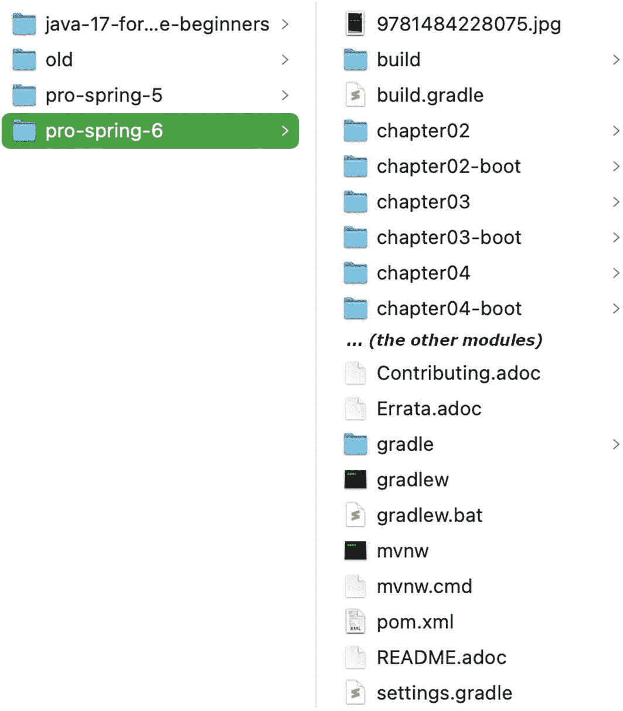
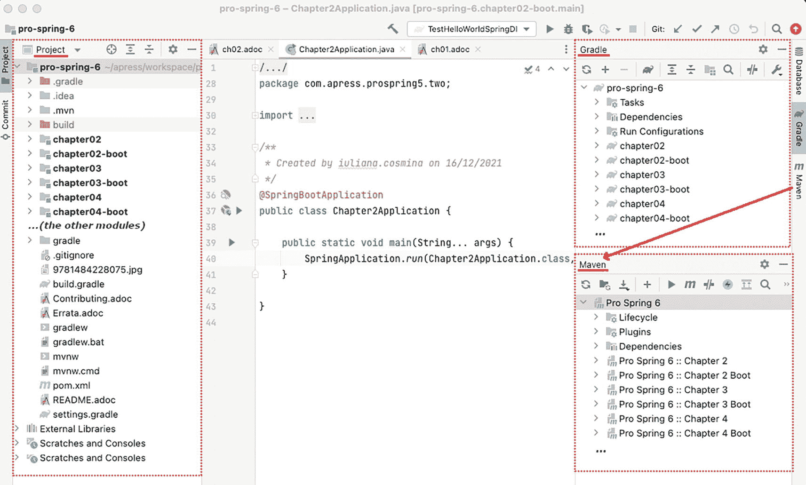
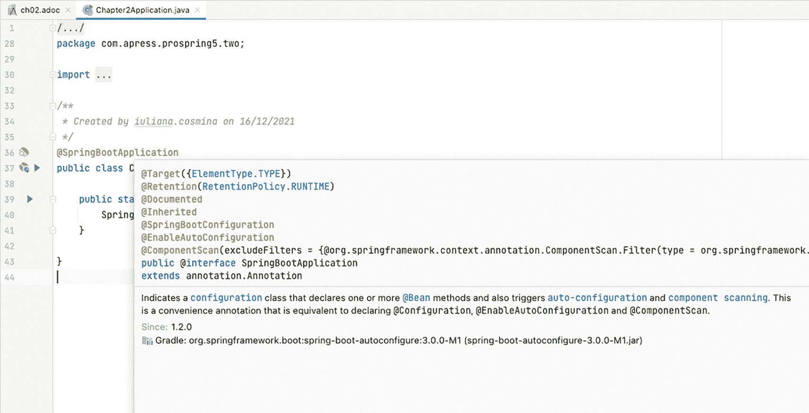
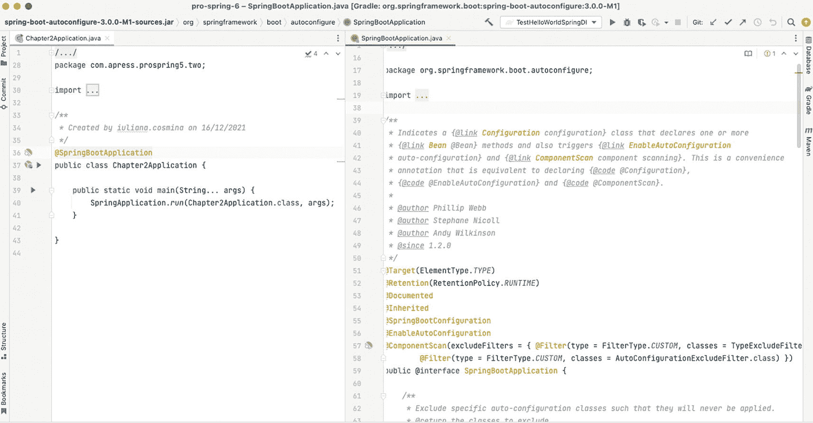
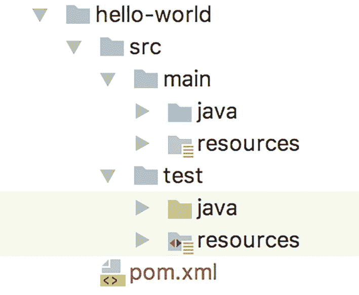
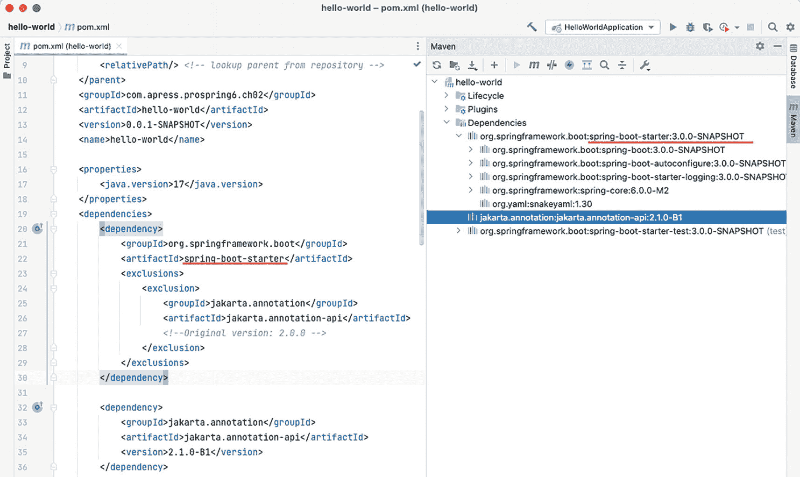
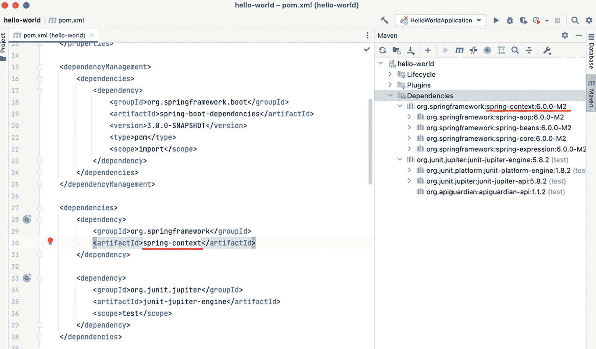
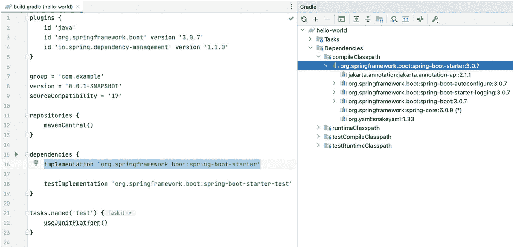
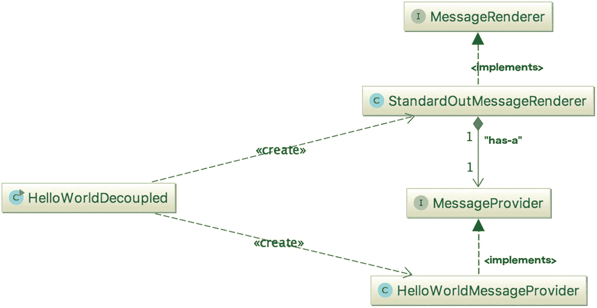
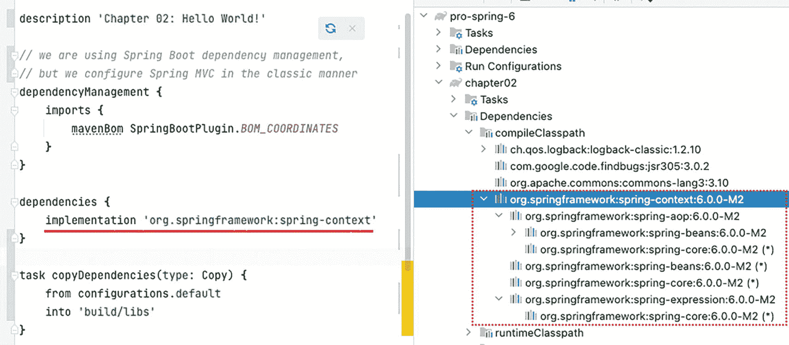

# 2. 入门指南

启动一个新项目时最困难的部分是搭建开发环境，这个过程涉及选择和优化工具，以便你能专注于编写代码。幸运的是，本书旨在让这一切变得更简单。本书的项目是一个使用 Spring 组件的 Java 项目，这意味着在编辑器、构建工具甚至 JDK 方面都有相当多的选择。

本章提供了你快速上手所需的所有基础知识，但首先让我们来看一些约定。


## 约定

本书采用了几种排版约定，旨在让阅读更轻松。为此，书中使用了以下约定：

表 2-1

特殊段落图标及其含义

| 图标 | 含义 |
| --- | --- |
| 图示为一个圆圈，内含字母 i。 | 你可能会觉得这很有用。 |
| 灯泡图标示意图。 | 你一定会觉得这很有用。 |
| 图示为一条水平线，上方有一团火焰。 | 这非常有用。 |
| 图示为一个圆圈，内含感叹号。 | 使用此功能时请小心。 |
| 图示为一个三角形，内含感叹号。 | 无论涉及什么内容，都建议不要这样做。 |
| 停车标志牌示意图。 | 无论涉及什么内容，都不要这样做。 |

*   段落中的代码或概念名称显示如下：`java.util.List`

*   代码清单和配置显示如下：

    ```
    public static void main(String... args) {
    System.out.println("Hello World!");
    }
    ```

*   控制台输出中的日志显示如下：

    ```
    01:24:07.809 [main] INFO c.a.Application - Starting Application
    01:24:07.814 [main] DEBUG c.a.p.c.Application - Running in debug mode
    ```

*   `{xx}` 是一个占位符，其中 `xx` 值是一个伪值，用于提示在命令或语句中应使用的真实值。例如，`{name_of_your_bean}` 表示在具体示例中，整个结构应替换为你自己的 bean 名称。

*   *斜体* 字体用于幽默的比喻、表达方式，以及需要与周围文本有所区分的片段。例如，在**第 1 章**中，好莱坞原则被表述为 *别打电话给我们，我们会打给你*。

*   **粗体** 字体用于章节引用和重要术语。

*   `(..)` 用于替代方法和构造函数中的参数声明和实参集合，以避免分散你对实际代码的注意力。

*   `...`​ 用于替代与上下文无关的代码、配置和日志。

*   包导入语句被精简到最少，仅显示与所讨论组件相关的部分。这是为了减少书中代码占用的篇幅，以便将更多空间用于更深入的讲解。当然，你可以在代码仓库中找到完整的代码！

*   每章都有一些脚注和链接，指向文档、工具和博客文章。不查阅这些内容也能阅读本书，因此可以忽略它们，但你可能会发现它们很有用。

*   某些段落会显示在矩形框中，并标有表 2-1 中的某个图标。该表也说明了每个图标的含义。

至于我的写作风格，我（Iuliana）喜欢用与同事和朋友进行技术交流的方式来写书，穿插一些笑话，提供生产环境示例，并与非编程场景进行类比。因为编程不过是另一种对现实世界建模的方式。

## 本书读者对象

本书假设你对 Java 以及 Java 应用程序开发中涉及的工具已有一定了解。如果你不熟悉，那可能也不是大问题，因为项目设置得非常清晰，即使你对 Gradle 和 Maven 的功能一无所知，也能构建它。此外，如果你使用推荐的编辑器 IntelliJ IDEA，你应该能够直接克隆仓库、构建项目，然后立即开始工作。

## 本书所需环境

你显然需要一台**计算机**，台式机或笔记本电脑均可，只要配置较新、运行 Windows、Linux 或 macOS 系统，并且能够连接**互联网**，具体选择并不重要。

你需要在本地安装 **JDK 17**。在任何操作系统上安装 JDK 17 的说明，请参阅 Oracle 官方页面上的 *JDK 安装指南*^(¹⁷)。

灯泡图标示意图。 对于任何基于 Unix 的系统，SDKMAN!^(¹⁸) 非常有用。SDKMAN! 是一个工具，用于在大多数基于 Unix 的系统上管理多个软件开发工具包的并行版本。它提供了一个便捷的命令行界面 (CLI) 和 API，用于安装、切换、移除和列出软件候选版本。它适用于 JDK、Gradle、Maven 以及更多工具。

如前所述，推荐的**编辑器**是 IntelliJ IDEA^(¹⁹)；你可以免费使用企业版 30 天，或者你也可以帮助测试早期访问版本。IntelliJ IDEA 是开发 Spring 应用程序的绝佳编辑器，因为它附带了一套强大的插件，能够按名称解析 XML 和 Java 配置类中的 bean，从而帮助你非常清楚地了解你的 bean 是否配置正确。如果你更熟悉 Eclipse IDE，可以尝试 Spring Tools 4^(²⁰)。

你需要**源代码**，书中引用的所有代码示例都来自这些源码。根据你获取本书相关项目的方式，你可能需要安装 **Git**^(²¹)。你可以使用命令行 Git 来克隆仓库，也可以使用 IDE，或者从仓库页面将源码下载为 zip 文件。

图示为一个圆圈，内含感叹号。 这是项目仓库页面：[`https://github.com/Apress/pro-spring-6`](https://github.com/Apress/pro-spring-6)

任何比 Java 库更复杂、并且需要运行 Spring 应用程序与之交互的服务的项目依赖项，都通过 Docker 容器提供；因此，你需要在计算机上安装 Docker^(²²)。关于如何下载镜像并启动它们的说明，请参阅相应章节的 `README.adoc` 文件。

总结一下你成为 Spring 专家所需的条件：本书、一台计算机、互联网、Java 17、Git、源代码、Docker，以及一点点时间和决心。


## 准备开发环境

以下是运行本书相关代码前需要完成的步骤列表：

*   舒适地坐在电脑前。

*   安装 JDK 17。

关键词工具示意图。 如果你安装了旧版本，请打开终端（Windows 系统上的命令提示符或 PowerShell）并运行 `java -version`，确保它是系统使用的默认版本。预期输出会提到 Java 版本 17，如代码清单 2-1 所示。



截图展示了两个面板。左侧面板选中了 `pro-spring-6` 标签页。右侧面板列出了所选选项。

图 2-1

`pro-spring-6` 项目及其模块

*   克隆项目仓库，或从 Apress 官方页面下载源码并解压到你的电脑上。你应该会得到一个名为 `pro-spring-6` 的目录，其中包含如图 2-1 所示的模块。

```
> java -version
java version "17.0.1" 2021-10-19 LTS
Java(TM) SE Runtime Environment (build 17.0.1+12-LTS-39)
Java HotSpot(TM) 64-Bit Server VM (build 17.0.1+12-LTS-39, mixed mode, sharing)
清单 2-1
命令 java -version 的输出，显示 JDK 17 被设置为默认版本
```



`pro-spring-6-chapter 2 application dot java` 的截图展示了三个面板。左侧面板显示项目，中间面板显示章节描述，右上方面板显示 Gradle，底部面板显示 Maven。

图 2-2

`pro-spring-6` 项目、Gradle 和 Maven 视图

*   打开 IntelliJ IDEA 编辑器，在主菜单中选择 File ➤ Open​，在打开的文件选择器窗口中，选择 `pro-spring-6` 目录。稍等片刻后，在左侧（我们将在书中称之为*项目视图*的面板中），你应该会看到 `pro-spring-6` 项目及其列出的模块。在窗口右侧，你应该会看到一个显示 Gradle 配置的部分（我们在本书中称之为*Gradle 视图*）和一个显示 Maven 配置的部分（我们称之为*Maven 视图*）。这三个视图都显示在图 2-2 中。

该项目由多个模块组成，每个模块代表一个 Java 项目。每个模块的名称对应其内容被引用的章节。根据上下文和涵盖的主题，每个章节有两个或更多关联的模块。名称以 `-boot` 结尾的是 Spring Boot 项目。名称不以 `-boot` 结尾的只是使用 Spring 的 Java 项目，因为，是的，你可以在不使用 Spring Boot 的情况下使用 Spring。我们称这些为*经典 Spring 项目*，因为这是在 Spring Boot 出现之前开发 Spring 应用程序的方式。该项目依赖许多库，当项目首次在编辑器中打开时，这些库将自动下载。

该项目同时具有 Gradle 配置和 Maven 配置；使用你觉得最舒服的那个。根据其 `README.adoc` 文件中的说明，克隆后即可直接构建项目。项目不需要本地安装 Gradle 或 Maven，因为两者都配置为使用包装器。

在编写本章时，用于构建项目的 Gradle 版本是 7.4。本书发布时版本可能会发生变化，但版本号会在主 `README.adoc` 文件和 Gradle 包装器配置文件 `gradle/wrapper/gradle-wrapper.properties` 中提及。

类似地，在撰写本文时，用于构建项目的 Maven 版本是 3.8.4。本书发布时版本可能会发生变化，但版本号会在主 `README.adoc` 文件和 Maven 包装器配置文件 `.mvn/wrapper/maven-wrapper.properties` 中提及。

IntelliJ IDEA 会识别包装器配置，并使用其中任何一个来构建你的项目。如果你想从界面显式触发任何包装器配置，只需单击 Gradle 视图和 Maven 视图左上角看到的 刷新图标示意图，由两个弯曲的箭头表示，一个向左，其下方另一个箭头向右。符号。

灯泡图标示意图。 IntelliJ IDEA 会在内部维护项目的状态，有时会……*嗯*……感到困惑。如果你的项目显示类名红色并提示缺少依赖项，请尝试按照 `README.adoc` 文件中的说明从命令行构建它。如果这样可行，你可以尝试 File 菜单下的以下选项之一：*Invalidate Caches...*、*Reload All from Disk*、*Restart IDE*、*Repair IDE...*。

现在，你已经成功在电脑上加载并构建了项目，在解释 `pro-spring-6` 项目的 Maven 和 Gradle 配置之前，我们将告诉你更多关于 Spring 内部机制的信息。

## 理解 Spring 打包

Spring 打包是模块化的；它允许你挑选要在应用程序中使用的组件，并在分发应用程序时仅包含这些组件。Spring 有许多模块，但根据应用程序的需求，你只需要这些模块的一个子集。每个模块都有其编译后的二进制代码，位于一个 JAR 文件中，并附有相应的 Javadoc 和源码 JAR。IntelliJ IDEA 会扫描项目的依赖项，并根据请求下载源码和 Javadoc。这意味着你可以在编辑器中查看代码并阅读关于 Spring 类的信息。

当鼠标悬停在类名上时，会显示一个矩形框，其中包含该类的 Javadoc，如图 2-3 中 `@SpringBootApplication` 注解所示。



截图展示了第 2 章应用程序的代码行，并重叠了一个配置详情框。

图 2-3

IntelliJ IDEA 显示 `@SpringBootApplication` 注解的 Javadoc

你也可以选择按下 Ctrl（macOS 为 Command）键并单击类名，IntelliJ IDEA 将下载其源码并在新标签页中打开。在图 2-4 中，你可以在右侧看到 `@SpringBootApplication` 注解的源码。



截图包含两个面板。左侧是第 2 章应用程序的 Java 代码行。右侧面板展示了 Spring Boot 应用程序的 Java 代码行。

图 2-4

IntelliJ IDEA 显示 `@SpringBootApplication` 注解的源码

回到 Spring 模块。*Spring 模块* 就是打包了该模块所需代码的 JAR 文件。Spring 框架的代码库在 GitHub 上公开可用。如果你对 Spring 框架的代码长什么样感到好奇，并希望处于 Spring 开发的最前沿，请从 Spring 的 GitHub 仓库^(²³)查看最新版本的源码。

在理解了每个模块的用途之后，你可以选择项目中所需的模块并将其包含到代码中。根据 GitHub 上最新的标签，Spring 框架 6.0 版本似乎包含 22 个模块。表 2-2 描述了这些 JAR 文件及其对应的模块。实际的 JAR 文件名例如 `spring-aop-6.0.0.jar`，但为简洁起见，我们只包含了特定的模块部分（例如 `aop`）。

表 2-2

Spring 模块


| 模块 | 描述 |
| --- | --- |
| `aop` | 此模块包含在应用程序中使用 Spring AOP 功能所需的所有类。如果你计划使用 Spring 中其他利用 AOP 的功能（例如声明式事务管理），也需要在应用程序中包含此 JAR。此外，支持与 AspectJ 集成的类也打包在此模块中。 |
| `aspects` | 此模块包含用于与 AspectJ AOP 库进行高级集成的所有类。例如，如果你使用 Java 类进行 Spring 配置，并且需要 AspectJ 风格的注解驱动事务管理，则需要此模块。 |
| `beans` | 此模块包含支持 Spring 操作 Spring Bean 的所有类。此模块中的大部分类支持 Spring 的 Bean 工厂实现。例如，处理 Spring XML 配置文件和 Java 注解所需的类都打包在此模块中。 |
| `context` | 此模块包含为 Spring Core 提供许多扩展的类。你会发现，所有需要使用 Spring 的 `ApplicationContext` 功能（详见**第** **5****章**）的类，以及用于企业 JavaBean (EJB)、Java 命名和目录接口 (JNDI) 和 Java 管理扩展 (JMX) 集成的类都在此模块中。此模块还包含 Spring 远程调用类、与动态脚本语言（例如 JRuby、Groovy 和 BeanShell）集成的类、JSR-303（“Bean 验证”）、调度和任务执行等。 |
| `context-indexer` | 此模块包含一个索引器实现，用于访问在 `META-INF/spring.components` 中定义的候选组件。核心类 `CandidateComponentsIndex` 不供外部使用。 |
| `context-support` | 此模块包含对 `spring-context` 模块的进一步扩展。在用户界面方面，包含用于邮件支持以及与模板引擎（如 Velocity、FreeMarker 和 JasperReports）集成的类。此外，与各种任务执行和调度库（包括 CommonJ 和 Quartz）的集成也打包在此处。 |
| `core` | 这是每个 Spring 应用程序都需要的主要模块。在此 JAR 文件中，你可以找到所有其他 Spring 模块共享的所有类（例如，用于访问配置文件的类）。此外，在此 JAR 中，你还可以找到精选的、在 Spring 代码库中广泛使用且可在你自己的应用程序中使用的极其有用的工具类。 |
| `expression` | 此模块包含 Spring 表达式语言 (SpEL) 的所有支持类。 |
| `instrument` | 此模块包含用于 JVM 引导的 Spring 检测代理。在 Spring 应用程序中使用 AspectJ 进行加载时织入时需要此 JAR 文件。 |
| `jcl` | 此模块仅用于与现有的 Commons Logging 用法（例如在 Apache Commons Configuration 中）保持二进制兼容性。 |
| `jdbc` | 此模块包含 JDBC 支持的所有类。所有需要数据库访问的应用程序都需要此模块。用于支持数据源、JDBC 数据类型、JDBC 模板、原生 JDBC 连接等的类都打包在此模块中。 |
| `jms` | 此模块包含 Java 消息服务 (JMS) 支持的所有类。 |
| `messaging` | 此模块包含从 Spring Integration 项目中提取的关键抽象，作为基于消息的应用程序的基础，并增加了对简单或流式文本定向消息协议 (STOMP) 消息的支持。 |
| `orm` | 此模块通过支持流行的 ORM 工具（包括 Hibernate、JDO 和 JPA）来扩展 Spring 的标准 JDBC 功能集。此 JAR 中的许多类依赖于 `spring-jdbc` JAR 文件中包含的类，因此你的应用程序也绝对需要包含该文件。 |
| `oxm` | 此模块提供对对象/XML 映射 (OXM) 的支持。用于抽象 XML 编组和解组以及支持流行工具（如 Castor、JAXB、XMLBeans 和 XStream）的类都打包在此模块中。 |
| `r2dbc` | 此模块使 R2DBC 更易于使用，并降低了常见错误发生的可能性。它提供了简单的错误处理和一整套与底层响应式数据库管理器 (RDBM) 无关的、简洁的非受检异常。 |
| `test` | Spring 提供了一组模拟类来帮助测试你的应用程序，其中许多模拟类在 Spring 测试套件中使用，因此它们经过了良好的测试，并使测试你的应用程序变得更加简单。当然，我们在 Web 应用程序的单元测试中发现了模拟 `HttpServletRequest` 和 `HttpServletResponse` 类的巨大用途。另一方面，Spring 与 JUnit 单元测试框架紧密集成，此模块提供了许多支持开发 JUnit 测试用例的类；例如，`SpringExtension` 将 *Spring TestContext Framework* 集成到 JUnit 5 的 *Jupiter* 编程模型中。 |
| `tx` | 此模块提供支持 Spring 事务基础设施的所有类。你可以找到从事务抽象层到支持 Java 事务 API (JTA) 以及与主要供应商的应用服务器集成的类。 |
| `web` | 此模块包含在 Web 应用程序中使用 Spring 的核心类，包括用于自动加载 `ApplicationContext` 功能的类、文件上传支持类，以及用于执行重复性任务（例如从查询字符串中解析整数值）的一批有用类。 |
| `webflux` | 此模块包含 Spring Web 响应式模型的核心接口和类。 |
| `webmvc` | 此模块包含 Spring 自身 MVC 框架的所有类。如果你的应用程序使用单独的 MVC 框架，则不需要此 JAR 文件中的任何类。Spring MVC 在**第** **15****章**中有更详细的介绍。 |
| `websocket` | 此模块提供对 JSR-356（“Java WebSocket API”）的支持。 |


如果你使用 Spring Boot，则无需显式选择要添加为依赖项的 Spring 模块，因为会根据所使用的 Spring Boot 启动器依赖项自动配置相应的 Spring 依赖项集。Spring Boot 的代码库也在 GitHub 上公开。如果你对 Spring Boot 代码的样子感到好奇，并希望处于 Spring Boot 开发的前沿，请查看 Spring 的 GitHub 仓库中的最新版本源代码^(²⁴)。在 `spring-boot-project/spring-boot-starters` 下，有一系列 Spring Boot 启动器模块，这些模块可以作为 Spring 项目的依赖项，用于构建特定类型的 Spring 应用程序，并带有默认配置和精选的依赖项集。这些模块本质上只是依赖描述符，可以添加到 `pom.xml` 的 `<dependencies>` 部分下。它们也可以与 Gradle 项目一起使用。目前有超过 30 个这样的模块，表 2-3 列出了最常用的一些模块以及它们为你的应用程序配置的依赖项。

表 2-3

Spring Boot 启动器模块

| 模块 | 描述 |
| --- | --- |
| `spring-boot-starter` | 这是最简单的 Spring Boot 启动器，它将 `spring-core` 库作为依赖项添加到你的项目中。它可用于创建一个非常简单的 Spring 应用程序。它主要用于学习目的和创建基础项目，并封装了项目中其他模块共享的通用功能。 |
| `spring-boot-starter-aop` | 将 `spring-aop` 库作为依赖项添加到你的项目中。 |
| `spring-boot-starter-data-*` | 这种类型的启动器为在你的项目中处理数据添加了各种 Spring 依赖项。`*` 替换为数据来源的技术。例如，`spring-boot-starter-data-jdbc` 添加了用于创建 Spring Repository Bean 的类，以处理来自支持 JDBC 驱动程序的数据库的数据：MySQL、PostgreSQL、Oracle 等。 |
| `spring-boot-starter-web` | 配置用于创建 Web 应用程序的最小依赖项。 |
| `spring-boot-starter-security` | 配置用于保护 Spring Web 应用程序安全的最小依赖项。 |
| `spring-boot-starter-webflux` | 配置用于创建响应式 Web 应用程序的最小依赖项。 |
| `spring-boot-starter-actuator` | 配置 Spring Boot Actuator，它启用一组用于监控 Spring Web 应用程序的端点。 |
| `spring-boot-starter-test` | 配置以下库集：Spring Test、JUnit、Hamcrest 和 Mockito。 |

## 为你的应用程序选择模块

如果没有像 Maven 或 Gradle 这样的依赖管理工具，为你的应用程序选择使用哪些模块可能会有点棘手。例如，如果你只需要 Spring 的 Bean 工厂和 DI 支持，你仍然需要几个模块，包括 `spring-core`、`spring-beans`、`spring-context` 和 `spring-aop`。如果你需要 Spring 的 Web 应用程序支持，那么你需要进一步添加 `spring-web` 等等。得益于构建工具的特性，例如 Maven 的传递依赖支持，所有必需的第三方库都将自动包含在内。

### 在 Maven 仓库中访问 Spring 模块

由 Apache 软件基金会创立的 Maven^(²⁵) 已成为管理 Java 应用程序依赖项最流行的工具之一，从开源环境到企业环境皆是如此。Maven 是一个强大的应用程序构建、打包和依赖管理工具。它管理应用程序的整个构建周期，从资源处理和编译到测试和打包。还存在大量用于各种任务的 Maven 插件，例如更新数据库以及将打包的应用程序部署到特定服务器（例如：Tomcat、WildFly 或 WebLogic）。在撰写本文时，当前的 Maven 版本是 3.8.4。

几乎所有开源项目都支持通过 Maven 仓库分发库。最流行的是托管在 Apache 上的 Maven 中央仓库，你可以访问 Maven 中央仓库网站^(²⁶) 搜索工件是否存在及其相关信息。如果你将 Maven 下载并安装到你的开发机器上，你将自动获得对 Maven 中央仓库的访问权限。其他一些开源社区（例如，JBoss 和 Spring）也为其用户提供自己的 Maven 仓库。但是，要能够访问这些仓库，你需要将仓库添加到你的 Maven 设置文件或项目的 POM 文件中。（你可以在 `pro-spring-6/pom.xml` 中看到这样的示例；只需查找 `<repositories>` 元素即可。）

对 Maven 的详细讨论不在本书的范围内，你始终可以参考在线文档或书籍，它们会为你提供关于 Maven 的详细参考。但是，由于 Maven 被广泛采用，因此值得提及 Maven 仓库上项目打包的典型结构。

每个 Maven 工件由*组 ID*、*工件 ID*、*打包类型*和*版本*标识。例如，对于 `log4j-core`，组 ID 是 `org.apache.logging.log4j`，工件 ID 是 `log4j-core`，打包类型是 `jar`。在此之下，定义了不同的版本。例如，对于版本 `2.17.1`，工件的文件名在组 ID、工件 ID 和版本文件夹下变为 `log4j-core-2.17.1.jar`。Maven 配置文件是用 XML 编写的，并且必须遵守由 [`https://maven.apache.org/maven-v4_0_0.xsd`](https://maven.apache.org/maven-v4_0_0.xsd) 模式定义的 Maven 标准语法。项目的 Maven 配置文件的默认名称是 `pom.xml`，清单 2-2 显示了一个示例文件。

```
4.0.0
com.apress.prospring6.ch02
hello-world
jar
5.0-SNAPSHOT
hello-world

org.apache.logging.log4j
log4j-core
2.17.1

...

清单 2-2
pom.xml 片段
```

Maven 还定义了一个典型的标准化项目结构，如图 2-5 所示。



项目结构从上到下如下所示。Hello world，s r c，main 包含 java 和 resources，test 包含 java 和 resources，以及 p o m dot x m l。

图 2-5

Maven 典型项目结构

`main` 目录在 `java` 目录中包含应用程序代码库，在 `resources` 目录中包含应用程序配置文件。`test` 目录在 `java` 目录中包含应用程序测试代码，在 `resources` 目录中包含应用程序测试配置文件。

访问 Spring 模块并将它们作为依赖项添加到项目中，与本节到目前为止展示的内容非常相似，但 Spring Boot 的依赖管理甚至可以用于不使用 Spring Boot 的 Spring 项目，这确保了添加到项目中的传递依赖项将始终保持稳定且相互兼容。但首先，让我们向你介绍 Gradle。


### 使用 Gradle 访问 Spring 模块

Maven 项目的标准结构以及工件分类和组织方式非常重要，因为 Gradle^(²⁷) 遵循相同的规则，甚至使用 Maven 中央仓库来检索工件。此外，也可以配置其他各种仓库。Gradle 是一个强大的构建工具，它摒弃了臃肿的 XML 配置，转而采用 Groovy 的简洁性和灵活性。这非常好，并提供了极大的灵活性，除非开发者在配置上过于“创意”。在撰写本文时，Gradle 的当前版本是 7.3.3。从 4.x 版本开始，Spring 团队已转而使用 Gradle 来配置所有 Spring 产品。因此，本书的源代码也可以使用 Gradle 构建和执行。Gradle 配置文件的默认名称是 `build.gradle`。前面展示的 `pom.xml` 文件（嗯，它的一个版本）的等效文件如清单 2-3 所示。

```
group 'com.apress.prospring6.ch02'
version '6.0-SNAPSHOT'
apply plugin: 'java'
repositories {
mavenCentral()
}
tasks.withType(JavaCompile) {
options.encoding = "UTF-8"
}
dependencies {
compile group: 'org.apache.logging.log4j', name: 'log4j-core', version: '2.17.1'
...
}
清单 2-3
build.gradle 片段
```

这样可读性更强了，对吧？正如你所见，工件使用之前 Maven 中介绍的 *group*、*artifact* 和 *version* 来标识，但属性名称有所不同。Gradle 也不在本书的讨论范围内，但书中会偶尔提及。

### 使用 Spring Boot 依赖管理

如前所述，你可以使用 Spring Boot 启动器项目作为父项目，为你的项目提供最少的依赖项集和默认配置。通过将 `spring-boot-starter-parent` 声明为父项目，即可启用 Spring Boot 依赖管理，这意味着将为项目设置默认的应用程序配置和完整的依赖树。清单 2-4 展示了一个使用 `spring-boot-starter` 作为依赖项的 Maven 配置文件。由于我们使用的是 Spring Boot SNAPSHOT 版本，因此也配置了 [`https://repo.spring.io/snapshot`](https://repo.spring.io/snapshot) 仓库（标记为 2 的行）。

```
4.0.0

org.springframework.boot
spring-boot-starter-parent
3.0.0-SNAPSHOT

com.apress.prospring6.ch02
hello-world
6.0-SNAPSHOT
hello-world

org.springframework.boot
spring-boot-starter

org.springframework.boot
spring-boot-starter-test
test

org.springframework.boot
spring-boot-maven-plugin

spring-milestones
https://repo.spring.io/milestone

spring-snapshot
https://repo.spring.io/snapshot

清单 2-4
使用 spring-boot-starter 作为父项目的 pom.xml
```

请注意，文件中除了项目版本之外，唯一声明的版本就是 `spring-boot-starter-parent` 的版本。无需为 Spring Boot 或 Spring 依赖项指定任何版本，因为它们已经是 `spring-boot-starter-parent` 引入的配置的一部分。如果你觉得难以置信，只需打开 IntelliJ IDEA 的 Maven 视图并展开 `Dependencies` 节点。你应该会看到 `pom.xml` 文件中声明的依赖项，并注意到它们都附带了版本号，即使你没有指定。此外，请注意它们的依赖项——你项目的传递性依赖项——也有版本号，最棒的是，你可以在项目中声明这些依赖项中的任何一个并覆盖其版本。

所以，当然，Spring Boot 强制了很多默认设置，但它也很容易定制，并且这种说法同样适用于依赖项和 Java 配置。图 2-6 显示了由清单 2-4 中的配置文件配置的 Maven 依赖项；只有 `jakarta.annotation-api` 依赖项的版本被覆盖为 2.1.0-B1。



2 张标题为 hello-world-pom dot x m l 的截图。左侧截图描述了项目 hello world。右侧截图顶部显示 Maven。

图 2-6

为 *jakarta.annotation-api* 定制了版本的 Maven Spring Boot 项目

将 `spring-boot-starter-parent` 作为项目的父项目并不总是很方便。实际项目有自己共享的、不受 Spring Boot 管理的层次结构和依赖项。方便的做法是在可能的情况下进行适当的依赖管理，这可以通过移除 `<parent>` 配置并将其替换为清单 2-5 中所示的 `<dependencyManagement>` 配置来实现。

```

org.springframework.boot
spring-boot-dependencies
3.0.0-SNAPSHOT
pom
import

清单 2-5
不使用 spring-boot-starter-parent 的 Spring Boot 项目 Maven 配置
```

最棒的是，Spring Boot 依赖管理甚至可以在一个经典的 Spring 项目中使用——即不使用任何 Spring Boot 启动器依赖项的项目。图 2-7 展示了一个非常简单的 Spring 项目 Maven 配置，它只声明了 `spring-context` 和 `junit-jupiter-engine` 作为依赖项。请注意，这两个依赖项没有指定版本，但在 Maven 视图中我们可以清楚地看到依赖项的版本。这是通过从 `spring-boot-dependencies` 的 pom 工件导入版本实现的。




两张标题为“hello-world-pom.xml”的截图。左侧截图展示了“hello world”项目，其中`artifactId`被高亮显示，`spring-context`被加了下划线。右侧截图显示的是 Maven 界面，其中依赖项已被选中，并且`spring-context 6.0.0-M2`被加了下划线。

图 2-7

使用 Spring Boot 提供依赖管理的 Maven Spring（经典）项目

在 Gradle 中，与此等效的是什么？由于 Gradle 没有类似 Maven 的父级概念，依赖管理是通过`io.spring.dependency-management`插件完成的。清单 2-6 展示了一个与清单 2-4 中所示的 Maven 配置类似的 Gradle 配置。

```
plugins {
    id 'org.springframework.boot' version '3.0.0-SNAPSHOT'
    id 'io.spring.dependency-management' version '1.0.11.RELEASE'
    id 'java'
}
group = 'com.apress.prospring6.ch02'
version = '6.0-SNAPSHOT'
sourceCompatibility = '17'
repositories {
    mavenCentral()
    maven { url 'https://repo.spring.io/milestone' }
    maven { url 'https://repo.spring.io/snapshot' }
}
dependencies {
    implementation 'org.springframework.boot:spring-boot-starter'
    testImplementation 'org.springframework.boot:spring-boot-starter-test'
}
...
清单 2-6
简单的 Spring Boot 项目 Gradle 配置
```

使用 Gradle 也可以覆盖 Spring Boot 管理的依赖版本。图 2-8 展示了 IntelliJ IDEA 的 Gradle 视图，其中显示了由 Spring Boot 依赖管理引入的依赖项，以及用于覆盖版本的 Gradle 配置语法。



两张截图，附带一行代码，显示`build.gradle`文件包含 Spring Boot 项目的插件声明、依赖配置和任务设置。它包括 Java、Spring Boot 和依赖管理的插件，以及各种 Spring Boot 起步依赖和测试框架的依赖项。

图 2-8

为`jakarta.annotation-api`定制了版本的自定义 Gradle Spring Boot 项目

由于 Gradle 中的 Spring Boot 依赖管理是通过插件实现的，因此配置使用依赖管理的 Spring 经典项目是可行的，无需对配置进行任何额外更改，只需移除起步依赖并将其替换为所需的 Spring 依赖即可。

在组织成多个模块的大型项目中，配置可能会变得更加复杂，简化配置意味着创建可在模块中复用的配置模板。`pro-spring-6`项目就是按这种方式组织的；根目录下的`build.gradle`和`pom.xml`文件包含了所有模块共享的配置。在必要时，模块配置文件用于覆盖依赖版本并声明它们自己的依赖项。

Gradle 配置更易读、更简洁，但在大型项目中，缺乏标准可能会导致任务实现变得复杂，因为声明任务的唯一限制是开发者对 Groovy 的理解程度。然而，Maven 凭借其所有依赖和插件都通用的 XML 标准模式，非常一致且易于初学者学习。

## 使用 Spring 文档

Spring 之所以成为构建真实应用的开发者如此有用的框架，其特点之一就是拥有大量编写精良、准确无误的文档。在每个版本中，Spring 框架的文档团队都努力确保所有文档都由开发团队完成并打磨。这意味着 Spring 的每个特性不仅在 Javadoc 中有完整记录，而且在每个发行版附带的 Spring 参考手册中也有涵盖。如果你还没有熟悉 Spring Javadoc 和参考手册，现在就去熟悉吧。本书并不能替代这些资源；相反，它是一本补充性的参考书，演示了如何从头开始构建一个基于 Spring 的应用程序。

你可以像之前提到的那样，通过 IntelliJ IDEA 编辑器访问 Spring Javadoc，但如果你更喜欢在浏览器中访问，可以将此 URL 加入书签：[`https://docs.spring.io/spring-framework/docs/current/javadoc-api`](https://docs.spring.io/spring-framework/docs/current/javadoc-api)。

如需更深入地了解 Spring 框架，你还可以将官方参考文档的 URL 加入书签：[`https://docs.spring.io/spring-framework/docs/current/reference/html`](https://docs.spring.io/spring-framework/docs/current/reference/html)。

## 让 Spring 融入 Hello World

在本书的这个阶段，我们乐观地认为你已经确信 Spring 是一个坚实、支持良好的项目，具备成为优秀应用开发工具的所有要素，并且深入理解它不仅能让你成为更好的开发者，还能促进你的职业发展。然而，还缺少一样东西——我们还没有向你展示任何代码。我们确信你迫不及待地想看到 Spring 的实际应用，既然我们不能再不深入代码了，那就让我们开始吧。如果你不完全理解本节中的所有代码，请不要担心；随着我们深入本书，我们会对所有主题进行更详细的讲解。


### 构建示例 Hello World 应用程序

现在，我们确信您对传统的 Hello World 示例已经很熟悉了，但以防您在过去 30 年里一直与世隔绝，代码清单 2-7 中的代码片段展示了其 Java 版本的完整面貌。

```
package com.apress.prospring6.two;
public class HelloWorld {
public static void main(String... args) {
System.out.println("Hello World!");
}
}
代码清单 2-7
经典 Hello World Java 项目
```

就示例而言，这个程序相当简单——它能完成任务，但扩展性不强。如果我们想更改消息内容怎么办？如果我们想以不同的方式输出消息，比如输出到标准错误流而不是标准输出流，或者用 HTML 标签包裹而不是纯文本，又该怎么办？我们将重新定义这个示例应用程序的需求：它必须支持一种简单、灵活的机制来更改消息，并且必须易于更改渲染行为。在基本的 Hello World 示例中，您只需适当修改代码，就能快速轻松地实现这两种更改。然而，在更大的应用程序中，重新编译需要时间，并且要求应用程序再次进行全面测试。更好的解决方案是将消息内容外部化，并在运行时读取它，例如从命令行参数中读取，如代码清单 2-8 所示。

```
package com.apress.prospring6.two;
public class HelloWorldWithCommandLine {
public static void main(String... args) {
if (args.length > 0) {
System.out.println(args[0]);
} else {
System.out.println("Hello World!");
}
}
}
代码清单 2-8
带参数的经典 Hello World Java 项目
```

这个示例实现了我们的目标——现在我们可以不修改代码就更改消息内容。然而，这个应用程序仍然存在一个问题：负责渲染消息的组件同时也负责获取消息。更改消息的获取方式意味着要修改渲染器中的代码。此外，我们仍然无法轻松更改渲染器；这样做意味着要修改启动应用程序的类。

如果我们进一步推进这个应用程序（超越 Hello World 的基础），更好的解决方案是将渲染逻辑和消息检索逻辑重构为独立的组件。此外，如果我们真的想让应用程序变得灵活，应该让这些组件实现接口，并使用这些接口定义组件与启动器之间的相互依赖关系。通过重构消息检索逻辑，我们可以定义一个简单的 `MessageProvider` 接口，其中包含一个方法 `getMessage()`，如代码清单 2-9 所示。

```
package com.apress.prospring6.two.decoupled;
public interface MessageProvider {
String getMessage();
}
代码清单 2-9
MessageProvider 接口
```

所有能够渲染消息的组件都实现了 `MessageRenderer` 接口，代码清单 2-10 描述了这样一个组件。

```
package com.apress.prospring6.two.decoupled;
public interface MessageRenderer {
void render();
void setMessageProvider(MessageProvider provider);
MessageProvider getMessageProvider();
}
代码清单 2-10
MessageRenderer 接口
```

如您所见，`MessageRenderer` 接口声明了一个方法 `render()`，以及一个 JavaBean 风格的方法 `setMessageProvider()`。任何 `MessageRenderer` 的实现都与消息检索解耦，并将该职责委托给提供给它的 `MessageProvider` 实例。

在这里，`MessageProvider` 是 `MessageRenderer` 的一个依赖项。创建这些接口的简单实现很容易，如代码清单 2-11 所示。

```
package com.apress.prospring6.two.decoupled;
public class HelloWorldMessageProvider implements MessageProvider {
@Override
public String getMessage() {
return "Hello World!";
}
}
代码清单 2-11
MessageProvider 实现
```

您可以看到，我们创建了一个简单的 `MessageProvider`，它始终返回 "Hello World!" 作为消息。代码清单 2-12 中所示的 `StandardOutMessageRenderer` 类也同样简单。

```
package com.apress.prospring6.two.decoupled;
import static java.lang.System.*;
public class StandardOutMessageRenderer implements MessageRenderer {
private MessageProvider messageProvider;
public StandardOutMessageRenderer(){
out.println(" --> StandardOutMessageRenderer: constructor called");
}
@Override
public void render() {
if (messageProvider == null) {
throw new RuntimeException(
"You must set the property messageProvider of class:"
+ StandardOutMessageRenderer.class.getName());
}
out.println(messageProvider.getMessage());
}
@Override
public void setMessageProvider(MessageProvider provider) {
out.println(" --> StandardOutMessageRenderer: setting the provider");
this.messageProvider = provider;
}
@Override
public MessageProvider getMessageProvider() {
return this.messageProvider;
}
}
代码清单 2-12
MessageRenderer 实现
```

现在剩下的就是重写入口类的 `main(..)` 方法，如代码清单 2-13 所示。

```
package com.apress.prospring6.two.decoupled;
public class HelloWorldDecoupled {
public static void main(String... args) {
MessageRenderer mr = new StandardOutMessageRenderer();
MessageProvider mp = new HelloWorldMessageProvider();
mr.setMessageProvider(mp);
mr.render();
}
}
代码清单 2-13
新的 main(..) 方法
```

图 2-9 描绘了到目前为止构建的应用程序的抽象架构。



一个流程图，展示了从 Hello World 消息提供者，通过消息提供者和标准输出消息渲染器（由 Hello World 解耦创建）流向消息渲染器的过程。

图 2-9

一个更加解耦的 Hello World 应用程序

这里的代码相当简单：

*   我们实例化了 `HelloWorldMessageProvider` 和 `StandardOutMessageRenderer` 的实例，尽管声明的类型分别是 `MessageProvider` 和 `MessageRenderer`。这是因为在编程逻辑中，我们只需要与接口提供的方法进行交互，而 `HelloWorldMessageProvider` 和 `StandardOutMessageRenderer` 已经分别实现了这些接口。

*   然后，我们将 `MessageProvider` 传递给 `MessageRenderer`，并调用 `MessageRenderer#render()`。

如果我们编译并运行这个程序，会得到预期的 "Hello World!" 输出。现在，这个示例更接近我们想要的效果，但还有一个小问题。更改 `MessageRenderer` 或 `MessageProvider` 接口的任何实现都意味着要修改代码。

为了解决这个问题，我们需要将获取两个实现类型并实例化它们的职责委托给其他人。最*手动*的方式是创建一个简单的工厂类，该类从属性文件中读取实现类名，并代表应用程序实例化它们，如代码清单 2-14 所示。


```
package com.apress.prospring6.two.decoupled;
import java.util.Optional;
import java.util.Properties;
public class MessageSupportFactory {
private static MessageSupportFactory instance;
private Properties props;
private MessageRenderer renderer;
private MessageProvider provider;
private MessageSupportFactory() {
props = new Properties();
try {
props.load(this.getClass().getResourceAsStream("/msf.properties"));
String rendererClass = props.getProperty("renderer.class");
String providerClass = props.getProperty("provider.class");
renderer = (MessageRenderer) Class.forName(rendererClass).getDeclaredConstructor().newInstance();
provider = (MessageProvider) Class.forName(providerClass).getDeclaredConstructor().newInstance();
} catch (Exception ex) {
ex.printStackTrace();
}
}
static {
instance = new MessageSupportFactory();
}
public static MessageSupportFactory getInstance() {
return instance;
}
public Optional getMessageRenderer() {
return renderer != null?  Optional.of(renderer) : Optional.empty();
}
public Optional getMessageProvider() {
return provider!= null?  Optional.of(provider) : Optional.empty();
}
}
清单 2-14
负责检索两种实现类型并实例化它们的实例工厂类
```

这里的实现简单且基础，错误处理过于简化，配置文件名是硬编码的，但我们已经有了相当数量的代码。该类的配置文件非常简单，如清单 2-15 所示。

```
renderer.class=com.apress.prospring6.ch2.decoupled.StandardOutMessageRenderer
provider.class=com.apress.prospring6.ch2.decoupled.HelloWorldMessageProvider
清单 2-15
MessageSupportFactory 类的配置文件内容，即 msf.properties 文件的内容
```

配置文件必须位于项目的类路径中。当从 IntelliJ IDEA 运行时，该文件位于 `chapter02/src/main/resources` 目录下，并在运行代码时被添加到类路径中。

为了将检索 `MessageProvider` 和 `MessageRenderer` 实例的职责委托给 `MessageSupportFactory`，必须修改 `main(..)` 方法，如清单 2-16 所示。

```
package com.apress.prospring6.two.decoupled;
public class HelloWorldDecoupledWithFactory {
public static void main(String... args) {
MessageRenderer mr = MessageSupportFactory.getInstance().getMessageRenderer()
.orElseThrow(() -> new IllegalArgumentException("Service of type 'MessageRenderer' was not found!"));
MessageProvider mp = MessageSupportFactory.getInstance().getMessageProvider()
.orElseThrow(() -> new IllegalArgumentException("Service of type 'MessageProvider' was not found!"));
mr.setMessageProvider(mp);
mr.render();
}
}
清单 2-16
使用 MessageSupportFactory 的 HelloWorld 版本
```

然而，还有另一种使用纯 Java 实现此功能的方法，无需创建 `MessageSupportFactory` 类，因为 `java.util` 包中已经有一个名为 `ServiceLoader` 的类可以完成完全相同的工作。该类在 Java 6 中引入，用于方便地发现和加载与给定接口匹配的实现。该类检索其实现的接口被称为*服务提供者接口（Service Provider Interface，SPI）*。

这种方法与 `MessageSupportFactory` 类似，只是配置文件名必须遵守三条规则：

*   必须位于项目类路径中名为 `META-INF/services` 的目录下。
*   文件名是 SPI 的完全限定名。
*   其内容是 SPI 实现的完全限定名。

这意味着需要在 `src/main/resources` 中创建如清单 2-17 所示的目录和文件结构。

```
└── resources
└── META-INF
└── services
├── com.apress.prospring6.two.decoupled.MessageProvider
└── com.apress.prospring6.two.decoupled.MessageRenderer
清单 2-17
ServiceLoader 的配置文件位置
```

`com.apress.prospring6.two.decoupled.MessageProvider` 文件包含 SPI 实现的完全限定名，在本例中为 `com.apress.prospring6.two.decoupled.HelloWorldMessageProvider`。

`com.apress.prospring6.two.decoupled.MessageRenderer` 文件包含 SPI 实现的完全限定名，在本例中为 `com.apress.prospring6.two.decoupled.StandardOutMessageRenderer`。

清单 2-18 展示了使用 `ServiceLoader` 的 `main(..)` 方法。

```
package com.apress.prospring6.two.decoupled;
import java.util.ServiceLoader;
public class HelloWorldWithServiceLoader {
public static void main(String... args) {
ServiceLoader slr =             ServiceLoader.load(MessageRenderer.class);
ServiceLoader slp = ServiceLoader.load(MessageProvider.class);
MessageRenderer mr = slr.findFirst()
.orElseThrow(() -> new IllegalArgumentException("Service of type 'MessageRenderer' was not found!"));
MessageProvider mp = slp.findFirst()
.orElseThrow(() -> new IllegalArgumentException("Service of type 'MessageProvider' was not found!"));
mr.setMessageProvider(mp);
mr.render();
}
}
清单 2-18
使用 ServiceLoader 的 HelloWorld 版本
```

一个灯泡图标的插图。 对于这个示例来说，`ServiceLoader` 有些大材小用，它在配置了 Java 模块的多模块项目中才真正展现出其强大之处。提供实现的模块在其 `module.java` 文件中声明：`provides {SPI} with {SPI-Implementation}`。使用该服务的模块不知道实现来自何处，也不知道其完全限定名；它只需在其 `main.java` 文件中声明 `uses {SPI}`，然后 `ServiceLoader` 就会选取在类路径上找到的任何实现。你可以在 Apress 于 2022 年出版的 *Java 17 for Absolute Beginners* 中找到更多相关细节。

在我们继续探讨如何将 Spring 引入此应用程序之前，先快速回顾一下我们已经完成的工作：

*   我们从简单的 Hello World 应用程序开始。
*   我们定义了应用程序必须满足的两个额外需求：
    *   更改消息应该很简单。
    *   更改渲染机制也应该很简单。
*   为了满足这些需求，我们使用了两个接口：`MessageProvider` 和 `MessageRenderer`。
*   `MessageRenderer` 接口依赖于 `MessageProvider` 接口的实现，以便能够检索要渲染的消息。
*   最后，我们添加了一个简单的工厂类来检索实现类的名称，并在适用时实例化它们。而这只是展示一下，因为 `ServiceLoader` 已经存在了。

### 使用 Spring 进行重构

前面展示的 `MessageSupportFactory` 示例满足了为示例应用程序设定的目标，但其主要问题在于将应用程序拼凑在一起所需的胶水代码量很大，同时还要保持组件之间的松散耦合。使用 `SpringLoader` 是在应用程序中使用依赖注入的 Java 方式，并消除了编写所有这些胶水代码的必要性。然而，还有一个问题仍然存在：我们仍然需要在 `main(..)` 方法的代码中手动且显式地为 `MessageRenderer` 提供 `MessageProvider` 的实例。这最后一个问题可以通过 Spring 来解决。


#### 使用 Spring XML 配置

由于我们使用 Spring 来实现完整解决方案，`SpringLoader` 已不再必要，取而代之的是一个名为 `ApplicationContext` 的 Spring 接口。无需过多担心这个接口；目前，只需知道 Spring 使用该接口来存储与被其管理的应用程序相关的所有环境信息即可。该接口扩展了另一个接口 `ListableBeanFactory`，后者充当所有 Spring 管理的 Bean 实例的提供者。请查看代码清单 2-19 中的代码片段。

```
package com.apress.prospring6.two;
import com.apress.prospring6.two.decoupled.MessageRenderer;
import org.springframework.context.ApplicationContext;
import org.springframework.context.support.ClassPathXmlApplicationContext;
public class HelloWorldSpringDI {
public static void main(String... args) {
ApplicationContext ctx = new ClassPathXmlApplicationContext("spring/app-context.xml");
MessageRenderer mr = ctx.getBean("renderer", MessageRenderer.class);
mr.render();
}
}
清单 2-19
使用 Spring 的 HelloWorld 版本
```

在上一个代码片段中，你可以看到 `main(..)` 方法获取了一个 `ClassPathXmlApplicationContext` 实例（应用程序配置信息从项目类路径下的 `spring/app-context.xml` 文件加载），其类型为 `ApplicationContext`，并从中通过 `ApplicationContext#getBean()` 方法获取 `MessageRenderer` 实例。暂时无需过多担心 `getBean()` 方法；只需知道该方法读取应用程序配置（此处为 XML 文件），初始化 Spring 的 `ApplicationContext` 环境，然后返回配置好的 Bean 实例。这个 `app-context.xml` XML 文件的作用与之前用于 `MessageSupportFactory` 或 `ServiceLoader` 的配置文件相同。该文件的内容如清单 2-20 所示。

```

清单 2-20
Spring XML 配置文件
```

清单 2-20 展示了一个典型的 Spring `ApplicationContext` 配置。首先，声明了 Spring 的命名空间，默认命名空间是 `beans`。`beans` 命名空间用于声明需要由 Spring 管理的 Bean，并声明它们的依赖需求（在前面的示例中，`renderer` Bean 的 `messageProvider` 属性引用了 `provider` Bean）。Spring 将解析并注入这些依赖。

随后，我们声明了 ID 为 `provider` 的 Bean 及其对应的实现类。当 Spring 在 `ApplicationContext` 初始化期间看到这个 Bean 定义时，它会实例化该类，并使用指定的 ID 进行存储。

然后，声明了 `renderer` Bean 及其对应的实现类。请记住，该 Bean 依赖于 `MessageProvider` 接口来获取要渲染的消息。为了告知 Spring 这个 DI 需求，我们使用了 `p` 命名空间属性。标签属性 `p:messageProvider-ref="provider"` 告诉 Spring，Bean 的属性 `messageProvider` 应该被注入另一个 Bean。要注入到该属性的 Bean 应引用 ID 为 `provider` 的 Bean。当 Spring 看到这个定义时，它会实例化该类，查找名为 `messageProvider` 的 Bean 属性，并将 ID 为 `provider` 的 Bean 实例注入其中。

如你所见，在 Spring 的 `ApplicationContext` 初始化之后，`main(..)` 方法现在只需通过其类型安全的 `getBean()` 方法（传入 ID 和期望的返回类型，即 `MessageRenderer` 接口）获取 `MessageRenderer` Bean，并调用 `render()`。Spring 已经创建了 `MessageProvider` 实例并将其注入到 `MessageRenderer` 实例中。请注意，我们无需对使用 Spring 进行装配的类做任何修改。实际上，这些类没有引用 Spring，并且完全不知道它的存在。然而，情况并非总是如此。你的类可以实现 Spring 指定的接口，以多种方式与 DI 容器进行交互。

有了新的 Spring 配置和修改后的 `main(..)` 方法，让我们看看它的实际效果。使用 Gradle 或 Maven，通过执行 `pro-spring-6/README.adoc` 中的任意命令来构建整个项目。

需要在配置文件中声明的唯一 Spring 模块是 `spring-context`。Gradle/Maven 会自动引入该模块所需的任何依赖项。在图 2-10 中，你可以在 Gradle 视图中看到 `spring-context.jar` 的传递依赖项。



两张截图。左侧是第 2 章 Hello World 的描述。右侧是几个列表，其中在编译类路径下选中了 Spring 框架。

图 2-10
显示 `spring-context` 及其依赖项的 Gradle 视图

对于 `chapter02` 模块，构建将生成一个可执行的 JAR 文件。

一个带有感叹号的圆形插图。 Gradle 将构建产生的工件存储在 `{module_name}/build/libs` 下。Maven 将构建产生的工件存储在 `{module_name}/target` 下。

你可以使用清单 2-21 中的命令，在终端中运行任何可执行 JAR 文件（由 Gradle 或 Maven 生成，它们完全相同）。

```
# Gradle
cd pro-spring-6/chapter02/build/libs
java -jar  chapter02-6.0-SNAPSHOT.jar
# Maven
cd pro-spring-6/chapter02/target
java -jar  chapter02-6.0-SNAPSHOT.jar
清单 2-21
运行 Gradle 和 Maven 为模块 chapter02 生成的可执行 JAR 文件的命令
```

运行任何一个 JAR 文件都会产生清单 2-22 中的输出。

```
--> HelloWorldMessageProvider: constructor called
--> StandardOutMessageRenderer: constructor called
--> StandardOutMessageRenderer: setting the provider
Hello World!
清单 2-22
运行 Gradle 和 Maven 为模块 chapter02 生成的可执行 JAR 文件所产生的输出
```

一个带有感叹号的三角形插图。 本书保留此部分是为了向你展示 Spring 配置的演变过程。Spring 5 已放弃对 XML 配置的支持。这种配置 Spring 应用程序的方式可能仍会在遗留项目中使用，因此，如果你最终从事此类项目，请随意查阅本书的先前版本。


#### 使用注解进行 Spring 配置

从 Spring 3.0 开始，开发 Spring 应用时不再需要 XML 配置文件。它们可以被**注解**和**Java 配置类**所取代。配置类是使用 `@Configuration` 注解的 Java 类，其中包含 Bean 定义（使用 `@Bean` 注解的方法），或者通过使用 `@ComponentScanning` 注解自身来配置，以识别应用中的 Bean 定义。前面介绍的 `app-context.xml` 文件的等效形式如清单 2-23 所示。

```
package com.apress.prospring6.two.annotated;
// 省略部分导入
import org.springframework.context.annotation.Bean;
import org.springframework.context.annotation.Configuration;
@Configuration
public class HelloWorldConfiguration {
@Bean // // 等同于 
public MessageProvider provider() {
return new HelloWorldMessageProvider();
}
@Bean // // 等同于 
public MessageRenderer renderer(){
MessageRenderer renderer = new StandardOutMessageRenderer();
renderer.setMessageProvider(provider());
return renderer;
}
}
清单 2-23
Spring Java 配置类
```

`main(..)` 方法必须按如下方式修改：`ClassPathXmlApplicationContext` 必须替换为另一个能够从配置类读取 Bean 定义的 `ApplicationContext` 实现。这个类是 `AnnotationConfigApplicationContext`。该方法的版本如清单 2-24 所示。

```
package com.apress.prospring6.two.annotated;
// 省略部分导入
import org.springframework.context.ApplicationContext;
import org.springframework.context.annotation.AnnotationConfigApplicationContext;
public class HelloWorldSpringAnnotated {
public static void main(String... args) {
ApplicationContext ctx = new AnnotationConfigApplicationContext(HelloWorldConfiguration.class);
MessageRenderer mr = ctx.getBean("renderer", MessageRenderer.class);
mr.render();
}
}
清单 2-24
启动使用 Java 配置的 Spring 应用的 main(..) 方法
```

这只是使用注解和配置类进行配置的一个版本。没有 XML，Spring 配置变得相当灵活。你将在本书后面学到更多相关内容，但在配置方面，重点在于 Java 配置和注解。

一个带有感叹号的三角形插图。 Hello World 示例中定义的一些接口和类可能会在后续章节中使用。虽然我们在本例中展示了完整的源代码，但后续章节可能会展示精简版的代码以避免冗长，尤其是在增量修改代码的情况下。代码的组织方式允许模块间代码复用。所有可在后续 Spring 示例中使用的类都放在 `com.apress.prospring6.two.decoupled` 和 `com.apress.prospring6.two.annotated` 包下。

## 本章小结

本章介绍了开始使用 Spring 所需的所有背景信息。我们展示了如何通过依赖管理系统以及直接从 GitHub 获取当前开发版本来开始使用 Spring。我们描述了 Spring 的打包方式以及每个 Spring 特性所需的依赖。利用这些信息，你可以明智地决定你的应用需要哪些 Spring JAR 文件，以及需要随应用一起分发哪些依赖。Spring 的文档、指南和测试套件为 Spring 用户提供了一个理想的起点来开始他们的 Spring 开发，因此我们花了一些时间来探讨 Spring 提供了哪些资源。

最后，我们通过一个示例展示了如何使用 Spring DI 将传统的 Hello World 示例变成一个松散耦合、可扩展的消息渲染应用。需要认识到的重要一点是，我们在本章中只是浅尝了 Spring DI 的皮毛，对 Spring 整体而言也只是触及了冰山一角。在下一章中，我们将深入探讨 Spring 中的 IoC 和 DI。

脚注 1   2   3   4   5   6   7   8   9   10   11

