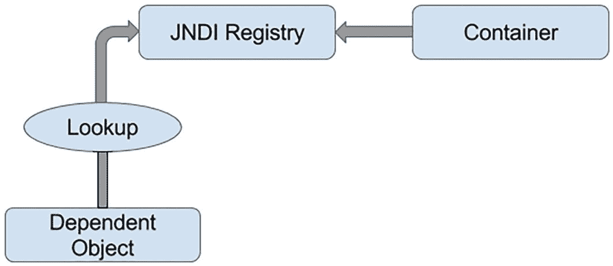
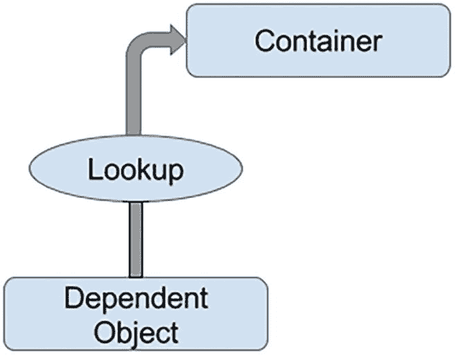
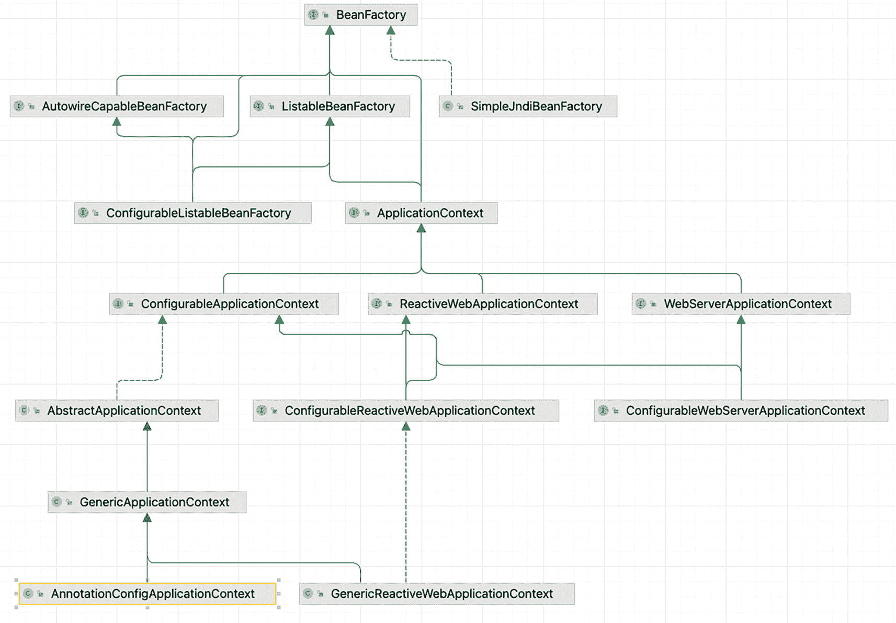
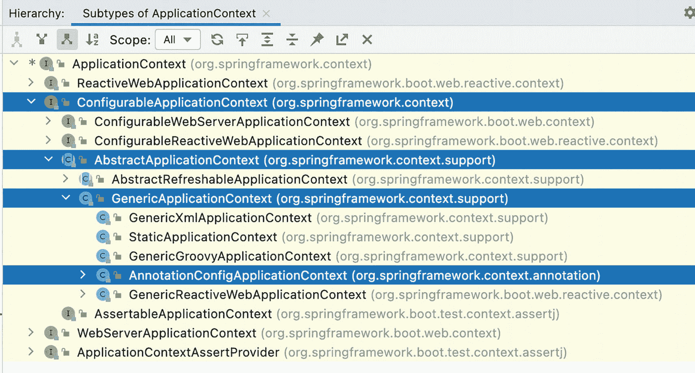

# 3. 在 Spring 中引入 IoC 和 DI

**第** **1** **章**和**第** **2** **章**已经向你介绍了 Spring 世界，解释了为什么这个框架是必要的，以及为什么依赖注入如此酷且有用。本质上，Spring 的构建就是为了让依赖注入变得简单。这种软件设计模式意味着依赖组件将依赖解析委托给一个外部服务，该服务将负责注入依赖项。依赖组件不允许调用注入器服务，并且在将要注入的依赖项方面几乎没有发言权。这就是为什么这种行为也被称为“*别找我们，我们会找你！*”原则，它在技术上被称为*控制反转 (IoC)*。如果你快速搜索一下 Google，你会发现很多关于依赖注入和控制反转的相互矛盾的观点。你会找到一些编程文章，称它们为*编程技术*、*编程原则*和*设计模式*。然而，最好的解释来自 Martin Fowler 的一篇文章^(²⁸)，该文章在 Java 世界中被公认为设计模式方面的最高权威。如果你没有时间阅读，这里有一个总结：*控制反转是促进依赖注入的框架的一个共同特征。依赖注入模式的基本思想是，有一个独立的对象，根据接口契约，将具有所需行为的依赖项注入进来。*

本章涵盖以下 DI 特性：

*   *控制反转概念*：我们讨论各种类型的 IoC，包括依赖注入和依赖查找。本节介绍不同 IoC 方法之间的差异以及各自的优缺点。

*   *Spring 中的控制反转*：我们探讨 Spring 中可用的 IoC 功能及其实现方式。特别是，你将看到 Spring 提供的依赖注入服务，包括 Setter 注入、构造器注入和方法注入。

*   *Spring 中的依赖注入*：我们介绍 Spring 对 IoC 容器的实现。对于 Bean 定义和 DI 需求，`BeanFactory` 是应用与之交互的主要接口。然而，除了前几个清单外，本章提供的其余示例代码主要关注使用 Spring 的 `ApplicationContex``t` 接口，它是 `BeanFactory` 的扩展，提供了更强大的功能。我们将在后续章节中介绍 `BeanFactory` 和 `ApplicationContext` 之间的区别。

*   *配置 Spring 应用上下文*：本章的最后部分重点介绍 `ApplicationContext` 配置的注解方法。Groovy 和 Java 配置将在**第** **4** **章**中进一步讨论。本节从讨论 DI 配置开始，然后介绍 `BeanFactory` 提供的其他服务，例如 Bean 继承、生命周期管理和自动装配。


## 控制反转与依赖注入

控制反转（IoC）的核心目标是提供一种更简单的机制，用于配置组件依赖（通常称为对象的*协作者*）并在其整个生命周期中管理这些依赖。需要特定依赖的组件通常被称为*依赖对象*，或者在 IoC 的语境中，被称为*目标对象*。通常，IoC 可以分解为两种子类型：*依赖注入*和*依赖查找*。这些子类型进一步分解为 IoC 服务的具体实现。从这个定义中，你可以清楚地看到，当我们谈论 DI 时，我们总是在谈论 IoC；但当我们谈论 IoC 时，我们并不总是在谈论 DI（例如，依赖查找也是 IoC 的一种形式）。

### 控制反转的类型

你可能想知道为什么会有两种类型的 IoC，以及为什么这些类型还要进一步拆分为不同的实现。这个问题似乎没有明确的答案；诚然，不同的类型提供了一定程度的灵活性，但对我们来说，IoC 更像是新旧思想的混合体。这两种 IoC 类型就体现了这一点。依赖查找是一种更为传统的方法，乍一看，它对 Java 程序员来说更熟悉。而依赖注入，虽然起初看起来有悖直觉，但实际上比依赖查找更灵活、更实用。在依赖查找风格的 IoC 中，组件必须获取对依赖的引用；而在依赖注入中，依赖是由 IoC 容器注入到组件中的。依赖查找有两种类型：

*   依赖拉取

*   上下文化依赖查找（CDL）

依赖注入也有两种常见形式：

*   构造器依赖注入

*   Setter 依赖注入

    警告。 在本节的讨论中，我们不关心虚构的 IoC 容器是如何获知所有不同依赖的，我们只关心在某个时刻，它会执行针对每种机制所描述的操作。

#### 依赖拉取

对于 Java 开发者来说，依赖拉取是最熟悉的 IoC 类型。在依赖拉取中，依赖是根据需要从注册表中拉取的。任何编写过访问 EJB（2.1 或更早版本）代码的人，都使用过依赖拉取（即通过 JNDI API 查找 EJB 组件）。图 3-1 展示了通过查找机制进行依赖拉取的场景。



一个流程图展示了依赖对象、查找和容器如何指向 JNDI 注册表。

图 3-1

通过 JNDI 查找进行依赖拉取

Spring 也提供了依赖拉取作为检索框架管理组件的机制；你在**第** **2** **章**中已经看到了它的实际应用。清单 3-1 展示了一个基于 Spring 的应用程序中典型的依赖拉取查找示例。

```
package com.apress.prospring6.two.annotated;
// 省略了一些导入
import org.springframework.context.ApplicationContext;
import org.springframework.context.annotation.AnnotationConfigApplicationContext;
public class HelloWorldSpringAnnotated {
public static void main(String... args) {
ApplicationContext ctx = new AnnotationConfigApplicationContext(HelloWorldConfiguration.class);
MessageRenderer mr = ctx.getBean("renderer", MessageRenderer.class);
mr.render();
}
}
清单 3-1
Spring 依赖拉取示例
```

这段代码片段及其引用的所有类，在**第** **2** **章**末尾介绍过，用于向你展示如何构建 Spring `ApplicationContext`。请注意，在 `main(..)` 方法中，`MessageRenderer` bean 是从充当应用程序中所有 bean 注册表的 `ApplicationContext` 中检索出来的；因此，这个实例是被*拉取*出来的，以便可以调用其 `render()` 方法。

这种 IoC 不仅在基于 JEE 的应用程序（使用 EJB 2.1 或更早版本）中很普遍（这些应用程序广泛使用 JNDI 查找从注册表中获取依赖），而且在许多环境中使用 Spring 时也至关重要。

#### 上下文化依赖查找

*上下文化依赖查找（CDL）* 在某些方面与依赖拉取类似，但在 CDL 中，查找是针对管理资源的容器进行的，而不是针对某个中央注册表，并且通常是在某个设定的时间点执行。图 3-2 展示了 CDL 机制。



一个流程图展示了依赖对象和查找如何指向容器。

图 3-2

上下文化依赖查找

CDL 的工作原理是，需要依赖的组件实现一个类似于清单 3-2 中所示的接口。

```
package com.apress.prospring6.three;
// 省略了一些导入
public interface ManagedComponent {
void performLookup(Container container);
}
清单 3-2
上下文化依赖查找接口
```

通过实现此接口，组件向 `container` 发出信号，表明它想要获取一个依赖。该容器通常由底层应用服务器或框架（例如 Tomcat 或 JBoss）或框架（例如 Spring）提供。清单 3-3 中的代码展示了一个提供依赖查找服务的简单 `Container` 接口。

```
package com.apress.prospring6.three;
public interface Container {
Object getDependency(String key);
}
清单 3-3
提供依赖查找服务的容器接口
```

当容器准备好将依赖传递给组件时，它会依次在每个组件上调用 `performLookup()`。然后，组件可以使用 `Container` 接口查找其依赖。为了与我们已经熟悉的示例配合使用，`MessageRenderer` 接口被声明为扩展 `ManagedComponent` 接口，以便 `StandardOutMessageRenderer` 可以使用提供的 `Container` 实现来查找自己的依赖。`MessageRenderer` 接口和 `StandardOutMessageRenderer` 类的代码如清单 3-4 所示。

```
package com.apress.prospring6.three;
interface MessageRenderer extends ManagedComponent {
void render();
}
class StandardOutMessageRenderer implements MessageRenderer {
private MessageProvider messageProvider;
@Override
public void performLookup(Container container) {
this.messageProvider = (MessageProvider) container.getDependency("provider");
}
// 其他代码已省略，已在第 2 章列出
}
清单 3-4
使用 StandardOutMessageRenderer 类的 ManagedComponent 实现
```

警告。 你可能注意到此示例中的接口和类没有类型访问修饰符。它们不是公共的，因为它们没有在单独的文件中声明。实际上，与 CDL 示例相关的所有 Java 类型都是 `CDLDemo.java` 文件的一部分。我们决定将所有与此示例相关的类型放在同一个文件中，因为这使得浏览项目源代码更加容易。此外，由于示例中的所有类型都在同一个文件中，因此 bean 定义的来源毫无疑问。在本书的项目中，我们在必要的地方都保持了这种方法。


#### 构造器依赖注入

在*构造器依赖注入*中，IoC 容器通过组件的构造器（或多个构造器）注入其依赖项。组件声明一个或多个构造器，将依赖项作为参数传入，IoC 容器在实例化时将这些依赖项传递给组件。这意味着此版本的 `StandardOutMessageRenderer` 如清单 3-5 所示。

```
package com.apress.prospring6.three.ci;
class StandardOutMessageRenderer implements MessageRenderer {
private final MessageProvider messageProvider;
public StandardOutMessageRenderer(MessageProvider messageProvider) {
this.messageProvider = messageProvider;
}
// 其他代码已省略，已在第 2 章列出
}
清单 3-5
为构造器注入修改的 StandardOutMessageRenderer
```

使用构造器注入的一个明显后果是，没有依赖项就无法创建对象；因此，依赖项是强制性的。

### Setter 依赖注入

在*Setter 依赖注入*中，IoC 容器通过 JavaBean 风格的 setter 方法注入组件的依赖项。组件的 setter 方法暴露了 IoC 容器可以管理的依赖项。清单 3-6 展示了基于 setter 依赖注入的典型 `StandardOutMessageRenderer` 版本。

```
package com.apress.prospring6.three.di;
class StandardOutMessageRenderer implements MessageRenderer {
private MessageProvider messageProvider;
public void setMessageProvider(MessageProvider messageProvider) {
this.messageProvider = messageProvider;
}
// 其他代码已省略，已在第 2 章列出
}
清单 3-6
为 Setter 注入修改的 StandardOutMessageRenderer
```

使用 setter 注入的一个明显后果是，可以在没有依赖项的情况下创建对象，并且可以通过稍后调用 setter 方法来提供这些依赖项。

在容器内部，`setMessageProvider()` 方法暴露的依赖需求通过 JavaBeans 风格的名称 *dependency* 来引用。在实践中，setter 注入是使用最广泛的注入机制，也是实现起来最简单的 IoC 机制之一。

一条信息提示。 Spring 还支持另一种注入类型，称为*字段注入*，但这将在本章后面介绍，届时你将学习如何使用 `@Autowire` 注解进行自动装配。

#### 注入 vs. 查找

选择使用哪种 IoC 风格——注入还是查找——通常不是一个困难的决定。在许多情况下，你选择的 IoC 类型由你使用的容器决定。例如，如果你使用 EJB 2.1 或更早版本，则必须使用查找风格的 IoC（通过 JNDI）从 JEE 容器中获取 EJB。在 Spring 中，除了初始的 bean 查找之外，你的组件及其依赖项始终通过注入风格的 IoC 进行装配。

一条知识提示。 当你使用 Spring 时，无需执行显式查找即可访问 EJB 资源。Spring 可以作为查找风格和注入风格 IoC 系统之间的适配器，从而允许你通过注入来管理所有资源。

读到这里，你怎么看？你会使用依赖注入还是依赖查找？

使用注入，你可以自由地使用与手动提供依赖对象的 IoC 容器完全解耦的类，而使用查找时，你的类始终依赖于容器定义的类和接口。查找的另一个缺点是，在脱离容器的情况下测试你的类会变得困难。使用注入，测试你的组件非常简单，因为你可以直接通过合适的构造器或 setter 方法自行提供依赖项，正如你将在本书中看到的那样。

选择注入而非查找的最大原因是它能让你的工作更轻松。使用注入时，你编写的代码量会大幅减少，而且你编写的代码简单明了，通常一个好的 IDE 就能自动生成。你会注意到，注入示例中的所有代码都是被动的，即它们不会主动尝试完成某项任务。在注入代码中，最令人兴奋的事情是对象仅仅被存储在一个字段中；没有其他代码涉及从任何注册表或容器中拉取依赖项。因此，代码更简单，更不容易出错。被动代码比主动代码更容易维护，因为几乎不会出错。而清单 3-4 中的 `StandardOutMessageRenderer` 则有很多可能出错的地方：依赖键可能改变，容器实例可能为 `null`，或者返回的依赖项类型可能不正确。使用依赖查找可能会解耦应用程序的组件，但它增加了额外代码的复杂性，这些代码需要将这些组件重新耦合在一起才能执行任何有用的任务。


### Setter 注入 vs. 构造器注入

在本书的这一部分，依赖注入显然是正确的方向。*构造器注入*在依赖关系必须强制执行，且需要依赖的组件没有它就无法工作时非常有用。许多容器（包括 Spring）都提供了一种机制，确保在使用 Setter 注入时定义了所有依赖关系，但通过使用构造器注入，你可以以一种与容器无关的方式断言对依赖关系的需求。构造器注入还有助于实现不可变对象的使用——这就是为什么在清单 3-5 中，`MessageProvider` 字段被声明为 `final`。

*Setter 注入*在多种情况下都很有用。如果组件向容器暴露其依赖关系，但乐意提供自己的默认值，那么 Setter 注入通常是实现这一目标的最佳方式。Setter 注入的另一个好处是它允许在接口上声明依赖关系，尽管这并不像你最初想象的那么有用。想想看，一个接口可以由多个类实现，这些类需要暴露相同的 API，但需要不同的依赖关系。因此，除非你绝对确定某个特定业务接口的所有实现都需要某个特定的依赖关系，否则你应该让每个实现类定义自己的依赖关系，并将业务接口保留给业务方法。清单 3-7 描述了一个用于通讯发送服务的接口，这看起来与刚才所说的有些矛盾。

```
package com.apress.prospring6.three;
public interface NewsletterSender {
void setSmtpServer(String smtpServer);
String getSmtpServer();
void setFromAddress(String fromAddress);
String getFromAddress();
void send();
}
清单 3-7
NewsletterSender 接口
```

但关键在于：通过此接口声明的依赖关系是配置。配置参数是依赖关系的一种特殊情况。当然，你的组件依赖于配置数据，但配置数据与你目前看到的依赖类型有显著不同。因此，在业务接口中为配置参数放置 setter 和 getter 是一个好主意，并使 Setter 注入成为一种有价值的工具。

通过电子邮件发送一组通讯的类实现了 `NewsletterSender` 接口。`send()` 方法是唯一的业务方法，但请注意，我们在接口上定义了两个 JavaBean 属性。当我们刚刚说过不应该在业务接口中定义依赖关系时，为什么还要这样做呢？原因是，这些值——SMTP 服务器地址和发送电子邮件的地址——在实际意义上并不是依赖关系；相反，它们是影响 `NewsletterSender` 接口所有实现如何工作的配置细节。那么问题来了：配置参数和任何其他类型的依赖关系之间有什么区别？在大多数情况下，你可以清楚地看到某个依赖关系是否应归类为配置参数，但如果你不确定，请查找指向配置参数的以下三个特征：

*   *配置参数是被动的*：在清单 3-7 所示的 `NewsletterSender` 示例中，`smtpServer` 参数是一个被动依赖关系的例子。被动依赖关系不直接用于执行操作；相反，它们在内部或被另一个依赖关系用来执行其操作。在**第** **2** **章**的 `MessageRenderer` 示例中，`MessageProvider` 依赖关系不是被动的；它执行了 `MessageRenderer` 完成任务所必需的功能。

*   *配置参数通常是信息，而不是其他组件*：这意味着配置参数通常是组件完成其工作所需的一些信息。显然，SMTP 服务器是 `NewsletterSender` 所需的一条信息，但 `MessageProvider` 实际上是 `MessageRenderer` 正常运行所需的另一个组件。

*   *配置参数通常是简单值或简单值的集合*：这实际上是前两点的副产品，但配置参数通常是简单值。在 Java 中，这意味着它们是原始类型（或相应的包装类）、`String` 或这些值的集合。简单值通常是被动的。这意味着除了操作 `String` 所代表的数据之外，你无法对它做太多事情；而且你几乎总是将这些值用于信息目的——例如，表示网络套接字应监听的端口号的 int 值，或表示电子邮件程序应通过其发送消息的 SMTP 服务器的 `String`。

在考虑是否在业务接口中定义配置选项时，还要考虑该配置参数是否适用于业务接口的所有实现，还是仅适用于一个。例如，对于 `NewsletterSender` 的实现，很明显所有实现都需要知道在发送电子邮件时使用哪个 SMTP 服务器。然而，我们可能会选择将标记是否发送安全电子邮件的配置选项排除在业务接口之外，因为并非所有电子邮件 API 都能做到这一点，并且可以合理地假设许多实现根本不会考虑安全性。

一条信息提示。 回想一下，在**第** **2** **章**中，我们选择在业务接口中定义依赖关系。这仅用于说明目的，绝不应被视为最佳实践。

Setter 注入还允许你在不创建父组件新实例的情况下，动态地将依赖关系替换为不同的实现。Spring 的 JMX 支持使这成为可能。也许 Setter 注入最大的好处是它是侵入性最小的注入机制。

总的来说，你应该根据你的用例选择注入类型。基于 Setter 的注入允许在不创建新对象的情况下交换依赖关系，并且还允许你的类选择合适的默认值，而无需显式注入对象。当你希望确保依赖关系被传递给组件，以及在设计不可变对象时，构造器注入是一个不错的选择。请记住，虽然构造器注入确保所有依赖关系都提供给组件，但大多数容器也提供了一种机制来确保这一点，但这可能会带来将代码耦合到框架的成本。


## Spring 中的控制反转

如前所述，控制反转是 Spring 所做工作的核心部分。Spring 实现的核心基于依赖注入，尽管也提供了依赖查找功能。当 Spring 自动向依赖对象提供协作者时，它使用的是依赖注入。在基于 Spring 的应用程序中，始终更倾向于使用依赖注入将协作者传递给依赖对象，而不是让依赖对象通过查找来获取协作者。图 3-3 展示了 Spring 的依赖注入机制。


一个流程图展示了从 Spring Bean 工厂容器到依赖对象的依赖注入过程。

图 3-3

Spring 的依赖注入机制

尽管依赖注入是连接协作者和依赖对象的首选机制，但你仍然需要依赖查找来访问依赖对象。在许多环境中，Spring 无法通过依赖注入自动连接所有应用程序组件，你必须使用依赖查找来访问初始组件集。例如，在独立的 Java 应用程序中，你需要在 `main(..)` 方法中引导 Spring 容器，并通过 `ApplicationContext` 接口以编程方式获取依赖关系。然而，当你使用 Spring 的 MVC 支持构建 Web 应用程序时，Spring 可以通过自动将整个应用程序粘合在一起来避免这种情况。只要有可能使用 Spring 的依赖注入，就应该这样做；否则，可以退而求其次使用依赖查找功能。在本章的过程中，你将看到这两种方式的实际示例，我们会在它们首次出现时指出。

Spring 的 IoC 容器一个有趣的特点是，它能够在其自身的依赖注入容器和外部依赖查找容器之间充当适配器。我们将在本章后面讨论这个特性。

Spring 支持构造器注入和 Setter 注入，并通过大量有用的附加功能增强了标准的 IoC 特性集，使你的工作更轻松。

本章的其余部分将介绍 Spring DI 容器的基础知识，并附有大量示例。

## Spring 中的依赖注入

Spring 对依赖注入的支持非常全面，正如你将在**第** **4** **章**中看到的，它超越了迄今为止我们讨论的标准 IoC 特性集。本章的其余部分将介绍 Spring 依赖注入容器的基础知识，探讨 Setter 注入、构造器注入和方法注入，并详细说明如何在 Spring 中配置依赖注入。

### Bean 与 BeanFactory

`org.springframework.beans` 和 `org.springframework.context` 包是 Spring 框架 IoC 容器的基础。Spring IoC 容器的核心是 `org.springframework.beans.factory.BeanFactory` 接口。该接口的 Spring 实现负责管理组件，包括它们的依赖关系以及生命周期。图 3-4 展示了最常用的 `BeanFactory` 实现。



一个图表展示了用于管理组件（包括其依赖关系和生命周期）的 Bean Factory 实现。

图 3-4

*BeanFactory* 最常见的实现

在 Spring 中，术语 *bean* 用于指代任何由 Spring IoC 容器管理的对象。Spring IoC 容器创建、配置（组装）bean，并在其整个生命周期中对其进行管理。通常，你的 bean 在某种程度上遵循 JavaBeans 规范，但这并非必需，特别是如果你计划使用构造器注入来连接 bean 的话。

如果你的应用程序只需要 DI 支持，你可以通过 `BeanFactory` 接口与 Spring DI 容器交互。在这种情况下，你的应用程序必须创建一个实现了 `BeanFactory` 接口的类的实例，并使用 bean 和依赖信息对其进行配置。该接口由持有多个 bean 定义的对象实现，每个 bean 定义都由一个唯一的 `String` 名称标识。创建了此类型的实例后，你的应用程序可以通过 `BeanFactory` 访问 bean 并继续其处理流程。

在某些情况下，所有这些设置都是自动处理的（例如，在 Web 应用程序中，Spring 的 `ApplicationContext` 将在应用程序启动期间由 Web 容器通过 Spring 提供的、在 `web.xml` 描述符文件中声明的 `ContextLoaderListener` 类进行引导）。但在许多情况下，你需要自己编写设置代码。本章中的大多数示例都需要手动设置 `BeanFactory` 实现。

`ApplicationContext` 接口是 `BeanFactory` 的扩展。除了 DI 服务之外，`ApplicationContext` 还提供其他服务：

*   与 Spring 的 AOP 特性集成

*   用于国际化（i18n）的消息资源处理

*   应用程序事件处理

*   应用程序层特定的上下文（例如，Web、安全等）

在开发基于 Spring 的应用程序时，建议通过 `ApplicationContext` 接口与 Spring 交互。Spring 支持通过手动编码（手动实例化并加载相应配置）或在 Web 容器环境中通过 `ContextLoaderListener` 来引导 `ApplicationContext`。从现在开始，本书中的所有示例代码都将使用 `ApplicationContext` 及其实现。

### 配置 ApplicationContext

在**第** **2** **章**的第一个示例中，`org.springframework.context.ApplicationContext` 是使用 XML 文件配置的。虽然仍然可以，但使用 XML 进行配置仅限于 Spring 4 的功能，因为从该版本开始，该领域没有再进行技术投入。在 Spring 的发展过程中，关于哪种配置应用程序的方式更好（XML 还是注解）一直存在长期讨论。这实际上取决于开发者的偏好。注解与所配置 bean 的类型交织在一起，提供了大量上下文，使得配置更加简洁。XML 配置 Spring 应用程序时与实际代码解耦（Spring XML 配置文件是资源文件），尽管这对于 JavaConfig 也同样适用，这意味着配置可以外部化并在不重新编译代码的情况下进行修改。Spring 最棒的一点是，你可以轻松地混合使用配置风格。

为了保持本书这一版本的简洁性，Spring 应用程序仅通过 Java 注解（JavaConfig）和 Java 代码进行配置，这提供了足够的灵活性来描述任何类型的 Spring 应用程序。


### 基本配置概述

要配置一个独立的 Spring 应用程序，只需一个带有 `@Configuration` 注解的类即可。该注解表明该类包含带有 `@Bean` 注解的方法，这些方法即为 Bean 声明。这种方法适用于任何类型的对象，尤其是由第三方库提供的类型——这些代码不属于你的项目，你无法通过编辑它们来声明自己的 Bean。同一个类也可以通过添加 `@ComponentScan` 注解来配置，以启用查找现有 Bean 声明的功能。可发现的 Bean 声明是带有 `@Component` 及其他构造型注解的类。Spring 容器会处理这些类，以生成 Bean 定义并在运行时为这些 Bean 提供服务请求。所有这些注解基本上都用于描述应创建哪些对象、创建顺序、初始化操作，甚至是在被垃圾回收器丢弃前要执行的操作，简单来说，它们被称为**配置元数据**。

这是配置 Spring 应用程序最紧凑的方式。不过，逐步展开这个话题更为合适。让我们从一个 Spring 配置类开始，如清单 3-8 所示，该类声明了两个 Bean。你已经在**第** **2** **章**中见过这个类，但现在我们将深入探讨细节。

```
package com.apress.prospring6.two.annotated;
// 其他导入已省略
import org.springframework.context.annotation.Bean;
import org.springframework.context.annotation.Configuration;
@Configuration
public class HelloWorldConfiguration {
@Bean
public MessageProvider provider() {
return new HelloWorldMessageProvider();
}
@Bean
public MessageRenderer renderer(){
MessageRenderer renderer = new StandardOutMessageRenderer();
renderer.setMessageProvider(provider());
return renderer;
}
}
清单 3-8
简单的 Spring 配置类
```

清单 3-8 声明了两个 Bean，一个名为 `provider`，另一个名为 `renderer`；是的，这些 Bean 的名称与创建它们的方法名称相同。Bean 的命名将在本章后面介绍。

Spring 配置类通常使用 `AnnotationConfigApplicationContext` 或其支持 Web 的变体 `AnnotationConfigWebApplicationContext` 进行引导。这两个类都实现了 `ApplicationContext`，用于引导清单 3-8 中配置的应用程序的代码可以编写为清单 3-9 所示。

```
package com.apress.prospring6.two.annotated;
import org.springframework.context.ApplicationContext;
import org.springframework.context.annotation.AnnotationConfigApplicationContext;
public class HelloWorldSpringAnnotated {
public static void main(String... args) {
ApplicationContext ctx =
new AnnotationConfigApplicationContext(HelloWorldConfiguration.class);
MessageRenderer mr = ctx.getBean("renderer", MessageRenderer.class);
mr.render();
}
}
清单 3-9
引导 Spring 应用程序
```

运行 `HelloWorldSpringAnnotated` 类时，会创建一个 Spring 应用程序上下文，其中包含由 `HelloWorldConfiguration` 类配置的 Bean。通过调用 `getBean("{name}", {type}.class)` 方法获取对 `renderer` Bean 的引用，并调用其 `render()` 方法。由于 Spring 根据配置注入了 `MessageProvider` 依赖项，因此控制台会按预期打印出 “Hello World!” 消息。

引导过程包括实例化 `AnnotationConfigApplicationContext` 类，并将配置类的简单类名作为参数提供。通过实例化该类，我们创建了一个 Spring IoC 容器实例，该容器将读取 Bean 声明、创建 Bean、将其添加到注册表中并进行管理。使用容器的引用，可以检索和使用 Bean，正如清单 3-9 所示。


### 声明 Spring 组件

声明 bean 的另一种方法是直接使用*构造型*注解来标注类。这些注解之所以被称为*构造型*，是因为它们定义了类型或方法在整个架构中的角色。它们属于名为 `org.springframework.stereotype` 的包。该包将用于定义 bean 的注解组合在一起。这些注解与 bean 的角色相关。例如，`@Service` 用于定义服务 bean，这是一种更复杂的功能性 bean，提供其他 bean 可能需要的服务；而 `@Repository` 用于定义负责从数据库检索/保存数据的 bean。`@Component` 则是将类标记为 bean 声明的注解。`@Component` 是一个元注解，用于配置 bean 的注解都使用它进行标注。这使得它们在使用基于注解的配置和类路径扫描时，成为自动检测的候选对象。

要使用注解创建 bean 定义，必须使用相应的构造型注解来标注 bean 类，并且用于注入依赖的 setter 方法或构造函数必须使用 `@Autowired` 进行标注，以告知 Spring IoC 容器查找该类型的 bean，并在调用该方法时将其作为参数使用。

在清单 3-10 中，用于创建 bean 定义的注解已被突出显示。构造型注解可以将生成的 bean 的名称作为参数。

```
// HelloWorldMessageProvider.java
package com.apress.prospring6.three.constructor;
import com.apress.prospring6.two.decoupled.MessageProvider;
import org.springframework.stereotype.Component;
// 无依赖的简单 bean
@Component("provider")
public class HelloWorldMessageProvider implements MessageProvider {
// 部分代码已省略
}
// StandardOutMessageRenderer.java
package com.apress.prospring6.three.setter;
import com.apress.prospring6.two.decoupled.MessageRenderer;
import org.springframework.beans.factory.annotation.Autowired;
// 需要依赖的简单 bean
@Component("renderer")
public class StandardOutMessageRenderer implements MessageRenderer {
private MessageProvider messageProvider;
@Autowired
public void setMessageProvider(MessageProvider provider) {
this.messageProvider = provider;
}
// 部分代码已省略
}
清单 3-10
使用 @Component 声明 Spring Bean
```

通过使用 `@ComponentScan` 注解配置类，在启动 `ApplicationContext` 时，Spring 将查找这些类（也称为组件），并使用指定的名称实例化 bean。在清单 3-11 中，你可以看到使用 `@ComponentScan` 注解的简单 `HelloWorldConfiguration` 配置类。

```
package com.apress.prospring6.three.constructor;
import org.springframework.context.annotation.ComponentScan;
@Configuration
@ComponentScan
public class HelloWorldConfiguration {
}
清单 3-11
使用组件扫描的简单 Spring 配置类
```

使用 `AnnotationConfigApplicationContext`（参见清单 3-9）启动 Spring 环境的代码也适用于此类，无需额外更改。

`@ComponentScan` 注解声明了扫描指令，并可以配置要扫描的特定包。当未配置包时，扫描将从声明此注解的类所在的包开始，无论该类是公共类还是包私有类。

清单 3-11 中的类告诉 Spring 在 `constructor` 包及其子包中查找 bean 定义。如果我们想要扩大或限制扫描上下文，可以通过声明带有 `basePackages` 属性的 `@ComponentScan` 注解来实现，该属性允许声明一个包或一组包，Spring 将在其中查找组件。

例如：

*   `@ComponentScan(basePackages = "com.apress.prospring6")` 告诉 Spring 在 `com.apress.prospring6` 包及其所有子包中查找组件类。

*   `@ComponentScan(basePackages = { "com.apress.prospring6.two", "com.apress.prospring6.three" })` 告诉 Spring 在 `com.apress.prospring6.two` 包和 `com.apress.prospring6.three` 包及其所有子包中查找组件类。

警告。 包私有类上的 bean 定义会被包含它们所在包的 `@ComponentScan` 配置所捕获。

组件扫描是一项耗时的操作，良好的编程实践是尽量限制 Spring 在代码库中查找 bean 定义的位置。除了 `basePackages` 之外，`@ComponentScan` 注解还提供了其他属性，以帮助构建扫描位置的简洁定义：

*   `basePackageClasses`：可以配置一个或多个类；将扫描每个指定类所在的包。

*   `includeFilters`：指定哪些类型符合组件扫描的条件。

*   `excludeFilters`：指定哪些类型不符合组件扫描的条件。

在实际的生产应用程序中，可能存在使用旧版 Spring 开发的遗留代码，或者需求的性质可能需要同时使用 XML 和配置类。幸运的是，XML 和 Java 配置可以通过多种方式混合使用。例如，配置类可以使用 `@ImportResource` 从 XML 文件（或多个文件）导入 bean 定义，并且使用 `AnnotationConfigApplicationContext` 的相同启动方式在这种情况下也同样有效。来自其他 Java 配置类的 bean 定义可以使用 `@Import` 导入。

因此，Spring 允许你在定义 bean 时真正发挥创造力；你将在**第** **4** **章**中了解更多相关信息，该章将专门讨论 Spring 应用程序配置。


### 使用 Setter 注入

在上一节中，我们使用 setter 注入配置了 `renderer` bean，但由于重点在于 Spring 配置类，因此需要补充一些额外细节。

要配置 setter 注入，必须在每个由 Spring 调用的 setter 方法上添加 `@Autowired` 注解，以便注入依赖项。清单 3-12 展示了为支持 setter 注入而设计的 `StandardOutMessageRenderer` 版本。

```
package com.apress.prospring6.three.setter;
import org.springframework.beans.factory.annotation.Autowired;
// 其他 import 语句已省略
@Component("renderer")
public class StandardOutMessageRenderer implements MessageRenderer {
private MessageProvider messageProvider;
@Autowired
public void setMessageProvider(MessageProvider provider) {
out.println(" ~~ 使用 setter 注入依赖 ~~");
this.messageProvider = provider;
}
// 其他代码已省略
}
清单 3-12
使用 @Component 和 Setter 注入声明 StandardOutMessageRenderer Bean
```

为了确保执行代码时通过 setter 方法注入依赖，我们在 setter 方法中添加了 `out.println(" ~~ 使用 setter 注入依赖 ~~")` 语句。Java 配置类无需修改；只要 `@ComponentScan` 配置正确，无论使用哪种注入风格，bean 定义都会被自动发现。

警告。 除了 `@Autowired`，你也可以使用 `@Resource(name="provider")` 达到相同效果。`@Resource` 是 JSR-250（“Java 平台通用注解”）标准中的注解之一，该标准定义了一套在 JSE 和 JEE 平台上通用的 Java 注解。此注解目前属于 `jakarta.annotation-api` 库。与 `@Autowired` 不同，`@Resource` 注解支持 `name` 参数，可满足更细粒度的依赖注入需求。此外，Spring 还支持使用 JSR-299（“Java EE 平台的上下文与依赖注入”，后移至 JSR-330 “Java 依赖注入”）中引入的 `@Inject` 注解。`@Inject` 的行为与 Spring 的 `@Autowired` 注解等效，目前属于 `jakarta.inject-api` 库。

用于启动 Spring 应用上下文以测试 setter 注入配置是否正常工作的代码，与 `HelloWorldSpringAnnotated` 类的代码相同。

警告。 在本书附带的项目中，大多数包含 `main(..)` 方法以启动 Spring 应用上下文的类名都以 `Demo` 结尾。本节的演示类名为 `SetterInjectionDemo`，所有 bean 定义和配置都包含在 `SetterInjectionDemo.java` 文件中。这样设计是为了将所有实现放在一个文件中，便于在项目中快速定位。

### 使用构造器注入

在上一节中，我们通过 setter 方法将 provider 实例注入到 `renderer` bean 中。这种方法运行良好，因为 `@Autowired` 注解默认强制要求注入依赖，因此如果缺少依赖，Spring 应用将无法启动。正如你将在本书后面看到的，在某些情况下，由于 Spring 创建 bean 的方式（先实例化构造器，再调用 setter 注入依赖），通过 setter 注入依赖并非最佳选择。如果你希望确保 bean 在没有依赖的情况下根本无法创建，可以在生命周期更早的阶段（即实例化步骤）强制实现这一点：将依赖声明为构造器的参数，从而将 bean 设计为支持*构造器注入*。

在我们目前的示例中，如果没有 provider，创建 `renderer` 是没有意义的，因此更好的设计是为 `StandardOutMessageRenderer` 类提供一个包含 `MessageProvider` 参数的构造器，如清单 3-13 所示。

```
package com.apress.prospring6.three.constructor;
// import 语句已省略
@Component("renderer")
class StandardOutMessageRenderer implements MessageRenderer {
private MessageProvider messageProvider;
@Autowired
public StandardOutMessageRenderer(MessageProvider messageProvider) {
out.println(" ~~ 使用构造器注入依赖 ~~");
this.messageProvider = messageProvider;
}
// 其他代码已省略
}
清单 3-13
为构造器注入设计的 StandardOutMessageRenderer
```

通过这样实现 `MessageRenderer`，我们使得在不提供 `messageProvider` 值的情况下无法创建 `StandardOutMessageRenderer` 实例。`@Autowired` 注解用于修饰构造器，它告诉 Spring 在实例化该 bean 时（如果存在多个构造器）应使用哪个构造器。

警告。 在 Spring 4.x 中，如果 bean 声明了单个初始化所有依赖的构造器，则 `@Autowired` 注解是多余的。因此，本着**约定优于配置**的原则，Spring IoC 被修改为：无论是否存在该注解，都会调用唯一的构造器来创建 bean。因此，即使移除 `@Autowired` 注解，清单 3-13 中声明的 `renderer` bean 仍然有效。

由于我们提到表示 bean 定义的类可以有多个构造器，下面在清单 3-14 中展示 `ConstructorConfusion` 类。

```
package com.apress.prospring6.three.constructor;
// import 语句已省略
@Component
public class ConstructorConfusion {
private String someValue;
public ConstructorConfusion(String someValue) {
System.out.println("ConstructorConfusion(String) 被调用");
this.someValue = someValue;
}
@Autowired
public ConstructorConfusion(@Value("90") int someValue) {
System.out.println("ConstructorConfusion(int) 被调用");
this.someValue = "Number: " + Integer.toString(someValue);
}
public String toString() {
return someValue;
}
public static void main(String... args) {
var ctx = new AnnotationConfigApplicationContext();
ctx.register(ConstructorConfusion.class);
ctx.refresh();
var cc = ctx.getBean(ConstructorConfusion.class);
out.println("这样能工作吗？ " + cc);
}
}
清单 3-14
包含多个构造器的 ConstructorConfusion 类
```

清单 3-14 中的 `ConstructorConfusion` bean 定义是正确的，因为第二个构造器使用了 `@Autowired` 注解。这告诉 Spring 使用该构造器来实例化此 bean。如果没有该注解，Spring 无法自行决定使用哪个构造器，运行此类将抛出以下异常。


```
Caused by: org.springframework.beans.BeanInstantiationException:
Failed to instantiate [com.apress.prospring6.three.constructor.ConstructorConfusion]:
No default constructor found;
nested exception is java.lang.NoSuchMethodException: com.apress.prospring6.three.constructor.ConstructorConfusion.()
```

关键词提示。 请注意，在标注了 `@Autowired` 的构造函数中使用了 `@Value` 注解。该注解将在本章后续部分进行解释，但就目前这个简单示例而言，你需要知道的是，它对于为构造函数参数注入值是必要的，并且没有它构造函数将无法工作。

信息提示。 `ConstructorConfusion` 类声明了一个 bean，但它也有自己的 `main(..)` 方法，用于执行以下操作：

*   实例化一个类型为 `AnnotationConfigApplicationContext` 的简单、空的 Spring 应用上下文

*   然后通过调用 `ctx.register(ConstructorConfusion.class)`，用 `ConstructorConfusion` 类所代表的 bean 定义来填充该上下文

*   接着通过调用 `refresh()` 刷新上下文，该方法会根据已注册的 bean 定义重新创建所有 bean。

或者，你已经阅读了所有这些内容，并发现能够以编程方式注册 bean 定义而无需配置类这一点非常有趣。

警告。 清单 3-14 中的示例还强调了 `@Autowired` 注解只能应用于类中的一个构造函数。如果我们将该注解应用于多个构造函数方法，Spring 在引导 `ApplicationContext` 时会报错。

这里另一个值得介绍的场景是，当依赖不是一个 bean 时会发生什么。如果它是一个简单的对象，比如一个 `String` 呢？让我们通过创建一个可配置的消息提供者来解决这个问题。一个允许从外部定义消息的可配置 `MessageProvider` 实现如清单 3-15 所示。

```
package com.apress.prospring6.three.configurable;
import org.springframework.beans.factory.annotation.Value;
// import statements omitted
@Component("provider")
class ConfigurableMessageProvider implements MessageProvider {
private String message;
public ConfigurableMessageProvider(@Value("Configurable message"), String message) {
this.message = message;
}
@Override
public String getMessage() {
return message;
}
}
清单 3-15
可配置的 MessageProvider 实现
```

通过像这样实现 `MessageProvider`，我们使得在不提供消息值的情况下创建 `ConfigurableMessageProvider` 的实例变得不可能。请注意用于定义要注入到构造函数中的值的 `@Value` 注解。这就是我们将非 bean 的值注入到 Spring bean 中的方法。遗憾的是，在这个示例中，该值是在注解声明中指定的，因此存在必要的硬编码，但使用 SpEL 动态值注入可以从其他来源（如属性文件）实现（本章后面会详细介绍）。

### 使用字段注入

Spring 支持的第三种依赖注入类型称为*字段注入*。顾名思义，依赖项被直接注入到字段中，不需要构造函数或 setter 方法。这是通过使用 `@Autowired` 注解标注类成员来实现的。这看起来可能很实用，因为当依赖项在其所属对象之外不需要时，它可以减轻开发人员编写一些在 bean 初始创建后就不再使用的代码的负担。在清单 3-16 的代码片段中，类型为 `NonSingletonDemo` 的 bean 有一个类型为 `Inspiration` 的字段。

```
package com.apress.prospring6.three.field;
import org.springframework.stereotype.Component;
// import statements omitted
@Component("singer")
class Singer {
@Autowired
private Inspiration inspirationBean;
public void sing() {
System.out.println("... " + inspirationBean.getLyric());
}
}
清单 3-16
用于展示字段注入的 NonSingletonDemo 类
```

该字段是私有的，但 Spring IoC 容器并不关心这一点；它使用反射来填充所需的依赖项。

`Inspiration` 类的代码与用于引导 Spring 应用上下文的类一起显示在清单 3-17 中；它是一个带有 `String` 字段的简单 bean。

```
package com.apress.prospring6.three.field;
// import statements omitted
@Component
class Inspiration {
private String lyric = "I can keep the door cracked open, to let light through";
public Inspiration(@Value("For all my running, I can understand") String lyric) {
this.lyric = lyric;
}
public String getLyric() {
return lyric;
}
public void setLyric(String lyric) {
this.lyric = lyric;
}
}
// demo class
public class SingerFieldInjectionDemo {
public static void main(String... args) {
var ctx = new AnnotationConfigApplicationContext();
ctx.register(Singer.class, Inspiration.class);
ctx.refresh();
Singer singerBean = ctx.getBean(Singer.class);
singerBean.sing();
}
}
清单 3-17
用于展示字段注入工作原理的 Inspiration 类和演示类
```

找到类型为 `Inspiration` 的一个 bean 后，Spring IoC 容器会将该 bean 注入到 `singer` bean 的 `inspirationBean` 字段中。这就是为什么在运行清单 3-17 中的代码时，主类会在控制台打印出 *For all my running, I can understand*。

然而，它也有一些缺点，这就是为什么**不推荐使用字段注入**。以下是缺点列表：

*   *存在违反单一职责原则的风险*：拥有更多依赖意味着一个类承担更多职责，这可能导致在重构时难以分离关注点。当使用构造函数或 setter 方法设置依赖时，类变得臃肿的情况更容易被发现，但在使用字段注入时则隐藏得很好。

*   *依赖隐藏*：在 Spring 中，注入依赖项的责任被传递给了容器，但类应该通过公共接口（通过方法或构造函数）清晰地传达所需的依赖类型。使用字段注入，可能会变得不清楚真正需要什么类型的依赖，以及该依赖是否是强制性的。*（这有点像某些伴侣不沟通他们的需求，却期望你能神奇地读懂他们的心思并满足他们。）*

*   *对 Spring IoC 的依赖*：字段注入引入了对 Spring 容器的依赖，因为 `@Autowired` 注解是一个 Spring 组件；因此，该 bean 不再是一个 POJO，并且不能独立实例化。（除非你使用 `@Resource` 或 `@Inject` 以及不同的容器。）

*   *字段注入不能用于 final 字段*：这种类型的字段只能使用构造函数注入进行初始化。

*   *编写测试困难*：字段注入给编写测试带来了困难，因为依赖项必须手动注入。

然而，在 `@Configuration` 和 `@Test` 类中*仅*在实例变量上使用 `@Autowired` 是实用的——对于后者，是在需要 Spring 上下文的集成测试中。

## 使用注入参数

在前面的示例中，我们简要提到，通过使用 setter 注入和构造函数注入，可以将其他组件和值注入到 bean 中。Spring 支持多种注入参数选项，允许你不仅注入其他组件和简单值，还可以注入 Java 集合、外部定义的属性，甚至另一个工厂中的 bean。让我们更深入地探讨一下。


### 注入简单值

将简单值注入到你的 Bean 中很容易。为此，只需在 `@Value` 注解中指定值即可。默认情况下，`@Value` 注解不仅能读取 `String` 值，还能将这些值转换为任何原始类型或原始类型的包装类。清单 3-18 中的代码片段展示了一个简单的 Bean，它暴露了多种属性以供注入。

```
package com.apress.prospring6.three.valinject;
// 导入语句已省略
@Component("injectSimple")
public class InjectSimpleDemo {
@Value("John Mayer")
private String name;
@Value("40")
private int age;
@Value("1.92")
private float height;
@Value("false")
private boolean developer;
@Value("1241401112")
private Long ageInSeconds;
public static void main(String... args) {
var ctx = new AnnotationConfigApplicationContext();
ctx.register(InjectSimpleDemo.class);
ctx.refresh();
InjectSimpleDemo simple = (InjectSimpleDemo) ctx.getBean("injectSimple");
out.println(simple);
}
public String toString() {
return "Name: " + name + "\n"
+ "Age: " + age + "\n"
+ "Age in Seconds: " + ageInSeconds + "\n"
+ "Height: " + height + "\n"
+ "Is Developer?: " + developer;
}
}
清单 3-18
用于演示向各种类型的属性注入值的 InjectSimpleDemo 类
```

`@Value` 注解也可以直接用在字段上，在 `InjectSimpleDemo` 类中就是这样使用的，以保持简单并避免编写 setter 方法的样板代码。如果你运行这个类，控制台输出如预期所示，见清单 3-19。

```
Name: John Mayer
Age: 39
Age in Seconds: 1241401112
Height: 1.92
Is Programmer?: false
清单 3-19
运行清单 3-18 中的类后得到的控制台输出结果
```

### 使用 SpEL 注入值

清单 3-18 中的示例展示了 Spring 在注入属性值时具备的自动转换能力。然而，这个示例仍然相当基础，因为值是在 `@Value` 注解中硬编码的。这正是 SpEL 发挥作用的地方。

Spring 3 引入的一个强大特性是 **Spring 表达式语言 (SpEL)**。SpEL 使你能够动态地计算表达式，然后在 Spring 的 `ApplicationContext` 中使用它。你可以将计算结果注入到 Spring Bean 中。在本节中，我们将通过上一节的示例，了解如何使用 SpEL 从其他 Bean 中注入属性。

假设现在我们想将待注入的值外部化到一个配置类的 Bean 中，如代码清单 3-20 所示。

```
package com.apress.prospring6.three.valinject;
// 导入语句已省略
@Component("injectSimpleConfig")
class InjectSimpleConfig {
private String name = "John Mayer";
private int age = 40;
private float height = 1.92f;
private boolean developer = false;
private Long ageInSeconds = 1_241_401_112L;
public String getName() {
return name;
}
public int getAge() {
return age;
}
public float getHeight() {
return height;
}
public boolean isDeveloper() {
return developer;
}
public Long getAgeInSeconds() {
return ageInSeconds;
}
}
清单 3-20
提供一些字段值的 Spring 配置类
```

首先要做的是编辑 `@Value` 注解，将硬编码的值替换为引用此 Bean 属性的 SpEL 表达式。其次，需要将一个该类型的 Bean 添加到配置中。这两点都在清单 3-21 中展示。

```
package com.apress.prospring6.three.valinject;
// 导入语句已省略
@Component("injectSimpleSpEL")
public class InjectSimpleSpELDemo {
@Value("#{injectSimpleConfig.name.toUpperCase()}")
private String name;
@Value("#{injectSimpleConfig.age + 1}")
private int age;
@Value("#{injectSimpleConfig.height}")
private float height;
@Value("#{injectSimpleConfig.developer}")
private boolean developer;
@Value("#{injectSimpleConfig.ageInSeconds}")
private Long ageInSeconds;
public static void main(String... args) {
var ctx = new AnnotationConfigApplicationContext();
ctx.register(InjectSimpleConfig.class, InjectSimpleSpELDemo.class);
ctx.refresh();
InjectSimpleSpELDemo simple = (InjectSimpleSpELDemo) ctx.getBean("injectSimpleSpEL");
out.println(simple);
}
// 其他代码已省略
}
清单 3-21
自定义为使用 SpEL 表达式的 @Value 注解
```

注意，我们在引用另一个 Bean 的属性时使用了 SpEL `#{injectSimpleConfig.name}`。还要注意，这里并没有调用 getter 方法，但 SpEL 表达式包含了由“.”（点号）连接的 Bean 名称和属性名称，Spring 确切地知道该怎么做。SpEL 也支持 `String` 操作和算术运算，如注入前对 `name` 属性调用 `toUpperCase()` 方法，以及在注入前给 Bean 属性值加 1 所示。如果你运行 `InjectSimpleSpELDemo` 类的 `main(..)` 方法，控制台将打印出清单 3-22 所示的输出。

```
Name: JOHN MAYER
Age: 41
Age in Seconds: 1241401112
Height: 1.92
Is Developer?: false
清单 3-22
运行清单 3-21 中的类后得到的控制台输出结果
```

由于对 `name` 属性添加了 `toUpperCase()` 调用，输出结果与值硬编码的示例几乎相同。通过使用 SpEL，你可以访问任何 Spring 管理的 Bean 和属性，并借助 Spring 对复杂语言特性和语法的支持，对它们进行操作以供应用程序使用。


### 注入与 `ApplicationContext` 嵌套

到目前为止，我们注入的 Bean 与它们被注入到的 Bean 都位于同一个 `ApplicationContext`（因此也在同一个 `BeanFactory`）中。然而，Spring 支持 `ApplicationContext` 的层次结构，使得一个上下文（及其关联的 `BeanFactory`）被视为另一个上下文的父级。通过允许 `ApplicationContext` 实例嵌套，Spring 允许你将配置拆分到不同的文件中，这对于拥有大量 Bean 的大型项目来说简直是天赐之物。

当嵌套 `ApplicationContext` 实例时，Spring 允许子上下文中的 Bean 引用父上下文中的 Bean。在 XML 中这很容易实现，因为 `<ref/>` 标签可以通过其 `parent` 属性配置为引用父上下文中的 Bean。使用 Java 配置和注解时，任务会稍微繁琐一些，但仍然可行。让我们为你展示其中的奥妙。

使用 `AnnotationConfigApplicationContext` 进行 `ApplicationContext` 嵌套很容易理解。要将一个 `AnnotationConfigApplicationContext` 嵌套到另一个中，只需在子 `ApplicationContext` 中调用 `setParent()` 方法，如清单 3-23 中的代码所示。

```
package com.apress.prospring6.three.nesting;
// 导入语句已省略
public class ContextNestingDemo {
public static void main(String... args) {
var parentCtx = new AnnotationConfigApplicationContext();
parentCtx.register(ParentConfig.class);
parentCtx.refresh();
var childCtx = new AnnotationConfigApplicationContext();
childCtx.register(ChildConfig.class);
childCtx.setParent(parentCtx);
childCtx.refresh();
Song song1 = (Song) childCtx.getBean("song1");
Song song2 = (Song) childCtx.getBean("song2");
Song song3 = (Song) childCtx.getBean("song3");
out.println("来自父上下文: " + song1.getTitle());
out.println("来自子上下文: " + song2.getTitle());
out.println("来自子上下文: " + song3.getTitle());
}
}
清单 3-23
嵌套 Application Contexts
```

此方法继承自 `org.springframework.context.support.GenericApplicationContext`，它是 `AnnotationConfigApplicationContext` 的超类。然而，该方法在层次结构中声明的位置更高，位于 `org.springframework.context.ConfigurableApplicationContext` 接口中，该接口除了提供 `ApplicationContext` 接口中的应用程序上下文客户端方法外，还提供了配置应用程序上下文的功能。`AnnotationConfigApplicationContext` 所属的完整层次结构如图 3-5 所示。



一张截图展示了应用程序上下文子类型的层次结构。其中高亮显示了可配置的应用程序上下文、抽象应用程序上下文、通用应用程序上下文和注解配置应用程序上下文。

图 3-5

*AnnotationConfigApplicationContext* 层次结构

上下文嵌套很容易设置，但从父上下文中访问 Bean……就没那么简单了。

`Song` 类非常简单，只是一个包含名为 `title` 字段的简单 POJO。为了根据上下文声明歌曲标题，使用了一个名为 `TitleProvider` 的类。此类可以通过静态构建器方法使用不同的标题进行实例化。这个类也非常简单。这两个类如清单 3-24 所示。

```
package com.apress.prospring6.three.nesting;
// Song.java
public class Song {
private String title;
public Song(String title) {
this.title = title;
}
public String getTitle() {
return title;
}
}
// TitleProvider.java
import org.apache.commons.lang3.StringUtils;
public class TitleProvider {
private String title = "Gravity";
public String getTitle() {
return title;
}
public void setTitle(String title) {
this.title = title;
}
// 构建器方法
public static TitleProvider instance(final String title){
var childProvider = new TitleProvider();
if(StringUtils.isNotBlank(title)) {
childProvider.setTitle(title);
}
return childProvider;
}
}
清单 3-24
Song 和 TitleProvider 类
```

`ParentConfig` 类很简单，声明了两个 `TitleProvider` Bean，分别命名为 `parentProvider` 和 `childProvider`，如清单 3-25 所示。

```
package com.apress.prospring6.three.nesting;
// 导入语句已省略
@Configuration
public class ParentConfig {
@Bean
public TitleProvider parentProvider(){
return TitleProvider.instance(null);
}
@Bean
public TitleProvider childProvider(){
return TitleProvider.instance("Daughters");
}
}
清单 3-25
声明两个 TitleProvider Bean 的 ParentConfig 类
```

`ChildConfig` 类声明了三个 `Song` Bean，每个 Bean 的标题都从 `TitleProvider` Bean 注入：

*   `song1` 注入的是名为 `parentProvider` 的 Bean 提供的标题值；由于父上下文中存在一个名为 `parentProvider` 的 Bean（子上下文继承自父上下文），因此注入的值为 *Gravity*。

*   `song2` 注入的是父上下文中声明的名为 `childProvider` 的 Bean 提供的标题值；由于子上下文中也存在一个名为 `childProvider` 的 Bean，要访问父上下文中的那个，需要一些*编码技巧*（使用 XML 配置会简单得多）：
    *   要访问父上下文中的 Bean，需要访问当前上下文。这是通过实现 `ApplicationContextAware` 接口并声明一个 `ApplicationContext` 类型的属性来实现的，Spring 会通过调用 `setApplicationContext(..)` 方法用当前应用程序上下文的引用来初始化该属性。

*   一旦我们有了当前上下文的引用，我们就编写一个复杂的 SpEL 表达式，旨在获取父上下文的引用，访问 `childProvider`，并获取 `title` 值，该值预期为 *Daughters*。

*   `song3` 注入的是名为 `childProvider` 的 Bean 提供的标题值；由于当前上下文中存在一个名为 `childProvider` 的 Bean，因此注入的值为 *No Such Thing*。

代码如清单 3-26 所示。

```
package com.apress.prospring6.three.nesting;
import org.springframework.beans.BeansException;
import org.springframework.context.ApplicationContextAware;
// 导入语句已省略
@Configuration
public class ChildConfig implements ApplicationContextAware {
public ApplicationContext applicationContext;
@Bean // 覆盖来自父上下文的 {@code childProvider} Bean
public TitleProvider childProvider(){
return TitleProvider.instance("No Such Thing");
}
@Bean
public Song song1(@Value("#{parentProvider.title}") String title){
return new Song(title);
}
@Bean
public Song song2(@Value("#{childConfig.applicationContext.parent.getBean(\"childProvider\").title}") String title){
return new Song(title);
}
@Bean
public Song song3(@Value("#{childProvider.title}") String title){
return new Song(title);
}
@Override
public void setApplicationContext(ApplicationContext applicationContext) throws BeansException {
this.applicationContext = applicationContext;
}
}
清单 3-26
在子上下文的 Bean 中注入来自父上下文的 Bean 属性
```


bean `song2` 的 `@Value` 注解中的 SpEL 表达式看似复杂，实则不然。回想一下我们迄今为止在每个演示类中是如何访问 bean 的？这个表达式所做的正是同样的事情，只不过它不是从当前上下文中访问 bean，而是从其父上下文中访问。让我们来解释一下：

*   表达式必须以 `childConfig` 开头，因为这是配置 bean 的名称。之前提到过，SpEL 可以访问 bean 的属性。当前的应用上下文由 bean `childConfig` 的 `applicationContext` 属性引用。

*   `parent` 是 `ApplicationContext` 的一个属性，它引用了父上下文。如果没有父上下文，则为 `null`，但在本例中，我们知道存在一个父上下文。

*   `getBean("childProvider")` 是我们之前用来通过名称获取 bean 引用的典型方法。在 Java 代码中，需要转换为适当的类型，而 SpEL 会自动处理。

清单 3-27 是运行 `ContextNestingDemo` 类的输出。

```
from parent ctx: Gravity
from parent ctx: No Such Thing
from child ctx: Daughters
Listing 3-27
Injecting Beans Properties from a Parent Context in Beans in a Child Context
```

正如预期的那样，`song1` 和 `song2` bean 都从父 `ApplicationContext` 中的 bean 获取了标题值，而 `song3` bean 则从子 `ApplicationContext` 中的 bean 获取了标题值。

### 注入集合

通常，你的 bean 需要访问对象集合，而不仅仅是单个 bean 或值。因此，Spring 允许你将对象集合注入到你的某个 bean 中，这并不令人意外。在本书的上一版中，列表、集合、映射和属性值都是使用 XML 配置的。由于本书不侧重于 XML，让我们看看如何使用 Java 配置来声明集合。实际上，这非常简单：只需在配置类中声明返回 `List<E>`、`Set<E>`、`Properties` 或 `Map<K,V>` 的、带有 `@Bean` 注解的方法即可。本节仅涵盖 `List<E>` 类型，但本书的源码包含了所有类型的示例。

对于下一个示例，我们将使用上一节中使用的 `Song` 类。`CollectionConfig` 类型声明了一个 `List<Song>` bean，如清单 3-28 所示。

```
package com.apress.prospring6.three.collectioninject;
// import statements omitted
@Configuration
public class CollectionConfig {
@Bean
public List list(){
return List.of(
new Song("Not the end"),
new Song("Rise Up")
);
}
@Bean
public Song song1(){
return new Song("Here's to hoping");
}
@Bean
public Song song2(){
return new Song("Wishing the best for you");
}
}
Listing 3-28
Configuration Class Declaring a Bean of Type List
```

`CollectionConfig` 类还声明了两个 `Song` 类型的 bean。这些 bean 的用途将在本节稍后变得清晰。

`CollectingBean` 是用于注入列表 bean 的 bean 类型，并通过调用 `printCollections()` 方法打印值。`CollectionInjectionDemo` 类中声明了 `main(..)` 方法，其中包含创建应用上下文、获取 `CollectingBean` bean 的引用，并调用其 `printCollections()` 方法以检查列表值是否被注入的代码。清单 3-29 中的代码展示了这两个类。

```
package com.apress.prospring6.three.collectioninject;
// import statements omitted
@Component
class CollectingBean {
@Autowired
List songList;
public void printCollections(){
songList.forEach(s -> out.println(s.getTitle()));
}
}
public class CollectionInjectionDemo {
public static void main(String... args) {
var ctx = new AnnotationConfigApplicationContext();
ctx.register(CollectionConfig.class, CollectingBean.class);
ctx.refresh();
var collectingBean = ctx.getBean(CollectingBean.class);
collectingBean.printCollections();
}
}
Listing 3-29
Demo Class for Testing Configuration Class Declaring a Bean of Type List
```

代码看起来很简单，但当我们运行它时，打印结果如下：

```
Here's to hoping
Wishing the best for you
```

等等，什么？没错，两个额外的 `Song` bean 被添加到了一个列表中，并注入到了 `songList` 属性中，而不是我们预期的 `list` bean。这是怎么回事？你看到的行为是由 `@Autowired` 注解引起的。`@Autowired` 注解在语义上被定义为始终将数组、集合和映射视为相应 bean 的集合，目标 bean 类型由声明的集合值类型派生。我们的类有一个 `List<Song>` 类型的属性，并且上面有 `@Autowired` 注解，因此 Spring 会尝试将当前 `ApplicationContext` 中所有 `Song` 类型的 bean 注入到这个属性中，这将导致注入意外的依赖项，或者如果未定义 `Song` 类型的 bean，Spring 将抛出异常。

因此，对于集合类型注入，我们必须通过指定 bean 名称来明确指示 Spring 执行注入，这可以通过使用 Spring 的 `@Qualifier` 注解（位于 `org.springframework.beans.factory.annotation` 包中）来完成。之所以需要说明这一点，是因为 Jakarta Inject 库中也有一个 `@Qualifier` 注解，并且它的用途不同。这意味着使用 `@Autowired @Qualifier("list")` 注解 `songList` 依赖项可以确保预期的行为。然而，还有另外三种方法可以做到这一点：

*   `@Inject @Named("list")`：这两个注解都可以在 `jakarta.inject` 包中找到。`@Inject` 注解是 Jakarta 中对应 Spring 的 `@Autowired` 的注解，而 `@Named` 注解则对应 Spring 的 `@Qualifier`。

*   `@Resource(name="list")`：前面提到过，这个注解可以在 `jakarta.annotation` 包中找到，它是进行集合注入的首选方式之一，因为使用一个注解比使用两个更好。

*   `@Value("#{collectionConfig.list}")`：由于最好保持在 Spring 领域内，并尽可能减少应用程序的依赖项，这实际上是推荐的注入集合的方式，并且毫无疑问会注入什么。

警告。 为注入集合所描述的行为也适用于 `Set` 和 `Map`，唯一的区别是，在 `Map` 中，Spring 会注入 `{beanName,bean}` 键值对。

## 使用方法注入

除了构造器注入和 Setter 注入之外，Spring 提供的另一个较少使用的 DI 特性是*方法注入*。Spring 的方法注入能力有两种松散相关的形式：查找方法注入和方法替换。查找方法注入提供了另一种机制，通过该机制，bean 可以获取其依赖项之一。方法替换允许你任意替换 bean 上任何方法的实现，而无需更改原始源代码。为了提供这两个特性，Spring 使用了 CGLIB 的动态字节码增强能力。CGLIB 是一个强大、高性能、高质量的代码生成库。它可以在运行时扩展 Java 类并实现接口。它是开源的，你可以在 [`https://github.com/cglib/cglib`](https://github.com/cglib/cglib) 找到官方仓库。


### 查找方法注入

*查找方法注入* 是在 Spring 1.1 版本中引入的，用于解决当一个 Bean 依赖于另一个具有不同生命周期的 Bean 时所遇到的问题，特别是当单例 Bean 依赖于非单例 Bean 时。在这种情况下，Setter 注入和构造器注入都会导致单例 Bean 持有一个本应为非单例 Bean 的单一实例。在某些情况下，你会希望单例 Bean 在每次需要该非单例 Bean 时都能获取一个新的实例。

考虑这样一个场景：一个 `LockOpener` 类提供了打开任何储物柜的服务。`LockOpener` 类依赖于一个 `KeyHelper` 类来打开储物柜，并且这个 `KeyHelper` 被注入到了 `LockOpener` 中。然而，`KeyHelper` 类的设计包含了一些内部状态，使其不适合重用。每次调用 `openLock()` 方法时，都需要一个新的 `KeyHelper` 实例。在这种情况下，`LockOpener` 将是一个单例。但是，如果我们通过常规机制注入 `KeyHelper` 类，那么同一个 `KeyHelper` 类的实例（即 Spring 首次执行注入时实例化的那个）将被重复使用。为了确保每次调用 `openLock()` 方法时都能传入一个新的 `KeyHelper` 实例，我们需要使用查找方法注入。

通常，你可以通过让单例 Bean 实现 `ApplicationContextAware` 接口（我们将在**第** **4** 章讨论此接口）来实现这一点。然后，单例 Bean 可以使用 `ApplicationContext` 实例，在每次需要非单例依赖项时查找其新实例。查找方法注入允许单例 Bean 声明它需要一个非单例依赖项，并且每次需要与之交互时，它都会收到该非单例 Bean 的一个新实例，而无需实现任何 Spring 特定的接口。

查找方法注入的工作原理是：让你的单例 Bean 声明一个方法（即查找方法），该方法返回非单例 Bean 的一个实例。当你在应用程序中获取对该单例的引用时，你实际上接收到的是一个动态创建的子类的引用，Spring 已经在该子类上实现了查找方法。一个典型的实现涉及将查找方法（以及 Bean 类）定义为抽象的。这可以防止当你忘记配置方法注入，并且直接使用带有空方法实现的 Bean 类（而不是 Spring 增强的子类）时，出现任何奇怪的错误。这个主题相当复杂，最好通过示例来说明。

在本示例中，我们创建一个非单例 Bean 和两个实现了相同接口的单例 Bean。其中一个单例 Bean 通过“传统”的 Setter 注入获取非单例 Bean 的实例；另一个则使用方法注入。代码示例清单 3-30 描述了 `KeyHelper` 类，在本示例中，它是非单例 Bean 的类型，这意味着每次需要将其作为依赖项注入时，都会创建该类型的新实例。

```
package com.apress.prospring6.three.methodinject;
import org.springframework.context.annotation.Scope;
// 导入语句已省略
@Component("keyHelper")
@Scope("prototype")
class KeyHelper {
public void open(){
}
}
清单 3-30
非单例 Bean
```

这个类显然没什么特别的，但它完美地满足了本示例的目的。接下来，在清单 3-31 中，你可以看到 `LockOpener` 接口，该接口由两个单例 Bean 类实现。

```
package com.apress.prospring6.three.methodinject;
interface LockOpener {
KeyHelper getMyKeyOpener();
void openLock();
}
清单 3-31
单例 Bean 接口类型
```

这个 Bean 有两个方法：`getMyKeyOpener()` 和 `openLock()`。示例应用程序使用 `getMyKeyOpener()` 方法来获取对 `KeyHelper` 实例的引用，并且在方法查找 Bean 的情况下，执行实际的方法查找。`openLock()` 方法是一个简单的方法，它依赖于 `KeyHelper` 实例来完成其处理。清单 3-32 中的代码展示了 `StandardLockOpener` 类，它使用 Setter 注入来获取 `KeyHelper` 类的实例。

```
package com.apress.prospring6.three.methodinject;
// 导入语句已省略
@Component("standardLockOpener")
class StandardLockOpener implements LockOpener {
private KeyHelper keyHelper;
@Autowired
@Qualifier("keyHelper")
public void setKeyHelper(KeyHelper keyHelper) {
this.keyHelper = keyHelper;
}
@Override
public KeyHelper getMyKeyOpener() {
return keyHelper;
}
@Override
public void openLock() {
keyHelper.open();
}
}
清单 3-32
使用自动装配配置以获取 KeyHolder 类型依赖项的 StandardLockOpener 类
```

这段代码看起来应该都很熟悉，但请注意，`openLock()` 方法使用存储的 `KeyHelper` 实例来完成其处理。在清单 3-33 的代码中，你可以看到 `AbstractLockOpener` 类，它使用方法注入来获取 `KeyHelper` 类的实例，并使用 `org.springframework.beans.factory.annotation.Lookup` 注解进行配置。

```
package com.apress.prospring6.three.methodinject;
import org.springframework.beans.factory.annotation.Lookup;
// 导入语句已省略
@Component("abstractLockOpener")
abstract class AbstractLockOpener implements LockOpener {
@Lookup("keyHelper")
@Override
public abstract KeyHelper getMyKeyOpener() ;
@Override
public void openLock() {
getMyKeyOpener().open();
}
}
清单 3-33
使用方法注入配置以获取 KeyHolder 类型依赖项的 AbstractLockOpener 类
```

请注意，`getMyKeyOpener()` 方法被声明为抽象的，并且 `openLock()` 方法调用此方法来获取 `KeyHelper` 实例。使用本节中的 Bean 定义来填充应用程序上下文可能需要编写比编写一个简单的配置类更多的代码，因此在代码清单 3-34 中展示了配置类。

```
package com.apress.prospring6.three.methodinject;
// 导入语句已省略
@Configuration
@ComponentScan
class LookupConfig {}
清单 3-34
本节的 Java 配置类
```

现在，`keyHelper` 和 `standardLockOpener` Bean 的配置对你来说应该很熟悉了。对于 `abstractLockOpener`，你需要使用 `@Lookup` 注解来配置查找方法。这告诉 Spring 它应该覆盖 Bean 上的哪个方法。此方法不得接受任何参数，并且返回类型应该是你希望从该方法返回的 Bean 的类型。在这种情况下，该方法应返回一个 `KeyHelper` 类型或其子类的类。注解属性值告诉 Spring 查找方法应返回哪个 Bean。代码片段清单 3-35 展示了本示例的最后一段代码，即包含用于运行示例的 `main()` 方法的类。


```
package com.apress.prospring6.three.methodinject;
import org.springframework.util.StopWatch;
// import statements omitted
public class MethodInjectionDemo {
public static void main(String... args) {
var ctx = new AnnotationConfigApplicationContext(LookupConfig.class);
var abstractLockOpener = ctx.getBean("abstractLockOpener", LockOpener.class);
var standardLockOpener = ctx.getBean("standardLockOpener", LockOpener.class);
displayInfo("abstractLockOpener", abstractLockOpener);
displayInfo("standardLockOpener", standardLockOpener);
}
public static void displayInfo(String beanName, LockOpener lockOpener) {
KeyHelper keyHelperOne = lockOpener.getMyKeyOpener();
KeyHelper keyHelperTwo = lockOpener.getMyKeyOpener();
out.println("[" + beanName + "]: KeyHelper Instances the Same?  " + (keyHelperOne == keyHelperTwo));
StopWatch stopWatch = new StopWatch();
stopWatch.start("lookupDemo");
for (int x = 0; x < 100_000; x++) {
KeyHelper keyHelper = lockOpener.getMyKeyOpener();
keyHelper.open();
}
stopWatch.stop();
out.println("100000 gets took " + stopWatch.getTotalTimeMillis() + " ms");
}
}
清单 3-35
用于测试方法注入的主类
```

在这段代码中，你可以看到从`AnnotationConfigApplicationContext`中获取了`abstractLockOpener`和`standardLockOpener`，并将每个引用传递给了`displayInfo()`方法。抽象类的实例化仅在**查找方法注入**（Lookup Method Injection）中受支持，此时 Spring 会使用 CGLIB 生成一个`AbstractLockOpener`类的子类，并动态重写该方法。`displayInfo()`方法的第一部分创建了两个`KeyHelper`类型的局部变量，并通过调用传入 bean 的`getMyKeyOpener()`方法为它们各自赋值。利用这两个变量，它会向控制台输出一条消息，指示这两个引用是否指向同一个对象。对于`abstractLockOpener` bean，每次调用`getMyKeyOpener()`都应获取一个新的`KeyHelper`实例，因此这两个引用不应相同。对于`standardLockOpener`，通过 setter 注入将一个`Singer`的单例实例传递给该 bean，该实例被存储并在每次调用`getMyKeyOpener()`时返回，因此这两个引用应该是相同的。

一条信息提示。 前面示例中使用的`StopWatch`类是 Spring 提供的一个实用工具类。当你需要进行简单的性能测试或测试应用程序时，你会发现`StopWatch`非常有用。

`displayInfo()`方法的最后一部分运行了一个简单的性能测试，以查看哪个 bean 更快。显然，`standardLockOpener`应该更快，因为它每次都返回同一个实例，但观察其差异也很有趣。现在我们可以运行`MethodInjectionDemo`类进行测试。以下是该示例的输出结果：

```
[abstractLockOpener]: KeyHelper Instances the Same? false
100000 gets took 431 ms
[standardLockOpener]: KeyHelper Instances the Same? true
100000 gets took 1 ms
```

如你所见，`KeyHelper`实例正如预期的那样，在使用`standardLockOpener`时相同，而在使用`abstractLockOpener`时不同。使用`standardLockOpener`时存在明显的性能差异，但这也在意料之中。

### 查找方法注入的注意事项

当你希望处理具有不同生命周期的两个 bean 时，应使用查找方法注入。当 bean 共享相同的生命周期时，尤其是当它们都是单例时，应避免使用查找方法注入。运行前面示例的输出显示，使用方法注入获取依赖项的新实例与使用标准 DI 获取依赖项的单个实例之间，存在显著的性能差异。此外，即使 bean 具有不同的生命周期，也要确保不要不必要地使用查找方法注入。

考虑这样一种情况：你有三个单例 bean 共享一个共同的依赖项。你希望每个单例拥有该依赖项自己的实例，因此你将依赖项创建为非单例，但你满足于每个单例在其整个生命周期中使用同一个协作者实例。在这种情况下，setter 注入是理想的解决方案；查找方法注入只会增加不必要的开销。

当你使用查找方法注入时，在构建类时应牢记一些设计准则。在前面的示例中，我们在接口中声明了查找方法。我们这样做的唯一原因是不必为两种不同的 bean 类型重复编写`displayInfo()`方法。如前所述，通常你不需要用仅用于 IoC 目的的不必要定义来污染业务接口。另一点是，虽然你不必将查找方法声明为抽象方法，但这样做可以防止你忘记配置查找方法，从而意外使用空实现。

## 理解 Bean 命名

Spring 支持相当复杂的 bean 命名结构，使你能够灵活地处理多种情况。每个 bean 必须至少有一个在包含它的`ApplicationContext`中唯一的名称。Spring 遵循一个简单的解析过程来确定 bean 使用的名称。使用 XML 配置时，如果你为`<bean>`标签指定了`id`属性，则该属性的值将用作应用程序上下文中的唯一名称。

使用 Java 配置时，除非显式配置，否则 Spring 会使用几种策略生成 bean 名称，这些策略将在本节中介绍。从应用程序中检索 bean 时，可以使用 bean 名称或 bean 类型，也可以同时使用两者。如果声明了多个没有`id`或`name`的同类型 bean，Spring 将在`ApplicationContext`初始化期间抛出`org.springframework.beans.factory.NoSuchBeanDefinitionException`异常。使用 Java 配置时，造成冲突相当困难，但仍有可能发生，因此最好了解可能发生的情况。


### 使用 `@Component` 声明的 Bean 的默认命名风格

就本节而言，配置类启用了对 `com.apress.prospring6.three.naming` 包进行组件扫描。我们将从声明一个非常简单的 Bean 开始，如清单 3-36 所示。

```
@Component
class SimpleBean { }
清单 3-36
最简单的 Bean 类型
```

为了弄清楚 Spring 如何默认命名 Bean，我们基于一个包含 `SimpleBean` 类的配置创建了一个 `ApplicationContext`。该类使用了 `@Component` 注解，并通过组件扫描被发现。`ApplicationContext` 提供了检索 Bean 引用的方法，也提供了检索上下文中所有 Bean 名称的方法。在清单 3-37 中，上下文中所有 Bean 的名称都使用 Logback 日志记录器打印到控制台。

```
package com.apress.prospring6.three.naming;
import org.springframework.context.annotation.AnnotationConfigApplicationContext;
import org.slf4j.Logger;
import org.slf4j.LoggerFactory;
// 其他导入语句已省略
import java.util.Arrays;
public class BeanNamingDemo {
private static Logger logger = LoggerFactory.getLogger(BeanNamingDemo.class);
public static void main(String... args) {
var ctx = new AnnotationConfigApplicationContext(BeanNamingCfg.class);
Arrays.stream(ctx.getBeanDefinitionNames()).forEach(beanName -> logger.debug(beanName));
}
}
清单 3-37
打印所有 Bean 名称
```

控制台输出如清单 3-38 所示。

```
DEBUG: BeanNamingDemo - org.springframework.context.annotation.internalConfigurationAnnotationProcessor
DEBUG: BeanNamingDemo - org.springframework.context.annotation.internalAutowiredAnnotationProcessor
DEBUG: BeanNamingDemo - org.springframework.context.annotation.internalCommonAnnotationProcessor
DEBUG: BeanNamingDemo - org.springframework.context.event.internalEventListenerProcessor
DEBUG: BeanNamingDemo - org.springframework.context.event.internalEventListenerFactory
DEBUG: BeanNamingDemo - beanNamingCfg
DEBUG: BeanNamingDemo - simpleBean
清单 3-38
显示上下文中所有 Bean 名称的控制台日志
```

在列表中，你可以看到一些以 `org.springframework` 开头的 Bean 名称。这些就是我们所说的*基础设施 Bean*，Spring 内部使用它们来处理 Bean 定义和创建 Bean。那些明显不是 Spring 基础设施 Bean 的，是在应用程序配置中声明的 Bean。在清单 3-37 的输出中，有两个 Bean 应该会引起你的兴趣：

*   `beanNamingCfg`：此 Bean 名称与配置类 `BeanNamingCfg` 的简单类名相同。`@Configuration` 注解本身也使用了 `@Component` 注解，这意味着任何配置类本质上都是一个 Bean 定义。

*   `simpleBean`：此 Bean 名称与 Bean 类 `SimpleBean` 的简单类名相同。

一个警告。 正如 `beanNamingCfg` 和 `simpleBean` 名称所证明的那样，当没有显式配置 Bean 名称时，Spring 会获取声明 Bean 的类型的简单类名，将首字母改为小写，并使用结果值来命名 Bean。

### 自定义 Bean 命名风格

在进一步解释使用 `@Bean` 声明的 Bean 如何命名之前，我们将向你展示一个巧妙的技巧。就像 Spring 中的几乎所有内容一样，如果存在默认行为，那么它就可以被自定义。因此，Bean 命名是可以自定义的。`@Configuration` 注解有一个名为 `nameGenerator` 的属性。该属性的值必须是一个实现了 `org.springframework.beans.factory.support.BeanNameGenerator` 接口或扩展了 Spring 提供的任何实现的类。清单 3-39 展示了 `SimpleBeanNameGenerator` 类和 `BeanNamingCfg`。

```
package com.apress.prospring6.three.generator;
import org.springframework.beans.factory.config.BeanDefinition;
import org.springframework.beans.factory.support.BeanDefinitionRegistry;
import org.springframework.context.annotation.AnnotationBeanNameGenerator;
import java.util.UUID;
// 其他导入语句已省略
@Configuration
@ComponentScan(nameGenerator = SimpleBeanNameGenerator.class)
class BeanNamingCfg {
}
class SimpleBeanNameGenerator extends AnnotationBeanNameGenerator {
@Override
protected String buildDefaultBeanName(BeanDefinition definition, BeanDefinitionRegistry registry) {
var beanName = definition.getBeanClassName().substring(definition.getBeanClassName().lastIndexOf(".") + 1).toLowerCase(Locale.ROOT);
var uid = UUID.randomUUID().toString().replace("-","").substring(0,8);
return beanName + "-" + uid;
}
}
清单 3-39
显示上下文中所有 Bean 名称的控制台日志
```

`org.springframework.context.annotation.AnnotationBeanNameGenerator` 类是用于那些使用了 `@Component` 注解或使用了其他本身带有 `@Component` 注解的 Bean 类的 `BeanNameGenerator` 实现。`SimpleBeanNameGenerator` 扩展了此类并重写了 `buildDefaultBeanName(..)` 方法，以返回一个由小写简单类名与唯一标识符组合而成的 Bean 名称。当创建应用程序上下文并打印 Bean 名称时，输出看起来与清单 3-40 中显示的非常相似。

```
# 基础设施 Bean 名称已省略
DEBUG: BeanNameGerneratorDemo - beanNamingCfg
DEBUG: BeanNameGerneratorDemo - simplebean-07f01cdc
清单 3-40
显示上下文中所有 Bean 名称的控制台日志
```

一个警告。 请注意，即使配置类使用了 `@Configuration` 注解（该注解本身也使用了 `@Component` 注解），生成的 Bean 名称也并非由 `SimpleBeanNameGenerator` Bean 生成。这是因为该类不是通过组件扫描发现的，因为正是这个类启用了组件扫描，而自定义的 Bean 生成器在 `SimpleBeanNameGenerator` Bean 被启用之前就已经被 Spring 处理了。


### 使用 `@Bean` 声明的 Bean 的命名风格

我们之前提到过，通过带有 `@Bean` 注解的方法配置的 Bean，其名称就是配置它们的方法名。展示这一点的最简单方法是修改我们之前的一个示例，并在 `BeanNamingCfg` 配置类中使用 `@Bean` 注解声明一个 `SimpleBean`。清单 3-41 展示了新的配置以及用于列出上下文中 Bean 名称的执行代码。

```
package com.apress.prospring6.three.naming;
import org.springframework.context.annotation.Bean;
// 其他导入语句已省略
public class BeanNamingDemo {
private static Logger logger = LoggerFactory.getLogger(BeanNamingDemo.class);
public static void main(String... args) {
var ctx = new AnnotationConfigApplicationContext(BeanNamingCfg.class);
Arrays.stream(ctx.getBeanDefinitionNames()).forEach(beanName -> logger.debug(beanName));
}
}
@Configuration
@ComponentScan
class BeanNamingCfg {
@Bean
public SimpleBean  anotherSimpleBean(){
return new SimpleBean();
}
}
@Component
class SimpleBean { }
清单 3-41
显示上下文中所有 Bean 名称的控制台日志
```

运行清单 3-41 中的代码会产生清单 3-42 所示的输出。

```
# 基础设施 Bean 名称已省略
DEBUG: BeanNamingDemo - beanNamingCfg
DEBUG: BeanNamingDemo - simpleBean
DEBUG: BeanNamingDemo - anotherSimpleBean
清单 3-42
显示上下文中所有 Bean 名称的控制台日志
```

如您所见，列出了一个名为 `anotherSimpleBean` 的条目，这意味着创建了一个 `SimpleBean`，并且其名称就是创建它的方法名。

只有当应用程序上下文中需要某个特定类型的单个 Bean 时，Bean 的默认命名才实用；但当情况并非如此时，显式命名 Bean 是唯一的选择。

在清单 3-41 的代码中，两个 `SimpleBean` Bean 是通过不同的方法配置的，因此名称是使用不同的方法生成的。这意味着通过调用 `ctx.getBean(SimpleBean.class)` 来检索 `SimpleBean` 类型的 Bean 将不再按预期工作，因为该方法期望找到一个 `SimpleBean` 类型的 Bean。调用该方法将导致抛出以下异常：

```
Exception in thread "main" org.springframework.beans.factory.NoUniqueBeanDefinitionException:
No qualifying bean of type 'com.apress.prospring6.three.naming.SimpleBean' available:
expected single matching bean but found 2: simpleBean,anotherSimpleBean
```

不过，异常信息非常清楚地说明了问题所在。

如果您需要从应用程序中获取某个特定类型的所有 Bean，有一个方法可以实现，如清单 3-43 所示。

```
var beans = ctx.getBeansOfType(SimpleBean.class);
beans.entrySet().forEach(b -> System.out.println(b.getKey()));
清单 3-43
列出上下文中所有 SimpleBean Bean 名称的代码
```

`ctx.getBeansOfType(String.class)` 用于获取一个映射，其中包含 `ApplicationContext` 中所有类型为 `SimpleBean` 的 Bean 及其 ID。映射的键是 Bean ID，使用前面代码中的 lambda 表达式打印出来。使用本节到目前为止的配置，输出如下：

```
simpleBean
anotherSimpleBean
```

### 显式 Bean 命名

显式配置 Bean 非常容易。当使用 `@Component` 或任何其他构造型注解（`@Service`、`@Repository` 等）声明 Bean 时，有一个名为 `value` 的默认属性，可以为其初始化一个值，用作 Bean 的名称。清单 3-44 展示了一个名为 `simpleBeanOne` 的 `SimpleBean` Bean 的配置。

```
@Component(value = "simpleBeanOne")
class SimpleBean { }
清单 3-44
使用 @Component 声明的具有自定义名称的 Bean
```

当注解属性被声明为默认属性时，这意味着在使用注解时，可以省略属性名称，因此 `@Component(value = "simpleBeanOne")` 等同于 `@Component("simpleBeanOne")`。

`@Bean` 注解也有一个名为 `value` 的默认属性，用于类似的目的。它可以被初始化一个值，用作 Bean 的名称，但是当使用一个值数组时，数组中的第一个值成为名称，其余的值成为别名。清单 3-45 中的代码展示了如何使用 `@Bean` 配置带有别名的 Bean，以及如何打印 Bean 的名称和别名。

```
package com.apress.prospring6.three.explicit;
// 导入语句已省略
public class ExplicitBeanNamingDemo {
private static Logger logger = LoggerFactory.getLogger(ExplicitBeanNamingDemo.class);
public static void main(String... args) {
var ctx = new AnnotationConfigApplicationContext(BeanNamingCfg.class);
var simpleBeans = ctx.getBeansOfType(SimpleBean.class);
simpleBeans.forEach((k,v) -> {
var aliases = ctx.getAliases(k);
if(aliases.length > 0) {
logger.debug("{} 的别名: ", k);
Arrays.stream(aliases).forEach(a -> logger.debug("\t {}", a));
}
});
}
}
@Configuration
@ComponentScan
class BeanNamingCfg {
//@Bean(name="simpleBeanTwo")
//@Bean(value= "simpleBeanTwo")
@Bean("simpleBeanTwo")
public SimpleBean simpleBean2(){
return new SimpleBean();
}
//@Bean(name= {"simpleBeanThree", "three", "numero_tres"})
//@Bean(value= {"simpleBeanThree", "three", "numero_tres"})
@Bean({"simpleBeanThree", "three", "numero_tres"})
public SimpleBean simpleBean3(){
return new SimpleBean();
}
}
清单 3-45
使用 @Bean 声明的具有自定义名称的 Bean
```

在清单 3-45 的代码片段中，涵盖了命名 Bean 和指定别名的所有可能性；注释中的注解与未注释的注解是等效的。`simpleBeanTwo` 没有任何别名。`simpleBeanThree` 有两个别名。运行该代码片段时，会产生清单 3-46 中的输出。

```
DEBUG: ExplicitBeanNamingDemo - simpleBeanTwo
DEBUG: ExplicitBeanNamingDemo - simpleBeanThree
DEBUG: ExplicitBeanNamingDemo - simpleBeanThree 的别名:
DEBUG: ExplicitBeanNamingDemo -      three
DEBUG: ExplicitBeanNamingDemo -      numero_tres
清单 3-46
显示 Bean 别名的输出
```


### `@AliasFor` 注解

关于别名，Spring 4.2 引入了 `@AliasFor` 注解。该注解用于声明注解属性的别名，大多数 Spring 注解都使用了它。例如，`@Bean` 注解有两个属性 `name` 和 `value`，它们被声明为彼此的别名。清单 3-47 中的代码片段是 `@Bean` 注解代码的一个快照，取自 Spring 官方 GitHub 仓库。与当前内容无关的代码和文档已被省略。

```
package org.springframework.context.annotation;
import java.lang.annotation.Documented;
import java.lang.annotation.ElementType;
import java.lang.annotation.Retention;
import java.lang.annotation.RetentionPolicy;
import java.lang.annotation.Target;
import org.springframework.core.annotation.AliasFor;
// 其他导入语句已省略
@Target({ElementType.METHOD, ElementType.ANNOTATION_TYPE})
@Retention(RetentionPolicy.RUNTIME)
@Documented
public @interface Bean {
@AliasFor("name")
String value() default {};
@AliasFor("value")
String name() default {};
// 代码已省略
}
清单 3-47
来自 @Bean 注解的代码片段
```

这种使用 `@AliasFor` 的配置使得 `@Bean(name= {"simpleBeanThree", "three", "numero_tres"})` 等同于 `@Bean(value= {"simpleBeanThree", "three", "numero_tres"})`。

使用 `@AliasFor` 注解还可以做一些更有趣的事情：可以声明元注解属性的别名。在清单 3-48 中，你可以看到一个名为 `@Award` 的注解，它声明了一个名为 `prize` 的属性，以及一个名为 `@Trophy` 的注解，该注解使用 `@Award` 进行了元注解。这个注解声明了一个属性，该属性是 `@Award` 接口中 `prize` 属性的别名。

```
package com.apress.prospring6.three.alias;
// Award.java
import java.lang.annotation.*;
@Target({ElementType.TYPE})
@Retention(RetentionPolicy.RUNTIME)
@Documented
public @interface Award {
String[] prize() default {};
}
// Trophy.java
import org.springframework.core.annotation.AliasFor;
@Award
public @interface Trophy {
@AliasFor(annotation = Award.class, attribute = "value")
String[] name() default {};
}
清单 3-48
@AliasFor 的用法
```

有了这两个注解，就可以声明一个 `NonSingletonDemo` 类，并使用 `@Award` 或 `@Trophy` 对其进行注解，如清单 3-49 所示。

```
package com.apress.prospring6.three.alias;
import org.springframework.stereotype.Component;
@Component("johnMayer")
//@Award(prize = {"grammy", "platinum disk"})
@Trophy(name={"grammy", "platinum disk"})
public class Singer {
private String lyric = "I used to crave the sight of you";
public void sing() {
System.out.println(lyric);
}
}
清单 3-49
使用别名注解的 NonSingletonDemo 类
```

警告。 使用另一个注解 `@AliasFor` 为注解属性创建别名确实存在局限性。`@AliasFor` 不能用于任何构造型注解（`@Component` 及其特化注解）。原因是在 `@AliasFor` 发明之前，这些 value 属性的特殊处理就已经存在了。因此，由于向后兼容性问题，根本不可能将 `@AliasFor` 与这些 value 属性一起使用。当编写代码尝试这样做时（在构造型注解中为 value 属性设置别名），不会显示编译错误，代码甚至可能运行，但为别名提供的任何参数都将被忽略。`@Qualifier` 注解也是如此。

### 理解 Bean 实例化模式

在本章前面，术语 **singleton** 用于描述在上下文中仅创建一次的 Bean，而 **non-singleton** 用于描述每次从上下文请求时都会创建的 Bean。默认情况下，Spring 中的所有 Bean 都是单例的。这意味着 Spring 维护 Bean 的单个实例，所有依赖对象都使用同一个实例，并且所有对 `ApplicationContext.getBean(..)` 的调用都返回同一个实例。我们在上一节中演示了这一点，我们能够使用身份比较 `(==)` 而不是 `equals()` 比较来检查 Bean 是否相同。

在 Java 中，术语 *singleton* 可互换地用于指代两个不同的概念：在应用程序中具有单个实例的对象，以及单例设计模式。我们将第一个概念称为 singleton，将单例模式称为 Singleton。单例设计模式由 Erich Gamma 等人在开创性的著作 *Design Patterns: Elements of Reusable Object-Oriented Software*（Addison-Wesley, 1994）中推广开来。当人们混淆了对单例实例的需求与应用 *Singleton* 模式的需求时，问题就出现了。清单 3-50 中的代码展示了 Java 中 Singleton 模式的典型实现。

```
package com.apress.prospring6.three;
public class Singleton {
private static final Singleton instance;
static {
instance = new Singleton();
}
public static Singleton getInstance() {
return instance;
}
}
清单 3-50
Java 中的单例模式
```

这种模式实现了其目标，即允许你在整个应用程序中维护和访问类的单个实例，但代价是增加了耦合性。你的应用程序代码必须始终显式地知道 `Singleton` 类才能获取实例——这完全消除了面向接口编程的能力。

实际上，*Singleton* 模式实际上是两种模式的结合。第一种也是期望的模式，涉及维护对象的单个实例。第二种也是不太理想的模式，是一种对象查找模式，它完全消除了使用接口的可能性。使用 Singleton 模式还使得难以随意替换实现，因为大多数需要 Singleton 实例的对象都直接访问 Singleton 对象。当你尝试对应用程序进行单元测试时，这可能会导致各种麻烦，因为你无法用模拟对象替换 Singleton 以进行测试。

幸运的是，使用 Spring，你可以利用单例实例化模型，而无需处理单例设计模式。默认情况下，Spring 中的所有 Bean 都作为单例实例创建，并且 Spring 使用相同的实例来满足对该 Bean 的所有请求。当然，Spring 不仅限于使用单例实例；它仍然可以创建 Bean 的新实例来满足每个依赖项和对 `getBean()` 的每次调用。它可以在不影响应用程序代码的情况下完成所有这些操作，因此，我们喜欢将 Spring 称为**实例化模式无关**。这是一个强大的概念。如果你从一个单例对象开始，但后来发现它并不真正适合多线程访问，你可以将其更改为非单例（*prototype*），而不会影响任何应用程序代码。

警告。 虽然更改 Bean 的实例化模式不会影响你的应用程序代码，但如果你依赖 Spring 的生命周期接口，则会导致一些问题。我们将在**第** **4** **章**中更详细地讨论这一点。


将实例化模式从单例改为非单例非常简单。清单 3-51 中的配置展示了如何使用 `@Scope` 并设置 `scopeName` 属性，将 Bean 配置为非单例。

```
package com.apress.prospring6.three.scope;
import org.springframework.context.annotation.Scope;
// 其他导入语句已省略
@Component("nonSingleton")
@Scope(scopeName = "prototype")
public class Singer {
private String name = "unknown";
public Singer(@Value("John Mayer") String name) {
this.name = name;
}
}
清单 3-51
将 Bean 配置为非单例
```

如你所见，这个 Bean 声明与你之前见过的任何声明之间的唯一区别在于，我们添加了 `scope` 属性并将其值设置为 `prototype`。Spring 默认的作用域值为 `singleton`。原型作用域指示 Spring 在应用程序每次请求 Bean 实例时，都创建一个新的 Bean 实例。清单 3-52 中的代码片段展示了此设置对应用程序的影响。

```
package com.apress.prospring6.three.scope;
// 其他导入语句已省略
public class NonSingletonDemo {
private static Logger logger = LoggerFactory.getLogger(BeanNameGerneratorDemo.class);
public static void main(String... args) {
var ctx = new AnnotationConfigApplicationContext();
ctx.register(Singer.class);
ctx.refresh();
var singer1 = ctx.getBean("nonSingleton", Singer.class);
var singer2 = ctx.getBean("nonSingleton", Singer.class);
logger.info("身份相等？: " + (singer1 == singer2));
logger.info("值相等？: " + singer1.equals(singer2));
logger.info(singer1.toString());
logger.info(singer2.toString());
}
}
清单 3-52
从上下文中访问非单例 Bean
```

运行此示例将得到清单 3-53 中的输出，这毫无疑问地证明了 `ctx.getBean("nonSingleton", Singer.class)` 返回了两个不同的实例。

```
INFO : NonSingletonDemo - 身份相等？: false
INFO : NonSingletonDemo - 值相等？: false
INFO : NonSingletonDemo - com.apress.prospring6.three.scope.Singer@6631f5ca[name=John Mayer]
INFO : NonSingletonDemo - com.apress.prospring6.three.scope.Singer@5ace1ed4[name=John Mayer]
清单 3-53
清单 3-52 中代码的输出
```

从中可以看出，尽管两个 `String` 对象的值明显相等，但它们的身份并不相同，即使这两个实例都是通过相同的 Bean 名称获取的。

## 选择实例化模式

在大多数场景中，很容易判断哪种实例化模式是合适的。通常，你会发现单例是 Bean 的默认模式。一般来说，单例应在以下场景中使用：

*   **无状态共享对象**：你有一个不维护状态且有许多依赖对象的对象。由于没有状态就不需要同步，因此无需在依赖对象每次需要使用它进行处理时都创建一个新的 Bean 实例。

*   **只读状态共享对象**：这与上一点类似，但你有某些只读状态。在这种情况下，你仍然不需要同步，因此为每次 Bean 请求创建实例只会增加开销。

*   **共享状态共享对象**：如果你有一个 Bean 的状态必须被共享，那么单例是理想的选择。在这种情况下，请确保对状态写入的同步尽可能精细。

*   **具有可写状态的高吞吐量对象**：如果你的应用程序中大量使用某个 Bean，你可能会发现，保持单例并同步所有对 Bean 状态的写访问，比不断创建数百个 Bean 实例能带来更好的性能。使用此方法时，请尽量在不牺牲一致性的前提下保持同步的精细度。你会发现，当你的应用程序在长时间内创建大量实例、共享对象只有少量可写状态，或者创建新实例的开销很大时，这种方法特别有用。

在以下场景中，你应该考虑使用非单例：

*   **具有可写状态的对象**：如果你有一个 Bean 具有大量可写状态，你可能会发现同步的成本高于为处理依赖对象的每次请求而创建新实例的成本。

*   **具有私有状态的对象**：某些依赖对象需要一个具有私有状态的 Bean，以便它们能够与依赖该 Bean 的其他对象分开进行处理。在这种情况下，单例显然不合适，你应该使用非单例。

从 Spring 的实例化管理中获得的主要好处是，你的应用程序可以立即受益于单例带来的更低内存使用率，而几乎不需要你付出什么努力。然后，如果你发现单例模式不能满足应用程序的需求，修改配置以使用非单例模式也是一项微不足道的任务。

## 其他 Bean 作用域

除了单例和原型作用域之外，在定义 Spring Bean 用于更特定目的时，还存在其他作用域。你也可以实现自己的自定义作用域，并将其注册到 Spring 的 `ApplicationContext` 中。从版本 6 开始，支持以下 Bean 作用域：

*   **singleton**：默认的单例作用域。每个 Spring IoC 容器只会创建一个对象。

*   **prototype**：当应用程序请求时，Spring 将创建一个新实例。

*   **request**：用于 Web 应用程序。当使用 Spring MVC 进行 Web 应用开发时，每个 HTTP 请求都会实例化具有 `request` 作用域的 Bean，并在请求完成后销毁。

*   **session**：用于 Web 应用程序。当使用 Spring MVC 进行 Web 应用开发时，每个 HTTP 会话都会实例化具有 session 作用域的 Bean，并在会话结束后销毁。

*   **application**：将单个 Bean 定义的作用域限定为 `ServletContext` 的生命周期。application 作用域仅在 Spring Web 应用程序中有效。

*   **thread**：当新线程请求时，Spring 将创建一个新的 Bean 实例，而对于同一个线程，将返回相同的 Bean 实例。请注意，此作用域默认未注册。

*   **custom**：自定义 Bean 作用域，可以通过实现接口 `org.springframework.beans.factory.config.Scope` 并在 Spring 配置中注册自定义作用域来创建（对于 XML，请使用类 `org.springframework.beans.factory.config.CustomScopeConfigurer`）。

*   **websocket**：将单个 Bean 定义的作用域限定为 `WebSocket` 的生命周期。websocket 作用域仅在 Spring Web 应用程序中有效。


## 解决依赖关系

Spring 能够通过简单地查看配置文件或类中的注解来解决依赖关系。但遗憾的是，Spring 无法感知代码中那些未在配置中指定的 Bean 之间的任何依赖关系。例如，有一个名为 `johnMayer`、类型为 `Singer` 的 Bean，它通过 `ctx.getBean()` 获取另一个名为 `gopher`、类型为 `Guitar` 的 Bean 实例，并在调用 `johnMayer.sing()` 方法时使用它。在此方法中，你通过调用 `ctx.getBean("gopher")` 获取 `Guitar` 类型的实例，而没有要求 Spring 为你注入依赖。在这种情况下，Spring 并不知道 `johnMayer` 依赖于 `gopher`，因此它可能会在 `gopher` Bean 之前实例化 `johnMayer` Bean。

你可以通过使用 `@DependsOn` 注解，向 Spring 提供关于 Bean 依赖关系的额外信息。清单 3-54 中的配置片段展示了如何配置 `johnMayer` 和 `gopher` Bean 的场景。

```
package com.apress.prospring6.three.dependson;
import org.springframework.beans.BeansException;
import org.springframework.context.ApplicationContext;
import org.springframework.context.ApplicationContextAware;
import org.springframework.context.annotation.AnnotationConfigApplicationContext;
import org.springframework.context.annotation.DependsOn;
@Component("gopher")
class Guitar {
public void sing(){
System.out.println("Cm Eb Fm Ab Bb");
}
}
@DependsOn("gopher")
@Component("johnMayer")
class Singer implements ApplicationContextAware {
private ApplicationContext ctx;
@Override
public void setApplicationContext(ApplicationContext applicationContext) throws BeansException {
this.ctx = applicationContext;
}
private Guitar guitar;
public Singer(){
}
public void sing() {
guitar = ctx.getBean("gopher", Guitar.class);
guitar.sing();
}
}
清单 3-54
使用 @DependsOn 配置依赖关系
```

在此配置中，我们声明了 Bean `johnMayer` 依赖于 Bean `gopher`。Spring 在实例化 Bean 时应考虑这一点，并确保 `gopher` 在 `johnMayer` 之前创建。对于 `johnMayer` Bean，要自行获取依赖，它需要访问 `ApplicationContext`。因此，我们还必须告诉 Spring 注入此引用，这样当调用 `johnMayer.sing()` 方法时，就可以用它来获取 `gopher` Bean。这是通过让 `Singer` 类实现 `ApplicationContextAware` 接口来完成的。这是一个 Spring 特定的接口，强制要求为 `ApplicationContext` 对象实现一个 setter 方法。Spring IoC 容器会自动检测到它，并将创建该 Bean 的 `ApplicationContext` 注入其中。这发生在 Bean 的构造函数被调用之后，因此在构造函数中使用 `ApplicationContext` 显然会导致 `NullPointerException`。

用于测试该配置的类很简单，只需创建一个上下文，获取 `johnMayer` Bean，并调用其 `sing()` 方法。由于它没有引入本书之前未展示过的内容，因此不再重复列出。该类名为 `DependsOnDemo`，属于 `com.apress.prospring6.three.dependson` 包。运行时，输出将是 *“Cm Eb Fm Ab Bb.”*

在开发应用程序时，应避免设计使用此功能；相反，应通过 setter 和构造函数注入契约来定义依赖关系。但是，如果你正在将 Spring 与遗留代码集成，你可能会发现代码中定义的依赖关系需要你向 Spring 框架提供额外信息。

## 自动装配你的 Bean

*自动装配* 是将 Bean 隐式注入到依赖于它们的 Bean 中的过程。Spring 支持五种自动装配模式：

*   `byName`：使用 `byName` 自动装配时，Spring 会尝试将每个属性装配到同名的 Bean。因此，如果目标 Bean 有一个名为 `foo` 的属性，并且在 `ApplicationContext` 中定义了一个 `foo` Bean，那么 `foo` Bean 就会被赋值给目标的 `foo` 属性。

*   `byType`：使用 `byType` 自动装配时，Spring 会尝试通过在 `ApplicationContext` 中自动使用相同类型的 Bean 来装配目标 Bean 上的每个属性。

*   `constructor`：此模式的功能类似于 `byType` 装配，不同之处在于它使用构造函数而不是 setter 方法来执行注入。Spring 会尝试匹配构造函数中尽可能多的参数。因此，如果你的 Bean 有两个构造函数，一个接受 `String`，另一个接受 `String` 和 `Integer`，并且你的 `ApplicationContext` 中同时存在 `String` 和 `Integer` 类型的 Bean，那么 Spring 将使用双参数构造函数。

*   `default`：Spring 会自动在 `constructor` 和 `byType` 模式之间进行选择。如果你的 Bean 有一个默认（无参数）构造函数，Spring 会使用 `byType`；否则，它会使用 `constructor`。

*   `no`：不进行自动装配；这是默认模式。

当使用 XML 配置时，可以通过在 `<bean/>` 元素上指定 `autowire` 属性的值，通过元数据显式配置自动装配模式。由于本书不涉及 XML，因此我们专注于注解配置。


### 构造函数自动装配

当通过构造函数注入提供依赖时，自动装配显然是通过构造函数完成的。如果类有多个构造函数，则会根据一些条件来选择要使用的构造函数。

如果没有构造函数使用 `@Autowired` 注解，则会使用最合适的那个。如果有多个合适的构造函数，Spring 会优先使用无参构造函数（如果存在的话）。如果不存在无参构造函数，则会抛出 `BeanInstantiationException` 异常。请查看清单 3-55 中的示例。

```
package com.apress.prospring6.three.autowiring;
import org.springframework.context.annotation.Lazy;
// 其他导入语句已省略
public class AutowiringDemo {
private static Logger logger = LoggerFactory.getLogger(AutowiringDemo.class);
public static void main(String... args) {
var ctx = new AnnotationConfigApplicationContext(AutowiringCfg.class);
var target = ctx.getBean(Target.class);
logger.info("Created target? {}" , target != null);
logger.info("Injected bar? {}" , target.bar != null);
logger.info("Injected fooOne? {}" , target.fooOne != null ? target.fooOne.id: "");
logger.info("Injected fooTwo? {}" , target.fooTwo != null ? target.fooTwo.id : "");
}
}
@Configuration
@ComponentScan
class AutowiringCfg {}
@Component
@Lazy
class Target {
private static Logger logger = LoggerFactory.getLogger(Target.class);
Foo fooOne;
Foo fooTwo;
Bar bar;
public Target() {
logger.info(" --> Target() called");
}
public Target(Foo foo) {
this.fooOne = foo;
logger.info(" --> Target(Foo) called");
}
public Target(Foo foo, Bar bar) {
this.fooOne = foo;
this.bar = bar;
logger.info(" --> Target(Foo, Bar) called");
}
}
@Component
class Foo {
String id = UUID.randomUUID().toString().replace("-","").substring(0,8);
}
@Component
class Bar {}
清单 3-55
按类型自动装配的示例
```

在这段代码中，你可以看到 `Target` 类有三个构造函数：

*   一个无参构造函数
*   一个接受 `Foo` 实例的构造函数
*   一个接受 `Foo` 实例和 `Bar` 实例的构造函数

每个构造函数在被调用时都会向控制台输出一条消息。`main()` 方法简单地检索在 `ApplicationContext` 中声明的 `Target` bean，从而触发自动装配过程。几条日志语句会打印关于 `Target` bean 的详细信息。

除了这些构造函数之外，`Target` bean 还有三个属性：

*   两个 `Foo` 类型的属性
*   一个 `Bar` 类型的属性

`Foo` 和 `Bar` 是简单的类。每个 `Foo` 对象在实例化时都会获得一个唯一标识符（id）。`@Lazy` 注解用于告知 Spring 仅在首次请求时才实例化该 bean，而不是在启动时，这样我们就可以在测试程序的正确位置输出结果。

运行这段代码时，会打印出清单 3-56 中的输出，这毫无疑问地证明了当没有告知 Spring 该怎么做时，它会直接使用无参构造函数，这意味着没有任何属性会被注入。

```
INFO : Target -  --> Target() called
INFO : AutowiringDemo - Created target? true
INFO : AutowiringDemo - Injected bar? false
INFO : AutowiringDemo - Injected fooOne?
INFO : AutowiringDemo - Injected fooTwo?
清单 3-56
当没有构造函数使用 @Autowired 注解时，按构造函数自动装配的示例
```

要改变这种行为，只需为任意一个构造函数添加 `@Autowired` 注解即可。由于应用程序中声明了 `Foo` 和 `Bar` bean，因此可以使用另外两个构造函数中的任何一个来初始化 `Target`。

如果删除了无参构造函数，则会抛出以下异常。

```
Caused by: org.springframework.beans.BeanInstantiationException:
Failed to instantiate [com.apress.prospring6.three.autowiring.Target]:
No default constructor found;
nested exception is java.lang.NoSuchMethodException:
com.apress.prospring6.three.autowiring.Target.()
```

编译器允许你为剩余的两个构造函数都添加 `@Autowired` 注解，因为 Java 编译器并不关心 Spring 允许什么或不允许什么，但运行代码时会导致混乱，并且无法创建 `Target` bean。当 `Target` 类有两个带注解的构造函数时，会抛出 `BeanCreationException` 异常，以下片段显示了部分堆栈跟踪：

```
Exception in thread "main" org.springframework.beans.factory.BeanCreationException: Error creating bean with name 'target':
Invalid autowire-marked constructor: public com.apress.prospring6.three.autowiring.Target(com.apress.prospring6.three.autowiring.
Foo,com.apress.prospring6.three.autowiring.Bar).
Found constructor with 'required' Autowired annotation already: public com.apress.prospring6.three.autowiring.Target(com.apress.prospring6.three.autowiring.Foo)
...
at com.apress.prospring6.three.autowiring.AutowiringDemo.main(AutowiringDemo.java:51)
```


### `byType` 按类型自动装配

当没有声明构造函数，但存在使用 `@Autowired` 注解的 setter 方法时，Spring 将使用这些 setter 方法，并根据其类型识别要注入的 bean。清单 3-57 展示了一个名为 `AnotherTarget` 的类，它与 `Target` 类非常相似，但属性是通过 setter 方法注入的。

```
package com.apress.prospring6.three.autowiring;
// 导入语句已省略
public class AutowiringDemo {
private static Logger logger = LoggerFactory.getLogger(AutowiringDemo.class);
public static void main(String... args) {
var ctx = new AnnotationConfigApplicationContext(AutowiringCfg.class);
var anotherTarget = ctx.getBean(AnotherTarget.class);
logger.info("anotherTarget: Created anotherTarget? {}" , anotherTarget != null);
logger.info("anotherTarget: Injected bar? {}" , anotherTarget.bar != null);
logger.info("anotherTarget: Injected fooOne? {}" , anotherTarget.fooOne != null ? anotherTarget.fooOne.id: "");
logger.info("anotherTarget: Injected fooTwo? {}" , anotherTarget.fooTwo != null ? anotherTarget.fooTwo.id : "");
}
}
@Component
@Lazy
class AnotherTarget {
private static Logger logger = LoggerFactory.getLogger(AnotherTarget.class);
Foo fooOne;
Foo fooTwo;
Bar bar;
@Autowired
public void setFooOne(Foo fooOne) {
logger.info(" --> AnotherTarget#setFooOne(Foo) called");
this.fooOne = fooOne;
}
@Autowired
public void setFooTwo(Foo fooTwo) {
logger.info(" --> AnotherTarget#setFooTwo(Foo) called");
this.fooTwo = fooTwo;
}
@Autowired
public void setBar(Bar bar) {
logger.info(" --> AnotherTarget#setBar(Bar) called");
this.bar = bar;
}
}
清单 3-57
使用 Setter 方法按类型自动装配的示例
```

运行此代码时，将输出清单 3-58 中的内容。

```
INFO : AnotherTarget -  --> AnotherTarget#setFooOne(Foo) called
INFO : AnotherTarget -  --> AnotherTarget#setFooTwo(Foo) called
INFO : AnotherTarget -  --> AnotherTarget#setBar(Bar) called
INFO : AutowiringDemo - anotherTarget: Created anotherTarget? true
INFO : AutowiringDemo - anotherTarget: Injected bar? true
INFO : AutowiringDemo - anotherTarget: Injected fooOne? a4eb2b71
INFO : AutowiringDemo - anotherTarget: Injected fooTwo? a4eb2b71
清单 3-58
当 Setter 方法使用 @Autowired 注解时，按类型自动装配的控制台日志示例
```

当字段直接使用 `@Autowired` 注解时，Spring 也会按类型注入依赖。由于不推荐使用字段注入，本书将不展示相关代码，但可以查看项目中 `com.apress.prospring6.three.autowiring.FieldTarget` 类。

到目前为止，您已经看到，声明了一个 `Foo` bean，并且该 bean 被注入到 `fooOne` 和 `fooTwo` 两个属性中。如果我们再声明一个 `Foo` bean，这将破坏 `Target`、`AnotherTarget` 和 `FieldTarget` bean 的定义，Spring 将无法再创建它们，因为依赖项是按类型自动装配的，并且需要两个 `Foo` 类型的依赖项，而 Spring 无法确定这两个 `Foo` bean 分别需要注入到哪里。清单 3-59 中的代码展示了更新后的 `AutowiringCfg` 类，它声明了一个 `Foo` 类型的 bean。

```
@Configuration
@ComponentScan
class AutowiringCfg {
@Bean
Foo anotherFoo() {
return new Foo();
}
}
清单 3-59
声明了一个 Foo 类型 Bean 的 AutowiringCfg 类
```

如果运行 `AutowiringDemo` 类，将会抛出以下 `org.springframework.beans.factory.NoUniqueBeanDefinitionException` 异常：

```
Caused by: org.springframework.beans.factory.NoUniqueBeanDefinitionException:
No qualifying bean of type 'com.apress.prospring6.three.autowiring.Foo'
available: expected single matching bean but found 2: foo,anotherFoo
```

要解决 Spring 的这个难题，解决方案是指定每个位置需要注入哪个 bean，这意味着要从按类型自动装配切换到按名称自动装配。

### `byName` 按名称自动装配

清单 3-60 展示了修改后的 `Target` 类，其构造函数接收特定的 bean 作为参数。之前用于注入集合的 `@Qualifier` 注解，在这里同样可以解决问题。

```
package com.apress.prospring6.three.autowiring;
import org.springframework.beans.factory.annotation.Qualifier;
// 其他导入语句已省略
@Component
@Lazy
class Target {
private static Logger logger = LoggerFactory.getLogger(Target.class);
Foo fooOne;
Foo fooTwo;
Bar bar;
@Autowired
public Target(@Qualifier("foo") Foo foo) {
this.fooOne = foo;
logger.info(" --> Target(Foo) called");
}
public Target(@Qualifier("foo")Foo foo, Bar bar) {
this.fooOne = foo;
this.bar = bar;
logger.info(" --> Target(Foo, Bar) called");
}
}
清单 3-60
使用构造函数按名称自动装配配置的 Target Bean 类
```

请注意，`@Qualifier` 是放在参数上，而不是构造函数上。如果您使用 `@Inject` 而不是 `@Autowired` 来注入依赖项，请使用 `@Named` 代替 `@Qualifier`。要修复 `AnotherTarget` 类，需要将 `@Qualifier` 放在 setter 方法的参数上，如清单 3-61 所示。

```
package com.apress.prospring6.three.autowiring;
import org.springframework.beans.factory.annotation.Qualifier;
// 其他导入语句已省略
@Component
@Lazy
class AnotherTarget {
private static Logger logger = LoggerFactory.getLogger(AnotherTarget.class);
Foo fooOne;
Foo fooTwo;
Bar bar;
@Autowired
public void setFooOne(@Qualifier("foo")Foo fooOne) {
logger.info(" --> AnotherTarget#setFooOne(Foo) called");
this.fooOne = fooOne;
}
@Autowired
public void setFooTwo(@Qualifier("anotherFoo")Foo fooTwo) {
logger.info(" --> AnotherTarget#setFooTwo(Foo) called");
this.fooTwo = fooTwo;
}
@Autowired
public void setBar(Bar bar) {
logger.info(" --> AnotherTarget#setBar(Bar) called");
this.bar = bar;
}
}
清单 3-61
使用 Setter 方法按名称自动装配配置的 AnotherTarget Bean 类
```

运行 `AutowiringDemo`，访问 `AnotherTarget` 并检查其依赖项，将打印出清单 3-62 中的详细信息，这清楚地表明注入了两个不同的 `Foo` bean。

```
INFO : AnotherTarget -  --> AnotherTarget#setFooOne(Foo) called
INFO : AnotherTarget -  --> AnotherTarget#setFooTwo(Foo) called
INFO : AnotherTarget -  --> AnotherTarget#setBar(Bar) called
INFO : AutowiringDemo - anotherTarget: Created anotherTarget? true
INFO : AutowiringDemo - anotherTarget: Injected bar? true
INFO : AutowiringDemo - anotherTarget: Injected fooOne? baa24632
INFO : AutowiringDemo - anotherTarget: Injected fooTwo? 0d74b352
清单 3-62
当 Setter 方法使用 @Autowired 注解时，按名称自动装配的控制台输出示例
```

对于 `FieldTarget`，事情甚至更简单；`@Qualifier` 注解直接放在被自动装配的字段上，如清单 3-63 所示。

```
package com.apress.prospring6.three.autowiring;
import org.springframework.beans.factory.annotation.Qualifier;
// 其他导入语句已省略
@Component
@Lazy
class FieldTarget {
private static Logger logger = LoggerFactory.getLogger(FieldTarget.class);
@Autowired @Qualifier("foo") Foo fooOne;
@Autowired @Qualifier("anotherFoo") Foo fooTwo;
@Autowired Bar bar;
}
清单 3-63
使用字段按名称自动装配配置的 FieldTarget Bean 类
```


### 又一个难题

当按类型自动装配时，如果 bean 的类型存在关联关系，事情就会变得复杂。当有多个类实现了同一个接口，并且需要自动装配的属性将该接口指定为类型时，就会抛出异常，因为 Spring 不知道该注入哪个 bean。为了创建这样一个场景，我们将把 `Foo` 转换成一个接口，并声明两个实现它的 bean 类型，每个类型都有自己的 bean 声明。配置是默认的，bean 名称由 Spring 生成，如清单 3-64 所示。

```
package com.apress.prospring6.three.pickle;
// 其他导入语句已省略
interface Foo {
// 空接口，用作标记接口
}
class FooImplOne implements Foo {
String id = "one:" + UUID.randomUUID().toString().replace("-","").substring(0,8);
@Override
public String toString() {
return new ToStringBuilder(this).append("id", id).toString();
}
}
class FooImplTwo implements Foo {
String id = "two:" + UUID.randomUUID().toString().replace("-","").substring(0,8);
@Override
public String toString() {
return new ToStringBuilder(this).append("id", id).toString();
}
}
class Bar { }
@Configuration
@ComponentScan
class AutowiringCfg {
@Bean
public Foo fooImplOne() { return new FooImplOne(); }
@Bean
public Foo fooImplTwo() { return new FooImplTwo(); }
@Bean
public Bar bar() { return new Bar(); }
@Bean
public TrickyTarget trickyTarget() { return new TrickyTarget(); }
}
class TrickyTarget {
Foo fooOne;
Foo fooTwo;
Bar bar;
// 构造函数和 setter 方法已省略
}
清单 3-64
Foo 实现类及配置
```

`TrickyTarget` 代码与 `Target` 类非常相似，当按类型注入依赖项时，使用清单 3-64 中的配置，Spring 无法创建此 bean，并会抛出 `NoUniqueBeanDefinitionException`：

```
Caused by: org.springframework.beans.factory.NoUniqueBeanDefinitionException:
No qualifying bean of type 'com.apress.prospring6.three.pickle.Foo'
available: expected single matching bean but found 2: fooImplOne,fooImplTwo
```

控制台输出内容要长得多，但上述输出的前几行以相当易读的方式揭示了问题所在。当 Spring 不知道该自动装配哪个 bean 时，它会抛出一个 `NoUniqueBeanDefinitionException`，并附带一条明确的消息。它会告诉你找到了哪些 bean，但无法选择在何处使用哪一个。有两种方法可以解决这个问题。

第一种方法是在你希望 Spring 优先考虑进行自动装配的 bean 定义中使用 `@Primary` 注解。这以一种相当奇特的方式解决了问题，因为在 `fooOne` 和 `fooTwo` 中，都会注入带有 `@Primary` 注解的 bean。配置及结果输出如清单 3-65 所示。

```
package com.apress.prospring6.three.pickle;
// 导入语句已省略
import org.springframework.context.annotation.Primary;
@Configuration
@ComponentScan
class AutowiringCfg {
@Bean @Primary
public Foo fooImplOne() { return new FooImplOne(); }
@Bean
public Foo fooImplTwo() { return new FooImplTwo(); }
@Bean
public Bar bar() { return new Bar(); }
@Bean
public TrickyTarget trickyTarget() { return new TrickyTarget(); }
}
// 使用 @Primary 配置的日志
INFO : TrickyTarget -  --> Property fooOne set
INFO : TrickyTarget -  --> Property fooTwo set
INFO : TrickyTarget -  --> Property bar set
INFO : PickleAutowiringDemo - target: Created target? true
INFO : PickleAutowiringDemo - target: Injected bar? true
INFO : PickleAutowiringDemo - target: Injected fooOne? com.apress.prospring6.three.pickle.FooImplOne@2eea88a1[id=one:7ab78d36]
INFO : PickleAutowiringDemo - target: Injected fooTwo? com.apress.prospring6.three.pickle.FooImplOne@2eea88a1[id=one:7ab78d36]
清单 3-65
使用 @Primary 的配置
```

所以，一切又恢复正常了，但即便如此，使用 `@Primary` 仅在只有两种 bean 相关类型时才是解决方案。如果有更多类型，使用它并不能消除 `NoUniqueBeanDefinitionException`。

真正能解决问题的是第二种方法，它能让你完全控制哪个 bean 注入到何处，即命名你的 bean，并使用 `@Qualifier` 配置它们注入的位置，如上一节所示。清单 3-66 展示了使用 `@Qualifier` 配置 setter 方法的 `TrickyTarget` 类，以及运行 `PickleAutowiringDemo` 类后的结果输出。

```
package com.apress.prospring6.three.pickle;
// 导入语句已省略
import org.springframework.beans.factory.annotation.Qualifier;
class TrickyTarget {
private static Logger logger = LoggerFactory.getLogger(TrickyTarget.class);
Foo fooOne;
Foo fooTwo;
Bar bar;
public TrickyTarget() {
logger.info(" --> TrickyTarget() called");
}
@Autowired
@Qualifier("fooImplOne")
public void setFooOne(Foo fooOne) {
this.fooOne = fooOne;
logger.info(" --> Property fooOne set");
}
@Autowired
@Qualifier("fooImplTwo")
public void setFooTwo(Foo foo) {
this.fooTwo = foo;
logger.info(" --> Property fooTwo set");
}
@Autowired
public void setBar(Bar bar) {
this.bar = bar;
logger.info(" --> Property bar set");
}
}
// 使用 @Qualifier 配置的日志
INFO : TrickyTarget -  --> TrickyTarget() called
INFO : TrickyTarget -  --> Property fooOne set
INFO : TrickyTarget -  --> Property fooTwo set
INFO : TrickyTarget -  --> Property bar set
INFO : PickleAutowiringDemo - target: Created target? true
INFO : PickleAutowiringDemo - target: Injected bar? true
INFO : PickleAutowiringDemo - target: Injected fooOne? com.apress.prospring6.three.pickle.FooImplOne@7fd7a283[id=one:8efc8d31]
INFO : PickleAutowiringDemo - target: Injected fooTwo? com.apress.prospring6.three.pickle.FooImplTwo@22f59fa[id=two:a5d9ed75]
清单 3-66
使用 @Qualifier 的配置及结果输出
```

### 何时使用自动装配

在编写 Spring 应用程序时，自动装配是无法避免的；Spring 背后的核心理念是，你可以随心所欲地创建类，然后让 Spring 为你工作。问题不在于何时应该使用自动装配，而在于哪种类型的自动装配适合你应用程序的特定部分。你可能会倾向于使用 `byType`，直到你意识到在 `ApplicationContext` 中，每个类型只能有一个 bean——当你需要维护同一类型不同配置的 bean 时，这一限制就会带来问题。同样的论点也适用于构造函数自动装配的使用。在某些情况下，自动装配可以节省时间，但显式定义装配关系并不会花费太多额外精力，而且你还能从显式的语义、属性命名的完全灵活性以及管理同一类型实例数量的完全控制权中受益。


## 总结

在本章中，我们广泛探讨了 Spring Core 和 IoC（控制反转）的诸多内容。我们通过示例展示了 IoC 的类型，并介绍了在应用程序中使用每种机制的优缺点。我们研究了 Spring 提供了哪些 IoC 机制，以及在应用程序中何时（以及何时不）使用它们。在探索 IoC 的过程中，我们介绍了 Spring 的 `BeanFactory`（它是 Spring IoC 能力的核心组件），以及 `ApplicationContext`（它扩展了 `BeanFactory` 并提供了额外的功能）。

对于 `ApplicationContext`，我们重点介绍了 `AnnotationConfigApplicationContext`，它允许通过注解对 Spring 进行外部配置。我们还讨论了另一种为 `ApplicationContext` 声明 DI（依赖注入）需求的方法，即使用 Java 注解。

本章还向您介绍了 Spring IoC 功能集的基础知识，包括 Setter 注入、构造器注入、方法注入、自动装配和 Bean 继承。在配置的讨论中，我们演示了如何使用各种值（包括其他 Bean）来配置 Bean 的属性。

本章只是触及了 Spring 及其 IoC 容器的皮毛。在下一章中，您将了解一些 Spring 特有的 IoC 相关特性，并更详细地了解 Spring Core 中可用的其他功能。

脚注 1

