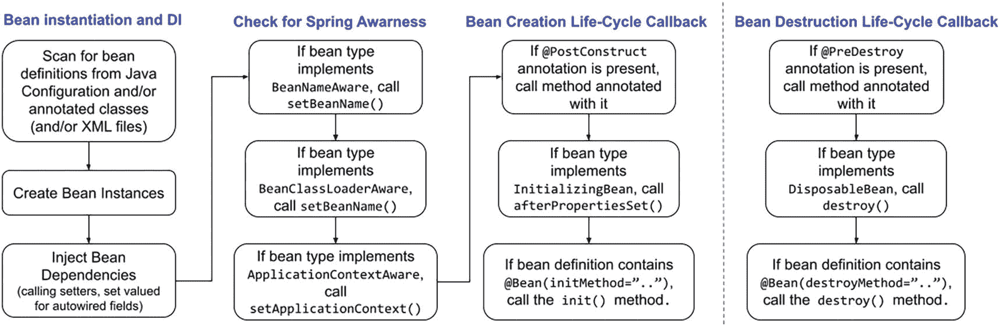
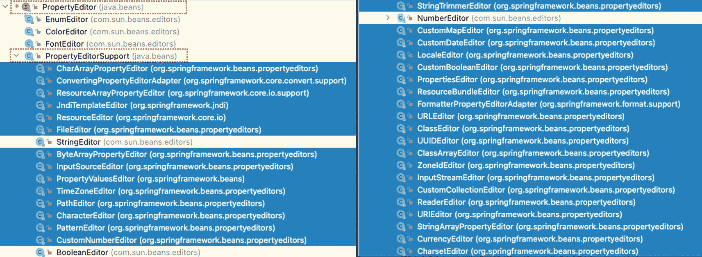
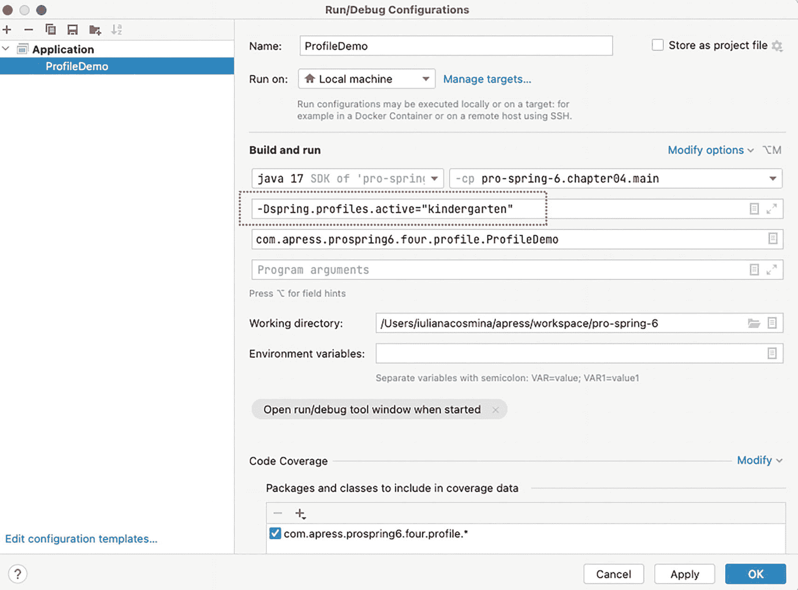
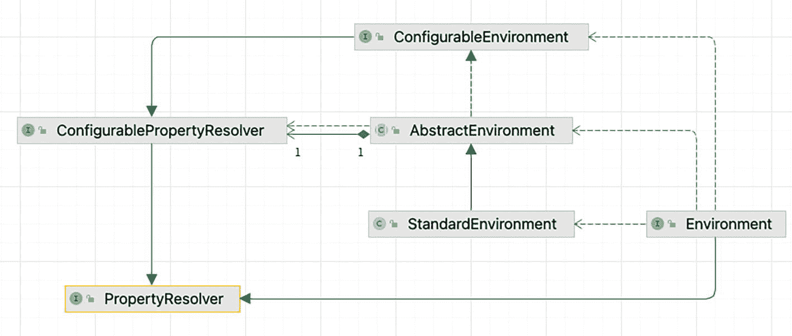
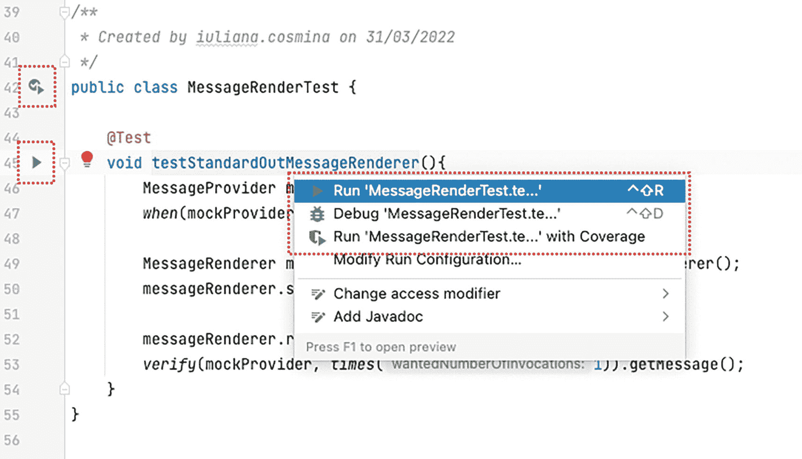
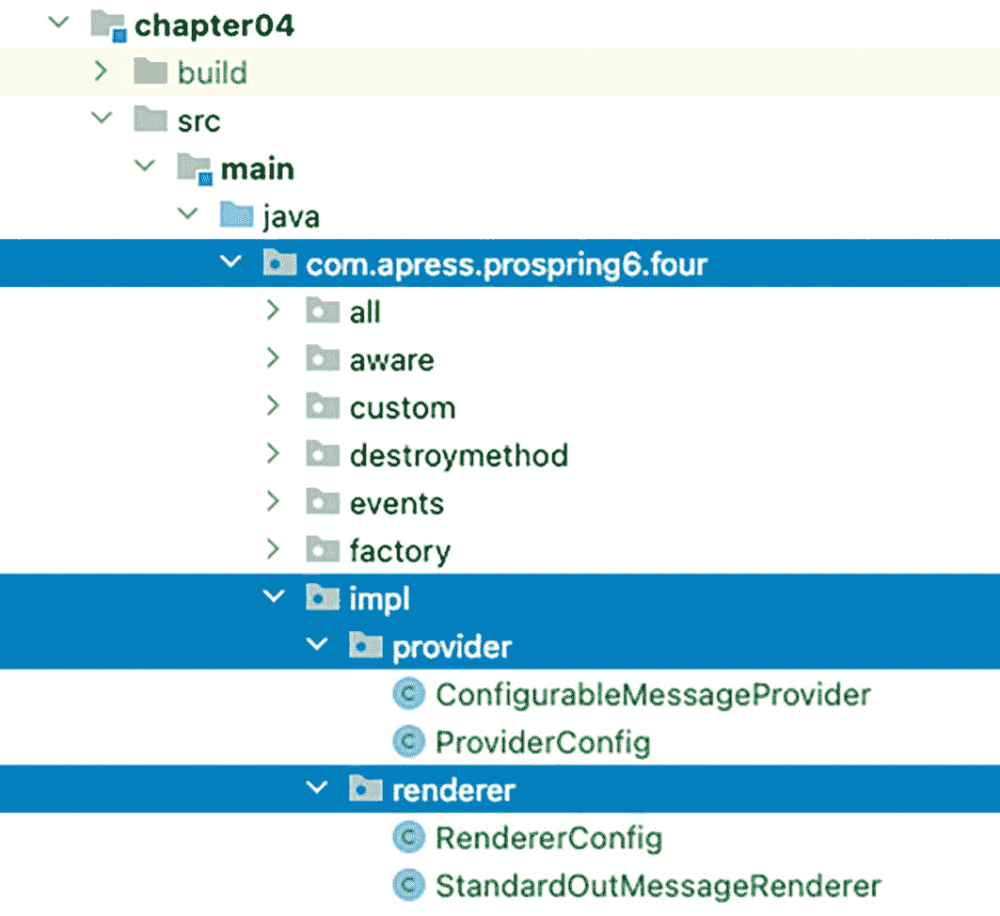
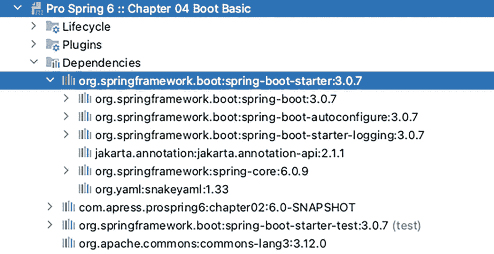
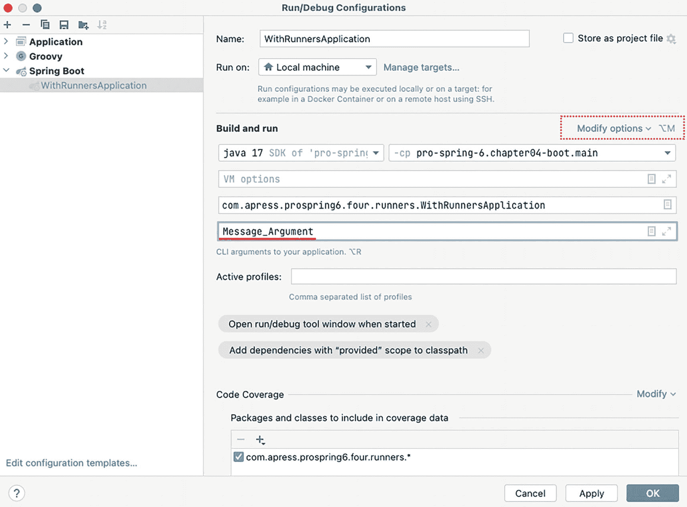

# 4. 高级 Spring 配置与 Spring Boot

在上一章中，我们详细介绍了控制反转（IoC）的概念以及它如何融入 Spring 框架。然而，我们实际上只触及了 Spring Core 能力的表面。Spring 提供了广泛的服务来补充和扩展其基本的 IoC 能力。在本章中，您将深入探讨这些内容。具体来说，您将了解以下内容：

*   *管理 Bean 生命周期*：到目前为止，您看到的所有 Bean 都相当简单，并且与 Spring 容器完全解耦。在本章中，我们将介绍一些策略，您可以使用这些策略使您的 Bean 在其生命周期的各个阶段接收来自 Spring 容器的通知。您可以通过实现 Spring 规定的特定接口、指定 Spring 可以通过反射调用的方法，或者使用 JavaBeans^(²⁹) 生命周期注解来实现这一点。

*   *使您的 Bean 具备“**Spring 感知**”能力*：在某些情况下，您希望 Bean 能够与配置它的 `ApplicationContext` 实例进行交互。为此，Spring 提供了两个接口：`BeanNameAware` 和 `ApplicationContextAware`（在**第** **3** **章**末尾介绍），它们分别允许您的 Bean 获取其分配的名称和引用其 `ApplicationContext`。与本节主题对应的部分将介绍如何实现这些接口，并给出在应用程序中使用它们的一些实际考虑。

*   *使用 FactoryBeans*：顾名思义，`FactoryBean` 接口旨在由任何充当其他 Bean 工厂的 Bean 来实现。`FactoryBean` 接口提供了一种机制，通过该机制您可以轻松地将自己的工厂与 Spring 的 `BeanFactory` 接口集成。

*   *使用 JavaBeans* `PropertyEditor` 实现：`PropertyEditor` 接口是 `java.beans` 包中提供的标准接口。`PropertyEditors` 用于在属性值与 `String` 表示形式之间进行转换。Spring 广泛使用 `PropertyEditors`，主要用于读取在 `BeanFactory` 配置中指定的值，并将其转换为正确的类型。在本章中，我们将讨论 Spring 提供的一组 `PropertyEditors`，以及如何在应用程序中使用它们。我们还将了解如何实现自定义的 `PropertyEditors`。

*   *深入了解 Spring 应用上下文*：如您所知，`ApplicationContext` 是 `BeanFactory` 的扩展，旨在用于完整的应用程序。`ApplicationContext` 接口提供了一组有用的额外功能，包括国际化消息支持、资源加载和事件发布。在本章中，我们将详细介绍 `ApplicationContext` 除了 IoC 之外提供的功能。我们还会稍微超前一点，向您展示在构建 Web 应用程序时，`ApplicationContext` 如何简化 Spring 的使用。

*   *测试 Spring 应用程序*：**第** **3** **章**解释了如何构建 Spring `ApplicationContext`，并通过运行 `main(..)` 方法演示了它构建良好——Bean 按预期创建。然而，这并不是最佳方式，因为包含这些方法的类在构建过程中仅被编译而不会运行，因此 Bean 声明中的任何更改或导致问题的库升级，可能要到开发后期才会变得明显。因此，在本章中，我们将展示如何创建 Spring 测试上下文来测试 Spring 应用程序。

*   *使用 Spring Boot*：通过使用 Spring Boot，Spring 应用程序的配置变得更加实用。这个 Spring 项目使得创建可以“直接运行”的、独立的、生产级的、基于 Spring 的应用程序变得容易。

*   *使用* *配置增强功能*：我们介绍了一些使应用程序配置更简单的功能，例如配置文件管理、环境和属性源抽象等。介绍这些功能的部分将展示如何使用它们来满足特定的配置需求。

*   *使用 Groovy 进行配置*：Spring 4.0 引入了使用 Groovy 语言配置 Bean 定义的能力，正如您将看到的，这可以作为旧的 XML 和 Java 配置风格的替代/补充。


## Spring 对应用程序可移植性的影响

本章讨论的大多数功能都是 Spring 特有的，并且在许多情况下，其他 IoC 容器并不提供这些功能。尽管许多 IoC 容器都提供生命周期管理功能，但它们可能通过一套与 Spring 不同的接口来实现。如果您的应用程序在不同 IoC 容器之间的可移植性确实很重要，那么您可能需要避免使用某些将应用程序与 Spring 耦合在一起的功能。

但是，请记住，通过设定一个约束——即您的应用程序可在 IoC 容器之间移植——您将失去 Spring 提供的丰富功能。既然您很可能已经战略性地选择使用 Spring，那么充分利用其能力是合情合理的。

注意不要凭空创造对可移植性的需求。在许多情况下，应用程序的最终用户并不关心应用程序是否能在三个不同的 IoC 容器上运行；他们只希望它能运行。根据我们的经验，试图在所选技术中可用的最低公共特性基础上构建应用程序，往往是一个错误。这样做通常会使您的应用程序从一开始就处于劣势。然而，如果您的应用程序确实需要 IoC 容器的可移植性，请不要将其视为缺点——这是一个真实的需求，因此也是您的应用程序应该满足的需求。在 *Expert One-on-One: J2EE Development without EJB* (Wrox, 2004) 一书中，Rod Johnson 和 Jürgen Höller 将这类需求描述为“幻影需求”，并对其以及它们如何影响您的项目进行了更详细的讨论。

尽管使用这些功能可能会将您的应用程序与 Spring 框架耦合，但实际上，您是在更广泛的范围内提高应用程序的可移植性。请考虑您正在使用一个免费、开源且没有特定供应商隶属关系的框架。使用 Spring 的 IoC 容器构建的应用程序可以在任何运行 Java 的地方运行。对于 Java 企业应用程序，Spring 为可移植性开辟了新的可能性。Spring 提供了许多与 JEE 相同的能力，还提供了用于抽象和简化 JEE 许多其他方面的类。在许多情况下，可以使用 Spring 构建一个在简单 Servlet 容器中运行的 Web 应用程序，但其复杂程度与针对完整 JEE 应用服务器的应用程序相当。通过耦合到 Spring，您可以用 Spring 中的等效功能替换许多供应商特定或依赖于供应商配置的功能，从而提高应用程序的可移植性。

## Bean 生命周期管理

任何 IoC 容器（包括 Spring）的一个重要部分是，Bean 可以被构造为在其生命周期的特定点接收通知。这使您的 Bean 能够在整个生命周期的特定点执行相关的处理。通常，有两个生命周期事件与 Bean 特别相关：*初始化后* 和 *销毁前*。

警告。 在 Spring 的上下文中，一旦 Spring 完成设置 Bean 上的所有属性值并完成您配置它执行的任何依赖项检查，就会触发 *初始化后* 事件。

警告。 *销毁前* 事件在 Spring 销毁 Bean 实例之前触发。

但是，对于原型作用域的 Bean，Spring 不会触发 *销毁前* 事件。Spring 的设计是，无论 Bean 的作用域如何，都会在对象上调用初始化生命周期回调方法；而对于原型作用域的 Bean，则不会调用销毁生命周期回调方法。

Spring 提供了三种机制，Bean 可以使用它们来挂钩这些事件并执行一些额外的处理：

*   *基于接口的机制*：您的 Bean 实现一个特定于它想要接收的通知类型的接口，然后 Spring 通过接口中定义的回调方法通知该 Bean。

*   *基于方法的机制*：Spring 允许您在 `ApplicationContext` 配置中指定在 Bean 初始化时调用的方法名称，以及在 Bean 销毁时调用的方法名称。

*   *基于注解的机制*：您可以使用 JSR-250 注解来指定 Spring 在构造后或销毁前应调用的方法。

对于这两个事件，这些机制都实现了完全相同的目的。基于接口的机制在 Spring 中被广泛使用，这样您就不必在每次使用 Spring 的某个组件时都记得指定初始化或销毁方法。但是，在您自己的 Bean 中，使用基于方法或基于注解的机制可能更好，因为您的 Bean 不需要实现任何 Spring 特定的接口。尽管我们说过，可移植性通常不像许多书籍让您相信的那么重要，但这并不意味着当存在一个完全可行的替代方案时，您应该牺牲可移植性。话虽如此，如果您正在以其他方式将应用程序与 Spring 耦合，那么使用接口方法可以让您指定一次回调，然后就可以忘记它。如果您正在定义大量需要利用生命周期通知的相同类型的 Bean，那么使用基于接口的机制可以避免在 Bean 配置中为每个 Bean 指定生命周期回调方法。使用 JSR-250 注解是 JCP 定义的标准，并且您也不会与 Spring 的特定注解耦合。只需确保您运行应用程序的 IoC 容器支持 JSR-250 标准即可。

总的来说，选择哪种机制来接收生命周期通知取决于您的应用程序需求。当使用注解类型配置时，请确保您使用的是支持 JSR-250 的 IoC 容器。如果您不太关心可移植性，或者您正在定义许多需要生命周期通知的相同类型的 Bean，那么使用基于接口的机制是确保您的 Bean 始终收到它们期望的通知的最佳方式。如果您计划在不同的 Spring 项目中使用某个 Bean，那么您几乎肯定希望该 Bean 的功能尽可能自包含，因此您绝对应该使用基于接口的机制。

图 4-1 展示了 Spring 如何管理其容器内 Bean 生命周期的高级概述。



一个 Spring Bean 的框图分为 4 个部分：Bean 安装和 DI、检查 Spring 感知、Bean 创建生命周期回调以及 Bean 销毁生命周期回调。包括：扫描 Bean 定义、创建实例、注入依赖项和方法选择。

图 4-1

Spring Bean 生命周期


## 钩入 Bean 的创建过程

通过感知自身的初始化时机，Bean 可以检查其所有必需的依赖项是否已满足。虽然 Spring 可以为你检查依赖项，但这基本上是一种“全有或全无”的方式，并且它没有提供任何机会来为依赖项解析过程应用额外的逻辑。考虑一个 Bean，它声明了四个 Setter 依赖项，其中两个是必需的，另一个在未提供依赖项时具有合适的默认值。使用初始化回调，你的 Bean 可以检查它所需的依赖项，并根据需要抛出异常或提供默认值。

Bean 无法在其构造函数中执行这些检查，因为此时 Spring 还没有机会为其能够满足的依赖项提供值。Spring 中的初始化回调是在 Spring 完成提供其能够提供的依赖项并执行你要求的任何依赖项检查之后调用的。

你不仅限于使用初始化回调来检查依赖项；你可以在回调中做任何你想做的事情，但它对于我们描述的目的最为有用。在许多情况下，初始化回调也是触发你的 Bean 必须自动响应其配置而采取的任何操作的地方。例如，如果你构建一个 Bean 来运行定时任务，初始化回调提供了启动调度器的理想位置——毕竟，配置数据是在 Bean 上设置的。

警告。 你不需要编写一个 Bean 来运行定时任务，因为 Spring 可以通过其内置的调度功能或通过与 Quartz 调度器的集成来自动完成此操作。我们将在**第** **12** **章**中更详细地介绍这一点。

### 在 Bean 创建时执行方法

正如我们之前提到的，接收初始化回调的一种方法是在你的 Bean 上指定一个方法作为初始化方法，并告诉 Spring 将此方法用作初始化方法。如前所述，当你只有几个相同类型的 Bean，或者希望保持应用程序与 Spring 解耦时，这种基于回调的机制非常有用。使用这种机制的另一个原因是使你的 Spring 应用程序能够与之前构建的或由第三方供应商提供的 Bean 一起工作。指定回调方法只需将方法名称指定为 `@Bean` 注解中 `initMethod` 属性的值即可。此注解用于在 Java 配置类中声明 Bean。虽然 Java 配置将在本章稍后介绍，但 Bean 初始化部分属于这里。

清单 4-1 展示了一个具有两个依赖项的基本 Bean。

```
package com.apress.prospring6.four.initmethod;
import org.apache.commons.lang3.builder.ToStringBuilder;
// import statements omitted
class Singer {
private static Logger logger = LoggerFactory.getLogger(Singer.class);
private static final String DEFAULT_NAME = "No Name";
private String name;
private int age;
public void setName(String name) {
logger.info("Calling setName for bean of type {}.", Singer.class);
this.name = name;
}
public void setAge(int age) {
logger.info("Calling setAge for bean of type {}.", Singer.class);
this.age = age;
}
public void init() {
logger.info("Initializing bean");
if (name == null) {
logger.info("Using default name");
name = DEFAULT_NAME;
}
if (age == Integer.MIN_VALUE) {
throw new IllegalArgumentException(
"You must set the age property of any beans of type " + Singer.class);
}
}
@Override
public String toString() {
return new ToStringBuilder(this)
.append("name", name)
.append("age", age)
.toString();
}
}
public class InitMethodDemo {
private static Logger logger = LoggerFactory.getLogger(InitMethodDemo.class);
public static void main(String... args) {
var ctx = new AnnotationConfigApplicationContext(SingerConfiguration.class);
getBean("singerOne", ctx);
getBean("singerTwo", ctx);
getBean("singerThree", ctx);
}
public static Singer getBean(String beanName, ApplicationContext ctx) {
try {
Singer bean = (Singer) ctx.getBean(beanName);
logger.info("Found: {}", bean);
return bean;
} catch (BeanCreationException ex) {
logger.error("An error occurred in bean configuration: " + ex.getMessage());
return null;
}
}
}
清单 4-1
具有两个依赖项的 Bean 类型
```

注意，我们定义了一个方法 `init()` 来充当初始化回调。`init()` 方法检查 `name` 属性是否已设置，如果未设置，则使用存储在 `DEFAULT_NAME` 常量中的默认值。`init()` 方法还检查 `age` 属性是否已设置，如果未设置，则抛出 `IllegalArgumentException`。

`InitMethodDemo` 类的 `main()` 方法尝试使用其自己的 `getBean()` 方法从 `AnnotationConfigApplicationContext` 获取三个 Bean，所有 Bean 的类型都是 `Singer`。注意，在 `getBean()` 方法中，如果成功获取 Bean，其详细信息将写入控制台输出。如果在 `init()` 方法中抛出异常（在本例中，如果未设置 `age` 属性，就会发生这种情况），那么 Spring 会将该异常包装在 `BeanCreationException` 中。`getBean()` 方法捕获这些异常，并将一条消息写入控制台输出，告知我们错误，同时返回一个 `null` 值。

清单 4-2 显示了一个 `ApplicationContext` 配置，该配置定义了前面代码片段中使用的 Bean。


```
package com.apress.prospring6.four.initmethod;
import org.springframework.context.annotation.Bean;
import org.springframework.context.annotation.Configuration;
@Configuration
class SingerConfiguration {
@Bean(initMethod = "init")
Singer singerOne(){
Singer singer = new Singer();
singer.setName("John Mayer");
singer.setAge(43);
return singer;
}
@Bean(initMethod = "init")
Singer singerTwo(){
Singer singer = new Singer();
singer.setAge(42);
return singer;
}
@Bean(initMethod = "init")
Singer singerThree(){
Singer singer = new Singer();
singer.setName("John Butler");
return singer;
}
}
代码清单 4-2
使用三个 Singer Bean 配置 Spring ApplicationContext 的 SingerConfiguration
```

如你所见，三个 Bean 的 `@Bean` 注解都包含一个 `initMethod` 属性，该属性告诉 Spring 在完成 Bean 配置后立即调用 `init()` 方法。`singerOne` Bean 同时设置了 `name` 和 `age` 属性的值，因此它通过 `init()` 方法时不会发生任何变化。`singerTwo` Bean 没有设置 `name` 属性的值，这意味着在 `init()` 方法中，`name` 属性会被赋予默认值。最后，`singerThree` Bean 没有设置 `age` 属性的值。`init()` 方法中定义的逻辑将此视为错误，因此会抛出 `IllegalArgumentException`。

运行 `InitMethodDemo` 类将产生代码清单 4-3 所示的输出。

```
INFO : Singer - Calling setName for bean of type class com.apress.prospring6.four.initmethod.Singer.
INFO : Singer - Calling setAge for bean of type class com.apress.prospring6.four.initmethod.Singer.
INFO : Singer - Initializing bean
DEBUG: DefaultSingletonBeanRegistry - Creating shared instance of singleton bean 'singerTwo'
INFO : Singer - Calling setAge for bean of type class com.apress.prospring6.four.initmethod.Singer.
INFO : Singer - Initializing bean
INFO : Singer - Using default name
DEBUG: DefaultSingletonBeanRegistry - Creating shared instance of singleton bean 'singerThree'
INFO : Singer - Calling setName for bean of type class com.apress.prospring6.four.initmethod.Singer.
INFO : Singer - Initializing bean
WARN : AbstractApplicationContext - Exception encountered during context initialization - cancelling refresh attempt: org.springframework.beans.factory.BeanCreationException: Error creating bean with name 'singerThree' defined in com.apress.prospring6.four.initmethod.SingerConfiguration: Invocation of init method failed; nested exception is java.lang.IllegalArgumentException: You must set the age property of any beans of type class com.apress.prospring6.four.initmethod.Singer
Exception in thread "main" org.springframework.beans.factory.BeanCreationException: Error creating bean with name 'singerThree' defined in com.apress.prospring6.four.initmethod.SingerConfiguration: Invocation of init method failed; nested exception is java.lang.IllegalArgumentException: You must set the age property of any beans of type class com.apress.prospring6.four.initmethod.Singer
代码清单 4-3
运行 InitMethodDemo 产生的输出
```

从该输出可以看出，`singerOne` 已按照我们在配置文件中指定的值正确配置。对于 `singerTwo`，由于配置中未指定 `name` 属性的值，因此使用了该属性的默认值。最后，对于 `singerThree`，由于 `age` 属性缺少值导致 `init()` 方法引发错误，因此没有创建任何 Bean 实例。

如你所见，使用初始化方法是确保 Bean 正确配置的理想方式。通过使用这种机制，你可以充分利用 IoC 的优势，同时不会失去手动定义依赖关系所带来的任何控制权。

一个警告。 初始化方法的唯一限制是它不能接受任何参数。你可以定义任何返回类型（尽管 Spring 会忽略它），甚至可以使用静态方法，但该方法必须不接受任何参数。

当使用静态初始化方法时，这种机制的优势会被抵消，因为你无法访问 Bean 的任何状态来对其进行验证。如果你的 Bean 使用静态状态作为节省内存的机制，并且你正在使用静态初始化方法来验证此状态，那么你应该考虑将静态状态迁移为实例状态，并使用非静态初始化方法。如果你使用 Spring 的单例管理功能，最终效果是一样的，但你的 Bean 会更易于测试，并且你还能在需要时创建具有各自状态的多个 Bean 实例。当然，在某些情况下，你需要使用跨多个 Bean 实例共享的静态状态，这时你仍然可以使用静态初始化方法。

### 实现 InitializingBean 接口

Spring 中定义的 `InitializingBean` 接口允许你在 Bean 代码中定义 Spring 在完成 Bean 配置后要执行的操作。与使用初始化方法时一样，这为你提供了检查 Bean 配置以确保其有效性的机会，并在此过程中提供任何默认值。`InitializingBean` 接口定义了一个单一方法 `afterPropertiesSet()`，其作用与上一节介绍的 `init()` 方法相同。代码清单 4-4 展示了使用 `InitializingBean` 接口替代初始化方法对先前示例的重新实现。

```
package com.apress.prospring6.four.intf;
import org.springframework.beans.factory.InitializingBean;
// 其他导入语句已省略
class Singer implements InitializingBean {
private static Logger logger = LoggerFactory.getLogger(Singer.class);
private static final String DEFAULT_NAME = "No Name";
private String name;
private int age = Integer.MIN_VALUE;
public void setName(String name) {
logger.info("Calling setName for bean of type {}.", Singer.class);
this.name = name;
}
public void setAge(int age) {
logger.info("Calling setAge for bean of type {}.", Singer.class);
this.age = age;
}
@Override
public void afterPropertiesSet() throws Exception {
logger.info("Initializing bean using 'afterPropertiesSet()'");
if (name == null) {
logger.info("Using default name");
name = DEFAULT_NAME;
}
if (age == Integer.MIN_VALUE) {
throw new IllegalArgumentException(
"You must set the age property of any beans of type " + Singer.class);
}
}
@Override
public String toString() {
return new ToStringBuilder(this)
.append("name", name)
.append("age", age)
.toString();
}
}
@Configuration
class SingerConfiguration {
@Bean
Singer singerOne(){
Singer singer = new Singer();
singer.setName("John Mayer");
singer.setAge(43);
return singer;
}
// 其他 Bean 声明已省略
}
public class InitializingBeanDemo {
private static Logger logger = LoggerFactory.getLogger(InitializingBeanDemo.class);
public static void main(String... args) {
var ctx = new AnnotationConfigApplicationContext(SingerConfiguration.class);
getBean("singerOne", ctx);
getBean("singerTwo", ctx);
getBean("singerThree", ctx);
}
// getBean(..) 方法已省略，与代码清单 4-1 中的相同。
}
代码清单 4-4
实现 InitializingBean 的 Singer 类
```

如你所见，此示例中的变化不大。唯一的区别在于此类实现了 `InitializingBean`，并且初始化逻辑已移至 `afterPropertiesSet()` 方法中。配置不再需要 `initMethod` 属性，如果你运行 `InitializingBeanDemo`，将会看到相同的输出。


### 使用 JSR-250 的 @PostConstruct 注解

JSR-250 注解在**第** **4 章**中已结合使用 `@Resource` 进行依赖自动装配的内容进行过介绍。本节将展示如何使用 JSR-250 生命周期注解 `@PostConstruct`。从 Spring 2.5 开始，JSR-250 注解也得到支持，用于指定当类中存在与 Bean 生命周期相关的对应注解时，Spring 应调用的方法。清单 4-5 展示了使用 `@PostConstruct` 注解重写的上一个示例。

```
package com.apress.prospring6.four.jsr250;
import jakarta.annotation.PostConstruct;
class Singer {
private static Logger logger = LoggerFactory.getLogger(Singer.class);
private static final String DEFAULT_NAME = "No Name";
private String name;
private int age = Integer.MIN_VALUE;
public void setName(String name) {
logger.info("Calling setName for bean of type {}.", Singer.class);
this.name = name;
}
public void setAge(int age) {
logger.info("Calling setAge for bean of type {}.", Singer.class);
this.age = age;
}
@PostConstruct
public void postConstruct() throws Exception {
logger.info("Initializing bean using 'postConstruct()'");
if (name == null) {
logger.info("Using default name");
name = DEFAULT_NAME;
}
if (age == Integer.MIN_VALUE) {
throw new IllegalArgumentException(
"You must set the age property of any beans of type " + Singer.class);
}
}
// toString() omitted
}
清单 4-5
使用 @PostConstruct 实现的 Singer 类
```

该程序与使用 `@Bean(initMethod=..)` 和 `InitializingBean` 方法相同；区别在于将 `@PostConstruct` 注解应用于初始化方法。在此场景中，方法被重命名为 `postConstruct`，以更明确地表明该方法的目的。请注意，你可以随意命名该方法。

一条信息提示。 用于测试这个新 `Singer` Bean 类型的配置和类与 `InitializingBean` 示例中的完全相同，产生的输出也相同，因此此处不再重复，但欢迎你自行执行本书项目中的 `com.apress.prospring6.four.jsr250.PostConstructDemo` 类来验证这一论断。

这三种方法各有优缺点：

*   使用初始化方法，你可以保持应用程序与 Spring 解耦，但必须记住为每个需要初始化方法的 Bean 进行配置。

*   使用 `InitializingBean` 接口，你可以为 Bean 类的所有实例指定一次初始化回调，但这样做会使应用程序与 Spring 耦合。

*   使用注解，你需要将注解应用于方法，并确保 IoC 容器支持 JSR-250。

最终，你应该根据应用程序的需求来决定使用哪种方法。如果可移植性是一个问题，请使用初始化方法或注解方法；否则，使用 `InitializingBean` 接口可以减少应用程序所需的配置量，并降低因配置错误而导致错误潜入应用程序的风险。

一条信息提示。 当使用 `@Bean(initMethod=..)` 或 `@PostConstruct` 配置初始化时，其优势在于可以用不同的访问权限声明初始化方法。初始化方法应仅在 Bean 创建时由 Spring IoC 调用一次。后续调用将导致意外结果甚至失败。通过将初始化方法设为 `private`，可以禁止外部额外调用。Spring IoC 能够通过反射调用它，但代码中的任何额外调用都将不被允许。

### 理解解析顺序

所有初始化机制都可以用于同一个 Bean 实例。在这种情况下，Spring 首先调用带有 `@PostConstruct` 注解的方法，然后调用 `afterPropertiesSet()`，最后调用 `@Bean` 注解中指定的初始化方法。这种顺序有其技术原因，通过遵循图 4-1 中的路径，我们可以注意到 Bean 创建过程中的以下步骤：

1.  首先调用构造函数来创建 Bean。

2.  注入依赖项（调用 setter 方法）。如果存在依赖项，则会咨询 `BeanPostProcessor` 基础设施 Bean 来调用 setter 方法。这是一个 Spring 特定的基础设施 Bean，用于在 Bean 创建后对其进行修改。`@Autowired` 注解由 `AutowiredAnnotationBeanPostProcessor` 注册，因此该 Bean 将调用带有 `@Autowired` 注解的 setter 方法。

3.  现在 Bean 已存在且依赖项已提供，会咨询预初始化的 `BeanPostProcessor` 基础设施 Bean，以确定它们是否想要调用此 Bean 中的任何内容。这些是 Spring 特定的基础设施 Bean，用于在 Bean 创建后对其进行修改。`@PostConstruct` 注解由 `CommonAnnotationBeanPostProcessor` Bean 注册，因此该 Bean 将调用带有 `@PostConstruct` 注解的方法。此方法在 Bean 构造完成后、类投入使用之前^(³⁰)，以及在实际初始化 Bean 之前（在 `afterPropertiesSet` 和 `initMethod` 之前）立即执行。

4.  `InitializingBean` 的 `afterPropertiesSet` 在依赖项注入后立即执行。`afterPropertiesSet()` 方法由 `BeanFactory` 在设置完所有提供的 Bean 属性并满足 `BeanFactoryAware` 和 `ApplicationContextAware` 后调用。

5.  在 `initMethod` 属性中按名称指定的方法最后执行，因为这是 Bean 的实际初始化方法。

清单 4-6 中所示的 `AllInitMethodsDemo` 类集可用于演示上述所有论断。

```
package com.apress.prospring6.four.all;
// import statement omitted
class Dependency { // very simple bean type
}
class MultiInit implements InitializingBean {
private static Logger logger = LoggerFactory.getLogger(MultiInit.class);
private Dependency dependency;
public MultiInit() {
logger.info("1\. Calling constructor for bean of type {}.", MultiInit.class);
}
public Dependency getDependency() {
return dependency;
}
@Autowired
public void setDependency(Dependency dependency) {
logger.info("2\. Calling setDependency for bean of type {}.", MultiInit.class);
this.dependency = dependency;
}
@PostConstruct
private void postConstruct() throws Exception {
logger.info("3\. Calling postConstruct() for bean of type {}.", MultiInit.class);
}
@Override
public void afterPropertiesSet() throws Exception {
logger.info("4\. Calling afterPropertiesSet() for bean of type {}.", MultiInit.class);
}
private void initMe() throws Exception {
logger.info("5\. Calling initMethod() for bean of type {}.", MultiInit.class);
}
}
@Configuration
class MultiInitConfiguration {
@Bean
Dependency dependency (){
return new Dependency();
}
@Bean(initMethod = "initMe")
MultiInit multiInitBean(){
return new MultiInit();
}
}
public class AllInitMethodsDemo {
public static void main(String... args) {
new AnnotationConfigApplicationContext(MultiInitConfiguration.class);
}
}
清单 4-6
用于展示初始化方法顺序的 AllInitMethodsDemo 示例
```

当在 `AllInitMethodsDemo` 类的 `main(..)` 方法中启用 `org.springframework` 包的 `DEBUG` 日志运行时，将产生清单 4-7 中的输出。


```
...
DEBUG: DefaultSingletonBeanRegistry - Creating shared instance of singleton bean 'org.springframework.context.annotation.internalConfigurationAnnotationProcessor'
DEBUG: DefaultSingletonBeanRegistry - Creating shared instance of singleton bean 'org.springframework.context.event.internalEventListenerProcessor'
DEBUG: DefaultSingletonBeanRegistry - Creating shared instance of singleton bean 'org.springframework.context.event.internalEventListenerFactory'
DEBUG: DefaultSingletonBeanRegistry - Creating shared instance of singleton bean 'org.springframework.context.annotation.internalAutowiredAnnotationProcessor'
DEBUG: DefaultSingletonBeanRegistry - Creating shared instance of singleton bean 'org.springframework.context.annotation.internalCommonAnnotationProcessor'
DEBUG: DefaultSingletonBeanRegistry - Creating shared instance of singleton bean 'multiInitConfiguration'
DEBUG: DefaultSingletonBeanRegistry - Creating shared instance of singleton bean 'dependency'
DEBUG: DefaultSingletonBeanRegistry - Creating shared instance of singleton bean 'multiInitBean'
INFO : MultiInit - 1\. 为类型为 class com.apress.prospring6.four.all.MultiInit 的 bean 调用构造函数。
INFO : MultiInit - 2\. 为类型为 class com.apress.prospring6.four.all.MultiInit 的 bean 调用 setDependency 方法。
INFO : MultiInit - 3\. 为类型为 class com.apress.prospring6.four.all.MultiInit 的 bean 调用 postConstruct() 方法。
INFO : MultiInit - 4\. 为类型为 class com.apress.prospring6.four.all.MultiInit 的 bean 调用 afterPropertiesSet() 方法。
INFO : MultiInit - 5\. 为类型为 class com.apress.prospring6.four.all.MultiInit 的 bean 调用 initMethod() 方法。
清单 4-7
AllInitMethodsDemo 控制台输出
```

如果你查看 Spring 应用程序的详细日志，可能会注意到一些 Spring 特有的基础设施 Bean。它们的名称暗示了其类型和职责。例如，`org.springframework.context.annotation.internalCommonAnnotationProcessor` Bean 是 `CommonAnnotationBeanPostProcessor` Bean，它为 `@PostConstruct` 注解提供支持；而 `org.springframework.context.annotation.internalAutowiredAnnotationProcessor` Bean 是 `AutowiredAnnotationBeanPostProcessor` Bean，它为 `@Autowired` 注解提供支持。如果你想通过名称识别其他类型的 Spring 特有基础设施 Bean，可以查看 `AnnotationConfigUtils` 的源代码 ^(³¹)。

## 接入 Bean 销毁

当使用包装了 `DefaultListableBeanFactory` 接口的 `ApplicationContext` 实现（例如通过 `getDefaultListableBeanFactory()` 方法获取的 `AnnotationConfigApplicationContext`）时，你可以通过调用 `ConfigurableBeanFactory.destroySingletons()` 向 `BeanFactory` 发出信号，表明你想要销毁所有单例实例。通常，你会在应用程序关闭时执行此操作，这允许你清理 Bean 可能持有的任何资源，从而使应用程序能够优雅地关闭。此回调还提供了一个绝佳的位置，用于将存储在内存中的任何数据刷新到持久化存储，并允许你的 Bean 结束它们可能已启动的任何长时间运行的进程。

为了让你的 Bean 能够接收到 `destroySingletons()` 已被调用的通知，你有三种选择，所有这些都与可用于接收初始化回调的机制类似。销毁回调通常与初始化回调结合使用。在许多情况下，你在初始化回调中创建和配置资源，然后在销毁回调中释放该资源。

警告。 `destroySingletons()` 方法的名称暗示了一个重要的细节。Spring 仅对单例 Bean 执行销毁操作。对于非单例作用域的 Bean，其生命周期并非完全由 Spring 管理。例如，对于原型 Bean，Spring 容器会实例化、配置并组装一个原型对象，然后将其交给客户端，之后不再记录该原型实例。

## 在 Bean 销毁时执行方法

要指定一个在 Bean 销毁时被调用的方法，你只需在 Bean 定义的 `@Bean` 注解的 `destroyMethod` 属性中指定该方法的名称。Spring 会在销毁该 Bean 的单例实例之前调用它（Spring 不会为那些具有 `prototype` 作用域的 Bean 调用此方法）。清单 4-8 中的代码片段提供了一个使用销毁方法回调的示例。

```
package com.apress.prospring6.four.destroymethod;
// 导入语句已省略
class FileManager {
private static Logger logger = LoggerFactory.getLogger(FileManager.class);
private Path file;
public FileManager() {
logger.info("正在创建类型为 {} 的 Bean", FileManager.class);
try {
file = Files.createFile(Path.of("sample"));
} catch (IOException e) {
logger.error("无法创建文件");
}
}
private void destroyMethod() throws IOException {
logger.info("正在销毁类型为 {} 的 Bean", FileManager.class);
if (file != null) {
Files.deleteIfExists(file);
}
}
}
@Configuration
class DemoConfig {
@Bean(destroyMethod = "destroyMethod")
FileManager fileManager() {
return new FileManager();
}
}
public class DestroyMethodDemo {
public static void main(String... args) {
var ctx = new AnnotationConfigApplicationContext(DemoConfig.class);
ctx.close(); // 需要关闭上下文
}
}
清单 4-8
展示如何使用 @Bean 注解配置销毁方法的示例
```

`FileManager` 类定义了一个 `destroyMethod()` 方法，在该方法中，由其构造函数创建的文件会被删除。`main()` 方法从上下文中获取一个 `FileManager` 类型的 Bean，然后调用其 `destroyMethod()` 方法（该方法进而会调用由 `ApplicationContext` 包装的 `ConfigurableBeanFactory.destroySingletons()` 方法），指示 Spring 销毁其管理的所有单例。构造函数和销毁方法都会向控制台输出一条消息，告知我们它们已被调用。


### 实现 `DisposableBean` 接口

与初始化回调类似，Spring 提供了一个接口（此处为 `DisposableBean`），你的 Bean 可以实现该接口，作为接收销毁回调的机制。`DisposableBean` 接口定义了一个单一方法 `destroy()`，该方法在 Bean 被销毁之前调用。使用此机制与使用 `InitializingBean` 接口接收初始化回调是正交的。清单 4-9 中的代码片段展示了 `FileManager` 类的一个修改后的实现，该类实现了 `DisposableBean` 接口。

```
package com.apress.prospring6.four.intf;
import org.springframework.beans.factory.DisposableBean;
// 其他导入语句已省略
class FileManager implements DisposableBean  {
private static Logger logger = LoggerFactory.getLogger(FileManager.class);
private Path file;
public FileManager() {
logger.info("Creating bean of type {}", FileManager.class);
try {
file = Files.createFile(Path.of("sample"));
} catch (IOException e) {
logger.error("Could not create file");
}
}
@Override
public void destroy() throws Exception {
logger.info("Calling destroy() on bean of type {}", FileManager.class);
if (file != null) {
Files.deleteIfExists(file);
}
}
}
清单 4-9
示例：展示如何使用 DisposableBean 接口配置销毁方法
```

使用通过 `@Bean(destroyMethod="..")` 配置的回调方法机制的代码与使用回调接口机制的代码之间没有太大区别。配置与上一节中的配置相同，只是缺少了不再需要的 `(destroyMethod="..")`。运行示例的代码也相同。因此，我们可以跳过展示这两个实现，直接进入配置销毁方法的下一种方式。

### 使用 JSR-250 `@PreDestroy` 注解

定义在 Bean 销毁前调用的方法的第三种方式是使用 JSR-250 生命周期 `@PreDestroy` 注解，它是 `@PostConstruct` 注解的逆操作。清单 4-10 中的代码片段是使用 `@PreDestroy` 执行销毁操作的 `FileManager` 版本。

```
package com.apress.prospring6.four.jsr250;
import jakarta.annotation.PreDestroy;
// 导入语句已省略
class FileManager {
private static Logger logger = LoggerFactory.getLogger(FileManager.class);
private Path file;
public FileManager() {
logger.info("Creating bean of type {}", FileManager.class);
try {
file = Files.createFile(Path.of("sample"));
} catch (IOException e) {
logger.error("Could not create file");
}
}
@PreDestroy
private void preDestroy() throws IOException {
logger.info("Calling preDestroy() on bean of type {}",FileManager.class);
if (file != null) {
Files.deleteIfExists(file);
}
}
}
清单 4-10
示例：展示如何使用 @PreDestroy 注解配置销毁方法
```

运行任何声明了销毁回调的示例，都会在控制台输出与清单 4-11 所示非常相似的日志。

```
...
INFO : FileManager - Creating bean of type class com.apress.prospring6.four.*.FileManager
DEBUG: AbstractApplicationContext - Closing org.springframework.context.annotation.AnnotationConfigApplicationContext@79be0360, started on Fri Mar 25 12:05:49 GMT 2022
INFO : FileManager - Calling destroy()/destroyMethod()/preDestroy() on bean of type class com.apress.prospring6.four.*.FileManager
清单 4-11
展示 Bean 销毁的日志示例
```

销毁回调是一种理想的机制，可确保你的应用程序优雅地关闭，并且不会让资源保持打开状态或处于不一致状态。但是，你仍然需要决定如何使用销毁方法回调：使用 `@Bean(destroyMethod="..")`、`DisposableBean` 接口还是 `@PreDestroy` 注解。同样，让应用程序的需求驱动你在此方面的决策；在可移植性成为问题时使用方法回调，并使用 `DisposableBean` 接口或 JSR-250 注解来减少所需的配置量。

### 理解解析顺序

与 Bean 创建的情况一样，你可以在同一个 Bean 实例上使用所有机制进行 Bean 销毁。在这种情况下，Spring 首先调用带有 `@PreDestroy` 注解的方法，然后调用 `DisposableBean.destroy()`，最后调用你在 `@Bean` 定义中配置的销毁方法。

### 使用关闭钩子

Spring 中销毁回调的唯一缺点是它们不会自动触发；你需要记得在应用程序关闭之前调用 `ctx.close()`。当你的应用程序作为 Servlet 运行时，你可以简单地在 Servlet 的 `destroy()` 方法中调用 `destroy()`。

然而，在独立应用程序中，事情就没那么简单了，尤其是当你的应用程序有多个退出点时。幸运的是，有一个解决方案。Java 允许你创建一个*关闭钩子*，这是一个在应用程序即将关闭之前执行的线程。这是调用你的上下文（所有具体的 `ApplicationContext` 实现都扩展了它）的 `destroy()` 方法的完美方式。利用此机制的最简单方法是使用 `AbstractApplicationContext` 的 `registerShutdownHook()` 方法。该方法会自动指示 Spring 注册底层 JVM 运行时的关闭钩子。Bean 声明和配置与之前相同；唯一改变的是 main 方法：添加了对 `ctx.registerShutdownHook` 的调用，并且移除了对 `ctx.destroy()` 或 `close()` 的调用。

运行清单 4-12 中的代码会产生与清单 4-11 中显示的输出相同的输出。

```
package com.apress.prospring6.four.jsr250;
// 导入和部分代码已省略
public class PreDestroyDemo {
public static void main(String... args) {
var ctx = new AnnotationConfigApplicationContext(DemoConfig.class);
ctx.registerShutdownHook();
}
}
清单 4-12
展示 Bean 销毁的日志示例
```

## 让你的 Bean “感知 Spring”

依赖注入相对于依赖查找作为实现控制反转机制的最大卖点之一在于，你的 Bean 不需要感知管理它们的容器实现。对于使用构造器或 Setter 注入的 Bean 来说，Spring 容器与 Google Guice 或 PicoContainer 提供的容器是一样的。然而，在某些情况下，你可能需要一个使用依赖注入来获取其依赖项的 Bean，以便它能够出于其他原因与容器进行交互。一个例子是，一个 Bean 为你自动配置了关闭钩子，因此它需要访问 `ApplicationContext`。在其他情况下，一个 Bean 可能想知道它的名称（即在当前 `ApplicationContext` 内分配的 Bean 名称），以便根据此名称执行一些额外的处理。

话虽如此，此功能实际上是为 Spring 内部使用而设计的。赋予 Bean 名称某种业务意义通常是一个坏主意，并且可能导致配置问题，因为必须人为地操纵 Bean 名称以支持其业务含义。然而，我们发现，让 Bean 在运行时找出其名称对于日志记录非常有用。假设你有许多相同类型的 Bean 在不同的配置下运行。当出现问题时，Bean 名称可以包含在日志消息中，以帮助你区分是哪个 Bean 生成了错误，哪些 Bean 工作正常。


### 使用 `BeanNameAware` 接口

`BeanNameAware` 接口可以被想要获取自身名称的 Bean 实现，它只有一个方法：`setBeanName(String)`。Spring 在完成 Bean 的配置之后、但在任何生命周期回调（初始化或销毁）被调用之前，会调用 `setBeanName()` 方法（参见图 4-1）。在大多数情况下，`setBeanName()` 接口的实现只有一行代码，用于将容器传入的值存储在一个字段中，以便后续使用。代码清单 4-13 中的代码片段展示了一个简单的 Bean，它通过 `BeanNameAware` 获取自己的名称，然后使用该 Bean 名称向控制台打印信息。

```
package com.apress.prospring6.four.aware;
// 其他导入语句已省略
import org.springframework.beans.factory.BeanNameAware;
class NamedSinger implements BeanNameAware {
private static Logger logger = LoggerFactory.getLogger(NamedSinger.class);
private String name;
@Override /** @Implements {@link BeanNameAware#setBeanName(String)} */
public void setBeanName(String beanName) {
this.name = beanName;
}
public void sing() {
logger.info("Singer " + name + " - sing()");
}
}
代码清单 4-13
BeanNameAware 示例实现
```

这个实现相当简单。请记住，`BeanNameAware.setBeanName()` 是在通过调用 `ApplicationContext.getBean()` 将 Bean 的第一个实例返回给应用程序之前调用的，因此无需在 `sing()` 方法中检查 Bean 名称是否可用。如您所见，利用 `BeanNameAware` 接口不需要特殊的配置。在代码清单 4-14 中，您可以看到一个简单的配置示例和应用程序，它从 `ApplicationContext` 中检索 `NamedSinger` 实例，然后调用 `sing()` 方法。

```
package com.apress.prospring6.four.aware;
// 其他导入语句已省略
@ComponentScan
class AwareConfig {
@Bean
NamedSinger johnMayer(){
return new NamedSinger();
}
}
public class AwareDemo {
public static void main(String... args) {
var ctx = new AnnotationConfigApplicationContext(AwareConfig.class);
ctx.registerShutdownHook();
var singer = ctx.getBean(NamedSinger.class);
singer.sing();
}
}
代码清单 4-14
BeanNameAware 使用示例
```

运行时，此示例会生成一个非常简单的输出：

```
INFO : NamedSinger - Singer johnMayer - sing() ;
```

请注意，在调用 `sing()` 方法的日志消息中包含了 Bean 名称。

使用 `BeanNameAware` 接口确实非常简单，并且在您需要提高日志消息质量时，它能发挥很好的作用。避免仅仅因为可以访问 Bean 名称就试图赋予它们业务含义；这样做会将您的类与 Spring 耦合在一起，而带来的好处却微乎其微。如果您的 Bean 内部需要某种名称，可以让它们实现一个类似 `Nameable`（特定于您的应用程序）的接口，其中包含一个 `setName()` 方法，然后通过依赖注入为每个 Bean 赋予一个名称。这样，您可以使配置中使用的名称保持简洁，并且无需为了给 Bean 赋予具有业务含义的名称而进行不必要的配置操作。

### 使用 `ApplicationContextAware` 接口

`ApplicationContextAware` 在**第** **3** **章**末尾被引入，用以展示 Spring 如何处理那些需要其他 Bean 才能运行、但未在配置中使用构造函数或 Setter 方法注入的 Bean（代码清单 3-54 中的 `@DependsOn` 示例）。

通过使用 `ApplicationContextAware` 接口，您的 Bean 可以获取到配置它们的 `ApplicationContext` 实例的引用。创建此接口的主要原因是允许 Bean 在您的应用程序中访问 Spring 的 `ApplicationContext`，例如，通过 `getBean()` 以编程方式获取其他 Spring Bean。但是，您应该避免这种做法，而应使用依赖注入为您的 Bean 提供其协作者。如果在可以使用依赖注入的情况下，却使用基于查找的 `getBean()` 方法来获取依赖项，那么您就是在为 Bean 增加不必要的复杂性，并且在没有充分理由的情况下将它们与 Spring 框架耦合在一起。

当然，`ApplicationContext` 不仅仅用于查找 Bean；它还执行许多其他任务。正如您之前所见，其中一项任务是销毁所有单例 Bean，并在销毁之前依次通知它们。在上一节中，您了解了如何创建一个关闭钩子，以确保在应用程序关闭之前指示 `ApplicationContext` 销毁所有单例 Bean。通过使用 `ApplicationContextAware` 接口，您可以构建一个 Bean，该 Bean 可以在 `ApplicationContext` 中进行配置，以自动创建和配置一个关闭钩子 Bean。代码清单 4-15 展示了此 Bean 的代码。

```
package com.apress.prospring6.four.aware;
import org.springframework.context.ApplicationContextAware;
// 其他导入语句已省略
class ShutdownHookBean implements ApplicationContextAware {
private ApplicationContext ctx;
/** @Implements {@link ApplicationContextAware#setApplicationContext(ApplicationContext)} }*/
public void setApplicationContext(ApplicationContext ctx) throws BeansException {
if (ctx instanceof GenericApplicationContext) {
((GenericApplicationContext) ctx).registerShutdownHook();
}
}
}
代码清单 4-15
ApplicationContextAware 实现示例
```

到目前为止，这段代码的大部分内容您应该已经熟悉。`ApplicationContextAware` 接口定义了一个单一方法 `setApplicationContext(ApplicationContext)`，Spring 会调用该方法，将 `ApplicationContext` 的引用传递给您的 Bean。在上面的代码片段中，`ShutdownHookBean` 类检查 `ApplicationContext` 是否为 `GenericApplicationContext` 类型，这意味着它支持 `registerShutdownHook()` 方法；如果是，它将向 `ApplicationContext` 注册一个关闭钩子。代码清单 4-16 展示了如何配置此 Bean 以使其与上一节中引入的 `FileManager` Bean 协同工作。

```
package com.apress.prospring6.four.aware;
// 其他导入语句已省略
@ComponentScan
class AwareConfig {
@Bean
FileManager fileManager() {
return new FileManager();
}
@Bean
ShutdownHookBean shutdownHookBean() {
return new ShutdownHookBean();
}
}
public class AwareDemo {
public static void main(String... args) {
new AnnotationConfigApplicationContext(AwareConfig.class);
}
}
代码清单 4-16
ApplicationContextAware Bean 配置及基于此配置启动 Spring 应用程序的代码
```

请注意，不需要特殊的配置。构建 Spring 应用程序的代码也很简单，正如新的 `AwareDemo` 类所示。不再需要调用 `ctx.registerShutdownHook()`，因为这项工作已由 `ShutdownHookBean` 完成。运行上述示例将生成一个控制台输出，其结尾为：

```
INFO : FileManager - Calling preDestroy() on bean of type class com.apress.prospring6.four.aware.FileManager
```

即使没有调用 `ctx.registerShutdownHook()` 或 `ctx.close()`（后者会关闭应用程序上下文并移除钩子），`preDestroy()` 方法也会在应用程序关闭之前被调用，因为 `ShutdownHookBean.setApplicationContext(ApplicationContext ctx)` 方法执行了关闭钩子的注册。


## 使用 `FactoryBeans`

使用 Spring 时，你会遇到的一个问题是如何创建并注入那些无法简单通过 `new` 操作符创建的依赖。为了解决这个问题，Spring 提供了 `FactoryBean` 接口，它充当了那些无法使用标准 Spring 语义创建和管理的对象的适配器。通常，你会使用 `FactoryBean` 的实现来创建那些无法通过 `new` 操作符创建的 Bean，例如通过静态工厂方法访问的对象，尽管情况并非总是如此。简单来说，`FactoryBean` 是一个充当其他 Bean 工厂的 Bean。`FactoryBeans` 像普通 Bean 一样在你的 `ApplicationContext` 中进行配置，但当 Spring 使用 `FactoryBean` 接口来满足依赖或查找请求时，它不会返回 `FactoryBean` 本身；相反，它会调用 `FactoryBean.getObject()` 方法并返回该调用的结果。

一个关键词提示。 Spring 会自动调用 `getObject()` 方法；手动调用该方法是一种不好的实践。

`FactoryBeans` 在 Spring 中得到了广泛应用；最显著的用途包括创建事务代理（我们将在**第** **9** **章**中介绍）以及从 JNDI 上下文中自动检索资源。然而，`FactoryBeans` 不仅对构建 Spring 内部机制有用；在构建你自己的应用程序时，你会发现它们非常有用，因为它们允许你通过 IoC 管理比原本可能更多的资源。

### `FactoryBean` 示例：`MessageDigestFactoryBean`

我们参与的项目通常需要某种加密处理；这通常涉及生成用户密码的消息摘要或哈希值，以便存储在数据库中。在 Java 中，`MessageDigest` 类提供了为任意数据创建摘要的功能。`MessageDigest` 本身是抽象的，你需要通过调用 `MessageDigest.getInstance()` 并传入你想要使用的摘要算法名称来获取具体的实现。例如，如果我们想使用 MD5 算法创建摘要，我们会使用以下代码来创建 `MessageDigest` 实例：

```
MessageDigest md5 = MessageDigest.getInstance("MD5");
```

如果我们想使用 Spring 来管理 `MessageDigest` 对象的创建，在没有 `FactoryBean` 的情况下，我们能做的最好的办法是在我们的 Bean 上设置一个名为 `algorithmName` 的属性，然后使用初始化回调来调用 `MessageDigest.getInstance()`。使用 `FactoryBean`，我们可以将此逻辑封装在一个 Bean 内部。然后，任何需要 `MessageDigest` 实例的 Bean 都可以简单地声明一个 `messageDigest` 属性，并使用 `FactoryBean` 来获取该实例。清单 4-17 展示了实现此功能的 `FactoryBean` 代码。

```
package com.apress.prospring6.four.factory;
import org.springframework.beans.factory.FactoryBean;
import java.security.MessageDigest;
// 其他导入语句已省略
public class MessageDigestFactoryBean implements FactoryBean, InitializingBean {
private String algorithmName = "MD5";
private MessageDigest messageDigest = null;
@Override /** @Implements {@link FactoryBean#getObject()} */
public MessageDigest getObject() throws Exception {
return messageDigest;
}
@Override /** @Implements {@link FactoryBean#getObjectType()} */
public Class getObjectType() {
return MessageDigest.class;
}
@Override /** @Implements {@link FactoryBean#isSingleton()} */
public boolean isSingleton() {
return true;
}
@Override /** @Implements {@link InitializingBean#afterPropertiesSet()} */
public void afterPropertiesSet() throws Exception {
messageDigest = MessageDigest.getInstance(algorithmName);
}
public void setAlgorithmName(String algorithmName) {
this.algorithmName = algorithmName;
}
}
清单 4-17
MessageDigestFactoryBean 实现
```

Spring 调用 `getObject()` 方法来检索由 `FactoryBean` 创建的对象。这是实际传递给其他将 `FactoryBean` 作为协作者使用的 Bean 的对象。`MessageDigestFactoryBean` 传递的是在 `InitializingBean.afterPropertiesSet()` 回调中创建的已存储 `MessageDigest` 实例的一个克隆。

`getObjectType()` 方法允许你告诉 Spring 你的 `FactoryBean` 将返回什么类型的对象。如果返回类型事先未知（例如，`FactoryBean` 根据配置创建不同类型的对象，这只有在 `FactoryBean` 初始化后才能确定），则可以返回 `null`；但如果你指定了类型，Spring 可以将其用于自动装配目的。我们返回 `MessageDigest` 作为我们的类型（在本例中是一个类，但尽量返回接口类型，并让 `FactoryBean` 实例化具体的实现类，除非必要）。原因是我们不知道会返回什么具体类型（这并不重要，因为所有 Bean 无论如何都会通过使用 `MessageDigest` 来定义它们的依赖关系）。


`isSingleton()` 属性允许你告知 Spring 该 `FactoryBean` 是否管理一个单例实例。请记住，通过在 `FactoryBean` 的定义上使用 `@Scope(scopeName = "singleton")` 注解，你告知 Spring 的是 `FactoryBean` 本身的单例状态，而不是它返回的对象。现在，让我们看看 `FactoryBean` 在应用程序中是如何使用的。在代码清单 4-18 中，你可以看到一个简单的 bean，它维护了两个 `MessageDigest` 实例，然后显示传递给其 `digest()` 方法的消息的摘要。

```
package com.apress.prospring6.four.factory;
import java.security.MessageDigest;
public class MessageDigester {
private static Logger logger = LoggerFactory.getLogger(MessageDigester.class);
private MessageDigest digest1;
private MessageDigest digest2;
public void setDigest1(MessageDigest digest1) {
this.digest1 = digest1;
}
public void setDigest2(MessageDigest digest2) {
this.digest2 = digest2;
}
public void digest(String msg) {
logger.info("Using digest1");
digest(msg, digest1);
logger.info("Using digest2");
digest(msg, digest2);
}
private void digest(String msg, MessageDigest digest) {
logger.info("Using algorithm: " + digest.getAlgorithm());
digest.reset();
byte[] bytes = msg.getBytes();
byte[] out = digest.digest(bytes);
// we are printing the actual byte values
logger.info("Original Message: {} ", bytes);
logger.info("Encrypted Message: {} ", out);
}
}
代码清单 4-18
维护两个 MessageDigest 实例的简单 Bean
```

代码清单 4-19 中的代码片段展示了两个 `MessageDigestFactoryBean` 类的配置示例，一个用于 SHA1 算法，另一个使用默认（MD5）算法。同一清单还展示了 `FactoryBeanDemo` 类，该类从 `BeanFactory` 中检索 `MessageDigester` bean，并创建一条简单消息的摘要。

```
package com.apress.prospring6.four.factory;
// import statements omitted
@Configuration
@ComponentScan
class MessageDigestConfig {
@Bean
public MessageDigestFactoryBean shaDigest(){
MessageDigestFactoryBean shaDigest =  new MessageDigestFactoryBean();
shaDigest.setAlgorithmName("SHA1");
return shaDigest;
}
@Bean
public MessageDigestFactoryBean defaultDigest(){
return  new MessageDigestFactoryBean();
}
@Bean
public MessageDigester digester() throws Exception {
MessageDigester messageDigester = new MessageDigester();
messageDigester.setDigest1(shaDigest().getObject());
messageDigester.setDigest2(defaultDigest().getObject());
return messageDigester;
}
}
public class FactoryBeanDemo {
public static void main(String... args) {
var ctx = new AnnotationConfigApplicationContext(MessageDigestConfig.class);
MessageDigester digester = ctx.getBean("digester", MessageDigester.class);
digester.digest("Hello World!");
ctx.close();
}
}
代码清单 4-19
MessageDigestFactoryBean 的简单配置以及用于引导 Spring 应用程序进行测试的代码
```

如你所见，我们不仅配置了两个 `MessageDigestFactoryBean` 类，还使用这两个 `MessageDigestFactoryBean` 类配置了一个 `MessageDigester`，为 `digest1` 和 `digest2` 属性提供值。对于 `defaultDigest` bean，由于未指定 `algorithmName` 属性，因此不会发生注入，将使用类中编码的默认算法（MD5）。在代码清单 4-20 中，你可以看到运行代码清单 4-19 中的代码所产生的控制台日志。

```
INFO : MessageDigester - Using digest1
INFO : MessageDigester - Using algorithm: SHA1
INFO : MessageDigester - Original Message: [72, 101, 108, 108, 111, 32, 87, 111, 114, 108, 100, 33]
INFO : MessageDigester - Encrypted Message: [46, -9, -67, -26, 8, -50, 84, 4, -23, 125, 95, 4, 47, -107, -8, -97, 28, 35, 40, 113]
INFO : MessageDigester - Using digest2
INFO : MessageDigester - Using algorithm: MD5
INFO : MessageDigester - Original Message: [72, 101, 108, 108, 111, 32, 87, 111, 114, 108, 100, 33]
INFO : MessageDigester - Encrypted Message: [-19, 7, 98, -121, 83, 46, -122, 54, 94, -124, 30, -110, -65, -59, 13, -116]
代码清单 4-20
由 MessageDigestConfig 类配置的应用程序生成的简单消息摘要
```

我们选择打印数字字节值而不是文本消息，以展示加密在字节级别所做的更改。如你所见，`MessageDigest` bean 被提供了两个 `MessageDigest` 实现，即 SHA1 和 MD5，尽管在 `BeanFactory` 中没有配置任何 `MessageDigest` bean。这就是 `FactoryBean` 在起作用。

当你处理无法使用 `new` 运算符创建的类时，`FactoryBeans` 是完美的解决方案。如果你使用通过工厂方法创建的对象，并且希望在 Spring 应用程序中使用这些类，请创建一个 `FactoryBean` 作为适配器，使你的类能够充分利用 Spring 的 IoC 功能。

一条信息提示。 使用 `FactoryBeans` 的强大之处在使用 XML 配置时变得显而易见，因为 Spring 会自动将由 `FactoryBean` 生成的对象满足对该 `FactoryBean` 的任何引用。这使得 `MessageDigester` bean 可以像本书上一版所示的那样进行配置：

### 直接访问 `FactoryBean`

鉴于 Spring 会自动将由 `FactoryBean` 生成的对象满足对 `FactoryBean<T>` 的任何引用，你可能想知道是否可以直接访问 `FactoryBean`。答案是*可以*。访问 `FactoryBean` 很简单：在调用 `getBean()` 时，在 bean 名称前加上一个 & 符号，如代码清单 4-21 所示。

```
package com.apress.prospring6.four.factory;
// import statements omitted
public class FactoryBeanDemo {
private static Logger logger = LoggerFactory.getLogger(FactoryBeanDemo.class);
public static void main(String... args) {
var ctx = new AnnotationConfigApplicationContext(MessageDigestConfig.class);
MessageDigestFactoryBean factoryBean = (MessageDigestFactoryBean) ctx.getBean("&shaDigest");
try {
MessageDigest shaDigest = factoryBean.getObject();
logger.info("Explicit use digest bean: {}", shaDigest.digest("Hello world".getBytes()));
} catch (Exception ex) {
logger.error("Could not find MessageDigestFactoryBean ", ex);
}
ctx.close();
}
}
代码清单 4-21
直接访问 FactoryBean
```

这个特性在 Spring 代码中的几个地方被使用，但你的应用程序实际上没有理由使用它。`FactoryBean` 旨在用作支持基础设施的一部分，以允许你在 IoC 设置中使用更多应用程序的类。避免直接访问 `FactoryBean` 并手动调用其 `getObject()` 方法，让 Spring 为你做这件事；如果你手动执行此操作，你是在为自己增加额外的工作，并且不必要地将你的应用程序耦合到一个特定的实现细节上，而这个细节将来很可能会改变。


## JavaBeans `PropertyEditors`

如果你对 JavaBeans 的概念不完全熟悉，那么 `PropertyEditor` 是一个接口，它负责将属性的值从其原生类型表示转换为 `String`，反之亦然。最初，这被设想为一种允许将属性值作为 `String` 值输入到编辑器中，并将其转换为正确类型的方法。然而，由于 `PropertyEditor` 实现本质上是轻量级类，它们已在许多场景中得到应用，包括 Spring。

由于基于 Spring 的应用程序中很大一部分属性值最初来源于 `BeanFactory` 配置文件，因此它们本质上都是 `Strings`。但是，设置这些值的属性可能不是 `String` 类型的。因此，为了省去你人为创建大量 `String` 类型属性的麻烦，Spring 允许你定义 `PropertyEditor` Bean 来管理将基于 `String` 的属性值转换为正确类型的过程。图 4-2 展示了作为 Spring 框架一部分的 `PropertyEditor` 实现的完整列表，其中大部分位于 `spring-beans` 包中；你可以使用任何智能 Java 编辑器查看此列表，但在 IntelliJ 中，你可以通过打开特定接口的源代码，选择其名称，然后按 Ctrl+H（macOS）或 Ctrl+E（Windows）来查看该接口的所有实现。



一张截图展示了属性编辑器实现的完整列表。虚线框中突出显示了两个选项：属性编辑器（property editor）和属性编辑器支持（property editor support）。支持选项高亮显示了除字符串编辑器（string editor）、布尔编辑器（Boolean editor）和数字编辑器（number editor）之外的整个展开列表。

图 4-2

Spring PropertyEditor 实现

图 4-2 中的列表显示，层次结构的根是 `java.beans.PropertyEditor` 接口。所有 Spring 实现实际上都扩展了 `java.beans.PropertyEditorSupport` 类，该类为构建自定义属性编辑器或委托给现有编辑器提供支持。例如，处理将 `String` 字面量隐式转换为要注入到 Bean 中的属性值的 `java.beans.StringEditor` 已预先在 `BeanFactory` 中注册，无需额外配置。

### 使用内置的 `PropertyEditors`

清单 4-22 展示了一个简单的 Bean，它声明了 14 个属性，每个属性对应一种由内置 `PropertyEditor` 实现支持的类型。

```
package com.apress.prospring6.four;
import org.springframework.beans.PropertyEditorRegistrar;
import org.springframework.beans.PropertyEditorRegistry;
import org.springframework.beans.factory.annotation.Value;
import org.springframework.beans.propertyeditors.CustomDateEditor;
import org.springframework.beans.propertyeditors.StringTrimmerEditor;
// 部分 import 语句已省略
@Component("builtInSample")
public class DiverseValuesContainer {
private byte[] bytes;                 // ByteArrayPropertyEditor
private Character character;          //CharacterEditor
private Class cls;                 // ClassEditor
private Boolean trueOrFalse;          // CustomBooleanEditor
private List stringList;      // CustomCollectionEditor
private Date date;                    // CustomDateEditor
private Float floatValue;             // CustomNumberEditor
private File file;                    // FileEditor
private InputStream stream;           // InputStreamEditor
private Locale locale;                // LocaleEditor
private Pattern pattern;              // PatternEditor
private Properties properties;        // PropertiesEditor
private String trimString;            // StringTrimmerEditor
private URL url;                      // URLEditor
private static Logger logger = LoggerFactory.getLogger(DiverseValuesContainer.class);
@Value("A")
public void setCharacter(Character character) {
logger.info("Setting character: {}", character);
this.character = character;
}
@Value("java.lang.String")
public void setCls(Class cls) {
logger.info("Setting class: {}" , cls.getName());
this.cls = cls;
}
@Value("#{systemProperties['java.io.tmpdir']}#{systemProperties['file.separator']}test.txt")
public void setFile(File file) {
logger.info("Setting file: {}" , file.getAbsolutePath());
this.file = file;
}
@Value("en_US")
public void setLocale(Locale locale) {
logger.info("Setting locale: {}" , locale.getDisplayName());
this.locale = locale;
}
@Value("name=Ben age=41")
public void setProperties(Properties properties) {
logger.info("Loaded {}" , properties.size() + " properties");
this.properties = properties;
}
@Value("https://iuliana-cosmina.com")
public void setUrl(URL url) {
logger.info("Setting URL: {}" , url.toExternalForm());
this.url = url;
}
@Value("John Mayer")
public void setBytes(byte... bytes) {
logger.info("Setting bytes: {}" , Arrays.toString(bytes));
this.bytes = bytes;
}
@Value("true")
public void setTrueOrFalse(Boolean trueOrFalse) {
logger.info("Setting Boolean: {}" , trueOrFalse);
this.trueOrFalse = trueOrFalse;
}
@Value("#{valuesHolder.stringList}")
public void setStringList(List stringList) {
logger.info("Setting stringList with: {}" , stringList);
this.stringList = stringList;
}
@Value("20/08/1981")
public void setDate(Date date) {
logger.info("Setting date: {}" , date);
this.date = date;
}
@Value("123.45678")
public void setFloatValue(Float floatValue) {
logger.info("Setting float value: {}" , floatValue);
this.floatValue = floatValue;
}
@Value("#{valuesHolder.inputStream}")
public void setStream(InputStream stream) {
this.stream = stream;
logger.info("Setting stream & reading from it: {}" ,
new BufferedReader(new InputStreamReader(stream)).lines().parallel().collect(Collectors.joining("\n")));
}
@Value("a*b")
public void setPattern(Pattern pattern) {
logger.info("Setting pattern: {}" , pattern);
this.pattern = pattern;
}
@Value("   String need trimming   ")
public void setTrimString(String trimString) {
logger.info("Setting trim string: {}" , trimString);
this.trimString = trimString;
}
public static class CustomPropertyEditorRegistrar implements PropertyEditorRegistrar {
@Override
public void registerCustomEditors(PropertyEditorRegistry registry) {
SimpleDateFormat dateFormatter = new SimpleDateFormat("MM/dd/yyyy");
registry.registerCustomEditor(Date.class,
new CustomDateEditor(dateFormatter, true));
registry.registerCustomEditor(String.class, new StringTrimmerEditor(true));
}
}
@Component
class ValuesHolder {
List stringList;
InputStream inputStream;
public ValuesHolder(List stringList) {
this.stringList = List.of("Mayer", "Psihoza", "Mazikeen");
try {
this.inputStream = new FileInputStream(
System.getProperty("java.io.tmpdir")
+ System.getProperty("file.separator")
+ "test.txt"
);
} catch (FileNotFoundException e) {
e.printStackTrace(); // 我们对此异常不感兴趣
}
}
// getters 已省略
}
public static void main(String... args) throws Exception {
File baseDir = new File(System.getProperty("java.io.tmpdir"));
Path path = Files.createFile(Path.of(baseDir.getAbsolutePath(), "test.txt"));
Files.writeString(path, "Hello World!");
path.toFile().deleteOnExit();
var ctx = new AnnotationConfigApplicationContext();
ctx.register(ValuesHolder.class, DiverseValuesContainer.class);
ctx.refresh();
ctx.close();
}
}
清单 4-22
包含 Spring 应用程序中默认支持的所有属性类型的 Bean
```


如您所见，尽管 `DiverseValuesContainer` 中的所有属性都不是 `Strings` 类型，但属性的值仍被指定为简单的 `Strings`。另外请注意，我们通过为 `org.springframework.beans.PropertyEditorRegistrar` 提供实现，注册了带有所需格式化器的 `CustomDateEditor` 和 `StringTrimmerEditor`，因为这两个编辑器在 Spring 中默认并未注册。运行此示例将产生如清单 4-23 所示的输出。

```
INFO : DiverseValuesContainer - Loaded 1 properties
INFO : DiverseValuesContainer - Setting locale: English (United States)
INFO : DiverseValuesContainer - Setting date: Sun Aug 08 00:00:00 BST 1982
INFO : DiverseValuesContainer - Setting class: java.lang.String
INFO : DiverseValuesContainer - Setting file: /var/folders/gg/nm_cb2lx72q1lz7xwwdh7tnc0000gn/T/test.txt
INFO : DiverseValuesContainer - Setting URL: https://iuliana-cosmina.com
INFO : DiverseValuesContainer - Setting bytes: [74, 111, 104, 110, 32, 77, 97, 121, 101, 114]
INFO : DiverseValuesContainer - Setting stream & reading from it: Hello World!
INFO : DiverseValuesContainer - Setting pattern: a*b
INFO : DiverseValuesContainer - Setting character: A
INFO : DiverseValuesContainer - Setting Boolean: true
INFO : DiverseValuesContainer - Setting stringList with: [Mayer, Psihoza, Mazikeen]
INFO : DiverseValuesContainer - Setting float value: 123.45678
INFO : DiverseValuesContainer - Setting trim string:    String need trimming
清单 4-23
显示属性被注入转换后值的输出
```

如您所见，Spring 使用内置的 `PropertyEditors`，将各种属性的 `String` 表示形式转换为正确的类型。表 4-1 列出了 Spring 中最重要的内置 `PropertyEditors`。

表 4-1

Spring *PropertyEditors*

| PropertyEditor | 描述 |
| --- | --- |
| `ByteArrayPropertyEditor` | 将 `String` 值转换为其对应的字节表示形式。 |
| `CharacterEditor` | 从 `String` 值填充 `Character` 或 `char` 类型的属性。 |
| `ClassEditor` | 从完全限定的类名转换为 `Class` 实例。使用此 `PropertyEditor` 时，请注意在使用 `GenericApplicationContext` 时，不要在类名的两侧包含任何多余的空格，否则会导致 `ClassNotFoundException`。 |
| `CustomBooleanEditor` | 将字符串转换为 Java `Boolean` 类型。 |
| `CustomCollectionEditor` | 将源集合（例如，由 `valueHolder.stringList` 属性的 SpEL 表达式表示）转换为目标 `Collection` 类型。 |
| `CustomDateEditor` | 将日期的字符串表示形式转换为 `java.util.Date` 值。您需要在 Spring 的 `ApplicationContext` 中注册 `CustomDateEditor` 实现，并指定所需的日期格式。 |
| `FileEditor` | 将 `String` 文件路径转换为 `File` 实例。Spring 不会检查文件是否存在。 |
| `InputStreamEditor` | 将资源的字符串表示形式（例如，使用 `file:///D:/temp/test.txt` 或 `classpath:test.txt` 的文件资源）转换为输入流属性。 |
| `LocaleEditor` | 将区域设置的 `String` 表示形式（例如 en-GB）转换为 `java.util.Locale` 实例。 |
| `PatternEditor` | 将 `String` 转换为 JDK `Pattern` 对象，反之亦然。 |
| `PropertiesEditor` | 将格式为 `key1=value1 key2=value2 keyn=valuen` 的 `String` 转换为 `java.util.Properties` 实例，并配置相应的属性。 |
| `StringTrimmerEditor` | 在注入前对 `String` 值执行修剪操作。您需要显式注册此编辑器。 |
| `URLEditor` | 将 URL 的 `String` 表示形式转换为 `java.net.URL` 实例。 |

这组 `PropertyEditors` 为使用 Spring 提供了良好的基础，并使您能够更轻松地使用文件和 URL 等常见组件来配置应用程序。


### 创建自定义 `PropertyEditor`

尽管内置的 `PropertyEditor` 实现涵盖了大多数属性类型转换的标准场景，但有时您可能需要创建自己的 `PropertyEditor`，以支持应用程序中使用的某个类或一组类。Spring 完全支持注册自定义的 `PropertyEditor` 实现；唯一的缺点是 `java.beans.PropertyEditor` 接口包含大量方法，其中许多方法与手头的属性类型转换任务无关。幸运的是，从 JDK 5 或更高版本开始，可以使用 `PropertyEditorSupport` 类，您的自定义 `PropertyEditor` 可以继承该类，这样您只需实现一个方法：`setAsText()`。

让我们通过一个简单的示例来了解自定义属性编辑器的实际实现。假设我们有一个 `FullName` 类，它只有两个属性：`firstName` 和 `lastName`，其定义如清单 4-24 所示。

```
package com.apress.prospring6.four.custom;
import org.apache.commons.lang3.builder.ToStringBuilder;
public class FullName {
private String firstName;
private String lastName;
public FullName(String firstName, String lastName) {
this.firstName = firstName;
this.lastName = lastName;
}
// getters 和 toString(..) 方法已省略
}
清单 4-24
NamePropertyEditor 类，一个自定义的 PropertyEditor
```

为了简化应用程序配置，让我们开发一个自定义编辑器，它将一个以空格分隔的 `String` 分别转换为 `FullName` 类的名字和姓氏。清单 4-25 展示了自定义属性编辑器的实现。

```
package com.apress.prospring6.four.custom;
import java.beans.PropertyEditorSupport;
public class NamePropertyEditor extends PropertyEditorSupport {
@Override
public void setAsText(String text) throws IllegalArgumentException {
String[] name = text.split("\\s");
setValue(new FullName(name[0], name[1]));
}
}
清单 4-25
FullName 类，用于演示如何构建自定义 PropertyEditor
```

这个实现很简单。它继承了 JDK 的 `PropertyEditorSupport` 类并实现了 `setAsText()` 方法。在该方法中，我们简单地将字符串以空格为分隔符拆分成一个字符串数组。然后，实例化一个 `FullName` 对象，将空格字符前的 `String` 作为名字传入，将空格字符后的 `String` 作为姓氏传入。最后，通过调用 `setValue()` 方法传入结果来返回转换后的值。要在应用程序中使用 `NamePropertyEditor`，您需要在 Spring 的 `ApplicationContext` 中注册该编辑器。清单 4-26 展示了 `CustomEditorConfigurer` 和 `NamePropertyEditor` 的 `ApplicationContext` 配置，以及用于启动由这些 Bean 组成的 Spring 应用程序的代码。

```
package com.apress.prospring6.four.custom;
import org.springframework.beans.factory.config.CustomEditorConfigurer;
// 其他导入语句已省略
@Component
class Person {
private FullName name;
@Value("John Mayer")
public void setName(FullName name) {
this.name = name;
}
public FullName getName() {
return name;
}
}
@Configuration
@ComponentScan
class CustomPropertyEditorCfg {
@Bean
CustomEditorConfigurer customEditorConfigurer(){
var cust = new CustomEditorConfigurer();
cust.setCustomEditors(Map.of(FullName.class, NamePropertyEditor.class));
return cust;
}
}
public class CustomPropertyEditorDemo {
private static Logger logger = LoggerFactory.getLogger(CustomPropertyEditorDemo.class);
public static void main(String... args) {
var ctx = new AnnotationConfigApplicationContext(CustomPropertyEditorCfg.class);
var person = ctx.getBean(Person.class, "person");
logger.info("Person full name = {}" , person.getName());
ctx.close();
}
}
清单 4-26
演示 PropertyEditor 的 Spring 应用程序的配置和启动代码
```

您应该注意此配置中的两点：

*   自定义的 `PropertyEditor` 通过使用 `Map` 类型的 `customEditors` 属性注入到 `CustomEditorConfigurer` Bean 中。

*   `Map` 中的每个条目代表一个单独的 `PropertyEditor`，条目的键是使用该 `PropertyEditor` 的类。如您所见，`NamePropertyEditor` 的键是 `com.apress.prospring6.four.custom.FullName`，这表明这是应使用此实现的类。

请随意运行清单 4-26 中的代码，输出应该很简单：

```
INFO : CustomPropertyEditorDemo - Person full name = com.apress.prospring6.four.custom.FullName@5b38c1ec[firstName=John,lastName=Mayer]
```

这是 `FullName` 类中实现的 `toString()` 方法的输出（此处未显示，因为它非常简单且与本部分无关），您可以看到 Spring 通过使用配置的 `NamePropertyEditor` 正确地填充了 `FullName` 对象的名字和姓氏。从版本 3 开始，Spring 引入了类型转换 API 和字段格式化服务提供者接口（SPI），它们提供了更简单且结构良好的 API 来执行类型转换和字段格式化。这对于 Web 应用程序开发尤其有用。类型转换 API 和字段格式化 SPI 都将在**第** **11** **章**中详细讨论。

## 更多 Spring `ApplicationContext` 配置

到目前为止，虽然我们一直在讨论 Spring 的 `ApplicationContext`，但我们涵盖的大多数功能主要围绕 `ApplicationContext` 包装的 `BeanFactory` 接口。在 Spring 中，`BeanFactory` 接口的各种实现负责 Bean 的实例化、提供依赖注入以及为 Spring 管理的 Bean 提供生命周期支持。然而，如前所述，作为 `BeanFactory` 接口的扩展，`ApplicationContext` 还提供了其他有用的功能。`ApplicationContext` 的主要功能是提供一个更丰富的框架，用于构建您的应用程序。

`ApplicationContext` 比 `BeanFactory` 更了解您在它内部配置的 Bean，并且在许多 Spring 基础设施类和接口（例如 `BeanFactoryPostProcessor`）的情况下，它会代表您与它们交互，从而减少您为使用 Spring 而需要编写的代码量。

使用 `ApplicationContext` 的最大好处是，它允许您以完全声明式的方式配置和管理 Spring 以及 Spring 管理的资源。这意味着，只要可能，Spring 就会提供支持类，自动将 `ApplicationContext` 加载到您的应用程序中，从而无需您编写任何代码来访问 `ApplicationContext`。实际上，此功能目前仅在您使用 Spring 构建 Web 应用程序时可用，它允许您在 Web 应用程序部署描述符中初始化 Spring 的 `ApplicationContext`。当使用独立应用程序时，您也可以通过简单的编码来初始化 Spring 的 `ApplicationContext`，正如您到目前为止所看到的那样。

除了提供更侧重于声明式配置的模型之外，`ApplicationContext` 还支持以下功能：

*   国际化

*   事件发布

*   资源管理和访问

*   额外的生命周期接口

*   改进的基础设施组件自动配置

在接下来的章节中，我们将讨论 `ApplicationContext` 中除依赖注入之外的一些最重要的功能。


## 国际化

Spring 真正擅长的领域之一是对国际化（i18n）的支持。通过使用 `MessageSource` 接口，你的应用程序可以访问以多种语言存储的字符串资源，这些资源被称为*消息*。对于你希望在应用程序中支持的每种语言，你需要维护一组消息列表，这些消息通过键值与其他语言的消息相对应。例如，如果你想用英语和乌克兰语显示“*The quick brown fox jumped over the lazy dog*”，你需要创建两条消息，它们的键值都是 `msg`；英语消息的内容是“*The quick brown fox jumped over the lazy dog*”，而乌克兰语消息的内容是“Те що Росія робить з Україною, є злочином。”

虽然你不需要使用 `ApplicationContext` 来使用 `MessageSource`，但 `ApplicationContext` 接口扩展了 `MessageSource`，并为加载消息以及使其在你的环境中可用提供了特殊支持。消息的自动加载在任何环境中都可用，但自动访问仅在特定的 Spring 管理场景中提供，例如当你使用 Spring 的 MVC 框架构建 Web 应用程序时。虽然任何类都可以实现 `ApplicationContextAware` 从而访问自动加载的消息，但我们建议在本章后面的“在独立应用程序中使用 `MessageSource`”一节中提供一个更好的解决方案。

### 使用 `MessageSource` 实现国际化

除了 `ApplicationContext` 之外，Spring 还提供了三种 `MessageSource` 实现：

*   `ResourceBundleMessageSource`
*   `ReloadableResourceBundleMessageSource`
*   `StaticMessageSource`

`StaticMessageSource` 实现不应在生产应用程序中使用，因为你无法在外部对其进行配置，而这通常是在为应用程序添加 i18n 功能时的主要需求之一。`ResourceBundleMessageSource` 通过使用 Java 的 `ResourceBundle` 来加载消息。`ReloadableResourceBundleMessageSource` 本质上与之相同，只是它支持对底层源文件进行定时重新加载。所有这三种 `MessageSource` 实现还实现了另一个名为 `HierarchicalMessageSource` 的接口，该接口允许嵌套多个 `MessageSource` 实例。这是 `ApplicationContext` 与 `MessageSource` 实例协同工作的关键。要利用 `ApplicationContext` 对 `MessageSource` 的支持，你必须在配置中定义一个类型为 `MessageSource` 且名称为 `messageSource` 的 bean。`ApplicationContext` 会获取这个 `MessageSource` 并将其嵌套在自身内部，从而允许你通过 `ApplicationContext` 访问消息。这可能难以直观理解，因此请查看清单 4-27 中的示例，该示例展示了一个简单的应用程序，它访问了英语和乌克兰语区域设置的一组消息。

```
package com.apress.prospring6.four;
import org.springframework.context.MessageSource;
import org.springframework.context.support.ResourceBundleMessageSource;
// 其他导入语句已省略
@Configuration
class MessageSourceConfig {
@Bean
public MessageSource messageSource(){
var messageSource = new ResourceBundleMessageSource();
messageSource.setBasenames("labels");
return messageSource;
}
}
public class MessageSourceDemo {
private static Logger logger = LoggerFactory.getLogger(MessageSourceDemo.class);
public static void main(String... args) {
var ctx = new AnnotationConfigApplicationContext(MessageSourceConfig.class);
Locale english = Locale.ENGLISH;
Locale ukrainian = new Locale("uk", "UA");
logger.info(ctx.getMessage("msg", null, english));
logger.info(ctx.getMessage("msg", null, ukrainian));
logger.info(ctx.getMessage("nameMsg", new Object[]{ "Iuliana", "Cosmina" }, english));
logger.info(ctx.getMessage("nameMsg", new Object[]{ "Iuliana", "Cosmina" }, ukrainian));
ctx.close();
}
}
清单 4-27
使用 Spring ApplicationContext 的 MessageSource 配置
```

暂时不必担心对 `getMessage()` 的调用；我们稍后会回到这些调用。现在，你只需知道它们会为指定的区域设置检索键值对应的消息。

在 `MessageSourceConfig` 类中，我们按照 Spring 的要求定义了一个名为 `messageSource` 的 `ResourceBundleMessageSource` bean。我们为其配置了一组名称，以形成其文件集的基础。`ResourceBundleMessageSource` 所使用的 Java `ResourceBundle` 基于一组由基础名称标识的属性文件。当查找特定 `Locale` 的消息时，`ResourceBundle` 会查找一个由基础名称和区域设置名称组合命名的文件。例如，如果基础名称是 `foo`，并且我们正在查找 en-GB（英式英语）区域设置的消息，`ResourceBundle` 会查找名为 `foo_en_GB.properties` 的文件。

对于前面的示例，英语（`labels_en.properties`）和乌克兰语（`labels_uk_UA.properties`）属性文件的内容如清单 4-28 所示。

```
#labels_en.properties
msg=Witnessing and not stopping evil is condoning it
nameMsg=My name is {0} {1}
#labels_de_DE.properties
msg=Бути свідком зла і не зупиняти його – це брати участь у цьому
nameMsg=Мене звати {0} {1}
清单 4-28
MessageSource 资源文件的内容
```

这些文件位于 `resources` 目录中，并被添加到应用程序的类路径中。

现在，这个示例引发了更多问题。那些对 `getMessage()` 的调用是什么意思？为什么我们使用 `ApplicationContext.getMessage()` 而不是直接访问 `ResourceBundleMessageSource` bean？我们将依次回答这些问题。

### 使用 `getMessage()` 方法

`MessageSource` 接口为 `getMessage()` 方法定义了三个重载。这些重载在表 4-2 中进行了描述。

表 4-2

`getMessage(..)` 方法签名

| 方法签名 | 描述 |
| --- | --- |
| `getMessage(String,Object[], Locale)` | 这是标准的 `getMessage()` 方法。`String` 参数是消息的键，对应于属性文件中的键。在前面的代码示例中，第一次调用 `getMessage()` 时使用了 `msg` 作为键，这对应于 en 区域设置属性文件中的以下条目：`msg=The quick brown fox jumped over the lazy dog`。`Object[]` 数组参数用于消息中的替换。在第三次调用 `getMessage()` 时，我们传入了一个包含两个 `String` 的数组。键为 `nameMsg` 的消息是 `My name is {0} {1}`。大括号中的数字是占位符，每个占位符都会被参数数组中对应的条目替换。最后一个参数 `Locale` 告诉 `ResourceBundleMessageSource` 要查找哪个属性文件。尽管示例中第一次和第二次调用 `getMessage()` 使用了相同的键，但它们返回了不同的消息，这些消息对应于传递给 `getMessage()` 的 `Locale` 设置。 |
| `getMessage(String, Object[], String,Locale)` | 此重载的工作方式与 `getMessage(String,Object[], Locale)` 相同，只是多了一个 `String` 参数，该参数允许我们在提供的键在提供的 `Locale` 中没有可用消息时传入一个默认值。 |
| `getMessage(MessageSourceResolvable,Locale)` | 此重载是一个特殊情况。我们将在接下来的“`MessageSourceResolvable` 接口”一节中进一步详细讨论它。 |


### 为何使用 `ApplicationContext` 作为 `MessageSource`？

要回答这个问题，我们需要稍微超前一点，看看 Spring 中的 Web 应用支持。总的来说，答案是你*不应该*使用 `ApplicationContext` 作为 `MessageSource`，因为这样做会不必要地将你的 Bean 与 `ApplicationContext` 耦合（下一节将更详细地讨论这一点）。当你使用 Spring 的 MVC 框架构建 Web 应用时，才应该使用 `ApplicationContext`。

Spring MVC 中的核心接口是 `Controller`。与 Struts 等要求你通过继承具体类来实现控制器的框架不同，Spring 只要求你实现 `Controller` 接口（或者用 `@Controller` 注解标注你的控制器类）。话虽如此，Spring 还是提供了一系列有用的基类，你可以用它们来实现自己的控制器。这些基类中的每一个都是 `ApplicationObjectSupport` 类的子类（直接或间接），而 `ApplicationObjectSupport` 是所有希望感知 `ApplicationContext` 的应用对象的便捷超类。请记住，在 Web 应用环境中，`ApplicationContext` 是自动加载的。

`ApplicationObjectSupport` 访问这个 `ApplicationContext`，将其包装在一个 `MessageSourceAccessor` 对象中，并通过受保护的 `getMessageSourceAccessor()` 方法将其提供给控制器。`MessageSourceAccessor` 提供了大量便捷的方法来处理 `MessageSource` 实例。这种自动注入的形式非常有益；它消除了所有控制器暴露 `MessageSource` 属性的需要。

然而，这并不是在 Web 应用中使用 `ApplicationContext` 作为 `MessageSource` 的最佳理由。使用 `ApplicationContext` 而非手动定义的 `MessageSource` Bean 的主要原因是，Spring 会尽可能地将 `ApplicationContext` 作为 `MessageSource` 暴露给视图层。这意味着当你使用 Spring 的 JSP 标签库时，`<spring:message>` 标签会自动从 `ApplicationContext` 读取消息；而当你使用 JSTL 时，`<fmt:message>` 标签也会执行相同的操作。

所有这些好处意味着，在构建 Web 应用时，最好使用 `ApplicationContext` 中的 `MessageSource` 支持，而不是单独管理一个 `MessageSource` 实例。考虑到要利用此功能，你只需配置一个名为 `messageSource` 的 `MessageSource` Bean，这一点尤其正确。

### 在独立应用中使用 `MessageSource`

当你在独立应用中使用 `MessageSource` 时，Spring 除了自动将 `MessageSource` Bean 嵌套在 `ApplicationContext` 中之外，不提供任何额外支持。此时，最好通过依赖注入来使 `MessageSource` 可用。你可以选择让你的 Bean 实现 `ApplicationContextAware`，但这会阻止其在 `BeanFactory` 上下文中使用。再加上这样做会使测试复杂化而没有任何明显的好处，很明显，在独立环境中，你应该坚持使用依赖注入来访问 `MessageSource` 对象。

#### `MessageSourceResolvable` 接口

当你从 `MessageSource` 查找消息时，可以使用实现了 `MessageSourceResolvable` 的对象来代替键和一组参数。该接口在 Spring 验证库中使用最广泛，用于将 `Error` 对象与其国际化错误消息关联起来。

### 事件发布

`ApplicationContext` 中另一个 `BeanFactory` 不具备的特性是，能够使用 `ApplicationContext` 作为代理来发布和接收事件。在本节中，你将了解其用法。

### 使用应用事件

事件是一个派生自 `ApplicationEvent` 的类，而 `ApplicationEvent` 本身又派生自 `java.util.EventObject`。任何 Bean 都可以通过实现 `ApplicationListener<T>` 接口来监听事件；`ApplicationContext` 在配置时会自动注册任何实现此接口的 Bean 作为监听器。事件通过 `ApplicationEventPublisher.publishEvent()` 方法发布，因此发布类必须了解 `ApplicationContext`（它扩展了 `ApplicationEventPublisher` 接口）。在 Web 应用中，这很简单，因为你的许多类都派生自 Spring 框架类，这些类允许通过受保护的方法访问 `ApplicationContext`。在独立应用中，你可以让你的发布 Bean 实现 `ApplicationContextAware`，使其能够发布事件。清单 4-29 展示了一个基本事件类的示例。

```
package com.apress.prospring6.four.events;
import org.springframework.context.ApplicationEvent;
public class MessageEvent extends ApplicationEvent {
private String msg;
public MessageEvent(Object source, String msg) {
super(source);
this.msg = msg;
}
public String getMessage() {
return msg;
}
}
清单 4-29
基本的 Spring ApplicationEvent 类
```

这段代码非常基础；唯一需要注意的是 `ApplicationEvent` 有一个接受事件源引用的构造函数。这在 `MessageEvent` 的构造函数中得到了体现。在清单 4-30 中，你可以看到监听器的代码。

```
package com.apress.prospring6.four.events;
import org.springframework.context.ApplicationListener;
// 其他导入语句已省略
@Component
public class MessageEventListener implements ApplicationListener {
private static Logger logger = LoggerFactory.getLogger(MessageEventListener.class);
@Override
public void onApplicationEvent(MessageEvent event) {
MessageEvent msgEvt = event;
logger.info("收到: {}" , event.getMessage());
}
}
清单 4-30
基本的 Spring ApplicationListener 类
```

`ApplicationListener` 接口定义了一个单一方法 `onApplicationEvent(..)`，当事件被触发时，Spring 会调用该方法。`MessageEventListener` 通过实现强类型的 `ApplicationListener` 接口，表明它只对 `MessageEvent` 类型（或其子类）的事件感兴趣。如果接收到 `MessageEvent`，它会将消息写入标准输出。发布事件很简单；只需创建事件类的实例并将其传递给 `ApplicationEventPublisher.publishEvent()` 方法，如清单 4-31 所示。

```
package com.apress.prospring6.four.events;
import org.springframework.context.ApplicationContextAware;
// 其他导入语句已省略
@Configuration
@ComponentScan
class EventsConfig{ }
@Component
public class Publisher implements ApplicationContextAware {
private ApplicationContext ctx;
@Override  /** @实现 {@link ApplicationContextAware#setApplicationContext(ApplicationContext)} }*/
public void setApplicationContext(ApplicationContext applicationContext) throws BeansException {
this.ctx = applicationContext;
}
public void publish(String message) {
ctx.publishEvent(new MessageEvent(this, message));
}
public static void main(String... args) {
var ctx = new AnnotationConfigApplicationContext(EventsConfig.class);
Publisher pub = (Publisher) ctx.getBean("publisher");
pub.publish("我向世界发出求救信号... ");
pub.publish("... 我希望有人能收到我的...");
pub.publish("... 瓶中信");
}
}
清单 4-31
基本的 Spring ApplicationContextAware 类及测试代码
```


这里使用了一个代码快捷技巧来保持简单：`Publisher` Bean 类型也包含了 `main(..)` 方法，该方法从 `ApplicationContext` 中检索自身的实例，然后使用 `publish()` 方法向 `ApplicationContext` 发布两个 `MessageEvent` 实例。`Publisher` Bean 实例通过实现 `ApplicationContextAware` 来访问 `ApplicationContext` 实例。`EventsConfig` 配置类为空，仅声明用于启用包内的组件扫描，因此 `Publisher` 和 `MessageEventListener` 的 Bean 定义会被自动拾取。

运行此示例将产生清单 4-32 所示的输出，证明 `MessageEventListener` 对 `Publisher` Bean 使用注入的 `ApplicationContext` 发布的事件做出了响应。

```
INFO : MessageEventListener - Received: I send an SOS to the world...
INFO : MessageEventListener - Received: ... I hope that someone gets my...
INFO : MessageEventListener - Received: ... Message in a bottle
Listing 4-32
Output Produced by Running the Code in Listing 4-31
```

### 事件使用注意事项

在应用程序的许多情况下，某些组件需要被通知特定事件。通常，您通过编写代码显式通知每个组件，或使用 JMS 等消息传递技术来实现这一点。逐个通知组件的缺点是，在许多情况下，您会不必要地将这些组件与发布者耦合。

考虑这样一种情况：您在应用程序中缓存产品详细信息以避免访问数据库。另一个组件允许修改产品详细信息并将其持久化到数据库。为了避免使缓存失效，更新组件显式通知缓存用户详细信息已更改。在此示例中，更新组件与一个实际上与其业务职责无关的组件耦合。更好的解决方案是让更新组件在每次产品详细信息被修改时发布一个事件，然后让感兴趣的组件（例如缓存）监听该事件。这样做的好处是保持组件解耦，从而可以在需要时轻松移除缓存，或添加另一个对产品详细信息更改感兴趣的监听器。

在这种情况下使用 JMS 会显得大材小用，因为使缓存中的产品条目失效的过程既快速又非业务关键。使用 Spring 事件基础设施为您的应用程序增加的开销非常小。

通常，我们使用事件来处理执行迅速且不属于主应用程序逻辑的反应性逻辑。在前面的示例中，缓存中产品的失效是对产品详细信息更新的反应，它执行迅速（或应该如此），并且不是应用程序的主要功能的一部分。对于长时间运行且构成主要业务逻辑一部分的流程，建议使用 JMS 或类似的消息传递系统，如 RabbitMQ。使用 JMS 的主要好处是它更适合长时间运行的流程，并且随着系统的发展，您可以在必要时将包含业务信息的消息的 JMS 驱动处理分解到单独的机器上。

## 访问资源

应用程序通常需要以不同形式访问各种资源。您可能需要访问文件系统中某个文件内存储的配置数据、类路径上 JAR 文件中存储的图像数据，或者远程服务器上的某些数据。Spring 提供了一种统一的机制，以独立于协议的方式访问资源。这意味着您的应用程序可以以相同的方式访问文件资源，无论它存储在文件系统、类路径还是远程服务器上。

Spring 资源支持的核心是 `org.springframework.core.io.Resource` 接口。`Resource` 接口定义了十个不言自明的方法：

*   `contentLength()`
*   `exists()`
*   `getDescription()`
*   `getFile()`
*   `getFileName()`
*   `getURI()`
*   `getURL()`
*   `isOpen()`
*   `isReadable()`
*   `lastModified()`

除了这十个方法之外，还有一个方法不那么不言自明：`createRelative()`。`createRelative()` 方法通过使用相对于调用它的实例的路径来创建一个新的 `Resource` 实例。您可以提供自己的 `Resource` 实现，但这超出了本章的范围，但在大多数情况下，您会使用内置实现之一来访问文件（`FileSystemResource` 类）、类路径（`ClassPathResource` 类）或 URL 资源（`UrlResource` 类）。在内部，Spring 使用另一个接口 `ResourceLoader` 及其默认实现 `DefaultResourceLoader` 来定位和创建 `Resource` 实例。但是，您通常不会直接与 `DefaultResourceLoader` 交互，而是使用另一个名为 `ApplicationContext` 的 `ResourceLoader` 实现。清单 4-33 展示了一个使用 `ApplicationContext` 访问三个资源的应用程序。

```
package com.apress.prospring6.four;
import org.springframework.core.io.Resource;
// other import statements omitted
public class ResourceDemo {
private static Logger logger = LoggerFactory.getLogger(ResourceDemo.class);
public static void main(String... args) throws Exception{
var ctx = new AnnotationConfigApplicationContext();
File baseDir = new File(System.getProperty("java.io.tmpdir"));
Path filePath = Files.createFile(Path.of(baseDir.getAbsolutePath(), "test.txt"));
Files.writeString(filePath, "Hello World!");
filePath.toFile().deleteOnExit();
Resource res1 = ctx.getResource("file://" + filePath);
displayInfo(res1);
Resource res2 = ctx.getResource("classpath:test.txt");
displayInfo(res2);
Resource res3 = ctx.getResource("http://iuliana-cosmina.com");
displayInfo(res3);
}
private static void displayInfo(Resource res) throws Exception{
logger.info("Resource class: {}" , res.getClass());
logger.info("Resource URL content: {}" ,
new BufferedReader(new InputStreamReader((InputStream) res.getURL().getContent())).lines().parallel().collect(Collectors.joining("\n")));
logger.info(" -------------");
}
}
Listing 4-33
Application Sample Accessing Various Spring Resources
```

请注意，在每次调用 `getResource()` 时，我们都会为每个资源传入一个 URI。您会认出我们为 `res1` 和 `res3` 传入的常见 `file:` 和 `http:` 协议。我们为 `res2` 使用的 `classpath:` 协议是 Spring 特有的，它指示 `ResourceLoader` 应在类路径中查找该资源。

运行此示例将产生清单 4-34 所示的输出。


```
INFO : ResourceDemo - Resource class: class org.springframework.core.io.FileUrlResource
INFO : ResourceDemo - Resource URL content: Hello World!
INFO : ResourceDemo -  -------------
INFO : ResourceDemo - Resource class: class org.springframework.core.io.ClassPathResource
INFO : ResourceDemo - Resource URL content: Hello World from the classpath!
INFO : ResourceDemo -  -------------
INFO : ResourceDemo - Resource class: class org.springframework.core.io.UrlResource
INFO : ResourceDemo - Resource URL content: 
301 Moved Permanently

INFO : ResourceDemo -  -------------
清单 4-34
清单 4-33 中代码的输出
```

一条信息提示。 当你尝试访问 [`http://iuliana-cosmina.com`](http://iuliana-cosmina.com) 站点时收到 `301 Moved Permanently` 响应，是因为该站点实际使用了 HTTPS。要提取主页的实际内容，请使用 `ctx.getResource("`[`https://iuliana-cosmina.com`](https://iuliana-cosmina.com)`")`。

请注意，对于 `file:` 和 `http:` 协议，Spring 都会返回一个 `UrlResource` 实例。Spring 确实包含一个 `FileSystemResource` 类，但 `DefaultResourceLoader` 完全不使用这个类。这是因为 Spring 的默认资源加载策略将 URL 和文件视为具有不同协议（`file:` 和 `http:`）的同一类型资源。如果需要 `FileSystemResource` 的实例，请使用 `FileSystemResourceLoader`。一旦获得 `Resource` 实例，你就可以根据需要使用 `getFile()`、`getInputStream()` 或 `getURL()` 自由访问其内容。在某些情况下，例如使用 `http:` 协议时，调用 `getFile()` 会导致 `FileNotFoundException`。因此，我们建议你使用 `getInputStream()` 来访问资源内容，因为它很可能适用于所有可能的资源类型。

## 高级 Java 配置类

到目前为止，本书中的 Java 配置类都非常基础。让我们继续探讨更多的配置选项。考虑**第** **3** **章**中介绍的 `MessageRender` 和 `ConfigurableMessageProvider`，假设我们希望将消息外部化到一个名为 `message.properties` 的属性文件中。`ConfigurableMessageProvider.message` 属性将通过构造函数注入，从该文件中读取的值进行注入。`message.properties` 的内容如下：

```
message=Only hope can keep me together
```

让我们看看修改后的测试程序，它通过使用 `@PropertySource` 注解加载属性文件，然后将它们注入到消息提供者实现中。清单 4-35 展示了测试程序、在 Bean 声明上增加了注解的配置类以及简化后的 Bean 类型。

```
package com.apress.prospring6.four;
import com.apress.prospring6.two.decoupled.MessageProvider;
import com.apress.prospring6.two.decoupled.MessageRenderer;
import org.springframework.core.env.Environment;
// 其他导入语句已省略
public class PropertySourcesDemo {
public static void main(String... args) {
ApplicationContext ctx =
new AnnotationConfigApplicationContext(PropertySourcesCfg.class);
MessageRenderer mr = ctx.getBean("messageRenderer", MessageRenderer.class);
mr.render();
}
}
@Configuration
@PropertySource(value = "classpath:message.properties")
class PropertySourcesCfg {
@Autowired
Environment env;
@Bean
@Lazy
public MessageProvider messageProvider() {
return new ConfigurableMessageProvider(env.getProperty("message"));
}
@Bean(name = "messageRenderer")
@Scope(value="prototype")
@DependsOn(value="messageProvider")
public MessageRenderer messageRenderer() {
MessageRenderer renderer = new StandardOutMessageRenderer();
renderer.setMessageProvider(messageProvider());
return renderer;
}
}
class ConfigurableMessageProvider implements MessageProvider {
private String message;
public ConfigurableMessageProvider(@Value("Configurable message") String message) {
this.message = message;
}
@Override
public String getMessage() {
return message;
}
}
class StandardOutMessageRenderer implements MessageRenderer {
private static Logger logger = LoggerFactory.getLogger(StandardOutMessageRenderer.class);
private MessageProvider messageProvider;
@Override
public void setMessageProvider(MessageProvider provider) {
this.messageProvider = provider;
}
@Override
public MessageProvider getMessageProvider() {
return this.messageProvider;
}
@Override
public void render() {
logger.info(messageProvider.getMessage());
}
}
清单 4-35
@PropertySource 使用示例
```

清单 4-35 引入了一些注解，这些注解在表 4-3 中进行了说明。其中一些注解已在**第** **3** **章**中使用过，但当时并未解释。使用诸如 `@Component`、`@Service` 等构造型注解定义的 Bean，可以通过启用组件扫描并在需要的地方进行自动装配，在 Java 配置类中使用。在清单 4-36 所示的示例中，我们将 `ConfigurableMessageProvider` 声明为一个服务 Bean。

表 4-3

Java 配置注解表


| 注解 | 描述 |
| --- | --- |
| `@PropertySource` | 该注解用于将属性文件加载到 Spring 的 `ApplicationContext` 中，它接受文件位置作为参数（可提供多个位置）。 |
| `@Lazy` | 该注解指示 Spring 仅在请求时才实例化 Bean。该注解有一个默认值为 `true` 的 value 属性；因此，使用 `@Lazy(value=true)` 等同于使用 `@Lazy`。 |
| `@Scope` | 当所需的作用域不是单例时，该注解用于定义 Bean 的作用域。 |
| `@DependsOn` | 该注解告知 Spring 某个 Bean 依赖于其他一些 Bean，因此 Spring 会确保这些 Bean 被优先实例化。 |
| `@Autowired` | 该注解在此处用于 `env` 变量，其类型为 `Environment`。这是 Spring 提供的 `Environment` 抽象特性。我们将在本章后续部分讨论它。 |

一个应用程序可以有多个配置类，这些配置类可用于解耦配置并按用途组织 Bean（例如，一个类专门用于 DAO Bean 声明，另一个用于服务 Bean 声明，等等）。为了演示这一点，我们可以修改之前的示例，将 `ConfigurableMessageProvider` 定义为一个服务，并声明一个名为 `ServiceConfig` 的配置类来声明此 Bean 类型。声明 `MessageRenderer` Bean 的配置类将使用 `@Import` 注解来访问由 `ServiceConfig` 类声明的 `MessageProvider` Bean。清单 4-36 展示了这些配置类。

```
package com.apress.prospring6.four.multiple;
import org.springframework.context.annotation.Import;
import org.springframework.stereotype.Service;
// 其他导入语句已省略
@Service("provider")
class ConfigurableMessageProvider implements MessageProvider {
// 与之前清单中相同的代码
}
class StandardOutMessageRenderer implements MessageRenderer {
// 与之前清单中相同的代码
}
@Configuration
@ComponentScan
class ServiceConfig {
}
@Configuration
@Import(ServiceConfig.class)
class TheOtherConfig {
@Autowired
MessageProvider provider;
@Bean(name = "messageRenderer")
public MessageRenderer messageRenderer() {
MessageRenderer renderer = new StandardOutMessageRenderer();
renderer.setMessageProvider(provider);
return renderer;
}
}
public class ImportDemo {
public static void main(String... args) {
ApplicationContext ctx = new AnnotationConfigApplicationContext(TheOtherConfig.class);
MessageRenderer mr = ctx.getBean("messageRenderer", MessageRenderer.class);
mr.render();
}
}
清单 4-36
@Import 使用示例
```

在类 `ImportDemo` 的 main 方法中，创建应用程序上下文时只需要 `TheOtherConfig` 类，因为该类导入了所有在 `ServiceConfig` 导入类内部声明或通过其扫描发现的 Bean 定义。

## Profiles

Spring 提供的另一个有趣特性是配置 profile 的概念。基本上，profile 指示 Spring 仅配置在指定 profile 激活时定义的 `ApplicationContext` 实例。在本节中，我们将演示如何在一个简单程序中使用 profile。

### 使用 Spring Profiles 特性的示例

假设有一个名为 `FoodProviderService` 的服务，负责为学校（包括幼儿园和高中）提供食物。`FoodProviderService` 接口只有一个名为 `provideLunchSet()` 的方法，该方法为调用学校的学生生成午餐套餐。午餐套餐是一个 `Food` 对象列表，`Food` 是一个只有 name 属性的简单类。清单 4-37 展示了 `Food` 类。

```
package com.apress.prospring6.four.profile;
public class Food {
private String name;
public Food() {
}
public Food(String name) {
this.name = name;
}
// getter 和 setter 已省略
}
清单 4-37
Food Bean 类型
```

`FoodProviderService` 接口如清单 4-38 所示。

```
package com.apress.prospring6.four.profile;
import java.util.List;
public interface FoodProviderService {
List provideLunchSet();
}
清单 4-38
FoodProviderService 接口
```

现在假设有两个午餐套餐供应商，一个针对幼儿园，一个针对高中。他们提供的午餐套餐不同，尽管他们提供的服务相同，即向学生提供午餐。因此，现在让我们创建 `FoodProviderService` 的两个实现，使用相同的名称但将它们放入不同的包中以标识其目标学校。这两个类如清单 4-39 所示。

```
// chapter04/src/main/java/com/apress/prospring6/four/profile/
kindergarten/FoodProviderServiceImpl.java
package com.apress.prospring6.four.profile.kindergarten;
import com.apress.prospring6.four.profile.Food;
import com.apress.prospring6.four.profile.FoodProviderService;
import java.util.List;
public class FoodProviderServiceImpl implements FoodProviderService {
@Override
public List provideLunchSet() {
return List.of(new Food("Milk"), new Food("Biscuits"));
}
}
// chapter04/src/main/java/com/apress/prospring6/four/profile/
highschool/FoodProviderServiceImpl.java
package com.apress.prospring6.four.profile.highschool;
// 与上述相同的导入
public class FoodProviderServiceImpl implements FoodProviderService {
@Override
public List provideLunchSet() {
return List.of(new Food("Coke"), new Food("Hamburger"), new Food("Fries"));
}
}
清单 4-39
FoodProviderService 实现
```

从之前的清单可以看出，这两个实现提供了相同的 `FoodProviderService` 接口，但产生了不同的午餐套餐食物组合。现在假设一所幼儿园希望供应商为其学生提供午餐套餐；让我们看看如何使用 Spring 的 profile 配置来实现这一点。我们将首先介绍 Java 配置。我们将创建两个配置类，一个用于幼儿园 profile，另一个用于高中 profile。清单 4-40 展示了这两个 profile 配置。

```
package com.apress.prospring6.four.profile.highschool;
import org.springframework.context.annotation.Profile;
// 其他导入语句已省略
@Configuration
@Profile("highschool")
public class HighSchoolConfig {
@Bean
FoodProviderService foodProviderService(){
return new FoodProviderServiceImpl();
}
}
package com.apress.prospring6.four.profile.kindergarten;
// 其他导入语句已省略
@Configuration
@Profile("kindergarten")
public class KindergartenConfig {
@Bean
FoodProviderService foodProviderService(){
return new FoodProviderServiceImpl();
}
}
清单 4-40
Profiles 配置
```


在两个配置类中，请注意分别使用 `"highschool"` 和 `"kindergarten"` 声明的 `@Profile` 注解。该注解告诉 Spring，仅当指定的 profile 处于激活状态时，才会实例化文件中的那些 bean。要在独立应用程序中使用 Spring 的 `ApplicationContext` 时激活正确的 profile，我们需要将 profile 作为 `spring.profiles.active` JVM 参数的值提供，在创建的上下文上设置它，添加配置类，然后刷新上下文。这将确保只有与配置的 profile 匹配的 bean 才会被添加到上下文中。清单 4-41 展示了执行此操作并通过打印 `FoodProviderService.provideLunchSet()` 调用返回的项目来测试结果的代码。

```
package com.apress.prospring6.four.profile;
// 省略导入语句
public class ProfileDemo {
private static Logger logger = LoggerFactory.getLogger(ProfileDemo.class);
public static void main(String... args) {
var profile= System.getProperty("spring.profiles.active");
var ctx = new AnnotationConfigApplicationContext();
ctx.getEnvironment().setActiveProfiles(profile);
ctx.register(HighSchoolConfig.class, KindergartenConfig.class);
ctx.refresh();
var foodProviderService = ctx.getBean("foodProviderService", FoodProviderService.class);
var lunchSet = foodProviderService.provideLunchSet();
lunchSet.forEach(food -> logger.info("Food: {}", food.getName()));
ctx.close();
}
}
清单 4-41
FoodProviderService 测试
```

要在 IntelliJ IDEA 中运行 `ProfileDemo` 类时提供 `-Dspring.profiles.active="kindergarten"` JVM 参数，您需要自定义启动器，如图 4-3 所示。



运行/调试配置的截图。在应用程序下打开了 Profile demo 选项。在构建和运行部分下，`D spring dot profiles dot active equals to kindergarten` 被高亮显示。包含名称、运行位置、工作目录、环境变量和代码覆盖率等字段。

图 4-3
带有已激活 profile 的 Spring 应用程序启动器

在命令行中运行主类或可执行 jar 时，您可以通过相同的方式提供 profile 值。

使用 JVM 参数 `-Dspring.profiles.active="kindergarten"` 运行 `ProfileDemo` 类会产生以下输出：

```
DEBUG: AbstractEnvironment - Activating profiles [kindergarten]
INFO : ProfileDemo - Food: Coke
INFO : ProfileDemo - Food: Hamburger
INFO : ProfileDemo - Food: Fries
```

这正是幼儿园提供者的午餐套餐实现所产生的结果。现在将上一个清单中的 profile 参数改为 high school（`-Dspring.profiles.active="highschool"`），输出将变为以下内容：

```
DEBUG: AbstractEnvironment - Activating profiles [highschool]
INFO : ProfileDemo - Food: Coke
INFO : ProfileDemo - Food: Hamburger
INFO : ProfileDemo - Food: Fries
```

在清单 4-41 中，通过调用 `ctx.getEnvironment().setActiveProfiles("..")` 以编程方式设置了激活的 profile。上下文被创建为空，并在设置 profile 后添加配置。但也可以直接从所有配置类创建上下文，此时 profile 会自动激活，导致只有特定于该 profile 的 bean 被添加到上下文中。如果未指定 profile，应用程序仍然可以通过调用 `ctx.getEnvironment().setDefaultProfiles("..")` 并提供一个由默认激活的 profile 名称列表组成的参数来保持功能正常。

清单 4-42 展示了使用 profile 配置配置应用程序上下文的另一种方式。

```
package com.apress.prospring6.four.profile;
// 省略其他导入语句
public class AnotherProfileDemo {
private static Logger logger = LoggerFactory.getLogger(AnotherProfileDemo.class);
public static void main(String... args) {
var ctx = new AnnotationConfigApplicationContext(HighSchoolConfig.class, KindergartenConfig.class);
var foodProviderService = ctx.getBean("foodProviderService", FoodProviderService.class);
var lunchSet = foodProviderService.provideLunchSet();
lunchSet.forEach(food -> logger.info("Food: {}", food.getName()));
ctx.close();
}
}
清单 4-42
FoodProviderService 测试（第二个版本）
```

此外，您还可以通过使用 `@ActiveProfiles` 注解来启用 profile，但为此我们首先需要讨论测试，因为此注解只能用于测试类。

### 使用 Profile 的注意事项

Spring 中的 profile 功能为开发者管理应用程序运行配置提供了另一种方式，这以前是在构建工具（例如 Maven 的 profile 支持）中完成的。构建工具依赖于传递给工具的参数，将正确的配置/属性文件打包到 Java 归档文件（JAR 或 WAR，取决于应用程序类型）中，然后部署到目标环境。Spring 的 profile 功能允许您作为应用程序开发者自行定义 profile，并通过编程方式或传入 JVM 参数来激活它们。通过使用 Spring 的 profile 支持，您现在可以使用相同的应用程序归档文件，并通过在 JVM 启动时传入正确的 profile 作为参数来部署到所有环境。例如，您可以拥有具有不同 profile 的应用程序，例如 (`dev`, `hibernate`)、(`prd`, `jdbc`) 等，每个组合代表运行环境（开发或生产）和要使用的数据访问库（Hibernate 或 JDBC）。它将应用程序 profile 管理带入了编程层面。

但这种方法也有其缺点。例如，有些人可能会认为，将不同环境的所有配置放入应用程序配置文件或 Java 类中并捆绑在一起，如果处理不当（例如，管理员可能忘记在应用服务器环境中设置正确的 JVM 参数），则容易出错。将所有 profile 的文件打包在一起也会使包比平时稍大一些。再次强调，让应用程序和配置需求驱动您选择最适合您项目的方法。


## `Environment` 与 `PropertySource` 抽象

要设置活动配置文件，需要调用 `ctx.getEnvironment()` 来获取 Spring 的 `Environment` 对象。这是一个抽象层，用于封装正在运行的 Spring 应用程序的环境。

除了配置文件之外，`Environment` 对象封装的另一个关键信息是属性。属性用于存储应用程序的底层环境配置，例如应用程序文件夹的位置、数据库连接信息等。

`Environment` Bean 会在一组 `PropertySource` 对象中进行搜索以查找属性值。Spring 中的 `PropertySource` 抽象特性帮助开发者从运行平台访问各种配置信息。在此抽象之下，所有系统属性、环境变量和应用程序属性都由 `Environment` 接口提供，Spring 在引导 `ApplicationContext` 时会填充这些信息。清单 4-43 展示了一个简单示例。

```
package com.apress.prospring6.four;
import org.springframework.context.support.GenericApplicationContext;
import org.springframework.core.env.ConfigurableEnvironment;
import org.springframework.core.env.MapPropertySource;
import org.springframework.core.env.MutablePropertySources;
// 其他导入语句已省略
public class EnvironmentTest {
private static Logger logger = LoggerFactory.getLogger(EnvironmentTest.class);
@Test
void testPropertySourceOne(){
var ctx = new GenericApplicationContext();
ConfigurableEnvironment env = ctx.getEnvironment();
MutablePropertySources propertySources = env.getPropertySources();
Map appMap = new HashMap();
appMap.put("user.home", "CUSTOM_USER_HOME");
propertySources.addLast(new MapPropertySource("prospring6_MAP", appMap));
logger.info("-- 来自 java.lang.System 的环境变量 --");
logger.info("user.home: " + System.getProperty("user.home"));
logger.info("JAVA_HOME: " + System.getenv("JAVA_HOME"));
logger.info("-- 来自 ConfigurableEnvironment 的环境变量 --");
logger.info("user.home: " + env.getProperty("user.home"));
logger.info("JAVA_HOME: " + env.getProperty("JAVA_HOME"));
ctx.close();
}
}
清单 4-43
使用 Environment 接口
```

在清单 4-43 中，`ApplicationContext` 初始化后，我们获取了一个对 `ConfigurableEnvironment` 接口（它扩展了 `Environment`）的引用。通过此实例，我们获得了 `MutablePropertySources`（`PropertySources` 接口的一个默认实现，允许操作包含的属性源）的句柄。之后，我们构建一个映射，将应用程序属性放入该映射，然后用这个映射构建一个 `MapPropertySource` 类（一个 `PropertySource` 子类，从 `Map` 实例中读取键和值）。最后，通过 `addLast()` 方法将 `MapPropertySource` 类添加到 `MutablePropertySources` 中。运行程序会在控制台打印出清单 4-44 所示的输出。

```
INFO : EnvironmentDemo - -- 来自 java.lang.System 的环境变量 --
INFO : EnvironmentDemo - user.home: /Users/iulianacosmina
INFO : EnvironmentDemo - JAVA_HOME: /Users/iulianacosmina/.sdkman/candidates/java/current
INFO : EnvironmentDemo - -- 来自 ConfigurableEnvironment 的环境变量 --
INFO : EnvironmentDemo - user.home: /Users/iulianacosmina
INFO : EnvironmentDemo - JAVA_HOME: /Users/iulianacosmina/.sdkman/candidates/java/current
清单 4-44
使用 Environment 接口提取的值
```

对于前两行，JVM 系统属性 `user.home` 和环境变量 `JAVA_HOME` 是使用 JVM 的 `System` 类检索的。然而，对于最后两行，你可以看到所有系统属性、环境变量和应用程序属性都可以通过 `Environment` 接口访问。你可以看到 `Environment` 抽象如何帮助我们管理和访问应用程序运行环境中的所有各种属性。

`Environment` 实例会在一组 `PropertySource` 对象中进行搜索。Spring 按以下默认顺序访问属性：

*   运行中 JVM 的系统属性
*   环境变量
*   应用程序定义的属性

输出显示，当定义名为 `user.home` 的相同应用程序属性，并通过 `MutablePropertySources` 类将其添加到 `Environment` 接口时，`user.home` 的值仍然是从 JVM 属性中检索的，而 `CUSTOM_USER_HOME` 则无处可寻。但是，Spring 允许你控制 `Environment` 检索属性的顺序。清单 4-45 展示了清单 4-43 中代码的修订版本。

```
package com.apress.prospring6.four;
// 导入语句已省略
public class EnvironmentTest {
private static Logger logger = LoggerFactory.getLogger(EnvironmentTest.class);
@Test
void testPropertySourceTwo(){
var ctx = new GenericApplicationContext();
ConfigurableEnvironment env = ctx.getEnvironment();
MutablePropertySources propertySources = env.getPropertySources();
Map appMap = new HashMap();
appMap.put("user.home", "CUSTOM_USER_HOME");
propertySources.addFirst(new MapPropertySource("prospring6_MAP", appMap));
logger.info("-- 来自 java.lang.System 的环境变量 --");
logger.info("user.home: " + System.getProperty("user.home"));
logger.info("JAVA_HOME: " + System.getenv("JAVA_HOME"));
logger.info("-- 来自 ConfigurableEnvironment 的环境变量 --");
logger.info("user.home: " + env.getProperty("user.home"));
logger.info("JAVA_HOME: " + env.getProperty("JAVA_HOME"));
ctx.close();
}
}
清单 4-45
使用 Environment 接口（第 2 部分）
```

在清单 4-45 的代码示例中，请注意加粗的那一行。它声明了一个同样名为 `user.home` 的应用程序属性，但这次是通过 `MutablePropertySources` 类的 `addFirst()` 方法将其添加为第一个要搜索的属性。当你运行程序时，你将看到清单 4-46 所示的输出。

```
INFO : EnvironmentTest - -- 来自 java.lang.System 的环境变量 --
INFO : EnvironmentTest - user.home: /Users/iulianacosmina
INFO : EnvironmentTest - JAVA_HOME: /Users/iulianacosmina/.sdkman/candidates/java/current
INFO : EnvironmentDemo - -- 来自 ConfigurableEnvironment 的环境变量 --
INFO : EnvironmentTest - user.home: CUSTOM_USER_HOME
INFO : EnvironmentTest - JAVA_HOME: /Users/iulianacosmina/.sdkman/candidates/java/current
清单 4-46
使用 Environment 接口提取的值
```

前两行保持不变，因为我们仍然使用 JVM `System` 类的 `getProperty()` 和 `getenv()` 方法来检索它们。但是，当使用 `Environment` 接口时，你会看到我们定义的 `user.home` 属性优先，因为我们将其定义为第一个要搜索属性值的来源。

在实际应用中，你很少需要直接与 `Environment` 接口交互，而是会使用 `${}` 形式的属性占位符（例如 `${application.home}`），并将解析后的值注入到 Spring Bean 中。让我们看看实际效果。假设我们有一个类用于存储从属性文件加载的所有应用程序属性。清单 4-47 展示了 `AppProperty` 类和 `application.properties` 文件的内容。


```
package com.apress.prospring6.four;
// 导入语句已省略
class AppProperty {
private String applicationHome;
private String userHome;
public String getApplicationHome() {
return applicationHome;
}
@Autowired
public void setApplicationHome(@Value("${application.home}") String applicationHome) {
this.applicationHome = applicationHome;
}
public String getUserHome() {
return userHome;
}
@Autowired
public void setUserHome(@Value("${user.home}") String userHome) {
this.userHome = userHome;
}
@Override
public String toString() {
return new ToStringBuilder(this)
.append("applicationHome", applicationHome)
.append("userHome", userHome)
.toString();
}
}
// application.properties 文件的内容
application.home=application_home
user.home=/home/CUSTOM-USER-HOME
清单 4-47
AppProperty Bean 类型
```

要将 `application.properties` 文件的内容添加到 Spring 的应用上下文中，需要在带有 `@Configuration` 注解的类上使用 `@PropertySource` 注解。这会将此文件作为属性源添加到 `Environment` 查找属性的位置列表中。

清单 4-48 展示了配置类、测试类以及运行 `main(..)` 方法后产生的输出。

```
package com.apress.prospring6.four;
import org.springframework.context.annotation.PropertySource;
// 其他导入语句已省略
@Configuration
@PropertySource("classpath:application.properties")
class PropDemoConfig{
@Bean
AppProperty appProperty(){
return new AppProperty();
}
}
public class PropertySourceDemo {
private static Logger logger = LoggerFactory.getLogger(PropertySourceDemo.class);
public static void main(String... args) {
var ctx = new AnnotationConfigApplicationContext(PropDemoConfig.class);
var appProperty = ctx.getBean("appProperty", AppProperty.class);
logger.info("Outcome: {}", appProperty);
}
}
// 输出
INFO : PropertySourceDemo - Outcome: com.apress.prospring6.four.AppProperty@624ea235[
applicationHome=application_home,
userHome=/Users/iulianacosmina
]
清单 4-48
AppProperty Bean 的配置类、测试类及控制台输出
```

那么，这个输出是怎么回事呢？嗯，`application.home` 占位符被正确解析了，而 `user.home` 属性仍然从 JVM 属性中获取，这符合预期，因为系统属性的优先级高于自定义属性源。那么，我们如何指示 Spring 我们希望将我们的属性源（`application.properties`）视为优先级最高的呢？除非你使用 XML 配置（请查阅本书的上一版）或如清单 4-45 所示的手动显式配置，否则你无法做到，因为顺序如前所述：系统属性、环境属性，然后是应用定义的属性。如果你真的想为你的应用使用 Java 配置并覆盖属性源的顺序，有一种方法可以实现——虽然不够简洁，但可行。

首先，我们从 `Environment` 的层次结构开始，如图 4-4 所示。



该图展示了 Environment 类的家族，包括标准环境、带有可配置属性解析器的抽象环境以及可配置环境，它们共同指向属性解析器。

图 4-4

IntelliJ IDEA 中 `Environment` 的层次结构

图 4-4 描绘了 `Environment` 类的家族。请注意其中心的 `StandardEnvironment` 类，它是在 Spring 上下文中创建的对象的类型。`StandardEnvironment` 实现了 `ConfigurableEnvironment` 接口，这意味着我们可以操作这个对象并修改读取属性的位置的优先级。

清单 4-49 展示了 `PropDemoConfig` 类的修改版本，其中自动注入了 `StandardEnvironment`，并声明了一个初始化方法来修改属性资源的优先级。

```
package com.apress.prospring6.four;
import org.springframework.context.annotation.PropertySource;
import org.springframework.core.env.StandardEnvironment;
import org.springframework.core.io.support.ResourcePropertySource;
// 其他导入语句已省略
@Configuration
@PropertySource("classpath:application.properties")
class PropDemoConfig{
@Autowired
StandardEnvironment environment;
@PostConstruct
void configPriority() {
ResourcePropertySource rps = (ResourcePropertySource) environment.getPropertySources()
.stream().filter(ps -> ps instanceof ResourcePropertySource)
.findAny().orElse(null);
environment.getPropertySources().addFirst(rps);
}
@Bean
AppProperty appProperty(){
return new AppProperty();
}
}
清单 4-49
具有自定义属性源位置的 AppProperty Bean 配置类
```

`ResourcePropertySource` 类从给定的 `Resource` 或资源（例如本例中使用的 `classpath:application.properties`）加载一个 `Properties` 对象。由于我们知道 `ConfigurableEnvironment` 接口会在一个 `MutablePropertySources` 对象中暴露对其所有属性源的引用，我们所要做的就是访问这个对象，识别出 `ResourcePropertySource`，并通过调用 `addFirst(..)` 将其重新添加到该对象中。这与我们在清单 4-45 中所做的相同，只是我们没有创建新的 `MapPropertySource`，而是使用了现有的 `ResourcePropertySource`。

在实践中，你可能永远不需要这样做，但万一你需要像这样进行一些 Spring 代码的“杂技”操作，现在你有了一个可用的示例。如果你使用这个奇特的配置执行 `PropertySourceDemo` 类，你会注意到清单 4-50 中的输出证实了 `application.properties` 文件中的属性优先级高于其他所有属性。

```
INFO : PropertySourceDemo - Outcome: com.apress.prospring6.four.AppProperty@5340477f[
applicationHome=application_home,
userHome=/home/CUSTOM-USER-HOME
]
清单 4-50
使用重新排序优先级后的属性源位置配置运行 PropertySourceDemo 所产生的输出
```


## 测试 Spring 应用

在企业级应用开发中，测试是确保最终应用按预期运行并满足各类需求（如架构、安全、用户需求等）的重要方式。每次进行更改时，都应确保该更改不会影响现有逻辑。维护持续的构建和测试环境对于保证高质量应用至关重要。为所有代码提供高覆盖率的可重复测试，能让您以高度信心部署新应用及应用变更。在企业开发环境中，针对企业应用的每一层都有多种测试类型，每种测试都有其自身的特点和要求。本节将讨论各应用层测试中涉及的基本概念，特别是基于 Spring 的应用测试。我们还将介绍 Spring 如何帮助开发者更轻松地实现各层的测试用例。

本节将介绍各种测试类型及其目的，涵盖测试 Spring 应用的基本方法。在后续章节中，每个代码示例都会附带相应的测试方法。

*企业测试框架* 指的是应用整个生命周期中的测试活动。在不同阶段，会执行不同的测试活动，以验证应用功能是否按照定义的业务和技术要求正常运行。

在每个阶段，都会执行不同的测试用例。有些是自动化的，有些则是手动执行的。每种情况下，结果都由相应人员（例如业务分析师、应用用户等）进行验证。表 4-4 描述了每种测试类型的特征和目标，以及用于实现测试用例的常用工具和库。

**表 4-4 实践中使用的不同测试类别**

| 测试类别 | 描述 | 常用工具 |
| --- | --- | --- |
| 逻辑单元测试 | 逻辑单元测试针对单个对象进行独立测试，无需考虑其在周边系统中的作用。 | 单元测试：JUnit、TestNG；模拟对象：Mockito、EasyMock |
| 集成单元测试 | 集成单元测试侧重于在“接近真实”的环境中测试组件间的交互。这些测试会与容器（嵌入式数据库、Web 容器等）进行交互。 | 嵌入式数据库：H2；数据库测试：DbUnit；内存 Web 容器：Jetty |
| 前端单元测试 | 前端单元测试侧重于测试用户界面。目标是确保每个用户界面都能响应用户操作，并按预期向用户输出结果。 | Selenium、Cypress |
| 持续构建与代码质量测试 | 应定期构建应用代码库，以确保代码质量符合标准（例如，注释完整、无空的异常捕获块等）。同时，测试覆盖率应尽可能高，以确保所有编写的代码行都经过测试。 | 代码质量：PMD、Check-style、FindBugs、Sonar；测试覆盖率：Cobertura、EclEmma；构建工具：Gradle、Maven；持续构建：Hudson、Jenkins |
| 系统集成测试 | 系统集成测试验证新系统中所有程序之间以及新系统与所有外部接口之间通信的准确性。集成测试还必须证明新系统符合功能规范，能在运行环境中有效运行，且不会对其他系统产生不利影响。 | IBM Rational Functional Tester、HP Unified Functional Testing |
| 系统质量测试 | 系统质量测试确保开发的应用满足非功能性需求。大多数情况下，这需要测试应用的性能，以确保满足系统并发用户数和工作负载的目标要求。其他非功能性需求包括安全性、高可用性特性等。 | Apache JMeter、HP LoadRunner、Locust、K6 |
| 用户验收测试 | 用户验收测试模拟新系统的实际工作条件，包括用户手册和操作流程。用户在此测试阶段的广泛参与，能为用户操作新系统提供宝贵的培训。同时，也有利于程序员或设计者了解用户对新程序的体验。这种共同参与能鼓励用户和运维人员批准系统转换。 | IBM Rational TestManager、HP Quality Center |

现在，我们已经介绍了通用的测试学术细节，接下来进入实践环节。我们不会完整罗列 Spring 框架在测试领域提供的所有类及其细节，而是重点介绍最常用的模式以及 Spring TestContext 框架中支持的接口和类，同时展示如何实现本章中的示例测试用例。

### 使用 Spring 测试注解

除了标准注解（如 `@Autowired` 和 `@Resource`）之外，Spring 还提供了测试专用的注解。这些注解可用于单元测试，提供简化上下文文件加载、配置文件、测试执行计时等多种功能。表 4-5 概述了这些注解及其用途。

**表 4-5 Spring 专用测试注解**


| 注解 | 描述 |
| --- | --- |
| `@BootstrapWith` | 类级别注解，用于确定如何引导 Spring TestContext 框架。 |
| `@ContextConfiguration` | 类级别注解，用于确定如何加载和配置集成测试所需的 `ApplicationContext`。使用 Junit 4 时，注解测试类需同时标注 `@RunWith(SpringRunner.class)`。使用 Junit Jupiter 时，测试类需标注 `@ExtendWith(SpringExtension.class)`。 |
| `@WebAppConfiguration` | 类级别注解，用于指示加载的 `ApplicationContext` 应为 `WebApplicationContext`。 |
| `@ContextHierarchy` | 类级别注解，用于定义集成测试中 `ApplicationContexts` 的层次结构。 |
| `@DirtiesContext` | 类级别和方法级别注解，用于指示上下文在测试执行过程中已被修改或损坏，应在后续测试中关闭并重建。 |
| `@ActiveProfiles` | 类级别注解，用于指定应激活的 Bean 配置文件。 |
| `@TestPropertySource` | 类级别注解，用于配置属性文件的位置和内联属性，这些属性将被添加到集成测试的 `ApplicationContext` 的 `Environment` 的 `PropertySources` 集合中。 |
| `@DynamicPropertySource` | 方法级别注解，用于需要向 `Environment` 的 `PropertySources` 集合添加动态值属性的集成测试。 |
| `@TestExecutionListeners` | 类级别注解，用于配置应注册到 `TestContextManager` 的 `TestExecutionListeners`。 |
| `@RecordApplicationEvents` | 类级别注解，用于记录单个测试执行期间在 `ApplicationContext` 中发布的所有应用程序事件。 |
| `@Commit` | 类级别和方法级别注解，用于指示测试管理的事务应在测试方法完成后提交。 |
| `@Rollback` | 类级别和方法级别注解，用于指示测试管理的事务是否应在测试方法完成后回滚。如预期，`@Rollback(false)` 等同于 `@Commit`。 |
| `@BeforeTransaction` | 方法级别注解，用于指示在标记了 `@Transactional` 注解的测试方法启动事务之前，应调用被注解的方法。 |
| `@AfterTransaction` | 方法级别注解，用于指示在标记了 `@Transactional` 注解的测试方法结束事务之后，应调用被注解的方法。 |
| `@Sql` | 类级别和方法级别注解，用于配置在集成测试期间针对给定数据库执行的 SQL 脚本和语句。 |
| `@SqlConfig` | 类级别和方法级别注解，用于指示如何解析和执行通过 `@Sql` 注解配置的 SQL 脚本。 |
| `@SqlMergeMode` | 类级别和方法级别注解，用于指示方法级别的 `@Sql` 声明是否与类级别的 `@Sql` 声明合并。 |
| `@SqlGroup` | 容器级别注解，用于聚合多个 `@Sql` 注解。 |
| `@IfProfileValue` | 类级别和方法级别注解，用于指示测试方法应在特定环境条件下启用。 |
| `@ProfileValueSourceConfiguration` | 类级别注解，用于指定 `@IfProfileValue` 使用的 `ProfileValueSource`。如果测试中未声明此注解，则默认使用 `SystemProfileValueSource`。 |
| `@Timed` | 方法级别注解，用于指示测试必须在指定时间内完成。 |
| `@Repeat` | 方法级别注解，用于指示被注解的测试方法应重复执行指定次数。 |

### 实现逻辑单元测试

如前所述，逻辑单元测试是最细粒度的测试级别。其目标是验证单个类的行为，该类所有依赖项均通过预期行为进行“模拟”。以 `MessageRender` 和 `MessageProvider` Bean 为例，通过注入模拟的 `MessageProvider` Bean 来隔离测试 `MessageRender` Bean，是单元测试的一个合适示例。为了帮助模拟 `MessageProvider` Bean 的行为，我们将展示如何使用 Mockito^(³²)，这是一个流行的模拟框架。

Spring 框架在 `spring-test` 模块中为集成测试提供了一流支持。为了为本节将要创建的集成测试提供测试上下文，您将使用 `spring-test.jar` 库。该库包含用于与 Spring 容器进行集成测试的有价值类。对于本节中的测试，`spring-test`、`mockito-all` 和 `junit-jupiter-engine` 已添加到项目配置中。

让我们从小处着手。以 `MessageRender` 和 `MessageProvider` Bean 为例，让我们声明一个测试类，检查 `StandardOutMessageRenderer` Bean 类型是否按预期工作，即当调用 `render()` 时，它会调用 `messageProvider.getMessage()`。要执行此测试，我们不需要 Spring `ApplicationContext` 或 `MessageProvider`；我们只需要一个模拟对象，一个简单的替代品。清单 4-51 描述了需要运行以执行测试的测试类和测试方法。

```
package com.apress.prospring6.four;
import static org.mockito.Mockito.mock;
import static org.mockito.Mockito.when;
import static org.mockito.Mockito.verify;
import static org.mockito.Mockito.times;
import org.junit.jupiter.api.Test;
// 其他导入语句已省略
public class MessageRenderTest {
@Test
void testStandardOutMessageRenderer(){
MessageProvider mockProvider =  mock(MessageProvider.class);
when(mockProvider.getMessage()).thenReturn("test message");
MessageRenderer messageRenderer = new StandardOutMessageRenderer();
messageRenderer.setMessageProvider(mockProvider);
messageRenderer.render();
verify(mockProvider, times(1)).getMessage();
}
}
清单 4-51
使用 Mockito 对 StandardOutMessageRenderer 进行单元测试
```

测试方法使用 Junit Jupiter 的 `@Test` 注解进行标注，这将其标记为测试方法。

测试方法创建上下文，检查 Bean 的存在性以及调用 `render()` 方法的结果。测试也可以在调试模式下运行，并且可以使用断点暂停执行以检查对象以进行调试。

IntelliJ IDEA 可以运行测试类、包、模块或单个方法中的所有测试方法。只需右键单击组件，显示的菜单中应有一个“运行”选项。当您右键单击测试类的内容时，如果单击任何测试方法之外，选项将是运行所有方法；当您右键单击方法名称或方法体内部时，菜单中的“运行”选项特定于该方法。图 4-5 显示了右键单击测试方法名称时出现的 IntelliJ IDEA 菜单。



IntelliJ IDEA 的屏幕截图。菜单上的播放按钮和运行消息渲染测试点 t e 的选项，用虚线框突出显示。

图 4-5

IntelliJ IDEA 运行测试的选项

图 4-5 还显示了文件左侧的两个按钮。单击类级别的按钮会展开一个菜单，其中包含运行测试类的选项组。单击方法级别的按钮会展开一个菜单，其中包含运行测试方法的选项组。请随意尝试这些按钮和选项以熟悉它们，然后继续阅读本书。


`testStandardOutMessageRenderer()` 方法独立验证了 `StandardOutMessageRenderer` 实现的行为。其行为不受应用程序中任何其他因素的影响；即使是对 `MessageProvider` 实例的依赖，也被替换为 Mockito 构建的模拟实现，并通过以下代码行配置了理想行为：`when(mockProvider.getMessage()).thenReturn("test message")`。

Mockito 的实用方法非常实用，因为它们也让测试代码极具可读性。`when(..)` 这行代码配置了当在此模拟对象上调用 `getMessage()` 方法时要返回的 `String` 值。这是如何工作的呢？实际上，Mockito 实现了 `MessageProvider` 接口来创建一个模拟对象，然后创建一个代理来拦截对其的调用。当我们调用 `when(..)` 方法时，实际上是在回调该上下文中最后注册的方法调用，而 `thenReturn()` 则为其保存返回值。无论如何，Mockito 对于隔离组件进行单元测试，或者减少集成测试中的层级数量以只关注感兴趣的片段，都非常有用。

一条信息提示。 (Iuliana) 在我过去三年工作的公司里，我们很少编写单元测试，因为集成测试已经覆盖了单元测试所涵盖的行为。最近，我越来越认同这一点，因为搭建测试上下文需要付出努力，而为多个测试使用相同的上下文则让这种努力变得值得。

在本书中，我们将主要使用集成测试，但也会穿插介绍一些单元测试，足以让你熟悉它们并在将来能够识别。模拟依赖关系不止一种选择。JMock^(³³) 是一个可供选择的库。EasyMock^(³⁴) 是另一个，而对于编写假设检查，可以看看 Hamcrest^(³⁵)。

话虽如此，让我们切换到集成测试。

### 实现一个集成测试

在本节中，我们将为前面的示例实现集成测试。会创建一个配置来创建这些 Bean 并将它们连接在一起，以准备测试上下文。此配置用于创建测试应用程序上下文，测试将检查这两个 Bean 是否被正确创建。为了展示如何为集成测试聚合配置，`MessageProvider` 和 `MessageRenderer` Bean 类型已在它们自己的包中声明，并带有它们自己的配置类，如图 4-6 所示。



一张截图展示了 Chapter 04 文件夹下的内容。4 个选项，com dot apress dot pro spring 6 dot four，i m p 以及 provider 和 renderer 被高亮显示。

图 4-6

使用各自的配置组织 Bean

在介绍创建 `ApplicationContext` 的测试之前，我们通常会创建一个带有 `main(..)` 方法的类，但现在既然我们知道如何编写测试，那就试一试吧。清单 4-52 展示了一个测试方法，该方法测试包含两个 Bean 的 `ApplicationContext` 是否正确创建。

```
package com.apress.prospring6.four;
import static org.junit.jupiter.api.Assertions.assertAll;
import static org.junit.jupiter.api.Assertions.assertEquals;
import static org.junit.jupiter.api.Assertions.assertNotNull;
// 其他导入语句已省略
public class MessageRenderOneIT {
@Test
void testConfig(){
var ctx = new AnnotationConfigApplicationContext(RendererConfig.class, ProviderConfig.class);
var messageProvider = ctx.getBean(MessageProvider.class);
var messageRenderer = ctx.getBean(MessageRenderer.class);
assertAll( "messageTest" ,
() -> assertNotNull(messageRenderer),
() -> assertNotNull(messageProvider),
() -> assertEquals(messageProvider, messageRenderer.getMessageProvider())
);
messageRenderer.render();
}
}
清单 4-52
StandardOutMessageRenderer 的集成测试
```

与最初在 main 方法中创建 `ApplicationContext` 的方法相比，有三点观察：

*   在测试方法中，可以使用测试实用方法。`assertAll(..)` 方法和其他 JUnit Jupiter 实用方法被用来测试我们对作为上下文一部分创建的 Bean 的假设。

*   `render()` 方法无法测试，因为它返回 `void`；我们只能检查控制台并查找打印出的 *Text Sample* 文本，就像我们使用 `main(..)` 方法所做的那样。

*   测试在项目构建时运行，这意味着配置问题将被快速识别。

前面的测试方法是一种将逻辑从主模块迁移到测试模块的非常简单的方法。此外，这也不是高效的做法，因为如果我们在同一个类中编写更多的测试方法，每个方法都必须构建上下文。有多种方法可以重用测试上下文。清单 4-53 展示了 JUnit 的方式。

```
package com.apress.prospring6.four;
import org.junit.jupiter.api.BeforeAll;
// 其他导入语句已省略
public class MessageRenderTwoIT {
public static ApplicationContext ctx;
@BeforeAll
static void setUp() {
ctx = new AnnotationConfigApplicationContext(RendererConfig.class, ProviderConfig.class);
}
@Test
void testProvider(){
var messageProvider = ctx.getBean(MessageProvider.class);
assertNotNull(messageProvider);
}
@Test
void testRenderer(){
var messageRenderer = ctx.getBean(MessageRenderer.class);
assertAll( "messageTest" ,
() -> assertNotNull(messageRenderer),
() -> assertNotNull(messageRenderer.getMessageProvider())
);
messageRenderer.render();
}
}
清单 4-53
使用共享测试上下文的 StandardOutMessageRenderer 集成测试（JUnit 方式）
```


在 JUnit 方式下，测试方法之间共享测试上下文的方法是声明一个 `ApplicationContext` 静态引用，并通过 `@BeforeAll` 注解告知 JUnit 仅调用一次 `setUp(..)` 方法来初始化该引用。这对于任何需要在测试方法之间共享的其他组件也同样适用。

注意。 清单 4-53 中的示例展示了使用 JUnit Jupiter（也称为 JUnit 5）注解编写的测试类。也可以使用 JUnit 4 编写等效的测试。如果您对使用 JUnit 4 感兴趣，请查阅本书的上一版。

然而，最佳方式是 Spring 方式。表 4-5 中介绍的 `@ContextConfiguration` 注解用于配置构建 `ApplicationContext` 的配置类，但为了将 Spring 测试上下文与 Jupiter 5 编程模型集成，还需要 `@ExtendWith` 注解以及 `SpringExtension.class` 参数，因为这是我们为 Spring 配置扩展的方式。清单 4-54 展示了该类的代码。

```
package com.apress.prospring6.four;
import org.junit.jupiter.api.extension.ExtendWith;
import org.springframework.test.context.ContextConfiguration;
import org.springframework.test.context.junit.jupiter.SpringExtension;
// 其他导入语句已省略
@ExtendWith(SpringExtension.class)
@ContextConfiguration(classes = {RendererConfig.class, ProviderConfig.class})
public class MessageRenderThreeIT {
@Autowired
MessageRenderer messageRenderer;
@Autowired
MessageProvider messageProvider;
@Test
void testProvider(){
assertNotNull(messageProvider);
}
@Test
void testRenderer(){
assertAll( "messageTest" ,
() -> assertNotNull(messageRenderer),
() -> assertNotNull(messageRenderer.getMessageProvider())
);
messageRenderer.render();
}
}
清单 4-54
StandardOutMessageRenderer 的集成测试（Spring 方式），使用共享测试上下文
```

由于 Spring 的 `ApplicationContext` 已与 Jupiter 编程模型集成，我们无需从上下文中提取 bean——只需在测试类中自动装配它们即可。

如果您希望保持简单，JUnit Jupiter 在 `org.springframework.test.context.junit.jupiter` 包中还提供了 `@SpringJUnitConfig` 注解，它可以替代 `@ExtendWith` + `@ContextConfiguration` 的组合。因此，

```
@ExtendWith(SpringExtension.class)
@ContextConfiguration(classes = {RendererConfig.class, ProviderConfig.class})
```

可以替换为

```
@SpringJUnitConfig(classes = {RendererConfig.class, ProviderConfig.class})
```

## 为集成测试配置 Profile

Spring 3.1 引入的 Bean 定义 Profile 功能对于使用测试组件的适当配置来实现测试用例非常有用。Profile 也适用于其他场景。例如，如果您正在开发一个与 Amazon DynamoDB 实例集成的应用程序，您可能不希望在该实例上进行开发或持续集成构建，以避免产生费用。因此，您可以配置一个开发 Profile，其中包含一个连接到本地 DynamoDb 容器（而非远程 Amazon DynamoDB 实例）的连接 Bean。

您是否还在疑惑，既然我们可以将特定用途的 Bean 隔离到各自的配置文件中并仅导入它们，为什么还需要 Profile？当由于某些原因您无法这样做时，Profile 就派上了用场，因为您可以使用 `@Profile(..)` 注解标记某些 Bean 定义，而保持其余 Bean 定义不变。

例如，请看清单 4-55 中的配置类；它声明了一个未关联任何 Profile 的 `MessageRenderer` Bean，以及一个关联到名为 `dev` 的 Profile 的 `MessageProvider` Bean。

```
package com.apress.prospring6.four.impl;
import org.springframework.context.annotation.Profile;
// 其他导入语句已省略
@Configuration
public class AllConfig {
@Profile("dev")
@Bean
MessageProvider messageProvider(){
return new ConfigurableMessageProvider("Text Sample");
}
@Bean
MessageRenderer messageRenderer(){
MessageRenderer messageRenderer = new StandardOutMessageRenderer();
messageRenderer.setMessageProvider(messageProvider());
return  messageRenderer;
}
}
清单 4-55
包含关联到 Profile 的 Bean 的配置类
```

未关联任何 Profile 意味着，无论激活哪个 Profile，`MessageRenderer` Bean 都将成为上下文的一部分，这正是我们感兴趣的，因为这是我们想要测试的 Bean。

为了测试这个 Bean，我们需要在测试上下文中提供一个不同的 `MessageProvider` 依赖。我们通过声明一个名为 `TestMessageProvider` 的新 Bean 类型来实现，该类型实现了 `MessageProvider` 但返回不同的消息。其实现很简单，因此此处不再展示。清单 4-56 展示了测试配置类（声明了一个关联到 `test` Profile 的 Bean 定义）、使用 `@ActiveProfiles("test")` 注解激活 `test` Profile 的测试类，以及检查 `MessageRenderer` 是否按预期创建且注入的依赖是否为 `TestMessageProvider` 类型的测试方法。

```
package com.apress.prospring6.four;
import org.springframework.context.annotation.Profile;
import org.springframework.test.context.ActiveProfiles;
import org.springframework.test.context.junit.jupiter.SpringJUnitConfig;
// 其他导入语句已省略
@Configuration
class TestConfig {
@Profile("test")
@Bean
MessageProvider messageProvider(){
return new TestMessageProvider("Test Message");
}
}
@ActiveProfiles("test")
@SpringJUnitConfig(classes = {AllConfig.class, TestConfig.class})
public class MessageRenderFourIT {
@Autowired
MessageRenderer messageRenderer;
@Autowired
MessageProvider messageProvider;
@Test
void testConfig(){
assertAll( "messageTest" ,
() -> assertNotNull(messageRenderer),
() -> assertNotNull(messageProvider),
() -> assertTrue(messageProvider instanceof TestMessageProvider),
() -> assertEquals(messageProvider, messageRenderer.getMessageProvider())
);
messageRenderer.render();
}
}
清单 4-56
测试配置类和带 Profile 的测试类
```

关于集成测试，目前就介绍这么多。随着本书的深入以及更复杂应用程序的构建，测试的复杂性也会增加，因此表 4-5 中的几乎所有注解都将在需要时进行介绍和解释。

### 实现前端单元测试

另一个特别值得关注的测试领域是，在将 Web 应用程序部署到像 Apache Tomcat 这样的 Web 容器后，对前端行为进行整体测试。主要原因是，即使我们测试了应用程序中的每一层，我们仍然需要确保视图能够正确响应用户的不同操作。自动化前端测试对于节省开发者和用户在重复执行前端操作以进行测试用例时的时间非常重要。

然而，为前端开发测试用例是一项具有挑战性的任务，尤其是对于那些包含大量交互式、富媒体和基于 Ajax 组件的 Web 应用程序。这正是 Selenium 和其他 Web 测试自动化框架发挥作用的地方。


### Selenium 简介

Selenium 是一个功能强大且全面的工具和框架，旨在自动化基于 Web 的前端测试。其主要特点是，通过使用 Selenium，我们可以“驱动”浏览器，模拟用户与应用程序的交互，并对视图状态进行验证。

Selenium 支持常见的浏览器，包括 Firefox、IE 和 Chrome。在语言方面，Selenium 支持 Java、C#、PHP、Perl、Ruby 和 Python。Selenium 在设计时也考虑到了 Ajax 和富互联网应用程序 (RIA)，使得现代 Web 应用程序的自动化测试成为可能。

如果你的应用程序有大量前端用户界面，并且需要运行大量的前端测试，`selenium-server` 模块提供了内置的网格功能，支持在一组计算机之间执行前端测试。

Selenium IDE 是一个 Firefox 插件，可以帮助“录制”用户与 Web 应用程序的交互。它还支持回放，并将脚本导出为各种格式，这有助于简化测试用例的开发。

从 2.0 版本开始，Selenium 集成了 WebDriver API，该 API 解决了许多限制，并提供了一个替代的、更简单的编程接口。其结果是一个全面的面向对象 API，为更多浏览器提供了额外支持，并改进了对现代高级 Web 应用程序测试问题的支持。

前端 Web 测试是一个复杂的主题，超出了本书的范围。通过这个简要概述，你可以看到 Selenium 如何帮助自动化用户与 Web 应用程序前端的交互，并实现跨浏览器兼容性。更多详情，请参考 Selenium 的在线文档^(³⁶)。

现在你已经对如何测试 Spring 应用程序有了基本了解，让我们换个话题，聊聊最受喜爱也最受憎恨的 Spring 项目之一：Groovy。

## 使用 Groovy 进行配置

Spring Framework 4.0 引入了使用 Groovy 语言配置 Bean 定义和 `ApplicationContext` 的能力。这为开发者提供了另一种配置选择，可以替代或补充基于 XML 和/或注解的 Bean 配置。Spring 的 `ApplicationContext` 可以直接在 Groovy 脚本中创建，也可以从 Java 中加载，两者都通过 `GenericGroovyApplicationContext` 类实现。

首先，让我们深入细节，展示如何从外部 Groovy 脚本创建 Bean 定义，并从 Java 加载它们。在前面的章节中，我们介绍了各种 Bean 类，为了促进代码复用，在本例中我们将使用清单 4-57 中所示的 `Singer` 类。

```
package com.apress.prospring6.four.groovy;
import org.apache.commons.lang3.builder.ToStringBuilder;
public class Singer {
private String name;
private int age;
@Override
public String toString() {
return new ToStringBuilder(this)
.append("name", name)
.append("age", age)
.toString();
}
// setters and getters omitted
}
Listing 4-57
Singer Class to Be Used in Groovy Examples
```

如你所见，这只是一个带有几个描述歌手的属性的 Java 类。我们在这里使用这个简单的 Java 类是为了说明，仅仅因为你在 Groovy 中配置 Bean，并不意味着你的整个代码库都需要用 Groovy 重写。不仅如此，Java 类还可以从依赖项中导入，并在 Groovy 脚本中使用。现在，让我们创建用于定义 Bean 的 Groovy 脚本 (`beans.groovy`)，如清单 4-58 所示。

```
import com.apress.prospring6.four.groovy.Singer
beans {
singer(Singer, name: 'John Mayer', age: 42)
}
Listing 4-58
Singer Bean Groovy Definition
```

这个 Groovy 脚本以一个名为 `beans` 的顶级闭包开始，它为 Spring 提供 Bean 定义。首先，我们指定 Bean 名称 (`singer`)，然后作为参数，我们提供类类型 (`Singer`)，接着是我们想要设置的属性名和值。接下来，让我们在 Java 中创建一个简单的测试驱动程序，从 Groovy 脚本加载 Bean 定义，如清单 4-59 所示。

```
package com.apress.prospring6.four.groovy;
import org.slf4j.Logger;
import org.slf4j.LoggerFactory;
import org.springframework.context.ApplicationContext;
import org.springframework.context.support.GenericGroovyApplicationContext;
public class GroovyBeansFromJavaDemo {
private static Logger logger = LoggerFactory.getLogger(GroovyBeansFromJavaDemo.class);
public static void main(String... args) {
ApplicationContext context =
new GenericGroovyApplicationContext("classpath:spring/beans.groovy");
Singer singer = context.getBean("singer", Singer.class);
logger.info("Singer bean: {}", singer);
}
}
Listing 4-59
Test Class to Test Groovy Beans
```

如你所见，`ApplicationContext` 的创建是以典型方式进行的，但它是通过使用 `GenericGroovyApplicationContext` 类并提供构建 Bean 定义的 Groovy 脚本来完成的。运行 `GroovyBeansFromJavaDemo` 应该会打印：

```
INFO : GroovyBeansFromJavaDemo - Singer bean: com.apress.prospring6.four.groovy.Singer@272a179c[name=John Mayer,age=42]
```

一个警告。 使用 Groovy Bean 定义时，你必须记住的唯一一件事是，`groovy-all` 库必须位于项目的类路径上。因此，无论你使用什么构建工具，无论是 Maven 还是 Gradle，请确保在你的配置文件中提及它。

现在你已经了解了如何通过外部 Groovy 脚本从 Java 加载 Bean 定义，那么如何仅从 Groovy 脚本创建 `ApplicationContext` 和 Bean 定义呢？实际上，这并不复杂，而且 Groovy 语法比 Java 更简单，如清单 4-60 所示。

```
package com.apress.prospring6.four.groovy
import org.springframework.beans.factory.groovy.GroovyBeanDefinitionReader
import org.springframework.context.support.GenericApplicationContext
def ctx = new GenericApplicationContext()
def reader = new GroovyBeanDefinitionReader(ctx)
reader.beans {
singer(Singer, name: 'John Mayer', age: 42)
}
ctx.refresh()
println ctx.getBean("singer")
Listing 4-60
Groovy Script to Declare Beans and Use Them
```

当我们运行这个示例时，会得到与之前相同的输出，只是我们没有得到日志语句，因为这里没有使用日志记录器，而是简单的控制台输出。这次我们创建了一个典型的 `GenericApplicationContext` 实例，但使用了 `GroovyBeanDefinitionReader`，它将用于传递 Bean 定义。然后，与前面的示例一样，我们从简单的 POJO 创建一个 Bean，刷新 `ApplicationContext`，并打印 `Singer` Bean 的字符串表示。没有比这更简单的了！

你可能已经意识到，我们只是触及了 Spring 中 Groovy 支持所能实现功能的皮毛。由于你拥有 Groovy 语言的全部能力，在创建 Bean 定义时，你可以做各种有趣的事情。由于你可以完全访问 `ApplicationContext`，你不仅可以配置 Bean，还可以处理配置文件支持、属性文件等。请记住，能力越大，责任越大。


## 使用 Spring Boot

到目前为止，跟随本书的学习，你已经掌握了不止一种声明构成 Spring 应用程序的 Bean 的方法。但如果我们告诉你，还有比这些更酷的东西呢？

Spring Boot 项目旨在简化使用 Spring 构建应用程序的入门体验。Spring Boot 消除了手动收集依赖项的猜测工作，并提供了大多数应用程序所需的一些最常见功能，例如指标和健康检查。

Spring Boot 采用了一种“约定优于配置”的方法，通过为各种类型的应用程序提供已经包含适当依赖项和版本的起步项目，来实现简化开发人员工作的目标，这意味着花在入门上的时间更少。对于那些希望完全摆脱 XML 的人来说，Spring Boot 不需要在 XML 中编写任何配置。

在本例中，我们将创建一个带有新意的传统 Hello World Web 应用程序。与典型的 Java Web 应用程序设置相比，你可能会惊讶于所需的代码量之少。通常，我们通过定义需要添加到项目中的依赖项来开始示例。Spring Boot 简化模型的一部分就是为你准备好所有依赖项，例如，当使用 Maven 时，作为开发人员，你利用一个父 POM 来获得此功能。当使用 Gradle 时，事情变得更加简单。除了一个 Gradle 插件和一个起步依赖项之外，不需要父 POM。如果你的项目足够简单，你可以使用 Spring Initializr 生成完整的配置，访问地址为 [`https://start.spring.io`](https://start.spring.io)；从那里下载基本结构和配置，然后根据你的需求开始自定义。**第** **2** **章** 提到了 Spring Boot 的强大之处，并且本书项目的 Maven 设置使用了 Spring Boot 依赖管理来保持依赖版本兼容和项目稳定。Spring Boot 强大且实用，但如果没有对 Spring 的正确理解，它可能会变成一个难以管理的庞然大物。幸运的是，你正在阅读这本书，所以你会没事的。

闲话少说，让我们开始使用 Spring Boot 吧！

在编写本章时，Spring Boot 3.0.0 版本尚未发布。这就是为什么该项目当前配置为使用版本 3.0.0-M2。到本书发布时，该项目将更新为官方发布版本。

Spring Boot 的每个版本都提供了其支持的依赖项列表。所选的必要库的版本能够完美匹配 API，这是由 Spring Boot 处理的。因此，不需要手动配置依赖版本。升级 Spring Boot 将确保这些依赖项也得到升级。通过之前的配置，一组依赖项将被添加到项目中，每个依赖项都具有适当的版本，以便它们的 API 兼容。在像 IntelliJ IDEA 这样的智能编辑器中，有一个 Maven（或 Gradle）项目视图，你可以在其中展开每个模块并检查可用的任务和依赖项，如图 4-7 所示。

一个知识提示。 图 4-7 中的 Spring Boot 版本可能与本书附带的项目中的版本不同，具体取决于本书发布时的情况。其背后的原因是代码是在 Spring Boot 3 仍在开发中时编写的。Spring 6 也是如此。我们的意图是在出版前编辑本书并使用官方版本更新图片，但如果我们错过了这张图片，只要代码能运行，就知道这是没问题的。



一张截图展示了 pro spring 6 colon chapter 4 boot 下的内容。在依赖项下，一个虚线框高亮显示了 o r g dot spring framework dot boot spring dot boot starter 3 dot 0 dot 0 hyphen M 2。

图 4-7

Spring Boot 起步库和依赖项

`chapter04-boot` 项目非常简单，声明了一个简单的 Spring Boot 起步依赖项，即 `spring-boot-starter` 库。这个依赖项带来了一组 Spring 依赖项及其依赖项，为构建 Spring 应用程序奠定了坚实的基础。Spring Boot 项目的入口点是应用程序类，即使用 `@SpringBootApplication` 注解的类，在我们的例子中是 `Chapter4application` 类。当使用 Spring Initializr 生成 Spring Boot 项目时，这个类会生成一个带有空 `main(..)` 方法体的类，但我们喜欢做的是用几行代码来填充该方法体，这些代码列出应用程序上下文中的所有 Bean，如清单 4-61 所示。

```
package com.apress.prospring6.four;
import org.slf4j.Logger;
import org.slf4j.LoggerFactory;
import org.springframework.boot.SpringApplication;
import org.springframework.boot.autoconfigure.SpringBootApplication;
import java.util.Arrays;
@SpringBootApplication
public class Chapter4Application {
private static Logger logger = LoggerFactory.getLogger(Chapter4Application.class);
public static void main(String... args) {
var ctx = SpringApplication.run(Chapter4Application.class, args);
assert (ctx != null);
// 列出所有 Bean 定义名称
Arrays.stream(ctx.getBeanDefinitionNames()).forEach(logger::info);
}
}
清单 4-61
修改后的 Spring Boot 应用程序类，用于显示应用程序上下文中的所有 Bean
```

仅此而已。真的。我们添加的额外代码行是检查上下文是否已创建并列出上下文中的所有 Bean 名称。启动 Spring 应用程序所需的唯一语句是 `SpringApplication.run(Chapter4Application.class, args)`。

这里的新颖之处在于 `@SpringBootApplication` 注解。这个注解是一个顶级注解，设计为仅在类级别使用。它是一个便利注解，等同于声明以下三个注解：

*   `@SpringBootConfiguration`：指示此类为 Spring Boot 应用程序提供配置。它被 `@Configuration` 元注解，这意味着此类可以使用 `@Bean` 声明 Bean。

*   `@EnableAutoConfiguration`：这是一个来自 `org.springframework.boot.autoconfigure` 包的特定 Spring Boot 注解，它允许基于项目依赖项创建一个默认的 Spring `ApplicationContext`，其中包含所有必要的基础设施 Bean。`@EnableAutoConfiguration` 与 Spring 提供的起步依赖项配合良好，但并不直接绑定到它们，因此也可以使用起步依赖项之外的其它依赖项。例如，如果类路径上有一个特定的嵌入式服务器，它将被使用，除非项目中存在另一个 `EmbeddedServletContainerFactory` 配置。这是 Spring Boot 实用性的核心要素；它配置了稳定的默认基础设施 Bean，但也易于自定义。

*   `@ComponentScan`：启用对带有构造型注解的类的发现。与 `@SpringBootApplication` 一起使用的用于列出要扫描的包的属性是 `basePackages`。在 1.3.0 版本中，此注解添加了另一个属性：`basePackageClasses`。此属性为指定要扫描带注解组件的包提供了 `basePackages` 的类型安全替代方案。将扫描指定的每个类的包。默认情况下，`@SpringBootApplication` 启用对声明应用程序类的包及其所有子包的扫描。


如果你运行了 `Chapter4Application` 调用，可能会注意到 Spring Boot 上下文中的基础设施 bean 数量远高于简单 Spring Classic 应用上下文中的 bean 数量。能够直接声明 bean 并运行 Spring 应用是有代价的：你避免了设置上下文的工作，让 Spring Boot 代劳。最基本的 Spring Boot 应用上下文是基于经验丰富的开发者的决策设计的，他们在长期使用 Spring 后，识别出各种 Spring 应用中常用的典型组件，并将其整合到默认设置中，打包进 Spring Boot 起步依赖。有多个 Spring Boot 起步依赖，每个都针对正在构建的应用：`spring-boot-starter` 用于包含可互操作 bean 和写入日志的最简单 Spring 应用；`spring-boot-starter-jpa` 用于管理数据库中存储数据的简单 Spring 应用；`spring-boot-starter-web` 用于创建基本的 Spring Web 应用；等等。所有这些起步依赖将在本书的相应章节中详细介绍和解释。

现在，让我们修改这个 Spring Boot 应用，添加我们之前使用过的 `MessageProvider` 和 `MessageRenderer` bean。我们只需执行以下操作：

*   修改配置文件，为声明这两个接口的 `chapter02` 项目添加 Maven/Gradle 依赖。

*   将 `ConfigurableMessageProvider` 和 `StandardOutMessageRenderer` 类复制到 `chapter04-boot` 项目中，并确保它们在必要时使用 `@Component` 和 `@Autowired` 注解。

*   修改 `Chapter4Application` 类以访问 `MessageRenderer` 并调用 `render()`。

清单 4-62 展示了所有这些更改，并且 bean 定义已添加到 `WithBeansApplication` 文件中，以便将所有内容保持在同一个上下文中，彼此靠近。*（在浏览项目时，你会感谢我们的！）*

```
package com.apress.prospring6.four.beans;
import com.apress.prospring6.two.decoupled.MessageProvider;
import com.apress.prospring6.two.decoupled.MessageRenderer;
import org.springframework.boot.SpringApplication;
import org.springframework.boot.autoconfigure.SpringBootApplication;
// 其他导入语句已省略
@Component("messageRenderer")
class StandardOutMessageRenderer  implements MessageRenderer {
private static Logger logger = LoggerFactory.getLogger(StandardOutMessageRenderer.class);
private MessageProvider messageProvider;
@Autowired
@Override
public void setMessageProvider(MessageProvider provider) {
this.messageProvider = provider;
}
@Override
public MessageProvider getMessageProvider() {
return this.messageProvider;
}
@Override
public void render() {
logger.info(messageProvider.getMessage());
}
}
@Component
class ConfigurableMessageProvider implements MessageProvider {
private String message;
public ConfigurableMessageProvider(@Value("Configurable message") String message) {
this.message = message;
}
@Override
public String getMessage() {
return message;
}
}
@SpringBootApplication
public class WithBeansApplication {
private static Logger logger = LoggerFactory.getLogger(WithBeansApplication.class);
public static void main(String... args) {
var ctx = SpringApplication.run(WithBeansApplication.class, args);
MessageRenderer mr = ctx.getBean("messageRenderer", MessageRenderer.class);
mr.render();
}
}
清单 4-62
包含开发者 Bean 的 Spring Boot 应用类
```

如果你运行 `WithBeansApplication` 类并查看控制台，你还会看到打印出 `Configurable message` 输出。

在这个例子中，我们显式调用了 `MessageRenderer` bean 上的 `render()` 方法，但如果我们不必这样做呢？Spring Boot 是不断给予的礼物，正如你在阅读本书时会发现的那样，但我们想现在就向你介绍 `org.springframework.boot.CommandLineRunner` 接口。这个函数式接口声明了一个名为 `run()` 的单一方法，用于指示一个 bean 应该运行——这意味着当它包含在 Spring 应用中时，`run()` 方法会被执行。这意味着我们可以修改 `StandardOutMessageRenderer` 类，让 `run()` 方法调用 `render`。

我们甚至可以更进一步。由于可以在同一个应用上下文中定义多个 `CommandLineRunner` bean，并且可以使用 `Ordered` 接口或 `@Order` 注解进行排序，我们也可以修改 `ConfigurableMessageProvider`，使其成为一个 `CommandLineRunner`，但在其 `run()` 方法中，我们确保 `message` 字段通过命令行参数设置，从而使这个实现真正可配置。

此外，为了确保这两个 bean 按预期运行，我们在两者上都使用了 `@Order` 注解，将 `ConfigurableMessageProvider` 注解为 `@Order(1)`，将 `MessageRenderer` 注解为 `@Order(2)`，以确保它们被正确初始化和运行。新的 runner bean 和配置类如清单 4-63 所示。

```
package com.apress.prospring6.four.runners;
import org.springframework.boot.CommandLineRunner;
import org.springframework.core.annotation.Order;
// 其他导入语句已省略
@Order(2)
@Component("messageRenderer")
class StandardOutMessageRenderer  implements MessageRenderer, CommandLineRunner {
// 其他方法已省略
@Override
public void run(String... args) throws Exception {
render();
}
}
@Order(1)
@Component
class ConfigurableMessageProvider implements MessageProvider, CommandLineRunner {
private String message;
public ConfigurableMessageProvider(@Value("Configurable message") String message) {
this.message = message;
}
// getter 已省略
@Override
public void run(String... args) throws Exception {
if(args.length >=1) {
message = args[0];
}
}
}
@SpringBootApplication
public class WithRunnersApplication {
public static void main(String... args) {
SpringApplication.run(WithRunnersApplication.class, args);
}
}
清单 4-63
包含 Runner Bean 的 Spring Boot 应用类
```

当运行 `WithRunnersApplication` 时，你还会注意到打印出 `Configurable message` 输出。这是因为你可能在没有提供任何程序参数的情况下运行了它。要提供参数，请打开 IntelliJ IDEA 为此类创建的启动配置，修改 `Build and run` 部分以包含 `Program arguments` 文本框，并输入一个类似于图 4-8 所示的值。



运行和调试配置的截图。在 Spring Boot 选项下，打开了 With runners application。右侧面板的构建和运行部分中，修改选项以虚线框突出显示，其中有一个带下划线的文本，字段中的消息参数。

图 4-8

Spring Boot IntelliJ IDEA 配置窗口

如果 `Program arguments` 文本框不可见，请从 `Modify options` 菜单中添加（在图 4-8 右侧突出显示）。

如果你使用启动器运行代码，你将看到你提供的程序参数出现在控制台日志中。

`org.springframework.boot.ApplicationRunner` 提供了类似的功能，但将参数公开为 `ApplicationArguments` 的实例，该实例提供了额外的参数操作，例如：通过调用 `getSourceArgs()` 返回原始、未处理的参数，或通过调用 `getOptionNames()` 返回所有参数的名称，这在你想打印一些命令行建议等情况下非常有用。


我们认为最有用的 Spring Boot 起步依赖是 `spring-boot-starter-test`。将其添加到项目中后，它不仅提供了一套用于测试 Spring Boot 应用程序的出色类，还引入了丰富的测试库，因此您无需手动将 JUnit、mock 等添加到配置中。

让我们从基础开始。如果 Spring Boot 应用程序的入口点是带有 `@SpringBootApplication` 注解的类，那么 Spring Boot 测试的入口点就是带有 `@SpringBootTest` 注解的类。此注解会执行以下操作：

*   当未通过 `@ContextConfiguration(loader=..)` 等方式定义 `ContextLoader` 时，使用默认的 `SpringBootContextLoader`
*   当未使用嵌套的 `@Configuration` 时，搜索带有 `@SpringBootConfiguration` 注解的类
*   允许通过其 `properties` 属性为测试上下文指定自定义属性
*   支持不同的 `webEnvironment` 模式，包括启动一个在随机端口上监听、完全运行的 Web 服务器
*   注册 `TestRestTemplate` 和/或 `WebTestClient`，用于使用完全运行的 Web 服务器的 Web 测试

`@SpringBootTest` 的某些功能现在可能不明显，但当您开始编写更复杂的测试时，它们就会变得清晰。

关于 `@SpringBootTest`，您还应该知道另一件事：它带有 `@ExtendWith(SpringExtension.class)` 注解，因此默认情况下会将 Spring TestContext 框架集成到 JUnit 5 的 Jupiter 编程模型中。这显然意味着您无法在带有 `@SpringBootTest` 注解的类中编写 JUnit 4 测试，因为 JUnit 4 注解将不会被识别。

清单 4-64 展示了一个 Spring Boot 测试类，它在由 `WithBeansApplication` Spring Boot 类定义的上下文中运行其测试。

```
package com.apress.prospring6.four.beans;
import org.springframework.boot.test.context.SpringBootTest;
// 其他导入语句已省略
@SpringBootTest
public class BeansTest {
@Autowired
ApplicationContext context;
@Autowired
MessageRenderer messageRenderer;
@Autowired
MessageProvider messageProvider;
@Test
void contextLoaded(){
assertNotNull(context);
}
@Test
void rendererTest(){
assertAll( "messageTest" ,
() -> assertNotNull(messageRenderer),
() -> assertNotNull(messageProvider),
() -> assertEquals(messageProvider, messageRenderer.getMessageProvider())
);
messageRenderer.render();
}
}
清单 4-64
Spring Boot 测试类
```

查看清单 4-64 中的代码，您可能会注意到 `WithBeansApplication` 类在任何地方都未被提及，因此您可能会怀疑地扬起眉毛问道：*Spring Boot 如何知道使用那个类？* 嗯，请记住 `@SpringBootTest` 会搜索带有 `@SpringBootConfiguration` 注解的类。搜索从定义测试类的包开始。因此，如果测试类定义在包 `com.apress.prospring6.four.beans` 中，那么 Spring Boot 会在此包中查找配置类，如果未找到，则会继续在其子包中搜索。

但是，如果您想明确指定正在使用哪个 Spring Boot 配置类，可以使用 `classes` 属性：

```
@SpringBootTest(classes = {WithBeansApplication.class})
```

此属性可用于添加额外的测试配置类，以使用作用域变体覆盖 bean。此外，`@ActiveProfiles` 也支持在带有 `@SpringBootTest` 注解的类上使用，并且在测试涉及数据库访问的应用程序时特别有用，正如我们从**第** **6** **章**开始将看到的那样。

Spring Boot 测试类本质上就是一个测试类，因此运行它不需要任何额外操作，只需在编辑器中右键单击并选择“运行”或“调试”，具体取决于您的整体意图。

一个知识小贴士。由于我们的技术审阅者坚持，我们将添加此说明：测试类和方法特别可以使用 Maven 或 Gradle 命令从命令行运行。然而，这与本书无关，因为本书专注于 Spring 框架，因此如果您需要这样做，用于组织此项目的两个构建工具的官方文档应该就足够了。

## 总结

在本章中，您看到了大量 Spring 特有的功能，这些功能补充了核心 IoC 能力。您了解了如何挂接到 bean 的生命周期中，并使其感知 Spring 环境。我们介绍了 `FactoryBeans` 作为 IoC 的一种解决方案，使其能够支持更广泛的类。我们还展示了如何使用 `PropertyEditors` 来简化应用程序配置，并消除对人为的 `String` 类型属性的需求。我们向您展示了使用注解、Java 配置和 Groovy 定义 bean 的多种方法。此外，我们最后深入探讨了 `ApplicationContext` 提供的一些额外功能，包括国际化、事件发布和资源访问。

我们还涵盖了诸如配置文件支持、环境与属性源抽象层等功能。最后，我们讨论了各种测试风格以及测试 Spring 应用程序。

锦上添花的是如何使用 Spring Boot 来配置 bean，并尽可能快速、轻松地启动您的应用程序。

到目前为止，我们已经涵盖了 Spring 框架的主要概念及其作为 DI 容器的特性，以及核心 Spring 框架提供的其他服务。在下一章及后续章节中，我们将讨论在特定领域使用 Spring，例如 AOP、数据访问、事务支持和 Web 应用程序支持。

脚注 1   2   3   4   5   6   7   8


