# 5. Spring AOP

除了依赖注入（DI）之外，Spring 框架提供的另一个核心功能是对面向切面编程（AOP）的支持。AOP 通常被称为实现横切关注点的工具。术语*横切关注点*指的是应用程序中无法与其余部分解耦的逻辑，这可能导致代码重复和紧密耦合。通过使用 AOP 将各个逻辑片段（称为*关注点*）模块化，你可以将它们应用到应用程序的许多部分，而无需重复代码或创建硬依赖关系。日志记录和安全性是许多应用程序中存在的横切关注点的典型示例。考虑一个为调试目的而记录每个方法开始和结束的应用程序。你可能会将日志记录代码重构到一个专门的类中，但仍然需要在应用程序中为每个方法调用两次该类上的方法才能执行日志记录。使用 AOP，你可以简单地指定希望在应用程序中每个方法调用之前和之后调用日志记录类上的方法。

理解 AOP 是面向对象编程（OOP）的补充，而非与其竞争，这一点很重要。OOP 非常擅长解决我们作为程序员遇到的多种多样的问题。然而，如果你再次审视日志记录示例，就会清楚地看到 OOP 在大规模实现横切逻辑方面的不足。鉴于 AOP 是在 OOP 之上运行的，单独使用 AOP 来开发整个应用程序几乎是不可能的。同样，虽然完全可以使用 OOP 开发整个应用程序，但通过使用 AOP 来解决某些涉及横切逻辑的问题，你可以更聪明地工作。

AOP 框架是 Spring 的核心组件之一，没有它，诸如事务数据管理和安全性等重要功能将无法实现。

本章涵盖以下主题：

*   *AOP 基础*：在讨论 Spring 的 AOP 实现之前，我们先介绍 AOP 作为一项技术的基础知识。“AOP 概念”部分涵盖的大多数概念并非 Spring 特有，在任何 AOP 实现中都能找到。如果你已经熟悉其他 AOP 实现，可以跳过“AOP 概念”部分。

*   *AOP 的类型*：AOP 有两种不同的类型：静态和动态。在静态 AOP 中（例如 AspectJ 的^(³⁷)编译时织入机制所提供的），横切逻辑在编译时被应用到你的代码中，如果不修改代码并重新编译，就无法更改它。使用动态 AOP（例如 Spring AOP），横切逻辑在运行时动态应用。这允许你对 AOP 配置进行更改，而无需重新编译应用程序。这两种 AOP 类型是互补的，当一起使用时，它们会形成一种强大的组合，你可以在应用程序中使用。

*   *Spring AOP 架构*：Spring AOP 只是其他实现（如 AspectJ）中完整 AOP 功能集的一个子集。在本章中，我们将从高层次审视 Spring 中提供了哪些功能，它们是如何实现的，以及为什么某些功能被排除在 Spring 实现之外。

*   *Spring AOP 中的代理*：代理是 Spring AOP 工作原理的重要组成部分，你必须理解它们才能充分利用 Spring AOP。在本章中，我们将介绍两种代理：JDK 动态代理和 CGLIB 代理。我们将探讨 Spring 在不同场景下使用每种代理的情况、两种代理类型的性能，以及在应用程序中应遵循的一些简单指南，以便从 Spring AOP 中获得最大收益。

*   *使用 Spring AOP*：在本章中，我们将提供一些 AOP 使用的实际示例。我们从一个简单的示例开始，让你轻松进入 Spring 的 AOP 代码，然后详细描述 Spring 中可用的 AOP 功能，并附有示例。

*   *切入点的高级使用*：我们将探讨 `ComposablePointcut` 和 `ControlFlowPointcut` 类、引入（introductions）以及在应用程序中使用切入点时应采用的适当技术。

*   *AOP 框架服务*：Spring 框架完全支持透明且声明式地配置 AOP。我们将介绍两种方法（`ProxyFactoryBean` 类和 @AspectJ 风格的注解），以将声明式定义的 AOP 代理作为协作者注入到你的应用程序对象中，从而使你的应用程序完全不知道它正在与通知（advised）对象一起工作。

*   *集成 AspectJ*：AspectJ 是一个功能完备的 AOP 实现。AspectJ 与 Spring AOP 的主要区别在于，AspectJ 通过织入（编译时或加载时织入）将通知（advice）应用到目标对象，而 Spring AOP 基于代理。AspectJ 的功能集比 Spring AOP 强大得多，但使用起来也比 Spring 复杂得多。当你发现 Spring AOP 缺少你需要的功能时，AspectJ 是一个很好的解决方案。

## AOP 概念

与大多数技术一样，AOP 有其自己特定的概念和术语，理解它们的含义很重要。以下是 AOP 的核心概念：

*   *连接点（Joinpoints）*：连接点是应用程序执行过程中一个明确定义的点。连接点的典型示例包括对方法的调用、方法调用本身、类初始化和对象实例化。连接点定义了应用程序中可以使用 AOP 插入额外逻辑的点。

*   *通知（Advice）*：在特定连接点执行的代码就是通知，由类中的一个方法定义。通知有多种类型，例如*前置通知（before）*，它在连接点之前执行；以及*后置通知（after）*，它在连接点之后执行。

*   *切入点（Pointcuts）*：切入点是你用来定义何时应执行通知的连接点集合。通过创建切入点，你可以对如何将通知应用于应用程序中的组件进行细粒度控制。如前所述，一个典型的连接点是一个方法调用，或者特定类中所有方法调用的集合。通常，你可以通过复杂的关系组合切入点，以进一步约束通知的执行时机。

*   *切面（Aspects）*：切面是封装在类中的通知和切入点的组合。这种组合定义了应包含在应用程序中的逻辑以及它应在何处执行。

*   *织入（Weaving）*：这是在适当位置将切面插入应用程序代码的过程。对于编译时 AOP 解决方案，这种织入通常在构建时完成。同样，对于运行时 AOP 解决方案，织入过程在运行时动态执行。AspectJ 支持另一种称为*加载时织入（LTW）*的织入机制，它会拦截底层 JVM 类加载器，并在字节码被类加载器加载时提供织入。

*   *目标（Target）*：其执行流程被 AOP 过程修改的对象称为目标对象。你经常会看到目标对象被称为*通知对象（advised object）*。

*   *引入（Introduction）*：这是通过向对象引入额外的方法或字段来修改其结构的过程。你可以使用引入型 AOP 使任何对象实现特定接口，而无需该对象的类显式实现该接口。

如果你觉得这些概念令人困惑，请不要担心；当你看到一些示例时，一切都会变得清晰。另外，请注意，在 Spring AOP 中，你无需直接处理许多这些概念，并且由于 Spring 的实现选择，其中一些概念并不相关。随着本章的深入，我们将在 Spring 的上下文中讨论这些功能中的每一个。


## AOP 的类型

正如我们之前提到的，AOP 有两种不同的类型：静态 AOP 和动态 AOP。它们之间的区别实际上在于织入过程发生的时机以及实现方式。

### 静态 AOP

在静态 AOP 中，织入过程构成了应用程序构建过程中的另一个步骤。用 Java 术语来说，在静态 AOP 实现中，你可以通过修改应用程序的实际字节码，根据需要更改和扩展应用程序代码来实现织入过程。这是一种性能良好的织入方式，因为最终结果只是 Java 字节码，你无需在运行时执行任何特殊技巧来判断何时应执行通知。这种机制的缺点是，你对切面所做的任何修改，即使只是想添加另一个连接点，都需要重新编译整个应用程序。AspectJ 的编译时织入是静态 AOP 实现的一个绝佳示例。

### 动态 AOP

动态 AOP 实现（例如 Spring AOP）与静态 AOP 实现的不同之处在于，织入过程是在运行时动态执行的。其实现方式取决于具体的实现，但正如你将看到的，Spring 的方法是为所有被通知的对象创建代理，从而允许根据需要调用通知。动态 AOP 的缺点是，通常其性能不如静态 AOP，但性能正在稳步提升。动态 AOP 实现的主要优点是，你可以轻松地修改应用程序的整个切面集，而无需重新编译主应用程序代码。

### 选择 AOP 类型

选择使用静态 AOP 还是动态 AOP 是一个相当困难的决定。两者各有优势，并且你不限于只使用其中一种。通常，静态 AOP 实现存在时间更长，往往具有更丰富的功能实现，并且可用的连接点数量也更多。

通常，如果性能至关重要，或者你需要 Spring 中未实现的 AOP 功能，那么你将需要使用 AspectJ。在大多数其他情况下，Spring AOP 是理想的选择。请记住，Spring 已经为你提供了许多基于 AOP 的解决方案，例如事务管理，因此在自行实现之前，请先检查框架的功能！一如既往，让应用程序的需求驱动你对 AOP 实现的选择，并且如果多种技术的组合更适合你的应用程序，请不要将自己局限于单一实现。通常，Spring AOP 比 AspectJ 更简单，因此它往往是理想的首选。

## Spring 中的 AOP

Spring 的 AOP 实现可以看作两个逻辑部分。第一部分是 AOP 核心，它提供了完全解耦的、纯编程式的 AOP 功能（也称为 Spring AOP API）。AOP 实现的第二部分是一组框架服务，这些服务使得在应用程序中更容易使用 AOP。除此之外，Spring 的其他组件，例如事务管理器和 EJB 辅助类，提供了基于 AOP 的服务，以简化应用程序的开发。

### AOP 联盟

AOP 联盟^(³⁸) 是众多开源 AOP 项目的代表共同努力的结果，旨在为 AOP 实现定义一套标准的接口。在适用的情况下，Spring 使用 AOP 联盟接口，而不是定义自己的接口。这允许你在支持 AOP 联盟接口的多个 AOP 实现之间重用某些通知。

## Spring AOP 架构

Spring AOP 是用纯 Java 实现的。不需要特殊的编译过程。Spring AOP 的核心架构基于*代理*。一个类的被通知实例是 `ProxyFactory` 为该类创建代理实例并将所有切面织入该代理中的结果。`ProxyFactory` 可以*手动*用于纯编程式的方法来创建 AOP 代理。在大多数情况下，你不需要在应用程序中使用它；相反，你可以依赖 Spring 提供的声明式 AOP 配置机制（`ProxyFactoryBean` 类、`aop` 命名空间 [使用 XML 时] 和 @AspectJ 风格的注解）来利用声明式代理创建。然而，理解代理创建的工作原理非常重要，因此本章旨在提供一个非常扎实的知识基础。

在运行时，Spring 会分析为 `ApplicationContext` 中的 Bean 定义的横切关注点，并动态生成代理 Bean（这些代理 Bean 包装了底层目标 Bean）。调用者不是直接调用目标 Bean，而是被注入代理后的 Bean。然后，代理 Bean 会分析运行条件（即连接点、切点或通知），并相应地织入适当的通知。图 5-1 展示了 Spring AOP 代理运行的高级视图。

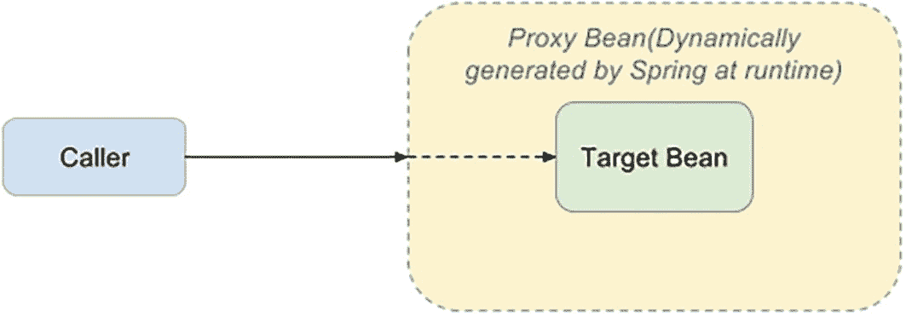

一张图表展示了调用者被注入到目标 Bean 中，该目标 Bean 由 Spring 在运行时动态生成。目标 Bean 位于代理 Bean 内部。

图 5-1

Spring AOP 代理运行

在内部，Spring 有两种代理实现：

*   JDK 动态代理

*   CGLIB 代理

默认情况下，当要通知的目标对象实现了接口时，Spring 将使用 JDK 动态代理来创建目标的代理实例。然而，当被通知的目标对象没有实现接口（例如，它是一个具体类）时，将使用 CGLIB 来创建代理实例。一个主要原因是 JDK 动态代理仅支持对接口进行代理。我们将在“理解代理”一节中详细讨论代理。

### Spring 中的连接点

Spring AOP 中一个比较显著的简化是它只支持一种连接点类型：**方法调用**。乍一看，如果你熟悉其他支持更多连接点的 AOP 实现（如 AspectJ），这似乎是一个严重的限制，但实际上，这使得 Spring 更易于使用。

方法调用连接点是迄今为止最有用的连接点，使用它，你可以完成许多使 AOP 在日常编程中变得有用的任务。请记住，如果你需要在方法调用之外的连接点处通知某些代码，你始终可以同时使用 Spring 和 AspectJ。

### Spring 中的切面

在 Spring AOP 中，切面由实现了 `Advisor` 接口的类实例表示。Spring 提供了便捷的 `Advisor` 实现，你可以在应用程序中重用它们，从而无需创建自定义的 `Advisor` 实现。`org.springframework.aop.Advisor` 有两个子接口：

*   `org.springframework.aop.PointcutAdvisor`

*   `org.springframework.aop.IntroductionAdvisor`

所有使用切点来控制应用于连接点的通知的 `Advisor` 实现都实现了 `PointcutAdvisor` 接口。在 Spring 中，引入被视为一种特殊类型的通知，通过使用 `IntroductionAdvisor` 接口，你可以控制引入应用于哪些类。

我们将在接下来的“Spring 中的通知器和切点”一节中详细讨论 `PointcutAdvisor` 实现。


#### `ProxyFactory` 类

`org.springframework.aop.framework.ProxyFactory` 类控制 Spring AOP 中的织入和代理创建过程。代理是为**被通知**或**目标对象**创建的，可以通过调用 `setTarget(..)` 方法来设置。在内部，`ProxyFactory` 将代理创建过程委托给 `org.springframework.aop.framework.DefaultAopProxyFactory` 的实例，而该实例又根据应用程序的设置，进一步委托给 `org.springframework.aop.framework.CglibAopProxy` 或 `org.springframework.aop.framework.JdkDynamicAopProxy`。我们将在本章后面更详细地讨论代理创建。

警告。 从 Spring 4 开始，新增了另一个实现 `org.springframework.aop.framework.ObjenesisCglibAopProxy`，它扩展了 `CglibAopProxy`，可以在不调用类构造函数的情况下创建代理实例。当类具有带参数的构造函数、带有副作用的构造函数以及会抛出异常的构造函数时，这非常有用。

`ProxyFactory` 类为 `addAdvice(Advice)` 方法（由 `org.springframework.aop.framework.Advised` 接口定义）提供了实现，适用于希望通知应用于类中所有方法（而不仅仅是选定方法）的调用场景。在内部，`addAdvice(..)` 会将您传递的通知包装在 `org.springframework.aop.support.DefaultPointcutAdvisor` 实例中（这是 `PointcutAdvisor` 的标准实现），并使用默认包含所有方法的切入点对其进行配置。当您希望对创建的 `Advisor` 进行更多控制，或者想要向代理添加引入时，请自行创建 `org.springframework.aop.Advisor` 并使用 `ProxyFactory` 的 `addAdvisor()` 方法。

您可以使用同一个 `ProxyFactory` 实例创建多个代理，每个代理可以具有不同的切面。为此，`ProxyFactory` 提供了 `removeAdvice()` 和 `removeAdvisor()` 方法，允许您从 `ProxyFactory` 中移除之前传递给它的任何通知或通知器。要检查 `ProxyFactory` 是否附加了特定的通知，请调用 `adviceIncluded()` 方法，并传入您要检查的通知对象。

#### 在 Spring 中创建通知

Spring 支持六种类型的通知，如表 5-1 所述。

表 5-1

Spring 通知类型

| 通知名称 | 接口 | 描述 |
| --- | --- | --- |
| **前置** | `org.springframework.aop.``BeforeAdvice` | 使用前置通知，您可以在连接点执行之前执行自定义处理。Spring 中的连接点始终是方法调用，这本质上允许您在方法执行之前进行预处理。前置通知可以完全访问方法调用的目标以及传递给方法的参数，但它无法控制方法本身的执行。如果前置通知抛出异常，拦截器链（以及目标方法）的后续执行将被中止，并且异常将沿着拦截器链向上传播。 |
| **后置返回** | `org.springframework.aop.``AfterReturningAdvice` | 后置返回通知在连接点的方法调用执行完毕并返回值后执行。后置返回通知可以访问方法调用的目标、传递给方法的参数以及返回值。由于调用后置返回通知时方法已经执行完毕，因此它完全无法控制方法调用。如果目标方法抛出异常，后置返回通知将不会运行，并且异常会像往常一样传播到调用堆栈。 |
| **后置（最终）** | `org.springframework.aop.``AfterAdvice` | 无论被通知方法的结果如何，后置（最终）通知都会执行。即使被通知方法失败并抛出异常，该通知也会执行。 |
| **异常** | `org.springframework.aop.``ThrowsAdvice` | 异常通知在方法调用返回后执行，但仅当该调用抛出异常时才执行。异常通知可以只捕获特定的异常，如果您选择这样做，则可以访问抛出异常的方法、传递给调用的参数以及调用的目标。 |
| **环绕** | `org.aopalliance.intercept.``MethodInterceptor` | 在 Spring 中，环绕通知使用 AOP Alliance 标准的方法拦截器进行建模。您的通知可以在方法调用之前和之后执行，并且您可以控制允许方法调用继续进行的点。如果您愿意，可以选择完全绕过该方法，并提供自己的逻辑实现。 |
| **引入** | `org.springframework.aop.``IntroductionInterceptor` | Spring 将引入建模为特殊类型的拦截器。使用引入拦截器，您可以指定由通知引入的方法的实现。 |

#### 通知的接口

关于 `ProxyFactory` 类，请回想一下，通知可以直接通过 `addAdvice(..)` 方法添加到代理，也可以间接通过使用 `Advisor` 实现的 `addAdvisor(..)` 方法添加。通知和通知器之间的主要区别在于，通知器携带了与关联切入点一起的通知，这提供了对通知将拦截哪些连接点进行更细粒度的控制。

关于通知，Spring 为 `Advice` 接口创建了一个定义良好的层次结构。该层次结构基于 AOP Alliance 接口，并在图 5-2 中详细展示。

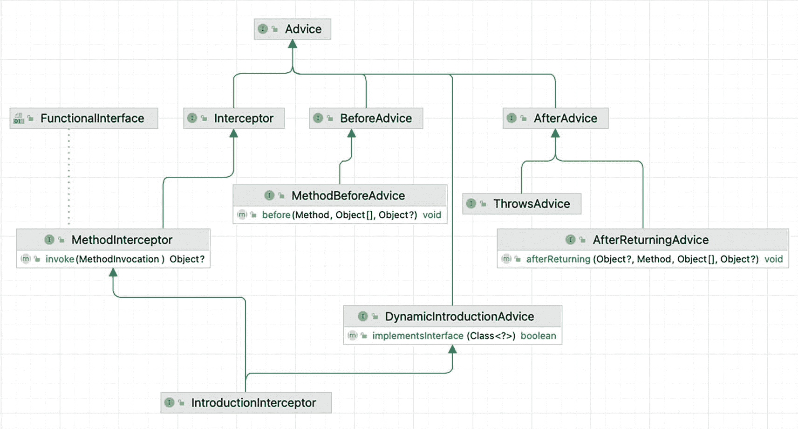

一个图表展示了 Advice 接口的层次结构。引入拦截器通过方法拦截器和拦截器，以及通过动态引入通知，方法前置通知通过前置通知，以及异常通知和后置返回通知通过后置通知，都指向通知。

图 5-2

IntelliJ IDEA 中展示的 Spring 通知类型接口

这种层次结构的好处不仅在于它是合理的面向对象设计，还在于它使您能够通用地处理通知类型，例如通过在 `ProxyFactory` 上使用单一的 `addAdvice(..)` 方法，并且您可以轻松地添加新的通知类型，而无需修改 `ProxyFactory` 类。


#### 以编程方式创建通知

在前面的章节中提到，*ProxyFactory* 可以*手动*用于纯编程方式创建 AOP 代理。在转向声明式的 Spring 方式之前，有必要先看一个示例。表 5-1 中列出的所有接口都可以通过实现来为目标对象定义通知。清单 5-1 展示了三种这样的实现：前置通知、后置通知和环绕通知，每种都实现了相应的接口。

```
package com.apress.prospring6.five.manual;
import org.aopalliance.intercept.MethodInterceptor;
import org.aopalliance.intercept.MethodInvocation;
import org.springframework.aop.AfterReturningAdvice;
import org.springframework.aop.MethodBeforeAdvice;
import org.springframework.util.StopWatch;
import java.lang.reflect.Method;
// 其他导入语句已省略
class SimpleBeforeAdvice implements MethodBeforeAdvice {
private static Logger logger = LoggerFactory.getLogger(SimpleBeforeAdvice.class);
@Override
public void before(Method method, Object[] args, Object target) throws Throwable {
logger.info("Before: set up concert hall.");
}
}
class SimpleAfterAdvice implements AfterReturningAdvice {
private static Logger logger = LoggerFactory.getLogger(SimpleAfterAdvice.class);
@Override
public void afterReturning(Object returnValue, Method method, Object[] args, Object target) throws Throwable {
logger.info("After: offer standing ovation.");
}
}
class SimpleAroundAdvice implements MethodInterceptor {
private static Logger logger = LoggerFactory.getLogger(SimpleAroundAdvice.class);
@Override
public Object invoke(@Nonnull MethodInvocation invocation) throws Throwable {
logger.info("Around: starting timer");
StopWatch sw = new StopWatch();
sw.start(invocation.getMethod().getName());
Object returnValue = invocation.proceed();
sw.stop();
logger.info("Around: concert duration = {}", sw.getTotalTimeMillis());
return returnValue;
}
}
清单 5-1
三种类型的自定义通知
```

`SimpleBeforeAdvice`、`SimpleAfterAdvice` 和 `SimpleAroundAdvice` 类型被设计用于 `Performance` 类型的实例。`SimpleBeforeAdvice` 和 `SimpleAfterAdvice` 仅打印日志消息，以确认通知已被应用。`SimpleAroundAdvice` 稍微复杂一些，它使用 `StopWatch` 实例来计时表演。被拦截的方法通过 Java 反射进行调用。

清单 5-2 展示了 `Performance` 接口和 `Concert` 实现。

```
// Performance.java
package com.apress.prospring6.five.manual;
public interface Performance {
void execute();
}
// Concert.java
import org.slf4j.Logger;
import org.slf4j.LoggerFactory;
import static java.time.Duration.ofMillis;
public class Concert  implements Performance{
private static Logger LOGGER = LoggerFactory.getLogger(Concert.class);
@Override
public void execute() {
LOGGER.info(" ... La la la la laaaa ...");
try {
Thread.sleep(ofMillis(2000).toMillis());
} catch (InterruptedException e) {}
}
}
清单 5-2
应用通知的对象类型
```

将通知实例和目标对象组合在一起很简单；我们只需要实例化 `ProxyFactory` 类，并设置目标和通知实例，如清单 5-3 所示。

```
package com.apress.prospring6.five.manual;
import org.springframework.aop.framework.ProxyFactory;
// 其他导入语句已省略
public class ManualAdviceDemo {
public static void main(String... args) {
Concert concert = new Concert();
ProxyFactory pf = new ProxyFactory();
pf.addAdvice(new SimpleBeforeAdvice());
pf.addAdvice(new SimpleAroundAdvice());
pf.addAdvice(new SimpleAfterAdvice());
pf.setTarget(concert);
Performance proxy = (Performance) pf.getProxy();
proxy.execute();
}
}
清单 5-3
以编程方式创建并应用通知到目标对象的示例
```

警告。 通知的执行顺序由通知类型决定，而不是它们被添加到 `ProxyFactory` 实例的顺序。

`SimpleBeforeAdvice` 打印一条消息，确保音乐厅在音乐会开始前已布置好。`SimpleAroundAdvice` 拦截 `concert.execute()` 方法，在方法执行前启动计时器，并在执行后停止计时并打印持续时间。`SimpleAfterAdvice` 打印一条消息，确保音乐会后有起立鼓掌。

运行清单 5-3 中的类会打印出清单 5-4 所示的日志。

```
> Task :chapter05:ManualAdviceDemo.main()
INFO : SimpleBeforeAdvice - Before: set up concert hall.
INFO : SimpleAroundAdvice - Around: starting timer
INFO : Concert -  ... La la la la laaaa ...
INFO : SimpleAroundAdvice - Around: concert duration = 2015
INFO : SimpleAfterAdvice - After: offer standing ovation.
清单 5-4
执行 ManualAdviceDemo 类产生的控制台输出
```

显示了在代理对象上调用 `execute()` 的输出，其中包括前置通知的输出、环绕通知的第一条消息、目标对象（`Concert` 对象）打印的实际消息、环绕通知的第二条消息以及后置通知的输出。消息的顺序表明通知已按预期应用。

您可以自行尝试，编写实现 `org.springframework.aop.AfterAdvice` 和 `org.springframework.aop.ThrowsAdvice` 的代码示例，或者查看本书项目中的示例。由于存在大量代码重复，此处不再赘述。

以这种方式应用通知并不实用，最佳方式是声明您的 bean 和通知 bean，然后让 Spring 来处理。但在那之前，有必要对通知的使用做一些详细的总结。


#### 几点结论

前置通知是 Spring 中最有用的通知类型之一。这种通知可以修改传递给方法的参数，并且可以通过抛出异常来阻止方法执行。这对于安全实现最为有用，前置通知会在允许方法调用继续之前检查用户凭证。

后置返回通知在连接点的方法调用返回后执行。鉴于方法已经执行完毕，你无法更改传递给它的参数。虽然你可以读取这些参数，但无法改变执行路径，也无法阻止方法执行。这些限制是意料之中的；然而，可能出乎意料的是，**你无法在后置返回通知中修改返回值**。使用后置返回通知时，你只能添加额外的处理逻辑。尽管后置返回通知不能修改方法调用的返回值，但它可以抛出一个异常，该异常可以沿着调用栈向上传递，以替代返回值。

异常通知与后置返回通知类似，它也是在连接点（始终是方法调用）之后执行，但异常通知仅在方法抛出异常时执行。异常通知与后置返回通知的另一个相似之处在于，它对程序执行的控制能力很弱。如果使用异常通知，你不能选择忽略抛出的异常并让方法返回一个值。**你能对程序流程做出的唯一修改是更改所抛出异常的类型。** 这是一个相当强大的概念，可以使应用程序开发变得简单得多。设想一个场景，你有一个 API 会抛出一系列定义不清的异常。使用异常通知，你可以通知该 API 中的所有类，并将异常层次结构重新归类为更易于管理和描述的形式。当然，你也可以使用异常通知来提供跨应用程序的集中式错误日志记录，从而减少散布在应用程序各处的错误日志记录代码。异常通知在各种场景下都很有用；它允许你重新归类整个异常层次结构，并为你的应用程序构建集中的异常日志记录。我们发现，在调试线上应用程序时，异常通知特别有用，因为它允许我们添加额外的日志记录代码，而无需修改应用程序的代码。

环绕通知的功能类似于前置通知和后置通知的组合，但有两个不同之处：

*   你可以修改返回值。
*   你可以阻止方法执行。

这意味着，通过使用环绕通知，你基本上可以用新代码替换方法的整个实现。Spring 中的环绕通知被建模为一个拦截器，使用 `MethodInterceptor` 接口，如本节示例所示。环绕通知有很多用途，你会发现 Spring 的许多特性都是通过使用方法拦截器创建的，例如远程代理支持和事务管理功能。方法拦截也是分析应用程序执行情况的一个好机制，示例中通过计时目标方法的执行时间，正是做到了这一点——记录该方法执行所花费的时长，使你能够研究这些值，从而决定是否应该对该方法进行优化。

### 选择通知类型

通常，选择通知类型是由应用程序的需求驱动的，但你应该选择最符合你需求的具体通知类型。也就是说，不要在前置通知就能满足需求时使用环绕通知。在大多数情况下，环绕通知可以完成其他三种通知类型能做的所有事情，但对于你想要实现的目标来说，它可能过于复杂了。通过使用最具体的通知类型，你不仅使代码的意图更加清晰，而且还降低了出错的可能性。考虑一个统计方法调用次数的通知。当你使用前置通知时，你只需要编写计数器的代码；但使用环绕通知时，你需要记得调用方法并将返回值返回给调用者。这些小事可能会让偶发性错误潜入你的应用程序。通过尽可能保持通知类型的针对性，你可以减少错误发生的范围。

## Spring 中的顾问和切点

到目前为止，你看到的所有示例都使用了 `ProxyFactory` 类。这个类提供了一种在自定义用户代码中获取和配置 AOP 代理实例的简单方法。`ProxyFactory.addAdvice()` 方法用于为代理配置通知。此方法在幕后委托给 `addAdvisor()`，创建一个 `org.springframework.aop.support.DefaultPointcutAdvisor` 实例，并使用一个指向所有方法的切点对其进行配置。通过这种方式，该通知被认为适用于目标上的所有方法。在某些情况下，例如当你使用 AOP 进行日志记录时，这可能是可取的，但在其他情况下，你可能希望限制通知所应用的方法。

当然，你也可以简单地在通知本身中检查被通知的方法是否正确，但这种方法有几个缺点。首先，将可接受的方法列表硬编码到通知中会降低通知的可重用性。通过使用切点，你可以配置通知所应用的方法，而无需将这些代码放入通知内部；这显然提高了通知的重用价值。将方法列表硬编码到通知中的其他缺点与性能有关。要在通知中检查被通知的方法，你需要在每次调用目标上的任何方法时执行检查。这显然会降低应用程序的性能。当你使用切点时，每个方法只执行一次检查，并且结果会被缓存以供后续使用。不使用切点来限制被通知方法列表的另一个与性能相关的缺点是，Spring 在创建代理时可以对未通知的方法进行优化，这会导致对未通知方法的调用速度更快。当我们稍后在本章讨论代理时，会更详细地介绍这些优化。

我们强烈建议你避免将方法检查硬编码到通知中的诱惑，而是尽可能使用切点来控制通知对目标方法的适用性。话虽如此，在某些情况下，将检查硬编码到通知中是必要的。考虑前面设计的用于捕获 `KeyGenerator` 类生成的弱密钥的后置返回通知示例。这种通知与其所通知的类紧密耦合，因此在通知内部进行检查以确保它应用于正确的类型是明智的。我们将通知与目标之间的这种耦合称为*目标亲和性*。通常，当你的通知具有很少或没有目标亲和性时，你应该使用切点。也就是说，它可以应用于任何类型或广泛的类型。当你的通知具有很强的目标亲和性时，请尝试在通知本身中检查通知是否被正确使用；这有助于减少因通知误用而导致的令人困惑的错误。我们还建议你避免不必要地通知方法。正如你将看到的，这会导致调用速度显著下降，从而对应用程序的整体性能产生重大影响。


### `Pointcut` 接口

Spring 中的切点是通过实现 `org.springframework.aop.Pointcut` 接口来创建的，该接口如清单 5-5 所示（完整代码可在 GitHub Spring Framework 仓库^(³⁹) 中找到）。

```
package org.springframework.aop;
public interface Pointcut {
ClassFilter getClassFilter();
MethodMatcher getMethodMatcher();
// 省略了一些不相关的代码
}
清单 5-5
Spring Pointcut 接口
```

从这段代码可以看出，`Pointcut` 接口定义了两个方法：`getClassFilter()` 和 `getMethodMatcher()`，它们分别返回 `ClassFilter` 和 `MethodMatcher` 的实例。显然，如果你选择实现 `Pointcut` 接口，就需要实现这些方法。值得庆幸的是，正如你将在下一节中看到的，这通常是不必要的，因为 Spring 提供了一系列 `Pointcut` 实现，它们涵盖了你的大部分（如果不是全部）用例。

在确定切点是否适用于特定方法时，Spring 首先使用 `Pointcut.getClassFilter()` 返回的 `ClassFilter` 实例来检查 `Pointcut` 接口是否适用于该方法所属的类。`ClassFilter` 函数式接口如清单 5-6 所示（完整代码可在 GitHub Spring Framework 仓库^(⁴⁰) 中找到）。

```
org.springframework.aop;
@FunctionalInterface
public interface ClassFilter {
boolean matches(Class clazz);
// 省略了一些不相关的代码
}
清单 5-6
Spring ClassFilter 接口
```

如你所见，`ClassFilter` 函数式接口定义了一个名为 `matches()` 的抽象方法，该方法接收一个代表待检查类的 `Class` 实例。你无疑已经推断出，如果切点适用于该类，`matches()` 方法返回 `true`，否则返回 `false`。

`MethodMatcher` 接口比 `ClassFilter` 接口更复杂，如清单 5-7 所示（完整代码可在 GitHub Spring Framework 仓库^(⁴¹) 中找到）。

```
package org.springframework.aop;
import java.lang.reflect.Method
public interface MethodMatcher {
boolean matches(Method method, Class targetClass);
boolean isRuntime();
boolean matches(Method method, Class targetClass, Object... args);
// 省略了一些不相关的代码
}
清单 5-7
Spring MethodMatcher 接口
```

Spring 支持两种类型的 `MethodMatcher`：静态和动态，由 `isRuntime()` 的返回值决定。在使用 `MethodMatcher` 之前，Spring 会调用 `isRuntime()` 来确定 `MethodMatcher` 是静态的（返回值为 `false`）还是动态的（返回值为 `true`）。

对于静态切点，Spring 会对目标对象上的每个方法调用一次 `MethodMatcher` 的 `matches(Method, Class<T>)` 方法，并缓存返回值以供后续调用这些方法时使用。这样，每个方法的方法适用性检查只执行一次，后续对该方法的调用不会再次触发 `matches()` 方法。

对于动态切点，Spring 在方法首次被调用时，仍然会使用 `matches(Method, Class<T>)` 执行静态检查，以确定方法的整体适用性。然而，除此之外，如果静态检查返回了 `true`，Spring 还会在每次调用该方法时，使用 `matches(Method, Class<T>, Object[])` 方法执行进一步的检查。通过这种方式，动态 `MethodMatcher` 可以基于方法的特定调用（而不仅仅是方法本身）来决定是否应应用切点。例如，一个切点可能只需要在参数是值大于 100 的 `Integer` 时才应用。在这种情况下，可以编写 `matches(Method,Class<T>, Object[])` 方法，使其在每次调用时对参数执行进一步的检查。

显然，静态切点的性能远优于动态切点，因为它们避免了每次调用都需要额外检查的开销。动态切点在决定是否应用通知方面提供了更高层次的灵活性。通常，我们建议尽可能使用静态切点。但是，如果你的通知会带来显著的开销，那么使用动态切点来避免不必要的通知调用可能是明智之举。

通常，你很少需要从头开始创建自己的 `Pointcut` 实现，因为 Spring 为静态和动态切点都提供了抽象基类。在接下来的几节中，我们将研究这些基类以及其他 `Pointcut` 实现。

### 可用的 `Pointcut` 实现

从 4.0 版本开始，Spring 提供了八种主要的 `Pointcut` 接口实现：两个旨在作为创建静态和动态切点的便捷类的抽象类，以及六个具体类，分别用于以下目的：

*   组合多个切点
*   处理控制流切点
*   执行简单的基于名称的匹配
*   使用正则表达式定义切点
*   使用 AspectJ 表达式定义切点
*   定义在类或方法级别查找特定注解的切点

表 5-2 总结了这八种主要的 `Pointcut` 接口实现。

表 5-2

Spring *Pointcut* 实现总结

| 实现类 | 描述 |
| --- | --- |
| `org.springframework.aop.support.``annotation.AnnotationMatchingPointcut` | 此实现在类或方法上查找特定的 Java 注解。此类需要 JDK 5 或更高版本。 |
| `org.springframework.aop.``aspectj.AspectJExpressionPointcut` | 此实现使用 AspectJ 编织器来评估 AspectJ 语法的切点表达式。 |
| `org.springframework.aop.support.``ComposablePointcut` | `ComposablePointcut` 类用于通过 `union()` 和 `intersection()` 等操作组合两个或多个切点。 |
| `org.springframework.aop.support.``ControlFlowPointcut` | `ControlFlowPointcut` 是一个特殊用途的切点，它匹配另一个方法的控制流内的所有方法；也就是说，任何直接或间接因调用另一个方法而被调用的方法。 |
| `org.springframework.aop.support.``DynamicMethodMatcherPointcut` | 此实现旨在作为构建动态切点的基类。 |
| `org.springframework.aop.support.``JdkRegexpMethodPointcut` | 此实现允许你使用 JDK 1.4 正则表达式支持来定义切点。此类需要 JDK 1.4 或更新版本。 |
| `org.springframework.aop.support.``NameMatchMethodPointcut` | 使用 `NameMatchMethodPointcut`，你可以创建一个对方法名列表执行简单匹配的切点。 |
| `org.springframework.aop.support.``StaticMethodMatcherPointcut` | `StaticMethodMatcherPointcut` 类旨在作为构建静态切点的基类。 |

图 5-3 展示了 Spring 的 `Pointcut` 层次结构。

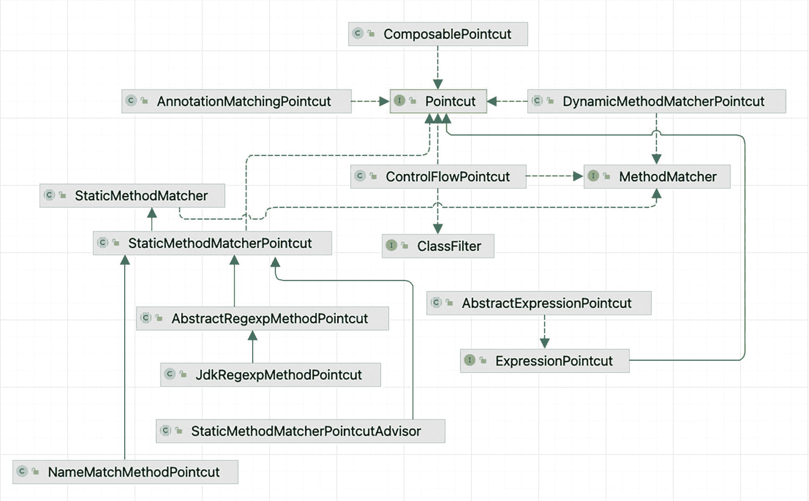

Spring 切点层次结构图，包括名称匹配方法切点、静态方法匹配器切点、表达式切点、控制流切点、可组合切点、注解匹配切点和动态方法匹配器切点。

图 5-3

在 IntelliJ IDEA 中以 UML 图表示的 `Pointcut` 实现类


### 使用 `DefaultPointcutAdvisor`

在使用任何 `Pointcut` 实现之前，你必须先创建一个 `Advisor` 接口的实例，更具体地说是 `PointcutAdvisor` 接口的实例。回顾我们之前的讨论，`Advisor` 是 Spring 对切面的表示（参见前一节“Spring 中的切面”），它是通知和切点的结合，用于控制哪些方法应该被增强以及如何增强。Spring 提供了多个 `PointcutAdvisor` 的实现，但目前我们只关注其中一个：`DefaultPointcutAdvisor`。这是一个简单的 `PointcutAdvisor`，用于将单个 `Pointcut` 与单个 `Advice` 关联起来。

#### 使用 `StaticMethodMatcherPointcut`

在本节中，我们将通过扩展抽象类 `StaticMethodMatcherPointcut` 来创建一个简单的静态切点。由于 `StaticMethodMatcherPointcut` 类扩展了 `StaticMethodMatcher` 类（也是一个抽象类），而后者实现了 `MethodMatcher` 接口，因此你需要实现 `matches(Method, Class<?>)` 方法。`Pointcut` 实现的其余部分会自动处理。虽然这是你唯一需要实现的方法（当扩展 `StaticMethodMatcherPointcut` 类时），但你可能希望重写 `getClassFilter()` 方法，如清单 5-8 所示，以确保只有正确类型的方法被增强。

在本例中，我们有两个类：`GoodGuitarist` 和 `GreatGuitarist`，它们都定义了相同的方法，这些方法是接口 `Singer` 中方法的实现。它们与设计用于包装这些类型实例的 `SimpleAroundAdvice` 一起展示。

```
package com.apress.prospring6.two.common;
// 导入语句已省略
public interface Singer {
void sing();
}
public class GoodGuitarist implements Singer {
private static Logger LOGGER = LoggerFactory.getLogger(GoodGuitarist.class);
@Override public void sing() {
LOGGER.info("Head on your heart, arms around me");
}
}
public class GreatGuitarist implements Singer {
private static Logger LOGGER = LoggerFactory.getLogger(GreatGuitarist.class);
@Override public void sing() {
LOGGER.info("You've got my soul in your hand");
}
}
public class SimpleAroundAdvice implements MethodInterceptor {
private static Logger LOGGER = LoggerFactory.getLogger(GoodGuitarist.class);
@Override
public Object invoke(MethodInvocation invocation) throws Throwable {
LOGGER.debug(">> Invoking " + invocation.getMethod().getName());
Object retVal = invocation.proceed();
LOGGER.debug(">> Done");
return retVal;
}
}
清单 5-8
用于演示 StaticMethodMatcherPointcut 用法的 GoodGuitarist 和 GreatGuitarist 类
```

通过这个示例，我们希望使用同一个 `DefaultPointcutAdvisor` 为这两个类创建代理，但通知仅应用于 `GoodGuitarist` 类的 `sing()` 方法。

为此，我们创建了 `SimpleStaticPointcut` 类，如清单 5-9 所示，以及用于测试它的类。

```
package com.apress.prospring6.five.pointcut;
import org.aopalliance.aop.Advice;
import org.springframework.aop.Advisor;
import org.springframework.aop.ClassFilter;
import org.springframework.aop.Pointcut;
import org.springframework.aop.framework.ProxyFactory;
import org.springframework.aop.support.DefaultPointcutAdvisor;
import org.springframework.aop.support.StaticMethodMatcherPointcut;
import java.lang.reflect.Method;
// 其他静态导入已省略
class SimpleStaticPointcut extends StaticMethodMatcherPointcut {
@Override
public boolean matches(Method method, Class cls) {
return ("sing".equals(method.getName()));
}
@Override
public ClassFilter getClassFilter() {
return cls -> (cls == GoodGuitarist.class);
}
}
public class StaticPointcutDemo {
public static void main(String... args) {
// 目标对象
GoodGuitarist johnMayer = new GoodGuitarist();
GreatGuitarist ericClapton = new GreatGuitarist();
Singer proxyOne;
Singer proxyTwo;
Pointcut pc = new SimpleStaticPointcut();
Advice advice = new SimpleAroundAdvice();
Advisor advisor = new DefaultPointcutAdvisor(pc, advice);
ProxyFactory pf = new ProxyFactory();
pf.addAdvisor(advisor);
pf.setTarget(johnMayer);
proxyOne = (Singer)pf.getProxy();
pf = new ProxyFactory();
pf.addAdvisor(advisor);
pf.setTarget(ericClapton);
proxyTwo = (Singer)pf.getProxy();
proxyOne.sing();
proxyTwo.sing();
}
}
清单 5-9
StaticMethodMatcherPointcut 实现
```

请注意，`getClassFilter()` 方法被重写，返回一个 `ClassFilter` 实例，其 `matches()` 方法仅对 `GoodGuitarist` 类返回 `true`。通过这个静态切点，我们表示只有 `GoodGuitarist` 类的方法会被匹配，并且进一步地，只有该类的 `sing()` 方法会被匹配。

`main(..)` 方法使用 `SimpleAroundAdvice` 和 `SimpleStaticPointcut` 类创建了一个 `DefaultPointcutAdvisor` 实例。此外，由于这两个类（`GoodGuitarist` 和 `GreatGuitarist`）实现了相同的接口，你可以看到代理可以基于接口创建，而不是基于具体类。请注意，随后使用 `DefaultPointcutAdvisor` 实例创建了两个代理：一个用于 `GoodGuitarist` 实例，另一个用于 `EricClapton` 实例。最后，在两个代理上调用了 `sing()` 方法。运行此示例将产生如清单 5-10 所示的输出。

```
DEBUG: SimpleAroundAdvice - >> Invoking sing
INFO : GoodGuitarist - Head on your heart, arms around me
DEBUG: SimpleAroundAdvice - >> Done
INFO : GreatGuitarist - You've got my soul in your hand
清单 5-10
StaticMethodMatcherPointcut 示例输出
```

如你所见，`SimpleAroundAdvice` 实际被调用的唯一方法是 `GoodGuitarist` 类的 `sing()` 方法，完全符合预期。限制通知所应用的方法非常简单，并且正如你在讨论代理选项时会看到的，这是让你的应用程序获得最佳性能的关键。


### 使用 `DynamicMethodMatcherPointcut`

创建动态切入点与创建静态切入点没有太大区别，因此在本示例中，我们将为之前使用过的相同类创建一个动态切入点，但还需要一个带参数的方法来使用这种类型的切入点。最简单的方法是通过默认方法丰富 `Singer` 接口，而不影响其他实现。为了匹配本示例的上下文，让我们添加一个 `sing(String key)` 方法，该方法接收歌手演唱的调性值。`Singer` 接口的实现如代码清单 5-11 所示。

```
package com.apress.prospring6.five.common;
import org.slf4j.Logger;
import org.slf4j.LoggerFactory;
public interface Singer {
Logger logger = LoggerFactory.getLogger(Singer.class);
void sing();
default void sing(String key){
logger.info("Singing in the key of {}", key);
}
}
代码清单 5-11
增强后的 Singer 接口
```

代码清单 5-12 展示了 `DynamicMethodMatcherPointcut` 的实现。

```
package com.apress.prospring6.five.pointcut;
import com.apress.prospring6.five.common.GoodGuitarist;
import org.springframework.aop.ClassFilter;
import org.springframework.aop.support.DynamicMethodMatcherPointcut;
import java.lang.reflect.Method;
class SimpleDynamicPointcut extends DynamicMethodMatcherPointcut {
@Override
public ClassFilter getClassFilter() {
return cls -> (cls == GoodGuitarist.class);
}
@Override
public boolean matches(Method method, Class targetClass) {
return ("sing".equals(method.getName()));
}
@Override
public boolean matches(Method method, Class targetClass, Object... args) {
logger.debug("Dynamic check for " + method.getName());
if(args.length == 0) {
return false;
}
var key = (String) args[0];
return key.equalsIgnoreCase("C");
}
}
代码清单 5-12
SimpleDynamicPointcut 实现
```

从代码清单 5-12 可以看出，我们以与上一节类似的方式重写了 `getClassFilter()` 方法。这消除了在方法匹配方法中检查类的需要，这对于动态检查尤其重要。虽然只需要动态检查，但我们也实现了静态检查。这样做的原因是，你知道 `sing()` 方法（无参数的那个）将不会被通知。通过使用静态检查来表明这一点，Spring 就无需对该方法执行动态检查。这是因为当实现了静态检查方法时，Spring 会首先对其进行校验，如果检查结果不匹配，Spring 将停止任何进一步的动态检查。此外，静态检查的结果会被缓存以提高性能。如果未实现静态检查，Spring 会在每次调用 `sing({key})` 方法时执行动态检查。

作为推荐实践，应在 `getClassFilter()` 方法中执行类检查，在 `matches(Method, Class<?>)` 方法中执行方法检查，在 `matches(Method,Class<?>, Object[])` 方法中执行参数检查。这将使你的切入点更易于理解和维护，并且性能也会更好。

在 `matches(Method, Class<?>, Object[])` 方法中，你可以看到，如果传递给 `sing({key})` 方法的 `String` 参数值不等于“C”，则返回 `false`；否则返回 `true`。请注意，在动态检查中，我们知道正在处理一个名为 `sing` 的方法，因为没有其他方法能通过静态检查。在代码清单 5-13 的代码中，你可以看到用于测试此切入点的测试类。

```
package com.apress.prospring6.five.pointcut;
import org.springframework.aop.Advisor;
import org.springframework.aop.framework.ProxyFactory;
import org.springframework.aop.support.DefaultPointcutAdvisor;
// 其他导入语句已省略
public class DynamicPointcutDemo {
public static void main(String... args) {
GoodGuitarist target = new GoodGuitarist();
Advisor advisor = new DefaultPointcutAdvisor(new SimpleDynamicPointcut(), new SimpleAroundAdvice());
ProxyFactory pf = new ProxyFactory();
pf.setTarget(target);
pf.addAdvisor(advisor);
Singer proxy = (Singer)pf.getProxy();
proxy.sing("C");
proxy.sing("c");
proxy.sing("E");
proxy.sing();
}
}
代码清单 5-13
用于测试动态切入点的 DynamicPointcutDemo 类
```

请注意，我们使用了与静态切入点示例中相同的通知类。但是，在此示例中，只有前两次对 `sing({key})` 的调用应该被通知。动态检查阻止了第三次对 `sing("E")` 的调用被通知，而静态检查阻止了 `sing()` 方法被通知。运行此示例将产生代码清单 5-14 中的输出。

```
DEBUG: SimpleDynamicPointcut - Static check for sing
DEBUG: SimpleDynamicPointcut - Static check for toString
DEBUG: SimpleDynamicPointcut - Static check for clone
DEBUG: SimpleDynamicPointcut - Static check for sing
DEBUG: SimpleDynamicPointcut - Static check for sing
DEBUG: SimpleDynamicPointcut - Dynamic check for sing
DEBUG: SimpleAroundAdvice - >> Invoking sing
INFO : Singer - Singing in the key of C
DEBUG: SimpleAroundAdvice - >> Done
DEBUG: SimpleDynamicPointcut - Dynamic check for sing
INFO : Singer - Singing in the key of E
DEBUG: SimpleDynamicPointcut - Static check for sing
DEBUG: SimpleDynamicPointcut - Dynamic check for sing
INFO : GoodGuitarist - Head on your heart, arms around me
代码清单 5-14
DynamicPointcutDemo 输出
```

正如我们所料，只有前两次对 `sing({key})` 方法的调用被通知了。请注意，`sing()` 调用也经历了动态检查，这要归功于检查方法名称的静态检查。这里值得注意的一点是，`sing({key})` 方法经历了两次静态检查：一次是在初始阶段检查所有方法时，另一次是在它首次被调用时。这就是日志中包含这么多 `Static check for sing` 条目的原因。

一个警告。 如你所见，动态切入点比静态切入点提供了更大程度的灵活性，但由于它们需要额外的运行时开销，因此只有在绝对必要时才应使用动态切入点。


### 使用简单名称匹配

在创建切点时，我们通常希望仅根据方法名称进行匹配，而忽略方法签名和返回类型。在这种情况下，你无需创建 `StaticMethodMatcherPointcut` 的子类，而是可以使用 `NameMatchMethodPointcut`（它是 `StaticMethodMatcherPointcut` 的子类）来匹配一个方法名称列表。当你使用 `NameMatchMethodPointcut` 时，不会考虑方法的签名，因此如果你有 `sing()` 和 `sing({key})` 方法，它们都会匹配名称 `sing()`。

在清单 5-15 的代码片段中，你可以看到 `GrammyGuitarist` 类，它是 `Singer` 的另一个实现，因为这位格莱美获奖歌手用他的嗓音唱歌，使用吉他，并且作为人类，在表演过程中偶尔会说话和休息。

```
package com.apress.prospring6.five.common;
public class GrammyGuitarist implements Singer {
private static Logger LOGGER = LoggerFactory.getLogger(GrammyGuitarist.class);
@Override
public void sing() {
LOGGER.info("sing: Gravity is working against me\n" +
"And gravity wants to bring me down");
}
public void sing(Guitar guitar) {
LOGGER.info("play: " + guitar.play());
}
public void talk(){
LOGGER.info("talk");
}
@Override
public void rest(){
LOGGER.info("zzz");
}
}
public class Guitar {
public String play(){
return "G C G C Am D7";
}
}
清单 5-15
GrammyGuitarist 实现
```

对于这个示例，我们希望使用 `NameMatchMethodPointcut` 来匹配 `sing()`、`sing(Guitar)` 和 `rest()` 方法。这转化为匹配名称 `sing` 和 `rest`。如清单 5-16 所示。

```
package com.apress.prospring6.five.pointcut;
import org.springframework.aop.support.NameMatchMethodPointcut;
// 其他导入语句已省略
public class NamePointcutDemo {
public static void main(String... args) {
GrammyGuitarist johnMayer = new GrammyGuitarist();
NameMatchMethodPointcut pc = new NameMatchMethodPointcut();
pc.addMethodName("sing");
pc.addMethodName("rest");
Advisor advisor = new DefaultPointcutAdvisor(pc, new SimpleAroundAdvice());
ProxyFactory pf = new ProxyFactory();
pf.setTarget(johnMayer);
pf.addAdvisor(advisor);
GrammyGuitarist proxy = (GrammyGuitarist) pf.getProxy();
proxy.sing();
proxy.sing(new Guitar());
proxy.rest();
proxy.talk();
}
}
清单 5-16
NamePointcutDemo 类，用于测试 NameMatchMethodPointcut
```

无需扩展 `NameMatchMethodPointcut`；你只需创建一个 `NameMatchMethodPointcut` 的实例，就可以开始使用了。请注意，我们使用 `addMethodName(..)` 方法向切点添加了两个方法名称：`sing` 和 `rest`。运行此示例将产生清单 5-17 中的输出。

```
DEBUG: SimpleAroundAdvice - >> Invoking sing
INFO : GrammyGuitarist - sing: Gravity is working against me
And gravity wants to bring me down
DEBUG: SimpleAroundAdvice - >> Done
DEBUG: SimpleAroundAdvice - >> Invoking sing
INFO : GrammyGuitarist - play: G C G C Am D7
DEBUG: SimpleAroundAdvice - >> Done
DEBUG: SimpleAroundAdvice - >> Invoking rest
INFO : GrammyGuitarist - zzz
DEBUG: SimpleAroundAdvice - >> Done
INFO : GrammyGuitarist - talk
清单 5-17
NamePointcutDemo 输出
```

正如预期的那样，由于切点的存在，`sing()`、`sing(Guitar)` 和 `rest()` 方法被增强了，但 `talk()` 方法未被增强。

对于许多 `Pointcut` 实现，Spring 还提供了一个便捷的 `Advisor` 实现，它充当切点的角色。例如，在前面的示例中，我们不必将 `NameMatchMethodPointcut` 与 `DefaultPointcutAdvisor` 结合使用，而可以直接使用 `NameMatchMethodPointcutAdvisor`，如清单 5-18 所示。

```
package com.apress.prospring6.five;
import org.springframework.aop.support.NameMatchMethodPointcutAdvisor;
// 其他导入语句已省略
public class NameMatchMethodPointcutAdvisorDemo {
public static void main(String... args) {
GrammyGuitarist johnMayer = new GrammyGuitarist();
NameMatchMethodPointcutAdvisor advisor =
new NameMatchMethodPointcutAdvisor(new SimpleAroundAdvice());
advisor.setMappedNames("sing", "rest");
ProxyFactory pf = new ProxyFactory();
pf.setTarget(johnMayer);
pf.addAdvisor(advisor);
GrammyGuitarist proxy = (GrammyGuitarist) pf.getProxy();
proxy.sing();
proxy.sing(new Guitar());
proxy.rest();
proxy.talk();
}
}
清单 5-18
NameMatchMethodPointcutAdvisor 使用示例
```

请注意，我们不再创建 `NameMatchMethodPointcut` 的实例，而是通过调用 `setMappedNames(..)` 方法并提供方法名称作为参数，在 `NameMatchMethodPointcutAdvisor` 实例上配置切点细节。通过这种方式，`NameMatchMethodPointcutAdvisor` 同时充当了通知器和切点的角色。

你可以通过查阅 `org.springframework.aop.support` 包的 Javadoc 来了解不同 `Advisor` 实现的完整细节。这两种方法在性能上没有明显差异，除了第二个示例的代码略少之外，实际的编码方法几乎没有区别。我们更倾向于使用第一种方法，因为我们认为代码中的意图稍微更清晰一些。归根结底，你选择的风格取决于个人偏好。


### 使用正则表达式创建切点

在上一节中，我们讨论了如何针对预定义的方法列表执行简单匹配。但如果你事先不知道所有的方法名，而是知道方法名遵循的模式，该怎么办？例如，如果你想匹配所有名称以 `get` 开头的方法，该怎么办？在这种情况下，你可以使用正则表达式切点 `JdkRegexpMethodPointcut` 来基于正则表达式匹配方法名。清单 5-19 展示了另一个 `Guitarist` 类，其中包含三个方法。

```
package com.apress.prospring6.five.common;
// 其他导入语句已省略
public class Guitarist implements Singer{
private static Logger LOGGER = LoggerFactory.getLogger(Guitarist.class);
@Override
public void sing() {
LOGGER.info("Just keep me where the light is");
}
public void sing2() {
LOGGER.info("And wrap me in your arms");
}
@Override
public void rest() {
LOGGER.info("zzz...");
}
}
清单 5-19
Guitarist 实现
```

使用基于正则表达式的切点，我们可以匹配该类中所有名称以 `sing` 开头的方法。这如清单 5-20 所示。

```
package com.apress.prospring6.five.pointcut;
import org.springframework.aop.support.JdkRegexpMethodPointcut;
// 其他导入语句已省略
public class RegexpPointcutDemo {
public static void main(String... args) {
Guitarist johnMayer = new Guitarist();
var pc = new JdkRegexpMethodPointcut();
pc.setPattern(".*sing.*");
Advisor advisor = new DefaultPointcutAdvisor(pc, new SimpleAroundAdvice());
ProxyFactory pf = new ProxyFactory();
pf.setTarget(johnMayer);
pf.addAdvisor(advisor);
Guitarist proxy = (Guitarist) pf.getProxy();
proxy.sing();
proxy.sing2();
proxy.rest();
}
}
清单 5-20
正则表达式切点测试类
```

注意，我们不需要为切点创建一个类；相反，我们只需创建一个 `JdkRegexpMethodPointcut` 实例并指定要匹配的模式，就完成了。有趣的一点是模式本身。在匹配方法名时，Spring 会匹配方法的完全限定名，因此对于 `sing1()`，Spring 匹配的是 `com.apress.prospring6.five.common.Guitarist.sing1`，这就是为什么模式中有一个前导的 `.*`。这是一个强大的概念，因为它允许你匹配给定包中的所有方法，而无需确切知道该包中有哪些类以及方法名是什么。运行此示例将产生如清单 5-21 所示的输出。

```
DEBUG: SimpleAroundAdvice - >> Invoking sing
INFO : Guitarist - Just keep me where the light is
DEBUG: SimpleAroundAdvice - >> Done
DEBUG: SimpleAroundAdvice - >> Invoking sing2
INFO : Guitarist - And wrap me in your arms
DEBUG: SimpleAroundAdvice - >> Done
INFO : Guitarist - zzz...
清单 5-21
正则表达式切点测试类输出
```

正如预期，只有 `sing()` 和 `sing2()` 方法被增强了，因为 `rest()` 方法与为切点实例配置的正则表达式模式不匹配。

### 使用 AspectJ 切点表达式创建切点

除了 JDK 正则表达式，你还可以使用 AspectJ 的切点表达式语言来声明切点。在本章后面，你会看到当我们在 Java 配置中声明切点时，Spring 默认使用 AspectJ 的切点语言。此外，当使用 Spring 的 `@AspectJ` 注解风格的 AOP 支持时，你需要使用 AspectJ 的切点语言。因此，当使用表达式语言声明切点时，使用 AspectJ 切点表达式是最佳方式。Spring 提供了 `AspectJExpressionPointcut` 类，用于通过 AspectJ 的表达式语言定义切点。

警告。 要在 Spring 中使用 AspectJ 切点表达式，你需要在项目的类路径中包含两个 AspectJ 库文件：`aspectjrt.jar` 和 `aspectjweaver.jar`。请查看 `pom.xml` 和 `chapter05.gradle` 文件以获取每种构建工具的配置。

考虑到之前 `Guitarist` 类的实现，使用 JDK 正则表达式实现的相同功能也可以使用 AspectJ 表达式来实现。该代码如清单 5-22 所示。

```
package com.apress.prospring6.five.pointcut;
import org.springframework.aop.aspectj.AspectJExpressionPointcut;
// 其他导入语句已省略
public class AspectjexpPointcutDemo {
public static void main(String... args) {
Guitarist johnMayer = new Guitarist();
var pc = new AspectJExpressionPointcut();
pc.setExpression("execution(* sing*(..))");
var advisor = new DefaultPointcutAdvisor(pc, new SimpleAroundAdvice());
ProxyFactory pf = new ProxyFactory();
pf.setTarget(johnMayer);
pf.addAdvisor(advisor);
Guitarist proxy = (Guitarist) pf.getProxy();
proxy.sing();
proxy.sing2();
proxy.rest();
}
}
清单 5-22
AspectJ 正则表达式切点测试类
```

注意，我们使用 `AspectJExpressionPointcut` 类的 `setExpression()` 方法来设置匹配条件。表达式 `execution(* sing*(..))` 意味着通知应应用于任何以 `sing` 开头、接受任意参数并返回任意类型的方法的执行（是的，AspectJ 更加灵活和简洁）。运行该程序将得到与之前使用 JDK 正则表达式的示例相同的结果。


### 创建注解匹配切入点

如果你的应用程序是基于注解的，你可能希望使用自己指定的注解来定义切入点——即，将通知逻辑应用于所有带有特定注解的方法或类型。Spring 提供了 `AnnotationMatchingPointcut` 类，用于使用注解定义切入点。我们再次复用之前的示例，看看在使用注解作为切入点时如何操作。

首先，我们定义一个名为 `AdviceRequired` 的注解，它将用于声明切入点。清单 5-23 展示了该注解类以及修改后的 `AnnotatedGuitarist` 类，该类中的 `sing(Guitar)` 方法使用了该注解。

```
package com.apress.prospring6.five.common;
import java.lang.annotation.ElementType;
import java.lang.annotation.Retention;
import java.lang.annotation.RetentionPolicy;
import java.lang.annotation.Target;
@Retention(RetentionPolicy.RUNTIME)
@Target({ElementType.TYPE, ElementType.METHOD})
public @interface AdviceRequired { }
// AnnotatedGuitarist 类
class AnnotatedGuitarist implements Singer {
private static Logger LOGGER = LoggerFactory.getLogger(AnnotatedGuitarist.class);
@Override
public void sing() {}
@AdviceRequired
public void sing(Guitar guitar) {
LOGGER.info("play: " + guitar.play());
}
}
清单 5-23
与 AnnotationMatchingPointcut 配合使用的自定义注解及其使用类
```

接口 `AdviceRequired` 通过使用 `@interface` 作为类型被声明为一个注解，而 `@Target` 注解定义了该注解可以应用于类型或方法级别。类 `AnnotatedGuitarist` 实现了 `Singer` 接口，并添加了自己的 `sing(..)` 方法，该方法接受一个 `Guitar` 参数，并使用 `@AdviceRequired` 注解。

测试程序与之前展示的没有区别，清单 5-24 展示了该程序及其输出。

```
package com.apress.prospring6.five;
import com.apress.prospring6.five.common.AdviceRequired;
import org.springframework.aop.support.annotation.AnnotationMatchingPointcut;
// 其他导入语句已省略
public class AnnotationPointcutDemo {
public static void main(String... args) {
var johnMayer = new AnnotatedGuitarist();
var pc = AnnotationMatchingPointcut.forMethodAnnotation(AdviceRequired.class);
var advisor = new DefaultPointcutAdvisor(pc, new SimpleAroundAdvice());
ProxyFactory pf = new ProxyFactory();
pf.setTarget(johnMayer);
pf.addAdvisor(advisor);
AnnotatedGuitarist proxy = (AnnotatedGuitarist) pf.getProxy();
proxy.sing(new Guitar());
proxy.rest();
}
}
// 输出
DEBUG: SimpleAroundAdvice - >> Invoking sing
INFO : AnnotatedGuitarist - play: G C G C Am D7
DEBUG: SimpleAroundAdvice - >> Done
清单 5-24
AnnotationMatchingPointcut 的测试程序
```

通过调用 `AnnotationMatchingPointcut` 的静态方法 `forMethodAnnotation()` 并传入注解类型，可以获取其实例。这表明我们希望将通知应用于所有带有给定注解的方法。也可以通过调用 `forClassAnnotation()` 方法来指定应用于类型级别的注解。

如你所见，由于我们注解了 `sing(Guitar)` 方法，因此只有该方法被通知。

## 理解代理

到目前为止，我们仅粗略地了解了由 `ProxyFactory` 生成的代理。我们提到 Spring 中有两种类型的代理：使用 JDK `Proxy` 类创建的 JDK 代理，以及使用 CGLIB `Enhancer` 类创建的基于 CGLIB 的代理。你可能想知道这两种代理之间究竟有什么区别，以及为什么 Spring 需要两种类型的代理。在本节中，我们将详细探讨代理之间的差异。

代理的核心目标是拦截方法调用，并在必要时执行适用于特定方法的通知链。通知的管理和调用在很大程度上与代理无关，由 Spring AOP 框架管理。然而，代理负责拦截对所有方法的调用，并根据需要将它们传递给 AOP 框架以应用通知。

除了这个核心功能之外，代理还必须支持一组附加功能。可以配置代理通过 `AopContext` 类（这是一个抽象类）暴露自身，以便你可以检索代理并从目标对象调用代理上的通知方法。代理负责确保当通过 `ProxyFactory.setExposeProxy()` 启用此选项时，代理类被适当地暴露。此外，所有代理类默认实现 `Advised` 接口，这允许在创建代理后更改通知链等操作。代理还必须确保任何返回 `this`（即返回被代理的目标）的方法都返回代理本身，而不是目标。

如你所见，一个典型的代理需要执行相当多的工作，所有这些逻辑都在 JDK 和 CGLIB 代理中实现。

### 使用 JDK 动态代理

**JDK 代理**是 Spring 中最基本的代理类型。与 CGLIB 代理不同，JDK 代理只能生成接口的代理，而不能生成类的代理。因此，任何你想要代理的对象必须至少实现一个接口，并且生成的代理将是一个实现该接口的对象。图 5-4 展示了此类代理的抽象模式。

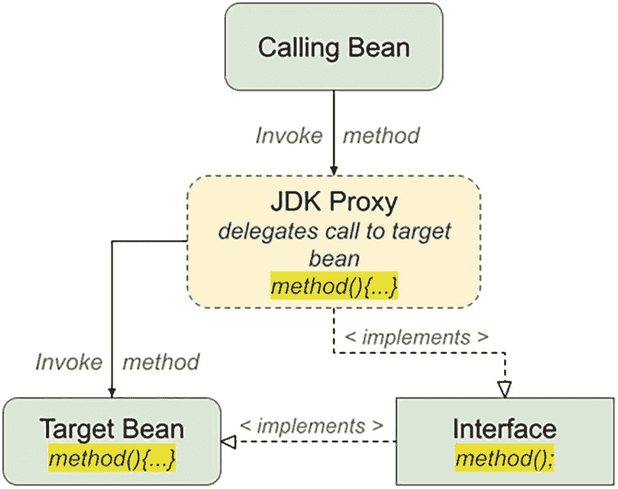

一个框图展示了调用 bean 调用 J D K 代理方法，该方法进一步调用目标 bean 方法，并实现实现目标 bean 方法的接口方法。

图 5-4

JDK 代理抽象模式

通常，为你的类使用接口是一种良好的设计，但这并不总是可行的，尤其是在处理第三方或遗留代码时。在这种情况下，你必须使用 CGLIB 代理。当你使用 JDK 代理时，所有方法调用都会被 JVM 拦截并路由到代理的 `invoke()` 方法。然后，该方法确定所讨论的方法是否被通知（根据切入点定义的规则），如果是，则调用通知链，然后通过反射调用方法本身。除此之外，`invoke()` 方法还执行了上一节讨论的所有逻辑。

JDK 代理在进入 `invoke()` 方法之前，不会区分被通知和未被通知的方法。这意味着，对于代理上未被通知的方法，`invoke()` 方法仍然会被调用，所有检查仍然会执行，并且该方法仍然通过反射被调用。显然，这会在每次调用方法时产生运行时开销，即使代理除了通过反射调用未被通知的方法外，通常不执行任何额外的处理。

你可以通过使用 `setInterfaces()`（在 `ProxyFactory` 类间接扩展的 `AdvisedSupport` 类中）指定要代理的接口列表，来指示 `ProxyFactory` 使用 JDK 代理。


### 使用 CGLIB 代理

使用 JDK 代理时，每次调用方法时，所有关于如何处理特定方法调用的决策都在运行时进行。而使用 CGLIB 时，CGLIB 会为每个代理动态生成新类的字节码，并尽可能复用已生成的类。在这种情况下，生成的代理类型将是目标对象类的子类。图 5-5 展示了此类代理的抽象模式。

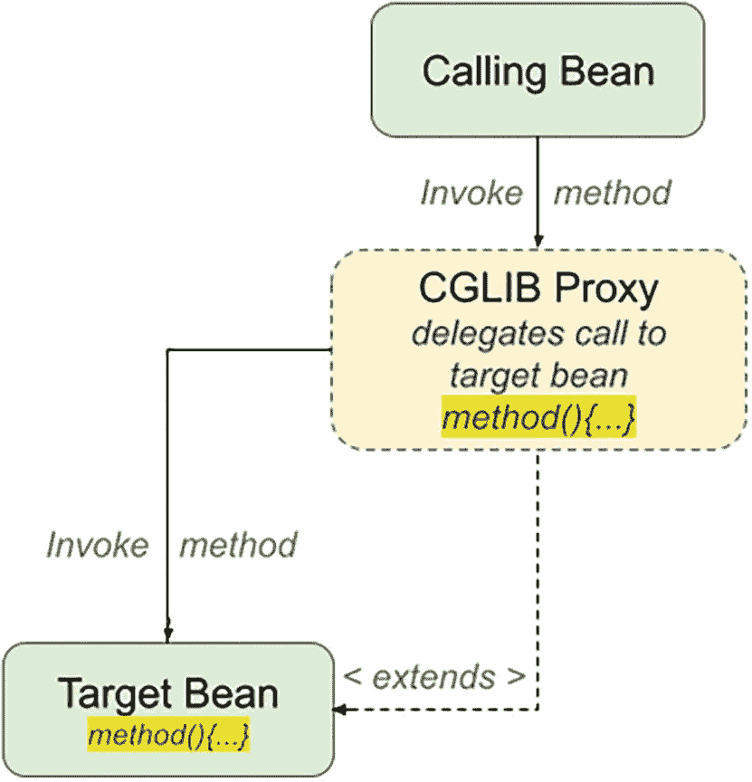

一个框图展示了调用 bean 会调用 CGLIB 代理方法，该方法进一步调用目标 bean 方法，并扩展至目标 bean 方法。

图 5-5

CGLIB 代理抽象模式

首次创建 CGLIB 代理时，CGLIB 会询问 Spring 希望如何处理每个方法。这意味着，在 JDK 代理上每次调用 `invoke()` 时执行的许多决策，对于 CGLIB 代理只需执行一次。由于 CGLIB 生成的是实际字节码，因此在处理方法的方式上具有更大的灵活性。例如，CGLIB 代理会生成适当的字节码来直接调用任何未通知的方法，从而减少代理引入的开销。此外，CGLIB 代理会判断方法是否可能返回 `this`；如果不可能，它允许直接调用该方法，从而再次减少运行时开销。

CGLIB 代理处理固定通知链的方式也与 JDK 代理不同。*固定通知链*是指你保证在代理生成后不会更改的通知链。默认情况下，即使在代理创建后，你仍然可以更改代理上的通知器和通知，尽管这很少是必需的操作。CGLIB 代理以特定方式处理固定通知链，从而减少执行通知链时的运行时开销。

警告。 使用 CGLIB 代理时存在一些限制：

1.  显而易见，无法为 final 类创建 CGLIB 代理（因为它们无法被继承）。
2.  由于静态成员属于类而非实例，因此它们无法被代理。
3.  私有方法也无法被代理，因为子类无法访问它们。

### 比较代理性能

到目前为止，我们仅粗略讨论了代理类型在实现上的差异。在本节中，我们将运行一个简单的测试来比较 CGLIB 代理与 JDK 代理的性能。为此，我们需要最简单的 bean 及其接口，其中包含空操作方法和一个空操作的前置通知。

该 bean 名为 `DefaultSimpleBean`，并实现了 `SimpleBean` 接口。它实现了接口声明的两个方法，恰当地命名为 `advised` 和 `unadvised`，如清单 5-25 所示。

```
package com.apress.prospring6.five.performance;
public interface SimpleBean {
void advised();
void unadvised();
}
// DefaultSimpleBean.java 位于同一包中
public class DefaultSimpleBean implements SimpleBean {
@Override
public void advised() {
System.currentTimeMillis();
}
@Override
public void unadvised() {
System.currentTimeMillis();
}
}
清单 5-25
SimpleBean 及其实现
```

清单 5-26 描述了 `NoOpBeforeAdvice` 类，它只是一个没有任何操作的前置通知；这是为了避免污染输出结果。

```
package com.apress.prospring6.five.performance;
// 导入语句已省略
class NoOpBeforeAdvice implements MethodBeforeAdvice {
@Override
public void before(Method method, Object[] args, Object target) throws Throwable {
// 空操作
}
}
清单 5-26
NoOpBeforeAdvice 实现
```

清单 5-27 展示了用于测试各种类型代理的代码。

```
package com.apress.prospring6.five.performance
public class ProxyPerfTestDemo {
private static Logger LOGGER = LoggerFactory.getLogger(ProxyPerfTestDemo.class);
public static void main(String... args) {
SimpleBean target = new DefaultSimpleBean();
NameMatchMethodPointcutAdvisor advisor = new NameMatchMethodPointcutAdvisor(new NoOpBeforeAdvice());
advisor.setMappedName("advised");
LOGGER.info("开始测试...");
runCglibTests(advisor, target);
runCglibFrozenTests(advisor, target);
runJdkTests(advisor, target);
}
private static void runCglibTests(Advisor advisor, SimpleBean target) {
ProxyFactory pf = new ProxyFactory();
pf.setProxyTargetClass(true);
pf.setTarget(target);
pf.addAdvisor(advisor);
SimpleBean proxy = (SimpleBean)pf.getProxy();
var testResults = test(proxy);
LOGGER.info(" --- CGLIB (标准) 测试结果 ---\n {} ", testResults);
}
private static void runCglibFrozenTests(Advisor advisor, SimpleBean target) {
ProxyFactory pf = new ProxyFactory();
pf.setProxyTargetClass(true);
pf.setTarget(target);
pf.addAdvisor(advisor);
pf.setFrozen(true);
SimpleBean proxy = (SimpleBean) pf.getProxy();
var testResults = test(proxy);
LOGGER.info(" --- CGLIB (冻结) 测试结果 ---\n {} ", testResults);
}
private static void runJdkTests(Advisor advisor, SimpleBean target) {
ProxyFactory pf = new ProxyFactory();
pf.setTarget(target);
pf.addAdvisor(advisor);
pf.setInterfaces(SimpleBean.class);
SimpleBean proxy = (SimpleBean)pf.getProxy();
var testResults = test(proxy);
LOGGER.info(" --- JDK 测试结果 ---\n {} ", testResults);
}
private static TestResults test(SimpleBean bean) {
TestResults testResults = new TestResults();
long before = System.currentTimeMillis();
for(int x = 0; x < 500000; x++) {
bean.advised();
}
long after = System.currentTimeMillis();
testResults.advisedMethodTime = after - before;
//-----
before = System.currentTimeMillis();
for(int x = 0; x < 500000; x++) {
bean.unadvised();
}
after = System.currentTimeMillis();
testResults.unadvisedMethodTime = after - before;
//-----
before = System.currentTimeMillis();
for(int x = 0; x < 500000; x++) {
bean.equals(bean);
}
after = System.currentTimeMillis();
testResults.equalsTime = after - before;
// ----
before = System.currentTimeMillis();
for(int x = 0; x < 500000; x++) {
bean.hashCode();
}
after = System.currentTimeMillis();
testResults.hashCodeTime = after - before;
// -----
Advised advised = (Advised)bean;
before = System.currentTimeMillis();
for(int x = 0; x < 500000; x++) {
advised.getTargetClass();
}
after = System.currentTimeMillis();
testResults.proxyTargetTime = after - before;
return testResults;
}
}
清单 5-27
NoOpBeforeAdvice 实现测试类
```

在这段代码中，你可以看到我们测试了三种代理：

*   标准 CGLIB 代理
*   具有冻结通知链的 CGLIB 代理（即，当通过调用 `ProxyFactory` 间接扩展的 `ProxyConfig` 类中的 `setFrozen()` 方法冻结代理时，CGLIB 会执行进一步优化；但是，将不允许进一步更改通知）
*   JDK 代理

对于每种代理类型，我们运行以下五个测试用例：

*   *已通知方法（测试 1）*：这是一个被通知的方法。测试中使用的通知类型是不执行任何处理的前置通知，因此它减少了通知对性能测试的影响。
*   *未通知方法（测试 2）*：这是代理上未被通知的方法。通常，你的代理有许多方法未被通知。此测试考察不同代理上未通知方法的性能表现。
*   *`equals()` 方法（测试 3）*：此测试考察调用 `equals()` 方法的开销。当你在 `HashMap<K,V>` 或类似集合中使用代理作为键时，这一点尤其重要。
*   *`hashCode()` 方法（测试 4）*：与 `equals()` 方法一样，`hashCode()` 方法在使用 HashMap 或类似集合时也很重要。


*   *在* `Advised` *接口上执行方法（测试 5）*：如前所述，代理默认实现了 `Advised` 接口，允许你在创建后修改代理并查询代理的相关信息。本测试旨在考察使用不同代理类型时，访问 `Advised` 接口方法的速度。

表 5-3 展示了这些测试的结果。

表 5-3

代理性能测试结果（单位：毫秒）

| 被测试的方法 | CGLIB（标准模式） | CGLIB（冻结模式） | JDK |
| --- | --- | --- | --- |
| `advised()` | 126 | 73 | 159 |
| `unadvised()` | 127 | 28 | 96 |
| `equals()` | 20 | 16 | 122 |
| `hashCode()` | 28 | 20 | 33 |
| `Advised.getProxyTargetClass()` | 13 | 8 | 81 |

如你所见，对于 `advised()` 和 `unadvised()` 方法，标准 CGLIB 与 JDK 动态代理之间的性能差异不大。一如既往，这些数值会因硬件和所使用的 JDK 而异。

然而，当你使用带有冻结通知链的 CGLIB 代理时，会存在显著差异。`equals()` 和 `hashCode()` 方法的情况类似，使用 CGLIB 代理时它们明显更快。对于 `Advised` 接口上的方法，你会注意到它们在 CGLIB 冻结代理上也更快。原因是 `Advised` 方法在 `intercept()` 方法中较早被处理，因此它们避免了其他方法所需的大部分逻辑。

`TestResults` 类是一个简单的工具类，包含四个属性，以被测试的方法命名。将每种代理类型的测试结果保存在此类型的实例中，是出于实用性的考虑，旨在保持代码简洁易读。你可以在清单 5-28 中看到这个类。

```
package com.apress.prospring6.five.performance;
// import statements omitted
public class TestResults {
private static Logger LOGGER = LoggerFactory.getLogger(TestResults.class);
long advisedMethodTime;
long unadvisedMethodTime;
long equalsTime;
long hashCodeTime;
long proxyTargetTime;
@Override
public String toString() {
return new ToStringBuilder(this)
.append("advised", advisedMethodTime)
.append("unadvised", unadvisedMethodTime)
.append("equals ", equalsTime)
.append("hashCode", hashCodeTime)
.append("getProxyTargetClass ", proxyTargetTime)
.toString();
}
}
清单 5-28
TestResults 实现
```

### 选择要使用的代理

决定使用哪种代理通常很简单。CGLIB 代理可以代理类和接口，而 JDK 代理只能代理接口。在性能方面，JDK 和 CGLIB 标准模式之间没有显著差异（至少在运行 advised 和 unadvised 方法时如此），除非你在冻结模式下使用 CGLIB，在这种情况下通知链无法更改，并且 CGLIB 在冻结模式下会执行进一步的优化。当代理一个类时，CGLIB 代理是默认选择，因为它是唯一能够生成类代理的代理。要在代理接口时使用 CGLIB 代理，必须通过使用 `setOptimize()` 方法将 `ProxyFactory` 中的 `optimize` 标志设置为 `true`。

## 切面的高级用法

在本章前面，我们介绍了 Spring 提供的六个基本 `Pointcut` 实现；在大多数情况下，我们发现它们能够满足我们应用程序的需求。然而，有时在定义切面时你可能需要更多的灵活性。Spring 提供了另外两个 Pointcut 实现，`ComposablePointcut` 和 `ControlFlowPointcut`，它们正好提供了你所需的灵活性。

### 使用控制流切面

Spring 的控制流切面由 `ControlFlowPointcut` 类实现，类似于许多其他 AOP 实现中可用的 `cflow` 构造，尽管它们没有那么强大。本质上，Spring 中的控制流切面适用于给定方法之下或类中所有方法之下的所有方法调用。这很难直观理解，最好通过一个例子来解释。

清单 5-29 展示了一个 `SimpleBeforeAdvice` 类，它输出一条描述其正在通知的方法的消息。

```
package com.apress.prospring6.five.advanced;
import org.springframework.aop.MethodBeforeAdvice;
import java.lang.reflect.Method;
//other import statements omitted
public class SimpleBeforeAdvice implements MethodBeforeAdvice {
private static Logger LOGGER = LoggerFactory.getLogger(SimpleBeforeAdvice.class);
@Override
public void before(Method method, Object[] args, Object target) throws Throwable {
LOGGER.info("Before method: {}", method);
}
}
清单 5-29
SimpleBeforeAdvice 实现
```

这个通知类让我们能够看到 `ControlFlowPointcut` 应用于哪些方法。`TestBean` 类如清单 5-30 所示。

```
package com.apress.prospring6.five.advanced;
// import statements omitted
public class TestBean {
private static Logger LOGGER = LoggerFactory.getLogger(TestBean.class);
public void foo() {
LOGGER.info("foo()");
}
}
清单 5-30
TestBean 实现
```

你可以看到我们想要通知的简单 `foo()` 方法。然而，我们有一个特殊要求：我们只想在从另一个特定方法调用此方法时对其进行通知。清单 5-31 展示了此示例的一个简单驱动程序。

```
package com.apress.prospring6.five.advanced;
import org.springframework.aop.support.ControlFlowPointcut;
// other import statements omitted
public class ControlFlowDemo {
private static Logger LOGGER = LoggerFactory.getLogger(ControlFlowDemo.class);
public static void main(String... args) {
ControlFlowDemo ex = new ControlFlowDemo();
ex.run();
}
public void run() {
TestBean target = new TestBean();
Pointcut pc = new ControlFlowPointcut(ControlFlowDemo.class, "test");
Advisor advisor = new DefaultPointcutAdvisor(pc, new SimpleBeforeAdvice());
ProxyFactory pf = new ProxyFactory();
pf.setTarget(target);
pf.addAdvisor(advisor);
TestBean proxy = (TestBean) pf.getProxy();
LOGGER.info("\tTrying normal invoke");
proxy.foo();
LOGGER.info("\tTrying under ControlFlowDemo.test()");
test(proxy);
}
private void test(TestBean bean) {
bean.foo();
}
}
清单 5-31
ControlFlowDemo 实现
```

请注意，被通知的代理是使用 `ControlFlowPointcut` 组装的，然后 `foo()` 方法被调用了两次，一次直接从 `run()` 方法调用，一次从 `test()` 方法调用。

以下是特别值得关注的一行：

```
Pointcut pc = new ControlFlowPointcut(ControlFlowDemo.class, "test");
```

在这一行中，我们为 `ControlFlowDemo` 类的 `test()` 方法创建了一个 `ControlFlowPointcut` 实例。本质上，这表示：“切面所有从 `ControlFlowExample.test()` 方法调用的方法。”请注意，“切面所有方法”实际上意味着“切面代理对象上所有使用与此 `ControlFlowPointcut` 实例对应的 `Advisor` 进行通知的方法。”运行代码会在控制台产生如清单 5-32 所示的输出。

```
INFO : ControlFlowDemo -   Trying normal invoke
INFO : TestBean - foo()
INFO : ControlFlowDemo -    Trying under ControlFlowDemo.test()
INFO : SimpleBeforeAdvice - Before method: public void com.apress.prospring6.five.advanced.TestBean.foo()
INFO : TestBean - foo()
清单 5-32
ControlFlowDemo 控制台输出
```


如您所见，当 `sing()` 方法首次在 `test()` 方法的控制流之外被调用时，它是不被建议的。当它第二次执行时，这次是在 `test()` 方法的控制流内部，`ControlFlowPointcut` 指示其关联的通知适用于该方法，因此该方法被建议。请注意，如果我们在 `test()` 方法内部调用了另一个不在被建议代理上的方法，那么该方法将不会被建议。

控制流切入点非常有用，它允许您仅在另一个对象的上下文中执行时，有选择性地对某个对象进行通知。但是，请注意，与其他切入点相比，使用控制流切入点会带来显著的性能损失。

让我们看一个例子。假设我们有一个事务处理系统，其中包含一个 `TransactionService` 接口和一个 `AccountService` 接口。我们希望应用后置通知，以便当 `TransactionService.reverseTransaction()` 调用 `AccountService.updateBalance()` 方法时，在账户余额更新后，向客户发送一封电子邮件通知。然而，在任何其他情况下都不会发送电子邮件。在这种情况下，控制流切入点将非常有用。图 5-6 显示了此场景的 UML 序列图。

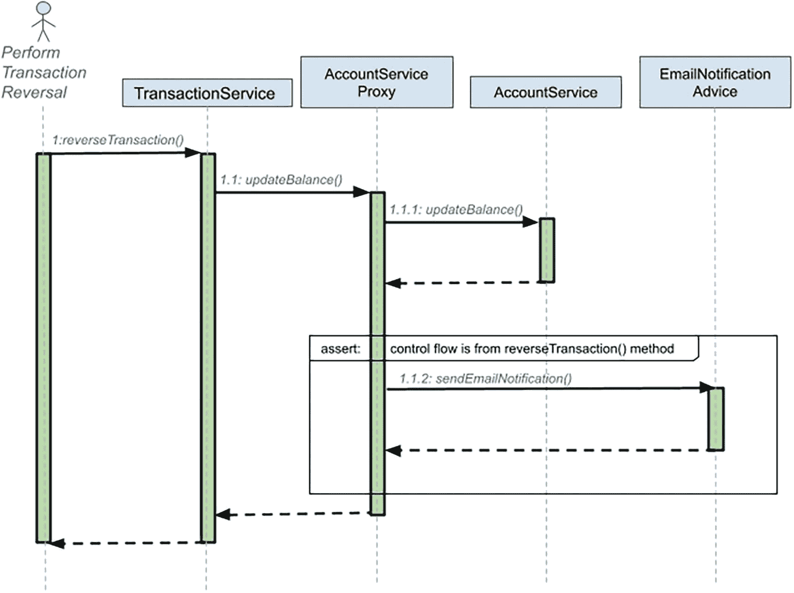

该图展示了执行事务撤销的 UML 序列的 4 层：1. 事务服务，2. 金额服务代理，3. 账户服务，4. 电子邮件通知建议。

图 5-6

控制流切入点的 UML 序列图

### 使用可组合切入点

在之前的切入点示例中，我们为每个通知器只使用了一个切入点。在大多数情况下，这通常就足够了，但在某些情况下，您可能需要将两个或多个切入点组合在一起以实现所需的目标。假设您想要切入一个 Bean 上的所有 getter 和 setter 方法。您有一个用于 getter 的切入点和一个用于 setter 的切入点，但没有一个同时适用于两者的切入点。当然，您可以创建一个包含新逻辑的另一个切入点，但更好的方法是使用 `ComposablePointcut` 将这两个切入点组合成一个切入点。

`ComposablePointcut` 支持两个方法：`union()` 和 `intersection()`。默认情况下，`ComposablePointcut` 使用一个匹配所有类的 `ClassFilter` 和一个匹配所有方法的 `MethodMatcher` 创建，尽管您可以在构造期间提供自己的初始 `ClassFilter` 和 `MethodMatcher`。`union()` 和 `intersection()` 方法都被重载以接受 `ClassFilter` 和 `MethodMatcher` 参数。

可以通过传入 `ClassFilter`、`MethodMatcher` 或 `Pointcut` 接口的实例来调用 `ComposablePointcut.union()` 方法。联合操作的结果是，`ComposablePointcut` 将向其调用链中添加一个“或”条件以匹配连接点。`ComposablePointcut.intersection()` 方法也是如此，但这次将添加一个“与”条件，这意味着 `ComposablePointcut` 内的所有 `ClassFilter`、`MethodMatcher` 和 `Pointcut` 定义都必须匹配才能应用通知。您可以将其想象为 SQL 查询中的 `WHERE` 子句，`union()` 方法类似于“或”运算符，而 `intersection()` 方法类似于“与”运算符。

与控制流切入点一样，这很难形象化，通过示例来理解要容易得多。清单 5-33 显示了前面示例中使用的 `GrammyGuitarist` 类及其四个方法。

```
package com.apress.prospring6.five.common;
// 其他导入语句已省略
public class GrammyGuitarist implements Singer {
private static Logger LOGGER = LoggerFactory.getLogger(GrammyGuitarist.class);
@Override
public void sing() {
LOGGER.info("sing: Gravity is working against me\n" +
"And gravity wants to bring me down");
}
public void sing(Guitar guitar) {
LOGGER.info("play: " + guitar.play());
}
public void talk(){
LOGGER.info("talk");
}
@Override
public void rest(){
LOGGER.info("zzz");
}
}
清单 5-33
GrammyGuitarist 实现
```

在这个示例中，我们将使用同一个 `ComposablePointcut` 实例生成三个代理，但每次，我们将使用 `union()` 或 `intersection()` 方法来修改 `ComposablePointcut`。之后，我们将在目标 Bean 代理上调用所有三个方法，并查看哪些方法已被通知。清单 5-34 描述了这一点。

```
package com.apress.prospring6.five;
import org.springframework.aop.support.ComposablePointcut;
import org.springframework.aop.support.StaticMethodMatcher;
// 其他导入语句已省略
public class ComposablePointcutDemo {
private static Logger LOGGER = LoggerFactory.getLogger(ComposablePointcutDemo.class);
public static void main(String... args) {
GrammyGuitarist johnMayer = new GrammyGuitarist();
ComposablePointcut pc = new ComposablePointcut(ClassFilter.TRUE, new SingMethodMatcher());
LOGGER.info("测试 1 >> ");
GrammyGuitarist proxy = getProxy(pc, johnMayer);
testInvoke(proxy);
LOGGER.info("测试 2 >> ");
pc.union(new TalkMethodMatcher());
proxy = getProxy(pc, johnMayer);
testInvoke(proxy);
LOGGER.info("测试 3 >> ");
pc.intersection(new RestMethodMatcher());
proxy = getProxy(pc, johnMayer);
testInvoke(proxy);
}
private static GrammyGuitarist getProxy(ComposablePointcut pc, GrammyGuitarist target) {
Advisor advisor = new DefaultPointcutAdvisor(pc, new SimpleBeforeAdvice());
ProxyFactory pf = new ProxyFactory();
pf.setTarget(target);
pf.addAdvisor(advisor);
return (GrammyGuitarist) pf.getProxy();
}
private static void testInvoke(GrammyGuitarist proxy) {
proxy.sing();
proxy.sing(new Guitar());
proxy.talk();
proxy.rest();
}
}
class SingMethodMatcher extends StaticMethodMatcher {
@Override
public boolean matches(Method method, Class cls) {
return (method.getName().startsWith("si"));
}
}
class TalkMethodMatcher extends StaticMethodMatcher {
@Override
public boolean matches(Method method, Class cls) {
return "talk".equals(method.getName());
}
}
class RestMethodMatcher extends StaticMethodMatcher {
@Override
public boolean matches(Method method, Class cls) {
return (method.getName().endsWith("st"));
}
}
清单 5-34
测试 ComposablePointcut
```

在这个示例中，首先要注意的是三个私有的 `MethodMatcher` 实现集。`SingMethodMatcher` 匹配所有以 'si' 开头的方法。这是我们用来组装 `ComposablePointcut` 的默认 `MethodMatcher`。因此，我们期望对 `GrammyGuitarist` 方法的第一轮调用将导致只有 `sing()` 方法被通知。

`TalkMethodMatcher` 匹配所有名为 talk 的方法，并且它通过使用 `union()` 与 `ComposablePointcut` 组合，用于第二轮调用。此时，我们有两个 `MethodMatcher` 的联合：一个匹配所有以 si 开头的方法，另一个匹配所有名为 talk 的方法。我们现在期望第二轮中的所有调用都将被通知。`TalkMethodMatcher` 非常具体，只匹配 `talk()` 方法。这个 `MethodMatcher` 通过使用 `intersection()` 与 `ComposablePointcut` 组合，用于第三轮调用。

因为 `RestMethodMatcher` 是通过使用 `intersection()` 组合的，我们期望在第三轮中没有方法被通知，因为没有方法能匹配所有组合的 `MethodMatcher`。

运行清单 5-34 中的代码将产生清单 5-35 中所示的控制台输出。


```
INFO : ComposablePointcutDemo - 测试 1 >>
INFO : SimpleBeforeAdvice - 前置方法: public void com.apress.prospring6.five.common.GrammyGuitarist.sing()
INFO : GrammyGuitarist - 演唱: Gravity is working against me
And gravity wants to bring me down
INFO : SimpleBeforeAdvice - 前置方法: public void com.apress.prospring6.five.common.GrammyGuitarist.sing(com.apress.prospring6.five.common.Guitar)
INFO : GrammyGuitarist - 演奏: G C G C Am D7
INFO : GrammyGuitarist - 交谈
INFO : GrammyGuitarist - 打鼾
INFO : ComposablePointcutDemo - 测试 2 >>
INFO : SimpleBeforeAdvice - 前置方法: public void com.apress.prospring6.five.common.GrammyGuitarist.sing()
INFO : GrammyGuitarist - 演唱: Gravity is working against me
And gravity wants to bring me down
INFO : SimpleBeforeAdvice - 前置方法: public void com.apress.prospring6.five.common.GrammyGuitarist.sing(com.apress.prospring6.five.common.Guitar)
INFO : GrammyGuitarist - 演奏: G C G C Am D7
INFO : SimpleBeforeAdvice - 前置方法: public void com.apress.prospring6.five.common.GrammyGuitarist.talk()
INFO : GrammyGuitarist - 交谈
INFO : GrammyGuitarist - 打鼾
INFO : ComposablePointcutDemo - 测试 3 >>
INFO : GrammyGuitarist - 演唱: Gravity is working against me
And gravity wants to bring me down
INFO : GrammyGuitarist - 演奏: G C G C Am D7
INFO : GrammyGuitarist - 交谈
INFO : GrammyGuitarist - 打鼾
清单 5-35
ComposablePointcutDemo 输出
```

尽管此示例仅演示了在组合过程中使用 `MethodMatchers`，但在构建切入点时，使用 `ClassFilter` 也同样简单。实际上，在构建复合切入点时，你可以组合使用 `MethodMatchers` 和 `ClassFilters`。

### 组合与 `Pointcut` 接口

在上一节中，你了解了如何通过使用多个 `MethodMatchers` 和 `ClassFilters` 来创建复合切入点。你也可以通过使用其他实现了 `Pointcut` 接口的对象来创建复合切入点。

构造复合切入点的另一种方法是使用 `org.springframework.aop.support.Pointcuts` 类。该类提供了三个静态方法。`intersection()` 和 `union()` 方法都接受两个切入点作为参数来构造复合切入点。另一方面，还提供了一个 `matches(Pointcut, Method, Class, Object[])` 方法，用于快速检查切入点是否与给定的方法、类和方法参数匹配。

`Pointcuts` 类仅支持对两个切入点进行操作。因此，如果你需要将 `MethodMatcher` 和 `ClassFilter` 与 `Pointcut` 结合使用，则需要使用 `ComposablePointcut` 类。然而，当你只需要组合两个切入点时，`Pointcuts` 类会更方便。

### 切入点总结

Spring 提供了一套强大的 `Pointcut` 实现，应该能够满足你应用程序的大部分（如果不是全部）需求。请记住，如果你找不到合适的切入点，你可以通过实现 `Pointcut`、`MethodMatcher` 和 `ClassFilter` 来从头创建自己的实现。

你可以使用两种模式来组合切入点和通知器。第一种模式（我们目前使用的模式）是将 `Pointcut` 实现与通知器解耦。在我们到目前为止看到的代码中，我们创建了 `Pointcut` 实现的实例，然后使用 `DefaultPointcutAdvisor` 实现将通知与 `Pointcut` 一起添加到代理中。

第二种选择（Spring 文档中的许多示例都采用这种方式）是将 `Pointcut` 封装在你自己的 `Advisor` 实现中。这样，你就拥有了一个同时实现 `Pointcut` 和 `PointcutAdvisor` 的类，其中 `PointcutAdvisor.getPointcut()` 方法简单地返回 `this`。这是 Spring 中许多类（例如 `StaticMethodMatcherPointcutAdvisor`）所采用的方法。我们发现第一种方法最为灵活，允许你将不同的 `Pointcut` 实现与不同的 `Advisor` 实现结合使用。然而，第二种方法在你将在应用程序的不同部分（甚至跨多个应用程序）使用相同的 `Pointcut` 和 `Advisor` 组合时非常有用。

当每个 `Advisor` bean 必须拥有一个独立的 `Pointcut` 实例时，第二种方法非常有用；通过让 `Advisor` 负责创建 `Pointcut`，你可以确保这一点。如果你还记得上一节关于代理性能的讨论，你会记得未通知的方法比已通知的方法性能要好得多。因此，你应该确保通过使用 `Pointcuts`，只通知那些绝对必要的方法。这样，你就可以减少因使用 AOP 而给应用程序增加的不必要开销。

## 引言入门

引言是 Spring 中 AOP 功能集的重要组成部分。通过使用引言，你可以动态地向现有对象引入新功能。在 Spring 中，你可以向现有对象引入任何接口的实现。你可能很想知道这到底有什么用处。既然可以在开发时简单地添加功能，为什么还要在运行时动态添加呢？这个问题的答案很简单：当功能是横切性的，并且不容易使用传统通知实现时，你就会动态地添加功能。


### 引言基础

Spring 将引介视为一种特殊类型的通知，更具体地说，是一种特殊类型的环绕通知。由于引介仅应用于类级别，因此你不能将切点与引介一起使用；从语义上讲，两者并不匹配。引介会向类添加新的接口实现，而切点则定义通知应用于哪些方法。你可以通过实现 `IntroductionInterceptor` 接口来创建引介，该接口扩展了 `MethodInterceptor` 和 `DynamicIntroductionAdvice` 接口。

图 5-7 展示了此结构以及这两个接口的方法，如 IntelliJ IDEA UML 插件所描绘的那样。

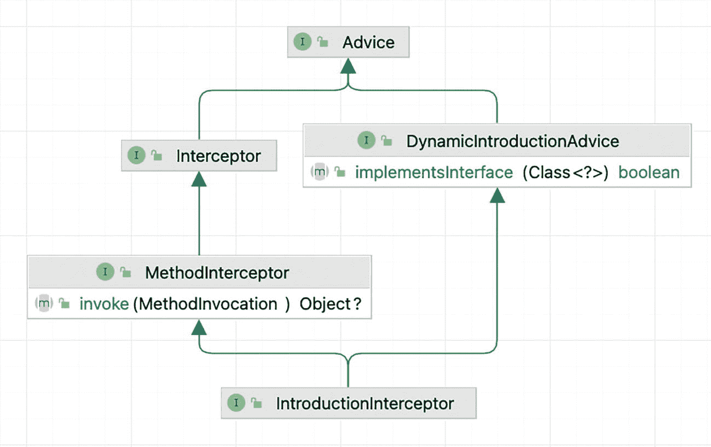

一张示意图，展示了引介拦截器接口（包含方法拦截器的 invoke 方法以及拦截器接口）、动态引介通知接口的实现，并指向通知。

图 5-7

IntroductionInterceptor 接口层次结构

如你所见，`MethodInterceptor` 接口定义了一个 `invoke()` 方法。使用此方法，你可以为你正在引介的接口提供实现，并根据需要为任何其他方法执行拦截。在单个方法内为一个接口实现所有方法可能会很麻烦，并且很可能导致大量代码，你需要费力地浏览这些代码才能决定调用哪个方法。幸运的是，Spring 提供了 `IntroductionInterceptor` 的默认实现，名为 `DelegatingIntroductionInterceptor`，它使得创建引介更加简单。要使用 `DelegatingIntroductionInterceptor` 构建引介，你需要创建一个类，该类既继承自 `DelegatingIntroductionInterceptor`，又实现你想要引介的接口。然后，`DelegatingIntroductionInterceptor` 实现会简单地将所有对引介方法的调用委托给自身上的相应方法。如果这看起来有点不清楚，请不要担心；你将在下一节中看到一个示例。

正如你在使用切点通知时需要用到 `PointcutAdvisor` 一样，你需要使用 `IntroductionAdvisor` 来向代理添加引介。`IntroductionAdvisor` 的默认实现是 `DefaultIntroductionAdvisor`，它应该能够满足你大部分（如果不是全部）的引介需求。你应该注意，不允许使用 `ProxyFactory.addAdvice()` 添加引介，否则会导致抛出 `AopConfigException`。相反，你应该使用 `addAdvisor()` 方法，并传入一个 `IntroductionAdvisor` 接口的实例。

当使用标准通知（即非引介）时，同一个通知实例可以用于多个对象。Spring 文档将此称为 *per-class 生命周期*，尽管你可以为多个类使用单个通知实例。对于引介，引介通知构成了被通知对象状态的一部分，因此，每个被通知对象必须有一个不同的通知实例。这被称为 *per-instance 生命周期*。由于你必须确保每个被通知对象都有一个不同的引介实例，因此通常更可取的做法是创建一个 `DefaultIntroductionAdvisor` 的子类，该子类负责创建引介通知。这样，你只需要确保为每个对象创建一个新的 advisor 类实例，因为它会自动创建一个新的引介实例。例如，假设你想将前置通知应用于所有 `Contact` 类实例的 `setFirstName()` 方法。图 5-8 展示了应用于所有 `Contact` 类型对象的同一个通知。

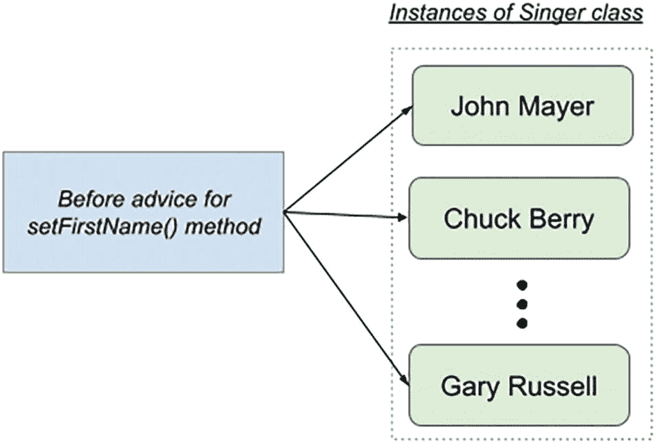

一张示意图，展示了将前置通知应用于歌手类实例的 setFirstName 方法，这些实例包括 John Mayer、Chuck Berry，直到 Gary Russell。

图 5-8

通知的 per-class 生命周期

现在，假设你想将引介混入所有 `Contact` 类实例中，并且该引介将为每个 `Contact` 实例携带信息（例如，一个指示特定实例是否被修改的属性 `isModified`）。在这种情况下，将为每个 `Contact` 实例创建引介，并将其绑定到该特定实例，如图 5-9 所示。

以上涵盖了引介创建的基础知识。我们现在将讨论如何使用引介来解决对象修改检测的问题。

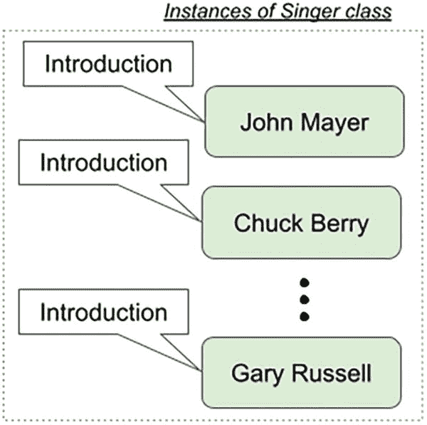

一张示意图，展示了为歌手类的每个实例（包括 John Mayer、Chuck Berry，直到 Gary Russell）创建引介。

图 5-9

Per-instance 引介


### 对象修改检测与引入

*对象修改检测*是一项因多种原因而非常有用的技术。通常，你在持久化对象数据时应用修改检测，以避免不必要的数据库访问。如果一个对象被传递给某个方法进行修改，但返回时并未被修改，那么向数据库发出更新语句就毫无意义。以这种方式使用修改检查可以真正提高应用程序的吞吐量，尤其是在数据库已经承受较大负载或位于远程网络上（导致通信成本高昂）的情况下。

不幸的是，这种功能很难手动实现，因为它要求你向每个可能修改对象状态的方法中添加检查逻辑，以确认对象状态是否真的被修改了。当你考虑到所有必须进行的空值检查以及检查值是否实际发生变化时，每个方法大约需要八行代码。你可以将其重构为一个单独的方法，但每次需要执行检查时仍然必须调用此方法。将这种逻辑分散到需要修改检查的众多类的典型应用程序中，就会埋下灾难的隐患。

这显然是引入（Introductions）能够发挥作用的地方。我们不希望每个需要修改检查的类都继承自某个基础实现，从而失去其唯一的继承机会；我们也不希望真的在每个改变状态的方法中添加检查代码。通过使用引入，我们可以为修改检测问题提供一个灵活的解决方案，而无需编写大量重复、易出错的代码。

在本例中，我们将使用引入构建一个完整的修改检查框架。修改检查逻辑由 `IsModified` 接口封装，该接口的一个实现将被引入到合适的对象中，同时还会引入拦截逻辑来自动执行修改检查。出于本示例的目的，我们采用 JavaBeans 约定，即将对 setter 方法的任何调用都视为一次修改。当然，我们并非将所有对 setter 方法的调用都视为修改；我们会检查传递给 setter 的值是否与对象当前存储的值不同。此解决方案的唯一缺陷是，如果对象上的任何一个值发生了变化，即使将对象设置回其原始状态，它仍会反映为已修改。例如，你有一个包含 `firstName` 属性的 `Contact` 对象。假设在处理过程中，`firstName` 属性从 Peter 改为了 John。结果，该对象被标记为已修改。然而，即使在后续处理中该值又从 John 改回了原始值 Peter，它仍然会被标记为已修改。

跟踪此类更改的一种方法是在对象的整个生命周期中存储完整的更改历史记录。然而，这里的实现很简单，足以满足大多数需求。实现更完整的解决方案会导致示例过于复杂。

#### 使用 `IsModified` 接口

修改检查解决方案的核心是 `IsModified` 接口，虚构的应用程序使用该接口来做出关于对象持久化的智能决策。我们不介绍应用程序将如何使用 `IsModified`；相反，我们将专注于引入的实现。清单 5-36 展示了 `IsModified` 接口。

```
package com.apress.prospring6.five.introduction;
public interface IsModified {
boolean isModified();
}
清单 5-36
IsModified 接口
```

这里没有什么特别的——只有一个方法 `isModified()`，用于指示对象是否已被修改。

#### 创建 Mixin

下一步是创建实现 `IsModified` 并将被引入到对象中的代码；这被称为 *mixin*。正如我们之前提到的，通过继承 `DelegatingIntroductionInterceptor` 来创建 mixin 比直接实现 `IntroductionInterceptor` 接口要简单得多。mixin 类 `IsModifiedMixin` 继承了 `DelegatingIntroductionInterceptor` 并实现了 `IsModified` 接口。此实现如清单 5-37 所示。

```
package com.apress.prospring6.five.introduction;
import java.lang.reflect.Method;
import java.util.HashMap;
import java.util.Map;
import java.util.function.Predicate;
import org.aopalliance.intercept.MethodInvocation;
import org.springframework.aop.support.DelegatingIntroductionInterceptor;
public class IsModifiedMixin extends DelegatingIntroductionInterceptor implements IsModified {
private boolean isModified = false;
private final Map methodCache = new HashMap();
private final Predicate isSetter = invocation ->
invocation.getMethod().getName().startsWith("set") && (invocation.getArguments().length == 1);
@Override
public boolean isModified() {
return isModified;
}
@Override
public Object invoke(MethodInvocation invocation) throws Throwable {
if (!isModified) {
if (isSetter.test(invocation)) {
Method getter = getGetter(invocation.getMethod());
if (getter != null) {
Object newVal = invocation.getArguments()[0];
Object oldVal = getter.invoke(invocation.getThis(), null);
if (newVal == null && oldVal == null) {
isModified = false;
} else if ((newVal == null && oldVal != null) || (newVal != null && oldVal == null)) {
isModified = true;
}  else {
isModified = !newVal.equals(oldVal);
}
}
}
}
return super.invoke(invocation);
}
private Method getGetter(Method setter) {
Method getter = methodCache.get(setter);
if (getter != null) {
return getter;
}
String getterName = setter.getName().replaceFirst("set", "get");
try {
getter = setter.getDeclaringClass().getMethod(getterName, null);
synchronized (methodCache) {
methodCache.put(setter, getter);
}
return getter;
} catch (NoSuchMethodException ex) {
return null;
}
}
}
清单 5-37
IsModifiedMixin 类
```

这里首先要注意的是 `IsModified` 的实现，它由私有的 `modified` 字段和 `isModified()` 方法组成。这个例子强调了为什么每个被通知的对象必须有一个 mixin 实例——mixin 不仅向对象引入方法，还引入了状态。如果你在多个对象之间共享这个 mixin 的单个实例，那么你也在共享状态，这意味着一旦单个对象被修改，所有对象都会显示为已修改。

实际上，你并不需要为 mixin 实现 `invoke()` 方法，但在本例中，这样做使我们能够自动检测何时发生修改。我们首先仅在对象尚未被修改时执行检查；一旦我们知道对象已被修改，就无需再检查修改。接下来，我们检查该方法是否为 setter，如果是，则检索相应的 getter 方法。请注意，我们缓存了 getter/setter 对，以便将来更快地检索。最后，我们比较 getter 返回的值与传递给 setter 的值，以确定是否发生了修改。请注意，我们检查了 null 的不同可能组合，并相应地设置了修改标志。重要的是要记住，当你使用 `DelegatingIntroductionInterceptor` 时，在重写 `invoke()` 时必须调用 `super.invoke()`，因为正是 `DelegatingIntroductionInterceptor` 负责将调用分派到正确的位置，即被通知的对象或 mixin 本身。

你可以在你的 mixin 中实现任意数量的接口，每个接口都会自动被引入到被通知的对象中。


### 创建 `Advisor`

下一步是创建一个 `Advisor` 类来封装混入类的创建。这一步是可选的，但它确实有助于确保每个被通知对象都使用混入类的新实例。清单 5-38 展示了 `IsModifiedAdvisor` 类。

```
package com.apress.prospring6.five.introduction;
import org.springframework.aop.support.DefaultIntroductionAdvisor;
public class IsModifiedAdvisor extends DefaultIntroductionAdvisor {
public IsModifiedAdvisor() {
super(new IsModifiedMixin());
}
}
清单 5-38
IsModifiedAdvisor 类
```

请注意，我们继承了 `DefaultIntroductionAdvisor` 来创建我们的 `IsModifiedAdvisor`。这个通知器的实现很简单，不言自明。

### 整合所有组件

现在我们已经有了一个混入类和一个 `Advisor` 类，可以测试修改检查框架了。我们将要使用的类是前面提到的 `Contact` 类，它位于一个公共包中。出于可重用性的考虑，这个类经常作为本书中项目的依赖项。该类的具体内容如清单 5-39 所示。

```
package com.apress.prospring6.five.introduction;
public class Contact {
private String name;
private String phoneNumber;
private String email;
// getters, setters and toString omitted
}
清单 5-39
Contact 类
```

这个 Bean 有一组属性，但只使用 `name` 属性来测试修改检查混入。清单 5-40 展示了如何组装被通知的代理，然后测试修改检查代码。

```
package com.apress.prospring6.five.introduction;
import org.slf4j.Logger;
import org.slf4j.LoggerFactory;
import org.springframework.aop.IntroductionAdvisor;
import org.springframework.aop.framework.ProxyFactory;
public class IntroductionDemo {
private static Logger LOGGER = LoggerFactory.getLogger(IntroductionDemo.class);
public static void main(String... args) {
Contact target = new Contact();
target.setName("John Mayer");
IntroductionAdvisor advisor = new IsModifiedAdvisor();
ProxyFactory pf = new ProxyFactory();
pf.setTarget(target);
pf.addAdvisor(advisor);
pf.setOptimize(true);
Contact proxy = (Contact) pf.getProxy();
IsModified proxyInterface = (IsModified)proxy;
LOGGER.info("Is Contact? => {} " , (proxy instanceof Contact));
LOGGER.info("Is IsModified? => {} " , (proxy instanceof IsModified));
LOGGER.info("Has been modified? => {} " , proxyInterface.isModified());
proxy.setName("John Mayer");
LOGGER.info("Has been modified? => {} " , proxyInterface.isModified());
proxy.setName("Ben Barnes");
LOGGER.info("Has been modified? => {} " , proxyInterface.isModified());
}
}
清单 5-40
IntroductionDemo 类
```

请注意，在创建代理时，我们将 `optimize` 标志设置为 `true`，以强制使用 CGLIB 代理。这样做的原因是，当你使用 JDK 代理来引入混入时，生成的代理将不会是对象类（本例中为 `Contact`）的实例；代理只实现混入接口，它不会扩展原始类。而使用 CGLIB 代理时，代理会同时扩展原始类和混入接口。

请注意，在清单 5-40 中，我们首先测试代理是否是 `Contact` 的实例，然后测试它是否是 `IsModified` 的实例。当使用 CGLIB 代理时，两个测试都返回 `true`，但对于 JDK 代理，只有 `IsModified` 测试返回 `true`。最后，我们通过先将 name 属性设置为其当前值，然后设置为一个新值，并每次检查 `isModified` 标志的值，来测试修改检查代码。运行该示例将产生如清单 5-41 所示的输出。

```
INFO : IntroductionDemo - Is Contact? => true
INFO : IntroductionDemo - Is IsModified? => true
INFO : IntroductionDemo - Has been modified? => false
INFO : IntroductionDemo - Has been modified? => false
INFO : IntroductionDemo - Has been modified? => true
清单 5-41
IntroductionDemo 执行输出
```

正如预期的那样，两个 `instanceof` 测试都返回 `true`。请注意，在发生任何修改之前，第一次调用 `isModified()` 返回 `false`。接下来，在我们将 name 的值设置为相同值之后，调用也返回 `false`。然而，在最后一次调用中，我们将 name 的值设置为一个新值后，`isModified()` 方法返回 `true`，表明该对象确实已被修改。

### 引入总结

引入是 Spring AOP 最强大的特性之一；它不仅允许你扩展现有方法的功能，还允许你动态地扩展接口和对象实现的集合。使用引入是实现横切逻辑的完美方式，你的应用程序通过定义良好的接口与这些逻辑交互。通常，这是那种你希望以声明方式而非编程方式应用的逻辑。通过使用本例中定义的 `IsModifiedMixin` 以及下一节讨论的框架服务，我们可以声明式地定义哪些对象能够进行修改检查，而无需修改这些对象的实现。

显然，由于引入是通过代理工作的，它们会增加一定的开销。代理上的所有方法都被视为已通知，因为切入点不能与引入结合使用。然而，对于许多可以通过引入实现的服务（例如对象修改检查），这种性能开销是为了减少实现服务所需的代码量，以及通过完全集中服务逻辑来提高稳定性和可维护性而付出的微小代价。

## AOP 的框架服务

到目前为止，我们必须编写大量代码来通知对象并为其生成代理。虽然这本身并不是一个大问题，但它确实意味着所有通知配置都被硬编码到你的应用程序中，从而失去了透明地通知方法实现的一些好处。幸运的是，Spring 提供了额外的框架服务，允许你在应用程序配置中创建被通知的代理，然后将此代理像任何其他依赖项一样注入到目标 Bean 中。

使用声明式方法进行 AOP 配置比手动、编程式机制更可取。当你使用声明式机制时，不仅可以将通知的配置外部化，还可以减少编码错误的机会。你还可以利用 DI 和 AOP 的结合来启用 AOP，使其能够在完全透明的环境中使用。

### 声明式配置 AOP

当使用 Spring AOP 的声明式配置时，有三种选择。

*   *使用* `ProxyFactoryBean`：在 Spring AOP 中，`ProxyFactoryBean` 提供了一种声明式方式，用于在基于定义的 Spring Bean 创建 AOP 代理时配置 Spring 的 `ApplicationContext`（以及底层的 `BeanFactory`）。

*   *使用 Spring* `aop` *命名空间*：与 `ProxyFactoryBean` 相比，Spring 2.0 引入的 `aop` 命名空间提供了一种简化的方式来定义 Spring 应用程序中的切面及其 DI 需求。然而，`aop` 命名空间在幕后也使用了 `ProxyFactoryBean`。本书不展示此选项，因为重点在于使用 Java 配置。

*   *使用* `@AspectJ`*-风格的注解*：配置 Spring AOP 的实用方法是在你的类中使用 `@AspectJ` 风格的注解。虽然它使用的语法基于 AspectJ，并且在使用此选项时需要包含一些 AspectJ 库，但 Spring 在引导 `ApplicationContext` 时仍然使用代理机制（即为目标创建代理对象）。


### 使用 `ProxyFactoryBean`

`ProxyFactoryBean` 类是 `FactoryBean` 的一个实现，它允许你指定一个目标 bean，并为该 bean 提供一组通知和顾问，这些最终会被合并到一个 AOP 代理中。`ProxyFactoryBean` 用于将拦截器逻辑应用到现有的目标 bean 上，使得当该 bean 上的方法被调用时，拦截器会在方法调用前后执行。由于你可以同时使用顾问和通知与 `ProxyFactoryBean`，因此你不仅可以声明式地配置通知，还可以配置切入点。

`ProxyFactoryBean` 与 `ProxyFactory` 共享一个公共接口（`org.springframework.aop.framework.Advised` 接口）（这两个类都间接扩展了 `org.springframework.aop.framework.AdvisedSupport` 类，而该类实现了 `Advised` 接口），因此，它暴露了许多相同的标志，例如 `frozen`、`optimize` 和 `exposeProxy`。这些标志的值会直接传递给底层的 `ProxyFactory`，从而允许你以声明方式配置工厂。

使用 `ProxyFactoryBean` 很简单。你定义一个作为目标 bean 的 bean，然后使用 `ProxyFactoryBean`，以该目标 bean 作为代理目标，定义你的应用程序将要访问的 bean。在可能的情况下，将目标 bean 定义为代理 bean 声明内部的匿名 bean。这可以防止你的应用程序意外访问未经过通知的 bean。然而，在某些情况下，例如我们即将展示的示例中，你可能希望为同一个 bean 创建多个代理，因此在这种情况下，你应该使用一个普通的顶级 bean。

对于以下示例，请设想这样一个场景：你有一位歌手与一位纪录片制作人合作，制作一部关于巡演的纪录片。在这种情况下，`Documentarist` 依赖于 `Singer` 的实现。我们在此使用的 `Singer` 实现是之前介绍过的 `GrammyGuitarist`，它在本章中已经出现过两次，上一次是在清单 5-33 中。清单 5-42 展示了 `Documentarist` 类，它基本上会告诉歌手在拍摄纪录片时该做什么。

```
package com.apress.prospring6.five.common;
public class Documentarist {
private GrammyGuitarist guitarist;
public void execute() {
guitarist.sing();
guitarist.talk();
}
public void setDep(GrammyGuitarist guitarist) {
this.guitarist = guitarist;
}
}
清单 5-42
Documentarist 类
```

对于这个示例，我们将为单个 `GrammySinger` 实例创建两个代理，这两个代理都使用清单 5-43 中所示的基本通知。

```
package com.apress.prospring6.five.common;
import org.aspectj.lang.JoinPoint;
import org.slf4j.Logger;
import org.slf4j.LoggerFactory;
public class AuditAdvice implements MethodBeforeAdvice {
private static Logger LOGGER = LoggerFactory.getLogger(AuditAdvice.class);
@Override
public void before(Method method, Object[] args, Object target) throws Throwable {
LOGGER.info("Executing {}" , method );
}
}
清单 5-43
AuditAdvice 类
```

第一个代理将直接使用通知来对目标进行通知；因此，所有方法都将被通知。

对于第二个代理，我们将配置 `AspectJExpressionPointcut` 和 `DefaultPointcutAdvisor`，以便仅通知 `GrammySinger` 类的 `sing()` 方法。为了测试通知，我们将创建两个类型为 `Documentarist` 的 bean 定义，每个定义将注入不同的代理。然后，我们将在每个 bean 上调用 `execute()` 方法，并观察当依赖项中被通知的方法被调用时会发生什么。图 5-10 显示了由 `AopConfig` 类表示的此示例的配置。

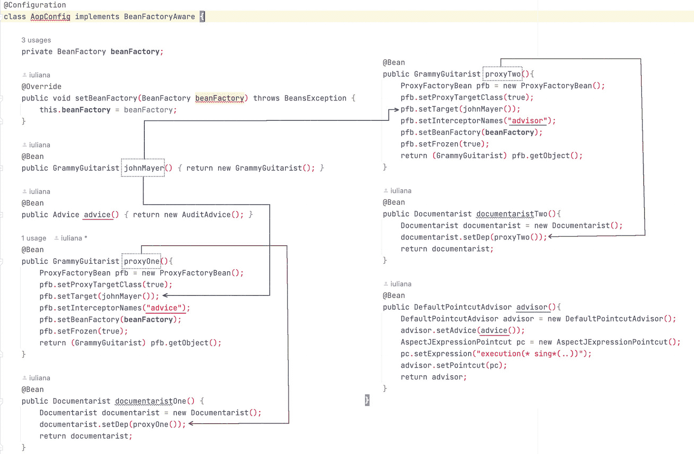

一张标题为“类 A o p 配置实现 bean factory aware”的截图，包含带有 3 个私有 bean factory 用法的代码。

图 5-10

声明式 AOP 配置

由于图片在打印时可能不清晰，清单 5-44 展示了 `AopConfig` 类。

```
package com.apress.prospring6.five;
// 导入语句已省略
@Configuration
class AopConfig implements BeanFactoryAware {
private BeanFactory beanFactory;
@Override
public void setBeanFactory(BeanFactory beanFactory) throws BeansException {
this.beanFactory = beanFactory;
}
@Bean
public GrammyGuitarist johnMayer(){
return new GrammyGuitarist();
}
@Bean
public Advice advice(){
return new AuditAdvice();
}
@Bean
public GrammyGuitarist proxyOne(){
ProxyFactoryBean pfb = new ProxyFactoryBean();
pfb.setProxyTargetClass(true);
pfb.setTarget(johnMayer());
pfb.setInterceptorNames("advice");
pfb.setBeanFactory(beanFactory);
pfb.setFrozen(true);
return (GrammyGuitarist) pfb.getObject();
}
@Bean
public Documentarist documentaristOne() {
Documentarist documentarist = new Documentarist();
documentarist.setDep(proxyOne());
return documentarist;
}
@Bean
public GrammyGuitarist proxyTwo(){
ProxyFactoryBean pfb = new ProxyFactoryBean();
pfb.setProxyTargetClass(true);
pfb.setTarget(johnMayer());
pfb.setInterceptorNames("advisor");
pfb.setBeanFactory(beanFactory);
pfb.setFrozen(true);
return (GrammyGuitarist) pfb.getObject();
}
@Bean
public Documentarist documentaristTwo(){
Documentarist documentarist = new Documentarist();
documentarist.setDep(proxyTwo());
return documentarist;
}
@Bean
public DefaultPointcutAdvisor advisor(){
DefaultPointcutAdvisor advisor = new DefaultPointcutAdvisor();
advisor.setAdvice(advice());
AspectJExpressionPointcut pc = new AspectJExpressionPointcut();
pc.setExpression("execution(* sing*(..))");
advisor.setPointcut(pc);
return advisor;
}
}
清单 5-44
AopConfig 配置类
```

我们使用图片来描述此配置，因为它可能看起来有点令人困惑，并且我们希望确保可以轻松看到每个 bean 注入的位置。在示例中，我们只是使用 Spring 的 DI 功能来设置我们在代码中设置的属性。唯一值得注意的点是，切入点并未声明为 bean，而是作为顾问 bean 上的一个简单 pojo 设置，因为它不打算被共享，并且我们使用 `ProxyFactoryBean` 类来创建代理。使用 `ProxyFactoryBean` 时需要认识到的重要一点是，`ProxyFactoryBean` 声明是暴露给应用程序的声明，也是在满足依赖关系时使用的声明。底层的目标 bean 声明未经过通知，因此，仅当你想绕过 AOP 框架时才应使用此 bean，尽管通常来说，你的应用程序不应感知 AOP 框架，因此也不应想要绕过它。出于这个原因，你应该尽可能使用匿名 bean，以避免应用程序意外访问。


```
package com.apress.prospring6.five;
// 导入语句已省略
public class ProxyFactoryBeanDemo {
public static void main(String... args) {
var ctx = new AnnotationConfigApplicationContext(AopConfig.class);
Documentarist documentaristOne = ctx.getBean("documentaristOne", Documentarist.class);
Documentarist documentaristTwo = ctx.getBean("documentaristTwo", Documentarist.class);
System.out.println("Documentarist One >>");
documentaristOne.execute();
System.out.println("\nDocumentarist Two >> ");
documentaristTwo.execute();
}
}
// 输出结果
Documentarist One >>
INFO : AuditAdvice - Executing public void com.apress.prospring6.five.common.GrammyGuitarist.sing()
INFO : GrammyGuitarist - sing: Gravity is working against me
And gravity wants to bring me down
INFO : AuditAdvice - Executing public void com.apress.prospring6.five.common.GrammyGuitarist.talk()
INFO : GrammyGuitarist - talk
Documentarist Two >>
INFO : AuditAdvice - Executing public void com.apress.prospring6.five.common.GrammyGuitarist.sing()
INFO : GrammyGuitarist - sing: Gravity is working against me
And gravity wants to bring me down
INFO : GrammyGuitarist - talk
清单 5-45
测试 ProxyFactoryBean 配置的类
```

正如预期，第一个代理中的 `sing()` 和 `talk()` 方法都受到了通知，因为其配置中没有使用切入点。而对于第二个代理，由于配置中使用了切入点，只有 `sing()` 方法受到了通知。

### 使用 ProxyFactoryBean 实现引入

`ProxyFactoryBean` 类不仅可用于通知对象，还可用于向对象引入混入。回顾之前关于引入的讨论，你必须使用 `IntroductionAdvisor` 来添加引入；不能直接添加引入。当你在引入中使用 `ProxyFactoryBean` 时，同样适用此规则。使用 `ProxyFactoryBean` 时，如果你为混入创建了自定义的 `Advisor`，配置代理会变得容易得多。清单 5-46 展示了本章前面 `IsModifiedMixin` 引入的配置片段。

```
package com.apress.prospring6.five;
import org.springframework.aop.framework.ProxyFactoryBean;
// 其他导入语句已省略
@Configuration
class IntroductionAopConfig {
@Bean
public Contact guitarist(){
var contact = new Contact();
contact.setName("John Mayer");
return contact;
}
@Bean
public IsModifiedAdvisor advisor() {
return new IsModifiedAdvisor();
}
@Bean
public Contact proxy(){
ProxyFactoryBean pfb = new ProxyFactoryBean();
pfb.setProxyTargetClass(true);
pfb.setTarget(guitarist());
pfb.addAdvisor(advisor());
pfb.setFrozen(true);
return (Contact) pfb.getObject();
}
}
清单 5-46
测试 ProxyFactoryBean 配置的类
```

运行此示例将产生与之前“引入入门”部分开头介绍的引入示例完全相同的输出，但这次代理是从 `ApplicationContext` 获取的，并且应用程序代码中不存在任何配置。

请注意，无需通过名称引用顾问 bean 来将其作为参数提供给 `ProxyFactoryBean`，因为可以直接调用 `addAdvisor(..)` 并将顾问 bean 作为参数提供。这显然简化了配置。

### ProxyFactoryBean 总结

使用 `ProxyFactoryBean` 时，你可以配置 AOP 代理，这些代理提供了编程方法的所有灵活性，而无需将应用程序与 AOP 配置耦合。除非你需要在运行时决定如何创建代理，否则最好使用声明式代理配置方法而非编程式方法。让我们继续，以便你了解使用声明式 Spring AOP 最实用的方式。

## 使用 @AspectJ 风格注解

当使用 JDK 5 或更高版本的 Spring AOP 时，你也可以使用 `@AspectJ` 风格注解来声明通知。然而，如前所述，Spring 仍然使用自己的代理机制来通知目标方法，而不是 AspectJ 的织入机制。

在本节中，我们将介绍如何使用 `@AspectJ` 风格注解来实现与本章开头介绍的相同的切面。AspectJ 是 Java 的一个通用面向切面扩展，源于解决传统编程方法无法很好捕获的问题或关注点（即横切关注点）的需求。对于本节中的示例，我们还将为其他 Spring bean 使用注解，并将使用 Java 配置类。

清单 5-47 展示了使用注解声明的 `GrammyGuitarist` 类及其 bean。

```
package com.apress.prospring6.five.annotated;
import org.springframework.stereotype.Component;
// 其他导入语句已省略
@Component("johnMayer") //
public class GrammyGuitarist implements Singer {
private static Logger LOGGER = LoggerFactory.getLogger(GrammyGuitarist.class);
@Override
public void sing() {
LOGGER.info("sing: Gravity is working against me\n" +
"And gravity wants to bring me down");
}
public void sing(Guitar guitar) {
LOGGER.info("play: " + guitar.play());
}
public void talk(){
LOGGER.info("talk");
}
@Override
public void rest(){
LOGGER.info("zzz");
}
}
清单 5-47
使用 @Component 注解声明的 GrammyGuitarist Bean
```

为了增加趣味性，引入了一个 `NewDocumentarist` 类，它也会调用 `sing(Guitar)`。该类如清单 5-48 所示。

```
package com.apress.prospring6.five.annotated;
import org.springframework.beans.factory.annotation.Autowired;
import org.springframework.beans.factory.annotation.Qualifier;
// 其他导入语句已省略
@Component("documentarist")
public class NewDocumentarist {
protected GrammyGuitarist guitarist;
public void execute() {
guitarist.sing();
Guitar guitar = new Guitar();
guitar.setBrand("Gibson");
guitarist.sing(guitar);
guitarist.talk();
}
@Autowired
@Qualifier("johnMayer")
public void setGuitarist(GrammyGuitarist guitarist) {
this.guitarist = guitarist;
}
}
清单 5-48
使用 @Component 注解声明的 NewDocumentarist Bean
```

两个类都使用 `@Component` 注解来声明这些类型的 bean。该注解也用于命名 bean。在 `NewDocumentarist` 类中，属性 `guitarist` 的 setter 方法使用了 `@Autowired` 注解以实现 Spring 的自动注入，并使用 `@Qualifier` 来配置 Spring 应注入的 bean 名称。

现在我们有了 bean，让我们从一个非常简单的前置通知开始。


### 使用 AspectJ 注解声明前置通知

使用注解时，我们并不总是需要显式声明 `Pointcut`，因为 AspectJ 的 `@Before` 注解的默认属性可以通过一个切入点表达式来配置，该表达式表示通知的绑定位置。清单 5-49 展示了声明了注解通知的 `BeforeAdviceV1` 类。

```
package com.apress.prospring6.five.advice;
import org.aspectj.lang.JoinPoint;
import org.aspectj.lang.annotation.Aspect;
import org.aspectj.lang.annotation.Before;
// 其他导入注解已省略
@Component
@Aspect
public class BeforeAdviceV1 {
private static Logger LOGGER = LoggerFactory.getLogger(BeforeAdviceV1.class);
@Before("execution(* com.apress.prospring6.five..sing*(com.apress.prospring6.five.common.Guitar))")
public void simpleBeforeAdvice(JoinPoint joinPoint) {
var signature = (MethodSignature) joinPoint.getSignature();
LOGGER.info(" > 正在执行: {} 来自 {}", signature.getName(), signature.getDeclaringTypeName() );
}
}
清单 5-49
BeforeAdviceV1 类，声明一个包含单个前置通知的切面 Bean
```

一条信息提示。 为什么使用 `V1` 后缀？因为声明此通知和切入点的方式不止一种。在本节中，所有以不同方式声明相同前置通知的类都带有一个数字后缀，该数字也用作测试该通知的方法的后缀。

请注意，通知类不需要实现 `MethodBeforeAdvice`。另一个需要注意的地方是，`@Aspect` 注解用于声明它是一个切面类。切面类将通知声明、切入点以及用于声明这些内容的其他实用方法组合在一起。

`@Before` 注解将 `simpleBeforeAdvice(..)` 方法标记为前置通知，并且作为其默认属性值提供的表达式是一个切入点表达式，这意味着我们希望通知所有名称以 `sing` 开头的方法，并且这些类定义在 `com.apress.prospring6.five` 包下（包括所有子包，`..` 即表示此意）。此外，`sing*` 方法应接收一个类型为 `com.apress.prospring6.five.common.Guitar` 的参数。

前置通知方法接受连接点作为参数，但不接受方法、对象和参数。实际上，对于通知类来说，这个参数是可选的，因此你可以让方法不带任何参数。但是，如果你需要在通知中访问被通知的连接点的信息（在本例中，我们想要输出调用类型和方法名称的信息），那么你需要定义接受该参数。当为方法定义了参数时，Spring 会自动将连接点传递给该方法供你处理。在此示例中，我们使用 `JoinPoint` 来打印连接点的详细信息。

为了测试此通知，我们必须设计一个 Spring 配置类，该类能够发现 `GrammyGuitarist` 和 `NewDocumentarist` Bean，并启用对标记有 AspectJ 的 `@Aspect` 注解及其他注解的组件的支持。为了保持代码简洁，并使本节中每个场景的通知相互隔离，切面 Bean 将与清单 5-50 中的配置类一起注册到一个空的 `ApplicationContext` 中。这使我们能够重用此配置类，并保持测试代码片段相同，唯一的区别是添加到上下文中的切面类不同。

配置类如清单 5-50 所示。

```
package com.apress.prospring6.five.annotated;
import org.springframework.context.annotation.ComponentScan;
import org.springframework.context.annotation.Configuration;
import org.springframework.context.annotation.EnableAspectJAutoProxy;
@ComponentScan
@Configuration
@EnableAspectJAutoProxy(proxyTargetClass = true)
public class AspectJAopConfig {
}
清单 5-50
AspectJ Spring 配置类
```

请注意 `@EnableAspectJAutoProxy` 注解。此注解启用对标记有 AspectJ 的 `@Aspect` 注解的组件的支持，并且设计用于标注了 `@Configuration` 注解的类。它还有一个名为 `proxyTargetClass` 的属性。当设置为 `true` 时，表示将创建基于子类（CGLIB）的代理，而不是标准的基于 Java 接口的代理。在此示例中，需要 CGLIB 代理，因为即使 `GrammyGuitarist` 实现了 `Singer` 接口，并且默认情况下基于接口的 JDK 动态代理应该是合适的，但 `NewDocumentarist` 严格要求依赖项的类型为 `GrammyGuitarist` 或其扩展。因此，我们需要一个扩展了 `GrammyGuitarist` 的代理。如果没有 `proxyTargetClass = true` 属性，在尝试使用此配置启动 Spring 应用程序时，将抛出以下异常：

```
Error creating bean with name 'documentarist': Unsatisfied dependency expressed through method 'setGuitarist' parameter 0; nested exception is org.springframework.beans.factory.BeanNotOfRequiredTypeException: Bean named 'johnMayer' is expected to be of type 'com.apress.prospring6.five.annotated.GrammyGuitarist' but was actually of type 'jdk.proxy3.$Proxy26'
```

一条警告。 一条经验法则：如果配置中至少有一个类需要通过子类化进行代理，则必须设置 `proxyTargetClass=true`，否则应用程序上下文将无法正确创建。

该类还标注了 `@ComponentScan` 注解，该注解启用了对该类所在包（`com.apress.prospring6.five.annotated`）及其子包中 Bean 的发现。

为了测试本节中介绍的每种类型的通知，使用了测试方法，并将它们分组到清单 5-51 所示的 `AnnotatedAdviceTest` 类中。

```
package com.apress.prospring6.five.annotated;
import org.junit.jupiter.api.Test;
import com.apress.prospring6.five.advice.BeforeAdviceV1;
import org.springframework.context.annotation.AnnotationConfigApplicationContext;
public class AnnotatedAdviceTest {
@Test
void testBeforeAdviceV1(){
var ctx = new AnnotationConfigApplicationContext();
ctx.register(AspectJAopConfig.class, BeforeAdviceV1.class);
ctx.refresh();
assertTrue(Arrays.asList(ctx.getBeanDefinitionNames()).contains("beforeAdviceV1"));
NewDocumentarist documentarist = ctx.getBean("documentarist", NewDocumentarist.class);
documentarist.execute();
ctx.close();
}
}
清单 5-51
AnnotatedAdviceTest 类，将所有注解切面测试分组，以及一个验证在 BeforeAdviceV1 类中声明的前置通知的测试方法
```

`testBeforeAdviceV1()` 方法基于 `AspectJAopConfig` 配置类创建一个 `ApplicationContext`，并将 `BeforeAdviceV1` 类声明的切面 Bean 添加到其中。如果上下文可以创建并且发现 Bean 存在，则检索 `documentarist` Bean 并调用其 `execute()` 方法。这将导致调用包含 `simpleBeforeAdvice` 的 `proxy.sing()` 方法。一切顺利的话，测试应该通过，并且产生的控制台输出应如清单 5-52 所示。


```
DEBUG: AbstractApplicationContext - Refreshing org.springframework.context.annotation.AnnotationConfigApplicationContext@1046d517
...
DEBUG: ReflectiveAspectJAdvisorFactory - Found AspectJ method: public void com.apress.prospring6.five.advice.BeforeAdviceV1.simpleBeforeAdvice(org.aspectj.lang.JoinPoint)
...
INFO : GrammyGuitarist - sing: Wild blue, deeper than I ever knew
INFO : BeforeAdviceV1 -  > Executing: sing from com.apress.prospring6.five.annotated.GrammyGuitarist
INFO : GrammyGuitarist - play: G C G C Am D7
INFO : GrammyGuitarist - talk
DEBUG: AbstractApplicationContext - Closing org.springframework.context.annotation.AnnotationConfigApplicationContext@1046d517, started on ...
清单 5-52
运行 testBeforeAdviceV1() 方法产生的控制台输出
```

到目前为止，我们提到了几点：

*   在我们的示例中，有一个切入点表达式，但切入点可以与通知分开声明，这非常酷，因为这意味着它可以被重用。

*   Before 通知方法接受连接点作为参数，但不接受方法、对象和参数。然而，该方法的签名是灵活的，因此我们可以添加参数值。

清单 5-53 展示了 `BeforeAdviceV2`，一个与 `BeforeAdviceV1` 等效的通知，但切入点与通知声明是分开的。

```
package com.apress.prospring6.five.advice;
import org.aspectj.lang.annotation.Pointcut;
// 其他导入语句已省略
@Component
@Aspect
public class BeforeAdviceV2 {
private static Logger LOGGER = LoggerFactory.getLogger(BeforeAdviceV2.class);
@Pointcut("execution(* com.apress.prospring6.five..sing*(com.apress.prospring6.five.common.Guitar))")
public void singExecution() {
}
@Before("singExecution()")
public void simpleBeforeAdvice(JoinPoint joinPoint) {
var signature = (MethodSignature) joinPoint.getSignature();
LOGGER.info(" > Executing: {} from {}", signature.getName(), signature.getDeclaringTypeName() );
}
}
清单 5-53
BeforeAdviceV2 类，声明一个包含单个 Before 通知和一个切入点的切面 Bean
```

请注意，表达式是如何作为 `@Pointcut` 默认属性的值提供的，并且该注解用于修饰一个与通知不同的方法。然后，对该方法的调用被用作 `@Before` 注解的表达式。使用 `@Pointcut` 注解的方法必须返回 `void`，并且也可以有参数，本节稍后会展示这一点。

测试方法与清单 5-50 中所示的方法有 99% 的相似度，唯一的区别是将 `BeforeAdviceV1` 替换为 `BeforeAdviceV2` 类型。其输出与执行 `testBeforeAdviceV1()` 的输出相同。

如前所述，现在我们有了一个切入点，我们可以添加另一个切入点并将它们组合起来。AspectJ 切入点表达式的语义非常丰富，如果你感兴趣，可以查阅官方文档^(⁴²)。在 `BeforeAdviceV3` 类中引入的第二个切入点用于声明作为目标对象的 Bean 的名称应以 `john` 开头。该切入点通过 AND (`&&`) 操作与 `singExecution()` 切入点组合。这显然确保了所有名称以 `sing` 开头的方法以及定义在 `com.apress.prospring6.five` 包（包括所有子包，由 `..` 表示）下的类都符合条件。同时，`sing*` 方法应接收一个 `com.apress.prospring6.five.common.Guitar` 类型的参数，**并且**只有名称以 `john` 开头的 Bean 才会被通知。

清单 5-54 展示了 `BeforeAdviceV3`，一个应用于组合切入点的 Before 通知声明。

```
package com.apress.prospring6.five.advice;
// 导入语句已省略
@Component
@Aspect
public class BeforeAdviceV3{
private static Logger LOGGER = LoggerFactory.getLogger(BeforeAdviceV3.class);
@Pointcut("execution(* com.apress.prospring6.five..sing*(com.apress.prospring6.five.common.Guitar))")
public void singExecution() {
}
@Pointcut("bean(john*)")
public void isJohn() {
}
@Before("singExecution() && isJohn()")
public void simpleBeforeAdvice(JoinPoint joinPoint) {
var signature = (MethodSignature) joinPoint.getSignature();
LOGGER.info(" > Executing: {} from {}", signature.getName(), signature.getDeclaringTypeName() );
}
}
清单 5-54
BeforeAdviceV3 类，声明一个包含单个 Before 通知和两个组合切入点的切面 Bean
```

测试方法与清单 5-50 中所示的方法有 99% 的相似度，唯一的区别是将 `BeforeAdviceV1` 替换为 `BeforeAdviceV3` 类型。其输出与执行 `testBeforeAdviceV1()` 的输出相同，因为我们的配置中只有一个名为 `johnMayer` 的 Bean。

至于参数，我们可以修改通知，对被通知方法的参数进行一些检查，但这需要修改标识该方法的切入点、它所修饰的方法以及通知的签名。此版本的通知如清单 5-55 所示。

```
package com.apress.prospring6.five.advice;
// 导入语句已省略
@Component
@Aspect
public class BeforeAdviceV4 {
private static Logger LOGGER = LoggerFactory.getLogger(BeforeAdviceV4.class);
@Pointcut("execution(* com.apress.prospring6.five..sing*(com.apress.prospring6.five.common.Guitar))  && args(value)")
public void singExecution(Guitar value) {
}
@Pointcut("bean(john*)")
public void isJohn() {
}
@Before(value = "singExecution(guitar) && isJohn()", argNames = "joinPoint,guitar")
public void simpleBeforeAdvice(JoinPoint joinPoint, Guitar guitar) {
if(guitar.getBrand().equals("Gibson")) {
var signature = (MethodSignature) joinPoint.getSignature();
LOGGER.info(" > Executing: {} from {}", signature.getName(), signature.getDeclaringTypeName());
}
}
}
清单 5-55
BeforeAdviceV4 类，声明一个包含单个检查参数值的 Before 通知的切面 Bean
```

一个关于关键字的小提示。 请注意，切入点表达式包含了参数名称：`joinPoint` 和 `guitar`。通知方法必须具有与表达式同名的参数，并且这些参数必须按相同的顺序出现。

测试方法与清单 5-50 中所示的方法有 99% 的相似度，唯一的区别是将 `BeforeAdviceV1` 替换为 `BeforeAdviceV4` 类型。其输出与执行 `testBeforeAdviceV1()` 的输出相同，因为我们的配置中只有一个名为 `johnMayer` 的 Bean，并且该 Bean 有一个 `Guitar` 属性，其 `brand` 设置为 `Gibson`。你可以随意修改通知代码，替换吉他品牌名称，然后检查运行测试时控制台是否不再显示通知输出。


### 使用 AspectJ 注解声明环绕通知

声明环绕通知与前置/后置通知非常相似，但存在一些差异。正如预期，声明该通知的注解是 `@Around`，并且方法签名包含一个 `ProceedingJoinPoint`，因为这类通知必须能够调用目标方法。

清单 5-56 展示了 `AroundAdviceV1` 类，该类声明了一个切点和一个环绕通知。此版本未考虑参数。

```
package com.apress.prospring6.five.advice;
import org.aspectj.lang.ProceedingJoinPoint;
import org.aspectj.lang.annotation.Around;
// 其他导入语句已省略
@Component
@Aspect
public class AroundAdviceV1 {
private static Logger LOGGER = LoggerFactory.getLogger(AroundAdviceV1.class);
@Pointcut("execution(* com.apress.prospring6.five..sing*(com.apress.prospring6.five.common.Guitar))")
public void singExecution() {
}
@Around("singExecution()")
public Object simpleAroundAdvice(ProceedingJoinPoint pjp) throws Throwable {
var signature = (MethodSignature) pjp.getSignature();
LOGGER.info(" > 执行前: {} 来自 {}", signature.getName(), signature.getDeclaringTypeName() );
Object retVal = pjp.proceed();
LOGGER.info(" > 执行后: {} 来自 {}", signature.getName(), signature.getDeclaringTypeName() );
return retVal;
}
}
清单 5-56
AroundAdviceV1 类，声明一个包含单个环绕通知的切面 Bean，该通知环绕目标方法执行
```

该通知除了在调用目标方法前后打印消息外，不做其他任何事情。如果从 `AspectJAopConfig` 类和 `AroundAdviceV1` 创建配置，并按照上一节（清单 5-51）所示进行测试，则结果输出毫无疑问地证明通知方法已按预期执行，因为目标方法 `sing(Guitar)` 打印的消息被 `simpleAfterAdvice` 打印的消息所包裹，如清单 5-57 所示。

```
INFO : GrammyGuitarist - sing: Wild blue, deeper than I ever knew
INFO : AroundAdviceV1 -  > 执行前: sing 来自 com.apress.prospring6.five.annotated.GrammyGuitarist
INFO : GrammyGuitarist - play: G C G C Am D7
INFO : AroundAdviceV1 -  > 执行后: sing 来自 com.apress.prospring6.five.annotated.GrammyGuitarist
INFO : GrammyGuitarist - talk
清单 5-57
测试 AroundAdviceV1 切面类产生的控制台输出
```

让我们让事情变得更有趣，引入 `AroundAdviceV2`，它也使用了目标方法的参数；在本例中，`Guitar.brand` 属性值被添加到通知消息中，如清单 5-58 所示。

```
package com.apress.prospring6.five.advice;
// 其他导入语句已省略
@Component
@Aspect
public class AroundAdviceV2 {
private static Logger LOGGER = LoggerFactory.getLogger(AroundAdviceV2.class);
@Pointcut("execution(* com.apress.prospring6.five..sing*(com.apress.prospring6.five.common.Guitar))  && args(value)")
public void singExecution(Guitar value) {
}
@Around(value = "singExecution(guitar)", argNames = "pjp,guitar")
public Object simpleAroundAdvice(ProceedingJoinPoint pjp, Guitar guitar) throws Throwable {
var signature = (MethodSignature) pjp.getSignature();
LOGGER.info(" > 执行前: {} 来自 {} 参数为 {}", signature.getName(), signature.getDeclaringTypeName(), guitar.getBrand());
Object retVal = pjp.proceed();
LOGGER.info(" > 执行后: {} 来自 {} 参数为 {}", signature.getName(), signature.getDeclaringTypeName(), guitar.getBrand());
return retVal;
}
}
清单 5-58
AroundAdviceV2 类，声明一个包含单个环绕通知的切面 Bean，该通知环绕目标方法执行
```

为了强调通知如何应用于所有调用，我们还要扩展 `NewDocumentarist` 并更改歌手演奏的吉他品牌。新的实现如清单 5-59 所示。

```
package com.apress.prospring6.five.annotated;
// 导入语句已省略
@Component("commandingDocumentarist")
public class CommandingDocumentarist extends  NewDocumentarist {
@Override
public void execute() {
guitarist.sing();
Guitar guitar = new Guitar();
guitar.setBrand("Gibson");
guitarist.sing(guitar);
guitarist.sing(new Guitar());
guitarist.talk();
}
}
清单 5-59
CommandingDocumentarist 类
```

当使用与之前类似的测试方法，从使用 `AspectJAopConfig`、`CommandingDocumentarist` 和 `AroundAdviceV2` 类创建的上下文中测试新的 `CommandingDocumentarist` Bean 时，输出如清单 5-60 所示。

```
INFO : GrammyGuitarist - sing: Wild blue, deeper than I ever knew
INFO : AroundAdviceV2 -  > 执行前: sing 来自 com.apress.prospring6.five.annotated.GrammyGuitarist 参数为 Gibson
INFO : GrammyGuitarist - play: G C G C Am D7
INFO : AroundAdviceV2 -  > 执行后: sing 来自 com.apress.prospring6.five.annotated.GrammyGuitarist 参数为 Gibson
INFO : AroundAdviceV2 -  > 执行前: sing 来自 com.apress.prospring6.five.annotated.GrammyGuitarist 参数为 Martin
INFO : GrammyGuitarist - play: G C G C Am D7
INFO : AroundAdviceV2 -  > 执行后: sing 来自 com.apress.prospring6.five.annotated.GrammyGuitarist 参数为 Martin
INFO : GrammyGuitarist - talk
清单 5-60
测试 AroundAdviceV2 的输出
```

你可以看到，环绕通知被应用于 `sing(Guitar)` 方法的两次调用，因为应用通知并不依赖于参数值。


### 使用 AspectJ 注解声明后置通知

有三种 AspectJ 注解用于声明后置通知：

*   `@After`（最终通知）声明在目标方法执行后执行的通知，无论方法是正常返回还是抛出异常。此类通知通常用于释放资源或发送通知。由于无论以何种方式返回都会执行通知，其行为类似于`try-finally`语句。

*   `@AfterReturning`声明仅在目标方法正常返回后执行的通知。

*   `@AfterThrowing`声明仅在目标方法因抛出异常而返回后执行的通知。

为了演示如何配置每种后置通知，需要一个新的`Singer`实现。该实现名为`PretentiosGuitarist`，它实现了`sing(Guitar)`方法，当`Guitar`实例的品牌为“*Musicman*”时抛出异常。该类及其 Bean 声明如清单 5-61 所示。

```
package com.apress.prospring6.five.annotated;
// 导入语句已省略
@Component("agustin")
public class PretentiosGuitarist implements Singer {
private static Logger LOGGER = LoggerFactory.getLogger(PretentiosGuitarist.class);
public void sing(Guitar guitar) {
if (guitar.getBrand().equalsIgnoreCase("Musicman")) {
throw new IllegalArgumentException("不可接受的吉他！");
}
LOGGER.info("演奏: " + guitar.play());
}
@Override
public void sing() {
LOGGER.info("歌唱: solo tu puedes calmar el hambre de ti");
}
}
清单 5-61
PretentiosGuitarist 类
```

我们从`@After`通知开始。`AfterAdviceV1`类声明了拦截`sing(Guitar)`方法的`@After`通知，如清单 5-62 所示。

```
package com.apress.prospring6.five.advice;
import org.aspectj.lang.annotation.After;
// 其他导入语句已省略
@Component
@Aspect
public class AfterAdviceV1 {
private static Logger LOGGER = LoggerFactory.getLogger(AfterAdviceV1.class);
@Pointcut("execution(* com.apress.prospring6.five..PretentiosGuitarist.sing*(com.apress.prospring6.five.common.Guitar))  && args(value)")
public void singExecution(Guitar value) {
}
@After(value = "singExecution(guitar) ", argNames = "joinPoint,guitar")
public void simpleAfterAdvice(JoinPoint joinPoint, Guitar guitar) {
var signature = (MethodSignature) joinPoint.getSignature();
LOGGER.info(" > 已执行: {} 来自 {} 使用吉他 {} ", signature.getName(), signature.getDeclaringTypeName(), guitar.getBrand() );
}
}
清单 5-62
AfterAdviceV1 类声明了一个切面 Bean，其中包含一个在目标方法之后调用的单一后置（最终）通知
```

请注意，`@After`通知可以访问目标方法的参数并加以利用，但它无法访问抛出的异常。测试此通知需要采用不同的方法；在测试方法中，直接访问代理 Bean，并调用两次`sing(..)`方法，第一次使用默认的`Guitar`实例，第二次在将`brand`属性设置为会导致抛出`IllegalArgumentException`的名称后，使用同一个实例。测试方法如清单 5-63 所示。

```
package com.apress.prospring6.five.annotated;
import com.apress.prospring6.five.advice.AfterAdviceV1;
import static org.junit.jupiter.api.Assertions.assertThrows;
//其他导入语句已省略
public class AnnotatedAdviceTest {
private static Logger LOGGER = LoggerFactory.getLogger(AnnotatedAdviceTest.class);
@Test
void testAfterAdviceV1(){
var ctx = new AnnotationConfigApplicationContext();
ctx.register(AspectJAopConfig.class, AfterAdviceV1.class);
ctx.refresh();
assertTrue(Arrays.asList(ctx.getBeanDefinitionNames()).contains("afterAdviceV1"));
var guitar = new Guitar();
var guitarist = ctx.getBean("agustin", PretentiosGuitarist.class);
guitarist.sing(guitar);
LOGGER.info("-------------------");
guitar.setBrand("Musicman");
assertThrows(IllegalArgumentException.class, () -> guitarist.sing(guitar), "不可接受的吉他！");
ctx.close();
}
}
清单 5-63
AfterAdviceV1 切面的测试方法
```

JUnit Jupiter 提供了一个名为`assertThrows(..)`的方法，用于测试第二次调用`sing(Guitar)`时是否抛出了异常。运行代码会在控制台生成如清单 5-64 所示的输出。

```
INFO : PretentiosGuitarist - 演奏: G C G C Am D7
INFO : AfterAdviceV1 -  > 已执行: sing 来自 com.apress.prospring6.five.annotated.PretentiosGuitarist 使用吉他 Martin
INFO : AnnotatedAdviceTest - -------------------
INFO : AfterAdviceV1 -  > 已执行: sing 来自 com.apress.prospring6.five.annotated.PretentiosGuitarist 使用吉他 Musicman
清单 5-64
测试 AfterAdviceV1 时的输出
```

请注意，通知被执行了两次，但堆栈跟踪却无处可见。原因是`assertThrows(..)`方法，但由于测试通过，我们可以确定异常已被抛出。如果你有疑问，只需注释掉`assertThrows(..)`这一行，将其替换为对`sing(guitar)`的调用，然后重新运行测试。

对于`@AfterReturning`通知，代码基本保持不变，只是通知注解为`@AfterReturning`而非`@After`，并且测试时只会打印出`> 已执行: sing 来自 com.apress.prospring6.five.annotated.PretentiosGuitarist 使用吉他 Martin`。

对于`@AfterThrowing`通知，代码也基本保持不变，只是通知注解为`@AfterThrowing`而非`@After`，并且测试时只会打印出`> 已执行: sing 来自 com.apress.prospring6.five.annotated.PretentiosGuitarist 使用吉他 Musicman`。

`@AfterThrowing`通知还能做另外两种通知做不到的一件事：拦截目标方法抛出的异常，并将其替换为不同类型的异常。

`AfterThrowingAdviceV2`切面将目标方法抛出的`IllegalArgumentException`替换为`RejectedInstrumentException`实例，这是一个非常简单的自定义`RuntimeException`实现。`@AfterThrowing`通知无法阻止目标方法抛出异常，但可以替换它抛出的异常。`AfterThrowingAdviceV2`代码如清单 5-65 所示。


```
package com.apress.prospring6.five.advice;
import com.apress.prospring6.five.common.RejectedInstrumentException;
import org.aspectj.lang.annotation.AfterThrowing;
// 其他导入语句已省略
@Component
@Aspect
public class AfterThrowingAdviceV2 {
private static Logger LOGGER = LoggerFactory.getLogger(AfterThrowingAdviceV2.class);
@Pointcut("execution(* com.apress.prospring6.five..PretentiosGuitarist.sing*(com.apress.prospring6.five.common.Guitar))  && args(value)")
public void singExecution(Guitar value) {
}
@AfterThrowing(value = "singExecution(guitar) ", argNames = "joinPoint,guitar, ex", throwing = "ex")
public void simpleAfterAdvice(JoinPoint joinPoint, Guitar guitar, IllegalArgumentException ex) {
var signature = (MethodSignature) joinPoint.getSignature();
LOGGER.info(" > 已执行: {} 来自 {}，使用吉他 {} ", signature.getName(), signature.getDeclaringTypeName(), guitar.getBrand());
if(ex.getMessage().contains("不可接受的吉他!")) {
throw new RejectedInstrumentException(ex.getMessage(), ex);
}
}
}
清单 5-65
AfterThrowingAdviceV2 类：声明一个包含单个后置抛出通知的切面 Bean，该通知会替换目标方法抛出的异常
```

新异常类型的引入需要一个更新的测试方法，用于验证在 `agustin` Bean 上调用 `sing(Guitar)` 方法时会抛出 `RejectedInstrumentException` 异常。该测试方法如清单 5-66 所示。

```
package com.apress.prospring6.five.annotated;
import com.apress.prospring6.five.advice.AfterThrowingAdviceV2;
// 其他导入语句已省略
public class AnnotatedAdviceTest {
private static Logger LOGGER = LoggerFactory.getLogger(AnnotatedAdviceTest.class);
@Test
void testAfterThrowingAdviceV2(){
var ctx = new AnnotationConfigApplicationContext();
ctx.register(AspectJAopConfig.class, AfterThrowingAdviceV2.class);
ctx.refresh();
assertTrue(Arrays.asList(ctx.getBeanDefinitionNames()).contains("afterThrowingAdviceV2"));
var guitar = new Guitar();
var guitarist = ctx.getBean("agustin", PretentiosGuitarist.class);
guitarist.sing(guitar);
LOGGER.info("-------------------");
guitar.setBrand("Musicman");
assertThrows(RejectedInstrumentException.class, () -> guitarist.sing(guitar), "不可接受的吉他!");
ctx.close();
}
}
清单 5-66
AfterThrowingAdviceV2 切面的测试方法
```

`testAfterThrowingAdviceV2()` 测试应能通过，并在控制台输出如清单 5-67 所示的结果。

```
INFO : PretentiosGuitarist - 演奏: G C G C Am D7
INFO : AfterAdviceV1 -  > 已执行: sing 来自 com.apress.prospring6.five.annotated.PretentiosGuitarist，使用吉他 Martin
INFO : AnnotatedAdviceTest - -------------------
INFO : AfterAdviceV1 -  > 已执行: sing 来自 com.apress.prospring6.five.annotated.PretentiosGuitarist，使用吉他 Musicman
清单 5-67
测试 AfterThrowingAdviceV2 时的输出
```

### 使用 AspectJ 注解进行声明式引入

在讨论代理时曾简要提及引入。之前的“引入入门”部分展示了如何编写一个切面，为目标对象装饰一个接口，并为该接口提供实现。在应用程序中整合所有这些功能是通过使用 `ProxyFactory` 实例和 `ProxyFactoryBean` 完成的。当时所有操作都是通过编程方式完成的，但通过使用 AspectJ 的 `@DeclareParents` 注解，也可以进行声明式配置。

为了演示这一点，清单 5-68 引入了一个名为 `Performer` 的新接口及其实现 `Dancer`。

```
package com.apress.prospring6.five.common;
public interface Performer {
void perform();
}
// 导入语句已省略
public class Dancer implements Performer {
private static Logger LOGGER = LoggerFactory.getLogger(Dancer.class);
@Override
public void perform() {
LOGGER.info(" 向左摇摆，向右摇摆！");
}
}
清单 5-68
Performer 和 Dancer 实现
```

`@DeclareParents` 注解用于为任何实现了 `Singer` 类型的 Bean 引入 `Performer` 接口。清单 5-69 展示了 `AnnotatedIntroduction` 切面的配置。

```
package com.apress.prospring6.five.annotated;
import com.apress.prospring6.five.common.Dancer;
import com.apress.prospring6.five.common.Performer;
import org.aspectj.lang.annotation.DeclareParents;
// 其他导入语句已省略
@Component
@Aspect
public class AnnotatedIntroduction {
@DeclareParents(value="com.apress.prospring6.five.common.Singer+", defaultImpl=Dancer.class)
public static Performer performer;
}
清单 5-69
AnnotatedIntroduction 类及引入的切面定义
```

要实现的接口由注解字段的类型决定，在本例中为 `Performer`。`@DeclareParents` 的 `value` 属性用于告知 Spring 需要对哪些类型执行引入。任何匹配类型的 Bean 都会被包装在一个实现了 `Performer` 接口的代理中，并引入由 `Dancer` 类描述的行为。

测试引入很简单；我们只需从上下文中获取 Bean，通过 `instanceof` 检查其类型，将其转换为 `Performer` 并调用 `perform()`。测试方法如清单 5-70 所示。

```
package com.apress.prospring6.five.annotated;
import com.apress.prospring6.five.common.Performer;
// 其他导入语句已省略
public class AnnotatedIntroductionTest {
private static Logger LOGGER = LoggerFactory.getLogger(AnnotatedIntroductionTest.class);
@Test
void testAnnotatedIntroduction() {
var ctx = new AnnotationConfigApplicationContext();
ctx.register(AspectJAopConfig.class, AnnotatedIntroduction.class);
ctx.refresh();
assertTrue(Arrays.asList(ctx.getBeanDefinitionNames()).contains("annotatedIntroduction"));
var guitar = new Guitar();
var guitarist = ctx.getBean("agustin", PretentiosGuitarist.class);
assertTrue(guitarist instanceof Singer);
guitarist.sing(guitar);
LOGGER.info("代理类型: {} ", guitar.getClass().getName());
assertTrue(guitarist instanceof Performer);
Performer performer  = (Performer)guitarist;
performer.perform();
ctx.close();
}
}
清单 5-70
AnnotatedIntroduction 测试方法
```

运行测试应能通过，并且控制台日志中应显示目标 Bean 和 `Dancer` 类型的输出，如清单 5-71 所示。

```
INFO : PretentiosGuitarist - 演奏: G C G C Am D7
INFO : AnnotatedIntroductionTest - 代理类型: com.apress.prospring6.five.common.Guitar
INFO : Dancer -  向左摇摆，向右摇摆！
清单 5-71
AnnotatedIntroduction 测试输出
```


### 切面实例化模型

警告。 在 Spring AOP 中，切面类不能成为其他切面通知的目标。`@Aspect` 注解也是一个标记接口，它会将生成的 bean 排除在自动代理之外。

由于 `@Aspect` 注解不足以在类路径中实现自动检测，因此在迄今为止的示例中，切面类都是使用 `@Component` 注册为 bean 的。它们也可以使用 `@Bean` 进行注册。这意味着每个切面类在 Spring `ApplicationContext` 中都成为一个单例 bean。

为了测试这一点，我们声明了一个 `BeforeAdviceV5` 类，该类声明了一个简单的前置通知，但我们声明了默认构造函数来打印对象的实例化时间。该切面的代码与 `BeforeAdviceV2` 几乎相同，唯一的额外内容就是包含日志语句的构造函数，因此我们在此不再列出。清单 5-72 展示了测试方法，该方法验证该切面的构造函数仅被调用一次。配置声明了两个 `Singer` bean：`johnMayer` 和 `agustin`。

```
package com.apress.prospring6.five.annotated;
import com.apress.prospring6.five.advice.BeforeAdviceV5;
// 其他导入语句已省略
public class AnnotatedAdviceTest {
private static Logger LOGGER = LoggerFactory.getLogger(AnnotatedAdviceTest.class);
@Test
void testAfterThrowingAdviceV5(){
var ctx = new AnnotationConfigApplicationContext();
ctx.register(AspectJAopConfig.class, BeforeAdviceV5.class);
ctx.refresh();
assertTrue(Arrays.asList(ctx.getBeanDefinitionNames()).contains("beforeAdviceV5"));
var johnMayer = ctx.getBean("johnMayer", GrammyGuitarist.class);
johnMayer.sing(new Guitar());
var pretentiousGuitarist = ctx.getBean("agustin", PretentiosGuitarist.class);
pretentiousGuitarist.sing(new Guitar());
ctx.close();
}
}
清单 5-72
BeforeAdviceV5 测试方法
```

测试方法检索这些 bean 并调用它们的 `sing(Guitar)` 方法。查看控制台时，我们应该会看到 `BeforeAdviceV5` 构造函数消息仅打印一次。清单 5-73 展示了执行清单 5-72 中测试方法的输出。

```
INFO : BeforeAdviceV5 - BeforeAdviceV5 创建时间: 2022-04-24T18:08:05.971660Z
...
INFO : BeforeAdviceV5 -  > 正在执行: sing 来自 com.apress.prospring6.five.annotated.GrammyGuitarist
INFO : GrammyGuitarist - 演奏: G C G C Am D7
INFO : BeforeAdviceV5 -  > 正在执行: sing 来自 com.apress.prospring6.five.annotated.PretentiosGuitarist
INFO : PretentiosGuitarist - 演奏: G C G C Am D7
清单 5-73
BeforeAdviceV5 测试方法输出
```

该消息仅打印一次，因为切面类使用了 `@Component` 注解，并且没有显式配置作用域，因此生成的切面是一个单例 bean。

这引出了一个结论：存在一种不同的处理方式。考虑一个场景，你需要创建多个切面 bean，例如每个目标对象对应一个。这可以通过配置实现。`@Aspect` 注解声明了一个单一属性，该属性可以用一个 AspectJ 表达式进行初始化，该表达式配置了应创建多少个切面 bean 以及何时创建。

警告。 当然，必须修改 Spring 配置以匹配，这意味着切面 bean 的作用域不能再是 `singleton`。

要为每个目标 bean 创建一个切面 bean，`@Aspect` 注解应接收一个 `pertarget` 表达式作为参数，该表达式指向目标 bean 的类型，在本例中为 `Singer`。`BeforeAdviceV6` 如清单 5-74 所示。

```
package com.apress.prospring6.five.advice;
import java.time.Instant;
// 其他导入语句已省略
@Component
@Scope("prototype")
@Aspect("pertarget(targetIdentifier())")
public class BeforeAdviceV6 {
private static Logger LOGGER = LoggerFactory.getLogger(BeforeAdviceV6.class);
public BeforeAdviceV6() {
LOGGER.info("BeforeAdviceV6 创建时间: {}" , Instant.now());
}
@Pointcut("target(com.apress.prospring6.five.common.Singer+))")
public void targetIdentifier() {
}
// 针对 'sing' 方法的切点和通知已省略。
}
清单 5-74
为每个 Singer Bean 声明切面的 BeforeAdviceV6 切面类
```

用于测试 `BeforeAdviceV6` 的方法与测试 `BeforeAdviceV5` 的方法几乎相同，唯一的区别是名称中的数字，因此此处不再展示该方法。然而，它产生的输出很有趣。新的切面配置会导致为配置中的每个 `Singer` bean 创建一个切面，这通过 `BeforeAdviceV6` 构造函数消息被打印两次（且日期和时间不同）来体现，如清单 5-75 所示。

```
INFO : BeforeAdviceV6 - BeforeAdviceV5 创建时间: 2022-04-24T18:34:23.037830Z
INFO : BeforeAdviceV6 -  > 正在执行: sing 来自 com.apress.prospring6.five.annotated.GrammyGuitarist
INFO : GrammyGuitarist - 演奏: G C G C Am D7
INFO : BeforeAdviceV6 - BeforeAdviceV5 创建时间: 2022-04-24T18:34:23.053335Z
INFO : BeforeAdviceV6 -  > 正在执行: sing 来自 com.apress.prospring6.five.annotated.PretentiosGuitarist
INFO : PretentiosGuitarist - 演奏: G C G C Am D7
清单 5-75
BeforeAdviceV6 测试方法输出
```

另一种配置涉及 `@Aspect` 注解接收一个 `perthis` 表达式作为参数，该表达式指向目标方法，在本例中为 `sing(Guitar)` 方法。`BeforeAdviceV7` 切面配置如清单 5-76 所示。

```
package com.apress.prospring6.five.advice;
// 导入语句已省略
@Component
@Scope("prototype")
@Aspect("perthis(singExecution())")
public class BeforeAdviceV7 {
private static Logger LOGGER = LoggerFactory.getLogger(BeforeAdviceV7.class);
public BeforeAdviceV7() {
LOGGER.info("BeforeAdviceV7 创建时间: {}" , Instant.now());
}
@Pointcut("execution(* com.apress.prospring6.five..sing*(com.apress.prospring6.five.common.Guitar))")
public void singExecution() {
}
@Before("singExecution()")
public void simpleBeforeAdvice(JoinPoint joinPoint) {
var signature = (MethodSignature) joinPoint.getSignature();
LOGGER.info(" > 正在执行: {} 来自 {}", signature.getName(), signature.getDeclaringTypeName() );
}
}
清单 5-76
为每个 Singer Bean 声明切面的 BeforeAdviceV7 切面类
```

测试方法几乎相同，测试输出显示创建了两个切面 bean。

警示符号。 那么 `perthis(Pointcut)` 和 `pertarget(Pointcut)` 之间有什么区别？区别在于到达被通知的连接点时被检查的对象。`Pertarget` 指定了一个类型表达式，这意味着对于每个作为触发通知的连接点目标的新对象，都会实例化一个新的切面。`perthis` 指定了一个方法表达式，因此对于在触发通知的连接点处由 `this` 引用的每个新对象，都会实例化一个新的切面。

你很少需要编写自己的切面，因为在构建 Spring 应用程序时你可能需要的几乎所有东西都已经由 Spring 提供了，但了解底层发生了什么以及 Spring 如何施展其魔法是很好的。这就是关于 Spring 切面可以说的全部内容了，接下来让我们看看如何在 Spring Boot 应用程序中使用切面。


## Spring Boot AOP

Spring Boot 提供了一个特殊的 AOP 启动器库 `spring-boot-starter-aop`，它省去了配置的麻烦，尽管原本的配置量也不多。要在 Spring Boot 项目中使用该库，只需创建一个 Spring Boot 项目并将其添加为依赖项即可。

在图 5-11 中，您可以看到作为依赖项添加到 Spring Boot 项目中的库集合（截图来自 Maven 视图；Gradle 视图几乎相同）。

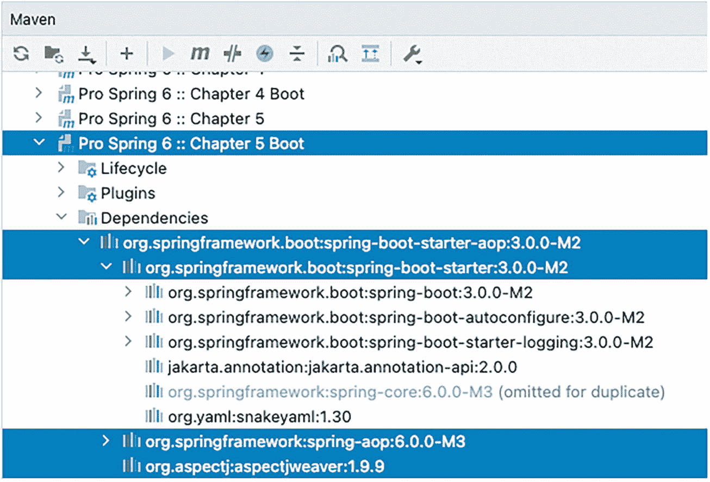

一张 Maven 截图展示了 spring 6 第 5 章 boot、spring boot starter A o p、spring boot starter、spring A o p 和 aspect j weaver 下的依赖项。

图 5-11

IntelliJ IDEA 中展示的 Spring Boot AOP 启动器传递依赖

通过将此库作为依赖项添加到项目中，不再需要 `@EnableAspectJAutoProxy(proxyTargetClass = true)` 注解，因为 AOP Spring 支持默认已启用。`proxyTargetClass` 属性也无需在任何地方设置，因为 Spring Boot 会自动检测您需要哪种类型的代理。

前面章节中介绍的任何切面都可以添加到 Spring Boot 项目中，当使用代理时，您可以观察通知按预期工作。但让我们保持简单。声明了一个 `GrammyGuitarist` 类型，其实现与本章其余部分使用的相同，不同之处在于，对于 Spring Boot 项目，`GrammyGuitarist` 不实现 `Singer` 接口。在项目中有了这些 Bean 之后，可以使用清单 5-77 中所示的类来配置 Spring 应用程序。

```
package com.apress.prospring6.five;
import org.springframework.boot.SpringApplication;
import org.springframework.boot.autoconfigure.SpringBootApplication;
@SpringBootApplication
public class Chapter5Application {
public static void main(String... args) throws Exception{
var ctx = SpringApplication.run(Chapter5Application.class, args);
assert (ctx != null);
// 如果你想运行这个类来测试通知，请移除下面两行的注释
/*  var documentarist = ctx.getBean("documentarist", NewDocumentarist.class);
documentarist.execute();*/
System.in.read();
ctx.close();
}
}
清单 5-77
Spring Boot Chapter5Application 主类
```

很简单，对吧？另外，这两行被注释掉的原因是 `Chapter5Application` 类仅用于配置 Spring 应用程序。由于前面章节提到了测试，因此使用 Spring Boot 测试类来测试我们的应用程序是合理的。请看清单 5-78。

```
package com.apress.prospring6.five;
import org.springframework.boot.test.context.SpringBootTest;
import static org.junit.jupiter.api.Assertions.*;
// 其他导入已省略
@SpringBootTest
public class Chapter5ApplicationTest {
@Autowired
NewDocumentarist documentarist;
@Autowired
GrammyGuitarist guitarist;
@Test
void testDocumentarist(){
assertAll(
() -> assertNotNull(documentarist.getGuitarist()),
() -> assertNotNull(guitarist),
() -> assertTrue(guitarist.getClass().getName().contains("SpringCGLIB"))
);
documentarist.execute();
}
}
清单 5-78
Spring Boot Chapter5ApplicationTest 主类
```

`@SpringBootTest` 注解确保测试上下文填充了在 Spring Boot 配置类中声明的 Bean，这意味着我们可以使用 `@Autowired` 来访问测试上下文中的 Bean。

当此测试通过时，意味着应用程序上下文已正确创建，两个类型为 `GrammyGuitarist` 和 `NewDocumentarist` 的 Bean 已创建，并且 `GrammyGuitarist` Bean 是一个 CGLIB 代理，因为 JDK 代理不适合它，因为其类型未实现接口。

这就是关于 Spring Boot AOP 的全部内容；Spring Boot 没有提供花哨的、专门的组件来简化 Spring AOP，因为几乎没有什么需要简化的。

### 声明式 Spring AOP 配置的注意事项

本书展示了使用 Spring AOP 编写代码的两种方式：使用 `ProxyFactoryBean` 和使用 `@AspectJ` 风格的注解。XML AOP 配置不是本书的重点，但其主要优点是易于将配置与代码分离。另一方面，如果您的应用程序主要基于注解，请使用 @AspectJ 注解。再次强调，让应用程序的需求驱动配置方法，并尽最大努力保持一致性。

此外，`aop` 命名空间和 `@AspectJ` 注解方法之间还有一些其他区别：

*   切入点表达式语法有一些细微差别（例如，在 XML 配置中，使用 `aop` 命名空间时，我们需要使用 `and` 来聚合条件，而在 `@AspectJ` 注解中使用 `&&`）。

*   在 XML 配置中，`aop` 命名空间方法仅支持 `singleton` 切面实例化模型。

*   在 XML 配置中，使用 `aop` 命名空间时，无法“组合”多个切入点表达式。在使用 `@AspectJ` 的示例中，我们可以在前置通知和环绕通知中组合两个切入点定义（即 `singExecution(value) && isJohn()`）。当使用 `aop` 命名空间并且需要创建一个组合了匹配条件的新切入点表达式时，您需要使用 `ComposablePointcut` 类。

## 总结

在本章中，我们涵盖了大量的 AOP 核心概念，并探讨了这些概念如何转化为 Spring AOP 实现。我们讨论了 Spring AOP 中已实现（和未实现）的特性，并指出 AspectJ 是那些 Spring 未实现特性的 AOP 解决方案。我们花了一些时间详细解释了 Spring 中可用的通知类型，并展示了四种类型实际运行的示例。我们还研究了如何通过使用切入点来限制通知应用的方法。特别是，我们研究了 Spring 提供的六种基本切入点实现。我们还详细介绍了 AOP 代理的构建方式、不同的选项以及它们的区别。我们比较了三种代理类型的性能，并强调了在 JDK 代理与 CGLIB 代理之间进行选择时的一些主要差异和限制。我们涵盖了切入点的高级选项，以及如何使用引入来扩展对象实现的接口集。

我们还介绍了 Spring 框架以声明方式配置 AOP 的服务，从而避免了将 AOP 代理构建逻辑硬编码到代码中的需要。我们花了一些时间研究 Spring 和 AspectJ 如何集成，以允许您使用 AspectJ 的额外功能，同时不失去 Spring 的任何灵活性。这无疑是大量的 AOP 内容！

在下一章中，我们将转向一个完全不同的主题——如何使用 Spring 的 JDBC 支持来极大地简化基于 JDBC 的数据访问代码的创建。

脚注 1   2   3   4   5   6


