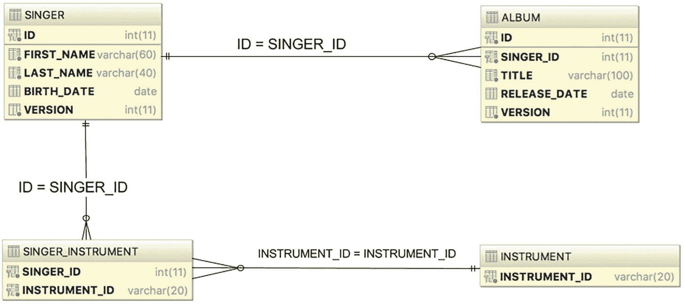
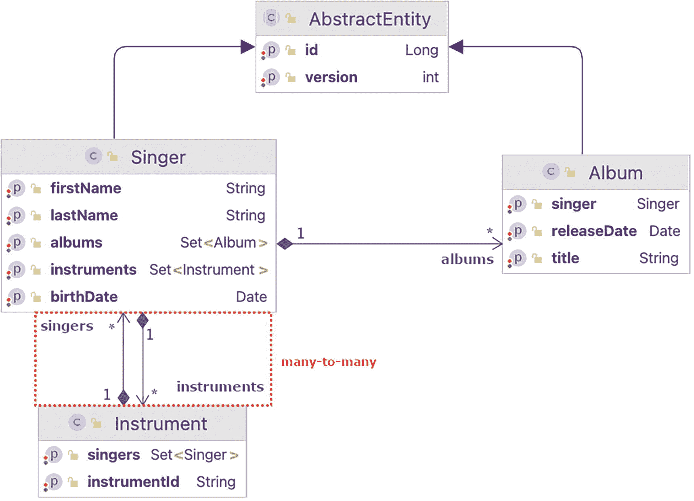
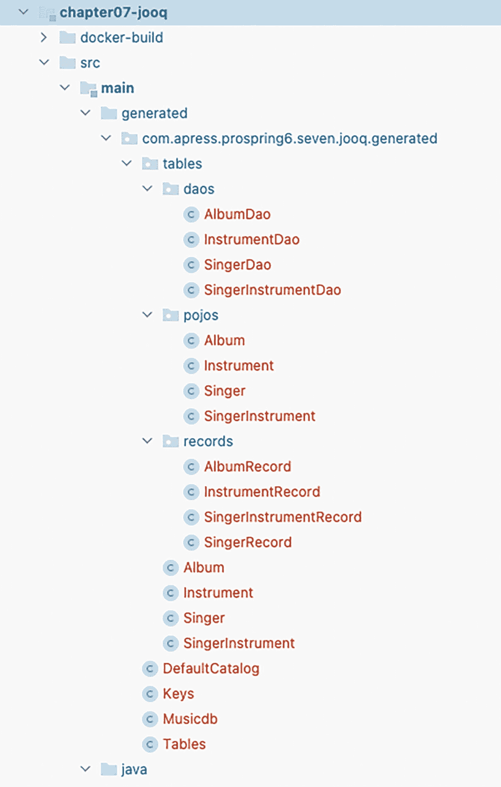

# 7. Spring 与 Hibernate

**第 6 章** 介绍了如何使用 JDBC 驱动程序与 SQL 数据库通信。然而，尽管 Spring 在简化 JDBC 开发方面取得了很大进展，但仍需编写大量代码。为了避免这种情况，并为更简便的查询提供支持，持久化框架应运而生，例如 MyBatis^(⁵⁶) 和 Hibernate^(⁵⁷)。jOOQ^(⁵⁸) 是最新出现的库之一，它是一个数据库映射软件库，能够根据你的数据库生成 Java 代码，并让你通过其流畅的 API 构建类型安全的 SQL 查询。一些用户报告称，将 jOOQ 与 Hibernate 结合使用体验良好，让 Hibernate 处理繁琐的 CRUD 工作，而 jOOQ 则通过其复杂且直观的查询 DSL 处理复杂的查询和报表。本章主要关注 Hibernate，这是最常用的对象关系映射（ORM）库之一，但鉴于其潜力，也会介绍 jOOQ。在**第 6 章**中，将使用 Java 与数据库协作比作《我爱露西》中的“终于到巴黎”一集，其中需要三位翻译来解决误会。如果说 JDBC 是第一位翻译，那么 Hibernate 就是第二位。

如果你有使用 EJB 实体 Bean（在 EJB 3.0 之前）开发数据访问应用程序的经验，你可能会记得那痛苦的过程。繁琐的映射配置、事务划分以及每个 Bean 中用于管理其生命周期的样板代码，大大降低了开发企业级 Java 应用程序的生产力。正如 Spring 是为了拥抱基于 POJO 的开发方式和声明式配置管理，而非 EJB 的笨重设置而开发的一样，开发者社区意识到，一个更简单、轻量级且基于 POJO 的框架可以简化数据访问逻辑的开发。自那时起，出现了许多库；它们通常被称为 ORM 库。ORM 库的主要目标是弥合关系数据库管理系统（RDBMS）中的关系数据结构与 Java 中的面向对象（OO）模型之间的差距，以便开发者可以专注于使用对象模型进行编程，同时轻松执行与持久化相关的操作。

在开源社区可用的众多 ORM 库中，Hibernate 是最成功的之一。其特性，如基于 POJO 的方法、易于开发以及对复杂关系定义的支持，赢得了主流 Java 开发者社区的青睐。Hibernate 的流行也影响了 Java 社区流程（JCP），该流程制定了 Java 数据对象（JDO）规范，作为 Java EE 中的标准 ORM 技术之一。从 EJB 3.0 开始，EJB 实体 Bean 甚至被 Java 持久化 API（JPA）所取代。JPA 的许多概念都受到了流行的 ORM 库（如 Hibernate、TopLink 和 JDO）的影响。Hibernate 和 JPA 之间的关系也非常密切。Hibernate 的创始人 Gavin King 代表 JBoss 作为 JCP 专家组成员之一参与了 JPA 规范的制定。从 3.2 版本开始，Hibernate 提供了 JPA 的实现。这意味着当你使用 Hibernate 开发应用程序时，你可以选择使用 Hibernate 自己的 API，或者使用以 Hibernate 作为持久化服务提供者的 JPA API。

在简要介绍了 Hibernate 的历史之后，本章将介绍在开发数据访问逻辑时如何将 Spring 与 Hibernate 结合使用。Hibernate 是一个如此庞大的 ORM 库，仅用一章来涵盖其所有方面是不可能的，并且有大量书籍专门讨论 Hibernate。

本章涵盖了 Hibernate 在 Spring 中的基本思想和主要用例。具体来说，我们将讨论以下主题：

*   *配置 Hibernate* `SessionFactory`：Hibernate 的核心概念围绕 `Session` 接口展开，该接口由 `SessionFactory` 管理。我们将向你展示如何配置 Hibernate 的会话工厂以在 Spring 应用程序中工作。

*   *使用 Hibernate 的 ORM 主要概念*：我们将介绍如何使用 Hibernate 将 POJO 映射到底层关系数据库结构的主要概念。我们还将讨论一些常用的关系，包括一对多和多对多。

*   *数据操作*：我们将提供示例，演示如何在 Spring 环境中使用 Hibernate 执行数据操作（查询、插入、更新、删除）。使用 Hibernate 时，其 `Session` 接口是你将与之交互的主要接口。

一个圆形背景上的亮色感叹号符号。 在定义对象到关系的映射时，Hibernate 支持两种配置风格。一种是在 XML 文件中配置映射信息，另一种是在实体类中使用 Java 注解（在 ORM 或 JPA 世界中，映射到底层关系数据库结构的 Java 类称为*实体类*）。本章重点介绍使用注解方法进行对象关系映射。对于映射注解，我们使用 JPA 标准（例如，位于 `jakarta.persistence` 包下），因为它们可以与 Hibernate 自己的注解互换，并且将有助于你将来迁移到 JPA 环境。

## 示例代码的样本数据模型

图 7-1 显示了本章使用的数据模型。



一个图表展示了专辑表、歌手表、乐器表和乐器之间的关系。

图 7-1

样本数据模型

如该数据模型所示，新增了两个表，即 `INSTRUMENT` 和 `SINGER_INSTRUMENT`（连接表）。`SINGER_INSTRUMENT` 模拟了 SINGER 表和 `INSTRUMENT` 表之间的多对多关系。在 `SINGER` 和 `ALBUM` 表中添加了一个 `VERSION` 列用于乐观锁，稍后将详细讨论。

一个信息符号，圆形背景上显示字母 I。 在本章的示例中，我们将使用手动构建的 Docker 容器中的 MariaDB，以模拟一个在端口 3306 上可用的本地实例，用于类似生产环境的代码。构建镜像和启动容器的说明通过项目仓库中的 chapter07/`CHAPTER07.adoc` 文件提供。测试时使用 Testcontainers MariaDB 实例容器。


## 配置 Hibernate 的 `SessionFactory`

如本章前面所述，Hibernate 的核心概念基于 `org.hibernate.Session` 接口，该接口从 `org.hibernate.SessionFactory` 获取。Spring 提供了相关类，支持将 Hibernate 的会话工厂配置为具有所需属性的 Spring Bean。要使用 Hibernate，必须将 `hibernate-core-jakarta` 库作为依赖项添加到项目中。为了与 Spring 集成，还必须将 `spring-orm` 添加为依赖项。

信息符号在圆形背景上显示字母 I。 在撰写本章时，与 Spring ORM 兼容的最新 Hibernate 版本是 `5.6.9.Final`。Hibernate `6.1.0.Final` 已经发布，但 Spring ORM 目前尚不支持该版本。

符号在圆形背景上显示一个明亮的感叹号。 之所以使用 `hibernate-core-jakarta` 而不是 `hibernate-core` 作为依赖项，是因为它依赖于 Java 持久化 API（Java Persistence API），而该 API 是 Java EE 的一部分。Oracle 将 Java EE 开源，并将其权利授予了 Eclipse 基金会，由于法律要求，Eclipse 基金会必须将包名从 `java` 更改，因为 Oracle 现在合法拥有 Java 品牌。因此，较新版本的 Hibernate 使用包名 `jakarta.*` 而不是 `javax.*`。

Spring Hibernate 配置建立在 `DataSource` 配置之上。`DataSource` 配置已在**第** **6** 章中介绍过。之前使用 Apache DBCP2 来设置连接池，但在本章中，为了增加趣味性，我们将其替换为 `hikariCP.jar` 库。HikariCP^(⁵⁹) GitHub 主页展示了各种基准测试结果，证明该库是目前最高效的连接池库。为了提高性能并丰富集合工具，我们决定在本章的项目中添加此依赖项。从配置角度来看，变化不大：需要配置的类名为 `HikariDataSource` 而非 `BasicDataSource`，它来自 `com.zaxxer.hikari` 包。

清单 7-1 展示了新的、改进后的 `BasicDataSourceCfg` 配置类。

```
package com.apress.prospring6.seven.base.config;
import com.zaxxer.hikari.HikariConfig;
import com.zaxxer.hikari.HikariDataSource;
import org.slf4j.Logger;
import org.slf4j.LoggerFactory;
import org.springframework.beans.factory.annotation.Value;
import org.springframework.context.annotation.Bean;
import org.springframework.context.annotation.Configuration;
import org.springframework.context.annotation.Profile;
import org.springframework.context.annotation.PropertySource;
import javax.sql.DataSource;
@Configuration
@PropertySource("classpath:db/jdbc.properties") // 第 6 章已介绍过的文件
public class BasicDataSourceCfg {
private static Logger LOGGER = LoggerFactory.getLogger(BasicDataSourceCfg.class);
@Value("${jdbc.driverClassName}")
private String driverClassName;
@Value("${jdbc.url}")
private String url;
@Value("${jdbc.username}")
private String username;
@Value("${jdbc.password}")
private String password;
@Bean(destroyMethod = "close")
public DataSource dataSource() {
try {
var hc = new HikariConfig();
hc.setJdbcUrl(url);
hc.setDriverClassName(driverClassName);
hc.setUsername(username);
hc.setPassword(password);
var dataSource= new HikariDataSource(hc);
dataSource.setMaximumPoolSize(25); // 25 是一个足够好的数据池大小，毕竟它是容器中的数据库
return dataSource;
} catch (Exception e) {
LOGGER.error("无法创建 DBCP DataSource Bean！", e);
return null;
}
}
}
清单 7-1
MariaDB DataSource 配置类
```

由于我们使用 Testcontainers，可以轻松地将类似生产环境的 `DataSource` Bean 替换为 MariaDB 测试容器，正如**第** **6** 章所示。

清单 7-2 展示了 `HibernateConfig` 类，它汇集了 Hibernate 特定的配置。

```
package com.apress.prospring6.seven.base.config;
import org.hibernate.cfg.Environment;
import org.slf4j.Logger;
import org.slf4j.LoggerFactory;
import org.springframework.beans.factory.annotation.Autowired;
import org.springframework.context.annotation.Bean;
import org.springframework.context.annotation.ComponentScan;
import org.springframework.context.annotation.Configuration;
import org.springframework.context.annotation.Import;
import org.springframework.orm.hibernate5.HibernateTransactionManager;
import org.springframework.orm.hibernate5.LocalSessionFactoryBean;
import org.springframework.transaction.PlatformTransactionManager;
import org.springframework.transaction.annotation.EnableTransactionManagement;
import javax.sql.DataSource;
import java.util.Properties;
@Import(BasicDataSourceCfg.class)
@Configuration
@ComponentScan(basePackages = {"com.apress.prospring6.seven.base"})
@EnableTransactionManagement
public class HibernateConfig {
private static Logger LOGGER = LoggerFactory.getLogger(HibernateConfig.class);
@Autowired
DataSource dataSource;
@Bean
public Properties hibernateProperties() {
Properties hibernateProp = new Properties();
// hibernateProp.put(Environment.DIALECT, "org.hibernate.dialect.MariaDB106Dialect ");
hibernateProp.put(Environment.HBM2DDL_AUTO, "none");
hibernateProp.put(Environment.FORMAT_SQL, false);
hibernateProp.put(Environment.USE_SQL_COMMENTS, false);
hibernateProp.put(Environment.SHOW_SQL, false);
hibernateProp.put(Environment.MAX_FETCH_DEPTH, 3);
hibernateProp.put(Environment.STATEMENT_BATCH_SIZE, 10);
hibernateProp.put(Environment.STATEMENT_FETCH_SIZE, 50);
// hibernateProp.put(Environment.JTA_PLATFORM, "org.springframework.orm.hibernate5.ConfigurableJtaPlatform");
return hibernateProp;
}
@Bean
public LocalSessionFactoryBean sessionFactory() {
LocalSessionFactoryBean sessionFactory = new LocalSessionFactoryBean();
sessionFactory.setDataSource(dataSource);
sessionFactory
.setPackagesToScan("com.apress.prospring6.seven.base.entities");
sessionFactory.setHibernateProperties(hibernateProperties());
return sessionFactory;
}
@Bean public PlatformTransactionManager transactionManager() {
var transactionManager =  new HibernateTransactionManager();
transactionManager.setSessionFactory(sessionFactory().getObject());
return transactionManager;
}
}
清单 7-2
HibernateConfig 配置类
```

Spring Hibernate 配置声明了以下 Bean 来支持 Hibernate 的会话工厂：

表 7-1

Hibernate 属性


| 属性（常量/值） | 描述 |
| --- | --- |
| `Environment.FORMAT_SQL/hibernate.format_sql` | 指示是否应格式化日志或控制台中的 SQL 输出。默认值为 `false`。 |
| `Environment.USE_SQL_COMMENTS/hibernate.use_sql_comments` | 如果设置为 `true`，Hibernate 会在 SQL 内部生成注释，以便于调试。默认值为 `false`。 |
| `Environment.SHOW_SQL/hibernate.show_sql` | 指示 Hibernate 是否应将 SQL 查询输出到日志文件或控制台。在开发环境中应开启此选项，这能极大地帮助测试和故障排除过程。默认值为 `false`。 |
| `Environment.MAX_FETCH_DEPTH/hibernate.max_fetch_depth` | 声明当映射对象与其他映射对象存在关联时，外连接的“深度”。此设置可防止 Hibernate 因大量嵌套关联而获取过多数据。常用值为 `3`。值为 `0` 则禁用默认的外连接获取。 |
| `Environment.STATEMENT_BATCH_SIZE/hibernate.jdbc.batch_size` | 指示 Hibernate 应将多少条更新操作分组为一个批次。这对于在 Hibernate 中执行批处理操作非常有用。显然，当我们在执行批处理任务更新数十万条记录时，我们希望 Hibernate 将查询分组为批次，而不是逐条提交更新。推荐值在 `5` 到 `30` 之间。 |
| `Environment.STATEMENT_FETCH_SIZE/hibernate.jdbc.fetch_size` | 指定 Hibernate 每次从底层 JDBC `ResultSet` 中检索数据库记录时，应获取的记录数。例如，向数据库提交了一个查询，`ResultSet` 包含 500 条记录。如果获取大小设置为 50，Hibernate 将需要获取十次才能获取所有数据。 |
| `Environment.JTA_PLATFORM/hibernate.transaction.jta.platform` | 此属性（如果存在）应设置为一个限定类名，该名称代表 `org.hibernate.engine.transaction.jta.platform.spi.JtaPlatform` 的一个实现，用于定义 Hibernate 在特定平台上如何与 JTA 交互。如果不存在，Hibernate 将使用默认的 `org.hibernate.engine.transaction.jta.platform.internal.NoJtaPlatform`，这意味着不使用任何事务。在我们的配置中，它被设置为 Spring 的 `ConfigurableJtaPlatform` 实现。由于本章不重点讨论事务，因此可以安全地从配置中移除该属性。 |
| `Environment.HBM2DDL_AUTO/hibernate.hbm2ddl.auto` | 传统上，从实体映射生成模式的过程被称为 HBM2DDL。此属性可以具有以下任一值：* `none` 告诉 Hibernate 不对现有模式做任何操作。* `create` 告诉 Hibernate 生成与受管实体类匹配的模式。* `validate` 告诉 Hibernate 验证模式；它不会对数据库进行任何更改。* `update` 告诉 Hibernate 根据实体类的更改来更新模式。* `create-drop` 告诉 Hibernate 创建与受管实体类匹配的模式，并在 `SessionFactory` 显式关闭时（通常在应用程序停止时）删除该模式。 |

*   `dataSource`：此 bean 通过 `@Import` 注解从 `BasicDataSourceCfg` 配置类导入，并通过自动装配注入到 `HibernateConfig` 类中。

*   `transactionManager`：Hibernate 会话工厂需要一个事务管理器来实现事务性数据访问。Spring 提供了一个专门用于 Hibernate 5 的事务管理器，声明在 `org.springframework.orm.hibernate5.HibernateTransactionManager` 包中。该 bean 以 `transactionManager` 名称声明。默认情况下，使用 XML 配置时，每当需要事务管理时，Spring 都会在其 `ApplicationContext` 中查找名为 `transactionManager` 的 bean。Java 配置则更灵活一些，因为它是按类型而非名称来查找 bean。我们将在**第** **9** **章**中详细讨论事务。此外，配置类使用 `@EnableTransactionManagement` 注解，以支持使用注解声明事务边界需求（启用对 Spring 的 `@Transactional` 的支持）。

*   *组件扫描*：`@ComponentScan` 注解在前面的章节中你应该已经熟悉。我们用它来指示 Spring 扫描 `com.apress.prospring6.seven` 包下的组件（由于这是配置类声明的包，因此未显式配置），以检测那些包含数据访问方法、并使用 `@Repository` 注解的 bean。

*   `SessionFactory`：Hibernate 的 `sessionFactory` bean 是此配置中最重要的部分。在该 bean 内部，配置了几个属性：
    *   首先，我们需要将 `dataSource` bean 注入到 `sessionFactory` bean 中。

*   其次，我们指示 Hibernate 扫描 `com.apress.prospring6.seven.entities` 包下的领域对象。

*   最后，`hibernateProperties` bean 为 Hibernate 提供了配置细节。配置参数有很多，我们只定义了每个应用程序都应提供的几个重要属性。表 7-1 列出了我们示例中 Hibernate 会话工厂的配置属性、常量名称及其 `String` 值；你可以在接口 `org.hibernate.cfg.AvailableSettings` 中找到其他属性，该接口由 `org.hibernate.cfg.Environment` 实现。

有关 Hibernate 支持的完整属性列表，请参考 Hibernate 的 ORM 用户指南^(⁶⁰)，特别是第 24.2 节。


## 使用 Hibernate 注解进行 ORM 映射

配置就绪后，下一步是建模 Java POJO 实体类及其与底层关系型数据结构的映射。

映射有两种方法。第一种是先设计对象模型，然后基于对象模型生成数据库脚本。将 Hibernate 属性 `hibernate.hbm2ddl.auto` 配置为 `create` 或 `create-drop` 即可实现此方法。然而，这种方法不适用于生产环境，而更适合使用内存数据库的测试环境，因为在这些环境中基于 Java POJO 生成表的操作成本不高。

第二种方法是从数据模型（表）开始，然后使用所需的映射来建模 POJO。对于开发和生产环境，推荐使用后一种方法，因为它能对数据模型提供更多控制，有助于优化数据访问性能。基于数据模型，图 7-2 展示了相应的 Java 对象模型类图。



该图展示了 Singer 与 Album 之间的一对多关系，以及 Singer 与 Instrument 之间的多对多关系。

图 7-2

示例数据模型的类图

你可以看到 `Singer` 和 `Album` 之间存在一对多关系，而 `Singer` 和 `Instrument` 对象之间存在多对多关系。用于建模多对多关系的表 `SINGER_INSTRUMENT` 并未映射到 Java 类。

注意，`Singer` 和 `Album` 都拥有共同的 `id` 和 `version` 字段，它们被归入一个名为 `AbstractEntity` 的抽象类中，以简化其他实体类。在通常设置了审计功能的生产应用中，该抽象类可能包含的其他字段包括：`createdAt`、`updatedAt`、`createdBy`、`updatedBy` 等。`AbstractEntity` 类使用了 `@MappedSuperclass` 注解，该注解指定一个类，其映射信息将应用于继承自它的实体。

## 简单映射

首先，我们从映射类的简单属性开始。清单 7-3 展示了 `AbstractEntity` 类，其映射信息由 `Singer` 和 `Album` 继承。

```
package com.apress.prospring6.seven.base.entities;
import jakarta.persistence.Column;
import jakarta.persistence.GeneratedValue;
import jakarta.persistence.Id;
import jakarta.persistence.MappedSuperclass;
import jakarta.persistence.Version;
// 其他导入语句已省略
import static jakarta.persistence.GenerationType.IDENTITY;
@MappedSuperclass
public abstract class AbstractEntity implements Serializable {
@Serial
private static final long serialVersionUID = 1L;
protected Long id;
protected int version;
@Id
@GeneratedValue(strategy = IDENTITY)
@Column(name = "ID")
public Long getId() {
return this.id;
}
public void setId(Long id) {
this.id = id;
}
@Version
@Column(name = "VERSION")
public int getVersion() {
return version;
}
public void setVersion(int version) {
this.version = version;
}
// 其他方法已省略
}
清单 7-3
AbstractEntity 基础实体类
```

`AbstractEntity` 类不映射到任何表，但其配置中使用的注解也可能用于映射到表的类中。

清单 7-4 展示了带有映射注解的 `Singer` 类。

```
package com.apress.prospring6.seven.base.entities;
import jakarta.persistence.Column;
import jakarta.persistence.Entity;
import jakarta.persistence.Table;
// 其他导入语句已省略
@Entity
@Table(name = "SINGER")
public class Singer extends AbstractEntity {
@Serial
private static final long serialVersionUID = 2L;
private String firstName;
private String lastName;
private LocalDate birthDate;
@Column(name = "FIRST_NAME")
public String getFirstName() {
return this.firstName;
}
@Column(name = "LAST_NAME")
public String getLastName() {
return this.lastName;
}
@Column(name = "BIRTH_DATE")
public LocalDate getBirthDate() {
return birthDate;
}
public void setFirstName(String firstName) {
this.firstName = firstName;
}
public void setLastName(String lastName) {
this.lastName = lastName;
}
public void setBirthDate(LocalDate birthDate) {
this.birthDate = birthDate;
}
// 其他方法已省略
}
清单 7-4
Singer 实体类
```

首先，我们使用 `@Entity` 注解该类型，这意味着这是一个映射实体类。此外，使用 `@Entity` 注解的类必须有一个使用 `@Id` 注解的列，该列代表该表的主键。`@Table` 注解定义了该实体映射到的数据库中的表名。对于每个映射的属性，你使用 `@Column` 注解进行标注，并提供列名。

一个灯泡图标。 如果类型和属性名称与表和列名称相同，则可以省略表和列名称。

以下是此配置的几个要点：

*   对于 `id` 属性，我们使用 `@Id` 注解。这意味着它映射到记录的主键。Hibernate 将在其会话中管理联系人实体实例时，将其用作唯一标识符。此外，`@GeneratedValue` 注解告诉 Hibernate `id` 值是如何生成的。`IDENTITY` 策略意味着 `id` 值是在插入期间由后端生成的。


*   对于`version`属性，我们使用`@Version`进行注解。这指示 Hibernate 我们希望使用*乐观锁定*机制，并以`version`属性作为控制手段。每当 Hibernate 更新一条记录时，它会将实体实例的版本与数据库中该记录的版本进行比较。如果两个版本相同，则意味着之前没有人更新过数据，因此 Hibernate 将更新数据并递增`version`列。然而，如果版本不同，则意味着之前有人更新过该记录，Hibernate 将抛出`StaleObjectStateException`异常，Spring 会将其转换为`HibernateOptimisticLockingFailureException`。在此示例中，我们使用`Integer`进行版本控制。除了`integer`之外，Hibernate 还支持使用`timestamp`。不过，建议使用整数进行版本控制，因为 Hibernate 会在每次更新后将版本号递增 1。使用时间戳时，Hibernate 会在每次更新后更新最新的时间戳。时间戳的安全性稍差，因为两个并发事务可能会在同一毫秒内加载并更新同一个项目。

另一个映射对象是`Album`，如清单 7-5 所示。

```
package com.apress.prospring6.seven.base.entities;
// 其他导入语句已省略
@Entity
@Table(name = "ALBUM")
public class Album extends AbstractEntity {
@Serial
private static final long serialVersionUID = 3L;
private String title;
private LocalDate releaseDate;
@Column
public String getTitle() {
return this.title;
}
@Column(name = "RELEASE_DATE")
public LocalDate getReleaseDate() {
return this.releaseDate;
}
public void setTitle(String title) {
this.title = title;
}
public void setReleaseDate(LocalDate releaseDate) {
this.releaseDate = releaseDate;
}
// 其他方法已省略
}
清单 7-5
Album 实体类
```

第三个实体类名为`Instrument`，映射到`INSTRUMENT`表，这是一个非常简单的表，只有一个列。引入此表只是为了在代码示例中体现多对多关系。此类如清单 7-6 所示。

```
package com.apress.prospring6.seven.base.entities;
// 导入语句已省略
@Entity
@Table(name = "INSTRUMENT")
public class Instrument implements Serializable {
@Serial
private static final long serialVersionUID = 4L;
private String instrumentId;
@Id
@Column(name = "INSTRUMENT_ID")
public String getInstrumentId() {
return this.instrumentId;
}
public void setInstrumentId(String instrumentId) {
this.instrumentId = instrumentId;
}
// 其他方法已省略
}
清单 7-6
Instrument 实体类
```

### 一对多映射

Hibernate 能够对多种关联进行建模。最常见的关联是一对多和多对多。在本章的源代码示例中，每个`Singer`拥有零个或多个专辑，因此这是一个一对多关联（在 ORM 术语中，一对多关联用于对数据结构中的零对多和一对多关系进行建模）。清单 7-7 描述了定义`Singer`和`Album`实体之间一对多关系所需的属性和方法。

```
package com.apress.prospring6.seven.base.entities;
import jakarta.persistence.OneToMany;
import jakarta.persistence.CascadeType;
// 其他导入语句已省略
// Singer.java
@Entity
@Table(name = "SINGER")
public class Singer extends AbstractEntity {
private Set albums = new HashSet();
@OneToMany(mappedBy = "singer", cascade=CascadeType.ALL, orphanRemoval=true)
public Set getAlbums() {
return albums;
}
public boolean addAlbum(Album album) {
album.setSinger(this);
return getAlbums().add(album);
}
public void removeAlbum(Album album) {
getAlbums().remove(album);
}
public void setAlbums(Set albums) {
this.albums = albums;
}
// 其他方法和属性已省略
}
// Album.java
import jakarta.persistence.ManyToOne;
import jakarta.persistence.JoinColumn;
// 其他导入语句已省略
@Entity
@Table(name = "ALBUM")
public class Album extends AbstractEntity {
private Singer singer;
@ManyToOne
@JoinColumn(name = "SINGER_ID")
public Singer getSinger() {
return this.singer;
}
public void setSinger(Singer singer) {
this.singer = singer;
}
// 其他方法和属性已省略
}
清单 7-7
用于建模一对多和多对一关系的 Singer 和 Album 代码片段
```

属性`getAlbums`的 getter 方法使用`@OneToMany`进行注解，这表示与`Album`类的一对多关系。该注解传递了几个属性。`mappedBy`属性指示`Album`类中提供关联的属性（即，通过`FK_ALBUM_SINGER`表中的外键定义进行链接）。

`cascade`属性设置为`CascadeType.ALL`，意味着对`Singer`记录执行的任何操作都会传播到与其关联的专辑。`orphanRemoval`属性意味着，在`albums`集合更新后，集合中不再存在的`Album`条目应从数据库中删除。

`Singer`类声明了与`Album`关系的“一对多”部分。这意味着`Album`实体必须声明与`Singer`关系的“多对一”部分，这是通过使用`@ManyToOne`注解完成的。与之关联的`@JoinColumn`注解用于指定底层的外键列名。

### 多对多映射

每个歌手可以演奏零个或多个乐器，每个乐器也与零个或多个歌手相关联，这意味着这是一个多对多映射。多对多映射需要一个连接表，在本例中为`SINGER_INSTRUMENT`。清单 7-8 显示了需要添加到`Singer`类以实现此关系的代码。

```
package com.apress.prospring6.seven.base.entities;
import jakarta.persistence.ManyToMany;
import jakarta.persistence.JoinTable;
import jakarta.persistence.JoinColumn;
// 其他导入语句已省略
// Singer.java
@Entity
@Table(name = "SINGER")
public class Singer extends AbstractEntity {
private Set instruments = new HashSet();
@ManyToMany
@JoinTable(name = "SINGER_INSTRUMENT",
joinColumns = @JoinColumn(name = "SINGER_ID"),
inverseJoinColumns = @JoinColumn(name = "INSTRUMENT_ID"))
public Set getInstruments() {
return instruments;
}
public void setInstruments(Set instruments) {
this.instruments = instruments;
}
public boolean addInstrument(Instrument instrument) {
return getInstruments().add(instrument);
}
// 其他方法已省略
}
// Instrument.java
@Entity
@Table(name = "INSTRUMENT")
public class Instrument implements Serializable {
private Set singers = new HashSet();
@ManyToMany
@JoinTable(name = "SINGER_INSTRUMENT",
joinColumns = @JoinColumn(name = "INSTRUMENT_ID"),
inverseJoinColumns = @JoinColumn(name = "SINGER_ID"))
public Set getSingers() {
return this.singers;
}
public void setSingers(Set singers) {
this.singers = singers;
}
// 其他方法已省略
}
清单 7-8
用于建模多对多关系的 Singer 和 Instrument 代码片段
```

`Singer`类中`instruments`属性的 getter 方法使用`@ManyToMany`进行注解。`@JoinTable`注解用于指示 Hibernate 应查找的底层连接表。`name`是连接表的名称，`joinColumns`定义了作为`SINGER`表外键的列，`inverseJoinColumns`定义了作为关联另一端（即`INSTRUMENT`表）外键的列。`Instrument`类中的代码与`Singer`的代码大致相同，但`joinColumns`和`inverseJoinColumns`属性被互换以反映关联关系。


### Hibernate Session 接口

在 Hibernate 中，与数据库交互时，你需要处理的主要接口是 `Session` 接口，该接口从 `SessionFactory` 实例中获取。`SessionFactory` 实例被创建并添加到应用程序上下文中，这是通过配置 `LocalSessionFactoryBean` 实现的，如本章前面介绍的 `HibernateConfig` 类所示（参见清单 7-2）。然后，该实例可以在仓库类中自动装配，并用于创建与数据库通信的 Hibernate `Session`。清单 7-9 展示了本章示例中使用的 `SingerDaoImpl` 类，该类注入了已配置的 Hibernate `SessionFactory`。

```
package com.apress.prospring6.seven.base.dao;
import com.apress.prospring6.seven.base.entities.Singer;
import jakarta.annotation.Resource;
import org.hibernate.SessionFactory;
import org.slf4j.Logger;
import org.slf4j.LoggerFactory;
import org.springframework.stereotype.Repository;
import org.springframework.transaction.annotation.Transactional;
import java.util.List;
@Transactional(readOnly = true)
@Repository("singerDao")
public class SingerDaoImpl implements SingerDao {
private static final Logger LOGGER = LoggerFactory.getLogger(SingerDaoImpl.class);
private SessionFactory sessionFactory;
public SingerDaoImpl(SessionFactory sessionFactory) {
this.sessionFactory = sessionFactory;
}
// 其他方法已省略
}
清单 7-9
使用 Hibernate SessionFactory 的 SingerDaoImpl 仓库类
```

我们通过使用 `@Repository` 注解将 DAO 类声明为 Spring Bean。这将其集成到 Spring 上下文中，并启用了异常转换到 Spring 运行时和 `DataAccessException` 系列。`@Transactional` 注解定义了事务需求，我们将在**第** **9** 章进一步讨论。`sessionFactory` 属性由 Spring 通过构造函数自动装配。`SingerDao` 接口非常简单，只有三个查找方法、一个保存方法和一个删除方法。`save(..)` 方法同时执行插入和更新操作。该接口如清单 7-10 所示。

```
package com.apress.prospring6.seven.base.dao;
import com.apress.prospring6.seven.base.entities.Singer;
import java.util.Set;
public interface SingerDao {
List findAll();
List findAllWithAlbum();
Singer findById(Long id);
Singer save(Singer singer);
void delete(Singer singer);
}
清单 7-10
SingerDao 接口
```

## 使用 Hibernate 查询语言查询数据

Hibernate 与其他 ORM 工具（如 JDO 和 JPA）一样，是围绕对象模型设计的。因此，在定义映射后，我们无需构建 SQL 来与数据库交互。相反，对于 Hibernate，我们使用 Hibernate 查询语言（HQL）来定义查询。在与数据库交互时，Hibernate 会代表我们将查询转换为 SQL 语句。在编写 HQL 查询时，其语法与 SQL 非常相似。但是，你需要从对象的角度而非数据库的角度来思考。在接下来的几个小节中，我们将通过几个示例带你了解。

### 使用懒加载进行简单查询

让我们从实现 `findAll()` 方法开始，该方法仅从数据库中检索所有歌手。清单 7-11 显示了此功能的更新代码。

```
package com.apress.prospring6.seven.base.dao;
// 导入语句已省略
@Transactional
@Repository("singerDao")
public class SingerDaoImpl implements  SingerDao{
private SessionFactory sessionFactory;
@Transactional(readOnly = true)
@Override
public List findAll() {
return sessionFactory.getCurrentSession().createQuery("from Singer s")
.list();
}
// 其他方法已省略
}
清单 7-11
SingerDaoImpl#findAll() 方法
```

`SessionFactory.getCurrentSession()` 方法获取 Hibernate 的 `Session` 接口。然后，调用 `Session.createQuery()` 方法，传入 HQL 语句。语句 `from Singer` 仅从数据库中检索所有歌手。该语句的另一种语法是 `select s from Singer s`。`@Transactional(readOnly=true)` 注解表示我们希望将事务设置为 `只读`。为 `只读` 方法设置该属性在某些情况下会带来更好的性能。

测试 `findAll()` 方法有两种方式。你可以运行 `HibernateDemoV1` 类，该类将在本地或容器中可用的 MariaDB 数据库上调用此方法。或者，可以编写一个测试方法，在 Spring 测试上下文中使用 Testcontainers MariaDB 数据源执行。清单 7-12 显示了 `HibernateDemoV1` 类的内容以及运行该类的结果。

```
package com.apress.prospring6.seven.base;
import com.apress.prospring6.seven.base.config.HibernateConfig;
import com.apress.prospring6.seven.base.dao.SingerDao;
import org.slf4j.Logger;
import org.slf4j.LoggerFactory;
import org.springframework.context.annotation.AnnotationConfigApplicationContext;
public class HibernateDemoV1 {
private static final Logger LOGGER = LoggerFactory.getLogger(HibernateDemoV1.class);
public static void main(String... args) {
var ctx = new AnnotationConfigApplicationContext(HibernateConfig.class);
var singerDao = ctx.getBean(SingerDao.class);
LOGGER.info(" ---- 列出歌手:");
singerDao.findAll().forEach(s -> LOGGER.info(s.toString()));
ctx.close();
}
}
# 输出
---- 列出歌手:
Singer - Id: 1, First name: John, Last name: Mayer, Birthday: 1977-10-16
Singer - Id: 3, First name: John, Last name: Butler, Birthday: 1975-04-01
Singer - Id: 2, First name: Eric, Last name: Clapton, Birthday: 1945-03-30
清单 7-12
HibernateDemoV1 可运行类
```

虽然检索到了歌手记录，但专辑和乐器呢？让我们修改测试类以打印详细信息。在清单 7-13 中，你可以看到在可运行的 `HibernateDemoV2` 类中，`singerDao.findAll()` 方法被替换为 `singerDao.findAllWithAlbums()`。该清单还显示了执行此类时打印的输出。


```
package com.apress.prospring6.seven.base;
// import statements omitted
public class HibernateDemoV2 {
private static final Logger LOGGER = LoggerFactory.getLogger(HibernateDemoV2.class);
public static void main(String... args) {
var ctx = new AnnotationConfigApplicationContext(HibernateConfig.class);
var singerDao = ctx.getBean(SingerDao.class);
var singer = singerDao.findById(2L);
listSingersWithAlbum(singerDao.findAllWithAlbum());
ctx.close();
}
private static void listSingersWithAlbum(List singers) {
LOGGER.info(" ---- Listing singers with instruments:");
singers.forEach(s -> {
LOGGER.info(s.toString());
if (s.getAlbums() != null) {
s.getAlbums().forEach(a -> LOGGER.info("\t" + a.toString()));
}
if (s.getInstruments() != null) {
s.getInstruments().forEach(i -> LOGGER.info("\tInstrument: " + i.getInstrumentId()));
}
});
}
}
# output
INFO : HibernateDemoV2 -  ---- Listing singers with instruments:
INFO : HibernateDemoV2 - Singer - Id: 1, First name: John, Last name: Mayer, Birthday: 1977-10-16
Exception in thread "main" org.hibernate.LazyInitializationException: failed to lazily initialize a collection of role: com.apress.prospring6.seven.base.entities.Singer.albums, could not initialize proxy - no Session
at org.hibernate.collection.internal.AbstractPersistentCollection.throwLazyInitializationException(AbstractPersistentCollection.java:614)
at org.hibernate.collection.internal.AbstractPersistentCollection.withTemporarySessionIfNeeded(AbstractPersistentCollection.java:218)
at org.hibernate.collection.internal.AbstractPersistentCollection.initialize(AbstractPersistentCollection.java:591)
at org.hibernate.collection.internal.AbstractPersistentCollection.read(AbstractPersistentCollection.java:149)
at org.hibernate.collection.internal.PersistentSet.iterator(PersistentSet.java:188)
at java.base/java.lang.Iterable.forEach(Iterable.java:74)
at com.apress.prospring6.seven.base.HibernateDemoV2.lambda$listSingersWithAlbum$2(HibernateDemoV2.java:62)
Listing 7-13
可运行的 HibernateDemoV2 类
```

当你尝试访问关联时，会看到 Hibernate 抛出 `LazyInitializationException`，因为默认情况下，Hibernate 会延迟加载关联。这意味着 Hibernate 不会为记录连接关联表（即 `ALBUM` 或 `INSTRUMENT`）。这样做的原因是出于性能考虑；可以想象，如果一个查询检索了数千条记录，并且所有关联都被检索出来，那么大量的数据传输会降低性能。

### 使用关联抓取进行查询

要让 Hibernate 从关联中抓取数据，有两种选择。第一种是在 Java 关联上声明抓取模式为 `EAGER`：`@ManyToMany(fetch=FetchType.EAGER)`。这告诉 Hibernate 在每个查询中都抓取关联记录。然而，如前所述，这会影响数据检索性能。第二种选择是在需要时指示 Hibernate 在查询中抓取关联记录。如果你使用 `Criteria` 查询，可以调用函数 `Criteria.setFetchMode()` 来指示 Hibernate 急切地抓取关联。当使用 `NamedQuery` 时，可以使用 fetch 操作符来指示 Hibernate 急切地抓取关联。

让我们看一下 `findAllWithAlbum()` 方法的实现，该方法将检索所有歌手信息及其专辑和乐器。此示例将使用 `jakarta.persistence.NamedQuery` 方法。`NamedQuery` 可以外部化到 XML 文件中，也可以使用实体类上的注解来声明。在清单 7-14 中，你可以看到修改后的 `Singer` 实体类，其中使用注解定义了命名查询。

```
package com.apress.prospring6.seven.base.entities;
import jakarta.persistence.NamedQueries;
import jakarta.persistence.NamedQuery;
// other import statements omitted
@Entity
@Table(name = "SINGER")
@NamedQueries({
@NamedQuery(name="Singer.findAllWithAlbum",
query="select distinct s from Singer s " +
"left join fetch s.albums a " +
"left join fetch s.instruments i")
})
public class Singer extends AbstractEntity {
// content omitted
}
Listing 7-14
在方法 SingerDaoImpl.findAllWithAlbum() 中使用的带有 NamedQuery 声明的 Singer 实体类
```

在清单 7-14 中，我们定义了一个名为 `Singer.findAllWithAlbum` 的 `NamedQuery` 实例。然后我们用 HQL 定义了查询。请注意 `left join fetch` 子句，它指示 Hibernate 急切地抓取关联。我们还需要使用 `select distinct`；否则，Hibernate 会返回重复的对象（如果一个 `Singer` 关联了两个 `Albums`，则会返回两个 `Singer` 对象）。

`SingerDaoImpl.findAllWithAlbum()` 方法的实现如清单 7-15 所示。

```
package com.apress.prospring6.seven.base.dao;
// import statements omitted
@Transactional
@Repository("singerDao")
public class SingerDaoImpl implements  SingerDao {
@Transactional(readOnly = true)
@Override
public List findAllWithAlbum() {
return sessionFactory.getCurrentSession().getNamedQuery("Singer.findAllWithAlbum").list();
}
// other code omitted
}
Listing 7-15
SingerDaoImpl.findAllWithAlbum() 使用在清单 7-14 中声明的名为 Singer.findAllWithAlbum 的 NamedQuery 实例
```

这次，当运行 `HibernateDemoV2` 时，会调用 `Session.getNamedQuery()` 方法，并传入 `NamedQuery` 实例的名称，现在它会产生预期的输出，而不是抛出 `LazyInitializationException`。该输出如清单 7-16 所示。


```
INFO : HibernateDemoV2 -  ---- 列出所有歌手及其乐器：
INFO : HibernateDemoV2 - 歌手 - ID: 1, 名: John, 姓: Mayer, 生日: 1977-10-16
INFO : HibernateDemoV2 -    专辑 - ID: 1, 歌手 ID: 1, 标题: The Search For Everything, 发行日期: 2017-01-20
INFO : HibernateDemoV2 -    专辑 - ID: 2, 歌手 ID: 1, 标题: Battle Studies, 发行日期: 2009-11-17
INFO : HibernateDemoV2 -    乐器: 钢琴
INFO : HibernateDemoV2 -    乐器: 吉他
INFO : HibernateDemoV2 - 歌手 - ID: 2, 名: Ben, 姓: Barnes, 生日: 1981-08-20
INFO : HibernateDemoV2 -    专辑 - ID: 3, 歌手 ID: 2, 标题:  11:11 , 发行日期: 2021-09-18
INFO : HibernateDemoV2 -    乐器: 鼓
INFO : HibernateDemoV2 -    乐器: 钢琴
INFO : HibernateDemoV2 -    乐器: 吉他
INFO : HibernateDemoV2 - 歌手 - ID: 3, 名: John, 姓: Butler, 生日: 1975-04-01
列表 7-16
正确实现 SingerDaoImpl.findAllWithAlbum() 时 HibernateDemoV2 的输出
```

现在所有歌手及其详细信息都已正确检索。让我们再看一个使用带参数的 `NamedQuery` 的例子。这次，我们将实现 `findById()` 方法，该方法也应获取关联数据。列表 7-17 展示了添加了新的 `NamedQuery` 实例后的 `Singer` 类。

```
package com.apress.prospring6.seven.base.entities;
import jakarta.persistence.NamedQueries;
import jakarta.persistence.NamedQuery;
// 其他导入语句已省略
@Entity
@Table(name = "SINGER")
@NamedQueries({
@NamedQuery(name="Singer.findById",
query="select distinct s from Singer s " +
"left join fetch s.albums a " +
"left join fetch s.instruments i " +
"where s.id = :id"),
@NamedQuery(name="Singer.findAllWithAlbum",
query="select distinct s from Singer s " +
"left join fetch s.albums a " +
"left join fetch s.instruments i")
})
public class Singer extends AbstractEntity {
// 内容已省略
}
列表 7-17
包含两个 NamedQuery 实例的 Singer 实体类
```

对于 `Singer.findById` 命名查询，我们声明了一个命名参数：`id`。当使用此查询时，需要用具体的值替换该参数。你可以在列表 7-18 中看到 `SingerDaoImpl.findById()` 方法的实现。

```
package com.apress.prospring6.seven.base.dao;
// 导入语句已省略
@Transactional
@Repository("singerDao")
public class SingerDaoImpl implements  SingerDao {
@Transactional(readOnly = true)
@Override
public Singer findById(Long id) {
return (Singer) sessionFactory.getCurrentSession()
.getNamedQuery("Singer.findById")
.setParameter("id", id)
.uniqueResult();
}
// 其他代码已省略
}
列表 7-18
SingerDaoImpl.findById() 方法，该方法使用了 Singer.findById NamedQuery 实例
```

`getNamedQuery(..)` 方法返回一个实现了 `org.hibernate.query.Query` 接口的类型的实例。对于 Hibernate 命名查询，该方法返回的实例的具体类型是 `org.hibernate.query.internal.QueryImpl`。这是一个 Hibernate 内部类型，从其包名可以明显看出。在同一包中，还有特定于原生查询和条件查询的类型，这些将在本章稍后介绍。

为 `id` 参数提供值是通过在该实例上调用 `setParameter(..)` 方法完成的。当命名查询需要多个参数时，可以通过调用 `setParameterList()` 或 `setParameters()` 方法来提供它们的值，这些方法属于 `Query` 接口声明的一部分。

在本章中，到目前为止，你只看到了如何通过运行可执行类来测试仓库类 `SingerDaoImpl` 的方法。如前所述，本章使用 Testcontainers MariaDB 实例进行测试，因此列表 7-19 介绍了 `HibernateTest` 类，该类在有限的数据集上测试了本章引入的两个命名查询，该数据集是本章 `testcontainers/create-schema.sql` 脚本的一部分。

```
package com.apress.prospring6.seven;
import com.apress.prospring6.seven.base.config.HibernateConfig;
import org.testcontainers.containers.MariaDBContainer;
import org.testcontainers.junit.jupiter.Container;
import org.testcontainers.junit.jupiter.Testcontainers;
// 其他导入语句已省略
import static org.junit.jupiter.api.Assertions.assertEquals;
@Testcontainers
@Sql({ "classpath:testcontainers/drop-schema.sql", "classpath:testcontainers/create-schema.sql" })
@SpringJUnitConfig(classes = {HibernateConfig.class})
public class HibernateTest {
private static final Logger LOGGER = LoggerFactory.getLogger(HibernateTest.class);
@Container
static MariaDBContainer mariaDB = new MariaDBContainer("mariadb:10.7.4-focal");
@Autowired
SingerDao singerDao;
@Test
@DisplayName("应返回所有歌手")
void testFindAll(){
var singers = singerDao.findAll();
assertEquals(3, singers.size());
singers.forEach(singer -> LOGGER.info(singer.toString()));
}
@Test
@DisplayName("应通过 ID 返回歌手")
void testFindById(){
var singer = singerDao.findById(2L);
assertEquals("Ben", singer.getFirstName());
LOGGER.info(singer.toString());
}
}
列表 7-19
使用 Testcontainers MariaDB 实例的 HibernateTest 测试类
```

自从在**第** **6** **章**中引入 Testcontainers 以来，你可能已经注意到使用这个库编写测试是多么实用。在大多数情况下，特别是对于像本书中这样的小型演示性应用程序，可以重用类似生产环境的 Spring 配置，而无需为测试上下文引入不同的配置文件和额外的配置。


## 插入数据

使用 Hibernate 插入数据同样简单。在**第** **6****章**中使用纯 JDBC 时，我们需要显式声明要检索数据库生成的主键，传入 `KeyHolder` 实例，并在执行插入语句后从中获取键值。而使用 Hibernate，这些操作都不需要。Hibernate 会在插入操作后检索生成的键并填充领域对象。清单 7-20 展示了使用 Hibernate 的 `SessionFactory` 实现 `save(..)` 方法的过程。

```
package com.apress.prospring6.seven.base.dao;
// 导入语句已省略
import java.util.List;
@Transactional
@Repository("singerDao")
public class SingerDaoImpl implements  SingerDao {
// 其他代码已省略
@Override
public Singer save(Singer singer) {
sessionFactory.getCurrentSession().saveOrUpdate(singer);
LOGGER.debug("Singer saved with id: " + singer.getId());
return singer;
}
}
清单 7-20
SingerDaoImpl.save(..) 方法
```

`saveOrUpdate({daoObject})` 方法可用于插入和更新操作。实现中添加了一条日志语句，用于打印 `singer.id` 字段，该字段在对象持久化后由 Hibernate 填充。另请注意，在声明 `Singer` 实体类时，我们声明了与 `Album` 类的 `@OneToMany` 关联以及与 `Instrument` 类的 `@ManyToMany` 关联。你认为，一个填充了 `albums` 和 `instruments` 字段的 `Singer` 实例会连同这些关联一起保存吗？让我们通过在 `HibernateTest` 类中创建一个新方法来验证这个假设，如清单 7-21 所示。

```
package com.apress.prospring6.seven;
// 导入语句已省略
@Testcontainers
@SqlMergeMode(SqlMergeMode.MergeMode.MERGE)
@Sql({ "classpath:testcontainers/drop-schema.sql", "classpath:testcontainers/create-schema.sql" })
@SpringJUnitConfig(classes = {HibernateTest.TestContainersConfig.class})
public class HibernateTest {
private static final Logger LOGGER = LoggerFactory.getLogger(HibernateTest.class);
@Container
static MariaDBContainer mariaDB = new MariaDBContainer("mariadb:10.7.4-focal");
@Autowired
SingerDao singerDao;
// 其他测试方法已省略
@Test
@DisplayName("应插入带有关联的歌手")
@Sql(statements =  {
"delete from ALBUM where SINGER_ID = (select ID from SINGER where FIRST_NAME = 'BB')",
"delete from SINGER_INSTRUMENT where SINGER_ID = (select ID from SINGER where FIRST_NAME = 'BB')",
"delete from SINGER where FIRST_NAME = 'BB'"
},
executionPhase = Sql.ExecutionPhase.AFTER_TEST_METHOD)
void testInsertSinger(){
var singer = new Singer();
singer.setFirstName("BB");
singer.setLastName("King");
singer.setBirthDate(LocalDate.of(1940, 8, 16));
var album = new Album();
album.setTitle("My Kind of Blues");
album.setReleaseDate(LocalDate.of(1961, 7, 18));
singer.addAlbum(album);
album = new Album();
album.setTitle("A Heart Full of Blues");
album.setReleaseDate(LocalDate.of(1962, 3, 20));
singer.addAlbum(album);
singerDao.save(singer);
assertNotNull(singer.getId());
var singers = singerDao.findAllWithAlbum();
assertEquals(4, singers.size());
listSingersWithAssociations(singers);
}
@Configuration
@Import(HibernateConfig.class)
public static class TestContainersConfig {
@Autowired
Properties hibernateProperties;
@PostConstruct
public void initialize() {
hibernateProperties.put(Environment.FORMAT_SQL, true);
hibernateProperties.put(Environment.USE_SQL_COMMENTS, true);
hibernateProperties.put(Environment.SHOW_SQL, true);
}
}
private static void listSingersWithAssociations(List singers) {
LOGGER.info(" ---- 列出带有乐器的歌手:");
// 代码因重复已省略
}
清单 7-21
HibernateTest.testInsert() 方法
```

在 `testInsertSinger()` 方法中，向 `SINGER` 表插入了一条新的歌手记录，并在 `ALBUM` 表中插入了两条子记录，然后验证了插入成功的假设。所有歌手实例及其关联也会记录在控制台中，以便明确显示插入成功。为了隔离测试插入方法而不污染测试上下文，使用 `@Sql` 注解配置了一些 SQL 语句，以便在测试方法执行后进行清理。为此测试上下文所做的另一件事是在测试配置类中覆盖 `format_sql`、`use_sql_comments` 和 `show_sql` 这些 Hibernate 属性，并将它们设置为 `true`。这将导致 Hibernate 生成的所有 SQL 查询都打印在日志中。这意味着，在执行 `testInsertSinger()` 方法时，测试预期会通过，并且 `SINGER`、`ALBUM` 和 `INSTRUMENTS` 表中的所有数据以及用于选择数据的 SQL 查询都会被打印出来，如清单 7-22 所示。

```
...
INFO : Dialect - HHH000400: 使用方言: org.hibernate.dialect.MariaDB106Dialect
Hibernate:
/* insert com.apress.prospring6.seven.base.entities.Singer
*/ insert
into
SINGER
(VERSION, BIRTH_DATE, FIRST_NAME, LAST_NAME)
values
(?, ?, ?, ?)
Hibernate:
/* insert com.apress.prospring6.seven.base.entities.Album
*/ insert
into
ALBUM
(VERSION, RELEASE_DATE, SINGER_ID, title)
values
(?, ?, ?, ?)
Hibernate:
/* insert com.apress.prospring6.seven.base.entities.Album
*/ insert
into
ALBUM
(VERSION, RELEASE_DATE, SINGER_ID, title)
values
(?, ?, ?, ?)
INFO : SingerDaoImpl - 歌手已保存，id: 4
...
INFO : HibernateTest -  ---- 列出带有乐器的歌手:
INFO : HibernateTest - 歌手 - Id: 1, 名: John, 姓: Mayer, 生日: 1977-10-16
INFO : HibernateTest -  专辑 - Id: 2, 歌手 id: 1, 标题: Battle Studies, 发行日期: 2009-11-17
INFO : HibernateTest -  专辑 - Id: 1, 歌手 id: 1, 标题: The Search For Everything, 发行日期: 2017-01-20
INFO : HibernateTest -  乐器: 吉他
INFO : HibernateTest -  乐器: 钢琴
INFO : HibernateTest - 歌手 - Id: 2, 名: Ben, 姓: Barnes, 生日: 1981-08-20
INFO : HibernateTest -  专辑 - Id: 3, 歌手 id: 2, 标题:  11:11 , 发行日期: 2021-09-18
INFO : HibernateTest -  乐器: 吉他
INFO : HibernateTest -  乐器: 鼓
INFO : HibernateTest -  乐器: 钢琴
INFO : HibernateTest - 歌手 - Id: 4, 名: BB, 姓: King, 生日: 1940-08-16
INFO : HibernateTest -  专辑 - Id: 4, 歌手 id: 4, 标题: A Heart Full of Blues, 发行日期: 1962-03-20
INFO : HibernateTest -  专辑 - Id: 5, 歌手 id: 4, 标题: My Kind of Blues, 发行日期: 1961-07-18
INFO : HibernateTest - 歌手 - Id: 3, 名: John, 姓: Butler, 生日: 1975-04-01
清单 7-22
HibernateTest.testInsert() 方法日志
```

日志配置已修改，以便打印更详细的 Hibernate 信息。从 INFO 日志记录中，我们可以看到新保存的联系人的 ID 已正确填充。Hibernate 还会显示所有针对数据库执行的 SQL 语句，因此你可以了解后台发生的情况。


## 更新数据

更新记录与插入数据一样简单。假设对于 ID 为 5 的歌手，我们想要更新其名字和姓氏，并删除一张专辑。用于测试更新操作的`testUpdate()`方法如清单 7-23 所示。

```
package com.apress.prospring6.seven;
// 导入语句已省略
@Testcontainers
@SqlMergeMode(SqlMergeMode.MergeMode.MERGE)
@Sql({ "classpath:testcontainers/drop-schema.sql", "classpath:testcontainers/create-schema.sql" })
@SpringJUnitConfig(classes = {HibernateTest.TestContainersConfig.class})
public class HibernateTest {
private static final Logger LOGGER = LoggerFactory.getLogger(HibernateTest.class);
@Container
static MariaDBContainer mariaDB = new MariaDBContainer("mariadb:10.7.4-focal");
@Autowired
SingerDao singerDao;
// 其他测试方法已省略
@Test
@SqlGroup({
@Sql(scripts = {"classpath:testcontainers/add-nina.sql"},
executionPhase = Sql.ExecutionPhase.BEFORE_TEST_METHOD),
@Sql(scripts = {"classpath:testcontainers/remove-nina.sql"},
executionPhase = Sql.ExecutionPhase.AFTER_TEST_METHOD)
})
void testUpdate() {
void testUpdate() {
Singer singer = singerDao.findById(5L);
// 确保该歌手存在
assertNotNull(singer);
// 确保我们得到了预期的歌手
assertEquals("Simone", singer.getLastName());
// 检索专辑
Album album = singer.getAlbums().stream().filter(
a -> a.getTitle().equals("I Put a Spell on You")).findFirst().orElse(null);
assertNotNull(album);
singer.setFirstName("Eunice Kathleen");
singer.setLastName("Waymon");
singer.removeAlbum(album);
int version =  singer.getVersion();
var nina = singerDao.save(singer);
assertEquals(version +1, nina.getVersion());
// 测试更新
listSingersWithAssociations(singerDao.findAllWithAlbum());
}
private static void listSingersWithAssociations(List singers) {
LOGGER.info(" ---- 列出歌手及其乐器:");
// 代码已省略，避免重复
}
}
清单 7-23
HibernateTest.testUpdate() 方法
```

如该测试方法所示，我们首先检索 ID 为 5 的记录。接着，我们更改名字和姓氏。然后，我们遍历专辑对象，检索标题为*I Put a Spell on You*的专辑，并将其从歌手的专辑属性中移除。最后，我们调用`singerDao.save()`方法，并检查已保存记录的`version`字段值是否已递增。执行时，该测试方法预计会通过，并输出清单 7-24 所示的结果。

```
Hibernate:
/* update
com.apress.prospring6.seven.base.entities.Singer */ update
SINGER
set
VERSION=?,
BIRTH_DATE=?,
FIRST_NAME=?,
LAST_NAME=?
where
ID=?
and VERSION=?
Hibernate:
/* delete com.apress.prospring6.seven.base.entities.Album */ delete
from
ALBUM
where
ID=?
and VERSION=?
INFO : SingerDaoImpl - Singer saved with id: 5
INFO : HibernateTest -  ---- 列出歌手及其乐器:
...
INFO : HibernateTest - Singer - Id: 5, First name: Eunice Kathleen, Last name: Waymon, Birthday: 1933-02-21
INFO : HibernateTest -  Album - Id: 4, Singer id: 5, Title: Little Girl Blue, Release Date: 1959-02-20
INFO : HibernateTest -  Album - Id: 5, Singer id: 5, Title: Forbidden Fruit, Release Date: 1961-08-18
INFO : HibernateTest -  Instrument: Voice
INFO : HibernateTest -  Instrument: Piano
清单 7-24
HibernateTest.testUpdate() 方法日志
```

你会看到名字和姓氏已更新，并且*I Put a Spell on You*专辑已被移除。该专辑之所以能被移除，是因为我们在一对多关联中传入了`orphanRemoval=true`属性，这指示 Hibernate 在持久化时，移除所有存在于数据库中但对象中不再存在的孤立记录。

## 删除数据

删除数据同样简单。只需调用`session.delete()`方法并传入`Singer`对象即可。清单 7-25 展示了删除操作的代码。

```
package com.apress.prospring6.seven.base.dao;
// 导入语句已省略
@Transactional
@Repository("singerDao")
public class SingerDaoImpl implements  SingerDao {
private static final Logger LOGGER = LoggerFactory.getLogger(SingerDaoImpl.class);
private SessionFactory sessionFactory;
public SingerDaoImpl(SessionFactory sessionFactory) {
this.sessionFactory = sessionFactory;
}
// 其他方法已省略
@Override
public void delete(Singer singer) {
sessionFactory.getCurrentSession().delete(singer);
LOGGER.info("Singer deleted with id: " + singer.getId());
}
}
清单 7-25
SingerDaoImpl.delete() 方法
```

删除操作将删除歌手记录及其所有关联信息，包括专辑和乐器，因为我们在映射中定义了`cascade=CascadeType.ALL`。清单 7-26 展示了测试删除方法`testDelete()`的代码。

```
package com.apress.prospring6.seven;
// 导入语句已省略
@Testcontainers
@SqlMergeMode(SqlMergeMode.MergeMode.MERGE)
@Sql({ "classpath:testcontainers/drop-schema.sql", "classpath:testcontainers/create-schema.sql" })
@SpringJUnitConfig(classes = {HibernateTest.TestContainersConfig.class})
public class HibernateTest {
private static final Logger LOGGER = LoggerFactory.getLogger(HibernateTest.class);
@Container
static MariaDBContainer mariaDB = new MariaDBContainer("mariadb:10.7.4-focal");
@Autowired
SingerDao singerDao;
@Test
@Sql(scripts = {"classpath:testcontainers/add-chuck.sql"},
executionPhase = Sql.ExecutionPhase.BEFORE_TEST_METHOD)
void testDelete() {
Singer singer = singerDao.findById(6L);
// 确保该歌手存在
assertNotNull(singer);
singerDao.delete(singer);
listSingersWithAssociations(singerDao.findAllWithAlbum());
}
private static void listSingersWithAssociations(List singers) {
LOGGER.info(" ---- 列出歌手及其乐器:");
// 代码已省略，避免重复
}
}
清单 7-26
HibernateTest.testDelete() 方法
```

`testDelete()`方法检索 ID 为 6 的歌手，然后调用`singerDao.delete(..)`方法从数据库中删除该歌手记录。运行程序将产生清单 7-27 所示的输出。

```
Hibernate:
/* delete com.apress.prospring6.seven.base.entities.Album */ delete
from
ALBUM
where
ID=?
and VERSION=?
Hibernate:
/* delete com.apress.prospring6.seven.base.entities.Singer */ delete
from
SINGER
where
ID=?
and VERSION=?
INFO : SingerDaoImpl - Singer deleted with id: 6
INFO : HibernateTest -  ---- 列出歌手及其乐器:
INFO : HibernateTest - Singer - Id: 1, First name: John, Last name: Mayer, Birthday: 1977-10-16
INFO : HibernateTest -  Album - Id: 2, Singer id: 1, Title: Battle Studies, Release Date: 2009-11-17
INFO : HibernateTest -  Album - Id: 1, Singer id: 1, Title: The Search For Everything, Release Date: 2017-01-20
INFO : HibernateTest -  Instrument: Piano
INFO : HibernateTest -  Instrument: Guitar
INFO : HibernateTest - Singer - Id: 2, First name: Ben, Last name: Barnes, Birthday: 1981-08-20
INFO : HibernateTest -  Album - Id: 3, Singer id: 2, Title: 11:11, Release Date: 2021-09-18
INFO : HibernateTest -  Instrument: Piano
INFO : HibernateTest -  Instrument: Guitar
INFO : HibernateTest -  Instrument: Drums
INFO : HibernateTest - Singer - Id: 3, First name: John, Last name: Butler, Birthday: 1975-04-01
清单 7-27
HibernateTest.testDelete() 方法输出
```

你可以看到，ID 为 6 的歌手及其在`ALBUM`表中的子记录已被一同删除。


## 执行 SQL 原生查询

HQL 查询易于编写，但编写跨多个表并进行复杂计算（例如金融领域常见需求）的复杂查询，即使不是不可能，也是非常困难的。通常情况下，生成的 SQL 查询效率不如 SQL 专家编写的原生查询。对于本书相关项目中的示例，编写 HQL 查询与编写 SQL 原生查询一样简单，但假设你需要执行 SQL 原生查询，Hibernate 会话也允许使用 `createNativeQuery(..)` 方法执行原生 SQL 查询。清单 7-28 展示了将此方法与一个相对复杂的查询结合使用的示例。

```
package com.apress.prospring6.seven.base.dao;
// 导入语句已省略
@Transactional(readOnly = true)
@Repository("singerDao")
public class SingerDaoImpl implements  SingerDao {
private SessionFactory sessionFactory;
// 其他代码因重复而省略
private static final String ALL_SELECT = """
SELECT DISTINCT s.first_name, s.last_name, a.title, a.RELEASE_DATE, i.INSTRUMENT_ID
from SINGER s
inner join ALBUM a on s.id = a.singer_id
inner join SINGER_INSTRUMENT si on s.ID = si.SINGER_ID
inner join INSTRUMENT i on si.INSTRUMENT_ID = i.INSTRUMENT_ID
where s.FIRST_NAME = :firstName and s.LAST_NAME= :lastName
""";
@Override
public Singer findAllDetails(String firstName, String lastName) {
List  results = sessionFactory.getCurrentSession()
.createNativeQuery(ALL_SELECT)
.setParameter("firstName", firstName)
.setParameter("lastName", lastName)
.list();
var singer = new Singer();
for (Object[] item : results) {
if (singer.getFirstName() ==  null && singer.getLastName() == null) {
singer.setFirstName((String) item[0]);
singer.setLastName((String) item[1]);
}
var album = new Album();
album.setTitle((String)item[2]);
album.setReleaseDate(((Date) item[3]).toLocalDate());
singer.addAlbum(album);
var instrument = new Instrument();
instrument.setInstrumentId((String) item[4]);
singer.getInstruments().add(instrument);
}
return singer;
}
}
清单 7-28
执行原生 SQL 查询的 SingerDaoImpl.findAllDetails() 方法
```

`ALL_SELECT` SQL 查询使用了命名参数。这些参数的值通过调用 `setParameter(..)` 方法提供，该方法在 `createNativeQuery(..)` 调用返回的 `org.hibernate.query.NativeQuery` 实例上调用。对于 Hibernate 原生 SQL 查询，此方法返回的实例的具体类型是 `org.hibernate.query.internal.NativeQueryImpl`。由于我们执行的是原生查询，我们失去了将数据库记录自动映射到 Java 实体的好处，但为了性能优势，这是值得的。

调用此方法返回的类型可以解释如下。列表中的每个 `Object[]` 包含查询中指定列的值。如果返回多行，则需要 `List<E>`，因此 `List<Object[]>` 是合适的返回类型。

这正是 jOOQ 提供更好支持的地方，但这将在本章后面，在探索了 Hibernate 可以用于的其他有趣功能之后展示。

## 使用 Hibernate 执行投影

到目前为止，在本章中，除非查询要求特定的列值，否则所有 Hibernate 操作都返回完整记录。在查询表时，并不总是需要返回完整记录。仅查询列子集的操作称为*投影*。Hibernate 通过其 `org.hibernate.criterion.`*Projection* 接口和 `org.hibernate.Criteria` 类支持投影查询。

清单 7-29 展示了使用 Hibernate 创建投影查询以从 `SINGER` 表中提取 `firstName` 和 `lastName` 的示例。

```
package com.apress.prospring6.seven.base.dao;
import org.hibernate.Criteria;
import org.hibernate.criterion.Projection;
import org.hibernate.criterion.ProjectionList;
import org.hibernate.criterion.Projections;
// 导入语句已省略
@Repository("singerDao")
public class SingerDaoImpl implements  SingerDao {
@Transactional(readOnly = true)
@Override
public Set findAllNamesByProjection() {
@SuppressWarnings({"deprecation"})
Criteria criteria = sessionFactory.getCurrentSession().createCriteria(Singer.class);
Projection fnProjection = Projections.property("firstName");
Projection lnProjection = Projections.property("lastName");
ProjectionList pList = Projections.projectionList();
pList.add(fnProjection);
pList.add(lnProjection);
criteria.setProjection(pList);
List projResult = criteria.list();
return projResult.stream().map(o -> o[0] + " " + o[1]).collect(Collectors.toSet());
}
// 其他方法已省略
}
清单 7-29
使用 Hibernate 投影的 SingerDaoImpl.findAllNamesByProjection() 方法
```

请注意，每个被查询的属性都需要一个 `Projection` 实例。

## 使用 Hibernate 调用存储函数

Hibernate 支持调用存储过程和函数。本节演示如何使用 Hibernate 会话的 `createSQLQuery(..)` 方法在 MariaDB 数据库中调用一个简单的存储函数。

被调用的函数与**第** **6** **章**中介绍的相同。创建该函数的 SQL 代码在清单 7-30 的 `SingerDaoImpl.findFirstNameById(..)` 方法的注释中进行了描述。

```
package com.apress.prospring6.seven.base.dao;
// 导入语句已省略
@Repository("singerDao")
public class SingerDaoImpl implements  SingerDao {
/*
CREATE FUNCTION IF NOT EXISTS
getFirstNameById (in_id INT) RETURNS VARCHAR(60)
RETURN (SELECT first_name FROM SINGER WHERE id = in_id);
*/
@Transactional(readOnly = true)
@Override
public String findFirstNameById(Long id) {
return sessionFactory.getCurrentSession().createSQLQuery("select getfirstnamebyid(?) ")
.setParameter(1, id).getSingleResult().toString();
}
// 其他方法已省略
}
清单 7-30
使用 Hibernate 会话调用存储函数的 SingerDaoImpl.findFirstNameById() 方法
```

该存储函数简单地接受 ID 并返回具有该 ID 的歌手记录的 first name。`createSQLQuery(..)` 方法接受一个原生 SQL 函数调用语句作为参数，并返回一个 `org.hibernate.query.NativeQueryImpl` 实例。该函数调用需要一个参数，该参数通过调用 `setParameter(..)` 方法提供。此方法有一个版本使用索引设置参数，另一个版本使用名称设置参数。这个函数很简单，因此调用它的 Hibernate 代码也很简单。由于它返回单个 `String` 结果，通过调用 `getSingleResult()` 可以轻松检索该结果。


## 配置 Hibernate 从实体类生成表

在使用 Hibernate 的启动应用中，常见的做法是先编写实体类，然后根据其内容生成数据库表。通常，会在其中加入 Flyway^(⁶¹) 这样的框架，以可靠且简便地管理应用数据库模式的不同版本，但该主题超出了本书的讨论范围。

从实体类生成数据库模式是通过使用 `Environment.HBM2DDL_AUTO/hibernate.hbm2ddl.auto` 这个 Hibernate 属性来完成的。当应用首次启动时，该属性值被设置为 `create`；这将使 Hibernate 扫描实体类，并根据使用 JPA 和 Hibernate 注解定义的关系生成表以及键（主键、外键、唯一键）。

如果实体类配置正确，且生成的数据库对象完全符合预期，则应将属性值改为 `update`。这将告诉 Hibernate 根据后续对实体类所做的任何更改来更新现有数据库，并保留原始数据库以及已插入其中的任何数据。

在生产应用中，编写集成测试是实用的做法，这些测试在伪数据库上运行，并在所有测试用例执行完毕后丢弃该数据库。通常，测试数据库是一个内存数据库，并通过将 `Environment.HBM2DDL_AUTO` 值设置为 `create-drop` 来告知 Hibernate 创建数据库并在测试执行后丢弃它。随着 Testcontainers 的引入，这一功能已非必需，但如果出于某种原因，你被禁止在运行测试的机器上安装 Docker，或者应用规模太小以至于使用 Testcontainers 显得大材小用，那么 Hibernate 和嵌入式内存数据库就能派上用场。你可以在 Hibernate 官方文档^(⁶²)中找到 `hibernate.hbm2ddl.auto` 属性的完整取值列表。

清单 7-31 展示了名为 `HibernateTestConfig` 的 Java 配置类。如你所见，`Environment.HBM2DDL_AUTO/hibernate.hbm2ddl.auto` 被设置为 `create-drop`，并且 H2 嵌入式数据源也已配置好。

```
package com.apress.prospring6.seven.config;
import org.hibernate.SessionFactory;
import org.hibernate.cfg.Environment;
import org.springframework.jdbc.datasource.embedded.EmbeddedDatabaseBuilder;
import org.springframework.jdbc.datasource.embedded.EmbeddedDatabaseType;
import org.springframework.orm.hibernate5.HibernateTransactionManager;
import org.springframework.orm.hibernate5.LocalSessionFactoryBuilder;
import org.springframework.transaction.PlatformTransactionManager;
// 其他 import 语句已省略
@Configuration
@ComponentScan(basePackages = {"com.apress.prospring6.seven.base"})
@EnableTransactionManagement
public class HibernateTestConfig {
private static final Logger LOGGER = LoggerFactory.getLogger(HibernateTestConfig.class);
@Bean
public DataSource dataSource() {
try {
var dbBuilder = new EmbeddedDatabaseBuilder();
return dbBuilder.setType(EmbeddedDatabaseType.H2).setName("testdb").build();
} catch (Exception e) {
LOGGER.error("无法创建嵌入式数据源 Bean！", e);
return null;
}
}
@Bean
public Properties hibernateProperties() {
Properties hibernateProp = new Properties();
hibernateProp.put(Environment.DIALECT, "org.hibernate.dialect.H2Dialect");
hibernateProp.put(Environment.HBM2DDL_AUTO, "create-drop");
hibernateProp.put(Environment.FORMAT_SQL, true);
hibernateProp.put(Environment.USE_SQL_COMMENTS, true);
hibernateProp.put(Environment.SHOW_SQL, true);
hibernateProp.put(Environment.MAX_FETCH_DEPTH, 3);
hibernateProp.put(Environment.STATEMENT_BATCH_SIZE, 10);
hibernateProp.put(Environment.STATEMENT_FETCH_SIZE, 50);
return hibernateProp;
}
@Bean
public SessionFactory sessionFactory() {
return new LocalSessionFactoryBuilder(dataSource())
.scanPackages("com.apress.prospring6.seven.base.entities")
.addProperties(hibernateProperties())
.buildSessionFactory();
}
@Bean public PlatformTransactionManager transactionManager() {
return new HibernateTransactionManager(sessionFactory());
}
}
清单 7-31
HibernateTestConfig 配置类
```

当然，即使数据库模式已创建，但其中没有数据，因此我们无法运行任何测试。一种解决方案是使用 `@Sql*` 注解系列来设置所有内容，如**第** **6** **章**所示。另一种解决方案是编写有序测试，其中第一个测试插入数据，第二个查询数据，第三个更新数据，最后一个删除数据。通过这种方式，我们在 `SingerDaoImpl` 中验证了所有 CRUD 操作。使用 `HibernateTestConfig` 配置其测试上下文的 `H2HibernateTest` 类如清单 7-32 所示。

```
package com.apress.prospring6.seven;
import com.apress.prospring6.seven.config.HibernateTestConfig;
import org.junit.jupiter.api.MethodOrderer;
import org.junit.jupiter.api.Order;
import org.junit.jupiter.api.TestMethodOrder;
// 其他 import 语句已省略
@SpringJUnitConfig(classes = {HibernateTestConfig.class})
@TestMethodOrder(MethodOrderer.OrderAnnotation.class)
public class H2HibernateTest {
private static final Logger LOGGER = LoggerFactory.getLogger(HibernateTest.class);
@Autowired
SingerDao singerDao;
@Test
@Order(1)
@DisplayName("应插入一个包含专辑的歌手")
public void testInsert() {
var singer = new Singer();
singer.setFirstName("BB");
singer.setLastName("King");
singer.setBirthDate(LocalDate.of(1940, 8, 16));
var album = new Album();
album.setTitle("My Kind of Blues");
album.setReleaseDate(LocalDate.of(1961, 7, 18));
singer.addAlbum(album);
album = new Album();
album.setTitle("A Heart Full of Blues");
album.setReleaseDate(LocalDate.of(1962, 3, 20));
singer.addAlbum(album);
var created =  singerDao.save(singer);
assertNotNull(created.getId());
}
@Test
@Order(2)
@DisplayName("应返回所有歌手")
public void testFindAll() {
var singers = singerDao.findAll();
assertEquals(1, singers.size());
singers.forEach(singer -> LOGGER.info(singer.toString()));
}
@Test
@Order(3)
@DisplayName("应更新一个歌手")
public void testUpdate() {
var singer = singerDao.findAll().get(0);
// 确保该歌手存在
assertNotNull(singer);
singer.setFirstName("Riley B. ");
int version =  singer.getVersion();
var bb = singerDao.save(singer);
assertEquals(version + 1, bb.getVersion());
}
@Test
@Order(4)
@DisplayName("应删除一个歌手")
void testDelete() {
Singer singer = singerDao.findAll().get(0);
// 确保该歌手存在
assertNotNull(singer);
singerDao.delete(singer);
assertEquals(0, singerDao.findAll().size());
}
}
清单 7-32
H2HibernateTest 测试类
```

请注意，该类使用了 `@TestMethodOrder(MethodOrderer.OrderAnnotation.class)` 进行注解，并且每个测试方法都使用了 `@Order({x})` 进行注解，其中 `x` 代表测试方法的数字顺序。测试方法按升序执行，如果一切顺利，它们都应通过。这显然在测试方法之间引入了某种依赖性，如果其中一个失败，后续的所有其他测试也可能失败。

一个信息符号，在圆形背景上显示字母 I。 使用 Hibernate Tools^(⁶³)，也可以从现有模式生成实体类，但生成的代码并非总是最佳，可能需要调整。


## 注解方法还是字段？

在前面的示例中，实体类在其 getter 方法上使用了 JPA 注解。但 JPA 注解也可以直接用于字段上，这有几个优点：

*   实体配置更清晰，集中在字段区域，而不是分散在整个类的内容中。当然，这仅在代码遵循整洁代码建议，将类的所有字段声明保持在同一个连续区域时才成立。

*   注解实体字段不强制要求提供 setter/getter 方法。这对于 `@Version` 注解的字段和其他审计范围字段非常有用，这些字段永远不应手动修改；只有 Hibernate 才能访问它们。

*   注解字段允许在 setter 方法中进行额外处理（例如，从数据库加载值后进行加密/计算）。属性访问方式的问题在于，当加载对象时也会调用 setter 方法。

互联网上关于哪种方式更好有很多讨论。从性能角度来看，没有任何区别。最终决定权在于开发者，因为可能存在一些合理的情况，使得注解访问器（getter 方法）更有意义。但请记住，在数据库中，实际保存的是对象的状态，而对象的状态由其字段的值定义，而不是由访问器返回的值定义。这也意味着可以从数据库中精确地按照持久化的方式重新创建对象。因此，从某种意义上说，将注解放在 getter 方法上可以被视为破坏了封装性。

清单 7-33 展示了重写后的 `AbstractEntity` 映射类，它注解了应用程序中所有 Hibernate 实体类共有的字段。

```
package com.apress.prospring6.seven.crud.entities;
import jakarta.persistence.*;
import java.io.Serial;
import java.io.Serializable;
@MappedSuperclass
public abstract class AbstractEntity implements Serializable {
@Serial
private static final long serialVersionUID = 1L;
@Id
@GeneratedValue(strategy = GenerationType.IDENTITY)
@Column(updatable = false)
protected Long id;
@Version
@Column(name = "VERSION")
private int version;
// getters and setters omitted
}
清单 7-33
具有 JPA 注解字段的 AbstractEntity 映射类
```

清单 7-34 展示了重写后的 `Singer` 实体类，它具有注解字段。

```
package com.apress.prospring6.seven.crud.entities;
import jakarta.persistence.*;
// other import statements omitted
@Entity
@Table(name = "singer")
@NamedQueries({
@NamedQuery(name=Singer.FIND_SINGER_BY_ID,
query="select distinct s from Singer s " +
"left join fetch s.albums a " +
"left join fetch s.instruments i " +
"where s.id = :id"),
@NamedQuery(name=Singer.FIND_ALL_WITH_ALBUM,
query="select distinct s from Singer s " +
"left join fetch s.albums a " +
"left join fetch s.instruments i")
})
public class Singer extends AbstractEntity {
public static final String FIND_SINGER_BY_ID = "Singer.findById";
public static final String FIND_ALL_WITH_ALBUM = "Singer.findAllWithAlbum";
@Column(name = "FIRST_NAME")
private String firstName;
@Column(name = "LAST_NAME")
private String lastName;
@Column(name = "BIRTH_DATE")
private LocalDate birthDate;
@OneToMany(mappedBy = "singer", cascade=CascadeType.ALL,
orphanRemoval=true)
private Set albums = new HashSet();
@ManyToMany
@JoinTable(name = "singer_instrument",
joinColumns = @JoinColumn(name = "SINGER_ID"),
inverseJoinColumns = @JoinColumn(name = "INSTRUMENT_ID"))
private Set instruments = new HashSet();
// getters and setter omitted
}
清单 7-34
具有 JPA 注解字段的 Singer 实体类
```

## 使用 Hibernate 时的注意事项

如本章示例所示，一旦正确定义了所有对象关系映射、关联和查询，Hibernate 就能提供一个环境，让你专注于使用对象模型进行编程，而不是为每个操作编写 SQL 语句。在过去几年中，Hibernate 发展迅速，并已被 Java 开发者广泛采用作为数据访问层库，无论是在开源社区还是企业界。但是，你需要牢记以下几点：

*   由于你无法控制生成的 SQL，因此在定义映射时应格外小心，尤其是关联及其获取策略。

*   你应该观察 Hibernate 生成的 SQL 语句，以验证所有操作是否按预期执行。

*   SQL 是一种具有丰富语法的高度表达性和类型安全的语言，因此编写 SQL 查询并不容易，语法错误是常见问题。

*   理解 Hibernate 如何管理其会话的内部机制非常重要，尤其是在批处理作业操作中。Hibernate 会在会话中保留托管对象，并定期刷新和清除它们。设计不佳的数据访问逻辑可能导致 Hibernate 过于频繁地刷新会话，从而严重影响性能（在我们的示例中，我们在 `save(..)` 和 `delete()` 方法中显式地刷新了会话）。

*   如果你希望对查询拥有绝对控制权，可以使用原生查询，本章已展示过。下一章还将展示更多示例。

*   设置（批处理大小、获取大小等）在调整 Hibernate 性能方面起着重要作用。你应该在会话工厂中定义它们，并在对应用程序进行负载测试时进行调整，以确定最佳值。

总而言之，Hibernate 及其出色的 JPA 支持（我们将在下一章讨论）对于寻求面向对象方式实现数据访问逻辑的 Java 开发者来说，是一个自然而然的选择。

一个灯泡的符号。 如果你有兴趣在项目中充分利用 Hibernate 的全部功能，你应该阅读 Vlad Mihalcea 的《高性能 Java 持久化》^(⁶⁴)。


## 介绍 jOOQ

jOOQ 代表 Java 面向对象查询（Java Object Oriented Querying），它是一个用 Java 编写的数据库映射软件库，实现了活动记录模式^(⁶⁵)。它兼具关系型和面向对象的特点，并提供了一种领域特定语言，用于从数据库模式生成的类中构建查询。jOOQ 以 SQL 为中心，专注于数据库。其功能非常强大：它可以生成映射到数据库记录的 POJO 类以及 DAO 类，并且支持大量的数据库^(⁶⁶)。此外，jOOQ 可以与 Hibernate 集成：JPA 可用于修改操作，而 jOOQ 可用于生成复杂的原生 SQL 查询，这些查询可以通过 JPA 原生查询来执行。

本节将向您展示如何使用 jOOQ 生成 POJO 和 DAO，以及如何在 Spring 应用程序中配置 jOOQ 以使用它们。

一个符号在圆形背景上描绘了一个明亮的感叹号。 自 jOOQ 3.15 起，商业版未发布到 Maven Central，仅可从 jOOQ 网站^(⁶⁷)获取。该发行版可以下载为 ZIP 文件，其中包含用于将构件发布到本地仓库的脚本（通过 `mvn install` 或 `mvn deploy`）。我们的建议是运行适用于您操作系统的 `maven-install` 脚本。在撰写本章时，最新版本是 3.16.7。

一个符号在水平线上描绘了一个火焰标记。 由于使用 jOOQ 需要您先在计算机上手动安装它，我们创建了项目 `chapter07-jooq`，它不属于本书的完整构建。要将其添加到完整构建中，请根据您选择的构建工具，从主 `pom.xml` 或 `settings.gradle` 中移除注释掉的配置片段。

假设您已成功将 jOOQ 库安装到本地 Maven 仓库中，下一步是将必要的库添加到您的 Maven/Gradle 配置中。幸运的是，用于代码生成的 `jooq-codegen.jar` 文件依赖于主要的 `jooq.jar` 和 `jooq-meta.jar` 文件，这些文件将作为其传递依赖项添加到项目中。

之后，我们需要生成 jOOQ 类。有多种方法可以实现：

*   使用 `org.jooq.codegen.GenerationTool` 和 XML 配置的编程方式
*   使用 `org.jooq.codegen.GenerationTool` 并在 Java 代码中进行显式配置的编程方式
*   `jooq-codegen-maven` 插件
*   `nu.studer.jooq` 插件

在 `chapter07-jooq` 中，这两个插件都已配置好，您可以在克隆仓库后查看。然而，在清单 7-35 中，展示了 `GenerateJOOQSources` 类，这是一个可执行类，包含了两种编程式代码生成版本。

```
package com.apress.prospring6.seven.util;
import org.jooq.codegen.GenerationTool;
import org.jooq.meta.jaxb.Configuration;
import org.jooq.meta.jaxb.Database;
import org.jooq.meta.jaxb.Generate;
import org.jooq.meta.jaxb.Generator;
import org.jooq.meta.jaxb.Jdbc;
import org.jooq.meta.jaxb.Target;
// 其他导入语句已省略
public class GenerateJOOQSources {
private static final Logger LOGGER = LoggerFactory.getLogger(GenerateJOOQSources.class);
public static void main(String... args) throws Exception {
if (args.length > 0) { // 使用任意参数运行此版本
// 编程式版本 1
LOGGER.info("... 使用带 XML 配置的编程式版本 1 生成 jOOQ ...");
URL resource = GenerateJOOQSources.class.getResource("/jooq-config.xml");
assert resource != null;
final File jooqCfg = Paths.get(resource.toURI()).toFile();
GenerationTool.generate(
Files.readString(jooqCfg.toPath())
);
} else {
// 编程式版本 2
LOGGER.info("... 使用带编程式配置的编程式版本 2 生成 jOOQ ...");
GenerationTool.generate(new Configuration()
.withJdbc(new Jdbc()
.withDriver("org.mariadb.jdbc.Driver")
.withUrl("jdbc:mariadb://localhost:3306/musicdb")
.withUser("prospring6")
.withPassword("prospring6"))
.withGenerator(new Generator()
.withDatabase(new Database()
.withName("org.jooq.meta.mariadb.MariaDBDatabase")
.withInputSchema("musicdb")
.withIncludes(".*"))
.withGenerate(
new Generate()
.withPojos(true)
.withPojosToString(true)
.withDaos(true))
.withTarget(new Target()
.withPackageName("com.apress.prospring6.seven.jooq.generated")
.withDirectory("./chapter07-jooq/src/main/generated"))));
}
}
}
清单 7-35
编程式 jOOQ 代码生成类
```

要运行第二个版本，只需使用一个参数（任意参数）执行该类。`jooq-config.xml` 文件位于 `resources` 目录中，它包含与版本 2 中完整编程式版本相同的信息，但采用 XML 格式。

一个符号在水平线上描绘了一个火焰标记。 请注意，生成的源文件保存在名为 `generated` 的目录中，该目录与 `java` 目录位于同一层级，而 Maven 和 Gradle 知道 `java` 目录包含项目源文件。需要对 Maven 和 Gradle 进行一个小配置，以告知它们 `generated` 目录也包含项目的源文件。

将生成的源文件与具体的项目源文件分开，是一种良好的实践，这有助于保持清晰，并避免因配置错误而导致生成的类覆盖具体类的风险。

如果未设置 `withDirectory` 属性，生成的源文件将被放入 `target/generated-sources` 目录。为了方便访问和可见性，我们决定将它们放在一个更显眼的位置。

一旦执行了 `GenerateJOOQSources`，`generated` 目录中应会填充大量类，如图 7-3 所示。



一个图表展示了 chapter 07 jooq 文件夹中的文件位置路径。该文件夹包含 daos、pojos 和 records 文件。

图 7-3

由 jOOQ 生成的类


`generated` 目录中存在如此多类的原因在于，清单 7-35 中展示的配置通过以下代码片段请求了这些类：`withPojos(true).withPojosToString(true).withDaos(true)`。还有更多可用的选项，你可以在官方文档中找到它们全部。对于本书中的示例，我们仅配置了为 MariaDB 模式中的表生成 POJO 类、为这些类生成 `toString()` 方法（用于日志记录）以及生成 DAO 类来管理数据。生成的 POJO 类看起来类似于 Hibernate 实体类，但没有注解。`daos` 包下的类与我们迄今为止编写的 DAO 类非常相似，只是返回的实例是 `pojos` 包中声明的类型。

现在我们有了这些类，接下来就使用它们。第一步是在 Spring 应用程序中配置 jOOQ 支持，这相当简单。jOOQ 的核心是一个名为 `org.jooq.DSLContext` 的类。该类的实例是客户端代码访问与 `org.jooq.Query` 执行相关的 jOOQ 类和功能的主要入口点。要配置一个 `org.jooq.DSLContext` bean，需要数据库连接、生成查询时使用的语法相关的一些细节以及其他类似的小配置。最重要的部分是数据库连接。本章前面介绍了 `BasicDataSourceCfg` 配置类，它配置了一个 MariaDB `DataSource`；这个类可以重用，因为可以从它获取数据库连接。清单 7-36 展示了包含单个 `DSLContext` 声明的 `JOOQConfig` 类。

```
package com.apress.prospring6.seven.jooq.config;
import org.jooq.DSLContext;
import org.jooq.conf.RenderNameCase;
import org.jooq.conf.RenderQuotedNames;
import org.jooq.conf.Settings;
import org.jooq.impl.DSL;
import javax.sql.DataSource;
import java.sql.SQLException;
// 其他导入语句已省略
@Configuration
public class JOOQConfig {
private static Logger LOGGER = LoggerFactory.getLogger(JOOQConfig.class);
@Autowired
DataSource dataSource;
@Bean
DSLContext dslContext() {
try {
return DSL.using(dataSource.getConnection(),
new Settings()
.withRenderNameCase(RenderNameCase.UPPER)
.withRenderQuotedNames(RenderQuotedNames.NEVER)
.withRenderSchema(false)
.withRenderGroupConcatMaxLenSessionVariable(false));
} catch (SQLException ex) {
LOGGER.error("初始化 jOOQ.DSLContext 时出现问题！", ex);
}
return null;
}
}
清单 7-36
启用 jOOQ 支持的 Spring 配置类
```

请注意，`BasicDataSourceCfg` 配置类并未使用 `@Import` 导入。这是因为我们希望保持 jOOQ 配置的独立性，并且仅在创建上下文时才将其引入配置中。

现在我们将使用新的配置类。即使生成的类不存在，也能保持项目编译的最简单方法是编写测试。jOOQ 的另一个优点是它与 Spring Test 组件和 Testcontainers 集成得很好，这也使得编写测试更加容易。我们只需复制 `HibernateTest` 类，并替换测试上下文注解配置以及每个方法的主体，*瞧*，我们就得到了一个测试由 jOOQ 的 `DSLContext` 生成的 SQL 原生查询的类。清单 7-37 展示了 `JOOQDslTest` 中的几个测试方法，因为如果你不想使用 jOOQ 生成的 DAO，也可以不使用。

```
package com.apress.prospring6.seven;
import com.apress.prospring6.seven.base.config.BasicDataSourceCfg;
import com.apress.prospring6.seven.jooq.config.JOOQConfig;
import com.apress.prospring6.seven.jooq.generated.tables.records.SingerRecord;
import org.jooq.DSLContext;
import static com.apress.prospring6.seven.jooq.generated.tables.Singer.SINGER;
// 其他导入语句已省略
@Testcontainers
@SqlMergeMode(SqlMergeMode.MergeMode.MERGE)
@Sql({ "classpath:testcontainers/drop-schema.sql", "classpath:testcontainers/create-schema.sql" })
@SpringJUnitConfig(classes = {BasicDataSourceCfg.class, JOOQConfig.class})
public class JOOQDslTest {
private static final Logger LOGGER = LoggerFactory.getLogger(JOOQDslTest.class);
@Container
static MariaDBContainer mariaDB = new MariaDBContainer("mariadb:10.7.4-focal");
@Autowired
DSLContext dslContext;
@Test
@DisplayName("应返回所有歌手")
void findAll(){
Result singers = dslContext.selectFrom(SINGER).fetch();
assertEquals(3, singers.size());
}
@Test
@DisplayName("应按 ID 返回歌手")
void testFindById(){
SingerRecord singerRecord = dslContext.selectFrom(SINGER).where(SINGER.ID.eq(2)).fetchOne();
assertNotNull(singerRecord);
assertEquals("Ben", singerRecord.getFirstName());
}
// 其他代码已省略
}
清单 7-37
测试 jOOQ 的 DSLContext
```

请注意，jOOQ 的语法看起来很像 SQL。此外，如果 `org.jooq` 的日志记录配置为 `DEBUG`，则在运行 `JOOQDslTest` 类时，生成的 SQL 查询以及结果都会输出到控制台。清单 7-38 展示了一个日志示例。

```
DEBUG: JooqLogger - 正在执行查询       : select SINGER.ID, SINGER.VERSION, SINGER.FIRST_NAME, SINGER.LAST_NAME, SINGER.BIRTH_DATE from SINGER
DEBUG: JooqLogger - 获取的结果        : +----+-------+----------+---------+----------+
DEBUG: JooqLogger -                       : |  ID|VERSION|FIRST_NAME|LAST_NAME|BIRTH_DATE|
DEBUG: JooqLogger -                       : +----+-------+----------+---------+----------+
DEBUG: JooqLogger -                       : |   1|      0|John      |Mayer    |1977-10-16|
DEBUG: JooqLogger -                       : |   2|      0|Ben       |Barnes   |1981-08-20|
DEBUG: JooqLogger -                       : |   3|      0|John      |Butler   |1975-04-01|
DEBUG: JooqLogger -                       : +----+-------+----------+---------+----------+
DEBUG: JooqLogger - 获取的行数        : 3
...
DEBUG: JooqLogger - 正在执行查询       : select SINGER.ID, SINGER.VERSION, SINGER.FIRST_NAME, SINGER.LAST_NAME, SINGER.BIRTH_DATE from SINGER where SINGER.ID = ?
DEBUG: JooqLogger --> 绑定值    : select SINGER.ID, SINGER.VERSION, SINGER.FIRST_NAME, SINGER.LAST_NAME, SINGER.BIRTH_DATE from SINGER where SINGER.ID = 2
DEBUG: JooqLogger - 获取的结果        : +----+-------+----------+---------+----------+
DEBUG: JooqLogger -                       : |  ID|VERSION|FIRST_NAME|LAST_NAME|BIRTH_DATE|
DEBUG: JooqLogger -                       : +----+-------+----------+---------+----------+
DEBUG: JooqLogger -                       : |   2|      0|Ben       |Barnes   |1981-08-20|
DEBUG: JooqLogger -                       : +----+-------+----------+---------+----------+
DEBUG: JooqLogger - 获取的行数        : 1
清单 7-38
JOOQDslTest 类执行的日志片段
```


很简洁，对吧？那如何检索带有专辑的歌手呢？这显然需要一个 `join`。这同样可以实现，但需要一些手动操作。好处是我们可以设计类来存储数据，并简化它们，使其只保存必要的数据。例如，我们创建了一个名为 `SingerWithAlbums` 的记录，它只包含 `firstName`、`lastName` 和 `List<AlbumRecord>`。顾名思义，`AlbumRecord` 也是一个记录，只声明了两个字段：`title` 和 `releaseDate`。清单 7-39 展示了这两个记录以及使用 `DSLContext` 加载信息的测试方法。

```
// ---------
// SingerWithAlbums.java
public record SingerWithAlbums(String firstName,
String lastName,
LocalDate birthDate,
List albums) {
}
// ---------
// AlbumRecord.java
public record AlbumRecord( String title, LocalDate releaseDate) {}
// ---------
// JOOQDslTest.java
import com.apress.prospring6.seven.jooq.records.SingerWithAlbums;
import com.apress.prospring6.seven.jooq.records.AlbumRecord;
import static com.apress.prospring6.seven.jooq.generated.tables.Singer.SINGER;
import static com.apress.prospring6.seven.jooq.generated.tables.Album.ALBUM;
import static org.jooq.Records.mapping;
import static org.jooq.impl.DSL.multisetAgg;
@Test
@DisplayName("should return all singers with albums as records")
void findAllWithAlbumsAsRecords(){
List singerWithAlbums =
dslContext.select(SINGER.FIRST_NAME, SINGER.LAST_NAME, SINGER.BIRTH_DATE,
multisetAgg(ALBUM.TITLE, ALBUM.RELEASE_DATE).convertFrom(r -> r.map(mapping(AlbumRecord::new))))
.from(SINGER)
.innerJoin(ALBUM).on(ALBUM.SINGER_ID.eq(SINGER.ID))
.groupBy(SINGER.FIRST_NAME, SINGER.LAST_NAME,SINGER.BIRTH_DATE)
.fetch(mapping(SingerWithAlbums::new));
assertEquals(2, singerWithAlbums.size());
}
清单 7-39
jOOQ 执行连接查询的方式
```

为了确保我们只获取数据库中有专辑的歌手，我们使用了 `innerJoin(..)` 方法。`multisetAgg(..)` 方法用于将专辑的列聚合到 `AlbumRecord` 中。由于我们不希望出现重复条目，因此还需要调用 `groupBy(..)`。你可能已经注意到，这里的 Java 代码看起来很像它的 SQL 等价物，这使得编写代码非常容易，并能确保只提取你感兴趣的数据。`SINGER` 实例的类型是 `com.apress.prospring6.seven.jooq.generated.tables.Singer`，它封装了所有支持编写涉及 `SINGER` 表的 jOOQ 查询的元数据。`ALBUM` 和本例中未使用的 `INSTRUMENT` 也是如此。

一个灯泡符号。 如果你不想自己生成这些类，仓库中包含了生成类的一个版本。

清单 7-40 展示了 `findAllWithAlbumsAsRecords()` 日志的一个片段，显示了生成的查询和检索到的数据。

```
DEBUG: JooqLogger - Executing query          : select SINGER.FIRST_NAME, SINGER.LAST_NAME, SINGER.BIRTH_DATE,
JSON_MERGE_PRESERVE('[]', CONCAT('[', GROUP_CONCAT(JSON_ARRAY(ALBUM.TITLE, ALBUM.RELEASE_DATE) separator ','), ']'))
from SINGER
join ALBUM on ALBUM.SINGER_ID = SINGER.ID
group by SINGER.FIRST_NAME, SINGER.LAST_NAME, SINGER.BIRTH_DATE
DEBUG: JooqLogger - Fetched result:  +----------+---------+----------+------------------------------------------+
DEBUG: JooqLogger -                : |FIRST_NAME|LAST_NAME|BIRTH_DATE|multiset_agg                              |
DEBUG: JooqLogger -                : +----------+---------+----------+------------------------------------------+
DEBUG: JooqLogger -                : |Ben       |Barnes   |1981-08-20|[AlbumRecord[title=11:11, releaseDate=..]]|
DEBUG: JooqLogger -                : |John      |Mayer    |1977-10-16|AlbumRecord[title=The Search For .., r...|
DEBUG: JooqLogger -                : +----------+---------+----------+------------------------------------------+
DEBUG: JooqLogger - Fetched row(s) : 2
清单 7-40
findAllWithAlbumsAsRecords() 日志片段，显示 jOOQ 生成的查询
```

在这个例子中，为了保持对象的紧凑，我们使用了一些简化的记录来表示歌手和专辑。这就是 Hibernate 可能与 jOOQ 相遇的地方。我们可以不将 jOOQ 检索到的数据映射到记录，而是将其映射到 JPA 实体。

编写 insert、update 和 delete 语句同样简单；你可以自行查看本书附带的示例，因为现在我们要介绍 jOOQ DAO 类。jOOQ 生成的 DAO 类都位于 `daos` 包下，并且都继承自 `org.jooq.impl.DAOImpl<R extends UpdatableRecord<R>, P, T>`。这意味着对于 `SINGER` 表，创建了一个名为 `SingerDao` 的类，它继承自 `DAOImpl<SingerRecord, com.apress.prospring6.seven.jooq.generated.tables.pojos.Singer, Integer>`。这种类型的类在概念上与 Spring Data 生成的仓库实现非常相似，本书稍后将介绍 Spring Data。`SingerRecord` 由 jOOQ 生成，其目的是表示一个持有主键并映射到数据库记录的 `Singer` 实例。这种类型的类设计为 jOOQ 内部使用，因此你永远不需要直接使用它们。`com.apress.prospring6.seven.jooq.generated.tables.pojos.Singer` 是它之上的一个视图，你可以在代码中使用它与 jOOQ DAO 类进行交互。

基于上述较为抽象的理解，让我们看看如何测试 jOOQ DAO 类。清单 [7-41 展示了两个非常简单的测试方法，用于测试 `SingerDao` 类。

```
package com.apress.prospring6.seven;
import com.apress.prospring6.seven.base.config.BasicDataSourceCfg;
import com.apress.prospring6.seven.jooq.config.JOOQConfig;
import com.apress.prospring6.seven.jooq.generated.tables.daos.SingerDao;
import org.jooq.DSLContext;
// 其他导入语句已省略
@Testcontainers
@SqlMergeMode(SqlMergeMode.MergeMode.MERGE)
@Sql({ "classpath:testcontainers/drop-schema.sql", "classpath:testcontainers/create-schema.sql" })
@SpringJUnitConfig(classes = {BasicDataSourceCfg.class, JOOQConfig.class})
public class JOOQDaoTest {
@Container
static MariaDBContainer mariaDB = new MariaDBContainer("mariadb:10.7.4-focal");
@Autowired
DSLContext dslContext;
@Test
@DisplayName("should return all singers")
void findAll(){
var dao = new SingerDao(dslContext.configuration());
var singers = dao.findAll();
assertEquals(3, singers.size());
}
@Test
@DisplayName("should return singer by id")
void testFindById(){
var dao = new SingerDao(dslContext.configuration());
var singer = dao.findById(2);
assertNotNull(singer);
assertEquals("Ben", singer.getFirstName());
}
@Test
@SqlGroup({
@Sql(scripts = {"classpath:testcontainers/add-nina.sql"},
executionPhase = Sql.ExecutionPhase.BEFORE_TEST_METHOD),
@Sql(scripts = {"classpath:testcontainers/remove-nina.sql"},
executionPhase = Sql.ExecutionPhase.AFTER_TEST_METHOD)
})
@DisplayName("should update a singer")
void testUpdate() {
var dao = new SingerDao(dslContext.configuration());
var nina = dao.findById(5);
assertNotNull(nina);
nina.setFirstName("Eunice Kathleen");
nina.setLastName("Waymon");
dao.update(nina);
var updatedNina = dao.findById(5);
assertNotNull(updatedNina);
assertEquals("Eunice Kathleen", updatedNina.getFirstName());
assertEquals("Waymon", updatedNina.getLastName());
}
}
清单 7-41
JOOQDaoTest 类
```

清单 7-42 展示了 `JOOQDaoTest` 执行日志的一些片段，显示了生成的 SQL 查询和数据。


```
DEBUG: JooqLogger - 执行查询          : select SINGER.ID, SINGER.VERSION, SINGER.FIRST_NAME, SINGER.LAST_NAME, SINGER.BIRTH_DATE from SINGER
DEBUG: JooqLogger - 获取结果           : +----+-------+----------+---------+----------+
DEBUG: JooqLogger -                          : |  ID|VERSION|FIRST_NAME|LAST_NAME|BIRTH_DATE|
DEBUG: JooqLogger -                          : +----+-------+----------+---------+----------+
DEBUG: JooqLogger -                          : |   1|      0|John      |Mayer    |1977-10-16|
DEBUG: JooqLogger -                          : |   2|      0|Ben       |Barnes   |1981-08-20|
DEBUG: JooqLogger -                          : |   3|      0|John      |Butler   |1975-04-01|
DEBUG: JooqLogger -                          : +----+-------+----------+---------+----------+
DEBUG: JooqLogger - 获取行数           : 3
...
DEBUG: JooqLogger - 执行查询          : select SINGER.ID, SINGER.VERSION, SINGER.FIRST_NAME, SINGER.LAST_NAME, SINGER.BIRTH_DATE from SINGER where SINGER.ID = ?
DEBUG: JooqLogger --> 绑定值           : select SINGER.ID, SINGER.VERSION, SINGER.FIRST_NAME, SINGER.LAST_NAME, SINGER.BIRTH_DATE from SINGER where SINGER.ID = 2
DEBUG: JooqLogger - 获取结果           : +----+-------+----------+---------+----------+
DEBUG: JooqLogger -                          : |  ID|VERSION|FIRST_NAME|LAST_NAME|BIRTH_DATE|
DEBUG: JooqLogger -                          : +----+-------+----------+---------+----------+
DEBUG: JooqLogger -                          : |   2|      0|Ben       |Barnes   |1981-08-20|
DEBUG: JooqLogger -                          : +----+-------+----------+---------+----------+
DEBUG: JooqLogger - 获取行数           : 1
...
DEBUG: JooqLogger - 执行查询          : select SINGER.ID, SINGER.VERSION, SINGER.FIRST_NAME, SINGER.LAST_NAME, SINGER.BIRTH_DATE from SINGER where SINGER.ID = ?
DEBUG: JooqLogger --> 绑定值           : select SINGER.ID, SINGER.VERSION, SINGER.FIRST_NAME, SINGER.LAST_NAME, SINGER.BIRTH_DATE from SINGER where SINGER.ID = 5
DEBUG: JooqLogger - 获取结果           : +----+-------+----------+---------+----------+
DEBUG: JooqLogger -                          : |  ID|VERSION|FIRST_NAME|LAST_NAME|BIRTH_DATE|
DEBUG: JooqLogger -                          : +----+-------+----------+---------+----------+
DEBUG: JooqLogger -                          : |   5|      0|Nina      |Simone   |1933-02-21|
DEBUG: JooqLogger -                          : +----+-------+----------+---------+----------+
DEBUG: JooqLogger - 获取行数           : 1
DEBUG: JooqLogger - 执行查询          : update SINGER set SINGER.VERSION = ?, SINGER.FIRST_NAME = ?, SINGER.LAST_NAME = ?, SINGER.BIRTH_DATE = ? where SINGER.ID = ?
DEBUG: JooqLogger --> 绑定值           : update SINGER set SINGER.VERSION = 0, SINGER.FIRST_NAME = 'Eunice Kathleen', SINGER.LAST_NAME = 'Waymon', SINGER.BIRTH_DATE = date '1933-02-21' where SINGER.ID = 5
DEBUG: JooqLogger - 影响行数          : 1
DEBUG: JooqLogger - 执行查询          : select SINGER.ID, SINGER.VERSION, SINGER.FIRST_NAME, SINGER.LAST_NAME, SINGER.BIRTH_DATE from SINGER where SINGER.ID = ?
DEBUG: JooqLogger --> 绑定值           : select SINGER.ID, SINGER.VERSION, SINGER.FIRST_NAME, SINGER.LAST_NAME, SINGER.BIRTH_DATE from SINGER where SINGER.ID = 5
DEBUG: JooqLogger - 获取结果           : +----+-------+---------------+---------+----------+
DEBUG: JooqLogger -                          : |  ID|VERSION|FIRST_NAME     |LAST_NAME|BIRTH_DATE|
DEBUG: JooqLogger -                          : +----+-------+---------------+---------+----------+
DEBUG: JooqLogger -                          : |   5|      0|Eunice Kathleen|Waymon   |1933-02-21|
DEBUG: JooqLogger -                          : +----+-------+---------------+---------+----------+
DEBUG: JooqLogger - 获取行数           : 1
清单 7-42
JOOQDaoTest 类日志片段
```

jOOQ 生成的 POJO 类与其建模的表完全映射，这意味着在使用 DAO 类时，我们始终操作的是一个完全填充的对象。因此，如果性能是个问题，并且你只需要一小部分列，那么使用 `DSLContext` 是更好的方法。

本节向你展示了如何在 Spring 应用程序中配置 jOOQ，并给出了一些使用示例，以尝试强调使用此框架的以下几个好处：

*   它允许开发者以对象而非对象集合的方式进行思考。

*   它让你无需编写 SQL 查询，但允许你编写清晰简洁的 Java 代码来表示查询逻辑。

*   它能生成非常出色且可正常工作的 SQL 代码，并且 Java 代码提供了类型安全性——如果你不编写 SQL 查询，就绝不可能在 SQL 查询中出现拼写错误。

*   它支持数量惊人的数据库，因此如果你想在项目中使用关系型数据库，那么有 99% 的可能性你也可以使用 jOOQ。

*   它与 Spring 的集成非常出色。

当然，使用 jOOQ 框架也有缺点，以下列表只是编写本节时注意到的一些问题示例：

*   你必须手动将 jOOQ 安装到 Maven 仓库中，因为从 3.16.6 版本开始，它已从 Maven Central 中移除。

*   即使你不需要编写 SQL 查询，用于与数据库交互的 Java 语法本身也是一种语言。幸运的是，编译器在这方面能提供帮助，因此通常编译 Java 代码就能生成有效的 SQL 脚本。

*   目前，关于哪个版本与哪个 JDK 兼容存在一些混淆。例如，社区试用版本应与 JDK 17+ 兼容，但在编写本文时它却无法正常工作。

*   复杂的 SQL 查询将由复杂的 Java 查询来表示，遍历大型对象图可能会变得非常低效，因此最终设计好数据库模式是开发者的责任。

本节只是向你介绍 jOOQ，将其作为 Hibernate 的一个可能替代方案。它的功能非常强大，要全面介绍这些功能需要一整本书的篇幅。如果你对 jOOQ 感兴趣，可以通过其官方页面阅读更多内容来提升你的知识水平。

Spring Boot 让 jOOQ 和 Hibernate 的使用变得更加简单。由于在**第 8 章**中使用了相同的库 `spring-boot-starter-data-jpa`，并且代码与经典的非 Boot Spring 应用程序的代码几乎相同，因此我们在此结束本章。


## 摘要

在本章中，我们首先讨论了 Hibernate 的基本概念以及如何在 Spring 应用程序中对其进行配置。然后，我们介绍了定义 ORM 映射、关联的常用技术，以及如何使用 `HibernateTemplate` 类执行各种数据库操作。关于 Hibernate，我们仅涉及其功能和特性的一小部分。如果您有兴趣将 Hibernate 与 Spring 结合使用，我们强烈建议您学习 Hibernate 的标准文档。

此外，还有许多书籍详细讨论了 Hibernate。我们推荐 Joseph Ottinger、Jeff Linwood 和 Dave Minter 合著的 *Beginning Hibernate 6*（Apress，2022 年）^(⁶⁸)，以及 Mike Keith 和 Merrick Schincariol 合著的 *Pro JPA 2*（Apress，2013 年）^(⁶⁹)。

我们还向您介绍了 jOOQ，这是一个很酷的框架，用于使用 Java 代码生成 SQL 查询；jOOQ 可以与 Hibernate 一起使用，也可以完全替代它，这完全取决于您的开发需求。

**第** **8** **章**将向您介绍 JPA 以及如何在 Spring 中使用它。Hibernate 为 JPA 提供了出色的支持，我们将在**第** **8** **章**的示例中继续使用 Hibernate 作为持久化提供者。对于查询和更新操作，JPA 的行为类似于 Hibernate。我们还将讨论高级主题，包括原生查询和条件查询，以及如何使用 Hibernate 及其对 JPA 的支持。

脚注 1   2   3   4   5   6   7   8   9   10   11   12   13   14

