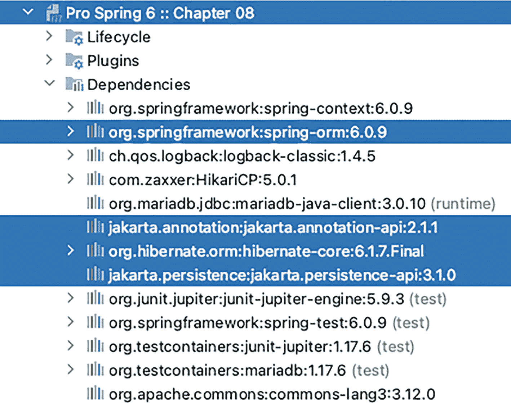

# 8. Spring 与 JPA

在**第** **7** **章**中，我们讨论了在使用 ORM 方法实现数据访问逻辑时，如何将 Hibernate 与 Spring 结合使用。我们演示了如何在 Spring 配置中配置 Hibernate 的 `SessionFactory`，以及如何使用 `Session` 接口执行各种数据访问操作。然而，这只是使用 Hibernate 的一种方式。在 Spring 应用程序中采用 Hibernate 的另一种方式是将其用作标准 Java 持久化 API（JPA，现已更名为 Jakarta Persistence API）的持久化提供者。

Hibernate 的 POJO 映射及其强大的查询语言（HQL）取得了巨大成功，并影响了 Java 世界中数据访问技术标准的发展。在 Hibernate 之后，Java Community Process 成员开发了 Java 数据对象（JDO）标准，随后是 JPA。

在撰写本文时，JPA 已达到 3.1 版本，并提供了一些标准化的概念，例如 `PersistenceContext`、`EntityManager` 和 Java 持久化查询语言（JPQL）。这些标准化为开发人员提供了一种在 JPA 持久化提供者（如 Hibernate、EclipseLink、Oracle TopLink 和 Apache OpenJPA）之间切换的方法。因此，大多数新的 JEE 应用程序都采用 JPA 作为数据访问层。

Spring 也为 JPA 提供了出色的支持。例如，Spring 容器会创建并管理一个 `EntityManager` 实例，并根据 `EntityManagerFactoryBean` bean 将其注入到相应的 JPA 组件中。

Spring Data 项目还提供了一个名为 Spring Data JPA 的子项目，它为在 Spring 应用程序中使用 JPA 提供了高级支持。Spring Data JPA 项目的主要特性包括仓库和规范的概念，以及对查询领域特定语言（Querydsl）的支持。

本章将介绍如何使用 JPA 3.1（最近由 Oracle 外包，因此更名为 Jakarta Persistence API^(⁷⁰)）与 Spring 结合，并使用 Hibernate 作为底层持久化提供者。您将学习如何使用 JPA 的 `EntityManager` 接口和 JPQL 实现各种数据库操作。然后，您将看到 Spring Data JPA 如何进一步帮助简化 JPA 开发。最后，我们介绍与 ORM 相关的高级主题，包括原生查询和条件查询。

具体来说，我们将讨论以下主题：

*   *Jakarta Persistence API（JPA）的核心概念*：我们介绍 JPA 的主要概念。

*   *配置 JPA 实体管理器*：我们讨论 Spring 支持的 `EntityManagerFactory` 类型，以及如何配置最常用的 `LocalContainerEntityManagerFactoryBean`。

*   *数据操作*：我们展示如何在 JPA 中实现基本的数据库操作，这与单独使用 Hibernate 时的概念非常相似。

*   *高级查询操作*：我们讨论如何在 JPA 中使用原生查询，以及 JPA 中强类型的 Criteria API，以实现更灵活的查询操作。

一个圆形背景上带有小写字母 i 的符号。 与 Hibernate 类似，JPA 支持在 XML 或 Java 注解中定义映射。本章重点介绍注解类型的映射，因为其使用方式往往比 XML 风格更受欢迎。

## 介绍 JPA 3.1

与其他 Java 规范请求（JSR）一样，由 JSR-338^(⁷¹) 定义的 JPA 2.1 规范的目标是在 JSE 和 JEE 环境中标准化 ORM 编程模型。它定义了一组通用的概念、注解、接口和其他服务，JPA 持久化提供者应实现这些内容。当按照 JPA 标准进行编程时，开发人员可以选择随意切换底层提供者，就像为基于 JEE 标准开发的应用程序切换到另一个符合 JEE 标准的应用服务器一样。由于 Oracle 不再负责 JPA 的开发，未来将不会有其他针对它的 JSR，但您可以在 Jakarta EE 官方网站上了解最新版本。本项目使用的版本是 JPA 3.1。^(⁷²)

JPA 的核心概念是 `EntityManager` 接口，它来源于 `EntityManagerFactory` 类型的工厂。`EntityManager` 的主要工作是维护一个持久化上下文，其中将存储由其管理的所有实体实例。`EntityManager` 的配置被定义为一个*持久化单元*，一个应用程序中可以有多个持久化单元。如果您使用 Hibernate，可以将持久化上下文视为 `Session` 接口，而 `EntityManagerFactory` 则等同于 `SessionFactory`。在 Hibernate 中，受管理的实体存储在会话中，您可以通过 Hibernate 的 `SessionFactory` 或 `Session` 接口直接与之交互。然而，在 JPA 中，您不能直接与持久化上下文交互。相反，您需要依赖 `EntityManager` 为您完成工作。

JPQL 类似于 HQL，因此如果您之前使用过 HQL，那么 JPQL 应该很容易上手。不过，在 JPA 2 中，引入了一个强类型的 Criteria API，它依赖于映射实体的元数据来构建查询。因此，任何错误都将在编译时而非运行时被发现。

关于 JPA 2 的详细讨论，由于 JPA 3 除了包名（jakarta）之外完全相同，我们推荐 Mike Keith 和 Merrick Schincariol 合著的 *Pro JPA 2*^(⁷³)（Apress，2013 年）。在本节中，我们将讨论 JPA 的基本概念、本章将使用的示例数据模型，以及如何配置 Spring 的 `ApplicationContext` 以支持 JPA。


### 示例代码的样本数据模型

本章使用与**第** **7****章**相同的数据模型。首先，我们将沿用上一章中使用的数据库创建脚本。如果你跳过了**第** **7****章**，请查看该章“示例代码的样本数据模型”部分介绍的数据模型，这有助于你理解本章的示例代码。

### 配置 JPA 的 `EntityManagerFactory`

如前文所述，要在 Spring 中使用 JPA，我们需要配置 `EntityManagerFactory`，就像 Hibernate 中使用的 `SessionFactory` 一样。Spring 支持三种类型的 `EntityManagerFactory` 配置。

第一种方式是使用 `LocalEntityManagerFactoryBean` 类。这是最简单的方式，只需提供持久化单元名称即可。然而，由于它不支持注入 `DataSource`，因此无法参与全局事务，仅适用于简单的开发目的。

第二种方式是使用符合 JEE 规范的容器，在这种方式下，应用服务器会根据部署描述符中的信息引导 JPA 持久化单元。这使得 Spring 可以通过 JNDI JEE 命名空间查找实体管理器。这显然意味着需要 XML 配置。清单 8-1 展示了通过 JNDI 查找实体管理器所需的元素。

```

清单 8-1
使用 JNDI JEE 命名空间进行查找的 Spring XML 配置片段
```

在 JPA 规范中，持久化单元应在配置文件 `META-INF/persistence.xml` 中定义。然而，从 Spring 3.1 开始，新增了一项功能消除了这一需求；我们将在本章后面展示如何使用它。

幸运的是，有多种 Java 配置替代方案可以在 Spring 的 `@Configuration` 类中使用。清单 8-2 所示的配置是其中最简洁的一种。

```
package com.apress.prospring6.eight.config;
import org.springframework.context.annotation.Bean;
import org.springframework.context.annotation.Configuration;
import org.springframework.jdbc.datasource.lookup.JndiDataSourceLookup;
import javax.sql.DataSource;
@Configuration
public class JndiDataSourceCfg {
@Bean
public DataSource dataSource() {
final JndiDataSourceLookup dsLookup = new JndiDataSourceLookup();
dsLookup.setResourceRef(true);
return dsLookup.getDataSource("persistence/prospring6PersistenceUnit");
}
}
清单 8-2
使用 JNDI JEE 命名空间进行查找的 Spring 注解配置片段
```

第三种方式（也是本章使用的最常见方式）是使用 `LocalContainerEntityManagerFactoryBean` 类，它支持注入 `DataSource`，并且可以参与本地和全局事务。清单 8-3 展示了配置片段。

```
package com.apress.prospring6.eight.config;
import org.hibernate.cfg.Environment;
import org.hibernate.jpa.HibernatePersistenceProvider;
import org.springframework.beans.factory.annotation.Autowired;
import org.springframework.orm.jpa.JpaTransactionManager;
import org.springframework.orm.jpa.JpaVendorAdapter;
import org.springframework.orm.jpa.LocalContainerEntityManagerFactoryBean;
import org.springframework.orm.jpa.vendor.HibernateJpaVendorAdapter;
import org.springframework.transaction.PlatformTransactionManager;
import org.springframework.transaction.annotation.EnableTransactionManagement;
// 其他导入语句已省略
@Import(BasicDataSourceCfg.class)
@Configuration
@EnableTransactionManagement
@ComponentScan(basePackages = {"com.apress.prospring6.eight.service"})
public class JpaConfig {
private static Logger LOGGER = LoggerFactory.getLogger(JpaConfig.class);
@Autowired
DataSource dataSource;
@Bean
public PlatformTransactionManager transactionManager() {
JpaTransactionManager transactionManager=new JpaTransactionManager();
transactionManager.setEntityManagerFactory(entityManagerFactory().getObject());
return transactionManager;
}
@Bean
public JpaVendorAdapter jpaVendorAdapter() {
return new HibernateJpaVendorAdapter();
}
@Bean
public Properties jpaProperties() {
Properties jpaProps = new Properties();
jpaProps.put(Environment.HBM2DDL_AUTO, "none");
jpaProps.put(Environment.FORMAT_SQL, false);
jpaProps.put(Environment.USE_SQL_COMMENTS, false);
jpaProps.put(Environment.SHOW_SQL, false);
return jpaProps;
}
@Bean
public LocalContainerEntityManagerFactoryBean entityManagerFactory() {
var factory = new LocalContainerEntityManagerFactoryBean();
factory.setDataSource(dataSource);
factory.setJpaVendorAdapter(jpaVendorAdapter());
//factory.setPersistenceProviderClass(HibernatePersistenceProvider.class);
factory.setPackagesToScan("com.apress.prospring6.eight.entities");
factory.setJpaProperties(jpaProperties());
return factory;
}
}
清单 8-3
使用 LocalContainerEntityManagerFactoryBean 的 Spring 注解配置
```

在此配置中，声明了几个 Bean，以便支持使用 Hibernate 作为持久化提供程序来配置 `LocalContainerEntityManagerFactoryBean`。每个 Bean 的用途及其他配置细节描述如下：

*   *组件扫描*：这个标签你应该很熟悉。我们指示 Spring 扫描 `com.apress.prospring6.eight.service` 包下的组件。

*   `dataSource`：此 Bean 被注入，并在一个单独的配置类中声明，该类仅包含数据库特定的 Bean 和属性（例如，**第** **7****章**中介绍的 `BasicDataSourceCfg`）。

*   `transactionManager`：`EntityManagerFactory` 需要一个事务管理器来进行事务性数据访问。Spring 专门为 JPA 提供了一个事务管理器（`org.springframework.orm.jpa.JpaTransactionManager`）。该 Bean 被声明并分配了 ID `transactionManager`。我们将在**第** **9****章**中详细讨论事务。`@EnableTransactionManagement` 注解是必需的，以支持使用注解声明事务边界需求，但目前请注意，此 Bean 需要一个由 `EntityManagerFactoryBean` 通过调用 `getObject()` 创建的 `EntityManagerFactory` 实例。

*   `JpaVendorAdapter`：此 Bean 允许我们将供应商特定的行为插入到 Spring 的 `EntityManagerFactory` 创建器中。在本例中，我们使用的是 Hibernate，因此该 Bean 的类型是 `HibernateJpaVendorAdapter`。


*   `EntityManagerFactoryBean`：JPA 的`EntityManagerFactory` bean 是此配置中最核心的部分。然而，它并非直接配置，而是通过声明一个`LocalContainerEntityManagerFactoryBean` bean 来配置和创建它。要配置`LocalContainerEntityManagerFactoryBean` bean，需要以下内容：
    *   一个`DataSource` bean。

*   一个`HibernateJpaVendorAdapter` bean。

*   第三点，虽然被注释掉了，但仍值得一提。调用`setPersistenceProviderClass(..)`方法会设置用于创建`EntityManagerFactory`的`PersistenceProvider`实现类。如果未指定，持久化提供者将从`JpaVendorAdapter`（如果有）中获取，或通过扫描（尽可能）检索。这也意味着，一旦指定，`JpaVendorAdapter` bean 就不再是必需的。

*   第四点，我们通过将`packagesToScan`属性设置为`com.apress.prospring6.eight.entities`，指示`LocalContainerEntityManagerFactoryBean` bean 扫描该包下带有 ORM 注解的领域对象。

一个符号描绘了水平线上的一团火焰标记。 请注意，此功能自 Spring 3.1 起才可用。在同一版本中，增加了对领域类扫描的支持，这使得可以从`META-INF/persistence.xml`文件中移除持久化单元的定义。

*   最后，`jpaProperties`属性为 Hibernate 持久化提供者提供了配置细节。其配置选项与**第** **7** **章**中介绍的相同。

### 使用 JPA 注解进行 ORM 映射

如果你阅读过**第** **7** **章**，可能会注意到用于配置实体类的注解都是 JPA 注解。Hibernate 曾经有一套自己的注解，但在 JPA 开发时，其背后的团队决定简化事情并采用新的规范。这就是为什么，如果你查看**第** **7** **章**中领域类的源代码，会看到使用了相同的映射注解。

一旦`EntityManagerFactory`被正确配置，将其注入到你的类中就很简单了。让我们从一个简单的服务类开始。

一个符号描绘了水平线上的一团火焰标记。 在多层级应用中，服务类依赖于仓库类，并且服务 bean 通常是那些用`@Transactional`注解的，这样相关的仓库调用就可以被分组到同一个事务中。由于本项目中的服务类除了调用仓库类之外不做其他事情，我们决定将两者合并，因此服务类同时使用了`@Repository`和`@Transactional`注解。

这样做的目的是为了简化，除了学术目的外，你可能永远不需要编写这样的代码。

一个符号描绘了圆形背景上的小写字母 i。 本章代码中展示了`@Transactional`注解，因为在事务之外执行数据库操作是你可能永远不想做的事情，除非你使用的是数据库即服务（例如 DynamoDB）。事务将在**第** **9** **章**中详细讨论。

清单 8-4 中展示的`SingerService`接口声明了该 bean 类型需要实现的方法。

```
package com.apress.prospring6.eight.service;
import com.apress.prospring6.eight.entities.Singer;
import java.util.Optional;
import java.util.stream.Stream;
public interface SingerService {
String ALL_SINGER_NATIVE_QUERY =
"select ID, FIRST_NAME, LAST_NAME, BIRTH_DATE, VERSION from
SINGER";
Stream findAll();
Stream findAllWithAlbum();
Optional findById(Long id);
Optional save(Singer singer);
void delete(Singer singer);
Stream findAllByNativeQuery();
}
清单 8-4
SingerService 接口
```

这个接口非常简单；它只有三个查找方法、一个保存方法和一个删除方法。保存方法将同时服务于插入和更新操作。为了增加趣味性和一点不同，我们还把方法的返回类型从`Set<T>`改为了`Stream<T>`。

清单 8-5 展示了实现`SingerService`接口的`SingerServiceImpl`类的代码，我们将用它作为使用 JPA 执行数据库操作的示例。

```
package com.apress.prospring6.eight.service;
import jakarta.persistence.EntityManager;
import jakarta.persistence.TypedQuery;
import jakarta.persistence.PersistenceContext;
// 其他导入语句已省略
@Service("jpaSingerService")
@Repository
@Transactional
public class SingerServiceImpl  implements SingerService {
private static final Logger LOGGER = LoggerFactory.getLogger(SingerServiceImpl.class);
@PersistenceContext
private EntityManager em;
@Transactional(readOnly=true)
@Override
public Stream findAllWithAlbum() {
throw new NotImplementedException("findAllWithAlbum");
}
@Transactional(readOnly=true)
@Override
public Stream findAll() {
throw new NotImplementedException("findAll");
}
@Transactional(readOnly=true)
@Override
public Optional findById(Long id) {
throw new NotImplementedException("findById");
}
@Override
public Optional save(Singer singer) {
throw new NotImplementedException("save");
}
@Override
public void delete(Singer singer) {
throw new NotImplementedException("delete");
}
@Override
public Stream findAllByNativeQuery() {
throw new NotImplementedException("findAllByNativeQuery");
}
}
清单 8-5
SingerServiceImpl Bean 类型
```

该类应用了几个注解：

*   `@Service`注解用于标识该类是一个向其他层提供业务服务的 Spring 组件，并将 Spring bean 命名为`jpaSingerService`。

*   `@Repository`注解表明该类包含数据访问逻辑，并指示 Spring 将特定于供应商的异常转换为 Spring 的`DataAccessException`层次结构。

*   `@Transactional`注解用于定义事务需求。

为了注入`EntityManager`，我们使用了`@PersistenceContext`注解，这是用于实体管理器注入的标准 JPA 注解。为什么我们使用`@PersistenceContext`这个名称来注入实体管理器可能令人费解，但如果你考虑到持久化上下文本身是由`EntityManager`管理的，那么这个注解的命名就完全合理了。如果你的应用程序中有多个持久化单元，你还可以向注解添加`unitName`属性来指定要注入哪个持久化单元。通常，一个持久化单元代表一个独立的后端`DataSource`。


## 使用 JPA 执行数据库操作

使用 `EntityManager` 执行查询和管理数据，与使用 Hibernate 的 `SessionFactory` 类似，唯一的区别在于不涉及会话。

JPQL 和 HQL 的语法非常相似，以至于我们在**第** **7** **章**中使用的所有 HQL 查询都可以复用来实现 `SingerService` 接口中的查找方法。要使用 JPA 和 Hibernate，需要**第** **7** **章**中完全相同的依赖集；其中最重要的是 `spring-orm` 和 `hibernate-core-jakarta`。后者依赖于 Jakarta 的 `persistence-api.jar`，并将其作为传递依赖添加到类路径中。该项目的依赖关系如图 8-1 中 IntelliJ IDEA 的 Gradle 视图所示。



一张截图展示了第 8 章的依赖关系：hibernate-core Jakarta 和 Jakarta dot persistence a p i。

图 8-1

Spring 与 Hibernate JPA 项目依赖关系

### 使用 Java 持久化查询语言查询数据

清单 8-6 回顾了**第** **7** **章**中介绍的 `Singer` 领域对象模型类的重要代码片段。（其他类将不再展示。）

```
package com.apress.prospring6.eight.entities;
import jakarta.persistence.*;
import java.io.Serial;
// 其他 import 语句已省略
@Entity
@Table(name = "SINGER")
@NamedQueries({
@NamedQuery(name=Singer.FIND_ALL, query="select s from Singer s"),
@NamedQuery(name=Singer.FIND_SINGER_BY_ID,
query="""
select distinct s from Singer s
left join fetch s.albums a
left join fetch s.instruments i
where s.id = :id
"""),
@NamedQuery(name=Singer.FIND_ALL_WITH_ALBUM,
query="""
select distinct s from Singer s
left join fetch s.albums a
left join fetch s.instruments i
""")
})
public class Singer extends AbstractEntity {
@Serial
private static final long serialVersionUID = 2L;
public static final String FIND_ALL = "Singer.findAll";
public static final String FIND_SINGER_BY_ID = "Singer.findById";
public static final String FIND_ALL_WITH_ALBUM = "Singer.findAllWithAlbum";
private String firstName;
private String lastName;
private LocalDate birthDate;
private Set albums = new HashSet();
private Set instruments = new HashSet();
@Column(name = "FIRST_NAME")
public String getFirstName() {
return this.firstName;
}
@Column(name = "LAST_NAME")
public String getLastName() {
return this.lastName;
}
@Column(name = "BIRTH_DATE")
public LocalDate getBirthDate() {
return birthDate;
}
@OneToMany(mappedBy = "singer", cascade=CascadeType.ALL, orphanRemoval=true)
public Set getAlbums() {
return albums;
}
@ManyToMany
@JoinTable(name = "SINGER_INSTRUMENT",
joinColumns = @JoinColumn(name = "SINGER_ID"),
inverseJoinColumns = @JoinColumn(name = "INSTRUMENT_ID"))
public Set getInstruments() {
return instruments;
}
// 其他方法已省略
}
清单 8-6
Singer 领域对象
```

如果你分析使用 `@NamedQuery` 定义的查询，会发现 HQL 和 JPQL 之间似乎没有区别，至少对于简单查询而言是如此。现在我们有了实体类和配置，就可以开始实现与数据库交互的方法了。让我们从编写 `findAll()` 方法开始，该方法简单地检索数据库中的所有歌手。方法实现如清单 8-7 所示。

```
package com.apress.prospring6.eight.service;
// import 语句已省略
@Service("jpaSingerService")
@Repository
@Transactional
public class SingerServiceImpl  implements SingerService {
private static final Logger LOGGER = LoggerFactory.getLogger(SingerServiceImpl.class);
@PersistenceContext
private EntityManager em;
@Transactional(readOnly=true)
@Override
public Stream findAll() {
return em.createNamedQuery(Singer.FIND_ALL, Singer.class)
.getResultList()
.stream();
}
// 其他方法已省略
}
清单 8-7
使用 EntityManager 实现的 findAll() 方法
```

如清单 8-7 所示，我们使用 `EntityManager.createNamedQuery()` 方法，传入查询名称和期望的返回类型。该方法返回一个 `TypedQuery<X>` 实例。然后调用 `getResultList()` 方法检索歌手，并以流的形式返回。为了测试该方法的实现，构建了一个测试类，该类使用 Testcontainers 启动一个 MariaDB 测试容器来运行查询。用于测试 `SingerServiceImpl.findAll()` 的测试方法以及 Testcontainers 设置如清单 8-8 所示（后者将在后续测试示例中省略）。


```
package com.apress.prospring6.eight;
import org.testcontainers.containers.MariaDBContainer;
import org.testcontainers.junit.jupiter.Container;
import org.testcontainers.junit.jupiter.Testcontainers;
import static org.junit.jupiter.api.Assertions.assertEquals;
// 其他导入语句已省略
@Testcontainers
@SqlMergeMode(SqlMergeMode.MergeMode.MERGE)
@Sql({ "classpath:testcontainers/drop-schema.sql", "classpath:testcontainers/create-schema.sql" })
@SpringJUnitConfig(classes = {SingerServiceTest.TestContainersConfig.class})
public class SingerServiceTest {
private static final Logger LOGGER = LoggerFactory.getLogger(SingerServiceTest.class);
@Container
static MariaDBContainer mariaDB = new MariaDBContainer("mariadb:10.7.4-focal");
@Autowired
SingerService singerService;
@Test
@DisplayName("应返回所有歌手")
void testFindAll(){
var singers = singerService.findAll().toList();
assertEquals(3, singers.size());
singers.forEach(singer -> LOGGER.info(singer.toString()));
}
@Configuration
@Import(JpaConfig.class)
public static class TestContainersConfig {
@Autowired
Properties jpaProperties;
@PostConstruct
public void initialize() {
jpaProperties.put(Environment.FORMAT_SQL, true);
jpaProperties.put(Environment.USE_SQL_COMMENTS, true);
jpaProperties.put(Environment.SHOW_SQL, true);
}
}
}
清单 8-8
测试 findAll() 方法
```

引入 `TestContainersConfig` 类是为了覆盖控制显示生成的 SQL 查询的 Hibernate 变量。如果 `assertEquals()` 没有抛出异常（测试失败），运行 `testFindAll()` 测试方法将产生如清单 8-9 所示的输出。

```
/* 1 */ DEBUG: LocalContainerEntityManagerFactoryBean - Building JPA container EntityManagerFactory for persistence unit 'default'
DEBUG: LogHelper - PersistenceUnitInfo [
name: default
persistence provider classname: null
classloader: jdk.internal.loader.ClassLoaders$AppClassLoader@5ffd2b27
excludeUnlistedClasses: true
JTA datasource: null
Non JTA datasource: org.apache.tomcat.dbcp.dbcp2.BasicDataSource@40247d48
Transaction type: RESOURCE_LOCAL
PU root URL: file:/Users/iulianacosmina/apress/workspace/pro-spring-6/chapter08/build/classes/java/test/
Shared Cache Mode: UNSPECIFIED
Validation Mode: AUTO
Jar files URLs []
Managed classes names [
com.apress.prospring6.eight.entities.AbstractEntity
com.apress.prospring6.eight.entities.Album
com.apress.prospring6.eight.entities.Instrument
com.apress.prospring6.eight.entities.Singer]
Mapping files names []
Properties []
...
/* 2 */ DEBUG: JdbcEnvironmentInitiator - Database ->
name : MariaDB
version : 10.7.4-MariaDB-1:10.7.4+maria~focal
major : 10
minor : 7
...
/* 3 */ DEBUG: SqlStatementLogger - select singer0_.ID as id1_2_,
singer0_.VERSION as version2_2_,
singer0_.BIRTH_DATE as birth_da3_2_,
singer0_.FIRST_NAME as first_na4_2_,
singer0_.LAST_NAME as last_nam5_2_
from SINGER singer0_
...
/* 4 */ INFO : SingerServiceTest - Singer - Id: 1, First name: John, Last name: Mayer, Birthday: 1977-10-16
INFO : SingerServiceTest - Singer - Id: 2, First name: Ben, Last name: Barnes, Birthday: 1981-08-20
INFO : SingerServiceTest - Singer - Id: 3, First name: John, Last name: Butler, Birthday: 1975-04-01
清单 8-9
运行 testFindAll() 测试方法时控制台输出的片段
```

输出示例由四个不同的片段组成：

*   /* 1 */ 是此测试上下文中使用的 `EntityManager` 配置。
*   /* 2 */ 包含用于运行测试的容器的属性。
*   /* 3 */ 是为 `Singer.findAll` 查询生成的 SQL 原生查询。
*   /* 4 */ 包含执行 `Singer.findAll` 查询返回的结果。

警告符号在圆形背景上显示一个感叹号。 对于关联，JPA 规范规定，默认情况下，持久化提供者必须急切地获取关联。然而，对于 Hibernate 的 JPA 实现，默认的获取策略仍然是惰性的。因此，当使用 Hibernate 的 JPA 实现时，你不需要显式地将关联定义为惰性获取。Hibernate 的默认获取策略与 JPA 规范不同。

现在让我们实现 `findAllWithAlbum()` 方法，该方法将获取关联的专辑和乐器。实现如清单 8-10 所示。

```
package com.apress.prospring6.eight.service;
// 所有导入语句已省略
/*
来自 Singer.java 的注解，用于展示 JQL 查询
@NamedQuery(name=Singer.FIND_ALL_WITH_ALBUM,
query="select distinct s from Singer s " +
"left join fetch s.albums a " +
"left join fetch s.instruments i")
*/
@Service("jpaSingerService")
@Repository
@Transactional
public class SingerServiceImpl  implements SingerService {
@Transactional(readOnly=true)
@Override
public Stream findAllWithAlbum() {
return em.createNamedQuery(Singer.FIND_ALL_WITH_ALBUM, Singer.class).getResultList().stream();
}
// 其他方法和设置已省略
}
清单 8-10
findAllWithAlbum() 方法
```

`findAllWithAlbum()` 方法与 `findAll()` 方法相同，但它使用了一个不同的命名查询，其中包含用于链接不同表中记录的 `inner join fetch` 语句。用于测试该方法并打印条目的方法如清单 8-11 所示。

```
package com.apress.prospring6.eight;
// 所有导入语句已省略
// 注解已省略
public class SingerServiceTest {
@Test
@DisplayName("应返回所有歌手及其专辑")
void testFindAllWithAlbum(){
var singers = singerService.findAllWithAlbum().toList();
assertEquals(3, singers.size());
singers.forEach(s -> {
LOGGER.info(s.toString());
if (s.getAlbums() != null) {
s.getAlbums().forEach(a -> LOGGER.info("\t 专辑:" + a.toString()));
}
if (s.getInstruments() != null) {
s.getInstruments().forEach(i -> LOGGER.info("\t 乐器: " + i.getInstrumentId()));
}
});
}
// 其他方法和设置已省略
}
清单 8-11
测试 findAllWithAlbum() 方法
```

JQL 查询很简单，但生成的 SQL 查询却不那么简单，如该方法执行输出所示，该输出在清单 8-12 中描述。


```
DEBUG: SqlStatementLogger - select distinct singer0_.ID as id1_2_0_,
albums1_.ID as id1_0_1_,
instrument3_.INSTRUMENT_ID as instrume1_1_2_,
singer0_.VERSION as version2_2_0_,
singer0_.BIRTH_DATE as birth_da3_2_0_,
singer0_.FIRST_NAME as first_na4_2_0_,
singer0_.LAST_NAME as last_nam5_2_0_,
albums1_.VERSION as version2_0_1_,
albums1_.RELEASE_DATE as release_3_0_1_,
albums1_.SINGER_ID as singer_i5_0_1_,
albums1_.title as title4_0_1_,
albums1_.SINGER_ID as singer_i5_0_0__,
albums1_.ID as id1_0_0__,
instrument2_.SINGER_ID as singer_i1_3_1__,
instrument2_.INSTRUMENT_ID as instrume2_3_1__
from SINGER singer0_
left outer join ALBUM albums1_ on singer0_.ID=albums1_.SINGER_ID
left outer join SINGER_INSTRUMENT instrument2_ on singer0_.ID=instrument2_.SINGER_ID
left outer join INSTRUMENT instrument3_ on instrument2_.INSTRUMENT_ID=instrument3_.INSTRUMENT_ID
...
INFO : SingerServiceTest - Singer - Id: 1, First name: John, Last name: Mayer, Birthday: 1977-10-16
INFO : SingerServiceTest -  Album:Album - Id: 1, Singer id: 1, Title: The Search For Everything, Release Date: 2017-01-20
INFO : SingerServiceTest -  Album:Album - Id: 2, Singer id: 1, Title: Battle Studies, Release Date: 2009-11-17
INFO : SingerServiceTest -  Instrument: Piano
INFO : SingerServiceTest -  Instrument: Guitar
INFO : SingerServiceTest - Singer - Id: 2, First name: Ben, Last name: Barnes, Birthday: 1981-08-20
INFO : SingerServiceTest -  Album:Album - Id: 3, Singer id: 2, Title: 11:11, Release Date: 2021-09-18
INFO : SingerServiceTest -  Instrument: Piano
INFO : SingerServiceTest -  Instrument: Drums
INFO : SingerServiceTest -  Instrument: Guitar
INFO : SingerServiceTest - Singer - Id: 3, First name: John, Last name: Butler, Birthday: 1975-04-01
清单 8-12
运行 testFindAllWithAlbum() 测试方法时控制台输出的片段
```

现在让我们看看 `findById()` 方法，它演示了如何在 JPA 中使用带有命名参数的命名查询。关联关系也会被一并获取。清单 8-13 展示了其实现。

```
package com.apress.prospring6.eight.service;
import jakarta.persistence.NoResultException;
// 所有 import 语句已省略
/*
来自 Singer.java 的注解，用于展示 JQL 查询
@NamedQuery(name=Singer.FIND_SINGER_BY_ID,
query="""
select distinct s from Singer s
left join fetch s.albums a
left join fetch s.instruments i
where s.id = :id
""")
*/
@Service("jpaSingerService")
@Repository
@Transactional
public class SingerServiceImpl  implements SingerService {
@Transactional(readOnly=true)
@Override
public Optional findById(Long id) {
TypedQuery query = em.createNamedQuery(Singer.FIND_SINGER_BY_ID, Singer.class);
query.setParameter("id", id);
try {
return Optional.of(query.getSingleResult());
} catch (NoResultException nre) {
return Optional.empty();
}
}
// 其他方法和设置已省略
}
清单 8-13
findById() 方法
```

调用 `EntityManager.createNamedQuery(java.lang.String name, java.lang.Class<T> resultClass)` 来获取 `TypedQuery<T>` 接口的实例，该接口确保查询结果必须是 `Singer` 类型。然后使用 `TypedQuery<T>.setParameter()` 方法设置查询中命名参数的值，并调用 `getSingleResult()` 方法，因为结果应仅包含一个具有指定 ID 的 `Singer` 对象。测试它非常简单，与**第** **7** **章**中类似方法的做法相同，因此此处不再赘述。

### 使用非类型化结果进行查询

在许多情况下，您希望向数据库提交查询并随意操作结果，而不是将它们存储在映射的实体类中。毕竟，既然可以使用记录（record），为什么还要使用实体类呢？此外，记录可以设计为仅存储列的子集，因此其行为与投影查询相同。

一个典型的例子是基于 Web 的报告，它只列出跨多个表的特定数量的列。例如，假设您有一个网页，显示歌手信息及其最近发行的专辑名称。摘要信息包含歌手的全名及其最近发行的专辑名称。没有专辑的歌手将不会被列出。在这种情况下，我们可以通过查询实现此用例，然后手动操作 `ResultSet` 对象。

让我们创建一个名为 `SingerSummaryServiceImpl` 的新类，并将方法命名为 `findAllAsRecord()`。清单 8-14 展示了该方法的典型实现以及 `SingerSummaryRecord` 记录类。

```
package com.apress.prospring6.eight.view;
public record SingerSummaryRecord(String firstName,
String lastName,
String latestAlbum) {
}
// ------------------------------
package com.apress.prospring6.eight.service;
import com.apress.prospring6.eight.view.SingerSummary;
import com.apress.prospring6.eight.view.SingerSummaryRecord;
// 其他 import 语句
@Service("singerSummaryService")
@Repository
@Transactional(readOnly = true)
public class SingerSummaryServiceImpl implements  SingerSummaryService {
@PersistenceContext
private EntityManager em;
public static final String ALL_SINGER_SUMMARY_RECORD_JPQL_QUERY ="""
select s.firstName, s.lastName, a.title from Singer s
left join s.albums a
where a.releaseDate=(select max(a2.releaseDate) from Album a2 where a2.singer.id = s.id)
""";
@SuppressWarnings({"unchecked"})
@Override
public Stream findAllAsRecord() {
return em.createQuery(ALL_SINGER_SUMMARY_RECORD_JPQL_QUERY).getResultList().stream().
map(obj ->  {
Object[] values = (Object[]) obj;
return new SingerSummaryRecord((String) values[0],(String) values[1], (String) values[2]);
});
}
}
清单 8-14
SingerSummaryServiceImpl.findAllAsRecord() 方法
```

`SingerSummaryService` 只是一个接口，声明了将由 `SingerSummaryServiceImpl` 实现的方法。

如清单 8-14 所示，我们使用 `EntityManager.createQuery()` 方法创建 `Query`，传入 JPQL 语句，然后获取结果列表。当我们在 JPQL 中显式指定要选择的列时，JPA 将返回一个迭代器，迭代器中的每个项都是一个对象数组。我们遍历该迭代器，并为每个数组对象创建一个 `SingerSummaryRecord` 实例。每个对象数组对应 `ResultSet` 对象中的一条记录。

清单 8-15 展示了测试方法。

```
package com.apress.prospring6.eight;
// import 语句已省略
// 注解已省略
public class SingerServiceTest {
@Autowired
SingerSummaryService singerSummaryService;
@Test
@DisplayName("应返回所有歌手及其最近专辑作为记录")
void testFindAllWithAlbumAsRecords(){
var singers =
singerSummaryService.findAllAsRecord()
.peek(s -> LOGGER.info(s.toString()))
.toList();
assertEquals(2, singers.size());
}
// 其他方法和设置已省略
}
清单 8-15
测试 SingerSummaryServiceImpl.findAllAsRecord() 方法
```

执行此测试方法会产生与本章其他方法类似的输出，但结果会使用记录（record）生成的 `toString()` 方法转换为 `String`，如清单 8-16 所示。


```
DEBUG: SqlStatementLogger - select singer0_.FIRST_NAME as col_0_0_,
singer0_.LAST_NAME as col_1_0_,
albums1_.title as col_2_0_ from SINGER singer0_
left outer join ALBUM albums1_ on singer0_.ID=albums1_.SINGER_ID
where
albums1_.RELEASE_DATE=(select max(album2_.RELEASE_DATE) from ALBUM album2_
where album2_.SINGER_ID=singer0_.ID)
...
INFO : SingerServiceTest - SingerSummaryRecord[firstName=John, lastName=Mayer, latestAlbum=The Search For Everything]
INFO : SingerServiceTest - SingerSummaryRecord[firstName=Ben, lastName=Barnes, latestAlbum=11:11]
清单 8-16
测试 SingerSummaryServiceImpl.findAllAsRecord() 方法期间打印的输出片段
```

在 JPA 中，有一种比处理查询返回的 `ResultSet` 对象数组更优雅的解决方案，下一节将对此进行讨论。

### 使用构造器表达式查询自定义结果类型

在 JPA 中，当查询上一节中那样的自定义结果时，你可以指示 JPA 直接为每条记录构造一个 POJO。这个 POJO 也被称为*视图*，因为它包含来自多个表的数据。对于上一节的示例，创建了一个名为 `SingerSummaryRecord` 的记录。在本例中，使用了一个名为 `SingerSummary` 的 POJO，它与该记录类等效。`SingerSummary` 类拥有每位歌手摘要的属性，并带有一个接受所有属性的构造器方法。使用这个类，我们可以编写一个 `findAll()` 方法，并在查询中使用构造器表达式来指示 JPA 提供程序将 `ResultSet` 映射到 `SingerSummary` 类。在清单 8-17 中，你可以看到这个方法及其执行的查询。

```
package com.apress.prospring6.eight.service;
// 所有导入语句已省略
@Service("singerSummaryService")
@Repository
@Transactional(readOnly = true)
public class SingerSummaryServiceImpl implements SingerSummaryService {
@PersistenceContext
private EntityManager em;
public static final String ALL_SINGER_SUMMARY_JPQL_QUERY ="""
select new com.apress.prospring6.eight.view.SingerSummary(
s.firstName, s.lastName, a.title) from Singer s
left join s.albums a
where a.releaseDate=(select max(a2.releaseDate) from Album a2 where a2.singer.id = s.id)
""";
@Override
public Stream findAll() {
return em.createQuery(ALL_SINGER_SUMMARY_JPQL_QUERY, SingerSummary.class).getResultList().stream();
}
// 其他方法已省略
}
清单 8-17
SingerSummaryServiceImpl.findAll() 方法
```

在 JPQL 查询中，指定了 `new` 关键字，以及将存储结果的 POJO 类的完全限定名，并将选定的属性作为每个 `SingerSummary` 类的构造器参数传入。最后，将 `SingerSummary` 类传入 `createQuery()` 方法以指示结果类型。测试此方法与我们对 `findAllAsRecord()` 所做的操作并无不同，但返回的结果类型是 `SingerSummary` 而不是 `SingerSummaryRecord`，如清单 8-18 所示。

```
package com.apress.prospring6.eight;
// 导入语句已省略
// 注解已省略
public class SingerServiceTest {
@Autowired
SingerSummaryService singerSummaryService;
@Test
@DisplayName("应返回所有歌手及其最新专辑（以 POJO 形式）")
void testFindAllAsPojos(){
var singers =
singerSummaryService.findAll()
.peek(s -> LOGGER.info(s.toString())).toList();
assertEquals(2, singers.size());
}
// 其他方法和设置已省略
}
清单 8-18
测试 SingerSummaryServiceImpl.findAll() 方法
```

执行此方法会产生清单 8-19 中的结果。

```
DEBUG: QueryTranslatorImpl - HQL: select new com.apress.prospring6.eight.view.SingerSummary(s.firstName, s.lastName, a.title)
from com.apress.prospring6.eight.entities.Singer s
left join s.albums a where a.releaseDate=
(select max(a2.releaseDate)
from com.apress.prospring6.eight.entities.Album a2
where a2.singer.id = s.id)
DEBUG: QueryTranslatorImpl - SQL: select singer0_.FIRST_NAME as col_0_0_,
singer0_.LAST_NAME as col_1_0_,
albums1_.title as col_2_0_ from SINGER singer0_
left outer join ALBUM albums1_ on singer0_.ID=albums1_.SINGER_ID
where albums1_.RELEASE_DATE=
(select max(album2_.RELEASE_DATE)
from ALBUM album2_
where album2_.SINGER_ID=singer0_.ID)
...
INFO : SingerServiceTest - First name: John, Last Name: Mayer, Most Recent Album: The Search For Everything
INFO : SingerServiceTest - First name: Ben, Last Name: Barnes, Most Recent Album: 11:11
清单 8-19
测试 SingerSummaryServiceImpl.testFindAllAsPojos() 方法期间打印的输出片段
```

请注意，JPQL 查询在 Java 中由一个 `org.hibernate.query.internal.QueryImpl` 实例表示；这是因为 Hibernate 是该应用程序的 JPA 提供程序。同时请注意，在生成的本地 SQL 查询中，没有 `SingerSummary` 构造器的痕迹。


### 插入数据

使用 JPA 插入数据非常简单。与 Hibernate 类似，JPA 也支持检索数据库生成的主键。清单 8-20 展示了 `save(..)` 方法。

```
package com.apress.prospring6.eight.service;
// 导入语句已省略
@Service("jpaSingerService")
@Repository
@Transactional
public class SingerServiceImpl  implements SingerService {
private static final Logger LOGGER = LoggerFactory.getLogger(SingerServiceImpl.class);
@PersistenceContext
private EntityManager em;
@Override
public void save(Singer singer) {
if (singer.getId() == null) {
LOGGER.info("正在插入新歌手");
em.persist(singer);
} else {
em.merge(singer);
LOGGER.info("正在更新已有歌手");
}
LOGGER.info("歌手已保存，id: " + singer.getId());
}
// 其他方法已省略
}
清单 8-20
SingerServiceImpl.save(..) 方法
```

如上所示，`save(..)` 方法首先通过检查 `id` 值来判断对象是否为新实体实例。如果 `id` 为 `null`（即尚未分配），则该对象是新实体实例，将调用 `EntityManager.persist(..)` 方法。调用 `persist(..)` 方法时，`EntityManager` 会持久化该实体，并使其成为当前持久化上下文中的受管实例。如果 `id` 值已存在，则我们正在执行更新操作，此时将调用 `EntityManager.merge(..)` 方法。调用 `merge(..)` 方法时，`EntityManager` 会将实体的状态合并到当前持久化上下文中。

清单 8-21 展示了插入新 `Singer` 记录的代码。所有操作都在一个测试方法中完成，因为我们希望测试插入操作是否成功。

```
package com.apress.prospring6.eight;
// 导入语句已省略
// 注解已省略
public class SingerServiceTest {
@Test
@DisplayName("应能插入一个包含关联的歌手")
@Sql(statements =  { // 避免污染测试上下文
"delete from ALBUM where SINGER_ID = (select ID from SINGER where FIRST_NAME = 'BB')",
"delete from SINGER_INSTRUMENT where SINGER_ID = (select ID from SINGER where FIRST_NAME = 'BB')",
"delete from SINGER where FIRST_NAME = 'BB'"
},
executionPhase = Sql.ExecutionPhase.AFTER_TEST_METHOD)
public void testInsert(){
var singer = new Singer();
singer.setFirstName("BB");
singer.setLastName("King");
singer.setBirthDate(LocalDate.of(1940, 8, 16));
var album = new Album();
album.setTitle("My Kind of Blues");
album.setReleaseDate(LocalDate.of(1961, 7, 18));
singer.addAlbum(album);
album = new Album();
album.setTitle("A Heart Full of Blues");
album.setReleaseDate(LocalDate.of(1962, 3, 20));
singer.addAlbum(album);
singerService.save(singer);
Assertions.assertNotNull(singer.getId());
var singers = singerService.findAllWithAlbum().peek(
s -> {
LOGGER.info(s.toString());
if (s.getAlbums() != null) {
s.getAlbums().forEach(a -> LOGGER.info("\t 专辑:" + a.toString()));
}
if (s.getInstruments() != null) {
s.getInstruments().forEach(i -> LOGGER.info("\t 乐器: " + i.getInstrumentId()));
}
}).toList();
assertEquals(4, singers.size());
}
// 其他方法和设置已省略
}
清单 8-21
测试 SingerServiceImpl.save(..) 方法
```

如上所示，我们创建了一个新歌手，添加了两张专辑，并保存了该对象。通过验证 `findAllWithAlbum()` 方法返回的结果集大小，来测试此操作是否成功。

`@Sql` 注解用于清理数据库，以避免意外导致其他基于初始测试数据集运行的测试失败。

### 更新数据

更新数据与插入数据一样简单，而且如您所见，我们为插入和更新操作创建了同一个方法。测试更新操作有两种方式：更新歌手记录的姓名或其他属性，或者移除相关的关联（例如专辑）。清单 8-22 展示了测试 `SingerServiceImpl.save(..)` 方法以执行更新的两种方式。

```
package com.apress.prospring6.eight;
// 导入语句已省略
// 注解已省略
public class SingerServiceTest {
@Test
@SqlGroup({
@Sql(scripts = {"classpath:testcontainers/add-nina.sql"},
executionPhase = Sql.ExecutionPhase.BEFORE_TEST_METHOD),
@Sql(scripts = {"classpath:testcontainers/remove-nina.sql"},
executionPhase = Sql.ExecutionPhase.AFTER_TEST_METHOD)
})
@DisplayName("应能更新一个歌手")
void testUpdate() {
var singer = singerService.findById(5L).orElse(null);
// 确保该歌手存在
assertNotNull(singer);
// 确保我们得到了预期的歌手
assertEquals("Simone", singer.getLastName());
// 获取专辑
var album = singer.getAlbums().stream().filter(
a -> a.getTitle().equals("I Put a Spell on You")).findFirst().orElse(null);
Assertions.assertNotNull(album);
singer.setFirstName("Eunice Kathleen");
singer.setLastName("Waymon");
singer.removeAlbum(album);
int version =  singer.getVersion();
singerService.save(singer);
var nina =  singerService.findById(5L).orElse(null);
assertAll( "nina 已更新" ,
() -> Assertions.assertNotNull(nina),
() -> Assertions.assertEquals(version +1, nina.getVersion())
);
}
@Test
@DisplayName("应能更新专辑集合")
public void testUpdateAlbumSet() {
var singer = singerService.findById(1L).orElse(null);
// 确保该歌手存在
assertNotNull(singer);
// 确保我们得到了预期的记录
assertEquals("Mayer", singer.getLastName());
// 获取专辑
var album = singer.getAlbums().stream().filter(a -> a.getTitle().equals("Battle Studies")).findAny().orElse(null);
singer.setFirstName("John Clayton");
singer.removeAlbum(album);
singerService.save(singer);
var singers = singerService.findAllWithAlbum().peek(
s -> {
LOGGER.info(s.toString());
if (s.getAlbums() != null) {
s.getAlbums().forEach(a -> LOGGER.info("\t 专辑:" + a.toString()));
}
if (s.getInstruments() != null) {
s.getInstruments().forEach(i -> LOGGER.info("\t 乐器: " + i.getInstrumentId()));
}
}).toList();
assertEquals(3, singers.size());
}
// 其他方法和设置已省略
}
清单 8-22
测试 SingerServiceImpl.save(..) 方法的两种更新操作形式
```

在 `testUpdate()` 方法中，我们首先检索 ID 为 5 的记录，并更改其名和姓。我们调用 `SingerService.save(..)` 方法，然后从数据库中检索已保存的项目。通过其 `version` 字段的递增来确认更新操作成功。

在 `testUpdateAlbumSet()` 方法中，我们首先检索 ID 为 1 的记录，并更改其名。然后我们遍历其 `Album` 关联，检索标题为 *Battle Studies* 的专辑，并将其从歌手的专辑属性中移除。最后，我们再次调用 `SingerService.save(..)` 方法。执行此方法时，您可以通过查看控制台日志并检查 *Battle Studies* 专辑是否未显示，来确认更新操作是否成功。

一个警告符号，在圆形背景上显示一个感叹号。 该专辑可以被移除，是因为在一对多关联中定义了 `orphanRemoval=true` 属性，该属性指示 JPA 提供者（Hibernate）在持久化时，移除数据库中所有存在但对象中不再存在的孤立记录：`@OneToMany(mappedBy = "singer", cascade=CascadeType.ALL, orphanRemoval=true)`。


### 删除数据

删除数据同样简单。只需调用 `EntityManager.remove()` 方法并传入 `Singer` 对象即可。清单 8-23 展示了更新后的删除歌手代码。

```
package com.apress.prospring6.eight.service;
// 省略 import 语句
@Service("jpaSingerService")
@Repository
@Transactional
public class SingerServiceImpl  implements SingerService {
@Override
public void delete(Singer singer) {
var mergedContact = em.merge(singer);
em.remove(mergedContact);
LOGGER.info("Singer with id: " + singer.getId()  + " deleted successfully");
}
// 省略其他方法和设置
}
清单 8-23
SingerServiceImpl.delete(..) 方法
```

首先调用 `EntityManager.merge(..)` 方法，将实体的状态合并到当前持久化上下文中。`merge(..)` 方法返回受管理的实体实例。然后调用 `EntityManager.remove()` 方法，并传入受管理的歌手实体实例。该删除操作会删除歌手记录及其所有关联信息（包括专辑和乐器），因为我们在映射中定义了 `cascade=CascadeType.ALL`。要测试删除操作，可以使用 `testDelete()` 方法，如清单 8-24 所示。

```
package com.apress.prospring6.eight;
// 省略 import 语句
// 省略注解
public class SingerServiceTest {
@Test
@Sql(scripts = {"classpath:testcontainers/add-chuck.sql"},
executionPhase = Sql.ExecutionPhase.BEFORE_TEST_METHOD)
@DisplayName("should delete a singer")
public void testDelete() {
var singer = singerService.findById(6L).orElse(null);
//确保该歌手存在
assertNotNull(singer);
singerService.delete(singer);
var deleted = singerService.findById(6L);
assertTrue(deleted.isEmpty());
}
// 省略其他方法和设置
}
清单 8-24
测试 SingerServiceImpl.delete(..) 方法
```

清单 8-24 检索 ID 为 6 的歌手，然后调用 `delete(..)` 方法删除该歌手信息。

## 使用原生查询

在讨论了使用 JPA 执行基本数据库操作之后，现在让我们进入一些更高级的主题。有时你可能希望对提交给数据库的查询拥有绝对的控制权。一个例子是在 Oracle 数据库中使用层次查询。这种查询是数据库特定的，被称为*原生查询*。

JPA 支持执行原生查询；`EntityManager` 会按原样将查询提交给数据库，不进行任何映射或转换。使用 JPA 原生查询的一个主要好处是能够将 `ResultSet` 映射回 ORM 映射的实体类。以下两节将讨论如何使用原生查询检索所有歌手，并直接将 `ResultSet` 映射回 `Singer` 对象。

### 使用简单原生查询

为了演示如何使用原生查询，让我们实现一个新方法，从数据库中检索所有歌手。该方法如清单 8-25 所示。

```
package com.apress.prospring6.eight.service;
// 省略 import 语句
@Service("jpaSingerService")
@Repository
@Transactional
public class SingerServiceImpl  implements SingerService {
public static final String ALL_SINGER_NATIVE_QUERY =
"select ID, FIRST_NAME, LAST_NAME, BIRTH_DATE, VERSION from SINGER";
@Override
public Stream findAllByNativeQuery() {
return em.createNativeQuery(ALL_SINGER_NATIVE_QUERY)
.getResultList().stream();
}
// 省略其他方法和设置
}
清单 8-25
SingerServiceImpl.findAllByNativeQuery(..) 方法
```

可以看到，原生查询只是一个简单的 SQL 语句，用于检索 `SINGER` 表中的所有列。为了创建并执行查询，首先调用了 `EntityManager.createNativeQuery(..)`，并传入查询字符串以及结果类型。结果类型应该是一个映射的实体类（此处为 `Singer` 类）。`createNativeQuery(..)` 方法返回一个 `Query` 实例，该实例提供了 `getResultList()` 操作来获取结果列表。JPA 提供者将执行查询，并根据实体类中定义的 JPA 映射，将 `ResultSet` 对象转换为实体实例。执行上述方法会产生与 `findAll()` 方法相同的结果。

### 使用 SQL `ResultSet` 映射进行原生查询

除了映射的领域对象，你还可以传入一个表示 SQL `ResultSet` 映射名称的字符串。SQL `ResultSet` 映射通过使用 `@SqlResultSetMapping` 注解在实体类级别定义。一个 SQL `ResultSet` 映射可以包含一个或多个实体和列映射。为实体类定义了一个名为 `singerResult` 的 SQL `ResultSet` 映射，其 `entityClass` 属性位于 `Singer` 类本身中。JPA 支持针对多个实体的更复杂映射，并支持向下到列级别的映射。

定义 SQL `ResultSet` 映射后，可以使用 `ResultSet` 映射的名称来调用 `findAllByNativeQuery()` 方法。清单 8-26 展示了更新后的 `findAllByNativeQuery()` 方法。

```
package com.apress.prospring6.eight.entities;
import jakarta.persistence.EntityResult;
import jakarta.persistence.SqlResultSetMapping;
// 省略其他 import 语句
@Entity
@Table(name = "SINGER")
@SqlResultSetMapping(
name="singerResult",
entities=@EntityResult(entityClass=Singer.class)
)
public class Singer extends AbstractEntity {
// 代码省略
}
// ----------------------
// 省略其他细节
public class SingerServiceImpl  implements SingerService {
@Override
public Stream findAllByNativeQuery() {
return em.createNativeQuery(ALL_SINGER_NATIVE_QUERY, "singerResult").getResultList().stream();
}
// 省略其他方法
}
清单 8-26
ALL_SINGER_NATIVE_QUERY 原生查询的 @SqlResultSetMapping 映射结果
```

如你所见，JPA 还通过提供灵活的 SQL `ResultSet` 映射工具，为执行原生查询提供了强大的支持。


### 执行存储函数与存储过程

配置对 SQL 函数和存储过程执行的支持有多种方式，但最简单的方法是使用原生查询。为此，你需要编写 SQL 来声明存储的 SQL 函数或过程，使用 `jakarta.persistence` 包中的 `@NamedNativeQuery` 将其 SQL 调用映射到查询名称，然后使用 `EntityManager.createNamedQuery(..)` 创建原生查询，并通过 `getSingleResult()`、`.getResultList()` 或任何其他可用方法检索结果。

清单 8-27 展示了一个非常简单的 SQL 存储函数，该函数根据给定的 `id` 返回歌手的名字。

```
CREATE FUNCTION IF NOT EXISTS getFirstNameById (in_id INT) RETURNS VARCHAR(60)
RETURN (SELECT first_name FROM SINGER WHERE id = in_id);
清单 8-27
getFirstNameById SQL 存储函数
```

`getFirstNameById(..)` 存储函数的调用可以使用 `@NamedNativeQuery` 映射到一个名称。当为一个实体类型声明了多个原生查询时，可以将此注解包含在 `@NamedNativeQueries` 中。这些注解声明在实体类上，在本例中为 `Singer` 类，如清单 8-28 所示。

```
package com.apress.prospring6.eight.entities;
// 其他类细节已省略
import jakarta.persistence.NamedNativeQueries;
import jakarta.persistence.NamedNativeQuery;
@NamedNativeQueries({
@NamedNativeQuery(
name = "Singer.getFirstNameById(?)",
query = "select getfirstnamebyid(?)")
})
public class Singer extends AbstractEntity {
// 主体已省略
}
清单 8-28
将 getFirstNameById SQL 存储函数调用映射到命名查询 Singer.getFirstNameById(?)
```

SQL 存储函数或过程本质上就是一个原生查询，因此允许将其映射到命名原生查询。名称非常灵活，在此场景中选择的名称是 `Singer.getFirstNameById(?)`，因为它能清晰地表明该查询特定于 `Singer` 实例，并且需要一个参数。

由于查询是命名的，因此使用 `EntityManager.createNamedQuery(..)` 来创建查询并检索结果，如清单 8-29 所示。

```
package com.apress.prospring6.eight.service;
// 其他类细节已省略
public class SingerServiceImpl  implements SingerService {
@Override
public String findFirstNameById(Long id) {
return em.createNamedQuery("Singer.getFirstNameById(?)")
.setParameter(1, id).getSingleResult().toString();
}
}
清单 8-29
使用 EntityManager 调用 SQL 存储函数
```

测试此方法的方式与**第** **7** 章中为测试 SQL 函数和过程所介绍的方法相同。

你应该知道，在 `jakarta.persistence` 包中有一个名为 `@NamedStoredProcedureQueries` 的注解，用于声明一个 SQL 存储过程数组，每个存储过程使用 `@NamedStoredProcedureQuery` 进行配置。当使用这些注解声明时，可以使用 `EntityManager` 的 `createNamedStoredProcedureQuery(..)` 方法调用存储函数或过程。由于这些注解有些误导性（其名称暗示仅支持 SQL 存储过程），我们更倾向于使用命名原生查询。

## 使用 JPA Criteria API 进行条件查询

大多数应用程序都提供前端界面供用户搜索信息。通常，界面上会显示许多可搜索字段，用户仅在其中部分字段中输入信息并执行搜索。为每种用户可能选择的参数组合准备大量查询是很困难的。在这种情况下，Criteria API 查询功能就派上了用场。

在 JPA 2 中，引入的一个主要新特性是强类型的 Criteria API 查询。在这个新的 Criteria API 中，传递给查询的条件基于映射实体类的元模型。因此，指定的每个条件都是强类型的，错误将在编译时而非运行时被发现。

在 JPA Criteria API 中，实体类元模型由实体类名称加上下划线 `(_)` 后缀表示。例如，`Singer` 实体类的元模型类是 `Singer_`。清单 8-30 展示了 `Singer_` 类。

```
package com.apress.prospring6.eight.entities;
import jakarta.persistence.metamodel.SetAttribute;
import jakarta.persistence.metamodel.SingularAttribute;
import jakarta.persistence.metamodel.StaticMetamodel;
import java.time.LocalDate;
import javax.annotation.processing.Generated;
@Generated(value = "org.hibernate.jpamodelgen.JPAMetaModelEntityProcessor")
@StaticMetamodel(Singer.class)
public abstract class Singer_ extends com.apress.prospring6.eight.entities.AbstractEntity_ {
public static volatile SingularAttribute firstName;
public static volatile SingularAttribute lastName;
public static volatile SetAttribute albums;
public static volatile SetAttribute instruments;
public static volatile SingularAttribute birthDate;
public static final String FIRST_NAME = "firstName";
public static final String LAST_NAME = "lastName";
public static final String ALBUMS = "albums";
public static final String INSTRUMENTS = "instruments";
public static final String BIRTH_DATE = "birthDate";
}
清单 8-30
Singer 实体的元模型
```

元模型类使用 `@StaticMetamodel` 注解，其属性是映射的实体类。类内部声明了每个属性及其相关类型。手动编写和维护这些元模型类会很繁琐。不过，有工具可以根据实体类中的 JPA 映射自动生成这些元模型类。Hibernate 提供的工具称为 Hibernate Metamodel Generator^(⁷⁴)。

生成元模型类的具体方式取决于你用于开发和构建项目的工具。我们建议阅读文档的“用法”部分^(⁷⁵)以获取具体细节。

元模型类生成所需的依赖是 `hibernate-jpamodelgen` 库。本章的项目中包含了 Maven 和 Gradle 的配置，元模型类会在默认构建过程中生成。

设置好类生成策略后，让我们定义一个接受名字和姓氏来搜索歌手的查询。为此，我们将在 `SingerService` 接口中添加一个 `findByCriteriaQuery()` 方法，并在 `SingerServiceImpl` 中实现它，如清单 8-31 所示。


```
package com.apress.prospring6.eight.service;
import com.apress.prospring6.eight.entities.Singer_;
import org.apache.commons.lang3.StringUtils;
import jakarta.persistence.criteria.CriteriaBuilder;
import jakarta.persistence.criteria.CriteriaQuery;
import jakarta.persistence.criteria.JoinType;
import jakarta.persistence.criteria.Predicate;
import jakarta.persistence.criteria.Root;
// 其他导入语句已省略
@Service("jpaSingerService")
@Repository
@Transactional
public class SingerServiceImpl  implements SingerService {
private static final Logger LOGGER = LoggerFactory.getLogger(SingerServiceImpl.class);
@PersistenceContext
private EntityManager em;
@Override
public Stream findByCriteriaQuery(String firstName, String lastName) {
LOGGER.info("正在根据 firstName: " + firstName + " 和 lastName: " + lastName + " 查找歌手");
CriteriaBuilder cb = em.getCriteriaBuilder();
CriteriaQuery criteriaQuery = cb.createQuery(Singer.class);
Root singerRoot = criteriaQuery.from(Singer.class);
singerRoot.fetch(Singer_.albums, JoinType.LEFT);
singerRoot.fetch(Singer_.instruments, JoinType.LEFT);
criteriaQuery.select(singerRoot).distinct(true);
Predicate criteria = cb.conjunction();
if (StringUtils.isNotBlank(firstName)) {
Predicate firstNamePredicate = cb.equal(singerRoot.get(Singer_.firstName), firstName);
criteria = cb.and(criteria, firstNamePredicate);
}
if (StringUtils.isNotBlank(lastName)) {
Predicate lastNamePredicate = cb.equal(singerRoot.get(Singer_.lastName), lastName);
criteria = cb.and(criteria, lastNamePredicate);
}
criteriaQuery.where(criteria);
return em.createQuery(criteriaQuery).getResultList().stream();
}
// 其他方法和设置已省略
}
清单 8-31
使用 JPA Criteria API 的 SingerServiceImpl.findByCriteriaQuery() 方法
```

下面我们来分解 Criteria API 的使用：

*   调用 `EntityManager.getCriteriaBuilder()` 来获取 `jakarta.persistence.criteria.CriteriaBuilder` 的一个实例。

*   通过调用 `CriteriaBuilder.createQuery()` 并传入 `Singer` 作为结果类型来创建一个类型化查询。生成的实例类型为 `jakarta.persistence.criteria.CriteriaQueryImpl<Singer>`，它实现了 `jakarta.persistence.criteria.CriteriaQuery<Singer>`。

*   两次 `Root<..>.fetch(..)` 方法调用强制对 `albums` 和 `instruments` 关联进行即时抓取。`JoinType.LEFT` 参数指定了一个外连接。使用 `JoinType.LEFT` 作为第二个参数调用 `Root<..>.fetch(..)` 方法，等同于在 JPQL 中指定左连接抓取操作。

*   调用 `CriteriaQuery.select(..)` 方法，并传入根查询对象。调用参数为 `true` 的 `distinct(..)` 方法意味着应消除重复记录。

*   通过调用 `CriteriaBuilder.conjunction()` 方法获取一个 `jakarta.persistence.criteria.Predicate` 实例，这意味着要创建一个或多个限制条件的合取。一个 `Predicate` 可以是简单或复合谓词，谓词是一个限制条件，指示由表达式定义的选择标准。

*   检查 `firstName` 和 `lastName` 参数。对于每个 `非空` 参数，使用 `CriteriaBuilder` 实例（即 `CriteriaBuilder.and(..)` 方法）构造一个新的 `Predicate`。`equal()` 方法用于指定相等限制，在其中调用 `Root<..>.get()`，并传入该限制所适用的实体类元模型的相应属性。然后，通过调用 `CriteriaBuilder.and()` 方法，将构造好的谓词与现有谓词（由变量 criteria 存储）进行“合取”。

*   使用所有标准和限制条件构造 `Predicate`，并通过调用 `CriteriaQuery.where(..)` 方法将其作为 `where` 子句传递给查询。

*   最后，将 `CriteriaQuery` 传递给 `EntityManager`。然后，`EntityManager` 根据传入的 `CriteriaQuery` 值构造查询，执行查询，并返回结果。

为了测试这个条件查询操作，在 `SingerServiceTest` 测试类中添加了一个新的测试方法，如清单 8-32 所示。

```
package com.apress.prospring6.eight;
// 导入语句已省略
// 注解已省略
public class SingerServiceTest {
@Test
public void testFindByCriteriaQuery(){
var singers = singerService.findByCriteriaQuery("John", "Mayer").peek(
s -> {
LOGGER.info(s.toString());
if (s.getAlbums() != null) {
s.getAlbums().forEach(a -> LOGGER.info("\t 专辑:" + a.toString()));
}
if (s.getInstruments() != null) {
s.getInstruments().forEach(i -> LOGGER.info("\t 乐器: " + i.getInstrumentId()));
}
}).toList();
assertEquals(1, singers.size());
}
// 其他方法和设置已省略
}
清单 8-32
测试 SingerServiceImpl.findByCriteriaQuery() 方法
```

这个测试与本章前面编写的测试没有太大区别，输出结果也是如此，如清单 8-33 所示。

```
INFO : SingerServiceImpl - 正在根据 firstName: John 和 lastName: Mayer 查找歌手
DEBUG: CriteriaQueryImpl - 渲染的条件查询 ->
select distinct generatedAlias0 from Singer as generatedAlias0
left join fetch generatedAlias0.albums as generatedAlias1
left join fetch generatedAlias0.instruments as generatedAlias2
where ( ( 1=1 )
and ( generatedAlias0.firstName=:param0 ) )
and ( generatedAlias0.lastName=:param1 )
...
DEBUG: QueryTranslatorImpl - parse() - HQL:
select distinct generatedAlias0
from com.apress.prospring6.eight.entities.Singer as generatedAlias0
left join fetch generatedAlias0.albums as generatedAlias1
left join fetch generatedAlias0.instruments as generatedAlias2
where ( ( 1=1 )
and ( generatedAlias0.firstName=:param0 ) )
and ( generatedAlias0.lastName=:param1 )
...
DEBUG: QueryTranslatorImpl - SQL:
select
distinct singer0_.ID as id1_2_0_,
albums1_.ID as id1_0_1_,
instrument3_.INSTRUMENT_ID as instrume1_1_2_,
singer0_.VERSION as version2_2_0_,
singer0_.BIRTH_DATE as birth_da3_2_0_,
singer0_.FIRST_NAME as first_na4_2_0_,
singer0_.LAST_NAME as last_nam5_2_0_,
albums1_.VERSION as version2_0_1_,
albums1_.RELEASE_DATE as release_3_0_1_,
albums1_.SINGER_ID as singer_i5_0_1_,
albums1_.title as title4_0_1_,
albums1_.SINGER_ID as singer_i5_0_0__,
albums1_.ID as id1_0_0__,
instrument2_.SINGER_ID as singer_i1_3_1__,
instrument2_.INSTRUMENT_ID as instrume2_3_1__
from SINGER singer0_
left outer join ALBUM albums1_ on singer0_.ID=albums1_.SINGER_ID
left outer join SINGER_INSTRUMENT instrument2_ on singer0_.ID=instrument2_.SINGER_ID
left outer join INSTRUMENT instrument3_ on instrument2_.INSTRUMENT_ID=instrument3_.INSTRUMENT_ID
where 1=1
and singer0_.FIRST_NAME=?
and singer0_.LAST_NAME=?
...
INFO : SingerServiceTest - 歌手 - Id: 1, 名字: John, 姓氏: Mayer, 生日: 1977-10-16
INFO : SingerServiceTest -  专辑:专辑 - Id: 1, 歌手 Id: 1, 标题: The Search For Everything, 发行日期: 2017-01-20
INFO : SingerServiceTest -  专辑:专辑 - Id: 2, 歌手 Id: 1, 标题: Battle Studies, 发行日期: 2009-11-17
INFO : SingerServiceTest -  乐器: 吉他
INFO : SingerServiceTest -  乐器: 钢琴
清单 8-33
执行 testFindByCriteriaQuery() 测试方法时的控制台输出片段
```

这个输出是一致的，但它会向你准确展示底层发生的事情。它从一个条件查询开始，该查询被转换为 HQL，然后转换为 SQL，最后在数据库上执行。这看起来有点繁琐，对吧？为了获得强类型查询以及在编译时而非运行时发现错误，这样的性能开销值得吗？这取决于应用程序的配置文件和查询的复杂性。我们在第 7 章已经提到过 jOOQ，它提供了大致相同的好处，但没有两级转换，并且语法更友好。


## 摘要

在本章中，我们介绍了 JPA 的基本概念，以及如何在 Spring 中使用 Hibernate 作为持久化服务提供者来配置 JPA 的 `EntityManagerFactory`。随后，我们讨论了如何使用 JPA 执行基本的数据库操作。高级主题包括原生查询和强类型的 JPA Criteria API。

本章的目的是向你介绍 JPA 的 `EntityManagerFactory`，因为从架构角度来看，Hibernate 的 `SessionFactory` 是其扩展。因此，`SessionFactory` 也是一个 JPA `EntityManagerFactory`，这意味着两者都包含实体映射元数据，并允许你创建 Hibernate `Session` 或 `EntityManager`。

然而，`EntityManagerFactory` 是标准实现，并且在所有实现中都是相同的。这意味着，虽然可能性不大，但如果你希望将 JPA 提供者（此处为 Hibernate）更换为其他持久化实现（比如 Oracle TopLink），当你的代码不与特定提供者绑定时，这样做会容易得多。

话虽如此，在**第** **9** **章**中，我们将通过探索事务来完善在 Spring 中使用 SQL 数据库的完整图景。

脚注 1   2   3   4   5   6

