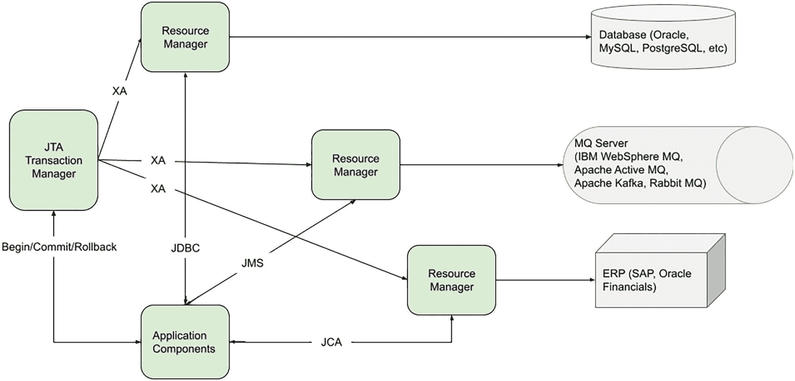
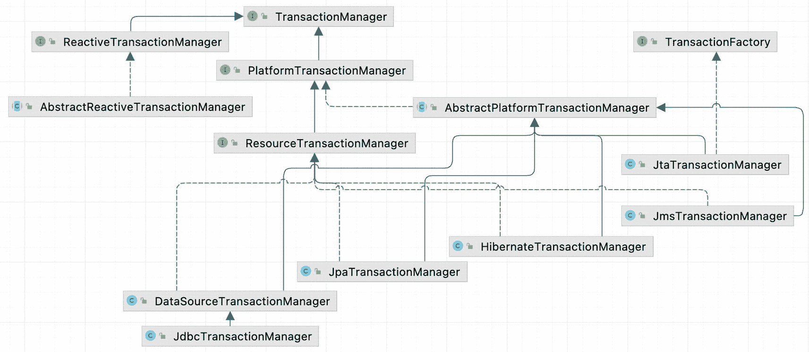
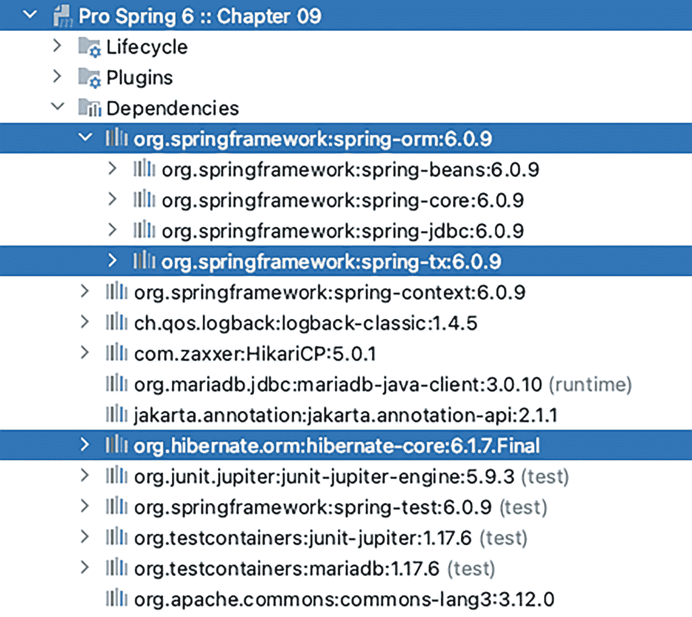
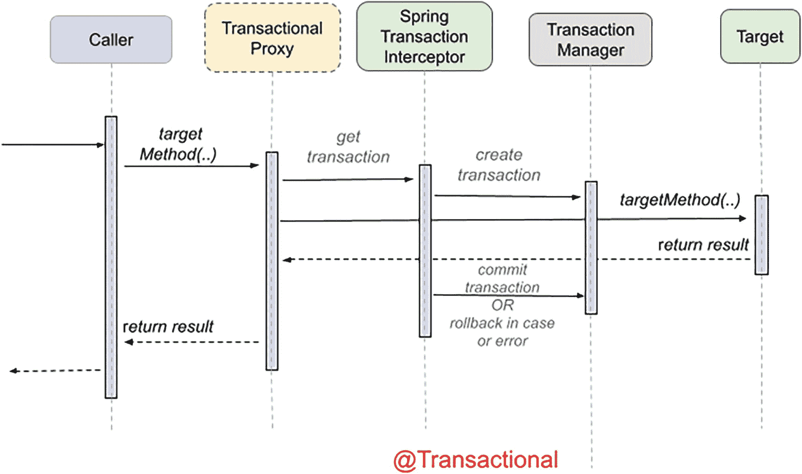
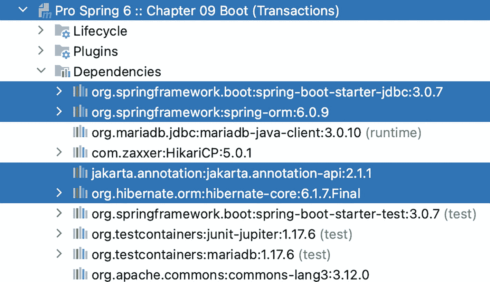
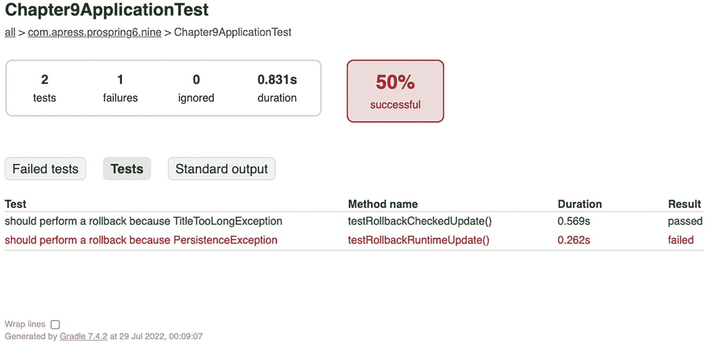

# 9. Spring 事务管理

管理事务是构建可靠企业应用最关键的部分之一。最常见的事务类型是数据库操作。在典型的数据库更新操作中，数据库事务开始，数据被更新，然后根据数据库操作的结果，事务被提交或回滚。然而，在许多情况下，根据应用需求以及应用需要交互的后端资源（例如关系型数据库、面向消息的中间件、ERP 系统等），事务管理可能会复杂得多。

在 Java 应用开发的早期（JDBC 创建之后，但在 JEE 标准或像 Spring 这样的应用框架可用之前），开发者在应用代码中以编程方式控制和*管理*事务。当 JEE，更具体地说是 EJB 标准可用时，开发者能够使用容器管理事务（CMT）以声明式方式管理事务。但 EJB 部署描述符中复杂的事务声明难以维护，并为事务处理引入了不必要的复杂性。一些开发者更喜欢对事务有更多控制，并选择 Bean 管理事务（BMT）以编程方式管理事务。然而，使用 Java 事务 API（JTA）进行编程的复杂性也阻碍了开发者的生产力。

如**第** **5** **章**所述，事务管理是一个横切关注点，不应编码在业务逻辑中。实现事务管理最合适的方式是允许开发者以声明式方式定义事务需求，并让 Spring、JEE 或 AOP 等框架代表我们编织事务处理逻辑。在本章中，我们将讨论 Spring 如何帮助简化事务处理逻辑的实现。Spring 同时支持声明式和编程式事务管理。

Spring 为声明式事务提供了出色的支持，这意味着你无需用事务管理代码来混乱你的业务逻辑。你所需要做的只是声明那些必须参与事务的方法（在类或层内），以及事务配置的细节，Spring 将负责处理事务管理。更具体地说，本章涵盖以下内容：

*   *Spring 事务抽象层*：我们将讨论 Spring 事务抽象类的基本组件，并解释如何使用这些类来控制事务的属性。

*   *声明式* *事务管理*：我们将向你展示如何使用 Spring 和纯 Java 对象来实现声明式事务管理。我们将提供使用 XML 配置文件以及 Java 注解进行声明式事务管理的示例。

*   *编程式* *事务管理*：尽管编程式事务管理并不常用，但我们仍会解释如何使用 Spring 提供的 `TransactionTemplate` 类，它让你能够完全控制事务管理代码。

## 探索 Spring 事务抽象层

在开发应用时，无论你是否选择使用 Spring，在使用事务时都必须做出一个基本选择：是使用全局事务还是本地事务。*本地事务*特定于单个事务性资源（例如一个 JDBC 连接），而*全局事务*由容器管理，并且可以跨越多个事务性资源。


### 事务类型

本地事务易于管理，如果你的应用程序中所有操作仅需与一个事务性资源（例如 JDBC 事务）交互，那么使用本地事务就足够了。然而，如果你没有使用像 Spring 这样的应用框架，就需要编写大量的事务管理代码；并且未来如果事务范围需要扩展到多个事务性资源，你就必须放弃本地事务管理代码，重写为使用全局事务。

在 Java 世界中，全局事务通过 JTA（Java/Jakarta 事务 API）实现。在此场景下，一个兼容 JTA 的事务管理器通过各自的资源管理器连接到多个事务性资源，这些资源管理器能够通过 XA（Exchange Access）协议（一个定义分布式事务的开放标准）与事务管理器通信。采用两阶段提交（2PC）机制来确保所有后端数据源要么全部更新，要么全部回滚。如果任一后端资源失败，整个事务就会回滚，因此所有资源的更新也会一并回滚。全局事务是 `UserTransaction` 的一个实现，通常需要从 JNDI 获取。由于 JNDI 特定于服务器环境，这限制了应用程序代码的潜在复用性。过去有一些不需要服务器的库，例如本书上一版中使用的 Atomikos^(⁷⁶)，但本版未使用，因为其当前版本尚未适配 Jakarta 事务 API，因此无法与最新的 Spring 版本一起使用。

图 9-1 展示了使用 JTA 的全局事务的高级视图。如图所示，有四个主要参与方参与全局事务（通常也称为分布式事务）。第一方是后端资源，例如 RDBMS、消息中间件、企业资源规划（ERP）系统等。



一个使用 JTA 的全局事务框图，包含 JTA 事务管理器、资源管理器、应用程序组件、数据库、MQ 服务器和 ERP。

图 9-1
使用 JTA 的全局事务概览

第二方是资源管理器，通常由后端资源供应商提供，负责与后端资源交互。例如，当连接到 MySQL 数据库时，我们需要与 MySQL 的 Java 连接器提供的 `MysqlXADataSource` 类交互。MariaDB 也存在等效的实现。其他后端资源（例如 MQ、ERP 等）也提供各自的资源管理器。

第三方是 JTA 事务管理器，负责管理与参与事务的所有资源管理器之间的状态管理、协调和同步。这里使用了前面提到的 XA 协议，这是一个广泛用于分布式事务处理的开放标准。JTA 事务管理器也支持 2PC，以便所有更改能一起提交；如果任何资源更新失败，整个事务将回滚，导致所有资源都不会被更新。整个机制由 Java 事务服务（JTS）规范定义。

最后一个组件是应用程序。应用程序本身，或其运行的底层容器或 Spring 框架，负责管理事务（开始、提交、回滚事务等）。同时，应用程序通过 JEE 定义的各种标准与底层后端资源交互。如图 9-1 所示，应用程序通过 JDBC 连接到 RDBMS，通过 JMS 连接到 MQ，并通过 Java EE 连接器架构（JCA）连接到 ERP 系统。所有完全兼容 JEE 的应用服务器（例如 JBoss、WebSphere、WebLogic 和 GlassFish）都支持 JTA，在这些服务器中，可以通过 JNDI 查找获取事务。对于独立应用程序或 Web 容器（例如 Tomcat 和 Jetty），存在开源和商业解决方案，在这些环境中提供对 JTA/XA 的支持。Spring 社区曾经青睐的是 Atomikos，甚至还有一个 Spring Boot 启动器库。不幸的是，在撰写本章时，Atomikos 的最新版本（5.0.9）并非基于 Jakarta JTA，这意味着无法使用最新的 Spring 版本构建 Spring JTA 应用程序。另一个替代方案 Bitronix^(⁷⁷) 已在 GitHub 上归档，并且过去 6 年没有进行任何更新。Java 开放事务管理器（JOTM）^(⁷⁸) 的最后一次更新是在 2009 年。

随着人们对微服务、使用 Apache Kafka、RabbitMQ 和 Azure Event Hub（以及更多）构建的事件驱动系统的兴趣日益浓厚，以及像 Amazon 的 DynamoDB 和 MariaDB SkySQL 这样的 DBaaS（数据库即服务）的兴起，JTA 似乎正在慢慢过时，所有这些都使得事务变得不是特别必要。当然，如果你需要使用全局事务，始终可以选择使用应用 EE 服务器。

在撰写本文时，Spring 6 对使用独立实现的 JTA 支持尚不明确。Spring 的组件基于 Jakarta API，这意味着独立实现也必须基于它。例如，独立实现必须为 `jakarta.transaction.UserTransaction` 提供实现才能与 Spring 6 JTA 兼容，但目前还没有任何实现做到这一点。使用兼容 Jakarta 10 的服务器也不是一个选项。Jakarta EE 10^(⁷⁹) 是自“jakarta”命名空间更新以来 Jakarta EE 的第一个主要版本，许多应用服务器尚不兼容它。

到今年年底，可能会有兼容的独立实现可用，或者出现兼容 Jakarta 10 的服务器，如 Apache TomEE、Open Liberty、Eclipse Glassfish 等^(⁸⁰)。如果你对使用 Spring 5 和 Atomikos 的全局事务感兴趣，请随时查阅本书的上一版及其关联仓库中的示例项目^(⁸¹)。


## `PlatformTransactionManager` 的实现

在 Spring 中，`PlatformTransactionManager` 接口使用 `TransactionDefinition` 和 `TransactionStatus` 接口来创建和管理事务。这些接口的具体实现必须详细了解事务管理器。

Spring 为 `PlatformTransactionManager` 接口提供了丰富的实现集。图 9-2 展示了其中的一部分。



平台事务管理器示意图，包含一系列实现，例如 JDBC 事务管理器、数据源、JPA、Hibernate、JMS、JTA、资源、平台、事务管理器和事务工厂。

图 9-2

`PlatformTransactionManager` 的实现

`DataSourceTransactionManager` 类来自 `org.springframework.jdbc.datasource` 包，用于通用 JDBC 连接。在 ORM 方面，有几种实现，包括 JPA 的 `JpaTransactionManager` 类和 Hibernate 5 的 `HibernateTransactionManager` 类。未来可能会推出适用于 Hibernate 6 的新版本。目前唯一可用的 `HibernateTransactionManager` 类来自 `org.springframework.orm.hibernate5` 包。由于对 Hibernate 5 的支持可能不会放弃，预计 Spring ORM 6 中会出现名为 `org.springframework.orm.hibernate6` 的包。对于 JMS，这些实现通过 `JmsTransactionManager` 类支持 JMS 2.0。对于 JTA，通用实现类是 `JtaTransactionManager`。对于响应式服务器，Spring 提供了 `AbstractReactiveTransactionManager`，这是一个抽象基类，实现了 Spring 的标准响应式事务工作流，作为具体平台事务管理器（例如用于单个 R2DBC `ConnectionFactory` 的 `R2dbcTransactionManager` 实现）的基础。

Spring 还提供了几个特定于特定应用服务器的 JTA 事务管理器类（未在图 9-2 中描绘）。这些类为 WebSphere（`WebSphereUowTransactionManager` 类）和 BEA WebLogic 9.0 及更高版本（`WebLogicJtaTransactionManager` 类）提供原生支持。

一个符号描绘了圆形背景上的小写字母 i。 JDO 支持已在 Spring 5 中移除，因此 `JdoTransactionManager` 在图 9-2 的类图中缺失。从 Spring 5 开始，仅支持 Hibernate 5；对 Hibernate 3 和 Hibernate 4 的实现已被移除。对 JMS 1.1 的支持已在 Spring 5 中移除。支持 JEE、JCA 和通用客户端接口 (CCI) 的 `CciLocalTransactionManager` 类目前已弃用。

## 分析事务属性

在本节中，我们将讨论 Spring 支持的事务属性，重点关注与作为后端资源的 RDBMS 的交互。

事务具有众所周知的 ACID 属性（原子性、一致性、隔离性和持久性），维护这些事务方面是事务性资源的职责。你无法控制事务的原子性、一致性和持久性。但是，你可以控制事务传播和超时，以及配置事务是否为只读并指定隔离级别。

Spring 将所有设置封装在 `TransactionDefinition` 接口中。该接口用于 Spring 事务支持的核心接口，即 `PlatformTransactionManager` 接口，其实现执行特定平台（例如 JDBC 或 JTA）上的事务管理。核心方法 `PlatformTransactionManager.getTransaction()` 接受一个 `TransactionDefinition` 接口作为参数，并返回一个 `TransactionStatus` 接口。`TransactionStatus` 接口用于控制事务执行，更具体地说，用于设置事务结果以及检查事务是否已完成或是否为新事务。

### `TransactionDefinition` 接口

如前所述，`TransactionDefinition` 接口控制事务的属性。让我们更详细地看一下 `TransactionDefinition` 接口^(⁸²)，如清单 9-1 所示，并描述其方法。

```
package org.springframework.transaction;
import org.springframework.lang.Nullable;
public interface TransactionDefinition {
// 变量声明和注释已省略
default int getPropagationBehavior() {
return PROPAGATION_REQUIRED; // 0
}
default int getIsolationLevel() {
return ISOLATION_DEFAULT; // -1
}
default int getTimeout() {
return TIMEOUT_DEFAULT; // -1
}
default boolean isReadOnly() {
return false;
}
@Nullable
default String getName() {
return null;
}
// 返回一个带有默认值的不可修改的 {@code TransactionDefinition}。
static TransactionDefinition withDefaults() {
return StaticTransactionDefinition.INSTANCE;
}
}
清单 9-1
核心 TransactionDefinition 源代码
```

该接口中简单明了的方法是 `getTimeout()`，它返回事务必须完成的时间（以秒为单位），以及 `isReadOnly()`，它指示事务是否为 `只读`。事务管理器实现可以使用此值来优化执行并检查以确保事务仅执行读取操作。`getName()` 方法返回事务的名称。

另外两个方法 `getPropagationBehavior()` 和 `getIsolationLevel()` 需要更详细地讨论。我们从 `getIsolationLevel()` 开始，它控制其他事务可以看到哪些数据更改。表 9-1 列出了你可以使用的事务隔离级别，并解释了当前事务中所做的哪些更改其他事务可以访问。隔离级别表示为在 `TransactionDefinition` 接口中定义的静态值。

表 9-1

事务隔离级别

| 隔离级别 | 描述 |
| --- | --- |
| `ISOLATION_DEFAULT` | 底层数据存储的默认隔离级别。 |
| `ISOLATION_READ_UNCOMMITTED` | 最低隔离级别；它几乎算不上一个事务，因为它允许此事务查看其他未提交事务所修改的数据。 |
| `ISOLATION_READ_COMMITTED` | 大多数数据库中的默认级别；它确保其他事务无法读取尚未被其他事务提交的数据。但是，一个事务读取的数据可以被其他事务更新。 |
| `ISOLATION_REPEATABLE_READ` | 比 `ISOLATION_READ_COMMITTED` 更严格；它确保一旦你选择了数据，你至少可以再次选择相同的数据集。但是，如果其他事务插入了新数据，你仍然可以选择新插入的数据。 |
| `ISOLATION_SERIALIZABLE` | 最昂贵且最可靠的隔离级别；所有事务都被视为一个接一个地执行。 |

选择合适的隔离级别对于数据的一致性很重要，但这些选择会对性能产生很大影响。最高隔离级别 `ISOLATION_SERIALIZABLE` 的维护成本尤其高。

`getPropagationBehavior()` 方法指定了事务调用的行为，具体取决于是否存在活动事务。表 9-2 描述了此方法的值。传播类型表示为在 `TransactionDefinition` 接口中定义的静态值。

表 9-2

事务传播模式


| 传播模式 | 值 | 描述 |
| --- | --- | --- |
| `PROPAGATION_REQUIRED` | 0 | 支持当前事务，如果不存在则新建一个。Spring 中的默认传播模式。 |
| `PROPAGATION_SUPPORTS` | 1 | 支持当前事务，如果不存在则以非事务方式执行。 |
| `PROPAGATION_MANDATORY` | 2 | 支持当前事务，如果不存在则抛出异常。 |
| `PROPAGATION_REQUIRES_NEW` | 3 | 创建一个新事务，如果存在当前事务则将其挂起。 |
| `PROPAGATION_NOT_SUPPORTED` | 4 | 不支持以活动事务方式执行。始终以非事务方式执行，并挂起任何现有事务。 |
| `PROPAGATION_NEVER` | 5 | 即使存在活动事务也始终以非事务方式执行。如果存在活动事务则抛出异常。 |
| `PROPAGATION_NESTED` | 6 | 如果存在活动事务，则在嵌套事务中运行。如果没有活动事务，则行为如同设置了 `PROPAGATION_REQUIRED`。 |

### `TransactionStatus` 接口

`TransactionStatus` 接口^(⁸³)允许事务管理器控制事务的执行。代码可以检查事务是新建事务还是只读事务，并且可以启动回滚。`TransactionStatus` 接口描述的行为被拆分到两个接口中：`TransactionExecution`（声明基本事务操作）和 `SavepointManager`（声明与保存点相关的方法）。所有这些都显示在清单 9-2 中。

```
// TransactionStatus.java
package org.springframework.transaction;
import java.io.Flushable;
public interface TransactionStatus extends TransactionExecution, SavepointManager, Flushable {
boolean hasSavepoint();
@Override
void flush();
}
// TransactionExecution.java
package org.springframework.transaction;
public interface TransactionExecution {
boolean isNewTransaction();
void setRollbackOnly();
boolean isRollbackOnly();
boolean isCompleted();
}
// SavepointManager.java
package org.springframework.transaction;
public interface SavepointManager {
Object createSavepoint() throws TransactionException;
void rollbackToSavepoint(Object savepoint) throws TransactionException;
void releaseSavepoint(Object savepoint) throws TransactionException;
}
清单 9-2
核心 TransactionStatus 源代码
```

`TransactionExecution` 接口中的方法不言自明；最值得注意的是 `setRollbackOnly()`，它会导致回滚并结束活动事务。`TransactionStatus` 中的 `hasSavePoint()` 方法返回事务内部是否携带保存点（即，该事务是基于保存点作为嵌套事务创建的）。同样来自 `TransactionStatus` 的 `flush()` 方法，如果适用（例如，与 Hibernate 一起使用时），会将底层会话刷新到数据存储。`TransactionExecution` 接口中的 `isCompleted()` 方法返回事务是否已结束（即，已提交或已回滚）。

## 示例代码的样本数据模型和基础设施

本节使用**第** **7** **章**中介绍的相同数据模型。有两个主表，即 `SINGER` 和 `ALBUM`，我们在关于数据访问的章节中一直使用它们。请随意按照 `chapter09/README.adoc` 中的说明设置容器，或者完全忽略它，直接运行设置为使用 Testcontainers 启动的 MariaDB 容器的测试。使用带有 Hibernate 的 JPA 作为实现数据访问逻辑的持久层。

主要项目依赖项是 Spring ORM 和 Hibernate。Spring ORM 库引入了 `spring-tx` 传递依赖项，其中包含所有提供事务支持的 Spring 组件。

图 9-3 显示了 `chapter09` 项目的依赖项列表。



一张截图展示了第 09 章的依赖项列表。它显示了 spring-orm 和 spring-tx 依赖项下的内容。

图 9-3

Gradle 视图中显示的 `chapter09` 项目依赖项

有两个主要的 JPA 实体类 `Singer` 和 `Album`，它们映射到将在本章大多数示例中使用的那些表。如果您阅读过之前的数据访问章节，应该对这两个类很熟悉，但为简单起见，它们的核心部分显示在清单 9-3 中。

```
// Singer.java
package com.apress.prospring6.nine.entities;
import jakarta.persistence.*;
// 其他导入语句已省略
@Entity
@Table(name = "SINGER")
@NamedQueries({
@NamedQuery(name=Singer.FIND_ALL, query="select s from Singer s"),
@NamedQuery(name=Singer.COUNT_ALL, query="select count(s) from Singer s")
})
public class Singer extends AbstractEntity {
@Serial
private static final long serialVersionUID = 2L;
public static final String FIND_ALL = "Singer.findAll";
public static final String COUNT_ALL = "Singer.countAll";
@Column(name = "FIRST_NAME")
private String firstName;
@Column(name = "LAST_NAME")
private String lastName;
@Column(name = "BIRTH_DATE")
private LocalDate birthDate;
@OneToMany(mappedBy = "singer")
private Set<Album> albums = new HashSet<>();
@ManyToMany
@JoinTable(name = "SINGER_INSTRUMENT",
joinColumns = @JoinColumn(name = "SINGER_ID"),
inverseJoinColumns = @JoinColumn(name = "INSTRUMENT_ID"))
private Set<Instrument> instruments = new HashSet<>();
// setter、getter 等已省略
}
// ------------------------------------------------------
// Album.java
package com.apress.prospring6.nine.entities;
import jakarta.persistence.*;
// 其他导入语句已省略
@Entity
@Table(name = "ALBUM")
@NamedQueries({
@NamedQuery(name=Album.FIND_ALL, query="select a from Album a where a.singer= :singer")
})
public class Album extends AbstractEntity {
@Serial
private static final long serialVersionUID = 3L;
public static final String FIND_ALL = "Album.findAll";
@Column
private String title;
@Column(name = "RELEASE_DATE")
private LocalDate releaseDate;
@ManyToOne
@JoinColumn(name = "SINGER_ID")
private Singer singer;
// setter、getter 等已省略
}
清单 9-3
Singer 和 Album JPA 实体类
```

我们使用带有 Hibernate 的 JPA 作为实现数据访问逻辑的持久层，这意味着配置也将与**第** **7** **章**中的配置相同。清单 9-4 仅显示了与事务管理相关的配置部分。


```
package com.apress.prospring6.nine.config;
import org.springframework.orm.jpa.JpaTransactionManager;
import org.springframework.orm.jpa.JpaVendorAdapter;
import org.springframework.orm.jpa.LocalContainerEntityManagerFactoryBean;
import org.springframework.orm.jpa.vendor.HibernateJpaVendorAdapter;
import org.springframework.transaction.PlatformTransactionManager;
import org.springframework.transaction.annotation.EnableTransactionManagement;
// 其他导入语句已省略
@Import(BasicDataSourceCfg.class)
@Configuration
@EnableTransactionManagement
@ComponentScan(basePackages = {"com.apress.prospring6.nine.services"})
public class TransactionCfg {
private static Logger LOGGER = LoggerFactory.getLogger(TransactionCfg.class);
@Autowired
DataSource dataSource;
@Bean
public PlatformTransactionManager transactionManager() {
JpaTransactionManager transactionManager=new JpaTransactionManager();
transactionManager.setEntityManagerFactory(entityManagerFactory().getObject());
return transactionManager;
}
@Bean
public JpaVendorAdapter jpaVendorAdapter() {
return new HibernateJpaVendorAdapter();
}
@Bean
public LocalContainerEntityManagerFactoryBean entityManagerFactory() {
var factory = new LocalContainerEntityManagerFactoryBean();
factory.setPersistenceProviderClass(HibernatePersistenceProvider.class);
factory.setPackagesToScan("com.apress.prospring6.nine.entities");
factory.setDataSource(dataSource);
factory.setJpaProperties(jpaProperties());
factory.setJpaVendorAdapter(jpaVendorAdapter());
return factory;
}
@Bean
public Properties jpaProperties() {
Properties jpaProps = new Properties();
jpaProps.put(Environment.HBM2DDL_AUTO, "none");
jpaProps.put(Environment.FORMAT_SQL, false);
jpaProps.put(Environment.USE_SQL_COMMENTS, false);
jpaProps.put(Environment.SHOW_SQL, false);
return jpaProps;
}
}
清单 9-4
事务管理配置类
```

目前，使用注解是在 Spring 中定义事务需求最常见的方式。其主要优势在于，事务需求以及详细的事务属性（超时时间、隔离级别、传播行为等）都定义在代码本身中，这使得应用程序更易于跟踪和维护。`transactionManager` Bean 的配置（它是确保这些需求得到满足的核心组件）是通过 Java 配置完成的。由于我们使用的是 JPA，因此我们的 `transactionManager` 是一个 `JpaTransactionManager` 实例，它在使用单个 JPA `EntityManagerFactory` 进行事务性数据访问的应用程序中实现 Spring 的标准事务工作流。

`@EnableTransactionManagement` 注解是完成此配置的关键，因为它负责启用注解驱动的事务能力。此注解用于 Spring 配置类，以配置传统的命令式事务管理或响应式事务管理。`@EnableTransactionManagement` 负责注册所有支持事务管理的 Spring 基础设施 Bean，例如 `TransactionInterceptor` 以及基于代理或 AspectJ 的通知，当调用带有 `@Transactional` 注解的方法时，这些通知会将拦截器织入调用栈。

`EntityManagerFactory` Bean 的配置方式没有变化。

有了这个配置，任何与数据层交互的方法都可以使用 `@Transactional` 进行注解，Spring IoC 容器将在方法执行前开启一个事务，并在方法执行后立即关闭它。

### 使用声明式事务

使用注解配置事务行为被称为*声明式*，因为所需的行为是通过在目标方法上使用注解来声明的。无需编写任何代码来创建、启动和结束事务。Spring 的 `transactionManager` Bean 会拾取 `@Transactional` 注解，并将该方法包装在所需的事务行为中。这是通过**第** **5** 章中介绍的代理机制实现的。带有 `@Transactional` 注解的 Bean 声明，或者包含带有 `@Transactional` 注解的方法的 Bean 声明，会在运行时被转换为一个包装在代理中的 Bean，该代理会为每个目标方法注入事务行为。

图 9-4 展示了每次调用事务性 Bean 的方法时底层发生的情况。



一个包含五层的示意图：调用者、事务代理、Spring 事务拦截器、事务管理器和目标对象。

图 9-4

展示事务行为如何在 Spring 中注入的示意图

在多层实现中，服务类调用仓库类与数据库交换数据，服务方法被配置为在事务中执行，从而为涉及多个数据库操作的方法提供原子性行为。因此，在本节的示例中，歌手的专辑既不会被急切加载，也不会通过命名查询加载，而是在提取歌手的同一个方法中通过仓库方法加载，如清单 9-5 所示的 `AllServiceImpl` 类。

```
package com.apress.prospring6.nine.services;
import org.springframework.stereotype.Service;
import org.springframework.transaction.annotation.Transactional;
// 其他导入语句已省略
@Service
@Transactional
public class AllServiceImpl implements AllService{
private final SingerRepo singerRepo;
private final AlbumRepo albumRepo;
public AllServiceImpl(SingerRepo singerRepo, AlbumRepo albumRepo) {
this.singerRepo = singerRepo;
this.albumRepo = albumRepo;
}
@Transactional(readOnly = true)
@Override
public Stream findAllWithAlbums() {
var singers = singerRepo.findAll();
return singers.peek(s -> s.setAlbums(albumRepo.findBySinger(s).collect(Collectors.toSet())));
}
}
清单 9-5
AllServiceImpl 方法，展示通过在同一事务中执行的仓库方法加载歌手和专辑
```

当使用基于注解的事务管理时，我们需要处理的唯一注解就是 Spring 的 `@Transactional`。`@Transactional` 注解可以应用于类级别，这意味着默认情况下，Spring 将确保在类中每个方法执行之前都存在一个事务。从 Spring 5 开始，`@Transactional` 也支持在接口和接口中的默认方法上使用。

一个警告符号，圆形背景上有一个感叹号。 建议仅在非私有方法上使用 Spring 的 `@Transactional` 注解，因为事务行为是通过 AOP 代理注入的。

一个灯泡符号。 `SingerRepo` 和 `AlbumRepo` 的实现对于本章并不重要，但如果你好奇，可以随时查看仓库源码。它们的方法使用 `EntityManager` 实现，如**第** **8** 章所示。

`@Transactional` 注解支持多个属性，你可以提供这些属性来覆盖默认行为。表 9-3 显示了可用的属性及其默认值和可能的值。

表 9-3

`@Transactional` 注解属性


| 属性名称 | 默认值 | 可能的值 |
| --- | --- | --- |
| `propagation` | `Propagation.REQUIRED` | `Propagation.REQUIRED Propagation.SUPPORTS Propagation.MANDATORY Propagation.REQUIRES_NEW Propagation.NOT_SUPPORTED Propagation.NEVER Propagation.NESTED` |
| `isolation` | `Isolation.DEFAULT`（底层资源的默认隔离级别） | `Isolation.DEFAULT Isolation.READ_UNCOMMITTED Isolation.READ_COMMITTED Isolation.REPEATABLE_READ Isolation.SERIALIZABLE` |
| `timeout` | `TransactionDefinition.TIMEOUT_DEFAULT`（底层资源的默认事务超时时间，单位为秒） | 大于零的整数值；表示超时的秒数 |
| `readOnly` | `false` | `{true, false}` |
| `rollbackFor` | 事务将回滚的异常类 | 不适用 |
| `rollbackForClassName` | 事务将回滚的异常类名称 | 不适用 |
| `noRollbackFor` | 事务不会回滚的异常类 | 不适用 |
| `noRollbackForClassName` | 事务不会回滚的异常类名称 | 不适用 |
| `value` | `""` | 指定事务的限定符值；可用于确定目标事务管理器，与特定 `transactionManager` bean 的限定符值（或 bean 名称）匹配 |

因此，基于表 9-3，不带任何属性的 `@Transactional` 注解意味着事务传播模式为 required，隔离级别为底层数据存储的默认隔离级别，超时时间为底层事务系统的默认超时时间，并且模式为读写模式。

`@Transactional` 注解也可以应用于方法级别，这允许覆盖类级别的事务配置。例如，当事务实际上是只读时，使用 `@Transactional(readOnly = true)`，这允许在运行时进行相应的优化。所有其他属性保持不变。

一个警告符号，在圆形背景上显示感叹号。 `readOnly` 标志配置只是对底层持久化系统的一个提示，而 Hibernate 非常擅长接受提示，因此不要在设计用于更新现有条目的方法上使用 `readOnly = true`，否则你将不得不显式地刷新更改。

现在我们有了一个服务方法，是时候对其进行测试了。清单 9-6 展示了 `AllServiceTest` 类，该类使用由 Testcontainers 管理的 MariaDB 容器进行数据库操作。

```
package com.apress.prospring6.nine;
// 导入语句已省略
@Testcontainers
@SqlMergeMode(SqlMergeMode.MergeMode.MERGE)
@Sql({ "classpath:testcontainers/drop-schema.sql", "classpath:testcontainers/create-schema.sql" })
@SpringJUnitConfig(classes = {AllServiceTest.TestContainersConfig.class})
public class AllServiceTest {
private static final Logger LOGGER = LoggerFactory.getLogger(AllServiceTest.class);
@Container
static MariaDBContainer mariaDB = new MariaDBContainer("mariadb:10.7.4-focal");
@DynamicPropertySource
static void setUp(DynamicPropertyRegistry registry) {
registry.add("jdbc.driverClassName", mariaDB::getDriverClassName);
registry.add("jdbc.url", mariaDB::getJdbcUrl);
registry.add("jdbc.username", mariaDB::getUsername);
registry.add("jdbc.password", mariaDB::getPassword);
}
@Autowired
AllService service;
@Test
@DisplayName("应返回所有歌手和专辑")
void testFindAll(){
var singers = service.findAllWithAlbums().peek(s -> {
LOGGER.info(s.toString());
if (s.getAlbums() != null) {
s.getAlbums().forEach(a -> LOGGER.info("\t 专辑:" + a.toString()));
}
}).toList();
assertEquals(3, singers.size());
}
@Configuration
@Import(TransactionCfg.class)
public static class TestContainersConfig {
@Autowired
Properties jpaProperties;
@PostConstruct
public void initialize() {
jpaProperties.put(Environment.FORMAT_SQL, true);
jpaProperties.put(Environment.USE_SQL_COMMENTS, true);
jpaProperties.put(Environment.SHOW_SQL, true);
}
}
}
清单 9-6
AllServiceTest 测试类
```

测试设计在事务中运行的方法与前面章节中所做的没有区别。本章的重点将不是生成的 SQL 查询，而是用于执行这些查询的事务。请查看清单 9-7 中的日志记录语句。


```
DEBUG: AbstractPlatformTransactionManager - Creating new transaction with name
[com.apress.prospring6.nine.services.AllServiceImpl.findAllWithAlbums]:
PROPAGATION_REQUIRED,ISOLATION_DEFAULT,readOnly
DEBUG: JpaTransactionManager - Opened new EntityManager [SessionImpl(1958757239)] for JPA transaction
DEBUG: DataSourceUtils - Setting JDBC Connection [HikariProxyConnection@282368256 wrapping org.mariadb.jdbc.Connection@7327a447] read-only
DEBUG: TransactionImpl - On TransactionImpl creation, JpaCompliance#isJpaTransactionComplianceEnabled == false
DEBUG: TransactionImpl - begin
DEBUG: JpaTransactionManager - Exposing JPA transaction as JDBC [org.springframework.orm.jpa.vendor.HibernateJpaDialect$HibernateConnectionHandle@e645600]
TRACE: TransactionAspectSupport - Getting transaction for
[com.apress.prospring6.nine.services.AllServiceImpl.findAllWithAlbums]
DEBUG: SqlStatementLogger - select singer0_.... from SINGER singer0_
...
DEBUG: TwoPhaseLoad - Done materializing entity [com.apress.prospring6.nine.entities.Singer#3]
TRACE: TransactionAspectSupport - Completing transaction for
[com.apress.prospring6.nine.services.AllServiceImpl.findAllWithAlbums]
DEBUG: AbstractPlatformTransactionManager - Initiating transaction commit
DEBUG: JpaTransactionManager - Committing JPA transaction on EntityManager [SessionImpl(1958757239)]
DEBUG: TransactionImpl - committing
DEBUG: DataSourceUtils - Resetting read-only flag of JDBC Connection [HikariProxyConnection@282368256 wrapping org.mariadb.jdbc.Connection@7327a447]
DEBUG: JpaTransactionManager - Closing JPA EntityManager [SessionImpl(1958757239)] after transaction
DEBUG: SharedEntityManagerCreator$SharedEntityManagerInvocationHandler - Creating new EntityManager for shared EntityManager invocation
DEBUG: SqlStatementLogger - select album0_... from ALBUM album0_ where album0_.SINGER_ID=?
...
INFO : AbstractEntityManagerFactoryBean - Closing JPA EntityManagerFactory for persistence unit 'default'
...
INFO : AllServiceTest - Singer - Id: 1, First name: John, Last name: Mayer, Birthday: 1977-10-16
INFO : AllServiceTest -     Album:Album - Id: 1, Singer id: 1, Title: The Search For Everything, Release Date: 2017-01-20
INFO : AllServiceTest -     Album:Album - Id: 2, Singer id: 1, Title: Battle Studies, Release Date: 2009-11-17
INFO : AllServiceTest - Singer - Id: 2, First name: Ben, Last name: Barnes, Birthday: 1981-08-20
INFO : AllServiceTest -     Album:Album - Id: 3, Singer id: 2, Title: 11:11, Release Date: 2021-09-1
INFO : AllServiceTest - Singer - Id: 3, First name: John, Last name: Butler, Birthday: 1975-04-01
清单 9-7
AllServiceTest.testFindAll() 执行日志片段，展示事务管理
```

此日志片段包含了 `org.springframework.orm.jpa` 和 `org.springframework.transaction` 包中类的相关日志语句。`JpaTransactionManager` 负责处理事务的创建和提交操作。请注意，在执行 `findAllWithAlbums()` 方法之前，Spring 的 `AbstractPlatformTransactionManager`（`JpaTransactionManager` 的父类）是如何创建一个新事务的。其名称等于完全限定的类名与方法名的拼接。事务名称旁边是事务属性：`PROPAGATION_REQUIRED,ISOLATION_DEFAULT,readOnly`。该事务由 Hibernate 内部包 `org.hibernate.engine.transaction.internal` 中的 `TransactionImpl` 实例表示。该类（间接）实现了 `jakarta.persistence.EntityTransaction` 接口，该接口用于控制资源本地实体管理器上的事务。因此，事务由 `EntityManager` 获取，然后提交查询，在完成且无任何错误后，事务被提交。

从日志中，你可能会认为事务是在从数据库检索专辑之前提交的，但这只是日志记录的时间点问题。实际上，所有查询都在同一个事务内执行。

我们接下来要看的方法是更新操作。为了检查更新操作的结果，`findById()` 方法也很有用。清单 9-8 展示了这两个方法的实现。

```
package com.apress.prospring6.nine.services;
// 导入语句已省略
@Service
@Transactional
public class AllServiceImpl implements AllService{
// 构造函数和字段已省略
@Transactional(readOnly = true)
@Override
public Optional findByIdWithAlbums(Long id) {
var singerOpt = singerRepo.findById(id);
singerOpt.ifPresent(s -> s.setAlbums(albumRepo.findBySinger(s).collect(Collectors.toSet())));
return singerOpt;
}
@Transactional(propagation = Propagation.REQUIRES_NEW)
@Override
public void update(Singer singer) {
singerRepo.save(singer);
}
}
清单 9-8
同一事务中的 AllServiceImpl
```

`findByIdWithAlbums(..)` 方法也使用了 `@Transactional(readOnly=true)` 注解。通常，`readOnly=true` 属性应应用于所有查找方法。主要原因是大多数持久化提供程序会对只读事务执行一定程度的优化。例如，Hibernate 在启用只读模式时，不会维护从数据库检索到的受管实例的快照。

在 `AllServiceImpl.update(..)` 方法中，我们简单地调用了 `SingerRepoIml.save(..)` 方法，并使用 `@Transactional(propagation = Propagation.REQUIRES_NEW)` 注解了该方法。这意味着类级别的注解被覆盖，将创建一个新事务来执行更新操作。测试 `AllServiceImpl.update(..)` 操作的方法首先调用 `findByIdWithAlbums(..)` 方法来检索要更新的记录，如清单 9-9 所示。

```
package com.apress.prospring6.nine;
// 导入语句已省略
@Testcontainers
@SqlMergeMode(SqlMergeMode.MergeMode.MERGE)
@Sql({ "classpath:testcontainers/drop-schema.sql", "classpath:testcontainers/create-schema.sql" })
@SpringJUnitConfig(classes = {AllServiceTest.TestContainersConfig.class})
public class AllServiceTest {
@Test
@SqlGroup({
@Sql(scripts = {"classpath:testcontainers/add-nina.sql"},
executionPhase = Sql.ExecutionPhase.BEFORE_TEST_METHOD)
})
@DisplayName("应该更新一位歌手")
void testUpdate() {
var singer = service.findByIdWithAlbums(5L).orElse(null);
// 确保该歌手存在
assertNotNull(singer);
// 检索专辑
var album = singer.getAlbums().stream().filter(
a -> a.getTitle().equals("I Put a Spell on You")).findFirst().orElse(null);
assertNotNull(album);
singer.setFirstName("Eunice Kathleen");
singer.setLastName("Waymon");
singer.removeAlbum(album);
int version =  singer.getVersion();
service.update(singer);
var nina =  service.findByIdWithAlbums(5L).orElse(null);
assertAll( "nina 已被更新" ,
() -> assertNotNull(nina),
() -> assertEquals(version +1, nina.getVersion()),
() -> assertEquals(2, nina.getAlbums().size())
);
}
// 测试设置和其他测试方法已省略
}
清单 9-9
测试 AllServiceImpl.update(..) 方法的 AllServiceTest 方法
```

`Singer` 实例有三个地方被更新：其 `firstName`、`lastName` 和专辑集合。此方法在其自身的事务中执行，与 `AllServiceImpl.findByIdWithAlbums(..)` 的事务分开，正如测试执行日志所揭示的那样。清单 9-10 中的日志仅显示了与测试方法相关的事务创建语句；实际的执行日志相当冗长，包含了为测试方法运行填充数据库所需条目的事务。


```
DEBUG: AbstractPlatformTransactionManager - Creating new transaction with name
[com.apress.prospring6.nine.services.AllServiceImpl.findByIdWithAlbums]:
PROPAGATION_REQUIRED,ISOLATION_DEFAULT,readOnly
TRACE: TransactionAspectSupport - Getting transaction for
[com.apress.prospring6.nine.services.AllServiceImpl.findByIdWithAlbums]
DEBUG: TransactionImpl - begin
...
TRACE: TransactionAspectSupport - Completing transaction for
[com.apress.prospring6.nine.services.AllServiceImpl.findByIdWithAlbums]
....
DEBUG: AbstractPlatformTransactionManager - Creating new transaction with name
[com.apress.prospring6.nine.services.AllServiceImpl.update]:
PROPAGATION_REQUIRES_NEW,ISOLATION_DEFAULT
TRACE: TransactionAspectSupport - Getting transaction for
[com.apress.prospring6.nine.services.AllServiceImpl.update]
DEBUG: TransactionImpl - begin
...
TRACE: TransactionAspectSupport - Completing transaction for
[com.apress.prospring6.nine.services.AllServiceImpl.update]
...
DEBUG: AbstractPlatformTransactionManager - Creating new transaction with name
[com.apress.prospring6.nine.services.AllServiceImpl.findByIdWithAlbums]:
PROPAGATION_REQUIRED,ISOLATION_DEFAULT,readOnly
TRACE: TransactionAspectSupport - Getting transaction for
[com.apress.prospring6.nine.services.AllServiceImpl.findByIdWithAlbums]
DEBUG: TransactionImpl - begin
...
TRACE: TransactionAspectSupport - Completing transaction for
[com.apress.prospring6.nine.services.AllServiceImpl.findByIdWithAlbums]
....
清单 9-10
测试 AllServiceImpl.update(..) 方法的 AllServiceTest 方法执行日志片段
```

有趣的地方在于：由于更新操作需要一个非只读事务，即使没有配置 `@Transactional(propagation = Propagation.REQUIRES_NEW)`，更新操作也本就会在其自身新创建的事务中执行。这里唯一重要的是，创建这个新事务会挂起现有事务，因此当下一次执行 `findByIdWithAlbums(..)` 从数据库中检索更新后的条目时，需要创建一个新事务，如日志的最后一部分所示。

让我们设计一个示例来展示现有事务被重用的情况。虽然相当基础，但一个返回数据库中歌手总数的方法可以配置为在现有的只读事务中运行，因为它不会修改数据库。为了使其在现有事务中执行，该方法使用 `@Transactional(propagation = Propagation.SUPPORTS)` 进行注解，如清单 9-11 所示。

```
package com.apress.prospring6.nine.services;
// 导入语句已省略
@Service
@Transactional
public class AllServiceImpl implements AllService {
// 构造函数和字段已省略
@Transactional(readOnly = true, propagation = Propagation.SUPPORTS)
@Override
public Long countSingers() {
return singerRepo.countAllSingers();
}
}
清单 9-11
AllServiceImpl.countSingers(..) 方法
```

为了确保该方法在现有事务中执行，可以编写一个测试方法，将 `AllServiceImpl.countSingers()` 方法的结果与 `AllServiceImpl.findAllWithAlbums()` 返回的集合大小进行比较，如清单 9-12 所示。

```
package com.apress.prospring6.nine;
// 导入语句已省略
@Testcontainers
@SqlMergeMode(SqlMergeMode.MergeMode.MERGE)
@Sql({ "classpath:testcontainers/drop-schema.sql", "classpath:testcontainers/create-schema.sql" })
@SpringJUnitConfig(classes = {AllServiceTest.TestContainersConfig.class})
public class AllServiceTest {
@Test
void testCount() {
var singers = service.findAllWithAlbums().collect(Collectors.toSet());
var count = service.countSingers();
assertEquals(count, singers.size() );
}
// 测试设置和其他测试方法已省略
}
清单 9-12
AllServiceImplTest.testCount(..) 方法
```

预期是创建一个事务来执行 `service.findAllWithAlbums()`，并且该事务被重用以执行 `service.countSingers()`。测试执行日志清楚地表明，没有为 `service.countSingers()` 创建新事务，如清单 9-13 中的日志片段所示。

```
DEBUG: AbstractPlatformTransactionManager - Creating new transaction with name
[com.apress.prospring6.nine.services.AllServiceImpl.findAllWithAlbums]:
PROPAGATION_REQUIRED,ISOLATION_DEFAULT,readOnly
DEBUG: JpaTransactionManager - Opened new EntityManager [SessionImpl(1674995553)] for JPA transaction
DEBUG: TransactionImpl - begin
TRACE: TransactionAspectSupport - Getting transaction for [com.apress.prospring6.nine.services.AllServiceImpl.findAllWithAlbums]
DEBUG: SqlStatementLogger - select singer0_.... from SINGER singer0_
...
TRACE: TransactionAspectSupport - Getting transaction for [com.apress.prospring6.nine.services.AllServiceImpl.countSingers]
DEBUG: EntityManagerFactoryUtils - Opening JPA EntityManager
DEBUG: SqlStatementLogger - select count(singer0_.ID) as col_0_0_ from SINGER singer0_
清单 9-13
测试 AllServiceImpl.countSingers(..) 方法的 AllServiceTest 方法执行日志片段
```

请注意，没有出现 `Creating new transaction with name[com.apress.prospring6.nine.services.AllServiceImpl.countSingers]` 的日志消息，原因是没有创建事务来执行此方法。由于事务传播模式设置为 `PROPAGATION_SUPPORTS`，该方法在现有事务内执行，如果没有现有事务，则以非事务方式执行。

本节介绍了一些在编写事务性应用程序时可能会发现有用的事务配置。对于特殊情况，你可能需要配置超时时间、隔离级别、针对特定异常的回滚（或不回滚）等。

使用注解配置事务行为是实用的，因为事务行为可以定制到方法级别。只需确保不要混淆 Spring 的 `@Transactional` 和 Jakarta 的 `@Transactional`，因为 Jakarta 版本不支持像 Spring 版本那样多的选项。


### 回滚事务

在数据库技术中，*回滚*是一种将数据库恢复到先前状态的操作。回滚对于数据库完整性至关重要，因为即使在执行错误操作后，它也能恢复数据库的干净副本。

在本节开头，列举`@Transactional`属性时，有四个属性与回滚行为相关：`rollbackFor`、`rollbackForClassName`、`noRollbackFor`和`noRollbackForClassName`。它们的名称与其配置的行为高度相关。对于在同一事务中执行多个数据库操作的方法，回滚非常重要。例如，假设我们有一个`save(..)`方法，它向数据库插入一位歌手，然后检索保存的记录，将其链接到一组正在保存到数据库的专辑。虽然不太现实，但假设其中一张专辑无法保存，我们希望撤销整个过程，即采用全有或全无的方法。

默认情况下，事务会在发生`RuntimeException`和`Error`时回滚，但不会因受检异常（业务异常）而回滚。这意味着，如果我们尝试两次插入同一张专辑，事务会自动回滚，因为抛出的异常是`jakarta.persistence.PersistenceException`类型，它是`RuntimeException`的子类。

然而，如果我们对标题长度引入 50 个字符的限制，当尝试保存标题长度超过 50 个字符的记录时，会抛出一个受检异常，但事务不会自动回滚。必须使用`rollbackFor`属性显式配置回滚。

为了测试这一点，我们引入清单 9-14 中所示的受检异常类。

```
package com.apress.prospring6.nine.ex;
public class TitleTooLongException extends Exception {
public TitleTooLongException(String message) {
super(message);
}
public TitleTooLongException(String message, Throwable cause) {
super(message, cause);
}
}
清单 9-14
TitleTooLongException 受检异常类
```

该异常由`AlbumRepoImpl`中的`save(..)`方法抛出。由于我们知道要保存一组专辑，我们还可以添加一个接受`Set<Album>`参数的`save(..)`方法版本。此方法也可用于实现本章之前未涉及的内容：*批量写入*，即将多个保存请求分组到一个方法调用中。这两个方法如清单 9-15 所示。

```
package com.apress.prospring6.nine.repos;
import com.apress.prospring6.nine.ex.TitleTooLongException;
// 其他导入语句已省略
@Repository
public class AlbumRepoImpl implements AlbumRepo{
@PersistenceContext
private EntityManager em;
// 在 TransactionCfg.java 的 'jpaProperties' bean 中声明：
//  'jpaProps.put(Environment.STATEMENT_BATCH_SIZE, 30);'
@Value("#{jpaProperties.get('hibernate.jdbc.batch_size')}")
private int batchSize;
@Override
public Set save(Set albums) throws TitleTooLongException {
final Set savedAlbums = new HashSet();
int i = 0;
for (Album a : albums) {
savedAlbums.add(save(a));
i++;
if (i % batchSize == 0) {
// 刷新一批插入并释放内存。
em.flush();
em.clear();
}
}
return savedAlbums;
}
@Override
public Album save(Album album) throws TitleTooLongException {
if (50 < album.getTitle().length()) {
throw  new TitleTooLongException("标题 "+ album.getTitle() + " 过长！");
}
if (album.getId() == null) {
em.persist(album);
return album;
} else {
return em.merge(album);
}
}
// 其他方法已省略
}
清单 9-15
抛出 TitleTooLongException 受检异常的 save(..) 方法的两个版本
```

`save(Set<Album>)`方法与`AllServiceImpl`类中`saveSingerWithAlbums(..)`方法内的`save(Singer)`方法一起被包装在一个事务中，如清单 9-16 所示。

```
package com.apress.prospring6.nine.services;
import com.apress.prospring6.nine.ex.TitleTooLongException;
import org.springframework.transaction.annotation.Transactional;
// 其他导入语句已省略
@Service
@Transactional
public class AllServiceImpl implements AllService {
// 其他方法和字段已省略
@Transactional(rollbackFor = TitleTooLongException.class)
@Override
public void saveSingerWithAlbums(Singer s, Set albums) throws TitleTooLongException {
var singer = singerRepo.save(s);
if (singer != null) {
albums.forEach(a -> a.setSinger(singer));
albumRepo.save(albums);
}
}
}
清单 9-16
AllServiceImpl.saveSingerWithAlbums(..) 事务方法
```

由于这是将多个数据库操作分组在一起的方法，因此其对应的事务会回滚，并且如果抛出了`RuntimeException`或通过`@Transactional(rollbackFor = TitleTooLongException.class)`配置的`TitleTooLongException`，默认情况下任何部分操作都会被撤销。

为了测试此行为，我们需要两个测试方法。清单 9-17 中的测试方法验证了任何`RuntimeException`方法的默认回滚。在此特定场景中，我们尝试插入*Little Girl Blue*专辑，该专辑已存在于数据库中，是通过`add-nina.sql`测试设置脚本插入的。

```
package com.apress.prospring6.nine;
import jakarta.persistence.PersistenceException;
// 其他导入语句已省略
@Testcontainers
@SqlMergeMode(SqlMergeMode.MergeMode.MERGE)
@Sql({ "classpath:testcontainers/drop-schema.sql", "classpath:testcontainers/create-schema.sql" })
@SpringJUnitConfig(classes = {AllServiceTest.TestContainersConfig.class})
public class AllServiceTest extends  TestContainersBase {
@Test
@SqlGroup({
@Sql(scripts = {"classpath:testcontainers/add-nina.sql"},
executionPhase = Sql.ExecutionPhase.BEFORE_TEST_METHOD)
})
@DisplayName("应因 PersistenceException 执行回滚")
void testRollbackRuntimeUpdate() {
// (1)
var singer = service.findByIdWithAlbums(5L).orElse(null);
assertNotNull(singer);
// (2)
singer.setFirstName("Eunice Kathleen");
singer.setLastName("Waymon");
var album = new Album();
album.setTitle("Little Girl Blue");
album.setReleaseDate(LocalDate.of(1959,2, 20));
album.setSinger(singer);
// (3)
var albums = Set.of(album);
// (4)
assertThrows(PersistenceException.class ,
() -> service.saveSingerWithAlbums(singer, albums),
"未抛出 PersistenceException！");
// (5)
var nina = service.findByIdWithAlbums(5L).orElse(null);
assertAll( "nina 未被更新" ,
() -> assertNotNull(nina),
() -> assertNotEquals("Eunice Kathleen", nina.getFirstName()),
() -> assertNotEquals("Waymon", nina.getLastName())
);
}
// 其他方法和字段已省略
}
清单 9-17
测试因抛出 RuntimeException 导致事务回滚的方法
```

该测试方法由五个部分组成（如注释所示）：

1.  通过调用`service.findByIdWithAlbums(5L)`从数据库中检索歌手。

2.  更新歌手的`firstName`和`lastName`。

3.  创建一个包含*Little Girl Blue*专辑的集合。

4.  调用`service.saveSingerWithAlbums(singer, albums)`，并测试是否抛出了`PersistenceException`。调用此方法会触发执行该方法的事务的回滚，因此更改后的`Singer`实例会恢复到其原始状态。

5.  通过调用`service.findByIdWithAlbums(5L)`从数据库中检索歌手，并测试其名字和姓氏是否保持不变。


此测试应能通过，因为 `PersistenceException` 是一个 `RuntimeException`，并且如前所述，事务默认会对任何 `RuntimeException` 进行回滚。如果你确实想确认回滚已发生，可以随时检查测试方法执行的日志，查找提及事务回滚的消息。清单 9-18 展示了执行 `testRollbackRuntimeUpdate()` 方法时在控制台打印的日志片段，其中提到了事务正在被回滚。

```
DEBUG: AbstractPlatformTransactionManager - Creating new transaction with name
[com.apress.prospring6.nine.services.AllServiceImpl.saveSingerWithAlbums]:
PROPAGATION_REQUIRED,ISOLATION_DEFAULT,
-com.apress.prospring6.nine.ex.TitleTooLongException
DEBUG: TransactionImpl - begin
...
DEBUG: SqlStatementLogger - insert into ALBUM (VERSION, RELEASE_DATE, SINGER_ID, title) values (?, ?, ?, ?)
WARN : Slf4JLogger - Error: 1062-23000: Duplicate entry '5-Little Girl Blue' for key 'SINGER_ID'
DEBUG: SqlExceptionHelper - could not execute statement [n/a]
java.sql.SQLIntegrityConstraintViolationException:
(conn=4) Duplicate entry '5-Little Girl Blue' for key 'SINGER_ID'
DEBUG: JdbcResourceLocalTransactionCoordinatorImpl$TransactionDriverControlImpl - JDBC transaction marked for rollback-only (exception provided for stack trace)
TRACE: TransactionAspectSupport - Completing transaction for
[com.apress.prospring6.nine.services.AllServiceImpl.saveSingerWithAlbums]
after exception:
jakarta.persistence.PersistenceException:
org.hibernate.exception.ConstraintViolationException: could not execute statement
DEBUG: AbstractPlatformTransactionManager - Initiating transaction rollback
DEBUG: JpaTransactionManager - Rolling back JPA transaction on EntityManager [SessionImpl(1299829127)]
DEBUG: TransactionImpl - rolling back
清单 9-18
控制台日志方法测试由抛出的 RuntimeException 引起的事务回滚
```

请注意，事务正在被回滚，原因是 `PersistenceException`，但在为执行此方法而创建的事务描述中也提到了 `TitleTooLongException`。这当然是我们引入并配置了回滚的受检异常。为了测试事务是否确实被回滚，需要编写另一个不同的测试来引发此异常。清单 9-19 中的测试为正在插入的专辑设置了一个过长的标题，从而导致抛出 `TitleTooLongException`。

```
package com.apress.prospring6.nine;
import jakarta.persistence.PersistenceException;
// 其他导入语句已省略
@Testcontainers
@SqlMergeMode(SqlMergeMode.MergeMode.MERGE)
@Sql({ "classpath:testcontainers/drop-schema.sql", "classpath:testcontainers/create-schema.sql" })
@SpringJUnitConfig(classes = {AllServiceTest.TestContainersConfig.class})
public class AllServiceTest extends  TestContainersBase {
@Test
@SqlGroup({
@Sql(scripts = {"classpath:testcontainers/add-nina.sql"},
executionPhase = Sql.ExecutionPhase.BEFORE_TEST_METHOD)
})
@DisplayName("should perform a rollback because TitleTooLongException")
void testRollbackCheckedUpdate() {
var singer = service.findByIdWithAlbums(5L).orElse(null);
assertNotNull(singer);
singer.setFirstName("Eunice Kathleen");
singer.setLastName("Waymon");
var album = new Album();
album.setTitle("""
Sit there and count your fingers
What can you do?
Old girl you're through
Sit there, count your little fingers
Unhappy little girl blue
""");
album.setReleaseDate(LocalDate.of(1959,2, 20));
album.setSinger(singer);
var albums = Set.of(album);
assertThrows(TitleTooLongException.class ,
() -> service.saveSingerWithAlbums(singer, albums),
"TitleTooLongException not thrown!");
var nina = service.findByIdWithAlbums(5L).orElse(null);
assertAll( "nina was not updated" ,
() -> assertNotNull(nina),
() -> assertNotEquals("Eunice Kathleen", nina.getFirstName()),
() -> assertNotEquals("Waymon", nina.getLastName())
);
}
// 其他方法和字段已省略
}
清单 9-19
方法测试由抛出的 TitleTooLongException（受检异常）引起的事务回滚
```

当执行此测试方法时，控制台日志会显示与清单 9-18 中类似的提及回滚的消息。

`rollbackFor` 属性可以配置多个值，触发回滚的异常必须是所配置类型或其子类。如果需要将回滚限制为确切的异常类型，可以使用 `rollbackForClassName` 属性，并将其配置为一个包含完整受检异常类名的数组。

`noRollbackFor` 属性与 `rollbackFor` 作用类似，但不同的是，它不是配置触发回滚的异常类型，而是用于配置不应触发回滚的受检异常类型。`noRollbackForClassName` 属性可以配置为一个包含完整受检异常类名的数组，这些异常不会触发回滚。

警告符号在圆形背景上显示一个感叹号。 建议在配置中使用 `rollbackFor` 和 `noRollbackFor`，而不是 `rollbackForClassName` 和 `noRollbackForClassName`。这样做可以使配置更简洁，上下文更宽松，因为它们能够以类型安全的方式匹配异常类型及其子类。


### 使用编程式事务

第二种选择是以编程方式控制事务行为。在这种情况下，我们有两种选择。第一种是将 `PlatformTransactionManager` 的实例注入到 Bean 中，并直接与事务管理器交互。另一种选择是使用 Spring 提供的 `TransactionTemplate` 类，它能大大简化你的工作。在本节中，我们将演示如何使用 `TransactionTemplate` 类。为简单起见，本节将实现一个新版本的 `countSingers()` 方法，该方法的事务行为通过 `TransactionTemplate` Bean 提供。清单 9-20 展示了 `ProgrammaticTransactionCfg` 类，这是一个专门为演示编程式事务使用而引入的配置类。

```
package com.apress.prospring6.nine.config;
import org.springframework.beans.factory.annotation.Autowired;
import org.springframework.transaction.TransactionDefinition;
import org.springframework.transaction.support.TransactionTemplate;
@Import(BasicDataSourceCfg.class)
@Configuration
@ComponentScan(basePackages = {"com.apress.prospring6.nine.repos", "com.apress.prospring6.nine.programmatic"})
public class ProgrammaticTransactionCfg {
@Bean
public TransactionTemplate transactionTemplate() {
TransactionTemplate tt = new TransactionTemplate();
tt.setPropagationBehavior(TransactionDefinition.PROPAGATION_REQUIRES_NEW);
tt.setTimeout(30);
tt.setTransactionManager(transactionManager());
return tt;
}
@Bean
public PlatformTransactionManager transactionManager() {
JpaTransactionManager transactionManager = new JpaTransactionManager();
transactionManager.setEntityManagerFactory(entityManagerFactory().getObject());
return transactionManager;
}
// 该类的其余部分与 TransactionCfg.java 相同
}
清单 9-20
ProgrammaticTransactionCfg 配置类
```

定义了一个 `TransactionTemplate` Bean，它使用 `org.springframework.transaction.support.TransactionTemplate` 类，并附带了一些事务属性。传播模式被配置为 `PROPAGATION_REQUIRES_NEW`，以便于在日志中识别与事务相关的消息。

`TransactionTemplate` 模板采用了与其他 Spring 模板（如**第** **6** 章介绍的 `JdbcTemplate`）相同的方法。此外，由于事务管理现在是显式执行的，因此不再需要 `@EnableTransactionManagement` 注解。使用此配置后，`countSingers()` 方法的实现将变为清单 9-21 所示。

```
package com.apress.prospring6.nine.programmatic;
import com.apress.prospring6.nine.repos.SingerRepo;
import org.springframework.stereotype.Service;
import org.springframework.transaction.support.TransactionTemplate;
@Service
public class ProgramaticServiceImpl  implements ProgramaticService {
private final SingerRepo singerRepo;
private final TransactionTemplate transactionTemplate;
public ProgramaticServiceImpl(SingerRepo singerRepo, TransactionTemplate transactionTemplate) {
this.singerRepo = singerRepo;
this.transactionTemplate = transactionTemplate;
}
@Override
public Long countSingers() {
return transactionTemplate.execute(transactionStatus -> singerRepo.countAllSingers());
}
}
清单 9-21
包含显式事务管理的 countSingers() 方法的 ProgramaticServiceImpl 类
```

引入了一个名为 `ProgramaticServiceImpl` 的新类，以将此事务服务与那些使用声明式事务配置的服务区分开来。此类声明的 Bean 需要由 Spring 注入一个 `SpringRepo` 和一个 `TransactionTemplate` Bean。

`singerRepo.countAllSingers()` 方法作为参数传递给 `TransactionTemplate.execute(..)` 方法，并被封装在一个实现 `TransactionCallback<T>` 接口的内部类声明中。然后，`doInTransaction()` 是实际调用 `singerRepo.countAllSingers()` 的方法。该逻辑在事务内运行，事务属性由 `transactionTemplate` Bean 定义。在清单 9-21 中你没有清晰看到所有这些细节的原因，是因为使用了 Java 8 的 lambda 表达式。清单 9-22 中的代码是清单 9-21 所示方法的展开版本（因为它是在 lambda 表达式引入之前编写的）。

```
package org.springframework.transaction.support.TransactionCallback;
@Override
public Long countSingers() {
return transactionTemplate.execute(new TransactionCallback() {
@Override
public Long doInTransaction(TransactionStatus status) {
return singerRepo.countAllSingers();
}
});
}
清单 9-22
countSingers() 方法的展开版本
```

测试此方法与到目前为止我们所展示的方法并无不同，但需要指出的是在执行日志中应该关注什么。清单 9-23 展示了测试方法（省略了所有必要的设置）以及执行日志中最有趣的行。

```
@Test
@DisplayName("should count singers")
void testCount() {
var count = service.countSingers();
assertEquals(3, count );
}
//------ 执行日志 ----
DEBUG: AbstractPlatformTransactionManager - Creating new transaction with name [null]: PROPAGATION_REQUIRES_NEW,ISOLATION_DEFAULT,timeout_30
DEBUG: TransactionImpl - begin
DEBUG: SqlStatementLogger - select count(singer0_.ID) as col_0_0_ from SINGER singer0_
...
DEBUG: AbstractPlatformTransactionManager - Initiating transaction commit
DEBUG: JpaTransactionManager - Committing JPA transaction on EntityManager [SessionImpl(981307724)]
DEBUG: TransactionImpl - committing
DEBUG: JpaTransactionManager - Closing JPA EntityManager [SessionImpl(981307724)] after transaction
清单 9-23
countSingers() 测试方法及执行日志片段

```

这里唯一需要观察的是，由于 `transactionTemplate` Bean 不知道在事务中执行的方法的任何细节，因此它无法命名该事务，所以事务名称被设置为 `null`，但日志中显示的事务属性正是 `ProgrammaticTransactionCfg` 中为 `transactionTemplate` 配置的那些。

在你的开发生涯中，你可能永远不会用到 `TransactionTemplate`（或其响应式对应物 `TransactionalOperator`）来编写代码，仅仅是因为声明式事务要实用得多。但在极少数情况下，如果你确实需要它，现在你知道它的存在以及如何使用它了。


### 关于事务管理的考量

至此，我们已经讨论了实现事务管理的两种方式，那么你应该选择哪一种呢？在所有情况下都推荐使用声明式方法，并且应尽可能避免在代码中显式实现事务管理。大多数时候，当你发现有必要在应用程序中编写事务控制逻辑时，这往往是由于设计不佳造成的。在这种情况下，你应该考虑将逻辑重构为可管理的模块，并以声明方式在这些模块上定义事务需求。

在 Spring 中，还有另一种配置事务行为的声明式方法，即使用 AOP XML 风格的配置。由于 XML 并非本书的重点，如果你对此感兴趣，可以查阅本书的上一版。对于声明式方法，使用 XML 和使用注解各有其优缺点。一些开发者不喜欢在代码中声明事务需求，而另一些开发者则偏好使用注解以便于维护，因为你可以在代码中看到所有的事务需求声明。同样，让应用程序的需求驱动你的决策，一旦你的团队或公司标准化了某种方法，就应保持配置风格的一致性。

一个符号描绘了水平线上的一处火焰标记。 在 `jakarta.transaction` 包中也存在一个 `@Transactional` 注解。Spring 也支持此注解，但它提供的配置选项比 Spring 的 `@Transactional` 要少。因此，在编写 Spring 应用程序时，请务必检查注解来自哪个包。

## 使用 Spring Boot 进行事务配置

在不引入 Spring Data 的情况下，配置一个 Spring Boot 事务应用程序相当简单，因为主要依赖是 `spring-boot-starter-jdbc`，而要添加事务特定的组件，只需将 `spring-orm` 和 `hibernate-core` 加入其中即可。一个不使用 Spring Data 的 Spring Boot 事务项目的配置如图 9-5 所示。



一张截图展示了 chapter 09 boot 的依赖列表。它显示了 hibernate-core Jakarta、spring boot starter 和 spring o r m 依赖项下的内容。

图 9-5

显示 Spring Boot 项目依赖项的 Gradle 视图

使用 Spring Boot 可以实现一定程度的简化配置，因为可以使用 `application.properties/application.yaml` 文件通过多种 Spring 属性来提供配置，而无需声明 Java Bean。例如，请查看清单 9-24 中 `application-dev.yaml` 文件的内容。

```
# 数据源配置
spring:
datasource:
driverClassName: org.mariadb.jdbc.Driver
url: jdbc:mariadb://localhost:3306/musicdb?useSSL=false
username: prospring6
password: prospring6
hikari:
maximum-pool-size: 25
# JPA 配置
jpa:
generate-ddl: false
properties:
hibernate:
jdbc:
batch_size: 10
fetch_size: 30
max_fetch_depth: 3
show-sql: true
format-sql: false
use_sql_comments: false
hbm2ddl:
auto: none
# 日志配置
logging:
pattern:
console: "%-5level: %class{0} - %msg%n"
level:
root: INFO
org.springframework.boot: INFO
com.apress.prospring6.nine: INFO
清单 9-24
chapter09-boot 项目的 application-dev.yaml 内容
```

该配置分为三个部分：数据源、JPA 和日志。以 `spring.datasource` 开头的属性设置了配置数据源所需的值：连接 URL、凭据和连接池值。以 `spring.jpa` 开头的属性设置了描述持久化单元的值。你可以轻松识别出**第** **7** 和 **8** **章**中介绍的 Hibernate 属性。以 `logging` 开头的属性设置了日志配置的典型值，在经典应用程序中，这些值通常可以在 `logback.xml` 文件中找到。

所有这些都意味着，在 Spring Boot 应用程序中，无需配置类来声明 `DataSource` Bean，Spring 将根据配置文件中的属性自动配置它。Spring Boot 使用 `spring.jpa` 属性来自动配置持久化层——它会配置一个名为 `jpaVendorAdapter` 类型为 `HibernateJpaVendorAdapter` 的 Bean、一个名为 `transactionManager` 类型为 `JpaTransactionManager` 的 Bean，以及许多其他 Bean，包括用于 Hibernate 和 JPA 的 `Properties` Bean。Spring Boot 唯一没有配置的是 `LocalSessionFactoryBean` Bean，因此需要显式配置它。清单 9-25 展示了包含单个 `LocalSessionFactoryBean` 类型 Bean 声明的 `TransactionalConfig` 配置。


```
package com.apress.prospring6.nine.boot;
import org.springframework.boot.context.properties.ConfigurationProperties;
// 其他导入语句已省略
@Configuration
@ComponentScan(basePackages = {
"com.apress.prospring6.nine.boot.repos",
"com.apress.prospring6.nine.boot.services"})
@EnableTransactionManagement
public class TransactionalConfig {
@Autowired
DataSource dataSource;
@Bean
@ConfigurationProperties("spring.jpa.properties")
public Properties jpaProperties() {
return new Properties();
}
@Bean
public LocalSessionFactoryBean sessionFactory() {
LocalSessionFactoryBean sessionFactory = new LocalSessionFactoryBean();
sessionFactory.setDataSource(dataSource);
sessionFactory.setPackagesToScan("com.apress.prospring6.nine.boot.entities");
sessionFactory.setHibernateProperties(jpaProperties());
return sessionFactory;
}
}
清单 9-25
TransactionalConfig 使用 Spring Boot 自动配置的 Bean 声明 LocalSessionFactoryBean 类型的 Bean
```

由于 `LocalSessionFactoryBean` Bean 需要数据源，并且需要配置 JPA 属性，因此我们需要访问 Spring Boot 配置文件中的 JPA 属性值。这是通过配置一个 `java.util.Properties` 类型的 Bean，并用 `@ConfigurationProperties("spring.jpa.properties")` 注解它来实现的，目的是将 Spring Boot 配置文件中声明的属性绑定到由该注解方法创建的 `Properties` Bean 上。

这就是配置 Spring Boot 事务型应用程序所需的全部内容。可以创建一个 Spring Boot 测试类，并向其中添加回滚测试。然而，当运行测试类时，会发生一些特殊的情况——清单 9-17 中的测试方法（即测试抛出 `RuntimeException` 时回滚的那个方法）会失败。在图 9-6 所示的 Gradle 测试页面中，哪个测试失败一目了然。



截图展示了第 9 章的应用程序测试。内容显示：2 个测试，1 个失败，0 个忽略，耗时 0.831 秒，成功率 50%。

图 9-6
显示测试失败的 Gradle 测试页面

如果你查看控制台日志或点击测试名称，将会看到以下消息：

```
org.opentest4j.AssertionFailedError:
PersistenceException not thrown!
==> 抛出的异常类型不符合预期
==> 期望: 
但实际是: 
```

那么这里发生了什么？为什么抛出了不同类型的异常？

在**第** **6** **章**中，你了解了 Spring 运行时数据访问异常的层次结构。`org.springframework.dao.DataAccessException` 类的扩展（`DataIntegrityViolationException` 就是其中之一）匹配特定的数据访问异常，并在访问数据库时提供关于异常真实原因的更多信息。它们封装了 Spring 以下所有层抛出的异常，因此这就是为什么 SQL 检查型异常 `java.sql.SQLIntegrityConstraintViolationException` 会被封装成 `DataIntegrityViolationException` 而不是 `PersistenceException`。这种情况发生在 Spring Boot 应用程序中，因为 Spring Boot 自动配置的 Bean 数量远超开发者的预期；在本例中，Spring Boot 通过其 `org.springframework.boot.autoconfigure.dao.PersistenceExceptionTranslationAutoConfiguration` 配置类，为持久层自动配置了一个异常转换器。

这意味着需要更新测试，以便 Spring Boot 应用程序考虑到这一点。新的测试如清单 9-26 所示。

```
package com.apress.prospring6.nine;
import org.springframework.dao.DataIntegrityViolationException;
// 其他导入语句已省略
@ActiveProfiles("test")
@Testcontainers
@SqlMergeMode(SqlMergeMode.MergeMode.MERGE)
@Sql({ "classpath:testcontainers/drop-schema.sql", "classpath:testcontainers/create-schema.sql" })
@SpringBootTest(classes = Chapter9Application.class)
public class Chapter9ApplicationTest {
private static final Logger LOGGER = LoggerFactory.getLogger(Chapter9ApplicationTest.class);
@Autowired
AllService service;
@Test
@SqlGroup({
@Sql(scripts = {"classpath:testcontainers/add-nina.sql"},
executionPhase = Sql.ExecutionPhase.BEFORE_TEST_METHOD)
})
@DisplayName("should perform a rollback because DataIntegrityViolationException")
void testRollbackRuntimeUpdate() {
var singer = service.findByIdWithAlbums(5L).orElse(null);
assertNotNull(singer);
singer.setFirstName("Eunice Kathleen");
singer.setLastName("Waymon");
var album = new Album();
album.setTitle("Little Girl Blue");
album.setReleaseDate(LocalDate.of(1959,2, 20));
album.setSinger(singer);
var albums = Set.of(album);
assertThrows(DataIntegrityViolationException.class ,
() -> service.saveSingerWithAlbums(singer, albums),
"PersistenceException not thrown!");
var nina = service.findByIdWithAlbums(5L).orElse(null);
assertAll( "nina was not updated" ,
() -> assertNotNull(nina),
() -> assertNotEquals("Eunice Kathleen", nina.getFirstName()),
() -> assertNotEquals("Waymon", nina.getLastName())
);
}
}
清单 9-26
testRollbackRuntimeUpdate() 测试方法的 Spring Boot 版本
```

这个测试方法检查在执行错误更新时是否抛出了 `DataIntegrityViolationException`，因此该测试会通过。如果你查看控制台中的执行日志，会注意到与本章前面检查 `PersistenceException` 的测试所打印的相同消息，都提到了事务回滚。


### 事务性测试

在**第** **4** **章**中，表 4-5 列出并描述了以下与事务上下文相关的测试注解：

*   `@Rollback`

*   `@Commit`

*   `@BeforeTransaction`

*   `@AfterTransaction`

这四个注解的名称都相当明确地表明了它们的用途。它们在编写事务性测试时非常有用。显然，在测试事务性服务时，无需使用 `@Transactional` 注解测试方法。你可能想这样做来单独测试你的仓库。不过，随着 Spring Data 的引入，测试仓库并非真的必要，正如你将在**第** **10** **章**中看到的那样。

**测试管理的事务**与**Spring 管理的事务**（由 Spring 在应用程序上下文中管理，用于运行带有 `@Transactional` 注解的方法）不同，也与**应用程序管理的事务**（在应用程序中以编程方式管理）不同。

文本上下文基于应用程序上下文，因此 Spring 管理和应用程序管理的事务通常会参与测试管理的事务。运行前面章节中介绍的测试类 `AllServiceTest` 和 `ProgramaticServiceTest` 时，可以很容易地看到这一点。如果你在执行日志中查找文本 `Creating new transaction`，你会注意到每个测试方法都会创建事务。这些事务是测试上下文事务，默认情况下会在测试上下文中为测试方法创建。如果某些 Spring 管理的事务声明的传播模式不是 `REQUIRED` 或 `SUPPORTS`，这可能会导致问题。

使用 `@Transactional` 注解测试方法会导致测试在一个事务中运行，该事务默认会在测试完成后自动回滚。使用 `@Transactional` 注解测试类会导致该类层次结构中的每个测试方法都在一个事务中运行。当使用 `@Transactional` 注解时，也可以为测试方法配置传播模式、回滚原因、隔离级别等。

`@Commit` 注解是 `@Rollback(false)` 的别名；它们都可以在类级别和方法级别使用。在类级别使用时，该行为适用于类中的所有测试方法。你可以覆盖类级别的行为，但尽量不要混用它们，因为你的测试行为可能会变得不可预测。

`@BeforeTransaction` 和 `@AfterTransaction` 注解相当于事务性方法的 `@BeforeEach` 和 `@AfterEach`。`@BeforeTransaction` 表示，对于配置为通过 Spring 的 `@Transactional` 注解在事务内运行的测试方法，应在事务启动之前执行被注解的方法。`@AfterTransaction` 注解的方法，会在使用 Spring 的 `@Transactional` 注解的测试方法的事务结束后执行。从 Spring 4.3 开始，这两个注解也可以用于 Java 8 接口的默认方法。

目前关于 Spring 事务性应用，我们能说的就是这些。本章提供的信息应该足以帮助你在 Spring 应用中自信地配置和处理事务。

### 关于事务管理的考量

那么，在讨论了实现事务管理的各种方式之后，你应该使用哪一种呢？在所有情况下都推荐使用声明式方法，并且应尽可能避免在代码中实现事务管理。大多数情况下，当你发现有必要在应用程序中编写事务控制逻辑时，这通常是由于设计不佳，在这种情况下，你应该考虑将逻辑重构为可管理的部分，并在这些部分上以声明方式定义事务需求。

对于声明式方法，使用 XML 和使用注解各有优缺点。一些开发者不喜欢在代码中声明事务需求，而另一些开发者则喜欢使用注解以便于维护，因为你可以在代码中看到所有的事务需求声明。同样，让应用程序需求驱动你的决策，一旦你的团队或公司标准化了某种方法，就保持配置风格的一致性。

## 总结

事务管理是确保几乎所有类型应用程序中数据完整性的关键部分。在本章中，我们讨论了如何使用 Spring 来管理事务，且几乎不影响你的源代码。

你了解了如何使用注解来配置声明式事务行为。还展示了如何实现编程式事务行为以及如何测试事务性服务。

本地事务在 JEE 应用服务器内部/外部都受支持，并且只需简单配置即可在 Spring 中启用本地事务支持。然而，设置全局事务环境涉及更多工作，并且很大程度上取决于你的应用程序需要与哪个 JTA 提供程序以及相应的后端资源进行交互。此外，未来似乎都是运行在无服务器环境中的微服务，全局事务实际上已不再有其存在的意义。

**第** **6** **章**到**第** **9** **章**重点介绍了使用 SQL 数据库，这些数据库适用于结构化数据。如果你计划处理的数据有些杂乱，你可能会对阅读**第** **10** **章**感兴趣，该章旨在为你概述 Spring 对 NoSQL 数据库的支持。

脚注 1   2   3   4   5   6   7   8


