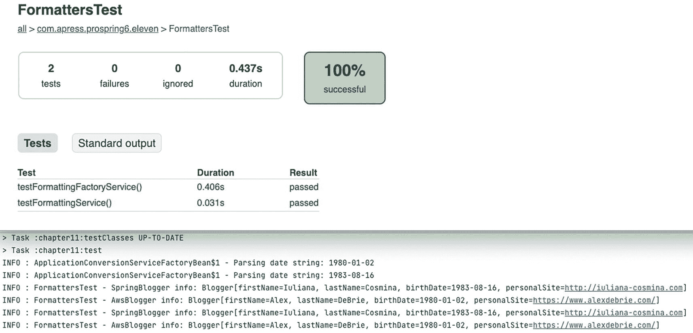
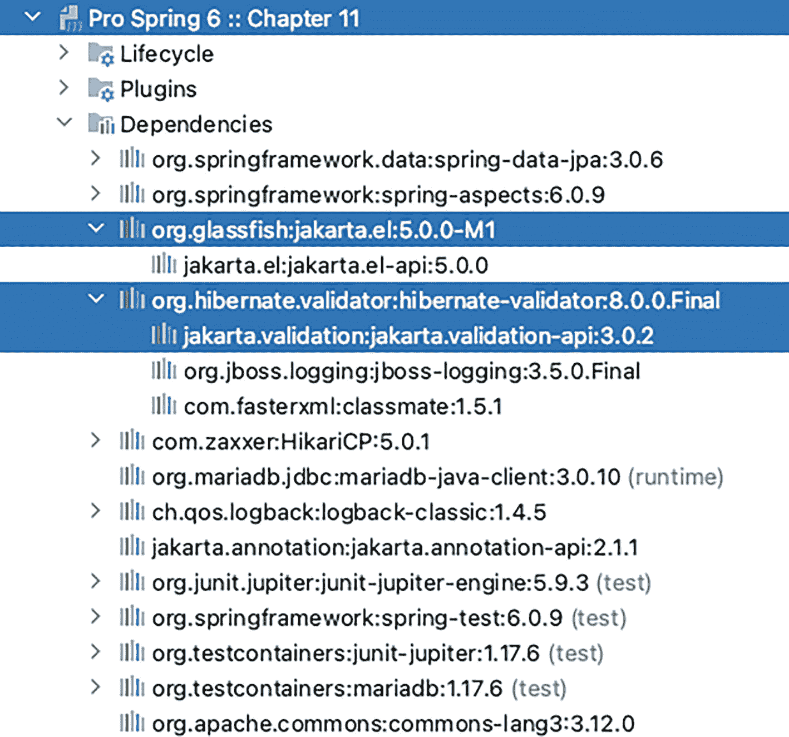
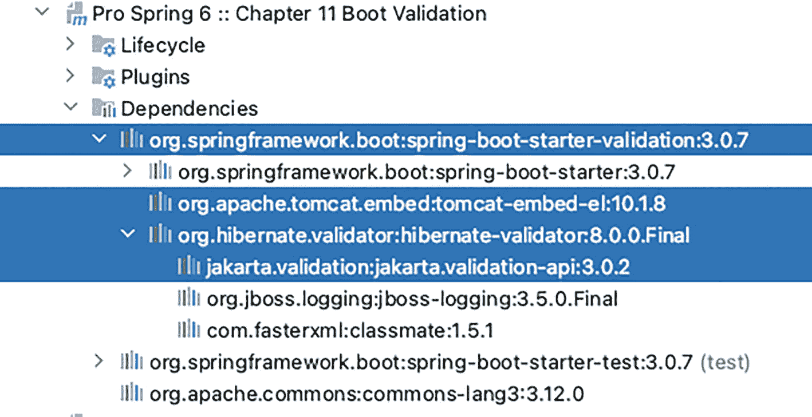
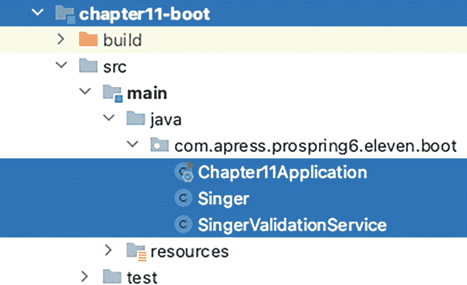

# 11. 验证、格式化和类型转换

在企业应用程序中，数据验证至关重要。数据验证的目的是验证正在处理的数据是否满足所有预定义的业务需求，并确保数据在应用程序的所有层中保持完整性和可用性。

在应用程序开发中，数据验证总是与转换和格式化一起被提及。原因是数据源的格式很可能与应用程序中使用的格式不同。例如，在 Web 应用程序中，用户在 Web 浏览器前端输入信息。当用户保存该数据时，数据会被发送到服务器（在本地验证完成后）。在服务器端，会执行一个数据绑定过程，在此过程中，根据为每个属性定义的格式化规则（例如，日期格式模式为 `yyyy-MM-dd`），从 HTTP 请求中提取、转换数据，并将其绑定到相应的领域对象（例如，用户在 HTML 表单中输入歌手信息，然后该信息被绑定到服务器端的 `Singer` 对象）。当数据绑定完成时，验证规则会被应用于领域对象，以检查是否存在任何约束违规。如果一切正常，数据将被持久化，并向用户显示成功消息。否则，会填充验证错误消息并显示给用户。

在本章中，你将学习 Spring 如何为类型转换、字段格式化和验证提供复杂支持。具体来说，本章涵盖以下主题：

*   *Spring 类型转换系统和 Formatter 服务提供者接口 (SPI)*：我们将介绍通用类型转换系统和 `Formatter<T>` SPI。我们将介绍如何使用这些新服务来替换之前的 `PropertyEditor` 支持，以及它们如何在任何 Java 类型之间进行转换。

*   *Spring 中的验证*：我们将讨论 Spring 如何支持领域对象验证。首先，我们简要介绍 Spring 自己的 `Validator` 接口。然后，我们重点介绍 JSR-349（Bean 验证）支持。


## 使用 PropertyEditors 转换字符串值

在 Spring 3 中，引入了一个新的类型转换系统，为在 Spring 驱动的应用程序中转换任何 Java 类型提供了强大的方式。所有类都位于 `org.springframework.core.convert` 包中。本节将展示这个新服务如何执行与之前 `PropertyEditor` 支持相同的功能，以及它如何支持任何 Java 类型之间的转换。我们还将演示如何使用 Converter SPI 实现自定义类型转换器。

**第** **4****章** 介绍了 Spring 如何通过支持 `PropertyEditors` 来处理从属性文件中的 `String` 到 POJO 属性的转换。我们在此快速回顾一下，然后介绍 Spring 的 Converter SPI（自 3.0 起可用）如何提供更强大的替代方案。

清单 11-1 展示了一个名为 `Blogger` 的记录。我们使用记录是因为我们知道不打算以任何方式修改这些 bean，也不需要代理它们（这也减少了我们需要编写的代码）。

```
package com.apress.prospring6.eleven.domain;
import java.net.URL;
import java.time.LocalDate;
public record Blogger (String firstName,
String lastName,
LocalDate birthDate,
URL personalSite) {}
清单 11-1
包含多种字段类型的 Blogger 记录
```

对于 `birthDate` 属性，使用了 `java.time.LocalDate` 类型。此外，还有一个 `URL` 类型的字段，用于指示博主的个人网站（如果适用）。假设我们想在 Spring 的 `ApplicationContext` 中构造 `Blogger` 实例，其值存储在 Spring 配置或属性文件中。为了实用，`AppConfig` 类声明了两个 `Blogger` bean：`awsBlogger`，它通过使用硬编码值的 `@Value` 注解注入属性值创建；以及 `springBlogger`，它通过使用从 `blogger.properties` 配置文件中读取值的 `@Value` 注解注入属性值创建。该属性文件使用**第** **4****章** 中介绍的 `@PropertySource` 注解进行配置。`AppConfig` 类如清单 11-2 所示，在其顶部的注释中可以看到 `blogger.properties` 文件的内容。

```
package com.apress.prospring6.eleven;
import org.springframework.beans.factory.annotation.Value;
import org.springframework.context.annotation.Bean;
import org.springframework.context.annotation.Configuration;
import org.springframework.context.annotation.PropertySource;
import java.net.URL;
import java.time.LocalDate;
/*
springBlogger.firstName=Iuliana
springBlogger.lastName=Cosmina
springBlogger.birthDate=1983-08-16
springBlogger.personalSite=https://iuliana-cosmina.com
*/
@PropertySource("classpath:blogger.properties")
@Configuration
public class AppConfig {
@Bean
public Blogger awsBlogger(@Value("Alex") String firstName,
@Value("DeBrie") String lastName,
@Value("https://www.alexdebrie.com") URL personalSite,
@Value("1980-01-02") LocalDate birthDate) throws Exception {
return new Blogger(firstName, lastName, birthDate, personalSite);
}
@Bean
public Blogger springBlogger(@Value("${springBlogger.firstName}") String firstName,
@Value("${springBlogger.lastName}") String lastName,
@Value("${springBlogger.personalSite}") URL personalSite,
@Value("${springBlogger.birthDate}") LocalDate birthDate) throws Exception {
return new Blogger(firstName, lastName, birthDate, personalSite);
}
}
清单 11-2
声明两个 Blogger Bean 的 Spring 配置类
```

尝试基于 `AppConfig` 类创建应用程序上下文将会失败，并显示堆栈跟踪，明确指出 Spring 无法将日历日期的文本表示形式转换为 `java.time.LocalDate`：

```
org.springframework.beans.factory.UnsatisfiedDependencyException:
Error creating bean with name 'awsBlogger' defined in com.apress.prospring6.eleven.AppConfig:
Unsatisfied dependency expressed through method 'awsBlogger' parameter 3:
Failed to convert value of type 'java.lang.String' to required type 'java.time.LocalDate';
Cannot convert value of type 'java.lang.String' to required type 'java.time.LocalDate':
no matching editors or conversion strategy found
at app//org.springframework.beans.factory.support.ConstructorResolver.createArgumentArray(ConstructorResolver.java:774)
Caused by: java.lang.IllegalStateException:
Cannot convert value of type 'java.lang.String' to required type 'java.time.LocalDate':
no matching editors or conversion strategy found at
org.springframework.beans.TypeConverterDelegate.convertIfNecessary(TypeConverterDelegate.java:262)
```

为了解决这个问题，我们需要告诉 Spring 如何将日历日期的文本表示形式转换为 `java.time.LocalDate`。我们可以通过使用 `PropertyEditorSupport` 的扩展来实现，例如清单 11-3 中所示的 `LocalDatePropertyEditor`。

```
package com.apress.prospring6.eleven.property.editor;
import java.beans.PropertyEditorSupport;
import java.time.LocalDate;
import java.time.format.DateTimeFormatter;
public class LocalDatePropertyEditor extends PropertyEditorSupport {
private DateTimeFormatter dateFormat =  DateTimeFormatter.ofPattern("yyyy-MM-dd");
@Override
public void setAsText(String text) throws IllegalArgumentException {
setValue(LocalDate.parse(text, dateFormat));
}
}
清单 11-3
LocalDatePropertyEditor 类
```

一个 `CustomEditorConfigurer` bean 需要成为配置的一部分，以注册我们的自定义属性编辑器：`LocalDatePropertyEditor`。Spring 2 中引入的旧式方法是声明一个 `PropertyEditorRegistrar` bean，该 bean 将 `LocalDatePropertyEditor` 实例映射到文本表示形式要转换成的类型，在本例中为 `LocalDate`。借助 lambda 表达式的魔力，可以在一行中创建实现 `PropertyEditorRegistrar` 的自定义类型的 bean。清单 11-4 显示了声明所有必要 bean 的配置类，以启用文本表示形式到 `LocalDate` 的正确转换。

这个 bean 可以使用 lambda 表达式即时创建，如清单 11-4 所示。

```
package com.apress.prospring6.eleven.property.editor;
import org.springframework.beans.PropertyEditorRegistrar;
import org.springframework.beans.factory.config.CustomEditorConfigurer;
// 其他导入语句已省略
import java.time.LocalDate;
@Configuration
public class CustomRegistrarCfg {
@Bean
public PropertyEditorRegistrar registrar(){
return registry ->
registry.registerCustomEditor(LocalDate.class, new LocalDatePropertyEditor());
}
@Bean
public CustomEditorConfigurer customEditorConfigurer() {
var cus = new CustomEditorConfigurer();
var registrars = new PropertyEditorRegistrar[1];
registrars[0] = registrar();
cus.setPropertyEditorRegistrars(registrars);
return cus;
}
}
清单 11-4
PropertyEditorRegistrar 类
```

为了测试这个类，我们需要基于 `AppConfig` bean 类和 `CustomRegistrarCfg` 构建一个应用程序上下文，检索两个 blogger bean 并将其属性打印到控制台。这可以使用测试方法来完成，如清单 11-5 所示。


```
package com.apress.prospring6.eleven;
public class ConvertersTest {
private static final Logger LOGGER = LoggerFactory.getLogger(ConvertersTest.class);
@Test
public void testCustomPropertyEditorRegistrar() {
try (var ctx = new AnnotationConfigApplicationContext(AppConfig.class, CustomRegistrarCfg.class)) {
var springBlogger = ctx.getBean("springBlogger", Blogger.class);
LOGGER.info("SpringBlogger info: {}" , springBlogger);
var awsBlogger  = ctx.getBean("awsBlogger", Blogger.class);
LOGGER.info("AwsBlogger info: {}" , awsBlogger);
}
}
// 预期输出
INFO ConvertersTest -
SpringBlogger info: Blogger{ firstName='Iuliana',
lastName='Cosmina',
birthDate=1983-08-16,
personalSite=https://iuliana-cosmina.com}
INFO ConvertersTest -
AwsBlogger info: Blogger{firstName='Alex',
lastName='DeBrie',
birthDate=1980-01-02,
personalSite=https://www.alexdebrie.com/}
清单 11-5
用于测试 LocalDatePropertyEditor 的 ConvertersTest 类和方法
```

运行此方法时，上下文应成功创建，并从中检索并打印出两个 Bean。

该配置还有另一个版本，它需要一个类型为 `CustomEditorConfigurer` 的单一 Bean，通过将自定义属性编辑器映射到特定类型来注册它，并且不需要自定义的 `PropertyEditorRegistrar`，如清单 11-6 中的配置类所示。

```
package com.apress.prospring6.eleven.property.editor;
import org.springframework.beans.factory.config.CustomEditorConfigurer;
// 其他导入语句已省略
@Configuration
public class CustomEditorCfg {
@Bean
public CustomEditorConfigurer customEditorConfigurer() {
var cus = new CustomEditorConfigurer();
cus.setCustomEditors(Map.of(LocalDate.class, LocalDatePropertyEditor.class));
return cus;
}
}
清单 11-6
CustomEditorCfg 类
```

这是旧的做法。新的做法涉及 `org.springframework.core.convert` 包中的类，将在下一节讨论。

## 介绍 Spring 类型转换

Spring 3.0 引入了一个通用的类型转换系统，位于 `org.springframework.core.convert` 包下。除了提供 `PropertyEditor` 支持的替代方案外，该类型转换系统还可以配置为在任何 Java 类型和 POJO 之间进行转换（而 `PropertyEditor` 专注于将属性文件中的 `String` 表示形式转换为 Java 类型）。

### 实现自定义转换器

为了演示类型转换系统的实际应用，让我们重新审视之前的示例，并使用相同的 `Blogger` 类。假设这次我们想使用类型转换系统将 `String` 格式的日期转换为博主的 `birthDate` 属性，该属性的类型为 `LocalDate`。为了支持这种转换，我们不是创建自定义的 `PropertyEditor`，而是通过实现 `org.springframework.core.convert.converter.Converter<S,T>` 接口来创建一个自定义转换器。清单 11-7 展示了这个自定义转换器。

```
package com.apress.prospring6.eleven.converter.bean;
import org.springframework.core.convert.converter.Converter;
import java.time.LocalDate;
import java.time.format.DateTimeFormatter;
public class LocalDateConverter implements Converter {
private DateTimeFormatter dateFormat =  DateTimeFormatter.ofPattern("yyyy-MM-dd");
@Override
public LocalDate convert(String source) {
return LocalDate.parse(source, dateFormat);
}
}
清单 11-7
LocalDateConverter 实现
```

我们实现了 `Converter<String, DateTime>` 接口，这意味着该转换器负责将 `String`（源类型 S）转换为 `LocalDate` 类型（目标类型 T）。

要使用此转换器代替 `PropertyEditor`，我们需要在 Spring 的 `ApplicationContext` 中配置一个 `org.springframework.core.convert.ConversionService` 接口的实例。清单 11-8 展示了 Java 配置类。

```
package com.apress.prospring6.eleven.converter.bean;
import org.springframework.context.support.ConversionServiceFactoryBean;
// 其他导入语句已省略
@Configuration
@ComponentScan
public class ConverterCfg {
@Bean
public ConversionServiceFactoryBean conversionService() {
var conversionServiceFactoryBean = new ConversionServiceFactoryBean();
var convs = new HashSet();
convs.add(new LocalDateConverter());
conversionServiceFactoryBean.setConverters(convs);
conversionServiceFactoryBean.afterPropertiesSet();
return conversionServiceFactoryBean;
}
}
清单 11-8
用于使用转换器实现的 Java 配置类
```

这里，我们通过声明一个类为 `ConversionServiceFactoryBean` 的 `conversionService` Bean，来指示 Spring 使用类型转换系统。这种类型的 Bean 可以组合多个转换服务。如果没有定义转换服务 Bean，Spring 将使用基于 `PropertyEditor` 的系统。

默认情况下，类型转换服务支持常见类型之间的转换，包括字符串、数字、枚举、集合、映射等。此外，也支持在基于 `PropertyEditor` 的系统中将 `String` 实例转换为 Java 类型。

测试方法与清单 11-5 中所示的方法几乎相同，唯一的区别是将 `CustomRegistrarCfg` 类替换为 `ConverterCfg`。


### 在任意类型之间进行转换

类型转换系统的真正强大之处在于能够在任意类型之间进行转换。清单 11-9 介绍了仅包含两个字段的记录 `SimpleBlogger`，以及将 `Blogger` 实例转换为 `SimpleBlogger` 实例的转换器实现。

```
package com.apress.prospring6.eleven.domain;
import com.apress.prospring6.eleven.Blogger;
import org.springframework.core.convert.converter.Converter;
import java.net.URL;
public record SimpleBlogger (String fullName, URL personalSite) {
public static class BloggerToSimpleBloggerConverter implements Converter {
@Override
public SimpleBlogger convert(Blogger source) {
return new SimpleBlogger(source.firstName() + " " + source.lastName(), source.personalSite());
}
}
}
清单 11-9
SimpleBlogger 记录与转换器
```

要将此转换器添加到应用程序上下文配置中，需要将 `BloggerToSimpleBloggerConverter` 的一个实例添加到 `ConversionServiceFactoryBean` 的转换器集合中，如清单 11-10 所示。

```
package com.apress.prospring6.eleven.converter.bean;
// 导入语句已省略
@Configuration
@ComponentScan
public class ConverterCfg {
@Bean
public ConversionServiceFactoryBean conversionService() {
var conversionServiceFactoryBean = new ConversionServiceFactoryBean();
var convs = new HashSet();
convs.add(new LocalDateConverter());
convs.add(new SimpleBlogger.BloggerToSimpleBloggerConverter());
conversionServiceFactoryBean.setConverters(convs);
conversionServiceFactoryBean.afterPropertiesSet();
return conversionServiceFactoryBean;
}
}
清单 11-10
SimpleBlogger 类与转换器
```

要测试此转换器，我们需要从上下文中获取转换器 bean，并将其中一个 `Blogger` 实例转换为 `SimpleBlogger` 实例，如清单 11-11 所示。

```
package com.apress.prospring6.eleven;
import org.springframework.core.convert.ConversionService;
public class ConvertersTest {
@Test
public void testConvertingToSimpleBlogger() {
try (var ctx = new AnnotationConfigApplicationContext(AppConfig.class, ConverterCfg.class)) {
var springBlogger = ctx.getBean("springBlogger", Blogger.class);
LOGGER.info("SpringBlogger 信息: {}" , springBlogger);
var conversionService = ctx.getBean(ConversionService.class);
var simpleBlogger = conversionService.convert(springBlogger, SimpleBlogger.class);
LOGGER.info("simpleBlogger 信息: {}" , simpleBlogger);
}
}
}
// 预期输出
INFO ConvertersTest - SpringBlogger 信息:
Blogger[firstName=Iuliana,
lastName=Cosmina,
birthDate=1983-08-16,
personalSite=https://iuliana-cosmina.com]
INFO ConvertersTest - simpleBlogger 信息:   SimpleBlogger[fullName=Iuliana Cosmina,
personalSite=https://iuliana-cosmina.com]
清单 11-11
转换为 SimpleBlogger
```

你可能已经注意到，`personalSite` 字段从字符串到 `java.net.URL` 的转换是自动完成的。这是因为 Spring 默认注册了一组转换器，用于处理最常见的开发用例（例如，从表示逗号分隔列表的字符串转换为 `Array`，从 `List` 转换为 `Set` 等）。

借助 Spring 的类型转换服务，你可以轻松创建自定义转换器，并在应用程序的任何层执行转换。一个可能的用例是，你有两个系统包含相同的博主信息需要更新，但数据库结构不同（例如，系统 `A` 有两个字段名，而系统 `B` 只有一个字段，等等）。你可以使用类型转换系统在将对象持久化到各个系统之前对其进行转换。

从 Spring 3.0 开始，Spring MVC 大量使用了转换服务（以及下一节讨论的 Formatter SPI）。在 Web 应用程序上下文配置中，Spring 3.1 引入的带有 `@EnableWebMvc` 注解的 Java 配置类会自动注册所有默认转换器（例如，`StringToArrayConverter`、`StringToBooleanConverter` 和 `StringToLocaleConverter`，它们都位于 `org.springframework.core.convert.support` 包下）和格式化器（例如，`CurrencyStyleFormatter`、`DateFormatter` 和 `AbstractNumberFormatter`，它们都位于 `org.springframework.format` 包下的各个子包中）。更多细节将在**第** **14** **章**中讨论 Spring Web 应用程序开发时介绍。


## Spring 中的字段格式化

除了类型转换系统之外，Spring 为开发者带来的另一个强大特性是 Formatter SPI。正如你所料，这个 SPI 可以帮助配置字段格式化方面的内容。在 Formatter SPI 中，实现格式化器的主要接口是 `org.springframework.format.Formatter<T>` 接口。Spring 提供了一些常用类型的实现，包括 `CurrencyStyleFormatter`、`DateFormatter`、`AbstractNumberFormatter` 和 `PercentStyleFormatter`。

实现自定义格式化器就像实现自定义转换器一样简单。我们将使用相同的 `Blogger` 记录，但不再使用转换器，而是实现一个自定义格式化器，用于将 `birthDate` 属性的 `LocalDate` 类型与 `String` 类型进行相互转换。这需要继承 Spring 的 `org.springframework.format.support.FormattingConversionServiceFactoryBean` 类，并提供我们自定义的格式化器。`FormattingConversionServiceFactoryBean` 类是一个工厂类，它提供了对底层 `FormattingConversionService` 类的便捷访问，该类既支持类型转换系统，也支持根据为每个字段类型定义的格式化规则进行字段格式化。

在清单 11-12 中，你可以看到一个自定义类，它继承了 `FormattingConversionServiceFactoryBean` 类，并定义了一个用于格式化 Java `LocalDate` 类型的自定义格式化器。请注意，该格式化器可以通过日期模式进行配置。

```
package com.apress.prospring6.eleven.formatter.factory;
import org.springframework.format.Formatter;
import org.springframework.format.support.FormattingConversionServiceFactoryBean;
// 其他导入语句已省略
@Service("conversionService")
public class ApplicationConversionServiceFactoryBean extends FormattingConversionServiceFactoryBean {
private static final Logger LOGGER = LoggerFactory.getLogger(ApplicationConversionServiceFactoryBean.class);
private static final String DEFAULT_DATE_PATTERN = "yyyy-MM-dd";
private DateTimeFormatter dateTimeFormatter;
private String datePattern = DEFAULT_DATE_PATTERN;
private final Set> formatters = new HashSet();
public String getDatePattern() {
return datePattern;
}
@Autowired(required = false)
public void setDatePattern(String datePattern) {
this.datePattern = datePattern;
}
@PostConstruct
public void init() {
dateTimeFormatter = DateTimeFormatter.ofPattern(datePattern);
formatters.add(getDateTimeFormatter());
setFormatters(formatters);
}
public Formatter getDateTimeFormatter() {
return new Formatter() {
@Override
public LocalDate parse(String source, Locale locale)
throws ParseException {
LOGGER.info("解析日期字符串: " + source);
return LocalDate.parse(source, dateTimeFormatter);
}
@Override
public String print(LocalDate source, Locale locale) {
LOGGER.info("格式化日期时间: " + source);
return source.format(dateTimeFormatter);
}
};
}
}
清单 11-12
ApplicationConversionServiceFactoryBean 实现
```

在清单 11-12 中，自定义格式化器的实现以粗体显示。它实现了 `Formatter<LocalDate>` 接口，并实现了该接口定义的两个方法。`parse(..)` 方法将 `String` 格式解析为 `LocalDate` 类型（同时传递了区域设置以支持本地化），而 `LOGGER.info(..)` 方法则用于将 `LocalDate` 实例格式化为 `String`。日期模式可以注入到 Bean 中（否则将使用默认值 `yyyy-MM-dd`）。此外，在 `init()` 方法中，通过调用 `setFormatters()` 方法注册了自定义格式化器。你可以根据需要添加任意数量的格式化器。

由于 `ApplicationConversionServiceFactoryBean` 被配置为一个 Bean，使用它的最简单方法就是使用 `AppConfig` 类和这个 Bean 创建一个注解上下文。清单 11-13 展示了一个测试方法，该方法创建了这个上下文并打印了两个 `Blogger` Bean。

```
package com.apress.prospring6.eleven;
// 导入语句已省略
public class FormattersTest {
private static final Logger LOGGER = LoggerFactory.getLogger(FormattersTest.class);
@Test
public void testFormattingFactoryService() {
try (var ctx = new AnnotationConfigApplicationContext(AppConfig.class,
ApplicationConversionServiceFactoryBean.class)) {
var springBlogger = ctx.getBean("springBlogger", Blogger.class);
LOGGER.info("SpringBlogger 信息: {}" , springBlogger);
var awsBlogger  = ctx.getBean("awsBlogger", Blogger.class);
LOGGER.info("AwsBlogger 信息: {}" , awsBlogger);
}
}
}
清单 11-13
ApplicationConversionServiceFactoryBean 实现测试
```

此测试的目的是展示应用上下文已正确创建，并且两个 `Blogger` Bean 也已正确创建。

一个知识小贴士。 这个方法可能看起来不像一个测试，因为没有断言语句，但该方法本质上是在测试配置中所有 Bean 都已正确配置的假设。如果你运行 Gradle 构建，系统会为你生成一个非常漂亮的包含测试结果的网页。图 11-1 展示了这个页面以及显示这些测试通过的控制台执行日志。



一张标题为“格式化器测试”的截图展示了 Gradle 测试结果页面。包含 2 个测试，0 个失败，0 个忽略，耗时 0.437 秒。100% 成功。测试数据中，通过的结果行显示了 2 个方法。

图 11-1

Gradle 测试结果页面和日志，显示 `FormattersTest` 下的测试方法通过

执行 `testFormattingFactoryService()` 测试方法的输出与转换部分（清单 11-11）中显示的输出类似，这证明了将文本表示转换为 `LocalDate` 的职责已由 `Formatter<LocalDate>` 实例接管。

`Formatter<T>` SPI 是一个组合接口，它继承了 `Printer<T>` 和 `Parser<T>` 接口。这三个接口都是 `org.springframework.format` 包的一部分。清单 11-12 中 `Formatter<LocalDate>` 实现的每个方法都由这些接口之一提供。这三个接口如清单 11-14 所示。 ^(¹⁰²)

```
// ---- Formatter.java ----
package org.springframework.format;
public interface Formatter extends Printer, Parser {
}
// ---- Printer.java ----
@FunctionalInterface
public interface Printer {
String print(T fieldValue, Locale locale);
}
// ---- Parser.java ----
import java.text.ParseException;
import java.util.Locale;
@FunctionalInterface
public interface Parser {
T parse(String clientValue, Locale locale) throws ParseException;
}
清单 11-14
Spring 格式化 SPI 接口
```

每当你需要一个格式化器时，你所要做的就是实现 `Formatter<T>` 接口，并用所需的类型参数化它，然后通过使用自定义的 `FormattingConversionServiceFactoryBean` 或声明一个 `FormattingConversionService` 类型的 Bean 并将格式化器实例添加到其中，将其添加到 Spring 配置中。最简单的方法是使用 `DefaultFormattingConversionService`，它是 `FormattingConversionService` 的一个开箱即用的特化实现，默认配置了适用于大多数应用程序的转换器和格式化器。


清单 11-15 展示了 `FormattingServiceCfg` 类，该类声明了一个名为 `conversionService` 的 bean，它是一个 `DefaultFormattingConversionService`，并添加了 `Formatter<LocalDate>` 的实现。

```
package com.apress.prospring6.eleven.formatter;
import org.springframework.format.Formatter;
import org.springframework.format.support.DefaultFormattingConversionService;
import org.springframework.format.support.FormattingConversionService;
// 其他导入语句已省略
@Configuration
public class FormattingServiceCfg {
@Bean
public FormattingConversionService conversionService() {
var formattingConversionServiceBean = new DefaultFormattingConversionService(true);
formattingConversionServiceBean.addFormatter(localDateFormatter());
return formattingConversionServiceBean;
}
protected Formatter localDateFormatter() {
return new Formatter() {
@Override
public LocalDate parse(String source, Locale locale) throws ParseException {
return LocalDate.parse(source, getDateTimeFormatter());
}
@Override
public String print(LocalDate source, Locale locale) {
return source.format(getDateTimeFormatter());
}
protected DateTimeFormatter getDateTimeFormatter(){
return DateTimeFormatter.ofPattern("yyyy-MM-dd");
}
};
}
}
清单 11-15
使用 DefaultFormattingConversionService 注册自定义格式化器的配置类
```

警告。 在 Spring 应用中声明 `FormattingConversionService` 类型的 bean 以自定义转换器和格式化器列表时，请确保此 bean 的名称为 `conversionService`，因为 Spring 不接受其他名称。对于 `ConversionServiceFactoryBean` 类型的 bean 也是如此，该实现便于配置对 `ConversionService` 的访问，该服务配置了适用于大多数环境的转换器。

警告。 请注意，`DefaultFormattingConversionService` 构造函数的参数值为 `true`。此值被赋值给 `registerDefaultFormatters` 字段，并且对于在上下文中启用默认格式化器集合是必需的。如果设置为 `false`，此 bean 将仅启用默认的转换器集合。

## Spring 中的验证

验证是任何应用程序的关键部分。应用于领域对象的验证规则确保所有业务数据结构良好并满足所有业务定义。理想情况是所有验证规则都维护在集中位置，并且同一组规则应用于同一类型的数据，无论数据来自哪个源（例如，来自通过 Web 应用程序的用户输入、来自通过 Web 服务的远程应用程序、来自 JMS 消息或来自文件）。

在讨论验证时，转换和格式化也很重要，因为在验证数据之前，应根据为每种类型定义的格式化规则将其转换为所需的 POJO。例如，用户通过浏览器中的 Web 应用程序输入一些博客信息，然后将该数据提交到服务器。在服务器端，如果 Web 应用程序是使用 Spring MVC 开发的，Spring 将从 HTTP 请求中提取数据，并根据格式化规则（例如，表示日期的 `String` 将根据格式化规则 `yyyy-MM-dd` 转换为 `LocalDate` 字段）执行从 `String` 到所需类型的转换。此过程称为*数据绑定*。当数据绑定完成且领域对象构建完成后，将对该对象应用验证，任何错误都将返回并显示给用户。如果验证成功，该对象将被持久化到数据库。

Spring 支持两种主要的验证类型。第一种由 Spring 提供。通过实现 `org.springframework.validation.Validator` 接口来创建验证器，如清单 11-16 所示。^(¹⁰³)

```
package org.springframework.validation;
public interface Validator {
boolean supports(Class clazz);
void validate(Object target, Errors errors);
}
清单 11-16
Spring 的 Validator 接口
```

另一种验证类型是通过 Spring 对 JSR-349（Bean 验证）^(¹⁰⁴) 的支持，现已更名为 Jakarta Bean 验证。我们将在接下来的章节中介绍这两种验证类型。

### 使用 Spring Validator 接口

使用 Spring 的 `Validator` 接口，我们可以通过创建一个实现该接口的类来开发一些验证逻辑。让我们看看它是如何工作的。对于到目前为止我们一直在使用的 `Blogger` 类，假设名字不能为空。要针对此规则验证 `Blogger` 对象，需要一个自定义验证器。清单 11-17 中的代码片段展示了 `BloggerValidator` 验证器类。

```
package com.apress.prospring6.eleven.validator;
import org.springframework.validation.Errors;
import org.springframework.validation.ValidationUtils;
import org.springframework.validation.Validator;
// 其他导入语句已省略
@Component("simpleBloggerValidator")
public class SimpleBloggerValidator implements Validator {
@Override
public boolean supports(Class clazz) {
return Blogger.class.equals(clazz);
}
@Override
public void validate(Object target, Errors errors) {
ValidationUtils.rejectIfEmpty(errors, "firstName", "field.required");
}
}
清单 11-17
Blogger 类的自定义验证器
```

验证器类实现了 `Validator` 接口并实现了两个方法。`supports(..)` 方法指示验证器是否支持对传入类类型的验证。`validate(..)` 方法对传入的对象执行验证。结果将存储在 `org.springframework.validation.Errors` 接口的实例中。在 `validate(..)` 方法中，我们仅对 `firstName` 属性执行检查，并使用便捷的 `ValidationUtils.rejectIfEmpty(..)` 方法来确保博客作者的名字不为空。最后一个参数是错误代码，可用于从资源包中查找验证消息以显示本地化的错误消息。

知识提示。 要将此 bean 添加到 Spring 应用程序上下文中，需要在现有的配置类上添加 `@ComponentScan(basePackages = {"com.apress.prospring6.eleven.validator"})`，当应用程序启动时，它将被自动拾取。但是，在我们的测试方法中，我们避免使用该注解以防止测试上下文污染，而是从应用程序配置类 `AppConfig` 以及测试目标所针对的任何其他验证器 bean 类中显式构建它。

警告。 任何进入系统的外部数据都需要经过验证、转换并格式化为已知类型。转换器、格式化器和验证器是处理用户提供数据的应用程序（例如带有表单的 Web 应用程序或从任何第三方源导入数据的应用程序）所必需的组件。

使用 Spring MVC 编写 Spring 应用程序的内容将在**第** **14** **章**中介绍。在这类应用程序中，转换器、格式化器和验证器的强大功能才真正得以展现。由于我们尚未涉及该部分，本章中的应用程序上下文是通过直接实例化创建的，并且验证器是显式调用的。`SimpleBloggerValidator` 在清单 11-18 中进行了测试。


```
package com.apress.prospring6.eleven;
import com.apress.prospring6.eleven.formatter.FormattingServiceCfg;
import com.apress.prospring6.eleven.validator.BloggerValidator;
import org.springframework.validation.BeanPropertyBindingResult;
import org.springframework.validation.ValidationUtils;
// 其他导入语句已省略
public class SpringValidatorTest {
private static final Logger LOGGER = LoggerFactory.getLogger(SpringValidatorTest.class);
@Test
void testSimpleBloggerValidator() throws MalformedURLException {
try (var ctx = new AnnotationConfigApplicationContext(AppConfig.class,  FormattingServiceCfg.class, SimpleBloggerValidator.class)) {
var blogger = new Blogger("", "Pedala", LocalDate.of(2000, 1, 1), new URL("https://none.co.uk"));
var bloggerValidator = ctx.getBean(SimpleBloggerValidator.class);
var result = new BeanPropertyBindingResult(blogger, "blogger");
ValidationUtils.invokeValidator(bloggerValidator, blogger, result);
var errors = result.getAllErrors();
assertEquals(1, errors.size());
errors.forEach(e -> LOGGER.info("对象 '{}' 验证失败。错误代码: {}", e.getObjectName(), e.getCode()));
}
}
}
清单 11-18  测试 Blogger 类的自定义验证器
```

在清单 11-18 的测试方法中，构造了一个 `Blogger` 对象，其名字被设置为空 `String` 值。然后，从 `ApplicationContext` 中获取 `validator` Bean。为了存储验证结果，使用待验证对象及其名称（即第二个参数的作用）构造了一个 `BeanPropertyBindingResult` 类的实例。这对于将错误报告给链中的下一个服务或用于日志记录可能很有用。为了执行验证，调用了 `ValidationUtils.invokeValidator()` 方法，然后通过一个普通的断言语句检查返回的错误对象数量。由于创建的 `Blogger` 实例没有 `firstName`，验证失败，并创建了一个错误代码为 `field.required` 的错误对象。

这个示例展示了一个非常简单的验证，仅检查对象的某个属性是否为空，但 `validate(..)` 方法可以更加复杂，根据不同的规则测试对象的更多属性。

注意。`null` 值与空 `String` 值不同，因此一个 `firstName` 为 `null` 的 `Blogger` 对象不会违反 `SimpleBloggerValidator` 类描述的验证规则。

例如，清单 11-19 中的 `BloggerValidator` 版本会检查 `firstName` 或 `lastName` 中至少有一个存在且不为 `null`（`StringUtils.isEmpty(..)` 方法确保了这一点），并且 `birthDate` 大于 1983 年 1 月 1 日。

```
package com.apress.prospring6.eleven.validator;
import org.apache.commons.lang3.StringUtils;
// 导入语句已省略
@Component("complexBloggerValidator")
public class ComplexBloggerValidator implements Validator {
@Override
public boolean supports(Class clazz) {
return Blogger.class.equals(clazz);
}
@Override
public void validate(Object target, Errors errors) {
var b = (Blogger) target;
if(StringUtils.isEmpty(b.firstName()) && StringUtils.isEmpty(b.lastName())) {
errors.rejectValue("firstName", "firstNameOrLastName.required");
errors.rejectValue("lastName", "firstNameOrLastName.required");
}
if(b.birthDate().isBefore(LocalDate.of(1983,1,1))) {
errors.rejectValue("birthDate", "birthDate.greaterThan1983");
}
}
}
清单 11-19  Blogger 的复杂验证器实现
```

除此之外，还可以通过重用嵌套对象的验证逻辑来实现 `Validator` 接口，以验证复杂对象。为了展示这一点，需要一个名为 `BloggerWithAddress` 的新类，它如其名所示：一个带有地址的博主。地址使用 record 建模，博主使用类建模，因为这样可以使验证适用于所有扩展它的类。清单 11-20 展示了 `Address` record 和 `BloggerWithAddress` 类。

```
// ---- Address.java ----
package com.apress.prospring6.eleven.domain;
public record Address(String city, String country) {
}
// ---- BloggerWithAddress.java ----
package com.apress.prospring6.eleven.domain;
public class BloggerWithAddress {
private String firstName;
private String lastName;
private LocalDate birthDate;
private URL personalSite;
private Address address;
// getter 和 setter 已省略
}
清单 11-20  包含 Address 类型嵌套字段的复杂 BloggerWithAddress
```

清单 11-21 展示了 `AddressValidator`，它验证 `city` 和 `country` 字段均已填写且仅包含字母。

```
package com.apress.prospring6.eleven.validator;
import org.apache.commons.lang3.StringUtils;
// 其他导入语句已省略
@Component("addressValidator")
public class AddressValidator implements Validator {
@Override
public boolean supports(Class clazz) {
return Address.class.equals(clazz);
}
@Override
public void validate(Object target, Errors errors) {
ValidationUtils.rejectIfEmpty(errors, "city", "city.empty");
ValidationUtils.rejectIfEmpty(errors, "country", "country.empty");
var address = (Address)target;
if(!StringUtils.isAlpha(address.city())) {
errors.rejectValue("city", "city.onlyLettersAllowed");
}
if(!StringUtils.isAlpha(address.country())) {
ValidationUtils.rejectIfEmpty(errors, "country", "country.onlyLettersAllowed");
}
}
}
清单 11-21  AddressValidator 类
```

清单 11-22 展示了 `BloggerWithAddressValidator` 验证器，它检查 `address` 和 `personalSite` 字段是否已填写，`firstName` 和 `lastName` 中至少有一个已填写，并通过使用 `AddressValidator` 来验证地址是否有效。

```
package com.apress.prospring6.eleven.validator;
// 导入语句已省略
@Component("bloggerWithAddressValidator")
public class BloggerWithAddressValidator implements Validator {
private final Validator addressValidator;
public BloggerWithAddressValidator(Validator addressValidator) {
if (!addressValidator.supports(Address.class)) {
throw new IllegalArgumentException("提供的 [Validator] 必须支持 [Address] 实例的验证。");
}
this.addressValidator = addressValidator;
}
@Override
public boolean supports(Class clazz) {
return BloggerWithAddress.class.isAssignableFrom(clazz);
}
@Override
public void validate(Object target, Errors errors) {
ValidationUtils.rejectIfEmptyOrWhitespace(errors, "address", "address.required");
ValidationUtils.rejectIfEmptyOrWhitespace(errors, "personalSite", "personalSite.required");
var b = (BloggerWithAddress) target;
if(StringUtils.isEmpty(b.getFirstName()) && StringUtils.isEmpty(b.getLastName())) {
errors.rejectValue("firstName", "firstNameOrLastName.required");
errors.rejectValue("lastName", "firstNameOrLastName.required");
}
try {
errors.pushNestedPath("address");
ValidationUtils.invokeValidator(this.addressValidator, b.getAddress(), errors);
} finally {
errors.popNestedPath();
}
}
}
清单 11-22  BloggerWithAddressValidator 类
```


请注意，`BloggerWithAddressValidator` 是一个组合对象，其中包含一个嵌套的 `AddressValidator` 字段。该字段用于验证 `BloggerWithAddress` 实例中的嵌套 `address` 字段。请注意 `supports(..)` 方法的主体。`BloggerWithAddress.class.isAssignableFrom(clazz)` 语句用于验证目标对象是 `BloggerWithAddress` 的实例，还是其超类的实例。

`pushNestedPath(..)` 和 `popNestedPath(..)` 这两个方法用于为错误消息生成嵌套的错误属性。例如，当当前路径为 `blogger.` 时，调用 `pushNestedPath("address")` 会将路径更改为 `blogger.address.`，这意味着错误属性将相对于此路径。然后，调用 `popNestedPath()` 会将路径恢复为 `blogger.`。

为了测试此实现，我们将执行与之前相同的操作：使用 `AddressValidator`、`BloggerWithAddressValidator` 和现有的 `AppConfig` 类构建一个 Spring 配置。然后，我们将创建一个无法通过验证的 `BloggerWithAddress` 实例，并检查我们的验证器是否报告了现有错误。代码如清单 11-23 所示。

```
package com.apress.prospring6.eleven;
// 导入语句已省略
public class SpringValidatorTest {
private static final Logger LOGGER = LoggerFactory.getLogger(SpringValidatorTest.class);
@Test
void testBloggerWithAddressValidator() throws MalformedURLException {
try (var ctx = new AnnotationConfigApplicationContext(AppConfig.class, FormattingServiceCfg.class, AddressValidator.class, BloggerWithAddressValidator.class)) {
var address = new Address("221B", "UK");
var blogger = new BloggerWithAddress( null, "Mazzie", LocalDate.of(1973, 1, 1), null, address);
var bloggerValidator = ctx.getBean(BloggerWithAddressValidator.class);
var result = new BeanPropertyBindingResult(blogger, "blogger");
ValidationUtils.invokeValidator(bloggerValidator, blogger, result);
var errors = result.getAllErrors();
assertEquals(2, errors.size());
errors.forEach(e -> LOGGER.info("Error Code: {}", e.getCode()));
}
}
}
\\ 预期输出
DEBUG ValidationUtils - Validator found 2 errors
INFO SpringValidatorTest - Error Code: personalSite.required
INFO SpringValidatorTest - Error Code: city.onlyLettersAllowed
清单 11-23
测试 BloggerWithAddressValidator 类
```

**粗体**字体的对象均未通过验证：`address` 的城市名为 `221B`，而 `blogger` 的 `personalSite` 为 `null`。

本节中的示例均打印了错误代码。输出与验证错误对应的消息是**第** **14** **章**的主题。关于 Spring 验证的内容大致如此。接下来的章节将介绍 Spring 与 Jakarta 的 Bean Validation API 和 Hibernate Validator 的集成。

### 使用 JSR-349/Jakarta Bean Validation

从 Spring 4 开始，已实现对 JSR-349（Bean Validation 3.0）^(¹⁰⁵) 的全面支持。Bean Validation API 在 `jakarta.validation.constraints` 包下定义了一组以 Java 注解形式（例如 `@NotNull`）存在的约束，这些注解可应用于领域对象。此外，还可以通过注解开发和应用自定义验证器（例如，类级别验证器）。

使用 Bean Validation API 可以避免与特定验证服务提供者耦合。通过使用 Bean Validation API，您可以使用标准注解和 API 为领域对象实现验证逻辑，而无需了解底层的验证服务提供者。例如，Hibernate Validator^(¹⁰⁶) 就是 JSR-349 的一个参考实现。

Spring 为 Bean Validation API 提供了无缝支持。主要功能包括：支持用于定义验证约束的 JSR-349 标准注解、自定义验证器，以及在 Spring 的 `ApplicationContext` 中配置 JSR-349 验证。我们将在以下各节中逐一介绍这些功能。

### 依赖项

对于接下来的章节，我们需要将 `hibernate-validator` 库添加到 `chapter11` 项目的类路径中。当前特定于 Jakarta 10 的版本是 `8.0.0.Final`。其传递依赖项是 `jakarta.validation-api` 版本 `3.0.2`。此外，还需要一个 `jakarta.el.ExpressionFactory` 的实现，因为它提供了创建和评估 Jakarta 表达式语言表达式的实现，因此也添加了 Glassfish 的 `jakarta.el` 版本 `5.0.0-M1` 库。这些依赖项通过 Maven/Gradle 进行配置，并显示在 IntelliJ IDEA Gradle 视图的图 11-2 中。



一张截图显示了第 11 章下的多个下拉菜单。它表示依赖项下拉菜单下的库列表，并高亮显示了 o r g dot glass fish colon jakarta dot e l 和 o r g dot hibernate dot validator colon hibernate validator。

图 11-2
显示 `chapter11` 项目依赖项的 Gradle 视图

### 在领域对象属性上定义验证约束

对于接下来的章节，验证的目标类型是 `Singer` 的一个更有趣的变体，它有两个枚举类型字段用于设置其流派和性别。`Singer` 类及其两个枚举声明如清单 11-24 所示。

```
package com.apress.prospring6.eleven.domain;
import jakarta.validation.constraints.NotNull;
import jakarta.validation.constraints.Size;
public class Singer {
@NotNull
@Size(min=2, max=60)
private String firstName;
private String lastName;
@NotNull
private Genre genre;
private Gender gender;
// getter 和 setter 方法已省略
public enum Genre {
POP("P"), JAZZ("J"), BLUES("B"), COUNTRY("C");
private String code;
private Genre(String code) {
this.code = code;
}
public String toString() {
return this.code;
}
}
public enum Gender {
MALE("M"), FEMALE("F"), UNSPECIFIED("U");
private String code;
Gender(String code) {
this.code = code;
}
@Override
public String toString() {
return this.code;
}
}
}
清单 11-24
增强的 Singer 类
```

在此领域对象中，验证注解以**粗体**字体显示。`firstName` 属性应用了两个约束：`@NotNull` 注解，表示该值不应为 `null`；以及 `@Size` 注解，用于控制 `firstName` 属性的长度。`@NotNull` 约束也应用于 `genre` 属性。`genre` 属性表示歌手所属的音乐流派，而 `gender` 属性与音乐生涯（或任何职业生涯）无关，因此它可以是 `null`。


### 在 Spring 中配置 Bean Validation 支持

为了在 Spring 的 `ApplicationContext` 中配置对 Bean Validation API 的支持，我们需要在 Spring 配置中定义一个类型为 `org.springframework.validation.beanvalidation.LocalValidatorFactoryBean` 的 Bean。清单 11-25 展示了该配置类。

```
package com.apress.prospring6.eleven.validator;
import org.springframework.validation.beanvalidation.LocalValidatorFactoryBean;
// 其他导入语句已省略
@Configuration
@ComponentScan
public class JakartaValidationCfg {
@Bean
LocalValidatorFactoryBean validator() {
return new LocalValidatorFactoryBean();
}
}
清单 11-25
在 Spring 应用中配置 Jakarta Validation 支持
```

声明一个 `LocalValidatorFactoryBean` Bean 并启用当前包中的组件扫描，以便注册 `SingerValidationService` Bean，这些就是全部所需操作。清单 11-26 展示了 `SingerValidationService`，这是一个为 `Singer` 类提供验证服务的服务类。

```
package com.apress.prospring6.eleven.validator;
// 其他导入语句已省略
import jakarta.validation.ConstraintViolation;
import jakarta.validation.Validator;
import org.springframework.stereotype.Service;
@Service("singerValidationService")
public class SingerValidationService {
private final Validator validator;
public SingerValidationService(Validator validator) {
this.validator = validator;
}
public Set> validateSinger(Singer singer) {
return validator.validate(singer);
}
}
清单 11-26
SingerValidationService，一个针对 Singer 类的验证服务
```

这里注入了一个 `jakarta.validation.Validator` 的实例。

一个知识小贴士。 请注意它与 Spring 提供的 `Validator` 接口（即 `org.springframework.validation.Validator`）的区别。使用 Jakarta `Validator` 可以在必要时将业务逻辑与 Spring 解耦。

一旦定义了 `LocalValidatorFactoryBean`，你就可以在应用的任何地方注入任何 `Validator` Bean 并使用它。要对一个 POJO 执行验证，需要调用 `Validator.validate(..)` 方法。验证结果将以 `ConstraintViolation<T>` 接口的 `Set` 集合形式返回。

为了测试这个配置，我们将采用与之前相同的方法，如清单 11-27 所示。

```
package com.apress.prospring6.eleven;
import com.apress.prospring6.eleven.validator.JakartaValidationCfg;
import com.apress.prospring6.eleven.validator.SingerValidationService;
import akarta.validation.ConstraintViolation;
// 其他导入语句已省略
public class JakartaValidationTest {
private static final Logger LOGGER = LoggerFactory.getLogger(JakartaValidationTest.class);
@Test
void testSingerValidation() {
try (var ctx = new AnnotationConfigApplicationContext(JakartaValidationCfg.class)) {
var singerBeanValidationService = ctx.getBean(SingerValidationService.class);
Singer singer = new Singer();
singer.setFirstName("J");
singer.setLastName("Mayer");
singer.setGenre(null);
singer.setGender(null);
var violations = singerBeanValidationService.validateSinger(singer);
assertEquals(2, violations.size());
listViolations(violations);
}
}
private static void listViolations(Set> violations) {
violations.forEach(violation ->
LOGGER.info("Validation error for property: {} with value: {} with error message: {}" ,
violation.getPropertyPath(), violation.getInvalidValue(), violation.getMessage()));
}
}
// 预期输出
INFO : Version – HV000001: Hibernate Validator 8.0.0.Alpha1
...
INFO JakartaValidationTest -
Validation error for property: genre
with value: null
with error message: must not be null
INFO JakartaValidationTest -
Validation error for property: firstName
with value: J
with error message: size must be between 2 and 60
清单 11-27
测试 SingerValidationService
```

如该清单所示，构造了一个 `Singer` 对象，其 `firstName` 和 `genre` 属性违反了通过注解声明的约束。调用了 `SingerValidationService.validateSinger(..)` 方法，该方法进而会调用 JSR-349（Jakarta Bean Validation 3.0）。运行程序还会在控制台打印出被违反的规则以及被拒绝的值。如你所见，存在两个违规项，并且显示了相应的消息。在输出中，你可以看到 Hibernate Validator 已经根据注解构建了默认的验证错误消息。你也可以提供自己的验证错误消息，我们将在下一节中演示这一点。


### 创建自定义校验器

除了属性级别的校验，我们还可以应用类级别的校验。当同一个类中某个字段的值依赖于另一个字段的值时，就需要用到类级别校验；例如，`age` 和 `dateOfBirth` 是相互关联的，如果 `age` 是 `15` 而 `dateOfBirth` 是 `1980-01-01`，那么这个对象就是无效的。对于 `Singer` 类，针对乡村歌手，我们希望确保 `lastName` 和 `gender` 属性不为 `null`（再次说明，并非性别真的重要，仅出于教学目的）。在这种情况下，我们可以开发一个自定义校验器来执行检查。在 Bean Validation API 中，开发自定义校验器分为两步。首先，为校验器创建一个 `Annotation` 类型，如清单 11-28 所示。第二步是开发实现校验逻辑的类。

```
package com.apress.prospring6.eleven.validator;
import jakarta.validation.Constraint;
import jakarta.validation.Payload;
import java.lang.annotation.*;
@Retention(RetentionPolicy.RUNTIME)
@Target(ElementType.TYPE)
@Constraint(validatedBy=CountrySingerValidator.class)
@Documented
public @interface CheckCountrySinger {
String message() default "乡村歌手应定义性别和姓氏";
Class[] groups() default {};
Class[] payload() default {};
}
清单 11-28 用于 Singer 实例的自定义校验器注解
```

`@Target(ElementType.TYPE)` 注解意味着该注解仅能应用于类级别。`@Constraint` 注解表明这是一个校验器，而 `validatedBy` 属性则指定了提供校验逻辑的类。在注解体内，定义了三个属性（以方法的形式），如下所示：

*   `message` 属性定义了当约束被违反时要返回的消息（或错误码）。也可以在注解中提供默认消息。

*   `groups` 属性指定了校验组（如果适用）。可以将校验器分配到不同的组，并对特定组执行校验。

*   `payload` 属性指定了额外的负载对象（属于实现 `jakarta.validation.Payload` 接口的类）。它允许你向约束附加额外信息（例如，负载对象可以指示约束违反的严重程度）。

清单 11-29 中的代码展示了提供校验逻辑的 `CountrySingerValidator` 类。

```
package com.apress.prospring6.eleven.validator;
import com.apress.prospring6.eleven.domain.Singer;
import jakarta.validation.ConstraintValidator;
import jakarta.validation.ConstraintValidatorContext;
public class CountrySingerValidator implements ConstraintValidator {
@Override
public void initialize(CheckCountrySinger constraintAnnotation) {}
@Override
public boolean isValid(Singer singer, ConstraintValidatorContext context) {
return singer.getGenre() == null || (!singer.isCountrySinger() ||
(singer.getLastName() != null && singer.getGender() != null));
}
}
清单 11-29 CountrySingerValidator 类
```

`CountrySingerValidator` 实现了 `ConstraintValidator<CheckCountrySinger, Singer>` 接口，这意味着该校验器会检查 `Singer` 类上的 `@CheckCountrySinger` 注解。`isValid()` 方法被实现，底层的校验服务提供者（例如 Hibernate Validator）会将待校验的实例传递给该方法。在该方法中，我们验证如果歌手是乡村音乐歌手，那么 `lastName` 和 `gender` 属性不应为 `null`。结果是一个 `Boolean` 值，表示校验结果。

要启用校验，请将 `@CheckCountrySinger` 注解应用于 `Singer` 类，如清单 11-30 所示。

```
package com.apress.prospring6.eleven.domain;
import com.apress.prospring6.eleven.validator.CheckCountrySinger;
// 其他导入语句已省略
@CheckCountrySinger
public class Singer {
@NotNull
@Size(min=2, max=60)
private String firstName;
private String lastName;
@NotNull
private Genre genre;
private Gender gender;
public boolean isCountrySinger() {
return genre == Genre.COUNTRY;
}
// getter 和 setter 已省略
清单 11-30 添加了注解的 Singer 类
```

请注意，清单 11-29 中的 `CountrySingerValidator` 类并未声明为 bean。它是 `jakarta.validation.ConstraintValidator` 的一个实现，因此会被 `SingerValidationService` bean 自动检测到。为了测试自定义校验，需要另一个测试方法，如清单 11-31 所示。

```
Package com.apress.prospring6.eleven;
//导入语句已省略
public class JakartaValidationTest {
private static final Logger LOGGER = LoggerFactory.getLogger(JakartaValidationTest.class);
@Test
void testCountrySingerValidation() {
try (var ctx = new AnnotationConfigApplicationContext(JakartaValidationCfg.class)) {
var singerBeanValidationService = ctx.getBean(SingerValidationService.class);
Singer singer = new Singer();
singer.setFirstName("John");
singer.setLastName("Mayer");
singer.setGenre(Singer.Genre.COUNTRY);
singer.setGender(null);
var violations = singerBeanValidationService.validateSinger(singer);
assertEquals(1, violations.size());
listViolations(violations);
}
}
private static void listViolations(Set> violations) {
violations.forEach(violation ->
LOGGER.info("属性: {} 的值: {} 的校验错误，错误消息: {}" ,
violation.getPropertyPath(), violation.getInvalidValue(), violation.getMessage()));
}
}
// 预期输出
INFO : JakartaValidationTest – 属性: 的值: Singer{firstName='John', lastName='Mayer', genre=C, gender=null} 的校验错误，错误消息: 乡村歌手应定义性别和姓氏
清单 11-31 测试自定义校验
```

在输出中，你可以看到被检查的值（即 `Singer` 实例）违反了乡村歌手的校验规则，因为 `gender` 属性为 `null`。同时请注意，在输出中属性路径为空，因为这是一个类级别的校验错误。


### 使用 `AssertTrue` 进行自定义验证

除了实现自定义验证器之外，使用 Bean Validation API 进行自定义验证的另一种方法是使用 `@AssertTrue` 注解。为了在 `Singer` 类中使用此注解，应移除 `@CheckCountrySinger` 注解，并在 `isCountrySinger()` 方法上添加 `@AssertTrue` 注解。此外，`CountrySingerValidator.isValid(..)` 方法中的验证逻辑也应移至 `isCountrySinger()` 方法体内。我们希望保持 `Singer` 类不变，以避免验证 bean 之间产生不必要的交互。因此，我们创建了一个名为 `SingerTwo` 的副本类，并应用了这些更改，同时在配置中添加了一个针对此类实例的验证器，名为 `SingerTwoValidationService`。

在清单 11-32 中，你可以看到包含 `isCountrySinger()` 方法的 `SingerTwo` 类。`SingerTwoValidationService` 与 `SingerValidationService` 几乎相同，唯一的区别在于其操作的领域对象类型。

```
package com.apress.prospring6.eleven.domain;
import jakarta.validation.constraints.AssertTrue;
// 其他导入语句已省略
public class SingerTwo {
@NotNull
@Size(min=2, max=60)
private String firstName;
private String lastName;
@NotNull
private Singer.Genre genre;
private Singer.Gender gender;
@AssertTrue(message="错误！个人歌手应定义性别和姓氏")
public boolean isCountrySinger() {
return genre == null || (!genre.equals(Singer.Genre.COUNTRY) ||
(gender != null && lastName != null));
}
// getter 和 setter 方法已省略
}
清单 11-32
使用 @AssertTrue 注解
```

当调用验证时，提供者会执行检查并确保结果为真。JSR-349/Jakarta Bean Validation 还提供了 `@AssertFalse` 注解，用于检查某些应为假的条件。清单 11-33 中的测试方法测试了由 `@AssertTrue` 注解引入的验证规则是否被违反。

```
package com.apress.prospring6.eleven;
// 导入语句已省略
public class JakartaValidationTest {
private static final Logger LOGGER = LoggerFactory.getLogger(JakartaValidationTest.class);
@Test
void testCountrySingerTwoValidation() {
try (var ctx = new AnnotationConfigApplicationContext(JakartaValidationCfg.class)) {
var singerBeanValidationService = ctx.getBean(SingerTwoValidationService.class);
var singer = new SingerTwo();
singer.setFirstName("John");
singer.setLastName("Mayer");
singer.setGenre(Singer.Genre.COUNTRY);
singer.setGender(null);
var violations = singerBeanValidationService.validateSinger(singer);
assertEquals(1, violations.size());
violations.forEach(violation ->
LOGGER.info("属性: {} 的验证错误，值为: {}，错误信息为: {}" ,
violation.getPropertyPath(), violation.getInvalidValue(), violation.getMessage()));
}
}
}
// 预期输出
INFO : JakartaValidationTest - 属性: countrySinger 的验证错误，值为: false，错误信息为: 错误！个人歌手应定义性别和姓氏
清单 11-33
测试 @AssertTrue 注解
```

以这种方式实现验证，可以清晰地表明哪条规则被违反，并允许配置自定义消息。它还提供了将代码保持在相同作用域内的优势。一些开发者可能会认为领域对象被验证逻辑污染了，并建议不要采用这种方法，但对于简单的验证规则，我们喜欢这种方法。当验证领域对象所需的代码变得比领域对象本身还大时，才需要单独的验证器类。

### 决定使用哪种验证 API

讨论了 Spring 自身的 `Validator` 接口和 Bean Validation API 之后，在你的应用程序中应该使用哪一种呢？JSR-349/Jakarta Bean Validation 无疑是首选。主要原因如下：

*   JSR-349/Jakarta Bean Validation 是 JEE 标准，并得到许多前端/后端框架（例如 Spring、JPA 3、Spring MVC 等）的广泛支持。
*   JSR-349/Jakarta Bean Validation 提供了一个标准的验证 API，它隐藏了底层提供者，因此你不会被绑定到特定的提供者。
*   从版本 4 开始，Spring 与 JSR-349 紧密集成。例如，在 Spring MVC Web 控制器中，你可以使用 `@Valid` 注解（位于 `jakarta.validation` 包下）来注解方法中的参数，Spring 将在数据绑定过程中自动调用 JSR-349 验证。此外，在 Spring MVC Web 应用程序上下文配置中，一个简单的注解（`@EnableWebMvc`）即可配置 Spring 自动启用 Spring 类型转换系统和字段格式化，以及对 JSR-349（Bean Validation）的支持。
*   如果你使用 JPA 3，提供者会在持久化之前自动对实体执行 JSR-349/Jakarta Bean Validation 验证，提供了另一层保护。

关于将 Jakarta Bean Validation 与 Hibernate Validator 作为实现提供者一起使用的详细信息，请参考 Hibernate Validator 的文档页面。


### 在 Spring Boot 应用中配置验证

你现在大概能猜到，有一个 Spring Boot 启动器库可以将所有必要的库添加到项目的类路径中，这样你就可以立即开始编写验证器。这个库名为 `spring-boot-starter-validation`，将其添加到类路径中后，也无需再显式声明 `LocalValidatorFactoryBean`。

图 11-3 展示了 Spring Boot 添加到项目类路径中的库集合。



一张截图展示了依赖项下拉列表下的库列表。其中高亮显示了 `org.springframework.boot:spring-boot-starter-validation`、`org.apache.tomcat.embed:el:10.1.8`、`hibernate-validator:8.0.0` 和 `jakarta.validation:api:3.0.2`。

图 11-3

展示 `chapter11-boot` 项目依赖项的 Gradle 视图

为了测试验证功能是否正常工作，且无需任何其他显式配置，我们将 `Singer` 对象和 `SingerValidationService` 复制到了这个项目中，放在主类（即标注了 `@SpringBootApplication` 的类）旁边，并修改了 `main` 方法，以创建一个 `Singer` 实例并使用 `SingerValidationService` bean 对其进行验证，正如本章到目前为止所做的那样。

图 11-4 展示了项目内容。



一张截图展示了 chapter 11-boot 项目的项目视图。主文件夹已展开。在 `com.apress.prospring6.eleven.boot` 选项下，高亮显示了 `Chapter11Application`、`Singer` 和 `SingerValidationService`。

图 11-4

展示 `chapter11-boot` 项目内容的项目视图

为简单起见，用于测试验证的代码位于 `@SpringBootApplication` 类的方法体内。否则，一个空的 `main` 方法又有什么意义呢？你可以在清单 11-34 中看到验证 `Singer` 对象的代码。

```
package com.apress.prospring6.eleven.boot;
import org.slf4j.Logger;
import org.slf4j.LoggerFactory;
import org.springframework.boot.SpringApplication;
import org.springframework.boot.autoconfigure.SpringBootApplication;
import org.springframework.core.env.AbstractEnvironment;
@SpringBootApplication
public class Chapter11Application {
private static final Logger LOGGER = LoggerFactory.getLogger(Chapter11Application.class);
public static void main(String... args) {
System.setProperty(AbstractEnvironment.ACTIVE_PROFILES_PROPERTY_NAME, "dev");
var ctx = SpringApplication.run(Chapter11Application.class, args);
var singerBeanValidationService = ctx.getBean(SingerValidationService.class);
var singer = new Singer();
singer.setFirstName("J");
singer.setLastName("Mayer");
singer.setGenre(null);
singer.setGender(null);
var violations = singerBeanValidationService.validateSinger(singer);
if(violations.size() != 2) {
LOGGER.error("Unexpected number of violations: {}", violations.size());
}
violations.forEach(violation ->
LOGGER.info("Validation error for property: {} with value: {} with error message: {}" ,
violation.getPropertyPath(), violation.getInvalidValue(), violation.getMessage()));
}
}
清单 11-34
验证 Singer 实例的 Spring Boot 主方法
```

## 本章小结

在本章中，我们介绍了 Spring 的类型转换系统以及字段格式化 SPI。你了解了除了 `PropertyEditors` 支持之外，新的类型转换系统如何用于任意类型转换。

我们还介绍了 Spring 中的验证支持、Spring 的 `Validator` 接口，以及 Spring 中推荐的 JSR-349/Jakarta Bean Validation 支持。由于存在 Spring Boot Validation 启动器库，因此在 Spring Boot 部分也提到了它。

本章的要点很简单：你可以在 Spring 应用中通过多种方式实现和配置转换、格式化和验证。

脚注 1   2   3   4   5

