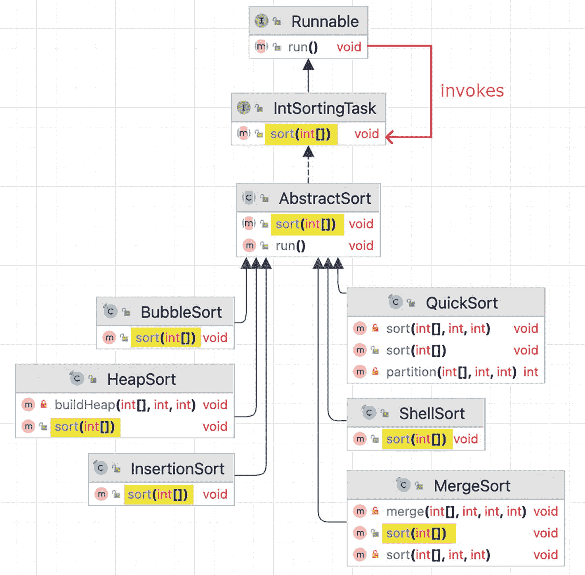
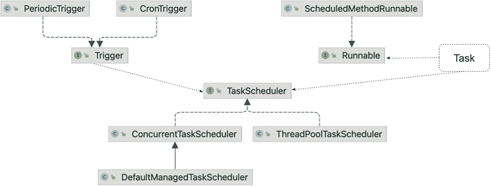
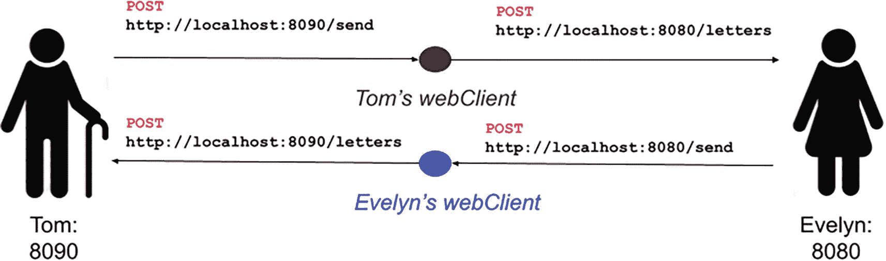
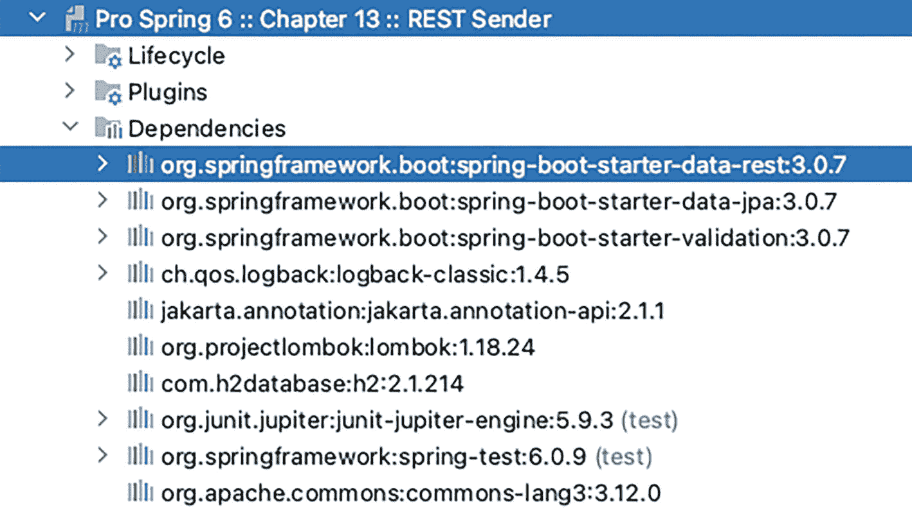
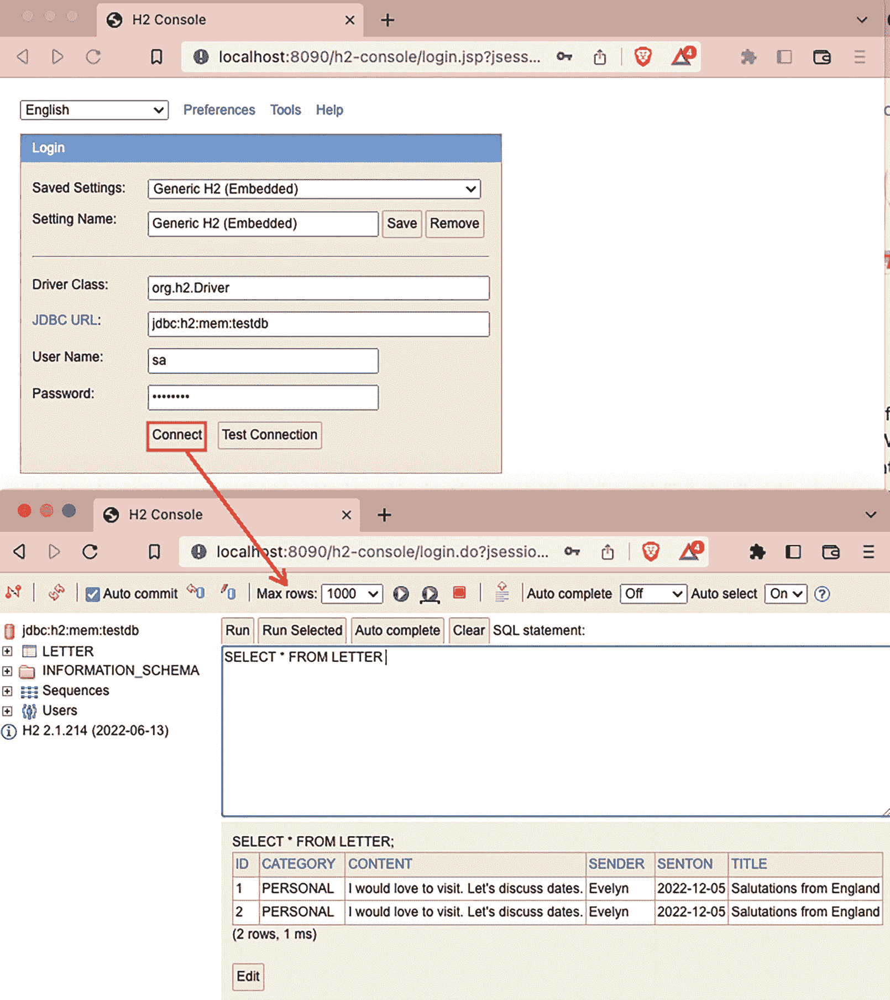

# 12. 任务执行与调度

任务调度是企业应用中的常见功能。任务调度主要由三部分组成：

*   *任务*：需要在特定时间或定期运行的业务逻辑片段
*   *触发器*：指定任务应被执行的条件
*   *调度器*：根据触发器提供的信息执行任务

具体来说，本章涵盖以下主题：

*   *Java 中的任务执行*：我们简要讨论 Spring 的 `TaskExecutor` 接口以及任务是如何执行的。
*   *Spring 中的任务调度*：我们讨论 Spring 如何支持任务调度，重点介绍 Spring 3 中引入的 `TaskScheduler` 抽象。我们还涵盖了调度场景，例如固定间隔调度和 `cron` 表达式。
*   *异步任务执行*：我们展示如何在 Spring 中使用 `@Async` 注解来异步执行任务。

如果你是一位有一定经验的开发者，你可能已经了解执行线程的概念。一个 Java 应用由 JVM 可以在一个或多个线程上运行的代码来描述，其中一个线程是调用主类 `main(..)` 方法的非守护线程。在 Java 中，用于建模执行线程的类是 `java.lang.Thread`。可以通过扩展此类并重写其 `run()` 方法来创建执行线程。生成的实例建模了一个执行线程，必须通过调用其 `start()` 方法来显式启动它。

然而，还有另一种创建线程的方法，即创建一个实现 `java.lang.Runnable` 的类。该接口为希望执行代码的对象（包括 `Thread` 类）提供了一个通用协议。这意味着可以创建 `Runnable` 实例并将其传递给某些组件（称为*执行器*），这些组件会按照其配置的方式执行代码：顺序执行、并行执行，或使用线程池提供的线程。如果任务的概念还不明确，那么在 Java 应用中，*任务*就是任何 `Runnable` 类型的实例。

在 Java 中，`java.util.concurrent.Executor` 接口代表了异步任务执行的抽象。在 Spring 中，有一个扩展了该接口的接口，除了它被标注为 `@FunctionalInterface` 以标记其为函数式接口外，两者基本相同：`org.springframework.core.task.TaskExecutor`。

一个信息符号。 该接口对于 Spring 2.x 中与 JDK 1.4 的向后兼容性是必要的。

Spring 的 `TaskExecutor` 接口如清单 12-1 所示。

```
package org.springframework.core.task;
import java.util.concurrent.Executor;
@FunctionalInterface
public interface TaskExecutor extends Executor {
@Override
void execute(Runnable task);
}
清单 12-1
Spring 的 org.springframework.core.task.TaskExecutor 接口
```

该接口只有一个方法 `execute(Runnable task)`，它根据线程池的语义和配置接受一个任务进行执行。Spring 提供了一些有用的 `TaskExecutor` 实现。


## Java 中的任务执行

在 Java 中，有相当多的 `java.util.concurrent.Executor` 实现。线程池在执行大量异步任务时具有性能优势，因为它们提供了一种在执行业务任务集合时对资源（包括线程）进行约束和管理的方法。`ThreadPoolExecutor` 会维护基本统计数据，如活动任务数和已完成任务数，而我（Iuliana）最喜欢的实现之一是编写一个实现 `java.lang.Runnable` 的 `ThreadPoolMonitor` 类，用于打印这些统计数据。

本节介绍一个模拟各种排序算法的类层次结构，如图 12-1 所示。这些类适用于创建可由执行器异步执行的排序任务。



该层次结构图展示了类的建模过程。从归并排序、插入排序、堆排序、希尔排序、快速排序和冒泡排序开始，经过抽象排序类、整型排序任务类，最后到 Runnable 接口。

图 12-1

模拟各种排序算法的类层次结构

这些排序算法的实现对于本章来说并不重要，但由 `ThreadPoolExecutor` 实例管理并并行运行它们才是关键。

所有特定于任务执行的 Java 组件都可以在 `java.util.concurrent` 包下找到。`ThreadPoolExecutor` 类是 `ExecutorService` 的一个实现，它使用一个或多个池化线程来执行每个提交的任务，并通过 `Executors` 工厂方法进行配置。线程池的大小及其最大容量作为参数传递给其构造函数。任务作为实现 `BlockingQueue<Runnable>` 接口的类型的参数提供，该接口通过线程安全的方式避免同一任务被多次提交执行。它还支持在检索元素之前等待队列变为非空的操作，这使得在开始执行队列内容后仍可以向该列表添加任务。

`ThreadPoolMonitor` 类是专门为本节编写的 `Thread` 的自定义扩展，用于打印正在运行的 `ThreadPoolExecutor` 的统计数据，其代码如清单 12-2 所示。

```
package com.apress.prospring6.twelve.classic;
import org.slf4j.Logger;
import org.slf4j.LoggerFactory;
import java.util.concurrent.ThreadPoolExecutor;
public class ThreadPoolMonitor implements Runnable {
private static final Logger LOGGER = LoggerFactory.getLogger(ThreadPoolMonitor.class);
protected ThreadPoolExecutor executor;
protected int printInterval = 200;
@Override
public void run() {
try {
while (executor.getActiveCount() > 0) {
monitorThreadPool();
Thread.sleep(printInterval);
}
} catch (Exception e) {
LOGGER.error(e.getMessage());
}
}
private void monitorThreadPool() {
String strBuff = "CurrentPoolSize : " + executor.getPoolSize() +
" - CorePoolSize : " + executor.getCorePoolSize() +
" - MaximumPoolSize : " + executor.getMaximumPoolSize() +
" - ActiveTaskCount : " + executor.getActiveCount() +
" - CompletedTaskCount : " + executor.getCompletedTaskCount() +
" - TotalTaskCount : " + executor.getTaskCount() +
" - isTerminated : " + executor.isTerminated();
LOGGER.debug(strBuff);
}
public void setExecutor(ThreadPoolExecutor executor) {
this.executor = executor;
}
}
清单 12-2
ThreadPoolMonitor 监控类
```

请注意，`ThreadPoolMonitor` 类实现了 `Runnable`，这使其本身也成为一个任务。`ThreadPoolMonitor` 实例可以作为独立于 `ThreadPoolExecutor` 管理的排序任务而执行的线程启动。

清单 12-3 展示了 `ClassicDemo` 类，该类生成一个包含 100,000 个元素、值介于 0 到 500,000 之间的数组，并将其交给图 12-1 中的任务进行并行排序。这些任务由 `ThreadPoolExecutor` 实例管理和执行，并由 `ThreadPoolMonitor` 实例进行监控。

```
package com.apress.prospring6.twelve.classic;
import java.util.List;
import java.util.Random;
import java.util.concurrent.LinkedBlockingQueue;
import java.util.concurrent.ThreadPoolExecutor;
import java.util.concurrent.TimeUnit;
public class ClassicDemo {
public static void main(String... args) {
int[] arr = new Random().ints(100_000, 0, 500_000).toArray(); // (1)
// LOGGER.info("Starting Array: {} " , Arrays.toString(arr));
var algsMonitor = new ThreadPoolMonitor(); // (2)
var monitor = new Thread(algsMonitor);
var executor = new ThreadPoolExecutor(2, 4, 0L, TimeUnit.MILLISECONDS, new LinkedBlockingQueue()); // (3)
algsMonitor.setExecutor(executor);
List.of(new BubbleSort(arr), // (4)
new InsertionSort(arr),
new HeapSort(arr),
new MergeSort(arr),
new QuickSort(arr),
new ShellSort(arr))
.forEach(executor::execute);
monitor.start(); // (5)
executor.shutdown();
try {
executor.awaitTermination(30, TimeUnit.MINUTES);
} catch (InterruptedException e) {
throw new RuntimeException(e);
}
}
}
清单 12-3
ClassicDemo 监控类
```

代码已使用空行分成多个部分。各部分用数字标记。每个部分负责以下内容：

*   1\. 代码的第一部分创建数组。如果你想打印数组以检查其值，请随意取消日志行的注释。

*   2\. 第二部分创建 `ThreadPoolMonitor` 实例（`algsMonitor`）和将执行它的 `Thread`（`monitor`）。

*   3\. 第三部分创建 `ThreadPoolExecutor`（`executor`）。请注意，在初始化 `ThreadPoolExecutor` 时，我们将初始池大小保持为 2，最大池大小保持为 4。`algsMonitor` 被配置为监控 `executor`。

*   4\. 第四部分创建任务并提交它们以供执行。

*   5\. 第五部分启动 `monitor` 线程。然后关闭 `executor`，导致所有已提交任务完成执行并终止线程池。

当执行 `ClassicDemo` 类时，日志将清楚地显示任务正在并行执行，并且某些任务比其他任务完成得更快……`BubbleSort` 在这场竞争中根本没有机会，对吧？

日志片段如清单 12-4 所示。


```
DEBUG: ThreadPoolMonitor - CurrentPoolSize : 2 - CorePoolSize : 2 - MaximumPoolSize : 4 - ActiveTaskCount : 2 - CompletedTaskCount : 0 - TotalTaskCount : 6 - isTerminated : false
INFO : AbstractSort - InsertionSort Sort Time: 0.8 seconds
DEBUG: ThreadPoolMonitor - MONITOR: [Sorting Algs Monitor] CurrentPoolSize : 2 - CorePoolSize : 2 - MaximumPoolSize : 4 - ActiveTaskCount : 2 - CompletedTaskCount : 1 - TotalTaskCount : 6 - isTerminated : false
INFO : AbstractSort - InsertionSort Sort Time: 0.847 seconds
INFO : AbstractSort - HeapSort Sort Time: 0.014 seconds
DEBUG: ThreadPoolMonitor - CurrentPoolSize : 2 - CorePoolSize : 2 - MaximumPoolSize : 4 - ActiveTaskCount : 2 - CompletedTaskCount : 2 - TotalTaskCount : 6 - isTerminated : false
INFO : AbstractSort - MergeSort Sort Time: 0.226 seconds
INFO : AbstractSort - QuickSort Sort Time: 0.011 seconds
INFO : AbstractSort - ShellSort Sort Time: 0.017 seconds
DEBUG: ThreadPoolMonitor - CurrentPoolSize : 1 - CorePoolSize : 2 - MaximumPoolSize : 4 - ActiveTaskCount : 1 - CompletedTaskCount : 5 - TotalTaskCount : 6 - isTerminated : false
...
DEBUG: ThreadPoolMonitor - CurrentPoolSize : 1 - CorePoolSize : 2 - MaximumPoolSize : 4 - ActiveTaskCount : 1 - CompletedTaskCount : 5 - TotalTaskCount : 6 - isTerminated : false
INFO : AbstractSort - BubbleSort Sort Time: 19.991 seconds
Listing 12-4
The ClassicDemo Console Log
```

日志清晰地展示了执行器中活跃任务数、已完成任务数和总任务数的变化。在本例中，`ThreadPoolExecutor` 是通过显式调用构造函数创建的，但通过调用工厂方法 `Executors.newFixedThreadPool(6)` 也能获得类似的结果。`ExecutorService` 还有其他 Java 扩展，例如 `ScheduledExecutorService`，它们允许对任务执行进行更精细的控制，因此欢迎深入探究。接下来，我们将转向 Spring 如何执行任务。

## Spring 中的任务执行

Spring 的 `TaskExecutor` 接口是在 2.0 版本中添加的。与 JDK 类似，Spring 开箱即用地提供了许多适用于不同需求的 `TaskExecutor` 实现^(¹⁰⁷)。其中最值得关注的有以下几种：

*   `org.springframework.core.task.SyncTaskExecutor`：不异步执行任务；调用发生在调用线程中。
*   `org.springframework.core.task.SimpleAsyncTaskExecutor`：每次调用时创建新线程；不重用现有线程。
*   `org.springframework.scheduling.concurrent.ConcurrentTaskExecutor`：`java.util.concurrent.Executor` 实例的适配器。由于存在 `ThreadPoolTaskExecutor` 类，通常不常使用，但如果此实现不够灵活，它就会派上用场。
*   `org.springframework.scheduling.concurrent.ThreadPoolTaskExecutor`：`TaskExecutor` 实现，提供通过 Bean 属性配置 `ThreadPoolExecutor` 并将其作为 Spring `TaskExecutor` 暴露的能力。
*   `org.springframework.scheduling.quartz.SimpleThreadPoolTaskExecutor`：Quartz 的 `SimpleThreadPool` 的子类；当你需要让 Quartz 和非 Quartz 组件共享一个线程池时使用。

每个 `TaskExecutor` 实现都有其特定用途，并且显然都拥有相同的 API。唯一的区别在于配置，即定义要使用哪个 `TaskExecutor` 实现及其属性（如果有的话）。让我们看一个简单的示例，该示例打印出一些随机文本。所使用的 `TaskExecutor` 实现是 `SimpleAsyncTaskExecutor`。首先，我们创建一个包含任务执行逻辑的 Bean 类，如清单 12-5 所示。

```
package com.apress.prospring6.twelve;
// 部分导入语句已省略
import org.springframework.core.task.TaskExecutor;
import java.util.UUID;
@Component
public class RandomStringPrinter {
private final Logger logger = LoggerFactory.getLogger(RandomStringPrinter.class);
private final TaskExecutor taskExecutor;
public RandomStringPrinter(TaskExecutor taskExecutor) {
this.taskExecutor = taskExecutor;
}
public void executeTask() {
for(int i=0; i<10; i++) {
int index = i;
taskExecutor.execute(() -> LOGGER.info("{}: {}", index , UUID.randomUUID().toString().substring(0, 8)));
}
}
}
清单 12-5
RandomStringPrinter 类
```

这个类只是一个普通的 Bean，需要将 `TaskExecutor` 作为依赖注入，并定义了一个 `executeTask()` 方法。`executeTask()` 方法通过创建一个新的 `Runnable` 实例（包含我们想要为此任务执行的逻辑）来调用所提供的 `TaskExecutor` 的 execute 方法。这里可能不太明显，因为使用了 lambda 表达式来创建 `Runnable` 实例。配置非常简单，与上一节描述的配置类似。我们唯一需要考虑的是，需要提供一个 `TaskExecutor` Bean 的声明，该 Bean 将被注入到 `RandomStringPrinter` Bean 中。

清单 12-6 展示了配置类和名为 `SimpleAsyncTaskExecutorDemo` 的演示类。

```
package com.apress.prospring6.twelve;
// 部分导入语句已省略
import org.springframework.scheduling.annotation.EnableAsync;
@Configuration
@EnableAsync
class AppConfig {
@Bean
TaskExecutor taskExecutor() {
return new SimpleAsyncTaskExecutor();
}
}
public class SimpleAsyncTaskExecutorDemo {
public static void main(String... args) throws IOException {
try (var ctx = new AnnotationConfigApplicationContext(AppConfig.class, RandomStringPrinter.class)) {
var printer = ctx.getBean(RandomStringPrinter.class);
printer.executeTask();
System.in.read();
}
}
}
清单 12-6
SimpleAsyncTaskExecutorDemo 和 AppConfig 监控类
```

该类中最重要的部分是 `@EnableAsync` 注解，它启用了 Spring 的异步方法执行能力，这意味着 Spring 将搜索关联的线程池定义，要么是上下文中唯一的 `org.springframework.core.task.TaskExecutor` Bean，要么是名为 `taskExecutor` 的 `java.util.concurrent.Executor` Bean。如果未找到，将使用 `org.springframework.core.task.SimpleAsyncTaskExecutor` 来处理异步方法调用。

当运行 `SimpleAsyncTaskExecutorDemo` 类时，由于任务是异步执行的，每个任务会以随机顺序打印随机字符串。这一点很明显，因为每个任务都有一个关联的编号。清单 12-7 展示了示例输出。

```
INFO : RandomStringPrinter - 6: 87548a56
INFO : RandomStringPrinter - 4: 019c9571
INFO : RandomStringPrinter - 3: a5cc57ef
INFO : RandomStringPrinter - 1: 8a6dc271
INFO : RandomStringPrinter - 5: 52fd6224
INFO : RandomStringPrinter - 8: 11810531
INFO : RandomStringPrinter - 2: 820b17a4
INFO : RandomStringPrinter - 7: 9e56cf1b
INFO : RandomStringPrinter - 0: eab9362a
INFO : RandomStringPrinter - 9: d24c2076
清单 12-7
SimpleAsyncTaskExecutorDemo 类执行打印的日志示例
```


## Spring 中的任务调度

执行任务显然很容易，但企业应用通常需要以更可控的方式执行，这意味着任务必须被调度。在许多应用中，各种任务（例如向客户发送电子邮件通知、运行日终作业、执行数据清理以及批量更新数据）需要按固定间隔（例如每小时）或特定计划（例如每周一至周五晚上 8 点）定期调度执行。

在 Spring 应用中，有多种方式可以触发任务的执行。一种方式是利用应用部署环境中已有的调度系统从外部触发作业。例如，许多企业使用商业系统（如 Control-M 或 CA AutoSys）进行任务调度。如果应用运行在 Linux/Unix 平台上，则可以使用 crontab 调度器。作业触发可以通过向 Spring 应用发送 RESTful-WS 请求，并由 Spring 的 MVC 控制器触发任务来实现。

另一种方式是使用 Spring 内置的任务调度支持。Spring 在任务调度方面提供了三种选择：

*   *对 JDK Timer 的支持*：Spring 支持 JDK 的 `Timer` 对象进行任务调度。

*   *与 Quartz 集成*：Quartz 作业调度器^(¹⁰⁸) 是一个流行的开源调度库。

*   *Spring 自身的 `TaskScheduler` 抽象*：Spring 3 引入了 `TaskScheduler` 抽象，它提供了一种简单的任务调度方式，并支持大多数典型需求。

本节重点介绍如何使用 Spring 的 `TaskScheduler` 抽象进行任务调度，其结果是项目非常简单，唯一必需的 Spring 依赖是 `spring-context.jar` 库。

### 介绍 Spring `TaskScheduler` 抽象

Spring 的 `TaskScheduler` 抽象提供了多种方法，用于调度任务在未来的某个时间点运行，它主要包含三个参与者：

*   *`Trigger` 接口*：`org.springframework.scheduling.Trigger` 接口提供了定义触发机制的支持。Spring 提供了两个 `Trigger` 实现。`CronTrigger` 类支持基于 `cron` 表达式触发，而 `PeriodicTrigger` 类支持基于初始延迟后按固定间隔触发。

*   *任务*：任务是需要被调度的业务逻辑片段。在 Spring 中，任务可以指定为任何 Spring Bean 中的一个方法。

*   *`TaskScheduler` 接口*：`org.springframework.scheduling.TaskScheduler` 接口提供了任务调度的支持。Spring 提供了三个 `TaskScheduler` 接口的实现类。`ConcurrentTaskScheduler` 和 `ThreadPoolTaskScheduler` 类（均位于 `org.springframework.scheduling.concurrent` 包下）封装了 `java.util.concurrent.ScheduledThreadPoolExecutor` 类。这两个类都支持从共享线程池执行任务。同样位于 `org.springframework.scheduling.concurrent` 包下的 `DefaultManagedTaskScheduler` 类，通常用于 Jakarta EE 环境。

图 12-2 展示了 `Trigger` 接口、`TaskScheduler` 接口以及实现 `java.lang.Runnable` 接口的任务之间的关系。



该图展示了触发器与任务调度器接口之间的关系。任务调度器（如并发任务调度器、线程池任务调度器和默认托管任务调度器）执行任务，而执行过程由周期性触发器和 cron 触发器触发。随后，它实现了一个可运行接口。

图 12-2

触发器、任务与调度器之间的关系

基本上，任务调度器基于日期、时间、一次性或重复执行任务。任务执行由 `Trigger` 实现触发，这些实现提供了对任务执行时间的精细控制，尤其是在与其他任务执行的关系方面。

要使用 Spring 的 `TaskScheduler` 抽象来调度任务，需要使用一些注解，这些注解将在下一节中进行演示和说明。


### 探索示例任务

为了演示 Spring 中的任务调度，我们先实现一个简单的任务，即一个维护汽车信息数据库的应用程序。清单 12-8 展示了 `Car` 类，它被实现为一个 JPA 实体类。

```
package com.apress.prospring6.twelve.entities;
import static jakarta.persistence.GenerationType.IDENTITY;
import jakarta.persistence.*;
import java.time.LocalDate;
@Entity
@Table(name="CAR")
public class Car {
@Id
@GeneratedValue(strategy = IDENTITY)
@Column(name = "ID")
private Long id;
@Column(name="LICENSE_PLATE")
private String licensePlate;
@Column(name="MANUFACTURER")
private String manufacturer;
@Column(name="MANUFACTURE_DATE")
private LocalDate manufactureDate;
@Column(name="AGE")
private int age;
@Version
private int version;
// getters and setters
}
清单 12-8
Car 实体类
```

该实体类用作由 Hibernate 生成的 `CAR` 表的模型。数据访问层和服务层的配置由 `BasicDataSourceCfg` 和 `JpaConfig` 类提供，这与数据访问章节中展示的方式相同。为了指示 Hibernate 创建该表，将 `Environment.HBM2DDL_AUTO` 属性设置为 `create-drop`。为了确保有一些数据可供操作，引入了一个名为 `DBInitializer` 的类。创建此类型的 Bean 会向表中添加三条 `Car` 记录。`DBInitializer` 类如清单 12-9 所示。

```
package com.apress.prospring6.twelve.config;
// import statements omitted
@Service
public class DBInitializer {
private static Logger LOGGER = LoggerFactory.getLogger(DBInitializer.class);
private final CarRepository carRepository;
public DBInitializer(CarRepository carRepository) {
this.carRepository = carRepository;
}
@PostConstruct
public void initDB() {
LOGGER.info("Starting database initialization...");
var car = new Car();
car.setLicensePlate("GRAVITY-0405");
car.setManufacturer("Ford");
car.setManufactureDate(LocalDate.of(2006, 9, 12));
carRepository.save(car);
car = new Car();
car.setLicensePlate("CLARITY-0432");
car.setManufacturer("Toyota");
car.setManufactureDate(LocalDate.of(2003, 9, 9));
carRepository.save(car);
car = new Car();
car.setLicensePlate("ROSIE-0402");
car.setManufacturer("Toyota");
car.setManufactureDate(LocalDate.of(2017, 4, 16));
carRepository.save(car);
// ...
LOGGER.info("Database initialization finished.");
}
}
清单 12-9
填充 CAR 表的 DBInitializer 类
```

注入到 `DBInitializer` 中的 `CarRepository` Bean 是一个典型的 Spring Data 仓库，它是一个扩展了 `CrudRepository<Car, Long>` 的接口。同一个 Bean 也被注入到清单 12-10 所描述的 `CarServiceImpl` 类中。

```
package com.apress.prospring6.twelve.service;
// import statements omitted
import org.springframework.scheduling.annotation.Scheduled;
@Service("carService")
@Repository
@Transactional
public class CarServiceImpl implements CarService {
public boolean done;
final Logger LOGGER = LoggerFactory.getLogger(CarServiceImpl.class);
private final CarRepository carRepository;
public CarServiceImpl(CarRepository carRepository) {
this.carRepository = carRepository;
}
@Override
@Transactional(readOnly=true)
public Stream findAll() {
return  StreamSupport.stream(carRepository.findAll().spliterator(), false);
}
@Override
public Car save(Car car) {
return carRepository.save(car);
}
@Override
@Scheduled(fixedDelay=10000)
public void updateCarAgeJob() {
var cars = findAll();
var currentDate = LocalDate.now();
LOGGER.info("Car age update job started");
cars.forEach(car -> {
var p = Period.between(car.getManufactureDate(), currentDate);
int age = p.getYears();
car.setAge(age);
save(car);
LOGGER.info("Car age update --> {}" , car);
});
LOGGER.info("Car age update job completed successfully");
done = true;
}
@Override
public boolean isDone() {
return done;
}
}
清单 12-10
CarServiceImpl 类
```

`CarServiceImpl` 类包含四个方法：

*   `Stream<Car> findAll()`：检索所有汽车的信息。
*   `Car save(Car car)`：持久化一个更新后的 `Car` 对象。
*   `void` `updateCarAgeJob()`：需要定期运行的任务，用于根据汽车的制造日期和当前日期更新车龄。注意其上的 `@Scheduled` 注解。它将该方法配置为大约每 10 秒执行一次。
*   `boolean isDone()`：一个实用方法，用于了解任务何时结束，以便应用程序可以优雅地关闭。

唯一缺少的是启用任务调度的 Spring 应用程序配置。`TaskSchedulingConfig` 类如清单 12-11 所示。

```
package com.apress.prospring6.twelve.config;
import org.springframework.context.annotation.ComponentScan;
import org.springframework.context.annotation.Configuration;
import org.springframework.scheduling.annotation.EnableScheduling;
@Configuration
@ComponentScan(basePackages  = {"com.apress.prospring6.twelve"} )
@EnableScheduling
public class TaskSchedulingConfig {
}
清单 12-11
TaskSchedulingConfig 类
```

在 `@Configuration` 类上使用的 `@EnableScheduling` 注解会启用对容器中任何 Spring 管理的 Bean 或其方法上的 `@Scheduled` 注解的检测。带有 `@Scheduled` 注解的方法甚至可以直接在 `@Configuration` 类中声明，因为配置类本身也是 Bean。从 Spring 4.2 开始，任何作用域的 Bean 都支持 `@Scheduled` 方法。此注解告诉 Spring 查找关联的调度器定义：要么是上下文中唯一的 `TaskScheduler` Bean，要么是名为 `taskScheduler` 的 `TaskScheduler` Bean，要么是一个 `ScheduledExecutorService` Bean。如果未找到，则会创建并使用一个本地的单线程默认调度器来执行计划任务。要调度 Spring Bean 中的特定方法，该方法必须使用 `@Scheduled` 注解并传入调度要求。

测试程序如清单 12-12 所示。

```
package com.apress.prospring6.twelve;
// import statements omitted
public class CarTaskSchedulerDemo {
private static final Logger LOGGER = LoggerFactory.getLogger(CarTaskSchedulerDemo.class);
public static void main(String[] args) throws IOException {
try (var ctx = new AnnotationConfigApplicationContext(TaskSchedulingConfig.class)) {
try {
var taskScheduler = ctx.getBean(ScheduledAnnotationBeanPostProcessor.DEFAULT_TASK_SCHEDULER_BEAN_NAME);
LOGGER.info(" >>>> Task 'taskScheduler' found: {}", taskScheduler.getClass());
} catch (NoSuchBeanDefinitionException nbd) {
LOGGER.debug("No 'taskScheduler' configured!");
}
System.in.read();
}
}
}
清单 12-12
CarTaskSchedulerDemo 类
```

由于我们想检查是否有调度器，我们在演示代码中搜索名为 `taskScheduler` 的调度器 Bean（这是 `DEFAULT_TASK_SCHEDULER_BEAN_NAME` 常量的值）并打印其类。

Spring 中调度任务的实现方式与几乎所有其他功能的实现方式相同，都是通过代理。`@EnableScheduling` 注解会向上下文中添加一个 `org.springframework.scheduling.annotation.ScheduledAnnotationBeanPostProcessor` Bean，该 Bean 会拾取带有 `@Scheduled` 注解的方法。这些方法由 `TaskScheduler` 根据通过 `@Scheduled` 注解配置的 `fixedRate`、`fixedDelay` 或 `cron` 表达式来调用。

由于我们需要主线程继续执行，以便能够看到 `updateCarAgeJob()` 方法被重复执行，因此使用了 `System.in.read()` 语句来等待开发者在退出前按下任意键。控制台中打印的日志可能与清单 12-13 中显示的日志非常相似。


```
00:14:21.818 [main] INFO : ScheduledAnnotationBeanPostProcessor - No TaskScheduler/ScheduledExecutorService bean found for scheduled processing
00:14:21.822 [main] DEBUG: CarTaskSchedulerDemo - No 'taskScheduler' configured!
00:14:21.900 [pool-1-thread-1] INFO : CarServiceImpl - Car age update job started
00:14:21.903 [pool-1-thread-1] INFO : CarServiceImpl - Car age update --> Car{id=1, licensePlate='GRAVITY-0405', manufacturer='Ford', manufactureDate=2006-09-12, age=16, version=0}
00:14:21.908 [pool-1-thread-1] INFO : CarServiceImpl - Car age update --> Car{id=2, licensePlate='CLARITY-0432', manufacturer='Toyota', manufactureDate=2003-09-09, age=19, version=0}
00:14:21.908 [pool-1-thread-1] INFO : CarServiceImpl - Car age update --> Car{id=3, licensePlate='ROSIE-0402', manufacturer='Toyota', manufactureDate=2017-04-16, age=5, version=0}
...
00:14:21.909 [pool-1-thread-1] INFO : CarServiceImpl - Car age update job completed successfully
00:14:31.936 [pool-1-thread-1] INFO : CarServiceImpl - Car age update job started
00:14:31.936 [pool-1-thread-1] INFO : CarServiceImpl - Car age update --> Car{id=1, licensePlate='GRAVITY-0405', manufacturer='Ford', manufactureDate=2006-09-12, age=16, version=1}
00:14:31.937 [pool-1-thread-1] INFO : CarServiceImpl - Car age update --> Car{id=2, licensePlate='CLARITY-0432', manufacturer='Toyota', manufactureDate=2003-09-09, age=19, version=1}
00:14:31.937 [pool-1-thread-1] INFO : CarServiceImpl - Car age update --> Car{id=3, licensePlate='ROSIE-0402', manufacturer='Toyota', manufactureDate=2017-04-16, age=5, version=1}
00:14:31.938 [pool-1-thread-1] INFO : CarServiceImpl - Car age update job completed successfully
...
清单 12-13
使用 TaskSchedulingConfig 配置执行时的 CarTaskSchedulerDemo 日志

日志中添加了线程名称，以明确表明 `updateCarAgeJob()` 方法是在线程池中执行的，即使默认执行器使用的是单个线程。

有两种方法可以配置要使用的任务调度器：让 `TaskSchedulingConfig` 类实现 `org.springframework.scheduling.annotation.SchedulingConfigurer` 并重写 `configureTasks(..)` 来设置自定义任务调度器，或者声明一个自定义的任务调度器 bean。

清单 12-14 展示了实现 `SchedulingConfigurer` 的 `TaskSchedulingConfig2` 类。

```
package com.apress.prospring6.twelve.spring.config;
import org.springframework.context.annotation.FilterType;
import org.springframework.scheduling.annotation.EnableScheduling;
import org.springframework.scheduling.annotation.SchedulingConfigurer;
import org.springframework.scheduling.concurrent.ThreadPoolTaskScheduler;
import org.springframework.scheduling.config.ScheduledTaskRegistrar;
import java.util.concurrent.Executor;
import java.util.concurrent.ScheduledThreadPoolExecutor;
// import statements omitted
@Configuration
@ComponentScan(basePackages  = {"com.apress.prospring6.twelve.spring"})
@EnableScheduling
public class TaskSchedulingConfig2 implements SchedulingConfigurer {
private static final Logger LOGGER = LoggerFactory.getLogger(TaskSchedulingConfig2.class);
@Override
public void configureTasks(ScheduledTaskRegistrar taskRegistrar) {
taskRegistrar.setScheduler(taskExecutor());
}
@Bean(destroyMethod = "shutdown")
public Executor taskExecutor() {
var tpts =  new ThreadPoolTaskScheduler();
tpts.setPoolSize(3);
tpts.setThreadNamePrefix("tsc2-");
return tpts;
}
}
清单 12-14
TaskSchedulingConfig2 配置类
```

任务调度器被配置为使用 `tsc2-` 前缀来命名其管理的线程，以明确表明调用 `updateCarAgeJob()` 的任务是由它执行的。

清单 12-15 展示了检查 `taskExecutor` bean 是否存在的演示程序。

```
package com.apress.prospring6.twelve;
// import statements omitted
public class CarTaskSchedulerDemo {
private static final Logger LOGGER = LoggerFactory.getLogger(CarTaskSchedulerDemo.class);
public static void main(String[] args) throws IOException {
try (var ctx = new AnnotationConfigApplicationContext(TaskSchedulingConfig2.class)) {
try {
var taskExecutor = ctx.getBean("taskExecutor");
LOGGER.info(" >>>> 'taskExecutor' found: {}", taskExecutor.getClass());
} catch (NoSuchBeanDefinitionException nbd) {
LOGGER.debug("No 'taskExecutor' configured!");
}
System.in.read();
}
}
}
清单 12-15
使用 TaskSchedulingConfig2 配置类的 CarTaskSchedulerDemo 版本
```

运行时，此版本的 `CarTaskSchedulerDemo` 会产生如清单 12-16 所示的输出。

```
00:15:47.299 [main] DEBUG: CarTaskSchedulerDemo - No 'taskScheduler' configured!
00:15:47.299 [main] INFO : CarTaskSchedulerDemo -  >>>> 'taskExecutor' found: class org.springframework.scheduling.concurrent.ThreadPoolTaskScheduler
00:15:47.375 [tsc2-1] INFO : CarServiceImpl - Car age update job started
00:15:47.378 [tsc2-1] INFO : CarServiceImpl - Car age update --> Car{id=1, licensePlate='GRAVITY-0405', manufacturer='Ford', manufactureDate=2006-09-12, age=16, version=0}
00:15:47.383 [tsc2-1] INFO : CarServiceImpl - Car age update --> Car{id=2, licensePlate='CLARITY-0432', manufacturer='Toyota', manufactureDate=2003-09-09, age=19, version=0}
00:15:47.383 [tsc2-1] INFO : CarServiceImpl - Car age update --> Car{id=3, licensePlate='ROSIE-0402', manufacturer='Toyota', manufactureDate=2017-04-16, age=5, version=0}
00:15:47.384 [tsc2-1] INFO : CarServiceImpl - Car age update job completed successfully
...
清单 12-16
使用 TaskSchedulingConfig2 配置执行时的 CarTaskSchedulerDemo 日志
```

你之所以看不到超过一个线程，是因为任务执行所需的时间非常短，没有必要使用线程池中的另一个线程。

实现相同功能的另一种方法是直接声明 `TaskScheduler` bean，如清单 12-17 所示。

```
package com.apress.prospring6.twelve.spring.config;
@Configuration
@ComponentScan(basePackages  = {"com.apress.prospring6.twelve.spring"})
@EnableScheduling
public class TaskSchedulingConfig3 {
@Bean
TaskScheduler taskScheduler() {
var tpts =  new ThreadPoolTaskScheduler();
tpts.setPoolSize(3);
tpts.setThreadNamePrefix("tsc3-");
return tpts;
}
}
清单 12-17
TaskSchedulingConfig3 配置类
```

`TaskSchedulingConfig3` 类的测试程序与清单 12-12 中所示的类相同，但日志显示新的任务调度器 bean 已被使用，如清单 12-18 所示。

```
00:16:32.485 [main] INFO : CarTaskSchedulerDemo -  >>>> 'taskScheduler' found: class org.springframework.scheduling.concurrent.ThreadPoolTaskScheduler
00:16:32.558 [tsc3-1] INFO : CarServiceImpl - Car age update job started
00:16:32.560 [tsc3-1] INFO : CarServiceImpl - Car age update --> Car{id=1, licensePlate='GRAVITY-0405', manufacturer='Ford', manufactureDate=2006-09-12, age=16, version=0}
00:16:32.565 [tsc3-1] INFO : CarServiceImpl - Car age update --> Car{id=2, licensePlate='CLARITY-0432', manufacturer='Toyota', manufactureDate=2003-09-09, age=19, version=0}
00:16:32.565 [tsc3-1] INFO : CarServiceImpl - Car age update --> Car{id=3, licensePlate='ROSIE-0402', manufacturer='Toyota', manufactureDate=2017-04-16, age=5, version=0}
00:16:32.566 [tsc3-1] INFO : CarServiceImpl - Car age update job completed successfully
...
清单 12-18
使用 TaskSchedulingConfig3 配置执行时的 CarTaskSchedulerDemo 日志
```


### Spring 中的`异步任务执行`

自 3.0 版本起，Spring 也支持使用注解来异步执行任务。为此，你只需在方法上添加`@Async`注解。这意味着调用方会立即返回，而实际执行则发生在提交给 Spring `TaskExecutor`的任务中。

话虽如此，清单 12-19 展示了`AsyncServiceImpl`类，它定义了两个由异步任务调用的简单方法。

```
package com.apress.prospring6.twelve.spring.async;
import java.util.concurrent.CompletableFuture;
import java.util.concurrent.Future;
import org.slf4j.Logger;
import org.slf4j.LoggerFactory;
import org.springframework.scheduling.annotation.Async;
public class AsyncServiceImpl implements AsyncService {
private static final Logger LOGGER = LoggerFactory.getLogger(AsyncServiceImpl.class);
@Async
@Override
public void asyncTask() {
LOGGER.info("开始执行异步任务");
try {
Thread.sleep(10000);
} catch (Exception ex) {
LOGGER.error("任务中断", ex);
}
LOGGER.info("异步任务执行完毕");
}
@Async
@Override
public Future asyncWithReturn(String name) {
LOGGER.info("开始执行带返回值的异步任务，参数为 {}",name);
try {
Thread.sleep(5000);
} catch (Exception ex) {
LOGGER.error("任务中断", ex);
}
LOGGER.info("带返回值的异步任务执行完毕，参数为 {}", name);
return CompletableFuture.completedFuture("你好: " + name);
}
}
清单 12-19
AsyncServiceImpl Bean 类
```

`AsyncService`接口定义了两个方法，`AsyncServiceImpl`提供了它们的实现。`asyncTask()`方法是一个简单的任务，它向日志记录器输出信息。`asyncWithReturn()`方法接受一个`String`参数，并返回一个`java.util.concurrent.CompletableFuture<T>`实例，调用方稍后可以使用该实例来获取执行结果。

通过启用 Spring 的异步方法执行能力来识别`@Async`注解，这可以通过在 Java 配置类上添加`@EnableAsync`注解来实现。通过声明配置类实现`org.springframework.scheduling.annotation.AsyncConfigurer`，可以对配置进行细化。

清单 12-20 展示了启用异步任务执行的空配置类。

```
package com.apress.prospring6.twelve.spring.async;
// 其他导入语句已省略
import org.springframework.scheduling.annotation.EnableAsync;
@Configuration
@EnableAsync
@ComponentScan
public class AsyncConfig {
@Bean
public AsyncService asyncService() {
return new AsyncServiceImpl();
}
}
清单 12-20
AsyncConfig Bean 类
```

一个信息符号。 `AsyncService` bean 是使用`@Bean`声明的，这是为了避免被之前引入的任务调度配置类扫描到，并添加到它不属于的上下文中。这是一个技术决策，旨在避免冲突和日志污染，主要是为了保持示例范围的分离。

测试此配置需要显式提交任务，特别是因为我们需要`asyncWithReturn()`调用的结果。测试程序如清单 12-21 所示。

```
package com.apress.prospring6.twelve.spring.async;
// 其他导入语句已省略
import org.springframework.scheduling.annotation.EnableAsync;
import java.util.concurrent.ExecutionException;
public class AsyncDemo {
private static final Logger LOGGER = LoggerFactory.getLogger(AsyncDemo.class);
public static void main(String... args) throws IOException, ExecutionException, InterruptedException {
try (var ctx = new AnnotationConfigApplicationContext(AsyncConfig.class)) {
var asyncService = ctx.getBean("asyncService", AsyncService.class);
for (int i = 0; i > 结果 1: " + result1.get());
LOGGER.info(" >> 结果 2: " + result2.get());
LOGGER.info(" >> 结果 3: " + result3.get());
System.in.read();
}
}
}
清单 12-21
AsyncDemo 测试类
```

`asyncTask()`方法被调用了五次，然后`asyncWithReturn()`方法被调用了三次，每次使用不同的参数，之后主线程休眠六秒后，我们检索结果。运行程序会产生如清单 12-22 所示的输出。

```
00:11:28.937 [main] INFO : AsyncExecutionAspectSupport - 未找到用于异步处理的任务执行器 bean：没有类型为 TaskExecutor 的 bean，也没有名为 'taskExecutor' 的 bean
00:11:28.944 [SimpleAsyncTaskExecutor-1] INFO : AsyncServiceImpl - 开始执行异步任务
00:11:28.944 [SimpleAsyncTaskExecutor-3] INFO : AsyncServiceImpl - 开始执行异步任务
00:11:28.944 [SimpleAsyncTaskExecutor-4] INFO : AsyncServiceImpl - 开始执行异步任务
00:11:28.944 [SimpleAsyncTaskExecutor-5] INFO : AsyncServiceImpl - 开始执行异步任务
00:11:28.944 [SimpleAsyncTaskExecutor-2] INFO : AsyncServiceImpl - 开始执行异步任务
00:11:28.945 [SimpleAsyncTaskExecutor-8] INFO : AsyncServiceImpl - 开始执行带返回值的异步任务，参数为 BB King
00:11:28.945 [SimpleAsyncTaskExecutor-7] INFO : AsyncServiceImpl - 开始执行带返回值的异步任务，参数为 Eric Clapton
00:11:28.945 [SimpleAsyncTaskExecutor-6] INFO : AsyncServiceImpl - 开始执行带返回值的异步任务，参数为 John Mayer
00:11:33.951 [SimpleAsyncTaskExecutor-7] INFO : AsyncServiceImpl - 带返回值的异步任务执行完毕，参数为 Eric Clapton
00:11:33.951 [SimpleAsyncTaskExecutor-6] INFO : AsyncServiceImpl - 带返回值的异步任务执行完毕，参数为 John Mayer
00:11:33.951 [SimpleAsyncTaskExecutor-8] INFO : AsyncServiceImpl - 带返回值的异步任务执行完毕，参数为 BB King
00:11:34.949 [main] INFO : AsyncDemo -  >> 结果 1: 你好: John Mayer
00:11:34.949 [main] INFO : AsyncDemo -  >> 结果 2: 你好: Eric Clapton
00:11:34.949 [main] INFO : AsyncDemo -  >> 结果 3: 你好: BB King
00:11:38.949 [SimpleAsyncTaskExecutor-5] INFO : AsyncServiceImpl - 异步任务执行完毕
00:11:38.949 [SimpleAsyncTaskExecutor-2] INFO : AsyncServiceImpl - 异步任务执行完毕
00:11:38.949 [SimpleAsyncTaskExecutor-3] INFO : AsyncServiceImpl - 异步任务执行完毕
00:11:38.949 [SimpleAsyncTaskExecutor-4] INFO : AsyncServiceImpl - 异步任务执行完毕
00:11:38.949 [SimpleAsyncTaskExecutor-1] INFO : AsyncServiceImpl - 异步任务执行完毕
清单 12-22
AsyncDemo 日志示例
```

从输出中可以看到，所有调用都是同时开始的。三个带返回值的调用首先完成，并显示在控制台输出中。最后，调用的五个`asyncTask()`方法也完成了。

自定义此配置就像自定义调度配置一样简单——只需让配置类实现`AsyncConfigurer`并重写`getAsyncExecutor()`方法，如清单 12-23 所示。


```
package com.apress.prospring6.twelve.spring.async;
// 其他导入语句已省略
import org.springframework.scheduling.annotation.AsyncConfigurer;
import org.springframework.scheduling.concurrent.ThreadPoolTaskExecutor;
@Configuration
@EnableAsync
@ComponentScan
public class AsyncConfig implements AsyncConfigurer {
@Override
public Executor getAsyncExecutor() {
var tpts =  new ThreadPoolTaskExecutor();
tpts.setCorePoolSize(2);
tpts.setMaxPoolSize(10);
tpts.setThreadNamePrefix("tpte2-");
tpts.setQueueCapacity(5);
tpts.initialize();
return tpts;
}
@Bean
public AsyncService asyncService() {
return new AsyncServiceImpl();
}
}
清单 12-23
使用自定义异步执行器的 AsyncDemo
```

如果在同一个应用上下文中配置了多个任务执行器，可以通过将执行器的名称作为 `@Async` 注解的参数（例如 `@Async("otherExecutor")`）来将任务分配给特定的执行器。

任务执行器和调度器都可以配置为使用特殊的异常处理器来处理任务以抛出异常结束的情况。如清单 12-24 所示，`ThreadPoolTaskScheduler` 可以配置一个 `org.springframework.util.ErrorHandler` 实例来处理异步任务执行期间发生的错误，而任务执行器则可以配置一个 `java.util.concurrent.RejectedExecutionHandler` 类型的实例来处理被拒绝的任务。

```
package com.apress.prospring6.twelve.spring.config;
import org.springframework.scheduling.annotation.EnableScheduling;
import org.springframework.scheduling.concurrent.ThreadPoolTaskScheduler;
import org.springframework.util.ErrorHandler;
import java.util.concurrent.ConcurrentHashMap;
import java.util.concurrent.RejectedExecutionHandler;
import java.util.concurrent.ThreadPoolExecutor;
@Configuration
@ComponentScan(basePackages  = {"com.apress.prospring6.twelve.spring"})
@EnableScheduling
public class TaskSchedulingConfig4 {
@Bean
TaskScheduler taskScheduler() {
var tpts =  new ThreadPoolTaskScheduler();
tpts.setPoolSize(3);
tpts.setThreadNamePrefix("tsc4-");
tpts.setErrorHandler(new LoggingErrorHandler("tsc4"));
tpts.setRejectedExecutionHandler(new RejectedTaskHandler());
return tpts;
}
}
class LoggingErrorHandler implements ErrorHandler {
private static final Logger LOGGER = LoggerFactory.getLogger(LoggingErrorHandler.class);
private final String name;
public LoggingErrorHandler(String name) {
this.name = name;
}
@Override
public void handleError(Throwable t) {
LOGGER.error("[{}]: task failed because {}",name , t.getCause(), t);
}
}
class RejectedTaskHandler implements RejectedExecutionHandler {
private static final Logger LOGGER = LoggerFactory.getLogger(RejectedTaskHandler.class);
private Map rejectedTasks = new ConcurrentHashMap();
@Override
public void rejectedExecution(Runnable r, ThreadPoolExecutor executor) {
LOGGER.info(" >>  check for resubmission.");
boolean submit = true;
if (rejectedTasks.containsKey(r)) {
int submittedCnt = rejectedTasks.get(r);
if (submittedCnt > 5) {
submit = false;
} else {
rejectedTasks.put(r, rejectedTasks.get(r) + 1);
}
} else {
rejectedTasks.put(r, 1);
}
if(submit) {
executor.execute(r);
} else {
LOGGER.error(">> Task {} cannot be re-submitted.", r.toString());
}
}
}
清单 12-24
包含 ErrorHandler 和 RejectedExecutionHandler 的 TaskSchedulingConfig4 示例
```

`LoggingErrorHandler` 仅以 `ERROR` 级别记录正在处理的任务抛出的异常。`RejectedTaskHandler` 会重新提交被拒绝的任务，并记录重新提交的次数。如果某个任务被重新提交超过五次，则会抛出异常，并且该任务将不再被提交。

本章前面的清单 12-10 展示了 `CarServiceImpl` 在内部时间能被 5 整除时抛出 `IllegalStateException`。该异常的堆栈跟踪会显示在控制台中，`LoggingErrorHandler` 会拦截它并打印任务名称，这样我们就知道是哪个任务失败了。

任务被拒绝有两种情况：一是在调用 `shutdown()` 之后提交任务；二是线程池没有可用于执行任务的线程。对于第一种情况，`RejectedExecutionHandler` 的实现只能发送通知或记录包含失败任务详细信息的日志。对于第二种情况，像 `RejectedTaskHandler` 中的实现会尝试将任务重新提交给执行器几次，直到最终被拒绝（如果任务仍未执行）。不幸的是，对于像 `CarServiceImpl` 中那样几乎不做任何操作的任务，这种情况很难重现。

请随意运行 `chapter12` 项目中的示例，并注意 `TaskSchedulingConfig4` 配置特有的异常处理。

清单 12-19 展示了 `AsyncServiceImpl` 在内部时间能被 5 整除时抛出 `IllegalStateException`。对于 Spring 异步任务执行器，一个类型为 `org.springframework.aop.interceptor.SimpleAsyncUncaughtExceptionHandler`（实现了 `org.springframework.aop.interceptor.AsyncUncaughtExceptionHandler`）的 bean 仅会记录该异常。要覆盖此行为，我们必须实现此接口，并通过实现 `AsyncConfigurer` 接口中的 `getAsyncUncaughtExceptionHandler()` 方法来覆盖默认的异常处理器。

清单 12-25 展示了自定义的 `AsyncExceptionHandler` 类和新的异步执行器配置。

```
package com.apress.prospring6.twelve.spring.async;
import org.springframework.aop.interceptor.AsyncUncaughtExceptionHandler;
// 其他导入语句已省略
class AsyncExceptionHandler implements AsyncUncaughtExceptionHandler {
private static final Logger LOGGER = LoggerFactory.getLogger(AsyncExceptionHandler.class);
@Override
public void handleUncaughtException(Throwable t, Method method, Object... obj) {
LOGGER.error("[{}]: task method '{}' failed because {}" , Thread.currentThread(), method.getName() , t.getMessage(), t);
}
}
@Configuration
@EnableAsync
@ComponentScan
class Async2Config implements AsyncConfigurer {
@Override
public Executor getAsyncExecutor() {
var tpts =  new ThreadPoolTaskExecutor();
tpts.setCorePoolSize(2);
tpts.setMaxPoolSize(10);
tpts.setThreadNamePrefix("tpte2-");
tpts.setQueueCapacity(5);
tpts.initialize();
return tpts;
}
@Bean
public AsyncService asyncService() {
return new AsyncServiceImpl();
}
@Override
public AsyncUncaughtExceptionHandler getAsyncUncaughtExceptionHandler() {
return new AsyncExceptionHandler();
}
}
public class Async2Demo {
private static final Logger LOGGER = LoggerFactory.getLogger(AsyncDemo.class);
public static void main(String... args) throws IOException, ExecutionException, InterruptedException {
try (var ctx = new AnnotationConfigApplicationContext(Async2Config.class)) {
var asyncService = ctx.getBean("asyncService", AsyncService.class);
// 调用任务的代码因重复而省略
}
}
}
清单 12-25
包含 ErrorHandler 和 RejectedExecutionHandler 的 TaskSchedulingConfig4 示例
```

同样，请随意运行 `chapter12` 项目中的示例，并注意 `Async2Config` 配置特有的异常处理。


## 摘要

在本章中，我们简要介绍了 Spring 的 `TaskExecutor` 及其常见实现。我们还介绍了 Spring 对任务调度的支持。我们重点讲解了 Spring 内置的 `TaskScheduler` 抽象，并通过一个批量数据更新作业示例，演示了如何使用它来满足任务调度需求。此外，我们还介绍了 Spring 如何通过注解支持异步执行任务。

本章不需要专门的 Spring Boot 部分，因为用于标记调度和异步执行任务的注解是 `spring-context` 库的一部分，并且在基本的 Spring Boot 配置中即可使用。此外，使用 Spring 配置定时和异步任务已经非常简单；Spring Boot 在这方面能做的改进并不多。如果你感到好奇，并希望将提供的项目转换为 Spring Boot 项目，可以参考前面的章节或本简短教程：[`https://spring.io/guides/gs/scheduling-tasks`](https://spring.io/guides/gs/scheduling-tasks)。

由于未来似乎是无服务器的，将不再有服务器持续运行以按计划间隔执行任务。当前云应用的做法是设计在容器中运行的微服务，这些容器按计划部署（例如，在 AWS 中使用计划执行的 Lambda）。任务执行和调度并非复杂主题，因此是时候转向更有趣的内容了——Spring 远程调用。

脚注 1   2

# 13. Spring 远程调用

在本书的前几章中，项目相对简单，它们可以在单个虚拟机上运行，并且唯一交换数据的组件是数据库（可以是本地或远程的）。这类应用程序被称为*单体应用*，这种通信方式也被称为**进程间通信**。

然而，大多数企业应用程序都很复杂，由多个部分组成，并与其他应用程序通信。以一家销售产品的公司为例：当客户下订单时，订单处理系统处理该订单并生成一笔交易。在处理订单过程中，会向库存系统查询产品是否有货。订单确认后，会向履约系统发送通知，以便将产品交付给客户。最后，信息被发送到会计系统，生成发票并处理付款。

这个业务流程并非由单个应用程序完成，而是由多个应用程序协同工作。有些应用程序可能是内部开发的，另一些则可能从外部供应商处购买。此外，这些应用程序可能运行在不同地点的不同机器上，并使用不同的技术和编程语言（例如 Java、.NET 或 C++）实现。在架构设计和实现应用程序时，为了构建高效的业务流程，在应用程序之间进行握手始终是一项关键任务。因此，应用程序需要通过各种协议和技术的远程调用支持，才能在企业环境中良好地运作。

早期，应用程序之间的通信是通过*远程调用*和*Web 服务*实现的。在远程调用中，参与通信过程的应用程序可能位于同一台计算机上，也可能位于不同的计算机上（在同一网络或不同网络中）。在远程调用中，两个应用程序彼此知晓。在一个应用程序中创建另一个应用程序对象的代理，这使得执行外部（远程）方法看起来就像调用本地方法一样。

在 Java 世界中，自 Java 诞生之初就存在远程调用支持。早期（Java 1.x 时代），大多数远程调用需求都是通过使用传统的 TCP 套接字或 Java 远程方法调用（RMI）来实现的。J2EE 出现后，EJB（企业级 JavaBean）和 JMS（Java 消息服务）成为应用间服务器通信的常见选择。

XML 和互联网的快速发展催生了基于 XML over HTTP 的远程支持，也称为 *Web 服务*。这个术语涵盖了任何基于 HTTP 的远程调用技术，包括用于基于 XML 的 RPC 的 Java API（JAX-RPC）、用于 XML Web 服务的 Java API（JAX-WS）以及基于 HTTP 的技术（例如，Hessian^(¹⁰⁹) 和 Burlap^(¹¹⁰)）。Spring 曾经有自己的基于 HTTP 的远程调用支持，称为 Spring HTTP Invoker。在随后的几年里，为了应对互联网的爆炸式增长和更具响应性的 Web 应用需求（例如，通过 Ajax），更轻量级、更高效的应用程序远程调用支持对于企业的成功变得至关重要。因此，用于 RESTful Web 服务的 Java API（JAX-RS）应运而生，并迅速流行起来。其他协议，如 Comet 和 HTML5 WebSocket，也吸引了许多开发者。毋庸置疑，远程调用技术正在快速演进。

如今，最流行的应用程序架构风格是*微服务*，即相互独立的小模块/元素。有时，微服务会依赖于其他微服务甚至数据库。将应用程序分解为更小的元素可以带来结构的可扩展性和效率。这也要求服务之间进行高效的通信，如果事先没有考虑到这一点，可能会造成严重破坏。微服务应用程序中组件之间的通信也被称为**服务间通信**。

在选择服务之间如何通信时，绝对的领先者往往是 *HTTP*。通过 HTTP 的通信可以是*同步*的，即一个服务必须等待另一个服务完成才能返回；这会导致两个服务之间的强耦合。通过 HTTP 的通信也可以是*异步*的，即服务接收来自第一个服务的请求并立即返回一个 URL。HTTP 的替代方案是 *gRPC*^(¹¹¹)，这是一个现代的、开源的、高性能的远程过程调用（RPC）框架，可以在任何环境中运行。遗憾的是，没有用于处理 gRPC 的 Spring 模块。

微服务应用中采用的第二种通信模式是*基于消息的通信*。最流行的协议是高级消息队列协议（AMQP）。与 HTTP 不同，所涉及的服务不直接相互通信，而是通过消息代理（Kafka、RabbitMQ、ActiveMQ、SNS 等）进行交互。

因此，本章的标题有些误导性。其内容将涵盖几种在 Spring 应用程序之间进行远程通信的方式，但 *Spring 远程调用* 这个术语在某种程度上已经过时了。


## 使用 Spring REST 通过 HTTP 进行通信

使用 HTTP 进行通信显然意味着应用程序必须是 Web 应用程序，或者公开一些 REST API 来支持这些调用。为了展示两个 Spring 应用程序如何通过 HTTP 相互通信，我们使用一个模拟发送和接收信件的人的应用程序，如图 13-1 所示。该应用程序以不同的属性启动两次，分别模拟 Evelyn 和 Tom，这两位笔友使用 `POST` 请求互相发送信件，并将其保存到各自独立的 H2 数据库中。代表 Evelyn 的应用程序在端口 8080 上启动，代表 Tom 的应用程序在端口 8090 上启动。



Tom（本地主机 8090）与 Evelyn（本地主机 8080）Web 客户端之间连接的示意图。图中包含了它们之间发送和接收的 send 和 letters 命令。

图 13-1

两个笔友应用程序的抽象表示

为了让 Evelyn 向 Tom 发送一封信，会向 `http://localhost:8080/send` 发送一个 `POST` 事件，其请求体代表一封信。在内部，`LetterSender` Bean 将使用 `webClient` 实例向 Tom 暴露的 REST API `http://localhost:8090/letters` 发起一个 `POST` 调用。

一个圆形渐变颜色图标。 为了在本章中保持讨论和示例的简洁性，维护应用程序之间的安全通信将不是重点。

为了让 Tom 向 Evelyn 发送一封信，将执行相同的操作，如图 13-1 所示。

前面提到的 `webClient` 是 Spring 的 `org.springframework.web.client.RestTemplate` 的一个实例，这是在非响应式应用程序中用于发起 REST 调用的 Web 客户端类。对于响应式应用程序，也有一个实现，将在**第** **20** **章**中介绍。

为了简化问题，本章仅使用 Spring Boot 应用程序。为了进一步简化基于 HTTP 的信件通信应用程序，我们使用了 Spring Data REST 仓库。Spring Data REST 将 Spring HATEOAS（超媒体作为应用状态引擎）和 Spring Data JPA 的特性自动结合在一起，使我们能够公开 REST API 来管理实体，而无需声明控制器来与 Spring Repository 交互。

图 13-2 显示了项目 `chapter13-sender-boot` 模拟我们感兴趣的行为所需的依赖项。



标题为“第 13 章，REST 发送者”的截图。它指示了生命周期、插件和依赖项的下拉菜单。依赖项下拉菜单列出了一组库，并高亮显示了 spring boot starter data rest，版本 3.0.7。

图 13-2

项目 `chapter13-sender-boot` 的依赖项

让我们逐步构建项目，从实体类开始。模拟信件的类如清单 13-1 所示。

```
package com.apress.prospring6.thirteen;
import jakarta.persistence.*;
import lombok.*;
import java.io.Serial;
import java.io.Serializable;
import java.time.LocalDate;
import jakarta.validation.constraints.NotEmpty;
@Data
@Entity
public class Letter implements Serializable {
@Serial
private static final long serialVersionUID = 1L;
@Id
@GeneratedValue(strategy = GenerationType.AUTO)
private Long id;
@NotEmpty
private String title;
private String sender;
private LocalDate sentOn;
@Enumerated(EnumType.STRING)
private Category category = Category.MISC;
@NotEmpty
private String content;
}
清单 13-1
Letter 类
```

请注意，在 `Letter` 实体类上使用的 Lombok `@Data` 注解是一个快捷注解，它集成了 Lombok 的 `@ToString`、`@EqualsAndHashCode`、`@Getter`、`@Setter` 和 `@RequiredArgsConstructor` 的功能，从而生成了与简单实体类（POJO）相关的所有样板代码。

一个圆形渐变感叹号图标。 本书直到本章才避免使用 Lombok^(¹¹²)，因为展示 Hibernate 所需的数据类模型（包含默认构造函数以及所有属性的 setter 和 getter）非常重要。Project Lombok 是一个 Java 库，可自动插入到您的编辑器和构建工具中，为您的 Java 增添活力。它为您生成大量代码：构造函数、getter、setter、hashcode、equals 以及配置日志记录器，从而减少样板代码，让您专注于纯功能实现。

一个三角形感叹号图标。 Lombok 与 Java 编译器紧密相关。由于注解处理器 API 只允许在编译期间创建新文件（而不允许修改现有文件），Lombok 使用该 API 作为入口点来修改 Java 编译器。不幸的是，这些对编译器的修改大量使用了非公共 API。使用 Lombok 可能是个好主意，但您必须意识到，升级编译器可能会破坏您的代码。

`Category` 枚举用于根据层级范围对信件进行分类。该枚举具有多个值，为了确保信件发送时正确的序列化和反序列化，声明了 `CategorySerializer` 和 `CategoryDeserializer` 类，如清单 13-2 所示。

```
package com.apress.prospring6.thirteen;
import com.fasterxml.jackson.core.JsonGenerator;
import com.fasterxml.jackson.core.JsonParser;
import com.fasterxml.jackson.databind.JsonDeserializer;
import com.fasterxml.jackson.databind.JsonSerializer;
import lombok.Getter;
import lombok.RequiredArgsConstructor;
// 其他导入语句已省略
@JsonSerialize(using = Category.CategorySerializer.class)
@JsonDeserialize(using = Category.CategoryDeserializer.class)
@Getter
@RequiredArgsConstructor
public enum Category {
PERSONAL("Personal"),
FORMAL("Formal"),
MISC("Miscellaneous")
;
private final String name;
public static Category eventOf(final String value) {
var result = Arrays.stream(Category.values()).filter(m -> m.getName().equalsIgnoreCase(value)).findAny();
return result.orElse(null);
}
public static final class CategorySerializer extends JsonSerializer {
@Override
public void serialize(final Category enumValue, final JsonGenerator gen, final SerializerProvider serializer) throws IOException {
gen.writeString(enumValue.getName());
}
}
public final static class CategoryDeserializer extends JsonDeserializer {
@Override
public Category deserialize(final JsonParser parser, final DeserializationContext context) throws IOException, JsonProcessingException
{
final String jsonValue = parser.getText();
return Category.eventOf(jsonValue);
}
}
}
清单 13-2
Category 枚举及其 CategorySerializer 和 CategoryDeserializer 类

现在我们已经有了实体类，可以编写 Spring Data REST 仓库了。这个仓库就像一个 Spring Data Repository，可以是 `JpaRepository<T, ID>`、`CrudRepository<T, ID>` 或 `PagingAndSortingRepository<T, ID>`，但该类及其方法使用了特殊的 Spring Data REST 注解进行修饰，这些注解告诉 Spring MVC（**第** **14** **章**的主题）创建用于管理实体的 RESTful 端点。`LetterRepository` 接口如清单 13-3 所示。


```
package com.apress.prospring6.thirteen;
import org.springframework.data.jpa.repository.JpaRepository;
import org.springframework.data.repository.query.Param;
import org.springframework.data.rest.core.annotation.RepositoryRestResource;
import org.springframework.data.rest.core.annotation.RestResource;
import java.time.LocalDate;
import java.util.List;
@RepositoryRestResource(collectionResourceRel = "mailbox", path = "letters")
public interface LetterRepository extends JpaRepository {
@RestResource(path = "byCategory", rel = "customFindMethod")
List findByCategory(@Param("category") Category category);
List findBySentOn(@Param("date") LocalDate sentOn);
@Override
@RestResource(exported = false)
void deleteById(Long id);
}
清单 13-3
LetterRepository Spring Data REST 仓库
```

`@RepositoryRestResource` 注解告诉 Spring MVC 在 `/letters` 路径下创建 RESTful 端点。当项目类路径中包含 `spring-boot-starter-data-rest` 时，此注解并非必需，但它对于自定义所有管理端点所基于的路径非常有用。管理 `Letter` 实例的默认根路径是 `letters`，与示例中使用的路径相同。当访问 `http://localhost:8090/letters` 时，会显示一个类似于清单 13-4 所示的 JSON 结构。

```
{
"_embedded" : {
"mailbox" : [ {
"title" : "来自英格兰的问候",
"sender" : "伊芙琳",
"sentOn" : "2022-12-05",
"category" : "个人",
"content" : "我很想去拜访。我们来讨论一下日期。",
"_links" : {
"self" : {
"href" : "http://localhost:8090/letters/1"
},
"letter" : {
"href" : "http://localhost:8090/letters/1"
}
}
} ]
},
"_links" : {
"self" : {
"href" : "http://localhost:8090/letters"
},
"profile" : {
"href" : "http://localhost:8090/profile/letters"
},
"search" : {
"href" : "http://localhost:8090/letters/search"
}
},
"page" : {
"size" : 20,
"totalElements" : 2,
"totalPages" : 1,
"number" : 0
}
}
清单 13-4
访问 http://localhost:8090/letters 端点时返回的 JSON 表示
```

`collectionResourceRel` 属性声明了在生成指向集合资源的链接时使用的相对值。这意味着所有 `Letter` 实例都将作为名为 `mailbox` 的集合的一部分返回，该集合是可通过 `http://localhost:8090/letters` 端点访问的 JSON 表示的一个成员。（请查看清单 13-4 中高亮显示的文本，那就是所提到的集合，在应用程序启动时它是空的。）

`@RestResource` 注解告诉 Spring MVC 资源的路径值是什么，并且 `rel` 属性的值将出现在链接中。通过执行 `curl` 命令访问 `http://localhost:8090/letters/search`（或在浏览器中打开该 URL），我们可以看到新声明的方法与其他资源一起列出，包括参数名称，如清单 13-5 所示。

```
##  curl http://localhost:8090/letters/search
{
"_links" : {
"findBySentOn" : {
"href" : "http://localhost:8090/letters/search/findBySentOn{?date}",
"templated" : true
},
"customFindMethod" : {
"href" : "http://localhost:8090/letters/search/byCategory{?category}",
"templated" : true
},
"self" : {
"href" : "http://localhost:8090/letters/search"
}
}
}
清单 13-5
访问 http://localhost:8090/letters/search 端点时返回的 JSON 表示
```

在清单 13-3 中，`deleteById(..)` 方法使用了 `@RestResource(exported = false)` 注解。`exported` 属性的值决定了该资源是否被导出。在此示例中，此配置的效果是，不会为 `deleteById(..)` 方法创建 REST 端点。然而，有两个链接与清单 13-3 中声明的 `LetterRepository` 中的两个自定义搜索方法相匹配。`{?category}` 结构表示请求参数名称，因此按类别搜索的实际 URL 类似于：

```
GET http://localhost:8090/letters/search/byCategory?category=PERSONAL
```

`LetterRepository` 接口的目的是暴露 REST API 端点，以供 `RestTemplate` 实例调用。

接下来要分析的类是 `LetterSenderController`。该类是一个 REST 控制器，暴露了一个单一的 `POST` 处理器，用于触发当前应用程序中的信件发送操作。该处理器方法使用 `RestTemplate` bean 向代表信件目的地的另一个应用程序实例发送 `POST` 请求。`LetterSenderController` 类如清单 13-6 所示。

```
package com.apress.prospring6.thirteen;
import org.springframework.beans.factory.annotation.Value;
import org.springframework.http.HttpEntity;
import org.springframework.http.HttpMethod;
import org.springframework.http.MediaType;
import org.springframework.web.bind.annotation.PostMapping;
import org.springframework.web.bind.annotation.RequestBody;
import org.springframework.web.bind.annotation.RestController;
import org.springframework.web.client.RestTemplate;
import java.time.LocalDate;
@RestController
public class LetterSenderController {
private final RestTemplate webClient;
private final String correspondentAddress;
private final String sender;
public LetterSenderController(RestTemplate webClient,
@Value("#{senderApplication.correspondentAddress}") String correspondentAddress,
@Value("#{senderApplication.sender}") String sender) {
this.webClient = webClient;
this.correspondentAddress = correspondentAddress;
this.sender = sender;
}
@PostMapping(path = "send", consumes = MediaType.APPLICATION_JSON_VALUE)
public void sendLetter(@RequestBody Letter letter){
letter.setSender(sender);
letter.setSentOn(LocalDate.now());
var request = new HttpEntity(letter);
webClient.exchange(correspondentAddress +"/letters", HttpMethod.POST, request, Letter.class);
}
}
清单 13-6
LetterSenderController 类
```

**第** **3** **章**介绍了构造型注解。`@RestController` 注解是一个便利注解，它本身又使用了 `@Controller` 和 `@ResponseBody` 注解。如果 `@Controller` 用于标记用于 Web 的 bean，其中包含映射到 URL 的方法，那么 `@RestController` 则用于标记用于 REST 的 bean，其中包含映射到 REST 端点的方法。由于本书目前尚未介绍 Spring MVC 支持（**第** **14** **章**）和 Spring REST 支持（**第** **15** **章**），目前这个解释就足够了。


`RestTemplate` 类是 Spring 中用于创建同步客户端以执行 HTTP 请求的类。它提供了一组非常简洁的方法来设置请求内容和请求头，并且还在底层 HTTP 客户端库（如 JDK `HttpURLConnection`、Apache `HttpComponents` 等）之上提供了一个简单的模板方法 API。`RestTemplate` 通常作为共享组件使用；在应用程序中声明一个单一的 Bean，并在需要的地方注入。从 Spring 5.0 版本开始，此类已进入维护模式，未来仅接受较小的变更请求和 Bug 修复。推荐使用 `org.springframework.web.reactive.client.WebClient`，它拥有更现代的 API，并支持同步、异步和流式场景，但对于非响应式应用程序，响应式的 `WebClient` 并不适用。

`LetterSenderController` 类配置了一个 `sender` 属性，该属性被设置为发信人的姓名。发件人值从主 Spring Boot 应用程序类中注入，此处使用 SpEL 表达式引用：`#{senderApplication.sender}`。收信人的信息同样如此，由 `correspondentAddress` 属性表示，该属性也通过 Spring Boot 属性填充。这些属性的值从 Spring Boot 配置文件中读取，在本例中为 `application.yaml` 文件。其内容如清单 13-7 所示。

```
# Spring Boot application name
spring:
application:
name: chapter13-sender-app
# datasource config
datasource:
url: "jdbc:h2:mem:testdb"
driverClassName: "org.h2.Driver"
username: sa
password: password
# jpa config
jpa:
database-platform: "org.hibernate.dialect.H2Dialect"
hibernate:
ddl-auto: create-drop
# Uppercase Table Names
naming:
physical-strategy: org.hibernate.boot.model.naming.PhysicalNamingStrategyStandardImpl
# enabling the H2 web console
h2:
console:
enabled: true
# application config
app:
sender:
name: "default"
correspondent:
address: "http://localhost:8090"
# server config
server:
port: 8090
compression:
enabled: true
address: 0.0.0.0
# Logging config
logging:
pattern:
console: "%-5level: %class{0} - %msg%n"
level:
root: INFO
org.springframework: DEBUG
com.apress.prospring6.thirteen: INFO
清单 13-7
chapter13-sender-boot 项目的 application.yaml 文件
```

此配置分为七个部分，如果您已阅读过前一章，其中一些部分您应该已经熟悉。每个部分的描述如下：



H2 控制台页面的两张截图。上方截图显示登录对话框，包含已保存设置、设置名称、用户名和密码等选项，并高亮显示了“连接”按钮。点击后进入下方截图，左侧是一个面板，右侧是一个包含各种选项的窗格。

图 13-3
H2 控制台登录与仪表盘

*   `# Spring Boot application name`：此部分配置 Spring `ApplicationContext` ID 的值。

*   `# datasource config`：此部分配置数据源连接详情；在本例中，底层数据库是一个内存中的 H2 数据库。

*   `# jpa config`：此部分配置 JPA 详情，例如用于与数据库通信的方言、是否应创建数据库以及表应如何命名；在本例中，所有表名均使用大写字母生成。

*   `# enabling the` `H2 web console`：正如该部分名称所示，有时为了检查应用程序是否按预期运行，我们可能希望查看数据库和生成的表。此属性用于暴露 `/h2-console` 端点，该端点指向一个用于管理 H2 数据库的 Web 控制台（类似于 phpMyAdmin^(¹¹³)，但更简单）。登录窗口和控制台仪表盘如图 13-3 所示。


*   `# application config`：此部分配置发送信件的用户以及信件的接收地址。默认配置是设置一个应用程序，其中发信人和通信地址代表同一个应用程序。

*   `# server config`：此部分配置应用程序可访问的 URL。将地址设置为 `0.0.0.0` 可使应用程序能够通过运行该程序的计算机上的所有网络地址进行访问（例如，`http://localhost:8090/letters`、`http://127.0.0.1:8090/letters` 等）。

*   `# Logging config`：此部分配置应用程序中包和类的日志记录级别。

基于此配置和一个 Spring Boot 主类，可以启动一个能够通过 HTTP 与另一个应用程序通信的应用程序。Spring Boot 主类如清单 13-8 所示。

```
package com.apress.prospring6.thirteen;
import lombok.extern.slf4j.Slf4j;
import org.springframework.boot.CommandLineRunner;
// other import statements omitted
@SpringBootApplication
@Slf4j
public class SenderApplication {
public static void main(String... args) {
ConfigurableApplicationContext ctx = SpringApplication.run(SenderApplication.class, args);
}
@Value("${app.sender.name}")
public String sender;
@Value("${app.correspondent.address}")
public String correspondentAddress;
@Bean
RestTemplate restTemplate(){
return new RestTemplate();
}
@Bean
public CommandLineRunner initCmd(){
return (args) -> log.info(" >>> Sender {}  ready to send letters to {} ", sender, correspondentAddress);
}
}
清单 13-8
chapter13-sender-boot 项目的 Spring Boot 主类
```

从这个例子可以看出，Lombok 还可以通过使用 `@Slf4j` 注解来帮助声明类的日志记录器。

`app.sender.name` 从 `application.yaml` 文件中读取，并注入到 `sender` 属性中。`app.correspondent.address` 从 `application.yaml` 文件中读取，并注入到 `correspondentAddress` 属性中。`SenderApplication` 配置声明了一个名为 `senderApplication` 的 bean，该 bean 的属性通过 SpEL 表达式注入到 `LetterSenderController` 类中，如前文清单 13-6 所示。

现在所有 bean 和配置都已解释完毕，让我们启动两个应用程序，分别命名为 Tom 和 Evelyn，并开始发送信件。要启动应用程序的两个实例，你可以使用 IntelliJ IDEA 启动器，但最简单的方法是构建应用程序，然后使用生成的 JAR 文件，为 Tom 和 Evelyn 分别使用不同的配置启动两次。

要构建项目，请进入 `pro-spring-6/chapter13-sender-boot` 目录并运行 `gradle clean build`。项目构建完成后，可执行文件将生成在 `chapter13-sender-boot/build/libs/chapter13-sender-boot-6.0-SNAPSHOT.jar`。

要启动 Tom 应用程序，打开一个终端并运行清单 13-9 中所示的命令。

```
java -jar \
build/libs/chapter13-sender-boot-6.0-SNAPSHOT.jar \
--server.port=8090 \
--app.sender.name=Tom \
--app.correspondent.address=http://localhost:8080 # Evelyn's address
清单 13-9
启动 Tom 应用程序
```

应用程序启动后，最后打印的两条日志条目应如下所示：

```
INFO: SenderApplication -  >>> Sender Tom  ready to send letters to http://localhost:8080
DEBUG: ApplicationAvailabilityBean - Application availability state ReadinessState changed to ACCEPTING_TRAFFIC
```

`INFO` 日志由 `CommandLineRunner` bean 打印。

要启动 Evelyn 应用程序，打开一个终端并运行清单 13-10 中所示的命令。

```
java -jar \
build/libs/chapter13-sender-boot-6.0-SNAPSHOT.jar \
--server.port=8080 \
--app.sender.name=Evelyn \
--app.correspondent.address=http://localhost:8090 # Tom's address
清单 13-10
启动 Evelyn 应用程序
```


应用程序启动后，最后打印的两条日志条目应如下所示：

```
INFO : SenderApplication -  >>> 发件人 Evelyn 已准备好将信件发送至 http://localhost:8090
DEBUG: ApplicationAvailabilityBean - 应用程序可用性状态 ReadinessState 已更改为 ACCEPTING_TRAFFIC
```

要让 Tom 向 Evelyn 发送一封信，必须向 `http://localhost:8090/send` 发送一个 `POST` 请求。最简单的方法是使用 IntelliJ IDEA 内置的 HTTPie^(¹¹⁴) 客户端，执行 `chapter13-sender-boot/src/test/resources/Sender.http` 文件中的请求。例如，从 Tom 向 Evelyn 发送信件的请求（`Sender.http` 文件中的请求之一）如清单 13-11 所示。

```
### Tom 向 Evelyn 发送信件
POST http://localhost:8090/send
Content-Type: application/json
{
"title": "来自苏格兰的问候",
"category": "Personal",
"content" : "苏格兰在这个季节相当宜人。你想来参观吗？"
}
清单 13-11
用于让 Tom 向 Evelyn 发送信件的 HTTPie POST 请求
```

我们如何知道这已经生效了？我们查看 Tom 的日志，并寻找报告 `restTemplate` bean 已执行该请求的日志条目。这些日志条目应与清单 13-12 中显示的条目非常相似。

```
DEBUG: LogFormatUtils - POST "/send", parameters={}
DEBUG: AbstractHandlerMapping - 映射到 com.apress.prospring6.thirteen.LetterSenderController#sendLetter(Letter)
DEBUG: CompositeLog - HTTP POST http://localhost:8080/letters
DEBUG: CompositeLog - Accept=[application/json, application/*+json]
DEBUG: CompositeLog - 正在写入 [Letter(id=null, title=来自苏格兰的问候, sender=Tom, sentOn=2022-12-06, category=PERSONAL, content=苏格兰在这个季节相当宜人。你想来参观吗？)] 使用 org.springframework.http.converter.json.MappingJackson2HttpMessageConverter
DEBUG: CompositeLog - 响应 201 CREATED
DEBUG: CompositeLog - 正在读取到 [com.apress.prospring6.thirteen.Letter]
清单 13-12
使用 restTemplate Bean 发送请求的应用程序日志条目

在 Evelyn 应用程序中，您可以看到匹配的日志，如清单 13-13 所示。

```
DEBUG: LogFormatUtils - POST "/letters", parameters={}
DEBUG: AbstractMessageConverterMethodProcessor - 使用 'application/json'，给定 [application/json, application/*+json] 并支持 [application/hal+json, application/json, application/prs.hal-forms+json]
DEBUG: LogFormatUtils - 正在写入 [EntityModel { content: Letter(id=1, title=来自苏格兰的问候, sender=Tom, sentOn=2022-12-06,  (已截断)...]
DEBUG: FrameworkServlet - 已完成 201 CREATED
清单 13-13
接收 POST 请求的应用程序日志条目
```

为了真正确信，您可以在浏览器中打开 `http://localhost:8080/letters`（或使用 `Sender.http` 文件中的 `GET` 请求）。Evelyn 返回的 JSON 表示现在应该在其 `mailbox` 中填充了 Tom 发送的信件。JSON 表示如清单 13-14 所示。

```
### Evelyn 信件的根 JSON 表示
GET http://localhost:8080/letters
Accept: application/json
###
{
"_embedded" : {
"mailbox" : [ {
"title" : "来自苏格兰的问候",
"sender" : "Tom",
"sentOn" : "2022-12-06",
"category" : "Personal",
"content" : "苏格兰在这个季节相当宜人。你想来参观吗？",
"_links" : {
"self" : {
"href" : "http://localhost:8080/letters/1"
},
"letter" : {
"href" : "http://localhost:8080/letters/1"
}
}
} ]
},
"_links" : {
"self" : {
"href" : "http://localhost:8080/letters"
},
"profile" : {
"href" : "http://localhost:8080/profile/letters"
},
"search" : {
"href" : "http://localhost:8080/letters/search"
}
},
"page" : {
"size" : 20,
"totalElements" : 1,
"totalPages" : 1,
"number" : 0
}
}
清单 13-14
Evelyn 应用程序的信件资源的 JSON 表示
```

默认情况下，`RestTemplate` 会注册所有内置的消息转换器，这取决于类路径检查，以帮助确定存在哪些可选的转换库。由于我们有两个相同的应用程序副本在通信，它们都可以在 `Letter` 及其 JSON 表示之间进行转换，反之亦然，没有任何问题。如果需要，您也可以显式设置要使用的消息转换器。

然而，只要注册了正确的转换器，`RestTemplate` 就可以用于与任何其他语言编写的任何其他应用程序进行通信。例如，在清单 13-15 中，向 `LetterSenderController` 添加了一个方法，用于向 [`https://jsonplaceholder.typicode.com/users`](https://jsonplaceholder.typicode.com/users) 发起请求，这是一个由免费模拟 API 提供的端点，用于测试和原型设计。

```
package com.apress.prospring6.thirteen;
// 其他导入已省略
@RestController
@Slf4j
public class LetterSenderController {
@GetMapping(path = "misc", produces = MediaType.APPLICATION_JSON_VALUE)
public String getMiscData(){
var response = webClient.getForObject("https://jsonplaceholder.typicode.com/users", String.class);
log.info("来自非 Java 应用程序的随机信息: {} ", response);
return response;
}
}
清单 13-15
RestTemplate 用于向 https://jsonplaceholder.typicode.com/users 执行 GET 请求
```

返回的结果是一个 JSON 表示的用户对象数组。如果应用程序有一个与 JSON 表示匹配的 `User` POJO 定义，转换器将确保正确的转换。

用于提交请求的 `RestTemplate` 类功能相当强大，但如前所述，它已被标记为弃用。未来似乎是响应式的，`WebClient` 和新的声明式 HTTP 接口是其替代品。

从 Spring 6 和 Spring Boot 3 开始，Spring 框架支持将远程 HTTP 服务代理为一个 Java 接口，该接口带有用于 HTTP 交换的注解方法，也称为*声明式 HTTP 接口*^(¹¹⁵)。声明式 HTTP 接口是一个 Java 接口，有助于减少样板代码，生成实现此接口的代理，并在框架层面执行交换。


## 在 Spring 中使用 JMS

使用面向消息的中间件（通常称为消息队列（MQ）服务器）是支持应用程序间通信的另一种流行方式。MQ 服务器的主要优势在于它为应用程序集成提供了一种异步且松耦合的方式。在 Java 世界中，JMS 是连接 MQ 服务器以发送或接收消息的标准。MQ 服务器维护一个队列和主题列表，供应用程序连接以发送和接收消息。以下是对队列和主题之间差异的简要说明：

*   *队列*：队列用于支持点对点消息交换模型。当生产者向队列发送消息时，MQ 服务器将消息保留在队列中，并在消费者下次连接时将其传递给一个（且仅一个）消费者。

*   *主题*：主题用于支持发布-订阅模型。任意数量的客户端都可以订阅主题内的消息。当该主题有消息到达时，MQ 服务器会将其传递给所有已订阅该消息的客户端。当有多个应用程序对同一信息（例如，新闻推送）感兴趣时，此模型特别有用。

在 JMS 中，生产者连接到 MQ 服务器并将消息发送到队列或主题。消费者也连接到 MQ 服务器，并监听队列或主题以获取感兴趣的消息。在 JMS 1.1 中，API 得到了统一，因此生产者和消费者无需处理与队列和主题交互的不同 API。从 Spring Framework 5 开始，Spring 的 JMS 包完全支持 JMS 2.0，并要求运行时存在 JMS 2.0 API。因此，需要一个兼容 JMS 2.0 的提供者。从 Spring 6 开始，使用的 JMS API 规范是 Jakarta Messaging API 3.x 版本，因为 JMS API 是 Oracle 外包的 Java EE 产品之一。

本章演示如何使用 Apache ActiveMQ Artemis^(¹¹⁶)，它有一个兼容 Jakarta JMS 的版本，并且有一个对应的 Spring Boot starter，这将使事情变得简单得多。

Spring 中 JMS 通信的核心是 `JmsTemplate`，它简化了发送和接收同步消息时资源的创建和释放。为方便起见，`JmsTemplate` 还公开了一个基本的请求-回复操作，允许发送消息并等待响应。`JmsTemplate` 类似于 `RestTemplate`；它们都用于应用程序之间的远程通信，并且都公开了供开发人员使用的实用 API。两种类型的实例一旦配置完成就是线程安全的，因此应用程序中只需要一个 `JmsTemplate` bean，并且可以在任何需要的地方注入它。

### 使用 Apache ActiveMQ Artemis

使用 Spring Boot 使 JMS 应用程序的开发更加实用，因为当它在类路径上检测到 ActiveMQ Artemis 时，它会自动配置一个 `jakarta.jms.ConnectionFactory` bean。

清单 13-16 展示了用于原生使用（本地或远程，通过 IP 引用）ActiveMQ Artemis 服务器的 `application.yaml` 配置文件示例。

```
spring:
artemis:
mode: native
host: IP_ADDRESS
port: 61617
user: prospring6
password:prospring6
