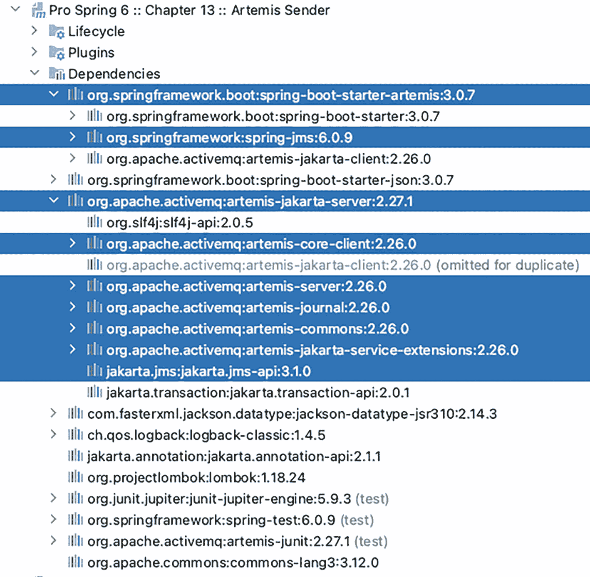
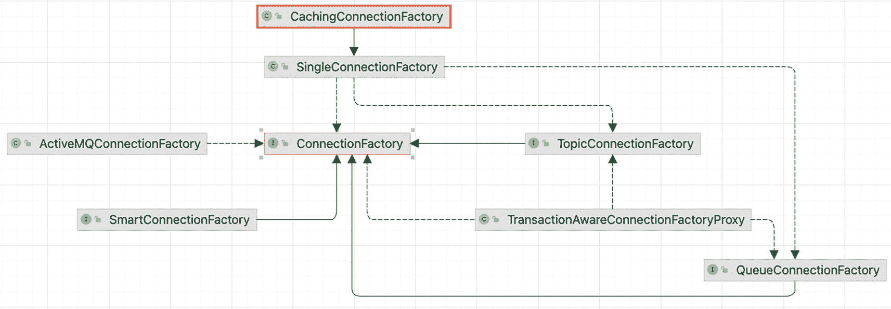
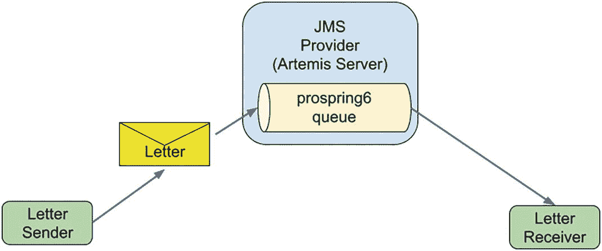
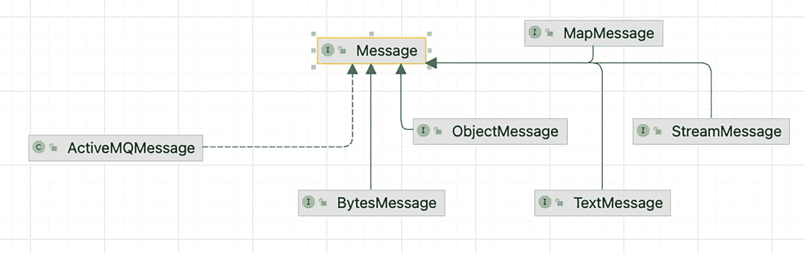
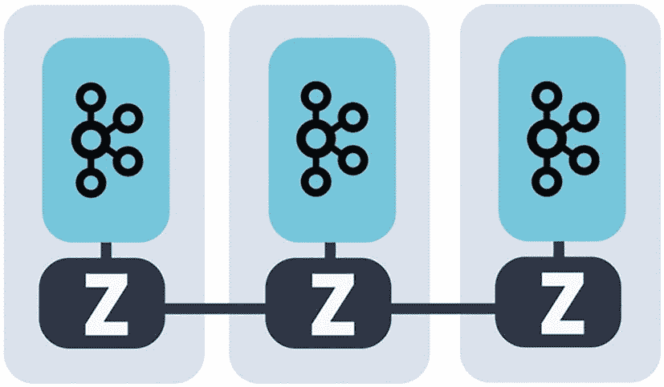
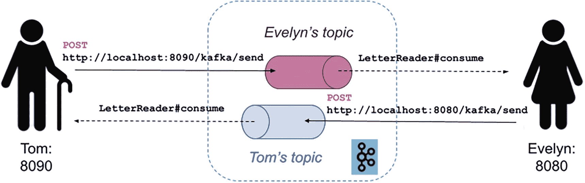
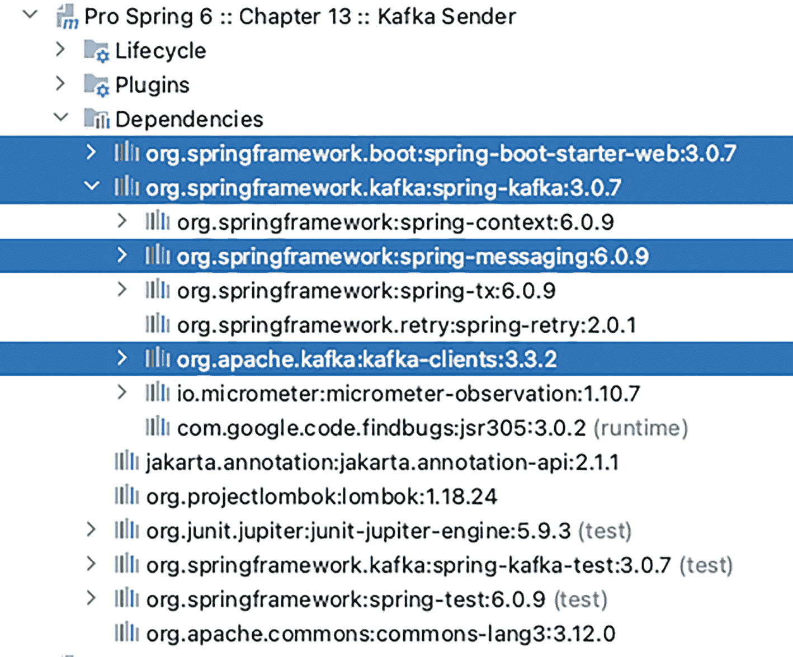

# 或者
spring:
artemis:
mode: native
broker-url: tcp://${IP_ADDRESS}:61617
user: prospring6
password:prospring6
清单 13-16
用于原生使用 ActiveMQ Artemis 服务器的 application.yaml 配置
```

从 Spring Boot 3.x 开始，属性 `spring.artemis.host` 和 `spring.artemis.port` 已被标记为弃用，建议使用 `spring.artemis.broker-url`。

安装 ActiveMQ Artemis 并非本书的重点，因此对于代码示例，将使用嵌入式版本。要在 Spring Boot 应用程序中使用嵌入式 ActiveMQ Artemis，需要三样东西：类路径上的 `spring-boot-starter-artemis`、类路径上的 `artemis-jakarta-server` 以及 Spring Boot 嵌入式配置。图 13-4 显示了本节特定项目 `chapter13-artemis-boot` 的所有依赖项。



一张截图显示了第 13 章 Artemis Sender 下的一组下拉列表。它列出了依赖项下的一组库，并高亮显示了 spring boot starter Artemis、spring j m s、Artemis Jakarta server、Artemis core client、Artemis server、journal、commons 和 Jakarta j m s a p i。

图 13-4

Spring Boot Artemis JMS 项目依赖项

使用嵌入式 ActiveMQ Artemis 服务器的 Spring Boot 应用程序配置如清单 13-17 所示。

```
spring:
artemis:
mode: embedded
embedded:
queues: prospring6
enabled: true
清单 13-17
用于嵌入式 ActiveMQ Artemis 服务器的 application.yaml 配置
```

使用 Spring Boot 非常实用，因为无需声明 `jakarta.jms.ConnectionFactory` bean；它会自动设置。`spring.artemis.embedded.queues` 属性配置了一个逗号分隔的队列列表，这些队列将在启动时创建。默认情况下，Spring Boot 会配置一个类型为 `org.springframework.jms.connection.CachingConnectionFactory` 的 bean。此类型是 `org.springframework.jms.connection.SingleConnectionFactory` 的扩展。这是一个特殊的类，它确保打开一个单一的 JMS 连接，并在所有需要与 JMS 服务器通信的对象之间共享。`CachingConnectionFactory` 为消息生产者和消费者增加了缓存行为。图 13-5 展示了 `jakarta.jms.ConnectionFactory` 最常见的实现。



一个流程图将缓存连接工厂、单连接工厂、活动 M Q 连接工厂、智能连接工厂、主题连接工厂、事务感知连接工厂代理和队列连接工厂与中心的连接工厂连接起来。

图 13-5

`jakarta.jms.ConnectionFactory` 层次结构

在上一节中，我们在两个应用程序之间发送了 `Letter` 实例，因此在本节中，同一个对象将由 `Sender` 发送到 JMQ 队列，并由 `Receiver` 读取。由于 Spring Boot 使用的是嵌入式 Apache MQ Artemis 服务器，我们无法启动两个应用程序并在它们之间交换消息。因此，功能很简单，与图 13-6 所示的模式相匹配。



一个流程图包含以下流程：信件发送者、信件、带有 pro spring 6 队列的 Artemis 服务器的 JMS 提供者、以及信件接收者。

图 13-6


Spring Boot JMS 应用抽象模式

`Sender` Bean 使用 `JmsTemplate` Bean 发送 `Letter` 实例。`JmsTemplate` Bean 也由 Spring Boot 自动配置，因此我们只需将其注入到 `Sender` Bean 声明中并使用即可。`Sender` 类及其 Bean 声明如清单 13-18 所示。

```
package com.apress.prospring6.thirteen;
import org.springframework.jms.core.JmsTemplate;
// 其他导入语句已省略
@Component
@Slf4j
@RequiredArgsConstructor
public class Sender {
private final JmsTemplate jmsTemplate;
@PostConstruct
public void init(){
jmsTemplate.setDeliveryDelay(2000L);
}
@Value("${spring.artemis.embedded.queues}")
private String queueName;
public void send(Letter letter) {
log.info(" >> 发送信件='{}'", letter);
jmsTemplate.convertAndSend(queueName, letter);
}
}
清单 13-18
JMS 生产者，Sender 类
```

请注意，队列名称是通过 `@Value("${spring.artemis.embedded.queues}")` 从 Spring Boot 配置文件中提取的。

`Receiver` 则更为简单，如清单 13-19 所示。

```
package com.apress.prospring6.thirteen;
import org.springframework.jms.annotation.JmsListener;
// 其他导入语句已省略
@Component
@Slf4j
public class Receiver {
@JmsListener(destination = "${spring.artemis.embedded.queues}")
public void receive(Letter letter) {
log.info(" >> 收到信件='{}'", letter);
}
}
清单 13-19
JMS 消费者，Receiver 类
```

此 Bean 声明中最重要的是使用 `@JmsListener` 注解的方法。该注解将方法标记为指定目标上 JMS 消息监听器的目标。此注解还可以使用 `connectionFactory` 属性指定自定义的 JMS `ConnectionFactory`。如果不指定，它将使用 Spring Boot 配置的默认 `ConnectionFactory`。

处理 `@JmsListener` 是 `org.springframework.jms.annotation.JmsListenerAnnotationBeanPostProcessor` Bean 的职责，该 Bean 由 Spring Boot 自动配置。如果没有 Spring Boot 来配置此 Bean，则需要将 `@EnableJms` 注解（来自 `org.springframework.jms.annotation` 包）放置在配置类上。

为了测试 `Sender` Bean 发送的信件是否被 `Receiver` Bean 通过由嵌入式 Artemis 服务器管理的 `prospring6` 队列接收，我们可以编写如清单 13-20 所示的程序。

```
package com.apress.prospring6.thirteen;
import java.util.UUID;
// 其他导入语句已省略
@SpringBootApplication
@Slf4j
public class ArtemisApplication {
public static void main(String... args) {
try (var ctx = SpringApplication.run(ArtemisApplication.class, args)){
var sender = ctx.getBean(Sender.class);
for (int i = 0; i < 10; ++i) {
var letter = new Letter("信件编号 " + i, "测试", LocalDate.now(), UUID.randomUUID().toString());
sender.send(letter);
}
System.in.read();
} catch (IOException e) {
log.error("读取键盘输入时出现问题。");
}
}
}
清单 13-20
测试 JMS 消息处理的程序
```

在清单 13-20 中，创建了应用上下文，然后从上下文中获取 `Sender` Bean 并用于发送十个 `Letter` 实例。`Receiver` Bean 会自动对队列中的 `Letter` 实例做出反应，并“消费”它们，在此示例中，这意味着它们仅被记录。运行此程序时，您可能会注意到它并未按预期工作，并且控制台中会打印以下消息：

```
Exception in thread "main"
org.springframework.jms.support.converter.MessageConversionException:
Cannot convert object of type [com.apress.prospring6.thirteen.Letter] to JMS message.
Supported message payloads are: String, byte array, Map, Serializable object.
at org.springframework.jms.support.converter.SimpleMessageConverter.toMessage(SimpleMessageConverter.java:79)
at org.springframework.jms.core.JmsTemplate.lambda$convertAndSend$5(JmsTemplate.java:661)
...
at com.apress.prospring6.thirteen.Sender.send(Sender.java:56)
at com.apress.prospring6.thirteen.ArtemisApplication.main(ArtemisApplication.java:70)
```

那么，问题出在哪里呢？默认情况下，正如消息所述，只有少数几种类型的消息可以写入队列，并且所有这些类型都由实现 `jakarta.jms.Message` 的类型表示，如图 13-7 所示。



一个流程图将 Active M Q 消息、字节消息、对象消息、映射消息、文本消息和流消息与消息连接起来。

图 13-7

`jakarta.jms.Message` 接口可用实现的层次结构

一个圆形渐变色图标的插图。 `ActiveMQMessage` 类是作为 `active-server.jar` 库一部分的消息实现，但在 Spring 应用程序中并非必需。

那么，我们如何添加对不同类型的支持呢？错误消息中有一个提示：由于没有消息转换器，我们需要一个消息转换器。最简单的方法是提供一个转换器，将 `Letter` 转换为 JSON 文本表示形式，这样 `Sender` 将 `jakarta.jms.TextMessage` 写入队列，并将 JSON 表示形式转换为 `Letter`，以便 `Receiver` 可以读取它。由于我们在 Spring 上下文中工作，最合适的方法是声明一个执行此操作的 Bean，并且由于这是一个 Spring Boot 应用程序，该 Bean 将在需要时自动使用。JMS 转换器 Bean 如清单 13-21 所示，并使用 Jackson 库进行配置。

```
package com.apress.prospring6.thirteen;
import com.fasterxml.jackson.databind.json.JsonMapper;
import com.fasterxml.jackson.datatype.jsr310.JavaTimeModule;
import org.springframework.jms.support.converter.MappingJackson2MessageConverter;
import org.springframework.jms.support.converter.MessageConverter;
import org.springframework.jms.support.converter.MessageType;
//其他导入语句已省略
@SpringBootApplication
@Slf4j
public class ArtemisApplication {
@Bean
public MessageConverter messageConverter() {
var converter = new MappingJackson2MessageConverter();
converter.setTargetType(MessageType.TEXT); // (1)
converter.setTypeIdPropertyName("_type"); // (2)
var mapper = new JsonMapper();
mapper.registerModule(new JavaTimeModule()); // (3)
converter.setObjectMapper(mapper);
return converter;
}
// main 方法已省略
}
清单 13-21
JMS 转换器 Bean
```

清单 13-21 中标记了三行，需要它们来配置以下内容：

*   1\. `converter.setTargetType(MessageType.TEXT)`：指定应通过使用 `MessageType.TEXT` 枚举值调用来将对象编组为 `TextMessage`。其他可能的值是 `BYTES`、`MAP` 或 `OBJECT`。

*   2\. `converter.setTypeIdPropertyName("_type")`：指定携带所包含对象类型 ID 的 JMS 消息属性的名称。需要设置此属性，以便能够将传入消息转换为 Java 对象。

*   3\. `mapper.registerModule(new JavaTimeModule())`：这是必需的，因为 `Letter` 记录包含一个名为 `sentOn` 且类型为 `java.time.LocalDate` 的字段。


在配置中添加这个 Bean 后，应用程序现在可以按预期运行。如果我们运行 `main(..)` 方法并分析控制台，`Sender` 在发送 `Letter` 实例之前打印的日志消息，以及 `Receiver` 在接收 `Letter` 实例之后打印的日志消息，都会显示在控制台中。清单 13-22 展示了一个示例日志片段。

```
INFO : ActiveMQServerLogger_impl - AMQ221007: Server is now live
INFO : ActiveMQServerLogger_impl - AMQ221001: Apache ActiveMQ Artemis Message Broker version 2.27.1 [localhost, nodeID=62e0a32a-7a73-11ed-b408-3e5b0a7a3878]
...
INFO : Sender -  >> sending letter='Letter[title=Letter no. 0, sender=Test, sentOn=2022-12-12, content=95e3c388-37b5-499d-a720-c6b77b8cb99c]'
INFO : AuditLogger_impl - AMQ601267: User anonymous@invm:0 is creating a core session on target resource ActiveMQServerImpl::name=localhost with parameters: [63310d25-7a73-11ed-b408-3e5b0a7a3878, null, ****, 102400, RemotingConnectionImpl [ID=631dfa50-7a73-11ed-b408-3e5b0a7a3878, clientID=null, nodeID=62e0a32a-7a73-11ed-b408-3e5b0a7a3878, transportConnection=InVMConnection [serverID=0, id=631dfa50-7a73-11ed-b408-3e5b0a7a3878]], true, true, false, false, null, org.apache.activemq.artemis.core.protocol.core.impl.CoreSessionCallback@4a09407d, true, {}]
...
INFO : Sender -  >> sending letter='Letter[title=Letter no. 1, sender=Test, sentOn=2022-12-12, content=c9490fb3-49d3-4678-af76-a3c2fff3de21]'
...
INFO : Receiver -  >> received letter='Letter[title=Letter no. 0, sender=Test, sentOn=2022-12-12, content=95e3c388-37b5-499d-a720-c6b77b8cb99c]'
INFO : AuditLogger_impl - AMQ601759: User anonymous@invm:0 added acknowledgement of a message from prospring6: CoreMessage[messageID=17,durable=true,userID=6337eaf6-7a73-11ed-b408-3e5b0a7a3878,priority=4, timestamp=Mon Dec 12 23:19:12 GMT 2022,expiration=0, durable=true, address=prospring6,size=588,properties=TypedProperties[__AMQ_CID=63296c02-7a73-11ed-b408-3e5b0a7a3878,_type=com.apress.prospring6.thirteen.Letter,_AMQ_SCHED_DELIVERY=1670887154279,_AMQ_ROUTING_TYPE=1]]@489572349 to transaction: TransactionImpl [xid=null, txID=30, xid=null, state=ACTIVE, createTime=1670887154268(Mon Dec 12 23:19:14 GMT 2022), timeoutSeconds=300, nr operations = 1]@16eb0e22
INFO : Receiver -  >> received letter='Letter[title=Letter no. 1, sender=Test, sentOn=2022-12-12, content=c9490fb3-49d3-4678-af76-a3c2fff3de21]'
...
清单 13-22
Spring Boot 控制台日志片段，显示正在处理的 JMS 消息
```

在确认消息发送（生产）和接收（消费）的自定义日志消息中，还有一些 Artemis 特有的日志。由于服务器是嵌入式的，每条消息都使用匿名用户发送，这一点已由日志确认。从日志中可以看出，发送和接收 JMS 消息是在 JMS 事务中完成的，Spring Boot 默认管理该事务。

更高级的行为，例如消息消费优先级和错误处理，可以通过自定义 Spring Boot 配置轻松配置。欢迎通过阅读官方文档^(¹¹⁷)来丰富您对 Spring Boot JMS 支持的知识。

## 使用 Spring for Apache Kafka

在本节中，我们专注于使用队列的点对点风格，这是企业中更常用的模式，而不是关注任何特定的队列技术。我们将向您展示如何使用 Apache Kafka^(¹¹⁸) 编写 Spring Boot 应用程序。

在一个需要管理的数据量逐年呈指数级增长，并且以闪电般的速度访问数据对生产力至关重要的世界里，传统的队列技术难以适应。开源 Apache Kafka 应运而生，它是一个分布式事件流平台，以被数千家公司用于构建高性能数据管道、流式分析、数据集成和关键任务应用程序而闻名。Apache Kafka 以其卓越的性能、低延迟、容错性和高吞吐量而著称。它能够每秒处理数千条消息。因此，与它集成自然是 Spring 团队的优先事项。Spring for Apache Kafka（`spring-kafka`）项目将核心 Spring 概念应用于基于 Kafka 的消息传递解决方案的开发。

一个圆形颜色渐变 I 图标的插图。 请注意，该项目名为 *Spring for Apache Kafka*，而不是 *Spring Kafka*，原因是 Apache 基金会希望避免在 Kafka 所有权方面产生混淆。所有开源 Apache 项目的名称都带有“Apache”前缀，任何捐赠给 Apache 基金会的项目都会相应重命名。例如，Brooklyn 编排服务器在捐赠给 Apache 基金会后就变成了 Apache Brooklyn。

正如官方文档所述：“Apache Kafka 是一个由服务器和客户端组成的分布式系统，它们通过高性能 TCP 网络协议进行通信。它可以部署在裸机硬件、虚拟机以及本地和云环境中的容器上。”在本书的示例中，Apache Kafka 部署在本地 Docker 运行时中。

本地运行 Apache Kafka 所需的容器通过 `docker-compose.yaml` 文件进行配置，并使用 Docker Compose^(¹¹⁹) 来启动和关闭容器。此配置由 Bitnami^(¹²⁰) 提供，Bitnami 是一个包含 Web 应用程序和软件栈以及虚拟设备的安装程序或软件包库。完整的库通过 GitHub 共享，所有容器配置均可在此处获取：[`https://github.com/bitnami/containers`](https://github.com/bitnami/containers)。本书示例所需的配置是从此存储库^(¹²¹)下载的。启动容器的说明可以在 `chapter13-kafka-boot/CHAPTER13-KAFKA-BOOT.adoc` 文档中找到。

在生产环境中，Apache Kafka 以集群方式运行，并且必须有人管理这些实例。这就是 Zookeeper 发挥作用的地方。Zookeeper 是由 Apache 开发的软件，充当集中式服务，用于维护命名和配置数据，并在分布式系统中提供灵活且强大的同步。这意味着在生产环境中，您可能会看到如图 13-8 所示的设置，其中 Zookeeper 实例相互协调，每个实例负责管理自己的 Apache Kafka 服务器。



一个包含 3 个独立节点服务器容器的插图，这些容器与 3 个相互连接的 Zookeeper 软件相连。

图 13-8

Apache Kafka 生产环境设置


在生产系统中，多个 Zookeeper 实例协同工作，管理分布在多个节点集合上的 Kafka 数据，这正是 Kafka 实现高可用性和一致性的方式。在图 13-8 中，每个灰色矩形代表一个节点，标有 Z 的圆圈代表 Zookeeper 实例，而黑色的“葡萄”标志代表 Apache Kafka 实例。（不过，对于开发用的 Docker 环境，一个 Zookeeper 实例和一个 Apache Kafka 实例就足够了。）

由于我们使用的是应用程序外部的 Apache Kafka 实例，因此可以编写另一个应用程序，该应用程序可以启动两次，并模拟实例之间的通信。正如本章开头所做的那样，我们将启动一个应用程序供 Tom 向 Evelyn 发送信件消息，再启动另一个应用程序供 Evelyn 向 Tom 发送信件。Tom 和 Evelyn 各自拥有接收消息的队列。每个应用程序都是一个 Web 应用程序，将公开一个 `/kafka/send` 端点，并使用 `POST` 方法触发向对方队列发送消息，如图 13-9 所述。



Tom（本地主机 8090）与 Evelyn（本地主机 8080）应用程序之间连接的示意图。它包含了 Tom 和 Evelyn 主题的发送和信件读取消费命令，这些命令通过 Apache 服务器在两者之间发送和接收。

图 13-9

使用 Apache Kafka 的两个笔友应用程序的抽象表示

Apache Kafka 没有 Spring Boot 启动器，因为你无法以嵌入式模式启动 Kafka，但创建一个 Spring Boot Web 应用程序、添加 `spring-kafka` 作为依赖项并使用 Spring 属性进行配置是相当容易的。图 13-10 显示了 `chapter13-kafka-boot` 项目的依赖关系。



一个屏幕截图显示了第 13 章 Kafka 发送器下的下拉列表集合。它列出了依赖项下的一组库，并高亮显示了 spring boot starter web、spring Kafka、spring messaging 和 Kafka clients。

图 13-10

使用 Apache Kafka 的 Spring Boot 应用程序的 Gradle 配置

既然我们已经了解了所需的行为和依赖关系，那么让我们来构建这个应用程序。首先，我们需要告诉 Spring Boot Apache Kafka 的运行位置，以便可以调用其 API 来创建队列，并发送和接收消息。清单 13-23 显示了 Spring Boot 应用程序配置（`application.yaml` 文件的内容）。

```
