# 启动 Tom
java -jar build/libs/chapter13-kafka-boot-6.0-SNAPSHOT.jar --app.sending.topic.name=Evelyn --app.receiving.topic.name=Tom --server.port=8090
清单 13-30
用于启动应用程序两个实例的 Bash 命令
```

在使用 IntelliJ IDEA 开发包含多个组件的应用程序时，一种实用的方法是将它们全部放在单独的 IntelliJ 终端中。在图 13-11 中，有一个终端用于运行 Docker Compose 以启动 Apache Kafka 服务器，另一个终端有两个窗口，可以同时看到 Evelyn 和 Tom 应用程序在运行。

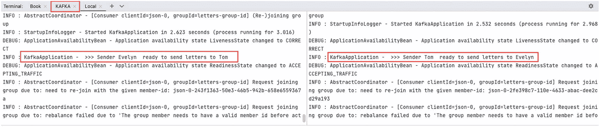

一个窗口的屏幕截图，KAFKA 选项被高亮显示，并带有两个窗格。左窗格有一个信息列表，其中 Kafka 应用程序发送者 Evelyn 准备向 Tom 发送信件被高亮显示。右窗格有一个信息列表，其中 Kafka 应用程序发送者 Tom 准备向 Evelyn 发送信件被高亮显示。

图 13-11
运行 Apache Kafka 和两个 Spring Boot 应用程序的 IntelliJ IDEA 终端

可以使用 `curl`^(¹²²) 或 `Postman`^(¹²³) 发送请求，或者如果您使用 IntelliJ IDEA，则可以使用 HTTPie 客户端。从 Evelyn 向 Tom 发送 `Letter` 以及反向发送的请求体如清单 13-31 所示。

```
### Evelyn 向 Tom 发送信件消息
POST http://localhost:8080/kafka/send
Content-Type: application/json
{
"title": "致我亲爱的朋友",
"sender": "HTTPIE",
"sentOn" : "2022-12-04",
"content" : "好久没读到你写的东西了。想你！"
}
### Tom 向 Evelyn 发送信件消息
POST http://localhost:8090/kafka/send
Content-Type: application/json
{
"title": "我也想你",
"sender": "HTTPIE",
"sentOn" : "2022-12-05",
"content" : "苏格兰每年的这个时候都相当宜人。你想来参观吗？"
}
清单 13-31
在 HTTPie 中发送 POST 请求，在两个应用程序之间互相发送 Letter 实例
```

如果您运行这两个请求，您将看到两个应用程序都打印日志，确认发送和接收了 `Letter`，如清单 13-32 所示。

```
INFO : LetterSender - >>>> [Evelyn] 发送信件 -> Letter[title=致我亲爱的朋友, sender=HTTPIE, sentOn=2022-12-04, content=好久没读到你写的东西了。想你！]
DEBUG: FrameworkServlet - Completed 200 OK
...
DEBUG: LogAccessor - Received: 1 records
INFO : LetterReader - 
Letter[
title=我也想你,
sender=HTTPIE,
sentOn=2022-12-05,
content=苏格兰每年的这个时候都相当宜人。你想来参观吗？
]
清单 13-32
Evelyn 的日志确认已发送一封信件并收到一封
```

Tom 应用程序会打印类似的信息。

之前提到过，使用 `@KafkaListener` 注解的方法可以有不同的签名，并且可以检查消息的所有细节，而不仅仅是主体（负载）。为此，该方法可以编写为如清单 13-33 所示。

```
package com.apress.prospring6.thirteen;
import org.apache.kafka.clients.consumer.ConsumerRecord;
// 其他导入语句已省略
@Service
@Slf4j
public class LetterReader {
@KafkaListener(topics = "#{kafkaApplication.receivingTopic}",
groupId = "${spring.kafka.consumer.group-id}",
clientIdPrefix = "json",
containerFactory = "kafkaListenerContainerFactory")
public void consume(ConsumerRecord cr) {
log.info(" {}", cr.timestamp());
log.info(" {}", cr.topic());
log.info(" {}", cr.partition());
log.info(" {}", cr.headers());
log.info(" {}", cr.key());
log.info(" {}", cr.value());
}
}
清单 13-33
使用 @KafkaListener 注解的方法，用于检查 ConsumerRecord 的内容
```

`ConsumerRecord<K, V>` 是 `kafka-clients.jar` 库的一部分，如您所见，它是一个键/值对映射，对应消息标识符和负载，但也包含其他有用信息，例如接收消息的主题名称和分区编号。

清单 13-34 显示了此更改后发送信件时此方法的输出。


```
INFO : LetterReader -  1671403710391
INFO : LetterReader -  Evelyn
INFO : LetterReader -  0
INFO : LetterReader -  RecordHeaders(headers = [], isReadOnly = false)
INFO : LetterReader -  dcccbbe7-3b5f-4447-9c15-0272f45591a9
INFO : LetterReader - 
Letter[
title=我也想你,
sender=HTTPIE,
sentOn=2022-12-05,
content=苏格兰每年这个时候都相当宜人。你想来看看吗？
]
清单 13-34
Evelyn 日志确认收到一封信作为 ConsumerRecord
```

## 总结

在本章中，我们介绍了基于 Spring 的应用程序中最常用的远程通信技术。针对本章中的每个场景，我们都展示了如何发送和接收消息。远程应用程序之间的通信是一个庞大的主题，有多种技术可用于此目的。本章旨在向您介绍其中最常用的技术，并让您全面了解如何设计 Spring 应用程序以与其他应用程序（无论是否使用 Spring 编写）进行通信。

本章专门使用了 Spring Boot，因为重点在于 Spring 与每种技术（REST、JMS 和 Apache Kafka）的集成。

在下一章中，我们将讨论如何使用 Spring 编写 Web 应用程序。

脚注 1   2   3   4   5   6   7   8   9   10   11   12   13   14   15

# 14. Spring MVC

在企业应用程序中，表示层对用户接受应用程序的程度有着至关重要的影响。表示层是应用程序的门户。它允许用户执行应用程序提供的业务功能，并展示应用程序所维护信息的视图。用户界面的表现方式在很大程度上决定了应用程序的成功与否。由于互联网的爆炸式增长（尤其是在当今），以及人们使用的各种设备的兴起，开发应用程序的表示层是一项具有挑战性的任务。

以下是开发 Web 应用程序时的一些主要考虑因素：

*   *性能*：性能始终是 Web 应用程序的首要要求。如果用户选择一个功能或点击一个链接，并且执行时间很长（在互联网的世界里，三秒钟就像是一个世纪！），用户肯定不会对应用程序满意。

*   *用户友好性*：应用程序应易于使用和导航，并带有清晰的说明，不会让用户感到困惑。

*   *交互性和丰富性*：用户界面应具有高度的交互性和响应性。此外，在视觉呈现方面，表示层应丰富多样，例如图表、仪表盘类型的界面等。

*   *可访问性*：如今，用户要求能够随时随地通过任何设备访问应用程序。在办公室，他们会使用台式机访问应用程序。在路上，用户会使用各种移动设备（包括笔记本电脑、平板电脑和智能手机）访问应用程序。

开发满足上述要求的 Web 应用程序并非易事，但对于业务用户来说，这些要求被认为是强制性的。幸运的是，许多新技术和框架已经被开发出来以满足这些需求。许多 Web 应用程序框架和库——例如 Spring MVC（Spring Web Flow）、Apache Struts、Tapestry、Java/Jakarta Server Faces (JSF)、Google Web Toolkit (GWT)、jQuery、React 和 Dojo 等等——提供了工具和丰富的组件库，可以帮助您开发高度交互的 Web 前端。Spring Web Flow^(¹²⁴) 提供了 JSF 集成，允许您将 JSF UI 组件模型与 Spring Web Flow 控制器一起使用。此外，许多框架提供了针对移动设备（如智能手机和平板电脑）的工具或相应的部件库。HTML5^(¹²⁵) 和 CSS3^(¹²⁶) 标准的兴起，以及大多数 Web 浏览器和移动设备制造商对这些最新标准的支持，也有助于简化需要从任何设备、任何位置访问的 Web 应用程序的开发。

与 Spring MVC 并行，从 5.0 版本开始，Spring 框架引入了一个名为 Spring WebFlux^(¹²⁷) 的响应式栈 Web 框架。该栈将在**第** **20** 章中简要介绍。

在 Web 应用程序开发方面，Spring 提供了全面而深入的支持。Spring MVC 模块为 Web 应用程序开发提供了坚实的基础设施和模型-视图-控制器（MVC）框架。使用 Spring MVC 时，您可以使用各种视图技术（例如 JSP 或 Velocity）。此外，Spring MVC 与许多常见的 Web 框架和工具包（例如 Struts 和 GWT）集成。其他 Spring 项目有助于满足 Web 应用程序的特定需求。例如，Spring MVC 与 Spring Web Flow 项目及其 Spring Faces 模块相结合，为开发具有复杂流程的 Web 应用程序以及使用 JSF 作为视图技术提供了全面的支持。简而言之，在表示层开发方面有很多选择。本章重点介绍 Spring MVC，并讨论如何使用 Spring MVC 提供的强大功能来开发高性能的 Web 应用程序。

具体来说，本章涵盖以下主题：

*   *Spring MVC*：我们讨论 MVC 模式的主要概念并介绍 Spring MVC。我们将介绍 Spring MVC 的核心概念，包括其 `WebApplicationContext` 层次结构和请求处理生命周期。

*   *i18n、区域设置和主题*：Spring MVC 为常见的 Web 应用程序需求提供全面支持，包括 i18n（国际化）、区域设置和主题。我们将讨论如何使用 Spring MVC 开发支持这些需求的 Web 应用程序。

*   *视图支持*：Spring MVC 中视图技术的使用是可插拔的。在本章中，我们重点介绍使用 Thymeleaf 作为 Web 应用程序的视图部分，因为它允许开发简单的网页而无需显式使用 JavaScript 和其他动态技术。您可能想使用的任何其他受 Spring 支持的技术，例如 Groovy 标记模板和 JSP，都可以通过简单的配置更改轻松插入。

*   *文件上传支持*：我们不再讨论与 Apache Commons FileUpload 的集成，而是讨论如何将 Spring MVC 与 Jakarta Servlet 5.0 容器内置的用于文件上传的多部分支持一起使用。


## 设置数据层与底层

Web 应用必须提供对远程存储中数据的操作访问，这些数据通常存储在某种类型的数据库里。到目前为止，你已经了解了如何配置 Spring 应用，通过 Spring Data 仓库管理数据，并声明事务型 Bean 在事务内管理数据。这两层构成了应用的数据层；在本章中，你将学习配置应用的最后一层：表示层，即最终用户操作的 Web 应用或 Web 控制台，而用户无需了解后端是哪种应用在承担繁重的工作。

本章沿用前几章使用的相同数据库结构，但在 `SINGER` 表中新增了一个 `PHOTO` 列。新的 `SINGER` 表创建脚本如代码清单 14-1 所示。

```
CREATE TABLE SINGER (
ID INT NOT NULL AUTO_INCREMENT
, VERSION INT NOT NULL DEFAULT 0
, FIRST_NAME VARCHAR(60) NOT NULL
, LAST_NAME VARCHAR(40) NOT NULL
, BIRTH_DATE DATE
, PHOTO LONGBLOB NULL
, UNIQUE (FIRST_NAME, LAST_NAME)
, PRIMARY KEY (ID)
);
代码清单 14-1
更新后的 SINGER 表
```

`PHOTO` 列的数据类型为二进制大对象（`LONGBLOB`），将用于通过文件上传存储歌手的照片。要创建数据库及其中的表，需要用到 Docker 容器。创建镜像并运行容器的步骤在 `chapter14/CHAPTER14.adoc` 文件中描述，该文件是本章项目的一部分。

为了将 `SINGER` 记录作为 Java 对象管理，我们使用 `Singer` 实例。该类被配置为 Jakarta Persistence 实体，如代码清单 14-2 所示。

```
package com.apress.prospring6.fourteen.entities;
import jakarta.persistence.*;
import jakarta.validation.*;
import org.springframework.format.annotation.DateTimeFormat;
@Entity
@Table(name = "SINGER")
public class Singer extends AbstractEntity {
@Serial
private static final long serialVersionUID = 2L;
@NotNull
@Size(min = 2, max = 30)
@Column(name = "FIRST_NAME")
private String firstName;
@NotNull
@Size(min = 2, max = 30)
@Column(name = "LAST_NAME")
private String lastName;
@DateTimeFormat(pattern = "yyyy-MM-dd")
@Column(name = "BIRTH_DATE")
private LocalDate birthDate;
@OneToMany(mappedBy = "singer")
private Set albums = new HashSet();
@Basic(fetch= FetchType.LAZY)
@Lob
@Column(name = "PHOTO")
private byte[] photo;
// 其他代码已省略
}
代码清单 14-2
更新后的 Singer 实体
```

`AbstractEntity` 是一个抽象类，包含应用中所有实体类共有的字段（`id` 和 `version`）。注意，大多数字段都带有验证注解，这些注解用于验证用户提供的数据。`@DateTimeFormat` 注解是 Spring 提供的注解，用于将字段或方法参数按照属性中指定的格式格式化为日期或时间。

信息图标。 `ALBUM` 和 `INSTRUMENT` 表及其对应的实体也属于项目的一部分，但仅通过 `Singer` 实例就足以覆盖 Spring MVC 的足够内容，因此本章将不再提及它们。

为了管理 `Singer` 实例，需要一个简单的 Spring Data 仓库接口，如代码清单 14-3 所示。

```
package com.apress.prospring6.fourteen.repos;
import com.apress.prospring6.fourteen.entities.Singer;
import org.springframework.data.jpa.repository.JpaRepository;
import org.springframework.data.jpa.repository.Query;
import org.springframework.data.repository.query.Param;
import org.springframework.stereotype.Repository;
import java.time.LocalDate;
public interface SingerRepo extends JpaRepository {
@Query("select s from Singer s where s.firstName=:fn")
Iterable findByFirstName(@Param("fn") String firstName);
@Query("select s from Singer s where s.firstName like %?1%")
Iterable findByFirstNameLike(String firstName);
@Query("select s from Singer s where s.lastName=:ln")
Iterable findByLastName(@Param("ln") String lastName);
@Query("select s from Singer s where s.lastName like %?1%")
Iterable findByLastNameLike(String lastName);
@Query("select s from Singer s where s.birthDate=:date")
Iterable findByBirthDate(@Param("date") LocalDate date);
}
代码清单 14-3
SingerRepo 接口
```

所有额外的方法都由 `SingerService` Bean 调用，用于对 `Singer` 实例执行各种操作。`SingerService` 接口声明了实现中所有可用的方法，如代码清单 14-4 所示。

```
package com.apress.prospring6.fourteen.services;
import com.apress.prospring6.fourteen.entities.Singer;
import com.apress.prospring6.fourteen.problem.InvalidCriteriaException;
import com.apress.prospring6.fourteen.util.CriteriaDto;
import org.springframework.data.domain.Page;
import org.springframework.data.domain.Pageable;
import java.util.List;
public interface SingerService {
List findAll();
Singer findById(Long id);
Singer save(Singer singer);
void delete(Long id);
Page findAllByPage(Pageable pageable);
List getByCriteriaDto(CriteriaDto criteria)
throws InvalidCriteriaException;
}
代码清单 14-4
SingerService 接口
```

实现 `SingerService` 的 `SingerServiceImpl` 类是事务性的，并且主要封装了 `SingerRepo` 的方法，但 `getByCriteriaDto(..)` 方法除外。该方法根据传入的 `CriteriaDto` 实例，委托给 `SingerRepo` 中某个自定义的 `find*` 方法；其代码将在本章后续更相关的上下文中展示。

前两层的配置由两个类提供。**第** **8** **章**介绍的 `BasicDataSourceCfg` 类提供了与 MariaDB 数据库交互的方式。**第** **9** **章**介绍的 `TransactionCfg` 类提供了在事务环境中进行数据库操作的细节。如果这两个属于 `chapter-14` 项目的配置类看起来陌生，请随时回顾这两章的内容。

现在底层两层已经设置完毕，我们准备开始介绍 Spring MVC。

在继续实现表示层之前，让我们先了解 MVC 作为 Web 应用模式的一些主要概念，以及 Spring MVC 如何在这方面提供全面的支持。

在接下来的章节中，我们将逐一介绍这些高层概念。首先，简要介绍 MVC。其次，展示 Spring MVC 及其 `WebApplicationContext` 层次结构的高层视图。最后，讨论 Spring MVC 中的请求生命周期。


### 介绍 MVC

MVC 是实现应用程序表示层时常用的一种模式。MVC 模式的主要原则是定义一个架构，让不同组件拥有清晰的职责。顾名思义，MVC 模式包含三个参与者。

*   *模型*：模型代表业务数据，以及在用户上下文中的应用程序“状态”。例如，在电子商务网站中，模型通常包含用户个人信息、购物车数据，以及用户购买商品时的订单数据。

*   *视图*：视图以所需格式向用户展示数据，支持与用户交互，并支持客户端验证、国际化、样式等功能。

*   *控制器*：控制器处理用户在前端执行的操作请求，与服务层交互，更新模型，并根据执行结果将用户引导至适当的视图。

图 14-1 展示了一种常用的 Web 应用程序模式，由于引入了 Spring 作为主要组件，该模式可被视为传统 MVC 模式的增强版。

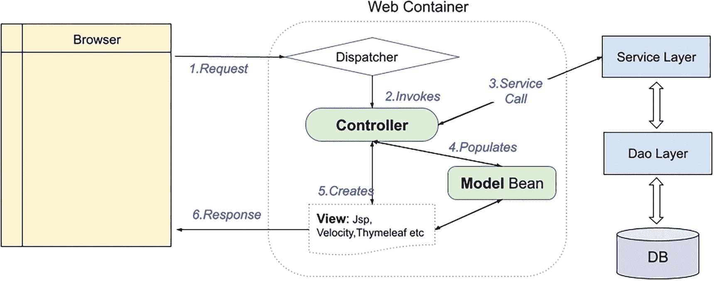

典型 Web 应用模型中 MVC 模式的示意图。浏览器请求调度器，调度器调用控制器。控制器创建视图、填充模型 Bean、调用服务层、Dao 层和数据库。视图响应浏览器。

图 14-1

典型 Web 应用程序中的 MVC 模式

一个普通的视图请求处理流程如下：

1.  *请求*：请求被提交到服务器。在服务器端，大多数框架（例如 Spring MVC 或 Struts）都有一个调度器（以 Servlet 的形式）来处理请求。

2.  *调用*：调度器根据 HTTP 请求信息和 Web 应用程序配置，将请求分派给相应的控制器。

3.  *服务调用*：控制器与服务层交互。

4.  *填充模型*：控制器使用从服务层获取的信息来填充模型。

5.  *创建视图*：基于模型创建视图。

6.  *响应*：控制器将相应的视图返回给用户。

### 介绍 Spring MVC

在 Spring 框架中，Spring MVC 模块为 MVC 模式提供了全面支持，并支持其他功能（例如主题、国际化、验证、类型转换和格式化），从而简化了表示层的实现。

在接下来的章节中，我们将讨论 Spring MVC 的主要概念。主题包括 Spring MVC 的 `WebApplicationContext` 层次结构、典型的请求处理生命周期以及配置。

#### Spring MVC `WebApplicationContext` 层次结构

在 Spring MVC 中，`DispatcherServlet` 是接收请求并将其分派给相应控制器的核心 Servlet。在一个 Spring MVC 应用程序中，可以有任意数量的 `DispatcherServlet` 实例用于不同目的（例如，处理用户界面请求和 RESTful Web 服务请求），每个 `DispatcherServlet` 实例都有自己的 `WebApplicationContext` 配置，该配置定义了 Servlet 级别的特性，例如支持该 Servlet 的控制器、处理器映射、视图解析、国际化、主题、验证、类型转换和格式化。

在 Servlet 级别的 `WebApplicationContext` 配置之下，Spring MVC 维护着一个根 `WebApplicationContext`，它包含应用程序级别的配置，例如后端数据源、安全性、以及服务和持久层配置。根 `WebApplicationContext` 对所有 Servlet 级别的 `WebApplicationContext` 都可用。

让我们看一个例子。假设一个应用程序中有两个 `DispatcherServlet` 实例。一个 Servlet 支持用户界面（称为*应用程序 Servlet*），另一个以 RESTful Web 服务的形式为其他应用程序提供服务（称为*RESTful Servlet*）。在 Spring MVC 中，我们将为根 `WebApplicationContext` 实例以及这两个 `DispatcherServlet` 实例的 `WebApplicationContext` 实例定义配置。图 14-2 展示了针对此场景，Spring MVC 将维护的 `WebApplicationContext` 层次结构。

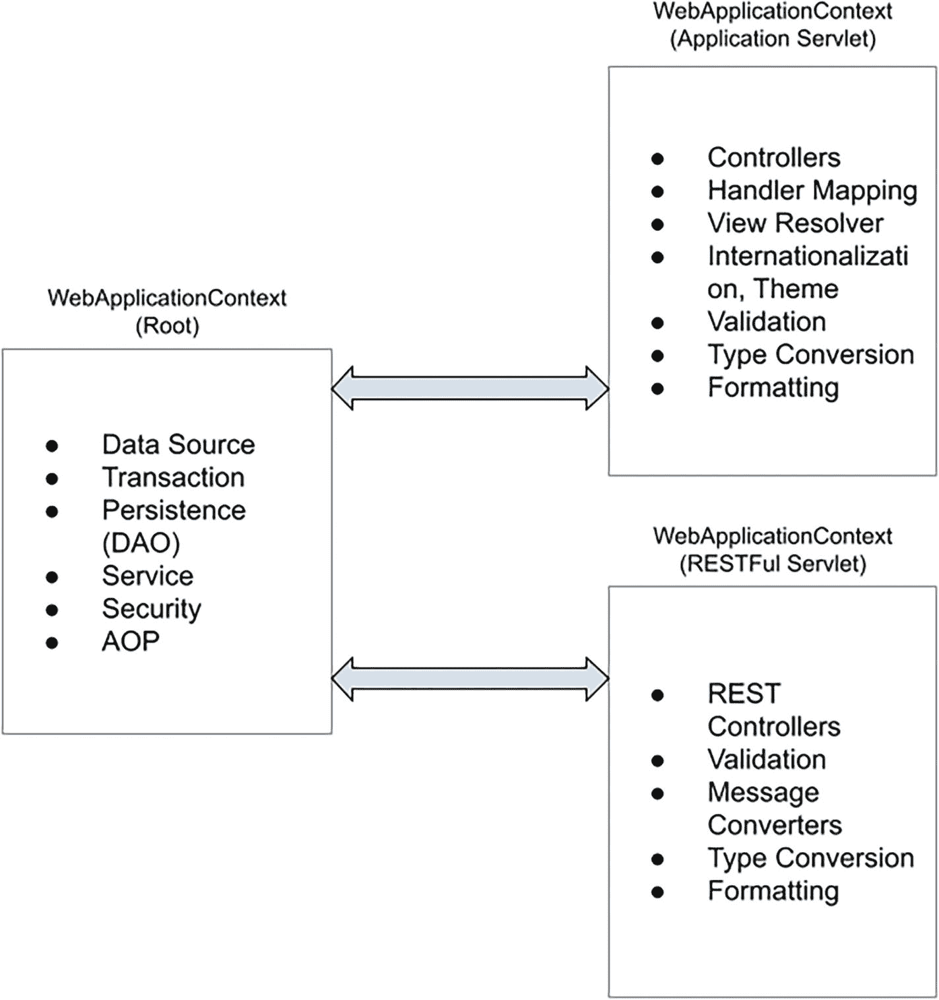

Spring MVC 中 WebApplicationContext 层次结构的示意图。根上下文包括数据源、事务、持久化、服务、安全性和 AOP。应用程序 Servlet 包括控制器、处理器映射、格式化。RESTful Servlet 包括验证、类型转换。

图 14-2

Spring MVC `WebApplicationContext` 层次结构


#### Spring MVC 请求生命周期

让我们看看 Spring MVC 如何处理一个请求。图 14-3 展示了 Spring MVC 中处理请求所涉及的主要组件。

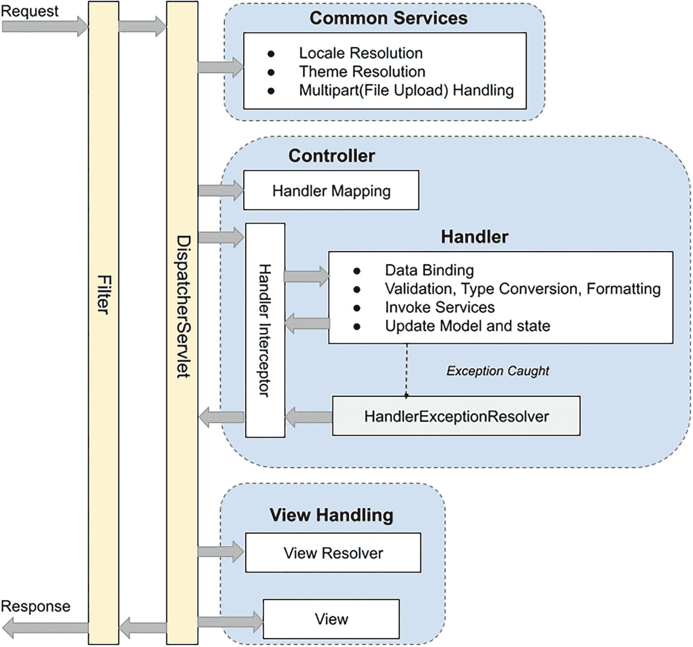

Spring MVC Web-Application-Context 层次结构示意图。主要组件包括过滤器、调度器 Servlet、通用服务和处理器映射。

图 14-3

Spring MVC 请求处理组件

主要组件及其用途如下：

*   **过滤器**：过滤器应用于每个请求。下一节将介绍几种常用的过滤器及其用途。

*   **DispatcherServlet**：该 Servlet 分析请求并将其分派给相应的控制器进行处理。

*   **通用服务**：通用服务将应用于每个请求，以提供包括国际化（i18n）、主题和文件上传在内的支持。它们的配置在 `DispatcherServlet` 的 `WebApplicationContext` 中定义。

*   **处理器映射**：它将传入的请求映射到处理器（Spring MVC 控制器类中的一个方法）。自 Spring 2.5 起，在大多数情况下无需配置，因为 Spring MVC 会自动注册一个开箱即用的 `HandlerMapping` 实现，该实现基于通过控制器类中类型或方法级别的 `@RequestMapping` 注解（及其扩展）表达的 HTTP 路径来映射处理器。

信息图标。 在 Spring 2.5 中，`DefaultAnnotationHandlerMapping` 是默认实现。从 Spring 3.1 开始，`RequestMappingHandlerMapping` 成为默认实现，只要遵循 Spring 的控制器和方法命名约定，它也支持将请求映射到未使用注解定义的处理器。

*   **处理器拦截器**：在 Spring MVC 中，你可以为处理器注册拦截器，以实现通用的检查或逻辑。例如，处理器拦截器可以检查以确保处理器只能在办公时间内被调用。

*   **HandlerExceptionResolver**：在 Spring MVC 中，`HandlerExceptionResolver` 接口（定义在 `org.springframework.web.servlet` 包中）旨在处理处理器在请求处理过程中抛出的意外异常。默认情况下，`DispatcherServlet` 会注册 `DefaultHandlerExceptionResolver` 类（来自 `org.springframework.web.servlet.mvc.support` 包）。此解析器通过设置特定的响应状态码来处理某些标准的 Spring MVC 异常。你也可以通过使用 `@ExceptionHandler` 注解标注控制器方法并将异常类型作为属性传入，来实现自己的异常处理器。

*   **ViewResolver**：Spring MVC 的 `ViewResolver` 接口（来自 `org.springframework.web.servlet` 包）支持基于控制器返回的逻辑名称进行视图解析。有许多实现类支持各种视图解析机制。例如，`UrlBasedViewResolver` 类支持将逻辑名称直接解析为 URL。`ContentNegotiatingViewResolver` 类支持根据客户端支持的媒体类型（如 XML、PDF 和 JSON）动态解析视图。还存在许多与不同视图技术集成的实现，例如 Thymeleaf^(¹²⁸)（`ThymeleafViewResolver`）、FreeMarker^(¹²⁹)（`FreeMarkerViewResolver`）、Velocity^(¹³⁰)（`VelocityViewResolver`）和 JasperReports^(¹³¹)（`JasperReportsViewResolver`）。

这些描述仅涵盖了一些常用的处理器和解析器。如需完整描述，请参考 Spring 框架参考文档及其 Javadoc。

#### Spring MVC 配置

要在 Web 应用程序中启用 Spring MVC，需要进行一些初始配置，特别是 Web 部署描述符 `web.xml`。自 Spring 3.1 起，在 Servlet 3.0 Web 容器中支持基于代码的配置。这为 Web 部署描述符文件（`web.xml`）中所需的 XML 配置提供了一种替代方案。

灯泡图标。 如果你对使用 XML 配置感兴趣，请查阅本书第四版 *Pro Spring 4*。

要为 Web 应用程序配置 Spring MVC 支持，我们需要为 Web 部署描述符执行以下配置：

*   配置根 `WebApplicationContext`

*   配置 Spring MVC 所需的 Servlet 过滤器

*   配置应用程序中的调度器 Servlet

在 Spring 中有多种方法可以做到这一点，但最简单的方法是扩展 `AbstractAnnotationConfigDispatcherServletInitializer`，这是来自 `org.springframework.web.servlet.support` 包的 Spring 工具类，如清单 14-5 所示。

```
package com.apress.prospring6.fourteen;
import org.springframework.web.filter.CharacterEncodingFilter;
import org.springframework.web.filter.HiddenHttpMethodFilter;
import org.springframework.web.servlet.support.AbstractAnnotationConfigDispatcherServletInitializer;
import jakarta.servlet.Filter;
import java.nio.charset.StandardCharsets;
public class WebInitializer
extends AbstractAnnotationConfigDispatcherServletInitializer {
@Override
protected Class[] getRootConfigClasses() {
return new Class[]{BasicDataSourceCfg.class, TransactionCfg.class};
}
@Override
protected Class[] getServletConfigClasses() {
return new Class[]{WebConfig.class};
}
@Override
protected String[] getServletMappings() {
return new String[]{"/"};
}
@Override
protected Filter[] getServletFilters() {
final CharacterEncodingFilter cef = new CharacterEncodingFilter();
cef.setEncoding(StandardCharsets.UTF_8.name());
cef.setForceEncoding(true);
return new Filter[]{new HiddenHttpMethodFilter(), cef};
}
}
清单 14-5
Spring Web 应用程序上下文的配置类
```

`AbstractAnnotationConfigDispatcherServletInitializer` 类实现了 `org.springframework.web.WebApplicationInitializer` 接口。在 Servlet 环境中需要实现此接口，以便以编程方式配置 `ServletContext`。Spring 提供了不止一种实现，如图 14-4 所示，具体取决于用户自定义需求的复杂程度。

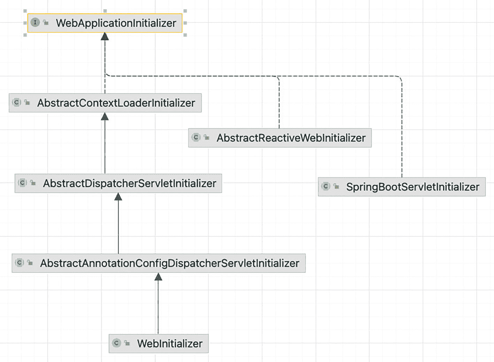

Web 初始化器示意图。它包括 WebApplicationInitializer、AbstractContextLoaderInitializer、AbstractDispatcherServletInitializer、AbstractAnnotationConfigDispatcherServletInitializer 和 AbstractReactiveWebInitializer。

图 14-4

Spring `WebApplicationInitializer` 实现

在前面的示例中，使用了 Spring 类 `AbstractAnnotationConfigDispatcherServletInitializer`，因为它包含了配置使用基于 Java 的 Spring 配置的 Spring Web 应用程序所需方法的具体实现。

所有实现 `WebApplicationInitializer` 接口的类都会被 `org.springframework.web.SpringServletContainerInitializer` 类自动检测到。从 Spring 6 开始，此类实现了 Servlet 3.0 的 `jakarta.servlet.ServletContainerInitializer` 接口，该接口在任何 Servlet 3.0 容器中都会自动引导。如清单 14-5 所示，以下方法被重写以插入自定义配置：

*   `getRootConfigClasses()`：将使用此方法返回的配置类创建一个类型为 `AnnotationConfigWebApplicationContext` 的根应用程序上下文。


*   `getServletConfigClasses()`: 将使用此方法返回的配置类创建一个类型为 `AnnotationConfigWebApplicationContext` 的 Web 应用上下文。

*   `getServletMappings()`: `DispatcherServlet` 的映射（上下文）由此方法返回的字符串数组指定。

*   `getServletFilters()`: 此方法返回一个 `jakarta.servlet.Filter` 实现数组，这些过滤器将应用于每个请求。

回到过滤器，表 14-1 描述了 `getServletFilters()` 返回的数组中的每个过滤器。

表 14-1

常用的 Spring MVC Servlet 过滤器

| 过滤器类全名 | 描述 |
| --- | --- |
| `org.springframework.web.filter.CharacterEncodingFilter` | 此过滤器用于指定请求的字符编码。 |
| `org.springframework.web.filter.HiddenHttpMethodFilter` | 此过滤器提供对 GET 和 POST 之外的其他 HTTP 方法（例如 PUT）的支持。 |

一个感叹号图标表示警告。 虽然此处不需要（因此在配置中未使用），但有一个过滤器实现值得一提：`org.springframework.orm.jpa.support.OpenEntityManagerInViewFilter`。此实现将 JPA `EntityManager` 绑定到线程，用于处理整个请求。它旨在用于 Open `EntityManager` in View 模式，允许在 Web 视图中进行延迟加载，即使原始事务已经完成。虽然实用，但它相当危险，因为多个请求可能会耗尽数据库允许的所有开放连接。此外，如果要加载的数据集很大，应用程序可能会冻结。这就是为什么开发者倾向于不使用它，而是通过 Ajax 请求调用特定的处理程序，在 Web 特定的视图对象（而非实体）中加载数据。

#### 在 Spring MVC 中创建第一个视图

有了服务层和 Spring MVC 配置，我们就可以开始实现第一个视图了。在本节中，我们将实现一个简单的视图，用于显示保存在 `SINGER` 表中的所有歌手。

正如本章开头所述，Thymeleaf 用于设计 HTML 页面。Thymeleaf 是一个现代的服务器端 Java 模板引擎，适用于 Web 和独立环境，并且由于它是专门为 Spring 应用程序创建的，因此可以与 Spring 应用程序无缝集成。要将 Thymeleaf 与 Spring Web 应用程序集成，需要将 Thymeleaf 库放在类路径上。现在是时候列出 `chapter-14` 项目的依赖项了，该项目代表一个 Spring MVC 应用程序，打包为 war 包并部署在 Apache Tomcat 10^(¹³²) 服务器上。

图 14-5 显示了 Gradle 视图中 `chapter-14` 项目的依赖项。

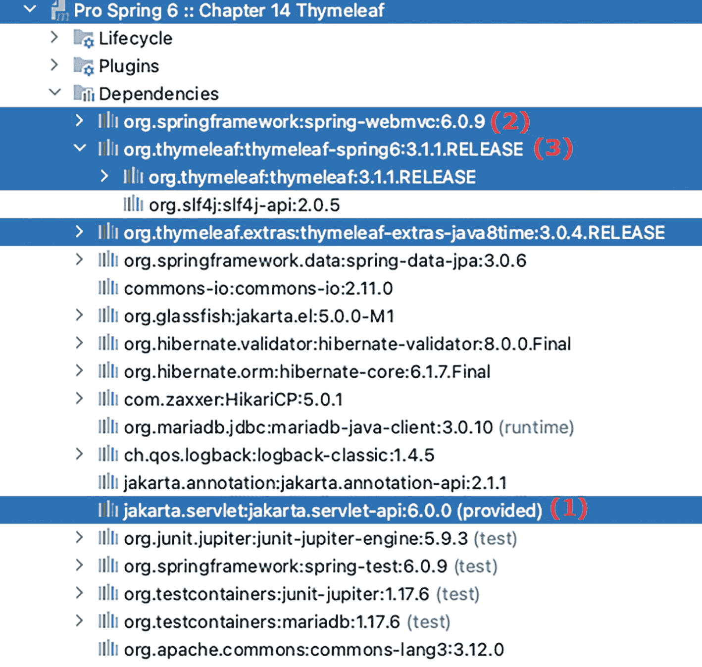

一个窗口在 Gradle 视图中显示 chapter-14 项目的依赖项，并突出显示了一些文件。

图 14-5

显示 `chapter-14` 项目依赖项的 Gradle 视图

标记为 (1) 的库 `jakarta.servlet-api`^(¹³³) 是 Jakarta 项目的一部分，包含开发 Web 应用程序所需的所有接口、类和方法。要开发 Spring Web 应用程序，我们需要在此基础上构建。此库的 6.0.0 版本适用于与 Apache Tomcat 10 兼容的 Web 应用程序。

标记为 (2) 的库 `spring-webmvc` 包含用于开发 Spring Web 应用程序的所有接口和类。Spring Web MVC 构建在 Servlet API 之上，是 Spring 框架的一部分。6.x 版本与 Jakarta EE 9 兼容。

标记为 (3) 的库 `thymeleaf-spring6` 提供了所有接口和类，用于将 Thymeleaf 与 Spring 集成。

#### 配置 `DispatcherServlet`

下一步是配置 DispatcherServlet。这是通过创建一个配置类来完成的，该类定义了 Spring Web 应用程序所需的所有基础设施 Bean。`chapter-14` 项目的基于 Java Config 的类如清单 14-6 所示。

```
package com.apress.prospring6.fourteen;
import org.springframework.context.annotation.Description;
import org.springframework.web.servlet.DispatcherServlet;
import org.springframework.web.servlet.ViewResolver;
import org.springframework.web.servlet.config.annotation.*;
import org.thymeleaf.extras.java8time.dialect.Java8TimeDialect;
import org.thymeleaf.spring6.SpringTemplateEngine;
import org.thymeleaf.spring6.templateresolver.SpringResourceTemplateResolver;
import org.thymeleaf.spring6.view.ThymeleafViewResolver;
import org.thymeleaf.templatemode.TemplateMode;
@Configuration
@EnableWebMvc
@ComponentScan(basePackages = {"com.apress.prospring6.fourteen"})
public class WebConfig  implements WebMvcConfigurer {
@Bean
@Description("Thymeleaf 模板解析器")
public SpringResourceTemplateResolver templateResolver(){
var resolver = new SpringResourceTemplateResolver();
resolver.setApplicationContext(this.applicationContext);
resolver.setPrefix("/WEB-INF/views/");
resolver.setSuffix(".html");
resolver.setTemplateMode(TemplateMode.HTML);
resolver.setCacheable(false);
return resolver;
}
@Bean
@Description("Thymeleaf 模板引擎")
public SpringTemplateEngine templateEngine() {
var engine = new SpringTemplateEngine();
engine.addDialect(new Java8TimeDialect());
engine.setTemplateResolver(templateResolver());
engine.setEnableSpringELCompiler(true);
return engine;
}
@Bean
@Description("Thymeleaf 视图解析器")
public ViewResolver viewResolver() {
var viewResolver = new ThymeleafViewResolver();
viewResolver.setTemplateEngine(templateEngine());
viewResolver.setOrder(1);
return viewResolver;
}
@Override
public void addResourceHandlers(final ResourceHandlerRegistry registry) {
WebMvcConfigurer.super.addResourceHandlers(registry);
registry.addResourceHandler("/images/**", "/styles/**")
.addResourceLocations("/images/", "/styles/");
}
@Override
public void configureDefaultServletHandling(final DefaultServletHandlerConfigurer configurer) {
configurer.enable();
}
@Override
public void addViewControllers(ViewControllerRegistry registry) {
registry.addRedirectViewController("/", "/home");
}
}
清单 14-6
Spring 的 DispatcherServlet 的配置类
```

接口 `WebMvcConfigurer` 定义了回调方法，用于自定义通过使用 `@EnableWebMvc` 启用的基于 Java 的 Spring MVC 配置。虽然 Spring 应用程序中可以有多个基于 Java 的配置类，但只允许一个类使用 `@EnableWebMvc` 注解。在清单 14-6 中，您可以观察到重写了几个方法来自定义配置：

*   `addResourceHandlers(..)`: 添加用于从 Web 应用程序根目录、类路径等特定位置提供静态资源（如图像、JavaScript 和 CSS 文件）的处理程序。在此自定义实现中，任何包含资源的 URL 请求都将由绕过所有过滤器的特殊处理程序处理。该方法定义了静态资源文件的位置，使 Spring MVC 能够高效地处理这些文件夹中的文件。在标签内，location 属性定义了静态资源的文件夹。`WebMvcConfigurer.super.addResourceHandlers(registry)` 调用指示 Web 应用程序的根文件夹，默认为 `/src/main/webapp`。资源处理程序路径 `/styles/**` 定义了用于映射到 CSS 资源的 URL；例如，对于 URL `http://localhost:8080/ch14/styles/standard.css`，Spring MVC 将从文件夹 `/src/main/webapp/styles` 中检索文件 `standard.css`。


*   `configureDefaultServletHandling(..)`：启用将 `DispatcherServlet` 映射到 Web 应用程序根上下文 URL 的功能，同时仍允许静态资源请求由容器的默认 servlet 处理。

*   `addViewControllers(..)`：定义简单的自动化控制器，这些控制器预配置了响应状态码和/或用于渲染响应体的视图。这些视图没有控制器逻辑，用于渲染欢迎页面、执行简单的站点 URL 重定向、返回 404 状态等。在清单 14-6 中，我们使用此方法在访问站点根路径（`/`）时执行到 `home` 视图的重定向，这基本上将 `home` 页面变成了首页。

*   `viewResolver(..)`：声明一个类型为 `ThymeleafViewResolver` 的视图解析器，它将符号视图名称匹配到 `/WEB-INF/views` 下的 `*.html` 模板。Thymeleaf 是一个模板工具，通过组合多个片段来根据逻辑名称生成视图；此工作由本配置中声明的 `SpringResourceTemplateResolver` bean 执行。最终的视图是一个 HTML 页面，通过将 Thymeleaf 特殊构造替换为与 Spring 视图数据编译在一起的 HTML 元素来构建，这由 `SpringTemplateEngine` 负责处理。

#### 实现 Spring 控制器

`home` 视图很简单，是介绍 Spring 控制器的最佳示例。*Spring 控制器*是使用特殊原型注解 `@Controller` 及其扩展（如 `@RestController`，详见**第** **15** **章**）标注的特殊 bean。

`HomeController` 类如清单 14-7 所示。

```
package com.apress.prospring6.fourteen.controllers;
import org.springframework.stereotype.Controller;
import org.springframework.ui.Model;
import org.springframework.web.bind.annotation.RequestMapping;
import org.springframework.web.bind.annotation.RequestMethod;
@Controller
public class HomeController {
@RequestMapping(path = "home", method = RequestMethod.GET)
public String home(Model model) {
model.addAttribute("message", "Spring MVC ThymeleafExample!!");
return "home";
}
}
清单 14-7
HomeController 类与 Bean 声明
```

`@Controller` 注解应用于类，表明它是一个 Spring MVC 控制器。`@RequestMapping` 注解指示将由该注解所在方法处理的 URL。控制器类有时被称为*处理器*，因为它处理请求，而方法被称为*处理器方法*，因为它们也处理请求。通常，处理器方法处理那些在类级别使用 `@RequestMapping` 注解声明了公共根路径的请求；控制器类只是将它们分组的一种方式。

放置在 `home(..)` 方法上的 `@RequestMapping` 注解通过 `method` 属性映射到 HTTP GET 方法。这意味着任何对 URL `/home` 的 GET 请求都将由此方法处理。在此方法体内，将 `"Spring MVC ThymeleafExample!!"` 设置为 `Model` 对象上 `message` 属性的值。在 `DispatcherServlet` 配置中，`ThymeleafViewResolver` 被配置为视图解析器，文件前缀为 `/WEB-INF/views/`，后缀为 `.html`。因此，Spring MVC 将选取文件 `/WEB-INF/views/singers/home.html` 作为视图，并使用 `Model` 对象中的数据渲染它。

#### 实现视图

`home.html` Thymeleaf 模板非常简单，如清单 14-8 所示。

```

清单 14-8
/WEB-INF/views/singers/home.html Thymeleaf 视图文件的内容
```

这个模板对于任何见过 HTML 代码的人来说应该相当熟悉。唯一额外的部分是所有以 `th:` 为前缀的元素。这个模板看起来如此简单的原因是，最大的部分位于一个名为*布局*的不同模板中。该模板包含站点的通用布局，对于每个视图，Thymeleaf 会将其部分内容替换为特定作用域的内容。站点的通用模板位于 `chapter14/src/main/webapp/WEB-INF/views/templates/` 下，名为 `layout.html`。由于本书的重点是 Spring 而非 Thymeleaf，且 `layout.html` 相当大，此处不再展示（欢迎您自行在本书的项目仓库中查看）；仅解释一些小的 Thymeleaf 构造。清单 14-8 中的 Thymeleaf 构造解释如下：

*   `th:replace`：将 `home.html` 模板中的 `<head>` 标签替换为来自 `templates/layout.html` 的片段，但将标题替换为作为自定义函数 `pageTitle(..)` 参数提供的标题。

*   `th:fragment`：将来自 `templates/layout.html` 的片段替换为在 `home.html` 中声明的片段。在此示例中，`templates/layout.html` 中声明的 `pageContent` 部分是一个非常简单的通用片段，因此在每个继承的视图中，它都需要被替换为适当的片段。


##### 测试主页视图

视图文件位于 `webapp` 目录下的 `WEB-INF` 目录中，该目录汇集了所有 Web 资源。项目的内部结构是典型的 Maven Web 项目结构，并为 Maven 和 Gradle 配置了多种插件，以便将项目构建为可部署在 Apache Tomcat 服务器上的 Web 归档文件（*WAR*）。项目结构如图 14-6 所示。

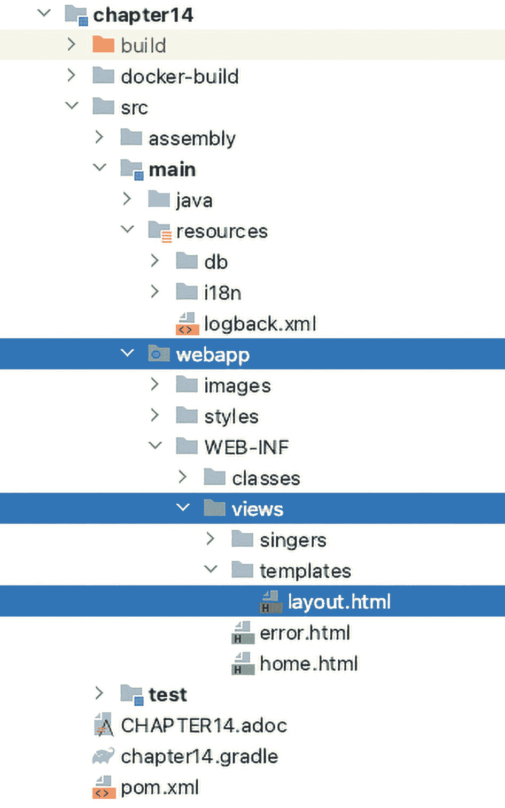

一个窗口显示了 chapter-14 项目的内部结构，依次选择 s r c、main、resources、webapp 和 classes，然后在 layout.html 中选择视图。

图 14-6

`chapter-14` 项目的内部结构

测试 `home.html` 视图有两种方法：

*   编写一个 Spring MVC 测试，用于测试视图的映射和模型的填充。
*   构建项目，将生成的 war 包部署到本地 Apache Tomcat，然后检查主页。

为非常简单的视图和控制器编写测试相当简单。当应用程序上下文变得更加复杂，需要注入更多依赖项时，测试可能会更复杂，但并非不可能。清单 14-9 展示了测试类和测试方法，用于检查 `/home` 路径到 `HomeController#home(..)` 方法的正确映射，以及 `home.html` 视图模型的填充。

```
package com.apress.prospring6.fourteen.controllers;
import com.apress.prospring6.fourteen.WebConfig;
import org.junit.jupiter.api.Test;
import org.springframework.test.context.junit.jupiter.web.SpringJUnitWebConfig;
import org.springframework.test.web.servlet.MockMvc;
import org.springframework.test.web.servlet.request.MockMvcRequestBuilders;
import org.springframework.test.web.servlet.setup.MockMvcBuilders;
import org.springframework.web.context.WebApplicationContext;
import static org.hamcrest.Matchers.containsString;
import static org.springframework.test.web.servlet.result.MockMvcResultHandlers.print;
import static org.springframework.test.web.servlet.result.MockMvcResultMatchers.*;
@SpringJUnitWebConfig(classes = WebConfig.class)
public class HomeControllerTest {
MockMvc mockMvc;
public HomeControllerTest(WebApplicationContext wac) {
this.mockMvc = MockMvcBuilders.webAppContextSetup(wac).build();
}
@Test
void testHome() throws Exception {
mockMvc.perform(MockMvcRequestBuilders.get("/home"))
.andDo(print())
.andExpect(status().isOk())
.andExpect(view().name("home"))
.andExpect(content().string(containsString("Spring MVC ThymeleafExample!!")));
}
}
清单 14-9
测试 HomeController 和 home.html 视图
```

`MockMvc` 基于 `spring-test` 模块中的 Servlet API 模拟实现构建，不依赖于正在运行的容器，但仍需要 `servlet-api` 依赖项。这不是端到端测试，它之所以有效，是因为 `HomeController` 没有调用服务或仓库。

`MockMvcRequestBuilders.get(..)` 方法创建一个 `MockHttpServletRequest` 实例，该实例通过为其设置的参数进行配置，以创建一个有效的请求。`MockMvc` 在通过 `@SpringJUnitWebConfig` 注解配置的上下文上执行请求。此注解是一个特殊的 Spring 测试注解，用于为 Spring Web 应用程序配置测试上下文。它使用 `@ExtendWith(SpringExtension.class)` 进行元注解，用于注册 `SpringExtension`，该扩展将 Spring TestContext 框架集成到 JUnit 5 的 Jupiter 编程模型中。它使用 `@ContextConfiguration` 进行元注解，用于确定如何为集成测试加载和配置 `ApplicationContext`。并且它使用 `@WebAppConfiguration` 进行元注解，用于配置应为测试加载 `WebApplicationContext`，并使用 Web 应用程序根目录的默认路径。

该测试检查了响应的所有重要部分：

*   通过 `.andExpect(status().isOk())` 匹配器检查 HTTP 响应码是否符合预期。
*   通过 `.andExpect(view().name("home"))` 匹配器检查逻辑视图名称是否符合预期。
*   通过 `.andExpect(content().string(containsString("Spring MVC ThymeleafExample!!")))` 匹配器检查在 Spring `Model` 实例上设置的属性是否已添加到渲染后的视图中。

检查主页是否正确渲染的另一种方法是实际部署应用程序。为此，您需要执行以下操作：

*   构建项目，生成 `build/libs/chapter14-6.0-SNAPSHOT.war`。
*   下载并安装 Apache Tomcat 10。

一个感叹号图标表示警告。 在基于 Unix 的系统上，您可能需要使 `$TOMCAT_HOME/bin` 下的所有脚本具有可执行权限。

*   通过使用 IntelliJ IDEA Tomcat 启动器部署 `chapter14-6.0-SNAPSHOT.war`。

要创建 Apache Tomcat 启动器，请按照 IntelliJ 官方页面^(¹³⁴)上的说明进行操作。在图 14-7 中，您可以看到“部署”选项卡用于将 Web 工件添加到启动器。当以展开形式添加时，启动器可以在调试模式下启动，代码中的断点将暂停应用程序以允许运行时调试。

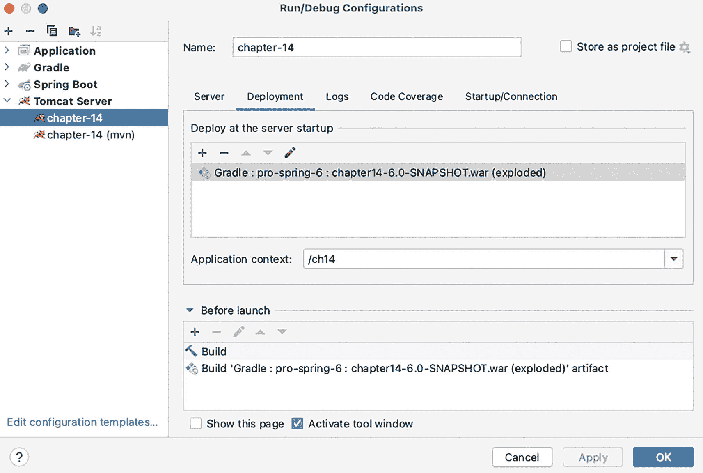

一个窗口显示要创建 Apache Tomcat 启动器，请按照 IntelliJ 官方页面上的说明操作，部署选项卡用于将 Web 工件添加到启动器。单击活动工具窗口，然后单击确定按钮。

图 14-7

`chapter-14` 项目的 IntelliJ IDEA 启动器

启动器就位后，您可以启动应用程序，当应用程序完全部署后，IntelliJ 会尝试打开一个网址为 `http://localhost:8080/ch14/home` 的网页。如果页面加载正确，您应该会看到一个类似于图 14-8 所示的页面。

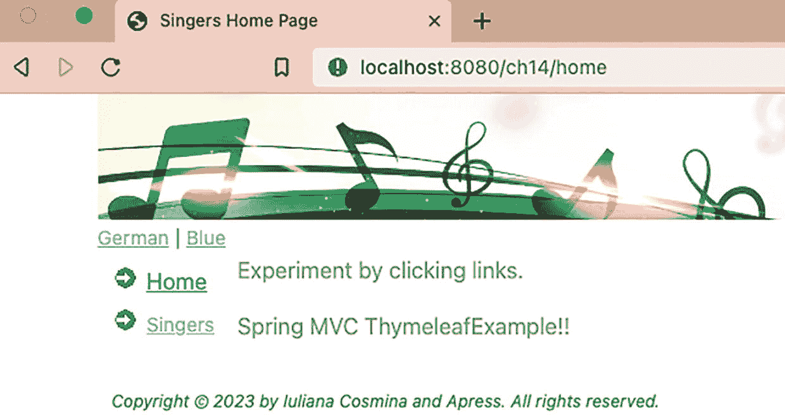

IntelliJ 的一个窗口打开了一个网页，网址为 http://localhost:8080/ch14/home。

图 14-8

`chapter-14` 项目主网页

现在，我们的第一个视图已经可以工作了。在接下来的章节中，我们将用更多视图来丰富应用程序，并启用对国际化（i18n）、主题、错误处理等的支持。


#### 理解 Spring MVC 项目结构

在深入实现 Web 应用程序的各个方面之前，我们先来看看本章开发的示例 Web 应用程序的项目结构是什么样的。

通常，一个 Web 应用程序需要大量文件来支持各种功能。例如，有许多静态资源文件，如样式表、JavaScript 文件、图片和组件库。还有用于以多种语言呈现界面的文件。当然，还有将由 Web 容器解析和渲染的视图页面，以及模板框架（例如 Thymeleaf）将使用的布局和定义文件，以提供应用程序一致的外观和感觉。

将服务于不同目的的文件存储在一个结构良好的文件夹层次结构中始终是一个好习惯，这能让您清晰地了解应用程序使用的各种资源，并简化持续的维护工作。

项目结构已通过图 14-6 介绍过。现在，表 14-2 描述了本章开发的 Web 应用程序的文件夹结构。请注意，此处介绍的结构并非强制要求，而是开发者社区在 Web 应用程序开发中常用的结构。

表 14-2

示例 Web 项目文件夹结构说明

| 文件夹名称 | 用途 |
| --- | --- |
| `images` | 存储用于美化网站的图片：徽标、项目符号等。 |
| `styles` | 存储支持 CSS 样式、网站外观和感觉的样式表文件。 |
| `WEB-INF/classes` | 存储主题 Cookie 配置的属性文件。 |
| `WEB-INF/views` | 存储用于创建视图的模板文件，此处为 Thymeleaf 模板。 |
| `resources/i18n` | 存储支持国际化的文件。`application*.properties` 文件存储与布局相关的文本（例如，页面标题、字段标签和菜单标题）。`message*.properties` 文件存储各种消息（例如，成功和错误消息以及验证消息）。该示例将支持英语（美国）和德语（德国）。`i18n` 目录包含国际化资源文件。这些文件本可以放在 `WEB-INF/i18n` 下，但为了在章节末尾更轻松地迁移到 Spring Boot，将其放在了 `resources` 下。 |

信息图标。 有时可能还有一个 `webapp/scripts` 目录，其中包含使页面动态化所必需的通用 JavaScript 文件。也可能存在特定于所用 JavaScript 框架的其他目录，例如 `jQuery`^(¹³⁵) 或 `jqgrid`^(¹³⁶)。对于本章中的简单示例，不需要此类文件。

表 14-2 中提到的大多数 Web 文件将不会在此处展示。鉴于此，我们建议您下载本章的源代码副本，并将其解压到一个临时文件夹中，以便您可以直接将所需文件复制到项目中。

### 启用国际化

在开发 Web 应用程序时，尽早启用国际化始终是一个好习惯。主要工作是将用户界面文本和消息外部化到属性文件中。

即使您一开始可能没有国际化需求，将语言相关设置外部化也是好的，这样当您以后需要支持更多语言时会更容易。

使用 Spring MVC，启用 `i18n` 很简单。首先，将语言相关的用户界面设置外部化到 `/resources/i18n` 文件夹中的各个属性文件中，如表 14-2 所述。因为我们将支持英语（美国）和德语（德国），所以需要两个文件。`global.properties` 文件存储默认区域设置的设置，此处为英语（美国）。`global_de.properties` 文件存储德语（德国）的设置。

#### 在 `DispatcherServlet` 配置中配置 `i18n`

有了语言文件后，下一步是配置 `DispatcherServlet` 实例的 `WebApplicationContext` 以支持国际化。为此，我们需要在清单 14-6 中介绍的 `WebConfig` 类中声明一个 `MessageSource` bean，将其注入模板解析器，并添加请求拦截器，以将视图模板中的所有消息代码替换为配置语言中的文本表示。支持国际化的配置修改如清单 14-10 所示。

```
package com.apress.prospring6.fourteen;
import org.springframework.context.MessageSource;
import org.springframework.context.support.ReloadableResourceBundleMessageSource;
import org.springframework.web.servlet.i18n.LocaleChangeInterceptor;
import org.springframework.web.servlet.mvc.WebContentInterceptor;
import org.springframework.web.servlet.config.annotation.InterceptorRegistry;
import org.springframework.web.servlet.i18n.CookieLocaleResolver;
// 其他导入语句已省略
@Configuration
@EnableWebMvc
@ComponentScan(basePackages = {"com.apress.prospring6.fourteen"})
public class WebConfig  implements WebMvcConfigurer {
@Bean
@Description("Thymeleaf 模板引擎")
public SpringTemplateEngine templateEngine() {
var engine = new SpringTemplateEngine();
engine.addDialect(new Java8TimeDialect());
engine.setTemplateResolver(templateResolver());
engine.setTemplateEngineMessageSource(messageSource());
engine.setEnableSpringELCompiler(true);
return engine;
}
@Override
public void addInterceptors(InterceptorRegistry registry) {
registry.addInterceptor(localeChangeInterceptor()).addPathPatterns("/*");
}
@Bean
MessageSource messageSource() {
var messageResource = new ReloadableResourceBundleMessageSource();
messageResource.setBasename("classpath:i18n/global");
messageResource.setDefaultEncoding(StandardCharsets.UTF_8.name());
messageResource.setUseCodeAsDefaultMessage(true);
messageResource.setFallbackToSystemLocale(true);
return messageResource;
}
@Bean
LocaleChangeInterceptor localeChangeInterceptor() {
var localeChangeInterceptor = new LocaleChangeInterceptor();
localeChangeInterceptor.setParamName("lang");
return localeChangeInterceptor;
}
@Bean
CookieLocaleResolver localeResolver() {
var cookieLocaleResolver = new CookieLocaleResolver();
cookieLocaleResolver.setDefaultLocale(Locale.ENGLISH);
cookieLocaleResolver.setCookieMaxAge(3600);
cookieLocaleResolver.setCookieName("locale");
return cookieLocaleResolver;
}
// 其他配置已省略
}
清单 14-10
为 Spring 的 DispatcherServlet 添加国际化配置类
```


在此版本的配置中，`MessageSource` Bean 被声明为 `ReloadableResourceBundleMessageSource` 实例。`ReloadableResourceBundleMessageSource` 类实现了 `MessageSource` 接口，该接口从定义的文件（本例中为 `/resources/i18n` 文件夹下的 `global*.properties`）加载消息，以支持 `i18n`。请注意属性 `fallbackToSystemLocale`。该属性指示 Spring MVC 在未找到客户端区域设置对应的特定资源包时，是否回退到应用程序运行所在系统的区域设置。该实例通过属性文件的位置 `classpath:i18n/global` 进行配置，这意味着这些文件预期位于应用程序类路径下，因此在开发时位于 `resources` 目录下。编码也已配置，并且如果在视图文件中使用了消息代码，但在资源文件中未为其配置值，则该代码本身将作为值使用。定义了一个类为 `LocaleChangeInterceptor` 的 Spring MVC 拦截器，它会拦截所有发往 `DispatcherServlet` 的请求。该拦截器支持通过可配置的请求参数进行区域设置切换。从拦截器配置来看，定义了一个名为 `lang` 的 URL 参数，用于更改应用程序的区域设置，并且该参数是可定制的，因此您可以根据需要使用不同的参数名。

最后，定义了一个类为 `CookieLocaleResolver` 的 Bean。该类支持从用户浏览器的 cookie 中存储和检索区域设置。

#### 修改视图以支持 i18n

现在国际化支持已配置完成，必须修改视图模板文件以支持国际化。之前介绍的 `home.html` 视图没有任何需要国际化的元素，因此为了展示 Thymeleaf 模板如何支持国际化，清单 14-11 展示了 `views/templates/layout.html` 文件的一个片段。

```

布局页面

DE

EN

页面内容

清单 14-11
views/templates/layout.html 片段
```

HTML 的 `lang` 属性用于标识 Web 上文本内容的语言。`th:lang` 构造体使用 `LocaleChangeInterceptor` 在每个请求上设置的 `lang` 参数值来填充此属性。因为我们在 `DispatcherServlet` 的 `WebApplicationContext` 中定义了 `LocaleChangeInterceptor`，Spring MVC 会将区域设置存储到浏览器的 cookie 中（名称为 `locale`），并且默认情况下，该 cookie 会在用户会话期间保留。如果您希望将 cookie 保留更长时间，可以在 `CookieLocaleResolver` Bean 定义中通过调用 `setCookieMaxAge(...​)` 来覆盖属性 `cookieMaxAge`，该属性继承自类 `org.springframework.web.util.CookieGenerator`。

要切换到英语（美国），您可以在浏览器中更改 URL 以反映 `?lang=en`，页面将切换回英语。由于未提供名为 `global_en.properties` 的属性文件，Spring MVC 会回退使用默认文件 `global.properties`，该文件以站点的默认语言（英语）存储属性。

特定于区域设置的值将使用语法 `#{key}` 通过键来访问，其中 `key` 是国际化属性文件中的消息键。

### 使用主题和模板

除了 i18n 之外，Web 应用程序还需要合适的外观和感觉（例如，商业网站需要专业的外观，而社交网站则需要更生动的风格），以及一致的布局，这样用户在使用 Web 应用程序时就不会感到困惑。

一个感叹号图标表示警告。 目前，方法是将网站与后端分离，并使用诸如 React^(¹³⁷) 和 TypeScript^(¹³⁸) 等演进后的 JavaScript 框架来创建网站，这些框架与 Spring REST Web 应用程序交互以进行数据管理和其他高级操作。这意味着用户界面将主要是静态的。这就是为什么本节将介绍的 `ThemeChangeInterceptor`、`ResourceBundleThemeSource` 和 `CookieThemeResolver` 类型在 Spring 6.x 中被标记为已弃用的原因，但并未推荐替代方案。


#### 主题支持

Spring MVC 为主题提供了全面支持，并且在 Web 应用中启用它非常简单。因此，我们将从需要添加到 `WebConfig` 类中的 Spring 主题配置开始，如清单 14-12 所示。

```
package com.apress.prospring6.fourteen;
import org.springframework.ui.context.support.ResourceBundleThemeSource;
import org.springframework.web.servlet.theme.CookieThemeResolver;
import org.springframework.web.servlet.theme.ThemeChangeInterceptor;
// 其他导入语句已省略
@Configuration
@EnableWebMvc
@ComponentScan(basePackages = {"com.apress.prospring6.fourteen"})
public class WebConfig  implements WebMvcConfigurer {
@Bean
ResourceBundleThemeSource themeSource() {
return new ResourceBundleThemeSource();
}
@Bean
ThemeChangeInterceptor themeChangeInterceptor() {
var themeChangeInterceptor = new ThemeChangeInterceptor();
themeChangeInterceptor.setParamName("theme");
return themeChangeInterceptor;
}
@Bean
CookieThemeResolver themeResolver() {
var cookieThemeResolver = new CookieThemeResolver();
cookieThemeResolver.setDefaultThemeName("green");
cookieThemeResolver.setCookieMaxAge(3600);
cookieThemeResolver.setCookieName("theme");
return cookieThemeResolver;
}
@Override
public void addInterceptors(InterceptorRegistry registry) {
registry.addInterceptor(localeChangeInterceptor()).addPathPatterns("/*");
registry.addInterceptor(themeChangeInterceptor());
}
// 其他配置已省略
}
清单 14-12
WebConfig 主题配置
```

第一个 bean 的类型为 `ResourceBundleThemeSource`，负责加载当前主题的 `ResourceBundle` bean。例如，如果当前主题名为 `blue`，该 bean 将查找文件 `blue.properties` 作为该主题的 `ResourceBundle` bean。这两个主题的属性文件位于 `WEB-INF/classes` 目录下。文件分别命名为 `blue.properties` 和 `green.properties`，它们分别对应 `blue` 和 `green` 主题。文件内容以主题名称作为属性，以及其他指向特定主题的图片和 CSS 文件路径的属性。例如，`green.properties` 文件的内容如清单 14-13 所示。

```
css.style=/styles/decorator-green.css
banner.image=/images/banner-green.png
name=green
清单 14-13
green.properties 文件内容
```

类型为 `ThemeChangeInterceptor` 的新拦截器 bean 会拦截每个请求，以添加 `theme` 参数。

类型为 `CookieThemeResolver` 的 bean 用于解析用户的当前主题。属性 `defaultThemeName` 定义了要使用的默认主题，即 `green` 主题。请注意，顾名思义，`CookieThemeResolver` 类使用 cookie 来存储用户的主题。还有一种类型叫做 `SessionThemeResolver`。这种类型的 bean 会将 *theme* 属性存储在用户的会话中，但为了使用它，我们需要为应用添加安全性，而我们目前不想这样做。

现在主题已经配置好了，需要做的改动并不多。在 `views/templates/layout.html` 文件中，我们只需要添加对 `theme` 参数的支持，并添加一个用于切换主题的菜单选项，方式与添加区域设置选项相同，如清单 14-14 所示。

```

布局页面

DE
EN
|
蓝色
绿色
页面内容

清单 14-14
views/templates/layout.html 代码片段
```

请注意，在 `<head>` 部分中，`th:theme` 被添加为一个属性。该属性的值由 `ThemeChangeInterceptor` bean 设置。`#themes.code('css.style')` 结构是一个上下文对象，用于从主题的 `ResourceBundle` 中检索 `css.style` 属性，该属性指向样式表文件 `decorator-*.css` 的路径。其值通过 `th:with` 结构存储在 `cssStyle` 变量中，然后使用 `th:href="@{(${cssStyle})}"` 设置为 `href` 属性的值。

在重新构建并将应用重新部署到服务器后，再次打开浏览器并访问 `http://localhost:8080/ch14`，您将看到 `green.css` 文件中定义的样式已被应用，因为这是在 `ThemeChangeInterceptor` bean 声明中配置为默认的主题。

如果您愿意，可以右键单击网页并分析 Thymeleaf 为 `home.html` 模板生成的 HTML 代码。

#### 设计模板布局

通过使用 `views/templates/layout.html` 文件作为模板（每个视图都基于此模板），已经确保了网站结构的一致性。为了保持颜色和元素样式的一致性与匹配性，一个主题需要结合网页设计和 Spring MVC 配置。

所有网页的通用结构已在清单 14-11 中以 HTML 形式呈现，但图 14-9 提供了更直观的视觉表示。

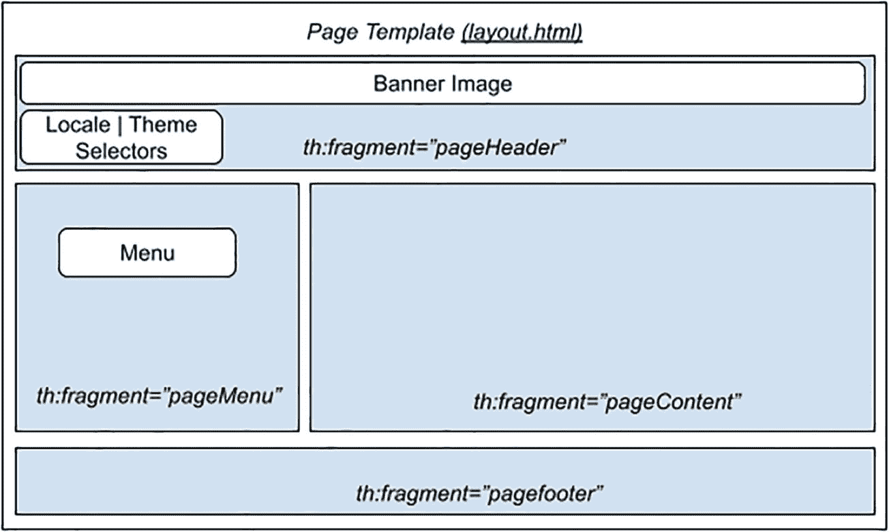

模板布局窗口显示了横幅图片、区域设置/主题选择器、菜单、内容和页脚。

图 14-9

包含片段的 Thymeleaf 模板

横幅图片和字体颜色是网站主题的一部分，因此当在蓝色和绿色主题之间切换时，横幅和字体颜色也会随之改变。对于基于 `layout.html` 设计的每个视图，开发者可以选择使用 `th:replace` 将其某些部分替换为来自 `layout.html` 的片段，或者使用 `th:fragment` 声明自己的片段。显然，在大多数视图中，唯一需要定制的是 `pageContent` 片段和属于 `<head>` 元素的页面标题。

### 实现更复杂的视图

现在我们可以继续实现视图，这些视图允许用户查看完整的歌手列表、查看歌手详情、编辑现有歌手、创建新歌手，甚至删除歌手。

在接下来的章节中，我们将讨论 URL 到各个视图的映射，以及视图是如何实现的。我们还将讨论如何在 Spring MVC 中为编辑视图启用 JSR-349/Jakarta Bean 验证^(¹³⁹) 支持。

首先，我们需要设计如何将各种 URL 映射到相应的视图。在 Spring MVC 中，最佳实践之一是尽可能遵循 RESTful 风格的 URL 来映射视图。表 14-3 显示了 URL 到视图的映射，以及将处理该操作的控制器方法名称。

表 14-3

用于管理 `Singer` 实例的 Spring 控制器 API

| URL | HTTP 方法 | 控制器 | 方法描述 |
| --- | --- | --- | --- |
| `/singers` | GET | `SingersController` | 列出所有歌手。 |
| `/singers` | POST | `SingersController` | 创建新歌手。 |
| `/singers/create` | GET | `SingersController` | 显示创建歌手的表单。 |
| `/singers/search` | GET | `SingersController` | 显示搜索歌手的表单。 |
| `/singers/go` | GET | `SingersController` | 根据作为请求参数提供的条件列出歌手：`fieldName`、`fieldValue` 和 `exactMatch`。 |
| `/singer/id` | GET | `OneSingerController` | 显示具有指定 id 的歌手信息。 |
| `/singer/id` | PUT | `OneSingerController` | 更新具有指定 id 的歌手。 |
| `/singer/id` | DELETE | `OneSingerController` | 删除具有指定 id 的歌手。 |
| `/singer/id/edit` | GET | `OneSingerController` | 显示编辑具有指定 id 的歌手的表单。 |
| `/singer/id/upload` | GET | `OneSingerController` | 显示为具有指定 id 的歌手上传照片的表单。 |
| `/singer/id/photo` | GET | `OneSingerController` | 以字节数组形式检索具有指定 id 的歌手的照片。 |
| `/singer/id/photo` | POST | `OneSingerController` | 提交用户为具有指定 id 的歌手提供的图片。 |


#### 实现歌手列表视图

要实现一个显示数据集的视图，我们需要三样东西：

*   URL 与处理器方法之间的映射

*   一个用于填充模型的处理器方法

*   视图模板，我们将其命名为 `list.html`

如表 14-3 所述，显示歌手列表的请求 URL 是 `/singers`，声明处理器方法的控制器是 `SingersController`。项目中有两个控制器。`SingersController` 将不影响特定 `Singer` 实例（通过 id 标识）的处理器方法分组。所有处理的请求都归在 `/singers` 路径下。影响单个 `Singer` 实例（通过 id 标识）的处理器方法则归在 `OneSingerController` 下。所有处理的请求都归在 `/singer/{id}` 路径下。

清单 14-15 展示了 `SingersController` 类、控制器配置以及为显示歌手的视图填充模型的处理器方法。

```
package com.apress.prospring6.fourteen.controllers;
import com.apress.prospring6.fourteen.services.SingerService;
import org.springframework.context.MessageSource;
import org.springframework.stereotype.Controller;
import org.springframework.ui.Model;
import org.springframework.web.bind.annotation.RequestMapping;
// 其他导入语句已省略
@Controller
@RequestMapping("/singers")
public class SingersController {
private static Comparator COMPARATOR_BY_ID = Comparator.comparing(AbstractEntity::getId);
private final SingerService singerService;
private final MessageSource messageSource;
public SingersController(SingerService singerService, MessageSource messageSource) {
this.singerService = singerService;
this.messageSource = messageSource;
}
@RequestMapping(method = RequestMethod.GET)
public String list(Model uiModel) {
List singers = singerService.findAll();
singers.sort(COMPARATOR_BY_ID);
uiModel.addAttribute("singers", singers);
return "singers/list";
}
// 其他处理器方法已省略
}
清单 14-15
SingersController 控制器及 list(..) 方法
```

放置在类上的 `@RequestMapping` 注解表明，该类中的所有处理器方法要么应用于作为参数提供的路径，要么应用于相对于该路径的路径。

在 `list(..)` 方法上，应用于它的 `@RequestMapping(method = RequestMethod.GET)` 表明该方法用于处理对 URL `/singers` 的 GET 请求。`Model` 对象被填充了一个名为 `singers` 的属性，该属性包含由 `singerService.findAll()` 调用返回的歌手集合。

一个感叹号图标表示警告。 本书前面可能已经提到过，`findAll()` 方法绝不应在生产环境中使用，除非返回的集合大小可控；否则，可能会导致严重的性能问题。

`@GetMapping` 注解是元注解 `@RequestMapping(method = RequestMethod.GET)`，它可以替换处理器方法上的该注解，以使代码更具可读性。

此方法返回的值是 `"singers/list"`，这是用于渲染模型中数据的视图的逻辑名称。`ThymeleafViewResolver` bean 使用此逻辑名称来标识要使用的视图模板，该模板将生成作为对用户请求的响应而返回的 HTML 页面。

`views/singers/list.html` 模板如清单 14-16 所示。

```

计数
名字
姓氏

ID
...
...

清单 14-16
views/singers/list.html 模板内容
```

Thymeleaf 非常强大，除了之前描述的功能外，它还支持算术运算、比较器和条件表达式。例如，作为属性添加到 `<table>` 元素上的 `th:if="${not #lists.isEmpty(singers)}"` 结构，会根据 `singer` 属性值是否为非空列表来决定是否创建该表格。`th:each="singer : ${singers}"` 结构用于遍历 `singers` 列表中的值。当作为 HTML 元素的属性设置时，它会为列表中的每个条目创建一个副本。在此模板中，对于 `singers` 列表中的每个值，都会在表格中创建一行。使用 `${..}` 语法，会为列表中对象的每个属性在表格中创建一个单元格。

在浏览器中打开 `http://localhost:8080/ch14/singers` 时，页面中应显示一个包含歌手的 HTML 表格，如果你检查页面源代码，可以看到 Thymeleaf 生成的 HTML 代码。它应该类似于清单 14-17 中的代码。

```

序号
名字
姓氏

John
Mayer

Ben
Barnes

清单 14-17
Thymeleaf 为 singers/list 视图生成的 HTML 代码
```


#### 实现歌手展示视图

实现用于显示歌手信息的 `show.html` 视图与实现 `list.html` 视图非常相似。展示信息需要一个 GET 请求来获取所有文本信息，以及另一个 GET 请求来获取以字节数组形式存储的照片。这两个处理方法的代码如代码清单 14-18 所示。

```
package com.apress.prospring6.fourteen.controllers;
import org.springframework.http.MediaType;
import org.springframework.web.bind.annotation.*;
//other import statements omitted
@Controller
@RequestMapping("/singer/{id}")
public class OneSingerController {
private final Logger LOGGER = LoggerFactory.getLogger(OneSingerController.class);
private final SingerService singerService;
private final MessageSource messageSource;
public OneSingerController(SingerService singerService, MessageSource messageSource) {
this.singerService = singerService;
this.messageSource = messageSource;
}
@GetMapping
public String showSingerData(@PathVariable("id") Long id, Model uiModel) {
Singer singer = singerService.findById(id);
uiModel.addAttribute("singer", singer);
return "singers/show";
}
@GetMapping(value = "/photo")
@ResponseBody
public byte[] downloadPhoto(@PathVariable("id") Long id) {
Singer singer = singerService.findById(id);
if (singer.getPhoto() != null) {
LOGGER.info("Downloading photo for id: {} with size: {}", singer.getId(), singer.getPhoto().length);
return singer.getPhoto();
}
return null;
}
// other handler methods omitted
}
Listing 14-18
OneSingerController Controller and show(..) and downloadPhoto(..) Methods
```

这两个方法是 `OneSingerController` 的一部分，因为这两个操作都作用于单个 `Singer` 实例。所有应用于系统中已存在（即拥有 `id`）的 `Singer` 实例的操作都被分组到该控制器中，并且所有操作都映射到以 `/singer/{id}` 开头的 URL 请求。

代码易于阅读，但关于注解需要额外说明：

*   `@RequestMapping("/singer/{id}")` 注解声明了该控制器中方法处理的所有请求 URL 的公共路径。由于它是在类型级别使用的，所有方法级别的映射都会继承它，并且附加的方法级别注解 URL 路径会追加到其后。

*   `@PathVariable("id")` 注解允许 Spring 从 URL 路径中获取参数，并将其作为值注入到调用 `showSingerData(..)` 方法时的 `id` 参数中。为了演示目的，该注解本身配置了 URL 路径变量的名称，但当 URL 路径变量名称与方法参数名称相同时，则无需如此。因此，在此场景中，`@PathVariable("id") Long id` 等同于 `@PathVariable Long id`。

*   `@GetMapping(value = "/photo")` 注解等同于 `@RequestMapping(value = "/photo", method = RequestMethod.GET)`。`@GetMapping` 中的 `value` 属性是 `@RequestMapping` 中同一属性的别名。在 `@RequestMapping` 中，`value` 和 `path` 属性互为别名，并且都是默认属性，这意味着以下所有注解都是等效的：
    *   `@GetMapping(value = "/photo")`
    *   `@GetMapping(path = "/photo")`
    *   `@GetMapping("/photo")`
    *   `@RequestMapping(value = "/photo", method = RequestMethod.GET)`
    *   `@RequestMapping(path = "/photo", method = RequestMethod.GET)`

*   `@ResponseBody` 注解表示返回值应绑定到响应体。这意味着 Spring 不会根据返回值寻找视图，而是直接原样返回该值。

`downloadPhoto(..)` 处理方法之所以必要，是因为照片以字节数组的形式保存在数据库中，为了在 HTML 中渲染它们，我们需要提供整个字节数组作为 `` 元素的源。

来自 `show.html` 视图模板的 `pageContent` 片段如代码清单 14-19 所示。（模板的其余部分从 `layout.html` 继承而来，未作更改，此处为节省篇幅而省略。）

```

FN
FN

LN
LN

BD
BD

EDIT

UPLOAD_PHOTO

Listing 14-19
views/singers/show.html Template pageContent Fragment
```

要查看任何歌手的详细信息，只需点击该歌手在 `Cnt.` 列中数字上的链接。图 14-10 显示了歌手列表，并标出了触发展示视图的链接。

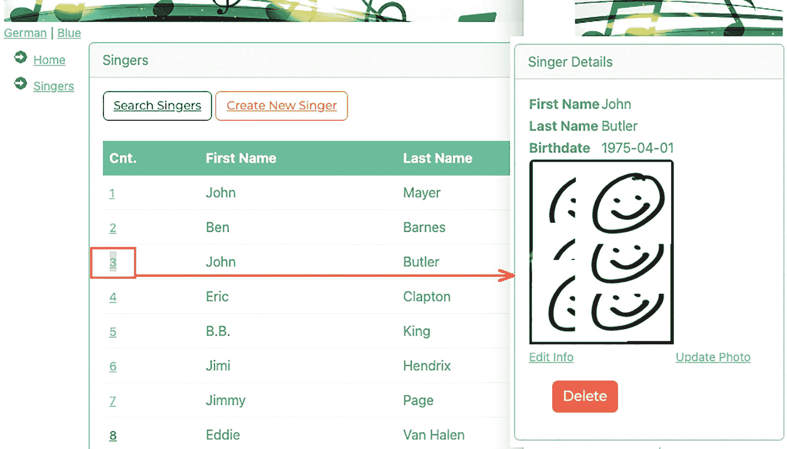

歌手窗口会显示任何歌手的详细信息，只需点击某个歌手在 `Cnt.` 列中数字上的链接即可。

图 14-10

列表与展示视图

`show.html` 视图模板的要点如下：

*   `th:src="@{/singer/} + ${singer.id} + '/photo'"`：`@{...​`​`}` 这个 Thymeleaf 结构用于构建相对于当前页面上下文的链接。这意味着生成的 HTML 中 `src` 属性的值变为 `/ch14/singer/3/photo`，完整的源 URL 变为 `http://localhost:8080/ch14/singer/3/photo`，该 URL 映射到 `downloadPhoto(..)` 处理方法。

*   相同的结构用于生成 `编辑信息` 和 `更新照片` 链接。`编辑信息` 链接会打开一个新页面，用户可以在其中编辑歌手信息。`更新照片` 链接会打开一个新页面，用户可以在其中上传新照片。


#### 处理删除请求

在 `show.html` 模板中有一个表单，用于触发针对当前显示歌手的 DELETE 请求。生成的 HTML 如代码清单 14-20 所示。

```

代码清单 14-20
歌手删除表单
```

请注意，实际上表单的 `method` 是 `POST`，但 Thymeleaf 在表单中添加了一个隐藏输入，其名称为 `_method`，值为 `delete`。如果这个表单输入看起来指明了实际期望的请求方法，那是因为这正是它的用途。

解释很简单：就 HTTP 协议而言，人们主要用它来做两件事：检索数据（GET）或发送数据（POST）。这意味着像 PUT 和 DELETE 这样的方法本质上与 POST 做的是同一件事——它们本质上是 POST 的*子类别*——因此 HTML 中无需直接支持更多方法。

然而，出于实际原因和可读性考虑，Thymeleaf 允许使用 `th:method="delete"` 或 `th:method="put"` 声明表单，并在生成响应时承担将其转换为 POST 方法的繁重工作。那么 Spring 如何处理这些请求呢？或者更准确地说，处理方法应该如何映射到这些类型的请求？

答案是：与 GET 请求的方式相同，毕竟 `@RequestMapping` 注解可以针对特定的 HTTP 方法进行配置，并且还有元注解：`@DeleteRequest` 和 `@PutRequest`，它们分别等同于 `@RequestMapping (method = RequestMethod.DELETE)` 和 `@RequestMapping(method = RequestMethod.PUT)`。

代码清单 14-21 展示了删除歌手请求的处理方法。

```
package com.apress.prospring6.fourteen.controllers;
import org.springframework.web.bind.annotation.DeleteMapping;
// 其他导入语句已省略
@Controller
@RequestMapping("/singer/{id}")
public class OneSingerController {
@DeleteMapping
public String deleteSinger(@PathVariable("id") Long id) {
singerService.findById(id);
singerService.delete(id);
return "redirect:/singers/list";
}
// 其他处理方法已省略
}
代码清单 14-21
歌手删除处理方法
```

不过，还有一件事是必要的：我们需要告诉 Spring，我们的应用程序将会有 PUT 和 DELETE 请求，以便它知道将带有 `_method` 隐藏输入的 POST 请求转换为适当的 HTTP 请求，从而可以将它们映射到合适类型的处理器。这是通过将 `org.springframework.web.filter.HiddenHttpMethodFilter` 的一个实例添加到过滤器列表中来实现的，这些过滤器在请求传递给 `DispatcherServlet` 之前对其进行修改。此修改是在代码清单 14-5 中引入的 `WebInitializer` 类中进行的。回想一下，在引入此配置时，`getServletFilters()` 被描述为返回一个 `jakarta.servlet.Filter` 实现的数组，该数组将应用于每个请求。该方法再次显示在代码清单 14-22 中。

```
package com.apress.prospring6.fourteen;
public class WebInitializer extends AbstractAnnotationConfigDispatcherServletInitializer {
@Override
protected Filter[] getServletFilters() {
final CharacterEncodingFilter cef = new CharacterEncodingFilter();
cef.setEncoding(StandardCharsets.UTF_8.name());
cef.setForceEncoding(true);
return new Filter[]{new HiddenHttpMethodFilter(), cef};
}
// 其他方法已省略
}
代码清单 14-22
在 Spring 应用程序中支持 PUT 和 DELETE 方法的配置
```

一个感叹号图标表示警告。 大多数开发人员在编写 Spring Web 应用程序时都会忘记这部分配置，尤其是如果他们不经常这样做的话。毕竟，有谁会经常从头开始编写 Spring Web 应用程序，以至于这些配置成为例行公事呢？

#### 实现编辑歌手视图

要编辑歌手，我们需要一种不同类型的视图，它不仅显示数据，而且是在可编辑的组件中显示，我们还需要一个表单来提交编辑后的数据。对于提交用于编辑服务器上现有记录的数据的请求，REST 约定是使用 `PUT` 来将其与普通的 `POST` 请求区分开来，后者的提交数据用于创建新记录。

在显示歌手数据部分中介绍的“编辑信息”链接，指向一个在可编辑字段中显示歌手详细信息的页面。一个 `GET` 请求被提交到 `/singer/{id}/edit` URL。Spring 使用提供的 `id` 的 `Singer` 实例的详细信息填充模型，并返回 `singers/edit` 视图逻辑名称。该页面包含一个表单，该表单使用 HTTP `POST` 请求将编辑后的数据提交到 `/singer/{id}`。

包含表单设计的 Thymeleaf 片段如代码清单 14-23 所示。

```

编辑

名：

缺少名

姓：

缺少姓

生日：

缺少生日

取消

代码清单 14-23
包含编辑歌手表单的 singers/edit.html 片段
```

`edit.html` 模板中的重点如下：

*   `th:object="${singer}"`：此构造是模型对象；其属性用于填充字段。
*   `th:field="*{propName}"`：此构造用于标记供用户输入的表单字段，也用于使用 `singer` 对象的属性填充它。
*   `th:if="${#fields.hasErrors('labelName')}"`：此构造用于检查数据是否有任何错误，如果有，则显示包含此构造作为属性的元素。该元素会填充一条错误消息。错误消息在表单提交后显示，Spring 执行了验证，错误被添加到模型中，并且响应连同数据和错误一起被发送回编辑视图。
*   `th:if="${message ne null}"`：此构造测试 `message` 对象是否不为 `null`，并显示包含它作为属性的元素。在这种情况下，它用于添加一条额外的消息，告诉用户为什么 `singer` 没有被保存。

如前所述，DELETE 和 PUT 方法受到 Thymeleaf 和 Spring 的支持。请注意，编辑表单具有属性 `th:method="put"`，但如果你查看生成的 HTML，表单的 `method` 是 `POST`，但 Thymeleaf 在表单中添加了一个隐藏输入，其名称为 `_method`，值为 `put`。此输入配置了实际期望的请求方法，并且由于“处理删除请求”一节中已经提到的 `HiddenHttpMethodFilter` 过滤器，Spring 将这些 `POST` 请求视为 `PUT` 请求。

现在我们有了视图，让我们看看显示它并处理提交数据的 Spring 代码是什么样的。两个处理方法的代码如代码清单 14-24 所示。


```
package com.apress.prospring6.fourteen.controllers;
import org.springframework.web.bind.annotation.PutMapping;
// 其他导入语句已省略
@Controller
@RequestMapping("/singer/{id}")
public class OneSingerController {
//@RequestMapping(path = "/edit", method = RequestMethod.GET)
@GetMapping(path = "/edit")
public String showEditForm(@PathVariable("id") Long id, Model uiModel) {
Singer singer = singerService.findById(id);
uiModel.addAttribute("singer", singer);
return "singers/edit";
}
@PutMapping
public String updateSingerInfo(@Valid Singer singer, BindingResult bindingResult, Model uiModel, Locale locale) {
if (bindingResult.hasErrors()) {
uiModel.addAttribute("message", messageSource.getMessage("singer.save.fail", new Object[]{}, locale));
uiModel.addAttribute("singer", singer);
return "singers/edit";
} else {
uiModel.asMap().clear();
var fromDb = singerService.findById(singer.getId());
fromDb.setFirstName(singer.getFirstName());
fromDb.setLastName(singer.getLastName());
fromDb.setBirthDate(singer.getBirthDate());
singerService.save(fromDb);
return "redirect:/singer/" + singer.getId();
}
}
// 其他处理器方法已省略
}
清单 14-24
用于显示编辑视图和处理 PUT 请求的处理器方法
```

忽略`@Valid`注解以及所有与错误处理相关的代码——这些内容将在本章后续部分单独讨论。本段代码中值得注意的一点是引入了`redirect:`关键字。在逻辑视图名称前加上“redirect:”前缀，是告诉 Spring 将该逻辑视图名称用作重定向 URL。在编辑操作成功的情况下，重定向会跳转到显示歌手详细信息的页面；如果存在验证错误，用户将返回编辑页面并显示错误信息。

编辑表单应如图 14-11 所示；否则说明项目部署时出现了问题。

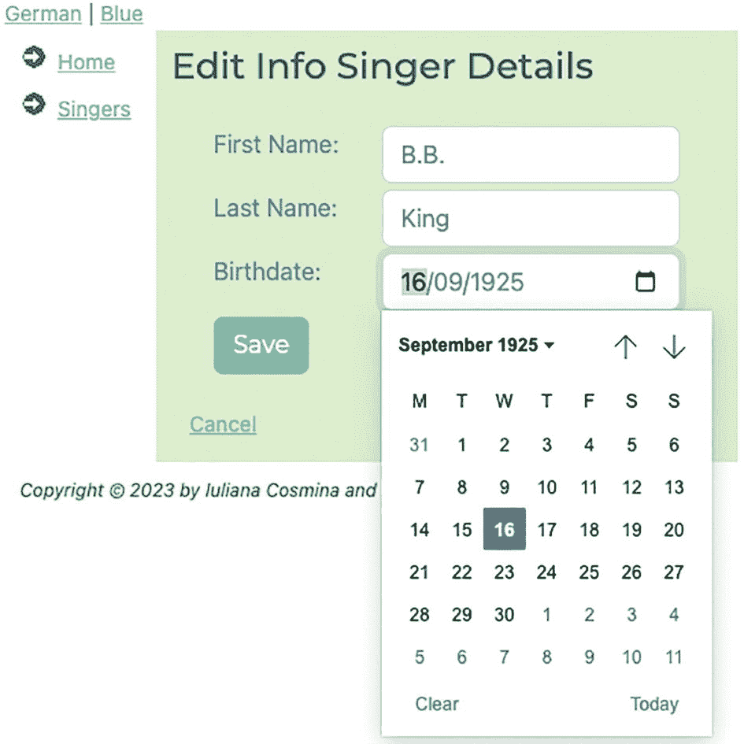

一个编辑歌手详细信息的窗口，您可以在其中编辑名字、姓氏和出生日期，并保存信息。

图 14-11

编辑视图

#### 实现创建歌手视图

实现创建歌手视图与实现编辑视图非常相似。为了增加趣味性，`create.html`文件包含的表单中还提供了一个文件选择器，用于上传歌手的照片。除此之外，该表单与`edit.html`中的表单几乎完全相同。包含创建歌手表单的`pageContent`片段如清单 14-25 所示。

```

创建

名字：

缺少名字

姓氏：

缺少姓氏

出生日期：

缺少出生日期

照片

取消

清单 14-25
singers/create.html 表单
```

表单中包含文件选择器意味着表单中有一个`file`类型的输入字段，这进而意味着必须将表单的类型声明为`enctype="multipart/form-data"`。这是一种用于表单的特殊类型，允许在提交的数据中包含完整的文件。歌手信息中有一个`LONGBLOB`类型的字段用于存储照片，该照片可以从客户端上传。创建表单的数据最终应存储在此处。但是，包含文件的用户数据需要在服务器端进行特殊处理。

长期以来，标准的 Servlet 规范不支持文件上传。因此，Spring MVC 曾与其他库（最常见的是 Apache Commons FileUpload 库^(¹⁴⁰))配合使用来实现此目的。Spring MVC 内置了对 Commons FileUpload 的支持。然而，从 Servlet 3.0 开始，文件上传已成为 Web 容器的内置功能。Apache Tomcat 7 支持 Servlet 3.0，并且 Spring 从 3.1 版本开始也支持 Servlet 3.0 的文件上传。

因此，在 Spring Web 应用程序中支持文件上传是一件轻而易举的事情，尤其是在将应用程序部署到 Apache Tomcat 10 时。

让我们从处理提交数据的代码开始。由于创建新歌手不是对现有歌手的操作，因此处理器方法位于`SingersController`中。代码如清单 14-26 所示。

```
package com.apress.prospring6.fourteen.controllers;
import org.springframework.web.bind.annotation.PostMapping;
import org.springframework.http.MediaType;
import com.apress.prospring6.fourteen.util.SingerForm;
// 其他导入语句已省略
@Controller
@RequestMapping("/singers")
public class SingersController {
@GetMapping(value = "/create")
public String showCreateForm( Model uiModel) {
uiModel.addAttribute("singerForm", new SingerForm());
return "singers/create";
}
@PostMapping(consumes = MediaType.MULTIPART_FORM_DATA_VALUE)
public String create(@Valid SingerForm singerForm, BindingResult bindingResult, Model uiModel,
HttpServletRequest httpServletRequest,
Locale locale) throws IOException {
if (bindingResult.hasErrors()) {
uiModel.addAttribute("message", messageSource.getMessage("singer.save.fail", new Object[]{}, locale));
uiModel.addAttribute("singerForm", singerForm);
return "singers/create";
}
uiModel.asMap().clear();
var singer = new Singer();
singer.setFirstName(singerForm.getFirstName());
singer.setLastName(singerForm.getLastName());
singer.setBirthDate(singerForm.getBirthDate());
// 处理文件上传
if (!singerForm.getFile().isEmpty()) {
setPhoto(singer, singerForm.getFile());
}
var created = singerService.save(singer);
return "redirect:/singer/" + UrlUtil.encodeUrlPathSegment(created.getId().toString(),
httpServletRequest);
}
static void setPhoto(Singer singer, MultipartFile file) throws IOException {
InputStream inputStream = file.getInputStream();
var fileContent = IOUtils.toByteArray(inputStream);
singer.setPhoto(fileContent);
}
// 其他处理器方法已省略
}
清单 14-26
用于处理创建歌手实例的表单提交数据的处理器方法
```

表单中的内容无法直接映射到`Singer`实例，因为`photo`字段值在处理器方法中并未映射到`org.springframework.web.multipart.MultipartFile`，因此需要使用`SingerForm`类型。


感叹号图标表示警告。 在复杂应用中，DAO 层声明的实体类型绝不会在控制器（即 Web 层）中使用。通常会引入视图类型，这些类型封装一个或多个实体类型，仅暴露有用的字段，同时隐藏某些细节，例如标识符和密码等敏感数据，以及与 Web 上下文无关的字段（如版本字段）。

`SingerForm` 是一种视图类型，仅声明了在 Web 层创建 `Singer` 实例所需的字段。该类型的字段还使用了验证注解进行修饰，这些注解与 `Singer` 类中对应字段声明的注解相匹配。

`SingerForm` 如代码清单 14-27 所示。

```
package com.apress.prospring6.fourteen.util;
import jakarta.validation.constraints.NotNull;
import jakarta.validation.constraints.Size;
import org.springframework.format.annotation.DateTimeFormat;
import org.springframework.web.multipart.MultipartFile;
import java.time.LocalDate;
public class SingerForm {
@NotNull
@Size(min = 2, max = 30)
private String firstName;
@NotNull
@Size(min = 2, max = 30)
private String lastName;
@DateTimeFormat(pattern = "yyyy-MM-dd")
private LocalDate birthDate;
MultipartFile file;
// getters and setters omitted
}
代码清单 14-27
SingerForm 视图类型
```

Spring MVC 足够智能，能够接收上传的内容，将其转换为 `MultipartFile`，并将其用作 `SingerForm` 中 `file` 字段的值。从 Spring MVC 填充的 `SingerForm` 中，会创建一个 `Singer` 实例。`setPhoto(..)` 方法用于将上传的内容读取为字节数组，然后可以将其保存到 `SINGER` 表的 `LONGBLOG photo` 列中。

但这足够了吗？事实证明这还不够，因为需要配置 Spring 的 `DispatcherServlet` 以支持文件上传。在使用 Spring MVC 且兼容 Servlet 3.0+ 的 Web 容器中，配置文件上传支持需要两个步骤。

首先，在基于 Java 的配置类（该类定义了创建 `DispatcherServlet` 定义所需的一切）中，我们需要添加一个类型为 `StandardServletMultipartResolver` 的 Bean。这是 `MultipartResolver` 接口的标准实现，基于 Servlet 3.0 的 `jakarta.servlet.http.Part` API。代码清单 14-28 展示了需要添加到 `WebConfig` 类中的该 Bean 的声明。

```
package com.apress.prospring6.fourteen;
import org.springframework.web.multipart.support.StandardServletMultipartResolver;
// other import statements omitted
@Configuration
@EnableWebMvc
@ComponentScan(basePackages = {"com.apress.prospring6.fourteen"})
public class WebConfig  implements WebMvcConfigurer, ApplicationContextAware {
@Bean(name = DispatcherServlet.MULTIPART_RESOLVER_BEAN_NAME) // "multipartResolver"
StandardServletMultipartResolver multipartResolver() {
StandardServletMultipartResolver multipartResolver = new StandardServletMultipartResolver();
return multipartResolver;
}
// other configuration code omitted
}
代码清单 14-28
支持文件上传所需的 Spring Bean
```

第二步是在 Servlet 3.0+ 环境中启用 MultiParsing；这意味着 `WebInitializer` 实现需要一些修改。`AbstractDispatcherServletInitializer` 抽象类中定义了一个名为 `customizeRegistration(..)` 的方法，而 `AbstractAnnotationConfigDispatcherServletInitializer` 扩展了该类。必须实现此方法以注册一个 `jakarta.servlet.MultipartConfigElement` 实例。需要在 `WebInitializer` 类中添加的配置片段如代码清单 14-29 所示。

```
package com.apress.prospring6.fourteen;
import jakarta.servlet.MultipartConfigElement;
import jakarta.servlet.ServletRegistration;
//other import statements omitted
public class WebInitializer extends AbstractAnnotationConfigDispatcherServletInitializer {
// other configuration code omitted
@Override
protected Filter[] getServletFilters() {
final CharacterEncodingFilter cef = new CharacterEncodingFilter();
cef.setEncoding(StandardCharsets.UTF_8.name());
cef.setForceEncoding(true);
return new Filter[]{new HiddenHttpMethodFilter(), cef};
}
@Override
public void customizeRegistration(ServletRegistration.Dynamic registration) {
registration.setInitParameter("throwExceptionIfNoHandlerFound", "true");
registration.setMultipartConfig(getMultipartConfigElement());
super.customizeRegistration(registration);
}
private MultipartConfigElement getMultipartConfigElement() {
return  new MultipartConfigElement(null, MAX_FILE_SIZE, MAX_REQUEST_SIZE, FILE_SIZE_THRESHOLD);
}
private static final long MAX_FILE_SIZE = 5000000;
// Beyond that size spring will throw exception.
private static final long MAX_REQUEST_SIZE = 5000000;
// Size threshold after which files will be written to disk
private static final int FILE_SIZE_THRESHOLD = 0;
}
代码清单 14-29
支持文件上传所需的 Spring 配置
```

`MultipartConfigElement` 的第一个参数是文件应存储的临时位置。第二个参数是允许上传的最大文件大小，此处为 `5MB`。第三个参数表示请求的大小，此处也是 `5MB`。最后一个参数表示文件将被写入磁盘的阈值。

要测试文件上传功能，请重新部署应用程序并添加带有照片的新歌手。完成后，您将能够在展示视图中看到该照片。


### 启用 JSR-349（Bean 验证）

这个话题之所以留到现在才讲，是为了让您能专注于构建网页以及将功能关联到各种按钮和链接上。确保用户请求被正确处理固然重要，但确保用户提交的数据正确无误也同样关键。这一点对于要保存到数据库中的数据尤为重要，因为无效数据可能导致无效结果，甚至在某些情况下，会让黑客有机可乘，侵入您的系统（例如，通过 SQL 注入^(¹⁴¹)）。

**第 11 章** 向您介绍了验证、格式化和类型转换，并提到，为此目的声明的 Spring Bean 的真正威力，在处理用户提供数据的 Web 应用程序中最为明显。**第 11 章** 向您介绍了 Spring 对 JSR-349（Bean 验证）^(¹⁴²)（现已成为 Jakarta 库的一部分）的支持。清单 14-27 介绍了 `SingerForm` 类，该类声明了一些字段，这些字段使用用户提供的日期进行初始化。`Singer` 类中也存在相同的验证注解，该类用于创建 `Singer` 领域对象。

清单 14-30 展示了带有验证注解和自定义错误消息代码的 `SingerForm` 版本。

```
package com.apress.prospring6.fourteen.util;
import jakarta.validation.constraints.*;
import org.springframework.web.multipart.MultipartFile;
// 其他 import 语句已省略
public class SingerForm {
@NotEmpty
@Size(min = 2, max = 30)
private String firstName;
@NotEmpty
@Size(min = 2, max = 30)
private String lastName;
@DateTimeFormat(pattern = "yyyy-MM-dd")
private LocalDate birthDate;
private Multipart file;
// getter 和 setter 已省略
}
清单 14-30
支持文件上传所需的 SingerForm 类型
```

这些约束被应用于各自的字段。请注意，对于验证消息，您可以使用花括号指定一个消息键。这将导致从 `ResourceBundle` 中检索验证消息，从而支持国际化（i18n）。`@Size` 注解比较特殊，因为它声明了最小值和最大值；这些值会使用 `{*}` 语法从代码注入到国际化消息中。

错误消息代码由 `org.springframework.validation.MessageCodesResolver` Bean 解析，当配置验证时，Spring 会自动注册该 Bean。Spring 使用的默认实现是 `org.springframework.validation.DefaultMessageCodesResolver`。这种类型的 Bean 会根据字段上用于实施约束的注解、使用该注解的类型名称以及字段名称，创建两条消息代码。例如，对于 `SingerForm` 类中的 `firstName` 字段，使用了 `@Size` 验证注解，该 Bean 会创建一组消息代码，并按以下顺序解析：

*   验证名称 + 对象名称 + 字段名称 ⇒ `Size.singerForm.firstName`

*   验证名称 + 字段名称 ⇒ `Size.firstName`

*   验证名称 + 字段类型 ⇒ `Size.java.lang.String`

*   验证名称 ⇒ `Size`

然而，如果这些消息属性都没有声明，则默认消息将设置为注解全名 + “message” ⇒ `jakarta.validation.constraints.Size.message`。对于 `singerForm` 对象，这些消息并未在我们最初的国际化文件中声明，但 `singer` 对象的消息是声明了的。它们如清单 14-31 所示。

```
NotEmpty.singer.firstName=请输入名字值
Size.singer.firstName=长度必须在 {2} 和 {1} 之间
NotEmpty.singer.lastName=请输入姓氏值
Size.singer.lastName=长度必须在 {2} 和 {1} 之间
typeMismatch.birthDate=格式无效，应为 \'yyyy-mm-dd\'
清单 14-31
对象 singer 字段 firstName 的验证错误消息代码
```

这里有两种解决方案：添加一份清单 14-28 中消息的副本，并将 `singer` 替换为 `singerForm`；或者使用 `messages` 属性配置注解验证，以使用现有的消息集。带有自定义错误消息的 `SingerForm` 版本如清单 14-32 所示。

```
package com.apress.prospring6.fourteen.util;
import jakarta.validation.constraints.*;
// 其他 import 语句已省略
public class SingerForm {
@NotEmpty(message="{NotEmpty.singer.firstName}")
@Size(min=2, max=30, message="{Size.singer.firstName}")
private String firstName;
@NotEmpty(message="{NotEmpty.singer.lastName}")
@Size(min=2, max=30, message="{Size.singer.lastName}")
private String lastName;
@DateTimeFormat(pattern = "yyyy-MM-dd")
private LocalDate birthDate;
private Multipart file;
// getter 和 setter 已省略
}
清单 14-32
带有自定义错误消息的 SingerForm 版本
```

为了在 Web 数据绑定过程中启用 JSR-349/Jakarta Bean 验证，我们只需将 `@Valid` 注解应用于 `SingersController.create(..)` 方法的 `SingerForm` 参数以及 `OneSingerController.updateSingerInfo(..)` 方法的 `Singer` 参数。清单 14-33 展示了这两个方法的签名。

```
package com.apress.prospring6.fourteen.controllers;
import jakarta.validation.Valid;
// 其他 import 语句已省略
@Controller
@RequestMapping("/singer/{id}")
public class OneSingerController {
@PutMapping
public String updateSingerInfo(@Valid Singer singer,
BindingResult bindingResult,
Model uiModel, Locale locale) {
// 方法体已省略
}
// 其他方法已省略
}
@Controller
@RequestMapping("/singers")
public class SingersController {
@PostMapping(consumes = MediaType.MULTIPART_FORM_DATA_VALUE)
public String create(@Valid SingerForm singerForm,
BindingResult bindingResult, Model uiModel,
HttpServletRequest httpServletRequest,
Locale locale) throws IOException {
// 方法体已省略
}
// 其他方法已省略
}
清单 14-33
带有已验证参数的 OneSingerController 处理方法
```

我们还希望 JSR-349 验证消息使用与视图相同的 `ResourceBundle` 实例。为此，我们需要在 `DispatcherServlet` 配置（即 `WebConfig` 类）中配置验证器，如清单 14-34 所示。

```
package com.apress.prospring6.fourteen;
import org.springframework.validation.Validator;
import org.springframework.validation.beanvalidation.LocalValidatorFactoryBean;
// 其他 import 语句已省略
@Configuration
@EnableWebMvc
@ComponentScan(basePackages = {"com.apress.prospring6.fourteen"})
public class WebConfig  implements WebMvcConfigurer, ApplicationContextAware {
@Bean
public Validator validator() {
final var validator = new LocalValidatorFactoryBean();
validator.setValidationMessageSource(messageSource());
return validator;
}
@Bean
MessageSource messageSource() {
var messageResource = new ReloadableResourceBundleMessageSource();
messageResource.setBasename("classpath:i18n/global");
messageResource.setDefaultEncoding(StandardCharsets.UTF_8.name());
messageResource.setUseCodeAsDefaultMessage(true);
messageResource.setFallbackToSystemLocale(true);
//messageResource.setCacheSeconds(0);
return messageResource;
}
@Override
public Validator getValidator() {
return validator();
}
// 其他配置代码已省略
}
清单 14-34
Spring 验证配置
```


首先，定义一个用于支持 JSR-349 的验证器 Bean，其类为 `LocalValidatorFactoryBean`。注意，我们将 `validationMessageSource` 属性设置为引用已定义的 `MessageSource` Bean，这会指示 JSR-349 验证器根据 `MessageSource` Bean 中的代码查找消息。然后实现 `getValidator()` 方法，返回我们定义的验证器 Bean。至此，我们就可以测试验证功能了。调出创建歌手的视图，不输入任何数据直接点击“保存”按钮。返回的页面将显示多个验证错误，如图 14-12 所示。

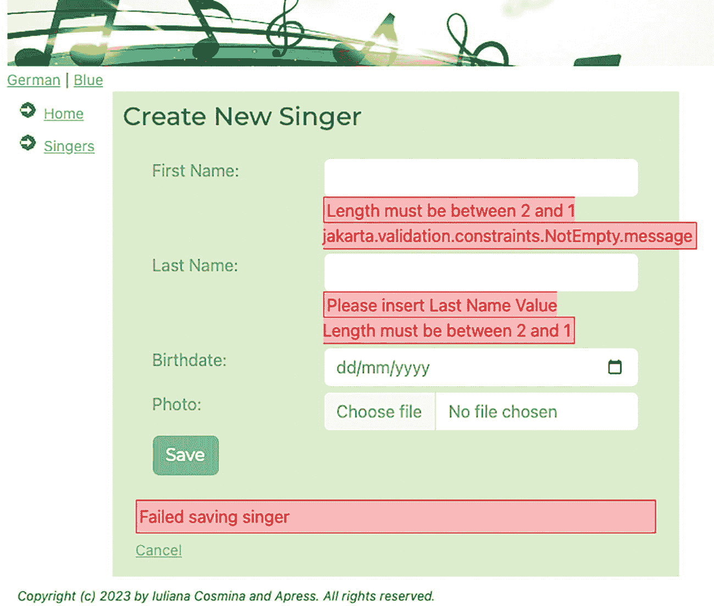

一个用于创建新歌手的窗口显示，其中名字的长度需在 2 到 1 之间（Jakarta dot validation dot constraints dot Not Empty dot message），姓氏的长度也必须在 2 到 1 之间，此外还有出生日期、照片和保存信息。

图 14-12
显示验证错误的视图页面

切换到德语（DE）语言并执行相同操作。这次，消息将以德语显示。视图基本完成；我们现在需要做的就是处理潜在的错误。

### 异常处理

当处理器方法执行时，可能会出现各种问题。某些情况，例如尝试访问不存在的 URL，可能是可预见的，但其他情况则未必。无论哪种情况，都需要记录活动并通知最终用户。Spring MVC 使用 `HandlerExceptionResolver` 的实现来捕获和处理异常。处理 MVC 异常的典型方式是准备一个模型并选择一个错误视图。可以按链式顺序使用多个异常解析器，以不同方式处理不同类型的异常。Spring MVC 支持列表 14-35 中所示的默认解析器（在 Spring Web 应用程序中，这些类型的解析器会自动为您创建），它们声明在 `spring-webmvc.jar` 包中的 `DispatcherServlet.properties` 文件中。

```
org.springframework.web.servlet.HandlerExceptionResolver=
o.s.web.servlet.mvc.method.annotation.ExceptionHandlerExceptionResolver,\
o.s.web.servlet.mvc.annotation.ResponseStatusExceptionResolver,\
o.s.web.servlet.mvc.support.DefaultHandlerExceptionResolver
列表 14-35
DispatcherServlet.properties 默认异常解析器
```

默认异常解析器执行以下功能：

*   `ExceptionHandlerExceptionResolver`：通过调用控制器内或带有 `@ControllerAdvice` 注解的类中带有 `@ExceptionHandler` 注解的方法来解析异常。

*   `ResponseStatusExceptionResolver`：解析带有 `@ResponseStatus` 注解的方法，并将它们映射到使用此注解配置的状态码。

*   `DefaultHandlerExceptionResolver`：解析 Spring MVC 引发的异常，并将它们映射到 HTTP 状态码。处理 REST 请求时，与此类等效的类是 `ResponseEntityExceptionHandler`。

`SimpleMappingExceptionResolver` 类不在上述列表中，但可以声明和配置此类型的 Bean，以将异常类映射到视图名称，这对于在浏览器应用程序中渲染错误页面很有帮助。异常解析器提供与抛出异常相关的上下文信息；即正在执行的处理器方法以及调用它时使用的参数。

让我们从一个最简单的例子开始：人们在编写 URL 时经常会犯错。让我们尝试访问以下 URL：`http://localhost:8080/ch14/missing`。由于没有配置异常处理，Spring 将尝试使用 `InternalResourceViewResolver` Bean（或任何其他找到的视图解析器）来查找视图。由于找不到视图，它假定这必须是一个静态页面并尝试渲染它。但无法提供正确的页面，于是 Apache Tomcat 介入。它显示其默认错误页面，让用户了解发生了什么，如图 14-13 所示。

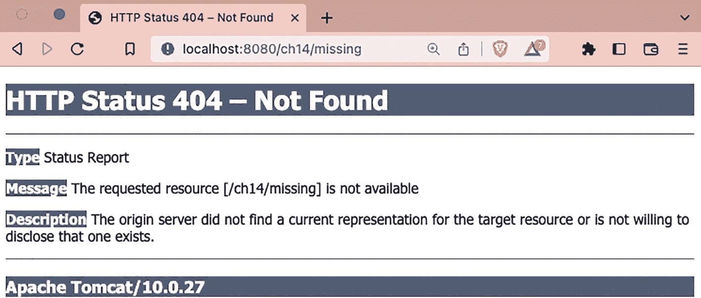

一个窗口显示默认错误页面，内容为 HTTP 状态 404 未找到，并带有 Apache Tomcat。

图 14-13
Apache Tomcat 针对缺失视图的默认错误页面


默认错误消息对问题的描述相当到位，并且为缺失的资源返回了正确的 HTTP 状态码：404。但这仍然不够好，因为这看起来像是一个技术异常或开发问题，而推荐的做法是不让最终用户知晓这些信息。此外，也没有必要向最终用户提供如此多的细节，因为他们不应该被应用程序的内部问题所困扰。那么，我们能做些什么呢？开发 Web 应用程序的一条规则是保持外观和感觉的一致性，因此，与其显示 Apache Tomcat 页面，不如显示一个自定义的错误视图。开箱即用的情况下，当找不到视图或处理器方法时，Spring MVC 不会提供默认的（后备）错误页面。它也不会抛出异常；它只是将显示适当消息的责任转发给服务器。要覆盖此行为，我们需要对 Spring Web 应用程序配置进行以下更改。

首先，自定义 `DispatcherServlet`，使其在找不到处理器方法时抛出 `org.springframework.web.servlet.NoHandlerFoundException`。这可以通过在 `WebInitializer` 类中重写 `AbstractDispatcherServletInitializer` 类的 `customizeRegistration(..)` 方法来实现，如清单 14-36 所示。

```
package com.apress.prospring6.fourteen;
import jakarta.servlet.ServletRegistration;
// 其他导入方法已省略
public class WebInitializer
extends AbstractAnnotationConfigDispatcherServletInitializer {
@Override
public void customizeRegistration(ServletRegistration.Dynamic registration) {
registration.setInitParameter("throwExceptionIfNoHandlerFound", "true");
super.customizeRegistration(registration);
}
// 其他配置方法已省略
}
清单 14-36
自定义 DispatcherServlet 以在未找到处理器时抛出 NoHandlerFoundException
```

此配置声明了一个名为 `throwExceptionIfNoHandlerFound` 的初始化参数，并将其设置为“`true`”，这会导致 `DispatcherServlet` 在找不到处理器方法时抛出 `org.springframework.web.servlet.NoHandlerFoundException`。

信息图标。 请注意，如果使用了 `DefaultServletHttpRequestHandler`，添加此配置将不起作用，因为请求将始终被转发给它，并且在这种情况下永远不会抛出 `NoHandlerFoundException`。您可以通过查看日志来验证这一点。如果您看到类似于以下输出片段的内容，则说明您还有更多步骤需要完成。

```
DEBUG o.s.w.s.DispatcherServlet - GET "/ch14/missing", parameters={}
DEBUG o.s.w.s.h.SimpleUrlHandlerMapping - Mapped to org.springframework.web.servlet.resource.DefaultServletHttpRequestHandler@763956dc
DEBUG o.s.w.s.DispatcherServlet - Completed 404 NOT_FOUND
```

因此，如果您的配置中包含以下内容：

```
@Override
public void configureDefaultServletHandling(final    DefaultServletHandlerConfigurer configurer) {
configurer.enable();
}
```

只需删除此方法，并且如果您希望抛出 `NoHandlerFoundException`，则放弃使用 `DefaultServletHttpRequestHandler`。

但是，如果没有一个自定义的 `HandlerExceptionResolver` 类型的 bean 来执行除简单告知应用程序服务器该做什么之外的其他操作，那么上述操作将毫无意义。这就引出了下一个更改。接下来，一个选项是实现 `HandlerExceptionResolver` 接口，或扩展任何实现该接口的类，并为 `doResolveException(...`​`)` 方法提供所需的实现，该方法将返回所需的视图，如清单 14-37 所示。

```
package com.apress.cems.web.problem;
import org.springframework.http.HttpStatus;
import org.springframework.web.servlet.ModelAndView;
import org.springframework.web.servlet.NoHandlerFoundException;
import org.springframework.web.servlet.handler.SimpleMappingExceptionResolver;
import javax.servlet.http.HttpServletRequest;
import javax.servlet.http.HttpServletResponse;
public class MissingExceptionResolver extends SimpleMappingExceptionResolver {
@Override
protected ModelAndView doResolveException(HttpServletRequest request,
HttpServletResponse response, Object handler, Exception ex) {
if (ex instanceof NoHandlerFoundException) {
ModelAndView model = new ModelAndView("error");
model.addObject("problem","不支持的 URL : "
+ request.getRequestURI());
response.setStatus(HttpStatus.NOT_FOUND.value());
return model;
}
return null;
}
}
清单 14-37
HandlerExceptionResolver 实现
```

自由感叹号图标。 请注意，对于错误处理，使用了 `ModelAndView` 类型。由于异常处理方法不是控制器类中声明的普通处理器方法，因此无法将其结果映射到视图模板。此类型的对象是 Web MVC 框架中 `Model` 和 `View` 对象的持有者，需要在一个对象中同时返回模型和视图。这允许 Spring MVC 在将错误视图发送给用户之前，根据处理请求时抛出的异常，使用不同的错误消息来自定义该视图。

以下是关于 `HandlerExceptionResolver` 实现的一些细节：

*   它可以返回一个指向错误视图的 `ModelAndView`，通常对于相关类别的问题或整个应用程序使用相同的视图。
*   如果异常在解析器内部得到处理，它可以返回一个空的 `ModelAndView`。
*   如果异常仍未解决，它可以返回 `null`，从而允许其他异常解析器尝试处理它。如果没有异常解析器能够处理该异常，它将被冒泡到 `Servlet` 容器。

感叹号图标表示警告。 在清单 14-37 中，请注意该方法返回一个实际的 `ModelAndView` 实例。`HandlerExceptionResolve` 实现旨在确保异常被解析为视图，或者允许其冒泡到 `Servlet` 容器。

下一步是声明一个此类型的 bean，并赋予其最低优先级（最高优先级），这样每当应用程序内部出现问题时，将首先使用此异常解析器。

将多个 `SimpleMappingExceptionResolver` 映射到各种异常类型的替代方案是声明不同的错误处理器方法，并将它们全部分组到一个使用 `@ControllerAdvice` 注解的类中。此注解是元注解了 `@Component` 的，这意味着将创建一个此类型的 bean。此 bean 会拦截处理器方法抛出的任何异常，并将它们映射到使用 `@ExceptionHandler` 注解的方法，这些方法包含一些逻辑来处理这些异常并渲染相应的错误视图。清单 14-38 展示了一个使用 `@ControllerAdvice` 注解的类。


```
package com.apress.prospring6.fourteen.problem;
import jakarta.servlet.http.HttpServletRequest;
import org.springframework.http.HttpStatus;
import org.springframework.web.bind.annotation.ControllerAdvice;
import org.springframework.web.bind.annotation.ExceptionHandler;
import org.springframework.web.bind.annotation.ResponseStatus;
import org.springframework.web.servlet.ModelAndView;
import org.springframework.web.servlet.NoHandlerFoundException;
@ControllerAdvice
public class GlobalExceptionHandler {
@ExceptionHandler(NotFoundException.class)
@ResponseStatus(HttpStatus.NOT_FOUND)
public ModelAndView handle(NotFoundException ex) {
ModelAndView mav = new ModelAndView();
mav.addObject("problem", ex.getMessage());
mav.setViewName("error");
return mav;
}
@ExceptionHandler(NoHandlerFoundException.class)
@ResponseStatus(HttpStatus.NOT_FOUND)
public ModelAndView notFound(HttpServletRequest req) {
ModelAndView mav = new ModelAndView();
mav.addObject("problem", "Not Supported " + req.getRequestURI());
mav.setViewName("error");
return mav;
}
}
清单 14-38
包含多个异常处理方法类
```

要测试此异常处理程序是否按预期工作，你可以尝试访问 `http://localhost:8080/ch14/singer/99` 和 `http://localhost:8080/ch14/missing`。请注意，这里抛出了不同类型的异常，这会导致向错误视图模型添加不同的错误消息，如图 14-14 所示。

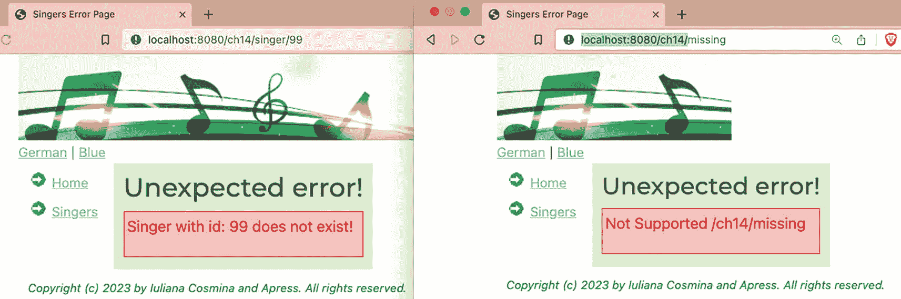

歌手错误页面窗口显示了一个意外的错误处理 Apache Tomcat。

图 14-14
针对不同错误显示的不同错误页面

你应该查看带有正确异常消息的错误页面。检查响应内容，你会注意到，虽然显示了错误页面，但 HTTP 状态码仍然是 200。由于用户试图访问一个不存在的资源，HTTP 状态码应为 404。这可以通过使用 `@ResponseStatus(HttpStatus.NOT_FOUND)` 注解异常处理方法轻松实现，如清单 14-38 所示。

关于处理处理程序方法抛出的异常，基本上就是这些内容。

### 切换到 Spring Boot

切换到 Spring Boot 会让事情变得更简单，因为 Spring Boot 应用程序不需要 Apache Tomcat 服务器。此外，项目结构也更简单，并且不需要特殊的插件来打包应用程序。

要创建一个完整的 Spring Web 应用程序，意味着除了 Web 层和视图模板层之外，还需要 DAO 层和服务层。这意味着你需要用于持久化和事务的特定 Boot 启动器库。如果你已经读到了本章的这里，你会知道还需要验证。完整的依赖项列表如图 14-15 所示。

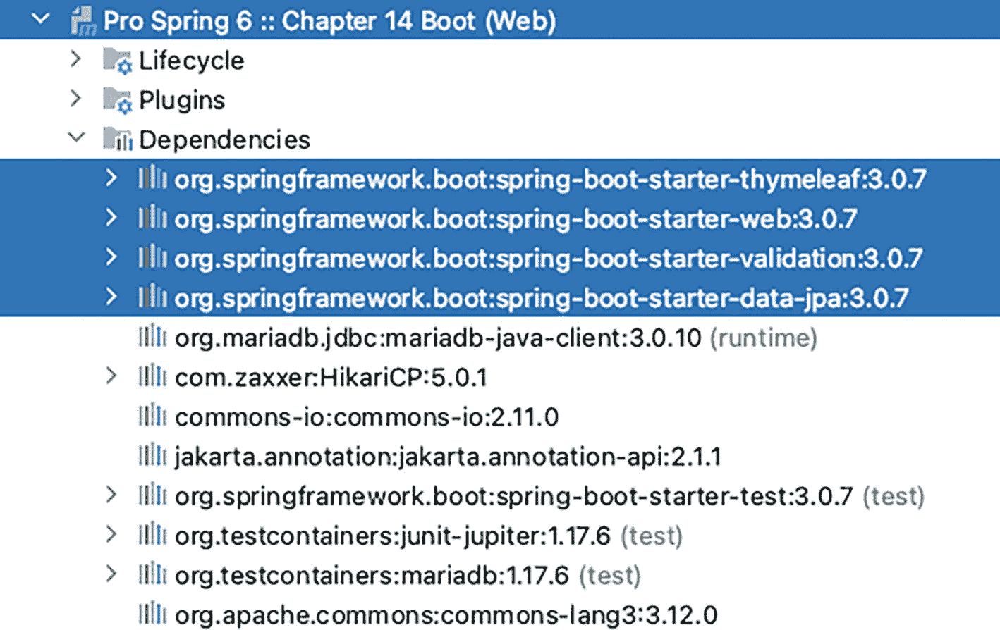

一个窗口显示了 Spring Boot Web 应用程序依赖项，并高亮了一些文件。

图 14-15
Spring Boot Web 应用程序依赖项

项目的结构也必须改变，因为所有与界面相关的文件和资源文件都可以放在 `resources` 目录下。项目的内部结构变化如图 14-16 所示。

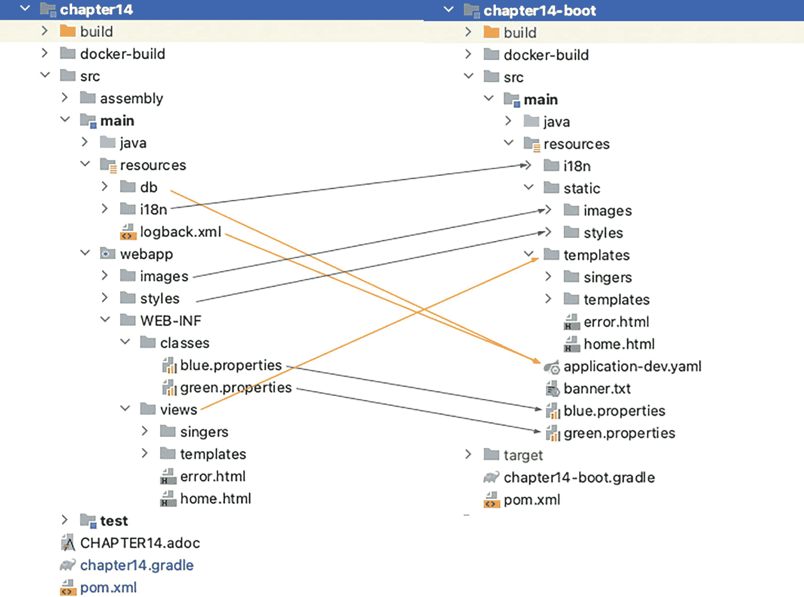

一个窗口显示了第 14 章和第 14 章 Boot 项目，高亮显示了所有放在 resources 目录下的界面相关文件和资源文件。

图 14-16
Spring 经典版与 Spring Boot Web 应用程序结构对比

橙色箭头显示了不仅名称改变、位置也改变的文件。例如，数据源配置文件不再需要，因为其内容通过使用 Spring Boot 配置属性进行配置。`logback.xml` 文件也不再需要，因为 Logback 配置是通过使用 Spring Boot 属性完成的。并且，包含 Thymeleaf 模板的 `views` 目录被重命名为 `templates`，因此无需使用显式 Bean 配置来配置 Thymeleaf 支持，可以直接使用 Spring Boot 的即用型配置。

用于主题配置的 `blue.properties` 和 `green.properties` 文件已从 `classes` 目录移动到 `static` 目录的根目录，以利用默认的 Spring Boot 主题 Bean 配置，因为自定义它们很麻烦。

接下来要分析的是 Spring Boot 的 `application-dev.yaml` 内容，如清单 14-39 所示。

```
