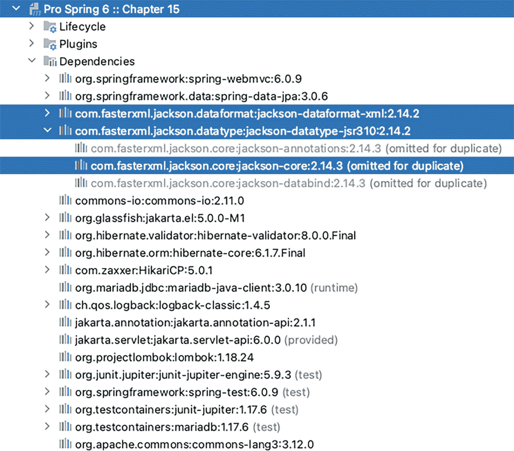

# Logging config
logging:
pattern:
console: "%-5level: %class{0} - %msg%n"
level:
root: INFO
org.springframework.boot: DEBUG
com.apress.prospring6.fourteen: INFO
清单 14-39
Spring Boot Web 应用程序配置
```

配置的每个部分都以一个注释作为前缀，说明其作用范围。以下列表进一步解释了每个部分中使用的属性：


*   `# web server configuration`：此部分配置应用程序可访问的 URL。将地址设置为`0.0.0.0`可使应用程序在运行该计算机的所有网络地址上均可访问；例如，`http://localhost:8081/`、`http://127.0.0.1:8081/`等。

*   `# HTTP Method filter`：将`spring.mvc.hiddenmethod.filter.enabled`设置为`true`，相当于在 Spring Boot 中配置过滤器以支持 PUT 和 DELETE HTTP 方法。

*   `# internationalization configuration`：此部分配置国际化文件的位置、名称、编码等。

*   `# file upload configuration`：此部分配置支持文件上传所需的所有组件。

*   `# view resolver configuration`：此部分配置 Thymeleaf 视图模板的位置、编码、最大大小等。Spring Boot 使用此配置来配置 Thymeleaf 引擎和 Thymeleaf 解析器 Bean。

*   `# data source configuration`：此部分将所有数据源配置（包括持久化）分组。

*   `# Logging config`：此部分配置日志记录。

无法放入`application-dev.yaml`的配置部分，则放入典型的配置类中，并使用`@Configuration`注解。

灯泡图标。 `HibernateCfg`类是为了解决 Spring Data JPA 与 MariaDB 在数据库对象命名相关的 bug 而采用的变通方案。没有此类，仓库接口无法映射到表，因为 Spring Boot 会查找名为`musicdb.singer`的表但找不到，而 MariaDB Docker 容器在声明对象时使用的是大写字母（例如：MUSICDB.SINGER）。由于将 Docker SQL 查询全部转为小写工作量过大，因此借此机会引入了一个高级配置示例。`HibernateCfg`类如代码清单 14-40 所示。

```
package com.apress.prospring6.fourteen.boot;
import org.hibernate.boot.model.naming.Identifier;
import org.hibernate.boot.model.naming.PhysicalNamingStrategyStandardImpl;
import org.hibernate.engine.jdbc.env.spi.JdbcEnvironment;
import org.springframework.context.annotation.Bean;
import org.springframework.context.annotation.Configuration;
@Configuration(proxyBeanMethods = false)
public class HibernateCfg {
@Bean
PhysicalNamingStrategyStandardImpl caseSensitivePhysicalNamingStrategy() {
return new PhysicalNamingStrategyStandardImpl() {
@Override
public Identifier toPhysicalTableName(Identifier logicalName, JdbcEnvironment context) {
return apply(logicalName, context);
}
@Override
public Identifier toPhysicalColumnName(Identifier logicalName, JdbcEnvironment context) {
return apply(logicalName, context);
}
private Identifier apply(final Identifier name, final JdbcEnvironment context) {
if ( name == null ) {
return null;
}
StringBuilder builder = new StringBuilder( name.getText().replace( '.', '_' ) );
for ( int i = 1; i < builder.length() - 1; i++ ) {
if ( isUnderscoreRequired( builder.charAt( i - 1 ), builder.charAt( i ), builder.charAt( i + 1 ) ) ) {
builder.insert( i++, '_' );
}
}
return Identifier.toIdentifier(builder.toString().toUpperCase());
}
private boolean isUnderscoreRequired(final char before, final char current, final char after) {
return Character.isLowerCase( before ) && Character.isUpperCase( current ) && Character.isLowerCase( after );
}
};
}
}
代码清单 14-40
HibernateCfg 类
```

此处通过匿名类扩展的`PhysicalNamingStrategyStandardImpl`类，本身实现了`PhysicalNamingStrategy`，这是一个可插拔的策略契约，用于对数据库对象名称应用物理命名规则。`@Configuration(proxyBeanMethods = false)`配置用于排除此类中声明的 Bean 被代理以强制执行 Bean 生命周期行为。这意味着，任何通过调用`caseSensitivePhysicalNamingStrategy()`方法创建的 Bean，都会获得`PhysicalNamingStrategyStandardImpl` Bean 的一个新副本。

`WebConfig`类是一个扩展了`WebMvcConfigurer`的 Spring Web 配置类，用于配置区域设置和主题拦截器及解析器。这些组件不会被 Spring Boot 自动配置，因此需要开发者自行处理。`WebConfig`类如代码清单 14-41 所示。

```
package com.apress.prospring6.fourteen.boot;
// 导入语句已省略
import java.util.Locale;
@Configuration
@ComponentScan(basePackages = {"com.apress.prospring6.fourteen.boot"})
public class WebConfig implements WebMvcConfigurer {
@Bean
LocaleChangeInterceptor localeChangeInterceptor() {
var localeChangeInterceptor = new LocaleChangeInterceptor();
localeChangeInterceptor.setParamName("lang");
return localeChangeInterceptor;
}
@Bean
ThemeChangeInterceptor themeChangeInterceptor() {
var themeChangeInterceptor = new ThemeChangeInterceptor();
themeChangeInterceptor.setParamName("theme");
return themeChangeInterceptor;
}
@Bean
CookieLocaleResolver localeResolver() {
var cookieLocaleResolver = new CookieLocaleResolver();
cookieLocaleResolver.setDefaultLocale(Locale.ENGLISH);
cookieLocaleResolver.setCookieMaxAge(3600);
cookieLocaleResolver.setCookieName("locale");
return cookieLocaleResolver;
}
@Bean
CookieThemeResolver themeResolver() {
var cookieThemeResolver = new CookieThemeResolver();
cookieThemeResolver.setDefaultThemeName("green");
cookieThemeResolver.setCookieMaxAge(3600);
cookieThemeResolver.setCookieName("theme");
return cookieThemeResolver;
}
@Bean
WebContentInterceptor webChangeInterceptor() {
var webContentInterceptor = new WebContentInterceptor();
webContentInterceptor.setCacheSeconds(0);
webContentInterceptor.setSupportedMethods("GET", "POST", "PUT", "DELETE");
return webContentInterceptor;
}
@Override
public void addInterceptors(InterceptorRegistry registry) {
registry.addInterceptor(localeChangeInterceptor()).addPathPatterns("/*");
registry.addInterceptor(themeChangeInterceptor());
registry.addInterceptor(webChangeInterceptor());
}
}
代码清单 14-41
WebConfig 类
```

感叹号图标表示警告。 请注意，此类没有使用`@EnableWebMvc`注解。这是不必要的，因为 Spring Boot 会配置 Web 应用程序上下文。在 Spring Boot 应用程序中使用此注解，即使应用程序能够启动，也可能导致不可预测的行为。

剩下的工作是告诉 Spring Boot 我们的实体和仓库接口的位置，并启用事务支持。这些配置可以通过在 Spring Boot 主类上添加注解轻松完成，如代码清单 14-42 所示。


```
package com.apress.prospring6.fourteen.boot;
import org.springframework.boot.SpringApplication;
import org.springframework.boot.autoconfigure.SpringBootApplication;
import org.springframework.boot.autoconfigure.domain.EntityScan;
import org.springframework.core.env.AbstractEnvironment;
import org.springframework.data.jpa.repository.config.EnableJpaRepositories;
import org.springframework.transaction.annotation.EnableTransactionManagement;
import java.util.Arrays;
import java.util.stream.Collectors;
@EntityScan(basePackages = {"com.apress.prospring6.fourteen.boot.entities"})
@EnableJpaRepositories("com.apress.prospring6.fourteen.boot.repos")
@EnableTransactionManagement
@SpringBootApplication
public class Chapter14Application {
public static void main(String... args) {
System.setProperty(AbstractEnvironment.ACTIVE_PROFILES_PROPERTY_NAME, "dev");
SpringApplication.run(Chapter14Application.class, args);
}
}
代码清单 14-42
Chapter14Application 类
```

声明一个名为 `dev` 的 profile 来运行应用程序，其目的是为了在运行测试时能够对上下文进行轻微修改。

通过到目前为止所描述的配置，运行 `Chapter14Application` 将启动与之前章节中部署在 Apache Tomcat 服务器上相同的应用程序。

#### 测试 Spring Boot Web 应用程序

正如预期的那样，使用 Spring Boot 进行测试也更加容易。作为示例，我们将使用 Spring Boot 为 `HomeController` 添加两个非常简单的测试。Spring Boot 测试使用 `@SpringBootTest` 注解，该注解可用于在随机端口上启动一个 Web 应用程序，然后可以通过 `TestRestTemplate` 实例访问该应用程序并发送请求。测试类如代码清单 14-43 所示。

```
package com.apress.prospring6.fourteen.boot;
import org.springframework.boot.test.context.SpringBootTest;
import org.springframework.boot.test.web.client.TestRestTemplate;
import static org.assertj.core.api.Assertions.assertThat;
// 其他 import 语句
@ActiveProfiles("test")
@SpringBootTest(webEnvironment = SpringBootTest.WebEnvironment.RANDOM_PORT)
public class HomeController1Test {
@Value(value="${local.server.port}")
private int port;
@Autowired
private TestRestTemplate restTemplate;
@Test
public void testHomeController(){
assertThat(this.restTemplate.getForObject("http://localhost:" + port + "/", String.class))
.contains("Spring Boot Thymeleaf Example");
}
}
代码清单 14-43
使用 TestRestTemplate 的 HomeController1Test 类
```

`TestRestTemplate` 是 **第** **20** **章**中介绍的 `WebTestClient` 的非响应式等价物，并且它是 `RestTemplate` 的一个便捷替代方案，适用于集成测试。它是专门为测试而设计的，因为 4xx 和 5xx 的失败请求不会抛出异常，这对于编写负面测试用例非常有用。使用 `TestRestTemplate` 进行测试包括检查关于应用程序返回响应的假设，因此测试是面向数据的，因为不会检查请求到处理器的正确映射。

`TestRestTemplate` 的另一个替代方案是 Rest Assured^(¹⁴³)。

同样的测试也可以使用本章前面介绍的 `MockMvc` 来编写，但之前的测试是使用 `@SpringJUnitWebConfig` 配置的。当引入 Spring Boot 时，会使用一个不同的注解：`@AutoConfigureMockMvc`。测试如代码清单 14-44 所示。

```
package com.apress.prospring6.fourteen.boot;
import org.springframework.boot.test.autoconfigure.web.servlet.AutoConfigureMockMvc;
// 其他 import 语句
@ActiveProfiles("test")
@AutoConfigureMockMvc
@SpringBootTest
public class HomeController2Test {
@Autowired
MockMvc mockMvc;
@Test
void testHome() throws Exception {
mockMvc.perform(MockMvcRequestBuilders.get("/home"))
.andDo(print())
.andExpect(status().isOk())
.andExpect(view().name("home"))
.andExpect(content().string(containsString("Spring Boot Thymeleaf Example!!")));
}
}
代码清单 14-44
使用 MockMvc 的 HomeController2Test 类
```

使用 `MockMvc` 进行测试功能更强大一些，因为它允许检查关于实际控制器处理器方法配置的假设。在代码清单 14-44 中，你可以看到视图名称的假设也被测试了，这使得这种方法更加面向配置。

## 总结

在本章中，我们涵盖了与使用 Spring MVC 进行 Web 开发相关的许多主题。首先，我们讨论了 MVC 模式的高级概念。然后，我们介绍了 Spring MVC 的架构，包括其 `WebApplicationContext` 层次结构、请求处理生命周期和配置。

接下来，你学习了如何使用 Spring MVC 和 Thymeleaf 作为视图技术开发一个示例歌手管理应用程序。在开发示例的过程中，我们详细阐述了不同的领域。主要主题包括 i18n、主题化以及 Thymeleaf 的模板支持。

为了将 Spring Web 应用程序与视图技术集成，至少需要一个实现 Spring 的 `org.springframework.web.servlet.ViewResolver` 的自定义 bean。Thymeleaf 也是一种模板视图技术，因此其 `ViewResolver` 实现依赖于 `SpringTemplateEngine` 和 `SpringResourceTemplateResolver`。

并且，由于 Spring Boot 是 Spring 团队的神奇特性，因此必须介绍如何使用它构建一个完整的 Web 应用程序。在下一章中，我们将通过介绍 REST 请求来涵盖 Spring 在 Web 应用程序开发方面带来的更多特性。

脚注 1   2   3   4   5   6   7   8   9   10   11   12   13   14   15   16   17   18   19   20


# 15. Spring REST 支持

**第** **13****章**介绍了两个暴露 REST API 的 Spring Web 应用之间通过 HTTP 协议进行的通信。本章将扩展这一主题，向你介绍 RESTful Web 服务，也称为 RESTful-WS。

如今，RESTful-WS 或许是远程访问中使用最广泛的技术。从通过 HTTP 进行远程服务调用，到支持 Ajax 风格的交互式 Web 前端，RESTful-WS 正被大量采用，尤其是因为微服务的兴起。RESTful Web 服务之所以流行，有以下几个原因：

*   ***易于理解***：RESTful Web 服务围绕 HTTP 设计。URL 与 HTTP 方法共同指定了请求的意图。例如，URL [`http://somedomain.com/restful/customer/1`](http://somedomain.com/restful/customer/1) 配合 HTTP 方法 `GET` 表示客户端想要检索客户信息，其中客户 ID 等于 1。

*   ***轻量级***：与基于 SOAP 的 Web 服务相比，RESTful 要轻量得多。SOAP 服务包含大量元数据来描述客户端想要调用哪个服务。而对于 RESTful 的请求和响应，它仅仅是 HTTP 请求和响应，就像任何其他 Web 应用一样。

*   ***对防火墙友好***：由于 RESTful Web 服务设计为可通过 HTTP（或 HTTPS）访问，因此应用对防火墙更加友好，远程客户端也更容易访问。

在本章中，我们将介绍 RESTful-WS 的基本概念，以及 Spring 通过其 Spring MVC 模块对 RESTful-WS 的支持。

## 介绍 RESTful Web 服务

RESTful-WS 中的 REST 是 **RE**presentational **S**tate **T**ransfer（表述性状态转移）的缩写，它是一种架构风格。REST 定义了一组架构约束，这些约束共同描述了一个用于访问资源的统一接口。该统一接口的主要概念包括资源的标识以及通过表述对资源进行操作。对于资源的标识，一条信息应能通过统一资源标识符（URI）访问。例如，URL [`http://somedomain.com/api/singer/1`](http://somedomain.com/api/singer/1) 是一个代表资源的 URI，该资源是一条标识符为 1 的歌手信息。如果标识符为 1 的歌手不存在，客户端将收到 404 HTTP 状态码，就像网站上的“页面未找到”错误。另一个例子，[`http://somedomain.com/api/singers`](http://somedomain.com/api/singers) 是一个代表资源的 URI，该资源是一个歌手信息列表。这些可标识的资源可以通过各种表述进行管理，如表 15-1 所示。

表 15-1

用于操作资源的表述

| HTTP 方法 | 描述 |
| --- | --- |
| `GET` | GET 检索资源的表述。 |
| `HEAD` | 与 GET 相同，但没有响应体。通常用于获取头部信息。 |
| `POST` | POST 创建新资源。 |
| `PUT` | PUT 更新资源。 |
| `DELETE` | DELETE 删除资源。 |
| `OPTIONS` | OPTIONS 检索允许的 HTTP 方法。 |

关于 RESTful Web 服务的详细描述，我们推荐 *Ajax and REST Recipes: A Problem-Solution Approach by Christian Gross*（Apress, 2006）。

### 使用 Spring MVC 暴露 RESTful Web 服务

在本节中，我们将向你展示如何使用 Spring MVC 将歌手服务暴露为 RESTful Web 服务，正如上一节所设计的那样。此示例基于已介绍的 `Singer` 类和 `SingerRepo` 仓库接口构建。

一个警告图标。 在本书的上一版中，使用了 Castor^(¹⁴⁴) XML 进行序列化。Castor 库已有一段时间未维护，因此在本版中，我们弃用了它，转而使用 Jackson^(¹⁴⁵)。

Jackson 库功能非常强大，提供了将对象序列化为 JSON 和 XML 的组件。通过注解可以轻松地将 Java 属性映射到 XML 元素或 JSON 属性。尽管 Jackson 注解命名为 `@Json*`，但它们也适用于 XML 序列化的配置。清单 15-1 展示了使用 Jackson 注解修饰的 `Singer` 类。

```
package com.apress.prospring6.fifteen.entities;
import com.fasterxml.jackson.annotation.JsonFormat;
import com.fasterxml.jackson.annotation.JsonIgnore;
// 其他导入语句已省略
@Data
@Entity
@Table(name = "SINGER")
public class Singer {
@Serial
private static final long serialVersionUID = 2L;
@Id
@GeneratedValue(strategy = IDENTITY)
@Column(name = "ID")
protected Long id;
@JsonIgnore
@Version
@Column(name = "VERSION")
protected int version;
@NotEmpty
@Size(min = 2, max = 30)
@Column(name = "FIRST_NAME")
private String firstName;
@NotEmpty
@Size(min = 2, max = 30)
@Column(name = "LAST_NAME")
private String lastName;
@JsonFormat(pattern = "yyyy-MM-dd")
@DateTimeFormat(pattern = "yyyy-MM-dd")
@Column(name = "BIRTH_DATE")
private LocalDate birthDate;
}
清单 15-1
使用 Jackson 注解更新的 Singer 类
```

默认情况下，Jackson 知道如何序列化为文本值的所有 `Singer` 字段都会被序列化。所有不应序列化的字段，例如 `version` 字段，必须使用 `@JsonIgnore` 注解进行标注。

对于复杂类型，例如日历日期，有两种选择：使用配置了我们希望日期值转换成的模式的 `@JsonFormat` 注解，或者扩展 `com.fasterxml.jackson.databind``.ser``.std.StdSerializer`。


### 实现 `SingerController`

为简单起见，我们将跳过声明 `SingerService`，直接编写一个使用 `SingerRepo` 的 `SingerController`。`SingerController` 如代码清单 15-2 所示。

```
package com.apress.prospring6.fifteen.controllers;
import org.springframework.stereotype.Controller;
import org.springframework.web.bind.annotation.*;
// 其他 import 语句已省略
@Controller
@RequestMapping(path = "singer")
public class SingerController {
final Logger logger = LoggerFactory.getLogger(SingerController.class);
private final SingerRepo singerRepo;
public SingerController(SingerRepo singerRepo) {
this.singerRepo = singerRepo;
}
@ResponseStatus(HttpStatus.OK)
@ResponseBody
@RequestMapping(path={"/", ""}, method = RequestMethod.GET)
public List all() {
return singerRepo.findAll();
}
@ResponseStatus(HttpStatus.OK)
@ResponseBody
@RequestMapping(path = "/{id}", method = RequestMethod.GET)
public Singer findSingerById(@PathVariable Long id) {
return singerRepo.findById(id).orElse(null);
}
@ResponseStatus(HttpStatus.CREATED)
@ResponseBody
@RequestMapping(path = "/", method = RequestMethod.POST)
public Singer create(@RequestBody Singer singer) {
logger.info("Creating singer: " + singer);
var saved = singerRepo.save(singer);
logger.info("Singer created successfully with info: " + saved);
return singer;
}
@ResponseStatus(HttpStatus.OK)
@ResponseBody
@RequestMapping(path = "/{id}", method = RequestMethod.PUT)
public void update(@RequestBody Singer singer, @PathVariable Long id) {
LOGGER.info("Updating singer: {}",  singer);
var fromDb = singerRepo.findById(id).orElseThrow(() -> new IllegalArgumentException("Singer does not exist!") );
fromDb.setFirstName(singer.getFirstName());
fromDb.setLastName(singer.getLastName());
fromDb.setBirthDate(singer.getBirthDate());
singerRepo.save(fromDb);
LOGGER.info("Singer updated successfully with info: " + fromDb);
}
@ResponseStatus(HttpStatus.NO_CONTENT)
@ResponseBody
@RequestMapping(path = "/{id}", method = RequestMethod.DELETE)
public void delete(@PathVariable Long id) {
logger.info("Deleting singer with id: " + id);
singerRepo.deleteById(id);
logger.info("Singer deleted successfully");
}
}
代码清单 15-2
SingerController 实现
```

关于上述类，要点如下：

*   该类使用 `@Controller` 注解，表明它是一个 Spring MVC 控制器。

*   类级别的 `@RequestMapping``(value="/singer")` 注解表明该控制器将映射到主 Web 上下文下的所有 URL。在本示例中，`http://localhost:8080/singer` 下的所有 URL 都将由此控制器处理。

*   该控制器需要 `SingerRepo` 才能工作。

*   每个方法上的 `@RequestMapping` 注解指明了其将映射到的 URL 模式和对应的 HTTP 方法。例如，`all()` 方法将映射到 `http://localhost:8080/singer` URL，并使用 HTTP `GET` 方法。对于 `update(..)` 方法，它将映射到 URL `http://localhost:8080/singer/1`，并使用 HTTP `PUT` 方法。

*   该控制器与**第** **14** **章**中介绍的控制器有何不同？是什么让一个控制器适合处理 REST 请求？有两点：每个处理方法上都放置了 `@ResponseBody` 注解，以及处理方法不返回逻辑视图名称，因为没有视图，方法返回的是实际数据。`@ResponseBody` 注解表明方法返回值应绑定到 Web 响应体，这是一种花哨的技术说法，即方法返回的值就是实际的 Web 响应。如果觉得在每个方法上都标注 `@ResponseBody` 显得冗长，你可以通过在类级别使用一次该注解来轻松省略，但这意味着控制器中没有方法预期会返回视图或视图名称。

*   对于接受路径变量的方法（例如 `findSingerById(..)` 方法），路径变量使用 `@PathVariable` 注解。这指示 Spring MVC 将 URL 中的路径变量（例如 `http://localhost:8080/singer/1`）绑定到 `findSingerById(..)` 方法的 `id` 参数。请注意，`id` 参数的类型是 `Long`，Spring 的类型转换系统会自动为我们处理从 `String` 到 `Long` 的转换。

*   对于 `create(..)` 和 `update(..)` 方法，`Singer` 参数使用 `@RequestBody` 注解。这指示 Spring 自动将 HTTP 请求体中的内容绑定到 `Singer` 领域对象。转换将由声明的 `HttpMessageConverter<Object>` 接口（位于 `org.springframework.http.converter` 包下）的实例完成，以支持各种格式，这将在本章后面讨论。

Spring 4.3 版本引入了一些 `@RequestMapping` 注解的定制化，以匹配基本的 HTTP 方法。表 15-2 列出了新注解与旧式 `@RequestMapping` 之间的等价关系。

表 15-2
Spring 4.3 中引入的用于将 HTTP 方法请求映射到特定处理方法的注解

| 注解 | 旧式等价写法 |
| --- | --- |
| `@GetMapping` | `@RequestMapping(method = RequestMethod.GET)` |
| `@PostMapping` | `@RequestMapping(method = RequestMethod.POST)` |
| `@PutMapping` | `@RequestMapping(method = RequestMethod.PUT)` |
| `@DeleteMapping` | `@RequestMapping(method = RequestMethod.DELETE)` |

Spring 4.0 中还为 REST 控制器类引入了另一个定型注解，称为 `@RestController`。该注解同样声明在 `org.springframework.web.bind.annotation` 包中，并且是元注解了 `@Controller` 和 `@ResponseBody`，这基本上赋予了它两者的能力。使用此注解以及表 15-2 中的注解，`SingerController` 类变得更加简洁，如代码清单 15-3 所示。

```
package com.apress.prospring6.fifteen.controllers;
import org.springframework.web.bind.annotation.RestController;
// 其他 import 语句已省略
@RestController
@RequestMapping(path = "singer")
public class SingerController {
final Logger logger = LoggerFactory.getLogger(SingerController.class);
private final SingerRepo singerRepo;
public SingerController(SingerRepo singerRepo) {
this.singerRepo = singerRepo;
}
@ResponseStatus(HttpStatus.OK)
@GetMapping(path="/")
public List all() {
return singerRepo.findAll();
}
@ResponseStatus(HttpStatus.OK)
@GetMapping(path = "/{id}")
public Singer findSingerById(@PathVariable Long id) {
return singerRepo.findById(id).orElse(null);
}
@ResponseStatus(HttpStatus.CREATED)
@PostMapping(path="/")
public Singer create(@RequestBody Singer singer) {
LOGGER.info("Creating singer: {}" , singer);
var saved = singerRepo.save(singer);
LOGGER.info("Singer created successfully with info: " + saved);
return singer;
}
// 其他方法已省略
}
代码清单 15-3
使用 @RestController 的 SingerController 实现
```

对于一个不需要专门 Web 视图的 Spring Web REST 应用程序，无需专门的视图解析器 Bean。因此，配置稍微简单一些。`WebInitializer` 类（即配置 `DispatcherServlet` 的类）对于 Spring Web 应用程序来说相当标准，并且当不使用专门视图时，不需要 `HiddenHttpMethodFilter`。此类如代码清单 15-4 所示。


```
package com.apress.prospring6.fifteen;
import jakarta.servlet.Filter;
import org.springframework.web.filter.CharacterEncodingFilter;
import org.springframework.web.filter.HiddenHttpMethodFilter;
import org.springframework.web.servlet.support.AbstractAnnotationConfigDispatcherServletInitializer;
import java.nio.charset.StandardCharsets;
import java.nio.charset.StandardCharsets;
public class WebInitializer
extends AbstractAnnotationConfigDispatcherServletInitializer {
@Override
protected Class[] getRootConfigClasses() {
return new Class[]{BasicDataSourceCfg.class, TransactionCfg.class};
}
@Override
protected Class[] getServletConfigClasses() {
return new Class[]{WebConfig.class};
}
@Override
protected String[] getServletMappings() {
return new String[]{"/"};
}
@Override
protected Filter[] getServletFilters() {
final CharacterEncodingFilter cef = new CharacterEncodingFilter();
cef.setEncoding(StandardCharsets.UTF_8.name());
cef.setForceEncoding(true);
return new Filter[]{new HiddenHttpMethodFilter(), cef};
}
}
代码清单 15-4
WebInitializer 类
```

Spring MVC 配置类（`WebConfig`，如代码清单 15-5 所示）同样很简单，因为通常 REST 应用程序不需要主题或国际化功能。

```
package com.apress.prospring6.fifteen;
import org.springframework.web.servlet.config.annotation.EnableWebMvc;
import org.springframework.web.servlet.config.annotation.WebMvcConfigurer;
// 其他 import 语句已省略
@Configuration
@EnableWebMvc
@ComponentScan(basePackages = {"com.apress.prospring6.fifteen"})
public class WebConfig  implements WebMvcConfigurer {
@Override
public void addViewControllers(ViewControllerRegistry registry) {
registry.addRedirectViewController("/", "/home");
}
@Bean
public Validator validator() {
final var validator = new LocalValidatorFactoryBean();
return validator;
}
@Override
public Validator getValidator() {
return validator();
}
}
代码清单 15-5
WebConfig 类
```

这种配置是最小化的，即使在经典配置中，Spring MVC 也会根据请求中的 `Accept` 头来确定请求的媒体类型。

你可以通过在 `WebConfig` 类中重写 `configureContentNegotiation(..)` 方法^(¹⁴⁶)，基于路径扩展名、查询参数或其他方法来配置请求的媒体类型，或者通过声明不同的处理器方法并使用 `produces` 属性来实现。

另一种配置请求媒体类型的方法是重写 `configureMessageConverters()` 方法，以覆盖 Spring MVC 创建的默认消息转换器，或者通过重写 `extendMessageConverters()` 方法，将自定义消息转换器添加到默认转换器集合中^(¹⁴⁷)。

对于本章而言，我们无需执行上述任何操作，因为 Spring MVC 配置的默认消息转换器已经足够满足我们的需求。

那么，既然我们已经确定客户端必须在请求中提供 `Accept` 头来指定他们所需的数据格式，我们还需要配置其他内容来使其生效吗？答案是否定的，不需要其他 Spring 配置。不过，我们确实需要将合适的 Jackson 库添加到类路径中，以便 Spring MVC 能够使用它们。

`chapter15` 项目的依赖关系如图 15-1 所示。



第 15 章目录树的截图。它展示了生命周期、插件和依赖项的下拉菜单。依赖项下拉菜单列出了一些库，并高亮显示了 Jackson dataformat xml、Jackson datatype jsr 310 和 Jackson core，以省略重复项。

图 15-1

`chapter15` 项目的依赖关系

在图 15-1 中，你可以看到以下三个被高亮显示的 Jackson 库：

*   `jackson-dataformat-xml` 用于序列化为 XML 格式。
*   `jackson-core` 是用于序列化为 JSON 格式的核心 Jackson 库；它包含了所有 `@Json*` 注解。
*   `jackson-datatype-jsr310` 用于 Java 8 日期和时间类型的序列化与格式化。

现在，服务端服务已经完成。此时，你可以构建包含该 Web 应用程序的 WAR 文件，并将其部署到 Apache Tomcat 10 实例中；或者，如果你使用的是 IntelliJ IDEA，可以按照**第** **14** 章所示创建一个 Apache Tomcat 启动器。


### 测试 RESTful-WS 应用

测试 REST 应用的方法有很多。我们可以构建一个 Java 客户端，可以使用 HTTPie 请求，也可以使用 `curl`^(¹⁴⁸)、Postman^(¹⁴⁹) 或任何其他用于发起 HTTP 请求的应用程序或 CLI。让我们从最简单的 HTTPie（IntelliJ IDEA HTTP 客户端）开始。以 XML 格式检索所有歌手的请求以及返回响应的片段如清单 15-6 所示。

```
### 请求
GET http://localhost:8080/ch15/singer/
Accept: application/xml
### 响应
HTTP/1.1 200
Content-Type: application/xml;charset=UTF-8
Transfer-Encoding: chunked
Date: Tue, 17 Jan 2023 22:13:57 GMT
Keep-Alive: timeout=20
Connection: keep-alive

John
Mayer
1977-10-16

Ben
Barnes
1981-08-20

清单 15-6
使用 HTTPie 以 XML 格式获取所有歌手的请求及响应
```

此命令向服务器的 RESTful Web 服务发送一个 HTTP 请求；在此例中，它调用了 `SingerController` 中的 `all()` 方法来检索并返回所有歌手信息。同时，`Accept` HTTP 头部的值被设置为 `application/xml`，这意味着客户端希望以 XML 格式接收数据。

要获取 JSON 格式的数据，我们只需将 `Accept` 头部的值替换为 `application/json`。由于提到了 `curl`，清单 15-7 展示了使用详细模式（`-v` 选项）的 `curl` 请求以 JSON 格式检索数据，以及响应的片段。

```
### 请求
curl -v -H "Accept: application/json" http://localhost:8080/ch15/singer/
### 响应
*   Trying 127.0.0.1:8080...
* Connected to localhost (127.0.0.1) port 8080 (#0)
> GET /ch15/singer/ HTTP/1.1
> Host: localhost:8080
> User-Agent: curl/7.84.0
> Accept: application/json
>
* Mark bundle as not supporting multiuse
< HTTP/1.1 200
< Content-Type: application/json;charset=UTF-8
< Transfer-Encoding: chunked
< Date: Tue, 17 Jan 2023 22:22:54 GMT
<
* Connection #0 to host localhost left intact
[
{
"firstName":"John",
"lastName":"Mayer",
"birthDate":"1977-10-16"
},
{
"firstName":"Ben",
"lastName":"Barnes",
"birthDate":"1981-08-20"
}
