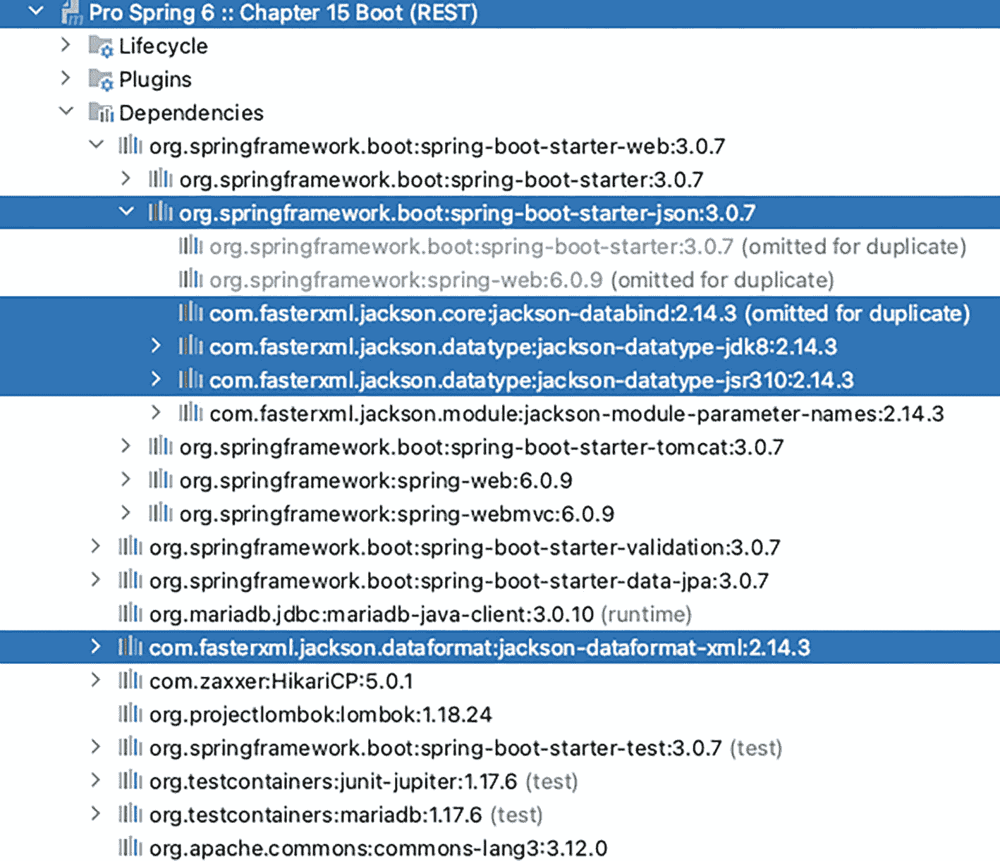

# 其余歌手已省略
清单 15-9
执行 RestClientTest#testFindAll() 的控制台日志
```


如你所见，`RestTemplate` 实例提交请求时，其 `Accept` 头部的值会匹配类路径上所有已发现的转换器，在本例中为 `application/xml, text/xml, application/json, application/xml, application/json`，这保证了响应能被正确解析，并成功转换为作为参数提供的 Java 类型，此处为 `Singer` 数组。我们不能使用 `List<Singer>` 作为响应转换的目标类型，因为该类型是泛型，不能用作参数。

`getForObject(..)` 方法，顾名思义，适用于提交 `GET` 请求。如果你分析其余测试方法，会发现 `RestTemplate` 中为其他 HTTP 方法提供了对应的方法：`POST` 对应 `postForObject(..)`，`PUT` 对应 `put(..)`，`DELETE` 对应 `delete(..)`。除此之外，还有专门的 `execute(..)` 和 `exchange()` 方法集。`execute(..)` 方法适用于需要在请求提交后立即执行回调方法（作为 `RequestCallback` 的实现提供）的场景，并且由于未提供用于转换响应体的类型，可以提供一个 `ResponseExtractor<T>` 来显式地将响应体转换为所需类型。该方法有多个重载版本，包括带有额外请求参数的版本。清单 15-10 展示了如何使用 `execute(..)` 方法编写一个与 `testFindAll(..)` 等效的测试方法。

```
package com.apress.prospring6.fifteen;
import org.springframework.web.client.RequestCallback;
import org.springframework.web.client.ResponseExtractor;
// 其他导入语句已省略
public class RestClientTest {
@Test
public void testFindAllWithExecute() {
LOGGER.info("--> 测试检索所有歌手");
var singers = restTemplate.execute(URI_SINGER_ROOT, HttpMethod.GET,
request -> LOGGER.debug("请求已提交 ..."),
response -> {
assertEquals(HttpStatus.OK, response.getStatusCode());
return new String(response.getBody().readAllBytes());
}
);
LOGGER.info("响应: {}" , singers);
}
// 其他测试方法已省略
}
清单 15-10
使用 restTemplate.execute(..) 测试 testFindAll(..) 方法
```

`RequestCallback`^(¹⁵⁰) 和 `ResponseExtractor<T>`^(¹⁵¹) 都是函数式接口，因此它们的实现可以使用 lambda 表达式内联声明。这两个函数式接口如清单 15-11 所示。

```
// 注释已省略
package org.springframework.web.client;
import java.io.IOException;
import java.lang.reflect.Type;
import org.springframework.http.client.ClientHttpRequest;
@FunctionalInterface
public interface RequestCallback {
void doWithRequest(ClientHttpRequest request) throws IOException;
}
//-------------------------------
package org.springframework.web.client;
import java.io.IOException;
import java.lang.reflect.Type;
import org.springframework.http.client.ClientHttpResponse;
import org.springframework.lang.Nullable;
@FunctionalInterface
public interface ResponseExtractor {
@Nullable
T extractData(ClientHttpResponse response) throws IOException;
}
清单 15-11
RequestCallback 和 ResponseExtractor 函数式接口
```

`exchange(..)` 方法集是 `RestTemplate` 提供的最通用/功能最强大的方法，适用于其他方法提供的参数集都不足以满足需求的情况。顾名思义，`exchange(..)` 方法旨在客户端与服务器上运行的应用程序之间进行信息交换，因此最适合复杂的 `POST` 和 `PUT` 请求。清单 15-12 展示了使用 `exchange(..)` 的 `testCreate(..)` 版本。

```
package com.apress.prospring6.fifteen;
import org.springframework.http.HttpEntity;
import org.springframework.http.HttpMethod;
// 其他导入语句已省略
public class RestClientTest {
@Test
public void testCreateWithExchange() {
LOGGER.info("--> 测试创建歌手");
Singer singerNew = new Singer();
singerNew.setFirstName("TEST");
singerNew.setLastName("Singer");
singerNew.setBirthDate(LocalDate.now());
HttpEntity request = new HttpEntity(singerNew);
ResponseEntity created =
restTemplate.exchange(URI_SINGER_ROOT, HttpMethod.POST,request, Singer.class);
assertEquals(HttpStatus.CREATED, created.getStatusCode());
var singerCreated = created.getBody();
assertNotNull(singerCreated);
LOGGER.info("歌手创建成功: " + singerCreated);
}
// 其他测试方法已省略
}
清单 15-12
测试 RequestCallback 接口
```

`HttpEntity<T>` 非常强大，因为它可以将请求体和头部封装在一起，使得 `RestTemplate#exchange(..)` 能够提交安全的 REST 请求。

使用 `RestTemplate` 进行测试很简单，但控制器可能需要一些改进，以使其在 REST 方面功能更强大。如果我们尝试编辑的 `Singer` 实例不存在会发生什么？如果我们尝试创建一个带有某些名称的 `Singer` 实例会发生什么？响应会是什么？无从得知，因为所有处理器方法都使用 `@ResponseStatus` 注解来配置一切正常时返回的响应状态码，但任何地方都没有配置错误状态码。例如，现在运行 `testCreateWithExchange(..)` 方法会返回 500（`INTERNAL_SERVER_ERROR`），因为仓库抛出了一个未被任何地方处理的 `org.springframework.dao.DataIntegrityViolationException`。因此，处理异常是必要的。


### 使用 `ResponseEntity<T>` 进行 REST 异常处理

我们首先要做的是在异常发生处进行处理，并通过 `ResponseEntity<T>` 类型显式返回所需的 `HttpStatus` 值。该类型是 `org.springframework.http.HttpEntity<T>` 的扩展，包含一个 `HttpStatusCode` 状态码。它可用于包装 `RestTemplate` 方法调用的结果，也可用作 REST 处理器方法的返回类型。

话虽如此，我们来修改 `findSingerById(..)` 处理器方法，使其在存在指定 `id` 的歌手时返回包含 `HttpStatus.OK` 状态码的 `ResponseEntity<Singer>`，并在找不到指定 `id` 的歌手时返回包含 `HttpStatus.NOT_FOUND` 状态码的 `ResponseEntity<HttpStatus>`。清单 15-13 展示了该方法的此版本，它属于一个名为 `Singer2Controller` 的新 REST 控制器类。

```
package com.apress.prospring6.fifteen.controllers;
import org.springframework.http.HttpStatus;
import org.springframework.http.ResponseEntity;
// 其他导入语句已省略
@RestController
@RequestMapping(path = "singer2")
public class Singer2Controller {
final Logger LOGGER = LoggerFactory.getLogger(Singer2Controller.class);
private final SingerRepo singerRepo;
public Singer2Controller(SingerRepo singerRepo) {
this.singerRepo = singerRepo;
}
@GetMapping(path = "/{id}")
public ResponseEntity findSingerById(@PathVariable Long id) {
Optional fromDb = singerRepo.findById(id);
return fromDb
.map(s -> new ResponseEntity(s, HttpStatus.OK))
.orElseGet(() -> new ResponseEntity(HttpStatus.NOT_FOUND));
}
// 其他方法已省略
}
清单 15-13
返回 ResponseEntity 的 Singer2Controller#findSingerById(..) 方法
```

请注意，现在不再需要 `@ResponseStatus(HttpStatus.OK)`，而且如果 `id` 与现有歌手不匹配，则会随 `HttpStatus.NOT_FOUND` 一起发送空响应。该响应表示为 `ResponseEntity<T>`，对于成功的请求，它包含一个响应体和一个成功的 `200 (OK)` HTTP 状态码；对于失败的请求，则仅包含一个 `404 (Not Found)` HTTP 状态码。对象是通过调用构造函数显式创建的，但 `ResponseEntity<T>` 提供了用于构建特定于最常见 HTTP 状态码的请求的构建器。清单 15-14 展示了使用 `ResponseEntity<T>` 构建器编写的 `findSingerById(..)` 处理器方法。

```
package com.apress.prospring6.fifteen.controllers;
import org.springframework.http.HttpStatus;
import org.springframework.http.ResponseEntity;
// 其他导入语句已省略
@RestController
@RequestMapping(path = "singer2")
public class Singer2Controller {
final Logger LOGGER = LoggerFactory.getLogger(Singer2Controller.class);
private final SingerRepo singerRepo;
public Singer2Controller(SingerRepo singerRepo) {
this.singerRepo = singerRepo;
}
@GetMapping(path = "/{id}")
public ResponseEntity findSingerById(@PathVariable Long id) {
Optional fromDb = singerRepo.findById(id);
return fromDb
.map(s -> ResponseEntity.ok().body(s))
.orElseGet(() -> ResponseEntity.notFound().build());
}
// 其他方法已省略
}
清单 15-14
使用构建器创建 ResponseEntity 的 Singer2Controller#findSingerById(..) 方法
```

由于现在的响应是 `ResponseEntity<Singer>`，为了测试此方法，可以使用 `RestTemplate#exchange(..)` 方法编写两个测试，一个正向测试，一个负向测试。清单 15-15 展示了这两个测试方法。

```
package com.apress.prospring6.fifteen;
import org.springframework.web.client.HttpClientErrorException;
import org.springframework.web.client.RestTemplate;
import org.springframework.http.RequestEntity;
// 其他导入语句已省略
public class RestClient2Test {
final Logger LOGGER = LoggerFactory.getLogger(RestClientTest.class);
private static final String URI_SINGER2_ROOT = "http://localhost:8080/ch15/singer2/";
RestTemplate restTemplate = new RestTemplate();
@Test
public void testPositiveFindById() throws URISyntaxException {
HttpHeaders headers = new HttpHeaders();
headers.setAccept(List.of(MediaType.APPLICATION_JSON));
RequestEntity  req = new RequestEntity(headers, HttpMethod.GET, new URI(URI_SINGER2_ROOT + 1));
LOGGER.info("--> 测试通过 id 检索歌手：1");
ResponseEntity response =  restTemplate.exchange(req, Singer.class);
assertEquals(HttpStatus.OK, response.getStatusCode());
assertTrue(Objects.requireNonNull(response.getHeaders().get(HttpHeaders.CONTENT_TYPE)).contains(MediaType.APPLICATION_JSON_UTF8_VALUE));
assertNotNull(response.getBody());
}
@Test
public void testNegativeFindById() throws URISyntaxException {
LOGGER.info("--> 测试通过 id 检索歌手：99");
RequestEntity  req = new RequestEntity(HttpMethod.GET, new URI(URI_SINGER2_ROOT + 99));
assertThrowsExactly(HttpClientErrorException.NotFound.class, () -> restTemplate.exchange(req, HttpStatus.class));
}
}
清单 15-15
测试 Singer2Controller#findSingerById(..) 方法
```

如前所述，`RestTemplate#exchange(..)` 交换方法非常强大。在 `testPositiveFindById()` 测试方法中，调用了需要 `RequestEntity<T>` 和返回对象类型作为参数的方法版本。`RequestEntity<T>` 类型是 `HttpEntity<T>` 的扩展，它公开了 HTTP 方法和目标 URL。纯粹为了演示，请求的资源表示形式是 JSON，但 `RestTemplate` 足够智能，可以将其转换回 `Singer`，以便对返回的对象执行断言。

在 `testNegativeFindById()` 测试方法中，请注意，我们没有检查 `RequestEntity<T>`，而是检查是否抛出了 `org.springframework.web.client.HttpClientErrorException.NotFound` 异常。这是因为在底层，一个错误处理器通过抛出此类异常来处理带有 `404 (Not Found)` 的响应。这种处理方式也适用于除成功响应之外的其他 HTTP 状态码对应的响应，并且这些异常类型都扩展自 `org.springframework.web.client.HttpClientErrorException`。

`Singer2Controller` 中的其余方法如清单 15-16 所示。


```
package com.apress.prospring6.fifteen.controllers;
// 其他导入语句已省略
@RestController
@RequestMapping(path = "singer2")
public class Singer2Controller {
    final Logger LOGGER = LoggerFactory.getLogger(Singer2Controller.class);
    private final SingerRepo singerRepo;

    public Singer2Controller(SingerRepo singerRepo) {
        this.singerRepo = singerRepo;
    }

    @GetMapping(path={"/", ""})
    public ResponseEntity> all() {
        var singers = singerRepo.findAll();
        if(singers.isEmpty()) {
            return ResponseEntity.notFound().build();
        }
        return ResponseEntity.ok().body(singerRepo.findAll());
    }

    @GetMapping(path = "/{id}")
    public ResponseEntity findSingerById(@PathVariable Long id) {
        Optional fromDb = singerRepo.findById(id);
        return fromDb
                .map(s -> ResponseEntity.ok().body(s))
                .orElseGet(() -> ResponseEntity.notFound().build());
    }

    @PostMapping(path="/")
    public ResponseEntity create(@RequestBody @Valid Singer singer) {
        LOGGER.info("Creating singer: {}" , singer);
        try {
            var saved = singerRepo.save(singer);
            LOGGER.info("Singer created successfully with info: {}" , saved);
            return new ResponseEntity(saved, HttpStatus.CREATED);
        } catch (DataIntegrityViolationException dive) {
            LOGGER.debug("Could not create singer." , dive);
            return ResponseEntity.badRequest().build();
        }
    }

    @PutMapping(value="/{id}")
    public ResponseEntity update(@RequestBody Singer singer, @PathVariable Long id) {
        LOGGER.info("Updating singer: " + singer);
        Optional fromDb = singerRepo.findById(id);
        return fromDb
                .map(s ->  {
                    s.setFirstName(singer.getFirstName());
                    s.setLastName(singer.getLastName());
                    s.setBirthDate(singer.getBirthDate());
                    try {
                        singerRepo.save(s);
                        return ResponseEntity.ok().build();
                    } catch (DataIntegrityViolationException dive) {
                        LOGGER.debug("Could not update singer." , dive);
                        return ResponseEntity.badRequest().build();
                    }
                })
                .orElseGet(() ->  ResponseEntity.notFound().build());
    }

    @DeleteMapping(value="/{id}")
    public ResponseEntity delete(@PathVariable Long id) {
        LOGGER.info("Deleting singer with id: " + id);
        Optional fromDb = singerRepo.findById(id);
        return fromDb
                .map(s -> {
                    singerRepo.deleteById(id);
                    return ResponseEntity.noContent().build();
                })
                .orElseGet(() ->  ResponseEntity.notFound().build());
    }
}
清单 15-16
完整的 Singer2Controller
```

查看完整的 `Singer2Controller`，你可能会注意到，当在数据库中找不到歌手时，会出现重复的情况：会构建并返回一个 `ResponseEntity.notFound().build()`。这导致相同的代码被编写了好几次。更糟糕的是，当在数据库中找不到歌手时，我们还会返回这种类型的响应。那么，所有这些重复的代码能否避免呢？当然可以，你将通过阅读下一节来学习如何做到这一点。

### 使用 `@RestControllerAdvice` 进行 REST 异常处理

为了减少需要编写的代码，我们可以编写一个 `SingerService`，它封装了 `SingerRepo`，并抛出一个名为 `NotFoundException` 的异常，该异常被声明为继承 `RuntimeException`，因为受检异常很烦人。我们在控制器中注入一个此类型的 Bean，并用 `@ResponseStatus(value= HttpStatus.NOT_FOUND)` 注解该类，然后*瞧*，该异常会自动映射到返回给客户端的响应状态。清单 15-17 展示了 `NotFoundException` 类。

```
package com.apress.prospring6.fifteen.problem;
import org.springframework.http.HttpStatus;
import org.springframework.web.bind.annotation.ResponseStatus;
import java.io.Serial;

@ResponseStatus(value= HttpStatus.NOT_FOUND, reason="Requested item(s) not found")
public class NotFoundException extends RuntimeException {
    @Serial
    private static final long serialVersionUID = 2L;
    private Long objIdentifier;

    public  NotFoundException(Class cls) {
        super("table for " + cls.getSimpleName() + " is empty");
    }

    public  NotFoundException(Class cls, Long id) {
        super(cls.getSimpleName() + " with id: " + id + " does not exist!");
    }

    public Long getObjIdentifier() {
        return objIdentifier;
    }
}
清单 15-17
NotFoundException REST 特定异常类
```

请注意，可以通过 `reason` 属性附加一条错误消息，该消息将成为响应的一部分。

清单 15-18 展示了 `SingerService` 的实现，当找不到某些数据时，它会抛出这种类型的异常。

```
package com.apress.prospring6.fifteen.services;
import com.apress.prospring6.fifteen.problem.NotFoundException;
// 其他导入语句已省略

@Transactional
@Service("singerService")
public class SingerServiceImpl implements SingerService {
    private final SingerRepo singerRepo;

    public SingerServiceImpl(SingerRepo singerRepo) {
        this.singerRepo = singerRepo;
    }

    @Override
    public List findAll() {
        var singers = singerRepo.findAll();
        if(singers.isEmpty()) {
            throw new NotFoundException(Singer.class);
        }
        return singerRepo.findAll();
    }

    @Override
    public Singer findById(Long id) {
        return singerRepo.findById(id).orElseThrow(() -> new NotFoundException(Singer.class, id));
    }

    @Override
    public Singer save(Singer singer) {
        return singerRepo.save(singer);
    }

    @Override
    public Singer update(Long id, Singer singer) {
        return  singerRepo.findById(id)
                .map(s ->  {
                    s.setFirstName(singer.getFirstName());
                    s.setLastName(singer.getLastName());
                    s.setBirthDate(singer.getBirthDate());
                    return singerRepo.save(s);
                })
                .orElseThrow(() -> new NotFoundException(Singer.class, id));
    }

    @Override
    public void delete(Long id) {
        Optional fromDb = singerRepo.findById(id);
        if (fromDb.isEmpty())  {
            throw new NotFoundException(Singer.class, id);
        }
        singerRepo.deleteById(id);
    }
}
清单 15-18
SingerService 类
```

请注意，我们之前在控制器处理方法中的大部分逻辑现在都已移到了这个类中。这意味着我们可以编写一个名为 `Singer3Controller` 的新控制器，来使用此类型的 Bean，并且这个控制器将更加优雅和紧凑，如清单 15-19 所示。


```
package com.apress.prospring6.fifteen.controllers;
import com.apress.prospring6.fifteen.services.SingerService;
// 其他导入语句已省略
@RestController
@RequestMapping(path = "singer3")
public class Singer3Controller {
final Logger LOGGER = LoggerFactory.getLogger(Singer3Controller.class);
private final SingerService singerService;
public Singer3Controller(SingerService singerService) {
this.singerService = singerService;
}
@GetMapping(path={"/", ""})
public List all() {
return singerService.findAll();
}
@GetMapping(path = "/{id}")
public Singer findSingerById(@PathVariable Long id) {
return singerService.findById(id);
}
@PostMapping(path="/")
@ResponseStatus(HttpStatus.CREATED)
public Singer  create(@RequestBody @Valid Singer singer) {
LOGGER.info("Creating singer: " + singer);
return singerService.save(singer);
}
@PutMapping(value="/{id}")
public void update(@RequestBody @Valid Singer singer, @PathVariable Long id) {
LOGGER.info("Updating singer: " + singer);
singerService.update(id, singer);
}
@ResponseStatus(HttpStatus.NO_CONTENT)
@DeleteMapping(value="/{id}")
public void delete(@PathVariable Long id) {
LOGGER.info("Deleting singer with id: {}" , id);
singerService.delete(id);
}
}
清单 15-19
Singer3Controller 类
```

为了测试该异常是否会引发带有 `404(Not Found)` HTTP 状态码的响应，这项工作由清单 15-15 中引入的 `testNegativeFindById(..)` 方法完成，但需要发送请求 `"http://localhost:8080/ch15/singer3/99"`。

像这样对异常进行注解可以解决问题，但我们的控制器还会抛出一个 `DataIntegrityViolationException`，该异常未映射到任何 HTTP 状态码。这种类型的异常不属于我们的应用程序，因此无法使用 `@ResponseStatus` 进行注解。

对于此类异常，解决方案是编写一个异常处理类，使用 `@RestControllerAdvice`（相当于 REST 版的 `@ControllerAdvice`）对其进行注解，并为 `DataIntegrityViolationException` 声明一个方法处理器，这与**第** **14** **章**中针对 Spring Web 应用程序的做法类似。

`RestErrorHandler` 类是一个用于 REST 请求的全局异常处理器，如清单 15-20 所示。

```
package com.apress.prospring6.fifteen.controllers;
import org.springframework.dao.DataIntegrityViolationException;
import org.springframework.http.HttpStatus;
import org.springframework.http.ResponseEntity;
import org.springframework.web.bind.annotation.ControllerAdvice;
import org.springframework.web.bind.annotation.ExceptionHandler;
@RestControllerAdvice
public class RestErrorHandler {
@ExceptionHandler(DataIntegrityViolationException.class)
public ResponseEntity handleBadRequest(DataIntegrityViolationException ex) {
return ResponseEntity.badRequest().build();
}
}
清单 15-20
RestErrorHandler 类
```

我们如何测试当发生 `DataIntegrityViolationException` 时，不再出现 `500(Internal Server Error)` 错误？很简单：我们尝试使用一个已存在的 `firstName` 和 `lastName` 创建一个新的 `Singer` 实例，由于这两个字段的组合被声明为 `SINGER` 表的唯一键，因此会抛出该异常。该测试如清单 15-21 所示。

```
package com.apress.prospring6.fifteen;
import org.springframework.web.client.HttpClientErrorException;
import org.springframework.web.client.RestTemplate;
// 其他导入语句已省略
public class RestClient3Test {
final Logger LOGGER = LoggerFactory.getLogger(RestClientTest.class);
private static final String URL_GET_ALL_SINGERS = "http://localhost:8080/ch15/singer3/";
private static final String URL_CREATE_SINGER = "http://localhost:8080/ch15/singer3/";
RestTemplate restTemplate = new RestTemplate();
@Test
public void testNegativeCreate() throws URISyntaxException {
LOGGER.info("--> Testing create singer");
Singer singerNew = new Singer();
singerNew.setFirstName("Ben");
singerNew.setLastName("Barnes");
singerNew.setBirthDate(LocalDate.now());
RequestEntity  req = new RequestEntity(singerNew, HttpMethod.POST, new URI(URL_CREATE_SINGER));
assertThrowsExactly(HttpClientErrorException.BadRequest.class, () -> restTemplate.exchange(req, HttpStatus.class));
}
// 其他测试方法已省略
}
清单 15-21
RestClient3Test#testNegativeCreate() 测试方法
```

请注意，`RestTemplate` 抛出的异常类型是 `HttpClientErrorException.BadRequest`，这与 `400(Bad Request)` HTTP 状态码匹配的异常类型。

关于编写 Spring REST Web 应用程序的这一节到此必须结束，因为涉及 Spring 的 REST API 时，主题非常广泛。请查看下一节，了解使用 Spring Boot 构建 Spring REST Web 应用程序是多么容易。

## 使用 Spring Boot 的 RESTful-WS

包含本节是因为 Spring Boot 使一切开发都变得更加容易。`Singer` 实体、仓库、服务、异常和异常处理类与之前相同；无需更改任何内容。与经典 Spring REST 应用程序相同的规则适用：如果我们想要 XML 和 JSON 序列化，我们需要将所需的 Jackson 库添加到类路径中。图 15-2 显示了 `chapter15-boot` 项目的依赖关系。



一张标题为“第 15 章 boot”的截图。它指示了生命周期、插件和依赖项的下拉菜单。依赖项下拉菜单列出了一组库，并突出显示了 spring boot starter j son、Jackson data bind、Jackson datatype j d k 8 和 Jackson datatype J S R 310。

图 15-2

项目 `chapter15-boot` 的依赖关系

作为一个 Web 应用程序，Spring Boot 配置与**第** **14** **章**中介绍的配置几乎相同，除了 Thymeleaf 部分。清单 15-22 显示了 `application-dev.yaml` 中包含的 Spring Boot 配置。

```
