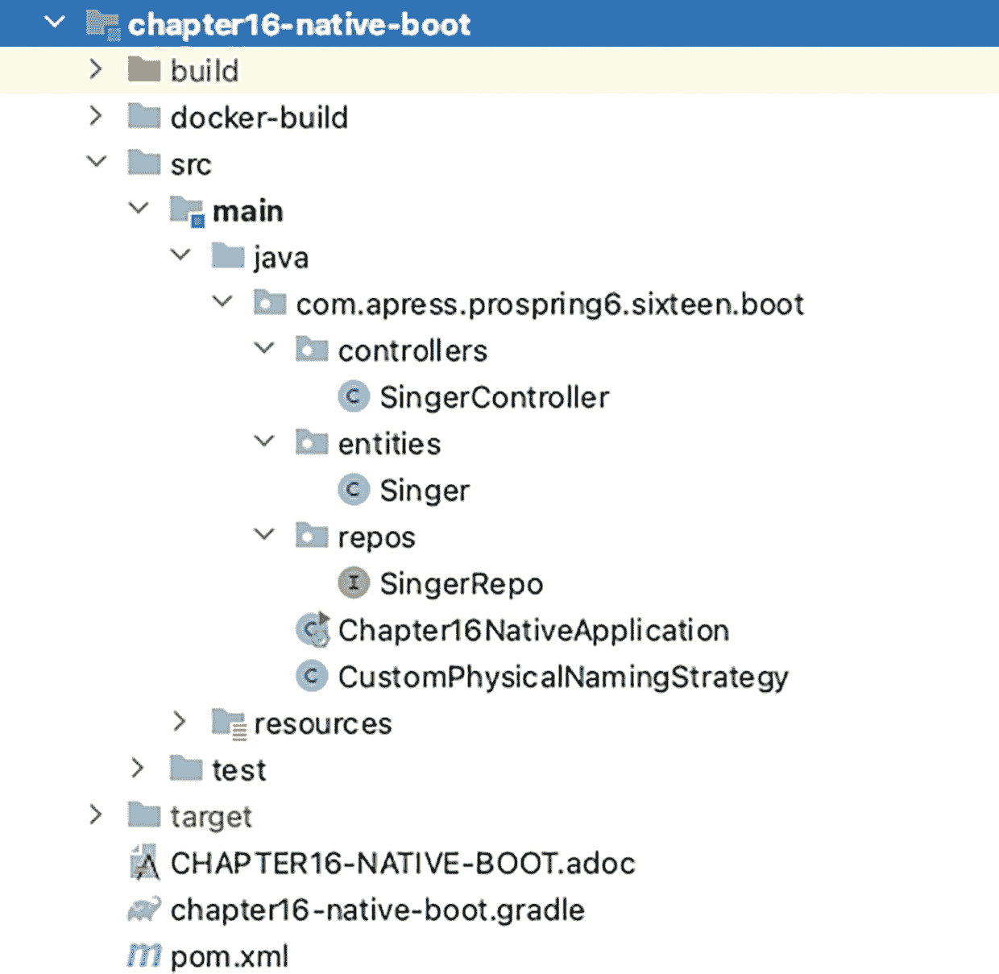
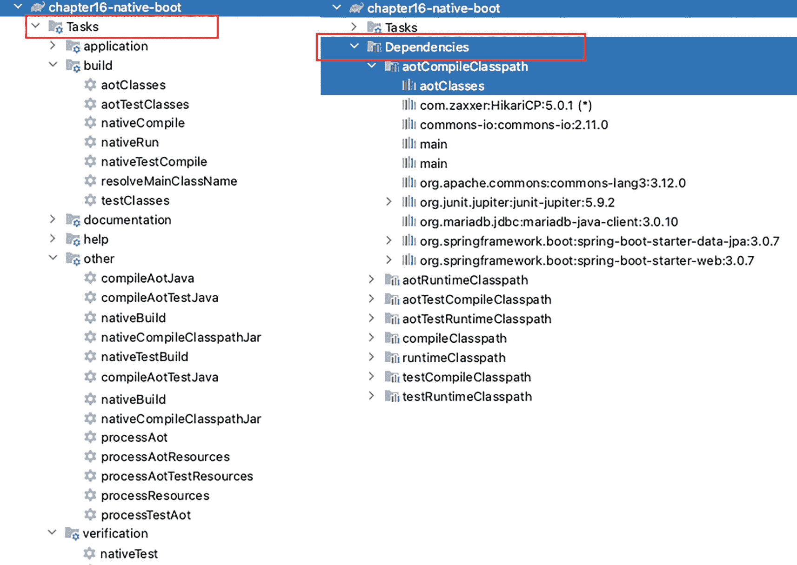

# Logging config
logging:
pattern:
console: "%-5level: %class{0} - %msg%n"
level:
root: INFO
org.springframework.boot: DEBUG
com.apress.prospring6.fifteen: INFO
清单 15-22
chapter15-boot 项目的 Spring Boot 配置
```

像往常一样，`dev` 配置文件用于将应用程序连接到现有容器。这允许 `test` 配置文件使用 Testcontainers 启动一个容器。测试此应用程序要容易得多，因为 Spring Boot 使其变得如此简单。`application-test.yaml` 文件很简单，因为只有数据源配置被自定义。清单 15-23 显示了 Spring Boot 测试上下文的数据源配置。

```
spring:
datasource:
url: "jdbc:tc:mariadb:latest:///testdb?TC_INITSCRIPT=testcontainers/create-schema.sql"
jpa:
properties:
hibernate:
jdbc:
batch_size: 10
fetch_size: 30
max_fetch_depth: 3
show-sql: true
format-sql: true
use_sql_comments: true
hbm2ddl:
auto: none
清单 15-23
chapter15-boot 项目的 Spring Boot 测试配置
```

`Chapter15ApplicationTest` 类如清单 15-24 所示。


```markdown

```
package com.apress.prospring6.fifteen.boot;
import org.springframework.boot.test.context.SpringBootTest;
import org.springframework.boot.test.web.client.TestRestTemplate;
import org.springframework.test.context.ActiveProfiles;
import static org.junit.jupiter.api.Assertions.*;
// 其他导入语句已省略
@ActiveProfiles("test")
@SpringBootTest(webEnvironment = SpringBootTest.WebEnvironment.RANDOM_PORT)
public class Chapter15ApplicationTest {
final Logger LOGGER = LoggerFactory.getLogger(Chapter15ApplicationTest.class);
@Value(value="${local.server.port}")
private int port;
@Autowired
private TestRestTemplate restTemplate;
@Test
public void testFindAll() {
LOGGER.info("--> 测试检索所有歌手");
var singers = restTemplate.getForObject("http://localhost:"+port+"/singer/", Singer[].class);
assertTrue( singers.length >= 15);
Arrays.stream(singers).forEach(s -> LOGGER.info(s.toString()));
}
@Test
public void testPositiveFindById() throws URISyntaxException {
HttpHeaders headers = new HttpHeaders();
headers.setAccept(List.of(MediaType.APPLICATION_JSON));
RequestEntity req = new RequestEntity(headers, HttpMethod.GET, new URI("http://localhost:"+port+"/singer/1"));
LOGGER.info("--> 测试通过 ID 检索歌手：1");
ResponseEntity response =  restTemplate.exchange(req, Singer.class);
assertAll("testPositiveFindById",
() -> assertEquals(HttpStatus.OK, response.getStatusCode()),
() -> assertTrue(Objects.requireNonNull(response.getHeaders().get(HttpHeaders.CONTENT_TYPE)).contains(MediaType.APPLICATION_JSON_VALUE)),
() -> assertNotNull(response.getBody()),
() -> assertEquals(Singer.class, response.getBody().getClass())
);
}
@Test
public void testNegativeFindById() throws URISyntaxException {
LOGGER.info("--> 测试通过 ID 检索歌手：99");
RequestEntity  req = new RequestEntity(HttpMethod.GET, new URI("http://localhost:"+port+"/singer/99"));
ResponseEntity response = restTemplate.exchange(req, Singer.class);
assertAll("testNegativeFindById",
() -> assertEquals(HttpStatus.NOT_FOUND, response.getStatusCode()),
() -> assertNull(response.getBody().getFirstName()),
() -> assertNull(response.getBody().getLastName())
);
}
@Test
public void testNegativeCreate() throws URISyntaxException {
LOGGER.info("--> 测试创建歌手");
Singer singerNew = new Singer();
singerNew.setFirstName("Ben");
singerNew.setLastName("Barnes");
singerNew.setBirthDate(LocalDate.now());
RequestEntity  req = new RequestEntity(singerNew, HttpMethod.POST, new URI("http://localhost:"+port+"/singer/"));
ResponseEntity response =  restTemplate.exchange(req, String.class);
assertAll("testNegativeCreate",
() -> assertEquals(HttpStatus.BAD_REQUEST, response.getStatusCode()),
()-> assertTrue(response.getBody().contains("could not execute statement; SQL [n/a]; constraint [FIRST_NAME]")));
}
}
清单 15-24
Spring Boot Chapter15ApplicationTest 类
```

这个测试类使用 `TestRestTemplate` 实例来提交请求。`TestRestTemplate` 是**第** **20** 章中介绍的 `WebClient` 的非响应式等价物，并且它是 `RestTemplate` 的一个便捷替代方案，适用于集成测试。它是专门为测试而设计的，因为带有 4xx 和 5xx 状态码的失败请求不会抛出异常（就像你在经典应用程序的测试中注意到的那样），这对于编写负面测试用例非常有用。

请注意 `testNegativeFindById()` 方法。通常，会抛出一个 `HttpClientErrorException.BadRequest` 异常，但是当使用 `TestRestTemplate` 时，会返回一个实际的 `ResponseEntity<Singer>`，其中包含一个实际的主体，即一个所有字段都设置为 `null` 的 `Singer` 实例。

这就引出了以下问题：是否有可能更好地处理处理器方法异常，并返回一个包含适当详细信息的主体？当然可以。`RestErrorHandler` 类中带有 `@RestControllerAdvice` 注解的异常处理方法会返回一个 `ResponseEntity<T>`。可以声明一个自定义类型来包含更清晰、更相关的异常详细信息，就像这里提供的示例一样：[`https://www.toptal.com/java/spring``-boot``-rest-api-error-handling`](https://www.toptal.com/java/spring-boot-rest-api-error-handling)。

## 总结

在本章中，我们涵盖了几个关于创建 Spring Restful Web 服务并通过 Spring 配置将其暴露的主题。所涵盖的配置类型包括经典配置（应用程序被打包为 `*.war` 并部署到 Apache Tomcat 10 服务器）以及使用 Spring Boot 的配置。REST API 是使用 `RestTemplate` 和 `TestRestTemplate` 来消费的。

本章还涵盖了为 REST 请求编写处理器方法以及异常处理的各种方式。下一章与 Spring REST 没有任何关系，但确实涵盖了一些较新的 Spring 特性，所以如果你还不困，可以开始阅读那一章。

脚注 1   2   3   4   5   6   7   8

```


# 16. Spring Native 及其他实用特性

在前面的章节中，你已经了解了 Spring 框架如何帮助 Java 开发者创建 JEE 应用程序。通过使用 Spring 框架的依赖注入（DI）机制及其与各层的集成（通过 Spring 框架自身模块内的库或与第三方库的集成），你可以简化业务逻辑的实现和维护。

多年来，Spring 框架经历了巨大的演变，分裂成多个独立项目并与最新技术集成。第 6 版在功能和项目方面都极为丰富。本章将向你介绍三个重要的新发展：

*   **Spring Native 镜像**：Spring Boot 2.3.0 引入了使用 Cloud Native Buildpacks（CNB）将应用打包成 Docker 镜像的能力。与此同时，Oracle 正在开发 GraalVM，^(¹⁵²) 这是一个为 Java 和其他 JVM 语言编写的高性能 JDK 发行版，它承诺为单一语言提供令人难以置信的性能优化，并为多语言应用提供互操作性。其最终目标是实现紧凑、快速启动的应用，例如可以在 AWS Lambda 函数中运行。AWS Lambda 函数是按需触发的应用程序，无需服务器一直运行。在 AWS EC2 上运行的 Spring Boot 应用属于基础设施即服务（IaaS），而在 AWS Lambda 中运行的 Spring Boot 应用则属于平台即服务（PaaS），它仅在需要时帮助你运行和执行后端代码。Spring Native 项目曾提供支持，使用 GraalVM native-image 编译器将 Spring 应用编译为原生可执行文件。该项目现已退役，因为它曾是实验性的，其成果便是 Spring Boot 3 的官方原生支持。^(¹⁵³)

*   **Spring for GraphQL**：GraphQL^(¹⁵⁴) 是一种 API 查询语言，也是一个利用现有数据来执行这些查询的运行时。长期以来，服务层中的组件一直通过 HTTP 使用 REST 请求进行通信，处理 JSON、XML 等各种格式的信息。GraphQL 新增的功能是，无需编写复杂的代码来提供数据，就能轻松声明你想要检索哪些数据，且仅此而已。Spring for GraphQL^(¹⁵⁵) 为构建在 GraphQL Java 之上的 Spring 应用提供支持。这是 GraphQL Java 团队与 Spring 工程团队的合作成果。在本章中，你将学习如何构建一个能够高效检索数据以响应 GraphQL 查询的 Spring Boot 应用。

*   **Spring Kotlin 应用**：Kotlin^(¹⁵⁶) 是一种跨平台、静态类型、通用、高级的编程语言，具有类型推断功能。Kotlin 被设计为与 Java 完全互操作，其 JVM 版本的 Kotlin 标准库提供了更简洁的语法、多种类型和编程结构。一些开发者将其描述为 Scala 和 Java 的结合体。该语言拥有一个庞大的社区支持，并且由开发出最佳 Java 编辑器的团队开发，因此它的快速普及并不令人意外；它的热度实至名归。在本章中，你将学习如何使用 Kotlin 构建一个小型 Spring Boot Web 应用。

## Spring Native 镜像

Spring Native 镜像是一个独立的可执行文件，通过使用 GraalVM native-image 编译器提前处理编译后的 Spring 应用来创建。原生镜像通常比其 JVM 对应版本占用更少的内存，启动速度也更快。而且，你不需要 JVM 来运行它们。在前面的章节中，构建 Spring 项目的结果是一个包含所有字节码的可执行 JAR 文件，这是编译构成该项目的所有 Java 和 Spring 代码的结果。要执行 JAR 文件，你需要一个由 JDK（或在 Java 9 之前的远古时代由 JRE）提供的 JVM。Spring Native 将为目标系统生成一个可执行文件。原生可执行文件由以下部分组成：

*   **Substrate VM**：一个为需要在其上运行的代码而编译和配置的虚拟机。它是 JVM 的替代品。创建它的过程与使用 `jlink`^(¹⁵⁷) 从 JDK 中剥离运行应用所不需要的所有模块，以将一组模块及其依赖项组装并优化为自定义运行时镜像的过程非常相似。

*   **DWARF 信息**：在调试过程中有用的信息。DWARF 是一种被许多编译器使用的调试信息文件格式。你可以在此处了解更多信息：[`https://dwarfstd.org`](https://dwarfstd.org)。

*   **初始堆**：应用程序运行所需的内存。

*   **原生机器码**：为在特定操作系统上运行而设计的低级代码。

*   **编译为原生代码的应用**：在本例中，即一个 Spring Boot 应用及其所有依赖项。

为简单起见，本节将利用 Spring Boot 创建 Docker 镜像的能力，来创建一个包含 Spring 原生可执行文件的 Docker 镜像，并通过启动容器来运行应用程序。这更容易，因为它不需要你在机器上安装 GraalVM。此外，你显然需要在本地安装 Docker，因为你要创建的 Docker 镜像需要添加到镜像目录中，然后需要一个运行时来基于它运行容器。

那么，什么是**提前（AOT）编译**，它与普通的 Java 编译有何不同？有几点值得提及：

*   AOT 编译是一个从应用主入口点静态分析应用代码的过程。

*   在创建原生镜像时无法访问到的代码将从可执行文件中排除。这显然意味着使用 Spring 动态元素是不可能的，那些让天真的开发者着迷的“自动魔法”也一并失效。必须告知 GraalVM 关于反射、资源、序列化和动态代理的信息。

*   应用类路径在构建时已知，并且在运行时不会改变。这意味着没有延迟类加载，可执行文件中的所有类在启动时都会被加载到内存中。

*   Java 应用和平台可能还存在其他限制，这些限制只有在更多公司开始使用 GraalVM 后才能发现。（例如，我（Iuliana）在为运行 Apple M1 架构的 macOS 构建原生镜像时遇到了一些问题。）

因此，必须放弃 Spring Boot 应用的灵活性和动态性，以换取更小的内存占用和更快的启动速度。这意味着不支持配置文件，并且 bean 一旦创建就无法修改。这值得吗？时间会给出答案。

当 Spring 应用被提前处理时，必须完成以下步骤才能将其转换为原生可执行文件：

*   生成 Java 代码

*   为动态代理生成字节码

*   生成以下 GraalVM JSON 提示文件，这些文件描述了 GraalVM 应如何处理无法通过直接检查代码来理解的内容：
    *   资源提示（`resource-config.json`）

*   反射提示（`reflect-config.json`）

*   序列化提示（`serialization-config.json`）

*   Java 代理提示（`proxy-config.json`）

*   JNI 提示（`jni-config.json`）


在典型的 Spring 应用中，需要大量使用反射机制才能将 Bean 注入到其他 Bean 中。Spring IoC 容器会识别 `@Configuration` 类与 Bean 定义，并创建依赖树来决定 Bean 的创建顺序，以便完成注入。所有这些工作都在应用启动时（即运行时）完成。显然，这会耗费一些时间，如果你读过前面章节并亲自运行过代码，可能已经注意到了这一点。

在 Spring Native 可执行文件中，Spring 的行为有所不同。配置类不再被识别和解析，Bean 定义也不会在运行时创建；所有这些工作都在构建时完成。Bean 定义会被处理并转换为源代码，由 GraalVM 编译器进行分析，这样那些未被触及（使用）的 Bean 就可以被丢弃。生成的代码会非常冗长，因为没有了 Spring IoC 的能力，剩下的只有非常显式的代码——通过经典的 Java 代码（直接赋值和显式实例化 Bean 类型）在正确的位置注入正确的 Bean。这显然会增加构建时间，但这并不是什么大问题。

一个灯泡的示意图。 开发可以在普通的 JVM 上进行，以方便开发者并提高速度，而生产构建可以隔离在流水线中，仅在需要发布时运行。

构建 Spring Boot 原生镜像应用主要有两种方式：

*   使用 Spring Boot 对 Cloud Native Buildpacks (CNB)^(¹⁵⁸) 的支持，生成一个包含原生可执行文件的轻量级容器
*   使用 GraalVM Native Build Tools 生成原生可执行文件

Spring Boot 原生支持非常简便，尤其是当你恰好使用 Gradle 时，由于 Gradle Native Build Tools 插件，配置会非常简洁。对于 Maven 来说，如果你将 `spring-boot-starter-parent` 声明为项目的父 POM，事情也同样简单。这是因为你的项目继承了 `native` 配置文件，该文件配置了构建 Spring Native 可执行文件所需的所有组件。如果无法将 `spring-boot-starter-parent` 作为父 POM（有些公司更倾向于使用自己的自定义父 POM），配置就会稍微复杂一些。本节的重点不是编写 Spring 应用的代码和技术，而是将 Spring 应用编译为原生可执行文件并使用 Docker 运行时运行它所需的配置。

### 应用

本节中编译为原生可执行文件的 Spring 应用是一个简单的 Spring Boot REST Web 应用。它使用 Spring Data JPA 从运行在本地 Docker 容器中的数据库（如果你有资源，也可以是远程的）检索数据。图 16-1 展示了本节所用简单项目的结构。



第 16 章原生启动目录树的截图。它包括 build、docker build、s r c 和 target 文件夹及其子文件夹。s r c 文件夹包含 main、java、com dot apress pro spring 6 dot sixteen dot boot、controllers、entities 和 repos 作为其子文件夹。

图 16-1

项目 `chapter16-native-boot` 的结构

所有类对你来说应该都很熟悉，来自前面的章节。`Singer` 类是一个非常简单的实体类，使用 Lombok 声明以保持简洁并快速编写，如清单 16-1 所示。

```
package com.apress.prospring6.sixteen.boot.entities;
import jakarta.persistence.*;
import lombok.*;
import org.springframework.format.annotation.DateTimeFormat;
import static jakarta.persistence.GenerationType.IDENTITY;
@Entity // JPA
@Data // Lombok
@AllArgsConstructor  // Lombok
@NoArgsConstructor  // Lombok
@EqualsAndHashCode(onlyExplicitlyIncluded = true)  // Lombok
@Table(name = "SINGER") // JPA
public class Singer {
@Serial
private static final long serialVersionUID = 1L;
@Id // JPA
@GeneratedValue(strategy = IDENTITY) // JPA
@EqualsAndHashCode.Include  // Lombok
@Column(name = "ID") // JPA
protected Long id;
@Version
@Column(name = "VERSION")
protected int version;
@Column(name = "FIRST_NAME")
private String firstName;
@Column(name = "LAST_NAME")
private String lastName;
@DateTimeFormat(pattern = "yyyy-MM-dd")
@Column(name = "BIRTH_DATE")
private LocalDate birthDate;
}
清单 16-1
Singer 实体类
```

为了处理 `Singer` 实例，`SingerRepo` 接口被声明为继承 `JpaRepository<Singer, Long>`，如清单 16-2 所示。

```
package com.apress.prospring6.sixteen.boot.repos;
import com.apress.prospring6.sixteen.boot.entities.Singer;
import org.springframework.data.jpa.repository.JpaRepository;
public interface SingerRepo extends JpaRepository {
}
清单 16-2
SingerRepo Spring Data 接口类
```

为简单起见，`SingerController` 类需要一个 `SingerRepo` 实例，通过其处理方法来回传递数据（为简化起见，我们跳过了服务层）。该类及其 Bean 声明如清单 16-3 所示。

```
package com.apress.prospring6.sixteen.boot.controllers;
// 其他导入语句已省略
import org.springframework.web.bind.annotation.*;
@RestController
@RequestMapping(value="/singer")
public class SingerController {
final Logger LOGGER = LoggerFactory.getLogger(SingerController.class);
private final SingerRepo singerRepo;
public SingerController(SingerRepo singerRepo) {
this.singerRepo = singerRepo;
}
@GetMapping(path={"/", ""})
public List all() {
return singerRepo.findAll();
}
@GetMapping(path = "/{id}")
public Singer findSingerById(@PathVariable Long id) {
return singerRepo.findById(id).orElse(null);
}
// 其他方法已省略
}
清单 16-3
SingerController 类
```

`CustomPhysicalNamingStrategy` Bean 用于配置 Spring Data 以识别名称仅由大写字母组成的数据库对象，这超出了本节的范围。清单 16-4 中所示的 `Chapter16NativeApplication` 类是一个基本的 Spring Boot 配置和主类，也是此应用的入口点。

```
package com.apress.prospring6.sixteen.boot;
import org.springframework.boot.SpringApplication;
import org.springframework.boot.autoconfigure.SpringBootApplication;
import org.springframework.boot.autoconfigure.domain.EntityScan;
import org.springframework.data.jpa.repository.config.EnableJpaRepositories;
import org.springframework.transaction.annotation.EnableTransactionManagement;
@EntityScan(basePackages = {"com.apress.prospring6.sixteen.boot.entities"})
@EnableJpaRepositories("com.apress.prospring6.sixteen.boot.repos")
@EnableTransactionManagement
@SpringBootApplication
public class Chapter16NativeApplication {
public static void main(String... args) {
SpringApplication.run(Chapter16NativeApplication.class, args);
}
}
清单 16-4
Chapter16NativeApplication 类
```

如你所见，代码中没有任何需要修改的地方，以使此应用能够被编译为 Spring Native 可执行文件。


### 配置

一切尽在配置中。那么，我们先来看 Gradle 配置，因为它相对较小。清单 16-5 展示了 `chapter16-native-boot` 项目的 Gradle 配置。

```
apply plugin: 'java'
apply plugin: 'org.graalvm.buildtools.native'
dependencies {
implementation 'org.springframework.boot:spring-boot-starter-web'
implementation 'org.springframework.boot:spring-boot-starter-data-jpa'
implementation "commons-io:commons-io:2.11.0"
compileOnly "org.projectlombok:lombok:$lombokVersion"
annotationProcessor "org.projectlombok:lombok:$lombokVersion"
implementation "com.zaxxer:HikariCP:$hikariVersion"
implementation "org.mariadb.jdbc:mariadb-java-client:$mariadbClientVersion"
}
tasks.named("bootBuildImage") {
docker {
buildpacks = [
"gcr.io/paketo-buildpacks/graalvm",
"gcr.io/paketo-buildpacks/java-native-image",
]
}
imageName = "prospring6-gradle-native:1.0"
}
bootJar {
manifest {
attributes 'Start-Class': 'com.apress.prospring6.sixteen.boot.Chapter16NativeApplication'
}
}
清单 16-5
chapter16-native-boot.gradle 文件的内容
```

此配置中最重要的部分是 GraalVM Native Image 插件：`org.graalvm.buildtools.native`。该项目的当前版本是 0.9.22，它已被添加到父项目 `pro-spring-6` 的类路径中。父项目还为所有名称以 `boot` 结尾的子项目配置了 Spring Boot 项目。配置片段如清单 16-6 所示。

```
buildscript {
repositories {
mavenLocal()
mavenCentral()
}
dependencies {
classpath 'io.spring.gradle:dependency-management-plugin:1.1.0'
classpath 'org.springframework.boot:spring-boot-gradle-plugin:3.0.7'
classpath 'org.graalvm.buildtools.native:org.graalvm.buildtools.native.gradle.plugin:0.9.22'
}
}
ext {
bootProjects = subprojects.findAll { ( it.name.endsWith('-boot')) }
// 省略了各种版本变量
}
// 省略了其他配置
configure(bootProjects) { project ->
apply plugin: 'org.springframework.boot'
}
清单 16-6
pro-spring-6 项目配置片段
```

请注意 `buildscript.dependencies` 声明了要添加到项目类路径中的插件。插件声明遵循 `groupId:artifactId:version` 的模板。这相当于 Maven 中的 `<pluginManagement><plugins>` 声明。

`bootProjects` 变量是一个数组，包含 `pro-spring-6` 父项目中所有 Spring Boot 子项目（或模块）。`configure(bootProjects)` 语句为所有 Spring Boot 子项目配置 Spring Boot 插件。每个子项目的 Gradle 配置独立地包含针对类路径中插件的额外插件配置。

一个圆形渐变色图标的插图。 这种配置方法特定于 `pro-spring-6` 项目。这是一个多模块项目，包含 Spring Boot 和 Spring 经典项目，所有这些项目都利用了强大的 Spring 依赖管理，并复用了大量配置。当使用 Spring Initializr 创建 Spring Boot 项目时，无论是使用 Maven 还是 Gradle，所有这些配置都已经在你所继承的 Spring Boot 项目中声明好了。

`chapter16-native-boot.gradle` 文件包含了 `org.graalvm.buildtools.native` 插件的声明。由于它在配置中的存在，Spring Boot Gradle 插件为项目添加了 AOT 任务。由于 IntelliJ IDEA 很智能，它会在 Gradle 视图中显示所有任务及其作用域，以及用于 AOT 目的的依赖项。图 16-2 展示了 Gradle 视图，其中显示了 AOT 和 Native 任务以及依赖组。



一组两张截图，展示了第 16 章 native boot 的目录树。它突出显示了左侧的 Tasks 文件夹和右侧的依赖项。Tasks 下拉菜单包含应用程序和 build 下的项目列表。依赖项下拉菜单包含一个库列表。

图 16-2
项目 `chapter16-native-boot` 的 AOT 和 Native 任务及依赖组

请注意，在 `aotCompileClasspath` 中有一个名为 `aotClasses` 的项，它表示为 Spring 配置类和 Bean 定义生成的静态代码。`main` 可能代表应用程序的主入口点，即 `Chapter16NativeApplication` 类中的 `main(..)` 方法。

由于该项目配置了 Java 19，我们需要自定义用于创建可执行文件的 Cloud Native Buildpacks。我们通过为 `buildpacks` 属性指定一个包含两个值的数组来实现：`gcr.io/paketo-buildpacks/graalvm` 和 `gcr.io/paketo-buildpacks/java-native-image`。

为了在 Docker 仪表盘中轻松识别生成的本地镜像，`imageName` 属性被设置为 `prospring6-gradle-native:1.0`。

有了这个配置，剩下的就是在终端中，在 `chapter16-native-boot` 目录下运行 `gradle bootBuildImage` 来创建镜像。执行过程会花费很长时间，至少第一次是这样。对于这个小项目，大约花了 5 分钟，但这是因为可执行文件所依赖的 Docker 镜像也需要下载。清单 16-7 展示了这次执行的一些片段。


```
> Task :chapter16-native-boot:compileJava
...
> Task :chapter16-native-boot:processAot
...
>Task :chapter16-native-boot:compileAotJava
...
> Task :chapter16-native-boot:bootBuildImage
Building image 'docker.io/library/prospring6-gradle-native:1.0'
> Pulling builder image 'docker.io/paketobuildpacks/builder:tiny' ...
> Pulling run image 'docker.io/paketobuildpacks/run:tiny-cnb' ...
> Pulling buildpack image 'gcr.io/paketo-buildpacks/graalvm:latest' ...
> Pulling buildpack image 'gcr.io/paketo-buildpacks/java-native-image:latest' ...
> Executing lifecycle version v0.16.0
> Running creator
[creator]     ===> ANALYZING
[creator]     Previous image with name "docker.io/library/prospring6-gradle-native:1.0" not found
[creator]     ===> DETECTING
[creator]     7 of 15 buildpacks participating
[creator]     paketo-buildpacks/graalvm           7.10.0
...
[creator]     ===> BUILDING
[creator]     Paketo Buildpack for GraalVM 7.10.0
...
[creator]       Build Configuration:
[creator]         $BP_NATIVE_IMAGE                       true  enable native image build
