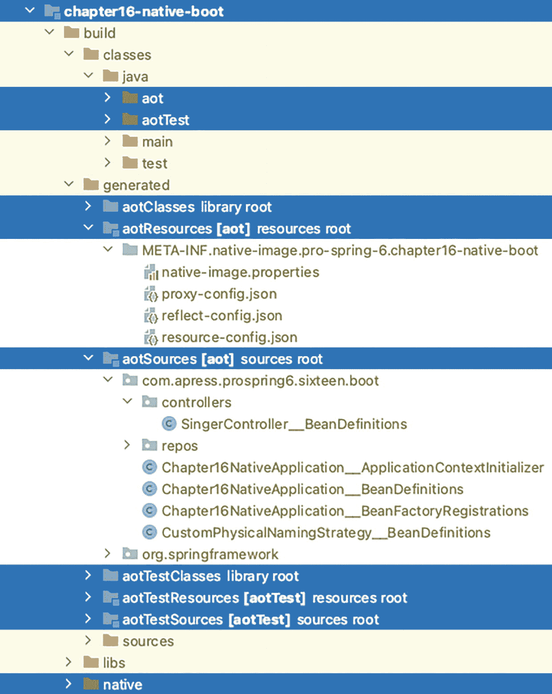
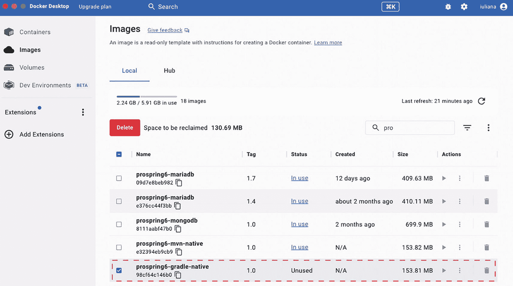
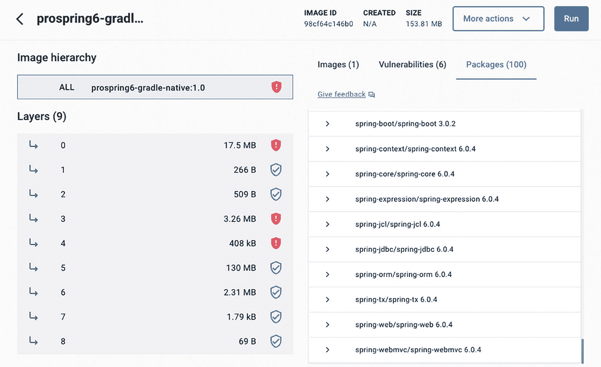
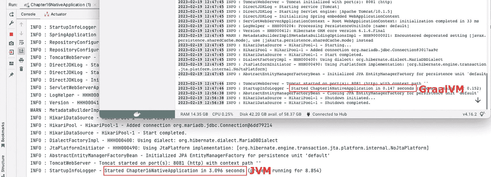
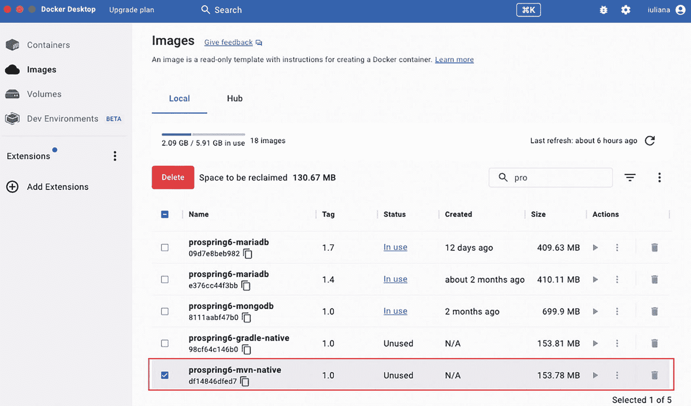
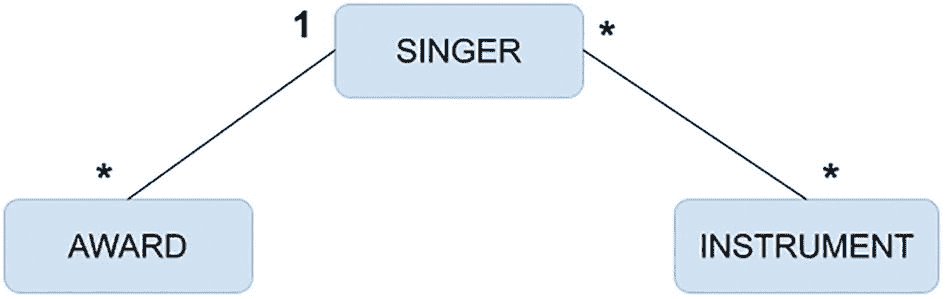
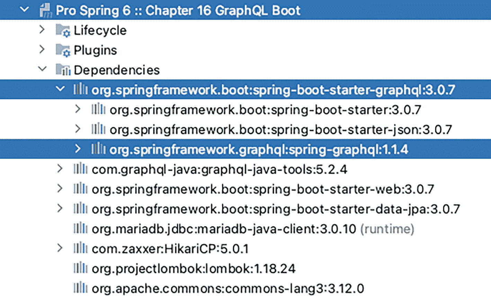

# layers to build the image
Successfully built image 'docker.io/library/prospring6-gradle-native:1.0'
BUILD SUCCESSFUL in 5m 36s
9 actionable tasks: 8 executed, 1 up-to-date
Listing 16-7
gradle bootBuildImage Execution Log Snippets
```

首先，`compileJava`任务会编译项目，确保所有依赖项都已提供且项目功能正常。接着，`processAot`任务会生成 AOT Java 代码。然后，`processAot`会启动应用程序以检查其是否仍能正常工作。最后，`compileAotJava`会生成**原生字节码**。

所有这些任务的结果都可以在`build/generated`目录中看到。AOT 生成的 Java 代码和 GraalVM JSON 提示文件都保存在这里。字节码和原生代码则按作用域分组存储在`build/classes/java/`目录下。图 16-3 展示了这些新目录及其部分内容。



第 16 章原生启动目录树及其子文件夹的截图。包含第 16 章原生启动、aot、aot 测试、aot 类库根目录、aot 资源、aot 源码、aot 测试类、aot 测试资源、aot 测试源码以及高亮显示的原生目录。

图 16-3

构建原生镜像过程中生成的中间文件

最后，`bootBuildImage`开始为原生可执行文件构建镜像。首先下载基础的 CND 镜像，然后基于 GraalVM JDK 19.0.2 构建可执行文件，仅添加运行可执行文件所必需的少量组件。最终生成一个静态可执行文件，随后对其进行处理以计算内存占用和存储需求，这些参数将决定 Docker 镜像的相应配置。

如果所有这些步骤都成功完成，Docker 仪表盘的“镜像”选项卡中应会列出新生成的`prospring6-gradle-native:1.0`镜像，如图 16-4 所示。



Docker 桌面窗口的截图。左侧面板选中了“镜像”，右侧为镜像面板。面板中选中了“本地”选项卡，显示存储空间信息和删除选项。表格中有 5 个文件名及复选框，其中一个文件已被勾选。

图 16-4

Docker 仪表盘显示`prospring6-gradle-native:1.0`镜像

请注意镜像的大小。点击其名称可显示镜像的详细信息，如图 16-5 所示，包括层、内容以及漏洞信息（不必过分担心，因为任何软件都存在漏洞，关键在于其严重程度）。



仪表盘窗口的截图。左侧面板显示镜像层级和层列表，右侧为详细信息面板，包含镜像 ID、创建时间、大小以及更多操作、运行选项，下方选中了“包”选项卡。包选项卡中列出了文件列表。

图 16-5

Docker 仪表盘显示`prospring6-gradle-native:1.0`镜像的详细信息

要检查此镜像是否正常工作，我们应该基于它启动一个容器。但由于我们知道应用程序需要数据库，因此需要告知它数据库的位置和连接方式。所有这些细节都通过程序参数提供，这些参数会成为容器的环境变量。Spring Boot 应用程序可以在配置文件中引用这些变量。需要修改`application.yaml`文件的数据源配置，以便从环境变量中获取连接数据库所需的值。配置示例如清单 16-8 所示。

```
spring:
datasource:
driverClassName: org.mariadb.jdbc.Driver
url: jdbc:mariadb://${DB_HOST:localhost}:${DB_PORT:3306}/${DB_SCHEMA:musicdb}?useSSL=false
username: ${DB_USER:prospring6}
password: ${DB_PASS:prospring6}
Listing 16-8
引用环境变量的 Spring Boot 配置文件
```

`${VAR_NAME:default_value}`结构用于在启动应用程序时，若环境变量未设置或未通过命令行提供，则为变量提供默认值。配置中的所有变量都有默认值。当在容器中运行需要连接另一个容器中数据库的应用程序时，我们唯一需要提供值的变量是`DB_HOST`，因为在容器中`localhost`指向的是自身。要获取数据库所在容器的 IP 地址（假设容器名为`local-mariadb`），清单 16-9 中的命令即可完成此任务。


```
docker inspect local-mariadb | grep IPAddress  # 假设返回 172.17.0.2
清单 16-9
获取正在运行的 Docker 容器 IP 地址的命令
```

现在我们已经有了数据库的 IP 地址，可以使用清单 16-10 中的命令启动我们的原生容器。

```
docker run --name prospring6-native -e DB_HOST=172.17.0.2 -d -p 8081:8081 prospring6-gradle-native:1.0
清单 16-10
使用我们通过 Gradle 构建的原生镜像启动容器的命令
```

为了确保应用程序正确启动，你可以尝试访问 `http://localhost:8081/singers`，所有 `Singer` 实例的 JSON 表示形式都应被返回。另一种确保应用程序正确启动的方法是检查 Docker 仪表板中的容器日志，其中不仅会显示 Spring Boot 应用程序的启动日志，还会显示应用程序启动所花费的时间，这正是原生镜像的超强能力之一大放异彩的地方。图 16-6 展示了在本地系统 JVM 上启动的 `Chapter16NativeApplication` 与在容器内从原生可执行文件启动的同一应用程序之间的对比。



两个重叠窗口的截图。它们包含一个信息列表。其中一个窗口高亮显示了“已启动第 16 章原生应用程序，耗时 0.147 秒”的信息，并带有“Graal V M”字样。背景中的另一个窗口高亮显示了“已启动第 16 章原生应用程序，耗时 3.096 秒”的信息，并带有“J V M”字样。

图 16-6

基于 `prospring6-gradle-native:1.0` 镜像的容器启动时间

当应用程序被构建为原生可执行文件时，启动时间从 3 秒下降到 0.147 秒，因此启动时间缩短了一半，而这仅仅是一个小型、非常简单的应用程序。对于执行更复杂操作的应用程序，改进效果可能会更好。

声明 `spring-boot-starter-parent` 可确保项目继承在 `native` profile 下分组的 Spring Boot 和 GraalVM Maven 插件的默认配置。当使用 `spring-boot-starter-parent` 作为父 POM 时，唯一需要的显式配置是针对 Spring Boot 的，如清单 16-11 所示。

```

org.graalvm.buildtools
native-maven-plugin
0.9.22

org.springframework.boot
spring-boot-maven-plugin

com.example.demo.DemoApplication

gcr.io/paketo-buildpacks/graalvm
gcr.io/paketo-buildpacks/java-native-image

demo-native-mvn:${project.version}

清单 16-11
声明 spring-boot-starter-parent 作为父 POM 的 Spring Boot 项目的原生配置
```

该配置与 Gradle 中的配置非常相似。声明了自定义的 `buildpacks` 以支持 Java 19，并在配置中添加了自定义镜像名称，以便在 Docker 镜像集合中轻松识别构建结果。

当 `spring-boot-starter-parent` 不作为父 POM 使用时，Maven 配置必须为 `native-maven-plugin` 和 `spring-boot-maven-plugin` 包含更详细的配置。这很容易做到，因为它们可以从 `spring-boot-starter-parent` 的 pom 文件中复制。配置如清单 16-12 所示。

```

org.graalvm.buildtools
native-maven-plugin
${spring-native.version}

${project.build.outputDirectory}

true

22.3

add-reachability-metadata

add-reachability-metadata

org.springframework.boot
spring-boot-maven-plugin
${spring-boot.version}

com.apress.prospring6.sixteen.boot.Chapter16NativeApplication

paketobuildpacks/builder:tiny

true

gcr.io/paketo-buildpacks/graalvm
gcr.io/paketo-buildpacks/java-native-image

prospring6-mvn-native:1.0

org.projectlombok
lombok

process-aot

process-aot

清单 16-12
未声明 spring-boot-starter-parent 作为父 POM 的 Spring Boot 项目的原生配置
```

使用此配置，你可以通过执行 `mvn spring-boot:build-image` 来生成原生镜像。请注意，镜像名称被设置为 `prospring6-mvn-native:1.0`，以便与 Gradle 生成的镜像轻松区分。

所有中间生成的源代码、字节码和原生代码都位于 `target` 目录下，但与 Gradle 相比，它们只是分散在 `target/classes` 下的各个位置，因为 Maven 不会为不同的目标创建单独的目录。

为 `Chapter16NativeApplication` 生成原生镜像的 Maven 构建执行也大约需要 5 分钟，最终镜像会列在 Docker 仪表板中，如图 16-7 所示。



Docker Desktop 窗口的截图。左侧面板选中了“镜像”，右侧是镜像窗格。该窗格选中了“本地”选项卡，显示了存储空间信息和删除选项。它有一个包含 5 个文件名和复选框的表格，其中一个文件被勾选。

图 16-7

显示 `prospring6-mvn-native``:1.0` 镜像的 Docker 仪表板

基于此镜像启动容器时，使用的命令与清单 16-10 中所示的命令相同；只需确保为容器指定不同的名称即可。

要了解更多关于原生镜像的信息，以及如何更好地开发 Spring 应用程序以便轻松构建为原生可执行文件的建议，请阅读官方文档，并留意会议上关于此主题的任何演讲。这项技术虽然已走出实验阶段，但仍处于早期阶段，要成为 Java 应用程序的行业默认标准（如果真能实现的话），还有很长的路要走。


## Spring for GraphQL

GraphQL 是一种用于 API 的查询语言，也是一个根据这些查询提供数据的运行时。GraphQL 提供了对 API 中数据的完整且易于理解的描述，并允许客户端请求某些数据，且只接收它们所请求的内容，而无需为此编写复杂的代码。

考虑一下本书到目前为止构建的 REST API。REST 请求被映射到 URL 路径，例如 `http://localhost:8081/singer/1`。客户端发送一个 HTTP GET 请求，并接收从名为 `SINGER` 的数据库表中检索到的、关于主键等于 1 的歌手记录的所有信息。如果客户端需要关于此歌手的信息，而这些信息保存在其他表中，则必须编写不同的查询，并且这些查询将被映射到不同的 URL 路径。因此，客户端必须执行多个请求。使用 GraphQL，客户端无需更改请求的 URL，只需更改用于指定所需数据的模式（schema）。最终，GraphQL 只是 REST、SOAP 或 gRPC 等应用间已建立远程通信的另一种替代方案。

Facebook 发明了 GraphQL，因为 REST 无法通过单个请求检索相关的信息图。使用 REST，多次的来回通信会导致页面加载缓慢，并产生不可接受的闪烁。我们可以更深入地描述 GraphQL，但出于本次讨论的目的，我们仅列出其最重要的特性：

*   GraphQL 是基于模式（schema）的。
*   GraphQL 查询看起来很像 JSON，但它们不是 JSON。
*   GraphQL 是强类型的。GraphQL 模式语言支持标量类型 `String`、`Int`、`Float`、`Boolean` 和 `ID`，因此您可以直接在传递给 `buildSchema` 的模式中使用它们。
*   GraphQL 是为开发者设计的。
*   GraphQL 与传输无关；它主要通过 HTTP 使用，但不仅限于此。例如，您可以通过 TCP 和 WebSocket 使用它。
*   GraphQL 查询通过 POST 请求发送，因此它们可以根据需要通过嵌套所需属性来指定从数据库不同层级检索的数据，从而变得足够庞大和复杂。

REST API 是端点的集合，而 GraphQL API 则专注于数据。本节重点介绍如何编写一个支持 GraphQL 的 Spring Boot 应用程序。GraphQL 的核心概念将根据需要逐步解释。

在本节中，我们将使用本书迄今为止所用数据库的修改版本。此应用程序管理的数据存储在三个表中：`SINGER`、`AWARD` 和 `INSTRUMENT`，它们之间的关系如图 16-8 所示。



一个通过星号和数字 1 连接奖项、歌手和乐器的框图。

图 16-8

项目 `chapter16-graphql-boot` 的表关系

对于本章中的代码示例，这些表是名为 `MUSICDB` 的模式的一部分，访问该模式的用户名为 `prospring6`。用于创建模式的 SQL 代码可以在 `chapter16-graphql-boot` 项目目录下的 `chapter16-graphql-boot/docker-build/scripts/CreateTable.sql` 文件中找到。用于填充表的 SQL 代码可以在 `chapter16-graphql-boot` 项目目录下的 `chapter16-graphql-boot/docker-build/scripts/InsertData.sql` 文件中找到。这些脚本是用于构建包含示例所需数据库的 Docker 镜像配置的一部分。

除了 `spring-boot-starter-graphql` 依赖项之外，所有其他依赖项都与通过 Spring Data 仓库访问 MariaDB 数据库的 Spring Boot Web 应用程序相同。图 16-9 显示了 `chapter16-graphql-boot` 项目的依赖项。



一个标题为“Chapter 16 graph Q L boot”的截图。它包含了生命周期、插件和依赖项的下拉菜单。它在依赖项下列出了一系列库，并高亮显示了 spring boot starter graph q l 3.0.7 和 spring graph q l 1.1.4。

图 16-9

项目 `chapter16-graphql-boot` 的依赖项

`Singer` 实体类如清单 16-13 所示，与数据访问章节中介绍的实体类没有区别。

```
package com.apress.prospring6.sixteen.boot.entities;
import jakarta.persistence.*;
import lombok.*;
// 其他导入语句已省略
@Entity
@Data
@AllArgsConstructor
@NoArgsConstructor
@EqualsAndHashCode(onlyExplicitlyIncluded = true)
@Table(name = "SINGER")
public class Singer implements Serializable {
@Serial
private static final long serialVersionUID = 1L;
@Id
@GeneratedValue(strategy = IDENTITY)
@EqualsAndHashCode.Include
@Column(name = "ID")
protected Long id;
@Version
@Column(name = "VERSION")
protected int version;
@Column(name = "FIRST_NAME")
private String firstName;
@Column(name = "LAST_NAME")
private String lastName;
@Column(name = "PSEUDONYM")
private String pseudonym;
@Column(name = "GENRE")
private String genre;
@DateTimeFormat(pattern = "yyyy-MM-dd")
@Column(name = "BIRTH_DATE")
private LocalDate birthDate;
@OneToMany(mappedBy = "singer")
private Set awards;
@ManyToMany
@JoinTable(name = "SINGER_INSTRUMENT",
joinColumns = @JoinColumn(name = "SINGER_ID"),
inverseJoinColumns = @JoinColumn(name = "INSTRUMENT_ID"))
private Set instruments;
}
清单 16-13
Singer 实体类
```

为了保持简单并避免大量样板代码，我们使用 Lombok 来注解此类及其字段，以便生成适当的 setter、getter、构造函数等。请注意 `Singer` 和 `Award` 类之间的 `@OneToMany` 关系，以及 `Singer` 和 `Instrument` 之间的 `@ManytoMany` 关系。默认情况下，这两种关系在首次访问时由持久化提供程序运行时进行延迟初始化。这是一个重要的细节，稍后您将看到。

`Award` 实体类如清单 16-14 所示。

```
package com.apress.prospring6.sixteen.boot.entities;
import jakarta.persistence.*;
import lombok.*;
// 其他导入语句已省略
@Entity
@Data
@NoArgsConstructor
@AllArgsConstructor
@EqualsAndHashCode(onlyExplicitlyIncluded = true)
@Table(name = "AWARD")
public class Award implements Serializable {
@Serial
private static final long serialVersionUID = 3L;
@Id
@EqualsAndHashCode.Include
@GeneratedValue(strategy = IDENTITY)
@Column(name = "ID")
protected Long id;
@Version
@Column(name = "VERSION")
protected int version;
@ManyToOne
@JoinColumn(name = "SINGER_ID")
private Singer singer;
@Column(name = "YEAR")
private Integer year;
@Column(name = "TYPE")
private String category;
@Column(name = "ITEM_NAME")
private String itemName;
@Column(name = "AWARD_NAME")
private String awardName;
}
清单 16-14
Award 实体类
```

请注意 `Award` 和 `Singer` 之间的 `@ManyToOne` 关系。默认情况下，`singer` 字段在首次访问时由持久化提供程序运行时进行立即初始化。`SINGER_ID` 列实际上是一个外键，使得歌手记录成为此奖项的父记录，因此当访问奖项记录时，其父记录也应该可访问，这是有道理的。

`Instrument` 实体类非常简单，映射到一个只有一列（同时也是其主键）的表。引入它更多是作为一个情节设计（sic！）来展示 `@ManyToMany` 关系。

Spring Data 仓库接口与数据访问章节中使用的接口相同——都是 `JpaRepository` 的简单扩展。仓库接口如清单 16-15 所示。


```
package com.apress.prospring6.sixteen.boot.entities;
// 导入语句已省略
public interface SingerRepo extends JpaRepository { }
public interface AwardRepo extends JpaRepository{ }
public interface InstrumentRepo extends JpaRepository {
}
清单 16-15
仓库接口
```

为简单起见，我们将不使用服务 Bean，而是直接实现 GraphQL 控制器。Spring for GraphQL 提供了一种基于注解的编程模型，其中 `@Controller` 组件使用特定的 GraphQL 注解来装饰具有灵活签名的方法，以便为特定的 GraphQL 字段获取数据。让我们考虑一个最简单的示例：查询所有歌手。清单 16-16 展示了一个控制器，其中包含一个用于响应检索所有歌手的 GraphQL 查询的处理方法。

```
package com.apress.prospring6.sixteen.boot.controllers;
import org.springframework.graphql.data.method.annotation.QueryMapping;
import org.springframework.stereotype.Controller;
// 其他导入语句已省略
@Controller
public class SingerController {
private final SingerRepo singerRepo;
public SingerController(SingerRepo singerRepo) {
this.singerRepo = singerRepo;
}
@QueryMapping
public Iterable singers(){
return singerRepo.findAll();
}
// 其他处理方法已省略
}
清单 16-16
用于返回歌手表中所有歌手的 GraphQL 处理方法
```

`@Controller` 注解与本书前面介绍的构造型注解相同。Spring Boot 会自动扫描到它，并将所有 `org.springframework.graphql.execution.RuntimeWiringConfigurer` Bean 添加到 `org.springframework.graphql.execution.GraphQlSource.Builder` 中，并启用对带注解的 `graphql.schema.DataFetcher` 实例的支持。

`@QueryMapping` 注解将方法绑定到一个查询，即 `Query` 类型下的一个 GraphQL 字段。`@QueryMapping` 是一个组合注解，相当于 `typeName="Query"` 的 `@SchemaMapping` 的快捷方式。这是将控制器方法映射到 GraphQL 查询的一种实用方法。你可以将 `@SchemaMapping` 视为 GraphQL 的 `@RequestMapping`。

现在我们有了一个处理方法，接下来需要配置 GraphQL 模式，包括对象、查询和变更定义。这三个术语是 GraphQL 的核心术语。如前所述，GraphQL 是静态类型的，这意味着服务器确切知道你可以查询的每个对象的形状，并且任何客户端实际上都可以“自省”服务器并请求“模式”。这些类型在位于 `resources/graphql` 下的模式文件中声明，它们映射到任何类型的 GraphQL 操作中涉及的所有对象。

清单 16-17 展示了在 `resources/graphql/singer.graphqls` 中声明的 `Singer` 对象模式和 `singers` 查询定义。

```
type Singer {
id: ID!
firstName: String!
lastName: String!
pseudonym: String
genre: String
birthDate: String
awards: [Award]
instruments: [Instrument]
}
type Query {
singers: [Singer]
}
清单 16-17
Singer 类型和 singers 查询的 GraphQL 模式
```

模式描述了哪些查询是可能的，以及对于某个类型可以返回哪些字段。如果字段不应为空，则在声明中类型必须以 `!`（感叹号）作为后缀。

那么，现在我们有了模式，是否就可以提交 GraphQL 请求了呢？还不行，因为我们仍然需要配置 Spring Boot 应用程序以支持 GraphQL，如清单 16-18 所示。

```
server:
port: 8081
servlet:
context-path: /
compression:
enabled: true
address: 0.0.0.0
spring:
graphql:
graphiql:
enabled: true
path: graphiql
datasource:
driverClassName: org.mariadb.jdbc.Driver
url: jdbc:mariadb://localhost:3307/musicdb?useSSL=false
username: prospring6
password: prospring6
hikari:
maximum-pool-size: 25
jpa:
generate-ddl: false
properties:
hibernate:
naming:
physical-strategy: com.apress.prospring6.sixteen.boot.CustomPhysicalNamingStrategy
jdbc:
batch_size: 10
fetch_size: 30
max_fetch_depth: 3
hbm2ddl:
auto: none
