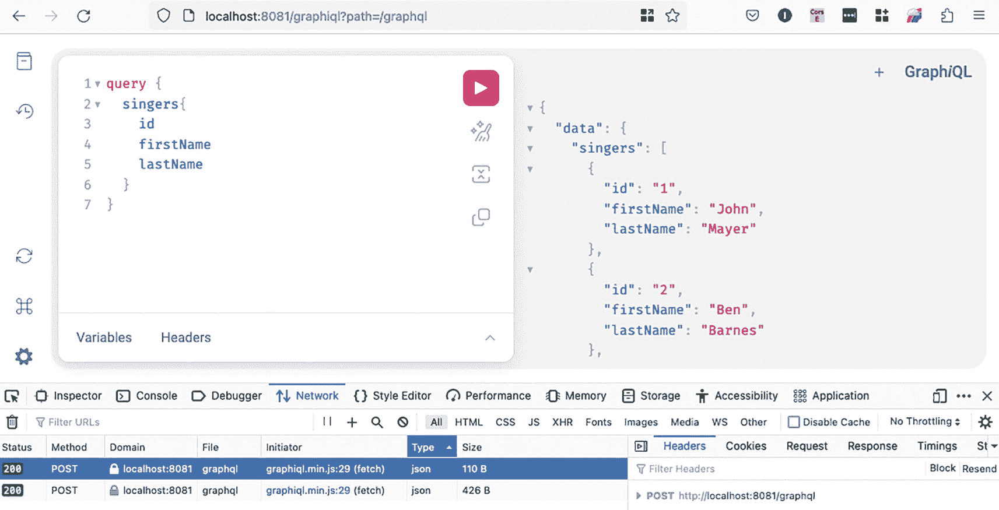
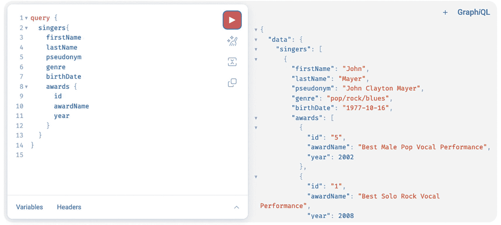

# 日志配置已省略
清单 16-18
GraphQL 的 Spring Boot 应用程序配置
```

GraphQL 查询可以通过名为 GraphiQL 的 Web 界面发送到应用程序。这是一个 Web 控制台，可以与任何 GraphQL 服务器通信，并帮助使用和开发 GraphQL API。它包含在 Spring Boot 的 GraphQL 起步依赖中，默认在 `/graphiql` 端点公开。在清单 16-8 的配置示例中，设置了相同的值，只是为了说明可以使用 `spring.graphql.graphiql.path` 属性自定义 Web 控制台可访问的 URL 路径。该端点默认是禁用的，但可以通过将 `spring.graphql.graphiql.enabled` 属性设置为 `true` 来启用。GraphiQL 是一个非常实用的编写和测试查询的工具，尤其是在开发和测试期间。

现在我们可以启动应用程序并编写一些查询了。要访问 GraphiQL，请在浏览器中打开 `http://localhost:8081/graphiql` URL。这将打开一个页面，其中包含一个漂亮的编辑器，左侧是一个输入文本区域，可以在其中编写查询，右侧则显示检索到的数据。

图 16-10 展示了 GraphiQL Web 控制台。



一个本地主机窗口的截图。它有两个窗格，包含多行查询代码，并且从下方的工具栏中选择了网络选项卡。该选项卡选中了类型列，并且第一行被高亮显示。

图 16-10
带有简单查询的 GraphiQL Web 控制台

此图像中的查询很简单；我们可以添加更多字段，甚至关联关系。图 16-11 展示了一个 GraphQL 查询，该查询检索所有歌手的全部详细信息（虽然你通常不需要这样做，但要知道这是可行的）。



两个窗格的截图。左侧窗格有多行代码，包含 query、singers、firstName、lastName、pseudonym 和 genre 等命令。右侧窗格显示了已执行的命令，包括 data、singers、firstName、lastName 和 birthDate 等。

图 16-11
带有嵌套查询的 GraphiQL Web 控制台

所以这是可行的，尽管如前所述，`awards` 集合是延迟初始化的。那么，GraphQL 是如何做到的呢？了解为了检索这些数据在表上执行了多少查询会很有趣——简而言之，就是它的效率到底有多高。为了弄清楚这一点，让我们在 Spring Boot 配置中启用 SQL 日志记录，在配置中添加属性 `logging.level.sql=debug`。

如果我们发送相同的查询并查看控制台日志，可以看到清单 16-19 中的日志。


```
DEBUG: SqlStatementLogger - select s1_0.ID,s1_0.BIRTH_DATE,s1_0.FIRST_NAME,s1_0.GENRE,s1_0.LAST_NAME,s1_0.PSEUDONYM,s1_0.VERSION from SINGER s1_0
DEBUG: SqlStatementLogger - select a1_0.SINGER_ID,a1_0.ID,a1_0.AWARD_NAME,a1_0.TYPE,a1_0.ITEM_NAME,a1_0.VERSION,a1_0.YEAR from AWARD a1_0 where a1_0.SINGER_ID=?
DEBUG: SqlStatementLogger - select a1_0.SINGER_ID,a1_0.ID,a1_0.AWARD_NAME,a1_0.TYPE,a1_0.ITEM_NAME,a1_0.VERSION,a1_0.YEAR from AWARD a1_0 where a1_0.SINGER_ID=?
DEBUG: SqlStatementLogger - select a1_0.SINGER_ID,a1_0.ID,a1_0.AWARD_NAME,a1_0.TYPE,a1_0.ITEM_NAME,a1_0.VERSION,a1_0.YEAR from AWARD a1_0 where a1_0.SINGER_ID=?
DEBUG: SqlStatementLogger - select a1_0.SINGER_ID,a1_0.ID,a1_0.AWARD_NAME,a1_0.TYPE,a1_0.ITEM_NAME,a1_0.VERSION,a1_0.YEAR from AWARD a1_0 where a1_0.SINGER_ID=?
...
清单 16-19
控制台中记录的针对延迟初始化集合的数据库查询
```

这里发生了两件事：

*   对于每位歌手，都会额外执行一次查询来获取奖项（N+1 复杂度问题）。

*   之所以能这样，是因为默认情况下，当有数据请求时，Spring Boot 会配置一个保持打开的 Hibernate 会话。这使得延迟关联可以被加载，从而提高了开发人员的生产力，因为它保持了简单性。无需使用带有连接语句的特殊查询。提供此行为的 Bean 是 `OpenSessionInViewInterceptor`。^((159))

*每次请求一个会话*的事务模式的问题在于，它在生产环境中可能变得低效。可以通过在 Spring Boot 配置中添加以下属性来禁用此行为：`spring.jpa.open-in-view=false`。然而，当 GraphQL 嵌套查询尝试获取延迟关系时，这并不能很好地与之配合。

如何解决这个问题？我们需要修改 GraphQL 处理器方法，并使用 Spring JPA Specification API 方法仅在需要时提取关系数据。这显然意味着我们需要分析客户端发送的查询。实现方法不止一种，但最简单的是在 `QueryResolver` 实现中使用 `graphql.schema.DataFetchingEnvironment` 参数。在带有 `@QueryMapping` 注解的方法中，Spring Boot 会自动注入此参数的值，并根据请求的关系构建不同的查询。如果你还记得，我们确实有两个关系：“awards”和“instruments”。清单 16-20 展示了改进后的 `singers(..)` 处理器方法。

```
package com.apress.prospring6.sixteen.boot.controllers;
import org.springframework.graphql.data.method.annotation.QueryMapping;
import org.springframework.stereotype.Controller;
import graphql.schema.DataFetchingEnvironment;
import graphql.schema.DataFetchingFieldSelectionSet;
import jakarta.persistence.criteria.Fetch;
import jakarta.persistence.criteria.Join;
import jakarta.persistence.criteria.JoinType;
import org.springframework.data.jpa.domain.Specification;
// 其他导入语句已省略
@Controller
public class SingerController {
@QueryMapping
public Iterable singers(DataFetchingEnvironment environment) {
DataFetchingFieldSelectionSet s = environment.getSelectionSet();
if (s.contains("awards") && !s.contains("instruments"))
return singerRepo.findAll(fetchAwards());
else if (s.contains("awards") && s.contains("instruments"))
return singerRepo.findAll(fetchAwards().and(fetchInstruments()));
else if (!s.contains("awards") && s.contains("instruments"))
return singerRepo.findAll(fetchInstruments());
else
return singerRepo.findAll();
}
private Specification fetchAwards() {
return (root, query, builder) -> {
Fetch f = root.fetch("awards", JoinType.LEFT);
Join join = (Join) f;
return join.getOn();
};
}
private Specification fetchInstruments() {
return (root, query, builder) -> {
Fetch f = root.fetch("instruments", JoinType.LEFT);
Join join = (Join) f;
return join.getOn();
};
}
// 其他方法已省略
}
清单 16-20
用于嵌套查询的 GraphQL 处理器方法
```

用于检索带有部分已加载关系的 `Singer` 实例列表的 `findAll(Specification<T> spec)` 方法由 `org.springframework.data.jpa.repository.JpaSpecificationExecutor<T>` 提供，因此必须修改 `SingerRepo` 以同时扩展此接口。

如果我们重新启动应用程序并发送清单 16-21 中的查询，我们将得到预期的回复，并且如果查看控制台，我们会注意到只执行了一个查询。

```
query {
singers{
firstName
lastName
pseudonym
genre
birthDate
awards {
awardName
year
}
}
}
清单 16-21
请求一对多关系的 GraphQL 查询
```

控制台日志中的查询如清单 16-22 所示。

```
select s1_0.ID,
a1_0.SINGER_ID,
a1_0.ID,a1_0.AWARD_NAME,
a1_0.TYPE,
a1_0.ITEM_NAME,
a1_0.VERSION,a1_0.YEAR,
s1_0.BIRTH_DATE,
s1_0.FIRST_NAME,
s1_0.GENRE,
s1_0.LAST_NAME,
s1_0.PSEUDONYM,
s1_0.VERSION
from SINGER s1_0
left join AWARD a1_0 on s1_0.ID=a1_0.SINGER_ID
清单 16-22
为嵌套 GraphQL 查询生成的 SQL 查询
```

如果我们也将 `instruments` 关系添加到查询中，会发生什么？这是一个多对多关系，在底层通过两个一对多关系建模：一个是 `SINGER` 和 `SINGER_INSTRUMENT` 之间的关系，另一个是 `INSTRUMENT` 和 `SINGER_INSTRUMENT` 之间的关系。清单 16-23 展示了 GraphQL 查询以及为提取请求数据而生成的查询。


```
query {
singers{
firstName
lastName
pseudonym
genre
birthDate
awards {
awardName
year
}
instruments {
name
}
}
}
