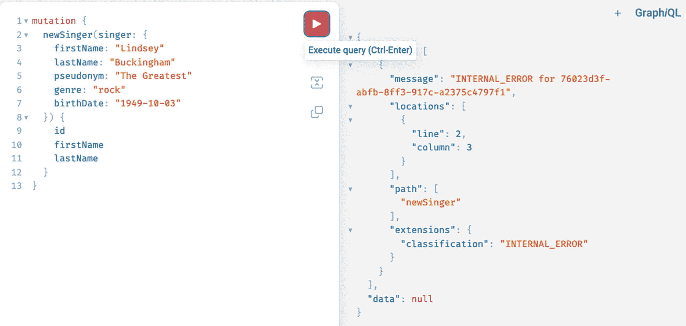
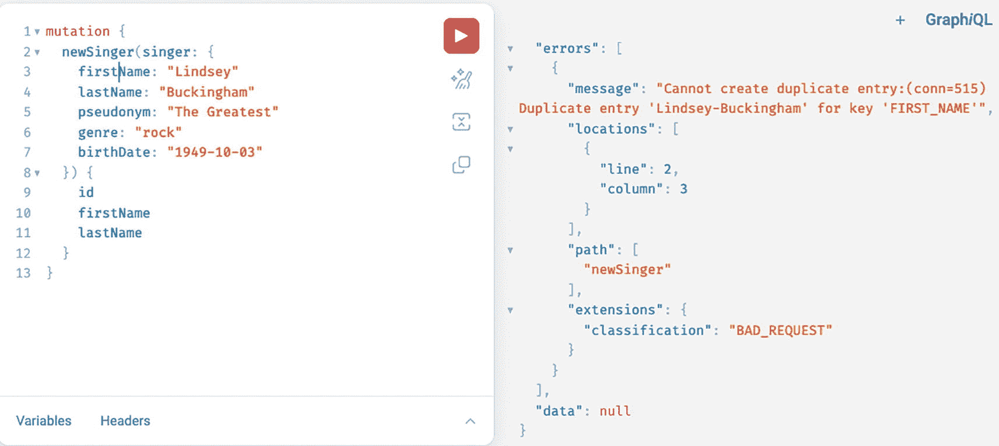
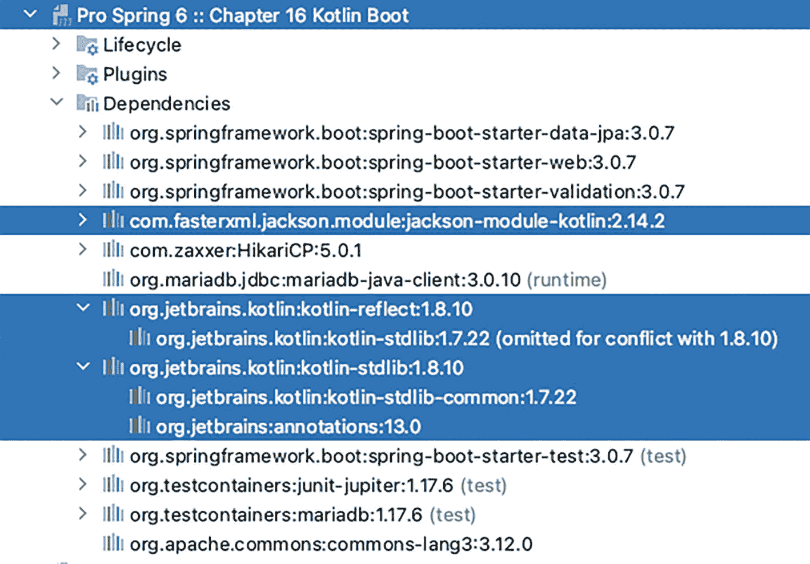
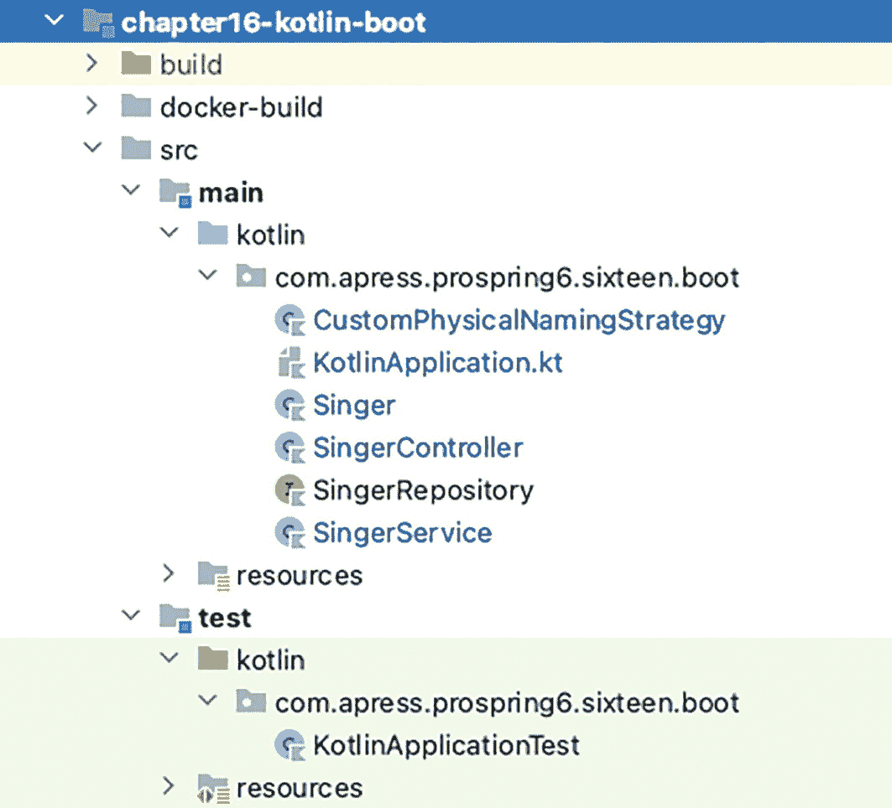

# 删除歌手
mutation {
deleteSinger(id: 16)
}
代码清单 16-28
用于创建、更新和删除歌手的 GraphQL 查询
```

现在我们已经探索了如何通过 GraphQL 查询创建 `Singer` 实例，那么如果我们尝试执行两次创建歌手的查询会发生什么？这显然是不允许的，因为我们的数据库中歌手应该是唯一的。尝试创建一个具有相同 `firstName` 和 `lastName` 的歌手会导致抛出 `DataIntegrityViolationException`，我们可以在控制台日志中看到，但在 GraphQL 中，Web 控制台不会提供太多细节，如图 16-12 所示。



一个包含两个窗格的截图。左侧窗格有几行代码，包含 mutation 和 new singer 等命令。右侧窗格显示已执行的命令，其中包含一条内部错误消息等。左侧窗格还高亮显示了执行查询按钮。

图 16-12

GraphiQL Web 控制台在尝试两次执行相同 mutation 时显示的错误

我们知道服务器在执行我们请求的操作时遇到了问题，但我们不知道原因。显然，需要适当的异常处理。在使用 GraphQL 时，我们通过扩展 `org.springframework.graphql.execution.DataFetcherExceptionResolverAdapter` 类并重写 `resolveToSingleError(..)` 或 `resolveToMultipleErrors(..)` 方法来处理错误。在配置中添加此类型的 bean 提供了一种更简洁的方式，可以在 GraphiQL Web 控制台显示的 GraphQL 响应中表示数据层错误。代码清单 16-29 展示了 `DataFetcherExceptionResolverAdapter` 的自定义实现。

```
package com.apress.prospring6.sixteen.boot.problem;
import graphql.GraphQLError;
import graphql.GraphqlErrorBuilder;
import graphql.schema.DataFetchingEnvironment;
import org.springframework.dao.DataIntegrityViolationException;
import org.springframework.graphql.execution.DataFetcherExceptionResolverAdapter;
import org.springframework.graphql.execution.ErrorType;
import org.springframework.stereotype.Component;
@Component
public class CustomExceptionResolver extends DataFetcherExceptionResolverAdapter {
@Override
protected GraphQLError resolveToSingleError(Throwable ex, DataFetchingEnvironment env) {
if (ex instanceof DataIntegrityViolationException) {
return GraphqlErrorBuilder.newError()
.errorType(ErrorType.BAD_REQUEST)
.message("无法创建重复条目:" + ex.getCause().getCause().getMessage())
.path(env.getExecutionStepInfo().getPath())
.location(env.getField().getSourceLocation())
.build();
}
return super.resolveToSingleError(ex, env);
}
@Override
protected List resolveToMultipleErrors(Throwable ex, DataFetchingEnvironment env) {
return super.resolveToMultipleErrors(ex, env);
}
}
代码清单 16-29
DataFetcherExceptionResolverAdapter 的自定义实现
```

`resolveToSingleError(..)` 和 `resolveToMultipleErrors(..)` 具有相同的签名，它们之间的唯一区别在于 `resolveToSingleError(..)` 将抛出的异常解析为单个 GraphQL 错误，而 `resolveToMultipleErrors(..)` 则将其解析为多个 GraphQL 错误。`DataFetchingEnvironment` 参数提供了错误发生时的执行上下文详细信息。`GraphqlErrorBuilder` 是一个用于构建 GraphQL 错误的有用类。`ErrorType` 表示错误类别，该枚举中的值与最常见的 HTTP 状态码对应：`BAD_REQUEST`、`UNAUTHORIZED`、`FORBIDDEN`、`NOT_FOUND` 和 `INTERNAL_ERROR`。可以设置自定义消息来添加有关失败的详细信息。`path` 是导致问题的查询或变更的名称。`location` 表示导致错误的 GraphQL 查询行。

将此 bean 添加到配置后，错误变得更加可读，如图 16-13 所示，为发送错误查询的人提供了纠正所需的信息。



一个包含两个窗格的截图。左侧窗格有几行代码，包含 mutation、new singer、first name 和 last name 等命令。右侧窗格显示已执行的命令，其中包含一条“无法创建重复条目”的消息等。

图 16-13

GraphiQL Web 控制台在尝试两次执行相同 mutation 时显示的自定义错误

测试 GraphQL 控制器可以像前面章节中针对 Web 应用程序所展示的那样进行，使用 `TestRestTemplate` 或 `MockMvc`，或者对于 Spring Boot Reactive GraphQL 应用程序使用 `WebClient`，通过发送包含 GraphQL 查询的 POST 请求来实现。

本节仅触及了如何在 Spring 中开始构建 GraphQL API 的基础知识。如果你想了解更多关于 Spring 对 GraphQL 的支持，请随时查看 Spring for GraphQL 官方项目页面。^(¹⁶⁰)


## Spring Kotlin 应用

Kotlin^(¹⁶¹) 是一种由 JetBrains^(¹⁶²) 开发的 JVM 编程语言，该公司也出品了最好的 Java 编辑器 IntelliJ IDEA^(¹⁶³)（本书中反复向你推荐）。正如本章开头所述，Kotlin 在语法上几乎可以说是 Java 和 Scala 的融合，兼具两者的优点：Java 的可读性、Scala 的优雅性，并且能够在 JVM 上运行，因此也能与 Java 互操作。项目可以同时包含 Java 和 Kotlin 源码，像 Maven 和 Gradle 这样的智能编辑器知道如何编译它们，并将其构建成可在任何 JVM 上运行的字节码。Kotlin 是一种跨平台、静态类型、通用、高级的编程语言，具有类型推断功能，使其语法更加简洁。

以下是 Kotlin 的主要优势，可能会说服 Java 开发者尝试 Kotlin：

*   Kotlin 语法简洁，需要编写的代码更少，从而避免了样板代码。Kotlin 官方页面指出，与 Java 相比，代码行数大约减少了 40%。此外，它还支持字符串模板表达式。
*   Kotlin 同时具有面向对象和函数式编程结构，这意味着你可以使用其高阶函数、函数类型和 lambda 表达式来编写面向对象和函数式代码。
*   Kotlin 支持非空类型，这有助于避免 `NullPointerExceptions`。
*   Kotlin 的类及其成员默认是 final 的。
*   Kotlin 使用智能转换，这意味着 `is` 运算符会检查对象的类型，Kotlin 编译器会显式转换不可变值，并在必要时自动插入（安全）转换。
*   Kotlin 通过 `when` 表达式和数值区间提供了更好的控制流。
*   Kotlin 中的公共超类名为 `Any`。
*   默认情况下，方法和属性是 `final` 的，需要使用 `override` 关键字才能使其可重写，这使得继承代码更易于阅读。
*   属性可以使用 `val` 关键字声明为只读，使用 `var` 关键字声明为可变。
*   Kotlin 信奉*少即是多*的原则：getter、setter 和属性类型是可选的。
*   接口可以拥有属性和函数。
*   类和接口可以通过*扩展函数*在不使用继承的情况下增加新功能。要声明一个扩展函数，需要在其名称前加上一个*接收者类型*，该类型指向被扩展的类型。即使对象变量的值为 `null`，也可以在其上调用扩展函数，这意味着可以在不检查空值的情况下对对象调用 `toString()`。
*   Kotlin 为菱形继承问题^(¹⁶⁴)提供了解决方案。
*   访问器或可见性修饰符与 Java 类似。Kotlin 中有四种可见性修饰符：`private`、`protected`、`internal` 和 `public`。默认可见性是 `public`。
*   如果顶层类、函数或接口是 `private` 的，则它仅对包含该声明的文件可见。
*   如果顶层类、函数或接口是 `internal` 的，则它对同一模块内的所有地方可见。
*   `protected` 修饰符不适用于顶层声明。
*   构造函数使用 `constructor` 关键字声明，默认是 `public` 的。
*   Kotlin 支持模块：模块是一组一起编译的 Kotlin 文件。
*   Kotlin 支持伴生对象；伴生对象类似于静态实例，允许在不实例化类型的情况下调用方法。
*   Kotlin 支持数据类：具有标准功能（如 `equals()`、`hashCode()`、`toString()` 等）的类。
*   Kotlin 支持密封类（并且在 Java 之前就已支持）。
*   Kotlin 支持内联类。
*   Kotlin 通过 `协程` 支持异步或非阻塞编程。
*   Kotlin 支持解构对象。

本节构建的应用程序并未使用所有提到的特性，但在此列出它们是为了激发你的兴趣。有关所有特性的更多信息，官方文档和教程非常出色，^(¹⁶⁵) Jim Lavers 所著的《Learn to Program with Kotlin》^(¹⁶⁶)（Apress，2021 年）一书也是如此。

有了以上对 Kotlin 的介绍，让我们开始使用 Kotlin 构建一个 Spring Boot Web 应用程序吧。


### 配置

Kotlin 应用程序可以使用 Gradle 和 Maven 构建。项目结构是本书开头介绍的标准 Maven 结构，只是 Kotlin 源文件位于 `kotlin` 目录下。此外，根据所构建应用程序的类型，还需要一些 Kotlin 插件，以确保 Kotlin 源代码被编译成 JVM 可执行的字节码。本节构建 Spring Boot 应用程序所需的插件如下所列并进行了解释。

首先是 Kotlin Gradle 插件（`kotlin-gradle-plugin`），它会根据构建脚本中的 `compilerOptions.jvmTarget` 编译器选项选择合适的 JVM 标准库。对于多模块 Gradle 项目，该插件需要作为 `classpath` 依赖项添加到父项目中，并在子项目 `chapter16-kotlin-boot` 中使用。清单 16-30 展示了这两部分 Gradle 配置。

```
// pro-spring-6/build.gradle
buildscript {
repositories {
mavenLocal()
mavenCentral()
}
dependencies {
classpath 'io.spring.gradle:dependency-management-plugin:1.1.0'
classpath 'org.jetbrains.kotlin:kotlin-gradle-plugin:1.8.10'
}
}
// pro-spring-6/chapter16-kotlin-boot/chapter16-kotlin-boot.gradle
apply plugin: 'org.jetbrains.kotlin.jvm'
tasks.withType(KotlinCompile).configureEach {
compileKotlin.compilerOptions.freeCompilerArgs.add('-Xjsr305=strict')
compileKotlin.compilerOptions.jvmTarget.set(JvmTarget.JVM_19)
}
tasks.withType(Test).configureEach {
useJUnitPlatform()
compileTestKotlin.compilerOptions.jvmTarget.set(JvmTarget.JVM_19)
}
清单 16-30
kotlin-gradle-plugin 插件的 Gradle 配置
```

`kotlin-gradle-plugin` 的版本与所支持的 Kotlin 版本一致，编写本书时当前的 Kotlin 版本是 1.8.10。请注意，`KotlinCompile` 任务配置了将运行应用程序的 JVM 版本。如果测试是用 Kotlin 编写的，那么 `Test` 任务也需要进行此配置。当 `-Xjsr305` 编译标志设置为 `strict` 时，需要确保从 Spring API 推断出的 Kotlin 类型中考虑了空安全性。

如前所述，Kotlin 的类及其成员默认是 `final` 的。这对于像 Spring 这样需要代理 bean 的框架来说可能不方便，因此它们要求类为 `open`。这意味着为了实现互操作性，需要另一个插件。`kotlin-allopen` 编译插件使 Kotlin 适应这些框架的要求。该插件所需的配置如 16-31 所示。

```
// pro-spring-6/build.gradle
buildscript {
repositories {
mavenLocal()
mavenCentral()
}
dependencies {
classpath 'io.spring.gradle:dependency-management-plugin:1.1.0'
classpath 'org.jetbrains.kotlin:kotlin-allopen:1.8.10'
}
}
// pro-spring-6/chapter16-kotlin-boot/chapter16-kotlin-boot.gradle
apply plugin: 'org.jetbrains.kotlin.plugin.spring'
清单 16-31
kotlin-allopen 插件的 Gradle 配置
```

另外两个可能引起问题的框架是 JPA 和 Hibernate。这些框架要求实体类具有默认的无参构造函数，因为它们使用该构造函数创建对象，然后设置属性。Kotlin 默认不会生成这样的构造函数，因此必须将 `kotlin-noarg` 插件添加到配置中。`no-arg` 编译器插件会为带有特定注解的类生成一个额外的零参数构造函数。

生成的构造函数是合成的，因此不能直接从 Java 或 Kotlin 调用，但可以通过反射调用。清单 16-32 展示了该插件的配置。

```
// pro-spring-6/build.gradle
buildscript {
repositories {
mavenLocal()
mavenCentral()
}
dependencies {
classpath 'io.spring.gradle:dependency-management-plugin:1.1.0'
classpath 'org.jetbrains.kotlin:kotlin-noarg:1.8.10'
}
}
// pro-spring-6/chapter16-kotlin-boot/chapter16-kotlin-boot.gradle
apply plugin: 'org.jetbrains.kotlin.plugin.jpa'
清单 16-32
kotlin-noarg 插件的 Gradle 配置
```

一个圆形渐变色图标的插图。 Gradle 配置是用 Groovy 编写的，但 Gradle 也支持用 Kotlin 编写配置文件。

一个灯泡的插图。 在 `chapter16-kotlin-boot` 项目中有一个等效的 Maven 配置。如果你有兴趣用 Maven 构建 Kotlin 应用程序，可以随意查看。

一个灯泡的插图。 对于用 Kotlin 编写的 Spring Boot 应用程序，可以利用 [`https://start.spring.io`](https://start.spring.io) 来生成项目结构和配置。

将所有插件添加到配置后，我们现在可以将注意力转向向配置中添加所需的依赖项，以便构建一个带有 JPA 的 Spring Boot Web 应用程序。图 16-14 展示了项目 `chapter16-kotlin-boot` 的依赖关系。



一张标题为“第 16 章 Kotlin boot”的截图。它包含生命周期、插件和依赖项的下拉菜单。依赖项下拉菜单列出了一组库，并高亮显示了 Jackson 模块 Kotlin、Kotlin reflect 和 Kotlin 标准库。

图 16-14

`chapter16-kotlin-boot` 项目依赖关系

`kotlin-stdlib` 依赖项包含 Kotlin 标准库，是任何 Kotlin 项目所必需的。`kotlin-reflect` 依赖项用于添加在 JVM 平台上使用反射功能所需的运行时组件。另外，请注意 `jackson-module-kotlin` 依赖项，它用于在 Kotlin 代码中支持 Jackson 注解。

在介绍了插件和依赖项之后，是时候看看代码了。


### 代码

让我们从基础开始。`Singer` 实体类与其 Java 版本非常相似，但由于没有 setter 和 getter，也没有 Lombok，因此更简单。图 16-15 展示了 `chapter16-kotlin-boot` 项目结构。



第 16 章 kotlin boot 目录树的截图。它包括 build、docker build、s r c 和 test 文件夹及其子文件夹。S r c 和 test 包含 main、kotlin、com dot apress dot pro spring 6 dot sixteen dot boot 和 resources 等子文件夹。

图 16-15

`chapter16-kotlin-boot` 项目结构

`Singer` Kotlin 实体类如清单 16-33 所示。

```
package com.apress.prospring6.sixteen.boot
import com.fasterxml.jackson.annotation.JsonIgnore
import jakarta.persistence.*
import jakarta.validation.constraints.NotEmpty
import jakarta.validation.constraints.Size
import org.springframework.format.annotation.DateTimeFormat
import java.time.LocalDate
@Entity
@Table(name = "SINGER")
data class Singer (
@Id @GeneratedValue(strategy = GenerationType.IDENTITY)
@Column(name = "ID")
@JsonIgnore // do not serialize
var id: Long? = null,
@Version @Column(name = "VERSION")
@JsonIgnore // do not serialize
var version: Int = 0,
@Column(name = "FIRST_NAME")
@NotEmpty
@Size(min = 2, max = 30)
var firstName:  String?,
@Column(name = "LAST_NAME")
var lastName: @NotEmpty @Size(min = 2, max = 30) String? = null,
@DateTimeFormat(pattern = "yyyy-MM-dd")
@Column(name = "BIRTH_DATE")
var birthDate: LocalDate? = null
)
清单 16-33
Singer Kotlin 类
```

该类使用 `data class` 关键字声明。这告诉 Kotlin 编译器生成 `equals()`、`hashCode()`、`toString()`、解构和 `copy()` 函数。

某些类型后面出现的 `?` 将这些属性标记为可空；通过将它们初始化为 `null` 来强调这一点。

请注意，该类没有实际的主体；所有内容都在 `()` 之间完成。此声明也充当构造函数，被称为*主构造函数*。还要注意，变量类型在变量名之后声明，并以 `:` 为前缀，如果使用值初始化，赋值语句位于类型声明之后。

`SingerRepository` 接口如清单 16-34 所示。

```
package com.apress.prospring6.sixteen.boot
import org.springframework.data.jpa.repository.Query
import org.springframework.data.repository.CrudRepository
import org.springframework.data.repository.query.Param
interface SingerRepository : CrudRepository {
@Query("select s from Singer s where s.firstName=:fn")
fun findByFirstName(@Param("fn") firstName: String?): Iterable?
@Query("select s from Singer s where s.firstName like %?1%")
fun findByFirstNameLike(firstName: String?): Iterable?
}
清单 16-34
SingerRepository Kotlin 数据仓库接口
```

服务看起来与其 Java 版本大不相同，如清单 16-35 所示。

```
package com.apress.prospring6.sixteen.boot
import org.springframework.dao.DataIntegrityViolationException
import org.springframework.stereotype.Service
import org.springframework.transaction.annotation.Transactional
import java.util.*
import kotlin.jvm.Throws
@Transactional
@Service
class SingerService (private val repository: SingerRepository){
@Throws(NotFoundException::class)
fun findAll(): List {
val singers: List = repository.findAll() as List
if (singers.isEmpty()) {
throw NotFoundException(Singer::javaClass.name)
}
return singers
}
@Throws(NotFoundException::class)
fun findById(id: Long?): Singer? {
return id?.let { repository.findById(id).orElseThrow { NotFoundException(Singer::javaClass.name, id) }}
}
@Throws(DataIntegrityViolationException::class)
fun save(singer: Singer?): Singer? {
return singer?.let { repository.save(it) }
}
@Throws(NotFoundException::class, DataIntegrityViolationException::class)
fun update(id: Long?, singer: Singer): Singer? {
return id?.let { repository.findById(id).map { update(it, singer, repository) }.orElseThrow { NotFoundException(Singer::javaClass.name, id)  }}
}
@Throws(NotFoundException::class)
fun delete(id: Long?) {
id?.let { repository.findById(id).orElseThrow { NotFoundException(Singer::javaClass.name, id)  } }
id?.let { repository.deleteById(id) }
}
fun update(it: Singer, singer: Singer, repository: SingerRepository): Singer {
it.firstName = singer.firstName
it.lastName = singer.lastName
it.birthDate = singer.birthDate
return repository.save(it)
}
}
清单 16-35
SingerService Kotlin 类
```

以下列表解释了 `SingerService` 类中最重要的构造。请注意，在 Kotlin 代码中使用了 `java.util.List<String>`。

*   方法使用 `fun` 声明，返回类型在签名末尾、主体块之前声明。在本节后续内容中，方法被称为*函数*，以切换到 Kotlin 风格。

*   `NotFoundException` 是一个自定义异常，每当使用与 `Singer` 实例不匹配的 id 调用服务函数时抛出。Kotlin 不要求使用 `throws` 语句声明受检异常，但由于 Kotlin 代码被编译为需要在 JVM 上运行的字节码，因此它必须是有效的。`@Throws` 注解指示在编译为 JVM 方法时，函数应声明哪些异常。

*   `Singer::javaClass.name` 构造引用 Java 类对象，因此可以访问其名称并将其用作参数来创建 `NotFoundException`。

*   `id?.let { .. }` 由两部分组成：`?.` 被称为*安全调用运算符*，它允许仅在 id 不为 null 时调用 `repository.findById(id)`；而 `let` 使用此值作为参数调用指定的函数块并返回其结果。

清单 16-36 展示了 `SingerController` 类。

```
package com.apress.prospring6.sixteen.boot
import jakarta.validation.Valid
import org.springframework.dao.DataIntegrityViolationException
import org.springframework.web.bind.annotation.*
@RestController
@RequestMapping("/singer")
class SingerController (private val service: SingerService) {
@GetMapping
fun all(): List {
return service.findAll()
}
@GetMapping( "/{id}")
fun findSingerById(@PathVariable  id: Long) : Singer? {
return  service.findById(id)
}
@PostMapping
fun create(@RequestBody @Valid singer:Singer) : Singer? {
return service.save(singer)
}
@PutMapping("/{id}")
fun update(@RequestBody @Valid singer: Singer, @PathVariable id: Long) : Singer? {
return service.update(id, singer)
}
@DeleteMapping("/{id}")
fun delete(@PathVariable id: Long) {
service.delete(id)
}
}
清单 16-36
SingerController Kotlin 类
```

`SingerController` 类在 Kotlin 中看起来也更简单，但它与 Java 中的非常相似，并且没有引入任何新内容。

但让我们看看配置。在之前的章节中，需要一个扩展 `PhysicalNamingStrategyStandardImpl` 类型的 bean 来让 Spring Data 识别全大写的表名和列名。将 `CustomPhysicalNamingStrategy` 转换为 Kotlin 提供了使用 `private` 访问器和 `override` 关键字的机会。`CustomPhysicalNamingStrategy` 的 Kotlin 版本如清单 16-37 所示。

```
package com.apress.prospring6.sixteen.boot
import org.hibernate.boot.model.naming.Identifier
import org.hibernate.boot.model.naming.PhysicalNamingStrategyStandardImpl
import org.hibernate.engine.jdbc.env.spi.JdbcEnvironment
import org.springframework.stereotype.Component
import java.io.Serializable
import java.util.*
@Component
class CustomPhysicalNamingStrategy : PhysicalNamingStrategyStandardImpl(), Serializable {
override fun toPhysicalTableName(logicalName: Identifier?, context: JdbcEnvironment): Identifier? {
return apply(logicalName)
}
override fun toPhysicalColumnName(logicalName: Identifier?, context: JdbcEnvironment): Identifier? {
return apply(logicalName)
}
private fun apply(name: Identifier?): Identifier? {
if (name == null) {
return null
}
val builder = StringBuilder(name.text.replace('.', '_'))
var i = 1
while (i < builder.length - 1) {
if (isUnderscoreRequired(builder[i - 1], builder[i], builder[i + 1])) {
builder.insert(i++, '_')
}
i++
}
return Identifier.toIdentifier(builder.toString().uppercase(Locale.getDefault()))
}
private fun isUnderscoreRequired(before: Char, current: Char, after: Char): Boolean {
return Character.isLowerCase(before) && Character.isUpperCase(current) && Character.isLowerCase(after)
}
}
清单 16-37
CustomPhysicalNamingStrategy Kotlin 类
```

它并没有简化太多 Java 代码，但这可能归因于缺乏 Kotlin 专业知识。请注意，为了重写一个函数，声明必须在 `fun` 之前使用 `override` 关键字。在函数上使用 `private` 访问器与 Java 中的效果相同，使其保持在其封闭类的本地范围内。

Spring Boot 主类如清单 16-38 所示。

```
package com.apress.prospring6.sixteen.boot;
import org.springframework.boot.autoconfigure.SpringBootApplication
import org.springframework.boot.runApplication
import org.springframework.core.env.AbstractEnvironment
// some import statements omitted
@SpringBootApplication
class Chapter16Application
fun main(args: Array) {
System.setProperty(AbstractEnvironment.ACTIVE_PROFILES_PROPERTY_NAME, "dev")
runApplication(*args)
}
@ControllerAdvice
@ResponseBody
class RestErrorHandler {
@ExceptionHandler(DataIntegrityViolationException::class)
fun handleBadRequest(ex: DataIntegrityViolationException): ResponseEntity? {
return ResponseEntity.badRequest().body(ex.message)
}
}
@ResponseStatus(value = HttpStatus.NOT_FOUND, reason = "Requested item(s) not found")
class NotFoundException : Exception {
constructor(clsName: String) : super("table for $clsName is empty!")
constructor(clsName: String, id: Long) : super("$clsName with id: $id does not exist!")
}
清单 16-38
Chapter16Application Kotlin 主类
```

Kotlin 不强制文件名与其内部声明的顶级类相同，这允许开发人员将多个较小的类放在同一个文件中。例如，清单 16-38 中的类声明在一个名为 `KotlinApplication.kt` 的文件中（Kotlin 文件扩展名为 `kt`）。

现在您已经了解了带有 REST 控制器和 JPA 的不太简单的 Spring Boot Web 应用程序，剩下的就是测试它。在 Kotlin 中编写 Spring Boot 测试与在 Java 中编写并没有太大不同，但它确实提供了引入 `companion` 对象的机会。清单 16-39 展示了一个 Kotlin Spring Boot 测试类。

```
package com.apress.prospring6.sixteen.boot
// import statements omitted
@ActiveProfiles("test")
@SpringBootTest(webEnvironment = SpringBootTest.WebEnvironment.RANDOM_PORT)
class KotlinApplicationTest(@Autowired val restTemplate: TestRestTemplate, @Value(value = "\${local.server.port}") val port: Int) {
val logger: Logger = LoggerFactory.getLogger(KotlinApplicationTest::class.java)
companion object {
@JvmStatic
@BeforeAll
fun setup() {
println(">> Setup")
}
@JvmStatic
@AfterAll
fun teardown() {
println(">> Tear down")
}
}
@Test
fun `find all singers`() {
val singers: Array = restTemplate.getForObject("/singer", Array::class.java)
Assertions.assertTrue(singers.size >= 15)
for(it in singers) logger.info(it.toString())
}
@Test
@Throws(URISyntaxException::class)
fun `can't find Singer by id`() {
logger.info("--> Testing retrieve a singer by id : 99")
val req: RequestEntity = RequestEntity(HttpMethod.GET, URI("http://localhost:$port/singer/99"))
val response: ResponseEntity = restTemplate.exchange(req, Singer::class.java)
Assertions.assertAll("testNegativeFindById",
Executable { Assertions.assertEquals(HttpStatus.NOT_FOUND, response.statusCode) },
Executable { Assertions.assertNull(response.body?.firstName) },
Executable { Assertions.assertNull(response.body?.lastName) }
)
}
}
清单 16-39
KotlinApplicationTest Kotlin Spring Boot 测试类
```

以下是关于此类的主要观察：

*   注意清单 16-39 开头 `@Value(value = "\${local.server.port}") val port: Int)` 中的 `\$` 语法。如本节开头所述，Kotlin 支持字符串模板表达式。模板表达式以 `$`（美元符号）开头，但对 Spring 环境变量的引用也是如此，因此在 Kotlin 中，当在 `@Value` 注解中引用环境变量进行注入时，例如，美元符号需要通过在其前面加上 `\`（反斜杠）进行转义。

*   Kotlin 中没有 `static`。不支持 Java 风格的静态，以鼓励更好的编码实践。由于 `@BeforeAll` 和 `@AfterAll` 注解需要放在静态方法上，解决方案是为 `KotlinApplicationTest` 声明一个 `companion` 对象，将函数放在那里，并用 `@JvmStatic` 注解它们。此注解指定如果元素是一个函数，则需要从中生成一个额外的静态方法。

*   由于 Kotlin 中没有 `static`，因此没有静态导入，因此需要像这样调用断言：`Assertions.assert*(..)`。

同样在 Kotlin 中，如果类、函数和变量名声明在反引号 ``` `` ``` 之间，则可以包含空格。有时这很有用，但不要滥用它，因为它可能会使代码可读性降低。

## 总结

GraalVM Native Images 是一项不断发展的技术，并非所有库都提供支持。Spring Native 支持在 Spring Boot 3 之前一直是实验性的。Maven Daemon (`mvnd`)^(¹⁶⁷) 是一个很好的例子，说明了原生可执行文件与在 JVM 上运行的应用程序相比有多快。它也是所涉及的限制和约束的一个很好的例子，因为设计用于 `mvnd` 构建的 Maven 项目必须仔细配置，以便模块可以并行构建。对于具有少量模块的小型项目，与标准 Maven 相比，`mvnd` 可以提供 7 到 10 倍或更多的加速。对于具有许多模块的大型项目，`mvnd` 可以提供 3 到 5 倍或更多的加速，因为它能够并行构建模块以及 JIT 编译器提供的优化。

Spring 对 GraphQL 的采用清楚地表明 GraphQL 将会持续存在。GraphQL 中有一个操作未在本章中介绍：*订阅*。有时客户端可能希望在它们关心的数据发生变化时从服务器接收更新。订阅是提供此功能的操作。另一个未涉及的主题是在像 Netty 这样的响应式服务器上的 GraphQL。在使用 GraphQL 的 Spring Boot 响应式应用程序中，可以使用 `org.springframework.graphql.test.tester.GraphQlTester.`^(¹⁶⁸) 进行测试。

Kotlin 的开发考虑到了其他语言中缺失或实现不佳的其他方面。经验丰富的开发人员可能会在其语法中识别出 Closure 或 Python 的灵感，但主要是 Scala 和 Java。它是一种现代且易于学习的语言，拥有出色的开发团队和围绕它的优秀社区。对于 Kotlin 为将代码转换为可在 JVM 上运行的字节码所做的黑魔法，存在安全性和性能方面的担忧，并且与行业中已建立的 Java 框架交互所需的额外配置也有成本。Kotlin 是未来吗？Spring 采用它这一事实可能再次表明这是开发人员想要的。

脚注 1   2   3   4   5   6   7   8   9   10   11   12   13   14   15   16   17  

