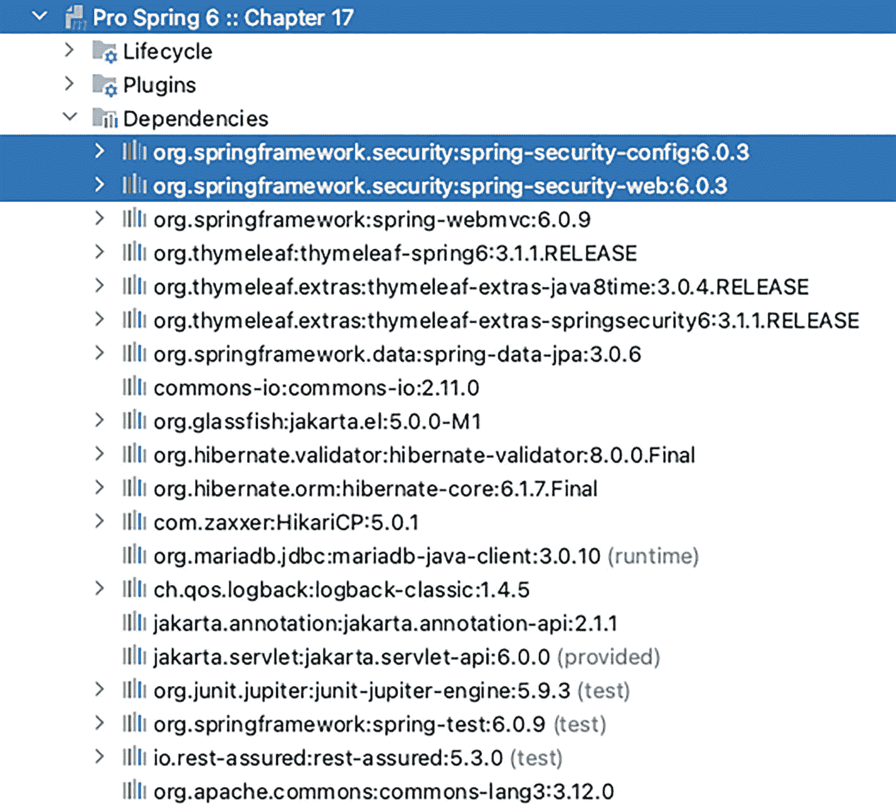
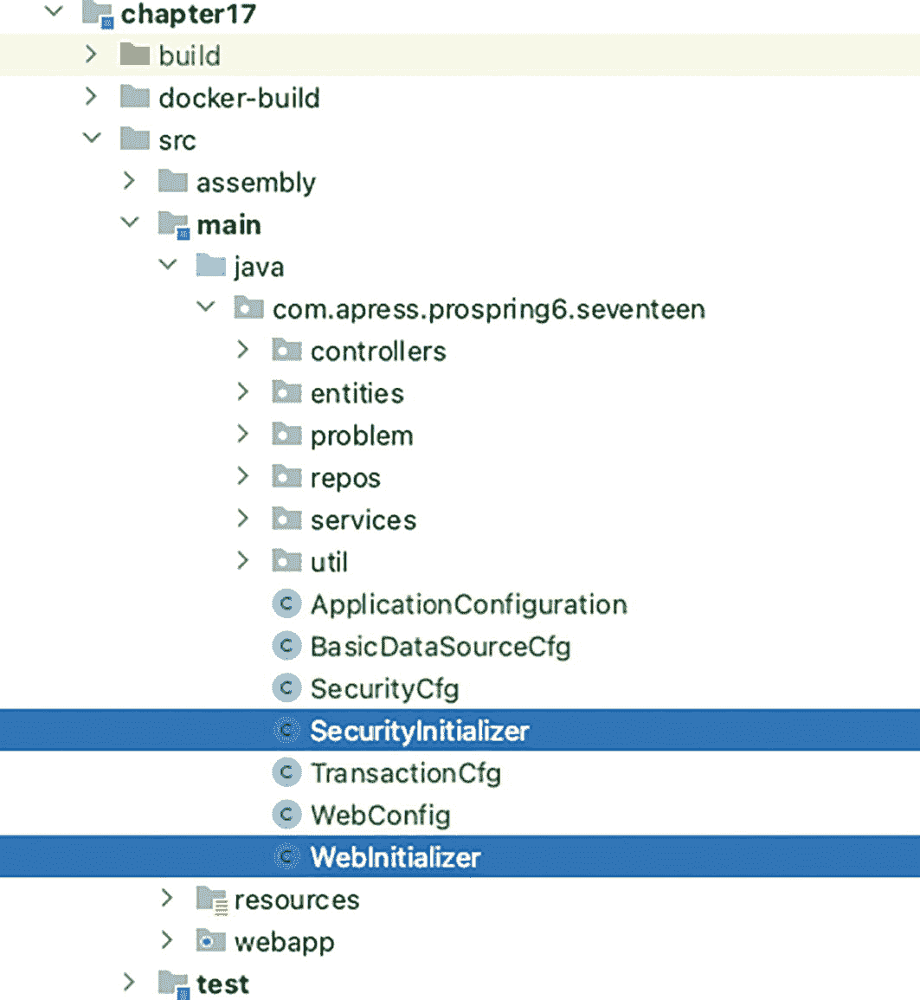
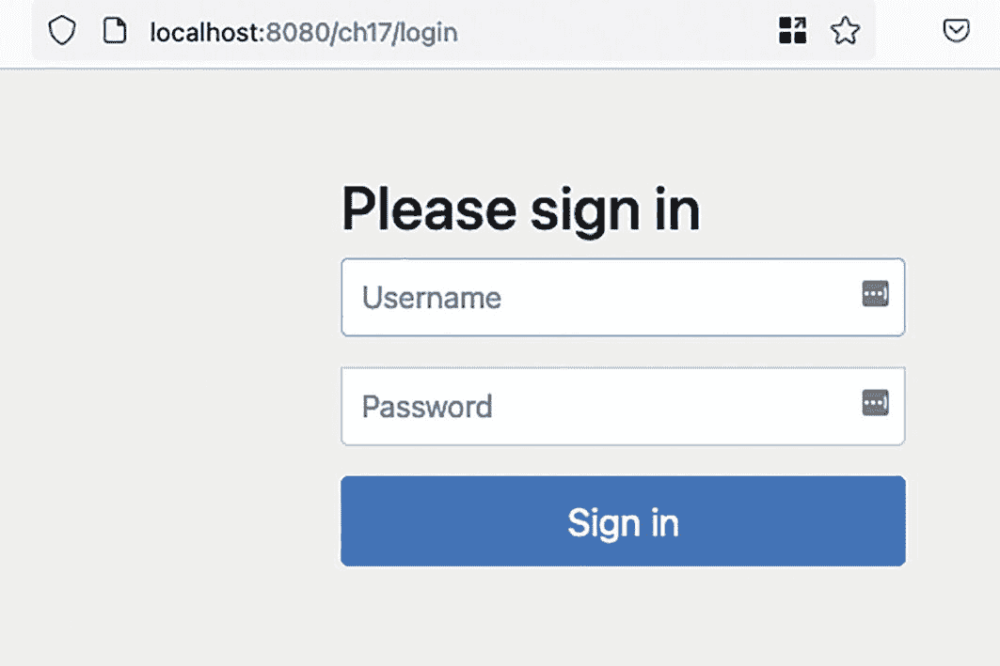
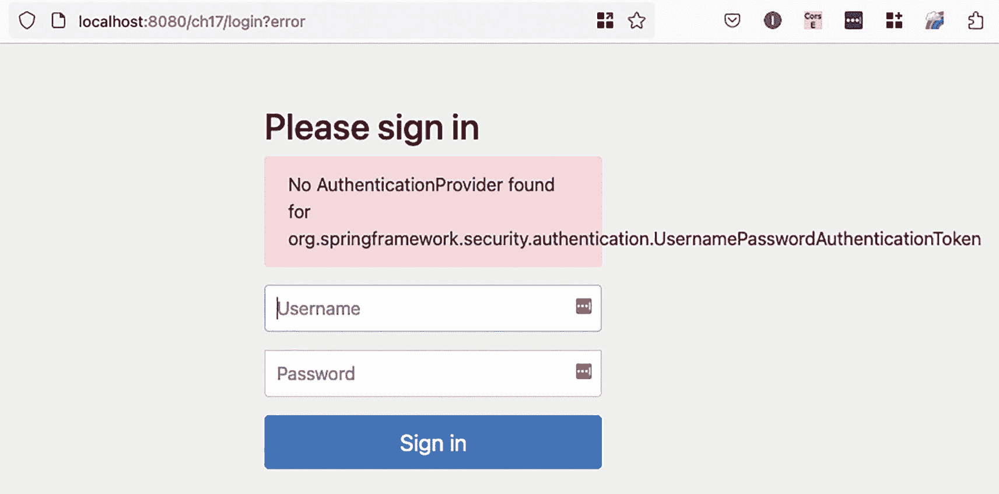
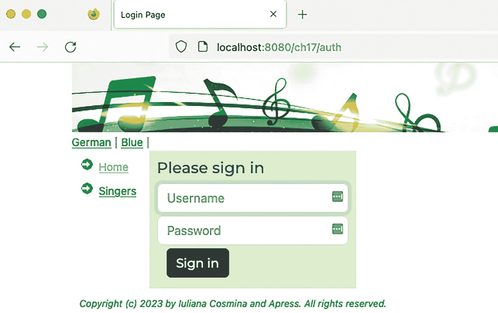
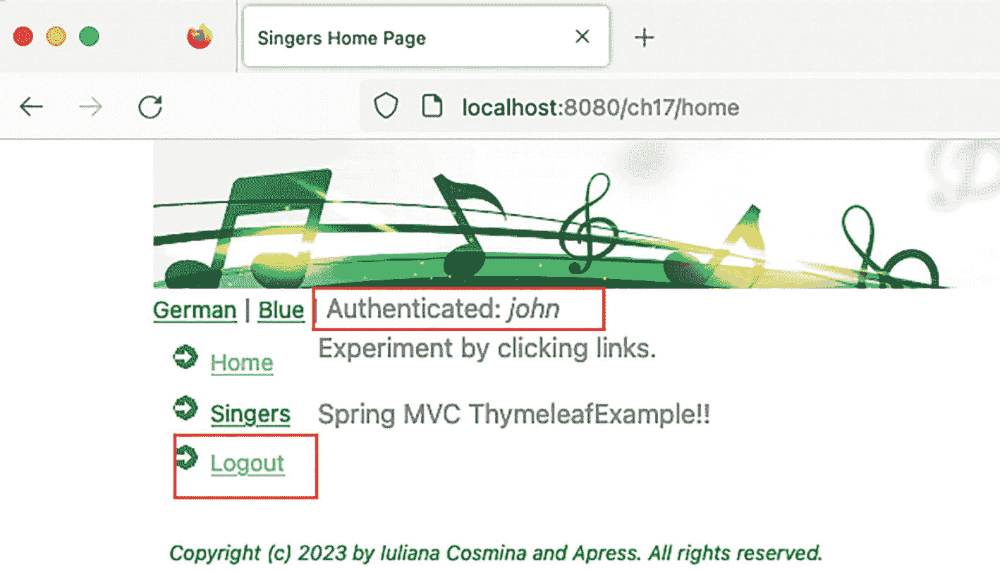
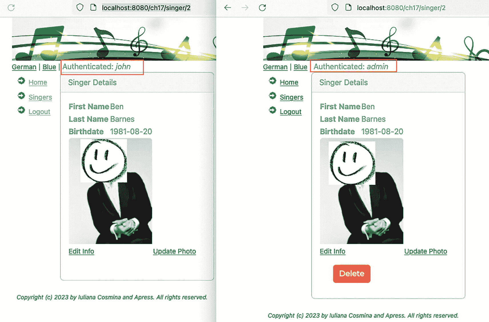
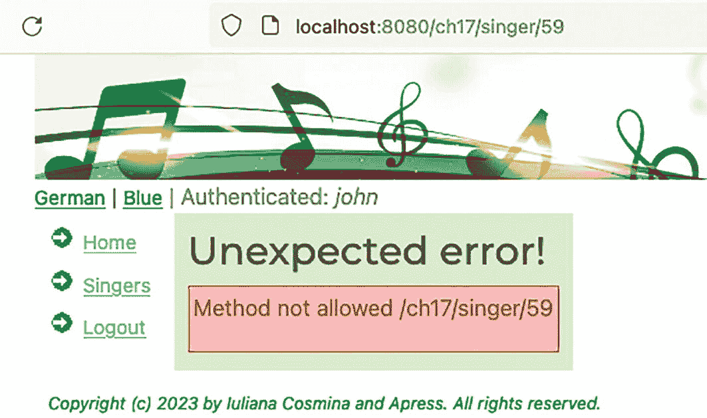
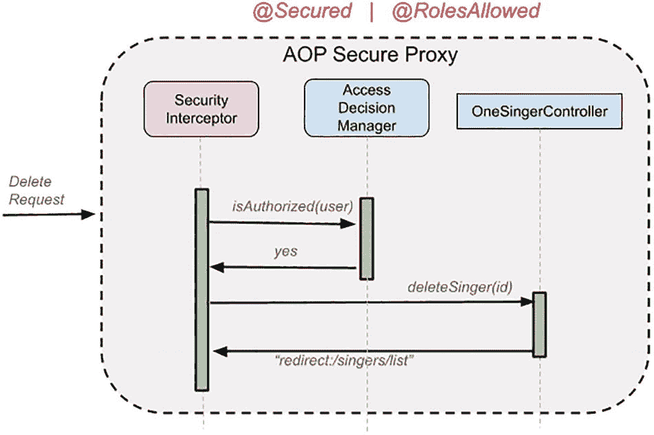
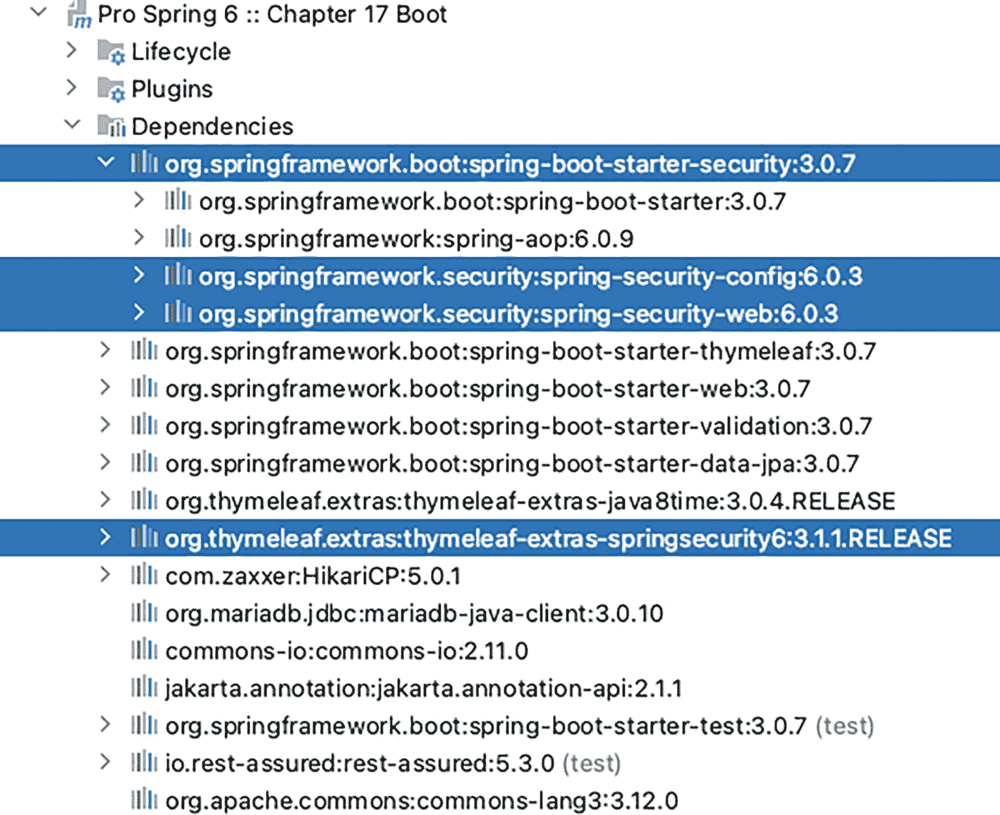

# 17. 保护 Spring Web 应用程序

**第** **14** **章**解释了如何使用经典的“手动”风格配置以及使用 Spring Boot 和 Thymeleaf 构建 Spring Web 应用程序。本章将采用**第** **14** **章**中构建的应用程序，并添加一个安全层，该层将声明哪些用户被允许访问应用程序的各个部分。例如，只有那些使用有效用户 ID 登录应用程序的用户才能添加新歌手或更新现有歌手。其他用户，称为*匿名用户*，只能查看歌手信息。

Spring Security 是保护基于 Spring 的应用程序的最佳选择。Spring Security 为企业应用程序提供身份验证、授权和其他安全功能。虽然主要用于表示层，但 Spring Security 可以帮助保护应用程序内的所有层，包括服务层。在以下部分中，我们演示如何使用 Spring Security 来保护歌手应用程序。对于 Web 应用程序，根据所使用的视图技术，有一些标签可以作为视图模板的一部分，根据用户权限隐藏或显示视图的部分内容。

Spring Security 是一个相对复杂的框架，旨在使开发人员能够轻松地在应用程序中实现安全性。在成为 Spring 的一部分之前，该项目始于 2003 年底，名为 *Acegi Security*。第一个 Spring Security 版本是 2008 年 4 月的 2.0.0 版本。

在应用程序安全方面，有两个最重要的过程，Spring Security 可用于配置这两个过程：

*   *身份验证*：证明您就是您所声称的身份的过程。这意味着您将凭据提交给应用程序，并针对一组现有用户进行测试，如果找到匹配项，您将被授予访问应用程序的权限。

*   *授权*：授予经过身份验证的一方执行某项操作的权限的过程。Spring Security 本质上是一个由拦截规则组成的框架，用于授予或不授予对资源的访问权限。

这两个过程围绕着一个 `principal`（主体），它表示可以在应用程序内执行操作的用户、设备或系统，以及 `credentials`（凭据），它们是主体用来确认其身份的识别密钥（例如，用户名和密码）。

本章展示如何使用 Spring Security 6.x 配置授权和身份验证。

一个带有感叹号的圆圈的插图。 您可以在 GitHub 上找到 Spring Security 的源代码，网址为 [`https://github.com/spring-projects/spring-security/`](https://github.com/spring-projects/spring-security/)。

## 配置 Spring Security：经典方式

本节展示如何保护**第** **14** **章**中构建的应用程序。要为其添加 Spring Security，我们显然需要向类路径添加一些库。Spring Web 应用程序的最小 Spring Security 配置通常类似于图 17-1 中描绘的配置。



一个屏幕显示了第 17 章的下拉菜单，其中包含任务下依赖项下的编译类路径。在类路径下选择了 Spring 框架安全配置和 Web。

图 17-1

项目 `chapter17` 依赖项

`spring-security-config` 库包含 Java 配置支持。`spring-security-web` 库包含 Web 安全基础设施代码，例如各种过滤器和其他的 Servlet API 依赖项。

Spring Security 的内部结构很复杂，官方文档对此进行了非常详细和清晰的解释。就本书而言，您只需要知道，一旦配置了 Spring Security，所有 HTTP 请求都会被安全拦截器拦截，并且对资源的访问是根据发出请求的用户来决定的。安全拦截器使用预处理步骤和后处理步骤。在预处理步骤中，它会查看请求的资源是否使用由 `org.springframework.security.access.ConfigAttribute`^(¹⁶⁹) 表示的元数据信息进行保护。如果没有，则允许请求继续前往请求的 URL 或方法。如果请求的资源是受保护的，安全拦截器会从当前的 `SecurityContext` 中检索 `Authentication` 对象。如有必要，`Authentication` 对象将根据配置的 `AuthenticationManager` 进行身份验证。

拦截对 Web 应用程序的所有请求需要一个特殊的 Servlet 过滤器。需要配置的 Spring Security 过滤器名为 `springSecurityFilterChain`，顾名思义，它不是单个过滤器，而是一系列链接在一起的过滤器集合，用于保护应用程序 URL、验证提交的用户名和密码、重定向到登录表单等。Spring Security 提供了配置此过滤器并根据需要深度自定义其各种功能的方法。

话虽如此，让我们看看如何使用经典配置在 Spring Web 应用程序中配置安全支持。

一个灯泡图标的插图。 如果需要，请在此处回顾**第** **14** **章**，以重新熟悉具有经典配置的 Spring Web 应用程序的组件，以及如何将应用程序打包为 WAR 文件并部署到 Apache Tomcat 10。

图 17-2 展示了具有经典配置的安全 Spring Web 应用程序的配置类。



一张图片展示了第 17 章的下拉菜单，其中选择了安全初始化器和 Web 初始化器选项（位于 Java 下）。

图 17-2

项目 `chapter17` 配置类

我们需要做的第一件事是确保 `springSecurityFilterChain` 是应用程序的入口点，以最高优先级注册，成为链中的第一个过滤器，位于任何其他已注册的 `jakarta.servlet.Filter` 之前。这是通过向应用程序添加一个实现 `org.springframework.web.WebApplicationInitializer` 的类来完成的。在图 17-2 中，该类名为 `SecurityInitializer`。其实现如清单 17-1 所示。

```
package com.apress.prospring6.seventeen;
import org.springframework.security.web.context.AbstractSecurityWebApplicationInitializer;
class SecurityInitializer extends AbstractSecurityWebApplicationInitializer {
@Override
protected boolean enableHttpSessionEventPublisher() {
return true;
}
}
清单 17-1
SecurityInitializer 类
```

请注意，`SecurityInitializer` 类没有直接实现 `WebApplicationInitializer`，而是通过扩展 `AbstractSecurityWebApplicationInitializer` 来受益于默认的 Spring 实现并减少开发人员必须做的工作。

一个灯泡图标的插图。 `enableHttpSessionEventPublisher()` 方法被重写以返回 `true`；默认情况下它返回 `false`，我们可以保持原样，因为此配置对于本章的其余部分并不重要。如果会话管理指定了最大会话数，则此方法应返回 `true`，因为在这种情况下，会将 `org.springframework.security.web.session.HttpSessionEventPublisher` 添加到配置中，以便在用户注销时通知会话注册表。

现在安全过滤器已就位，让我们为其提供执行其工作所需的组件。

请注意，我们没有为登录页面添加任何视图模板——使用 Spring Security，我们不必这样做。使用默认配置，会包含一个非常简单的默认登录页面，任何需要身份验证的请求都会被重定向到该页面。因此，我们可以直接跳到 Spring Security 配置。清单 17-2 展示了 `SecurityCfg` 类，其解释紧随清单之后。

```
package com.apress.prospring6.seventeen;
import org.springframework.context.annotation.Configuration;
import org.springframework.security.config.annotation.web.configuration.EnableWebSecurity;
@Configuration
@EnableWebSecurity
public class SecurityCfg {
}
清单 17-2
SecurityCfg 类的基本版本

这是可能的最简单的 Spring Security 配置示例。它使用默认配置设置了 `securityFilterChain`，因此所有请求现在都被阻止。如果您部署项目并尝试在 `http://localhost:8080/ch17` 访问它，您将被重定向到图 17-3 所示的登录屏幕。



本地主机登录的截图包含用户名和密码的空白框，下方有登录选项。

图 17-3

默认登录屏幕

这是一个非常简单的登录页面，使用 Bootstrap^(¹⁷⁰) 编写，包含一个用于提交用户名和密码的表单。如果您愿意，可以在浏览器中检查源代码。如果您尝试输入用户名和密码，您将被重定向到同一页面，但会添加一条错误消息，如图 17-4 所示。



本地主机登录错误的截图包含用户名和密码的空白框，下方有登录选项。在用户名上方，错误框显示“未找到身份验证提供程序”。

图 17-4

带有错误消息的登录屏幕

Spring 抱怨的是没有配置 `AuthenticationProvider` bean，因此 Spring 不知道在哪里查找与提交的用户名和密码匹配的用户名和密码，以便验证您的身份。为了尽可能保持简单，我们将配置一个 `UserDetailsService` 类型的 bean，用于教学目的的内存身份验证。它声明了一个名为 "john"、密码为 "doe"、角色为 "USER" 的单一用户。该 bean 如清单 17-3 所示。

```
package com.apress.prospring6.seventeen;
import org.springframework.security.core.userdetails.User;
import org.springframework.security.core.userdetails.UserDetails;
import org.springframework.security.core.userdetails.UserDetailsService;
import org.springframework.security.provisioning.InMemoryUserDetailsManager;
// some import statements omitted
@Configuration
@EnableWebSecurity
public class SecurityCfg {
@Bean
public UserDetailsService userDetailsService() {
UserDetails user = User.withDefaultPasswordEncoder()
.username("john")
.password("doe")
.roles("USER")
.build();
return new InMemoryUserDetailsManager(user);
}
}
清单 17-3
UserDetailsService bean
```

此配置很紧凑，但它做了很多事情，部分列表如下：

*   阻止对所有应用程序 URL 的访问

*   生成一个登录表单

*   允许对名为 `john`、密码为 `password` 的用户进行基于表单的身份验证

*   也允许用户注销

*   防止 CSRF^(¹⁷¹) 攻击

*   提供会话固定^(¹⁷²) 保护

`UserDetailsService` bean 也非常简单，`User` 对象是使用 `withDefaultPasswordEncoder()` 构建的，该编码器委托给 `BCryptPasswordEncoder`。如果您想构建一个演示应用程序，并且需要多个用户和角色，您可以显式声明一个 `BCryptPasswordEncoder` bean 并使用它。清单 17-4 向您展示了如何操作。

```
package com.apress.prospring6.seventeen;
import org.springframework.security.crypto.bcrypt.BCryptPasswordEncoder;
// some import statements omitted
@Configuration
@EnableWebSecurity
public class SecurityCfg {
@Bean
public PasswordEncoder encoder() {
return new BCryptPasswordEncoder();
}
@Bean
public UserDetailsService userDetailsService(PasswordEncoder encoder) {
User.UserBuilder users  = User.builder().passwordEncoder(encoder::encode);
var joe = users
.username("john")
.password("doe")
.roles("USER")
.build();
var jane = users
.username("jane")
.password("doe")
.roles("USER")
.build();
var admin = users
.username("admin")
.password("admin")
.roles("ADMIN")
.build();
return new InMemoryUserDetailsManager(jane, joe, admin);
}
}
清单 17-4
带有 BCryptPasswordEncoder Bean 的 SecurityCfg 类
```

该类使用 `@EnableWebSecurity` 注解进行注解，以在 Spring Web 应用程序中启用安全行为。此注解暴露了 `SecurityFilterChain` bean，因此可以对其进行自定义。到目前为止引入的配置并未显示任何相关内容。`SecurityFilterChain` bean 的每个方面都可以自定义。让我们从小处着手，添加一个显式配置，该配置实际上使用默认值，只是为了了解它是如何完成的。清单 17-5 向您介绍了一个自定义的 `SecurityFilterChain` bean。

```
package com.apress.prospring6.seventeen;
import org.springframework.security.config.Customizer;
import org.springframework.security.config.annotation.web.builders.HttpSecurity;
import org.springframework.security.web.SecurityFilterChain;
// some import statements omitted
@Configuration
@EnableWebSecurity
public class SecurityCfg {
@Bean
public SecurityFilterChain securityFilterChain(HttpSecurity http) throws Exception {
http
.authorizeHttpRequests((authorize) -> authorize
.anyRequest().authenticated()
)
//.httpBasic(Customizer.withDefaults())
.formLogin(Customizer.withDefaults())
.logout(Customizer.withDefaults());
return http.build();
}
@Bean
public PasswordEncoder encoder() {
return new BCryptPasswordEncoder();
}
// userDetailsService omitted
}
清单 17-5
带有简单 SecurityFilterChain Bean 的 SecurityCfg 类

逐一解释此配置的所有重要部分：

*   `HttpSecurity`：此对象允许为特定的 HTTP 请求配置基于 Web 的安全性。Spring 注入此对象的一个实例，可以进一步配置。

*   `authorizeHttpRequests(...)`：此方法提供支持，用于自定义经过身份验证的用户对各种资源的访问。语法是特定于构建器的，多个规则可以通过 `.and()` 方法相互连接。

*   `httpBasic(Customizer.withDefaults())`：用于为应用程序配置 HTTP 基本身份验证。`withDefaults()` 方法返回 `Customizer<T>` 函数式接口的空实现。这不会生成登录表单，身份验证由浏览器强制执行，通过一个允许您提交用户名和密码的对话框阻止对应用程序的访问。由于它不需要表单，基本身份验证更适合 REST 请求。此方法调用等同于 `httpBasic()`。

*   `formLogin(Customizer.withDefaults())`：用于配置登录表单。使用空的 `Customizer<T>`，它显然默认为通用的开箱即用表单，但 `Customizer<FormLoginConfigurer<?>>` 可以配置登录页面的路径、用户名和密码表单参数的名称。此方法调用等同于 `formLogin()`。

*   `logout(Customizer.withDefaults())`：用于配置注销支持。使用 `@EnableWebSecurity` 配置安全性时，此功能会自动启用。此调用等同于 `logout()`，为了教学目的而添加到本配置中。

现在我们有一些默认值，让我们自定义其中一些。让我们从最难的开始：让我们添加一个自定义的默认表单。为此，我们需要创建一个包含简单身份验证表单的 Thymeleaf 视图模板。其基础是 `views/templates/layout.html` 模板，该模板声明了页眉、菜单和页脚部分，因此身份验证表单将仅代表页面的中心部分，即 `pageContent` 部分。该表单如清单 17-6 所示。

```

登录

清单 17-6
一个 Thymeleaf 身份验证表单 (views/auth.html)
```

有意地，提交表单的 URL 更改为 `/auth`，用户名字段和密码字段重命名为 `user` 和 `pass`，文件命名为 `auth.html`，以提供尽可能多的配置。

要配置 Spring Security 使用此表单作为登录表单，必须将 `.formLogin()` 调用替换为清单 17-7 中的配置。

```
.formLogin(loginConfigurer -> loginConfigurer
.loginPage("/auth")
.loginProcessingUrl("/auth")
.usernameParameter("user")
.passwordParameter("pass")
.defaultSuccessUrl("/home")
.permitAll())
.csrf().disable();
清单 17-7
带有自定义表单的 Spring Security 配置
```

这些方法中的每一个的名称都非常清楚地表明了它覆盖了配置的哪一部分：

*   `loginPage("/auth")` 将登录表单配置为名为 `auth` 的视图。我们可以通过 `@GetMapping` 处理方法或通过将映射添加到 Web 配置中的 `ViewControllerRegistry` 来将此视图名称映射到 `views/auth.html` 模板，如清单 17-8 所示。

*   `loginProcessingUrl("/auth")` 需要将 `/auth` 声明为提交凭据的 URL，并且是 `th:action="@{/auth}"` Thymeleaf 表单声明中的那个。

*   `defaultSuccessUrl("/home")` 需要在身份验证成功时将用户重定向到主页。默认情况下，用户被重定向到应用程序的根目录 `/`，在此示例中，它也是我们通过此方法配置的同一页面。

*   `csrf().disable()` 需要禁用 CSRF 令牌的生成。如本节开头所述，默认情况下 CSRF 保护是启用的，为了保持我们的表单和配置简单，我们决定禁用它。

```
package com.apress.prospring6.seventeen;
import org.springframework.web.servlet.config.annotation.ViewControllerRegistry;
//other import statements omitted
@Configuration
@EnableWebMvc
public class WebConfig  implements WebMvcConfigurer, ApplicationContextAware {
@Override
public void addViewControllers(ViewControllerRegistry registry) {
registry.addRedirectViewController("/", "/home");
registry.addViewController("/auth").setViewName("auth");
}
// other bits of configuration omitted
}
清单 17-8
将 /auth 路径映射到 views/auth.html 视图文件
```

一个内部带有字母 i 的圆圈的插图。 Spring Security 4 引入了在 Spring 表单中使用 CSRF 令牌以防止跨站请求伪造的可能性。在此示例中，因为我们希望保持简单，所以通过调用 `csrf().disable()` 禁用了 CSRF 令牌的使用。默认情况下，没有 CSRF 元素配置的配置是无效的，任何登录请求都会将您引导到 403 错误页面，其中说明：

`在请求参数 '_csrf' 或标头 'X-CSRF-TOKEN' 中发现无效的 CSRF 令牌 'null'。`

*   `permitAll()` 需要确保未经身份验证的用户可以访问身份验证表单。

现在我们有了一个自定义表单，当我们尝试在 `http://localhost:8080/ch17` 访问应用程序时，我们会被重定向到自定义表单，而不是 Spring Security 默认表单，如图 17-5 所示。



本地主机授权登录页面的截图包含要填写的用户名和密码。

图 17-5

使用 Spring Security 配置的自定义登录表单

本节中到目前为止显示的每个默认配置可能都需要在实际应用程序中进行小的更改和调整。例如，`authorizeHttpRequests(..)` 方法用于为特定的 URL 路径设置授权，将其中一些路径（如 CSS 和图像）排除在此过程之外。用于注销应用程序的 URL 路径可以更改为其他内容，并且可以添加一些额外的清理步骤，例如从浏览器缓存中删除身份验证详细信息或删除一些 cookie。清单 17-9 展示了自定义的 Spring Security 配置。

```
package com.apress.prospring6.seventeen;
import org.springframework.context.annotation.Bean;
import org.springframework.context.annotation.Configuration;
import org.springframework.security.config.annotation.web.builders.HttpSecurity;
import org.springframework.security.config.annotation.web.configuration.EnableWebSecurity;
import org.springframework.security.core.userdetails.User;
import org.springframework.security.core.userdetails.UserDetailsService;
import org.springframework.security.crypto.bcrypt.BCryptPasswordEncoder;
import org.springframework.security.crypto.password.PasswordEncoder;
import org.springframework.security.provisioning.InMemoryUserDetailsManager;
import org.springframework.security.web.SecurityFilterChain;
@Configuration
@EnableWebSecurity
public class SecurityCfg {
@Bean
public SecurityFilterChain securityFilterChain(HttpSecurity http) throws Exception {
http
// authorization
.authorizeHttpRequests((authorize) -> authorize
.requestMatchers( "/styles/**", "/images/**").permitAll()
.anyRequest().authenticated())
// logout
.logout(httpSecurityLogoutConfigurer -> httpSecurityLogoutConfigurer
.logoutUrl("/exit")
.permitAll()
.clearAuthentication(true))
// login form
.formLogin(loginConfigurer -> loginConfigurer
.loginPage("/auth")
.loginProcessingUrl("/auth")
.usernameParameter("user")
.passwordParameter("pass")
.defaultSuccessUrl("/home")
.permitAll())
// CSRF protection disabled
.csrf().disable();
return http.build();
}
// other configuration elements omitted
}
清单 17-9
SecurityFilterChain 的自定义版本
```

请注意，注销行为也已配置，通过为 `logout(..)` 方法提供一个自定义器作为参数；除了将注销 URL 从 `/logout` 更改为 `/exit` 之外，它还添加了 `clearAuthentication(true)` 调用，该调用告诉 Spring 在用户注销时清除 `Authentication`（默认）。

现在我们有了完整的配置，我们如何告诉 Spring 呢？为了确保它被正确使用，我们需要将 `SecurityCfg` 类添加到定义我们应用程序上下文的配置类集合中。在**第** **14** **章**中，`WebInitializer` 类用于注册 `DispatcherServlet`。基于 Java 的 Spring 配置用于声明根应用程序是通过 `BasicDataSourceCfg` 和 `TransactionCfg` 类配置的。Web 应用程序上下文由 `WebConfig` 类配置。此配置如清单 17-10 所示。

```
package com.apress.prospring6.fifteen;
import jakarta.servlet.Filter;
import org.springframework.web.filter.CharacterEncodingFilter;
import org.springframework.web.filter.HiddenHttpMethodFilter;
import org.springframework.web.servlet.support.AbstractAnnotationConfigDispatcherServletInitializer;
import java.nio.charset.StandardCharsets;
public class WebInitializer extends AbstractAnnotationConfigDispatcherServletInitializer {
@Override
protected Class[] getRootConfigClasses() {
return new Class[]{BasicDataSourceCfg.class, TransactionCfg.class};
}
@Override
protected Class[] getServletConfigClasses() {
return new Class[]{WebConfig.class};
}
@Override
protected String[] getServletMappings() {
return new String[]{"/"};
}
@Override
protected Filter[] getServletFilters() {
final CharacterEncodingFilter cef = new CharacterEncodingFilter();
cef.setEncoding(StandardCharsets.UTF_8.name());
cef.setForceEncoding(true);
return new Filter[]{new HiddenHttpMethodFilter(), cef};
}
}
清单 17-10
第 14 章 Web 应用程序配置

当我们知道安全性仅针对 Web 层实现时，必须将 `SecurityCfg` 类添加到 Web 上下文中。但在某些情况下，安全上下文跨越多个层，最明显的例子是当访问应用程序的用户将其凭据存储在数据库中，并且服务层支持远程调用时。在这种情况下，会引入一个拾取所有配置的配置类，并用于声明一个单一的、功能强大的 Web 应用程序上下文。清单 17-11 展示了 `ApplicationConfiguration` 类。

```
package com.apress.prospring6.seventeen;
import org.springframework.context.annotation.ComponentScan;
import org.springframework.context.annotation.Configuration;
@Configuration
@ComponentScan
public class ApplicationConfiguration {
}
清单 17-11
ApplicationConfiguration 类
```

`ApplicationConfiguration` 类用作 `chapter17` 项目的 `WebInitializer` 中的单个配置入口点，如清单 17-12 所示。

```
package com.apress.prospring6.seventeen;
// import statements omitted
public class WebInitializer extends AbstractAnnotationConfigDispatcherServletInitializer {
@Override
protected Class[] getRootConfigClasses() {
return new Class[]{};
}
@Override
protected Class[] getServletConfigClasses() {
return new Class[]{ApplicationConfiguration.class};
}
@Override
protected String[] getServletMappings() {
return new String[]{"/"};
}
// some configuration omitted
}
清单 17-12
第 17 章 Web 应用程序配置
```

配置就绪后，剩下要做的就是调整 UI 的某些部分，以提供一些注销选项，显示已登录用户等。由于我们使用 Thymeleaf，这很容易做到，但需要将 `thymeleaf-extras-springsecurity6` 库添加到类路径中。该库将 Spring Security 集成模块添加到应用程序中，允许在 Thymeleaf 模板中使用 Spring Security 方言构造。这意味着除了以 `th:` 为前缀的属性之外，我们现在还可以使用以 `sec:` 为前缀的属性来访问安全上下文，并就视图如何向具有不同角色的用户显示做出决策。

由于我们现在有了经过身份验证的用户，我们可以向布局模板 (`views/templates/layout.html`) 添加两件事：

*   一个注销菜单项

*   一个显示已认证用户名称的部分

这两个修改如清单 17-13 所示。

```

已认证: 

退出登录

页面内容

清单 17-13
views/templates/layout.html 中的 Thymeleaf 安全构造
```

```
package com.apress.prospring6.seventeen;
import org.thymeleaf.extras.java8time.dialect.Java8TimeDialect;
import org.thymeleaf.extras.springsecurity6.dialect.SpringSecurityDialect;
import org.thymeleaf.spring6.SpringTemplateEngine;
// other import statements omitted
@Configuration
@EnableWebMvc
public class WebConfig  implements WebMvcConfigurer, ApplicationContextAware {
@Bean
@Description("Thymeleaf Template Engine")
public SpringTemplateEngine templateEngine() {
var engine = new SpringTemplateEngine();
engine.addDialect(new Java8TimeDialect());
engine.setTemplateResolver(templateResolver());
engine.setTemplateEngineMessageSource(messageSource());
engine.addDialect(new SpringSecurityDialect());
engine.setEnableSpringELCompiler(true);
return engine;
}
// other configurations omitted
}
清单 17-14
将 SpringSecurityDialect 注册到 SpringTemplateEngine 的配置片段
```

配置就绪后，当用户成功登录应用程序时，主页将显示用户名和注销选项，如图 17-6 所示。



本地主机主页的截图，其中突出显示了已认证 John 和注销的框。

图 17-6

向已认证用户显示的主页

在我们的配置中，我们定义了两个角色，`USER` 和 `ADMIN`，但我们没有将它们用于任何事情，因为目前没有仅针对特定角色的配置。为了展示如何做到这一点，让我们只允许具有 `ADMIN` 权限的用户删除歌手。这意味着我们必须做两件事：

*   确保不为非 `ADMIN` 用户渲染 `Delete` 按钮

*   通过保护控制器方法，拒绝非 `ADMIN` 用户的删除请求

防止渲染 `Delete` 按钮很容易，通过结合使用 Thymeleaf 安全构造和 SpEL 表达式，如清单 17-15 所示。

```

net

清单 17-15
views/show.html 为非 ADMIN 用户隐藏删除按钮
```

使用此配置，用户 `john` 不再能看到删除按钮，而 `admin` 用户仍然可以看到，如图 17-7 所示。



本地主机歌手 2 的 2 个截图。左侧截图有一个突出显示的框，显示已认证 John，后跟歌手详细信息。右侧截图有一个突出显示的框，显示已认证 admin，后跟歌手详细信息和下方删除照片的选项。

图 17-7

角色为 `USER`（左）和角色为 `ADMIN`（右）的用户页面显示比较

Spring Security SpEL 表达式非常通用。角色名称不区分大小写，因此 `hasRole('admin')` 与 `hasRole('ADMIN')` 的处理方式相同。此外，如果角色名称没有 `ROLE_` 前缀，则会默认添加，例如 `hasRole('ROLE_ADMIN')`。这使得使用 SpEL 表达式配置授权非常实用。

一个内部带有字母 i 的圆圈的插图。 在 Spring Security 中，有两种方式描述用户可以做什么和不能做什么。对于每个应用程序用户，配置了*权限*和*角色*。角色和权限都由 `List<GrantedAuthority>` 表示，其中 `org.springframework.security.core.GrantedAuthority` 接口表示授予 `Authentication` 对象的权限，因此是一种*许可*。角色无非是一个名称以 `ROLE_` 为前缀的 `GrantedAuthority`。为什么有两种方式？因为在底层，Spring Security 可能被配置为以不同于权限的方式处理角色。权限是细粒度的许可，针对特定操作，有时与特定的数据范围或上下文相关联。例如，`Read`、`Write` 和 `Manage` 可以表示对给定信息范围的不同级别的权限。另一方面，角色是一组权限的粗粒度表示。`ROLE_USER` 可能只有 `Read` 或 `View` 权限，而 `ROLE_ADMIN` 将拥有 `Read`、`Write` 和 `Delete` 权限。

Spring Security SpEL 表达式列表相当长，用于配置授权，其语法和用途在表 17-1 中展示和描述。

表 17-1

Spring Security SpEL 表达式

| 表达式 | 描述 |
| --- | --- |
| `hasRole(String role)` | 如果当前主体具有指定的角色，则返回 `true`；例如，`hasRole('admin')`。角色不区分大小写，如果未提供 `ROLE_`，则会默认添加。此行为可以通过修改 `DefaultWebSecurityExpressionHandler`^(¹⁷³) 上的 `defaultRolePrefix` 进行自定义。 |
| `hasAnyRole(String... roles)` | 如果当前主体具有任何指定的角色，则返回 `true`；例如，`hasAnyRole('admin', 'manager')`。 |
| `hasAuthority(String authority)` | 如果当前主体具有指定的权限，则返回 `true`；例如，`hasAuthority('read')`。 |
| `hasAnyAuthority(String... authorities)` | 如果当前主体具有任何指定的权限，则返回 `true`；例如，`hasAnyAuthority('read', 'write')`。 |
| `principal` | 允许直接访问表示当前用户的主体对象。 |
| `authentication` | 允许直接访问从 `SecurityContext` 获取的当前 `Authentication` 对象。 |
| `isAnonymous()` | 如果当前主体是匿名用户，则返回 `true`。 |
| `isRememberMe()` | 如果当前主体是“记住我”用户，则返回 `true`。 |
| `isAuthenticated()` | 如果用户不是匿名的，则返回 `true`。 |
| `isFullyAuthenticated()` | 如果用户不是匿名的并且不是“记住我”用户，则返回 `true`。 |
| `hasPermission(Object target, Object permission)` | 如果用户对给定权限具有对提供目标的访问权限，则返回 `true`；例如，`hasPermission(domainObject, 'read')`。 |
| `hasPermission(Object targetId, String targetType, Object permission)` | 如果用户对给定权限具有对提供目标（由其 id 和类型标识）的访问权限，则返回 `true`；例如，`hasPermission(1, 'com.apress.Singer', 'read')`。 |

`hasRole('admin')` Spring Security SpEL 表达式可用于保护删除处理方法，当作为属性值提供给 `@PreAuthorize` 注解时。此注解以及稍后讨论的其他几个注解是 `org.springframework.security.access.prepost` 包的一部分，该包允许您在注解方法执行之前和之后定义特定于安全性的操作。`@PreAuthorize` 注解配置了一个方法访问控制表达式，该表达式将被评估以决定是否允许方法调用。清单 17-16 展示了使用 `@PreAuthorize` 注解的控制器方法。

```
package com.apress.prospring6.seventeen.controllers;
import org.springframework.security.access.prepost.PreAuthorize;
import org.springframework.stereotype.Controller;
// other import statements omitted
@Controller
@RequestMapping("/singer/{id}")
public class OneSingerController {
private final Logger LOGGER = LoggerFactory.getLogger(OneSingerController.class);
private final SingerService singerService;
@PreAuthorize("hasRole('admin')")
@DeleteMapping
public String deleteSinger(@PathVariable("id") Long id) {
singerService.findById(id);
singerService.delete(id);
return "redirect:/singers/list";
}
// other methods omitted
}
清单 17-16
受保护的控制器方法
```

为了看到对于角色不同于 `admin` 的用户，此方法不会被执行，我们必须暂时从 `views/singers/show.html` 中的 `Delete` 按钮中移除 `sec:authorize="hasRole('ADMIN')"`。由于非管理员用户被禁止执行此方法，当单击 `Delete` 按钮时，我们会被重定向到 Apache Tomcat 的 `403(Forbidden)` 错误默认页面。由于我们想将用户重定向到 `views/error.html`，我们需要在带有 `@ControllerAdvice` 注解的类中添加一个方法，如清单 17-17 所示。

```
package com.apress.prospring6.seventeen.problem;
import org.springframework.http.HttpStatus;
import org.springframework.security.access.AccessDeniedException;
// other import statements omitted
@ControllerAdvice
public class GlobalExceptionHandler {
@ExceptionHandler(AccessDeniedException.class)
@ResponseStatus(HttpStatus.FORBIDDEN)
public ModelAndView forbidden(HttpServletRequest req) {
ModelAndView mav = new ModelAndView();
mav.addObject("problem", "Method not allowed " + req.getRequestURI());
mav.setViewName("error");
return mav;
}
}
清单 17-17
Spring Web 应用程序中 org.springframework.security.access.AccessDeniedException 的处理程序
```

但是等等！我们还需要配置对这些类型注解的支持。`@EnableWebSecurity` 注解仅配置对安全 Web 请求的支持，因此要保护方法调用，我们需要在 `SecurityCfg` 类上添加 `@EnableMethodSecurity` 注解。新的配置如清单 17-18 所示。

```
package com.apress.prospring6.seventeen;
import org.springframework.security.config.annotation.method.configuration.EnableMethodSecurity;
// other import statements omitted
@Configuration
@EnableWebSecurity
@EnableMethodSecurity
public class SecurityCfg {
// configuration beans omitted
}
清单 17-18
配置为支持安全方法的 SecurityCfg
```

使用此配置，当非管理员用户单击删除按钮时，用户将被重定向到图 17-8 所示的页面。



本地主机歌手 59 的截图显示了一个意外错误，内容为“不允许的方法 /ch17/singer/59”。

图 17-8

非管理员用户尝试删除 `singer` 记录后被重定向到的错误页面

保护方法是通过代理完成的。安全注解被拾取，并在包含注解方法的 bean 周围创建一个代理，以便在必要时注入安全检查。

如前所述，`org.springframework.security.access.prepost` 包包含四个注解，它们支持表达式属性以允许调用前和调用后的授权检查，并且还支持过滤提交的集合参数或返回值：`@PreAuthorize`、`@PreFilter`、`@PostAuthorize` 和 `@PostFilter`。默认情况下，`@EnableMethodSecurity` 注解启用对这些方法的支持。但可以通过像这样配置来禁用它：`@EnableMethodSecurity(prePostEnabled= false)`。

要启用对来自 `org.springframework.security.access.annotation` 包的 `@Secured` 注解的支持，我们配置 `@EnableMethodSecurity(secured = true)`。默认情况下，`secured` 属性设置为 `false`。

Spring 还提供对 Jakarta Annotations^(¹⁷⁴)（以前称为 JSR-250 注解）的支持。该库在 `jakarta.annotation.security` 包中包含安全注解，这些注解提供与 Spring Security 注解有些相似的功能。但是，它们是基于标准的注解，允许应用简单的基于角色的约束，但没有 Spring Security 原生注解的强大功能。Jakarta Security 注解是 `@RolesAllowed`、`@DenyAll`、`@PermitAll`、`@RunAs` 和 `@DeclareRoles`。通过此配置启用对这些方法的支持：`@EnableMethodSecurity(jsr250Enabled=true)`；默认情况下，`jsr250Enabled` 为 `false`。

两种方法都会导致 Spring Security 将服务类包装在安全代理中。图 17-9 描述了安全方法如何执行的抽象模式以及涉及的组件。



一个示意图解释了 A O P 安全代理中的删除请求，包括安全拦截器、访问决策管理器和单个歌手控制器。

图 17-9

安全方法执行的抽象模式

请随意阅读官方文档^(¹⁷⁵) 中关于方法安全性的更多信息，因为该主题比本书的范围更广。

### JDBC 身份验证

到目前为止，您已经了解了最快、最简单的身份验证模式，其中用户凭据存储在内存中。对于生产应用程序，凭据存储在关系数据库、自定义数据存储或 LDAP 中。由于应用程序已经将其余数据存储在数据库中，因此添加必要的表来存储凭据和组非常实用。本节的重点是 JDBC 身份验证并将身份验证数据存储在 MariaDB 数据库中。

Spring Security 为基于 JDBC 的身份验证提供了默认查询，但要使它们工作，必须根据 Spring Security 提供的模式创建表。该模式实际上打包在 `spring-security-core.jar` 中，该 jar 是核心 Spring Security 库，也是 `spring-security-config.jar` 的依赖项。模式文件作为类路径资源公开，名为 `org/springframework/security/core/userdetails/jdbc/users.ddl`。此文件的内容如清单 17-19 所示。

```
create table users(
username varchar(50) not null primary key,
password varchar(500) not null,
enabled boolean not null
);
create table authorities (
username varchar(50) not null,
authority varchar(50) not null,
constraint fk_authorities_users foreign key(username) references users(username)
);
create unique index ix_auth_username on authorities (username,authority);
清单 17-19
Spring Security JDBC 模式 176
```

为了创建这些表，此文件的内容已添加到 `chapter17` 项目的配置中。填充这些表的方法不止一种，但 Spring 也通过提供一个名为 `UserDetailsManager` 的类使这变得容易，该类扩展了上一节介绍的 `UserDetailsService`。此类型的 bean 配置了包含清单 17-19 中声明的 Spring Security `users` 和 `authorities` 表的数据源，能够加载凭据以促进身份验证过程。同一个类也可用于初始化表。首次启动安全的 Spring Web 应用程序时，为了轻松填充安全表，可以像清单 17-20 所示配置 `UserDetailsManager` bean。

```
package com.apress.prospring6.seventeen;
import org.springframework.security.provisioning.JdbcUserDetailsManager;
import org.springframework.security.provisioning.UserDetailsManager;
// other import statements omitted
@Configuration
@EnableWebSecurity
@EnableMethodSecurity
public class SecurityCfg2 {
// other configuration beans omitted
@Bean
UserDetailsManager users(DataSource dataSource) {
User.UserBuilder users  = User.builder().passwordEncoder(encoder()::encode);
var joe = users
.username("john")
.password("doe")
.roles("USER")
.build();
var jane = users
.username("jane")
.password("doe")
.roles("USER", "ADMIN")
.build();
var admin = users
.username("admin")
.password("admin")
.roles("ADMIN")
.build();
var manager = new JdbcUserDetailsManager(dataSource);
manager.createUser(joe);
manager.createUser(jane);
manager.createUser(admin);
return manager;
}
}
清单 17-20
用于初始化安全表的 Spring Security UserDetailsManager 配置
```

下次使用相同的数据源启动应用程序时，应移除用户创建，并且上次运行期间创建的用户仍将存在于我们的数据库中，因此将按预期工作。这将 Spring 配置简化为清单 17-21 中所示的配置。

```
package com.apress.prospring6.seventeen;
// import statements omitted
@Configuration
@EnableWebSecurity
@EnableMethodSecurity
public class SecurityCfg2 {
@Bean
public SecurityFilterChain securityFilterChain(HttpSecurity http) throws Exception {
// request configuration omitted
return http.build();
}
@Bean
public PasswordEncoder encoder() {
return new BCryptPasswordEncoder();
}
@Bean
UserDetailsManager users(DataSource dataSource) {
return new JdbcUserDetailsManager(dataSource);
}
}
清单 17-21
不带初始化的 Spring Security UserDetailsManager 配置

到目前为止，您已经了解了 Spring Security 的内存和 JDBC 实现的 `UserDetailsService`。如果由于某种原因您无法使用 Spring Security 默认模式，则必须提供 `UserDetailsService` 的自定义实现，该实现负责根据用户提供的数据检索用户和权限。另一种方法是配置一个 `AuthenticationManagerBuilder` bean，如清单 17-22 所示。

```
package com.apress.prospring6.seventeen;
import org.springframework.security.config.annotation.ObjectPostProcessor;
import org.springframework.security.config.annotation.authentication.builders.AuthenticationManagerBuilder;
// import statements omitted
@Configuration
@EnableWebSecurity
@EnableMethodSecurity
public class SecurityCfg3 {
@Bean
public SecurityFilterChain securityFilterChain(HttpSecurity http) throws Exception {
// request configuration omitted
return http.build();
}
@Bean
public PasswordEncoder encoder() {
return new BCryptPasswordEncoder();
}
@Bean
AuthenticationManagerBuilder authenticationManagerBuilder(ObjectPostProcessor objectPostProcessor, DataSource dataSource) {
var authenticationManagerBuilder = new AuthenticationManagerBuilder(objectPostProcessor);
final String findUserQuery =
"""
select username, password, enabled
from users where username = ?
""";
final String findRoles =
"""
select username,authority from authorities
where username = ?
""";
try {
authenticationManagerBuilder.jdbcAuthentication().dataSource(dataSource)
.passwordEncoder(encoder())
.usersByUsernameQuery(findUserQuery)
.authoritiesByUsernameQuery(findRoles);
return authenticationManagerBuilder;
} catch (Exception e) {
throw new RuntimeException("Could not initialize 'AuthenticationManagerBuilder'");
}
}
}
清单 17-22
Spring Security AuthenticationManagerBuilder 配置
```

清单 17-22 中还采用了另一种快捷方式：`findUserQuery` 和 `findRoles` 是为先前创建的 Spring Security 表编写的查询，但此 bean 允许将用户和权限保存在具有不同名称和不同结构的表中——只要存在 `username`、`password`、`enabled` 和 `authority` 列，或者查询返回它们，身份验证过程就会正常工作。例如，看看清单 17-23 中的替代 `findUserQuery` 和 `findRoles` 查询，它们在名为 `staff` 和 `roles` 的表上运行，但将列重命名为 Spring Security 身份验证管理器 bean 所期望的名称。

```
-- findUserQuery
select staff_id as username,
staff_credentials as password,
active as enabled
from staff  where staff_id = ?
-- findRoles
select staff_id as username,
role as authority
from roles where staff_id = ?
清单 17-23
用于检索凭据的替代查询
```

Spring Security 配置灵活、多样且强大，您甚至可以实现 `UserDetailsService` 来使用 Spring DATA 仓库管理安全数据，甚至使用 NoSQL 数据库作为存储。这完全取决于您的开发需求和想象力；毕竟它们都只是可配置的 bean。

### 测试安全的 Web 应用程序

测试安全的 Spring Web 应用程序也可以通过多种方式完成。对于部署到 Apache Tomcat 的应用程序，集成测试需要大量设置，因此最简单的方法是使用支持表单身份验证的 Web 客户端，并使用它来提交请求并测试您的假设。为此，本章介绍 REST Assured^(¹⁷⁷)。

REST Assured 提供了一个非常简单的 API 来在 Java 中验证 REST 服务。在清单 17-24 中，您可以看到编写了三个测试来涵盖本节中引入的安全元素。

```
package com.apress.prospring6.seventeen.controllers;
import io.restassured.RestAssured;
import io.restassured.authentication.FormAuthConfig;
import io.restassured.http.ContentType;
import org.junit.jupiter.api.BeforeEach;
import org.junit.jupiter.api.Test;
import org.springframework.http.HttpStatus;
import static io.restassured.RestAssured.given;
import static org.junit.jupiter.api.Assertions.*;
public class SingerControllerTest {
@BeforeEach
void setUp() {
RestAssured.port = 8080;
RestAssured.baseURI = "http://localhost";
}
@Test
void johnShouldNotSeeTheDeleteButton() {
var cfg = new FormAuthConfig("/ch17/auth", "user", "pass")
.withLoggingEnabled();
String responseStr =  given()
.contentType(ContentType.URLENC)
.auth().form("john","doe", cfg)
.when().get("/ch17/singer/1")
.then()
.assertThat().statusCode(HttpStatus.OK.value())
.extract().body().asString();
assertAll(
() -> assertTrue(responseStr.contains("Singer Details")),
() -> assertTrue(responseStr.contains("Mayer")),
() -> assertFalse(responseStr.contains("Delete"))
);
}
@Test
void johnShouldNotBeAllowedToDeleteSinger() {
var cfg = new FormAuthConfig("/ch17/auth", "user", "pass")
.withLoggingEnabled();
String responseStr =  given()
.contentType(ContentType.URLENC)
.auth().form("john","doe", cfg)
.when().delete("/ch17/singer/1")
.then()
.assertThat().statusCode(HttpStatus.FORBIDDEN.value())
.extract().body().asString();
}
@Test
void adminShouldSeeTheDeleteButton() {
var cfg = new FormAuthConfig("/ch17/auth", "user", "pass")
.withLoggingEnabled();
String responseStr =  given()
.contentType(ContentType.URLENC)
.auth().form("admin","admin", cfg)
.when().get("/ch17/singer/1")
.then()
.assertThat().statusCode(HttpStatus.OK.value())
.extract().body().asString();
assertAll(
() -> assertTrue(responseStr.contains("Singer Details")),
() -> assertTrue(responseStr.contains("Mayer")),
() -> assertTrue(responseStr.contains("Delete"))
);
}
}
清单 17-24
使用 REST Assured 测试安全组件
```

`FormAuthConfig` 对象被配置为创建一个表单授权配置，其中包含预定义的表单操作、用户名输入标签和密码输入标签。此对象映射到 `/views/auth.html` 视图模板中的表单。`johnShouldNotSeeTheDeleteButton` 测试检查用户 `john`（非管理员）是否无法看到删除按钮，这证明了 Thymeleaf 安全元素的行为符合预期。`johnShouldNotBeAllowedToDeleteSinger` 测试检查用户 `john` 是否无法提交删除请求。这证明了 `@PreAuthorize` 注解也配置正确。`adminShouldSeeTheDeleteButton` 测试检查用户 `admin`（管理员）是否可以看到删除按钮。

为了结束本节，让我们看看安全过滤器。如本节开头所述，`securityFilterChain` bean 是安全过滤器集合的入口点。如果您想让 Spring 向您显示这些过滤器应用于您的请求的顺序，只需在您的 `resources/logback.xml` 文件中为 `org.springframework` 配置 `TRACE` 日志记录。这将打印大量日志消息，但其中您应该会看到类似于清单 17-25 中的一系列日志。

```
22:22:50.635 [http-nio-8080-exec-8] TRACE o.s.s.w.FilterChainProxy - Trying to match request against DefaultSecurityFilterChain
[
RequestMatcher=any request,
Filters= [
org.springframework.security.web.session.DisableEncodeUrlFilter@125ebc0d,
org.springframework.security.web.context.request.async.WebAsyncManagerIntegrationFilter@6525ad0,
org.springframework.security.web.context.SecurityContextHolderFilter@3a7c81e1,
org.springframework.security.web.header.HeaderWriterFilter@309cde68,
org.springframework.security.web.authentication.logout.LogoutFilter@7111e25c,
org.springframework.security.web.authentication.UsernamePasswordAuthenticationFilter@5d008ea9,
org.springframework.security.web.savedrequest.RequestCacheAwareFilter@202ba409,
org.springframework.security.web.servletapi.SecurityContextHolderAwareRequestFilter@2d073dc4,
org.springframework.security.web.authentication.AnonymousAuthenticationFilter@77286aac,
org.springframework.security.web.access.ExceptionTranslationFilter@2f8c1059,
org.springframework.security.web.access.intercept.AuthorizationFilter@7fafe94a
]
] (1/1)
22:22:50.636  DEBUG o.s.s.w.FilterChainProxy - Securing GET /singers
22:22:50.636  TRACE o.s.s.w.FilterChainProxy - Invoking DisableEncodeUrlFilter (1/11)
22:22:50.636  TRACE o.s.s.w.FilterChainProxy - Invoking WebAsyncManagerIntegrationFilter (2/11)
22:22:50.636  TRACE o.s.s.w.FilterChainProxy - Invoking SecurityContextHolderFilter (3/11)
22:22:50.636  TRACE o.s.s.w.FilterChainProxy - Invoking HeaderWriterFilter (4/11)
22:22:50.636  TRACE o.s.s.w.FilterChainProxy - Invoking LogoutFilter (5/11)
22:22:50.636  TRACE o.s.s.w.a.l.LogoutFilter - Did not match request to Or [Ant [pattern='/exit', GET], Ant [pattern='/exit', POST], Ant [pattern='/exit', PUT], Ant [pattern='/exit', DELETE]]
22:22:50.636  TRACE o.s.s.w.FilterChainProxy - Invoking UsernamePasswordAuthenticationFilter (6/11)
22:22:50.636  TRACE o.s.s.w.a.UsernamePasswordAuthenticationFilter - Did not match request to Ant [pattern='/auth', POST]
22:22:50.636  TRACE o.s.s.w.FilterChainProxy - Invoking RequestCacheAwareFilter (7/11)
22:22:50.636  TRACE o.s.s.w.s.HttpSessionRequestCache - matchingRequestParameterName is required for getMatchingRequest to lookup a value, but not provided
22:22:50.636  TRACE o.s.s.w.FilterChainProxy - Invoking SecurityContextHolderAwareRequestFilter (8/11)
22:22:50.636  TRACE o.s.s.w.FilterChainProxy - Invoking AnonymousAuthenticationFilter (9/11)
22:22:50.636  TRACE o.s.s.w.FilterChainProxy - Invoking ExceptionTranslationFilter (10/11)
22:22:50.636  TRACE o.s.s.w.FilterChainProxy - Invoking AuthorizationFilter (11/11)
...
清单 17-25
应用于 GET /singers 请求的 Spring Security 过滤器
```

清单 17-25 中的日志片段显示了一个成功的已认证请求，用户访问了其被授权访问的内容，这就是为什么您可以看到所有过滤器都被调用来处理该请求。

一个灯泡图标的插图。 清单 17-25 中日志的第一个片段显示了安全链中所有过滤器的类型。请随意在 GitHub^(¹⁷⁸) 上检查每个过滤器的代码。

正如 bean 的名称所示，过滤器是链式的，并且以固定的顺序执行。请求对象通过链从一个过滤器传递到下一个过滤器，就像工厂传送带上的物品经过各种机器一样。一些过滤器是关键的，如果它们发现请求有问题，就会抛出异常，整个处理过程停止；其余的过滤器不会应用于该请求。一些过滤器不是关键的，但它们会在将请求发送到链的下一个之前对其进行更改。

一个带有感叹号的圆圈的插图。 过滤器列表根据应用程序中配置的内容而变化。例如，因为我们禁用了 CSRF 支持，所以 `CsrfFilter` 过滤器不会出现在清单 17-25 的列表中。

例如，引入错误的用户名/密码组合会导致 `UsernamePasswordAuthenticationFilter` 过滤器抛出 `BadCredentialsException`。这是链中的第六个过滤器，也是处理停止的地方，因此它后面的五个过滤器不会应用于该请求，因为正如这个过滤器明确指出的，该请求不包含应用程序识别的凭据，如清单 17-26 所示。

```
22:34:23.027  DEBUG o.s.s.w.FilterChainProxy - Securing POST /auth
22:34:23.027  TRACE o.s.s.w.FilterChainProxy - Invoking DisableEncodeUrlFilter (1/11)
22:34:23.027  TRACE o.s.s.w.FilterChainProxy - Invoking WebAsyncManagerIntegrationFilter (2/11)
22:34:23.027  TRACE o.s.s.w.FilterChainProxy - Invoking SecurityContextHolderFilter (3/11)
22:34:23.027  TRACE o.s.s.w.FilterChainProxy - Invoking HeaderWriterFilter (4/11)
22:34:23.027  TRACE o.s.s.w.FilterChainProxy - Invoking LogoutFilter (5/11)
22:34:23.027  TRACE o.s.s.w.a.l.LogoutFilter - Did not match request to Or [Ant [pattern='/exit', GET], Ant [pattern='/exit', POST], Ant [pattern='/exit', PUT], Ant [pattern='/exit', DELETE]]
22:34:23.027  TRACE o.s.s.w.FilterChainProxy - Invoking UsernamePasswordAuthenticationFilter (6/11)
22:34:23.027  TRACE o.s.s.a.ProviderManager - Authenticating request with DaoAuthenticationProvider (1/1)
22:34:23.096  DEBUG o.s.s.a.d.DaoAuthenticationProvider - Failed to find user 'sfsfsf'
22:34:23.108  TRACE o.s.b.f.s.DefaultListableBeanFactory - Returning cached instance of singleton bean 'delegatingApplicationListener'
22:34:23.108  TRACE o.s.s.w.a.UsernamePasswordAuthenticationFilter - Failed to process authentication request
org.springframework.security.authentication.BadCredentialsException: Bad credentials
.. // exception stacktrace omitted
22:34:23.108  TRACE o.s.s.w.a.UsernamePasswordAuthenticationFilter - Cleared SecurityContextHolder
22:34:23.108  TRACE o.s.s.w.a.UsernamePasswordAuthenticationFilter - Handling authentication failure
22:34:23.108  DEBUG o.s.s.w.s.HttpSessionEventPublisher - Publishing event: org.springframework.security.web.session.HttpSessionCreatedEvent[source=org.apache.catalina.session.StandardSessionFacade@587e2789]
22:34:23.108  DEBUG o.s.s.w.DefaultRedirectStrategy - Redirecting to /ch17/auth?error
清单 17-26
应用于带有错误用户名和密码的 POST /auth 请求的 Spring Security 过滤器
```

如本节开头所述，链中的每个过滤器都可以替换为自定义实现。如果您想阅读更多关于 Spring Security 过滤器链架构和配置的信息，请查看官方文档^(¹⁷⁹)。

## 配置 Spring Security：Spring Boot 方式

保护 Spring Boot Web 应用程序也很容易。只需将 `spring-boot-starter-security` 依赖项添加到类路径，即可为您的应用程序添加默认的安全配置。基于 Servlet 的 Spring 应用程序的 Spring Security 默认配置由 `org.springframework.boot.autoconfigure.security.servlet` 包中的 `SecurityAutoConfiguration` 类表示。默认情况下，会为应用程序启用身份验证，并使用内容协商来确定是使用基本登录还是表单登录。如果检测到前者，则会生成一个非常简单的默认登录表单。

让我们从基础开始：由于我们正在重用非 Spring Boot 项目中的 UI，我们还需要将 `thymeleaf-extras-springsecurity6` 库添加到类路径中。这使得项目类路径看起来像图 17-10 中所示。



一个屏幕显示了第 17 章 boot 的下拉菜单，其中选择了 Spring 框架 boot、安全配置、安全核心和发布选项。

图 17-10

IntelliJ IDEA Gradle 视图中的 `chapter17-boot` 项目依赖项

Spring Boot 配置文件（`chapter17-boot/src/main/resources/application-dev.yaml`）与**第** **15** **章**中介绍的相同，但由于类路径包含 `spring-boot-starter-security` 依赖项，当启动应用程序并在 `http://localhost:8081` 访问它时，会显示默认登录表单。没有任何特定的安全配置，Spring Boot 会设置内存身份验证并为您生成一个密码，该密码可以与名为 `user` 的用户一起使用。密码显示在控制台日志中，如清单 17-27 所示。

```
WARN : UserDetailsServiceAutoConfiguration -
Using generated security password: 82155279-ce4c-4670-9d86-4990370ea728
This generated password is for development use only. Your security configuration must be updated before running your application in production.
清单 17-27
Spring Boot 为 Spring Security 身份验证默认生成的密码
```

如您所见，您还会收到警告，在生产之前必须正确配置安全性。如果您想自定义默认用户和密码，可以通过 `spring.security.user.username` 和 `spring.security.user.password` 属性实现。清单 17-28 显示了声明名为 `john` 的用户和名为 `doe` 的密码的 YAML 配置。（也可以配置角色。）

```
spring:
security:
user:
name: john
roles: user,admin
清单 17-28
Spring Boot 为 Spring Security 身份验证配置的默认用户 (application-dev.yaml)
```

当然，此配置的限制是您只能有一个用户，因此仅使用 Spring Boot 属性无法实现上一节中引入的三个用户的配置。在配置安全性方面，Spring Boot 属性无法提供太多帮助。因此，不幸的是，在 Spring Boot 应用程序中自定义安全配置的最简单方法是完全禁用安全自动配置，并从零开始构建我们的类。要禁用 Spring Boot 安全自动配置，我们需要从应用程序配置中排除 `SecurityAutoConfiguration` 类。这可以通过自定义 `@SpringBootApplication` 来完成，如清单 17-29 所示。

```
package com.apress.prospring6.seventeen.boot;
import org.springframework.boot.SpringApplication;
import org.springframework.boot.autoconfigure.SpringBootApplication;
import org.springframework.boot.autoconfigure.security.servlet.SecurityAutoConfiguration;
import org.springframework.core.env.AbstractEnvironment;
@SpringBootApplication(exclude = { SecurityAutoConfiguration.class })
public class Chapter17Application {
public static void main(String... args) {
System.setProperty(AbstractEnvironment.ACTIVE_PROFILES_PROPERTY_NAME, "dev");
SpringApplication.run(Chapter17Application.class, args);
}
}
清单 17-29
排除 Spring Boot 默认安全配置类
```

排除也可以通过 Spring Boot 属性的配置来完成，如清单 17-30 所示。

```
spring:
autoconfigure:
exclude: org.springframework.boot.autoconfigure.security.servlet.SecurityAutoConfiguration
清单 17-30
在 Spring Boot 应用程序中禁用 Spring Security 默认配置 (application-dev.yaml)
```

移除默认配置后，上一节中引入的任何安全配置类都可以添加到应用程序中，并且它们都能很好地完成工作。至于测试，上一节中的 REST Assured 测试类也适用于 Spring Boot 应用程序。

当然，有多种方法可以测试安全的应用程序，但 Web 应用程序的关键在于所使用的身份验证类型。基于表单的身份验证很难模拟，因此最好正常启动应用程序，然后提交一些经过身份验证的 REST Assured 请求并检查假设。

## 总结

应用程序安全是构建旨在通过互联网供公众使用的应用程序时需要纳入的最重要方面之一。对用户个人信息的访问必须仅限于经过验证的方；否则，存在身份盗窃的风险，这可能会毁掉某人的生活以及公司的声誉。泄露的财务信息可能会摧毁全球经济。使开发人员能够轻松设置和维护安全的应用程序是 Spring Security 的强项。本章只是触及了表面。如果您想深入了解 Spring Security 并学习如何使用 OAuth 或 JWT 令牌配置 Spring Security，Apress 应该很快就会出版 *Pro Spring Security for Spring 6 and Spring Boot 3*^(¹⁸⁰)。

如果您有兴趣查看更多在经典和 Spring Boot Web 应用程序中配置和测试 Spring Security 的方法，请查看此仓库：[`https://github.com/spring-projects/spring-security-samples`](https://github.com/spring-projects/spring-security-samples)。

脚注 1   2   3   4   5   6   7   8   9   10   11   12  

