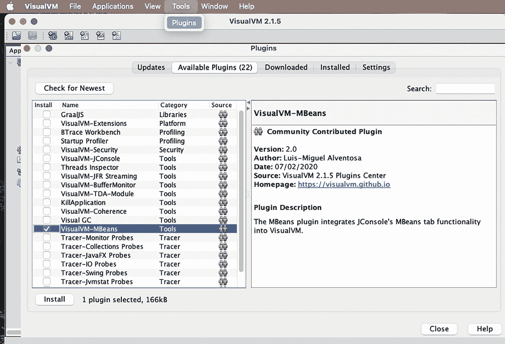
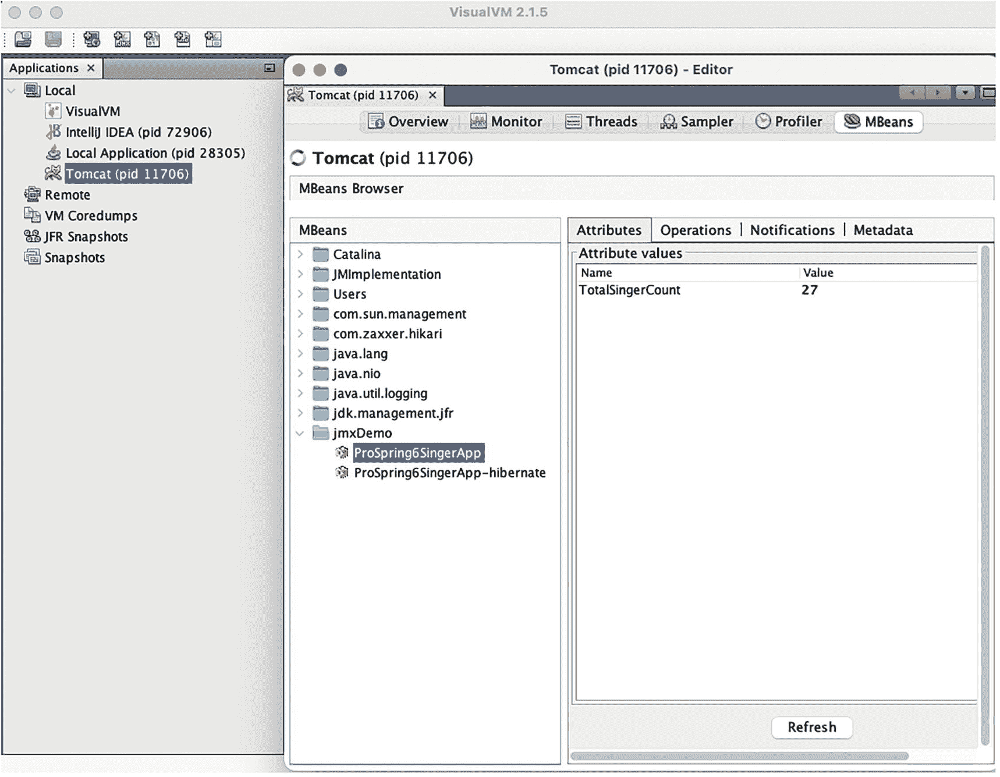
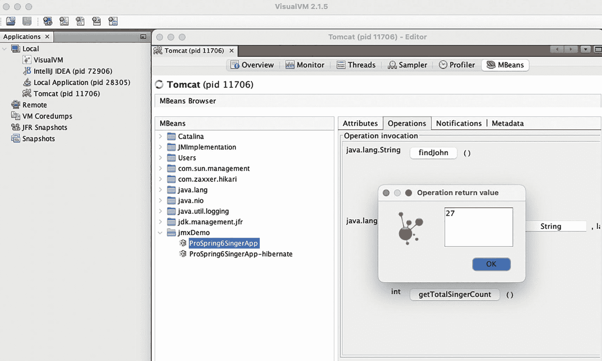
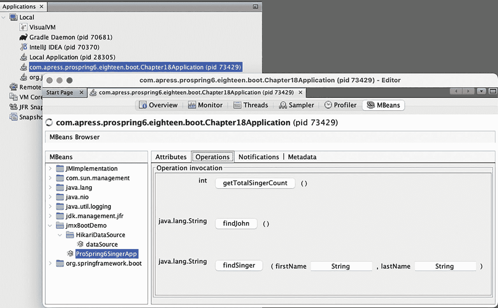
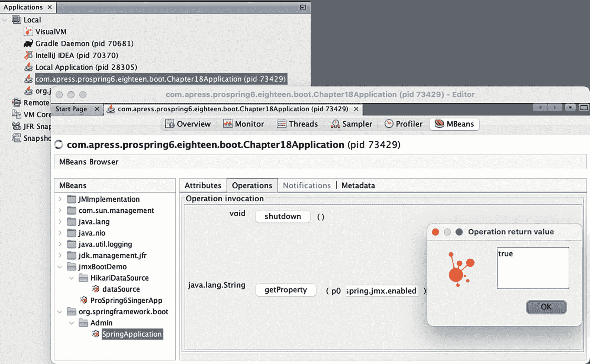
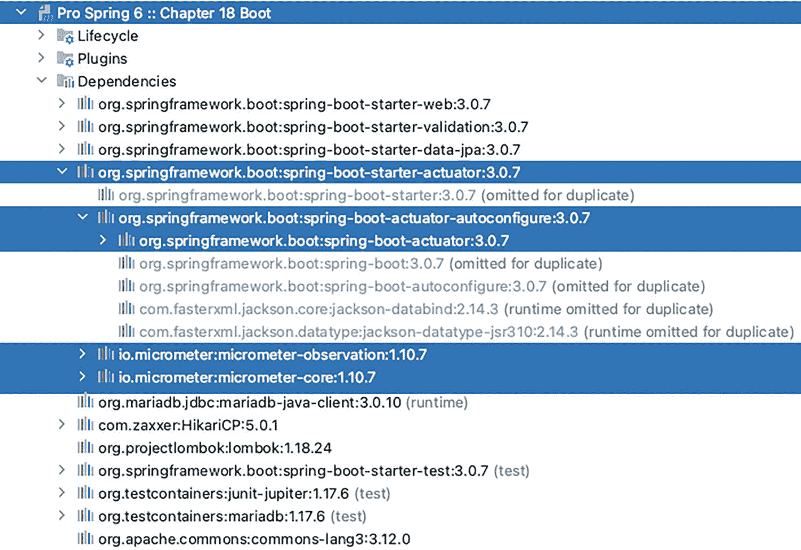
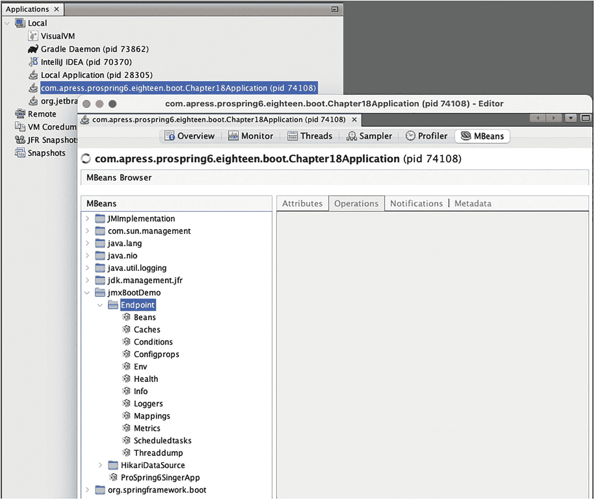
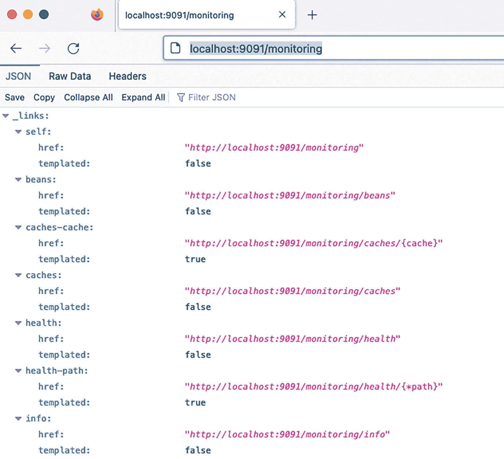
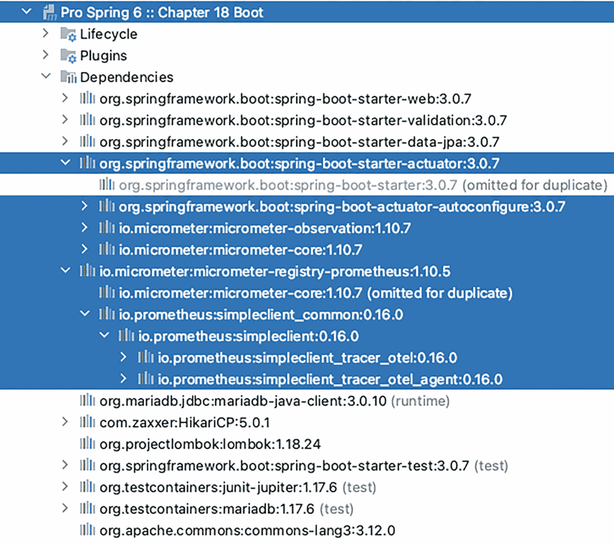

# 18. 监控 Spring 应用程序

一个典型的 JEE 应用程序包含许多层和组件，例如表示层、服务层、持久层和后端数据源。在开发阶段，或者在应用程序部署到质量保证（QA）或生产环境之后，我们希望确保应用程序处于健康状态，没有任何潜在问题或瓶颈。

在 Java 应用程序中，各种领域可能导致性能问题或使服务器资源（例如 CPU、内存或 I/O）过载。示例包括低效的 Java 代码、内存泄漏（例如，Java 代码不断分配新对象而不释放引用，阻止底层 JVM 在垃圾回收过程中释放内存）、计算错误的 JVM 参数、计算错误的线程池参数、过于慷慨的数据源配置（例如，允许过多的并发数据库连接）、不正确的数据库设置以及长时间运行的 SQL 查询。

因此，我们需要了解应用程序的运行时行为，并识别是否存在任何潜在的瓶颈或问题。在 Java 世界中，有许多工具可以帮助监控 JEE 应用程序的详细运行时行为。它们中的大多数都建立在 Java 管理扩展（JMX）技术之上。

在本章中，我们将介绍监控基于 Spring 的 JEE 应用程序的常用技术。具体来说，本章涵盖以下主题：

*   *Spring 对 JMX 的支持*：我们讨论 Spring 对 JMX 的全面支持，并演示如何使用 JMX 工具公开 Spring bean 以进行监控。在本章中，我们将展示如何使用 `VisualVM`^(¹⁸¹) 作为应用程序监控工具。

*   *监控 Hibernate 统计信息*：Hibernate 和许多其他包提供了支持类和基础设施，用于使用 JMX 公开操作状态和性能指标。我们展示如何在基于 Spring 的 JEE 应用程序中启用对这些常用组件的 JMX 监控。

*   *Spring Boot JMX 支持*：Spring Boot 提供了一个用于 JMX 支持的启动器库，该库开箱即用，带有完整的默认配置。这个库叫做 Actuator，主要用于公开运行中应用程序的操作信息——健康、指标、信息、转储、环境等。它使用 HTTP 端点或 JMX bean 使我们能够与之交互。Spring Boot Actuator 是本章的重点。

请记住，本章并非旨在介绍 JMX，并且假定您对 JMX 有基本的了解。有关详细信息，请参考 Oracle 的在线资源^(¹⁸²)。

## Spring 中的 JMX 支持

在 JMX 中，为 JMX 监控和管理而公开的类称为*托管 bean*（通常称为 *MBean*）。Spring 框架支持多种公开 MBean 的机制。本章重点介绍将 Spring bean（作为简单 POJO 开发）作为 MBean 公开以进行 JMX 监控。

在以下部分中，我们讨论将包含应用程序相关统计信息的 bean 作为 MBean 公开以进行 JMX 监控的过程。主题包括实现 Spring bean、在 Spring `ApplicationContext` 中将 Spring bean 作为 MBean 公开，以及使用 VisualVM 监控 MBean。

### 将 Spring Bean 导出到 JMX

作为示例，我们将使用**第** **15** **章**中的 REST 示例。请回顾该章节以获取示例应用程序代码，或直接跳转到本书的配套源代码，该代码提供了我们将要构建的源代码。

为了有趣，让我们通过 JMX 公开一些属性值和方法，并通过一个名为 `AppStatistics` 的接口声明它们，如清单 18-1 所示。

```
package com.apress.prospring6.eighteen.audit;
public interface AppStatistics {
int getTotalSingerCount();
String findJohn();
String findSinger(String firstName, String lastName);
}
清单 18-1
AppStatistics 接口
```

`AppStatistics` 接口的实现是一个名为 `AppStatisticsImpl` 的类，由于这个类是通过 JMX 公开属性和操作的类，我们需要添加适当的注解。`AppStatisticsImpl` 类如清单 18-2 所示。

```
package com.apress.prospring6.eighteen.audit;
import org.springframework.jmx.export.annotation.*;
// other import statements omitted
@Component
@ManagedResource(description = "JMX managed resource",
objectName = "jmxDemo:name=ProSpring6SingerApp")
public class AppStatisticsImpl implements AppStatistics{
private final SingerService singerService;
public AppStatisticsImpl(SingerService singerService) {
this.singerService = singerService;
}
@ManagedAttribute(description = "Number of singers in the application")
@Override
public int getTotalSingerCount() {
return singerService.findAll().size();
}
@ManagedOperation
public String findJohn() {
List singers = singerService.findByFirstNameAndLastName("John", "Mayer");
if (!singers.isEmpty()) {
return singers.get(0).getFirstName() + " " + singers.get(0).getLastName() + " " + singers.get(0).getBirthDate();
}
return "not found";
}
@ManagedOperation(description="Find Singer by first name and last name")
@ManagedOperationParameters({
@ManagedOperationParameter(name = "firstName", description = "Singer's first name"),
@ManagedOperationParameter(name = "lastName", description = "Singer's last name")})
public String findSinger(String firstName, String lastName) {
List singers = singerService.findByFirstNameAndLastName(firstName, lastName);
if (!singers.isEmpty()) {
return singers.get(0).getFirstName() + " " + singers.get(0).getLastName() + " " + singers.get(0).getBirthDate();
}
return "not found";
}
}
清单 18-2
AppStatisticsImpl 类
```

在此示例中，`@ManagedResource` 注解有一个名为 `objectName` 的属性，其值表示 MBean 的域和名称。`@ManagedAttribute` 注解用于将给定的 bean 属性公开为 JMX 属性。`@ManagedOperation` 用于将给定的方法公开为 JMX 操作。在此示例中，定义了一些方法来访问数据库数据和属性，例如 `SINGER` 表中的记录数。

要将 Spring bean 公开为 JMX，我们需要在 Spring 的 `ApplicationContext` 中添加配置。这是通过使用 `@EnableMBeanExport` 注解配置类来完成的。此注解启用从 Spring 上下文默认导出所有标准 MBean，以及所有带有 `@ManagedResource` 注解的 bean。基本上，此注解告诉 Spring 创建一个名为 `mbeanExporter` 的 `MBeanExporter` bean。为了保持范围整洁，我们添加一个名为 `MonitoringCfg` 的新类，并在其上添加 `@EnableMBeanExport` 注解。此类如清单 18-3 所示。

```
package com.apress.prospring6.eighteen;
import org.springframework.context.annotation.Configuration;
import org.springframework.context.annotation.EnableMBeanExport;
import org.springframework.jmx.support.RegistrationPolicy;
@EnableMBeanExport(registration = RegistrationPolicy.REPLACE_EXISTING)
@Configuration
public class MonitoringCfg {
}
清单 18-3
MonitoringCfg 配置类
```

`@EnableMBeanExport` 注解负责将 Spring bean 注册到 JMX MBean 服务器（一个实现 JDK 的 `javax.management.MbeanServer` 接口的服务器，该接口存在于最常用的 Web 和 JEE 容器中，例如 Apache Tomcat 和 WebSphere）。当将 Spring bean 作为 MBean 公开时，Spring 将尝试在服务器中定位一个正在运行的 `MbeanServer` 实例，并将 Mbean 注册到其中。我们可以控制当 MBean 注册到 `MbeanServer` 实例时发生的情况。Spring 的 JMX 支持允许在注册过程发现 MBean 已在同一 `ObjectName` 下注册时，有三种不同的注册行为：

*   `FAIL_ON_EXISTING`：MBean 不注册，并抛出 `InstanceAlreadyExistsException` 异常。

*   `IGNORE_EXISTING`：MBean 不注册。现有的 MBean 不受影响，并且不会抛出异常。

*   `REPLACE_EXISTING`：MBean 被注册，覆盖已注册的 MBean。

如果未显式配置，注册策略默认为 `FAIL_ON_EXISTING`。

使用 Apache Tomcat，`MBeanServer` 实例将自动创建，因此无需额外配置。默认情况下，bean 的所有公共属性都作为属性公开，所有公共方法都作为操作公开。

现在 MBean 可用于通过 JMX 进行监控。让我们继续设置 VisualVM 并使用其 JMX 客户端进行监控。

### 使用 VisualVM 进行 JMX 监控

VisualVM 是一个有用的（免费）工具，可以帮助在各个方面监控 Java 应用程序。它曾经位于 JDK 安装文件夹的 `bin` 文件夹下，但由于它已从较新版本的 JDK 中移除，您可以从项目网站^(¹⁸³) 下载独立版本。

VisualVM 使用插件系统来支持各种监控功能。为了支持监控 Java 应用程序的 MBean，我们需要安装 MBeans 插件。要安装该插件，请按照以下步骤操作：



Visual V M 的截图，菜单的工具下选择插件。左侧面板列出了 22 个可用插件，其中选择了 Visual V M M-beans，右侧面板显示其描述。底部有安装按钮。

图 18-1

选择安装 VisualVM-MBeans 插件

1.  从 VisualVM 的菜单中，选择工具 ➤ 插件以打开图 18-1 所示的插件对话框。

2.  单击“可用插件”选项卡。

3.  单击“检查最新”按钮。

4.  选择插件 `VisualVM-MBeans`，然后单击“安装”按钮。

完成 `VisualVM-MBeans` 插件的安装后，验证 Apache Tomcat 是否已启动并且示例应用程序是否正在运行。

默认情况下，VisualVM 会扫描在 JDK 平台上运行的 Java 应用程序。双击所需的节点会调出监控屏幕。在“应用程序”窗格中双击 Tomcat 节点。安装 `VisualVM-MBeans` 插件后，MBeans 选项卡可用。单击此选项卡会显示可用的 MBean。您应该会看到一个名为 `jmxDemo` 的节点。展开它时，会显示通过清单 18-1 中的配置公开的 `Prospring6SingerApp` MBean。在右侧的“属性”选项卡上，您会看到对于我们在 bean 中实现的方法，一个名为 `TotalSingerCount` 的属性是从 `getTotalSingerCount`() 方法自动派生的。该值应与 `SINGER` 表中的歌手数量相同，如图 18-2 所示。



Visual V M 2.1.5 的截图，在应用程序本地下选择了 tomcat。tomcat, p i d 11706 编辑器窗口已打开，并且在 M beans 下突出显示了 pro spring 6 singer app 选项。总歌手计数的属性值为 27。

图 18-2

在 VisualVM 中公开的 `Prospring6SingerApp` MBean

在常规应用程序中，此数字会根据应用程序运行期间添加的歌手数量而变化。为了测试 MBean 如何反映表中的变化，我们可以使用重复测试方法来创建一定数量的歌手。清单 18-4 展示了 `RestClientTest` 类，其中包含一个创建十个歌手的方法和一个删除它们的方法。

```
package com.apress.prospring6.eighteen;
import org.junit.jupiter.api.RepeatedTest;
// other import statements omitted
public class RestClientTest {
final Logger LOGGER = LoggerFactory.getLogger(RestClientTest.class);
private static final String URI_SINGER_ROOT = "http://localhost:8080/ch18/singer/";
private static final String URI_SINGER_WITH_ID = "http://localhost:8080/ch18/singer/{id}";
RestTemplate restTemplate = new RestTemplate();
@RepeatedTest(10)
@Test
public void testCreate() {
LOGGER.info("--> Testing create singer");
Singer singerNew = new Singer();
singerNew.setFirstName("TEST" + System.currentTimeMillis());
singerNew.setLastName("Singer" + System.currentTimeMillis());
singerNew.setBirthDate(LocalDate.now());
singerNew = restTemplate.postForObject(URI_SINGER_ROOT, singerNew, Singer.class);
LOGGER.info("Singer created successfully: " + singerNew);
}
@Test
public void testDelete() {
LOGGER.info("--> Deleting singers with id > 15");
for (int i = 16; i < 70; i++) {
try {
restTemplate.delete(URI_SINGER_WITH_ID, i);
} catch (Exception e) {
// no need to treat
}
}
}
}
清单 18-4
RestClientTest 类
```

要查看 MBean 值的变化，请运行 `testCreate()` 方法，然后单击“刷新”按钮。您还可以通过转到“操作”选项卡并单击标有方法名称的按钮来检索当前歌手数量：`getTotalSingerCount()`。会显示一个包含操作返回值的弹出窗口，如图 18-3 所示。



Visual V M 2.1.5 的截图。一个 tomcat 编辑器窗口已打开，并且在 M beans 下突出显示了 pro spring 6 singer app 选项。在操作调用中，操作返回值为 27。

图 18-3

MBean `getTotalSingerCount()` 操作的结果

请随意尝试其他公开的操作：`findJohn()` 和 `findSinger({"John", "Mayer")`。

### 监控 Hibernate 统计信息

Hibernate 也支持维护和向 JMX 公开与持久化相关的指标。要启用此功能，我们需要在 JPA 配置中设置一些 Hibernate 属性，如清单 18-5 所示。

```
package com.apress.prospring6.eighteen;
import org.hibernate.cfg.Environment;
// other import statements omitted
@Import(BasicDataSourceCfg.class)
@Configuration
@EnableJpaRepositories(basePackages = {"com.apress.prospring6.eighteen.repos"})
@EnableTransactionManagement
@ComponentScan(basePackages = {"com.apress.prospring6.eighteen.repos"})
public class TransactionCfg {
// other configurations omitted
@Bean
public LocalContainerEntityManagerFactoryBean entityManagerFactory() {
var factory = new LocalContainerEntityManagerFactoryBean();
factory.setPersistenceProviderClass(HibernatePersistenceProvider.class);
factory.setPackagesToScan("com.apress.prospring6.eighteen.entities");
factory.setDataSource(dataSource);
factory.setJpaProperties(jpaProperties());
factory.setJpaVendorAdapter(jpaVendorAdapter());
return factory;
}
@Bean
public Properties jpaProperties() {
Properties jpaProps = new Properties();
jpaProps.put(Environment.HBM2DDL_AUTO, "none");
jpaProps.put(Environment.FORMAT_SQL, false);
jpaProps.put(Environment.STATEMENT_BATCH_SIZE, 30);
jpaProps.put(Environment.USE_SQL_COMMENTS, false);
jpaProps.put(Environment.GENERATE_STATISTICS, true);
jpaProps.put("hibernate.jmx.enabled", true);
jpaProps.put("hibernate.jmx.usePlatformServer", true);
jpaProps.put(Environment.SESSION_FACTORY_NAME, "sessionFactory");
return jpaProps;
}
}
清单 18-5
启用统计信息的 Hibernate 配置类
```

属性 `hibernate.jmx.enabled` 和 `hibernate.jmx.usePlatformServer` 用于通过 JMX 公开 Hibernate 指标。属性 `hibernate.generate_statistics` 指示 Hibernate 为其 JPA 持久化提供程序生成统计信息，而属性 `hibernate.session_factory_name` (`Environment.SESSION_FACTORY_NAME`) 定义了 Hibernate 统计信息 MBean 所需的会话工厂名称。

最后，我们需要声明一个 Spring bean 并将其配置为 MBean，以公开所有 Hibernate 统计信息和指标。清单 18-6 展示了一个名为 `CustomHibernateStatistics` 的类的片段，该类公开了 Hibernate 统计信息和指标。

```
package com.apress.prospring6.eighteen.audit;
import org.hibernate.SessionFactory;
import org.hibernate.stat.*;
import org.springframework.jmx.export.annotation.*;
// other import statements omitted
@Component
@ManagedResource(description = "JMX managed resource",
objectName = "jmxDemo:name=ProSpring6SingerApp-hibernate")
public class CustomHibernateStatistics {
private final SessionFactory sessionFactory;
public CustomHibernateStatistics(SessionFactory sessionFactory) {
this.sessionFactory = sessionFactory;
}
private Statistics stats;
@PostConstruct
private void init() {
stats = sessionFactory.getStatistics();
}
@ManagedOperation(description="Get statistics for entity name")
@ManagedOperationParameter(name = "entityName", description = "Full class name for the entity")
public EntityStatistics getEntityStatistics(String entityName) {
return stats.getEntityStatistics(entityName);
}
@ManagedAttribute
public long getEntityDeleteCount() {
return stats.getEntityDeleteCount();
}
@ManagedAttribute
public long getEntityInsertCount() {
return stats.getEntityInsertCount();
}
@ManagedAttribute
public String[] getEntityNames() {
return stats.getEntityNames();
}
@ManagedAttribute
public String[] getQueries() {
return stats.getQueries();
}
@ManagedAttribute
public long getTransactionCount() {
return stats.getTransactionCount();
}
@ManagedAttribute
public long getPrepareStatementCount(){
return stats.getPrepareStatementCount();
}
// other methods omitted
}
清单 18-6
MonitoringCfg 声明一个 MBean 以公开 Hibernate 统计信息
```

现在 Hibernate 统计信息已启用并可通过 JMX 获得，重新加载应用程序并刷新 VisualVM；您将能够看到 Hibernate 统计信息 MBean。单击该节点会在右侧显示详细统计信息。请注意，对于非 Java 原始类型的信息（例如，`List`），您可以单击该字段以展开并显示内容。

在 VisualVM 中，您可以看到许多其他指标，例如 `EntityNames`、`EntityInsertCount`、`Queries`、`PrepareStatementCount` 和 `TransactionCount`。这些指标对于了解应用程序中的持久化行为非常有用，并且可以帮助您进行故障排除和性能调优练习。

如果您再次运行 `testCreate()` 方法，您会注意到值发生了变化。创建歌手需要 Hibernate 持久化实例，因此您会看到 `TransactionCount`、`PrepareStatementCount`、`EntityInsertCount` 以及其他一些值的增加。

## 使用 Spring Boot 的 JMX

将之前的应用程序迁移到 Spring Boot 很容易，并且依赖项是提供并自动配置的。对于 JMX，不需要启动器依赖项，但要启用 JMX 以公开 MBean，我们需要将 `spring.jmx.enable=true` 属性添加到配置中。为了使此应用程序与上一节保持一致，我们还添加了 `spring.jmx.default-domain=jmxBootDemo`，将域名从 `bean` 更改为 `jmxBootDemo`，以便轻松识别我们的 MBean 所在的位置。

本节中的应用程序与**第** **15** **章**中的 Spring Boot Web REST 应用程序相同。将 `spring.jmx.enable=true` 属性添加到配置后，`org.springframework.boot.autoconfigure.jmx.JmxAutoConfiguration` 类被添加到应用程序中，该类声明了一个 bean ID 为 `mbeanServer` 的 `MBeanServer`，并公开任何使用 Spring JMX 注解进行注解的 bean。

默认情况下，Spring Boot 会将管理端点作为 JMX MBean 公开在 `org.springframework.boot` 域下。`AppStatisticsImpl` 类与上一节中介绍的相同。由于 Spring Boot 公开所有 JMX MBean，如果类路径中的任何库包含它们，它们将在 `jmxDemo` 域下可用。现在，如果您打开 VisualVM 并访问 `Chapter18Application` 节点，您应该在 MBeans 选项卡中看到 `jmxBootDemo` 域包含 `HikariDataSource` MBean，如图 18-4 所示。



Visual V M 2.1.5 中第 18 章应用程序的截图。左侧面板的 M Beans 选项卡中，j m x Boot Demo 域具有 Hikari 数据源，并且突出显示了 pro spring 6 singer app。右侧面板显示了操作调用。

图 18-4

在 `chapter18-boot` 项目中声明的 `ProSpring6SingerApp` MBean 的操作

请注意，MBeans 选项卡中还有一个 `org.springframework.boot` 域。此域下没有太多内容，除了作为 JMX Bean 公开的管理端点。在像这样的简单应用程序中，没有太多可用的属性和操作。如果您愿意，可以通过使用属性名称（例如 `spring.jmx.enabled`）调用 `getProperty(..)` 操作来检查 Spring Boot 属性的值，如图 18-5 所示。



Visual V M 2.1.5 中第 18 章应用程序的截图。左侧面板的 M Beans 选项卡中，在 org dot spring framework dot boot 域下的 admin 中突出显示了 spring application。在操作调用中，操作返回值为 true。

图 18-5

使用 `getProperty(..)` 操作检查 `spring.jmx.enabled` 属性的值

看起来 Spring Boot 并没有带来太多额外的东西，但是当 Spring Boot Actuator 被添加到应用程序中时，情况就变了。

## 使用 Spring Boot Actuator 监控应用程序

Spring Boot 提供了额外的功能，用于通过 JMX 监控应用程序。一旦 `spring-boot-actuator.jar` 位于类路径上，审计、健康和指标收集就会自动应用于应用程序。`spring-boot-actuator` 模块提供了一系列生产就绪的功能。推荐的方式是将 `spring-boot-starter-actuator` 添加到类路径中。图 18-6 展示了 `chapter18-boot` 项目的依赖项，其中展开了 `spring-boot-starter-actuator` 以查看所有传递依赖项。



一个截图展示了第 18 章 boot 的依赖项。spring boot starter actuator 3.0.5 已展开，并突出显示了 i o micrometer core and observation，以及 actuator auto configure with actuator 3.0.5。

图 18-6

项目 `chapter18-boot` 依赖项

Spring 参考文档将 actuator 定义如下：“Actuator 是一个制造术语，指的是用于移动或控制某物的机械装置。Actuator 可以从微小的变化中产生大量的运动。”^(¹⁸⁴)

### Spring Boot Actuator 端点

Spring Boot Actuator 向应用程序添加了一组端点，用于监控和与应用程序交互。通过配置，我们可以通过 JMX 或 HTTP 公开这些端点，并且我们还可以决定是公开所有端点还是仅公开其中一部分。清单 18-7 中的配置是 `application.yaml` Spring Boot 配置文件的一部分，并启用在 `jmxBootDemo` 域下通过 JMX 公开所有 Actuator 端点。

```
management:
endpoints:
jmx:
domain: jmxBootDemo
exposure:
include: "*"
清单 18-7
配置以在 jmxBootDemo 域下通过 JMX 公开所有 Actuator 端点
```

使用此配置，当重新启动应用程序并将 VisualVM 连接到它时，会在 `jmxBootDemo` 域下添加一个 MBean 列表，分组在 `Endpoint` 节点下，如图 18-7 所示。



Visual V M 2.1.5 的截图。一个编辑器窗口已打开，并且在 j m x boot demo 域下的 M beans 中突出显示了 endpoint 选项。Endpoint 有一个包含 12 个 M Bean 的列表，例如 beans、caches、conditions、config props、env、health、info. loggers、metrics、scheduled tasks 和 thread dump。

图 18-7

VisualVM 中显示的 Spring Boot Actuator JMX 端点

表 18-1 列出了 Spring Boot Actuator JMX 端点，并简要说明了它们公开的操作。

表 18-1

Spring Boot Actuator JMX 端点

| 端点 | 描述 |
| --- | --- |
| Beans | 操作 `beans()` 列出应用程序中所有 Spring bean 的完整列表。 |
| Caches | 公开列出和清除现有缓存的操作。 |
| Conditions | 操作 `conditions()` 列出为 Spring Boot 应用程序配置评估的条件。 |
| Configprops | 公开检索配置属性汇总列表的操作。 |
| Env | 公开列出 Spring 的 `ConfigurableEnvironment` 中属性的操作。 |
| Health | 操作 `health()` 列出应用程序健康信息。 |
| Info | 操作 `info()` 列出任意应用程序信息。 |
| Loggers | 公开显示和修改应用程序中日志记录器配置的操作。 |
| Mappings | 操作 `mappings()` 列出所有 `@RequestMapping` 路径。有趣的是，此列表包括 Actuator HTTP 端点。 |
| Metrics | 操作 `listNames()` 列出为应用程序配置的所有指标。 |
| Scheduledtasks | 操作 `scheduledTasks()` 列出应用程序中的所有计划任务。 |
| Threaddump | 公开执行线程转储的操作。 |

如果您单击并尝试在 VisualVM UI 中调用操作，您可能已经意识到 JMX 端点使用起来很繁琐。好消息是，Spring Boot Actuator 也通过 HTTP 公开这些端点以及更多端点，默认情况下都分组在 `/actuator` 路径下。端点分组的路径和端口可以通过配置进行自定义。

清单 18-8 显示了将所有 Actuator 端点通过 HTTP 公开在 `/monitoring` 路径下并监听端口 9091 的配置。

```
management:
endpoints:
web:
exposure:
include: "*"
base-path: /monitoring
server:
port: 9091
清单 18-8
配置以通过 HTTP 公开所有 Actuator 端点
```

要检查此配置的结果，只需在浏览器中打开 `http://localhost:9091/monitoring`。响应格式是 JSON，包含一个端点列表。其中一些与之前介绍的 JMX 端点匹配，而另一些则是特定于 Web 的端点。在像 Firefox 这样能很好显示 JSON 的浏览器中，此页面看起来像图 18-8 中描绘的那样。



本地主机 9091 监控的截图。主菜单有 3 个选项：J SON、原始数据和标头。J SON 下有一个包含 7 个链接的列表，其中包含 h ref 和 templated 的详细信息。

图 18-8

Spring Boot Actuator HTTP 端点

例如，`/health` 端点公开有关应用程序健康的基本信息。默认情况下，它只返回 `{"status":"UP"}——`是的，非常基本。要查看更多详细信息，必须将属性 `management.endpoint.health.show``-details` 设置为 `always`，在 Spring Boot 配置文件 `application.yml` 或 `applications.properties` 文件中。设置此属性后，将提供有关所用数据库及其状态的详细信息，以及有关磁盘空间的详细信息。（Iuliana）清单 18-9 显示了我在本地运行应用程序时在 `/health` 页面上看到的内容。

```
{
"status":"UP",
"components":{
"db":{
"status":"UP",
"details":{
"database":"MariaDB",
"validationQuery":"isValid()"
}
},
"diskSpace":{
"status":"UP",
"details":{
"total":499963174912,
"free":320641298432,
"threshold":10485760,
"path":"/workspace/pro-spring-6/.",
"exists":true
}
},
"ping":{
"status":"UP"
}
}
}
清单 18-9
/health 页面内容示例

大多数端点是敏感的，默认情况下不公开，因此如果应用程序是安全的，它们公开的大部分信息将被省略。所有端点分组在 `/actuator` 下是在 Spring Boot 2.x 中引入的。在之前的版本中，每个可用的端点都直接暴露在应用程序上下文下，因此 `/health` 端点暴露在 `http://localhost:8081/health` 下。

在此配置中，`/actuator` 路径通过 Spring Boot 配置重命名为 `/monitoring`。任何端点都可以这样做；例如，通过配置，我们可以通过将 `management.endpoints.web.path-mapping.health` 设置为该值来将 `/health` 端点重命名为 `/salud`。

如果出于安全原因，我们希望这些端点只能在内部访问，我们可以通过将 `management.server.address` 属性设置为 `127.0.0.1` 来配置 IP 地址。

另一个简单的端点是 `/info` 端点。此端点显示有关项目的常规信息，这些信息从 `META-INF/build-info.properties`（在构建时生成）或 Git 文件（如 `git.properties`）（如果为此配置了插件，则生成）读取，或者通过 `info` 键下的任何环境属性读取。此端点公开的信息可以使用 Spring Boot 配置文件进行配置。默认情况下，正如预期的那样，访问此端点会显示 JSON 等效的空值 `{}`。将清单 18-10 中所示的属性添加到配置文件会使此端点更有用一些。

```
management:
info:
java:
enabled: true # enable Java info
env:
enabled: true # enable environment info -  from 'application.yml' file
info:
app:
name: chapter18-boot
description: "Pro Spring 6 - Chapter 18 :: Spring Actuator Application"
version: 6.0-SNAPSHOT
author: "Iuliana Cosmina"
清单 18-10
/info 端点的 Spring Boot 配置
```

当访问 `/info` 端点时，会返回清单 18-11 中的文本。

```
{
"app":{
"name":"chapter18-boot",
"description":"Pro Spring 6 - Chapter 18 :: Spring Actuator Application",
"version":"6.0-SNAPSHOT"
},
"author":"Iuliana Cosmina",
"build":{
"artifact":"chapter18-boot",
"name":"chapter18-boot",
"time":"2023-03-25T00:32:55.002Z",
"version":"6.0-SNAPSHOT",
"group":"pro-spring-6"
},
"java":{
"version":"19.0.1",
"vendor":{
"name":"Amazon.com Inc.",
"version":"Corretto-19.0.1.10.1"
},
"runtime":{
"name":"OpenJDK Runtime Environment",
"version":"19.0.1+10-FR"
},
"jvm":{
"name":"OpenJDK 64-Bit Server VM",
"vendor":"Amazon.com Inc.",
"version":"19.0.1+10-FR"
}
}
}
清单 18-11
/info 端点公开的信息

其他端点的内容也可以自定义，不仅可以通过 Spring Boot 配置属性，还可以通过实现接口或扩展 `org.springframework.boot.actuate` 包中的特定类来实现。例如，`org.springframework.boot.actuate.health.HealthIndicator` 的自定义实现可以向 `/health` 端点添加额外信息。

正如预期的那样，Spring Boot Actuator 提供了创建您自己的端点的选项。这是通过使用 `org.springframework.boot.actuate.endpoint.annotation` 包中的 `@Endpoint` 注解一个 bean 来完成的。使用 `@ReadOperation`（处理 GET 请求）、`@WriteOperation`（处理 POST 请求）和 `@DeleteOperation`（处理 DELETE 请求）注解其方法，可以通过 JMX 和 HTTP 公开它们。

一个警告。 在本书中，提到了一些端点支持过滤，因为它们显示的数据可以通过将组件名称作为后缀添加到其 URI 来减少。根据端点的不同，这些值可以是 bean 名称、完全限定类名、属性名称等。您可能会将它们视为路径变量或过滤器，但 Spring 团队更喜欢称它们为*标签*。

Spring Boot Actuator 非常强大且高度可定制。要了解更多信息，请查看官方文档^(¹⁸⁵)。

### 将 Spring Boot Actuator 与 Micrometer 结合使用

在图 18-6（本章前面部分）中，`spring-boot-starter-actuator` 库显示了两个传递依赖项：`micrometer-core` 和 `micrometer-observation`。Micrometer^(¹⁸⁶) 是一个开源指标门面，它提供了一个供应商中立的指标收集 API（父抽象实现是 `io.micrometer.core.instrument.MeterRegistry`^(¹⁸⁷)) 以及针对本章开头提到的各种监控系统的实现。它可以与 Spring Boot Actuator 一起使用，但它是一个独立的平台，可以单独使用。

如果您觉得 Micrometer 难以理解，可以将其视为 SLF4J，它是各种日志记录框架的门面或抽象。这意味着开发人员可以使用 SLF4J 编写日志消息，这些消息将由应用程序配置的框架收集并写入所需的支持。在本书中，SLF4J 与 Logback Classic 一起使用，但我们可以轻松地将 Logback Classic 替换为 Log4j2，而无需更改任何代码。从 Spring Boot Actuator 2.x 开始，您可以为指标做同样的事情——Micrometer 可用于收集指标并以任何（几乎）高级监控系统可以解释的格式公开它们。Spring Boot 3 开箱即用地自动配置了相当长的指标列表。此列表由对 `http://0.0.0.0:9091/monitoring/metrics` 端点的 GET 请求返回（如上一节所配置）。清单 18-12 列出了这些指标的名称。

```
{
"names":[
"application.ready.time",
"application.started.time",
"disk.free",
"disk.total",
"executor.active",
"executor.completed",
"executor.pool.core",
"executor.pool.max",
"executor.pool.size",
"executor.queue.remaining",
"executor.queued",
"hikaricp.connections",
"hikaricp.connections.acquire",
"hikaricp.connections.active",
"hikaricp.connections.creation",
"hikaricp.connections.idle",
"hikaricp.connections.max",
"hikaricp.connections.min",
"hikaricp.connections.pending",
"hikaricp.connections.timeout",
"hikaricp.connections.usage",
"jdbc.connections.active",
"jdbc.connections.idle",
"jdbc.connections.max",
"jdbc.connections.min",
"jvm.buffer.count",
"jvm.buffer.memory.used",
"jvm.buffer.total.capacity",
"jvm.classes.loaded",
"jvm.classes.unloaded",
"jvm.compilation.time",
"jvm.gc.live.data.size",
"jvm.gc.max.data.size",
"jvm.gc.memory.allocated",
"jvm.gc.memory.promoted",
"jvm.gc.overhead",
"jvm.info",
"jvm.memory.committed",
"jvm.memory.max",
"jvm.memory.usage.after.gc",
"jvm.memory.used",
"jvm.threads.daemon",
"jvm.threads.live",
"jvm.threads.peak",
"jvm.threads.states",
"logback.events",
"process.cpu.usage",
"process.files.max",
"process.files.open",
"process.start.time",
"process.uptime",
"system.cpu.count",
"system.cpu.usage",
"system.load.average.1m",
"tomcat.sessions.active.current",
"tomcat.sessions.active.max",
"tomcat.sessions.alive.max",
"tomcat.sessions.created",
"tomcat.sessions.expired",
"tomcat.sessions.rejected"
]
}
清单 18-12
/metrics 端点列出的 Spring Boot 指标

这些指标可以归为几类：

*   应用程序时间

*   运行时间

*   JVM——垃圾回收器活动、内存消耗、线程利用率、类数量等。

*   CPU 使用率

*   Spring 特定组件活动

*   缓存活动

*   数据源和 HikariCP 活动

*   Tomcat 使用情况

*   Spring MVC 和 WebFlux 请求延迟（仅适用于 Spring Boot MVC 和 WebFlux 应用程序）

*   其他自定义组件活动：`RestTemplate` 延迟、文件描述符使用情况、事件日志记录、RabbitMQ 或 ApacheMQ（如果使用）连接工厂等。

那么，当运行应用程序生成大量数据时，我们可以用它做什么呢？嗯，我们将其处理成可以用肉眼查看的报告和图表，进而可以用来预测未来的行为。Micrometer 无法帮助解决这个问题，但是有一个非常易于使用的工具可以做到这一点，并且与 Spring Boot Actuator 和 Micrometer 完美集成：Prometheus^(¹⁸⁸)。Prometheus 是一个在 SoundCloud 构建的开源系统监控和警报工具包。它于 2012 年发布，此后成为一个独立的开源项目，拥有庞大且活跃的开发者和用户社区。

要将我们的 Spring Boot 应用程序与 Prometheus 集成，我们需要添加 `micrometer-registry-prometheus` 依赖项。添加此依赖项后，它应该会出现在 IntelliJ IDEA Gradle 视图中，以及它的传递依赖项，如图 18-9 所示。



一个截图展示了第 18 章 boot 的依赖项。micrometer registry Prometheus 已展开，显示了所有传递依赖项。

图 18-9

Spring Boot Actuator 和 Prometheus 应用程序依赖项

添加依赖项并重新构建应用程序后，通过运行 `Chapter18Application` 主类启动 Spring Boot 应用程序。当打开 `http://localhost:9091/monitoring` URL 时，请注意 `prometheus` 端点，其 URL 为 `http://localhost:9091/monitoring/prometheus`。此端点由 `PrometheusScrapeEndpoint` 类提供，该类来自 `org.springframework.boot.actuate.metrics.export.prometheus` 包，是 Spring Boot Actuator 项目的一部分。此端点将 Micrometer 提供的指标转换为 Prometheus 服务器可以抓取的格式。您可以通过访问清单 18-13 中的 Prometheus 端点来查看公开指标的摘要。

```

```


# HELP hikaricp_connections_max 最大连接数

# TYPE hikaricp_connections_max gauge
hikaricp_connections_max{pool="HikariPool-1",} 25.0

# HELP jvm_threads_live_threads 当前活跃线程数，包括守护线程和非守护线程

# TYPE jvm_threads_live_threads gauge
jvm_threads_live_threads 39.0

# HELP http_server_requests_seconds

# TYPE http_server_requests_seconds summary
http_server_requests_seconds_count{error="none",exception="none",method="GET",outcome="SUCCESS",status="200",uri="/singer/{id}",} 100.0
http_server_requests_seconds_sum{error="none",exception="none",method="GET",outcome="SUCCESS",status="200",uri="/singer/{id}",} 1.069158702
http_server_requests_seconds_count{error="none",exception="none",method="POST",outcome="SUCCESS",status="201",uri="/singer/",} 1000.0
http_server_requests_seconds_sum{error="none",exception="none",method="POST",outcome="SUCCESS",status="201",uri="/singer/",} 6.119599968
http_server_requests_seconds_count{error="none",exception="none",method="GET",outcome="SUCCESS",status="200",uri="/singer/",} 100.0
http_server_requests_seconds_sum{error="none",exception="none",method="GET",outcome="SUCCESS",status="200",uri="/singer/",} 1.052652658
...
列表 18-13
在 `/prometheus` 端点列出的 Spring Boot 指标片段

下一步是运行 Prometheus 来绘制数据。为此，你需要按照官方页面^(¹⁸⁹)的说明安装 Prometheus。为了保持实用性，我们建议采用 Docker 方式，在容器中运行它。在 `chapter18-boot` 文件夹中，你会找到一个名为 `CHAPTER18-BOOT.adoc` 的文件，其中说明了如何在 Docker 容器中设置 Prometheus；此处将跳过这些步骤，以免偏离本章的重点。

一个知识小贴士。 在启动容器之前，请继续阅读本节，因为你需要通过一个配置文件告诉 Prometheus 指标来自何处。

Prometheus 的配置文件名为 `prometheus.yaml`。这个名称并非强制要求，但确实能使其用途一目了然。根据官方文档，我们需要定义一个任务（job），告诉 Prometheus 查询指标的频率以及从何处查询。其语法是 YAML，最重要的属性列在列表 18-14 中。

```
global:
scrape_interval:     15s # 默认每 15 秒抓取一次目标。

