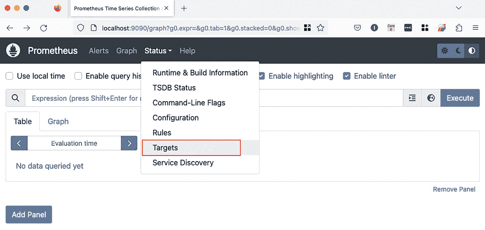
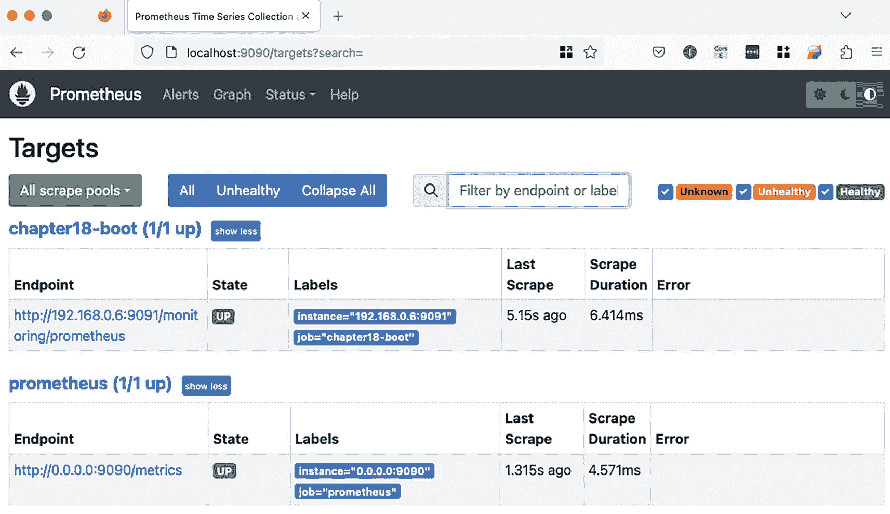
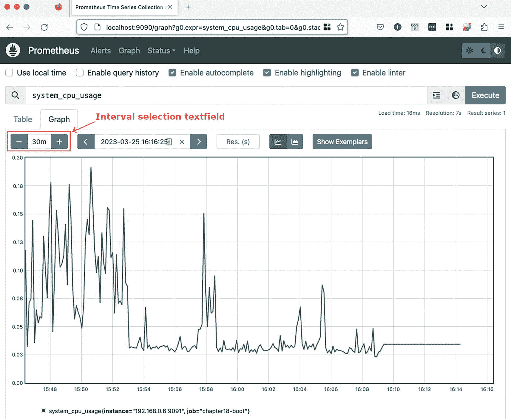
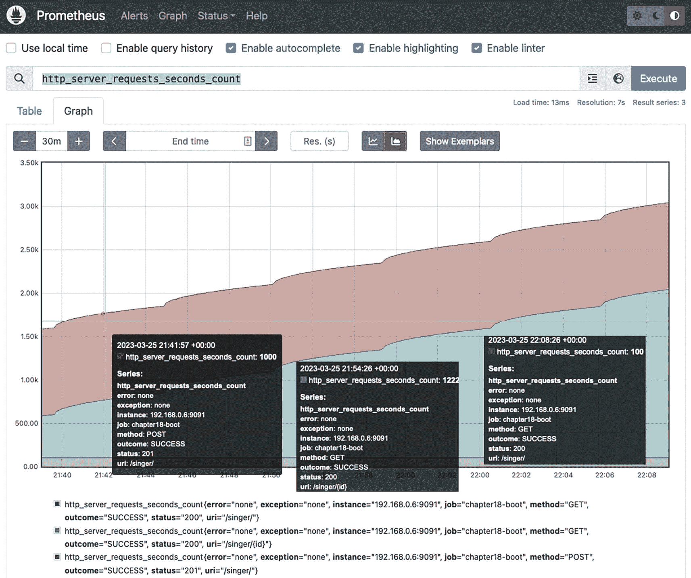

# 当 Prometheus 在 Docker 容器中运行时，必须使用网络内的真实 IP
- targets: ['192.168.0.6:9091']
列表 18-14
`prometheus.yaml` 文件的内容

请注意，对于 `chapter18-boot` 任务，`metrics_path` 属性被设置为 Prometheus Actuator 端点，而 `targets` 则设置为运行 `chapter18-boot` 应用程序的 IP 和端口。

在启动 Prometheus 容器之前，请先启动 `chapter18-boot` 应用程序。默认情况下，Prometheus Web 控制台可通过 `http://localhost:9090` 访问。在 `prometheus.yml` 文件中，名为 `prometheus` 的任务代表 Prometheus 应用程序自身的配置，并且可以自定义此任务的配置，以便在不同的 IP 和端口上启动 Prometheus。

Prometheus Web 用户界面相当简洁。本次讨论最感兴趣的选项是 **状态** ➤ **目标**，如图 18-10 所示。



Prometheus Web 用户界面的截图。主菜单有 4 个选项：警报、图形、状态和帮助。状态下的“目标”选项被高亮显示。

图 18-10
Prometheus Web 用户界面

选择“目标”菜单项会带你进入图 18-11 所示的页面，该页面确认 `chapter18-boot` 状态为 `UP`，并列出了任务配置以及指标最近一次刷新的时间。如果文本显示为 `DOWN` 并以红色高亮，则说明应用程序未启动，或者 `static_configs.targets` 未针对 `chapter18-boot` 任务正确设置。



Prometheus Web 用户界面的截图，显示目标窗口。Chapter 18 boot 和 Prometheus 有一个表格，表头包括端点、状态、标签、上次抓取时间、抓取持续时间和错误。

图 18-11
Prometheus Web 用户界面显示 `chapter18-boot` 和 Prometheus 应用程序正在运行

如果一切正常，你可以返回主页面并选择一个指标。最直观的指标之一是 `system_cpu_usage`，因此从指标列表中选择它，然后点击“执行”按钮。在“图形”选项卡中，信息并不明显，直到我们通过在第一个文本字段中设置一个合理的值（例如 15 或 30 分钟）来缩小指标分析的时间间隔。生成的图形应该会相当有趣，类似于图 18-12 所描绘的那样。



Prometheus Web 用户界面的截图。主菜单有 4 个选项：警报、图形、状态和帮助。图中展示了一个关于系统 CPU 使用率的尖峰图。

图 18-12
Prometheus Web 用户界面显示 `system_cpu_usage` 指标的图形

如前文列表 18-13 所示，有多个与请求数量相关的指标可用。为了模拟服务器处理请求时间变化的情况，以便我们能够看到 `http_server_requests_seconds_count` 的图形，我们可以修改 `SingerController`，为每个返回的 `Singer` 实例引入不同的延迟。当收到对 `http://localhost:9091/singer/{id}` URL 的 GET 请求时，会触发此操作。具体做法是在该 URI 的处理方法中添加一个 `Thread.sleep()`，该方法会根据记录 ID 随机暂停执行一段时间。该处理方法如列表 18-15 所示。


```
package com.apress.prospring6.eighteen.boot.controllers;
// 导入语句已省略
@RestController
@RequestMapping(value="/singer")
public class SingerController {
@GetMapping(path = "/{id}")
public Singer findSingerById(@PathVariable Long id) {
var singer = singerService.findById(id);
if (singer != null) {
int msec = 10;
try {
Thread.sleep(Duration.ofMillis(msec * id));
} catch (InterruptedException e) {
e.printStackTrace();
}
}
return singer;
}
// 其他方法和字段已省略
}
代码清单 18-15
针对请求路径 /singer{id} 且具有不同延迟的自定义处理器方法
```

现在，为了提交大量请求并产生大量数据，以便 Prometheus 能够在图表上绘制数据，代码清单 18-16 中的测试类提供了两个非常有用的方法。

```
package com.apress.prospring6.eighteen.boot;
// 导入语句已省略
public class SingerControllerTest {
private static String BASE_URL = "http://localhost:8081/singer/";
private RestTemplate restTemplate = new RestTemplate();
@RepeatedTest(500)
public void testCreate() throws URISyntaxException {
Singer singerNew = new Singer();
singerNew.setFirstName(UUID.randomUUID().toString().substring(0,8));
singerNew.setLastName(UUID.randomUUID().toString().substring(0,8));
singerNew.setBirthDate(LocalDate.now());
RequestEntity  req = new RequestEntity(singerNew, HttpMethod.POST, new URI(BASE_URL));
ResponseEntity response =  restTemplate.exchange(req, String.class);
assertEquals(HttpStatus.CREATED, response.getStatusCode());
}
@RepeatedTest(10)
public void testPositiveFindById() throws URISyntaxException {
HttpHeaders headers = new HttpHeaders();
headers.setAccept(List.of(MediaType.APPLICATION_JSON));
for (int i = 1; i  req = new RequestEntity(headers, HttpMethod.GET, new URI(BASE_URL + i));
ResponseEntity response =  restTemplate.exchange(req, Singer.class);
assertAll("testPositiveFindById",
() -> assertEquals(HttpStatus.OK, response.getStatusCode()),
() -> assertTrue(Objects.requireNonNull(response.getHeaders().get(HttpHeaders.CONTENT_TYPE)).contains(MediaType.APPLICATION_JSON_VALUE)),
() -> assertNotNull(response.getBody()),
() -> assertEquals(Singer.class, response.getBody().getClass())
);
}
}
}
代码清单 18-16
用于生成指标数据的测试方法
```

为了获得预期结果，请先运行 `testCreate()`，然后再运行 `testPositiveFindById()`。第二个测试的执行需要一些时间，但你可以前往 Prometheus 的 Web UI，为 `http_server_requests_seconds_count` 指标绘制图表，并时不时刷新页面，观察正在处理的请求数量如何随时间增长。

图 18-13 展示了为此项目生成的图表。请注意多个请求路径是如何按颜色分组的。Prometheus 有两种图表类型：堆叠图和非堆叠图；此图中的类型是堆叠图。



Prometheus Web 用户界面的屏幕截图。主菜单有四个选项：告警、图表、状态和帮助。图表区域展示了一个递增的面积图，对应的是 http_server_requests_seconds_count 指标。

图 18-13

Prometheus Web UI 展示了 `http_server_requests_seconds_count` 指标的图表

请注意，对 `/singer/` 的 GET 请求（底部绿色线条所示）的持续时间从未增加。而对 `/singer/` 的 POST 请求（红色线条所示）的持续时间随着数据表变大而增加。对 `/singer/{id}` 的 GET 请求（蓝色线条所示）的持续时间增长最为明显，因为这里正是 `Thread.sleep(..)` 所在的位置。

Prometheus 的图表相当简单，默认的 Micrometer 指标也很基础。在生产应用中，团队可以根据应用提供的服务定义自己的指标。例如，对于银行应用，登录失败与特定来源 IP 的组合可能揭示某种黑客攻击企图，因此一个必备的指标就是将失败的登录以及产生请求的 IP 类别进行分组。

目前，可视化指标的主流解决方案似乎是 Grafana^(¹⁹⁰)，好消息是它能够解析 Prometheus 指标。因此，Prometheus 指标可以转发给 Grafana，以绘制更高清晰度的图表。

## 本章小结

在本章中，我们涵盖了监控基于 Spring 的 JEE 应用的高级主题。首先，我们讨论了 Spring 对 JMX（监控 Java 应用的标准）的支持。我们讨论了如何实现自定义 MBean 来暴露应用相关信息，以及如何暴露 Hibernate 等通用组件的统计信息；并且展示了如何在 Spring Boot 应用中使用 JMX。

接着，我们展示了 Spring Boot Actuator 在生成应用指标方面的强大功能，以及如何使用 Prometheus 绘制这些指标。本书关于应用监控的内容就到此为止。下一章将向你介绍 WebSocket，这是一种允许 Web 客户端和 Web 服务器之间进行双向通信的协议。

脚注 1   2   3   4   5   6   7   8   9   10

