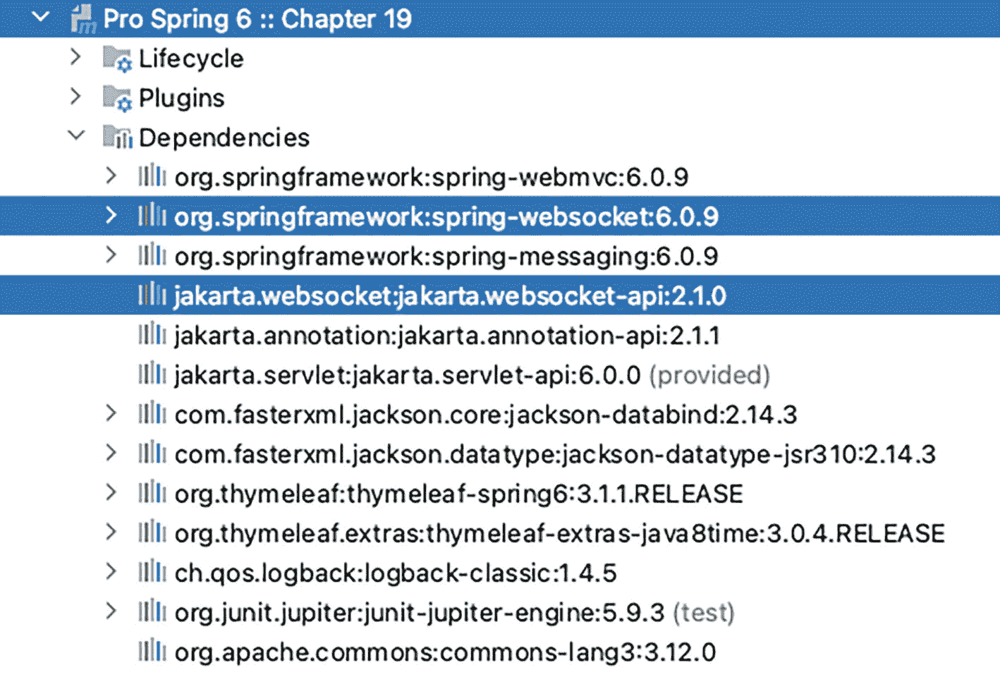
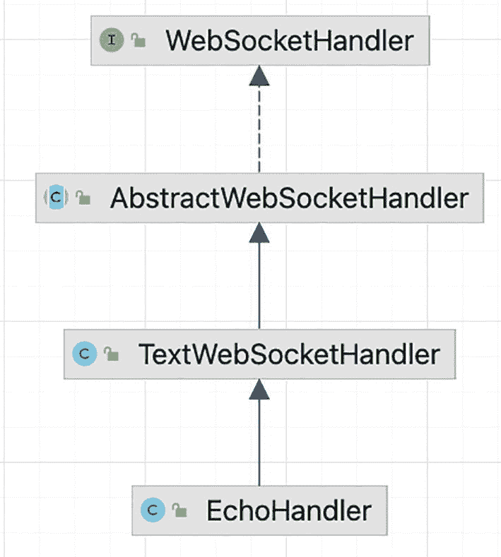
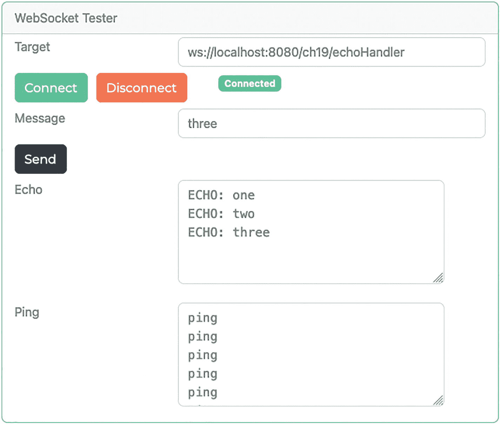
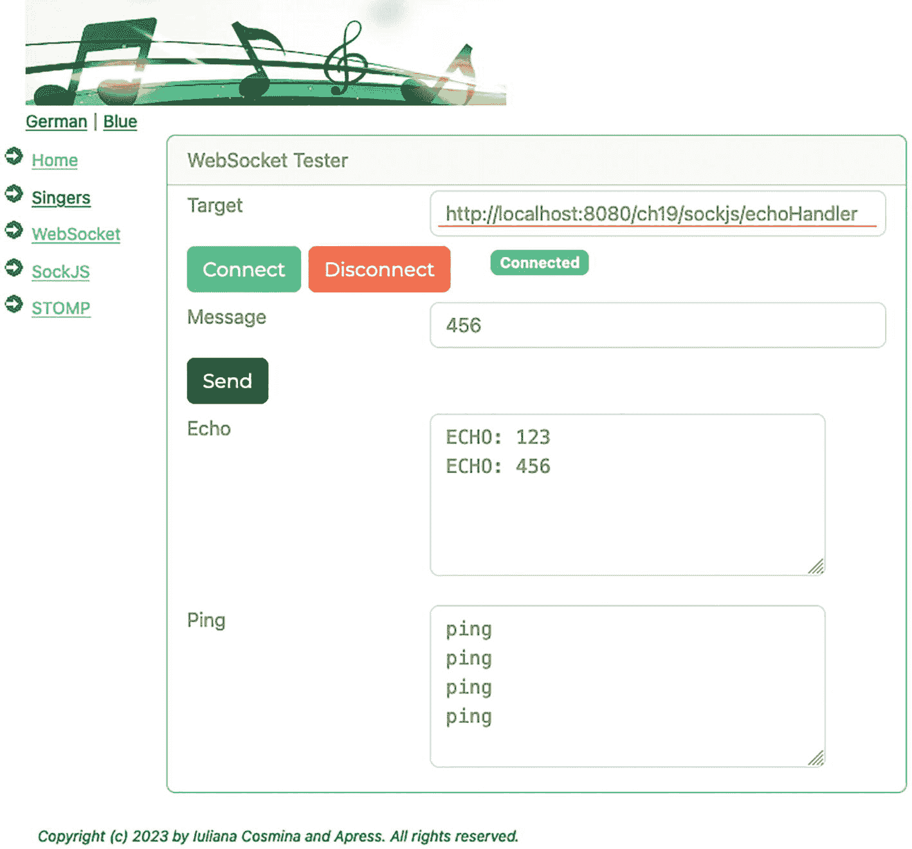
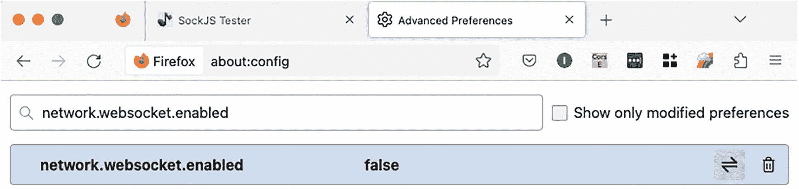
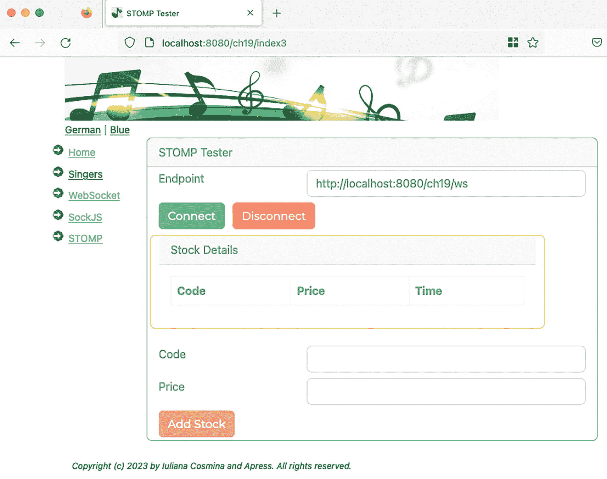
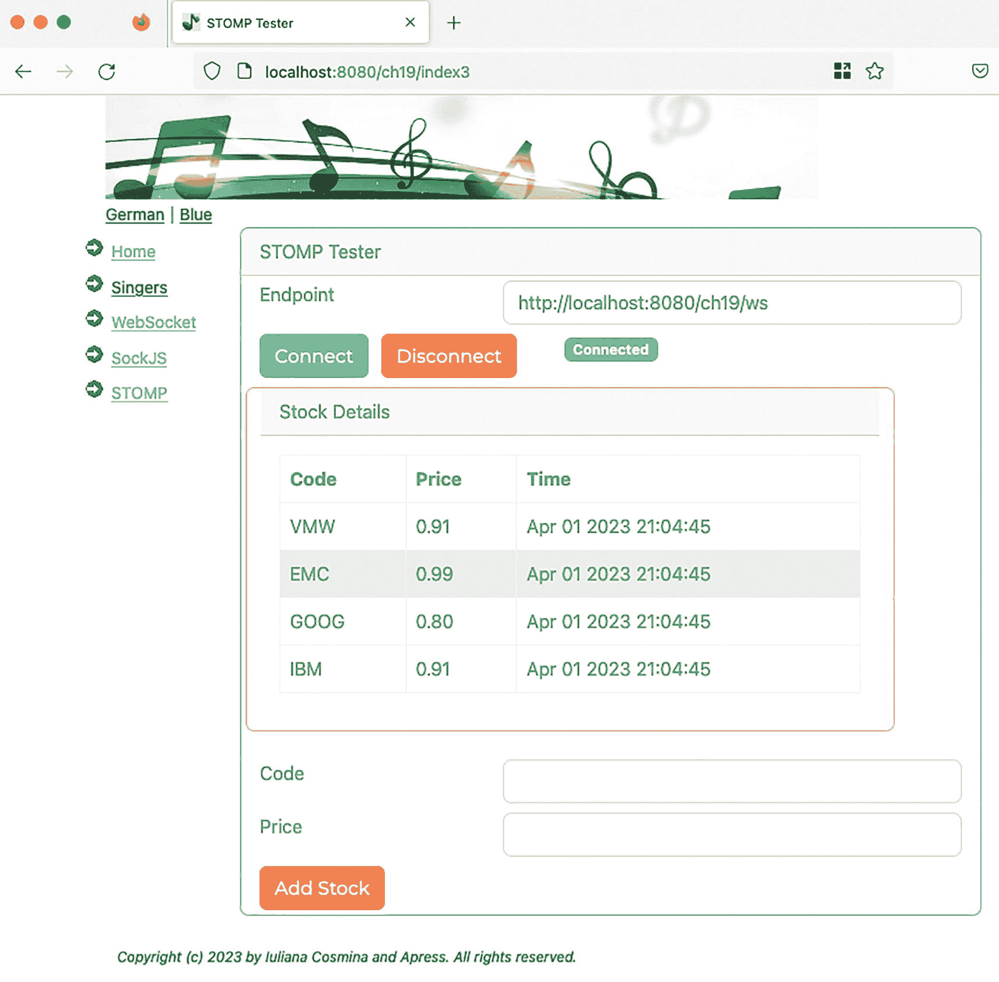
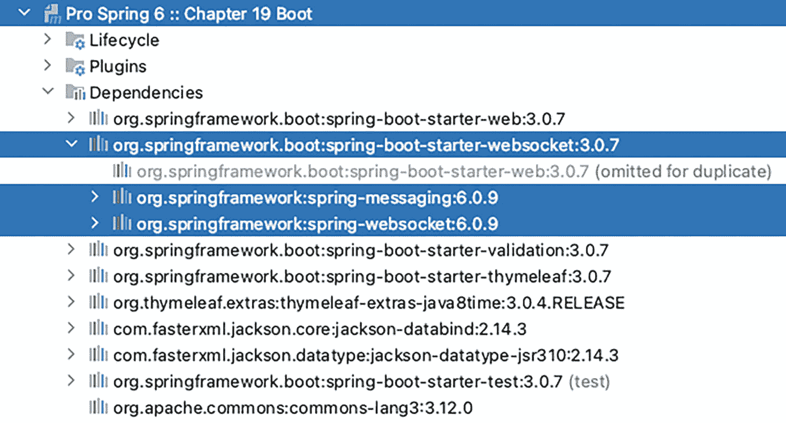

# 19. Spring WebSocket 支持

传统上，Web 应用利用标准的请求/响应 HTTP 功能来提供客户端和服务器之间的通信。随着 Web 的发展，需要更多交互能力，其中一些要求服务器具备推送/拉取或实时更新功能。随着时间的推移，人们实现了各种方法，例如持续轮询、长轮询和 Comet。每种方法都有其优缺点，而 `WebSocket` 协议^(¹⁹¹) 试图从这些需求和缺陷中学习，创建一种更简单、更健壮的方式来构建交互式应用。HTML5 的 `WebSocket` 规范定义了一个 API，使网页能够使用 `WebSocket` 协议与远程主机进行双向通信。

本章对 `WebSocket` 协议以及 Spring 框架提供的主要功能进行高级概述。具体来说，本章涵盖以下主题：

*   *WebSocket 简介*：我们提供 `WebSocket` 协议的总体介绍。本章并非旨在作为 `WebSocket` 协议的详细参考，而是作为高级概述。

*   *在 Spring 中使用 WebSocket*：我们将深入探讨在 Spring 框架中使用 `WebSocket` 的一些细节；具体来说，我们将介绍如何使用 Spring 的 `WebSocket` API，利用 SockJS 作为不支持 WebSocket 的浏览器的回退选项，以及通过 SockJS/WebSocket 使用简单（或流式）文本导向消息协议（STOMP）发送消息。

## WebSocket 简介

`WebSocket` 是作为 HTML5 计划的一部分而开发的规范，它允许建立全双工的单套接字连接，客户端和服务器之间可以通过该连接发送消息。过去，需要实时更新功能的 Web 应用会定期轮询服务器端组件以获取数据，这会打开多个连接或使用长轮询。


使用 `WebSocket` 进行双向通信，避免了客户端（例如网页浏览器）与 HTTP 服务器之间进行双向通信时所需的 HTTP 轮询。`WebSocket` 协议旨在取代所有利用 HTTP 进行传输的现有双向通信方法。`WebSocket` 的单套接字模型带来了更简单的解决方案，无需为每个客户端建立多个连接，也避免了相应的开销——例如，无需在每条消息中都发送 HTTP 头部。

`WebSocket` 在初始握手阶段利用 HTTP，这使其能够通过标准的 HTTP（80）和 HTTPS（443）端口进行通信。`WebSocket` 规范定义了 `ws://` 和 `wss://` 两种方案，分别表示非安全连接和安全连接。`WebSocket` 协议包含两部分：客户端与服务器之间的握手，以及数据传输。`WebSocket` 连接是通过在客户端与服务器之间的初始握手中，将 HTTP 升级为 `WebSocket` 协议来建立的，且该过程基于相同的底层 TCP/IP 连接。在通信的数据传输阶段，客户端和服务器可以同时向对方发送消息，这为你的应用程序添加更强大的实时通信功能打开了大门。

## 将 WebSocket 与 Spring 结合使用

自 4.1 版本起，Spring 框架支持 WebSocket 风格的消息传递，并支持将 STOMP 作为应用级子协议。在该框架中，你可以在 `spring-websocket` 模块中找到对 `WebSocket` 的支持，该模块兼容 JSR-356（“Java WebSocket” 近期已更名为 “Jakarta WebSocket API”）^(¹⁹²)。

应用程序开发者还必须认识到，尽管 `WebSocket` 带来了令人兴奋的新机遇，但并非所有网页浏览器都支持该协议。鉴于此，应用程序必须继续为用户正常工作，并利用某种回退技术来尽可能模拟预期的功能。为了处理这种情况，Spring 框架通过 SockJS 协议提供了透明的回退选项，我们将在本章后续部分进行介绍。

与基于 REST 的应用程序（其中服务由不同的 URL 表示）不同，`WebSocket` 使用单个 URL 来建立初始握手，数据则通过同一连接流动。这种消息传递功能更类似于传统的消息传递系统。自 Spring Framework 4 起，诸如 `Message` 等核心的基于消息的接口已从 Spring Integration 项目迁移到一个名为 `spring-messaging` 的新模块中，以支持 WebSocket 风格的消息传递应用程序。

当我们提到将 STOMP 用作应用级子协议时，我们指的是通过 `WebSocket` 传输的协议。`WebSocket` 本身是一个低级协议，仅将字节转换为消息。应用程序需要理解通过线路发送的内容，这正是 STOMP 等子协议发挥作用的地方。在初始握手期间，客户端和服务器可以使用 `Sec-WebSocket-Protocol` 头部来定义要使用的子协议。虽然 Spring 框架提供了对 STOMP 的支持，但 `WebSocket` 并未强制要求任何特定协议。

既然你已经了解了 `WebSocket` 是什么以及 Spring 提供的支持，你可能想知道在何处使用这项技术。鉴于 `WebSocket` 的单套接字特性及其提供持续双向数据流的能力，`WebSocket` 非常适合那些消息传递频率高且需要低延迟通信的应用程序。可能适合使用 `WebSocket` 的应用程序包括游戏、实时群组协作工具、消息传递系统、金融更新等对时间敏感的定价信息。在考虑使用 `WebSocket` 设计应用程序时，你必须考虑消息频率和延迟要求。这将有助于确定是使用 `WebSocket` 还是例如 HTTP 长轮询。

## 使用 WebSocket API

如前所述，`WebSocket` 仅将字节转换为消息并在客户端和服务器之间传输。这些消息仍需由应用程序本身理解，这正是 STOMP 等子协议发挥作用的地方。如果你想直接使用较低级别的 `WebSocket` API，Spring 框架提供了一个可供交互的 API。使用 Spring 的 `WebSocket` API 时，你通常会实现 `WebSocketHandler` 接口，或使用便捷的子类，例如用于处理二进制消息的 `BinaryWebSocketHandler`、用于处理 SockJS 消息的 `SockJsWebSocketHandler`，或用于处理基于文本的消息的 `TextWebSocketHandler`。在本示例中，为简单起见，我们将使用 `TextWebSocketHandler` 通过 `WebSocket` 传递基于文本的消息。让我们首先看看如何利用 Spring `WebSocket` API 在低级层面接收和处理 `WebSocket` 消息。

显然，我们需要在类路径中添加支持 `WebSocket` 通信的库。图 19-1 展示了一个使用 `WebSocket` 协议向自身发送消息的 Spring Web 应用程序的依赖关系。



一张图片展示了第 19 章的下拉菜单，其中选中了 Jakarta dot WebSocket 和 spring framework web socket 选项。

图 19-1

`chapter19` 项目的依赖关系

如你所见，这些依赖关系对于 Spring Web 应用程序来说是典型的，类似于**第** **14** 章中介绍的那个。Jakarta `WebSocket` API 提供了一个与平台无关的 `WebSocket` 协议 API，用于在 Web 上构建双向通信。`jakarta.websocket-api` 库包含了用于服务器和客户端的 Jakarta `WebSocket` API（仅 API，不包含实现）。`spring-websocket` 库包含了编写处理 `WebSocket` 消息的客户端和服务器端应用程序所需的 Spring `WebSocket` API。

为了发送消息并显示它们，我们创建了一个名为 `index.html` 的简单网页。该页面基于默认的 Thymeleaf 布局构建，包含用于与后端 `WebSocket` 服务通信的静态 HTML 和 JavaScript。为了处理通信，我们需要声明一个实现 `WebSocketHandler` 的特殊类型以及该类型的一个 bean。图 19-2 展示了实现 `org.springframework.web.socket.WebSocketHandler` 的类型层次结构。



一个流程图，从 EchoHandler 到 WebSocketHandler，途经 TextWebSocketHandler 和 AbstractWebSocketHandler。

图 19-2

`WebSocketHandler` 的实现


为了保持简洁并利用 Spring 现成的代码，我们的 `EchoHandler` 类没有直接实现 `WebSocketHandler`，而是扩展了 `TextWebSocketHandler`。这使我们的实现非常精简，因为唯一需要实现的方法就是 `handleTextMessage(..)`，如清单 19-1 所示。

```
package com.apress.prospring6.nineteen;
import org.springframework.web.socket.TextMessage;
import org.springframework.web.socket.WebSocketSession;
import org.springframework.web.socket.handler.TextWebSocketHandler;
import java.io.IOException;
public class EchoHandler extends TextWebSocketHandler {
@Override
public void handleTextMessage(WebSocketSession session, TextMessage textMessage) throws IOException {
session.sendMessage(new TextMessage(textMessage.getPayload()));
}
}
清单 19-1
EchoHandler 类
```

如你所见，这是一个基础处理器，它接收提供的消息，并简单地将其回显给客户端。接收到的 `WebSocket` 消息的内容包含在 `getPayload()` 方法中。

现在我们已经有了这个类型，接下来需要在本例中定义一个单一的处理器映射，该映射接收发送到 `/echoHandler` 的请求，并使用 ID 为 `echoHandler` 的 Bean 来接收消息，并通过将提供的消息回显给客户端来做出响应。为了将 `WebSocket` 配置与 MVC 配置分开，我们引入了一个名为 `WebSocketConfig` 的类，该类声明了映射、Bean，并启用了对使用 `WebSocket` 进行通信的支持，如清单 19-2 所示。

```
package com.apress.prospring6.nineteen;
import org.springframework.web.socket.config.annotation.EnableWebSocket;
import org.springframework.web.socket.config.annotation.WebSocketConfigurer;
import org.springframework.web.socket.config.annotation.WebSocketHandlerRegistry;
// 其他导入语句已省略
@Configuration
@EnableWebSocket
public class WebSocketConfig  implements WebSocketConfigurer {
@Override
public void registerWebSocketHandlers(WebSocketHandlerRegistry registry) {
registry.addHandler(echoHandler(), "/echoHandler");
}
@Bean
public EchoHandler echoHandler() {
return new EchoHandler();
}
}
清单 19-2
WebSocketConfig 配置类
```

`@EnableWebSocket` 注解启用了对处理 `WebSocket` 请求的支持，而 `WebSocketConfig` 配置类实现了 Spring 的 `WebSocketConfigurer` 接口，该接口定义了用于配置 `WebSocket` 请求处理的回调方法。

Spring MVC 配置本身没什么特别的（如果需要回忆，请参考**第** **14** **章**），但我们确实需要将 `index.html` 页面映射到 `/index` 路径。控制器如清单 19-3 所示。

```
package com.apress.prospring6.nineteen;
import jakarta.servlet.http.HttpServletRequest;
import org.springframework.stereotype.Controller;
import org.springframework.ui.Model;
import org.springframework.web.bind.annotation.GetMapping;
@Controller
public class IndexController {
@GetMapping(path = "index")
public String auth(Model model, HttpServletRequest request) {
var requestUrl= request.getRequestURL().toString();
var webSocketAddress = requestUrl.replace("http", "ws").replace("index", "echoHandler");
model.addAttribute("webSocket", webSocketAddress);
return "index";
}
}
清单 19-3
IndexController 配置类
```

实现非常简单，但为了保持 `WebSocket` 处理器 URL 的动态性并相对于应用程序的上下文路径，这里使用了一点小技巧：获取初始请求的 URL（即 `http://localhost:8080/ch19/index`），并用它来生成 `ws://localhost:8080/ch19/echoHandler` 这个值，该值作为 `webSocket` 属性添加到 `index` 模型中。

后端基本上就只需要这些了。鉴于 `EchoHandler` 是一个典型的 Spring Bean，你可以像在普通 Spring 应用程序中那样做任何事情，例如注入服务，以执行该处理器可能需要执行的任何功能。

`index.html` 页面是一个非常简单的 Thymeleaf 视图，代表一个简单的前端客户端，我们可以通过它与后端的 `WebSocket` 服务进行交互。前端是一个简单的 HTML 页面，包含少量 JavaScript，它使用浏览器的 API 来建立 `WebSocket` 连接；还包含一些 jQuery^(¹⁹³) 来处理按钮点击事件和数据展示。jQuery 非常简单，而引入更复杂的 JavaScript 框架对于本章的目的来说就有些大材小用了。前端应用程序将具备连接、断开连接、发送消息以及在屏幕上显示状态更新的能力。清单 19-4 展示了前端客户端页面（`views/index.html`）的代码。

```

WebSocket 测试器

let ping;
let websocket;
let supportsWebSockets = 'WebSocket' in window || 'MozWebSocket' in window;
jQuery(function ($) {
$("#connect").attr("disabled", true);
if (supportsWebSockets) {
console.log(">> webSocket 协议已支持。")
$("#connect").attr("disabled", false);
}
function writePing(message) {
$('#pingOutput').append(message + '\n');
}
function writeMessage(message) {
$('#messageOutput').append(message + '\n')
}
$('#connect')
.click(function doConnect() {
websocket = new WebSocket($("#target").val());
websocket.onopen = function (evt) {
let badge=  $("#badgeStatus");
badge.text("已连接");
badge.attr('class','badge bg-success');
setInterval(function () {
if (websocket !== "undefined") {
websocket.send("ping");
}
}, 3000);
};
websocket.onclose = function (evt) {
let badge=  $("#badgeStatus");
badge.text("已断开");
badge.attr('class','badge bg-light');
};
websocket.onmessage = function (evt) {
if (evt.data === "ping") {
writePing(evt.data);
} else {
writeMessage('回显: ' + evt.data);
}
};
websocket.onerror = function (evt) {
onError(writeStatus('错误:' + evt.data))
};
});
$('#disconnect')
.click(function () {
if (typeof websocket != 'undefined') {
websocket.close();
websocket = undefined;
} else {
alert("未连接。");
}
});
$('#send')
.click(function () {
if (typeof websocket != 'undefined') {
websocket.send($('#message').val());
} else {
alert("未连接。");
}
});
});

WebSocket 测试器

功能:

功能:

功能:

功能:

清单 19-4
views/index.html 视图
```

清单 19-4 中的代码片段构建了一个用户界面，允许我们回调 `WebSocket` API 并观察实时结果出现在屏幕上。

按照**第** **14** **章**的说明，构建项目并使用 IntelliJ IDEA 启动器将其部署到你的 Web 容器中。然后导航到 `http://localhost:8080/ch19/index` 以打开用户界面。点击“连接”按钮，你会注意到在“连接”和“断开”按钮旁边出现了一个绿色的“已连接”徽章，如图 19-3 所示，并且每三秒钟会在“Ping”文本区域显示一条 ping 消息。接着，在“消息”文本框中输入一条消息，然后点击“发送”按钮。这条消息将被发送到后端的 `WebSocket` 服务，并显示在“回显”框中。发送完消息后，点击“断开”按钮，你会注意到绿色徽章被替换为一个标有“已断开”的灰色徽章。在重新连接到 `WebSocket` 服务之前，你将无法再发送任何消息或再次断开连接。



WebSocket 测试器的截图，包含目标、消息、回显和 Ping。

图 19-3
WebSocket 客户端页面


虽然此示例在底层`WebSocket`API 之上使用了 Spring 抽象层，但您能清晰看到这项技术为应用程序带来的激动人心的可能性。现在让我们看看当浏览器不支持`WebSocket`且需要回退方案时，如何处理此功能。清单 19-4 中的代码通过`supportsWebSocket`变量检测浏览器是否不支持`WebSocket`，若不支持则禁用`Connect`按钮。

## 使用 SockJS

由于并非所有浏览器都支持`WebSocket`（例如移动设备上的浏览器可能不支持），且应用程序仍需为最终用户正常运行，Spring 框架提供了基于 SockJS^(¹⁹⁴)的回退方案。使用 SockJS 可在运行时提供尽可能接近 WebSocket 的行为，且无需修改应用程序端代码。SockJS 协议通过 JavaScript 库在客户端使用。Spring 框架的`spring-websocket`库包含相关的 SockJS 服务端组件。当使用 SockJS 提供无缝回退方案时，客户端将首先通过`/info`路径向服务器发送 GET 请求以获取传输信息。SockJS 会优先尝试使用`WebSocket`，然后是 HTTP 流式传输，最后才使用 HTTP 长轮询。

只需进行简单修改即可支持使用 SockJS 的`WebSocket`通信。首先，我们需要支持异步消息传递，这在清单 19-5 的配置中通过`@EnableAsync`注解启用。

```
package com.apress.prospring6.nineteen;
import org.springframework.scheduling.annotation.EnableAsync;
// 其他导入语句已省略
@EnableAsync
@Configuration
@EnableWebMvc
@ComponentScan
public class WebConfig  implements WebMvcConfigurer, ApplicationContextAware {
// 其他配置已省略
}
清单 19-5
Spring MVC 配置用于 SockJS 异步配置
```

Spring 官方 Javadoc 指出，`@EnableAsync`注解启用了 Spring 的异步方法执行能力，从而为整个 Spring 应用程序上下文启用注解驱动的异步处理^(¹⁹⁵)。

第二个修改必须在`WebSocketConfig`中完成，以为我们的处理器启用 SockJS 支持，如清单 19-6 所示。

```
package com.apress.prospring6.nineteen;
import org.springframework.context.annotation.Bean;
import org.springframework.context.annotation.Configuration;
import org.springframework.web.socket.config.annotation.EnableWebSocket;
import org.springframework.web.socket.config.annotation.WebSocketConfigurer;
import org.springframework.web.socket.config.annotation.WebSocketHandlerRegistry;
@Configuration
@EnableWebSocket
public class WebSocketConfig  implements WebSocketConfigurer {
@Override
public void registerWebSocketHandlers(WebSocketHandlerRegistry registry) {
registry.addHandler(echoHandler(), "/echoHandler");
registry.addHandler(echoHandler2(), "/sockjs/echoHandler").withSockJS();
}
@Bean
public EchoHandler echoHandler() {
return new EchoHandler();
}
@Bean
public EchoHandler echoHandler2() {
return new EchoHandler();
}
}
清单 19-6
Spring WebSocket 用于 SockJS 配置
```

注意，声明了另一个`EchoHandler` bean，并映射到`"/sockjs/echoHandler"`。

接下来，我们需要像在`WebSocket`API 示例中那样创建一个 HTML 页面，但这次利用 SockJS 来处理传输协商。最显著的区别是，我们使用 SockJS 库而非直接使用`WebSocket`，并使用典型的`http://`方案而非`ws://`来连接端点。要使用 SockJS，我们需要将相应的 JavaScript 库添加到 HTML 页面，并使用`SockJS`对象而非`WebSocket`进行通信。HTML 代码与`views/index2.html`中的代码几乎相同，唯一的区别是处理 SockJS 通信的 JavaScript 代码，如清单 19-7 所示。

```
// 
// 
let ping;
let websocket;
jQuery(function ($) {
function writePing(message) {
$('#pingOutput').append(message + '\n');
}
function writeMessage(message) {
$('#messageOutput').append(message + '\n')
}
$('#connect')
.click(function doConnect() {
sockjs = new SockJS($("#target").val());
sockjs.onopen = function (evt) {
let badge=  $("#badgeStatus");
badge.text("已连接");
badge.attr('class','badge bg-success');
setInterval(function () {
if (sockjs !== "undefined") {
sockjs.send("ping");
}
}, 3000);
};
sockjs.onclose = function (evt) {
let badge=  $("#badgeStatus");
badge.text("已断开");
badge.attr('class','badge bg-light');
};
sockjs.onmessage = function (evt) {
if (evt.data === "ping") {
writePing(evt.data);
} else {
writeMessage('回显: ' + evt.data);
}
};
});
$('#disconnect')
.click(function () {
if (typeof sockjs != 'undefined') {
sockjs.close();
sockjs = undefined;
} else {
alert("未连接。");
}
});
$('#send')
.click(function () {
if (typeof sockjs != 'undefined') {
sockjs.send($('#message').val());
} else {
alert("未连接。");
}
});
});
清单 19-7
views/index2.html 视图中的 JavaScript 代码
```

实现新的 SockJS 代码后，构建并将项目部署到容器，然后导航至位于`http://localhost:8080/ch19/index2`的用户界面，该界面具有与`WebSocket`示例相同的所有特性和功能，如图 19-4 所示。



歌手 WebSocket 测试器截图。包含已连接目标、消息 456、回显 123、456 和 ping。

图 19-4

建立连接后的 SocketJS 应用程序页面

要测试 SockJS 回退功能，请尝试在浏览器中禁用`WebSocket`支持。例如在 Firefox 中，导航至`about:config`页面，然后搜索`network.websocket.enabled`。将此设置切换为`false`，如图 19-5 所示，重新加载示例用户界面并重新连接。



高级偏好设置截图，其中网络 WebSocket 已启用设置为 false。

图 19-5

Firefox `about:config` 页面

使用 Live HTTP Headers 等工具可以检查从浏览器到服务器的流量以进行验证。验证行为后，将 Firefox 设置`network.websocket.enabled`切换回`true`，重新加载页面并重新连接。通过 Live HTTP Headers 观察流量，现在将显示`WebSocket`握手。在这个简单示例中，一切应像使用`WebSocket`API 一样正常工作。

## 使用 STOMP 发送消息

在使用`WebSocket`时，通常会使用 STOMP 等子协议作为客户端和服务器之间的通用格式，以便两端都能预期并做出相应反应。Spring 框架原生支持 STOMP，我们将在示例中使用此协议。


STOMP 是一种基于 HTTP 建模的简单帧协议消息传递协议，可用于任何可靠的、支持双向流的网络协议，例如 `WebSocket`。STOMP 拥有标准的协议格式；JavaScript 客户端支持在浏览器中发送和接收消息，并且可以选择性地接入支持 STOMP 的传统消息代理，例如 RabbitMQ 和 ActiveMQ。Spring 框架开箱即用地支持一个简单代理，该代理在内存中处理订阅请求并向已连接的客户端广播消息。在本节介绍的 STOMP 示例中，我们将使用这个简单代理，而将全功能代理的搭建留作练习^(¹⁹⁶)。

一个圆圈内带感叹号的图示。 有关 STOMP 协议的完整描述，请参见官方网站^(¹⁹⁷)。

我们将创建一个简单的股票行情应用程序，该程序显示几个预定义的股票代码、它们的当前价格以及价格变动时的时间戳。新的股票代码和起始价格也可以通过用户界面添加。任何连接的客户端（即其他浏览器标签页或网络上全新的客户端）都将看到相同的数据，因为它们都订阅了消息广播。每秒，每个股票价格都会更新为一个新的随机金额，并且时间戳也会更新。

为了确保即使客户端浏览器不支持 `WebSocket`，也能使用股票行情应用程序，我们将再次使用 SockJS 来透明地处理任何传输协议的切换。在深入代码之前，值得注意的是，STOMP 消息支持由 `spring-messaging` 库提供。

让我们首先创建 `Stock` 领域对象，该对象保存股票的相关信息，例如其代码和价格，如清单 19-8 所示。

```
package com.apress.prospring6.nineteen.stomp;
import java.io.Serializable;
import java.time.LocalDateTime;
import java.time.format.DateTimeFormatter;
public class Stock implements Serializable {
private static final long serialVersionUID = 1L;
private static final String DATE_FORMAT = "MMM dd yyyy HH:mm:ss";
private String code;
private double price;
private LocalDateTime date;
public Stock() { }
public Stock(String code, double price) {
this.code = code;
this.price = price;
}
// getters and setters omitted
public String getDateFormatted() {
var formatter =  DateTimeFormatter.ofPattern(DATE_FORMAT);
return formatter.format(date);
}
}
清单 19-8
Stock 领域对象
```

为了处理股票更新的请求，需要一个控制器。清单 19-9 展示了 `StockController` 类。

```
package com.apress.prospring6.nineteen.stomp;
import org.springframework.messaging.handler.annotation.MessageMapping;
import org.springframework.messaging.simp.SimpMessagingTemplate;
import org.springframework.scheduling.TaskScheduler;
// 其他导入语句已省略
@Controller
public class StockController {
private final TaskScheduler taskScheduler;
private final SimpMessagingTemplate simpMessagingTemplate;
private List stocks = new ArrayList();
private Random random = new Random(System.currentTimeMillis());
public StockController(TaskScheduler taskScheduler, SimpMessagingTemplate simpMessagingTemplate) {
this.taskScheduler = taskScheduler;
this.simpMessagingTemplate = simpMessagingTemplate;
}
@MessageMapping("/addStock")
public void addStock(Stock stock) throws Exception {
stocks.add(stock);
broadcastUpdatedPrices();
}
private void broadcastUpdatedPrices() {
for(Stock stock : stocks) {
stock.setPrice(stock.getPrice() + (getUpdatedStockPrice() * stock.getPrice()));
stock.setDate(LocalDateTime.now());
}
simpMessagingTemplate.convertAndSend("/topic/price", stocks);
}
private double getUpdatedStockPrice() {
double priceChange = random.nextDouble() * 5.0;
if (random.nextInt(2) == 1) {
priceChange = -priceChange;
}
return priceChange / 100.0;
}
@PostConstruct
private void broadcastTimePeriodically() {
stocks.add(new Stock("VMW", 1.00d));
stocks.add(new Stock("EMC", 1.00d));
stocks.add(new Stock("GOOG", 1.00d));
stocks.add(new Stock("IBM", 1.00d));
taskScheduler.scheduleAtFixedRate(this::broadcastUpdatedPrices, Duration.ofSeconds(2));
}
}
清单 19-9
StockController 类
```

清单 19-9 中的代码可以解释如下：

*   控制器需要一个任务调度器（**第** **12** **章**）和一个 `SimpMessagingTemplate` 实例，以便每 2 秒发送一次 `Stock` 价格更新。`SimpMessagingeTemplate` 是 `org.springframework.messaging.core.MessageSendingOperations<D>` 的一个实现，它为 STOMP 等简单消息协议提供支持。

*   为了演示目的，控制器初始化时包含了一些预定义的股票条目及其起始价格。

*   `/addStock` 处理方法允许用户提交一个 `Stock` 实例，该实例会被添加到股票列表中，然后向所有订阅者广播这些股票。

*   在广播股票信息时，会遍历 `Stock` 实例列表，更新每个实例的价格，然后通过注入的 `SimpMessagingTemplate` 实例将信息发送给 `/topic/price` 的所有订阅者。`TaskExecutor` 实例通过每 2 秒调用一次 `broadcastUpdatedPrices (..)` 方法，向所有订阅的客户端广播更新后的股票价格列表。

有了控制器之后，我们现在需要一个 HTML 用户界面来向客户端显示股票信息。为简单起见，`views/index3.html` 视图使用 Thymeleaf 编写，并继承了**第** **14** **章**和 **17** **章**中使用的 `views/templates/layout.html` 模板的主题元素。

`views/index3.html` 视图中的 HTML JavaScript 代码如清单 19-10 所示。

```

```


let stomp;
function displayStockPrice(frame) {
let stocks = JSON.parse(frame.body);
$('#stock').empty();
for (let i in stocks) {
let stock = stocks[i];
$('#stock').append(
$('').append(
$('').html(stock.code),
$('').html(stock.price.toFixed(2)),
$('').html(stock.dateFormatted)
)
);
}
}
let connectCallback = function () {
stomp.subscribe('/topic/price', displayStockPrice);
};
let errorCallback = function (error) {
alert(error);
};
jQuery(function ($) {
$("#addStockButton").attr("disabled", true);
$('#connect')
.click(function doConnect() {
stomp = Stomp.over(new SockJS($("#target").val()));
stomp.connect("guest", "guest", connectCallback, errorCallback);
let badge=  $("#badgeStatus");
badge.text("Connected");
badge.attr('class','badge bg-success');
$("#addStockButton").attr('disabled', false);
});
$('#disconnect')
.click(function () {
if (typeof stomp != 'undefined') {
stomp.disconnect();
stomp = undefined;
let badge=  $("#badgeStatus");
badge.text("Disconnected");
badge.attr('class','badge bg-light');
$("#addStockButton").attr('disabled', true);
} else {
alert("Not connected.");
}
});
$('.addStockButton').click(function (e) {
e.preventDefault();
const stockStr = JSON.stringify({
'code': $('.addStock .code').val(),
'price': Number($('.addStock .price').val())
});
stomp.send('/app/addStock', {}, stockStr);
return false;
});
});

STOMP 测试器

FN:

股票详情

代码
价格
时间

FN:

FN:

清单 19-10
index3.html 视图模板

与本章前面的示例类似，我们在 JavaScript 中混合了一些 HTML 来更新显示。我们将 HTML 与 JavaScript 结合的原因，尽管这不符合常规的编程规则，是为了尽可能简化 Spring MVC 配置；这也有助于使页面及其组件的功能易于理解。我们利用 jQuery 更新 HTML 数据，利用 SockJS 提供传输选择，并利用 STOMP JavaScript 库 `stomp.min.js` 与服务器通信。通过 STOMP 消息发送的数据以 JSON 格式编码，我们在事件发生时提取这些数据。建立 STOMP 连接后，我们订阅 `/topic/price` 以接收股票价格更新。

STOMP 通信的 Java 配置由 `StompConfig` 类表示，如清单 19-11 所示。

```
package com.apress.prospring6.nineteen;
import org.springframework.context.annotation.Configuration;
import org.springframework.scheduling.annotation.EnableAsync;
import org.springframework.messaging.simp.config.MessageBrokerRegistry;
import org.springframework.web.socket.config.annotation.EnableWebSocketMessageBroker;
import org.springframework.web.socket.config.annotation.StompEndpointRegistry;
import org.springframework.web.socket.config.annotation.WebSocketMessageBrokerConfigurer;
@Configuration
@EnableAsync
@EnableWebSocketMessageBroker
public class StompConfig implements WebSocketMessageBrokerConfigurer {
@Override
public void registerStompEndpoints(StompEndpointRegistry registry) {
registry.addEndpoint("/ws").withSockJS();
}
@Override
public void configureMessageBroker(MessageBrokerRegistry config) {
config.setApplicationDestinationPrefixes("/app");
config.enableSimpleBroker("/topic");
}
@Bean
TaskExecutor taskExecutor() {
return new SimpleAsyncTaskExecutor();
}
}
清单 19-11
StompConfig 配置类
```

为了启用 Spring 异步调用和任务执行，配置类必须使用 `@EnableAsync` 注解，并且需要一个类型为 `org.springframework.core.task.TaskExecutor` 的 bean 来重复广播股票信息。

`@EnableWebSocketMessageBroker` 注解使用更高级别的消息子协议，在 `WebSocket` 上启用基于代理的消息传递。请注意，该类实现了 `WebSocketMessageBrokerConfigurer` 接口，该接口定义了使用简单消息协议（例如 STOMP）为 `WebSocket` 客户端配置消息处理的方法。实现了 `registerStompEndpoints(..)` 方法来注册 `/ws` STOMP 端点映射。`http://localhost:8080/ch19/ws` 用于初始化一个 SocketJS 实例，该实例提供对 STOMP 通信的支持。

实现了 `configureMessageBroker` 方法来配置消息代理选项。`applicationDestinationPrefixes` 属性有助于过滤针对应用程序注解方法的目标；此配置设置了 `/app` 过滤器。此过滤器需要作为股票处理器方法 URL 路径的前缀，这就是为什么在清单 19-10 中你会看到以下内容：

```
stomp.send('/app/addStock', {}, stockStr)
```

`enableSimpleBroker("/topic")` 启用一个简单的消息代理，并配置一个或多个前缀来过滤针对该代理的目标。在 `StockController` 中，你会在 `broadcastUpdatedPrices()` 方法中看到，股票数据被发布到主题 `/topic/price` 作为目标，而在 `index3.html` 中，`STOMP` 实例正在订阅此主题，以便可以检索股票数据。

首次访问页面时，没有 STOMP 连接，因此股票表格为空，并且“添加股票”按钮被禁用，如图 19-6 所示。



STOMP 测试器的屏幕截图，包含端点、股票详情、代码和价格。

图 19-6
建立连接前的 STOMP 应用程序页面

单击“连接”按钮后，会出现熟悉的绿色“已连接”徽章，股票数据加载到表格中并每 2 秒刷新一次，并且“添加股票”按钮现在已启用，允许你添加自己的股票，如图 19-7 所示。



STOMP 测试器的屏幕截图，包含已连接的端点，以及股票详情，例如代码、价格和时间、代码、价格。下方提供了添加股票的按钮。

图 19-7
建立连接后的 STOMP 应用程序页面

在底层，会建立一个连接，在浏览器控制台中，我们可以看到浏览器订阅了 `topic/price` 队列，然后每 2 秒接收一次信息。浏览器控制台日志的片段如清单 19-12 所示。

```
Opening Web Socket...  stomp-1.7.1.min.js:8:1895
Web Socket Opened...   stomp-1.7.1.min.js:8:1895
>>> CONNECT
login:guest
passcode:guest
accept-version:1.1,1.0
heart-beat:10000,10000
>> SUBSCRIBE         stomp-1.7.1.min.js:8:1895
id:sub-0
destination:/topic/price


# 此位每 2 秒重复一次
>> DISCONNECT       stomp-1.7.1.min.js:8:1895
清单 19-12
STOMP 通信的浏览器控制台日志片段
```

### Spring Boot 等效应用

将前述应用转换为 Spring Boot 应用相当容易，因为存在`spring-boot-starter-websocket`库。`chapter19-boot`项目的依赖关系如图 19-8 所示。



一张带有第 19 章启动项目下拉菜单的图片，其中选中了 Spring Boot Starter Web Socket、Messaging 和 Web Socket 选项。

图 19-8
项目`chapter19-boot`的依赖关系

由于用户可以选择直接通过`WebSocket`进行通信，或使用 STOMP 等高级协议，因此需要为这两种情况配置类，并配合`@EnableWebSocket`或`@EnableWebSocketMessageBroker`注解。因此，除了简化构建配置和无需运行应用的服务器之外，Spring Boot 并未过多减少开发人员的工作量。出于这个原因，本章将不介绍如何编写用于`WebSocket`通信的 Spring Boot 应用，因为所有细节已在**第****14**章（Web 章节）以及本章中关于`WebSocket`的所有内容中涵盖。不过，`chapter19-boot`项目是本书源代码的一部分，欢迎查阅。

## 本章小结

在本章中，我们涵盖了`WebSocket`的一般概念。我们讨论了 Spring 框架对底层`WebSocket` API 的支持，然后转向使用 SockJS 作为回退选项，根据客户端浏览器选择合适的传输方式。最后，我们介绍了 STOMP 作为`WebSocket`子协议，用于在客户端和服务器之间传递消息。所有示例均展示并解释了 Java 配置类。

在下一章中，我们将讨论如何构建 Spring 响应式应用，以及`WebSocket`如何用于响应式通信。

脚注 1   2   3   4   5   6   7

