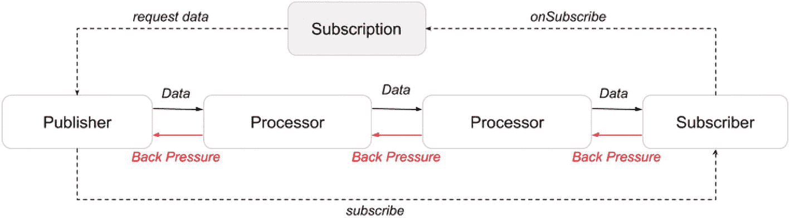
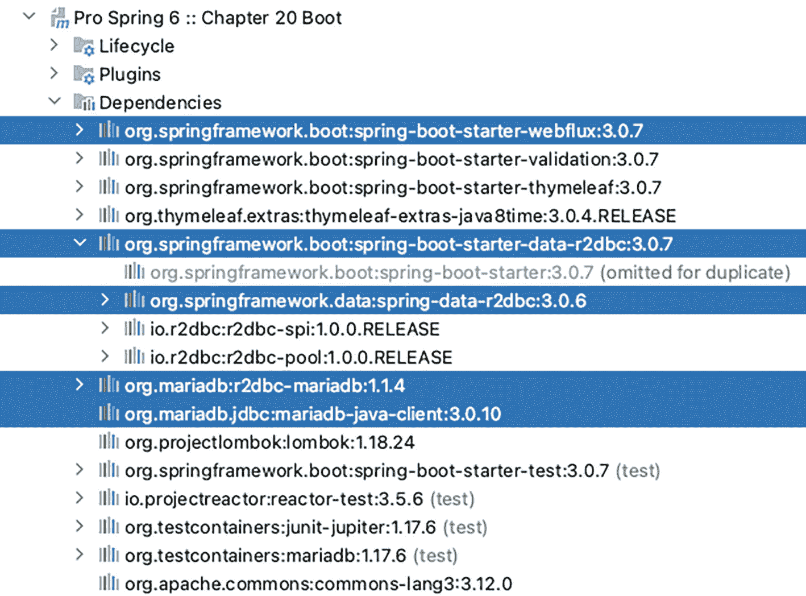
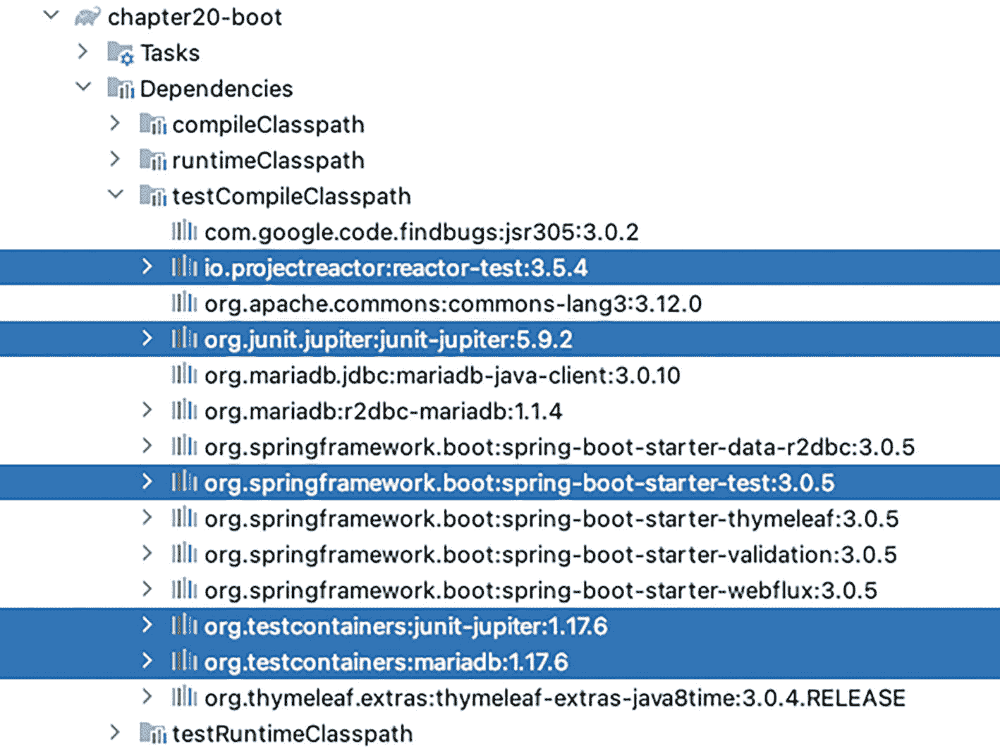
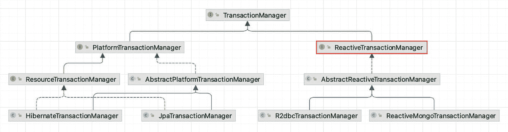
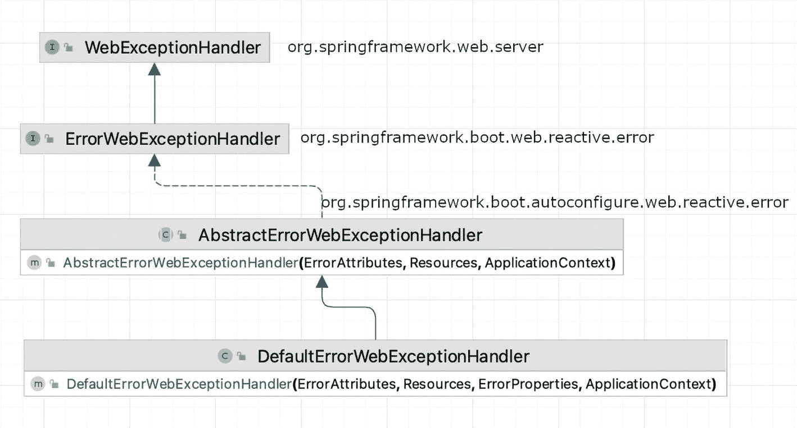
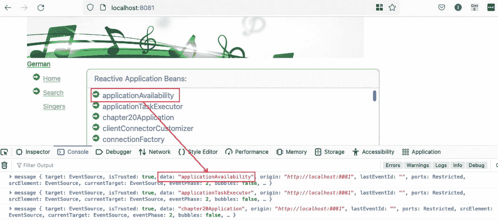
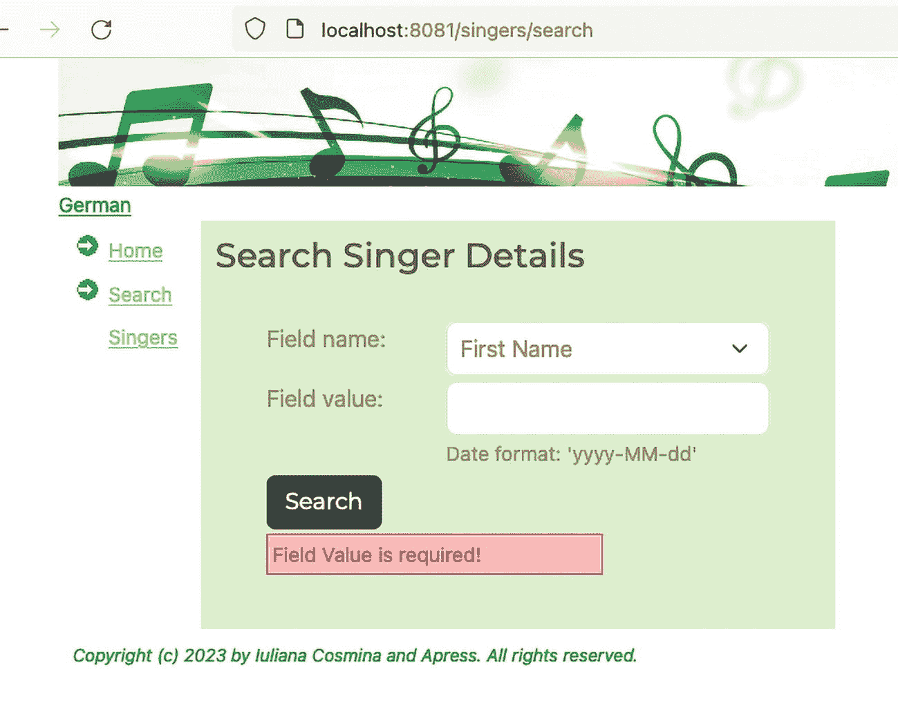

# 20. 响应式 Spring

在前面的章节中，典型的 Java Web 应用是在 Apache Tomcat 服务器实例上构建和运行的，该服务器对于 Spring 经典配置是外部的，或者对于 Spring Boot Web 应用是嵌入在应用中的。无论哪种情况，Spring 的`DispatcherServlet`都负责将传入的 HTTP 请求路由到应用中声明的所有处理器。然而，有一些事情需要考虑。像我们迄今为止开发的应用能否在实际生产环境中使用？`DispatcherServlet`能同时处理多少个 HTTP 请求？这个数字能增加吗？`DispatcherServlet`实际上并不能决定它能处理的请求数量。这由 Servlet 容器定义，在我们的案例中，就是 Apache Tomcat 服务器。

Apache Tomcat 是基于 Java 软件平台构建和维护动态网站及应用的流行选择。Java Servlet API 使 Web 服务器能够使用 HTTP 协议处理基于 Java 的动态 Web 内容。这被称为**请求-响应模型**：客户端发出请求；服务器准备响应并将其发送回客户端。它是单向的，由客户端控制，服务器不关心客户端是否能处理响应。例如，当你在浏览器中打开 Facebook 聊天窗口时，如果服务器发送了你与该好友的所有对话，页面不仅会加载很长时间，甚至可能导致浏览器崩溃。

多年来，软件和应用开发风格有了许多改进，使得客户端-服务器交互更加高效，但本章的重点是**响应式通信**。

一个知识提示。 如果你想更详细地了解客户端-服务器通信如何从最初的请求-响应演变为响应式模型，请查阅 Apress 于 2021 年出版的*Pro Spring MVC with WebFlux*一书^(¹⁹⁸)；从第 9 章开始阅读。

高效的响应式通信只能发生在响应式客户端和响应式服务器之间，也就是响应式应用之间。与经典的请求-响应风格（客户端和服务器以不连续的信息块交换数据）相比，响应式通信意味着客户端和服务器之间的持续数据流。

在处理大量数据时，响应式应用是解决方案。响应式应用是将韧性、响应性和可伸缩性作为优先考虑而设计的应用。响应式宣言^(¹⁹⁹)描述了响应式应用的特征。响应式流 API 规范^(²⁰⁰)提供了一组最小的接口，应用组件应实现这些接口，以便应用可以被视为响应式应用。因此，响应式流 API 是一个互操作性规范，确保响应式组件无缝集成，并保持操作的非阻塞和异步性。

有四个关键术语描述响应式应用。

*   **响应性：** 期望快速且一致的响应时间。

*   **韧性：** 预期会发生故障，应用被设计为能够处理故障并自我修复。

*   **弹性：** 应用应能够通过自动扩展其能力来处理高负载，并在不再需要时缩减规模。

*   **消息驱动：** 响应式通信应是异步的，并且意味着组件是松散耦合的，并使用消息进行通信。此外，应用背压以防止消息生产者压垮消费者。

响应式应用应该更灵活、更松散耦合、非阻塞且可伸缩，但同时更易于开发、更易于变更且更能容忍故障。构建响应式应用需要遵循响应式编程范式的原则。

读到这里，你可能会认为响应式应用是软件设计演进的巅峰，世界上每个应用都应该重新设计成响应式的。但这并不总是正确的，响应式应用并不总是比经典应用运行得更快，而且它们也有自己的一系列问题。正如你将在本章中看到的，响应式编程与命令式编程截然不同，需要一点思维转变。响应式应用的主要好处是它们是非阻塞的，并且能够用少量固定数量的线程和更少的内存需求来扩展应用，同时充分利用可用的处理能力。

在本章中，你将学习响应式编程，以及如何使用 Spring WebFlux 构建完全响应式的应用。

## Spring 中的响应式编程简介

响应式编程是一种声明式编程范式，基于异步事件处理和数据流的思想。响应式流是一项倡议，旨在为具有非阻塞背压的异步流处理提供标准。它们对于解决需要跨线程边界进行复杂协调的问题极为有用。


Java 在版本 8 中引入了 Streams API 和 Lambda 表达式，这是迈向响应式编程的第一步，因为响应式编程也可以定义为*带有响应式流的函数式编程*。响应式流直到 JDK 9 才可用。由于无法等待延迟六个月发布的 JDK 9，创建了 Spring 的 Pivotal^(²⁰¹) 开源团队使用其自己的响应式库 Project Reactor^(²⁰³) 构建了 Spring WebFlux^(²⁰²)。

响应式流为 Java 中的响应式编程提供了通用 API。它由四个简单的接口组成，为带有非阻塞背压的异步流处理提供了标准。如果你想编写一个能够与其他响应式组件集成的组件，你需要实现其中一个接口。在抽象层面上，响应式流规范中描述的组件及其之间的关系，如图 20-1 所示。



一个循环流。在订阅发布者时，订阅者会创建一个订阅对象，该对象向发布者请求数据。发布者通过两个处理器将数据传输给订阅者。订阅者和发布者之间存在背压。

图 20-1

响应式流规范抽象表示

如果你觉得这很像带有背压功能的发布者/订阅者模型，那你的想法没错，它基本上就是如此。数据在组件之间*流动*，每个组件处理数据并将其向前传递，每个组件通过背压调节速度。现实世界中最合适的模型是工厂传送带。让我们逐一了解图 20-1 中的组件。

*   **发布者**是一个潜在无限的数据生产者。在 Java 中，数据生产者必须实现 `org.reactivestreams.Publisher<T>`。发布者准备数据并将其作为单独的消息传输给订阅者。发布者根据订阅者的需求发出值。

*   **订阅者**向发布者注册以消费数据。在 Java 中，数据消费者必须实现 `org.reactivestreams.Subscriber<T>`。订阅者从发布者接收消息并处理它们。这是 Streams API 中的终端操作。

*   订阅时，会创建一个**订阅**对象来表示发布者和订阅者之间的一对一关系。该对象向发布者请求数据，并取消对数据的需求。在 Java 中，订阅类必须实现 `org.reactivestreams.Subscription`，并且此类型的对象只能被订阅者使用一次。

*   **处理器**是一个特殊的组件，具有与发布者和订阅者相同的属性。在 Java 中，处理器类型必须实现 `org.reactivestreams.Processor<T,R>`。处理器可以链接起来形成一个流处理管道。处理器从链中其前面的发布者/处理器消费数据，并为链中其后面的处理器/订阅者发出数据以供消费。如果订阅者/处理器消费数据的速度不够快，它会在发布者/处理器发出数据时应用背压来减慢其速度。

你可以在 IDE 或 GitHub^(²⁰⁴) 上查看这些接口的代码。

注意。 大多数针对 JVM 的响应式实现是并行开发的，因此今天我们拥有：RxJava^(²⁰⁵)、Akka Streams^(²⁰⁶)、Ratpack^(²⁰⁷)、Vert.x^(²⁰⁸) 和 Project Reactor。

使用响应式流编写的代码看起来与使用非响应式流编写的代码相似，但底层发生的情况是不同的。响应式流是**异步的**，但你无需编写处理异步的逻辑。你只需要声明当流中发出某个值时必须发生什么。你编写的代码会在流异步发出项目时被调用，独立于主程序流程。如果涉及多个处理器，每个处理器都在自己的线程上执行。由于你的代码是异步运行的，你必须小心地提供作为处理器（也称为*转换器*）方法参数的函数。你必须确保它们是**纯函数**。纯函数应仅通过其参数和返回值与程序交互，对于相同的参数值返回相同的结果，并且绝不应修改需要同步的对象，因为这可能会导致整个流程出现不可预测的延迟。

Project Reactor 实现了响应式流 API，为响应式应用程序提供了具有高效需求管理的非阻塞稳定基础。它声明了两个主要的发布者实现：

*   `reactor.core.publisher.Mono<T>` 是一个表示零个或一个元素的响应式流发布者。

*   `reactor.core.publisher.Flux<T>` 是一个表示从零到无限个元素的异步序列的响应式流发布者。

`Mono<T>` 和 `Flux<T>` 类似于 `java.util.concurrent.Future<V>`。它们表示异步计算的结果。它们之间的区别在于，当你尝试通过调用 `get()` 方法获取结果时，`Future<V>` 会阻塞当前线程，直到计算完成。`Mono<T>` 和 `Flux<T>` 都提供了一系列 `block*()` 方法，用于检索不阻塞当前线程的异步计算的值。

为了更清楚地说明响应式编程在语法上与命令式编程有何不同，让我们考虑以下场景：给定一个歌手列表，我们想要找出所有年龄大于 50 岁的歌手，并计算他们的年龄总和。如果代码以命令式风格编写，可能类似于清单 20-1 中的代码片段。

```
package com.apress.prospring6.twenty.boot;
//import 语句已省略
public class SimpleProgrammingTest {
List singers = List.of(
Singer.builder().firstName("John").lastName("Mayer").birthDate(LocalDate.of(1977, 10, 16)).build(),
Singer.builder().firstName("B.B.").lastName("King").birthDate(LocalDate.of(1929, 9, 16)).build(),
Singer.builder().firstName("Peggy").lastName("Lee").birthDate(LocalDate.of(1920, 5, 26)).build(),
Singer.builder().firstName("Ella").lastName("Fitzgerald").birthDate(LocalDate.of(1917, 4, 25)).build()
);
Function> computeAge = singer -> Pair.of(singer,Period.between(singer.getBirthDate(), LocalDate.now()).getYears());
Predicate> checkAge = pair -> pair.getRight() > 50;
@Test
void imperativePlay(){
int agesum = 0;
for (var s : singers) {
var p = computeAge.apply(s);
if (checkAge.test(p)) {
agesum += p.getRight();
}
}
assertEquals(300, agesum);
}
}
清单 20-1
处理歌手列表的命令式风格代码
```

不太美观，对吧？嗯，这就是所有 Java 开发者在 Java 8 引入 Stream API 之前习惯编写的代码类型。一系列指令一个接一个地列出供 JVM 执行。此外，使用 `Function<T,R>` 和 `Predicate<T>` 有点取巧，考虑到这些类型在 Java 8 之前也不存在。使用它们是为了简单和可重用性。

使用 Stream API，结合 `Function<T,R>` 和 `Predicate<T>` 实例，相同的代码可以编写得更具声明性和函数式风格，如清单 20-2 所示。


```
package com.apress.prospring6.twenty.boot;
//import 语句已省略
import static org.junit.jupiter.api.Assertions.assertEquals;
public class SimpleProgrammingTest {
// list、function 和 predicate 与清单 20-1 相同
@Test
void streamsPlay() {
var agesum = singers.stream() // Stream
.map(computeAge) // Stream>
.filter(checkAge)// Stream>
.map(Pair::getRight) // Stream
.reduce(Integer:: sum) // Optional
.orElseThrow(() -> new RuntimeException("Something went terribly wrong!"));
assertEquals(300, agesum);
}
}
清单 20-2
使用 Java 8 Stream API 处理歌手列表的声明式（函数式）风格代码
```

声明式编程更像是一个不断定义事物是什么的过程，正如清单 20-2 中的注释所指出的，这些注释展示了结果流所发出的对象类型。声明式编程关注的是程序应该**实现什么**，而命令式编程关注的是程序**如何**实现结果。

将清单 20-2 中的代码转换为响应式代码并不需要太多功夫：我们只需将`Stream<T>`替换为`Flux<T>`，并确保声明一个订阅者，该订阅者对链中最后一个处理器（即`reduce(..)`函数）的结果进行处理。代码如清单 20-3 所示。

```
package com.apress.prospring6.twenty.boot;
import reactor.core.publisher.BaseSubscriber;
import reactor.core.publisher.Flux;
//其他 import 语句已省略
public class SimpleProgrammingTest {
// list、function 和 predicate 与清单 20-1 相同
@Test
void reactivePlay() {
Flux.fromIterable(singers)  // Flux
.map(computeAge) // Flux >
.filter(checkAge) // Flux >
.map(Pair::getRight) // Flux 
.reduce(0, Integer::sum) // Mono
.subscribe(new BaseSubscriber() {
@Override
protected void hookOnNext(Integer agesum) {
assertEquals(300, agesum); // 运行此测试时可能失败，截至 2023 年 4 月测试通过 ;)
}
});
}
}
清单 20-3
使用响应式流处理歌手列表的函数式风格代码
```

`BaseSubscriber<T>`抽象类是`Subscriber<T>`实现的一个简单基类，允许用户直接对其执行`request(long)`和`cancel()`操作。`hookOnNext(..)`方法用于将行为附加到发出的值上；在我们的例子中，这是检查我们假设的绝佳位置。

现在你已经了解了 Project Reactor 的响应式编程，让我们换个话题，看看如何使用 Spring WebFlux 编写响应式应用程序。

## 介绍 Spring WebFlux

Spring Web MVC 是围绕`DispatcherServlet`设计的，它是一个网关，负责将 HTTP 请求映射到处理器，并配置了主题、国际化、文件上传和视图解析。Spring MVC 是为 Servlet API 和 Servlet 容器构建的。这意味着它主要使用阻塞 I/O，并且每个 HTTP 请求对应一个线程。支持请求的异步处理是可能的，但需要更大的线程池，这反过来又需要更多资源，并且难以扩展。

Spring WebFlux 是 Spring 5 中新增的响应式栈 Web 框架，是 Spring 对日益突出的阻塞 I/O 架构问题的回应。它可以在 Servlet 3.1+容器上运行，但也能适配其他原生服务器 API。Spring 团队首选的服务器是 Netty^(²⁰⁹)，它在异步非阻塞领域久经考验。Spring WebFlux 在设计上考虑了函数式响应式编程，并允许以声明式风格编写代码。Spring MVC 和 WebFlux 有一些共同元素，甚至可以一起使用。处理器方法没有理由不能返回`Flux<T>`或`Mono<T>`，本章稍后将展示这一点。

注意。 需要记住一点：在编写响应式应用程序时，应用程序的每个组件都必须是响应式的，否则应用程序将无法真正实现响应式。非响应式组件可能成为瓶颈，并破坏整个流程。例如，一个典型的三层应用程序（表示层、服务层、数据库层）只有在所有三层都是响应式的情况下才能实现响应式。因此，一个响应式的 Spring WebFlux 应用程序必须具有响应式视图、响应式控制器、响应式服务、响应式仓库和响应式数据库（任何带有响应式驱动程序的 SQL 数据库，或像 MongoDB、RethinkDB 等响应式 NoSQL 数据库）。此外，调用该应用程序的客户端也必须是响应式的。

在将歌手应用程序转换为响应式应用程序之前，让我们先回顾一下 Spring WebFlux 的内部工作原理。

响应式应用程序可以部署在 Servlet 3.1+容器上，例如 Tomcat、Jetty 或 Undertow。这里的技巧是不使用`DispatcherServlet` bean。`DispatcherServlet` bean 是 HTTP 请求处理器/控制器的中央调度器，无论它多么强大，它仍然是一个阻塞组件。这时，新的改进版 Spring Web 组件通过引入`org.springframework.http.server.reactive.HttpHandler`^(²¹⁰)来解决问题。该接口代表了响应式 HTTP 请求处理的最低级别契约，Spring 为每个支持的服务器提供了基于它的服务器适配器。其代码如清单 20-4 所示。

```
package org.springframework.http.server.reactive;
import reactor.core.publisher.Mono;
// 其他注释已省略
public interface HttpHandler {
/**
* 处理给定的请求并写入响应。
* @param request 当前请求
* @param response 当前响应
* @return 表示请求处理完成
*/
Mono handle(ServerHttpRequest request, ServerHttpResponse response);
}
清单 20-4
Spring 的 HttpHandler 接口
```

表 20-1 列出了 Spring WebFlux 支持的服务器，以及代表每个服务器从非阻塞 I/O 到响应式流桥接核心的适配器类名称。

表 20-1

Spring WebFlux 支持的 HTTP 服务器

| 服务器名称 | Spring 适配器 | 使用的 Servlet API |
| --- | --- | --- |
| Netty^(²¹¹) | ReactorHttpHandlerAdapter | 使用 Reactor Netty 库的 Netty API |
| Undertow^(²¹²) | UndertowHttpHandlerAdapter | spring-web Undertow 到响应式流桥接 |
| Tomcat^(²¹³) | TomcatHttpHandlerAdapter | spring-web：Servlet 3.1 非阻塞 I/O 到响应式流桥接 |
| Jetty^(²¹⁴) | JettyHttpHandlerAdapter | spring-web：Servlet 3.1 非阻塞 I/O 到响应式流桥接 |

在`HttpHandler`之上，Spring 提供了`org.springframework.web.server.WebHandler`^(²¹⁵)接口，这是一个稍高层次的契约，描述了所有通用服务器 API，具有过滤器链式处理和异常处理功能。该接口如清单 20-5 所示，与`HttpHandler`非常相似。

```
package org.springframework.web.server;
import reactor.core.publisher.Mono;
import org.springframework.web.server.adapter.HttpWebHandlerAdapter;
import org.springframework.web.server.adapter.WebHttpHandlerBuilder;
public interface WebHandler {
/**
* 处理 Web 服务器交换。
* @param exchange 当前服务器交换
* @return {@code Mono} 表示请求处理何时完成
*/
Mono handle(ServerWebExchange exchange);
}
清单 20-5
WebHandler 接口
```


`WebHandler`在其`handle(..)`方法中并未使用`ServerRequest`和`ServerResponse`对象，而是使用了一个`ServerWebExchange`类型的对象。`ServerWebExchange`是一个专用接口，代表 HTTP 请求-响应交互的契约，同时还暴露了额外的服务器端处理相关属性和功能，例如请求属性。那么，与 Spring Web MVC 应用程序相比，这对 Spring WebFlux 的配置意味着什么？

Spring Web MVC 应用程序有一个`org.springframework.web.servlet.DispatcherServlet` bean 作为前端控制器，拦截所有请求并将其匹配到处理器方法。而 Spring WebFlux 应用程序则有一个`org.springframework.web.reactive.DispatcherHandler` bean，作为 HTTP 请求处理器/控制器的调度器。`DispatcherHandler`实现了`WebHandler`和`ApplicationContextAware`接口，这使其能够访问应用程序配置中的所有 bean。它是核心的`WebHandler`实现，并为可配置组件执行的请求处理提供了算法。它将请求处理和渲染适当响应的任务委托给专门的 bean，并且这些 bean 的实现，正如预期的那样，是非阻塞的。与 Spring MVC 生态系统类似，存在一个`HandlerMapping` bean 用于将请求映射到处理器，一个`HandlerAdapter` bean 用于调用处理器，一个`org.springframework.web.server.WebExceptionHandler` bean 用于处理异常，以及一个`HandlerResultHandler` bean 用于从处理器获取结果并最终确定响应——所有这些都声明在`org.springframework.web.reactive`包中。

按照 Spring 的典型方式，在大多数情况下，`DispatcherHandler`的配置不需要直接描述它的代码。要配置一个将在 Servlet 3.1+容器中运行的 Spring WebFlux 应用程序，你需要执行以下操作：

*   声明一个 Spring WebFlux 配置类，并使用`@Configuration`和`@EnableWebFlux`对其进行注解。`@EnableWebFlux`注解是`org.springframework.web.reactive.config`包的一部分，它启用了注解控制器和函数式端点的使用。

*   继承`org.springframework.web.server.adapter.AbstractReactiveWebInitializer`类，实现`getConfigClasses()`方法，并将你的 Spring WebFlux 配置类注入其中。

在 Spring Boot 应用程序中，你无需执行任何这些操作。只需声明你的控制器、处理器类和函数式端点即可。因为在本章中，最终目标是构建一个完全响应式的应用程序，从数据库到表示层，因此不会展示经典的响应式应用程序 Spring 配置。（特别是因为有一本书更详细地介绍了这一点，并且至今仍相当相关：*Pro Spring MVC with WebFlux*，由 Apress 于 2021 年出版）

### 响应式应用程序的 Spring Boot 配置

让我们从配置开始。要构建一个响应式的三层应用程序，我们需要所有层都使用响应式组件构建。这意味着以下几点：

*   数据访问层必须是响应式的：这意味着数据库驱动程序必须是响应式的，并且持久化层（如果使用）也必须是响应式的。经典的数据库 JDBC 驱动程序不是响应式的，因此在响应式应用程序中，它们代表了一个阻塞 I/O 组件，会影响整个应用程序的行为。因此，需要一个 SQL 响应式驱动程序，于是 R2DBC^(²¹⁶)被开发出来。**R**eactive **R**elational **D**ata**b**ase **C**onnectivity（**R2DBC**）项目为关系数据库带来了响应式编程 API，并且有一个适用于 MariaDB 的驱动程序。对于持久化，有一个 Hibernate Reactive 库^(²¹⁷)，但目前其功能有限，因此本章不会使用它。

*   服务层必须是响应式的：这并不复杂；我们只需要确保服务类只返回`Flux<T>`和`Mono<T>`实例。

*   Web 层必须是响应式的：这意味着控制器和处理器也是响应式的，因此也只返回`Flux<T>`和`Mono<T>`实例。

*   表示层必须是响应式的：这意味着视图模板必须是动态的，以便它们能够在数据从服务器到达时进行渲染。Thymeleaf^(²¹⁸)和 jQuery^(²¹⁹)的组合可以很好地处理与服务器的响应式通信，但如果你需要更高级的 UI，React^(²²⁰)和 Angular^(²²¹)是更合适的选择。

图 20-2 显示了项目依赖关系。



一张截图展示了第 20 章启动项目的依赖关系。spring-boot-starter-data 的依赖关系已展开。

图 20-2

`chapter20-boot`项目的依赖关系

`spring-boot-starter-data-r2dbc`的主要依赖是`spring-data-r2dbc`^(²²²)，它是 Spring Data 家族的一部分，使得实现响应式仓库变得容易。Spring Data R2DBC 相当简单：虽然它不提供缓存、延迟加载、写后置或 ORM 框架的许多其他特性，但它确实提供了对象映射，这足以消除一些样板代码，因为将数据库对象转换为 Java 对象可能很麻烦。

`spring-boot-starter-webflux`的主要依赖是`spring-webflux`，它包含了开发响应式 Web 应用程序所需的所有 Spring 组件。响应式栈 Web 框架 Spring WebFlux 是在 Spring Framework 5 中添加的，它是非阻塞的，支持响应式流背压，并可在 Netty、Undertow 和 Servlet 容器等服务器上运行。Spring Boot WebFlux 默认配置包括 Reactor Netty^(²²³)服务器，该服务器基于 Netty^(²²⁵)框架提供非阻塞且支持背压的 TCP/HTTP/UDP/QUIC^(²²⁴)客户端和服务器。

### 响应式仓库和数据库

与本章相关的项目所选用的数据库是 MariaDB。有一个稳定的适用于 MariaDB 的 R2DBC 驱动程序，因此它取代了阻塞的 JDBC 驱动程序。正如预期的那样，响应式驱动程序提供了与数据库的非阻塞通信，以及身份验证。由于驱动程序的使用是由 Spring Data 在底层完成的，因此让查看代码的开发人员知道正在使用响应式驱动程序的唯一事情就是配置。数据库连接 URL 不再使用`jdbc:`前缀，而是使用`r2dbc:`前缀。

清单 20-6 显示了使用响应式驱动程序时，`application.yaml`配置文件中的 Spring Boot 数据源配置属性。

```
spring:
url: r2dbc:mariadb://localhost:3306/musicdb
username: prospring6
password: prospring6
清单 20-6
使用响应式驱动程序的 Spring Boot 数据源配置
```

Spring Data R2DBC 提供了一些有用的类，例如`org.springframework.data.r2dbc.core`包中的`R2dbcEntityTemplate`，它相当于响应式环境中的`JdbcTemplate`。它通过使用响应式实体类来建模数据并避免常见错误，从而简化了 Reactive R2DBC 的使用。为了执行数据库操作，它委托给一个`DatabaseClient`（同一包）bean，该 bean 也可以用于使用 Criteria API 为映射实体运行语句。在这个项目中，使用了 Spring Data 响应式仓库，因此没有直接引用这些类。只需知道它们存在，并且如果需要，可以使用它们。


Spring Data 响应式仓库与普通仓库并无太大区别。它们只是为实体类型的基本查询（创建、读取、更新和删除）提供契约的接口。如果需要，可以通过添加（响应式版本）`@Query` 注解的方法和自定义实现来扩展，如**第** **10****章**所示。

清单 20-7 展示了 `SingerRepo` 接口，该接口扩展了 Spring Data 的 `ReactiveCrudRepository<T,ID>` 接口，并添加了自身的响应式方法。

```
package com.apress.prospring6.twenty.boot.repo;
import com.apress.prospring6.twenty.boot.model. Singer;
import org.springframework.data.r2dbc.repository. Query;
import org.springframework.data.repository.query. Param;
import org.springframework.data.repository.reactive. ReactiveCrudRepository;
import reactor.core.publisher. Flux;
import reactor.core.publisher. Mono;
import java.time. LocalDate;
public interface SingerRepo extends ReactiveCrudRepository{
@Query("select * from singer where first_name=:fn and last_name=:ln")
Mono findByFirstNameAndLastName(@Param("fn") String firstName, @Param("ln") String lastName);
@Query("select * from singer where first_name=:fn")
Flux findByFirstName(@Param("fn") String firstName);
@Query("select * from singer where last_name=:ln")
Flux findByLastName(@Param("ln") String lastName);
@Query("select * from singer where birth_date=:ln")
Flux findByBirthDate(@Param("bd") LocalDate birthDate);
}
清单 20-7
SingerRepo 响应式仓库接口
```

请注意，某些 Spring Data 组件（例如 `@Param` 注解）可以在响应式上下文中使用，只有那些直接与数据流交互的组件才需要是响应式的。例如，Spring 有两个 `@Query` 注解：一个位于 `org.springframework.data.r2dbc.repository` 包中的响应式版本，另一个位于 `org.springframework.data.jpa.repository` 包中的非响应式版本。

本例中使用的 `ReactiveCrudRepository<T, ID>` 接口是**第** **10****章**介绍的 `CrudRepository<T,ID>` 的响应式等价物，其主要特点是返回响应式类型，因此我们获得的不是数据，而是一个数据响应式流，当订阅者请求时，该流会发出数据。

警告。 请注意，为了保持仓库的完全响应式，所有额外的方法都必须返回 `Flux<T>` 或 `Mono<T>`。

当 Spring Data 响应式仓库通过配置（如清单 20-7 所示）或通过自定义接口组合自定义实现（如**第** **10****章**所示）增加了额外方法后，您可能想要测试您的仓库。这可以通过结合使用 TestContainers、JUnit 5、Spring Boot 和 Project Reactor 测试库轻松实现。*(是的，我知道，当需要 4 个库才能完成时，这看起来并不那么容易，但事实确实如此！)*

图 20-3 展示了 `chapter20-boot` 项目的测试依赖关系。



一张截图展示了第 20 章 boot 项目的依赖关系。其中 spring boot starter test 的依赖项已展开。

图 20-3

`chapter20-boot` 项目的测试依赖关系

要编写测试，您需要执行以下操作：

*   您需要设置一个 MariaDB 容器，提取其属性，将连接 URL 转换为响应式连接 URL，并将其注入到 Spring Boot 测试上下文中。这一步是必要的，以便 Spring Boot 能够配置 R2DBC 驱动程序。

*   使用 `@DataR2dbcTest` 注解测试类，让 Spring Boot 知道所需的测试上下文是专门针对响应式上下文的，并且我们只对 Spring Data 组件感兴趣。

*   为了检查对响应式操作的数据的断言，我们需要使用 Project Reactor 的 `StepVerifier`，它提供了一种声明式的方式来为异步 Publisher 序列创建可验证的脚本，通过表达对订阅时将要发生的事件的期望。

*   为了控制测试方法的执行顺序（我们在这里保持测试非常简单），用它们的执行步骤编号标记方法并检查假设。我们使用 JUnit 5 注解和静态方法，在本书的这个阶段，您应该已经熟悉它们了。

清单 20-8 展示了测试类，它检查了 `SingerRepo` 接口中最重要的方法，并使用了所有提到的库和组件。

```
package com.apress.prospring6.twenty.boot;
// Spring Boot imports
import org.springframework.boot.test.autoconfigure.data.r2dbc.DataR2dbcTest;
import org.springframework.data.r2dbc.core.R2dbcEntityTemplate;
// TestContainers imports
import org.testcontainers.containers.MariaDBContainer;
import org.testcontainers.junit.jupiter.Container;
import org.testcontainers.junit.jupiter.Testcontainers;
import org.testcontainers.utility.MountableFile;
// Project Reactor Test imports
import reactor.test.StepVerifier;
// JUnit 5 import
import static org.junit.jupiter.api.Assertions.assertNotNull;
// other import statements omitted
@Testcontainers
@DataR2dbcTest
@TestMethodOrder(MethodOrderer.OrderAnnotation.class)
public class RepositoryTest {
@Container
static MariaDBContainer mariaDB = new MariaDBContainer("mariadb:latest")
.withCopyFileToContainer(MountableFile
.forClasspathResource("testcontainers/create-schema.sql"), "/docker-entrypoint-initdb.d/init.sql");
@Autowired
SingerRepo singerRepo;
@Autowired
R2dbcEntityTemplate template;
@Order(1)
@BeforeEach
public void testRepoExists() {
assertNotNull(singerRepo);
}
@Order(2)
@Test
public void testCount() {
singerRepo.count()
.log()
.as(StepVerifier:: create)
.expectNextMatches(p -> p == 4)
.verifyComplete();
}
@Order(3)
@Test
public void testFindByFistName() {
singerRepo.findByFirstName("John")
.log()
.as(StepVerifier:: create)
.expectNextCount(2)
.verifyComplete();
}
@Order(4)
@Test
public void testFindByFistNameAndLastName() {
singerRepo.findByFirstNameAndLastName("John", "Mayer")
.log()
.as(StepVerifier:: create)
.expectNext(Singer.builder()
.id(1L)
.firstName("John")
.lastName("Mayer")
.birthDate(LocalDate.of(1977, 10, 16))
.build())
.verifyComplete();
}
@Order(5)
@Test
public void testCreateSinger() {
singerRepo.save(Singer.builder()
.firstName("Test")
.lastName("Test")
.birthDate(LocalDate.now())
.build())
.log()
.as(StepVerifier:: create)
.assertNext(s -> assertNotNull(s.getId()))
.verifyComplete();
}
@Order(6)
@Test
public void testDeleteSinger() {
singerRepo.deleteById(4L)
.log()
.as(StepVerifier:: create)
.expectNextCount(0)
.verifyComplete();
}
@DynamicPropertySource
static void registerDynamicProperties(DynamicPropertyRegistry registry) {
registry.add("spring.r2dbc.url", () -> "r2dbc:mariadb://"
+ mariaDB.getHost() + ":" + mariaDB.getFirstMappedPort()
+ "/" + mariaDB.getDatabaseName());
registry.add("spring.r2dbc.username", () -> mariaDB.getUsername());
registry.add("spring.r2dbc.password", () -> mariaDB.getPassword());
}
}
清单 20-8
响应式 RepositoryTest 测试类
```

请注意，测试方法也是按照函数式编程范式编写的。每个语句都声明了在数据发出时要对其执行的操作。这里最重要的方法是 `verifyComplete()` 方法，它触发验证，期望一个完成信号作为终止事件。


`log()` 方法被添加用于观察所有响应式流信号，并通过配置的日志库（本例中为 Logback）进行追踪。运行此测试类时，测试应通过，控制台日志可能看起来冗长，但这清楚地表明 `SingerRepo` 和 R2DBC 驱动程序确实在协同工作并进行响应式通信。

```
INFO 14470 --- [    Test worker] c.a.p.twenty.boot.RepositoryTest         : Starting RepositoryTest using Java 19.0.2 with PID 14470
INFO 14470 --- [    Test worker] .s.d.r.c.RepositoryConfigurationDelegate : Bootstrapping Spring Data R2DBC repositories in DEFAULT mode.
INFO 14470 --- [    Test worker] .s.d.r.c.RepositoryConfigurationDelegate : Finished Spring Data repository scanning in 130 ms. Found 1 R2DBC repository interfaces.
INFO 14470 --- [    Test worker] c.a.p.twenty.boot.RepositoryTest         : Started RepositoryTest in 1.385 seconds (process running for 10.938)
INFO 14470 --- [    Test worker] reactor.Mono.UsingWhen.1                 : onSubscribe(MonoUsingWhen.MonoUsingWhenSubscriber)
INFO 14470 --- [    Test worker] reactor.Mono.UsingWhen.1                 : request(unbounded)
INFO 14470 --- [actor-tcp-nio-2] reactor.Mono.UsingWhen.1                 : onNext(4)
INFO 14470 --- [actor-tcp-nio-2] reactor.Mono.UsingWhen.1                 : onComplete()
INFO 14470 --- [    Test worker] reactor.Flux.UsingWhen.2                 : onSubscribe(FluxUsingWhen.UsingWhenSubscriber)
INFO 14470 --- [    Test worker] reactor.Flux.UsingWhen.2                 : request(unbounded)
INFO 14470 --- [actor-tcp-nio-2] reactor.Flux.UsingWhen.2                 : onNext(Singer(id=3, firstName=John, lastName=Butler, birthDate=1975-04-01))
INFO 14470 --- [actor-tcp-nio-2] reactor.Flux.UsingWhen.2                 : onNext(Singer(id=1, firstName=John, lastName=Mayer, birthDate=1977-10-16))
INFO 14470 --- [actor-tcp-nio-2] reactor.Flux.UsingWhen.2                 : onComplete()
INFO 14470 --- [    Test worker] reactor.Mono.Next.3                      : onSubscribe(MonoNext.NextSubscriber)
INFO 14470 --- [    Test worker] reactor.Mono.Next.3                      : request(unbounded)
INFO 14470 --- [actor-tcp-nio-2] reactor.Mono.Next.3                      : onNext(Singer(id=1, firstName=John, lastName=Mayer, birthDate=1977-10-16))
INFO 14470 --- [actor-tcp-nio-2] reactor.Mono.Next.3                      : onComplete()
INFO 14470 --- [    Test worker] reactor.Mono.UsingWhen.4                 : onSubscribe(MonoUsingWhen.MonoUsingWhenSubscriber)
INFO 14470 --- [    Test worker] reactor.Mono.UsingWhen.4                 : request(unbounded)
INFO 14470 --- [actor-tcp-nio-2] reactor.Mono.UsingWhen.4                 : onNext(Singer(id=5, firstName=Test, lastName=Test, birthDate=2023-04-15))
INFO 14470 --- [actor-tcp-nio-2] reactor.Mono.UsingWhen.4                 : onComplete()
INFO 14470 --- [    Test worker] reactor.Mono.UsingWhen.5                 : onSubscribe(MonoUsingWhen.MonoUsingWhenSubscriber)
INFO 14470 --- [    Test worker] reactor.Mono.UsingWhen.5                 : request(unbounded)
INFO 14470 --- [actor-tcp-nio-2] reactor.Mono.UsingWhen.5                 : onComplete()
清单 20-9
响应式仓库测试类控制台日志
```

此控制台日志显示了线程标识符，并清楚地表明仓库操作是在不同的线程上执行的，这对于响应式组件来说是符合预期的。

这一切都很好，但我们能否检查错误行为？我们如何检查一个没有 `lastName` 的 `Singer` 无法保存到表中？从技术上讲，这种情况不应该发生，因为我们期望 Spring 验证能阻止此类对象作为参数传递给仓库 Bean，但仅作为示例，让我们来试试！`StepVerifier` 为此提供了几个方法：`verifyError*()` 方法族允许开发者检查操作是否以错误结束，以及该错误的特征是什么。例如，在清单 20-10 中，我们检查尝试保存一个没有 `lastName` 的 `Singer` 对象是否失败，并抛出 `TransientDataAccessResourceException`。

```
import org.springframework.dao.TransientDataAccessResourceException;
...
@Test // 负面测试，lastName 为 null，这是不允许的
public void testFailedCreateSinger() {
singerRepo.save(Singer.builder()
.firstName("Prince")
.birthDate(LocalDate.now())
.build())
.log()
.as(StepVerifier:: create)
.verifyError(TransientDataAccessResourceException.class);
}
清单 20-10
模拟负面测试场景的响应式仓库测试方法
```

现在我们有了一个响应式数据仓库，我们可以用它来构建一个响应式服务。

### 响应式服务

在这种情况下，响应式服务类并没有什么特别之处；它只是转发来自响应式仓库返回的对象，并将底层数据处理异常替换为服务层范围的异常。在实际实现中，服务方法可能会通过添加自己的处理器函数，对仓库方法返回的数据应用更多转换，如本章开头所示。

清单 20-11 展示了 `SingerService` 接口，这是我们响应式服务的模板。

```
package com.apress.prospring6.twenty.boot.service;
// 导入语句已省略
public interface SingerService {
Flux findAll();
Mono findById(Long id);
Mono findByFirstNameAndLastName(String firstName, String lastName);
Flux findByFirstName(String firstName);
Mono save(Singer singer);
Mono update(Long id, Singer actorMono);
Mono delete(Long id);
}
清单 20-11
描述响应式服务类模板的 SingerService 接口
```

请注意，所有方法都返回响应式类型，这正是使其成为真正的响应式服务的原因，能够与响应式仓库和响应式控制器交互，而不会阻碍数据流。

实现此接口的 `SingerServiceImpl` 类如清单 20-12 所示。


```
package com.apress.prospring6.twenty.boot.service;
// 导入语句已省略
import java.time.LocalDate;
import java.time.format.DateTimeFormatter;
@RequiredArgsConstructor
@Transactional
@Service
public class SingerServiceImpl implements SingerService {
private final SingerRepo singerRepo;
@Override
public Flux findAll() {
return singerRepo.findAll();
}
@Override
public Mono findByFirstNameAndLastName(String firstName, String lastName) {
return singerRepo.findByFirstNameAndLastName(firstName, lastName);
}
@Override
public Mono findById(Long id) {
return singerRepo.findById(id);
}
@Override
public Flux findByFirstName(String firstName) {
return singerRepo.findByFirstName(firstName);
}
@Override
public Mono save(Singer singer) {
return singerRepo.save(singer)
.onErrorMap(error -> new SaveException("无法保存歌手 " + singer, error));
}
@Override
public Mono update(Long id, Singer updateData) {
return singerRepo.findById(id)
.flatMap( original -> {
original.setFirstName(updateData.getFirstName());
original.setLastName(updateData.getLastName());
original.setBirthDate(updateData.getBirthDate());
return singerRepo.save(original)
.onErrorMap(error -> new SaveException("无法更新歌手 " + updateData, error));
});
}
@Override
public Mono delete(Long id) {
return singerRepo.deleteById(id);
}
}
清单 20-12
SingerServiceImpl 响应式服务类与 Bean 定义
```

该类非常简单，自身逻辑很少，主要围绕搜索功能和 `Singer` 对象的更新。

`SaveException` 只是一个简单的类，它继承自 `RuntimeException`，用于包装 Spring Data 的异常，以提供关于异常产生上下文的更多信息。

这里需要注意的另一件事是，该服务是事务性的。那么，在响应式应用中事务是如何工作的呢？它们的工作方式与非响应式应用基本相同，但其功能基于不同的组件。

响应式应用中的事务与非响应式应用中的事务目的相同：将多个数据库操作分组到一个多步骤操作中，只有当所有步骤都成功时，该操作才算成功；否则，失败步骤之前任何成功的步骤都会被回滚。在 Spring 应用中，命令式和响应式事务管理是通过一个 `PlatformTransactionManager` Bean 来启用的，该 Bean 管理事务性资源的事务，并且通过使用来自 `org.springframework.transaction.annotation` 包的 Spring 的 `@Transactional` 注解来将资源标记为事务性的。然而，在更底层的层面，情况略有不同。

事务管理需要将其事务状态与一个执行过程关联起来。在命令式编程中，这通常是一个 `java.lang.ThreadLocal` 存储对象，因此事务状态绑定到一个 `Thread` 对象上，Spring 容器在该线程中开始执行代码。在响应式应用中，这并不适用，因为响应式执行需要多个线程。解决方案是引入一个 `ThreadLocal` 存储类的响应式替代方案，这就是 Reactor 的 `reactor.util.context.Context` 接口。上下文允许将上下文数据绑定到特定的执行过程，对于响应式编程来说，这是一个 `Subscription` 对象。Reactor 的 `Context` 对象让 Spring 能够将事务状态以及所有资源和同步信息绑定到特定的 `Subscription` 对象上。所有使用 Project Reactor 的响应式代码现在都可以参与响应式事务。

从 Spring Framework 5.2 M2 开始，Spring 通过 `ReactiveTransactionManager` SPI 支持响应式事务管理。`org.springframework.transaction.ReactiveTransactionManager` 接口是一个用于响应式和非阻塞集成的事务管理抽象，它使用事务性资源。它是返回 `Publisher<T>` 类型的响应式事务方法以及使用 `TransactionalOperator` 进行编程式事务管理的基础。Spring Data R2DBC 在 `org.springframework.r2dbc.connection` 包中提供了 `R2dbcTransactionManager` 类，该类实现了 `ReactiveTransactionManager`。

图 20-4 展示了 `org.springframework.transaction.TransactionManager` 的命令式和响应式接口与类的层次结构。

一个警告符号。 在图 20-4 中，也包含了 `ReactiveMongoTransactionManager`，因为 `pro-spring-6` 项目的类路径中有 `spring-data-mongodb`。该类是 MongoDB 的响应式事务管理器，负责管理事务，以便在托管事务内执行的代码能够参与多文档事务。



事务管理器的层次结构图。Hibernate 和 JPA 一起位于资源抽象平台管理器之下，而资源抽象平台管理器又位于平台管理器之下。R2DBC 和响应式 Mongo 位于抽象响应式管理器之下，以及响应式管理器之下。平台管理器和响应式管理器都位于事务管理器之下。

图 20-4

`TransactionManager` 命令式与响应式层次结构对比

`R2dbcTransactionManager` 包装了一个到数据库的响应式连接来执行其工作，该连接由 R2DBC 驱动程序提供。在 Spring Boot 应用中，配置相当简单，如清单 20-13 所示。

```
package com.apress.prospring6.twenty.boot;
import io.r2dbc.spi.ConnectionFactory;
import org.springframework.r2dbc.connection.R2dbcTransactionManager;
import org.springframework.transaction.ReactiveTransactionManager;
import org.springframework.transaction.annotation.EnableTransactionManagement;
// 其他导入语句已省略
@EnableTransactionManagement
@SpringBootApplication
public class Chapter20Application {
final static Logger LOGGER = LoggerFactory.getLogger(Chapter20Application.class);
public static void main(String... args) {
System.setProperty(AbstractEnvironment.ACTIVE_PROFILES_PROPERTY_NAME, "dev");
SpringApplication.run(Chapter20Application.class, args);
}
@Bean
ReactiveTransactionManager transactionManager(ConnectionFactory connectionFactory) {
return new R2dbcTransactionManager(connectionFactory);
}
}
清单 20-13
配置 R2dbcTransactionManager
```

关于清单 2-13 中的示例，需要澄清两点：

*   需要 `@EnableTransactionManagement` 注解来启用 Spring 的注解驱动事务管理能力，即支持 `@Transactional` 注解。

*   `ConnectionFactory` Bean 没有显式声明。Spring Boot 会根据 `application.yaml`（或等效的 `application.properties`）中的配置创建此 Bean，并将其注入到任何需要的地方，在本例中是注入到我们的响应式事务管理 Bean 中。（Spring Boot 配置文件已在清单 20-6 中展示。）

虽然略显重复，但我们也可以为 `SingerServiceImpl` 编写一些测试。我们所要做的就是将此 Bean 添加到测试上下文中。清单 20-14 展示了 `SingerServiceImpl` 的几个测试方法。


```
package com.apress.prospring6.twenty.boot.service;
// 导入语句已省略
@DataR2dbcTest
@TestMethodOrder(MethodOrderer.OrderAnnotation.class)
@Import(SingerServiceImpl.class)
public class SingerServiceTest {
@Autowired
SingerService singerService;
// 部分测试方法和容器设置已省略
@Order(2)
@Test
void testFindAll() {
singerService.findAll()
.log()
.as(StepVerifier:: create)
.expectNextCount(4)
.verifyComplete();
}
@Order(3)
@Test
void testFindById() {
singerService.findById(1L)
.log()
.as(StepVerifier:: create)
.expectNextMatches(s -> "John".equals(s.getFirstName()) && "Mayer".equals(s.getLastName()))
.verifyComplete();
}
// 部分测试方法已省略
@Order(8)
@Test // 重复的 firstName 和 lastName
public void testNoCreateSinger() {
singerService.save(Singer.builder()
.firstName("John")
.lastName("Mayer")
.birthDate(LocalDate.now())
.build())
.log()
.as(StepVerifier:: create)
.verifyError(SaveException.class); // repo 抛出 org.springframework.dao.DuplicateKeyException
}
@Order(9)
@Test
public void testUpdateSinger() {
singerService.update(4L, Singer.builder()
.firstName("Erik Patrick")
.lastName("Clapton")
.birthDate(LocalDate.now())
.build())
.log()
.as(StepVerifier:: create)
.expectNext(Singer.builder()
.id(4L)
.firstName("Erik Patrick")
.lastName("Clapton")
.birthDate(LocalDate.now())
.build())
.verifyComplete();
}
@Order(10)
@Test
public void testUpdateSingerWithDuplicateData() {
singerService.update(4L, Singer.builder()
.firstName("John")
.lastName("Mayer")
.birthDate(LocalDate.now())
.build())
.log()
.as(StepVerifier:: create)
.verifyError(SaveException.class); // repo 抛出 org.springframework.dao.DuplicateKeyException
}
@Order(11)
@Test // 负面测试，lastName 为 null，这是不允许的
public void testFailedCreateSinger() {
singerService.update(4L, Singer.builder()
.firstName("Test")
.birthDate(LocalDate.now())
.build())
.log()
.as(StepVerifier:: create)
.verifyError(SaveException.class); // repo 抛出 org.springframework.dao.DataIntegrityViolationException
}
@Order(12)
@Test
public void testDeleteSinger() {
singerService.delete(4L)
.log()
.as(StepVerifier:: create)
.expectNextCount(0)
.verifyComplete();
}
}
清单 20-14 测试 SingerServiceImpl 响应式服务类
```

粗体行显示了那些用于检查服务层异常（而非 Spring Data 异常）被抛出的测试。底层异常的类型在注释中已标明。

对于所有这些情况，我们选择使用 `onErrorMap(..)` 将异常转换为更有用的形式。然而，Project Reactor 提供了六种方法来处理其响应式类型（`Mono<T>`、`Flux<T>`）上的错误，具体列出和说明如下：

*   `onErrorReturn(..)`：声明一个默认值，当处理器中抛出异常时发出该值。此方法不会以任何方式阻碍数据流；当处理有问题的元素时，会发出默认值，而流中的其余元素将正常处理。此方法有三个版本：
    *   一个版本将返回值作为参数。

*   一个版本将返回值和异常类型作为参数，当该类型异常发生时返回默认值。

*   一个版本将返回值和异常谓词作为参数，当异常匹配该谓词时返回默认值。

*   `onErrorResume()`：声明一个默认函数，用于在处理器抛出异常时选择一个备用的 `Publisher<T>`。它同样具有上述三种变体。对于有问题的元素，会使用选定的 `Publisher<T>` 发出一个值，而流中的其余元素将正常处理。

*   `onErrorContinue(..)`：声明一个消费者，用于在处理器抛出异常时执行。此方法也有三种变体，与 `onErrorReturn(..)` 的描述相同，但不同之处在于它执行消费者而不是返回值。它使用声明的消费者处理有问题的元素，而对于正常的元素，则保持下游链不变。

*   `doOnError(..)`：消费错误并停止对流中后续元素的执行。它也有相同的三种变体，但在消费者执行后，错误会向下游传播。

*   `onErrorMap(..)`：将一种错误转换为另一种错误，并停止对流中后续元素的执行。

由于测试上下文没有事务管理器，因此测试不是事务性的。几个服务测试能够通过，证明了响应式服务层也能正常工作，因此我们现在可以通过添加响应式控制器来继续实现。

### 响应式控制器

之前提到过，响应式控制器无非就是一个包含返回 `Flux<T>` 和 `Mono<T>` 的处理方法的控制器。这对于 REST 控制器是有意义的，因为对于一个返回逻辑视图名称的控制器处理方法来说，响应式没有意义，因为它不会带来任何好处。话虽如此，我们来看一下清单 20-15，它展示了一个用于管理 `Singer` 实例的 REST 控制器。

```
package com.apress.prospring6.twenty.boot.controller;
import org.springframework.http.HttpStatus;
import org.springframework.http.ResponseEntity;
import reactor.core.publisher.Flux;
import reactor.core.publisher.Mono;
// 其他导入语句已省略
@Slf4j
@RequiredArgsConstructor
@RestController
@RequestMapping(path = "/reactive/singer")
public class ReactiveSingerController {
private final SingerService singerService;
/* 1 */
@GetMapping(path = {"", "/"})
public Flux list() {
return singerService.findAll();
}
/* 3 */
@GetMapping(path = "/{id}")
public Mono> findById(@PathVariable Long id) {
return singerService.findById(id)
.map(s -> ResponseEntity.ok().body(s))
.defaultIfEmpty(ResponseEntity.notFound().build());
}
/* 4 */
@PostMapping
@ResponseStatus(HttpStatus.CREATED)
public Mono create (@RequestBody Singer singer) {
return singerService.save(singer);
}
/* 5 */
@PutMapping("/{id}")
public Mono> updateById(@PathVariable Long id, @RequestBody Singer singer){
return singerService.update(id,singer)
.map(s -> ResponseEntity.ok().body(s))
.defaultIfEmpty(ResponseEntity.badRequest().build());
}
/* 2 */
@DeleteMapping("/{id}")
public Mono> deleteById(@PathVariable Long id){
return singerService.delete(id)
.then(Mono.fromCallable(() -> ResponseEntity.noContent().build()))
.defaultIfEmpty(ResponseEntity.notFound().build());
}
/* 6 */
@GetMapping(params = {"name"})
public Flux searchSingers(@RequestParam("name") String name) {
if (StringUtils.isBlank(name)) {
throw new IllegalArgumentException("缺少请求参数 'name'");
}
return singerService.findByFirstName(name);
}
/* 7 */
@GetMapping(params = {"fn", "ln"})
public Mono searchSinger(@RequestParam("fn") String fn, @RequestParam("ln") String ln) {
if ((StringUtils.isBlank(fn) || StringUtils.isBlank(ln))) {
throw new IllegalArgumentException("缺少请求参数，参数之一 {'fn', 'ln'}");
}
return singerService.findByFirstNameAndLastName(fn, ln);
}
}
清单 20-15 ReactiveSingerController 类
```

除了返回类型（由于使用了响应式 `SingerService` 而必须如此）之外，这个控制器并没有什么特别之处。当你启动应用程序并使用 `curl`、Postman、`HTTPie` 或浏览器（针对 GET 端点）等客户端测试 `reactive/singer` 端点时，你会注意到这个控制器的行为与非响应式控制器没有任何区别。这是因为这些客户端都不是响应式客户端，而且这个学术示例太小太简单，实际上无法察觉到任何差异。


一个知识小贴士。 你可以尝试生成随机数据（大量数据）来填充`singer`表，然后访问`/reactive/singer`端点，以观察数据流。

因此，目前这个控制器能做的事情并不多。之所以先介绍这个控制器，是因为我们打算用处理器函数（handler functions）来重写它，这是 Spring WebFlow 引入的炫酷特性之一。你可能已经注意到每个方法上都附带了带数字的注释。这些数字是为了方便查找对应的处理器函数。

### 处理器类与函数式端点

处理器类只是对处理器函数进行逻辑分组的一种方式。处理器函数必须实现`HandlerFunction` ^(²²⁶)函数式接口，并为其`handle(..)`方法提供实现，该方法接受一个`org.springframework.web.reactive.function.server.ServerRequest`对象作为参数，并返回一个`Mono<org.springframework.web.reactive.function.server.ServerResponse>`对象。

清单 20-16 展示了其代码。

```
package org.springframework.web.reactive.function.server;
import reactor.core.publisher.Mono;
@FunctionalInterface
public interface HandlerFunction {
Mono handle(ServerRequest request);
}
清单 20-16
Spring 的响应式 HandlerFunction 函数式接口
```

`HandlerFunction<T>`的实现代表一个处理请求的函数，并且可以通过`RouterFunction`将其映射到请求路径。

一个信息提示。 清单 20-16 中展示的是响应式版本，作为 Spring WebFlux 的一部分在 5.0 版本中引入。`RouterFunction`也是如此。在 Spring MVC 5.2 版本中，在`org.springframework.web.servlet.function`包中添加了非响应式版本，作为传统控制器的函数式替代方案。其语法更具声明性，并且请求映射集中在一个单一的 bean 中，使得配置更易于阅读。

让我们利用这种新的声明式语法，编写一些代码，为请求声明处理器函数，而不是处理器方法。清单 20-17 展示了`SingerHandler`类，它将所有处理器函数分组，这些函数与上一节介绍的`ReactiveSingerController`中的函数类似。

```
package com.apress.prospring6.twenty.boot.handler;
import org.springframework.http.MediaType;
import org.springframework.web.reactive.function.server.HandlerFunction;
import org.springframework.web.reactive.function.server.ServerRequest;
import org.springframework.web.reactive.function.server.ServerResponse;
import java.net.URI;
import static org.springframework.web.reactive.function.server.ServerResponse.*;
// 其他导入语句已省略
@Component
public class SingerHandler {
private final SingerService singerService;
public HandlerFunction list;
public HandlerFunction deleteById;
public SingerHandler(SingerService singerService) {
this.singerService = singerService;
/* 1 */
list = serverRequest ->ok()
.contentType(MediaType.APPLICATION_JSON).body(singerService.findAll(), Singer.class);
/* 2 */
deleteById = serverRequest -> noContent()
.build(singerService.delete(Long.parseLong(serverRequest.pathVariable("id"))));
}
/* 3 */
public Mono findById(ServerRequest serverRequest) {
var id = Long.parseLong(serverRequest.pathVariable("id"));
return singerService.findById(id)
.flatMap(singer -> ok().contentType(MediaType.APPLICATION_JSON).bodyValue(singer))
.switchIfEmpty(notFound().build());
}
/* 4 */
public Mono create(ServerRequest serverRequest) {
Mono singerMono =  serverRequest.bodyToMono(Singer.class);
return singerMono
.flatMap(singerService::save)
.log()
.flatMap(s -> created(URI.create("/singer/" + s.getId()))
.contentType(MediaType.APPLICATION_JSON).bodyValue(s));
}
/* 5 */
public Mono  updateById(ServerRequest serverRequest) {
var id = Long.parseLong(serverRequest.pathVariable("id"));
return singerService.findById(id)
.flatMap(fromDb -> serverRequest.bodyToMono(Singer.class)
.flatMap(s -> ok()
.contentType(MediaType.APPLICATION_JSON)
.body(singerService.update(id, s), Singer.class)
)
).switchIfEmpty(badRequest().bodyValue("更新用户失败！"));
}
/* 6 */
public Mono searchSingers(ServerRequest serverRequest) {
var name =  serverRequest.queryParam("name").orElse(null);
if (StringUtils.isBlank(name) ) {
return badRequest().bodyValue("缺少请求参数 'name'");
}
return ok()
.contentType(MediaType.APPLICATION_JSON).body(singerService.findByFirstName(name), Singer.class);
}
/* 7 */
public Mono searchSinger(ServerRequest serverRequest) {
var fn =  serverRequest.queryParam("fn").orElse(null);
var ln = serverRequest.queryParam("ln").orElse(null);
if ((StringUtils.isBlank(fn) || StringUtils.isBlank(ln))) {
return badRequest().bodyValue("缺少请求参数，参数之一 {fn, ln}");
}
return singerService.findByFirstNameAndLastName(fn, ln)
.flatMap(singer -> ok().contentType(MediaType.APPLICATION_JSON).bodyValue(singer));
}
}
清单 20-17
SingerHandler 类
```

声明了一个`SingerHandler` bean，它是 Spring WebFlux 应用程序配置的一部分，其方法被用作管理`Singer`实例的请求的处理器函数。

标记函数的数字便于识别`ReactiveSingerController`类中对应的处理器方法，同时也便于在解释每个函数的特性时将其作为参考点。

1.  `list`是一个简单的处理器函数，它返回通过调用`singerService.findAll()`检索到的所有`Singer`实例。它被声明为`HandlerFunction<ServerResponse>`类型的字段，并且是`SingerHandler`类的成员。由于它依赖于`singerService`，因此无法在同一行中声明和初始化。要初始化此字段，必须先初始化`singerService`字段。由于`singerService`在构造函数中初始化，因此`list`字段的初始化也是构造函数的一部分。初始的`ServerResponse.ok()`将 HTTP 响应状态设置为`200 (OK)`，并返回一个内部`BodyBuilder`的引用，该构建器允许链式调用其他方法来描述请求。该链必须以返回`Mono<ServerResponse>`的`body*(..)`方法之一结束。


2.  `deleteById` 是一个简单的处理器函数，用于删除与路径变量匹配的 `ID` 所对应的 `Singer` 实例。路径变量通过调用 `serverRequest.pathVariable("id")` 来提取。`ID` 参数代表路径变量的名称。`singerService.delete()` 方法返回 `Mono<Void>`，因此 `Mono<ServerResponse>` 实际上会发出一个响应，其主体为空，并且状态码为 `204 (无内容)`，该状态码由 `ServerResponse.noContent()` 设置。

3.  `findById` 是一个处理器函数，用于返回由 `id` 路径变量标识的单个 `Singer` 实例。该实例通过调用 `singerService.findById(..)` 获取，该方法返回一个 `Mono<Singer>`。如果此流发出一个值，则表示找到了与路径变量匹配的歌手，并创建一个响应，其状态码为 `200 (OK)`，主体为以 JSON 表示的 `Singer` 实例。为了在不阻塞的情况下访问流发出的 `Singer` 实例，使用了 `flatMap(..)` 函数。如果流没有发出值，则表示未找到具有预期 ID 的歌手，因此通过调用 `switchIfEmpty(ServerResponse.notFound().build())` 创建一个状态为 `404 (未找到)` 的空响应。

4.  `create` 是一个用于创建新 `Singer` 实例的处理器函数。`Singer` 实例从请求体中提取。通过调用 `serverRequest.bodyToMono(String.class)` 将请求体读取为 `Mono<Singer>`。当成功执行保存时，`flatMap(singerService::save)` 流会发出一个值，并且响应会填充一个指向可访问已创建资源的 URL 的 location 头部，以及 `201 (已创建)` 响应状态。如果流没有发出值，则表示保存操作失败，并且可以通过向此处理链添加 `switchIfEmpty(status(HttpStatus.INTERNAL_SERVER_ERROR).build())` 函数来配置所需的响应状态。但是，我们将 `SingerService` 声明为在保存 `Singer` 实例失败时抛出 `SavingException`，因此这不再适用，因为错误处理器会处理它。

5.  `updateById` 是一个用于更新 `Singer` 实例的处理器函数。此处提及它只是为了指出 `switchIfEmpty(..)` 函数不仅可以构建带有响应状态的响应，还可以构建带有自定义主体的响应，并且此方法展示了一个将响应主体设置为 `"Failure to update singer!"` 文本的示例。主体可以是任何类型的对象，包括由 `singerService.update(..)` 方法发出的异常对象。

6.  `searchSingers` 是一个处理器函数，用于处理带有名为 `name` 的参数的请求。其值通过调用 `serverRequest.queryParam("name")` 来提取。

现在我们有了处理器函数，下一步是将它们映射到请求。这是通过一个 `RouterFunction` bean 完成的。这个 bean 可以在任何配置类中声明。`org.springframework.web.reactive.function.server.RouterFunction<T>` ^(²²⁷) 是一个简单的函数式接口，描述了一个将传入请求路由到 `HandlerFunction<T>` 实例的函数。其代码如清单 20-18 所示。

```
package org.springframework.web.reactive.function.server;
// 导入语句已省略
@FunctionalInterface
public interface RouterFunction {
Mono> route(ServerRequest request);
// 默认方法已省略
}
清单 20-18
Spring 的响应式 RouterFunction 函数式接口
```

`route(..)` 方法返回与作为参数提供的请求匹配的处理器函数。如果未找到处理器函数，则返回一个空的 `Mono<Void>`。`RouterFunction<T>` 的目的与控制器类中的 `@RequestMapping` 注解（及其特化版本）类似。

通过使用 `org.springframework.web.reactive.function.server.RouterFunctions` 类中的构建器方法，可以轻松地为 Spring 应用程序组合一个 `RouterFunction<T>`。该类提供了用于构建简单和嵌套路由函数的静态方法，甚至可以将 `RouterFunction<T>` 转换为 `HttpHandler` 实例，从而使应用程序能够在 Servlet 3.1+ 容器中运行。在进一步讨论路由函数之前，让我们先看看 `SingerHandler` 中声明的处理器函数的路由器函数。路由器函数如清单 20-19 所示。

```
package com.apress.prospring6.twenty.boot;
import org.springframework.web.reactive.function.server.RequestPredicates;
import org.springframework.web.reactive.function.server.RouterFunction;
import org.springframework.web.reactive.function.server.ServerResponse;
import static org.springframework.web.reactive.function.server.RequestPredicates.queryParam;
import static org.springframework.web.reactive.function.server.RouterFunctions.route;
@Slf4j
@Configuration
public class RoutesConfig {
final static Logger LOGGER = LoggerFactory.getLogger(RoutesConfig.class);
@Bean
public RouterFunction singerRoutes(SingerHandler singerHandler) {
return route()
.GET("/handler/singer", queryParam("name", t -> true), singerHandler::searchSingers) /* 6 */
.GET("/handler/singer", RequestPredicates.all()
.and(queryParam("fn", t -> true))
.and(queryParam("ln", t -> true)), singerHandler::searchSinger) /* 7 */
// 带参数的请求总是优先
.GET("/handler/singer", singerHandler.list) /* 1 */
.POST("/handler/singer", singerHandler::create) /* 4 */
.GET("/handler/singer/{id}", singerHandler::findById) /* 3 */
.PUT("/handler/singer/{id}", singerHandler::updateById) /* 5 */
.DELETE("/handler/singer/{id}", singerHandler.deleteById)  /* 2 */
.filter((request, next) -> {
LOGGER.info("Before handler invocation: {}" , request.path());
return next.handle(request);
})
.build();
}
}
清单 20-19
RoutesConfig 类，为 SingerHandler 中的处理器函数声明路由配置 bean
```

`singerRoutes` bean 是一个路由器函数，用于将传入请求路由到之前介绍的 `SingerHandler` bean 中声明的处理器函数。

在清单 20-19 中，每个处理器函数都标有一个与 `SingerHandler` 中处理器函数相匹配的编号。`route()` 方法返回一个 `RouterFunctionBuilder` 实例，该实例进一步用于通过特定于 HTTP 方法、路径和请求参数的方法添加路由器映射。

以下列表讨论了每一行的内容，并且项目符号编号与函数编号匹配。

1.  `GET("/handler/singer", singerHandler.list)` - `GET(..)` 是来自抽象工具类 `org.springframework.web.reactive.function.server.RequestPredicates` 的一个静态方法，此处用于创建一个路由，将 `GET` 请求映射到 URL `/handler/singer` 以及 `singerHandler.list` 函数。

2.  `DELETE("/handler/singer/{id}", singerHandler.deleteById)` - `DELETE(..)` 是来自工具类 `RequestPredicates` 的一个静态方法，它创建一个路由，将 `DELETE` 请求映射到 URL `/handler/singer/{id}`，其中 id 是传递给 `singerHandler.deleteById` 函数的路径变量的名称。

3.  `GET("/handler/singer/{id}", singerHandler::findById)` - 将 `GET` 请求映射到 `/handler/singer/{id}` 以及 `singerHandler.findById`。

4.  `POST("/handler/singer", singerHandler::create)` - `POST(..)` 是来自工具类 `RequestPredicates` 的一个静态方法，它创建一个路由，将 `POST` 请求映射到 URL `/handler/singer` 以及 `singerHandler.create` 函数。

5.  `PUT("/handler/singer/{id}", singerHandler::updateById)` - `PUT(..)` 是来自工具类 `RequestPredicates` 的一个静态方法，它创建一个路由，将 `PUT` 请求映射到 URL `/handler/singer/{id}` 以及 `singerHandler.updateById` 函数。


6.  `GET("/handler/singer", queryParam("name", t → true), singerHandler::searchSingers)` - 将 `GET` 方法映射到 `/handler/singer?name=${val}` URL，并关联到 `singerHandler.searchSingers` 函数。参数通过 `RequestPredicates.queryParam(..)` 工具方法声明，该方法返回一个 `RequestPredicate`，当参数存在于 URL 中时返回 `true`。

7.  该语句与第 6 点的方法功能相同，但使用了 `RequestPredicates.all()` 构建器方法来检查两个参数是否存在。

`filter(..)` 语句声明了一个用于过滤所有请求的函数。此示例中的语句仅打印一条简单的日志，但它可用于检查任何类型的横切关注点，例如日志记录、安全性等。

调用 `build()` 方法来构造 `RouterFunction<ServerResponse>` bean。

配置完成后，我们现在就有了一个可通过 `/handler/singer` URL 访问的歌手 API。当你启动应用程序，并使用 `curl`、Postman 或浏览器（针对 GET 端点）等客户端测试 `/handler/singer` 端点时，你会发现一切运行正常，其行为与 `ReactiveSingerController` 实现的行为相同。

一个警告。 需要参数的请求路由必须在构建器中首先指定，或者至少要在基于相同路径但不带参数的路由之前指定。请求会按照声明的顺序与路由器函数中的现有路由进行匹配。因此，对 URL `"/handler/singers?name=John"` 的请求会匹配列表中找到的第一个映射到 `"/handler/singers"` 的路由。这是因为，只有在找到路由之后才会检查参数是否存在，因为请求参数是可选的，并且不属于路由的一部分。因此，对 `"/handler/singers"` 的 GET 请求将首先与第一个 `GET "/handler/singers"` 路由进行匹配，然后检查 `name` 参数是否存在，如果未找到，则判定为不匹配；接着，列表中的下一个 `GET "/handler/singers"` 被找到并匹配，但 `fn` 和 `ln` 参数均未找到，因此这也不匹配；于是继续识别列表中的下一个路由，该路由没有参数，所以最终会调用 `singerHandler.list`。

### 响应式错误处理

在**响应式服务**部分，`save(..)` 和 `update(..)` 方法被修改为发出 `SavingException` 类型的消息。当处理函数或响应式处理方法调用这些方法之一并发生意外情况时，必须处理该异常。这允许开发者记录异常、保存抛出异常的上下文，并决定 HTTP 状态码。对于响应式控制器，使用 `@RestControllerAdvice` 注解的类可以完成这项工作，但对于处理函数，我们需要其他东西，一种更函数式的方式。我们需要一个 `WebExceptionHandler` bean。这个 bean 同样适用于响应式控制器。

Spring Boot 自动配置了一个类型为 `DefaultErrorWebExceptionHandler` 的默认 `WebExceptionHandler`。图 20-5 展示了 WebExceptionHandler 的层次结构。



一张图展示了 Web 异常处理器的层次结构，包括默认错误、抽象错误、错误 Web 和 Web 异常处理器。

图 20-5

`WebExceptionHandler` 层次结构

该 bean 返回的响应是一个通用的 JSON 表示对象，包含 `400（错误请求）` HTTP 状态码、URI 路径和一个字母数字请求标识符。如果我们想要自定义行为，就需要声明自己的 `WebExceptionHandler` bean。

清单 20-20 展示了一个非常简单的自定义 `WebExceptionHandler` bean 版本，该 bean 被添加到 `RoutingConfig` 类中。

```
package com.apress.prospring6.twenty.boot;
import org.springframework.web.server.WebExceptionHandler;
// 其他导入语句已省略
@Slf4j
@Configuration
public class RoutesConfig {
final static Logger LOGGER = LoggerFactory.getLogger(RoutesConfig.class);
// 其他 bean 已省略
@Bean
@Order(-2)
public WebExceptionHandler exceptionHandler() {
return (ServerWebExchange exchange, Throwable ex) -> {
if (ex instanceof SaveException se) {
log.debug("RouterConfig:: handling exception :: " , se);
exchange.getResponse().setStatusCode(HttpStatus.BAD_REQUEST);
return exchange.getResponse().setComplete();
} else if (ex instanceof IllegalArgumentException iae) {
log.debug("RouterConfig:: handling exception :: " , iae);
exchange.getResponse().setStatusCode(HttpStatus.BAD_REQUEST);
return exchange.getResponse().setComplete();
}
return Mono.error(ex);
};
}
}
清单 20-20
自定义 WebExceptionHandler bean
```

请注意，为了确保我们的异常处理器被使用，我们需要通过 `@Order(-2)` 注解赋予它最高优先级；否则，Spring Boot 仍将使用默认处理器。

### 使用 `WebTestClient` 测试响应式端点

要使用实际的响应式客户端测试响应式端点，我们可以使用 `WebTestClient` 的实例。

WebClient API 是在 Spring 5 中引入的，用于替代现有的 `RestTemplate` 类。在 Spring 6 中，你仍然可以使用两者向 Spring 应用程序提交请求，但 `WebClient` 更适用于响应式应用程序，因为它是 `spring-webflux` 包的一部分。`WebClient` 可用于同步或异步 HTTP 请求，具有功能流畅的 API，可以直接集成到你现有的 Spring 配置和 WebFlux 响应式框架中。

`WebClient` 只能基于现有的异步 HTTP 客户端库使用。在 `chapter20-boot` 项目中，这是 Reactor Netty，但 Jetty Reactive 或 Apache Reactive HTTP 客户端也同样适用。`WebClient` 可用于向用任何语言编写的其他响应式服务发出请求。

为了测试响应式 Web 应用程序，还引入了 `WebTestClient`，作为生产环境中使用的 `WebClient` 的对应物。`WebTestClient` 在内部使用 `WebClient` 执行请求，同时提供流畅的 API 来验证响应。

在本节中，我们将使用 `WebTestClient` 向前几节构建的 API 提交一些请求。

让我们从测试由 `ReactiveSingerController` 支持的端点开始。清单 20-21 展示了创建一个指向根 URL `http://localhost:8081/reactive/singer` 的 `WebTestClient`，以及一个检查是否返回预期记录数的测试。

```
package com.apress.prospring6.twenty.boot.webclient;
import org.springframework.test.web.reactive.server.WebTestClient;
// 其他导入语句已省略
public class ReactiveSingerControllerTest {
private static final Logger LOGGER = LoggerFactory.getLogger(SingerHandlerTest.class);
private final WebTestClient controllerClient = WebTestClient
.bindToServer()
.baseUrl("http://localhost:8081/reactive/singer")
.build();
@Test
void shouldReturnAFew(){
controllerClient.get()
.uri(uriBuilder -> uriBuilder.queryParam("name", "John").build())
.accept(MediaType.APPLICATION_JSON)
.exchange()
.expectStatus().isOk()
.expectHeader().contentType(MediaType.APPLICATION_JSON)
.expectBody()
.jsonPath("$.length()").isEqualTo(2);
}
}
清单 20-21
使用 WebTestClient 的测试类
```

这里发生了几件事：

*   我们通过使用 `WebTestClient.bindToServer()` 返回的构建器创建了一个 `WebTestClient` 实例，并将此客户端的基 URL 设置为 http://localhost:8081/reactive/singer。显然，这意味着应用程序必须正在运行，此测试才能按预期工作。

*   向配置的基 URL 发送一个 `GET` 请求，其中 `name` 参数设置为“John”

*   为了发送请求，我们使用了 `exchange()` 函数


*   为了检查结果，我们使用可用的断言方法：`expect*(..)` 来检查状态和头部信息，以及 `jsonPath(..).*` 来检查对请求体的假设，假设请求体以 JSON 格式表示。

然而，值得测试的是负面场景。例如，清单 20-22 中的测试方法检查了当我们尝试创建另一个“John Mayer”时的应用程序行为。

```
package com.apress.prospring6.twenty.boot.webclient;
import org.springframework.test.web.reactive.server.WebTestClient;
// 其他导入语句已省略
public class ReactiveSingerControllerTest {
private static final Logger LOGGER = LoggerFactory.getLogger(SingerHandlerTest.class);
private final WebTestClient controllerClient = WebTestClient
.bindToServer()
.baseUrl("http://localhost:8081/reactive/singer")
.build();
@Test
void shouldFailToCreateJohnMayer(){
controllerClient.post()
.accept(MediaType.APPLICATION_JSON)
.bodyValue(Singer.builder()
.firstName("John")
.lastName("Mayer")
.birthDate(LocalDate.of(1977, 10, 16))
.build())
.exchange()
.expectStatus().is4xxClientError()
.expectBody()
.consumeWith(body -> LOGGER.debug("body: {}", body));
}
}
清单 20-22
使用 WebTestClient 测试负面场景的测试方法
```

`shouldFailToCreateJohnMayer()` 测试方法将会通过，并且不会创建任何 `Singer` 实例，因为已经存在一个具有这些名字的歌手。响应 HTTP 代码为 400，正如控制台打印的响应详情所证明的那样，您可以在清单 20-23 中看到。响应详情包括提交的数据。

```
DEBUG c.a.p.t.b.w.SingerHandlerTest -- body:
> POST http://localhost:8081/reactive/singer
> accept-encoding: [gzip]
> user-agent: [ReactorNetty/1.1.5]
> host: [localhost:8081]
> WebTestClient-Request-Id: [1]
> Accept: [application/json]
> Content-Type: [application/json]
> Content-Length: [74]
{
"id":null,
"firstName":"John",
"lastName":"Mayer",
"birthDate":"1977-10-16"
}
< 400 BAD_REQUEST Bad Request
< content-length: [0]
清单 20-23
shouldFailToCreateJohnMayer() 测试执行的控制台日志
```

`WebTestClient` 并不关心是哪种后端组件生成了对其发送请求的响应，这意味着如果基础 URL 被替换为 `http://localhost:8081/handler/singer`，并且请求由 `SingerHandler` 类中的函数处理，那么本节中编写的测试也会通过。当 URL 指向一个用 Java 以外的语言编写的应用程序时，只要该应用程序是响应式的并且响应具有预期的格式，这些测试同样会通过。

### 响应式 Web 层

迁移 Web 层需要相当多的更改，因为当您不知道要渲染的数据量时，渲染视图是相当困难的。过去，异步 JavaScript 和 XML（也称为 AJAX）被用来解决这个问题，但 AJAX 只能让我们根据页面上的用户操作来更新页面。它并不能解决来自服务器的更新问题。由于响应式通信涉及双向数据流，因此需要新的 Web 库。有多种方法可以实现这一点，但在本节中，我们将介绍最常见的方法：使用**服务器发送事件**。

让我们在歌手应用程序中创建一个页面，用于显示应用程序上下文中的 bean 列表。在前面的章节中，`HomeController` 包含一个单一的处理器方法，该方法返回一个简单的 `String`。我们将修改此方法，使其以 `Flux<String>` 的形式返回应用程序上下文中所有 bean 的名称。

Thymeleaf 支持响应式视图，并且有多种方法可以用响应式数据填充模型。为了快速简便，我们使用一段 JavaScript 代码来逐步用流式数据填充视图。但在此之前，我们必须配置 Thymeleaf 以支持响应式。清单 20-24 展示了这个配置类。大多数属性都设置为 Spring Boot 设置的默认值，但这样编写类是为了让开发人员清楚地看到哪些是可以自定义的。

```
package com.apress.prospring6.twenty.boot;
import org.springframework.boot.autoconfigure.thymeleaf.ThymeleafProperties;
import org.springframework.boot.context.properties.EnableConfigurationProperties;
import org.springframework.web.reactive.config.ViewResolverRegistry;
import org.springframework.web.reactive.config.WebFluxConfigurer;
import org.thymeleaf.spring6.ISpringWebFluxTemplateEngine;
import org.thymeleaf.spring6.view.reactive.ThymeleafReactiveViewResolver;
// 其他导入语句已省略
@Configuration
@EnableConfigurationProperties(ThymeleafProperties.class)
public class ReactiveThymeleafWebConfig implements WebFluxConfigurer {
private final ISpringWebFluxTemplateEngine thymeleafTemplateEngine;
public ReactiveThymeleafWebConfig(ISpringWebFluxTemplateEngine templateEngine) {
this.thymeleafTemplateEngine = templateEngine;
}
/*
@Bean
public ITemplateResolver thymeleafTemplateResolver() {
var resolver = new SpringResourceTemplateResolver();
resolver.setApplicationContext(this.context);
resolver.setPrefix("classpath:templates/");
resolver.setSuffix(".html");
resolver.setTemplateMode(TemplateMode.HTML);
resolver.setCacheable(false);
resolver.setCheckExistence(false);
return resolver;
} */
@Bean
public ThymeleafReactiveViewResolver thymeleafReactiveViewResolver() {
var viewResolver = new ThymeleafReactiveViewResolver();
viewResolver.setTemplateEngine(thymeleafTemplateEngine);
viewResolver.setOrder(1);
return viewResolver;
}
@Override
public void configureViewResolvers(ViewResolverRegistry registry) {
registry.viewResolver(thymeleafReactiveViewResolver());
}
}
清单 20-24
响应式 Thymeleaf 配置类
```

负责解析模板的模板解析器 bean 不需要是响应式的。由于模板解析器 bean 包含来自应用程序配置的数据，当使用 Spring Boot 时，可以完全省略它，并通过使用 `@EnableConfigurationProperties(ThymeleafProperties.class)` 注解配置类来替代。这就是为什么在清单 20-24 中，bean 声明被注释掉了。

使用模板解析器的模板引擎是响应式的，并且是 `ISpringWebFluxTemplateEngine` 接口的一个实现。因此，为与 Spring MVC 类型集成而设计的 `SpringTemplateEngine` 类必须替换为 `SpringWebFluxTemplateEngine`，后者是 `ISpringWebFluxTemplateEngine` 接口的一个实现，专为与 Spring WebFlux 集成并以响应式友好的方式执行模板而设计。由于模板引擎只需要一个模板解析器，不需要其他东西，因此跳过了这个 bean 的声明，允许 Spring Boot 对其进行配置，我们只需在配置类构造函数中将其注入到我们的配置中。


`@EnableConfigurationProperties(ThymeleafProperties.class)` 注解启用了对 Thymeleaf 配置属性的支持。`ThymeleafProperties` 类使用了 `@ConfigurationProperties(prefix = "spring.thymeleaf")` 注解，使其成为 Thymeleaf 属性的配置 Bean。这意味着你可以使用 `application.yaml` 或 `application.properties` 文件来配置 Thymeleaf。这些属性以 `spring.thymeleaf` 为前缀，允许你在无需编写额外代码的情况下配置模板解析器 Bean。Spring Boot Thymeleaf 配置属性如清单 20-25 所示。

```
spring:
  thymeleaf:
    prefix: classpath:templates/
    suffix: .html
    mode: HTML
    cache: false
    check-template: false
    reactive:
      max-chunk-size: 8192
清单 20-25
Spring Boot Thymeleaf 配置
```

`ThymeleafReactiveViewResolver` 是 `org.springframework.web.reactive.result.view.ViewResolver` 接口（即 Spring WebFlux 视图解析器接口）的一个实现。`responseMaxChunkSizeBytes` 是你应该关注的属性，因为它定义了由 Thymeleaf 引擎生成并作为输出传递给服务器的 `org.springframework.core.io.buffer.DataBuffer` 实例的最大大小。这一点很重要，因为如果你有大量数据需要通过 `Flux<T>` 发送，你可能希望将视图分块、逐块渲染，而不是让网页保持加载状态直到响应完成。尤其是考虑到这正是响应式通信的主要理念之一。

现在，让我们来谈谈我们的控制器。由于 `HomeController` 需要使用 `@RestController` 注解（因为其处理方法返回一个响应式数据流），我们需要另一种方式来返回逻辑视图名称。为此，我们可以使用一个处理函数和一个路由函数，但首先，让我们看看清单 20-26 中展示的 `HomeController`。

```
package com.apress.prospring6.twenty.boot.controller;
// 导入语句已省略
@RestController
public class HomeController implements ApplicationContextAware {
    private ApplicationContext ctx;
    @Override
    public void setApplicationContext(ApplicationContext applicationContext) throws BeansException {
        ctx = applicationContext;
    }
    // 此请求的响应负载将以 JSON 格式渲染
    @RequestMapping(value = "/beans", produces = MediaType.TEXT_EVENT_STREAM_VALUE)
    public Flux getBeanNames() {
        List beans = Arrays.stream(ctx.getBeanDefinitionNames()).sorted().collect(Collectors.toList());
        return Flux.fromIterable(beans).delayElements(Duration.ofMillis(200));
    }
}
清单 20-26
响应式 HomeController 类
```

注意 `MediaType.TEXT_EVENT_STREAM_VALUE`，这是一个值为 `text/event-stream` 的常量。这是当向此 URL `http://localhost:8081/beans` 发送 GET 请求时，服务器向客户端发送的简单文本数据流所特有的 MIME 类型。

事件流中的消息由一对换行符分隔。行首字符为冒号的行是注释，会被忽略。

当应用程序启动后，你可以通过运行一个简单的 `curl` 命令来测试该方法是否返回一个 Bean 名称的 Flux。该命令以及流中的几个事件如清单 20-27 所示。

```
> curl -H "Accept:text/event-stream" http://localhost:8081/beans
data:applicationAvailability
data:applicationTaskExecutor
data:chapter20Application
data:clientConnectorCustomizer
data:connectionFactory
data:data-r2dbc.repository-aot-processor#0
// 其余流事件已省略
清单 20-27
向 http://localhost:8081/beans 发送 GET 请求返回的数据流
```

Thymeleaf 生成三种类型的 SSE：

*   **头部（Header）** - 数据以 `head:` 或 `{prefix_}head` 为前缀。用于通信过程中的单个事件，包含迭代数据之前的所有标记（如果有的话）。示例：*当你在阅读 Facebook 帖子时，打开页面的那一刻，数据库中在你打开页面时间戳之前存在的所有评论，都应该已经在页面中渲染好了。没有必要一条一条地渲染它们。Thymeleaf 支持这种类型的初始化事件。*

*   **数据消息（Data Message）** - 数据以 `message:` 或 `{prefix_}message` 为前缀。用于一系列事件，每个事件对应数据驱动生成的一个值。示例：*当你在阅读 Facebook 帖子时，其他用户在你浏览页面时发布的评论会一条一条地出现在评论区。评论数据会通过类型为 message 的 SSE 发送给客户端。*

*   **尾部（Tail）** - 数据以 `tail:` 或 `{prefix_}tail` 为前缀。用于通信过程中的单个事件，包含迭代数据之后的所有标记（如果有的话）。示例：*假设 Facebook 有一个选项，用户可以选择停止查看新评论，那么可以使用这种类型的事件来发送数据库中所有评论，这些评论的时间戳介于最后显示的评论和用户选择停止查看新评论的时间戳之间。*

警告。 当响应式流被包装在 `org.thymeleaf.spring6.context.webflux.ReactiveDataDriverContextVariable` 构造函数中，并且该变量作为属性添加到 Thymeleaf 响应式视图时，可以通过该构造函数设置 `prefix` 值。当同一个网页上使用多个 SSE 源时，前缀非常有用，因为它有助于将服务器事件分类，从而可以在页面的不同部分显示数据。然而，这是一个复杂的场景，我们不会在本章中介绍。

`/beans` URL 被用作 SSE 流的源。使用该 URL 创建一个 `EventSource` 实例，它会打开一个持久连接，服务器通过该连接以 `text/event-stream` 格式发送事件。该连接保持打开状态，直到通过调用 `EventSource.close()` 关闭。Spring WebFlux 将这些事件标记为消息事件，并在 `EventSource` 实例上设置一个 `EventListener` 实例来拦截这些事件，提取数据并将其添加到 HTML 页面中。

通过在对结果 `Flux<String>` 调用 `delayElements(Duration.ofMillis(200))`，有意放慢了 Bean 名称流的发送速度，以展示持续的通信。如果你使用 Chrome 或 Firefox，在加载页面时，可以在开发者控制台中看到服务器发送的事件。只需从清单 20-28 所示的 `home.html` 模板片段（HTML 和 JavaScript）中 `EventListener` 实例的主体部分移除 `console.log(event)` 语句的注释即可。

```

/*'+ event.data +'')
    });
    this.source.onerror = function () {
        this.source.close();
    };
},
stop: function() {
    this.source.close();
}
};
/*]]>*/

Reactive Application Beans:

清单 20-28
用于显示作为服务器发送事件接收的 Bean 名称的 Thymeleaf 模板片段（来自 home.html 文件的片段）
```

**/*[[@{|/beans|}]]*/** 是一个 Thymeleaf 链接表达式，用于生成相对于应用程序上下文的 URL。我知道这看起来很奇怪，但所有这些符号确保了它不会被解释为其他内容，并最终生成一段有效的 JavaScript 代码。


在清单 20-28 中，使用了`jQuery`库来编写处理服务器发送事件所需的 JavaScript 代码。服务器发送事件（SSE）是一种服务器推送技术，使客户端能够通过 HTTP 连接从服务器接收自动更新。这意味着页面已渲染，但连接保持打开状态，因此服务器可以向客户端发送更多数据。服务器发送事件的`EventSource`API 已作为 HTML5 的一部分被标准化，除 Internet Explorer 外，所有其他浏览器均支持该 API。

在图 20-6 中，Singer 应用程序的主页面在 Firefox 中打开，您可以在开发者控制台中看到从服务器发送的数据流。



本地主机 8081 的截图显示了开发者控制台中从服务器发送的数据。在响应式应用程序 Bean 列表中，应用程序的可用性被高亮显示。

图 20-6

Firefox 开发者控制台中显示的服务器发送事件

还缺少一个部分：`/home`URL 路径与`home.html`视图之间的映射。本节开头提到，这可以通过使用处理函数和路由函数来实现。

清单 20-29 展示了用于渲染名为`'home'`的视图模板的处理函数。

```
package com.apress.prospring6.twenty.boot.handler;
import org.springframework.http.MediaType;
import org.springframework.stereotype.Component;
import org.springframework.web.reactive.function.server.ServerRequest;
import org.springframework.web.reactive.function.server.ServerResponse;
import reactor.core.publisher.Mono;
@Component
public class HomeHandler {
public Mono view(ServerRequest request) {
return ServerResponse
.ok()
.contentType(MediaType.TEXT_HTML)
.render("home");
}
}
清单 20-29
用于将请求映射到视图的处理函数，返回逻辑视图名称
```

`render(..)`方法有两个版本，清单 20-29 中使用的版本仅将逻辑视图名称作为参数，并使用可变参数声明模型属性（如果有）：`render(String name, Object...`​ `modelAttributes)`。另一个版本中，第二个参数是`Map<String, ?>`，表示用于渲染模板的模型，可用于渲染错误页面。

要将此处理函数添加到应用程序的路由配置中，我们只需将`HomeHandler`注入到本章配置的路由函数 Bean 中，并添加一个`GET(..)`路由函数，如清单 20-30 所示。

```
package com.apress.prospring6.twenty.boot;
// 导入语句已省略
@Slf4j
@Configuration
public class RoutesConfig {
final static Logger LOGGER = LoggerFactory.getLogger(RoutesConfig.class);
@Bean
public RouterFunction singerRoutes(HomeHandler homeHandler, SingerHandler singerHandler) {
return route()
.GET("/", homeHandler::view)
.GET("/home", homeHandler::view)
// 歌手路由已省略
.filter((request, next) -> {
LOGGER.info("Before handler invocation: {}" , request.path());
return next.handle(request);
})
.build();
}
}
清单 20-30
包含 HomeHandler::view 处理函数的路由函数

```

另一个可能值得了解的是，在编写 Spring 响应式 Web 应用程序时，您可能希望将静态资源的路由配置隔离到使用`RouterFunctions.resources(..)`方法创建的不同路由函数中。此方法将匹配给定模式的请求路由到相对于给定根位置的资源，这对于跳过仅适用于动态资源的额外过滤非常有用。

清单 20-31 展示了静态资源的`RouterFunction<ServerResponse>` Bean 示例。

```
package com.apress.prospring6.twenty.boot;
import org.springframework.web.reactive.function.server.RouterFunction;
import static org.springframework.web.reactive.function.server.RouterFunctions.resources;
// 其他导入语句已省略
@Slf4j
@Configuration
public class RoutesConfig {
public RouterFunction staticRouter() {
return resources("/images/**", new ClassPathResource("static/images/"))
.and(resources("/styles/**", new ClassPathResource("static/styles/")))
.and(resources("/js/**", new ClassPathResource("static/js/")));
}
// 其他配置已省略
}
清单 20-31
静态资源的 RouterFunction
```

请注意，`RouterFunction<ServerResponse>`可以使用`and(..)`方法进行组合。生成的路由函数是一个组合路由函数，它首先调用第一个函数，如果此路由没有结果，则调用另一个函数，依此类推。

### 处理函数验证

函数式端点可以使用 Spring 的验证组件对请求体进行验证。为了解释验证的工作原理，我们将添加一个条件对象，允许用户指定数据库查询的过滤器。此条件对象在服务中用于决定执行哪个查询仓库。

`CriteriaDto`类被添加到`SingerService`接口中，因为它仅在此服务的上下文中使用，因此与其紧密相关。由于我们处理的是用户提供的数据，因此还需要一个验证器类。这两个类以及使用`CriteriaDto`作为参数的服务方法骨架如清单 20-32 所示。

```
package com.apress.prospring6.twenty.boot.service;
import org.springframework.validation.Errors;
import org.springframework.validation.ValidationUtils;
import org.springframework.validation.Validator;
// 其他导入语句已省略
public interface SingerService {
// 其他服务方法已省略
Flux findByCriteriaDto(CriteriaDto criteria);
@Getter
@Setter
@NoArgsConstructor
class CriteriaDto {
private String fieldName;
private String fieldValue;
}
class CriteriaValidator implements Validator {
@Override
public boolean supports(Class clazz) {
return (CriteriaDto.class).isAssignableFrom(clazz);
}
@Override
public void validate(Object target, Errors errors) {
ValidationUtils.rejectIfEmpty(errors, "fieldName", "required", new Object[] { "fieldName" }, "字段名称为必填项！");
ValidationUtils.rejectIfEmpty(errors, "fieldValue", "required", new Object[] { "fieldValue" }, "字段值为必填项！");
}
}
enum FieldGroup {
FIRSTNAME,
LASTNAME,
BIRTHDATE;
public static FieldGroup getField(String field){
return FieldGroup.valueOf(field.toUpperCase());
}
}
}
清单 20-32
CriteriaDto 对象和 CriteriaValidator 类
```

`CriteriaDto`实例用于保存表单对象的搜索条件。要使这些实例有效，两个字段都必须存在。

添加了`FieldGroup`枚举，以便轻松选择基于哪个列进行过滤。清单 20-33 展示了`findByCriteriaDto(..)`方法的实现。


```
package com.apress.prospring6.twenty.boot.service;
// 导入语句已省略
@RequiredArgsConstructor
@Transactional
@Service
public class SingerServiceImpl implements SingerService {
@Override
public Flux findByCriteriaDto(CriteriaDto criteria) {
var fieldName = FieldGroup.getField(criteria.getFieldName().toUpperCase());
if ("*".equals(criteria.getFieldValue())) {
return singerRepo.findAll();
}
return  switch (fieldName)  {
case FIRSTNAME -> "*".equals(criteria.getFieldValue())
? singerRepo.findAll()
: singerRepo.findByFirstName(criteria.getFieldValue());
case LASTNAME ->  "*".equals(criteria.getFieldValue())
? singerRepo.findAll()
: singerRepo.findByLastName(criteria.getFieldValue());
case BIRTHDATE -> "*".equals(criteria.getFieldValue())
? singerRepo.findAll()
: singerRepo.findByBirthDate(LocalDate.parse(criteria.getFieldValue(), DateTimeFormatter.ofPattern("yyyy-MM-dd")));
};
}
}
清单 20-33
SingerServiceImpl#findByCriteriaDto(..) 实现
```

为了增加趣味性，代码中加入了当字段值等于 `*` 时选择所有条目的可能性。

该方法由 `SingerHandler` 类中的一个处理函数调用，如清单 20-34 所示。

```
package com.apress.prospring6.twenty.boot.handler;
import org.springframework.validation.BeanPropertyBindingResult;
// 导入语句已省略
@Component
public class SingerHandler {
// 其他处理函数已省略
public Mono search(ServerRequest serverRequest) {
var criteriaMono = serverRequest.bodyToMono(SingerService.CriteriaDto.class);
return criteriaMono.log()
.flatMap(this::validate)
.flatMap(criteria -> ok().contentType(MediaType.APPLICATION_JSON)
.body(singerService.findByCriteriaDto(criteria), Singer.class));
}
private Mono validate(SingerService.CriteriaDto criteria) {
var validator = new SingerService.CriteriaValidator();
var errors = new BeanPropertyBindingResult(criteria, "criteria");
validator.validate(criteria, errors);
if (errors.hasErrors()) {
// throw new ServerWebInputException(errors.toString());
throw MissingValueException.of(errors.getAllErrors());
}
return Mono.just(criteria);
}
}
清单 20-34
调用 findByCriteriaDto(..) 服务方法的处理函数
```

请注意 `validate(..)` 方法。该方法在响应式链中用作处理器。在这个简单的示例中，`CriteriaValidator` 在此方法中被实例化。在验证器用于多个处理函数的较大型应用程序中，您可能希望将其声明为一个 Bean。如果 `validator.validate(criteria, errors)` 填充了 `errors` 对象，则会使用缺失字段的名称和错误消息创建一个 `MissingValueException`。`MissingValueException` 是一个自定义异常类型，带有一个简单的构建器，允许将验证错误转换为可以在界面中显示的表示形式。

清单 20-35 展示了这个自定义异常类型。

```
package com.apress.prospring6.twenty.boot.problem;
import org.springframework.validation.FieldError;
import org.springframework.validation.ObjectError;
// 部分导入语句已省略
@SuppressWarnings("serial")
public class MissingValueException extends  RuntimeException {
private Map fieldNames;
public MissingValueException(String message, Map fieldNames) {
super(message);
this.fieldNames = fieldNames;
}
public MissingValueException(String message, Throwable cause, Map fieldNames) {
super(message, cause);
this.fieldNames = fieldNames;
}
public Map getFieldNames() {
return fieldNames;
}
public static MissingValueException of(List errors) {
final List fields = new ArrayList();
var fieldNames = new HashMap();
errors.forEach(err -> fieldNames.put( ((FieldError)err).getField() , err.getDefaultMessage()));
return new MissingValueException("Some values are missing!", fieldNames);
}
}
清单 20-35
MissingValueException 自定义异常类型
```

下一步是在 `SingerHandler` 中添加一个方法来渲染搜索视图。该方法如清单 20-36 所示。

```
package com.apress.prospring6.twenty.boot.handler;
// 导入语句已省略
@Component
public class SingerHandler {
// 其他处理函数已省略
public Mono searchView(ServerRequest request) {
return ServerResponse
.ok()
.contentType(MediaType.TEXT_HTML)
.render("singers/search", new SingerService.CriteriaDto());
}
}
清单 20-36
用于渲染 Thymeleaf 搜索视图的 SingerHandler.searchView() 处理函数
```

现在我们已经有了所有这些，在设计视图模板之前，我们需要为这两个新的处理函数添加路由到清单 20-19 中引入的 `singerRoutes` 路由函数。

我们还需要在 `WebExceptionHandler` 中添加一个新的部分来处理 `MissingValueException`。

清单 20-37 展示了 `singerRoutes` 路由函数的最小配置，显示了两个映射以及包含处理 `MissingValueException` 代码块的新的 `WebExceptionHandler` Bean。

```
package com.apress.prospring6.twenty.boot;
// 导入语句已省略
@Slf4j
@Configuration
public class RoutesConfig {
final static Logger LOGGER = LoggerFactory.getLogger(RoutesConfig.class);
@Bean
public RouterFunction singerRoutes(HomeHandler homeHandler, SingerHandler singerHandler) {
return route()
// 返回主页视图模板
.GET("/", homeHandler::view)
.GET("/home", homeHandler::view)
.GET("/singers/search", singerHandler::searchView)
.POST("/singers/go", singerHandler::search)
// 其他映射已省略
.filter((request, next) -> {
LOGGER.info("Before handler invocation: {}" , request.path());
return next.handle(request);
})
.build();
}
@Bean
@Order(-2)
public WebExceptionHandler exceptionHandler() {
return (ServerWebExchange exchange, Throwable ex) -> {
if (ex instanceof SaveException se) {
log.debug("RouterConfig:: handling exception :: " , se);
exchange.getResponse().setStatusCode(HttpStatus.BAD_REQUEST);
// 标记响应为已完成并禁止向其写入
return exchange.getResponse().setComplete();
} else if (ex instanceof IllegalArgumentException iae) {
log.debug("RouterConfig:: handling exception :: " , iae);
exchange.getResponse().setStatusCode(HttpStatus.BAD_REQUEST);
// 标记响应为已完成并禁止向其写入
return exchange.getResponse().setComplete();
} else if (ex instanceof MissingValueException mve) {
exchange.getResponse().setStatusCode(HttpStatus.BAD_REQUEST);
exchange.getResponse().getHeaders().add("Content-Type", "application/json");
final String message;
try {
message = new JsonMapper().writeValueAsString(mve.getFieldNames());
var buffer = exchange.getResponse().bufferFactory().wrap(message.getBytes());
return exchange.getResponse().writeWith(Flux.just(buffer));
} catch (JsonProcessingException e) {
}
}
return Mono.error(ex);
};
}
}
清单 20-37
更新后的路由函数和异常处理器，包含处理 MissingValueException 实例的代码
```

现在我们拥有了一切，只差视图了。`singers/search.html` 视图需要有一个动态区域，用于根据搜索结果构建表格；一个仅在出现错误时显示的动态区域；以及填充这些元素的 JavaScript 代码。

`search.html` 视图模板的主要部分如清单 20-38 所示。

```

搜索

名：

名
姓
出生日期

操作


/*';
content += ''+singers[i].id+'';
content += ''+singers[i].firstName+'';
content += ''+singers[i].lastName+'';
}
$('#singerSearchResults tbody').html(content);
if(content !== '') {
$('#singerSearchResults').show();
} else {
$('#singerSearchResults').hide();
}
}
$('#singerSearchForm').submit(function(evt){
evt.preventDefault();
let fieldName = $('#fieldName').val();
let fieldValue = $('#fieldValue').val();
let json = { "fieldName" : fieldName, "fieldValue" : fieldValue};
$.ajax({
url: $('#singerSearchForm')[0].action,
type: 'POST',
dataType: 'json',
contentType: 'application/json',
data: JSON.stringify(json),
success: function(responseData) { renderSearchResults(responseData);},
error: function(e) {
let jsonData = e.responseJSON;
for(let i in jsonData) {
let key = i;
let val = jsonData[i];
$('#errMessage').append(""+ val +"");
}
$('#errMessage').show();
}
});
})
/*]]>*/

数量
名字
姓氏

ID
...
...

清单 20-38
`singers/search.html` 视图的主要部分

这段 JavaScript 代码与之前用于显示 bean 名称的代码非常相似，不同之处在于这次写入的是表格行，并且 `$.ajax(..)` 调用中增加了一个 `error` 部分，用于显示从服务器接收到的验证错误消息。

图 20-7 展示了“搜索歌手”页面，在未提供搜索值就发送请求后，页面显示了一条验证错误消息。



本地主机 8081 的截图显示了搜索歌手详细信息的窗口。字段名称输入为“名字”。字段值为空。在搜索按钮下方，高亮显示了一条错误消息：“字段值是必填项”。

图 20-7
显示验证错误消息的“搜索歌手”页面

构建 Spring 响应式应用是一个庞大的主题，我知道本节内容未能充分展现其全貌。如果你对构建 Spring 响应式应用感兴趣，不妨查阅本章引用的其他资源，包括由 LeanPub 出版、最后更新于 2022 年 9 月的 *Josh Long 的《Reactive Spring》*^(²²⁸)。

## 总结

本章深入探讨了构建响应式 Spring WebFlux 应用时需要注意的关键点。我们介绍了一些迁移多层应用的细节，以强调一个事实：响应式应用只有在所有组件都是响应式的情况下，才是完全响应式的。为了帮助你从 Spring Web MVC 过渡到 WebFlux，我们对这两种技术的配置进行了比较。

我们研究了如何使用响应式控制器和处理函数。

我们研究了如何测试响应式仓库和服务，以及如何使用 `WebTestClient` 消费响应式服务。

本章有几个要点值得牢记。Spring WebFlux 具有一些优势：代码更简洁、更精炼。Spring Boot 提供了大量开箱即用的组件，使得我们可以将更多时间投入到开发上，而减少配置时间。错误处理更容易实现，代码也更容易阅读。然而，并非所有组件（或应用）都必须采用响应式。例如：当你只想构建一个简单的页面呈现给用户时，就没有必要使用响应式组件来渲染它。


脚注 1   2   3   4   5   6   7   8   9   10   11   12   13   14   15   16   17   18   19   20   21   22   23   24   25   26   27   28   29   30   31  索引 A AbstractApplicationContext 的 registerShutdownHook() 方法 AbstractEntity AbstractLockOpener 类 AbstractMongoClientConfiguration 类 访问控制列表 (ACL) 访问资源 Acegi Security ActiveMQMessage 类 @ActiveProfiles 注解 addAdvice(..) 方法 addAdvisor(..) 方法 addResourceHandlers(..) 方法 AddressValidator 类 addViewControllers(..) 方法 高级消息队列协议 (AMQP) afterPropertiesSet() 方法 基于 Ajax 的组件 Ajax 风格的交互式 Web 前端 AlbumRepository 接口 AlbumServiceImpl 服务类 AlbumServiceTest 类 AllInitMethodsDemo Amazon DynamoDB 实例 基于注解的机制 AnnotationConfigApplicationContext AnnotationConfigUtils 注解 匿名用户 anotherSimpleBean AnotherTarget Bean 类 Apache ActiveMQ Artemis classpath JSON 表示 Letter 实例 日志 消息 交换 项目 依赖 Receiver Bean Sender Bean Spring Boot 应用配置 Apache DBCP2 Apache Kafka 可用性和一致性 CommandLineRunner Bean 定义 分布式事件流平台 特性 IntelliJ IDEA 终端 基于 Kafka 的消息解决方案 LetterSender Bean 本地配置 NewTopic Bean @Payload 注解 POST 方法 生产设置 记录声明 Spring Boot 应用配置 Spring Boot 配置文件 Spring Boot Web 应用 主题 *vs*. Zookeeper Apache Tomcat Apache Tomcat 启动器 Apache Tomcat 服务器 app.correspondent.address ApplicationArguments ApplicationContext BeanFactory 配置 定义 文件 实现 静态引用 ApplicationContextAware 接口 ApplicationContext.getBean() ApplicationConversionServiceFactoryBean 类 application-dev.yaml 文件 ApplicationEvent 注意事项 构造函数 java.util.EventObject ApplicationEventPublisher.publishEvent() 方法 ApplicationListener 类 ApplicationObjectSupport 类 应用程序编程接口 (API) 应用的表示层 application-testcontainers.yaml 配置文件 application-test.propeties 文件 application-test.yaml 文件 application.yaml 文件 @Argument 注解 Artemis 特定的日志 方面实例化模型 @Aspect 注解 方面 Bean BeforeAdviceV5 类 BeforeAdviceV6 类 BeforeAdviceV7 类 消息 @AspectJ 风格的注解 后置通知 AfterAdviceV1 类 @AfterReturning @AfterThrowing AfterThrowingAdviceV2 类 注解 assertThrows(..) 方法 输出 PretentiosGuitarist 类 测试方法 环绕通知 AroundAdviceV1 类 AroundAdviceV2 类 AspectJAopConfig 类 CommandingDocumentarist 类 simpleAfterAdvice 前置通知 AnnotatedAdviceTest 类 @Aspect 注解 BeforeAdviceV1 类 BeforeAdviceV2 类 BeforeAdviceV3 类 BeforeAdviceV4 类 @Before 注解 配置类 EnableAspectJAutoProxy 注解 连接点 切点 代理 经验法则 testBeforeAdviceV1() 方法 测试 测试方法 GrammyGuitarist 类 引入 NewDocumentarist 类 面向切面编程 (AOP) 概念 框架 服务 功能 引入 参见引入, AOP Spring Boot 参见 Spring Boot 类型 @AssertTrue 注解 异步 HTTP 原子性、一致性、隔离性和持久性 (ACID) Atomikos AuditableEntity 抽象类 AuditAware<String> Bean AuditorAware<T> 接口 AuditServiceTest 类 已认证用户 认证 授权 authorizeHttpRequests(..) 方法 自动配置的库 AUTO_INCREMENT autoIndexCreation() @Autowired 自动装配 byName byType 构造函数 默认 Foo NoUniqueBeanDefinitionException 模式 PickleAutowiringDemo @Primary @Qualifier Spring 应用 TrickyTarget 代码 AutowiringCfg 类 AutowiringDemo 类 AWS Lambda 函数 B basePackageClasses BasicDataSource BasicDataSourceCfg 配置类 BatchSqlUpdate 类 InsertSingerAlbum insertWithAlbum() 方法 JDBC 插入操作 测试 BatchSqlUpdate.setBatchSize() 方法 BatchSqlUpdate.updateByNamedParam() 方法 BCryptPasswordEncoder Bean 注解 配置 构造函数 inspirationBean 字段 作用域 @Bean 注解 Bean 创建 依赖解析过程 初始化回调 InitializingBean 接口 JSR-250 注解 方法执行顺序 解析顺序 BeanCreationException Bean 销毁 销毁回调 DisposableBean JSR-250 注解 方法执行顺序 解析顺序 关闭钩子 BeanFactory BeanFactoryPostProcessor BeanInstantiationException Bean 实例化模式 Bean 生命周期管理 Bean 管理的事务 (BMT) BeanNameAware 接口 BeanNameAware.setBeanName() 方法 BeanNameGenerator Bean 命名 @AliasFor 注解 ApplicationContext @Bean Bean 实例化模式 @Component 自定义 Bean 命名风格 显式 Java 配置 BeanNamingCfg 配置类 BeanPropertyBindingResult 类 Bean 处理数据库操作 Bean Validation API Bitronix blogger.properties 文件 BloggerToSimpleBloggerConverter 类 BloggerWithAddress 类 BloggerWithAddress.class.isAssignableFrom(clazz) 语句 BloggerWithAddressValidator 类 buildDefaultBeanName(..) 方法 build() 方法 业务流程 byName 自动装配 byType 自动装配 C CategoryDeserializer CategorySerializer chapter04-boot 项目 Chapter6ApplicationV2Test Chapter15-boot 项目 依赖 @CheckCountrySinger 注解 ChildConfig 类 Cloud Native Buildpacks (CNB) CollectingBean CollectionConfig 类 CollectionInjectionDemo 类 collectionResourceRel @Column 注解 CommandLineRunner Bean 通用客户端接口 (CCI) CommonJ 库 通信过程 @ComponentScan 组件扫描 ConfigurableBeanFactory.destroySingletons() ConfigurableEnvironment 接口 ConfigurableMessageProvider @Configuration 配置元数据 配置参数 configureContentNegotiation(..) 方法 configureDefaultServletHandling(..) 方法 configureMessageConverters() 方法 connectionFactory 属性 ConstraintViolation<T> 接口 构造函数自动装配 构造函数依赖注入 构造函数注入 ConstructorConfusion 类 MessageProvider 实现 MessageRenderer 渲染器 consume(…) 方法 ConsumerRecord<K, V> containerFactory 方法 容器管理的事务 (CMT) @ContextConfiguration 注解 ContextNestingDemo 类 上下文相关的依赖查找 (CDL) @Controller 注解 ConversionServiceFactoryBean 类 Converter<String, DateTime> 接口 converter.setTargetType(MessageType.TEXT) converter.setTypeIdPropertyName(“_type”) ConvertersTest 类 CoreDao 接口 correspondentAddress 属性 Couchbase CountrySingerValidator 类 CountrySingerValidator.isValid(..) 方法 createNativeQuery(..) 方法 createRelative() 方法 createSQLQuery(..) 方法 CriteriaDto 类 Criteria.setFetchMode() CriteriaValidator 类 CRUD 方法 CrudRepository<T, ID> 接口 CSRF 令牌 ctx.getBeansOfType(String.class) ctx.getEnvironment() 方法 ctx.registerShutdownHook CustomEditorCfg 类 CustomEditorConfigurer 类 客户关系管理 (CRM) CustomPhysicalNamingStrategy 类 CustomRegistrarCfg 类 CustomSingerAuditRepository 接口 D DAO 接口 DataAccessException 层次结构 数据访问对象 (DAO) 数据和底层层 AbstractEntity @DateTimeFormat 注解 Jakarta Persistence 实体 PHOTO 列 SINGER 表 SingerRepo 接口 SingerServiceImpl 类 SingerService 接口 SINGER 表 表 数据库即服务 (DBaaS) 数据库操作 数据删除 插入 更新 依赖 查询 自定义结果，构造函数表达式 无类型结果 数据库技术 数据定义 数据定义语言 (DDL) 数据操作 数据操作语言 (DML) 数据模型和基础设施 注解 JPA 实体类 项目依赖 表 @DataR2dbcTest 数据仓库接口 DataSource BasicDataSourceCfg 类 配置类 DAO 类 DriverManagerDataSource jdbc.properties JndiDataSourceCfg 类 测试类 DataSource Bean 声明式 HTTP 接口 声明式编程 声明式事务 AllServiceImpl 类 AllServiceImpl.countSingers(..) 方法 AllServiceImplTest.testCount(..) 方法 AllServiceImpl.update(..) 方法 AllServiceTest 类 属性 findById() 方法 findByIdWithAlbums(..) 方法 日志语句 多层实现 readOnly 标志 测试方法 @Transactional 注解 事务行为 DefaultFormattingConversionService 类 DefaultListableBeanFactory 接口 DefaultResourceLoader deleteById(..) 方法 依赖注入 (DI) 优点 配置模型 构造函数 描述 缺点 基于接口的设计 JavaBeans Java 概念 对象关系 Spring ApplicationContext 接口 Autowired 注解 BeanFactory 接口 配置概述 配置 ApplicationContext 构造函数注入 声明 Spring 组件 字段注入 StandardOutMessageRenderer 依赖查找 CDL 依赖拉取 类型 依赖管理 依赖组件 依赖对象 @DependsOn 注解 DependsOnDemo destroy() 方法 destroyMethod() 方法 destroySingletons() 方法 销毁回调 DispatcherHandler DispatcherServlet displayInfo() 方法 @DisplayName 注解 DisposableBean.destroy() 方法 DisposableBean 接口 Docker 仪表盘 镜像文件 IntelliJ IDEA 数据库视图 TestContainers docker-build/scripts/CreateTable.sql Docker Compose docker-compose.yaml 文件 Docker MariaDB 容器 文档 DriverManager DriverManager 的 getConnection() 方法 DriverManagerDataSource @DynamicPropertySource E EclipseLink EJB 架构 Elasticsearch EmbeddedDatabaseBuilder 嵌入式数据库支持 嵌入式 H2 数据库 EmbeddedJdbcConfig 类 EmbeddedServletContainerFactory 配置 EmptyEmbeddedJdbcConfig 配置类 @EnableAutoConfiguration enableHttpSessionEventPublisher() 方法 @EnableJms Bean @EnableJpaRepositories 注解 @EnableMongoRepositories @EnableTransactionManagement 注解 @EnableWebMvc @EnableWebSecurity 企业应用 企业级 JavaBean (EJB) 企业资源规划 (ERP) 企业测试框架 @EntityListeners(AuditingEntityListener.class) 注解 EntityManager EntityManagerFactory entityManagerFactoryRef 属性 实体关系 (ER) 实体版本化 Envers 审计策略 Environment 层次结构 Environment 接口 Environment 对象 Evelyn 应用 EventsConfig 配置类 EventSource 异常处理 Apache Tomcat 错误页面 Bean 声明 配置 @ControllerAdvice DefaultServletHttpRequestHandler DispatcherServlet.properties 文件 错误消息 函数 HandlerExceptionResolver HTTP 状态码 ModelAndView SimpleMappingExceptionResolver 类 测试 URL 交换访问 (XA) executeByNamedParam(..) 方法 *Expert One-on-One: J2EE Design and Development* (书籍) 表达式语言 (EL) extractData(..) 方法 F FactoryBean.getObject() 方法 FactoryBean 接口 访问 定义 MessageDigestFactoryBean 对象适配器 事务代理 字段格式化 AppConfig 类 自定义格式化器实现 Formatter SPI Formatter<LocalDate> 接口 FormattingServiceCfg 类 init() 方法 测试方法 类型转换系统 字段格式化 SPI 字段注入 FieldTarget Bean 类 FileNotFoundException FileSystemResource 类 findAll() 方法 findAllWithAlbum() 方法 findAllWithAlbumsAsRecords() 日志 findAllWithDetail() 方法 findAuditByRevision() 方法 findByFirstName(..) 方法 findById() 方法 findById(id) 仓库方法 findByLastName(..) 方法 findByPositionedParams(..) 方法 findBySinger(..) 查询 findNameById(..) 方法 findWithReleaseDateGreaterThan(..) 方法 FoodProviderService 接口 Formatter SPI Formatter<LocalDate> 实例 FormattingConversionService 类 FormattingConversionServiceFactoryBean 类 格式化规则 FormattingServiceCfg 类 前端单元测试 前端 Web 测试 FullName 接口 函数式端点 G @GeneratedValue GenericApplicationContext GenericGroovyApplicationContext 类 getAlbums getBean() 方法 getBean(“childProvider”) getClassFilter() 方法 getCurrentAuditor() 方法 getFirstNameById(..) getForObject(..) getMappingBasePackages() 方法 getMessage() 方法 getMessageSourceAccessor() 方法 getMyKeyOpener() 方法 getNamedQuery(..) 方法 getObject() 方法 getObjectType() 方法 getOptionNames() 方法 getPropagationBehavior() 方法 getResource() 方法 getRootConfigClasses() 方法 getServletConfigClasses() 方法 getServletFilters() 方法 getServletMappings() 方法 getSourceArgs() 方法 GitHub 仓库 Google Guice Google Web Toolkit (GWT) GraphQL 基于注解的编程模型 API @Argument 注解 Award 实体类 特性 @Controller 注解 创建/更新/删除歌手 数据库查询 DataFetcherExceptionResolverAdapter 依赖 Facebook GraphiQL Web 控制台 Instrument 实体类 JPA Specification API 方法 多对多关系 一对多关系 QueryMapping 注解 仓库接口 REST 模式，歌手类型和歌手查询 歌手实体类 Spring Boot 应用配置 SQL 查询，多对多关系 表 GraphQL Java GroovyBeanDefinitionReader GroovyBeansFromJavaDemo 类 Groovy 语言 Groovy 脚本 gRPC H H2 数据源 H2HibernateTest 测试类 H2 Web 控制台 handle(..) 方法 Handler 类 Handler 函数 create deleteById findById searchSingers updateById Handler 函数验证 CriteriaDto 类 FieldGroup 枚举 findByCriteriaDto(..) 实现 MissingValueException 搜索歌手页面 SingerHandler SingerHandler.searchView() singers/search.html 视图 validate(..) 方法 HandlerMapping HashiCorp 的 Vault Hello World, Spring 参数 配置文件 解耦的 Hello World 应用 HelloWorldMessageProvider 实例工厂类 Java 版本 main(..) 方法 MessageProvider MessageRenderer MessageSupportFactory ServiceLoader Spring 配置，注解 spring-context, Gradle 视图 Spring XML 配置 StandardOutMessageRenderer HelloWorldSpringAnnotated 类 Hibernate AbstractEntity @ComponentScan 配置 CustomHibernateStatistics 类 数据模型 dataSource 删除数据 生成表，实体 插入数据 JBoss JPA 注解 映射 ORM 库 属性 查询数据，HQL 关联 获取 延迟获取 示例数据模型 SessionFactory 设置 简单映射 AbstractEntity Album @Entity id 属性 INSTRUMENT 表 多对多映射 一对多映射 session 接口 版本属性 SQL 原生查询 统计 存储函数 testCreate() 方法 transactionManager 更新数据 VisualVM HibernateCfg 配置类 HibernateConfig 类 hibernate-core-jakarta Hibernate Core Jakarta HibernateDemoV1 Runnable 类 HibernateDemoV2 Runnable 类 Hibernate Envers Hibernate 查询语言 (HQL) Hibernate 会话 Hibernate 特定属性 HibernateTest 类 HibernateTestConfig 配置类 HibernateTest.testDelete() 方法 HibernateTest.testInsert() 方法 HibernateTest.testUpdate() 方法 Hibernate Validator HierarchicalMessageSource HikariCP HomeController hookOnNext(..) 方法 HTML 格式 基于 HTTP 的技术 httpBasic(Customizer.withDefaults()) HTTP 客户端库 HTTP GET 方法 HttpHandler HTTPie 客户端 HttpSecurity HttpServletRequest HttpServletResponse I iBATIS ImplicitNamingStrategy Impl 后缀 @Indexed 注解 initialization() 方法 initializationBean 销毁回调 initialize() 方法 InitializingBean 接口 init() 方法 InitMethodDemo 类 注入型应用 注入参数 ApplicationContext 嵌套 注入集合 注入简单值 使用 SpEL 注入值 注入风格 IoC InjectSimpleDemo 类 InjectSimpleSpELDemo 类 insert(..) 方法 插入数据 插入、更新和删除数据 InsertSinger 类 InsertSingerAlbum 类 insertWithAlbum() 方法 Inspiration 类 实例化模式 集成测试 集成测试，配置文件配置 IntelliJ IDEA IntelliJ IDEA Gradle 项目 IntelliJ IDEA Gradle 视图 基于接口的机制 国际化 (i18n) DispatcherServlet 文件 语言相关设置 Spring MVC 视图，国际化支持 Internet 服务间通信 引入，AOP 通知器 环绕通知 Contact 类 横切逻辑 DelegatingIntroductionInterceptor 功能 IntroductionDemo 类 IntroductionInterceptor 接口 invoke() 方法 IsModifiedMixin 对象修改检测 参见对象修改检测 每类生命周期 每个实例生命周期 PointcutAdvisor 代理 ProxyFactoryBean 类 标准通知 控制反转 (IoC) 依赖注入 参见依赖注入 (DI) 依赖查找 参见依赖查找 依赖对象 Setter 注入 *vs*. 构造函数注入 在 Spring 中 isCountrySinger() 方法 isSingleton() 属性 isValid() 方法 J Jackson 注解 Jackson 库 Jackson 项目 Jakarta 10 兼容服务器 Jakarta 注解 jakarta.el.ExpressionFactory Jakarta 表达式语言 表达式 jakarta.jms.ConnectionFactory Bean jakarta.jms.ConnectionFactory 层次结构 jakarta.jms.Message jakarta.jms.TextMessage jakarta.persistence.NamedQuery 方法 jakarta.validation-api 版本 3.0.2 jakarta.validation.constraints 包 jakarta.validation.Validator JasperReports Java 8 Stream API Java API for RESTful Web Services (JAX-RS) Java API for XML-based RPC (JAX-RPC) Java API for XML Web Services (JAXWS) Java 应用 JavaBeans java.beans.PropertyEditor 接口 java.beans.PropertyEditorSupport 类 Java Community Process (JCP) Java 配置注解表 Java 配置类 Java Data Objects (JDO) Java EE Connector Architecture (JCA) Java Enterprise Edition (JEE) java.lang.AutoCloseable Java Management Extensions (JMX) Hibernate 参见 Hibernate 托管 Bean (MBean) Spring Bean ApplicationContext AppStatisticsImpl 类 AppStatistics 接口 @EnableMBeanExport 注解 @ManagedAttribute 注解 @ManagedResource 注解 MbeanServer 实例 MonitoringCfg 类 注册过程 Spring Boot 参见 Spring Boot VisualVM 参见 VisualVM Java Naming and Directory Interface (JNDI) Java Object Oriented Querying (jOOQ) BasicDataSourceCfg 配置类 优点 缺点 DSLContext GenerateJOOQSources 类 innerJoin(..) 方法. jooq-codegen-maven 插件 jooq-config.xml 文件 multisetAgg(..) 方法 nu.studer.jooq 插件 org.jooq.codegen.GenerationTool SingerWithAlbums Spring 配置类 SQL 原生查询 Testcontainers toString() 方法 Java 对象 检索和映射 Java Open Transaction Manager (JOTM) Java Persistence API (JPA) 注解，ORM 映射 查找方法 Hibernate 多层应用 @PersistenceContext @Repository @Service SingerServiceImpl 类 SingerService 接口 @Transactional 概念 数据库操作 参见数据库操作 数据模型 EntityManager EntityManagerFactory Bean Java 配置 JEE 兼容容器 LocalContainerEntityManagerFactoryBean 类 LocalEntityManagerFactoryBean 类 XML 配置 JPA 2.1 JPA 3.1 持久化提供者 持久化单元规范 Java Persistence Query Language (JPQL) 关联 EntityManager.createNamedQuery() 方法 findAll() 方法 findAllWithAlbum() 方法 findById() 方法 getSingleResult() 方法 @NamedQuery Singer 领域对象模型类 TestContainersConfig 类 testFindAll() 测试方法 testFindAllWithAlbum() 测试方法 TypedQuery<T>.setParameter() 方法 Java Remote Method Invocation (RMI) JavaScript 框架 JavaScript 或 .NET 开发者 Java Server Faces (JSF) Java Server Pages (JSP) Java Servlet API Java 的 OO 模型 Java Specification Requests (JSR) java.sql.Connection 接口 java.sql.Driver 实现 java.sql.DriverManager 类 Java Standard Tag Library (JSTL) java.time.LocalDate Java Transaction API (JTA) Java Transaction Service (JTS) javax.sql.DataSource JBoss Seam Framework JDBC 认证 JDBC 基础设施复杂性 DAO 类 数据库连接和数据源 驱动 嵌入式数据库支持 异常处理 包 项目类路径 JDBC 包 JDBC 编程 JdbcSingerDao 类 JdbcTemplate Bean JdbcTemplate 类 初始化，DAO 类 JDBC 编程 命名参数 ResultSetExtractor<T> RowMapper<T> SQL 语句 jdbcTemplate.queryForObject(..) 方法 JDBC 测试 注解 数据库模式 @DisplayName HTML 格式 @SpringJUnitJupiterConfig @SqlConfigure @SqlGroup @SqlMergeMode JDK 代理 JEE 应用 JMS 2.0 API JMS 通信 JMS 驱动处理 JmsTemplate Bean JndiCallback 接口 JndiTemplate 作业调度 johnMayer.sing() 方法 连接点 jOOQ 3.15 JOOQDaoTest JPA 注解 JPA 审计 JPA 条件 API，条件查询 元模型类 SingerServiceImpl.findByCriteriaQuery() SingerServiceTest 测试类 @StaticMetamodel testFindByCriteriaQuery() 测试方法 使用 JPA 实体监听器 JPA 实现 JpaRepository<T, ID> 接口 JSON 格式 JSON 属性 JSON 表示 JSR-250 注解 JSR-250 @PostConstruct 注解 JSR-349 (Bean 验证) API 选择 配置类 约束，领域对象属性 创建自定义验证器 依赖 DispatcherServlet 配置 错误消息代码 getValidator() 方法 singer 对象 SingerForm 类 自定义错误消息 文件上传方法 @Size 注解 解决方案 Spring 的 ApplicationContext 验证 消息 验证器 Bean 视图页面，验证错误 JTA 事务管理器类 junit-jupiter.jar Testcontainers 库 JUnit Jupiter 生命周期管理 JVM 系统属性 K Kafka 抽象 KafkaApplication 类 kafkaApplication.receivingTopic kafka-clients.jar 库 KafkaConfig 配置类 KafkaController 类 @KafkaListener 注解 Kafka 特定属性 KafkaTemplate 类 KeyHelper 类 Kotlin @BeforeAll 和 @AfterAll 注解 CustomPhysicalNamingStrategy Kotlin 类 Gradle 配置 在 Groovy 中 kotlin-allopen 插件 kotlin-noarg 插件 Gradle 插件 (kotlin-gradle-plugin) Java 开发者，要点 JVM 编程语言 KotlinApplicationTest Kotlin Spring Boot 测试类 kotlin-stdlib 依赖 SingerController 类 Singer Kotlin 类 SingerRepository Spring Data 仓库接口 SingerService 类 SingerService Kotlin 类 Spring Boot 应用 Spring Boot 主类 KotlinApplicationTest L @LastModifiedBy 注解字段 @Lazy 注解 LazyInitializationException LetterReader 类 LetterRepository 接口 LetterRepository Spring Data REST 仓库 LetterSender 类 LetterSenderController 类 生命周期通知 ListableBeanFactory 加载时织入 (LTW) LocalContainerEntityManagerFactoryBean 对象 LocalDate 类型 LocalDate birthDate 字段 LocalDatePropertyEditor 类 LocalSessionFactoryBean LocalValidatorFactoryBean 类 LockOpener 类 log() 方法 logback.xml 配置文件 logback.xml 文件 逻辑单元测试 查找方法注入 AbstractLockOpener 类 ApplicationContextAware 接口 displayInfo() 方法 getMyKeyOpener() 方法 生命周期 KeyHelper LockOpener 类 main() 方法 非单例 Bean openLock() 方法 单例 Bean 接口类型 Spring，版本 1.1 StandardLockOpener 类 查找风格 IoC M main(..) 方法 多对多映射 @MappedSuperclass mapper.registerModule(new JavaTimeModule()) MappingSqlQuery<T> 类 declareParameter() 方法 findAll() 方法 建模查询操作 SelectAllSingers 类 setDataSource() 方法 super(..) 方法 mapRow() 方法 MariaDB 容器 MariaDB 数据库 MariaDBErrorCodesTranslator MariaDB 实现 mariadb-java-client.jar 文件 MariaDB 脚本 mariaDB.start() MariaDB 测试容器 Maven Maven/Gradle 配置 基于消息的通信 MessageDigestFactoryBean MessageEvent MessageEventListener MessageProvider MessageProvider 和 MessageRenderer Bean MessageProvider 依赖 MessageProvider 接口 消息队列 (MQ) MessageRender MessageRender 和 MessageProvider Bean MessageRenderer MessageRenderer Bean MessageRenderer 接口 MessageSource 接口 ApplicationContext 应用事件 getMessage() 方法 国际化 独立应用 String 资源 MessageSourceAccessor 对象 MessageSourceResolvable 接口 MessageSupportFactory 基于方法的机制 方法注入 查找方法注入 Micrometer 数据 Logback Classic 指标 类别 名称 SLF4J 微服务 Microsoft SQL Server MissingValueException 移动设备 Mockito 工具方法 MockMvcRequestBuilders.get(..) 方法 模型对象 模型-视图-控制器 (MVC) @Modifying 注解 MongoCfg 类 MongoClient Bean 声明 MongoClientFactoryBean Spring MongoClientFactoryBean MongoClients.create(..) 静态方法 mongoClientSettings() 方法 MongoDB AbstractMongoClientConfiguration 类 连接字符串 数据仓库 Docker @Field 注解 _id 字段 实例 MongoClient MongoRepository<T, ID> 接口 NoSQL 数据库 @Param 注解 项目依赖 Singer 类 SingerRepository 接口 SingerService Bean Spring Data mongodb-driver-reactivestreams 库 mongodb-driver-sync 库 MongoDB 特定基础设施 @MongoId mongo.properties 文件 MongoRepository<T, ID> 接口 MongoTemplate Bean MongoTransactionManager 类 单体应用 MQ 服务器 musicdb 模式 MariaDB musicdb 数据库 MutablePropertySources 类 MyBatis mysql-java-client N NamedParameterJdbcTemplate 类 namedQueriesLocation 属性 NamedQuery @NamedQuery 注解 NamedTemplateDao namedTemplate.query() 方法 NamePropertyEditor 原生查询 创建/执行 EntityManager 函数和过程执行 SingerServiceImpl.findAllByNativeQuery(..) 方法 SQL ResultSet 映射 NewsletterSender 接口 非单例 Bean NonSingletonDemo 类 非单例 NoSQL 数据库 @NotAudited 注解 NotFoundException REST 特定异常类 @NotNull 注解 @NotNull 约束 NullPointerException O 对象修改检测 Contact 类 IsModified 接口 JavaBeans 约定 混入类 对象状态 使用 面向对象 (OO) 模型 面向对象编程 (OOP) 对象关系映射 (ORM) 框架 库 工具 对象到关系映射 旧式方法 一对多映射 一对多关系 OpenJPA openLock() 方法 开源项目 乐观锁机制 Oracle Advanced Queueing Oracle 数据库 @Order 注解 org.apache.commons.dbcp2.BasicDataSource org.hibernate.envers.AuditReader 接口 org.mariadb.jdbc.Connection 接口 org.springframework.beans.PropertyEditorRegistrar org.springframework.boot.ApplicationRunner 类 org.springframework.boot.autoconfigure org.springframework.boot.CommandLineRunner 接口 org.springframework.context.annotation.AnnotationBeanNameGenerator 类 org.springframework.core.convert 包 org.springframework.core.convert.ConversionService 接口 org.springframework.core.convert.converter.Converter<S,T> 接口 org.springframework.core.convert.support 包 org.springframework.core.io.Resource 接口 org.springframework.dao.DataAccessException org.springframework.data.annotation 包 org.springframework.data.repository.Repository<T,ID> 接口 org.springframework.format 包 org.springframework.jdbc 包 org.springframework.jdbc.datasource org.springframework.validation.Errors 接口 org.springframework.validation.Validator 接口 org.springframework.web.client.RestTemplate 类 P @Param 注解 ParentConfig 类 parse(..) 方法 performLookup() Persistable<ID> 接口 持久化事件 personalSite 字段 2 阶段提交 (2PC) 机制 PhysicalNamingStrategyImpl 类 PhysicalNamingStrategy 接口 PicoContainer Pivotal Software PlainJdbcDemo 类 普通 Java 对象 (POJO) PlainSingerDao 实现 PlatformTransactionManager 切点 通知 注解 AspectJ 切点表达式 ComposablePointcut 控制台输出 GrammyGuitarist 类 intersection() 方法 RestMethodMatcher SingMethodMatcher TalkMethodMatcher 测试 union() 方法 组合 控制流切点 ControlFlowDemo ControlFlowPointcut 类 foo() 方法 输出 SimpleBeforeAdvice 类 sing() 方法 test() 方法 TestBean 类 事务处理系统 UML 序列图 使用 DefaultPointcutAdvisor DynamicMethodMatcherPointcut DynamicPointcutDemo 类 getClassFilter() 方法 实现 输出 Singer 接口 sing() 方法 sing({key}) 方法 getter 和 setter 方法 硬编码方法实现 KeyGenerator 类 MethodMatcher 接口 动态切点 静态切点 NameMatchMethodPointcut addMethodName(..) 方法 Advisor 实现 GrammyGuitarist 类 NameMatchMethodPointcutAdvisor NamePointcutDemo 类 输出 setMappedNames(..) 方法 perthis(Pointcut) *vs*. pertarget(Pointcut) Pointcut 接口方法 Pointcut.getClassFilter() 正则表达式 sing() 方法 Spring 文档 StaticMethodMatcherPointcut 类 getClassFilter() 方法 实现 main(..) 方法 输出 StaticMethodMatcherPointcutAdvisor 目标亲和性 POJO popNestedPath(..) 方法 @PostConstruct PostgreSQL 后初始化 POST 请求 preDestroy() 方法 @Primary printCollections() 方法 ProducerFactory Bean @Profile(..) 注解 配置文件 ApplicationContext 实例 应用开发者 配置文件/Java 类 特性 编程式事务 countSingers() 方法 选项 ProgramaticServiceImpl 类 ProgrammaticTransactionCfg 类 singerRepo.countAllSingers() 方法 测试方法 TransactionTemplate Project Reactor Prometheus Docker 容器 GET/POST 请求 Grafana 图表 handler 方法 http_server_requests_seconds_count /prometheus 端点 PrometheusScrapeEndpoint 类 prometheus.yaml 文件 SingerController system_cpu_usage 目标 菜单项 测试方法 Web 控制台 PropDemoConfig 类 PropertyEditor 内置 自定义 轻量级类 spring-beans 包 字符串类型属性 String 值 PropertyEditorRegistrar 类 PropertyEditorSupport 类 PropertySource 抽象 @PropertySource 注解 PropertySourceDemo 类 pro-spring-6 项目 构建/故障排除 Gradle 构建命令 Gradle 视图 导入菜单 JDK Gradle 使用 JDK Maven 使用 Maven 视图 项目类型 根目录 任务 Gradle 配置 bootProjects 变量 build.gradle 文件 chapter02_2.gradle chapter09-boot.gradle chapter09.gradle 文件 配置文件 声明 全局变量 模块 Spring Boot Gradle Wrapper Maven 配置 依赖管理 模块, 905, 906 <modules> 元素, 906 <pluginManagement> 元素 pom.xml 文件 版本 Maven Wrapper 模块 任务 provideLunchSet() 方法 代理 通知接口 CGLIB 代理 选择使用 功能 目标 JDK 代理 NoOpBeforeAdvice 类 性能 SimpleBean 接口 测试用例 测试 测试结果 TestResults 类 类型 proxyBeanMethods 属性 ProxyFactory.addAdvice() 方法 ProxyFactoryBean 类 AopConfig 类 AOP 代理 AuditAdvice 类 配置 声明 Documentarist 类 标志 GrammySinger 类 图像 接口方法 场景 目标 Bean 发布-订阅模型 pushNestedPath(..) 方法 Q @Qualifier 质量保证 (QA) @Query 注解 查询领域特定语言 (QueryDSL). QueryDSL queryForObject(..) 方法 @QueryMapping 注解 R R2dbcTransactionManager 响应式应用 弹性 消息驱动 响应式宣言 响应式 弹性 软件设计演进 Spring Boot 配置 响应式通信 响应式控制器 响应式错误处理 响应式宣言 ReactiveMongoTransactionManager 响应式编程，Spring 异步事件处理 BaseSubscriber<T> 抽象类 数据流 声明式编程 定义 hookOnNext(..) 方法 命令式风格代码 Reactive Streams 响应式关系数据库连接 (R2DBC) 响应式服务 ConnectionFactory Bean doOnError(..) @EnableTransactionManagement 注解 onErrorContinue(..) onErrorMap(..) onErrorResume() onErrorReturn(..) R2dbcTransactionManager ReactiveMongoTransactionManager ReactiveTransactionManager SaveException SingerService 接口 SingerServiceImpl 类 事务管理 事务 响应式 SingerController Reactive Streams 异步 函数式风格代码 处理器 Project Reactor 发布者 纯函数 订阅者 订阅 ReactiveTransactionManager 响应式 Web 层 @EnableConfigurationProperties 注解 HomeController 类 响应式 Thymeleaf 配置类 responseMaxChunkSizeBytes 服务器发送事件 SpringTemplateEngine Thymeleaf ThymeleafReactiveViewResolver Reactor Netty Reactor 的 Context registerShutdownHook() 方法 关系数据库管理系统 (RDBMS) 关系数据库 远程过程调用 (RPC) 远程服务 远程支持 render() 方法 RepoDemo 类 RepoDemo.main(..) 方法 @Repository 仓库抽象 BasicDataSourceCfg 类 配置类 CrudRepository<T, ID> 接口 JPA EntityManager findAll() 方法 findByFirstName() 方法 JPA 操作 标记接口 代理 singerRepository 实例 Testcontainers MariaDB 仓库实例方法 响应式仓库 RepositoryTest 测试类 可重现测试 @RequestBody @RequestMapping ResourceBundleMessageSource ResourceLoader 实现 ResourcePropertySource 类 @ResponseBody responseMaxChunkSizeBytes REST API RestClient3Test#testNegativeCreate() 测试方法 RestClientTest#testFindAll() @RestController @RestControllerAdvice RestErrorHandler 类 REST 异常处理 ResponseEntity<T> @RestControllerAdvice RESTful Web 服务 (RESTful-WS) Ajax 风格交互式 Web 前端 描述 异常处理 用于操作资源的表示 SingerController Spring Boot Spring MVC 测试 RestTemplate 类 RestTemplate#exchange(..) 方法 REVTSTMP 列 富互联网应用 (RIA) 基于角色的访问控制 (RBAC) 回滚事务 受检异常类 noRollbackFor 属性 回滚行为 rollbackFor 属性 RuntimeException 方法 save(..) 方法 save(Set<Album>) 方法 saveSingerWithAlbums(..) 方法 测试方法 testRollbackRuntimeUpdate() 方法 TitleTooLongException 方法 route(..) 方法 RouterFunction RouterFunctionBuilder RoutesConfig 类 RowMapperCfg RowMapper<T> 接口 findAll() 方法 实现 mapRow() 实现 单个领域对象映射 S save(..) 方法 SaveException saveOrUpdate({daoObject}) 方法 scopeName 属性 保护应用 SecurityCfg 类 SecurityContextHolder SecurityFilterChain 类 SecurityInitializer 安全拦截器 SelectAllSingers 类 SelectAllSingers 类层次结构 SQL select last_insert_id() 函数 SelectSingerByFirstName 类 Selenium Selenium IDE selenium-server 模块 send() 方法 SenderApplication 配置 ServerRequest 对象 ServerResponse 对象 服务器发送事件 (SSE) 数据 消息 Firefox 开发者控制台 Header 尾 @Service ServiceConfig 类 ServiceLoader 服务提供者接口 (SPI) Servlet API 依赖 session.delete() 方法 SessionFactory SessionFactory.getCurrentSession() Session.getNamedQuery() 方法 setAsText() 方法 setBeanName() 方法 setFirstNameFor(..) 方法 setFormatters() 方法 setMessageProvider() 方法 setParameter(..) 方法 setReturnGeneratedKeys() 方法 基于 Setter 的注入 Setter 依赖注入 注入 *vs*. 查找 IoC 容器 setMessageProvider() 方法 tandardOutMessageRenderer shouldFailToCreateJohnMayer() 测试 ShutdownHookBean.setApplicationContext(ApplicationContext ctx) 方法 SimpleBeanNameGenerator 类 SimpleBlogger 类 SimpleBlogger 实例 简单数据模型 SimpleDataSourceCfg 配置类 SimpleDriverDataSource 简单/流式文本导向消息协议 (STOMP) 应用页面 浏览器控制台日志 configureMessageBroker @EnableAsync 注解 enableSimpleBroker(“/topic”) @EnableWebSocketMessageBroker 注解 HTML/JavaScript HTML UI registerStompEndpoins SockJS Stock 领域对象 StockController 类 stock-ticker 应用 StompConfig 类 stomp.min.js views/index3.html 视图 简化异常处理 sing() 方法 Singer 类 Singer 实体类 SINGER 和 ALBUM 关系 Singer2Controller 类 Singer2Controller#findSingerById(..) 方法 SingerAudit 实体类 SingerAudit 历史 SINGER_AUDIT 表 SingerAuditRepository 方法 Spring JPA SingerAuditRepository SingerAuditService 接口 SingerAuditServiceImpl 类 SingerController 用于映射 HTTP 方法请求的注解 类 configureMessageConverters() 方法 依赖 实现 Jackson 库 @RestController 和 SingerService WebConfig 类 WebInitializer 类 SingerDao 接口 singerDao.delete(..) 方法 singerDao.findAll() SingerDaoImpl 方法 SingerDaoImpl.delete() 方法 SingerDaoImpl#findAll() 方法 SingerDaoImpl.findAllDetails() 方法 SingerDaoImpl.findAllNamesByProjection() 方法 SingerDaoImpl.findAllWithAlbum() 方法 SingerDaoImpl.findById() 方法 SingerDaoImpl.findFirstNameById() 方法 SingerDaoImpl.save(..) 方法 singerDao.save() 方法 Singer.findById SingerHandler SingerHandler.searchView() 处理函数 SingerJdbcRepo 类 SingerJdbcRepo.findAll() 实现 SingerRepo SingerRepo 接口 SingerRepo 响应式仓库接口 singerRepo.findFirstNameById(..) 存储函数 SingerRepository 接口 singerRoutes Bean SingerService 类 singerService.findAll() SingerService 接口 SingerServiceImpl 类 SingerServiceTest 执行日志 SingerServiceTest 测试类 SingerTwoValidationService 类 SingerValidationService Bean SingerValidationService.validateSinger(..) 方法 SingerWithDetailExtractor 内部类 单点登录 (SSO) 单例 单例模式，Java SockJS 应用页面 异步 配置 @EnableAsync 注解 回退功能 HTML 页面 Live HTTP 头 使用 views/index2.html *vs*. WebSocket WebSocketConfig 类 SpEL 表达式 Spring 通知器 参见切点 AOP 通知实例 通知 后置返回通知 联盟 架构 环绕通知 方面 前置通知 Concert 对象 配置 自定义通知 声明式 配置 实现 接口 连接点 ManualAdviceDemo 类 Performance 接口/Concert 实现 代理 ProxyFactory 类 运行时 SimpleAfterAdvice SimpleAroundAdvice SimpleBeforeAdvice 目标对象 抛出通知 容器 数据项目 框架 服务 Hibernate 切点 参见切点 TaskScheduler 抽象 Spring 0.9 Spring 3.0 Spring 4.x Spring Actuator Spring AMQP Spring 应用 Spring aware 基于 Spring 的应用 Spring Boot 目标 注解 应用类 应用上下文 application-dev.yaml 内容 AppStatisticsImpl 类 blue.properties/green.properties 文件 bootstrap Chapter5Application 主类 依赖 依赖管理 getProperty(..) 操作 HibernateCfg 类 IntelliJ IDEA 配置 Java Web 应用设置 logback.xml 文件 主类 管理端点 监控 固执己见的方法 org.springframework.boot 领域 PhysicalNamingStrategyStandardImpl 类 项目内部结构 Prospring6SingerApp MBean 代理 部分 简化模型 spring-boot-starter-aop Spring Security 启动器库 测试类 测试 顶层注解 版本 3.0.0 views 目录 WebConfig 类 Web REST 应用 Spring Boot Actuator /actuator 路径 application.yaml 文件 注解，Bean chapter18-boot 项目 依赖 配置，HTTP 定义 端点 /health 页面 HTTP 端点 /info 端点 IP 地址 management.endpoint.health.show micrometer 参见 Micrometer org.springframework.boot.actuate 包 Prometheus VisualVM Spring Boot 应用 @SpringBootApplication @SpringBootConfiguration Spring Boot 配置 Spring Boot Data JPA Spring Boot 依赖管理 Gradle 配置 jakarta.annotation-api Maven Spring (经典) 项目 Maven 配置文件，spring-boot-starter spring-boot-starter-parent Spring 经典项目 Spring Boot 嵌入式配置 Spring Boot JDBC 应用 类路径 自动配置 业务逻辑实现 数据库连接 嵌入式数据库 初始化文件 入口类 JdbcTemplate Bean 测试类 Spring Boot JMS 应用 Spring Boot 主类 Spring Boot MongoDB Spring Boot 原生镜像应用 SpringBootPlugin 类 spring-boot-starter spring-boot-starter-jdbc 库 spring-boot-starter-jpa spring-boot-starter-parent spring-boot-starter-test spring-boot-starter-web 依赖 @SpringBootTest Spring Boot 测试配置类 Spring Boot Thymeleaf 配置 Spring 经典应用上下文 Spring Cloud Data Flow Spring 社区 Spring 配置类 spring-context 库 Spring 控制器 Spring Core Spring CredHub Spring Data 考虑 数据访问 仓库接口 层次结构 MongoDB 参见 MongoDB 项目 SQL 和 NoSQL 数据库 Spring Data Commons 项目 Spring Data 组件 Spring Data 领域 仓库接口 Spring Data JPA 配置 自定义查询 实体类 变更跟踪 Hibernate 和 Jakarta Persistence API IntelliJ IDEA JpaRepository<T, ID> 接口 投影查询 仓库 仓库抽象 Spring Data 库 Spring Data Mongo 应用 spring-data-mongodb Spring Data MongoDB 仓库 Spring Data 项目 Spring Data R2DBC Spring Data 响应式仓库 Spring Data 仓库 Spring Data REST 配置 实体类 枚举 HATEOAS JSON 表示 仓库 @RepositoryRestResource 注解 @RestController 注解 @RestResource RestTemplate 类 SpringDatasourceCfg 配置类 Spring Data 的仓库抽象 Spring 文档 Spring 表达式语言 (SpEL) Spring Flo Spring for Apache Kafka Spring 框架 替代方案 演化 IoC Java 项目 参考和实践指南 Spring HATEOAS Spring HTTP Invoker Spring Initializer Spring Integration Spring Java 配置类 Spring Javadoc Spring JDBC 方法 Spring JDBC 模块的功能 SpringJdbcTemplateCfg 类 @SpringJUnitConfig 注解 @SpringJUnitJupiterConfig 注解 Spring LDAP SpringLoader Spring 管理的事务 Spring 模块 Gradle Maven 仓库 Spring Boot 依赖管理 Spring MVC 配置 AbstractAnnotationConfigDispatcherServletInitializer 类 过滤器 实现方法 WebApplicationInitializer Web 部署描述符 XML DispatcherServlet 配置类方法 WebMvcConfigurer 项目结构 请求生命周期 组件 描述 Servlet 过滤器 模板布局 主题 CookieThemeResolver green.properties 文件 ResourceBundleThemeSource ThemeChangeInterceptor Thymeleaf views/templates/layout.html 文件 WebConfig 类 视图 参见视图 WebApplicationContext Spring Native Spring Native 镜像 提前编译 (AOT) AOT/原生 任务/依赖 组 aotCompileClasspath AWS Lambda 函数 bootProjects 变量 CustomPhysicalNamingStrategy Docker 容器 IP 地址 GraalVM gradle bootBuildImage Gradle 配置 中间文件创建 Java 应用 Maven 配置 原生配置，Spring Boot 项目 原生可执行文件 pro-spring-6 项目配置片段 prospring6-gradle-native prospring6-mvn-native Singer 实体类 SingerRepo 接口 Spring 应用 Spring Boot 配置文件 Spring Boot 原生支持 spring-boot-starter-parent Spring Native 可执行文件 Spring 打包 IntelliJ IDEA Javadoc Spring Boot SpringBootApplication 注解 Spring 模块 spring.profiles.active JVM 参数 Spring Remoting Spring REST Docs Spring Scala Spring 的 Converter SPI Spring 的依赖注入机制 Spring 的 DI 实现 Spring Security 抽象模式 Acegi Security 注解 应用测试 ApplicationConfiguration 类 已认证用户 认证 授权 authorizeHttpRequests(..) 方法 BCryptPasswordEncoder 配置 库 配置 已配置 配置为支持安全方法 @ControllerAdvice 控制器方法 CSRF 令牌 csrf().disable() 自定义登录 自定义版本的 SecurityFilterChain defaultSuccessUrl(“/home”) 依赖 formLogin(Customizer.withDefaults()) httpBasic(Customizer.withDefaults()) HttpSecurity Jakarta 注解 JDBC 认证 登录屏幕 loginProcessingUrl(“/auth”) logout(Customizer.withDefaults()) 非管理员用户 非 ADMIN 用户 SecurityCfg 类 SecurityInitializer 安全拦截器 Servlet API 依赖 SpEL 表达式 Spring Boot SpringSecurityDialect 与 SpringTemplateEngine Thymeleaf 认证表单 Thymeleaf 安全结构 UserDetailsService Bean ViewControllerRegistry 在 Web 配置中 SpringSecurityDialect 与 SpringTemplateEngine Spring Session Spring Shell Spring 的 JDBC 支持 Spring 的 JSP 标签库 Spring 特定基础设施 Bean Spring Statemachine Spring 的 Validator 接口 AddressValidator AppConfig 类 Blogger 类 Blogger 对象 BloggerValidator BloggerWithAddress 方法 SimpleBloggerValidator 验证逻辑 Spring 标签库 Spring 测试注解 Spring TestContext Framework Spring 事务抽象层 全局事务 本地事务 微服务 独立实现 Spring 事务应用 Spring 类型转换系统 AppConfig 类 任意类型 类 自定义转换器 字段格式化 Formatter SPI PropertyEditors 验证 Spring 值 Spring Web 应用 Spring Web Flow Spring WebFlux 优点 DispatcherHandler handler 类 handler 函数验证 参见 Handler 函数验证 响应式控制器 响应式错误处理 响应式仓库和数据库 响应式服务 参见响应式服务 响应式 Web 层 参见响应式 Web 层 Spring Boot 配置，响应式应用 测试响应式端点，WebTestClient Spring Web MVC DispatcherServlet HttpHandler 接口 HTTP 服务器 Netty 响应式栈 Web 框架 Servlet API Servlet 容器 WebHandler 接口 Spring Web Services (Spring-WS) @Sql* 注解 SQL 数据库 SQL DDL 语句 SQLErrorCodeSQLExceptionTranslator SQLException SQLExceptionTranslator Sql.ExecutionPhase.AFTER_TEST_METHOD Sql.ExecutionPhase.BEFORE_TEST_METHOD SqlFunction<T> 类 findFirstNameById() 方法 MariaDB 存储函数 操作 存储函数 @SqlGroup 注解 @SqlMergeMode(SqlMergeMode.MergeMode.MERGE) 注解 SQL 原生查询 SqlUpdate 类 操作 setReturnGeneratedKeys() update() 方法 UpdateSinger SqlUpdate.updateByNamedParam() 方法 StandardEnvironment 类 StandardOutMessageRenderer 类 StaticMessageSource 实现 StepVerifier 刻板印象 刻板印象注解 StopWatch 类 StoredFunctionFirstNameById 类 StoredFunctionV1Test StoredFunctionV2Test StringUtils.isEmpty(..) 方法 supports(..) 方法 同步 HTTP 系统属性 T 目标 Bean @Target(ElementType.TYPE) 注解 任务执行 AsyncDemo 自定义异步执行器 输出 测试类 异步 @Async 注解 AsyncConfig 类 AsyncService Bean AsyncService 接口 AsyncServiceImpl 类 asyncTask() 方法 @EnableAsync 注解 executeTask() 方法 Java ClassicDemo 类 ClassicDemo 控制台日志 类层次结构 java.util.concurrent 包 ScheduledExecutorService 部分 排序算法 ThreadPoolExecutor 类 ThreadPoolMonitor 类 java.util.concurrent.Executor 接口 RandomStringPrinter 类 SimpleAsyncTaskExecutorDemon 类 TaskExecutor 实现 TaskExecutor 接口 线程 任务调度 异步 AsyncExceptionHandler 类 AsyncServiceImpl 类 CarServiceImpl 类 getAsyncUncaughtExceptionHandler() 方法 LoggingErrorHandler RejectedTaskHandler 任务执行/调度器 任务拒绝 TaskSchedulingConfig4 类 Car 类 CarServiceImpl 类 CarTaskSchedulerDemo DBInitializer 类 @EnableScheduling 注解 实体类 实现方法 选项 部分 taskExecutor Bean 任务调度器 taskScheduler Bean TaskScheduler 抽象 TaskSchedulingConfig2 类 TaskSchedulingConfig3 类 测试程序 触发 updateCarAgeJob() 方法 tearDown() 方法 Testcontainers 注解 中央配置 组件 定义 缺点 库 MariaDB MariaDBContainer 类 MariaDB 镜像 SQL 脚本 TestContainersConfig 类 Testcontainers 数据源 Testcontainers MariaDB 容器配置 testcontainers/stored-function.sql testCreateWithExchange(..) 方法 TestDbCfg 静态类 testDelete() 方法 testFindAllWithMappingSqlQuery() 测试方法 testFindByNameWithMappingSqlQuery() 方法 testFormattingFactoryService() 测试方法 测试注解 测试 JDBC 代码 测试，RESTful-WS 应用 execute(..) 方法 getForObject(..) IntelliJ IDEA HTTP 客户端 Java 客户端 JSON 格式 RestClientTest RestClientTest#testFindAll() RestTemplate RestTemplate#exchange(..) testFindAll(..) 测试 Spring 应用 注解 特征和目标 开发环境 企业测试框架 集成测试 逻辑 单元测试 testInsertSinger() 方法 TestMessageProvider testNegativeFindById() 测试方法 testOne() 方法 TestRestTemplate testSpringJdbcWithH2Db() 方法 testStandardOutMessageRenderer() 方法 testStoredFunction() 测试方法 testUpdate() 方法 TheOtherConfig 类 ThreadLocal 存储 Thymeleaf Thymeleaf 认证表单 ThymeleafProperties 类 ThymeleafReactiveViewResolver TitleProvider 类 toString() 方法 TRACE 日志 传统 JDBC 代码 *vs*. Spring JDBC 支持 @Transactional 注解 事务行为 事务配置，Spring Boot application-dev.yaml 文件 application.properties/application.yaml 文件 数据访问异常 DataIntegrityViolationException Gradle 测试页面 Gradle 视图 LocalSessionFactoryBean Bean 消息部分 spring.jpa 属性 测试类 testRollbackRuntimeUpdate() 测试方法 TransactionalConfig 配置 事务测试 事务管理 事务管理 基于注解的配置 类 注意事项 数据模型和基础设施 参见数据模型和基础设施 声明式 编程式 TransactionManager TransactionManger 事务 声明式 参见声明式事务 全局 隔离级别 本地 编程式 参见编程式事务 传播类型 属性 TransactionDefinition 接口 TransactionStatus 接口 回滚 参见回滚事务 TrickyTarget 代码 触发器方法 U 统一资源标识符 (URI) Unix cron 表达式 updateByNamedParam() 方法 UserDetailsService Bean V Vaadin validate(..) 方法 验证 数据绑定 领域对象 格式化规则 接口 JSR-349 POJO Spring Validator 参见 Spring 的 Validator 接口 类型 验证错误消息 ValidationUtils.invokeValidator() 方法 ValidationUtils.rejectIfEmpty(..) 方法 Validator.validate(..) 方法 @Value 注解 供应商中立 API verifyComplete() viewResolver(..) 方法 视图 chapter-14 项目 IntelliJ IDEA 启动器 内部结构 创建歌手视图 复杂应用 文件选择器 文件上传 表单内容 库 multiParsing pageContent 片段 参数 setPhoto(..) 方法 SingerForm SingersController StandardServletMultipartResolver WebConfig 类 WebInitializer 类 创建 DELETE 请求 编辑歌手视图 DELETE/PUT 方法 编辑信息链接 编辑视图 GET 请求 handler 方法 亮点 Thymeleaf，表单设计 @Valid 注解 主页视图 注解 Apache Tomcat 启动器 HomeController#home(..) 方法 MockMvc MockMvcRequestBuilders.get(..) 方法 测试 基于 Unix 的系统 WEB-INF 目录 i18n 实现 列出歌手视图 控制器 @GetMapping 注解 HTML 代码 list(..) 方法 逻辑名称 @RequestMapping 注解 需求 SingersController 类 Thymeleaf views/singers/list.html 模板 显示歌手视图 注解 handler 方法 处理方法 亮点 信息 列表/显示视图 OneSingerController pageContent 片段 URL 到视图映射 视图技术 VisualVM Apache Tomcat getTotalSingerCount() 方法 Hibernate Java 应用 MBean 插件 MBeans 标签 Prospring6SingerApp MBean RestClientTest 类 Spring Boot Actuator testCreate() 方法 使用 W, X Web 应用 访问 注意事项 开发 文件 文件夹结构 框架/库 完整 i18n MVC 模式 需求 规则 WebClient WebConfig 类 WebExceptionHandler Web 框架和工具包 WebHandler 接口 WebInitializer 类 Web 服务 WebSocket API 按钮 客户端页面 依赖 EchoHander 类 @EnableWebSocket 注解 getPayload() 方法 IndexController 配置类 index.html Jakarta jQuery 子类 TextWebSocketHandler URL WebSocketConfig 类 WebSocketHandler 应用开发者 应用 双向通信 双向数据流 chapter19-boot 项目 依赖 数据传输 HTTP 消息传递 功能 部分 基于 REST 的应用 Spring Boot STOMP WebSocket 支持 WebTestClient WithBeansApplication 类 WithBeansApplication Spring Boot 类 WithRunnersApplication Y YAML 配置 Z Zookeeper 脚注 1   2
