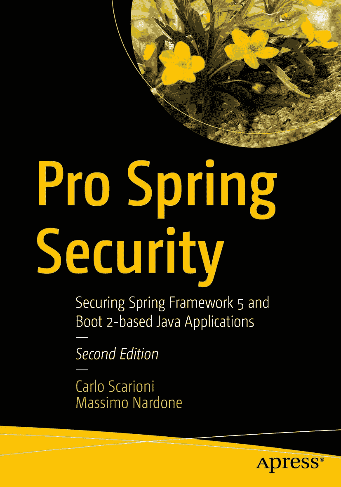

ISBN 978-1-4842-5051-8 电子书 ISBN 978-1-4842-5052-5 [`doi.org/10.1007/978-1-4842-5052-5`](https://doi.org/10.1007/978-1-4842-5052-5) © Carlo Scarioni 与 Massimo Nardone 2019 本作品受版权保护。出版商保留所有权利，无论涉及材料的全部或部分，特别是翻译、重印、重用插图、朗诵、广播、以缩微胶片或任何其他物理方式复制，以及传输或信息存储与检索、电子改编、计算机软件，或采用目前已知或未来开发的类似或不同方法。本书中可能出现商标名称、标识和图像。我们不会在每次出现商标名称、标识或图像时都使用商标符号，而是仅以编辑方式使用这些名称、标识和图像，以维护商标所有者的利益，且无意侵犯商标。本书中使用的商品名称、商标、服务标志及类似术语，即使未明确标识，也不应被视为对其是否受专有权利保护的表达。尽管本书中的建议和信息在出版时被认为是真实准确的，但作者、编辑和出版商均不对可能出现的任何错误或遗漏承担法律责任。出版商对本书所含内容不作任何明示或暗示的担保。本书通过 Springer Science+Business Media New York 在全球图书贸易中发行，地址：233 Spring Street, 6th Floor, New York, NY 10013。电话：1-800-SPRINGER，传真：(201) 348-4505，电子邮件：orders-ny@springer-sbm.com，或访问 www.springeronline.com。Apress Media, LLC 是一家加利福尼亚有限责任公司，其唯一成员（所有者）是 Springer Science + Business Media Finance Inc (SSBM Finance Inc)。SSBM Finance Inc 是一家特拉华州公司。

*谨以此书献给我深爱的已故母亲 Maria Augusta Ciniglio 的记忆。谢谢您，妈妈，感谢您教会我的一切美好事物，感谢您让我成为一个善良的人，感谢您让我学习并成为一名计算机科学家，感谢您留给我的美好回忆。您将永远被爱戴和怀念。我爱您，妈妈。安息吧。*

*——Massimo*

引言

否认 Spring 框架在 Java 世界中的影响是根本不可能的。Spring 为 Java 开发者带来了如此多的优势，以至于我们可以说它让我们所有人都成为了更好的开发者——无论是优秀的开发者，还是普通的开发者，无一例外。

本书的上一版本使用了 Spring Security 3。因此，在本新版中，非常重要的是要指出从 v3 到 v5 的最重要变化。由于 SpringSource 已不再使用，Spring Security v5 现已成为 Pivotal 的一部分。

Spring Framework 5 于 2017 年 9 月发布，可被视为自 2013 年 12 月发布版本 4 以来的首个主要 Spring 框架版本。

Spring 的核心构建块——依赖注入和面向切面编程——广泛适用于许多业务和基础设施关注点，而应用程序安全无疑可以从这些核心功能中受益。这就是 Spring Security：一个构建在强大 Spring 框架之上的应用程序级安全框架，主要处理*身份验证*和*授权*这两个核心安全概念，这也是 Spring Security v5 的一些基本功能。

Spring Security 旨在为您的 Java 应用程序提供功能全面的安全解决方案。尽管其主要关注点是 Web 应用程序和 Java 编程语言，但您将看到它超越了这两个领域。

我们在撰写本书时希望达成的目标是，在解释如何使用特定功能的标准说明之外，揭示 Spring Security 的一些内部工作原理。我们的理念是超越“如何做某事”的基础层面，转而关注框架内部的管道机制。我们发现这是学习的最佳方式：真正看到核心是如何构建的。当然，这并不意味着本书不涵盖基本设置，也不提供关于使用该框架的快速实用建议——因为本书确实包含了这些内容。关键在于，我们不是简单地说“用这个来做那个”，而是说“这个是这样工作的……而这允许你……”。这是一种只有像 Spring 这样的工具才能提供的视角（因为它们是开源的）。

话虽如此，我们建议使用本书的最佳方式是，在您的计算机上检出 Spring Security 的源代码，并同时参考本书的代码和 Spring Security 自身的代码来学习示例。这不仅有助于您理解每个引入的概念，还能教会您不止一个优秀的编程技巧和良好实践。我们建议您在有机会时，采用这种方法来学习任何软件。如果源代码就在那里，就去获取它。有时，几行代码比千言万语更能教会我们东西。在本书中，我们将主要介绍 Spring Boot，分析 Spring Framework，并使用 Spring Security v5.1.5、Java v11 和 Servlet v4 开发 Java Web 应用程序。此外，Spring Security v5 支持多种不同的身份验证机制，本书将介绍并开发这些机制，例如数据库（MongoDB 和 hsqldb）、LDAP、X.509、OAuth 2/OpenID、WebSockets、JSON Web Token (JWT)、JAAS 和 CAS。本书还将介绍 Rails 和 Scala 上下文中的 Grails 和 JRuby 等 Web 开发框架。

## 本书读者对象

本书主要面向在工作中使用 Spring 并需要以利用 Spring 成熟概念和技术的方式为其应用程序添加安全性的 Java 开发者。本书也适用于希望为其应用程序添加 Web 层安全性的开发者，即使这些应用程序的核心并非完全基于 Spring。本书假定您具备 Java 及其部分工具和库（如 Servlet 和 Maven）的知识。同时，本书假定您了解自己希望使用安全功能的目的以及使用场景。这意味着，例如，我们不会深入解释 LDAP 等协议，而是专注于向您展示如何将 Spring Security 与 LDAP 用户存储集成。对 Spring 的深入了解并非必需，因为许多概念会随着学习进程逐步介绍，但您对 Spring 的理解越深，从本书中获得的收益就可能越大。

## 本书结构

本书共分为九章，循序渐进地讲解 Spring Security。内容从基础应用概述和框架结构说明开始，逐步深入到更高级的主题，例如在不同 JVM 语言中使用 Spring Security。本书的编排顺序与该框架在实际应用中的常规使用方式相对应。

各章节内容如下：

*   **第** **1** **章**：总体介绍安全性，以及如何在应用层面处理安全问题。
*   **第** **2** **章**：介绍 Spring Security v5，包括如何使用、何时使用以及其所有安全功能。
*   **第** **3** **章**：通过一个简单的示例应用程序介绍 Spring Security，该程序在 URL 级别保护 Web 访问。
*   **第** **4** **章**：全面介绍 Spring Security 的架构，包括主要组件及其交互方式。
*   **第** **5** **章**：深入介绍 Spring Security 中可用的 Web 层安全选项。
*   **第** **6** **章**：涵盖多种可集成到 Spring Security 的身份验证提供程序，包括 LDAP 和 JASS。
*   **第** **7** **章**：介绍用于保护单个领域对象的访问控制列表（ACL），以及它们如何融入整体安全考量。
*   **第** **8** **章**：解释如何通过利用 Spring Security 模块化架构支持的众多扩展点来扩展其核心功能。
*   **第** **9** **章**：展示如何将 Spring Security 与不同的 Java 框架以及一些重要的 JVM 编程语言集成。

## 前提条件

本书中的所有示例均使用 Java 11 和 Maven 3.6.1 构建。尽可能使用最新的 Spring 版本。全书使用的 Spring Security 版本为 5.1.5。本书中的不同 Web 应用程序主要使用 Tomcat Web Server v9（通过其 Maven 插件），使用的笔记本电脑是配备 8GB 内存的 ThinkPad Yoga 360。所有项目均使用 IntelliJ IDEA Ultimate 2019.2 开发。

您可以使用自己的工具和操作系统。由于所有内容均基于 Java，您应该能够在任何平台上毫无问题地编译程序。

## 下载代码

本书中示例的代码可通过位于 [`www.apress.com/9781484250518`](http://www.apress.com/9781484250518) 的“下载源代码”按钮获取。

## 联系作者

我们非常欢迎您就本书或任何我们能提供帮助的其他主题向我们提供反馈。您可以通过 Carlo Scarioni 的博客 [`http://cscarioni.blogspot.com`](http://cscarioni.blogspot.com/) 联系他，或发送电子邮件至 `carlo.scarioni@gmail.com`。您可以通过电子邮件 `massimonardonedevchannel@gmail.com` 联系 Massimo Nardone。

致谢

本书无疑是多人合作的成果。参与本书编写的人员为最终版本带来了丰富的经验和高质量的内容，使得最终成果比我独自完成要好得多。他们的贡献包括改进文本风格、引入更好的概念呈现方式、进行代码审查以及提出总体改进建议，这些都极大地提升了本书的阅读体验。

我指的当然是 Apress 的优秀同仁们，他们陪伴我走过了撰写本书的整个旅程。我指的是 Steve Anglin，他引导我进入这个项目，远程关注本书的进展，并尽力确保我尽可能保持在正轨上。我指的是 Kevin Shea，他是我主要的编辑联系人，确保我按时完成本书的写作，并提供了建议和支持。我指的是 Tom Welsh，他肩负着在我写作时审阅每一章的重任；他对每个部分都提出了宝贵的意见，包括帮助我改进英语语法，以及思考如何使不同部分对潜在读者更具吸引力。我指的是 Manuel Jordan，他不仅非常详细地阅读了每一章，还承担了评估和执行每一行代码的繁重工作，确保本书提供的代码示例能够被读者在自己的环境中复现。他的贡献非常宝贵，这是决定本书是完整还是半成品的关键。当然，Apress 还有更多人参与了本书的完整审阅阶段，我想对他们所有人说一声“感谢你们的帮助”。

我还要感谢 Spring 和 Spring Security 的创建者、提交者和社区，感谢他们创建了如此出色的软件，并使其对所有人开放。非常感谢他们通过自由分发 SpringSource 保护伞下各个项目的源代码，让所有开发者能够分享他们的知识和工作方式。他们让我们都成为更明智、更优秀的开发者。

最后，我要感谢我的妻子一直陪伴着我，并激励我不断前进。

> —Carlo Scarioni

非常感谢我美好的家人——我的妻子 Pia，以及我的孩子 Luna、Leo 和 Neve——在我撰写本书期间给予我的支持。你们是我生命中最美好的理由。

我要感谢我已故的挚爱母亲 Maria Augusta Ciniglio，她一直如此支持和爱我。我将永远爱您、思念您，我最亲爱的妈妈。

感谢我挚爱的父亲 Giuseppe，以及我的兄弟 Mario 和 Roberto，感谢你们无尽的爱，你们是世界上最好的父亲和兄弟。

我还要将本书献给我已故的最亲爱的表兄 Gerardo “Amerigo” Nardone。我们会永远怀念你。

非常感谢 Steve Anglin 和 Matthew Moodie 给我机会作为作者参与本书的编写，同样感谢 Mark Powers 在编辑过程中所做的出色工作以及一直以来的支持，当然还要感谢本书的技术审阅者，他们帮助我使本书变得更好。

> —Massimo Nardone

### 关于作者与关于技术审阅者

### 关于作者

### 关于技术审阅者

