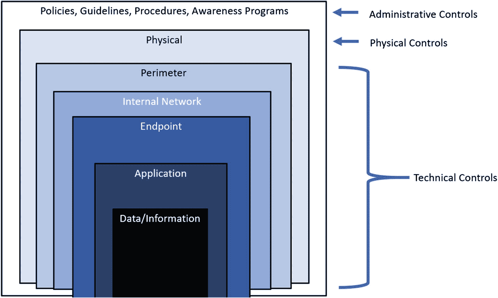
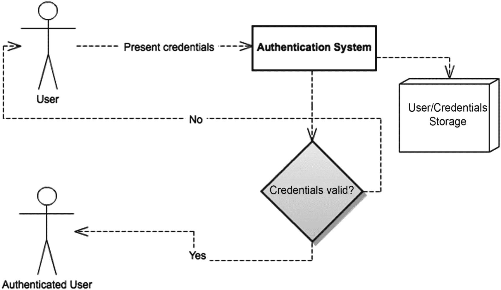
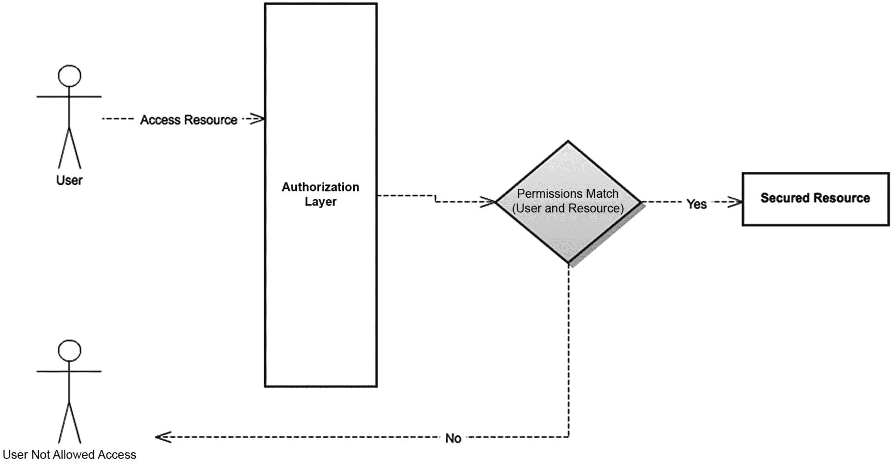
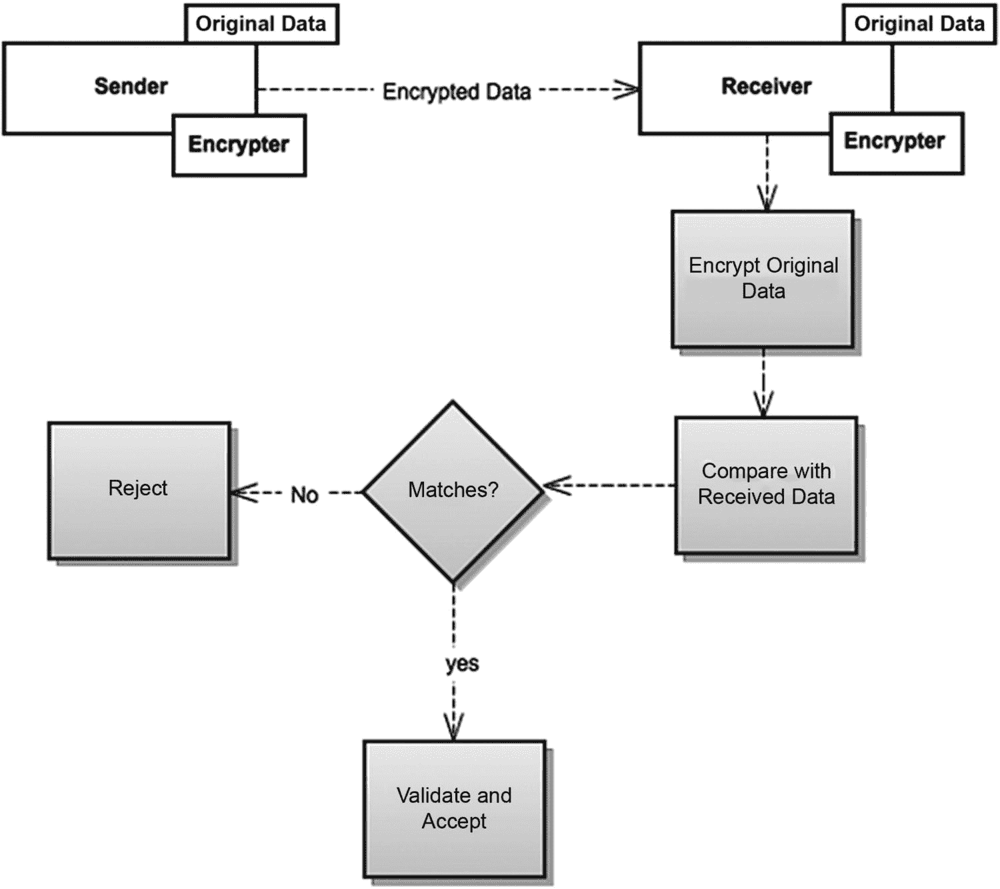
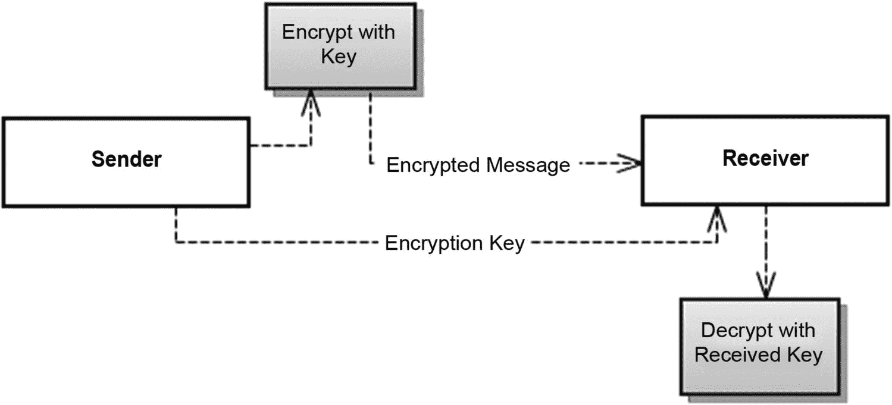
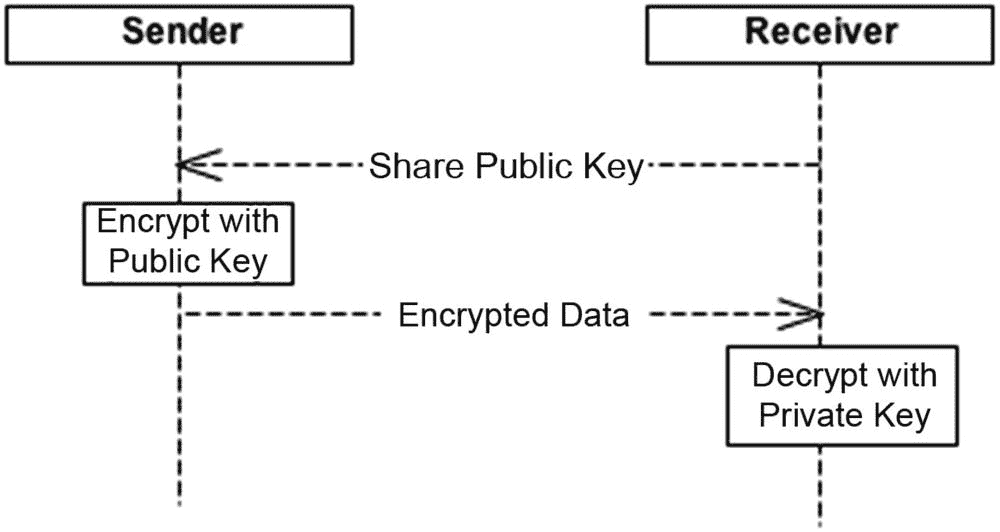
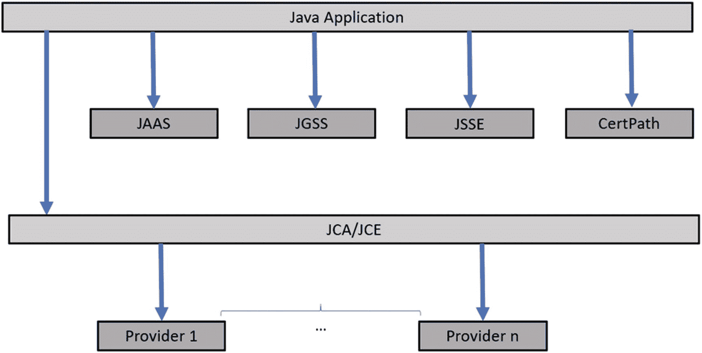

# 1. 安全范围

安全。在 IT 世界中，这是一个含义极其丰富的词。它在众多不同的语境中意味着许多不同的事物，但归根结底，它关乎保护敏感且有价值的资源免受恶意使用。

在 IT 领域，我们拥有多层可能遭受恶意攻击的基础设施和代码，可以说，我们应该确保所有这些层级都获得适当级别的保护。

当然，互联网的发展以及我们通过应用程序触达更多用户的追求，为试图以非法方式访问这些应用程序的网络犯罪分子打开了越来越多的大门。

同样真实的是，我们并不总能确保向公众提供一套经过妥善保护的服务。而且有时，即使我们采取了良好的防护措施，一些黑客仍然足够聪明，能够攻破那些表面上看似足够的安全屏障。

第一步是定义纵深防御（DiD）及其安全层级。通常，纵深防御是一种通过定义所有防御机制如何分层来保护数据和信息安全，从而制定 IT 基础设施网络安全策略的方法。纵深防御的失效或开发过于薄弱，可能导致针对 IT 基础设施的网络安全攻击。

让我们更深入地了解纵深防御的机制部分。首先，纵深防御由三大控制措施组成：

*   **管理控制**：策略、流程、指南、意识培训计划等。
*   **技术控制**：防火墙、防病毒软件、入侵防御系统（IPS）等。
*   **物理控制**：网络和服务器机房、视频监控等。

图 1-1 展示了定义 IT 基础设施安全层级的典型纵深防御机制。

图 1-1
纵深防御机制与 IT 基础设施层级

IT 基础设施中的三个主要安全层级是：网络层、操作系统层（属于端点安全层的一部分）以及应用程序层本身。

## 网络安全层

网络安全层可能是 IT 世界中最为人熟知的一层。当人们谈论 IT 安全时，他们通常会想到网络层面的安全——特别是使用防火墙的安全。

尽管人们常常将安全与网络层面联系起来，但这仅仅是针对攻击者的一层非常有限的防护。一般来说，它最多只能防御 IP 地址，并过滤发往网络中特定机器上特定端口的网络数据包。

在绝大多数情况下，这显然是不够的，因为此层级的流量通常被允许无限制地进入你各种暴露服务的公共开放端口。不同的攻击可能针对这些开放服务，因为攻击者可以执行任意命令，从而破坏你的安全约束。有一些工具，比如流行的 `nmap` ([`http://nmap.org/`](http://nmap.org/))，可以用来扫描机器以发现开放端口。使用此类工具是准备攻击时简单易行的第一步，因为如果这些开放端口没有得到妥善保护，就可以利用众所周知的攻击手段对其进行攻击。

对于 Web 应用程序而言，网络安全层一个非常重要的部分是使用安全套接字层（SSL）来加密所有通过网络传输的敏感信息，但这更多与应用程序层面的网络协议相关，而非防火墙所运行的物理网络层面。

## 操作系统层

操作系统层可能是整个安全架构中最重要的一个，因为一个妥善保护的操作系统环境，至少可以在某个特定应用程序被攻破时，防止整台主机宕机。

如果攻击者以某种方式获得了对操作系统的非安全访问，他们基本上可以为所欲为——从传播病毒、窃取密码，到删除你整个服务器的数据使其无法使用。更糟糕的是，他们甚至可能在你毫无察觉的情况下控制你的计算机，并将其用作僵尸网络的一部分来执行其他恶意行为。这一层可以包括应用程序的部署模型，因为你需要了解操作系统的权限方案，以确保不会赋予你的应用程序不必要的机器权限。应用程序应尽可能与主机上的其他组件隔离运行。

## 应用程序层

本书的主要焦点将是应用程序层。应用程序安全层指的是我们在应用程序中建立的所有约束，以确保只有合适的人在使用应用程序时才能做正确的事情。

默认情况下，应用程序对无数攻击途径是开放的。一个保护不当的应用程序可能允许攻击者从应用程序中窃取信息、冒充其他用户、执行受限操作、破坏数据、获取操作系统级别的访问权限，以及执行许多其他恶意行为。

在本书中，我们将介绍应用程序级别的安全，这是 Spring Security 的领域。应用程序级别的安全是通过实施多种技术来实现的，并且有几个概念将帮助你更好地理解本书后续内容。这些是 Spring Security 为解决的主要问题，旨在为你的应用程序提供全面的威胁防护。在接下来的三个小节中，我们将介绍：

*   认证
*   授权
*   ACL（访问控制列表）

### 认证

认证过程允许应用程序验证某个特定用户是否为其所声称的身份。在认证过程中，用户向应用程序提供只有她自己知道的信息（通常是用户名和密码）。应用程序获取这些信息，并尝试将其与存储的信息进行匹配——通常存储在数据库或 LDAP^(¹)（轻量级目录访问协议）服务器中。如果用户提供的信息与认证服务器中的记录匹配，则该用户在系统中成功通过认证。应用程序通常会在系统中创建一个内部抽象来表示这个已认证的用户。图 1-2 展示了认证机制。

图 1-2
简单、标准的认证机制

### 授权

当用户通过认证时，这仅意味着该用户是系统已知的并且已被系统识别。这并不意味着该用户可以在该系统中为所欲为。保护应用程序安全的下一步逻辑是确定允许用户执行哪些操作，以及她有权访问哪些资源，并确保如果用户没有适当的权限，她就无法执行该特定操作。这就是授权过程的工作。在大多数情况下，授权过程会将用户的权限集与在应用程序中执行特定操作所需的权限进行比较，如果匹配，则授予访问权限。另一方面，如果不匹配，则拒绝访问。图 1-3 展示了授权机制。

图 1-3
简单的授权过程。已认证的用户尝试访问受保护的资源

### 访问控制列表

访问控制列表（ACL）是上一节所述授权过程的一部分。关键区别在于，ACL 通常在应用程序中以更细粒度的级别工作。ACL 仅仅是资源、用户和权限之间映射关系的集合。通过 ACL，你可以建立诸如“用户 John 对博客文章 X 拥有管理权限”或“用户 Luis 对博客文章 X 拥有读取权限”之类的规则。你可以看到三个要素：用户、权限和资源。图 1-3 展示了 ACL 的工作原理；它们只是通用授权过程的一个特例。

## 身份验证与授权：基本概念

在本节中，我们将介绍并解释一些基本的安全概念，你在本书后续部分会经常遇到它们：

*   **用户**：保护系统免受恶意攻击者侵害的第一步是识别合法用户并仅允许他们访问。系统中会创建用户抽象并赋予其独立身份。这些用户就是之后被允许使用系统的人。

*   **凭证**：凭证是用户证明自己身份的方式。通常以密码的形式出现（证书也是提供凭证的常见方式），它们是只有其所有者才知道的数据。

*   **角色**：在应用程序安全上下文中，角色可以被视为用户的逻辑分组。进行这种逻辑分组通常是为了让分组后的用户在应用程序中共享一组访问特定资源的权限。例如，所有拥有管理员角色的用户将对相同资源拥有相同的访问权限。角色仅仅是一种将权限分组以执行特定操作的方式，使得拥有这些角色的用户继承这些权限。

*   **资源**：在此上下文中，*资源* 指的是我们想要访问的、并且需要妥善保护以防止未授权访问的应用程序的任何部分——例如，一个 URL、一个业务方法或一个特定的业务对象。

*   **权限**：权限指的是访问特定资源所需的访问级别。例如，可能允许两个用户读取某个特定文档，但只允许其中一人对其进行写入。权限可以应用于单个用户，也可以应用于共享特定角色的用户。

*   **加密**：这允许你对敏感信息（通常是密码，但也可能是其他内容，如 cookies）进行加密，即使攻击者获得了加密版本，也无法理解其内容。其理念是，你永远不要存储密码的明文版本，而是存储加密版本，这样除了密码所有者之外，没有人知道原始密码。主要有三种加密算法：
    *   **单向加密**：这些算法被称为*哈希算法*，它们接收一个输入字符串并生成一个称为*消息摘要*的输出数字。这个输出数字无法转换回原始字符串。这就是该技术被称为*单向加密*的原因。使用方法如下：请求客户端加密一个字符串并将加密后的字符串发送给服务器。例如，服务器可能通过之前的注册过程拥有原始信息，如果有，它可以对原始信息应用相同的哈希函数。然后它将哈希运算的输出与客户端发送的值进行比较。如果匹配，服务器就验证该信息。图 1-4 展示了这一方案。通常，服务器甚至不需要原始数据。它可以简单地存储哈希版本，然后将其与客户端传入的哈希值进行比较。

图 1-4

单向加密或哈希

*   **对称加密**：这些算法提供两种功能：加密和解密。一段文本字符串被转换成加密形式，然后可以再转换回原始字符串。在这种方案中，发送方和接收方共享相同的密钥，以便他们可以在通信的两端加密和解密消息。这种方案的一个问题是如何在通信端点之间共享密钥。一种常见的方法是使用并行的安全通道来发送密钥。图 1-5 展示了对称加密的工作原理。

图 1-5

对称加密。两个端点共享相同的加密/解密密钥

*   **公钥密码学**：这些技术基于非对称密码学。在这种方案中，用于加密和解密的密钥是不同的。这两个密钥分别被称为*公钥*（用于加密消息）和*私钥*（用于解密消息）。与对称加密相比，这种方法的好处是不需要共享解密密钥，因此除了信息的预期接收者之外，没有人能够解密消息。所以通常的场景如下：
    *   消息的预期接收者将她的公钥分享给所有有兴趣向她发送信息的人。

*   发送方使用接收方的公钥加密信息，并发送消息。

*   接收方使用她的私钥解密消息。

*   没有其他人能够解密消息，因为他们没有接收方的私钥。

图 1-6 展示了公钥密码学方案。

图 1-6

公钥密码学

加密的使用，除了其他方面，还实现了另外两个安全目标：

*   **机密性**：属于某个用户或用户组的潜在敏感信息，应仅能由该用户或用户组访问。加密算法是实现此目标的主要帮手。

*   **完整性**：由合法用户发送的数据，在传输到服务器的途中或在其存储过程中，不应被第三方篡改。这通常通过使用单向加密算法来实现，这些算法使得几乎不可能在篡改输入后产生一个损坏的消息，同时其加密哈希值与原始消息相同（从而欺骗接收者认为它是有效的）。

## 需要保护的内容

并非应用程序的每个部分都需要强大的安全模型，甚至根本不需要任何安全措施。例如，如果你的应用程序某部分旨在为所有感兴趣的用户提供静态内容，那么直接提供这些内容即可。这里可能没有任何需要处理的安全问题。

不过，在开始开发一个新应用时，你应该思考该应用将面临的安全约束。你需要考虑以下列表中的问题，并判断它们是否适用于你的特定用例：

*   **身份管理**：你的应用程序很可能需要为使用它的不同用户建立身份。通常，应用程序会为不同用户提供不同功能，因此你需要一种方法将用户与特定功能关联起来。同时，你还必须确保保护每个用户的身份信息，使其不被泄露。

*   **安全连接**：在互联网环境中，世界上任何人都可能访问你的系统，并窃听其他用户访问你系统的行为。因此，你很可能需要使用某种传输层安全协议（如 SSL）来保护敏感数据的通信。

*   **敏感数据保护**：敏感数据需要受到保护，以防恶意攻击。这适用于通信层、单个消息传输以及凭证数据存储。应在不同层面使用加密技术，以实现尽可能安全的应用程序。

## 更多安全问题

除了上述问题，还有许多其他安全问题。由于这是一本关于 Spring Security 的书，而非通用的应用安全书籍，我们将只涵盖与 Spring Security 相关的内容。但我们认为，让你明白除了 Spring Security 直接解决的问题之外，还存在更多安全问题，这一点很重要。以下是一些最常见问题的快速概述。这仅旨在让你意识到它们的存在，我们建议你查阅其他资料（例如通用的软件安全教科书），以更好地理解所有这些安全问题。

*   **SQL（及其他代码）注入**：验证用户输入是应用安全中非常重要的一部分。如果数据未经验证，攻击者可能会将任意字符串作为输入（包括 SQL 或服务器端代码）并发送到服务器。如果服务器代码编写不当，攻击者可能会造成严重破坏，因为她可以在服务器上执行任意代码。

*   **拒绝服务攻击**：此类攻击旨在使目标系统对其预期用户无响应。通常通过向服务器发送大量请求来耗尽服务器所有资源，使其无法响应合法请求。

*   **跨站脚本攻击与输出清理**：这是一种以应用程序客户端部分为目标的注入方式。其思路是攻击者可以使应用程序在返回的网页中包含恶意代码，从而在用户浏览器中执行该代码。这样，攻击者就可以利用真实用户的已认证会话，在用户不知情的情况下执行操作。

## Java 安全选项

Java 和 Java EE 开箱即用的安全解决方案非常全面。它们涵盖了从底层权限系统、加密 API 到身份验证和授权方案等多个领域。

Java 提供的安全 API 列表非常广泛，以下列出了主要的几个：

*   **Java 加密体系结构 (JCA)**：此 API 提供对加密算法的支持，包括哈希摘要和数字签名支持。

*   **Java 加密扩展 (JCE)**：此 API 主要提供字符串加密和解密的功能，以及为对称算法生成密钥的功能。

*   **Java 证书路径 API (CertPath)**：此 API 提供了全面的功能，用于将数字证书的验证和校验集成到应用程序中。

*   **Java 安全套接字扩展 (JSSE)**：此 API 提供了一套标准化的功能，用于在 Java 中支持客户端和服务器端的 SSL 和 TLS 协议。

*   **Java 身份验证和授权服务 (JAAS)**：此 API 为 Java 应用程序提供身份验证和授权服务。它提供了一个可插拔的系统，身份验证机制可以独立地插入到应用程序中。

请参考此链接获取 Java 11 安全 API 的完整列表：[`https://docs.oracle.com/en/java/javase/11/security/java-security-overview1.html#GUID-2EF0B3B8-9F3A-41CF-A7DA-63DB52180084`](https://docs.oracle.com/en/java/javase/11/security/java-security-overview1.html%2523GUID-2EF0B3B8-9F3A-41CF-A7DA-63DB52180084)。

图 1-7 展示了 Java 平台安全架构和元素。

图 1-7

Java 平台安全架构和元素

Spring Security 的主要关注点在于身份验证/授权领域。因此，它主要与 JAAS Java API 重叠，尽管它们可以一起使用，正如你将在本书后面看到的那样。Spring Security 中利用了大多数其他 API。例如，`CertPath` 用于 `X509AuthenticationFilter`，`JCE` 用于 `spring-security-crypto` 模块。

## 总结

在本章中，我们从一般安全角度出发，深入介绍了纵深防御 (DiD) 及其机制。我们以非常抽象的方式解释了 IT 安全中的主要关注点，特别是从应用程序的角度。我们还非常简要地描述了在不同层面支持安全性的主要 Java API。

你可以看到，本章是对安全问题的一个非常快速的概述。在通用主题上深入探讨超出了本书的范围，尽管当某些主题适用于 Spring Security 时，我们会更深入地研究它们。显然，这并非一本全面的软件安全指南，如果你有兴趣了解更多关于软件安全的一般知识，应查阅专业文献。下一章将正式介绍 Spring Security。

脚注 1

