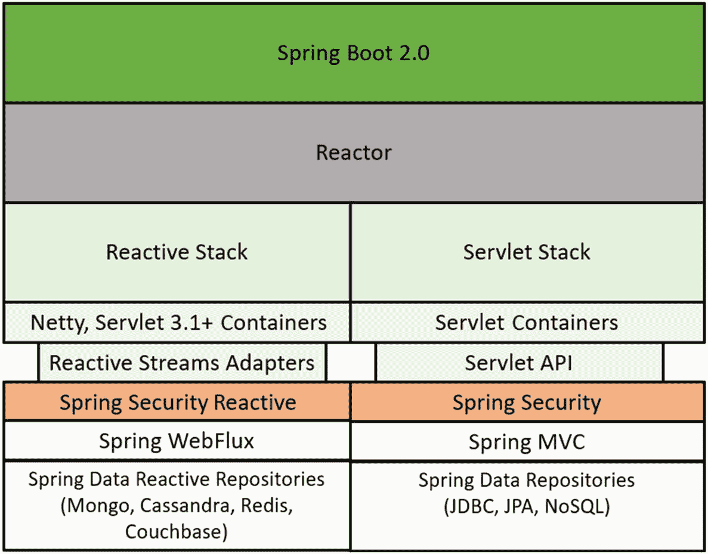
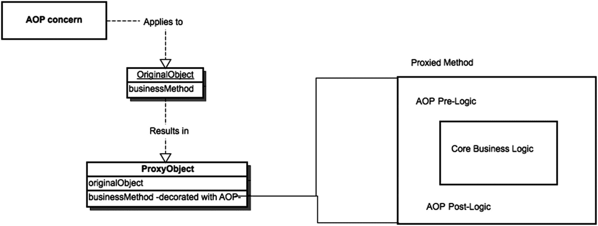
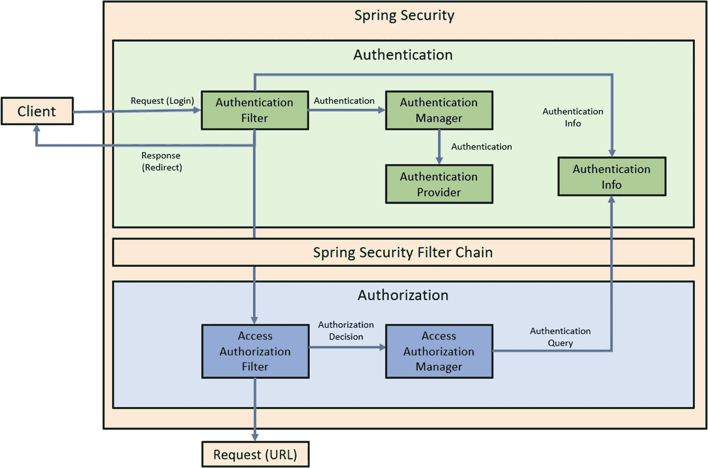

# 2.  Spring Security 简介

在本章中，你将了解什么是 Spring Security，以及如何使用它来解决应用程序的安全问题。

我们还将描述 Spring Framework 和 Spring Security 5 版本中的新特性。由于本书将大量使用 Spring Security 5 进行身份验证和授权，因此我们将更详细地介绍如何使用它。

最后，我们将查看框架的源代码，了解如何构建它，以及构成强大 Spring Security 项目的不同模块。


## 什么是 Spring Security？

Spring Security 是一个致力于以开发者友好且灵活的方式，为 Java 应用程序提供全套安全服务的框架。它遵循 Spring 框架引入的成熟实践。Spring Security 试图解决应用程序内部所有层级的安全问题。此外，它还附带大量配置选项，使其非常灵活且强大。

回顾第 1 章，可以说 Spring Security 只是一个构建在 Spring 框架之上的综合性认证/授权框架。尽管使用该框架的大多数应用程序都是基于 Web 的，但 Spring Security 的核心也可以用于独立应用程序。

许多特性使得 Spring Security 对 Java 开发者具有立竿见影的吸引力。仅举几例，请考虑以下列表：

*   **它构建在成功的** **Spring 框架** **之上。** 这是 Spring Security 的一个重要优势。Spring 框架已成为构建企业级 Java 应用程序的“标准方式”，并且理由充分。它围绕良好实践以及两个简单而强大的概念构建：依赖注入（DI）和面向切面编程（AOP）。同样重要的是，许多开发者拥有 Spring 经验，因此他们可以在项目中引入 Spring Security 时利用这些经验。

*   **它为多种认证模型提供开箱即用的支持。** 比上一点更重要的是，Spring Security 支持与轻量级目录访问协议（LDAP）、OpenID、表单认证、X.509 证书认证、数据库认证、Jasypt 加密等众多技术的开箱即用集成。所有这些支持意味着 Spring Security 能够适应您的安全需求——不仅如此，如果您的需求发生变化，它也能轻松改变，而无需开发者付出太多努力。有关 Jasypt 加密的更多信息，请访问 [`www.jasypt.org/`](http://www.jasypt.org/)。

从业务角度来看，这一点也很重要，因为应用程序既可以适应企业认证服务，也可以实现自己的认证服务，只需进行简单的配置更改即可。

这也意味着您需要编写的软件少得多，因为您正在使用大量由庞大且活跃的用户社区编写和测试的现成代码。在某种程度上，您可以信任这些代码能够正常工作并放心使用。如果它确实不起作用，您也可以随时修复它，并向项目维护者发送补丁。

*   **它提供** **分层安全服务。** Spring Security 允许您在不同级别保护应用程序，并保护您的 Web URL、视图、服务方法和领域模型。您可以挑选并组合这些功能来实现您的安全目标。

这在实践中非常灵活。例如，假设您通过 RMI、Web、JMS 等方式提供服务。您可以保护所有这些接口，但也许更好的做法是只保护业务层，这样所有请求在到达该层时都得到保护。此外，也许您不关心保护单个业务对象，因此您可以省略该模块，只使用您需要的功能。

*   **它是** **开源软件。** 作为 Pivotal 产品组合的一部分，Spring Security 是一个开源软件工具。它还有一个致力于测试和改进该框架的大型社区和用户群。有机会使用开源软件对大多数开发者来说是一个有吸引力的特性。能够查看您喜欢并使用的工具的源代码是一个令人兴奋的前景。无论我们的目标是改进工具，还是仅仅了解它们内部的工作原理，我们开发者都喜欢阅读代码并从中学习。

## Spring Security 适用于何处？

Spring Security 无疑是一个强大且多功能的工具。但与其他任何工具一样，它并非能适应您想做的所有事情。它的功能有明确的适用范围。

您会在何处以及为何使用 Spring Security？以下是一些原因和场景列表：

*   **您的应用程序使用 Java、Groovy 或 Kotlin。** 首先要考虑的是，Spring Security 可以用 Java、Groovy 或 Kotlin 等语言编写，通常也适用于 JVM 支持的任何语言。因此，如果您计划使用非 JVM 语言，Spring Security 对您将毫无用处。

*   **您需要** **基于角色的认证/授权。** 这是 Spring Security 的主要用例。您有一个用户列表，以及一个资源列表和这些资源上的操作列表。您将用户分组为角色，并允许特定角色访问特定资源上的特定操作。这就是核心功能。

*   **您想要保护** **Web 应用程序** **免受恶意用户攻击。** 如前所述，Spring Security 主要用于 Web 应用程序环境。在这种情况下，首先要做的是只允许您希望访问应用程序的用户访问，同时禁止所有其他用户甚至接触它。

*   **您需要与** **OpenID** **、** **LDAP** **、** **Active Directory** **和** **数据库** **作为安全提供者集成。** 如果您需要与特定的用户和角色或组提供者集成，您应该查看 Spring Security 提供的众多选项，因为集成可能已经为您实现，从而避免您编写大量不必要的代码。有时您可能不确定您的业务需要哪个提供者进行认证。在这种情况下，Spring Security 通过允许您以无痛的方式在不同提供者之间切换，让您的生活变得轻松。

*   **您需要保护您的** **领域模型** **，并只允许特定用户访问应用程序中的特定对象。** 如果您需要细粒度的安全性（即，您需要基于每个对象、每个用户进行保护），Spring Security 提供了访问控制列表（ACL）模块，这将帮助您以直接的方式实现这一点。

*   **您希望以一种非侵入式、声明性的** **方式为您的应用程序添加安全性。** 安全性是一个横切关注点，而不是您应用程序的核心业务功能（除非您在安全提供商公司工作）。因此，最好将其视为一个独立的、模块化的附加组件，您可以独立于主要业务关注点来声明、配置和管理它。Spring Security 正是基于此理念构建的。通过使用 Servlet 过滤器、XML 配置和 AOP 概念，该框架力求不使安全规则污染您的应用程序。即使使用注解，它们也只是代码之上的元数据。它们不会干扰您的代码逻辑。作为 Java 开发者，您必须尝试将 Java 配置隔离到一个配置库中，并以类似于处理 XML 的方式将其与应用程序的其余部分解耦。

*   **您希望以保护 URL 的相同方式来保护您的** **服务层** **，并且需要在方法级别添加规则以允许或禁止用户访问。** Spring Security 允许您在应用程序的各层中使用一致的安全模型，因为它内部强制实施了这种一致的模型。您只需在一个地方配置用户、角色和提供者，服务层和 Web 层都会以透明的方式利用这个集中式的安全配置。


*   **您需要应用程序在用户下次访问时记住他们，并允许他们访问。** 有时，您不希望或不需要应用程序的用户每次访问您的网站时都登录。Spring 提供了开箱即用的“记住我”功能，以便用户在后续访问您的网站时可以自动登录，从而允许他们完全或部分访问其个人资料的功能。

*   **您希望使用公钥/私钥证书来对您的应用程序进行身份验证。** Spring Security 允许您使用 X.509 证书来验证服务器的身份。服务器也可以向客户端请求有效证书，以建立相互认证。

*   **您需要向某些用户隐藏网页中的元素，并向其他用户显示这些元素。** 视图安全是安全 Web 应用程序中的第一层安全。它通常不足以保证安全，但从可用性的角度来看非常重要，因为它允许应用程序根据当前登录系统的用户来显示或隐藏内容。

*   **对于您的应用程序，您需要比简单的基于角色的身份验证更灵活的方式。** 例如，假设您希望仅允许 18 岁以上的用户使用简单的脚本表达式进行访问。Spring Security 3.1 使用 Spring 表达式语言 (SpEL) 允许您自定义应用程序的访问规则。

*   **您希望您的应用程序自动处理与授权错误相关的 HTTP 状态码（401、403 等）。** Spring Security 为 Web 应用程序内置的异常处理机制会自动将更常见的异常转换为相应的 HTTP 状态码；例如，`AccessDeniedException` 会被转换为 `403` 状态码。

*   **您希望配置您的应用程序以供其他应用程序（而非浏览器）使用，并允许这些其他应用程序对您的应用程序进行身份验证。** 访问您应用程序的其他应用程序应被强制使用身份验证机制才能获得访问权限。例如，您可以通过 REST 端点公开您的应用程序，其他应用程序可以使用 HTTP 安全性访问这些端点。

*   **您在 Java EE 服务器之外运行应用程序。** 如果您在像 Apache Tomcat 这样的简单 Web 容器中运行应用程序，您可能无法获得完整的 Java EE 安全栈支持。在这些环境中可以轻松利用 Spring Security。

*   **您在 Java EE 服务器内部运行应用程序。** 即使您运行的是完整的 Java EE 容器，Spring Security 也比 Java EE 对应的方案更完整、更灵活且更易于使用。

*   **您已经在应用程序中使用 Spring，并希望利用您对它的了解。** 我们之前解释了 Spring 的一些巨大优势。如果您目前正在使用 Spring，您可能非常喜欢它。因此，您可能也会喜欢 Spring Security。

## Spring Security 概述

Spring Security v5 不再是 SpringSource 的一部分，而是现在属于 Pivotal。Pivotal 的 Spring 包含许多项目：

*   Spring Security
*   Spring Boot
*   Spring Framework
*   Spring Cloud Data Flow
*   Spring Cloud
*   Spring Data
*   Spring Integration
*   Spring Batch
*   Spring Hateoas
*   Spring Rest Docs
*   Spring Amqp
*   Spring Mobile
*   Spring For Android
*   Spring Web Flow
*   Spring Web Services
*   Spring Ldap
*   Spring Session
*   Spring Shell
*   Spring Flo
*   Spring Kafka
*   Spring Statemachine
*   Spring Io Platform
*   Spring Roo
*   Spring Scala
*   Spring Blazeds Integration
*   Spring Loaded
*   Spring Xd
*   Spring Social

更多信息，请参考 Spring 项目网页 [`https://spring.io/projects`](https://spring.io/projects)。

所有这些项目都构建在 Spring 框架本身提供的设施之上，而 Spring 框架是这一切的起源项目。您可以将 Spring 视为所有这些卫星项目的中心，为它们提供一致的编程模型和一套既定实践。您将在不同项目中看到的主要要点是 DI、基于 XML 命名空间的配置和 AOP 的使用，正如您将在下一节中看到的，这些是 Spring 赖以建立的支柱。在 Spring 的后续版本中，注解已成为配置 DI 和 AOP 相关问题最流行的方法。

在本书中，我们将主要介绍 Spring Boot，分析 Spring Framework，并开发 Spring Security 版本 5。让我们从 Spring Boot 开始。

什么是 Spring Boot？

Spring Boot 是一个基于 Java 的开源框架，通常用于开发微服务、企业级应用程序。它由 Pivotal 团队开发，帮助开发人员创建独立且生产就绪的 Spring 应用程序。

Spring Boot 被认为是构建所有基于 Spring 的应用程序并尽可能快速运行它们的一个简单起点，只需最少的 Spring 前期配置。

### 注意

请记住，Spring Security 应用程序可以使用 Maven 或 Gradle 开发。

正如我们所说，Spring Security 只是 Spring 项目中的一个，它专门致力于解决应用程序中的安全问题。

更多信息，请参考文档 [`https://spring.io/projects/spring-security`](https://spring.io/projects/spring-security)。

Spring Security 最初是一个非 Spring 项目。它最初被称为 *The Acegi Security System for Spring*，并且不像今天这样庞大而强大。最初，它只处理授权问题，并利用容器提供的身份验证。由于公众需求，随着越来越多的人开始使用它并为其不断增长的代码库做出贡献，该项目开始获得关注。这最终使其成为 Spring 框架组合项目中的一个，后来更名为“Spring Security”。

以下是 Spring Security 主要版本的发布日期：

*   2.0.0（2008 年 4 月）
*   3.0.0（2009 年 12 月）
*   4.0.0（2015 年 3 月）
*   5.0.0（2017 年 11 月）
*   5.1.4（2019 年 2 月）

请注意，Spring Security 的 Java 配置是在 Spring 3.1 中添加到 Spring 框架的，并在 Spring 3.2 中扩展到 Spring Security，并在带有 `@Configuration` 注解的类中定义。

因此，多年来，该项目一直处于 Pivotal 项目组合之下，由 Spring 框架本身提供支持。

但 Spring 框架到底是什么？


## Spring Framework 5：快速概览

我们在前文中多次提及 Spring Framework 项目。在此处对其进行概述是合理的，因为本书后续章节将要介绍的许多 Spring Security 特性都依赖于 Spring 的基础构建模块。

我们承认自己有所偏爱。我们热爱 Spring，并且已经热爱多年。我们认为 Spring 拥有如此多的优势与卓越特性，以至于我们在启动任何新的 Java 项目时都无法不使用它。此外，在使用其他语言进行开发时，我们也倾向于沿用 Spring 的概念，并寻找应用它们的方法，因为这些概念如今已显得如此自然。

Spring Framework 5 的概览如图 2-1 所示。



图 2-1

Spring Framework 5

Spring Framework 5 于 2017 年 9 月发布，可被视为自 2013 年 12 月发布版本 4 以来的首个主要 Spring Framework 版本。

以下是 Spring Framework 5 中最重要的新特性列表：

*   JDK 基线更新，升级至 Java JDK 11
*   响应式编程模型。Spring 5 框架构建于响应式基础之上，完全异步且非阻塞。
*   使用注解进行编程。Spring 5 现在是一种基于注解的编程模型。
*   新的函数式编程方法（包括 Kotlin）
*   使用 REST 端点进行响应式风格编程
*   HTTP/2 支持
*   Kotlin 和 Spring WebFlux 支持
*   支持使用 Lambda 表达式注册 Bean
*   Spring WebMVC 对最新 API 的支持
*   测试改进，例如使用 JUnit 5 进行条件测试和并发测试
*   与 Spring WebFlux 的集成测试
*   核心框架修订
*   Spring 核心与容器的常规更新
*   包清理与弃用支持

Spring 吸引我们的地方有很多，但最主要的是框架的两大基础构建模块：**依赖注入**和**面向切面编程**。

为什么这两个概念如此重要？因为它们实际上允许你默认开发出**松散耦合**、**单一职责**、**DRY（不要重复自己）** 的代码。这两个概念以及 Spring 本身，在其他书籍和在线教程中已有广泛介绍；不过，我们在此会给出一个简要概述。

### 依赖注入

DI（依赖注入）是 IoC（控制反转）的一种类型，其基本思想很简单：不是让对象自行实例化其所需的依赖，而是以某种方式将这些依赖提供给该对象。以一种多态的方式，作为依赖提供给目标对象（该对象依赖于这些依赖）的那些对象，目标对象仅通过一个抽象（例如 Java 中的接口）来了解它们，而不是通过依赖的具体实现。

IoC 架构的主要优势在于：

*   更容易在不同实现之间切换
*   提供良好的程序模块化
*   通过隔离组件依赖并允许它们通过契约进行通信，为测试程序提供了极佳特性
*   将特定任务的执行与其实现分离

通过代码来理解这一点比解释更容易。请参见清单 2-1。

```
public class NonDiObject {
private Helper helper ;
public NonDiObject ( ) {
helper = new HelperImpl ( ) ;
}
public void doStuffWithHelp( ) {
helper.help( ) ;
}
}
清单 2-1
对象自身实例化其依赖（无依赖注入）
```

在这个例子中，`NonDiObject` 的每个实例都负责在其构造函数中实例化自己的 `Helper`。你可以看到它实例化了一个 `HelperImpl`，从而与这个特定的 `Helper` 实现产生了紧密且不必要的耦合。现在请看清单 2-2。

```
public class DiObject {
private Helper helper ;
public DiObject(Helper helper) {
this.helper = helper;
}
public void doStuffWithHelp( ) {
helper.help( ) ;
}
}
清单 2-2
对象从外部源接收其依赖（使用依赖注入）
```

在这个版本中，`Helper` 在构造时被传递给 `DiObject`。`DiObject` 无需实例化任何依赖。它甚至不需要知道如何实例化，或者 `Helper` 是哪种具体的实现类型，也不知道它来自何处。它只需要一个 helper，并根据其需求使用它。

这种方法的优势应该很清晰。第二个版本与 `Helper` 是松散耦合的，仅依赖于 `Helper` 接口，允许在运行时决定具体的实现，从而为设计提供了极大的灵活性。

Spring 依赖注入配置通常定义在 XML 文件中，尽管后续版本已更多地转向基于注解的配置和基于 Java 的配置。


### 面向切面编程

AOP 是一种从主应用程序代码中提取横切关注点，并以横向方式在需要它们的各个点进行应用的技术。AOP 关注点的典型示例包括事务、日志记录和安全性。

其主要思想是，将应用程序的核心业务逻辑与外围的专用关注点解耦，然后以透明、不突兀的方式在整个应用程序中应用这些功能。通过将这些功能（即通用的应用程序逻辑，而非核心业务逻辑）封装到其自身的模块中，它们可以被应用程序中需要它们的多个部分使用，从而避免了在代码中到处重复。在 AOP 术语中，封装这些横切逻辑的实体被称为切面。

Java 中有许多 AOP 的实现。最流行的可能是 AspectJ，它需要一个特殊的编译过程。Spring 支持 AspectJ，但它也包含了自己的 AOP 实现，简称为 *Spring AOP*，这是一个纯 Java 实现，不需要特殊的编译过程。

使用代理的 Spring AOP 仅在公有方法级别可用，并且仅当从被代理对象外部调用时才有效。这是有道理的，因为从对象内部调用方法不会调用代理；相反，它会直接调用真实的自身对象（基本上是对 `this` 对象的调用）。在使用 Spring 时，意识到这一点非常重要，有时新手 Spring 开发者会忽略这一点。

即使使用自己的 AOP 实现，Spring 也利用了 AspectJ 的语法和概念来定义切面。

Spring AOP 是一个相当大的主题，但其工作方式背后的原理并不难理解。Spring AOP 通过使用动态创建的代理对象来工作，这些代理对象负责处理围绕主业务对象调用的 AOP 关注点。你可以将代理和 Spring AOP 简单地视为装饰器模式的实现，其中你的业务对象是组件，而 AOP 代理是装饰器。图 2-2 展示了该概念的简单图形表示。这样思考，你应该能够轻松理解 Spring AOP。清单 2-3 展示了这种魔法在概念上是如何发生的。



图 2-2

Spring AOP 实战

```
public class Business Object implements BusinessThing {
public void doBusinessThing( ) {
/ / 一些业务逻辑
}
}
清单 2-3
业务对象，非事务性
```

假设你有一个用于事务的切面。Spring 在运行时动态创建一个概念上类似于清单 2-4 的对象。

```
public class BusinessObjectTransactionalDecorator implements BusinessThing {
private BusinessThing componen t ;
public BusinessObjectTransactionalDecorator(BusinessThing component ) {
t h i s . co mponent = component ;
}
public void doBusinessThing( ) {
/ / 一些启动事务的代码
component.doBusinessThing( ) ;
/ / 一些提交事务的代码
}
}
清单 2-4
Spring AOP 魔法
```

再次强调，记住这个简单的想法，Spring AOP 应该会更容易理解。

## Spring Security 5 的新特性

本书的上一版本使用了 Spring Security 3。因此，了解从版本 3 到版本 5 最重要的变化非常重要。它们如下：

*   自 v5 起，Pivotal 支持 Spring Security，因为 SpringSource 已不复存在。

*   v5 使用的 javax.servlet-api 版本是 4.0.1。

*   现在，默认情况下，ContextPath 是 `/`。如果你需要定义特定的 contextPath，请使用 `/app_name` 或通过属性进行配置；例如，`server.servlet.contextPath=/springbootapp`。

*   Spring Security 过滤器链 (CSRF)：自 v3 之后，CSRF 令牌过滤器被添加到过滤器链中，并默认开启。

*   `j_username`/`j_password` 参数：从 v4 开始，我们不再在身份验证请求中接收 `username` 值。此外，它们已更新为 `username` 和 `password`，去掉了 `j_` 前缀。

*   v5 中增加了 CSRF 保护。

*   v5 中密码编码是强制性的。

*   从 Servlet 3.0 开始，不再需要 `web.xml` 文件。

*   使用 Java 配置可以更轻松地进行 Spring Security 配置。

*   可以在 Log4J2 配置文件中将调试级别设置为 DEBUG 的组合使用。

如果你需要从 v3 迁移到 v5，我们推荐以下链接，其中展示了如何迁移：

*   `https://docs.spring.io/spring-security/site/migrate/current/3-to-4/html5/migrate-3-to-4-xml.html`

*   `https://github.com/spring-projects/spring-framework/wiki/Upgrading-to-Spring-Framework-5.x`

以下是 Spring Security 5.1.4.RELEASE 中包含的一些最重要的新功能：

*   支持 JDK 11

*   通过 UserDetailsPasswordService 自动升级密码存储

*   支持 OAuth 2.0 客户端（适用于 Servlet 和 WebFlux）

*   引入了 HTTP 防火墙保护

*   支持 LDAP 身份验证，现在可以使用自定义环境变量进行配置

*   支持 X.509 身份验证，用于将主体作为策略进行派生

*   支持 Graal 原生镜像约束

*   升级到 Reactor Core 3.2、Reactor Netty 0.8、ASM 7.0 和 CGLIB 3.2.8

*   支持 Spring 的 JCL 桥接日志记录

*   支持 FileSystemResource 中的 NIO.2 Path

*   改进了核心类型和注解解析性能

*   控制器参数注解现在也可以在接口上被检测到

*   添加了对 HTTP PUT、PATCH 和 DELETE 的 Servlet 请求参数支持

*   为 HTTP 请求和 WebSocket 会话添加了关联的日志消息，并增加了对 DEBUG 日志记录的控制

*   更一致地检测方法注解

*   支持在使用 Reactor Netty 0.8 运行时使用 HTTP/2 服务器

*   改进了 DEBUG 和 TRACE 日志记录

*   在 WebTestClient 中支持 Hamcrest 和 XML 断言

*   支持配置固定 WebSession 的 MockServerWebExchange

*   改进了人性化、紧凑的 DEBUG 和 TRACE 日志记录

*   增加了对潜在敏感数据的 DEBUG 日志记录的控制

*   更新了 Web 区域设置表示（例如，语言标签、时区 cookie 等）

*   为缺失的 header、cookie 和路径变量添加了特定的 MVC 异常

*   为注解控制器集合添加了基础路径（外部配置）

*   集中处理“forwarded”类型头

*   在 @Profile 条件中支持逻辑与/或表达式

*   支持提供 Brotli 压缩

*   在单构造函数场景中支持空集合/映射/数组注入

*   支持 Hibernate ORM 5.3

*   在 BeanFactory API 中一致地不暴露空 bean

*   改进的 Kotlin beans DSL

*   通过 BeanFactory API 进行程序化的 ObjectProvider 检索

*   用于按类型解析 bean 的 ObjectProvider 可迭代/流式访问

*   在 @MessageMapping 方法中支持响应式客户端

*   支持通过 STOMP 代理保留消息的发布顺序

*   支持在控制器方法上使用 @SendTo 和 @SendToUser

Spring Security 5 基础知识包括：

*   身份验证：确认凭证的真实性

*   授权：定义主体的访问策略


*   **AuthenticationManager**：认证过程中的控制器
*   **AuthenticationProvider**：映射到存储用户数据的数据存储的接口
*   **Authentication Object**：认证时创建的用于保存登录凭据的对象
*   **GrantedAuthority**：授予主体的应用程序权限
*   **Principal**：执行操作的用户
*   **SecurityContext**：保存认证信息及其他安全信息
*   **SecurityContextHolder**：提供对 SecurityContext 的访问
*   **UserDetails**：包含用户凭据以及用户角色的数据对象
*   **UserDetailsService**：收集用户凭据和权限（角色），并构建 UserDetails 对象

以下是 Spring Security v5 支持集成的一些最重要的技术：

*   HTTP
*   LDAP
*   OpenID
*   JAAS API
*   CAS

### 注意

当前的 Spring Security 5.1.4.RELEASE 版本可从 [`https://github.com/spring-projects/spring-security/releases/tag/5.1.4.RELEASE`](https://github.com/spring-projects/spring-security/releases/tag/5.1.4.RELEASE) 下载。

如前所述，认证和授权是 Spring Security 5.1 中的一些基本功能。它们是非常重要的功能，因为它们允许 Spring Security 应用程序识别和授权用户，同时防止未经授权的访问，并控制用户访问应用程序资源的权限。

在本书中，我们将提供一些关于如何开发应用程序以授权和认证用户的示例。

Spring Security 的认证/授权流程如图 2-3 所示。



图 2-3

Spring Security 认证/授权功能流程

Spring Security 通过一些特定的模块（以 JAR 文件形式）来使用。`spring-security-core.jar` 文件包含核心内容：

*   认证和访问控制的类与接口
*   远程支持及基本配置 API

以下列出了任何使用 Spring Security 的应用程序所需的 JAR 文件及其支持：

*   独立应用程序
*   远程客户端
*   方法（服务层）安全
*   JDBC 用户配置

Spring Security v5 项目最重要的模块（JAR 文件）包括：

*   Core - `spring-security-core.jar`：
    *   `org.springframework.security.core`
    *   `org.springframework.security.access`
    *   `org.springframework.security.authentication`
    *   `org.springframework.security.provisioning`
*   Remoting - `spring-security-remoting.jar`
*   Web - `spring-security-web.jar`
*   Config - `spring-security-config.jar`
*   LDAP - `spring-security-ldap.jar`
*   OAuth 2.0 Core - `spring-security-oauth2-core.jar`
*   ACL - `spring-security-acl.jar`
*   CAS - `spring-security-cas.jar`
*   OpenID - `spring-security-openid.jar`
*   Test - `spring-security-test.jar`

请注意，在开发 Spring Security 应用程序时，既可以使用 Spring Security XML 配置，也可以使用 Java 注解。

在本书中，我们的示例将同时使用 XML 和 Java 注解。

## 总结

现在，您应该对 Spring Security 是什么以及它的用途有了很好的了解。您还了解了 Spring Security 5 版本中的新特性。在此过程中，我们介绍了其背后的一些主要架构和设计原则，以及它们如何分层构建在强大的 Spring Framework v5 之上。我们介绍了依赖注入和 AOP。在下一章中，我们将搭建开发环境，您将构建第一个由 Spring Security 驱动的 Web 应用程序。

