# 3. 搭建开发环境

本章将指导您使用 IntelliJ IDEA Ultimate Edition 2019.2 构建第一个简单的 Spring Security v5 项目。这包括以下步骤：

1.  搭建开发环境
2.  创建一个不带 Spring Security 的新 Java Web 应用程序项目
3.  为项目添加 Spring Security
4.  运行示例

让我们从搭建开发环境开始。

## 搭建开发环境

以下是您需要按给定顺序下载和安装的软件列表：

*   Java SE 开发工具包 (JDK) 11
*   Maven 3.6.1
*   IntelliJ IDEA Ultimate Edition 2019.2
*   Apache Tomcat Server v9（外部）

让我们逐步完成正确配置所有内容所需的步骤。

您的第一步是安装 Java SE 开发工具包。

在大多数操作系统上，JDK 以安装程序或软件包的形式提供，因此应该不会有任何问题。


### 注意

请记住，Java SE 开发工具包和 Java SE 运行时环境（JRE）至少需要 Pentium 2 266 MHz 处理器、128MB 内存以及 181MB 磁盘空间（用于 64 位平台的开发工具）。

请从以下链接下载适用于您 Windows 操作系统的特定 JDK 版本：

`www.oracle.com/technetwork/java/javase/downloads/jdk11-downloads-5066655.html`.

本书将使用 JDK 版本 11。在 Windows 10 机器上安装 JDK 后，请务必按照以下步骤设置 `JAVA_HOME` 系统变量：

1.  打开 Windows 环境变量。
2.  添加 `JAVA_HOME` 变量，并将其指向 JDK 安装文件夹（在我的例子中为 `C:\Program Files\Java\jdk-11.0.2`）。
3.  将 `%JAVA_HOME%\bin` 追加到系统 PATH 变量中，以便所有 Java 命令都可以从任何位置访问。

结果如图 3-1 所示。

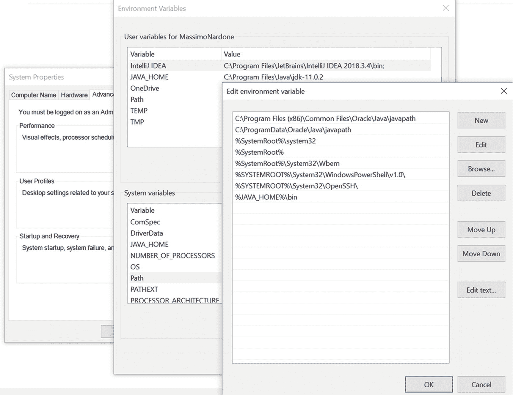

图 3-1

设置 JAVA_HOME 系统变量

让我们测试 JDK 安装是否成功。打开命令提示符并输入图 3-2 所示的代码。

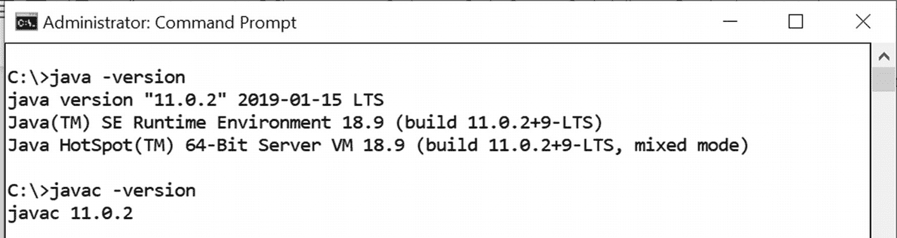

图 3-2

测试 Java 安装

太棒了！Java 现已安装完毕，可用于本书中的示例。

现在，让我们按照以下步骤安装用于 Web 和企业开发的 IntelliJ IDEA Ultimate Edition 2019.2：

1.  从 [`www.jetbrains.com/idea/download/#section=windows`](https://www.jetbrains.com/idea/download/%2523section%253Dwindows) 下载 `.exe` 文件。
2.  安装该 `.exe` 文件，在我们的例子中，它名为 `ideaIU-2019.2.exe`。

安装完成后，目录应如图 3-3 所示。

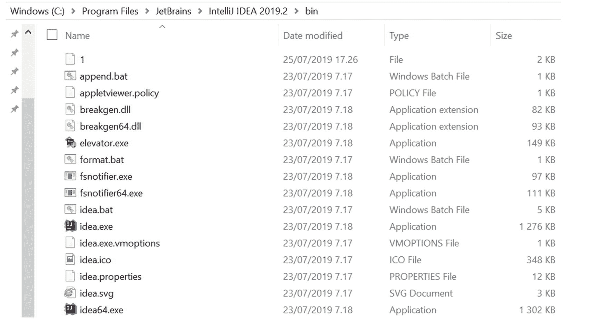

图 3-3

IntelliJ IDEA 2019.2 目录

现在，用于 Web 和企业开发的 IntelliJ IDEA Ultimate Edition 2019.2 工具已准备就绪。图 3-4 显示了执行时的仪表盘。

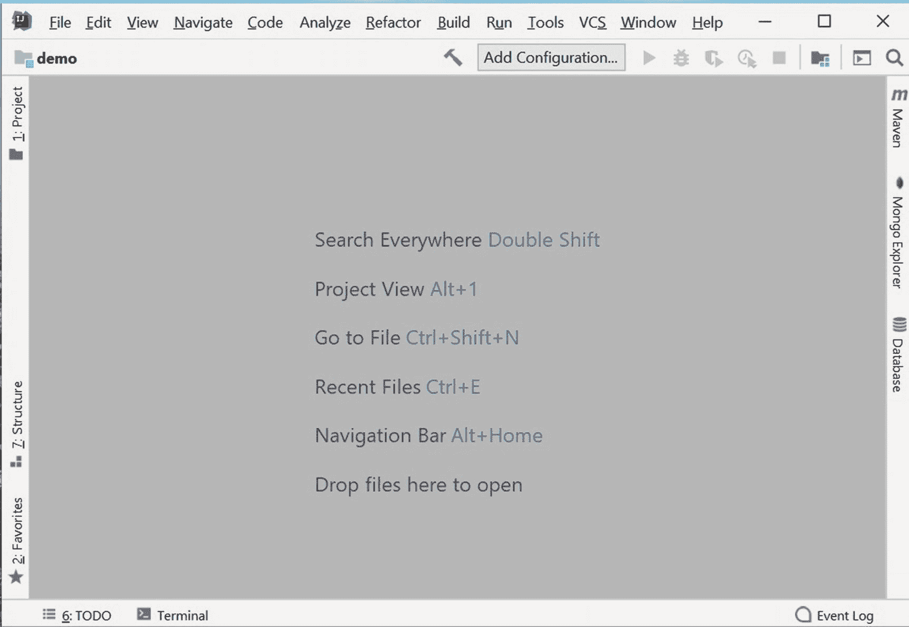

图 3-4

用于 Web 和企业开发的 IntelliJ IDEA Ultimate Edition 2019.2 仪表盘

下一步是安装 Maven 3.6.1，请从此网页下载名为 `apache-maven-3.6.1-bin.zip` 的 `.zip` 文件：[`https://maven.apache.org/download.cgi`](https://maven.apache.org/download.cgi)。

现在运行 IntelliJ IDEA 2019.2 工具，并如图 3-5 所示配置 Maven 3.6.1。

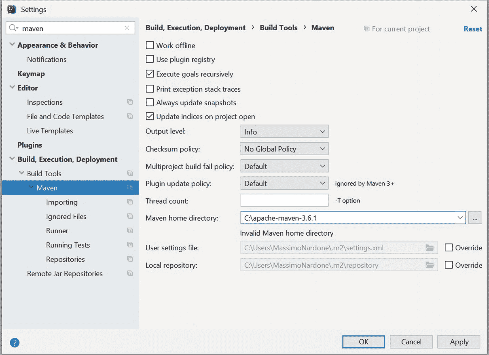

图 3-5

将本地 Maven 3.6.1 配置到 IntelliJ IDEA 2019.2 中

现在 Maven 3.6.1 已准备就绪。

本书中使用的最后一个工具是 Apache Tomcat Server 和插件 v9。第一步是在 [`https://tomcat.apache.org/download-90.cgi`](https://tomcat.apache.org/download-90.cgi) 下载并安装名为 `apache-tomcat-9.0.16.zip` 的 Apache Tomcat Server v9 `.zip` 文件。

将文件解压到 Windows 机器上的某个目录，例如 `C:\Program Files\Apache Software Foundation\apache-tomcat-9.0.22`。

由于您需要允许 Spring 项目部署到 Tomcat 服务器，因此您需要定义 Tomcat 用户以访问 Tomcat Manager。让我们打开并更新 `conf` 目录中的 `tomcat-users.xml` 文件，并在 `<tomcat-users>` 元素内添加以下 XML 片段：

确保将 Tomcat Server 添加到 IntelliJ 中。

现在 Apache Tomcat Server 和插件 v9 已准备就绪。

在开始一个新的 Spring 项目之前，您需要确保 IntelliJ IDEA 2019.2 IDE 工具中安装了正确的 JDK 包，以便编译您的示例，并避免常见的编译问题（即找到的是 JRE 而不是 JDK）。配置如图 3-6 所示。

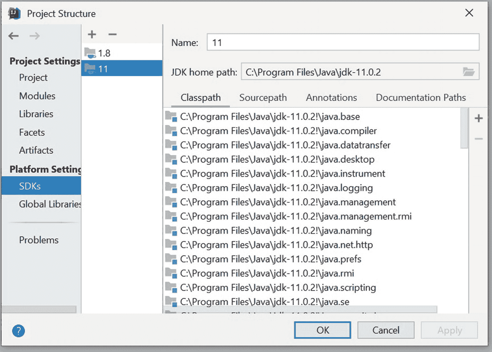

图 3-6

配置 JDK 以编译您的示例

现在 JDK 编译器已设置好，您可以开始编写和运行您的第一个 Spring Web 应用程序示例了。

## 创建新的 Java Web 应用程序项目

开发工具设置完成后，您现在可以使用 IntelliJ IDEA 2019.2 创建您的第一个 Java Web 应用程序项目。内置向导使创建新的 Maven 项目变得非常容易。

那么，让我们创建您的第一个 Java Web 应用程序，命名为 Pss01，不包含安全功能，它只会生成以下文本：Hello Spring Security！

以下是构建简单 Maven Web 应用程序项目所需遵循的步骤：

1.  创建一个 Java Web 应用程序 v4。
2.  创建并更新所需的 `.jsp` 文件。
3.  使用外部 Tomcat Server v9 运行 Java Web 应用程序。

第一步，启动 IntelliJ IDEA 工具，选择 File ➤ New ➤ Project ➤ Java ➤ Web Application，并填写项目的所有信息，如图 3-7 所示。

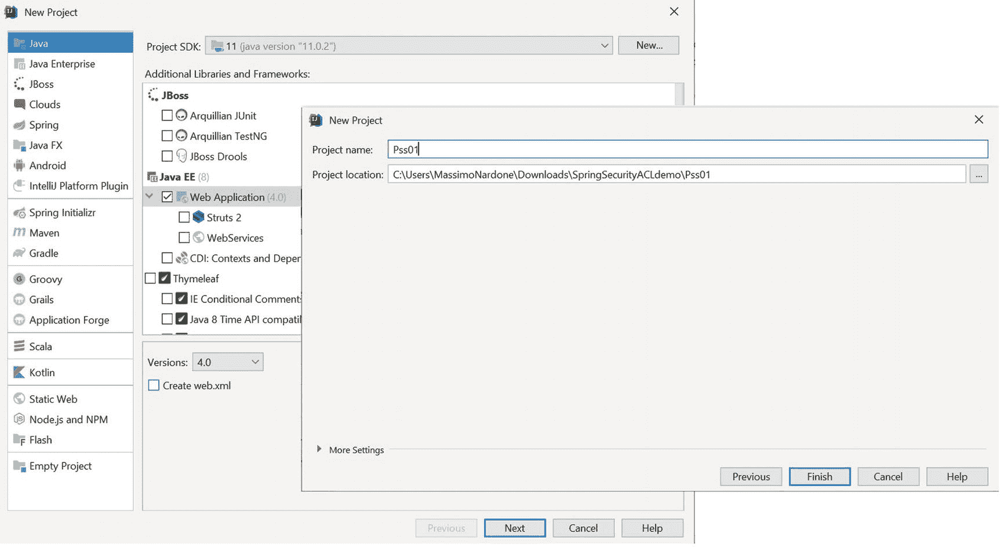

图 3-7

您的第一个 Java Web 应用程序项目

在 Package Explorer 中，您现在应该能看到您的 Pss01 项目。展开它及其所有子项，您将看到类似图 3-8 的内容。

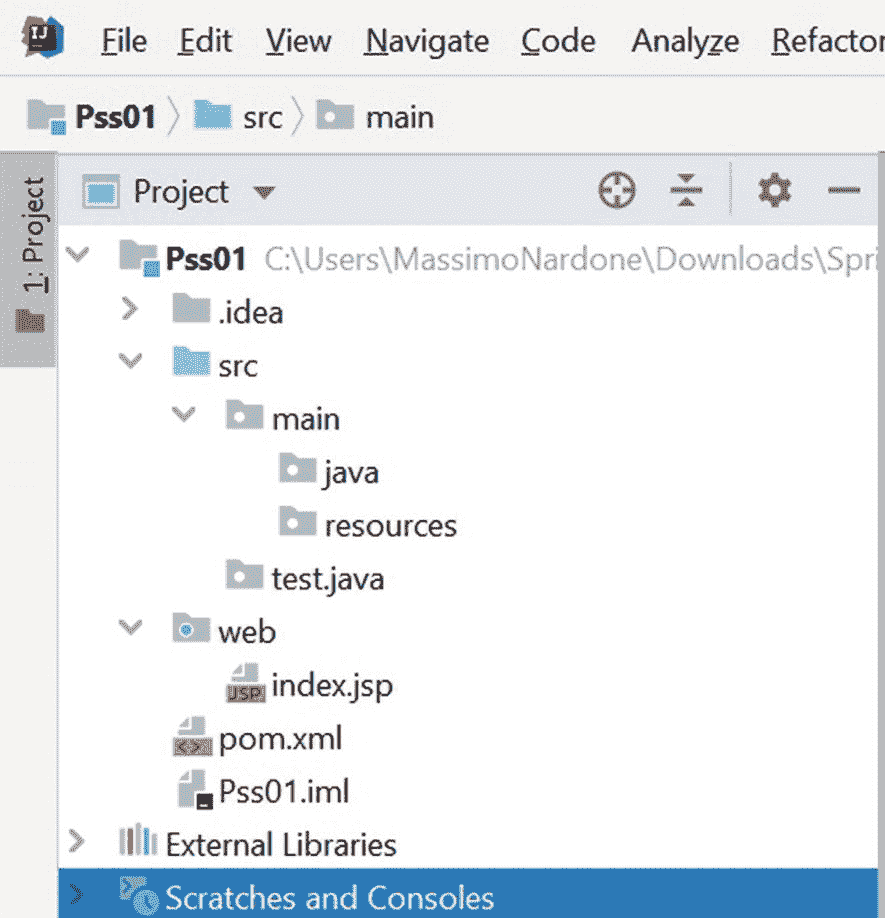

图 3-8

您的第一个 Java Web 应用程序项目结构

通常，大多数 Java Web 应用程序项目的结构将包含：

*   `target` 目录：用于存放构建的所有输出
*   `src` 目录：包含构建项目及其站点等所需的所有源材料
*   `src/main/java`：应用程序/库源代码
*   `src/main/resources`：应用程序/库资源
*   `web`：Web 应用程序源文件
*   `Pom.xml`：项目的 `File` 描述文件

您的下一步是更新第一个简单应用程序所需的 Java Web 应用程序项目文件。请注意，对于这个简单的 Java Web 应用程序示例，您不需要向项目文件 `pom.xml` 添加任何特定的依赖项，该文件初始内容如清单 3-1 所示。

```

4.0.0
com.apress.pss
Pss01
1.0-SNAPSHOT

清单 3-1
包含 Servlet 依赖项的 pom.xml 文件
```

该项目目前只包含一个名为 `index.jsp` 的简单 `.jsp` 文件，您将更新它以显示所需的文本，如清单 3-2 所示。

```

$Title$

Hello Spring Security!

清单 3-2
index.jsp 文件
```

接下来，单击位于 IntelliJ 工具右上角的 Add Configuration 按钮，配置如何运行您的第一个示例。

您可以使用外部 Tomcat Server v9 运行您的项目，如图 3-9 所示。

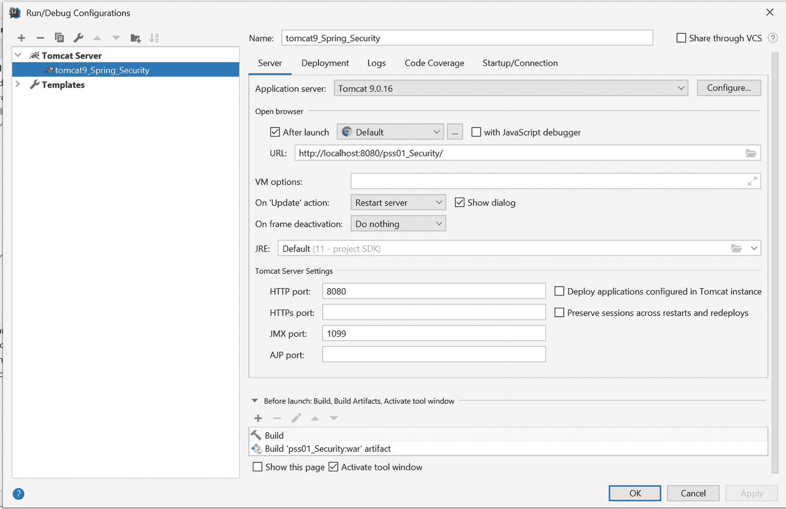

图 3-9

配置您的第一个 Maven 项目的运行步骤

现在，您可以打开 Web 浏览器并输入网址 `http://localhost:8080`，如图 3-10 所示。

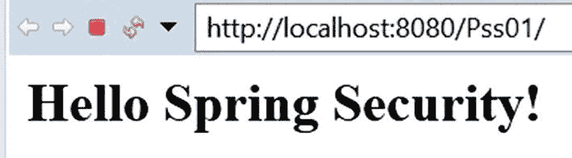

图 3-10

在 Web 浏览器中运行的 Java Web 应用程序项目

您的第一个 Java Web 应用程序项目现已准备好转换为 Spring Security 项目。


## 创建新的 Spring Security v5 项目

Spring Security 基于前一节中定义的概念构建，并很好地集成到通用的 Spring 生态系统中。你需要充分理解这些概念，才能最大限度地利用 Spring Security v5。不过，你也可以在不完全了解这些细节的情况下开始使用 Spring Security，然后在学习过程中逐步掌握，并尝试更高级的功能。

创建新的 Spring 项目有两种方式。

你可以通过 Spring Boot 或任何 IDE 工具（本例中为 IntelliJ IDEA 2019.2）来创建 Spring 项目。

那么，什么是 Spring Boot？Spring Boot 可用于轻松生成独立的、生产级的、基于 Spring 的应用程序。

为了引导你的 Spring 应用程序，你可以使用 Spring Initializr。Spring Initializr 是一个基于浏览器的 Web 应用程序和 REST API，它能为你的 Spring 应用程序生成一个现成的 Spring 项目骨架结构。

要通过 Spring Boot 生成 Spring 应用程序，请访问以下网页并填写所有必要信息：[`https://spring.io/projects/spring-boot`](https://spring.io/projects/spring-boot)。

请注意，本书中的所有 Spring 代码均使用 IntelliJ IDEA Ultimate Edition 2019.2 工具开发。

你想创建哪种 Spring Security Maven Web 应用程序？

让我们创建一个简单的 Spring Security 示例：当用户请求欢迎页面时，他们无需进行身份验证即可访问；而访问管理页面则需要通过用户名和密码提供管理员安全凭证。

如果你使用的是 Spring Security 参考版本的独立安装，并且决定不使用任何 IDE 工具来构建 Maven 项目，你会在安装目录中找到许多文件夹。目录中的大多数文件夹对应着独立的子项目或模块，这些模块将 Spring Security 的功能拆分为更离散、更专业的单元。

### Spring Security v5 源码

开源软件对软件开发人员来说有一个宝贵的特性：可以免费访问所有源代码。通过这一点，我们可以了解我们喜爱的工具和框架的内部工作原理，也可以学习其他（可能是非常优秀的）开发人员的工作方式，包括他们使用的实践、技术和模式。通常，免费访问源代码还能让我们为自己的开发收集想法和经验。从更实际的角度来看，访问源代码使我们能够在自己的应用程序上下文中调试这些应用程序；我们可以发现错误，或者仅仅是通过它们来跟踪我们应用程序的执行过程。

目前，Spring Security 和大多数 Spring 项目都托管在 GitHub 上。你可能知道 GitHub（[`https://github.com/`](https://github.com/)）。如果你不知道，绝对应该去看看，因为它已经成为许多使用多种编程语言的开源项目的标准公共源代码仓库。

GitHub 是一个 Git 仓库的托管服务，拥有非常友好的管理界面。Spring Security 项目可以在 SpringSource 的 GitHub 通用板块中找到，地址为 [`https://github.com/SpringSource/spring-security`](https://github.com/SpringSource/spring-security)。要获取代码，只需按照本章前面所示的方法下载并安装即可。

如果你需要在本地安装 Spring Security 5.1.5.RELEASE，解压后它将包含多个模块和文件夹，如图 3-11 所示。

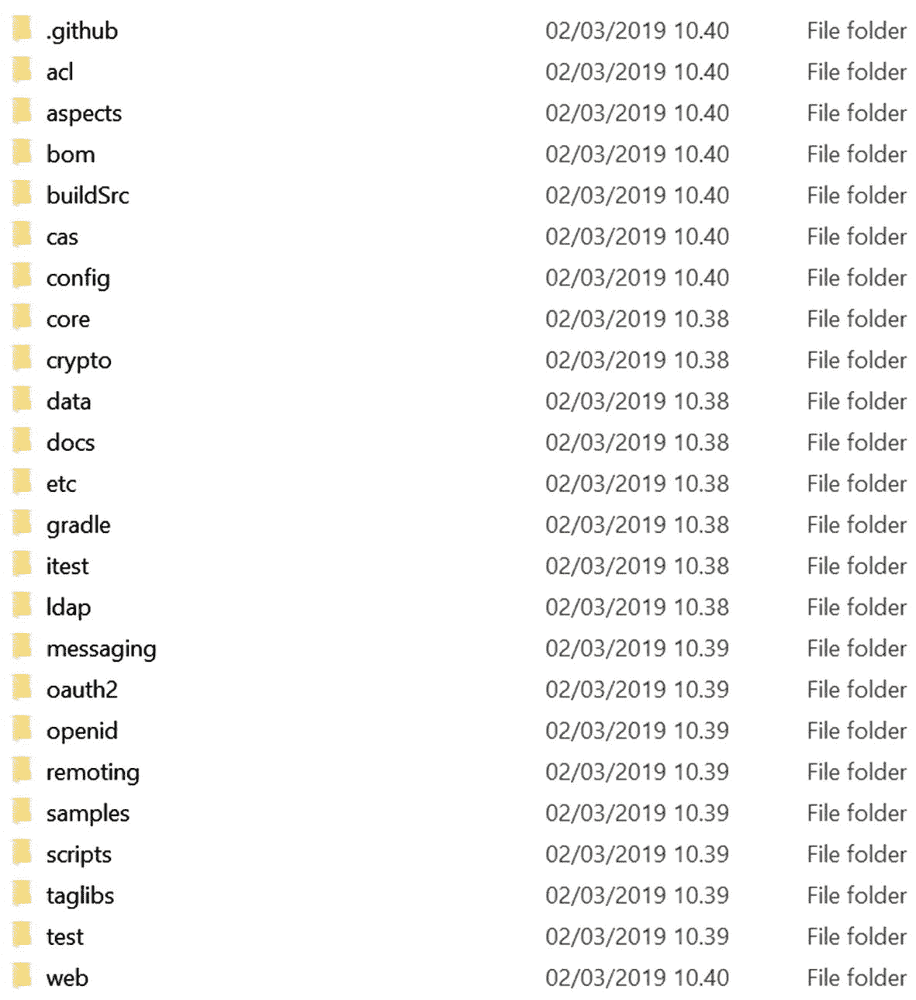

图 3-11

Spring Security v5.1.5.RELEASE 文件夹结构

以下是 Spring Security v5.1.5.RELEASE 中包含的一些最重要模块的简要说明：

*   Core (spring-security-core)：Spring Security 关于身份验证和访问控制的核心类和接口位于此处。
*   Remoting (spring-security-remoting)：如果你需要 Spring Remoting，这是包含必要类的模块。
*   Aspect (spring-security-aspects)：Spring Security 中的面向切面编程支持。
*   Config (spring-security-config)：提供 XML 和 Java 配置支持。
*   Crypto (spring-security-crypto)：包含加密支持。
*   Data (spring-security-data)：与 Spring Data 的集成。
*   Messaging (spring-security-messaging)
*   OAuth2：Spring Security 中对 OAuth 2.x 的支持：
    *   Core (spring-security-oauth2-core)
    *   Client (spring-security-oauth2-client)
    *   JOSE (spring-security-oauth2-jose)
*   OpenID (spring-security-openid)：OpenID Web 身份验证支持。
*   CAS (spring-security-cas)：CAS（中央认证服务）客户端集成。
*   TagLib (spring-security-taglibs)：关于 Spring Security 的各种标签库。
*   Test (spring-security-test)：测试支持。
*   Web (spring-security-web)：包含 Web 安全基础设施代码，例如各种过滤器和其他的 Servlet API 依赖。

### 注意

请记住，你使用的是 IntelliJ IDEA 工具，其中已集成并配置了 Spring Security 5.1.5.RELEASE。Spring Security 的使用是通过 `pom.xml` 文件开头的 XML 链接完成的。

让我们构建你的 Spring Security 5 Java Web 应用程序。

以下是构建简单 Spring Security Maven Web 应用程序项目需要遵循的步骤：

*   克隆之前名为 Pss01 的简单 Maven 项目。
*   将所需的 Spring Framework 和 Spring Security v5 库导入项目（导入到 `pom.xml` 文件中）。
*   配置项目以识别 Spring Security。
*   配置将成为系统一部分的用户和角色。
*   配置你想要保护的 URL。
*   创建所有必需的 Java 和 Web 文件。
*   使用外部 Tomcat Server v9 运行 Spring Security v5 项目。

作为第一步，你将克隆此项目并将其命名为 pss01_Security，这样在下载代码时你将看到两个示例。

将项目从 Pss01 克隆到 pss01_Security 后，你需要为项目添加 Maven 框架支持。所有文件及 pss01_Security 项目结构如图 3-12 所示。

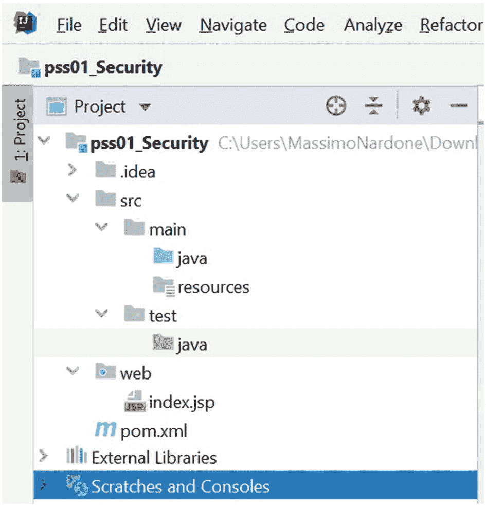

图 3-12

用于添加 Spring Security 的新 Maven 项目

### 注意

可以在 Spring 应用程序中使用基于 XML 或 Java 的配置来实现 Spring Security。在本章中，你将使用 Java 配置来构建你的 Spring Security Web 应用程序，因为通常建议尽可能少地使用 XML 配置。

## Spring Security Taglibs

Spring Security Taglibs 提供了在 JSP 页面中访问安全信息和应用安全约束的支持。

为了保护应用程序的视图层，你可以使用

*   Authorize 标签
*   Authentication 标签
*   Accesscontrollist 标签
*   Csrfinput 标签
*   CsrfMetaTags 标签

你需要将 spring-security-taglibs 依赖添加到你的 `pom.xml` 中：

```
org.springframework.security
spring-security-taglibs
5.1.5.RELEASE

```


## 跨站请求伪造简介

通过跨站请求伪造（CSRF）攻击，黑客可以修改任何 HTTP 方法（GET 或 POST）的状态，例如，通过诱骗用户点击一个经过篡改的链接，将客户端重定向到一个不安全的网页，从而窃取用户的敏感信息。

让我们来看看什么是 CSRF，以及如何使用 Spring Security 来防范 CSRF 攻击。常见的 CSRF 攻击包括：

*   HTTP GET 请求：诱骗受害者点击一个伪造的 GET 链接以获取敏感信息（例如用户名/密码等）。
*   HTTP POST 请求：与 GET 类似，但使用的是 POST 方法。

通常，要使用 Spring Security 的 CSRF 保护，我们必须确保只有正确的 HTTP 方法（如 PATCH、POST、PUT、DELETE 等）才能修改状态。

在 Spring Security v5 中，CSRF 保护在 Java 配置中默认是启用的。

如果你必须禁用它，可以添加以下代码：`.csrf().disable()`。

如果你需要在服务器端启用 CSRF 保护，则需要在客户端请求中包含 CSRF 令牌，方法是添加以下代码行：

```
.
```

## 将 Spring Security v5（以及 Spring Core 本身）添加到项目中

在本节中，你将开始探索框架的内部工作原理，了解其主要构建模块及其工作方式。这些信息主要是入门性质的。我们将在下一章对框架进行全面深入的回顾。我们本可以直接告诉你需要在项目中添加什么才能使应用程序运行，但我们认为，最好先向你介绍框架的不同组件，这样你就能在更好地了解框架构建方式的基础上开始编码。这意味着我们将告诉你如何获取项目源代码并构建它，然后以概括的方式解释构成框架的不同模块。

下一步，你需要在 Maven Web 应用程序中添加 Spring Security 5.1.4.RELEASE 版本，如清单 3-3 所示，即在 `pom.xml` 文件中添加以下 JAR 依赖配置：

*   spring-security-web
*   spring-security-config
*   spring-security-taglibs

```
org.springframework.security
spring-security-web
5.1.5.RELEASE

org.springframework.security
spring-security-config
5.1.5.RELEASE

org.springframework.security
spring-security-taglibs
5.1.5.RELEASE

清单 3-3
Spring Security Maven 依赖
```

更新后的完整 `pom.xml` 文件如清单 3-4 所示。

```

4.0.0
groupId
pss01_Security
1.0-SNAPSHOT

5.1.5.RELEASE
5.1.5.RELEASE

org.springframework
spring-core
${springframework.version}

org.springframework
spring-web
${springframework.version}

org.springframework
spring-webmvc
${springframework.version}

org.springframework.security
spring-security-web
${springsecurity.version}

org.springframework.security
spring-security-config
${springsecurity.version}

javax.servlet
javax.servlet-api
4.0.1
provided        

javax.servlet.jsp
javax.servlet.jsp-api
2.3.3
provided

javax.servlet
jstl
1.2

taglibs
standard
1.1.2

src

org.apache.maven.plugins
maven-compiler-plugin
3.8.1

pss01_Security

清单 3-4
将 Spring Security 配置添加到 pom.xml 文件
```

请注意，`spring-webmvc` 是唯一需要的依赖，因为 `spring-core` 和 `spring-web` 是传递性依赖。

`pom.xml` 文件包含以下内容：

*   项目所需的依赖，例如 Spring、Spring Security、Servlet API 和 TagLibs。
*   `<build>` 元素，其中包含所使用的插件，例如：
    *   `maven-compiler-plugin`，用于指定项目中使用的 Java 版本。
    *   Servlet 信息。
    *   TagLibs。
    *   `maven-war-plugin`，用于将项目构建成 WAR 文件，在本例中该文件将部署到 Tomcat。

### 注意

请记住，此示例中未使用任何 Spring Boot 依赖。

## 配置 Web 项目以识别 Spring Security v5

要在你的 Maven Web 应用程序中激活 Spring Security，你需要配置一个特定的 Servlet 过滤器，该过滤器将负责预处理和后处理请求，以及管理所需的安全约束。

让我们开始构建你的 Spring Security Maven Web 应用程序。

作为第一步，请确保所有工具和目录都已按前述方式创建。

然后，如清单 3-4 所示更新 `pom.xml` 文件。

接下来，在一个名为 `WebContent/WEB-INF/pages/` 的新项目目录下创建所需的 `.jsp` 文件。

你的项目将使用两个 `.jsp` 页面：

*   `welcome.jsp`，这是项目的起始欢迎网页。
*   `authenticated.jsp`，这是用户成功登录后访问的管理网页。

`welcome.jsp` 页面如清单 3-5 所示。

```

Spring Security 认证示例。

欢迎来到 Spring Security 认证示例！
">登录

清单 3-5
welcome.jsp
```

`welcome.jsp` 页面仅显示一条欢迎消息，并提供指向认证页面 `/authenticated` 的链接。

现在让我们创建 `authenticated.jsp` 页面；参见清单 3-6。

```

Spring Security 认证示例

欢迎来到 Spring Security 认证示例！
您的用户名是：${user}

您提供了管理员认证凭据！

您提供了用户认证凭据！

">注销

清单 3-6
authenticated.jsp
```

如果登录成功，用户将访问 `authenticated.jsp` 页面，我们稍后会解释该页面。

接下来，你需要定义示例所需的 Java 类。

在 controller 包下：

*   `UserController`

在 configuration 包下：

*   `AppInitializer`
*   `SecurityConfiguration`
*   `SpringSecurityInitializer`
*   `UserConfiguration`

让我们创建两个 Java 包，你的 Java 类将位于其中：

*   `com.apress.pss.springsecurity.controller`
*   `com.apress.pss.springsecurity.configuration`

让我们在 `com.apress.pss.springsecurity.controller` 包下创建 `UserController` Java 类，如清单 3-7 所示。

```
package com.apress.pss.springsecurity.controller;
import javax.servlet.http.HttpServletRequest;
import javax.servlet.http.HttpServletResponse;
import org.springframework.security.core.Authentication;
import org.springframework.security.core.context.SecurityContextHolder;
import org.springframework.security.core.userdetails.UserDetails;
import org.springframework.security.web.authentication.logout.SecurityContextLogoutHandler;
import org.springframework.stereotype.Controller;
import org.springframework.ui.ModelMap;
import org.springframework.web.bind.annotation.GetMapping;
@Controller
public class UserController {
@GetMapping ("/")
public String homePage(ModelMap model) {
return "welcome";
}
@GetMapping ("/welcome")
public String welcomePage(ModelMap model) {
return "welcome";
}
@GetMapping ("/authenticated")
public String adminPage(ModelMap model) {
model.addAttribute("user", getPrincipal());
return "authenticated";
}
@GetMapping ("/logout")
public String logoutPage (HttpServletRequest request, HttpServletResponse response) {
Authentication auth = SecurityContextHolder.getContext().getAuthentication();
if (auth != null){
new SecurityContextLogoutHandler().logout(request, response, auth);
}
return "welcome";
}
private String getPrincipal(){
String userName = null;
Object principal = SecurityContextHolder.getContext().getAuthentication().getPrincipal();
if (principal instanceof UserDetails) {
userName = ((UserDetails)principal).getUsername();
} else {
userName = principal.toString();
}
return userName;
}
}
清单 3-7
UserController Java 类
```


这个 Java 类主要用于处理和控制您网页的请求。因此，通过使用 `@GetMapping`，该类将处理诸如欢迎、认证和注销等网络请求。此外，该类通过名为 `getPrincipal` 的函数，将提取已登录用户的名称，以便在 `authenticated.jsp` 页面上显示。请注意，`@GetMapping` 已取代 `@RequestMapping`。

接下来要创建的 Java 类是 `AppInitializer`，它用于初始化 Spring 类，例如 `AnnotationConfigDispatcherServletInitializer`，以便在您的应用程序中使用；请参见清单 3-8。

```
package com.apress.pss.springsecurity.configuration;
import org.springframework.web.servlet.support.AbstractAnnotationConfigDispatcherServletInitializer;
public class AppInitializer extends AbstractAnnotationConfigDispatcherServletInitializer {
@Override
protected Class[] getRootConfigClasses() {
return new Class[] { UserConfiguration.class };
}
@Override
protected Class[] getServletConfigClasses() {
return null;
}
@Override
protected String[] getServletMappings() {
return new String[] { "/" };
}
}
清单 3-8
appInitializer.java
```

接下来要创建的 Java 类是 `SpringSecurityInitializer`，它是一个空的 Java 类，用于初始化 Spring Security 类，例如 `AbstractSecurityWebApplicationInitializer`，以便在您的应用程序中使用；请参见清单 3-9。

```
package com.apress.pss.springsecurity.configuration;
import org.springframework.security.web.context.AbstractSecurityWebApplicationInitializer;
public class SpringSecurityInitializer extends AbstractSecurityWebApplicationInitializer {
//不需要代码
}
清单 3-9
SpringSecurityInitializer.java
```

接下来要创建的 Java 类是 `UserConfiguration`，它定义了应用程序所需的 Java 类和 `.jsp` 页面的位置。在您的情况下，要处理的 Web 资源位于 `/WEB-INF/pages/` 目录下，作为 `.jsp` 页面。`UserConfiguration` Java 类如清单 3-10 所示。

```
package com.apress.pss.springsecurity.configuration;
import org.springframework.context.annotation.Bean;
import org.springframework.context.annotation.ComponentScan;
import org.springframework.context.annotation.Configuration;
import org.springframework.web.servlet.ViewResolver;
import org.springframework.web.servlet.config.annotation.EnableWebMvc;
import org.springframework.web.servlet.view.InternalResourceViewResolver;
import org.springframework.web.servlet.view.JstlView;
@Configuration
@EnableWebMvc
@ComponentScan(basePackages = "com.apress.pss.springsecurity")
public class UserConfiguration {
@Bean(name="SpringSecurity")
public ViewResolver viewResolver() {
InternalResourceViewResolver viewResolver = new InternalResourceViewResolver();
viewResolver.setViewClass(JstlView.class);
viewResolver.setPrefix("/WEB-INF/views/");
viewResolver.setSuffix(".jsp");
return viewResolver;
}
}
清单 3-10
UserConfiguration.java
```

最后要创建的 Java 类是 `SecurityConfiguration`，它定义了您的 Spring Security v5 应用程序的安全配置；请参见清单 3-11。

```
package com.apress.pss.springsecurity.configuration;
import org.springframework.beans.factory.annotation.Autowired;
import org.springframework.context.annotation.Bean;
import org.springframework.context.annotation.Configuration;
import org.springframework.security.config.annotation.authentication.builders.AuthenticationManagerBuilder;
import org.springframework.security.config.annotation.web.builders.HttpSecurity;
import org.springframework.security.config.annotation.web.configuration.EnableWebSecurity;
import org.springframework.security.config.annotation.web.configuration.WebSecurityConfigurerAdapter;
import org.springframework.security.crypto.bcrypt.BCryptPasswordEncoder;
import org.springframework.security.crypto.password.PasswordEncoder;
@Configuration
@EnableWebSecurity
public class SecurityConfiguration extends WebSecurityConfigurerAdapter {
@Autowired
PasswordEncoder passwordEncoder;
@Override
protected void configure(AuthenticationManagerBuilder auth) throws Exception {
auth.inMemoryAuthentication()
.passwordEncoder(passwordEncoder)
.withUser("user").password(passwordEncoder.encode("user123")).roles("USER")
.and()
.withUser("admin").password(passwordEncoder.encode("admin123")).roles("USER", "ADMIN");
}
@Bean
public PasswordEncoder passwordEncoder() {
return new BCryptPasswordEncoder();
}
@Override
protected void configure(HttpSecurity http) throws Exception {
http.authorizeRequests()
.antMatchers("/", "/welcome", "/login").permitAll()
.antMatchers("/authenticated/**").hasAnyRole("ADMIN", "USER")
.and().formLogin()
.and().logout().logoutSuccessUrl("/welcome").permitAll()
.and().csrf().disable();
}
}
清单 3-11
SecurityConfiguration.java
```

让我们详细分析这个 Java 类。您在 `SecurityConfiguration` 中定义了所有需要的安全配置，然后定义了 `PasswordEncoder`，它返回 `BCryptPassword`。接着，您定义了像 `welcome.jsp` 这样的页面，以及访问 `authenticated.jsp` 页面所需的安全角色，例如 admin 和 user。注销操作将重定向到 `welcome.jsp` 页面，最后 csrf 将被禁用。

您的新 Spring Security v5 项目的结构应如图 3-13 所示。

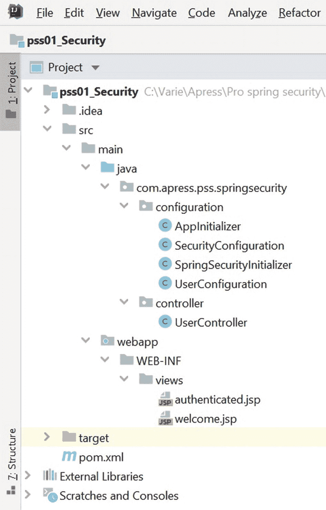

图 3-13

新的 Spring Security v5 项目结构

接下来，构建并运行 Spring Security v5 项目，如图 3-14 所示。

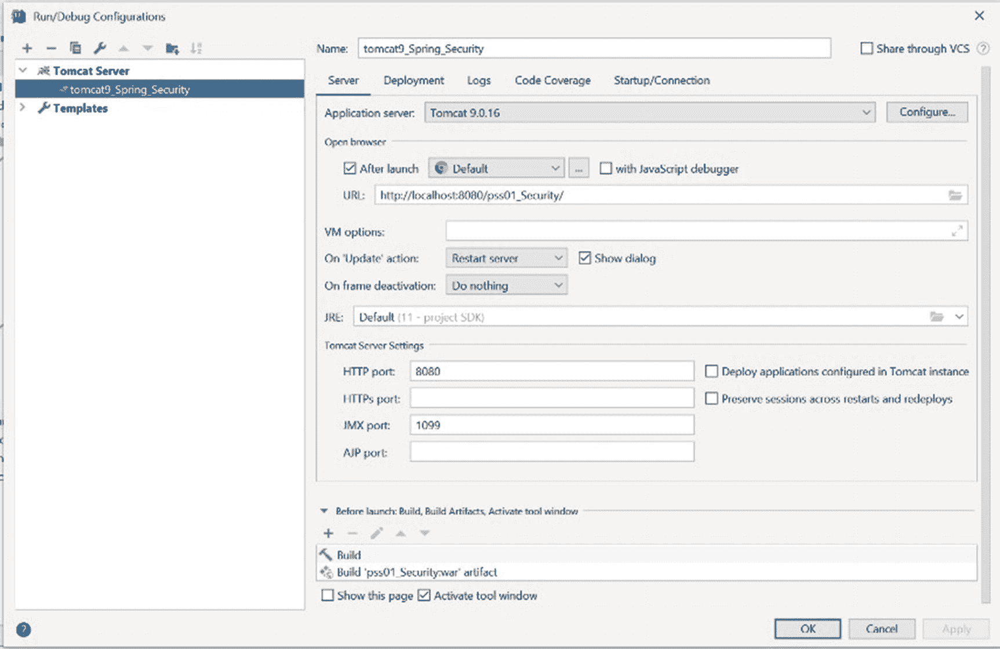

图 3-14

项目运行配置

现在，您可以构建项目，部署 WAR 文件，启动在独立 Tomcat Server v9 上运行的应用程序，并自动部署 WAR 文件。

您的应用程序已成功部署。打开 Web 浏览器并输入以下链接：`http://localhost:8080/pss01_Security/`。结果如图 3-15 所示。

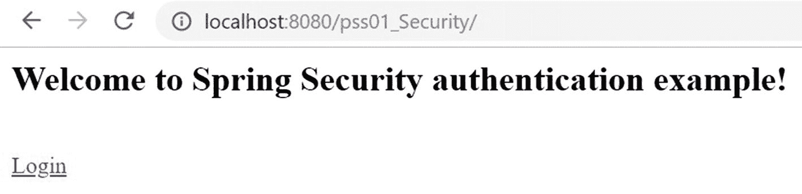

图 3-15

浏览新的 Spring Security 项目

现在，您可以通过单击“登录”链接来访问安全的 `authenticated.jsp` 页面。结果如图 3-16 所示。

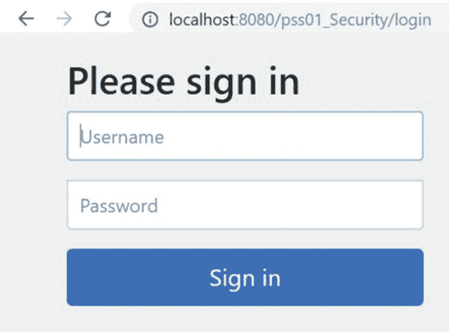

图 3-16

访问 Spring Security 登录网页

现在，如果您使用错误的凭据进行访问，您将收到一条错误消息，如图 3-17 所示。

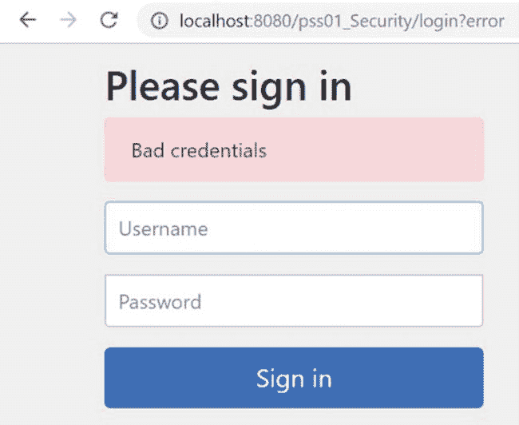

图 3-17

使用错误的登录凭据进行访问


如您所见，Spring Security 会直接生成登录错误，并提醒用户提供的凭证不正确。

如果您接下来提供正确的用户或管理员凭证，您将收到 `authenticated.jsp` 页面中定义的内容。该页面使用标签库来识别提供的是管理员还是用户凭证，显示欢迎消息，并使用 `${user}` 提供登录用户的用户名。

如果您以正确的管理员身份登录，您将看到如图 3-18 所示的结果。

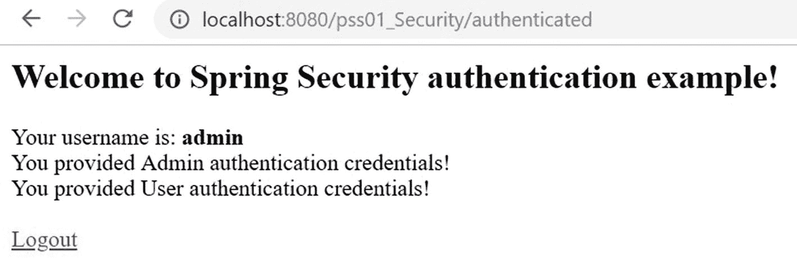

图 3-18

使用正确的管理员凭证访问

如果您以正确的用户身份登录，您将收到如图 3-19 所示的结果。

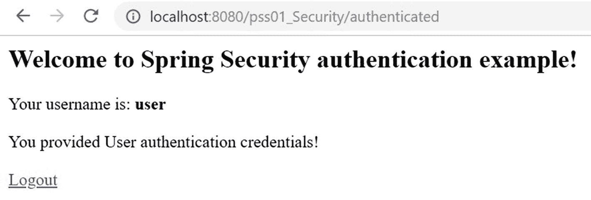

图 3-19

使用正确的用户凭证访问

请注意，当您以用户身份登录时，会显示“您提供了用户身份验证凭证！”的文本；而当您以管理员身份登录时，则会显示“您提供了管理员身份验证凭证！”的文本。这是通过 Spring Security 标签库控制的。

管理员登录迭代流程如图 3-20 所示。

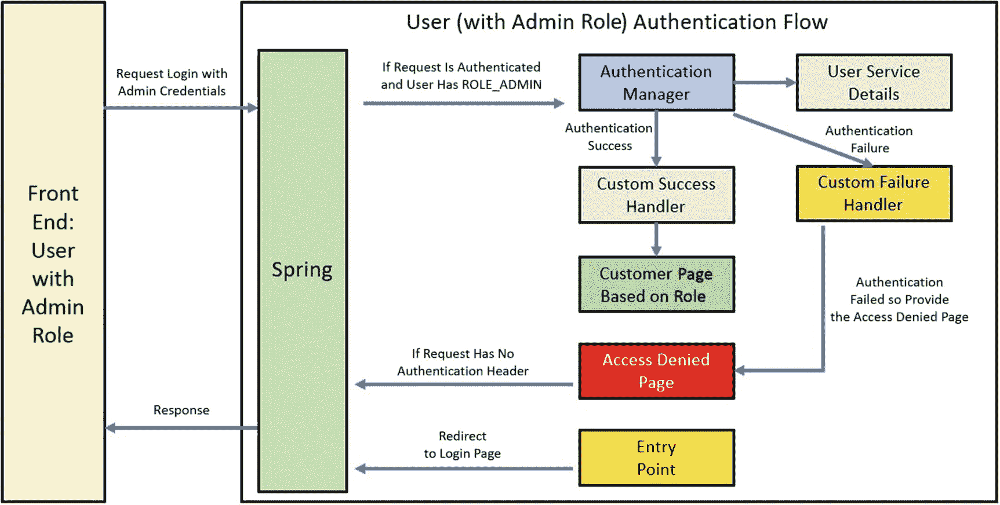

图 3-20

具有管理员角色的 Spring Security 用户身份验证请求流程

太棒了！您已经构建了第一个 Spring Security Web 应用程序。当我们研究 Spring Security 的架构时，我们将深入探讨这一切在内部是如何工作的。

## 总结

我们介绍了创建开发 Spring Security Java Web 应用程序环境所需的所有工具。您学习了如何安装和配置这些示例所需的所有工具，并且应该对构建 Spring Security v5 项目所需的条件有了清晰的认识。您学习了如何构建第一个没有 Spring Security 的 Java Web 应用程序项目，然后添加了安全依赖项，将其更新为 Spring Security v5 应用程序。在下一章中，我们将深入探讨 Spring 框架的架构和设计。

