# 4. Spring Security 架构与设计

在上一章中，您开发了一个由 Spring Security 保护的初始应用程序。您对该应用程序的工作方式有了总体了解，并详细研究了在常见的 Spring Security 保护应用程序中投入使用的一些 Spring Security 组件。在本章中，我们将扩展这些解释并深入探讨该框架。

我们将研究框架的主要组件，解释用于保护 Web 应用程序的 Servlet 过滤器的工作原理，了解 Spring 面向切面编程如何帮助您以不引人注目的方式添加安全性，并总体上展示框架的内部设计方式。

## Spring Security 由哪些组件构成？

在本节中，我们将介绍使 Spring Security 工作的主要组件。我们将提供框架的宏观概述，然后深入探讨每个主要组件。

### 万米高空视角

Spring Security 是一个相对灵活的框架，旨在让开发人员轻松地在应用程序中实现安全性。在最一般的层面上，它是一个由拦截规则组成的框架，用于授予或拒绝授予对资源的访问权限。图 4-1 说明了这一点。

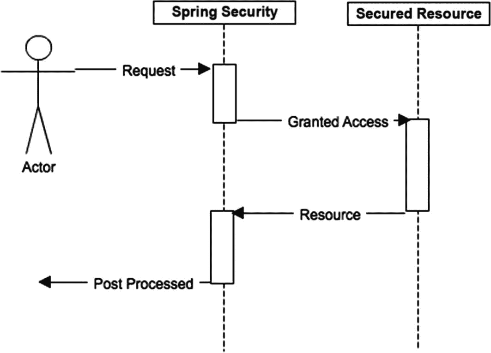

图 4-1

Spring Security 万米高空视角

从这个视角来看，您可以将 Spring Security 简单地视为构建在应用程序之上的一个额外层，用确定的安全规则包裹住进入您逻辑的特定入口点。

### 千米视角

再深入一点细节，我们来到了 AOP 和 Servlet 过滤器。

Spring Security 的安全拦截模型适用于您应用程序的两个主要领域：URL 和方法调用。Spring Security 包裹住您应用程序的这两个*入口点*，并且仅在满足安全约束时才允许访问。方法调用和基于过滤器的安全都依赖于一个核心的*安全拦截器*，其中驻留着决定是否应授予访问权限的主要逻辑。在图 4-2 中，您可以看到框架的更详细概述。

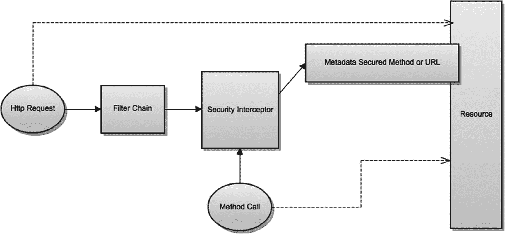

图 4-2

在此视图中，方法调用和 HTTP 请求都试图访问资源，但首先必须通过安全拦截器

### 百米视角

Spring Security 在概念上可能看起来很简单，但在内部，一个构建精良的软件工具中发生了很多事情。接下来的概述将向您展示参与确保您的安全约束得到强制执行这一总体过程的主要协作部分。这对于像 Spring Security 这样的开源项目尤其可以实现，它允许您深入了解框架本身，并通过直接访问源代码来欣赏其设计和架构。之后，我们将更深入地研究实现细节。

对我们来说，以下是从内部理解 Spring Security 的最佳方式。列举我们认为的框架主要组件将帮助您了解每个部分属于哪里，以及您的应用程序如何强制执行您为其指定的安全规则。

最重要的 Spring Security 内部架构核心模块是：

*   身份验证

*   授权

身份验证和授权模块的过程已在第 1 章中介绍。

图 4-3 提供了所有概念/组件的图示。

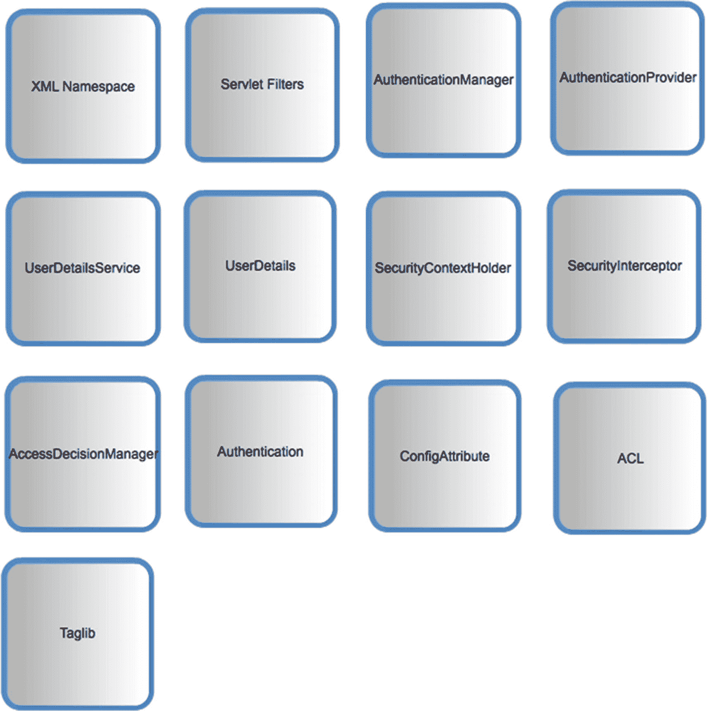

图 4-3

Spring Security 的关键组件


#### 安全拦截器

框架最重要的组件之一便是安全拦截器。其主要逻辑在 `AbstractSecurityInterceptor` 中实现，并有两种具体实现形式：`FilterSecurityInterceptor` 和 `MethodSecurityInterceptor`（如图 4-4 所示）。安全拦截器负责决定是否允许特定请求访问受保护资源。顾名思义，`MethodSecurityInterceptor` 处理针对方法调用的请求，而 `FilterSecurityInterceptor` 则处理针对 Web URL 的请求。

安全拦截器的工作流程包含预处理和后处理两个步骤。在预处理阶段，它会检查所请求的资源是否通过某些元数据信息（或 `ConfigAttribute`）进行了保护。如果没有，则允许请求继续前往目标 URL 或方法。如果请求的资源受到保护，安全拦截器会从当前的 `SecurityContext` 中检索 `Authentication` 对象。如有必要，该 `Authentication` 对象将通过以下方法，根据配置的 `AuthenticationManager` 进行身份验证：

```
public interface AuthenticationManager {
Authentication authenticate(Authentication authentication)
throws AuthenticationException;
}
```

`AuthenticationManager` 的 `authenticate` 方法主要可以执行以下三种操作：

*   如果输入代表一个有效的凭证主体且可被验证，则返回一个 `authenticated=true` 的 `Authentication` 对象
*   如果输入代表一个无效的凭证主体，则抛出 `AuthenticationException` 异常
*   如果无法判断，则返回 null

请注意，`ProviderManager`（它委托给一系列 `AuthenticationProvider` 实例）是 `AuthenticationManager` 最常用的实现。

使用 `ProviderManager` 的 `AuthenticationManager` 层次结构示例如图 4-4 所示。

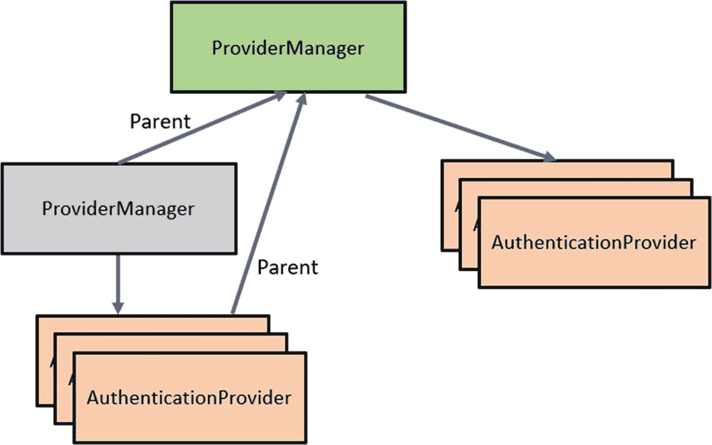

图 4-4

使用 ProviderManager 的 AuthenticationManager 层次结构

对象经过身份验证后，会调用 `AccessDecisionManager` 来确定已认证的实体是否最终能够访问该资源。如果已认证的实体不被允许访问该资源，`AccessDecisionManager` 会抛出 `AccessDeniedException` 异常。如果 `AccessDecisionManager` 判定允许 `Authentication` 实体访问该资源，并且配置了 `RunAsManager`，则会将 `Authentication` 对象传递给 `RunAsManager`。如果未配置 `RunAsManager`，则会调用一个空操作实现。`RunAsManager` 要么返回 null（如果未配置使用），要么返回一个新的 `Authentication` 对象，该对象包含与原始 `Authentication` 对象相同的主体、凭据和已授予权限，外加一组基于所使用的 `RUN_AS` 的新权限。这个新的 `Authentication` 对象会被放入当前的 `SecurityContext` 中。

在此处理之后，无论是否使用了 `RUN_AS Authentication` 对象，安全拦截器都会创建一个包含 `SecurityContext` 和 `ConfigAttributes` 信息的新的 `InterceptorStatusToken`。此令牌将在安全拦截器的后处理阶段使用。此时，安全拦截器已准备好允许访问受保护资源，因此它会放行调用，并调用特定的受保护实体（无论是 URL 还是方法）。调用返回后，安全拦截器的第二阶段开始生效，后处理开始。后处理步骤要简单得多，它仅涉及调用 `AfterInvocationManager` 的 `decide` 方法（如果配置了的话）。在当前实现中，`AfterInvocationManager` 委托给 `PostInvocationAuthorizationAdvice` 的实例，后者最终会过滤返回的对象，或在必要时抛出 `AccessDeniedException` 异常。如果你在方法级安全中使用了后调用过滤器，就会出现这种情况，你将在下一章中看到。在 Web 安全的情况下，`AfterInvocationManager` 为 null。

这对安全拦截器来说工作量很大。然而，由于框架在类级别上具有良好的模块化特性，你可以看到安全拦截器只是将大部分任务委托给一系列定义明确的协作者，这些协作者以非常符合 SRP（单一职责原则）的方式专注于单一、范围狭窄的职责。这是良好的软件设计，也是你应该效仿的范例。如清单 4-1 所示，我们粘贴了 `AbstractSecurityInterceptor` 自身代码的主要部分，以便你了解我们一直在讨论的内容。我们在代码中加入了一些注释，以帮助你更好地理解其功能；这些注释以 `//----` 开头。

请注意，完整的 `AbstractSecurityInterceptor` 课程代码可以在 GitHub 地址 [`https://github.com/spring-projects/spring-security/blob/master/core/src/main/java/org/springframework/security/access/intercept/AbstractSecurityInterceptor.java`](https://github.com/spring-projects/spring-security/blob/master/core/src/main/java/org/springframework/security/access/intercept/AbstractSecurityInterceptor.java) 找到。


```
protected InterceptorStatusToken beforeInvocation(Object object) {
Assert.notNull(object, "Object was null");
final boolean debug = logger.isDebugEnabled();
// --- 此处检查该过滤器是否能够处理特定类型的对象。例如，FilterSecurityInterceptor 能够处理 FilterInvocation 对象，而 MethodSecurityInterceptor 能够处理 MethodInvocation 对象。
if (!getSecureObjectClass().isAssignableFrom(object.getClass())) {
throw new IllegalArgumentException("Security invocation attempted for object "
+ object.getClass().getName()
+ " but AbstractSecurityInterceptor only configured to support secure objects of type: "
+ getSecureObjectClass());
}
// ---- 此处检索与接收对象对应的安全元数据。因此，如果接收到的是 FilterInvocation，则会从中提取请求，并用于查找与请求路径模式匹配的 ConfigAttribute。
Collection attributes = this.obtainSecurityMetadataSource().getAttributes(object);
if (attributes == null || attributes.isEmpty()) {
if (rejectPublicInvocations) {
throw new IllegalArgumentException("Secure object invocation " + object +
" was denied as public invocations are not allowed via this interceptor. "
+ "This indicates a configuration error because the " + "rejectPublicInvocations property is set to 'true'");
}
if (debug) {
logger.debug("Public object - authentication not attempted");
}
publishEvent(new PublicInvocationEvent(object));
return null; // 调用后无需进一步处理
}
if (debug) {
logger.debug("Secure object: " + object + "; Attributes: " + attributes);
}
if (SecurityContextHolder.getContext().getAuthentication() == null) {
credentialsNotFound(messages.getMessage("AbstractSecurityInterceptor.authenticationNotFound",
"An Authentication object was not found in the SecurityContext"), object, attributes);
}
Authentication authenticated = authenticateIfRequired();
// ---- 此处调用决策管理器来决定是否授予访问权限。这将触发投票机制，如果访问未被授予，则应抛出异常。
try {
this.accessDecisionManager.decide(authenticated, object, attributes);
}
catch (AccessDeniedException accessDeniedException) {
publishEvent(new AuthorizationFailureEvent(object, attributes, authenticated, accessDeniedException));
throw accessDeniedException;
}
if (debug) {
logger.debug("Authorization successful");
}
if (publishAuthorizationSuccess) {
publishEvent(new AuthorizedEvent(object, attributes, authenticated));
}
// ---- 此处将尝试使用 Spring Security 的 run-as 功能，该功能允许用户模拟另一个用户，从而获取其安全角色，更准确地说，是获取其 GrantedAuthority。
Authentication runAs = this.runAsManager.buildRunAs(authenticated, object, attributes);
if (runAs == null) {
if (debug) {
logger.debug("RunAsManager did not change Authentication object");
}
// 调用后无需进一步处理
return new InterceptorStatusToken(SecurityContextHolder.getContext(), false, attributes, object);
} else {
if (debug) {
logger.debug("Switching to RunAs Authentication: " + runAs);
}
SecurityContext origCtx = SecurityContextHolder.getContext();
SecurityContextHolder.setContext(SecurityContextHolder.createEmptyContext());
SecurityContextHolder.getContext().setAuthentication(runAs);
// 调用后需要恢复为 token.Authenticated
return new InterceptorStatusToken(origCtx, true, attributes, object);
}
// ---- 如果方法在此处未抛出异常，则可以安全地继续调用直至资源。授权已获批准。
}
protected Object afterInvocation(InterceptorStatusToken token, Object returnedObject) {
if (token == null) {
// 公共对象
return returnedObject;
}
if (token.isContextHolderRefreshRequired()) {
if (logger.isDebugEnabled()) {
logger.debug("Reverting to original Authentication: " + token.getSecurityContext().getAuthentication());
}
SecurityContextHolder.setContext(token.getSecurityContext());
}
// ---- 如果配置了 afterInvocationManager，则会调用它。
// ---- 它将负责过滤返回值，或者在必要时抛出异常。
if (afterInvocationManager != null) {
// 尝试进行调用后处理
try {
returnedObject = afterInvocationManager.decide(token.getSecurityContext().getAuthentication(),
token.getSecureObject(),
token.getAttributes(), returnedObject);
}
catch (AccessDeniedException accessDeniedException) {
AuthorizationFailureEvent event = new AuthorizationFailureEvent(token.getSecureObject(), token .getAttributes(), token.getSecurityContext().getAuthentication(), accessDeniedException);
publishEvent(event);
throw accessDeniedException;
}
}
// ---- 至此，完整的授权周期结束。响应返回给调用者。
return returnedObject;
}
Listing 4-1
AbstractSecurityIntercepto r
```

安全拦截器是 Spring Security 框架的核心。对 Spring Security 中受保护资源的每次调用都会经过此拦截器。当你意识到两种不太相关的资源（URL 端点和方法）都利用了此抽象拦截器的大部分功能时，`AbstractSecurityInterceptor` 便展现了其多功能性。这再次体现了框架设计与实现中所付出的努力。

图 4-5 以 UML（统一建模语言）类图的形式展示了该拦截器。图 4-6 则展示了一个简化的时序图。

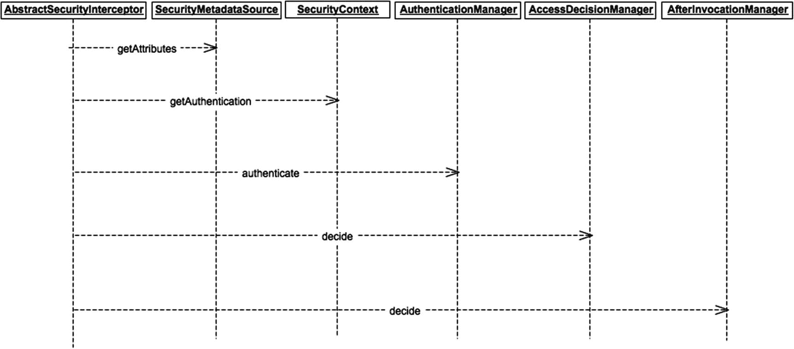

图 4-6

简化的 AbstractSecurityInterceptor 时序图

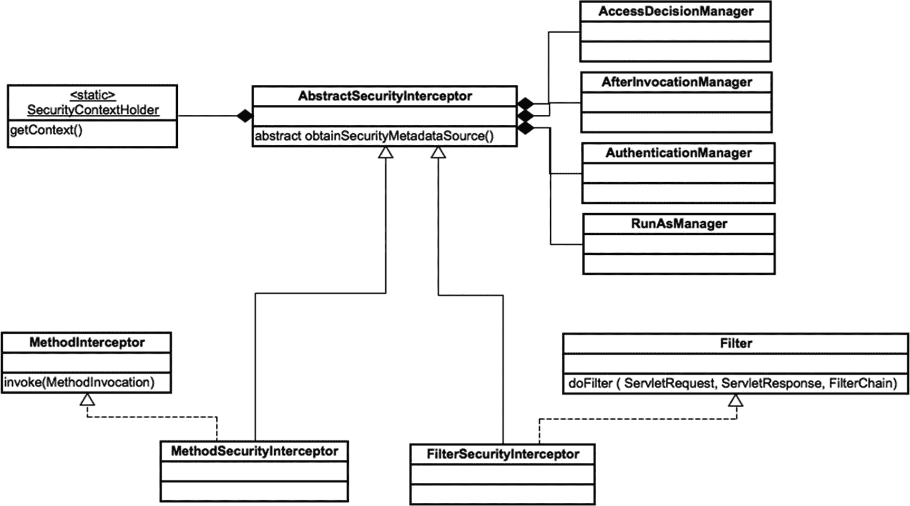

图 4-5

简化的 SecurityInterceptor UML 类图

我们已经了解了安全拦截器的工作原理，但它们是如何产生的呢？它们如何知道要拦截什么？答案在于接下来的几个组件中，请继续阅读。


#### XML 命名空间

XML 命名空间对于框架的通用吸引力和可用性至关重要，但理论上，它并非严格必要。如果你了解 Spring 框架的命名空间是如何工作的，那么在应用程序上下文定义文件中定义特定于安全性的 XML 配置时，你可能已经很清楚发生了什么。如果你不了解它们的工作原理，你可能会认为 Spring 以某种方式知道如何处理这些特定元素，以及如何在通用的 Spring 应用程序上下文中加载它们。无论哪种情况，我们都会在这里详细解释在 Spring 中定义自定义命名空间的过程，特别是 Spring Security 命名空间中的元素。

最初，Spring 不支持自定义 XML。Spring 所能理解的只有其标准 Spring Core 命名空间中定义的自身类，你可以在其中逐个 bean 地定义 `<bean>`，并且如果不自行在配置中添加复杂性，就无法真正定义任何概念上更复杂的内容。

这种基于 `<bean>` 的配置过去是（现在仍然是）配置通用 bean 实例的绝佳方式，但在定义更特定于领域的实用程序时，它很快就会变得混乱不堪。除了混乱之外，它在表达你所定义的 bean 的业务领域方面也非常糟糕。

我们将在本书后面探讨这种手动配置，但对于标准情况，它是不需要的，你应该直接使用命名空间。但是，请记住，在底层，命名空间不过是语法糖。归根结底，你最终得到的仍然是标准的 Spring bean 和对象。

Spring 2.0 引入了对定义自定义 XML 命名空间的支持。从那时起，许多项目都利用了此功能，使其更易于使用。

XML 自定义命名空间本质上是一种基于 XML 的领域特定语言（DSL），由 XML 模式（`.xsd`）文件的规则指导，允许开发人员使用与其试图建模的编程关注点更一致的概念和语法来创建 Spring bean。

### 注意

DSL 是一种为表示特定应用程序领域的概念而量身定制的语言。有时，会创建一种全新的语言来支持新领域，这被称为*外部 DSL*。其他时候，会对现有语言进行调整，以允许表示领域概念的新表达式，这被称为*内部 DSL*。在本章介绍的情况下，你使用的是通用语言（XML）；但是，你正在定义关于元素（使用 XSD）的某些约束，从而创建了一个内部 DSL 来表示安全概念。

让 Spring 识别一个新的命名空间非常简单。（这并不是说实际解析 XML 信息并将其转换为 bean 很简单——这取决于你的 DSL 的复杂性。）你只需要以下内容：

*   一个定义特定 XML 结构的 `.xsd` 文件
*   一个 `spring.schemas` 文件，在其中指定基于 URL 的模式位置与类路径中 `.xsd` 文件位置之间的映射
*   一个 `spring.handlers` 文件，在其中指定哪个类负责处理与你的命名空间相关的所有事务
*   一组解析器类，负责解析 XML 文件中定义的每个顶级元素

在第 8 章中，你将看到一些如何创建新命名空间元素并将其与 Spring Security 集成的示例。

对于 Spring Security，所有与命名空间配置相关的信息都位于 `config` 模块中。在图 4-7 中，你可以看到在 Eclipse 集成开发环境（IDE）中（本例中为 Spring Tool Suite v4 for Eclipse）看到的 `config` 模块的展开结构。

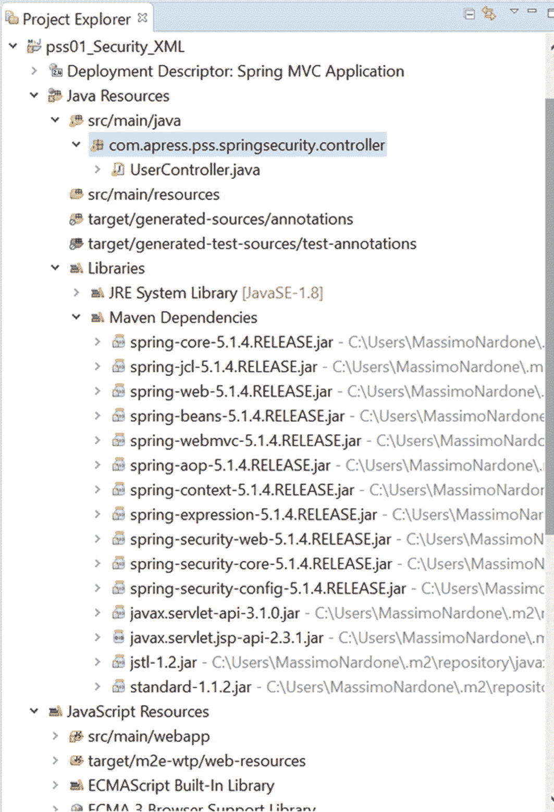

图 4-7

Spring Security 的文件结构

文件 `spring.handlers` 和 `spring.schemas` 应位于类路径的 `META-INF` 目录中，以便 Spring 能在那里找到它们。

好了，关于通用命名空间的信息就介绍到这里。更具体地说，Spring Security 命名空间是如何工作的？

当你创建一个基于 Spring 的应用程序，使用 XML 定义的应用程序上下文配置，并包含一些 Spring Security 命名空间定义时，当你运行该应用程序，它开始加载时，会查看 XML 配置文件顶部的应用程序上下文命名空间定义。它会找到对 Spring Security 命名空间的引用（通常是一个类似 `xmlns:security="`[`http://www.springframework.org/schema/security`](http://www.springframework.org/schema/security)`"` 的引用）。使用 `spring.handlers` 映射文件中的信息，它会发现处理安全元素的文件是最终类 `org.springframework.security.config.SecurityNamespaceHandler`。Spring 会为配置文件中使用安全命名空间的每个顶级元素调用此类的 `parse` 方法。图 4-8 显示了此过程的加载序列。

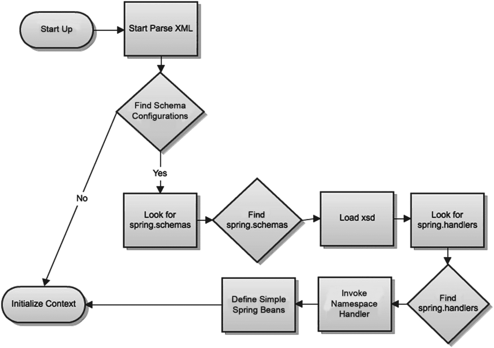

图 4-8

加载 Spring 命名空间的序列

`SecurityNamespaceHandler` 委托给一系列 `BeanDefinitionParser` 对象，用于单独解析每个顶级元素。Spring Security 命名空间配置中支持的完整元素列表在类 `org.springframework.security.config.Elements` 中定义为常量。此类如清单 4-2 所示。


```
package org.springframework.security.config;
public abstract class Elements {
public static final String ACCESS_DENIED_HANDLER = "access-denied-handler";
public static final String AUTHENTICATION_MANAGER = "authentication-manager";
public static final String AFTER_INVOCATION_PROVIDER = "after-invocation-provider";
public static final String USER_SERVICE = "user-service";
public static final String JDBC_USER_SERVICE = "jdbc-user-service";
public static final String FILTER_CHAIN_MAP = "filter-chain-map";
public static final String INTERCEPT_METHODS = "intercept-methods";
public static final String INTERCEPT_URL = "intercept-url";
public static final String AUTHENTICATION_PROVIDER = "authentication-provider";
public static final String HTTP = "http";
public static final String LDAP_PROVIDER = "ldap-authentication-provider";
public static final String LDAP_SERVER = "ldap-server";
public static final String LDAP_USER_SERVICE = "ldap-user-service";
public static final String PROTECT_POINTCUT = "protect-pointcut";
public static final String EXPRESSION_HANDLER = "expression-handler";
public static final String INVOCATION_HANDLING = "pre-post-annotation-handling";
public static final String INVOCATION_ATTRIBUTE_FACTORY = "invocation-attribute-factory";
public static final String PRE_INVOCATION_ADVICE = "pre-invocation-advice";
public static final String POST_INVOCATION_ADVICE = "post-invocation-advice";
public static final String PROTECT = "protect";
public static final String SESSION_MANAGEMENT = "session-management";
public static final String CONCURRENT_SESSIONS = "concurrency-control";
public static final String LOGOUT = "logout";
public static final String FORM_LOGIN = "form-login";
public static final String OPENID_LOGIN = "openid-login";
public static final String OPENID_ATTRIBUTE_EXCHANGE = "attribute-exchange";
public static final String OPENID_ATTRIBUTE = "openid-attribute";
public static final String BASIC_AUTH = "http-basic";
public static final String REMEMBER_ME = "remember-me";
public static final String ANONYMOUS = "anonymous";
public static final String FILTER_CHAIN = "filter-chain";
public static final String GLOBAL_METHOD_SECURITY = "global-method-security";
public static final String PASSWORD_ENCODER = "password-encoder";
public static final String SALT_SOURCE = "salt-source";
public static final String PORT_MAPPINGS = "port-mappings";
public static final String PORT_MAPPING = "port-mapping";
public static final String CUSTOM_FILTER = "custom-filter";
public static final String REQUEST_CACHE = "request-cache";
public static final String X509 = "x509";
public static final String JEE = "jee";
public static final String FILTER_SECURITY_METADATA_SOURCE = "filter-security-metadata-source";
public static final String METHOD_SECURITY_METADATA_SOURCE = "method-security-metadata-source";
@Deprecated
public static final String FILTER_INVOCATION_DEFINITION_SOURCE = "filter-invocation-definition-source";
public static final String LDAP_PASSWORD_COMPARE = "password-compare";
public static final String DEBUG = "debug";
public static final String HTTP_FIREWALL = "http-firewall";
}
清单 4-2
所有 Spring Security 命名空间元素的常量
```

从前一个类中列出的元素来看，在 XML 配置文件中使用的顶层元素如下（在前面的清单中，我们通过常量名称而非 XML 元素名称来引用它们）：

*   `LDAP_PROVIDER`：如果你需要为应用程序配置轻量级目录访问协议（LDAP）认证提供者，则使用此元素。

*   `LDAP_SERVER`：此元素用于在应用程序中配置一个 LDAP 服务器。

*   `LDAP_USER_SERVICE`：此元素配置用于从 LDAP 服务器检索用户详细信息并填充该用户权限的服务（Spring Security 使用术语“权限”来指代授予特定用户的许可名称。例如，`ROLE_USER` 就是一个权限）。

*   `USER_SERVICE`：此元素定义了内存用户服务，你可以在其中将用户名、凭据和权限直接存储在应用程序上下文定义文件中。请注意，这种类型的配置特定于测试环境和学术目的，因为它易于设置且速度快。

*   `JDBC_USER_SERVICE`：此元素允许你设置一个数据库驱动的用户服务，你可以在其中指定一个 `DataSource` 以及用于从数据库检索用户信息的查询语句。

*   `AUTHENTICATION_PROVIDER`：此元素定义了一个 `DaoAuthenticationProvider`，它是一个委托给 `UserDetailsService` 实例的认证提供者。`UserDetailsService` 可以是前面三个要点中定义的任何一个，也可以是对自定义实现的引用。

*   `GLOBAL_METHOD_SECURITY`：此元素负责在应用程序中设置对注解 `@Secured`、`@javax.annotation.security.RolesAllowed`、`@PreAuthorize` 和 `@PostAuthorize` 的全局支持。该元素将处理方法拦截器的注册，该拦截器将感知 Bean 方法的所有元数据，以便应用相应的安全通知。

*   `AUTHENTICATION_MANAGER`：此元素在应用程序中注册一个全局的 `ProviderManager`，并在其上设置已配置的 `AuthenticationProviders`。

*   `METHOD_SECURITY_METADATA_SOURCE`：此元素在应用程序上下文中注册一个 `MapBasedMethodSecurityMetadataSource`。它将持有一个 `Map<RegisteredMethod, List<ConfigAttribute>>`。这样做是为了当对某个方法发起请求时，可以检索该方法并检查其安全约束。

*   `DEBUG`：出于开发目的，此元素在安全过滤器链中注册一个 `DebugFilter`。

*   `HTTP`：这是基于 Web 的安全应用程序的主要元素。HTTP 元素非常强大。它允许定义基于 URL 的安全映射策略、配置过滤器、安全套接字层（SSL）支持以及其他与 HTTP 相关的安全配置。

*   `HTTP_FIREWALL`：此元素使用一个防火墙元素，如果已配置，则将其添加到过滤器链中。引用的防火墙应该是 Spring 自身 `HttpFirewall` 接口的一个实现。

*   `FILTER_INVOCATION_DEFINITION_SOURCE`：此元素已被弃用。请参见下一个元素。

*   `FILTER_SECURITY_METADATA_SOURCE`：此元素包装了一个 `<intercept-url>` 元素列表。这些元素映射了 URL 与访问这些 URL 所需的 `ConfigAttributes` 之间的关系。

*   `FILTER_CHAIN`：此元素允许你配置将在应用程序中使用的 Spring Security 过滤器链、你想要添加到链中的过滤器，以及如果你想自定义链如何匹配请求，还可以配置一个请求匹配器。最重要的请求匹配器是基于 Ant 路径和基于正则表达式的。

你将在本书中全面使用 Spring Security 命名空间，因此这里描述的许多元素将在后续章节中再次讨论。


#### 过滤器与过滤器链

过滤器链模型是 Spring Security 用于保护 Web 应用程序的核心机制。该模型构建在标准的 *servlet 过滤器* 功能之上。作为拦截过滤器模式的一种实现，Spring Security 中的过滤器链由多个单一职责的过滤器组成，这些过滤器涵盖了应用程序所需的所有不同安全约束。

Spring Security 的过滤器链会对发送到应用程序的所有 HTTP 请求进行预处理和后处理，并对需要保护的 URL 应用安全策略。

单个 HTTP 请求的典型过滤器如图 4-9 所示。

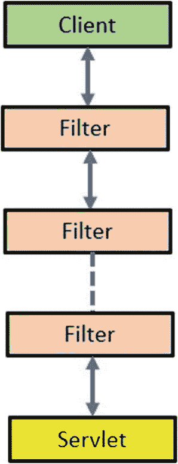

图 4-9

单个 HTTP 请求的 Spring Security 过滤器示例

Spring Security 过滤器链由 Spring Bean 组成；然而，标准的基于 Servlet 的 Web 应用程序并不了解 Spring Bean。

从容器的角度来看，Spring Security 实际上是一个单一的过滤器，其内部包含了许多具有不同用途的过滤器。

Spring Security 作为链中名为 `FilterChainProxy` 的单一过滤器被安装，该过滤器本身是一个包含所有必需安全功能的过滤器链，如图 4-10 所示。

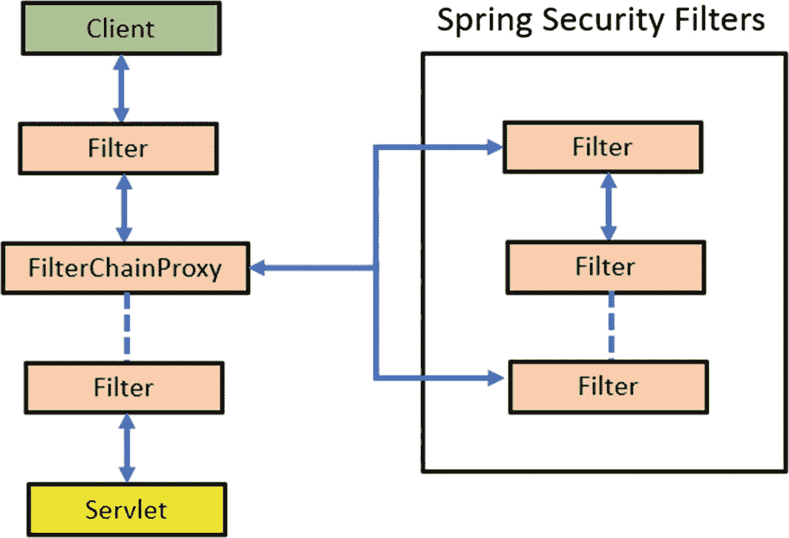

图 4-10

Spring Security 过滤器概览

在安全过滤器中，容器中还安装了一个特殊的间接层，名为 `DelegatingFilterProxy`。`DelegatingFilterProxy` 本身不需要是一个 Spring Bean。

其工作流程是：`DelegatingFilterProxy` 过滤器会将请求委托给 `FilterChainProxy`，而 `FilterChainProxy` 始终是一个具有固定名称 `springSecurityFilterChain` 的 Bean，它最终将在你的应用程序中负责：

*   保护应用程序的 URL
*   验证提交的用户名和密码
*   重定向到登录表单

包含 `FilterChainProxy` 的 `DelegatingFilterProxy` 处理过程如图 4-11 所示。

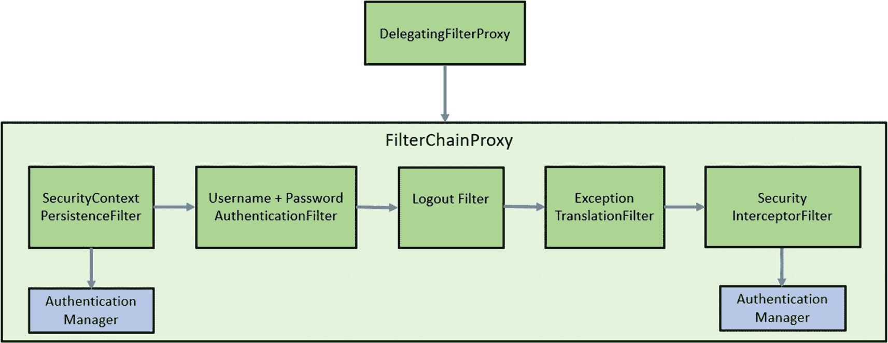

图 4-11

Spring Security 过滤器链概览

Spring Security 的过滤器配置是通过一个特殊的 Servlet 和两个主要的 XML 文件（`web.xml` 和 `applicationContext.xml`）来实现的。请注意，从 Servlet 3.0 开始，`web.xml` 不再是必需的。

这个特殊的 Servlet 过滤器用于跨越标准 Servlet API 及其生命周期与存放 Bean 过滤器的 Spring 应用程序之间的界限。这是由定义在 `web.xml` 中的 `org.springframework.web.filter.DelegatingFilterProxy` 完成的，它在底层使用 `WebApplicationContextUtils.getWebApplicationContext` 工具方法来检索应用程序的根应用上下文。这两个类来自 Spring 框架，而非 Spring Security。

图 4-12 展示了过滤器链的配置。

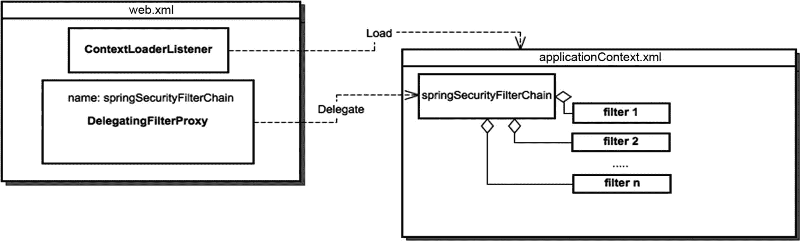

图 4-12

理解 Spring Security 过滤器配置。`web.xml` 文件中的过滤器与 Spring 应用上下文中的 Bean 具有相同的名称，以便监听器能够找到它

关于如何从 Spring Security 3.x 迁移到 4.x 以及从 4.x 迁移到 5.x（Java 配置）的完整信息，请参阅 [`https://docs.spring.io/spring-security/site/migrate/current/3-to-4/html5/migrate-3-to-4-jc.html`](https://docs.spring.io/spring-security/site/migrate/current/3-to-4/html5/migrate-3-to-4-jc.html) 和 [`https://github.com/spring-projects/spring-security/issues/4874`](https://github.com/spring-projects/spring-security/issues/4874)。


过滤器链将在第 5 章中详细说明。不过，在此我们将概述可用的过滤器及其功能。可用的过滤器在名为`org.springframework.security.config.http.SecurityFilters`的文件中被定义为枚举。随后，在启动过程中实例化每个过滤器的 Bean 定义时，会引用这些枚举。以下是已定义的过滤器：

*   `CHANNEL_FILTER`：此过滤器确保请求由正确的通道处理——这意味着，在大多数情况下，它决定请求是否由 HTTPS 处理。

*   `CONCURRENT_SESSION_FILTER`：此过滤器是并发会话处理机制的一部分。其主要功能是查询会话是否已过期（这主要发生在达到每个用户的最大并发会话数时），如果过期，则注销该用户。

*   `SECURITY_CONTEXT_FILTER`：此过滤器用一个新的或现有的安全上下文填充`SecurityContextHolder`，供框架的其余部分使用。

*   `LOGOUT_FILTER`：默认情况下，此过滤器基于特定的 URL 调用（`/logout`）。它负责处理注销过程，包括清除 Cookie、移除“记住我”信息以及清除安全上下文等任务。

*   `X509_FILTER`：此过滤器使用`java.security.cert.X509Certificate`类从 X509 证书中提取主体和凭证，并尝试使用这些预认证的值进行身份验证。

*   `PRE_AUTH_FILTER`：此过滤器与 J2EE 身份验证机制一起使用。J2EE 认证的主体将作为框架中的预认证主体。

*   `FORM_LOGIN_FILTER`：当登录表单需要用户名和密码时，使用此过滤器。此过滤器负责使用请求的用户名和密码进行身份验证。从 Spring v4 开始，它处理对特定 URL（`/login`）的请求，并附带一组特定的用户名和密码参数（`username`、`password`）。

*   `OPENID_FILTER`：此过滤器处理`OpenId`身份验证请求，既处理向外部服务器发送的包含`OpenId`身份的初始请求，也处理从`OpenId`服务器重定向回应用程序的请求。当过滤器检测到对预配置 URL `/openid`（自 Spring v4 起）的请求时，会管理所有这些交互。

*   `LOGIN_PAGE_FILTER`：当用户未提供自定义登录页面时，此过滤器会生成一个默认的登录页面。当请求 URL `/spring_security_login` 时，它会被激活。

*   `DIGEST_AUTH_FILTER`：此过滤器处理 HTTP `Digest` 身份验证头。它会查找`Digest`和`Authorization`这两个 HTTP 请求头。它可用于为标准用户代理（如浏览器）或应用程序客户端（如 SOAP）提供 Digest 身份验证。身份验证成功后，`SecurityContext`将填充有效的`Authentication`对象。

*   `BASIC_AUTH_FILTER`：此`过滤器`处理 HTTP 请求中的 BASIC 身份验证头。它会查找`Authorization`头，并尝试使用这些凭证进行身份验证。

*   `REQUEST_CACHE_FILTER`：此过滤器从请求缓存中检索与当前请求匹配的请求，并将缓存的请求发送到过滤器链的其余部分。

*   `SERVLET_API_SUPPORT_FILTER`：此过滤器将请求包装在一个请求包装器中，该包装器实现了 Servlet API 安全方法（如`isUserInRole`），并将其委托给`SecurityContextHolder`。这允许方便地使用请求对象本身来获取安全信息。例如，您可以使用`request.getAuthentication`来检索`Authentication`对象。

*   `JAAS_API_SUPPORT_FILTER`：此过滤器尝试获取并使用`javax.security.auth.Subject`（这是一个 final 类），并使用此主体继续执行过滤器链。

*   `REMEMBER_ME_FILTER`：如果没有用户登录，此过滤器将检查是否有任何“记住我”功能处于活动状态，以及是否有任何“记住我”`Authentication`可用。如果有，此过滤器将尝试自动登录并使用此“记住我”信息进行身份验证。

*   `ANONYMOUS_FILTER`：此过滤器检查上下文中是否已存在`Authentication`。如果不存在，它将创建一个新的`Anonymous`对象并将其设置在安全上下文中。

*   `SESSION_MANAGEMENT_FILTER`：此过滤器将对应于已登录系统的已认证用户的`Authentication`对象传递给一些配置好的会话管理处理器，以便对`Authentication`进行与会话相关的处理。主要地，这些处理器会执行某种验证，并在适当时抛出`SessionAuthenticationException`。目前，这些处理器（或策略）仅包含一个主类，即`org.springframework.security.web.authentication.session.ConcurrentSessionControlStrategy`，用于处理会话固定和并发会话。

*   `EXCEPTION_TRANSLATION_FILTER`：此过滤器处理 Spring Security 异常（如`AccessDeniedException`）与相应 HTTP 状态码之间的转换。如果抛出异常是因为系统中尚不存在已认证的用户，它还会重定向到应用程序入口点。

*   `FILTER_SECURITY_INTERCEPTOR`：此过滤器处理已定义 URL 的授权机制。它将授予或不授予对特定资源访问权限的实际工作流逻辑委托给其父类（`AbstractSecurityInterceptor`）的功能（我们将在本章后面介绍）。

*   `SWITCH_USER_FILTER`：此过滤器允许用户通过访问特定 URL 来模拟另一个用户，自 Spring v4 起，该 URL 已从`/j_spring_security_switch_user`更新为`/login/impersonate`。此 URL 应受到保护，仅允许特定用户访问此功能。此外，可以实现类`SwitchUserFilter`中的`attemptSwitchUser`方法，以添加约束，从而您可以使用更细粒度的信息来决定是否允许某些用户模拟其他用户。


#### ConfigAttribute

接口 `org.springframework.security.access.ConfigAttribute` 封装了安全资源中的访问信息元数据。例如，为了便于学习，`ROLE_ADMIN` 就是一个 `ConfigAttribute`。`ConfigAttribute` 有几种实现，如图 4-13 所示。

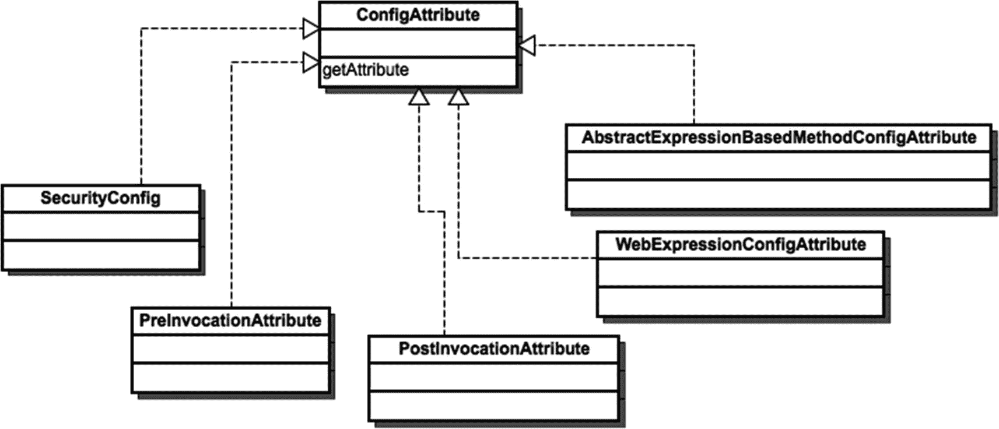

图 4-13

`ConfigAttribute` 层次结构

当你使用 `@Secured("ROLE_ADMIN")` 或类似方式注解一个方法，或者通过 `<security:intercept-url pattern="/hello" access="ROLE_SIMPSON_MEMBER" />` 指定一个 URL 时，Spring Security 会执行以下操作。在启动时，作为正常的 Spring 功能，`ApplicationContext` 中所有的 bean 后处理器都会被调用。而在 Spring Security 的情况下，其处理过程如下。

对于 Web 请求，其处理过程实际上并不复杂。Web 请求并不真正使用后处理器基础设施。

当你使用 `<security:intercept-url pattern="/x" access="ROLE_XX" />` 元素时，Spring Security 会使用 `FilterInvocationSecurityMetadataSourceParser` 类来解析这个 XML。在解析过程中，会调用私有方法 `parseInterceptUrlsForFilterInvocationRequestMap`。该方法将 XML 元素中每个 URL 模式包含的信息映射到一个 Ant 风格请求路径的映射中，例如 `/*, ROLE_USER`。这里的 `/*` 是一个 Ant 模式，而 `ROLE_USER` 是一个配置属性（这表示基本上需要这个配置属性才能访问匹配此模式的任何 URL）。最终，这个映射会被设置在 `FilterSecurityInterceptor` 内部的 `org.springframework.security.web.access.intercept.FilterInvocationSecurityMetadataSource` 接口的一个实现实例中。当每个请求到来时，`FilterSecurityInterceptor` 会使用该映射，将请求的 URL 与映射中的键进行匹配，以判断该 URL 是否受保护，然后提取出 `ConfigAttributes`，并据此检查请求的 `Authentication` 对象的权限。这个设置过程如图 4-14 所示。

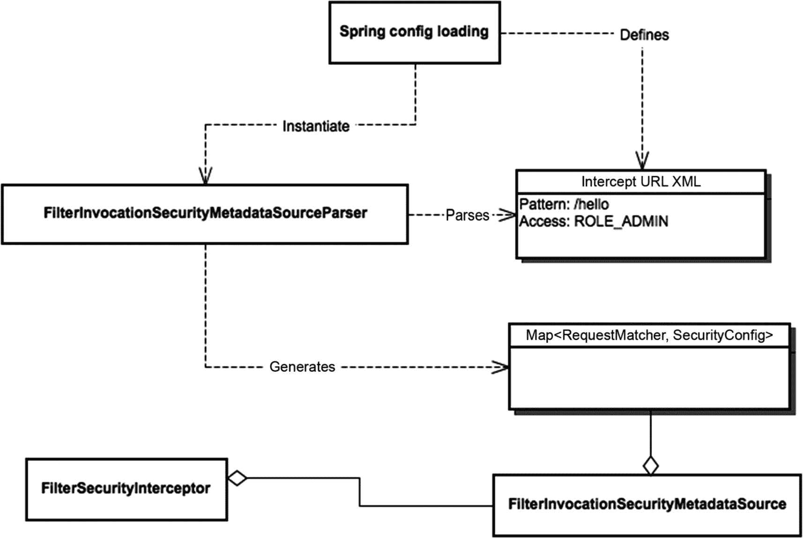

图 4-14

Web 应用的 `ConfigAttribute` 设置

对于方法级安全，你有多种选择——最常见的是通过使用注解进行配置。框架中有几种不同的注解可用；然而，框架的处理方式非常相似。例如，对于 `@Secured` 注解，你需要让 Spring 知道这个特殊注解需要特殊的安全处理。为此，你需要在安全应用上下文 XML 文件中注册以下内容：

```

当你在应用上下文 XML 配置中设置该定义时，Spring Security 会创建一个新的 `MethodSecurityMetadataSourceAdvisor` 并将其注册到应用上下文中。这个 `advisor` 被标记为基础设施顾问，并由 Spring Core 的 `InfrastructureAdvisorAutoProxyCreator` 拾取，这是一个 Spring 自动初始化的 `BeanPostProcessor`。它会处理应用上下文中的所有 bean，并判断任何已配置的顾问是否可以应用于某些 bean 及其方法。如果可以，它就会用所需的顾问包装该 bean。该后处理器找到 `MethodSecurityMetadataSourceAdvisor`，并最终为每个 bean 及其所有方法调用 `MethodSecurityMetadataSource` 的 `getAttributes` 方法实现，以判断它们是否在元数据中配置了任何 `ConfigAttribute`。如果 `MethodSecurityMetadataSource` 在 bean 中找到了 `ConfigAttributes`，那么来自 Spring Core 的 `InfrastructureAdvisorAutoProxyCreator` 会调用其自身的 `createProxy` 方法来应用 `MethodSecurityMetadataSourceAdvisor`，该顾问内部包含安全拦截器作为 `org.aopalliance.aop.Advice` 应用于该 bean。图 4-15 以图形方式展示了这一交互过程。

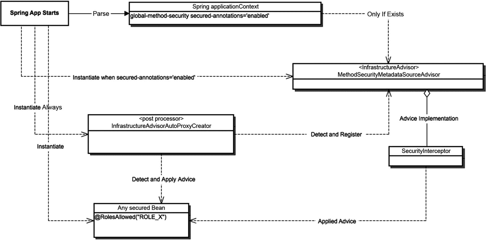

图 4-15

使用安全通知装饰带注解的 bean

乍一看，这就像简单的魔法，但 Spring 为此付出了大量努力。你必须感谢 Spring 和 Spring Security 的开发人员，他们处理了所有这些细节，并为你提供了一个简单而强大的 API 来解决你的安全问题。

认证对象

`Authentication` 对象是一个抽象概念，代表登录到系统的实体——很可能是用户。由于通常是用户进行身份验证，我们假设如此，并在本书的其余部分使用术语“用户”。框架中有几种 `Authentication` 对象的实现，如图 4-16 所示。

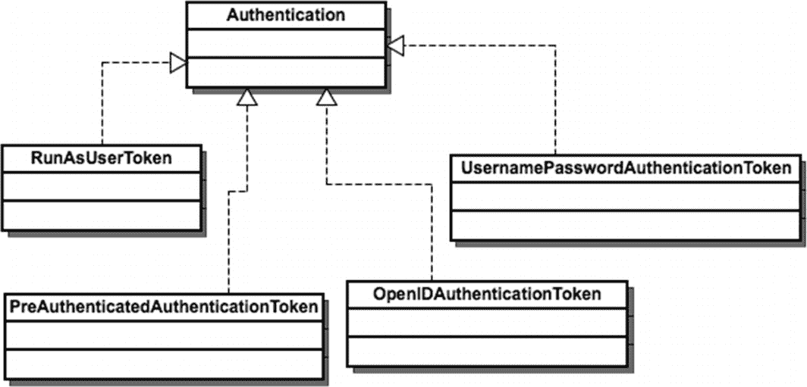

图 4-16

`Authentication` 层次结构

`Authentication` 对象既在创建认证请求时（用户登录时）使用，用于在框架的不同层和类之间传递请求数据；也在验证通过后使用，此时它包含已认证的实体并将其存储在 `SecurityContext` 中。最常见的行为是，当你登录应用程序时，会创建一个新的 `Authentication` 对象，存储你的用户名、密码和权限，这些在技术上分别被称为 `Principal`、`Credentials` 和 `Authorities`。
`Authentication` 是一个接口，并且非常简单，如清单 4-3 所示。

注意
`Authentication` 接口有许多实现，在本书中，当我们不关心特定的实现类型时，我们大多数时候会引用通用的 `Authentication` 接口。当然，当我们需要讨论某个实现细节的具体内容时，我们会引用具体的类。

```
package org.springframework.security.core;
import java.io.Serializable;
import java.security.Principal;
import java.util.Collection;
import org.springframework.security.authentication.AuthenticationManager;
import org.springframework.security.core.context.SecurityContextHolder;
public interface Authentication extends Principal, Serializable {
Collection getAuthorities();
Object getCredentials();
Object getDetails();
Object getPrincipal();
Boolean isAuthenticated();
Void setAuthenticated(boolean isAuthenticated) throws IllegalArgumentException;
}
清单 4-3
Authentication 接口
```


如图 4-16 所示，
目前框架中有几个 `Authentication` 的实现：

*   `UsernamePasswordAuthenticationToken`：这是一个简单的实现，顾名思义，它包含了已认证（或待认证）用户的用户名和密码信息。它是整个系统中最常用的 `Authentication` 实现，因为许多 `AuthenticationProvider` 对象都直接依赖于这个类。

*   `PreAuthenticatedAuthenticationToken`：此实现用于处理预认证的 `Authentication` 对象。预认证是指实际的认证过程由外部系统处理，而 Spring Security 仅负责从外部系统的消息中提取主体（或用户）信息。

*   `OpenIDAuthenticationToken`：这是一个专门用于 `OpenID` 认证方案的 `Authentication` 实现。它被 `OpenID` 过滤器和 `OpenID` 认证提供者共同使用。

*   `RunAsUserToken`：此实现由 `RunAsManager` 使用。当被访问的资源包含一个以 `RUN_AS_` 前缀开头的 `ConfigAttribute` 时，安全拦截器会调用 `RunAsManager`。如果存在具有此值的 `ConfigAttribute`，`RunAsManager` 会向已认证用户添加与 `RUN_AS` 值相对应的新 `GrantedAuthorities`。

SecurityContext 和
SecurityContextHolder

接口 `org.springframework.security.core.context.SecurityContext`
（实际上，其实现是 `SecurityContextImpl`）是 Spring Security 存储有效 `Authentication` 对象并将其与当前线程关联的地方。`org.springframework.security.core.context.SecurityContextHolder`
是用于从框架的许多部分访问 `SecurityContext` 的类。它主要由用于存储和访问 `SecurityContext` 的静态方法构成，并将处理此 `SecurityContext` 的方式委托给可配置的策略——例如，每个线程一个 `SecurityContext`（默认）、一个全局 `SecurityContext`，或自定义策略。这些类的类图如图 4-17 所示，清单 4-4 和 4-5 展示了这两个类。

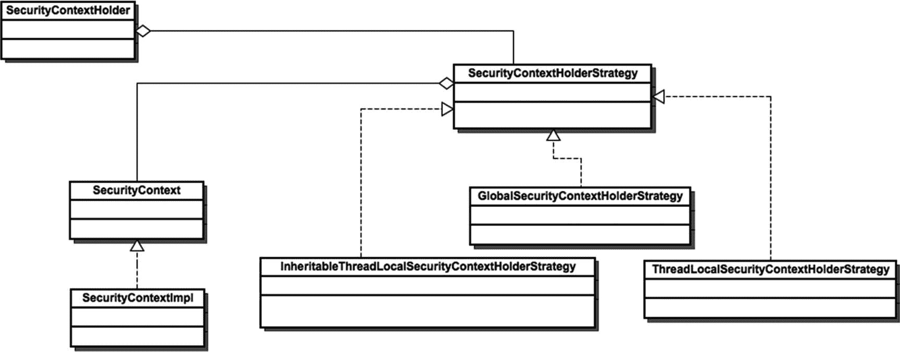

图 4-17
`SecurityContext` 和
`SecurityContextHolder`

```
package org.springframework.security.core.context;
import org.springframework.security.core.Authentication;
import java.io.Serializable;
public interface SecurityContext extends Serializable {
Authentication getAuthentication();
void setAuthentication(Authentication authentication);
}
清单 4-4
SecurityContext 接口
```

请注意，整个 `SecurityContextHolder` 的引用可以在 GitHub 上找到，地址为 [`https://github.com/spring-projects/spring-security/blob/master/core/src/main/java/org/springframework/security/core/context/SecurityContext.java`](https://github.com/spring-projects/spring-security/blob/master/core/src/main/java/org/springframework/security/core/context/SecurityContext.java)。

```
package org.springframework.security.core.context;
import org.springframework.util.ReflectionUtils;
import java.lang.reflect.Constructor;
public class SecurityContextHolder {
public static final String MODE_THREADLOCAL = "MODE_THREADLOCAL";
public static final String
MODE_INHERITABLETHREADLOCAL = "MODE_INHERITABLETHREADLOCAL";
public static final String MODE_GLOBAL = "MODE_GLOBAL";
public static final String SYSTEM_PROPERTY = "spring.security.strategy";
private static String strategyName = System.getProperty(SYSTEM_PROPERTY);
private static SecurityContextHolderStrategy strategy;
private static int initializeCount = 0;
static {
initialize();
}
public static void clearContext() {
strategy.clearContext();
}
public static SecurityContext getContext() {
return strategy.getContext();
}
public static int getInitializeCount() {
return initializeCount;
}
private static void initialize() {
if ((strategyName == null) || "".equals(strategyName)) {
strategyName = MODE_THREADLOCAL;
}
if (strategyName.equals(MODE_THREADLOCAL)) {
strategy = new ThreadLocalSecurityContextHolderStrategy();
} else if (strategyName.equals(MODE_INHERITABLETHREADLOCAL)) {
strategy = new InheritableThreadLocalSecurityContextHolderStrategy();
} else if (strategyName.equals(MODE_GLOBAL)) {
strategy = new GlobalSecurityContextHolderStrategy();
} else {
try {
Class clazz = Class.forName(strategyName);
Constructor customStrategy = clazz.getConstructor();
strategy = (SecurityContextHolderStrategy) customStrategy.newInstance();
} catch (Exception ex) {
ReflectionUtils.handleReflectionException(ex);
}
}
initializeCount++;
}
public static void setContext(SecurityContext context) {
strategy.setContext(context);
}
public static void setStrategyName(String strategyName) {
SecurityContextHolder.strategyName = strategyName;
initialize();
}
public static SecurityContextHolderStrategy getContextHolderStrategy() {
return strategy;
}
public static SecurityContext createEmptyContext() {
return strategy.createEmptyContext();
}
public String toString() {
return "SecurityContextHolder[strategy='" + strategyName + "'; initializeCount=" + initializeCount + "]";
}
}
清单 4-5
SecurityContextHolder 类
```

AuthenticationProvider 
`AuthenticationProvider`
是认证 `Authentication` 对象的主要入口点。此接口只有两个方法，如清单 4-6 所示。这是框架的主要扩展点之一，从当前扩展此接口的众多类中可以看出。每个实现类都处理一个特定的外部提供者以进行认证。因此，如果你遇到一个不受支持的特定提供者并且需要对其进行认证，你可能需要实现此接口并提供所需的功能。你将在本书后面看到相关示例。

AuthenticationProvider（见图 4-18）与 AuthenticationManager 非常相似，但它多了一个方法，可用于查询是否支持给定的 Authentication 类型，如下所示：

```
public interface AuthenticationProvider {
Authentication authenticate(Authentication authentication)
throws AuthenticationException;
boolean supports(Class authentication);
}
```

以下是框架自带的一些现有提供者：

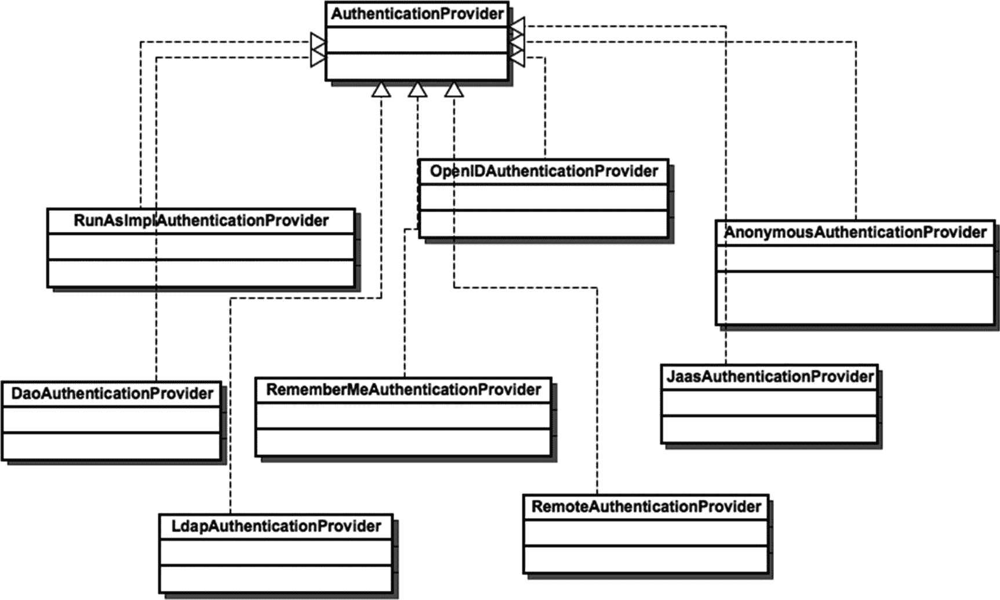

图 4-18
`AuthenticationProvider`
层次结构

```
CasAuthenticationProvider
JaasAuthenticationProvider
DaoAuthenticationProvider
OpenIDAuthenticationProvider
RememberMeAuthenticationProvider
LdapAuthenticationProvider
```


完整的 `AuthenticationProvider` 参考文档可在 GitHub 上找到，地址为 [`https://github.com/spring-projects/spring-security/blob/master/core/src/main/java/org/springframework/security/authentication/AuthenticationProvider.java`](https://github.com/spring-projects/spring-security/blob/master/core/src/main/java/org/springframework/security/authentication/AuthenticationProvider.java)。

```
package org.springframework.security.authentication;
import org.springframework.security.core.Authentication;
import org.springframework.security.core.AuthenticationException;
public interface AuthenticationProvider {
Authentication authenticate(Authentication authentication) throws AuthenticationException;
boolean supports(Class authentication);
}
清单 4-6
AuthenticationProvider 接口
```

AccessDecisionManager
`AccessDecisionManager` 是负责决定特定 `Authentication` 对象是否被允许访问特定资源的类。在其主要实现中，它委托给 `AccessDecisionVoter` 对象，这些对象基本上将 `Authentication` 对象中的 `GrantedAuthorities` 与所访问资源所需的 `ConfigAttribute` 进行比较，从而决定是否应授予访问权限。它们会投出允许或拒绝访问的票。`AccessDecisionManager` 的实现会考虑投票者的输出，并应用确定的策略来决定是否授予访问权限。不过，投票者也可以选择弃权。

`AccessDecisionManager` 接口可见于清单 4-7。其 UML 类图如图 4-19 所示。

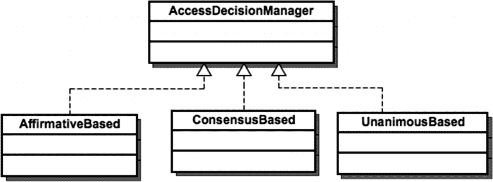

图 4-19
`AccessDecisionManager` 层次结构

完整的 `AccessDecisionManager` 参考文档可在 GitHub 上找到，地址为 [`https://github.com/spring-projects/spring-security/blob/master/core/src/main/java/org/springframework/security/access/AccessDecisionManager.java`](https://github.com/spring-projects/spring-security/blob/master/core/src/main/java/org/springframework/security/access/AccessDecisionManager.java)。

```
package org.springframework.security.access;
import java.util.Collection;
import org.springframework.security.authentication.InsufficientAuthenticationException;
import org.springframework.security.core.Authentication;
public interface AccessDecisionManager {
void decide(Authentication authentication, Object object, Collection configAttributes)
throws AccessDeniedException, InsufficientAuthenticationException;
boolean supports(ConfigAttribute attribute);
boolean supports(Class clazz);
}
清单 4-7
AccessDecisionManager 接口
```

当前的 `AccessDecisionManager` 实现都委托给投票者，但它们的工作方式略有不同。当前在 `org.springframework.security.access.vote` 包中定义的投票者将在以下各节中描述。

AffirmativeBased
此访问决策管理器会调用其所有配置的投票者，如果其中任何一个投票者投票允许访问，则足以让该访问决策管理器允许访问受保护的资源。如果没有投票者投票允许访问，并且至少有一个投票者投票拒绝访问，则访问决策管理器会抛出 `AccessDeniedException` 拒绝访问。如果只有弃权的投票者，则根据 `AccessDecisionManager` 的实例变量 `allowIfAllAbstainDecisions` 做出决定，该变量是一个布尔值，默认为 false，用于确定当所有投票者都弃权时是否应授予访问权限。

ConsensusBased
此访问决策管理器实现会调用其所有配置的投票者，以决定是授予还是拒绝访问资源。与 `AffirmativeBased` 决策管理器的不同之处在于，`ConsensusBased` 决策管理器仅在投票允许访问的投票者多于投票拒绝访问的投票者时才决定授予访问权限。因此，在这种情况下，多数票获胜。如果允许访问的投票者数量与拒绝访问的投票者数量相同，则使用实例变量 `allowIfEqualGrantedDeniedDecisions` 的值来决定。默认情况下，此变量的值为 true，并且授予访问权限。当所有投票者都弃权时，访问决策的决定方式与 `AffirmativeBased` 管理器相同。

UnanimousBased
正如您可能猜到的，此访问决策管理器仅在所有配置的投票者都投票赞成允许访问资源时，才授予对资源的访问权限。如果有任何投票者投票拒绝访问，则会抛出 `AccessDeniedException`。“全部弃权”情况的处理方式与 `AccessDecisionManager` 的其他实现相同。

AccessDecisionVoter
对 `AccessDecisionManager` 及其当前实现的讨论应该已经阐明了访问决策投票者的重要性，因为它们是作为一个团队工作的，最终决定特定 `Authentication` 对象是否拥有足够的权限来访问特定资源。`org.springframework.security.access.AccessDecisionVoter` 接口也非常简单，您可以在清单 4-8 中看到它。主要方法是 `vote`，从接口可以推断出，它将根据是否满足所需条件返回三种可能的响应之一（`ACCESS_GRANTED`、`ACCES_ABSTAIN`、`ACCESS_DENIED`）。条件是否满足是通过分析 `Authentication` 对象相对于所需资源的权限来确定的。在实践中，这基本上意味着将 `Authentication` 的权限与资源的安全属性进行比较以寻找匹配项。

以下是当前的 `AccessDecisionVoter` 实现：

*   `org.springframework.security.access.annotation.Jsr250Voter`：此投票者对使用 `JSR 250` 注解（即 `DenyAll`、`PermitAll` 和 `RolesAllowed`）保护的资源进行投票。这些注解的名称非常具有描述性。`DenyAll` 将完全不允许对资源进行任何访问，与尝试访问它的 `Authentication` 对象携带的安全信息无关。`PermitAll` 将允许所有人访问，无论他们拥有什么角色。`RolesAllowed` 注解可以配置一系列角色。如果 `Authentication` 对象尝试访问该资源，它必须拥有 `RolesAllowed` 注解中配置的角色之一，才能获得此投票者的访问授权。

*   `org.springframework.security.access.prepost.PreInvocationAuthorizationAdviceVoter`：此投票者对具有基于 `@PreFilter` 和 `@PreAuthorize` 注解的表达式配置的资源进行投票。`@PreFilter` 和 `@PreAuthorize` 注解支持一个 `value` 属性，该属性可以包含 SpEL 表达式。`PreInvocationAuthorizationAdviceVoter` 负责评估这些注解中提供的 SpEL 表达式（当然，借助 Spring 的 SpEL 评估机制）。我们将在本书的多个部分解释和使用 SpEL 表达式，因此随着本书的深入，这个概念将变得更加清晰。


*   `org.springframework.security.access.vote.AbstractAclVoter`：
    这是一个抽象类，提供了编写处理领域 ACL 规则的投票器的基本框架，以便其他实现类在其功能基础上添加投票行为。目前，它由`AclEntryVoter`实现，该投票器对用户在领域对象上的权限进行投票。本章节将在专门讨论 ACL 的部分中介绍此投票器。

*   `org.springframework.security.access.vote.AuthenticatedVoter`：
    当受保护资源上存在引用三种认证级别中*任意*一种的`ConfigAttribute`时，此投票器就会进行投票。这三种级别分别是`IS_AUTHENTICATED_FULLY`、`IS_AUTHENTICATED_REMEMBERED`和`IS_AUTHENTICATED_ANONYMOUSLY`。如果`Authentication`对象的认证级别与资源中配置的认证级别匹配（或处于更高级别，层级关系为`IS_AUTHENTICATED_FULLY > IS_AUTHENTICATED_REMEMBERED > IS_AUTHENTICATED_ANONYMOUSLY`），则投票器投赞成票。

*   `org.springframework.security.access.vote.RoleVoter`：
    这可能是所有投票器中最常用的一个。默认情况下，此投票器能够对包含以`ROLE_`前缀开头（该前缀可被覆盖）的安全元数据的`ConfigAttribute`的资源进行投票。当`Authentication`对象尝试访问资源时，其`GrantedAuthorities`会与相关的`ConfigAttributes`进行匹配。如果匹配成功，则授予访问权限；否则，拒绝访问。

*   `org.springframework.security.access.expression.WebExpressionVoter`：
    此投票器负责评估过滤器链中 Web 请求上下文内的 SpEL 表达式——例如`<intercept-url>`元素中的`'hasRole'`表达式。要使用此投票器，并且通常为了在 Web 安全中支持 SpEL 表达式，需要在`<http>`元素中添加`the use-expressions="true"`属性。

投票器模型是框架中另一个支持扩展和定制的点。您可以轻松创建自己的实现并将其添加到框架中。您将在第 8 章中了解如何操作。

完整的`AccessDecisionVoter`参考文档可在 GitHub 上找到：[`https://github.com/spring-projects/spring-security/blob/master/core/src/main/java/org/springframework/security/access/AccessDecisionVoter.java`](https://github.com/spring-projects/spring-security/blob/master/core/src/main/java/org/springframework/security/access/AccessDecisionVoter.java)。

```
package org.springframework.security.access;
import java.util.Collection;
import org.springframework.security.core.Authentication;
public interface AccessDecisionVoter {
int ACCESS_GRANTED = 1;
int ACCESS_ABSTAIN = 0;
int ACCESS_DENIED = -1;
boolean supports(ConfigAttribute attribute);
boolean supports(Class clazz);
int vote(Authentication authentication, S object, Collection attributes);
}
Listing. 4-8
AccessDecisionVoter Interface
```

UserDetailsService 和 AuthenticationUserDetailsService

接口`org.springframework.security.core.userdetails.UserDetailsService`负责在认证请求到达应用程序时，从底层用户存储（如内存、数据库等）加载用户信息。`UserDetailsService`利用提供的`user name`从数据存储中查找其余所需的用户数据。如清单 4-9 所示，它只定义了一个方法。您可以在图 4-20 中查看其层次结构。

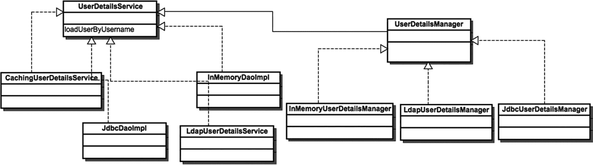

图 4-20
`UserDetailsService`
层次结构

```
public interface UserDetailsService {
UserDetails loadUserByUsername(String username) throws  UsernameNotFoundException;
}
Listing 4-9
UserDetailsServicepackage org.springframework.security.core.userdetails
```

接口`org.springframework.security.core.userdetails.AuthenticationUserDetailsService`更为通用。它允许您使用`Authentication`对象（而不是`user name String`）来检索`UserDetails`，这使得实现更加灵活。实际上，有一个`AuthenticationUserDetailsService`的实现（`UserDetailsByNameServiceWrapper`），它简单地委托给一个`UserDetailsService`，从`Authentication`对象中提取`user name`。

清单 4-10 展示了`AuthenticationUserDetailsService`接口。这是在尝试认证时用于检索用户信息的两种主要策略（`AuthenticationUserDetailsService`和`UserDetailsService`）。它们通常由应用程序中使用的特定`AuthenticationProvider`调用。例如，`OpenIDAuthenticationProvider`和`CasAuthenticationProvider`委托给`AuthenticationUserDetailsService`来获取用户详细信息，而`DaoAuthenticationProvider`则直接委托给`UserDetailsService`。其他一些提供者不使用任何类型的用户详细信息服务（例如，`JaasAuthenticationProvider`使用自己的机制从`javax.security.auth.login.LoginContext`检索主体），还有一些则使用完全自定义的服务（例如，`LdapAuthenticationProvider`使用`UserDetailsContextMapper`）。

```
package org.springframework.security.core.userdetails;
public interface AuthenticationUserDetailsService {
UserDetails loadUserDetails(T token) throws UsernameNotFoundException;
}
Listing 4-10
AuthenticationUserDetailsService
```

UserDetails
接口`org.springframework.security.core.userdetails.UserDetails`对象是系统中的主要抽象，用于在 Spring Security 上下文中表示一个完整的用户。它也可以在系统中任何可以访问`SecurityContext`的地方被后续访问。通常，开发人员会创建此接口的自定义实现，以存储他们需要或想要的特定用户详细信息（如电子邮件、电话、地址等）。之后，他们可以访问这些信息，这些信息将被封装在`Authentication object`中，并通过调用其`getPrincipal`方法获得。

一些现有的`UserDetailsService`实现（例如`InMemoryUserDetailsManager`）使用框架核心中可用的类`org.springframework.security.core.userdetails.User`作为`loadUserByUsername`方法返回的`UserDetails`实现。然而，这是框架另一个可配置的点，您可以轻松创建自己的`UserDetails implementation`并在应用程序中使用它。清单 4-11 展示了`UserDetails`接口。

```
package org.springframework.security.core.userdetails;
import org.springframework.security.core.Authentication;
import org.springframework.security.core.GrantedAuthority;
import java.io.Serializable;
import java.util.Collection;
public interface UserDetails extends Serializable {
Collection getAuthorities();
String getPassword();
String getUsername();
boolean isAccountNonExpired();
boolean isAccountNonLocked();
boolean isCredentialsNonExpired();
boolean isEnabled();
}
Listing 4-11
UserDetails Interface
```


ACL
ACL 是负责在单个领域对象级别以精细粒度保护应用程序安全的模块。这意味着，通常需要为应用程序中的每个领域对象分配一个 ID，并在这些对象与应用程序的不同用户之间建立关系。这些关系决定了特定用户是否被允许访问特定领域。ACL 模型提供了一种细粒度的访问级别配置，您可以根据尝试访问对象的不同用户来定义不同的访问规则。（例如，一个用户可能被允许读取访问，而另一个用户则对同一个领域对象拥有写入/读取访问权限。）
当前对 ACL 的支持配置为从关系型数据库中获取配置规则。用于配置数据库的 DDL（数据定义语言）随框架本身一起提供，并且可以在 ACL 模块中找到。
ACL 安全性将在第 7 章中全面介绍。

JSP 标签库
如果您正在致力于保护 Java Web 应用程序的安全，框架的 `taglib` 组件就是您用来根据用户权限隐藏或显示页面中某些元素的工具。
这些标签使用简单，同时对于创建更易用的网站非常方便。它们帮助您基于每个用户（或更常见的是，基于每个角色）来调整应用程序的用户界面。

Spring Security 中的良好设计与模式
我们之前说过，但这里要重申：使用开源软件的一大优点是，您可以（而且我们说是*您应该*）查看源代码，并在一个全新、更深的层次上理解该软件。此外，您可以观察软件的构建方式，哪些是好的，哪些是坏的（至少根据您自己的主观标准），并学习其他开发者的工作方式。这可能会对您的工作方式产生巨大影响，因为您可能会发现一些仅靠自己无法学到的方法。
Spring Security 的代码在 GitHub 上公开可用，地址为 [`https://github.com/spring-projects/spring-security`](https://github.com/spring-projects/spring-security)。
当然，有时您会发现一些不喜欢的部分，但这也有好处。您可以从别人的错误中学习，就像从他们的成功中学习一样。
对我们来说，Spring 整体上，特别是 Spring Security，在 Java 开发领域实现了一些我们认为非常宝贵的东西——那就是，它们甚至可以在我们毫无察觉的情况下，让我们成为更好的开发者。例如，我们经常问自己：“如果没有使用 Spring，有多少人会使用模板模式来访问数据库，而不是使用更笨拙的数据库访问层？”或者“如果不是因为 Spring 的依赖注入支持，有多少人会一直针对实现类编程，从而造成不必要的耦合？”或者“如果不是因为 Spring 如此轻松地将 AOP 引入开发过程，有多少人会将横切关注点（如事务）分散在整个代码库中？”
我们认为，在几乎不被察觉的情况下帮助推广良好实践，确实是 Spring 的一大成就。它本身当然不会造就伟大的开发者，但它能帮助普通开发者避免那些在没有框架及其原则支持时可能会犯的错误。
正如您从框架主要组件的描述中可能看到的，Spring Security 本身也是本着良好的设计原则和模式构建的。让我们在这里简要看看框架中一些我们认为有趣且值得学习的地方。
本节实际上不会帮助您更好地使用 Spring Security，但它将作为一种方式来欣赏在构建这个出色框架时所完成的优秀工作。

策略模式
框架的可插拔性和模块化在很大程度上归功于策略模式的广泛使用。例如，您可以在要使用的 `SecurityContext` 类型、`AuthenticationProvider` 层次结构、`AccessDecisionVoters` 以及许多其他元素中找到它。涵盖设计模式超出了本书的范围，但作为对策略模式强大功能的提醒，我们为您留下维基百科中的这个定义：“策略模式定义了一系列算法，封装了每一个算法，并使它们可以互换。策略让算法独立于使用它的客户端而变化。”
这个定义充分展示了使用接口所带来的强大功能。您可以为同一个接口提供不同的实现，并将其中任何一个传递给客户端类以执行不同类型的工作。客户端类无需知道或关心它们正在使用的实现细节。了解接口或契约就足以完成其工作。

装饰器模式
内置于 Spring 核心 AOP 框架中，您可以找到装饰器模式——主要体现在您带有注解的业务类和方法如何应用安全约束。基本上，您的对象只包含一些与应应用于它们的安全约束相关的元信息，然后通过某种“Spring 魔法”，它们被包装了安全处理逻辑。清单 4-12 展示了 `MethodSecurityInterceptor` 的 invoke 方法。
在清单中，您可以看到对象是如何被装饰以围绕实际方法调用的前置功能和后置功能的。

```
public Object invoke(MethodInvocation mi) throws Throwable {
InterceptorStatusToken token = super.beforeInvocation(mi);
Object result = mi.proceed();
returnsuper.afterInvocation(token, result);
}
清单 4-12
MethodSecurityInterceptor 的 invoke 方法
```

单一职责原则
Spring Security 的代码似乎非常认真地对待单一职责原则。框架中有很多这样的例子，因为您选择的任何对象似乎都只有一个且唯一的职责。例如，`AuthenticationProvider` 只处理使用其凭证在系统中认证主体的通用关注点。`SecurityInterceptor` 仅负责拦截请求，并将所有安全检查逻辑委托给协作对象。从框架中可以提取出更多类似的例子。

依赖注入
同样，这内置于 Spring 框架本身，并且当然，作为 Spring 架构中的一切，这意味着它也被 Spring 的其他项目（包括 Spring Security）所继承。依赖注入（DI）是 Spring 最重要的特性之一。Spring Security 中几乎每个组件都是通过使用依赖注入来配置的。`AccessDecisionManager` 被注入到 `AbstractSecurityInterceptor` 中，而 `AccessDecisionVoter` 实现被注入到 `AccessDecisionManager` 中。如此这般，框架的大部分内容都是通过依赖注入将组件组合在一起构建的。


本章小结
本章内容较为复杂，但深入探究软件工具的内部运作机制，无疑是理解并善用它的最佳途径。而这正是你所做的。你深入了解了 Spring Security 的架构、其主要组件以及其内部工作原理。

现在，你应该已经理解了 XML 命名空间的工作方式、AOP 如何融入框架，以及 Servlet Filter 功能通常如何用于实施 Web 层安全。

我们通过逐一剖析那些看似简单、却能帮助你为应用程序添加安全性的所有组件，揭开了“Spring 魔法”的神秘面纱。

你查看了框架本身的一些代码片段，以便更深入地理解其内部工作，并更好地理解事物为何如此运作。

你还研究了框架固有的模块化特性，并看到了它如何有助于创建既灵活又可扩展的软件。

尽管本章涵盖了所有这些内容，但这基本上只是一个介绍和参考，供你在阅读后续章节并开始研究保护应用程序的选项时随时查阅。从现在开始，你将理解每个组件在框架中的位置，以及不同组件之间如何相互关联。

在下一章中，你将开始开发一个示例应用程序。起初，它将是一个简单的 Web 应用程序，你将学习如何保护它。你将运用当前所学的所有框架知识来调整配置，并测试在 Web 层实现安全性的不同方法。

5. Web 安全

在本章中，我们将继续讲解如何为你从第 3 章开始创建的基于 Java 的 Web 应用程序在 Web 层应用安全性。你将详细了解安全过滤器链的内部工作原理，以及可用于在应用程序中定义安全约束的不同元数据选项。我们还将详细解释用于在视图层实施安全约束的 taglib 工具，该工具也在第 3 章中介绍过。

介绍简单示例应用程序
在本章中，你将处理一个名为 `favoritesmovies` 的简单测试 Web 应用程序。该应用程序本身将非常简单（它不会有任何真正有用的功能）。但是，我们将尝试涵盖使用 Spring Security 保护 Web 应用程序的大多数可用选项，即使其中某些选项对于此类应用程序来说似乎不太现实。

首先，你将设置应用程序。与第 3 章一样，你将创建一个 Java Web 应用程序，并包含 Maven 作为框架。同样，你将假定所需不同工具的特定版本。主要地，你将像在第 3 章中那样使用 Java 11 和 Maven 3.6.0。

如图 5-1 所示创建项目。

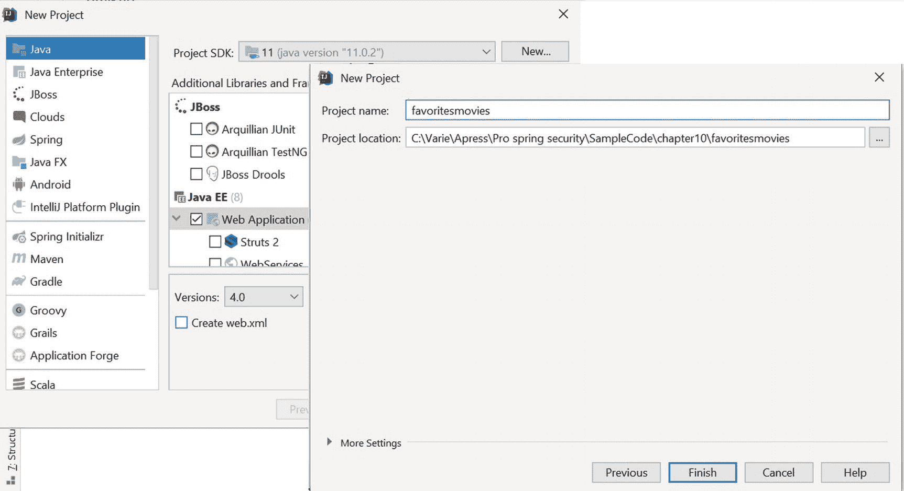

图 5-1
创建一个新的动态 Web 应用程序

现在你有了一个空的 Web 项目。下一步是将其转换为 Maven 项目。目前，你将使用与第 3 章程序中相同的依赖项。因此，请确保你的 `pom.xml` 文件包含清单 5-1 中的内容。

```

4.0.0
war
pss01_favoritesmovies
com.apress.pss
favoritesmovies
1.0-SNAPSHOT

org.apache.maven.plugins
maven-compiler-plugin
3.2

org.apache.maven.plugins
maven-war-plugin
2.4

src/main/webapp
pss01_Security
false

favoritesmovies

清单 5-1
favoritesmovies 的第一个 pom.xml
```

如前所述，在创建新的 Java Web 应用程序项目时，会在 `WEB-INF` 文件夹下自动生成一个新的 `index.jsp` 页面。为了测试它是否有效，请更新 `.jsp` 文件以显示简单的“Hello World!”文本，然后编译并执行在外部 Tomcat v9 上运行的应用程序，就像你在第 3 章中所做的那样。

如果你打开浏览器并访问 `http://localhost:8080/``favoritesmovies`，你将看到“Hello World!”消息作为 `index.jsp` 网页的输出，如图 5-2 所示。


图 5-2
应用程序的第一个迭代显示简单的 Hello World! 页面

让我们开始为这个示例添加安全性。

首先，你需要使用第 3 章中展示和解释的 Spring Security 5 依赖项来配置 `pom.xml`，例如：

*   `spring-security-web`

*   `spring-security-config`

*   `spring-security-taglibs`

更新你的 `pom.xml` 文件，如清单 5-2 所示。

```

4.0.0
war
pss01_favoritesmovies
com.apress.pss
favoritesmovies
1.0-SNAPSHOT

5.1.5.RELEASE
5.1.5.RELEASE

org.springframework
spring-core
${springframework.version}

org.springframework
spring-web
${springframework.version}

org.springframework
spring-webmvc
${springframework.version}

org.springframework.security
spring-security-web
${springsecurity.version}

org.springframework.security
spring-security-config
${springsecurity.version}

javax.servlet
javax.servlet-api
4.0.1

javax.servlet.jsp
javax.servlet.jsp-api
2.3.3

javax.servlet
jstl
1.2

taglibs
standard
1.1.2

org.springframework.security
spring-security-taglibs
5.1.5.RELEASE

org.apache.maven.plugins
maven-compiler-plugin
3.2

org.apache.maven.plugins
maven-war-plugin
2.4

src/main/webapp
favoritesmovies 
false

favoritesmovies

清单 5-2
包含所有安全性和框架依赖项的 pom.xml
```

在 `WEB-INF` 文件夹下创建一个名为 `view` 的新文件夹。它将存放你所有的 `.jsp` 网页。
接下来，导入你在第 3 章中使用的所有 Java 类。

在 Java 包 `com.apress.pss.springsecurity.controller` 下，复制：

*   `UserController`

在 Java 包 `com.apress.pss.springsecurity.configuration` 下，复制：

*   `AppInitializer`

*   `SecurityConfiguration`

*   `SpringSecurityInitializer`

*   `UserConfiguration`

请注意，就 Web 安全而言，无论你像这里一样使用 Spring MVC 控制器，还是像第 3 章那样使用简单的 Servlet，或者使用任何其他基于 Servlet 的框架来开发应用程序，这都无关紧要。请记住，Spring Security 的 Web 部分在核心上基本上是附加到标准 Java Servlet 过滤器架构上的。因此，如果你的应用程序使用 Servlet 和过滤器，你可以利用 Spring Security 的 Web 支持。

自 Spring Framework 4.3 起，出现了一些基于 `@RequestMapping` 的新 HTTP 映射注解：

*   `@GetMapping`

*   `@PostMapping`

*   `@PutMapping`

*   `@DeleteMapping`

*   `@PatchMapping`

例如，`@GetMapping` 是 `@RequestMapping` 注解的一个特化版本，它将作为 `@RequestMapping(method = RequestMethod.GET)` 的快捷方式。`@GetMapping` 注解的方法用于处理与特定 URI 表达式匹配的 HTTP GET 请求。
现在你已经从第 3 章复制了 Java 类，你可以开始对它们进行修改了。
让我们从 Java 控制器文件开始，在其中使用 `@GetMapping` 定义值为 `/`、`/index` 和 `/movies` 的控制器，这些控制器将触发 `index.jsp` 和 `movies.jsp` 页面。

`UserController Java 类` 可以在清单 5-3 中找到。


```
package com.apress.pss.springsecurity.controller;
import javax.servlet.http.HttpServletRequest;
import javax.servlet.http.HttpServletResponse;
import org.springframework.security.core.Authentication;
import org.springframework.security.core.context.SecurityContextHolder;
import org.springframework.security.web.authentication.logout.SecurityContextLogoutHandler;
import org.springframework.stereotype.Controller;
import org.springframework.ui.ModelMap;
import org.springframework.web.bind.annotation.GetMapping;
@Controller
public class UserController {
@GetMapping ("/")
public String home() {
return "index";
}
@GetMapping ("/index")
public String index() {
return "index";
}
@GetMapping ("/movies")
public String movies() {
return "movies";
}
}
代码清单 5-3
UserController 控制器
```

可以看到，在这个控制器中，你指定了将要接收的请求的 URL、HTTP 方法以及请求体。URL 是通过将类级别的 `RequestMapping` 注解的值与方法级别的 `RequestMapping` 注解的值拼接而成的。因此，你的 `URL 是 movies`。HTTP 方法在方法的 `RequestMapping` 注解中被指定为 POST。方法参数中的 `RequestBody` 注解只是告诉 Spring，用请求体中的字符串来填充 movie 参数。而方法级别的 `ResponseBody` 注解则告诉 Spring，将方法的返回值作为响应的主体内容。

接下来，让我们创建一个简单的 `.jsp` 页面，命名为 `movies.jsp`，如代码清单 5-4 所示。

```

我最喜欢的电影列表：
Il Postino
La vita e' bella
NottingHill

代码清单 5-4
movies.jsp 页面
```

由于目前尚未要求用户认证，你可以通过构建应用程序、打开 URL `http://localhost:8080/favoritesmovies/movies` 来测试新功能，结果如图 5-3 所示。

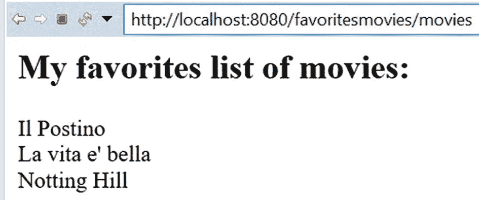

图 5-3
使用 .jsp 网页执行项目

如你所见，使用 `/movies` 控制器的应用程序将触发 `movies.jsp` 页面并显示电影列表。

现在让我们进行配置，使得 `/movies` 控制器要求经过认证且拥有 ADMIN 角色的用户才能访问。将第 3 章的 `SecurityConfiguration` Java 类更新为代码清单 5-5 所示的代码。

```
package com.apress.pss.springsecurity.configuration;
import org.springframework.beans.factory.annotation.Autowired;
import org.springframework.context.annotation.Bean;
import org.springframework.context.annotation.Configuration;
import org.springframework.security.config.annotation.authentication.builders.AuthenticationManagerBuilder;
import org.springframework.security.config.annotation.web.builders.HttpSecurity;
import org.springframework.security.config.annotation.web.configuration.EnableWebSecurity;
import org.springframework.security.config.annotation.web.configuration.WebSecurityConfigurerAdapter;
import org.springframework.security.crypto.bcrypt.BCryptPasswordEncoder;
import org.springframework.security.crypto.password.PasswordEncoder;
@Configuration
@EnableWebSecurity
public class SecurityConfiguration extends WebSecurityConfigurerAdapter {
@Autowired
PasswordEncoder passwordEncoder;
@Override
protected void configure(AuthenticationManagerBuilder auth) throws Exception {
auth.inMemoryAuthentication()
.passwordEncoder(passwordEncoder)
.withUser("admin").password(passwordEncoder.encode("admin123")).roles("ADMIN");
}
@Bean
public PasswordEncoder passwordEncoder() {
return new BCryptPasswordEncoder();
}
@Override
protected void configure(HttpSecurity http) throws Exception {
http.authorizeRequests()
.antMatchers("/", "/index", "/login").permitAll()
.antMatchers("/**").hasRole("ADMIN")
.and().formLogin()
.and().logout().logoutSuccessUrl("/index").permitAll()
.and().csrf().disable();
}
}
代码清单 5-5
SecurityConfiguration Java 类
```

这段代码非常简单，基本上 `/`、`/index` 和 `/login` 控制器无需认证即可访问，而通过 `/**` 匹配的任何其他页面都需要经过认证且拥有 ADMIN 角色的用户才能访问。你将使用 Spring Security v5 自动生成的默认登录页面。当使用注销链接时，需要执行注销操作；这将在后面解释。最后，如第 3 章所述，跨站请求伪造功能已被禁用。

接下来，将 `movies.jsp` 页面更新为：

```

Spring Security 认证示例

我最喜欢的电影列表：
Il Postino
La vita e' bella
NottingHill

">注销

```

现在，你已经拥有了此示例所需的所有文件并完成了配置。你希望像之前一样访问相同的 URL 来进入 `movies.jsp` 页面，但这次 Spring Security 会要求你提供管理员凭证才能访问。重启应用程序，并在浏览器的地址栏中粘贴以下 URL：`http://localhost:8080/favoritesmovies/movies`。

这一次，你的浏览器应该会被重定向到 URL `http://localhost:8080/favoritesmovies/login`，并显示你在第 3 章中熟悉的登录表单，如图 5-4 所示。以 `admin/admin123` 身份登录，你就可以作为管理员访问 `movies.jsp 页面`。

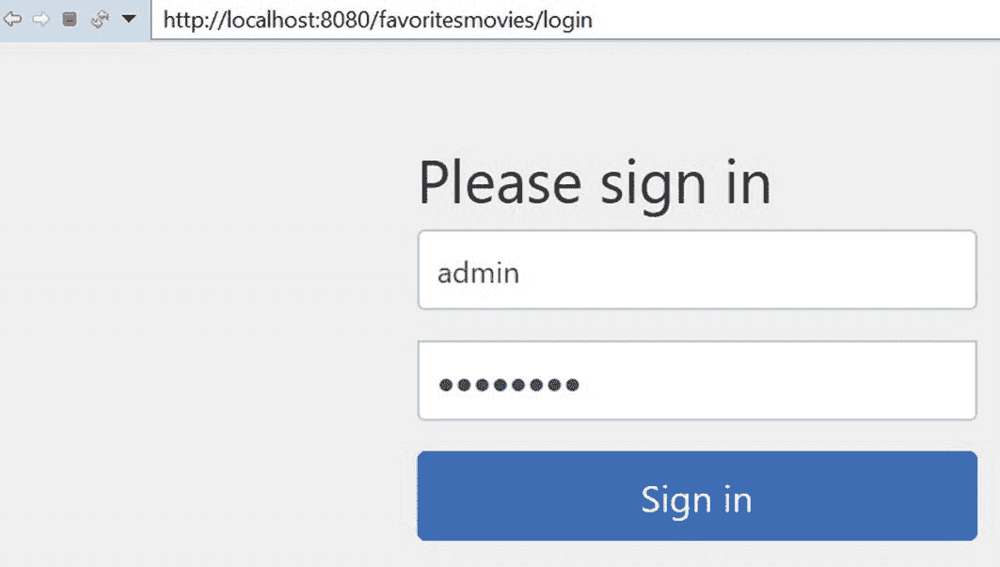

图 5-4
Spring Security v5 登录表单

一旦管理员凭证正确，Spring Security 将允许访问 `movies.jsp` 页面，如图 5-5 所示。

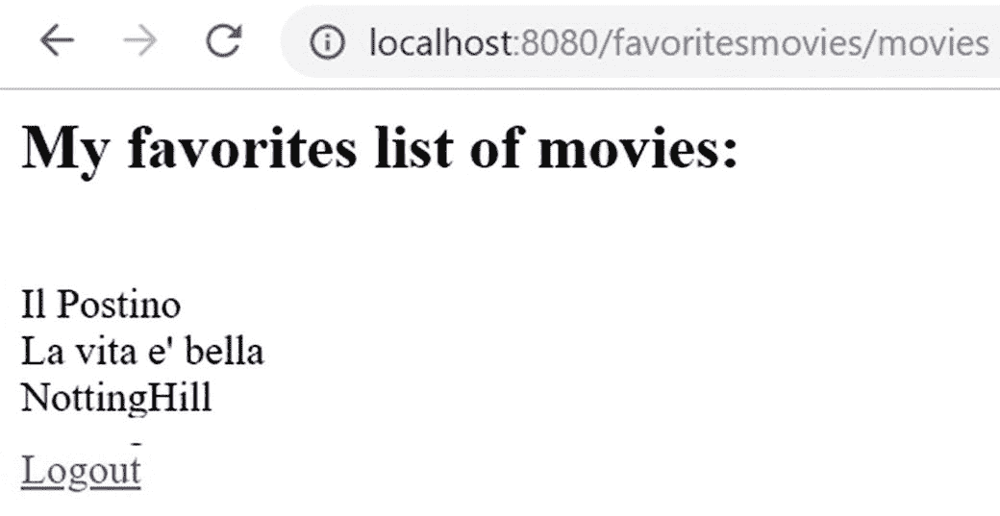

图 5-5
使用管理员凭证访问的电影页面


请注意，我们添加了一个登出链接，以便在需要时实际注销用户。本章稍后将更详细地解释如何使用 Spring Security 的登录和登出 URL。

现在，你将更详细地了解应用程序内部发生了什么，以及你刚刚定义的配置如何帮助保护应用程序。你将跟随请求在框架中的完整旅程，并观察它所经历的不同步骤。当你向配置的 URL 发出 HTTP 请求，并且你的 Servlet 容器处理完该请求后，该请求会到达 `DelegatingFilterProxy`，而后者又会将处理委托给安全相关的 `FilterChainProxy`。

通常，Spring Security 会使用大量过滤器。以 HTTP 请求过滤器为例，它将用于：

*   拦截请求。
*   检测身份验证（或缺失）。
*   重定向到身份验证入口点。
*   将请求传递给授权服务。
*   将请求发送到 Servlet 或抛出安全异常。

在 Spring Security v5 中，最重要的过滤器如下：

安全过滤器链：

*   `DelegatingFilterProxy`
*   `FilterChainProxy`

核心安全过滤器：

*   `FilterSecurityInterceptor`
*   `ExceptionTranslationFilter`
*   `SecurityContextPersistenceFilter`
*   `UsernamePasswordAuthenticationFilter`
*   `AnonymousAuthenticationFilter`

基本和摘要身份验证过滤器：

*   `BasicAuthenticationFilter`
*   `DigestAuthenticationFilter`

会话管理：

*   `SessionManagementFilter`

CSRF 注意事项：

*   `HiddenHttpMethodFilter`

预认证场景：

*   `AbstractPreAuthenticatedProcessingFilter`

`LogoutSuccessHandler`：

*   `LogoutFilter`

Spring Security 感知的 `HttpServletRequestWrapper`：

*   `SecurityContextHolderAwareRequestFilter`

`RequestCache`：

*   `RequestCacheFilter`

HTTP 请求和身份验证过程及过滤器将在第 4 章中解释。

让我们看看在登录时提供错误或正确凭据会发生什么。当浏览器被重定向并请求 URL `/login` 时，会发生以下情况：

*   该过程与第一个请求相同，直到它到达 `DefaultLoginPageGeneratingFilter`。此时，过滤器检测到请求是针对 URL `/login` 的，并将登录表单的 HTML 数据直接写入响应对象。然后渲染响应。

现在尝试使用错误的凭据登录。让我们跟随请求在框架中的旅程，看看会发生什么：

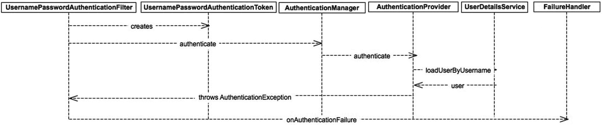

图 5-6
身份验证详细信息不正确时的身份验证过滤器

1.  在登录表单中，输入用户名 **user** 和密码 **uspass**。
2.  提交表单后，过滤器会以与之前相同的顺序再次被激活。然而，这次当请求到达 `UsernamePasswordAuthenticationFilter` 时，过滤器会检查请求是否针对 URL `/login`，并确认确实如此。过滤器分别从 HTTP 请求参数 `username` 和 `password` 中提取用户名和密码身份验证信息。利用这些信息，它创建了 `UsernamePasswordAuthenticationToken Authentication` 对象，然后将其发送给 `AuthenticationManager`（更准确地说，是其默认实现 `ProviderManager`）进行身份验证。
3.  `DaoAuthenticationProvider` 被 `ProviderManager` 使用 `Authentication` 对象调用。`DaoAuthentication` 提供者是 `AuthenticationProvider` 的一个实现，它使用 `UserDetailsService` 策略从任何存储用户的地方检索用户。根据你当前的配置，它将尝试使用配置的 `InMemoryUserDetailsManager`（`UserDetailsService` 的实现，它在 `java.util.Map` 中维护内存中的用户存储）来查找用户名为 user 的用户。由于没有此用户名的用户，提供者会抛出 `UsernameNotFoundException` 异常。
4.  提供者自身捕获此异常，并将其转换为 `BadCredentialsException`，以隐藏应用程序中不存在该用户的事实；相反，它将错误视为常见的用户名-密码组合错误。
5.  该异常被 `UsernamePasswordAuthenticationFilter` 捕获。此过滤器将处理委托给 `AuthenticationFailureHandler` 实现的一个实例，该实例进而决定将响应重定向到 URL `/login?error`。这样，登录表单会再次在浏览器中显示，并附带一条错误消息。你可以在图 5-6 中看到此交互。

现在让我们使用正确的凭据登录。

首先，在控制器中创建一个新的端点来检索一些简单的文本。在控制器 `UserController` 中，创建清单 5-6 中名为 `/showmovie` 的方法。

```
@GetMapping("/showmovie")
@ResponseBody
public String showMovie() {
return "movie x";
}
清单 5-6
一个返回简单字符串的简单端点方法
```

重新启动应用程序，回到 URL `http:/localhost:8080/favoritesmovies/showmovie`，并在表单中输入用户名 **admin** 和密码 **admin123**。然后点击登录按钮。

*   请求遵循与之前相同的过滤器路径。这次，`InMemoryUserDetailsManager` 找到了一个具有所请求用户名的用户，并将其返回给 `DaoAuthenticationProvider`，后者创建了一个成功的 `Authentication` 对象。
*   成功认证后，`UsernamePasswordAuthenticationFilter` 将处理委托给 `SavedRequestAwareAuthenticationSuccessHandler` 的一个实例，该实例在会话中查找原始请求的 URL（`/showmovie`），并将响应重定向到该 URL。

当请求 `http://localhost:8080/favoritesmovies/showmovie` 时，请求会像之前的情况一样，沿着过滤器链进行处理。不过，这次系统中已经有一个完全通过身份验证的实体。请求到达 `FilterSecurityInterceptor`。

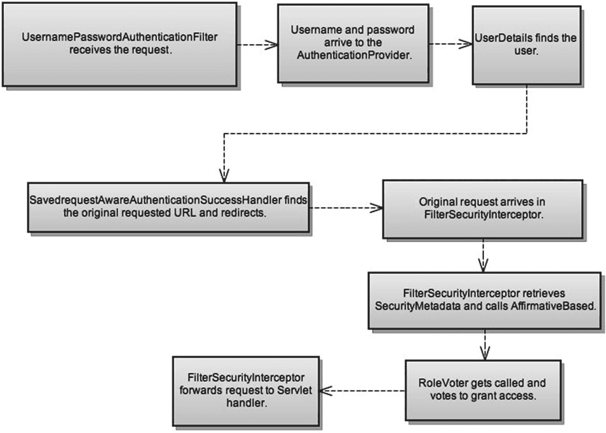

图 5-8
成功认证和授权过程的整体流程

*   `FilterSecurityInterceptor` 收到对 URL `/showmovie` 的访问请求。然后，它恢复访问该 URL 所需的凭据（`ROLE_ADMIN`）。
*   `AffirmativeBased` 访问决策管理器被调用，进而调用 `RoleVoter` 投票器。投票器评估已认证实体的权限列表，并将其与访问资源所需的凭据进行比较。由于投票器找到了匹配项（`ROLE_ADMIN` 同时存在于 `Authentication` 的权限和资源的 `config` 属性中），它投出了 `ACCESS_GRANTED` 票。
*   `FilterSecurityInterceptor` 将请求转发给请求处理链中的下一个元素，在本例中是 Spring 的 `DispatcherServlet`。


*   请求到达 `AdminController`，它简单地返回字符串 `movie x`，然后该字符串被渲染到浏览器。图 5-7 展示了这一结果。


图 5-7

使用正确凭证访问时返回的 showmovie 页面

*   这是认证与授权过程的完整流程。图 5-8 以伪流程图的形式展示了这一完整交互。

特殊 URL

从前面的解释中，你可以看到 Spring Security 对 Web 安全的支持为你定义了一些预配置的 URL，供你在应用程序中使用。这些 URL 在框架中会得到特殊处理。主要的有以下几个：

*   `/login`：
    这是 Spring Security 用于显示应用程序登录表单的 URL。当需要认证但尚未存在时，框架会重定向到此 URL。

*   `/logout`：
    框架使用此 URL 来注销当前登录的用户，并使相应的会话和 `SecurityContext` 失效。

从上述 URL 来看，首先想到的是如何在应用程序中配置自己的登录表单，以及通常如何自定义登录过程，而不是使用默认的。这就是我们接下来要做的。

注意
   从 Spring Security v5 开始，`/login` 取代了在 Spring Security 4 中使用的 `/j_spring_security_check`。

自定义登录表单
当你使用 Spring Security v5 时，对应用程序的用户认证请求是通过 `http.authorizeRequests()` 方法完成的。
当你像之前那样通过 `http.authorizeRequests()` 方法配置 `http` 元素时，Spring Security 会为你设置默认的登录和注销过程，包括登录 URL、登录表单、登录后的默认 URL 以及其他一些选项。基本上，当 Spring Security 的上下文开始加载时，它会发现没有配置自定义登录页面 URL，因此它会采用默认的 URL，并创建一个新的 `DefaultLoginPageGeneratingFilter` 实例，该实例将被添加到过滤器链中。正如你之前所见，这个过滤器就是为你生成登录表单的那个。

如果你想配置自己的表单，需要执行以下任务。首先要告诉框架用你自己的处理方式替换默认处理方式。你在 `SecurityConfiguration` Java 文件中将以下元素定义为 `http.authorizeRequests()` 方法的子元素：

```
formLogin().loginPage("/登录页面的名称")
```

这个元素告诉 Spring Security 在启动时更改其默认的登录处理机制。首先，`DefaultLoginPageGeneratingFilter` 将不再被实例化。让我们先尝试这个配置。应用新配置后，重启应用程序并尝试访问 URL `http://localhost:8080/favoritesmovies/movies`。

你会被重定向到 URL `/login`，并收到一个 404 HTTP 错误，因为你还没有为此 URL 定义任何处理器。这个 404 页面如图 5-9 所示。

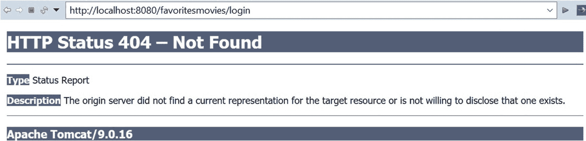

图 5-9
定义新的登录处理页面时出现的 404 错误

让我们在 `UserController` 中添加一个登录控制器，如清单 5-7 所示。

```
@GetMapping("/login")
public String loginPage() {
return "login";
}
清单 5-7
添加到 UserController 的登录控制器
```

接下来，将以下行添加到 SecurityConfiguration 文件中：

```
.and().formLogin().loginPage("/login").permitAll()
```

现在，根据清单 5-8 在你的应用程序的 `WEB-INF/views` 文件夹中创建 `login.jsp` 页面。

```

Spring Security 自定义登录表单

Spring Security 自定义登录表单：

使用用户名和密码登录

用户：

密码：

记住我：

清单 5-8
自定义 login.jsp
```

如果你重启应用程序并再次访问 `http://localhost:8080/favoritesmovies/movies`，当你被重定向到 `/login` URL 时，你应该会看到新的登录表单。该表单如图 5-10 所示。如果你输入 **admin** 作为用户名，**admin123** 作为密码，你将能够访问 `movie x` 页面，就像之前使用默认登录表单一样。

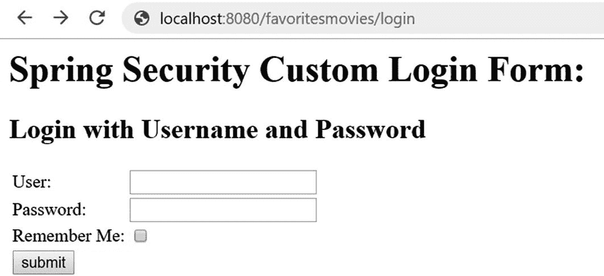

图 5-10
自定义登录表单

如果你查看 `login.jsp`，可以看到用户名字段、密码字段、记住我复选框以及表单元素的 action 属性都有特定的名称。这些名称并非随意指定。Spring Security 期望使用这些特定的名称，以便正确处理认证过程。此外，表单应使用 POST 方法将信息发送到服务器，因为这是框架的要求。
图中显示的“记住我”复选框将在后面解释。
`<form-login>` 元素支持更多配置选项，包括更改认证请求参数的默认 `username` 和 `password` 名称。

`<form-login>` 的属性可能包括

*   `always-use-default-target`

*   `authentication-details-source-ref`

*   `authentication-failure-handler-ref`

*   `authentication-failure-url`

*   `authentication-success-handler-ref`

*   `default-target-url`

*   `login-page`

*   `login-processing-url`

*   `password-parameter`

*   `username-parameter`

*   `authentication-success-forward-url`

*   `authentication-failure-forward-url`

重启应用程序，访问 URL `/movies`，并使用 **admin**/**admin123** 登录。你应该能够毫无问题地访问应用程序。

将此属性赋值为 `/login`。然后，在你的 `login.jsp` 中，在 `<body>` 标签之后添加清单 5-9 中的内容。

```
清单 5-9
显示 login.jsp 中错误的代码片段
```

如果你现在重启应用程序，尝试访问 URL `http://localhost:8080/favoritesmovies/movies`，并使用错误的用户名和密码，你将再次看到登录页面，但顶部会显示错误消息。请查看图 5-11 了解你应该看到的页面。

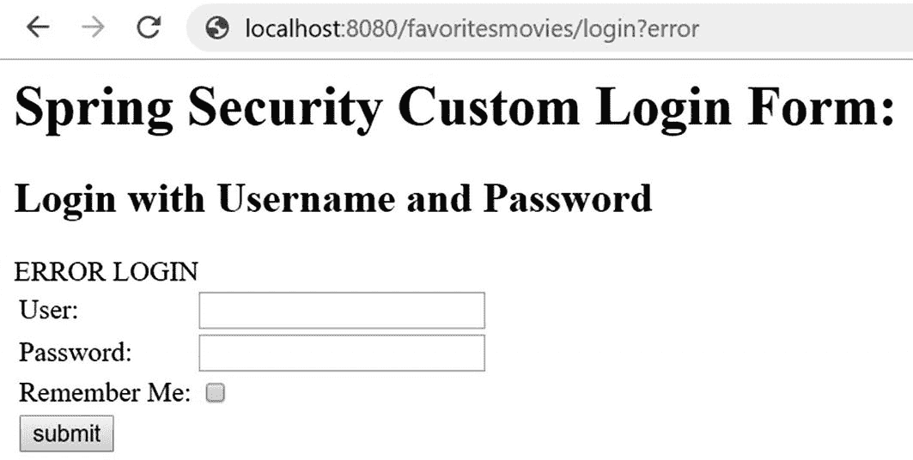

图 5-11
自定义表单中显示的自定义错误

请注意，此 URL 可能是一个完全不同的 URL，与登录 URL 完全无关。但常见的模式是允许用户再次尝试登录，并向其显示任何错误。

*   `authentication-success-handler-ref`：
    对 Spring 应用程序上下文中 `AuthenticationSuccessHandler` bean 的引用。此 bean 在成功认证时被调用，并应处理认证后的下一步操作，通常决定应用程序中的重定向目标。当前实现形式为 `SavedRequestAwareAuthenticationSuccessHandler`，它负责在成功认证后将登录用户重定向到最初请求的 URL。

*   `authentication-failure-handler-ref`：
    对 Spring 应用程序上下文中 `AuthenticationFailureHandler` bean 的引用。它用于处理失败的认证请求。当认证失败时，会调用此处理器。该处理器的标准行为是再次显示登录屏幕或返回 401 HTTP 状态错误。此行为由具体类 `SimpleUrlAuthenticationFailureHandler` 提供。


让我们开发一个简单的 `AuthenticationFailureHandler` 接口实现示例。当认证失败时，它将简单地返回一个 500 状态码。根据清单 5-10 创建 `CustomAuthenticationFailureHandler` 类。

```
package com.apress.pss.springsecurity.configuration;
import org.springframework.security.web.authentication.AuthenticationFailureHandler;
import org.springframework.security.core.AuthenticationException;
import javax.servlet.http.HttpServletRequest;
import javax.servlet.http.HttpServletResponse;
import java.io.IOException;
public class CustomAuthenticationFailureHandler implements AuthenticationFailureHandler {
@Override
public void onAuthenticationFailure(HttpServletRequest request, HttpServletResponse response, AuthenticationException e) throws
IOException {
response.sendError(500);
}
}
清单 5-10
用于 ServerErrorFailureHandler 的 AuthenticationFailureHandler 实现
```

然后，将以下内容添加到 `SecurityConfiguration` 类文件中：

```
.and().formLogin().loginPage("/login").permitAll().failureHandler(new CustomAuthenticationFailureHandler())
```

以及新的 Bean：

```
@Bean
public AuthenticationFailureHandler customAuthenticationFailureHandler() {
return new CustomAuthenticationFailureHandler();
}
```

重启应用程序，访问 `http://localhost:8080/favoritesmovies/movies`，使用任意用户名和密码，然后点击提交按钮。你应该会在浏览器中看到一个 500 错误。

清单 5-11 展示了到目前为止完全更新后的 `SecurityConfiguration` 文件。

```
package com.apress.pss.springsecurity.configuration;
import org.springframework.beans.factory.annotation.Autowired;
import org.springframework.context.annotation.Bean;
import org.springframework.context.annotation.Configuration;
import org.springframework.security.config.annotation.authentication.builders.AuthenticationManagerBuilder;
import org.springframework.security.config.annotation.web.builders.HttpSecurity;
import org.springframework.security.config.annotation.web.configuration.EnableWebSecurity;
import org.springframework.security.config.annotation.web.configuration.WebSecurityConfigurerAdapter;
import org.springframework.security.crypto.bcrypt.BCryptPasswordEncoder;
import org.springframework.security.crypto.password.PasswordEncoder;
import org.springframework.security.web.authentication.AuthenticationFailureHandler;
@Configuration
@EnableWebSecurity
public class SecurityConfiguration extends WebSecurityConfigurerAdapter {
@Autowired
PasswordEncoder passwordEncoder;
@Override
protected void configure(AuthenticationManagerBuilder auth) throws Exception {
auth.inMemoryAuthentication()
.passwordEncoder(passwordEncoder)
.withUser("admin").password(passwordEncoder.encode("admin123")).roles("ADMIN");
}
@Bean
public PasswordEncoder passwordEncoder() {
return new BCryptPasswordEncoder();
}
@Override
protected void configure(HttpSecurity http) throws Exception {
http.authorizeRequests()
.antMatchers("/", "/login").permitAll()
.antMatchers("/**").hasRole("ADMIN")
.and().formLogin().loginPage("/login").permitAll().failureHandler(new CustomAuthenticationFailureHandler())
.and().csrf().disable();
}
@Bean
public AuthenticationFailureHandler customAuthenticationFailureHandler() {
return new CustomAuthenticationFailureHandler();
}
}
清单 5-11
SecurityConfiguration
```

基本 HTTP 认证
有时，你无法真正使用登录表单来认证用户。例如，如果你的应用程序旨在被其他系统调用而非人类用户，那么向其他应用程序显示登录表单就没有意义。这是一个非常常见的用例。Web 服务在没有用户交互的情况下相互通信，ESB 系统将系统彼此集成，JMS 客户端从其他系统生成和消费消息。
在需要无需人类用户访问的 HTTP 暴露接口的上下文中，一种常见的方法是使用 HTTP 基本认证头。HTTP 认证头允许你将安全信息（用户名和密码）嵌入到发送给服务器的请求头中，而不是像登录表单认证那样将其发送在请求体中。
HTTP 使用一个标准头来携带此信息。这个头被恰当地命名为 `Authorization`。使用此头时，发送请求的客户端（例如浏览器）将用户名和密码用冒号连接起来，然后对结果字符串进行 Base64 编码，并将编码结果发送到头中。例如，如果你使用用户名 **neve** 和密码 **nardone**，客户端会创建字符串 `neve:nardone`，并在将其发送到头中之前对其进行编码。

让我们在你的应用程序中使用基本 HTTP 认证。你需要做的第一件也是唯一一件事是移除配置文件 `SecurityConfiguration` 中的 `.formlogin()` 元素，并添加

```
.httpBasic()
```

替换后，重启应用程序，在浏览器中访问 URL `http://localhost:8080/favoritesmovies/movies`。一个标准的 HTTP 认证框会弹出，要求你输入认证详细信息，如图 5-12 所示。输入 **admin/admin123** 作为用户名和密码，然后发送请求。你将成功进入之前已经见过几次的电影页面（图 5-5）。

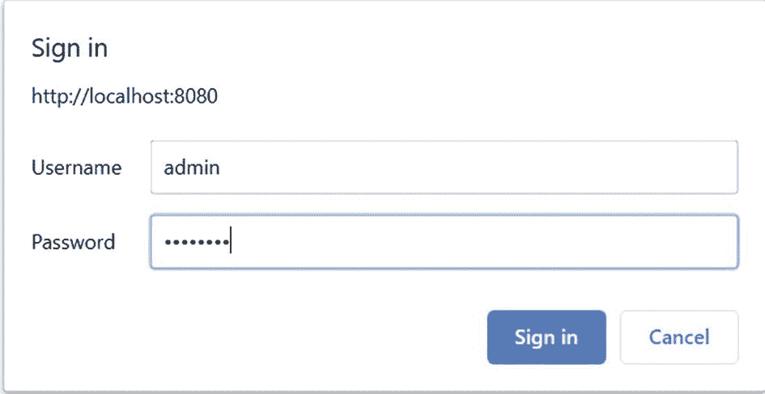

图 5-12
标准 HTTP 认证表单，基本认证配置

当你使用 `httpBasic` 配置元素时，Spring `Security's BasicAuthenticationFilter` 会开始工作。一个 `BasicAuthenticationEntryPoint` 策略将在启动时被配置到 `ExceptionTranslationFilter` 中。当你第一次向 URL `/movies` 发出请求时，框架的行为与之前相同，抛出一个由 `ExceptionTranslationFilter` 处理的访问拒绝异常。此过滤器委托给 `AuthenticationEntryPoint` 的特定实现策略——在本例中是 `BasicAuthenticationEntryPoint`。`BasicAuthenticationEntryPoint` 将头 `WWW-Authenticate: Basic realm="Spring Security Application"` 添加到响应中，然后向客户端发送 HTTP 状态码 401（未授权）。客户端应该知道如何处理此代码并相应地进行操作。（在浏览器的情况下，它只是显示认证弹出窗口。）
当你输入用户名和密码并提交请求时，请求再次沿着过滤器链进行，直到到达 `BasicAuthenticationFilter`。此过滤器检查请求头，查找以 `Basic` 开头的 `Authorization` 头。过滤器提取头的内容，使用 `Base64.decode` 解码字符串，然后提取用户名和密码。过滤器创建一个 `UsernamePasswordAuthenticationToken` 对象，并以标准方式将其发送给认证管理器进行认证。认证管理器将要求认证提供者检索用户，然后使用该用户创建一个 `Authentication` 对象。此过程是标准的，与使用基本认证还是表单认证无关。


摘要认证
摘要认证是 HTTP 基本认证的**近亲**。其主要目的是避免像基本认证那样在网络上传输明文密码，通过在发送密码前对其进行哈希处理来实现。这使得摘要认证比基本认证更复杂。摘要认证与基本认证一样，通过 HTTP 头部进行工作。

摘要认证基于使用一次性随机数（nonce）对密码进行哈希处理。*一次性随机数*是服务器生成的一个任意数字，在认证过程中使用且仅使用一次。它会与用户名、密码、一次性随机数、请求的 URI 等信息一起参与摘要计算。在认证过程中，服务器和客户端都会进行摘要计算，并且结果应该一致。

主要处理逻辑位于两个类中：`DigestAuthenticationFilter` 和 `DigestAuthenticationEntryPoint`。
`DigestAuthenticationFilter` 查询请求头以寻找 `Authorization` 头部，然后检查该头部的值是否以 `Digest` 开头。如果是，则表明该请求携带了用于认证的安全凭证。
`DigestAuthenticationEntryPoint` 是被调用来生成响应、要求启动摘要安全认证过程的类。该类会设置 `WWW-Authenticate` 头部，并填入正确的值（包括一次性随机数），以便客户端代理（浏览器）知道它必须启动摘要认证过程。

要配置摘要认证，请使用以下代码行更新 `SecurityConfiguration` 文件：

```
http.addFilter(digestAuthenticationFilter())
.exceptionHandling().authenticationEntryPoint(digestEntryPoint())
```

接下来，添加以下 Bean 来添加 `DigestAuthentication` 过滤器：

```
private DigestAuthenticationFilter digestAuthenticationFilter() throws Exception {
DigestAuthenticationFilter digestAuthenticationFilter = new DigestAuthenticationFilter();
digestAuthenticationFilter.setUserDetailsService(userDetailsServiceBean());
digestAuthenticationFilter.setAuthenticationEntryPoint(digestEntryPoint());
return digestAuthenticationFilter;
}
```

然后，使用 `inMemoryUserDetailsManager` 定义用户名和密码：

```
@Override
@Bean
public UserDetailsService userDetailsServiceBean() {
InMemoryUserDetailsManager inMemoryUserDetailsManager = new InMemoryUserDetailsManager();
inMemoryUserDetailsManager.createUser(User.withUsername("admin").password(passwordEncoder.encode("admin123")).roles( "ADMIN").build());
return inMemoryUserDetailsManager;
}
```

最后，定义 `digestEntryPoint`：

```
@Bean
DigestAuthenticationEntryPoint digestEntryPoint() {
DigestAuthenticationEntryPoint bauth = new DigestAuthenticationEntryPoint();
bauth.setRealmName("Security Digest Authentication");
bauth.setKey("SecurityKey");
return bauth;
```

如果你重新启动应用程序并访问 `http://localhost:8080/favoritesmovies/movies`，将会看到一个浏览器对话框，要求输入用户名和密码，这与基本认证时显示的对话框完全相同。这就是 `DigestAuthenticationEntryPoint` 的作用。如前所述，该入口点会用所需的头部信息填充响应对象，以便浏览器知道它需要显示登录表单。使用用户名 **admin** 和密码 **admin123** 登录，你应该能够访问请求的 URL。

浏览器会使用输入的密码创建自己的摘要消息，并将其放入头部。它还会将剩余的信息——即一次性随机数、客户端随机数、域等——放入 `Digest` 头部。以下是一个随当前请求发送到服务器的 `Digest` 头部示例：

```
'Digest username="admin", realm=" Security Digest Authentication",
nonce="MTM1NTY3NDc3NDIy....==", uri=" /movies",
response="225ea6fbad618cfdf1da7d4f7efe53b8", qop=auth,
nc=00000002, cnonce="376a9b27621880bd"'
```

当请求到达 `DigestAuthenticationFilter` 时，请求头中包含所需的摘要认证头部。该头部中的信息以 CSV 字符串形式到达，包含上一段中显示的所有必需信息，包括一次性随机数和客户端随机数（`cnonce`）。（一次性随机数是在加密通信中仅使用一次的任意数字。请参阅 [`http://en.wikipedia.org/wiki/Cryptographic_nonce`](http://en.wikipedia.org/wiki/Cryptographic_nonce)）。过滤器从头部提取信息，从 `UserDetailsService` 中检索用户，然后使用检索到的用户密码计算摘要，以查看摘要是否与客户端在头部中发送的摘要匹配。如果匹配，则授予访问权限。

记住我认证
记住我认证功能用于允许应用程序的回头用户无需每次都登录即可使用。基本上，应用程序会记住某些访客，允许他们直接打开应用程序，并看到为其个性化定制的应用程序版本，就像他们已登录一样。
记住我功能对用户来说非常方便；然而，它也非常危险，建议仅在私人（家庭）环境中使用。
问题显而易见。如果你在公共计算机上使用某个应用程序，并且该应用程序记住了你的个人信息，那么下一个从该计算机访问该应用程序的人将能够毫不费力地冒充你。
通常的做法是在记住我会话中仅提供有限的功能。这意味着，即使你通过记住我功能自动登录，你也无法访问应用程序的全部功能。应用程序中更敏感的部分可能需要你正式登录才能使用。
例如，Amazon.com 就是这种情况。当你访问 Amazon.com 并登录后，下次访问 Amazon 时，网站会记住你、你的推荐、你的姓名以及其他关于你的信息。但如果你想购买东西，它会要求你完全登录才能使用该功能。
记住我认证通常通过向浏览器发送一个 cookie 来实现，该 cookie 在后续的应用程序会话中被发送回服务器以进行自动登录。
Spring Security 中的记住我功能是如何工作的？
Spring Security 中的记住我功能主要由两个组件支持：`RememberMeServices` 接口和 `RememberMeAuthenticationFilter` 类。让我们看看它们在请求上下文中是如何工作的。
当应用程序启动时，`RememberMeAuthenticationFilter` 位于服务器的过滤器链中。同时，会实例化一个 `TokenBasedRememberMeServices` 并将其注入到 `AbstractAuthenticationProcessingFilter` 中，替换掉无操作的 `NullRememberMeServices`。
访问 `http://localhost:8080/favoritesmovies/movies`，并使用 **admin** 作为用户名、**admin123** 作为密码登录。
当请求进入应用程序时，`UsernamePasswordAuthenticationFilter`（`AbstractAuthenticationProcessingFilter` 的子类）会按照已解释的标准方式处理认证过程。
认证成功后，`UsernamePasswordAuthenticationFilter` 会调用配置好的 `TokenBasedRememberMeServices` 的 `loginSuccess` 方法。该方法会检查请求是否包含 `remember-me` 参数，以便应用记住我功能。（如果服务中的 `alwaysRemember` 属性设置为 `true`，它也会应用记住我功能。）因为你没有发送此请求，所以不会发生任何事情。

因此，让我们将参数添加到你的登录表单中。打开 `login.jsp` 文件，并在 `<form>` 标签内的某处粘贴以下元素：

```
记住我：
```

然后在 `SecurityConfiguration` 配置文件中添加以下内容：


```
.rememberMe() .key("remember-me").rememberMeParameter("remember-me")
.rememberMeCookieName("rememberloginnardone").tokenValiditySeconds(100)
```

这几行代码定义了密钥名称、参数名称、Cookie 名称以及有效期（以秒为单位）。
重启应用程序，访问 `http://localhost:8080/favoritesmovies/movies`。
现在，您应该会看到一个复选框，以及用户名和密码输入框。勾选该复选框，并使用 **admin**`/`**admin123** 登录。

这一次，请求携带了所需的参数，`TokenBasedRememberMeServices` 开始工作。它从 `Authentication` 对象中提取用户名和密码，并利用这些信息以及过期时间创建一个令牌。它基本上是将这三个值与 XML 元素中指定的记住我密钥（`favoritesmovies_key`）拼接起来，然后对生成的字符串进行 MD5 编码。该值将与用户名一起再次进行 Base64 编码，并作为名为 `rememberloginnardone` 的 Cookie 添加到响应中，返回给浏览器。您可以在图 5-13 中看到这个 Cookie。

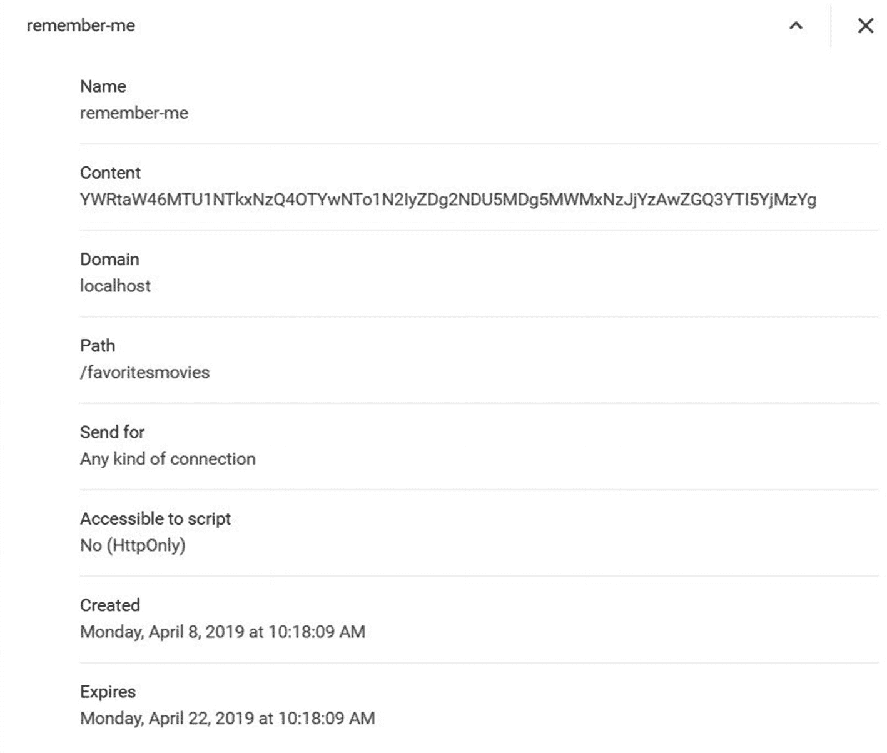

图 5-13
记住我 Cookie 示例

重启应用程序。访问 `http://localhost:8080/favoritesmovies/movies`。
您应该无需登录即可访问该页面。
当此请求进入系统时，会被 `RememberMeAuthenticationFilter` 拦截，该过滤器随即开始工作。过滤器做的第一件事是检查 `SecurityContext` 中是否没有当前的 `Authentication` 对象。因为这意味着没有用户登录，所以过滤器会调用 `RememberMeServices` 的 `autoLogin` 方法。
在标准配置中，`TokenBasedRememberMeServices` 是实现 `RememberMeServices` 的具体类。该实现的 `autoLogin` 方法尝试将传入的 Cookie 解析为其组成元素，即用户名、组合元素（用户名 + “:” + 令牌过期时间 + “:” + 密码 + “:” + 密钥）的哈希值，以及令牌的过期时间。然后，它使用用户名从 `UserDetailsService` 中检索 `UserDetails`，使用检索到的用户重新计算哈希值，并将其与传入的哈希值进行比较。如果不匹配，则抛出 `InvalidCookieException`。如果匹配，则检查 `UserDetails`，创建一个 `Authentication` 对象并返回给调用者。
`autoLogin` 方法从请求中提取记住我 Cookie，对其进行解码，执行一些验证，然后使用从 Cookie 中提取的用户名调用配置的 `UserDetailsService` 的 `loadUserByUsername` 方法。接着，它创建一个 `RememberMeAuthenticationToken` 对象（`Authentication` 的一个实现）。
然后，`RememberMeAuthenticationFilter` 尝试根据 `AuthenticationProvider` 的 `RememberMeAuthenticationProvider` 实现来认证这个新的 `Authentication` 对象，该实现仅在确认传入请求的哈希值与存储的记住我密钥哈希值匹配后，返回相同的 `Authentication` 对象。
这个 `Authentication` 对象将被 `Security Interceptor` 用于允许访问请求的 URL。

登出
登出非常简单。当您从应用程序登出时，您希望应用程序结束当前会话，同时移除可能为您存储在客户端的所有信息。
如前所述，在 Spring Security v5 中，URL `/logout` 取代了在 Spring Security v4 之前使用的 URL `/j_spring_security_logout`。
在 Spring Security 中，登出非常容易。默认情况下，您唯一需要做的就是访问 URL `/logout`。让我们来试试。

将以下几行代码添加到 `UserController` 文件中：

```
@GetMapping ("/logout")
public String logoutPage (HttpServletRequest request, HttpServletResponse response) {
Authentication auth = SecurityContextHolder.getContext().getAuthentication();
if (auth != null){
new SecurityContextLogoutHandler().logout(request, response, auth);
}
return "index";
}
```

使用以下几行代码更新安全配置文件：

```
.and().logout().deleteCookies("JSESSIONID")
.and().logout().invalidateHttpSession(true)
.and().logout().logoutSuccessUrl("/index").permitAll()
```

这几行代码告诉应用程序删除 `JSESSIONID` Cookie、使 HTTP 会话失效，并在登出后重定向到索引网页。

接下来，在 `movies.jsp` 页面中添加一个指向登出的 HTML 链接：

```
">Logout
```

最后，在 `index.jsp` 页面中添加一个简单的 HTML 链接，以便在需要时链接回 `movies`：

```
">My movies
```

现在，访问 `http://localhost:8080/favoritesmovies/movies`，并使用 **admin**/**admin123** 再次登录。
勾选用于激活 `remember-me` 功能的复选框。您应该能够毫无问题地登录。
如果您查看浏览器中存储的 Cookie，应该会看到 localhost 域有两个 Cookie：`JSESSIONID` 和 `rememberloginnardone`。图 5-13 显示了这两个 Cookie。您可能会预期，如果登出，这两个 Cookie 会从浏览器中消失，从而基本上从浏览器中移除应用程序的所有痕迹。让我们来操作一下。

点击 `movies.jsp` 页面上的登出链接。您应该会从应用程序中登出。如果您打开浏览器的 Cookie，会看到 `rememberloginnardone` Cookie 已经消失。`JSESSIONID` Cookie 仍然存在，但会话已被框架失效。图 5-14 显示了记住我 Cookie 和会话 Cookie。

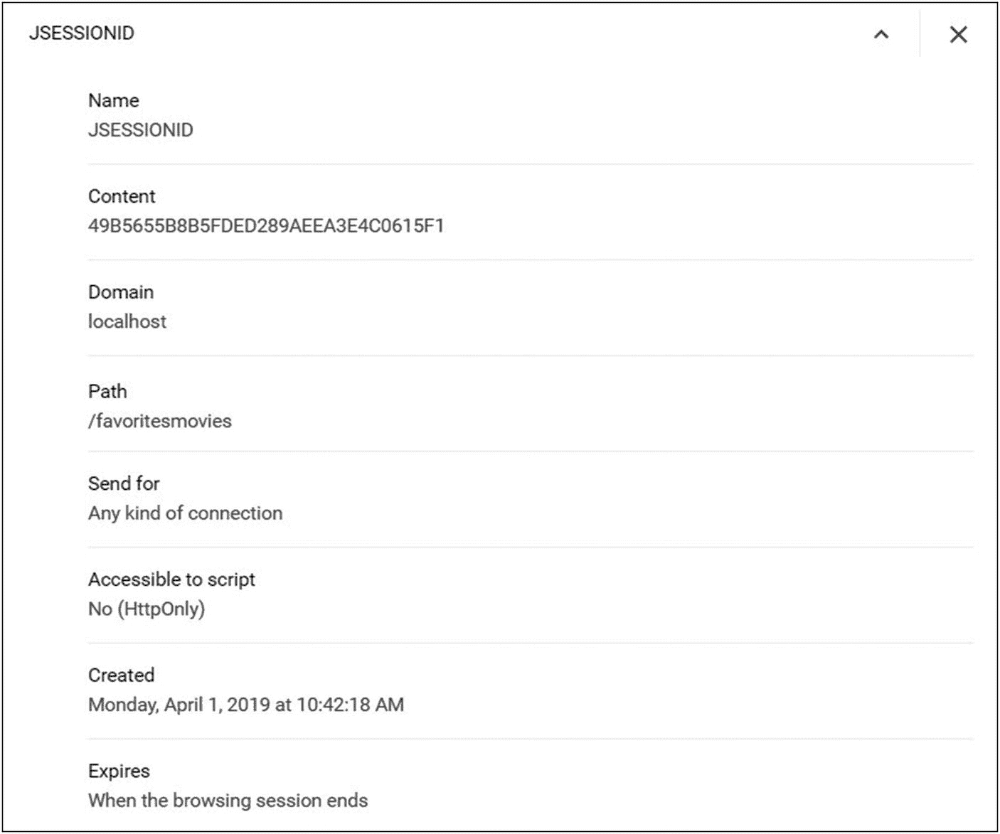

图 5-14
记住我 Cookie 和会话 Cookie

登出请求的流程如下：当请求到达时，它会沿着过滤器链传递，直到到达 `LogoutFilter`。该过滤器注意到请求的 URL 是用于登出的。过滤器调用配置的 `LogoutHandler(s)`，在运行中的应用程序中，这些处理器是 `SecurityContextLogoutHandler` 和 `TokenBasedRememberMeServices`。（它们实现了 `LogoutHandler` 接口。）
`SecurityContextLogoutHandler` 以标准的 Servlet 方式使 Servlet 会话失效，即调用 `HttpSession` 对象的 `invalidate` 方法，并清除 Spring Security 中的 `SecurityContext`，如使用 `.logout().invalidateHttpSession(true)` 所示。
`TokenBasedRememberMeServices` 则通过将记住我 Cookie 的过期时间设置为 0 来简单地移除它。

会话管理
Spring Security 的 Web 支持的另一个领域是用户会话管理。关于会话，一件非常重要的事情是确保在用户成功认证时创建一个新的会话 ID。这样做可以降低会话固定攻击的可能性，在这种攻击中，一个用户设置另一个用户的会话标识符，以便在应用程序中冒充他。Spring Security 还提供了一个功能，您可以使用它来指定同一用户在任意给定时间可以打开的并发会话数量。
这两个功能由名为 `SessionFixationProtectionStrategy` 的类控制，该类实现了 `SessionAuthenticationStrategy`。此策略由 `AbstractAuthenticationProcessingFilter` 和 `SessionManagementFilter` 调用。让我们看看它们是如何工作的。


`SessionFixationProtectionStrategy`
默认已在应用程序中配置的 `UsernamePasswordAuthenticationFilter` 中启用。因此，当您登录时，该策略会被调用。策略被调用时，它会获取当前会话（通常是匿名会话）并将其失效，然后立即创建一个新会话。它还会尝试迁移某些属性——通常是 Spring Security 自身使用的属性，但也可以指定一个属性列表。
总结一下这个策略：当您登录时，它会将当前会话失效，创建一个新会话，并将某些属性从旧会话复制到新会话中。
自 Spring Session 2.0 起，它包含了 Spring Session Core 模块以及其他几个模块，例如 Spring Session Data MongoDB 模块、Spring Session Data Geode 模块等。

让我们看看如何在应用程序中配置它。

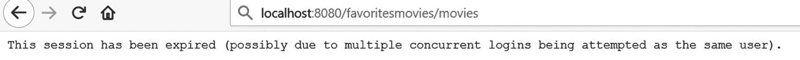

图 5-15
与并发会话相关的错误

1.  将以下行添加到 `SecurityConfiguration`
    文件中：

```
    .sessionManagement().sessionCreationPolicy(SessionCreationPolicy.ALWAYS)
    ```

2.  重新启动应用程序。

3.  打开 Chrome 浏览器并访问 `http://127.0.0.1:8080/favoritesmovies/movies`。
    使用用户名 **admin** 和密码
    **admin123** 登录。您应该能够正常访问该页面。

4.  打开另一个浏览器，例如 Firefox，并访问 `http://127.0.0.1:8080/favoritesmovies/movies`。
    使用用户名 **admin** 和密码
    **admin123** 登录。您应该能够正常访问该页面。

5.  转到 Chrome 浏览器并刷新页面。您将看到以下
    消息：“此会话已过期（可能由于同一用户尝试多次并发登录）。”此消息
    明确指出了问题所在。图 5-15 显示了此
    页面。

现在，通过将以下行添加到 `SecurityConfiguration`
文件中，允许同时存在两个会话：

```
.sessionManagement().maximumSessions(2)
```

重新启动应用程序并按照之前的相同流程操作。这次，您应该能够同时保持两个会话处于活动状态。

强制请求使用 HTTPS
默认情况下，启用 Spring Security 的应用程序通过普通的 HTTP 通道提供所有内容。但是，您可以对其进行配置，使其自动确保特定的 Web 请求通过 HTTPS 通道传送。

注意
我们假设您通常了解使用 HTTPS 相对于 HTTP 的优势。不过，这里做一个简要的提醒。HTTPS（或超文本传输安全协议）是一种通信协议，它将标准的 HTTP 协议与安全套接字层（SSL）或 TLS 结合使用，以达到安全目的。HTTPS 通过两种形式实现安全性。首先，它允许连接的客户端对正在连接的 Web 服务器进行身份验证，确保其连接到正确的认证网站。这是通过使用服务器端证书完成的。HTTPS 解决的另一个安全问题是对客户端和服务器之间交换的信息进行加密。HTTPS 确保信息在交换过程中不会被第三方读取。您可以在维基百科（[`http://en.wikipedia.org/wiki/HTTP_Secure`](http://en.wikipedia.org/wiki/HTTP_Secure)）和许多其他地方找到关于此主题的更广泛信息。请查看官方的 HTTPS/SSL Apache Tomcat 网页，了解如何在 [`https://tomcat.apache.org/tomcat-9.0-doc/ssl-howto.html`](https://tomcat.apache.org/tomcat-9.0-doc/ssl-howto.html) 配置 HTTPS。

我们假设您已经为您的 Apache Tomcat v9 配置了 HTTPS。
设置 HTTPS 非常简单；您只需向 Spring Security 配置文件中添加一个新的配置元素即可。

假设您想为登录页面配置 HTTPS。只需将以下行添加到 `SecurityConfiguration`
文件中：

```
http.requiresChannel().antMatchers("/login*").requiresSecure();
```

访问 `http://localhost:8080/favoritesmovies/movies`，
就像您在本章中一直做的那样。这次，应用程序将
自动重定向到 URL `https://localhost:8443/favoritesmovies/login`。
（浏览器可能会显示典型的“不安全证书”
警告，您可以在图 5-16 中看到，但您可以通过单击“仍然继续”选项或类似选项安全地继续操作。）

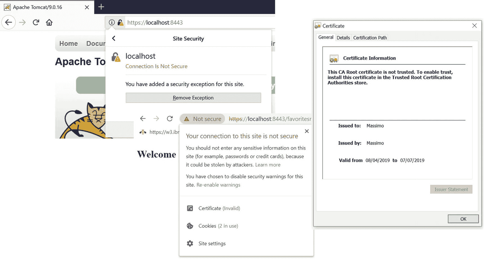

图 5-16
具有 HTTPS 通道安全性和自签名证书的应用程序

通道功能的工作方式如下。当应用程序启动时，命名空间解析机制会注意到 `requiresChannel` 元素中存在 `requires-channel` 属性。`HttpConfigurationBuilder` 类找到此属性，然后创建一个 `RequestMatcher` 和 `ChannelAttributeFactory` 的映射。`ChannelAttributeFactory` 根据 `requires-channel` 属性的值创建 `ConfigAttribute` 实例。例如，如果所需的通道是 HTTPS，它会创建一个 `ConfigAttribute` 实现的实例，其值为 `REQUIRES_SECURE_CHANNEL`，并与相应的 URL 模式关联。解析器找到配置了 `requires-channel` 属性的 `antMatchers-url` 后，它会实例化一个新的 `ChannelProcessingFilter` bean，该 bean 配置了一个 `ChannelDecisionManager` 实现，用于决定每个请求使用哪个通道。
当发出请求时，它会像往常一样经过过滤器链。过滤器链中有一个名为 `ChannelProcessingFilter` 的过滤器，如前所述。此过滤器将决定如何处理请求的责任委托给其配置的 `ChannelDecisionManager` 实现。决策管理器在某些辅助类的帮助下，决定请求是否可以继续，或者相反，请求的通道是否不被请求的 URL 所允许。在后一种情况下，它会委托给一个 `ChannelProcessor` 和一个重定向策略，以向正确的通道 URL 发送重定向响应。
基本上，在此示例中，此过滤器查看 URL `http://localhost:8080/favoritesmovies/login`，发现此 URL 与具有配置要求 `REQUIRES_SECURE_CHANNEL` 的 `antMatchers-url` 模式匹配，然后调用 `RetryWithHttpsEntryPoint`，后者又调用 `RedirectStrategy` 实现的 `sendRedirect` 方法，该方法尝试重定向到 `https://localhost:8443/favoritesmovies/login`。

总结
在本章中，我们涵盖了该框架最大的关注点之一：Spring Security 中的 Web 支持。您看到主要功能以 Servlet 过滤器的形式提供。从标准的角度来看，这是一件好事，因为它意味着您可以在使用标准 Java Servlet 模型的其他框架中利用 Spring Security 的 Web 支持。
您现在应该了解构成该框架的主要过滤器的许多细节、它们内部的工作方式，以及它们如何相互配合并与框架的其他部分配合。我们以实践的方式解释了所有这些内容，试图解决现实生活中的场景。
在下一章中，我们将介绍 Spring Security 的第二个主要关注点——即方法级安全性。我们将展示它与 Web 级安全性的比较，您将看到您可以利用现有的大量知识将其应用于方法级安全层。

6. 配置替代身份验证提供程序


Spring Security 最强大的特性之一，在于你可以将不同的身份验证机制插入到框架中。Spring Security 的设计目标，是尽可能构建一个可插拔的架构模型，让不同的组件能够以简单且不引人注目的方式集成到框架中。在身份验证层，这意味着存在一个抽象层来处理安全流程的这一部分。这个抽象层主要以 `AuthenticationProvider` 接口的形式呈现，但也通过特定的安全 Servlet 过滤器和用户详情服务提供支持。

Spring Security v5 支持多种不同的身份验证机制，包括：

*   数据库
*   LDAP
*   X.509
*   OAuth 2/OpenID
*   WebSockets
*   JSON Web Token (JWT)
*   JAAS
*   CAS

本章的大部分内容将解释这些身份验证系统各自如何独立于 Spring Security 工作。虽然会提供一些关键细节，但不会进行深入解释。当然，你将看到 Spring Security 如何实现这些身份验证机制，并且你会发现它们在所使用的 Spring Security 组件方面有许多共同点。本章仅提供关于数据库、LDAP 和 X.509 身份验证的示例，而 OAuth2、JAAS 和 CAS 将仅作介绍。

数据库提供的身份验证
数据库提供的身份验证的工作方式与内存提供的身份验证几乎完全相同。唯一的区别在于，用户存储在数据库中，而非内存中。这发生在运行时，当你在应用程序上下文配置文件中定义它们时。
当你使用数据库身份验证机制时，`AuthenticationProvider` 的实现完全不需要改变；它仍然是你在内存用户身份验证中使用的 `DaoAuthenticationProvider`。你可能还记得，这个 `AuthenticationProvider` 实现基于使用 `UserDetailsService` 抽象来检索用户，因此这里的区别在于你将使用的 `UserDetailsService` 实现。
正如你将看到的，配置从数据库提供用户非常简单。

首先，从 [`https://sourceforge.net/projects/hsqldb/postdownload`](https://sourceforge.net/projects/hsqldb/postdownload) 下载并解压 HyperSQL 数据库引擎 (HSQLDB) 的 `.zip` 文件。
在你的案例中，你将把 `hsqldb-2.4.1.zip` 文件安装到 `c:\hsqldb-2.4.1`。
在本章中，你将使用 IntelliJ IDEA 2019 作为 IDE 工具。你可以从 [`https://blog.jetbrains.com/idea/tag/intellij-idea-2019-1/`](https://blog.jetbrains.com/idea/tag/intellij-idea-2019-1/) 下载它。

你可以按照图 6-1 所示配置 HSQLDB。

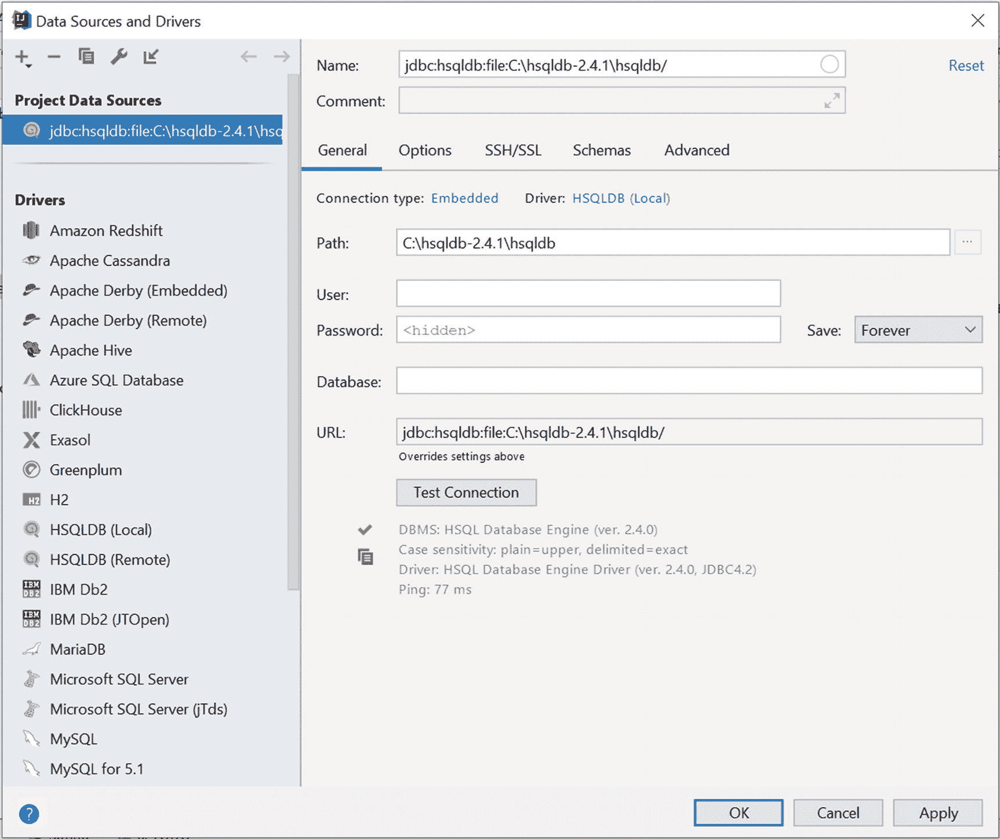

图 6-1
配置 hsqldb-2.4.1

稍后，在运行 HSQLDB SQL 页面时，结果将如图 6-2 所示。

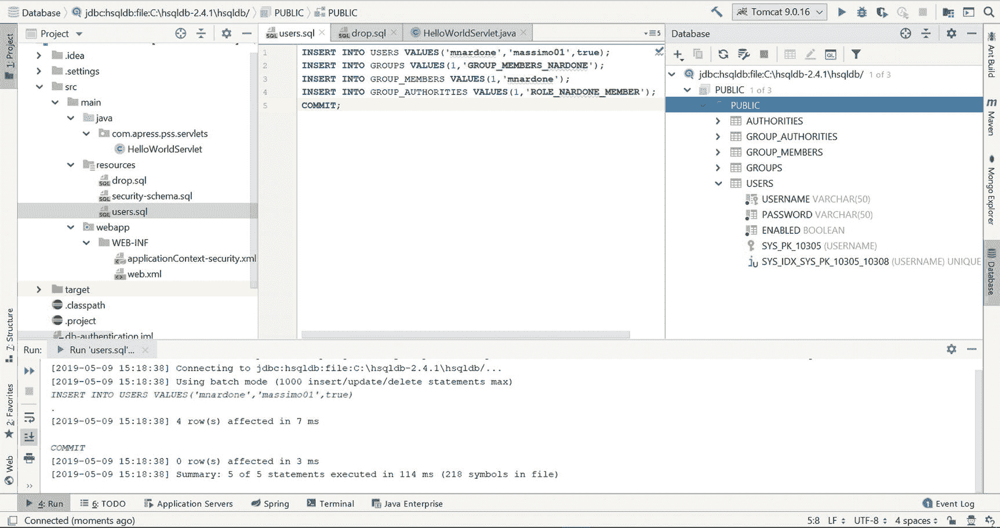

图 6-2
运行 HSQLDB SQL 脚本

好了，现在 HSQLDB 已准备好可以使用。

你要做的第一件事是定义所需的数据库模式，以使身份验证机制正常工作。使身份验证工作所需的表如图 6-3 所示。

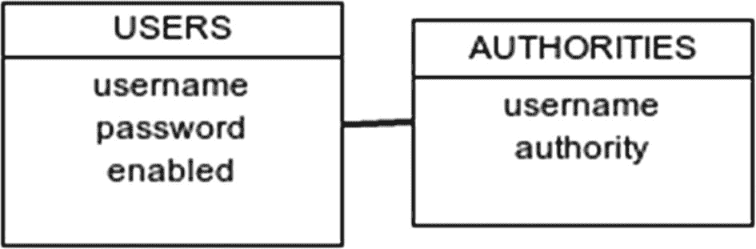

图 6-3
支持数据库身份验证所需的简单数据库模式

图 6-3 展示了一个用于支持数据库身份验证的简单模式模型。仅通过查看这些表，你应该就能理解它们的工作方式。这基本上是你迄今为止一直在使用的内存实现的一对一映射。在 `USER` 表中，你存储用户详细信息——主要是用户名和密码。在 `AUTHORITIES` 表中，你存储用户名与该成员被授予的权限之间的关系——例如，`ROLE_MEMBER`。

图 6-4 展示了一个扩展的默认选项，你可以使用它来定义组，并建立与这些组相关的权限，而不是与单个用户相关的权限。

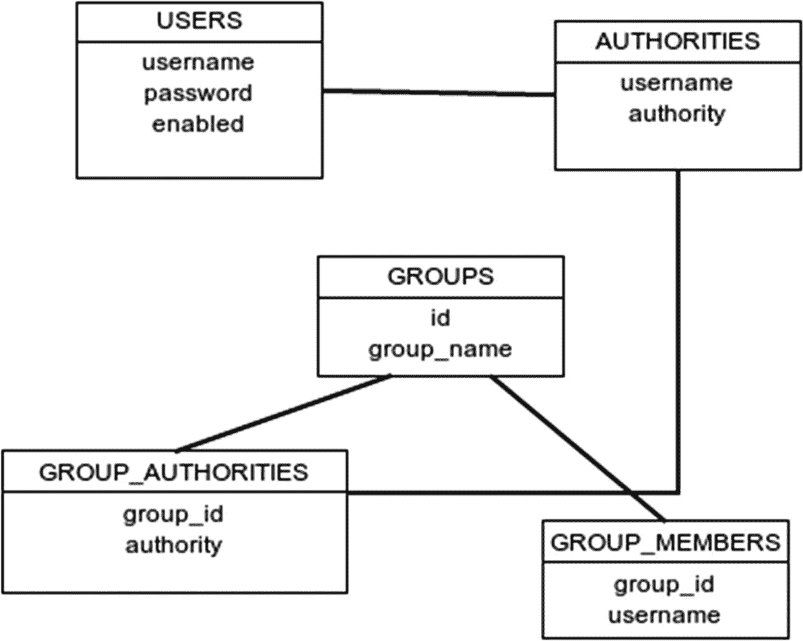

图 6-4
带组的数据库支持身份验证方案

图 6-4 比图 6-3 稍微复杂一些；然而，它仍然非常直接。这次，模式允许你创建命名组，并建立属于这些组的权限。同时，用户现在也可以属于组，这意味着用户可以继承其所属组定义的权限。例如，如果在 `GROUPS` 表中有一个名为 Administrators 的组，并且在 `GROUP_AUTHORITIES` 表中定义了两个权限（`ROLE_ADMIN` 和 `ROLE_USER`）映射到 Administrators 组，那么属于 Administrators 组（存在于 `GROUP_MEMBERS` 表中）的成员将继承该组的 `ROLE_ADMIN` 和 `ROLE_USER` 权限。
默认情况下，组机制在 `UserDetailsService` 中未激活。要激活它，你需要在配置文件中相应的 `<jdbc-user-service>` 中配置一个 `groupAuthoritiesByUsernameQuery` 属性，稍后你将在示例中看到。

注意
对于此示例项目以及本章中的其余示例，除非另有说明，否则你将从一个配置如下的应用程序开始。

1.  使用你在第 3 章创建的示例。
2.  使用清单 6-1 中的内容更新 `web.xml` 文件。
3.  在生成的 `WEB-INF` 文件夹中，使用清单 6-2 的内容更新 `spring-security.xml`。
4.  使用清单 6-3 中的内容更新 `com.apress.pss.servlets` 包中的 Servlet。
5.  如清单 6-4 所示更新 `pom.xml`。

```

4.0.0
war
pss01_Security
com.apress.pss
pss01_Security
1.0-SNAPSHOT

5.1.5.RELEASE
5.1.5.RELEASE

org.springframework
spring-core
${springframework.version}

org.springframework
spring-web
${springframework.version}

org.springframework
spring-webmvc
${springframework.version}

org.springframework.security
spring-security-web
${springsecurity.version}

org.springframework.security
spring-security-config
${springsecurity.version}

javax.servlet
javax.servlet-api
3.1.0

javax.servlet.jsp
javax.servlet.jsp-api
2.3.1

javax.servlet
jstl
1.2

taglibs
standard
1.1.2

org.springframework
spring-jdbc
3.0.0.RELEASE

org.hsqldb
hsqldb
2.4.1

org.apache.maven.plugins
maven-compiler-plugin
3.8.0

pss01_Security

清单 6-4
包含配置的 pom.xml
```


```
package com.apress.pss.springsecurity.controller;
import org.springframework.security.core.context.SecurityContextHolder;
import org.springframework.security.core.userdetails.UserDetails;
import org.springframework.stereotype.Controller;
import org.springframework.ui.ModelMap;
import org.springframework.web.bind.annotation.RequestMapping;
import org.springframework.web.bind.annotation.RequestMethod;
@Controller
public class UserController {
@RequestMapping(value = { "/", "/welcome" }, method = RequestMethod.GET)
public String homePage(ModelMap model) {
return "welcome";
}
@RequestMapping(value = "/admin", method = RequestMethod.GET)
public String adminPage(ModelMap model) {
model.addAttribute("user", getPrincipal());
return "admin";
}
private String getPrincipal(){
String userName = null;
Object principal = SecurityContextHolder.getContext().getAuthentication().getPrincipal();
if (principal instanceof UserDetails) {
userName = ((UserDetails)principal).getUsername();
} else {
userName = principal.toString();
}
return userName;
}
}
清单 6-3
简单的 Servlet 定义
```

```

/beans:beans>
清单 6-2
本章所有示例中使用的起始版 spring-security.xml
```

```
Spring MVC 应用

spring
org.springframework.web.servlet.DispatcherServlet

spring
/

org.springframework.web.context.ContextLoaderListener

contextConfigLocation

/WEB-INF/spring-security.xml

springSecurityFilterChain
org.springframework.web.filter.DelegatingFilterProxy

springSecurityFilterChain
/*

清单 6-1
本章所有应用中使用的 web.xml
```

让我们开始运行示例。你将使用一个 HSQL 数据库，因此需要在 `pom.xml` 文件中配置其 JDBC 依赖项，如清单 6-5 所示。

```
org.hsqldb
hsqldb
2.4.1

org.springframework
spring-jdbc
3.0.0.RELEASE

清单 6-5
HSQLDB 和 JDBC Maven 依赖项
```

接下来，让我们修改配置文件 `security-security.xml`，加入支持数据库驱动用户认证所需的配置更改。清单 6-6 展示了 `spring-security.xml` 文件。

```

清单 6-6
使用数据库驱动 UserDetailsService 的 spring-security.xml
```

在清单 6-6 中，你可以看到我们使用了命名空间 `<jdbc:>`，通过元素 `<embedded-database>` 定义了一个新的嵌入式数据源。嵌入式数据源是 Spring 3.0 引入的新特性。你可以用它们来定义不同类型的嵌入式数据源（基本上是在使用它们的 Java 进程内运行的内存数据源），例如 HSQL 和 Derby。HSQL 是默认选项。你还可以看到，在该标签中，你还可以指定在数据源启动时要执行的 SQL 脚本位置。这些脚本按从上到下的顺序依次执行；在此示例中，`security-schema.sql` 首先执行，然后执行 `users.sql`。这里指定的 SQL 文件允许你创建一个简单的数据库模式，以支持按照我们在上一节中定义的方式配置用户和权限。

使用这种嵌入式数据源对于此类示例和应用程序的单元测试非常方便，但在生产环境中很可能不会使用它们。对于生产环境，你将使用完整的数据库解决方案，例如 MySQL、PostgreSQL、Oracle 等。

清单 6-7 展示了 `spring-servlet.xml` 文件，该文件未做更改。

```

/WEB-INF/pages/

.jsp

清单 6-7
使用数据库驱动 UserDetailsService 的 spring-servlet.xml
```

创建基本表

接下来，创建你在配置文件中引用的两个 SQL 文件，并将它们放在类路径的根目录下。清单 6-8 展示了文件 `security-schema.sql`，清单 6-9 展示了文件 `users.sql`。稍后，你还会看到用户组的相关内容。

```
INSERT INTO USERS VALUES('mnardone','nardone',true);
INSERT INTO AUTHORITIES VALUES('mnardone','ROLE_NARDONE_MEMBER');
COMMIT;
清单 6-9
users.sql 文件中可在应用中使用的用户及其权限
```

```
CREATE TABLE USERS(USERNAME VARCHAR_IGNORECASE(50) NOT NULL PRIMARY KEY,
PASSWORD VARCHAR_IGNORECASE(50) NOT NULL,
ENABLED BOOLEAN NOT NULL);
CREATE TABLE AUTHORITIES(
USERNAME VARCHAR_IGNORECASE(50) NOT NULL PRIMARY KEY,
AUTHORITY VARCHAR_IGNORECASE(50) NOT NULL,
CONSTRAINT FK_AUTHORITIES_USERS
FOREIGN KEY(USERNAME) REFERENCES USERS(USERNAME));
CREATE TABLE GROUPS(
id BIGINT NOT NULL PRIMARY KEY,
GROUP_NAME VARCHAR_IGNORECASE(50) NOT NULL);
CREATE TABLE GROUP_MEMBERS(
group_id BIGINT NOT NULL,
username VARCHAR_IGNORECASE(50) NOT NULL);
CREATE TABLE GROUP_AUTHORITIES(
group_id BIGINT NOT NULL,
authority VARCHAR_IGNORECASE(50) NOT NULL);
清单 6-8
security-schema.sql 定义了存储用户和权限所需的安全数据库模式
```

现在一切应该都已就绪，让我们在 `独立的 Tomcat 9 服务器` 上运行应用程序，并使用用户名 **mnardone** 和密码 **nardone** 登录并访问 URL `http://localhost:8080/pss01_Security/login`。图 6-5 和图 6-6 展示了我们在运行示例时得到的登录页面和 `admin.jsp` 页面。

这里发生的事情非常简单，与你之前一直在处理的内容类似。当你在配置文件 `security-security.xml` 中定义元素 `<security:jdbc-user-service>` 时，Spring Security 在启动时会实例化一种与用于内存用户详细信息的 `UserDetailsService` 不同类型的服务。

实例化的 `UserDetailsService` 是一个 `org.springframework.security.provisioning.JdbcUserDetailsManager`。该实例被注入到 `DaoAuthenticationProvider` 中，用于从 JDBC 数据存储中检索用户。

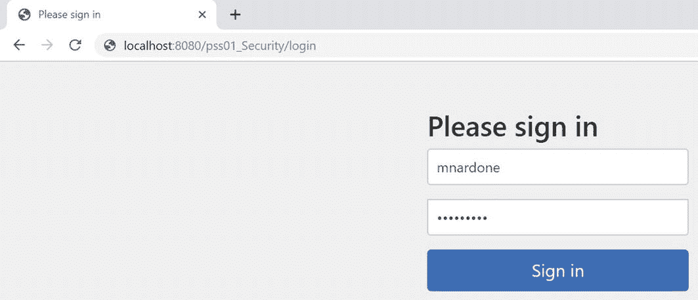

图 6-5
登录界面

它会被重定向到 `http://localhost:8080/pss01_Security/admin`，如图 6-6 所示。

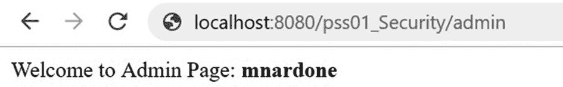

图 6-6
成功认证后显示的管理员页面

使用用户组

现在要使用用户组，让我们稍微修改一下 `users.sql` 文件，并将清单 6-10 中的行添加到其中。这些行有效地创建了一个用户组，并将用户 mnardone 放入该组。你还应该删除向 `AUTHORITIES` 表中插入用户 mnardone 角色的 SQL 语句。

```
INSERT INTO GROUPS VALUES(1,'GROUP_MEMBERS_NARDONE');
INSERT INTO GROUP_MEMBERS VALUES(1,mnardone);
INSERT INTO GROUP_AUTHORITIES VALUES(1,'ROLE_NARDONE_MEMBER');
清单 6-10
用于创建用户组并将成员加入用户组的 users.sql 行
```


现在，要在 `UserDetailsService` 中启用组功能，你需要在 `JdbcDaoImpl` 实现中将属性 `enableGroups` 设置为 `true`；然而，由于某些原因，`<jdbc-user-service>` 命名空间元素目前不支持直接设置这个简单的属性。它支持的是设置 `group-authorities-by-username-query` 属性，该属性允许你指定从数据库模式中检索组的查询。设置此属性会自动将 `enableGroups` 属性设置为 `true`。当然，另一种选择是不使用 XML 命名空间，而是使用标准的 bean 定义并设置该属性。你将采用第一种方案，让 `security-security.xml` 中的 `<jdbc-user-service>` 看起来像清单 6-11 所示。

```
清单 6-11
配置文件中指定 group-authorities-by-username-query 属性的部分
```

考虑你在清单 6-11 中指定的查询；`group-authorities-by-username-query` 属性是直接从类文件 `JdbcDaoImpl`（即查询字符串）中提取的。它在该文件（`JdbcDaoImpl`）的 `DEF_GROUP_AUTHORITIES_BY_USERNAME_QUERY` 常量中配置，并且是该类用于检索组和权限的默认查询。

如果你现在重新启动应用程序，应该会看到与之前相同的行为。然而，这次内部行为有所不同，因为执行的是组查询来检索用户的权限。在 `JdbcDaoImpl` 中做出此选择的代码非常简单，你可以在清单 6-12 中看到。第二个 `if` 条件中使用的属性是由 Spring Security 在启动时自动设置的，特别是在你设置 `group-authorities-by-username-query` 属性时，由 `JdbcUserServiceBeanDefinitionParser` 类完成的，正如我们之前所解释的。第一个 `if` 中的 `enableAuthorities` 属性在 `JdbcDaoImpl` 类本身中被自动设置为 `true`。

```
if (enableAuthorities) {
    dbAuthsSet.addAll(loadUserAuthorities(user.getUsername()));
}
if (enableGroups) {
    dbAuthsSet.addAll(loadGroupAuthorities(user.getUsername()));
}
清单 6-12
JdbcDaoImpl 中按组或用户名查询的代码
```

使用组的优势在于，它提供了一种新的层次结构，可以将用户组织到同一类别中，而不直接将他们与特定权限关联。相反，它将整个组与权限关联起来。例如，你通常会认为所有管理员都属于管理员组，并且这个组关联了许多权限，比如 `ROLE_ADMIN`、`ROLE_USER`、`ROLE_OPERATOR` 等。所有这些权限都可以归入同一个概念组，同时，所有用户也可以归入他们各自的组。这意味着并非所有用户都需要引用所有这些权限。他们只需要成为该组的一部分即可。当然，一个用户可以同时属于多个组。

**使用现有模式**

默认情况下，`JdbcDaoImpl` 配置为使用你已经看过的数据库模式和查询。然而，模式配置是灵活的，你可以调整现有的数据库用户模式（如果有的话），使其被 Spring Security JDBC `UserDetails` 支持所使用，而不是专门为 Spring Security 编写自定义模式。当然，你当前的模式中需要存在某些概念，比如“用户”抽象、“权限”或“角色”定义，以及如果你也要使用组的话，还需要“组”抽象。如果你的数据库中已经存在这些抽象，那么从 Spring Security 的 JDBC 支持中访问信息就很简单了。`<jdbc-user-service>` 元素中的两个属性（`authorities-by-username-query` 和 `group-authorities-by-username-query`）允许你指定确切的 SQL，这些 SQL 将用于在不使用组或确实使用组时检索特定用户名的权限。

你在上一节中看到了如何使用 `group-authorities-by-username-query` 属性的示例。`authorities-by-username-query` 的配置方式类似，它应该是一个在其结果集中返回两列的查询。第一列代表用户名，第二列代表特定的权限。例如，默认查询如下所示：

```
select username,authority from authorities where username = ?
```

你需要在 `<jdbc-user-service>` 元素中更改的另一个属性是 `users-by-username-query`。这里你使用所需的查询来通过用户名检索用户。该查询需要返回一条记录中的三列：`username`、`password` 和 `enabled`。

让我们通过一个快速示例来尝试一下。你将更改当前正在处理的示例中的一些文件。首先，将 `security-schema.sql` 和 `users.sql` 文件更改为与 Spring Security 期望的默认值不完全匹配的内容。因此，将这些文件的内容分别替换为清单 6-13 和清单 6-14 的内容。

```
INSERT INTO PEOPLE VALUES(mnardone,nardone);
INSERT INTO ROLES VALUES('mnardone','ROLE_NARDONE_MEMBER');
COMMIT;
清单 6-14
一个与 Spring Security 默认值不匹配的 users.sql
```

```
CREATE TABLE PEOPLE(
NAME VARCHAR_IGNORECASE(50) NOT NULL PRIMARY KEY,
KEY VARCHAR_IGNORECASE(50));
CREATE TABLE ROLES(
NAME VARCHAR_IGNORECASE(50) NOT NULL PRIMARY KEY,
ROLE VARCHAR_IGNORECASE(50) NOT NULL,
CONSTRAINT FK_AUTHORITIES_USERS FOREIGN KEY(NAME)
REFERENCES PEOPLE(NAME));
COMMIT;
清单 6-13
一个与 Spring Security 默认值不匹配的 security-schema.sql
```

接下来，将 `security-security.xml` 文件中的 `<security:jdbc-user-service>` 元素替换为清单 6-15 中的元素。

```
清单 6-15
使用自定义查询的 JDBC 用户服务
```

现在重新启动应用程序，使用用户名 **mnardone** 和密码 **nardone** 登录，并访问 URL `http://localhost:8080/pss01_Security/admin`。你应该能够以与之前完全相同的方式访问该页面。


LDAP 认证
轻量级目录访问协议（LDAP）是一种面向消息的应用层协议，用于以可访问的树状目录形式存储和访问信息。通常，目录就是一个组织化的数据存储库，便于在其特定领域内进行简单查询。例如，电视指南是一个便于查找电视节目的目录，而电话簿则是一个便于查找电话号码的目录。

LDAP 允许在目录中存储各种不同类型的信息。最广为人知的类 LDAP 结构应用可能是微软 Windows 活动目录系统。其他 LDAP 系统则被广泛用于存储许多公司的企业用户数据库，作为集中式用户存储。

LDAP 并非一个易于理解的系统，我们将结合本节开发的示例来尝试解释它。我们将使用与上一节相同的代码，但根据需要进行修改，使其适用于 LDAP 认证而非数据库认证。请记住，在上一节中，我们提供了一个引导应用程序，用于开始本章中的所有示例，包括本示例。

首先要做的是在 LDAP 目录中配置你的用户。为此，你需要了解 LDAP 信息模型，该模型定义了可以在目录中存储的数据类型。

LDAP 中的数据由条目、属性和值定义。*条目*是目录中的基本信息单元，通常代表现实世界中的一个实体，例如一个用户。条目通常由特定的对象类定义。目录中的每个条目都有一个称为“专有名称”（通常简称为 DN）的标识。目录中的每个条目还有一组*属性*，用于描述该条目的不同方面。每个属性都有一个类型和一个或多个*值*。

你必须定义所需的数据。你将像之前一样使用用户、组和凭证。在 LDAP 中，用户条目定义通常被称为 *People*，因此你将使用该名称来定义用户条目。你的用户还将使用标准的 LDAP 对象类 `person` 来定义其属性。

安装和配置 LDAP
对于你的 LDAP 实现，你将下载并安装 Apache 目录服务器（ApacheDS），地址为 [`https://directory.apache.org/apacheds/downloads.html`](https://directory.apache.org/apacheds/downloads.html)，以及 Apache 目录工作室，地址为 [`https://directory.apache.org/studio/downloads.html`](https://directory.apache.org/studio/downloads.html)。这两个工具的安装过程都很直接，应该不会给你带来任何问题。请查阅官方网站获取指导。

Apache 目录工作室允许你访问和查询服务器。它是一个由插件构建的 Eclipse 应用程序，适用于访问 LDAP 服务器。

关于 ApacheDS 服务器，安装后（至少在 Mac 上），它会自动启动；不过，你也可以选择将 ApacheDS 服务器作为应用程序进程内的嵌入式服务器运行，而不是使用独立的 LDAP 服务器。在本示例中，我们将使用独立服务器。

首先，你需要启动 ApacheDS，如图 6-7 的服务列表所示。

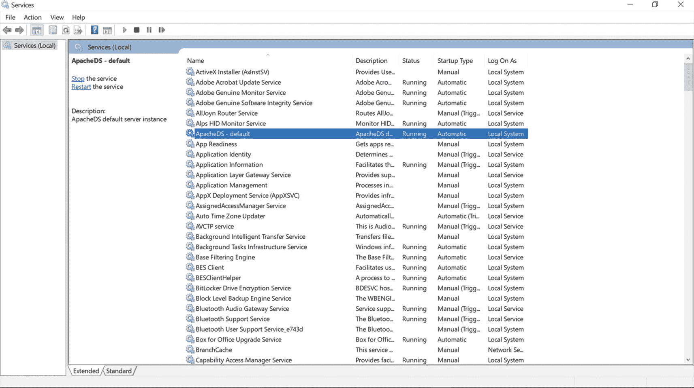

图 6-7
启动 ApacheDS

安装 Apache 服务器和工作室后，你需要从工作室连接到服务器。

一旦 ApacheDS 服务运行，打开 Apache 工作室并启动 LDAP 服务器，如图 6-8 所示。

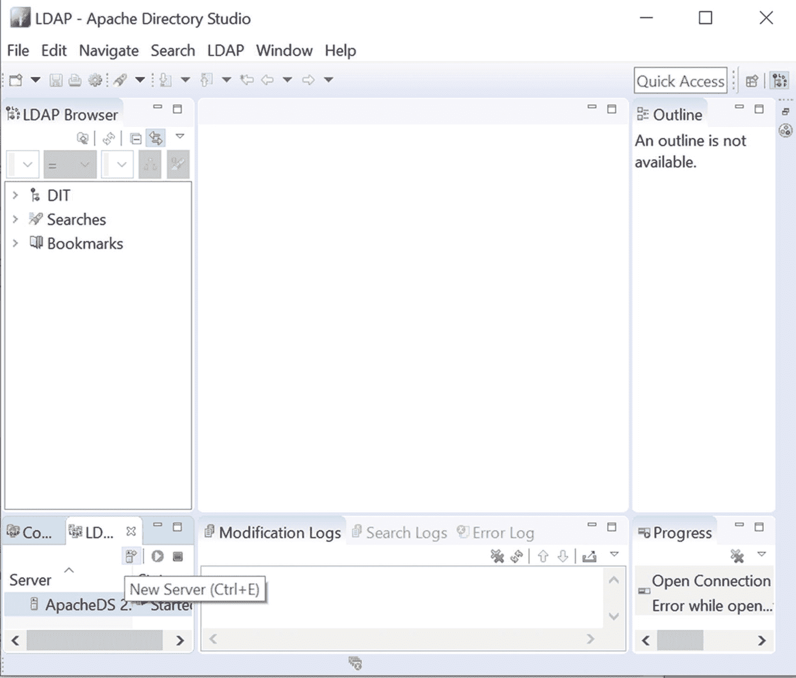

图 6-8
启动 LDAP 服务器

现在你可以将 Apache 工作室连接到 ApacheDS。转到工作室的“文件”菜单，选择“新建”，然后选择“LDAP 连接”，如图 6-9 所示。在 LDAP 连接表单中，输入连接到本地 ApacheDS 服务器的值，如图 6-10 所示，使用 **uid=admin,ou=system** 作为 DN，**secret** 作为密码。你可以看到主机是 localhost，端口是 10389。点击“下一步”完成连接配置。

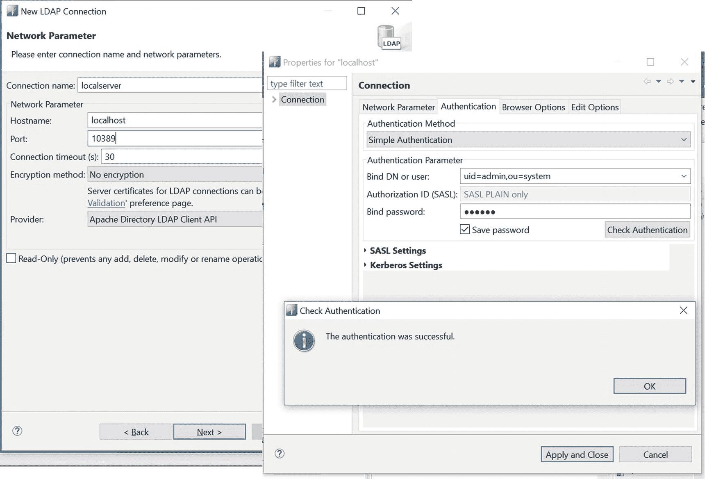

图 6-10
连接到本地 ApacheDS 服务器

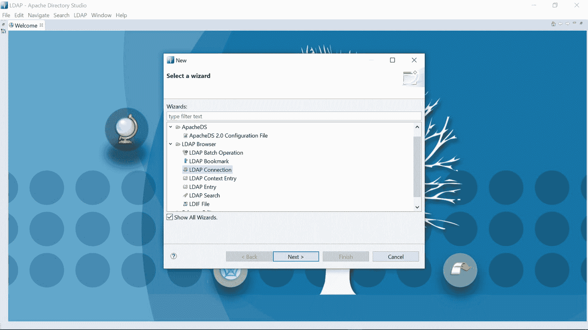

图 6-9
Apache 目录工作室连接到 LDAP 服务器

一旦与 ApacheDS 服务器建立连接，你需要创建一个表示本地目录中顶级条目的上下文条目。为此，右键单击左侧面板的 `Root DSE` 元素，然后在上下文菜单中选择“新建 ➤ 新建上下文条目”，如图 6-11 所示。

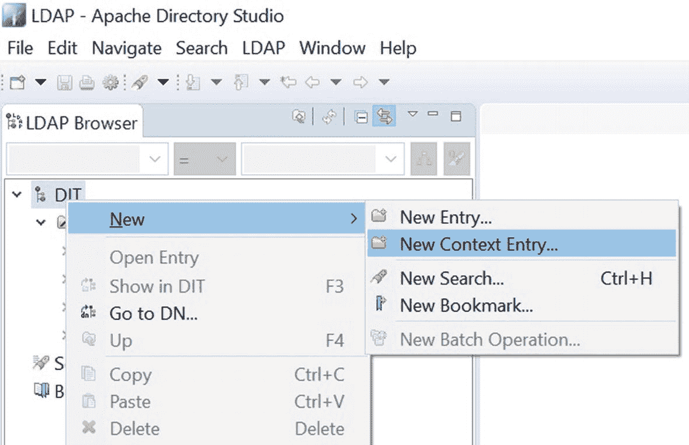

图 6-11
创建新的上下文条目顶级条目

在“新建上下文条目”的第一个表单中，选择从头创建条目。然后，从左侧面板的可用对象类列表中，选择 `dNSDomain` 并点击“添加”。这里的思路是，你正在创建所有其他条目派生自的顶级条目。最终结果应类似于图 6-12。然后点击“下一步”。在下一个输入表单中，使用 `dc=example,dc=com` 作为上下文条目的 DN 名称，然后点击“下一步”。这些值（`example` 和 `com`）是 ApacheDS 服务器中包含的分区和顶级上下文条目的默认值。这些值也部分标识了你在目录中创建的每个条目，因为如前所述，LDAP 遵循一种层次结构，该结构在其父条目的基础上构建条目的名称。

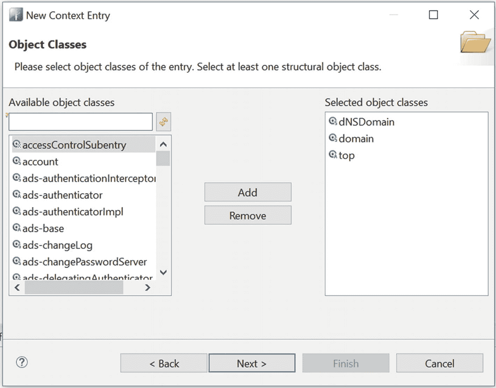

图 6-12
为上下文条目选择 dNSDomain 对象类

下一步是将你的用户（对于本示例而言）导入到 LDAP 服务器。你将使用一个 LDIF 文件导入几个用户。LDIF 文件是一种使用 LDIF 格式的文本文件，这是一种用于描述 LDAP 中目录条目的标准格式。它允许你以标准方式将目录数据导入或导出到另一个 LDAP 目录，或者仅用于创建新数据或修改现有数据。你在此处使用它来导入包含用户的数据。清单 6-16 显示了将要导入的 LDIF 文件。你可以随意命名此文件，但在本示例中我们将其命名为 `users.ldif`。


```
version: 1
dn: dc=example,dc=com
objectclass: top
objectclass: domain
dc: example
dn: ou=groups,dc=example,dc=com
objectclass: organizationalUnit
objectclass: top
ou: groups
dn: cn=administrators,ou=groups,dc=example,dc=com
objectclass: groupOfUniqueNames
objectclass: top
cn: administrators
uniqueMember: uid=mnardone,ou=people,dc=example,dc=com
ou: admin
dn: cn=users,ou=groups,dc=example,dc=com
objectclass: groupOfNames
objectclass: top
cn: users
member: uid=lnardone,ou=people,dc=example,dc=com
ou: user
dn: ou=people,dc=example,dc=com
objectclass: organizationalUnit
objectclass: top
ou: people
dn: uid=lnardone,ou=people,dc=example,dc=com
objectclass: inetOrgPerson
objectclass: organizationalPerson
objectclass: person
objectclass: top
cn: Leo Nardone
sn: Leo
uid: lnardone
userPassword: {SHA}F1OkcxtiioPmVX3tJlIHzZsXkDQ=
dn: uid=mnardone,ou=people,dc=example,dc=com
objectclass: inetOrgPerson
objectclass: organizationalPerson
objectclass: person
objectclass: top
cn: Massimo Nardone
sn: Nardone
uid: mnardone
userPassword: {SHA}xcS5y9T0kjBXDpYijejbhmILFwY=
清单 6-16
包含要导入 LDAP 目录的两个用户的 LDIF 文件
```

如你所见，这段代码生成了两个用户：`mnardone`（属于 administrators 组）和 `lnardone`（不属于该组）。

请注意，我们是通过这个网页生成的 SHA 密码：[`http://aspirine.org/htpasswd_en.html`](http://aspirine.org/htpasswd_en.html)。
密码如下：

*   *nardone01 = {SHA}xcS5y9T0kjBXDpYijejbhmILFwY=*

*   *nardone02 = {SHA}F1OkcxtiioPmVX3tJlIHzZsXkDQ=*

要导入清单 6-16 中的文件，请在 Apache Directory Studio 中，右键单击新创建的上下文条目左侧面板。然后选择“导入” ➤ “LDIF 导入”。在如图 6-13 所示的输入表单中，选择并找到你存储清单 6-16 内容的文件（在我们的例子中是 `users.ldif`），然后单击“完成”。

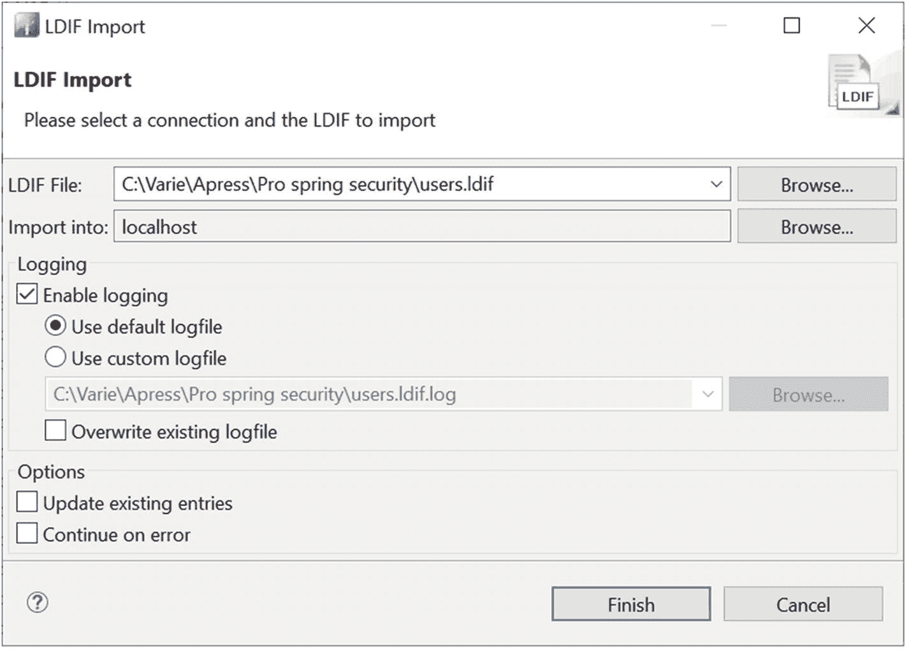

图 6-13
使用 Apache Directory Studio 导入 LDIF 文件

在清单 6-16 中，你可以看到目录的层次结构，以及所有条目如何继承 DN `dc=example,dc=com`。正如我们刚才所说，你还可以看到不同的条目如何使用不同的标准对象类。你已经创建了两个组：administrators 和 users。你还确定了 *lnardone* 是 users 组的成员，*mnardone* 是 administrators 组的成员，以及两个 SHA 密码。从图形上看，这个层次结构非常简单，如图 6-14 所示。

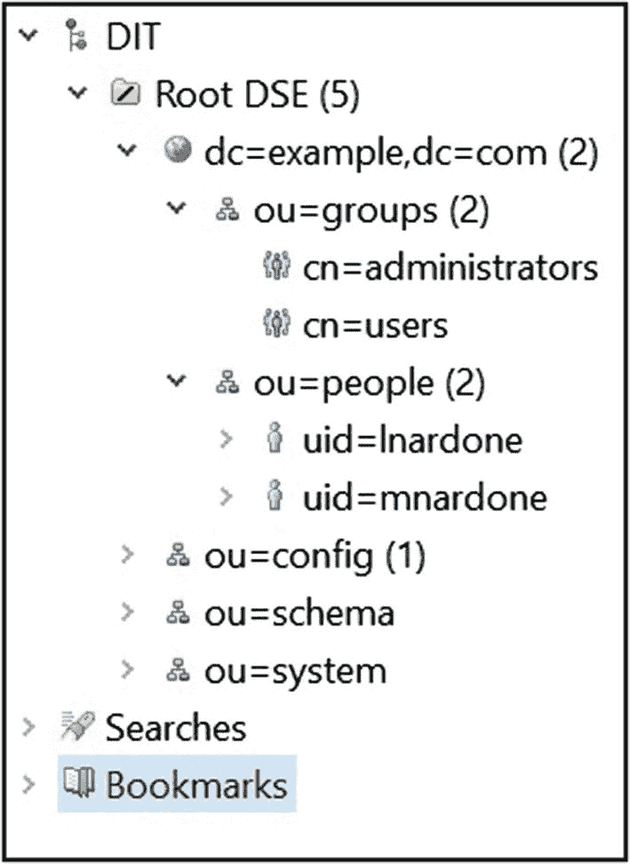

图 6-14
LDAP 层次结构，展示了你使用 LDIF 文件创建的结构

接下来你需要做的是配置示例应用程序，使其能够连接到 LDAP 服务器并查询其上存储的信息。目前你有一个干净的应用程序，只包含引导组件。现在你将开始添加所需的功能。

首先，将 Spring Security LDAP 依赖项添加到 `pom.xml` 文件中。该依赖项如清单 6-17 所示。

```
org.springframework.ldap
spring-ldap-core

org.springframework.security
spring-security-ldap

清单 6-17
Spring Security LDAP 依赖项
```

创建一个新的 Spring Security Boot 项目，包含 Web、Security、LDAP 和 Thymeleaf，如图 6-15 所示。

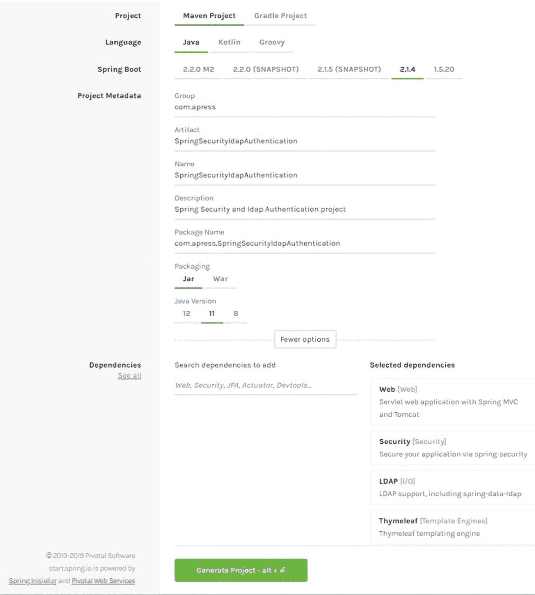

图 6-15
新的 Spring Boot LDAP 项目

接下来，更新 `POM.xml` 文件，如清单 6-18 所示。

```

4.0.0
com.apress
SpringSecurityldapAuthentication
0.0.1-SNAPSHOT
SpringSecurityldapAuthentication
Demo project for Spring Boot

org.springframework.boot
spring-boot-starter-parent
1.5.7.RELEASE

org.springframework.boot
spring-boot-starter-web

org.springframework.boot
spring-boot-starter-security

org.springframework.ldap
spring-ldap-core

org.springframework.security
spring-security-ldap

com.unboundid
unboundid-ldapsdk

org.springframework.boot
spring-boot-starter-thymeleaf

org.thymeleaf.extras
thymeleaf-extras-springsecurity5

org.springframework.boot
spring-boot-starter-test
test

org.springframework.security
spring-security-test
test

org.springframework.boot
spring-boot-maven-plugin

maven-compiler-plugin
3.8.0

清单 6-18
Pom.xml 文件
```

与本书前面的项目一样，你在 `templates` 目录下创建了两个 HTML 文件：`welcome.html` 和 `admin.html`，分别如清单 6-19 和 6-20 所示。

```

Spring Security 5 和 LDAP。

欢迎：
您已成功以管理员身份登录！

注意 1：此内容仅对经过身份验证的用户显示。

注意 2：此内容仅对管理员显示。

清单 6-20
admin.html
```

```

Spring Boot Security 5 和 LDAP 示例

欢迎来到 Spring Boot Security 5 和 LDAP 示例！
请登录。

清单 6-19
welcome.html
```

接下来，创建一些 Java 类。从 `LoginController` 开始，如清单 6-21 所示，它与本书其他项目中使用的控制器类似。

```
package com.apress.SpringSecurityldapAuthentication.controller;
import org.springframework.security.authentication.UsernamePasswordAuthenticationToken;
import org.springframework.security.config.annotation.web.builders.WebSecurity;
import org.springframework.security.core.context.SecurityContextHolder;
import org.springframework.security.ldap.userdetails.LdapUserDetailsImpl;
import org.springframework.web.bind.annotation.GetMapping;
import org.springframework.web.bind.annotation.RequestMapping;
import org.springframework.web.bind.annotation.RequestMethod;
import org.springframework.web.bind.annotation.RestController;
import org.springframework.web.servlet.ModelAndView;
@RestController
public class LoginController {
@GetMapping("/")
public ModelAndView home() {
ModelAndView modelAndView = new ModelAndView();
modelAndView.setViewName("welcome");
return modelAndView;
}
@GetMapping("/welcome")
public ModelAndView welcome() {
ModelAndView modelAndView = new ModelAndView();
modelAndView.setViewName("welcome");
return modelAndView;
}
@GetMapping("/admin")
public ModelAndView admin() {
ModelAndView modelAndView = new ModelAndView();
UsernamePasswordAuthenticationToken authentication =
(UsernamePasswordAuthenticationToken)
SecurityContextHolder.getContext().getAuthentication();
LdapUserDetailsImpl principal = (LdapUserDetailsImpl) authentication.getPrincipal();
modelAndView.addObject("currentUser", principal.getDn());
modelAndView.addObject("role", principal.getAuthorities());
modelAndView.addObject("adminMessage", "内容仅对经过身份验证的管理员可用！");
modelAndView.setViewName("admin");
return modelAndView;
}
public void configure(WebSecurity web) throws Exception {
web
.ignoring()
.antMatchers("/resources/**");
}
}
清单 6-21
LoginController Java 类
```

清单 6-21 的工作原理与你之前看到的类似，例如使用 `@GetMapping` 将应用程序重定向到特定的 HTML 页面，如 welcome、admin 等。

那么 LDAP 身份验证是如何工作的呢？让我们从编写一个简单的 `application.yml` 文件开始，告诉 Spring 要使用的 LDAP 服务器和条目；参见清单 6-22。

```
spring:
ldap:
urls: ldap://localhost:10389
base: dc=example,dc=com
username: uid=admin,ou=system
password: secret
清单 6-22
application.yml 文件
```


接下来，创建另一个名为 `SpringSecurityConfiguration` 的 Java 类，如清单 6-23 所示，用于处理 LDAP 认证。

```
package com.apress.SpringSecurityldapAuthentication.Configuration;
import org.springframework.context.annotation.Bean;
import org.springframework.context.annotation.Configuration;
import org.springframework.security.authentication.encoding.LdapShaPasswordEncoder;
import org.springframework.security.config.annotation.authentication.builders.AuthenticationManagerBuilder;
import org.springframework.security.config.annotation.web.builders.HttpSecurity;
import org.springframework.security.config.annotation.web.configuration.EnableWebSecurity;
import org.springframework.security.config.annotation.web.configuration.WebSecurityConfigurerAdapter;
import org.springframework.security.ldap.DefaultSpringSecurityContextSource;
import org.springframework.security.web.util.matcher.AntPathRequestMatcher;
import org.springframework.security.web.authentication.logout.LogoutSuccessHandler;
import java.util.Collections;
@Configuration
@EnableWebSecurity
public class SpringSecurityConfiguration extends WebSecurityConfigurerAdapter {
@Override
protected void configure(HttpSecurity http) throws Exception {
http
.authorizeRequests()
.antMatchers("/").permitAll()
.antMatchers("/login").permitAll()
.antMatchers("/logout").permitAll()
.antMatchers("/welcome").permitAll()
.antMatchers("/admin").hasRole("ADMINISTRATORS")
.anyRequest().fullyAuthenticated()
.and()
.formLogin()
.defaultSuccessUrl("/admin", true)
.and().logout()
.logoutUrl("/perform_logout")
.logoutRequestMatcher(new AntPathRequestMatcher("/logout"))
.logoutSuccessUrl("/welcome.html")
.deleteCookies("JSESSIONID")
.invalidateHttpSession(true)
.logoutRequestMatcher(new AntPathRequestMatcher("/logout"));
;
}
@Override
public void configure(AuthenticationManagerBuilder auth) throws Exception {
auth
.ldapAuthentication()
.userDnPatterns("uid={0},ou=people")
.groupSearchBase("ou=groups")
.contextSource(contextSource())
.passwordCompare()
.passwordEncoder(new LdapShaPasswordEncoder())
.passwordAttribute("userPassword");
}
@Bean
public DefaultSpringSecurityContextSource contextSource() {
return  new DefaultSpringSecurityContextSource(
Collections.singletonList("ldap://localhost:10389"), "dc=example,dc=com");
}
}
清单 6-23
SpringSecurityConfiguration Java 类
```

现在使用此配置启动应用程序。您应该能够通过 URL `http://localhost:8080/` 看到欢迎页面，如图 6-16 所示。

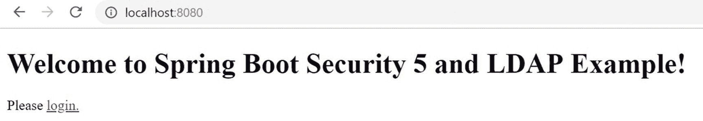

图 6-16
应用程序欢迎页面

登录并访问 Spring Security v5 登录页面，如图 6-17 所示。

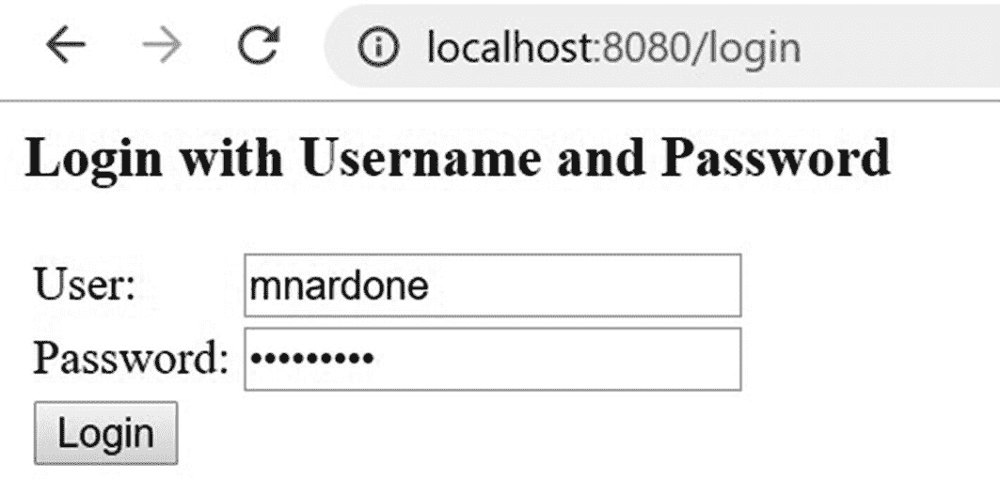

图 6-17
应用程序登录页面

在 LDAP 中，有两个用户：mnardone 和 lnardone。区别在于 mnardone 属于管理员组，因此他可以访问 `admin.html` 页面。

因此，使用用户名 **mnardone** 和密码 **nardone01** 登录，您将能够访问管理员页面，如图 6-18 所示。

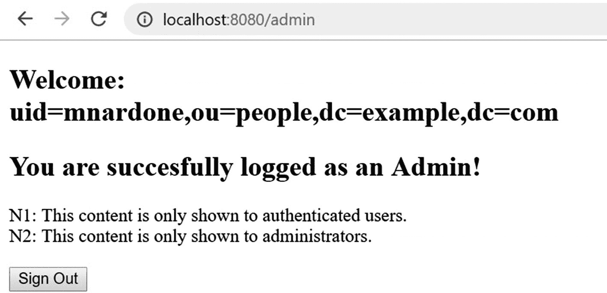

图 6-18
拥有管理员凭证的用户访问管理员页面

如果您现在尝试使用 **lnardone** 用户和密码 **nardone02**，您将无法访问管理员页面，因为该用户不属于管理员组；您将收到如图 6-19 所示的“访问被拒绝”消息。

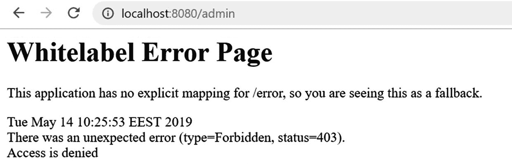

图 6-19
未授权用户收到“访问被拒绝”消息

该配置并不难理解。登录配置位于 `SpringSecurityConfiguration` Java 类中。

`configure(HttpSecurity http)` 将配置 HTTP 的相关内容，如登录、注销等。最重要的配置值是 `.antMatchers("/admin").hasRole("ADMINISTRATORS")`，它告诉您 `/admin` URL 只能由 LDAP 中属于管理员组的用户访问，正如您之前所见：

```
dn: cn=administrators,ou=groups,dc=example,dc=com
objectclass: groupOfUniqueNames
objectclass: top
cn: administrators
uniqueMember: uid=mnardone,ou=people,dc=example,dc=com
ou: admin
```

在您的案例中，mnardone 属于 LDAP 管理员组，因此他可以访问 `/admin` 页面。
请记住，您的所有条目都将相对于域名 `dc=example,dc=com`。

接下来，`configure(AuthenticationManagerBuilder auth)` 将负责认证构建器，通过以下方式检查用户和 SHA 密码：

```
.ldapAuthentication()
.userDnPatterns("uid={0},ou=people")
.groupSearchBase("ou=groups")
.contextSource(contextSource())
.passwordCompare()
.passwordEncoder(new LdapShaPasswordEncoder())
.passwordAttribute("userPassword");
```

因此，您定义了 LDAP DN 模式，以查找属于 `ou=people` 组的用户。
最后，`DefaultSpringSecurityContextSource contextSource()` 指定了要连接的 LDAP URL。

从示例中可以看出，使用 Spring Security 为应用程序配置 LDAP 基本支持作为认证解决方案并不复杂。事实上，由于模块化架构和精心设计的 XML 命名空间，这非常直接。对我们来说，LDAP 的复杂性在于 LDAP 本身。尽管它是一个简单的分层系统（非常类似于标准 Unix 系统中的文件系统），但某些术语和功能似乎有些复杂，并且与您在上一节中探索的基于数据库的解决方案有很大不同。

正如我们之前所说，在企业内部网环境中，使用 LDAP 作为认证解决方案非常有意义，因为公司用户群已经集中存储在类似 LDAP 的目录中。将插件接入这个已有的用户管理基础设施，是重用公司内部用户信息的好方法，而无需编写一个需要与主存储库保持同步的并行认证数据存储。

X.509 认证
X.509 认证是一种使用客户端证书而非用户名-密码组合来识别用户的认证方案。使用这种方法，客户端和服务器之间会发生一种称为*相互认证*的方案。实际上，相互认证意味着，作为安全套接字层 (SSL) 握手的一部分，服务器要求客户端通过提供证书来证明自己的身份。在生产级服务器中，传入的客户端证书需要由适当的证书颁发机构签发和签名。

要使用客户端证书，应用程序需要在预期处理已认证用户的区域配置为使用 SSL 通道，因为 X.509 认证协议本身就是 SSL 协议的一部分。

首先，让我们使用 Spring Initializr 在 [`https://start.spring.io/`](https://start.spring.io/) 创建一个 Spring Security Boot 项目。

使用以下依赖项创建新项目：Web、Security 和 Thymeleaf，如图 6-20 所示。

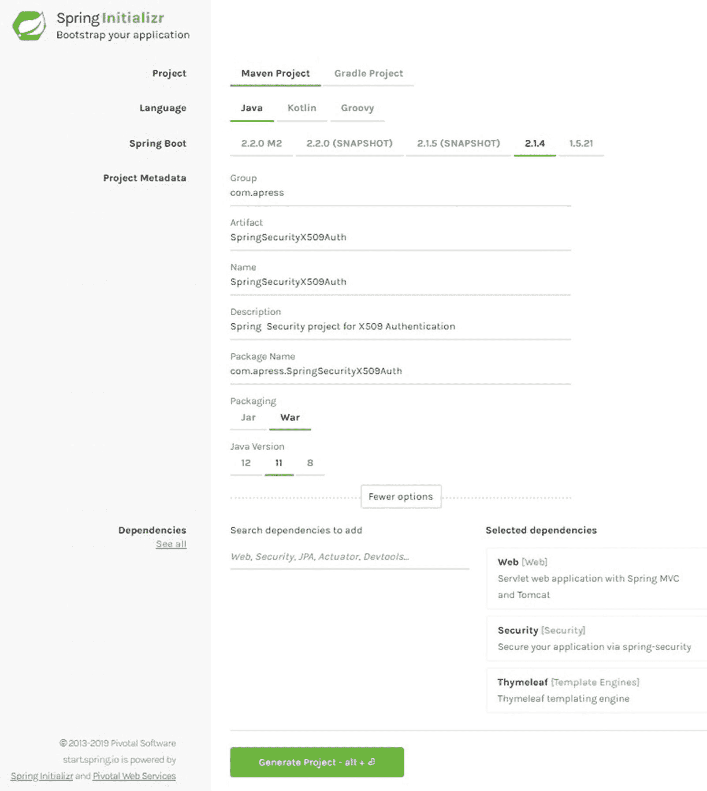

图 6-20
创建新的 Spring Initializr 项目

打开项目并更新 `pom.xml` 文件，如清单 6-24 所示。

```

4.0.0


`org.springframework.boot`
`spring-boot-starter-parent`
`2.1.4.RELEASE`

`com.apress`
`SpringSecurityX509Auth`
`0.0.1-SNAPSHOT`
`war`
`SpringSecurityX509Auth`
用于 X509 认证的 Spring Security 项目

`org.springframework.boot`
`spring-boot-starter-security`

`org.springframework.boot`
`spring-boot-starter-thymeleaf`

`org.springframework.boot`
`spring-boot-starter-web`

`org.springframework.boot`
`spring-boot-starter-tomcat`
`provided`

`org.springframework.boot`
`spring-boot-starter-test`
`test`

`org.springframework.security`
`spring-security-test`
`test`

`org.springframework.boot`
`spring-boot-maven-plugin`

**清单 6-24**
**pom.xml 文件**

与本章前面的 LDAP 项目类似，在 `templates` 目录下创建一个名为 `admin.html` 的 HTML 文件，如清单 6-25 所示。

```
Spring Security 5 和 LDAP。

欢迎：
您已成功以管理员身份登录！

此内容仅对已认证用户显示。

此内容仅对管理员显示。

清单 6-25
admin.html
```

现在，在项目的 `Java` 目录下创建三个包。

*   `Configuration`：包含 `SpringSecurityConfiguration` Java 类
*   `Controller`：包含 `UserController` Java 类
*   `Domain`：包含 `User` Java 类

现在创建三个 Java 类：`SpringSecurityConfiguration`、`UserController` 和 `User`。

我们先创建清单 6-26 中所示的 `SpringSecurityConfiguration` Java 类。

```
package com.apress.SpringSecurityX509Auth.Configuration;
import org.springframework.context.annotation.Bean;
import org.springframework.context.annotation.Configuration;
import org.springframework.security.config.annotation.method.configuration.EnableGlobalMethodSecurity;
import org.springframework.security.config.annotation.web.builders.HttpSecurity;
import org.springframework.security.config.annotation.web.configuration.EnableWebSecurity;
import org.springframework.security.config.annotation.web.configuration.WebSecurityConfigurerAdapter;
import org.springframework.security.core.authority.AuthorityUtils;
import org.springframework.security.core.userdetails.User;
import org.springframework.security.core.userdetails.UserDetails;
import org.springframework.security.core.userdetails.UserDetailsService;
import org.springframework.security.core.userdetails.UsernameNotFoundException;
import org.springframework.security.web.util.matcher.AntPathRequestMatcher;
@Configuration
@EnableWebSecurity
@EnableGlobalMethodSecurity(securedEnabled = true)
public class SpringSecurityConfiguration extends WebSecurityConfigurerAdapter {
@Override
protected void configure(HttpSecurity http) throws Exception {
http
.authorizeRequests()
.anyRequest().authenticated().and()
.x509()
.subjectPrincipalRegex("CN=(.*?)(?:,|$)")
.userDetailsService(userDetailsService())
.and().logout()
.logoutUrl("/perform_logout")
.logoutRequestMatcher(new AntPathRequestMatcher("/logout"))
.logoutSuccessUrl("/admin")
.deleteCookies("JSESSIONID")
.invalidateHttpSession(true)
.logoutRequestMatcher(new AntPathRequestMatcher("/logout"));
}
@Bean
public UserDetailsService userDetailsService() {
return (UserDetailsService) username -> {
if (username.equals("nardone")) {
return new User(username, "",
AuthorityUtils
.commaSeparatedStringToAuthorityList("ROLE_USER"));
} else {
throw new UsernameNotFoundException(String.format("User %s not found", username));
}
};
}
}
清单 6-26
SpringSecurityConfiguration Java 类
```

这个 Java 类非常容易理解。一旦您提供了有效的客户端证书，它将通过以下代码行从中获取“CN”值：

```
.anyRequest().authenticated().and()
.x509()
.subjectPrincipalRegex("CN=(.*?)(?:,|$)")
.userDetailsService(userDetailsService());
```

然后，它会检查“CN”值是否等于“**nardone**”。如果是，它将返回用户名为“**nardone**”、权限为 `ROLE_USER` 的用户，并授权该用户继续操作：

```
if (username.equals("nardone")) {
return new User(username, "",
AuthorityUtils
.commaSeparatedStringToAuthorityList("ROLE_USER"));
```

现在创建清单 6-27 中所示的 `UserController` Java 类。

```
package com.apress.SpringSecurityX509Auth.Controller;
import org.springframework.security.access.annotation.Secured;
import org.springframework.security.authentication.UsernamePasswordAuthenticationToken;
import org.springframework.security.config.annotation.web.builders.WebSecurity;
import org.springframework.security.core.Authentication;
import org.springframework.security.core.context.SecurityContextHolder;
import org.springframework.web.bind.annotation.*;
import com.apress.SpringSecurityX509Auth.Domain.User;
import org.springframework.web.servlet.ModelAndView;
@RestController
public class UserController {
@Secured("ROLE_USER")
@RequestMapping(value = {"/","/admin"}, method = RequestMethod.GET)
public ModelAndView admin() {
ModelAndView modelAndView = new ModelAndView();
modelAndView.setViewName("admin");
Authentication auth = SecurityContextHolder.getContext().getAuthentication();
modelAndView.addObject("currentUser", auth.getName());
User user = new User();
return modelAndView;
}
public void configure(WebSecurity web) throws Exception {
web
.ignoring()
.antMatchers("/resources/**");
}
}
清单 6-27
UserController Java 类
```

这是一个简单的用户控制器 Java 类，它将根据请求重定向 URL。

现在创建清单 6-28 中所示的 `User` Java 类。

```
package com.apress.SpringSecurityX509Auth.Domain;
public class User {
private String name;
public User() {
this.name = name;
}
public String getName() {
return name;
}
public void setName(String name) {
this.name = name;
}
}
清单 6-28
User Java 类
```

该类将从用于认证的 X.509 客户端证书中获取数据。
这就是 Spring 处理客户端证书所需的全部配置。
当然，事情并没有那么简单，工作也还没有完成。实际上，Spring Security X.509 支持并不对用户进行认证。用户被假定为已经过认证，Spring Security 只是根据从证书中提取的信息创建一个成功的 `Authentication` 对象，并以标准方式将其存储在 `SecurityContext` 中。
因此，实际负责对用户进行认证（或者更准确地说，接受用户为正确标识的用户）的实体是 Web 服务器，它通过接受提供的客户端证书来完成此操作。基本上，如果服务器决定用户发送的证书是有效的，那么用户就是其所声称的身份，并得到认证。
在生产系统中，Web 服务器会确保客户端提供的证书由授权的可信机构签名。
但是，您将使用一个测试环境，其中包含您常用的 Maven 配置的 Tomcat 安装，为此，您将配置一个自签名证书，并确保 Tomcat 接受它。
在开始之前，请确保您已在机器上安装了 `openssl` 工具。从 [`https://wiki.openssl.org/index.php/Binaries`](https://wiki.openssl.org/index.php/Binaries) 下载它。
让我们创建所需的服务器和客户端证书。这非常简单，您将使用 `openssl` 工具来完成：

对于服务器：

1.  生成服务器私钥 (PEM) 和服务器自签名证书 (CRT)：

```
    openssl req -x509 -newkey rsa:4096 -keyout serverPrivateKey.pem -out server.crt -days 3650 -nodes
    ```

2.  创建一个包含私钥 (P12) 和相关自签名证书 (CRT) 的 PKCS12 密钥库（使用的密码：changeit）：

```
    openssl pkcs12 -export -out keyStore.p12 -inkey serverPrivateKey.pem -in server.crt
    ```

3.  从服务器证书 (CRT) 生成服务器信任库 (JKS)：


```content
```
    keytool -import -trustcacerts -alias root -file server.crt -keystore trustStore.jks
    ```

针对客户端：

1.  生成客户端的私钥（PEM）和证书签名请求（CSR）：

```
    openssl req -new -newkey rsa:4096 -out request.csr -keyout myPrivateKey.pem -nodes
    ```

针对客户端和服务器：

1.  使用服务器私钥（PEM）和相关证书（CRT）签署客户端的证书签名请求（CSR）：

```
    openssl x509 -req -days 360 -in request.csr -CA server.crt -CAkey serverPrivateKey.pem -CAcreateserial -out nardone.crt -sha256
    ```

针对客户端：

1.  验证客户端的证书（CRT）：

```
    openssl x509 -text -noout -in nardone.crt
    ```

2.  创建一个包含客户端私钥（PEM）和相关自签名证书（CRT）的 PKCS12 密钥库（P12）：

```
    openssl pkcs12 -export -out client_nardone.p12 -inkey myPrivateKey.pem -in nardone.crt -certfile myCertificate.crt
    ```

图 6-21 和图 6-22 展示了您刚刚执行的部分客户端命令。

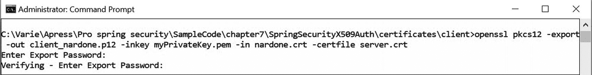

图 6-22
生成客户端证书

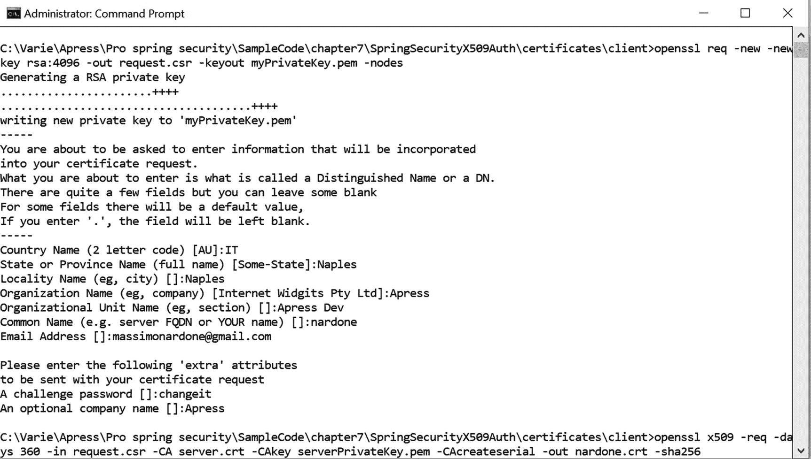

图 6-21
客户端证书命令

在执行最后一步时，当命令行提示您输入名称时，务必使用名称 `nardone`，因为这是您在应用程序配置文件中配置的用户名。命令行将显示以下提示：
*通用名称（例如服务器 FQDN 或您的名称）[]:**nardone***
就是这样！该过程创建了一个自签名的 X509 证书，有效期为 365 天，并使用私钥进行签名。

注意
信任库
是一个证书存储库，使用该信任库的 JRE 会信任其中的证书。默认情况下，JRE 信任库信任任何由公认证书颁发机构（CA）签名的证书。如果您拥有一个非 CA 签名的证书（例如自签名证书），则需要手动将其添加到信任库中，以便其能够被信任。

该文件的执行过程如图 6-23 所示。这一行简单的命令创建了文件 `trustStore.jks`，您将把它用作 Tomcat 服务器的信任库，以接受客户端证书。

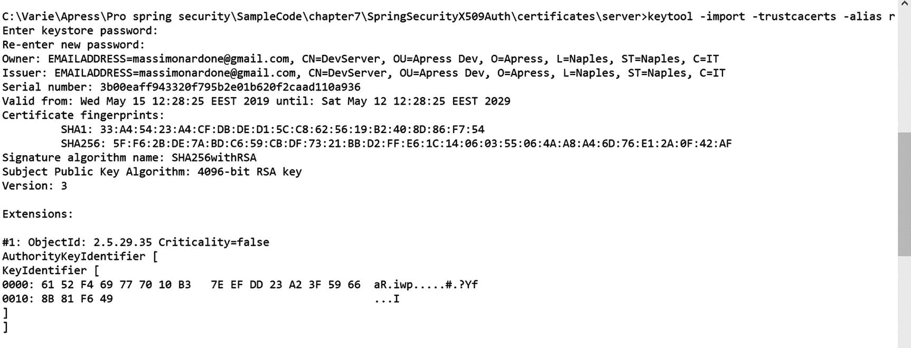

图 6-23
通过导入证书创建的信任库

接下来，您需要将证书添加到用于连接应用程序的浏览器中。本示例中使用 Chrome。之前您创建了 `.p12` 文件，其中包含客户端和服务器证书的信息，以及与这两个证书关联的私钥。

要将该文件导入 Chrome 的客户端证书中，请执行以下操作：

1.  点击 Chrome ➤ 设置。

2.  点击“高级”选项卡。

3.  点击“管理证书”。

4.  点击“导入”。

5.  找到存储 `client_nardone.p12` 的目录，然后双击该文件。

6.  当提示输入密码时，使用 **changeit**。

结果如图 6-24 所示。

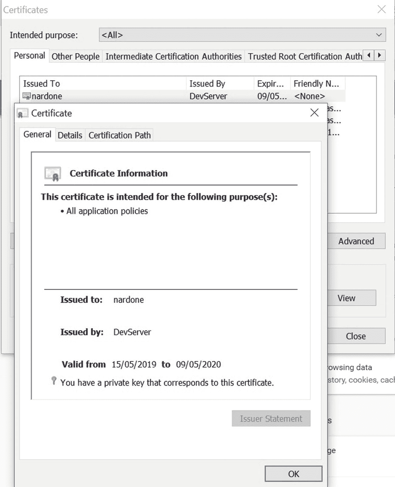

图 6-24
将证书 .p12 文件导入浏览器

下一步是将服务器证书添加到 Web 浏览器的“受信任的根证书颁发机构”列表中，如图 6-25 所示。

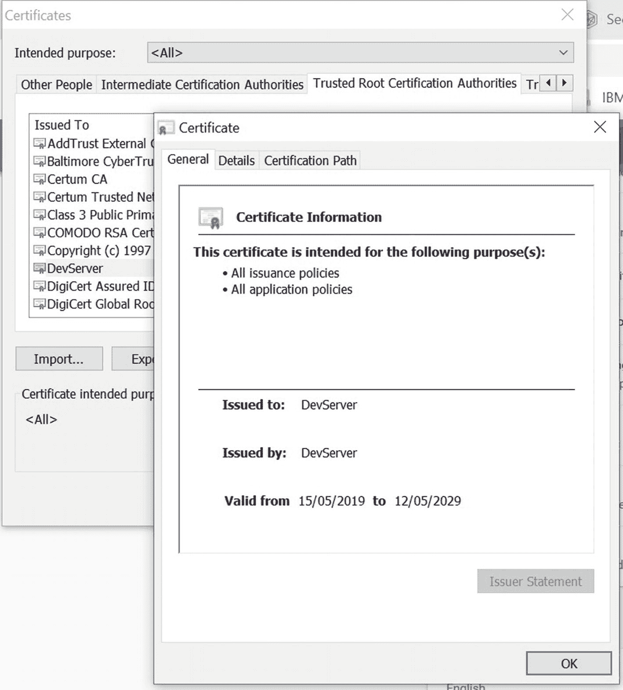

图 6-25
将服务器证书 .crt 文件导入浏览器

下一步是使用以下内容更新 `application.properties`：
```


```
server.port=8443
server.ssl.key-store-type=PKCS12
server.ssl.key-store=classpath:keyStore.p12
server.ssl.key-store-password=changeit
server.ssl.trust-store=classpath:trustStore.jks
server.ssl.trust-store-password=changeit
server.ssl.trust-store-type=JKS
server.ssl.client-auth=need
```

所有这些行将告知应用程序使用 SSL 端口 8443、服务器密钥库所使用的文件类型、密钥的存放位置，以及客户端证书是“必需的”。

请确保已添加所有证书，并且密钥已按图 6-26 所示存储在项目中。

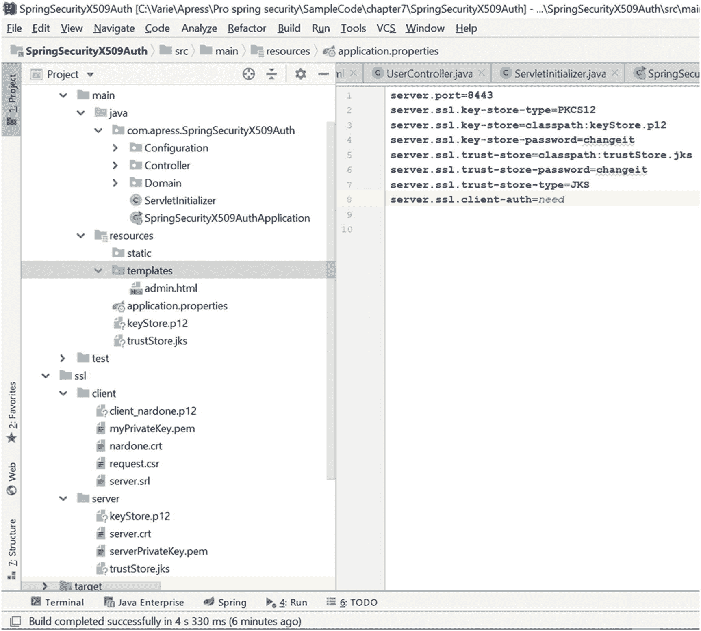

图 6-26
最终项目概览

现在配置已完成，应用程序已准备就绪。浏览器也已准备好进行双向认证流程。

要尝试运行，请启动应用程序。然后访问 URL `https://localhost:8443/admin`。你需要接受服务器的自签名证书才能继续。接受后，系统会显示一个屏幕，要求你选择用于认证的客户端证书。你可能有一些不同的客户端证书可供选择；在此案例中，请选择你刚刚导入的 nardone 证书，如图 6-27 所示。

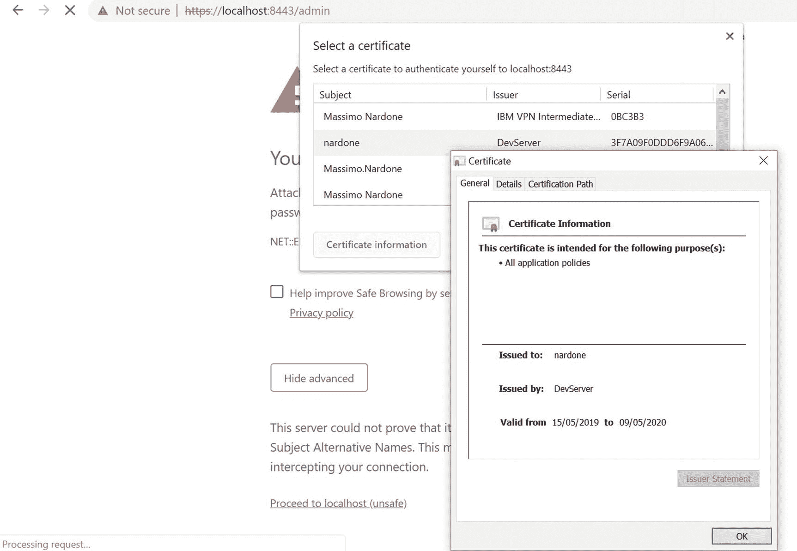

图 6-27
选择要使用的客户端证书

点击“确定”后，你将看到管理页面，这意味着认证成功；见图 6-28。

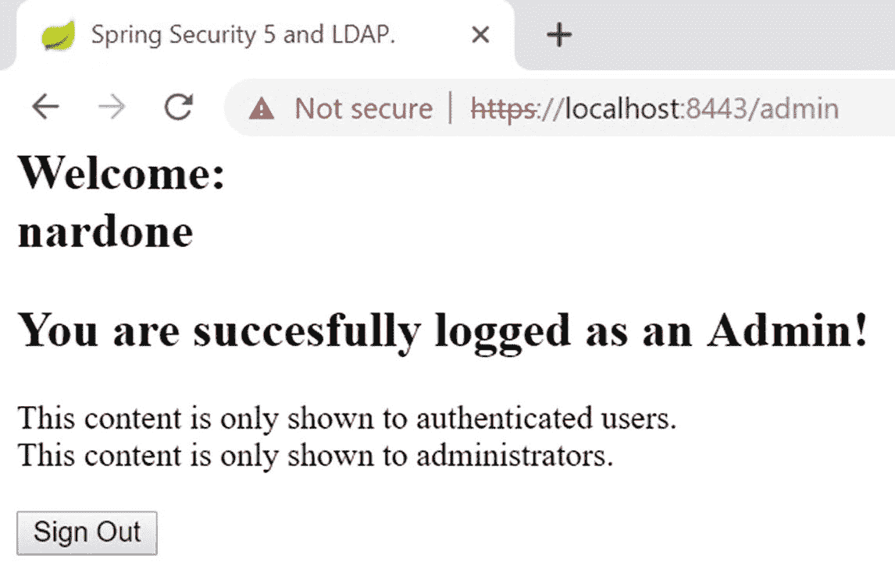

图 6-28
成功的客户端证书认证管理页面

这就是使用客户端证书认证的请求所遵循的完整流程。如你所见，Spring Security 对此的支持相当直接。

OAuth 2
OAuth 2.0 是行业标准的授权协议。你可以在 [`https://oauth.net/2/`](https://oauth.net/2/) 获取更多信息。Spring Security 5.0 现已支持 OAuth 2.0 授权框架和 OpenID Connect 1.0。Spring Security 5.1 引入了新的资源服务器支持以及额外的客户端支持。用于认证的 OAuth 2.0 实现符合 OpenID Connect 规范并已通过 OpenID 认证，可通过 Google 的 OAuth 2.0 API 用于认证和授权。更多信息，请访问 [`https://developers.google.com/identity/protocols/OAuth2`](https://developers.google.com/identity/protocols/OAuth2)。

OAuth 2 支持

*   客户端

*   资源服务器

*   授权服务器

OAuth 2.0 客户端功能提供了对 OAuth 2.0 授权框架中定义的客户端角色的支持。你可以在 [`https://tools.ietf.org/html/rfc6749#section-1.1`](https://tools.ietf.org/html/rfc6749%2523section-1.1) 获取更多信息。

在开发 OAuth 2.0 客户端时，可使用以下主要功能：

*   授权码授权

*   客户端凭证授权

*   用于 Servlet 环境的 WebClient 扩展（用于发起受保护资源请求）

请注意，Spring Security 5 引入了一个新的 `OAuth2LoginConfigurer` 类，可用于配置外部授权服务器。

JSON Web Token
Spring Security 5 支持 JSON Web Token (JWT) 认证。

基本上你需要：

*   为 JWT 配置 Spring Security

*   暴露带有映射/authenticate 的 REST POST API

*   配置一个有效的 JSON Web Token

具体来说，要配置 Spring Security 和 JWT，你需要执行两个操作：

1.  通过以下方式生成 JWT：

*   暴露带有映射/authenticating 的 POST API

*   传递正确的用户名和密码

*   生成一个 JSON Web Token

2.  通过以下方式验证 JWT：

*   当尝试访问带有特定映射（如 `/Testing`）的 GET API 时

*   仅当请求包含有效的 JSON Web Token 时才允许访问

Spring Security 和 JWT 的依赖项包括：

```
io.jsonwebtoken
jjwt
0.9.1

```

Spring WebSockets

Spring Security 5 MVC 支持 Spring WebSockets。对于 WebSocket 实现，你需要添加以下 Maven 依赖项，例如：

```
org.springframework
spring-websocket
${spring.version}

org.springframework
spring-messaging
${spring.version}

org.springframework.security
spring-security-messaging
${spring-security.version}

```

然后，你可以使用 `spring-security-messaging` 库，通过 `AbstractSecurityWebSocketMessageBrokerConfigurer` 类来定义 WebSocket 特定的安全配置，如下所示：

```
@Configuration
public class SocketSecurityConfig
extends AbstractSecurityWebSocketMessageBrokerConfigurer {
//...//
}
```

JAAS 认证
Java 认证和授权服务 (JAAS) 是用于管理认证和授权的现有标准 Java 支持。其功能与 Spring Security 明显重叠。JAAS 是一个相对较大的标准，涉及的内容远不止我们在此介绍的少量信息。然而，我们展示的是其主要概念，本节的目的是展示将其与 Spring Security 集成的基本构建块。有关 JAAS 的更多信息，请查阅 Spring Security 5 参考文档。

中央认证服务认证
中央认证服务 (CAS) 是一个用 Java 构建的企业级单点登录解决方案，并且是开源的。它拥有强大的社区支持，并集成到许多 Java 项目中。CAS 为企业中的认证和访问控制提供了一个集中位置。

概述
JA-SIG 在 [`http://www.ja-sig.org`](http://www.ja-sig.org) 开发了一个名为 CAS 的企业级单点登录系统。JA-SIG 的中央认证服务是一个简单、开源、独立的平台，支持代理功能。Spring Security 完全支持 CAS 用于单个应用程序以及由企业级 CAS 服务器保护的多应用程序部署。你可以在 [`www.apereo.org/projects/cas`](http://www.apereo.org/projects/cas) 了解更多关于 CAS 的信息。CAS 的一个重要特点是它被设计为充当不同认证存储解决方案的代理。这意味着它可以与 LDAP、JDBC 或包含真实用户数据的其他用户存储结合使用。这看起来很像 Spring Security 利用这些相同用户数据存储的方式。有关 CAS 的更多信息，请查阅 Spring Security 5 参考文档。

总结
在本章中，我们展示了如何利用 Spring Security 的模块化架构，相对轻松地集成不同的认证机制。我们解释了框架自带的一些认证机制。具体来说，我们展示了如何通过使用客户端 X.509 证书，针对数据库、LDAP 服务器对用户进行认证。JAAS、OAuth2/OpenID、WebSockets、JWT 和 CAS 仅作了介绍。本章重点展示了所有这些不同的认证提供者在框架内部使用时如何相互关联。目的是向你展示，将新的提供者集成到框架中非常简单，值得一试。当然，其难易程度取决于你想要接入的认证方案。本章未涵盖的认证提供者还有很多，但主要思想往往保持不变：创建一个连接到 Spring Security 的适配器，处理集成协议的细节，并使其适应 Spring Security 的认证和授权模型。

7. 使用 ACL 的业务对象安全


本章将介绍 Spring Security 中的访问控制列表（ACL）。访问控制列表可以看作是我们在第 6 章中讨论的业务级安全规则的扩展。不过，在本章中，我们将探讨更细粒度的规则，用于保护单个领域对象，而不是用于保护服务方法调用的相对粗粒度的规则。

这意味着 ACL 负责保护领域类实例（例如 `Forum` 类、`Cart` 类等），而标准的方法级规则则保护由方法（例如 `Service` 方法或 `DAO` 方法）确定的入口点。

使用 ACL 保护领域对象在概念上很简单。其思想是，任何用户对每个领域对象都有一定级别的访问权限（读取、写入、无权限等）。用户对特定领域对象的访问级别（*权限*）取决于用户本身，或用户所属的角色或组。

与其他章节一样，我们将通过一个示例来解释每个概念。和往常一样，这个示例将是一个非常简单的、非*真实世界*的应用程序，它被简化以专注于理解 ACL 工作原理的相关概念。

安全示例应用程序

该示例应用程序是一个简单的论坛系统，包含两种类型的用户：标准用户和管理员用户。任何用户都可以创建论坛条目，但只有创建该条目的用户才能编辑它；其他标准用户只能读取它。管理员用户可以读取或删除条目，但不能编辑它。这为我们提供了展示 ACL 全部功能所需的所有组合。权限逻辑如图 7-1 所示。操作以实线表示，权限以虚线表示。

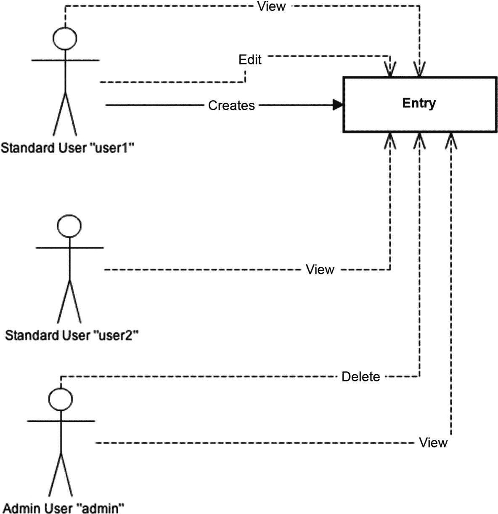

图 7-1
论坛条目的权限逻辑

那么，让我们来搭建示例项目。

但首先，让我们回顾一下在应用程序中支持 ACL 所需的数据库模式。目前，这是 Spring Security 中唯一对 ACL 的支持，并且需要对其进行配置才能使整个功能正常工作。Spring Security 的 ACL 模块附带了一些 SQL 脚本，用于在一个名为 `createAclSchema.sql` 的文件中定义其自身的支持，该文件当前针对 HSQL 数据库。（还有一个名为 `createAclSchemaPostgres.sql` 的替代文件，它针对 PostgreSQL 数据库。）您可以在 Spring Security ACL 模块的源代码或 `.jar` 文件本身中找到此文件：`spring-security-acl-3.1.3.RELEASE.jar`。它位于源代码中的 `src/main/resources` 文件夹中，这意味着它位于 `classpath` 的根目录下。清单 7-1 显示了此文件的内容。

```
-- ACL schema sql used in HSQLDB
-- drop table acl_entry;
-- drop table acl_object_identity;
-- drop table acl_class;
-- drop table acl_sid;
create table acl_sid(
id bigint generated by default as identity(start with 100) not null primary key,
principal boolean not null,
sid varchar_ignorecase(100) not null,
constraint unique_uk_1 unique(sid,principal));
create table acl_class(
id bigint generated by default as identity(start with 100) not null primary key,
class varchar_ignorecase(100) not null,
constraint unique_uk_2 unique(class)
);
create table acl_object_identity(
id bigint generated by default as identity(start with 100) not null primary key,
object_id_class bigint not null,
object_id_identity bigint not null,
parent_object bigint,
owner_sid bigint,
entries_inheriting boolean not null,
constraint unique_uk_3 unique(object_id_class,object_id_identity),
constraint foreign_fk_1 foreign key(parent_object)references acl_object_identity(id),
constraint foreign_fk_2 foreign key(object_id_class)references acl_class(id),
constraint foreign_fk_3 foreign key(owner_sid)references acl_sid(id)
);
create table acl_entry(
id bigint generated by default as identity(start with 100) not null primary key,
acl_object_identity bigint not null,
ace_order int not null,
sid bigint not null,
mask integer not null,
granting boolean not null,
audit_success boolean not null,
audit_failure boolean not null,
constraint unique_uk_4 unique(acl_object_identity,ace_order),
constraint foreign_fk_4 foreign key(acl_object_identity) references acl_object_identity(id),
constraint foreign_fk_5 foreign key(sid) references acl_sid(id)
);
清单 7-1
定义 Spring Security 中支持 ACL 所需表的 createAclSchema.sql
```

要理解这些表的含义，您需要了解 Spring Security ACL 支持中的主要抽象概念：

*   **SID（安全标识）**：一种抽象概念，表示系统中将由 ACL 基础设施使用的安全标识。安全标识可以是用户、角色、组等。它映射到表 `ACL_SID`。

*   **访问控制条目（ACE）**：表示特定 ACL 中的单个权限，用于建立对象、SID 和权限之间的关系。它映射到表 `ACL_ENTRY`。

*   **对象标识**：表示单个领域对象实例的标识。它们是设置权限的实体。它映射到表 `ACL_OBJECT_IDENTITY`。

让我们分解数据库表的主要属性，以了解它们的含义。（我们不会解释 ID 属性，因为它们是相关表中每一行的代理标识符，并且用于标识特定的条目。）图 7-2 以图形形式显示了这些表，随后是对属性的解释。

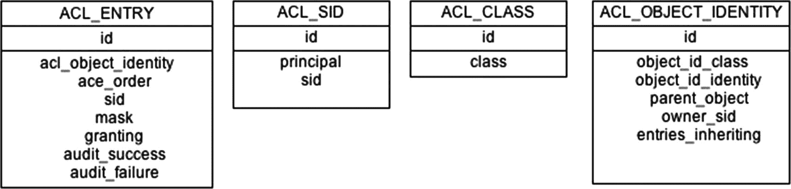

图 7-2
ACL 模式中的表

以下是图 7-2 中表的主要属性（列）：

*   表 `ACL_SID`

*   `principal`：一个布尔值，指示特定的 SID 是否是主体。请记住，SID 可以表示组或角色。

*   `sid`：SID 的名称。它可以是主体的用户名、角色名称等。

*   表 `ACL_CLASS`

*   `class`：ACL 系统中可以拥有的领域对象类的名称。

*   表 `ACL_OBJECT_IDENTITY`

*   `object_id_identity`：一个数字，用于唯一标识（与 `object_id_class` 结合时）您所表示的领域对象的特定实例。

*   `object_id_class`：指向表 `ACL_CLASS` 的外键，用于标识您所表示的领域对象的类。


*   `parent_object`
        ：允许通过创建与自身的递归关系来建立领域对象的层次结构。这样，权限可以在层次结构中的对象之间共享。它是一个指向自身的外键。

*   `owner_sid`：
        拥有此特定领域对象的 SID。

*   `entries_inheriting`
        ：一个布尔值，用于指定在领域对象的层次结构中，权限是否在对象之间继承。

*   表 `ACL_ENTRY`

*   `acl_object_identity`
        ：对象的标识。它是对表 `ACL_OBJECT_IDENTITY` 中某行的引用。

*   `sid`：
        标识此 ACE 中的 SID。它是对表 `ACL_SID` 中某行的引用。

*   `mask`：
        实际的权限。ACL 支持中的权限以位掩码形式给出，并用整数值表示。在代码中，默认权限定义在类 `org.springframework.security.acls.domain.BasePermission` 中，该类在代码清单 7-2 中重现。如果需要，你可以轻松创建自己的类并定义额外的权限。

*   `granting`：一个布尔值，用于确定特定的 ACE 是根据条目中定义的规则授予访问权限，还是（如果为 false）拒绝访问权限。

你可以看到模式中定义的表并不多，但重要的是你要单独理解它们以及它们之间的关系。图 7-3 展示了此数据模型的 ER（实体-关系）图，以帮助你更好地理解它们。该图用简单的术语描述了表之间关系的含义。

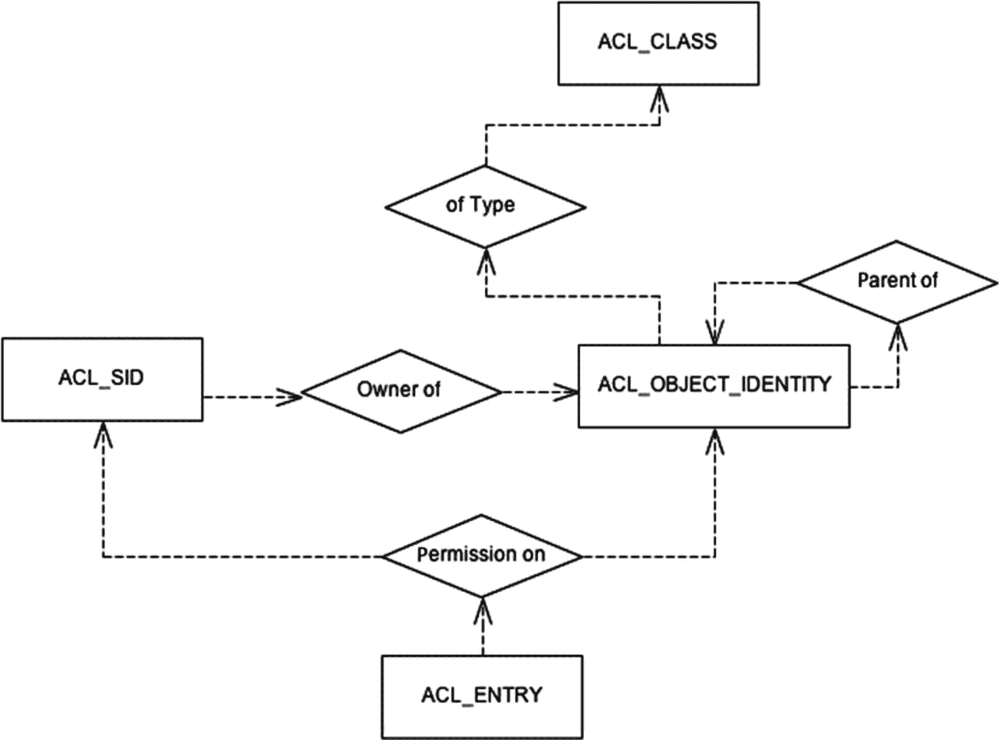

图 7-3
ACL 安全模型的 ER 图

```
package org.springframework.security.acls.domain;
import org.springframework.security.acls.model.Permission;
public class BasePermission extends AbstractPermission {
public static final Permission READ = new BasePermission(1 << 0, 'R'); // 1
public static final Permission WRITE = new BasePermission(1 << 1, 'W'); // 2
public static final Permission CREATE = new BasePermission(1 << 2, 'C'); // 4
public static final Permission DELETE = new BasePermission(1 << 3, 'D'); // 8
public static final Permission ADMINISTRATION = new BasePermission(1 << 4, 'A'); // 16
protected BasePermission(int mask) {
super(mask);
}
protected BasePermission(int mask, char code) {
super(mask, code);
}
}
代码清单 7-2
在 ACL 系统中使用的包含默认权限的 BasePermission 类
```

代码清单 7-2 展示了现有的权限及其位掩码，分别用整数 1、2、4、8 和 16 表示读取、写入、创建、删除和管理权限。共有 32 位可用于权限，默认权限分别将第 0 位、第 1 位、第 2 位、第 3 位和第 4 位设置为前面提到的每个整数值。此类可以替换为包含不同权限的自定义 `Permission` 实现类，也可以扩展以包含更多权限。
理论上，通过这种方式工作，可以通过将两个权限相加来轻松组合它们，从而创建组合权限。例如，你可以通过将 `READ` 和 `WRITE` 权限的各自值相加（1 + 2 = 3）来组合它们，从而同时授予 `READ` 和 `WRITE` 权限。
然而，在实践中，它并非如此工作。负责根据访问控制条目列表中存储的权限来评估对象所需权限的类 `org.springframework.security.acls.domain.DefaultPermissionGrantingStrategy` 会进行精确匹配比较。因此，你通常需要为 `READ` 包含一个 ACE，并为 `WRITE` 包含另一个 ACE。

现在，你应该已经理解了 ACL 中使用的主要概念，以及它们如何映射到框架本身提供的数据库模式。接下来，让我们设置应用程序本身。同样，你将使用 Maven 来完成此操作。在 shell 的某个目录中，执行命令 `mvn archetype:create -DarchetypeGroupId=org.apache.maven.archetypes -DarchetypeArtifactId=maven-archetype-webapp -DarchetypeVersion=1.0 -DgroupId=com.apress.pss -DartifactId=acl-example -Dversion=1.0-SNAPSHOT`。然后，在生成的 `pom.xml` 文件中，添加代码清单 7-3 中所示的所有必需依赖项，包括新的 ACL 依赖项。

```

5.1.5.RELEASE
5.1.5.RELEASE

javax.servlet
javax.servlet-api
4.0.1

junit
junit
4.5
test

org.springframework.security
spring-security-core
${springsecurity.version}

org.springframework.security
spring-security-config
${springsecurity.version}

org.springframework.security
spring-security-web
${springsecurity.version}

org.springframework.security
spring-security-taglibs
${springsecurity.version}

org.springframework.security
spring-security-acl
3.1.2.RELEASE

org.springframework
spring-core
${springframework.version}

org.springframework
spring-web
${springframework.version}

org.springframework
spring-webmvc
${springframework.version}

org.springframework
spring-context-support
${springframework.version}

org.aspectj
aspectjweaver
1.7.0

commons-logging
commons-logging
1.1.1

commons-codec
commons-codec
1.3

javax.servlet.jsp
javax.servlet.jsp-api
2.3.1

javax.servlet
jstl
1.2

javax.annotation
jsr250-api
1.0

org.hsqldb
hsqldb
2.4.1

net.sf.ehcache
ehcache-core
2.6.0

org.thymeleaf.extras
thymeleaf-extras-springsecurity3

taglibs
standard
1.1.2

org.slf4j
slf4j-jdk14
1.7.25

代码清单 7-3
Spring Security ACL 项目中的 Maven 依赖项
```

接下来，让我们创建你的第一个配置文件 `web.xml`。复制代码清单 7-4 中的内容。

```

org.springframework.web.context.ContextLoaderListener

contextConfigLocation

/WEB-INF/applicationContext-acl.xml
/WEB-INF/applicationContext-security.xml

acl-example
org.springframework.web.servlet.DispatcherServlet

acl-example
/

springSecurityFilterChain

org.springframework.web.filter.DelegatingFilterProxy

springSecurityFilterChain
/*

代码清单 7-4
web.xml
```

接下来要创建的文件是 ACL 配置文件，让我们开始吧。这是一个非常标准的默认 ACL 文件。稍后，我们将向你展示一些可以更改以适应不同需求的内容。在 `WEB-INF` 文件夹中，创建一个名为 `applicationContext-acl.xml` 的文件，内容来自代码清单 7-5。在代码清单之后，你将阅读相关部分的描述。

```

代码清单 7-5
包含所需 ACL 配置的 applicationContext-acl.xml
```

我们将概述代码清单 7-5 中定义的每个 bean。稍后，在使用应用程序时，我们将更深入地解释框架的内部工作原理，以及启动时和执行时究竟发生了什么。
前三个 bean 并非 ACL 特有的，因为它们只是定义了数据源、JDBC 模板和事务管理器。ACL 基础设施将使用这些 bean 来访问模式中 ACL 特定的表和数据库。

注意
我们定义的用于处理数据库的支持 bean 使用了 Spring 框架核心库中的类。如果你之前使用过 Spring，很可能已经遇到过并使用过这些类。你可以在官方网站 [`https://docs.spring.io/spring/docs/3.0.x/reference/jdbc.html`](https://docs.spring.io/spring/docs/3.0.x/reference/jdbc.html) 上找到有关 Spring 数据库支持的信息。


下一个 bean 的 ID 是 `aclCache`。你需要一个缓存实现来让 ACL 系统正常工作。它的功能是通过缓存 ACL 来加速 ACL 访问，避免每次查询都访问数据库。我们在 bean 定义（`EhCacheBasedAclCache`）中使用的实现是目前 ACL 模块中唯一定义的实现，它是一个非常简单的实现，委托给了 `EhCache`（[`http://ehcache.org/`](http://ehcache.org/)）。

下一个 bean 的 ID 是 `lookupStrategy`。查找策略负责检索对象标识（如前所述）以及适用于每个对象标识的 ACL。我们使用的实现（`BasicLookupStrategy`）同样是框架中唯一定义的实现。它会尝试从缓存中加载 ACL，如果缓存中没有，则会从数据库中查找并缓存结果。数据库查找是批量进行的，以便同时将多个条目加载到缓存中，从而提高性能。

下一个 bean 的 ID 是 `aclAuthorizationStrategy`，它定义了一个 `org.springframework.security.acls.domain.AclAuthorizationStrategy`。`AclAuthorizationStrategy` 的目标是确定某个特定主体是否能够在 ACL 基础设施本身中执行管理活动。例如，当前定义的权限有 `CHANGE_OWNERSHIP`、`CHANGE_AUDITING` 和 `CHANGE_GENERAL`。

我们在 bean 定义文件中使用的默认实现，在其构造函数中接收三个 `GrantedAuthority` 实例，这些实例决定了哪些实体将拥有前面提到的权限。在这个示例中——通常这也是最常见的方法——我们将 `ROLE_ADMIN` 设置为拥有上述权限的实体。请注意，在默认实现中，特定 ACL 的所有者也被允许拥有该 ACL 的 `CHANGE_OWNERSHIP` 和 `CHANGE_GENERAL` 权限。

最后一个 bean 的 ID 是 `aclService`，它是整个框架的主要组件。`AclService` 和 `MutableAclService` 接口允许访问所有与 ACL 相关的操作，例如按 ID 读取 ACL、创建 ACL、删除 ACL 和更新 ACL。

这些就是应用程序中处理 ACL 所需的所有 bean。让我们继续配置应用程序。和往常一样，你需要让清单 7-6 中的文件随应用程序一起加载。你已经知道如何通过修改 `web.xml` 中的 `contextConfigLocation context-param` 来实现这一点。如果需要，提供的 `web.xml` 已经包含了适当的配置。

现在，让我们创建一个 bean 来为 ACL 创建数据库模式。在标准应用程序中，你通常不会这样做，但为了方便起见，我们在这里这样做。你在文件 `applicationContext-acl.xml` 中定义清单 7-6 中的 bean，并在相应的包中创建清单 7-7 中的类。这个类（名为 `DatabaseSeeder`）使用提供的 `createAclSchema.sql` 文件的一个副本（其中取消了对删除表的注释）来在数据库中创建所需的表。（该文件在本书的源代码中提供。它名为 `customCreateAclSchema.sql`，位于 `src/main/resources` 文件夹中。）如果你想自己创建它，只需使用框架自带的文件，并取消开头那些被注释掉的删除表语句的注释即可。（请记住，数据库是一个名为 `aclexample` 的内存 HSQL 数据库，它在 `dataSource` bean 中定义。）这个 bean 会在启动时像往常一样被上下文实例化，构造函数将负责设置模式。

```
package com.apress.pss.acl;
import java.io.IOException;
import org.springframework.core.io.ClassPathResource;
import org.springframework.jdbc.core.JdbcTemplate;
import org.springframework.util.FileCopyUtils;
public class DatabaseSeeder {
public DatabaseSeeder(JdbcTemplate jdbcTemplate) throws IOException{
String sql = new String(FileCopyUtils.copyToByteArray(new ClassPathResource("customCreateAclSchema.sql").getInputStream()));
jdbcTemplate.execute(sql);
}
}
清单 7-7
执行模式创建的 DatabaseSeeder 类
```

```

清单 7-6
创建使用 ACL 所需的数据库表的 Bean
```

现在你可以为领域对象创建 ACL 了，所以让我们创建类来设置整个过程。这将涉及一些编码，因为你需要一个控制器、服务、领域对象和 JSP 文件。你可以分别在清单 7-8、7-9、7-10、7-11、7-12 和 7-13 中看到这些文件。

```
package com.apress.pss.acl.controllers;
import java.util.HashMap;
import java.util.Map;
import org.springframework.beans.factory.annotation.Autowired;
import org.springframework.security.core.context.SecurityContextHolder;
import org.springframework.stereotype.Controller;
import org.springframework.ui.ModelMap;
import org.springframework.web.bind.annotation.RequestBody;
import org.springframework.web.bind.annotation.RequestMapping;
import org.springframework.web.bind.annotation.RequestMethod;
import org.springframework.web.bind.annotation.RequestParam;
import org.springframework.web.servlet.ModelAndView;
import org.springframework.security.core.userdetails.UserDetails;
import com.apress.pss.acl.domain.Post;
import com.apress.pss.acl.services.ForumService;
@Controller
@RequestMapping("/forum")
public class ForumController {
@Autowired
private ForumService forumService;
@RequestMapping(method = RequestMethod.POST, value = "/post")
public ModelAndView createPost(@RequestBody String postContent){
forumService.createPost(new Post(postContent));
return showForm();
}
@RequestMapping(method = RequestMethod.POST, value = "/post/delete")
public ModelAndView deletePost(@RequestParam Integer postId){
Post post = new Post("non-relevant");
post.setId(postId);
forumService.deletePost(post);
return showForm();
}
private ModelAndView showForm(){
Map model = new HashMap();
model.put("posts", forumService.getPosts());
return new ModelAndView("posts",model);
}
@RequestMapping(value = {"/posts" }, method = RequestMethod.GET)
public String posts(ModelMap model) {
return "posts";
}
@RequestMapping(value = { "/", "/welcome" }, method = RequestMethod.GET)
public String homePage(ModelMap model) {
return "welcome";
}
@RequestMapping(value = "/admin", method = RequestMethod.GET)
public String adminPage(ModelMap model) {
model.addAttribute("user", getPrincipal());
return "admin";
}
private String getPrincipal(){
String userName = null;
Object principal = SecurityContextHolder.getContext().getAuthentication().getPrincipal();
if (principal instanceof UserDetails) {
userName = ((UserDetails)principal).getUsername();
} else {
userName = principal.toString();
}
return userName;
}
}
清单 7-8
进入帖子创建的 ForumController 入口点
```

清单 7-8 中显示的控制器第一个版本允许你显示创建新帖子的表单，并具有实际发布这些新帖子以便保存的操作。稍后，你将向此控制器添加更多功能。


```
package com.apress.pss.acl.services;
import java.util.ArrayList;
import java.util.Collection;
import java.util.HashMap;
import java.util.Map;
import org.springframework.beans.factory.annotation.Autowired;
import org.springframework.security.access.annotation.Secured;
import org.springframework.security.access.prepost.PostFilter;
import org.springframework.security.acls.domain.BasePermission;
import org.springframework.security.acls.domain.GrantedAuthoritySid;
import org.springframework.security.acls.domain.ObjectIdentityImpl;
import org.springframework.security.acls.domain.PrincipalSid;
import org.springframework.security.acls.model.MutableAcl;
import org.springframework.security.acls.model.MutableAclService;
import org.springframework.security.acls.model.ObjectIdentity;
import org.springframework.security.core.GrantedAuthority;
import org.springframework.security.core.context.SecurityContextHolder;
import org.springframework.security.core.userdetails.User;
import org.springframework.stereotype.Service;
import org.springframework.transaction.annotation.Transactional;
import org.springframework.web.servlet.ModelAndView;
import com.apress.pss.acl.domain.Post;
@Service
public class ForumServiceImpl implements ForumService {
@Autowired
private MutableAclService mutableAclService;
private Map postStore = new HashMap();
@Transactional
public void createPost(Post post) {
Integer id = new Integer(Math.abs(post.hashCode()));
ObjectIdentity oid = new ObjectIdentityImpl(Post.class, id);
MutableAcl acl = mutableAclService.createAcl(oid);
User user = (User)SecurityContextHolder.getContext().getAuthentication().getPrincipal();
acl.insertAce(0, BasePermission.ADMINISTRATION, new PrincipalSid(
user.getUsername()), true);
acl.insertAce(1, BasePermission.DELETE, new GrantedAuthoritySid(
"ROLE_ADMIN"), true);
if(isAdminUserLogged()){
acl.insertAce(2, BasePermission.READ, new GrantedAuthoritySid(
"ROLE_ADMIN"), true);
}else{
acl.insertAce(2, BasePermission.READ, new GrantedAuthoritySid(
"ROLE_USER"), true);
}
mutableAclService.updateAcl(acl);
post.setId(id);
postStore.put(id, post);
}
@Transactional
@Secured("ACL_POST_DELETE")
public void deletePost(Post post){
ObjectIdentity oid = new ObjectIdentityImpl(Post.class, post.getId());
mutableAclService.deleteAcl(oid, true);
postStore.remove(postStore.get(post.getId()));
}
//@PostFilter("hasPermission(filterObject, 'READ')")
public Collection getPosts(){
return new ArrayList(postStore.values());
}
public void setMutableAclService(MutableAclService mutableAclService) {
this.mutableAclService = mutableAclService;
}
private boolean isAdminUserLogged() {
for(GrantedAuthority authority: SecurityContextHolder.getContext().getAuthentication().getAuthorities()){
if(authority.getAuthority().equals("ROLE_ADMIN")){
return true;
}
}
return false;
}
}
清单 7-9
ForumServiceImp，当前仅允许在内存映射中创建帖子并在数据库中创建 ACL
```

清单 7-9 包含了为领域对象实例创建 ACL 的核心功能。在此示例中，您正在创建一个新的 `Post` 对象。`Post` 实例存储在一个内存映射中（这并非实际示例，但足以展示功能）。ACL 是使用 `Post` 实例的哈希码作为领域对象的 ID 创建的。然后，您为 ACL 创建了三个 ACE。在第一个 ACE 中，您指定将 `ADMINISTRATION` 权限授予 `Post` 的创建者，该创建者由 `SecurityContext` 的主体标识。第二个 ACE 将 `DELETE` 权限授予任何具有 `ROLE_ADMIN` 角色的用户，第三个 ACE 将 `READ` 权限授予任何具有 `ROLE_USER` 角色的已认证用户。您还可以看到该方法被标记为 `@Transactional`。这是 `JdbcMutableAclService` 的要求，以便它能够在事务上下文中执行所有 SQL 语句。由 `ForumServiceImpl` 实现的 `ForumService` 接口定义如下：

```
package com.apress.pss.acl.services;
import java.util.Map;
public interface ForumService {
void createPost(Post post);
Map getPosts();
}
```

注意
请记住，`ForumServiceImpl` 类的最后一个代码示例只是为特定领域对象填充 ACL 的功能示例。我们这么说是因为在实际应用中，您可能会将安全相关代码从核心业务方法中分离出来，而不是像我们这里所做的那样将它们混合在一起。您可以创建一个切面来处理这个问题，或者简单地创建另一个辅助服务来负责所有 ACL 功能。

```
Spring Security 5 and ACL.

欢迎！
您已成功以管理员身份登录！
在此添加或删除您的帖子：

新帖子内容：

${post.content}

清单 7-13
posts.jsp 文件，包含用于新建帖子的表单和现有帖子的列表
```

```
Spring Security 5 and ACL.

欢迎来到管理员页面：${user}
您已成功以管理员身份登录！

点击此处管理您的帖子。

清单 7-12
admin.jsp 文件，作为管理员页面
```

```
Spring Boot Security 5 and ACL 示例

欢迎来到 Spring Boot Security 5 and ACL 示例！
请登录。

清单 7-11
welcome.jsp 文件，作为起始页面
```

```
package com.apress.pss.acl.domain;
public class Post {
private String content;
private Integer id;
public Post(String postContent) {
this.content = postContent;
}
public String getContent() {
return content;
}
public Integer getId() {
return id;
}
public void setId(Integer id) {
this.id = id;
}
@Override
public int hashCode() {
final int prime = 31;
int result = 1;
result = prime * result + ((content == null) ? 0 : content.hashCode());
result = prime * result + ((id == null) ? 0 : id.hashCode());
return result;
}
@Override
public boolean equals(Object obj) {
if (this == obj)
return true;
if (obj == null)
return false;
if (getClass() != obj.getClass())
return false;
Post other = (Post) obj;
if (content == null) {
if (other.content != null)
return false;
} else if (!content.equals(other.content))
return false;
if (id == null) {
if (other.id != null)
return false;
} else if (!id.equals(other.id))
return false;
return true;
}
}
清单 7-10
Post 类。一个简单的领域模型，您将用它来尝试 ACL 规则
```

将所有 `.jsp` 文件放入 `WEB-INF/views` 目录后，应用程序就几乎可以运行了。您只需要清单 7-14 和 7-15 中的 `acl-example-servlet.xml` 和 `applicationContext-security.xml` 文件，它们应放在 `WEB-INF` 目录中。

```
清单 7-15
applicationContext-security.xml
```

```
清单 7-14
acl-example-servlet.xml
```

启动应用程序后，导航至 URL `http://localhost:8080/forum/``welcome`，如图 7-4 所示。


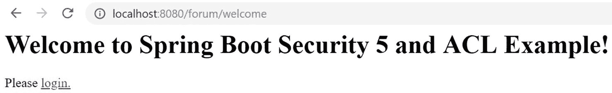

图 7-4
欢迎页面

接下来，点击登录链接，页面将重定向至 Spring Security 登录页面。使用用户名 **leo** 和密码 **nardone01** 登录，如图 7-5 所示。

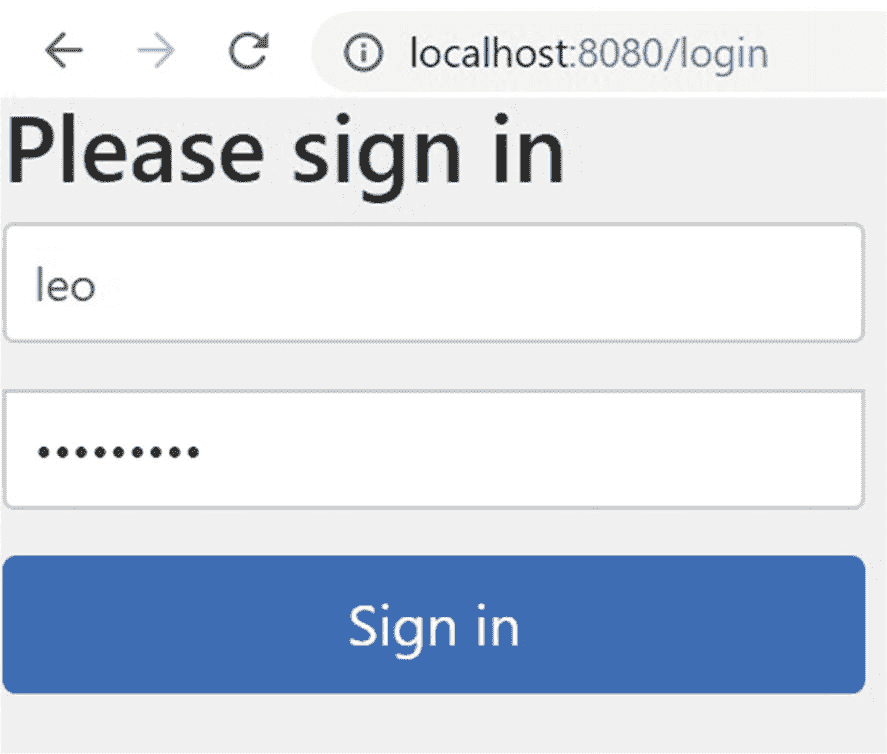

图 7-5
登录页面

一旦以 leo 身份通过认证，页面将重定向至管理页面，如图 7-6 所示。

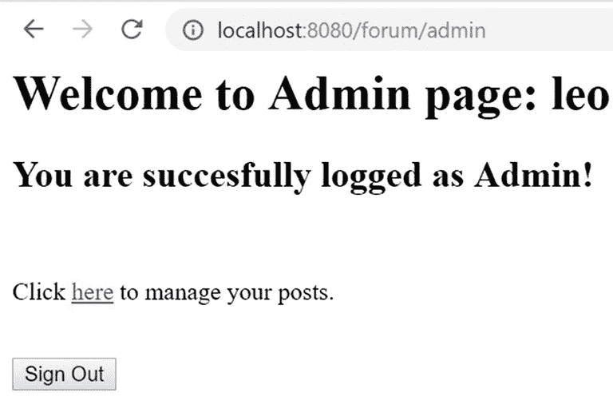

图 7-6
管理页面

接下来，点击“点击此处管理你的帖子”链接，将打开帖子页面，如图 7-7 所示。

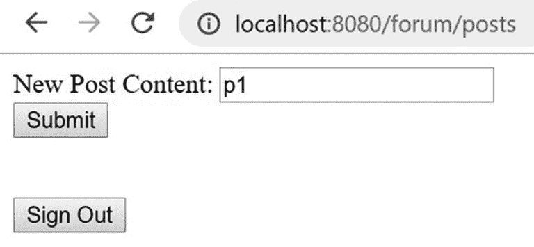

图 7-7
帖子页面

你将看到一个非常小的表单，仅包含一个文本框。你可以在此创建新表单。提交表单后，表单数据将存储在地图中，相应的 ACL 将存储在数据库中，如图 7-8 所示。


图 7-8
添加帖子

你可以使用 SQL 客户端查看。框架内部底层发生的过程，实际上只是执行了一些 SQL 脚本，这些脚本负责用相应数据填充前面提到的表。ACL 系统提供了 API，你可以通过 `ForumServiceImpl` 类中的类来操作这些数据。在内部，所有请求都会被转换为针对已配置数据库的 SQL 指令。同样值得一提的是，框架的内部工作机制包括：使用认证主体的身份作为 ACL 的所有者，以及在 ACL 持久化到数据库后对其进行缓存。`JdbcMutableAclService` 在内部使用了 Spring 自身的 `JdbcTemplate` 和带有预编译语句的批量更新。

访问受保护对象
接下来的逻辑步骤是，通过尝试访问已创建的帖子来确保规则确实生效。为此，你需要再设置几个用户，并完善你的服务和控制器，使其能够处理新的选项。请记住，每次重启应用时，你都在重新创建数据库。（再次强调，在生产环境中你不会希望这样做。）此外，帖子存储在一个`内存映射`中，因此当你关闭应用时，它们会丢失。那么，现在让我们逐步进行所有代码更改。

首先要做的是，在应用配置中添加一个 `org.springframework.security.acls.AclEntryVoter`。`AclEntryVoter` 是 `AccessDecisionVoter` 的一个实现，类似于你之前学习过的那些（如 `RoleVoter` 等），它根据领域对象 ACL 配置所给定的规则，投票决定是授予还是拒绝访问。你需要为你希望 ACL 进行投票的每个操作创建一个 `AclEntryVoter 实例`。例如，在你的场景中，你创建了三个投票器：一个用于投票决定读取访问权限，一个用于投票决定更新权限，一个用于投票决定删除权限。在文件 `applicationContext-acl.xml` 中添加这些投票器。清单 7-16 展示了这三个投票器的定义，随后是对其工作原理的详细说明。

```

清单 7-16
对应于删除、读取和更新操作的 AclEntryVoter
```

你有三个投票器 bean；然而，分析一个就相当于分析了全部。当你定义一个 `AclEntryVoter` 时，需要向其构造函数传递三个参数。第一个参数是对之前定义的 `AclService` 的引用，第二个参数映射到一个配置属性名称。我们在本书前面讨论过配置属性，这里我们只需说明，它们是 Spring Security 在拦截方法时，在 `@Secured` 注解中查找的属性。`AccessDecisionManager` 可以访问这个值，也可以访问决定是否支持特定配置属性的不同投票器。例如，如果你有一个像 `@Secured("ROLE_USER")` 这样的注解，并且配置了 `RoleVoter`，那么该投票器就会执行其工作，因为 `RoleVoter` 默认支持任何以 `ROLE_` 开头的配置属性。对于 `AclEntryVoter`，你需要精确指定该特定投票器将支持哪个配置属性。在这个例子中，第一个 bean 将支持像 `@Secured("ACL_POST_DELETE")` 这样的注解，第二个 bean 将支持像 `@Secured("ACL_POST_UPDATE")` 这样的注解，第三个 bean 将支持像 `@Secured("ACL_POST_READ")` 这样的注解。传递给 `AclEntryVoter` 构造函数的第三个参数是允许访问你试图对对象执行的特定操作所需的权限。例如，第一个 `AclEntryVoter` bean 的场景如下：你有一个用 `@Secured("ACL_POST_DELETE")` 注解的方法，该方法接收一个 `Post` 实例作为参数。当该方法被调用时，`AclEntryVoter` 接收 `Post` 对象，然后从认证信息中检索主体，并根据 `Post` 的 ACL 评估其权限，以查看它是否拥有所需的权限——在本例中是 `BasePermission.ADMINISTRATION`。如果拥有，它将投票授予访问权限；如果没有，它将投票拒绝访问。稍后运行应用程序时，我们将更深入地解释这一点。

为了使这些投票器生效，你需要将它们添加到 `AccessDecisionManager` 中。目前，你使用的是默认的 `AccessDecisionManager`，因此你需要在应用上下文中显式定义一个，并注入这些投票器，以便在应用中使用它们。你可以在 `applicationContext-security.xml` 文件中执行此操作。这就像添加清单 7-17 中所示的两个 bean 一样简单。

```

清单 7-17
用于使用自定义 AccessDecisionManager 的 Bean
```

这个清单中没有什么特别之处。你使用的是基于肯定（affirmative-based）的访问决策管理器，并且你将三个投票器注入到了 `decisionVoters` 属性中。

接下来，让我们在服务中创建删除操作。`ForumServiceImpl` 中的 `deletePost` 方法如清单 7-18 所示。请记得同时用新方法更新 `ForumService` 接口。

```
@Transactional
@Secured("ACL_POST_DELETE")
public void deletePost(Post post){
ObjectIdentity oid = new ObjectIdentityImpl(Post.class, post.getId());
mutableAclService.deleteAcl(oid, true);
postStore.remove(postStore.get(post.getId()));
}
清单 7-18
ForumServiceImpl 中的 deletePost 方法
```

这是一个非常简单的方法。值得注意的是 `@Secured` 注解。如果你回想一下之前对投票器的定义，你应该能够看出，此方法的调用将由你定义的第一个投票器 bean（`aclDeletePostVoter`）支持。让我们尝试一下，看看会发生什么。在此之前，你需要更新 `ForumController`，添加清单 7-19 中的方法。


```
@RequestMapping(method = RequestMethod.POST, value = "/post/delete")
public ModelAndView deletePost(@RequestParam Integer postId){
Post post = new Post("non-relevant");
post.setId(postId);
forumService.deletePost(post);
return showForm();
}
清单 7-19
ForumController 中的 deletePost 方法
```

现在重新启动应用程序，访问 URL `http://localhost:8080/forum/admin`，
并创建一个帖子，界面将如图 7-9 所示。


图 7-9
显示已创建帖子的界面

如果点击删除按钮，应用程序会将你重定向到
熟悉的登录页面。
其过程如下：当你点击删除按钮时，请求
会一路传递到 `AffirmativeBased`
访问决策管理器，正如我们在前几章中解释的那样。该
访问决策管理器会遍历其配置的 `AccessDecisionVoter(s)`——在
本例中，就是你显式注入的 `AclEntryVoter(s)`。
其中一个投票器开始工作——即处理
`ACL_POST_DELETE`
配置属性的那个。该投票器遍历刚刚被拦截的方法的 `MethodInvocation`
对象，并遍历其参数，寻找类型与
`AclEntryVoter` 的 `processDomainObjectClass`
属性中配置的类型相匹配的参数，在你的案例中，该类型是 `com.apress.pss.acl.domain.Post`。
如果在方法的参数列表中未找到此类型的对象，则会抛出
`AuthorizationServiceException`，通知你这一情况。在你的案例中，找到了该对象，并且它实际上是 `deletePost` 方法所期望的唯一参数。如果到达此参数的对象为 null，投票器将直接弃权。
接下来，投票器会尝试从领域对象中检索一个 `ObjectIdentity`
实例。它通过使用默认配置的 `ObjectIdentityRetrievalStrategy`
来实现，该策略的唯一实现是 `org.springframework.security.acls.domain.ObjectIdentityRetrievalStrategyImpl`。
该策略简单地调用 `ObjectIdentityImpl`
的构造函数，该构造函数接收一个领域对象作为其唯一参数。`ObjectIdentityImpl`
中的这个构造函数假设领域对象提供了一个 `getId` 方法，以便能够检索其标识符。如果该方法不存在，则会抛出相应的异常。你的 `Post` 类具有这样的方法，因此一切正常，该方法被调用，并将返回值设置为 `ObjectIdentity` 的标识符。
获取 `ObjectIdentity` 后，投票器尝试从 `Authentication`
对象中检索 SID。为此，投票器使用了一个 `SidRetrievalStrategy`，
其唯一实现（`SidRetrievalStrategyImpl`）
会检索 `Authentication`
对象的权限（例如 `ROLE_USER`）以及主体。因此，它将拥有一个 `PrincipalSid` 实例，以及
与经过身份验证的用户所拥有的权限数量相同的 `GrantedAuthoritySid`
实例。
投票器的下一步是检索针对该特定 `ObjectIdentity` 和
SID 的实际 ACL。它借助我们之前讨论过的已配置的 `AclService` 来完成此操作。
在下一步中，通过检索到的 ACL 的 `isGranted` 方法来查询
是否应授予访问权限。该方法接收所需的权限（由类型为 `AclEntryVoter` 的 bean 的第三个构造函数参数定义，对于 `DELETE` 情况，其值为
`org.springframework.security.acls.domain.BasePermission.DELETE`）
以及之前获取的 SID 列表。然后，ACL 委托给一个 `PermissionGrantingStrategy` 实例（实际上是委托给实现 `DefaultPermissionGrantingStrategy`）
来最终判断 SID 是否对领域对象拥有所需的权限。`PermissionGrantingStrategy` 的
唯一实现 `DefaultPermissionGrantingStrategy`
简单地遍历权限列表、SID 列表以及 ACL 中的 ACE 列表。它将权限与 ACE 上的权限逐一比较，并将 SID 与 ACE 上的 SID 进行比较。如果找到匹配项，则允许访问；如果未找到任何匹配项，则通过抛出异常来拒绝访问，该异常由投票器捕获并返回 `ACCESS_DENIED`。在你的案例中，由于当前经过身份验证的用户是 `ANONYMOUS`，因此整个流程就是这样进行的。


在登录页面，使用用户名 **leo** 和密码 **nardone01**（该用户已在 `applicationContext-security.xml` 文件中定义）登录，然后尝试删除该帖子。您将看到一个“访问被拒绝”的页面，如图 7-10 所示。

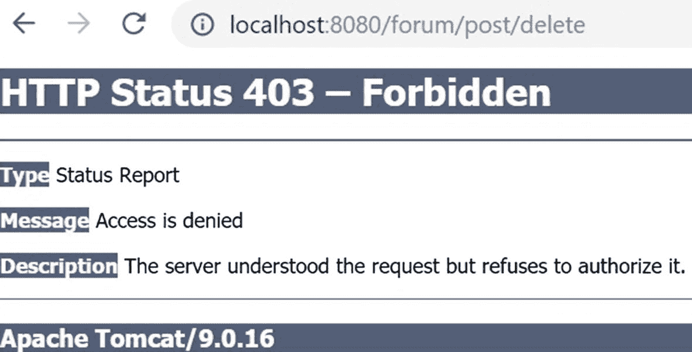

图 7-10
显示访问被拒绝页面的屏幕截图

与之前的情况相同：已登录用户 *leo* 及其角色 `ROLE_USER` 不匹配执行该特定帖子上 `deletePost` 操作所需的规则。正如我们之前所说，只有拥有 `ROLE_ADMIN` 角色的用户才能删除该帖子。那么，让我们来测试一下。

首先，通过访问 URL `http://localhost:8080/logout` 注销。接下来，使用用户名 **luna** 和密码 **nardone01** 登录，并再次尝试删除该帖子。这次，`Acl.isGranted` 方法返回 true，并且投票者返回 `ACCESS_GRANTED`，因为经过身份验证的用户角色与执行所需操作所需的权限之间存在匹配。这意味着代码执行最终将到达 `ForumServiceImpl` 中的 `deletePost` 方法。这是一个非常简单的方法，它从 ACL 中删除该对象的条目，当然，也会从存储中删除该对象。（请记住，您正在使用 `java.util.Map` 作为内存存储，这不是最真实的模拟，但对于示例的目的来说已经足够了。）图 7-11 展示了刚刚解释的过程的最重要方面。

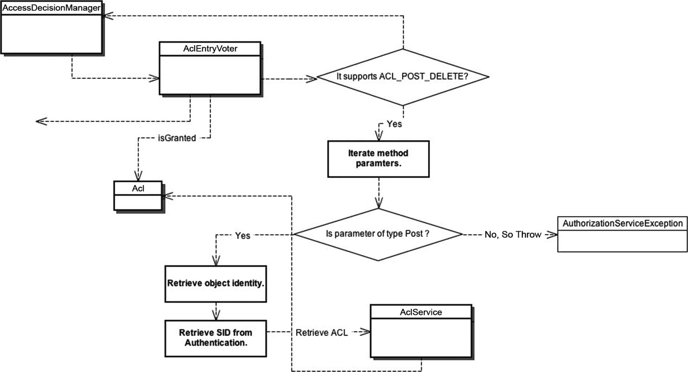

图 7-11
AclEntryVoter 的高级概述

过滤返回的对象
因此，您成功测试了 `Post` 域实例上的 `DELETE` 操作，该操作应仅允许 `ROLE_ADMIN` 用户执行。其他两个操作遵循类似的模式。让我们保护 `READ` 操作，以便只有拥有 `ROLE_USER` 角色的用户才能读取它们。（拥有 `ROLE_ADMIN` 角色的用户也需要拥有 `ROLE_USER` 角色才能阅读帖子。通常，您的用户不需要同时定义这两个角色，但为了示例的方便，这样做是可以的。）但是，如果帖子是由拥有 `ROLE_ADMIN` 角色的用户创建的，那么它只能由拥有 `ROLE_ADMIN` 角色的用户读取。首先，让我们创建另一个同时拥有 `ROLE_USER` 和 `ROLE_ADMIN` 角色的用户。在文件 `applicationContext-security.xml` 的 `<user-service>` 中，添加此用户：`<security:user authorities="ROLE_USER,ROLE_ADMIN" name="massimo" password="nardone01" />`。在此示例中，您希望保护 `ForumServiceImpl` 类中的 `getPosts` 方法，以便在返回帖子时，根据上一段中解释的规则对其进行过滤。为此，请使用 `@PostFilter` 注解。

首先，您需要向 `AccessDecisionManager` 的投票者列表中添加一个新的投票者。新的投票者类型为 `org.springframework.security.access.prepost.PreInvocationAuthorizationAdviceVoter`，如清单 7-20 所示。需要此投票者，因为即使您只使用 `@PostFilter` 注解，Spring Security 在进行投票时也会尝试评估配置属性，并且它会在配置属性列表中包含一个值为 `permitAll` 的 `PreInvocationAttribute`，因此 `PreInvocationAuthorizationAdviceVoter` 将始终投票授予访问权限。清单 7-20 中的代码应添加到文件 `applicationContext-security.xml` 中。

```

清单 7-20
需要对自动生成的 permitAll 表达式进行投票的 PreInvocationAuthorizationAdviceVoter
```

接下来，您需要更改 `getPosts` 方法的返回类型，因为您添加的过滤器仅适用于 `java.util.Collection` 实例或数组，并且由于您当前从该方法返回一个映射，因此该实现将无法工作。您现在只需返回一个帖子的集合。新方法如清单 7-21 所示。如果您正在跟随代码操作，则应更改所有依赖于此方法的类和文件，包括 `form.jsp` 文件。

```
public Collection getPosts(){
return new ArrayList(postStore.values());
}
清单 7-21
getPosts 方法现在返回一个帖子的集合，而不是映射
```

接下来，在清单 7-21 的方法顶部，添加注解 `@PostFilter("hasPermission(filterObject, 'READ')")`，其中 `filterObject` 是返回集合中的每个对象，`READ` 是与您之前看到的 `BasePermission.READ` 匹配的权限。这就是过滤功能将被触发的地方。接下来，我们将在执行场景的上下文中解释它是如何工作的。但是，首先您需要在应用程序上下文中手动配置几个 bean，以允许正确评估权限表达式。这是必需的，因为默认情况下，Spring Security 中配置的 SpEL 表达式评估器将使用 `org.springframework.security.access.expression.DenyAllPermissionEvaluator`，顾名思义，它将拒绝所有权限评估请求。此配置硬编码在类 `org.springframework.security.access.expression.AbstractSecurityExpressionHandler<T>` 中，您需要将其替换为适当的评估器。

幸运的是，Spring Security 以类 `org.springframework.security.acls.AclPermissionEvaluator` 的形式为我们提供了适当的评估器。配置它需要一些工作，但并不是很困难。首先，您需要定义将成为新 `ExpressionHandler` 的 bean。您可以在 `applicationContext-security.xml` 文件中通过添加清单 7-22 中的代码来完成此操作。

```

清单 7-22
注入了正确权限评估器的 ExpressionHandler Bean
```


好的，作为高级文档工程师和翻译员，我将严格遵循您提供的注意事项和示例格式，对给定的英文文本进行翻译。


然后，在元素 `<security:global-method-security>` 中，
添加子元素 `<security:expression-handler ref="customExpressionHandler" />` 以引用
您刚刚定义的新表达式处理器。
现在重新启动应用程序。应用程序重启后，如果您
访问 `http://localhost:8080/forum/`
并创建一个帖子，您将看到该帖子不会显示在
页面上。这是因为您是以 `ANONYMOUS` 用户的身份创建了该帖子。
请记住，现在帖子只会对 `ROLE_USER` 用户显示。如果
您使用用户名 **leo** 和
密码 **nardone01** 登录应用程序，并再次访问 `http://localhost:8080/forum/`，
您将看到页面上显示了该帖子以及删除按钮。以下
段落将解释这一切在底层是如何工作的。
正如您可能从之前的章节中回忆起的，Spring Security
的核心是 `SecurityInterceptor` 的概念
及其两个具体实现：`FilterSecurityInterceptor`
和 `MethodSecurityInterceptor`。
您可能还记得，拦截器的工作流程是预处理、
处理、后处理。实际的业务逻辑发生在
处理阶段，而预处理和后处理阶段都用于
框架自身应用所有与授权和访问控制相关的安全关注点，
这些关注点是保护应用程序所必需的。
预处理阶段主要由访问决策管理器和访问决策投票器负责，
它们决定是否应允许访问特定资源（无论是方法、
领域对象还是 URL）。后处理阶段由从 `SecurityInterceptor`
调用的 `AfterInvocationManager` 处理。
默认情况下，会调用 `AfterInvocationProviderManager`
的一个实例。
我们之前解释过这个过程：`AfterInvocationProviderManager`
遍历一个 `AfterInvocationProvider` 列表，
由它做出是否允许访问特定领域对象实例的最终决定。
在当前这个例子中，关键点在于调用链最终会到达一个 `ExpressionBasedPostInvocationAdvice`
实例（通过 `PostInvocationAdviceProvider`），
该实例检查是否存在需要处理的 `postFilter` 表达式。
如果存在，它会调用您在清单 7-22 中定义的 `DefaultMethodSecurityExpressionHandler`。
此处理器检查带有 `@PostFilter` 注解的业务方法的返回值
确实是一个集合或数组（如果不是，则抛出异常）。
然后它遍历这个集合，对每个对象评估 SpEL 表达式，
并丢弃表达式评估结果为 `false` 的对象。
您使用的表达式是一个 ACL 表达式，与大多数其他表达式一样，
其支持方法定义在 `SecurityExpressionRoot` 类中。
此方法（`hasPermission`）使用
清单 7-22 中定义的权限评估器来决定
认证主体是否对所传递的对象拥有所需的权限。此评估器使用与
`AclEntryVoter` 用于决定是否授予访问权限相同的类套件和辅助工具，
例如 `AclService` 和 ACL 接口中的
`isGranted` 方法。
所以您知道示例中发生了什么。当您尝试以匿名用户身份访问
列表时，唯一存在的帖子从返回元素中被丢弃了，
因为该用户不满足读取对象所需的权限。（ACL 的 `isGranted` 方法
返回了 `false`。）当您
以 *leo/nardone01* 身份登录时，您获得了 `ROLE_USER` 角色。根据您首次创建帖子时
指定的 ACL 规则，该角色确实被允许读取帖子对象。

让我们通过一个包含多个帖子的示例来看看过滤是如何工作的。
这次，您将使用具有 `ROLE_ADMIN` 角色的用户创建一个帖子。您将
修改帖子创建代码，以便当管理员用户创建帖子时，只有其他
`ROLE_ADMIN` 用户才能读取该帖子。为此，将
`ForumServiceImpl` 类中的 `createPost` 方法更改为
清单 7-23 所示。此清单
（像本书中的许多其他清单一样）采用了便利性优先于特别良好设计的方法。
例如，您可能会（并且正确地）争辩说，ACL 变更不是核心 `createPost` 方法
业务功能的一部分，并且在代码中硬编码角色名称也是不正确的。
再次强调，我们这样做是为了以方便的方式说明概念，
无需过多抽象，直接切入我们试图展示的重点。
在实际环境中，您应该努力实现良好的关注点分离，
将安全关注点放在它们自己的空间（无论是使用 AOP 还是其他方法），
并让业务方法处理业务关注点。

```
@Transactional
public void createPost(Post post) {
Integer id = new Integer(Math.abs(post.hashCode()));
ObjectIdentity oid = new ObjectIdentityImpl(Post.class, id);
MutableAcl acl = mutableAclService.createAcl(oid);
User user = (User)SecurityContextHolder.getContext().getAuthentication().getPrincipal();
acl.insertAce(0, BasePermission.ADMINISTRATION, new PrincipalSid(
user.getUsername()), true);
acl.insertAce(1, BasePermission.DELETE, new GrantedAuthoritySid(
"ROLE_ADMIN"), true);
if(isAdminUserLogged()){
acl.insertAce(2, BasePermission.READ, new GrantedAuthoritySid(
"ROLE_ADMIN"), true);
}else{
acl.insertAce(2, BasePermission.READ, new GrantedAuthoritySid(
"ROLE_USER"), true);
}
mutableAclService.updateAcl(acl);
post.setId(id);
postStore.put(id, post);
}
private booleanisAdminUserLogged() {
for(GrantedAuthority authority: SecurityContextHolder.getContext().getAuthentication().getAuthorities()){
if(authority.getAuthority().equals("ROLE_ADMIN")){
return true;
}
}
return false;
}
清单 7-23
createPost 方法，该方法根据创建帖子的用户创建不同的 ACL，以及一个用于检查登录用户是否具有 ROLE_ADMIN 角色的辅助方法
```

这里您添加了一个条件，基本上是说，如果登录的
用户是管理员，则 `READ` 权限将
仅对其他管理员（具有 `ROLE_ADMIN` 角色的用户）可用。如果
登录的用户不是管理员，则 `READ` 权限将
对任何具有 `ROLE_USER` 角色的用户可用。
让我们逐步看看这个新配置的执行情况。

测试场景 7-7

要执行此新配置，请遵循
以下步骤：

1.  重新启动应用程序，`访问 http://localhost:8080/forum/admin`，并使用用户名
    **leo** 和密码 **nardone01** 登录。

2.  访问 `http://localhost:8080/forum/posts`
    并创建一个内容为 *p1* 的新帖子。这将创建
    您在图 7-12 中看到的屏幕。

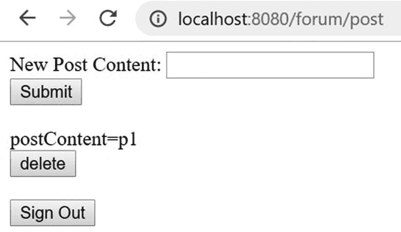

图 7-12

具有 ROLE_USER 角色的用户创建帖子后生成的屏幕

3.  访问 `http://localhost:8080/logout`
    以退出应用程序。然后访问 `http://localhost:8080/login`
    并使用用户名 **luna** 和密码
    **nardone01** 登录。

4.  访问 `http://localhost:8080/forum/posts`
    并创建一个内容为 *p2* 的帖子。参见图 7-13。

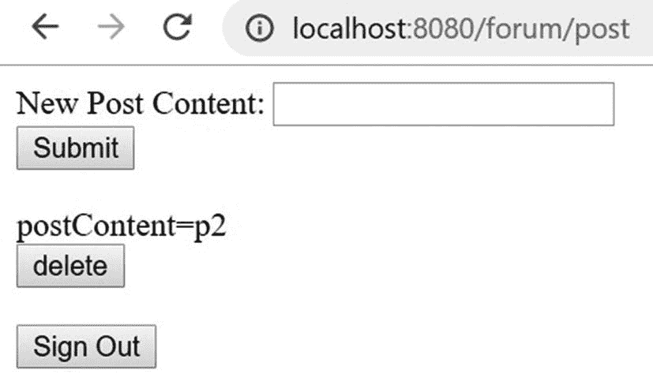

图 7-13

管理员用户创建帖子后生成的屏幕


5.  访问 `http://localhost:8080/logout` 退出应用程序。然后访问 `http://localhost:8080/login`，使用用户名 **massimo** 和密码 **nardone01** 登录。

6.  访问 `http://localhost:8080/forum/posts`，你应该能看到两篇帖子，如图 7-14 所示。

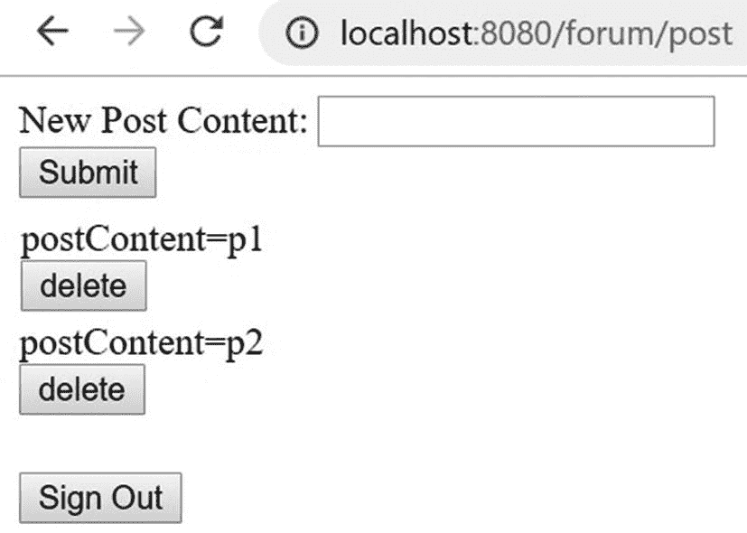

图 7-14

同时拥有 ROLE_USER 和 ROLE_ADMIN 角色的用户所看到的帖子

7.  访问 `http://localhost:8080/logout` 退出应用程序。然后访问 `http://localhost:8080/login`，使用用户名 **leo** 和密码 **nardone01** 登录。

8.  访问 `http://localhost:8080/forum/posts`，你只会看到 Post post1，因为这是标准用户唯一能访问的帖子。视图与图 7-12 完全相同。

Spring Security ACL 支持还提供了 `@PreFilter` 注解，正如你所想，它在方法安全拦截过程的预处理阶段工作，而不是像 `@PostFilter` 注解那样工作。如前所述，预处理活动由 `AccessDecisionVoter` 实现负责。对于 `@PreFilter` 注解，它由 `org.springframework.security.access.prepost.PreInvocationAuthorizationAdviceVoter` 负责，而该投票器又像之前一样，使用 `DefaultMethodSecurityExpressionHandler` 的实例。与 `@PostFilter` 的情况一样，带有 `@PreFilter` 注解的方法预期接收一个集合。不过，在这种情况下，不支持数组。

我们刚刚向你展示了一个关于 ACL 过滤功能如何在实际中工作的简单演练。你可以看到，只需提供带有 `hasPermission` 表达式的 `@PostFilter` 注解（如你所知，该表达式在内部调用 SpEL 上下文中的一个方法），我们就能指示框架如何处理方法的返回值。我们首先解释、随后在小型测试用例中演示的这个过程，可以用图 7-15、7-16 和 7-17 来总结。

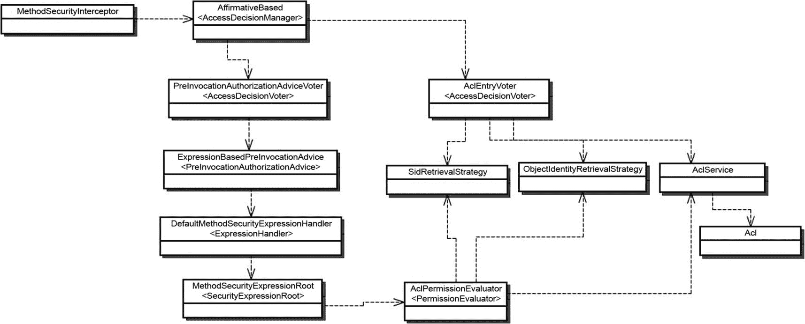

图 7-16
一个展示基于 ACL 安全的方法拦截在预处理阶段的主要类和接口的图表

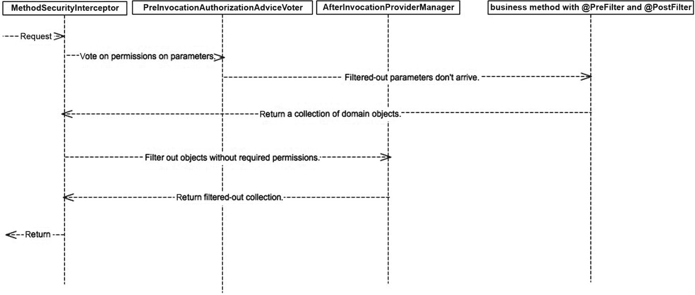

图 7-15
一个简化的时序图，展示了当调用带有 @PreFilter 和 @PostFilter 注解的方法时发生的情况。该图显示了领域对象的参数和返回集合在方法调用前后是如何被过滤的

`@PreFilter` 调用由 `PreInvocationAuthorizationAdviceVoter` 处理，而带有 ACL 配置属性的 `@Secured` 注解则由 `AclEntryVoter` 处理。你可以在图中看到，在处理流程的末尾，两条路径都到达了 `SidRetrievalStrategy`、`ObjectIdentityRetrievalStrategy` 和 `AclService` 中的核心元素。实际上，`AclPermissionEvaluator` 和 `AclEntryVoter` 执行的功能非常相似。

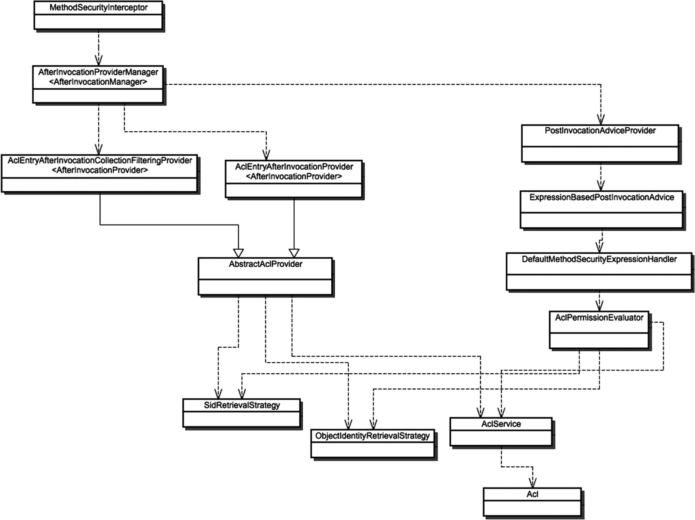

图 7-17
一个展示基于 ACL 安全的方法拦截在后期处理阶段所涉及的类的图表

同样，你可以看到两个分支。左边的分支包含 `AclEntryAfterInvocationProvider` 和 `AclEntryAfterInvocationCollectionFilteringProvider`，该分支不支持 SpEL 表达式，并在使用 `@Secured` 和配置属性的静态名称（例如 `ACL_ALLOW_READ` 或其他，正如你在前面几节中看到的那样）时处于活动状态。右边的分支则经过支持 SpEL 以及 `@PostFilter` 和 `@PostAuthorize` 注解的部分。你可以看到，这两个分支几乎与预处理阶段的分支一一对应。此外，你还可以看到系统中存在高度的重用，许多类同时出现在预处理和后期处理阶段。

我们介绍了处理 ACL 安全的两种不同方式，即我们在上一段中讨论的两个分支。使用 `@Secured` 的方式较旧，不支持 SpEL 表达式；而使用 `@PreFilter`、`@PreAuthorize`、`@PostAuthorize` 和 `@PostFilter` 的方式自 Spring Security 3.0 版本以来就已存在。它们是支持使用 SpEL 表达式的较新选项，因此在日常使用中，你可能会更倾向于使用它们。

使用 ACL 保护视图层

使用 ACL 保护应用程序的另一个选项是使用视图层的 JSP 标签，为没有适当权限查看领域对象的用户过滤掉这些对象。我们在 Web 安全章节中已经简要讨论过这些标签，但特意将 ACL 标签留在这里进行更详细的介绍。为了在示例中使用它们，让我们继续使用上一节的代码，但做一些修改。首先，在 `ForumServiceImpl` 类中，注释掉 `getPosts` 方法中的 `@PostFilter` 注解，使其不再进行任何过滤。然后将 `form.jsp` 文件修改为如清单 7-24 所示。

```

帖子

新帖子内容：

${post.content}

清单 7-24
应用了 Taglib ACL 安全以过滤领域对象的 form.jsp
```

这个清单展示了在视图层保护领域对象是多么简单。实际上，它（从视图角度来看）执行了与使用 `@PostFilter` 注解时非常相似的任务。
`<accesscontrollist>` 标签依赖于应用程序上下文配置中已配置的 `org.springframework.security.access.PermissionEvaluator` 实现。它只有在应用程序上下文中只配置了一个此类型的 bean 时才能工作，因为它会尝试按类型检索该 bean。你可能还记得，在你的配置中，有一个具体类型为 `org.springframework.security.acls.AclPermissionEvaluator` 的 `PermissionEvaluator` 配置。
现在，如果你重新启动应用程序并再次执行测试场景 7.1 中定义的步骤，从表示层的角度来看，你应该会得到与首次执行该场景时完全相同的行为。其工作方式很简单。每次评估该标签时（在对帖子集合的每次迭代中），标签处理器都会调用 `PermissionEvaluator` 的 `hasPermission` 方法，该方法返回一个布尔值，指示是否已授予权限。如果授予了权限，则评估并渲染标签体。如果未授予权限，则跳过标签体。


ACL 的成本
此示例表明，使用 ACL 会在标准业务操作之上，带来相当多的操作和逻辑开销。显然，存储一篇帖子会受到为该对象存储相应 ACL 所需的额外工作的影响，而检索一篇帖子则会受到需要根据权限过滤集合中某些元素的影响。

本小节将深入探讨 ACL Spring Security 支持的核心类，了解其内部工作原理以及它可能如何影响您的应用程序。这个类是 `org.springframework.security.acls.jdbc.JdbcMutableAclService`。

`JdbcMutableAclService` 是处理所有与 ACL 数据库模式相关的数据库输入和输出的类。它默认配置为与 `HSQLDB` 一起工作，这也是我们在示例中一直使用的数据库。

该类针对您与 ACL 系统交互时执行的不同操作（例如插入到不同表中、删除 ACL、更新值，当然还有从不同表中进行选择）提供了不同的 SQL 语句。所有这些操作都使用 Spring Core 的 `JdbcTemplate` 支持来完成。

另一个重要的类是 `BasicLookupStrategy`，它是框架中用于查找 ACL 的 `LookupStrategy` 的默认实现。

您看到的第一个有趣的操作是 `readAclsById` 方法，它存在于 `JdbcMutableAclService` 中，并委托给 `BasicLookupStrategy` 中同名的方法。此方法尝试从缓存中检索请求的 ACL。如果在缓存中找到该 ACL，该方法将返回这个找到的 ACL；如果在缓存中未找到该 ACL，则实现将使用一个包含四个连接的、相对复杂的查询来查询数据库，如清单 7-25 所示。这个查询可能会变得更复杂一些，因为 ACL 可以以最多 50 个元素为一批进行检索（这是默认值，但可以通过设置 `BasicLookupStrategy` 类中的 `batchSize` 属性进行配置），并且对于这些元素中的每一个，`where` 子句都会向查询中添加一个 `or` 运算符。此查询的结果随后会存储在缓存中，这使得这些 ACL 可用，以便如果另一个方法调用 `readAclsById` 请求其中一个缓存元素时，无需访问数据库。

当您创建一篇新帖子时，会调用 `readAclsById`。此外，还会执行另一个 select 查询来检索由该领域对象表示的 `objectIdentity` 的主键。当然，还会执行一条 `"insert into acl_object_identity"` 语句。同样，在 `ForumServiceImpl` 的同一个 `createPost` 方法中，当您调用 `updateAcl` 方法时，会先执行一条 `"delete from acl_entry"` 语句，然后执行一批 `"insert into acl_entry"` 语句，接着执行一条 `"update acl_object_identity"` 语句。然后，该对象标识的所有缓存条目都会被清除，并再次调用 `readAclsById`，这将查询数据库以获取最新的信息。您可以看到，使用 ACL 后，删除一篇帖子的成本是如何显著增加的。

删除 `Post` 对象的成本也更高，因为现在它涉及删除 ACE 条目、删除对象标识以及清除相关对象的缓存。

本节并非要吓唬您，让您不敢使用 ACL。我们只是想让您意识到，在考虑使用 ACL 创建应用程序时，除了使用它的复杂性之外，还存在一个额外的成本，您应该将其考虑在内。您拥有的领域对象越多，您拥有的 ACL 条目也就越多。在一个大型应用程序中，您可能谈论的是 ACL 支持表中数百万计的条目。

```
select acl_object_identity.object_id_identity, acl_entry.ace_order,  acl_object_identity.id as acl_id,
acl_object_identity.parent_object, acl_object_identity.entries_inheriting, acl_entry.id as ace_id, acl_entry.mask,
acl_entry.granting,  acl_entry.audit_success, acl_entry.audit_failure,  acl_sid.principal as ace_principal,
acl_sid.sid as ace_sid,  acli_sid.principal as acl_principal, acli_sid.sid as acl_sid, acl_class.class from
acl_object_identity left join acl_sid acli_sid on acli_sid.id = acl_object_identity.owner_sid
left join acl_class on acl_class.id = acl_object_identity.object_id_class
left join acl_entry on acl_object_identity.id = acl_entry.acl_object_identity
left join acl_sid on acl_entry.sid = acl_sid.id
where ( (acl_object_identity.object_id_identity = ? and acl_class.class = ?))
order by acl_object_identity.object_id_identity asc, acl_entry.ace_order asc
清单 7-25
您可以在 `org.springframework.security.acls.jdbc.BasicLookupStrategy` 类中找到的 ACL 检索查询
```

总结
在本章中，我们详细解释了如何使用 Spring Security 对 ACL 的支持。我们展示了如何在 Spring 配置文件中配置对 ACL 的支持，以及如何使用 `@Secured`、`@PreAuthorize`、`@PreFilter`、`@PostAuthorize` 和 `@PostFilter` 注解来实现特定于领域对象的安全性。我们还介绍了框架的一些内部方面以及参与其 ACL 功能的主要类。

我们研究了不同的方法来确保受保护的领域对象不会出现在没有适当权限的用户的表示层中。您看到这可以通过业务层的 `@PostFilter` 中的 SpEL 表达式实现，也可以直接在您的 JSP 文件中使用 ACL Spring Security 标签库实现。我们还快速概述了 ACL 框架使用的不同 SQL 语句，以及它们可能如何影响您的应用程序。

8. 自定义和扩展 Spring Security

Spring Security 是一个非常可扩展和可定制的框架。这主要是因为该框架是使用面向对象的原则和设计实践构建的，因此它对扩展开放，对修改关闭。在上一章中，您看到了 Spring Security 中的一个主要扩展点——即不同身份验证提供者的可插拔性。本章涵盖了框架中其他一些您可以利用的扩展点，以扩展 Spring Security 的功能，或修改/定制那些在您的应用程序中不完全按您需要方式工作的功能。

我们还将简要介绍 Spring Security Extensions 项目（[`http://static.springsource.org/spring-security/site/extensions.html`](http://static.springsource.org/spring-security/site/extensions.html)），这是一个您可以用来为核心 Spring Security 项目创建扩展模块的环境。

下一节将定义我们认为的 Spring Security 中的一些主要扩展点，并描述如何使用它们来添加或修改安全解决方案中的行为。此外，本章还将展示如何使用 Spring Boot、Spring Security、Spring Data、Thymeleaf 和 MongoDB 开发身份验证和登录应用程序。

Spring Security 扩展点
Spring Security 提供了一套全面的扩展点，这些扩展点可以使用您自己的实现进行自定义（或完全覆盖），同时仍然利用框架的核心。有些扩展点是显而易见的，而另一些则稍微微妙一些，在某些情况下甚至不是有意的。然而，由于该框架非常灵活，您可以利用这种灵活性来调整其配置以满足您的意图。


接入 Spring Security 事件系统

Spring Security 支持一种基于 Spring 框架自身事件模型构建的事件模型。你可以利用 Spring 的事件模型来开发能够监听框架内发生的不同事件并做出相应处理的应用程序。

我们不会深入解释为何事件模型是一种如此强大的编程实践。我们只想指出一个巨大的优势：它允许你解耦应用程序，因为通常来说，事件生产者（一个或多个）和事件消费者（一个或多个）无需了解彼此的任何信息即可正常运行。理论上（实际上，对于一般事件而言，尽管 Spring 事件并非如此），你可以拥有一个完全异构的应用程序，其中每个模块都可以按照自己的节奏编写和演进，而不影响其他部分，然后通过专门使用事件将它们全部集成在一起。

所有 Spring 事件都应继承自抽象类 `org.springframework.context.ApplicationEvent`，Spring Security 自身的事件也不例外。

`ApplicationEvent` 抽象类的一个主要具体实现是 `org.springframework.context.event.ApplicationContextEvent`，它本身作为一系列涉及应用程序上下文生命周期的事件（`ContextClosedEvent`、`ContextRefreshedEvent`、`ContextStartedEvent` 和 `ContextStoppedEvent`）的父类。

要注册你的应用程序以接收 Spring 事件的通知，你需要在你应用程序中定义的一个（或多个）Bean 实现接口 `org.springframework.context.ApplicationListener<E extends ApplicationEvent>`。该接口定义了一个单一方法 `void onApplicationEvent(E event)`，你可以使用它来监听应用程序中的特定类型事件。

发布事件同样简单。你只需要在你的 Spring 应用程序上下文中定义一个实现接口 `org.springframework.context.ApplicationEventPublisherAware` 的 Bean，该接口同样只定义了一个方法：

```
void setApplicationEventPublisher(ApplicationEventPublisher applicationEventPublisher)
```

当应用程序启动时，Spring 会自动调用此方法，并传入一个 `ApplicationEventPublisher` 的实例（因为它是接口，所以传入的是其实现类）。传入的 `ApplicationEventPublisher` 实例通常是包含该应用程序的 `ApplicationContext` 实例本身。

`ApplicationEventPublisher` 的 `publishEvent` 方法（位于 `AbstractApplicationContext` 类中）的默认实现将事件的发布委托给 `ApplicationEventMulticaster` 的实现——目前唯一的实现是 `org.springframework.context.event.SimpleApplicationEventMulticaster`。

向所有感兴趣的监听器广播事件也很直接。你只需创建一个 `ApplicationEvent` 实现类（任何子类都可以作为事件）的实例，然后调用 `ApplicationEventPublisher` 的 `publishEvent(ApplicationEvent event)` 方法，并将你的 `ApplicationEvent` 实例传递给它。然后 Spring 会负责确保所有注册了该特定事件的监听器都收到事件发布的通知。默认情况下，所有监听器都在与发布者相同的线程上被调用；但是，你也可以配置一个 `org.springframework.core.task.TaskExecutor`（这是一个接口，因此你可以使用像 `org.springframework.core.task.SimpleAsyncTaskExecutor` 这样的实现类）来在不同的线程中调用监听器。在示例中配置监听器时，你将用到这一点。

Spring Security 自带了一套自己的 `ApplicationEvent` 实现，因此你可以以一种不引人注目且解耦的方式接入安全生命周期的不同节点。Spring Security 提供的 `ApplicationEvent` 实现被归类为 `Authorization`、`Authentication` 或 `javax.servlet.http.Session` 类型，并且它们具有描述性的名称，暗示了它们的功能和发布位置。在这里，我们将对它们以及它们在框架内何时发布进行具体解释。

Spring 中的事件工作方式如图 8-1 所示。

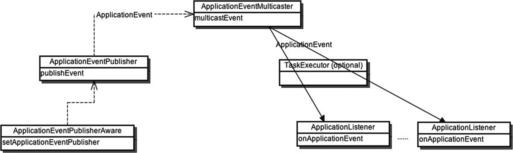

图 8-1
 Spring 事件机制。Spring Security 拥有自己的一套 ApplicationEvent 实现

授权相关事件

这些是与授权过程可能经历的不同阶段相关的事件——例如，在授权失败时通知用户。此类别下的事件如下：

*   `org.springframework.security.access.event.AbstractAuthorizationEvent`：这是所有其他授权事件的父类。它实际上并没有在 `ApplicationEvent` 之上添加任何功能。它更像是一个标记，用于标识其所有子类为授权事件。

*   `org.springframework.security.access.event.AuthenticationCredentialsNotFoundEvent`：此事件用于指示无法从配置的 `SecurityContext` 中获取 `Authentication` 对象。此事件由 `AbstractSecurityInterceptor` 的 `beforeInvocation` 方法在决定调用应具有安全性但拦截器在安全上下文中未找到所需的 `Authentication` 对象时广播。简单来说，如果条件 `SecurityContextHolder.getContext().getAuthentication() == null` 为 `true`，则会执行此事件。


*   `org.springframework.security.access.event.AuthorizationFailureEvent`:
    此事件表示`Authentication`对象的主体未被允许访问安全对象，因为它缺少访问所需的权限。当`AbstractInterceptor`的`beforeInvocation`和`afterInvocation`方法捕获到`AccessDeniedException`时，会发布此事件。`AccessDeniedException`可以由拦截器预处理阶段的`org.springframework.security.access.AccessDecisionManager`的`decide`方法抛出，也可以由拦截器后处理阶段的`org.springframework.security.access.intercept.AfterInvocationProviderManager`的`decide`方法抛出。

*   `org.springframework.security.access.event.AuthorizedEvent`:
    此事件在安全对象的访问被授予之后、实际调用安全对象之前发布。默认情况下不会发布此事件，如果你希望发布它，需要在安全拦截器中将属性`publishAuthorizationSuccess`设置为`true`。

*   `org.springframework.security.access.event.LoggerListener`: 此事件将拦截器相关的应用程序事件输出到 Commons Logging，因此所有失败事件将以警告级别记录，所有成功事件将以信息级别记录，所有公共调用事件将以调试级别记录。

*   `org.springframework.security.access.event.PublicInvocationEvent`:
    每当安全对象接收到对非安全入口点（即未配置`ConfigAttribute`的方法）的调用时，`AbstractSecurityInterceptor`的`beforeInvocation`方法会发布此事件。在方法安全的情况下，这意味着当调用对象的安全代理时，如果被调用的特定方法未配置安全元数据，则将其作为非安全的公共调用处理。然而，并非简单地调用该方法，而是在继续执行之前广播一个事件，以通知任何对此感兴趣的监听器，此事件（公共调用）已经发生。这可能指向一种情况，即你实际上需要保护该端点，而通过此事件，你会收到尚未这样做的通知。事件发布后，拦截器将不再对此调用执行任何预处理或后处理。如果拦截器中的属性`rejectPublicInvocations`设置为`true`（该属性是`AbstractSecurityInterceptor`类的一部分），则不会发布该事件，而是抛出一个`IllegalArgumentException`，指出在没有配置`ConfigAttribute`的情况下无法进行特定调用。这意味着需要处理一个配置错误。

更多信息请访问 [`https://docs.spring.io/spring-security/site/docs/5.1.4.RELEASE/api/org/springframework/security/access/event/AbstractAuthorizationEvent.html`](https://docs.spring.io/spring-security/site/docs/5.1.4.RELEASE/api/org/springframework/security/access/event/AbstractAuthorizationEvent.html)

图 8-2 以 UML（统一建模语言）形式展示了这些事件类和接口。

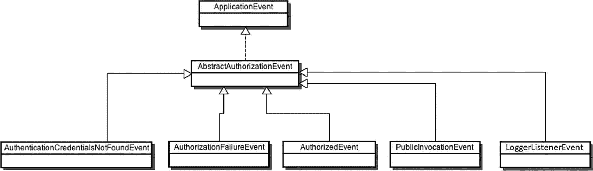

图 8-2
授权相关事件

认证相关事件
这些事件与应用程序中的认证过程以及该过程经历的不同阶段相关，例如通知感兴趣的监听器有关账户禁用和凭证过期的情况。认证事件由`org.springframework.security.authentication.AuthenticationEventPublisher`的实现发布，该实现由`org.springframework.security.authentication.ProviderManager`类调用。默认情况下，`ProviderManager`中配置的`AuthenticationEventPublisher`是`NullEventPublisher`的一个实例，它是`ProviderManager`类内部定义的一个私有静态类，不发布任何事件。如果你自己配置 bean，可以使用`AuthenticationEventPublisher`接口的一个默认实现，即`org.springframework.security.authentication.DefaultAuthenticationEventPublisher`。当使用`<http>`元素时，Web 层安全默认配置此实例。
`DefaultAuthenticationEventPublisher`的工作方式如下：它只实现了`AuthenticationEventPublisher`接口的两个公共方法。这些方法是`publishAuthenticationSuccess`和`publishAuthenticationFailure`。它们是尝试认证时可能出现的两种场景；然而，在认证失败的情况下，可能有很多原因，正如我们接下来将向你展示的大量`AuthenticationFailureXXXEvent`实例所示。在认证失败的情况下，`DefaultAuthenticationEventPublisher`将收到对`publishAuthenticationFailure`方法的调用，然后它将查询认证被拒绝时抛出的异常（例如`UsernameNotFoundException`）与该异常对应的事件（例如`AuthenticationFailureBadCredentialsEvent`）之间的映射。然后，通过反射创建此事件的一个实例并发布。
可以使用`DefaultAuthenticationEventPublisher`提供的方法`setAdditionalExceptionMappings`向异常与事件之间的默认映射中添加更多映射。

框架中当前与认证相关的事件如下：

*   `org.springframework.security.authentication.event.AbstractAuthenticationEvent`:
    这是所有其他认证相关事件的父类。它不引入任何特定功能，而是服务于对认证事件进行分类的基本功能。

*   `org.springframework.security.authentication.event.AbstractAuthenticationFailureEvent`:
    这是所有认证失败事件的父类。它扩展了`AbstractAuthenticationEvent`，但增加了一个构造函数，该构造函数接收认证失败时抛出的异常。

*   `org.springframework.security.authentication.event.AuthenticationFailureBadCredentialsEvent`:
    当系统在认证过程中抛出`BadCredentialsException`时发布此事件。当对`Authentication`对象的凭证检查无效时，不同的`AuthenticationProvider`实现会抛出此异常。当抛出`UsernameNotFoundException`时也会发布此事件。这通常由`UserDetailsService`实现在找不到与传入用户名对应的用户时抛出，并由`AuthenticationProvider`简单地传播。

*   `org.springframework.security.authentication.event.AuthenticationFailureCredentialsExpiredEvent`:
    当抛出`CredentialsExpiredException`时发布此事件。例如，当代表用户的`UserDetails`对象从方法`isCredentialsNotExpired`返回`false`时，`AbstractUserDetailsAuthenticationProvider`的实现会抛出此异常。


*   `org.springframework.security.authentication.event.AuthenticationFailureDisabledEvent`:
    当抛出 `DisabledException` 时，会发布此事件。如果尝试登录的用户账户已被禁用，则会抛出此异常。`AbstractUserDetailsAuthenticationProvider` 以及评估 `UserDetails.isEnabled` 方法是否返回 `false` 的 `AccountStatusUserDetailsChecker` 实现会使用此事件。

*   `org.springframework.security.authentication.event.AuthenticationFailureExpiredEvent`:
    当抛出 `AccountExpiredException` 时，`ProviderManager` 会发布此事件。此异常的抛出逻辑与上一种情况相同，但这次调用的是 `UserDetails.isAccountNonExpired` 方法。如果该方法返回 `false`，则会抛出此异常。

*   `org.springframework.security.authentication.event.AuthenticationFailureLockedEvent`:
    当抛出 `LockedException` 时，会发布此事件。此异常在与上一种情况相同的位置（预认证检查场景中）抛出，并且当代表用户的 `UserDetails` 从其 `isAccountNonLocked` 方法返回 `false` 时抛出。

*   `org.springframework.security.authentication.event.AuthenticationFailureProviderNotFoundEvent`:
    此事件与之前的事件不同，它不直接与尝试登录的用户相关。相反，当抛出 `ProviderNotFoundException` 时，会发布此事件。如果 `ProviderManager` 中配置的所有 `AuthenticationProviders` 都无法处理该认证请求，`ProviderManager` 本身会抛出此异常。

*   `org.springframework.security.authentication.event.AuthenticationFailureProxyUntrustedEvent`:
    此事件表示由于 CAS 用户的票据是由不受信任的代理生成的而导致的认证失败。

*   `org.springframework.security.authentication.event.AuthenticationFailureServiceExceptionEvent`:
    当抛出 `AuthenticationServiceException` 时，会发布此事件。此异常可能由系统的不同部分（例如，`UsernamePasswordAuthenticationFilter` 和 `DaoAuthenticationProvider`）抛出，通常用于传达由于某种系统错误（例如，无法访问用户存储库）而无法处理认证的信息。

*   `org.springframework.security.authentication.event.AuthenticationSuccessEvent`:
    当 `DefaultAuthenticationEventPublisher` 的 `publishAuthenticationSuccess` 方法被调用时，它会简单地发布此事件。

*   `org.springframework.security.authentication.event.InteractiveAuthenticationSuccessEvent`:
    此事件由框架 Web 层安全部分的不同过滤器直接发布，而不是由 `DefaultAuthenticationEventPublisher` 发布。只要任何主动尝试认证的过滤器（如 `UsernamePasswordAuthenticationFilter` 或 `RememberMeAuthenticationFilter`）成功完成认证，就会发布此事件。

*   `org.springframework.security.authentication.jaas.event.LoggerListener`:
    此监听器将与认证相关的应用程序事件输出到 Commons Logging，以便所有认证事件都将在警告级别被记录。

更多信息请访问 [`https://docs.spring.io/spring-security/site/docs/5.1.4.RELEASE/api/org/springframework/security/authentication/event/package-summary.html`](https://docs.spring.io/spring-security/site/docs/5.1.4.RELEASE/api/org/springframework/security/authentication/event/package-summary.html)

图 8-3 以 UML 类图的形式展示了上述事件类。

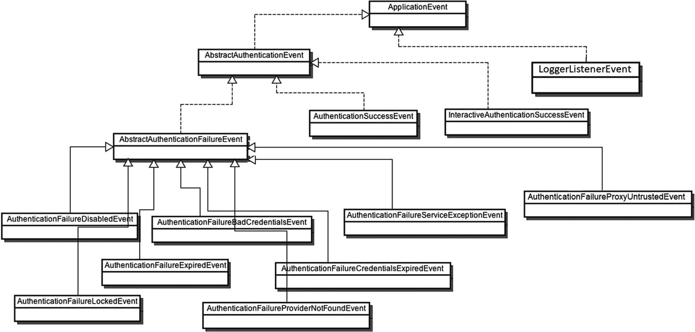

图 8-3
与认证相关的事件类

会话相关事件

这些事件（`org.springframework.security.core.session.SessionCreationEvent` 和 `org.springframework.security.core.session.SessionDestroyedEvent`）直接继承自 `ApplicationEvent`，与用户会话的生命周期相关。它们都由 `HttpSessionEventPublisher` 的实例发布（实际上，发布的是其具体实现子类 `HttpSessionCreatedEvent` 和 `HttpSessionDestroyedEvent`）。`HttpSessionEventPublisher` 是标准 Servlet 接口 `HttpSessionListener` 的一个实现，它允许 `HttpSessionEventPublisher` 创建会话生命周期监听器。该实现需要像任何其他 `HttpSessionListener` 一样在 `web.xml` 文件中被引用。这两个与会话相关的事件与 `HttpSessionListener` 接口定义的两个方法一一对应。这些方法是：

```
void sessionCreated(HttpSessionEvent se)
void sessionDestroyed(HttpSessionEvent se)
```

以上就是您在 Spring Security 中发布和处理事件所需了解的全部理论。接下来，您将看到一个非常简单的示例，您将把这些知识付诸实践，通过监听事件为您的应用程序添加行为。
此示例将只监听一种类型的事件，但监听更多类型所需的配置是完全相同的。您实现相同的接口，但只需在泛型类型中指定不同的事件类型即可。

要开始监听事件，您需要做的就是实现 `ApplicationListener` 接口，并在 Spring 应用程序上下文中配置实现该接口的 Bean。清单 8-1 展示了一个简单的实现，它记录了 `AuthenticationFailureBadCredentialsEvent` 事件。

```
package com.apress.pss.security;
import org.apache.commons.logging.Log;
import org.apache.commons.logging.LogFactory;
import org.springframework.context.ApplicationListener;
import org.springframework.security.authentication.event.AuthenticationFailureBadCredentialsEvent;
public class LoggerBadCredentialsEvents implements ApplicationListener{
private static Log LOG = LogFactory.getLog(LoggerBadCredentialsEvents.class);
public void onApplicationEvent(
AuthenticationFailureBadCredentialsEvent event) {
LOG.warn("检测到使用错误凭证尝试登录，用户名为 "+
event.getAuthentication().getName());
}
}
清单 8-1
监听 AuthenticationFailureBadCredentialsEvent 并记录日志的 ApplicationListener
```

监听器的实现非常简单。您只需要实现该接口，并使用您想要监听的事件类来指定其泛型类型。然后，如果您在应用程序上下文中定义了 `LoggerBadCredentialsEvents` 类的一个 Bean 实例，它将被自动注入到 Spring 框架的事件处理系统中，并且每次发布 `AuthenticationFailureBadCredentialsEvent` 时，此监听器都会收到通知。
要定义任何其他事件处理器，您执行相同的操作，但使用您想要监听的正确事件类来指定处理器类的泛型类型。请继续尝试一下。针对不同的事件类型测试此功能应该足够简单。


自定义 AuthenticationProvider 和 UserDetailsService

在上一章中，你已经了解到 Spring 提供了相当多的身份验证选项，以适应你可能在应用程序中遇到的各种不同需求。观察这些不同的身份验证提供程序在你的应用程序中是如何设置的，以及它们被优雅地封装在各自“模块”中的方式，你可能会想到，你应该能够使用自己的身份验证提供程序。事实上，你当然可以，这里我们将通过一个简单的示例向你展示如何操作。

首先，让我们回顾一下身份验证提供程序在你的应用程序中是如何工作的。

Spring Security 中主要的身份验证入口点是 `AuthenticationManager` 接口——特别是 `ProviderManager` 实现。`ProviderManager` 的主要功能是遍历在其上配置的 `AuthenticationProvider` 实现列表，直到其中一个能够对用户进行身份验证（用户信息被封装在某个可用的 `Authentication` 实现对象中），或者，实际上，直到发现没有一个能够进行身份验证，此时它会抛出一个异常。

你在前几章中看到的定义 `ProviderManager` 和 `AuthenticationProvider` 的标准方式如清单 8-2 所示。（尽管类名以及 XML 文件中元素的名称并不完全匹配，但 Spring Security 命名空间 XML 解析机制负责将所示的 `<authentication-manager>` 和 `<authentication-provider>` 元素的组合匹配到前面提到的类。）当你像清单中那样使用命名空间定义一个身份验证管理器和一个身份验证提供程序时，框架会实例化两个 `ProviderManager` 对象，并将其中一个设置为另一个的父级。`ProviderManager` 使用这种方案，它能够建立身份验证管理器的层次结构。首先查询子级 `AuthenticationManager`（以 `ProviderManager` 类的形式）进行身份验证。如果它无法解决身份验证请求，它会检查是否有一个已配置的父级管理器可以查询；如果有，则调用其 authenticate 方法。这种父子关系由 Spring 在启动时管理。

在 `ProviderManager` 实例的父子关系中，其中一个实例在 `AuthenticationProvider` 列表中定义了一个 `DaoAuthenticationProvider` 实例（来自 `<authentication-provider>` 元素），而另一个实例配置了一个 `AnonymousAuthenticationProvider`，这个实例是在使用 `<http>` 元素并定义通用过滤器时定义的。因此，当你使用清单 8-2 中的通用定义时，这两个提供程序是默认使用的。

定义你自己的自定义身份验证提供程序很简单，因为你只需要实现 `org.springframework.security.authentication.AuthenticationProvider` 接口，该接口只定义了两个方法：

```
Authentication authenticate(Authentication authentication)
boolean supports(Class authentication)
```

但实现该接口并不是唯一的选择。如果你要创建的实现依赖于 `UserDetails` 抽象进行身份验证，你可以轻松地扩展 `AbstractUserDetailsAuthenticationProvider`（就像 `DaoAuthenticationProvider` 所做的那样）。`AuthenticationProvider` 中的主要方法是 `public Authentication authenticate(Authentication authentication)` 方法。如你所见，该方法接收一个身份验证对象并返回一个身份验证对象。这两个身份验证对象（接收的和返回的）之间的重要区别在于，返回的 `Authentication` 对象在其 `isAuthenticated` 方法中将返回 `true`（当然，如果身份验证成功），表明现在存在一个完全经过身份验证的对象，而方法中接收的 `Authentication` 对象，该方法将返回 `false`。这是合乎逻辑的工作方式，因为 `Authentication` 对象中的这个方法（`isAuthenticated`）及其返回值，在概念上区分了一个完全经过身份验证的 `Authentication` 对象与一个仅用于在实际应用身份验证逻辑之前包装用户详细信息的 `Authentication` 对象，或者实际上，任何尚未完全通过身份验证和验证的 `Authentication` 对象。

有时，你可能不需要实现整个 `AuthenticationProvider`，而只需要更改获取 `UserDetails` 的位置。例如，当使用 `InMemoryUserDetailsManager` 获取存储在内存中的 `UserDetails`，或使用 `JdbcUserDetailsManager` 获取存储在关系数据库中的 `UserDetails` 时，就是这种情况。当然，你可以创建一个新的 `UserDetailsService` 来从其他来源检索这些 `UserDetails`，这将在接下来的示例中向你展示。图 8-4 说明了 `AuthenticationProvider`（实际上是 `AbstractUserDetailsAuthenticationProvider` 实现）与 `UserDetailsService` 之间的关系。

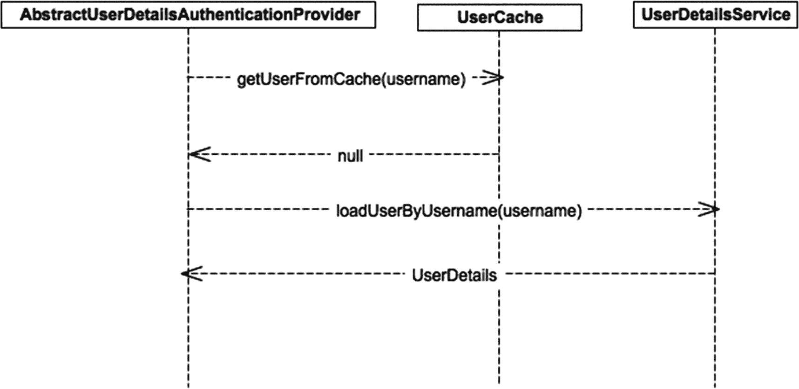

图 8-4
AbstractUserDetailsAuthenticationProvider 与 UserDetailsService 的关系

在图 8-4 中，`AbstractAuthenticationProvider` 和 `UserDetailsService` 都可以被自定义实现替换。默认情况下，UserCache 使用 `NullUserCache` 实现，这是一个无操作缓存。它也可以被轻松替换，但我们在此不进行讨论。缓存的想法是缓存 `UserDetails` 对象，以备需要再次检索它们。`AbstractUserDetailsAuthenticationProvider` 中的 authenticate 方法将首先在此缓存中查找 `UserDetails`；如果 authenticate 方法在缓存中找到了 `UserDetails`，它将使用该 `UserDetails` 尝试进行身份验证。如果 authenticate 方法没有在缓存中找到 `UserDetails`，它将查询配置的 `UserDetailsService` 以获取用户，然后将其存储在缓存中，以供后续请求使用。

```

清单 8-2
AuthenticationManager 和 AuthenticationProvider 的通用定义。需包含在 applicationContext-security.xml 中
```

我们将展示的第一个示例是如何使用 Spring Boot、Spring Security、Spring Data、Thymeleaf 和 MongoDB 创建一个身份验证和登录应用程序。

第一步是使用 Spring Initializr 创建 Spring Boot Maven 项目，这是生成 Spring Boot 项目最快的方式。你只需为你的项目选择语言、构建系统和 JVM 版本，它就会自动生成并包含所有必需的依赖项。


导航至 [`https://start.spring.io/`](https://start.spring.io/)
并使用基于 Web 的 Spring Initializr Spring 项目生成器来
创建名为 SpringSecurityMongoDB 的 Spring Boot Maven 项目，如
图 8-5 所示。

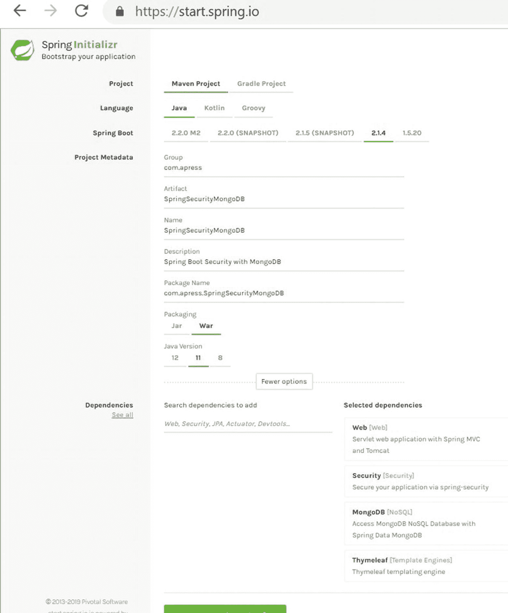

图 8-5
 使用基于 Web 的 Initializr Spring 项目生成器生成 Maven 项目

选择一个 Java v11 Maven 项目，使用 2.1.4 版本的 Spring Boot，并
添加以下依赖项：Web、Security、Thymeleaf 和 MongoDB。
填写所有必需的信息，然后点击生成项目。系统将自动生成一个项目 .zip 文件。
在你的机器上下载并解压该文件。

当使用 IntelliJ IDEA 2019 打开该项目时，它将如图 8-6 所示。

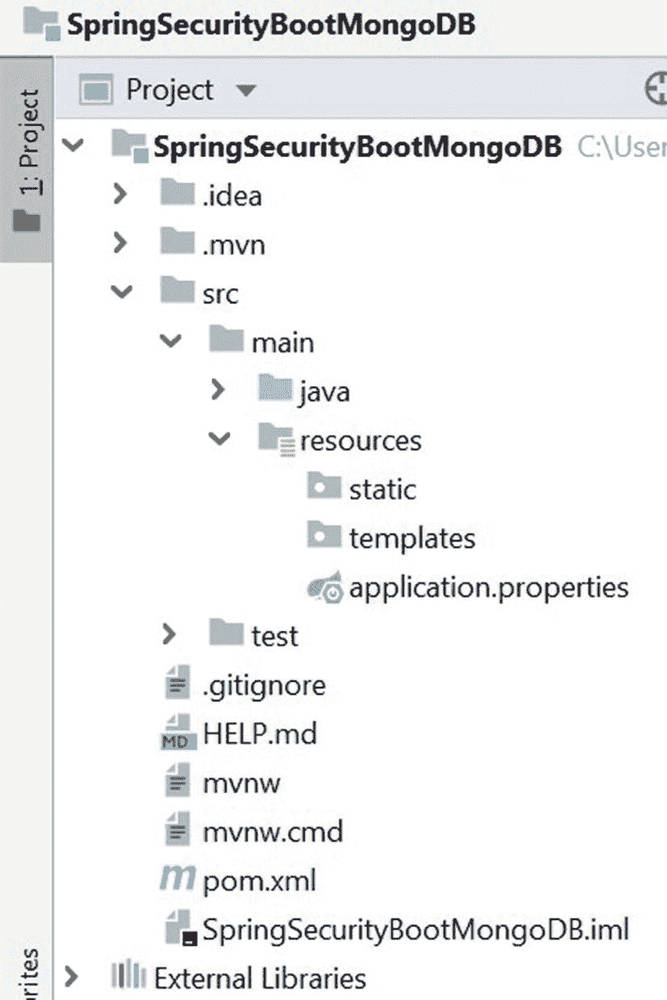

图 8-6
 Maven 项目结构

最重要的依赖项（它们将自动更新到 `pom.xml` 文件中）如代码清单 8-3 所示。

```
org.springframework.boot
spring-boot-starter-data-mongodb

org.springframework.boot
spring-boot-starter-security

org.springframework.boot
spring-boot-starter-web

org.springframework.boot
spring-boot-starter-thymeleaf

org.thymeleaf.extras
thymeleaf-extras-springsecurity5

代码清单 8-3
所需的依赖项
```

添加了依赖项后的完整 `pom.xml` 文件如代码清单 8-4 所示。

```

4.0.0

org.springframework.boot
spring-boot-starter-parent
2.1.4.RELEASE

com.apress
SpringSecurityMongoDB
0.0.1-SNAPSHOT
SpringSecurityMongoDB
Demo project for Spring Boot

org.springframework.boot
spring-boot-starter-data-mongodb

org.springframework.boot
spring-boot-starter-security

org.springframework.boot
spring-boot-starter-web

org.springframework.boot
spring-boot-starter-thymeleaf

org.thymeleaf.extras
thymeleaf-extras-springsecurity5

org.springframework.boot
spring-boot-starter-test
test

org.springframework.security
spring-security-test
test

org.springframework.boot
spring-boot-maven-plugin

代码清单 8-4
Pom.xml 文件及依赖项
```

你将使用 Spring Data 来设置和使用 MongoDB。这并非绝对必要，但由于你正在使用 Spring，因此这似乎是个好主意。根据 Spring Data for MongoDB 网站 ([`https://spring.io/projects/spring-data-mongodb`](https://spring.io/projects/spring-data-mongodb)) 的说法，它“旨在为新的数据存储提供一种熟悉且一致的基于 Spring 的编程模型，同时保留特定于存储的特性和功能。”因此，你拥有一个基于 Spring 的应用程序，并且正在使用 MongoDB，这非常契合。你需要添加到 `pom.xml` 文件中的 MongoDB 依赖项是：

```
org.springframework.boot
spring-boot-starter-data-mongodb

```

注意
MongoDB 可以
以嵌入式模式或作为外部数据库使用。

在本示例中，你将使用外部安装的 MongoDB。
你可以从其官方网站 [`www.mongodb.com/download-center`](https://www.mongodb.com/download-center) 下载它。

下载 .zip 文件后（在我们的例子中是 `mongodb-src-r4.0.8.zip`），你可以简单地将文件解压到某个位置，然后就可以运行了。要在 Linux 或 Mac 上运行 MongoDB 服务器，只需进入你刚刚解压的目录的 bin 目录，然后运行 `./mongod` 文件。如果你使用的是 Windows 10，只需下载 .zip 文件，解压，进入安装文件夹，然后运行命令 `mongod` 来启动它。
现在 MongoDB 已启动并正在运行，如图 8-7 所示。

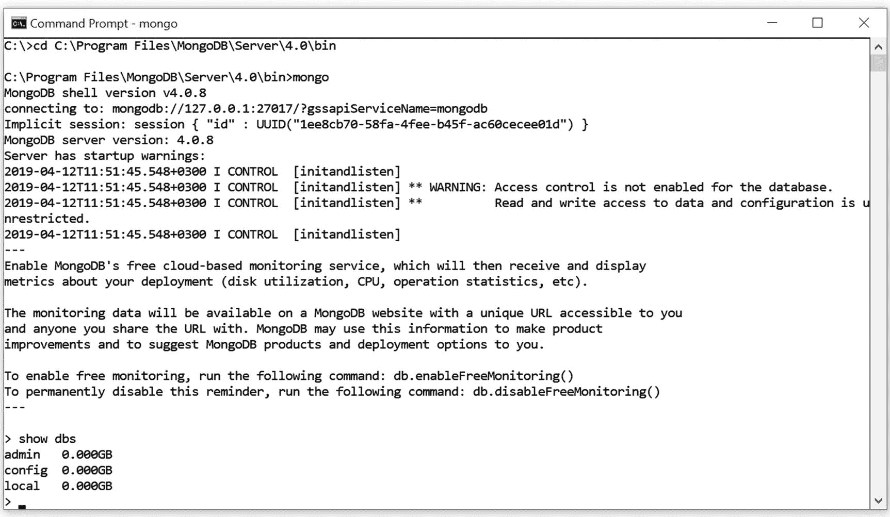

图 8-7
 MongoDB 已启动

注意
MongoDB 是一种
非常流行的基于文档的数据库。它是近年来变得非常流行的许多 NoSQL 解决方案的一部分。它是一个非常强大且灵活的工具。其主要优势在于（至少从我们的角度来看）它将高度可扩展的存储解决方案与建立在已知技术（如命令行界面中的 JSON 和 JavaScript）之上的非常直观的文档模型相结合。而且，它并没有忘记 SQL 世界最好的特性之一，即通过执行动态查询的能力所提供的灵活性，允许你使用非常多样化的标准和过滤选项来查询数据库。这与例如仅允许按键搜索的键值存储解决方案形成对比。正如我们所说，MongoDB 是一个文档存储库，其中的文档结构化为 JSON。MongoDB 将其文档存储在称为*集合*的文档集合中。我们不会进一步解释 MongoDB，除非是为了创建和运行示例所需的内容。如果你有兴趣了解更多信息，网上有很多参考书目可以帮助你，从项目网站开始，特别是这个指向当前相关书籍的链接：[`https://docs.mongodb.com/?_ga=2.266750797.2128884934.1555058402-165371435.1555058402`](https://docs.mongodb.com/%253F_ga%253D2.266750797.2128884934.1555058402-165371435.1555058402)。

对于此示例，你还可以使用 MongoDB Compass 工具，这是一个非常易于使用的 MongoDB 工具，你可以从 [`www.mongodb.com/download-center/compass?jmp=hero`](http://www.mongodb.com/download-center/compass%253Fjmp%253Dhero) 下载。MongoDB Compass 工具仪表板如图 8-8 所示。

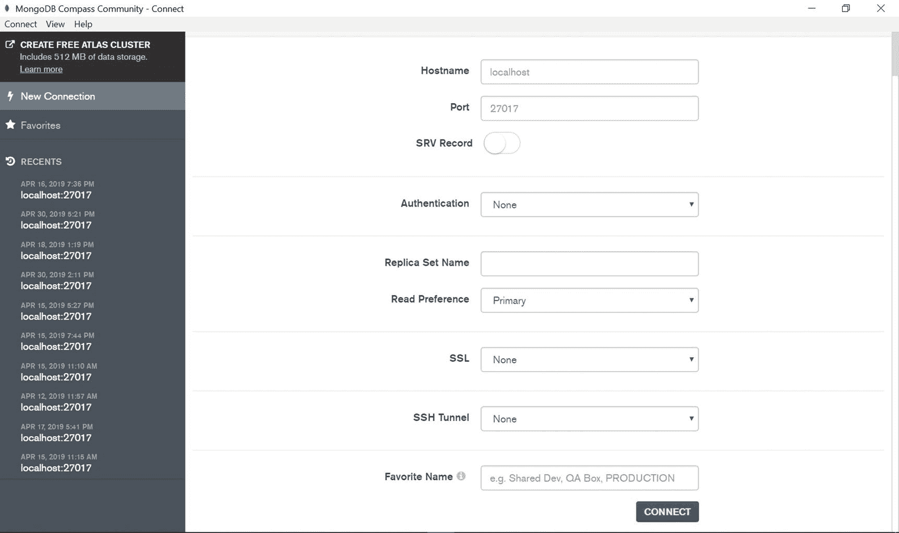

图 8-8
 MongoDB Compass 工具

接下来，通过完成以下步骤，创建本示例所需的名为 `springsecuritymongodb` 的 MongoDB 数据库以及名为 `users` 和 `roles` 的两个集合：

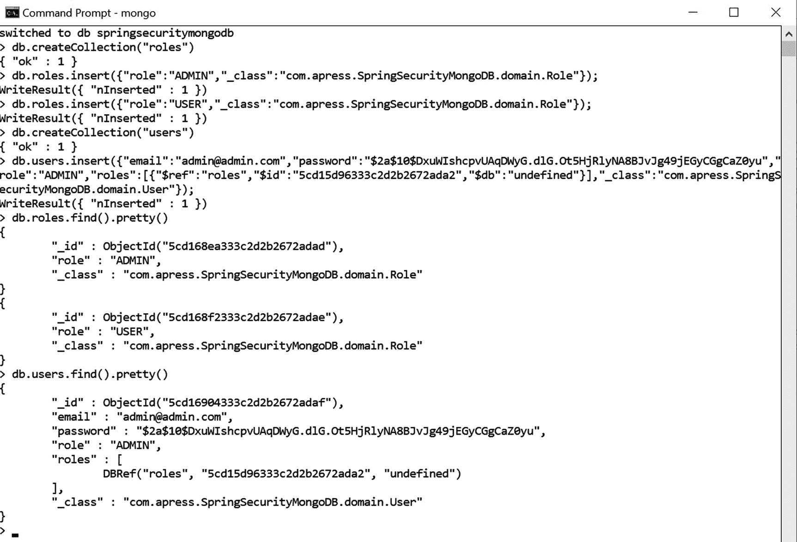

图 8-9
 MongoDB 查看新创建的数据库、集合、用户和角色

1.  进入 MongoDB 的安装目录。

2.  进入 `bin` 文件夹。

3.  执行 `mongo` 命令。

4.  执行图 8-9 中所示的命令。

基本上，你需要两个集合。`roles` 集合仅包含两条记录，用于定义注册用户拥有 `ADMIN` 还是 `USER` 凭据来访问示例。首先创建 `roles` 集合，然后添加两条记录：

```
db.createCollection("roles")
db.roles.insert({"role":"ADMIN","_class":"com.apress.SpringSecurityMongoDB.domain.Role"});
db.roles.insert({"role":"USER","_class":"com.apress.SpringSecurityMongoDB.domain.Role"});
```

然后创建另一个名为 `users` 的集合，其中添加一个具有 `ADMIN` 凭据的新用户：

```
db.createCollection("users")
db.users.insert({"email":"admin@admin.com","password":"$2a$10$qNYHb8JtRrREzSFKEwXfA.230HTujndUR0qCTPsGP8.FqWetlSqmC","role":"ADMIN","roles":[{"$ref":"role","$id":"5cd04193dca5753dec0b07e9","$db":""}],"_class":"com.apress.SpringSecurityMongoDB.domain.User"});
```


`roles ":[{"$ref":"role","$id":"5cd04193dca5753dec0b07e9","$db":""}]` 会将此用户管理员链接到 `roles` 集合中的 `ADMIN` 角色，以便他们能够以管理员身份进行身份验证。您已成功创建了一个管理员用户，用作本示例的管理员。

其核心思想是：某个用户与特定角色（`ADMIN` 或 `USER`）相关联，并可根据该凭证访问示例中的相应部分。请注意，如果您不想通过命令行添加用户，也可以使用本章稍后介绍的 `signup.html` 页面，将用户添加到 MongoDB 中。

现在，让我们基于您刚刚创建的项目，来构建 Spring Boot Security v5 和 MongoDB 的示例。

通过 `application.properties` 文件为应用程序添加一些属性：

```
spring.data.mongodb.database=springsecuritymongodb
spring.data.mongodb.host=localhost
spring.data.mongodb.port=27017
spring.freemarker.template-loader-path=/templates
spring.freemarker.expose-request-attributes=true
spring.freemarker.expose-spring-macro-helpers=true
spring.mvc.view.prefix=/resources/templates
spring.mvc.view.suffix=.html
server.error.whitelabel.enabled=false
```

您正在告知应用程序要使用的 MongoDB 数据库名称、主机和端口号。此外，由于本示例将使用 Freemarker 模板，您还需要添加一些信息，例如模板的位置，以及应用程序是否可以使用请求属性和宏辅助工具。您还定义了一些 Spring MVC 视图属性，并将 `server.error.whitelabel.enabled` 设置为 `false`，以便在示例中创建自定义错误页面。

现在开始创建示例。所有 Web 资源都将使用 HTML 模板创建。

通常，Spring Web 框架是围绕模型-视图-控制器（MVC）模式构建的，用于在应用程序中轻松分离内容。它允许我们使用多种不同的视图技术，例如：

*   Java 服务器页面（JSP）
*   Thymeleaf（用于处理 HTML、XML、文本、JavaScript 或 CSS）
*   FreeMarker（用于 XML 文件、配置文件、电子邮件和其他基于文本的格式）
*   Groovy（用于生成任何文本格式）
*   Jade4j（用于生成 HTML 文件）

在本示例中，您将使用 Thymeleaf 来处理 HTML 文件。创建第一个名为 `welcome.html` 的 HTML 文件，如清单 8-5 所示。

```

Spring Boot Security 5 and MongoDB 示例

欢迎来到 Spring Boot Security 5 和 MongoDB 示例！
请登录。

清单 8-5
welcome.html
```

下一步是创建所需的示例 Java 类。

您的 Spring Boot Security 和 MongoDB 示例将包含以下 Java 包：

*   configuration
*   controller
*   domain
*   repositories
*   service

现在，您将创建本示例中最重要的 Java 类 `SpringSecurityConfiguration`，如清单 8-6 所示。

```
package com.apress.SpringSecurityMongoDB.configuration;
import com.apress.SpringSecurityMongoDB.service.CustomUserDetailsService;
import org.springframework.beans.factory.annotation.Autowired;
import org.springframework.context.annotation.Bean;
import org.springframework.context.annotation.Configuration;
import org.springframework.security.config.annotation.authentication.builders.AuthenticationManagerBuilder;
import org.springframework.security.config.annotation.web.builders.HttpSecurity;
import org.springframework.security.config.annotation.web.builders.WebSecurity;
import org.springframework.security.config.annotation.web.configuration.EnableWebSecurity;
import org.springframework.security.config.annotation.web.configuration.WebSecurityConfigurerAdapter;
import org.springframework.security.core.userdetails.UserDetailsService;
import org.springframework.security.crypto.bcrypt.BCryptPasswordEncoder;
import org.springframework.security.web.util.matcher.AntPathRequestMatcher;
@Configuration
@EnableWebSecurity
public class SpringSecurityConfiguration extends WebSecurityConfigurerAdapter {
@Autowired
private BCryptPasswordEncoder bCryptPasswordEncoder;
@Autowired
CustomizeAuthenticationSuccessHandler customizeAuthenticationSuccessHandler;
@Bean
public UserDetailsService mongoUserDetails() {
return new CustomUserDetailsService();
}
@Override
protected void configure(AuthenticationManagerBuilder auth) throws Exception {
UserDetailsService userDetailsService = mongoUserDetails();
auth
.userDetailsService(userDetailsService)
.passwordEncoder(bCryptPasswordEncoder);
}
@Override
protected void configure(HttpSecurity http) throws Exception {
http
.authorizeRequests()
.antMatchers("/").permitAll()
.antMatchers("/login").permitAll()
.antMatchers("/signup").permitAll()
.antMatchers("/user/**").hasAnyAuthority("USER").anyRequest().authenticated().antMatchers("/admin/**").hasAnyAuthority("ADMIN").anyRequest()
.authenticated().and().formLogin().successHandler(customizeAuthenticationSuccessHandler)
.loginPage("/login").failureUrl("/login?error=true")
.usernameParameter("email")
.passwordParameter("password")
.and().logout()
.logoutRequestMatcher(new AntPathRequestMatcher("/logout"))
.logoutSuccessUrl("/").and().exceptionHandling().accessDeniedPage("/forbidden");
}
@Override
public void configure(WebSecurity web) throws Exception {
web
.ignoring()
.antMatchers("/resources/**");
}
@Bean
public BCryptPasswordEncoder passwordEncoder() {
BCryptPasswordEncoder bCryptPasswordEncoder = new BCryptPasswordEncoder();
return bCryptPasswordEncoder;
}
}
清单 8-6
SpringSecurityConfiguration Java 类
```

该应用程序将包含：

*   `BCryptPasswordEncoder:` 用于处理 BCrypt 密码
*   `CustomizeAuthenticationSuccessHandler:` 用于自定义登录成功处理器
*   `Configure(HttpSecurity http):` 包含所有关于可访问哪些 URL 以及如何访问的信息。例如，用户和管理员 URL 将分别要求 `hasAnyAuthority("USER")` 和 `hasAnyAuthority("ADMIN")`。
*   `Configure(WebSecurity web):` 本示例使用的资源文件夹

下一个 Java 类是 `LoginController`。为了启动 `welcome.html` 模板，您需要添加清单 8-7 中的代码。

```
@RequestMapping(value = {"/","/welcome"}, method = RequestMethod.GET)
public ModelAndView home() {
ModelAndView modelAndView = new ModelAndView();
modelAndView.setViewName("welcome");
return modelAndView;
}
清单 8-7
LoginController Java 类
```

该应用程序已准备好作为一个简单的欢迎网页进行测试。

您可以使用 Spring Boot 配置构建项目，并在 Tomcat Server v9 上运行它，如图 8-10 和 8-11 所示。

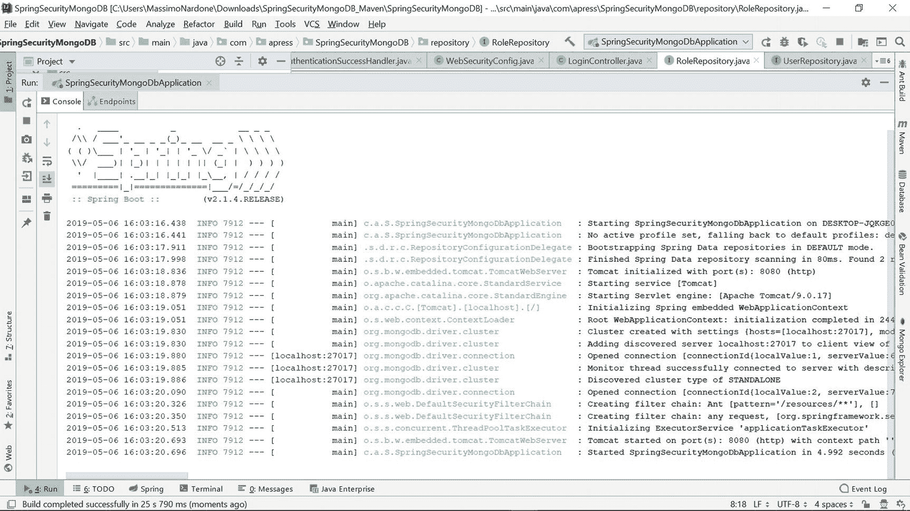

图 8-11
运行 Spring Boot 项目


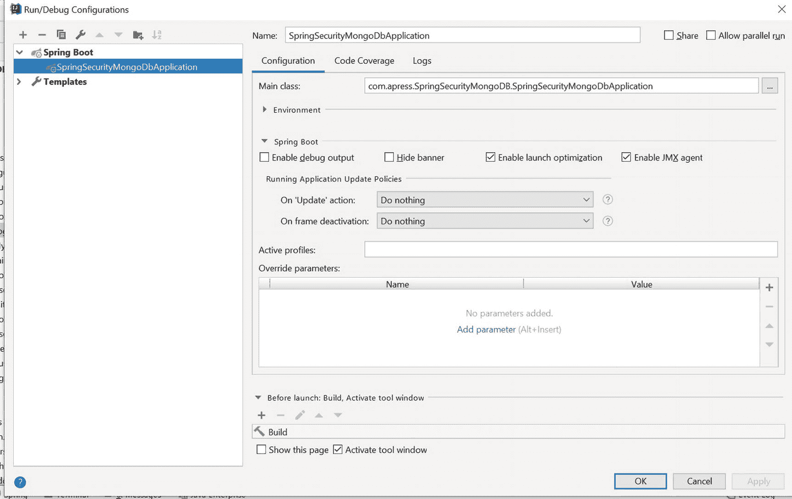

图 8-10
配置第一个 Maven 项目的运行步骤

如果你访问 `http://localhost:8080/`，
你将看到图 8-12 所示的 `welcome.html` 页面。

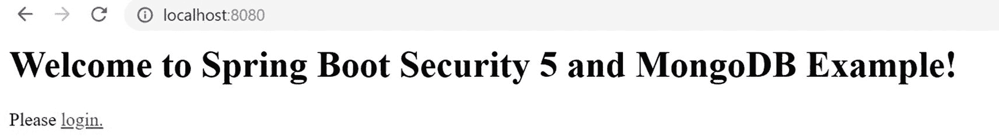

图 8-12
welcome.html 页面

现在，你的第一个 HTML 文件已经成功运行。接下来，你可以开始使用 MongoDB 和 Spring Security v5 构建示例的其余部分。

下一步是创建一个名为 `CustomizeAuthenticationSuccessHandler` 的 Java 类，该类将用于处理自定义的登录成功页面；参见清单 8-8。

```
package com.apress.SpringSecurityMongoDB.configuration;
import org.springframework.security.core.Authentication;
import org.springframework.security.core.GrantedAuthority;
import org.springframework.security.web.authentication.AuthenticationSuccessHandler;
import org.springframework.stereotype.Component;
import javax.servlet.ServletException;
import javax.servlet.http.HttpServletRequest;
import javax.servlet.http.HttpServletResponse;
import java.io.IOException;
@Component
public class CustomizeAuthenticationSuccessHandler implements AuthenticationSuccessHandler {
@Override
public void onAuthenticationSuccess(HttpServletRequest request,
HttpServletResponse response, Authentication authentication)
throws IOException, ServletException {
response.setStatus(HttpServletResponse.SC_OK);
for (GrantedAuthority auth : authentication.getAuthorities()) {
if ("ADMIN".equals(auth.getAuthority())) {
response.sendRedirect("/admin");
}
if ("USER".equals(auth.getAuthority())) {
response.sendRedirect("/user");
}
}
}
}
清单 8-8
CustomizeAuthenticationSuccessHandler Java 类
```

这个 Java 类简单地检查尝试登录的用户的 `authentication.getAuthorities` 是否等于 `ADMIN`，如果是，则重定向到 `/admin` 页面；或者如果是 `USER`，则重定向到 `/user` 网页。它是在 `SpringSecurityConfiguration` Java 类中通过配置 `.authenticated().and().formLogin().successHandler(`**customizeAuthenticationSuccessHandler**`)` 来配置的。

现在，创建清单 8-9 中所示的简单 `login.html` 页面。

```

Spinrg Boot Security 5 and MongoDB

Please login as user or admin:

Invalid email and password.

Email Address:

Password:

Login

Signup as a new user

清单 8-9
login.html 页面
```

这个 `login.html` 页面将执行三项操作：

1.  将电子邮件地址和密码以 HTTP POST 方法发送到 `LoginController` Java 类。
2.  检查电子邮件和密码是否输入正确。
3.  提供注册选项，以便向 MongoDB 数据库添加新用户。

为了检查用户的凭据是否有效以及他们应该被重定向到哪里，创建名为 `LoginController` 的 Java 控制器类，如清单 8-10 所示。

```
package com.apress.SpringSecurityMongoDB.controller;
import com.apress.SpringSecurityMongoDB.domain.User;
import com.apress.SpringSecurityMongoDB.service.CustomUserDetailsService;
import org.springframework.beans.factory.annotation.Autowired;
import org.springframework.security.core.Authentication;
import org.springframework.security.core.context.SecurityContextHolder;
import org.springframework.stereotype.Controller;
import org.springframework.validation.BindingResult;
import org.springframework.web.bind.annotation.RequestMapping;
import org.springframework.web.bind.annotation.RequestMethod;
import org.springframework.web.servlet.ModelAndView;
import javax.validation.Valid;
@Controller
public class LoginController {
@Autowired
private CustomUserDetailsService userService;
@RequestMapping(value = "/login", method = RequestMethod.GET)
public ModelAndView login() {
ModelAndView modelAndView = new ModelAndView();
modelAndView.setViewName("login");
return modelAndView;
}
@RequestMapping(value = "/signup", method = RequestMethod.GET)
public ModelAndView signup() {
ModelAndView modelAndView = new ModelAndView();
User user = new User();
modelAndView.addObject("user", user);
modelAndView.setViewName("signup");
return modelAndView;
}
@RequestMapping(value = "/signup", method = RequestMethod.POST)
public ModelAndView createNewUser(@Valid User user, BindingResult bindingResult) {
ModelAndView modelAndView = new ModelAndView();
User userExists = userService.findUserByEmail(user.getEmail());
if (userExists != null) {
modelAndView.addObject("message", "There is already a user registered with the username provided");
bindingResult
.rejectValue("email", "error.user",
"There is already a user registered with the username provided");
}
if (bindingResult.hasErrors()) {
modelAndView.setViewName("signup");
} else {
userService.saveUser(user);
modelAndView.addObject("successMessage", "User has been registered successfully");
modelAndView.addObject("user", new User());
modelAndView.setViewName("login");
}
return modelAndView;
}
@RequestMapping(value = "/admin", method = RequestMethod.GET)
public ModelAndView admin() {
ModelAndView modelAndView = new ModelAndView();
Authentication auth = SecurityContextHolder.getContext().getAuthentication();
User user = userService.findUserByEmail(auth.getName());
modelAndView.addObject("currentUser", auth.getName());
modelAndView.addObject("role", user.getRole());
modelAndView.addObject("adminMessage", "Content Available Only for Authenticated Admins!");
modelAndView.setViewName("admin");
return modelAndView;
}
@RequestMapping(value = "/user", method = RequestMethod.GET)
public ModelAndView user() {
ModelAndView modelAndView = new ModelAndView();
Authentication auth = SecurityContextHolder.getContext().getAuthentication();
User user = userService.findUserByEmail(auth.getName());
modelAndView.addObject("currentUser", auth.getName());
modelAndView.addObject("role", user.getRole());
modelAndView.addObject("userMessage", "Content Available Only for Authenticated Users!");
modelAndView.setViewName("user");
return modelAndView;
}
@RequestMapping(value = {"/","/welcome"}, method = RequestMethod.GET)
public ModelAndView home() {
ModelAndView modelAndView = new ModelAndView();
modelAndView.setViewName("welcome");
return modelAndView;
}
@RequestMapping(value = {"/forbidden"}, method = RequestMethod.GET)
public ModelAndView forbidden() {
ModelAndView modelAndView = new ModelAndView();
modelAndView.setViewName("forbidden");
return modelAndView;
}
}
清单 8-10
LoginController Java 类
```

这个 Java 类充当页面控制器，根据请求的 URL，将重定向到诸如 welcome、forbidden 等页面。当请求 `/admin` 或 `/user` URL 时，该 Java 类将验证用户凭据是否正确，以便重定向到目标页面。`modelAndView.addObject` 用于收集要在 HTML 页面上显示的信息和消息。


所有页面错误都将通过 Java 控制器类 `MyErrorController` 进行管理，如清单 8-11 所示。

```
package com.apress.SpringSecurityMongoDB.controller;
import org.springframework.boot.web.servlet.error.ErrorController;
import org.springframework.stereotype.Controller;
import org.springframework.web.bind.annotation.GetMapping;
import javax.servlet.http.HttpServletRequest;
import org.springframework.web.servlet.ModelAndView;
@Controller
public class MyErrorController implements ErrorController {
public MyErrorController() {}
@GetMapping(value = "/error")
public ModelAndView renderErrorPage(HttpServletRequest httpRequest) {
ModelAndView errorPage = new ModelAndView("errorPage");
String errorMsg = "";
int httpErrorCode = getErrorCode(httpRequest);
switch (httpErrorCode) {
case 400: {
errorMsg = "Http 错误代码：400。错误请求";
break;
}
case 401: {
errorMsg = "Http 错误代码：401。未授权";
break;
}
case 404: {
errorMsg = "Http 错误代码：404。未找到资源";
break;
}
case 500: {
errorMsg = "Http 错误代码：500。服务器内部错误";
break;
}
}
errorPage.addObject("errorMsg", errorMsg);
return errorPage;
}
private int getErrorCode(HttpServletRequest httpRequest) {
return (Integer) httpRequest
.getAttribute("javax.servlet.error.status_code");
}
@Override
public String getErrorPath() {
return "/error";
}
}
清单 8-11
MyErrorController Java 类
```

当出现白标错误时，此 Java 类将重定向到 `errorPage.html` 页面，该页面将显示从 Java 类接收到的错误消息。
请注意，这需要在 `application.properties` 中添加以下行才能生效：

```
server.error.whitelabel.enabled=false
```

`errorPage.html` 页面如清单 8-12 所示。

```

Security with Spring Boot

Error on page!

Home

清单 8-12
errorPage.html 网页
```

`errorpage.html` 页面如图 8-13 所示。

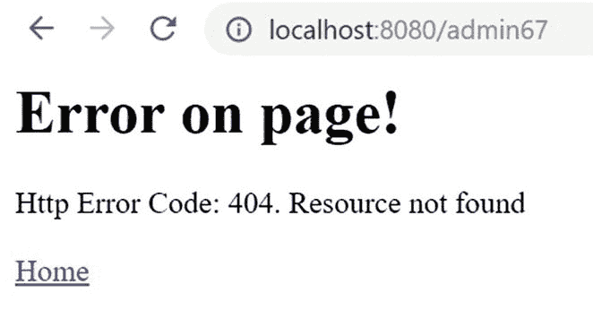

图 8-13
errorPage.html 页面

如果请求了一个禁止访问的页面，`LoginController` Java 类将重定向到 `forbidden.html` 页面，该页面如清单 8-13 所示。这是在 `SpringSecurityConfiguration` Java 类中配置的，如下所示：

```

Security with Spring Boot

Error on page!
Errortype: 
Home

清单 8-13
forbidden.html 网页
```

```
exceptionHandling().accessDeniedPage("/forbidden");
```

`forbidden.html` 页面如图 8-14 所示。

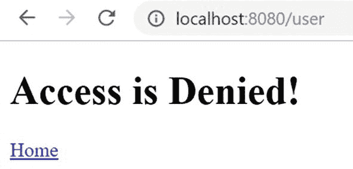

图 8-14
forbidden.html 页面

下一步是创建你需要的模型，命名为 `User` 和 `Role`，它们将存储 MongoDB 集合。首先，创建如清单 8-14 所示的 `User` 模型。

```
package com.apress.SpringSecurityMongoDB.domain;
import org.springframework.data.annotation.Id;
import org.springframework.data.mongodb.core.index.IndexDirection;
import org.springframework.data.mongodb.core.index.Indexed;
import org.springframework.data.mongodb.core.mapping.DBRef;
import org.springframework.data.mongodb.core.mapping.Document;
import java.util.Set;
@Document(collection = "users")
public class User {
@Id
private String id;
@Indexed(unique = true, direction = IndexDirection.DESCENDING)
private String email;
private String password;
private String role;
@DBRef
private Set roles;
public String getId() {
return id;
}
public void setId(String id) {
this.id = id;
}
public String getEmail() {
return email;
}
public void setEmail(String email) {
this.email = email;
}
public String getPassword() {
return password;
}
public void setPassword(String password) {
this.password = password;
}
public String getRole() {
return role;
}
public void setRole(String role) {
this.role = role;
}
public Set getRoles() {
return roles;
}
public void setRoles(Set roles) {
this.roles = roles;
}
@Override
public String toString() {
return "User{" +
"id=" + id +
", email='" + email.replaceFirst("@.*", "@***") +
", password='" + password.substring(0, 10) +
", role=" + role +
'}';
}
}
清单 8-14
User Java 类
```

基本上，这个 `User` Java 类将管理从 MongoDB 获取和添加用户数据。例如，对于电子邮件地址，以下代码将获取电子邮件并将电子邮件值设置到 MongoDB 数据库中：

```
public String getEmail() {
return email;
}
public void setEmail(String email) {
this.email = email;
}
```

以相同的方式创建 `Role` 模型，如清单 8-15 所示。

```
package com.apress.SpringSecurityMongoDB.domain;
import org.springframework.data.annotation.Id;
import org.springframework.data.mongodb.core.index.IndexDirection;
import org.springframework.data.mongodb.core.index.Indexed;
import org.springframework.data.mongodb.core.mapping.Document;
@Document(collection = "roles")
public class Role {
@Id
private String id;
@Indexed(unique = true, direction = IndexDirection.DESCENDING)
private String role;
public String getId() {
return id;
}
public void setId(String id) {
this.id = id;
}
public String getRole() {
return role;
}
public void setRole(String role) {
this.role = role;
}
}
清单 8-15
Role Java 类
```

同样，与 `User` Java 类一样，`get` 和 `set` 将用于从 MongoDB 数据库获取数据和设置数据。

下一步是创建两个 Java 仓库接口，一个用于 `User`，一个用于 `Role`，以便从数据库中查找电子邮件和角色值。它们如清单 8-16 和 8-17 所示。

```
package com.apress.SpringSecurityMongoDB.repository;
import com.apress.SpringSecurityMongoDB.domain.Role;
import org.springframework.data.mongodb.repository.MongoRepository;
public interface RoleRepository extends MongoRepository {
Role findByRole(String role);
}
清单 8-17
Role Java 接口
```

```
package com.apress.SpringSecurityMongoDB.repository;
import com.apress.SpringSecurityMongoDB.domain.User;
import org.springframework.data.mongodb.repository.MongoRepository;
public interface UserRepository extends MongoRepository {
User findByEmail(String email);
}
清单 8-16
User Java 接口
```

下一步是创建 `SpringSecurityMongoDbApplication`，用于为新注册的用户设置 `ADMIN` 或 `USER` 的凭证值，如清单 8-18 所示。


```
package com.apress.SpringSecurityMongoDB;
import com.apress.SpringSecurityMongoDB.domain.Role;
import com.apress.SpringSecurityMongoDB.repository.RoleRepository;
import org.springframework.boot.CommandLineRunner;
import org.springframework.boot.SpringApplication;
import org.springframework.boot.autoconfigure.SpringBootApplication;
import org.springframework.context.annotation.Bean;
@SpringBootApplication
public class SpringSecurityMongoDbApplication {
public static void main(String[] args) {
SpringApplication.run(SpringSecurityMongoDbApplication.class, args);
}
@Bean
CommandLineRunner init(RoleRepository roleRepository) {
return args -> {
Role adminRole = roleRepository.findByRole("ADMIN");
if (adminRole == null) {
Role newAdminRole = new Role();
newAdminRole.setRole("ADMIN");
roleRepository.save(newAdminRole);
}
Role userRole = roleRepository.findByRole("USER");
if (userRole == null) {
Role newUserRole = new Role();
newUserRole.setRole("USER");
roleRepository.save(newUserRole);
}
};
}
}
清单 8-18
login.html 页面
```

`SpringSecurityMongoDbApplication` 类从 `login.html` 页面接收用户凭证值，并通过以下代码行创建并设置该值：

对于 `Role`：

```
Role newUserRole = new Role();
newUserRole.setRole("USER");
roleRepository.save(newUserRole);
```

对于 `User`：

```
Role newAdminRole = new Role();
newAdminRole.setRole("ADMIN");
roleRepository.save(newAdminRole);
```

下一个 Java 类是 `CustomUserDetailsService`，这是一个实现 Spring Security 用户详情服务所需的用户功能 Java 服务类。如清单 8-19 所示。

```
package com.apress.SpringSecurityMongoDB.service;
import com.apress.SpringSecurityMongoDB.domain.Role;
import com.apress.SpringSecurityMongoDB.domain.User;
import com.apress.SpringSecurityMongoDB.repository.RoleRepository;
import com.apress.SpringSecurityMongoDB.repository.UserRepository;
import org.springframework.beans.factory.annotation.Autowired;
import org.springframework.security.core.GrantedAuthority;
import org.springframework.security.core.authority.SimpleGrantedAuthority;
import org.springframework.security.core.userdetails.UserDetails;
import org.springframework.security.core.userdetails.UserDetailsService;
import org.springframework.security.core.userdetails.UsernameNotFoundException;
import org.springframework.security.crypto.bcrypt.BCryptPasswordEncoder;
import org.springframework.stereotype.Service;
import java.util.*;
@Service
public class CustomUserDetailsService implements UserDetailsService {
@Autowired
private UserRepository userRepository;
@Autowired
private RoleRepository roleRepository;
@Autowired
private BCryptPasswordEncoder bCryptPasswordEncoder;
public User findUserByEmail(String email) {
return userRepository.findByEmail(email);
}
public void saveUser(User user) {
user.setPassword(bCryptPasswordEncoder.encode(user.getPassword()));
String getroletype;
getroletype = user.getRole();
Role userRole = roleRepository.findByRole(getroletype);
user.setRoles(new HashSet(Arrays.asList(userRole)));
userRepository.save(user);
}
@Override
public UserDetails loadUserByUsername(String email) throws UsernameNotFoundException {
User user = userRepository.findByEmail(email);
if(user != null) {
List authorities = getUserAuthority(user.getRoles());
return buildUserForAuthentication(user, authorities);
} else {
throw new UsernameNotFoundException("username not found");
}
}
private List getUserAuthority(Set userRoles) {
Set roles = new HashSet();
userRoles.forEach((role) -> {
roles.add(new SimpleGrantedAuthority(role.getRole()));
});
List grantedAuthorities = new ArrayList(roles);
return grantedAuthorities;
}
private UserDetails buildUserForAuthentication(User user, List authorities) {
return new org.springframework.security.core.userdetails.User(user.getEmail(), user.getPassword(), authorities);
}
}
清单 8-19
CustomUserDetailsService Java 类
```


当您需要执行以下操作时，可使用此 Java 类：

*   通过 `findUserByEmail()` 和 `loadUserByUsername()` 加载用户信息，例如电子邮件地址或用户的 `GrantedAuthority` 列表
*   通过 `saveUser()` 保存新用户
*   通过 `getUserAuthority()` 获取用户权限
*   通过 `buildUserForAuthentication()` 构建用于身份验证的用户

请注意，您需要 `return a new org.springframework.security.core.userdetails.User()` 来存储用户身份验证凭证，包括电子邮件、密码和权限。

现在，您终于可以创建 `login.html` 页面了；请参见清单 8-20。

```

Spinrg Boot Security 5 and MongoDB

请以用户或管理员身份登录：

无效的电子邮件或密码。

电子邮件地址：

密码：

登录

注册为新用户

清单 8-20
login.html 页面
```

`login.html` 页面收集登录所需的信息（如电子邮件和密码），并通过 POST 方法将其发送到 `/login` URL，该 URL 将通过 `LoginController` Java 类使用以下代码行进行验证：

```
@RequestMapping(value = "/login", method = RequestMethod.GET)
public ModelAndView login() {
ModelAndView modelAndView = new ModelAndView();
modelAndView.setViewName("login");
return modelAndView;
```

`login.html` 页面如图 8-15 所示。

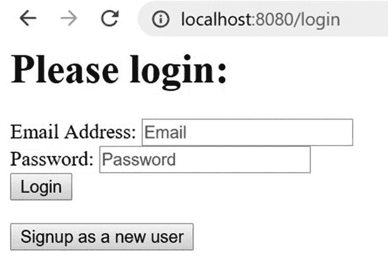

图 8-15
login.html 页面

如果电子邮件或密码值无效，将显示错误消息“Invalid email and password”，如图 8-16 所示。

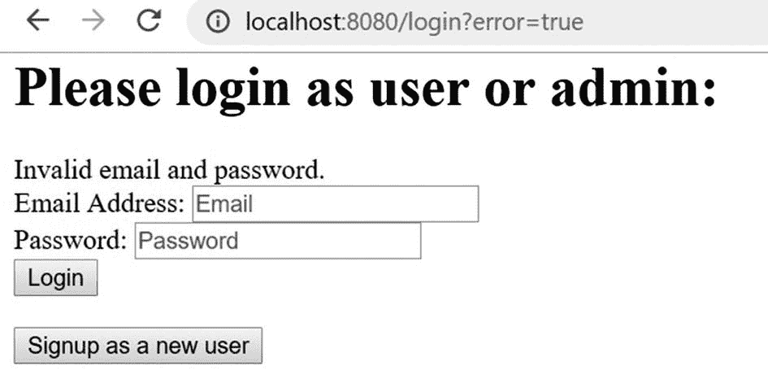

图 8-16
无效的电子邮件和密码

如果用户被认证为 `User`，她将被重定向到 `user.html` 页面，该页面如清单 8-21 所示。

```

Spring Security 5 and MongoDB.

欢迎 [[${#httpServletRequest.remoteUser}]]！
您已成功以认证用户身份登录！

此内容仅对认证用户显示。

此内容仅对具有“USER”权限的用户显示。

清单 8-21
user.html 页面
```

请注意，您通过 Thymeleaf 使用了 `sec:authorize="isAuthenticated()"` 和 `sec:authorize="hasAnyAuthority('USER')"` 来确定用户是否已实际认证以及她是否拥有 `USER` 权限。

`user.html` 页面如图 8-17 所示。

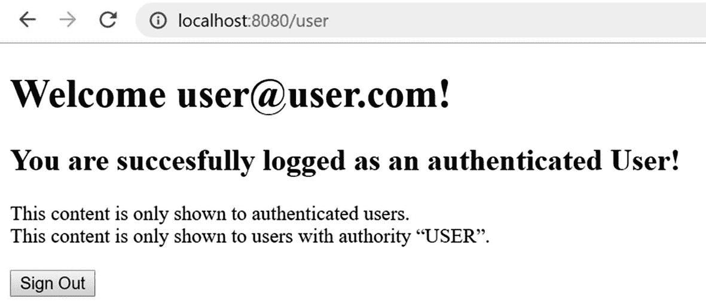

图 8-17
user.html 页面

点击“退出”按钮即可注销。

如果用户被认证为 `ADMIN`，她将被重定向到 `admin.html` 页面，该页面如清单 8-22 所示。

```

Spring Security 5 and MongoDB.

欢迎 [[${#httpServletRequest.remoteUser}]]！
您已成功以管理员身份登录！

N1：此内容仅对认证用户显示。

N2：此内容仅对管理员显示。

点击此处查看所有注册用户。

清单 8-22
admin.html 页面
```

与您在 `user.html` 页面中所做的一样，在 `admin.html` 页面中，您通过 Thymeleaf 使用了 `sec:authorize="isAuthenticated()"` 和 `sec:authorize="hasAnyAuthority('ADMIN')"` 来确定用户是否已实际认证以及她是否拥有 `ADMIN` 权限。

`admin.html` 页面如图 8-18 所示。

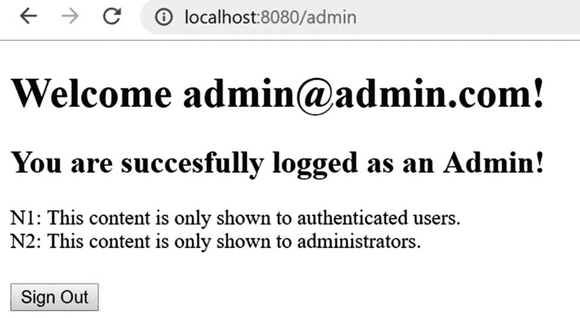

图 8-18
admin.html 页面

点击“退出”按钮即可注销。

现在，如果您希望在 MongoDB 中创建一个新用户，请选择点击 `login.html` 页面上的“`Signup as a new user`”按钮，并通过 HTTP GET 方法发送到 `/signup` 页面，该页面将通过 `LoginController` Java 类使用以下代码行进行验证：

```
@RequestMapping(value = "/signup", method = RequestMethod.GET)
public ModelAndView signup() {
ModelAndView modelAndView = new ModelAndView();
User user = new User();
modelAndView.addObject("user", user);
modelAndView.setViewName("signup");
return modelAndView;
}
```

如果您想在 MongoDB 数据库中添加一个新用户，请调用清单 8-23 中所示的 `signup.html` 页面。

```

Spring Boot Security 5 and MongoDB 示例

向 MongoDB 添加新用户。
电子邮件地址：

密码：

角色：

USER
ADMIN

添加新用户

清单 8-23
signup.html 页面
```

`Signup.html` 将触发 `LoginController` 处理 `/signup` HTTP POST 方法，如下所示：

```
@RequestMapping(value = "/signup", method = RequestMethod.POST)
public ModelAndView createNewUser(@Valid User user, BindingResult bindingResult) {
ModelAndView modelAndView = new ModelAndView();
User userExists = userService.findUserByEmail(user.getEmail());
if (userExists != null) {
modelAndView.addObject("message", "提供的用户名已在数据库中注册！ ");
bindingResult
.rejectValue("email", "error.user",
"提供的用户名已在数据库中注册！");
}
if (bindingResult.hasErrors()) {
modelAndView.setViewName("signup");
} else {
userService.saveUser(user);
modelAndView.addObject("successMessage", "新用户已成功注册");
modelAndView.addObject("user", new User());
modelAndView.setViewName("login");
}
return modelAndView;
}
```

在这种情况下，`LoginController` 类使用 `/signup` HTTP POST 方法将：

*   检查用户电子邮件地址是否已在 MongoDB 数据库中注册，显示消息“提供的用户名已在数据库中注册！”，并重定向回 `/signup`。
*   或者触发创建新用户并显示消息“新用户已成功注册”。

`signup.html` 页面如图 8-19 所示。

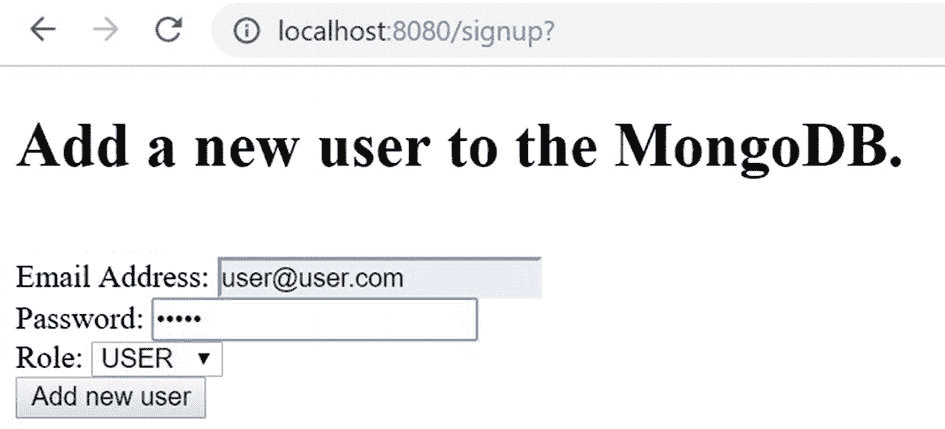

图 8-19
signup.html 页面

您最终完整的项目将如图 8-20 所示。

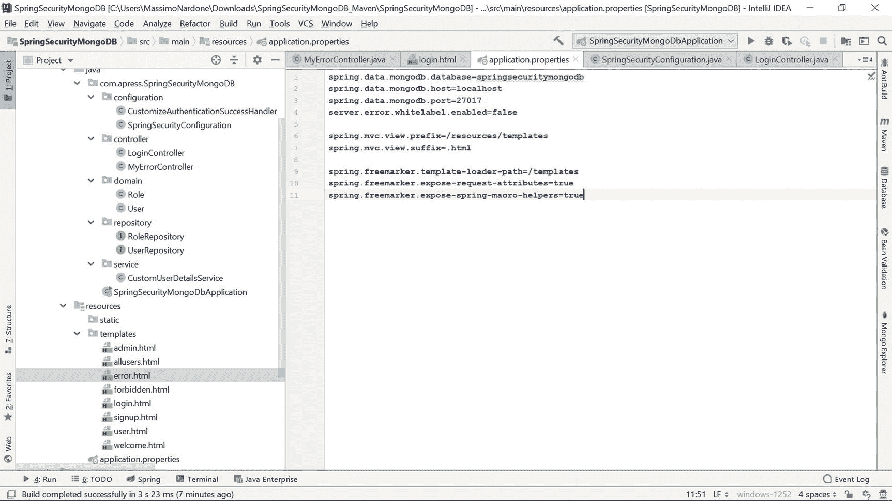

图 8-20
完整的项目概览

您已完成示例，但我们接下来将更好地描述密码加密和错误处理。


密码加密
你可能已经注意到，在本示例以及之前的所有示例中，密码都是以明文形式存储和检索的。Spring Security 提供了一种抽象机制来加密密码，其形式为接口，该接口在 Spring Security v4 中为 `org.springframework.security.authentication.encoding.PasswordEncoder`，但在 Spring Security v5 中已变更为核心框架中的 `org.springframework.security.crypto.password.PasswordEncoder`。

自 Spring Security v5 起，`org.springframework.security.authentication.encoding` 中的 `PasswordEncoder` 被声明为已弃用，因此该接口被移除，因为它并非为随机生成的盐值而设计。

此外，Spring Security v5 改变了编码密码的处理方式，因为在 v5 之前，每个应用程序只能使用一种密码编码算法。

在 Spring Security v5 之前，默认的 `PasswordEncoder` 是 `NoOpPasswordEncoder`，它要求使用明文密码。现在 `PasswordEncoder` 已被 `BCryptPasswordEncoder` 取代。

那么，我们当然会立即面临一些问题，比如：如何处理那些使用旧密码编码且难以迁移的旧应用程序？当密码存储方式再次改变时会发生什么？

自 Spring Security v5 起，引入了一个名为 `DelegatingPasswordEncoder` 的密码编码委托概念，它通常允许我们对不同的密码使用不同的编码方式。

`DelegatingPasswordEncoder` 的工作原理是：任何密码都使用当前推荐的密码存储方式进行编码，允许验证现代和旧格式的密码，并允许将来升级编码方式。

Spring Security v5 通过一个标识符前缀来识别算法，该标识符位于编码密码之前。密码的通用格式是 *{id}encodedPassword*`.`。以下是一些编码密码的示例：

```
{noop}password
{bcrypt}$1c$23$TeLobXCxerA5EDFqwKJFn.KUT2VCdsaAwD67WETa9A.7Hrt123Kea
{sha256}123ghjss67239nsgewt6772ghsjd22789sa2jkalsaldsdj72349378sadsajdsljd32874732salkdf
{pbkdf2}hdsfjhdsfurehyuhhfsjdhfhfkjhdsfkjhdfkjshdfösakfucxvhkjvhcoiweshfjdsfewtsrewrwyir
{scrypt}?shdf4Md3234hlkf843Lhhdsjfsd7982374293hsdkjfshdfh91273fgsjjdhfgssjfdggfsdllflsdlfsdfsdUp4of4g24hHnazw==$OAOec05+bXxvuu/1qZ6NUOc/9bdYSrN1oD?
```

正如你在 bcrypt 示例中看到的，使用了 `{bcrypt}` 前缀来告诉 Spring Security 使用 bcrypt 密码编码器。如果密码哈希没有前缀，委托过程会使用默认编码器，默认情况下是 `StandardPasswordEncoder`。因此，密码将包含 `PasswordEncoder id = bcrypt and encodedPassword = $1c$23$TeLobXCxerA5EDFqwKJFn.KUT2VCdsaAwD67WETa9A.7Hrt123Kea`，这样在匹配时就会委托给 `BCryptPasswordEncoder`。

请注意，你可以像这样使用 `PasswordEncoderFactories` 轻松构建一个 `DelegatingPasswordEncoder` 实例：

```
PasswordEncoder passwordEncoder = PasswordEncoderFactories.createDelegatingPasswordEncoder();
```

那么，密码匹配是如何工作的呢？它基于 `{id}` 以及构造函数中提供的 id 到 `PasswordEncoder` 的映射来工作，正如你之前所见。通常，默认情况下，使用一个未映射的 id（包括 null id）的密码调用 `matches(CharSequence, String)` 会触发 `IllegalArgumentException`。你可以通过使用 `DelegatingPasswordEncoder.setDefaultPasswordEncoderForMatches(PasswordEncoder)` 来自定义此行为。

最后，BCrypt 的 Java 配置可以像这样：

```
import org.springframework.security.crypto.bcrypt.BCryptPasswordEncoder;
@Bean
public BCryptPasswordEncoder passwordEncoder() {
BCryptPasswordEncoder bCryptPasswordEncoder = new BCryptPasswordEncoder();
return bCryptPasswordEncoder;
}
```

处理错误和入口点
Spring Security 内置了一个非常出色的错误处理机制。它提供了一套全面的异常，这些异常映射到你在系统中可能遇到的最常见的安全错误情况。

延续 Spring Security 优秀的单一职责架构，错误条件的处理主要封装在一个类中。这个类是（你之前已经学习过）`org.springframework.security.web.access.ExceptionTranslationFilter`，它主要处理两种类型的异常：`AccessDeniedException` 和 `AuthenticationException`。

如果此过滤器捕获到任何其他异常，它将简单地将其作为 `RuntimeException` 重新抛出。

Spring Security 提供了几个扩展点，你可以通过自定义入口点和自定义访问拒绝处理程序的形式来插入功能。基本上，发生的情况是：当过滤器捕获到 `AuthenticationException` 时，会调用 `AuthenticationEntryPoint` 的 “commence” 方法，并传入 HTTP 请求、HTTP 响应和异常。应用程序中配置的特定 `AuthenticationEntryPoint` 实现可以决定如何处理该异常，更重要的是，决定如何处理 HTTP 响应。默认情况下，使用的实现是 `org.springframework.security.web.authentication.LoginUrlAuthenticationEntryPoint`，它会重定向到登录 URL，正如你已经知道的，该 URL 是应用程序根目录下的 `/login`。

当抛出 `AuthenticationException` 时，或者当抛出 `AccessDeniedException` 且当前 `Authentication` 对象是匿名对象时，会调用入口点。

作为另一个人为示例，你将实现一个入口点，该入口点会在每次客户端发起身份验证尝试时添加一个 cookie，然后在浏览器中显示基本身份验证方案。这意味着你将在响应中设置一个 cookie，每次调用入口点时其值都会递增。然后，每次都会将带有新值的 cookie 发送回服务器。这意味着尝试计数器完全不存储在服务器上；它仅存储在客户端 cookie 中，并在客户端和服务器之间来回发送。因此，服务器接收 cookie，递增其值，然后将其发送回去。这并非真正意义上的创新，但它再次让我们能够展示，你可以覆盖入口点来执行不同的操作。

最有可能的情况是，当使用不同类型的身份验证方案时，会覆盖入口点。例如，当使用需要显示登录页面的身份验证方案时，会应用一个标准入口点；而其他入口点（特别是 `BasicAuthenticationEntryPoint`）则用于在响应中设置特定值，以告知浏览器如何处理它。在大多数情况下，入口点的实现与新的安全过滤器的实现是相辅相成的。如果你查看框架提供的实现，可以在 `BasicAuthenticationEntryPoint` – `BasicAuthenticationFilter`、`LoginUrlAuthenticationEntryPoint` – `UsernamePasswordAuthenticationFilter`（某种程度上，并非完全一一对应）、`CasAuthenticationEntryPoint` – `CasAuthenticationFilter` 以及其他一些实现中看到这种清晰的关系。基本上，入口点奠定基础，然后过滤器处理后续请求。

图 8-21 展示了 `ExceptionTranslationFilter` 和 `AuthenticationEntryPoint` 之间的关系。

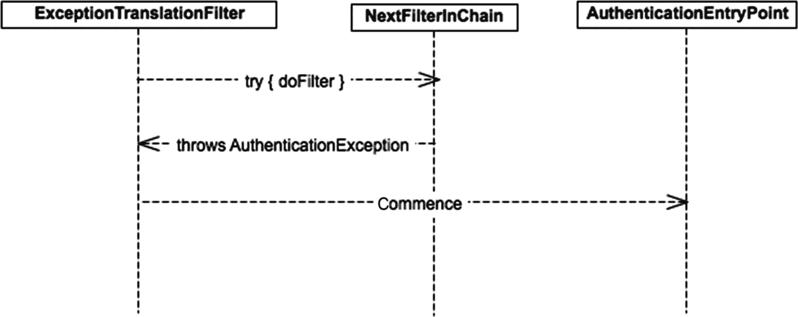

图 8-21
ExceptionTranslationFilter 和 AuthenticationEntryPoint 的关系


清单 8-24 展示了一个入口点实现的示例，清单 8-25 则展示了使其生效所需的配置。这是一个非常简单的实现，但实际上它比标准的 `BasicAuthenticationEntryPoint` 要稍微复杂一些。

```
package com.apress.pss.security;
import java.io.IOException;
import javax.servlet.ServletException;
import javax.servlet.http.Cookie;
import javax.servlet.http.HttpServletRequest;
import javax.servlet.http.HttpServletResponse;
import org.springframework.security.core.AuthenticationException;
import org.springframework.security.web.AuthenticationEntryPoint;
public class AttemptsAuthenticationEntryPoint implements AuthenticationEntryPoint{
public void commence(HttpServletRequest request,
HttpServletResponse response, AuthenticationException authException)
throws IOException, ServletException {
response.addHeader("WWW-Authenticate", "Basic realm=\"theapp\"");
response.addHeader("Set-Cookie",
"authentication_attempts="+(getDeniesCookie(request)+1)+"; Max-Age=3600; Version=1");
response.sendError(HttpServletResponse.SC_UNAUTHORIZED,
authException.getMessage());
}
private int getDeniesCookie(HttpServletRequest request) {
for(Cookie cookie:request.getCookies()){
if(cookie.getName().equals("authentication_attempts")){
return Integer.parseInt(cookie.getValue());
}
}
return 0;
}
}
清单 8-24
创建尝试次数 Cookie 和基本认证响应的 AuthenticationEntryPoint 实现
```

清单 8-25 中的代码与 `org.springframework.security.web.authentication.www.BasicAuthenticationEntryPoint` 的代码有很多共同之处，因为它同样会在响应中告知浏览器启动一个新的基本认证输入流程。当然，主要区别在于对 `authentication_attempts` Cookie 的检索和处理。该 Cookie 首先在私有方法 `getDeniesCookie` 中从请求中获取。然后，该 Cookie 的值（假定为整数）增加 1，并在以下行的响应头中重置：

```
......

...

清单 8-25
使用自定义入口点所需的 Spring 配置
```

```
response.addHeader("Set-Cookie",
"authentication_attempts="+(getDeniesCookie(request)+1)+"; Max-Age=3600; Version=1");
```

如果抛出的异常类型与之前提到的不同（特别是针对已完全认证用户的 `AccessDeniedException`），则会调用 `AccessDeniedHandler` 而不是 `AuthenticationEntryPoint`。默认调用的 `AccessDeniedHandler` 实现是 `AccessDeniedHandlerImpl`，它默认也会在响应中设置 403 错误状态，并让浏览器渲染其默认的 403 页面。不过，你也可以在处理程序中配置一个 `errorPage` 属性，以决定将请求转发（forward，应用程序内部的一种分发机制，与重定向不同）到一个自定义的错误页面，这可能是你在使用 `AccessDeniedHandler` 时最常见的个性化设置。你也可以定义自己的 `AccessDeniedHandler` 实现，为了说明这一点，你将在此处进行此操作，但你也会像在 `AccessDeniedHandlerImpl` 中使用一样，使用一个自定义的 `errorPage` 属性。

与之前的示例一样，该实现将简单地在响应中添加一个额外的标头，其形式为一个 Cookie，用于指定从特定计算机和浏览器接收到的“访问被拒绝”响应的次数。清单 8-26 展示了该处理程序实现的一个示例。

```
package com.apress.pss.security;
import java.io.IOException;
import javax.servlet.RequestDispatcher;
import javax.servlet.ServletException;
import javax.servlet.http.Cookie;
import javax.servlet.http.HttpServletRequest;
import javax.servlet.http.HttpServletResponse;
import org.springframework.security.access.AccessDeniedException;
import org.springframework.security.web.WebAttributes;
import org.springframework.security.web.access.AccessDeniedHandler;
public class CookieAccessDeniedHandler implements AccessDeniedHandler {
private static final String ACCESS_DENIES = "access_denies";
private String errorPage;
public void handle(HttpServletRequest request,
HttpServletResponse response,
AccessDeniedException accessDeniedException) throws IOException,
ServletException {
if (!response.isCommitted()) {
response.addCookie(new Cookie(ACCESS_DENIES,
String.valueOf(getDeniesCookie(request)+1)));
if (errorPage != null) {
request.setAttribute(WebAttributes.ACCESS_DENIED_403, accessDeniedException);
response.setStatus(HttpServletResponse.SC_FORBIDDEN);
RequestDispatcher dispatcher = request.getRequestDispatcher(errorPage);
dispatcher.forward(request, response);
} else {
response.sendError(HttpServletResponse.SC_FORBIDDEN, accessDeniedException.getMessage());
}
}
}
private int getDeniesCookie(HttpServletRequest request) {
for(Cookie cookie:request.getCookies()){
if(cookie.getName().equals(ACCESS_DENIES)){
return Integer.parseInt(cookie.getValue());
}
}
return 0;
}
}
清单 8-26
处理程序 Java 类
```

如前所述，这段代码与 `AccessDeniedHandlerImpl` 基本相同。你只是在响应中添加了 Cookie，每次调用此处理程序时，该 Cookie 都会被设置为递增的值。你可以看到，其中还包含了处理 `errorPage` 属性的逻辑（如果设置了该属性）。将执行一个 Servlet 分发器转发到该错误页面 URL，这意味着它可以访问此类内部使用的同一个请求。

更改安全拦截器
安全拦截器是一个你很少会自行修改或替换的类，因为默认实现已经涵盖了过滤器安全和方法级安全的最常见场景。但是，你可以扩展它以用于不完全符合 Web 应用-业务方法服务方案的不同类型的应用程序。例如，Spring Integration 有自己的安全拦截器实现，形式为 `org.springframework.integration.security.channel.ChannelSecurityInterceptor`。它不是处理简单的方法调用或过滤器调用，而是处理一个不同的抽象，即 `org.springframework.integration.security.channel.ChannelInvocation`。这意味着它基本上拦截了在确定的安全通道上的“发送”和“接收”调用。Spring Integration 还使用类 `org.springframework.integration.security.channel.ChannelSecurityMetadataSource` 作为消息通道的 `org.springframework.security.access.SecurityMetadataSource` 实现。

正如 Spring Integration 示例所示，创建不同的安全拦截器，基本上是为了在你想要为不遵循标准 Web 服务方式的应用添加 Spring Security 的授权支持时使用。但是，请记住，必须预先存在一个认证机制，因为安全拦截器会查找其授予资源访问权限所需的不同组件。这意味着 `SecurityContext` 中必须存在一个 `Authentication` 对象，必须配置好 `AccessDecisionManager`，等等。清单 8-27 展示了来自 Spring Integration 的安全拦截器实现。


```
/*
* Copyright 2002-2019 the original author or authors.
*
* Licensed under the Apache License, Version 2.0 (the "License");
* you may not use this file except in compliance with the License.
* You may obtain a copy of the License at
*
*      https://www.apache.org/licenses/LICENSE-2.0
*
* Unless required by applicable law or agreed to in writing, software
* distributed under the License is distributed on an "AS IS" BASIS,
* WITHOUT WARRANTIES OR CONDITIONS OF ANY KIND, either express or implied.
* See the License for the specific language governing permissions and
* limitations under the License.
*/
package org.springframework.integration.security.channel;
import java.lang.reflect.Method;
import org.aopalliance.intercept.MethodInterceptor;
import org.aopalliance.intercept.MethodInvocation;
import org.springframework.security.access.SecurityMetadataSource;
import org.springframework.security.access.intercept.AbstractSecurityInterceptor;
import org.springframework.security.access.intercept.InterceptorStatusToken;
import org.springframework.util.Assert;
/**
* 一个 AOP 拦截器，用于对 MessageChannel 的发送和/或接收调用强制执行授权。
*
* @author Mark Fisher
* @author Oleg Zhurakousky
* @see SecuredChannel
*/
public final class ChannelSecurityInterceptor extends AbstractSecurityInterceptor implements MethodInterceptor {
private final ChannelSecurityMetadataSource securityMetadataSource;
public ChannelSecurityInterceptor() {
this(new ChannelSecurityMetadataSource());
}
public ChannelSecurityInterceptor(ChannelSecurityMetadataSource securityMetadataSource) {
Assert.notNull(securityMetadataSource, "securityMetadataSource must not be null");
this.securityMetadataSource = securityMetadataSource;
}
@Override
public Class getSecureObjectClass() {
return ChannelInvocation.class;
}
public Object invoke(MethodInvocation invocation) throws Throwable {
Method method = invocation.getMethod();
if (method.getName().equals("send") || method.getName().equals("receive")) {
return this.invokeWithAuthorizationCheck(invocation);
}
return invocation.proceed();
}
private Object invokeWithAuthorizationCheck(MethodInvocation methodInvocation) throws Throwable {
Object returnValue = null;
InterceptorStatusToken token = super.beforeInvocation(new ChannelInvocation(methodInvocation));
try {
returnValue = methodInvocation.proceed();
}
finally {
returnValue = super.afterInvocation(token, returnValue);
}
return returnValue;
}
@Override
public SecurityMetadataSource obtainSecurityMetadataSource() {
return this.securityMetadataSource;
}
}
清单 8-27
ChannelSecurityInterceptor Java 类
```

在这段代码中，你可以看到 `ChannelInvocation` 在调用父类的 `beforeInvocation` 方法之前，包装了一个 `MethodInvocation`。除了包装之外，它还会进行一些内部处理，使得当前正在执行的通道可以被查询以获取 `ConfigAttributes`。

另请注意，仅当被调用的方法是 Spring Integration 的标准“send”和“receive”方法之一时，该拦截器才会执行其安全验证。

代码中使用的 `ChannelSecurityMetadataSource` 将被查询以获取安全元数据属性。它知道如何从 Spring Integration 通道以及相关的 `org.springframework.integration.security.channel.ChannelAccessPolicy` 中提取此信息。

在你的应用程序中，你极不可能重写安全拦截器。但是，了解你可以这样做，并且理解你为何要这样做，是件好事。

正如 Spring Integration 的示例所示，你想要替换安全拦截器（或添加额外的拦截器）的一个原因是，你拥有某些抽象概念，希望对其应用基于拦截的安全性，而这些概念既不适合 URL 拦截，也不适合简单的方法拦截。你希望为你的拦截逻辑赋予一个更有意义的名称，并且过滤掉那些默认实现不会默认过滤的某些内容。这正是 Spring Integration 示例所做的。它拦截了 `MessageChannel` 通信，这是在其上下文中具有意义的领域元素。然而，归根结底，它基本上是在拦截方法，并过滤以仅拦截 `send` 和 `receive` 方法，这些方法同样是在特定上下文中具有意义的方法。

**Spring Security 扩展项目**

有一个专门的项目致力于开发 Spring Security 扩展，社区成员可以在 Spring Security 之上开发自己的扩展。通过这种方式，他们可以将这些扩展与 Spring Security 主项目解耦，使其能够独立发展。该扩展项目的所在地是 [`https://spring.io/projects/spring-security`](https://spring.io/projects/spring-security)。

如果你访问此页面，你会看到目前存在两个扩展项目：Kerberos 集成和 SAML2 集成。还有 OAuth 集成，它作为一个独立的项目存在。你可以在 [`https://docs.spring.io/spring-security/oauth/`](https://docs.spring.io/spring-security/oauth/) 找到它。

Spring Security 扩展中的每个项目都可以根据需要实现框架的任意多个部分，以便正常工作。这意味着我们在本章中定义的许多扩展点（以及其他一些扩展点）可以在特定扩展中被重写以完成其工作。

**总结**

在本章中，我们展示了当你想要自定义或扩展 Spring Security 的行为时，其架构中的模块化设计是如何发挥作用的。我们展示了如何使用 Spring Security v5 和 MongoDB 创建一个 Spring Boot Web 应用程序。我们还展示了 Spring Security 提供的一些不同且最常见的扩展点，以便你可以将其功能适配到你的特定应用程序，同时保留核心功能，从而利用这些功能使你的工作更轻松。阅读本章后，结合之前章节的所有理论和实践，你应该有足够的信心来实现超越框架开箱即用功能的功能。

**9. 将 Spring Security 与其他框架和语言集成**


本章将探讨 Spring Security 在 JVM 上运行的其他应用框架和语言中的使用场景。
在前面的章节中，你已经了解到使用 Spring Security 的两种主要方式：在 Web 层以过滤器（filter）的形式，以及在业务层通过 Spring AOP 实现。这意味着你可以在任何基于 Servlet 技术构建的应用中，或者任何愿意使用 Spring 和 Spring AOP 来管理其对象生命周期和交互的应用中使用 Spring Security。

在接下来的章节中，你将看到这两种情况的示例。我们将首先介绍几个流行的 Java 框架（其中一个是基于 Spring 的），以及如何在这些框架中使用 Spring Security。这些框架包括流行的 Struts 2 Web 框架和 Spring Web Flow（SpringSource 套件中的另一个成员）。

在研究了这两个框架之后，我们将简要介绍几种 Java 虚拟机（JVM）编程语言（及其相关框架），以及如何在这些语言中使用 Spring Security。我们将探讨 Groovy 及其 Web 开发框架 Grails、JRuby 及其框架 Rails，以及嵌入在 Spring Web 应用中的 Scala。

我们不会深入探讨这些框架或语言的细节，因为那超出了本书的范围。本章的目的仅仅是解释如何在更广泛的上下文中使用 Spring Security。

Spring Security 与 Struts 2
Struts 2 是一个流行的 Java Web 框架，由最初的 Struts 项目和 WebWork 项目合并而成。Struts 2 从一开始就被设计为原始 Struts 框架的全面演进，以适应新一代强大的 Web 框架，并且它几乎保留了原始 Struts 的原则和实现。
Struts 2 被广泛使用，并且与任何其他基于 Servlet 的外部框架一样，是集成 Spring 和 Spring Security 的理想候选者。
Struts 2 是一个构建在标准 Java Servlet 技术之上的 MVC（模型-视图-控制器）框架，因此你在本书中读到的许多基于 Web 的安全原则无需修改即可适用。如果你只想使用你在第 5 章中学到的基于 URL 的 Web 安全，你只需要相应地配置你的 `web.xml` 和 Spring Security 过滤器链，或者使用 `WebApplicationInitializer` 来实现。
有关 Struts 2 版本的更多信息，请访问 [`https://struts.apache.org/releases.html`](https://struts.apache.org/releases.html)。本书将使用 Struts 版本 2.5.20。

与本章中的其他框架和语言一样，我们不会深入解释 Struts 2（因为关于这个主题有很多优秀的书籍）。我们只会解释足够让你能够将 Spring Security 与之结合使用的内容。事实上，我们假设你阅读本节可能是因为你已经在使用 Struts 2，并希望将 Spring Security 集成到其中。然而，为了进一步说明，图 9-1 展示了 Struts 2 工作原理的全貌。

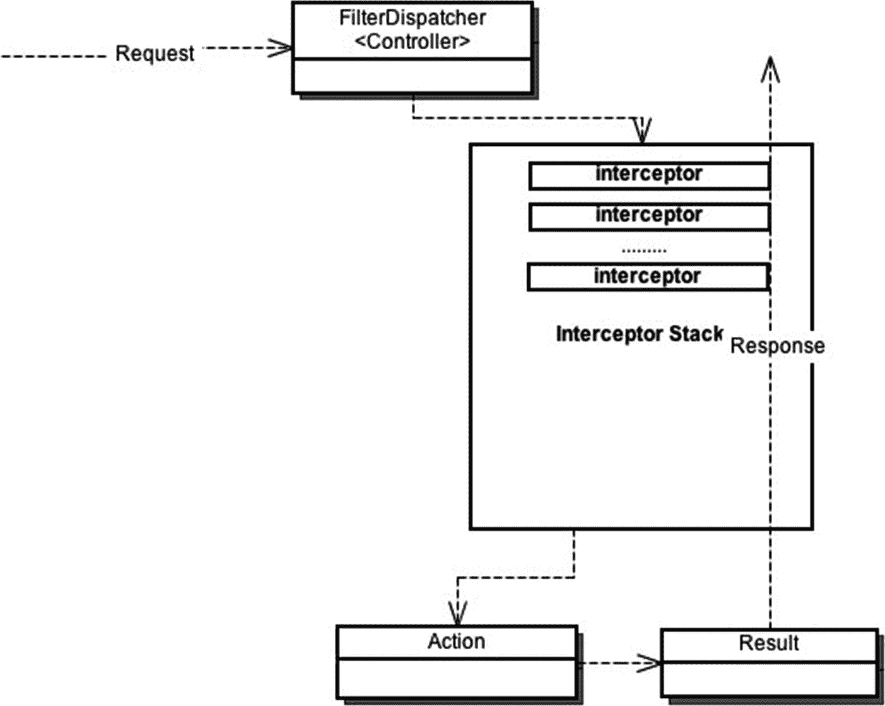

图 9-1
Struts 2 工作原理

当请求到达应用时，一个在 Servlet 过滤器中实现的前端控制器（[`http://en.wikipedia.org/wiki/Front_Controller`](http://en.wikipedia.org/wiki/Front_Controller)）会处理该请求。它将请求发送通过一组配置好的拦截器，这些拦截器在 Action 被调用前后执行不同的功能。然后调用 Action，该 Action 包含当前请求所需的所有业务逻辑。Action 执行完毕后，会创建一个代表视图的结果对象，然后以相反的顺序（在返回结果时）再次调用拦截器栈，直到最终将响应返回给客户端。
你首先要做的当然是下载库文件，并将其包含在你的 Maven 项目中，下载链接如下：
`https://struts.apache.org/download.cgi#struts-ga`。
Struts 2 可以下载完整发行版（包含所有内容），也可以只下载单独的库、源代码、文档等。

你将使用 Maven 来构建这个项目。因此，让我们创建一个新的 Maven 项目，如图 9-2 所示。然后按照提示操作：在第一个提示中选择一个新的 *starter project*，并选择一些相关的 `groupId` 和 `artifactId` 名称。（我们分别选择了 `com.apress.pss.struts` 和 `struts-example`，如图 9-2 所示。你可以使用相同的名称以便轻松地跟随示例进行操作）。

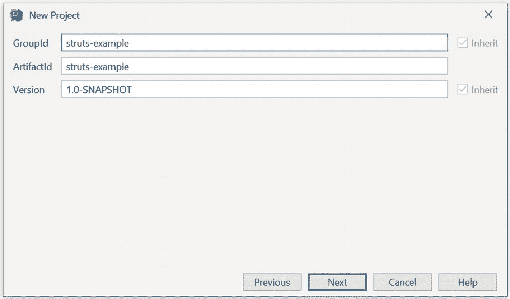

图 9-2
Struts 项目

现在，使用你创建测试所需的组件创建一个简单的、功能性的 Struts 2 Web 应用，包括 Spring 集成（尽管它使用了旧版本的配置 XML 文件 DTD）。执行该命令后的文件结构如图 9-3 所示。

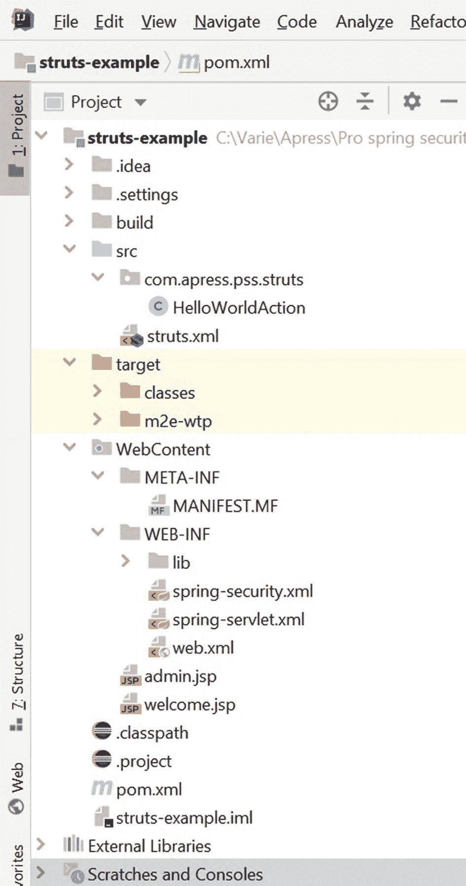

图 9-3
执行 Maven 命令后的 Struts 2 应用文件结构

在图 9-3 中，你可以看到一个名为 `struts.xml` 的文件；这是主要的 Struts 2 配置文件，你可以在清单 9-1 中看到其内容。

```

welcome.jsp

admin.jsp

welcome.jsp

清单 9-1
struts.xml 文件
```

在清单 9-1 中，Action `"helloWorld"` 没有在 `class` 属性上定义类名。在这种情况下，它定义了一个简单的字符串，用于标识你稍后将在 `spring-security.xml` 中看到的 Spring Bean。当请求到达时，框架会查看此文件中的定义，以确定如何处理该特定请求。（这个定义很简单，但足以说明问题。）如果它在 `action` 属性中看到了一个类名，框架就会实例化该类的一个新对象来处理请求。如果框架检测到它不是类名，它就会在 Spring 配置中查找具有该 ID 的 Bean，并从那里获取对象。这一切之所以可能，要归功于 `struts2-spring-plugin` 插件，它为 Struts 2 增加了 Spring 功能，并使得在 Spring Bean 中定义 Action（以及其他组件，如拦截器）成为可能。
请注意使用了 `struts-2.5.dtd` 作为 Struts 2.5 版本。

你现在要做的就是重写默认的 `spring-security.xml`，用清单 9-2 中的内容替换它，并将清单 9-3 中熟悉的依赖项添加到 `pom.xml` 文件中。

```
5.1.5.RELEASE
5.1.5.RELEASE

org.springframework
spring-core
${springframework.version}

org.springframework
spring-web
${springframework.version}

org.springframework
spring-webmvc
${springframework.version}


org.springframework.security
spring-security-web
${springsecurity.version}

org.springframework.security
spring-security-config
${springsecurity.version}

**清单 9-3** pom.xml 文件中的 Spring Security 依赖项
```

```

**清单 9-2** Struts 2 应用程序的 spring-security.xml 文件
```

接下来，你需要将 Spring Security 过滤器添加到 `web.xml` 中。此过滤器应在 Struts 2 过滤器之前执行，以便在到达 Action 之前填充认证对象。请记住，Struts 2 使用过滤器而非 Servlet 工作。清单 9-4 展示了一个可用于测试的 `web.xml` 文件。请注意，我们移除了示例中不需要的一些过滤器定义。

```

struts-example

index.jsp

contextConfigLocation
classpath:spring-security.xml

struts2
org.apache.struts2.dispatcher.filter.StrutsPrepareAndExecuteFilter

struts2
/*

spring
org.springframework.web.servlet.DispatcherServlet

spring
/

org.springframework.web.context.ContextLoaderListener

springSecurityFilterChain
org.springframework.web.filter.DelegatingFilterProxy

springSecurityFilterChain
/*

jspSupportServlet
org.apache.struts2.views.JspSupportServlet

**清单 9-4** 包含 Spring Security 过滤器和 Struts 2 过滤器的 web.xml 文件
```

接下来，我们简化了 `jsp` 文件夹内的 `.jsp` 文件，如下所示：`helloWorld.jsp` 文件仅包含字符串 “This is your first "Secured" Struts2 Application!”，没有其他内容。
Struts 2 有一个内置系统来处理应用程序中可能抛出的异常。此机制会干扰 Spring Security 的异常处理系统，后者依赖于抛出 `AccessDeniedException` 等异常来改变执行流程。例如，在显示登录表单时，你需要停用 Struts 2 的异常处理机制。为此，在 `struts.xml` 文件中，你需要在包含已定义 `<constant>` 元素的那一行下方添加一行 `<constant name="struts.handle.exception" value="false" />`。

最后，你需要保护你的 Action。让你的 `HelloWorldAction` 看起来像清单 9-5 所示。

```
package com.apress.pss.struts;
import javax.servlet.http.HttpServletRequest;
import org.apache.struts2.ServletActionContext;
public class HelloWorldAction {
private String username;
public String execute() {
HttpServletRequest request = ServletActionContext.getRequest();
this.setUsername(request.getUserPrincipal().getName());
return "SUCCESS";
}
public String getUsername() {
return username;
}
public void setUsername(String username) {
this.username = username;
}
}
**清单 9-5** 受保护的 HelloWorldAction
```

现在，如果你重新启动应用程序并访问 `http://localhost:8080/struts-example/helloWorld`，将会看到标准的 Spring Security 登录表单。如果你使用登录用户名 **admin** 和密码 **admin123**，你将能够访问该页面。图 9-4 展示了登录页面、HelloWorld 页面和注销页面。

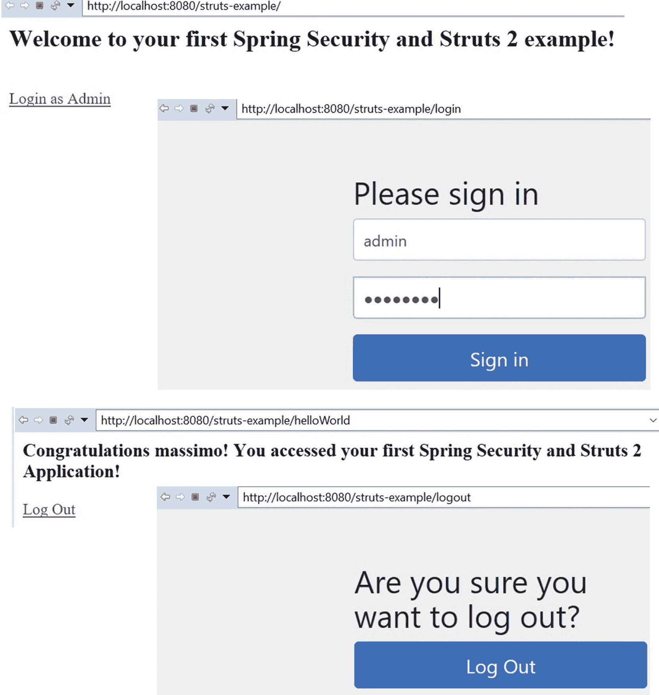

**图 9-4** 受保护的 Struts 2 应用程序及被访问的 Action

### Spring Security 与 Spring Web Flow
Spring Web Flow 是一个构建于 Spring MVC 之上的框架，它允许你将 Web 驱动流程的不同步骤链接成一个流畅的工作流。换句话说，它允许你以声明式的方式定义 Web 应用程序在与用户交互过程中可能经历的不同步骤。基本上，你使用它来定义 Web 应用程序用户界面（UI）部分与每个转换应触发的后端流程之间的一组规则和转换。有关 Spring Web Flow 的所有信息，请查看此链接：[`https://projects.spring.io/spring-webflow/`](https://projects.spring.io/spring-webflow/)。

当你创建一个新的 Maven 项目时，需要像这样添加 Spring Web Flow 依赖：

```
org.springframework.webflow
spring-webflow
2.5.1.RELEASE

```

从图形上看，Spring Web Flow 以简化的形式工作，如图 9-5 所示。该示例是一个简化产品的模拟网页。方框代表各种状态（视图状态、动作状态、决策状态、子流程状态等），箭头代表转换。

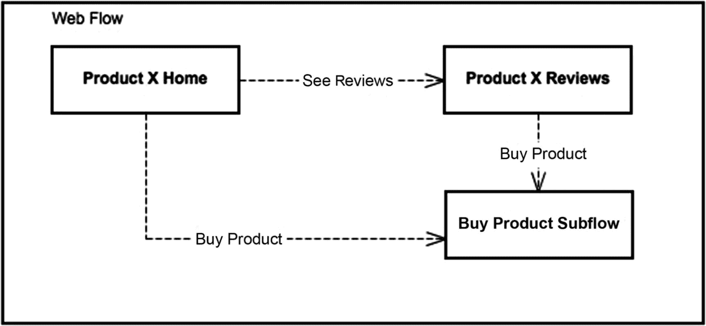

**图 9-5** 简单的 Spring Web Flow 方案显示，从产品页面，你可以进入评论页面或购买产品

为了使用 Spring Web Flow 实现这个简单流程，你将创建一个新项目。与大多数示例一样，你将使用 Maven 来构建和管理你的项目。那么，让我们开始吧。让我们创建一个新的 Maven 项目，如图 9-6 所示。

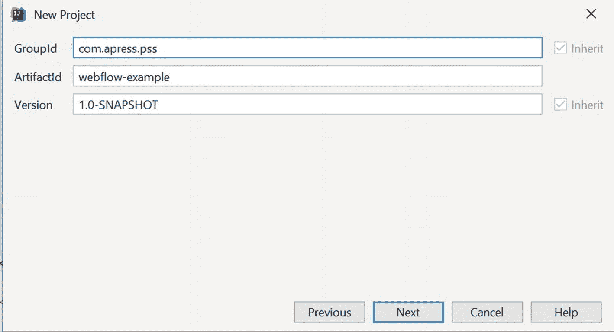

**图 9-6** 新的 Spring Web Flow Maven 项目

现在，你将创建所有配置文件。将新项目中的 `pom.xml` 文件替换为清单 9-6 中所示的文件，并将 `web.xml` 文件替换为清单 9-7 中所示的文件。然后，在 `WEB-INF` 目录中，分别创建清单 9-8 和 9-9 中所示的文件，并分别命名为 `spring-servlet.xml` 和 `spring-security.xml`。

```
Spring MVC Application

spring
org.springframework.web.servlet.DispatcherServlet

spring
/

org.springframework.web.context.ContextLoaderListener

contextConfigLocation

/WEB-INF/spring-security.xml

springSecurityFilterChain
org.springframework.web.filter.DelegatingFilterProxy

springSecurityFilterChain
/*

welcome.jsp

**清单 9-7** 用于 Spring Web Flow 和 Spring Security 的 web.xml 文件
```

```
4.0.0
com.apress.pss
webflow-example
0.0.1-SNAPSHOT
war

5.1.5.RELEASE
5.1.5.RELEASE

org.springframework.webflow
spring-webflow
2.5.1.RELEASE

org.springframework
spring-core
${springframework.version}

org.springframework
spring-web
${springframework.version}

org.springframework
spring-webmvc
${springframework.version}

org.springframework.security
spring-security-web
${springsecurity.version}

org.springframework.security
spring-security-config
${springsecurity.version}

javax.servlet
javax.servlet-api
4.0.1

javax.servlet.jsp
javax.servlet.jsp-api
2.3.3

javax.servlet
jstl
1.2

taglibs
standard
1.1.2

src

src

**/*.java

maven-compiler-plugin
3.8.0

maven-war-plugin
3.2.3

WebContent

webflow-example

**清单 9-6** 包含 Spring Security 和 Spring Web Flow 依赖项的 pom.xml 文件
```

你应该已经熟悉清单 9-7 的内容。它是一个 `web.xml` 文件，包含了 `Spring 的 ContextLoaderListener`，该监听器会加载 `context-param` "`contextConfigLocation`" 中指定的 Spring 应用上下文文件。它还定义了 Spring 的 `DispatcherServlet` Servlet，该 Servlet 通过加载相应的配置文件来负责设置 Spring MVC。你还定义了已经熟悉的 `springSecurityFilterChain` 过滤器。安全过滤器和调度器 Servlet 都被配置为处理系统中的每个 URL。

**注意**
在 Spring MVC 中，DispatcherServlet Servlet 的名称很重要，因为该名称将与用于配置应用程序的 Spring 配置文件的名称匹配。例如，在此例中，通过将 DispatcherServlet 命名为 “spring”，Spring 将期望在 `WEB-INF` 文件夹中找到名为 `spring-servlet.xml` 的文件，该文件应定义 Web 层的 Bean。

```

/WEB-INF/

.jsp

**清单 9-8** 导入流程的 spring-servlet.xml 文件
```


这个文件非常简单，其唯一职责就是导入另一个文件（`example-webflow.xml` 文件），该文件将包含整个 Spring Web Flow 配置。此配置将保留在另一个文件中，以便与主 Servlet 文件分离。

```

清单 9-9
spring-security.xml 文件
```

这是另一个你现在应该能轻松理解的文件。清单 9-9 展示了一个非常基础的 Spring Security 配置。你只定义了一个具有角色 `ROLE_USER` 的用户，这对于你的测试来说已经足够了。这里没有定义任何 URL 安全规则，因为在这个 Spring Web Flow 示例中，你并不打算这样做。你希望在流程级别（其状态）添加安全性，而这正是我们将要向你展示如何实现的。

现在，你需要定义应用程序的 Web Flow 配置以及实际的 Web Flow 本身。同样，这将是一个简单的示例，仅用于展示功能如何工作。该示例将基于图 9-6。清单 9-10 展示了 Web Flow 配置文件，清单 9-11 展示了你唯一的流程定义。

```

清单 9-10
WEB-INF 文件夹中的 example-webflow.xml
```

该文件定义了 Spring Web Flow 的通用配置。文件的主要部分是元素 `flow-registry` 及其属性 `flow-builder-services`。此元素定义了应用程序中流程的位置。目前，你只定义一个流程，它将位于 `product.xml` 文件中。另外，请注意当在流程的视图状态中引用视图时，视图将如何被解析。类 `org.springframework.webflow.mvc.builder.MvcViewFactoryCreator` 将负责解析视图位置。默认情况下，它会在流程定义目录中查找文件名是视图状态名称后附加 `.jsp` 的文件来解析视图文件。这仅仅意味着，如果一个视图被命名为 *review*，它将查找名为 *review.jsp* 的文件。

```

清单 9-11
/WEB-INF/flows/ 文件夹中的 product.xml 简单流程
```

这是实际的流程定义。你在这里简单地定义了三个视图状态。正如我们之前所说，这些视图状态中的每一个都将映射到应用程序中的一个物理视图文件。根据默认行为，视图文件应与此流程文件位于同一目录中，并应根据视图状态名称后附加 `.jsp` 来命名。因此，你应该在 `WEB-INF/flows/products` 目录中拥有名为 `activation.jsp`、`success.jsp` 和 `failure.jsp` 的文件。它们分别显示在清单 9-12、9-13 和 9-14 中。

```

Spring WebFlow 激活失败！

清单 9-14
流程“购买”视图状态的 failure.jsp
```

```

Spring WebFlow 激活成功！

清单 9-13
“审核”状态的 success.jsp
```

```

你好，Spring WebFlow！
激活 Spring WebFlow：

清单 9-12
“主”视图状态的 activation.jsp
```

在前三个 `.jsp` 文件中，你定义了 Web Flow 中的三个视图状态。清单 9-12 和 9-13 具有以 `href` 链接中的 `eventId` 参数形式存在的转换触发器。`${flowExecutionUrl}` 引用了流程的当前执行状态。因此，在首次访问页面时的主状态下，`${ flowExecutionUrl }` 的值是 `/product?execution=e1s1`，使得下一个流程状态的完整 URL 类似于 `/product?execution=e1s1}&_eventId=review`。如果你访问 `http://localhost:8080/product`，你将被带到主视图状态。该视图显示 `activate.jsp`，其中你将有一个按钮用于激活，一个按钮用于取消激活，如图 9-7 所示。当你点击激活按钮的那一刻，你就激活了 Spring Web Flow 进程，并且 `success.jsp` 会打开。
让我们使用 Spring Security 来实现这一点。Spring Security 和 Spring Web Flow 集成得很好，因为它们都是 Spring 产品组合的一部分。

使用 Spring Security 保护流程很容易。首先，你需要将当前 `<webflow:flow-executor>` 元素（来自文件 `example-webflow.xml`，即清单 9-15 中的元素）添加到同一文件中的某个位置，并添加清单 9-16 所示的内容。

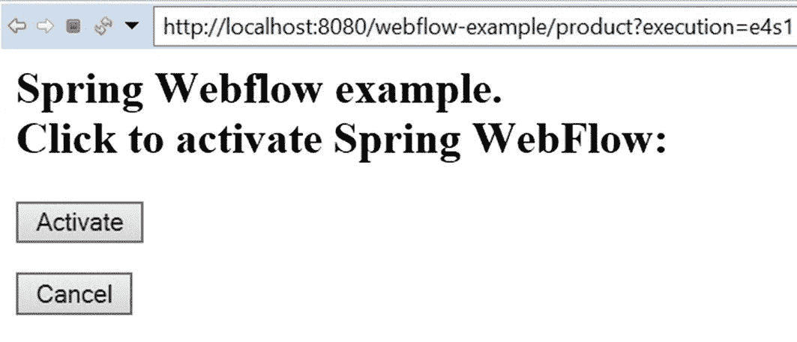

图 9-7
activation.jsp，它是 Web Flow 的入口点

```
清单 9-16
Spring Security 监听器 Bean
```

```

清单 9-15
带有 Spring Security 监听器的 flow-executor
```

通过实现上述内容，你将 Spring Security 集成到了 Spring Web Flow 中。你现在需要做的就是决定要保护流程的哪些部分，以及定义哪些约束来保护它们。但在此之前，我们将简要解释一下这个 `SecurityFlowExecutionListener` 为 Spring Web Flow 做了什么。
Spring Web Flow 以接口 `org.springframework.webflow.execution .FlowExecutionListener` 的形式提供了一种抽象，它允许你实现类来监听或观察流程执行的生命周期。当为流程注册了监听器实现时，它可以在流程生命周期的不同点拦截流程执行。从这个意义上说，它类似于你之前学过的 AOP 概念。
`org.springframework.webflow.security.SecurityFlowExecutionListener` 是一个监听器实现，它拦截流程生命周期中的三个特定点：`sessionCreating`、`stateEntering` 和 `transitionExecuting`。在每次拦截中，监听器都会委托给一个配置好的 `org.springframework.security.access.AccessDecisionManager`，就像我们在本书不同部分解释过的那样。如果在定义 Bean 时没有提供 `AccessDecisionManager` 实现，则会动态创建一个新的基于角色的访问决策管理器。

所以现在你想保护视图状态 `"activation"`，并且只允许具有角色 `ROLE_USER` 的已认证用户访问它。为此，你只需将元素 `<secured attributes="ROLE_USER" />` 定义为 `"activation"<view-state>` 元素的子元素。完成此操作后，如果你重新启动应用程序并尝试访问 `"buy"` 状态，你将看到熟悉的 Spring Security 登录屏幕。如果你使用用户名 **admin** 和密码 **admin123** 登录，你将能够到达 `"`buy`"` 状态。最终的 `"buy"` 状态视图如图 9-8 所示。


图 9-8
Spring Web Flow 激活页面


如果你希望的话，也可以通过让 `<secured>` 元素直接作为 `<flow>` 元素的子元素来保护整个流程。
这意味着，用户需要拥有所需的权限才能访问流程中的任何状态。你可以亲自尝试一下，这应该非常直观。

其他 JVM 语言中的 Spring Security
我们并非以下任何一种语言的专家，在示例中可能也无法使用最地道的表达方式。（我们最熟悉 Ruby，因为无论是在工作中还是闲暇时都经常使用它。它也是我们最喜欢的语言之一。）然而，我们的目标仅仅是展示，通过一些调整，你可以将 Spring Security 集成到用 Java 以外的语言编写的项目中。

你会看到，Spring Security 在其他 JVM 语言中的支持有时是直接且全面的（例如使用 Groovy 及其 Grails 框架时）；而在其他情况下，你可能需要自行编写集成方案来支持它。在接下来的章节中，我们将简要概述如何将 Spring Security 集成到我们认为除 Java 之外的三种主要 JVM 语言中：**Groovy**、**JRuby** 和 **Scala**。

请记住，Spring Security 本质上不过是一组构建在 Spring 框架之上的 Java 库，它允许你将认证/授权安全机制插入到你的应用程序中。因此，它应该能够集成到你拥有的任何 Java（Java JVM）应用程序中。当然，并非所有功能都适用于所有应用程序。例如，过滤器链在非 Web 应用程序中就没有意义。

Spring Security 与 Ruby (JRuby)
Ruby 绝对是我们最喜欢的语言之一，我们花了很多时间与之打交道。它结合了出色的语法和优秀的语言结构，使用起来令人愉悦。Ruby 是一种面向对象的动态语言，专注于生产力、简洁性和易用性。

标准的 Ruby 解释器是用 C 语言编写的，在 1.9 版本之前被称为 *MRI Ruby*。从 1.9 版本开始，官方解释器被称为 *YARV 解释器*。

Ruby 是一种非常流行的语言，其流行很大程度上源于其出色的 Web 框架 Ruby on Rails (RoR) 的广泛使用，该框架也简称为 *Rails*。

Rails 是一个 MVC 框架，非常强调“约定优于配置”的实践。如果你遵循框架强制执行的约定，它是一个非常高效的框架，可以用来快速、轻松地开发简单的 Web 应用程序。

我们不会对 Ruby 或 Rails 进行深入解释，因为这超出了本书的范围。我们也假设，如果你正在阅读本节，你可能已经了解它们，并且只是想学习如何将 Spring Security 集成到其中，或者想了解这是否完全可行。不过，在示例中使用 Ruby 概念时，我们会尽量给出简短的解释。

JRuby 是一个用 Java 编写的、功能完备的 Ruby 编程语言实现。你可以使用它在 Java 虚拟机中运行 Ruby 程序，并与你的其他 JVM 语言（当然，主要是 Java）进行交互。

本节我们将展示一个简单的教程，介绍如何将 Spring Security 集成到 Rails 应用程序中，并判断这样做是否值得。

在 JRuby 的情况下，没有像 Grails 中那样的插件。实际上，Java 和 Ruby 之间的集成不如 Java 和 Groovy 之间的集成那么顺畅。基本上，你需要自行实现集成方案。

首先，我们来安装 JRuby。本书使用的 JRuby 版本是 9.2.6.0。这里我们将使用简单的安装方式：只需下载文件，解压缩，并将其可执行文件添加到路径中。以下是我们在一台 Windows 机器上执行的过程（在其他操作系统上应该类似）：

1.  进入你想要安装 JRuby 的目录。

2.  从 [`https://s3.amazonaws.com/jruby.org/downloads/9.2.6.0/jruby_windows_x64_9_2_6_0.exe`](https://s3.amazonaws.com/jruby.org/downloads/9.2.6.0/jruby_windows_x64_9_2_6_0.exe) 下载文件，并将其安装到以下目录：`c:\jruby-9.2.6.0`。

3.  现在你应该可以访问 JRuby 了。执行 `jruby –v`，你应该会看到刚刚安装的 JRuby 版本，如图 9-9 所示。

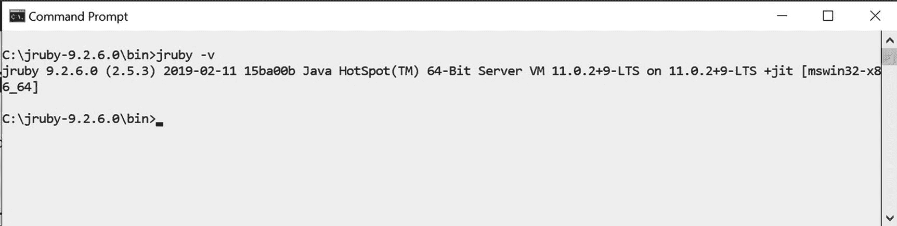

图 9-9

JRuby 版本页面

4.  接下来，安装 Rails：`jruby –S gem install rails`，如图 9-10 所示。

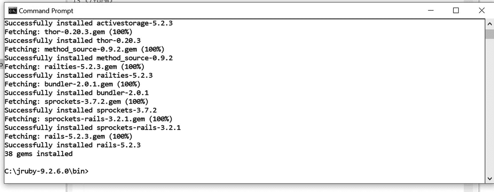

图 9-10

安装 Rails

5.  现在创建你的 Rails 应用程序。与本书其他部分一样，这将是一个功能非常简单的应用程序，仅用于展示如何使用 Spring Security。我们把这个应用程序简称为 *demo*。在你选择的目录中，输入以下命令：`rails new demo`。

现在，你的系统中有了一个新的基本 Rails 应用程序。你可以通过命令行进入刚刚创建的 `demo` 目录，然后输入 `rails s` 来运行它。该命令将启动一个 WEBrick 服务器，并在该服务器上运行应用程序。如果你按照示例操作，你应该能够在你的计算机上访问 `http://localhost:3000`，并看到默认的 Rails 应用程序主页。

在创建 Rails 应用程序的过程中，系统为你生成了大量的基础设施代码和定义良好的目录结构。如果你查看一下 `demo` 目录（这是你应用程序的根目录），你就会明白我们的意思。

无论如何，正如我们之前所说，我们不会深入探讨 Rails 框架或 Ruby 本身。我们只是通过一个基本的示例来展示如何将 Spring Security 集成到 Ruby on Rails 应用程序中。我们假设你已经了解 Ruby 和 Rails。

Rails 中的 Web 层安全
当你在上一节中运行 Rails 应用程序时，你使用的是 Ruby 服务器（WEBrick）。这个服务器对 Java Servlet 一无所知，所以你可能会猜到，使用这个服务器无法运行 Spring Security 的 Web 层安全——你的猜测是正确的。你需要做的是在标准的 Java Web 容器中运行你的 Rails 应用程序，这就是我们接下来要做的。

首先，安装 *warbler*，这是一个用于从你的 Rails 应用程序创建标准 WAR 文件的 gem。要安装 warbler，请使用命令 `jruby –S gem install warbler`。安装 warbler 后，你可以在应用程序的根目录中执行 `jruby –S warble`，它将创建 `demo.war`。

这很好，但先不要部署它。让我们先给它添加一些功能，然后再添加 Spring Security 级别的安全保护。

你将向应用程序添加两条简单的路由。一条将返回字符串 `SECURED`，并且仅对登录用户可访问。另一条将返回字符串 `UNSECURED`，并且对任何用户都可用。

让我们创建一对控制器：一个用于管理员用户，一个用于标准用户。我们将这些控制器简单地命名为 `AdminsController` 和 `StandardsController`。在你的 `demo` 应用程序根目录中输入以下两个命令来生成它们：

```
rails g controller admins
rails g controller standards
```

执行这些命令会生成输出，描述已生成的工件。然后，你将编辑这些控制器，使其看起来像代码清单 9-17 和 9-18 所示。你可以在标准 Rails 位置的 `app/controllers` 目录中找到这些控制器。


```
class StandardsController  "任何人都能阅读这条无意义的消息"
end
end
清单 9-18
包含未安全操作的 StandardsController
```

```
class AdminsController  "这是绝密代码"
end
end
清单 9-17
包含安全操作的 AdminsController
```

接下来需要将所需的所有 Java 库复制到 Rails 应用程序的 `lib` 目录中：

```
aopalliance-1.0.jar
commons-codec-1.3.jar
commons-logging-1.1.1.jar
javax.servlet-api-4.0.1.jar
spring-aop-5.1.8.RELEASE.jar
spring-asm-5.1.8.RELEASE.jar
spring-beans-5.1.8.RELEASE.jar
spring-context-5.1.8.RELEASE.jar
spring-core-5.1.8.RELEASE.jar
spring-expression-5.1.8.RELEASE.jar
spring-jdbc-5.1.8.RELEASE.jar
spring-security-config-5.1.5.RELEASE.jar
spring-security-core-5.1.5.RELEASE.jar
spring-security-crypto-5.1.5.RELEASE.jar
spring-security-web-5.1.5.RELEASE.jar
spring-tx-5.1.8.RELEASE.jar
spring-web-5.1.8.RELEASE.jar
```

下一步是让 Rails 应用程序能够在标准 Java Web 服务器（如 Tomcat）上运行。为此，你需要使用 *warbler* 这个 gem。Warbler 是一个 JRuby 专属的 gem，用于将不同类型的 Ruby 应用程序转换为标准的 Java 打包工件，例如 `JAR` 和 `WAR` 文件。在你的场景中，显然需要创建一个 `WAR` 文件。Warbler 内部使用 `jruby-rack` 这个 gem，并将其打包到基于 `WAR` 的应用程序中。这个 gem 是 Ruby Rack 基础应用（如 Rails 应用）与 Java Web Servlet 基础应用之间集成的核心，这正是你所需要的。

`Jruby-rack` 充当了一个转换层。它首先通过一个 Servlet 监听器（`org.jruby.rack.rails.RailsServletContextListener`）初始化应用程序的 Ruby 部分，然后在每次请求时，通过一个 Servlet 过滤器 `org.jruby.rack.RackFilter` 拦截对服务器的调用。当这个过滤器获取到 `HttpServletRequest` 时，它会将这些基于 Java 的请求转换为 Rack 请求，并传递给 Rails 应用程序，因为 Rails 基于 Rack 模型构建，能够理解这些请求。当然，关于 warbler 和 `jruby-rack` 还有更多细节，但目前这里的解释应该足以让你继续这个示例。在图 9-11 中，你可以看到 `jruby-rack` 工作原理的图形化说明。

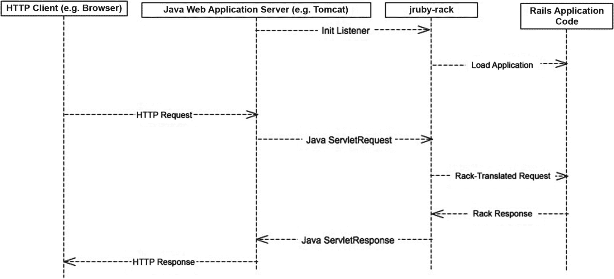

图 9-11
jruby-rack 对 Java 和 Ruby 世界的映射

要将 warbler 与 Spring Security 结合使用，你需要修改由它自动生成的 `web.xml` 文件。为此，你需要将 warbler 自带的 `web.xml.erb`（位于 Ruby 的 gem 安装目录中，在我的电脑上是 `~/.rvm/gems/jruby-1.8/gems/warbler-1.3.6/web.xml.erb`）复制到 `demo` 应用程序的 `config` 目录中。然后编辑该文件，使其看起来像清单 9-19 所示。通过这样做，你将 Spring Security 配置包含在了 `web.xml` 文件中，就像在前几章中所做的那样。
接下来，将清单 9-20 中的 `applicationContext-security.xml` 文件复制到 demo 应用程序的根目录。这里有你熟悉的第 2 章中的 Spring Security 配置，但做了一些修改。你只是为 Scarvarez 家族的成员保护了 URL `/admin/*`。
然后你需要编辑 warbler 的配置文件。为此，在应用程序的根目录下执行命令 `jruby –S warble config`。该执行会在应用程序的 `config` 目录内生成一个 `warble.rb` 文件。确保该文件看起来像清单 9-21 所示。在该文件中，你确保了 JRuby 与 Ruby 1.9 兼容，并且当 warbler 构建 `WAR` 文件时，Spring 配置文件会被包含在生成的 `WAR` 文件的 `WEB-INF` 目录中。
这就是你需要做的全部工作，现在让我们再次创建 `WAR` 文件。从应用程序的根目录执行 `JRUBY_OPTS=--1.9 warble`。此命令在 Windows 上不起作用。你应该只执行 `warble`，并单独设置 `JRUBY_OPTS` 变量。这会生成包含 Rails 应用程序的 `WAR` 文件。将其部署到你的 Web 应用服务器上（我们将其部署到了 Tomcat 9）。
部署完成后，你可以访问相应的 URL。在我们的电脑上，行为如下：当我们访问 `http://localhost:8080/demo/standard/message` 时，会看到消息“任何人都能阅读这条无意义的消息。”

然而，如果我们访问 `http://localhost:8080/demo/admin/message`，则会显示熟悉的登录页面。当我们使用用户名 **massimo** 和密码 **nardone** 登录后，页面上会显示以下消息：“这是绝密代码。”这正是我们期望的行为。我们已经通过基本的 Web 层安全保护了 Rails 应用程序。

```
Warbler::Config.new do |config|
config.dirs = %w(app config lib log vendor tmp)
config.includes = FileList["db"]
config.webinf_files += FileList["applicationContext-security.xml"]
config.webxml.jruby.compat.version = "1.9"
end
清单 9-21
warble.rb 配置文件
```

```

清单 9-20
针对 /admin/∗ URL 的 applicationContext-security.xml 安全配置
```

```

spring
org.springframework.web.servlet.DispatcherServlet

spring
/

org.springframework.web.context.ContextLoaderListener

contextConfigLocation

/WEB-INF/applicationContext-security.xml

springSecurityFilterChain
org.springframework.web.filter.DelegatingFilterProxy

springSecurityFilterChain
/*

RackFilter
org.jruby.rack.RackFilter

springSecurityFilterChain
/*

RackFilter
/*

javax.sql.DataSource
Container

清单 9-19
config 文件夹中的 web.xml.erb，包含 Spring Security 配置
```


Spring Security、Groovy 与 Grails
Groovy 是非 Java JVM 语言领域中争夺头把交椅的最强竞争者之一。它拥有一个出色的社区，目前由 SpringSource 团队支持和管理。Groovy 是一种编程语言，它试图将 Java 的强大功能与某些动态编程语言的优雅性和开发者友好特性结合起来——主要借鉴了广受喜爱的知名语言（如 Python 和 Ruby）的思想。Groovy 成功地创造了一个环境，让不同类型的程序员经过一些练习后都能感到得心应手（例如，经验丰富的 Java 开发者和 Ruby 开发者）。
与其他 JVM 语言相比，Groovy 有许多优势——在我们看来，主要优势是从 Java 到 Groovy 的轻松过渡以及两种语言之间的互操作性。就过渡而言，将 Java 程序变成 Groovy 程序很容易。事实上，你什么都不用做。一个 Java 程序本身就是一个有效的 Groovy 程序。从一个角度看这很好，但从另一个角度看则不然。即使你可以将 Java 程序编译为 Groovy 程序，这也没有意义。归根结底，你使用 Groovy 是为了利用它相比 Java 所具有的出色特性。这些出色的特性包括大量的元编程技术、像闭包这样强大的新结构、更快的开发周期，以及更清晰、更简洁且对开发者更友好的语法。
Grails 是一个用 Groovy 编写并旨在与 Groovy 一起使用的 Web 框架。它构建在 Spring 框架之上，并深受 Ruby on Rails 的影响。Grails 试图用一种基于 JVM 的语言创建一个更友好、更轻量级且易于快速上手的框架。同时，它提供了更好、更简洁的开发应用程序的方式。并且，它构建在一些最强大的 Java 库和框架之上，例如 Spring 和 Hibernate。
让我们为示例安装 Groovy 库并指定 Groovy SDK。从 [`http://groovy-lang.org/download.html`](http://groovy-lang.org/download.html) 提供的官方发行版中下载标准的 Groovy SDK 工具。将其解压到任意目录，并将此目录指定为库的主目录。在我们的例子中，它是 `C:\apache-groovy-sdk-2.5.6`。现在你可以创建新的示例了。

使用 Grails 通过 URL 规则保护 Web 层
Grails 与 Spring Security 的集成非常简单，因为 Spring Security 是 Grails 应用程序的默认安全解决方案，并且存在一个全面的插件来支持它。在这里，你将创建一个简单的 Grails 应用程序，并学习如何使用 Spring Security 保护它。像往常一样，我们将逐步介绍这个应用程序。
如果你还没有安装最新版本的 Grails，请下载并安装。你可以从其主页 [`http://grails.org/`](http://grails.org/) 下载。我们使用 Grails 3.3.9 版本来运行此示例。
要安装它，只需解压下载的 `grails-3.3.9.zip` 文件（在我们的例子中，它是 `C:\grails-3.3.9`），然后设置环境变量 `GRAILS_HOME` 指向新解压的目录。另外，将路径 `GRAILS_HOME/bin` 添加到你的 `PATH` 环境变量中。
在命令行中，进入你想要创建应用程序的任意目录，并执行 `grails create-app demo-grails` 来创建应用程序。
接下来，生成两个控制器：一个安全控制器和一个非安全控制器。在生成的应用程序目录内执行 `grails create-controller secured`。然后执行 `grails create-controller unsecured`。
现在，你需要在每个控制器中创建一个操作，并使它们看起来像清单 9-22 和 9-23 所示。将这些文件放在应用程序的 `grails-app/controllers/demo/grails` 目录中。
现在使用 `grails run-app` 运行应用程序，并访问 `http://localhost:8080/demo-grails/secured/message` 或 `http://localhost:8080/demo-grails/unsecured/message`，你应该能够毫无问题地访问这两个 URL。下一个合乎逻辑的步骤是保护安全 URL。
正如我们之前所说，Grails 构建在 Spring 之上，因此与 Spring Security 的集成应该是直接了当的。Grails 以巧妙的模块化方式构建，因此你可以通过插件的形式添加功能。让我们通过执行 `grails install-plugin spring-security-core` 来安装 Spring Security 插件（在我们的当前版本中，这会安装 1.2.7.3 版本）。然后执行命令 `grails s2-quickstart demo.security User Role` 来生成支持应用程序中用户和角色所需的模型。
接下来，你将创建几个测试用户来尝试安全性。打开文件 `BootStrap.groovy`（位于 `grails-app/conf` 目录中），并使其看起来像清单 9-24 中的代码。这里你创建了两个用户：一个具有角色 `ROLE_ADMIN`，另一个具有角色 `ROLE_USER`。你可以看到这段代码使用了上一步生成的类 `User` 和 `Role`。
与之前的示例一样，你将保护某些 URL，使其仅对具有特定角色的用户可访问。要在 Grails 中做到这一点，你需要将清单 9-25 中的代码添加到文件 `Config.groovy`（位于 `grails-app/conf` 目录）的末尾。这段代码不言自明。它只是告诉 Grails 使用一个拦截 URL 映射来进行安全控制。这个映射定义了带有通配符的 URL 路径（使用 `Ant` 风格的语法，我们之前为标准 Java 规则介绍过）以及允许访问这些 URL 的角色。
通过在根目录下执行命令 `grails run-app` 来运行应用程序。现在，如果你尝试访问 `http://localhost:8080/demo-grails/unsecured/message` 或 `http://localhost:8080/demo-grails/secured/message`，你将被重定向到一个登录页面。如果你使用用户名 **luna** 和密码 **password** 登录，你将获得对安全 URL 的访问权限，而非安全 URL 则不行。但是，如果你使用用户名 **neve** 和密码 **password** 登录，你将获得对 `http://localhost:8080/demo-grails/unsecured/message` 的访问权限，但在尝试访问 `http://localhost:8080/demo-grails/secured/message` 时会收到“访问被拒绝”的错误。你可以看到你已经正确地保护了对这些 URL 的访问。


从这个例子中，首先难以察觉的一点是，你实际上正在使用 Spring Security。我们之所以这么说，是因为你既没有定义任何过滤器、认证管理器、投票器、用户服务，也没有定义任何认证提供者。实际上，你甚至没有定义任何 Spring Bean。你很容易会认为底层使用了其他机制，因为这里没有任何与 Spring Security 相关的内容。这是一件好事，也是 Grails 的优良特性之一。插件的使用为你提供了合理的通用默认配置，你只需负责定义与自身业务问题相关的专属内容。就安全而言，你需要定义你的用户、他们的密码，以及应用程序的角色和访问权限。

```
grails.plugins.springsecurity.securityConfigType = "InterceptUrlMap"
grails.plugins.springsecurity.interceptUrlMap = [
'/secured/**':    ['ROLE_ADMIN'],
'/unsecured/**':   ['ROLE_USER'],
]
清单 9-25
Config.groovy 文件摘录，我们在其中添加了需要保护的 URL
```

```
import demo.security.Role
import demo.security.User
import demo.security.UserRole
class BootStrap {
def init = { servletContext ->
def adminRole = new Role(authority: 'ROLE_ADMIN').save(flush: true)
def userRole = new Role(authority: 'ROLE_USER').save(flush: true)
def testAdmin = new User(username: 'luna', enabled: true, password: 'password')
testAdmin.save(flush: true)
def testUser = new User(username: 'neve', enabled: true, password: 'password')
testUser.save(flush: true)
UserRole.create testAdmin, adminRole, true
UserRole.create testUser, userRole, false
}
def destroy = {
}
}
清单 9-24
BootStrap.groovy 文件，设置了一组测试用户并为其分配了安全角色
```

```
package demo.grails
class UnsecuredController {
def message() {
render "message for everyone"
}
}
清单 9-23
Grails 应用程序中带有未保护消息的 UnsecuredController
```

```
package demo.grails
class SecuredController {
def message() {
render "Incredibly confidential message"
}
}
清单 9-22
Grails 应用程序中带有受保护消息的 SecuredController
```

Grails 的 Spring Security 插件让你能更深入地访问 Spring Security 提供的功能，当然，它也允许你通过覆盖默认值来自定义。它支持的功能之一是在访问规则中使用 SpEL。为了在本例的上下文中测试这一点，并使用我们能想到的最简单的安全 SpEL 表达式，只需将 `Config.groovy` 文件（来自清单 9-25）中引入的安全部分替换为清单 9-26 中的内容。如你所见，在这个清单中，你使用了之前章节学习过的安全表达式 `hasRole`。请注意，这是一个使用 `hasRole` 的简单示例，但在这里你可以使用 Spring Security SpEL 支持提供的全套表达式。例如，你可以使用 [`authentication.name`](http://authentication.name) `== 'luna'` 作为表达式，而不是 `hasRole`。

```
grails.plugins.springsecurity.securityConfigType = "InterceptUrlMap"
grails.plugins.springsecurity.interceptUrlMap = [
'/secured/**':    ["hasRole('ROLE_ADMIN')"],
'/unsecured/**':   ["hasRole('ROLE_USER')"],
]
清单 9-26
Config.groovy 文件摘录，使用 SpEL 代替简单角色
```

在方法级别使用 Grails 安全功能

Grails 的 Spring Security 插件支持方法级别的安全，其方式与 Java 相同。这意味着你可以在控制器类中添加 `@grails.plugins.springsecurity` 安全注解（或者标准的 Spring Security `@Secured` 注解），Spring Security 将确保这些方法根据这些注解得到保护。这样做非常简单。让我们继续处理上一节中的应用程序。首先，将 `Config.groovy` 文件（位于 `grails-app/conf` 目录）中从 `grails.plugins.springsecurity.securityConfigType = "InterceptUrlMap"` 这一行开始的内容，替换为简单的一行 `grails.plugins.springsecurity.securityConfigType = "Annotation"`。然后，将 `SecuredController` 类（位于 `grails-app/controllers/demo/grails` 目录）的内容替换为清单 9-27 的内容，并将 `UnsecuredController` 类（位于 `grails-app/controllers/demo/grails` 目录）的内容替换为清单 9-28 的内容。完成这些操作后，如果你重新启动应用程序，应该会得到与上一节保护 URL 时相同的访问限制。

```
package demo.grails
import grails.plugins.springsecurity.Secured;
class UnsecuredController {
@Secured(["ROLE_USER"])
def message() {
render "message for everyone"
}
}
清单 9-28
带有 @Secured 注解的 UnsecuredController
```

```
package demo.grails
import grails.plugins.springsecurity.Secured;
class SecuredController {
@Secured(["ROLE_ADMIN"])
def message() {
render "Incredibly confidential message"
}
}
清单 9-27
带有 @Secured 注解的 SecuredController
```

在最后这两节中，我们只是浅尝辄止地介绍了使用 Grails Spring Security 插件所能实现的功能。实际上，你可以完成几乎所有使用标准 Java 支持所能做到的事情。有关使用 Grails 插件的全面指南，请查看其官方页面：[`http://plugins.grails.org/plugin/grails/spring-security-core`](http://plugins.grails.org/plugin/grails/spring-security-core)。


Spring Security 与 Scala
Scala 很可能是除 Java 之外，在 Java 虚拟机上运行的最强大的语言（从采用者数量和社区活跃度来看）。（Scala 也有一个在 .NET 平台上运行的版本。）Scala 是一种非常强大的通用编程语言，它试图融合面向对象和函数式编程范式的优点。
Scala 旨在为企业级 Java 编程世界提供一种简洁而优雅的替代方案，同时保留 Java 的类型安全性。正如我们所说，它内置了函数式编程特性，为经验丰富的面向对象程序员增添了全新的强大功能，从而提高了生产力。
我们并非 Scala 或函数式编程方面的专家（远非如此，因为我们最近才开始研究它们），但我们将为您提供两者的核心定义和主要特征，并向您展示如何将它们与 Spring 和 Spring Security 结合使用。
函数式编程是一种范式，其中程序由接收输入并产生输出的函数组成，同时避免使用状态和可变性。这与面向对象编程形成鲜明对比，在面向对象编程中，主要的抽象是对象及其内部状态，而可变性是非常普遍的现象。通过不允许可变性和状态，函数式编程为并发编程提供了一种良好的替代方案，因为程序员无需担心并发进程或线程之间的同步问题。
在 Scala 中，函数可以作为简单值传递（作为函数参数或函数返回值）。从这个意义上说，它们的行为与任何其他简单值（例如字符串）非常相似，这是函数式编程语言中的一个重要概念。在 Scala 中，函数是一等对象。
根据文献记载，Scala 的名称来源于单词 *scalable language*（可扩展语言）。这意味着 Scala 支持面向对象和函数式编程范式，并且适用于简单的脚本任务或完整的企业级应用程序。将这种能力与优雅简洁的语法相结合，使得该语言在其能够解决的领域和用途数量方面具有可扩展性。
现在让我们安装 Scala。安装 Scala 有两种方式：通过 IntelliJ IDEA 插件或手动安装。对于手动安装，您只需访问其主页（[`www.scala-lang.org/download/`](http://www.scala-lang.org/download/)）并下载最新版本（撰写本文时为 2.13.0）。将下载的文件解压到您选择的目录中并进行配置。

让我们通过插件安装 Scala，如图 9-12 所示。

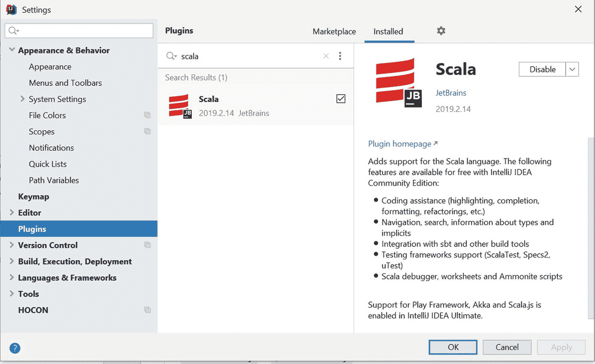

图 9-12
为 IntelliJ IDEA 安装 Scala IDE 插件

好了，这就是对 Scala 的介绍！我们知道，这是一个非常简单的介绍。然而，正如我们所说，深入介绍该语言超出了本书的范围，并且有很多优秀的书籍专门讨论这个主题。我们在此假设您可能比我们更了解该语言，并且您只是对如何将 Spring Security 与它一起使用感兴趣。

接下来您要做的是通过将 Scala 与 Spring 和 Spring Security 结合来创建项目。见图 9-13。

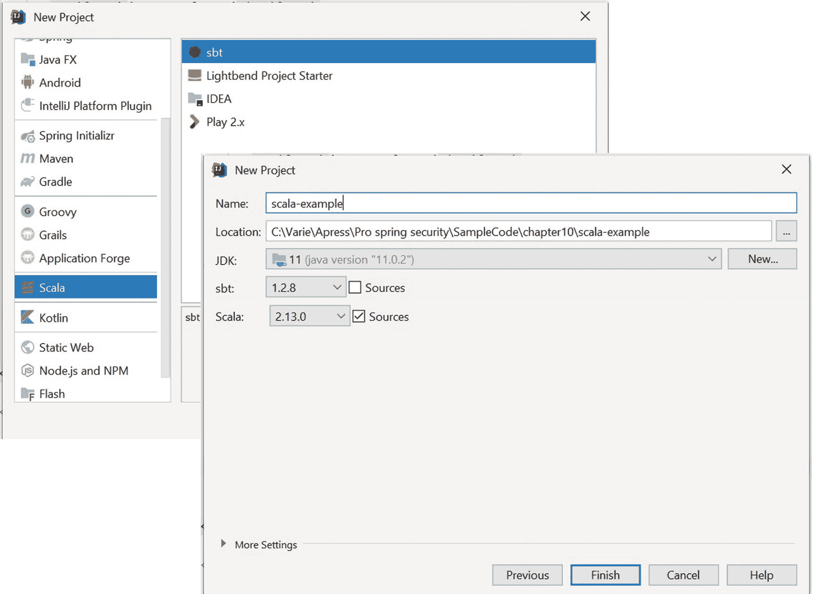

图 9-13
新建 Scala 项目

将 Scala 项目转换为 Maven 项目，并在生成的 `pom.xml` 文件中，添加清单 9-29 中所示的 Scala 依赖项。

```
org.scala-tools
maven-scala-plugin
2.15.2

清单 9-29
Scala Maven 依赖项
```

接下来，当然，您需要将 Spring 依赖项添加到 `pom.xml` 文件中。您现在应该知道如何执行此操作。您还需要在插件部分添加 Scala 插件。最后，您的 `pom.xml` 文件应类似于清单 9-30。

```
4.0.0
com.apress.pss
scala-example
war
1.0-SNAPSHOT
scala-example Maven Webapp
http://maven.apache.org

scala-tools.org
Scala-tools Maven2 Repository
http://scala-tools.org/repo-releases

scala-tools.org
Scala-tools Maven2 Repository
http://scala-tools.org/repo-releases

org.scala-tools
maven-scala-plugin
2.15.2

org.scala-lang
scala-library
2.11.7

javax.servlet
javax.servlet-api
4.1.0

junit
junit
4.5
test

org.springframework.security
spring-security-core
5.1.5.RELEASE

org.springframework.security
spring-security-config
5.1.5.RELEASE

org.springframework.security
spring-security-web
5.1.5.RELEASE

commons-logging
commons-logging
1.1.1

commons-codec
commons-codec
1.3

org.springframework
spring-webmvc
5.1.5.RELEASE

scala-example
src/main/scala
src/test/scala

org.scala-tools
maven-scala-plugin

scala-compile-first
process-resources

add-source
compile

scala-test-compile
process-test-resources

testCompile

清单 9-30
Scala Maven 项目中的 pom.xml 文件
```

这将是一个使用 Spring MVC 的简单 Web 应用程序，并且它将有一个非常简单的 Service 层。与您在其他章节中看到的应用程序的最大区别在于，Controller 层和 Service 层都将用 Scala 而不是 Java 编写。我们将向您展示如何向方法级别添加安全性，但是，您将看到，这与 Java 几乎相同。让我们从控制器的代码开始。在路径为 `src/main/scala` 的源文件夹中的包 `com.apress.pss.scala.web` 下，创建清单 9-31 中所示的 `ScalaController` 类。

```
package com.apress.pss.scala.web;
import org.springframework.beans.factory.annotation.Autowired
import org.springframework.web.bind.annotation.RequestMapping
import org.springframework.web.bind.annotation.RequestMethod
import org.springframework.stereotype.Controller
import com.apress.pss.scala.service.ScalaServiceFacade
import javax.servlet.http.HttpServletResponse
import javax.servlet.http.HttpServletRequest
@RequestMapping(Array("/enter"))
class ScalaController(service: ScalaServiceFacade) {
@RequestMapping(value = Array("/scala"), method = Array(RequestMethod.GET))
def scalaRequest(request:HttpServletRequest, response:HttpServletResponse) = {
val value = service.scalaService
response.getWriter().write(value)
}
}
清单 9-31
ScalaController
```

在控制器中，您定义了一个简单的方法，该方法返回（实际上是在响应上写入）服务返回的任何内容。请注意示例中注解 `@RequestMapping` 的使用。使用 Scala，您不能使用简单的字符串来设置基于数组的注解值。您需要设置一个仅包含一个元素的真实数组作为值。对于其余部分，该示例与 Java 版本非常相似，只是语法上有些修改。

然后，在包 `com.apress.pss.scala.service` 下，创建清单 9-32 中所示的 `ScalaService` 类。

```
package com.apress.pss.scala.service;
import org.springframework.stereotype.Service
import org.springframework.security.access.annotation.Secured
trait ScalaServiceFacade {
def scalaService: String
}
class ScalaService extends ScalaServiceFacade{
@Secured(Array("ROLE_USER"))
def scalaService() = "Service accessed"
}
清单 9-32
ScalaService 类
```


同样，此列表中的代码非常直观。它是一个服务类，包含一个返回字符串的简单方法。请注意，这里使用了 `@Secured` 注解。
同样，你使用了 `Array` 函数（实际上，这里间接调用的是 `Array` 伴生对象的 `apply` 方法，该方法允许你创建 `Array` 类的新实例），并传入一个字符串作为数组的唯一元素。使用 Scala，你不能像在 Java 版本中那样，采用传入简单字符串的便捷方式。
还要注意，在类定义之前使用了 `trait`，然后该类扩展了该 trait。Scala 中的 `trait` 在某种程度上等同于 Java 中的接口，但功能更强大。虽然此示例未展示，但 trait 既可以拥有完全实现的方法，也可以拥有 Java 接口中典型的传统抽象（仅定义）方法，并且你的类可以扩展多个 trait，“继承”它们中定义的所有功能，而无需实现已经实现的方法。
这种技术也称为 *mixin*，并非 Scala 独有，因为其他语言也有实现相同目的的结构。例如，在 Ruby 中，你可以使用模块来实现与 Scala trait 大致相同的效果。同样，我们不会深入探讨任何细节。对于此示例，你可以将 trait 简单地视为控制器用来访问服务的 Java 接口。

接下来，你需要进行配置。现在，你应该非常熟悉如何配置 Spring Security Web 应用程序了。因此，我们接下来将直接展示文件，而不会深入探讨其中任何一个文件的细节。请注意，我们引用 Scala 类的方式，与我们之前在 bean 中引用 Java 类的方式相同。Java 和 Scala 之间能如此完美地实现互操作性，真是太棒了。清单 9-33 展示了 `web.xml` 文件。清单 9-34 展示了 `applicationContext-security.xml`。清单 9-35 展示了 `scala-servlet.xml` 文件。所有文件都应位于应用程序的 `WEB-IF` 目录下。

```

清单 9-35
包含控制器定义的 scala-servlet.xml 文件
```

```

清单 9-34
Scala 项目的 applicationContext-security.xml 文件
```

```
Spring MVC 应用程序

scala
org.springframework.web.servlet.DispatcherServlet

scala
/

org.springframework.web.context.ContextLoaderListener

contextConfigLocation

/WEB-INF/applicationContext-security.xml

springSecurityFilterChain
org.springframework.web.filter.DelegatingFilterProxy

springSecurityFilterChain
/*

清单 9-33
Scala 项目的 web.xml 文件
```

现在，你可以运行你的项目了。在命令行中，从项目根目录执行命令 `mvn clean install jetty:run` 来运行应用程序。它应该可以毫无问题地运行。
接下来，如果你尝试访问 `http://localhost:8080/scala-example/enter/scala`，将会看到你之前见过多次的登录界面。

如果你使用用户名 **luna** 和密码 **nardone** 登录，应该能够访问该应用程序，并看到图 9-14 所示的页面。

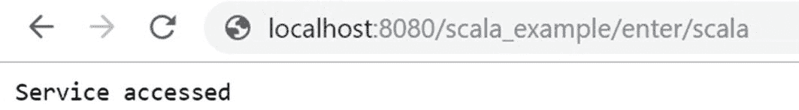

图 9-14
成功访问受保护的 Scala 应用程序

关于与 Scala 的集成，我们就说这么多。你可以看到，对于像这样的简单应用程序，它与集成 Java 本身并没有太大区别。实际上，除了语法差异之外，可能几乎是一样的。当然，在这个例子中，你从一个 Spring 应用程序开始，并用 Scala 定义了不同的组件（控制器和服务）。如果你使用的是 Scala 特有的框架，集成可能会更具挑战性。你需要记住的是，要保护方法，这些方法必须属于 Spring 管理的 bean。要保护 URL，这些 URL 必须在基于 servlet 的 Web 应用程序中被访问。

总结
在本章中，我们从一个相当高的层面展示了如何将 Spring Security 集成到各种框架和语言中。选择的框架是 Spring 自己的 Spring Web Flow，说明性的语言分别是 JRuby 和 Groovy，以及它们各自的 Web 框架 Rails 和 Grails。
我们向你展示了将 Spring Security 集成到这些不同的框架和语言中，可能很简单（如 Grails），也可能不那么简单（如 JRuby 或 Scala）。然而，通过 JVM，理论上，你可以将 Spring Security 集成到任何你需要保护的东西中。
无论使用何种框架或语言，本章的主要收获是：Spring Security 归根结底只是一个 Java 库（几个简单的 `.jar` 文件）。你可以将它集成到任何你想要的 Java（即 JVM）项目中。你只需要记住你能用它做什么，并使用那些对你的特定问题有意义的部件。例如，在 Swing 应用程序中，甚至在不使用标准 servlet 过滤器的 Web 应用程序（如 Play 框架）中，使用 Web 层安全是没有意义的。

索引

A

AbstractSecurityInterceptor

访问控制条目 (ACE)

访问控制列表 (ACL)

访问受保护对象

AclEntryVoter

自定义 AccessDecisionManager

deletePost 方法, ForumController

deletePost 方法, ForumServiceImpl

成本

过滤返回对象

类和接口

参与后处理阶段的类

createPost 方法

ExpressionHandler bean

getPosts 方法

@PostFilter 注解

@PreFilter 注解

@PreFilter 调用

PreInvocationAuthorizationAdviceVoter

执行新配置的步骤

保护视图层

安全示例应用程序

抽象

acl-example-servlet.xml

applicationContext-acl.xml

applicationContext-security.xml

属性

BasePermission 类

createAclSchema.sql

DatabaseSeeder 类

ER 图

form.jsp 文件

ForumController 入口点

ForumServiceImp

Maven 依赖项

权限逻辑

Post 类, 领域模型

图形化表格

web.xml

AccessDecisionManager

AffirmativeBased

ConsensusBased

UnanimousBased

AccessDecisionVoter

aclAuthorizationStrategy bean

aclCache bean

acl_class

acl_entry

acl_object_identity

aclService bean

ACL_SID

AfterInvocationManager

Apache Directory Studio

ApacheDS 服务器

应用程序安全层

面向切面编程 (AOP)

AuthenticationProvider 和 UserDetailsService

定义

依赖项

Hello World 页面

新创建的用户

关系

认证相关事件

授权相关事件

B

BeanDefinitionParser 对象

业务级安全规则

C

中央认证服务 (CAS)

ChannelSecurityInterceptor

跨站请求伪造 (CSRF)

自定义登录表单

applicationContext-security.xml

AuthenticationFailureHandler 实现

自定义错误

DefaultLoginPageGeneratingFilter

处理页面

j_username 和 j_password

登录控制器

Spring 安全

D

DAO 方法

数据库驱动的 UserDetailsService

基于数据库的认证

applicationContext-security.xml 文件

创建基本表

使用组

*对比* 基于内存的认证

修改后的 applicationContext-security.xml

pom.xml

Servlet 定义

简单数据库模式

spring-servlet.xml

使用现有模式

使用组

web.xml 文件

装饰器模式

纵深防御 (DiD)

控制

定义

IT 基础设施

依赖注入 (DI)

摘要认证


DispatcherServlet 服务端小程序

领域特定语言（DSL）

E

嵌入式数据源

实体关系（ER）

entries_inheriting

F

过滤器与过滤器链

ANONYMOUS_FILTER

BASIC_AUTH_FILTER

Bean 定义

CHANNEL_FILTER

CONCURRENT_SESSION_FILTER

DIGEST_AUTH_FILTER

EXCEPTION_TRANSLATION_FILTER

FILTER_SECURITY_INTERCEPTOR

FORM_LOGIN_FILTER

JAAS_API_SUPPORT_FILTER

LOGIN_PAGE_FILTER

LOGOUT_FILTER

OPENID_FILTER

PRE_AUTH_FILTER

REMEMBER_ME_FILTER

REQUEST_CACHE_FILTER

SECURITY_CONTEXT_FILTER

Servlet 过滤器

SERVLET_API_SUPPORT_FILTER

SESSION_MANAGEMENT_FILTER

SWITCH_USER_FILTER

web.xml 文件

X509_FILTER

FilterSecurityInterceptor

函数式编程

G

Grails

方法层级

带 URL 规则的 Web 层

Groovy

另请参阅 Grails

组

优势

authorities-by-username-query 属性

JdbcDaoImpl

users.sql 行

H

哈希算法

HSQLDB 与 JDBC Maven 依赖

HyperSQL 数据库引擎（HSQLDB）

I

IntelliJ IDEA 2019

集成开发环境（IDE）

控制反转（IoC）

J, K

Java 认证与授权服务（JAAS）

Java 认证路径 API（CertPath）

Java 加密扩展（JCE）

Java 加密架构（JCA）

Java 安全套接字扩展（JSSE）

Java 虚拟机（JVM）

Java Web 应用项目

Maven 项目

创建

Servlet 依赖

结构

JdbcMutableAclService

JDBC 用户服务

JRuby

JSON Web 令牌（JWT）

L

轻量级目录访问协议（LDAP）认证

属性

上下文条目

dNSDomain

条目

安装与配置

管理员凭据用户

admin.html

Apache Directory Studio

ApacheDS

应用登录页面

应用欢迎页面

application.yml 文件

层级结构

LDAP 服务器

LoginController Java 类

Pom.xml 文件

服务器连接

SpringSecurityConfiguration Java 类

welcome.html

LDIF 文件

本地 ApacheDS 服务器连接

Spring Security LDAP 依赖

值

lookupStrategy Bean

M

方法级安全

MethodSecurityInterceptor

模型-视图-控制器（MVC）框架

Admin 控制器

认证过滤器

terrormovies-servlet.xml

URL 访问

MongoDB

MRI Ruby

双向认证

N

网络安全层

O

OAuth 2.0

OAuth2LoginConfigurer 类

object_id_class

对象标识

object_id_identity

单向加密

OpenIDAuthenticationToken

操作系统层

owner_sid

P, Q

parent_object

密码加密

处理错误与入口点

admin.html 页面

AuthenticationEntryPoint 实现

CookieAccessDeniedHandler

CustomizeAuthenticationSuccessHandler Java 类

errorPage.html 网页

ExceptionTranslationFilter 与 AuthenticationEntryPoint 的关系

LoginController Java 类 306

login.html 页面

角色模型

signup.html 页面

Spring 配置

user.html 页面

PreAuthenticatedAuthenticationToken

公钥加密

R

Rails

AdminsController

applicationContext-security.xml 安全配置

Java 库

Java Web 容器

jruby-rack

StandardsController

warbler

warble.rb 配置文件

web.xml.erb

WEB-INF 目录

记住我认证

Amazon.com

autoLogin 方法

Cookie

RememberMeServices 实现

UsernamePasswordAuthenticationFilter

Ruby

Ruby on Rails（RoR）

RunAsUserToken

S

Scala

应用访问

applicationContext-security.xml

命令行解释器

函数式编程

Maven 依赖

混入（mixin）

pom.xml 文件

可扩展语言

ScalaController 类

scala-servlet.xml 文件

ScalaService 类

@Secured 注解

服务层

web.xml 文件

可扩展语言

SecuredController

安全套接字层（SSL）

安全

应用层

ACL

认证

授权

认证与授权

跨站脚本

拒绝服务攻击

身份管理

Java 选项

网络安全层

操作系统层

输出清理

安全连接

敏感数据保护

SQL 注入

安全标识（SID）

安全拦截器

AbstractSecurityInterceptor

AccessDecisionManager

AfterInvocationManager

FilterSecurityInterceptor

MethodSecurityInterceptor

预处理与后处理步骤

UML 类图

security-schema.sql

会话相关事件

Spring 表达式语言（SpEL）

Spring 框架

面向切面编程

依赖注入

Spring Initializr

Spring Security

ACL

另请参阅访问控制列表（ACL）

Active Directory

数据库

定义


设计与模式

装饰器模式

依赖注入

单一职责原则

策略模式

开发环境搭建

领域模型

事件系统

AuthenticationProvider 与 UserDetailsService

认证相关事件

授权相关事件

事件机制

会话相关事件

Github

Grails

方法层级

带 URL 规则的 Web 层

Groovy

隐藏元素

HTTP 状态码处理

Java EE 服务器

JRuby

LDAP

非侵入式声明式应用

OpenID

开源软件

开箱即用的集成

密码加密

更改安全拦截器

扩展项目

处理错误与入口点

公钥/私钥证书

基于角色的认证/授权

Spring Web Flow

参见 Spring Web Flow

Struts

参见 Struts 2

标签库

万米高空视角

百米视角

AccessDecisionManager

AccessDecisionVoter

ACL

认证对象

AuthenticationProvider

ConfigAttribute

过滤器与过滤器链

参见过滤器与过滤器链

JSP 标签库

关键组件

SecurityContext 与 SecurityContextHolder

安全拦截器

参见安全拦截器

UserDetailsService 与 AuthenticationUserDetailsService

XML 命名空间

参见 XML 命名空间

Web 层安全，Rails

参见 Rails

SpringSecurityConfiguration Java 类

springSecurityFilterChain 过滤器

Spring Security LDAP 依赖

Spring Security v5

创建

Maven 依赖

pom.xml 文件

源代码

Web 项目

参见 Web 项目配置

spring-servlet.xml 文件

Spring Web Flow

applicationContext-security.xml 文件

buy.jsp

DispatcherServlet  Servlet

example-webflow.xml

flow-executor

main.jsp

pom.xml 文件

products-servlet.xml 文件

product.xml

review.jsp

SecurityFlowExecutionListener

springSecurityFilterChain 过滤器

Spring Security Listener Bean

web.xml

工作原理

Spring WebSockets

策略模式

Struts 2

applicationContext.xml 文件

应用文件结构

Java Web 框架

MVC 框架

安全应用

安全的 HelloWorldAction

Spring Security 依赖，pom.xml 文件

struts.xml 文件

带过滤器的 web.xml

工作原理

对称加密

T

信任库

U, V

UnsecuredController

UserController Java 类

UserDetailsService

User Java 类

W

Warbler

Web 项目配置

管理员角色认证请求流程

appInitializer.java

authenticated.jsp

登录网页

项目运行配置

正确的登录凭据

SecurityConfiguration.java

SpringSecurityInitializer.java

结构

UserConfiguration.java

UserController Java 类

welcome.jsp

错误的登录凭据

Web 安全

ConcurrentSessionControlStrategy

applicationContext-security.xml

错误

自定义登录表单

参见自定义登录表单

摘要认证

FilterSecurityInterceptor

框架

Hello World 页面

HTTP 认证

HTTP 映射注解

HTTP 请求过滤器

HTTPS 通道安全

自签名证书

工作原理

Jetty 应用

登出

新建 Maven Web 应用

pom.xml 文件

安全与框架依赖

SessionFixationProtectionStrategy

Spring MVC

管理员控制器

认证过滤器

movies.jsp 页面

SecurityConfiguration Java 类

terrormovies-servlet.xml

X, Y, Z

X.509 认证

证书生成

证书 pkcs

客户端证书

pom.xml 文件

私钥

服务器与客户端证书

Spring Initilizr 项目

SpringSecurityConfiguration Java 类

信任库

UserController Java 类

User Java 类

XML 命名空间

AUTHENTICATION_MANAGER

AUTHENTICATION_PROVIDER

BeanDefinitionParser 对象

DEBUG

DSL

FILTER_CHAIN

FILTER_INVOCATION_DEFINITION_SOURCE

FILTER_SECURITY_METADATA_SOURCE

GLOBAL_METHOD_SECURITY

HTTP

HTTP_FIREWALL

IDE

JDBC_USER_SERVICE

LDAP_PROVIDER

LDAP_SERVER

LDAP_USER_SERVICE

加载顺序

META-INF 目录

METHOD_SECURITY_METADATA_SOURCE

USER_SERVICE

```