青色

黄色

品红

黑色

PANTONE 123 CV

赋能 Java™ 开发者的生产力

专家之声® 之 Java™ 技术

**配套**

**电子书可供**

**使用 Java™ 技术进行专业 XML 开发**

**支持**

亲爱的读者，

**Java 版本**

专业版

如果说 XML 和 Java™ 技术无处不在，那不过是陈述一个显而易见的事实，正如

**Java™**

**最高支持 6 版本！**

你或许能从自身经验中验证这一点。多年来，在与这些技术打交道的过程中，我们发现了许多优秀的书籍，它们专注于特定的 XML 技术，例如 XSLT、XPath 和 XML Schema。我们也找到了一些编写得非常出色的资料，涵盖了与各种 XML 技术相关的 Java API，并深入讨论了特定主题，例如 Web 服务。不幸的是，开发企业级

Ajay Vohra

应用需要跨越其中许多主题的应用知识，因此我们

专业 XML 开发

常常发现自己在繁忙的专业工作环境中，翻阅的书籍数量超出了我们的预期。我们还面临一个困境：许多以 XML 为中心的书籍过于抽象，没有提供实践示例来说明理论概念；而许多以 Java 为中心的 XML 技术书籍，又没有解释底层的 XML 概念。

我们编写这本书是为了帮助我们自己以及所有面临同样问题的专业 Java 开发者。我们的主要目标是将 XML 和 Java 技术的理论与实践整合到一个单一的、最新的资料来源中，该资料牢固地植根于底层的 XML 概念，可以反复查阅，以快速加速企业级应用的开发！

我们力求涵盖所有基本的 XML 主题，包括基于 XML Schema 的模式、通过 XPath 对 XML 文档的寻址、使用 XSLT 样式表转换 XML 文档、在原生 XML 数据库和关系数据库中存储和检索 XML 内容、基于 AJAX 的 Web 应用，以及基于 SOAP/HTTP 和 WSDL 的 Web 服务。这些 XML 主题将在最新的 Java 技术（包括 JAXP、JAXB、XMLBeans 和 JAX-WS）的应用背景下进行讲解。我们相信，您会发现这本书在构建

*加入在线讨论：*

v

现代的、面向服务的应用时非常有用。

forums.apress.com

a

Ajay Vohra 和 Deepak Vohra

*您需要了解的所有关键技术，用于开发* 面向专业人士

™

由专业人士撰写™

Te

*使用 Java™ 技术构建强大的 XML 应用！*

配套电子书

APRESS 路线图

技术

Beginning XML with

Pro XML Development

DOM Scripting and Ajax

with Java™ Technology

Beginning XSLT,

详情见最后一页

Foundations of Ajax

第 2 版

关于 $10 电子书版本

Beginning Java™ Objects,

Java™ 6

第二版

Platform Revealed

**源代码在线**

V

V

ohr

ohr

Ajay Vohra 和 Deepak Vohra

**www.apress.com**

ISBN 1-59059-706-0

5 3 9 9 9

**US $39.99**

分类：Java™ 编程

用户级别：中高级

89253 59706

9 781590 597064

[www.it-ebooks.info](http://www.it-ebooks.info/)

**此印刷品仅用于内容——尺寸和颜色不准确** **书脊 = 0.894 英寸 472 页**

Vohra_706-0FRONT.fm Page i Tuesday, August 15, 2006 9:01 AM

使用 JavaTM 技术进行专业 XML 开发

■ ■ ■

Ajay Vohra 和 Deepak Vohra

[www.it-ebooks.info](http://www.it-ebooks.info/)

Vohra_706-0FRONT.fm Page ii Tuesday, August 15, 2006 9:01 AM

**使用 JavaTM 技术进行专业 XML 开发**

**版权所有 © 2006 归 Ajay Vohra 和 Deepak Vohra 所有**

保留所有权利。未经版权所有者及出版商的书面许可，本作品的任何部分不得以任何形式或通过任何方式（电子或机械，包括影印、录制或任何信息存储与检索系统）进行复制或传播。

ISBN-13 (平装): 978-1-59059-706-4

ISBN-10 (平装): 1-59059-706-0


本书中可能出现商标名称。我们并非在每次出现商标名称时都使用商标符号，而是仅以编辑方式使用这些名称，并旨在维护商标所有者的权益，无意侵犯任何商标。

Java 及所有基于 Java 的标识均为 Sun Microsystems, Inc. 在美国及其他国家的商标或注册商标。

Apress, Inc. 与 Sun Microsystems, Inc. 无关联，且本书的编写未经 Sun Microsystems, Inc. 的认可。

在美国印刷并装订 9 8 7 6 5 4 3 2 1

本书中可能出现商标名称。我们并非在每次出现商标名称时都使用商标符号，而是仅以编辑方式使用这些名称，并旨在维护商标所有者的权益，无意侵犯任何商标。

首席编辑：Chris Mills

技术审校：Bharath Gowda

编辑委员会：Steve Anglin, Ewan Buckingham, Gary Cornell, Jason Gilmore, Jonathan Gennick, Jonathan Hassell, James Huddleston, Chris Mills, Matthew Moodie, Dominic Shakeshaft, Jim Sumser, Keir Thomas, Matt Wade

项目经理：Elizabeth Seymour

文案编辑经理：Nicole LeClerc

文案编辑：Kim Wimpsett

助理制作总监：Kari Brooks-Copony

高级制作编辑：Laura Cheu

排版员：Susan Glinert Stevens

校对员：Kim Burton

索引编制：Carol Burbo

美工：Susan Glinert Stevens

封面设计：Kurt Krames

制造总监：Tom Debolski

本书通过 Springer-Verlag New York, Inc. 在全球图书贸易中发行，地址：233 Spring Street, 6th Floor, New York, NY 10013。电话：1-800-SPRINGER，传真：201-348-4505，电子邮件：orders-ny@springer-sbm.com，或访问 http://www.springeronline.com。

如需了解翻译信息，请直接联系 Apress，地址：2560 Ninth Street, Suite 219, Berkeley, CA 94710。电话：510-549-5930，传真：510-549-5939，电子邮件：info@apress.com，或访问 http://www.apress.com。

本书中的信息按“原样”提供，不提供任何担保。尽管在编写本书时已采取一切预防措施，但作者和 Apress 均不对因本书所含信息直接或间接造成的任何损失或损害向任何个人或实体承担责任。

本书的源代码可在 http://www.apress.com 的源代码部分获取。

[www.it-ebooks.info](http://www.it-ebooks.info/)

Vohra_706-0FRONT.fm Page iii Tuesday, August 15, 2006 9:01 AM

*谨以此书献给我的父母*

[www.it-ebooks.info](http://www.it-ebooks.info/)

Vohra_706-0FRONT.fm Page iv Tuesday, August 15, 2006 9:01 AM

[www.it-ebooks.info](http://www.it-ebooks.info/)

Vohra_706-0FRONT.fm Page v Tuesday, August 15, 2006 9:01 AM

内容概览

关于作者 . . . . . . . . . . . . . . . . . . . . . . . . . . . . . . . . . . . . . . . . . . . . . . . . . . . . . . . . . . . . . . . . . . xv 关于技术审校 . . . . . . . . . . . . . . . . . . . . . . . . . . . . . . . . . . . . . . . . . . . . . . . . . . . . . . . . . . . . . . xvi 致谢 . . . . . . . . . . . . . . . . . . . . . . . . . . . . . . . . . . . . . . . . . . . . . . . . . . . . . . . . . . . . . . . . . . . . . . xvii 第一部分 ■ ■ ■ 解析、验证与寻址

■**第 1 章**

XML 与 Java 简介 . . . . . . . . . . . . . . . . . . . . . . . . . . . . . . . . . . . . . . . . . . . . . . . . . . . . . . . . . . . . . . . . . . . . . . . . . . . . . . . . . . . . . . . . . . . . . . . . . . . . . . . . . . . . . . . . . . . . . . . . . . . . . . . . . . . . . . . . . . . . . . . . . . . . . . . . . . . . . . . . . . . . . . . . . . . . . . . . . . . . . . . . . . . . . . . . . . . . . . . . . . . . . . . . . . . . . . . . . . . . . . . . . . . . . . . . . . . . . . . . . . . . . . . . . . . . . . . . . . . . . . . . . . . . . . . . . . . . . . . . . . . . . . . . . . . . . . . . . . . . . . . . . . . . . . . . . . . . . . . . . . . . . . . . . . . . . . . . . . . . . . . . . . . . . . . . . . . . . . . . . . . . . . . . . . . . . . . . . . . . . . . . . . . . . . . . . . . . . . . . . . . . . . . . . . . . . . . . . . . . . . . . . . . . . . . . . . . . . . . . . . . . . . . . . . . . . . . . . . . . . . . . . . . . . . . . . . . . . . . . . . . . . . . . . . . . . . . . . . . . . . . . . . . . . . . . . . . . . . . . . . . . . . . . . . . . . . . . . . . . . . . . . . . . . . . . . . . . . . . . . . . . . . . . . . . . . . . . . . . . . . . . . . . . . . . . . . . . . . . . . . . . . . . . . . . . . . . . . . . . . . . . . . . . . . . . . . . . . . . . . . . . . . . . . . . . . . . . . . . . . . . . . . . . . . . . . . . . . . . . . . . . . . . . . . . . . . . . . . . . . . . . . . . . . . . . . . . . . . . . . . . . . . . . . . . . . . . . . . . . . . . . . . . . . . . . . . . . . . . . . . . . . . . . . . . . . . . . . . . . . . . . . . . . . . . . . . . . . . . . . . . . . . . . . . . . . . . . . . . . . . . . . . . . . . . . . . . . . . . . . . . . . . . . . . . . . . . . . . . . . . . . . . . . . . . . . . . . . . . . . . . . . . . . . . . . . . . . . . . . . . . . . . . . . . . . . . . . . . . . . . . . . . . . . . . . . . . . . . . . . . . . . . . . . . . . . . . . . . . . . . . . . . . . . . . . . . . . . . . . . . . . . . . . . . . . . . . . . . . . . . . . . . . . . . . . . . . . . . . . . . . . . . . . . . . . . . . . . . . . . . . . . . . . . . . . . . . . . . . . . . . . . . . . . . . . . . . . . . . . . . . . . . . . . . . . . . . . . . . . . . . . . . . . . . . . . . . . . . . . . . . . . . . . . . . . . . . . . . . . . . . . . . . . . . . . . . . . . . . . . . . . . . . . . . . . . . . . . . . . . . . . . . . . . . . . . . . . . . . . . . . . . . . . . . . . . . . . . . . . . . . . . . . . . . . . . . . . . . . . . . . . . . . . . . . . . . . . . . . . . . . . . . . . . . . . . . . . . . . . . . . . . . . . . . . . . . . . . . . . . . . . . . . . . . . . . . . . . . . . . . . . . . . . . . . . . . . . . . . . . . . . . . . . . . . . . . . . . . . . . . . . . . . . . . . . . . . . . . . . . . . . . . . . . . . . . . . . . . . . . . . . . . . . . . . . . . . . . . . . . . . . . . . . . . . . . . . . . . . . . . . . . . . . . . . . . . . . . . . . . . . . . . . . . . . . . . . . . . . . . . . . . . . . . . . . . . . . . . . . . . . . . . . . . . . . . . . . . . . . . . . . . . . . . . . . . . . . . . . . . . . . . . . . . . . . . . . . . . . . . . . . . . . . . . . . . . . . . . . . . . . . . . . . . . . . . . . . . . . . . . . . . . . . . . . . . . . . . . . . . . . . . . . . . . . . . . . . . . . . . . . . . . . . . . . . . . . . . . . . . . . . . . . . . . . . . . . . . . . . . . . . . . . . . . . . . . . . . . . . . . . . . . . . . . . . . . . . . . . . . . . . . . . . . . . . . . . . . . . . . . . . . . . . . . . . . . . . . . . . . . . . . . . . . . . . . . . . . . . . . . . . . . . . . . . . . . . . . . . . . . . . . . . . . . . . . . . . . . . . . . . . . . . . . . . . . . . . . . . . . . . . . . . . . . . . . . . . . . . . . . . . . . . . . . . . . . . . . . . . . . . . . . . . . . . . . . . . . . . . . . . . . . . . . . . . . . . . . . . . . . . . . . . . . . . . . . . . . . . . . . . . . . . . . . . . . . . . . . . . . . . . . . . . . . . . . . . . . . . . . . . . . . . . . . . . . . . . . . . . . . . . . . . . . . . . . . . . . . . . . . . . . . . . . . . . . . . . . . . . . . . . . . . . . . . . . . . . . . . . . . . . . . . . . . . . . . . . . . . . . . . . . . . . . . . . . . . . . . . . . . . . . . . . . . . . . . . . . . . . . . . . . . . . . . . . . . . . . . . . . . . . . . . . . . . . . . . . . . . . . . . . . . . . . . . . . . . . . . . . . . . . . . . . . . . . . . . . . . . . . . . . . . . . . . . . . . . . . . . . . . . . . . . . . . . . . . . . . . . . . . . . . . . . . . . . . . . . . . . . . . . . . . . . . . . . . . . . . . . . . . . . . . . . . . . . . . . . . . . . . . . . . . . . . . . . . . . . . . . . . . . . . . . . . . . . . . . . . . . . . . . . . . . . . . . . . . . . . . . . . . . . . . . . . . . . . . . . . . . . . . . . . . . . . . . . . . . . . . . . . . . . . . . . . . . . . . . . . . . . . . . . . . . . . . . . . . . . . . . . . . . . . . . . . . . . . . . . . . . . . . . . . . . . . . . . . . . . . . . . . . . . . . . . . . . . . . . . . . . . . . . . . . . . . . . . . . . . . . . . . . . . . . . . . . . . . . . . . . . . . . . . . . . . . . . . . . . . . . . . . . . . . . . . . . . . . . . . . . . . . . . . . . . . . . . . . . . . . . . . . . . . . . . . . . . . . . . . . . . . . . . . . . . . . . . . . . . . . . . . . . . . . . . . . . . . . . . . . . . . . . . . . . . . . . . . . . . . . . . . . . . . . . . . . . . . . . . . . . . . . . . . . . . . . . . . . . . . . . . . . . . . . . . . . . . . . . . . . . . . . . . . . . . . . . . . . . . . . . . . . . . . . . . . . . . . . . . . . . . . . . . . . . . . . . . . . . . . . . . . . . . . . . . . . . . . . . . . . . . . . . . . . . . . . . . . . . . . . . . . . . . . . . . . . . . . . . . . . . . . . . . . . . . . . . . . . . . . . . . . . . . . . . . . . . . . . . . . . . . . . . . . . . . . . . . . . . . . . . . . . . . . . . . . . . . . . . . . . . . . . . . . . . . . . . . . . . . . . . . . . . . . . . . . . . . . . . . . . . . . . . . . . . . . . . . . . . . . . . . . . . . . . . . . . . . . . . . . . . . . . . . . . . . . . . . . . . . . . . . . . . . . . . . . . . . . . . . . . . . . . . . . . . . . . . . . . . . . . . . . . . . . . . . . . . . . . . . . . . . . . . . . . . . . . . . . . . . . . . . . . . . . . . . . . . . . . . . . . . . . . . . . . . . . . . . . . . . . . . . . . . . . . . . . . . . . . . . . . . . . . . . . . . . . . . . . . . . . . . . . . . . . . . . . . . . . . . . . . . . . . . . . . . . . . . . . . . . . . . . . . . . . . . . . . . . . . . . . . . . . . . . . . . . . . . . . . . . . . . . . . . . . . . . . . . . . . . . . . . . . . . . . . . . . . . . . . . . . . . . . . . . . . . . . . . . . . . . . . . . . . . . . . . . . . . . . . . . . . . . . . . . . . . . . . . . . . . . . . . . . . . . . . . . . . . . . . . . . . . . . . . . . . . . . . . . . . . . . . . . . . . . . . . . . . . . . . . . . . . . . . . . . . . . . . . . . . . . . . . . . . . . . . . . . . . . . . . . . . . . . . . . . . . . . . . . . . . . . . . . . . . . . . . . . . . . . . . . . . . . . . . . . . . . . . . . . . . . . . . . . . . . . . . . . . . . . . . . . . . . . . . . . . . . . . . . . . . . . . . . . . . . . . . . . . . . . . . . . . . . . . . . . . . . . . . . . . . . . . . . . . . . . . . . . . . . . . . . . . . . . . . . . . . . . . . . . . . . . . . . . . . . . . . . . . . . . . . . . . . . . . . . . . . . . . . . . . . . . . . . . . . . . . . . . . . . . . . . . . . . . . . . . . . . . . . . . . . . . . . . . . . . . . . . . . . . . . . . . . . . . . . . . . . . . . . . . . . . . . . . . . . . . . . . . . . . . . . . . . . . . . . . . . . . . . . . . . . . . . . . . . . . . . . . . . . . . . . . . . . . . . . . . . . . . . . . . . . . . . . . . . . . . . . . . . . . . . . . . . . . . . . . . . . . . . . . . . . . . . . . . . . . . . . . . . . . . . . . . . . . . . . . . . . . . . . . . . . . . . . . . . . . . . . . . . . . . . . . . . . . . . . . . . . . . . . . . . . . . . . . . . . . . . . . . . . . . . . . . . . . . . . . . . . . . . . . . . . . . . . . . . . . . . . . . . . . . . . . . . . . . . . . . . . . . . . . . . . . . . . . . . . . . . . . . . . . . . . . . . . . . . . . . . . . . . . . . . . . . . . . . . . . . . . . . . . . . . . . . . . . . . . . . . . . . . . . . . . . . . . . . . . . . . . . . . . . . . . . . . . . . . . . . . . . . . . . . . . . . . . . . . . . . . . . . . . . . . . . . . . . . . . . . . . . . . . . . . . . . . . . . . . . . . . . . . . . . . . . . . . . . . . . . . . . . . . . . . . . . . . . . . . . . . . . . . . . . . . . . . . . . . . . . . . . . . . . . . . . . . . . . . . . . . . . . . . . . . . . . . . . . . . . . . . . . . . . . . . . . . . . . . . . . . . . . . . . . . . . . . . . . . . . . . . . . . . . . . . . . . . . . . . . . . . . . . . . . . . . . . . . . . . . . . . . . . . . . . . . . . . . . . . . . . . . . . . . . . . . . . . . . . . . . . . . . . . . . . . . . . . . . . . . . . . . . . . . . . . . . . . . . . . . . . . . . . . . . . . . . . . . . . . . . . . . . . . . . . . . . . . . . . . . . . . . . . . . . . . . . . . . . . . . . . . . . . . . . . . . . . . . . . . . . . . . . . . . . . . . . . . . . . . . . . . . . . . . . . . . . . . . . . . . . . . . . . . . . . . . . . . . . . . . . . . . . . . . . . . . . . . . . . . . . . . . . . . . . . . . . . . . . . . . . . . . . . . . . . . . . . . . . . . . . . . . . . . . . . . . . . . . . . . . . . . . . . . . . . . . . . . . . . . . . . . . . . . . . . . . . . . . . . . . . . . . . . . . . . . . . . . . . . . . . . . . . . . . . . . . . . . . . . . . . . . . . . . . . . . . . . . . . . . . . . . . . . . . . . . . . . . . . . . . . . . . . . . . . . . . . . . . . . . . . . . . . . . . . . . . . . . . . . . . . . . . . . . . . . . . . . . . . . . . . . . . . . . . . . . . . . . . . . . . . . . . . . . . . . . . . . . . . . . . . . . . . . . . . . . . . . . . . . . . . . . . . . . . . . . . . . . . . . . . . . . . . . . . . . . . . . . . . . . . . . . . . . . . . . . . . . . . . . . . . . . . . . . . . . . . . . . . . . . . . . . . . . . . . . . . . . . . . . . . . . . . . . . . . . . . . . . . . . . . . . . . . . . . . . . . . . . . . . . . . . . . . . . . . . . . . . . . . . . . . . . . . . . . . . . . . . . . . . . . . . . . . . . . . . . . . . . . . . . . . . . . . . . . . . . . . . . . . . . . . . . . . . . . . . . . . . . . . . . . . . . . . . . . . . . . . . . . . . . . . . . . . . . . . . . . . . . . . . . . . . . . . . . . . . . . . . . . . . . . . . . . . . . . . . . . . . . . . . . . . . . . . . . . . . . . . . . . . . . . . . . . . . . . . . . . . . . . . . . . . . . . . . . . . . . . . . . . . . . . . . . . . . . . . . . . . . . . . . . . . . . . . . . . . . . . . . . . . . . . . . . . . . . . . . . . . . . . . . . . . . . . . . . . . . . . . . . . . . . . . . . . . . . . . . . . . . . . . . . . . . . . . . . . . . . . . . . . . . . . . . . . . . . . . . . . . . . . . . . . . . . . . . . . . . . . . . . . . . . . . . . . . . . . . . . . . . . . . . . . . . . . . . . . . . . . . . . . . . . . . . . . . . . . . . . . . . . . . . . . . . . . . . . . . . . . . . . . . . . . . . . . . . . . . . . . . . . . . . . . . . . . . . . . . . . . . . . . . . . . . . . . . . . . . . . . . . . . . . . . . . . . . . . . . . . . . . . . . . . . . . . . . . . . . . . . . . . . . . . . . . . . . . . . . . . . . . . . . . . . . . . . . . . . . . . . . . . . . . . . . . . . . . . . . . . . . . . . . . . . . . . . . . . . . . . . . . . . . . . . . . . . . . . . . . . . . . . . . . . . . . . . . . . . . . . . . . . . . . . . . . . . . . . . . . . . . . . . . . . . . . . . . . . . . . . . . . . . . . . . . . . . . . . . . . . . . . . . . . . . . . . . . . . . . . . . . . . . . . . . . . . . . . . . . . . . . . . . . . . . . . . . . . . . . . . . . . . . . . . . . . . . . . . . . . . . . . . . . . . . . . . . . . . . . . . . . . . . . . . . . . . . . . . . . . . . . . . . . . . . . . . . . . . . . . . . . . . . . . . . . . . . . . . . . . . . . . . . . . . . . . . . . . . . . . . . . . . . . . . . . . . . . . . . . . . . . . . . . . . . . . . . . . . . . . . . . . . . . . . . . . . . . . . . . . . . . . . . . . . . . . . . . . . . . . . . . . . . . . . . . . . . . . . . . . . . . . . . . . . . . . . . . . . . . . . . . . . . . . . . . . . . . . . . . . . . . . . . . . . . . . . . . . . . . . . . . . . . . . . . . . . . . . . . . . . . . . . . . . . . . . . . . . . . . . . . . . . . . . . . . . . . . . . . . . . . . . . . . . . . . . . . . . . . . . . . . . . . . . . . . . . . . . . . . . . . . . . . . . . . . . . . . . . . . . . . . . . . . . . . . . . . . . . . . . . . . . . . . . . . . . . . . . . . . . . . . . . . . . . . . . . . . . . . . . . . . . . . . . . . . . . . . . . . . . . . . . . . . . . . . . . . . . . . . . . . . . . . . . . . . . . . . . . . . . . . . . . . . . . . . . . . . . . . . . . . . . . . . . . . . . . . . . . . . . . . . . . . . . . . . . . . . . . . . . . . . . . . . . . . . . . . . . . . . . . . . . . . . . . . . . . . . . . . . . . . . . . . . . . . . . . . . . . . . . . . . . . . . . . . . . . . . . . . . . . . . . . . . . . . . . . . . . . . . . . . . . . . . . . . . . . . . . . . . . . . . . . . . . . . . . . . . . . . . . . . . . . . . . . . . . . . . . . . . . . . . . . . . . . . . . . . . . . . . . . . . . . . . . . . . . . . . . . . . . . . . . . . . . . . . . . . . . . . . . . . . . . . . . . . . . . . . . . . . . . . . . . . . . . . . . . . . . . . . . . . . . . . . . . . . . . . . . . . . . . . . . . . . . . . . . . . . . . . . . . . . . . . . . . . . . . . . . . . . . . . . . . . . . . . . . . . . . . . . . . . . . . . . . . . . . . . . . . . . . . . . . . . . . . . . . . . . . . . . . . . . . . . . . . . . . . . . . . . . . . . . . . . . . . . . . . . . . . . . . . . . . . . . . . . . . . . . . . . . . . . . . . . . . . . . . . . . . . . . . . . . . . . . . . . . . . . . . . . . . . . . . . . . . . . . . . . . . . . . . . . . . . . . . . . . . . . . . . . . . . . . . . . . . . . . . . . . . . . . . . . . . . . . . . . . . . . . . . . . . . . . . . . . . . . . . . . . . . . . . . . . . . . . . . . . . . . . . . . . . . . . . . . . . . . . . . . . . . . . . . . . . . . . . . . . . . . . . . . . . . . . . . . . . . . . . . . . . . . . . . . . . . . . . . . . . . . . . . . . . . . . . . . . . . . . . . . . . . . . . . . . . . . . . . . . . . . . . . . . . . . . . . . . . . . . . . . . . . . . . . . . . . . . . . . . . . . . . . . . . . . . . . . . . . . . . . . . . . . . . . . . . . . . . . . . . . . . . . . . . . . . . . . . . . . . . . . . . . . . . . . . . . . . . . . . . . . . . . . . . . . . . . . . . . . . . . . . . . . . . . . . . . . . . . . . . . . . . . . . . . . . . . . . . . . . . . . . . . . . . . . . . . . . . . . . . . . . . . . . . . . . . . . . . . . . . . . . . . . . . . . . . . . . . . . . . . . . . . . . . . . . . . . . . . . . . . . . . . . . . . . . . . . . . . . . . . . . . . . . . . . . . . . . . . . . . . . . . . . . . . . . . . . . . . . . . . . . . . . . . . . . . . . . . . . . . . . . . . . . . . . . . . . . . . . . . . . . . . . . . . . . . . . . . . . . . . . . . . . . . . . . . . . . . . . . . . . . . . . . . . . . . . . . . . . . . . . . . . . . . . . . . . . . . . . . . . . . . . . . . . . . . . . . . . . . . . . . . . . . . . . . . . . . . . . . . . . . . . . . . . . . . . . . . . . . . . . . . . . . . . . . . . . . . . . . . . . . . . . . . . . . . . . . . . . . . . . . . . . . . . . . . . . . . . . . . . . . . . . . . . . . . . . . . . . . . . . . . . . . . . . . . . . . . . . . . . . . . . . . . . . . . . . . . . . . . . . . . . . . . . . . . . . . . . . . . . . . . . . . . . . . . . . . . . . . . . . . . . . . . . . . . . . . . . . . . . . . . . . . . . . . . . . . . . . . . . . . . . . . . . . . . . . . . . . . . . . . . . . . . . . . . . . . . . . . . . . . . . . . . . . . . . . . . . . . . . . . . . . . . . . . . . . . . . . . . . . . . . . . . . . . . . . . . . . . . . . . . . . . . . . . . . . . . . . . . . . . . . . . . . . . . . . . . . . . . . . . . . . . . . . . . . . . . . . . . . . . . . . . . . . . . . . . . . . . . . . . . . . . . . . . . . . . . . . . . . . . . . . . . . . . . . . . . . . . . . . . . . . . . . . . . . . . . . . . . . . . . . . . . . . . . . . . . . . . . . . . . . . . . . . . . . . . . . . . . . . . . . . . . . . . . . . . . . . . . . . . . . . . . . . . . . . . . . . . . . . . . . . . . . . . . . . . . . . . . . . . . . . . . . . . . . . . . . . . . . . . . . . . . . . . . . . . . . . . . . . . . . . . . . . . . . . . . . . . . . . . . . . . . . . . . . . . . . . . . . . . . . . . . . . . . . . . . . . . . . . . . . . . . . . . . . . . . . . . . . . . . . . . . . . . . . . . . . . . . . . . . . . . . . . . . . . . . . . . . . . . . . . . . . . . . . . . . . . . . . . . . . . . . . . . . . . . . . . . . . . . . . . . . . . . . . . . . . . . . . . . . . . . . . . . . . . . . . . . . . . . . . . . . . . . . . . . . . . . . . . . . . . . . . . . . . . . . . . . . . . . . . . . . . . . . . . . . . . . . . . . . . . . . . . . . . . . . . . . . . . . . . . . . . . . . . . . . . . . . . . . . . . . . . . . . . . . . . . . . . . . . . . . . . . . . . . . . . . . . . . . . . . . . . . . . . . . . . . . . . . . . . . . . . . . . . . . . . . . . . . . . . . . . . . . . . . . . . . . . . . . . . . . . . . . . . . . . . . . . . . . . . . . . . . . . . . . . . . . . . . . . . . . . . . . . . . . . . . . . . . . . . . . . . . . . . . . . . . . . . . . . . . . . . . . . . . . . . . . . . . . . . . . . . . . . . . . . . . . . . . . . . . . . . . . . . . . . . . . . . . . . . . . . . . . . . . . . . . . . . . . . . . . . . . . . . . . . . . . . . . . . . . . . . . . . . . . . . . . . . . . . . . . . . . . . . . . . . . . . . . . . . . . . . . . . . . . . . . . . . . . . . . . . . . . . . . . . . . . . . . . . . . . . . . . . . . . . . . . . . . . . . . . . . . . . . . . . . . . . . . . . . . . . . . . . . . . . . . . . . . . . . . . . . . . . . . . . . . . . . . . . . . . . . . . . . . . . . . . . . . . . . . . . . . . . . . . . . . . . . . . . . . . . . . . . . . . . . . . . . . . . . . . . . . . . . . . . . . . . . . . . . . . . . . . . . . . . . . . . . . . . . . . . . . . . . . . . . . . . . . . . . . . . . . . . . . . . . . . . . . . . . . . . . . . . . . . . . . . . . . . . . . . . . . . . . . . . . . . . . . . . . . . . . . . . . . . . . . . . . . . . . . . . . . . . . . . . . . . . . . . . . . . . . . . . . . . . . . . . . . . . . . . . . . . . . . . . . . . . . . . . . . . . . . . . . . . . . . . . . . . . . . . . . . . . . . . . . . . . . . . . . . . . . . . . . . . . . . . . . . . . . . . . . . . . . . . . . . . . . . . . . . . . . . . . . . . . . . . . . . . . . . . . . . . . . . . . . . . . . . . . . . . . . . . . . . . . . . . . . . . . . . . . . . . . . . . . . . . . . . . . . . . . . . . . . . . . . . . . . . . . . . . . . . . . . . . . . . . . . . . . . . . . . . . . . . . . . . . . . . . . . . . . . . . . . . . . . . . . . . . . . . . . . . . . . . . . . . . . . . . . . . . . . . . . . . . . . . . . . . . . . . . . . . . . . . . . . . . . . . . . . . . . . . . . . . . . . . . . . . . . . . . . . . . . . . . . . . . . . . . . . . . . . . . . . . . . . . . . . . . . . . . . . . . . . . . . . . . . . . . . . . . . . . . . . . . . . . . . . . . . . . . . . . . . . . . . . . . . . . . . . . . . . . . . . . . . . . . . . . . . . . . . . . . . . . . . . . . . . . . . . . . . . . . . . . . . . . . . . . . . . . . . . . . . . . . . . . . . . . . . . . . . . . . . . . . . . . . . . . . . . . . . . . . . . . . . . . . . . . . . . . . . . . . . . . . . . . . . . . . . . . . . . . . . . . . . . . . . . . . . . . . . . . . . . . . . . . . . . . . . . . . . . . . . . . . . . . . . . . . . . . . . . . . . . . . . . . . . . . . . . . . . . . . . . . . . . . . . . . . . . . . . . . . . . . . . . . . . . . . . . . . . . . . . . . . . . . . . . . . . . . . . . . . . . . . . . . . . . . . . . . . . . . . . . . . . . . . . . . . . . . . . . . . . . . . . . . . . . . . . . . . . . . . . . . . . . . . . . . . . . . . . . . . . . . . . . . . . . . . . . . . . . . . . . . . . . . . . . . . . . . . . . . . . . . . . . . . . . . . . . . . . . . . . . . . . . . . . . . . . . . . . . . . . . . . . . . . . . . . . . . . . . . . . . . . . . . . . . . . . . . . . . . . . . . . . . . . . . . . . . . . . . . . . . . . . . . . . . . . . . . . . . . . . . . . . . . . . . . . . . . . . . . . . . . . . . . . . . . . . . . . . . . . . . . . . . . . . . . . . . . . . . . . . . . . . . . . . . . . . . . . . . . . . . . . . . . . . . . . . . . . . . . . . . . . . . . . . . . . . . . . . . . . . . . . . . . . . . . . . . . . . . . . . . . . . . . . . . . . . . . . . . . . . . . . . . . . . . . . . . . . . . . . . . . . . . . . . . . . . . . . . . . . . . . . . . . . . . . . . . . . . . . . . . . . . . . . . . . . . . . . . . . . . . . . . . . . . . . . . . . . . . . . . . . . . . . . . . . . . . . . . . . . . . . . . . . . . . . . . . . . . . . . . . . . . . . . . . . . . . . . . . . . . . . . . . . . . . . . . . . . . . . . . . . . . . . . . . . . . . . . . . . . . . . . . . . . . . . . . . . . . . . . . . . . . . . . . . . . . . . . . . . . . . . . . . . . . . . . . . . . . . . . . . . . . . . . . . . . . . . . . . . . . . . . . . . . . . . . . . . . . . . . . . . . . . . . . . . . . . . . . . . . . . . . . . . . . . . . . . . . . . . . . . . . . . . . . . . . . . . . . . . . . . . . . . . . . . . . . . . . . . . . . . . . . . . . . . . . . . . . . . . . . . . . . . . . . . . . . . . . . . . . . . . . . . . . . . . . . . . . . . . . . . . . . . . . . . . . . . . . . . . . . . . . . . . . . . . . . . . . . . . . . . . . . . . . . . . . . . . . . . . . . . . . . . . . . . . . . . . . . . . . . . . . . . . . . . . . . . . . . . . . . . . . . . . . . . . . . . . . . . . . . . . . . . . . . . . . . . . . . . . . . . . . . . . . . . . . . . . . . . . . . . . . . . . . . . . . . . . . . . . . . . . . . . . . . . . . . . . . . . . . . . . . . . . . . . . . . . . . . . . . . . . . . . . . . . . . . . . . . . . . . . . . . . . . . . . . . . . . . . . . . . . . . . . . . . . . . . . . . . . . . . . . . . . . . . . . . . . . . . . . . . . . . . . . . . . . . . . . . . . . . . . . . . . . . . . . . . . . . . . . . . . . . . . . . . . . . . . . . . . . . . . . . . . . . . . . . . . . . . . . . . . . . . . . . . . . . . . . . . . . . . . . . . . . . . . . . . . . . . . . . . . . . . . . . . . . . . . . . . . . . . . . . . . . . . . . . . . . . . . . . . . . . . . . . . . . . . . . . . . . . . . . . . . . . . . . . . . . . . . . . . . . . . . . . . . . . . . . . . . . . . . . . . . . . . . . . . . . . . . . . . . . . . . . . . . . . . . . . . . . . . . . . . . . . . . . . . . . . . . . . . . . . . . . . . . . . . . . . . . . . . . . . . . . . . . . . . . . . . . . . . . . . . . . . . . . . . . . . . . . . . . . . . . . . . . . . . . . . . . . . . . . . . . . . . . . . . . . . . . . . . . . . . . . . . . . . . . . . . . . . . . . . . . . . . . . . . . . . . . . . . . . . . . . . . . . . . . . . . . . . . . . . . . . . . . . . . . . . . . . . . . . . . . . . . . . . . . . . . . . . . . . . . . . . . . . . . . . . . . . . . . . . . . . . . . . . . . . . . . . . . . . . . . . . . . . . . . . . . . . . . . . . . . . . . . . . . . . . . . . . . . . . . . . . . . . . . . . . . . . . . . . . . . . . . . . . . . . . . . . . . . . . . . . . . . . . . . . . . . . . . . . . . . . . . . . . . . . . . . . . . . . . . . . . . . . . . . . . . . . . . . . . . . . . . . . . . . . . . . . . . . . . . . . . . . . . . . . . . . . . . . . . . . . . . . . . . . . . . . . . . . . . . . . . . . . . . . . . . . . . . . . . . . . . . . . . . . . . . . . . . . . . . . . . . . . . . . . . . . . . . . . . . . . . . . . . . . . . . . . . . . . . . . . . . . . . . . . . . . . . . . . . . . . . . . . . . . . . . . . . . . . . . . . . . . . . . . . . . . . . . . . . . . . . . . . . . . . . . . . . . . . . . . . . . . . . . . . . . . . . . . . . . . . . . . . . . . . . . . . . . . . . . . . . . . . . . . . . . . . . . . . . . . . . . . . . . . . . . . . . . . . . . . . . . . . . . . . . . . . . . . . . . . . . . . . . . . . . . . . . . . . . . . . . . . . . . . . . . . . . . . . . . . . . . . . . . . . . . . . . . . . . . . . . . . . . . . . . . . . . . . . . . . . . . . . . . . . . . . . . . . . . . . . . . . . . . . . . . . . . . . . . . . . . . . . . . . . . . . . . . . . . . . . . . . . . . . . . . . . . . . . . . . . . . . . . . . . . . . . . . . . . . . . . . . . . . . . . . . . . . . . . . . . . . . . . . . . . . . . . . . . . . . . . . . . . . . . . . . . . . . . . . . . . . . . . . . . . . . . . . . . . . . . . . . . . . . . . . . . . . . . . . . . . . . . . . . . . . . . . . . . . . . . . . . . . . . . . . . . . . . . . . . . . . . . . . . . . . . . . . . . . . . . . . . . . . . . . . . . . . . . . . . . . . . . . . . . . . . . . . . . . . . . . . . . . . . . . . . . . . . . . . . . . . . . . . . . . . . . . . . . . . . . . . . . . . . . . . . . . . . . . . . . . . . . . . . . . . . . . . . . . . . . . . . . . . . . . . . . . . . . . . . . . . . . . . . . . . . . . . . . . . . . . . . . . . . . . . . . . . . . . . . . . . . . . . . . . . . . . . . . . . . . . . . . . . . . . . . . . . . . . . . . . . . . . . . . . . . . . . . . . . . . . . . . . . . . . . . . . . . . . . . . . . . . . . . . . . . . . . . . . . . . . . . . . . . . . . . . . . . . . . . . . . . . . . . . . . . . . . . . . . . . . . . . . . . . . . . . . . . . . . . . . . . . . . . . . . . . . . . . . . . . . . . . . . . . . . . . . . . . . . . . . . . . . . . . . . . . . . . . . . . . . . . . . . . . . . . . . . . . . . . . . . . . . . . . . . . . . . . . . . . . . . . . . . . . . . . . . . . . . . . . . . . . . . . . . . . . . . . . . . . . . . . . . . . . . . . . . . . . . . . . . . . . . . . . . . . . . . . . . . . . . . . . . . . . . . . . . . . . . . . . . . . . . . . . . . . . . . . . . . . . . . . . . . . . . . . . . . . . . . . . . . . . . . . . . . . . . . . . . . . . . . . . . . . . . . . . . . . . . . . . . . . . . . . . . . . . . . . . . . . . . . . . . . . . . . . . . . . . . . . . . . . . . . . . . . . . . . . . . . . . . . . . . . . . . . . . . . . . . . . . . . . . . . . . . . . . . . . . . . . . . . . . . . . . . . . . . . . . . . . . . . . . . . . . . . . . . . . . . . . . . . . . . . . . . . . . . . . . . . . . . . . . . . . . . . . . . . . . . . . . . . . . . . . . . . . . . . . . . . . . . . . . . . . . . . . . . . . . . . . . . . . . . . . . . . . . . . . . . . . . . . . . . . . . . . . . . . . . . . . . . . . . . . . . . . . . . . . . . . . . . . . . . . . . . . . . . . . . . . . . . . . . . . . . . . . . . . . . . . . . . . . . . . . . . . . . . . . . . . . . . . . . . . . . . . . . . . . . . . . . . . . . . . . . . . . . . . . . . . . . . . . . . . . . . . . . . . . . . . . . . . . . . . . . . . . . . . . . . . . . . . . . . . . . . . . . . . . . . . . . . . . . . . . . . . . . . . . . . . . . . . . . . . . . . . . . . . . . . . . . . . . . . . . . . . . . . . . . . . . . . . . . . . . . . . . . . . . . . . . . . . . . . . . . . . . . . . . . . . . . . . . . . . . . . . . . . . . . . . . . . . . . . . . . . . . . . . . . . . . . . . . . . . . . . . . . . . . . . . . . . . . . . . . . . . . . . . . . . . . . . . . . . . . . . . . . . . . . . . . . . . . . . . . . . . . . . . . . . . . . . . . . . . . . . . . . . . . . . . . . . . . . . . . . . . . . . . . . . . . . . . . . . . . . . . . . . . . . . . . . . . . . . . . . . . . . . . . . . . . . . . . . . . . . . . . . . . . . . . . . . . . . . . . . . . . . . . . . . . . . . . . . . . . . . . . . . . . . . . . . . . . . . . . . . . . . . . . . . . . . . . . . . . . . . . . . . . . . . . . . . . . . . . . . . . . . . . . . . . . . . . . . . . . . . . . . . . . . . . . . . . . . . . . . . . . . . . . . . . . . . . . . . . . . . . . . . . . . . . . . . . . . . . . . . . . . . . . . . . . . . . . . . . . . . . . . . . . . . . . . . . . . . . . . . . . . . . . . . . . . . . . . . . . . . . . . . . . . . . . . . . . . . . . . . . . . . . . . . . . . . . . . . . . . . . . . . . . . . . . . . . . . . . . . . . . . . . . . . . . . . . . . . . . . . . . . . . . . . . . . . . . . . . . . . . . . . . . . . . . . . . . . . . . . . . . . . . . . . . . . . . . . . . . . . . . . . . . . . . . . . . . . . . . . . . . . . . . . . . . . . . . . . . . . . . . . . . . . . . . . . . . . . . . . . . . . . . . . . . . . . . . . . . . . . . . . . . . . . . . . . . . . . . . . . . . . . . . . . . . . . . . . . . . . . . . . . . . . . . . . . . . . . . . . . . . . . . . . . . . . . . . . . . . . . . . . . . . . . . . . . . . . . . . . . . . . . . . . . . . . . . . . . . . . . . . . . . . . . . . . . . . . . . . . . . . . . . . . . . . . . . . . . . . . . . . . . . . . . . . . . . . . . . . . . . . . . . . . . . . . . . . . . . . . . . . . . . . . . . . . . . . . . . . . . . . . . . . . . . . . . . . . . . . . . . . . . . . . . . . . . . . . . . . . . . . . . . . . . . . . . . . . . . . . . . . . . . . . . . . . . . . . . . . . . . . . . . . . . . . . . . . . . . . . . . . . . . . . . . . . . . . . . . . . . . . . . . . . . . . . . . . . . . . . . . . . . . . . . . . . . . . . . . . . . . . . . . . . . . . . . . . . . . . . . . . . . . . . . . . . . . . . . . . . . . . . . . . . . . . . . . . . . . . . . . . . . . . . . . . . . . . . . . . . . . . . . . . . . . . . . . . . . . . . . . . . . . . . . . . . . . . . . . . . . . . . . . . . . . . . . . . . . . . . . . . . . . . . . . . . . . . . . . . . . . . . . . . . . . . . . . . . . . . . . . . . . . . . . . . . . . . . . . . . . . . . . . . . . . . . . . . . . . . . . . . . . . . . . . . . . . . . . . . . . . . . . . . . . . . . . . . . . . . . . . . . . . . . . . . . . . . . . . . . . . . . . . . . . . . . . . . . . . . . . . . . . . . . . . . . . . . . . . . . . . . . . . . . . . . . . . . . . . . . . . . . . . . . . . . . . . . . . . . . . . . . . . . . . . . . . . . . . . . . . . . . . . . . . . . . . . . . . . . . . . . . . . . . . . . . . . . . . . . . . . . . . . . . . . . . . . . . . . . . . . . . . . . . . . . . . . . . . . . . . . . . . . . . . . . . . . . . . . . . . . . . . . . . . . . . . . . . . . . . . . . . . . . . . . . . . . . . . . . . . . . . . . . . . . . . . . . . . . . . . . . . . . . . . . . . . . . . . . . . . . . . . . . . . . . . . . . . . . . . . . . . . . . . . . . . . . . . . . . . . . . . . . . . . . . . . . . . . . . . . . . . . . . . . . . . . . . . . . . . . . . . . . . . . . . . . . . . . . . . . . . . . . . . . . . . . . . . . . . . . . . . . . . . . . . . . . . . . . . . . . . . . . . . . . . . . . . . . . . . . . . . . . . . . . . . . . . . . . . . . . . . . . . . . . . . . . . . . . . . . . . . . . . . . . . . . . . . . . . . . . . . . . . . . . . . . . . . . . . . . . . . . . . . . . . . . . . . . . . . . . . . . . . . . . . . . . . . . . . . . . . . . . . . . . . . . . . . . . . . . . . . . . . . . . . . . . . . . . . . . . . . . . . . . . . . . . . . . . . . . . . . . . . . . . . . . . . . . . . . . . . . . . . . . . . . . . . . . . . . . . . . . . . . . . . . . . . . . . . . . . . . . . . . . . . . . . . . . . . . . . . . . . . . . . . . . . . . . . . . . . . . . . . . . . . . . . . . . . . . . . . . . . . . . . . . . . . . . . . . . . . . . . . . . . . . . . . . . . . . . . . . . . . . . . . . . . . . . . . . . . . . . . . . . . . . . . . . . . . . . . . . . . . . . . . . . . . . . . . . . . . . . . . . . . . . . . . . . . . . . . . . . . . . . . . . . . . . . . . . . . . . . . . . . . . . . . . . . . . . . . . . . . . . . . . . . . . . . . . . . . . . . . . . . . . . . . . . . . . . . . . . . . . . . . . . . . . . . . . . . . . . . . . . . . . . . . . . . . . . . . . . . . . . . . . . . . . . . . . . . . . . . . . . . . . . . . . . . . . . . . . . . . . . . . . . . . . . . . . . . . . . . . . . . . . . . . . . . . . . . . . . . . . . . . . . . . . . . . . . . . . . . . . . . . . . . . . . . . . . . . . . . . . . . . . . . . . . . . . . . . . . . . . . . . . . . . . . . . . . . . . . . . . . . . . . . . . . . . . . . . . . . . . . . . . . . . . . . . . . . . . . . . . . . . . . . . . . . . . . . . . . . . . . . . . . . . . . . . . . . . . . . . . . . . . . . . . . . . . . . . . . . . . . . . . . . . . . . . . . . . . . . . . . . . . . . . . . . . . . . . . . . . . . . . . . . . . . . . . . . . . . . . . . . . . . . . . . . . . . . . . . . . . . . . . . . . . . . . . . . . . . . . . . . . . . . . . . . . . . . . . . . . . . . . . . . . . . . . . . . . . . . . . . . . . . . . . . . . . . . . . . . . . . . . . . . . . . . . . . . . . . . . . . . . . . . . . . . . . . . . . . . . . . . . . . . . . . . . . . . . . . . . . . . . . . . . . . . . . . . . . . . . . . . . . . . . . . . . . . . . . . . . . . . . . . . . . . . . . . . . . . . . . . . . . . . . . . . . . . . . . . . . . . . . . . . . . . . . . . . . . . . . . . . . . . . . . . . . . . . . . . . . . . . . . . . . . . . . . . . . . . . . . . . . . . . . . . . . . . . . . . . . . . . . . . . . . . . . . . . . . . . . . . . . . . . . . . . . . . . . . . . . . . . . . . . . . . . . . . . . . . . . . . . . . . . . . . . . . . . . . . . . . . . . . . . . . . . . . . . . . . . . . . . . . . . . . . . . . . . . . . . . . . . . . . . . . . . . . . . . . . . . . . . . . . . . . . . . . . . . . . . . . . . . . . . . . . . . . . . . . . . . . . . . . . . . . . . . . . . . . . . . . . . . . . . . . . . . . . . . . . . . . . . . . . . . . . . . . . . . . . . . . . . . . . . . . . . . . . . . . . . . . . . . . . . . . . . . . . . . . . . . . . . . . . . . . . . . . . . . . . . . . . . . . . . . . . . . . . . . . . . . . . . . . . . . . . . . . . . . . . . . . . . . . . . . . . . . . . . . . . . . . . . . . . . . . . . . . . . . . . . . . . . . . . . . . . . . . . . . . . . . . . . . . . . . . . . . . . . . . . . . . . . . . . . . . . . . . . . . . . . . . . . . . . . . . . . . . . . . . . . . . . . . . . . . . . . . . . . . . . . . . . . . . . . . . . . . . . . . . . . . . . . . . . . . . . . . . . . . . . . . . . . . . . . . . . . . . . . . . . . . . . . . . . . . . . . . . . . . . . . . . . . . . . . . . . . . . . . . . . . . . . . . . . . . . . . . . . . . . . . . . . . . . . . . . . . . . . . . . . . . . . . . . . . . . . . . . . . . . . . . . . . . . . . . . . . . . . . . . . . . . . . . . . . . . . . . . . . . . . . . . . . . . . . . . . . . . . . . . . . . . . . . . . . . . . . . . . . . . . . . . . . . . . . . . . . . . . . . . . . . . . . . . . . . . . . . . . . . . . . . . . . . . . . . . . . . . . . . . . . . . . . . . . . . . . . . . . . . . . . . . . . . . . . . . . . . . . . . . . . . . . . . . . . . . . . . . . . . . . . . . . . . . . . . . . . . . . . . . . . . . . . . . . . . . . . . . . . . . . . . . . . . . . . . . . . . . . . . . . . . . . . . . . . . . . . . . . . . . . . . . . . . . . . . . . . . . . . . . . . . . . . . . . . . . . . . . . . . . . . . . . . . . . . . . . . . . . . . . . . . . . . . . . . . . . . . . . . . . . . . . . . . . . . . . . . . . . . . . . . . . . . . . . . . . . . . . . . . . . . . . . . . . . . . . . . . . . . . . . . . . . . . . . . . . . . . . . . . . . . . . . . . . . . . . . . . . . . . . . . . . . . . . . . . . . . . . . . . . . . . . . . . . . . . . . . . . . . . . . . . . . . . . . . . . . . . . . . . . . . . . . . . . . . . . . . . . . . . . . . . . . . . . . . . . . . . . . . . . . . . . . . . . . . . . . . . . . . . . . . . . . . . . . . . . . . . . . . . . . . . . . . . . . . . . . . . . . . . . . . . . . . . . . . . . . . . . . . . . . . . . . . . . . . . . . . . . . . . . . . . . . . . . . . . . . . . . . . . . . . . . . . . . . . . . . . . . . . . . . . . . . . . . . . . . . . . . . . . . . . . . . . . . . . . . . . . . . . . . . . . . . . . . . . . . . . . . . . . . . . . . . . . . . . . . . . . . . . . . . . . . . . . . . . . . . . . . . . . . . . . . . . . . . . . . . . . . . . . . . . . . . . . . . . . . . . . . . . . . . . . . . . . . . . . . . . . . . . . . . . . . . . . . . . . . . . . . . . . . . . . . . . . . . . . . . . . . . . . . . . . . . . . . . . . . . . . . . . . . . . . . . . . . . . . . . . . . . . . . . . . . . . . . . . . . . . . . . . . . . . . . . . . . . . . . . . . . . . . . . . . . . . . . . . . . . . . . . . . . . . . . . . . . . . . . . . . . . . . . . . . . . . . . . . . . . . . . . . . . . . . . . . . . . . . . . . . . . . . . . . . . . . . . . . . . . . . . . . . . . . . . . . . . . . . . . . . . . . . . . . . . . . . . . . . . . . . . . . . . . . . . . . . . . . . . . . . . . . . . . . . . . . . . . . . . . . . . . . . . . . . . . . . . . . . . . . . . . . . . . . . . . . . . . . . . . . . . . . . . . . . . . . . . . . . . . . . . . . . . . . . . . . . . . . . . . . . . . . . . . . . . . . . . . . . . . . . . . . . . . . . . . . . . . . . . . . . . . . . . . . . . . . . . . . . . . . . . . . . . . . . . . . . . . . . . . . . . . . . . . . . . . . . . . . . . . . . . . . . . . . . . . . . . . . . . . . . . . . . . . . . . . . . . . . . . . . . . . . . . . . . . . . . . . . . . . . . . . . . . . . . . . . . . . . . . . . . . . . . . . . . . . . . . . . . . . . . . . . . . . . . . . . . . . . . . . . . . . . . . . . . . . . . . . . . . . . . . . . . . . . . . . . . . . . . . . . . . . . . . . . . . . . . . . . . . . . . . . . . . . . . . . . . . . . . . . . . . . . . . . . . . . . . . . . . . . . . . . . . . . . . . . . . . . . . . . . . . . . . . . . . . . . . . . . . . . . . . . . . . . . . . . . . . . . . . . . . . . . . . . . . . . . . . . . . . . . . . . . . . . . . . . . . . . . . . . . . . . . . . . . . . . . . . . . . . . . . . . . . . . . . . . . . . . . . . . . . . . . . . . . . . . . . . . . . . . . . . . . . . . . . . . . . . . . . . . . . . . . . . . . . . . . . . . . . . . . . . . . . . . . . . . . . . . . . . . . . . . . . . . . . . . . . . . . . . . . . . . . . . . . . . . . . . . . . . . . . . . . . . . . . . . . . . . . . . . . . . . . . . . . . . . . . . . . . . . . . . . . . . . . . . . . . . . . . . . . . . . . . . . . . . . . . . . . . . . . . . . . . . . . . . . . . . . . . . . . . . . . . . . . . . . . . . . . . . . . . . . . . . . . . . . . . . . . . . . . . . . . . . . . . . . . . . . . . . . . . . . . . . . . . . . . . . . . . . . . . . . . . . . . . . . . . . . . . . . . . . . . . . . . . . . . . . . . . . . . . . . . . . . . . . . . . . . . . . . . . . . . . . . . . . . . . . . . . . . . . . . . . . . . . . . . . . . . . . . . . . . . . . . . . . . . . . . . . . . . . . . . . . . . . . . . . . . . . . . . . . . . . . . . . . . . . . . . . . . . . . . . . . . . . . . . . . . . . . . . . . . . . . . . . . . . . . . . . . . . . . . . . . . . . . . . . . . . . . . . . . . . . . . . . . . . . . . . . . . . . . . . . . . . . . . . . . . . . . . . . . . . . . . . . . . . . . . . . . . . . . . . . . . . . . . . . . . . . . . . . . . . . . . . . . . . . . . . . . . . . . . . . . . . . . . . . . . . . . . . . . . . . . . . . . . . . . . . . . . . . . . . . . . . . . . . . . . . . . . . . . . . . . . . . . . . . . . . . . . . . . . . . . . . . . . . . . . . . . . . . . . . . . . . . . . . . . . . . . . . . . . . . . . . . . . . . . . . . . . . . . . . . . . . . . . . . . . . . . . . . . . . . . . . . . . . . . . . . . . . . . . . . . . . . . . . . . . . . . . . . . . . . . . . . . . . . . . . . . . . . . . . . . . . . . . . . . . . . . . . . . . . . . . . . . . . . . . . . . . . . . . . . . . . . . . . . . . . . . . . . . . . . . . . . . . . . . . . . . . . . . . . . . . . . . . . . . . . . . . . . . . . . . . . . . . . . . . . . . . . . . . . . . . . . . . . . . . . . . . . . . . . . . . . . . . . . . . . . . . . . . . . . . . . . . . . . . . . . . . . . . . . . . . . . . . . . . . . . . . . . . . . . . . . . . . . . . . . . . . . . . . . . . . . . . . . . . . . . . . . . . . . . . . . . . . . . . . . . . . . . . . . . . . . . . . . . . . . . . . . . . . . . . . . . . . . . . . . . . . . . . . . . . . . . . . . . . . . . . . . . . . . . . . . . . . . . . . . . . . . . . . . . . . . . . . . . . . . . . . . . . . . . . . . . . . . . . . . . . . . . . . . . . . . . . . . . . . . . . . . . . . . . . . . . . . . . . . . . . . . . . . . . . . . . . . . . . . . . . . . . . . . . . . . . . . . . . . . . . . . . . . . . . . . . . . . . . . . . . . . . . . . . . . . . . . . . . . . . . . . . . . . . . . . . . . . . . . . . . . . . . . . . . . . . . . . . . . . . . . . . . . . . . . . . . . . . . . . . . . . . . . . . . . . . . . . . . . . . . . . . . . . . . . . . . . . . . . . . . . . . . . . . . . . . . . . . . . . . . . . . . . . . . . . . . . . . . . . . . . . . . . . . . . . . . . . . . . . . . . . . . . . . . . . . . . . . . . . . . . . . . . . . . . . . . . . . . . . . . . . . . . . . . . . . . . . . . . . . . . . . . . . . . . . . . . . . . . . . . . . . . . . . . . . . . . . . . . . . . . . . . . . . . . . . . . . . . . . . . . . . . . . . . . . . . . . . . . . . . . . . . . . . . . . . . . . . . . . . . . . . . . . . . . . . . . . . . . . . . . . . . . . . . . . . . . . . . . . . . . . . . . . . . . . . . . . . . . . . . . . . . . . . . . . . . . . . . . . . . . . . . . . . . . . . . . . . . . . . . . . . . . . . . . . . . . . . . . . . . . . . . . . . . . . . . . . . . . . . . . . . . . . . . . . . . . . . . . . . . . . . . . . . . . . . . . . . . . . . . . . . . . . . . . . . . . . . . . . . . . . . . . . . . . . . . . . . . . . . . . . . . . . . . . . . . . . . . . . . . . . . . . . . . . . . . . . . . . . . . . . . . . . . . . . . . . . . . . . . . . . . . . . . . . . . . . . . . . . . . . . . . . . . . . . . . . . . . . . . . . . . . . . . . . . . . . . . . . . . . . . . . . . . . . . . . . . . . . . . . . . . . . . . . . . . . . . . . . . . . . . . . . . . . . . . . . . . . . . . . . . . . . . . . . . . . . . . . . . . . . . . . . . . . . . . . . . . . . . . . . . . . . . . . . . . . . . . . . . . . . . . . . . . . . . . . . . . . . . . . . . . . . . . . . . . . . . . . . . . . . . . . . . . . . . . . . . . . . . . . . . . . . . . . . . . . . . . . . . . . . . . . . . . . . . . . . . . . . . . . . . . . . . . . . . . . . . . . . . . . . . . . . . . . . . . . . . . . . . . . . . . . . . . . . . . . . . . . . . . . . . . . . . . . . . . . . . . . . . . . . . . . . . . . . . . . . . . . . . . . . . . . . . . . . . . . . . . . . . . . . . . . . . . . . . . . . . . . . . . . . . . . . . . . . . . . . . . . . . . . . . . . . . . . . . . . . . . . . . . . . . . . . . . . . . . . . . . . . . . . . . . . . . . . . . . . . . . . . . . . . . . . . . . . . . . . . . . . . . . . . . . . . . . . . . . . . . . . . . . . . . . . . . . . . . . . . . . . . . . . . . . . . . . . . . . . . . . . . . . . . . . . . . . . . . . . . . . . . . . . . . . . . . . . . . . . . . . . . . . . . . . . . . . . . . . . . . . . . . . . . . . . . . . . . . . . . . . . . . . . . . . . . . . . . . . . . . . . . . . . . . . . . . . . . . . . . . . . . . . . . . . . . . . . . . . . . . . . . . . . . . . . . . . . . . . . . . . . . . . . . . . . . . . . . . . . . . . . . . . . . . . . . . . . . . . . . . . . . . . . . . . . . . . . . . . . . . . . . . . . . . . . . . . . . . . . . . . . . . . . . . . . . . . . . . . . . . . . . . . . . . . . . . . . . . . . . . . . . . . . . . . . . . . . . . . . . . . . . . . . . . . . . . . . . . . . . . . . . . . . . . . . . . . . . . . . . . . . . . . . . . . . . . . . . . . . . . . . . . . . . . . . . . . . . . . . . . . . . . . . . . . . . . . . . . . . . . . . . . . . . . . . . . . . . . . . . . . . . . . . . . . . . . . . . . . . . . . . . . . . . . . . . . . . . . . . . . . . . . . . . . . . . . . . . . . . . . . . . . . . . . . . . . . . . . . . . . . . . . . . . . . . . . . . . . . . . . . . . . . . . . . . . . . . . . . . . . . . . . . . . . . . . . . . . . . . . . . . . . . . . . . . . . . . . . . . . . . . . . . . . . . . . . . . . . . . . . . . . . . . . . . . . . . . . . . . . . . . . . . . . . . . . . . . . . . . . . . . . . . . . . . . . . . . . . . . . . . . . . . . . . . . . . . . . . . . . . . . . . . . . . . . . . . . . . . . . . . . . . . . . . . . . . . . . . . . . . . . . . . . . . . . . . . . . . . . . . . . . . . . . . . . . . . . . . . . . . . . . . . . . . . . . . . . . . . . . . . . . . . . . . . . . . . . . . . . . . . . . . . . . . . . . . . . . . . . . . . . . . . . . . . . . . . . . . . . . . . . . . . . . . . . . . . . . . . . . . . . . . . . . . . . . . . . . . . . . . . . . . . . . . . . . . . . . . . . . . . . . . . . . . . . . . . . . . . . . . . . . . . . . . . . . . . . . . . . . . . . . . . . . . . . . . . . . . . . . . . . . . . . . . . . . . . . . . . . . . . . . . . . . . . . . . . . . . . . . . . . . . . . . . . . . . . . . . . . . . . . . . . . . . . . . . . . . . . . . . . . . . . . . . . . . . . . . . . . . . . . . . . . . . . . . . . . . . . . . . . . . . . . . . . . . . . . . . . . . . . . . . . . . . . . . . . . . . . . . . . . . . . . . . . . . . . . . . . . . . . . . . . . . . . . . . . . . . . . . . . . . . . . . . . . . . . . . . . . . . . . . . . . . . . . . . . . . . . . . . . . . . . . . . . . . . . . . . . . . . . . . . . . . . . . . . . . . . . . . . . . . . . . . . . . . . . . . . . . . . . . . . . . . . . . . . . . . . . . . . . . . . . . . . . . . . . . . . . . . . . . . . . . . . . . . . . . . . . . . . . . . . . . . . . . . . . . . . . . . . . . . . . . . . . . . . . . . . . . . . . . . . . . . . . . . . . . . . . . . . . . . . . . . . . . . . . . . . . . . . . . . . . . . . . . . . . . . . . . . . . . . . . . . . . . . . . . . . . . . . . . . . . . . . . . . . . . . . . . . . . . . . . . . . . . . . . . . . . . . . . . . . . . . . . . . . . . . . . . . . . . . . . . . . . . . . . . . . . . . . . . . . . . . . . . . . . . . . . . . . . . . . . . . . . . . . . . . . . . . . . . . . . . . . . . . . . . . . . . . . . . . . . . . . . . . . . . . . . . . . . . . . . . . . . . . . . . . . . . . . . . . . . . . . . . . . . . . . . . . . . . . . . . . . . . . . . . . . . . . . . . . . . . . . . . . . . . . . . . . . . . . . . . . . . . . . . . . . . . . . . . . . . . . . . . . . . . . . . . . . . . . . . . . . . . . . . . . . . . . . . . . . . . . . . . . . . . . . . . . . . . . . . . . . . . . . . . . . . . . . . . . . . . . . . . . . . . . . . . . . . . . . . . . . . . . . . . . . . . . . . . . . . . . . . . . . . . . . . . . . . . . . . . . . . . . . . . . . . . . . . . . . . . . . . . . . . . . . . . . . . . . . . . . . . . . . . . . . . . . . . . . . . . . . . . . . . . . . . . . . . . . . . . . . . . . . . . . . . . . . . . . . . . . . . . . . . . . . . . . . . . . . . . . . . . . . . . . . . . . . . . . . . . . . . . . . . . . . . . . . . . . . . . . . . . . . . . . . . . . . . . . . . . . . . . . . . . . . . . . . . . . . . . . . . . . . . . . . . . . . . . . . . . . . . . . . . . . . . . . . . . . . . . . . . . . . . . . . . . . . . . . . . . . . . . . . . . . . . . . . . . . . . . . . . . . . . . . . . . . . . . . . . . . . . . . . . . . . . . . . . . . . . . . . . . . . . . . . . . . . . . . . . . . . . . . . . . . . . . . . . . . . . . . . . . . . . . . . . . . . . . . . . . . . . . . . . . . . . . . . . . . . . . . . . . . . . . . . . . . . . . . . . . . . . . . . . . . . . . . . . . . . . . . . . . . . . . . . . . . . . . . . . . . . . . . . . . . . . . . . . . . . . . . . . . . . . . . . . . . . . . . . . . . . . . . . . . . . . . . . . . . . . . . . . . . . . . . . . . . . . . . . . . . . . . . . . . . . . . . . . . . . . . . . . . . . . . . . . . . . . . . . . . . . . . . . . . . . . . . . . . . . . . . . . . . . . . . . . . . . . . . . . . . . . . . . . . . . . . . . . . . . . . . . . . . . . . . . . . . . . . . . . . . . . . . . . . . . . . . . . . . . . . . . . . . . . . . . . . . . . . . . . . . . . . . . . . . . . . . . . . . . . . . . . . . . . . . . . . . . . . . . . . . . . . . . . . . . . . . . . . . . . . . . . . . . . . . . . . . . . . . . . . . . . . . . . . . . . . . . . . . . . . . . . . . . . . . . . . . . . . . . . . . . . . . . . . . . . . . . . . . . . . . . . . . . . . . . . . . . . . . . . . . . . . . . . . . . . . . . . . . . . . . . . . . . . . . . . . . . . . . . . . . . . . . . . . . . . . . . . . . . . . . . . . . . . . . . . . . . . . . . . . . . . . . . . . . . . . . . . . . . . . . . . . . . . . . . . . . . . . . . . . . . . . . . . . . . . . . . . . . . . . . . . . . . . . . . . . . . . . . . . . . . . . . . . . . . . . . . . . . . . . . . . . . . . . . . . . . . . . . . . . . . . . . . . . . . . . . . . . . . . . . . . . . . . . . . . . . . . . . . . . . . . . . . . . . . . . . . . . . . . . . . . . . . . . . . . . . . . . . . . . . . . . . . . . . . . . . . . . . . . . . . . . . . . . . . . . . . . . . . . . . . . . . . . . . . . . . . . . . . . . . . . . . . . . . . . . . . . . . . . . . . . . . . . . . . . . . . . . . . . . . . . . . . . . . . . . . . . . . . . . . . . . . . . . . . . . . . . . . . . . . . . . . . . . . . . . . . . . . . . . . . . . . . . . . . . . . . . . . . . . . . . . . . . . . . . . . . . . . . . . . . . . . . . . . . . . . . . . . . . . . . . . . . . . . . . . . . . . . . . . . . . . . . . . . . . . . . . . . . . . . . . . . . . . . . . . . . . . . . . . . . . . . . . . . . . . . . . . . . . . . . . . . . . . . . . . . . . . . . . . . . . . . . . . . . . . . . . . . . . . . . . . . . . . . . . . . . . . . . . . . . . . . . . . . . . . . . . . . . . . . . . . . . . . . . . . . . . . . . . . . . . . . . . . . . . . . . . . . . . . . . . . . . . . . . . . . . . . . . . . . . . . . . . . . . . . . . . . . . . . . . . . . . . . . . . . . . . . . . . . . . . . . . . . . . . . . . . . . . . . . . . . . . . . . . . . . . . . . . . . . . . . . . . . . . . . . . . . . . . . . . . . . . . . . . . . . . . . . . . . . . . . . . . . . . . . . . . . . . . . . . . . . . . . . . . . . . . . . . . . . . . . . . . . . . . . . . . . . . . . . . . . . . . . . . . . . . . . . . . . . . . . . . . . . . . . . . . . . . . . . . . . . . . . . . . . . . . . . . . . . . . . . . . . . . . . . . . . . . . . . . . . . . . . . . . . . . . . . . . . . . . . . . . . . . . . . . . . . . . . . . . . . . . . . . . . . . . . . . . . . . . . . . . . . . . . . . . . . . . . . . . . . . . . . . . . . . . . . . . . . . . . . . . . . . . . . . . . . . . . . . . . . . . . . . . . . . . . . . . . . . . . . . . . . . . . . . . . . . . . . . . . . . . . . . . . . . . . . . . . . . . . . . . . . . . . . . . . . . . . . . . . . . . . . . . . . . . . . . . . . . . . . . . . . . . . . . . . . . . . . . . . . . . . . . . . . . . . . . . . . . . . . . . . . . . . . . . . . . . . . . . . . . . . . . . . . . . . . . . . . . . . . . . . . . . . . . . . . . . . . . . . . . . . . . . . . . . . . . . . . . . . . . . . . . . . . . . . . . . . . . . . . . . . . . . . . . . . . . . . . . . . . . . . . . . . . . . . . . . . . . . . . . . . . . . . . . . . . . . . . . . . . . . . . . . . . . . . . . . . . . . . . . . . . . . . . . . . . . . . . . . . . . . . . . . . . . . . . . . . . . . . . . . . . . . . . . . . . . . . . . . . . . . . . . . . . . . . . . . . . . . . . . . . . . . . . . . . . . . . . . . . . . . . . . . . . . . . . . . . . . . . . . . . . . . . . . . . . . . . . . . . . . . . . . . . . . . . . . . . . . . . . . . . . . . . . . . . . . . . . . . . . . . . . . . . . . . . . . . . . . . . . . . . . . . . . . . . . . . . . . . . . . . . . . . . . . . . . . . . . . . . . . . . . . . . . . . . . . . . . . . . . . . . . . . . . . . . . . . . . . . . . . . . . . . . . . . . . . . . . . . . . . . . . . . . . . . . . . . . . . . . . . . . . . . . . . . . . . . . . . . . . . . . . . . . . . . . . . . . . . . . . . . . . . . . . . . . . . . . . . . . . . . . . . . . . . . . . . . . . . . . . . . . . . . . . . . . . . . . . . . . . . . . . . . . . . . . . . . . . . . . . . . . . . . . . . . . . . . . . . . . . . . . . . . . . . . . . . . . . . . . . . . . . . . . . . . . . . . . . . . . . . . . . . . . . . . . . . . . . . . . . . . . . . . . . . . . . . . . . . . . . . . . . . . . . . . . . . . . . . . . . . . . . . . . . . . . . . . . . . . . . . . . . . . . . . . . . . . . . . . . . . . . . . . . . . . . . . . . . . . . . . . . . . . . . . . . . . . . . . . . . . . . . . . . . . . . . . . . . . . . . . . . . . . . . . . . . . . . . . . . . . . . . . . . . . . . . . . . . . . . . . . . . . . . . . . . . . . . . . . . . . . . . . . . . . . . . . . . . . . . . . . . . . . . . . . . . . . . . . . . . . . . . . . . . . . . . . . . . . . . . . . . . . . . . . . . . . . . . . . . . . . . . . . . . . . . . . . . . . . . . . . . . . . . . . . . . . . . . . . . . . . . . . . . . . . . . . . . . . . . . . . . . . . . . . . . . . . . . . . . . . . . . . . . . . . . . . . . . . . . . . . . . . . . . . . . . . . . . . . . . . . . . . . . . . . . . . . . . . . . . . . . . . . . . . . . . . . . . . . . . . . . . . . . . . . . . . . . . . . . . . . . . . . . . . . . . . . . . . . . . . . . . . . . . . . . . . . . . . . . . . . . . . . . . . . . . . . . . . . . . . . . . . . . . . . . . . . . . . . . . . . . . . . . . . . . . . . . . . . . . . . . . . . . . . . . . . . . . . . . . . . . . . . . . . . . . . . . . . . . . . . . . . . . . . . . . . . . . . . . . . . . . . . . . . . . . . . . . . . . . . . . . . . . . . . . . . . . . . . . . . . . . . . . . . . . . . . . . . . . . . . . . . . . . . . . . . . . . . . . . . . . . . . . . . . . . . . . . . . . . . . . . . . . . . . . . . . . . . . . . . . . . . . . . . . . . . . . . . . . . . . . . . . . . . . . . . . . . . . . . . . . . . . . . . . . . . . . . . . . . . . . . . . . . . . . . . . . . . . . . . . . . . . . . . . . . . . . . . . . . . . . . . . . . . . . . . . . . . . . . . . . . . . . . . . . . . . . . . . . . . . . . . . . . . . . . . . . . . . . . . . . . . . . . . . . . . . . . . . . . . . . . . . . . . . . . . . . . . . . . . . . . . . . . . . . . . . . . . . . . . . . . . . . . . . . . . . . . . . . . . . . . . . . . . . . . . . . . . . . . . . . . . . . . . . . . . . . . . . . . . . . . . . . . . . . . . . . . . . . . . . . . . . . . . . . . . . . . . . . . . . . . . . . . . . . . . . . . . . . . . . . . . . . . . . . . . . . . . . . . . . . . . . . . . . . . . . . . . . . . . . . . . . . . . . . . . . . . . . . . . . . . . . . . . . . . . . . . . . . . . . . . . . . . . . . . . . . . . . . . . . . . . . . . . . . . . . . . . . . . . . . . . . . . . . . . . . . . . . . . . . . . . . . . . . . . . . . . . . . . . . . . . . . . . . . . . . . . . . . . . . . . . . . . . . . . . . . . . . . . . . . . . . . . . . . . . . . . . . . . . . . . . . . . . . . . . . . . . . . . . . . . . . . . . . . . . . . . . . . . . . . . . . . . . . . . . . . . . . . . . . . . . . . . . . . . . . . . . . . . . . . . . . . . . . . . . . . . . . . . . . . . . . . . . . . . . . . . . . . . . . . . . . . . . . . . . . . . . . . . . . . . . . . . . . . . . . . . . . . . . . . . . . . . . . . . . . . . . . . . . . . . . . . . . . . . . . . . . . . . . . . . . . . . . . . . . . . . . . . . . . . . . . . . . . . . . . . . . . . . . . . . . . . . . . . . . . . . . . . . . . . . . . . . . . . . . . . . . . . . . . . . . . . . . . . . . . . . . . . . . . . . . . . . . . . . . . . . . . . . . . . . . . . . . . . . . . . . . . . . . . . . . . . . . . . . . . . . . . . . . . . . . . . . . . . . . . . . . . . . . . . . . . . . . . . . . . . . . . . . . . . . . . . . . . . . . . . . . . . . . . . . . . . . . . . . . . . . . . . . . . . . . . . . . . . . . . . . . . . . . . . . . . . . . . . . . . . . . . . . . . . . . . . . . . . . . . . . . . . . . . . . . . . . . . . . . . . . . . . . . . . . . . . . . . . . . . . . . . . . . . . . . . . . . . . . . . . . . . . . . . . . . . . . . . . . . . . . . . . . . . . . . . . . . . . . . . . . . . . . . . . . . . . . . . . . . . . . . . . . . . . . . . . . . . . . . . . . . . . . . . . . . . . . . . . . . . . . . . . . . . . . . . . . . . . . . . . . . . . . . . . . . . . . . . . . . . . . . . . . . . . . . . . . . . . . . . . . . . . . . . . . . . . . . . . . . . . . . . . . . . . . . . . . . . . . . . . . . . . . . . . . . . . . . . . . . . . . . . . . . . . . . . . . . . . . . . . . . . . . . . . . . . . . . . . . . . . . . . . . . . . . . . . . . . . . . . . . . . . . . . . . . . . . . . . . . . . . . . . . . . . . . . . . . . . . . . . . . . . . . . . . . . . . . . . . . . . . . . . . . . . . . . . . . . . . . . . . . . . . . . . . . . . . . . . . . . . . . . . . . . . . . . . . . . . . . . . . . . . . . . . . . . . . . . . . . . . . . . . . . . . . . . . . . . . . . . . . . . . . . . . . . . . . . . . . . . . . . . . . . . . . . . . . . . . . . . . . . . . . . . . . . . . . . . . . . . . . . . . . . . . . . . . . . . . . . . . . . . . . . . . . . . . . . . . . . . . . . . . . . . . . . . . . . . . . . . . . . . . . . . . . . . . . . . . . . . . . . . . . . . . . . . . . . . . . . . . . . . . . . . . . . . . . . . . . . . . . . . . . . . . . . . . . . . . . . . . . . . . . . . . . . . . . . . . . . . . . . . . . . . . . . . . . . . . . . . . . . . . . . . . . . . . . . . . . . . . . . . . . . . . . . . . . . . . . . . . . . . . . . . . . . . . . . . . . . . . . . . . . . . . . . . . . . . . . . . . . . . . . . . . . . . . . . . . . . . . . . . . . . . . . . . . . . . . . . . . . . . . . . . . . . . . . . . . . . . . . . . . . . . . . . . . . . . . . . . . . . . . . . . . . . . . . . . . . . . . . . . . . . . . . . . . . . . . . . . . . . . . . . . . . . . . . . . . . . . . . . . . . . . . . . . . . . . . . . . . . . . . . . . . . . . . . . . . . . . . . . . . . . . . . . . . . . . . . . . . . . . . . . . . . . . . . . . . . . . . . . . . . . . . . . . . . . . . . . . . . . . . . . . . . . . . . . . . . . . . . . . . . . . . . . . . . . . . . . . . . . . . . . . . . . . . . . . . . . . . . . . . . . . . . . . . . . . . . . . . . . . . . . . . . . . . . . . . . . . . . . . . . . . . . . . . . . . . . . . . . . . . . . . . . . . . . . . . . . . . . . . . . . . . . . . . . . . . . . . . . . . . . . . . . . . . . . . . . . . . . . . . . . . . . . . . . . . . . . . . . . . . . . . . . . . . . . . . . . . . . . . . . . . . . . . . . . . . . . . . . . . . . . . . . . . . . . . . . . . . . . . . . . . . . . . . . . . . . . . . . . . . . . . . . . . . . . . . . . . . . . . . . . . . . . . . . . . . . . . . . . . . . . . . . . . . . . . . . . . . . . . . . . . . . . . . . . . . . . . . . . . . . . . . . . . . . . . . . . . . . . . . . . . . . . . . . . . . . . . . . . . . . . . . . . . . . . . . . . . . . . . . . . . . . . . . . . . . . . . . . . . . . . . . . . . . . . . . . . . . . . . . . . . . . . . . . . . . . . . . . . . . . . . . . . . . . . . . . . . . . . . . . . . . . . . . . . . . . . . . . . . . . . . . . . . . . . . . . . . . . . . . . . . . . . . . . . . . . . . . . . . . . . . . . . . . . . . . . . . . . . . . . . . . . . . . . . . . . . . . . . . . . . . . . . . . . . . . . . . . . . . . . . . . . . . . . . . . . . . . . . . . . . . . . . . . . . . . . . . . . . . . . . . . . . . . . . . . . . . . . . . . . . . . . . . . . . . . . . . . . . . . . . . . . . . . . . . . . . . . . . . . . . . . . . . . . . . . . . . . . . . . . . . . . . . . . . . . . . . . . . . . . . . . . . . . . . . . . . . . . . . . . . . . . . . . . . . . . . . . . . . . . . . . . . . . . . . . . . . . . . . . . . . . . . . . . . . . . . . . . . . . . . . . . . . . . . . . . . . . . . . . . . . . . . . . . . . . . . . . . . . . . . . . . . . . . . . . . . . . . . . . . . . . . . . . . . . . . . . . . . . . . . . . . . . . . . . . . . . . . . . . . . . . . . . . . . . . . . . . . . . . . . . . . . . . . . . . . . . . . . . . . . . . . . . . . . . . . . . . . . . . . . . . . . . . . . . . . . . . . . . . . . . . . . . . . . . . . . . . . . . . . . . . . . . . . . . . . . . . . . . . . . . . . . . . . . . . . . . . . . . . . . . . . . . . . . . . . . . . . . . . . . . . . . . . . . . . . . . . . . . . . . . . . . . . . . . . . . . . . . . . . . . . . . . . . . . . . . . . . . . . . . . . . . . . . . . . . . . . . . . . . . . . . . . . . . . . . . . . . . . . . . . . . . . . . . . . . . . . . . . . . . . . . . . . . . . . . . . . . . . . . . . . . . . . . . . . . . . . . . . . . . . . . . . . . . . . . . . . . . . . . . . . . . . . . . . . . . . . . . . . . . . . . . . . . . . . . . . . . . . . . . . . . . . . . . . . . . . . . . . . . . . . . . . . . . . . . . . . . . . . . . . . . . . . . . . . . . . . . . . . . . . . . . . . . . . . . . . . . . . . . . . . . . . . . . . . . . . . . . . . . . . . . . . . . . . . . . . . . . . . . . . . . . . . . . . . . . . . . . . . . . . . . . . . . . . . . . . . . . . . . . . . . . . . . . . . . . . . . . . . . . . . . . . . . . . . . . . . . . . . . . . . . . . . . . . . . . . . . . . . . . . . . . . . . . . . . . . . . . . . . . . . . . . . . . . . . . . . . . . . . . . . . . . . . . . . . . . . . . . . . . . . . . . . . . . . . . . . . . . . . . . . . . . . . . . . . . . . . . . . . . . . . . . . . . . . . . . . . . . . . . . . . . . . . . . . . . . . . . . . . . . . . . . . . . . . . . . . . . . . . . . . . . . . . . . . . . . . . . . . . . . . . . . . . . . . . . . . . . . . . . . . . . . . . . . . . . . . . . . . . . . . . . . . . . . . . . . . . . . . . . . . . . . . . . . . . . . . . . . . . . . . . . . . . . . . . . . . . . . . . . . . . . . . . . . . . . . . . . . . . . . . . . . . . . . . . . . . . . . . . . . . . . . . . . . . . . . . . . . . . . . . . . . . . . . . . . . . . . . . . . . . . . . . . . . . . . . . . . . . . . . . . . . . . . . . . . . . . . . . . . . . . . . . . . . . . . . . . . . . . . . . . . . . . . . . . . . . . . . . . . . . . . . . . . . . . . . . . . . . . . . . . . . . . . . . . . . . . . . . . . . . . . . . . . . . . . . . . . . . . . . . . . . . . . . . . . . . . . . . . . . . . . . . . . . . . . . . . . . . . . . . . . . . . . . . . . . . . . . . . . . . . . . . . . . . . . . . . . . . . . . . . . . . . . . . . . . . . . . . . . . . . . . . . . . . . . . . . . . . . . . . . . . . . . . . . . . . . . . . . . . . . . . . . . . . . . . . . . . . . . . . . . . . . . . . . . . . . . . . . . . . . . . . . . . . . . . . . . . . . . . . . . . . . . . . . . . . . . . . . . . . . . . . . . . . . . . . . . . . . . . . . . . . . . . . . . . . . . . . . . . . . . . . . . . . . . . . . . . . . . . . . . . . . . . . . . . . . . . . . . . . . . . . . . . . . . . . . . . . . . . . . . . . . . . . . . . . . . . . . . . . . . . . . . . . . . . . . . . . . . . . . . . . . . . . . . . . . . . . . . . . . . . . . . . . . . . . . . . . . . . . . . . . . . . . . . . . . . . . . . . . . . . . . . . . . . . . . . . . . . . . . . . . . . . . . . . . . . . . . . . . . . . . . . . . . . . . . . . . . . . . . . . . . . . . . . . . . . . . . . . . . . . . . . . . . . . . . . . . . . . . . . . . . . . . . . . . . . . . . . . . . . . . . . . . . . . . . . . . . . . . . . . . . . . . . . . . . . . . . . . . . . . . . . . . . . . . . . . . . . . . . . . . . . . . . . . . . . . . . . . . . . . . . . . . . . . . . . . . . . . . . . . . . . . . . . . . . . . . . . . . . . . . . . . . . . . . . . . . . . . . . . . . . . . . . . . . . . . . . . . . . . . . . . . . . . . . . . . . . . . . . . . . . . . . . . . . . . . . . . . . . . . . . . . . . . . . . . . . . . . . . . . . . . . . . . . . . . . . . . . . . . . . . . . . . . . . . . . . . . . . . . . . . . . . . . . . . . . . . . . . . . . . . . . . . . . . . . . . . . . . . . . . . . . . . . . . . . . . . . . . . . . . . . . . . . . . . . . . . . . . . . . . . . . . . . . . . . . . . . . . . . . . . . . . . . . . . . . . . . . . . . . . . . . . . . . . . . . . . . . . . . . . . . . . . . . . . . . . . . . . . . . . . . . . . . . . . . . . . . . . . . . . . . . . . . . . . . . . . . . . . . . . . . . . . . . . . . . . . . . . . . . . . . . . . . . . . . . . . . . . . . . . . . . . . . . . . . . . . . . . . . . . . . . . . . . . . . . . . . . . . . . . . . . . . . . . . . . . . . . . . . . . . . . . . . . . . . . . . . . . . . . . . . . . . . . . . . . . . . . . . . . . . . . . . . . . . . . . . . . . . . . . . . . . . . . . . . . . . . . . . . . . . . . . . . . . . . . . . . . . . . . . . . . . . . . . . . . . . . . . . . . . . . . . . . . . . . . . . . . . . . . . . . . . . . . . . . . . . . . . . . . . . . . . . . . . . . . . . . . . . . . . . . . . . . . . . . . . . . . . . . . . . . . . . . . . . . . . . . . . . . . . . . . . . . . . . . . . . . . . . . . . . . . . . . . . . . . . . . . . . . . . . . . . . . . . . . . . . . . . . . . . . . . . . . . . . . . . . . . . . . . . . . . . . . . . . . . . . . . . . . . . . . . . . . . . . . . . . . . . . . . . . . . . . . . . . . . . . . . . . . . . . . . . . . . . . . . . . . . . . . . . . . . . . . . . . . . . . . . . . . . . . . . . . . . . . . . . . . . . . . . . . . . . . . . . . . . . . . . . . . . . . . . . . . . . . . . . . . . . . . . . . . . . . . . . . . . . . . . . . . . . . . . . . . . . . . . . . . . . . . . . . . . . . . . . . . . . . . . . . . . . . . . . . . . . . . . . . . . . . . . . . . . . . . . . . . . . . . . . . . . . . . . . . . . . . . . . . . . . . . . . . . . . . . . . . . . . . . . . . . . . . . . . . . . . . . . . . . . . . . . . . . . . . . . . . . . . . . . . . . . . . . . . . . . . . . . . . . . . . . . . . . . . . . . . . . . . . . . . . . . . . . . . . . . . . . . . . . . . . . . . . . . . . . . . . . . . . . . . . . . . . . . . . . . . . . . . . . . . . . . . . . . . . . . . . . . . . . . . . . . . . . . . . . . . . . . . . . . . . . . . . . . . . . . . . . . . . . . . . . . . . . . . . . . . . . . . . . . . . . . . . . . . . . . . . . . . . . . . . . . . . . . . . . . . . . . . . . . . . . . . . . . . . . . . . . . . . . . . . . . . . . . . . . . . . . . . . . . . . . . . . . . . . . . . . . . . . . . . . . . . . . . . . . . . . . . . . . . . . . . . . . . . . . . . . . . . . . . . . . . . . . . . . . . . . . . . . . . . . . . . . . . . . . . . . . . . . . . . . . . . . . . . . . . . . . . . . . . . . . . . . . . . . . . . . . . . . . . . . . . . . . . . . . . . . . . . . . . . . . . . . . . . . . . . . . . . . . . . . . . . . . . . . . . . . . . . . . . . . . . . . . . . . . . . . . . . . . . . . . . . . . . . . . . . . . . . . . . . . . . . . . . . . . . . . . . . . . . . . . . . . . . . . . . . . . . . . . . . . . . . . . . . . . . . . . . . . . . . . . . . . . . . . . . . . . . . . . . . . . . . . . . . . . . . . . . . . . . . . . . . . . . . . . . . . . . . . . . . . . . . . . . . . . . . . . . . . . . . . . . . . . . . . . . . . . . . . . . . . . . . . . . . . . . . . . . . . . . . . . . . . . . . . . . . . . . . . . . . . . . . . . . . . . . . . . . . . . . . . . . . . . . . . . . . . . . . . . . . . . . . . . . . . . . . . . . . . . . . . . . . . . . . . . . . . . . . . . . . . . . . . . . . . . . . . . . . . . . . . . . . . . . . . . . . . . . . . . . . . . . . . . . . . . . . . . . . . . . . . . . . . . . . . . . . . . . . . . . . . . . . . . . . . . . . . . . . . . . . . . . . . . . . . . . . . . . . . . . . . . . . . . . . . . . . . . . . . . . . . . . . . . . . . . . . . . . . . . . . . . . . . . . . . . . . . . . . . . . . . . . . . . . . . . . . . . . . . . . . . . . . . . . . . . . . . . . . . . . . . . . . . . . . . . . . . . . . . . . . . . . . . . . . . . . . . . . . . . . . . . . . . . . . . . . . . . . . . . . . . . . . . . . . . . . . . . . . . . . . . . . . . . . . . . . . . . . . . . . . . . . . . . . . . . . . . . . . . . . . . . . . . . . . . . . . . . . . . . . . . . . . . . . . . . . . . . . . . . . . . . . . . . . . . . . . . . . . . . . . . . . . . . . . . . . . . . . . . . . . . . . . . . . . . . . . . . . . . . . . . . . . . . . . . . . . . . . . . . . . . . . . . . . . . . . . . . . . . . . . . . . . . . . . . . . . . . . . . . . . . . . . . . . . . . . . . . . . . . . . . . . . . . . . . . . . . . . . . . . . . . . . . . . . . . . . . . . . . . . . . . . . . . . . . . . . . . . . . . . . . . . . . . . . . . . . . . . . . . . . . . . . . . . . . . . . . . . . . . . . . . . . . . . . . . . . . . . . . . . . . . . . . . . . . . . . . . . . . . . . . . . . . . . . . . . . . . . . . . . . . . . . . . . . . . . . . . . . . . . . . . . . . . . . . . . . . . . . . . . . . . . . . . . . . . . . . . . . . . . . . . . . . . . . . . . . . . . . . . . . . . . . . . . . . . . . . . . . . . . . . . . . . . . . . . . . . . . . . . . . . . . . . . . . . . . . . . . . . . . . . . . . . . . . . . . . . . . . . . . . . . . . . . . . . . . . . . . . . . . . . . . . . . . . . . . . . . . . . . . . . . . . . . . . . . . . . . . . . . . . . . . . . . . . . . . . . . . . . . . . . . . . . . . . . . . . . . . . . . . . . . . . . . . . . . . . . . . . . . . . . . . . . . . . . . . . . . . . . . . . . . . . . . . . . . . . . . . . . . . . . . . . . . . . . . . . . . . . . . . . . . . . . . . . . . . . . . . . . . . . . . . . . . . . . . . . . . . . . . . . . . . . . . . . . . . . . . . . . . . . . . . . . . . . . . . . . . . . . . . . . . . . . . . . . . . . . . . . . . . . . . . . . . . . . . . . . . . . . . . . . . . . . . . . . . . . . . . . . . . . . . . . . . . . . . . . . . . . . . . . . . . . . . . . . . . . . . . . . . . . . . . . . . . . . . . . . . . . . . . . . . . . . . . . . . . . . . . . . . . . . . . . . . . . . . . . . . . . . . . . . . . . . . . . . . . . . . . . . . . . . . . . . . . . . . . . . . . . . . . . . . . . . . . . . . . . . . . . . . . . . . . . . . . . . . . . . . . . . . . . . . . . . . . . . . . . . . . . . . . . . . . . . . . . . . . . . . . . . . . . . . . . . . . . . . . . . . . . . . . . . . . . . . . . . . . . . . . . . . . . . . . . . . . . . . . . . . . . . . . . . . . . . . . . . . . . . . . . . . . . . . . . . . . . . . . . . . . . . . . . . . . . . . . . . . . . . . . . . . . . . . . . . . . . . . . . . . . . . . . . . . . . . . . . . . . . . . . . . . . . . . . . . . . . . . . . . . . . . . . . . . . . . . . . . . . . . . . . . . . . . . . . . . . . . . . . . . . . . . . . . . . . . . . . . . . . . . . . . . . . . . . . . . . . . . . . . . . . . . . . . . . . . . . . . . . . . . . . . . . . . . . . . . . . . . . . . . . . . . . . . . . . . . . . . . . . . . . . . . . . . . . . . . . . . . . . . . . . . . . . . . . . . . . . . . . . . . . . . . . . . . . . . . . . . . . . . . . . . . . . . . . . . . . . . . . . . . . . . . . . . . . . . . . . . . . . . . . . . . . . . . . . . . . . . . . . . . . . . . . . . . . . . . . . . . . . . . . . . . . . . . . . . . . . . . . . . . . . . . . . . . . . . . . . . . . . . . . . . . . . . . . . . . . . . . . . . . . . . . . . . . . . . . . . . . . . . . . . . . . . . . . . . . . . . . . . . . . . . . . . . . . . . . . . . . . . . . . . . . . . . . . . . . . . . . . . . . . . . . . . . . . . . . . . . . . . . . . . . . . . . . . . . . . . . . . . . . . . . . . . . . . . . . . . . . . . . . . . . . . . . . . . . . . . . . . . . . . . . . . . . . . . . . . . . . . . . . . . . . . . . . . . . . . . . . . . . . . . . . . . . . . . . . . . . . . . . . . . . . . . . . . . . . . . . . . . . . . . . . . . . . . . . . . . . . . . . . . . . . . . . . . . . . . . . . . . . . . . . . . . . . . . . . . . . . . . . . . . . . . . . . . . . . . . . . . . . . . . . . . . . . . . . . . . . . . . . . . . . . . . . . . . . . . . . . . . . . . . . . . . . . . . . . . . . . . . . . . . . . . . . . . . . . . . . . . . . . . . . . . . . . . . . . . . . . . . . . . . . . . . . . . . . . . . . . . . . . . . . . . . . . . . . . . . . . . . . . . . . . . . . . . . . . . . . . . . . . . . . . . . . . . . . . . . . . . . . . . . . . . . . . . . . . . . . . . . . . . . . . . . . . . . . . . . . . . . . . . . . . . . . . . . . . . . . . . . . . . . . . . . . . . . . . . . . . . . . . . . . . . . . . . . . . . . . . . . . . . . . . . . . . . . . . . . . . . . . . . . . . . . . . . . . . . . . . . . . . . . . . . . . . . . . . . . . . . . . . . . . . . . . . . . . . . . . . . . . . . . . . . . . . . . . . . . . . . . . . . . . . . . . . . . . . . . . . . . . . . . . . . . . . . . . . . . . . . . . . . . . . . . . . . . . . . . . . . . . . . . . . . . . . . . . . . . . . . . . . . . . . . . . . . . . . . . . . . . . . . . . . . . . . . . . . . . . . . . . . . . . . . . . . . . . . . . . . . . . . . . . . . . . . . . . . . . . . . . . . . . . . . . . . . . . . . . . . . . . . . . . . . . . . . . . . . . . . . . . . . . . . . . . . . . . . . . . . . . . . . . . . . . . . . . . . . . . . . . . . . . . . . . . . . . . . . . . . . . . . . . . . . . . . . . . . . . . . . . . . . . . . . . . . . . . . . . . . . . . . . . . . . . . . . . . . . . . . . . . . . . . . . . . . . . . . . . . . . . . . . . . . . . . . . . . . . . . . . . . . . . . . . . . . . . . . . . . . . . . . . . . . . . . . . . . . . . . . . . . . . . . . . . . . . . . . . . . . . . . . . . . . . . . . . . . . . . . . . . . . . . . . . . . . . . . . . . . . . . . . . . . . . . . . . . . . . . . . . . . . . . . . . . . . . . . . . . . . . . . . . . . . . . . . . . . . . . . . . . . . . . . . . . . . . . . . . . . . . . . . . . . . . . . . . . . . . . . . . . . . . . . . . . . . . . . . . . . . . . . . . . . . . . . . . . . . . . . . . . . . . . . . . . . . . . . . . . . . . . . . . . . . . . . . . . . . . . . . . . . . . . . . . . . . . . . . . . . . . . . . . . . . . . . . . . . . . . . . . . . . . . . . . . . . . . . . . . . . . . . . . . . . . . . . . . . . . . . . . . . . . . . . . . . . . . . . . . . . . . . . . . . . . . . . . . . . . . . . . . . . . . . . . . . . . . . . . . . . . . . . . . . . . . . . . . . . . . . . . . . . . . . . . . . . . . . . . . . . . . . . . . . . . . . . . . . . . . . . . . . . . . . . . . . . . . . . . . . . . . . . . . . . . . . . . . . . . . . . . . . . . . . . . . . . . . . . . . . . . . . . . . . . . . . . . . . . . . . . . . . . . . . . . . . . . . . . . . . . . . . . . . . . . . . . . . . . . . . . . . . . . . . . . . . . . . . . . . . . . . . . . . . . . . . . . . . . . . . . . . . . . . . . . . . . . . . . . . . . . . . . . . . . . . . . . . . . . . . . . . . . . . . . . . . . . . . . . . . . . . . . . . . . . . . . . . . . . . . . . . . . . . . . . . . . . . . . . . . . . . . . . . . . . . . . . . . . . . . . . . . . . . . . . . . . . . . . . . . . . . . . . . . . . . . . . . . . . . . . . . . . . . . . . . . . . . . . . . . . . . . . . . . . . . . . . . . . . . . . . . . . . . . . . . . . . . . . . . . . . . . . . . . . . . . . . . . . . . . . . . . . . . . . . . . . . . . . . . . . . . . . . . . . . . . . . . . . . . . . . . . . . . . . . . . . . . . . . . . . . . . . . . . . . . . . . . . . . . . . . . . . . . . . . . . . . . . . . . . . . . . . . . . . . . . . . . . . . . . . . . . . . . . . . . . . . . . . . . . . . . . . . . . . . . . . . . . . . . . . . . . . . . . . . . . . . . . . . . . . . . . . . . . . . . . . . . . . . . . . . . . . . . . . . . . . . . . . . . . . . . . . . . . . . . . . . . . . . . . . . . . . . . . . . . . . . . . . . . . . . . . . . . . . . . . . . . . . . . . . . . . . . . . . . . . . . . . . . . . . . . . . . . . . . . . . . . . . . . . . . . . . . . . . . . . . . . . . . . . . . . . . . . . . . . . . . . . . . . . . . . . . . . . . . . . . . . . . . . . . . . . . . . . . . . . . . . . . . . . . . . . . . . . . . . . . . . . . . . . . . . . . . . . . . . . . . . . . . . . . . . . . . . . . . . . . . . . . . . . . . . . . . . . . . . . . . . . . . . . . . . . . . . . . . . . . . . . . . . . . . . . . . . . . . . . . . . . . . . . . . . . . . . . . . . . . . . . . . . . . . . . . . . . . . . . . . . . . . . . . . . . . . . . . . . . . . . . . . . . . . . . . . . . . . . . . . . . . . . . . . . . . . . . . . . . . . . . . . . . . . . . . . . . . . . . . . . . . . . . . . . . . . . . . . . . . . . . . . . . . . . . . . . . . . . . . . . . . . . . . . . . . . . . . . . . . . . . . . . . . . . . . . . . . . . . . . . . . . . . . . . . . . . . . . . . . . . . . . . . . . . . . . . . . . . . . . . . . . . . . . . . . . . . . . . . . . . . . . . . . . . . . . . . . . . . . . . . . . . . . . . . . . . . . . . . . . . . . . . . . . . . . . . . . . . . . . . . . . . . . . . . . . . . . . . . . . . . . . . . . . . . . . . . . . . . . . . . . . . . . . . . . . . . . . . . . . . . . . . . . . . . . . . . . . . . . . . . . . . . . . . . . . . . . . . . . . . . . . . . . . . . . . . . . . . . . . . . . . . . . . . . . . . . . . . . . . . . . . . . . . . . . . . . . . . . . . . . . . . . . . . . . . . . . . . . . . . . . . . . . . . . . . . . . . . . . . . . . . . . . . . . . . . . . . . . . . . . . . . . . . . . . . . . . . . . . . . . . . . . . . . . . . . . . . . . . . . . . . . . . . . . . . . . . . . . . . . . . . . . . . . . . . . . . . . . . . . . . . . . . . . . . . . . . . . . . . . . . . . . . . . . . . . . . . . . . . . . . . . . . . . . . . . . . . . . . . . . . . . . . . . . . . . . . . . . . . . . . . . . . . . . . . . . . . . . . . . . . . . . . . . . . . . . . . . . . . . . . . . . . . . . . . . . . . . . . . . . . . . . . . . . . . . . . . . . . . . . . . . . . . . . . . . . . . . . . . . . . . . . . . . . . . . . . . . . . . . . . . . . . . . . . . . . . . . . . . . . . . . . . . . . . . . . . . . . . . . . . . . . . . . . . . . . . . . . . . . . . . . . . . . . . . . . . . . . . . . . . . . . . . . . . . . . . . . . . . . . . . . . . . . . . . . . . . . . . . . . . . . . . . . . . . . . . . . . . . . . . . . . . . . . . . . . . . . . . . . . . . . . . . . . . . . . . . . . . . . . . . . . . . . . . . . . . . . . . . . . . . . . . . . . . . . . . . . . . . . . . . . . . . . . . . . . . . . . . . . . . . . . . . . . . . . . . . . . . . . . . . . . . . . . . . . . . . . . . . . . . . . . . . . . . . . . . . . . . . . . . . . . . . . . . . . . . . . . . . . . . . . . . . . . . . . . . . . . . . . . . . . . . . . . . . . . . . . . . . . . . . . . . . . . . . . . . . . . . . . . . . . . . . . . . . . . . . . . . . . . . . . . . . . . . . . . . . . . . . . . . . . . . . . . . . . . . . . . . . . . . . . . . . . . . . . . . . . . . . . . . . . . . . . . . . . . . . . . . . . . . . . . . . . . . . . . . . . . . . . . . . . . . . . . . . . . . . . . . . . . . . . . . . . . . . . . . . . . . . . . . . . . . . . . . . . . . . . . . . . . . . . . . . . . . . . . . . . . . . . . . . . . . . . . . . . . . . . . . . . . . . . . . . . . . . . . . . . . . . . . . . . . . . . . . . . . . . . . . . . . . . . . . . . . . . . . . . . . . . . . . . . . . . . . . . . . . . . . . . . . . . . . . . . . . . . . . . . . . . . . . . . . . . . . . . . . . . . . . . . . . . . . . . . . . . . . . . . . . . . . . . . . . . . . . . . . . . . . . . . . . . . . . . . . . . . . . . . . . . . . . . . . . . . . . . . . . . . . . . . . . . . . . . . . . . . . . . . . . . . . . . . . . . . . . . . . . . . . . . . . . . . . . . . . . . . . . . . . . . . . . . . . . . . . . . . . . . . . . . . . . . . . . . . . . . . . . . . . . . . . . . . . . . . . . . . . . . . . . . . . . . . . . . . . . . . . . . . . . . . . . . . . . . . . . . . . . . . . . . . . . . . . . . . . . . . . . . . . . . . . . . . . . . . . . . . . . . . . . . . . . . . . . . . . . . . . . . . . . . . . . . . . . . . . . . . . . . . . . . . . . . . . . . . . . . . . . . . . . . . . . . . . . . . . . . . . . . . . . . . . . . . . . . . . . . . . . . . . . . . . . . . . . . . . . . . . . . . . . . . . . . . . . . . . . . . . . . . . . . . . . . . . . . . . . . . . . . . . . . . . . . . . . . . . . . . . . . . . . . . . . . . . . . . . . . . . . . . . . . . . . . . . . . . . . . . . . . . . . . . . . . . . . . . . . . . . . . . . . . . . . . . . . . . . . . . . . . . . . . . . . . . . . . . . . . . . . . . . . . . . . . . . . . . . . . . . . . . . . . . . . . . . . . . . . . . . . . . . . . . . . . . . . . . . . . . . . . . . . . . . . . . . . . . . . . . . . . . . . . . . . . . . . . . . . . . . . . . . . . . . . . . . . . . . . . . . . . . . . . . . . . . . . . . . . . . . . . . . . . . . . . . . . . . . . . . . . . . . . . . . . . . . . . . . . . . . . . . . . . . . . . . . . . . . . . . . . . . . . . . . . . . . . . . . . . . . . . . . . . . . . . . . . . . . . . . . . . . . . . . . . . . . . . . . . . . . . . . . . . . . . . . . . . . . . . . . . . . . . . . . . . . . . . . . . . . . . . . . . . . . . . . . . . . . . . . . . . . . . . . . . . . . . . . . . . . . . . . . . . . . . . . . . . . . . . . . . . . . . . . . . . . . . . . . . . . . . . . . . . . . . . . . . . . . . . . . . . . . . . . . . . . . . . . . . . . . . . . . . . . . . . . . . . . . . . . . . . . . . . . . . . . . . . . . . . . . . . . . . . . . . . . . . . . . . . . . . . . . . . . . . . . . . . . . . . . . . . . . . . . . . . . . . . . . . . . . . . . . . . . . . . . . . . . . . . . . . . . . . . . . . . . . . . . . . . . . . . . . . . . . . . . . . . . . . . . . . . . . . . . . . . . . . . . . . . . . . . . . . . . . . . . . . . . . . . . . . . . . . . . . . . . . . . . . . . . . . . . . . . . . . . . . . . . . . . . . . . . . . . . . . . . . . . . . . . . . . . . . . . . . . . . . . . . . . . . . . . . . . . . . . . . . . . . . . . . . . . . . . . . . . . . . . . . . . . . . . . . . . . . . . . . . . . . . . . . . . . . . . . . . . . . . . . . . . . . . . . . . . . . . . . . . . . . . . . . . . . . . . . . . . . . . . . . . . . . . . . . . . . . . . . . . . . . . . . . . . . . . . . . . . . . . . . . . . . . . . . . . . . . . . . . . . . . . . . . . . . . . . . . . . . . . . . . . . . . . . . . . . . . . . . . . . . . . . . . . . . . . . . . . . . . . . . . . . . . . . . . . . . . . . . . . . . . . . . . . . . . . . . . . . . . . . . . . . . . . . . . . . . . . . . . . . . . . . . . . . . . . . . . . . . . . . . . . . . . . . . . . . . . . . . . . . . . . . . . . . . . . . . . . . . . . . . . . . . . . . . . . . . . . . . . . . . . . . . . . . . . . . . . . . . . . . . . . . . . . . . . . . . . . . . . . . . . . . . . . . . . . . . . . . . . . . . . . . . . . . . . . . . . . . . . . . . . . . . . . . . . . . . . . . . . . . . . . . . . . . . . . . . . . . . . . . . . . . . . . . . . . . . . . . . . . . . . . . . . . . . . . . . . . . . . . . . . . . . . . . . . . . . . . . . . . . . . . . . . . . . . . . . . . . . . . . . . . . . . . . . . . . . . . . . . . . . . . . . . . . . . . . . . . . . . . . . . . . . . . . . . . . . . . . . . . . . . . . . . . . . . . . . . . . . . . . . . . . . . . . . . . . . . . . . . . . . . . . . . . . . . . . . . . . . . . . . . . . . . . . . . . . . . . . . . . . . . . . . . . . . . . . . . . . . . . . . . . . . . . . . . . . . . . . . . . . . . . . . . . . . . . . . . . . . . . . . . . . . . . . . . . . . . . . . . . . . . . . . . . . . . . . . . . . . . . . . . . . . . . . . . . . . . . . . . . . . . . . . . . . . . . . . . . . . . . . . . . . . . . . . . . . . . . . . . . . . . . . . . . . . . . . . . . . . . . . . . . . . . . . . . . . . . . . . . . . . . . . . . . . . . . . . . . . . . . . . . . . . . . . . . . . . . . . . . . . . . . . . . . . . . . . . . . . . . . . . . . . . . . . . . . . . . . . . . . . . . . . . . . . . . . . . . . . . . . . . . . . . . . . . . . . . . . . . . . . . . . . . . . . . . . . . . . . . . . . . . . . . . . . . . . . . . . . . . . . . . . . . . . . . . . . . . . . . . . . . . . . . . . . . . . . . . . . . . . . . . . . . . . . . . . . . . . . . . . . . . . . . . . . . . . . . . . . . . . . . . . . . . . . . . . . . . . . . . . . . . . . . . . . . . . . . . . . . . . . . . . . . . . . . . . . . . . . . . . . . . . . . . . . . . . . . . . . . . . . . . . . . . . . . . . . . . . . . . . . . . . . . . . . . . . . . . . . . . . . . . . . . . . . . . . . . . . . . . . . . . . . . . . . . . . . . . . . . . . . . . . . . . . . . . . . . . . . . . . . . . . . . . . . . . . . . . . . . . . . . . . . . . . . . . . . . . . . . . . . . . . . . . . . . . . . . . . . . . . . . . . . . . . . . . . . . . . . . . . . . . . . . . . . . . . . . . . . . . . . . . . . . . . . . . . . . . . . . . . . . . . . . . . . . . . . . . . . . . . . . . . . . . . . . . . . . . . . . . . . . . . . . . . . . . . . . . . . . . . . . . . . . . . . . . . . . . . . . . . . . . . . . . . . . . . . . . . . . . . . . . . . . . . . . . . . . . . . . . . . . . . . . . . . . . . . . . . . . . . . . . . . . . . . . . . . . . . . . . . . . . . . . . . . . . . . . . . . . . . . . . . . . . . . . . . . . . . . . . . . . . . . . . . . . . . . . . . . . . . . . . . . . . . . . . . . . . . . . . . . . . . . . . . . . . . . . . . . . . . . . . . . . . . . . . . . . . . . . . . . . . . . . . . . . . . . . . . . . . . . . . . . . . . . . . . . . . . . . . . . . . . . . . . . . . . . . . . . . . . . . . . . . . . . . . . . . . . . . . . . . . . . . . . . . . . . . . . . . . . . . . . . . . . . . . . . . . . . . . . . . . . . . . . . . . . . . . . . . . . . . . . . . . . . . . . . . . . . . . . . . . . . . . . . . . . . . . . . . . . . . . . . . . . . . . . . . . . . . . . . . . . . . . . . . . . . . . . . . . . . . . . . . . . . . . . . . . . . . . . . . . . . . . . . . . . . . . . . . . . . . . . . . . . . . . . . . . . . . . . . . . . . . . . . . . . . . . . . . . . . . . . . . . . . . . . . . . . . . . . . . . . . . . . . . . . . . . . . . . . . . . . . . . . . . . . . . . . . . . . . . . . . . . . . . . . . . . . . . . . . . . . . . . . . . . . . . . . . . . . . . . . . . . . . . . . . . . . . . . . . . . . . . . . . . . . . . . . . . . . . . . . . . . . . . . . . . . . . . . . . . . . . . . . . . . . . . . . . . . . . . . . . . . . . . . . . . . . . . . . . . . . . . . . . . . . . . . . . . . . . . . . . . . . . . . . . . . . . . . . . . . . . . . . . . . . . . . . . . . . . . . . . . . . . . . . . . . . . . . . . . . . . . . . . . . . . . . . . . . . . . . . . . . . . . . . . . . . . . . . . . . . . . . . . . . . . . . . . . . . . . . . . . . . . . . . . . . . . . . . . . . . . . . . . . . . . . . . . . . . . . . . . . . . . . . . . . . . . . . . . . . . . . . . . . . . . . . . . . . . . . . . . . . . . . . . . . . . . . . . . . . . . . . . . . . . . . . . . . . . . . . . . . . . . . . . . . . . . . . . . . . . . . . . . . . . . . . . . . . . . . . . . . . . . . . . . . . . . . . . . . . . . . . . . . . . . . . . . . . . . . . . . . . . . . . . . . . . . . . . . . . . . . . . . . . . . . . . . . . . . . . . . . . . . . . . . . . . . . . . . . . . . . . . . . . . . . . . . . . . . . . . . . . . . . . . . . . . . . . . . . . . . . . . . . . . . . . . . . . . . . . . . . . . . . . . . . . . . . . . . . . . . . . . . . . . . . . . . . . . . . . . . . . . . . . . . . . . . . . . . . . . . . . . . . . . . . . . . . . . . . . . . . . . . . . . . . . . . . . . . . . . . . . . . . . . . . . . . . . . . . . . . . . . . . . . . . . . . . . . . . . . . . . . . . . . . . . . . . . . . . . . . . . . . . . . . . . . . . . . . . . . . . . . . . . . . . . . . . . . . . . . . . . . . . . . . . . . . . . . . . . . . . . . . . . . . . . . . . . . . . . . . . . . . . . . . . . . . . . . . . . . . . . . . . . . . . . . . . . . . . . . . . . . . . . . . . . . . . . . . . . . . . . . . . . . . . . . . . . . . . . . . . . . . . . . . . . . . . . . . . . . . . . . . . . . . . . . . . . . . . . . . . . . . . . . . . . . . . . . . . . . . . . . . . . . . . . . . . . . . . . . . . . . . . . . . . . . . . . . . . . . . . . . . . . . . . . . . . . . . . . . . . . . . . . . . . . . . . . . . . . . . . . . . . . . . . . . . . . . . . . . . . . . . . . . . . . . . . . . . . . . . . . . . . . . . . . . . . . . . . . . . . . . . . . . . . . . . . . . . . . . . . . . . . . . . . . . . . . . . . . . . . . . . . . . . . . . . . . . . . . . . . . . . . . . . . . . . . . . . . . . . . . . . . . . . . . . . . . . . . . . . . . . . . . . . . . . . . . . . . . . . . . . . . . . . . . . . . . . . . . . . . . . . . . . . . . . . . . . . . . . . . . . . . . . . . . . . . . . . . . . . . . . . . . . . . . . . . . . . . . . . . . . . . . . . . . . . . . . . . . . . . . . . . . . . . . . . . . . . . . . . . . . . . . . . . . . . . . . . . . . . . . . . . . . . . . . . . . . . . . . . . . . . . . . . . . . . . . . . . . . . . . . . . . . . . . . . . . . . . . . . . . . . . . . . . . . . . . . . . . . . . . . . . . . . . . . . . . . . . . . . . . . . . . . . . . . . . . . . . . . . . . . . . . . . . . . . . . . . . . . . . . . . . . . . . . . . . . . . . . . . . . . . . . . . . . . . . . . . . . . . . . . . . . . . . . . . . . . . . . . . . . . . . . . . . . . . . . . . . . . . . . . . . . . . . . . . . . . . . . . . . . . . . . . . . . . . . . . . . . . . . . . . . . . . . . . . . . . . . . . . . . . . . . . . . . . . . . . . . . . . . . . . . . . . . . . . . . . . . . . . . . . . . . . . . . . . . . . . . . . . . . . . . . . . . . . . . . . . . . . . . . . . . . . . . . . . . . . . . . . . . . . . . . . . . . . . . . . . . . . . . . . . . . . . . . . . . . . . . . . . . . . . . . . . . . . . . . . . . . . . . . . . . . . . . . . . . . . . . . . . . . . . . . . . . . . . . . . . . . . . . . . . . . . . . . . . . . . . . . . . . . . . . . . . . . . . . . . . . . . . . . . . . . . . . . . . . . . . . . . . . . . . . . . . . . . . . . . . . . . . . . . . . . . . . . . . . . . . . . . . . . . . . . . . . . . . . . . . . . . . . . . . . . . . . . . . . . . . . . . . . . . . . . . . . . . . . . . . . . . . . . . . . . . . . . . . . . . . . . . . . . . . . . . . . . . . . . . . . . . . . . . . . . . . . . . . . . . . . . . . . . . . . . . . . . . . . . . . . . . . . . . . . . . . . . . . . . . . . . . . . . . . . . . . . . . . . . . . . . . . . . . . . . . . . . . . . . . . . . . . . . . . . . . . . . . . . . . . . . . . . . . . . . . . . . . . . . . . . . . . . . . . . . . . . . . . . . . . . . . . . . . . . . . . . . . . . . . . . . . . . . . . . . . . . . . . . . . . . . . . . . . . . . . . . . . . . . . . . . . . . . . . . . . . . . . . . . . . . . . . . . . . . . . . . . . . . . . . . . . . . . . . . . . . . . . . . . . . . . . . . . . . . . . . . . . . . . . . . . . . . . . . . . . . . . . . . . . . . . . . . . . . . . . . . . . . . . . . . . . . . . . . . . . . . . . . . . . . . . . . . . . . . . . . . . . . . . . . . . . . . . . . . . . . . . . . . . . . . . . . . . . . . . . . . . . . . . . . . . . . . . . . . . . . . . . . . . . . . . . . . . . . . . . . . . . . . . . . . . . . . . . . . . . . . . . . . . . . . . . . . . . . . . . . . . . . . . . . . . . . . . . . . . . . . . . . . . . . . . . . . . . . . . . . . . . . . . . . . . . . . . . . . . . . . . . . . . . . . . . . . . . . . . . . . . . . . . . . . . . . . . . . . . . . . . . . . . . . . . . . . . . . . . . . . . . . . . . . . . . . . . . . . . . . . . . . . . . . . . . . . . . . . . . . . . . . . . . . . . . . . . . . . . . . . . . . . . . . . . . . . . . . . . . . . . . . . . . . . . . . . . . . . . . . . . . . . . . . . . . . . . . . . . . . . . . . . . . . . . . . . . . . . . . . . . . . . . . . . . . . . . . . . . . . . . . . . . . . . . . . . . . . . . . . . . . . . . . . . . . . . . . . . . . . . . . . . . . . . . . . . . . . . . . . . . . . . . . . . . . . . . . . . . . . . . . . . . . . . . . . . . . . . . . . . . . . . . . . . . . . . . . . . . . . . . . . . . . . . . . . . . . . . . . . . . . . . . . . . . . . . . . . . . . . . . . . . . . . . . . . . . . . . . . . . . . . . . . . . . . . . . . . . . . . . . . . . . . . . . . . . . . . . . . . . . . . . . . . . . . . . . . . . . . . . . . . . . . . . . . . . . . . . . . . . . . . . . . . . . . . . . . . . . . . . . . . . . . . . . . . . . . . . . . . . . . . . . . . . . . . . . . . . . . . . . . . . . . . . . . . . . . . . . . . . . . . . . . . . . . . . . . . . . . . . . . . . . . . . . . . . . . . . . . . . . . . . . . . . . . . . . . . . . . . . . . . . . . . . . . . . . . . . . . . . . . . . . . . . . . . . . . . . . . . . . . . . . . . . . . . . . . . . . . . . . . . . . . . . . . . . . . . . . . . . . . . . . . . . . . . . . . . . . . . . . . . . . . . . . . . . . . . . . . . . . . . . . . . . . . . . . . . . . . . . . . . . . . . . . . . . . . . . . . . . . . . . . . . . . . . . . . . . . . . . . . . . . . . . . . . . . . . . . . . . . . . . . . . . . . . . . . . . . . . . . . . . . . . . . . . . . . . . . . . . . . . . . . . . . . . . . . . . . . . . . . . . . . . . . . . . . . . . . . . . . . . . . . . . . . . . . . . . . . . . . . . . . . . . . . . . . . . . . . . . . . . . . . . . . . . . . . . . . . . . . . . . . . . . . . . . . . . . . . . . . . . . . . . . . . . . . . . . . . . . . . . . . . . . . . . . . . . . . . . . . . . . . . . . . . . . . . . . . . . . . . . . . . . . . . . . . . . . . . . . . . . . . . . . . . . . . . . . . . . . . . . . . . . . . . . . . . . . . . . . . . . . . . . . . . . . . . . . . . . . . . . . . . . . . . . . . . . . . . . . . . . . . . . . . . . . . . . . . . . . . . . . . . . . . . . . . . . . . . . . . . . . . . . . . . . . . . . . . . . . . . . . . . . . . . . . . . . . . . . . . . . . . . . . . . . . . . . . . . . . . . . . . . . . . . . . . . . . . . . . . . . . . . . . . . . . . . . . . . . . . . . . . . . . . . . . . . . . . . . . . . . . . . . . . . . . . . . . . . . . . . . . . . . . . . . . . . . . . . . . . . . . . . . . . . . . . . . . . . . . . . . . . . . . . . . . . . . . . . . . . . . . . . . . . . . . . . . . . . . . . . . . . . . . . . . . . . . . . . . . . . . . . . . . . . . . . . . . . . . . . . . . . . . . . . . . . . . . . . . . . . . . . . . . . . . . . . . . . . . . . . . . . . . . . . . . . . . . . . . . . . . . . . . . . . . . . . . . . . . . . . . . . . . . . . . . . . . . . . . . . . . . . . . . . . . . . . . . . . . . . . . . . . . . . . . . . . . . . . . . . . . . . . . . . . . . . . . . . . . . . . . . . . . . . . . . . . . . . . . . . . . . . . . . . . . . . . . . . . . . . . . . . . . . . . . . . . . . . . . . . . . . . . . . . . . . . . . . . . . . . . . . . . . . . . . . . . . . . . . . . . . . . . . . . . . . . . . . . . . . . . . . . . . . . . . . . . . . . . . . . . . . . . . . . . . . . . . . . . . . . . . . . . . . . . . . . . . . . . . . . . . . . . . . . . . . . . . . . . . . . . . . . . . . . . . . . . . . . . . . . . . . . . . . . . . . . . . . . . . . . . . . . . . . . . . . . . . . . . . . . . . . . . . . . . . . . . . . . . . . . . . . . . . . . . . . . . . . . . . . . . . . . . . . . . . . . . . . . . . . . . . . . . . . . . . . . . . . . . . . . . . . . . . . . . . . . . . . . . . . . . . . . . . . . . . . . . . . . . . . . . . . . . . . . . . . . . . . . . . . . . . . . . . . . . . . . . . . . . . . . . . . . . . . . . . . . . . . . . . . . . . . . . . . . . . . . . . . . . . . . . . . . . . . . . . . . . . . . . . . . . . . . . . . . . . . . . . . . . . . . . . . . . . . . . . . . . . . . . . . . . . . . . . . . . . . . . . . . . . . . . . . . . . . . . . . . . . . . . . . . . . . . . . . . . . . . . . . . . . . . . . . . . . . . . . . . . . . . . . . . . . . . . . . . . . . . . . . . . . . . . . . . . . . . . . . . . . . . . . . . . . . . . . . . . . . . . . . . . . . . . . . . . . . . . . . . . . . . . . . . . . . . . . . . . . . . . . . . . . . . . . . . . . . . . . . . . . . . . . . . . . . . . . . . . . . . . . . . . . . . . . . . . . . . . . . . . . . . . . . . . . . . . . . . . . . . . . . . . . . . . . . . . . . . . . . . . . . . . . . . . . . . . . . . . . . . . . . . . . . . . . . . . . . . . . . . . . . . . . . . . . . . . . . . . . . . . . . . . . . . . . . . . . . . . . . . . . . . . . . . . . . . . . . . . . . . . . . . . . . . . . . . . . . . . . . . . . . . . . . . . . . . . . . . . . . . . . . . . . . . . . . . . . . . . . . . . . . . . . . . . . . . . . . . . . . . . . . . . . . . . . . . . . . . . . . . . . . . . . . . . . . . . . . . . . . . . . . . . . . . . . . . . . . . . . . . . . . . . . . . . . . . . . . . . . . . . . . . . . . . . . . . . . . . . . . . . . . . . . . . . . . . . . . . . . . . . . . . . . . . . . . . . . . . . . . . . . . . . . . . . . . . . . . . . . . . . . . . . . . . . . . . . . . . . . . . . . . . . . . . . . . . . . . . . . . . . . . . . . . . . . . . . . . . . . . . . . . . . . . . . . . . . . . . . . . . . . . . . . . . . . . . . . . . . . . . . . . . . . . . . . . . . . . . . . . . . . . . . . . . . . . . . . . . . . . . . . . . . . . . . . . . . . . . . . . . . . . . . . . . . . . . . . . . . . . . . . . . . . . . . . . . . . . . . . . . . . . . . . . . . . . . . . . . . . . . . . . . . . . . . . . . . . . . . . . . . . . . . . . . . . . . . . . . . . . . . . . . . . . . . . . . . . . . . . . . . . . . . . . . . . . . . . . . . . . . . . . . . . . . . . . . . . . . . . . . . . . . . . . . . . . . . . . . . . . . . . . . . . . . . . . . . . . . . . . . . . . . . . . . . . . . . . . . . . . . . . . . . . . . . . . . . . . . . . . . . . . . . . . . . . . . . . . . . . . . . . . . . . . . . . . . . . . . . . . . . . . . . . . . . . . . . . . . . . . . . . . . . . . . . . . . . . . . . . . . . . . . . . . . . . . . . . . . . . . . . . . . . . . . . . . . . . . . . . . . . . . . . . . . . . . . . . . . . . . . . . . . . . . . . . . . . . . . . . . . . . . . . . . . . . . . . . . . . . . . . . . . . . . . . . . . . . . . . . . . . . . . . . . . . . . . . . . . . . . . . . . . . . . . . . . . . . . . . . . . . . . . . . . . . . . . . . . . . . . . . . . . . . . . . . . . . . . . . . . . . . . . . . . . . . . . . . . . . . . . . . . . . . . . . . . . . . . . . . . . . . . . . . . . . . . . . . . . . . . . . . . . . . . . . . . . . . . . . . . . . . . . . . . . . . . . . . . . . . . . . . . . . . . . . . . . . . . . . . . . . . . . . . . . . . . . . . . . . . . . . . . . . . . . . . . . . . . . . . . . . . . . . . . . . . . . . . . . . . . . . . . . . . . . . . . . . . . . . . . . . . . . . . . . . . . . . . . . . . . . . . . . . . . . . . . . . . . . . . . . . . . . . . . . . . . . . . . . . . . . . . . . . . . . . . . . . . . . . . . . . . . . . . . . . . . . . . . . . . . . . . . . . . . . . . . . . . . . . . . . . . . . . . . . . . . . . . . . . . . . . . . . . . . .


与 XMLBeans 绑定 . . . . . . . . . . . . . . . . . . . . . . . . . . . . . . . . . . . . . . . . . . . . . . . . . . . . . . . . . . . . . . . . . . . . . . . . . . . . . . . . . . . . . . . . . . . . . . . . . . . . . . . . . . . . . . . . . . . . . . . . . . . . . . . . . . . . . . . . . . . . . . . . . . . . . . . . . . . . . . . . . . . . . . . . . . . . . . . . . . . . . . . . . . . . . . . . . . . . . . . . . . . . . . . . . . . . . . . . . . . . . . . . . . . . . . . . . . . . . . . . . . . . . . . . . . . . . . . . . . . . . . . . . . . . . . . . . . . . . . . . . . . . . . . . . . . . . . . . . . . . . . . . . . . . . . . . . . . . . . . . . . . . . . . . . . . . . . . . . . . . . . . . . . . . . . . . . . . . . . . . . . . . . . . . . . . . . . . . . . . . . . . . . . . . . . . . . . . . . . . . . . . . . . . . . . . . . . . . . . . . . . . . . . . . . . . . . . . . . . . . . . . . . . . . . . . . . . . . . . . . . . . . . . . . . . . . . . . . . . . . . . . . . . . . . . . . . . . . . . . . . . . . . . . . . . . . . . . . . . . . . . . . . . . . . . . . . . . . . . . . . . . . . . . . . . . . . . . . . . . . . . . . . . . . . . . . . . . . . . . . . . . . . . . . . . . . . . . . . . . . . . . . . . . . . . . . . . . . . . . . . . . . . . . . . . . . . . . . . . . . . . . . . . . . . . . . . . . . . . . . . . . . . . . . . . . . . . . . . . . . . . . . . . . . . . . . . . . . . . . . . . . . . . . . . . . . . . . . . . . . . . . . . . . . . . . . . . . . . . . . . . . . . . . . . . . . . . . . . . . . . . . . . . . . . . . . . . . . . . . . . . . . . . . . . . . . . . . . . . . . . . . . . . . . . . . . . . . . . . . . . . . . . . . . . . . . . . . . . . . . . . . . . . . . . . . . . . . . . . . . . . . . . . . . . . . . . . . . . . . . . . . . . . . . . . . . . . . . . . . . . . . . . . . . . . . . . . . . . . . . . . . . . . . . . . . . . . . . . . . . . . . . . . . . . . . . . . . . . . . . . . . . . . . . . . . . . . . . . . . . . . . . . . . . . . . . . . . . . . . . . . . . . . . . . . . . . . . . . . . . . . . . . . . . . . . . . . . . . . . . . . . . . . . . . . . . . . . . . . . . . . . . . . . . . . . . . . . . . . . . . . . . . . . . . . . . . . . . . . . . . . . . . . . . . . . . . . . . . . . . . . . . . . . . . . . . . . . . . . . . . . . . . . . . . . . . . . . . . . . . . . . . . . . . . . . . . . . . . . . . . . . . . . . . . . . . . . . . . . . . . . . . . . . . . . . . . . . . . . . . . . . . . . . . . . . . . . . . . . . . . . . . . . . . . . . . . . . . . . . . . . . . . . . . . . . . . . . . . . . . . . . . . . . . . . . . . . . . . . . . . . . . . . . . . . . . . . . . . . . . . . . . . . . . . . . . . . . . . . . . . . . . . . . . . . . . . . . . . . . . . . . . . . . . . . . . . . . . . . . . . . . . . . . . . . . . . . . . . . . . . . . . . . . . . . . . . . . . . . . . . . . . . . . . . . . . . . . . . . . . . . . . . . . . . . . . . . . . . . . . . . . . . . . . . . . . . . . . . . . . . . . . . . . . . . . . . . . . . . . . . . . . . . . . . . . . . . . . . . . . . . . . . . . . . . . . . . . . . . . . . . . . . . . . . . . . . . . . . . . . . . . . . . . . . . . . . . . . . . . . . . . . . . . . . . . . . . . . . . . . . . . . . . . . . . . . . . . . . . . . . . . . . . . . . . . . . . . . . . . . . . . . . . . . . . . . . . . . . . . . . . . . . . . . . . . . . . . . . . . . . . . . . . . . . . . . . . . . . . . . . . . . . . . . . . . . . . . . . . . . . . . . . . . . . . . . . . . . . . . . . . . . . . . . . . . . . . . . . . . . . . . . . . . . . . . . . . . . . . . . . . . . . . . . . . . . . . . . . . . . . . . . . . . . . . . . . . . . . . . . . . . . . . . . . . . . . . . . . . . . . . . . . . . . . . . . . . . . . . . . . . . . . . . . . . . . . . . . . . . . . . . . . . . . . . . . . . . . . . . . . . . . . . . . . . . . . . . . . . . . . . . . . . . . . . . . . . . . . . . . . . . . . . . . . . . . . . . . . . . . . . . . . . . . . . . . . . . . . . . . . . . . . . . . . . . . . . . . . . . . . . . . . . . . . . . . . . . . . . . . . . . . . . . . . . . . . . . . . . . . . . . . . . . . . . . . . . . . . . . . . . . . . . . . . . . . . . . . . . . . . . . . . . . . . . . . . . . . . . . . . . . . . . . . . . . . . . . . . . . . . . . . . . . . . . . . . . . . . . . . . . . . . . . . . . . . . . . . . . . . . . . . . . . . . . . . . . . . . . . . . . . . . . . . . . . . . . . . . . . . . . . . . . . . . . . . . . . . . . . . . . . . . . . . . . . . . . . . . . . . . . . . . . . . . . . . . . . . . . . . . . . . . . . . . . . . . . . . . . . . . . . . . . . . . . . . . . . . . . . . . . . . . . . . . . . . . . . . . . . . . . . . . . . . . . . . . . . . . . . . . . . . . . . . . . . . . . . . . . . . . . . . . . . . . . . . . . . . . . . . . . . . . . . . . . . . . . . . . . . . . . . . . . . . . . . . . . . . . . . . . . . . . . . . . . . . . . . . . . . . . . . . . . . . . . . . . . . . . . . . . . . . . . . . . . . . . . . . . . . . . . . . . . . . . . . . . . . . . . . . . . . . . . . . . . . . . . . . . . . . . . . . . . . . . . . . . . . . . . . . . . . . . . . . . . . . . . . . . . . . . . . . . . . . . . . . . . . . . . . . . . . . . . . . . . . . . . . . . . . . . . . . . . . . . . . . . . . . . . . . . . . . . . . . . . . . . . . . . . . . . . . . . . . . . . . . . . . . . . . . . . . . . . . . . . . . . . . . . . . . . . . . . . . . . . . . . . . . . . . . . . . . . . . . . . . . . . . . . . . . . . . . . . . . . . . . . . . . . . . . . . . . . . . . . . . . . . . . . . . . . . . . . . . . . . . . . . . . . . . . . . . . . . . . . . . . . . . . . . . . . . . . . . . . . . . . . . . . . . . . . . . . . . . . . . . . . . . . . . . . . . . . . . . . . . . . . . . . . . . . . . . . . . . . . . . . . . . . . . . . . . . . . . . . . . . . . . . . . . . . . . . . . . . . . . . . . . . . . . . . . . . . . . . . . . . . . . . . . . . . . . . . . . . . . . . . . . . . . . . . . . . . . . . . . . . . . . . . . . . . . . . . . . . . . . . . . . . . . . . . . . . . . . . . . . . . . . . . . . . . . . . . . . . . . . . . . . . . . . . . . . . . . . . . . . . . . . . . . . . . . . . . . . . . . . . . . . . . . . . . . . . . . . . . . . . . . . . . . . . . . . . . . . . . . . . . . . . . . . . . . . . . . . . . . . . . . . . . . . . . . . . . . . . . . . . . . . . . . . . . . . . . . . . . . . . . . . . . . . . . . . . . . . . . . . . . . . . . . . . . . . . . . . . . . . . . . . . . . . . . . . . . . . . . . . . . . . . . . . . . . . . . . . . . . . . . . . . . . . . . . . . . . . . . . . . . . . . . . . . . . . . . . . . . . . . . . . . . . . . . . . . . . . . . . . . . . . . . . . . . . . . . . . . . . . . . . . . . . . . . . . . . . . . . . . . . . . . . . . . . . . . . . . . . . . . . . . . . . . . . . . . . . . . . . . . . . . . . . . . . . . . . . . . . . . . . . . . . . . . . . . . . . . . . . . . . . . . . . . . . . . . . . . . . . . . . . . . . . . . . . . . . . . . . . . . . . . . . . . . . . . . . . . . . . . . . . . . . . . . . . . . . . . . . . . . . . . . . . . . . . . . . . . . . . . . . . . . . . . . . . . . . . . . . . . . . . . . . . . . . . . . . . . . . . . . . . . . . . . . . . . . . . . . . . . . . . . . . . . . . . . . . . . . . . . . . . . . . . . . . . . . . . . . . . . . . . . . . . . . . . . . . . . . . . . . . . . . . . . . . . . . . . . . . . . . . . . . . . . . . . . . . . . . . . . . . . . . . . . . . . . . . . . . . . . . . . . . . . . . . . . . . . . . . . . . . . . . . . . . . . . . . . . . . . . . . . . . . . . . . . . . . . . . . . . . . . . . . . . . . . . . . . . . . . . . . . . . . . . . . . . . . . . . . . . . . . . . . . . . . . . . . . . . . . . . . . . . . . . . . . . . . . . . . . . . . . . . . . . . . . . . . . . . . . . . . . . . . . . . . . . . . . . . . . . . . . . . . . . . . . . . . . . . . . . . . . . . . . . . . . . . . . . . . . . . . . . . . . . . . . . . . . . . . . . . . . . . . . . . . . . . . . . . . . . . . . . . . . . . . . . . . . . . . . . . . . . . . . . . . . . . . . . . . . . . . . . . . . . . . . . . . . . . . . . . . . . . . . . . . . . . . . . . . . . . . . . . . . . . . . . . . . . . . . . . . . . . . . . . . . . . . . . . . . . . . . . . . . . . . . . . . . . . . . . . . . . . . . . . . . . . . . . . . . . . . . . . . . . . . . . . . . . . . . . . . . . . . . . . . . . . . . . . . . . . . . . . . . . . . . . . . . . . . . . . . . . . . . . . . . . . . . . . . . . . . . . . . . . . . . . . . . . . . . . . . . . . . . . . . . . . . . . . . . . . . . . . . . . . . . . . . . . . . . . . . . . . . . . . . . . . . . . . . . . . . . . . . . . . . . . . . . . . . . . . . . . . . . . . . . . . . . . . . . . . . . . . . . . . . . . . . . . . . . . . . . . . . . . . . . . . . . . . . . . . . . . . . . . . . . . . . . . . . . . . . . . . . . . . . . . . . . . . . . . . . . . . . . . . . . . . . . . . . . . . . . . . . . . . . . . . . . . . . . . . . . . . . . . . . . . . . . . . . . . . . . . . . . . . . . . . . . . . . . . . . . . . . . . . . . . . . . . . . . . . . . . . . . . . . . . . . . . . . . . . . . . . . . . . . . . . . . . . . . . . . . . . . . . . . . . . . . . . . . . . . . . . . . . . . . . . . . . . . . . . . . . . . . . . . . . . . . . . . . . . . . . . . . . . . . . . . . . . . . . . . . . . . . . . . . . . . . . . . . . . . . . . . . . . . . . . . . . . . . . . . . . . . . . . . . . . . . . . . . . . . . . . . . . . . . . . . . . . . . . . . . . . . . . . . . . . . . . . . . . . . . . . . . . . . . . . . . . . . . . . . . . . . . . . . . . . . . . . . . . . . . . . . . . . . . . . . . . . . . . . . . . . . . . . . . . . . . . . . . . . . . . . . . . . . . . . . . . . . . . . . . . . . . . . . . . . . . . . . . . . . . . . . . . . . . . . . . . . . . . . . . . . . . . . . . . . . . . . . . . . . . . . . . . . . . . . . . . . . . . . . . . . . . . . . . . . . . . . . . . . . . . . . . . . . . . . . . . . . . . . . . . . . . . . . . . . . . . . . . . . . . . . . . . . . . . . . . . . . . . . . . . . . . . . . . . . . . . . . . . . . . . . . . . . . . . . . . . . . . . . . . . . . . . . . . . . . . . . . . . . . . . . . . . . . . . . . . . . . . . . . . . . . . . . . . . . . . . . . . . . . . . . . . . . . . . . . . . . . . . . . . . . . . . . . . . . . . . . . . . . . . . . . . . . . . . . . . . . . . . . . . . . . . . . . . . . . . . . . . . . . . . . . . . . . . . . . . . . . . . . . . . . . . . . . . . . . . . . . . . . . . . . . . . . . . . . . . . . . . . . . . . . . . . . . . . . . . . . . . . . . . . . . . . . . . . . . . . . . . . . . . . . . . . . . . . . . . . . . . . . . . . . . . . . . . . . . . . . . . . . . . . . . . . . . . . . . . . . . . . . . . . . . . . . . . . . . . . . . . . . . . . . . . . . . . . . . . . . . . . . . . . . . . . . . . . . . . . . . . . . . . . . . . . . . . . . . . . . . . . . . . . . . . . . . . . . . . . . . . . . . . . . . . . . . . . . . . . . . . . . . . . . . . . . . . . . . . . . . . . . . . . . . . . . . . . . . . . . . . . . . . . . . . . . . . . . . . . . . . . . . . . . . . . . . . . . . . . . . . . . . . . . . . . . . . . . . . . . . . . . . . . . . . . . . . . . . . . . . . . . . . . . . . . . . . . . . . . . . . . . . . . . . . . . . . . . . . . . . . . . . . . . . . . . . . . . . . . . . . . . . . . . . . . . . . . . . . . . . . . . . . . . . . . . . . . . . . . . . . . . . . . . . . . . . . . . . . . . . . . . . . . . . . . . . . . . . . . . . . . . . . . . . . . . . . . . . . . . . . . . . . . . . . . . . . . . . . . . . . . . . . . . . . . . . . . . . . . . . . . . . . . . . . . . . . . . . . . . . . . . . . . . . . . . . . . . . . . . . . . . . . . . . . . . . . . . . . . . . . . . . . . . . . . . . . . . . . . . . . . . . . . . . . . . . . . . . . . . . . . . . . . . . . . . . . . . . . . . . . . . . . . . . . . . . . . . . . . . . . . . . . . . . . . . . . . . . . . . . . . . . . . . . . . . . . . . . . . . . . . . . . . . . . . . . . . . . . . . . . . . . . . . . . . . . . . . . . . . . . . . . . . . . . . . . . . . . . . . . . . . . . . . . . . . . . . . . . . . . . . . . . . . . . . . . . . . . . . . . . . . . . . . . . . . . . . . . . . . . . . . . . . . . . . . . . . . . . . . . . . . . . . . . . . . . . . . . . . . . . . . . . . . . . . . . . . . . . . . . . . . . . . . . . . . . . . . . . . . . . . . . . . . . . . . . . . . . . . . . . . . . . . . . . . . . . . . . . . . . . . . . . . . . . . . . . . . . . . . . . . . . . . . . . . . . . . . . . . . . . . . . . . . . . . . . . . . . . . . . . . . . . . . . . . . . . . . . . . . . . . . . . . . . . . . . . . . . . . . . . . . . . . . . . . . . . . . . . . . . . . . . . . . . . . . . . . . . . . . . . . . . . . . . . . . . . . . . . . . . . . . . . . . . . . . . . . . . . . . . . . . . . . . . . . . . . . . . . . . . . . . . . . . . . . . . . . . . . . . . . . . . . . . . . . . . . . . . . . . . . . . . . . . . . . . . . . . . . . . . . . . . . . . . . . . . . . . . . . . . . . . . . . . . . . . . . . . . . . . . . . . . . . . . . . . . . . . . . . . . . . . . . . . . . . . . . . . . . . . . . . . . . . . . . . . . . . . . . . . . . . . . . . . . . . . . . . . . . . . . . . . . . . . . . . . . . . . . . . . . . . . . . . . . . . . . . . . . . . . . . . . . . . . . . . . . . . . . . . . . . . . . . . . . . . . . . . . . . . . . . . . . . . . . . . . . . . . . . . . . . . . . . . . . . . . . . . . . . . . . . . . . . . . . . . . . . . . . . . . . . . . . . . . . . . . . . . . . . . . . . . . . . . . . . . . . . . . . . . . . . . . . . . . . . . . . . . . . . . . . . . . . . . . . . . . . . . . . . . . . . . . . . . . . . . . . . . . . . . . . . . . . . . . . . . . . . . . . . . . . . . . . . . . . . . . . . . . . . . . . . . . . . . . . . . . . . . . . . . . . . . . . . . . . . . . . . . . . . . . . . . . . . . . . . . . . . . . . . . . . . . . . . . . . . . . . . . . . . . . . . . . . . . . . . . . . . . . . . . . . . . . . . . . . . . . . . . . . . . . . . . . . . . . . . . . . . . . . . . . . . . . . . . . . . . . . . . . . . . . . . . . . . . . . . . . . . . . . . . . . . . . . . . . . . . . . . . . . . . . . . . . . . . . . . . . . . . . . . . . . . . . . . . . . . . . . . . . . . . . . . . . . . . . . . . . . . . . . . . . . . . . . . . . . . . . . . . . . . . . . . . . . . . . . . . . . . . . . . . . . . . . . . . . . . . . . . . . . . . . . . . . . . . . . . . . . . . . . . . . . . . . . . . . . . . . . . . . . . . . . . . . . . . . . . . . . . . . . . . . . . . . . . . . . . . . . . . . . . . . . . . . . . . . . . . . . . . . . . . . . . . . . . . . . . . . . . . . . . . . . . . . . . . . . . . . . . . . . . . . . . . . . . . . . . . . . . . . . . . . . . . . . . . . . . . . . . . . . . . . . . . . . . . . . . . . . . . . . . . . . . . . . . . . . . . . . . . . . . . . . . . . . . . . . . . . . . . . . . . . . . . . . . . . . . . . . . . . . . . . . . . . . . . . . . . . . . . . . . . . . . . . . . . . . . . . . . . . . . . . . . . . . . . . . . . . . . . . . . . . . . . . . . . . . . . . . . . . . . . . . . . . . . . . . . . . . . . . . . . . . . . . . . . . . . . . . . . . . . . . . . . . . . . . . . . . . . . . . . . . . . . . . . . . . . . . . . . . . . . . . . . . . . . . . . . . . . . . . . . . . . . . . . . . . . . . . . . . . . . . . . . . . . . . . . . . . . . . . . . . . . . . . . . . . . . . . . . . . . . . . . . . . . . . . . . . . . . . . . . . . . . . . . . . . . . . . . . . . . . . . . . . . . . . . . . . . . . . . . . . . . . . . . . . . . . . . . . . . . . . . . . . . . . . . . . . . . . . . . . . . . . . . . . . . . . . . . . . . . . . . . . . . . . . . . . . . . . . . . . . . . . . . . . . . . . . . . . . . . . . . . . . . . . . . . . . . . . . . . . . . . . . . . . . . . . . . . . . . . . . . . . . . . . . . . . . . . . . . . . . . . . . . . . . . . . . . . . . . . . . . . . . . . . . . . . . . . . . . . . . . . . . . . . . . . . . . . . . . . . . . . . . . . . . . . . . . . . . . . . . . . . . . . . . . . . . . . . . . . . . . . . . . . . . . . . . . . . . . . . . . . . . . . . . . . . . . . . . . . . . . . . . . . . . . . . . . . . . . . . . . . . . . . . . . . . . . . . . . . . . . . . . . . . . . . . . . . . . . . . . . . . . . . . . . . . . . . . . . . . . . . . . . . . . . . . . . . . . . . . . . . . . . . . . . . . . . . . . . . . . . . . . . . . . . . . . . . . . . . . . . . . . . . . . . . . . . . . . . . . . . . . . . . . . . . . . . . . . . . . . . . . . . . . . . . . . . . . . . . . . . . . . . . . . . . . . . . . . . . . . . . . . . . . . . . . . . . . . . . . . . . . . . . . . . . . . . . . . . . . . . . . . . . . . . . . . . . . . . . . . . . . . . . . . . . . . . . . . . . . . . . . . . . . . . . . . . . . . . . . . . . . . . . . . . . . . . . . . . . . . . . . . . . . . . . . . . . . . . . . . . . . . . . . . . . . . . . . . . . . . . . . . . . . . . . . . . . . . . . . . . . . . . . . . . . . . . . . . . . . . . . . . . . . . . . . . . . . . . . . . . . . . . . . . . . . . . . . . . . . . . . . . . . . . . . . . . . . . . . . . . . . . . . . . . . . . . . . . . . . . . . . . . . . . . . . . . . . . . . . . . . . . . . . . . . . . . . . . . . . . . . . . . . . . . . . . . . . . . . . . . . . . . . . . . . . . . . . . . . . . . . . . . . . . . . . . . . . . . . . . . . . . . . . . . . . . . . . . . . . . . . . . . . . . . . . . . . . . . . . . . . . . . . . . . . . . . . . . . . . . . . . . . . . . . . . . . . . . . . . . . . . . . . . . . . . . . . . . . . . . . . . . . . . . . . . . . . . . . . . . . . . . . . . . . . . . . . . . . . . . . . . . . . . . . . . . . . . . . . . . . . . . . . . . . . . . . . . . . . . . . . . . . . . . . . . . . . . . . . . . . . . . . . . . . . . . . . . . . . . . . . . . . . . . . . . . . . . . . . . . . . . . . . . . . . . . . . . . . . . . . . . . . . . . . . . . . . . . . . . . . . . . . . . . . . . . . . . . . . . . . . . . . . . . . . . . . . . . . . . . . . . . . . . . . . . . . . . . . . . . . . . . . . . . . . . . . . . . . . . . . . . . . . . . . . . . . . . . . . . . . . . . . . . . . . . . . . . . . . . . . . . . . . . . . . . . . . . . . . . . . . . . . . . . . . . . . . . . . . . . . . . . . . . . . . . . . . . . . . . . . . . . . . . . . . . . . . . . . . . . . . . . . . . . . . . . . . . . . . . . . . . . . . . . . . . . . . . . . . . . . . . . . . . . . . . . . . . . . . . . . . . . . . . . . . . . . . . . . . . . . . . . . . . . . . . . . . . . . . . . . . . . . . . . . . . . . . . . . . . . . . . . . . . . . . . . . . . . . . . . . . . . . . . . . . . . . . . . . . . . . . . . . . . . . . . . . . . . . . . . . . . . . . . . . . . . . . . . . . . . . . . . . . . . . . . . . . . . . . . . . . . . . . . . . . . . . . . . . . . . . . . . . . . . . . . . . . . . . . . . . . . . . . . . . . . . . . . . . . . . . . . . . . . . . . . . . . . . . . . . . . . . . . . . . . . . . . . . . . . . . . . . . . . . . . . . . . . . . . . . . . . . . . . . . . . . . . . . . . . . . . . . . . . . . . . . . . . . . . . . . . . . . . . . . . . . . . . . . . . . . . . . . . . . . . . . . . . . . . . . . . . . . . . . . . . . . . . . . . . . . . . . . . . . . . . . . . . . . . . . . . . . . . . . . . . . . . . . . . . . . . . . . . . . . . . . . . . . . . . . . . . . . . . . . . . . . . . . . . . . . . . . . . . . . . . . . . . . . . . . . . . . . . . . . . . . . . . . . . . . . . . . . . . . . . . . . . . . . . . . . . . . . . . . . . . . . . . . . . . . . . . . . . . . . . . . . . . . . . . . . . . . . . . . . . . . . . . . . . . . . . . . . . . . . . . . . . . . . . . . . . . . . . . . . . . . . . . . . . . . . . . . . . . . . . . . . . . . . . . . . . . . . . . . . . . . . . . . . . . . . . . . . . . . . . . . . . . . . . . . . . . . . . . . . . . . . . . . . . . . . . . . . . . . . . . . . . . . . . . . . . . . . . . . . . . . . . . . . . . . . . . . . . . . . . . . . . . . . . . . . . . . . . . . . . . . . . . . . . . . . . . . . . . . . . . . . . . . . . . . . . . . . . . . . . . . . . . . . . . . . . . . . . . . . . . . . . . . . . . . . . . . . . . . . . . . . . . . . . . . . . . . . . . . . . . . . . . . . . . . . . . . . . . . . . . . . . . . . . . . . . . . . . . . . . . . . . . . . . . . . . . . . . . . . . . . . . . . . . . . . . . . . . . . . . . . . . . . . . . . . . . . . . . . . . . . . . . . . . . . . . . . . . . . . . . . . . . . . . . . . . . . . . . . . . . . . . . . . . . . . . . . . . . . . . . . . . . . . . . . . . . . . . . . . . . . . . . . . . . . . . . . . . . . . . . . . . . . . . . . . . . . . . . . . . . . . . . . . . . . . . . . . . . . . . . . . . . . . . . . . . . . . . . . . . . . . . . . . . . . . . . . . . . . . . . . . . . . . . . . . . . . . . . . . . . . . . . . . . . . . . . . . . . . . . . . . . . . . . . . . . . . . . . . . . . . . . . . . . . . . . . . . . . . . . . . . . . . . . . . . . . . . . . . . . . . . . . . . . . . . . . . . . . . . . . . . . . . . . . . . . . . . . . . . . . . . . . . . . . . . . . . . . . . . . . . . . . . . . . . . . . . . . . . . . . . . . . . . . . . . . . . . . . . . . . . . . . . . . . . . . . . . . . . . . . . . . . . . . . . . . . . . . . . . . . . . . . . . . . . . . . . . . . . . . . . . . . . . . . . . . . . . . . . . . . . . . . . . . . . . . . . . . . . . . . . . . . . . . . . . . . . . . . . . . . . . . . . . . . . . . . . . . . . . . . . . . . . . . . . . . . . . . . . . . . . . . . . . . . . . . . . . . . . . . . . . . . . . . . . . . . . . . . . . . . . . . . . . . . . . . . . . . . . . . . . . . . . . . . . . . . . . . . . . . . . . . . . . . . . . . . . . . . . . . . . . . . . . . . . . . . . . . . . . . . . . . . . . . . . . . . . . . . . . . . . . . . . . . . . . . . . . . . . . . . . . . . . . . . . . . . . . . . . . . . . . . . . . . . . . . . . . . . . . . . . . . . . . . . . . . . . . . . . . . . . . . . . . . . . . . . . . . . . . . . . . . . . . . . . . . . . . . . . . . . . . . . . . . . . . . . . . . . . . . . . . . . . . . . . . . . . . . . . . . . . . . . . . . . . . . . . . . . . . . . . . . . . . . . . . . . . . . . . . . . . . . . . . . . . . . . . . . . . . . . . . . . . . . . . . . . . . . . . . . . . . . . . . . . . . . . . . . . . . . . . . . . . . . . . . . . . . . . . . . . . . . . . . . . . . . . . . . . . . . . . . . . . . . . . . . . . . . . . . . . . . . . . . . . . . . . . . . . . . . . . . . . . . . . . . . . . . . . . . . . . . . . . . . . . . . . . . . . . . . . . . . . . . . . . . . . . . . . . . . . . . . . . . . . . . . . . . . . . . . . . . . . . . . . . . . . . . . . . . . . . . . . . . . . . . . . . . . . . . . . . . . . . . . . . . . . . . . . . . . . . . . . . . . . . . . . . . . . . . . . . . . . . . . . . . . . . . . . . . . . . . . . . . . . . . . . . . . . . . . . . . . . . . . . . . . . . . . . . . . . . . . . . . . . . . . . . . . . . . . . . . . . . . . . . . . . . . . . . . . . . . . . . . . . . . . . . . . . . . . . . . . . . . . . . . . . . . . . . . . . . . . . . . . . . . . . . . . . . . . . . . . . . . . . . . . . . . . . . . . . . . . . . . . . . . . . . . . . . . . . . . . . . . . . . . . . . . . . . . . . . . . . . . . . . . . . . . . . . . . . . . . . . . . . . . . . . . . . . . . . . . . . . . . . . . . . . . . . . . . . . . . . . . . . . . . . . . . . . . . . . . . . . . . . . . . . . . . . . . . . . . . . . . . . . . . . . . . . . . . . . . . . . . . . . . . . . . . . . . . . . . . . . . . . . . . . . . . . . . . . . . . . . . . . . . . . . . . . . . . . . . . . . . . . . . . . . . . . . . . . . . . . . . . . . . . . . . . . . . . . . . . . . . . . . . . . . . . . . . . . . . . . . . . . . . . . . . . . . . . . . . . . . . . . . . . . . . . . . . . . . . . . . . . . . . . . . . . . . . . . . . . . . . . . . . . . . . . . . . . . . . . . . . . . . . . . . . . . . . . . . . . . . . . . . . . . . . . . . . . . . . . . . . . . . . . . . . . . . . . . . . . . . . . . . . . . . . . . . . . . . . . . . . . . . . . . . . . . . . . . . . . . . . . . . . . . . . . . . . . . . . . . . . . . . . . . . . . . . . . . . . . . . . . . . . . . . . . . . . . . . . . . . . . . . . . . . . . . . . . . . . . . . . . . . . . . . . . . . . . . . . . . . . . . . . . . . . . . . . . . . . . . . . . . . . . . . . . . . . . . . . . . . . . . . . . . . . . . . . . . . . . . . . . . . . . . . . . . . . . . . . . . . . . . . . . . . . . . . . . . . . . . . . . . . . . . . . . . . . . . . . . . . . . . . . . . . . . . . . . . . . . . . . . . . . . . . . . . . . . . . . . . . . . . . . . . . . . . . . . . . . . . . . . . . . . . . . . . . . . . . . . . . . . . . . . . . . . . . . . . . . . . . . . . . . . . . . . . . . . . . . . . . . . . . . . . . . . . . . . . . . . . . . . . . . . . . . . . . . . . . . . . . . . . . . . . . . . . . . . . . . . . . . . . . . . . . . . . . . . . . . . . . . . . . . . . . . . . . . . . . . . . . . . . . . . . . . . . . . . . . . . . . . . . . . . . . . . . . . . . . . . . . . . . . . . . . . . . . . . . . . . . . . . . . . . . . . . . . . . . . . . . . . . . . . . . . . . . . . . . . . . . . . . . . . . . . . . . . . . . . . . . . . . . . . . . . . . . . . . . . . . . . . . . . . . . . . . . . . . . . . . . . . . . . . . . . . . . . . . . . . . . . . . . . . . . . . . . . . . . . . . . . . . . . . . . . . . . . . . . . . . . . . . . . . . . . . . . . . . . . . . . . . . . . . . . . . . . . . . . . . . . . . . . . . . . . . . . . . . . . . . . . . . . . . . . . . . . . . . . . . . . . . . . . . . . . . . . . . . . . . . . . . . . . . . . . . . . . . . . . . . . . . . . . . . . . . . . . . . . . . . . . . . . . . . . . . . . . . . . . . . . . . . . . . . . . . . . . . . . . . . . . . . . . . . . . . . . . . . . . . . . . . . . . . . . . . . . . . . . . . . . . . . . . . . . . . . . . . . . . . . . . . . . . . . . . . . . . . . . . . . . . . . . . . . . . . . . . . . . . . . . . . . . . . . . . . . . . . . . . . . . . . . . . . . . . . . . . . . . . . . . . . . . . . . . . . . . . . . . . . . . . . . . . . . . . . . . . . . . . . . . . . . . . . . . . . . . . . . . . . . . . . . . . . . . . . . . . . . . . . . . . . . . . . . . . . . . . . . . . . . . . . . . . . . . . . . . . . . . . . . . . . . . . . . . . . . . . . . . . . . . . . . . . . . . . . . . . . . . . . . . . . . . . . . . . . . . . . . . . . . . . . . . . . . . . . . . . . . . . . . . . . . . . . . . . . . . . . . . . . . . . . . . . . . . . . . . . . . . . . . . . . . . . . . . . . . . . . . . . . . . . . . . . . . . . . . . . . . . . . . . . . . . . . . . . . . . . . . . . . . . . . . . . . . . . . . . . . . . . . . . . . . . . . . . . . . . . . . . . . . . . . . . . . . . . . . . . . . . . . . . . . . . . . . . . . . . . . . . . . . . . . . . . . . . . . . . . . . . . . . . . . . . . . . . . . . . . . . . . . . . . . . . . . . . . . . . . . . . . . . . . . . . . . . . . . . . . . . . . . . . . . . . . . . . . . . . . . . . . . . . . . . . . . . . . . . . . . . . . . . . . . . . . . . . . . . . . . . . . . . . . . . . . . . . . . . . . . . . . . . . . . . . . . . . . . . . . . . . . . . . . . . . . . . . . . . . . . . . . . . . . . . . . . . . . . . . . . . . . . . . . . . . . . . . . . . . . . . . . . . . . . . . . . . . . . . . . . . . . . . . . . . . . . . . . . . . . . . . . . . . . . . . . . . . . . . . . . . . . . . . . . . . . . . . . . . . . . . . . . . . . . . . . . . . . . . . . . . . . . . . . . . . . . . . . . . . . . . . . . . . . . . . . . . . . . . . . . . . . . . . . . . . . . . . . . . . . . . . . . . . . . . . . . . . . . . . . . . . . . . . . . . . . . . . . . . . . . . . . . . . . . . . . . . . . . . . . . . . . . . . . . . . . . . . . . . . . . . . . . . . . . . . . . . . . . . . . . . . . . . . . . . . . . . . . . . . . . . . . . . . . . . . . . . . . . . . . . . . . . . . . . . . . . . . . . . . . . . . . . . . . . . . . . . . . . . . . . . . . . . . . . . . . . . . . . . . . . . . . . . . . . . . . . . . . . . . . . . . . . . . . . . . . . . . . . . . . . . . . . . . . . . . . . . . . . . . . . . . . . . . . . . . . . . . . . . . . . . . . . . . . . . . . . . . . . . . . . . . . . . . . . . . . . . . . . . . . . . . . . . . . . . . . . . . . . . . . . . . . . . . . . . . . . . . . . . . . . . . . . . . . . . . . . . . . . . . . . . . . . . . . . . . . . . . . . . . . . . . . . . . . . . . . . . . . . . . . . . . . . . . . . . . . . . . . . . . . . . . . . . . . . . . . . . . . . . . . . . . . . . . . . . . . . . . . . . . . . . . . . . . . . . . . . . . . . . . . . . . . . . . . . . . . . . . . . . . . . . . . . . . . . . . . . . . . . . . . . . . . . . . . . . . . . . . . . . . . . . . . . . . . . . . . . . . . . . . . . . . . . . . . . . . . . . . . . . . . . . . . . . . . . . . . . . . . . . . . . . . . . . . . . . . . . . . . . . . . . . . . . . . . . . . . . . . . . . . . . . . . . . . . . . . . . . . . . . . . . . . . . . . . . . . . . . . . . . . . . . . . . . . . . . . . . . . . . . . . . . . . . . . . . . . . . . . . . . . . . . . . . . . . . . . . . . . . . . . . . . . . . . . . . . . . . . . . . . . . . . . . . . . . . . . . . . . . . . . . . . . . . . . . . . . . . . . . . . . . . . . . . . . . . . . . . . . . . . . . . . . . . . . . . . . . . . . . . . . . . . . . . . . . . . . . . . . . . . . . . . . . . . . . . . . . . . . . . . . . . . . . . . . . . . . . . . . . . . . . . . . . . . . . . . . . . . . . . . . . . . . . . . . . . . . . . . . . . . . . . . . . . . . . . . . . . . . . . . . . . . . . . . . . . . . . . . . . . . . . . . . . . . . . . . . . . . . . . . . . . . . . . . . . . . . . . . . . . . . . . . . . . . . . . . . . . . . . . . . . . . . . . . . . . . . . . . . . . . . . . . . . . . . . . . . . . . . . . . . . . . . . . . . . . . . . . . . . . . . . . . . . . . . . . . . . . . . . . . . . . . . . . . . . . . . . . . . . . . . . . . . . . . . . . . . . . . . . . . . . . . . . . . . . . . . . . . . . . . . . . . . . . . . . . . . . . . . . . . . . . . . . . . . . . . . . . . . . . . . . . . . . . . . . . . . . . . . . . . . . . . . . . . . . . . . . . . . . . . . . . . . . . . . . . . . . . . . . . . . . . . . . . . . . . . . . . . . . . . . . . . . . . . . . . . . . . . . . . . . . . . . . . . . . . . . . . . . . . . . . . . . . . . . . . . . . . . . . . . . . . . . . . . . . . . . . . . . . . . . . . . . . . . . . . . . . . . . . . . . . . . . . . . . . . . . . . . . . . . . . . . . . . . . . . . . . . . . . . . . . . . . . . . . . . . . . . . . . . . . . . . . . . . . . . . . . . . . . . . . . . . . . . . . . . . . . . . . . . . . . . . . . . . . . . . . . . . . . . . . . . . . . . . . . . . . . . . . . . . . . . . . . . . . . . . . . . . . . . . . . . . . . . . . . . . . . . . . . . . . . . . . . . . . . . . . . . . . . . . . . . . . . . . . . . . . . . . . . . . . . . . . . . . . . . . . . . . . . . . . . . . . . . . . . . . . . . . . . . . . . . . . . . . . . . . . . . . . . . . . . . . . . . . . . . . . . . . . . . . . . . . . . . . . . . . . . . . . . . . . . . . . . . . . . . . . . . . . . . . . . . . . . . . . . . . . . . . . . . . . . . . . . . . . . . . . . . . . . . . . . . . . . . . . . . . . . . . . . . . . . . . . . . . . . . . . . . . . . . . . . . . . . . . . . . . . . . . . . . . . . . . . . . . . . . . . . . . . . . . . . . . . . . . . . . . . . . . . . . . . . . . . . . . . . . . . . . . . . . . . . . . . . . . . . . . . . . . . . . . . . . . . . . . . . . . . . . . . . . . . . . . . . . . . . . . . . . . . . . . . . . . . . . . . . . . . . . . . . . . . . . . . . . . . . . . . . . . . . . . . . . . . . . . . . . . . . . . . . . . . . . . . . . . . . . . . . . . . . . . . . . . . . . . . . . . . . . . . . . . . . . . . . . . . . . . . . . . . . . . . . . . . . . . . . . . . . . . . . . . . . . . . . . . . . . . . . . . . . . . . . . . . . . . . . . . . . . . . . . . . . . . . . . . . . . . . . . . . . . . . . . . . . . . . . . . . . . . . . . . . . . . . . . . . . . . . . . . . . . . . . . . . . . . . . . . . . . . . . . . . . . . . . . . . . . . . . . . . . . . . . . . . . . . . . . . . . . . . . . . . . . . . . . . . . . . . . . . . . . . . . . . . . . . . . . . . . . . . . . . . . . . . . . . . . . . . . . . . . . . . . . . . . . . . . . . . . . . . . . . . . . . . . . . . . . . . . . . . . . . . . . . . . . . . . . . . . . . . . . . . . . . . . . . . . . . . . . . . . . . . . . . . . . . . . . . . . . . . . . . . . . . . . . . . . . . . . . . . . . . . . . . . . . . . . . . . . . . . . . . . . . . . . . . . . . . . . . . . . . . . . . . . . . . . . . . . . . . . . . . . . . . . . . . . . . . . . . . . . . . . . . . . . . . . . . . . . . . . . . . . . . . . . . . . . . . . . . . . . . . . . . . . . . . . . . . . . . . . . . . . . . . . . . . . . . . . . . . . . . . . . . . . . . . . . . . . . . . . . . . . . . . . . . . . . . . . . . . . . . . . . . . . . . . . . . . . . . . . . . . . . . . . . . . . . . . . . . . . . . . . . . . . . . . . . . . . . . . . . . . . . . . . . . . . . . . . . . . . . . . . . . . . . . . . . . . . . . . . . . . . . . . . . . . . . . . . . . . . . . . . . . . . . . . . . . . . . . . . . . . . . . . . . . . . . . . . . . . . . . . . . . . . . . . . . . . . . . . . . . . . . . . . . . . . . . . . . . . . . . . . . . . . . . . . . . . . . . . . . . . . . . . . . . . . . . . . . . . . . . . . . . . . . . . . . . . . . . . . . . . . . . . . . . . . . . . . . . . . . . . . . . . . . . . . . . . . . . . . . . . . . . . . . . . . . . . . . . . . . . . . . . . . . . . . . . . . . . . . . . . . . . . . . . . . . . . . . . . . . . . . . . . . . . . . . . . . . . . . . . . . . . . . . . . . . . . . . . . . . . . . . . . . . . . . . . . . . . . . . . . . . . . . . . . . . . . . . . . . . . . . . . . . . . . . . . . . . . . . . . . . . . . . . . . . . . . . . . . . . . . . . . . . . . . . . . . . . . . . . . . . . . . . . . . . . . . . . . . . . . . . . . . . . . . . . . . . . . . . . . . . . . . . . . . . . . . . . . . . . . . . . . . . . . . . . . . . . . . . . . . . . . . . . . . . . . . . . . . . . . . . . . . . . . . . . . . . . . . . . . . . . . . . . . . . . . . . . . . . . . . . . . . . . . . . . . . . . . . . . . . . . . . . . . . . . . . . . . . . . . . . . . . . . . . . . . . . . . . . . . . . . . . . . . . . . . . . . . . . . . . . . . . . . . . . . . . . . . . . . . . . . . . . . . . . . . . . . . . . . . . . . . . . . . . . . . . . . . . . . . . . . . . . . . . . . . . . . . . . . . . . . . . . . . . . . . . . . . . . . . . . . . . . . . . . . . . . . . . . . . . . . . . . . . . . . . . . . . . . . . . . . . . . . . . . . . . . . . . . . . . . . . . . . . . . . . . . . . . . . . . . . . . . . . . . . . . . . . . . . . . . . . . . . . . . . . . . . . . . . . . . . . . . . . . . . . . . . . . . . . . . . . . . . . . . . . . . . . . . . . . . . . . . . . . . . . . . . . . . . . . . . . . . . . . . . . . . . . . . . . . . . . . . . . . . . . . . . . . . . . . . . . . . . . . . . . . . . . . . . . . . . . . . . . . . . . . . . . . . . . . . . . . . . . . . . . . . . . . . . . . . . . . . . . . . . . . . . . . . . . . . . . . . . . . . . . . . . . . . . . . . . . . . . . . . . . . . . . . . . . . . . . . . . . . . . . . . . . . . . . . . . . . . . . . . . . . . . . . . . . . . . . . . . . . . . . . . . . . . . . . . . . . . . . . . . . . . . . . . . . . . . . . . . . . . . . . . . . . . . . . . . . . . . . . . . . . . . . . . . . . . . . . . . . . . . . . . . . . . . . . . . . . . . . . . . . . . . . . . . . . . . . . . . . . . . . . . . . . . . . . . . . . . . . . . . . . . . . . . . . . . . . . . . . . . . . . . . . . . . . . . . . . . . . . . . . . . . . . . . . . . . . . . . . . . . . . . . . . . . . . . . . . . . . . . . . . . . . . . . . . . . . . . . . . . . . . . . . . . . . . . . . . . . . . . . . . . . . . . . . . . . . . . . . . . . . . . . . . . . . . . . . . . . . . . . . . . . . . . . . . . . . . . . . . . . . . . . . . . . . . . . . . . . . . . . . . . . . . . . . . . . . . . . . . . . . . . . . . . . . . . . . . . . . . . . . . . . . . . . . . . . . . . . . . . . . . . . . . . . . . . . . . . . . . . . . . . . . . . . . . . . . . . . . . . . . . . . . . . . . . . . . . . . . . . . . . . . . . . . . . . . . . . . . . . . . . . . . . . . . . . . . . . . . . . . . . . . . . . . . . . . . . . . . . . . . . . . . . . . . . . . . . . . . . . . . . . . . . . . . . . . . . . . . . . . . . . . . . . . . . . . . . . . . . . . . . . . . . . . . . . . . . . . . . . . . . . . . . . . . . . . . . . . . . . . . . . . . . . . . . . . . . . . . . . . . . . . . . . . . . . . . . . . . . . . . . . . . . . . . . . . . . . . . . . . . . . . . . . . . . . . . . . . . . . . . . . . . . . . . . . . . . . . . . . . . . . . . . . . . . . . . . . . . . . . . . . . . . . . . . . . . . . . . . . . . . . . . . . . . . . . . . . . . . . . . . . . . . . . . . . . . . . . . . . . . . . . . . . . . . . . . . . . . . . . . . . . . . . . . . . . . . . . . . . . . . . . . . . . . . . . . . . . . . . . . . . . . . . . . . . . . . . . . . . . . . . . . . . . . . . . . . . . . . . . . . . . . . . . . . . . . . . . . . . . . . . . . . . . . . . . . . . . . . . . . . . . . . . . . . . . . . . . . . . . . . . . . . . . . . . . . . . . . . . . . . . . . . . . . . . . . . . . . . . . . . . . . . . . . . . . . . . . . . . . . . . . . . . . . . . . . . . . . . . . . . . . . . . . . . . . . . . . . . . . . . . . . . . . . . . . . . . . . . . . . . . . . . . . . . . . . . . . . . . . . . . . . . . . . . . . . . . . . . . . . . . . . . . . . . . . . . . . . . . . . . . . . . . . . . . . . . . . . . . . . . . . . . . . . . . . . . . . . . . . . . . . . . . . . . . . . . . . . . . . . . . . . . . . . . . . . . . . . . . . . . . . . . . . . . . . . . . . . . . . . . . . . . . . . . . . . . . . . . . . . . . . . . . . . . . . . . . . . . . . . . . . . . . . . . . . . . . . . . . . . . . . . . . . . . . . . . . . . . . . . . . . . . . . . . . . . . . . . . . . . . . . . . . . . . . . . . . . . . . . . . . . . . . . . . . . . . . . . . . . . . . . . . . . . . . . . . . . . . . . . . . . . . . . . . . . . . . . . . . . . . . . . . . . . . . . . . . . . . . . . . . . . . . . . . . . . . . . . . . . . . . . . . . . . . . . . . . . . . . . . . . . . . . . . . . . . . . . . . . . . . . . . . . . . . . . . . . . . . . . . . . . . . . . . . . . . . . . . . . . . . . . . . . . . . . . . . . . . . . . . . . . . . . . . . . . . . . . . . . . . . . . . . . . . . . . . . . . . . . . . . . . . . . . . . . . . . . . . . . . . . . . . . . . . . . . . . . . . . . . . . . . . . . . . . . . . . . . . . . . . . . . . . . . . . . . . . . . . . . . . . . . . . . . . . . . . . . . . . . . . . . . . . . . . . . . . . . . . . . . . . . . . . . . . . . . . . . . . . . . . . . . . . . . . . . . . . . . . . . . . . . . . . . . . . . . . . . . . . . . . . . . . . . . . . . . . . . . . . . . . . . . . . . . . . . . . . . . . . . . . . . . . . . . . . . . . . . . . . . . . . . . . . . . . . . . . . . . . . . . . . . . . . . . . . . . . . . . . . . . . . . . . . . . . . . . . . . . . . . . . . . . . . . . . . . . . . . . . . . . . . . . . . . . . . . . . . . . . . . . . . . . . . . . . . . . . . . . . . . . . . . . . . . . . . . . . . . . . . . . . . . . . . . . . . . . . . . . . . . . . . . . . . . . . . . . . . . . . . . . . . . . . . . . . . . . . . . . . . . . . . . . . . . . . . . . . . . . . . . . . . . . . . . . . . . . . . . . . . . . . . . . . . . . . . . . . . . . . . . . . . . . . . . . . . . . . . . . . . . . . . . . . . . . . . . . . . . . . . . . . . . . . . . . . . . . . . . . . . . . . . . . . . . . . . . . . . . . . . . . . . . . . . . . . . . . . . . . . . . . . . . . . . . . . . . . . . . . . . . . . . . . . . . . . . . . . . . . . . . . . . . . . . . . . . . . . . . . . . . . . . . . . . . . . . . . . . . . . . . . . . . . . . . . . . . . . . . . . . . . . . . . . . . . . . . . . . . . . . . . . . . . . . . . . . . . . . . . . . . . . . . . . . . . . . . . . . . . . . . . . . . . . . . . . . . . . . . . . . . . . . . . . . . . . . . . . . . . . . . . . . . . . . . . . . . . . . . . . . . . . . . . . . . . . . . . . . . . . . . . . . . . . . . . . . . . . . . . . . . . . . . . . . . . . . . . . . . . . . . . . . . . . . . . . . . . . . . . . . . . . . . . . . . . . . . . . . . . . . . . . . . . . . . . . . . . . . . . . . . . . . . . . . . . . . . . . . . . . . . . . . . . . . . . . . . . . . . . . . . . . . . . . . . . . . . . . . . . . . . . . . . . . . . . . . . . . . . . . . . . . . . . . . . . . . . . . . . . . . . . . . . . . . . . . . . . . . . . . . . . . . . . . . . . . . . . . . . . . . . . . . . . . . . . . . . . . . . . . . . . . . . . . . . . . . . . . . . . . . . . . . . . . . . . . . . . . . . . . . . . . . . . . . . . . . . . . . . . . . . . . . . . . . . . . . . . . . . . . . . . . . . . . . . . . . . . . . . . . . . . . . . . . . . . . . . . . . . . . . . . . . . . . . . . . . . . . . . . . . . . . . . . . . . . . . . . . . . . . . . . . . . . . . . . . . . . . . . . . . . . . . . . . . . . . . . . . . . . . . . . . . . . . . . . . . . . . . . . . . . . . . . . . . . . . . . . . . . . . . . . . . . . . . . . . . . . . . . . . . . . . . . . . . . . . . . . . . . . . . . . . . . . . . . . . . . . . . . . . . . . . . . . . . . . . . . . . . . . . . . . . . . . . . . . . . . . . . . . . . . . . . . . . . . . . . . . . . . . . . . . . . . . . . . . . . . . . . . . . . . . . . . . . . . . . . . . . . . . . . . . . . . . . . . . . . . . . . . . . . . . . . . . . . . . . . . . . . . . . . . . . . . . . . . . . . . . . . . . . . . . . . . . . . . . . . . . . . . . . . . . . . . . . . . . . . . . . . . . . . . . . . . . . . . . . . . . . . . . . . . . . . . . . . . . . . . . . . . . . . . . . . . . . . . . . . . . . . . . . . . . . . . . . . . . . . . . . . . . . . . . . . . . . . . . . . . . . . . . . . . . . . . . . . . . . . . . . . . . . . . . . . . . . . . . . . . . . . . . . . . . . . . . . . . . . . . . . . . . . . . . . . . . . . . . . . . . . . . . . . . . . . . . . . . . . . . . . . . . . . . . . . . . . . . . . . . . . . . . . . . . . . . . . . . . . . . . . . . . . . . . . . . . . . . . . . . . . . . . . . . . . . . . . . . . . . . . . . . . . . . . . . . . . . . . . . . . . . . . . . . . . . . . . . . . . . . . . . . . . . . . . . . . . . . . . . . . . . . . . . . . . . . . . . . . . . . . . . . . . . . . . . . . . . . . . . . . . . . . . . . . . . . . . . . . . . . . . . . . . . . . . . . . . . . . . . . . . . . . . . . . . . . . . . . . . . . . . . . . . . . . . . . . . . . . . . . . . . . . . . . . . . . . . . . . . . . . . . . . . . . . . . . . . . . . . . . . . . . . . . . . . . . . . . . . . . . . . . . . . . . . . . . . . . . . . . . . . . . . . . . . . . . . . . . . . . . . . . . . . . . . . . . . . . . . . . . . . . . . . . . . . . . . . . . . . . . . . . . . . . . . . . . . . . . . . . . . . . . . . . . . . . . . . . . . . . . . . . . . . . . . . . . . . . . . . . . . . . . . . . . . . . . . . . . . . . . . . . . . . . . . . . . . . . . . . . . . . . . . . . . . . . . . . . . . . . . . . . . . . . . . . . . . . . . . . . . . . . . . . . . . . . . . . . . . . . . . . . . . . . . . . . . . . . . . . . . . . . . . . . . . . . . . . . . . . . . . . . . . . . . . . . . . . . . . . . . . . . . . . . . . . . . . . . . . . . . . . . . . . . . . . . . . . . . . . . . . . . . . . . . . . . . . . . . . . . . . . . . . . . . . . . . . . . . . . . . . . . . . . . . . . . . . . . . . . . . . . . . . . . . . . . . . . . . . . . . . . . . . . . . . . . . . . . . . . . . . . . . . . . . . . . . . . . . . . . . . . . . . . . . . . . . . . . . . . . . . . . . . . . . . . . . . . . . . . . . . . . . . . . . . . . . . . . . . . . . . . . . . . . . . . . . . . . . . . . . . . . . . . . . . . . . . . . . . . . . . . . . . . . . . . . . . . . . . . . . . . . . . . . . . . . . . . . . . . . . . . . . . . . . . . . . . . . . . . . . . . . . . . . . . . . . . . . . . . . . . . . . . . . . . . . . . . . . . . . . . . . . . . . . . . . . . . . . . . . . . . . . . . . . . . . . . . . . . . . . . . . . . . . . . . . . . . . . . . . . . . . . . . . . . . . . . . . . . . . . . . . . . . . . . . . . . . . . . . . . . . . . . . . . . . . . . . . . . . . . . . . . . . . . . . . . . . . . . . . . . . . . . . . . . . . . . . . . . . . . . . . . . . . . . . . . . . . . . . . . . . . . . . . . . . . . . . . . . . . . . . . . . . . . . . . . . . . . . . . . . . . . . . . . . . . . . . . . . . . . . . . . . . . . . . . . . . . . . . . . . . . . . . . . . . . . . . . . . . . . . . . . . . . . . . . . . . . . . . . . . . . . . . . . . . . . . . . . . . . . . . . . . . . . . . . . . . . . . . . . . . . . . . . . . . . . . . . . . . . . . . . . . . . . . . . . . . . . . . . . . . . . . . . . . . . . . . . . . . . . . . . . . . . . . . . . . . . . . . . . . . . . . . . . . . . . . . . . . . . . . . . . . . . . . . . . . . . . . . . . . . . . . . . . . . . . . . . . . . . . . . . . . . . . . . . . . . . . . . . . . . . . . . . . . . . . . . . . . . . . . . . . . . . . . . . . . . . . . . . . . . . . . . . . . . . . . . . . . . . . . . . . . . . . . . . . . . . . . . . . . . . . . . . . . . . . . . . . . . . . . . . . . . . . . . . . . . . . . . . . . . . . . . . . . . . . . . . . . . . . . . . . . . . . . . . . . . . . . . . . . . . . . . . . . . . . . . . . . . . . . . . . . . . . . . . . . . . . . . . . . . . . . . . . . . . . . . . . . . . . . . . . . . . . . . . . . . . . . . . . . . . . . . . . . . . . . . . . . . . . . . . . . . . . . . . . . . . . . . . . . . . . . . . . . . . . . . . . . . . . . . . . . . . . . . . . . . . . . . . . . . . . . . . . . . . . . . . . . . . . . . . . . . . . . . . . . . . . . . . . . . . . . . . . . . . . . . . . . . . . . . . . . . . . . . . . . . . . . . . . . . . . . . . . . . . . . . . . . . . . . . . . . . . . . . . . . . . . . . . . . . . . . . . . . . . . . . . . . . . . . . . . . . . . . . . . . . . . . . . . . . . . . . . . . . . . . . . . . . . . . . . . . . . . . . . . . . . . . . . . . . . . . . . . . . . . . . . . . . . . . . . . . . . . . . . . . . . . . . . . . . . . . . . . . . . . . . . . . . . . . . . . . . . . . . . . . . . . . . . . . . . . . . . . . . . . . . . . . . . . . . . . . . . . . . . . . . . . . . . . . . . . . . . . . . . . . . . . . . . . . . . . . . . . . . . . . . . . . . . . . . . . . . . . . . . . . . . . . . . . . . . . . . . . . . . . . . . . . . . . . . . . . . . . . . . . . . . . . . . . . . . . . . . . . . . . . . . . . . . . . . . . . . . . . . . . . . . . . . . . . . . . . . . . . . . . . . . . . . . . . . . . . . . . . . . . . . . . . . . . . . . . . . . . . . . . . . . . . . . . . . . . . . . . . . . . . . . . . . . . . . . . . . . . . . . . . . . . . . . . . . . . . . . . . . . . . . . . . . . . . . . . . . . . . . . . . . . . . . . . . . . . . . . . . . . . . . . . . . . . . . . . . . . . . . . . . . . . . . . . . . . . . . . . . . . . . . . . . . . . . . . . . . . . . . . . . . . . . . . . . . . . . . . . . . . . . . . . . . . . . . . . . . . . . . . . . . . . . . . . . . . . . . . . . . . . . . . . . . . . . . . . . . . . . . . . . . . . . . . . . . . . . . . . . . . . . . . . . . . . . . . . . . . . . . . . . . . . . . . . . . . . . . . . . . . . . . . . . . . . . . . . . . . . . . . . . . . . . . . . . . . . . . . . . . . . . . . . . . . . . . . . . . . . . . . . . . . . . . . . . . . . . . . . . . . . . . . . . . . . . . . . . . . . . . . . . . . . . . . . . . . . . . . . . . . . . . . . . . . . . . . . . . . . . . . . . . . . . . . . . . . . . . . . . . . . . . . . . . . . . . . . . . . . . . . . . . . . . . . . . . . . . . . . . . . . . . . . . . . . . . . . . . . . . . . . . . . . . . . . . . . . . . . . . . . . . . . . . . . . . . . . . . . . . . . . . . . . . . . . . . . . . . . . . . . . . . . . . . . . . . . . . . . . . . . . . . . . . . . . . . . . . . . . . . . . . . . . . . . . . . . . . . . . . . . . . . . . . . . . . . . . . . . . . . . . . . . . . . . . . . . . . . . . . . . . . . . . . . . . . . . . . . . . . . . . . . . . . . . . . . . . . . . . . . . . . . . . . . . . . . . . . . . . . . . . . . . . . . . . . . . . . . . . . . . . . . . . . . . . . . . . . . . . . . . . . . . . . . . . . . . . . . . . . . . . . . . . . . . . . . . . . . . . . . . . . . . . . . . . . . . . . . . . . . . . . . . . . . . . . . . . . . . . . . . . . . . . . . . . . . . . . . . . . . . . . . . . . . . . . . . . . . . . . . . . . . . . . . . . . . . . . . . . . . . . . . . . . . . . . . . . . . . . . . . . . . . . . . . . . . . . . . . . . . . . . . . . . . . . . . . . . . . . . . . . . . . . . . . . . . . . . . . . . . . . . . . . . . . . . . . . . . . . . . . . . . . . . . . . . . . . . . . . . . . . . . . . . . . . . . . . . . . . . . . . . . . . . . . . . . . . . . . . . . . . . . . . . . . . . . . . . . . . . . . . . . . . . . . . . . . . . . . . . . . . . . . . . . . . . . . . . . . . . . . . . . . . . . . . . . . . . . . . . . . . . . . . . . . . . . . . . . . . . . . . . . . . . . . . . . . . . . . . . . . . . . . . . . . . . . . . . . . . . . . . . . . . . . . . . . . . . . . . . . . . . . . . . . . . . . . . . . . . . . . . . . . . . . . . . . . . . . . . . . . . . . . . . . . . . . . . . . . . . . . . . . . . . . . . . . . . . . . . . . . . . . . . . . . . . . . . . . . . . . . . . . . . . . . . . . . . . . . . . . . . . . . . . . . . . . . . . . . . . . . . . . . . . . . . . . . . . . . . . . . . . . . . . . . . . . . . . . . . . . . . . . . . . . . . . . . . . . . . . . . . . . . . . . . . . . . . . . . . . . . . . . . . . . . . . . . . . . . . . . . . . . . . . . . . . . . . . . . . . . . . . . . . . . . . . . . . . . . . . . . . . . . . . . . . . . . . . . . . . . . . . . . . . . . . . . . . . . . . . . . . . . . . . . . . . . . . . . . . . . . . . . . . . . . . . . . . . . . . . . . . . . . . . . . . . . . . . . . . . . . . . . . . . . . . . . . . . . . . . . . . . . . . . . . . . . . . . . . . . . . . . . . . . . . . . . . . . . . . . . . . . . . . . . . . . . . . . . . . . . . . . . . . . . . . . . . . . . . . . . . . . . . . . . . . . . . . . . . . . . . . . . . . . . . . . . . . . . . . . . . . . . . . . . . . . . . . . . . . . . . . . . . . . . . . . . . . . . . . . . . . . . . . . . . . . . . . . . . . . . . . . . . . . . . . . . . . . . . . . . . . . . . . . . . . . . . . . . . . . . . . . . . . . . . . . . . . . . . . . . . . . . . . . . . . . . . . . . . . . . . . . . . . . . . . . . . . . . . . . . . . . . . . . . . . . . . . . . . . . . . . . . . . . . . . . . . . . . . . . . . . . . . . . . . . . . . . . . . . . . . . . . . . . . . . . . . . . . . . . . . . . . . . . . . . . . . . . . . . . . . . . . . . . . . . . . . . . . . . . . . . . . . . . . . . . . . . . . . . . . . . . . . . . . . . . . . . . . . . . . . . . . . . . . . . . . . . . . . . . . . . . . . . . . . . . . . . . . . . . . . . . . . . . . . . . . . . . . . . . . . . . . . . . . . . . . . . . . . . . . . . . . . . . . . . . . . . . . . . . . . . . . . . . . . . . . . . . . . . . . . . . . . . . . . . . . . . . . . . . . . . . . . . . . . . . . . . . . . . . . . . . . . . . . . . . . . . . . . . . . . . . . . . . . . . . . . . . . . . . . . . . . . . . . . . . . . . . . . . . . . . . . . . . . . . . . . . . . . . . . . . . . . . . . . . . . . . . . . . . . . . . . . . . . . . . . . . . . . . . . . . . . . . . . . . . . . . . . . . . . . . . . . . . . . . . . . . . . . . . . . . . . . . . . . . . . . . . . . . . . . . . . . . . . . . . . . . . . . . . . . . . . . . . . . . . . . . . . . . . . . . . . . . . . . . . . . . . . . . . . . . . . . . . . . . . . . . . . . . . . . . . . . . . . . . . . . . . . . . . . . . . . . . . . . . . . . . . . . . . . . . . . . . . . . . . . . . . . . . . . . . . . . . . . . . . . . . . . . . . . . . . . . . . . . . . . . . . . . . . . . . . . . . . . . . . . . . . . . . . . . . . . . . . . . . . . . . . . . . . . . . . . . . . . . . . . . . . . . . . . . . . . . . . . . . . . . . . . . . . . . . . . . . . . . . . . . . . . . . . . . . . . . . . . . . . . . . . . . . . . . . . . . . . . . . . . . . . . . . . . . . . . . . . . . . . . . . . . . . . . . . . . . . . . . . . . . . . . . . . . . . . . . . . . . . . . . . . . . . . . . . . . . . . . . . . . . . . . . . . . . . . . . . . . . . . . . . . . . . . . . . . . . . . . . . . . . . . . . . . . . . . . . . . . . . . . . . . . . . . . . . . . . . . . . . . . . . . . . . . . . . . . . . . . . . . . . . . . . . . . . . . . . . . . . . . . . . . . . . . . . . . . . . . . . . . . . . . . . . . . . . . . . . . . . . . . . . . . . . . . . . . . . . . . . . . . . . . . . . . . . . . . . . . . . . . . . . . . . . . . . . . . . . . . . . . . . . . . . . . . . . . . . . . . . . . . . . . . . . . . . . . . . . . . . . . . . . . . . . . . . . . . . . . . . . . . . . . . . . . . . . . . . . . . . . . . . . . . . . . . . . . . . . . . . . . . . . . . . . . . . . . . . . . . . . . . . . . . . . . . . . . . . . . . . . . . . . . . . . . . . . . . . . . . . . . . . . . . . . . . . . . . . . . . . . . . . . . . . . . . . . . . . . . . . . . . . . . . . . . . . . . . . . . . . . . . . . . . . . . . . . . . . . . . . . . . . . . . . . . . . . . . . . . . . . . . . . . . . . . . . . . . . . . . . . . . . . . . . . . . . . . . . . . . . . . . . . . . . . . . . . . . . . . . . . . . . . . . . . . . . . . . . . . . . . . . . . . . . . . . . . . . . . . . . . . . . . . . . . . . . . . . . . . . . . . . . . . . . . . . . . . . . . . . . . . . . . . . . . . . . . . . . . . . . . . . . . . . . . . . . . . . . . . . . . . . . . . . . . . . . . . . . . . . . . . . . . . . . . . . . . . . . . . . . . . . . . . . . . . . . . . . . . . . . . . . . . . . . . . . . . . . . . . . . . . . . . . . . . . . . . . . . . . . . . . . . . . . . . . . . . . . . . . . . . . . . . . . . . . . . . . . . . . . . . . . . . . . . . . . . . . . . . . . . . . . . . . . . . . . . . . . . . . . . . . . . . . . . . . . . . . . . . . . . . . . . . . . . . . . . . . . . . . . . . . . . . . . . . . . . . . . . . . . . . . . . . . . . . . . . . . . . . . . . . . . . . . . . . . . . . . . . . . . . . . . . . . . . . . . . . . . . . . . . . . . . . . . . . . . . . . . . . . . . . . . . . . . . . . . . . . . . . . . . . . . . . . . . . . . . . . . . . . . . . . . . . . . . . . . . . . . . . . . . . . . . . . . . . . . . . . . . . . . . . . . . . . . . . . . . . . . . . . . . . . . . . . . . . . . . . . . . . . . . . . . . . . . . . . . . . . . . . . . . . . . . . . . . . . . . . . . . . . . . . . . . . . . . . . . . . . . . . . . . . . . . . . . . . . . . . . . . . . . . . . . . . . . . . . . . . . . . . . . . . . . . . . . . . . . . . . . . . . . . . . . . . . . . . . . . . . . . . . . . . . . . . . . . . . . . . . . . . . . . . . . . . . . . . . . . . . . . . . . . . . . . . . . . . . . . . . . . . . . . . . . . . . . . . . . . . . . . . . . . . . . . . . . . . . . . . . . . . . . . . . . . . . . . . . . . . . . . . . . . . . . . . . . . . . . . . . . . . . . . . . . . . . . . . . . . . . . . . . . . . . . . . . . . . . . . . . . . . . . . . . . . . . . . . . . . . . . . . . . . . . . . . . . . . . . . . . . . . . . . . . . . . . . . . . . . . . . . . . . . . . . . . . . . . . . . . . . . . . . . . . . . . . . . . . . . . . . . . . . . . . . . . . . . . . . . . . . . . . . . . . . . . . . . . . . . . . . . . . . . . . . . . . . . . . . . . . . . . . . . . . . . . . . . . . . . . . . . . . . . . . . . . . . . . . . . . . . . . . . . . . . . . . . . . . . . . . . . . . . . . . . . . . . . . . . . . . . . . . . . . . . . . . . . . . . . . . . . . . . . . . . . . . . . . . . . . . . . . . . . . . . . . . . . . . . . . . . . . . . . . . . . . . . . . . . . . . . . . . . . . . . . . . . . . . . . . . . . . . . . . . . . . . . . . . . . . . . . . . . . . . . . . . . . . . . . . . . . . . . . . . . . . . . . . . . . . . . . . . . . . . . . . . . . . . . . . . . . . . . . . . . . . . . . . . . . . . . . . . . . . . . . . . . . . . . . . . . . . . . . . . . . . . . . . . . . . . . . . . . . . . . . . . . . . . . . . . . . . . . . . . . . . . . . . . . . . . . . . . . . . . . . . . . . . . . . . . . . . . . . . . . . . . . . . . . . . . . . . . . . . . . . . . . . . . . . . . . . . . . . . . . . . . . . . . . . . . . . . . . . . . . . . . . . . . . . . . . . . . . . . . . . . . . . . . . . . . . . . . . . . . . . . . . . . . . . . . . . . . . . . . . . . . . . . . . . . . . . . . . . . . . . . . . . . . . . . . . . . . . . . . . . . . . . . . . . . . . . . . . . . . . . . . . . . . . . . . . . . . . . . . . . . . . . . . . . . . . . . . . . . . . . . . . . . . . . . . . . . . . . . . . . . . . . . . . . . . . . . . . . . . . . . . . . . . . . . . . . . . . . . . . . . . . . . . . . . . . . . . . . . . . . . . . . . . . . . . . . . . . . . . . . . . . . . . . . . . . . . . . . . . . . . . . . . . . . . . . . . . . . . . . . . . . . . . . . . . . . . . . . . . . . . . . . . . . . . . . . . . . . . . . . . . . . . . . . . . . . . . . . . . . . . . . . . . . . . . . . . . . . . . . . . . . . . . . . . . . . . . . . . . . . . . . . . . . . . . . . . . . . . . . . . . . . . . . . . . . . . . . . . . . . . . . . . . . . . . . . . . . . . . . . . . . . . . . . . . . . . . . . . . . . . . . . . . . . . . . . . . . . . . . . . . . . . . . . . . . . . . . . . . . . . . . . . . . . . . . . . . . . . . . . . . . . . . . . . . . . . . . . . . . . . . . . . . . . . . . . . . . . . . . . . . . . . . . . . . . . . . . . . . . . . . . . . . . . . . . . . . . . . . . . . . . . . . . . . . . . . . . . . . . . . . . . . . . . . . . . . . . . . . . . . . . . . . . . . . . . . . . . . . . . . . . . . . . . . . . . . . . . . . . . . . . . . . . . . . . . . . . . . . . . . . . . . . . . . . . . . . . . . . . . . . . . . . . . . . . . . . . . . . . . . . . . . . . . . . . . . . . . . . . . . . . . . . . . . . . . . . . . . . . . . . . . . . . . . . . . . . . . . . . . . . . . . . . . . . . . . . . . . . . . . . . . . . . . . . . . . . . . . . . . . . . . . . . . . . . . . . . . . . . . . . . . . . . . . . . . . . . . . . . . . . . . . . . . . . . . . . . . . . . . . . . . . . . . . . . . . . . . . . . . . . . . . . . . . . . . . . . . . . . . . . . . . . . . . . . . . . . . . . . . . . . . . . . . . . . . . . . . . . . . . . . . . . . . . . . . . . . . . . . . . . . . . . . . . . . . . . . . . . . . . . . . . . . . . . . . . . . . . . . . . . . . . . . . . . . . . . . . . . . . . . . . . . . . . . . . . . . . . . . . . . . . . . . . . . . . . . . . . . . . . . . . . . . . . . . . . . . . . . . . . . . . . . . . . . . . . . . . . . . . . . . . . . . . . . . . . . . . . . . . . . . . . . . . . . . . . . . . . . . . . . . . . . . . . . . . . . . . . . . . . . . . . . . . . . . . . . . . . . . . . . . . . . . . . . . . . . . . . . . . . . . . . . . . . . . . . . . . . . . . . . . . . . . . . . . . . . . . . . . . . . . . . . . . . . . . . . . . . . . . . . . . . . . . . . . . . . . . . . . . . . . . . . . . . . . . . . . . . . . . . . . . . . . . . . . . . . . . . . . . . . . . . . . . . . . . . . . . . . . . . . . . . . . . . . . . . . . . . . . . . . . . . . . . . . . . . . . . . . . . . . . . . . . . . . . . . . . . . . . . . . . . . . . . . . . . . . . . . . . . . . . . . . . . . . . . . . . . . . . . . . . . . . . . . . . . . . . . . . . . . . . . . . . . . . . . . . . . . . . . . . . . . . . . . . . . . . . . . . . . . . . . . . . . . . . . . . . . . . . . . . . . . . . . . . . . . . . . . . . . . . . . . . . . . . . . . . . . . . . . . . . . . . . . . . . . . . . . . . . . . . . . . . . . . . . . . . . . . . . . . . . . . . . . . . . . . . . . . . . . . . . . . . . . . . . . . . . . . . . . . . . . . . . . . . . . . . . . . . . . . . . . . . . . . . . . . . . . . . . . . . . . . . . . . . . . . . . . . . . . . . . . . . . . . . . . . . . . . . . . . . . . . . . . . . . . . . . . . . . . . . . . . . . . . . . . . . . . . . . . . . . . . . . . . . . . . . . . . . . . . . . . . . . . . . . . . . . . . . . . . . . . . . . . . . . . . . . . . . . . . . . . . . . . . . . . . . . . . . . . . . . . . . . . . . . . . . . . . . . . . . . . . . . . . . . . . . . . . . . . . . . . . . . . . . . . . . . . . . . . . . . . . . . . . . . . . . . . . . . . . . . . . . . . . . . . . . . . . . . . . . . . . . . . . . . . . . . . . . . . . . . . . . . . . . . . . . . . . . . . . . . . . . . . . . . . . . . . . . . . . . . . . . . . . . . . . . . . . . . . . . . . . . . . . . . . . . . . . . . . . . . . . . . . . . . . . . . . . . . . . . . . . . . . . . . . . . . . . . . . . . . . . . . . . . . . . . . . . . . . . . . . . . . . . . . . . . . . . . . . . . . . . . . . . . . . . . . . . . . . . . . . . . . . . . . . . . . . . . . . . . . . . . . . . . . . . . . . . . . . . . . . . . . . . . . . . . . . . . . . . . . . . . . . . . . . . . . . . . . . . . . . . . . . . . . . . . . . . . . . . . . . . . . . . . . . . . . . . . . . . . . . . . . . . . . . . . . . . . . . . . . . . . . . . . . . . . . . . . . . . . . . . . . . . . . . . . . . . . . . . . . . . . . . . . . . . . . . . . . . . . . . . . . . . . . . . . . . . . . . . . . . . . . . . . . . . . . . . . . . . . . . . . . . . . . . . . . . . . . . . . . . . . . . . . . . . . . . . . . . . . . . . . . . . . . . . . . . . . . . . . . . . . . . . . . . . . . . . . . . . . . . . . . . . . . . . . . . . . . . . . . . . . . . . . . . . . . . . . . . . . . . . . . . . . . . . . . . . . . . . . . . . . . . . . . . . . . . . . . . . . . . . . . . . . . . . . . . . . . . . . . . . . . . . . . . . . . . . . . . . . . . . . . . . . . . . . . . . . . . . . . . . . . . . . . . . . . . . . . . . . . . . . . . . . . . . . . . . . . . . . . . . . . . . . . . . . . . . . . . . . . . . . . . . . . . . . . . . . . . . . . . . . . . . . . . . . . . . . . . . . . . . . . . . . . . . . . . . . . . . . . . . . . . . . . . . . . . . . . . . . . . . . . . . . . . . . . . . . . . . . . . . . . . . . . . . . . . . . . . . . . . . . . . . . . . . . . . . . . . . . . . . . . . . . . . . . . . . . . . . . . . . . . . . . . . . . . . . . . . . . . . . . . . . . . . . . . . . . . . . . . . . . . . . . . . . . . . . . . . . . . . . . . . . . . . . . . . . . . . . . . . . . . . . . . . . . . . . . . . . . . . . . . . . . . . . . . . . . . . . . . . . . . . . . . . . . . . . . . . . . . . . . . . . . . . . . . . . . . . . . . . . . . . . . . . . . . . . . . . . . . . . . . . . . . . . . . . . . . . . . . . . . . . . . . . . . . . . . . . . . . . . . . . . . . . . . . . . . . . . . . . . . . . . . . . . . . . . . . . . . . . . . . . . . . . . . . . . . . . . . . . . . . . . . . . . . . . . . . . . . . . . . . . . . . . . . . . . . . . . . . . . . . . . . . . . . . . . . . . . . . . . . . . . . . . . . . . . . . . . . . . . . . . . . . . . . . . . . . . . . . . . . . . . . . . . . . . . . . . . . . . . . . . . . . . . . . . . . . . . . . . . . . . . . . . . . . . . . . . . . . . . . . . . . . . . . . . . . . . . . . . . . . . . . . . . . . . . . . . . . . . . . . . . . . . . . . . . . . . . . . . . . . . . . . . . . . . . . . . . . . . . . . . . . . . . . . . . . . . . . . . . . . . . . . . . . . . . . . . . . . . . . . . . . . . . . . . . . . . . . . . . . . . . . . . . . . . . . . . . . . . . . . . . . . . . . . . . . . . . . . . . . . . . . . . . . . . . . . . . . . . . . . . . . . . . . . . . . . . . . . . . . . . . . . . . . . . . . . . . . . . . . . . . . . . . . . . . . . . . . . . . . . . . . . . . . . . . . . . . . . . . . . . . . . . . . . . . . . . . . . . . . . . . . . . . . . . . . . . . . . . . . . . . . . . . . . . . . . . . . . . . . . . . . . . . . . . . . . . . . . . . . . . . . . . . . . . . . . . . . . . . . . . . . . . . . . . . . . . . . . . . . . . . . . . . . . . . . . . . . . . . . . . . . . . . . . . . . . . . . . . . . . . . . . . . . . . . . . . . . . . . . . . . . . . . . . . . . . . . . . . . . . . . . . . . . . . . . . . . . . . . . . . . . . . . . . . . . . . . . . . . . . . . . . . . . . . . . . . . . . . . . . . . . . . . . . . . . . . . . . . . . . . . . . . . . . . . . . . . . . . . . . . . . . . . . . . . . . . . . . . . . . . . . . . . . . . . . . . . . . . . . . . . . . . . . . . . . . . . . . . . . . . . . . . . . . . . . . . . . . . . . . . . . . . . . . . . . . . . . . . . . . . . . . . . . . . . . . . . . . . . . . . . . . . . . . . . . . . . . . . . . . . . . . . . . . . . . . . . . . . . . . . . . . . . . . . . . . . . . . . . . . . . . . . . . . . . . . . . . . . . . . . . . . . . . . . . . . . . . . . . . . . . . . . . . . . . . . . . . . . . . . . . . . . . . . . . . . . . . . . . . . . . . . . . . . . . . . . . . . . . . . . . . . . . . . . . . . . . . . . . . . . . . . . . . . . . . . . . . . . . . . . . . . . . . . . . . . . . . . . . . . . . . . . . . . . . . . . . . . . . . . . . . . . . . . . . . . . . . . . . . . . . . . . . . . . . . . . . . . . . . . . . . . . . . . . . . . . . . . . . . . . . . . . . . . . . . . . . . . . . . . . . . . . . . . . . . . . . . . . . . . . . . . . . . . . . . . . . . . . . . . . . . . . . . . . . . . . . . . . . . . . . . . . . . . . . . . . . . . . . . . . . . . . . . . . . . . . . . . . . . . . . . . . . . . . . . . . . . . . . . . . . . . . . . . . . . . . . . . . . . . . . . . . . . . . . . . . . . . . . . . . . . . . . . . . . . . . . . . . . . . . . . . . . . . . . . . . . . . . . . . . . . . . . . . . . . . . . . . . . . . . . . . . . . . . . . . . . . . . . . . . . . . . . . . . . . . . . . . . . . . . . . . . . . . . . . . . . . . . . . . . . . . . . . . . . . . . . . . . . . . . . . . . . . . . . . . . . . . . . . . . . . . . . . . . . . . . . . . . . . . . . . . . . . . . . . . . . . . . . . . . . . . . . . . . . . . . . . . . . . . . . . . . . . . . . . . . . . . . . . . . . . . . . . . . . . . . . . . . . . . . . . . . . . . . . . . . . . . . . . . . . . . . . . . . . . . . . . . . . . . . . . . . . . . . . . . . . . . . . . . . . . . . . . . . . . . . . . . . . . . . . . . . . . . . . . . . . . . . . . . . . . . . . . . . . . . . . . . . . . . . . . . . . . . . . . . . . . . . . . . . . . . . . . . . . . . . . . . . . . . . . . . . . . . . . . . . . . . . . . . . . . . . . . . . . . . . . . . . . . . . . . . . . . . . . . . . . . . . . . . . . . . . . . . . . . . . . . . . . . . . . . . . . . . . . . . . . . . . . . . . . . . . . . . . . . . . . . . . . . . . . . . . . . . . . . . . . . . . . . . . . . . . . . . . . . . . . . . . . . . . . . . . . . . . . . . . . . . . . . . . . . . . . . . . . . . . . . . . . . . . . . . . . . . . . . . . . . . . . . . . . . . . . . . . . . . . . . . . . . . . . . . . . . . . . . . . . . . . . . . . . . . . . . . . . . . . . . . . . . . . . . . . . . . . . . . . . . . . . . . . . . . . . . . . . . . . . . . . . . . . . . . . . . . . . . . . . . . . . . . . . . . . . . . . . . . . . . . . . . . . . . . . . . . . . . . . . . . . . . . . . . . . . . . . . . . . . . . . . . . . . . . . . . . . . . . . . . . . . . . . . . . . . . . . . . . . . . . . . . . . . . . . . . . . . . . . . . . . . . . . . . . . . . . . . . . . . . . . . . . . . . . . . . . . . . . . . . . . . . . . . . . . . . . . . . . . . . . . . . . . . . . . . . . . . . . . . . . . . . . . . . . . . . . . . . . . . . . . . . . . . . . . . . . . . . . . . . . . . . . . . . . . . . . . . . . . . . . . . . . . . . . . . . . . . . . . . . . . . . . . . . . . . . . . . . . . . . . . . . . . . . . . . . . . . . . . . . . . . . . . . . . . . . . . . . . . . . . . . . . . . . . . . . . . . . . . . . . . . . . . . . . . . . . . . . . . . . . . . . . . . . . . . . . . . . . . . . . . . . . . . . . . . . . . . . . . . . . . . . . . . . . . . . . . . . . . . . . . . . . . . . . . . . . . . . . . . . . . . . . . . . . . . . . . . . . . . . . . . . . . . . . . . . . . . . . . . . . . . . . . . . . . . . . . . . . . . . . . . . . . . . . . . . . . . . . . . . . . . . . . . . . . . . . . . . . . . . . . . . . . . . . . . . . . . . . . . . . . . . . . . . . . . . . . . . . . . . . . . . . . . . . . . . . . . . . . . . . . . . . . . . . . . . . . . . . . . . . . . . . . . . . . . . . . . . . . . . . . . . . . . . . . . . . . . . . . . . . . . . . . . . . . . . . . . . . . . . . . . . . . . . . . . . . . . . . . . . . . . . . . . . . . . . . . . . . . . . . . . . . . . . . . . . . . . . . . . . . . . . . . . . . . . . . . . . . . . . . . . . . . . . . . . . . . . . . . . . . . . . . . . . . . . . . . . . . . . . . . . . . . . . . . . . . . . . . . . . . . . . . . . . . . . . . . . . . . . . . . . . . . . . . . . . . . . . . . . . . . . . . . . . . . . . . . . . . . . . . . . . . . . . . . . . . . . . . . . . . . . . . . . . . . . . . . . . . . . . . . . . . . . . . . . . . . . . . . . . . . . . . . . . . . . . . . . . . . . . . . . . . . . . . . . . . . . . . . . . . . . . . . . . . . . . . . . . . . . . . . . . . . . . . . . . . . . . . . . . . . . . . . . . . . . . . . . . . . . . . . . . . . . . . . . . . . . . . . . . . . . . . . . . . . . . . . . . . . . . . . . . . . . . . . . . . . . . . . . . . . . . . . . . . . . . . . . . . . . . . . . . . . . . . . . . . . . . . . . . . . . . . . . . . . . . . . . . . . . . . . . . . . . . . . . . . . . . . . . . . . . . . . . . . . . . . . . . . . . . . . . . . . . . . . . . . . . . . . . . . . . . . . . . . . . . . . . . . . . . . . . . . . . . . . . . . . . . . . . . . . . . . . . . . . . . . . . . . . . . . . . . . . . . . . . . . . . . . . . . . . . . . . . . . . . . . . . . . . . . . . . . . . . . . . . . . . . . . . . . . . . . . . . . . . . . . . . . . . . . . . . . . . . . . . . . . . . . . . . . . . . . . . . . . . . . . . . . . . . . . . . . . . . . . . . . . . . . . . . . . . . . . . . . . . . . . . . . . . . . . . . . . . . . . . . . . . . . . . . . . . . . . . . . . . . . . . . . . . . . . . . . . . . . . . . . . . . . . . . . . . . . . . . . . . . . . . . . . . . . . . . . . . . . . . . . . . . . . . . . . . . . . . . . . . . . . . . . . . . . . . . . . . . . . . . . . . . . . . . . . . . . . . . . . . . . . . . . . . . . . . . . . . . . . . . . . . . . . . . . . . . . . . . . . . . . . . . . . . . . . . . . . . . . . . . . . . . . . . . . . . . . . . . . . . . . . . . . . . . . . . . . . . . . . . . . . . . . . . . . . . . . . . . . . . . . . . . . . . . . . . . . . . . . . . . . . . . . . . . . . . . . . . . . . . . . . . . . . . . . . . . . . . . . . . . . . . . . . . . . . . . . . . . . . . . . . . . . . . . . . . . . . . . . . . . . . . . . . . . . . . . . . . . . . . . . . . . . . . . . . . . . . . . . . . . . . . . . . . . . . . . . . . . . . . . . . . . . . . . . . . . . . . . . . . . . . . . . . . . . . . . . . . . . . . . . . . . . . . . . . . . . . . . . . . . . . . . . . . . . . . . . . . . . . . . . . . . . . . . . . . . . . . . . . . . . . . . . . . . . . . . . . . . . . . . . . . . . . . . . . . . . . . . . . . . . . . . . . . . . . . . . . . . . . . . . . . . . . . . . . . . . . . . . . . . . . . . . . . . . . . . . . . . . . . . . . . . . . . . . . . . . . . . . . . . . . . . . . . . . . . . . . . . . . . . . . . . . . . . . . . . . . . . . . . . . . . . . . . . . . . . . . . . . . . . . . . . . . . . . . . . . . . . . . . . . . . . . . . . . . . . . . . . . . . . . . . . . . . . . . . . . . . . . . . . . . . . . . . . . . . . . . . . . . . . . . . . . . . . . . . . . . . . . . . . . . . . . . . . . . . . . . . . . . . . . . . . . . . . . . . . . . . . . . . . . . . . . . . . . . . . . . . . . . . . . . . . . . . . . . . . . . . . . . . . . . . . . . . . . . . . . . . . . . . . . . . . . . . . . . . . . . . . . . . . . . . . . . . . . . . . . . . . . . . . . . . . . . . . . . . . . . . . . . . . . . . . . . . . . . . . . . . . . . . . . . . . . . . . . . . . . . . . . . . . . . . . . . . . . . . . . . . . . . . . . . . . . . . . . . . . . . . . . . . . . . . . . . . . . . . . . . . . . . . . . . . . . . . . . . . . . . . . . . . . . . . . . . . . . . . . . . . . . . . . . . . . . . . . . . . . . . . . . . . . . . . . . . . . . . . . . . . . . . . . . . . . . . . . . . . . . . . . . . . . . . . . . . . . . . . . . . . . . . . . . . . . . . . . . . . . . . . . . . . . . . . . . . . . . . . . . . . . . . . . . . . . . . . . . . . . . . . . . . . . . . . . . . . . . . . . . . . . . . . . . . . . . . . . . . . . . . . . . . . . . . . . . . . . . . . . . . . . . . . . . . . . . . . . . . . . . . . . . . . . . . . . . . . . . . . . . . . . . . . . . . . . . . . . . . . . . . . . . . . . . . . . . . . . . . . . . . . . . . . . . . . . . . . . . . . . . . . . . . . . . . . . . . . . . . . . . . . . . . . . . . . . . . . . . . . . . . . . . . . . . . . . . . . . . . . . . . . . . . . . . . . . . . . . . . . . . . . . . . . . . . . . . . . . . . . . . . . . . . . . . . . . . . . . . . . . . . . . . . . . . . . . . . . . . . . . . . . . . . . . . . . . . . . . . . . . . . . . . . . . . . . . . . . . . . . . . . . . . . . . . . . . . . . . . . . . . . . . . . . . . . . . . . . . . . . . . . . . . . . . . . . . . . . . . . . . . . . . . . . . . . . . . . . . . . . . . . . . . . . . . . . . . . . . . . . . . . . . . . . . . . . . . . . . . . . . . . . . . . . . . . . . . . . . . . . . . . . . . . . . . . . . . . . . . . . . . . . . . . . . . . . . . . . . . . . . . . . . . . . . . . . . . . . . . . . . . . . . . . . . . . . . . . . . . . . . . . . . . . . . . . . . . . . . . . . . . . . . . . . . . . . . . . . . . . . . . . . . . . . . . . . . . . . . . . . . . . . . . . . . . . . . . . . . . . . . . . . . . . . . . . . . . . . . . . . . . . . . . . . . . . . . . . . . . . . . . . . . . . . . . . . . . . . . . . . . . . . . . . . . . . . . . . . . . . . . . . . . . . . . . . . . . . . . . . . . . . . . . . . . . . . . . . . . . . . . . . . . . . . . . . . . . . . . . . . . . . . . . . . . . . . . . . . . . . . . . . . . . . . . . . . . . . . . . . . . . . . . . . . . . . . . . . . . . . . . . . . . . . . . . . . . . . . . . . . . . . . . . . . . . . . . . . . . . . . . . . . . . . . . . . . . . . . . . . . . . . . . . . . . . . . . . . . . . . . . . . . . . . . . . . . . . . . . . . . . . . . . . . . . . . . . . . . . . . . . . . . . . . . . . . . . . . . . . . . . . . . . . . . . . . . . . . . . . . . . . . . . . . . . . . . . . . . . . . . . . . . . . . . . . . . . . . . . . . . . . . . . . . . . . . . . . . . . . . . . . . . . . . . . . . . . . . . . . . . . . . . . . . . . . . . . . . . . . . . . . . . . . . . . . . . . . . . . . . . . . . . . . . . . . . . . . . . . . . . . . . . . . . . . . . . . . . . . . . . . . . . . . . . . . . . . . . . . . . . . . . . . . . . . . . . . . . . . . . . . . . . . . . . . . . . . . . . . . . . . . . . . . . . . . . . . . . . . . . . . . . . . . . . . . . . . . . . . . . . . . . . . . . . . . . . . . . . . . . . . . . . . . . . . . . . . . . . . . . . . . . . . . . . . . . . . . . . . . . . . . . . . . . . . . . . . . . . . . . . . . . . . . . . . . . . . . . . . . . . . . . . . . . . . . . . . . . . . . . . . . . . . . . . . . . . . . . . . . . . . . . . . . . . . . . . . . . . . . . . . . . . . . . . . . . . . . . . . . . . . . . . . . . . . . . . . . . . . . . . . . . . . . . . . . . . . . . . . . . . . . . . . . . . . . . . . . . . . . . . . . . . . . . . . . . . . . . . . . . . . . . . . . . . . . . . . . . . . . . . . . . . . . . . . . . . . . . . . . . . . . . . . . . . . . . . . . . . . . . . . . . . . . . . . . . . . . . . . . . . . . . . . . . . . . . . . . . . . . . . . . . . . . . . . . . . . . . . . . . . . . . . . . . . . . . . . . . . . . . . . . . . . . . . . . . . . . . . . . . . . . . . . . . . . . . . . . . . . . . . . . . . . . . . . . . . . . . . . . . . . . . . . . . . . . . . . . . . . . . . . . . . . . . . . . . . . . . . . . . . . . . . . . . . . . . . . . . . . . . . . . . . . . . . . . . . . . . . . . . . . . . . . . . . . . . . . . . . . . . . . . . . . . . . . . . . . . . . . . . . . . . . . . . . . . . . . . . . . . . . . . . . . . . . . . . . . . . . . . . . . . . . . . . . . . . . . . . . . . . . . . . . . . . . . . . . . . . . . . . . . . . . . . . . . . . . . . . . . . . . . . . . . . . . . . . . . . . . . . . . . . . . . . . . . . . . . . . . . . . . . . . . . . . . . . . . . . . . . . . . . . . . . . . . . . . . . . . . . . . . . . . . . . . . . . . . . . . . . . . . . . . . . . . . . . . . . . . . . . . . . . . . . . . . . . . . . . . . . . . . . . . . . . . . . . . . . . . . . . . . . . . . . . . . . . . . . . . . . . . . . . . . . . . . . . . . . . . . . . . . . . . . . . . . . . . . . . . . . . . . . . . . . . . . . . . . . . . . . . . . . . . . . . . . . . . . . . . . . . . . . . . . . . . . . . . . . . . . . . . . . . . . . . . . . . . . . . . . . . . . . . . . . . . . . . . . . . . . . . . . . . . . . . . . . . . . . . . . . . . . . . . . . . . . . . . . . . . . . . . . . . . . . . . . . . . . . . . . . . . . . . . . . . . . . . . . . . . . . . . . . . . . . . . . . . . . . . . . . . . . . . . . . . . . . . . . . . . . . . . . . . . . . . . . . . . . . . . . . . . . . . . . . . . . . . . . . . . . . . . . . . . . . . . . . . . . . . . . . . . . . . . . . . . . . . . . . . . . . . . . . . . . . . . . . . . . . . . . . . . . . . . . . . . . . . . . . . . . . . . . . . . . . . . . . . . . . . . . . . . . . . . . . . . . . . . . . . . . . . . . . . . . . . . . . . . . . . . . . . . . . . . . . . . . . . . . . . . . . . . . . . . . . . . . . . . . . . . . . . . . . . . . . . . . . . . . . . . . . . . . . . . . . . . . . . . . . . . . . . . . . . . . . . . . . . . . . . . . . . . . . . . . . . . . . . . . . . . . . . . . . . . . . . . . . . . . . . . . . . . . . . . . . . . . . . . . . . . . . . . . . . . . . . . . . . . . . . . . . . . . . . . . . . . . . . . . . . . . . . . . . . . . . . . . . . . . . . . . . . . . . . . . . . . . . . . . . . . . . . . . . . . . . . . . . . . . . . . . . . . . . . . . . . . . . . . . . . . . . . . . . . . . . . . . . . . . . . . . . . . . . . . . . . . . . . . . . . . . . . . . . . . . . . . . . . . . . . . . . . . . . . . . . . . . . . . . . . . . . . . . . . . . . . . . . . . . . . . . . . . . . . . . . . . . . . . . . . . . . . . . . . . . . . . . . . . . . . . . . . . . . . . . . . . . . . . . . . . . . . . . . . . . . . . . . . . . . . . . . . . . . . . . . . . . . . . . . . . . . . . . . . . . . . . . . . . . . . . . . . . . . . . . . . . . . . . . . . . . . . . . . . . . . . . . . . . . . . . . . . . . . . . . . . . . . . . . . . . . . . . . . . . . . . . . . . . . . . . . . . . . . . . . . . . . . . . . . . . . . . . . . . . . . . . . . . . . . . . . . . . . . . . . . . . . . . . . . . . . . . . . . . . . . . . . . . . . . . . . . . . . . . . . . . . . . . . . . . . . . . . . . . . . . . . . . . . . . . . . . . . . . . . . . . . . . . . . . . . . . . . . . . . . . . . . . . . . . . . . . . . . . . . . . . . . . . . . . . . . . . . . . . . . . . . . . . . . . . . . . . . . . . . . . . . . . . . . . . . . . . . . . . . . . . . . . . . . . . . . . . . . . . . . . . . . . . . . . . . . . . . . . . . . . . . . . . . . . . . . . . . . . . . . . . . . . . . . . . . . . . . . . . . . . . . . . . . . . . . . . . . . . . . . . . . . . . . . . . . . . . . . . . . . . . . . . . . . . . . . . . . . . . . . . . . . . . . . . . . . . . . . . . . . . . . . . . . . . . . . . . . . . . . . . . . . . . . . . . . . . . . . . . . . . . . . . . . . . . . . . . . . . . . . . . . . . . . . . . . . . . . . . . . . . . . . . . . . . . . . . . . . . . . . . . . . . . . . . . . . . . . . . . . . . . . . . . . . . . . . . . . . . . . . . . . . . . . . . . . . . . . . . . . . . . . . . . . . . . . . . . . . . . . . . . . . . . . . . . . . . . . . . . . . . . . . . . . . . . . . . . . . . . . . . . . . . . . . . . . . . . . . . . . . . . . . . . . . . . . . . . . . . . . . . . . . . . . . . . . . . . . . . . . . . . . . . . . . . . . . . . . . . . . . . . . . . . . . . . . . . . . . . . . . . . . . . . . . . . . . . . . . . . . . . . . . . . . . . . . . . . . . . . . . . . . . . . . . . . . . . . . . . . . . . . . . . . . . . . . . . . . . . . . . . . . . . . . . . . . . . . . . . . . . . . . . . . . . . . . . . . . . . . . . . . . . . . . . . . . . . . . . . . . . . . . . . . . . . . . . . . . . . . . . . . . . . . . . . . . . . . . . . . . . . . . . . . . . . . . . . . . . . . . . . . . . . . . . . . . . . . . . . . . . . . . . . . . . . . . . . . . . . . . . . . . . . . . . . . . . . . . . . . . . . . . . . . . . . . . . . . . . . . . . . . . . . . . . . . . . . . . . . . . . . . . . . . . . . . . . . . . . . . . . . . . . . . . . . . . . . . . . . . . . . . . . . . . . . . . . . . . . . . . . . . . . . . . . . . . . . . . . . . . . . . . . . . . . . . . . . . . . . . . . . . . . . . . . . . . . . . . . . . . . . . . . . . . . . . . . . . . . . . . . . . . . . . . . . . . . . . . . . . . . . . . . . . . . . . . . . . . . . . . . . . . . . . . . . . . . . . . . . . . . . . . . . . . . . . . . . . . . . . . . . . . . . . . . . . . . . . . . . . . . . . . . . . . . . . . . . . . . . . . . . . . . . . . . . . . . . . . . . . . . . . . . . . . . . . . . . . . . . . . . . . . . . . . . . . . . . . . . . . . . . . . . . . . . . . . . . . . . . . . . . . . . . . . . . . . . . . . . . . . . . . . . . . . . . . . . . . . . . . . . . . . . . . . . . . . . . . . . . . . . . . . . . . . . . . . . . . . . . . . . . . . . . . . . . . . . . . . . . . . . . . . . . . . . . . . . . . . . . . . . . . . . . . . . . . . . . . . . . . . . . . . . . . . . . . . . . . . . . . . . . . . . . . . . . . . . . . . . . . . . . . . . . . . . . . . . . . . . . . . . . . . . . . . . . . . . . . . . . . . . . . . . . . . . . . . . . . . . . . . . . . . . . . . . . . . . . . . . . . . . . . . . . . . . . . . . . . . . . . . . . . . . . . . . . . . . . . . . . . . . . . . . . . . . . . . . . . . . . . . . . . . . . . . . . . . . . . . . . . . . . . . . . . . . . . . . . . . . . . . . . . . . . . . . . . . . . . . . . . . . . . . . . . . . . . . . . . . . . . . . . . . . . . . . . . . . . . . . . . . . . . . . . . . . . . . . . . . . . . . . . . . . . . . . . . . . . . . . . . . . . . . . . . . . . . . . . . . . . . . . . . . . . . . . . . . . . . . . . . . . . . . . . . . . . . . . . . . . . . . . . . . . . . . . . . . . . . . . . . . . . . . . . . . . . . . . . . . . . . . . . . . . . . . . . . . . . . . . . . . . . . . . . . . . . . . . . . . . . . . . . . . . . . . . . . . . . . . . . . . . . . . . . . . . . . . . . . . . . . . . . . . . . . . . . . . . . . . . . . . . . . . . . . . . . . . . . . . . . . . . . . . . . . . . . . . . . . . . . . . . . . . . . . . . . . . . . . . . . . . . . . . . . . . . . . . . . . . . . . . . . . . . . . . . . . . . . . . . . . . . . . . . . . . . . . . . . . . . . . . . . . . . . . . . . . . . . . . . . . . . . . . . . . . . . . . . . . . . . . . . . . . . . . . . . . . . . . . . . . . . . . . . . . . . . . . . . . . . . . . . . . . . . . . . . . . . . . . . . . . . . . . . . . . . . . . . . . . . . . . . . . . . . . . . . . . . . . . . . . . . . . . . . . . . . . . . . . . . . . . . . . . . . . . . . . . . . . . . . . . . . . . . . . . . . . . . . . . . . . . . . . . . . . . . . . . . . . . . . . . . . . . . . . . . . . . . . . . . . . . . . . . . . . . . . . . . . . . . . . . . . . . . . . . . . . . . . . . . . . . . . . . . . . . . . . . . . . . . . . . . . . . . . . . . . . . . . . . . . . . . . . . . . . . . . . . . . . . . . . . . . . . . . . . . . . . . . . . . . . . . . . . . . . . . . . . . . . . . . . . . . . . . . . . . . . . . . . . . . . . . . . . . . . . . . . . . . . . . . . . . . . . . . . . . . . . . . . . . . . . . . . . . . . . . . . . . . . . . . . . . . . . . . . . . . . . . . . . . . . . . . . . . . . . . . . . . . . . . . . . . . . . . . . . . . . . . . . . . . . . . . . . . . . . . . . . . . . . . . . . . . . . . . . . . . . . . . . . . . . . . . . . . . . . . . . . . . . . . . . . . . . . . . . . . . . . . . . . . . . . . . . . . . . . . . . . . . . . . . . . . . . . . . . . . . . . . . . . . . . . . . . . . . . . . . . . . . . . . . . . . . . . . . . . . . . . . . . . . . . . . . . . . . . . . . . . . . . . . . . . . . . . . . . . . . . . . . . . . . . . . . . . . . . . . . . . . . . . . . . . . . . . . . . . . . . . . . . . . . . . . . . . . . . . . . . . . . . . . . . . . . . . . . . . . . . . . . . . . . . . . . . . . . . . . . . . . . . . . . . . . . . . . . . . . . . . . . . . . . . . . . . . . . . . . . . . . . . . . . . . . . . . . . . . . . . . . . . . . . . . . . . . . . . . . . . . . . . . . . . . . . . . . . . . . . . . . . . . . . . . . . . . . . . . . . . . . . . . . . . . . . . . . . . . . . . . . . . . . . . . . . . . . . . . . . . . . . . . . . . . . . . . . . . . . . . . . . . . . . . . . . . . . . . . . . . . . . . . . . . . . . . . . . . . . . . . . . . . . . . . . . . . . . . . . . . . . . . . . . . . . . . . . . . . . . . . . . . . . . . . . . . . . . . . . . . . . . . . . . . . . . . . . . . . . . . . . . . . . . . . . . . . . . . . . . . . . . . . . . . . . . . . . . . . . . . . . . . . . . . . . . . . . . . . . . . . . . . . . . . . . . . . . . . . . . . . . . . . . . . . . . . . . . . . . . . . . . . . . . . . . . . . . . . . . . . . . . . . . . . . . . . . . . . . . . . . . . . . . . . . . . . . . . . . . . . . . . . . . . . . . . . . . . . . . . . . . . . . . . . . . . . . . . . . . . . . . . . . . . . . . . . . . . . . . . . . . . . . . . . . . . . . . . . . . . . . . . . . . . . . . . . . . . . . . . . . . . . . . . . . . . . . . . . . . . . . . . . . . . . . . . . . . . . . . . . . . . . . . . . . . . . . . . . . . . . . . . . . . . . . . . . . . . . . . . . . . . . . . . . . . . . . . . . . . . . . . . . . . . . . . . . . . . . . . . . . . . . . . . . . . . . . . . . . . . . . . . . . . . . . . . . . . . . . . . . . . . . . . . . . . . . . . . . . . . . . . . . . . . . . . . . . . . . . . . . . . . . . . . . . . . . . . . . . . . . . . . . . . . . . . . . . . . . . . . . . . . . . . . . . . . . . . . . . . . . . . . . . . . . . . . . . . . . . . . . . . . . . . . . . . . . . . . . . . . . . . . . . . . . . . . . . . . . . . . . . . . . . . . . . . . . . . . . . . . . . . . . . . . . . . . . . . . . . . . . . . . . . . . . . . . . . . . . . . . . . . . . . . . . . . . . . . . . . . . . . . . . . . . . . . . . . . . . . . . . . . . . . . . . . . . . . . . . . . . . . . . . . . . . . . . . . . . . . . . . . . . . . . . . . . . . . . . . . . . . . . . . . . . . . . . . . . . . . . . . . . . . . . . . . . . . . . . . . . . . . . . . . . . . . . . . . . . . . . . . . . . . . . . . . . . . . . . . . . . . . . . . . . . . . . . . . . . . . . . . . . . . . . . . . . . . . . . . . . . . . . . . . . . . . . . . . . . . . . . . . . . . . . . . . . . . . . . . . . . . . . . . . . . . . . . . . . . . . . . . . . . . . . . . . . . . . . . . . . . . . . . . . . . . . . . . . . . . . . . . . . . . . . . . . . . . . . . . . . . . . . . . . . . . . . . . . . . . . . . . . . . . . . . . . . . . . . . . . . . . . . . . . . . . . . . . . . . . . . . . . . . . . . . . . . . . . . . . . . . . . . . . . . . . . . . . . . . . . . . . . . . . . . . . . . . . . . . . . . . . . . . . . . . . . . . . . . . . . . . . . . . . . . . . . . . . . . . . . . . . . . . . . . . . . . . . . . . . . . . . . . . . . . . . . . . . . . . . . . . . . . . . . . . . . . . . . . . . . . . . . . . . . . . . . . . . . . . . . . . . . . . . . . . . . . . . . . . . . . . . . . . . . . . . . . . . . . . . . . . . . . . . . . . . . . . . . . . . . . . . . . . . . . . . . . . . . . . . . . . . . . . . . . . . . . . . . . . . . . . . . . . . . . . . . . . . . . . . . . . . . . . . . . . . . . . . . . . . . . . . . . . . . . . . . . . . . . . . . . . . . . . . . . . . . . . . . . . . . . . . . . . . . . . . . . . . . . . . . . . . . . . . . . . . . . . . . . . . . . . . . . . . . . . . . . . . . . . . . . . . . . . . . . . . . . . . . . . . . . . . . . . . . . . . . . . . . . . . . . . . . . . . . . . . . . . . . . . . . . . . . . . . . . . . . . . . . . . . . . . . . . . . . . . . . . . . . . . . . . . . . . . . . . . . . . . . . . . . . . . . . . . . . . . . . . . . . . . . . . . . . . . . . . . . . . . . . . . . . . . . . . . . . . . . . . . . . . . . . . . . . . . . . . . . . . . . . . . . . . . . . . . . . . . . . . . . . . . . . . . . . . . . . . . . . . . . . . . . . . . . . . . . . . . . . . . . . . . . . . . . . . . . . . . . . . . . . . . . . . . . . . . . . . . . . . . . . . . . . . . . . . . . . . . . . . . . . . . . . . . . . . . . . . . . . . . . . . . . . . . . . . . . . . . . . . . . . . . . . . . . . . . . . . . . . . . . . . . . . . . . . . . . . . . . . . . . . . . . . . . . . . . . . . . . . . . . . . . . . . . . . . . . . . . . . . . . . . . . . . . . . . . . . . . . . . . . . . . . . . . . . . . . . . . . . . . . . . . . . . . . . . . . . . . . . . . . . . . . . . . . . . . . . . . . . . . . . . . . . . . . . . . . . . . . . . . . . . . . . . . . . . . . . . . . . . . . . . . . . . . . . . . . . . . . . . . . . . . . . . . . . . . . . . . . . . . . . . . . . . . . . . . . . . . . . . . . . . . . . . . . . . . . . . . . . . . . . . . . . . . . . . . . . . . . . . . . . . . . . . . . . . . . . . . . . . . . . . . . . . . . . . . . . . . . . . . . . . . . . . . . . . . . . . . . . . . . . . . . . . . . . . . . . . . . . . . . . . . . . . . . . . . . . . . . . . . . . . . . . . . . . . . . . . . . . . . . . . . . . . . . . . . . . . . . . . . . . . . . . . . . . . . . . . . . . . . . . . . . . . . . . . . . . . . . . . . . . . . . . . . . . . . . . . . . . . . . . . . . . . . . . . . . . . . . . . . . . . . . . . . . . . . . . . . . . . . . . . . . . . . . . . . . . . . . . . . . . . . . . . . . . . . . . . . . . . . . . . . . . . . . . . . . . . . . . . . . . . . . . . . . . . . . . . . . . . . . . . . . . . . . . . . . . . . . . . . . . . . . . . . . . . . . . . . . . . . . . . . . . . . . . . . . . . . . . . . . . . . . . . . . . . . . . . . . . . . . . . . . . . . . . . . . . . . . . . . . . . . . . . . . . . . . . . . . . . . . . . . . . . . . . . . . . . . . . . . . . . . . . . . . . . . . . . . . . . . . . . . . . . . . . . . . . . . . . . . . . . . . . . . . . . . . . . . . . . . . . . . . . . . . . . . . . . . . . . . . . . . . . . . . . . . . . . . . . . . . . . . . . . . . . . . . . . . . . . . . . . . . . . . . . . . . . . . . . . . . . . . . . . . . . . . . . . . . . . . . . . . . . . . . . . . . . . . . . . . . . . . . . . . . . . . . . . . . . . . . . . . . . . . . . . . . . . . . . . . . . . . . . . . . . . . . . . . . . . . . . . . . . . . . . . . . . . . . . . . . . . . . . . . . . . . . . . . . . . . . . . . . . . . . . . . . . . . . . . . . . . . . . . . . . . . . . . . . . . . . . . . . . . . . . . . . . . . . . . . . . . . . . . . . . . . . . . . . . . . . . . . . . . . . . . . . . . . . . . . . . . . . . . . . . . . . . . . . . . . . . . . . . . . . . . . . . . . . . . . . . . . . . . . . . . . . . . . . . . . . . . . . . . . . . . . . . . . . . . . . . . . . . . . . . . . . . . . . . . . . . . . . . . . . . . . . . . . . . . . . . . . . . . . . . . . . . . . . . . . . . . . . . . . . . . . . . . . . . . . . . . . . . . . . . . . . . . . . . . . . . . . . . . . . . . . . . . . . . . . . . . . . . . . . . . . . . . . . . . . . . . . . . . . . . . . . . . . . . . . . . . . . . . . . . . . . . . . . . . . . . . . . . . . . . . . . . . . . . . . . . . . . . . . . . . . . . . . . . . . . . . . . . . . . . . . . . . . . . . . . . . . . . . . . . . . . . . . . . . . . . . . . . . . . . . . . . . . . . . . . . . . . . . . . . . . . . . . . . . . . . . . . . . . . . . . . . . . . . . . . . . . . . . . . . . . . . . . . . . . . . . . . . . . . . . . . . . . . . . . . . . . . . . . . . . . . . . . . . . . . . . . . . . . . . . . . . . . . . . . . . . . . . . . . . . . . . . . . . . . . . . . . . . . . . . . . . . . . . . . . . . . . . . . . . . . . . . . . . . . . . . . . . . . . . . . . . . . . . . . . . . . . . . . . . . . . . . . . . . . . . . . . . . . . . . . . . . . . . . . . . . . . . . . . . . . . . . . . . . . . . . . . . . . . . . . . . . . . . . . . . . . . . . . . . . . . . . . . . . . . . . . . . . . . . . . . . . . . . . . . . . . . . . . . . . . . . . . . . . . . . . . . . . . . . . . . . . . . . . . . . . . . . . . . . . . . . . . . . . . . . . . . . . . . . . . . . . . . . . . . . . . . . . . . . . . . . . . . . . . . . . . . . . . . . . . . . . . . . . . . . . . . . . . . . . . . . . . . . . . . . . . . . . . . . . . . . . . . . . . . . . . . . . . . . . . . . . . . . . . . . . . . . . . . . . . . . . . . . . . . . . . . . . . . . . . . . . . . . . . . . . . . . . . . . . . . . . . . . . . . . . . . . . . . . . . . . . . . . . . . . . . . . . . . . . . . . . . . . . . . . . . . . . . . . . . . . . . . . . . . . . . . . . . . . . . . . . . . . . . . . . . . . . . . . . . . . . . . . . . . . . . . . . . . . . . . . . . . . . . . . . . . . . . . . . . . . . . . . . . . . . . . . . . . . . . . . . . . . . . . . . . . . . . . . . . . . . . . . . . . . . . . . . . . . . . . . . . . . . . . . . . . . . . . . . . . . . . . . . . . . . . . . . . . . . . . . . . . . . . . . . . . . . . . . . . . . . . . . . . . . . . . . . . . . . . . . . . . . . . . . . . . . . . . . . . . . . . . . . . . . . . . . . . . . . . . . . . . . . . . . . . . . . . . . . . . . . . . . . . . . . . . . . . . . . . . . . . . . . . . . . . . . . . . . . . . . . . . . . . . . . . . . . . . . . . . . . . . . . . . . . . . . . . . . . . . . . . . . . . . . . . . . . . . . . . . . . . . . . . . . . . . . . . . . . . . . . . . . . . . . . . . . . . . . . . . . . . . . . . . . . . . . . . . . . . . . . . . . . . . . . . . . . . . . . . . . . . . . . . . . . . . . . . . . . . . . . . . . . . . . . . . . . . . . . . . . . . . . . . . . . . . . . . . . . . . . . . . . . . . . . . . . . . . . . . . . . . . . . . . . . . . . . . . . . . . . . . . . . . . . . . . . . . . . . . . . . . . . . . . . . . . . . . . . . . . . . . . . . . . . . . . . . . . . . . . . . . . . . . . . . . . . . . . . . . . . . . . . . . . . . . . . . . . . . . . . . . . . . . . . . . . . . . . . . . . . . . . . . . . . . . . . . . . . . . . . . . . . . . . . . . . . . . . . . . . . . . . . . . . . . . . . . . . . . . . . . . . . . . . . . . . . . . . . . . . . . . . . . . . . . . . . . . . . . . . . . . . . . . . . . . . . . . . . . . . . . . . . . . . . . . . . . . . . . . . . . . . . . . . . . . . . . . . . . . . . . . . . . . . . . . . . . . . . . . . . . . . . . . . . . . . . . . . . . . . . . . . . . . . . . . . . . . . . . . . . . . . . . . . . . . . . . . . . . . . . . . . . . . . . . . . . . . . . . . . . . . . . . . . . . . . . . . . . . . . . . . . . . . . . . . . . . . . . . . . . . . . . . . . . . . . . . . . . . . . . . . . . . . . . . . . . . . . . . . . . . . . . . . . . . . . . . . . . . . . . . . . . . . . . . . . . . . . . . . . . . . . . . . . . . . . . . . . . . . . . . . . . . . . . . . . . . . . . . . . . . . . . . . . . . . . . . . . . . . . . . . . . . . . . . . . . . . . . . . . . . . . . . . . . . . . . . . . . . . . . . . . . . . . . . . . . . . . . . . . . . . . . . . . . . . . . . . . . . . . . . . . . . . . . . . . . . . . . . . . . . . . . . . . . . . . . . . . . . . . . . . . . . . . . . . . . . . . . . . . . . . . . . . . . . . . . . . . . . . . . . . . . . . . . . . . . . . . . . . . . . . . . . . . . . . . . . . . . . . . . . . . . . . . . . . . . . . . . . . . . . . . . . . . . . . . . . . . . . . . . . . . . . . . . . . . . . . . . . . . . . . . . . . . . . . . . . . . . . . . . . . . . . . . . . . . . . . . . . . . . . . . . . . . . . . . . . . . . . . . . . . . . . . . . . . . . . . . . . . . . . . . . . . . . . . . . . . . . . . . . . . . . . . . . . . . . . . . . . . . . . . . . . . . . . . . . . . . . . . . . . . . . . . . . . . . . . . . . . . . . . . . . . . . . . . . . . . . . . . . . . . . . . . . . . . . . . . . . . . . . . . . . . . . . . . . . . . . . . . . . . . . . . . . . . . . . . . . . . . . . . . . . . . . . . . . . . . . . . . . . . . . . . . . . . . . . . . . . . . . . . . . . . . . . . . . . . . . . . . . . . . . . . . . . . . . . . . . . . . . . . . . . . . . . . . . . . . . . . . . . . . . . . . . . . . . . . . . . . . . . . . . . . . . . . . . . . . . . . . . . . . . . . . . . . . . . . . . . . . . . . . . . . . . . . . . . . . . . . . . . . . . . . . . . . . . . . . . . . . . . . . . . . . . . . . . . . . . . . . . . . . . . . . . . . . . . . . . . . . . . . . . . . . . . . . . . . . . . . . . . . . . . . . . . . . . . . . . . . . . . . . . . . . . . . . . . . . . . . . . . . . . . . . . . . . . . . . . . . . . . . . . . . . . . . . . . . . . . . . . . . . . . . . . . . . . . . . . . . . . . . . . . . . . . . . . . . . . . . . . . . . . . . . . . . . . . . . . . . . . . . . . . . . . . . . . . . . . . . . . . . . . . . . . . . . . . . . . . . . . . . . . . . . . . . . . . . . . . . . . . . . . . . . . . . . . . . . . . . . . . . . . . . . . . . . . . . . . . . . . . . . . . . . . . . . . . . . . . . . . . . . . . . . . . . . . . . . . . . . . . . . . . . . . . . . . . . . . . . . . . . . . . . . . . . . . . . . . . . . . . . . . . . . . . . . . . . . . . . . . . . . . . . . . . . . . . . . . . . . . . . . . . . . . . . . . . . . . . . . . . . . . . . . . . . . . . . . . . . . . . . . . . . . . . . . . . . . . . . . . . . . . . . . . . . . . . . . . . . . . . . . . . . . . . . . . . . . . . . . . . . . . . . . . . . . . . . . . . . . . . . . . . . . . . . . . . . . . . . . . . . . . . . . . . . . . . . . . . . . . . . . . . . . . . . . . . . . . . . . . . . . . . . . . . . . . . . . . . . . . . . . . . . . . . . . . . . . . . . . . . . . . . . . . . . . . . . . . . . . . . . . . . . . . . . . . . . . . . . . . . . . . . . . . . . . . . . . . . . . . . . . . . . . . . . . . . . . . . . . . . . . . . . . . . . . . . . . . . . . . . . . . . . . . . . . . . . . . . . . . . . . . . . . . . . . . . . . . . . . . . . . . . . . . . . . . . . . . . . . . . . . . . . . . . . . . . . . . . . . . . . . . . . . . . . . . . . . . . . . . . . . . . . . . . . . . . . . . . . . . . . . . . . . . . . . . . . . . . . . . . . . . . . . . . . . . . . . . . . . . . . . . . . . . . . . . . . . . . . . . . . . . . . . . . . . . . . . . . . . . . . . . . . . . . . . . . . . . . . . . . . . . . . . . . . . . . . . . . . . . . . . . . . . . . . . . . . . . . . . . . . . . . . . . . . . . . . . . . . . . . . . . . . . . . . . . . . . . . . . . . . . . . . . . . . . . . . . . . . . . . . . . . . . . . . . . . . . . . . . . . . . . . . . . . . . . . . . . . . . . . . . . . . . . . . . . . . . . . . . . . . . . . . . . . . . . . . . . . . . . . . . . . . . . . . . . . . . . . . . . . . . . . . . . . . . . . . . . . . . . . . . . . . . . . . . . . . . . . . . . . . . . . . . . . . . . . . . . . . . . . . . . . . . . . . . . . . . . . . . . . . . . . . . . . . . . . . . . . . . . . . . . . . . . . . . . . . . . . . . . . . . . . . . . . . . . . . . . . . . . . . . . . . . . . . . . . . . . . . . . . . . . . . . . . . . . . . . . . . . . . . . . . . . . . . . . . . . . . . . . . . . . . . . . . . . . . . . . . . . . . . . . . . . . . . . . . . . . . . . . . . . . . . . . . . . . . . . . . . . . . . . . . . . . . . . . . . . . . . . . . . . . . . . . . . . . . . . . . . . . . . . . . . . . . . . . . . . . . . . . . . . . . . . . . . . . . . . . . . . . . . . . . . . . . . . . . . . . . . . . . . . . . . . . . . . . . . . . . . . . . . . . . . . . . . . . . . . . . . . . . . . . . . . . . . . . . . . . . . . . . . . . . . . . . . . . . . . . . . . . . . . . . . . . . . . . . . . . . . . . . . . . . . . . . . . . . . . . . . . . . . . . . . . . . . . . . . . . . . . . . . . . . . . . . . . . . . . . . . . . . . . . . . . . . . . . . . . . . . . . . . . . . . . . . . . . . . . . . . . . . . . . . . . . . . . . . . . . . . . . . . . . . . . . . . . . . . . . . . . . . . . . . . . . . . . . . . . . . . . . . . . . . . . . . . . .


介绍 Eclipse IDE . . . . . . . . . . . . . . . . . . . . . . . . . . . . . . . . . . . . . . 19

创建 Java 项目 . . . . . . . . . . . . . . . . . . . . . . . . . . . . . . . . . . . . 19

设置构建路径. . . . . . . . . . . . . . . . . . . . . . . . . . . . . . . . . . . . . . . 23

创建 Java 包 . . . . . . . . . . . . . . . . . . . . . . . . . . . . . . . . . . . 23

创建 Java 类. . . . . . . . . . . . . . . . . . . . . . . . . . . . . . . . . . . . . . 24

运行 Java 应用程序 . . . . . . . . . . . . . . . . . . . . . . . . . . . . . . . . . 26

导入 Java 项目 . . . . . . . . . . . . . . . . . . . . . . . . . . . . . . . . . . . 29

总结 . . . . . . . . . . . . . . . . . . . . . . . . . . . . . . . . . . . . . . . . . . . . . . . . . . . . 31

■**第 2 章**

**解析 XML 文档** . . . . . . . . . . . . . . . . . . . . . . . . . . . . . . . . . 33

解析 XML 的目标 . . . . . . . . . . . . . . . . . . . . . . . . . . . . . . . . . . . . . . 33

解析方法概述 . . . . . . . . . . . . . . . . . . . . . . . . . . . . . . . . . . . . . . 34

DOM 方法 . . . . . . . . . . . . . . . . . . . . . . . . . . . . . . . . . . . . . . 34

推送方法 . . . . . . . . . . . . . . . . . . . . . . . . . . . . . . . . . . . . . . 36

拉取方法 . . . . . . . . . . . . . . . . . . . . . . . . . . . . . . . . . . . . . . 37

比较解析方法 . . . . . . . . . . . . . . . . . . . . . . . . . . . . . . . . . 39

设置 Eclipse 项目 . . . . . . . . . . . . . . . . . . . . . . . . . . . . . . . . . . . 39

示例 XML 文档 . . . . . . . . . . . . . . . . . . . . . . . . . . . . . . . . . . . 39

J2SE、包和类 . . . . . . . . . . . . . . . . . . . . . . . . . . . . . . . . . . . . . . 40

使用 DOM Level 3 API 进行解析 . . . . . . . . . . . . . . . . . . . . . . . . . . . 41

使用 SAX 2.0 进行解析 . . . . . . . . . . . . . . . . . . . . . . . . . . . . . . . . . . . . . . . . . . 48

SAX 的 JAXP 可插拔性 . . . . . . . . . . . . . . . . . . . . . . . . . . . . . . . . . . 49

SAX 特性 . . . . . . . . . . . . . . . . . . . . . . . . . . . . . . . . . . . . . . . 49

SAX 属性 . . . . . . . . . . . . . . . . . . . . . . . . . . . . . . . . . . . . . . 50

SAX 处理器. . . . . . . . . . . . . . . . . . . . . . . . . . . . . . . . . . . . . . . 51

SAX 解析步骤 . . . . . . . . . . . . . . . . . . . . . . . . . . . . . . . . . . . . . . . 52

SAX API 示例. . . . . . . . . . . . . . . . . . . . . . . . . . . . . . . . . . . . . . . . . 53

使用 StAX 进行解析 . . . . . . . . . . . . . . . . . . . . . . . . . . . . . . . . . . . . . . . . . . . . . 57

游标 API . . . . . . . . . . . . . . . . . . . . . . . . . . . . . . . . . . . . . . . . . 57

迭代器 API . . . . . . . . . . . . . . . . . . . . . . . . . . . . . . . . . . . . . . . . . 62

总结 . . . . . . . . . . . . . . . . . . . . . . . . . . . . . . . . . . . . . . . . . . . . . . . . . . . . 62

■**第 3 章**

**介绍模式验证** . . . . . . . . . . . . . . . . . . . . . . . . . . . . . . . . . 65

模式验证 API . . . . . . . . . . . . . . . . . . . . . . . . . . . . . . . . . . . . . . . . 65

为模式验证配置 JAXP 解析器 . . . . . . . . . . . . . . . . . . . . . . . . . . . 66

设置 Eclipse 项目 . . . . . . . . . . . . . . . . . . . . . . . . . . . . . . . . . . . 68

[www.it-ebooks.info](http://www.it-ebooks.info/)

Vohra_706-0FRONT.fm Page ix Tuesday, August 15, 2006 9:01 AM

■目 录

**ix**

JAXP 1.3 DOM 解析器 API . . . . . . . . . . . . . . . . . . . . . . . . . . . . . . . . . . . . . . 71

创建 DOM 解析器工厂 . . . . . . . . . . . . . . . . . . . . . . . . . . . . . . . 71

为验证配置工厂. . . . . . . . . . . . . . . . . . . . . . . . . . . . . . . . . . . 72

创建 DOM 解析器 . . . . . . . . . . . . . . . . . . . . . . . . . . . . . . . . . . . . . . 72


配置解析器以进行验证 . . . . . . . . . . . . . . . . . . . . . . . . . . . . 73

使用解析器进行验证. . . . . . . . . . . . . . . . . . . . . . . . . . . . . . . . . . . 73

完整的 DOM API 示例 . . . . . . . . . . . . . . . . . . . . . . . . . . . . . . . . 73

JAXP 1.3 SAX 解析器 API . . . . . . . . . . . . . . . . . . . . . . . . . . . . . . . . . . . . . . . 76

创建 SAX 解析器工厂 . . . . . . . . . . . . . . . . . . . . . . . . . . . . . . . . 76

配置工厂以进行验证 . . . . . . . . . . . . . . . . . . . . . . . . . . . . . . . . 76

创建 SAX 解析器 . . . . . . . . . . . . . . . . . . . . . . . . . . . . . . . . . . . . . . . 77

配置解析器. . . . . . . . . . . . . . . . . . . . . . . . . . . . . . . . . . . . . . . 77

使用解析器进行验证. . . . . . . . . . . . . . . . . . . . . . . . . . . . . . . . . . . 78

完整的 SAX API 验证器示例 . . . . . . . . . . . . . . . . . . . . . . . . . 78

JAXP 1.3 验证 API . . . . . . . . . . . . . . . . . . . . . . . . . . . . . . . . . . . . . . . . 80

创建验证器 . . . . . . . . . . . . . . . . . . . . . . . . . . . . . . . . . . . . . . . . . 80

设置错误处理器 . . . . . . . . . . . . . . . . . . . . . . . . . . . . . . . . . . . . . . . 81

验证 XML 文档 . . . . . . . . . . . . . . . . . . . . . . . . . . . . . . . . . . . . . . . 81

完整的 JAXP 1.3 验证器示例 . . . . . . . . . . . . . . . . . . . . . . . . 81

总结 . . . . . . . . . . . . . . . . . . . . . . . . . . . . . . . . . . . . . . . . . . . . . . . . . . . . 83

■**第 4 章**

**使用 XPath 进行寻址** . . . . . . . . . . . . . . . . . . . . . . . . . . . . . . . . . . . 85

理解 XPath 表达式 . . . . . . . . . . . . . . . . . . . . . . . . . . . . . . . . . . . . . . 85

简单示例 . . . . . . . . . . . . . . . . . . . . . . . . . . . . . . . . . . . . . . . . . . 85

XPath 表达式示例. . . . . . . . . . . . . . . . . . . . . . . . . . . . . . . . . 86

数据类型. . . . . . . . . . . . . . . . . . . . . . . . . . . . . . . . . . . . . . . . . . 88

定位路径 . . . . . . . . . . . . . . . . . . . . . . . . . . . . . . . . . . . . . . . . . . . . 88

应用 XPath 表达式 . . . . . . . . . . . . . . . . . . . . . . . . . . . . . . . . . . . . . 93

比较 XPath API 与 DOM API . . . . . . . . . . . . . . . . . . . . . . . . . . . . 94

设置 Eclipse 项目 . . . . . . . . . . . . . . . . . . . . . . . . . . . . . . . . . . . . . . 95

JAXP 1.3 XPath API . . . . . . . . . . . . . . . . . . . . . . . . . . . . . . . . . . . . . . . 96

显式编译 XPath 表达式 . . . . . . . . . . . . . . . . . . . . . . . . . . . . . . . . 97

评估已编译的 XPath 表达式 . . . . . . . . . . . . . . . . . . . . . . . . . . . . 97

直接评估 XPath 表达式 . . . . . . . . . . . . . . . . . . . . . . . . . . . . . . . . 99

评估命名空间节点. . . . . . . . . . . . . . . . . . . . . . . . . . . . . . . . . . . . 100

JAXP 1.3 XPath 示例应用程序 . . . . . . . . . . . . . . . . . . . . . . . . 102

JDOM XPath API . . . . . . . . . . . . . . . . . . . . . . . . . . . . . . . . . . . . . . . 105

JDOM XPath 示例应用程序. . . . . . . . . . . . . . . . . . . . . . . . . . . 108

总结 . . . . . . . . . . . . . . . . . . . . . . . . . . . . . . . . . . . . . . . . . . . . . . . . . . . 110

[www.it-ebooks.info](http://www.it-ebooks.info/)

Vohra_706-0FRONT.fm Page x Tuesday, August 15, 2006 9:01 AM

**x**

■目 录

■**第 5 章**

**使用 XSLT 进行转换** . . . . . . . . . . . . . . . . . . . . . . . . . . . . . . . . . 111

XSLT 概述 . . . . . . . . . . . . . . . . . . . . . . . . . . . . . . . . . . . . . . . . . . . . 112

简单示例 . . . . . . . . . . . . . . . . . . . . . . . . . . . . . . . . . . . . . . . . . 112

XSLT 处理算法 . . . . . . . . . . . . . . . . . . . . . . . . . . . . . . . . . . . . . . 114

XSLT 语法和语义 . . . . . . . . . . . . . . . . . . . . . . . . . . . . . . . . . . . . . 115


设置 Eclipse 项目 . . . . . . . . . . . . . . . . . . . . . . . . . . . . . . . . . . 120

JAXP 1.3 转换 API . . . . . . . . . . . . . . . . . . . . . . . . . . . . . . . . . . 121

TrAX 应用程序 . . . . . . . . . . . . . . . . . . . . . . . . . . . . . . . . . . . . . . . . . . . . . 124

恒等转换 . . . . . . . . . . . . . . . . . . . . . . . . . . . . . . . . . . . . . . . . . . 126

去除重复项 . . . . . . . . . . . . . . . . . . . . . . . . . . . . . . . . . . . . . . . . 127

排序元素 . . . . . . . . . . . . . . . . . . . . . . . . . . . . . . . . . . . . . . . . . . 128

转换为 HTML . . . . . . . . . . . . . . . . . . . . . . . . . . . . . . . . . . . . . . 128

合并文档 . . . . . . . . . . . . . . . . . . . . . . . . . . . . . . . . . . . . . . . . . . 130

使用 XPath 获取节点值 . . . . . . . . . . . . . . . . . . . . . . . . . . . . . . . 131

过滤元素 . . . . . . . . . . . . . . . . . . . . . . . . . . . . . . . . . . . . . . . . . . 132

复制节点 . . . . . . . . . . . . . . . . . . . . . . . . . . . . . . . . . . . . . . . . . . 133

创建元素和属性 . . . . . . . . . . . . . . . . . . . . . . . . . . . . . . . . . . . . 133

添加缩进 . . . . . . . . . . . . . . . . . . . . . . . . . . . . . . . . . . . . . . . . . . 134

总结 . . . . . . . . . . . . . . . . . . . . . . . . . . . . . . . . . . . . . . . . . . . . . . . . . . . 135

第二部分 ■ ■ ■ **对象绑定**

■**第 6 章**

**使用 JAXB 进行对象绑定** . . . . . . . . . . . . . . . . . . . . . . . . . . . . . . . 139

概述 . . . . . . . . . . . . . . . . . . . . . . . . . . . . . . . . . . . . . . . . . . . . . . . . . . . 139

JAXB 1.0 . . . . . . . . . . . . . . . . . . . . . . . . . . . . . . . . . . . . . . . . . . . . . . . . . . . 140

架构 . . . . . . . . . . . . . . . . . . . . . . . . . . . . . . . . . . . . . . . . . . . . . . . . . . . 140

XML Schema 到 Java 表示的绑定 . . . . . . . . . . . . . . . . . . . . . . . . . . . . . 141

示例用例 . . . . . . . . . . . . . . . . . . . . . . . . . . . . . . . . . . . . . . . . . . . . . . . . . . . 145

下载并安装软件 . . . . . . . . . . . . . . . . . . . . . . . . . . . . . . . . . . . . . . . . . . . . . 147

创建并配置 Eclipse 项目 . . . . . . . . . . . . . . . . . . . . . . . . . . . . . . . . . . . . . . 147

将目录 Schema 绑定到 Java 类 . . . . . . . . . . . . . . . . . . . . . . . . . . . . . . . . 149

编组 XML 文档 . . . . . . . . . . . . . . . . . . . . . . . . . . . . . . . . . . . . . . . . . . . . . 153

解组 XML 文档 . . . . . . . . . . . . . . . . . . . . . . . . . . . . . . . . . . . . . . . . . . . . . 157

自定义 JAXB 绑定 . . . . . . . . . . . . . . . . . . . . . . . . . . . . . . . . . . . . . . . . . . . 160

全局绑定声明 . . . . . . . . . . . . . . . . . . . . . . . . . . . . . . . . . . . . . . . . . . . . . . . 162

Schema 绑定声明 . . . . . . . . . . . . . . . . . . . . . . . . . . . . . . . . . . . . . . . . . . . 162

数据类型绑定声明 . . . . . . . . . . . . . . . . . . . . . . . . . . . . . . . . . . . . . . . . . . . 163

类绑定声明 . . . . . . . . . . . . . . . . . . . . . . . . . . . . . . . . . . . . . . . . . . . . . . . . . 163

属性绑定声明 . . . . . . . . . . . . . . . . . . . . . . . . . . . . . . . . . . . . . . . . . . . . . . . 163

[www.it-ebooks.info](http://www.it-ebooks.info/)

Vohra_706-0FRONT.fm Page xi Tuesday, August 15, 2006 9:01 AM

■目 录

**xi**

JAXB 2.0 . . . . . . . . . . . . . . . . . . . . . . . . . . . . . . . . . . . . . . . . . . . . . . . . . . . 163

架构 . . . . . . . . . . . . . . . . . . . . . . . . . . . . . . . . . . . . . . . . . . . . . . . . . . . 163

注解 . . . . . . . . . . . . . . . . . . . . . . . . . . . . . . . . . . . . . . . . . . . . . . . . . . . 164

XML Schema 到 Java 表示的绑定 . . . . . . . . . . . . . . . . . . . . . . . . . . . . . 165

示例用例 . . . . . . . . . . . . . . . . . . . . . . . . . . . . . . . . . . . . . . . . . . . . . . . . . . . 169

下载并安装软件 . . . . . . . . . . . . . . . . . . . . . . . . . . . . . . . . . . . . . . . . . . . . . 169

创建并配置 Eclipse 项目 . . . . . . . . . . . . . . . . . . . . . . . . . . . . . . . . . . . . . . 169

将目录 Schema 绑定到 Java 类 . . . . . . . . . . . . . . . . . . . . . . . . . . . . . . . . 171

编组 XML 文档 . . . . . . . . . . . . . . . . . . . . . . . . . . . . . . . . . . . . . . . . . . . . . 174


解组 XML 文档 . . . . . . . . . . . . . . . . . . . . . . . . . . . . . . . . . . . . . . . . . . . . . . . . . . . . . . . . . . . . . . . . . . . . . . . . . . . . . . . . . . . . . . . . . . . . . . . . . . . . . . . . . . . . . . . . . . . . . . . . . . . . . . . . . . . . . . . . . . . . . . . . . . . . . . . . . . . . . . . . . . . . . . . . . . . . . . . . . . . . . . . . . . . . . . . . . . . . . . . . . . . . . . . . . . . . . . . . . . . . . . . . . . . . . . . . . . . . . . . . . . . . . . . . . . . . . . . . . . . . . . . . . . . . . . . . . . . . . . . . . . . . . . . . . . . . . . . . . . . . . . . . . . . . . . . . . . . . . . . . . . . . . . . . . . . . . . . . . . . . . . . . . . . . . . . . . . . . . . . . . . . . . . . . . . . . . . . . . . . . . . . . . . . . . . . . . . . . . . . . . . . . . . . . . . . . . . . . . . . . . . . . . . . . . . . . . . . . . . . . . . . . . . . . . . . . . . . . . . . . . . . . . . . . . . . . . . . . . . . . . . . . . . . . . . . . . . . . . . . . . . . . . . . . . . . . . . . . . . . . . . . . . . . . . . . . . . . . . . . . . . . . . . . . . . . . . . . . . . . . . . . . . . . . . . . . . . . . . . . . . . . . . . . . . . . . . . . . . . . . . . . . . . . . . . . . . . . . . . . . . . . . . . . . . . . . . . . . . . . . . . . . . . . . . . . . . . . . . . . . . . . . . . . . . . . . . . . . . . . . . . . . . . . . . . . . . . . . . . . . . . . . . . . . . . . . . . . . . . . . . . . . . . . . . . . . . . . . . . . . . . . . . . . . . . . . . . . . . . . . . . . . . . . . . . . . . . . . . . . . . . . . . . . . . . . . . . . . . . . . . . . . . . . . . . . . . . . . . . . . . . . . . . . . . . . . . . . . . . . . . . . . . . . . . . . . . . . . . . . . . . . . . . . . . . . . . . . . . . . . . . . . . . . . . . . . . . . . . . . . . . . . . . . . . . . . . . . . . . . . . . . . . . . . . . . . . . . . . . . . . . . . . . . . . . . . . . . . . . . . . . . . . . . . . . . . . . . . . . . . . . . . . . . . . . . . . . . . . . . . . . . . . . . . . . . . . . . . . . . . . . . . . . . . . . . . . . . . . . . . . . . . . . . . . . . . . . . . . . . . . . . . . . . . . . . . . . . . . . . . . . . . . . . . . . . . . . . . . . . . . . . . . . . . . . . . . . . . . . . . . . . . . . . . . . . . . . . . . . . . . . . . . . . . . . . . . . . . . . . . . . . . . . . . . . . . . . . . . . . . . . . . . . . . . . . . . . . . . . . . . . . . . . . . . . . . . . . . . . . . . . . . . . . . . . . . . . . . . . . . . . . . . . . . . . . . . . . . . . . . . . . . . . . . . . . . . . . . . . . . . . . . . . . . . . . . . . . . . . . . . . . . . . . . . . . . . . . . . . . . . . . . . . . . . . . . . . . . . . . . . . . . . . . . . . . . . . . . . . . . . . . . . . . . . . . . . . . . . . . . . . . . . . . . . . . . . . . . . . . . . . . . . . . . . . . . . . . . . . . . . . . . . . . . . . . . . . . . . . . . . . . . . . . . . . . . . . . . . . . . . . . . . . . . . . . . . . . . . . . . . . . . . . . . . . . . . . . . . . . . . . . . . . . . . . . . . . . . . . . . . . . . . . . . . . . . . . . . . . . . . . . . . . . . . . . . . . . . . . . . . . . . . . . . . . . . . . . . . . . . . . . . . . . . . . . . . . . . . . . . . . . . . . . . . . . . . . . . . . . . . . . . . . . . . . . . . . . . . . . . . . . . . . . . . . . . . . . . . . . . . . . . . . . . . . . . . . . . . . . . . . . . . . . . . . . . . . . . . . . . . . . . . . . . . . . . . . . . . . . . . . . . . . . . . . . . . . . . . . . . . . . . . . . . . . . . . . . . . . . . . . . . . . . . . . . . . . . . . . . . . . . . . . . . . . . . . . . . . . . . . . . . . . . . . . . . . . . . . . . . . . . . . . . . . . . . . . . . . . . . . . . . . . . . . . . . . . . . . . . . . . . . . . . . . . . . . . . . . . . . . . . . . . . . . . . . . . . . . . . . . . . . . . . . . . . . . . . . . . . . . . . . . . . . . . . . . . . . . . . . . . . . . . . . . . . . . . . . . . . . . . . . . . . . . . . . . . . . . . . . . . . . . . . . . . . . . . . . . . . . . . . . . . . . . . . . . . . . . . . . . . . . . . . . . . . . . . . . . . . . . . . . . . . . . . . . . . . . . . . . . . . . . . . . . . . . . . . . . . . . . . . . . . . . . . . . . . . . . . . . . . . . . . . . . . . . . . . . . . . . . . . . . . . . . . . . . . . . . . . . . . . . . . . . . . . . . . . . . . . . . . . . . . . . . . . . . . . . . . . . . . . . . . . . . . . . . . . . . . . . . . . . . . . . . . . . . . . . . . . . . . . . . . . . . . . . . . . . . . . . . . . . . . . . . . . . . . . . . . . . . . . . . . . . . . . . . . . . . . . . . . . . . . . . . . . . . . . . . . . . . . . . . . . . . . . . . . . . . . . . . . . . . . . . . . . . . . . . . . . . . . . . . . . . . . . . . . . . . . . . . . . . . . . . . . . . . . . . . . . . . . . . . . . . . . . . . . . . . . . . . . . . . . . . . . . . . . . . . . . . . . . . . . . . . . . . . . . . . . . . . . . . . . . . . . . . . . . . . . . . . . . . . . . . . . . . . . . . . . . . . . . . . . . . . . . . . . . . . . . . . . . . . . . . . . . . . . . . . . . . . . . . . . . . . . . . . . . . . . . . . . . . . . . . . . . . . . . . . . . . . . . . . . . . . . . . . . . . . . . . . . . . . . . . . . . . . . . . . . . . . . . . . . . . . . . . . . . . . . . . . . . . . . . . . . . . . . . . . . . . . . . . . . . . . . . . . . . . . . . . . . . . . . . . . . . . . . . . . . . . . . . . . . . . . . . . . . . . . . . . . . . . . . . . . . . . . . . . . . . . . . . . . . . . . . . . . . . . . . . . . . . . . . . . . . . . . . . . . . . . . . . . . . . . . . . . . . . . . . . . . . . . . . . . . . . . . . . . . . . . . . . . . . . . . . . . . . . . . . . . . . . . . . . . . . . . . . . . . . . . . . . . . . . . . . . . . . . . . . . . . . . . . . . . . . . . . . . . . . . . . . . . . . . . . . . . . . . . . . . . . . . . . . . . . . . . . . . . . . . . . . . . . . . . . . . . . . . . . . . . . . . . . . . . . . . . . . . . . . . . . . . . . . . . . . . . . . . . . . . . . . . . . . . . . . . . . . . . . . . . . . . . . . . . . . . . . . . . . . . . . . . . . . . . . . . . . . . . . . . . . . . . . . . . . . . . . . . . . . . . . . . . . . . . . . . . . . . . . . . . . . . . . . . . . . . . . . . . . . . . . . . . . . . . . . . . . . . . . . . . . . . . . . . . . . . . . . . . . . . . . . . . . . . . . . . . . . . . . . . . . . . . . . . . . . . . . . . . . . . . . . . . . . . . . . . . . . . . . . . . . . . . . . . . . . . . . . . . . . . . . . . . . . . . . . . . . . . . . . . . . . . . . . . . . . . . . . . . . . . . . . . . . . . . . . . . . . . . . . . . . . . . . . . . . . . . . . . . . . . . . . . . . . . . . . . . . . . . . . . . . . . . . . . . . . . . . . . . . . . . . . . . . . . . . . . . . . . . . . . . . . . . . . . . . . . . . . . . . . . . . . . . . . . . . . . . . . . . . . . . . . . . . . . . . . . . . . . . . . . . . . . . . . . . . . . . . . . . . . . . . . . . . . . . . . . . . . . . . . . . . . . . . . . . . . . . . . . . . . . . . . . . . . . . . . . . . . . . . . . . . . . . . . . . . . . . . . . . . . . . . . . . . . . . . . . . . . . . . . . . . . . . . . . . . . . . . . . . . . . . . . . . . . . . . . . . . . . . . . . . . . . . . . . . . . . . . . . . . . . . . . . . . . . . . . . . . . . . . . . . . . . . . . . . . . . . . . . . . . . . . . . . . . . . . . . . . . . . . . . . . . . . . . . . . . . . . . . . . . . . . . . . . . . . . . . . . . . . . . . . . . . . . . . . . . . . . . . . . . . . . . . . . . . . . . . . . . . . . . . . . . . . . . . . . . . . . . . . . . . . . . . . . . . . . . . . . . . . . . . . . . . . . . . . . . . . . . . . . . . . . . . . . . . . . . . . . . . . . . . . . . . . . . . . . . . . . . . . . . . . . . . . . . . . . . . . . . . . . . . . . . . . . . . . . . . . . . . . . . . . . . . . . . . . . . . . . . . . . . . . . . . . . . . . . . . . . . . . . . . . . . . . . . . . . . . . . . . . . . . . . . . . . . . . . . . . . . . . . . . . . . . . . . . . . . . . . . . . . . . . . . . . . . . . . . . . . . . . . . . . . . . . . . . . . . . . . . . . . . . . . . . . . . . . . . . . . . . . . . . . . . . . . . . . . . . . . . . . . . . . . . . . . . . . . . . . . . . . . . . . . . . . . . . . . . . . . . . . . . . . . . . . . . . . . . . . . . . . . . . . . . . . . . . . . . . . . . . . . . . . . . . . . . . . . . . . . . . . . . . . . . . . . . . . . . . . . . . . . . . . . . . . . . . . . . . . . . . . . . . . . . . . . . . . . . . . . . . . . . . . . . . . . . . . . . . . . . . . . . . . . . . . . . . . . . . . . . . . . . . . . . . . . . . . . . . . . . . . . . . . . . . . . . . . . . . . . . . . . . . . . . . . . . . . . . . . . . . . . . . . . . . . . . . . . . . . . . . . . . . . . . . . . . . . . . . . . . . . . . . . . . . . . . . . . . . . . . . . . . . . . . . . . . . . . . . . . . . . . . . . . . . . . . . . . . . . . . . . . . . . . . . . . . . . . . . . . . . . . . . . . . . . . . . . . . . . . . . . . . . . . . . . . . . . . . . . . . . . . . . . . . . . . . . . . . . . . . . . . . . . . . . . . . . . . . . . . . . . . . . . . . . . . . . . . . . . . . . . . . . . . . . . . . . . . . . . . . . . . . . . . . . . . . . . . . . . . . . . . . . . . . . . . . . . . . . . . . . . . . . . . . . . . . . . . . . . . . . . . . . . . . . . . . . . . . . . . . . . . . . . . . . . . . . . . . . . . . . . . . . . . . . . . . . . . . . . . . . . . . . . . . . . . . . . . . . . . . . . . . . . . . . . . . . . . . . . . . . . . . . . . . . . . . . . . . . . . . . . . . . . . . . . . . . . . . . . . . . . . . . . . . . . . . . . . . . . . . . . . . . . . . . . . . . . . . . . . . . . . . . . . . . . . . . . . . . . . . . . . . . . . . . . . . . . . . . . . . . . . . . . . . . . . . . . . . . . . . . . . . . . . . . . . . . . . . . . . . . . . . . . . . . . . . . . . . . . . . . . . . . . . . . . . . . . . . . . . . . . . . . . . . . . . . . . . . . . . . . . . . . . . . . . . . . . . . . . . . . . . . . . . . . . . . . . . . . . . . . . . . . . . . . . . . . . . . . . . . . . . . . . . . . . . . . . . . . . . . . . . . . . . . . . . . . . . . . . . . . . . . . . . . . . . . . . . . . . . . . . . . . . . . . . . . . . . . . . . . . . . . . . . . . . . . . . . . . . . . . . . . . . . . . . . . . . . . . . . . . . . . . . . . . . . . . . . . . . . . . . . . . . . . . . . . . . . . . . . . . . . . . . . . . . . . . . . . . . . . . . . . . . . . . . . . . . . . . . . . . . . . . . . . . . . . . . . . . . . . . . . . . . . . . . . . . . . . . . . . . . . . . . . . . . . . . . . . . . . . . . . . . . . . . . . . . . . . . . . . . . . . . . . . . . . . . . . . . . . . . . . . . . . . . . . . . . . . . . . . . . . . . . . . . . . . . . . . . . . . . . . . . . . . . . . . . . . . . . . . . . . . . . . . . . . . . . . . . . . . . . . . . . . . . . . . . . . . . . . . . . . . . . . . . . . . . . . . . . . . . . . . . . . . . . . . . . . . . . . . . . . . . . . . . . . . . . . . . . . . . . . . . . . . . . . . . . . . . . . . . . . . . . . . . . . . . . . . . . . . . . . . . . . . . . . . . . . . . . . . . . . . . . . . . . . . . . . . . . . . . . . . . . . . . . . . . . . . . . . . . . . . . . . . . . . . . . . . . . . . . . . . . . . . . . . . . . . . . . . . . . . . . . . . . . . . . . . . . . . . . . . . . . . . . . . . . . . . . . . . . . . . . . . . . . . . . . . . . . . . . . . . . . . . . . . . . . . . . . . . . . . . . . . . . . . . . . . . . . . . . . . . . . . . . . . . . . . . . . . . . . . . . . . . . . . . . . . . . . . . . . . . . . . . . . . . . . . . . . . . . . . . . . . . . . . . . . . . . . . . . . . . . . . . . . . . . . . . . . . . . . . . . . . . . . . . . . . . . . . . . . . . . . . . . . . . . . . . . . . . . . . . . . . . . . . . . . . . . . . . . . . . . . . . . . . . . . . . . . . . . . . . . . . . . . . . . . . . . . . . . . . . . . . . . . . . . . . . . . . . . . . . . . . . . . . . . . . . . . . . . . . . . . . . . . . . . . . . . . . . . . . . . . . . . . . . . . . . . . . . . . . . . . . . . . . . . . . . . . . . . . . . . . . . . . . . . . . . . . . . . . . . . . . . . . . . . . . . . . . . . . . . . . . . . . . . . . . . . . . . . . . . . . . . . . . . . . . . . . . . . . . . . . . . . . . . . . . . . . . . . . . . . . . . . . . . . . . . . . . . . . . . . . . . . . . . . . . . . . . . . . . . . . . . . . . . . . . . . . . . . . . . . . . . . . . . . . . . . . . . . . . . . . . . . . . . . . . . . . . . . . . . . . . . . . . . . . . . . . . . . . . . . . . . . . . . . . . . . . . . . . . . . . . . . . . . . . . . . . . . . . . . . . . . . . . . . . . . . . . . . . . . . . . . . . . . . . . . . . . . . . . . . . . . . . . . . . . . . . . . . . . . . . . . . . . . . . . . . . . . . . . . . . . . . . . . . . . . . . . . . . . . . . . . . . . . . . . . . . . . . . . . . . . . . . . . . . . . . . . . . . . . . . . . . . . . . . . . . . . . . . . . . . . . . . . . . . . . . . . . . . . . . . . . . . . . . . . . . . . . . . . . . . . . . . . . . . . . . . . . . . . . . . . . . . . . . . . . . . . . . . . . . . . . . . . . . . . . . . . . . . . . . . . . . . . . . . . . . . . . . . . . . . . . . . . . . . . . . . . . . . . . . . . . . . . . . . . . . . . . . . . . . . . . . . . . . . . . . . . . . . . . . . . . . . . . . . . . . . . . . . . . . . . . . . . . . . . . . . . . . . . . . . . . . . . . . . . . . . . . . . . . . . . . . . . . . . . . . . . . . . . . . . . . . . . . . . . . . . . . . . . . . . . . . . . . . . . . . . . . . . . . . . . . . . . . . . . . . . . . . . . . . . . . . . . . . . . . . . . . . . . . . . . . . . . . . . . . . . . . . . . . . . . . . . . . . . . . . . . . . . . . . . . . . . . . . . . . . . . . . . . . . . . . . . . . . . . . . . . . . . . . . . . . . . . . . . . . . . . . . . . . . . . . . . . . . . . . . . . . . . . . . . . . . . . . . . . . . . . . . . . . . . . . . . . . . . . . . . . . . . . . . . . . . . . . . . . . . . . . . . . . . . . . . . . . . . . . . . . . . . . . . . . . . . . . . . . . . . . . . . . . . . . . . . . . . . . . . . . . . . . . . . . . . . . . . . . . . . . . . . . . . . . . . . . . . . . . . . . . . . . . . . . . . . . . . . . . . . . . . . . . . . . . . . . . . . . . . . . . . . . . . . . . . . . . . . . . . . . . . . . . . . . . . . . . . . . . . . . . . . . . . . . . . . . . . . . . . . . . . . . . . . . . . . . . . . . . . . . . . . . . . . . . . . . . . . . . . . . . . . . . . . . . . . . . . . . . . . . . . . . . . . . . . . . . . . . . . . . . . . . . . . . . . . . . . . . . . . . . . . . . . . . . . . . . . . . . . . . . . . . . . . . . . . . . . . . . . . . . . . . . . . . . . . . . . . . . . . . . . . . . . . . . . . . . . . . . . . . . . . . . . . . . . . . . . . . . . . . . . . . . . . . . . . . . . . . . . . . . . . . . . . . . . . . . . . . . . . . . . . . . . . . . . . . . . . . . . . . . . . . . . . . . . . . . . . . . . . . . . . . . . . . . . . . . . . . . . . . . . . . . . . . . . . . . . . . . . . . . . . . . . . . . . . . . . . . . . . . . . . . . . . . . . . . . . . . . . . . . . . . . . . . . . . . . . . . . . . . . . . . . . . . . . . . . . . . . . . . . . . . . . . . . . . . . . . . . . . . . . . . . . . . . . . . . . . . . . . . . . . . . . . . . . . . . . . . . . . . . . . . . . . . . . . . . . . . . . . . . . . . . . . . . . . . . . . . . . . . . . . . . . . . . . . . . . . . . . . . . . . . . . . . . . . . . . . . . . . . . . . . . . . . . . . . . . . . . . . . . . . . . . . . . . . . . . . . . . . . . . . . . . . . . . . . . . . . . . . . . . . . . . . . . . . . . . . . . . . . . . . . . . . . . . . . . . . . . . . . . . . . . . . . . . . . . . . . . . . . . . . . . . . . . . . . . . . . . . . . . . . . . . . . . . . . . . . . . . . . . . . . . . . . . . . . . . . . . . . . . . . . . . . . . . . . . . . . . . . . . . . . . . . . . . . . . . . . . . . . . . . . . . . . . . . . . . . . . . . . . . . . . . . . . . . . . . . . . . . . . . . . . . . . . . . . . . . . . . . . . . . . . . . . . . . . . . . . . . . . . . . . . . . . . . . . . . . . . . . . . . . . . . . . . . . . . . . . . . . . . . . . . . . . . . . . . . . . . . . . . . . . . . . . . . . . . . . . . . . . . . . . . . . . . . . . . . . . . . . . . . . . . . . . . . . . . . . . . . . . . . . . . . . . . . . . . . . . . . . . . . . . . . . . . . . . . . . . . . . . . . . . . . . . . . . . . . . . . . . . . . . . . . . . . . . . . . . . . . . . . . . . . . . . . . . . . . . . . . . . . . . . . . . . . . . . . . . . . . . . . . . . . . . . . . . . . . . . . . . . . . . . . . . . . . . . . . . . . . . . . . . . . . . . . . . . . . . . . . . . . . . . . . . . . . . . . . . . . . . . . . . . . . . . . . . . . . . . . . . . . . . . . . . . . . . . . . . . . . . . . . . . . . . . . . . . . . . . . . . . . . . . . . . . . . . . . . . . . . . . . . . . . . . . . . . . . . . . . . . . . . . . . . . . . . . . . . . . . . . . . . . . . . . . . . . . . . . . . . . . . . . . . . . . . . . . . . . . . . . . . . . . . . . . . . . . . . . . . . . . . . . . . . . . . . . . . . . . . . . . . . . . . . . . . . . . . . . . . . . . . . . . . . . . . . . . . . . . . . . . . . . . . . . . . . . . . . . . . . . . . . . . . . . . . . . . . . . . . . . . . . . . . . . . . . . . . . . . . . . . . . . . . . . . . . . . . . . . . . . . . . . . . . . . . . . . . . . . . . . . . . . . . . . . . . . . . . . . . . . . . . . . . . . . . . . . . . . . . . . . . . . . . . . . . . . . . . . . . . . . . . . . . . . . . . . . . . . . . . . . . . . . . . . . . . . . . . . . . . . . . . . . . . . . . . . . . . . . . . . . . . . . . . . . . . . . . . . . . . . . . . . . . . . . . . . . . . . . . . . . . . . . . . . . . . . . . . . . . . . . . . . . . . . . . . . . . . . . . . . . . . . . . . . . . . . . . . . . . . . . . . . . . . . . . . . . . . . . . . . . . . . . . . . . . . . . . . . . . . . . . . . . . . . . . . . . . . . . . . . . . . . . . . . . . . . . . . . . . . . . . . . . . . . . . . . . . . . . . . . . . . . . . . . . . . . . . . . . . . . . . . . . . . . . . . . . . . . . . . . . . . . . . . . . . . . . . . . . . . . . . . . . . . . . . . . . . . . . . . . . . . . . . . . . . . . . . . . . . . . . . . . . . . . . . . . . . . . . . . . . . . . . . . . . . . . . . . . . . . . . . . . . . . . . . . . . . . . . . . . . . . . . . . . . . . . . . . . . . . . . . . . . . . . . . . . . . . . . . . . . . . . . . . . . . . . . . . . . . . . . . . . . . . . . . . . . . . . . . . . . . . . . . . . . . . . . . . . . . . . . . . . . . . . . . . . . . . . . . . . . . . . . . . . . . . . . . . . . . . . . . . . . . . . . . . . . . . . . . . . . . . . . . . . . . . . . . . . . . . . . . . . . . . . . . . . . . . . . . . . . . . . . . . . . . . . . . . . . . . . . . . . . . . . . . . . . . . . . . . . . . . . . . . . . . . . . . . . . . . . . . . . . . . . . . . . . . . . . . . . . . . . . . . . . . . . . . . . . . . . . . . . . . . . . . . . . . . . . . . . . . . . . . . . . . . . . . . . . . . . . . . . . . . . . . . . . . . . . . . . . . . . . . . . . . . . . . . . . . . . . . . . . . . . . . . . . . . . . . . . . . . . . . . . . . . . . . . . . . . . . . . . . . . . . . . . . . . . . . . . . . . . . . . . . . . . . . . . . . . . . . . . . . . . . . . . . . . . . . . . . . . . . . . . . . . . . . . . . . . . . . . . . . . . . . . . . . . . . . . . . . . . . . . . . . . . . . . . . . . . . . . . . . . . . . . . . . . . . . . . . . . . . . . . . . . . . . . . . . . . . . . . . . . . . . . . . . . . . . . . . . . . . . . . . . . . . . . . . . . . . . . . . . . . . . . . . . . . . . . . . . . . . . . . . . . . . . . . . . . . . . . . . . . . . . . . . . . . . . . . . . . . . . . . . . . . . . . . . . . . . . . . . . . . . . . . . . . . . . . . . . . . . . . . . . . . . . . . . . . . . . . . . . . . . . . . . . . . . . . . . . . . . . . . . . . . . . . . . . . . . . . . . . . . . . . . . . . . . . . . . . . . . . . . . . . . . . . . . . . . . . . . . . . . . . . . . . . . . . . . . . . . . . . . . . . . . . . . . . . . . . . . . . . . . . . . . . . . . . . . . . . . . . . . . . . . . . . . . . . . . . . . . . . . . . . . . . . . . . . . . . . . . . . . . . . . . . . . . . . . . . . . . . . . . . . . . . . . . . . . . . . . . . . . . . . . . . . . . . . . . . . . . . . . . . . . . . . . . . . . . . . . . . . . . . . . . . . . . . . . . . . . . . . . . . . . . . . . . . . . . . . . . . . . . . . . . . . . . . . . . . . . . . . . . . . . . . . . . . . . . . . . . . . . . . . . . . . . . . . . . . . . . . . . . . . . . . . . . . . . . . . . . . . . . . . . . . . . . . . . . . . . . . . . . . . . . . . . . . . . . . . . . . . . . . . . . . . . . . . . . . . . . . . . . . . . . . . . . . . . . . . . . . . . . . . . . . . . . . . . . . . . . . . . . . . . . . . . . . . . . . . . . . . . . . . . . . . . . . . . . . . . . . . . . . . . . . . . . . . . . . . . . . . . . . . . . . . . . . . . . . . . . . . . . . . . . . . . . . . . . . . . . . . . . . . . . . . . . . . . . . . . . . . . . . . . . . . . . . . . . . . . . . . . . . . . . . . . . . . . . . . . . . . . . . . . . . . . . . . . . . . . . . . . . . . . . . . . . . . . . . . . . . . . . . . . . . . . . . . . . . . . . . . . . . . . . . . . . . . . . . . . . . . . . . . . . . . . . . . . . . . . . . . . . . . . . . . . . . . . . . . . . . . . . . . . . . . . . . . . . . . . . . . . . . . . . . . . . . . . . . . . . . . . . . . . . . . . . . . . . . . . . . . . . . . . . . . . . . . . . . . . . . . . . . . . . . . . . . . . . . . . . . . . . . . . . . . . . . . . . . . . . . . . . . . . . . . . . . . . . . . . . . . . . . . . . . . . . . . . . . . . . . . . . . . . . . . . . . . . . . . . . . . . . . . . . . . . . . . . . . . . . . . . . . . . . . . . . . . . . . . . . . . . . . . . . . . . . . . . . . . . . . . . . . . . . . . . . . . . . . . . . . . . . . . . . . . . . . . . . . . . . . . . . . . . . . . . . . . . . . . . . . . . . . . . . . . . . . . . . . . . . . . . . . . . . . . . . . . . . . . . . . . . . . . . . . . . . . . . . . . . . . . . . . . . . . . . . . . . . . . . . . . . . . . . . . . . . . . . . . . . . . . . . . . . . . . . . . . . . . . . . . . . . . . . . . . . . . . . . . . . . . . . . . . . . . . . . . . . . . . . . . . . . . . . . . . . . . . . . . . . . . . . . . . . . . . . . . . . . . . . . . . . . . . . . . . . . . . . . . . . . . . . . . . . . . . . . . . . . . . . . . . . . . . . . . . . . . . . . . . . . . . . . . . . . . . . . . . . . . . . . . . . . . . . . . . . . . . . . . . . . . . . . . . . . . . . . . . . . . . . . . . . . . . . . . . . . . . . . . . . . . . . . . . . . . . . . . . . . . . . . . . . . . . . . . . . . . . . . . . . . . . . . . . . . . . . . . . . . . . . . . . . . . . . . . . . . . . . . . . . . . . . . . . . . . . . . . . . . . . . . . . . . . . . . . . . . . . . . . . . . . . . . . . . . . . . . . . . . . . . . . . . . . . . . . . . . . . . . . . . . . . . . . . . . . . . . . . . . . . . . . . . . . . . . . . . . . . . . . . . . . . . . . . . . . . . . . . . . . . . . . . . . . . . . . . . . . . . . . . . . . . . . . . . . . . . . . . . . . . . . . . . . . . . . . . . . . . . . . . . . . . . . . . . . . . . . . . . . . . . . . . . . . . . . . . . . . . . . . . . . . . . . . . . . . . . . . . . . . . . . . . . . . . . . . . . . . . . . . . . . . . . . . . . . . . . . . . . . . . . . . . . . . . . . . . . . . . . . . . . . . . . . . . . . . . . . . . . . . . . . . . . . . . . . . . . . . . . . . . . . . . . . . . . . . . . . . . . . . . . . . . . . . . . . . . . . . . . . . . . . . . . . . . . . . . . . . . . . . . . . . . . . . . . . . . . . . . . . . . . . . . . . . . . . . . . . . . . . . . . . . . . . . . . . . . . . . . . . . . . . . . . . . . . . . . . . . . . . . . . . . . . . . . . . . . . . . . . . . . . . . . . . . . . . . . . . . . . . . . . . . . . . . . . . . . . . . . . . . . . . . . . . . . . . . . . . . . . . . . . . . . . . . . . . . . . . . . . . . . . . . . . . . . . . . . . . . . . . . . . . . . . . . . . . . . . . . . . . . . . . . . . . . . . . . . . . . . . . . . . . . . . . . . . . . . . . . . . . . . . . . . . . . . . . . . . . . . . . . . . . . . . . . . . . . . . . . . . . . . . . . . . . . . . . . . . . . . . . . . . . . . . . . . . . . . . . . . . . . . . . . . . . . . . . . . . . . . . . . . . . . . . . . . . . . . . . . . . . . . . . . . . . . . . . . . . . . . . . . . . . . . . . . . . . . . . . . . . . . . . . . . . . . . . . . . . . . . . . . . . . . . . . . . . . . . . . . . . . . . . . . . . . . . . . . . . . . . . . . . . . . . . . . . . . . . . . . . . . . . . . . . . . . . . . . . . . . . . . . . . . . . . . . . . . . . . . . . . . . . . . . . . . . . . . . . . . . . . . . . . . . . . . . . . . . . . . . . . . . . . . . . . . . . . . . . . . . . . . . . . . . . . . . . . . . . . . . . . . . . . . . . . . . . . . . . . . . . . . . . . . . . . . . . . . . . . . . . . . . . . . . . . . . . . . . . . . . . . . . . . . . . . . . . . . . . . . . . . . . . . . . . . . . . . . . . . . . . . . . . . . . . . . . . . . . . . . . . . . . . . . . . . . . . . . . . . . . . . . . . . . . . . . . . . . . . . . . . . . . . . . . . . . . . . . . . . . . . . . . . . . . . . . . . . . . . . . . . . . . . . . . . . . . . . . . . . . . . . . . . . . . . . . . . . . . . . . . . . . . . . . . . . . . . . . . . . . . . . . . . . . . . . . . . . . . . . . . . . . . . . . . . . . . . . . . . . . . . . . . . . . . . . . . . . . . . . . . . . . . . . . . . . . . . . . . . . . . . . . . . . . . . . . . . . . . . . . . . . . . . . . . . . . . . . . . . . . . . . . . . . . . . . . . . . . . . . . . . . . . . . . . . . . . . . . . . . . . . . . . . . . . . . . . . . . . . . . . . . . . . . . . . . . . . . . . . . . . . . . . . . . . . . . . . . . . . . . . . . . . . . . . . . . . . . . . . . . . . . . . . . . . . . . . . . . . . . . . . . . . . . . . . . . . . . . . . . . . . . . . . . . . . . . . . . . . . . . . . . . . . . . . . . . . . . . . . . . . . . . . . . . . . . . . . . . . . . . . . . . . . . . . . . . . . . . . . . . . . . . . . . . . . . . . . . . . . . . . . . . . . . . . . . . . . . . . . . . . . . . . . . . . . . . . . . . . . . . . . . . . . . . . . . . . . . . . . . . . . . . . . . . . . . . . . . . . . . . . . . . . . . . . . . . . . . . . . . . . . . . . . . . . . . . . . . . . . . . . . . . . . . . . . . . . . . . . . . . . . . . . . . . . . . . . . . . . . . . . . . . . . . . . . . . . . . . . . . . . . . . . . . . . . . . . . . . . . . . . . . . . . . . . . . . . . . . . . . . . . . . . . . . . . . . . . . . . . . . . . . . . . . . . . . . . . . . . . . . . . . . . . . . . . . . . . . . . . . . . . . . . . . . . . . . . . . . . . . . . . . . . . . . . . . . . . . . . . . . . . . . . . . . . . . . . . . . . . . . . . . . . . . . . . . . . . . . . . . . . . . . . . . . . . . . . . . . . . . . . . . . . . . . . . . . . . . . . . . . . . . . . . . . . . . . . . . . . . . . . . . . . . . . . . . . . . . . . . . . . . . . . . . . . . . . . . . . . . . . . . . . . . . . . . . . . . . . . . . . . . . . . . . . . . . . . . . . . . . . . . . . . . . . . . . . . . . . . . . . . . . . . . . . . . . . . . . . . . . . . . . . . . . . . . . . . . . . . . . . . . . . . . . . . . . . . . . . . . . . . . . . . . . . . . . . . . . . . . . . . . . . . . . . . . . . . . . . . . . . . . . . . . . . . . . . . . . . . . . . . . . . . . . . . . . . . . . . . . . . . . . . . . . . . . . . . . . . . . . . . . . . . . . . . . . . . . . . . . . . . . . . . . . . . . . . . . . . . . . . . . . . . . . . . . . . . . . . . . . . . . . . . . . . . . . . . . . . . . . . . . . . . . . . . . . . . . . . . . . . . . . . . . . . . . . . . . . . . . . . . . . . . . . . . . . . . . . . . . . . . . . . . . . . . . . . . . . . . . . . . . . . . . . . . . . . . . . . . . . . . . . . . . . . . . . . . . . . . . . . . . . . . . . . . . . . . . . . . . . . . . . . . . . . . . . . . . . . . . . . . . . . . . . . . . . . . . . . . . . . . . . . . . . . . . . . . . . . . . . . . . . . . . . . . . . . . . . . . . . . . . . . . . . . . . . . . . . . . . . . . . . . . . . . . . . . . . . . . . . . . . . . . . . . . . . . . . . . . . . . . . . . . . . . . . . . . . . . . . . . . . . . . . . . . . . . . . . . . . . . . . . . . . . . . . . . . . . . . . . . . . . . . . . . . . . . . . . . . . . . . . . . . . . . . . . . . . . . . . . . . . . . . . . . . . . . . . . . . . . . . . . . . . . . . . . . . . . . . . . . . . . . . . . . . . . . . . . . . . . . . . . . . . . . . . . . . . . . . . . . . . . . . . . . . . . . . . . . . . . . . . . . . . . . . . . . . . . . . . . . . . . . . . . . . . . . . . . . . . . . . . . . . . . . . . . . . . . . . . . . . . . . . . . . . . . . . . . . . . . . . . . . . . . . . . . . . . . . . . . . . . . . . . . . . . . . . . . . . . . . . . . . . . . . . . . . . . . . . . . . . . . . . . . . . . . . . . . . . . . . . . . . . . . . . . . . . . . . . . . . . . . . . . . . . . . . . . . . . . . . . . . . . . . . . . . . . . . . . . . . . . . . . . . . . . . . . . . . . . . . . . . . . . . . . . . . . . . . . . . . . . . . . . . . . . . . . . . . . . . . . . . . . . . . . . . . . . . . . . . . . . . . . . . . . . . . . . . . . . . . . . . . . . . . . . . . . . . . . . . . . . . . . . . . . . . . . . . . . . . . . . . . . . . . . . . . . . . . . . . . . . . . . . . . . . . . . . . . . . . . . . . . . . . . . . . . . . . . . . . . . . . . . . . . . . . . . . . . . . . . . . . . . . . . . . . . . . . . . . . . . . . . . . . . . . . . . . . . . . . . . . . . . . . . . . . . . . . . . . . . . . . . . . . . . . . . . . . . . . . . . . . . . . . . . . . . . . . . . . . . . . . . . . . . . . . . . . . . . . . . . . . . . . . . . . . . . . . . . . . . . . . . . . . . . . . . . . . . . . . . . . . . . . . . . . . . . . . . . . . . . . . . . . . . . . . . . . . . . . . . . . . . . . . . . . . . . . . . . . . . . . . . . . . . . . . . . . . . . . . . . . . . . . . . . . . . . . . . . . . . . . . . . . . . . . . . . . . . . . . . . . . . . . . . . . . . . . . . . . . . . . . . . . . . . . . . . . . . . . . . . . . . . . . . . . . . . . . . . . . . . . . . . . . . . . . . . . . . . . . . . . . . . . . . . . . . . . . . . . . . . . . . . . . . . . . . . . . . . . . . . . . . . . . . . . . . . . . . . . . . . . . . . . . . . . . . . . . . . . . . . . . . . . . . . . . . . . . . . . . . . . . . . . . . . . . . . . . . . . . . . . . . . . . . . . . . . . . . . . . . . . . . . . . . . . . . . . . . . . . . . . . . . . . . . . . . . . . . . . . . . . . . . . . . . . . . . . . . . . . . . . . . . . . . . . . . . . . . . . . . . . . . . . . . . . . . . . . . . . . . . . . . . . . . . . . . . . . . . . . . . . . . . . . . . . . . . . . . . . . . . . . . . . . . . . . . . . . . . . . . . . . . . . . . . . . . . . . . . . . . . . . . . . . . . . . . . . . . . . . . . . . . . . . . . . . . . . . . . . . . . . . . . . . . . . . . . . . . . . . . . . . . . . . . . . . . . . . . . . . . . . . . . . . . . . . . . . . . . . . . . . . . . . . . . . . . . . . . . . . . . . . . . . . . . . . . . . . . . . . . . . . . . . . . . . . . . . . . . . . . . . . . . . . . . . . . . . . . . . . . . . . . . . . . . . . . . . . . . . . . . . . . . . . . . . . . . . . . . . . . . . . . . . . . . . . . . . . . . . . . . . . . . . . . . . . . . . . . . . . . . . . . . . . . . . . . . . . . . . . . . . . . . . . . . . . . . . . . . . . . . . . . . . . . . . . . . . . . . . . . . . . . . . . . . . . . . . . . . . . . . . . . . . . . . . . . . . . . . . . . . . . . . . . . . . . . . . . . . . . . . . . . . . . . . . . . . . . . . . . . . . . . . . . . . . . . . . . . . . . . . . . . . . . . . . . . . . . . . . . . . . . . . . . . . . . . . . . . . . . . . . . . . . . . . . . . . . . . . . . . . . . . . . . . . . . . . . . . . . . . . . . . . . . . . . . . . . . . . . . . . . . . . . . . . . . . . . . . . . . . . . . . . . . . . . . . . . . . . . . . . . . . . . . . . . . . . . . . . . . . . . . . . . . . . . . . . . . . . . . . . . . . . . . . . . . . . . . . . . . . . . . . . . . . . . . . . . . . . . . . . . . . . . . . . . . . . . . . . . . . . . . . . . . . . . . . . . . . . . . . . . . . . . . . . . . . . . . . . . . . . . . . . . . . . . . . . . . . . . . . . . . . . . . . . . . . . . . . . . . . . . . . . . . . . . . . . . . . . . . . . . . . . . . . . . . . . . . . . . . . . . . . . . . . . . . . . . . . . . . . . . . . . . . . . . . . . . . . . . . . . . . . . . . . . . . . . . . . . . . . . . . . . . . . . . . . . . . . . . . . . . . . . . . . . . . . . . . . . . . . . . . . . . . . . . . . . . . . . . . . . . . . . . . . . . . . . . . . . . . . . . . . . . . . . . . . . . . . . . . . . . . . . . . . . . . . . . . . . . . . . . . . . . . . . . . . . . . . . . . . . . . . . . . . . . . . . . . . . . . . . . . . . . . . . . . . . . . . . . . . . . . . . . . . . . . . . . . . . . . . . . . . . . . . . . . . . . . . . . . . . . . . . . . . . . . . . . . . . . . . . . . . . . . . . . . . . . . . . . . . . . . . . . . . . . . . . . . . . . . . . . . . . . . . . . . . . . . . . . . . . . . . . . . . . . . . . . . . . . . . . . . . . . . . . . . . . . . . . . . . . . . . . . . . . . . . . . . . . . . . . . . . . . . . . . . . . . . . . . . . . . . . . . . . . . . . . . . . . . . . . . . . . . . . . . . . . . . . . . . . . . . . . . . . . . . . . . . . . . . . . . . . . . . . . . . . . . . . . . . . . . . . . . . . . . . . . . . . . . . . . . . . . . . . . . . . . . . . . . . . . . . . . . . . . . . . . . . . . . . . . . . . . . . . . . . . . . . . . . . . . . . . . . . . . . . . . . . . . . . . . . . . . . . . . . . . . . . . . . . . . . . . . . . . . . . . . . . . . . . . . . . . . . . . . . . . . . . . . . . . . . . . . . . . . . . . . . . . . . . . . . . . . . . . . . . . . . . . . . . . . . . . . . . . . . . . . . . . . . . . . . . . . . . . . . . . . . . . . . . . . . . . . . . . . . . . . . . . . . . . . . . . . . . . . . . . . . . . . . . . . . . . . . . . . . . . . . . . . . . . . . . . . . . . . . . . . . . . . . . . . . . . . . . . . . . . . . . . . . . . . . . . . . . . . . . . . . . . . . . . . . . . . . . . . . . . . . . . . . . . . . . . . . . . . . . . . . . . . . . . . . . . . . . . . . . . . . . . . . . . . . . . . . . . . . . . . . . . . . . . . . . . . . . . . . . . . . . . . . . . . . . . . . . . . . . . . . . . . . . . . . . . . . . . . . . . . . . . . . . . . . . . . . . . . . . . . . . . . . . . . . . . . . . . . . . . . . . . . . . . . . . . . . . . . . . . . . . . . . . . . . . . . . . . . . . . . . . . . . . . . . . . . . . . . . . . . . . . . . . . . . . . . . . . . . . . . . . . . . . . . . . . . . . . . . . . . . . . . . . . . . . . . . . . . . . . . . . . . . . . . . . . . . . . . . . . . . . . . . . . . . . . . . . . . . . . . . . . . . . . . . . . . . . . . . . . . . . . . . . . . . . . . . . . . . . . . . . . . . . . . . . . . . . . . . . . . . . . . . . . . . . . . . . . . . . . . . . . . . . . . . . . . . . . . . . . . . . . . . . . . . . . . . . . . . . . . . . . . . . . . . . . . . . . . . . . . . . . . . . . . . . . . . . . . . . . . . . . . . . . . . . . . . . . . . . . . . . . . . . . . . . . . . . . . . . . . . . . . . . . . . . . . . . . . . . . . . . . . . . . . . . . . . . . . . . . . . . . . . . . . . . . . . . . . . . . . . . . . . . . . . . . . . . . . . . . . . . . . . . . . . . . . . . . . . . . . . . . . . . . . . . . . . . . . . . . . . . . . . . . . . . . . . . . . . . . . . . . . . . . . . . . . . . . . . . . . . . . . . . . . . . . . . . . . . . . . . . . . . . . . . . . . . . . . . . . . . . . . . . . . . . . . . . . . . . . . . . . . . . . . . . . . . . . . . . . . . . . . . . . . . . . . . . . . . . . . . . . . . . . . . . . . . . . . . . . . . . . . . . . . . . . . . . . . . . . . . . . . . . . . . . . . . . . . . . . . . . . . . . . . . . . . . . . . . . . . . . . . . . . . . . . . . . . . . . . . . . . . . . . . . . . . . . . . . . . . . . . . . . . . . . . . . . . . . . . . . . . . . . . . . . . . . . . . . . . . . . . . . . . . . . . . . . . . . . . . . . . . . . . . . . . . . . . . . . . . . . . . . . . . . . . . . . . . . . . . . . . . . . . . . . . . . . . . . . . . . . . . . . . . . . . . . . . . . . . . . . . . . . . . . . . . . . . . . . . . . . . . . . . . . . . . . . . . . . . . . . . . . . . . . . . . . . . . . . . . . . . . . . . . . . . . . . . . . . . . . . . . . . . . . . . . . . . . . . . . . . . . . . . . . . . . . . . . . . . . . . . . . . . . . . . . . . . . . . . . . . . . . . . . . . . . . . . . . . . . . . . . . . . . . . . . . . . . . . . . . . . . . . . . . . . . . . . . . . . . . . . . . . . . . . . . . . . . . . . . . . . . . . . . . . . . . . . . . . . . . . . . . . . . . . . . . . . . . . . . . . . . . . . . . . . . . . . . . . . . . . . . . . . . . . . . . . . . . . . . . . . . . . . . . . . . . . . . . . . . . . . . . . . . . . . . . . . . . . . . . . . . . . . . . . . . . . . . . . . . . . . . . . . . . . . . . . . . . . . . . . . . . . . . . . . . . . . . . . . . . . . . . . . . . . . . . . . . . . . . . . . . . . . . . . . . . . . . . . . . . . . . . . . . . . . . . . . . . . . . . . . . . . . . . . . . . . . . . . . . . . . . . . . . . . . . . . . . . . . . . . . . . . . . . . . . . . . . . . . . . . . . . . . . . . . . . . . . . . . . . . . . . . . . . . . . . . . . . . . . . . . . . . . . . . . . . . . . . . . . . . . . . . . . . . . . . . . . . . . . . . . . . . . . . . . . . . . . . . . . . . . . . . . . . . . . . . . . . . . . . . . . . . . . . . . . . . . . . . . . . . . . . . . . . . . . . . . . . . . . . . . . . . . . . . . . . . . . . . . . . . . . . . . . . . . . . . . . . . . . . . . . . . . . . . . . . . . . . . . . . . . . . . . . . . . . . . . . . . . . . . . . . . . . . . . . . . . . . . . . . . . . . . . . . . . . . . . . . . . . . . . . . . . . . . . . . . . . . . . . . . . . . . . . . . . . . . . . . . . . . . . . . . . . . . . . . . . . . . . . . . . . . . . . . . . . . . . . . . . . . . . . . . . . . . . . . . . . . . . . . . . . . . . . . . . . . . . . . . . . . . . . . . . . . . . . . . . . . . . . . . . . . . . . . . . . . . . . . . . . . . . . . . . . . . . . . . . . . . . . . . . . . . . . . . . . . . . . . . . . . . . . . . . . . . . . . . . . . . . . . . . . . . . . . . . . . . . . . . . . . . . . . . . . . . . . . . . . . . . . . . . . . . . . . . . . . . . . . . . . . . . . . . . . . . . . . . . . . . . . . . . . . . . . . . . . . . . . . . . . . . . . . . . . . . . . . . . . . . . . . . . . . . . . . . . . . . . . . . . . . . . . . . . . . . . . . . . . . . . . . . . . . . . . . . . . . . . . . . . . . . . . . . . . . . . . . . . . . . . . . . . . . . . . . . . . . . . . . . . . . . . . . . . . . . . . . . . . . . . . . . . . . . . . . . . . . . . . . . . . . . . . . . . . . . . . . . . . . . . . . . . . . . . . . . . . . . . . . . . . . . . . . . . . . . . . . . . . . . . . . . . . . . . . . . . . . . . . . . . . . . . . . . . . . . . . . . . . . . . . . . . . . . . . . . . . . . . . . . . . . . . . . . . . . . . . . . . . . . . . . . . . . . . . . . . . . . . . . . . . . . . . . . . . . . . . . . . . . . . . . . . . . . . . . . . . . . . . . . . . . . . . . . . . . . . . . . . . . . . . . . . . . . . . . . . . . . . . . . . . . . . . . . . . . . . . . . . . . . . . . . . . . . . . . . . . . . . . . . . . . . . . . . . . . . . . . . . . . . . . . . . . . . . . . . . . . . . . . . . . . . . . . . . . . . . . . . . . . . . . . . . . . . . . . . . . . . . . . . . . . . . . . . . . . . . . . . . . . . . . . . . . . . . . . . . . . . . . . . . . . . . . . . . . . . . . . . . . . . . . . . . . . . . . . . . . . . . . . . . . . . . . . . . . . . . . . . . . . . . . . . . . . . . . . . . . . . . . . . . . . . . . . . . . . . . . . . . . . . . . . . . . . . . . . . . . . . . . . . . . . . . . . . . . . . . . . . . . . . . . . . . . . . . . . . . . . . . . . . . . . . . . . . . . . . . . . . . . . . . . . . . . . . . . . . . . . . . . . . . . . . . . . . . . . . . . . . . . . . . . . . . . . . . . . . . . . . . . . . . . . . . . . . . . . . . . . . . . . . . . . . . . . . . . . . . . . . . . . . . . . . . . . . . . . . . . . . . . . . . . . . . . . . . . . . . . . . . . . . . . . . . . . . . . . . . . . . . . . . . . . . . . . . . . . . . . . . . . . . . . . . . . . . . . . . . . . . . . . . . . . . . . . . . . . . . . . . . . . . . . . . . . . . . . . . . . . . . . . . . . . . . . . . . . . . . . . . . . . . . . . . . . . . . . . . . . . . . . . . . . . . . . . . . . . . . . . . . . . . . . . . . . . . . . . . . . . . . . . . . . . . . . . . . . . . . . . . . . . . . . . . . . . . . . . . . . . . . . . . . . . . . . . . . . . . . . . . . . . . . . . . . . . . . . . . . . . . . . . . . . . . . . . . . . . . . . . . . . . . . . . . . . . . . . . . . . . . . . . . . . . . . . . . . . . . . . . . . . . . . . . . . . . . . . . . . . . . . . . . . . . . . . . . . . . . . . . . . . . . . . . . . . . . . . . . . . . . . . . . . . . . . . . . . . . . . . . . . . . . . . . . . . . . . . . . . . . . . . . . . . . . . . . . . . . . . . . . . . . . . . . . . . . . . . . . . . . . . . . . . . . . . . . . . . . . . . . . . . . . . . . . . . . . . . . . . . . . . . . . . . . . . . . . . . . . . . . . . . . . . . . . . . . . . . . . . . . . . . . . . . . . . . . . . . . . . . . . . . . . . . . . . . . . . . . . . . . . . . . . . . . . . . . . . . . . . . . . . . . . . . . . . . . . . . . . . . . . . . . . . . . . . . . . . . . . . . . . . . . . . . . . . . . . . . . . . . . . . . . . . . . . . . . . . . . . . . . . . . . . . . . . . . . . . . . . . . . . . . . . . . . . . . . . . . . . . . . . . . . . . . . . . . . . . . . . . . . . . . . . . . . . . . . . . . . . . . . . . . . . . . . . . . . . . . . . . . . . . . . . . . . . . . . . . . . . . . . . . . . . . . . . . . . . . . . . . . . . . . . . . . . . . . . . . . . . . . . . . . . . . . . . . . . . . . . . . . . . . . . . . . . . . . . . . . . . . . . . . . . . . . . . . . . . . . . . . . . . . . . . . . . . . . . . . . . . . . . . . . . . . . . . . . . . . . . . . . . . . . . . . . . . . . . . . . . . . . . . . . . . . . . . . . . . . . . . . . . . . . . . . . . . . . . . . . . . . . . . . . . . . . . . . . . . . . . . . . . . . . . . . . . . . . . . . . . . . . . . . . . . . . . . . . . . . . . . . . . . . . . . . . . . . . . . . . . . . . . . . . . . . . . . . . . . . . . . . . . . . . . . . . . . . . . . . . . . . . . . . . . . . . . . . . . . . . . . . . . . . . . . . . . . . . . . . . . . . . . . . . . . . . . . . . . . . . . . . . . . . . . . . . . . . . . . . . . . . . . . . . . . . . . . . . . . . . . . . . . . . . . . . . . . . . . . . . . . . . . . . . . . . . . . . . . . . . . . . . . . . . . . . . . . . . . . . . . . . . . . . . . . . . . . . . . . . . . . . . . . . . . . . . . . . . . . . . . . . . . . . . . . . . . . . . . . . . . . . . . . . . . . . . . . . . . . . . . . . . . . . . . . . . . . . . . . . . . . . . . . . . . . . . . . . . . . . . . . . . . . . . . . . . . . . . . . . . . . . . . . . . . . . . . . . . . . . . . . . . . . . . . . . . . . . . . . . . . . . . . . . . . . . . . . . . . . . . . . . . . . . . . . . . . . . . . . . . . . . . . . . . . . . . . . . . . . . . . . . . . . . . . . . . . . . . . . . . . . . . . . . . . . . . . . . . . . . . . . . . . . . . . . . . . . . . . . . . . . . . . . . . . . . . . . . . . . . . . . . . . . . . . . . . . . . . . . . . . . . . . . . . . . . . . . . . . . . . . . . . . . . . . . . . . . . . . . . . . . . . . . . . . . . . . . . . . . . . . . . . . . . . . . . . . . . . . . . . . . . . . . . . . . . . . . . . . . . . . . . . . . . . . . . . . . . . . . . . . . . . . . . . . . . . . . . . . . . . . . . . . . . . . . . . . . . . . . . . . . . . . . . . . . . . . . . . . . . . . . . . . . . . . . . . . . . . . . . . . . . . . . . . . . . . . . . . . . . . . . . . . . . . . . . . . . . . . . . . . . . . . . . . . . . . . . . . . . . . . . . . . . . . . . . . . . . . . . . . . . . . . . . . . . . . . . . . . . . . . . . . . . . . . . . . . . . . . . . . . . . . . . . . . . . . . . . . . . . . . . . . . . . . . . . . . . . . . . . . . . . . . . . . . . . . . . . . . . . . . . . . . . . . . . . . . . . . . . . . . . . . . . . . . . . . . . . . . . . . . . . . . . . . . . . . . . . . . . . . . . . . . . . . . . . . . . . . . . . . . . . . . . . . . . . . . . . . . . . . . . . . . . . . . . . . . . . . . . . . . . . . . . . . . . . . . . . . . . . . . . . . . . . . . . . . . . . . . . . . . . . . . . . . . . . . . . . . . . . . . . . . . . . . . . . . . . . . . . . . . . . . . . . . . . . . . . . . . . . . . . . . . . . . . . . . . . . . . . . . . . . . . . . . . . . . . . . . . . . . . . . . . . . . . . . . . . . . . . . . . . . . . . . . . . . . . . . . . . . . . . . . . . . . . . . . . . . . . . . . . . . . . . . . . . . . . . . . . . . . . . . . . . . . . . . . . . . . . . . . . . . . . . . . . . . . . . . . . . . . . . . . . . . . . . . . . . . . . . . . . . . . . . . . . . . . . . . . . . . . . . . . . . . . . . . . . . . . . . . . . . . . . . . . . . . . . . . . . . . . . . . . . . . . . . . . . . . . . . . . . . . . . . . . . . . . . . . . . . . . . . . . . . . . . . . . . . . . . . . . . . . . . . . . . . . . . . . . . . . . . . . . . . . . . . . . . . . . . . . . . . . . . . . . . . . . . . . . . . . . . . . . . . . . . . . . . . . . . . . . . . . . . . . . . . . . . . . . . . . . . . . . . . . . . . . . . . . . . . . . . . . . . . . . . . . . . . . . . . . . . . . . . . . . . . . . . . . . . . . . . . . . . . . . . . . . . . . . . . . . . . . . . . . . . . . . . . . . . . . . . . . . . . . . . . . . . . . . . . . . . . . . . . . . . . . . . . . . . . . . . . . . . . . . . . . . . . . . . . . . . . . . . . . . . . . . . . . . . . . . . . . . . . . . . . . . . . . . . . . . . . . . . . . . . . . . . . . . . . . . . . . . . . . . . . . . . . . . . . . . . . . . . . . . . . . . . . . . . . . . . . . . . . . . . . . . . . . . . . . . . . . . . . . . . . . . . . . . . . . . . . . . . . . . . . . . . . . . . . . . . . . . . . . . . . . . . . . . . . . . . . . . . . . . . . . . . . . . . . . . . . . . . . . . . . . . . . . . . . . . . . . . . . . . . . . . . . . . . . . . . . . . . . . . . . . . . . . . . . . . . . . . . . . . . . . . . . . . . . . . . . . . . . . . . . . . . . . . . . . . . . . . . . . . . . . . . . . . . . . . . . . . . . . . . . . . . . . . . . . . . . . . . . . . . . . . . . . . . . . . . . . . . . . . . . . . . . . . . . . . . . . . . . . . . . . . . . . . . . . . . . . . . . . . . . . . . . . . . . . . . . . . . . . . . . . . . . . . . . . . . . . . . . . . . . . . . . . . . . . . . . . . . . . . . . . . . . . . . . . . . . . . . . . . . . . . . . . . . . . . . . . . . . . . . . . . . . . . . . . . . . . . . . . . . . . . . . . . . . . . . . . . . . . . . . . . . . . . . . . . . . . . . . . . . . . . . . . . . . . . . . . . . . . . . . . . . . . . . . . . . . . . . . . . . . . . . . . . . . . . . . . . . . . . . . . . . . . . . . . . . . . . . . . . . . . . . . . . . . . . . . . . . . . . . . . . . . . . . . . . . . . . . . . . . . . . . . . . . . . . . . . . . . . . . . . . . . . . . . . . . . . . . . . . . . . . . . . . . . . . . . . . . . . . . . . . . . . . . . . . . . . . . . . . . . . . . . . . . . . . . . . . . . . . . . . . . . . . . . . . . . . . . . . . . . . . . . . . . . . . . . . . . . . . . . . . . . . . . . . . . . . . . . . . . . . . . . . . . . . . . . . . . . . . . . . . . . . . . . . . . . . . . . . . . . . . . . . . . . . . . . . . . . . . . . . . . . . . . . . . . . . . . . . . . . . . . . . . . . . . . . . . . . . . . . . . . . . . . . . . . . . . . . . . . . . . . . . . . . . . . . . . . . . . . . . . . . . . . . . . . . . . . . . . . . . . . . . . . . . . . . . . . . . . . . . . . . . . . . . . . . . . . . . . . . . . . . . . . . . . . . . . . . . . . . . . . . . . . . . . . . . . . . . . . . . . . . . . . . . . . . . . . . . . . . . . . . . . . . . . . . . . . . . . . . . . . . . . . . . . . . . . . . . . . . . . . . . . . . . . . . . . . . . . . . . . . . . . . . . . . . . . . . . . . . . . . . . . . . . . . . . . . . . . . . . . . . . . . . . . . . . . . . . . . . . . . . . . . . . . . . . . . . . . . . . . . . . . . . . . . . . . . . . . . . . . . . . . . . . . . . . . . . . . . . . . . . . . . . . . . . . . . . . . . . . . . . . . . . . . . . . . . . . . . . . . . . . . . . . . . . . . . . . . . . . . . . . . . . . . . . . . . . . . . . . . . . . . . . . . . . . . . . . . . . . . . . . . . . . . . . . . . . . . . . . . . . . . . . . . . . . . . . . . . . . . . . . . . . . . . . . . . . . . . . . . . . . . . . . . . . . . . . . . . . . . . . . . . . . . . . . . . . . . . . . . . . . . . . . . . . . . . . . . . . . . . . . . . . . . . . . . . . . . . . . . . . . . . . . . . . . . . . . . . . . . . . . . . . . . . . . . . . . . . . . . . . . . . . . . . . . . . . . . . . . . . . . . . . . . . . . . . . . . . . . . . . . . . . . . . . . . . . . . . . . . . . . . . . . . . . . . . . . . . . . . . . . . . . . . . . . . . . . . . . . . . . . . . . . . . . . . . . . . . . . . . . . . . . . . . . . . . . . . . . . . . . . . . . . . . . . . . . . . . . . . . . . . . . . . . . . . . . . . . . . . . . . . . . . . . . . . . . . . . . . . . . . . . . . . . . . . . . . . . . . . . . . . . . . . . . . . . . . . . . . . . . . . . . . . . . . . . . . . . . . . . . . . . . . . . . . . . . . . . . . . . . . . . . . . . . . . . . . . . . . . . . . . . . . . . . . . . . . . . . . . . . . . . . . . . . . . . . . . . . . . . . . . . . . . . . . . . . . . . . . . . . . . . . . . . . . . . . . . . . . . . . . . . . . . . . . . . . . . . . . . . . . . . . . . . . . . . . . . . . . . . . . . . . . . . . . . . . . . . . . . . . . . . . . . . . . . . . . . . . . . . . . . . . . . . . . . . . . . . . . . . . . . . . . . . . . . . . . . . . . . . . . . . . . . . . . . . . . . . . . . . . . . . . . . . . . . . . . . . . . . . . . . . . . . . . . . . . . . . . . . . . . . . . . . . . . . . . . . . . . . . . . . . . . . . . . . . . . . . . . . . . . . . . . . . . . . . . . . . . . . . . . . . . . . . . . . . . . . . . . . . . . . . . . . . . . . . . . . . . . . . . . . . . . . . . . . . . . . . . . . . . . . . . . . . . . . . . . . . . . . . . . . . . . . . . . . . . . . . . . . . . . . . . . . . . . . . . . . . . . . . . . . . . . . . . . . . . . . . . . . . . . . . . . . . . . . . . . . . . . . . . . . . . . . . . . . . . . . . . . . . . . . . . . . . . . . . . . . . . . . . . . . . . . . . . . . . . . . . . . . . . . . . . . . . . . . . . . . . . . . . . . . . . . . . . . . . . . . . . . . . . . . . . . . . . . . . . . . . . . . . . . . . . . . . . . . . . . . . . . . . . . . . . . . . . . . . . . . . . . . . . . . . . . . . . . . . . . . . . . . . . . . . . . . . . . . . . . . . . . . . . . . . . . . . . . . . . . . . . . . . . . . . . . . . . . . . . . . . . . . . . . . . . . . . . . . . . . . . . . . . . . . . . . . . . . . . . . . . . . . . . . . . . . . . . . . . . . . . . . . . . . . . . . . . . . . . . . . . . . . . . . . . . . . . . . . . . . . . . . . . . . . . . . . . . . . . . . . . . . . . . . . . . . . . . . . . . . . . . . . . . . . . . . . . . . . . . . . . . . . . . . . . . . . . . . . . . . . . . . . . . . . . . . . . . . . . . . . . . . . . . . . . . . . . . . . . . . . . . . . . . . . . . . . . . . . . . . . . . . . . . . . . . . . . . . . . . . . . . . . . . . . . . . . . . . . . . . . . . . . . . . . . . . . . . . . . . . . . . . . . . . . . . . . . . . . . . . . . . . . . . . . . . . . . . . . . . . . . . . . . . . . . . . . . . . . . . . . . . . . . . . . . . . . . . . . . . . . . . . . . . . . . . . . . . . . . . . . . . . . . . . . . . . . . . . . . . . . . . . . . . . . . . . . . . . . . . . . . . . . . . . . . . . . . . . . . . . . . . . . . . . . . . . . . . . . . . . . . . . . . . . . . . . . . . . . . . . . . . . . . . . . . . . . . . . . . . . . . . . . . . . . . . . . . . . . . . . . . . . . . . . . . . . . . . . . . . . . . . . . . . . . . . . . . . . . . . . . . . . . . . . . . . . . . . . . . . . . . . . . . . . . . . . . . . . . . . . . . . . . . . . . . . . . . . . . . . . . . . . . . . . . . . . . . . . . . . . . . . . . . . . . . . . . . . . . . . . . . . . . . . . . . . . . . . . . . . . . . . . . . . . . . . . . . . . . . . . . . . . . . . . . . . . . . . . . . . . . . . . . . . . . . . . . . . . . . . . . . . . . . . . . . . . . . . . . . . . . . . . . . . . . . . . . . . . . . . . . . . . . . . . . . . . . . . . . . . . . . . . . . . . . . . . . . . . . . . . . . . . . . . . . . . . . . . . . . . . . . . . . . . . . . . . . . . . . . . . . . . . . . . . . . . . . . . . . . . . . . . . . . . . . . . . . . . . . . . . . . . . . . . . . . . . . . . . . . . . . . . . . . . . . . . . . . . . . . . . . . . . . . . . . . . . . . . . . . . . . . . . . . . . . . . . . . . . . . . . . . . . . . . . . . . . . . . . . . . . . . . . . . . . . . . . . . . . . . . . . . . . . . . . . . . . . . . . . . . . . . . . . . . . . . . . . . . . . . . . . . . . . . . . . . . . . . . . . . . . . . . . . . . . . . . . . . . . . . . . . . . . . . . . . . . . . . . . . . . . . . . . . . . . . . . . . . . . . . . . . . . . . . . . . . . . . . . . . . . . . . . . . . . . . . . . . . . . . . . . . . . . . . . . . . . . . . . . . . . . . . . . . . . . . . . . . . . . . . . . . . . . . . . . . . . . . . . . . . . . . . . . . . . . . . . . . . . . . . . . . . . . . . . . . . . . . . . . . . . . . . . . . . . . . . . . . . . . . . . . . . . . . . . . . . . . . . . . . . . . . . . . . . . . . . . . . . . . . . . . . . . . . . . . . . . . . . . . . . . . . . . . . . . . . . . . . . . . . . . . . . . . . . . . . . . . . . . . . . . . . . . . . . . . . . . . . . . . . . . . . . . . . . . . . . . . . . . . . . . . . . . . . . . . . . . . . . . . . . . . . . . . . . . . . . . . . . . . . . . . . . . . . . . . . . . . . . . . . . . . . . . . . . . . . . . . . . . . . . . . . . . . . . . . . . . . . . . . . . . . . . . . . . . . . . . . . . . . . . . . . . . . . . . . . . . . . . . . . . . . . . . . . . . . . . . . . . . . . . . . . . . . . . . . . . . . . . . . . . . . . . . . . . . . . . . . . . . . . . . . . . . . . . . . . . . . . . . . . . . . . . . . . . . . . . . . . . . . . . . . . . . . . . . . . . . . . . . . . . . . . . . . . . . . . . . . . . . . . . . . . . . . . . . . . . . . . . . . . . . . . . . . . . . . . . . . . . . . . . . . . . . . . . . . . . . . . . . . . . . . . . . . . . . . . . . . . . . . . . . . . . . . . . . . . . . . . . . . . . . . . . . . . . . . . . . . . . . . . . . . . . . . . . . . . . . . . . . . . . . . . . . . . . . . . . . . . . . . . . . . . . . . . . . . . . . . . . . . . . . . . . . . . . . . . . . . . . . . . . . . . . . . . . . . . . . . . . . . . . . . . . . . . . . . . . . . . . . . . . . . . . . . . . . . . . . . . . . . . . . . . . . . . . . . . . . . . . . . . . . . . . . . . . . . . . . . . . . . . . . . . . . . . . . . . . . . . . . . . . . . . . . . . . . . . . . . . . . . . . . . . . . . . . . . . . . . . . . . . . . . . . . . . . . . . . . . . . . . . . . . . . . . . . . . . . . . . . . . . . . . . . . . . . . . . . . . . . . . . . . . . . . . . . . . . . . . . . . . . . . . . . . . . . . . . . . . . . . . . . . . . . . . . . . . . . . . . . . . . . . . . . . . . . . . . . . . . . . . . . . . . . . . . . . . . . . . . . . . . . . . . . . . . . . . . . . . . . . . . . . . . . . . . . . . . . . . . . . . . . . . . . . . . . . . . . . . . . . . . . . . . . . . . . . . . . . . . . . . . . . . . . . . . . . . . . . . . . . . . . . . . . . . . . . . . . . . . . . . . . . . . . . . . . . . . . . . . . . . . . . . . . . . . . . . . . . . . . . . . . . . . . . . . . . . . . . . . . . . . . . . . . . . . . . . . . . . . . . . . . . . . . . . . . . . . . . . . . . . . . . . . . . . . . . . . . . . . . . . . . . . . . . . . . . . . . . . . . . . . . . . . . . . . . . . . . . . . . . . . . . . . . . . . . . . . . . . . . . . . . . . . . . . . . . . . . . . . . . . . . . . . . . . . . . . . . . . . . . . . . . . . . . . . . . . . . . . . . . . . . . . . . . . . . . . . . . . . . . . . . . . . . . . . . . . . . . . . . . . . . . . . . . . . . . . . . . . . . . . . . . . . . . . . . . . . . . . . . . . . . . . . . . . . . . . . . . . . . . . . . . . . . . . . . . . . . . . . . . . . . . . . . . . . . . . . . . . . . . . . . . . . . . . . . . . . . . . . . . . . . . . . . . . . . . . . . . . . . . . . . . . . . . . . . . . . . . . . . . . . . . . . . . . . . . . . . . . . . . . . . . . . . . . . . . . . . . . . . . . . . . . . . . . . . . . . . . . . . . . . . . . . . . . . . . . . . . . . . . . . . . . . . . . . . . . . . . . . . . . . . . . . . . . . . . . . . . . . . . . . . . . . . . . . . . . . . . . . . . . . . . . . . . . . . . . . . . . . . . . . . . . . . . . . . . . . . . . . . . . . . . . . . . . . . . . . . . . . . . . . . . . . . . . . . . . . . . . . . . . . . . . . . . . . . . . . . . . . . . . . . . . . . . . . . . . . . . . . . . . . . . . . . . . . . . . . . . . . . . . . . . . . . . . . . . . . . . . . . . . . . . . . . . . . . . . . . . . . . . . . . . . . . . . . . . . . . . . . . . . . . . . . . . . . . . . . . . . . . . . . . . . . . . . . . . . . . . . . . . . . . . . . . . . . . . . . . . . . . . . . . . . . . . . . . . . . . . . . . . . . . . . . . . . . . . . . . . . . . . . . . . . . . . . . . . . . . . . . . . . . . . . . . . . . . . . . . . . . . . . . . . . . . . . . . . . . . . . . . . . . . . . . . . . . . . . . . . . . . . . . . . . . . . . . . . . . . . . . . . . . . . . . . . . . . . . . . . . . . . . . . . . . . . . . . . . . . . . . . . . . . . . . . . . . . . . . . . . . . . . . . . . . . . . . . . . . . . . . . . . . . . . . . . . . . . . . . . . . . . . . . . . . . . . . . . . . . . . . . . . . . . . . . . . . . . . . . . . . . . . . . . . . . . . . . . . . . . . . . . . . . . . . . . . . . . . . . . . . . . . . . . . . . . . . . . . . . . . . . . . . . . . . . . . . . . . . . . . . . . . . . . . . . . . . . . . . . . . . . . . . . . . . . . . . . . . . . . . . . . . . . . . . . . . . . . . . . . . . . . . . . . . . . . . . . . . . . . . . . . . . . . . . . . . . . . . . . . . . . . . . . . . . . . . . . . . . . . . . . . . . . . . . . . . . . . . . . . . . . . . . . . . . . . . . . . . . . . . . . . . . . . . . . . . . . . . . . . . . . . . . . . . . . . . . . . . . . . . . . . . . . . . . . . . . . . . . . . . . . . . . . . . . . . . . . . . . . . . . . . . . . . . . . . . . . . . . . . . . . . . . . . . . . . . . . . . . . . . . . . . . . . . . . . . . . . . . . . . . . . . . . . . . . . . . . . . . . . . . . . . . . . . . . . . . . . . . . . . . . . . . . . . . . . . . . . . . . . . . . . . . . . . . . . . . . . . . . . . . . . . . . . . . . . . . . . . . . . . . . . . . . . . . . . . . . . . . . . . . . . . . . . . . . . . . . . . . . . . . . . . . . . . . . . . . . . . . . . . . . . . . . . . . . . . . . . . . . . . . . . . . . . . . . . . . . . . . . . . . . . . . . . . . . . . . . . . . . . . . . . . . . . . . . . . . . . . . . . . . . . . . . . . . . . . . . . . . . . . . . . . . . . . . . . . . . . . . . . . . . . . . . . . . . . . . . . . . . . . . . . . . . . . . . . . . . . . . . . . . . . . . . . . . . . . . . . . . . . . . . . . . . . . . . . . . . . . . . . . . . . . . . . . . . . . . . . . . . . . . . . . . . . . . . . . . . . . . . . . . . . . . . . . . . . . . . . . . . . . . . . . . . . . . . . . . . . . . . . . . . . . . . . . . . . . . . . . . . . . . . . . . . . . . . . . . . . . . . . . . . . . . . . . . . . . . . . . . . . . . . . . . . . . . . . . . . . . . . . . . . . . . . . . . . . . . . . . . . . . . . . . . . . . . . . . . . . . . . . . . . . . . . . . . . . . . . . . . . . . . . . . . . . . . . . . . . . . . . . . . . . . . . . . . . . . . . . . . . . . . . . . . . . . . . . . . . . . . . . . . . . . . . . . . . . . . . . . . . . . . . . . . . . . . . . . . . . . . . . . . . . . . . . . . . . . . . . . . . . . . . . . . . . . . . . . . . . . . . . . . . . . . . . . . . . . . . . . . . . . . . . . . . . . . . . . . . . . . . . . . . . . . . . . . . . . . . . . . . . . . . . . . . . . . . . . . . . . . . . . . . . . . . . . . . . . . . . . . . . . . . . . . . . . . . . . . . . . . . . . . . . . . . . . . . . . . . . . . . . . . . . . . . . . . . . . . . . . . . . . . . . . . . . . . . . . . . . . . . . . . . . . . . . . . . . . . . . . . . . . . . . . . . . . . . . . . . . . . . . . . . . . . . . . . . . . . . . . . . . . . . . . . . . . . . . . . . . . . . . . . . . . . . . . . . . . . . . . . . . . . . . . . . . . . . . . . . . . . . . . . . . . . . . . . . . . . . . . . . . . . . . . . . . . . . . . . . . . . . . . . . . . . . . . . . . . . . . . . . . . . . . . . . . . . . . . . . . . . . . . . . . . . . . . . . . . . . . . . . . . . . . . . . . . . . . . . . . . . . . . . . . . . . . . . . . . . . . . . . . . . . . . . . . . . . . . . . . . . . . . . . . . . . . . . . . . . . . . . . . . . . . . . . . . . . . . . . . . . . . . . . . . . . . . . . . . . . . . . . . . . . . . . . . . . . . . . . . . . . . . . . . . . . . . . . . . . . . . . . . . . . . . . . . . . . . . . . . . . . . . . . . . . . . . . . . . . . . . . . . . . . . . . . . . . . . . . . . . . . . . . . . . . . . . . . . . . . . . . . . . . . . . . . . . . . . . . . . . . . . . . . . . . . . . . . . . . . . . . . . . . . . . . . . . . . . . . . . . . . . . . . . . . . . . . . . . . . . . . . . . . . . . . . . . . . . . . . . . . . . . . . . . . . . . . . . . . . . . . . . . . . . . . . . . . . . . . . . . . . . . . . . . . . . . . . . . . . . . . . . . . . . . . . . . . . . . . . . . . . . . . . . . . . . . . . . . . . . . . . . . . . . . . . . . . . . . . . . . . . . . . . . . . . . . . . . . . . . . . . . . . . . . . . . . . . . . . . . . . . . . . . . . . . . . . . . . . . . . . . . . . . . . . . . . . . . . . . . . . . . . . . . . . . . . . . . . . . . . . . . . . . . . . . . . . . . . . . . . . . . . . . . . . . . . . . . . . . . . . . . . . . . . . . . . . . . . . . . . . . . . . . . . . . . . . . . . . . . . . . . . . . . . . . . . . . . . . . . . . . . . . . . . . . . . . . . . . . . . . . . . . . . . . . . . . . . . . . . . . . . . . . . . . . . . . . . . . . . . . . . . . . . . . . . . . . . . . . . . . . . . . . . . . . . . . . . . . . . . . . . . . . . . . . . . . . . . . . . . . . . . . . . . . . . . . . . . . . . . . . . . . . . . . . . . . . . . . . . . . . . . . . . . . . . . . . . . . . . . . . . . . . . . . . . . . . . . . . . . . . . . . . . . . . . . . . . . . . . . . . . . . . . . . . . . . . . . . . . . . . . . . . . . . . . . . . . . . . . . . . . . . . . . . . . . . . . . . . . . . . . . . . . . . . . . . . . . . . . . . . . . . . . . . . . . . . . . . . . . . . . . . . . . . . . . . . . . . . . . . . . . . . . . . . . . . . . . . . . . . . . . . . . . . . . . . . . . . . . . . . . . . . . . . . . . . . . . . . . . . . . . . . . . . . . . . . . . . . . . . . . . . . . . . . . . . . . . . . . . . . . . . . . . . . . . . . . . . . . . . . . . . . . . . . . . . . . . . . . . . . . . . . . . . . . . . . . . . . . . . . . . . . . . . . . . . . . . . . . . . . . . . . . . . . . . . . . . . . . . . . . . . . . . . . . . . . . . . . . . . . . . . . . . . . . . . . . . . . . . . . . . . . . . . . . . . . . . . . . . . . . . . . . . . . . . . . . . . . . . . . . . . . . . . . . . . . . . . . . . . . . . . . . . . . . . . . . . . . . . . . . . . . . . . . . . . . . . . . . . . . . . . . . . . . . . . . . . . . . . . . . . . . . . . . . . . . . . . . . . . . . . . . . . . . . . . . . . . . . . . . . . . . . . . . . . . . . . . . . . . . . . . . . . . . . . . . . . . . . . . . . . . . . . . . . . . . . . . . . . . . . . . . . . . . . . . . . . . . . . . . . . . . . . . . . . . . . . . . . . . . . . . . . . . . . . . . . . . . . . . . . . . . . . . . . . . . . . . . . . . . . . . . . . . . . . . . . . . . . . . . . . . . . . . . . . . . . . . . . . . . . . . . . . . . . . . . . . . . . . . . . . . . . . . . . . . . . . . . . . . . . . . . . . . . . . . . . . . . . . . . . . . . . . . . . . . . . . . . . . . . . . . . . . . . . . . . . . . . . . . . . . . . . . . . . . . . . . . . . . . . . . . . . . . . . . . . . . . . . . . . . . . . . . . . . . . . . . . . . . . . . . . . . . . . . . . . . . . . . . . . . . . . . . . . . . . . . . . . . . . . . . . . . . . . . . . . . . . . . . . . . . . . . . . . . . . . . . . . . . . . . . . . . . . . . . . . . . . . . . . . . . . . . . . . . . . . . . . . . . . . . . . . . . . . . . . . . . . . . . . . . . . . . . . . . . . . . . . . . . . . . . . . . . . . . . . . . . . . . . . . . . . . . . . . . . . . . . . . . . . . . . . . . . . . . . . . . . . . . . . . . . . . . . . . . . . . . . . . . . . . . . . . . . . . . . . . . . . . . . . . . . . . . . . . . . . . . . . . . . . . . . . . . . . . . . . . . . . . . . . . . . . . . . . . . . . . . . . . . . . . . . . . . . . . . . . . . . . . . . . . . . . . . . . . . . . . . . . . . . . . . . . . . . . . . . . . . . . . . . . . . . . . . . . . . . . . . . . . . . . . . . . . . . . . . . . . . . . . . . . . . . . . . . . . . . . . . . . . . . . . . . . . . . . . . . . . . . . . . . . . . . . . . . . . . . . . . . . . . . . . . . . . . . . . . . . . . . . . . . . . . . . . . . . . . . . . . . . . . . . . . . . . . . . . . . . . . . . . . . . . . . . . . . . . . . . . . . . . . . . . . . . . . . . . . . . . . . . . . . . . . . . . . . . . . . . . . . . . . . . . . . . . . . . . . . . . . . . . . . . . . . . . . . . . . . . . . . . . . . . . . . . . . . . . . . . . . . . . . . . . . . . . . . . . . . . . . . . . . . . . . . . . . . . . . . . . . . . . . . . . . . . . . . . . . . . . . . . . . . . . . . . . . . . . . . . . . . . . . . . . . . . . . . . . . . . . . . . . . . . . . . . . . . . . . . . . . . . . . . . . . . . . . . . . . . . . . . . . . . . . . . . . . . . . . . . . . . . . . . . . . . . . . . . . . . . . . . . . . . . . . . . . . . . . . . . . . . . . . . . . . . . . . . . . . . . . . . . . . . . . . . . . . . . . . . . . . . . . . . . . . . . . . . . . . . . . . . . . . . . . . . . . . . . . . . . . . . . . . . . . . . . . . . . . . . . . . . . . . . . . . . . . . . . . . . . . . . . . . . . . . . . . . . . . . . . . . . . . . . . . . . . . . . . . . . . . . . . . . . . . . . . . . . . . . . . . . . . . . . . . . . . . . . . . . . . . . . . . . . . . . . . . . . . . . . . . . . . . . . . . . . . . . . . . . . . . . . . . . . . . . . . . . . . . . . . . . . . . . . . . . . . . . . . . . . . . . . . . . . . . . . . . . . . . . . . . . . . . . . . . . . . . . . . . . . . . . . . . . . . . . . . . . . . . . . . . . . . . . . . . . . . . . . . . . . . . . . . . . . . . . . . . . . . . . . . . . . . . . . . . . . . . . . . . . . . . . . . . . . . . . . . . . . . . . . . . . . . . . . . . . . . . . . . . . . . . . . . . . . . . . . . . . . . . . . . . . . . . . . . . . . . . . . . . . . . . . . . . . . . . . . . . . . . . . . . . . . . . . . . . . . . . . . . . . . . . . . . . . . . . . . . . . . . . . . . . . . . . . . . . . . . . . . . . . . . . . . . . . . . . . . . . . . . . . . . . . . . . . . . . . . . . . . . . . . . . . . . . . . . . . . . . . . . . . . . . . . . . . . . . . . . . . . . . . . . . . . . . . . . . . . . . . . . . . . . . . . . . . . . . . . . . . . . . . . . . . . . . . . . . . . . . . . . . . . . . . . . . . . . . . . . . . . . . . . . . . . . . . . . . . . . . . . . . . . . . . . . . . . . . . . . . . . . . . . . . . . . . . . . . . . . . . . . . . . . . . . . . . . . . . . . . . . . . . . . . . . . . . . . . . . . . . . . . . . . . . . . . . . . . . . . . . . . . . . . . . . . . . . . . . . . . . . . . . . . . . . . . . . . . . . . . . . . . . . . . . . . . . . . . . . . . . . . . . . . . . . . . . . . . . . . . . . . . . . . . . . . . . . . . . . . . . . . . . . . . . . . . . . . . . . . . . . . . . . . . . . . . . . . . . . . . . . . . . . . . . . . . . . . . . . . . . . . . . . . . . . . . . . . . . . . . . . . . . . . . . . . . . . . . . . . . . . . . . . . . . . . . . . . . . . . . . . . . . . . . . . . . . . . . . . . . . . . . . . . . . . . . . . . . . . . . . . . . . . . . . . . . . . . . . . . . . . . . . . . . . . . . . . . . . . . . . . . . . . . . . . . . . . . . . . . . . . . . . . . . . . . . . . . . . . . . . . . . . . . . . . . . . . . . . . . . . . . . . . . . . . . . . . . . . . . . . . . . . . . . . . . . . . . . . . . . . . . . . . . . . . . . . . . . . . . . . . . . . . . . . . . . . . . . . . . . . . . . . . . . . . . . . . . . . . . . . . . . . . . . . . . . . . . . . . . . . . . . . . . . . . . . . . . . . . . . . . . . . . . . . . . . . . . . . . . . . . . . . . . . . . . . . . . . . . . . . . . . . . . . . . . . . . . . . . . . . . . . . . . . . . . . . . . . . . . . . . . . . . . . . . . . . . . . . . . . . . . . . . . . . . . . . . . . . . . . . . . . . . . . . . . . . . . . . . . . . . . . . . . . . . . . . . . . . . . . . . . . . . . . . . . . . . . . . . . . . . . . . . . . . . . . . . . . . . . . . . . . . . . . . . . . . . . . . . . . . . . . . . . . . . . . . . . . . . . . . . . . . . . . . . . . . . . . . . . . . . . . . . . . . . . . . . . . . . . . . . . . . . . . . . . . . . . . . . . . . . . . . . . . . . . . . . . . . . . . . . . . . . . . . . . . . . . . . . . . . . . . . . . . . . . . . . . . . . . . . . . . . . . . . . . . . . . . . . . . . . . . . . . . . . . . . . . . . . . . . . . . . . . . . . . . . . . . . . . . . . . . . . . . . . . . . . . . . . . . . . . . . . . . . . . . . . . . . . . . . . . . . . . . . . . . . . . . . . . . . . . . . . . . . . . . . . . . . . . . . . . . . . . . . . . . . . . . . . . . . . . . . . . . . . . . . . . . . . . . . . . . . . . . . . . . . . . . . . . . . . . . . . . . . . . . . . . . . . . . . . . . . . . . . . . . . . . . . . . . . . . . . . . . . . . . . . . . . . . . . . . . . . . . . . . . . . . . . . . . . . . . . . . . . . . . . . . . . . . . . . . . . . . . . . . . . . . . . . . . . . . . . . . . . . . . . . . . . . . . . . . . . . . . . . . . . . . . . . . . . . . . . . . . . . . . . . . . . . . . . . . . . . . . . . . . . . . . . . . . . . . . . . . . . . . . . . . . . . . . . . . . . . . . . . . . . . . . . . . . . . . . . . . . . . . . . . . . . . . . . . . . . . . . . . . . . . . . . . . . . . . . . . . . . . . . . . . . . . . . . . . . . . . . . . . . . . . . . . . . . . . . . . . . . . . . . . . . . . . . . . . . . . . . . . . . . . . . . . . . . . . . . . . . . . . . . . . . . . . . . . . . . . . . . . . . . . . . . . . . . . . . . . . . . . . . . . . . . . . . . . . . . . . . . . . . . . . . . . . . . . . . . . . . . . . . . . . . . . . . . . . . . . . . . . . . . . . . . . . . . . . . . . . . . . . . . . . . . . . . . . . . . . . . . . . . . . . . . . . . . . . . . . . . . . . . . . . . . . . . . . . . . . . . . . . . . . . . . . . . . . . . . . . . . . . . . . . . . . . . . . . . . . . . . . . . . . . . . . . . . . . . . . . . . . . . . . . . . . . . . . . . . . . . . . . . . . . . . . . . . . . . . . . . . . . . . . . . . . . . . . . . . . . . . . . . . . . . . . . . . . . . . . . . . . . . . . . . . . . . . . . . . . . . . . . . . . . . . . . . . . . . . . . . . . . . . . . . . . . . . . . . . . . . . . . . . . . . . . . . . . . . . . . . . . . . . . . . . . . . . . . . . . . . . . . . . . . . . . . . . . . . . . . . . . . . . . . . . . . . . . . . . . . . . . . . . . . . . . . . . . . . . . . . . . . . . . . . . . . . . . . . . . . . . . . . . . . . . . . . . . . . . . . . . . . . . . . . . . . . . . . . . . . . . . . . . . . . . . . . . . . . . . . . . . . . . . . . . . . . . . . . . . . . . . . . . . . . . . . . . . . . . . . . . . . . . . . . . . . . . . . . . . . . . . . . . . . . . . . . . . . . . . . . . . . . . . . . . . . . . . . . . . . . . . . . . . . . . . . . . . . . . . . . . . . . . . . . . . . . . . . . . . . . . . . . . . . . . . . . . . . . . . . . . . . . . . . . . . . . . . . . . . . . . . . . . . . . . . . . . . . . . . . . . . . . . . . . . . . . . . . . . . . . . . . . . . . . . . . . . . . . . . . . . . . . . . . . . . . . . . . . . . . . . . . . . . . . . . . . . . . . . . . . . . . . . . . . . . . . . . . . . . . . . . . . . . . . . . . . . . . . . . . . . . . . . . . . . . . . . . . . . . . . . . . . . . . . . . . . . . . . . . . . . . . . . . . . . . . . . . . . . . . . . . . . . . . . . . . . . . . . . . . . . . . . . . . . . . . . . . . . . . . . . . . . . . . . . . . . . . . . . . . . . . . . . . . . . . . . . . . . . . . . . . . . . . . . . . . . . . . . . . . . . . . . . . . . . . . . . . . . . . . . . . . . . . . . . . . . . . . . . . . . . . . . . . . . . . . . . . . . . . . . . . . . . . . . . . . . . . . . . . . . . . . . . . . . . . . . . . . . . . . . . . . . . . . . . . . . . . . . . . . . . . . . . . . . . . . . . . . . . . . . . . . . . . . . . . . . . . . . . . . . . . . . . . . . . . . . . . . . . . . . . . . . . . . . . . . . . . . . . . . . . . . . . . . . . . . . . . . . . . . . . . . . . . . . . . . . . . . . . . . . . . . . . . . . . . . . . . . . . . . . . . . . . . . . . . . . . . . . . . . . . . . . . . . . . . . . . . . . . . . . . . . . . . . . . . . . . . . . . . . . . . . . . . . . . . . . . . . . . . . . . . . . . . . . . . . . . . . . . . . . . . . . . . . . . . . . . . . . . . . . . . . . . . . . . . . . . . . . . . . . . . . . . . . . . . . . . . . . . . . . . . . . . . . . . . . . . . . . . . . . . . . . . . . . . . . . . . . . . . . . . . . . . . . . . . . . . . . . . . . . . . . . . . . . . . . . . . . . . . . . . . . . . . . . . . . . . . . . . . . . . . . . . . . . . . . . . . . . . . . . . . . . . . . . . . . . . . . . . . . . . . . . . . . . . . . . . . . . . . . . . . . . . . . . . . . . . . . . . . . . . . . . . . . . . . . . . . . . . . . . . . . . . . . . . . . . . . . . . . . . . . . . . . . . . . . . . . . . . . . . . . . . . . . . . . . . . . . . . . . . . . . . . . . . . . . . . . . . . . . . . . . . . . . . . . . . . . . . . . . . . . . . . . . . . . . . . . . . . . . . . . . . . . . . . . . . . . . . . . . . . . . . . . . . . . . . . . . . . . . . . . . . . . . . . . . . . . . . . . . . . . . . . . . . . . . . . . . . . . . . . . . . . . . . . . . . . . . . . . . . . . . . . . . . . . . . . . . . . . . . . . . . . . . . . . . . . . . . . . . . . . . . . . . . . . . . . . . . . . . . . . . . . . . . . . . . . . . . . . . . . . . . . . . . . . . . . . . . . . . . . . . . . . . . . . . . . . . . . . . . . . . . . . . . . . . . . . . . . . . . . . . . . . . . . . . . . . . . . . . . . . . . . . . . . . . . . . . . . . . . . . . . . . . . . . . . . . . . . . . . . . . . . . . . . . . . . . . . . . . . . . . . . . . . . . . . . . . . . . . . . . . . . . . . . . . . . . . . . . . . . . . . . . . . . . . . . . . . . . . . . . . . . . . . . . . . . . . . . . . . . . . . . . . . . . . . . . . . . . . . . . . . . . . . . . . . . . . . . . . . . . . . . . . . . . . . . . . . . . . . . . . . . . . . . . . . . . . . . . . . . . . . . . . . . . . . . . . . . . . . . . . . . . . . . . . . . . . . . . . . . . . . . . . . . . . . . . . . . . . . . . . . . . . . . . . . . . . . . . . . . . . . . . . . . . . . . . . . . . . . . . . . . . . . . . . . . . . . . . . . . . . . . . . . . . . . . . . . . . . . . . . . . . . . . . . . . . . . . . . . . . . . . . . . . . . . . . . . . . . . . . . . . . . . . . . . . . . . . . . . . . . . . . . . . . . . . . . . . . . . . . . . . . . . . . . . . . . . . . . . . . . . . . . . . . . . . . . . . . . . . . . . . . . . . . . . . . . . . . . . . . . . . . . . . . . . . . . . . . . . . . . . . . . . . . . . . . . . . . . . . . . . . . . . . . . . . . . . . . . . . . . . . . . . . . . . . . . . . . . . . . . . . . . . . . . . . . . . . . . . . . . . . . . . . . . . . . . . . . . . . . . . . . . . . . . . . . . . . . . . . . . . . . . . . . . . . . . . . . . . . . . . . . . . . . . . . . . . . . . . . . . . . . . . . . . . . . . . . . . . . . . . . . . . . . . . . . . . . . . . . . . . . . . . . . . . . . . . . . . . . . . . . . . . . . . . . . . . . . . . . . . . . . . . . . . . . . . . . . . . . . . . . . . . . . . . . . . . . . . . . . . . . . . . . . . . . . . . . . . . . . . . . . . . . . . . . . . . . . . . . . . . . . . . . . . . . . . . . . . . . . . . . . . . . . . . . . . . . . . . . . . . . . . . . . . . . . . . . . . . . . . . . . . . . . . . . . . . . . . . . . . . . . . . . . . . . . . . . . . . . . . . . . . . . . . . . . . . . . . . . . . . . . . . . . . . . . . . . . . . . . . . . . . . . . . . . . . . . . . . . . . . . . . . . . . . . . . . . . . . . . . . . . . . . . . . . . . . . . . . . . . . . . . . . . . . . . . . . . . . . . . . . . . . . . . . . . . . . . . . . . . . . . . . . . . . . . . . . . . . . . . . . . . . . . . . . . . . . . . . . . . . . . . . . . . . . . . . . . . . . . . . . . . . . . . . . . . . . . . . . . . . . . . . . . . . . . . . . . . . . . . . . . . . . . . . . . . . . . . . . . . . . . . . . . . . . . . . . . . . . . . . . . . . . . . . . . . . . . . . . . . . . . . . . . . . . . . . . . . . . . . . . . . . . . . . . . . . . . . . . . . . . . . . . . . . . . . . . . . . . . . . . . . . . . . . . . . . . . . . . . . . . . . . . . . . . . . . . . . . . . . . . . . . . . . . . . . . . . . . . . . . . . . . . . . . . . . . . . . . . . . . . . . . . . . . . . . . . . . . . . . . . . . . . . . . . . . . . . . . . . . . . . . . . . . . . . . . . . . . . . . . . . . . . . . . . . . . . . . . . . . . . . . . . . . . . . . . . . . . . . . . . . . . . . . . . . . . . . . . . . . . . . . . . . . . . . . . . . . . . . . . . . . . . . . . . . . . . . . . . . . . . . . . . . . . . . . . . . . . . . . . . . . . . . . . . . . . . . . . . . . . . . . . . . . . . . . . . . . . . . . . . . . . . . . . . . . . . . . . . . . . . . . . . . . . . . . . . . . . . . . . . . . . . . . . . . . . . . . . . . . . . . . . . . . . . . . . . . . . . . . . . . . . . . . . . . . . . . . . . . . . . . . . . . . . . . . . . . . . . . . . . . . . . . . . . . . . . . . . . . . . . . . . . . . . . . . . . . . . . . . . . . . . . . . . . . . . . . . . . . . . . . . . . . . . . . . . . . . . . . . . . . . . . . . . . . . . . . . . . . . . . . . . . . . . . . . . . . . . . . . . . . . . . . . . . . . . . . . . . . . . . . . . . . . . . . . . . . . . . . . . . . . . . . . . . . . . . . . . . . . . . . . . . . . . . . . . . . . . . . . . . . . . . . . . . . . . . . . . . . . . . . . . . . . . . . . . . . . . . . . . . . . . . . . . . . . . . . . . . . . . . . . . . . . . . . . . . . . . . . . . . . . . . . . . . . . . . . . . . . . . . . . . . . . . . . . . . . . . . . . . . . . . . . . . . . . . . . . . . . . . . . . . . . . . . . . . . . . . . . . . . . . . . . . . . . . . . . . . . . . . . . . . . . . . . . . . . . . . . . . . . . . . . . . . . . . . . . . . . . . . . . . . . . . . . . . . . . . . . . . . . . . . . . . . . . . . . . . . . . . . . . . . . . . . . . . . . . . . . . . . . . . . . . . . . . . . . . . . . . . . . . . . . . . . . . . . . . . . . . . . . . . . . . . . . . . . . . . . . . . . . . . . . . . . . . . . . . . . . . . . . . . . . . . . . . . . . . . . . . . . . . . . . . . . . . . . . . . . . . . . . . . . . . . . . . . . . . . . . . . . . . . . . . . . . . . . . . . . . . . . . . . . . . . . . . . . . . . . . . . . . . . . . . . . . . . . . . . . . . . . . . . . . . . . . . . . . . . . . . . . . . . . . . . . . . . . . . . . . . . . . . . . . . . . . . . . . . . . . . . . . . . . . . . . . . . . . . . . . . . . . . . . . . . . . . . . . . . . . . . . . . . . . . . . . . . . . . . . . . . . . . . . . . . . . . . . . . . . . . . . . . . . . . . . . . . . . . . . . . . . . . . . . . . . . . . . . . . . . . . . . . . . . . . . . . . . . . . . . . . . . . . . . . . . . . . . . . . . . . . . . . . . . . . . . . . . . . . . . . . . . . . . . . . . . . . . . . . . . . . . . . . . . . . . . . . . . . . . . . . . . . . . . . . . . . . . . . . . . . . . . . . . . . . . . . . . . . . . . . . . . . . . . . . . . . . . . . . . . . . . . . . . . . . . . . . . . . . . . . . . . . . . . . . . . . . . . . . . . . . . . . . . . . . . . . . . . . . . . . . . . . . . . . . . . . . . . . . . . . . . . . . . . . . . . . . . . . . . . . . . . . . . . . . . . . . . . . . . . . . . . . . . . . . . . . . . . . . . . . . . . . . . . . . . . . . . . . . . . . . . . . . . . . . . . . . . . . . . . . . . . . . . . . . . . . . . . . . . . . . . . . . . . . . . . . . . . . . . . . . . . . . . . . . . . . . . . . . . . . . . . . . . . . . . . . . . . . . . . . . . . . . . . . . . . . . . . . . . . . . . . . . . . . . . . . . . . . . . . . . . . . . . . . . . . . . . . . . . . . . . . . . . . . . . . . . . . . . . . . . . . . . . . . . . . . . . . . . . . . . . . . . . . . . . . . . . . . . . . . . . . . . . . . . . . . . . . . . . . . . . . . . . . . . . . . . . . . . . . . . . . . . . . . . . . . . . . . . . . . . . . . . . . . . . . . . . . . . . . . . . . . . . . . . . . . . . . . . . . . . . . . . . . . . . . . . . . . . . . . . . . . . . . . . . . . . . . . . . . . . . . . . . . . . . . . . . . . . . . . . . . . . . . . . . . . . . . . . . . . . . . . . . . . . . . . . . . . . . . . . . . . . . . . . . . . . . . . . . . . . . . . . . . . . . . . . . . . . . . . . . . . . . . . . . . . . . . . . . . . . . . . . . . . . . . . . . . . . . . . . . . . . . . . . . . . . . . . . . . . . . . . . . . . . . . . . . . . . . . . . . . . . . . . . . . . . . . . . . . . . . . . . . . . . . . . . . . . . . . . . . . . . . . . . . . . . . . . . . . . . . . . . . . . . . . . . . . . . . . . . . . . . . . . . . . . . . . . . . . . . . . . . . . . . . . . . . . . . . . . . . . . . . . . . . . . . . . . . . . . . . . . . . . . . . . . . . . . . . . . . . . . . . . . . . . . . . . . . . . . . . . . . . . . . . . . . . . . . . . . . . . . . . . . . . . . . . . . . . . . . . . . . . . . . . . . . . . . . . . . . . . . . . . . . . . . . . . . . . . . . . . . . . . . . . . . . . . . . . . . . . . . . . . . . . . . . . . . . . . . . . . . . . . . . . . . . . . . . . . . . . . . . . . . . . . . . . . . . . . . . . . . . . . . . . . . . . . . . . . . . . . . . . . . . . . . . . . . . . . . . . . . . . . . . . . . . . . . . . . . . . . . . . . . . . . . . . . . . . . . . . . . . . . . . . . . . . . . . . . . . . . . . . . . . . . . . . . . . . . . . . . . . . . . . . . . . . . . . . . . . . . . . . . . . . . . . . . . . . . . . . . . . . . . . . . . . . . . . . . . . . . . . . . . . . . . . . . . . . . . . . . . . . . . . . . . . . . . . . . . . . . . . . . . . . . . . . . . . . . . . . . . . . . . . . . . . . . . . . . . . . . . . . . . . . . . . . . . . . . . . . . . . . . . . . . . . . . . . . . . . . . . . . . . . . . . . . . . . . . . . . . . . . . . . . . . . . . . . . . . . . . . . . . . . . . . . . . . . . . . . . . . . . . . . . . . . . . . . . . . . . . . . . . . . . . . . . . . . . . . . . . . . . . . . . . . . . . . . . . . . . . . . . . . . . . . . . . . . . . . . . . . . . . . . . . . . . . . . . . . . . . . . . . . . . . . . . . . . . . . . . . . . . . . . . . . . . . . . . . . . . . . . . . . . . . . . . . . . . . . . . . . . . . . . . . . . . . . . . . . . . . . . . . . . . . . . . . . . . . . . . . . . . . . . . . . . . . . . . . . . . . . . . . . . . . . . . . . . . . . . . . . . . . . . . . . . . . . . . . . . . . . . . . . . . . . . . . . . . . . . . . . . . . . . . . . . . . . . . . . . . . . . . . . . . . . . . . . . . . . . . . . . . . . . . . . . . . . . . . . . . . . . . . . . . . . . . . . . . . . . . . . . . . . . . . . . . . . . . . . . . . . . . . . . . . . . . . . . . . . . . . . . . . . . . . . . . . . . . . . . . . . . . . . . . . . . . . . . . . . . . . . . . . . . . . . . . . . . . . . . . . . . . . . . . . . . . . . . . . . . . . . . . . . . . . . . . . . . . . . . . . . . . . . . . . . . . . . . . . . . . . . . . . . . . . . . . . . . . . . . . . . . . . . . . . . . . . . . . . . . . . . . . . . . . . . . . . . . . . . . . . . . . . . . . . . . . . . . . . . . . . . . . . . . . . . . . . . . . . . . . . . . . . . . . . . . . . . . . . . . . . . . . . . . . . . . . . . . . . . . . . . . . . . . . . . . . . . . . . . . . . . . . . . . . . . . . . . . . . . . . . . . . . . . . . . . . . . . . . . . . . . . . . . . . . . . . . . . . . . . . . . . . . . . . . . . . . . . . . . . . . . . . . . . . . . . . . . . . . . . . . . . . . . . . . . . . . . . . . . . . . . . . . . . . . . . . . . . . . . . . . . . . . . . . . . . . . . . . . . . . . . . . . . . . . . . . . . . . . . . . . . . . . . . . . . . . . . . . . . . . . . . . . . . . . . . . . . . . . . . . . . . . . . . . . . . . . . . . . . . . . . . . . . . . . . . . . . . . . . . . . . . . . . . . . . . . . . . . . . . . . . . . . . . . . . . . . . . . . . . . . . . . . . . . . . . . . . . . . . . . . . . . . . . . . . . . . . . . . . . . . . . . . . . . . . . . . . . . . . . . . . . . . . . . . . . . . . . . . . . . . . . . . . . . . . . . . . . . . . . . . . . . . . . . . . . . . . . . . . . . . . . . . . . . . . . . . . . . . . . . . . . . . . . . . . . . . . . . . . . . . . . . . . . . . . . . . . . . . . . . . . . . . . . . . . . . . . . . . . . . . . . . . . . . . . . . . . . . . . . . . . . . . . . . . . . . . . . . . . . . . . . . . . . . . . . . . . . . . . . . . . . . . . . . . . . . . . . . . . . . . . . . . . . . . . . . . . . . . . . . . . . . . . . . . . . . . . . . . . . . . . . . . . . . . . . . . . . . . . . . . . . . . . . . . . . . . . . . . . . . . . . . . . . . . . . . . . . . . . . . . . . . . . . . . . . . . . . . . . . . . . . . . . . . . . . . . . . . . . . . . . . . . . . . . . . . . . . . . . . . . . . . . . . . . . . . . . . . . . . . . . . . . . . . . . . . . . . . . . . . . . . . . . . . . . . . . . . . . . . . . . . . . . . . . . . . . . . . . . . . . . . . . . . . . . . . . . . . . . . . . . . . . . . . . . . . . . . . . . . . . . . . . . . . . . . . . . . . . . . . . . . . . . . . . . . . . . . . . . . . . . . . . . . . . . . . . . . . . . . . . . . . . . . . . . . . . . . . . . . . . . . . . . . . . . . . . . . . . . . . . . . . . . . . . . . . . . . . . . . . . . . . . . . . . . . . . . . . . . . . . . . . . . . . . . . . . . . . . . . . . . . . . . . . . . . . . . . . . . . . . . . . . . . . . . . . . . . . . . . . . . . . . . . . . . . . . . . . . . . . . . . . . . . . . . . . . . . . . . . . . . . . . . . . . . . . . . . . . . . . . . . . . . . . . . . . . . . . . . . . . . . . . . . . . . . . . . . . . . . . . . . . . . . . . . . . . . . . . . . . . . . . . . . . . . . . . . . . . . . . . . . . . . . . . . . . . . . . . . . . . . . . . . . . . . . . . . . . . . . . . . . . . . . . . . . . . . . . . . . . . . . . . . . . . . . . . . . . . . . . . . . . . . . . . . . . . . . . . . . . . . . . . . . . . . . . . . . . . . . . . . . . . . . . . . . . . . . . . . . . . . . . . . . . . . . . . . . . . . . . . . . . . . . . . . . . . . . . . . . . . . . . . . . . . . . . . . . . . . . . . . . . . . . . . . . . . . . . . . . . . . . . . . . . . . . . . . . . . . . . . . . . . . . . . . . . . . . . . . . . . . . . . . . . . . . . . . . . . . . . . . . . . . . . . . . . . . . . . . . . . . . . . . . . . . . . . . . . . . . . . . . . . . . . . . . . . . . . . . . . . . . . . . . . . . . . . . . . . . . . . . . . . . . . . . . . . . . . . . . . . . . . . . . . . . . . . . . . . . . . . . . . . . . . . . . . . . . . . . . . . . . . . . . . . . . . . . . . . . . . . . . . . . . . . . . . . . . . . . . . . . . . . . . . . . . . . . . . . . . . . . . . . . . . . . . . . . . . . . . . . . . . . . . . . . . . . . . . . . . . . . . . . . . . . . . . . . . . . . . . . . . . . . . . . . . . . . . . . . . . . . . . . . . . . . . . . . . . . . . . . . . . . . . . . . . . . . . . . . . . . . . . . . . . . . . . . . . . . . . . . . . . . . . . . . . . . . . . . . . . . . . . . . . . . . . . . . . . . . . . . . . . . . . . . . . . . . . . . . . . . . . . . . . . . . . . . . . . . . . . . . . . . . . . . . . . . . . . . . . . . . . . . . . . . . . . . . . . . . . . . . . . . . . . . . . . . . . . . . . . . . . . . . . . . . . . . . . . . . . . . . . . . . . . . . . . . . . . . . . . . . . . . . . . . . . . . . . . . . . . . . . . . . . . . . . . . . . . . . . . . . . . . . . . . . . . . . . . . . . . . . . . . . . . . . . . . . . . . . . . . . . . . . . . . . . . . . . . . . . . . . . . . . . . . . . . . . . . . . . . . . . . . . . . . . . . . . . . . . . . . . . . . . . . . . . . . . . . . . . . . . . . . . . . . . . . . . . . . . . . . . . . . . . . . . . . . . . . . . . . . . . . . . . . . . . . . . . . . . . . . . . . . . . . . . . . . . . . . . . . . . . . . . . . . . . . . . . . . . . . . . . . . . . . . . . . . . . . . . . . . . . . . . . . . . . . . . . . . . . . . . . . . . . . . . . . . . . . . . . . . . . . . . . . . . . . . . . . . . . . . . . . . . . . . . . . . . . . . . . . . . . . . . . . . . . . . . . . . . . . . . . . . . . . . . . . . . . . . . . . . . . . . . . . . . . . . . . . . . . . . . . . . . . . . . . . . . . . . . . . . . . . . . . . . . . . . . . . . . . . . . . . . . . . . . . . . . . . . . . . . . . . . . . . . . . . . . . . . . . . . . . . . . . . . . . . . . . . . . . . . . . . . . . . . . . . . . . . . . . . . . . . . . . . . . . . . . . . . . . . . . . . . . . . . . . . . . . . . . . . . . . . . . . . . . . . . . . . . . . . . . . . . . . . . . . . . . . . . . . . . . . . . . . . . . . . . . . . . . . . . . . . . . . . . . . . . . . . . . . . . . . . . . . . . . . . . . . . . . . . . . . . . . . . . . . . . . . . . . . . . . . . . . . . . . . . . . . . . . . . . . . . . . . . . . . . . . . . . . . . . . . . . . . . . . . . . . . . . . . . . . . . . . . . . . . . . . . . . . . . . . . . . . . . . . . . . . . . . . . . . . . . . . . . . . . . . . . . . . . . . . . . . . . . . . . . . . . . . . . . . . . . . . . . . . . . . . . . . . . . . . . . . . . . . . . . . . . . . . . . . . . . . . . . . . . . . . . . . . . . . . . . . . . . . . . . . . . . . . . . . . . . . . . . . . . . . . . . . . . . . . . . . . . . . . . . . . . . . . . . . . . . . . . . . . . . . . . . . . . . . . . . . . . . . . . . . . . . . . . . . . . . . . . . . . . . . . . . . . . . . . . . . . . . . . . . . . . . . . . . . . . . . . . . . . . . . . . . . . . . . . . . . . . . . . . . . . . . . . . . . . . . . . . . . . . . . . . . . . . . . . . . . . . . . . . . . . . . . . . . . . . . . . . . . . . . . . . . . . . . . . . . . . . . . . . . . . . . . . . . . . . . . . . . . . . . . . . . . . . . . . . . . . . . . . . . . . . . . . . . . . . . . . . . . . . . . . . . . . . . . . . . . . . . . . . . . . . . . . . . . . . . . . . . . . . . . . . . . . . . . . . . . . . . . . . . . . . . . . . . . . . . . . . . . . . . . . . . . . . . . . . . . . . . . . . . . . . . . . . . . . . . . . . . . . . . . . . . . . . . . . . . . . . . . . . . . . . . . . . . . . . . . . . . . . . . . . . . . . . . . . . . . . . . . . . . . . . . . . . . . . . . . . . . . . . . . . . . . . . . . . . . . . . . . . . . . . . . . . . . . . . . . . . . . . . . . . . . . . . . . . . . . . . . . . . . . . . . . . . . . . . . . . . . . . . . . . . . . . . . . . . . . . . . . . . . . . . . . . . . . . . . . . . . . . . . . . . . . . . . . . . . . . . . . . . . . . . . . . . . . . . . . . . . . . . . . . . . . . . . . . . . . . . . . . . . . . . . . . . . . . . . . . . . . . . . . . . . . . . . . . . . . . . . . . . . . . . . . . . . . . . . . . . . . . . . . . . . . . . . . . . . . . . . . . . . . . . . . . . . . . . . . . . . . . . . . . . . . . . . . . . . . . . . . . . . . . . . . . . . . . . . . . . . . . . . . . . . . . . . . . . . . . . . . . . . . . . . . . . . . . . . . . . . . . . . . . . . . . . . . . . . . . . . . . . . . . . . . . . . . . . . . . . . . . . . . . . . . . . . . . . . . . . . . . . . . . . . . . . . . . . . . . . . . . . . . . . . . . . . . . . . . . . . . . . . . . . . . . . . . . . . . . . . . . . . . . . . . . . . . . . . . . . . . . . . . . . . . . . . . . . . . . . . . . . . . . . . . . . . . . . . . . . . . . . . . . . . . . . . . . . . . . . . . . . . . . . . . . . . . . . . . . . . . . . . . . . . . . . . . . . . . . . . . . . . . . . . . . . . . . . . . . . . . . . . . . . . . . . . . . . . . . . . . . . . . . . . . . . . . . . . . . . . . . . . . . . . . . . . . . . . . . . . . . . . . . . . . . . . . . . . . . . . . . . . . . . . . . . . . . . . . . . . . . . . . . . . . . . . . . . . . . . . . . . . . . . . . . . . . . . . . . . . . . . . . . . . . . . . . . . . . . . . . . . . . . . . . . . . . . . . . . . . . . . . . . . . . . . . . . . . . . . . . . . . . . . . . . . . . . . . . . . . . . . . . . . . . . . . . . . . . . . . . . . . . . . . . . . . . . . . . . . . . . . . . . . . . . . . . . . . . . . . . . . . . . . . . . . . . . . . . . . . . . . . . . . . . . . . . . . . . . . . . . . . . . . . . . . . . . . . . . . . . . . . . . . . . . . . . . . . . . . . . . . . . . . . . . . . . . . . . . . . . . . . . . . . . . . . . . . . . . . . . . . . . . . . . . . . . . . . . . . . . . . . . . . . . . . . . . . . . . . . . . . . . . . . . . . . . . . . . . . . . . . . . . . . . . . . . . . . . . . . . . . . . . . . . . . . . . . . . . . . . . . . . . . . . . . . . . . . . . . . . . . . . . . . . . . . . . . . . . . . . . . . . . . . . . . . . . . . . . . . . . . . . . . . . . . . . . . . . . . . . . . . . . . . . . . . . . . . . . . . . . . . . . . . . . . . . . . . . . . . . . . . . . . . . . . . . . . . . . . . . . . . . . . . . . . . . . . . . . . . . . . . . . . . . . . . . . . . . . . . . . . . . . . . . . . . . . . . . . . . . . . . . . . . . . . . . . . . . . . . . . . . . . . . . . . . . . . . . . . . . . . . . . . . . . . . . . . . . . . . . . . . . . . . . . . . . . . . . . . . . . . . . . . . . . . . . . . . . . . . . . . . . . . . . . . . . . . . . . . . . . . . . . . . . . . . . . . . . . . . . . . . . . . . . . . . . . . . . . . . . . . . . . . . . . . . . . . . . . . . . . . . . . . . . . . . . . . . . . . . . . . . . . . . . . . . . . . . . . . . . . . . . . . . . . . . . . . . . . . . . . . . . . . . . . . . . . . . . . . . . . . . . . . . . . . . . . . . . . . . . . . . . . . . . . . . . . . . . . . . . . . . . . . . . . . . . . . . . . . . . . . . . . . . . . . . . . . . . . . . . . . . . . . . . . . . . . . . . . . . . . . . . . . . . . . . . . . . . . . . . . . . . . . . . . . . . . . . . . . . . . . . . . . . . . . . . . . . . . . . . . . . . . . . . . . . . . . . . . . . . . . . . . . . . . . . . . . . . . . . . . . . . . . . . . . . . . . . . . . . . . . . . . . . . . . . . . . . . . . . . . . . . . . . . . . . . . . . . . . . . . . . . . . . . . . . . . . . . . . . . . . . . . . . . . . . . . . . . . . . . . . . . . . . . . . . . . . . . . . . . . . . . . . . . . . . . . . . . . . . . . . . . . . . . . . . . . . . . . . . . . . . . . . . . . . . . . . . . . . . . . . . . . . . . . . . . . . . . . . . . . . . . . . . . . . . . . . . . . . . . . . . . . . . . . . . . . . . . . . . . . . . . . . . . . . . . . . . . . . . . . . . . . . . . . . . . . . . . . . . . . . . . . . . . . . . . . . . . . . . . . . . . . . . . . . . . . . . . . . . . . . . . . . . . . . . . . . . . . . . . . . . . . . . . . . . . . . . . . . . . . . . . . . . . . . . . . . . . . . . . . . . . . . . . . . . . . . . . . . . . . . . . . . . . . . . . . . . . . . . . . . . . . . . . . . . . . . . . . . . . . . . . . . . . . . . . . . . . . . . . . . . . . . . . . . . . . . . . . . . . . . . . . . . . . . . . . . . . . . . . . . . . . . . . . . . . . . . . . . . . . . . . . . . . . . . . . . . . . . . . . . . . . . . . . . . . . . . . . . . . . . . . . . . . . . . . . . . . . . . . . . . . . . . . . . . . . . . . . . . . . . . . . . . . . . . . . . . . . . . . . . . . . . . . . . . . . . . . . . . . . . . . . . . . . . . . . . . . . . . . . . . . . . . . . . . . . . . . . . . . . . . . . . . . . . . . . . . . . . . . . . . . . . . . . . . . . . . . . . . . . . . . . . . . . . . . . . . . . . . . . . . . . . . . . . . . . . . . . . . . . . . . . . . . . . . . . . . . . . . . . . . . . . . . . . . . . . . . . . . . . . . . . . . . . . . . . . . . . . . . . . . . . . . . . . . . . . . . . . . . . . . . . . . . . . . . . . . . . . . . . . . . . . . . . . . . . . . . . . . . . . . . . . . . . . . . . . . . . . . . . . . . . . . . . . . . . . . . . . . . . . . . . . . . . . . . . . . . . . . . . . . . . . . . . . . . . . . . . . . . . . . . . . . . . . . . . . . . . . . . . . . . . . . . . . . . . . . . . . . . . . . . . . . . . . . . . . . . . . . . . . . . . . . . . . . . . . . . . . . . . . . . . . . . . . . . . . . . . . . . . . . . . . . . . . . . . . . . . . . . . . . . . . . . . . . . . . . . . . . . . . . . . . . . . . . . . . . . . . . . . . . . . . . . . . . . . . . . . . . . . . . . . . . . . . . . . . . . . . . . . . . . . . . . . . . . . . . . . . . . . . . . . . . . . . . . . . . . . . . . . . . . . . . . . . . . . . . . . . . . . . . . . . . . . . . . . . . . . . . . . . . . . . . . . . . . . . . . . . . . . . . . . . . . . . . . . . . . . . . . . . . . . . . . . . . . . . . . . . . . . . . . . . . . . . . . . . . . . . . . . . . . . . . . . . . . . . . . . . . . . . . . . . . . . . . . . . . . . . . . . . . . . . . . . . . . . . . . . . . . . . . . . . . . . . . . . . . . . . . . . . . . . . . . . . . . . . . . . . . . . . . . . . . . . . . . . . . . . . . . . . . . . . . . . . . . . . . . . . . . . . . . . . . . . . . . . . . . . . . . . . . . . . . . . . . . . . . . . . . . . . . . . . . . . . . . . . . . . . . . . . . . . . . . . . . . . . . . . . . . . . . . . . . . . . . . . . . . . . . . . . . . . . . . . . . . . . . . . . . . . . . . . . . . . . . . . . . . . . . . . . . . . . . . . . . . . . . . . . . . . . . . . . . . . . . . . . . . . . . . . . . . . . . . . . . . . . . . . . . . . . . . . . . . . . . . . . . . . . . . . . . . . . . . . . . . . . . . . . . . . . . . . . . . . . . . . . . . . . . . . . . . . . . . . . . . . . . . . . . . . . . . . . . . . . . . . . . . . . . . . . . . . . . . . . . . . . . . . . . . . . . . . . . . . . . . . . . . . . . . . . . . . . . . . . . . . . . . . . . . . . . . . . . . . . . . . . . . . . . . . . . . . . . . . . . . . . . . . . . . . . . . . . . . . . . . . . . . . . . . . . . . . . . . . . . . . . . . . . . . . . . . . . . . . . . . . . . . . . . . . . . . . . . . . . . . . . . . . . . . . . . . . . . . . . . . . . . . . . . . . . . . . . . . . . . . . . . . . . . . . . . . . . . . . . . . . . . . . . . . . . . . . . . . . . . . . . . . . . . . . . . . . . . . . . . . . . . . . . . . . . . . . . . . . . . . . . . . . . . . . . . . . . . . . . . . . . . . . . . . . . . . . . . . . . . . . . . . . . . . . . . . . . . . . . . . . . . . . . . . . . . . . . . . . . . . . . . . . . . . . . . . . . . . . . . . . . . . . . . . . . . . . . . . . . . . . . . . . . . . . . . . . . . . . . . . . . . . . . . . . . . . . . . . . . . . . . . . . . . . . . . . . . . . . . . . . . . . . . . . . . . . . . . . . . . . . . . . . . . . . . . . . . . . . . . . . . . . . . . . . . . . . . . . . . . . . . . . . . . . . . . . . . . . . . . . . . . . . . . . . . . . . . . . . . . . . . . . . . . . . . . . . . . . . . . . . . . . . . . . . . . . . . . . . . . . . . . . . . . . . . . . . . . . . . . . . . . . . . . . . . . . . . . . . . . . . . . . . . . . . . . . . . . . . . . . . . . . . . . . . . . . . . . . . . . . . . . . . . . . . . . . . . . . . . . . . . . . . . . . . . . . . . . . . . . . . . . . . . . . . . . . . . . . . . . . . . . . . . . . . . . . . . . . . . . . . . . . . . . . . . . . . . . . . . . . . . . . . . . . . . . . . . . . . . . . . . . . . . . . . . . . . . . . . . . . . . . . . . . . . . . . . . . . . . . . . . . . . . . . . . . . . . . . . . . . . . . . . . . . . . . . . . . . . . . . . . . . . . . . .


存储 XML 文档 . . . . . . . . . . . . . . . . . . . . . . . . . . . . . . . . . . . . . . 254

检索 XML 文档 . . . . . . . . . . . . . . . . . . . . . . . . . . . . . . . . . . . . . . . 257

导航 XML 文档 . . . . . . . . . . . . . . . . . . . . . . . . . . . . . . . . . . . . . . . 258

完整示例应用程序 . . . . . . . . . . . . . . . . . . . . . . . . . . . . . . . . . . . . . 260

小结 . . . . . . . . . . . . . . . . . . . . . . . . . . . . . . . . . . . . . . . . . . . . . . . . . . . 264

第 4 部分 ■ ■ ■ **DOM Level 3.0**

■**第 10 章 使用 DOM Level 3 API 加载和保存** . . . . . . . . . . . . . . . . . . . . . . . . . . . . . . . . . . . . . . . . . . . . . . . . . . . . . . . . . . . . . . . . . . . . . . . . . . . . . . . . . . . . . . . . . . . . . . . . . . . . . . . . . . . . . . . . . . . . . . . . . . . . . . . . . . . . . . . . . . . . . . . . . . . . . . . . . . . . . . . . . . . . . . . . . . . . . . . . . . . . . . . . . . . . . . . . . . . . . . . . . . . . . . . . . . . . . . . . . . . . . . . . . . . . . . . . . . . . . . . . . . . . . . . . . . . . . . . . . . . . . . . . . . . . . . . . . . . . . . . . . . . . . . . . . . . . . . . . . . . . . . . . . . . . . . . . . . . . . . . . . . . . . . . . . . . . . . . . . . . . . . . . . . . . . . . . . . . . . . . . . . . . . . . . . . . . . . . . . . . . . . . . . . . . . . . . . . . . . . . . . . . . . . . . . . . . . . . . . . . . . . . . . . . . . . . . . . . . . . . . . . . . . . . . . . . . . . . . . . . . . . . . . . . . . . . . . . . . . . . . . . . . . . . . . . . . . . . . . . . . . . . . . . . . . . . . . . . . . . . . . . . . . . . . . . . . . . . . . . . . . . . . . . . . . . . . . . . . . . . . . . . . . . . . . . . . . . . . . . . . . . . . . . . . . . . . . . . . . . . . . . . . . . . . . . . . . . . . . . . . . . . . . . . . . . . . . . . . . . . . . . . . . . . . . . . . . . . . . . . . . . . . . . . . . . . . . . . . . . . . . . . . . . . . . . . . . . . . . . . . . . . . . . . . . . . . . . . . . . . . . . . . . . . . . . . . . . . . . . . . . . . . . . . . . . . . . . . . . . . . . . . . . . . . . . . . . . . . . . . . . . . . . . . . . . . . . . . . . . . . . . . . . . . . . . . . . . . . . . . . . . . . . . . . . . . . . . . . . . . . . . . . . . . . . . . . . . . . . . . . . . . . . . . . . . . . . . . . . . . . . . . . . . . . . . . . . . . . . . . . . . . . . . . . . . . . . . . . . . . . . . . . . . . . . . . . . . . . . . . . . . . . . . . . . . . . . . . . . . . . . . . . . . . . . . . . . . . . . . . . . . . . . . . . . . . . . . . . . . . . . . . . . . . . . . . . . . . . . . . . . . . . . . . . . . . . . . . . . . . . . . . . . . . . . . . . . . . . . . . . . . . . . . . . . . . . . . . . . . . . . . . . . . . . . . . . . . . . . . . . . . . . . . . . . . . . . . . . . . . . . . . . . . . . . . . . . . . . . . . . . . . . . . . . . . . . . . . . . . . . . . . . . . . . . . . . . . . . . . . . . . . . . . . . . . . . . . . . . . . . . . . . . . . . . . . . . . . . . . . . . . . . . . . . . . . . . . . . . . . . . . . . . . . . . . . . . . . . . . . . . . . . . . . . . . . . . . . . . . . . . . . . . . . . . . . . . . . . . . . . . . . . . . . . . . . . . . . . . . . . . . . . . . . . . . . . . . . . . . . . . . . . . . . . . . . . . . . . . . . . . . . . . . . . . . . . . . . . . . . . . . . . . . . . . . . . . . . . . . . . . . . . . . . . . . . . . . . . . . . . . . . . . . . . . . . . . . . . . . . . . . . . . . . . . . . . . . . . . . . . . . . . . . . . . . . . . . . . . . . . . . . . . . . . . . . . . . . . . . . . . . . . . . . . . . . . . . . . . . . . . . . . . . . . . . . . . . . . . . . . . . . . . . . . . . . . . . . . . . . . . . . . . . . . . . . . . . . . . . . . . . . . . . . . . . . . . . . . . . . . . . . . . . . . . . . . . . . . . . . . . . . . . . . . . . . . . . . . . . . . . . . . . . . . . . . . . . . . . . . . . . . . . . . . . . . . . . . . . . . . . . . . . . . . . . . . . . . . . . . . . . . . . . . . . . . . . . . . . . . . . . . . . . . . . . . . . . . . . . . . . . . . . . . . . . . . . . . . . . . . . . . . . . . . . . . . . . . . . . . . . . . . . . . . . . . . . . . . . . . . . . . . . . . . . . . . . . . . . . . . . . . . . . . . . . . . . . . . . . . . . . . . . . . . . . . . . . . . . . . . . . . . . . . . . . . . . . . . . . . . . . . . . . . . . . . . . . . . . . . . . . . . . . . . . . . . . . . . . . . . . . . . . . . . . . . . . . . . . . . . . . . . . . . . . . . . . . . . . . . . . . . . . . . . . . . . . . . . . . . . . . . . . . . . . . . . . . . . . . . . . . . . . . . . . . . . . . . . . . . . . . . . . . . . . . . . . . . . . . . . . . . . . . . . . . . . . . . . . . . . . . . . . . . . . . . . . . . . . . . . . . . . . . . . . . . . . . . . . . . . . . . . . . . . . . . . . . . . . . . . . . . . . . . . . . . . . . . . . . . . . . . . . . . . . . . . . . . . . . . . . . . . . . . . . . . . . . . . . . . . . . . . . . . . . . . . . . . . . . . . . . . . . . . . . . . . . . . . . . . . . . . . . . . . . . . . . . . . . . . . . . . . . . . . . . . . . . . . . . . . . . . . . . . . . . . . . . . . . . . . . . . . . . . . . . . . . . . . . . . . . . . . . . . . . . . . . . . . . . . . . . . . . . . . . . . . . . . . . . . . . . . . . . . . . . . . . . . . . . . . . . . . . . . . . . . . . . . . . . . . . . . . . . . . . . . . . . . . . . . . . . . . . . . . . . . . . . . . . . . . . . . . . . . . . . . . . . . . . . . . . . . . . . . . . . . . . . . . . . . . . . . . . . . . . . . . . . . . . . . . . . . . . . . . . . . . . . . . . . . . . . . . . . . . . . . . . . . . . . . . . . . . . . . . . . . . . . . . . . . . . . . . . . . . . . . . . . . . . . . . . . . . . . . . . . . . . . . . . . . . . . . . . . . . . . . . . . . . . . . . . . . . . . . . . . . . . . . . . . . . . . . . . . . . . . . . . . . . . . . . . . . . . . . . . . . . . . . . . . . . . . . . . . . . . . . . . . . . . . . . . . . . . . . . . . . . . . . . . . . . . . . . . . . . . . . . . . . . . . . . . . . . . . . . . . . . . . . . . . . . . . . . . . . . . . . . . . . . . . . . . . . . . . . . . . . . . . . . . . . . . . . . . . . . . . . . . . . . . . . . . . . . . . . . . . . . . . . . . . . . . . . . . . . . . . . . . . . . . . . . . . . . . . . . . . . . . . . . . . . . . . . . . . . . . . . . . . . . . . . . . . . . . . . . . . . . . . . . . . . . . . . . . . . . . . . . . . . . . . . . . . . . . . . . . . . . . . . . . . . . . . . . . . . . . . . . . . . . . . . . . . . . . . . . . . . . . . . . . . . . . . . . . . . . . . . . . . . . . . . . . . . . . . . . . . . . . . . . . . . . . . . . . . . . . . . . . . . . . . . . . . . . . . . . . . . . . . . . . . . . . . . . . . . . . . . . . . . . . . . . . . . . . . . . . . . . . . . . . . . . . . . . . . . . . . . . . . . . . . . . . . . . . . . . . . . . . . . . . . . . . . . . . . . . . . . . . . . . . . . . . . . . . . . . . . . . . . . . . . . . . . . . . . . . . . . . . . . . . . . . . . . . . . . . . . . . . . . . . . . . . . . . . . . . . . . . . . . . . . . . . . . . . . . . . . . . . . . . . . . . . . . . . . . . . . . . . . . . . . . . . . . . . . . . . . . . . . . . . . . . . . . . . . . . . . . . . . . . . . . . . . . . . . . . . . . . . . . . . . . . . . . . . . . . . . . . . . . . . . . . . . . . . . . . . . . . . . . . . . . . . . . . . . . . . . . . . . . . . . . . . . . . . . . . . . . . . . . . . . . . . . . . . . . . . . . . . . . . . . . . . . . . . . . . . . . . . . . . . . . . . . . . . . . . . . . . . . . . . . . . . . . . . . . . . . . . . . . . . . . . . . . . . . . . . . . . . . . . . . . . . . . . . . . . . . . . . . . . . . . . . . . . . . . . . . . . . . . . . . . . . . . . . . . . . . . . . . . . . . . . . . . . . . . . . . . . . . . . . . . . . . . . . . . . . . . . . . . . . . . . . . . . . . . . . . . . . . . . . . . . . . . . . . . . . . . . . . . . . . . . . . . . . . . . . . . . . . . . . . . . . . . . . . . . . . . . . . . . . . . . . . . . . . . . . . . . . . . . . . . . . . . . . . . . . . . . . . . . . . . . . . . . . . . . . . . . . . . . . . . . . . . . . . . . . . . . . . . . . . . . . . . . . . . . . . . . . . . . . . . . . . . . . . . . . . . . . . . . . . . . . . . . . . . . . . . . . . . . . . . . . . . . . . . . . . . . . . . . . . . . . . . . . . . . . . . . . . . . . . . . . . . . . . . . . . . . . . . . . . . . . . . . . . . . . . . . . . . . . . . . . . . . . . . . . . . . . . . . . . . . . . . . . . . . . . . . . . . . . . . . . . . . . . . . . . . . . . . . . . . . . . . . . . . . . . . . . . . . . . . . . . . . . . . . . . . . . . . . . . . . . . . . . . . . . . . . . . . . . . . . . . . . . . . . . . . . . . . . . . . . . . . . . . . . . . . . . . . . . . . . . . . . . . . . . . . . . . . . . . . . . . . . . . . . . . . . . . . . . . . . . . . . . . . . . . . . . . . . . . . . . . . . . . . . . . . . . . . . . . . . . . . . . . . . . . . . . . . . . . . . . . . . . . . . . . . . . . . . . . . . . . . . . . . . . . . . . . . . . . . . . . . . . . . . . . . . . . . . . . . . . . . . . . . . . . . . . . . . . . . . . . . . . . . . . . . . . . . . . . . . . . . . . . . . . . . . . . . . . . . . . . . . . . . . . . . . . . . . . . . . . . . . . . . . . . . . . . . . . . . . . . . . . . . . . . . . . . . . . . . . . . . . . . . . . . . . . . . . . . . . . . . . . . . . . . . . . . . . . . . . . . . . . . . . . . . . . . . . . . . . . . . . . . . . . . . . . . . . . . . . . . . . . . . . . . . . . . . . . . . . . . . . . . . . . . . . . . . . . . . . . . . . . . . . . . . . . . . . . . . . . . . . . . . . . . . . . . . . . . . . . . . . . . . . . . . . . . . . . . . . . . . . . . . . . . . . . . . . . . . . . . . . . . . . . . . . . . . . . . . . . . . . . . . . . . . . . . . . . . . . . . . . . . . . . . . . . . . . . . . . . . . . . . . . . . . . . . . . . . . . . . . . . . . . . . . . . . . . . . . . . . . . . . . . . . . . . . . . . . . . . . . . . . . . . . . . . . . . . . . . . . . . . . . . . . . . . . . . . . . . . . . . . . . . . . . . . . . . . . . . . . . . . . . . . . . . . . . . . . . . . . . . . . . . . . . . . . . . . . . . . . . . . . . . . . . . . . . . . . . . . . . . . . . . . . . . . . . . . . . . . . . . . . . . . . . . . . . . . . . . . . . . . . . . . . . . . . . . . . . . . . . . . . . . . . . . . . . . . . . . . . . . . . . . . . . . . . . . . . . . . . . . . . . . . . . . . . . . . . . . . . . . . . . . . . . . . . . . . . . . . . . . . . . . . . . . . . . . . . . . . . . . . . . . . . . . . . . . . . . . . . . . . . . . . . . . . . . . . . . . . . . . . . . . . . . . . . . . . . . . . . . . . . . . . . . . . . . . . . . . . . . . . . . . . . . . . . . . . . . . . . . . . . . . . . . . . . . . . . . . . . . . . . . . . . . . . . . . . . . . . . . . . . . . . . . . . . . . . . . . . . . . . . . . . . . . . . . . . . . . . . . . . . . . . . . . . . . . . . . . . . . . . . . . . . . . . . . . . . . . . . . . . . . . . . . . . . . . . . . . . . . . . . . . . . . . . . . . . . . . . . . . . . . . . . . . . . . . . . . . . . . . . . . . . . . . . . . . . . . . . . . . . . . . . . . . . . . . . . . . . . . . . . . . . . . . . . . . . . . . . . . . . . . . . . . . . . . . . . . . . . . . . . . . . . . . . . . . . . . . . . . . . . . . . . . . . . . . . . . . . . . . . . . . . . . . . . . . . . . . . . . . . . . . . . . . . . . . . . . . . . . . . . . . . . . . . . . . . . . . . . . . . . . . . . . . . . . . . . . . . . . . . . . . . . . . . . . . . . . . . . . . . . . . . . . . . . . . . . . . . . . . . . . . . . . . . . . . . . . . . . . . . . . . . . . . . . . . . . . . . . . . . . . . . . . . . . . . . . . . . . . . . . . . . . . . . . . . . . . . . . . . . . . . . . . . . . . . . . . . . . . . . . . . . . . . . . . . . . . . . . . . . . . . . . . . . . . . . . . . . . . . . . . . . . . . . . . . . . . . . . . . . . . . . . . . . . . . . . . . . . . . . . . . . . . . . . . . . . . . . . . . . . . . . . . . . . . . . . . . . . . . . . . . . . . . . . . . . . . . . . . . . . . . . . . . . . . . . . . . . . . . . . . . . . . . . . . . . . . . . . . . . . . . . . . . . . . . . . . . . . . . . . . . . . . . . . . . . . . . . . . . . . . . . . . . . . . . . . . . . . . . . . . . . . . . . . . . . . . . . . . . . . . . . . . . . . . . . . . . . . . . . . . . . . . . . . . . . . . . . . . . . . . . . . . . . . . . . . . . . . . . . . . . . . . . . . . . . . . . . . . . . . . . . . . . . . . . . . . . . . . . . . . . . . . . . . . . . . . . . . . . . . . . . . . . . . . . . . . . . . . . . . . . . . . . . . . . . . . . . . . . . . . . . . . . . . . . . . . . . . . . . . . . . . . . . . . . . . . . . . . . . . . . . . . . . . . . . . . . . . . . . . . . . . . . . . . . . . . . . . . . . . . . . . . . . . . . . . . . . . . . . . . . . . . . . . . . . . . . . . . . . . . . . . . . . . . . . . . . . . . . . . . . . . . . . . . . . . . . . . . . . . . . . . . . . . . . . . . . . . . . . . . . . . . . . . . . . . . . . . . . . . . . . . . . . . . . . . . . . . . . . . . . . . . . . . . . . . . . . . . . . . . . . . . . . . . . . . . . . . . . . . . . . . . . . . . . . . . . . . . . . . . . . . . . . . . . . . . . . . . . . . . . . . . . . . . . . . . . . . . . . . . . . . . . . . . . . . . . . . . . . . . . . . . . . . . . . . . . . . . . . . . . . . . . . . . . . . . . . . . . . . . . . . . . . . . . . . . . . . . . . . . . . . . . . . . . . . . . . . . . . . . . . . . . . . . . . . . . . . . . . . . . . . . . . . . . . . . . . . . . . . . . . . . . . . . . . . . . . . . . . . . . . . . . . . . . . . . . . . . . . . . . . . . . . . . . . . . . . . . . . . . . . . . . . . . . . . . . . . . . . . . . . . . . . . . . . . . . . . . . . . . . . . . . . . . . . . . . . . . . . . . . . . . . . . . . . . . . . . . . . . . . . . . . . . . . . . . . . . . . . . . . . . . . . . . . . . . . . . . . . . . . . . . . . . . . . . . . . . . . . . . . . . . . . . . . . . . . . . . . . . . . . . . . . . . . . . . . . . . . . . . . . . . . . . . . . . . . . . . . . . . . . . . . . . . . . . . . . . . . . . . . . . . . . . . . . . . . . . . . . . . . . . . . . . . . . . . . . . . . . . . . . . . . . . . . . . . . . . . . . . . . . . . . . . . . . . . . . . . . . . . . . . . . . . . . . . . . . . . . . . . . . . . . . . . . . . . . . . . . . . . . . . . . . . . . . . . . . . . . . . . . . . . . . . . . . . . . . . . . . . . . . . . . . . . . . . . . . . . . . . . . . . . . . . . . . . . . . . . . . . . . . . . . . . . . . . . . . . . . . . . . . . . . . . . . . . . . . . . . . . . . . . . . . . . . . . . . . . . . . . . . . . . . . . . . . . . . . . . . . . . . . . . . . . . . . . . . . . . . . . . . . . . . . . . . . . . . . . . . . . . . . . . . . . . . . . . . . . . . . . . . . . . . . . . . . . . . . . . . . . . . . . . . . . . . . . . . . . . . . . . . . . . . . . . . . . . . . . . . . . . . . . . . . . . . . . . . . . . . . . . . . . . . . . . . . . . . . . . . . . . . . . . . . . . . . . . . . . . . . . . . . . . . . . . . . . . . . . . . . . . . . . . . . . . . . . . . . . . . . . . . . . . . . . . . . . . . . . . . . . . . . . . . . . . . . . . . . . . . . . . . . . . . . . . . . . . . . . . . . . . . . . . . . . . . . . . . . . . . . . . . . . . . . . . . . . . . . . . . . . . . . . . . . . . . . . . . . . . . . . . . . . . . . . . . . . . . . . . . . . . . . . . . . . . . . . . . . . . . . . . . . . . . . . . . . . . . . . . . . . . . . . . . . . . . . . . . . . . . . . . . . . . . . . . . . . . . . . . . . . . . . . . . . . . . . . . . . . . . . . . . . . . . . . . . . . . . . . . . . . . . . . . . . . . . . . . . . . . . . . . . . . . . . . . . . . . . . . . . . . . . . . . . . . . . . . . . . . . . . . . . . . . . . . . . . . . . . . . . . . . . . . . . . . . . . . . . . . . . . . . . . . . . . . . . . . . . . . . . . . . . . . . . . . . . . . . . . . . . . . . . . . . . . . . . . . . . . . . . . . . . . . . . . . . . . . . . . . . . . . . . . . . . . . . . . . . . . . . . . . . . . . . . . . . . . . . . . . . . . . . . . . . . . . . . . . . . . . . . . . . . . . . . . . . . . . . . . . . . . . . . . . . . . . . . . . . . . . . . . . . . . . . . . . . . . . . . . . . . . . . . . . . . . . . . . . . . . . . . . . . . . . . . . . . . . . . . . . . . . . . . . . . . . . . . . . . . . . . . . . . . . . . . . . . . . . . . . . . . . . . . . . . . . . . . . . . . . . . . . . . . . . . . . . . . . . . . . . . . . . . . . . . . . . . . . . . . . . . . . . . . . . . . . . . . . . . . . . . . . . . . . . . . . . . . . . . . . . . . . . . . . . . . . . . . . . . . . . . . . . . . . . . . . . . . . . . . . . . . . . . . . . . . . . . . . . . . . . . . . . . . . . . . . . . . . . . . . . . . . . . . . . . . . . . . . . . . . . . . . . . . . . . . . . . . . . . . . . . . . . . . . . . . . . . . . . . . . . . . . . . . . . . . . . . . . . . . . . . . . . . . . . . . . . . . . . . . . . . . . . . . . . . . . . . . . . . . . . . . . . . . . . . . . . . . . . . . . . . . . . . . . . . . . . . . . . . . . . . . . . . . . . . . . . . . . . . . . . . . . . . . . . . . . . . . . . . . . . . . . . . . . . . . . . . . . . . . . . . . . . . . . . . . . . . . . . . . . . . . . . . . . . . . . . . . . . . . . . . . . . . . . . . . . . . . . . . . . . . . . . . . . . . . . . . . . . . . . . . . . . . . . . . . . . . . . . . . . . . . . . . . . . . . . . . . . . . . . . . . . . . . . . . . . . . . . . . . . . . . . . . . . . . . . . . . . . . . . . . . . . . . . . . . . . . . . . . . . . . . . . . . . . . . . . . . . . . . . . . . . . . . . . . . . . . . . . . . . . . . . . . . . . . . . . . . . . . . . . . . . . . . . . . . . . . . . . . . . . . . . . . . . . . . . . . . . . . . . . . . . . . . . . . . . . . . . . . . . . . . . . . . . . . . . . . . . . . . . . . . . . . . . . . . . . . . . . . . . . . . . . . . . . . . . . . . . . . . . . . . . . . . . . . . . . . . . . . . . . . . . . . . . . . . . . . . . . . . . . . . . . . . . . . . . . . . . . . . . . . . . . . . . . . . . . . . . . . . . . . . . . . . . . . . . . . . . . . . . . . . . . . . . . . . . . . . . . . . . . . . . . . . . . . . . . . . . . . . . . . . . . . . . . . . . . . . . . . . . . . . . . . . . . . . . . . . . . . . . . . . . . . . . . . . . . . . . . . . . . . . . . . . . . . . . . . . . . . . . . . . . . . . . . . . . . . . . . . . . . . . . . . . . . . . . . . . . . . . . . . . . . . . . . . . . . . . . . . . . . . . . . . . . . . . . . . . . . . . . . . . . . . . . . . . . . . . . . . . . . . . . . . . . . . . . . . . . . . . . . . . . . . . . . . . . . . . . . . . . . . . . . . . . . . . . . . . . . . . . . . . . . . . . . . . . . . . . . . . . . . . . . . . . . . . . . . . . . . . . . . . . . . . . . . . . . . . . . . . . . . . . . . . . . . . . . . . . . . . . . . . . . . . . . . . . . . . . . . . . . . . . . . . . . . . . . . . . . . . . . . . . . . . . . . . . . . . . . . . . . . . . . . . . . . . . . . . . . . . . . . . . . . . . . . . . . . . . . . . . . . . . . . . . . . . . . . . . . . . . . . . . . . . . . . . . . . . . . . . . . . . . . . . . . . . . . . . . . . . . . . . . . . . . . . . . . . . . . . . . . . . . . . . . . . . . . . . . . . . . . . . . . . . . . . . . . . . . . . . . . . . . . . . . . . . . . . . . . . . . . . . . . . . . . . . . . . . . . . . . . . . . . . . . . . . . . . . . . . . . . . . . . . . . . . . . . . . . . . . . . . . . . . . . . . . . . . . . . . . . . . . . . . . . . . . . . . . . . . . . . . . . . . . . . . . . . . . . . . . . . . . . . . . . . . . . . . . . . . . . . . . . . . . . . . . . . . . . . . . . . . . . . . . . . . . . . . . . . . . . . . . . . . . . . . . . . . . . . . . . . . . . . . . . . . . . . . . . . . . . . . . . . . . . . . . . . . . . . . . . . . . . . . . . . . . . . . . . . . . . . . . . . . . . . . . . . . . . . . . . . . . . . . . . . . . . . . . . . . . . . . . . . . . . . . . . . . . . . . . . . . . . . . . . . . . . . . . . . . . . . . . . . . . . . . . . . . . . . . . . . . . . . . . . . . . . . . . . . . . . . . . . . . . . . . . . . . . . . . . . . . . . . . . . . . . . . . . . . . . . . . . . . . . . . . . . . . . . . . . . . . . . . . . . . . . . . . . . . . . . . . . . . . . . . . . . . . . . . . . . . . . . . . . . . . . . . . . . . . . . . . . . . . . . . . . . . . . . . . . . . . . . . . . . . . . . . . . . . . . . . . . . . . . . . . . . . . . . . . . . . . . . . . . . . . . . . . . . . . . . . . . . . . . . . . . . . . . . . . . . . . . . . . . . . . . . . . . . . . . . . . . . . . . . . . . . . . . . . . . . . . . . . . . . . . . . . . . . . . . . . . . . . . . . . . . . . . . . . . . . . . . . . . . . . . . . . . . . . . . . . . . . . . . . . . . . . . . . . . . . . . . . . . . . . . . . . . . . . . . . . . . . . . . . . . . . . . . . . . . . . . . . . . . . . . . . . . . . . . . . . . . . . . . . . . . . . . . . . . . . . . . . . . . . . . . . . . . . . . . . . . . . . . . . . . . . . . . . . . . . . . . . . . . . . . . . . . . . . . . . . . . . . . . . . . . . . . . . . . . . . . . . . . . . . . . . . . . . . . . . . . . . . . . . . . . . . . . . . . . . . . . . . . . . . . . . . . . . . . . . . . . . . . . . . . . . . . . . . . . . . . . . . . . . . . . . . . . . . . . . . . . . . . . . . . . . . . . . . . . . . . . . . . . . . . . . . . . . . . . . . . . . . . . . . . . . . . . . . . . . . . . . . . . . . . . . . . . . . . . . . . . . . . . . . . . . . . . . . . . . . . . . . . . . . . . . . . . . . . . . . . . . . . . . . . . . . . . . . . . . . . . . . . . . . . . . . . . . . . . . . . . . . . . . . . . . . . . . . . . . . . . . . . . . . . . . . . . . . . . . . . . . . . . . . . . . . . . . . . . . . . . . . . . . . . . . . . . . . . . . . . . . . . . . . . . . . . . . . . . . . . . . . . . . . . . . . . . . . . . . . . . . . . . . . . . . . . . . . . . . . . . . . . . . . . . . . . . . . . . . . . . . . . . . . . . . . . . . . . . . . . . . . . . . . . . . . . . . . . . . . . . . . . . . . . . . . . . . . . . . . . . . . . . . . . . . . . . . . . . . . . . . . . . . . . . . . . . . . . . . . . . . . . . . . . . . . . . . . . . . . . . . . . . . . . . . . . . . . . . . . . . . . . . . . . . . . . . . . . . . . . . . . . . . . . . . . . . . . . . . . . . . . . . . . . . . . . . . . . . . . . . . . . . . . . . . . . . . . . . . . . . . . . . . . . . . . . . . . . . . . . . . . . . . . . . . . . . . . . . . . . . . . . . . . . . . . . . . . . . . . . . . . . . . . . . . . . . . . . . . . . . . . . . . . . . . . . . . . . . . . . . . . . . . . . . . . . . . . . . . . . . . . . . . . . . . . . . . . . . . . . . . . . . . . . . . . . . . . . . . . . . . . . . . . . . . . . . . . . . . . . . . . . . . . . . . . . . . . . . . . . . . . . . . . . . . . . . . . . . . . . . . . . . . . . . . . . . . . . . . . . . . . . . . . . . . . . . . . . . . . . . . . . . . . . . . . . . . . . . . . . . . . . . . . . . . . . . . . . . . . . . . . . . . . . . . . . . . . . . . . . . . . . . . . . . . . . . . . . . . . . . . . . . . . . . . . . . . . . . . . . . . . . . . . . . . . . . . . . . . . . . . . . . . . . . . . . . . . . . . . . . . . . . . . . . . . . . . . . . . . . . . . . . . . . . . . . . . . . . . . . . . . . . . . . . . . . . . . . . . . . . . . . . . . . . . . . . . . . . . . . . . . . . . . . . . . . . . . . . . . . . . . . . . . . . . . . . . . . . . . . . . . . . . . . . . . . . . . . . . . . . . . . . . . . . . . . . . . . . . . . . . . . . . . . . . . . . . . . . . . . . . . . . . . . . . . . . . . . . . . . . . . . . . . . . . . . . . . . . . . . . . . . . . . . . . . . . . . . . . . . . . . . . . . . . . . . . . . . . . . . . . . . . . . . . . . . . . . . . . . . . . . . . . . . . . . . . . . . . . . . . . . . . . . . . . . . . . . . . . . . . . . . . . . . . . . . . . . . . . . . . . . . . . . . . . . . . . . . . . . . . . . . . . . . . . . . . . . . . . . . . . . . . . . . . . . . . . . . . . . . . . . . . . . . . . . . . . . . . . . . . . . . . . . . . . . . . . . . . . . . . . . . . . . . . . . . . . . . . . . . . . . . . . . . . . . . . . . . . . . . . . . . . . . . . . . . . . . . . . . . . . . . . . . . . . . . . . . . . . . . . . . . . . . . . . . . . . . . . . . . . . . . . . . . . . . . . . . . . . . . . . . . . . . . . . . . . . . . . . . . . . . . . . . . . . . . . . . . . . . . . . . . . . . . . . . . . . . . . . . . . . . . . . . . . . . . . . . . . . . . . . . . . . . . . . . . . . . . . . . . . . . . . . . . . . . . . . . . . . . . . . . . . . . . . . . . . . . . . . . . . . . . . . . . . . . . . . . . . . . . . . . . . . . . . . . . . . . . . . . . . . . . . . . . . . . . . . . . . . . . . . . . . . . . . . . . . . . . . . . . . . . . . . . . . . . . . . . . . . . . . . . . . . . . . . . . . . . . . . . . . . . . . . . . . . . . . . . . . . . . . . . . . . . . . . . . . . . . . . . . . . . . . . . . . . . . . . . . . . . . . . . . . . . . . . . . . . . . . . . . . . . . . . . . . . . . . . . . . . . . . . . . . . . . . . . . . . . . . . . . . . . . . . . . . . . . . . . . . . . . . . . . . . . . . . . . . . . . . . . . . . . . . . . . . . . . . . . . . . . . . . . . . . . . . . . . . . . . . . . . . . . . . . . . . . . . . . . . . . . . . . . . . . . . . . . . . . . . . . . . . . . . . . . . . . . . . . . . . . . . . . . . . . . . . . . . . . . . . . . . . . . . . . . . . . . . . . . . . . . . . . . . . . . . . . . . . . . . . . . . . . . . . . . . . . . . . . . . . . . . . . . . . . . . . . . . . . . . . . . . . . . . . . . . . . . . . . . . . . . . . . . . . . . . . . . . . . . . . . . . . . . . . . . . . . . . . . . . . . . . . . . . . . . . . . . . . . . . . . . . . . . . . . . . . . . . . . . . . . . . . . . . . . . . . . . . . . . . . . . . . . . . . . . . . . . . . . . . . . . . . . . . . . . . . . . . . . . . . . . . . . . . . . . . . . . . . . . . . . . . . . . . . . . . . . . . . . . . . . . . . . . . . . . . . . . . . . . . . . . . . . . . . . . . . . . . . . . . . . . . . . . . . . . . . . . . . . . . . . . . . . . . . . . . . . . . . . . . . . . . . . . . . . . . . . . . . . . . . . . . . . . . . . . . . . . . . . . . . . . . . . . . . . . . . . . . . . . . . . . . . . . . . . . . . . . . . . . . . . . . . . . . . . . . . . . . . . . . . . . . . . . . . . . . . . . . . . . . . . . . . . . . . . . . . . . . . . . . . . . . . . . . . . . . . . . . . . . . . . . . . . . . . . . . . . . . . . . . . . . . . . . . . . . . . . . . . . . . . . . . . . . . . . . . . . . . . . . . . . . . . . . . . . . . . . . . . . . . . . . . . . . . . . . . . . . . . . . . . . . . . . . . . . . . . . . . . . . . . . . . . . . . . . . . . . . . . . . . . . . . . . . . . . . . . . . . . . . . . . . . . . . . . . . . . . . . . . . . . . . . . . . . . . . . . . . . . . . . . . . . . . . . . . . . . . . . . . . . . . . . . . . . . . . . . . . . . . . . . . . . . . . . . . . . . . . . . . . . . . . . . . . . . . . . . . . . . . . . . . . . . . . . . . . . . . . . . . . . . . . . . . . . . . . . . . . . . . . . . . . . . . . . . . . . . . . . . . . . . . . . . . . . . . . . . . . . . . . . . . . . . . . . . . . . . . . . . . . . . . . . . . . . . . . . . . . . . . . . . . . . . . . . . . . . . . . . . . . . . . . . . . . . . . . . . . . . . . . . . . . . . . . . . . . . . . . . . . . . . . . . . . . . . . . . . . . . . . . . . . . . . . . . . . . . . . . . . . . . . . . . . . . . . . . . . . . . . . . . . . . . . . . . . . . . . . . . . . . . . . . . . . . . . . . . . . . . . . . . . . . . . . . . . . . . . . . . . . . . . . . . . . . . . . . . . . . . . . . . . . . . . . . . . . . . . . . . . . . . . . . . . . . . . . . . . . . . . . . . . . . . . . . . . . . . . . . . . . . . . . . . . . . . . . . . . . . . . . . . . . . . . . . . . . . . . . . . . . . . . . . . . . . . . . . . . . . . . . . . . . . . . . . . . . . . . . . . . . . . . . . . . . . . . . . . . . . . . . . . . . . . . . . . . . . . . . . . . . . . . . . . . . . . . . . . . . . . . . . . . . . . . . . . . . . . . . . . . . . . . . . . . . . . . . . . . . . . . . . . . . . . . . . . . . . . . . . . . . . . . . . . . . . . . . . . . . . . . . . . . . . . . . . . . . . . . . . . . . . . . . . . . . . . . . . . . . . . . . . . . . . . . . . . . . . . . . . . . . . . . . . . . . . . . . . . . . . . . . . . . . . . . . . . . . . . . . . . . . . . . . . . . . . . . . . . . . . . . . . . . . . . . . . . . . . . . . . . . . . . . . . . . . . . . . . . . . . . . . . . . . . . . . . . . . . . . . . . . . . . . . . . . . . . . . . . . . . . . . . . . . . . . . . . . . . . . . . . . . . . . . . . . . . . . . . . . . . . . . . . . . . . . . . . . . . . . . . . . . . . . . . . . . . . . . . . . . . . . . . . . . . . . . . . . . . . . . . . . . . . . . . . . . . . . . . . . . . . . . . . . . . . . . . . . . . . . . . . . . . . . . . . . . . . . . . . . . . . . . . . . . . . . . . . . . . . . . . . . . . . . . . . . . . . . . . . . . . . . . . . . . . . . . . . . . . . . . . . . . . . . . . . . . . . . . . . . . . . . . . . . . . . . . . . . . . . . . . . . . . . . . . . . . . . . . . . . . . . . . . . . . . . . . . . . . . . . . . . . . . . . . . . . . . . . . . . . . . . . . . . . . . . . . . . . . . . . . . . . . . . . . . . . . . . . . . . . . . . . . . . . . . . . . . . . . . . . . . . . . . . . . . . . . . . . . . . . . . . . . . . . . . . . . . . . . . . . . . . . . . . . . . . . . . . . . . . . . . . . . . . . . . . . . . . . . . . . . . . . . . . . . . . . . . . . . . . . . . . . . . . . . . . . . . . . . . . . . . . . . . . . . . . . . . . . . . . . . . . . . . . . . . . . . . . . . . . . . . . . . . . . . . . . . . . . . . . . . . . . . . . . . . . . . . . . . . . . . . . . . . . . . . . . . . . . . . . . . . . . . . . . . . . . . . . . . . . . . . . . . . . . . . . . . . . . . . . . . . . . . . . . . . . . . . . . . . . . . . . . . . . . . . . . . . . . . . . . . . . . . . . . . . . . . . . . . . . . . . . . . . . . . . . . . . . . . . . . . . . . . . . . . . . . . . . . . . . . . . . . . . . . . . . . . . . . . . . . . . . . . . . . . . . . . . . . . . . . . . . . . . . . . . . . . . . . . . . . . . . . . . . . . . . . . . . . . . . . . . . . . . . . . . . . . . . . . . . . . . . . . . . . . . . . . . . . . . . . . . . . . . . . . . . . . . . . . . . . . . . . . . . . . . . . . . . . . . . . . . . . . . . . . . . . . . . . . . . . . . . . . . . . . . . . . . . . . . . . . . . . . . . . . . . . . . . . . . . . . . . . . . . . . . . . . . . . . . . . . . . . . . . . . . . . . . . . . . . . . . . . . . . . . . . . . . . . . . . . . . . . . . . . . . . . . . . . . . . . . . . . . . . . . . . . . . . . . . . . . . . . . . . . . . . . . . . . . . . . . . . . . . . . . . . . . . . . . . . . . . . . . . . . . . . . . . . . . . . . . . . . . . . . . . . . . . . . . . . . . . . . . . . . . . . . . . . . . . . . . . . . . . . . . . . . . . . . . . . . . . . . . . . . . . . . . . . . . . . . . . . . . . . . . . . . . . . . . . . . . . . . . . . . . . . . . . . . . . . . . . . . . . . . . . . . . . . . . . . . . . . . . . . . . . . . . . . . . . . . . . . . . . . . . . . . . . . . . . . . . . . . . . . . . . . . . . . . . . . . . . . . . . . . . . . . . . . . . . . . . . . . . . . . . . . . . . . . . . . . . . . . . . . . . . . . . . . . . . . . . . . . . . . . . . . . . . . . . . . . . . . . . . . . . . . . . . . . . . . . . . . . . . . . . . . . . . . . . . . . . . . . . . . . . . . . . . . . . . . . . . . . . . . . . . . . . . . . . . . . . . . . . . . . . . . . . . . . . . . . . . . . . . . . . . . . . . . . . . . . . . . . . . . . . . . . . . . . . . . . . . . . . . . . . . . . . . . . . . . . . . . . . . . . . . . . . . . . . . . . . . . . . . . . . . . . . . . . . . . . . . . . . . . . . . . . . . . . . . . . . . . . . . . . . . . . . . . . . . . . . . . . . . . . . . . . . . . . . . . . . . . . . . . . . . . . . . . . . . . . . . . . . . . . . . . . . . . . . . . . . . . . . . . . . . . . . . . . . . . . . . . . . . . . . . . . . . . . . . . . . . . . . . . . . . . . . . . . . . . . . . . . . . . . . . . . . . . . . . . . . . . . . . . . . . . . . . . . . . . . . . . . . . . . . . . . . . . . . . . . . . . . . . . . . . . . . . . . . . . . . . . . . . . . . . . . . . . . . . . . . . . . . . . . . . . . . . . . . . . . . . . . . . . . . . . . . . . . . . . . . . . . . . . . . . . . . . . . . . . . . . . . . . . . . . . . . . . . . . . . . . . . . . . . . . . . . . . . . . . . . . . . . . . . . . . . . . . . . . . . . . . . . . . . . . . . . . . . . . . . . . . . . . . . . . . . . . . . . . . . . . . . . . . . . . . . . . . . . . . . . . . . . . . . . . . . . . . . . . . . . . . . . . . . . . . . . . . . . . . . . . . . . . . . . . . . . . . . . . . . . . . . . . . . . . . . . . . . . . . . . . . . . . . . . . . . . . . . . . . . . . . . . . . . . . . . . . . . . . . . . . . . . . . . . . . . . . . . . . . . . . . . . . . . . . . . . . . . . . . . . . . . . . . . . . . . . . . . . . . . . . . . . . . . . . . . . . . . . . . . . . . . . . . . . . . . . . . . . . . . . . . . . . . . . . . . . . . . . . . . . . . . . . . . . . . . . . . . . . . . . . . . . . . . . . . . . . . . . . . . . . . . . . . . . . . . . . . . . . . . . . . . . . . . . . . . . . . . . . . . . . . . . . . . . . . . . . . . . . . . . . . . . . . . . . . . . . . . . . . . . . . . . . . . . . . . . . . . . . . . . . . . . . . . . . . . . . . . . . . . . . . . . . . . . . . . . . . . . . . . . . . . . . . . . . . . . . . . . . . . . . . . . . . . . . . . . . . . . . . . . . . . . . . . . . . . . . . . . . . . . . . . . . . . . . . . . . . . . . . . . . . . . . . . . . . . . . . . . . . . . . . . . . . . . . . . . . . . . . . . . . . . . . . . . . . . . . . . . . . . . . . . . . . . . . . . . . . . . . . . . . . . . . . . . . . . . . . . . . . . . . . . . . . . . . . . . . . . . . . . . . . . . . . . . . . . . . . . . . . . . . . . . . . . . . . . . . . . . . . . . . . . . . . . . . . . . . . . . . . . . . . . . . . . . . . . . . . . . . . . . . . . . . . . . . . . . . . . . . . . . . . . . . . . . . . . . . . . . . . . . . . . . . . . . . . . . . . . . . . . . . . . . . . . . . . . . . . . . . . . . . . . . . . . . . . . . . . . . . . . . . . . . . . . . . . . . . . . . . . . . . . . . . . . . . . . . . . . . . . . . . . . . . . . . . . . . . . . . . . . . . . . . . . . . . . . . . . . . . . . . . . . . . . . . . . . . . . . . . . . . . . . . . . . . . . . . . . . . . . . . . . . . . . . . . . . . . . . . . . . . . . . . . . . . . . . . . . . . . . . . . . . . . . . . . . . . . . . . . . . . . . . . . . . . . . . . . . . . . . . . . . . . . . . . . . . . . . . . . . . . . . . . . . . . . . . . . . . . . . . . . . . . . . . . . . . . . . . . . . . . . . . . . . . . . . . . . . . . . . . . . . . . . . . . . . . . . . . . . . . . . . . . . . . . . . . . . . . . . . . . . . . . . . . . . . . . . . . . . . . . . . . . . . . . . . . . . . . . . . . . . . . . . . . . . . . . . . . . . . . . . . . . . . . . . . . . . . . . . . . . . . . . . . . . . . . . . . . . . . . . . . . . . . . . . . . . . . . . . . . . . . . . . . . . . . . . . . . . . . . . . . . . . . . . . . . . . . . . . . . . . . . . . . . . . . . . . . . . . . . . . . . . . . . . . . . . . . . . . . . . . . . . . . . . . . . . . . . . . . . . . . . . . . . . . . . . . . . . . . . . . . . . . . . . . . . . . . . . . . . . . . . . . . . . . . . . . . . . . . . . . . . . . . . . . . . . . . . . . . . . . . . . . . . . . . . . . . . . . . . . . . . . . . . . . . . . . . . . . . . . . . . . . . . . . . . . . . . . . . . . . . . . . . . . . . . . . . . . . . . . . . . . . . . . . . . . . . . . . . . . . . . . . . . . . . . . . . . . . . . . . . . . . . . . . . . . . . . . . . . . . . . . . . . . . . . . . . . . . . . . . . . . . . . . . . . . . . . . . . . . . . . . . . . . . . . . . . . . . . . . . . . . . . . . . . . . . . . . . . . . . . . . . . . . . . . . . . . . . . . . . . . . . . . . . . . . . . . . . . . . . . . . . . . . . . . . . . . . . . . . . . . . . . . . . . . . . . . . . . . . . . . . . . . . . . . . . . . . . . . . . . . . . . . . . . . . . . . . . . . . . . . . . . . . . . . . . . . . . . . . . . . . . . . . . . . . . . . . . . . . . . . . . . . . . . . . . . . . . . . . . . . . . . . . . . . . . . . . . . . . . . . . . . . . . . . . . . . . . . . . . . . . . . . . . . . . . . . . . . . . . . . . . . . . . . . . . . . . . . . . . . . . . . . . . . . . . . . . . . . . . . . . . . . . . . . . . . . . . . . . . . . . . . . . . . . . . . . . . . . . . . . . . . . . . . . . . . . . . . . . . . . . . . . . . . . . . . . . . . . . . . . . . . . . . . . . . . . . . . . . . . . . . . . . . . . . . . . . . . . . . . . . . . . . . . . . . . . . . . . . . . . . . . . . . . . . . . . . . . . . . . . . . . . . . . . . . . . . . . . . . . . . . . . . . . . . . . . . . . . . . . . . . . . . . . . . . . . . . . . . . . . . . . . . . . . . . . . . . . . . . . . . . . . . . . . . . . . . . . . . . . . . . . . . . . . . . . . . . . . . . . . . . . . . . . . . . . . . . . . . . . . . . . . . . . . . . . . . . . . . . . . . . . . . . . . . . . . . . . . . . . . . . . . . . . . . . . . . . . . . . . . . . . . . . . . . . . . . . . . . . . . . . . . . . . . . . . . . . . . . . . . . . . . . . . . . . . . . . . . . . . . . . . . . . . . . . . . . . . . . . . . . . . . . . . . . . . . . . . . . . . . . . . . . . . . . . . . . . . . . . . . . . . . . . . . . . . . . . . . . . . . . . . . . . . . . . . . . . . . . . . . . . . . . . . . . . . . . . . . . . . . . . . . . . . . . . . . . . . . . . . . . . . . . . . . . . . . . . . . . . . . . . . . . . . . . . . . . . . . . . . . . . . . . . . . . . . . . . . . . . . . . . . . . . . . . . . . . . . . . . . . . . . . . . . . . . . . . . . . . . . . . . . . . . . . . . . . . . . . . . . . . . . . . . . . . . . . . . . . . . . . . . . . . . . . . . . . . . . . . . . . . . . . . . . . . . . . . . . . . . . . . . . . . . . . . . . . . . . . . . . . . . . . . . . . . . . . . . . . . . . . . . . . . . . . . . . . . . . . . . . . . . . . . . . . . . . . . . . . . . . . . . . . . . . . . . . . . . . . . . . . . . . . . . . . . . . . . . . . . . . . . . . . . . . . . . . . . . . . . . . . . . . . . . . . . . . . . . . . . . . . . . . . . . . . . . . . . . . . . . . . . . . . . . . . . . . . . . . . . . . . . . . . . . . . . . . . . . . . . . . . . . . . . . . . . . . . . . . . . . . . . . . . . . . . . . . . . . . . . . . . . . . . . . . . . . . . . . . . . . . . . . . . . . . . . . . . . . . . . . . . . . . . . . . . . . . . . . . . . . . . . . . . . . . . . . . . . . . . . . . . . . . . . . . . . . . . . . . . . . . . . . . . . . . . . . . . . . . . . . . . . . . . . . . . . . . . . . . . . . . . . . . . . . . . . . . . . . . . . . . . . . . . . . . . . . . . . . . . . . . . . . . . . . . . . . . . . . . . . . . . . . . . . . . . . . . . . . . . . . . . . . . . . . . . . . . . . . . . . . . . . . . . . . . . . . . . . . . . . . . . . . . . . . . . . . . . . . . . . . . . . . . . . . . . . . . . . . . . . . . . . . . . . . . . . . . . . . . . . . . . . . . . . . . . . . . . . . . . . . . . . . . . . . . . . . . . . . . . . . . . . . . . . . . . . . . . . . . . . . . . . . . . . . . . . . . . . . . . . . . . . . . . . . . . . . . . . . . . . . . . . . . . . . . . . . . . . . . . . . . . . . . . . . . . . . . . . . . . . . . . . . . . . . . . . . . . . . . . . . . . . . . . . . . . . . . . . . . . . . . . . . . . . . . . . . . . . . . . . . . . . . . . . . . . . . . . . . . . . . . . . . . . . . . . . . . . . . . . . . . . . . . . . . . . . . . . . . . . . . . . . . . . . . . . . . . . . . . . . . . . . . . . . . . . . . . . . . . . . . . . . . . . . . . . . . . . . . . . . . . . . . . . . . . . . . . . . . . . . . . . . . . . . . . . . . . . . . . . . . . . . . . . . . . . . . . . . . . . . . . . . . . . . . . . . . . . . . . . . . . . . . . . . . . . . . . . . . . . . . . . . . . . . . . . . . . . . . . . . . . . . . . . . . . . . . . . . . . . . . . . . . . . . . . . . . . . . . . . . . . . . . . . . . . . . . . . . . . . . . . . . . . . . . . . . . . . . . . . . . . . . . . . . . . . . . . . . . . . . . . . . . . . . . . . . . . . . . . . . . . . . . . . . . . . . . . . . . . . . . . . . . . . . . . . . . . . . . . . . . . . . . . . . . . . . . . . . . . . . . . . . . . . . . . . . . . . . . . . . . . . . . . . . . . . . . . . . . . . . . . . . . . . . . . . . . . . . . . . . . . . . . . . . . . . . . . . . . . . . . . . . . . . . . . . . . . . . . . . . . . . . . . . . . . . . . . . . . . . . . . . . . . . . . . . . . . . . . . . . . . . . . . . . . . . . . . . . . . . . . . . . . . . . . . . . . . . . . . . . . . . . . . . . . . . . . . . . . . . . . . . . . . . . . . . . . . . . . . . . . . . . . . . . . . . . . . . . . . . . . . . . . . . . . . . . . . . . . . . . . . . . . . . . . . . . . . . . . . . . . . . . . . . . . . . . . . . . . . . . . . . . . . . . . . . . . . . . . . . . . . . . . . . . . . . . . . . . . . . . . . . . . . . . . . . . . . . . . . . . . . . . . . . . . . . . . . . . . . . . . . . . . . . . . . . . . . . . . . . . . . . . . . . . . . . . . . . . . . . . . . . . . . . . . . . . . . . . . . . . . . . . . . . . . . . . . . . . . . . . . . . . . . . . . . . . . . . . . . . . . . . . . . . . . . . . . . . . . . . . . . . . . . . . . . . . . . . . . . . . . . . . . . . . . . . . . . . . . . . . . . . . . . . . . . . . . . . . . . . . . . . . . . . . . . . . . . . . . . . . . . . . . . . . . . . . . . . . . . . . . . . . . . . . . . . . . . . . . . . . . . . . . . . . . . . . . . . . . . . . . . . . . . . . . . . . . . . . . . . . . . . . . . . . . . . . . . . . . . . . . . . . . . . . . . . . . . . . . . . . . . . . . . . . . . . . . . . . . . . . . . . . . . . . . . . . . . . . . . . . . . . . . . . . . . . . . . . . . . . . . . . . . . . . . . . . . . . . . . . . . . . . . . . . . . . . . . . . . . . . . . . . . . . . . . . . . . . . . . . . . . . . . . . . . . . . . . . . . . . . . . . . . . . . . . . . . . . . . . . . . . . . . . . . . . . . . . . . . . . . . . . . . . . . . . . . . . . . . . . . . . . . . . . . . . . . . . . . . . . . . . . . . . . . . . . . . . . . . . . . . . . . . . . . . . . . . . . . . . . . . . . . . . . . . . . . . . . . . . . . . . . . . . . . . . . . . . . . . . . . . . . . . . . . . . . . . . . . . . . . . . . . . . . . . . . . . . . . . . . . . . . . . . . . . . . . . . . . . . . . . . . . . . . . . . . . . . . . . . . . . . . . . . . . . . . . . . . . . . . . . . . . . . . . . . . . . . . . . . . . . . . . . . . . . . . . . . . . . . . . . . . . . . . . . . . . . . . . . . . . . . . . . . . . . . . . . . . . . . . . . . . . . . . . . . . . . . . . . . . . . . . . . . . . . . . . . . . . . . . . . . . . . . . . . . . . . . . . . . . . . . . . . . . . . . . . . . . . . . . . . . . . . . . . . . . . . . . . . . . . . . . . . . . . . . . . . . . . . . . . . . . . . . . . . . . . . . . . . . . . . . . . . . . . . . . . . . . . . . . . . . . . . . . . . . . . . . . . . . . . . . . . . . . . . . . . . . . . . . . . . . . . . . . . . . . . . . . . . . . . . . . . . . . . . . . . . . . . . . . . . . . . . . . . . . . . . . . . . . . . . . . . . . . . . . . . . . . . . . . . . . . . . . . . . . . . . . . . . . . . . . . . . . . . . . . . . . . . . . . . . . . . . . . . . . . . . . . . . . . . . . . . . . . . . . . . . . . . . . . . . . . . . . . . . . . . . . . . . . . . . . . . . . . . . . . . . . . . . . . . . . . . . . . . . . . . . . . . . . . . . . . . . . . . . . . . . . . . . . . . . . . . . . . . . . . . . . . . . . . . . . . . . . . . . . . . . . . . . . . . . . . . . . . . . . . . . . . . . . . . . . . . . . . . . . . . . . . . . . . . . . . . . . . . . . . . . . . . . . . . . . . . . . . . . . . . . . . . . . . . . . . . . . . . . . . . . . . . . . . . . . . . . . . . . . . . . . . . . . . . . . . . . . . . . . . . . . . . . . . . . . . . . . . . . . . . . . . . . . . . . . . . . . . . . . . . . . . . . . . . . . . . . . . . . . . . . . . . . . . . . . . . . . . . . . . . . . . . . . . . . . . . . . . . . . . . . . . . . . . . . . . . . . . . . . . . . . . . . . . . . . . . . . . . . . . . . . . . . . . . . . . . . . . . . . . . . . . . . . . . . . . . . . . . . . . . . . . . . . . . . . . . . . . . . . . . . . . . . . . . . . . . . . . . . . . . . . . . . . . . . . . . . . . . . . . . . . . . . . . . . . . . . . . . . . . . . . . . . . . . . . . . . . . . . . . . . . . . . . . . . . . . . . . . . . . . . . . . . . . . . . . . . . . . . . . . . . . . . . . . . . . . . . . . . . . . . . . . . . . . . . . . . . . . . . . . . . . . . . . . . . . . . . . . . . . . . . . . . . . . . . . . . . . . . . . . . . . . . . . . . . . . . . . . . . . . . . . . . . . . . . . . . . . . . . . . . . . . . . . . . . . . . . . . . . . . . . . . . . . . . . . . . . . . . . . . . . . . . . . . . . . . . . . . . . . . . . . . . . . . . . . . . . . . . . . . . . . . . . . . . . . . . . . . . . . . . . . . . . . . . . . . . . . . . . . . . . . . . . . . . . . . . . . . . . . . . . . . . . . . . . . . . . . . . . . . . . . . . . . . . . . . . . . . . . . . . . . . . . . . . . . . . . . . . . . . . . . . . . . . . . . . . . . . . . . . . . . . . . . . . . . . . . . . . . . . . . . . . . . . . . . . . . . . . . . . . . . . . . . . . . . . . . . . . . . . . . . . . . . . . . . . . . . . . . . . . . . . . . . . . . . . . . . . . . . . . . . . . . . . . . . . . . . . . . . . . . . . . . . . . . . . . . . . . . . . . . . . . . . . . . . . . . . . . . . . . . . . . . . . . . . . . . . . . . . . . . . . . . . . . . . . . . . . . . . . . . . . . . . . . . . . . . . . . . . . . . . . . . . . . . . . . . . . . . . . . . . . . . . . . . . . . . . . . . . . . . . . . . . . . . . . . . . . . . . . . . . . . . . . . . . . . . . . . . . . . . . . . . . . . . . . . . . . . . . . . . . . . . . . . . . . . . . . . . . . . . . . . . . . . . . . . . . . . . . . . . . . . . . . . . . . . . . . . . . . . . . . . . . . . . . . . . . . . . . . . . . . . . . . . . . . . . . . . . . . . . . . . . . . . . . . . . . . . . . . . . . . . . . . . . . . . . . . . . . . . . . . . . . . . . . . . . . . . . . . . . . . . . . . . . . . . . . . . . . . . . . . . . . . . . . . . . . . . . . . . . . . . . . . . . . . . . . . . . . . . . . . . . . . . . . . . . . . . . . . . . . . . . . . . . . . . . . . . . . . . . . . . . . . . . . . . . . . . . . . . . . . . . . . . . . . . . . . . . . . . . . . . . . . . . . . . . . . . . . . . . . . . . . . . . . . . . . . . . . . . . . . . . . . . . . . . . . . . . . . . . . . . . . . . . . . . . . . . . . . . . . . . . . . . . . . . . . . . . . . . . . . . . . . . . . . . . . . . . . . . . . . . . . . . . . . . . . . . . . . . . . . . . . . . . . . . . . . . . . . . . . . . . . . . . . . . . . . . . . . . . . . . . . . . . . . . . . . . . . . . . . . . . . . . . . . . . . . . . . . . . . . . . . . . . . . . . . . . . . . . . . . . . . . . . . . . . . . . . . . . . . . . . . . . . . . . . . . . . . . . . . . . . . . . . . . . . . . . . . . . . . . . . . . . . . . . . . . . . . . . . . . . . . . . . . . . . . . . . . . . . . . . . . . . . . . . . . . . . . . . . . . . . . . . . . . . . . . . . . . . . . . . . . . . . . . . . . . . . . . . . . . . . . . . . . . . . . . . . . . . . . . . . . . . . . . . . . . . . . . . . . . . . . . . . . . . . . . . . . . . . . . . . . . . . . . . . . . . . . . . . . . . . . . . . . . . . . . . . . . . . . . . . . . . . . . . . . . . . . . . . . . . . . . . . . . . . . . . . . . . . . . . . . . . . . . . . . . . . . . . . . . . . . . . . . . . . . . . . . . . . . . . . . . . . . . . . . . . . . . . . . . . . . . . . . . . . . . . . . . . . . . . . . . . . . . . . . . . . . . . . . . . . . . . . . . . . . . . . . . . . . . . . . . . . . . . . . . . . . . . . . . . . . . . . . . . . . . . . . . . . . . . . . . . . . . . . . . . . . . . . . . . . . . . . . . . . . . . . . . . . . . . . . . . . . . . . . . . . . . . . . . . . . . . . . . . . . . . . . . . . . . . . . . . . . . . . . . . . . . . . . . . . . . . . . . . . . . . . . . . . . . . . . . . . . . . . . . . . . . . . . . . . . . . . . . . . . . . . . . . . . . . . . . . . . . . . . . . . . . . . . . . . . . . . . . . . . . . . . . . . . . . . . . . . . . . . . . . . . . . . . . . . . . . . . . . . . . . . . . . . . . . . . . . . . . . . . . . . . . . . . . . . . . . . . . . . . . . . . . . . . . . . . . . . . . . . . . . . . . . . . . . . . . . . . . . . . . . . . . . . . . . . . . . . . . . . . . . . . . . . . . . . . . . . . . . . . . . . . . . . . . . . . . . . . . . . . . . . . . . . . . . . . . . . . . . . . . . . . . . . . . . . . . . . . . . . . . . . . . . . . . . . . . . . . . . . . . . . . . . . . . . . . . . . . . . . . . . . . . . . . . . . . . . . . . . . . . . . . . . . . . . . . . . . . . . . . . . . . . . . . . . . . . . . . . . . . . . . . . . . . . . . . . . . . . . . . . . . . . . . . . . . . . . . . . . . . . . . . . . . . . . . . . . . . . . . . . . . . . . . . . . . . . . . . . . . . . . . . . . . . . . . . . . . . . . . . . . . . . . . . . . . . . . . . . . . . . . . . . . . . . . . . . . . . . . . . . . . . . . . . . . . . . . . . . . . . . . . . . . . . . . . . . . . . . . . . . . . . . . . . . . . . . . . . . . . . . . . . . . . . . . . . . . . . . . . . . . . . . . . . . . . . . . . . . . . . . . . . . . . . . . . . . . . . . . . . . . . . . . . . . . . . . . . . . . . . . . . . . . . . . . . . . . . . . . . . . . . . . . . . . . . . . . . . . . . . . . . . . . . . . . . . . . . . . . . . . . . . . . . . . . . . . . . . . . . . . . . . . . . . . . . . . . . . . . . . . . . . . . . . . . . . . . . . . . . . . . . . . . . . . . . . . . . . . . . . . . . . . . . . . . . . . . . . . . . . . . . . . . . . . . . . . . . . . . . . . . . . . . . . . . . . . . . . . . . . . . . . . . . . . . . . . . . . . . . . . . . . . . . . . . . . . . . . . . . . . . . . . . . . . . . . . . . . . . . . . . . . . . . . . . . . . . . . . . . . . . . . . . . . . . . . . . . . . . . . . . . . . . . . . . . . . . . . . . . . . . . . . . . . . . . . . . . . . . . . . . . . . . . . . . . . . . . . . . . . . . . . . . . . . . . . . . . . . . . . . . . . . . . . . . . . . . . . . . . . . . . . . . . . . . . . . . . . . . . . . . . . . . . . . . . . . . . . . . . . . . . . . . . . . . . . . . . . . . . . . . . . . . . . . . . . . . . . . . . . . . . . . . . . . . . . . . . . . . . . . . . . . . . . . . . . . . . . . . . . . . . . . . . . . . . . . . . . . . . . . . . . . . . . . . . . . . . . . . . . . . . . . . . . . . . . . . . . . . . . . . . . . . . . . . . . . . . . . . . . . . . . . . . . . . . . . . . . . . . . . . . . . . . . . . . . . . . . . . . . . . . . . . . . . . . . . . . . . . . . . . . . . . . . . . . . . . . . . . . . . . . . . . . . . . . . . . . . . . . . . . . . . . . . . . . . . . . . . . . . . . . . . . . . . . . . . . . . . . . . . . . . . . . . . . . . . . . . . . . . . . . . . . . . . . . . . . . . . . . . . . . . . . . . . . . . . . . . . . . . . . . . . . . . . . . . . . . . . . . . . . . . . . . . . . . . . . . . . . . . . . . . . . . . . . . . . . . . . . . . . . . . . . . . . . . . . . . . . . . . . . . . . . . . . . . . . . . . . . . . . . . . . . . . . . . . . . . . . . . . . . . . . . . . . . . . . . . . . . . . . . . . . . . . . . . . . . . . . . . . . . . . . . . . . . . . . . . . . . . . . . . . . . . . . . . . . . . . . . . . . . . . . . . . . . . . . . . . . . . . . . . . . . . . . . . . . . . . . . . . . . . . . . . . . . . . . . . . . . . . . . . . . . . . . . . . . . . . . . . . . . . . . . . . . . . . . . . . . . . . . . . . . . . . . . . . . . . . . . . . . . . . . . . . . . . . . . . . . . . . . . . . . . . . . . . . . . . . . . . . . . . . . . . . . . . . . . . . . . . . . . . . . . . . . . . . . . . . . . . . . . . . . . . . . . . . . . . . . . . . . . . . . . . . . . . . . . . . . . . . . . . . . . . . . . . . . . . . . . . . . . . . . . . . . . . . . . . . . . . . . . . . . . . . . . . . . . . . . . . . . . . . . . . . . . . . . . . . . . . . . . . . . . . . . . . . . . . . . . . . . . . . . . . . . . . . . . . . . . . . . . . . . . . . . . . . . . . . . . . . . . . . . . . . . . . . . . . . . . . . . . . . . . . . . . . . . . . . . . . . . . . . . . . . . . . . . . . . . . . . . . . . . . . . . . . . . . . . . . . . . . . . . . . . . . . . . . . . . . . . . . . . . . . . . . . . . . . . . . . . . . . . . . . . . . . . . . . . . . . . . . . . . . . . . . . . . . . . . . . . . . . . . . . . . . . . . . . . . . . . . . . . . . . . . . . . . . . . . . . . . . . . . . . . . . . . . . . . . . . . . . . . . . . . . . . . . . . . . . . . . . . . . . . . . . . . . . . . . . . . . . . . . . . . . . . . . . . . . . . . . . . . . . . . . . . . . . . . . . . . . . . . . . . . . . . . . . . . . . . . . . . . . . . . . . . . . . . . . . . . . . . . . . . . . . . . . . . . . . . . . . . . . . . . . . . . . . . . . . . . . . . . . . . . . . . . . . . . . . . . . . . . . . . . . . . . . . . . . . . . . . . . . . . . . . . . . . . . . . . . . . . . . . . . . . . . . . . . . . . . . . . . . . . . . . . . . . . . . . . . . . . . . . . . . . . . . . . . . . . . . . . . . . . . . . . . . . . . . . . . . . . . . . . . . . . . . . . . . . . . . . . . . . . . . . . . . . . . . . . . . . . . . . . . . . . . . . . . . . . . . . . . . . . . . . . . . . . . . . . . . . . . . . . . . . . . . . . . . . . . . . . . . . . . . . . . . . . . . . . . . . . . . . . . . . . . . . . . . . . . . . . . . . . . . . . . . . . . . . . . . . . . . . . . . . . . . . . . . . . . . . . . . . . . . . . . . . . . . . . . . . . . . . . . . . . . . . . . . . . . . . . . . . . . . . . . . . . . . . . . . . . . . . . . . . . . . . . . . . . . . . . . . . . . . . . . . . . . . . . . . . . . . . . . . . . . . . . . . . . . . . . . . . . . . . . . . . . . . . . . . . . . . . . . . . . . . . . . . . . . . . . . . . . . . . . . . . . . . . . . . . . . . . . . . . . . . . . . . . . . . . . . . . . . . . . . . . . . . . . . . . . . . . . . . . . . . . . . . . . . . . . . . . . . . . . . . . . . . . . . . . . . . . . . . . . . . . . . . . . . . . . . . . . . . . . . . . . . . . . . . . . . . . . . . . . . . . . . . . . . . . . . . . . . . . . . . . . . . . . . . . . . . . . . . . . . . . . . . . . . . . . . . . . . . . . . . . . . . . . . . . . . . . . . . . . . . . . . . . . . . . . . . . . . . . . . . . . . . . . . . . . . . . . . . . . . . . . . . . . . . . . . . . . . . . . . . . . . . . . . . . . . . . . . . . . . . . . . . . . . . . . . . . . . . . . . . . . . . . . . . . . . . . . . . . . . . . . . . . . . . . . . . . . . . . . . . . . . . . . . . . . . . . . . . . . . . . . . . . . . . . . . . . . . . . . . . . . . . . . . . . . . . . . . . . . . . . . . . . . . . . . . . . . . . . . . . . . . . . . . . . . . . . . . . . . . . . . . . . . . . . . . . . . . . . . . . . . . . . . . . . . . . . . . . . . . . . . . . . . . . . . . . . . . . . . . . . . . . . . . . . . . . . . . . . . . . . . . . . . . . . . . . . . . . . . . . . . . . . . . . . . . . . . . . . . . . . . . . . . . . . . . . . . . . . . . . . . . . . . . . . . . . . . . . . . . . . . . . . . . . . . . . . . . . . . . . . . . . . . . . . . . . . . . . . . . . . . . . . . . . . . . . . . . . . . . . . . . . . . . . . . . . . . . . . . . . . . . . . . . . . . . . . . . . . . . . . . . . . . . . . . . . . . . . . . . . . . . . . . . . . . . . . . . . . . . . . . . . . . . . . . . . . . . . . . . . . . . . . . . . . . . . . . . . . . . . . . . . . . . . . . . . . . . . . . . . . . . . . . . . . . . . . . . . . . . . . . . . . . . . . . . . . . . . . . . . . . . . . . . . . . . . . . . . . . . . . . . . . . . . . . . . . . . . . . . . . . . . . . . . . . . . . . . . . . . . . . . . . . . . . . . . . . . . . . . . . . . . . . . . . . . . . . . . . . . . . . . . . . . . . . . . . . . . . . . . . . . . . . . . . . . . . . . . . . . . . . . . . . . . . . . . . . . . . . . . . . . . . . . . . . . . . . . . . . . . . . . . . . . . . . . . . . . . . . . . . . . . . . . . . . . . . . . . . . . . . . . . . . . . . . . . . . . . . . . . . . . . . . . . . . . . . . . . . . . . . . . . . . . . . . . . . . . . . . . . . . . . . . . . . . . . . . . . . . . . . . . . . . . . . . . . . . . . . . . . . . . . . . . . . . . . . . . . . . . . . . . . . . . . . . . . . . . . . . . . . . . . . . . . . . . . . . . . . . . . . . . . . . . . . . . . . . . . . . . . . . . . . . . . . . . . . . . . . . . . . . . . . . . . . . . . . . . . . . . . . . . . . . . . . . . . . . . . . . . . . . . . . . . . . . . . . . . . . . . . . . . . . . . . . . . . . . . . . . . . . . . . . . . . . . . . . . . . . . . . . . . . . . . . . . . . . . . . . . . . . . . . . . . . . . . . . . . . . . . . . . . . . . . . . . . . . . . . . . . . . . . . . . . . . . . . . . . . . . . . . . . . . . . . . . . . . . . . . . . . . . . . . . . . . . . . . . . . . . . . . . . . . . . . . . . . . . . . . . . . . . . . . . . . . . . . . . . . . . . . . . . . . . . . . . . . . . . . . . . . . . . . . . . . . . . . . . . . . . . . . . . . . . . . . . . . . . . . . . . . . . . . . . . . . . . . . . . . . . . . . . . . . . . . . . . . . . . . . . . . . . . . . . . . . . . . . . . . . . . . . . . . . . . . . . . . . . . . . . . . . . . . . . . . . . . . . . . . . . . . . . . . . . . . . . . . . . . . . . . . . . . . . . . . . . . . . . . . . . . . . . . . . . . . . . . . . . . . . . . . . . . . . . . . . . . . . . . . . . . . . . . . . . . . . . . . . . . . . . . . . . . . . . . . . . . . . . . . . . . . . . . . . . . . . . . . . . . . . . . . . . . . . . . . . . . . . . . . . . . . . . . . . . . . . . . . . . . . . . . . . . . . . . . . . . . . . . . . . . . . . . . . . . . . . . . . . . . . . . . . . . . . . . . . . . . . . . . . . . . . . . . . . . . . . . . . . . . . . . . . . . . . . . . . . . . . . . . . . . . . . . . . . . . . . . . . . . . . . . . . . . . . . . . . . . . . . . . . . . . . . . . . . . . . . . . . . . . . . . . . . . . . . . . . . . . . . . . . . . . . . . . . . . . . . . . . . . . . . . . . . . . . . . . . . . . . . . . . . . . . . . . . . . . . . . . . . . . . . . . . . . . . . . . . . . . . . . . . . . . . . . . . . . . . . . . . . . . . . . . . . . . . . . . . . . . . . . . . . . . . . . . . . . . . . . . . . . . . . . . . . . . . . . . . . . . . . . . . . . . . . . . . . . . . . . . . . . . . . . . . . . . . . . . . . . . . . . . . . . . . . . . . . . . . . . . . . . . . . . . . . . . . . . . . . . . . . . . . . . . . . . . . . . . . . . . . . . . . . . . . . . . . . . . . . . . . . . . . . . . . . . . . . . . . . . . . . . . . . . . . . . . . . . . . . . . . . . . . . . . . . . . . . . . . . . . . . . . . . . . . . . . . . . . . . . . . . . . . . . . . . . . . . . . . . . . . . . . . . . . . . . . . . . . . . . . . . . . . . . . . . . . . . . . . . . . . . . . . . . . . . . . . . . . . . . . . . . . . . . . . . . . . . . . . . . . . . . . . . . . . . . . . . . . . . . . . . . . . . . . . . . . . . . . . . . . . . . . . . . . . . . . . . . . . . . . . . . . . . . . . . . . . . . . . . . . . . . . . . . . . . . . . . . . . . . . . . . . . . . . . . . . . . . . . . . . . . . . . . . . . . . . . . . . . . . . . . . . . . . . . . . . . . . . . . . . . . . . . . . . . . . . . . . . . . . . . . . . . . . . . . . . . . . . . . . . . . . . . . . . . . . . . . . . . . . . . . . . . . . . . . . . . . . . . . . . . . . . . . . . . . . . . . . . . . . . . . . . . . . . . . . . . . . . . . . . . . . . . . . . . . . . . . . . . . . . . . . . . . . . . . . . . . . . . . . . . . . . . . . . . . . . . . . . . . . . . . . . . . . . . . . . . . . . . . . . . . . . . . . . . . . . . . . . . . . . . . . . . . . . . . . . . . . . . . . . . . . . . . . . . . . . . . . . . . . . . . . . . . . . . . . . . . . . . . . . . . . . . . . . . . . . . . . . . . . . . . . . . . . . . . . . . . . . . . . . . . . . . . . . . . . . . . . . . . . . . . . . . . . . . . . . . . . . . . . . . . . . . . . . . . . . . . . . . . . . . . . . . . . . . . . . . . . . . . . . . . . . . . . . . . . . . . . . . . . . . . . . . . . . . . . . . . . . . . . . . . . . . . . . . . . . . . . . . . . . . . . . . . . . . . . . . . . . . . . . . . . . . . . . . . . . . . . . . . . . . . . . . . . . . . . . . . . . . . . . . . . . . . . . . . . . . . . . . . . . . . . . . . . . . . . . . . . . . . . . . . . . . . . . . . . . . . . . . . . . . . . . . . . . . . . . . . . . . . . . . . . . . . . . . . . . . . . . . . . . . . . . . . . . . . . . . . . . . . . . . . . . . . . . . . . . . . . . . . . . . . . . . . . . . . . . . . . . . . . . . . . . . . . . . . . . . . . . . . . . . . . . . . . . . . . . . . . . . . . . . . . . . . . . . . . . . . . . . . . . . . . . . . . . . . . . . . . . . . . . . . . . . . . . . . . . . . . . . . . . . . . . . . . . . . . . . . . . . . . . . . . . . . . . . . . . . . . . . . . . . . . . . . . . . . . . . . . . . . . . . . . . . . . . . . . . . . . . . . . . . . . . . . . . . . . . . . . . . . . . . . . . . . . . . . . . . . . . . . . . . . . . . . . . . . . . . . . . . . . . . . . . . . . . . . . . . . . . . . . . . . . . . . . . . . . . . . . . . . . . . . . . . . . . . . . . . . . . . . . . . . . . . . . . . . . . . . . . . . . . . . . . . . . . . . . . . . . . . . . . . . . . . . . . . . . . . . . . . . . . . . . . . . . . . . . . . . . . . . . . . . . . . . . . . . . . . . . . . . . . . . . . . . . . . . . . . . . . . . . . . . . . . . . . . . . . . . . . . . . . . . . . . . . . . . . . . . . . . . . . . . . . . . . . . . . . . . . . . . . . . . . . . . . . . . . . . . . . . . . . . . . . . . . . . . . . . . . . . . . . . . . . . . . . . . . . . . . . . . . . . . . . . . . . . . . . . . . . . . . . . . . . . . . . . . . . . . . . . . . . . . . . . . . . . . . . . . . . . . . . . . . . . . . . . . . . . . . . . . . . . . . . . . . . . . . . . . . . . . . . . . . . . . . . . . . . . . . . . . . . . . . . . . . . . . . . . . . . . . . . . . . . . . . . . . . . . . . . . . . . . . . . . . . . . . . . . . . . . . . . . . . . . . . . . . . . . . . . . . . . . . . . . . . . . . . . . . . . . . . . . . . . . . . . . . . . . . . . . . . . . . . . . . . . . . . . . . . . . . . . . . . . . . . . . . . . . . . . . . . . . . . . . . . . . . . . . . . . . . . . . . . . . . . . . . . . . . . . . . . . . . . . . . . . . . . . . . . . . . . . . . . . . . . . . . . . . . . . . . . . . . . . . . . . . . . . . . . . . . . . . . . . . . . . . . . . . . . . . . . . . . . . . . . . . . . . . . . . . . . . . . . . . . . . . . . . . . . . . . . . . . . . . . . . . . . . . . . . . . . . . . . . . . . . . . . . . . . . . . . . . . . . . . . . . . . . . . . . . . . . . . . . . . . . . . . . . . . . . . . . . . . . . . . . . . . . . . . . . . . . . . . . . . . . . . . . . . . . . . . . . . . . . . . . . . . . . . . . . . . . . . . . . . . . . . . . . . . . . . . . . . . . . . . . . . . . . . . . . . . . . . . . . . . . . . . . . . . . . . . . . . . . . . . . . . . . . . . . . . . . . . . . . . . . . . . . . . . . . . . . . . . . . . . . . . . . . . . . . . . . . . . . . . . . . . . . . . . . . . . . . . . . . . . . . . . . . . . . . . . . . . . . . . . . . . . . . . . . . . . . . . . . . . . . . . . . . . . . . . . . . . . . . . . . . . . . . . . . . . . . . . . . . . . . . . . . . . . . . . . . . . . . . . . . . . . . . . . . . . . . . . . . . . . . . . . . . . . . . . . . . . . . . . . . . . . . . . . . . . . . . . . . . . . . . . . . . . . . . . . . . . . . . . . . . . . . . . . . . . . . . . . . . . . . . . . . . . . . . . . . . . . . . . . . . . . . . . . . . . . . . . . . . . . . . . . . . . . . . . . . . . . . . . . . . . . . . . . . . . . . . . . . . . . . . . . . . . . . . . . . . . . . . . . . . . . . . . . . . . . . . . . . . . . . . . . . . . . . . . . . . . . . . . . . . . . . . . . . . . . . . . . . . . . . . . . . . . . . . . . . . . . . . . . . . . . . . . . . . . . . . . . . . . . . . . . . . . . . . . . . . . . . . . . . . . . . . . . . . . . . . . . . . . . . . . . . . . . . . . . . . . . . . . . . . . . . . . . . . . . . . . . . . . . . . . . . . . . . . . . . . . . . . . . . . . . . . . . . . . . . . . . . . . . . . . . . . . . . . . . . . . . . . . . . . . . . . . . . . . . . . . . . . . . . . . . . . . . . . . . . . . . . . . . . . . . . . . . . . . . . . . . . . . . . . . . . . . . . . . . . . . . . . . . . . . . . . . . . . . . . . . . . . . . . . . . . . . . . . . . . . . . . . . . . . . . . . . . . . . . . . . . . . . . . . . . . . . . . . . . . . . . . . . . . . . . . . . . . . . . . . . . . . . . . . . . . . . . . . . . . . . . . . . . . . . . . . . . . . . . . . . . . . . . . . . . . . . . . . . . . . . . . . . . . . . . . . . . . . . . . . . . . . . . . . . . . . . . . . . . . . . . . . . . . . . . . . . . . . . . . . . . . . . . . . . . . . . . . . . . . . . . . . . . . . . . . . . . . . . . . . . . . . . . . . . . . . . . . . . . . . . . . . . . . . . . . . . . . . . . . . . . . . . . . . . . . . . . . . . . . . . . . . . . . . . . . . . . . . . . . . . . . . . . . . . . . . . . . . . . . . . . . . . . . . . . . . . . . . . . . . . . . . . . . . . . . . . . . . . . . . . . . . . . . . . . . . . . . . . . . . . . . . . . . . . . . . . . . . . . . . . . . . . . . . . . . . . . . . . . . . . . . . . . . . . . . . . . . . . . . . . . . . . . . . . . . . . . . . . . . . . . . . . . . . . . . . . . . . . . . . . . . . . . . . . . . . . . . . . . . . . . . . . . . . . . . . . . . . . . . . . . . . . . . . . . . . . . . . . . . . . . . . . . . . . . . . . . . . . . . . . . . . . . . . . . . . . . . . . . . . . . . . . . . . . . . . . . . . . . . . . . . . . . . . . . . . . . . . . . . . . . . . . . . . . . . . . . . . . . . . . . . . . . . . . . . . . . . . . . . . . . . . . . . . . . . . . . . . . . . . . . . . . . . . . . . . . . . . . . . . . . . . . . . . . . . . . . . . . . . . . . . . . . . . . . . . . . . . . . . . . . . . . . . . . . . . . . . . . . . . . . . . . . . . . . . . . . . . . . . . . . . . . . . . . . . . . . . . . . . . . . . . . . . . . . . . . . . . . . . . . . . . . . . . . . . . . . . . . . . . . . . . . . . . . . . . . . . . . . . . . . . . . . . . . . . . . . . . . . . . . . . . . . . . . . . . . . . . . . . . . . . . . . . . . . . . . . . . . . . . . . . . . . . . . . . . . . . . . . . . . . . . . . . . . . . . . . . . . . . . . . . . . . . . . . . . . . . . . . . . . . . . . . . . . . . . . . . . . . . . . . . . . . . . . . . . . . . . . . . . . . . . . . . . . . . . . . . . . . . . . . . . . . . . . . . . . . . . . . . . . . . . . . . . . . . . . . . . . . . . . . . . . . . . . . . . . . . . . . . . . . . . . . . . . . . . . . . . . . . . . . . . . . . . . . . . . . . . . . . . . . . . . . . . . . . . . . . . . . . . . . . . . . . . . . . . . . . . . . . . . . . . . . . . . . . . . . . . . . . . . . . . . . . . . . . . . . . . . . . . . . . . . . . . . . . . . . . . . . . . . . . . . . . . . . . . . . . . . . . . . . . . . . . . . . . . . . . . . . . . . . . . . . . . . . . . . . . . . . . . . . . . . . . . . . . . . . . . . . . . . . . . . . . . . . . . . . . . . . . . . . . . . . . . . . . . . . . . . . . . . . . . . . . . . . . . . . . . . . . . . . . . . . . . . . . . . . . . . . . . . . . . . . . . . . . . . . . . . . . . . . . . . . . . . . . . . . . . . . . . . . . . . . . . . . . . . . . . . . . . . . . . . . . . . . . . . . . . . . . . . . . . . . . . . . . . . . . . . . . . . . . . . . . . . . . . . . . . . . . . . . . . . . . . . . . . . . . . . . . . . . . . . . . . . . . . . . . . . . . . . . . . . . . . . . . . . . . . . . . . . . . . . . . . . . . . . . . . . . . . . . . . . . . . . . . . . . . . . . . . . . . . . . . . . . . . . . . . . . . . . . . . . . . . . . . . . . . . . . . . . . . . . . . . . . . . . . . . . . . . . . . . . . . . . . . . . . . . . . . . . . . . . . . . . . . . . . . . . . . . . . . . . . . . . . . . . . . . . . . . . . . . . . . . . . . . . . . . . . . . . . . . . . . . . . . . . . . . . . . . . . . . . . . . . . . . . . . . . . . . . . . . . . . . . . . . . . . . . . . . . . . . . . . . . . . . . . . . . . . . . . . . . . . . . . . . . . . . . . . . . . . . . . . . . . . . . . . . . . . . . . . . . . . . . . . . . . . . . . . . . . . . . . . . . . . . . . . . . . . . . . . . . . . . . . . . . . . . . . . . . . . . . . . . . . . . . . . . . . . . . . . . . . . . . . . . . . . . . . . . . . . . . . . . . . . . . . . . . . . . . . . . . . . . . . . . . . . . . . . . . . . . . . . . . . . . . . . . . . . . . . . . . . . . . . . . . . . . . . . . . . . . . . . . . . . . . . . . . . . . . . . . . . . . . . . . . . . . . . . . . . . . . . . . . . . . . . . . . . . . . . . . . . . . . . . . . . . . . . . . . . . . . . . . . . . . . . . . . . . . . . . . . . . . . . . . . . . . . . . . . . . . . . . . . . . . . . . . . . . . . . . . . . . . . . . . . . . . . . . . . . . . . . . . . . . . . . . . . . . . . . . . . . . . . . . . . . . . . . . . . . . . . . . . . . . . . . . . . . . . . . . . . . . . . . . . . . . . . . . . . . . . . . . . . . . . . . . . . . . . . . . . . . . . . . . . . . . . . . . . . . . . . . . . . . . . . . . . . . . . . . . . . . . . . . . . . . . . . . . . . . . . . . . . . . . . . . . . . . . . . . . . . . . . . . . . . . . . . . . . . . . . . . . . . . . . . . . . . . . . . . . . . . . . . . . . . . . . . . . . . . . . . . . . . . . . . . . . . . . . . . . . . . . . . . . . . . . . . . . . . . . . . . . . . . . . . . . . . . . . . . . . . . . . . . . . . . . . . . . . . . . . . . . . . . . . . . . . . . . . . . . . . . . . . . . . . . . . . . . . . . . . . . . . . . . . . . . . . . . . . . . . . . . . . . . . . . . . . . . . . . . . . . . . . . . . . . . . . . . . . . . . . . . . . . . . . . . . . . . . . . . . . . . . . . . . . . . . . . . . . . . . . . . . . . . . . . . . . . . . . . . . . . . . . . . . . . . . . . . . . . . . . . . . . . . . . . . . . . . . . . . . . . . . . . . . . . . . . . . . . . . . . . . . . . . . . . . . . . . . . . . . . . . . . . . . . . . . . . . . . . . . . . . . . . . . . . . . . . . . . . . . . . . . . . . . . . . . . . . . . . . . . . . . . . . . . . . . . . . . . . . . . . . . . . . . . . . . . . . . . . . . . . . . . . . . . . . . . . . . . . . . . . . . . . . . . . . . . . . . . . . . . . . . . . . . . . . . . . . . . . . . . . . . . . . . . . . . . . . . . . . . . . . . . . . . . . . . . . . . . . . . . . . . . . . . . . . . . . . . . . . . . . . . . . . . . . . . . . . . . . . . . . . . . . . . . . . . . . . . . . . . . . . . . . . . . . . . . . . . . . . . . . . . . . . . . . . . . . . . . . . . . . . . . . . . . . . . . . . . . . . . . . . . . . . . . . . . . . . . . . . . . . . . . . . . . . . . . . . . . . . . . . . . . . . . . . . . . . . . . . . . . . . . . . . . . . . . . . . . . . . . . . . . . . . . . . . . . . . . . . . . . . . . . . . . . . . . . . . . . . . . . . . . . . . . . . . . . . . . . . . . . . . . . . . . . . . . . . . . . . . . . . . . . . . . . . . . . . . . . . . . . . . . . . . . . . . . . . . . . . . . . . . . . . . . . . . . . . . . . . . . . . . . . . . . . . . . . . . . . . . . . . . . . . . . . . . . . . . . . . . . . . . . . . . . . . . . . . . . . . . . . . . . . . . . . . . . . . . . . . . . . . . . . . . . . . . . . . . . . . . . . . . . . . . . . . . . . . . . . . . . . . . . . . . . . . . . . . . . . . . . . . . . . . . . . . . . . . . . . . . . . . . . . . . . . . . . . . . . . . . . . . . . . . . . . . . . . . . . . . . . . . . . . . . . . . . . . . . . . . . . . . . . . . . . . . . . . . . . . . . . . . . . . . . . . . . . . . . . . . . . . . . . . . . . . . . . . . . . . . . . . . . . . . . . . . . . . . . . . . . . . . . . . . . . . . . . . . . . . . . . . . . . . . . . . . . . . . . . . . . . . . . . . . . . . . . . . . . . . . . . . . . . . . . . . . . . . . . . . . . . . . . . . . . . . . . . . . . . . . . . . . . . . . . . . . . . . . . . . . . . . . . . . . . . . . . . . . . . . . . . . . . . . . . . . . . . . . . . . . . . . . . . . . . . . . . . . . . . . . . . . . . . . . . . . . . . . . . . . . . . . . . . . . . . . . . . . . . . . . . . . . . . . . . . . . . . . . . . . . . . . . . . . . . . . . . . . . . . . . . . . . . . . . . . . . . . . . . . . . . . . . . . . . . . . . . . . . . . . . . . . . . . . . . . . . . . . . . . . . . . . . . . . . . . . . . . . . . . . . . . . . . . . . . . . . . . . . . . . . . . . . . . . . . . . . . . . . . . . . . . . . . . . . . . . . . . . . . . . . . . . . . . . . . . . . . . . . . . . . . . . . . . . . . . . . . . . . . . . . . . . . . . . . . . . . . . . . . . . . . . . . . . . . . . . . . . . . . . . . . . . . . . . . . . . . . . . . . . . . . . . . . . . . . . . . . . . . . . . . . . . . . . . . . . . . . . . . . . . . . . . . . . . . . . . . . . . . . . . . . . . . . . . . . . . . . . . . . . . . . . . . . . . . . . . . . . . . . . . . . . . . . . . . . . . . . . . . . . . . . . . . . . . . . . . . . . . . . . . . . . . . . . . . . . . . . . . . . . . . . . . . . . . . . . . . . . . . . . . . . . . . . . . . . . . . . . . . . . . . . . . . . . . . . . . . . . . . . . . . . . . . . . . . . . . . . . . . . . . . . . . . . . . . . . . . . . . . . . . . . . . . . . . . . . . . . . . . . . . . . . . . . . . . . . . . . . . . . . . . . . . . . . . . . . . . . . . . . . . . . . . . . . . . . . . . . . . . . . . . . . . . . . . . . . . . . . . . . . . . . . . . . . . . . . . . . . . . . . . . . . . . . . . . . . . . . . . . . . . . . . . . . . . . . . . . . . . . . . . . . . . . . . . . . . . . . . . . . . . . . . . . . . . . . . . . . . . . . . . . . . . . . . . . . . . . . . . . . . . . . . . . . . . . . . . . . . . . . . . . . . . . . . . . . . . . . . . . . . . . . . . . . . . . . . . . . . . . . . . . . . . . . . . . . . . . . . . . . . . . . . . . . . . . . . . . . . . . . . . . . . . . . . . . . . . . . . . . . . . . . . . . . . . . . . . . . . . . . . . . . . . . . . . . . . . . . . . . . . . . . . . . . . . . . . . . . . . . . . . . . . . . . . . . . . . . . . . . . . . . . . . . . . . . . . . . . . . . . . . . . . . . . . . . . . . . . . . . . . . . . . . . . . . . . . . . . . . . . . . . . . . . . . . . . . . . . . . . . . . . . . . . . . . . . . . . . . . . . . . . . . . . . . . . . . . . . . . . . . . . . . . . . . . . . . . . . . . . . . . . . . . . . . . . . . . . . . . . . . . . . . . . . . . . . . . . . . . . . . . . . . . . . . . . . . . . . . . . . . . . . . . . . . . . . . . . . . . . . . . . . . . . . . . . . . . . . . . . . . . . . . . . . . . . . . . . . . . . . . . . . . . . . . . . . . . . . . . . . . . . . . . . . . . . . . . . . . . . . . . . . . . . . . . . . . . . . . . . . . . . . . . . . . . . . . . . . . . . . . . . . . . . . . . . . . . . . . . . . . . . . . . . . . . . . . . . . . . . . . . . . . . . . . . . . . . . . . . . . . . . . . . . . . . . . . . . . . . . . . . . . . . . . . . . . . . . . . . . . . . . . . . . . . . . . . . . . . . . . . . . . . . . . . . . . . . . . . . . . . . . . . . . . . . . . . . . . . . . . . . . . . . . . . . . . . . . . . . . . . . . . . . . . . . . . . . . . . . . . . . . . . . . . . . . . . . . . . . . . . . . . . . . . . . . . . . . . . . . . . . . . . . . . . . . . . . . . . . . . . . . . . . . . . . . . . . . . . . . . . . . . . . . . . . . . . . . . . . . . . . . . . . . . . . . . . . . . . . . . . . . . . . . . . . . . . . . . . . . . . . . . . . . . . . . . . . . . . . . . . . . . . . . . . . . . . . . . . . . . . . . . . . . . . . . . . . . . . . . . . . . . . . . . . . . . . . . . . . . . . . . . . . . . . . . . . . . . . . . . . . . . . . . . . . . . . . . . . . . . . . . . . . . . . . . . . . . . . . . . . . . . . . . . . . . . . . . . . . . . . . . . . . . . . . . . . . . . . . . . . . . . . . . . . . . . . . . . . . . . . . . . . . . . . . . . . . . . . . . . . . . . . . . . . . . . . . . . . . . . . . . . . . . . . . . . . . . . . . . . . . . . . . . . . . . . . . . . . . . . . . . . . . . . . . . . . . . . . . . . . . . . . . . . . . . . . . . . . . . . . . . . . . . . . . . . . . . . . . . . . . . . . . . . . . . . . . . . . . . . . . . . . . . . . . . . . . . . . . . . . . . . . . . . . . . . . . . . . . . . . . . . . . . . . . . . . . . . . . . . . . . . . . . . . . . . . . . . . . . . . . . . . . . . . . . . . . . . . . . . . . . . . . . . . . . . . . . . . . . . . . . . . . . . . . . . . . . . . . . . . . . . . . . . . . . . . . . . . . . . . . . . . . . . . . . . . . . . . . . . . . . . . . . . . . . . . . . . . . . . . . . . . . . . . . . . . . . . . . . . . . . . . . . . . . . . . . . . . . . . . . . . . . . . . . . . . . . . . . . . . . . . . . . . . . . . . . . . . . . . . . . . . . . . . . . . . . . . . . . . . . . . . . . . . . . . . . . . . . . . . . . . . . . . . . . . . . . . . . . . . . . . . . . . . . . . . . . . . . . . . . . . . . . . . . . . . . . . . . . . . . . . . . . . . . . . . . . . . . . . . . . . . . . . . . . . . . . . . . . . . . . . . . . . . . . . . . . . . . . . . . . . . . . . . . . . . . . . . . . . . . . . . . . . . . . . . . . . . . . . . . . . . . . . . . . . . . . . . . . . . . . . . . . . . . . . . . . . . . . . . . . . . . . . . . . . . . . . . . . . . . . . . . . . . . . . . . . . . . . . . . . . . . . . . . . . . . . . . . . . . . . . . . . . . . . . . . . . . . . . . . . . . . . . . . . . . . . . . . . . . . . . . . . . . . . . . . . . . . . . . . . . . . . . . . . . . . . . . . . . . . . . . . . . . . . . . . . . . . . . . . . . . . . . . . . . . . . . . . . . . . . . . . . . . . . . . . . . . . . . . . . . . . . . . . . . . . . . . . . . . . . . . . . . . . . . . . . . . . . . . . . . . . . . . . . . . . . . . . . . . . . . . . . . . . . . . . . . . . . . . . . . . . . . . . . . . . . . . . . . . . . . . . . . . . . . . . . . . . . . . . . . . . . . . . . . . . . . . . . . . . . . . . . . . . . . . . . . . . . . . . . . . . . . . . . . . . . . . . . . . . . . . . . . . . . . . . . . . . . . . . . . . . . . . . . . . . . . . . . . . . . . . . . . . . . . . . . . . . . . . . . . . . . . . . . . . . . . . . . . . . . . . . . . . . . . . . . . . . . . . . . . . . . . . . . . . . . . . . . . . . . . . . . . . . . . . . . . . . . . . . . . . . . . . . . . . . . . . . . . . . . . . . . . . . . . . . . . . . . . . . . . . . . . . . . . . . . . . . . . . . . . . . . . . . . . . . . . . . . . . . . . . . . . . . . . . . . . . . . . . . . . . . . . . . . . . . . . . . . . . . . . . . . . . . . . . . . . . . . . . . . . . . . . . . . . . . . . . . . . . . . . . . . . . . . . . . . . . . . . . . . . . . . . . . . . . . . . . . . . . . . . . . . . . . . . . . . . . . . . . . . . . . . . . . . . . . . . . . . . . . . . . . . . . . . . . . . . . . . . . . . . . . . . . . . . . . . . . . . . . . . . . . . . . . . . . . . . . . . . . . . . . . . . . . . . . . . . . . . . . . . . . . . . . . . . . . . . . . . . . . . . . . . . . . . . . . . . . . . . . . . . . . . . . . . . . . . . . . . . . . . . . . . . . . . . . . . . . . . . . . . . . . . . . . . . . . . . . . . . . . . . . . . . . . . . . . . . . . . . . . . . . . . . . . . . . . . . . . . . . . . . . . . . . . . . . . . . . . . . . . . . . . . . . . . . . . . . . . . . . . . . . . . . . . . . . . . . . . . . . . . . . . . . . . . . . . . . . . . . . . . . . . . . . . . . . . . . . . . . . . . . . . . . . . . . . . . . . . . . . . . . . . . . . . . . . . . . . . . . . . . . . . . . . . . . . . . . . . . . . . . . . . . . . . . . . . . . . . . . . . . . . . . . . . . . . . . . . . . . . . . . . . . . . . . . . . . . . . . . . . . . . . . . . . . . . . . . . . . . . . . . . . . . . . . . . . . . . . . . . . . . . . . . . . . . . . . . . . . . . . . . . . . . . . . . . . . . . . . . . . . . . . . . . . . . . . . . . . . . . . . . . . . . . . . . . . . . . . . . . . . . . . . . . . . . . . . . . . . . . . . . . . . . . . . . . . . . . . . . . . . . . . . . . . . . . . . . . . . . . . . . . . . . . . . . . . . . . . . . . . . . . . . . . . . . . . . . . . . . . . . . . . . . . . . . . . . . . . . . . . . . . . . . . . . . . . . . . . . . . . . . . . . . . . . . . . . . . . . . . . . . . . . . . . . . . . . . . . . . . . . . . . . . . . . . . . . . . . . . . . . . . . . . . . . . . . . . . . . . . . . . . . . . . . . . . . . . . . . . . . . . . . . . . . . . . . . . . . . . . . . . . . . . . . . . . . . . . . . . . . . . . . . . . . . . . . . . . . . . . . . . . . . . . . . . . . . . . . . . . . . . . . . . . . . . . . . . . . . . . . . . . . . . . . . . . . . . . . . . . . . . . . . . . . . . . . . . . . . . . . . . . . . . . . . . . . . . . . . . . . . . . . . . . . . . . . . . . . . . . . . . . . . . . . . . . . . . . . . . . . . . . . . . . . . . . . . . . . . . . . . . . . . . . . . . . . . . . . . . . . . . . . . . . . . . . . . . . . . . . . . . . . . . . . . . . . . . . . . . . . . . . . . . . . . . . . . . . . . . . . . . . . . . . . . . . . . . . . . . . . . . . . . . . . . . . . . . . . . . . . . . . . . . . . . . . . . . . . . . . . . . . . . . . . . . . . . . . . . . . . . . . . . . . . . . . . . . . . . . . . . . . . . . . . . . . . . . . . . . . . . . . . . . . . . . . . . . . . . . . . . . . . . . . . . . . . . . . . . . . . . . . . . . . . . . . . . . . . . . . . . . . . . . . . . . . . . . . . . . . . . . . . . . . . . . . . . . . . . . . . . . . . . . . . . . . . . . . . . . . . . . . . . . . . . . . . . . . . . . . . . . . . . . . . . . . . . . . . . . . . . . . . . . . . . . . . . . . . . . . . . . . . . . . . . . . . . . . . . . . . . . . . . . . . . . . . . . . . . . . . . . . . . . . . . . . . . . . . . . . . . . . . . . . . . . . . . . . . . . . . . . . . . . . . . . . . . . . . . . . . . . . . . . . . . . . . . . . . . . . . . . . . . . . . . . . . . . . . . . . . . . . . . . . . . . . . . . . . . . . . . . . . . . . . . . . . . . . . . . . . . . . . . . . . . . . . . . . . . . . . . . . . . . . . . . . . . . . . . . . . . . . . . . . . . . . . . . . . . . . . . . . . . . . . . . . . . . . . . . . . . . . . . . . . . . . . . . . . . . . . . . . . . . . . . . . . . . . . . . . . . . . . . . . . . . . . . . . . . . . . . . . . . . . . . . . . . . . . . . . . . . . . . . . . . . . . . . . . . . . . . . . . . . . . . . . . . . . . . . . . . . . . . . . . . . . . . . . . . . . . . . . . . . . . . . . . . . . . . . . . . . . . . . . . . . . . . . . . . . . . . . . . . . . . . . . . . . . . . . . . . . . . . . . . . . . . . . . . . . . . . . . . . . . . . . . . . . . . . . . . . . . . . . . . . . . . . . . . . . . . . . . . . . . . . . . . . . . . . . . . . . . . . . . . . . . . . . . . . . . . . . . . . . . . . . . . . . . . . . . . . . . . . . . . . . . . . . . . . . . . . . . . . . . . . . . . . . . . . . . . . . . . . . . . . . . . . . . . . . . . . . . . . . . . . . . . . . . . . . . . . . . . . . . . . . . . . . . . . . . . . . . . . . . . . . . . . . . . . . . . . . . . . . . . . . . . . . . . . . . . . . . . . . . . . . . . . . . . . . . . . . . . . . . . . . . . . . . . . . . . . . . . . . . . . . . . . . . . . . . . . . . . . . . . . . . . . . . . . . . . . . . . . . . . . . . . . . . . . . . . . . . . . . . . . . . . . . . . . . . . . . . . . . . . . . . . . . . . . . . . . . . . . . . . . . . . . . . . . . . . . . . . . . . . . . . . . . . . . . . . . . . . . . . . . . . . . . . . . . . . . . . . . . . . . . . . . . . . . . . . . . . . . . . . . . . . . . . . . . . . . . . . . . . . . . . . . . . . . . . . . . . . . . . . . . . . . . . . . . . . . . . . . . . . . . . . . . . . . . . . . . . . . . . . . . . . . . . . . . . . . . . . . . . . . . . . . . . . . . . . . . . . . . . . . . . . . . . . . . . . . . . . . . . . . . . . . . . . . . . . . . . . . . . . . . . . . . . . . . . . . . . . . . . . . . . . . . . . . . . . . . . . . . . . . . . . . . . . . . . . . . . . . . . . . . . . . . . . . . . . . . . . . . . . . . . . . . . . . . . . . . . . . . . . . . . . . . . . . . . . . . . . . . . . . . . . . . . . . . . . . . . . . . . . . . . . . . . . . . . . . . . . . . . . . . . . . . . . . . . . . . . . . . . . . . . . . . . . . . . . . . . . . . . . . . . . . . . . . . . . . . . . . . . . . . . . . . . . . . . . . . . . . . . . . . . . . . . . . . . . . . . . . . . . . . . . . . . . . . . . . . . . . . . . . . . . . . . . . . . . . . . . . . . . . . . . . . . . . . . . . . . . . . . . . . . . . . . . . . . . . . . . . . . . . . . . . . . . . . . . . . . . . . . . . . . . . . . . . . . . . . . . . . . . . . . . . . . . . . . . . . . . . . . . . . . . . . . . . . . . . . . . . . . . . . . . . . . . . . . . . . . . . . . . . . . . . . . . . . . . . . . . . . . . . . . . . . . . . . . . . . . . . . . . . . . . . . . . . . . . . . . . . . . . . . . . . . . . . . . . . . . . . . . . . . . . . . . . . . . . . . . . . . . . . . . . . . . . . . . . . . . . . . . . . . . . . . . . . . . . . . . . . . . . . . . . . . . . . . . . . . . . . . . . . . . . . . . . . . . . . . . . . . . . . . . . . . . . . . . . . . . . . . . . . . . . . . . . . . . . . . . . . . . . . . . . . . . . . . . . . . . . . . . . . . . . . . . . . . . . . . . . . . . . . . . . . . . . . . . . . . . . . . . . . . . . . . . . . . . . . . . . . . . . . . . . . . . . . . . . . . . . . . . . . . . . . . . . . . . . . . . . . . . . . . . . . . . . . . . . . . . . . . . . . . . . . . . . . . . . . . . . . . . . . . . . . . . . . . . . . . . . . . . . . . . . . . . . . . . . . . . . . . . . . . . . . . . . . . . . . . . . . . . . . . . . . . . . . . . . . . . . . . . . . . . . . . . . . . . . . . . . . . . . . . . . . . . . . . . . . . . . . . . . . . . . . . . . . . . . . . . . . . . . . . . . . . . . . . . . . . . . . . . . . . . . . . . . . . . . . . . . . . . . . . . . . . . . . . . . . . . . . . . . . . . . . . . . . . . . . . . . . . . . . . . . . . . . . . . . . . . . . . . . . . . . . . . . . . . . . . . . . . . . . . . . . . . . . . . . . . . . . . . . . . . . . . . . . . . . . . . . . . . . . . . . . . . . . . . . . . . . . . . . . . . . . . . . . . . . . . . . . . . . . . . . . . . . . . . . . . . . . . . . . . . . . . . . . . . . . . . . . . . . . . . . . . . . . . . . . . . . . . . . . . . . . . . . . . . . . . . . . . . . . . . . . . . . . . . . . . . . . . . . . . . . . . . . . . . . . . . . . . . . . . . . . . . . . . . . . . . . . . . . . . . . . . . . . . . . . . . . . . . . . . . . . . . . . . . . . . . . . . . . . . . . . . . . . . . . . . . . . . . . . . . . . . . . . . . . . . . . . . . . . . . . . . . . . . . . . . . . . . . . . . . . . . . . . . . . . . . . . . . . . . . . . . . . . . . . . . . . . . . . . . . . . . . . . . . . . . . . . . . . . . . . . . . . . . . . . . . . . . . . . . . . . . . . . . . . . . . . . . . . . . . . . . . . . . . . . . . . . . . . . . . . . . . . . . . . . . . . . . . . . . . . . . . . . . . . . . . . . . . . . . . . . . . . . . . . . . . . . . . . . . . . . . . . . . . . . . . . . . . . . . . . . . . . . . . . . . . . . . . . . . . . . . . . . . . . . . . . . . . . . . . . . . . . . . . . . . . . . . . . . . . . . . . . . . . . . . . . . . . . . . . . . . . . . . . . . . . . . . . . . . . . . . . . . . . . . . . . . . . . . . . . . . . . . . . . . . . . . . . . . . . . . . . . . . . . . . . . . . . . . . . . . . . . . . . . . . . . . . . . . . . . . . . . . . . . . . . . . . . . . . . . . . . . . . . . . . . . . . . . . . . . . . . . . . . . . . . . . . . . . . . . . . . . . . . . . . . . . . . . . . . . . . . . . . . . . . . . . . . . . . . . . . . . . . . . . . . . . . . . . . . . . . . . . . . . . . . . . . . . . . . . . . . . . . . . . . . . . . . . . . . . . . . . . . . . . . . . . . . . . . . . . . . . . . . . . . . . . . . . . . . . . . . . . . . . . . . . . . . . . . . . . . . . . . . . . . . . . . . . . . . . . . . . . . . . . . . . . . . . . . . . . . . . . . . . . . . . . . . . . . . . . . . . . . . . . . . . . . . . . . . . . . . . . . . . . . . . . . . . . . . . . . . . . . . . . . . . . . . . . . . . . . . . . . . . . . . . . . . . . . . . . . . . . . . . . . . . . . . . . . . . . . . . . . . . . . . . . . . . . . . . . . . . . . . . . . . . . . . . . . . . . . . . . . . . . . . . . . . . . . . . . . . . . . . . . . . . . . . . . . . . . . . . . . . . . . . . . . . . . . . . . . . . . . . . . . . . . . . . . . . . . . . . . . . . . . . . . . . . . . . . . . . . . . . . . . . . . . . . . . . . . . . . . . . . . . . . . . . . . . . . . . . . . . . . . . . . . . . . . . . . . . . . . . . . . . . . . . . . . . . . . . . . . . . . . . . . . . . . . . . . . . . . . . . . . . . . . . . . . . . . . . . . . . . . . . . . . . . . . . . . . . . . . . . . . . . . . . . . . . . . . . . . . . . . . . . . . . . . . . . . . . . . . . . . . . . . . . . . . . . . . . . . . . . . . . . . . . . . . . . . . . . . . . . . . . . . . . . . . . . . . . . . . . . . . . . . . . . . . . . . . . . . . . . . . . . . . . . . . . . . . . . . . . . . . . . . . . . . . . . . . . . . . . . . . . . . . . . . . . . . . . . . . . . . . . . . . . . . . . . . . . . . . . . . . . . . . . . . . . . . . . . . . . . . . . . . . . . . . . . . . . . . . . . . . . . . . . . . . . . . . . . . . . . . . . . . . . . . . . . . . . . . . . . . . . . . . . . . . . . . . . . . . . . . . . . . . . . . . . . . . . . . . . . . . . . . . . . . . . . . . . . . . . . . . . . . . . . . . . . . . . . . . . . . . . . . . . . . . . . . . . . . . . . . . . . . . . . . . . . . . . . . . . . . . . . . . . . . . . . . . . . . . . . . . . . . . . . . . . . . . . . . . . . . . . . . . . . . . . . . . . . . . . . . . . . . . . . . . . . . . . . . . . . . . . . . . . . . . . . . . . . . . . . . . . . . . . . . . . . . . . . . . . . . . . . . . . . . . . . . . . . . . . . . . . . . . . . . . . . . . . . . . . . . . . . . . . . . . . . . . . . . . . . . . . . . . . . . . . . . . . . . . . . . . . . . . . . . . . . . . . . . . . . . . . . . . . . . . . . . . . . . . . . . . . . . . . . . . . . . . . . . . . . . . . . . . . . . . . . . . . . . . . . . . . . . . . . . . . . . . . . . . . . . . . . . . . . . . . . . . . . . . . . . . . . . . . . . . . . . . . . . . . . . . . . . . . . . . . . . . . . . . . . . . . . . . . . . . . . . . . . . . . . . . . . . . . . . . . . . . . . . . . . . . . . . . . . . . . . . . . . . . . . . . . . . . . . . . . . . . . . . . . . . . . . . . . . . . . . . . . . . . . . . . . . . . . . . . . . . . . . . . . . . . . . . . . . . . . . . . . . . . . . . . . . . . . . . . . . . . . . . . . . . . . . . . . . . . . . . . . . . . . . . . . . . . . . . . . . . . . . . . . . . . . . . . . . . . . . . . . . . . . . . . . . . . . . . . . . . . . . . . . . . . . . . . . . . . . . . . . . . . . . . . . . . . . . . . . . . . . . . . . . . . . . . . . . . . . . . . . . . . . . . . . . . . . . . . . . . . . . . . . . . . . . . . . . . . . . . . . . . . . . . . . . . . . . . . . . . . . . . . . . . . . . . . . . . . . . . . . . . . . . . . . . . . . . . . . . . . . . . . . . . . . . . . . . . . . . . . . . . . . . . . . . . . . . . . . . . . . . . . . . . . . . . . . . . . . . . . . . . . . . . . . . . . . . . . . . . . . . . . . . . . . . . . . . . . . . . . . . . . . . . . . . . . . . . . . . . . . . . . . . . . . . . . . . . . . . . . . . . . . . . . . . . . . . . . . . . . . . . . . . . . . . . . . . . . . . . . . . . . . . . . . . . . . . . . . . . . . . . . . . . . . . . . . . . . . . . . . . . . . . . . . . . . . . . . . . . . . . . . . . . . . . . . . . . . . . . . . . . . . . . . . . . . . . . . . . . . . . . . . . . . . . . . . . . . . . . . . . . . . . . . . . . . . . . . . . . . . . . . . . . . . . . . . . . . . . . . . . . . . . . . . . . . . . . . . . . . . . . . . . . . . . . . . . . . . . . . . . . . . . . . . . . . . . . . . . . . . . . . . . . . . . . . . . . . . . . . . . . . . . . . . . . . . . . . . . . . . . . . . . . . . . . . . . . . . . . . . . . . . . . . . . . . . . . . . . . . . . . . . . . . . . . . . . . . . . . . . . . . . . . . . . . . . . . . . . . . . . . . . . . . . . . . . . . . . . . . . . . . . . . . . . . . . . . . . . . . . . . . . . . . . . . . . . . . . . . . . . . . . . . . . . . . . . . . . . . . . . . . . . . . . . . . . . . . . . . . . . . . . . . . . . . . . . . . . . . . . . . . . . . . . . . . . . . . . . . . . . . . . . . . . . . . . . . . . . . . . . . . . . . . . . . . . . . . . . . . . . . . . . . . . . . . . . . . . . . . . . . . . . . . . . . . . . . . . . . . . . . . . . . . . . . . . . . . . . . . . . . . . . . . . . . . . . . . . . . . . . . . . . . . . . . . . . . . . . . . . . . . . . . . . . . . . . . . . . . . . . . . . . . . . . . . . . . . . . . . . . . . . . . . . . . . . . . . . . . . . . . . . . . . . . . . . . . . . . . . . . . . . . . . . . . . . . . . . . . . . . . . . . . . . . . . . . . . . . . . . . . . . . . . . . . . . . . . . . . . . . . . . . . . . . . . . . . . . . . . . . . . . . . . . . . . . . . . . . . . . . . . . . . . . . . . . . . . . . . . . . . . . . . . . . . . . . . . . . . . . . . . . . . . . . . . . . . . . . . . . . . . . . . . . . . . . . . . . . . . . . . . . . . . . . . . . . . . . . . . . . . . . . . . . . . . . . . . . . . . . . . . . . . . . . . . . . . . . . . . . . . . . . . . . . . . . . . . . . . . . . . . . . . . . . . . . . . . . . . . . . . . . . . . . . . . . . . . . . . . . . . . . . . . . . . . . . . . . . . . . . . . . . . . . . . . . . . . . . . . . . . . . . . . . . . . . . . . . . . . . . . . . . . . . . . . . . . . . . . . . . . . . . . . . . . . . . . . . . . . . . . . . . . . . . . . . . . . . . . . . . . . . . . . . . . . . . . . . . . . . . . . . . . . . . . . . . . . . . . . . . . . . . . . . . . . . . . . . . . . . . . . . . . . . . . . . . . . . . . . . . . . . . . . . . . . . . . . . . . . . . . . . . . . . . . . . . . . . . . . . . . . . . . . . . . . . . . . . . . . . . . . . . . . . . . . . . . . . . . . . . . . . . . . . . . . . . . . . . . . . . . . . . . . . . . . . . . . . . . . . . . . . . . . . . . . . . . . . . . . . . . . . . . . . . . . . . . . . . . . . . . . . . . . . . . . . . . . . . . . . . . . . . . . . . . . . . . . . . . . . . . . . . . . . . . . . . . . . . . . . . . . . . . . . . . . . . . . . . . . . . . . . . . . . . . . . . . . . . . . . . . . . . . . . . . . . . . . . . . . . . . . . . . . . . . . . . . . . . . . . . . . . . . . . . . . . . . . . . . . . . . . . . . . . . . . . . . . . . . . . . . . . . . . . . . . . . . . . . . . . . . . . . . . . . . . . . . . . . . . . . . . . . . . . . . . . . . . . . . . . . . . . . . . . . . . . . . . . . . . . . . . . . . . . . . . . . . . . . . . . . . . . . . . . . . . . . . . . . . . . . . . . . . . . . . . . . . . . . . . . . . . . . . . . . . . . . . . . . . . . . . . . . . . . . . . . . . . . . . . . . . . . . . . . . . . . . . . . . . . . . . . . . . . . . . . . . . . . . . . . . . . . . . . . . . . . . . . . . . . . . . . . . . . . . . . . . . . . . . . . . . . . . . . . . . . . . . . . . . . . . . . . . . . . . . . . . . . . . . . . . . . . . . . . . . . . . . . . . . . . . . . . . . . . . . . . . . . . . . . . . . . . . . . . . . . . . . . . . . . . . . . . . . . . . . . . . . . . . . . . . . . . . . . . . . . . . . . . . . . . . . . . . . . . . . . . . . . . . . . . . . . . . . . . . . . . . . . . . . . . . . . . . . . . . . . . . . . . . . . . . . . . . . . . . . . . . . . . . . . . . . . . . . . . . . . . . . . . . . . . . . . . . . . . . . . . . . . . . . . . . . . . . . . . . . . . . . . . . . . . . . . . . . . . . . . . . . . . . . . . . . . . . . . . . . . . . . . . . . . . . . . . . . . . . . . . . . . . . . . . . . . . . . . . . . . . . . . . . . . . . . . . . . . . . . . . . . . . . . . . . . . . . . . . . . . . . . . . . . . . . . . . . . . . . . . . . . . . . . . . . . . . . . . . . . . . . . . . . . . . . . . . . . . . . . . . . . . . . . . . . . . . . . . . . . . . . . . . . . . . . . . . . . . . . . . . . . . . . . . . . . . . . . . . . . . . . . . . . . . . . . . . . . . . . . . . . . . . . . . . . . . . . . . . . . . . . . . . . . . . . . . . . . . . . . . . . . . . . . . . . . . . . . . . . . . . . . . . . . . . . . . . . . . . . . . . . . . . . . . . . . . . . . . . . . . . . . . . . . . . . . . . . . . . . . . . . . . . . . . . . . . . . . . . . . . . . . . . . . . . . . . . . . . . . . . . . . . . . . . . . . . . . . . . . . . . . . . . . . . . . . . . . . . . . . . . . . . . . . . . . . . . . . . . . . . . . . . . . . . . . . . . . . . . . . . . . . . . . . . . . . . . . . . . . . . . . . . . . . . . . . . . . . . . . . . . . . . . . . . . . . . . . . . . . . . . . . . . . . . . . . . . . . . . . . . . . . . . . . . . . . . . . . . . . . . . . . . . . . . . . . . . . . . . . . . . . . . . . . . . . . . . . . . . . . . . . . . . . . . . . . . . . . . . . . . . . . . . . . . . . . . . . . . . . . . . . . . . . . . . . . . . . . . . . . . . . . . . . . . . . . . . . . . . . . . . . . . . . . . . . . . . . . . . . . . . . . . . . . . . . . . . . . . . . . . . . . . . . . . . . . . . . . . . . . . . . . . . . . . . . . . . . . . . . . . . . . . . . . . . . . . . . . . . . . . . . . . . . . . . . . . . . . . . . . . . . . . . . . . . . . . . . . . . . . . . . . . . . . . . . . . . . . . . . . . . . . . . . . . . . . . . . . . . . . . . . . . . . . . . . . . . . . . . . . . . . . . . . . . . . . . . . . . . . . . . . . . . . . . . . . . . . . . . . . . . . . . . . . . . . . . . . . . . . . . . . . . . . . . . . . . . . . . . . . . . . . . . . . . . . . . . . . . . . . . . . . . . . . . . . . . . . . . . . . . . . . . . . . . . . . . . . . . . . . . . . . . . . . . . . . . . . . . . . . . . . . . . . . . . . . . . . . . . . . . . . . . . . . . . . . . . . . . . . . . . . . . . . . . . . . . . . . . . . . . . . . . . . . . . . . . . . . . . . . . . . . . . . . . . . . . . . . . . . . . . . . . . . . . . . . . . . . . . . . . . . . . . . . . . . . . . . . . . . . . . . . . . . . . . . . . . . . . . . . . . . . . . . . . . . . . . . . . . . . . . . . . . . . . . . . . . . . . . . . . . . . . . . . . . . . . . . . . . . . . . . . . . . . . . . . . . . . . . . . . . . . . . . . . . . . . . . . . . . . . . . . . . . . . . . . . . . . . . . . . . . . . . . . . . . . . . . . . . . . . . . . . . . . . . . . . . . . . . . . . . . . . . . . . . . . . . . . . . . . . . . . . . . . . . . . . . . . . . . . . . . . . . . . . . . . . . . . . . . . . . . . . . . . . . . . . . . . . . . . . . . . . . . . . . . . . . . . . . . . . . . . . . . . . . . . . . . . . . . . . . . . . . . . . . . . . . . . . . . . . . . . . . . . . . . . . . . . . . . . . . . . . . . . . . . . . . . . . . . . . . . . . . . . . . . . . . . . . . . . . . . . . . . . . . . . . . . . . . . . . . . . . . . . . . . . . . . . . . . . . . . . . . . . . . . . . . . . . . . . . . . . . . . . . . . . . . . . . . . . . . . . . . . . . . . . . . . . . . . . . . . . . . . . . . . . . . . . . . . . . . . . . . . . . . . . . . . . . . . . . . . . . . . . . . . . . . . . . . . . . . . . . . . . . . . . . . . . . . . . . . . . . . . . . . . . . . . . . . . . . . . . . . . . . . . . . . . . . . . . . . . . . . . . . . . . . . . . . . . . . . . . . . . . . . . . . . . . . . . . . . . . . . . . . . . . . . . . . . . . . . . . . . . . . . . . . . . . . . . . . . . . . . . . . . . . . . . . . . . . . . . . . . . . . . . . . . . . . . . . . . . . . . . . . . . . . . . . . . . . . . . . . . . . . . . . . . . . . . . . . . . . . . . . . . . . . . . . . . . . . . . . . . . . . . . . . . . . . . . . . . . . . . . . . . . . . . . . . . . . . . . . . . . . . . . . . . . . . . . . . . . . . . . . . . . . . . . . . . . . . . . . . . . . . . . . . . . . . . . . . . . . . . . . . . . . . . . . . . . . . . . . . . . . . . . . . . . . . . . . . . . . . . . . . . . . . . . . . . . . . . . . . . . . . . . . . . . . . . . . . . . . . . . . . . . . . . . . . . . . . . . . . . . . . . . . . . . . . . . . . . . . . . . . . . . . . . . . . . . . . . . . . . . . . . . . . . . . . . . . . . . . . . . . . . . . . . . . . . . . . . . . . . . . . . . . . . . . .


设置 Eclipse 项目 . . . . . . . . . . . . . . . . . . . . . . . . . . . . . . . . . . 333

开发 Ajax 应用程序 . . . . . . . . . . . . . . . . . . . . . . . . . . . . . . . . . 337

浏览器端处理. . . . . . . . . . . . . . . . . . . . . . . . . . . . . . . . . . 338

Web 服务器端处理 . . . . . . . . . . . . . . . . . . . . . . . . . . . . . . 340

小结 . . . . . . . . . . . . . . . . . . . . . . . . . . . . . . . . . . . . . . . . . . . . . . . . . . . 351

[www.it-ebooks.info](http://www.it-ebooks.info/)

Vohra_706-0FRONT.fm Page xiv Tuesday, August 15, 2006 9:01 AM

**xiv**

■目 录

■**第 14 章 构建基于 XML 的 Web 服务** . . . . . . . . . . . . . . . . . . . . . . 353

Web 服务概述 . . . . . . . . . . . . . . . . . . . . . . . . . . . . . . . . . . . . . 353

理解 Web 服务架构 . . . . . . . . . . . . . . . . . . . . . . . . . . . . . . . . 354

基本 Web 服务概念 . . . . . . . . . . . . . . . . . . . . . . . . . . . . . . . 354

Web 服务架构模型 . . . . . . . . . . . . . . . . . . . . . . . . . . . . . . . 356

示例用例场景 . . . . . . . . . . . . . . . . . . . . . . . . . . . . . . . . . . . . . . . . 359

向项目上传文档 . . . . . . . . . . . . . . . . . . . . . . . . . . . . . . . . . 359

从项目下载文档 . . . . . . . . . . . . . . . . . . . . . . . . . . . . . . . . 360

获取所有项目信息 . . . . . . . . . . . . . . . . . . . . . . . . . . . . . . . 360

从项目中删除文档. . . . . . . . . . . . . . . . . . . . . . . . . . . . . . . 360

理解 SOAP 1.1 消息传递框架 . . . . . . . . . . . . . . . . . . . . . . . . . . 360

简单的 SOAP 1.1 消息交换 . . . . . . . . . . . . . . . . . . . . . . . 360

SOAP 1.1 消息传递 (WS-I BP 1.1) . . . . . . . . . . . . . . . . . . . . 362

SOAP 1.2 与 SOAP 1.1 的区别 . . . . . . . . . . . . . . . . . . . . . . . 368

带附件的 SOAP 1.1 消息 . . . . . . . . . . . . . . . . . . . . . . . . 368

理解 WSDL 1.1 . . . . . . . . . . . . . . . . . . . . . . . . . . . . . . . . . . . . . . 370

WSDL 1.1 文档结构 . . . . . . . . . . . . . . . . . . . . . . . . . . . . . 370

示例 WSDL 1.1 文档 . . . . . . . . . . . . . . . . . . . . . . . . . . . . . 372

命名空间声明 . . . . . . . . . . . . . . . . . . . . . . . . . . . . . . . . . . 372

模式定义 . . . . . . . . . . . . . . . . . . . . . . . . . . . . . . . . . . . . . . . 373

模式导入 . . . . . . . . . . . . . . . . . . . . . . . . . . . . . . . . . . . . . . . 376

抽象消息定义 . . . . . . . . . . . . . . . . . . . . . . . . . . . . . . . . . . 376

端口类型 . . . . . . . . . . . . . . . . . . . . . . . . . . . . . . . . . . . . . . . 378

端口类型绑定到 SOAP 1.1/HTTP . . . . . . . . . . . . . . . . . . . . 379

服务端口 . . . . . . . . . . . . . . . . . . . . . . . . . . . . . . . . . . . . . . . 385

使用 JAX-WS 2.0 . . . . . . . . . . . . . . . . . . . . . . . . . . . . . . . . . . . . . . 385

安装软件 . . . . . . . . . . . . . . . . . . . . . . . . . . . . . . . . . . . . . . . 386

设置 Eclipse 项目 . . . . . . . . . . . . . . . . . . . . . . . . . . . . . . . 386

设置 wsimport 工具 . . . . . . . . . . . . . . . . . . . . . . . . . . . . . . 388

WSDL 1.1 到 Java 的映射 . . . . . . . . . . . . . . . . . . . . . . . . . 389

实现 ProjectPortType SEI . . . . . . . . . . . . . . . . . . . . . . . . . . 397

构建 Web 服务 . . . . . . . . . . . . . . . . . . . . . . . . . . . . . . . . . . 400

部署 Web 服务 . . . . . . . . . . . . . . . . . . . . . . . . . . . . . . . . . . 402

注册新用户 . . . . . . . . . . . . . . . . . . . . . . . . . . . . . . . . . . . . 406

Web 服务客户端 . . . . . . . . . . . . . . . . . . . . . . . . . . . . . . . . 407

小结 . . . . . . . . . . . . . . . . . . . . . . . . . . . . . . . . . . . . . . . . . . . . . . . . . . . 415

■**索引** . . . . . . . . . . . . . . . . . . . . . . . . . . . . . . . . . . . . . . . . . . . . . . . . . . . . . . . . . . . . . . . . . . . . 417

[www.it-ebooks.info](http://www.it-ebooks.info/)


Vohra_706-0FRONT.fm Page xv Tuesday, August 15, 2006 9:01 AM

关于作者

■**阿贾伊·沃赫拉**是 DataSynapse (http://www.datasynapse.com) 的高级解决方案架构师。他目前专注于基于网格启用的虚拟化应用服务的面向服务架构。他拥有 15 年的软件开发经验，涵盖 X Windows 工具包、ATM 网络、COBOL 到 J2EE 应用的自动转换以及基于 J2EE 的企业应用等多个领域。他拥有南伊利诺伊大学卡本代尔分校的计算机科学硕士学位和密歇根大学安娜堡分校罗斯商学院的工商管理硕士学位。

阿贾伊是一名狂热的高尔夫球手，喜欢与家人在密歇根湖游泳。

■**迪帕克·沃赫拉**是一名独立顾问，也是 NuBean (http://www.nubean.com) 的创始成员之一。他在 XML 和 Java 编程领域工作了五年多，是 Sun 认证的 Java 程序员和 Sun 认证的 Web 组件开发人员。他拥有南伊利诺伊大学卡本代尔分校的机械工程硕士学位，并在流化床燃烧领域发表过原创研究论文。目前，他正在为 NuBean 开发一个自动化的、基于 Web 的 J2EE 开发环境。不编程时，迪帕克喜欢骑自行车和打网球。

**xv**

[www.it-ebooks.info](http://www.it-ebooks.info/)


Vohra_706-0FRONT.fm Page xvi Tuesday, August 15, 2006 9:01 AM

关于技术审校者

■**巴拉特·高达**在密歇根州的 Compuware 公司担任技术客户经理 (TAM)。作为 TAM，他负责在应用交付管理领域基于 OptimalJ 制定开发解决方案。此前，他大部分时间都在为密歇根地区的组织构建和增强企业级 J2EE 解决方案。

巴拉特在南加州大学洛杉矶分校获得计算机科学硕士学位。他与妻子斯瓦鲁帕居住在密歇根州安娜堡。

**xvi**

[www.it-ebooks.info](http://www.it-ebooks.info/)

Vohra_706-0FRONT.fm Page xvii Tuesday, August 15, 2006 9:01 AM

致谢

**首**先，我们要感谢所有参与众多 XML 相关草案、工作组笔记和推荐标准的 W3C 贡献者。其次，我们要感谢所有参与 XML 相关 Java 规范请求的贡献者。第三，我们要感谢所有为创建本书中使用的开源软件而努力的软件开发人员。第四，我们要感谢我们的审校者和编辑：巴拉特·高达、金·温普塞特、劳拉·邱、克里斯·米尔斯和伊丽莎白·西摩。

阿贾伊要感谢他的导师肯尼斯·J·丹霍夫教授博士，感谢他在南伊利诺伊大学卡本代尔分校的指导。最重要的是，阿贾伊要感谢他的妻子帕姆以及他们的孩子萨拉和斯图尔特，感谢他们在撰写本书的漫长时光里给予的爱与理解。

**xvii**

[www.it-ebooks.info](http://www.it-ebooks.info/)

Vohra_706-0FRONT.fm Page xviii Tuesday, August 15, 2006 9:01 AM

[www.it-ebooks.info](http://www.it-ebooks.info/)

Vohra_706-0C01.fm Page 1 Wednesday, June 28, 2006 6:27 AM

第 1 部分

■ ■ ■

解析、验证

与寻址

[www.it-ebooks.info](http://www.it-ebooks.info/)

Vohra_706-0C01.fm Page 2 Wednesday, June 28, 2006 6:27 AM

[www.it-ebooks.info](http://www.it-ebooks.info/)

Vohra_706-0C01.fm Page 3 Wednesday, June 28, 2006 6:27 AM

第 1 章

■ ■ ■

XML 与 Java 入门


**可扩展标记语言（XML）** 基于简单且平台无关的规则，用于表示结构化文本信息。XML 的平台无关性使其成为在不同应用程序之间交换结构化文本信息的理想格式。因此，XML 的核心在于互操作性。

XML 1.0 于 1998 年成为 W3C¹ 推荐标准。Sun 公司于 1995 年正式推出 Java 编程语言，短短几年内，Java 便巩固了其作为众多多样化应用首选编程与执行平台的地位。巧合的是，Java 和 XML 都是面向互联网设计的。因此，大多数与 XML 相关的 W3C 推荐标准都催生了相应的基于 Java 的应用程序编程接口（API），这并不令人意外。其中一些 Java API 是 Java 平台标准版（J2SE）的一部分；另一些则属于各种开源或专有项目。与 XML 相关的 W3C 推荐标准及其对应的 Java API 是本书的主要焦点。

**本书范围**

本书有两个主要目标。第一个目标是讨论一部分选定的、已催生相应 Java API 的 XML 相关 W3C 推荐标准。为此，以下是本书将涵盖的 XML 相关 W3C 推荐标准及 Java API 的简要概述：

• XML 1.0 (http://www.w3.org/TR/REC-xml/) 描述了构建格式良好的 XML 文档的精确规则，并描述了处理格式良好² 文档的部分规则。J2SE 5.0 中的 Java API for XML Processing (JAXP) 1.3 是其对应的 Java API。此外，J2SE 6.0 中的 Streaming API for XML 1.0 (StAX) 也与处理 XML 文档相关。

• XML Schema 1.0 (http://www.w3.org/TR/xmlschema-1/) 描述了一种语言，可用于指定 XML 文档的精确结构并约束其内容。J2SE 5.0 中的 JAXP 1.3 和 Java 2 企业版（J2EE）³ 5.0 中的 Java XML Architecture for XML Binding (JAXB) 2.0 是其对应的 Java API。

• XML Path Language (XPath) 1.0 (http://www.w3.org/TR/xpath) 描述了一种用于定位 XML 文档各部分的语言。JAXP 1.3 中的 XPath API 是其对应的 Java API。

1. 万维网联盟（W3C）致力于开发可互操作的技术。您可以在 http://www.w3.org 找到关于 W3C 的更多信息。
2. 格式良好的 XML 文档在 XML 1.0 规范中定义，详见 http://www.w3.org/TR/2004/REC-xml-20040204/#sec-well-formed。
3. http://java.sun.com/javaee/

**3**

[www.it-ebooks.info](http://www.it-ebooks.info/)

Vohra_706-0C01.fm Page 4 Wednesday, June 28, 2006 6:27 AM

**4**

第 1 章 ■ 介绍 XML 和 Java

• XSL Transformations (XSLT) 1.0 (http://www.w3.org/TR/xslt) 描述了一种用于将 XML 文档转换为其他 XML 或非 XML 文档的语言。JAXP 1.3 中的 Transformation API for XML (TrAX) 是其对应的 API。

• Document Object Model Level 3 Load and Save (http://www.w3.org/TR/DOM-Level-3-LS/) 定义了用于 XML 文档与 DOM 文档之间双向映射的平台和语言无关接口。JAXP 1.3 中的 DOM Level 3 API 是其对应的 API。

• SOAP⁴ 1.1 和 1.2 (http://www.w3.org/TR/soap/) 定义了一个用于跨分布式处理节点交换 XML 内容的消息传递框架。Java 的 SOAP with Attachments API (SAAJ) 1.3 是其对应的 Java API。

• Web Services Description Language (WSDL) 1.1 (http://www.w3.org/TR/wsdl) 是一种基于 XML 的格式，用于描述 Web 服务端点。J2EE 5.0 中的 Java API for XML Web Services (JAX-WS 2.0) 是其对应的 Java API。

我们的第二个目标是讨论选定的、有助于构建可互操作企业软件解决方案的 XML 相关实用 Java API。为此，以下是本书中讨论的实用 Java API：

• XMLBeans 2.0 API，用于将 XML 绑定到 JavaBeans。这是 JAXB 2.0 的替代方案，与 JAXB 2.0 相比各有优劣。

• XML:DB⁵ 组 API，可用于访问和更新存储在原生 XML 数据库中的 XML 文档。

• Java Database Connectivity (JDBC) 4.0 API，用于在关系数据库中存储 XML 内容。

• Apache POI⁶ API，用于将 XML 内容转换为 Microsoft Excel⁷ 电子表格。

• Apache Formatting Objects Processor (FOP)⁸ API，用于将 XML 内容转换为便携式文档格式（PDF）⁹。

我们旨在从实用角度涵盖所有这些内容；这意味着我们将做到以下几点：

• 用简单直接的语言简要解释各种 XML 相关的 W3C 推荐标准，同时保持精确性。
• 从开发者的角度讨论相关的 Java API，避免冗长乏味。

基于本书的总体目标，我们认为本书适合中高级 Java 开发者，他们应了解 XML 入门概念和 J2SE 5.0 核心 API。

■**注意** 本书并非对 XML 相关 W3C 推荐标准的全面、深入调研。我们认为所有 W3C 推荐标准都编写得很好，是获取此类全面信息的最佳来源。

4. SOAP 已不再是任何缩写；它只是一个名称。
5. XML:DB API 是 XML DB 计划的一部分，详见 http://xmldb-org.sourceforge.net/xupdate/。
6. Apache POI 定义了用于操作 Microsoft 文件格式的纯 Java API (http://jakarta.apache.org/poi/)。
7. Microsoft Excel 是 Microsoft Office 的一部分 (http://www.microsoft.com)。
8. 您可以在 http://xmlgraphics.apache.org/fop/ 找到关于 Apache FOP 项目的更多信息。
9. PDF 是来自 Adobe 的事实标准可互操作文件格式 (http://www.adobe.com)。

[www.it-ebooks.info](http://www.it-ebooks.info/)

Vohra_706-0C01.fm Page 5 Wednesday, June 28, 2006 6:27 AM

第 1 章 ■ 介绍 XML 和 Java **5**

**本书内容概览**

本书力求涵盖广泛的 XML 相关 Java API，从用于解析 XML 文档的基础构建块 API，到用于实现可互操作的基于 XML 的 Web 服务的更高级 API。本书分为五个部分。第 1 部分涵盖第 1 章至第 5 章，涵盖解析、验证、定位和转换 XML 文档的基础知识。第 2 部分包括第 6 章和第 7 章，涵盖 XML Schema 到 Java 类型的绑定。第 3 部分包括第 8 章和第 9 章，重点介绍 XML 和数据库。第 4 部分由第 10 章至第 12 章组成，重点介绍将 XML 文档模型转换为其他文档模型。第 5 部分由第 13 章和第 14 章组成，重点介绍基于 XML 的 Web 应用程序和 Web 服务。以下是各章内容的简要概述：

• 第 1 章回顾了 XML 1.0 和 XML Schema 1.0。
• 第 2 章讨论了使用 J2SE 5.0 中的 JAXP 1.3 和 J2SE 6.0 中的 StAX 1.0 解析 XML 文档。
• 第 3 章讨论了使用 XML Schema 验证 XML 文档，在此上下文中，我们涵盖了以下 API：JAXP 1.3 API：SAX 解析器、DOM 解析器和验证 API。
• 第 4 章回顾了 XPath 1.0，并讨论了 JAXP 1.3 和 JDOM 1.0 XPath API。
• 第 5 章回顾了 XSLT 1.0，并讨论了 JAXP 1.3 中定义的 TrAX API。
• 第 6 章讨论了 XML Schema 到 Java 类型的映射，并涵盖了 JAXB 1.0 和 2.0 API。
• 第 7 章讨论了 XML Schema 到 JavaBeans 的映射，并涵盖了 XMLBeans 2.0 API。
• 第 8 章讨论了原生数据库，并涵盖了 XML:DB API。本章使用开源 Apache Xindice 原生 XML 数据库作为示例数据库。
• 第 9 章讨论了使用 JDBC 4.0 API 将 XML 文档存储在关系数据库管理系统（RDBMS）中。
• 第 10 章讨论了 DOM Level 3 Load and Save 以及 JAXP 1.3 中定义的 DOM Level 3 API。


• 第 11 章讨论如何使用 Apache POI API 将 XML 文档模型转换为 Microsoft Excel 电子表格。

• 第 12 章讨论如何使用 Apache FOP API 将 XML 文档模型转换为 PDF 文档模型。

• 第 13 章讨论用于创建高度交互式 Web 应用程序的异步 JavaScript 与 XML（Ajax）Web 编程技术。

• 第 14 章讨论 SOAP 1.1、SOAP 1.2 和 WSDL 1.1，并讨论 J2EE 5.0 中包含的 JAX-WS 2.0 Java API。第 14 章汇集了本书中涵盖的大量内容。

**XML 1.0 入门**

XML10 是一种基于文本的标记语言，是不同应用程序之间交换数据的事实行业标准。XML 为构成格式良好的文档定义了精确的语法规则。XML 1.0 是 W3C 推荐标准（http://www.w3.org/TR/2004/REC-xml-20040204/），XML 1.1 是 W3C 推荐标准（http://www.w3.org/TR/xml11/）。

[www.it-ebooks.info](http://www.it-ebooks.info/)

Vohra_706-0C01.fm 第 6 页 2006 年 6 月 28 日星期三 上午 6:27

**6**

第 1 章 ■ 介绍 XML 与 Java XML 文档。本入门指南是对这些规则的非规范性讨论。我们将逐步介绍这些规则，并展示如何逐步构建一个 XML 文档。

在继续之前，我们想提一下构成 XML 文档所有语法规则的两个核心概念：

• 首先，XML 文档中的所有语法结构都由标记字符序列界定，这意味着在任何语法结构的主体内部，不允许出现标记字符序列。例如，一种称为*开始标签*的语法结构由<和>字符界定，这意味着这两个字符不能出现在开始标签的主体内部。

• 其次，如果你需要绕过前一条中描述的限制，转义字符序列可以帮你做到这一点。（我们并不期望这个第二个概念能立即被理解，但我们将在后面的“元素”部分详细阐述这个概念。）我们将从大多数 XML 文档的起点开始：XML 声明。

**XML 声明**

一个格式良好的 XML 文档可以以 XML 声明开头。XML 声明可以省略，但如果出现，它应该是文档中的第一个内容。XML 声明定义如下：

<?xml version='1.0' ?>

version 属性指定 XML 版本，并且是必需属性。XML 声明可能包含其他属性：encoding 和 standalone。一个包含 encoding 和 standalone 属性的 XML 声明示例如下：

<?xml version='1.0' encoding='UTF-8' standalone='yes' ?> encoding 属性指定用于编码 XML 文档中数据的字符集。默认编码是 UTF-8。standalone 属性指定 XML 文档是否引用外部实体。如果没有引用外部实体，则将 standalone 属性指定为 yes。

**元素**

XML 文档的基本语法结构是元素。XML 文档中的元素由开始标签和结束标签界定。一个 XML 元素的示例如下：

<journal></journal>

元素内的开始标签由<和>字符界定，并包含一个标签名称。在前面的开始标签中，名称是 journal。有效标签名称的精确规则相当复杂，最好留给 W3C 推荐标准去定义。然而，记住标签名称必须以字母开头，并且可以包含连字符（-）和下划线（_）字符是很有用的。结束标签由</和>字符序列界定，也包含一个标签名称。

一个文档必须有一个单一的根元素，也称为*文档元素*。如果你假设 journal 元素是你的根元素，那么到目前为止你的文档如下所示：

<?xml version='1.0' encoding='UTF-8' standalone='yes' ?>

<journal></journal>

[www.it-ebooks.info](http://www.it-ebooks.info/)


Vohra_706-0C01.fm Page 7 Wednesday, June 28, 2006 6:27 AM

第 1 章 ■ 介绍 XML 与 Java **7**

这是一个格式良好的 XML 文档示例，其中第一行的 XML 声明是可选的；省略 XML 声明仍然会得到一个格式良好的文档。

一个元素可以包含其他嵌套元素。因此，例如，根元素可以包含一个嵌套元素，如下所示：

<?xml version='1.0' encoding='UTF-8' standalone='yes' ?>

<journal>

<article></article>

</journal>

元素可以包含文本内容。因此，例如，在 article 元素中添加一些任意文本内容后，文档现在如下所示：

<?xml version='1.0' encoding='UTF-8' standalone='yes' ?>

<journal>

<article>这是一些任意文本！</article>

</journal>

当然，元素文本内容不能包含任何分隔符字符序列，例如 </。

解决这个问题的一种方法是将元素内容包含在 CDATA 结构中，假设你对此示例这样做，你的文档现在如下所示：

<?xml version='1.0' encoding='UTF-8' standalone='yes' ?>

<journal>

<article>

<![CDATA[这是一些位于 CDATA 内部的任意文本 <within>！]]>

</article>

</journal>

一个元素当然可以没有嵌套元素或内容。这样的元素被称为*空元素*，它可以用一个没有结束标签的特殊开始标签来编写。例如，
<article/> 是一个空元素。如果你将此空元素包含在文档中，文档如下所示：

<?xml version='1.0' encoding='UTF-8' standalone='yes' ?>

<journal>

<article>

<![CDATA[这是一些位于 CDATA 内部的任意文本 <within>！]]>

</article>

<article/>

</journal>

元素可以拥有属性，这些属性在开始标签中指定。一个属性示例如下：
<article title="XML 1.0 教程"></article>。属性被定义为一个名称-值对，在前面的示例中，属性的名称当然是 title，属性的值是 XML 1.0 教程。添加一个属性后，示例文档如下所示：

<?xml version='1.0' encoding='UTF-8' standalone='yes' ?>

<journal>

<article title="XML 1.0 教程" >

<![CDATA[这是一些位于 CDATA 内部的任意文本 <within>！]]>

</article>

<article/>

</journal>

[www.it-ebooks.info](http://www.it-ebooks.info/)

Vohra_706-0C01.fm Page 8 Wednesday, June 28, 2006 6:27 AM

**8**

第 1 章 ■ 介绍 XML 与 Java 现在假设你想添加另一个名为 date 的属性，其值为 <04/12/2006>。

如果你还记得我们在本入门指南开头提到的第一个核心概念，那么你不允许在属性值中包含分隔符字符。然而，前面提到的第二个核心概念可以解救你：你可以使用 &lt; 字符序列来转义 <，并且——
是的，你猜对了——你可以使用 &gt; 字符序列来转义 >。因此，完成这些操作后，文档现在如下所示：

<?xml version='1.0' encoding='UTF-8' standalone='yes' ?>

<journal>

<article date="&lt;04/12/2006&gt;" title="XML 1.0 教程" >

<![CDATA[这是一些位于 CDATA 内部的任意文本 <within>！]]>

</article>

<article/>

</journal>

在构造体内部包含分隔符字符的另一种机制是使用转义的数字引用。例如，> 字符的数字美国信息交换标准码 (ASCII) 值是 62，因此你可以使用 &#62; 字符序列来代替 &gt;。使用转义的数字引用当然是在构造体内部包含分隔符字符的最通用机制。

**注释**

你可以在 XML 文档中的注释声明内定义注释，如下例所示：

<!--这是一个注释-->

注释可以出现在标记之外的任何位置，标记包括开始标签、结束标签、空元素标签、注释、CDATA 部分、转义字符引用和实体引用（在后面的“实体”部分讨论）。

**处理指令**


XML 文档中的处理指令为预期处理该文档的应用程序指定了操作指示。与这些指令相关的语义是特定于应用程序的。

处理指令的语法如下：

<?target "instructions"?>

在处理指令中，target 指定了预期处理该指令的目标应用程序，而 instructions 则指定了具体的处理指令。

**DOCTYPE 声明**

XML 文档还可以包含文档类型定义（DTD）。11 DTD 定义了 XML 文档的结构。如果 XML 文档的内容符合其 DTD 所规定的结构，则该文档被称为*有效*的。DTD 在 DOCTYPE 声明中定义。一个 DOCTYPE

有三种类型的 DTD 规范：内部、私有和公共。你可以在 XML 文档内部指定一个内部 DTD，如下所示：

11\. DTD 不是 XML 文档，并且超出了本书的讨论范围。不过，互联网上有大量教程可以让你快速了解 DTD 的基础知识。

[www.it-ebooks.info](http://www.it-ebooks.info/)

Vohra_706-0C01.fm Page 9 Wednesday, June 28, 2006 6:27 AM

第 1 章 ■ 介绍 XML 和 Java **9**

<!DOCTYPE root_element [Elements, Attributes]>

例如，你可以为示例文档指定一个内部 DTD，如下所示：

<!DOCTYPE journal

[

<!ELEMENT journal (article)*>

<!ELEMENT article (#PCDATA)>

<!ATTLIST article title CDATA #IMPLIED>

]>

你可以如下指定一个私有的外部 DTD：

<!DOCTYPE rootElement SYSTEM "DTDLocation"> 例如，假设示例文档的 DTD 存在于一个名为 journal.dtd 的本地文件中，你可以如下指定一个私有的外部 DTD：

<!DOCTYPE journal SYSTEM "journal.dtd">

你可以如下指定一个公共的外部 DTD：

<!DOCTYPE rootElement PUBLIC "DTDName" "DTDLocation"> 因此，假设示例文档的 DTD 的公共名称为 -//Apress.//DTD Journal Example 1.0//EN，并且位于 http://www.apress.com/javaxml/dtd/journal.dtd，你可以如下指定一个公共的外部 DTD：

<!DOCTYPE journal PUBLIC "-//Apress.//DTD Journal Example 1.0//EN"

"http://www.apress.com/javaxml/dtd/journal.dtd"> **实体**

XML 文档中的实体是一个存储单元，可以通过实体引用来引用。实体可以是已解析的或未解析的。已解析的实体充当替换文本，该文本会替换文档中的实体引用。未解析的实体可以是文本，也可以不是文本；如果是文本，则可能不是 XML 文本。未解析的实体永远不会被解析到 XML 文档中，它们本质上是被传递给处理应用程序。由处理应用程序来决定如何理解这些未解析的实体。

实体可以是以下类型之一：内部已解析通用实体、外部已解析通用实体或外部未解析通用实体。内部已解析通用实体的语法如下：

<!ENTITY entity_name "entity_value">

私有的外部已解析通用实体的语法如下：

<!ENTITY entity_name SYSTEM "SYSTEM_URI"> 公共的外部已解析通用实体的语法如下：

<!ENTITY entity_name PUBLIC "publicId" "PUBLIC_URI"> 外部未解析通用实体用于引用 XML 文档无需解析的数据。外部未解析通用实体的语法如下：

<!ENTITY entity_name SYSTEM "SYSTEM_URI" NDATA notation_name>

<!ENTITY entity_name PUBLIC "publicId" "Public_URI" NDATA notation_name> 所有实体声明都必须位于 DTD 或 DOCTYPE 内部的内部 DTD 声明中。

例如，前面讨论的转义序列 &lt; 和 &gt; 实际上是隐式内部已解析实体的实体引用。

[www.it-ebooks.info](http://www.it-ebooks.info/)

Vohra_706-0C01.fm Page 10 Wednesday, June 28, 2006 6:27 AM

**10**

第 1 章 ■ 介绍 XML 和 Java 事实上，你可以将这些隐式实体显式化，如下例所示：

<!DOCTYPE journal [

<!ENTITY lt '&#60;'>

<!ENTITY gt '&#62;'>

]>

XML 声明和实体声明构成了 XML 文档的序言。

**完整的 XML 文档示例**

清单 1-1 展示了完整的 XML 文档示例。

**清单 1-1.** *完整的 XML 文档示例*

<?xml version='1.0' encoding='UTF-8' ?>

<!DOCTYPE journal [

<!ENTITY lt '&#60;'>

<!ENTITY gt '&#62;'>

<!ELEMENT journal (article)*>

<!ELEMENT article (#PCDATA)>

<!ATTLIST article title CDATA #IMPLIED>

] >

<!--XML 声明如果出现，必须是文档中的第一项 -->

<!--journal 是根元素 -->

<journal>

<article date="&lt;04/12/2006&gt;" title="A Tutorial on XML 1.0" >

<![CDATA[This is some arbitrary text <within> a CDATA!]]>

</article>

<!-- 空元素当然也可以有属性 -->

<article title="XSLT tutorial" />

</journal>

**XML 中的命名空间**

XML 命名空间将元素或属性名称与指定的 URI 关联起来，从而允许 XML 文档中的多个元素（或属性）具有相同的名称，但由于它们属于不同的 XML 命名空间，因此这些名称具有不同的语义。

需要理解的关键点是，将统一资源标识符（URI）关联到命名空间的唯一目的是为命名空间关联一个唯一的值。绝对不要求该 URI 必须指向任何有意义的内容。

你可以通过两个保留属性之一来指定 XML 命名空间：

• 你可以使用 xmlns 属性指定一个默认的 XML 命名空间 URI。

• 你可以使用 xmlns:prefix 属性指定一个非默认的 XML 命名空间 URI，其中 prefix 是与该 XML 命名空间关联的唯一前缀。

一个元素或属性被指定为属于某个 XML 命名空间，要么通过在其名称前显式添加 XML 命名空间前缀，要么通过将其隐式嵌套在已与默认 XML 命名空间关联的元素内。理解命名空间前缀仅仅是一种语法手段，用于简化命名空间引用，而真正的命名空间始终是关联的 URI，这一点非常重要。所有这些最好通过一个例子来说明，请看下面的代码：

[www.it-ebooks.info](http://www.it-ebooks.info/)

Vohra_706-0C01.fm Page 11 Wednesday, June 28, 2006 6:27 AM

第 1 章 ■ 介绍 XML 和 Java **11**

<?xml version='1.0' encoding='UTF-8' ?>

<jsp:root

**xsi:schemaLocation=

"http://java.sun.com/JSP/Page http://www.nubean.com/schemas/jsf_1_1.xsd"

>

<f:view **>**

**<f:verbatim></f:verbatim>

<html **>**

**<head><title>This was typed by hand</title></head>

<body>

<a href="http://www.w3.org/TR/REC-xml-names/">Namespaces in XML</a>

</body>

</html>

</f:view>

</jsp:root>

在这个例子中，根元素位于 http://java.sun.com/JSP/Page XML 命名空间中，并通过在其元素名称中使用关联的 jsp 前缀（如 jsp:root）来指定。作为另一个例子，view 元素位于 http://java.sun.com/jsf/core XML 命名空间中，并通过关联的 f 前缀（如 f:view 元素名称）来标记。作为默认 XML 命名空间的例子，html 元素及其所有嵌套元素没有前缀，它们位于与 http://www.w3.org/1999/xhtml URI 关联的默认 XML 命名空间中。

**XML Schema 1.0 入门**


XML Schema 1.012 定义语言规定了 XML 文档的结构并约束其内容。需要理解的关键概念是，基于 XML Schema 语言的模式定义了一类有效的 XML 文档。如果一个文档符合模式所定义的结构，则被视为相对于该模式是有效的。一个有效的 XML 文档在形式上被称为模式文档的一个*实例*。粗略类比一下，模式之于 XML 文档，就如同 Java 类之于 Java 对象。

另一个需要牢记的重要点是，模式本身也是一个 XML 文档。事实上，这也是 XML Schema 语言的关键动机之一；另一种结构标准 DTD 就不是 XML 文档。如果这一点还不明显的话，你实际上可以为基于 XML Schema 的模式文档编写一个模式！

以下是对 XML Schema 语言的非规范性讨论。我们将尽可能在示例模式的上下文中解释各种 XML Schema 结构。我们将在解释各种 XML Schema 结构的同时，逐步展示如何构建一个示例模式。该示例模式将为清单 1-2 中所示的示例 XML 文档定义结构。

**清单 1-2.** *示例 XML 文档*

<?xml version='1.0' encoding='UTF-8' ?>

<catalog publisher="O'Reilly" title="OnJava.com" >

<journal date="2004-05-05" >

<article>

<title>Java 与 XML</title>

<author>Narayanan Jayaratchagan</author>

12\. 更多信息请参见 XML Schema 第 1 部分：结构 (http://www.w3.org/TR/xmlschema-1/) 和 XML Schema 第 2 部分：数据类型 (http://www.w3.org/TR/xmlschema-2/)。

[www.it-ebooks.info](http://www.it-ebooks.info/)

Vohra_706-0C01.fm 第 12 页 2006 年 6 月 28 日星期三 上午 6:27

**12**

第 1 章 ■ 介绍 XML 与 Java

</article>

</journal>

</catalog>

**模式声明**

模式的根元素是 `schema`，它定义在 XML Schema 命名空间中。一个包含根元素的示例模式文档如下所示：

<xsd:schema >

</xsd:schema>

**内置数据类型**

XML Schema 语言有 44 种内置简单类型，这些类型在 XML Schema 第 2 部分：数据类型 (http://www.w3.org/TR/xmlschema-2/) 中指定。这些数据类型当然属于 XML Schema 命名空间，因此我们将使用 `xsd:` 前缀，例如 `xsd:string`。表 1-1 列出了最常用的内置数据类型。有关内置数据类型的完整列表，请查阅 W3C 推荐标准。

**表 1-1.** *常用的内置数据类型*

**数据类型**

**描述**

**示例**

string

字符串

New York, NY

int

–2147483648 到 2147483647

+234, –345, 678987

double

64 位浮点数

–345.e-7, NaN, –INF, INF

decimal

有效的十进制数

–42.5, 67, 92.34, +54.345

date

CCYY-MM-DD 格式的日期

2006-05-05

time

hh:mm:ss-hh:mm 格式的时间

10:27:34-05:00（表示美国东部标准时间 10:27:34，即 UTC 时间 –5 小时）

**元素声明**

你可以使用 `element` 结构在基于 XML Schema 的模式中定义一个元素，如下所示：

<xsd:element name="元素名称" type="元素类型"/>

你可以在 `schema` 结构内定义一个元素。以下是在 `schema` 结构内包含顶级 `catalog` 元素声明的示例模式文档：

<xsd:schema >

<xsd:element name="catalog" type="catalogType" ></xsd:element>

<!-- 我们尚未定义 catalogType -->

</xsd:schema>

当然，我们还没有定义 `catalogType`。XML Schema 语言定义了两种主要的类型结构：简单类型和复杂类型。几乎任何有意义的文档结构都离不开复杂类型的使用，因此接下来我们将介绍复杂类型。

[www.it-ebooks.info](http://www.it-ebooks.info/)

Vohra_706-0C01.fm 第 13 页 2006 年 6 月 28 日星期三 上午 6:27

第 1 章 ■ 介绍 XML 与 Java **13**

**复杂类型声明**


一个 complexType 用于约束 XML 文档中的元素和属性。你可以在模式构造或元素声明中指定一个 complexType。如果在模式构造中指定了 complexType，则会在元素声明中通过 type 属性来引用该 complexType。在示例模式中，你可以像下面这样将 catalogType 类型定义为一个复杂类型：

<xsd:schema >

<xsd:element name="catalog" type="catalogType" ></xsd:element>

<xsd:complexType name="catalogType" >

</xsd:complexType>

</xsd:schema>

序列模型组

你也可以在序列模型组中定义一个元素，顾名思义，该模型组定义了一个包含一个或多个元素的有序列表。在示例模式中，假设你想允许在 catalogType 复杂类型中包含一个 journal 元素，你可以像下面这样使用一个序列模型组：

<xsd:complexType name="catalogType" >

<xsd:sequence>

<xsd:element ref="journal" />

<!-- 我们尚未定义全局的 journal 元素 -->

</xsd:sequence>

</xsd:complexType>

catalogType 复杂类型中的 journal 元素声明使用了一个 ref 属性来引用一个全局的 journal 元素定义。当然，我们还没有定义任何全局的 journal 元素，因此接下来我们将使用选择模型组来定义它。

选择模型组

你也可以在选择模型组中定义一个元素，该模型组定义了一组可供选择的元素，从中可以选择一个元素。在示例模式文档中，假设你想定义一个全局的 journal 元素，该元素在 article 和 research 元素之间提供选择，如下所示：

<xsd:element name="journal" >

<xsd:complexType>

<xsd:choice>

<xsd:element name="article" type="paperType" />

<xsd:element name="research" type="paperType" />

<!-- 我们尚未定义 paperType 类型 -->

</xsd:choice>

</xsd:complexType>

</xsd:element>

全部模型组

你也可以在全部模型组中定义一个元素，该模型组定义了一个无序的元素列表，所有这些元素可以以任意顺序出现，但每个元素最多只能出现一次。在示例模式文档中，你可以使用全部模型组来定义 paperType 复杂类型，如下所示：

[www.it-ebooks.info](http://www.it-ebooks.info/)

Vohra_706-0C01.fm Page 14 Wednesday, June 28, 2006 6:27 AM

**14**

第 1 章 ■ 介绍 XML 和 Java

<xsd:complexType name="paperType" >

<xsd:all>

<xsd:element name="title" type="titleType" />

<xsd:element name="author" type="authorType" />

<!-- 我们尚未定义 titleType 和 authorType -->

</xsd:all>

</xsd:complexType>

命名模型组

你可以将到目前为止看到的所有模型组——序列、选择和全部——定义在一个命名模型组中。然后，可以在复杂类型和其他命名模型组中引用该命名模型组。这提高了模型组的可重用性。例如，你可以将 paperGroup 定义为一个命名模型组，并在 paperType 复杂类型中使用 ref 属性来引用它，如下例所示：

<?xml version='1.0' encoding='UTF-8' ?>

<xsd:schema >

<xsd:complexType name="paperType">

<xsd:group ref="paperGroup" />

</xsd:complexType>

<xsd:group name="paperGroup">

<xsd:all>

<xsd:element ref="title" />

<xsd:element ref="author" />

</xsd:all>

</xsd:group>

</xsd:schema>

基数

你可以使用 minOccurs 和 maxOccurs 属性来指定一个构造的基数。你可以在元素声明上，或者在序列、选择和全部模型组上指定基数，只要这些组是在命名模型组之外指定的。当在复杂类型中引用命名模型组时，你可以指定其基数。minOccurs 和 maxOccurs 属性的默认值都是 1，这意味着如果未指定基数，任何构造的默认基数都是 1。

如果你想指定 catalogType 复杂类型应该允许零个或多个 journal 元素出现，可以像下面这样做：

<xsd:complexType name="catalogType" >

<xsd:sequence>

<xsd:element maxOccurs="unbounded" minOccurs="0" ref="journal" />


</xsd:sequence>

</xsd:complexType>

属性声明

你可以在模式中使用 `attribute` 结构来指定属性声明。你可以在模式或 `complexType` 内部指定属性声明。例如，如果你想在 `catalogType` 复杂类型中定义 `title` 和 `publisher` 属性，可以按如下方式操作：

[www.it-ebooks.info](http://www.it-ebooks.info/)

Vohra_706-0C01.fm 第 15 页 2006 年 6 月 28 日星期三 上午 6:27

第 1 章 ■ 介绍 XML 和 Java **15**

<xsd:complexType name="catalogType">

<xsd:sequence>

<xsd:element ref="journal" minOccurs="0" maxOccurs="unbounded" />

</xsd:sequence>

<xsd:attribute name="title" type="xsd:string" use="required" />

<xsd:attribute name="publisher" type="xsd:string"

use="optional" default="Unknown" />

</xsd:complexType>

属性声明可以指定一个 `use` 属性，其值为 `optional` 或 `required`。属性的默认 `use` 值为 `optional`。此外，属性可以使用 `default` 属性指定一个默认值，如前面的示例所示。当 XML 文档实例未指定带有默认值的可选属性时，在根据其模式进行文档验证期间，会假定该属性具有默认值。显然，带有默认值的属性不能是必需属性。

属性组

`attributeGroup` 结构用于指定一组属性。例如，如果你想将 `catalogType` 的属性定义为一个属性组，可以定义一个 `catalogAttrGroup` 属性组，如下所示：

<xsd:attributeGroup name="catalogAttrGroup" >

<xsd:attribute name="title" type="xsd:string" use="required" />

<xsd:attribute default="Unknown" name="publisher"

type="xsd:string" use="optional" />

</xsd:attributeGroup>

你可以在模式、`complexType` 和 `attributeGroup` 中指定 `attributeGroup`。你可以将前面显示的 `catalogAttrGroup` 指定在 `schema` 元素内，并通过 `catalogType` 复杂类型中的 `ref` 属性引用它，如下所示：

<xsd:complexType name="catalogType" >

<xsd:sequence>

<xsd:element maxOccurs="unbounded" minOccurs="0" ref="journal" />

</xsd:sequence>

<xsd:attributeGroup ref="catalogAttrGroup" />

</xsd:complexType>

简单内容

`simpleContent` 结构用于指定对字符数据和属性的约束。你在 `complexType` 结构中指定 `simpleContent` 结构。存在两种类型的简单内容结构：扩展和限制。

你使用 `extension` 结构来指定 `simpleContent` 扩展。如果你想将 `authorType` 定义为一个元素，其内容允许字符串类型，并且还允许一个 `email` 属性，你可以使用 `simpleContent` 扩展来实现，该扩展向字符串内置类型添加一个 `email` 属性，如下所示：

<xsd:complexType name="authorType" >

<xsd:simpleContent>

<xsd:extension base="xsd:string" >

<xsd:attribute name="email" type="xsd:string" use="optional" />

</xsd:extension>

</xsd:simpleContent>

</xsd:complexType>

[www.it-ebooks.info](http://www.it-ebooks.info/)

Vohra_706-0C01.fm 第 16 页 2006 年 6 月 28 日星期三 上午 6:27

**16**

第 1 章 ■ 介绍 XML 和 Java 你使用 `restriction` 元素来指定 `simpleContent` 限制。如果你想将 `titleType` 定义为一个元素，其内容允许字符串类型，但将此内容的长度限制在 10 到 256 个字符之间，你可以使用 `simpleContent` 限制来实现，该限制向字符串基类型添加 `minLength` 和 `maxLength` 约束方面，如下所示：

<xsd:complexType name="titleType" >

<xsd:simpleContent>

<xsd:restriction base="xsd:string" >

<xsd:minLength value="10" />

<xsd:maxLength value="256" />

</xsd:restriction>

</xsd:simpleContent>

</xsd:complexType>

约束方面

约束方面是一种强大的机制，用于限制内置简单类型的内容。

我们已经在简单内容结构的上下文中了解了两个约束方面的用法。


表 1-2 列出了完整的约束方面。这些方面必须应用于相关的内置类型，并且在大多数情况下，某个方面对内置类型的适用性相当直观。关于方面对内置类型适用性的完整细节，请参阅 XML Schema 第二部分：数据类型。

**表 1-2.** *约束方面*

**方面**

**描述**

**示例值**

length

长度单位数

minLength

最小长度单位数

，例如 m1

maxLength

最大长度单位数

200（大于或等于 m1）

pattern

正则表达式

[0-9]{5}（用于美国邮政编码的第一部分）

enumeration

枚举值

Male

whitespace

空白处理

preserve（保持原样）、replace（将换行和制表符替换为空格）或 collapse（将连续的空格序列合并为一个空格）

maxInclusive

包含上限

255（用于小于或等于 255 的值）

maxExclusive

排除上限

256（用于小于 256 的值）

minExclusive

排除下限

0（用于大于 0 的值）

minInclusive

包含下限

1（用于大于或等于 1 的值）

totalDigits

十进制数值的总位数

fractionDigits

十进制数值的小数位数

[www.it-ebooks.info](http://www.it-ebooks.info/)

Vohra_706-0C01.fm 第 17 页 2006 年 6 月 28 日星期三上午 6:27

第 1 章 ■ 介绍 XML 和 JAVA **17**

**复杂内容**

complexContent 元素指定了对元素（包括属性）的约束。您在 complexType 元素中指定 complexContent 构造。与简单内容的情况类似，复杂内容有两种类型的构造：扩展和限制。

您可以使用 extension 元素指定 complexContent 扩展。例如，如果您想使用复杂内容扩展向 catalogType 复杂类型添加一个 webAddress 属性，可以按如下方式操作：

<xsd:complexType name="catalogTypeExt" >

<xsd:complexContent>

<xsd:extension base="catalogType" >

<xsd:attribute name="webAddress" type="xsd:string" />

</xsd:extension>

</xsd:complexContent>

</xsd:complexType>

您可以使用 restriction 元素指定 complexContent 限制。在复杂内容限制中，您基本上必须在 restriction 元素中重复您希望在受限复杂类型中保留的基础模型部分。例如，如果您想使用复杂内容限制将 paperType 复杂类型限制为仅包含一个 title 元素，可以按如下方式操作：

<xsd:complexType name="paperTypeRes" >

<xsd:restriction base="paperType" >

<xsd:all>

<xsd:element name="title" type="titleType" />

</xsd:all>

</xsd:restriction>

</xsd:complexType>

复杂内容限制构造的用途相当有限。

**简单类型声明**

simpleType 构造指定了关于属性和文本元素的信息和约束。由于 XML Schema 有 44 种内置简单类型，simpleType 要么用于约束内置数据类型，要么用于定义列表或联合类型。如果您愿意，可以将 authorType 指定为对内置字符串类型的简单类型限制，如下所示：

<xsd:element name="authorType" >

<xsd:simpleType>

<xsd:restriction base="xsd:string" >

<xsd:minLength value="10" />

<xsd:maxLength value="256" />

</xsd:restriction>

</xsd:simpleType>

</xsd:element>

列表

列表构造将 simpleType 构造指定为指定数据类型的值列表。例如，以下是一个 simpleType，它在 chapterNumbers 元素中定义了一个整数值列表：

[www.it-ebooks.info](http://www.it-ebooks.info/)

Vohra_706-0C01.fm 第 18 页 2006 年 6 月 28 日星期三上午 6:27

**18**

第 1 章 ■ 介绍 XML 和 JAVA

<xsd:element name="chapterNumbers" >

<xsd:simpleType>

<xsd:list itemType="xsd:integer" />

</xsd:simpleType>

</xsd:element>

以下示例是一个与先前定义的 simpleType 声明相对应的元素：

<chapterNumbers>8 12 11</chapterNumbers>

联合


`union` 构造用于指定多个 `simpleType` 的联合。例如，如果你首先将 `chapterNames` 定义为一个字符串值列表，如下所示：

<xsd:element name="chapterNames">

<xsd:simpleType>

<xsd:list itemType="xsd:string"/>

</xsd:simpleType>

</xsd:element>

那么你可以像下面这样指定 `chapterNumbers` 和 `chapterNames` 的联合：

<xsd:element name="chapters" >

<xsd:simpleType>

<xsd:union memberTypes="chapterNumbers, chapterNames" />

</xsd:simpleType>

</xsd:element>

这是一个与之前定义的 `chapters` 声明相对应的元素示例：

<chapters>8 XSLT 11</chapters>

当然，由于列表值不能包含任何空白字符，这个例子完全是虚构的，因为现实生活中的章节名称几乎总是包含空白字符。

**模式示例文档**

基于上述讨论，清单 1-3 展示了清单 1-2 中示例 XML 文档的完整示例模式文档。

**清单 1-3.** *完整示例模式文档*

<?xml version='1.0' encoding='UTF-8' ?>

<xsd:schema >

<xsd:element name="catalog" type="catalogType" />

<xsd:complexType name="catalogType">

<xsd:sequence>

<xsd:element maxOccurs="unbounded" minOccurs="0" ref="journal" />

</xsd:sequence>

<xsd:attribute name="title" type="xsd:string" use="required"/>

<xsd:attribute default="Unknown" name="publisher" type="xsd:string" />

</xsd:complexType>

[www.it-ebooks.info](http://www.it-ebooks.info/)

Vohra_706-0C01.fm Page 19 Wednesday, June 28, 2006 6:27 AM

第 1 章 ■ 介绍 XML 和 Java **19**

<xsd:element name="journal">

<xsd:complexType>

<xsd:choice>

<xsd:element name="article" type="paperType"/>

<xsd:element name="research" type="paperType"/>

</xsd:choice>

</xsd:complexType>

</xsd:element>

<xsd:complexType name="paperType">

<xsd:all>

<xsd:element name="title" type="titleType"/>

<xsd:element name="author" type="authorType"/>

</xsd:all>

</xsd:complexType>

<xsd:complexType name="authorType">

<xsd:simpleContent>

<xsd:extension base="xsd:string">

<xsd:attribute name="email" type="xsd:string" />

</xsd:extension>

</xsd:simpleContent>

</xsd:complexType>

<xsd:complexType name="titleType">

<xsd:simpleContent>

<xsd:restriction base="xsd:string">

<xsd:minLength value="10"/>

<xsd:maxLength value="256"/>

</xsd:restriction>

</xsd:simpleContent>

</xsd:complexType>

</xsd:schema>

**介绍 Eclipse IDE**

本书中的 Java 应用程序是使用 Eclipse 3.1.1 集成开发环境（IDE）开发的，该环境是 Java 开发者中最常用的 IDE。你可以从 http://www.eclipse.org/ 下载它。以下各节是对 Eclipse 的快速介绍；我们涵盖了构建和执行本书中包含的 Java 应用程序所需了解的所有内容。特别是，我们提供了一个关于如何创建 Java 项目以及在 Java 项目中创建 Java 应用程序的快速教程。

**创建 Java 项目**

要在 Eclipse 中创建 Java 项目，请选择 **文件** ➤ **新建** ➤ **项目**。在“新建项目”对话框中，选择 **Java 项目**，然后点击 **下一步**，如图 1-1 所示。

[www.it-ebooks.info](http://www.it-ebooks.info/)

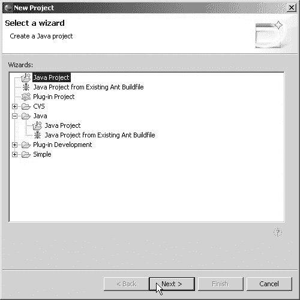

Vohra_706-0C01.fm Page 20 Wednesday, June 28, 2006 6:27 AM

**20**

第 1 章 ■ 介绍 XML 和 Java **图 1-1.** *选择新建项目向导*

在“创建 Java 项目”屏幕上，指定一个项目名称，例如 `Chapter1`。在“项目布局”部分，选择“创建单独的源文件夹和输出文件夹”，然后点击 **下一步**，如图 1-2 所示。

[www.it-ebooks.info](http://www.it-ebooks.info/)

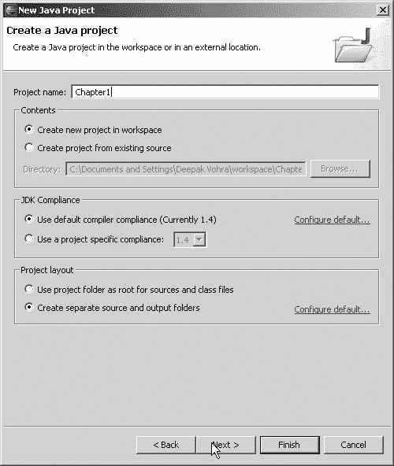

Vohra_706-0C01.fm Page 21 Wednesday, June 28, 2006 6:27 AM

第 1 章 ■ 介绍 XML 和 Java **21**

**图 1-2.** *创建 Java 项目*

在“Java 设置”屏幕上，在“库”选项卡下添加所需的项目库，然后点击 **完成**，如图 1-3 所示。

[www.it-ebooks.info](http://www.it-ebooks.info/)

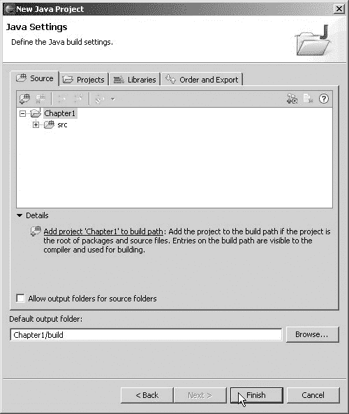

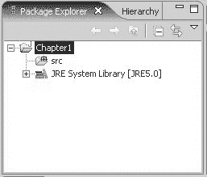

Vohra_706-0C01.fm Page 22 Wednesday, June 28, 2006 6:27 AM

**22**


第 1 章 ■ 介绍 XML 与 Java  
**图 1-3.** *访问 Java 设置界面*  
此操作将在 Eclipse 的包资源管理器中添加一个 Java 项目，如图 1-4 所示。

**图 1-4.** *在包资源管理器中查看 Java 项目*

[www.it-ebooks.info](http://www.it-ebooks.info/)

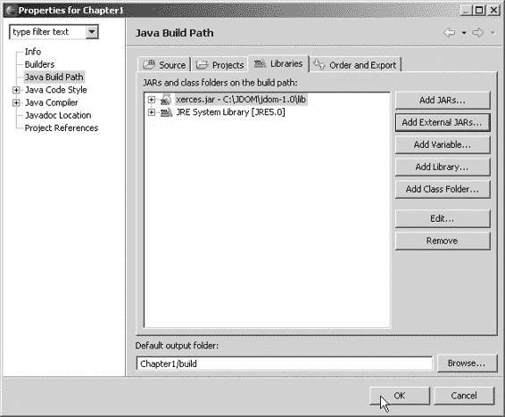

Vohra_706-0C01.fm 第 23 页 2006 年 6 月 28 日星期三 上午 6:27

第 1 章 ■ 介绍 XML 与 Java **23**

**设置构建路径**

Java 项目的构建路径包含编译项目中各种 Java 类文件所需的 JAR 文件和包文件夹。要向项目的构建路径添加 JAR 文件和包文件夹，请在包资源管理器选项卡中选择项目节点，然后选择项目 ➤ 属性。在属性对话框中，选择 Java 构建路径节点，通过单击添加外部 JAR 按钮添加外部（项目外部）JAR 文件，并通过单击添加 JAR 按钮添加内部 JAR 文件。您还可以分别使用添加类文件夹和添加库按钮添加包文件夹和库。

项目构建路径中的 JAR 和包文件夹会显示在 Java 构建路径窗口中。例如，假设`xerces.jar`是一个位于`C:\JDOM\jdom-1.0\lib`路径下的外部 JAR 文件，并通过添加外部 JAR 按钮将其添加到 Java 构建路径窗口中，如图 1-5 所示。

**图 1-5.** *设置 Java 构建路径*

**创建 Java 包**

要在 Java 项目中创建 Java 包，请在包资源管理器中选择项目节点，然后选择文件 ➤ 新建 ➤ 包。在新建 Java 包对话框中，指定包名称，例如`com.apress.chapter1`，然后单击完成按钮，如图 1-6 所示。

[www.it-ebooks.info](http://www.it-ebooks.info/)

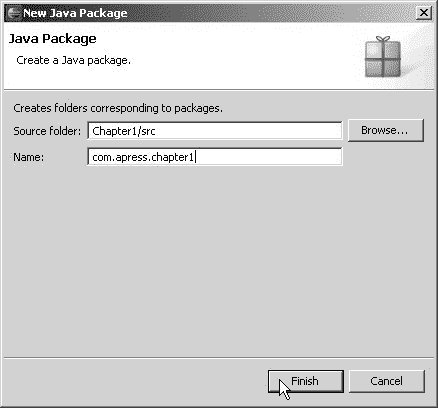

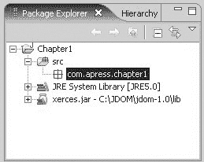

Vohra_706-0C01.fm 第 24 页 2006 年 6 月 28 日星期三 上午 6:27

**24**

第 1 章 ■ 介绍 XML 与 Java **图 1-6.** *创建 Java 包*

此操作将在 Java 项目中添加一个 Java 包，如图 1-7 所示。

**图 1-7.** *在包资源管理器中查看 Java 包*  
**创建 Java 类**

要创建 Java 类，请在包资源管理器中右键单击包节点，然后选择新建 ➤ 类，如图 1-8 所示。

在新建 Java 类界面上，指定类名、类修饰符和实现的接口，然后单击完成按钮，如图 1-9 所示。

[www.it-ebooks.info](http://www.it-ebooks.info/)

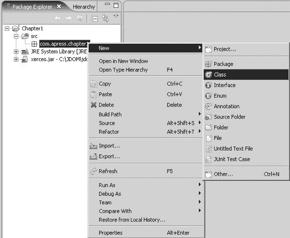

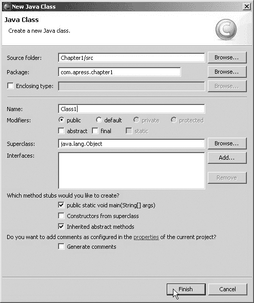

Vohra_706-0C01.fm 第 25 页 2006 年 6 月 28 日星期三 上午 6:27

第 1 章 ■ 介绍 XML 与 Java **25**

**图 1-8.** *创建新的 Java 类*

**图 1-9.** *指定 Java 类设置*

[www.it-ebooks.info](http://www.it-ebooks.info/)

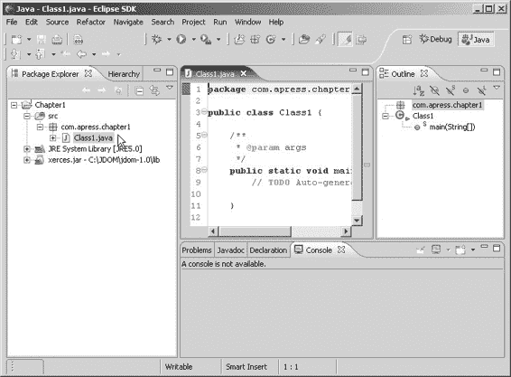

Vohra_706-0C01.fm 第 26 页 2006 年 6 月 28 日星期三 上午 6:27

**26**

第 1 章 ■ 介绍 XML 与 Java 此操作将在 Java 项目中添加一个 Java 类，如图 1-10 所示。

**图 1-10.** *在包资源管理器中查看 Java 类*  
**运行 Java 应用程序**

要运行 Java 应用程序，请在包资源管理器中右键单击 Java 类，然后选择运行方式 ➤ 运行，如图 1-11 所示。

[www.it-ebooks.info](http://www.it-ebooks.info/)

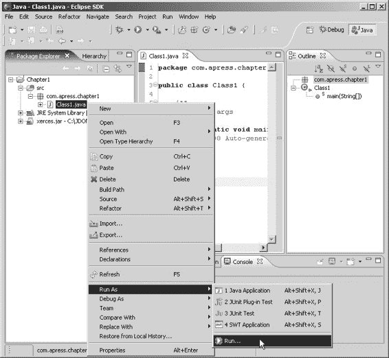

Vohra_706-0C01.fm 第 27 页 2006 年 6 月 28 日星期三 上午 6:27

第 1 章 ■ 介绍 XML 与 Java **27**

**图 1-11.** *运行 Java 应用程序*

在运行对话框中，选择一个 Java 应用程序配置，或通过选择 Java 应用程序 ➤ 新建来创建一个新的 Java 应用程序配置，如图 1-12 所示。

[www.it-ebooks.info](http://www.it-ebooks.info/)

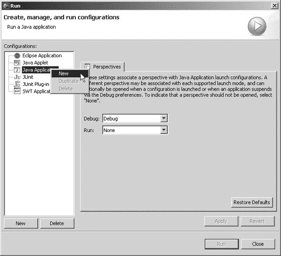

Vohra_706-0C01.fm 第 28 页 2006 年 6 月 28 日星期三 上午 6:27

**28**

第 1 章 ■ 介绍 XML 与 Java **图 1-12.** *创建 Java 应用程序配置*  
此操作将创建一个 Java 应用程序配置。如果需要设置任何应用程序参数，请在参数选项卡上指定参数。要指定项目 JRE，请选择 JRE 选项卡。构建路径中的 JAR 文件和包文件夹也会自动包含在 Java 类路径中。您可以在类路径选项卡上添加类路径 JAR 文件和包文件夹。要运行 Java 应用程序，请单击运行，如图 1-13 所示。

[www.it-ebooks.info](http://www.it-ebooks.info/)

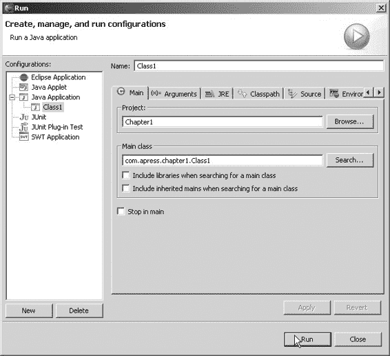

Vohra_706-0C01.fm 第 29 页 2006 年 6 月 28 日星期三 上午 6:27

第 1 章 ■ 介绍 XML 与 Java **29**

**图 1-13.** *配置并运行 Java 应用程序*  
**导入 Java 项目**

本书中应用程序的 Java 项目可从 Apress 网站（http://www.apress.com）获取。运行这些应用程序最简单的方法是下载并将这些 Java 项目导入 Eclipse。在介绍如何导入 Chapter1 项目之前，您必须先删除刚刚创建的 Chapter1 项目及其内容，方法是选中该项目并按 Delete 键。当提示时，请务必选择删除内容的选项。

要导入 Java 项目，请选择文件 ➤ 导入。在导入对话框中，选择将现有项目导入工作空间，然后单击下一步，如图 1-14 所示。

在导入项目对话框中，使用浏览按钮选择一个项目目录。在浏览文件夹对话框中选择一个目录，然后单击确定，如图 1-15 所示。单击完成以导入项目目录。

[www.it-ebooks.info](http://www.it-ebooks.info/)

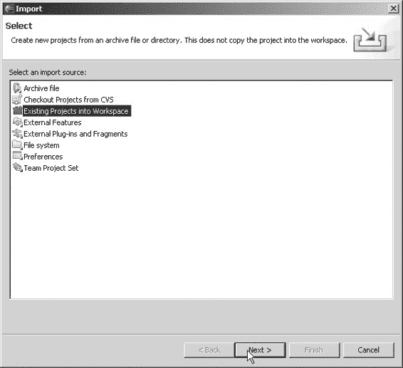


Vohra_706-0C01.fm 第 30 页 2006 年 6 月 28 日星期三 上午 6:27

**30**

第 1 章 ■ 介绍 XML 与 Java **图 1-14.** *导入项目*

**图 1-15.** *选择目录*

[www.it-ebooks.info](http://www.it-ebooks.info/)

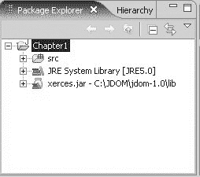

Vohra_706-0C01.fm 第 31 页 2006 年 6 月 28 日星期三 上午 6:27

第 1 章 ■ 介绍 XML 与 Java **31**

此操作将 Java 项目导入 Eclipse IDE，如图 1-16 所示。

**图 1-16.** *在包资源管理器中查看项目*  
**总结**

在本章中，我们指出了将在后续章节中详细讨论的不同 API，并提供了关于 XML 和 XML Schema 的快速入门。我们还介绍了 Eclipse IDE，它用于构建和执行本书中包含的所有示例应用程序。在下一章中，我们将使用 DOM、SAX 和 StAX API 详细讨论 XML 解析。

[www.it-ebooks.info](http://www.it-ebooks.info/)

Vohra_706-0C01.fm 第 32 页 2006 年 6 月 28 日星期三 上午 6:27

[www.it-ebooks.info](http://www.it-ebooks.info/)

Vohra_706-0C02.fm 第 33 页 2006 年 6 月 28 日星期三 上午 6:38

第 2 章

■ ■ ■

解析 XML 文档

**X**ML 文档包含结构化的文本信息。我们在第 1 章的 XML 1.0 入门中介绍了定义格式良好的 XML 文档结构的语法规则。本章将讨论解析文档结构以提取文档中包含的内容信息。

我们将首先讨论解析 XML 文档的各种目标，并介绍与这些目标兼容的各种解析方法。我们将讨论每种方法的优缺点以及它们对特定应用程序的适用性。然后，我们将讨论实现这些方法的具体解析 API，这些 API 定义在 J2SE 5.0 中包含的 JAXP 1.3 以及 J2SE 6.0 中包含的 XML 流式 API（StAX）中。我们将通过代码示例解释每个 API。最后，我们将提供如何在 Eclipse IDE 中构建和执行这些代码示例的说明。

**解析 XML 的目标**


解析是处理 XML 文档最基础的环节。当应用程序解析 XML 文档时，通常有三个明确的目标：

• 确保文档格式良好

• 检查文档是否符合 DTD 或 XML Schema 所指定的结构

• 以满足应用程序特定需求的方式，访问（或许还会修改）文档中指定的各种元素和属性

所有应用程序都共享第一个目标。第二个目标虽不如第一个那样普遍，但仍相当常见。第三个目标则因应用程序而异，这并不奇怪。

受不同应用程序多样化访问需求的推动，逐渐发展出不同的解析方法来满足这些需求。迄今为止，解析 XML 文档主要有三种不同的方法：

• DOM1 解析

• 推式解析

• 拉式解析

在下一节中，我们将概述这三种方法，然后对它们进行比较分析。

1. 你可以在 http://www.w3.org/TR/DOM-Level-3-Core/ 找到文档对象模型（DOM）Level 3 核心规范。

**33**

[www.it-ebooks.info](http://www.it-ebooks.info/)

Vohra_706-0C02.fm Page 34 Wednesday, June 28, 2006 6:38 AM

**34**

第 2 章 ■ 解析 XML 文档

**解析方法概述**

在接下来的几节中，我们将从概念层面概述三种主要的解析方法。在后续章节中，我们将讨论实现这些方法的具体 Java API。我们先从 DOM 方法开始。

**DOM 方法**

文档对象模型（DOM）Level 3 核心规范定义了用于访问和操作内容、以及指定通用文档结构的平台与语言无关的接口。DOM 将文档表示为 Node 对象的树。其中一些 Node 对象拥有子节点对象；另一些则是没有子节点的叶对象。

为了表示 XML 文档的结构，通用的 Node 类型被特化为其他 Node 类型，每种特化的节点类型都指定了一组允许的子 Node 类型。表 2-1 解释了用于表示 XML 文档的特化 DOM Node 类型及其允许的子 Node 类型。

**表 2-1.** *用于 XML 文档的特化 DOM Node 类型* **特化节点类型**

**描述**

**允许的子节点类型**

Document

表示一个 XML 文档

DocumentType, ProcessingInstruction, Comment, Element（最多 1 个）

DocumentFragment

表示 XML 文档的一部分

Element, ProcessingInstruction, Comment, Text, CDATASection, EntityReference

DocumentType

表示文档的 DTD

无子节点

EntityReference

表示一个实体引用

Element, ProcessingInstruction, Comment, Text, CDATASection, EntityReference

Element

表示一个元素

Element, ProcessingInstruction, Comment, Text, CDATASection, EntityReference

Attr

表示一个属性

Text, EntityReference

ProcessingInstruction

表示一条处理指令

无子节点

Comment

表示一条注释

无子节点

Text

表示文本，包括空白

无子节点

CDATASection

表示一个 CDATA 段

无子节点

Entity

表示一个实体

Element, ProcessingInstruction, Comment, Text, CDATASection, EntityReference

Notation

表示一个表示法

无子节点

[www.it-ebooks.info](http://www.it-ebooks.info/)

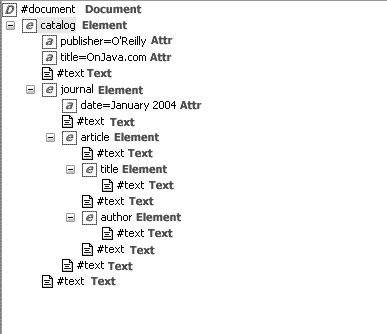

Vohra_706-0C02.fm Page 35 Wednesday, June 28, 2006 6:38 AM

第 2 章 ■ 解析 XML 文档

**35**

Document 特化节点类型有些独特，因为在 XML 文档中最多只能存在一个此类型的实例。同样值得注意的是，Document 节点类型是一种特化的 Element 节点类型，用于表示 XML 文档的根元素。Text 节点类型除了表示文本外，还用于表示 XML 文档中的空白。


在 DOM 方法下，XML 文档会被解析成一个随机访问的树形结构，其中文档中的所有元素和属性都表示为不同的节点，每个节点被实例化为特定节点类型的实例。因此，例如，在 DOM 方法下，清单 2-1 中展示的示例 XML 文档将被解析为图 2-1 所示的树形结构（附有特定节点类型的注释）。

**清单 2-1.** *示例 XML 文档*

<?xml version="1.0" encoding="UTF-8"?>

<catalog title="OnJava.com" publisher="O'Reilly">

<journal date="January 2004">

<article>

<title>Data Binding with XMLBeans</title>

<author>Daniel Steinberg</author>

</article>

</journal>

</catalog>

**图 2-1.** *示例 XML 文档的带注释 DOM 树* DOM 方法具有以下显著特点：

• 在访问或操作文档结构和内容之前，会先在内存中构建完整文档的 DOM 树表示。

• 文档节点可以随机访问，不必严格按文档顺序访问。

• 对任意树节点的随机访问快速且灵活，但在访问任何节点之前解析整个文档可能会降低解析效率。

[www.it-ebooks.info](http://www.it-ebooks.info/)

Vohra_706-0C02.fm Page 36 Wednesday, June 28, 2006 6:38 AM

**36**

第 2 章 ■ 解析 XML 文档

• 对于大小从几百兆字节到几千兆字节的大型文档，内存中的 DOM 树结构可能会耗尽所有可用内存，导致在 DOM 方法下无法解析此类大型文档。

• 如果需要随机导航 XML 文档，或者需要操作文档内容和结构，DOM 解析方法是最实用的方法。这是因为没有其他方法能提供文档的内存表示，虽然解析应用程序当然可以创建这种表示，但这样做本质上是在复制 DOM 方法。

• 在 JAXP 1.3 中提供了使用 DOM 解析方法的 API。

**推送方法**

在推送解析方法下，推送解析器在解析文档时会生成同步事件，应用程序可以使用回调处理程序模型来处理这些事件。推送方法的 API 以 SAX 2.0 的形式提供，它也包含在 JAXP 1.3 中。SAX 是一个只读 API。如果不需要修改或随机访问导航 XML 文档，建议使用 SAX API。

SAX 2.0 API 定义了一个 `ContentHandler` 接口，应用程序可以实现该接口来定义回调处理程序，以处理 SAX 解析器生成的同步解析事件。`ContentHandler` 事件方法具有相当直观的语义，如表 2-2 所示。

**表 2-2.** *SAX 2.0 ContentHandler 事件方法* **方法**

**通知**

startDocument

文档开始

startElement

元素开始

characters

字符数据

endElement

元素结束

endDocument

文档结束

startPrefixMapping

命名空间前缀映射开始

endPrefixMapping

命名空间前缀映射结束

skippedEntity

跳过的实体

ignorableWhitespace

可忽略的空白

processingInstruction

处理指令

2. 你可以在 http://www.saxproject.org/ 找到关于 Simple API for XML 的信息。

[www.it-ebooks.info](http://www.it-ebooks.info/)

Vohra_706-0C02.fm Page 37 Wednesday, June 28, 2006 6:38 AM

第 2 章 ■ 解析 XML 文档

**37**

除了 `ContentHandler` 接口，SAX 2.0 还定义了一个 `ErrorHandler` 接口，应用程序可以实现该接口来接收错误通知。表 2-3 列出了 `ErrorHandler` 的通知方法。

**表 2-3.** *SAX 2.0 ErrorHandler 通知方法* **方法**

**通知**

fatalError

违反 XML 1.0 格式良好约束

error

违反有效性约束

warning

非 XML 相关警告


应用程序不应假设在 `ErrorHandler` 接口的 `fatalError` 方法被调用后，`ContentHandler` 接口的 `endDocument` 方法一定会被调用。

**拉取式方法**

在拉取式方法中，事件是在应用程序的控制下，通过解析器从 XML 文档中拉取的。StAX 与 SAX API 的相似之处在于两者都提供基于事件的 API。然而，StAX 在以下几个方面与 SAX API 有所不同：

• 与 SAX API 不同，在 StAX API 中，控制解析事件传递的是应用程序，而非解析器。StAX 提供了两种基于事件的 API：基于游标的 API 和基于迭代器的 API，两者都受应用程序控制。

• 基于游标的 API 允许按文档顺序遍历文档，并提供对文档内所有结构和内容信息的最低层级访问。

• 基于迭代器的 API 与基于游标的 API 类似，但它不提供低层级访问，而是以事件对象的形式提供对结构和内容信息的访问。

• 与 SAX API 不同，StAX API 既可用于读取 XML 文档，也可用于写入 XML 文档。

**游标 API**

关于 StAX 游标 API 的要点如下：

• `XMLStreamReader` 接口是解析 XML 文档的主要接口。你可以使用此接口，通过 `next()` 和 `hasNext()` 方法来扫描 XML 文档的结构和内容。

• `next()` 方法为下一个解析事件返回一个整数标记。

• 根据下一个事件类型，你可以在 `XMLStreamReader` 接口上调用特定的允许方法。表 2-4 列出了各种事件类型及对应的允许方法。

[www.it-ebooks.info](http://www.it-ebooks.info/)

Vohra_706-0C02.fm 第 38 页 2006 年 6 月 28 日星期三 上午 6:38

**38**

第 2 章 ■ 解析 XML 文档

**表 2-4.** *StAX 游标 API 事件类型及允许方法* **事件类型**

**允许方法**

任何事件类型

`getProperty()`, `hasNext()`, `require()`, `close()`,
`getNamespaceURI()`, `isStartElement()`, `isEndElement()`,
`isCharacters()`, `isWhiteSpace()`, `getNamespaceContext()`,
`getEventType()`, `getLocation()`, `hasText()`, `hasName()`

START_ELEMENT

`next()`, `getName()`, `getLocalName()`, `hasName()`, `getPrefix()`, `getAttributeXXX()`, `isAttributeSpecified()`, `getNamespaceXXX()`, `getElementText()`, `nextTag()`

ATTRIBUTE

`next()`, `nextTag()`, `getAttributeXXX()`, `isAttributeSpecified()`
NAMESPACE

`next()`, `nextTag()`, `getNamespaceXXX()`

END_ELEMENT

`next()`, `getName()`, `getLocalName()`, `hasName()`, `getPrefix()`, `getNamespaceXXX()`, `nextTag()`

CHARACTERS

`next()`, `getTextXXX()`, `nextTag()`

CDATA

`next()`, `getTextXXX()`, `nextTag()`

COMMENT

`next()`, `getTextXXX()`, `nextTag()`

SPACE

`next()`, `getTextXXX()`, `nextTag()`

START_DOCUMENT

`next()`, `getEncoding()`, `getVersion()`, `isStandalone()`,
`standaloneSet()`, `getCharacterEncodingScheme()`, `nextTag()`

END_DOCUMENT

`close()`

PROCESSING_INSTRUCTION

`next()`, `getPITarget()`, `getPIData()`, `nextTag()`

ENTITY_REFERENCE

`next()`, `getLocalName()`, `getText()`, `nextTag()`

DTD

`next()`, `getText()`, `nextTag()`

**迭代器 API**

关于 StAX 迭代器 API 的要点如下：

• `XMLEventReader` 接口是解析 XML 文档的主要接口。你可以使用此接口，通过 `nextEvent()` 和 `hasNext()` 方法来迭代 XML 文档的结构和内容。

• `nextEvent()` 方法返回一个 `XMLEvent` 对象。

• `XMLEvent` 接口提供了用于确定下一个事件类型并对其进行适当处理的实用方法。

对于数据绑定应用程序，特别是在 XML 到 Java 的双向映射过程中进行 XML 文档的编组和解组时，推荐使用 StAX API。

StAX API 的实现包含在 J2SE 6.0 中。

[www.it-ebooks.info](http://www.it-ebooks.info/)

Vohra_706-0C02.fm 第 39 页 2006 年 6 月 28 日星期三 上午 6:38

第 2 章 ■ 解析 XML 文档

**39**

**比较解析方法**


所讨论的三种方法各有优缺点，适用于特定类型的应用程序。表 2-5 对这三种解析方法进行了比较。

**表 2-5.** *DOM、SAX 和 StAX 对比*

**解析方法**

**优点**

**缺点**

**适用应用**

DOM

易于使用、导航、随机访问

必须解析整个文档，内存

修改 XML 文档结构和内容

和 XPath 支持

占用高

的应用，例如可视化 XML 编辑器*

SAX

内存消耗低，效率高

无导航、无随机访问、

只读 XML 应用，例如文档验证

不支持修改

StAX

易于使用、内存消耗低、

无随机访问、不支持修改

数据绑定、SOAP 消息处理、

应用程序控制解析、过滤

* 我们编写了这样一个编辑器，可从 http://www.nubean.com 获取。

在您看到这三种解析 API 的代码示例之前，我们将展示如何创建和配置一个合适的 Eclipse 项目。

**设置 Eclipse 项目**

在接下来的章节中，我们将展示如何设置一个 Eclipse 项目，并填充构建和执行本章讨论的三种解析方法相关代码示例所需的内容。尽管在后续章节中我们将分别讨论每种解析方法，但在此我们将一次性展示如何为所有三种解析方法准备 Eclipse 项目。

**示例 XML 文档**

要采用任何一种解析方法，首先需要的是一个 XML 文档。为此，您可以使用清单 2-2 中所示的示例 XML 文档。

**清单 2-2.** *catalog.xml*

<?xml version="1.0" encoding="UTF-8"?>

<catalog title="OnJava.com" publisher="O'Reilly">

<journal date="January 2004">

<article>

<title>使用 XMLBeans 进行数据绑定</title>

<author>Daniel Steinberg</author>

</article>

</journal>

[www.it-ebooks.info](http://www.it-ebooks.info/)

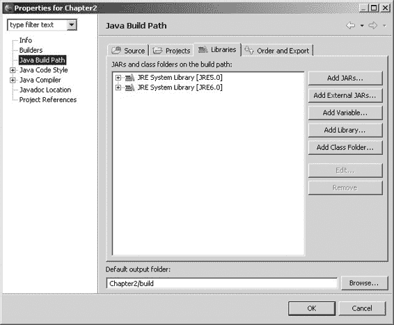

Vohra_706-0C02.fm Page 40 Wednesday, June 28, 2006 6:38 AM

**40**

第 2 章 ■ 解析 XML 文档

<journal date="Sept 2005">

<article>

<title>什么是 Hibernate</title>

<author>James Elliott</author>

</article>

</journal>

</catalog>

**J2SE、包和类**

要构建并执行这些示例，您需要确保机器上已安装 J2SE 5.0 软件开发工具包 (SDK)³ 和 J2SE 6.0 SDK（代号 Mustang⁴）。

接下来，从 Apress 网站 (http://www.apress.com) 下载 Chapter2 项目并导入，具体细节请参见第 1 章。导入项目是运行示例应用程序最快的方式，因为项目中的所有包和文件都会自动创建，并且 Java 构建路径也会自动设置。请验证 Java 构建路径是否如图 2-2 所示，以及整个项目结构是否如图 2-3 所示。

**图 2-2.** *Chapter2 项目 Java 运行时环境 (JRE)*
³. 您可以从 http://java.sun.com/j2se/1.5.0/download.jsp 下载 J2SE 5.0 SDK。
⁴. 您可以从 https://mustang.dev.java.net/ 下载 Mustang 的快照版本。

[www.it-ebooks.info](http://www.it-ebooks.info/)

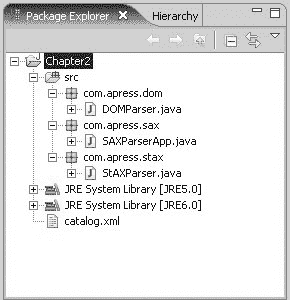

Vohra_706-0C02.fm Page 41 Wednesday, June 28, 2006 6:38 AM

第 2 章 ■ 解析 XML 文档

**41**

**图 2-3.** *Chapter2 项目目录结构*

**使用 DOM Level 3 API 进行解析**

DOM Level 3 API 是 JAXP 1.3 API 的一部分，它将 XML 文档表示为 DOM 节点树。该树中的每个节点都是一个专门的 Node 对象，是表 2-1 中列出的某种专门 Node 类型的实例。以下包和类是任何使用 DOM Level 3 API 的应用程序的基本组成部分：

• 表示 XML 文档 DOM 结构的类和接口位于 `org.w3c.dom` 包中，使用 DOM API 的应用程序必须导入该包。


• `NodeList` 接口表示一个有序的节点列表。`NamedNodeMap` 表示一个无序的节点集合，例如元素的属性。这两个类在遍历表示 XML 文档的 DOM 树时非常有用。

• XML 文档解析 API 位于 `javax.xml.parsers` 包中。这是一个基础包，使用 DOM API 解析 XML 文档的应用程序必须导入该包。

• 应用程序需要导入 `org.xml.sax` 包，以便访问用于错误处理的 `SAXException` 和 `SAXParseException` 类。DOM API 中对 SAX API 的引用可能看起来有些不合时宜。然而，DOM API 对 SAX API 的这种依赖是由 JAXP 1.3 规定的，其基本目的是在适当的地方重用 SAX API。

DOM API 解析步骤

要使用 DOM API 解析 XML 文档，您需要遵循以下步骤：**1.** 创建一个 DOM 解析器工厂。

**2.** 使用解析器工厂实例化一个 DOM 解析器。

**3.** 使用 DOM 解析器解析 XML 文档并创建 DOM 树。

**4.** 通过访问 DOM 树来访问和操作 XML 结构与内容。

[www.it-ebooks.info](http://www.it-ebooks.info/)

Vohra_706-0C02.fm 第 42 页 2006 年 6 月 28 日星期三 上午 6:38

**42**

第 2 章 ■ 解析 XML 文档

`DocumentBuilder` 类实现了 DOM 解析器。实例化 `DocumentBuilder` 对象的步骤如下：

**1.** 使用静态方法 `newInstance()` 创建一个 `DocumentBuilderFactory` 对象。`DocumentBuilderFactory` 类是一个用于生成 `DocumentBuilder` 对象的工厂 API。

**2.** 在 `DocumentBuilderFactory` 对象上调用 `newDocumentBuilder()` 静态方法来创建一个 `DocumentBuilder` 对象。

`DocumentBuilder` 解析器从 XML 文档创建一个内存中的 DOM 结构。如果您想在解析期间处理验证错误，您需要定义一个实现表 2-3 中所示的 `ErrorHandler` 接口的类，并在解析器上设置此错误处理程序类的一个实例。

清单 2-3 展示了一个实现 `ErrorHandler` 接口的示例类。

**清单 2-3.** *实现 ErrorHandler*

class ErrorHandlerImpl implements org.xml.sax.ErrorHandler {

public void error(SAXParseException exception)

throws SAXException{

// 应用程序特定的逻辑

}

public void fatalError(SAXParseException exception)

throws SAXException{

// 应用程序特定的逻辑

}

public void warning(SAXParseException exception)

throws SAXException{

// 应用程序特定的逻辑

}

}

清单 2-4 展示了创建 DOM 解析器对象的完整代码序列，该解析器将验证文档并使用 `ErrorHandlerImpl` 类的实例进行错误处理。

**清单 2-4.** *实例化工厂的完整代码序列*

//创建一个 DocumentBuilderFactory

DocumentBuilderFactory factory=DocumentBuilderFactory.newInstance();

//创建一个 DocumentBuilder

DocumentBuilder documentBuilder=factory.newDocumentBuilder();

//创建并设置一个 ErrorHandler

ErrorHandlerImpl errorHandler=new ErrorHandlerImpl();

documentBuilder.setErrorHandler(errorHandler);

解析器可以从 `File`、`InputSource`、`InputStream` 或 `URI` 解析 XML 文档。

如何从 `File` 对象解析 XML 文档的示例如下：Document document=documentBuilder.parse(new File("catalog.xml"));

[www.it-ebooks.info](http://www.it-ebooks.info/)

Vohra_706-0C02.fm 第 43 页 2006 年 6 月 28 日星期三 上午 6:38

第 2 章 ■ 解析 XML 文档

**43**

`Document` 接口提供了多种导航 DOM 结构的方法。表 2-6 列出了 `Document` 接口的一些方法。

**表 2-6.** *Document 接口方法*

**方法名称**

**描述**

getDoctype()

返回 XML 文档中的 DOCTYPE

getDocumentElement()

返回根元素

getElementById(String)

获取指定 ID 的元素

getElementsByTagName(String)

获取元素的 NodeList


`org.w3c.dom.Element` 接口表示 DOM 结构中的一个元素。你可以从 `Element` 对象中获取元素属性和子元素。表 2-7 列出了 `Element` 接口中的一些方法。

**表 2-7.** *Element 接口方法*

**方法名称**

**描述**

getAttributes()

返回属性的 NamedNodeMap

getAttribute(String)

通过属性名称获取属性值

getAttributeNode(String)

返回一个属性的 Attr 节点

getElementsByTagName(String)

通过元素名称返回元素的 NodeList

getTagName()

获取元素标签名称

`Attr` 接口表示一个属性节点。你可以从 `Attr` 节点中获取属性名称和值。表 2-8 列出了 `Attr` 节点中的一些方法。

**表 2-8.** *Attr 接口方法*

**方法名称**

**描述**

getName()

返回属性名称

getValue()

返回属性值

[www.it-ebooks.info](http://www.it-ebooks.info/)

Vohra_706-0C02.fm Page 44 Wednesday, June 28, 2006 6:38 AM

**44**

第 2 章 ■ 解析 XML 文档

所有专门的 Node 接口，如 Document、Element 和 Attr，都继承了 Node 接口定义的方法。表 2-9 列出了 Node 接口中的一些方法。

**表 2-9.** *Node 接口方法*

**方法名称**

**描述**

getAttributes()

返回元素节点的属性的 NamedNodeMap

getChildNodes()

返回节点中的子节点

getLocalName()

从元素节点和属性节点返回本地名称 getNodeName()

返回节点名称

getNodeValue()

返回节点值

getNodeType()

返回节点类型

在示例 DOM 应用程序中，使用 `getDocumentElement()` 方法检索根元素，并使用 `getTagName()` 方法获取根元素名称，如清单 2-5 所示。

**清单 2-5.** *检索根元素名称*

Element rootElement = document.getDocumentElement();

String rootElementName = rootElement.getTagName();

如果根元素有属性，则检索根元素中的属性。`hasAttributes()` 方法测试元素是否具有属性，`getAttributes()` 方法检索属性，如清单 2-6 所示。

**清单 2-6.** *检索根元素属性* if (rootElement.hasAttributes()) {

NamedNodeMap attributes = rootElement.getAttributes();

}

`getAttributes()` 方法返回属性的 NamedNodeMap。NamedNodeMap 的 `getNodeLength()` 方法返回属性列表长度，属性列表中的属性通过 `item(int)` 方法检索。可以遍历 NamedNodeMap 来检索属性的值，如清单 2-7 所示。Attr 对象的 `getName()` 方法返回属性名称，`getValue()` 方法返回属性值。

**清单 2-7.** *检索属性值*

for (int i = 0; i < attributes.getLength(); i++) {

Attr attribute = (Attr) (attributes.item(i));

System.out.println("Attribute:" + attribute.getName()+

" with value " + attribute.getValue());

}

如果根元素有子节点，你可以使用 `getChildNodes()` 方法检索这些节点。`hasChildNodes()` 方法测试元素是否具有子节点，如清单 2-8 所示。

[www.it-ebooks.info](http://www.it-ebooks.info/)

Vohra_706-0C02.fm Page 45 Wednesday, June 28, 2006 6:38 AM

第 2 章 ■ 解析 XML 文档

**45**

**清单 2-8.** *检索根元素中的节点* if (rootElement.hasChildNodes()) {

NodeList nodeList = rootElement.getChildNodes();

}

节点列表包含空白文本节点。NodeList 的 `getNodeLength()` 方法返回节点列表长度，你可以使用 `item(int)` 方法检索节点列表中的节点，如清单 2-9 所示。

**清单 2-9.** *检索 NodeList 中的节点*

for (int i = 0; i < nodeList.getLength(); i++) {

Node node = nodeList.item(i);

}

如果一个节点是 Element 类型，则可以将 Node 对象转换为 Element。节点类型通过 Node 接口的 `getNodeType()` 方法获取。`getNodeType()` 方法返回一个 short 值。表 2-10


列出不同的短整型值及其对应的节点类型。

**表 2-10.** *节点类型*

**短整型值**

**节点类型**

ELEMENT_NODE

元素节点

ATTRIBUTE_NODE

属性节点

TEXT_NODE

文本节点

CDATA_SECTION_NODE

CDATA 段节点

ENTITY_REFERENCE_NODE

实体引用节点

ENTITY_NODE

实体节点

PROCESSING_INSTRUCTION_NODE

处理指令节点

COMMENT_NODE

注释节点

DOCUMENT_NODE

文档节点

DOCUMENT_TYPE_NODE

文档类型节点

DOCUMENT_FRAGMENT_NODE

文档片段节点

NOTATION_NODE

符号节点

如果节点是 Element 类型，则将 Node 对象转换为 Element，如清单 2-10 所示。

**清单 2-10.** *将 Node 转换为 Element*

if (node.getNodeType() == Node.ELEMENT_NODE) {

Element element = (Element) (node);

}

[www.it-ebooks.info](http://www.it-ebooks.info/)

Vohra_706-0C02.fm Page 46 Wednesday, June 28, 2006 6:38 AM

**46**

第 2 章 ■ 解析 XML 文档

如果某个元素包含文本节点，可以使用 getNodeValue() 方法获取文本值，如下所示：

String textValue=node.getNodeValue();

DOM API 示例

清单 2-11 中所示的 Java 应用程序 DOMParser.java 解析了清单 2-2 中所示的 XML 文档。我们假设您已将清单 2-2 中所示的 XML 文档导入到 Chapter2 项目中，如图 2-2 所示。

此示例演示了如何使用 DocumentBuilder 对象来解析示例 XML 文档。成功解析文档后，您将获得一个 Document 对象，该对象表示示例文档的内存树结构。您从 Document 对象中检索代表根元素的节点，并使用 visitNode() 方法从根元素开始向下遍历此树并访问每个节点。

在遍历树时，当您到达一个节点时，首先确定其节点类型。如果节点类型是 Element，则使用 visitNode() 方法遍历 Element 节点的子节点。visitNode() 方法还会输出元素标签名称和元素中的属性。如果节点类型是 Text 且 Text 节点不是空节点，则输出 Text 节点的文本值。

**清单 2-11.** *DOM 解析应用程序 DOMParser.java* package com.apress.dom;

import javax.xml.parsers.DocumentBuilder;

import javax.xml.parsers.DocumentBuilderFactory;

import javax.xml.parsers.ParserConfigurationException;

import org.w3c.dom.*;

import org.xml.sax.SAXException;

import java.io.*;

public class DOMParser {

public static void main(String argv[]) {

try {

// 创建一个 DocumentBuilderFactory

DocumentBuilderFactory factory = DocumentBuilderFactory

.newInstance();

File xmlFile = new File("catalog.xml");

// 创建一个 DocumentBuilder

DocumentBuilder builder = factory.newDocumentBuilder();

// 解析一个 XML 文档

Document document = builder.parse(xmlFile);

// 检索根元素

Element rootElement = document.getDocumentElement();

System.out.println("根元素是: " + rootElement.getTagName()); visitNode(null, rootElement);

} catch (SAXException e) {

System.out.println(e.getMessage());

[www.it-ebooks.info](http://www.it-ebooks.info/)

Vohra_706-0C02.fm Page 47 Wednesday, June 28, 2006 6:38 AM

第 2 章 ■ 解析 XML 文档

**47**

} catch (ParserConfigurationException e) {

System.out.println(e.getMessage());

} catch (IOException e) {

System.out.println(e.getMessage());

}

}

public static void visitNode(Element previousNode, Element visitNode) {

// 处理一个 Element 节点

if (previousNode != null) {

System.out.println("元素 " + previousNode.getTagName()

+ " 包含元素:");

}

System.out.println("元素名称: " + visitNode.getTagName());

// 列出元素节点的属性

if (visitNode.hasAttributes()) {

System.out.println("元素 " + visitNode.getTagName()

+ " 包含属性: ");

NamedNodeMap attributes = visitNode.getAttributes();

for (int j = 0; j < attributes.getLength(); j++) {

Attr attribute = (Attr) (attributes.item(j));

System.out.println("属性:" + attribute.getName()

+ " 值为 " + attribute.getValue());

}

}

// 获取 Element 节点中的节点列表


NodeList nodeList = visitNode.getChildNodes();

for (int i = 0; i < nodeList.getLength(); i++) {

Node node = nodeList.item(i);

// 检索元素节点

if (node.getNodeType() == Node.ELEMENT_NODE) {

Element element = (Element) node;

// 递归调用 visitNode 方法处理

// 元素节点层级结构

visitNode(visitNode, element);

} else if (node.getNodeType() == Node.TEXT_NODE) {

String str = node.getNodeValue().trim();

if (str.length() > 0) {

System.out.println("元素文本: " + str);

}

}

}

}

}

}

清单 2-12 显示了在 Eclipse 中运行 DOM 应用程序的输出结果。该输出显示了在树遍历过程中访问的每个节点所对应的节点类型和节点值。

[www.it-ebooks.info](http://www.it-ebooks.info/)

Vohra_706-0C02.fm 第 48 页 2006 年 6 月 28 日星期三 上午 6:38

**48**

第 2 章 ■ 解析 XML 文档

**清单 2-12.** *DOMParser 应用程序的输出* 根元素为: catalog

元素名称: catalog

元素 catalog 具有属性:

属性:publisher 值为 O'Reilly

属性:title 值为 OnJava.com

元素 catalog 包含元素:

元素名称: journal

元素 journal 具有属性:

属性:date 值为 January 2004

元素 journal 包含元素:

元素名称: article

元素 article 包含元素:

元素名称: title

元素文本: Data Binding with XMLBeans

元素 article 包含元素:

元素名称: author

元素文本: Daniel Steinberg

元素 catalog 包含元素:

元素名称: journal

元素 journal 具有属性:

属性:date 值为 Sept 2005

元素 journal 包含元素:

元素名称: article

元素 article 包含元素:

元素名称: title

元素文本: What Is Hibernate

元素 article 包含元素:

元素名称: author

元素文本: James Elliott

**使用 SAX 2.0 进行解析**

SAX 2.05 是一个基于事件的 API，用于解析 XML 文档。SAX 2.0 并非 W3C 推荐标准。然而，它是一个被广泛使用的 API，已成为事实上的标准。迄今为止，SAX 有两个主要版本：SAX 1.0 和 SAX 2.0。这两个版本之间没有根本性的差异。最显著的区别在于，SAX 1.0 的 Parser 接口被 SAX 2.0 的 XMLReader 接口所取代，后者通过提供对命名空间的完整支持，改进了 SAX 1.0 接口。在本章中，我们将只关注 SAX 2.0 API。

SAX 2.0 是一个推模型 API；在解析 XML 文档时会产生事件。事件由解析器生成，并通过应用程序定义的回调方法进行传递。使用 SAX 2.0 API 的关键点如下：

• 您需要至少导入两个包：用于 SAX 接口的 org.xml.sax 包，以及用于 SAXParser 和 SAXParserFactory 类的 javax.xml.parsers 包。此外，您可能还需要导入 org.xml.sax.helpers 包，该包包含使用 SAX API 时非常有用的辅助类。

5\. 您可以在 http://www.saxproject.org/ 找到关于 SAX 的信息。

[www.it-ebooks.info](http://www.it-ebooks.info/)

Vohra_706-0C02.fm 第 49 页 2006 年 6 月 28 日星期三 上午 6:38

第 2 章 ■ 解析 XML 文档

**49**

• ContentHandler 是应用程序需要实现的主要接口，因为它提供关于解析事件的事件通知。DefaultHandler 类提供了 ContentHandler 接口的默认实现。为了处理 SAX 解析器事件，应用程序可以定义一个实现 ContentHandler 接口的类，或者定义一个扩展 DefaultHandler 类的类。

• 您使用 SAXParser 类来解析 XML 文档。

• 您从 SAXParserFactory 对象获取 SAXParser 对象。要获取 SAX 解析器，您需要首先使用静态方法 newInstance() 创建 SAXParserFactory 的实例，如下例所示：

SAXParserFactory factory=SAXParserFactory.newInstance(); **用于 SAX 的 JAXP 可插拔性**


JAXP 1.3 为 SAXParserFactory 实现类提供了完全的可插拔性。这意味着 SAXParserFactory 实现类不是一个固定的类。相反，SAXParserFactory 实现类由 JAXP 通过以下查找过程获取：**1.** 使用 `javax.xml.parsers.SAXParserFactory` 系统属性来确定要加载的工厂类。

**2.** 使用 JRE 目录下 `lib/jaxp.properties` 文件中指定的 `javax.xml.parsers.SAXParserFactory` 属性来确定要加载的工厂类。JAXP 仅读取此文件一次，并且该文件中定义的属性值由 JAXP 缓存。

**3.** JAR 文件中 `META-INF/services` 目录下的文件被视为服务提供者配置文件。使用 Services API，并从运行时类路径中任何 JAR 文件所包含的 `META-INF/services/javax.xml.parsers.SAXParserFactory` 文件中获取工厂类名称。

**4.** 使用 J2SE 平台中包含的默认 `SAXParserFactory` 类。

如果需要验证，请将工厂的 `validating` 属性设置为 `true`：`factory.setValidating(true);`

如果将 `SAXParserFactory` 对象的 `validation` 属性设置为 `true`，则默认情况下，从此类工厂对象获取的解析器会根据 DTD 验证 XML 文档。要针对 XML Schema 验证文档，您需要做更多工作，这将在第 3 章中详细介绍。

**SAX 特性**

SAXParserFactory 特性是逻辑开关，您可以打开或关闭它们以更改解析器行为。

您可以通过 `setFeature(String, boolean)` 方法设置工厂的特性。传递给 `setFeature` 的第一个参数是特性的名称，第二个参数是 `true` 或 `false` 值。

表 2-11 列出了一些常用的 SAXParserFactory 特性。某些 SAXParserFactory 特性是特定于实现的，因此不同的工厂实现可能不支持所有特性。

[www.it-ebooks.info](http://www.it-ebooks.info/)

Vohra_706-0C02.fm Page 50 Wednesday, June 28, 2006 6:38 AM

**50**

第 2 章 ■ 解析 XML 文档

**表 2-11.** *SAXParserFactory 特性*

**特性**

**描述**

`http://xml.org/sax/features/namespaces`

如果设置为 `true`，则执行命名空间处理

`http://xml.org/sax/features/validation`

验证 XML 文档

`http://apache.org/xml/features/validation/schema`

执行 XML Schema 验证

`http://xml.org/sax/features/external-general-entities`

包含外部通用实体

`http://xml.org/sax/features/external-parameter-entities`

包含外部参数实体和外部 DTD 子集

`http://apache.org/xml/features/nonvalidating/load-external-dtd`

加载外部 DTD

`http://xml.org/sax/features/namespace-prefixes`

报告用于命名空间声明的属性和前缀

`http://xml.org/sax/features/xml-1.1`

支持 XML 1.1

**SAX 属性**

SAX 解析器属性是名称-值对，您可以使用它们向 SAX 解析器提供对象值。

这些属性影响解析器行为，可以通过解析器的 `setProperty(String, Object)` 方法进行设置。传递给 `setProperty` 的第一个参数是属性的名称，第二个参数是一个 `Object` 值。表 2-12 列出了一些常用的 SAX 解析器属性。

某些属性是特定于实现的，因此不同的 SAX 解析器实现可能不支持所有属性。

**表 2-12.** *SAX 解析器属性*

**属性**

**描述**

`http://apache.org/xml/properties/schema/external-schemaLocation`

指定用于验证的外部模式

`http://apache.org/xml/properties/schema/external-noNamespaceSchemaLocation`

指定外部无命名空间模式

`http://xml.org/sax/properties/declaration-handler`

指定 DTD 声明的处理器

`http://xml.org/sax/properties/lexical-handler`

指定词法解析事件的处理器

`http://xml.org/sax/properties/dom-node`

如果 SAX 用作 DOM 迭代器，则指定正在解析的 DOM 节点


http://xml.org/sax/properties/document-xml-version

指定文档的 XML 版本

[www.it-ebooks.info](http://www.it-ebooks.info/)

Vohra_706-0C02.fm 第 51 页 2006 年 6 月 28 日星期三 上午 6:38

第 2 章 ■ 解析 XML 文档

**51**

**SAX 处理器**

要使用 SAX 2.0 API 解析文档，必须定义两个类：

• 一个实现 ContentHandler 接口的类（表 2-2）
• 一个实现 ErrorHandler 接口的类（表 2-3）

SAX 2.0 API 提供了一个 DefaultHandler 辅助类，它完整实现了 ContentHandler 和 ErrorHandler 接口，并为每个解析器事件类型以及默认错误处理提供了默认行为。应用程序可以扩展 DefaultHandler 类并重写相关的基类方法，以实现自定义的回调处理器。清单 2-13 中所示的 CustomSAXHandler 就是这样一个类，它重写了部分基类事件通知方法，包括错误处理方法。

关于 CustomSAXHandler 类的要点如下：

• 在 CustomSAXHandler 类中，startDocument() 和 endDocument() 方法会输出事件类型。
• 在 startElement() 方法中，会输出事件类型、元素限定名和元素属性。startElement() 方法的 uri 参数是元素的命名空间 URI，可能为 null。参数 localName 是不带元素前缀的元素名称。参数 qName 是带前缀的元素名称。如果元素不在带前缀的命名空间中，则 localName 与 qName 相同。
• 参数 attributes 是元素属性的列表。startElement() 方法会打印出限定元素名称和元素属性。Attributes 接口的 getQName() 方法返回属性的限定名。getValue() 方法返回属性值。
• characters() 方法在文本事件（例如元素文本）发生时被调用，它会打印出节点的文本。
• 三个错误处理方法——fatalError、error 和 warning——会打印出传递给这些方法的 SAXParseException 对象中包含的错误信息。

**清单 2-13.** *CustomSAXHandler 类*

import org.xml.sax.*;

import org.xml.sax.helpers.DefaultHandler;

private class CustomSAXHandler extends DefaultHandler {

public CustomSAXHandler() {

}

public void startDocument() throws SAXException {

//输出事件类型

System.out.println("事件类型：开始文档");

}

public void endDocument() throws SAXException {

//输出事件类型

System.out.println("事件类型：结束文档");

}

public void startElement(String uri, String localName, String qName, Attributes attributes) throws SAXException {

//输出事件类型和元素名称

[www.it-ebooks.info](http://www.it-ebooks.info/)

Vohra_706-0C02.fm 第 52 页 2006 年 6 月 28 日星期三 上午 6:38

**52**

第 2 章 ■ 解析 XML 文档

System.out.println("事件类型：开始元素"); System.out.println("元素名称：" + qName);

//输出元素属性

for (int i = 0; i < attributes.getLength(); i++) {

System.out.println("属性名称：" + attributes.getQName(i)); System.out.println("属性值：" + attributes.getValue(i));

}

}

public void endElement(String uri, String localName, String qName) throws SAXException {

//输出事件类型

System.out.println("事件类型：结束元素");

}

public void characters(char[] ch, int start, int length)

throws SAXException {

//输出事件类型和文本

System.out.println("事件类型：文本");

String str = (new String(ch, start, length));

System.out.println(str);

}

//错误处理

public void error(SAXParseException e)

throws SAXException{

System.out.println("错误："+e.getMessage());

}

public void fatalError(SAXParseException e)

throws SAXException{

System.out.println("致命错误："+e.getMessage());

}

public void warning(SAXParseException e)

throws SAXException{

System.out.println("警告："+e.getMessage());

}

}

**SAX 解析步骤**

SAX 解析步骤如下：


**1.** 使用静态方法 `newInstance()` 创建一个 `SAXParserFactory` 对象。

**2.** 使用 `newSAXParser()` 方法从 `SAXParserFactory` 对象创建一个 `SAXParser` 对象。

**3.** 创建一个 `DefaultHandler` 对象，并使用 `SAXParser` 的 `parse(File, DefaultHandler)` 方法解析示例 XML 文档。

清单 2-14 展示了一段创建 SAX 解析器的代码序列，该解析器使用 `CustomSAXHandler` 类的实例来处理 SAX 事件。

[www.it-ebooks.info](http://www.it-ebooks.info/)

Vohra_706-0C02.fm 第 53 页 2006 年 6 月 28 日星期三 上午 6:38

第 2 章 ■ 解析 XML 文档

**53**

**清单 2-14.** *创建 SAX 解析器*

SAXParserFactory factory=SAXParserFactory.newInstance();

// 创建一个解析器

SAXParser saxParser=factory.newSAXParser();

// 创建事件处理器并设置到解析器上

DefaultHandler handler=new CustomSAXHandler();

saxParser.parse(new File("catalog.xml"), handler); **SAX API 示例**

解析事件通过 `DefaultHandler` 的回调方法进行通知。`CustomSAXHandler` 类继承自 `DefaultHandler` 类，并重写了部分事件通知方法。`CustomSAXHandler` 类还重写了错误处理方法，以执行特定于应用程序的错误处理。`CustomSAXHandler` 类被定义为 SAX 解析应用程序 `SAXParserApp.java` 中的一个私有类，如清单 2-15 所示。

**清单 2-15.** *SAXParserApp.java*

package com.apress.sax;

import org.xml.sax.*;

import javax.xml.parsers.*;

import org.xml.sax.helpers.DefaultHandler;

import java.io.*;

public class SAXParserApp {

public static void main(String argv[]) {

SAXParserApp saxParserApp = new SAXParserApp();

saxParserApp.parseDocument();

}

public void parseDocument() {

try { //创建一个 SAXParserFactory

SAXParserFactory factory = SAXParserFactory.newInstance();

//创建一个 SAXParser

SAXParser saxParser = factory.newSAXParser();

//创建一个 DefaultHandler 并解析 XML 文档

DefaultHandler handler = new CustomSAXHandler();

saxParser.parse(new File("catalog.xml"), handler);

} catch (SAXException e) {

} catch (ParserConfigurationException e) {

} catch (IOException e) {

}

}

[www.it-ebooks.info](http://www.it-ebooks.info/)

Vohra_706-0C02.fm 第 54 页 2006 年 6 月 28 日星期三 上午 6:38

**54**

第 2 章 ■ 解析 XML 文档

//DefaultHandler 类

private class CustomSAXHandler extends DefaultHandler {

public CustomSAXHandler() {

}

public void startDocument() throws SAXException {

System.out.println("Event Type: Start Document");

}

public void endDocument() throws SAXException {

System.out.println("Event Type: End Document");

}

public void startElement(String uri, String localName, String qName, Attributes attributes) throws SAXException {

System.out.println("Event Type: Start Element"); System.out.println("Element Name:" + qName);

for (int i = 0; i < attributes.getLength(); i++) {

System.out.println("Attribute Name:" + attributes.getQName(i)); System.out.println("Attribute Value:" + attributes.getValue(i));

}

}

public void endElement(String uri, String localName, String qName) throws SAXException {

System.out.println("Event Type: End Element");

}

public void characters(char[] ch, int start, int length)

throws SAXException {

System.out.println("Event Type: Text");

String str = (new String(ch, start, length));

System.out.println(str);

}

public void error(SAXParseException e)

throws SAXException{

System.out.println("Error "+e.getMessage());

}

public void fatalError(SAXParseException e)

throws SAXException{

System.out.println("Fatal Error "+e.getMessage());

}

public void warning(SAXParseException e)

throws SAXException{

System.out.println("Warning "+e.getMessage());

}

}

}

[www.it-ebooks.info](http://www.it-ebooks.info/)

Vohra_706-0C02.fm 第 55 页 2006 年 6 月 28 日星期三 上午 6:38

第 2 章 ■ 解析 XML 文档

**55**

清单 2-16 展示了 `SAXParserApp.java` 的输出结果。元素之间的空白也会作为文本输出，因为与 DOM API 示例不同，SAX 示例不会过滤掉空白文本。


**清单 2-16.** *SAXParserApp 应用程序的输出*  
事件类型：开始文档  

事件类型：开始元素  

元素名称：catalog  

属性名称：title  

属性值：OnJava.com  

属性名称：publisher  

属性值：O'Reilly  

事件类型：文本  

事件类型：文本  

事件类型：开始元素  

元素名称：journal  

属性名称：date  

属性值：January 2004  

事件类型：文本  

事件类型：开始元素  

元素名称：article  

事件类型：文本  

事件类型：文本  

事件类型：开始元素  

元素名称：title  

事件类型：文本  

使用 XMLBeans 进行数据绑定  

事件类型：结束元素  

事件类型：文本  

事件类型：开始元素  

元素名称：author  

事件类型：文本  

Daniel Steinberg  

事件类型：结束元素  

事件类型：文本  

事件类型：结束元素  

事件类型：文本  

[www.it-ebooks.info](http://www.it-ebooks.info/)  

Vohra_706-0C02.fm 第 56 页 2006 年 6 月 28 日星期三 上午 6:38  

**56**  

第 2 章 ■ 解析 XML 文档  

事件类型：结束元素  

事件类型：文本  

事件类型：开始元素  

元素名称：journal  

属性名称：date  

属性值：Sept 2005  

事件类型：文本  

事件类型：文本  

事件类型：开始元素  

元素名称：article  

事件类型：文本  

事件类型：开始元素  

元素名称：title  

事件类型：文本  

什么是 Hibernate  

事件类型：结束元素  

事件类型：文本  

事件类型：开始元素  

元素名称：author  

事件类型：文本  

James Elliott  

事件类型：结束元素  

事件类型：文本  

事件类型：结束元素  

事件类型：文本  

事件类型：文本  

事件类型：结束元素  

事件类型：结束文档  

为了演示 SAX 解析应用程序中的错误处理，请在示例 XML 文档 `catalog.xml` 中添加一个错误，例如删除一个 `</journal>` 标签。SAX 解析应用程序会输出 XML 文档中的错误，如清单 2-17 所示。  

[www.it-ebooks.info](http://www.it-ebooks.info/)  

Vohra_706-0C02.fm 第 57 页 2006 年 6 月 28 日星期三 上午 6:38  

第 2 章 ■ 解析 XML 文档  

**57**  

**清单 2-17.** *SAX 解析错误*  

致命错误：元素类型  

"journal" 必须由匹配的结束标签 "</journal>" 终止。  

**使用 StAX 进行解析**  

StAX 是一种用于解析 XML 的拉模型 API。StAX 相比推模型 SAX 具有优势。在推模型中，解析器在解析 XML 文档时生成事件。而使用 StAX 的拉解析，应用程序生成解析事件；因此，你可以根据需要生成解析事件。  

StAX API（JSR-173）6 已在 J2SE 6.0 中实现。  

关于 StAX API 的要点如下：  

• StAX API 类位于 `javax.xml.stream` 和 `javax.xml.stream.events` 包中。  

• StAX API 提供了两种不同的 API 来解析 XML 文档：基于游标的 API 和基于迭代器的 API。  

• `XMLStreamReader` 接口使用游标 API 解析 XML 文档。  

• `XMLEventReader` 使用迭代器 API 解析 XML 文档。  

• 你可以使用 `XMLStreamWriter` 接口生成 XML 文档。  

我们将首先讨论游标 API，然后讨论迭代器 API。  

**游标 API**  

你可以使用 `XMLStreamReader` 对象通过游标方法解析 XML 文档。`next()` 方法生成下一个解析事件。你可以通过 `getEventType()` 方法获取事件类型。你可以从 `XMLInputFactory` 对象创建 `XMLStreamReader` 对象，并且可以使用静态方法 `newInstance()` 创建 `XMLInputFactory` 对象，如清单 2-18 所示。  

**清单 2-18.** *创建 XMLStreamReader 对象*  
```  
XMLInputFactory inputFactory=XMLInputFactory.newInstance();  
InputStream input=new FileInputStream(new File("catalog.xml"));  
XMLStreamReader xmlStreamReader = inputFactory.createXMLStreamReader(input);  
```  
下一个解析事件通过 `XMLStreamReader` 对象的 `next()` 方法生成，如清单 2-19 所示。  

**清单 2-19.** *获取解析事件*  
```  
while (xmlStreamReader.hasNext()) {  
    int event = xmlStreamReader.next();  
}  
```  
`next()` 方法返回一个 `int` 值，该值对应于一个解析事件，由 `XMLStreamConstants` 常量指定。表 2-13 列出了 `XMLStreamReader` 对象返回的事件类型。


对于 `START_DOCUMENT` 事件类型，`getEncoding()` 方法返回 XML 文档中的编码。`getVersion()` 方法返回 XML 文档的版本。

6\. 你可以在 http://jcp.org/aboutJava/communityprocess/final/jsr173/index.html 找到此规范。

[www.it-ebooks.info](http://www.it-ebooks.info/)

Vohra_706-0C02.fm 第 58 页 2006 年 6 月 28 日星期三 上午 6:38

**58**

第 2 章 ■ 解析 XML 文档

**表 2-13.** *XMLStreamReader 事件*

**事件类型**

**描述**

START_DOCUMENT

文档开始

START_ELEMENT

元素开始

ATTRIBUTE

元素属性

NAMESPACE

命名空间声明

CHARACTERS

字符（可能是文本或空白）

COMMENT

注释

SPACE

可忽略的空白

PROCESSING_INSTRUCTION

处理指令

DTD

DTD

ENTITY_REFERENCE

实体引用

CDATA

CDATA 段

END_ELEMENT

元素结束

END_DOCUMENT

文档结束

ENTITY_DECLARATION

实体声明

NOTATION_DECLARATION

符号声明

对于 `START_ELEMENT` 事件类型，`getPrefix()` 方法返回元素前缀，`getNamespaceURI()` 方法返回命名空间或默认命名空间。`getLocalName()` 方法返回元素的本地名称，如清单 2-20 所示。

**清单 2-20.** *输出元素名称*

if (event == XMLStreamConstants.START_ELEMENT) {

System.out.println("Element Local Name:"+ xmlStreamReader.getLocalName());

}

`getAttributesCount()` 方法返回元素中的属性数量。`getAttributePrefix(int)` 方法返回指定属性索引的属性前缀。`getAttributeNamespace(int)` 方法返回指定属性索引的属性命名空间。`getAttributeLocalName(int)` 方法返回属性的本地名称，`getAttributeValue(int)` 方法返回属性值。属性名称和值的输出如清单 2-21 所示。

**清单 2-21.** *输出属性名称和值* for (int i = 0; i < xmlStreamReader.getAttributeCount(); i++) {

//输出属性名称

System.out.println("Attribute Local Name:"+

xmlStreamReader.getAttributeLocalName(i));

//输出属性值

System.out.println("Attribute Value:"+ xmlStreamReader.getAttributeValue(i));

}

[www.it-ebooks.info](http://www.it-ebooks.info/)

Vohra_706-0C02.fm 第 59 页 2006 年 6 月 28 日星期三 上午 6:38

第 2 章 ■ 解析 XML 文档

**59**

`getText()` 方法检索 `CHARACTERS` 事件的文本，如清单 2-22 所示。

**清单 2-22.** *输出文本*

if (event == XMLStreamConstants.CHARACTERS) {

System.out.println("Text:" + xmlStreamReader.getText());

}

清单 2-23 展示了完整的 StAX 游标 API 解析应用程序。

**清单 2-23.** *StAXParser.java*

package com.apress.stax;

import javax.xml.stream.*;

import javax.xml.stream.events.*;

import javax.xml.stream.XMLInputFactory;

import java.io.*;

public class StAXParser {

public void parseXMLDocument () {

try {

//创建 XMLInputFactory 对象

XMLInputFactory inputFactory = XMLInputFactory.newInstance();

//创建 XMLStreamReader

InputStream input = new FileInputStream(new File("catalog.xml")); XMLStreamReader xmlStreamReader = inputFactory

.createXMLStreamReader(input);

//获取 StAX 解析事件

while (xmlStreamReader.hasNext()) {

int event = xmlStreamReader.next();

if (event == XMLStreamConstants.START_DOCUMENT) {

System.out.println("Event Type:START_DOCUMENT");

}

if (event == XMLStreamConstants.START_ELEMENT) {

System.out.println("Event Type: START_ELEMENT");

//输出元素本地名称

System.out.println("Element Local Name:"

+ xmlStreamReader.getLocalName());

//输出元素属性

for (int i = 0; i < xmlStreamReader.getAttributeCount(); i++) {

System.out.println("Attribute Local Name:"

+ xmlStreamReader.getAttributeLocalName(i));

System.out.println("Attribute Value:"

+ xmlStreamReader.getAttributeValue(i));

}

}

[www.it-ebooks.info](http://www.it-ebooks.info/)

Vohra_706-0C02.fm 第 60 页 2006 年 6 月 28 日星期三 上午 6:38

**60**

第 2 章 ■ 解析 XML 文档

if (event == XMLStreamConstants.CHARACTERS) {

System.out.println("Event Type: CHARACTERS");

System.out.println("Text:" + xmlStreamReader.getText());

}

if (event == XMLStreamConstants.END_DOCUMENT) {

System.out.println("Event Type:END_DOCUMENT");

}

if (event == XMLStreamConstants.END_ELEMENT) {

System.out.println("Event Type: END_ELEMENT");

}

}

} catch (FactoryConfigurationError e) {

System.out.println("FactoryConfigurationError" + e.getMessage());

} catch (XMLStreamException e) {

System.out.println("XMLStreamException" + e.getMessage());

} catch (IOException e) {

System.out.println("IOException" + e.getMessage());

}

}

public static void main(String[] argv) {

StAXParser staxParser = new StAXParser();

staxParser.parseXMLDocument();

}

}

清单 2-24 展示了在 Eclipse 中 StAX 解析应用程序的输出。

**清单 2-24.** *StAXParser 应用程序的输出* Event Type: START_ELEMENT

Element Local Name:catalog

Attribute Local Name:title

Attribute Value:OnJava.com

Attribute Local Name:publisher

Attribute Value:O'Reilly

Event Type: CHARACTERS

Text:

Event Type: START_ELEMENT

Element Local Name:journal

Attribute Local Name:date

Attribute Value:January 2004

Event Type: CHARACTERS

Text:

Event Type: START_ELEMENT

Element Local Name:article

Event Type: CHARACTERS

Text:

[www.it-ebooks.info](http://www.it-ebooks.info/)

Vohra_706-0C02.fm 第 61 页 2006 年 6 月 28 日星期三 上午 6:38

第 2 章 ■ 解析 XML 文档

**61**

Event Type: START_ELEMENT

Element Local Name:title

Event Type: CHARACTERS

Text:Data Binding with XMLBeans

Event Type: END_ELEMENT

Event Type: CHARACTERS

Text:

Event Type: START_ELEMENT

Element Local Name:author

Event Type: CHARACTERS

Text:Daniel Steinberg

Event Type: END_ELEMENT

Event Type: CHARACTERS

Text:

Event Type: END_ELEMENT

Event Type: CHARACTERS

Text:

Event Type: END_ELEMENT

Event Type: CHARACTERS

Text:

Event Type: START_ELEMENT

Element Local Name:journal

Attribute Local Name:date

Attribute Value:Sept 2005

Event Type: CHARACTERS

Text:

Event Type: START_ELEMENT

Element Local Name:article

Event Type: CHARACTERS

Text:

Event Type: START_ELEMENT

Element Local Name:title

Event Type: CHARACTERS

Text:What Is Hibernate

Event Type: END_ELEMENT

Event Type: CHARACTERS

Text:

Event Type: START_ELEMENT

Element Local Name:author

Event Type: CHARACTERS

Text:James Elliott

Event Type: END_ELEMENT

Event Type: CHARACTERS

Text:

[www.it-ebooks.info](http://www.it-ebooks.info/)

Vohra_706-0C02.fm 第 62 页 2006 年 6 月 28 日星期三 上午 6:38

**62**

第 2 章 ■ 解析 XML 文档

Event Type: END_ELEMENT

Event Type: CHARACTERS

Text:

Event Type: END_ELEMENT

Event Type: CHARACTERS

Text:

Event Type: END_ELEMENT

Event Type:END_DOCUMENT

**迭代器 API**

`XMLEventReader` 对象使用对象事件迭代器解析 XML 文档，并为每个解析事件生成一个 `XMLEvent` 对象。要创建 `XMLEventReader` 对象，首先需要使用静态方法 `newInstance()` 创建一个 `XMLInputFactory` 对象，然后使用 `createXMLEventReader` 方法从 `XMLInputFactory` 对象获取一个 `XMLEventReader` 对象，如清单 2-25 所示。

**清单 2-25.** *创建 XMLEventReader 对象* XMLInputFactory inputFactory=XMLInputFactory.newInstance(); InputStream input=new FileInputStream(new File("catalog.xml")); XMLEventReader xmlEventReader = inputFactory.createXMLEventReader(input); `XMLEvent` 对象表示 StAX 中的 XML 文档事件。你可以使用 `XMLEventReader` 对象的 `nextEvent()` 方法获取下一个事件。`XMLEventReader` 对象的 `getEventType()` 方法返回事件类型，如下所示：

XMLEvent event=xmlEventReader.nextEvent();

int eventType=event.getEventType();


表 2-13 中列出的 XMLStreamReader 对象的事件类型，也是使用 XMLEventReader 对象生成的事件类型。XMLEventReader 接口中的 isXXX()方法会在事件类型与 isXXX()方法对应的类型时返回布尔值。例如，如果事件类型为 START_DOCUMENT，则 isStartDocument()方法返回 true。你可以使用相关的 XMLStreamReader 方法来处理应用程序感兴趣的事件类型。

**总结**

你可以使用三种方法之一来解析 XML 文档：DOM、推式或拉式。

DOM 方法提供随机访问以及操作文档元素和属性的完整能力；然而，这种方法消耗的内存最多。此方法最适合于需要 XML 结构和内容的内存模型，以便应用程序能够轻松操作 XML 文档结构和内容的情况。需要可视化 XML 文档并通过用户界面操作文档的应用程序可能会发现此 API 与其应用目标高度相关。JAXP 1.3 中包含的 DOM Level 3 API 实现了这种方法。

[www.it-ebooks.info](http://www.it-ebooks.info/)

Vohra_706-0C02.fm Page 63 Wednesday, June 28, 2006 6:38 AM

第 2 章 ■ 解析 XML 文档

**63**

推式方法基于一个简单的事件通知模型，解析器同步地传递解析事件，因此应用程序可以通过实现回调处理程序接口来处理这些事件。SAX 2.0 API 最适合于核心目标如下所述的情况：快速解析 XML 文档，确保其格式良好且有效，并在解析文档时提取文档中包含的内容信息。值得注意的是，DOM API 实现可以在内部使用基于 SAX 2.0 API 的解析器来解析 XML 文档并构建 DOM 树，但并非必须如此。JAXP 1.3 中包含的 SAX 2.0 API 实现了这种方法。

拉式方法为应用程序提供了对文档解析事件处理方式的完全控制，并提供了基于游标的方法和基于迭代器的方法来控制解析事件的流程。此方法最适合处理通过网络连接流式传输的 XML 内容。此外，此 API 对于将 XML 文档编组和解组为 Java 类型也很有用。此 API 的主要应用领域包括与 Web 服务相关的消息处理和 XML 到 Java 的绑定。J2SE 6.0 中包含的 StAX API 实现了这种方法。

[www.it-ebooks.info](http://www.it-ebooks.info/)

Vohra_706-0C02.fm Page 64 Wednesday, June 28, 2006 6:38 AM

[www.it-ebooks.info](http://www.it-ebooks.info/)

Vohra_706-0C03.fm Page 65 Wednesday, June 28, 2006 6:41 AM

第 3 章

■ ■ ■

模式验证简介

**第**2 章介绍了如何解析 XML 文档，这是处理 XML 文档最基本的一个方面。在关于解析的讨论中，我们注意到解析 XML 文档的目标之一是验证 XML 文档相对于模式的结构。根据模式验证 XML 文档的过程称为*模式验证*，这正是本章的主题。

如果一个文档符合某个模式，则称其为该模式的*实例*。模式定义了一类 XML 文档，该类中的每个文档都是该模式的一个实例。模式类与实例文档之间的关系类似于 Java 类与实例对象之间的关系。有多种模式语言可用于定义模式。以下两种模式语言是 W3C 推荐标准的一部分：

• DTD 是 XML 1.0 内置的模式语言，它使用 XML 标记声明 1 语法来定义模式。根据 DTD 验证 XML 文档是解析过程的一个组成部分，已在第 2 章中介绍。

• W3C XML Schema2 是一种基于 XML 的模式语言。第 1 章提供了 XML Schema 的入门介绍。

根据基于 XML Schema 语言的模式定义来验证 XML 文档是本章的重点。

**模式验证 API**

在本章中，我们将重点介绍 JAXP 1.33 模式验证 API。你可以将这些 API 分为两组：

• 第一组包括 JAXP 1.3 SAX 和 DOM 解析器 API。这两个 API 都将验证作为解析过程的内在组成部分来执行。

• 第二组包括 JAXP 1.3 验证 API。验证 API 与前两个 API 不同，它将验证与解析完全解耦。

1\. 完整的标记声明语法是 XML 1.0 的一部分；更多信息请访问 http://www.w3.org/TR/REC-xml/#dt-markupdecl。

2\. 参见 http://www.w3.org/XML/Schema。

3\. Java API for XML Processing (http://java.sun.com/webservices/jaxp/) 包含在 J2SE 5.0 中。

**65**

[www.it-ebooks.info](http://www.it-ebooks.info/)

Vohra_706-0C03.fm Page 66 Wednesday, June 28, 2006 6:41 AM

**66**

第 3 章 ■ 模式验证简介

显然，如果应用程序需要解析 XML 文档，并且所选解析器支持模式验证，那么将验证与解析结合起来是有意义的。然而，在其他场景中，由于各种原因，验证过程需要与解析过程解耦。以下是应用程序可能需要将验证与解析解耦的一些场景：

• 在根据模式验证 XML 文档之前，应用程序可能需要首先验证模式本身。验证 API 允许应用程序在将模式用于验证 XML 文档之前，单独编译和验证模式。例如，如果模式来自外部来源，而该来源不能自动被信任为正确，则此方法适用。

• 应用程序可能拥有 XML 文档的 DOM 树表示形式，并且可能需要根据模式定义来验证该树。如果通过编程或交互方式操作 XML 文档的 DOM 树以创建新的 DOM 树，并且需要根据模式验证新树，则在实际中会出现此场景。

• 应用程序可能需要根据可用解析器不支持的模式语言来验证 XML 文档。这对于支持度较低的模式语言通常是正确的，对于新的自定义模式语言当然也是如此。

• 应用程序可能需要使用相同的模式定义来验证多个 XML 文档。由于验证 API 会构建模式的对象表示，因此使用单个模式对象来验证多个文档是高效的。

• 应用程序可能需要验证已知格式良好的 XML 内容，因此首先解析此类内容是没有意义的。这种情况的一个示例场景是，当 XML 文档通过可靠的转换过程以编程方式生成时。

我们在第 2 章中讨论了选择适当 JAXP 1.3 解析 API 的指南。表 3-1 列出了选择适当 JAXP 1.3 验证 API 的标准。

**表 3-1.** *选择验证 API*

**验证 API**

**适用应用程序**

SAX 解析器

文档适合使用 SAX 解析器进行解析且需要验证，并且解析器支持该模式语言。

DOM 解析器

文档适合使用 DOM 解析器进行解析且需要验证，并且解析器支持该模式语言。

验证

应用程序需要将解析与验证解耦；我们之前讨论过相关场景。

**为模式验证配置 JAXP 解析器**


要启用 JAXP 解析器进行模式验证，需要在解析器上设置相应的属性。首先，需要将 Validating 属性设置为 true，之后描述的其他模式验证属性才会生效。其他模式验证属性如下：

[www.it-ebooks.info](http://www.it-ebooks.info/)

Vohra_706-0C03.fm 第 67 页 2006 年 6 月 28 日星期三 上午 6:41

第 3 章 ■ 模式验证介绍

**67**

• 通过 `http://java.sun.com/xml/jaxp/properties/schemaLanguage` 属性指定模式定义中使用的模式语言。该属性的值必须是模式语言规范的 URI，对于 W3C XML Schema 语言，其值为 `http://www.w3.org/2001/XMLSchema`。

• 通过 `http://java.sun.com/xml/jaxp/properties/schemaSource` 属性指定模式定义源的位置。该属性的值必须是以下之一：

• 模式文档位置的 URI（以字符串形式提供）

• 以 `java.io.InputStream` 对象或 `org.xml.sax.InputSource` 对象形式提供的模式源

• 以 `File` 对象形式提供的模式源

• 上述类型对象的数组

• 未设置 schemaLanguage 属性时，设置 schemaSource 属性是非法的。

• XML 文档可以通过文档元素中的 `xsi:schemaLocation` 属性指定命名空间感知模式的位置，如下例所示：

<jsp:root

**xsi:schemaLocation=

"http://java.sun.com/JSP/Page http://www.nubean.com/schemas/jsf_1_1.xsd" > schemaLocation 属性可以包含一个或多个值对。在每个值对中，第一个值是命名空间 URI，第二个值是关联命名空间的模式位置 URI。W3C XML Schema 1.0 推荐标准并未强制要求使用此属性值在模式验证期间定位模式文件。

• XML 文档可以通过文档元素中的 `xsi:noNamespaceSchemaLocation` 属性指定无命名空间模式的位置，如下例所示：

<root

xsi:noNamespaceSchemaLocation=

"http://www.nubean.com/schemas/jsf_1_1.xsd" > xsi:noNamespaceSchemaLocation 属性指定模式位置 URI。W3C XML Schema 1.0 推荐标准并未强制要求使用此属性值在模式验证期间定位模式文件。

XML 文档可以指定 DTD，也可以指定模式位置。此外，验证应用程序可以指定 schemaLanguage 和 schemaSource 属性。这些选项的组合可能会很快变得令人困惑。为简化起见，表 3-2 列出了所有配置场景及其相关语义。对于表 3-2 中的所有场景，我们假设 Validating 属性已设置为 true，并且只要指定了 schemaLanguage 属性，其值就设置为 XML Schema 规范的 URI。

在详细讨论每个 API 之前，需要先设置好 Eclipse 项目，以便能够构建并执行与每个 API 相关的代码示例。

[www.it-ebooks.info](http://www.it-ebooks.info/)

Vohra_706-0C03.fm 第 68 页 2006 年 6 月 28 日星期三 上午 6:41

**68**

第 3 章 ■ 模式验证介绍

**表 3-2.** *用于验证的 JAXP 解析器配置* **DOCTYPE？**

**schemaLanguage？**

**schemaSource？**

**schemaLocation？**

**已验证的**

**模式**

**针对**

**使用**

否

否

否

否

错误：如果

Validating

为 true，则必须

有 DOCTYPE

否

否

否

是

错误：必须

设置模式

语言

否

否

是

否/是

错误：必须

设置模式

语言

是/否

是

否

是

XML

模式位置

来自实例

文档的模式

是/否

是

是

否

XML

模式位置

来自

schemaSource

属性的模式

是/否

是

是

是

XML

模式位置

来自

schemaSource

属性的模式

是

否

否

是/否

DTD

来自 DOCTYPE

的 DTD 位置

**设置 Eclipse 项目**


在本章中，我们将演示如何使用 J2SE 5.0 中附带的 JAXP 1.3 DOM 解析器、SAX 解析器和 Validation API，根据模式定义来验证一个示例 XML 文档。

因此，你需要采取的第一步是安装 J2SE 5.0。

在构建并运行本章包含的代码示例之前，你需要一个 Eclipse 项目。创建 Eclipse 项目最快的方法是从 Apress 网站 (http://www.apress.com) 下载 Chapter3 项目，并将其导入到 Eclipse 中。这将自动创建本章所需的所有 Java 包和文件。

导入后，请验证 Chapter3 项目的 Java 构建路径是否如图 3-1 所示。你可能需要单击“添加库”按钮，将 JRE 5.0 系统库添加到你的 Java 构建路径中。

[www.it-ebooks.info](http://www.it-ebooks.info/)


Vohra_706-0C03.fm 第 69 页 2006 年 6 月 28 日，星期三，上午 6:41

第 3 章 ■ 模式验证介绍

**69**

**图 3-1.** *Java 构建路径*

我们将使用清单 3-1 中所示的示例文档 catalog.xml 作为所有验证示例的输入。

**清单 3-1.** *catalog.xml*

<?xml version="1.0" encoding="UTF-8"?>

<catalog

xsi:noNamespaceSchemaLocation="catalog.xsd"

title="OnJava.com" publisher="O'Reilly">

<journal date="April 2004">

<article>

<title>Declarative Programming in Java</title>

<author>Narayanan Jayaratchagan</author>

</article>

</journal>

<journal date="January 2004">

<article>

<title>Data Binding with XMLBeans</title>

<author>Daniel Steinberg</author>

</article>

</journal>

</catalog>

[www.it-ebooks.info](http://www.it-ebooks.info/)

Vohra_706-0C03.fm 第 70 页 2006 年 6 月 28 日，星期三，上午 6:41

**70**

第 3 章 ■ 模式验证介绍

catalog.xml XML 文档将根据清单 3-2 中所示的 catalog.xsd 模式定义进行验证。在 catalog.xml 中，属性 `xsi:noNamespaceSchemaLocation="catalog.xsd"` 定义了模式的位置。

catalog.xml 文档是 catalog.xsd 模式定义的一个实例。在此模式定义中，根元素 catalog 的声明定义了可选的 title 和 publisher 属性，以及零个或多个嵌套的 journal 元素。每个 journal 元素定义定义了可选的 date 属性以及零个或多个嵌套的 article 元素。每个 article 元素定义定义了嵌套的 title 元素以及零个或多个 author 元素。你应该应用第 1 章 XML Schema 入门中涵盖的概念来复习此模式定义。

**清单 3-2.** *catalog.xsd*

<?xml version="1.0" encoding="utf-8"?>

<xs:schema >

<xs:element name="catalog">

<xs:complexType>

<xs:sequence>

<xs:element ref="journal" minOccurs="0" maxOccurs="unbounded"/>

</xs:sequence>

<xs:attribute name="title" type="xs:string"/>

<xs:attribute name="publisher" type="xs:string"/>

</xs:complexType>

</xs:element>

<xs:element name="journal">

<xs:complexType>

<xs:sequence>

<xs:element ref="article" minOccurs="0" maxOccurs="unbounded"/>

</xs:sequence>

<xs:attribute name="date" type="xs:string"/>

</xs:complexType>

</xs:element>

<xs:element name="article">

<xs:complexType>

<xs:sequence>

<xs:element name="title" type="xs:string"/>

<xs:element ref="author" minOccurs="0" maxOccurs="unbounded"/>

</xs:sequence>

</xs:complexType>

</xs:element>

<xs:element name="author" type="xs:string"/>

</xs:schema>

在接下来的章节中，我们将讨论如何使用 catalog.xsd 模式验证 catalog.xml 文档。不过在此之前，请确认 catalog.xml 和 catalog.xsd 出现在 Chapter3 项目中，如图 3-2 所示。

[www.it-ebooks.info](http://www.it-ebooks.info/)

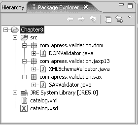

Vohra_706-0C03.fm 第 71 页 2006 年 6 月 28 日，星期三，上午 6:41

第 3 章 ■ 模式验证介绍

**71**

**图 3-2.** *Chapter3 项目*

正如开头所述，我们将讨论使用 JAXP 1.3 DOM 解析器、SAX


解析器和验证 API。我们将从 JAXP 1.3 DOM 解析器 API 开始。

**JAXP 1.3 DOM 解析器 API**

我们在第 2 章中介绍了使用 JAXP 1.3 DOM 解析器 API 进行解析的方法。在本节中，重点将放在使用 JAXP 1.3 DOM 解析器 API 进行模式验证上。使用此 API 进行模式验证的基本步骤如下：

**1.** 创建 DOM 解析器工厂的实例。

**2.** 配置 DOM 解析器工厂实例以支持模式验证。

**3.** 从配置好的 DOM 解析器工厂获取 DOM 解析器。

**4.** 为解析器实例配置错误处理器，以便解析器能够报告验证错误。

**5.** 使用配置好的解析器解析文档。

我们将使用 JAXP 1.3 DOM API 将这些基本步骤映射到具体步骤，该 API 定义在`org.w3c.dom`包中。此外，DOM API 依赖于以下 SAX 包：`org.xml.sax`和`org.xml.sax.helpers`。DOM API 中对 SAX API 的依赖关系在 JAXP 1.3 中指定，这仅仅是为了在适当的地方重用类。首先，导入以下类：

```java
import javax.xml.parsers.DocumentBuilderFactory;
import javax.xml.parsers.DocumentBuilder;
import javax.xml.parsers.ParserConfigurationException;
import org.xml.sax.SAXException;
import org.xml.sax.SAXParseException;
import org.xml.sax.helpers.DefaultHandler;
```

**创建 DOM 解析器工厂**

如前所述，第一步是创建 DOM 解析器工厂，因此您需要创建一个`DocumentBuilderFactory`，如下所示：

```java
DocumentBuilderFactory factory = DocumentBuilderFactory.newInstance();
```

[www.it-ebooks.info](http://www.it-ebooks.info/)

Vohra_706-0C03.fm Page 72 Wednesday, June 28, 2006 6:41 AM

**72**

第 3 章 ■ 介绍模式验证

`DocumentBuilderFactory`的实现类是可插拔的。JAXP 1.3 API 通过按顺序应用以下规则来加载`DocumentBuilderFactory`的实现类，直到某个规则成功为止：

**1.** 使用`javax.xml.parsers.DocumentBuilderFactory`系统属性来加载实现类。

**2.** 使用 JRE 目录中的属性文件`lib/jaxp.properties`。如果此文件存在，则解析此文件以检查是否存在键为`javax.xml.parsers.DocumentBuilderFactory`的属性。如果存在这样的属性，则使用该属性的值来加载实现类。

**3.** JAR 文件中`META-INF/services`目录下的文件被视为服务提供者配置文件。使用服务 API，并从运行时类路径中任何 JAR 文件包含的`META-INF/services/javax.xml.parsers.DocumentBuilderFactory`文件中获取工厂类名。

**4.** 使用平台默认的`DocumentBuilderFactory`实例，该实例包含在应用程序所使用的 J2SE 平台中。

**配置用于验证的工厂**

在您可以使用`DocumentBuilderFactory`实例创建用于模式验证的解析器之前，需要配置该工厂以进行模式验证。要配置用于验证的工厂，您可以使用以下选项：

*   要使用支持命名空间的解析器解析 XML 文档，请将工厂的`setNamespaceAware()`特性设置为`true`。默认情况下，命名空间感知特性设置为`false`。
*   要使解析器成为验证解析器，请将工厂的`setValidating()`特性设置为`true`。默认情况下，验证特性设置为`false`。
*   要使用基于 XML Schema 语言的模式定义进行验证，请设置`schemaLanguage`属性，该属性指定用于验证的模式语言。属性名称为`http://java.sun.com/xml/jaxp/properties/schemaLanguage`，W3C XML Schema 语言的属性值为`http://www.w3.org/2001/XMLSchema`。
*   `schemaSource`属性指定模式的位置。属性名称为`http://java.sun.com/xml/jaxp/properties/schemaSource`，属性值是指向模式定义源的 URL。

清单 3-3 显示了基于这些验证选项配置工厂实例的方法。


**清单 3-3.** *设置验证模式*

factory.setNamespaceAware (true);

factory.setValidating (true);

factory.setAttribute (

"http://java.sun.com/xml/jaxp/properties/schemaLanguage",

"http://www.w3.org/2001/XMLSchema");

factory.setAttribute ("http://java.sun.com/xml/jaxp/properties/schemaSource",

"SchemaUrl");

**创建 DOM 解析器**

从 DocumentBuilderFactory 对象中，创建一个 DocumentBuilder DOM 解析器：DocumentBuilder builder = factory.newDocumentBuilder();

[www.it-ebooks.info](http://www.it-ebooks.info/)

Vohra_706-0C03.fm 第 73 页 2006 年 6 月 28 日星期三 上午 6:41

第 3 章 ■ 介绍模式验证

**73**

这将返回一个新的 DocumentBuilder，其中包含在 DocumentBuilderFactory 对象上配置的模式验证参数。

**为验证配置解析器**

要检索解析过程中生成的验证错误，首先需要定义一个实现 ErrorHandler 的类，通过定义 Validator 类来实现，该类扩展了 DefaultHandler SAX 辅助类，如清单 3-4 所示。

**清单 3-4.** *Validator 类*

//ErrorHandler 类：DefaultHandler 实现了 ErrorHandler 接口
class Validator extends DefaultHandler {

public boolean validationError = false;

public SAXParseException saxParseException = null;

public void error(SAXParseException exception) throws SAXException {

validationError = true;

saxParseException = exception;

}

public void fatalError(SAXParseException exception) throws SAXException {

validationError = true;

saxParseException = exception;

}

public void warning(SAXParseException exception) throws SAXException {

}

}

一个 Validator 实例被设置为 builder DOM 解析器实例上的错误处理器，如下所示：

Validator handler=new Validator();

builder.setErrorHandler (handler);

**使用解析器进行验证**

为了使用模式定义验证 XML 文档，作为处理过程的一部分，使用 DocumentBuilder 解析器的 parse(String uri) 方法解析 XML 文档，如下所示：

builder.parse (XmlDocumentUrl)

Validator 会注册验证过程中生成的验证错误。

**完整的 DOM API 示例**

清单 3-5 中所示的完整示例程序根据 catalog.xsd 模式验证 catalog.xml 文档。此应用程序中的关键方法是 validateSchema()。在此方法中，创建了一个 DocumentBuilderFactory 实例，并设置了用于验证 catalog.xml 文档的模式位置。从工厂获取一个 DocumentBuilder DOM 解析器，并为其配置一个错误处理器。私有的 Validator 类扩展了 DefaultHandler 类并实现了错误处理器。验证作为解析过程的一部分进行。

[www.it-ebooks.info](http://www.it-ebooks.info/)

Vohra_706-0C03.fm 第 74 页 2006 年 6 月 28 日星期三 上午 6:41

**74**

第 3 章 ■ 介绍模式验证

**清单 3-5.** *DOMValidator.java*

package com.apress.validation.dom;

import javax.xml.parsers.DocumentBuilderFactory;

import javax.xml.parsers.DocumentBuilder;

import javax.xml.parsers.ParserConfigurationException;

import org.xml.sax.SAXException;

import org.xml.sax.SAXParseException;

import org.xml.sax.helpers.DefaultHandler;

public class DOMValidator {

public void validateSchema(String SchemaUrl, String XmlDocumentUrl) {

try {

//创建 DocumentBuilderFactory

DocumentBuilderFactory factory = DocumentBuilderFactory

.newInstance();

//将工厂设置为验证工厂。

factory.setNamespaceAware(true);

factory.setValidating(true);

//设置模式属性

factory.setAttribute(

"http://java.sun.com/xml/jaxp/properties/schemaLanguage",

"http://www.w3.org/2001/XMLSchema");

factory.setAttribute(

"http://java.sun.com/xml/jaxp/properties/schemaSource", SchemaUrl);

//创建一个 DocumentBuilder

DocumentBuilder builder = factory.newDocumentBuilder();

//创建一个 ErrorHandler 并设置 ErrorHandler

// 到 DocumentBuilder 解析器上

Validator handler = new Validator();

builder.setErrorHandler(handler);

//解析 XML 文档

builder.parse(XmlDocumentUrl);


//输出验证错误

if (handler.validationError == true)

System.out.println("XML 文档存在错误："

+ handler.validationError + " "

+ handler.saxParseException.getMessage());

else

System.out.println("XML 文档有效");

} catch (java.io.IOException ioe) {

System.out.println("IO 异常 " + ioe.getMessage());

} catch (SAXException e) {

System.out.println("SAX 异常" + e.getMessage());

} catch (ParserConfigurationException e) {

[www.it-ebooks.info](http://www.it-ebooks.info/)

Vohra_706-0C03.fm 第 75 页 2006 年 6 月 28 日星期三 上午 6:41

第 3 章 ■ 模式验证介绍

**75**

System.out

.println("解析器配置异常 "

+ e.getMessage());

}

}

//错误处理类

private class Validator extends DefaultHandler {

public boolean validationError = false;

public SAXParseException saxParseException = null;

public void error(SAXParseException exception) throws SAXException {

validationError = true;

saxParseException = exception;

}

public void fatalError(SAXParseException exception) throws SAXException {

validationError = true;

saxParseException = exception;

}

public void warning(SAXParseException exception) throws SAXException {

}

}

public static void main(String[] argv) {

String SchemaUrl = "catalog.xsd";

String XmlDocumentUrl = "catalog.xml";

DOMValidator validator = new DOMValidator();

validator.validateSchema(SchemaUrl, XmlDocumentUrl);

}

}

清单 3-6 展示了 DOM 解析器验证应用程序的输出。

**清单 3-6.** *DOMValidator.java 的输出*

XML 文档有效

为了演示验证错误处理，在 catalog.xml 中添加一个不符合模式的元素。例如，向 catalog 元素添加一个不符合规范的 title 元素，如下所示：

<title>第 3 章：模式验证</title>

这将导致预期的验证错误，如清单 3-7 所示。请务必从文档中删除此错误，否则后续示例将无法正常运行。

**清单 3-7.** *包含验证错误的输出*

XML 文档存在错误：true cvc-complex-type.2.4.a: 发现以元素'title'开头的无效内容。期望出现'{journal}'之一。

[www.it-ebooks.info](http://www.it-ebooks.info/)

Vohra_706-0C03.fm 第 76 页 2006 年 6 月 28 日星期三 上午 6:41

**76**

第 3 章 ■ 模式验证介绍

**JAXP 1.3 SAX 解析器 API**

我们在第 2 章中介绍了使用 JAXP 1.3 SAX 解析器 API 进行解析。本节重点介绍使用 JAXP 1.3 SAX 解析器 API 进行模式验证。使用此 API 进行模式验证的基本步骤在概念上与 DOM 解析器 API 类似：

**1.** 创建 SAX 解析器工厂的实例。

**2.** 配置 SAX 解析器工厂实例以支持模式验证。

**3.** 从 SAX 解析器工厂获取 SAX 解析器。

**4.** 配置 SAX 解析器实例以指定模式位置和错误处理器。

**5.** 使用配置好的 SAX 解析器解析文档。

要使用 SAX 解析，你需要 SAXParserFactory 和 SAXParser 类。我们将展示如何扩展 DefaultHandler 类以实现自定义错误处理器。因此，导入以下类：

import javax.xml.parsers.SAXParserFactory;

import javax.xml.parsers.SAXParser;

import org.xml.sax.helpers.DefaultHandler;

**创建 SAX 解析器工厂**

要创建 SAX 解析器，首先需要创建一个 SAXParserFactory 对象。使用 newInstance()静态方法创建 SAXParserFactory 对象，如下所示：SAXParserFactory factory = SAXParserFactory.newInstance();

**配置工厂以进行验证**

你需要使用 setNamespaceAware()和 setValidating()方法将工厂设置为支持命名空间的工厂和验证工厂，如下所示：factory.setNamespaceAware(true);

factory.setValidating(true);

使用 SAX 解析器进行验证时，可能需要设置特定于解析器的模式验证特性。例如，Xerces2-j4 SAX 解析器（JAXP 1.3 中的默认 SAX 解析器）支持以下特性：


• **验证功能**用于开启验证。这等同于在工厂上调用`setNamespaceAware(true)`。在示例代码中，该操作是冗余的，仅用于演示目的。

• **验证/模式功能**用于开启 XML Schema 验证。对于示例代码而言，该操作同样冗余，因为稍后你将在解析器上设置`schemaLanguage`和`schemaSource`属性。

• **验证/模式完全检查功能**用于对模式语法进行严格检查。它不会影响 XML 文档验证。开启此功能会消耗大量性能和内存。

4\. 参见 http://xerces.apache.org/xerces2-j/。

[www.it-ebooks.info](http://www.it-ebooks.info/)

Vohra_706-0C03.fm 第 77 页 2006 年 6 月 28 日星期三 上午 6:41

第 3 章 ■ 介绍模式验证

**77**

有关 Xerces2-j 功能的完整列表，请查阅 http://xerces.apache.org/xerces2-j/features.html 上的文档。你可以在 SAX 解析器工厂上设置前面列出的功能，如清单 3-8 所示。

**清单 3-8.** *设置验证功能*

factory.setFeature("http://xml.org/sax/features/validation",true); factory.setFeature("http://apache.org/xml/features/validation/schema", true); factory.setFeature("http://apache.org/xml/features/validation/schema-full-checking", true);

**创建 SAX 解析器**

要使用 SAX 解析器进行验证，你需要创建一个`SAXParser`对象，如下所示：`SAXParser parser = new SAXParser();`

**配置解析器**

你还需要设置`schemaLanguage`和`schemaSource`属性。`schemaLanguage`属性指定用于验证的模式语言。`schemaSource`属性指定用于验证的模式文档，如清单 3-9 所示。

**清单 3-9.** *设置解析器属性*

parser.setProperty("http://java.sun.com/xml/jaxp/properties/schemaLanguage",

"http://www.w3.org/2001/XMLSchema");

parser.setProperty("http://java.sun.com/xml/jaxp/properties/schemaSource", SchemaUrl);

要创建自定义的`ErrorHandler`类，请创建一个继承`DefaultHandler`类的类，如清单 3-10 所示。

**清单 3-10.** *DefaultHandler 类*

private class Validator extends DefaultHandler {

public boolean validationError = false;

public SAXParseException saxParseException = null;

public void error(SAXParseException exception) throws SAXException {

validationError = true;

saxParseException = exception;

}

public void fatalError(SAXParseException exception) throws SAXException {

validationError = true;

saxParseException = exception;

}

public void warning(SAXParseException exception) throws SAXException {

}

}

`DefaultHandler`类实现了`ErrorHandler`接口，并为 SAX 解析器指定了一个`ErrorHandler`。

[www.it-ebooks.info](http://www.it-ebooks.info/)

Vohra_706-0C03.fm 第 78 页 2006 年 6 月 28 日星期三 上午 6:41

**78**

第 3 章 ■ 介绍模式验证

**使用解析器进行验证**

你可以使用`SAXParser`类中重载的`parse`方法来解析和验证 XML 文档。在本例中，你将使用`parse(File, DefaultHandler)`方法，如下所示：`parser.parse(xmlFile, handler);`

解析器生成的验证错误会注册到`ErrorHandler`接口，并从该接口中检索。

**完整的 SAX API 验证器示例**

清单 3-11 列出了使用此 API 的完整示例。此示例中的关键方法是`validateSchema()`。在该方法中，创建了一个`SAXParserFactory`实例，并设置了模式验证功能。从该工厂获取一个`SAXParser`，并配置模式源和错误处理器。`SAXValidator.java`定义了一个私有类`Validator`，它继承自`DefaultHandler`类并实现了错误处理器。示例文档在解析过程中被验证。

**清单 3-11.** *SAXValidator.java*

package com.apress.validation.sax;

import javax.xml.parsers.SAXParserFactory;

import javax.xml.parsers.SAXParser;

import javax.xml.parsers.ParserConfigurationException;

import org.xml.sax.SAXException;

import org.xml.sax.SAXParseException;

import org.xml.sax.helpers.DefaultHandler;

import java.io.File;

public class SAXValidator {

public void validateSchema(String SchemaUrl, File xmlFile) {

try {

// 创建 SAXParserFactory

SAXParserFactory factory = SAXParserFactory.newInstance();

// 将工厂设置为验证工厂。

factory.setNamespaceAware(true);

factory.setValidating(true);

// 设置模式验证功能

factory.setFeature("http://xml.org/sax/features/validation", true); factory.setFeature(

"http://apache.org/xml/features/validation/schema", true); factory.setFeature(

"http://apache.org/xml/features/validation/schema-full-checking", true);

// 创建 SAXParser

SAXParser parser = factory.newSAXParser();

[www.it-ebooks.info](http://www.it-ebooks.info/)

Vohra_706-0C03.fm 第 79 页 2006 年 6 月 28 日星期三 上午 6:41

第 3 章 ■ 介绍模式验证

**79**

// 设置模式属性

parser.setProperty(

"http://java.sun.com/xml/jaxp/properties/schemaLanguage",

"http://www.w3.org/2001/XMLSchema");

parser.setProperty(

"http://java.sun.com/xml/jaxp/properties/schemaSource", SchemaUrl);

// 创建 ErrorHandler

Validator handler = new Validator();

// 解析 XML 文档

parser.parse(xmlFile, handler);

// 输出验证错误

if (handler.validationError == true)

System.out.println("XML Document has Error:"

+ handler.validationError + " "

+ handler.saxParseException.getMessage());

else

System.out.println("XML Document is valid");

} catch (java.io.IOException ioe) {

System.out.println("IOException " + ioe.getMessage());

} catch (SAXException e) {

System.out.println("SAXException" + e.getMessage());

} catch (ParserConfigurationException e) {

System.out

.println("ParserConfigurationException "

+ e.getMessage());

}

}

// ErrorHandler 类

private class Validator extends DefaultHandler {

public boolean validationError = false;

public SAXParseException saxParseException = null;

public void error(SAXParseException exception) throws SAXException {

validationError = true;

saxParseException = exception;

}

public void fatalError(SAXParseException exception) throws SAXException {

validationError = true;

saxParseException = exception;

}

public void warning(SAXParseException exception) throws SAXException {

}

}

[www.it-ebooks.info](http://www.it-ebooks.info/)

Vohra_706-0C03.fm 第 80 页 2006 年 6 月 28 日星期三 上午 6:41

**80**

第 3 章 ■ 介绍模式验证

public static void main(String[] argv) {

String SchemaUrl = "catalog.xsd";

File xmlFile = new File("catalog.xml");

SAXValidator validator = new SAXValidator();

validator.validateSchema(SchemaUrl, xmlFile);

}

}

如果你运行清单 3-11 所示的程序，应该会看到与清单 3-6 中 DOM 解析器相同的输出。为了演示验证错误处理，在`catalog.xml`中添加一个不符合模式`catalog.xsd`的元素。例如，向`catalog`元素添加一个不符合规范的`title`元素，如下所示：

<title>Chapter 3: Schema Validation</title>

现在再次运行`SAXValidator.java`应用程序。这次程序会生成一个验证错误，如前文清单 3-7 所示。

**JAXP 1.3 验证 API**

在本节中，我们将讨论 JAXP 1.3 验证 API。回顾一下，此 API 的关键点在于它将验证过程与解析过程完全解耦。使用此 API 的步骤如下：

**1.** 创建一个`javax.xml.validation.Validator`类的实例。

**2.** 在`Validator`对象上设置一个错误处理器。

**3.** 验证一个 XML 文档。

**创建验证器**

要使用`Validator`类进行验证，请导入`javax.xml.validation`包，如下所示：`import javax.xml.validation.*;`


要使用基于 XML Schema 的架构定义进行验证，您需要该架构定义的 Schema 对象表示。您可以通过 `SchemaFactory` 类创建 Schema 对象。`SchemaFactory` 是一个架构编译器，通过静态方法 `newInstance()` 获取，如下所示：`SchemaFactory factory=SchemaFactory.newInstance(XMLConstants.W3C_XML_SCHEMA_NS_URI); Schema schema=factory.newSchema(new File("catalog.xsd"));` `newInstance()` 方法的唯一参数是一个架构语言常量，其值为 `XMLConstants.W3C_XML_SCHEMA_NS_URI`，等同于 `http://www.w3.org/2001/XMLSchema`。

`Validator` 类用于根据 XML Schema 验证 XML 文档，并且 Validator 对象是从 Schema 对象获取的，如下所示：

`Validator validator=schema.newValidator();`

[www.it-ebooks.info](http://www.it-ebooks.info/)

Vohra_706-0C03.fm 第 81 页 2006 年 6 月 28 日，星期三，上午 6:41

第 3 章 ■ 引 入 架 构 验 证

**81**

**设置错误处理器**

为了报告验证错误，需要为 Validator 定义一个 `ErrorHandler` 类。这个 `ErrorHandler` 类继承自 `DefaultHandler`，如清单 3-12 所示。

**清单 3-12.** *ErrorHandler 类*

```java
private class ErrorHandlerImpl extends DefaultHandler
{
    public boolean validationError = false;
    public SAXParseException saxParseException=null;
    public void error(SAXParseException exception) throws SAXException
    {
        validationError = true;
        saxParseException=exception;
    }
    public void fatalError(SAXParseException exception) throws SAXException
    {
        validationError = true;
        saxParseException=exception;
    }
    public void warning(SAXParseException exception) throws SAXException
    {
    }
}
```

`ErrorHandlerImpl` 类的实例通过 `setErrorHandler()` 方法设置在验证器对象上，如下所示：

```java
ErrorHandlerImpl errorHandler=new ErrorHandlerImpl();
validator.setErrorHandler(errorHandler);
```

如果生成了验证错误，该验证错误会被注册到 `errorHandler` 中。

**验证 XML 文档**

要验证 XML 文档，您无需解析该文档。相反，您可以从 XML 文档创建一个 `StreamSource`，并在验证器上调用 `validate()` 方法，将文档的流源传递给它，如下所示：

```java
StreamSource streamSource=new StreamSource(xmlDocument);
validator.validate(streamSource);
```

**完整的 JAXP 1.3 验证器示例**

清单 3-13 展示了一个使用此 API 的完整示例。此应用程序中的关键方法是 `validateXMLDocument()`。在此方法中，`SchemaFactory` 创建一个 Schema 对象，该对象又创建一个 Validator 对象。私有类 `ErrorHandlerImpl` 继承自 `DefaultHandler`，该类的实例被设置为 Validator 实例上的错误处理器。示例 XML 文档使用 `Validator` 类中定义的重载 `validate()` 方法之一进行验证。

[www.it-ebooks.info](http://www.it-ebooks.info/)

Vohra_706-0C03.fm 第 82 页 2006 年 6 月 28 日，星期三，上午 6:41

**82**

第 3 章 ■ 引 入 架 构 验 证

**清单 3-13.** *XMLSchemaValidator.java*

```java
package com.apress.validation.jdk6;

import org.xml.sax.SAXException;
import org.xml.sax.SAXParseException;
import org.xml.sax.helpers.DefaultHandler;
import java.io.*;
import javax.xml.XMLConstants;
import javax.xml.transform.stream.StreamSource;
import javax.xml.validation.*;

public class XMLSchemaValidator {
    public void validateXMLDocument(File schemaDocument, File xmlDocument) {
        try {
            //创建 SchemaFactory
            SchemaFactory factory = SchemaFactory
                    .newInstance("http://www.w3.org/2001/XMLSchema");
            //创建 Schema 对象
            Schema schema = factory.newSchema(schemaDocument);
            // 创建 Validator 并在 Validator 上设置 ErrorHandler。
            Validator validator = schema.newValidator();
            ErrorHandlerImpl errorHandler = new ErrorHandlerImpl();
            validator.setErrorHandler(errorHandler);
            //验证 XML 文档
            StreamSource streamSource = new StreamSource(xmlDocument);
            validator.validate(streamSource);
            //输出验证错误
            if (errorHandler.validationError == true) {
                System.out.println("XML 文档存在错误:"
                        + errorHandler.validationError + " "
                        + errorHandler.saxParseException.getMessage());
            } else {
                System.out.println("XML 文档有效");
            }
        } catch (SAXException e) {
        } catch (IOException e) {
        }
    }

    public static void main(String[] argv) {
        File schema = new File("catalog.xsd");
        File xmlDocument = new File("catalog.xml");
        XMLSchemaValidator validator = new XMLSchemaValidator();
        validator.validateXMLDocument(schema, xmlDocument);
    }

    //ErrorHandler 类
    private class ErrorHandlerImpl extends DefaultHandler {
        public boolean validationError = false;
        public SAXParseException saxParseException = null;
        [www.it-ebooks.info](http://www.it-ebooks.info/)
        Vohra_706-0C03.fm 第 83 页 2006 年 6 月 28 日，星期三，上午 6:41
        第 3 章 ■ 引 入 架 构 验 证
        **83**
        public void error(SAXParseException exception) throws SAXException {
            validationError = true;
            saxParseException = exception;
        }
        public void fatalError(SAXParseException exception) throws SAXException {
            validationError = true;
            saxParseException = exception;
        }
        public void warning(SAXParseException exception) throws SAXException {
        }
    }
}
```

在 Eclipse 中运行此验证应用程序，以生成先前在清单 3-6 中显示的输出。

**总结**

在本章中，我们讨论了三种 JAXP 1.3 架构验证 API，它们可以分为两组：

*   第一组由 JAXP 解析器 API 组成，如果解析器配置为进行架构验证，这些 API 会将验证作为解析过程的内在部分来执行。
*   第二组由 JAXP 验证 API 组成，它将验证与解析分离。

此 API 实例化架构的对象表示，并使用它来验证一个或多个 XML 文档。

当应用程序的目的是确保正在解析的文档不仅是格式良好的而且是有效的时候，使用第一组 API 是完全合理的。当目的是在解析文档的上下文之外验证文档时，显然 JAXP 验证 API 是可行的方法。

[www.it-ebooks.info](http://www.it-ebooks.info/)

Vohra_706-0C03.fm 第 84 页 2006 年 6 月 28 日，星期三，上午 6:41

[www.it-ebooks.info](http://www.it-ebooks.info/)

Vohra_706-0C04.fm 第 85 页 2006 年 7 月 6 日，星期四，下午 1:40

第 4 章

■ ■ ■

使用 XPath 进行寻址

**在**第 2 章中，我们讨论了解析 XML 文档的三种方法：文档对象方法、推送方法和拉取方法。这些方法分别体现在三个 API 中——DOM、SAX 和 StAX。回顾一下，您可以使用所有这三个 API 来检查文档的格式良好性和有效性，但每个 API 都提供了不同的访问文档节点的机制。SAX 和 StAX API 仅允许按文档顺序 1 访问文档节点，但具有高效内存使用的优点。DOM API 提供对文档节点的随机访问，但代价是内存使用方面的处理开销更高。

DOM 方法创建 XML 文档的树形表示，这非常适合需要以编程方式访问和操作文档节点的用例。需要编程式访问的用例的一个典型例子是 XML 编辑器 2，它为 XML 文档提供源代码视图和大纲视图。

其他用例，例如 XSLT3 模板语言，需要的是命令式访问而不是编程式访问文档节点。命令式访问意味着存在一种表达性语言，允许您定位任何文档节点集的位置；XPath4 正是这样一种语言。在本章中，我们将讨论实现 XPath 规范的各种 Java API，特别是 JAXP 1.3 中的 XPath API（包含在 J2SE 5.05 中）以及 JDOM6。

**理解 XPath 表达式**


XPath 是一种用于在 XML 文档中定位节点集的语言。它基于一个抽象数据模型，该模型仅关注 XML 文档中的核心信息内容，并忽略所有与语法标记相关的信息。XPath 数据模型将 XML 文档视为由各种节点类型组成的树，例如元素节点、属性节点和文本节点。XPath 语言提供 XPath 表达式作为定位 XML 文档中节点集的主要语法结构。

**简单示例**

由于 XPath 表达式定位的是文档节点集，在继续之前，你需要一个 XML 文档作为我们讨论 XPath 表达式时的参考。因此，请考虑以下简单的 XML 文档：

1.  文档顺序与解析树的深度优先顺序相同。
2.  此类编辑器的一个例子是 XMLEspresso；你可以在 http://www.nubean.com 找到它。
3.  第 5 章涵盖 XSLT。
4.  你可以在 http://www.w3.org/TR/xpath 找到 XPath 规范。
5.  有关 JDK 5.0 的更多信息，请参见 http://java.sun.com/j2se/1.5.0/download.jsp。
6.  有关 JDOM 的更多信息，请参见 http://www.jdom.org/。

**85**

[www.it-ebooks.info](http://www.it-ebooks.info/)

Vohra_706-0C04.fm Page 86 Thursday, July 6, 2006 1:40 PM

**86**

第 4 章 ■ 使用 XPath 进行寻址

<catalog >

<journal title="XML" />

<journal title="Java Technology" />

</catalog>

现在，考虑一个基于此参考 XML 文档的简单 XPath 表达式：`/catalog/journal`。当你看到这个 XPath 表达式时，可能会试图将 XPath 表达式与文件系统路径进行类比，并基于这种类比，直观地将表达式 `/catalog/journal` 解释为指向文档中的第一个 `journal` 元素。

实际上，这种直观的解释和其背后的类比都是错误的，因为该表达式选择的是包含两个 `journal` 元素的节点集。

文件系统类比之所以不成立，原因很简单：如果 `/catalog/journal` 是一个文件系统路径，你可以确信在 `catalog` 文件夹下只会有一个 `journal` 文件夹，但这显然不适用于 XML 文档节点。因此，这里有一个更恰当的类比来理解 XPath 表达式：XPath 表达式中的每个组件都像一个模式，必须匹配该模式才能定位 XPath 表达式所寻址的节点集。有了这个基本认识，让我们通过检查更多 XPath 示例来进一步培养你的直觉。

**XPath 表达式示例**

XPath 表达式的语法可能相当复杂，因此开始理解 XPath 表达式的最佳方法是快速浏览一些示例。我们将基于一个比介绍性文档稍复杂的 XML 文档（如清单 4-1 所示）来讲解这些 XPath 示例。

**清单 4-1.** *示例 XML 文档：catalog.xml*

<?xml version="1.0" encoding="UTF-8"?>
<catalog >
<journal:journal title="XML" publisher="IBM developerWorks">
<article journal:level="Intermediate"
date="February-2003">
<title>Design XML Schemas Using UML</title>
<author>Ayesha Malik</author>
</article>
</journal:journal>
<journal title="Java Technology" publisher="IBM developerWorks">
<article level="Advanced" date="January-2004">
<title>Design service-oriented architecture
frameworks with J2EE technology</title>
<author>Naveen Balani</author>
</article>
<article level="Advanced" date="October-2003">
<title>Advance DAO Programming</title>
<author>Sean Sullivan </author>
</article>
</journal>
</catalog>

如前所述，XPath 数据模型将 XML 文档视为节点树。图 4-17 显示了示例文档的 XPath 数据模型。为了将图像适配到页面内，图 4-1 中并非所有 `article` 节点都以展开形式显示。在图 4-1 中，文档元素被指定为 7。此数据模型可视化基于一个 Eclipse 插件，可在 http://www.nubean.com 获取。

[www.it-ebooks.info](http://www.it-ebooks.info/)


Vohra_706-0C04.fm Page 87 Thursday, July 6, 2006 1:40 PM

第 4 章 ■ 使用 XPath 进行寻址

**87**

`#document`，元素节点以其名称和“e”图标表示，属性节点以其名称-值对和“a”图标表示，文本节点则表示为 `#text`。数据模型中的 `#text` 节点对应于元素节点中的文本内容，包括空白文本。

**图 4-1.** *catalog.xml 的 XPath 数据模型*

由于我们尚未讨论 XPath 表达式语法，我们将从直观的角度，参考图 4-1 所示的数据模型来讲解以下示例。稍后在“位置路径”部分，我们将更详细地讨论 XPath 表达式语法。

快速浏览以下定位 `catalog.xml` 中节点集的 XPath 表达式：

• `/catalog/journal/article[@level='Advanced']/title` 是一个 XPath 表达式，其计算结果为一个节点集，该节点集包含名为 `title` 的元素，这些元素嵌套在名为 `article` 的元素内，而 `article` 元素又嵌套在名为 `journal` 的元素内，`journal` 元素再嵌套在名为 `catalog` 的元素内，其中名为 `article` 的元素有一个名为 `level`（属性通过 `@` 前缀标识）且值等于 `Advanced` 的属性。计算此表达式将按文档顺序选择第二个 `title` 元素。

• `/catalog/journal[@title='Java Technology']/article[2]` 是一个 XPath 表达式，其计算结果为一个节点集，该节点集包含名为 `article` 的元素，这些元素嵌套在名为 `journal` 的元素内，而 `journal` 元素嵌套在名为 `catalog` 的元素内，其中名为 `journal` 的元素有一个名为 `title` 且值等于 `Java Technology` 的属性，并且 `article` 元素处于第二个上下文位置（按文档顺序）。`article` 元素的第二个上下文位置通过 `[2]` 后缀指定。计算此表达式将按文档顺序选择标题为 `Java Technology` 的期刊中的第二个 `article` 元素。

[www.it-ebooks.info](http://www.it-ebooks.info/)

Vohra_706-0C04.fm Page 88 Thursday, July 6, 2006 1:40 PM

**88**

第 4 章 ■ 使用 XPath 进行寻址

• `/child::catalog/child::journal/child::article[attribute::date='January-2004']/attribute::level` 是一个 XPath 表达式，其计算结果为一个节点集，该节点集包含名为 `level` 的属性，这些属性附加在名为 `article` 的元素上，而 `article` 元素嵌套在名为 `journal` 的元素内，`journal` 元素嵌套在名为 `catalog` 的元素内，其中名为 `article` 的元素有一个名为 `date` 且值等于 `January-2004` 的属性。XPath 表达式中的语法结构 `::` 定义了一个选择轴，轴名称位于此结构之前。例如，`child::` 定义了子轴，`attribute::` 定义了属性轴。如果未指定选择轴，则 `child::` 是隐式选择轴。因此，`/` 和 `/child::` 是等价的结构。此外，`@` 语法是 `attribute::` 语法的简写。计算此表达式将按文档顺序选择第二个 `article` 元素的 `level` 属性。

• `//article[ancestor::journal[@title='Java Technology']]` 是一个 XPath 表达式，其计算结果为一个节点集，该节点集包含名为 `article` 的元素，这些元素有一个名为 `journal` 的祖先元素，其中名为 `journal` 的元素有一个名为 `title` 且值等于 `Java Technology` 的属性。语法结构 `//` 是所有后代节点的简写；由于它位于表达式的开头，它表示根节点的所有后代。计算此表达式将按文档顺序选择第二个和第三个 `article` 元素。


好的，作为一名高级文档工程师和翻译员，我将严格遵循您提供的注意事项和示例，将给定的英文文本翻译成中文。


现在，您已经从直观的角度看了一些示例，我们将尝试拓宽您对 XPath 语法的理解。与大多数语言中的表达式类似，您可以通过加法或乘法组合基本表达式来构成复杂的 XPath 表达式。因此，理解 XPath 表达式的关键在于掌握基本表达式以及评估 XPath 表达式可能产生的各种数据类型。以此为近期目标，您将专注于两个主题：

•   XPath 表达式评估数据类型

•   一种称为*位置路径*的基本表达式结构 **数据类型**

XPath 表达式评估的结果是以下数据类型之一：

•   布尔值，为 true 或 false

•   数值（浮点数，由电气和电子工程师学会 [IEEE] 定义）

•   字符串值

•   节点集（任何类型的文档节点集合）

**位置路径**

现在，我们将介绍与位置路径结构相关的语法。位置路径可以是绝对的，此时它以斜杠（/）开头；也可以是相对的，此时它不以斜杠开头。一个位置路径可以由零个或多个位置路径步骤组成，相邻步骤之间用斜杠分隔。

每个位置路径步骤都以一个轴说明符开始，后跟一个节点测试，并可选择后跟零个或多个谓词：

步骤 ::= 轴说明符 节点测试 谓词*

位置路径步骤的组成部分如下：

8\. 参见 http://www.ieee.org/portal/site。

[www.it-ebooks.info](http://www.it-ebooks.info/)

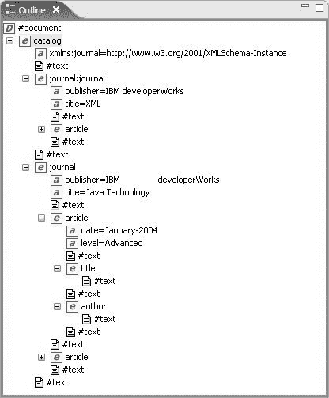

Vohra_706-0C04.fm 第 89 页 2006 年 7 月 6 日，星期四，下午 1:40

第 4 章 ■ 使用 XPath 进行寻址

**89**

•   *轴说明符*基本上是一条逻辑路径（轴），您可以沿着它从上下文节点移动以查找下一个节点集（上下文节点是您开始的节点）。

•   *节点测试*是一个过滤器，它基于节点类型或节点名称来约束选定的节点集。

•   *谓词*是一个过滤器，它基于 XPath 表达式来约束选定的节点集。

我们将在以下各节中更详细地介绍这些组件中的每一个。例如，位置路径 `/child::catalog/child::journal/child::article[attribute::date='January-2004']/attribute::level` 有四个步骤。第一步是 `child::catalog`，第二步是 `child::journal`，第三步是 `child::article[attribute::date='January-2004']`，第四步是 `attribute::level`。在前两步中，`child::` 是轴说明符，`catalog` 和 `journal` 是节点测试。在第三步中，`child::` 是轴说明符，`article` 是节点测试，`[attribute::date='January-2004']` 是一个谓词。在第四步中，`attribute::` 是轴说明符，`level` 是节点测试。第一、第二和第四步没有任何谓词。

轴说明符

如前所述，轴说明符指定了一条逻辑轴，您必须沿着该轴从上下文节点移动，以查找由位置路径表达式指定的下一个节点集。如果沿着轴移动，您遇到的节点在文档顺序中位于上下文节点处或之后，则该轴说明符轴被归类为*正向轴*；否则，该轴被归类为*反向轴*。在图 4-2 中，我们采用了图 4-1 中所示的基本 XPath 数据模型，并用上下文节点、轴标签和关联的节点集对其进行了注释。例如，图 4-2 中的 `parent::` 轴标签指向其关联的父级 journal 元素节点集。当然，每当您为任何轴值解释节点集时，都需要始终牢记上下文节点。

**ancestor::**

**preceding::**

**parent::**

**preceding-sibling::**

**self::**

**上下文节点**

**attribute::**

**descendant::**

**child::**

**following-sibling::**

**following::**

**图 4-2.** *数据模型上的轴说明符注释*

[www.it-ebooks.info](http://www.it-ebooks.info/)

Vohra_706-0C04.fm 第 90 页 2006 年 7 月 6 日，星期四，下午 1:40

**90**

第 4 章 ■ 使用 XPath 进行寻址

以下是可能的轴说明值，并附有基于图 4-2 所示注释数据模型的示例：

•   `self::` 指上下文节点。例如，在图 4-2 中，`self::` 指 article 上下文节点。

•   `child::` 指按文档顺序排列的子节点。此轴仅适用于元素节点。如果上下文节点是属性、文本或命名空间节点，则此轴为空。元素的属性节点不是子节点。此轴不包含任何属性或命名空间节点。图 4-2 显示了 `child::` 轴的示例。如果省略轴说明符，则这是默认值。这是一个正向轴。

•   `parent::` 当上下文节点是元素节点或文本节点时，指父节点；但当上下文节点是属性节点时，指附加的元素节点。图 4-2 显示了 `parent::` 轴的示例，其中上下文节点是元素节点。如果上下文节点是当前 article 上下文节点的 date 属性，那么 `parent::` 轴将仅包含当前 article 上下文节点。这是一个反向轴。

•   `attribute::` 指附加的属性节点。图 4-2 显示了 `attribute::` 轴的示例。此轴可以用 `@` 字符缩写。换句话说，`attribute::level` 和 `@level` 是等价的。如果上下文节点不是元素节点，则此轴为空。这是一个正向轴。

•   `ancestor::` 指从父节点开始，然后是父节点的父节点，依此类推，直到到达根节点的所有节点。如果沿着此轴，您不会遇到任何父级兄弟节点、属性或命名空间节点。图 4-2 显示了 `ancestor::` 轴的示例。这是一个反向轴。

•   `descendant::` 指从所有元素子节点开始，然后按文档顺序继续到其后代的所有节点。此轴不包含任何属性节点或命名空间节点。如果上下文节点是属性或命名空间节点，则此轴为空。图 4-2 显示了 `descendant::` 轴的示例。这是一个正向轴。

•   `following::` 指在文档顺序中位于上下文节点之后的所有节点，但沿 `descendant::` 轴出现的节点除外。此轴不包含任何属性或命名空间节点。图 4-2 显示了 `following::` 轴的示例。这是一个正向轴。

•   `preceding::` 指在文档顺序中位于上下文节点之前的所有节点，但沿 `ancestor::` 轴出现的节点除外。此轴不包含任何属性或命名空间节点。图 4-2 显示了 `preceding::` 轴的示例。这是一个反向轴。

•   `following-sibling::` 指所有按文档顺序排列的、作为上下文节点兄弟节点的 `following::` 节点。此轴不包含任何属性或命名空间节点。如果上下文节点是属性或命名空间节点，则此轴为空。图 4-2 显示了 `following-sibling::` 轴的示例。这是一个正向轴。

•   `preceding-sibling::` 指所有按反向文档顺序排列的、作为上下文节点兄弟节点的 `preceding::` 节点。此轴不包含任何属性或命名空间节点。如果上下文节点是属性或命名空间节点，则此轴为空。图 4-2 显示了 `preceding-sibling::` 轴的示例。这是一个反向轴。

•   `ancestor-or-self::` 指所有节点，包括当前节点及其祖先，按反向文档顺序排列。图 4-2 显示了 `ancestor::` 和 `self::` 节点的示例，它们共同构成了 `ancestor-or-self::` 轴。这是一个反向轴。

[www.it-ebooks.info](http://www.it-ebooks.info/)

Vohra_706-0C04.fm 第 91 页 2006 年 7 月 6 日，星期四，下午 1:40

第 4 章 ■ 使用 XPath 进行寻址

**91**


• `descendant-or-self::` 表示所有节点，包括当前节点及其所有后代节点，按文档顺序排列。图 4-2 展示了 `descendant::` 和 `self::` 节点的示例，两者共同构成 `descendant-or-self::` 轴。这是一个正向轴。

• `namespace::` 表示所有附加的命名空间节点。如果上下文节点不是元素节点，则该轴为空。例如，在图 4-2 中，假设上下文节点是根目录 `catalog` 元素，那么它的 `xmlns:journal` 命名空间属性就位于 `namespace::` 轴上。

这是一个正向轴。

**节点测试**

在位置路径步骤中，当你沿着指定轴移动时，会遇到不同类型和名称的节点。这些节点构成一个节点集。你可以对此基础节点集应用节点测试过滤器，该过滤器可以根据节点类型或节点名称来过滤节点。

**节点类型测试**

基于节点类型的测试如下：

• `node()` 是一种节点测试，表示任何类型的节点。例如，表达式 `child::node()` 会选择上下文节点的所有子节点。如前所述，元素节点的属性不属于其子节点。

• 轴和节点测试的组合 `self::node()` 可以用字符“.”缩写。

例如，表达式 `./child::node()` 会选择上下文节点的所有子节点。

• 轴和节点测试的组合 `parent::node()` 可以用字符序列 `..` 缩写。例如，表达式 `../child::node()` 会选择上下文节点父节点的所有子节点，其中可能包含也可能不包含上下文节点。（你能明白为什么吗？提示：上下文节点可能是一个属性节点。）

• 轴和节点测试的组合 `/descendant-or-self::node()/` 可以用字符序列 `//` 缩写。例如，XPath 表达式开头的 `//` 会选择文档中所有非属性和非命名空间的节点。

• `text()` 是一种节点测试，表示文本类型的节点。例如，`descendant::text()` 会计算出上下文节点中所有类型为文本的后代节点。

• `comment()` 是一种节点测试，表示注释类型的节点。例如，`preceding::comment()` 会计算出上下文节点之前所有类型为注释的节点。

• `processing-instruction()` 是一种节点测试，表示处理指令类型的节点。例如，`following::processing-instruction()` 会计算出上下文节点之后所有类型为处理指令的节点。

**节点名称测试**

不带命名空间前缀的基于名称的节点测试表示以下内容：

• 如果指定轴是命名空间轴，则表示一个命名空间节点。例如，在图 4-2 中，假设上下文节点是 `catalog` 元素，那么 `namespace::journal` 会选择 `catalog` 根元素中的 `xmlns:journal` 命名空间节点。

• 如果指定轴是属性轴，则表示一个不在任何命名空间（包括不在默认命名空间中）中的属性节点。例如，在图 4-2 中，`attribute::date` 会选择 `article` 上下文节点的 `date` 属性。

[www.it-ebooks.info](http://www.it-ebooks.info/)

Vohra_706-0C04.fm Page 92 Thursday, July 6, 2006 1:40 PM

**92**

第 4 章 ■ 使用 XPath 进行寻址

• 对于所有其他指定轴，则表示一个不在任何命名空间（包括不在默认命名空间中）中的元素节点。例如，在图 4-2 中，`following-sibling::article` 会选择按文档顺序排列的第三个 `article` 节点。

带命名空间前缀的基于名称的节点测试表示以下内容：

• 如果指定轴是命名空间轴，则表示一个空集。例如，在图 4-2 中，假设上下文节点是 `catalog` 元素，那么 `namespace::xmlns:journal` 是一个空集。

• 如果指定轴是属性轴，则表示关联命名空间中的一个属性节点。例如，在清单 4-1 中，`//attribute::journal:level` 会选择按文档顺序排列的第一个 `article` 节点的 `level` 属性。


• 对于所有其他指定的轴，它指的是关联命名空间中的一个元素节点。例如，在图 4-2 中，`preceding::journal:journal` 元素按文档顺序选择了第一个 journal 元素。

• 带有 `*` 的节点名称测试指的是元素节点的无限制通配符。例如，在图 4-2 中，`child::*` 选择了一个包含所有 `child::` 轴元素的节点集。这意味着 `child::*` 和 `child::node()` 不具有相同的语义，因为前者仅限于 `child::` 轴元素节点，而后者选择任何节点类型的 `child::` 轴节点。

• 带有 `prefix:*` 名称的节点测试指的是元素节点的命名空间受限通配符。例如，`/catalog/child::journal:*` 计算得到一个节点集，该节点集包含所有作为 catalog 元素子元素且属于 `journal:` 命名空间的元素，按文档顺序，这正好是文档中的第一个 journal 元素。

**谓词**

位置路径步中的最后一部分是零个或多个可选的谓词。以下是理解谓词的两个关键点：

• 谓词是对节点集的过滤器。

• 谓词是 XPath 表达式，通过使用核心 XPath 的 `boolean()` 函数对其进行求值并映射为布尔值，具体如下所述：

• 当且仅当一个数字值是非零数字时，它被映射为 true。例如，在图 4-2 中，表达式 `//title[position()]` 使用了内置的 XPath `position()` 函数，该函数返回所选 title 节点的子节点位置（作为一个数字）。由于节点的子节点位置总是大于或等于 1，因此该表达式将选择所有 title 节点。然而，表达式 `//title[position() – 1]` 将只选择那些子节点位置大于 1 的 title 节点。在该示例中，第二个表达式不会选择任何节点，因为所有 title 节点都位于子节点位置 1。

• 当且仅当一个字符串值是非零长度的字符串时，它被映射为 true。例如，在图 4-2 中，表达式 `//title[string()]` 使用内置的 XPath `string()` 函数将节点集中的第一个节点隐式转换为其字符串节点值。该表达式将只选择那些具有非零长度文本内容的 title 节点，对于示例文档而言，这意味着选择所有 title 节点。

• 当且仅当一个节点集是非空时，它被映射为 true。例如，在图 4-2 中，表达式 `//article[child::title]` 中的 `[child::title]` 谓词仅在 `child::title` 节点集非空时才求值为 true，因此该表达式选择所有具有 title 子元素的 article 元素。

谓词左侧组件的输出节点集是其输入节点集，而求值一个谓词涉及遍历此输入节点集。随着求值的进行，迭代中的当前节点成为上下文节点，并且谓词相对于此上下文节点进行求值。如果谓词求值为 true，则此上下文节点被添加到谓词的输出节点集中；否则，它被忽略。来自一个谓词的输出节点集成为后续谓词的输入节点集。位置路径步中的多个谓词从左到右进行求值。

位置路径步中的谓词相对于当前步关联的轴进行求值。上下文节点的邻近位置定义为它沿步轴的位置，如果是正向轴则按文档顺序，如果是反向轴则按逆文档顺序。节点的邻近位置定义为其上下文位置。输入节点集的大小定义为上下文大小。上下文节点、上下文位置和上下文大小构成了完整的 XPath 上下文，所有谓词都相对于此上下文进行求值。

在查看以下基于图 4-2 数据模型的示例时，可以应用一些与谓词相关的概念：

• `/catalog/child::journal[attribute::title='Java Technology']` 是一个 XPath 表达式，其中第二步包含谓词 `[attribute::title='Java Technology']`。此谓词的输入节点集由所有作为 catalog 元素子元素且非命名空间的 journal 元素组成。按文档顺序，输入节点集仅包含第二个 journal 元素，因为第一个 journal 元素属于 journal 命名空间。因此，在第一次迭代开始时，上下文大小为 1，上下文位置也为 1。当遍历输入节点集时，将当前节点（即 journal 节点）设为上下文节点，然后测试谓词。该谓词检查上下文节点是否具有一个名为 title 且值等于 Java Technology 的属性。如果谓词测试成功（应该会成功），则将此 journal 上下文节点包含在输出集中。遍历完输入集中的所有节点后，输出节点集将包含所有满足谓词的 journal 元素。此表达式的结果将只是文档中按文档顺序的第二个 journal 节点。

• `/catalog/descendant::article[position() = 2]` 是一个 XPath 表达式，其中第二步包含谓词 `[position() = 2]`。此谓词的输入节点集由所有作为 catalog 元素后代的 article 元素组成。此输入节点集将包含文档中的所有三个 article 节点。因此，在第一次迭代开始时，上下文大小为 3，上下文位置为 1。此谓词示例应用了上下文位置的概念。当遍历输入节点集时，将当前 article 元素设为上下文节点，然后测试谓词。该谓词检查 article 元素的上下文位置（通过 XPath 核心函数 `position()` 测试）是否等于 2。当将此谓词应用于图 4-2 的数据模型时，只有第二个以展开形式出现的 article 节点会测试为 true。注意，`[position() = 2]` 谓词等价于缩写谓词 `[2]`。此表达式的结果将是按文档顺序的第二个 article 节点。

在详细了解了 XPath 表达式之后，现在可以将注意力转向使用基于 Java 的 XPath API 来应用 XPath 表达式。

**应用 XPath 表达式**

想象一个提供与期刊文章信息相关服务的网站。再进一步想象，该网站通过一些基于 Web 服务的消息从各个出版商处接收期刊内容信息，并且这些消息的内容是一个 XML 文档，看起来类似于前面清单 4-1 中显示的文档。

一旦 Web 服务接收到此文档，它需要根据某些标准从此 XML 文档中提取内容信息。假设要求你构建一个应用程序，根据某些特定标准从此文档中提取内容信息。你会怎么做？

你的第一步是确保接收到的文档具有有效的结构，或者换句话说，符合其模式定义。为了确保这一点，你将首先根据其模式验证文档，如第 3 章所述。

你的下一个任务是设计一种提取相关内容信息的方法。在这里，你有两个选择：

• 你可以使用 DOM API 检索文档节点
• 你可以使用 XPath API 检索文档节点。

那么，这就引出了一个显而易见的问题：哪个是更好的选择？

**比较 XPath API 与 DOM API**


使用 XPath 表达式访问 XML 文档中的元素和属性值，比使用 DOM API 中的 getter 方法更高效，因为通过 XPath 表达式，你可以直接选择一个 Element 节点，而无需通过编程方式遍历节点列表。若使用 DOM API，你必须先通过 DOM API 的 getter 方法检索节点列表，然后遍历该列表以获取相关的元素节点。

与 DOM API 相比，使用 XPath API 有两大主要优势：

• 你可以通过声明式的 XPath 表达式选择元素节点，无需遍历节点列表来选择相关元素节点。

• 使用 XPath 表达式，你可以直接选择一个 Attr 节点，而 DOM API 的 getter 方法则需要先访问 Element 节点，然后才能访问 Attr 节点。

作为第一个优势的示例，在图 4-2 所示的示例数据模型中，你可以使用 XPath 表达式 `/catalog/journal/article[2]/title` 检索文章上下文节点中的 title 元素，并使用清单 4-2 中的代码评估该 XPath 表达式，从而检索到相关的 title 元素。目前，我们不期望你理解清单 4-2 中的代码。现在展示这段代码的唯一目的是说明与 DOM API 代码相比，XPath API 代码的相对简洁性。

**清单 4-2.** *使用 XPath 定位节点*

```java
Element article=(Element)(xPath.evaluate("/catalog/journal/article[2]/title", inputSource,XPathConstants.NODE));
```

相比之下，如果你需要使用 DOM API 的 getter 方法检索相同的 title 元素，则需要遍历节点列表，如清单 4-3 所示。

**清单 4-3.** *使用 DOM 检索节点*

```java
NodeList nodeList=document.getElementsByTagName("journal");
Element journal=(Element)(nodeList.item(0));

NodeList nodeList2=journal.getElementsByTagName("article");
Element article=(Element)nodeList2.item(1);
```

作为第二个优势的示例，你可以直接使用 XPath 表达式 `/catalog/journal/article[@date='January-2004']/@level` 检索日期为 January-2004 的文章节点的 level 属性值，如清单 4-4 所示。

**清单 4-4.** *使用 XPath 检索属性节点*

```java
String level = xPath.evaluate("/catalog/journal/article[@date='January-2004']/@level", inputSource);
```

[www.it-ebooks.info](http://www.it-ebooks.info/)

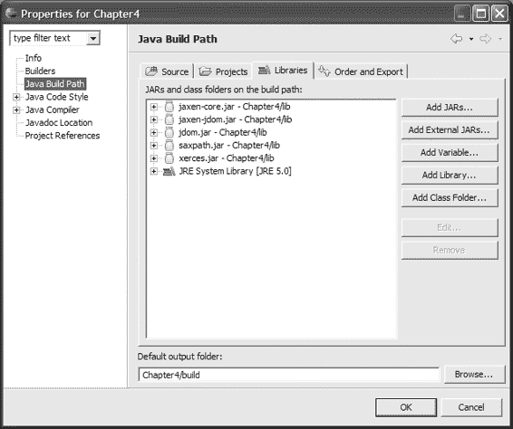

Vohra_706-0C04.fm Page 95 Thursday, July 6, 2006 1:40 PM

第 4 章 ■ 使用 XPath 定位

**95**

只需说，要使用 DOM API 实现相同的结果，你需要编写的代码比清单 4-4 中显示的代码繁琐得多。这将涉及查找所有 journal 元素，为每个 journal 元素查找所有 article 元素，遍历这些 article 元素，检索每个 article 元素的 date 属性，检查 date 属性的值是否为 January-2004，如果是，则检索 article 元素的 level 属性。

前面的讨论不应暗示 DOM API 在访问内容信息方面*从未*有用。事实上，有时你可能需要访问给定元素子树中的所有节点。在这种情况下，通过 XPath API 访问相关节点，然后使用 DOM API 访问其节点子树是完全合理的。

接下来，让我们继续创建基于 XPath API 的应用程序。为此，你首先需要创建并配置一个 Eclipse 项目。

**设置 Eclipse 项目**

在构建和运行本章包含的代码示例之前，你需要一个 Eclipse 项目。

创建 Eclipse 项目最快的方法是从 Apress (http://www.apress.com) 下载 Chapter4 项目，并将其导入 Eclipse。这将自动创建本章所需的所有 Java 包和文件。

在本章中，你将使用两个 XPath API：J2SE 5.0 中包含的 JAXP 1.3 XPath API 和 JDOM XPath API。要使用 J2SE 5.0 的 XPath API，请安装 J2SE 5.09 SDK，将其 JRE 系统库设置为 Eclipse 项目 Java 构建路径中的 JRE 系统库，并将 Java 编译器设置为 Eclipse 项目 Java 编译器下的 J2SE 5.0 编译器。你的 Eclipse 项目中的 Java 构建路径应如图 4-3 所示。

**图 4-3.** *Eclipse IDE 中的 XPath 项目 Java 构建路径*

9\. 有关 J2SE 5.0 的更多信息，请参见 http://java.sun.com/j2se/1.5.0/。

[www.it-ebooks.info](http://www.it-ebooks.info/)

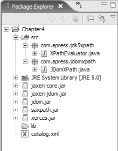

Vohra_706-0C04.fm Page 96 Thursday, July 6, 2006 1:40 PM

**96**

第 4 章 ■ 使用 XPath 定位

完整的 Eclipse 项目包结构应如图 4-4 所示。

**图 4-4.** *Eclipse 项目包结构*

现在，你可以继续处理应用程序了。由于示例的目标是提供关于如何使用 XPath API 的全面信息，我们将在示例应用程序中使用不同的 XPath 表达式来说明 XPath API 的各个方面。总体而言，你将研究两个特定的 XPath API：

• 第一个 API 在 JAXP 1.3 中指定，并包含在 J2SE 5.0 中。如果你决定将应用程序基于 Java 5 平台，这是推荐的 API。这种方法的一个明显优势是它完全基于标准，我们认为这应该是首选方法。

• 第二个 API 基于 JDOM，如果你尚未准备好迁移到 J2SE 5.0 API，或者发现该 API 的某些方面比 J2SE 5.0 API 更易于使用，则推荐使用它。我们认为，这个 API 简单易用且易于理解。但是，由于它目前不是标准，它可能会继续变化，这可能会影响应用程序的稳定性。

**JAXP 1.3 XPath API**

JAXP 1.3 XPath API 在 J2SE 5.0 的 `javax.xml.xpath` 包中定义。该包定义了用于评估 XPath 表达式的各种接口。表 4-1 列出了 J2SE 5.0 中的一些相关类和接口。

**表 4-1.** *J2SE 5.0 XPath*

**类或接口**

**描述**

`XPath` (接口)

提供对 XPath 评估环境的访问，并提供 `evaluate()` 方法来评估 XML 文档中的 XPath 表达式 `XPathExpression`

提供 `evaluate()` 方法来评估已编译的 XPath 表达式 (接口)

在 XML 文档中

`XPathFactory` (类)

创建一个 `XPath` 对象

[www.it-ebooks.info](http://www.it-ebooks.info/)

Vohra_706-0C04.fm Page 97 Thursday, July 6, 2006 1:40 PM

第 4 章 ■ 使用 XPath 定位

**97**

对于此示例，清单 4-1 中显示的示例 XML 文档使用 `javax.xml.xpath.XPath` 类进行评估，并使用 XPath API 提取相关的节点集。`XPath` 和 `XPathExpression` 接口中的 `evaluate()` 方法用于根据相关的 XPath 表达式访问各种文档节点集。

XPath 表达式可以在使用前显式编译，也可以直接评估。显式编译 XPath 表达式的主要优点是在评估之前验证表达式的正确性，并促进表达式在多次评估中的重用。假设你有兴趣了解 XPath 表达式的显式编译，那么接下来我们将介绍这一点。

**显式编译 XPath 表达式**

假设你需要一个 `XPath` 对象来编译 XPath 表达式。你可以使用 `XPathFactory` 工厂类来创建 `XPath` 对象。要创建 `XPath` 对象，首先使用 `XPathFactory` 类的静态方法 `newInstance()` 创建一个 `XPathFactory` 对象，如清单 4-5 所示。`newInstance()` 方法使用默认对象模型 `DEFAULT_OBJECT_MODEL_URI`，该模型基于 W3C DOM。


如果你打算使用默认对象模型以外的其他对象模型，请使用 `newInstance(String uri)` 方法创建一个 `XPathFactory` 对象。然后，使用指定的或默认的对象模型，通过 `newXPath()` 方法从 `XPathFactory` 对象创建一个 `XPath` 对象，如清单 4-5 所示。

**清单 4-5.** *创建 XPath 对象*

XPathFactory factory=XPathFactory.newInstance();

XPath xPath=factory.newXPath();

假设你希望编译 XPath 表达式 `/catalog/journal/article[@date='January-2004']/title`，该表达式用于定位所有 `date` 属性值为 `January-2004` 的 `article` 元素中的 `title` 元素。你可以使用 `XPath` 对象的 `compile()` 方法来实现，如下所示：

XPathExpression xPathExpression=

xPath.compile("/catalog/journal/article[@date='January-2004']/title"); 此 `compile()` 方法返回一个 `XPathExpression` 对象。如果 XPath 表达式存在错误，则会生成一个 `XPathExpressionException`。

**评估已编译的 XPath 表达式**

`XPathExpression` 接口提供了重载的 `evaluate()` 方法来评估 XPath 表达式。表 4-2 列出了 `XPathExpression` 接口中的 `evaluate()` 方法。

其中两个重载的 `evaluate()` 方法将 `returnType` 作为参数。返回类型由 `javax.xml.xpath.XPathConstants` 类的静态字段表示。表 4-3 列出了 `evaluate()` 方法支持的不同返回类型，它们提供了将表达式评估结果转换为不同返回类型所需的灵活性。默认的 `returnType` 是 `javax.xml.xpath.XpathConstants.STRING`。

10\. 此功能主要用于支持替代文档模型。目前，没有令人信服的理由使用 DOM 以外的其他模型。

[www.it-ebooks.info](http://www.it-ebooks.info/)

Vohra_706-0C04.fm Page 98 Thursday, July 6, 2006 1:40 PM

**98**

第 4 章 ■ 使用 XPath 进行寻址

**表 4-2.** *XPathExpression evaluate() 方法*

**评估方法**

**描述**

evaluate(InputSource source)

在指定的 `InputSource` 上下文中评估已编译的 XPath 表达式，并返回一个字符串。使用默认返回类型 `XPathConstants.STRING` 来评估 XPath 表达式。

evaluate(InputSource source,

在指定的 `InputSource` 上下文中评估已编译的 XPath 表达式，并返回指定返回类型的值。

QName returnType)

evaluate(Object item)

在指定的上下文（可以是 `Node` 或 `NodeList`）中评估已编译的 XPath 表达式。返回一个字符串。

evaluate(Object item,

在指定的上下文中评估已编译的 XPath 表达式，并返回指定返回类型的值。

QName returnType)

**表 4-3.** *XPath 返回类型*

**返回类型**

**描述**

javax.xml.xpath.XpathConstants.BOOLEAN

XPath 1.0 布尔数据类型

javax.xml.xpath.XpathConstants.NODESET

XPath 1.0 节点集数据类型

javax.xml.xpath.XpathConstants.NODE

XPath 1.0 节点数据类型

javax.xml.xpath.XpathConstants.STRING

XPath 1.0 字符串数据类型

javax.xml.xpath.XpathConstants.NUMBER

XPath 1.0 数字数据类型

`XPathExpression` 接口的 `evaluate()` 方法在 `InputSource` 或表示 DOM 结构的 `java.lang.Object`（例如 `org.w3c.dom.Node` 对象）的上下文中进行评估。对于示例应用程序，你将基于 XML 文档在 `InputSource` 的上下文中评估 XPath 表达式，如清单 4-6 所示。在此代码清单中，`xmlDocument` 是一个与 `catalog.xml` 关联的 `java.io.File` 对象。

**清单 4-6.** *创建 InputSource 对象*

File xmlDocument = new File("catalog.xml");

InputSource inputSource = new InputSource(newFileInputStream(xmlDocument)); 一旦创建了 `InputSource` 对象，你就可以在此 `InputSource` 对象的上下文中评估 XPath 表达式，如下所示：

String title =xPathExpression.evaluate(inputSource);

每次使用 `InputSource` 对象调用 `evaluate()` 后，都需要一个新的 `InputSource` 对象。评估已编译的 `/catalog/journal/article[@date='January-2004']/title` XPath 表达式的结果是标题：Design service-oriented architecture frameworks with J2EE technology。

[www.it-ebooks.info](http://www.it-ebooks.info/)

Vohra_706-0C04.fm Page 99 Thursday, July 6, 2006 1:40 PM

第 4 章 ■ 使用 XPath 进行寻址

**99**

**直接评估 XPath 表达式**

如前所述，XPath 表达式可以在 DOM 对象或 `InputSource` 对象的上下文中直接评估，无需任何编译。`XPath` 接口提供了重载的 `evaluate()` 方法来直接评估 XPath 表达式。表 4-4 列出了 `XPath` 接口的 `evaluate()` 方法。

**表 4-4.** *XPath 接口 evaluate() 方法*

**评估方法**

**描述**

evaluate(String

在指定的 `InputSource` 上下文中评估指定的 XPath 表达式，并返回一个字符串。使用默认返回类型 `XPathConstants.STRING` 来评估 XPath 表达式。

expression,InputSource source)

evaluate(String expression,

在指定的 `InputSource` 上下文中评估指定的 XPath 表达式，并返回指定返回类型的值。

InputSource source,

QName returnType)

evaluate(String expression,

在指定的上下文（可以是 `Node` 或 `NodeList`）中评估指定的 XPath 表达式。返回一个字符串。

Object item)

evaluate(String expression,

在指定的上下文中评估指定的 XPath 表达式，并返回指定返回类型的值。

Object item, Name returnType)

`returnType` 值与 `XPathExpression` 接口的 `evaluate()` 方法相同，并列于表 4-3 中。

假设你想查找 XML 文档中所有期刊的出版商。用于定位所有不属于任何命名空间的 `journal` 元素上 `publisher` 属性节点集的 XPath 表达式是 `/catalog/journal/@publisher`。你可以直接评估此表达式，无需编译，如下所示：

inputSource = new InputSource(new FileInputStream(xmlDocument))); String publisher = xPath.evaluate("/catalog/journal/@publisher",inputSource); 此 XPath 评估的结果是属性值 IBM developerWorks。

你也可以使用 `XPath` 类中的 `evaluate()` 方法来评估节点集。假设你想评估选择所有 `title` 元素的 XPath 表达式 `//title`。要选择示例 XML 文档中 `title` 元素节点的节点集，你需要创建一个选择 `title` 节点的 XPath 表达式，并调用以 XPath 表达式、`org.w3c.dom.Document` 对象和 `returnType` 为参数的 `evaluate()` 方法，如清单 4-7 所示。

**清单 4-7.** *检索 NodeSet*

DocumentBuilder builder = DocumentBuilderFactory.newInstance().newDocumentBuilder(); Document document = builder.parse(xmlDocument);

String expression="//title";

NodeList nodes = (NodeList)xPath.evaluate(expression, document, XPathConstants.NODESET);

`XPathConstants.NODESET` 将 `evaluate()` 方法的返回类型指定为 `NodeSet`。由于 `NodeSet` 类实现了 `NodeList` 接口，你可以将 `NodeSet` 对象强制转换为 `NodeList`。

[www.it-ebooks.info](http://www.it-ebooks.info/)

Vohra_706-0C04.fm Page 100 Thursday, July 6, 2006 1:40 PM

**100**

第 4 章 ■ 使用 XPath 进行寻址

**评估命名空间节点**


在 J2SE 5.0 中，你也可以使用 XPath 访问命名空间节点。你可以使用 `NamespaceContext` 接口进行命名空间上下文处理。要在应用程序中访问基于命名空间的节点，你需要为 `NamespaceContext` 接口创建一个实现类。清单 4-8 展示了一个 `NamespaceContext` 接口实现类的示例，其中包含一个对应于命名空间 URI 的前缀。将 `NamespaceContextImpl` 类作为内部类添加到 `XPathEvaluator.java` 类中，如清单 4-10 所示。例如，如果你想选择示例文档中属于某个命名空间的第一个 journal 节点，你需要一个 `NamespaceContextImpl` 类。

**清单 4-8.** *NamespaceContextImpl.java*

/**

* 这是一个用于 NamespaceContext 的私有类

*/

private class NamespaceContextImpl implements NamespaceContext {

public String uri;

public String prefix;

public NamespaceContextImpl() {

}

/**

* 构造方法

* @param prefix 命名空间前缀

* @param uri 命名空间 URI

*/

public NamespaceContextImpl(String prefix, String uri) {

this.uri = uri;

this.prefix = prefix;

}

/**

* @param prefix 命名空间前缀

* @return 命名空间 URI

*/

public String getNamespaceURI(String prefix) {

return uri;

}

/**

* 设置 uri

* @param uri 命名空间 uri

*/

public void setNamespaceURI(String uri) {

this.uri = uri;

}

[www.it-ebooks.info](http://www.it-ebooks.info/)

Vohra_706-0C04.fm Page 101 Thursday, July 6, 2006 1:40 PM

第 4 章 ■ 使用 XPath 进行寻址

**101**

/**

* @param uri 命名空间 uri

* @return 命名空间前缀

*/

public String getPrefix(String uri) {

return prefix;

}

/**

* 设置前缀

* @param prefix 命名空间前缀

*/

public void setPrefix(String prefix) {

this.prefix = prefix;

}

/**

* 一个 URI 可能有多个前缀。

* 我们只允许每个 URI 有一个前缀。

* @return 一个 URI 所有前缀的迭代器

*/

public java.util.Iterator getPrefixes(String uri) {

if (uri == null) {

throw new IllegalArgumentException();

}

java.util.ArrayList<String> li = new java.util.ArrayList<String>(); if (this.uri == uri) {

li.add(prefix);

}

return li.iterator();

}

}

要访问命名空间节点，你需要创建一个 `NamespaceContextImpl` 类的实例，并在 `XPath` 对象上设置 `NamespaceContext`。要评估示例 XML 文档中位置路径带有 `journal` 前缀的节点，你需要创建一个带有 `journal` 前缀的 `NamespaceContextImpl` 对象，并在 `XPath` 对象上设置此 `NamespaceContext` 对象，如清单 4-9 所示。

**清单 4-9.** *设置命名空间上下文*

NamespaceContext namespaceContext=new NamespaceContextImpl("journal",

"http://www.apress.com/catalog/journal");

xpath.setNamespaceContext(namespaceContext);

为了演示带有命名空间前缀的 XPath 表达式评估，创建一个 `InputSource` 对象，并评估 XPath 表达式 `/catalog/journal:journal/article/title`，如下所示：

InputSource inputSource = new InputSource(new FileInputStream(xmlDocument)); String title = xPath.evaluate("/catalog/journal:journal/article/title", inputSource);

此 title 节点的值将输出到系统控制台，结果为 Design XML Schemas Using UML。

[www.it-ebooks.info](http://www.it-ebooks.info/)

Vohra_706-0C04.fm Page 102 Thursday, July 6, 2006 1:40 PM

**102**

第 4 章 ■ 使用 XPath 进行寻址

**JAXP 1.3 XPath 示例应用程序**

此应用程序演示了如何使用 JAXP 1.3 XPath API 的不同方面。在此应用程序中，你将评估我们之前在本节前面的代码片段中单独讨论过的 XPath 表达式。

清单 4-10 中所示的 `XPathEvaluator` 类实现了一个完整的应用程序。此应用程序类中的关键方法是 `evaluateDocument()`，它结合了我们之前详细讨论过的所有代码片段。`XPathEvaluator` 中的 `main` 方法创建一个 `XPathEvaluator` 实例，并使用 `evaluateDocument()` 方法来评估各种 XPath 表达式，这些表达式用于寻址 `catalog.xml` 中的节点集，如下所示：

XPathEvaluator evaluator = new XPathEvaluator();


// 基于 catalog.xml 创建一个 File 对象

File xmlDocument = new File("catalog.xml");

evaluator.evaluateDocument(xmlDocument);

当检索到各个节点集时，它们会被打印到系统控制台。清单 4-11 显示了 Eclipse IDE 中 XPathEvaluator.java 应用程序的输出结果。

**清单 4-10.** *XPathEvaluator.java*

package com.apress.jdk5xpath;

import javax.xml.xpath.*;

import java.io.*;

import org.w3c.dom.*;

import javax.xml.parsers.*;

import org.xml.sax.*;

import javax.xml.namespace.NamespaceContext;

/**

* 本类演示如何使用 JAXP 1.3

* XPath API 执行不同类型的 XPath 表达式。

*/

public class XPathEvaluator {

public void evaluateDocument(File xmlDocument) {

try {

XPathFactory factory = XPathFactory.newInstance();

XPath xPath = factory.newXPath();

// 为 XML 文档创建输入源

InputSource inputSource = new InputSource(new FileInputStream(

xmlDocument));

// 查找日期为 2004 年 1 月的第一篇文章的标题，

// 但首先编译 xpath 表达式

XPathExpression xPathExpression = xPath

.compile("/catalog/journal/article[@date='January-2004']/title");

// 返回标题值

String title = xPathExpression.evaluate(inputSource);

// 打印标题

System.out.println("Title: " + title);

[www.it-ebooks.info](http://www.it-ebooks.info/)

Vohra_706-0C04.fm Page 103 Thursday, July 6, 2006 1:40 PM

第 4 章 ■ 使用 XPath 进行寻址

**103**

// 为 XML 文档创建输入源

inputSource = new InputSource(new FileInputStream(xmlDocument));

// 查找不在任何命名空间中的第一个期刊的出版商。

// 这次我们不编译 XPath 表达式。

// 将出版商值作为字符串返回。

String publisher = xPath.evaluate("/catalog/journal/@publisher", inputSource);

// 打印出版商

System.out.println("Publisher:" + publisher);

// 查找所有标题

String expression = "//title";

// 将 XPath 重置为其原始配置

xPath.reset();

DocumentBuilder builder = DocumentBuilderFactory.newInstance()

.newDocumentBuilder();

Document document = builder.parse(xmlDocument);

// 在文档对象上评估 xpath 表达式，并将结果作为节点列表返回。

NodeList nodeList = (NodeList) xPath.evaluate(expression, document, XPathConstants.NODESET);

// 遍历节点列表并打印标题

for (int i = 0; i < nodeList.getLength(); i++) {

Element element = (Element) nodeList.item(i);

System.out.println(element.getFirstChild().getNodeValue());

}

// 这是一个使用 NamespaceContext 的示例

NamespaceContext namespaceContext = new NamespaceContextImpl(

"journal", "http://www.apress.com/catalog/journal"); xPath.setNamespaceContext(namespaceContext);

// 创建一个输入源

inputSource = new InputSource(new FileInputStream(xmlDocument));

// 在 journal 命名空间中，查找第一个

// 期刊中第一篇文章的标题

title = xPath

.evaluate("/catalog/journal:journal/article/title", inputSource);

System.out.println("Title:" + title);

} catch (IOException e) {

System.out.println(e.getMessage());

} catch (XPathExpressionException e) {

System.out.println(e.getMessage());

} catch (ParserConfigurationException e) {

System.out.println(e.getMessage());

} catch (SAXException e) {

System.out.println(e.getMessage());

}

}

[www.it-ebooks.info](http://www.it-ebooks.info/)

Vohra_706-0C04.fm Page 104 Thursday, July 6, 2006 1:40 PM

**104**

第 4 章 ■ 使用 XPath 进行寻址

public static void main(String[] argv) {

XPathEvaluator evaluator = new XPathEvaluator();

File xmlDocument = new File("catalog.xml");

evaluator.evaluateDocument(xmlDocument);

}

/**

* 这是一个用于 NamespaceContext 的私有类

*/

private class NamespaceContextImpl implements NamespaceContext {

public String uri;

public String prefix;

public NamespaceContextImpl() {

}

/**

* 构造函数

* @param prefix 命名空间前缀

* @param uri 命名空间 URI

*/

public NamespaceContextImpl(String prefix, String uri) {

this.uri = uri;

this.prefix = prefix;

}

/**

* @param prefix 命名空间前缀

* @return 命名空间 URI

*/

public String getNamespaceURI(String prefix) {

return uri;

}

/**

* 设置 uri


* @param uri 命名空间 URI

*/

public void setNamespaceURI(String uri) {

this.uri = uri;

}

/**

* @param uri 命名空间 URI

* @return 命名空间前缀

*/

public String getPrefix(String uri) {

return prefix;

}

[www.it-ebooks.info](http://www.it-ebooks.info/)

Vohra_706-0C04.fm 第 105 页 2006 年 7 月 6 日星期四 下午 1:40

第 4 章 ■ 使用 XPATH 进行寻址

**105**

/**

* 设置前缀

* @param prefix 命名空间前缀

*/

public void setPrefix(String prefix) {

this.prefix = prefix;

}

/**

* 一个 URI 可能有多个前缀。

* 我们只允许每个 URI 对应一个前缀。

* @return 返回某个 URI 的所有前缀的迭代器

*/

public java.util.Iterator getPrefixes(String uri) {

if (uri == null) {

throw new IllegalArgumentException();

}

java.util.ArrayList<String> li = new java.util.ArrayList<String>(); if (this.uri == uri) {

li.add(prefix);

}

return li.iterator();

}

}

}

**代码清单 4-11.** *XPathEvaluator.java*

标题：使用 J2EE 技术设计面向服务的架构

框架

出版商：IBM developerWorks

使用 UML 设计 XML 模式

使用 J2EE 技术设计面向服务的架构

框架

高级 DAO 编程

标题：使用 UML 设计 XML 模式

**JDOM XPath API**

JDOM API 中的 org.jdom.xpath.XPath 类支持使用 XPath 表达式从 XML 文档中选择节点。如果你要选择命名空间节点，使用 JDOM XPath 类会更简单。表 4-5 列出了 JDOM XPath 类中的一些方法。

在本节中，你将看到如何使用 JDOM XPath 类从代码清单 4-1 的示例 XML 文档中选择节点。由于 XPath 类位于 org.jdom.xpath 包中，你需要导入这个包。

[www.it-ebooks.info](http://www.it-ebooks.info/)

Vohra_706-0C04.fm 第 106 页 2006 年 7 月 6 日星期四 下午 1:40

**106**

第 4 章 ■ 使用 XPATH 进行寻址

**表 4-5.** *JDOM XPath 类方法*

**XPath 类方法**

**描述**

selectSingleNode(java.lang.Object context)

在指定节点的上下文中，选择与包装的 XPath 表达式匹配的单个节点。如果多个节点匹配该 XPath 表达式，则返回第一个节点。

selectSingleNode(java.lang.Object context,

在指定节点的上下文中，选择与指定 XPath 表达式匹配的单个节点。如果多个节点匹配该 XPath 表达式，则返回第一个节点。

java.lang.String xPathExpression)

selectNodes(java.lang.Object context)

在指定节点的上下文中，选择与包装的 XPath 表达式匹配的节点。

selectNodes(java.lang.Object context,

在指定节点的上下文中，选择与指定 XPath 表达式匹配的节点。

java.lang.String xPathExpression)

addNamespace(java.lang.String prefix,

添加一个命名空间以导航命名空间节点。

java.lang.String uri)

你需要一个上下文节点来使用 XPath 对 XML 文档进行寻址。因此，创建一个 SAXBuilder，并使用 SAXBuilder 解析 XML 文档 catalog.xml。SAXBuilder 有重载的 build()方法，该方法接受 File、InputStream、InputSource、Reader、URL 或系统 ID 字符串对象作为输入来解析 XML 文档：

SAXBuilder saxBuilder = new SAXBuilder("org.apache.xerces.parsers.SAXParser"); org.jdom.Document jdomDocument =saxBuilder.build(xmlDocument); xmlDocument 是 XML 文档 catalog.xml 的 java.io.File 表示。静态方法 selectSingleNode(java.lang.Object context, String XPathExpression)选择由 XPath 表达式指定的单个节点。如果多个节点匹配该 XPath 表达式，则选择第一个匹配的节点。例如，使用适当的 XPath 表达式，选择标题设置为 Java Technology 且文章属性 date 设置为 January-2004 的期刊中 article 元素的属性节点 level，如代码清单 4-12 所示。

*代码清单 4-12. 选择属性节点*

org.jdom.Attribute levelNode =

(org.jdom.Attribute)(XPath.selectSingleNode(

jdomDocument,

"/catalog//journal[@title='JavaTechnology']" +

"//article[@date='January-2004']/@level"));


`level` 属性值 `Advanced` 被选中。

你也可以使用 `selectSingleNode(java.lang.Object context, String XPathExpression)` 方法在 XML 文档中选择一个元素节点。例如，使用 XPath 表达式 `/catalog//journal//article[@date='January-2004']/title` 选择日期为 2004 年 1 月的文章的 `title` 节点，如清单 4-13 所示。

[www.it-ebooks.info](http://www.it-ebooks.info/)

Vohra_706-0C04.fm Page 107 Thursday, July 6, 2006 1:40 PM

第 4 章 ■ 使用 XPath 进行寻址

**107**

**清单 4-13.** *使用 selectSingleNode() 方法选择元素节点*
org.jdom.Element titleNode =
(org.jdom.Element) XPath.selectSingleNode( jdomDocument,
"/catalog//journal//article[@date='January-2004']/title");
值为 `Design service-oriented architecture frameworks with J2EE technology` 的 `title` 节点被选中。

静态方法 `selectNodes(java.lang.Object context, String XPathExpression)` 用于选择 XPath 表达式指定的所有节点。例如，你可以选择所有 `title` 属性设置为 `Java Technology` 的非命名空间 `journal` 元素下的 `title` 节点，如清单 4-14 所示。

**清单 4-14.** *使用 selectNodes() 方法选择元素节点*
java.util.List nodeList =
XPath.selectNodes(jdomDocument,
"/catalog//journal[@title='Java Technology']//article/title");
你可以遍历清单 4-14 中获取的节点列表，以输出 `title` 元素的值。这将输出 `title` 元素的值 `Design service-oriented architecture frameworks with J2EE technology` 和 `Advance DAO Programming`：
Iterator iter = nodeList.iterator();
while (iter.hasNext()) {
org.jdom.Element element = (org.jdom.Element) iter.next();
System.out.println(element.getText());
}

JDOM XPath 类支持使用命名空间前缀选择节点。要使用命名空间前缀选择节点，请从包含命名空间前缀节点的 XPath 表达式创建一个 XPath 包装器对象，并向该 XPath 对象添加一个命名空间。例如，使用命名空间前缀表达式 `/catalog/journal:journal/article/@journal:level` 创建一个 XPath 包装器对象。该 XPath 包装器对象通过静态方法 `newInstance(java.lang.String path)` 创建，该方法同时会编译 XPath 表达式。你可以使用 `addNamespace(String prefix, String uri)` 方法向包装器 XPath 对象添加命名空间，如清单 4-15 所示。

**清单 4-15.** *向 XPath 对象添加命名空间*
XPath xpath = XPath.newInstance(
"/catalog/journal:journal/article/@journal:level");
xpath.addNamespace("journal", "http://www.apress.com/catalog/journal ");
在清单 4-15 中，包含命名空间前缀节点的 XPath 表达式被编译，并且一个前缀为 `journal` 的命名空间被添加到 XPath 对象中。以 `jdomDocument` 节点作为上下文节点，使用 `selectSingleNode(java.lang.Object context)` 方法选择 XPath 表达式中指定的节点，如下所示：
org.jdom.Attribute namespaceNode =
(org.jdom.Attribute) xpath.selectSingleNode(jdomDocument);
属性节点 `journal:level` 被选中。你可以输出所选命名空间节点的值。如果这样做，将输出值 `Intermediate`。

[www.it-ebooks.info](http://www.it-ebooks.info/)

Vohra_706-0C04.fm Page 108 Thursday, July 6, 2006 1:40 PM

**108**

第 4 章 ■ 使用 XPath 进行寻址

**JDOM XPath 示例应用程序**

现在让我们看一个完整的应用程序，它将你迄今为止研究过的所有 JDOM XPath 代码片段组合到一个应用程序中。清单 4-16 中所示的 `JDomXPath` 类实现了这个完整的应用程序。我们已经详细讨论了 `JDomXPath` 类的 `parseDocument()` 方法中的所有代码。`JDomXPath` 类中的 `main()` 方法创建一个 `JDomXPath` 实例，并使用 `parseDocument()` 方法来评估在 `catalog.xml` 中寻址节点集的各种 XPath 表达式，如下所示：

JDomXPath parser = new JDomXPath();


parser.parseDocument(new File("catalog.xml"));

当检索到各个节点集时，它们会被打印到系统控制台。清单 4-17 显示了在 Eclipse IDE 中运行 JDomXPath.java 应用程序的输出结果。

**清单 4-16.** *JDomXPath.java*

package com.apress.jdomxpath;

import java.io.*;

import org.jdom.*;

import org.jdom.xpath.XPath;

import org.jdom.input.*;

import java.util.Iterator;

/**

* 本类演示如何使用 JDOM 1.0 XPath API 执行不同类型的 XPath 表达式。

*/

public class JDomXPath {

public void parseDocument(File xmlDocument) {

try {

// 创建一个 SAXBuilder 解析器

SAXBuilder saxBuilder = new SAXBuilder(

"org.apache.xerces.parsers.SAXParser");

// 创建一个 JDOM 文档对象

org.jdom.Document jdomDocument = saxBuilder.build(xmlDocument);

// 选择第一个期刊中日期为 2004 年 1 月的第一篇文章的 level 属性

org.jdom.Attribute levelNode = (org.jdom.Attribute) (XPath

.selectSingleNode(jdomDocument,

"/catalog//journal//article[@date='January-2004']/@level")); System.out.println(levelNode.getValue());

// 选择第一个期刊中日期为 2004 年 1 月的第一篇文章的 title 属性

org.jdom.Element titleNode = (org.jdom.Element) XPath

.selectSingleNode(jdomDocument,

"/catalog//journal//article[@date='January-2004']/title");

[www.it-ebooks.info](http://www.it-ebooks.info/)

Vohra_706-0C04.fm Page 109 Thursday, July 6, 2006 1:40 PM

第 4 章 ■ 使用 XPath 进行寻址

**109**

System.out.println(titleNode.getText());

// 选择标题为“Java Technology”的期刊中所有文章的标题

java.util.List nodeList = XPath.selectNodes(jdomDocument,

"/catalog/journal[@title='Java Technology']/article/title"); Iterator iter = nodeList.iterator();

while (iter.hasNext()) {

org.jdom.Element element = (org.jdom.Element) iter.next(); System.out.println(element.getText());

}

// 使用命名空间的 XPath 表达式示例

// 选择 journal 命名空间中第一个期刊的第一篇文章的 journal:level 属性

XPath xpath = XPath

.newInstance("/catalog/journal:journal/article/@journal:level"); xpath.addNamespace("journal",

"http://www.apress.com/catalog/journal");

org.jdom.Attribute namespaceNode = (org.jdom.Attribute) xpath

.selectSingleNode(jdomDocument);

System.out.println(namespaceNode.getValue());

} catch (IOException e) {

e.printStackTrace();

}

catch (JDOMException e) {

e.printStackTrace();

}

}

public static void main(String[] argv) {

JDomXPath parser = new JDomXPath();

parser.parseDocument(new File("catalog.xml"));

}

}

**清单 4-17.** *JDomXPath.java 的输出*

Advanced

Design service-oriented architecture

frameworks with J2EE technology

Design service-oriented architecture

frameworks with J2EE technology

Advance DAO Programming

Intermediate

[www.it-ebooks.info](http://www.it-ebooks.info/)

Vohra_706-0C04.fm Page 110 Thursday, July 6, 2006 1:40 PM

**110**

第 4 章 ■ 使用 XPath 进行寻址

**小结**

XPath 语言是使用命令式表达式对 XML 文档各部分进行寻址的关键。

XPath 是一项基础技术，本书后续章节将介绍的许多其他 XML 技术都会用到它。使用 XPath 的技术示例包括 XSL 转换（XSLT）和用于 XML 绑定的 Java 架构（JAXB），这两者都将在本书中介绍。

在本章中，我们介绍了 JAXP 1.3 XPath 和 JDOM XPath API。JAXP 1.3 XPath API 完全基于标准，因此应该是首选方法。然而，JDOM API 使用起来更简单，并且最终可能会成为标准的一部分，因此也值得研究。

[www.it-ebooks.info](http://www.it-ebooks.info/)

Vohra_706-0C05.fm Page 111 Thursday, July 6, 2006 1:42 PM

第 5 章

■ ■ ■

使用 XSLT 进行转换

**X**SL 转换（XSLT）1 是 W3C 推荐的可扩展样式表语言（XSL）2 家族的一部分。XSL 家族包括以下规范：

• XPath 规范定义了用于在 XML 文档中对各种节点集进行寻址的语法结构。


• XSL 格式化对象（XSL-FO）规范定义了一种用于表达格式化语义的 XML 词汇表。

• XSLT 规范规定了一种将 XML 文档转换为其他 XML 文档的语言。3

最初促使 XSLT 产生的用例是：将给定的 XML 文档转换为相关的 XML 文档，该文档使用 XSL-FO 词汇表指定格式化语义。尽管 XSLT 最初是为解决这一特定用例而开发的，但它也被设计用于与 XSL-FO 无关的转换。事实上，由于 XSL-FO 本身是一个主题，超出了本书的范围，因此在本章中，我们将只关注与 XSL-FO 无关的 XSLT 转换。

XSLT 语言结构完全基于 XML。因此，用 XSLT 编写的转换也是格式良好的 XML 文档。包含 XSLT 转换的 XML 文档通常被称为*样式表*。这是因为最初促使 XSLT 产生的用例与 XML 文档的格式化有关。

XSLT 样式表仅仅*指定*了一组转换。因此，你需要一个 XSLT 处理器来*应用*这些转换到给定的 XML 文档。XSLT 处理器以 XML 文档和 XSLT 样式表作为输入，并根据样式表中指定的转换，将给定的 XML 文档转换为其目标输出。XSLT 转换的目标输出通常是 XML 文档，但也可能是 HTML 文档或任何类型的文本文档。两个常用的 XSLT 处理器是 Xalan-Java4 和 Saxon。5 要使用 XSLT 处理器，你需要一组 Java API，而 TrAX6 正是这样一组 API。在接下来的章节中，我们将首先概述 XSLT，然后介绍 TrAX。

1. XSLT 规范可在 http://www.w3.org/TR/xslt 获取。
2. XSL 系列推荐标准可在 http://www.w3.org/Style/XSL/ 获取。
3. 正如你将在本章中学到的，XSLT 的应用范围超出了最初的规范目标。
4. Xalan-Java 信息可在 http://xml.apache.org/xalan-j/ 获取。
5. Saxon 信息可在 http://saxon.sourceforge.net/ 获取。
6. TrAX API 是 JAXP 1.3 的一部分；自 1.1 版本起，它已成为 JAXP 的一部分。

**111**

[www.it-ebooks.info](http://www.it-ebooks.info/)

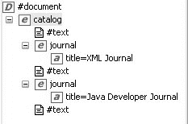

Vohra_706-0C05.fm Page 112 Thursday, July 6, 2006 1:42 PM

**112**

第 5 章 ■ 使用 XSLT 进行转换

**XSLT 概述**

在详细查看 XSLT 语言语法和语义之前，你将首先看到一个简单的示例，以便对 XSLT 转换有一个直观的理解。

**简单示例**

假设你有一个描述期刊目录的 XML 文档，如清单 5-1 所示。

**清单 5-1.** *示例源文档*

<catalog>

<journal title="XML Journal" />

<journal title="Java Developer Journal" />

</catalog>

这个 XML 文档是源文档，图 5-1 显示了相应的源树。

**图 5-1.** *示例源树*

现在，进一步假设你想将这个目录文档转换为一个 HTML 文档，该文档以表格形式显示所有杂志标题，或*期刊*，如清单 5-2 所示。

**清单 5-2.** *示例结果文档*

<html>

<body>

<table>

<tr><th>Titles</th></tr>

<tr><td>XML Journal</td></tr>

<tr><td>Java Developer Journal</td></tr>

</table>

</body>

</html>

这个 HTML 文档是结果文档，图 5-2 显示了相应的结果树。

[www.it-ebooks.info](http://www.it-ebooks.info/)

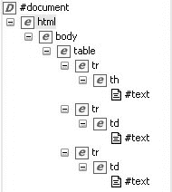

Vohra_706-0C05.fm Page 113 Thursday, July 6, 2006 1:42 PM

第 5 章 ■ 使用 XSLT 进行转换

**113**

**图 5-2.** *示例结果树*

了解了你想要做什么之后，显而易见的问题是，哪个 XSLT 样式表能将图 5-1 中的源树转换为图 5-2 中的结果树？清单 5-3 显示了一个可能的 XSLT 样式表，它将完成此转换。


**清单 5-3.** *示例 XSLT 样式表*

<?xml version='1.0' encoding='UTF-8' ?>

<xsl:stylesheet version="1.0"

>

<xsl:output encoding="UTF-8" method="xml" omit-xml-declaration="yes" />

<xsl:template match="/" >

<html>

<body>

<table>

<tr><th>标题</th></tr>

<xsl:for-each select="catalog/journal" >

<tr><td>

<xsl:apply-templates select="." ></xsl:apply-templates>

</td></tr>

</xsl:for-each>

</table>

</body>

</html>

</xsl:template>

<xsl:template match="journal" >

<xsl:value-of select="@title" />

</xsl:template>

</xsl:stylesheet>

现在，如果你从直观的角度审视清单 5-3 中的样式表，你可能会注意到以下有趣的事实：

• 该样式表是一个格式良好的 XML 文档。

• 带有 `xsl` 前缀的元素属于 `http://www.w3.org/1999/XSL/Transform` 命名空间，并且是 XSLT 语言指令集的一部分（嗯，你可能不确定这一点，但你可以推测出来）。

• 不带 `xsl` 前缀的元素，例如 `table` 元素，会原封不动地从源树复制到结果树中。

[www.it-ebooks.info](http://www.it-ebooks.info/)

Vohra_706-0C05.fm 第 114 页 2006 年 7 月 6 日，星期四，下午 1:42

**114**

第 5 章 ■ 使用 XSLT 进行转换

• 输出方法被指定为 `xml`，但结果文档被指示不要包含任何 XML 声明：你可以直观地推断出 XSLT 样式表中的 `<xsl:output encoding="UTF-8" method="xml" omit-xml-declaration="yes" />` 指令实现了这些目标。

• 样式表中的 `xsl:template` 指令包含一个名为 `match` 的属性，其值是一个 XPath 表达式。样式表中的 `xsl:apply-templates` 指令包含一个名为 `select` 的属性，其值也是一个 XPath 表达式。我们稍后会详细解释这一切；现在，你只是试图建立一个直观的理解。

• 并非源树中的所有节点都会出现在结果树中。实际上，只有源树中 `title` 属性节点的值作为文本节点出现在结果树中。

• 结果树包含许多源树中不存在的元素。

从这些要点中，你可能能够快速推断出，样式表是一个格式良好的 XML 文档，它混合了 XSLT 指令和字面 XML 内容。稍加思考，你可能还能推断出，样式表中的 XSLT 指令使用 XPath 表达式来定位源树节点，然后对这些源节点应用一些转换以生成结果树。最后，你可能很容易推断出，源树中的字面 XML 内容会被原封不动地复制到结果树中；到目前为止，一切顺利。然而，我们猜想，此时你想知道转换是如何具体指定的，以及处理器是如何处理它们的。那么，接下来让我们深入探讨这些细节。

**XSLT 处理算法**

你通过模板和指令的组合来指定 XSLT 转换。一个模板结构由目标文档中的指令和字面内容组成。你可以在模板结构内部或外部定义指令。例如，以下来自清单 5-3 样式表的模板包含一条单独的 `<xsl:value-of select="@title" />` 指令：

<xsl:template match="journal" >

<xsl:value-of select="@title" />

</xsl:template>

每个模板都与一个特定的模式相关联，该模式由 `match` 属性的值给出。前面显示的简单模板的模式是 `journal`。这意味着该模板适用于所有名称为 `journal` 的节点。

每条指令都作用于从源树中选择的一个节点集。当要求 XSLT 处理器使用 XSLT 样式表转换源文档时，处理器基本上遵循以下算法：

**1.** 它将样式表和源文档解析成各自的节点树。

**2.** 它执行一条隐式指令 `<xsl:apply-templates select="/" />`。该指令有一个 `select` 属性，其 XPath 表达式值为 `/`。此 XPath 表达式求值得到一个包含源树文档元素的节点集。因此，该指令选择源树文档元素作为当前节点集，并扫描样式表节点树，寻找一个 `match` 属性与源树文档元素匹配的 `xsl:template` 指令。如果找到这样的模板，则该模板被实例化为结果树根节点的模板。如果没有找到这样的模板，另一条隐式规则会继续递归处理，选择根节点的每个子节点，并为每个选中的子节点寻找匹配的模板（依此类推，递归进行），直到找到匹配的模板。例如，在清单 5-3 的示例样式表中，`<xsl:template match="/" >` 模板将与隐式指令匹配。

[www.it-ebooks.info](http://www.it-ebooks.info/)

Vohra_706-0C05.fm 第 115 页 2006 年 7 月 6 日，星期四，下午 1:42

第 5 章 ■ 使用 XSLT 进行转换

**115**

**3.** 从这一点开始，随着每个模板在结果树中被实例化，它又会依次被处理。模板中的字面元素被原封不动地复制到结果树中。对于在已实例化模板中找到的每个 XSLT 指令，处理将按照下一步所述继续进行。例如，在清单 5-3 的 `<xsl:template match="/" >` 模板中，HTML 元素是原封不动复制的字面内容，而 `<xsl:for-each select="catalog/journal" >` 是一个 XSLT 指令的示例，它将继续进行下一步所述的处理。

**4.** 对于在已实例化模板中找到的每个 `xsl:apply-templates` 指令，使用 `select` 属性的 XPath 表达式值从源树中选择一个节点集。对于所选节点集中的每个节点，处理器扫描样式表以寻找匹配的 `xsl:template`，如果找到 `xsl:template`，则将其实例化到结果树中，并继续处理。如果为当前节点集中的某个节点找到了多个匹配的 `xsl:template`，则视为错误。但是，处理器可能会选择忽略该错误并选取其中一个匹配的模板进行实例化。这可能是不同处理器之间行为不一致的一个来源。请注意，`xsl:template` 匹配的算法并不要求 `select` 属性值和 `match` 属性值必须相同。例如，在清单 5-3 的 `<xsl:apply-templates select="." >` 指令中，`select` 值与 `<xsl:template match="journal" >` 模板匹配，如下一步所述。

**5.** 对于在已实例化模板中找到的每个 `xsl:for-each` 指令，使用 `select` 属性的 XPath 表达式值从源树中选择一个节点集。对于所选节点集中的每个节点，`xsl:for-each` 指令的主体被实例化到结果树中并进行处理。例如，清单 5-3 中的 `<xsl:for-each select="catalog/journal" >` 指令遍历所有 `journal` 元素的节点集，并为每个 `journal` 元素执行 `for` 循环的主体。`for` 循环的主体是 `<xsl:apply-templates select="." >` 指令。该指令的 `select` 值与 `<xsl:template match="journal" >` 模板匹配，因为该指令是在 `xsl:for-each` 循环中执行的，循环的每次迭代都会选择不同的 `journal` 元素。而 `<xsl:template match="journal" >` 中的 `<xsl:value-of select="@title" />` 指令会打印每个 `journal` 的 `title` 属性的值。

有了对处理算法的这种基本理解，你就可以准备查看转换是如何指定的了，接下来你将进行这一步骤。

**XSLT 语法和语义**

以下各节重点介绍 XSLT 的语法和语义。

xsl:stylesheet 元素


XSLT 样式表中的根元素是`xsl:stylesheet`，其中`xsl`是与 XSLT 命名空间 URI `http://www.w3.org/1999/XSL/Transform`关联的前缀。当然，只要与正确的命名空间 URI 关联，你也可以使用`xsl`以外的其他前缀。`stylesheet`元素的属性包括`id`、`version`、`extension-element-prefixes`和`exclude-result-prefixes`。`version`属性指定 XSLT 版本，可以是 1.0 或 1.1⁷。此属性必须指定。

我们将使用 1.0 版本，因为目前它是唯一成为 W3C 推荐标准的版本，也是 Java XML API（JAXP）1.3 规范所支持的版本。`extension-element-prefixes`属性指定扩展元素的命名空间前缀。`exclude-result-prefixes`属性指定要从输出中排除的命名空间前缀。清单 5-4 展示了一个`xsl:stylesheet`元素的示例。

7\. 版本 1.1 已于 2001 年 8 月作为 W3C 工作草案被废弃（http://www.w3.org/TR/xslt11/）。

[www.it-ebooks.info](http://www.it-ebooks.info/)

Vohra_706-0C05.fm 第 116 页 2006 年 7 月 6 日星期四 下午 1:42

**116**

第 5 章 ■ 使用 XSLT 进行转换

**清单 5-4.** *xsl:stylesheet*

<xsl:stylesheet

exclude-result-prefixes = "jaxb"

version ="1.0" >

</xsl:stylesheet>

xsl:output 元素

`xsl:output`元素是`xsl:stylesheet`元素的子元素，用于指定结果树输出的特性。`xsl:output`元素的部分属性包括`method`、`version`、`encoding`、`omit-xml-declaration`、`doctype-public`、`doctype-system`和`indent`。这些属性的作用如下：

• `method`属性指定结果树类型，其值可以是`xml`、`html`或`text`。你也可以指定其他输出方法类型。

• `version`属性指定生成输出文档中 XML 声明的版本。

• 如果`omit-xml-declaration`设置为`yes`，则输出文档中省略 XML 声明。

• `encoding`属性指定生成文档的编码。

• `doctype-public`指定 DOCTYPE 声明中的公共标识符，这在第 1 章中讨论过。

• `doctype-system`属性指定 DOCTYPE 声明中的系统标识符。如果`indent`属性设置为`yes`，则输出会进行缩进。

清单 5-5 展示了一个`xsl:output`元素的示例。

**清单 5-5.** *xsl:output*

<xsl:output

method = "xml"

version = "1.0"

encoding = "utf-8"

omit-xml-declaration = "no"

doctype-public ="-//Sun Microsystems, Inc.//DTD Enterprise JavaBeans 2.0//EN"

doctype-system ="http://java.sun.com/dtd/ejb-jar_2_0.dtd"

indent = "yes" />

xsl:template 元素

如前所述，`xsl:template`元素是 XSLT 的核心，每个`xsl:template`都与一个模式（以 XPath 表达式表示）相关联。`xsl:template`元素的两个重要属性是`match`和`name`。`match`属性指定要匹配的模式；`name`属性通过名称标识模板。除非指定了`name`属性（此时`match`属性为可选），否则`match`属性是必需的。以下是一个`xsl:template`元素的示例：

<xsl:template match="journal" >

<xsl:value-of select="@title" />

</xsl:template>

上述示例中`match`属性的 XPath 模式匹配清单 5-1 所示示例源文档中所有`journal`元素的节点集。如果你还记得，这正是清单 5-3 循环中`xsl:for-each`指令的主体，该循环遍历每个`journal`元素，并通过`<xsl:apply-templates select="." >`指令选择并应用前面显示的模板。

xsl:apply-templates 元素

你可以使用`xsl:apply-templates`元素从源树中选择一个节点集。与`xsl:for-each`指令一起，它是用于更改当前节点集的两个关键指令之一。`xsl:apply-templates`元素的`select`属性指定一个 XPath 表达式，该表达式在源树上下文中求值得到一个节点集。如果 XPath 表达式是相对表达式，则相对于当前处理节点进行求值。如果省略`select`属性，则处理当前处理节点的所有子节点。清单 5-6 展示了`xsl:template`元素内`xsl:apply-templates`元素的示例。

**清单 5-6.** *xsl:apply-templates*

<xsl:template match="/" >

<html>

<body>

<table>

<tr><th>标题</th></tr>

<xsl:for-each select="catalog/journal" >

<tr><td>

**<xsl:apply-templates select="." ></xsl:apply-templates>**

</td></tr>

</xsl:for-each>

</table>

</body>

</html>

</xsl:template>

在清单 5-6 中，`xsl:apply-templates`指令选择当前`catalog`元素的子`journal`节点，尝试在清单 5-3 中为所选`journal`节点找到匹配的模板，然后应用该匹配模板。前面我们已经讨论过此`xsl:apply-templates`指令的匹配模板。

xsl:call-template 元素

如果在`xsl:template`元素中指定了`name`属性，则可以使用`xsl:call-template`元素调用该模板。清单 5-7 展示了`xsl:call-template`的示例。

**清单 5-7.** *xsl:call-template*

<xsl:template name="template1">

</xsl:template>

<xsl:call-template name="template1">

</xsl:call-template>

`xsl:call-template`和`xsl:apply-template`的区别在于：前者是对命名`xsl:template`元素的显式调用，此时`match`属性无关紧要；后者是隐式调用，依赖于`xsl:apply-template`中的`select`属性与`xsl:template`中的`match`属性之间的匹配。

[www.it-ebooks.info](http://www.it-ebooks.info/)

Vohra_706-0C05.fm 第 118 页 2006 年 7 月 6 日星期四 下午 1:42

**118**

第 5 章 ■ 使用 XSLT 进行转换

xsl:for-each 元素

要遍历节点集，可以使用`xsl:for-each`元素。清单 5-8 展示了`xsl:for-each`的示例，该示例摘自清单 5-3。

**清单 5-8.** *xsl:for-each 元素*

<xsl:for-each select="catalog/journal" >

<tr><td>

<xsl:apply-templates select="." ></xsl:apply-templates>

</td></tr>

</xsl:for-each>

在示例`xsl:for-each`元素中，`select`属性求值得到清单 5-1 所示文档中`journal`元素的节点集。对于该节点集中的每个节点，都会处理`xsl:for-each`指令的主体。

变量

你可以使用`xsl:variable`和`xsl:param`元素在 XSLT 中指定变量。`xsl:variable`和`xsl:param`元素具有`name`和`select`属性。你可以在`select`属性或元素内容中指定变量或参数的值。例如，你可以按如下方式指定值为`var1`的变量：

<xsl:variable name="var1" select="'var1'"/> 或按如下方式：

<xsl:variable name="var1">var1</xsl:variable> 你可以类似地指定参数：

<xsl:param name="param1" select="'param1'"/> 参数和变量之间的一个区别是，`xsl:param`元素中指定的值是默认值，并且在调用模板时可以被覆盖。你可以使用`xsl:with-param`元素指定参数值。清单 5-9 展示了覆盖默认参数值的示例。

**清单 5-9.** *使用参数值应用模板*

<xsl:apply-templates>

<xsl:with-param name="param1" select="'param1'"/>

</xsl:apply-templates>

你可以在顶层或模板中声明`xsl:variable`和`xsl:param`元素。`xsl:param`和`xsl:variable`的另一个区别是，你只能在模板的开头在`xsl:template`元素中声明`xsl:param`元素。

[www.it-ebooks.info](http://www.it-ebooks.info/)

Vohra_706-0C05.fm 第 119 页 2006 年 7 月 6 日星期四 下午 1:42


第 5 章 ■ 使用 XSLT 进行转换

**119**

条件处理

XSLT 规范提供了`xsl:if`和`xsl:choose`元素用于条件处理。`xsl:if`元素中名为`test`的属性会计算出一个布尔值，并控制条件处理。清单 5-10 展示了一个`xsl:if`元素的示例。

**清单 5-10.** *模板的条件应用*

<xsl:if test="$param1='param1'">

<xsl:apply-templates/>

</xsl:if>

清单 5-10 中的`test`属性将`param`参数的值与字符串`param1`进行比较。如果测试表达式计算结果为`true`，则会调用`<xsl:apply-templates/>`。

xsl:copy-of 元素

你可以从源树中选择结果树中的元素，也可以添加新元素。你可以使用`xsl:copy-of`元素将源树片段复制到结果树中。`xsl:copy-of`会复制选定的元素节点、该元素的属性以及该元素的子元素。以下是`xsl:copy-of`的一个示例：

<xsl:copy-of select="catalog/journal"/>

`xsl:copy`元素会复制选定的节点，但不会复制该节点的任何属性和子元素。

xsl:value-of 元素

`xsl:value-of`元素会在结果树中添加一个文本节点。`xsl:value-of`元素的`select`属性表达式会计算出一个字符串。以下是`xsl:value-of`元素的一个示例，它计算`journal`元素的`title`属性的字符串值：

<xsl:value-of select="journal/@title" />

添加元素、属性和文本

你可以使用`xsl:element`元素向结果树添加元素。以下是`xsl:element`的一个示例，它创建了一个`table`元素：

<xsl:element name="table">

</xsl:element>

你可以使用`xsl:attribute`元素向结果树添加属性。以下是`xsl:attribute`元素的一个示例，它创建了`title`属性：

<xsl:attribute name="title" >XML Journal</xsl:attribute> 你可以使用`xsl:text`元素向结果树添加文本节点。该元素的主体指定了结果树中的文本节点。

[www.it-ebooks.info](http://www.it-ebooks.info/)

Vohra_706-0C05.fm 第 120 页 2006 年 7 月 6 日星期四 下午 1:42

**120**

第 5 章 ■ 使用 XSLT 进行转换

**设置 Eclipse 项目**

在本章中，我们将演示如何使用各种 XSLT 样式表转换一个示例 XML 文档（如清单 5-11 所示）；每个样式表将演示一个特定的转换示例。

在这些样式表中，将移除`catalog.xml`中的重复元素，对`title`元素进行排序，并对各种节点进行过滤。

**清单 5-11.** *catalog.xml*

<?xml version="1.0" encoding="UTF-8"?>

<catalog >

<journal title="Java Technology" publisher="IBM developerWorks">

<article level="Intermediate" date="January-2004"

section="Java Technology">

<title>Service Oriented Architecture Frameworks</title>

<author>Naveen Balani</author>

</article>

<article level="Advanced" date="October-2003" section="Java Technology">

<title>Advanced DAO Programming</title>

<author>Sean Sullivan</author>

</article>

<article level="Advanced" date="May-2002" section="Java Technology">

<title>Best Practices in EJB Exception Handling</title>

<author>Srikanth Shenoy</author>

</article>

</journal>

</catalog>

在构建和运行本章包含的代码示例之前，你需要一个 Eclipse 项目。创建 Eclipse 项目最快的方法是从 Apress 网站(http://www.apress.com)下载 Chapter5 项目，并将其导入 Eclipse。这将自动创建本章所需的所有 Java 包和文件。

在本章中，我们将演示如何使用 J2SE 5.0 中包含的 JAXP 1.3 TrAX API。因此，你需要安装 J2SE 5.0 SDK，并将其 JRE 系统库设置为 Eclipse 项目 Java 构建路径中的 JRE 系统库。你可以通过右键单击包资源管理器中的 Eclipse 项目名称，选择属性，选择 Java 构建路径到库选项卡，然后单击添加库按钮来完成此操作。图 5-3 显示了 Chapter5 项目中的所有文件和文件夹。

8\. 你可以在 http://java.sun.com/j2se/1.5.0/ 找到关于 J2SE 5.0 的信息。

[www.it-ebooks.info](http://www.it-ebooks.info/)

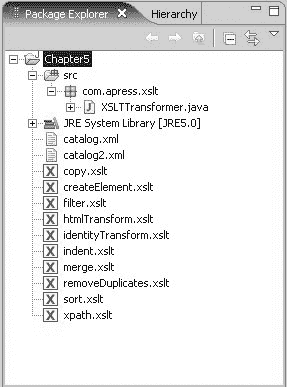

Vohra_706-0C05.fm 第 121 页 2006 年 7 月 6 日星期四 下午 1:42

第 5 章 ■ 使用 XSLT 进行转换

**121**

**图 5-3.** *Chapter5 项目目录结构* **JAXP 1.3 转换 API**

TrAX 在 JAXP 1.3 中指定，并包含在 J2SE 5.0 中。你使用 TrAX API 通过将 XSLT 样式表应用于输入 XML 文档来转换 XML 文档。转换应用程序的输出可以是 XML、HTML 或文本。转换 API 被组织成以下包：

• 通用转换 API 位于`javax.xml.transform`包中。

• 流和 URI 特定的转换 API，用于为转换应用程序指定基于流的输入和输出，位于`javax.xml.transform.stream`包中。

• DOM 特定的转换 API，用于为转换应用程序指定基于 DOM 的输入和输出，位于`javax.xml.transform.dom`包中。

• SAX 2 特定的转换 API，用于为转换应用程序指定基于 SAX 的输入和输出，位于`javax.xml.transform.sax`包中。

表 5-1 列出了`javax.xml.transform`包中的基本类。

**表 5-1.** *javax.xml.transform 包中的类* **类名**

**描述**

TransformerFactory

用于生成 Transformer 对象的工厂类

Transformer

用于将源树转换为结果树的类

Source

定义输入 XML 文档或输入 XSLT 样式表的输入源的接口

Result

定义转换结果树的接口

OutputKeys

为 Transformer 对象指定输出属性

[www.it-ebooks.info](http://www.it-ebooks.info/)

Vohra_706-0C05.fm 第 122 页 2006 年 7 月 6 日星期四 下午 1:42

**122**

第 5 章 ■ 使用 XSLT 进行转换

唯一的顺序约束是，在将转换器应用于输入源之前，输入源和结果树持有者都必须准备就绪。使用转换 API 的概念性步骤如下：

**1.** 创建转换器工厂的实例。

**2.** 使用该工厂基于 XSLT 样式表定义的输入源创建转换器的实例。

**3.** 配置转换器以进行错误处理。

**4.** 从输入 XML 文档创建输入源。输入源可以基于输入流或文档对象树。

**5.** 定义结果树的持有者；该持有者可以是流或文档对象。

**6.** 将转换器应用于输入源，以在其持有者中获取结果树。

用于将源树转换为结果树的主要类是`Transformer`类。你使用`TransformerFactory`类来生成`Transformer`对象。`TransformerFactory`类通过静态方法`newInstance()`实例化：

TransformerFactory factory=TransformerFactory.newInstance(); 实例化的默认`TransformerFactory`实现类是`org.apache.xalan.processor.TransformerFactoryImpl`。你可以使用以下查找过程来获取`TransformerFactory`实现类：

**1.** 使用系统属性`javax.xml.transform.TransformerFactory`。

**2.** 使用 JRE 目录中`lib/jaxp.properties`文件中的`javax.xml.transform.TransformerFactory`属性值。


**3.** 使用 Services API 从 `META-INF/services/javax.xml.transform.TransformerFactory` 文件中获取类名。

**4.** 使用平台默认的 `TransformerFactory` 实例。

你可以通过 `newTransformer(Source xsltSource)` 方法从 `TransformerFactory` 对象获取 `Transformer` 对象。要应用 XSLT 样式表到 XML 文档，请使用 `StreamSource` 类获取 XSLT `Source` 对象，如清单 5-12 所示。

**清单 5-12.** *创建 Transformer 对象*

```java
StreamSource xsltSource = new StreamSource(new File("sort.xslt"));
Transformer transformer = factory.newTransformer(xsltSource);
```

你也可以从 `Templates` 对象获取 `Transformer` 对象，`Templates` 对象是 XSLT 样式表中转换操作的表示。要使用 `Templates` 接口获取 `Transformer` 对象，请先从 `TransformerFactory` 对象创建 `Templates` 对象，再从 `Templates` 对象创建 `Transformer` 对象，如清单 5-13 所示。

**清单 5-13.** *从 Templates 对象创建 Transformer 对象*

```java
Templates templates = factory.newTemplates(xsltSource);
Transformer transformer = templates.newTransformer();
```

你可以使用 `setOutputProperty(String name, String value)` 方法在 `Transformer` 对象上设置输出属性。`Transformer` 输出的字符串常量在 `OutputKeys` 类中指定。表 5-2 列出了 `OutputKeys` 类中指定的字符串常量。

**表 5-2.** *输出属性*

| **静态字段** | **描述** |
| --- | --- |
| `DOCTYPE_PUBLIC` | 指定 DOCTYPE 声明的公共标识符。 |
| `DOCTYPE_SYSTEM` | 指定 DOCTYPE 标识符的系统标识符。 |
| `ENCODING` | 指定 XML 文档的编码。 |
| `INDENT` | 值可以是 `yes` 或 `no`。如果 `INDENT` 属性设置为 `yes`，则输出会缩进。 |
| `METHOD` | 值可以是 `xml`、`html` 或 `text`。也可以指定其他非命名空间的值。指定用于构建结果树的方法。 |
| `OMIT_XML_DECLARATION` | 值可以是 `yes` 或 `no`。要从输出 XML 文档中省略 XML 声明，请将值指定为 `yes`。 |
| `VERSION` | 指定输出版本。如果输出方法设置为 `xml`，默认版本为 1.0。如果输出方法设置为 `html`，默认版本为 4.0。 |

你可以向 `Transformer` 对象注册一个 `ErrorListener` 以输出转换错误。

要为 `Transformer` 注册错误处理，请创建一个 `ErrorListener` 的实现类，如清单 5-14 所示。

**清单 5-14.** *ErrorListener 实现类*

```java
private class ErrorListenerImpl implements ErrorListener {
    public TransformerException e = null;

    public void error(TransformerException exception) {
        this.e = exception;
    }

    public void fatalError(TransformerException exception) {
        this.e = exception;
    }

    public void warning(TransformerException exception) {
        this.e = exception;
    }
}
```

要向 `Transformer` 对象注册错误处理器，请创建一个错误处理器对象。使用 `setErrorListener(ErrorListener)` 方法，将错误处理器注册到 `Transformer` 对象，如清单 5-15 所示。

**清单 5-15.** *设置 ErrorListener*

```java
ErrorListenerImpl errorHandler = new ErrorListenerImpl();
transformer.setErrorListener(errorHandler);
```

XML 源树通过 `transform(Source source, Result result)` 方法转换为结果树。`Source` 对象可以是 `DOMSource`、`SAXSource` 或 `StreamSource`。`Result` 对象可以是 `DOMResult`、`SAXResult` 或 `StreamResult`。

要使用 `DOMSource` 对象，请从 `DocumentBuilder` 解析器类获取 `Document` 对象，如清单 5-16 所示。

**清单 5-16.** *创建 DOMSource 对象*


`DocumentBuilderFactory factory = DocumentBuilderFactory.newInstance();`  
`DocumentBuilder builder = factory.newDocumentBuilder();`

`Document document = builder.parse(new File("catalog.xml"));`  
`DOMSource domSource = new DOMSource(document);`

要输出到 `StreamResult`，请创建一个 `StreamResult` 对象。然后使用 `transform()` 方法转换输入的 XML 文档，如清单 5-17 所示。

**清单 5-17.** *将源树转换为结果树*  
`StreamResult streamResult = new StreamResult(System.out);`

`transformer.transform(domSource, streamResult);`

**TrAX 应用程序**

在上一节中，我们讨论了 TrAX。在本节中，我们将使用基于 TrAX 构建的转换应用程序来演示一些 XSLT 转换示例。我们将使用清单 5-11 中所示的示例 XML 文档作为 XSLT 转换的输入。

对于所有转换示例，我们将使用一个名为 `XSLTTransformer.java` 的通用 Java 应用程序，如清单 5-18 所示。`XSLTTransformer.java` 接收样式表和 XML 文档作为输入，并使用样式表中指定的转换规则对 XML 文档进行转换。TrAX 应用程序 `XSLTTransformer` 解析示例 XML 文档 `catalog.xml`，并创建一个 `Document` 对象。然后，它使用 `Transformer` 对象，根据样式表转换该 `Document` 对象。

在 `Transformer` 对象上设置了一个 `ErrorListener`，用于输出转换错误。

您可以通过将 `stylesheet` 的 `File` 对象中的样式表设置为所需的 XSLT，来使用不同的 XSLT 样式表运行 TrAX 应用程序 `XSLTTransformer.java`。例如，要对输入 XML 文档中的元素进行排序，请将样式表设置为 `sort.xslt`，如下所示：  
`File stylesheet = new File("sort.xslt");`

我们在前面的章节中已经讨论了清单 5-18 中的大部分代码；此外，代码中还附有注释。

**清单 5-18.** *XSLTTransformer.java*

```java
package com.apress.xslt;

import javax.xml.parsers.*;

import org.xml.sax.*;

import org.w3c.dom.*;

import javax.xml.transform.*;

import javax.xml.transform.dom.*;

[www.it-ebooks.info](http://www.it-ebooks.info/)

Vohra_706-0C05.fm Page 125 Thursday, July 6, 2006 1:42 PM

C H A P T E R 5 ■ T R A N S F O R M I N G W I T H X S L T

**125**

import javax.xml.transform.stream.*;

import java.io.*;

public class XSLTTransformer {

    public static void main(String argv[]) {

        try {

            //创建一个 DocumentBuilderFactory
            DocumentBuilderFactory factory =
                DocumentBuilderFactory.newInstance();

            //为输入的 XSLT 和示例 XML 文档创建 File 对象
            File stylesheet = new File("identityTransform.xslt");
            File datafile = new File("catalog.xml");

            //创建 DocumentBuilder 对象
            DocumentBuilder builder = factory.newDocumentBuilder();

            //解析示例 XML 文档
            Document document = builder.parse(datafile);

            //创建一个 TransformerFactory 对象
            TransformerFactory tFactory = TransformerFactory.newInstance();

            //从样式表 File 对象创建一个 Stylesource 对象
            StreamSource stylesource = new StreamSource(stylesheet);

            //从 StyleSource 对象创建一个 Transformer 对象
            Transformer transformer = tFactory.newTransformer(stylesource);

            //从 XML 文档创建一个 DOMSource 对象
            DOMSource source = new DOMSource(document);

            //创建一个 StreamResult 对象以输出转换结果
            StreamResult result = new StreamResult(System.out);

            //创建一个 ErrorListener 并将其设置在 Transformer 上
            XSLTTransformer xsltTransformer = new XSLTTransformer();
            ErrorListenerImpl errorHandler =
                xsltTransformer.new ErrorListenerImpl();
            transformer.setErrorListener(errorHandler);

            //使用 XSLT 样式表转换 XML 文档
            transformer.transform(source, result);

            //输出转换错误
            if (errorHandler.e != null) {
                System.out.println("转换异常: "
                    + errorHandler.e.getMessage());
            }

        } catch (TransformerConfigurationException e) {
            System.out.println(e.getMessage());
        } catch (TransformerException e) {

[www.it-ebooks.info](http://www.it-ebooks.info/)

Vohra_706-0C05.fm Page 126 Thursday, July 6, 2006 1:42 PM

**126**
```


第 5 章 ■ 使用 XSLT 进行转换

System.out.println(e.getMessage());

} catch (SAXException e) {

System.out.println(e.getMessage());

} catch (ParserConfigurationException e) {

System.out.println(e.getMessage());

} catch (IOException e) {

System.out.println(e.getMessage());

}

}

//ErrorListener 类

private class ErrorListenerImpl implements ErrorListener {

public TransformerException e = null;

public void error(TransformerException exception) {

this.e = exception;

}

public void fatalError(TransformerException exception) {

this.e = exception;

}

public void warning(TransformerException exception) {

this.e = exception;

}

}

}

在接下来的几节中，我们将展示如何对示例 XML 文档应用各种不同的 XSLT 转换。你可以使用转换应用程序 XSLTTransformer.java 来应用本节讨论范围之外的转换。只需修改 XSLTTransformer 应用程序中的输入 XML 文档和样式表，然后在 Eclipse 中运行该应用程序即可。

**恒等转换**

恒等转换将输入 XML 文档复制到输出文档，而不更改任何元素或属性。你可以应用恒等转换来修改编码或 DOCTYPE，或添加适当的缩进。清单 5-19 展示了一个用于恒等转换的 XSLT 示例。样式表 identityTransform.xslt 将模板模式递归应用于 catalog.xml 中的节点。XPath 表达式`@*|node()`选择所有元素和属性节点。在 XPath 模式中，`@*`表示所有属性节点，`node()`表示所有其他节点。恒等转换的输出是输入 XML 文档，并可选择性地修改文档编码、DOCTYPE 或缩进。

**清单 5-19.** *identityTransform.xslt*

<xsl:stylesheet version="1.0"

>

<xsl:output method="xml" version="1.0" indent="yes"/>

<xsl:template match="@* | node()">

<xsl:copy>

[www.it-ebooks.info](http://www.it-ebooks.info/)

Vohra_706-0C05.fm Page 127 Thursday, July 6, 2006 1:42 PM

第 5 章 ■ 使用 XSLT 进行转换

**127**

<xsl:apply-templates select="@* | node()"/>

</xsl:copy>

</xsl:template>

</xsl:stylesheet>

**去除重复项**

XML 文档中可能包含需要在输出中去除的重复元素。示例 XML 文档包含一个重复的 title 元素。要移除任何重复的 title 元素，请使用清单 5-20 所示的样式表运行转换应用程序，该样式表会输出非重复的文章标题。XPath 表达式`//title[not(.=following::title)]`选择非重复的 title 元素。XSLT 模式中的 XPath 函数`text()`输出 title 元素的文本。

**清单 5-20.** *removeDuplicates.xslt*

<xsl:stylesheet version="1.0"

>

<xsl:output method="xml" version="1.0" omit-xml-declaration="yes"/>

<xsl:template match="/">

<xsl:variable name="unique-list"

select="//title[not(.=following::title)]/text()" />

<xsl:for-each select="$unique-list">

<xsl:copy>

<xsl:apply-templates/>

</xsl:copy>

<xsl:text disable-output-escaping="yes">

&#13;

</xsl:text>

</xsl:for-each>

</xsl:template>

</xsl:stylesheet>

当输出方法为 xml 或 html 时，某些字符会在输出中被自动转义。要禁用字符的自动转义，可以在`xsl:text`中使用`disable-output-escaping="yes"`属性；元素的主体包含转义序列。例如，在清单 5-20 中，以下指令禁用了回车符的输出转义：

<xsl:text disable-output-escaping="yes">&#13; </xsl:text> 在应用此样式表之前，我们需要向 catalog.xml（如清单 5-11 所示）中添加重复的 title 元素。我们可以通过简单地复制并粘贴最后一个 article 元素，将其放在自身下方来实现。由于存在重复的 article 元素，这将添加一个重复的 title 元素。


要使用 removeDuplicates.xslt 样式表运行转换应用程序，请将该样式表指定为 Chapter5 项目中 XSLTTransformer.java 内 File 对象 stylesheet 的输入。

输出结果是不重复的文章标题，如清单 5-21 所示。

**清单 5-21.** *在 Eclipse 中去除重复项后的输出* Service Oriented Architecture Frameworks

Advanced DAO Programming

Best Practices in EJB Exception Handling

■**注意** 在后续章节中，我们将使用已去除重复元素的 XML 文档作为输入，因此请删除 Eclipse 项目 Chapter5.Sorting Elements 中 catalog.xml 内的重复标题元素。

[www.it-ebooks.info](http://www.it-ebooks.info/)

Vohra_706-0C05.fm Page 128 Thursday, July 6, 2006 1:42 PM

**128**

第 5 章 ■ 使用 XSLT 进行转换

**排序元素**

您可以使用 XSLT 元素 `xsl:sort` 对一组元素进行排序。`xsl:sort` 元素的 `order` 属性指定排序顺序：升序或降序。`data-type` 属性（其值可以是 `number` 或 `text`）指定待排序元素的数据类型。默认数据类型值为 `text`。`xsl:sort` 元素必须位于 `xsl:for-each` 元素或 `xsl:apply-templates` 元素内部。

例如，尝试按升序对示例 XML 文档中的 `title` 元素进行排序。

清单 5-22 所示的样式表 sort.xslt 按升序对 `title` 元素进行排序，并输出 `title` 元素中的文本节点。要使用 sort.xslt 运行转换应用程序，请在 XSLTTransformer.java 中将 sort.xslt 设置为 File 对象 stylesheet 中的样式表。

**清单 5-22.** *sort.xslt*

<xsl:stylesheet version="1.0">

<xsl:output method="xml" omit-xml-declaration="yes"/>

<xsl:template match="/catalog/journal">

<xsl:apply-templates>

<xsl:sort select="title"

order="ascending"/>

</xsl:apply-templates>

</xsl:template>

<xsl:template match="article">

Title: <xsl:apply-templates select="title"/>

</xsl:template>

</xsl:stylesheet>

在清单 5-22 中，`<xsl:template match="/catalog/journal">` 模板由以下内置隐式 XSLT 指令匹配：

<xsl:template match="*|/">

<xsl:apply-templates/>

</xsl:template>

内置规则为输入源文档（如清单 5-11 所示）中的每个 `journal` 节点匹配 `<xsl:template match="/catalog/journal">` 模板。由于 `<xsl:template match="/catalog/journal">` 模板内的 `<xsl:apply-templates>` 指令没有 `select` 属性，这意味着会选择 `journal` 节点的每个子节点，并搜索匹配的模板。对于 `journal` 节点的每个 `article` 子节点，起作用的匹配模板当然是 `<xsl:template match="article">`，它会输出标题，这些标题在结果树中由 `xsl:sort` 指令进行排序。输出结果是按升序排列的文章标题列表，如清单 5-23 所示。

**清单 5-23.** *在 Eclipse 中排序后的输出*

Title: Advanced DAO Programming

Title: Best Practices in EJB Exception Handling

Title: Service Oriented Architecture Frameworks

**转换为 HTML**

XML 文档中的数据可能需要以 HTML 文档的形式呈现。您可以通过在 `xsl:output` 元素中将 `method` 属性设置为 `html` 来定义具有 HTML 输出的转换。

清单 5-24 显示了用于应用 HTML 转换的 XSLT 样式表。

[www.it-ebooks.info](http://www.it-ebooks.info/)

Vohra_706-0C05.fm Page 129 Thursday, July 6, 2006 1:42 PM

第 5 章 ■ 使用 XSLT 进行转换

**129**

样式表 htmlTransform.xslt 包含用于生成 HTML 文件的 HTML 标签。在此样式表中，一个模板匹配模式 `/catalog/journal`，并使用 `xsl:for-each` 元素遍历 `journal` 元素中的 `article` 元素。文本值通过 `xsl:value-of` 元素输出。要使用此样式表运行转换应用程序 XSLTTransformer.java，请将 File 对象 stylesheet 的输入设置为 htmlTransform.xslt，并将输出文件设置为 catalog.html。

**清单 5-24.** *htmlTransform.xslt*

<?xml version="1.0" encoding="UTF-8"?>

<xsl:stylesheet version="1.0"

>

<xsl:output method="html"/>

<xsl:template match="/catalog/journal">

<html>

<head>

<title>Catalog</title>

</head>

<body>

<table border="1" cellspacing="0">

<tr>

<th>Level</th>

<th>Date</th>

<th>Section</th>

<th>Title</th>

<th>Author</th>

</tr>

<xsl:for-each select="article">

<tr>

<td><xsl:value-of select="@

level"/></td>

<td><xsl:value-of select="

@date"/></td>

<td><xsl:value-of select="@

section"/></td>

<td><xsl:value-of select="title"

/></td>

<td><xsl:value-of select="author"

/></td>

</tr>

</xsl:for-each>

</table>

</body>

</html>

</xsl:template>

</xsl:stylesheet>

XSLT 的输出是一个 HTML 文档，可以在浏览器中显示，如图 5-4 所示。

[www.it-ebooks.info](http://www.it-ebooks.info/)

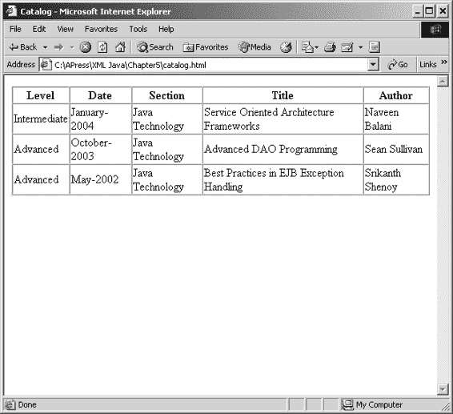

Vohra_706-0C05.fm Page 130 Thursday, July 6, 2006 1:42 PM

**130**

第 5 章 ■ 使用 XSLT 进行转换

**图 5-4.** *在 Eclipse 中 HTML 转换的输出* **合并文档**

当您合并 XML 文档时，您会从两个 XML 文档创建一个新的 XML 文档。您可以使用 `document()` 函数获取一个 XML 文档在另一个 XML 文档中的副本。例如，将示例 XML 文档 catalog.xml 与清单 5-25 中列出的 XML 文档 catalog2.xml 合并。

**清单 5-25.** *catalog2.xml*

<?xml version="1.0" encoding="UTF-8"?>

<catalog >

<journal title="Java Technology"

publisher="IBM developerWorks">

<article level="Intermediate" date="February-2003">

<title>Design XML Schemas Using UML</title>

<author>Ayesha Malik</author>

</article>

</journal>

</catalog>

样式表 merge.xslt 创建 catalog.xml 的副本，并将该副本与 catalog2.xml 的副本合并。要使用 merge.xslt 运行转换应用程序 XSLTTransformer.java，请将输入 XML 文档设置为 catalog.xml，并将输入样式表设置为清单 5-26 所示的 merge.xslt。

[www.it-ebooks.info](http://www.it-ebooks.info/)

Vohra_706-0C05.fm Page 131 Thursday, July 6, 2006 1:42 PM

第 5 章 ■ 使用 XSLT 进行转换

**131**

**清单 5-26.** *merge.xslt*

<?xml version="1.0" encoding="UTF-8"?>

<xsl:stylesheet version="1.0"

>

<xsl:output method="xml" />

<xsl:template match="/">

<catalogs>

<xsl:copy-of select="*"/>

<xsl:copy-of select="document('catalog2.xml')"/>

</catalogs>

</xsl:template>

</xsl:stylesheet>

该样式表将示例 XML 文档 catalog.xml 与另一个 XML 文档 catalog2.xml（如清单 5-25 所示）合并，生成如清单 5-27 所示的输出。

**清单 5-27.** *在 Eclipse 中合并 XML 文档后的输出*

<?xml version="1.0" encoding="UTF-8"?><catalogs>

<catalog >

<journal publisher="IBM developerWorks" title="Java Technology">

<article date="January-2004" level="Intermediate" section="Java Technology">

<title>Service Oriented Architecture Frameworks</title>

<author>Naveen Balani</author>

</article>

<article date="October-2003" level="Advanced" section="Java Technology">

<title>Advanced DAO Programming</title>

<author>Sean Sullivan</author>

</article>

<article date="May-2002" level="Advanced" section="Java Technology">

<title>Best Practices in EJB Exception Handling</title>

<author>Srikanth Shenoy</author>

</article>

</journal>

</catalog><catalog >

<journal title="Java Technology" publisher="IBM developerWorks">

<article level="Intermediate" date="February-2003">

<title>Design XML Schemas Using UML</title>

<author>Ayesha Malik</author>

</article>

</journal>

</catalog></catalogs>

**使用 XPath 获取节点值**


XSLT 节点选择基于 XPath。使用 `xsl:value-of` 元素，你可以通过 XPath 选择 XML 文档中的元素和属性节点。例如，选择标题为“高级 DAO 编程”的 article 元素的 date 属性值，以及选择作者为 Srikanth Shenoy 的 article 元素的 title 元素值。样式表 `xpath.xslt`（如清单 5-28 所示）输出了 date 属性值和 title 元素的值。XPath 表达式 `article[title='Advanced DAO Programming']/@date` 选择 date 属性，而 XPath 表达式 `article[author='Srikanth Shenoy']/title` 选择 title 元素。

[www.it-ebooks.info](http://www.it-ebooks.info/)

Vohra_706-0C05.fm 第 132 页 2006 年 7 月 6 日，星期四，下午 1:42

**132**

第 5 章 ■ 使用 XSLT 进行转换

**清单 5-28.** *xpath.xslt*

<?xml version="1.0" encoding="UTF-8"?>

<xsl:stylesheet version="1.0" xmlns:

xsl="http://www.w3.org/1999/XSL/Transform">

<xsl:output method="xml" omit-xml-declaration="yes"/>

<xsl:template match="/catalog/journal">

日期: <xsl:value-of select="article[title='

Advanced DAO Programming']/@date"/>

标题: <xsl:value-of select="article[author='Srikanth Shenoy']/title"/>

</xsl:template>

</xsl:stylesheet>

要使用 `xpath.xslt` 运行转换应用程序，请在 `XSLTTransformer.java` 中将输入样式表设置为 `xpath.xslt`。清单 5-29 显示了 XSLT 转换的输出。

**清单 5-29.** *Eclipse 中带有 XPath 节点选择的输出* 日期: October-2003

标题: Best Practices in EJB Exception Handling

**过滤元素**

将 `xsl:apply-templates` 元素仅应用于输出中所需的元素和属性，可以过滤 XML 文档中的元素。例如，选择 level 属性指定为 Intermediate 的 article 元素。样式表 `filter.xslt`（如清单 5-30 所示）选择了 level 属性值为 Intermediate 的 article 元素。XPath 表达式 `article[@level='Intermediate']` 选择 level 属性设置为 Intermediate 的 article 元素。

**清单 5-30.** *filter.xslt*

<?xml version="1.0" encoding="UTF-8"?>

<xsl:stylesheet version="1.0" >

<xsl:output method="xml" omit-xml-

declaration="yes"/>

<xsl:template match="/catalog/journal">

<xsl:apply-templates select="article[@level='Intermediate']"/>

</xsl:template>

<xsl:template match="article">

标题: <xsl:value-of select="title"/>

作者: <xsl:value-of select="author"/>

</xsl:template>

</xsl:stylesheet>

要使用 `filter.xslt` 运行转换应用程序，请在 `XSLTTransformer.java` 中将 File 对象 stylesheet 输入设置为 `filter.xslt`。输出仅包含 level 值为 Intermediate 的 article 元素，如清单 5-31 所示。

[www.it-ebooks.info](http://www.it-ebooks.info/)

Vohra_706-0C05.fm 第 133 页 2006 年 7 月 6 日，星期四，下午 1:42

第 5 章 ■ 使用 XSLT 进行转换

**133**

**清单 5-31.** *Eclipse 中过滤元素的输出* 标题: Service Oriented Architecture Frameworks

作者: Naveen Balani

**复制节点**

XSLT 规范提供了两个用于复制节点的元素：`xsl-copy-of` 和 `xsl-copy`。`xsl:copy-of` 元素复制选定的元素，同时也复制选定节点的属性和子元素。`xsl:copy` 是 `xsl:copy-of` 元素的一个不同版本，它不复制选定节点的子元素和属性。例如，将 `catalog.xml` 中 journal 元素内的第二个 article 元素复制到输出中。清单 5-32 中的样式表 `copy.xslt` 将 `catalog.xml` 文档中 journal 节点内的第二个 article 元素复制到输出文档。XPath 表达式 `journal/article[2]` 选择 journal 元素中的第二个 article 元素。

**清单 5-32.** *copy.xslt*

<?xml version="1.0" encoding="UTF-8"?>

<xsl:stylesheet version="1.0" >

<xsl:output method="xml"/>

<xsl:template match="/catalog">

<xsl:copy-of select="journal/article[2]"/>

</xsl:template>

</xsl:stylesheet>


要运行使用 `copy.xslt` 的转换应用程序，请在 `XSLTTransformer.java` 中将 `copy.xslt` 指定为 `File` 对象样式表的输入。XSLT 转换的输出由输入 XML 文档中 `journal` 节点内的第二个 `article` 元素组成，如清单 5-33 所示。

**清单 5-33.** *在 Eclipse 中复制节点的输出*

<?xml version="1.0" encoding="UTF-8"?>

<article

date="October-2003" level="Advanced"

section="Java Technology">

<title>高级 DAO 编程</title>

<author>Sean Sullivan</author>

</article>

**创建元素和属性**

XSLT 规范提供了 `xsl:element` 元素来创建元素，以及 `xsl:attribute` 元素来在生成的 XML 文档中创建属性。你可以在 `name` 属性中指定元素或属性的名称，并在 `namespace` 属性中指定元素或属性的命名空间。清单 5-34 中的样式表 `createElement.xslt` 创建了一个 `journal` 元素，并向该 `journal` 元素添加了一个 `publisher` 属性。属性值通过 `xsl:attribute` 元素中的 `xsl:text` 元素指定。

[www.it-ebooks.info](http://www.it-ebooks.info/)

Vohra_706-0C05.fm Page 134 Thursday, July 6, 2006 1:42 PM

**134**

第 5 章 ■ 使用 XSLT 进行转换

**清单 5-34.** *createElement.xslt*

<?xml version="1.0" encoding="UTF-8"?>

<xsl:stylesheet version="1.0" >

<xsl:output method="xml" omit-xml-declaration="yes"/>

<xsl:template match="/">

<xsl:element name="journal">

<xsl:attribute name="publisher">

<xsl:text>IBM developerWorks</xsl:text>

</xsl:attribute>

</xsl:element>

</xsl:template>

</xsl:stylesheet>

要运行使用 `createElement.xslt` 的转换应用程序，请在 `XSLTTransformer.java` 中将输入指定为 `File` 对象样式表 `createElement.xslt`。该样式表的输出由一个带有 `publisher` 属性的 `journal` 元素组成，如清单 5-35 所示。

**清单 5-35.** *在 Eclipse 中使用 createElement.xslt 的输出*

<journal publisher="IBM developerWorks"/> **添加缩进**

你可以使用 `xsl:output` 元素来格式化 XSLT 输出。你可以通过 `indent` 属性在 `xsl:output` 元素中设置缩进。要添加缩进，请指定 `xalan-indent-amount` 属性和 `xalan` 命名空间属性。如果 XSLT 处理器支持缩进，则输出会进行缩进。清单 5-36 显示了样式表 `indent.xslt`，它为示例 XML 文档添加了缩进。

**清单 5-36.** *indent.xslt*

<?xml version="1.0" encoding="UTF-8"?>

<xsl:stylesheet version="1.0"

>

<xsl:output method="xml" xalan:indent-amount="3"

indent="yes"/>

<xsl:template match="/">

<xsl:copy-of select="catalog"/>

</xsl:template>

</xsl:stylesheet>

[www.it-ebooks.info](http://www.it-ebooks.info/)

Vohra_706-0C05.fm Page 135 Thursday, July 6, 2006 1:42 PM

第 5 章 ■ 使用 XSLT 进行转换

**135**

**总结**

XSLT 是一种用于将 XML 文档转换为其他 XML 文档或非 XML 文档（如 HTML 或纯文本文档）的语言。要将 XSLT 样式表中描述的转换应用于 XML 文档，你需要一个 XSLT 处理器和一个调用该 XSLT 处理器的 API。

JAXP 1.3 中提供的 TrAX API 集非常适合使用 XSLT 样式表转换输入 XML 文档。XSLT 样式表所能生成的目标输出文档类型仅受限于你的想象力。在本章中，我们展示了如何成功地将 XML 文档转换为其他 XML 文档、HTML 文档和纯文本文档。

[www.it-ebooks.info](http://www.it-ebooks.info/)

Vohra_706-0C05.fm Page 136 Thursday, July 6, 2006 1:42 PM

[www.it-ebooks.info](http://www.it-ebooks.info/)

Vohra_706-0C06.fm Page 137 Thursday, July 13, 2006 1:11 PM

第 2 部分

■ ■ ■

对象绑定

[www.it-ebooks.info](http://www.it-ebooks.info/)

Vohra_706-0C06.fm Page 138 Thursday, July 13, 2006 1:11 PM

[www.it-ebooks.info](http://www.it-ebooks.info/)

Vohra_706-0C06.fm Page 139 Thursday, July 13, 2006 1:11 PM

第 6 章

■ ■ ■

使用 JAXB 进行对象绑定


**X**ML 是一种简单、灵活、平台无关的语言，用于表示结构化的文本信息。XML 的平台无关性使其成为跨应用组件交换数据的理想载体。当不同的应用组件交换基于 XML 的数据时，它们这样做是因为希望以某种特定于应用的方式处理所交换的数据，例如将数据提取并存储到数据库中，或者将数据格式化并呈现为用户界面的一部分。这就引出了一个有趣的问题：尽管 XML 是交换数据的理想选择，但使用我们在前几章讨论过的各种 API 来处理 XML 内容可能效率极低。为什么会这样呢？

答案在于，当今大多数处理逻辑都驻留在面向对象的应用组件中，而处理 XML 内容本质上却是极其过程化的。每个想要处理某些 XML 内容的组件，不仅需要关注内容格式是否良好，还必须确保其符合某种特定的结构（或者换句话说，相对于某个模式是有效的）。此外，一旦组件验证了 XML 内容格式良好且有效，它还必须使用适当的 API 来访问嵌入在 XML 内容中的数据。

当然，它完全可以做到这一切——在前几章中，我们讨论了如何解析和验证 XML 内容，以及如何使用适当的 API 访问和修改嵌入在 XML 内容中的数据。但从封装和代码复用的角度来看，在大多数面向对象的应用程序中直接使用这些 API 可能效率极低。为了解决在面向对象的 Java 应用程序中直接处理 XML 内容所带来的低效问题，你需要一个能够透明地将 XML 内容映射到 Java 对象，并将 Java 对象映射回 XML 内容的 Java API。

Java 架构用于 XML 绑定（JAXB）正是这样一个 API。

**概述**

理解 JAXB 的关键在于关注以下几点：

• 给定一个 XML Schema 文档，可以构造出无数个相对于该模式有效的 XML 文档。

• 给定一个模式和一个符合该模式的 XML 文档，该 XML 文档中的某个元素必须符合该模式中指定的某个类型组件。

• 对象实例相对于 Java 中其对应的类，就如同 XML 文档中的元素相对于该文档模式中指定的元素声明。

**139**

[www.it-ebooks.info](http://www.it-ebooks.info/)

Vohra_706-0C06.fm 第 140 页 2006 年 7 月 13 日，星期四，下午 1:11

**140**

第 6 章 ■ 使用 JAXB 进行对象绑定

• 模式中指定的每个类型组件（除了一些例外情况）都可以映射到一个 Java 类。这个 Java 类可能已经作为 Java 平台的一部分存在，也可能需要被定义为一个新类。

• 将模式类型组件绑定到各种 Java 类定义的过程是 JAXB 的核心。

JAXB API 是作为 Java Community Process¹ 的一部分开发的。需要注意的是，在撰写本书时，有两个版本的 JAXB 可用：

• 第一个可用版本是 JAXB 1.0，于 2003 年 1 月最终确定。该规范的实现可在 Java Web 服务开发包（JWSDP）1.6 以及 J2EE 1.4 中找到。

• 第二个可用版本是 JAXB 2.0，于 2006 年 5 月最终确定。该规范的实现可在 JWSDP 2.0 以及 Java 企业版 5 中找到。

JAXB 的主要目标从 JAXB 1.0 到 2.0 保持不变。然而，2.0 版本有许多重要的新增功能。因此，我们将首先详细讨论 JAXB 1.0，然后再讨论 JAXB 2.0 中重要的新增内容。

**JAXB 1.0**

在以下各节中，我们将介绍 JAXB 1.0。

**架构**

图 6-1 展示了 JAXB 1.0 的基本架构。JAXB 将一个*源 XML Schema* 绑定到一组从模式派生的 Java 内容类。JAXB 中的*绑定编译器*（xjc）会生成与源模式中指定的顶级类型组件相对应的 Java 内容类。JAXB 中可用的运行时绑定框架 API 负责将 XML 文档*编组*和*反编组*为相应的 Java 对象，反之亦然。

**图 6-1.** *JAXB 1.0 架构*

1. 有关此过程的更多信息，请访问 http://jcp.org/en/home/index。

[www.it-ebooks.info](http://www.it-ebooks.info/)

Vohra_706-0C06.fm 第 141 页 2006 年 7 月 13 日，星期四，下午 1:11

第 6 章 ■ 使用 JAXB 进行对象绑定

**141**

需要注意的是，JAXB 1.0 绑定编译器不支持映射所有类型的 XML Schema 组件。事实上，JAXB 1.0 不支持以下 XML Schema² 组件：

• 使用 `substitutionGroup` 属性的元素声明，该属性解析为预定义的模型组模式组件（`<xs:element @substitutionGroup>`）。

• 通配符模式组件（`xs:any` 和 `xs:anyAttribute`）。

• 用于指定跨多个元素唯一性的标识约束（`xs:key`、`xs:keyref` 和 `xs:unique`）。

• 使用 `redefine` 声明重新定义的 XML Schema 组件（`<xs:redefine>`）。

• 表示法 XML Schema 组件（`<xs:notation>`）。

• 不支持以下模式属性：`complexType.abstract`、`element.abstract`、`element.substitutionGroup`、`xsi:type`、`complexType.block`、`complexType.final`、`element.block`、`element.final`、`schema.blockDefault` 和 `schema.finalDefault`。

**XML Schema 到 Java 表示的绑定**

JAXB 1.0 定义了所支持的模式子集到 Java 的默认绑定。但是，你可以通过外部绑定声明来覆盖此默认绑定，这些声明可以内联在模式中，也可以放在单独的 XML 绑定声明文档中。无论哪种方式，绑定声明都会覆盖默认的 XML Schema 到 Java 的绑定。

将 XML Schema 子集绑定到 Java 的详细算法最好留给 JAXB 1.0 规范去处理。话虽如此，我们想补充一点，如果你唯一的兴趣在于应用 JAXB，而不是实现 JAXB，那么这些细节对你的价值将非常有限。因此，我们不会涵盖与模式绑定到 Java 相关的所有细节，而是通过提供一个简单的示例，帮助你直观地理解模式绑定。

简单绑定示例

假设你有一个简单的模式，它定义了美国或加拿大境内邮政地址的结构。它指定了明显的元素，如姓名、街道、城市和州。它指定了美国邮政编码或加拿大邮政编码的选择。它将国家元素的内容限制为只能是美国或加拿大。清单 6-1 展示了这样一个模式的示例。

**清单 6-1.** *美国或加拿大地址模式：address.xsd*

```xml
<?xml version='1.0' encoding='UTF-8' ?>

<xs:schema jxb:version="1.0"

xsi:schemaLocation="http://www.w3.org/2001/XMLSchema http://www.nubean.com/schemas/schema.xsd" >

<xs:element name="UsOrCanadaAddress" >

<xs:complexType>

2. 你可以在 http://www.w3.org/TR/xmlschema-1/ 找到关于 XML Schema 组件的详细信息。

[www.it-ebooks.info](http://www.it-ebooks.info/)

Vohra_706-0C06.fm 第 142 页 2006 年 7 月 13 日，星期四，下午 1:11

**142**

第 6 章 ■ 使用 JAXB 进行对象绑定

<xs:sequence>

<xs:element name="name" type="xs:string" ></xs:element>

<xs:element name="street" type="xs:string" ></xs:element>

<xs:element name="city" type="xs:string" ></xs:element>

<xs:element name="state" type="xs:string" ></xs:element>

<xs:choice>

<xs:element name="zip" type="xs:int" ></xs:element>

<xs:element name="postalCode" type="xs:string" ></xs:element>

</xs:choice>

<xs:element name="country" >

<xs:simpleType>

<xs:restriction base="xs:string" >

<xs:enumeration value="United States" ></xs:enumeration>

<xs:enumeration value="Canada" ></xs:enumeration>


</xs:restriction>

</xs:simpleType>

</xs:element>

</xs:sequence>

</xs:complexType>

</xs:element>

</xs:schema>

现在，为简化操作，你将接受所有默认的 XML Schema 绑定规则，但有一条例外。你将使用特定的包名 `com.apress.jaxb1.example` 覆盖生成的 Java 类和接口的默认包名，如清单 6-2 所示的外部绑定文件。

**清单 6-2.** *包名的外部绑定声明*

<?xml version='1.0' encoding='utf-8' ?>

<jxb:bindings version="1.0"

>

<jxb:bindings node="/xs:schema" schemaLocation="address.xsd" >

<jxb:schemaBindings>

**<jxb:package name="com.apress.jaxb1.example" ></jxb:package>**

</jxb:schemaBindings>

</jxb:bindings>

</jxb:bindings>

在本章稍后的“将目录模式绑定到 Java 类”一节中，我们将详细讨论如何在 Eclipse 中配置和运行 xjc 编译器。现在，假设你已掌握操作方法，并运行 xjc 编译器，使其处理清单 6-1 中的模式和清单 6-2 中的外部绑定声明。运行 xjc 会将模式组件绑定到 Java。对于清单 6-1 所示的模式，xjc 的模式绑定工作方式如下：

• 在 `com.apress.jaxb1.example` 包中，xjc 生成两个 Java 接口和一个 Java 类。接口为 `UsOrCanadaAddressType` 和 `UsOrCanadaAddress`，类为 `ObjectFactory`。

• `UsOrCanadaAddressType` 接口是 `<xs:element name="UsOrCanadaAddress" >` 组件内定义的 `<xs:complexType>` 组件的 Java 表示。

[www.it-ebooks.info](http://www.it-ebooks.info/)

Vohra_706-0C06.fm 第 143 页 2006 年 7 月 13 日星期四下午 1:11

第 6 章 ■ 使用 JAXB 进行对象绑定

**143**

• `UsOrCanadaAddress` 接口是 `<xs:element name="UsOrCanadaAddress" >` 组件的 Java 表示。

• `UsOrCanadaAddress` 接口继承自 `UsOrCanadaAddressType` 接口。

• `ObjectFactory` 类是一个典型的对象工厂实现，可用于创建 `UsOrCanadaAddress` 或 `UsOrCanadaAddressType` 的新实例。

• 在 `com.apress.jaxb1.example.impl` 包中，xjc 生成两个实现类：`UsOrCanadaAddressTypeImpl` 和 `UsOrCanadaAddressImpl`。这些实现类实现了对应的接口。

• 在 `com.apress.jaxb1.example.impl.runtime` 包中，xjc 生成多个类，负责所有与解析、验证、元素访问、编组和解组相关的底层工作。

• 编组 XML 文档是指从 Java 类创建 XML 文档。解组 XML 文档是指从 XML 文档创建 Java 对象树。

现在，让我们看看 Java 接口 `UsOrCanadaAddressType` 中的代码。清单 6-3 展示了这段生成的代码。

**清单 6-3.** *UsOrCanadaAddressType 接口代码* package com.apress.jaxb1.example;

public interface UsOrCanadaAddressType {

java.lang.String getPostalCode();

void setPostalCode(java.lang.String value);

java.lang.String getState();

void setState(java.lang.String value);

int getZip();

void setZip(int value);

java.lang.String getCountry();

void setCountry(java.lang.String value);

java.lang.String getCity();

void setCity(java.lang.String value);

java.lang.String getStreet();

void setStreet(java.lang.String value);

java.lang.String getName();

void setName(java.lang.String value);

}

研究清单 6-3 中的代码时，请注意清单 6-1 中顶层元素内定义的每个元素都映射到一个带有 get 和 set 访问器方法的属性。这种映射对大多数元素来说直观合理，但对于属于选择组的两个元素 `zip` 和 `postalCode` 则不然。对于这两个元素，一个显而易见的问题是：选择组是如何在 `UsOrCanadaAddressType` 接口中体现的？简单的答案是：没有体现。在默认映射规则下，选择组不会在接口中反映出来。然而，选择逻辑在编组和解组逻辑中得到了正确实现。清单 6-1 中 `country` 元素的枚举值也是如此。

从直观角度来看，你已经看到默认绑定模型将顶层元素内的嵌套元素视为一个扁平的元素列表，忽略了诸如选择组之类的组组件。然而，另一种称为*模型组绑定*的绑定风格会将每个组组件绑定到其自己的 Java 接口。为了更好地理解这种替代风格，可以在外部绑定声明文件中使用 `globalBindings` 元素来指定，如清单 6-4 所示。

[www.it-ebooks.info](http://www.it-ebooks.info/)

Vohra_706-0C06.fm 第 144 页 2006 年 7 月 13 日星期四下午 1:11

**144**

第 6 章 ■ 使用 JAXB 进行对象绑定

**清单 6-4.** *采用模型组绑定风格的外部绑定声明*

<?xml version='1.0' encoding='utf-8' ?>

<jxb:bindings version="1.0"

>

<jxb:bindings node="/xs:schema" schemaLocation="address.xsd" >

**<jxb:globalBindings bindingStyle="modelGroupBinding">**

**</jxb:globalBindings>**

<jxb:schemaBindings>

<jxb:package name="com.apress.jaxb1.example" ></jxb:package>

</jxb:schemaBindings>

</jxb:bindings>

</jxb:bindings>

现在，如果将清单 6-4 所示的绑定应用于清单 6-1 中的模式，结果会略有不同。具体来说，接口 `UsOrCanadaAddressType` 包含嵌套接口 `ZipOrPostalCode`；此外，ZIP 和邮政编码对应的属性 get 和 set 方法现在合并了，并使用这个新接口，如清单 6-5 所示。（为简洁起见，我们在清单 6-5 中省略了与默认绑定风格相比未发生变化的属性 get 和 set 方法。）

**清单 6-5.** *通过模型组绑定风格派生的 UsOrCanadaAddressType* package com.apress.jaxb1.example;

public interface UsOrCanadaAddressType {

…

com.apress.jaxb1.example.UsOrCanadaAddressType.ZipOrPostalCode **getZipOrPostalCode**();

void

**setZipOrPostalCode**(com.apress.jaxb1.example.

UsOrCanadaAddressType.ZipOrPostalCode

value);

public interface **ZipOrPostalCode** {

java.lang.String getPostalCode();

void setPostalCode(java.lang.String value);

boolean isSetPostalCode();

int getZip();

void setZip(int value);

boolean isSetZip();

java.io.Serializable getContent();

boolean isSetContent();

void unsetContent();

}

}

这种替代风格的明显优势在于，与各种组组件相关的语义通过指定的 Java 接口变得清晰可见。这种风格的明显缺点是 Java 内容接口数量激增，每个组组件对应一个接口。接下来，你将看到一个示例用例，说明如何使用 JAXB 绑定编译器和运行时框架。

[www.it-ebooks.info](http://www.it-ebooks.info/)

Vohra_706-0C06.fm 第 145 页 2006 年 7 月 13 日星期四下午 1:11

第 6 章 ■ 使用 JAXB 进行对象绑定

**145**

**示例用例**


设想一个销售各类行业期刊的网站。该网站提供一项网络服务，允许关联的出版商发送其期刊的目录信息。网站提供了一个 XML Schema，用于定义包含目录信息的 XML 文档结构。这个目录模式定义了一个顶级元素`catalog`。`catalog`元素可以包含零个或多个`journal`元素，而每个`journal`元素又可以包含零个或多个`article`元素。这些元素各自定义了相关属性。元素通过引用其关联的类型来定义，这些类型是单独定义的。清单 6-6 展示了这个目录模式，即`catalog.xsd`。

**清单 6-6.** *catalog.xsd*

<xsd:schema >

<xsd:element name="catalog" type="catalogType"/>

<xsd:complexType name="catalogType">

<xsd:sequence>

<xsd:element ref="journal" minOccurs="0" maxOccurs="unbounded"/>

</xsd:sequence>

<xsd:attribute name="section" type="xsd:string"/>

<xsd:attribute name="publisher" type="xsd:string"/>

</xsd:complexType>

<xsd:element name="journal" type="journalType"/>

<xsd:complexType name="journalType">

<xsd:sequence>

<xsd:element ref="article" minOccurs="0" maxOccurs="unbounded"/>

</xsd:sequence>

</xsd:complexType>

<xsd:element name="article" type="articleType"/>

<xsd:complexType name="articleType">

<xsd:sequence>

<xsd:element name="title" type="xsd:string"/>

<xsd:element name="author" type="xsd:string"/>

</xsd:sequence>

<xsd:attribute name="level" type="xsd:string"/>

<xsd:attribute name="date" type="xsd:string"/>

</xsd:complexType>

</xsd:schema>

出版商端的网络服务客户端必须构建一个符合清单 6-6 所示目录模式的 XML 文档，并将该文档作为网络服务消息发送。清单 6-7 展示了这样一个文档的示例，即`catalog.xml`。

[www.it-ebooks.info](http://www.it-ebooks.info/)

Vohra_706-0C06.fm 第 146 页 2006 年 7 月 13 日星期四 下午 1:11

**146**

第 6 章 ■ 使用 JAXB 进行对象绑定

**清单 6-7.** *catalog.xml*

<?xml version="1.0" encoding="UTF-8"?>

<catalog

section="Java Technology"

publisher="IBM developerWorks">

<journal>

<article level="Intermediate" date="January-2004" >

<title>Service Oriented Architecture Frameworks </title>

<author>Naveen Balani</author>

</article>

<article level="Advanced" date="October-2003" >

<title>Advance DAO Programming</title>

<author>Sean Sullivan</author>

</article>

<article level="Advanced" date="May-2002" >

<title>Best Practices in EJB Exception Handling </title>

<author>Srikanth Shenoy </author>

</article>

</journal>

</catalog>

接收此目录信息消息的网络服务需要从消息中提取相关的元素和属性值，并将这些值存储到数据库中。在本章中，你无需关注此用例中涉及数据存储到数据库的方面，也无需关注组装和传输网络服务消息的机制。我们将在后续章节中介绍这些内容。本章你唯一需要关注的是对清单 6-7 所示文档进行编组和解组，然后从映射后的 Java 对象中提取相关的元素和属性值。

在此用例示例中，你的目标如下：

*   使用`xjc`编译器绑定清单 6-6 所示的目录模式，并生成代表目录模式中定义的各种模式组件的 Java 内容类。
*   对清单 6-7 所示的 XML 文档进行编组和解组。
*   从映射后的 Java 对象中提取相关的元素和属性值。
*   使用内联绑定声明自定义模式绑定。

在介绍与此用例相关的一些 Java 代码之前，我们将讨论如何下载和安装所需的软件，以及如何创建和配置本章所需的 Eclipse 项目。

[www.it-ebooks.info](http://www.it-ebooks.info/)

Vohra_706-0C06.fm 第 147 页 2006 年 7 月 13 日星期四 下午 1:11

第 6 章 ■ 使用 JAXB 进行对象绑定

**147**

**下载和安装软件**


要运行 JAXB 1.0 示例，您需要安装以下软件。

安装 Java Web Service Developer Pack (JWSDP)

JAXB 1.0 包含在 JWSDP 1.6 中。因此，您需要下载并安装 JWSDP 1.6.3。将 JWSDP 1.6 安装到任意目录。在本章中，我们假设 JWSDP 安装在默认安装目录下，在 Windows 系统中为 `C:\Sun\jwsdp-1.6`；如果是这种情况，JAXB 包含在 `C:\Sun\jwsdp-1.6\jaxb` 目录中。

安装 J2SE

我们建议将 J2SE 5.0 与 JWSDP 1.6 配合使用，因为 JAXB 使用了 `SAXParserFactory` 类的一些方法，这些方法在 J2SE 5.0 中已定义，但在 J2SE 1.4.2 中未定义。使用 JRE 1.4.2 时，解组操作会生成以下错误：

`java.lang.NoSuchMethodError: javax.xml.parsers.SAXParserFactory.`

`getSchema()Ljavax/xml/validation/Schema`

如果您使用 Endorsed Standards Override Mechanism (http://java.sun.com/j2se/1.4.2/docs/guide/standards/)，则可以在 JWSDP 1.6 中使用 J2SE 1.4.2。如果您想使用 J2SE 5.0（我们强烈推荐），则需要下载并安装它。如果 `JAVA_HOME` 环境变量的路径名中包含空格，`xjc` 编译器将无法运行。因此，请将 J2SE 5.0 安装到路径名中没有空格的目录中。

**创建并配置 Eclipse 项目**

要使用 `xjc` 编译示例模式，并运行本项目包含的编组和解组代码示例，您需要创建一个 Eclipse Java 项目。创建 Eclipse 项目最快的方法是从 Apress 网站 (http://www.apress.com) 下载 Chapter6 项目，然后将该项目导入 Eclipse。这将自动创建本章所需的所有 Java 包和文件。

您还需要将 Chapter6 的 JRE 设置为 J2SE 5.0 JRE。通过单击“添加库”按钮，在项目的 Java 构建路径中设置 JRE。图 6-2 显示了 Chapter6 的构建路径。如果您的 JWSDP 1.6 安装位置不是 `C:\Sun\jwsdp-1.6`，则可能需要显式添加或编辑外部 JAR 文件。

无论采用哪种方式，请确保您的 Java 构建路径显示了图 6-2 中所示的所有 JWSDP 1.6 JAR 文件。

我们将展示如何配置绑定编译器 `xjc`，以在 `gen_source` 文件夹和 `gen_source_customized_bindings` 文件夹中生成 Java 内容类；因此，请将这两个文件夹添加到 Java 构建路径区域中“源”选项卡下的源路径中，如图 6-3 所示。

3. 您可以在 http://java.sun.com/webservices/downloads/webservicespack.html 找到 JWSDP 1.6。
4. 您可以在 http://java.sun.com/webservices/docs/1.6/ReleaseNotes.html#new 找到此信息。

[www.it-ebooks.info](http://www.it-ebooks.info/)

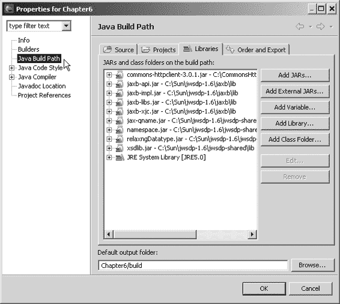

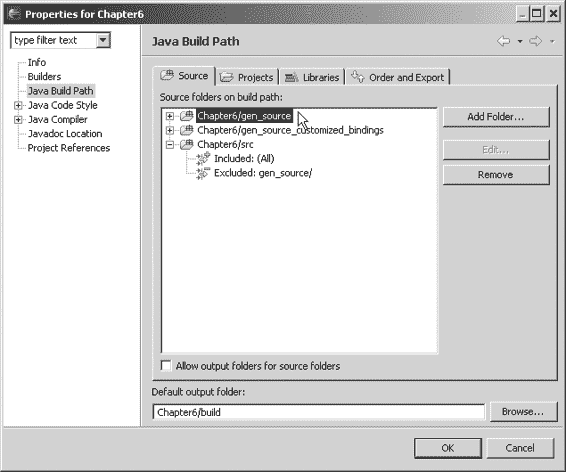

Vohra_706-0C06.fm Page 148 Thursday, July 13, 2006 1:11 PM

**148**

第 6 章 ■ 使用 JAXB 进行对象绑定

**图 6-2.** *Chapter6 Eclipse 项目 Java 构建路径* **图 6-3.** *Chapter6 项目的源路径*

[www.it-ebooks.info](http://www.it-ebooks.info/)

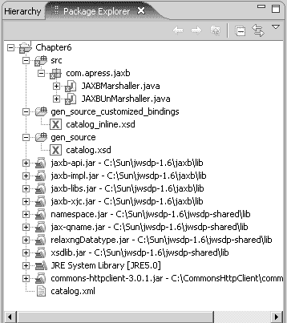

Vohra_706-0C06.fm Page 149 Thursday, July 13, 2006 1:11 PM

第 6 章 ■ 使用 JAXB 进行对象绑定

**149**

图 6-4 显示了 Chapter6 项目的目录结构。

**图 6-4.** *Chapter6 Eclipse 项目目录结构* **将目录模式绑定到 Java 类**

在本节中，您将把清单 6-6 中所示的目录模式绑定到其 Java 内容类。随后，您将使用这些 Java 内容类来编组和解组清单 6-7 中所示的 XML 文档。您可以使用 JAXB 绑定编译器 `xjc` 来编译 XML 模式，该编译器可以使用表 6-1 中列出的运行时选项运行。

**表 6-1.** *xjc 命令选项*

**选项**

**描述**

`-nv`

不执行对输入模式的严格验证。

`-b <file>`

指定外部绑定文件。

`-d <dir>`

指定生成文件的目录。

`-p <pkg>`

指定目标包。

`-classpath <arg>`

指定类路径。

`-use-runtime <pkg>`


`impl.runtime` 包不会被生成。相反，会使用指定包中的运行时。

`-xmlschema`

输入模式是 W3C XML Schema（默认）。

[www.it-ebooks.info](http://www.it-ebooks.info/)

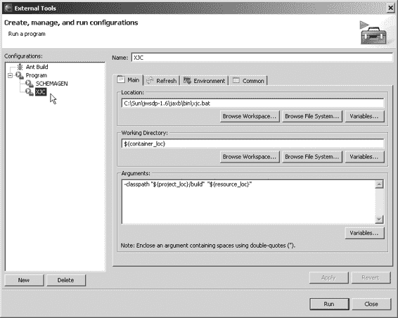

Vohra_706-0C06.fm 第 150 页 2006 年 7 月 13 日，星期四，下午 1:11

**150**

第 6 章 ■ 使用 JAXB 进行对象绑定

你将在 Eclipse 中运行 xjc。因此，需要将 xjc 配置为 Eclipse 中的一个外部工具。要配置 xjc 为外部工具，请选择“运行”➤“外部工具”。在“外部工具”对话框中，你需要创建一个新的程序配置，通过右键单击“程序”节点并选择“新建”来完成。这将添加一个新配置，如图 6-5 所示。在新配置中，在“名称”字段中为配置指定一个名称，并在“位置”字段中指定 xjc 批处理文件或 shell 文件的路径，该文件位于 JWSDP 安装目录下的 `jaxb/bin` 文件夹中。

**图 6-5.** *为 xjc 创建外部工具配置* 你还需要设置工作目录和程序参数。要设置工作目录，请单击“工作目录”字段的“变量”按钮，并选择 `container_loc` 变量。这将在“工作目录”字段中指定 `${container_loc}` 的值。这个值意味着，无论运行 xjc 时选择了哪个模式文件，该文件的父目录都将成为 xjc 的工作目录。

[www.it-ebooks.info](http://www.it-ebooks.info/)

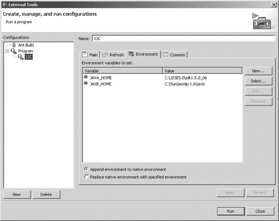

Vohra_706-0C06.fm 第 151 页 2006 年 7 月 13 日，星期四，下午 1:11

第 6 章 ■ 使用 JAXB 进行对象绑定

**151**

在“参数”字段中，你需要设置类路径和需要使用 xjc 编译器编译的模式。你可以通过单击“参数”字段的“变量”按钮并选择变量 `project_loc` 和 `resource_loc` 来完成此操作。这将在“参数”字段中指定值 `${project_loc}` 和 `${resource_loc}`。在 `${project_loc}` 之前添加 `-classpath` 选项。值 `${resource_loc}` 意味着，无论运行 xjc 时选择了哪个文件，该文件都将成为 xjc 的模式文件参数。如果 Eclipse 安装目录的路径名中包含空格，请将 `${project_loc}` 和 `${resource_loc}` 用双引号括起来，如图 6-5 所示。

要存储新配置，请单击“应用”按钮。

你还需要在 xjc 的外部工具配置中设置环境变量 `JAVA_HOME` 和 `JAXB_HOME`。在“环境”选项卡上，添加环境变量 `JAVA_HOME` 和 `JAXB_HOME`，如图 6-6 所示。这些变量的值当然可能不同。

**图 6-6.** *添加环境变量*

要将 XJC 配置添加到“外部工具”菜单，请选择“常用”选项卡，然后在“显示在收藏夹菜单”区域中选择“外部工具”复选框，如图 6-7 所示。

[www.it-ebooks.info](http://www.it-ebooks.info/)

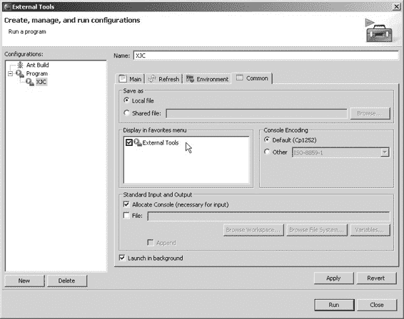

Vohra_706-0C06.fm 第 152 页 2006 年 7 月 13 日，星期四，下午 1:11

**152**

第 6 章 ■ 使用 JAXB 进行对象绑定

**图 6-7.** *将 xjc 配置添加到外部工具菜单* 要在示例模式 `catalog.xsd` 上运行 xjc 编译器，请在包资源管理器中选择 `catalog.xsd` 文件，然后选择“运行”➤“外部工具”➤“XJC”。Java 接口和类将生成在 `gen_source` 文件夹中，如图 6-8 所示。

默认情况下，Java 类和接口在 `generated` 包中生成。`jaxb.properties` 文件为 `javax.xml.bind.context.factory` 类指定了一个实例化类，而 `bgm.ser` 文件包含特定于实现的序列化对象。在包含生成类的任何 JAR 文件中包含这两个文件非常重要。

对于清单 6-6 所示的示例模式中定义的每个顶级 `xsd:element` 和 `xsd:complexType` 模式组件，都会生成一个 Java 接口。例如，对于顶级 `<xsd:element name="catalog" type="catalogType"/>` 模式组件，会生成一个 `Catalog` 接口（如清单 6-8 所示），而对于 `<xsd:complexType name="catalogType">` 组件，会生成一个 `CatalogType` 接口（如清单 6-9 所示）。

**清单 6-8.** *Catalog.java*

```java
package generated;

public interface Catalog

extends javax.xml.bind.Element, generated.CatalogType {

}
```

**清单 6-9.** *CatalogType.java*

```java
package generated;

public interface CatalogType {

java.lang.String getSection();

void setSection(java.lang.String value);

[www.it-ebooks.info](http://www.it-ebooks.info/)

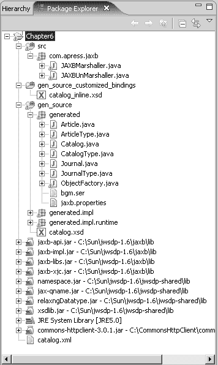

Vohra_706-0C06.fm 第 153 页 2006 年 7 月 13 日，星期四，下午 1:11

第 6 章 ■ 使用 JAXB 进行对象绑定

**153**

java.util.List getJournal();

java.lang.String getPublisher();

void setPublisher(java.lang.String value);

}
```

**图 6-8.** *由 xjc 生成的模式派生 Java 内容类* `CatalogType` 接口包含 `<xsd:complexType name="catalogType">` 组件每个属性的 getter 和 setter 方法，以及该组件中 `journal` 元素的 getter 方法。没有为 `journal` 元素创建 setter 方法，因为 `journal` 元素的 `maxOccurs` 基数设置为 `unbounded`。我们将在下一节解释向 `catalog` 元素添加 `journal` 元素的过程。

`CatalogImpl.java` 和 `CatalogTypeImpl.java` 分别是为 `Catalog.java` 和 `CatalogType.java` 接口生成的实现 Java 类。类似地，为 `journal` 模式元素生成了接口 `Journal.java` 和实现类 `JournalImpl.java`，依此类推。`jaxb.properties` 文件为 `javax.xml.bind.context.factory` 类指定了一个实例化类，而 `bgm.ser` 文件包含特定于实现的序列化对象。在包含生成类的任何 JAR 文件中包含这两个文件非常重要。

**编组 XML 文档**

编组文档意味着从 Java 对象树创建 XML 文档。在用例示例中，Web 服务客户端必须编组清单 6-7 中所示的 XML 文档。在本节中，我们将展示如何从包含生成 Java 内容类实例的 Java 对象树编组这样的文档。

[www.it-ebooks.info](http://www.it-ebooks.info/)

Vohra_706-0C06.fm 第 154 页 2006 年 7 月 13 日，星期四，下午 1:11

**154**

第 6 章 ■ 使用 JAXB 进行对象绑定

要编组示例文档，你需要遵循以下步骤： **1.** 创建一个 `JAXBContext` 对象，并使用此对象创建一个 `Marshaller` 对象。

**2.** 创建一个 `ObjectFactory` 对象，用于创建相关生成 Java 内容类的实例。

**3.** 使用 `ObjectFactory` 对象，创建一个以 `Catalog` 为根对象的对象树。使用适当的 setter 方法用相关数据填充这些树对象。

应用程序使用静态方法 `newInstance(String contextPath)` 创建 `JAXBContext` 类的新实例，其中 `contextPath` 指定模式派生类的 Java 包列表。在这种情况下，`generated` 包含模式派生类，你可以按如下方式创建此对象：

```java
JAXBContext jaxbContext=JAXBContext.newInstance("generated");
```

`Marshaller` 类将 Java 对象树转换为 XML 文档。你可以使用 `JAXBContext` 类的 `createMarshaller()` 方法创建一个 `Marshaller` 对象，如下所示：

```java
Marshaller marshaller=jaxbContext.createMarshaller();
```

`Marshaller` 类具有重载的 `marshal()` 方法，可以编组为 SAX 2 事件、DOM 结构、`OutputStream`、`javax.xml.transform.Result` 或 `java.io.Writer` 对象。

要创建用于编组为 XML 文档的 Java 对象树，请创建一个 `ObjectFactory`，如下所示：

```java
ObjectFactory factory=new ObjectFactory();
```


对于每个从模式派生的 Java 类，`ObjectFactory` 类中都定义了一个用于创建该类对象的静态工厂方法。与根元素 `catalog` 对应的 Java 接口是 `Catalog`；因此，通过 `ObjectFactory` 类的 `createCatalog()` 方法创建一个 `Catalog` 对象：`Catalog catalog=factory.createCatalog();`

要编组的 XML 文档中的根元素具有 `section` 和 `publisher` 属性。

`Catalog` 接口为这些属性提供了 setter 方法 `setSection()` 和 `setPublisher()`。你可以使用这些 setter 方法设置 `section` 和 `publisher` 属性，如清单 6-10 所示。

**清单 6-10.** *设置 section 和 publisher 属性* `catalog.setSection("Java Technology");`

`catalog.setPublisher("IBM developerWorks");`

`journal` 元素的 Java 接口是 `Journal`。`catalog.xml` 有多个 `journal` 元素，可以通过 `ObjectFactory` 类的 `createJournal()` 方法创建，该方法返回一个 `Journal` 对象，如下所示：

`Journal journal=factory.createJournal();`

要向 `catalog` 元素添加一个 `journal` 元素，需要获取 `Catalog` 对象的 `Journal` 对象的 `java.util.List`，然后将 `journal` 元素添加到此列表中，如清单 6-11 所示。

**清单 6-11.** *向 catalog 元素添加 journal 元素* `java.util.List journalList=catalog.getJournal();`

`journalList.add(journal);`

[www.it-ebooks.info](http://www.it-ebooks.info/)

Vohra_706-0C06.fm Page 155 Thursday, July 13, 2006 1:11 PM

第 6 章 ■ 使用 JAXB 进行对象绑定

**155**

`article` 元素的 Java 接口是 `Article`。你可以使用 `ObjectFactory` 类的 `createArticle()` 方法创建一个 `Article` 对象：

`Article article=factory.createArticle();`

`article` 元素具有 `level` 和 `date` 属性，`Article` 接口中对应的 setter 方法是 `setLevel()` 和 `setDate()`。你可以使用这些 setter 方法设置 `article` 元素的 `level` 和 `date` 属性，如清单 6-12 所示。

**清单 6-12.** *设置 level 和 date 属性* `article.setLevel("Intermediate");`

`article.setDate("January-2004");`

`article` 元素具有子元素 `title` 和 `author`。`Article` 接口具有用于设置 `title` 和 `author` 元素的 setter 方法 `setTitle()` 和 `setAuthor()`，如清单 6-13 所示。

**清单 6-13.** *设置 title 和 author 元素* `article.setTitle("Service Oriented Architecture Frameworks");` `article.setAuthor("Naveen Balani");`

要向 `journal` 元素添加一个 `article` 元素，需要从 `Journal` 对象获取 `Article` 对象的 `java.util.List`，然后将一个 `Article` 对象添加到此列表中，如清单 6-14 所示。

**清单 6-14.** *向 journal 元素添加 article 元素* `java.util.List articleList=journal.getArticle();`

`articleList.add(article);`

要创建 XML 文档，请使用 `Marshaller` 类的 `marshal()` 方法编组 `Catalog` 对象。本节中创建的 `Catalog` 对象通过 `OutputStream` 编组到一个 XML 文件中，如下所示：

`marshaler.marshal(catalog,System.out);`

清单 6-15 中的 `JAXBMarshaller.java` 包含完整的程序，该程序按照前面概述的步骤，从 Java 对象树编组示例 XML 文档。在 `JAXBMarshaller.java` 应用程序中，`generateXMLDocument()` 方法是生成编组文档的地方。

你可以在 Eclipse 中运行 `JAXBMarshaller.java` 应用程序来编组示例 XML 文档。

**清单 6-15.** *JAXBMarshaller.java*

```java
package com.apress.jaxb;

import generated.*;

import javax.xml.bind.*;

public class JAXBMarshaller {

    public void generateXMLDocument() {

        try {

            JAXBContext jaxbContext = JAXBContext.newInstance("generated"); 
            Marshaller marshaller = jaxbContext.createMarshaller();

            generated.ObjectFactory factory = new generated.ObjectFactory();
```

[www.it-ebooks.info](http://www.it-ebooks.info/)

Vohra_706-0C06.fm Page 156 Thursday, July 13, 2006 1:11 PM

**156**

第 6 章 ■ 使用 JAXB 进行对象绑定

```java
            Catalog catalog = factory.createCatalog();
```


catalog.setSection("Java Technology");

catalog.setPublisher("IBM developerWorks");

Journal journal = factory.createJournal();

Article article = factory.createArticle();

article.setLevel("Intermediate");

article.setDate("January-2004");

article.setTitle("Service Oriented Architecture Frameworks"); article.setAuthor("Naveen Balani");

java.util.List journalList = catalog.getJournal();

journalList.add(journal);

java.util.List articleList = journal.getArticle();

articleList.add(article);

article = factory.createArticle();

article.setLevel("Advanced");

article.setDate("October-2003");

article.setTitle("Advance DAO Programming");

article.setAuthor("Sean Sullivan");

articleList = journal.getArticle();

articleList.add(article);

article = factory.createArticle();

article.setLevel("Advanced");

article.setDate("May-2002");

article.setTitle("Best Practices in EJB Exception Handling"); article.setAuthor("Srikanth Shenoy");

articleList = journal.getArticle();

articleList.add(article);

marshaller.setProperty("jaxb.formatted.output",Boolean.TRUE); marshaller.marshal(catalog, System.out);

} catch (JAXBException e) {

System.out.println(e.toString());

}

}

public static void main(String[] argv) {

JAXBMarshaller jaxbMarshaller = new JAXBMarshaller();

jaxbMarshaller.generateXMLDocument();

}

}

清单 6-16 显示了运行 `JAXBMarshaller.java` 的输出，该输出展示了一个从 Java 对象树编组而来的 XML 文档。

[www.it-ebooks.info](http://www.it-ebooks.info/)

Vohra_706-0C06.fm Page 157 Thursday, July 13, 2006 1:11 PM

第 6 章 ■ 使用 JAXB 进行对象绑定

**157**

**清单 6-16.** *JAXBMarshaller.java 的输出*

<?xml version="1.0" encoding="UTF-8" standalone="yes"?>

<catalog publisher="IBM developerWorks" section="Java Technology">

<journal>

<article date="January-2004" level="Intermediate">

<title>Service Oriented Architecture Frameworks</title>

<author>Naveen Balani</author>

</article>

<article date="October-2003" level="Advanced">

<title>Advance DAO Programming</title>

<author>Sean Sullivan</author>

</article>

<article date="May-2002" level="Advanced">

<title>Best Practices in EJB Exception Handling</title>

<author>Srikanth Shenoy</author>

</article>

</journal>

</catalog>

**解组 XML 文档**

解组是指从 XML 文档创建 Java 对象树。在示例用例中，网站接收到一个包含目录信息的 XML 文档，它需要先解组该文档，然后才能处理文档中包含的目录信息。在本节中，我们将首先展示如何使用 JAXB API 解组示例 XML 文档，随后展示如何访问生成的 Java 对象树中的各种元素和属性值。

要执行解组，需要遵循以下步骤：

**1.** 示例 XML 文档 `catalog.xml`（清单 6-7）是解组的起点。
因此，通过选择 **File** ➤ **Import**，将 `catalog.xml` 导入到 Eclipse 的 Chapter6 项目中。

**2.** 创建一个 `JAXBContext` 对象，并使用该对象创建一个 `UnMarshaller` 对象。

**3.** `Unmarshaller` 类将 XML 文档转换为 Java 对象。

如上一节所述，创建一个 `JAXBContext` 对象，该对象实现了 JAXB 绑定框架的操作 `unmarshal()` 和 `validate()`。

你需要一个 `Unmarshaller` 对象来将 XML 文档解组为 Java 对象。因此，使用 `JAXBContext` 类的 `createUnmarshaller()` 方法创建一个 `UnMarshaller` 对象，如下所示：

Unmarshaller unMarshaller=jaxbContext.createUnmarshaller(); `Unmarshaller` 类具有重载的 `unmarshal()` 方法用于解组。要验证正在解组的 XML 文档，请使用 `setValidating(boolean)` 方法将 `Unmarshaller` 对象设置为可验证，如下所示：

unMarshaller.setValidating(true);

要创建 XML 文档的 Java 对象表示，请解组 XML 文档以获得一个 `Catalog` 对象：

Catalog catalog=(Catalog)(unMarshaller.unmarshal(xmlDocument));

[www.it-ebooks.info](http://www.it-ebooks.info/)


Vohra_706-0C06.fm 第 158 页 2006 年 7 月 13 日星期四 下午 1:11

**158**

第 6 章 ■ 使用 JAXB 进行对象绑定

`xmlDocument`是 XML 文档的 File 对象。`unmarshal()`方法也接受`InputSource`、`InputStream`、`Node`、`Source`或`URL`作为输入。`unmarshal()`方法返回一个 Java 对象，该对象对应于正在解组的 XML 文档中的根元素。至此，文档的解组完成。现在你有了一个对象树，访问文档中嵌入的数据只需在正确的对象上使用正确的属性方法即可。

根元素`catalog`具有属性`section`和`publisher`，你可以使用`getSection()`和`getPublisher()`方法访问它们，如清单 6-17 所示。

**清单 6-17.** *输出 section 和 publisher 属性* System.out.println("Section: "+catalog.getSection()); System.out.println("Publisher: "+catalog.getPublisher()); 你可以通过`Catalog`接口的`getJournal()`方法获取`Catalog`对象的`Journal`对象列表：

java.util.List journalList=catalog.getJournal();

遍历该列表以获取`Journal`对象，这些对象对应于 XML 文档`catalog.xml`中的`journal`元素，如清单 6-18 所示。

**清单 6-18.** *为 Catalog 对象检索 Journal 对象* for(int i=0; i<journalList.size(); i++){

Journal journal=(Journal)journalList.get(i);

}

你可以通过`Journal`接口的`getArticle()`方法获取`Article`对象列表，如下所示：

java.util.List articleList=journal.getArticle();

要获取 Article 列表中的 Article 对象，请遍历该列表并检索 Article 对象，如清单 6-19 所示。

**清单 6-19.** *从列表中检索 Article 对象* for(int j=0; j<articleList.size(); j++){

Article article=(Article)articleList.get(j);

}

一个`article`元素具有属性`level`和`date`，以及子元素`title`和`author`。

你可以通过这些属性和元素的 getter 方法访问`article`元素属性和子元素的值，如清单 6-20 所示。

**清单 6-20.** *输出 article 元素属性和子元素* System.out.println("Article Date: "+article.getDate()); System.out.println("Level: "+article.getLevel()); System.out.println("Title: "+article.getTitle()); System.out.println("Author: "+article.getAuthor()); 完整的程序`JAXBUnMarshaller.java`如清单 6-21 所示，演示了如何按照前面概述的步骤解组示例 XML 文档。解组应用程序有一个方法`unMarshall(File)`，它接受一个 File 对象作为输入。输入文件应该是要解组的文档。

[www.it-ebooks.info](http://www.it-ebooks.info/)

Vohra_706-0C06.fm 第 159 页 2006 年 7 月 13 日星期四 下午 1:11

第 6 章 ■ 使用 JAXB 进行对象绑定

**159**

**清单 6-21.** *JAXBUnMarshaller.java*

package com.apress.jaxb;

import generated.*;

import javax.xml.bind.*;

import java.io.File;

import java.io.IOException;

public class JAXBUnMarshaller {

//解组 XML 文档的方法

public void unMarshall(File xmlDocument) {

try {

//创建一个 JAXBContext 对象

JAXBContext jaxbContext = JAXBContext.newInstance("generated");

//创建一个 Unmarshaller 对象

Unmarshaller unMarshaller = jaxbContext.createUnmarshaller();

//将 Unmarshaller 设置为验证模式

unMarshaller.setValidating(true);

//将 XML 文档解组为 Catalog 对象

Catalog catalog = (Catalog) unMarshaller.unmarshal(xmlDocument);

//输出 XML 文档中的元素和属性值 System.out.println("Section: " + catalog.getSection()); System.out.println("Publisher: " + catalog.getPublisher()); java.util.List journalList = catalog.getJournal();

for (int i = 0; i < journalList.size(); i++) {

Journal journal = (Journal) journalList.get(i);

java.util.List articleList = journal.getArticle();

for (int j = 0; j < articleList.size(); j++) {

Article article = (Article) articleList.get(j);


System.out.println("Article Date: " + article.getDate()); System.out.println("Level: " + article.getLevel()); System.out.println("Title: " + article.getTitle()); System.out.println("Author: " + article.getAuthor());

}

}

} catch (JAXBException e) {

System.out.println(e.toString());

}

}

public static void main(String[] argv) {

File xmlDocument = new File("catalog.xml");

JAXBUnMarshaller jaxbUnmarshaller = new JAXBUnMarshaller(); jaxbUnmarshaller.unMarshall(xmlDocument);

}

}

清单 6-22 展示了从解组示例 XML 文档得到的输出。

[www.it-ebooks.info](http://www.it-ebooks.info/)

Vohra_706-0C06.fm 第 160 页 2006 年 7 月 13 日星期四 下午 1:11

**160**

第 6 章 ■ 使用 JAXB 进行对象绑定

**清单 6-22.** *在 Eclipse 中解组 catalog.xml 的输出* 章节：Java 技术

发布者：IBM developerWorks

文章日期：2004 年 1 月

级别：中级

标题：面向服务架构框架

作者：Naveen Balani

文章日期：2003 年 10 月

级别：高级

标题：高级 DAO 编程

作者：Sean Sullivan

文章日期：2002 年 5 月

级别：高级

标题：EJB 异常处理最佳实践

作者：Srikanth Shenoy

**自定义 JAXB 绑定**

JAXB 绑定编译器 xjc 提供了 XML Schema 到 Java 类的默认绑定。您可以通过向 Schema 添加内联绑定声明或使用外部绑定文件来自定义 Schema 绑定。在本节中，我们将展示如何自定义 JAXB 绑定。定义 JAXB 自定义绑定有两种选择：

• 定义自定义绑定的第一种选择是使用（相对于 Schema 的）外部绑定文件。

外部绑定的优势在于可以对同一个 Schema 定义应用不同的自定义设置，以满足不同的绑定目标。然而，外部绑定使用 XPath 表达式来定位绑定节点，因此定义起来相对复杂。

• 内联绑定在 Schema 定义元素内部定义；它们隐式地定位绑定节点。与外部绑定不同，它们不需要使用 XPath 表达式，因此定义起来相对简单。

为简单起见，本节我们将使用内联绑定。绑定声明有以下几种类型：

• 全局绑定声明

• Schema 绑定声明

• XML 到 Java 数据类型绑定声明

• 类绑定声明

• 属性绑定声明

我们已向示例 XML Schema 文档 `catalog_inline.xsd` 中添加了每种绑定声明类型的示例，如清单 6-23 所示。我们将在后续章节中讨论这些内联绑定声明。

**清单 6-23.** *包含内联绑定声明的 catalog_inline.xsd*

<?xml version="1.0" encoding="UTF-8"?>

<xsd:schema

jxb:version="1.0">

**<xsd:annotation>**

**<xsd:appinfo>**

[www.it-ebooks.info](http://www.it-ebooks.info/)

Vohra_706-0C06.fm 第 161 页 2006 年 7 月 13 日星期四 下午 1:11

第 6 章 ■ 使用 JAXB 进行对象绑定

**161**

**<jxb:globalBindings**

**collectionType ="java.util.ArrayList"**

**fixedAttributeAsConstantProperty= "true"**

**generateIsSetMethod= "false"**

**enableJavaNamingConventions = "true">**

<jxb:javaType name= "java.util.Date"

xmlType= "xsd:date"

parseMethod= "com.apress.jaxb.DateHelper.parse"

printMethod= "com.apress.jaxb.DateHelper.format">

**</jxb:javaType>**

**</jxb:globalBindings>**

**<jxb:schemaBindings>**

**<jxb:package name="jaxb"/>**

**<jxb:nameXmlTransform>**

**<jxb:elementName suffix="Element"/>**

**</jxb:nameXmlTransform>**

**</jxb:schemaBindings>**

**</xsd:appinfo>**

**</xsd:annotation>**

<xsd:element name="catalog" type="catalogType"/>

<xsd:complexType name="catalogType">

**<xsd:annotation>**

**<xsd:appinfo>**

**<jxb:class name = "CatalogClass">**

**</jxb:class>**

**</xsd:appinfo>**

**</xsd:annotation>**

<xsd:sequence>

<xsd:element ref="journal" minOccurs="0" maxOccurs="unbounded"/>

</xsd:sequence>

<xsd:attribute name="section" type="xsd:string"/>

<xsd:attribute name="publisher" type="xsd:string"/>

</xsd:complexType>

<xsd:element name="journal" type="journalType"/>


<xsd:complexType name="journalType">

<xsd:sequence>

<xsd:element ref="article" minOccurs="0" maxOccurs="unbounded"/>

</xsd:sequence>

</xsd:complexType>

<xsd:element name="article" type="articleType"/>

<xsd:complexType name="articleType">

<xsd:sequence>

<xsd:element name="title" type="xsd:string">

**<xsd:annotation>**

**<xsd:appinfo>**

**<jxb:property generateIsSetMethod="true" />**

**</xsd:appinfo>**

**</xsd:annotation>**

</xsd:element>

<xsd:element name="author" type="xsd:string"/>

</xsd:sequence>

<xsd:attribute name="level" type="xsd:string"/>

<xsd:attribute name="date" type="xsd:date"/>

</xsd:complexType>

</xsd:schema>

[www.it-ebooks.info](http://www.it-ebooks.info/)

Vohra_706-0C06.fm 第 162 页 2006 年 7 月 13 日星期四 下午 1:11

**162**

第 6 章 ■ 使用 JAXB 进行对象绑定

模式根元素包含一个针对 `http://java.sun.com/xml/ns/jaxb` 命名空间的命名空间声明。你可以指定带或不带前缀的 JAXB 命名空间声明。如果命名空间声明带有前缀，则应使用该前缀添加绑定声明。你可以使用清单 6-24 中列出的语法添加绑定声明。

**清单 6-24.** *绑定声明的语法*

<xs:annotation>

<xs:appinfo>

JAXB 绑定声明

</xs:appinfo>

</xs:annotation>

**全局绑定声明**

全局绑定声明适用于指定该声明的模式定义中的所有元素。它们也适用于任何包含或导入的模式。你可以在根元素中使用 `globalBindings` 元素指定全局绑定声明。清单 6-25 展示了示例模式中的全局绑定声明。

**清单 6-25.** *全局绑定声明*

<jxb:globalBindings

collectionType ="java.util.ArrayList"

fixedAttributeAsConstantProperty= "true"

generateIsSetMethod= "false"

enableJavaNamingConventions = "true">

</jxb:globalBindings>

`globalBindings` 元素中的 `collectionType` 属性指定了一个列表类型类，该类必须实现 `java.util.List` 接口。在示例中，它指定生成实现中的所有列表应在内部表示为 `java.util.ArrayList`。`fixedAttributeAsConstantProperty` 属性指定固定属性应作为常量生成到 Java 类中。`generateIsSetMethod` 属性指定应生成与 getter 和 setter 属性方法对应的 `isSet()` 方法。`enableJavaNamingConventions` 属性指定应启用 Java 命名约定。

**模式绑定声明**

你也可以在根元素中使用 `schemaBindings` 元素指定模式绑定声明，如清单 6-26 所示。模式声明的范围是模式目标命名空间中的所有模式元素。在示例模式中，模式绑定声明指定 Java 类生成在 `jaxb` 包中。此外，与模式元素声明对应的 Java 类会生成一个 `Element` 后缀。

**清单 6-26.** *模式绑定声明*

<jxb:schemaBindings>

<jxb:package name="jaxb"/>

<jxb:nameXmlTransform>

<jxb:elementName suffix="Element"/>

</jxb:nameXmlTransform>

</jxb:schemaBindings>

[www.it-ebooks.info](http://www.it-ebooks.info/)

Vohra_706-0C06.fm 第 163 页 2006 年 7 月 13 日星期四 下午 1:11

第 6 章 ■ 使用 JAXB 进行对象绑定

**163**

**数据类型绑定声明**

你可以使用 `javaType` 元素指定数据类型绑定声明。在示例模式中，`xsd:date` 数据类型映射到 `java.util.Date`，如清单 6-27 所示。由于数据类型绑定是在 `globalBindings` 元素中指定的，因此该数据类型转换适用于所有模式及包含的模式。`parseMethod` 属性指定了解组 XML 文档时要调用的方法，`printMethod` 属性指定了编组 XML 文档时要调用的方法。

**清单 6-27.** *数据类型绑定声明*

<jxb:javaType name= "java.util.Date"


xmlType= "xsd:date"

parseMethod= "com.apress.jaxb.DateHelper.parse"

printMethod= "com.apress.jaxb.DateHelper.format">

</jxb:javaType>

**类绑定声明**

类绑定声明通过模式元素中的 class 元素指定，如清单 6-28 所示。使用类绑定声明，可以将模式元素映射到指定的接口和实现类。在示例模式中，复杂类型 catalogType 映射到 CatalogClass。复杂类型 catalogType 的默认映射是 CatalogType。

**清单 6-28.** *类绑定声明*

<jxb:class name = "CatalogClass">

</jxb:class>

**属性绑定声明**

属性绑定声明通过 property 元素指定。属性绑定声明指定了元素绑定到 Java 接口或类时的自定义设置。在示例模式中，会为 title 元素生成一个 isSet() 方法。如果在模式中指定了默认值，isSet() 方法将返回 true。

<jxb:property generateIsSetMethod= "true" /> 如果再次运行 xjc 编译器，你会注意到 Java 类会生成在 jaxb 包中。列表在实现类内部使用 java.util.ArrayList 表示。

数据类型 xsd:date 映射到 java.util.Date。对应于模式元素生成的 Java 表示形式带有 Element 后缀。复杂类型 catalogType 映射到 CatalogClass 接口，并且会为 title 元素生成 isSet() *和 unset() 方法。*

***JAXB 2.0**

在接下来的章节中，我们将介绍 JAXB 2.0 及其与 JAXB 1.0 在操作上的区别。

**架构**

JAXB 1.0 是在时间紧迫的条件下设计的。因此，该规范的架构师有意识地决定仅支持模式组件子集到 Java 的绑定；

[www.it-ebooks.info](http://www.it-ebooks.info/)

Vohra_706-0C06.fm Page 164 Thursday, July 13, 2006 1:11 PM

**164**

第 6 章 ■ 使用 JAXB 进行对象绑定

完整支持留给了后续规范。JAXB 2.0 弥补了 JAXB 1.0 中模式支持不完整的缺陷，并为缺失的模式组件添加了绑定支持。具体来说，JAXB 2.0 新增了以下模式支持：

• 使用 substitutionGroup 属性的元素声明，该属性解析为预定义的模型组模式组件（<xs:element @substitutionGroup>）。

• 通配符模式组件（xs:any 和 xs:anyAttribute）。

• 用于指定跨多个元素唯一性的标识约束（xs:key、xs:keyref 和 xs:unique）。

• 使用 redefine 声明重新定义的 XML Schema 组件（<xs:redefine>）。

• 表示法 XML Schema 组件（<xs:notation>）。

• 支持以下模式属性：complexType.abstract、element.abstract、element.substitutionGroup、xsi:type、complexType.block、complexType.final、element.block、element.final、schema.blockDefault 和 schema.finalDefault。

JAXB 2.0 的绑定框架增强了 JAXB 1.0 的单向绑定框架，并增加了对双向绑定的支持。JAXB 2.0 增加了对 Java 类绑定到 XML Schema 组件的支持，如图 6-9 所示。

**图 6-9.** *JAXB 2.0 支持双向绑定。*

**注解**

JAXB 2.0 依赖 J2SE 5.0 注解 5 来支持 XML Schema 与 Java 类型之间的双向映射。注解既用于生成的 Java 内容类，也用于作为输入生成模式定义的 Java 类中。这些绑定注解定义在 javax.xml.bind.annotation 包中。使用这些注解需要（并且假定）熟悉 J2SE 5.0。表 6-2 列出了 javax.xml.bind.annotation 包中定义的一些更常用的注解。

5\. 注解是 Java 编程语言的一种元数据工具，作为 JSR-175 的一部分定义
(http://www.jcp.org/aboutJava/communityprocess/review/jsr175/)。

[www.it-ebooks.info](http://www.it-ebooks.info/)


Vohra_706-0C06.fm 第 165 页 2006 年 7 月 13 日星期四 下午 1:11

第 6 章 ■ 使用 JAXB 进行对象绑定

**165**

**表 6-2.** *JAXB 2.0 绑定注解*

**注解类型**

**描述**

**注解元素**

XmlAccessorType

指定字段和属性的默认序列化方式

AccessType.PUBLIC_MEMBER 仅映射公共字段和 JavaBean 属性。
AccessType.FIELDS 仅映射字段。
AccessType.PROPERTIES 仅映射 JavaBeans 属性。
AccessType.NONE 既不映射字段也不映射属性。

XmlAttribute

将 JavaBean 属性映射到 XML 属性

name: 属性名称。namespace: 属性命名空间。required: 指定属性是否为必需；默认为 false。

XmlElement

将 JavaBean 属性映射到 XML 元素

defaultValue: 元素的默认值。name: 元素名称。namespace: 元素的目标命名空间。nillable: 指定元素是否可为空；默认为 false。type: 元素类型。

XmlEnum

将枚举映射到带有枚举值的简单类型

value: 枚举值

XmlList

将属性映射到列表简单类型

XmlRootElement

将类映射到根元素

name: 根元素的本地名称。namespace: 根元素的命名空间。

XmlSchema

将包名映射到 XML 命名空间

attributeFormDefault: 指定 attributeFormDefault 属性的值。elementFormDefault: 指定 elementFormDefault 属性的值。namespace: XML 命名空间。xmlns: 将命名空间前缀映射到命名空间 URI。

XmlType

将类映射到 XML Schema 类型（可以是简单类型或复杂类型）

name: XML Schema 类型的目标命名空间。propOrder: 当类映射到复杂类型时，指定 XML Schema 元素的顺序。

XmlValue

将类映射到具有 simpleContent 的 XML Schema 复杂类型或 XML Schema 简单类型

**XML Schema 到 Java 表示的绑定**

与 JAXB 1.0 类似，JAXB 2.0 指定了默认的 XML Schema 到 Java 的绑定，该绑定可以通过外部绑定声明进行覆盖。从概念上讲，JAXB 2.0 将 XML Schema 组件绑定到 Java 的方式与 JAXB 1.0 相似。然而，由于 JAXB 2.0 绑定基于 J2SE 5.0，其 Java 表示使用了 Java 5 注解标签，并且比 JAXB 1.0 的 Java 表示更加紧凑。

让我们重新审视在 JAXB 1.0 上下文中看到的简单示例，以便了解 XML Schema 到 Java 的绑定在 JAXB 2.0 下是如何工作的。

[www.it-ebooks.info](http://www.it-ebooks.info)

Vohra_706-0C06.fm 第 166 页 2006 年 7 月 13 日星期四 下午 1:11

**166**

第 6 章 ■ 使用 JAXB 进行对象绑定

重温简单绑定示例

清单 6-1 展示了简单的示例模式。和之前一样，为了保持简单，除了一个规则外，你将接受所有默认的 XML Schema 绑定规则。你将使用特定的包名 `com.apress.jaxb2.example` 覆盖生成的 Java 内容的默认包名，如清单 6-29 中的外部绑定文件所示。该文件与清单 6-2 的不同之处在于，它具有不同的包名和顶层 `jxb:bindings` 元素的不同版本属性值，此处为 2.0。

**清单 6-29.** *包名的外部绑定声明*

```xml
<?xml version='1.0' encoding='utf-8' ?>

<jxb:bindings version="2.0"

>

<jxb:bindings node="/xs:schema" schemaLocation="address.xsd" >

<jxb:schemaBindings>

**<jxb:package name="com.apress.jaxb2.example" ></jxb:package>**

</jxb:schemaBindings>

</jxb:bindings>

</jxb:bindings>
```

暂时忽略配置 JAXB 2.0 绑定编译器的具体机制，假设你可以运行 JAXB 2.0 的 xjc 编译器。运行 xjc 当然会将模式组件绑定到 Java。对于清单 6-1 中所示的模式，JAXB 2.0 xjc 模式绑定工作如下：

• 在 `com.apress.jaxb2.example` 包中，xjc 生成了两个 Java 类：`UsOrCanadaAddress` 和 `ObjectFactory`。由于清单 6-1 中的 complexType 是匿名的，因此不会生成与匿名 complexType 对应的单独类。


• `UsOrCanadaAddress` 类是 `<xs:element name="UsOrCanadaAddress" >` 组件的 Java 表示形式。

• `ObjectFactory` 类是一个对象工厂实现。

如果你将此与 JAXB 1.0 中模式到 Java 的绑定（如前文所述）进行比较，你会立即注意到 JAXB 2.0 绑定相对于 JAXB 1.0 绑定的简洁性。现在，请仔细查看生成的 Java 类 `UsOrCanadaAddress` 的代码，如清单 6-30 所示。

**清单 6-30.** *UsOrCanadaAddress 类代码*

package com.apress.jaxb2.example;

@XmlAccessorType(AccessType.FIELD)

@XmlType(name = "", propOrder = {

"name",

"street",

"city",

"state",

"zip",

"postalCode",

"country"

})

@XmlRootElement(name = "UsOrCanadaAddress")

[www.it-ebooks.info](http://www.it-ebooks.info/)

Vohra_706-0C06.fm Page 167 Thursday, July 13, 2006 1:11 PM

第 6 章 ■ 使用 JAXB 进行对象绑定

**167**

public class UsOrCanadaAddress {

protected String name;

protected String street;

protected String city;

protected String state;

protected Integer zip;

protected String postalCode;

protected String country;

public String getName() {

return name;

}

public void setName(String value) {

this.name = value;

}

public String getStreet() {

return street;

}

public void setStreet(String value) {

this.street = value;

}

public String getCity() {

return city;

}

public void setCity(String value) {

this.city = value;

}

public String getState() {

return state;

}

public void setState(String value) {

this.state = value;

}

public Integer getZip() {

return zip;

}

public void setZip(Integer value) {

this.zip = value;

}

public String getPostalCode() {

return postalCode;

}

[www.it-ebooks.info](http://www.it-ebooks.info/)

Vohra_706-0C06.fm Page 168 Thursday, July 13, 2006 1:11 PM

**168**

第 6 章 ■ 使用 JAXB 进行对象绑定

public void setPostalCode(String value) {

this.postalCode = value;

}

public String getCountry() {

return country;

}

public void setCountry(String value) {

this.country = value;

}

}

当你研究清单 6-30 中的代码时，你会注意到此绑定与 JAXB 1.0 的绑定不同。在默认的 JAXB 2.0 Java 表示中，你得到的不是一个接口，而是一个基于 Java 5 并使用 Java 5 注解标签（见表 6-2，例如 `@XmlAccessorType`）的类。但是，你可以通过绑定声明覆盖默认的 Java 表示，使得模式元素组件映射到接口而不是类；你可以使用 `globalBindings` 元素来实现这一点，如清单 6-31 所示。

**清单 6-31.** *带有模型组绑定样式的外部绑定声明*

<?xml version='1.0' encoding='utf-8' ?>

<jxb:bindings version="1.0"

>

<jxb:bindings node="/xs:schema" schemaLocation="address.xsd" >

**<jxb:globalBindings generateValueClass="false">**

**</jxb:globalBindings>**

<jxb:schemaBindings>

<jxb:package name="com.apress.jaxb1.example" ></jxb:package>

</jxb:schemaBindings>

</jxb:bindings>

</jxb:bindings>

现在，如果你将清单 6-31 所示的绑定应用于清单 6-6 中的模式，结果会略有不同，即 `UsOrCanadaAddress` 现在是一个接口，如清单 6-32 所示，并带有一个未在此处显示的关联实现类。

**清单 6-32.** *将 generateValueClass 设置为 false 后派生的 UsOrCanadaAddress* package com.apress.jaxb2.example;

public interface UsOrCanadaAddress {

String getName();

void setName(String value);

String getStreet();

void setStreet(String value);

String getCity();

void setCity(String value);

String getState();

void setState(String value);

Integer getZip();

void setZip(Integer value);

[www.it-ebooks.info](http://www.it-ebooks.info/)

Vohra_706-0C06.fm Page 169 Thursday, July 13, 2006 1:11 PM

第 6 章 ■ 使用 JAXB 进行对象绑定

**169**

String getPostalCode();

void setPostalCode(String value);

String getCountry();

void setCountry(String value);

}

**示例用例**


对于 JAXB 2.0，我们将使用与 JAXB 1.0 相同的示例。示例模式定义相同，即清单 6-6 中列出的 catalog.xsd。示例 XML 文档也相同，即清单 6-7 中列出的 catalog.xml。该示例 XML 文档将使用 JAXB 2.0 API（而非 JAXB 1.0 API）进行编组和解组，我们将讨论其中的差异。

在讨论使用 JAXB 2.0 开发的编组和解组 Java 应用程序之前，我们将展示如何下载和安装一些必需的软件，并为 JAXB 2.0 创建和配置一个 Eclipse 项目。

**下载和安装软件**

要运行 JAXB 2.0 示例，您需要以下软件。

安装 Java Web 服务开发包 (JWSDP)

JAXB 2.0 包含在 JWSDP 2.0 中。因此，您需要下载并安装 JWSDP 2.0.6。将 JWSDP 2.0 安装到任意目录。我们假设 JWSDP 2.0 安装在默认安装目录下，在 Windows 系统中为 C:\Sun\jwsdp-2.0；在这种情况下，JAXB 包含在 C:\Sun\jwsdp-2.0\jaxb 目录中。

安装 J2SE 5.0

在 JAXB 1.0 示例中，您使用了 J2SE 5.0，因为 J2SE 1.4.2 不提供某些 SAXParserFactory 类方法。对于 JAXB 2.0，您需要使用 J2SE 5.0，因为 JAXB 2.0 使用了参数化类型。

当然，您可能已经在 JAXB 1.0 的环境中安装了 J2SE 5.0，因此此时可能无需再次安装。

**创建和配置 Eclipse 项目**

为了使用 xjc 编译示例模式，并运行 JAXB 2.0 的编组和解组代码示例，您需要创建一个 Eclipse Java 项目。创建 Eclipse 项目最快的方法是从 Apress 网站 (http://www.apress.com) 下载 Chapter6-JAXB2.0 项目，并将其导入 Eclipse。这将自动创建本章所需的所有 Java 包和文件。

您还需要将 Chapter6-JAXB2.0 的 JRE 设置为 J2SE 5.0 JRE。通过单击“添加库”按钮，在项目的 Java 构建路径中设置 JRE。图 6-10 显示了 Chapter6-JAXB2.0 的 Java 构建路径。如果您的 JWSDP 2.0 安装位置不是 C:\Sun\jwsdp-2.0，则可能需要显式添加或编辑图 6-10 中显示的外部 JAR 文件。无论哪种方式，请确保您的 Java 构建路径显示了图 6-10 中所示的所有 JWSDP 2.0 JAR 文件。

6.  您可以在 http://java.sun.com/webservices/downloads/webservicespack.html 找到 JWSDP 2.0。

[www.it-ebooks.info](http://www.it-ebooks.info/)

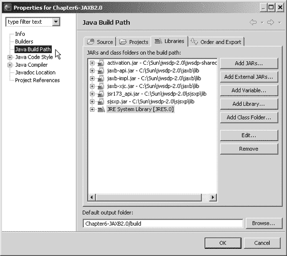

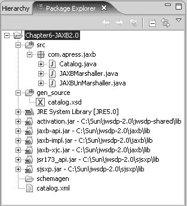

Vohra_706-0C06.fm Page 170 Thursday, July 13, 2006 1:11 PM

**170**

第 6 章 ■ 使用 JAXB 进行对象绑定

**图 6-10.** *Chapter6 Eclipse 项目 Java 构建路径* 我们将展示如何配置绑定编译器 xjc，以在 gen_source 文件夹中生成 Java 内容类；因此，我们已将 gen_source 文件夹添加到 Java 构建路径区域中“源”选项卡下的源路径中，这与 JAXB 1.0 项目类似。图 6-11 显示了 Chapter6-JAXB2.0 项目的目录结构。

**图 6-11.** *Chapter6 Eclipse 项目目录结构*

[www.it-ebooks.info](http://www.it-ebooks.info/)

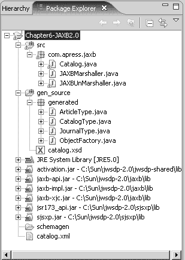

Vohra_706-0C06.fm Page 171 Thursday, July 13, 2006 1:11 PM

第 6 章 ■ 使用 JAXB 进行对象绑定

**171**

**将目录模式绑定到 Java 类**

在本节中，您将把清单 6-6 中所示的目录模式绑定到其 Java 内容类。

随后，您将使用这些 Java 内容类对清单 6-7 中所示的 XML 文档进行编组和解组。您将在 Eclipse 中运行 xjc。因此，请将 xjc 配置为 Eclipse 中的外部工具，类似于 JAXB 1.0 项目的配置。JAXB 2.0 项目的唯一区别在于，xjc 批处理文件的“位置”字段设置为 JAXB 2.0 的 xjc 批处理文件。您需要像设置 JAXB 1.0 一样设置环境变量 JAVA_HOME 和 JAXB_HOME。为 Chapter6-JAXB2.0 设置 JAXB_HOME。


到 C:\Sun\jwsdp-2.0\jaxb。要将 xjc 配置添加到“外部工具”菜单，请选择“常用”选项卡，然后在“显示在收藏夹菜单”区域中选中“外部工具”复选框，如图 6-7 所示。

要在示例模式 catalog.xsd 上运行 xjc 编译器，请在包资源管理器中选择 catalog.xsd 文件，然后选择“运行”➤“外部工具”➤“XJC”。模式派生的类将生成在 gen_source 文件夹中，如图 6-12 所示。

**图 6-12.** *由 xjc 生成的模式派生 Java 内容类* Java 类和接口生成在默认生成的包中。与 JAXB 1.0 相比，JAXB 2.0 生成的类更少。对于每个 xsd:complexType 模式组件，会生成一个值类，而不是一个接口和一个实现类。例如，对于清单 6-33 中所示的复杂类型 catalogType，会生成值类 CatalogType.java。

**清单 6-33.** *复杂类型 catalogType*

<xsd:complexType name="catalogType">

<xsd:sequence>

<xsd:element ref="journal" minOccurs="0" maxOccurs="unbounded"/>

</xsd:sequence>

<xsd:attribute name="section" type="xsd:string"/>

<xsd:attribute name="publisher" type="xsd:string"/>

</xsd:complexType>

[www.it-ebooks.info](http://www.it-ebooks.info/)

Vohra_706-0C06.fm Page 172 Thursday, July 13, 2006 1:11 PM

**172**

第 6 章 ■ 使用 JAXB 进行对象绑定

CatalogType.java 类包含 catalogType 复杂类型每个属性的 getter 和 setter 方法。还会生成一个返回类型为 List<JournalType> 的复杂类型 journalType 的 getter 方法。清单 6-34 展示了 CatalogType.java。

**清单 6-34.** *CatalogType.java*

package generated;

import java.util.ArrayList;

import java.util.List;

import javax.xml.bind.annotation.AccessType;

import javax.xml.bind.annotation.XmlAccessorType;

import javax.xml.bind.annotation.XmlAttribute;

import javax.xml.bind.annotation.XmlType;

import generated.CatalogType;

import generated.JournalType;

@XmlAccessorType(AccessType.FIELD)

@XmlType(name = "catalogType", propOrder = {

"journal"

})

public class CatalogType {

protected List<JournalType> journal;

@XmlAttribute

protected String publisher;

@XmlAttribute

protected String section;

public List<JournalType> getJournal() {

if (journal == null) {

journal = new ArrayList<JournalType>();

}

return this.journal;

}

public String getPublisher() {

return publisher;

}

public void setPublisher(String value) {

this.publisher = value;

}

public String getSection() {

return section;

}

[www.it-ebooks.info](http://www.it-ebooks.info/)

Vohra_706-0C06.fm Page 173 Thursday, July 13, 2006 1:11 PM

第 6 章 ■ 使用 JAXB 进行对象绑定

**173**

public void setSection(String value) {

this.section = value;

}

}

类似地，会为复杂类型 journalType 生成值类 JournalType.java，并为复杂类型 articleType 生成值类 ArticleType.java。还会生成一个 ObjectFactory.java 工厂类，其中包含示例模式中每个复杂类型和元素声明的 create 方法。例如，复杂类型 catalogType 的 ObjectFactory 类方法是 createCatalogType()，其返回类型是 CatalogType。元素 catalog 的 ObjectFactory 类方法是 createCatalog(CatalogType)，其返回类型是 JAXBElement<CatalogType>。清单 6-35 展示了 ObjectFactory.java。

**清单 6-35.** *ObjectFactory.java*

package generated;

import javax.xml.bind.JAXBElement;

import javax.xml.bind.annotation.XmlElementDecl;

import javax.xml.bind.annotation.XmlRegistry;

import javax.xml.namespace.QName;

import generated.ArticleType;

import generated.CatalogType;

import generated.JournalType;

import generated.ObjectFactory;

@XmlRegistry

public class ObjectFactory {

private final static QName _Article_QNAME = new QName("", "article"); private final static QName _Journal_QNAME = new QName("", "journal"); private final static QName _Catalog_QNAME = new QName("", "catalog"); public ObjectFactory() {

}


public JournalType createJournalType() {

return new JournalType();

}

public ArticleType createArticleType() {

return new ArticleType();

}

public CatalogType createCatalogType() {

return new CatalogType();

}

@XmlElementDecl(namespace = "", name = "article") public JAXBElement<ArticleType> createArticle(ArticleType value) {

return new JAXBElement<ArticleType>

(_Article_QNAME, ArticleType.class, null, value);

}

[www.it-ebooks.info](http://www.it-ebooks.info/)

Vohra_706-0C06.fm Page 174 Thursday, July 13, 2006 1:11 PM

**174**

第 6 章 ■ 使用 JAXB 进行对象绑定

@XmlElementDecl(namespace = "", name = "journal") public JAXBElement<JournalType> createJournal(JournalType value) {

return new JAXBElement<JournalType>

(_Journal_QNAME, JournalType.class, null, value);

}

@XmlElementDecl(namespace = "", name = "catalog") public JAXBElement<CatalogType> createCatalog(CatalogType value) {

return new JAXBElement<CatalogType>

(_Catalog_QNAME, CatalogType.class, null, value);

}

}

**编组 XML 文档**

编组 XML 文档是指根据 XML 文档的 Java 对象表示来创建 XML 文档。在用例示例中，Web 服务客户端必须编组清单 6-7 中所示的 XML 文档。在本节中，我们将展示如何从包含模式派生类实例（使用 JAXB 2.0 生成）的 Java 对象树来编组此类文档。

要编组示例文档，您需要遵循以下步骤：

• 创建一个 `JAXBContext` 对象，并使用该对象创建一个 `Marshaller` 对象。

• 创建一个 `ObjectFactory` 对象，用于创建相关生成的 Java 内容类的实例。

• 使用 `ObjectFactory` 对象，创建一个以 `CatalogType` 为根对象的对象树。

使用相应的 setter 方法，用相关数据填充这些树对象。

• 从 `CatalogType` 对象创建一个 `JAXBElement<CatalogType>` 对象。

`JAXBElement<CatalogType>` 表示 XML 文档中的 catalog 元素。

应用程序使用静态方法 `newInstance(String contextPath)` 创建 `JAXBContext` 类的新实例，其中 `contextPath` 指定了模式派生类的 Java 包列表。在本例中，`generated` 包含模式派生类，您可以按如下方式创建此对象：

JAXBContext jaxbContext=JAXBContext.newInstance("generated"); `Marshaller` 类将 Java 对象树转换为 XML 文档。您可以使用 `JAXBContext` 类的 `createMarshaller()` 方法创建一个 `Marshaller` 对象，如下所示： Marshaller marshaller=jaxbContext.createMarshaller();

`Marshaller` 类具有重载的 `marshal()` 方法，用于编组到 SAX 2 事件、DOM 结构、`OutputStream`、`javax.xml.transform.Result` 或 `java.io.Writer` 对象。

要创建用于编组为 XML 文档的 Java 对象树，请创建一个 `ObjectFactory`，如下所示：

ObjectFactory factory=new ObjectFactory();

对于每个模式派生的 Java 类，`ObjectFactory` 类中定义了一个静态工厂方法来创建该类的对象。与根元素 catalog 的复杂类型 catalogType 对应的 Java 值类是 `CatalogType`；因此，使用 `ObjectFactory` 类的 `createCatalogType()` 方法创建一个 `CatalogType` 对象：

CatalogType catalog = factory.createCatalogType();

[www.it-ebooks.info](http://www.it-ebooks.info/)

Vohra_706-0C06.fm Page 175 Thursday, July 13, 2006 1:11 PM

第 6 章 ■ 使用 JAXB 进行对象绑定

**175**

要编组的 XML 文档中的根元素具有属性 `section` 和 `publisher`。`CatalogType` 值类为这些属性提供了 setter 方法 `setSection()` 和 `setPublisher()`。您可以使用这些 setter 方法设置 `section` 和 `publisher` 属性，如清单 6-36 所示。

**清单 6-36.** *设置 section 和 publisher 属性* catalog.setSection("Java Technology");

catalog.setPublisher("IBM developerWorks");


`journalType`复杂类型的 Java 值类为`JournalType`。您可以使用`createJournalType()`方法创建`JournalType`对象，如下所示：

`JournalType journal = factory.createJournalType();`

要将`JournalType`对象添加到`CatalogType`对象中，需要为`CatalogType`对象获取一个参数化类型`List<JournalType>`对象，然后将`JournalType`对象添加到此列表中，如清单 6-37 所示。

**清单 6-37.** *向 catalog 元素添加 journal 元素*
`List<JournalType> journalList = catalog.getJournal();`
`journalList.add(journal);`

复杂类型`articleType`的 Java 值对象为`ArticleType`。您可以使用`ObjectFactory`类的`createArticleType()`方法创建`ArticleType`对象：
`ArticleType article = factory.createArticleType();`

`article`元素具有`level`和`date`属性，`ArticleType`值对象中对应的 setter 方法为`setLevel()`和`setDate()`。您可以使用这些 setter 方法设置`article`元素的`level`和`date`属性，如清单 6-38 所示。

**清单 6-38.** *设置 level 和 date 属性*
`article.setLevel("Intermediate");`
`article.setDate("January-2004");`

`article`元素包含子元素`title`和`author`。`ArticleType`值对象具有用于设置`title`和`author`元素的 setter 方法`setTitle()`和`setAuthor()`，如清单 6-39 所示。

**清单 6-39.** *设置 title 和 author 元素*
`article.setTitle("Service Oriented Architecture Frameworks");`
`article.setAuthor("Naveen Balani");`

要将`ArticleType`对象添加到`JournalType`对象中，需要从`JournalType`对象获取一个参数化类型`List<ArticleType>`对象，然后将`ArticleType`对象添加到此列表中，如清单 6-40 所示。

**清单 6-40.** *向 journal 元素添加 article 元素*
`List<ArticleType> articleList = journal.getArticle();`
`articleList.add(article);`

要将 Java 对象表示`CatalogType`编组为 XML 文档，需要使用`ObjectFactory.java`类的`createCatalog(CatalogType)`方法创建一个`CatalogType`类型的`JAXBElement`对象。

[www.it-ebooks.info](http://www.it-ebooks.info/)

Vohra_706-0C06.fm Page 176 Thursday, July 13, 2006 1:11 PM

**176**

第 6 章 ■ 使用 JAXB 进行对象绑定

随后，将`JAXBElement`编组到输出流，如下所示：

`JAXBElement<CatalogType> catalogElement=factory.createCatalog(catalog);`
`marshaller.marshal(catalogElement,System.out);`

清单 6-41 中的`JAXBMarshaller.java`包含了使用 JAXB 2.0 API 编组示例 XML 文档的完整程序。在`JAXBMarshaller.java`应用程序中，`generateXMLDocument()`方法用于保存编组后的文档。您可以在 Eclipse 中运行`JAXBMarshaller.java`应用程序来编组示例 XML 文档。`JAXBMarshaller.java`的输出与 JAXB 1.0 相同，如清单 6-16 所示。

**清单 6-41.** *JAXBMarshaller.java*

```java
package com.apress.jaxb;

import generated.*;
import javax.xml.bind.*;
import java.util.List;

public class JAXBMarshaller {

    public void generateXMLDocument() {
        try {
            JAXBContext jaxbContext = JAXBContext.newInstance("generated");
            Marshaller marshaller = jaxbContext.createMarshaller();
            generated.ObjectFactory factory = new generated.ObjectFactory();
            CatalogType catalog = factory.createCatalogType();
            catalog.setSection("Java Technology");
            catalog.setPublisher("IBM developerWorks");
            JournalType journal = factory.createJournalType();
            ArticleType article = factory.createArticleType();
            article.setLevel("Intermediate");
            article.setDate("January-2004");
            article.setTitle("Service Oriented Architecture Frameworks");
            article.setAuthor("Naveen Balani");
            List<JournalType> journalList = catalog.getJournal();
            journalList.add(journal);
            List<ArticleType> articleList = journal.getArticle();
            articleList.add(article);
            article = factory.createArticleType();
            article.setLevel("Advanced");
            article.setDate("October-2003");
            article.setTitle("Advance DAO Programming");
            article.setAuthor("Sean Sullivan");
            articleList = journal.getArticle();
            articleList.add(article);
            article = factory.createArticleType();
            article.setLevel("Advanced");
            article.setDate("May-2002");
            article.setTitle("Best Practices in EJB Exception Handling");
            article.setAuthor("Srikanth Shenoy");
            articleList = journal.getArticle();
            articleList.add(article);
            JAXBElement<CatalogType> catalogElement = factory.createCatalog(catalog);
            marshaller.setProperty("jaxb.formatted.output", Boolean.TRUE);
            marshaller.marshal(catalogElement, System.out);
        } catch (JAXBException e) {
            System.out.println(e.toString());
        }
    }

    public static void main(String[] argv) {
        JAXBMarshaller jaxbMarshaller = new JAXBMarshaller();
        jaxbMarshaller.generateXMLDocument();
    }
}
```

**解组 XML 文档**

解组是指从 XML 文档创建 Java 对象树。在示例用例中，网站接收到包含目录信息的 XML 文档，需要先解组该文档，然后才能处理其中包含的目录信息。本节将首先展示如何使用 JAXB 2.0 API 解组示例 XML 文档，随后展示如何访问生成的 Java 对象树中的各种元素和属性值。

解组步骤如下：

**1.** 示例 XML 文档`catalog.xml`（清单 6-7）是解组的起点。因此，通过选择 **File ➤ Import** 将`catalog.xml`导入到 Eclipse 的`Chapter6-JAXB2.0`项目中。

**2.** 创建一个`JAXBContext`对象，并使用该对象创建一个`UnMarshaller`对象。

**3.** `Unmarshaller`类将 XML 文档转换为`CatalogType`类型的`JAXBElement`对象。

**4.** 从`JAXBElement`对象创建一个`CatalogType`对象。

如前所述，创建一个`JAXBContext`对象，该对象实现了 JAXB 绑定框架的`unmarshal()`操作。

您需要一个`Unmarshaller`对象来将 XML 文档解组为 Java 对象。因此，使用`JAXBContext`类的`createUnmarshaller()`方法创建一个`Unmarshaller`对象，如下所示：

`Unmarshaller unMarshaller = jaxbContext.createUnmarshaller();`

[www.it-ebooks.info](http://www.it-ebooks.info/)

Vohra_706-0C06.fm Page 178 Thursday, July 13, 2006 1:11 PM

**178**

第 6 章 ■ 使用 JAXB 进行对象绑定

JAXB 2.0 弃用了`setValidating()`方法来验证正在解组的 XML 文档，转而推荐使用`setSchema(Schema schema)`方法，通过该方法可以设置在解组期间用于验证的模式。

要创建 XML 文档的 Java 对象表示，请解组 XML 文档以获取`CatalogType`类型的`JAXBElement`对象。随后，使用`getValue()`方法从`JAXBElement`对象获取`CatalogType`对象，如清单 6-42 所示。

**清单 6-42.** *解组 XML 文档*

```java
JAXBElement<CatalogType> catalogElement = (JAXBElement<CatalogType>) unmarshaler.unmarshal(xmlDocument);
CatalogType catalog = catalogElement.getValue();
```

`xmlDocument`是 XML 文档的`File`对象。`unmarshal()`方法也接受`InputSource`、`InputStream`、`Node`、`Source`或`URL`作为输入。`unmarshal()`方法返回一个 Java 对象，该对象对应于正在解组的 XML 文档中的根元素。至此，文档的解组完成。现在您拥有了一个对象树，访问文档中嵌入的数据只需在正确的对象上使用正确的属性方法即可。

根元素`catalog`具有`section`和`publisher`属性，可以使用`getSection()`和`getPublisher()`方法访问它们，如清单 6-43 所示。


**清单 6-43.** *输出 section 和 publisher 属性* System.out.println("Section: "+catalog.getSection()); System.out.println("Publisher: "+catalog.getPublisher()); 你可以通过 `CatalogType` 值对象的 `getJournal()` 方法，为 `CatalogType` 对象获取一个 `JournalType` 对象的 `List<JournalType>` 列表：

List<JournalType> journalList = catalog.getJournal(); 遍历该列表以获取 `JournalType` 对象，这些对象对应于 XML 文档 `catalog.xml` 中的 `journal` 元素，如清单 6-44 所示。

**清单 6-44.** *为 Catalog 对象检索 Journal 对象* for (int i = 0; i < journalList.size(); i++) {

JournalType journal = (JournalType) journalList.get(i);

}

你可以通过 `JournalType` 值对象的 `getArticle()` 方法获取一个 `ArticleType` 对象的列表，如下所示：

List<ArticleType> articleList = journal.getArticle(); 要获取 `ArticleType` 列表中的 `ArticleType` 对象，请遍历该列表并检索 `ArticleType` 对象，如清单 6-45 所示。

**清单 6-45.** *从列表中检索 Article 对象* for (int j = 0; j < articleList.size(); j++) {

ArticleType article = (ArticleType)articleList.get(j);

}

[www.it-ebooks.info](http://www.it-ebooks.info/)

Vohra_706-0C06.fm Page 179 Thursday, July 13, 2006 1:11 PM

第 6 章 ■ 使用 JAXB 进行对象绑定

**179**

一个 `article` 元素具有属性 `level` 和 `date`，以及子元素 `title` 和 `author`。

你可以通过这些属性和元素的 getter 方法访问 `article` 元素属性和子元素的值，如清单 6-46 所示。

**清单 6-46.** *输出 article 元素属性和子元素* System.out.println("Article Date: "+article.getDate()); System.out.println("Level: "+article.getLevel()); System.out.println("Title: "+article.getTitle()); System.out.println("Author: "+article.getAuthor()); 完整的程序 `JAXBUnMarshaller.java` 如清单 6-47 所示，演示了如何按照前面概述的步骤对示例 XML 文档进行解组。解组应用程序具有方法 `unMarshall(File)`，该方法接受一个 `File` 对象作为输入。输入文件应为要解组的文档。

**清单 6-47.** *JAXBUnMarshaller.java*

package com.apress.jaxb;

import generated.*;

import javax.xml.bind.*;

import java.io.File;

import java.util.List;

public class JAXBUnMarshaller {

public void unMarshall(File xmlDocument) {

try {

JAXBContext jaxbContext = JAXBContext.newInstance("generated"); Unmarshaller unMarshaller = jaxbContext.createUnmarshaller(); JAXBElement<CatalogType> catalogElement = (JAXBElement<CatalogType>) unMarshaller.unmarshal(xmlDocument);

CatalogType catalog=catalogElement.getValue();

System.out.println("Section: " + catalog.getSection()); System.out.println("Publisher: " + catalog.getPublisher()); List<JournalType> journalList = catalog.getJournal(); for (int i = 0; i < journalList.size(); i++) {

JournalType journal = (JournalType) journalList.get(i);

List<ArticleType> articleList = journal.getArticle(); for (int j = 0; j < articleList.size(); j++) {

ArticleType article = (ArticleType)articleList.get(j);

System.out.println("Article Date: " + article.getDate()); System.out.println("Level: " + article.getLevel()); System.out.println("Title: " + article.getTitle()); System.out.println("Author: " + article.getAuthor());

[www.it-ebooks.info](http://www.it-ebooks.info/)

Vohra_706-0C06.fm Page 180 Thursday, July 13, 2006 1:11 PM

**180**

第 6 章 ■ 使用 JAXB 进行对象绑定

}

}

} catch (JAXBException e) {

System.out.println(e.toString());

}

}

public static void main(String[] argv) {

File xmlDocument = new File("catalog.xml");

JAXBUnMarshaller jaxbUnmarshaller = new JAXBUnMarshaller(); jaxbUnmarshaller.unMarshall(xmlDocument);

}

}

对示例 XML 文档进行解组的输出与 JAXB 1.0 项目的输出相同。

**将 Java 类绑定到 XML Schema**


JAXB 2.0 支持 XML Schema 内容与 Java 类之间的双向映射。到目前为止，你已经了解了如何将 XML Schema 内容绑定到 Java 类。在本节中，你将使用 JAXB 2.0 绑定注解从 Java 类生成 XML Schema 内容。因此，你需要定义一个带注解的类：`Catalog.java`。你将对此类应用 `schemagen` 工具来生成模式定义。

在 `Catalog.java` 类中，导入包含绑定注解类型的 `javax.xml.bind.annotation` 包。使用 `@XmlRootElement` 注解定义根元素。使用 `@XmlType` 注解创建一个复杂类型：

```java
@XmlRootElement
@XmlType(name="", propOrder={"publisher", "edition", "title", "author"})
```

你将注解元素 `name` 指定为空字符串，因为复杂类型是在元素内匿名定义的。你使用 `propOrder` 注解元素指定元素顺序。在 `Catalog` 类中，定义类的构造函数，并定义不同的 JavaBean 属性（`publisher`、`edition`、`title`、`author`）。根元素 `catalog` 有一个属性 `journal`。

使用 `@XmlAttribute` 注解定义 `journal` 属性：

```java
@XmlAttribute
public String journal;
```

你还需要为不同的属性和 `journal` 属性定义 getter 和 setter 方法。清单 6-48 展示了完整的 `Catalog.java` 类。

**清单 6-48.** *Catalog.java*

```java
import javax.xml.bind.annotation.XmlRootElement;
import javax.xml.bind.annotation.XmlAttribute;
import javax.xml.bind.annotation.XmlType;

@XmlRootElement
@XmlType(name = "", propOrder = { "publisher", "edition", "title", "author" })
public class Catalog {

    private String publisher;
    private String edition;
    private String title;
    private String author;

    public Catalog() {
    }

    public Catalog(String journal, String publisher, String edition, String title, String author) {
        this.journal = journal;
        this.publisher = publisher;
        this.edition = edition;
        this.title = title;
        this.author = author;
    }

    @XmlAttribute
    public String journal;

    private String getJournal() {
        return this.journal;
    }

    public void setJournal(String journal) {
        this.journal = journal;
    }

    public String getPublisher() {
        return this.publisher;
    }

    public void setPublisher(String publisher) {
        this.publisher = publisher;
    }

    public String getEdition() {
        return this.edition;
    }

    public void setEdition(String edition) {
        this.edition = edition;
    }

    public String getTitle() {
        return this.title;
    }

    public void setTitle(String title) {
        this.title = title;
    }

    public String getAuthor() {
        return this.author;
    }

    public void setAuthor(String author) {
        this.author = author;
    }
}
```

你将使用 `schemagen` 文件夹从带注解的类 `Catalog.java` 生成 XML Schema 文档。

要从带注解的类 `Catalog.java` 生成 XML Schema，你需要为 `schemagen` 工具创建一个外部工具配置。要创建外部工具配置，请选择 **Run** ➤ **External Tools** ➤ **External Tools**。右键单击 **Program** 节点，然后选择 **New**。在外部工具配置中，指定一个配置名称。在 **Location** 字段中，指定 JAXB 2.0 的 `schemagen.bat` 文件，并在 **Working Directory** 中指定 `${container_loc}`。在 **Arguments** 字段中，你需要使用 `-d` 选项指定生成 XML Schema 的目录。图 6-13 展示了 `schemagen` 工具的外部工具配置。

**图 6-13.** *SCHEMAGEN 配置*

要从带注解的类 `Catalog.java` 生成 XML Schema，请在包资源管理器中选择 `Catalog.java`，然后运行 **SCHEMAGEN** 配置。XML Schema 将从带注解的类生成，如图 6-14 所示。

**图 6-14.** *从带注解的类 Catalog.java 生成的 XML Schema*

**总结**

JAXB 1.0 规定了 XML Schema 到 Java 表示的绑定。JAXB 2.0 规定了 XML Schema 到 Java 表示的双向绑定。两种规范都提供了用于生成基于模式的 Java 内容类的绑定编译器，以及用于 XML 文档编组和解组的运行时框架。

你可以通过外部或内联绑定声明自定义 XML Schema 到 Java 类型的绑定。外部绑定声明允许模式定义和自定义清晰分离，并提供了对同一模式定义应用不同自定义以满足不同绑定目标的优势。然而，外部绑定声明依赖 XPath 表达式来定位自定义的绑定节点，因此比内联绑定相对更复杂，内联绑定在模式定义中指定，从而隐式地定位绑定节点。

与 JAXB 1.0 相比，JAXB 2.0 具有以下优势：

*   支持所有模式构造
*   模式定义到 Java 内容类的相对紧凑的绑定
*   模式定义与 Java 类型之间的双向映射

我们强烈建议使用 JAXB 2.0，除非你明确需要继续使用 JAXB 1.0，例如为了向后兼容。

第 7 章

■ ■ ■

使用 XMLBeans 进行绑定

**X**MLBeans¹ 与 JAXB 一样，是一个 XML 到 Java 的绑定和运行时框架。你可以使用绑定框架将 XML Schema 绑定到 Java 类型；你可以使用运行时框架将 XML 文档解组和编组到其 Java 绑定类，或从 Java 绑定类解组和编组 XML 文档。如果你想知道为什么还要学习另一种 XML 到 Java 的绑定，答案在于以下原因：

*   XMLBeans 在多个 Java 平台版本上提供对 XML Schema 绑定到 Java 类型的全面支持。尽管 JAXB 2.0 提供了对 XML Schema 的全面支持，但它需要 J2SE 5.0；而 XMLBeans 是唯一一个在 J2SE 1.4.*x* 以及 J2SE 5.0 上都能工作的、具有完整模式支持的 XML 到 Java 绑定。
*   XMLBeans 的出现早于 JAXB，也许正因如此，它在商业产品中的普及程度远高于 JAXB，尽管不可否认，如果 JAXB 2.0 被广泛采用，这种情况在未来可能不会持续。
*   XMLBeans 定义了 `XmlObject` API，用于通过类型安全的 Java 类访问 XML 信息内容。XMLBeans 还定义了 `XmlCursor` API，该 API 提供基于游标的对 XML 文档底层 XML InfoSet 的访问。这意味着通过使用 XMLBeans，你可以通过类型安全的 Java 类访问和操作信息内容，并且可以以与文档中低级细节（例如元素或属性的顺序）相关的方式进行操作。
*   XMLBeans 定义了 `SchemaType` API，该 API 为 XML Schema 中包含的元数据提供了一个模式对象模型。如果你想动态创建符合模式的 XML 文档，这将非常有用。

在我们看来，JAXB 应该是绑定框架的默认选择，因为它是 Java 平台标准版的一部分。然而，在某些情况下，基于前面讨论并总结在表 7-1 中的原因，XMLBeans 可能是更务实的选择。

¹ 译者注：原文此处为“X**MLBeans”，根据上下文和常见写法，应为“**XMLBeans**”或“XMLBeans”，此处按常规处理为“XMLBeans”。


在本章中，我们将主要关注 XMLBeans 绑定和运行时框架。我们还将讨论与 XML InfoSet 相关的 XmlCursor API；然而，与模式对象模型相关的 API 不在本章讨论范围内，这主要是因为我们希望将重点放在绑定框架上，并且 SchemaType API 并非此重点的核心。

1. 这是 Apache XML 项目的一部分；你可以在 http://xmlbeans.apache.org/overview.html 找到与该项目相关的详细信息。

**185**

[www.it-ebooks.info](http://www.it-ebooks.info/)

Vohra_706-0C07.fm Page 186 Thursday, July 13, 2006 1:11 PM

**186**

第 7 章 ■ 使用 XMLBeans 进行绑定

**表 7-1.** *XMLBeans 与 JAXB 对比*

**特性**

**XMLBeans**

**JAXB**

双向映射

不支持双向映射

JAXB 2.0 支持 XML 模式与 Java 类之间的双向映射

XML 模式支持

支持所有 XML 模式结构

JAXB 2.0 支持所有 XML 模式结构，但 JAXB 1.6 不支持

XML 文档导航

XMLBeans 支持使用游标进行 XML 文档导航

JAXB 不支持游标

XQuerya

XMLBeans 支持 XQuery

JAXB 不支持 XQuery

开源

XMLBeans 是开源的

JAXB 是开源的

根类

XMLBeans JavaBeans 接口扩展了 org.apache.xmlbeans.XmlObject

JAXB JavaBeans 接口不扩展根接口

a. XQuery 1.0 是一种基于 XML 的查询语言 (http://www.w3.org/TR/xquery/)。

**概述**

XMLBeans 绑定框架包含一个绑定编译器，你可以通过 scomp 命令调用它。XMLBeans 运行时框架定义了 XmlObject API，你可以使用该 API 将 XML 文档编组或解组为与文档模式相对应的 Java 类型。

在本章中，我们将首先展示如何使用绑定编译器将示例模式绑定到其 Java 类型，然后展示如何使用这些 Java 类型来编组和解组一个示例 XML 文档。清单 7-1 显示了示例模式。

**清单 7-1.** *catalog.xsd*

<?xml version="1.0" encoding="utf-8"?>

<xs:schema

>

<xs:element name="catalog">

<xs:complexType>

<xs:sequence>

<xs:element ref="journal" minOccurs="0" maxOccurs="unbounded"/>

</xs:sequence>

</xs:complexType>

</xs:element>

<xs:element name="journal">

<xs:complexType>

<xs:sequence>

<xs:element ref="article" minOccurs="0" maxOccurs="unbounded"/>

</xs:sequence>

<xs:attribute name="publisher" type="xs:string"/>

</xs:complexType>

</xs:element>

[www.it-ebooks.info](http://www.it-ebooks.info/)

Vohra_706-0C07.fm Page 187 Thursday, July 13, 2006 1:11 PM

第 7 章 ■ 使用 XMLBeans 进行绑定

**187**

<xs:element name="article">

<xs:complexType>

<xs:sequence>

<xs:element name="title" type="xs:string"/>

<xs:element name="author" type="xs:string"/>

</xs:sequence>

<xs:attribute name="level" type="xs:string"/>

<xs:attribute name="date" type="xs:string"/>

<xs:attribute name="section" type="xs:string"/>

</xs:complexType>

</xs:element>

清单 7-2 显示了我们将要编组和解组的示例 XML 文档。当然，该示例 XML 文档的结构和内容符合示例 XML 模式。

**清单 7-2.** *catalog.xml*

<?xml version="1.0" encoding="UTF-8"?>

<catalog>

<journal publisher="IBM developerWorks">

<article level="Intermediate" date="January-2004" section="Java Technology">

<title>Service Oriented Architecture Frameworks</title>

<author>Naveen Balani</author> </article>

<article level="Advanced" date="October-2003" section="Java Technology">

<title>Advance DAO Programming</title>

<author>Sean Sullivan</author> </article>

<article level="Advanced" date="May-2002" section="Java Technology">

<title>Best Practices in EJB Exception Handling</title>

<author>Srikanth Shenoy </author> </article>

</journal>

</catalog>

我们将展示如何使用绑定编译器编译示例模式。随后，我们将展示如何使用从模式生成的 Java 类来解组和编组示例 XML 文档。


好的，作为一名高级文档工程师和翻译员，我将严格遵循您提供的注意事项和示例，将给定的英文文本翻译成中文。


**设置 Eclipse 项目**

在设置项目之前，您需要下载 XMLBeans2 2.0 并将其解压到一个安装目录。您还需要下载 Saxon3 8.1.1 XSLT 和 XQuery4 处理器；您将使用 Saxon 8.1.1 API 配合 XmlCursor API 来查询 XML 文档。XMLBeans 至少需要 J2SE 1.4\. *x*。我们使用的是 J2SE 5.0，因为我们在 JAXB 2.0 中使用了它，并且我们认为继续将其用于 XMLBeans 会很方便。您可以选择效仿，或者使用 J2SE 1.4\. *x*。如果您选择后者，请下载并安装 J2SE 5.0（如果您尚未安装的话）。

2\. 您可以从 http://xmlbeans.apache.org/ 下载 XMLBeans 的二进制版本。

3\. 您可以从 http://sourceforge.net/project/
showfiles.php?group_id=29872&package_id=21888 下载此文件。

4\. 我们将在“使用 XQuery 查询 XML 文档”一节中讨论 XQuery。

[www.it-ebooks.info](http://www.it-ebooks.info/)

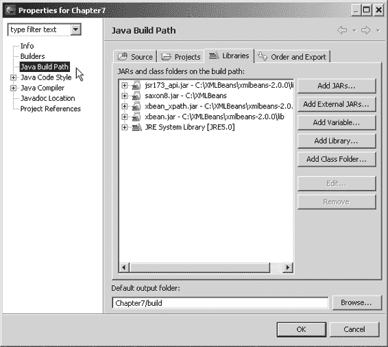

Vohra_706-0C07.fm 第 188 页 2006 年 7 月 13 日，星期四，下午 1:11

**188**

第 7 章 ■ 使用 XMLBeans 进行绑定

要编译和运行代码示例，您需要一个 Eclipse 项目。从 Apress 网站 (http://www.apress.com) 下载 Chapter7 项目，并按照第 1 章所述将其导入到您的 Eclipse 工作区中。

您需要在项目的 Java 构建路径中包含一些 XMLBeans JAR 文件；图 7-1 显示了这些 JAR 文件。XMLBeans 应用程序所需的 JAR 文件是 `xbean.jar`（包含 XMLBeans API）和 `jsr173_api.jar`（实现了 JSR-173，即 XML 流式 API5）。您还需要将 JRE 系统库设置为 JRE 5.06，如图 7-1 所示。

**图 7-1.** *Chapter7 项目 Java 构建路径*

您将配置绑定编译器 `scomp`，以便在 `gen_source` 文件夹中生成 Java 内容类；因此，请将 `gen_source` 文件夹添加到 Java 构建路径区域中“源”选项卡上的源路径中，如图 7-2 所示。

图 7-3 显示了 Chapter7 项目的目录结构。

5\. JSR-173 定义了 StAX API，我们在第 2 章中介绍过。有关 JSR 173 的信息，请访问 http://www.jcp.org/en/jsr/detail?id=173。

6\. 如前所述，您可以选择使用 JRE 1.4\. *x*。

[www.it-ebooks.info](http://www.it-ebooks.info/)

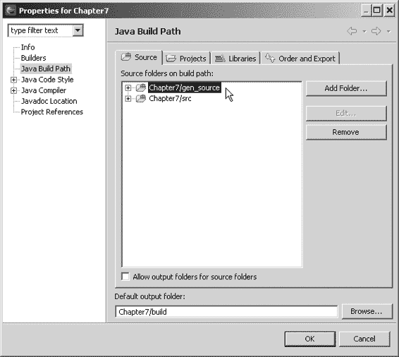

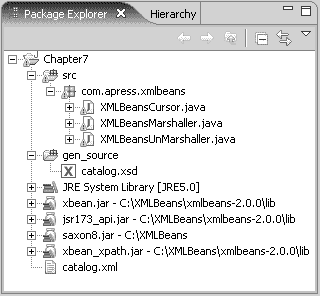

Vohra_706-0C07.fm 第 189 页 2006 年 7 月 13 日，星期四，下午 1:11

第 7 章 ■ 使用 XMLBeans 进行绑定

**189**

**图 7-2.** *Chapter7 项目的源路径* **图 7-3.** *Chapter7 项目目录结构* **编译 XML Schema**

在本节中，您将首先将示例模式（catalog.xsd，如清单 7-1 所示）绑定到其对应的 Java 类型。随后，您将编组和解组示例 XML 文档（catalog.xml，如清单 7-2 所示）。如前所述，您将使用 `scomp` 绑定编译器来绑定示例模式。`scomp` 的语法有多种选择，如清单 7-3 所示。

[www.it-ebooks.info](http://www.it-ebooks.info/)

Vohra_706-0C07.fm 第 190 页 2006 年 7 月 13 日，星期四，下午 1:11

**190**

第 7 章 ■ 使用 XMLBeans 进行绑定

**清单 7-3.** *scomp 绑定编译器语法*

scomp [opts] [schema.xsd]* [config.xsdconfig]*

scomp [opts] [directory]

在第一个 `scomp` 命令中，`[schema.xsd]*` 是零个或多个用于绑定到其 Java 类型的输入模式，`[config.xsdconfig]*` 是零个或多个包含影响绑定编译器的自定义绑定的配置文件。第二个命令显示了 `scomp` 的另一种语法，其中 `[directory]` 包含输入模式和自定义绑定文件；这是我们将在示例中使用的语法。在这两个命令中，`[opts]` 表示 `scomp` 编译器选项，这些选项列在表 7-2 中。

**表 7-2.** *Scomp 编译器选项*

**选项**

**描述**

-cp [a;b;c]

指定类路径。

-d [dir]

指定 `.class` 和 `.xsb` 文件的目标二进制目录。
XSB 文件包含模式元信息，这是绑定和验证等任务所必需的。

-src [dir]

指定生成的 `.java` 文件的目标目录。

-out [xmltypes.jar]

指定 XML 类型的输出 JAR 文件。

-compiler

指定外部 Java 编译器的路径。

我们将展示如何在 Eclipse 中运行 `scomp`。因此，将 `scomp` 配置为 Eclipse 中的外部工具。要在 Eclipse 中配置 `scomp`，您需要执行以下步骤：**1.** 要将 `scomp` 配置为外部工具，请选择“运行”➤“外部工具”。在“外部工具”区域中，通过右键单击“程序”节点并选择“新建”来创建一个新的程序配置。
这将添加一个新配置，如图 7-4 所示。

**2.** 外部工具配置包括配置名称和 `scomp` 编译器命令文件的位置。您在“名称”字段中指定配置名称。`scomp` 命令文件的位置位于 XMLBeans 安装目录的 `bin` 目录中，您在“位置”字段中指定该位置。您还需要设置工作目录和程序参数。要设置工作目录，请单击“工作目录”字段的“变量”按钮，然后选择 `container_loc` 变量。这将在“工作目录”字段中指定值 `${container_loc}`，如图 7-4 所示。

**3.** 在“参数”字段中，您需要设置需要使用 `scomp` 编译器编译的模式。您还需要指定 `scomp` 编译器选项 `-src` 和 `-out`。（表 7-2 讨论了编译器选项。）在“参数”字段中，指定编译器选项 `-src` 和 `-out`，并使用清单 7-4 中所示的语法设置模式资源。

[www.it-ebooks.info](http://www.it-ebooks.info/)


Vohra_706-0C07.fm 第 191 页 2006 年 7 月 13 日，星期四，下午 1:11

第 7 章 ■ 使用 XMLBeans 进行绑定

**191**

**清单 7-4.** *参数字段*

-src "${resource_loc}" –out "${resource_loc}/xmltypes.jar" "${resource_loc}"

**图 7-4.** *将 scomp 配置为外部工具* 变量 `resource_loc` 指定了运行 `scomp` 命令时选定的项目文件夹的位置，您可以通过单击“变量”按钮并选择 `resource_loc` 将其添加到“参数”字段。如果安装 Eclipse 的目录路径名中包含空格，请将 `${resource_loc}` 括在双引号中，如图 7-4 所示。要存储新配置，请单击“应用”按钮。

您还需要在 `scomp` 的外部工具配置中设置环境变量 `JAVA_HOME`、`PATH` 和 `XMLBEANS_LIB`。在“环境”选项卡上，添加环境变量 `JAVA_HOME`、`PATH` 和 `XMLBEANS_LIB`，如图 7-5 所示。`PATH` 变量需要指向 `JAVA_HOME` 下的 `bin` 目录，因为 `scomp` 使用 `bin` 目录中的 `javac` 编译器来外部编译一些生成的 Java 文件为 class 文件。`XMLBEANS_LIB` 变量的值是包含 `xbean.jar` 文件的目录。

[www.it-ebooks.info](http://www.it-ebooks.info/)

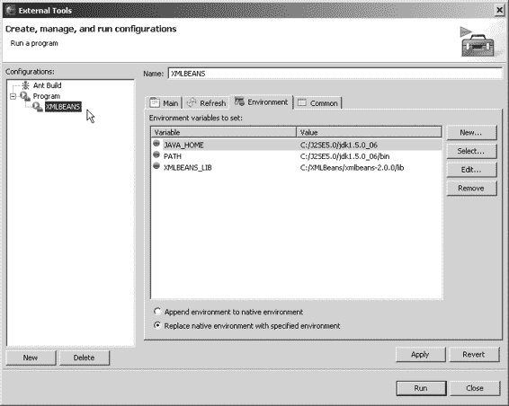

Vohra_706-0C07.fm 第 192 页 2006 年 7 月 13 日，星期四，下午 1:11

**192**

第 7 章 ■ 使用 XMLBeans 进行绑定

**图 7-5.** *scomp 配置环境变量* 要将 XMLBeans 配置添加到“外部工具”菜单，请选择“常用”选项卡，然后在“显示在收藏夹菜单中”区域选中“外部工具”复选框。要对示例模式运行 `scomp` 编译器，请在包资源管理器中选择 `gen_source` 文件夹，然后选择“运行”➤
“外部工具”➤“XMLBeans”，如图 7-6 所示。

[www.it-ebooks.info](http://www.it-ebooks.info/)

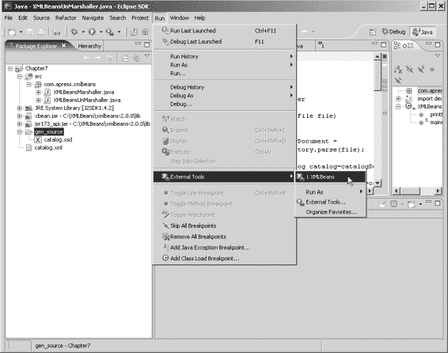

Vohra_706-0C07.fm 第 193 页 2006 年 7 月 13 日，星期四，下午 1:11

第 7 章 ■ 使用 XMLBeans 进行绑定

**193**


**图 7-6.** *使用 scomp 编译器编译 XML Schema*  
Java 接口和类会生成在 `gen_source` 文件夹中，如图 7-7 所示。你需要刷新 Chapter7 项目才能看到生成的文件。你使用 `noNamespace` 包中的接口来对 XML 文档进行编组和解组。`noNamespace.impl` 包中的类提供了 `noNamespace` 包中接口的实现。

[www.it-ebooks.info](http://www.it-ebooks.info/)

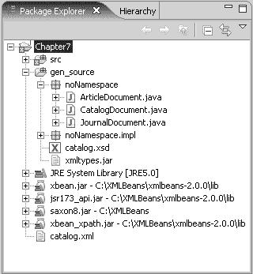

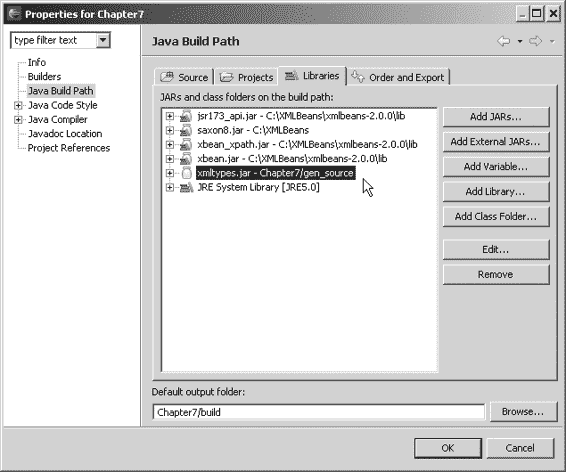

Vohra_706-0C07.fm 第 194 页 2006 年 7 月 13 日星期四 下午 1:11

**194**

第 7 章 ■ 使用 XMLBeans 进行绑定

**图 7-7.** *包含从 schema7 生成的 Java 类的 Chapter7 目录结构*

从 schema 生成的 Java 类包含一个 JAR 文件 `xmltypes.jar`，你需要将其添加到 Chapter7 的 Java 构建路径中，如图 7-8 所示。

**图 7-8.** *将 xmltypes.jar 添加到 Java 构建路径*  
7. 在绑定类生成且 `src` 目录下的 Java 文件编译完成之前，`src` 目录旁边可能会显示一个错误图标。

[www.it-ebooks.info](http://www.it-ebooks.info/)

Vohra_706-0C07.fm 第 195 页 2006 年 7 月 13 日星期四 下午 1:11

第 7 章 ■ 使用 XMLBeans 进行绑定

**195**

`scomp` 编译器会为示例 schema 中的每个顶级元素生成一个 Java 接口和一个实现类。例如，对于清单 7-5 中摘录的顶级 schema 元素 `catalog`，会生成 Java 接口 `CatalogDocument.java`（清单 7-6）。

**清单 7-5.** *Schema 元素 catalog*

<xs:element name="catalog">

<xs:complexType>

<xs:sequence>

<xs:element ref="journal" minOccurs="0" maxOccurs="unbounded"/>

</xs:sequence>

</xs:complexType>

</xs:element>

**清单 7-6.** *CatalogDocument.java*

package noNamespace;

public interface CatalogDocument extends org.apache.xmlbeans.XmlObject {

// … 部分代码已删除

noNamespace.CatalogDocument.Catalog getCatalog();

void setCatalog(noNamespace.CatalogDocument.Catalog catalog); noNamespace.CatalogDocument.Catalog addNewCatalog();

public interface Catalog extends org.apache.xmlbeans.XmlObject {

// … 部分代码已删除

noNamespace.JournalDocument.Journal[] getJournalArray();

// … 部分代码已删除

void setJournalArray(noNamespace.JournalDocument.Journal[] journalArray); void setJournalArray(int i, noNamespace.JournalDocument.Journal journal);

// … 部分代码已删除

public static final class Factory {

public static noNamespace.CatalogDocument.Catalog newInstance() {

return (noNamespace.CatalogDocument.Catalog)

org.apache.xmlbeans.XmlBeans.getContextTypeLoader().

newInstance( type, null );

}

// … 部分代码已删除

private Factory() { } // 不允许创建此类的实例

}

}

public static final class Factory {

public static noNamespace.CatalogDocument newInstance() {

return (noNamespace.CatalogDocument)

org.apache.xmlbeans.XmlBeans.

getContextTypeLoader().

newInstance( type, null );

}

// … 部分代码已删除

private Factory() { } // 不允许创建此类的实例

}

}

[www.it-ebooks.info](http://www.it-ebooks.info/)

Vohra_706-0C07.fm 第 196 页 2006 年 7 月 13 日星期四 下午 1:11

**196**

第 7 章 ■ 使用 XMLBeans 进行绑定

`CatalogDocument.java` 默认生成在 `noNamespace` 包中，并且与所有 XMLBeans 编译器生成的接口一样，它扩展了 `org.apache.xmlbeans.XmlObject` 接口。

关于此生成接口的关键点如下：

*   `CatalogDocument.java` 接口是顶级 `catalog` 元素（清单 7-5）的 Java 类型映射。它包含一个嵌套接口 `Catalog`，该接口是 `catalog` 中匿名 `complexType` 定义的映射。
*   `Catalog` 包含用于检索和设置 `journal` 元素数组的 getter 和 setter 方法。
*   `CatalogDocument` 和 `Catalog` 接口都定义了嵌套的 `Factory` 类。
*   `Catalog` 接口的工厂类提供了 `newInstance()` 方法，用于创建 `Catalog` 接口的实例。


• `CatalogDocument` 接口的工厂类提供了用于创建新 `CatalogDocument` 对象的 `newInstance()` 方法。它还定义了 `parse()` 方法，用于解析以 catalog 为根元素的 XML 文档。`parse()` 方法返回一个 `CatalogDocument` 对象。

需要牢记的一个重要概念是，示例模式定义（清单 7-1）定义了三个顶级元素——catalog、journal 和 article——因此，符合此模式定义的有效 XML 文档可以将这三个元素中的任何一个作为其根元素。

这就是 scomp 生成三种 Java 类型的原因：`CatalogDocument`、`JournalDocument` 和 `ArticleDocument`。

实现类 `CatalogDocumentImpl.java`、`JournalDocumentImpl.java` 和 `ArticleDocumentImpl.java` 会生成在 `noNamespace.impl` 包中。

**自定义 XMLBeans 绑定**

您可以使用 XMLBeans 配置文件自定义由 scomp 编译器生成的 XML Schema 到 Java 类型的绑定。可以在配置文件中定义的自定义示例包括：为 Java 类型名称添加前缀或后缀，以及指定生成 Java 类型的自定义包。绑定配置文件的元素在 `http://www.bea.com/2002/09/xbean/config` 命名空间中定义。8

XMLBeans 类生成的默认包是 `noNamespace`。通过在 XMLBeans 配置文件中指定包名，XMLBeans 类可以生成在其他包中；您可以通过两种方式实现：

• 如果绑定模式具有目标命名空间，则其目标命名空间可以映射到一个包名。例如，`http://xmlbeans/journal` 命名空间可以映射到 `journal` 包，如清单 7-7 所示。

• 如果绑定模式没有目标命名空间，则可以将其映射到一个自定义包名，如清单 7-8 所示。

8\. XMLBeans 最初由 BEA 开发，并于 2003 年 9 月捐赠给 Apache 软件基金会。

[www.it-ebooks.info](http://www.it-ebooks.info/)

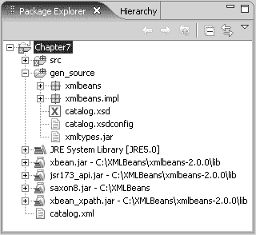

Vohra_706-0C07.fm 第 197 页 2006 年 7 月 13 日，星期四，下午 1:11

第 7 章 ■ 使用 XMLBEANS 进行绑定

**197**

**清单 7-7.** *catalog.xsdconfig*

<?xml version="1.0" encoding="UTF-8"?>

<xb:config

>

**<xb:namespace uri="http://xmlbeans/journal">**

<xb:package>journal</xb:package>

</xb:namespace>

</xb:config>

**清单 7-8.** *catalog.xsdconfig*

<?xml version="1.0" encoding="UTF-8"?>

<xb:config >

<xb:namespace>

<xb:package>xmlbeans</xb:package>

</xb:namespace>

</xb:config>

要将 catalog.xsd 模式与配置文件 catalog.xsdconfig 绑定，请将 catalog.xsdconfig 导入到 Chapter7 项目的 gen_source 文件夹中。要使用配置文件生成 Java 类型，请选择 gen_source 文件夹，然后运行外部工具配置 XMLBeans。

Java 类会生成在 xmlbeans 包中，如图 7-9 所示。您必须刷新 Chapter7 项目才能看到新生成的文件。

**图 7-9.** *在 xmlbeans 包中生成的 Java 类* **编组 XML 文档**

在本节中，您将使用 XMLBeans 生成的 Java 类来编组示例 XML 文档 (catalog.xml)。由于 Java 类是从 XML Schema 编译而来的，因此从 Java 类生成的 XML 文档符合该模式。您首先构建一个 XML 文档的 Java 对象表示，然后将该 Java 对象输出为 XML 文档。表示 XML 文档实例的 Java 接口是 `noNamespace.CatalogDocument`。因此，创建一个 `CatalogDocument` 类型的对象，如下所示：

noNamespace.CatalogDocument catalogDoc =

noNamespace.CatalogDocument.Factory.newInstance();

[www.it-ebooks.info](http://www.it-ebooks.info/)

Vohra_706-0C07.fm 第 198 页 2006 年 7 月 13 日，星期四，下午 1:11

**198**

第 7 章 ■ 使用 XMLBEANS 进行绑定

XML 文档实例中的根元素是 catalog，它由 Java 接口 `noNamespace.CatalogDocument.Catalog` 表示。您可以使用 `addNewCatalog()` 方法向 `noNamespace.CatalogDocument` 对象添加一个 `Catalog` 对象，如下所示：`CatalogDocument.Catalog catalog=catalogDoc.addNewCatalog();` 要编组的 XML 文档在 catalog 元素中包含 journal 元素。journal 元素由接口 `noNamespace.JournalDocument.Journal` 表示。您可以使用 `addNewJournal()` 方法向 `noNamespace.CatalogDocument.Catalog` 对象添加一个 `Journal` 对象，如清单 7-9 所示。Journal 元素的属性 publisher 的值通过 `setPublisher()` 方法设置。

**清单 7-9.** *添加 Journal 对象并设置属性 publisher* noNamespace.JournalDocument.Journal journal=catalog.addNewJournal(); journal.setPublisher("IBM developerWorks");

article 元素由 Java 接口 `noNamespace.ArticleDocument.Article` 表示。您可以使用 `addNewArticle()` 方法向 `noNamespace.JournalDocument.Journal` 对象添加一个 `Article` 对象，如清单 7-10 所示。您可以使用这些属性的 setter 方法来设置 article 元素的 level、date 和 section 属性。

**清单 7-10.** *添加 Article 对象并设置属性* articleDocument.Article article=journal.addNewArticle();

article.setLevel("Intermediate");

article.setDate("January-2004");

article.setSection("Java Technology");

您可以使用这些元素的 setter 方法来设置 article 元素的 title 和 author 子元素的值，如清单 7-11 所示。

**清单 7-11.** *设置 title 和 author 值* article.setTitle("Service Oriented Architecture Frameworks"); article.setAuthor("Naveen Balani");

类似地，添加另一个 Article 对象以构建清单 7-2 中所示的 XML 文档。

清单 7-12 显示了用于构建示例 XML 文档的 Java 应用程序 `XMLBeansMarshaller.java`。`XMLBeansMarshaller` 类包含 `createCatalog()` 方法，该方法创建 XML 文档的 Java 对象表示。XML 文档实例由 `CatalogDocument` 接口表示。因此，从 `CatalogDocument` 的工厂类创建一个 `CatalogDocument` 对象。您使用 `addNewCatalog()` 方法将根元素 catalog 的 Java 类表示 `CatalogDocument.Catalog` 添加到 `CatalogDocument` 对象。您使用 `addNewJournal()` 方法将 journal 元素的 Java 类表示 `JournalDocument.Journal` 添加到 `Catalog` 对象。您使用 `addNewArticle()` 方法将 article 元素的 Java 类表示 `ArticleDocument.Article` 添加到 `Journal` 对象。您使用这些属性和文本节点的 setter 方法来设置属性和元素文本的值。

**清单 7-12** *. XMLBeansMarshaller.java*

package com.apress.xmlbeans;

import noNamespace.*;

import noNamespace.impl.*;

[www.it-ebooks.info](http://www.it-ebooks.info/)

Vohra_706-0C07.fm 第 199 页 2006 年 7 月 13 日，星期四，下午 1:11

第 7 章 ■ 使用 XMLBEANS 进行绑定

**199**

public class XMLBeansMarshaller {

//createCatalog 方法

public CatalogDocument createCatalog() {

//从 Factory 类创建 CatalogDocument 对象

CatalogDocument catalogDoc =CatalogDocument.Factory.newInstance();

//向 CatalogDocument 对象添加 CatalogDocument.Catalog 对象 CatalogDocument.Catalog catalog = catalogDoc.addNewCatalog();

//向 CatalogDocument.Catalog 对象添加 JournalDocument.Journal 对象 JournalDocument.Journal

journal = catalog.addNewJournal();

//设置 publisher 属性的值

journal.setPublisher("IBM developerWorks");

//向 JournalDocument.Journal 对象添加 ArticleDocument.Article 对象 ArticleDocument.Article

article = journal.addNewArticle();

//设置 Article 对象属性和元素的值。

article.setTitle("Service Oriented Architecture Frameworks"); article.setAuthor("Naveen Balani");

article.setLevel("Intermediate");

article.setDate("January-2004");


article.setSection("Java Technology");

//添加另一个 Article 对象

article = journal.addNewArticle();

article.setTitle("高级 DAO 编程");

article.setAuthor("Sean Sullivan");

article.setLevel("高级");

article.setDate("2003 年 10 月");

article.setSection("Java Technology");

//添加另一个 Article 对象

article = journal.addNewArticle();

article.setTitle("EJB 异常处理最佳实践"); article.setAuthor("Srikanth Shenoy");

article.setLevel("高级");

article.setDate("2002 年 5 月");

article.setSection("Java Technology");

//输出 CatalogDocument 对象

System.out.println(catalogDoc);

return catalogDoc;

}

public static void main(String[] argv) {

XMLBeansMarshaller marshaller = new XMLBeansMarshaller(); marshaller.createCatalog();

}

}

[www.it-ebooks.info](http://www.it-ebooks.info/)

Vohra_706-0C07.fm 第 200 页 2006 年 7 月 13 日星期四 下午 1:11

**200**

第 7 章 ■ 使用 XMLBeans 进行绑定

要在 Eclipse 中运行 XMLBeansMarshaller.java 应用程序，请右键单击清单 7-12 中显示的 Java 文件，然后选择“Run As ➤ Java Application”执行它。清单 7-13 显示了 Eclipse 中编组应用程序的输出。

**清单 7-13.** *使用 XMLBeans 编组 XML 文档的输出*

<catalog>

<journal publisher="IBM developerWorks">

<article level="中级" date="2004 年 1 月" section="Java Technology">

<title>面向服务架构框架</title>

<author>Naveen Balani</author>

</article>

<article level="高级" date="2003 年 10 月" section="Java Technology">

<title>高级 DAO 编程</title>

<author>Sean Sullivan</author>

</article>

<article level="高级" date="2002 年 5 月" section="Java Technology">

<title>EJB 异常处理最佳实践</title>

<author>Srikanth Shenoy</author>

</article>

</journal>

</catalog>

**解组 XML 文档**

*解组*是将 XML 文档绑定到 Java 类，并通过类型安全的 Java 类访问 XML 信息内容。在本节中，您将把示例 XML 文档 catalog.xml 解组为 Java 对象表示形式。要解组 XML 文档 catalog.xml，请使用 CatalogDocument 接口中 Factory 类的 parse()方法之一解析该文档。重载的 parse()方法返回一个 CatalogDocument 对象。

清单 7-14 展示了使用 parse(File)方法解析 XML 文档的过程。

**清单 7-14.** *使用 XMLBeans 解析 XML 文档* CatalogDocument catalogDocument=CatalogDocument.Factory.parse(xmlFile); 变量 xmlFile 指定了要解析的 XML 文档的 File 对象表示形式。

如前所述，catalog.xsd 模式元素 catalog 由 Java 接口 noNamespace.CatalogDocument.Catalog 表示。因此，从解析 catalog.xml 返回的 CatalogDocument 对象中获取一个 Catalog 接口对象。您可以使用 getCatalog()方法从 CatalogDocument 对象中获取 Catalog 对象，如清单 7-15 所示。

**清单 7-15.** *从 CatalogDocument 对象获取 Catalog 对象* noNamespace.CatalogDocument.Catalog catalog=catalogDocument.getCatalog(); 元素 catalog 包含一个 journal 子元素数组。journal 元素使用 noNamespace.JournalDocument.Journal 接口表示。要检索 catalog 元素中的 journal 元素，请使用 getJournalArray()方法从 noNamespace.CatalogDocument.Catalog 对象中获取类型为 noNamespace.JournalDocument.Journal[]的数组，如下所示：

[www.it-ebooks.info](http://www.it-ebooks.info/)

Vohra_706-0C07.fm 第 201 页 2006 年 7 月 13 日星期四 下午 1:11

第 7 章 ■ 使用 XMLBeans 进行绑定

**201**

JournalDocument.Journal[] journalArray=catalog.getJournalArray(); 可以通过遍历 Journal[]数组并使用 getPublisher()方法检索 publisher 属性来输出元素 journal 的属性 publisher，如清单 7-16 所示。

**清单 7-16.** *检索属性 publisher* for (int i = 0; i < journalArray.length; i++) {


System.out.println("Journal: " + i);

System.out.println(" publisher : " + journalArray[i].getPublisher());

}

模式元素 article 由 Java 接口 noNamespace.ArticleDocument.Article 表示。你可以通过 getArticleArray() 方法从 noNamespace.JournalDocument.Journal 对象中获取一个 noNamespace.ArticleDocument.Article[] 数组，如清单 7-17 所示。

**清单 7-17.** *从 Journal 对象获取 Article 对象数组* ArticleDocument.Article[] articleArray=journalArray[i].getArticleArray(); 你可以通过遍历 Article[] 数组，并使用元素和属性的 getter 方法检索值，来输出 Article 对象中的元素和属性值。

你可以使用清单 7-18 中列出的 Java 应用程序 XMLBeansUnMarshaller.java 来解组 catalog.xml。XMLBeansUnMarshaller.java 包含一个 printElements() 方法，该方法接受一个代表 XML 文档的 File 对象作为参数。在 printElements() 方法中，解析 XML 文档以获得一个 CatalogDocument 对象，并从中获取一个 Catalog 对象。

从代表模式 catalog.xsd 中元素 catalog 的 Catalog 对象中，你可以获取一个 Journal 对象数组。Journal 对象代表模式 catalog.xsd 中的元素 journal。遍历 Journal 对象数组以输出 journal 元素的属性 publisher。你从 Journal 对象中获取一个 Article 对象数组。遍历 Article 数组以输出 article 元素的属性和子元素。

**清单 7-18.** *XMLBeansUnMarshaller.java*

package com.apress.xmlbeans;

import noNamespace.*;

import java.io.File;

public class XMLBeansUnMarshaller {

//printElements 方法

public void printElements(File file) {

try { // 使用工厂方法 parse(File) 解析 XML 文档 CatalogDocument catalogDocument = CatalogDocument.Factory

.parse(file);

// 从 CatalogDocument 对象获取 Catalog 对象

CatalogDocument.Catalog catalog = catalogDocument.getCatalog();

// 从 Catalog 对象获取 Journal 对象数组

JournalDocument.Journal[] journalArray = catalog.getJournalArray();

[www.it-ebooks.info](http://www.it-ebooks.info/)

Vohra_706-0C07.fm Page 202 Thursday, July 13, 2006 1:11 PM

**202**

第 7 章 ■ 使用 XMLBeans 进行绑定

System.out.println("Catalog has " + journalArray.length

+ " journal elements");

// 遍历 Journal 对象数组

for (int i = 0; i < journalArray.length; i++) {

System.out.println("Journal: " + i);

// 输出 publisher 属性的值

System.out.println(" publisher : "

+ journalArray[i].getPublisher());

// 从 Journal 对象获取 Article 对象数组

ArticleDocument.Article[] articleArray = journalArray[i]

.getArticleArray();

// 遍历 Article 对象数组

for (int j = 0; j < articleArray.length; j++) {

System.out.println("Article: " + j);

// 输出 Article 对象的属性和子元素值

System.out.println("Level : " + articleArray[j].getLevel()); System.out.println("Date : " + articleArray[j].getDate()); System.out.println("Section : "

+ articleArray[j].getSection());

System.out.println("Title : " + articleArray[j].getTitle()); System.out.println("Author : "

+ articleArray[j].getAuthor());

}

}

} catch (org.apache.xmlbeans.XmlException e) {

} catch (java.io.IOException e) {

}

}

public static void main(String[] argv) {

XMLBeansUnMarshaller unmarshaller = new XMLBeansUnMarshaller(); unmarshaller.printElements(new File("catalog.xml"));

}

}

按照第 1 章中说明的步骤，在 Eclipse 中运行 XMLBeansUnMarshaller.java 应用程序。清单 7-19 显示了使用 XMLBeansUnMarshaller 解组 XML 文档的输出。

**清单 7-19.** *XMLBeansUnMarshaller.java 的输出* Catalog has 1 journal elements

Journal: 0

publisher : IBM developerWorks

Article: 0

Level : Intermediate

Date : January-2004

[www.it-ebooks.info](http://www.it-ebooks.info/)

Vohra_706-0C07.fm Page 203 Thursday, July 13, 2006 1:11 PM

第 7 章 ■ 使用 XMLBeans 进行绑定

**203**

Section : Java Technology


标题：面向服务架构框架

作者：Naveen Balani

文章编号：1

难度等级：高级

日期：2003 年 10 月

分类：Java 技术

标题：高级 DAO 编程

作者：Sean Sullivan

文章编号：2

难度等级：高级

日期：2002 年 5 月

分类：Java 技术

标题：EJB 异常处理最佳实践

作者：Srikanth Shenoy

在接下来的部分中，您将使用 XmlCursor API 遍历一个 XML 文档。

**使用 XmlCursor API 遍历 XML 文档**

XMLBeans 提供了使用 XmlCursor API 遍历 XML 文档的功能。XML 游标定义了 XML 文档中的一个位置，可以在此位置上对 XML 文档执行操作。

由于游标可以在有或没有对应 XML Schema 的情况下创建，因此当 XML 文档没有可用模式时，游标非常适合导航 XML 文档。通过将游标定位在 XML 文档的某个位置，您可以执行获取和设置值、添加元素和属性、选择节点以及查询 XML 文档等操作。使用 XmlCursor，您可以执行以下操作：

• 使用令牌模型以微小增量导航 XML 文档。表 7-3 讨论了令牌模型。

• 获取和设置 XML 文档中的值。

• 通过添加、删除和移动元素及属性来修改 XML 文档的结构。

• 使用 XPath 选择节点。

• 使用 XQuery 查询 XML 文档。9 XQuery 1.0：一种 XML 查询语言 10 是 W3C 的推荐标准。它是一种类似 SQL 的语言，用于查询 XML 数据源。我们将在本章中简要介绍 XQuery。

在 XmlCursor API 中，XML 文档用令牌表示。表 7-3 显示了令牌类型以及表示不同令牌类型的静态整数字段。

在接下来的部分中，我们将通过示例演示每个 XmlCursor 特性。

XML 游标由 XmlCursor 接口实现。因此，要使用 XML 游标导航 XML 文档，请导入 XmlCursor 接口：

import org.apache.xmlbeans.XmlCursor;

9. 我们将在本章中简要介绍 XQuery。
10. 该推荐标准可在 http://www.w3.org/TR/xquery/ 获取。

[www.it-ebooks.info](http://www.it-ebooks.info/)

Vohra_706-0C07.fm 第 204 页 2006 年 7 月 13 日星期四 下午 1:11

**204**

第 7 章 ■ 使用 XMLBeans 进行绑定

**表 7-3.** *令牌类型*

**令牌类型**

**令牌字段**

**描述**

ATTR

INT_ATTR

属性令牌类型

NAMESPACE

INT_NAMESPACE

命名空间声明令牌类型

COMMENT

INT_COMMENT

注释令牌类型

PROCINST

INT_PROCINST

处理指令令牌类型

END

INT_END

结束元素令牌类型

TEXT

INT_TEXT

文本令牌类型

ENDDOC

INT_ENDDOC

结束文档令牌类型

NONE

INT_NONE

无令牌类型

START

INT_START

开始元素令牌类型

STARTDOC

INT_STARTDOC

开始文档令牌类型

**定位游标**

您可以使用 XmlObject 接口的 newCursor()方法创建 XML 游标。CatalogDocument.java 接口（清单 7-6）由 XMLBeans 编译器为根元素 catalog 生成，它扩展了 XmlObject 接口。要为示例 XML 文档 catalog.xml（清单 7-2）创建新游标，首先从 Factory 类方法 parse(File)创建 CatalogDocument.java 对象，如清单 7-20 所示。

**清单 7-20.** *创建 CatalogDocument 对象* CatalogDocument catalogDocument = CatalogDocument.Factory.parse(xmlFile); xmlFile 是 XML 文档 catalog.xml 的 File 对象。从 CatalogDocument 对象，您可以使用 newCursor()方法创建新游标，如下所示：XmlCursor cursor = catalogDocument.newCursor();

XmlCursor 接口提供了多种导航 XML 文档的方法。表 7-4 显示了其中一些方法。

**表 7-4.** *XmlCursor 接口导航方法* **方法名称**

**描述**

toFirstContentToken()

将游标移动到当前 START 或 STARTDOC 内容中的第一个令牌。关于 START 和 STARTDOC 的定义，请参考表 7-3。

toChild(int index)


将光标移动到指定索引的子元素。

toChild(String name)

将光标移动到指定元素名称的第一个子元素。

toChild(String namespace,

将光标移动到指定命名空间下指定元素名称的第一个子元素。

toChild(String name)

[www.it-ebooks.info](http://www.it-ebooks.info/)

Vohra_706-0C07.fm Page 205 Thursday, July 13, 2006 1:11 PM

第 7 章 ■ 使用 XMLBeans 进行绑定

**205**

**表 7-4.** *XmlCursor 接口导航方法* **方法名称**

**描述**

toCursor(XmlCursor moveTo)

将光标移动到 moveCursor 的位置。

toEndDoc()

将光标移动到文档的末尾。

toEndToken()

将光标移动到 END 或 ENDDOC 令牌。

toFirstAttribute()

将光标移动到此元素的第一个属性。

toFirstChild()

将光标移动到第一个子元素。

toLastAttribute()

将光标移动到此元素的最后一个属性。

toLastChild()

将光标移动到最后一个子元素。

toNextAttribute()

将光标移动到此元素的下一个属性。

toPrevToken()

将光标移动到上一个令牌。

toStartDoc()

将光标移动到文档的开头。

在示例应用程序 XMLBeansCursor.java 中，您将把光标移动到第一个 article 元素的 title 元素，并输出 title 元素的文本。文档中的 XML 声明不被视为令牌；因此，toFirstContentToken() 将光标移动到 catalog 元素的起始位置，如清单 7-21 所示。随后调用 toFirstChild() 会将光标移动到当前元素的子元素。例如，如果您想将光标移动到 title 元素的起始位置，一种简单的方法是调用 toFirstChild() 方法三次，如清单 7-21 所示。

**清单 7-21.** *将光标移动到第一个 title 元素的起始位置* cursor.toFirstContentToken();

cursor.toFirstChild();

cursor.toFirstChild();

cursor.toFirstChild();

title 元素的文本值通过 getTextValue() 方法检索，如清单 7-22 所示。随后，可以使用 dispose() 方法释放光标资源。

**清单 7-22.** *输出当前光标位置元素的值* System.out.println(cursor.getTextValue());

cursor.dispose();

清单 7-23 显示了在 Eclipse 中检索 title 元素值的输出。可以通过注释掉 XMLCursor.java（清单 7-35）中除 navigateXMLDocument() 方法之外的所有方法来生成清单 7-23 中的输出。

**清单 7-23.** *在 Eclipse 中导航 XML 文档的输出* Service Oriented Architecture Frameworks

[www.it-ebooks.info](http://www.it-ebooks.info/)

Vohra_706-0C07.fm Page 206 Thursday, July 13, 2006 1:11 PM

**206**

第 7 章 ■ 使用 XMLBeans 进行绑定

**添加元素**

在本节中，您将向根元素 catalog 添加一个 journal 元素。与上一节一样，从 Factory 类获取 XML 文件 catalog.xml 的 CatalogDocument 对象，并使用 newCursor() 方法创建一个光标：

CatalogDocument catalogDocument = CatalogDocument.Factory.parse(xmlFile); XmlCursor cursor = catalogDocument.newCursor();

使用 toFirstContentToken() 方法将光标定位在 catalog 元素起始位置之前，并使用 toFirstChild() 方法将光标定位在 journal 元素起始位置之前，如清单 7-24 所示。

**清单 7-24.** *将光标移动到 journal 元素的起始位置* cursor.toFirstContentToken();

cursor.toFirstChild();

您使用 beginElement(String) 方法创建一个新元素，并使用 insertAttributeWithValue(String, String) 方法添加一个新属性。例如，添加一个带有 publisher 属性的 journal 元素，如清单 7-25 所示。随后，使用 dispose() 方法释放光标资源。

**清单 7-25.** *添加元素和属性* cursor.beginElement("journal");

cursor.insertAttributeWithValue("publisher", "IBM developerWorks"); cursor.dispose();

您可以使用 CatalogDocument 对象的 toString() 方法输出修改后的文档，如下所示：

System.out.println(catalogDocument.toString());

清单 7-26 显示了在 Eclipse 中修改后的 XML 文档的输出。您可以通过注释掉 XMLCursor.java（参见清单 7-35）中除 addElement() 方法之外的所有方法来生成清单 7-26 中的输出。

**清单 7-26.** *添加了 journal 元素的修改后 XML 文档*

<catalog>

<journal publisher="IBM developerWorks"/>

<journal publisher="IBM developerWorks">

<article level="Intermediate" date="January-2004" section="Java Technology">

<title>Service Oriented Architecture Frameworks</title>

<author>Naveen Balani</author>

</article>

<article level="Advanced" date="October-2003" section="Java Technology">

<title>Advance DAO Programming</title>

<author>Sean Sullivan</author>

</article>

<article level="Advanced" date="May-2002" section="Java Technology">

<title>Best Practices in EJB Exception Handling</title>

<author>Srikanth Shenoy</author>

</article>

</journal>

</catalog>

[www.it-ebooks.info](http://www.it-ebooks.info/)

Vohra_706-0C07.fm Page 207 Thursday, July 13, 2006 1:11 PM

第 7 章 ■ 使用 XMLBeans 进行绑定

**207**

**使用 XPath 选择节点**

在本节中，您将使用 XPath 在 XML 文件 catalog.xml 中选择节点。XmlCursor 接口方法 selectPath(String) 选择 XML 文档中的一系列选择或位置，这些位置可以通过 toNextSelection() 方法导航。selectPath() 方法的字符串参数是一个 XPath 表达式。首先，您需要从 CatalogDocument 对象获取一个光标，如清单 7-27 所示。

**清单 7-27.** *创建 XML 光标*

CatalogDocument catalogDocument = CatalogDocument.Factory.parse(xmlFile); XmlCursor cursor = catalogDocument.newCursor();

将光标移动到第一个子元素，并通过将光标推入已保存位置的堆栈来保存光标的当前位置，如清单 7-28 所示。

**清单 7-28.** *将光标移动到 catalog 元素的起始位置* cursor.toFirstChild();

cursor.push();

例如，选择 XML 文档中的所有 title 元素，如清单 7-29 所示。选择所有 title 元素的 XPath 表达式是 $this//title。当前光标位置用 $this 表示，//title 选择当前令牌中的所有 title 元素。有关使用 XPath 选择节点的参考，请参阅第 4 章。

**清单 7-29.** *使用 XPath 选择 XML 节点*

cursor.selectPath("$this//title");

XmlCursor 方法 toNextSelection() 将光标移动到由 selectPath() 方法检索到的选择列表中的下一个选择。如果光标移动到下一个选择，则 toNextSelection() 方法返回 true。要输出所有 title 元素，请将光标移动到所有选择，并使用 getTextValue() 方法输出光标值，如清单 7-30 所示。

**清单 7-30.** *输出 title 元素的值* while (cursor.toNextSelection()) {

System.out.println(cursor.getTextValue());

}

清单 7-31 显示了选择 title 元素的输出。您可以通过注释掉 XMLCursor.java（清单 7-35）中除 selectWithXPath() 方法之外的所有方法来生成清单 7-31 中的输出。

**清单 7-31.** *在 Eclipse 中使用 XPath 选择的 title 元素的输出* Service Oriented Architecture Frameworks

Advance DAO Programming

Best Practices in EJB Exception Handling

光标的当前位置可以从堆栈中弹出，如下所示：cursor.pop();

[www.it-ebooks.info](http://www.it-ebooks.info/)

Vohra_706-0C07.fm Page 208 Thursday, July 13, 2006 1:11 PM

**208**

第 7 章 ■ 使用 XMLBeans 进行绑定

**使用 XQuery 查询 XML 文档**


在本节中，你将使用 XQuery 查询 XML 文件 catalog.xml。XQuery¹¹ 是一种类似 SQL 的语言，用于查询 XML 数据源。XmlCursor 接口方法 execQuery(queryExpression) 使用 XQuery 表达式查询 XML 文档。首先，你需要使用 CatalogDocument 对象的 newCursor() 方法创建一个 XML 游标，如清单 7-32 所示。

**清单 7-32.** *创建 XML 游标*

CatalogDocument catalogDocument = CatalogDocument.Factory.parse(xmlFile); XmlCursor cursor = catalogDocument.newCursor();

例如，查询 journal 元素中第一个 article 元素的 level 属性值。你选择用于 level 属性的 XQuery 表达式，如清单 7-33 所示。

**清单 7-33.** *选择 level 属性的 XQuery 表达式* String queryExpression = "for $a in $this/catalog/journal/article[1]"

+ "return $a/@level";

XQuery 表达式片段 `for $a in $this/catalog/journal/article[1]` 定义了一个变量 `$a`，用于选择当前游标位置 catalog 元素中 journal 元素内的第一个 article。XQuery 表达式片段 `return $a/@level` 返回该 article 元素的 level 属性。查询通过 execQuery(String) 方法执行，查询结果位于新 XML 文档中 resultCursor 的位置。你可以按如下方式获取 resultCursor：

XmlCursor resultCursor = cursor.execQuery(queryExpression); 你可以按如下方式输出 ResultCursor XML 片段： System.out.println(resultCursor.getObject().toString() + "\n"); 清单 7-34 显示了示例查询的 resultCursor XML 片段的输出。你可以通过注释掉 XMLCursor.java（清单 7-35）中除 selectWithXQuery() 方法之外的所有方法来生成清单 7-34 中的输出。

**清单 7-34.** *在 Eclipse 中使用 XQuery 选择属性的输出*

<xml-fragment level="Intermediate"/>

示例应用程序 XMLBeansCursor.java（如清单 7-35 所示）包含针对前面各节讨论的不同操作的方法。在 navigateXMLDocument(File xmlFile) 方法中，使用 XML 游标导航 XML 文件，并输出 title 元素的值。在 addElement(File xmlFile) 方法中，向 XML 文件添加一个新元素。在 selectWithXPath(File xmlFile) 方法中，选择示例 XML 文件中的所有 title 元素，并输出它们的值。在 selectWithXQuery(File xmlFile) 方法中，使用 XQuery 表达式选择 catalog.xml 中的一个节点。要在 Eclipse 中运行 XMLBeansCursor.java 应用程序，请遵循第 1 章中的步骤。前面各节中显示的 XMLBeansCursor.java 应用程序的输出，是通过仅运行应用程序中特定于某个部分的方法生成的。

11\. 你可以在 http://www.w3.org/TR/xquery/ 找到 XQuery 的详细信息。

12\. 不要将其与 XPath 语言混淆，XPath 与 XQuery 截然不同，其设计目的不是查询，而是定位 XML 文档的各个部分。

[www.it-ebooks.info](http://www.it-ebooks.info/)

Vohra_706-0C07.fm Page 209 Thursday, July 13, 2006 1:11 PM

第 7 章 ■ 使用 XMLBeans 进行绑定

**209**

**清单 7-35.** *XMLCursor.java*

package com.apress.xmlbeans;

import java.io.File;

import java.io.IOException;

import org.apache.xmlbeans.XmlCursor;

import org.apache.xmlbeans.XmlException;

import noNamespace.CatalogDocument;

public class XMLBeansCursor {

//使用 XPath 选择节点的方法

public void selectWithXPath(File xmlFile) {

try { //获取一个 XmlObject 对象

CatalogDocument catalogDocument = CatalogDocument.Factory

.parse(xmlFile);

//创建一个 XmlCursor 对象

XmlCursor cursor = catalogDocument.newCursor();

//将游标移动到第一个子元素

cursor.toFirstChild();

//将游标压入栈中

cursor.push();

//使用 XPath 选择节点

cursor.selectPath("$this//title");

while (cursor.toNextSelection()) {

System.out.println(cursor.getTextValue());

}

//弹出游标

cursor.pop();

} catch (IOException e) {


} catch (XmlException e) {

}

}

//使用 XQuery 查询 XML 文档的方法

public void selectWithXQuery(File xmlFile) {

try { //创建一个游标

CatalogDocument catalogDocument = CatalogDocument.Factory

.parse(xmlFile);

XmlCursor cursor = catalogDocument.newCursor();

//指定 XQuery 表达式

String queryExpression = "for $a in $this/catalog/journal/article[1]"

+ "return $a/@level";

//运行 XQuery 查询

XmlCursor resultCursor = cursor.execQuery(queryExpression);

//输出 XQuery 的结果

System.out.println(resultCursor.getObject().toString() + "\n");

} catch (IOException e) {

} catch (XmlException e) {

}

}

//添加元素的方法

public void addElement(File xmlFile) {

[www.it-ebooks.info](http://www.it-ebooks.info/)

Vohra_706-0C07.fm Page 210 Thursday, July 13, 2006 1:11 PM

**210**

第 7 章 ■ 使用 XMLBeans 进行绑定

try { //创建一个游标

CatalogDocument catalogDocument = CatalogDocument.Factory

.parse(xmlFile);

XmlCursor cursor = catalogDocument.newCursor();

//将游标移动到根元素的起始位置

cursor.toFirstContentToken();

//将游标移动到第一个子元素

cursor.toFirstChild();

//添加一个元素

cursor.beginElement("journal");

//添加一个属性

cursor.insertAttributeWithValue("publisher", "IBM developerWorks"); cursor.dispose();

//输出修改后的文档

System.out.println(catalogDocument.toString());

} catch (IOException e) {

} catch (XmlException e) {

}

}

//导航 XML 文档的方法

public void navigateXMLDocument(File xmlFile) {

try { //创建一个 CatalogDocument 对象并创建一个游标 CatalogDocument catalogDocument = CatalogDocument.Factory

.parse(xmlFile);

XmlCursor cursor = catalogDocument.newCursor();

//将游标移动到根元素的起始位置

cursor.toFirstContentToken();

//将游标移动到第一个子元素的起始位置

cursor.toFirstChild();

//将游标移动到 article 元素的起始位置

cursor.toFirstChild();

//将游标移动到 title 元素的起始位置

cursor.toFirstChild();

System.out.println(cursor.getTextValue());

//释放游标

cursor.dispose();

} catch (IOException e) {

} catch (XmlException e) {

}

}

[www.it-ebooks.info](http://www.it-ebooks.info/)

Vohra_706-0C07.fm Page 211 Thursday, July 13, 2006 1:11 PM

第 7 章 ■ 使用 XMLBeans 进行绑定

**211**

public static void main(String[] args) {

XMLBeansCursor xmlBeansCursor = new XMLBeansCursor();

File xmlFile = new File("catalog.xml");

xmlBeansCursor.navigateXMLDocument(xmlFile);

xmlBeansCursor.addElement(xmlFile);

xmlBeansCursor.selectWithXPath(xmlFile);

xmlBeansCursor.selectWithXQuery(xmlFile);

}

}

**总结**

XMLBeans 是一个类似于 JAXB 的 XML 到 Java 的绑定及运行时框架。您可以使用绑定框架将 XML Schema 绑定到 Java 类型。XMLBeans 提供了对所有 XML Schema 结构的完整支持。您可以使用绑定配置文件来自定义 XML Schema 到 Java 类型的绑定。您可以使用运行时框架将 XML 文档解组和编组为绑定 Java 类型的实例化 Java 对象。

除了对 XML 文档进行编组和解组之外，XMLBeans 还通过 XmlCursor API 提供了低级别的导航支持。使用 XmlCursor API，您可以将游标定位到指定位置，并修改该位置的文档内容。该 API 还支持使用 XPath 定位文档内容，以及使用 XQuery 语言查询 XML 文档。

我们认为，JAXB 2.0 应作为 XML Schema 到 Java 类型绑定框架的默认选择，主要原因如下：

• 它是 Java 标准的一部分。

• 它支持 XML Schema 内容与 Java 类型之间的双向映射。

然而，以下实际原因可能表明 XMLBeans 是更合适的选择：

• 您需要完整的 XML Schema 支持，但尚未准备好迁移到 J2SE 5.0。

• 在编组过程中，您希望对编组后 XML 文档中包含的 XML 标记进行低级别控制。


• 在解组过程中，你可能希望使用 XPath 来定位 XML 文档中的特定节点，或者使用 XQuery 语言来查询 XML 文档的内容。

[www.it-ebooks.info](http://www.it-ebooks.info/)

Vohra_706-0C07.fm Page 212 Thursday, July 13, 2006 1:11 PM

[www.it-ebooks.info](http://www.it-ebooks.info/)

Vohra_706-0C08.fm Page 213 Saturday, August 12, 2006 5:05 AM

第三部分

■ ■ ■

XML 与数据库

[www.it-ebooks.info](http://www.it-ebooks.info/)

Vohra_706-0C08.fm Page 214 Saturday, August 12, 2006 5:05 AM

[www.it-ebooks.info](http://www.it-ebooks.info/)

Vohra_706-0C08.fm Page 215 Saturday, August 12, 2006 5:05 AM

第 8 章

■ ■ ■

在原生 XML 数据库 Xindice 中存储 XML

**原**生 XML 数据库定义了一种用于存储、检索和更新 XML 文档的逻辑模型。XML 文档是原生 XML 数据库中的存储单元。原生 XML 数据库将 XML 文档存储为集合，这些集合可以被查询、更新和修改。存储在原生 XML 数据库集合中的 XML 文档不受任何模式的约束；这与关系数据库不同，关系数据库中存储的数据受底层数据库模式的约束。你可以使用 XPath 查询原生 XML 数据库；也可以使用 XML:DB XUpdate 语言更新原生 XML 数据库。

大多数关系数据库也支持 XML 存储；因此，比较原生 XML 数据库中的 XML 存储与关系数据库中的 XML 存储是很有必要的。表 8-1 提供了这样的比较。

**表 8-1.** *原生 XML 数据库与关系型 XML 数据库的比较* **特性**

**原生 XML 数据库**

**关系数据库**

数据库

XML 文档是基本存储单元，由元素

数据以行和列的形式存储。

结构

的层级结构表示。

顺序

元素是有序的。

行的顺序未定义。

模式

不使用模式定义来约束 XML 文档。

可以使用模式来约束数据结构。

查询

使用 XPath 执行查询。

使用 SQL 执行查询。

应用

适用于存储包含属性和子元素的复

适用于存储需要作为单个单元进行

场景

杂 XML 文档。

存储和检索的 XML 文档。

在本章中，我们将结合 Xindice¹ 原生 XML 数据库来讨论通用的原生 XML 数据库概念。Xindice 是一个开源的原生 XML 数据库，可用于存储、检索、查询和更新 XML 文档。由于 Xindice 是众多原生 XML 数据库之一，一个显而易见的问题是，为什么我们选择专注于 Xindice？我们决定将 Xindice 作为代表性原生 XML 数据库进行重点介绍，主要有三个原因：

• Xindice 从零开始就被设计为原生 XML 数据库，并且由于它只专注于这一功能，因此相当易于理解。

• Xindice 非常紧凑，易于安装，并且管理简单。

• Xindice 提供了命令行工具和基于标准的 API，用于管理、访问和修改 Xindice 数据库实例。

当然，我们鼓励你探索其他原生 XML 数据库，当你这样做时，可以将本章在 Xindice 背景下学到的基本概念迁移到其他原生 XML 数据库中。表 8-2 列出了一些其他常用的原生 XML 数据库。

**表 8-2.** *原生 XML 数据库*

**数据库**

**描述**

**更多信息**

Berkeley DB XML

开源原生 XML 数据库

http://www.sleepycat.com/

dbXML

开源原生 XML 数据库

http://www.dbxmlgroup.com/

比“为什么应该关注 Xindice”更相关的问题是，“为什么需要原生 XML 数据库？”以下是一些关键点，可以回答这个切中要害的问题：

• 如果你只想存储和检索完整的 XML 文档，那么关系数据库确实足够了。

• 然而，如果你想查询已存储 XML 文档的集合并检索这些文档的部分内容，或者你想更新这些已存储 XML 文档的部分内容，而无需先检索整个文档、修改它再存回去，那么你就需要一个原生 XML 数据库。

• 当然，理论上可以将 XML 文档映射到关系数据库模式。然而，在实践中，从关系数据库编组 XML 文档比将 XML 文档解组到关系数据库更容易。这种不对称性的简单原因是，当 XML 文档的树形结构被映射到关系数据库的网格结构时，与文档模型相关的信息会丢失，任何依赖文档模型的查询或更新都无法进行。

• 原生 XML 数据库中的存储单元是一个文档。XML 数据库的模型不仅关注在文档中存储 XML 数据，还关注保留关于文档模型的所有信息。

• 由于原生 XML 数据库保留了关于文档模型的信息，因此可以使用 XPath 语言查询原生 XML 数据库，并使用 XML:DB XUpdate² 语言（一种基于 XPath 的更新语言）进行更新。

就像使用关系数据库一样，你需要工具、查询语言和编程 API 来管理、访问和修改原生 XML 数据库。幸运的是，在 Xindice 中，所有这些工具都可用，你将在本章中详细探索它们。

². 这是 XML:DB 计划的一部分；你可以在 http://xmldb-org.sourceforge.net/xupdate/xupdate-wd.html#N1f64158 找到更多信息。

[www.it-ebooks.info](http://www.it-ebooks.info/)

Vohra_706-0C08.fm Page 217 Saturday, August 12, 2006 5:05 AM

第 8 章 ■ 在原生 XML 数据库 Xindice 中存储 XML

**217**

**概述**

从逻辑角度来看，Xindice 数据库的一个实例由层级结构的集合组成，每个集合可以包含嵌套的集合和 XML 文档。每个查询都在一个集合上执行，该集合也被称为*集合上下文*。在 Xindice 的默认安装中，Xindice 数据库实例中的根集合名为 db，因此根集合上下文由上下文路径 /db 标识。

**简单示例**

将 Xindice 数据库中的集合类比为文件系统文件夹，将存储在这些集合中的文档类比为存储在文件夹中的文档，是完全恰当的。将集合上下文的引用路径类比为文件系统路径也很有用。有了这种直观的理解，让我们来看一个简单的示例。

假设你是一家汽车零部件供应商，你有一个 XML 文档，其中存储了关于 2006 款福特野马敞篷车雨刮器片的信息，如下面的示例文档所示：

<?xml version='1.0' encoding='UTF-8' ?>

<wipers>

<blade location="driver" part="FMWD256783">

<description>Driver side wiper blade</description>

<size>22 inches</size>

</blade>

<blade location="passenger" part="FMWP256783">

<description>Passenger side wiper blade</description>

<size>20 inches</size>

</blade>

</wipers>

你可能会认为，将所有品牌和型号的汽车雨刮器片数据放在一个集合中效率不高，因此你决定采用更具层级结构的方案，并将前面显示的示例文档存储在如下所示的集合上下文中：

/db/parts/Ford/Mustang/2006/Convertible/


现在，假设你想查询这个集合中关于驾驶员侧雨刮片的信息。由于我们尚未讨论如何查询集合，你将暂时忽略构建查询的具体机制，而是纯粹从直观的角度来看一个示例查询。以下是一个示例查询，它使用 Xindice 命令行工具和 XPath 查询语言来提取与驾驶员侧雨刮片相关的信息：

xindice xpath

–c /db/parts/Ford/Mustang/2006/Convertible/

–q "/wipers/blade[@location='driver']"

你能直观地理解发生了什么吗？现在，请忽略此查询中的所有内容，只关注集合上下文 `/db/parts/Ford/Mustang/2006/Convertible/` 和 XPath 查询 `"/wipers/blade[@location='driver']"`。仅凭这两部分，你可以直观地看到，该查询在给定的集合上下文中搜索所有嵌套在 `wipers` 元素内且 `location` 属性等于 `driver` 的 `blade` 元素。此查询将返回所有匹配该 XPath 表达式的元素，无论它们位于哪个文档中。

[www.it-ebooks.info](http://www.it-ebooks.info/)

Vohra_706-0C08.fm Page 218 Saturday, August 12, 2006 5:05 AM

**218**

第 8 章 ■ 在原生 XML 数据库中存储 XML：XINDICE

当然，完全有理由假设，除了与挡风玻璃雨刮器相关的文档外，你还可以选择在此集合中存储其他包含该特定汽车其他部件数据的 XML 文档。从这个简单示例中得出的关键结论是，如何组织集合和文档完全取决于应用程序的需求，只要你牢记以下几点重要事项：

•   在一个集合中，你可以存储集合或 XML 文档。

•   如果集合中不同类型的对象具有相同的名称，Xindice 不会报错。

•   你需要知道存在一个优先级顺序来解决不同类型对象之间的名称冲突，顺序如下：集合和 XML 文档。最实际的做法当然是避免集合中不同类型对象之间出现任何名称冲突。

•   Xindice 设计用于存储中小型文档，因此请避免存储大型 XML 文档。建议将大型文档拆分为多个独立的小型文档。

可以使用 XML:DB API 或 Xindice 命令行工具访问和修改 Xindice 数据库内容。在本章中，我们将首先讨论命令行工具，然后讨论 XML:DB API。然而，在此之前，你需要下载并安装 Xindice 软件，这将是接下来要讨论的内容。

**安装 Xindice 软件**

Xindice 数据库作为 Web 应用程序安装在 J2EE 应用服务器（如 JBoss）中。

要安装 Xindice 数据库实例，你需要 Xindice API JAR 文件和 Xindice Web 应用程序。因此，请下载 `xml-xindice-1.1b4-jar.zip`（版本 1.1 b4 二进制 (JAR)），其中包含 Xindice XML:DB API JAR 文件，以及 `xml-xindice-1.1b4-war.zip`（版本 1.1 b4 二进制 (Webapp)），其中包含 Xindice Web 应用程序。将 `xml-xindice-1.1b4-jar.zip` 和 `xml-xindice-1.1b4-war.zip` 归档文件的内容解压到你想要的 Xindice 安装目录，例如 `C:/`。这些归档文件中存在一些文件重复，因此在解压文件时覆盖文件是可以的。

要运行 Xindice 数据库，你需要在类路径中包含 Apache Xerces4 或 Xerces25 XML 解析器类。默认情况下，Xindice 将使用你与 Xindice 一起使用的 JRE 中可用的任何 XML 解析器类。由于 J2SE 1.4.2 中包含的 XML 解析器类基于 Crimson 解析器，因此在 J2SE 1.4.2 上使用 Xindice 1.1b4 会产生错误。为避免这些错误，最简单的方法是使用 J2SE 5.0，因为 J2SE 5.0 包含 Xerces2 解析器类。

在继续之前，你需要在应用服务器中部署 Xindice Web 应用程序。在下一节中，我们将介绍如何在 JBoss 4.0.2 应用服务器中部署 Xindice。

3. 你可以从 http://xml.apache.org/xindice/download.cgi 下载这些 Xindice zip 文件。
4. 你可以从 http://xerces.apache.org/xerces-j/ 下载 Xerces 类。
5. 你可以从 http://xerces.apache.org/xerces2-j/ 下载 Xerces-2j 类。

[www.it-ebooks.info](http://www.it-ebooks.info/)

Vohra_706-0C08.fm Page 219 Saturday, August 12, 2006 5:05 AM

第 8 章 ■ 在原生 XML 数据库中存储 XML：XINDICE

**219**

**使用 JBoss 服务器配置 Xindice**

为了便于讨论，我们假设你已经安装了 JBoss 4.0.26 应用服务器。假设 `<jboss-4.0.2>` 是 JBoss 4.0.2 安装目录，你需要在 `<jboss-4.0.2>\bin\run` 批处理文件中将 `JAVA_HOME` 变量设置为 J2SE 5.0。另外，假设 `<Xindice>` 是 Xindice 安装目录，你需要将 `<Xindice>/xindice-1.1b4/xindice-1.1b4.war` 重命名为 `xindice.war`，然后将 `xindice.war` 文件复制到 `<jboss-4.0.2>\server\default\deploy` 目录。

默认的 Xindice 数据库位置是 `[Xindice-Web-Application-directory]/WEB-INF/db`，其中 `Xindice-Web-Application-directory` 是部署 `xindice.war` 时由 JBoss 应用服务器自动创建的临时目录。很可能你会想要修改这个默认位置。要修改此默认数据库位置，你有两个选项：

•   第一个选项是编辑 `xindice.war` 文件中的 `WEB-INF/system.xml` 文件，并将 `root-collection` 元素中的 `dbroot` 属性设置为你想要的 Xindice 数据库位置。例如，`system.xml` 中的以下条目将数据库位置指定为 `C:/xindice/db/`：

`<root-collection dbroot="C:/xindice/db/" name="db" use-metadata="on" >` 要编辑 `system.xml`，你当然需要解压 `xindice.war` 归档文件，编辑该文件，然后重新构建归档文件。

•   第二个选项是设置一个名为 `xindice.db.home` 的 Java 系统属性为你想要的数据库位置。你可以在用于启动 JBoss 应用服务器的 `<jboss-4.0.2>\bin\run` 批处理文件中设置此属性。

要打开默认的 Xindice 数据库，你需要启动 JBoss 服务器。通过 `<jboss-4.0.2>\bin\run` 批处理文件启动 JBoss 服务器。当 JBoss 服务器启动时，Xindice 服务器 Web 应用程序会被部署，此时 Xindice 数据库即可访问。假设 JBoss 应用服务器在其默认 Web 端口 8080 上监听，则根集合上下文路径由 `xmldb:xindice://localhost:8080/db` 给出。要检查 Xindice 是否在 JBoss 上运行，请在浏览器中调用 URL `http://localhost:8080/xindice`（当然，假设你的 JBoss 服务器在本地主机的 8080 端口上监听）。

要使用 Xindice 命令行工具访问 Xindice 数据库并运行本项目包含的 Xindice Java 应用程序代码示例，你需要创建一个 Eclipse Java 项目，接下来将对此进行讨论。

**创建 Eclipse 项目**

你可以从 Apress 网站 (http://www.apress.com) 下载 Chapter8 项目并将其导入到你的 Eclipse 工作区中。

你需要将一些 Xindice JAR 文件添加到 Chapter8 项目的 Java 构建路径中。假设


<Xindice> 是 Xindice 的安装目录，你需要将表 8-3 中列出的 JAR 文件添加到 Java 构建路径中。

6\. 你可以从 http://www.jboss.com/ 下载 JBoss 4.0.2（或更高版本）的应用服务器。

[www.it-ebooks.info](http://www.it-ebooks.info/)

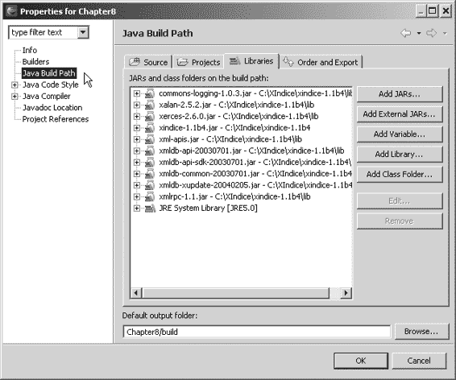

Vohra_706-0C08.fm Page 220 Saturday, August 12, 2006 5:05 AM

**220**

第 8 章 ■ 在原生 XML 数据库中存储 XML：XINDICE

**表 8-3.** *Xindice JAR 文件*

**Xindice JAR 文件**

**描述**

<Xindice>/xindice-1.1b4/lib/xerces-2.6.0.jar

Xerces XML 解析器

<Xindice>/xindice-1.1b4/xindice-1.1b4.jar

核心服务器 API

<Xindice>/xindice-1.1b4/lib/commons-logging-1.0.3.jar Jakarta Commons Logging API

<Xindice>/xindice-1.1b4/lib/xalan-2.5.2.jar

XPath API

<Xindice>/xindice-1.1b4/lib/xmldb-api-20030701.jar

<Xindice>/xindice-1.1b4/lib/xmldb-api-sdk-20030701.jar XML:DB API 和
<Xindice>/xindice-1.1b4/lib/xmldb-common-20030701.jar XUpdate API 的实现
<Xindice>/xindice-1.1b4/lib/xmldb-xupdate-20040205.jar

<Xindice>/xindice-1.1b4/lib/xmlrpc-1.1.jar

XML-RPC API

<Xindice>/xindice-1.1b4/lib/xml-apis.jar

DOM API

你还需要将 Chapter8 的 JRE 设置为 J2SE 5.0 JRE。JRE 也可以通过点击“添加库”按钮在项目的 Java 构建路径中设置。图 8-1 显示了 Chapter8 的 Java 构建路径。

**图 8-1.** *Chapter8 项目 Java 构建路径*

[www.it-ebooks.info](http://www.it-ebooks.info/)

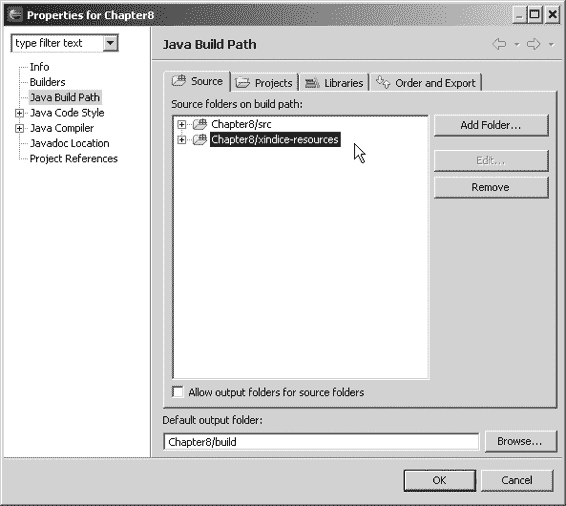

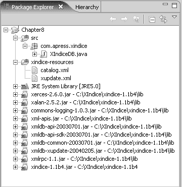

Vohra_706-0C08.fm Page 221 Saturday, August 12, 2006 5:05 AM

第 8 章 ■ 在原生 XML 数据库中存储 XML：XINDICE

**221**

xindice_resources 文件夹中的 XML 文件 catalog.xml 将作为 XIndiceDB.java 应用程序的输入 XML 文档；因此，需要将 xindice_resources 文件夹添加到 Java 构建路径区域中“源”选项卡的源路径中，如图 8-2 所示。

**图 8-2.** *Chapter8 项目源路径*

图 8-3 显示了 Chapter8 项目的目录结构。

**图 8-3.** *Chapter8 项目目录结构*

[www.it-ebooks.info](http://www.it-ebooks.info/)

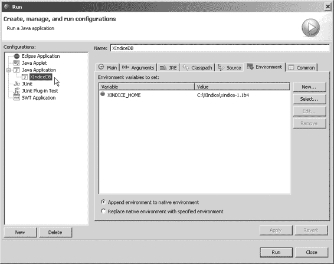

Vohra_706-0C08.fm Page 222 Saturday, August 12, 2006 5:05 AM

**222**

第 8 章 ■ 在原生 XML 数据库中存储 XML：XINDICE

在运行 XIndiceDB 应用程序之前，你需要按照第 1 章讨论的步骤在 Eclipse 中配置一个 Java 应用程序。你还需要定义一个值为 <Xindice>/xindice-1.1b4 的 XINDICE_HOME 环境变量，如图 8-4 所示。

**图 8-4.** *XIndiceDB.java 应用程序环境变量* **使用 Xindice 命令行工具**

以下部分重点介绍与使用 Xindice 命令行工具相关的细节。

**命令语法**

你可以使用 xindice 命令访问 Xindice 命令行工具。xindice 命令的基本语法如下：

xindice 动作 [开关] [参数]

表 8-4 列出了常用的 xindice 命令动作值。

[www.it-ebooks.info](http://www.it-ebooks.info/)

Vohra_706-0C08.fm Page 223 Saturday, August 12, 2006 5:05 AM

第 8 章 ■ 在原生 XML 数据库中存储 XML：XINDICE

**223**

**表 8-4.** *Xindice 命令动作值*

**Xindice 动作**

**描述**

ac

添加一个集合

dc

删除一个集合

ad

添加一个文档

dd

删除一个文档

lc

列出集合

rd

检索一个文档

ld

列出集合中的文档

xpath

使用 XPath 查询文档

xupdate

使用 XUpdate 更新文档

表 8-5 列出了常用的 xindice 命令开关值。

**表 8-5.** *Xindice 命令开关值*

**Xindice 开关**

**描述**

-c

指定一个集合上下文。上下文语法格式为 xmldb:xindice://主机:端口/db。

-f

指定一个文件路径。

-n

指定一个名称。

-q

指定一个 XPath 查询。

**在 Eclipse 中配置命令**

你将在 Eclipse 中运行 xindice 命令。因此，需要将 xindice 配置为 Eclipse 的外部工具。要将 xindice 配置为外部工具，请选择“运行” ➤ “外部工具”。在“外部工具”区域，你需要创建一个新的程序配置，方法是右键单击“程序”节点并选择“新建”。这将添加一个新的配置，如图 8-5 所示。在新配置中，为配置指定一个名称，并在“位置”字段中指定 xindice 批处理文件或 shell 文件的路径，该文件位于 xindice-1.1b4/bin 文件夹中。

你还需要设置工作目录和程序参数。要设置工作目录，请单击“工作目录”字段的“变量”按钮，并选择 container_loc 变量。

这将在“工作目录”字段中指定一个值 ${container_loc}。这个值意味着，在运行 xindice 时，无论选择了哪个文件，该文件的父目录都将成为 xindice 的工作目录。图 8-5 显示了 XINDICE 外部工具配置。

[www.it-ebooks.info](http://www.it-ebooks.info/)

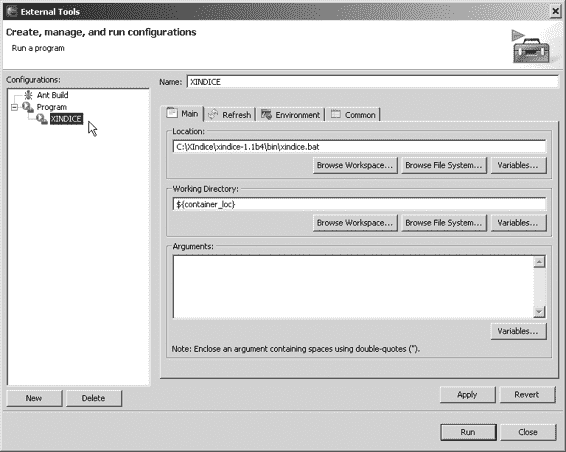

Vohra_706-0C08.fm Page 224 Saturday, August 12, 2006 5:05 AM

**224**

第 8 章 ■ 在原生 XML 数据库中存储 XML：XINDICE

**图 8-5.** *XINDICE 外部工具配置* 在“参数”字段中，你需要设置传递给 xindice 命令的参数。你可以通过单击“参数”字段的“变量”按钮并选择变量 resource_loc 来实现。值 ${resource_loc} 意味着，在运行 xindice 时，无论选择了哪个文件，该文件都将成为 xindice 的一个参数。如果 Eclipse 安装目录的路径名中包含空格，请将 ${resource_loc} 括在双引号内。由于参数取决于 Xindice 数据库操作，因此图 8-5 中未指定参数。要保存新配置，请单击“应用”按钮。你还需要为 XINDICE 外部工具配置设置环境变量 JAVA_HOME。选择“环境”选项卡，并通过单击“新建”按钮添加 JAVA_HOME 环境变量，如图 8-6 所示。

[www.it-ebooks.info](http://www.it-ebooks.info/)

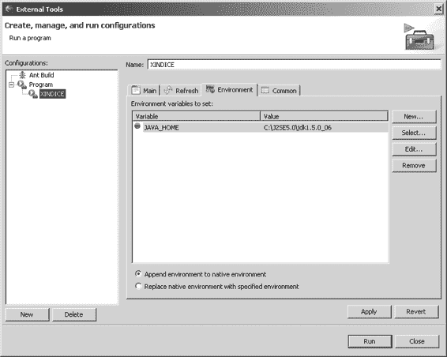

Vohra_706-0C08.fm Page 225 Saturday, August 12, 2006 5:05 AM

第 8 章 ■ 在原生 XML 数据库中存储 XML：XINDICE

**225**

**图 8-6.** *设置环境变量*

**Xindice 命令示例**

在本节中，我们将演示如何使用 Xindice 命令行工具访问 Xindice 数据库。你将在一个数据库实例中创建一个集合，向该集合添加一个示例 XML 文档，检索该示例 XML 文档，使用 XPath 查询该文档，使用 XUpdate 更新该文档，并删除该文档，所有这些操作都通过 Xindice 命令行工具完成。创建集合的 Xindice 数据库实例是默认数据库 db。清单 8-1 显示了添加到 db 数据库的示例 XML 文档。

[www.it-ebooks.info](http://www.it-ebooks.info/)

Vohra_706-0C08.fm Page 226 Saturday, August 12, 2006 5:05 AM

**226**

第 8 章 ■ 在原生 XML 数据库中存储 XML：XINDICE

**清单 8-1.** *catalog.xml*

<?xml version="1.0" encoding="UTF-8"?>

<catalog title="OnJava.com" publisher="OReilly">

<journal date="Sept 2005">

<article>

<title>什么是 Portlet</title>

<author> Sunil Patil</author>

</article>

</journal>

<journal date="Sept 2005">

<article>

<title>什么是 Hibernate</title>

<author>James Elliott</author>

</article>

</journal>

<journal date="Oct 2003">

<article>

<title>BCEL Maven 和 CSS 与 Swing</title>

<author>Daniel Steinberg</author>

</article>

</journal>

</catalog>

在 Xindice 数据库中创建集合


在本节中，您将使用 Xindice 命令行工具创建一个 Xindice 数据库集合实例。例如，要创建一个名为 catalog 的顶级集合，可以使用以下 xindice 命令：

xindice ac –c xmldb:xindice://localhost:8080/db –n catalog Xindice 命令操作 ac 表示添加一个集合，–c 开关指定集合上下文为根上下文，–n 开关指定集合名称为 catalog。

图 8-7 显示了外部工具配置 XINDICE。

您可以通过单击“运行”按钮，使用指定的参数运行 XINDICE 配置。Xindice 命令行工具会在 db 数据库中创建集合 catalog，并打印如清单 8-2 所示的消息。

**清单 8-2.** *添加集合的输出*

trying to register database

Created : xmldb:xindice://localhost:8080/db/catalog

[www.it-ebooks.info](http://www.it-ebooks.info/)


Vohra_706-0C08.fm Page 227 Saturday, August 12, 2006 5:05 AM

第 8 章 ■ 在原生 XML 数据库中存储 XML：XINDICE

**227**

**图 8-7.** *用于添加集合的 XINDICE 外部工具配置*
向 Xindice 数据库添加 XML 文档

在本节中，您将把示例 XML 文档 catalog.xml（清单 8-1）添加到 catalog 集合中。清单 8-3 显示了向集合添加 XML 文档的 Xindice 命令。

**清单 8-3.** *添加 XML 文档的 Xindice 命令* xindice ad

–c xmldb:xindice://localhost:8080/db/catalog

–f <要添加的 XML 文件> –n catalog.xml

Xindice 操作 ad 表示添加一个 XML 文档，–c 指定集合上下文为 catalog 集合，–f 开关指定要添加到集合的 XML 文件，–n 开关指定集合中的 XML 文件名。

您将在 Eclipse 中运行此 Xindice 命令。因此，您需要修改 XINDICE 外部工具配置中的“参数”选项卡，并使用 Eclipse 的 `${resource_loc}` 变量为 <要添加的 XML 文件> 指定清单 8-3 中列出的参数，如图 8-8 所示。要使用指定的参数运行 XINDICE 配置，请在项目 Chapter8 的 Package Explorer 选项卡中选择 xindice_resources 文件夹中的 catalog.xml 文档，然后单击“运行”按钮，如图 8-8 所示。

[www.it-ebooks.info](http://www.it-ebooks.info/)

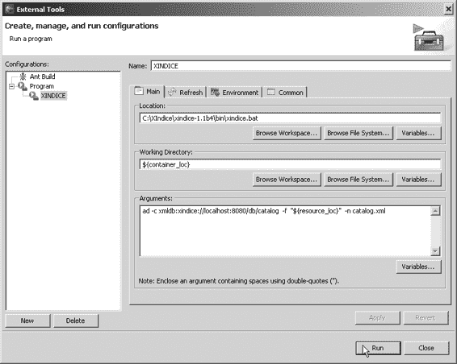

Vohra_706-0C08.fm Page 228 Saturday, August 12, 2006 5:05 AM

**228**

第 8 章 ■ 在原生 XML 数据库中存储 XML：XINDICE

**图 8-8.** *用于添加 XML 文档的 XINDICE 配置*
XML 文档 catalog.xml 被添加到 catalog 集合中，如清单 8-4 中的 xindice 消息所示。

**清单 8-4.** *Eclipse 中添加 XML 文档的输出* trying to register database

Added document xmldb:xindice://localhost:8080/db/catalog/catalog.xml
从 Xindice 数据库检索 XML 文档

在本节中，您将从 catalog 集合中检索 XML 文档 catalog.xml。清单 8-5 显示了从集合中检索 XML 文档的 Xindice 命令。

**清单 8-5.** *检索 XML 文档的 Xindice 命令* xindice rd –c xmldb:xindice://localhost:8080/db/catalog –n catalog.xml Xindice 操作 rd 表示检索一个 XML 文档，–c 开关指定集合上下文为 catalog 集合，–n 开关指定要检索的 catalog 集合中的 XML 文件名。

您将在 Eclipse 中运行此 Xindice 命令以检索 XML 文件 catalog.xml。因此，请修改 XINDICE 外部工具配置中的参数，并指定清单 8-5 中列出的参数，如图 8-9 所示。要使用指定的参数运行 XINDICE 配置，请单击“运行”按钮，如图 8-9 所示。

[www.it-ebooks.info](http://www.it-ebooks.info/)

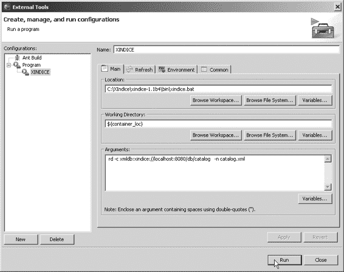

Vohra_706-0C08.fm Page 229 Saturday, August 12, 2006 5:05 AM


好的，作为一名高级文档工程师和翻译员，我将严格遵循您提供的注意事项和示例，将给定的英文文本翻译成中文。


第 8 章 ■ 在原生 XML 数据库 XINDICE 中存储 XML

**229**

**图 8-9.** *用于检索 XML 文档的 XINDICE 配置* 如清单 8-6 中 xindice 命令的输出所示，XML 文档 catalog.xml 从 catalog 集合中被检索出来。

**清单 8-6.** *在 Eclipse 中检索 XML 文档的输出* 正在尝试注册数据库

<?xml version="1.0"?>

<catalog title="OnJava.com" publisher="OReilly">

<journal date="Sept 2005">

<article>

<title>什么是 Portlet</title>

<author> Sunil Patil</author>

</article>

</journal>

<journal date="Sept 2005">

<article>

<title>什么是 Hibernate</title>

<author>James Elliott</author>

</article>

</journal>

<journal date="Oct 2003">

[www.it-ebooks.info](http://www.it-ebooks.info/)

Vohra_706-0C08.fm Page 230 Saturday, August 12, 2006 5:05 AM

**230**

第 8 章 ■ 在原生 XML 数据库 XINDICE 中存储 XML

<article>

<title>BCEL Maven 和 CSS 与 Swing</title>

<author>Daniel Steinberg</author>

</article>

</journal>

</catalog>

使用 XPath 查询 Xindice 数据库

Xindice 提供了一个 XPath 查询引擎，用于使用 XPath 查询数据库中的 XML 文档。在本节中，您将使用 XPath 查询 Xindice 数据库中的示例 XML 文档。您可以使用`xindice xpath`操作来查询 XML 文档。例如，清单 8-7 显示了检索第一个 journal 元素中文章标题的命令。

**清单 8-7.** *用于查询 XML 文档的 Xindice 命令* xindice xpath

–c xmldb:xindice://localhost:8080/db/catalog

–q /catalog/journal[1]/article/title

`xindice xpath`操作指定执行一个 XPath 查询，`–c`开关指定集合上下文为 catalog 集合，`–q`开关指定用于检索第一个 journal 元素中文章标题的 XPath 查询。

您将在 Eclipse 中运行此 Xindice 命令。因此，修改 XINDICE 外部工具配置中的参数，以指定清单 8-7 中列出的参数，如图 8-10 所示。

要使用指定的参数运行 XINDICE 配置，请单击“运行”按钮，如图 8-10 所示。

清单 8-8 显示了 XPath 查询的输出。

**清单 8-8.** *在 Eclipse 中查询 XML 文档的输出* 正在尝试注册数据库

<title src:col="/db/catalog" src:key="catalog.xml" xmlns:src="http://xml.apache.
org/xindice/Query">什么是 Portlet</title> 另一个示例，用于检索 catalog 元素的 publisher 属性的命令如下：

xindice xpath –c xmldb:xindice://localhost:8080/db/catalog –q /catalog/@publisher

[www.it-ebooks.info](http://www.it-ebooks.info/)


Vohra_706-0C08.fm Page 231 Saturday, August 12, 2006 5:05 AM

第 8 章 ■ 在原生 XML 数据库 XINDICE 中存储 XML

**231**

**图 8-10.** *用于查询 XML 文档的 XINDICE 配置* 要使用指定的参数运行 XINDICE 配置，请单击“运行”按钮，如图 8-11 所示。

清单 8-9 显示了 XPath 查询的输出。在这种情况下，XPath 查询输出生成为一个`xq:result`元素。属性值`publisher="OReilly"`在`xq:result`元素中指定。

**清单 8-9.** *在 Eclipse 中查询 XML 文档的输出* 正在尝试注册数据库

<xq:result publisher="OReilly" xq
:col="/db/catalog" xq:key="catalog.xml" />

[www.it-ebooks.info](http://www.it-ebooks.info/)


Vohra_706-0C08.fm Page 232 Saturday, August 12, 2006 5:05 AM

**232**

第 8 章 ■ 在原生 XML 数据库 XINDICE 中存储 XML

**图 8-11.** *用于查询 XML 文档的 XINDICE 配置* 使用 XUpdate 命令修改文档

Xindice 实现了 XML:DB XUpdate 命令来更新 XML 文档；表 8-6 列出了这些命令。

**表 8-6.** *XUpdate 命令*

**XUpdate 命令**

**描述**

xupdate:insert-after

在选定节点之后添加一个节点

xupdate:update

更新选定节点

xupdate:remove

移除选定节点

[www.it-ebooks.info](http://www.it-ebooks.info/)

Vohra_706-0C08.fm Page 233 Saturday, August 12, 2006 5:05 AM

第 8 章 ■ 在原生 XML 数据库 XINDICE 中存储 XML

**233**

**添加一个元素**

在本节中，您将向 catalog 集合中的 catalog.xml 文档添加一个 journal 元素。您需要在一个 xupdate 配置文件中指定要更新的元素和属性。因此，您将使用 xupdate.xml（清单 8-10）配置文件来添加一个 journal 元素。

**清单 8-10.** *xupdate.xml*

<xupdate:modifications version="1.0"
>
<xupdate:insert-after select="/catalog/journal[3]">
<xupdate:element name="journal">
<xupdate:attribute name="date">Aug 2005</xupdate:attribute>
<article>
<title>iBatis DAO</title>
<author>Sunil Patil</author>
</article>
</xupdate:element>
</xupdate:insert-after>
</xupdate:modifications>

清单 8-11 显示了用于更新 catalog 集合中 XML 文档 catalog.xml 的 Xindice 命令。

**清单 8-11.** *用于更新 XML 文档的 Xindice 命令* xindice xupdate

–c xmldb:xindice://localhost:8080/db/catalog

–n catalog.xml –f "${resource_loc}"

`xindice xupdate`操作指定更新一个 XML 文档，`–c`开关指定集合上下文为 catalog 集合，`–n`开关标识要更新的 XML 文档，`–f`开关指定与 xupdate.xml 配置文件相对应的变量`${resource_loc}`。

用于更新 XML 文件 catalog.xml 的 Xindice 命令在 Eclipse 中运行。因此，修改 XINDICE 外部工具配置中的参数，并指定清单 8-11 中列出的参数。要使用指定的参数运行 XINDICE 配置，请在 Chapter8 项目的 Package Explorer 选项卡中选择 xindice_resources 文件夹中的 xupdate.xml 文档，然后单击“运行”按钮，如图 8-12 所示。

catalog 集合中的 XML 文档 catalog.xml 被更新，如清单 8-12 中的输出消息所示。

**清单 8-12.** *在 Eclipse 中更新 XML 文档的输出* 正在尝试注册数据库

1 documents updated

[www.it-ebooks.info](http://www.it-ebooks.info/)

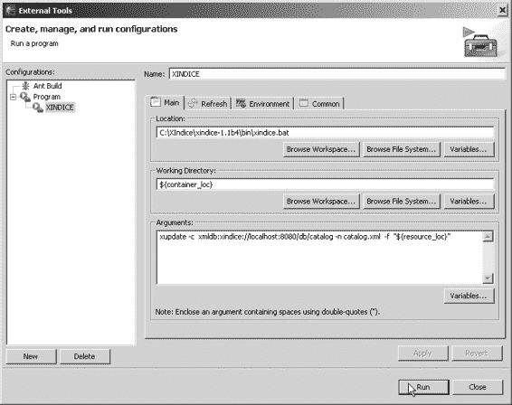

Vohra_706-0C08.fm Page 234 Saturday, August 12, 2006 5:05 AM

**234**

第 8 章 ■ 在原生 XML 数据库 XINDICE 中存储 XML

**图 8-12.** *用于更新 XML 文档的 XINDICE 配置* **删除和修改一个元素**

作为另一个示例，您将移除一个 journal 元素并修改另一个 journal 元素中的 title 属性。让我们移除第一个 journal 元素并修改第三个 journal 元素中的 title。由于在更新第三个 journal 元素之前移除了第一个 journal 元素，因此要更新的 journal 元素变成了第二个 journal 元素。您使用`xupdate:remove`来移除一个元素，使用`xupdate:update`来更新一个元素。清单 8-13 显示了用于移除和修改元素的 XUpdate 配置文件 xupdate.xml。要使用 xupdate.xml 运行 XINDICE 配置，请将 xindice_resources 文件夹中 xupdate.xml 文件的内容替换为清单 8-13。

**清单 8-13.** *Xupdate.xml*

<xupdate:modifications version="1.0"
>
<xupdate:remove select="/catalog/journal[1]"/>
<xupdate:update select="/catalog/journal[2]/article/title"> Maven with Swing</xupdate:update>
</xupdate:modifications>

[www.it-ebooks.info](http://www.it-ebooks.info/)

Vohra_706-0C08.fm Page 235 Saturday, August 12, 2006 5:05 AM

第 8 章 ■ 在原生 XML 数据库 XINDICE 中存储 XML

**235**


清单 8-11 展示了使用 xupdate.xml 配置文件更新 catalog 数据库集合中 catalog.xml 文件的 Xindice 命令。要使用指定参数运行 XINDICE 配置，请在 Chapter8 项目的 Package Explorer 选项卡上选择 xindice_resources 文件夹中修改后的 xupdate.xml 文档，然后单击 Run 按钮。这将更新 catalog 集合中的 catalog.xml 文档。更新 XML 文档的输出与清单 8-12 中列出的相同。要检索修改后的 XML 文档，请运行清单 8-5 中列出的用于检索 XML 文档的 xindice 命令。清单 8-14 显示了修改后的文档。

**清单 8-14.** *Xindice 数据库中修改后的 XML 文档* 尝试注册数据库

<?xml version="1.0"?>

<catalog title="OnJava.com" publisher="OReilly">

<journal date="Sept 2005">

<article>

<title>什么是 Hibernate</title>

<author>James Elliott</author>

</article>

</journal>

<journal date="Oct 2003">

<article>

<title>Maven 与 Swing</title>

<author>Daniel Steinberg</author>

</article>

</journal><journal date="Aug 2005"> <article> <title>iBatis DAO</title>

<author>Sunil Patil</author> </article> </journal>

</catalog>

**删除 XML 文档**

在本节中，您将从 Xindice 集合中删除一个 XML 文档。清单 8-15 显示了从 catalog 集合中删除 catalog.xml 的 Xindice 命令。

**清单 8-15.** *删除 XML 文档的 Xindice 命令* xindice dd –c xmldb:xindice://localhost:8080/db/catalog –n catalog.xml Xindice 的 dd 操作指定要删除一个 XML 文档。Xindice 的–c 开关将集合上下文指定为 catalog。Xindice 的–n 开关将 XML 文档 catalog.xml 指定为要删除的文档。删除 catalog.xml 的 Xindice 命令在 Eclipse 中运行。因此，请修改 XINDICE 外部工具配置中的参数，并指定清单 8-15 中列出的参数。要使用指定参数运行 XINDICE 配置，请单击 Run 按钮，如图 8-13 所示。

这将从 catalog 集合中删除 catalog.xml 文档，如清单 8-16 所示的输出消息所示。

**清单 8-16.** *Eclipse 中删除 XML 文档的输出* 尝试注册数据库

已删除: xmldb:xindice://localhost:8080/db/catalog/catalog.xml

[www.it-ebooks.info](http://www.it-ebooks.info/)


Vohra_706-0C08.fm 第 236 页 2006 年 8 月 12 日星期六 上午 5:05

**236**

第 8 章 ■ 在原生 XML 数据库中存储 XML：XINDICE

**图 8-13.** *删除 XML 文档的 XINDICE 配置* **删除 Xindice 集合**

在本节中，您将从 Xindice 数据库中删除 catalog 集合。您可以使用清单 8-17 中列出的命令删除 catalog 集合。

**清单 8-17.** *删除集合的 Xindice 命令* xindice dc –c xmldb:xindice://localhost:8080/db –n catalog Xindice 的 dc 操作指定要删除一个集合。Xindice 的–c 开关将集合上下文指定为 db。Xindice 的–n 开关将要删除的集合指定为 catalog。删除 catalog 集合的 Xindice 命令在 Eclipse 中运行。因此，请修改 XINDICE 外部工具配置中的参数，并指定清单 8-17 中列出的参数。要使用指定参数运行 XINDICE 配置，请单击 Run 按钮，如图 8-14 所示。

Xindice 集合 catalog 被删除，如清单 8-18 中的输出消息所示。

**清单 8-18.** *Eclipse 中删除集合的输出* 尝试注册数据库

已删除: xmldb:xindice://localhost:8080/db/catalog

[www.it-ebooks.info](http://www.it-ebooks.info/)

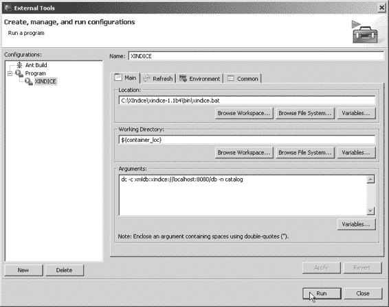

Vohra_706-0C08.fm 第 237 页 2006 年 8 月 12 日星期六 上午 5:05

第 8 章 ■ 在原生 XML 数据库中存储 XML：XINDICE

**237**

**图 8-14.** *删除集合的 XINDICE 配置* **将 XIndice 与 XML:DB API 结合使用**


在接下来的章节中，我们将演示如何使用 Xindice XML:DB API 访问 Xindice 数据库。与 Xindice 命令行部分类似，你将在数据库实例中创建一个集合，向该集合添加一个示例 XML 文档，检索该示例 XML 文档，使用 XPath 查询该文档，使用 XUpdate 更新该文档，并删除该文档。创建集合所用的 Xindice 数据库实例是默认数据库 `db`。清单 8-1 列出了要添加到 `db` 数据库的示例 XML 文档 `catalog.xml`。Chapter8 项目中的 `XIndiceDB.java` 将用于通过 XML:DB API 访问 Xindice 数据库。

**在 Xindice 数据库中创建集合**

在本节中，你将使用 XML:DB API 在 Xindice 数据库中创建一个集合。你需要导入清单 8-19 中列出的 Xindice 核心服务器类和 XML:DB API 类。

**清单 8-19.** *XML:DB API 包*

import org.apache.xindice.client.xmldb.services.*;

import org.apache.xindice.util.XindiceException;

import org.apache.xindice.xml.dom.*;

import org.xmldb.api.*;

import org.xmldb.api.base.*;

import org.xmldb.api.modules.*;

[www.it-ebooks.info](http://www.it-ebooks.info/)

Vohra_706-0C08.fm Page 238 Saturday, August 12, 2006 5:05 AM

**238**

第 8 章 ■ 在原生 XML 数据库中存储 XML：XINDICE

首先，你需要创建一个 Xindice 数据库引擎的实例。Xindice 数据库的 XML:DB 驱动实现类是 `DatabaseImpl`。要创建 Xindice 数据库的实例，请使用 `Class.forName()` 方法加载 Xindice 驱动，获取 Xindice 驱动的实例，并将该实例转换为数据库接口 `org.xmldb.api.base.Database`。随后，使用 `org.xmldb.api.DatabaseManager` 类注册 Xindice 数据库，该类用于从 XML:DB 数据库中获取集合。清单 8-20 展示了创建 Xindice 数据库实例的代码片段。

**清单 8-20.** *创建 Xindice 数据库实例* String xindiceDriver = "org.apache.xindice.client.xmldb.DatabaseImpl"; org.xmldb.api.base.Database xindiceDatabase = (org.xmldb.api.base.Database) ((Class.forName(xindiceDriver)).newInstance());

org.xmldb.api.DatabaseManager.registerDatabase(xindiceDatabase); Xindice 数据库服务器中的默认根集合是 `db`。要在 `db` 中创建一个新集合，你需要一个 `CollectionManager` 实例，该实例通过 `Collection` 对象获得。因此，在创建 `CollectionManager` 之前，你需要一个对应于 `db` 集合的 `Collection` 对象。你可以使用 `DriverManager` 类的静态方法 `getCollection(String)` 获取一个 `Collection` 对象。`getCollection()` 方法的 `String` 参数指定了访问 Xindice 服务器的 XML:DB URL。清单 8-21 展示了如何获取 `db` 集合的 `Collection` 对象。

**清单 8-21.** *创建 Collection 对象*

String url = "xmldb:xindice://localhost:8080/db"; org.xmldb.api.base.Collection collection = DatabaseManager.getCollection(url); 从 `Collection` 对象中，你需要创建一个 `org.apache.xindice.client.xmldb.services.CollectionManager` 对象。`CollectionManager` 用于在数据库中创建和删除集合。要创建一个集合，你还需要指定一个集合名称和一个定义集合结构的 XML 配置。Xindice 中关于 XML 配置的文档并不详尽。因此，你将使用 Xindice 文档中的默认 XML 配置来创建集合。有了 `CollectionManager` 对象后，使用 `createCollection` 方法创建集合，如清单 8-22 所示。

**清单 8-22.** *从 CollectionManager 对象创建集合* CollectionManager collectionManagerService =

(CollectionManager)

collection.getService("CollectionManager", "1.0"); String collectionName = "catalog";

String collectionConfig = "<collection compressed=\"true\" " +


" name=\"" + collectionName + "\">" +

" <filer class=\"org.apache.xindice.core.filer.BTreeFiler\"/>" +

"</collection>";

org.xmldb.api.base.Collection catalogCollection =

collectionManagerService.createCollection (collectionName, DOMParser.toDocument(collectionConfig));

`createCollection(String path, Document configuration)` 方法使用指定的 XML 集合配置，在数据库中创建一个指定名称的新集合。

在 `db` 集合中创建了一个名为 `catalog` 的新集合。

[www.it-ebooks.info](http://www.it-ebooks.info/)

Vohra_706-0C08.fm Page 239 Saturday, August 12, 2006 5:05 AM

第 8 章 ■ 在原生 XML 数据库 Xindice 中存储 XML

**239**

**向 Xindice 数据库添加 XML 文档**

在本节中，您将向前一节创建的集合中添加一个 XML 文档。

示例 XML 文档将被添加到 `catalog` 集合中；因此，需要使用 `getCollection()` 方法从数据库中获取 `catalog` 集合，如清单 8-23 所示。

**清单 8-23.** *从 DriverManager 获取集合* Collection collection = DatabaseManager.getCollection

("xmldb:xindice://localhost:8080/db/catalog");

Xindice 数据库中的 XML 文档资源通过 `XMLResource` 接口表示。您可以使用 DOM 节点或 SAX `ContentHandler` 来设置 `XMLResource` 的内容。在示例应用程序中，您将使用 DOM 节点来设置 `XMLResource` 的内容。因此，需要为要添加的 XML 文档获取一个 `Document` 对象，如清单 8-24 所示。

**清单 8-24.** *创建 Document 对象*

DocumentBuilderFactory factory =

DocumentBuilderFactory.newInstance();

File datafile = new File("xindice_resources/catalog.xml"); DocumentBuilder builder = factory.newDocumentBuilder();

Document document = builder.parse(datafile);

在清单 8-25 中，您使用 `xindice_resources/catalog.xml` 文件为要添加的 XML 文档创建了一个 `File` 对象。您需要为要添加到集合中的 XML 文档资源创建一个 ID。该 ID 将集合与一个标识符关联起来。Xindice 数据库中的 XML 文档通过 `XMLResource` 接口表示；因此，为要添加到 `catalog` 集合的 XML 文档创建一个 `org.xmldb.api.modules.XMLResource` 对象。您可以从 `Document` 对象设置 `XMLResource` 的内容。要将 XML 文档存储到数据库中，您需要使用 `storeResource(XMLResource)` 方法将 XML 资源添加到 `catalog` 集合中。

清单 8-25 列出了创建 `XMLResource` 并将资源添加到集合的过程。

**清单 8-25.** *向集合添加 XML 资源* String resourceID = collection.createId();

XMLResource resource = (XMLResource)

(collection.createResource(resourceID,"XMLResource")); resource.setContentAsDOM(document);

collection.storeResource(resource);

示例 XML 文档 `catalog.xml` 被添加到数据库集合中。

**从 Xindice 数据库检索 XML 文档**

在本节中，您将使用 XML:DB API 从 Xindice 数据库中检索一个示例 XML 文档。Xindice 数据库中的 XML 资源通过资源 ID 进行标识。在前一节中，为要存储的 XML 文档创建并设置了资源 ID。使用相同的资源 ID，从数据库中获取 XML 资源。您可以使用 `getContent()` 方法输出 XML 资源中的 XML 文档。清单 8-26 展示了获取 `XMLResource` 以及 XML 资源中 XML 文档的过程。

[www.it-ebooks.info](http://www.it-ebooks.info/)

Vohra_706-0C08.fm Page 240 Saturday, August 12, 2006 5:05 AM

**240**

第 8 章 ■ 在原生 XML 数据库 Xindice 中存储 XML

**清单 8-26.** *检索 XML 资源*

XMLResource resource = (XMLResource)

(collection.getResource(resourceID));

System.out.println(resource.getContent());

前一节添加的 XML 文档被检索出来。

**使用 XPath 查询 Xindice 数据库**

在本节中，您将使用 XML:DB API 查询 Xindice 数据库。您将查看一个查询，以查找第一个 `journal` 元素中文章的标题。XPath 查询表达式被指定为一个字符串，如下所示：

String xpath = "/catalog/journal[1]/article/title"; `org.xmldb.api.modules.XpathQueryService` 服务用于查询数据库集合。

因此，创建一个 `XPathQueryService` 对象。然后，使用 `XpathQueryService.query()` 方法查询数据库。该查询返回一个 `org.xmldb.api.base.ResourceSet`。

一个 `ResourceSet` 由 XML 资源组成。要检索 XML 资源，需要遍历资源集并获取一个 XML 文档资源 `org.xmldb.api.base.Resource`。清单 8-27 展示了使用 XPath 查询查询 Xindice 数据库、遍历查询返回的资源集以及输出资源中 XML 文档的过程。

**清单 8-27.** *查询 Xindice*

XPathQueryService queryService =

(XPathQueryService)

collection.getService("XPathQueryService","1.0"); ResourceSet resourceSet = queryService.query(xpath);

ResourceIterator iterator = resourceSet.getIterator();

while (iterator.hasMoreResources()) {

Resource resource = iterator.nextResource();

System.out.println(resource.getContent());

}

**使用 XUpdate 修改文档**

在以下各节中，您将使用 XML:DB 和 XUpdate API 更新 Xindice 数据库中的 XML 文档。表 8-4 列出了一些用于更新 XML 文档的 XUpdate 命令。

使用 XML:DB API 添加元素

在本节中，您将使用 XML:DB API 更新示例 XML 文档。作为示例，您将在第三个 `journal` 元素之后添加一个 `journal` 元素。您可以在 XUpdate 字符串中指定 XUpdate 命令，如清单 8-28 所示。XUpdate 命令 `xupdate:insert-after` 在 `select` 属性指定的元素之后添加一个元素。

[www.it-ebooks.info](http://www.it-ebooks.info/)

Vohra_706-0C08.fm Page 241 Saturday, August 12, 2006 5:05 AM

第 8 章 ■ 在原生 XML 数据库 Xindice 中存储 XML

**241**

**清单 8-28.** *用于添加元素的 XUpdate 配置字符串* String xupdate =

"<xupdate:modifications version=\"1.0\"" +

" xmlns:xupdate=\"http://www.xmldb.org/xupdate\">" +

" <xupdate:insert-after select=\"/catalog/journal[3]\">" +

" <journal date=\"Aug 2005\">" + " <article>" +

" <title>iBatis DAO</title>" +

" <author>Sunil Patil</author>" + " </article>" +

" </journal>" + " </xupdate:insert-after>" +

"</xupdate:modifications>";

查询服务类 `org.xmldb.api.modules.XUpdateQueryService` 用于通过 XUpdate 更新数据库。因此，使用 `getService()` 方法从要更新的集合中创建一个 `XUpdateQueryService` 对象。可以使用 `XUpdateQueryService` 对象的 `update()` 方法更新 Xindice 数据库，如清单 8-29 所示。

**清单 8-29.** *使用 XUpdate 更新集合* XUpdateQueryService queryService =

(XUpdateQueryService) collection.getService("XUpdateQueryService",

"1.0");

queryService.update(xupdate);

使用 XML:DB API 删除元素

作为另一个示例，我们将展示如何使用 `xupdate:remove` 命令从数据库的 XML 文档中移除一个 `journal` 元素。要移除第一个 `journal` 元素，创建一个如清单 8-30 所示的 XUpdate 命令字符串。要移除的元素在 `xupdate:remove` 元素的 `select` 属性中指定。

**清单 8-30.** *用于删除元素的 XUpdate 配置* String xupdate = "<xupdate:modifications version=\"1.0\"" +

" xmlns:xupdate=\"http://www.xmldb.org/xupdate\">" +

" <xupdate:remove select=\"/catalog/journal[1]\"/>" +

"</xupdate:modifications>";

queryService.update(xupdate);

使用 XML:DB API 修改元素


在本节中，你将使用 `xupdate:update` 命令修改一个元素。以修改第二个 journal 元素中文章的标题为例。你需要创建一个 XUpdate 命令字符串来更新 XML 文档，如清单 8-31 所示。待修改的元素在 `xupdate:update` 元素的 `select` 属性中指定。

**清单 8-31.** *用于修改元素的 XUpdate 配置* String xupdate = "<xupdate:modifications version=\"1.0\"" +

" xmlns:xupdate=\"http://www.xmldb.org/xupdate\">" +

" <xupdate:update select=\"/catalog/journal[2]/article/title\">" +

" Maven with Swing</xupdate:update>" +

"</xupdate:modifications>";

queryService.update(xupdate);

[www.it-ebooks.info](http://www.it-ebooks.info/)

Vohra_706-0C08.fm 第 242 页 2006 年 8 月 12 日星期六 上午 5:05

**242**

第 8 章 ■ 在原生 XML 数据库 Xindice 中存储 XML

**删除 XML 文档**

在本节中，你将使用 XML:DB API 删除 Xindice 数据库中的 XML 文档。你需要获取要从中删除 XML 文档的 catalog 集合，并获取要删除的 XML 资源，如清单 8-32 所示。你可以通过资源 ID 获取 XML 资源。随后，你可以使用 `removeResource(XMLResource)` 方法删除该资源。

**清单 8-32.** *删除 XML 资源*

XMLResource resource = (XMLResource)

(collection.getResource(resourceID));

collection.removeResource(resource);

清单 8-33 展示了 `XIndiceDB.java`。清单 8-25 展示了 `XIndiceDB.java` 的代码。你使用 `XIndiceDB` 类来完成以下操作：

**1.** 在 Xindice 数据库中创建一个 XML 文档集合。
**2.** 向 Xindice 集合的实例中添加一个 XML 文档。
**3.** 从 Xindice 集合的实例中检索一个 XML 文档。
**4.** 使用 XPath 查询 XML 文档。
**5.** 使用 XUpdate 更新 XML 文档。
**6.** 从 Xindice 数据库中删除一个 XML 文档。

**清单 8-33.** *XIndiceDB.java*

package com.apress.xindice;

import org.apache.xindice.client.xmldb.services.*;

import org.apache.xindice.util.XindiceException;

import org.apache.xindice.xml.dom.*;

import org.w3c.dom.Document;

import org.xml.sax.SAXException;

import org.xmldb.api.*;

import org.xmldb.api.base.*;

import org.xmldb.api.modules.*;

import java.io.*;

import javax.xml.parsers.DocumentBuilder;

import javax.xml.parsers.DocumentBuilderFactory;

import javax.xml.parsers.ParserConfigurationException;

public class XIndiceDB {

private Collection collection;

private Collection catalogCollection;

String resourceID;

public void createCollection() {

try {

String xindiceDriver = "org.apache.xindice.client.xmldb.DatabaseImpl"; Database xindiceDatabase = (Database)

((Class.forName(xindiceDriver)).newInstance());

DatabaseManager.registerDatabase(xindiceDatabase);

[www.it-ebooks.info](http://www.it-ebooks.info/)

Vohra_706-0C08.fm 第 243 页 2006 年 8 月 12 日星期六 上午 5:05

第 8 章 ■ 在原生 XML 数据库 Xindice 中存储 XML

**243**

String url = "xmldb:xindice://localhost:8080/db"; collection = DatabaseManager.getCollection(url);

String collectionName = "catalog";

CollectionManager collectionManagerService =

(CollectionManager) collection.getService

("CollectionManager",

"1.0");

String collectionConfig = "<collection compressed=\"true\" " +

" name=\"" + collectionName + "\">" +

" <filer class=\"org.apache.xindice.core.filer.BTreeFiler\"/>" +

"</collection>";

catalogCollection = collectionManagerService.

createCollection(collectionName,

DOMParser.toDocument(collectionConfig));

System.out.println("XIndice Collection Created");

} catch (XindiceException e) {

} catch (XMLDBException e) {

} catch (ClassNotFoundException e) {

} catch (InstantiationException e) {

} catch (IllegalAccessException e) {

}

}

public void addDocument() {

try {

String xindiceDriver = "org.apache.xindice.client.xmldb.DatabaseImpl"; Database xindiceDatabase = (Database)

((Class.forName(xindiceDriver)).newInstance());

DatabaseManager.registerDatabase(xindiceDatabase);


collection = DatabaseManager.getCollection(

"xmldb:xindice://localhost:8080/db/catalog");

DocumentBuilderFactory factory = DocumentBuilderFactory.newInstance(); File datafile = new File("xindice-resources/catalog.xml"); DocumentBuilder builder = factory.newDocumentBuilder();

Document document = builder.parse(datafile);

resourceID = collection.createId();

XMLResource resource = (XMLResource)

(collection.createResource(resourceID,

"XMLResource"));

resource.setContentAsDOM(document);

collection.storeResource(resource);

System.out.println("XML 文档已添加到集合中");

[www.it-ebooks.info](http://www.it-ebooks.info/)

Vohra_706-0C08.fm 第 244 页 2006 年 8 月 12 日，星期六，上午 5:05

**244**

第 8 章 ■ 在原生 XML 数据库中存储 XML：Xindice

}

catch (SAXException e) {

} catch (ParserConfigurationException e) {

} catch (XMLDBException e) {

System.out.println(e.getMessage());

} catch (IOException e) {

System.out.println(e.getMessage());

} catch (ClassNotFoundException e) {

System.out.println(e.getMessage());

} catch (InstantiationException e) {

System.out.println(e.getMessage());

} catch (IllegalAccessException e) {

System.out.println(e.getMessage());

}

}

public void retrieveDocument() {

try {

XMLResource resource = (XMLResource)

(collection.getResource(resourceID));

System.out.println(resource.getContent());

} catch (XMLDBException e) {

}

}

public void queryDocument() {

try {

String xpath = "/catalog/journal[1]/article/title"; XPathQueryService queryService =

(XPathQueryService) collection.getService("XPathQueryService",

"1.0");

ResourceSet resourceSet = queryService.query(xpath);

ResourceIterator iterator = resourceSet.getIterator();

System.out.println("XPath 查询");

while (iterator.hasMoreResources()) {

Resource resource = iterator.nextResource();

System.out.println(resource.getContent());

}

} catch (XMLDBException e) {

}

}

public void updateDocument() {

try {

String xindiceDriver = "org.apache.xindice.client.xmldb.DatabaseImpl"; Database xindiceDatabase = (Database)

((Class.forName(xindiceDriver)).newInstance());

DatabaseManager.registerDatabase(xindiceDatabase);

collection = DatabaseManager.getCollection(

"xmldb:xindice://localhost:8080/db/catalog");

[www.it-ebooks.info](http://www.it-ebooks.info/)

Vohra_706-0C08.fm 第 245 页 2006 年 8 月 12 日，星期六，上午 5:05

第 8 章 ■ 在原生 XML 数据库中存储 XML：Xindice

**245**

String xupdate = "<xupdate:modifications version=\"1.0\"" +

" xmlns:xupdate=\"http://www.xmldb.org/xupdate\">" +

" <xupdate:insert-after select=\"/catalog/journal[3]\">" +

" <journal date=\"Aug 2005\">" + " <article>" +

" <title>iBatis DAO</title>" +

" <author>Sunil Patil</author>" + " </article>" +

" </journal>" + " </xupdate:insert-after>" +

"</xupdate:modifications>";

XUpdateQueryService queryService =

(XUpdateQueryService) collection.getService

("XUpdateQueryService",

"1.0");

queryService.update(xupdate);

xupdate = "<xupdate:modifications version=\"1.0\"" +

" xmlns:xupdate=\"http://www.xmldb.org/xupdate\">" +

" <xupdate:remove select=\"/catalog/journal[1]\"/>" +

"</xupdate:modifications>";

queryService.update(xupdate);

xupdate = "<xupdate:modifications version=\"1.0\"" +

" xmlns:xupdate=\"http://www.xmldb.org/xupdate\">" +

" <xupdate:update select=\"/catalog/journal[2]/article/title\">"+

"Maven with Swing</xupdate:update>" +

"</xupdate:modifications>";

queryService.update(xupdate);

XMLResource resource = (XMLResource)

(collection.getResource(resourceID));

System.out.println("已更新的 XML 文档");

System.out.println(resource.getContent());

} catch (XMLDBException e) {

} catch (ClassNotFoundException e) {

System.out.println(e.getMessage());

} catch (InstantiationException e) {

System.out.println(e.getMessage());

} catch (IllegalAccessException e) {

System.out.println(e.getMessage());

}

}

public void deleteDocument() {

try {

XMLResource resource = (XMLResource)

(collection.getResource(resourceID));

collection.removeResource(resource);

System.out.println("XML 文档已删除");

} catch (XMLDBException e) {

}

}


[www.it-ebooks.info](http://www.it-ebooks.info/)

Vohra_706-0C08.fm 第 246 页 2006 年 8 月 12 日，星期六，上午 5:05

**246**

第 8 章 ■ 在原生 XML 数据库 Xindice 中存储 XML

public static void main(String[] argv) {

XIndiceDB xindicedb = new XIndiceDB();

xindicedb.createCollection();

xindicedb.addDocument();

xindicedb.retrieveDocument();

xindicedb.queryDocument();

xindicedb.updateDocument();

xindicedb.deleteDocument();

}

}

你可以使用 XIndiceDB Java 应用程序配置在 Eclipse 中运行 XIndiceDB.java 应用程序。如清单 8-34 所示，创建了一个集合，向集合中添加了一个 XML 文档，检索了该 XML 文档，并对该 XML 文档进行了查询、更新和删除操作。

**清单 8-34.** *在 Eclipse 中运行 XIndiceDB.java 应用程序的输出* 正在尝试注册数据库

XIndice 集合已创建

正在尝试注册数据库

XML 文档已添加到集合

<?xml version="1.0"?>

<catalog publisher="OReilly" title="OnJava.com">

<journal date="Sept 2005">

<article>

<title>什么是 Portlet</title>

<author> Sunil Patil</author>

</article>

</journal>

<journal date="Sept 2005">

<article>

<title>什么是 Hibernate</title>

<author>James Elliott</author>

</article>

</journal>

<journal date="Oct 2003">

<article>

<title>BCEL Maven 和 CSS 与 Swing</title>

<author>Daniel Steinberg</author>

</article>

</journal>

</catalog>

XPath 查询

<title src:col="/db/catalog" src:key="022705cf47a9e3090000010bb028b689" xmlns:sr c="http://xml.apache.org/xindice/Query">什么是 Portlet</title> 正在尝试注册数据库

已更新的 XML 文档

<?xml version="1.0"?>

<catalog publisher="OReilly" title="OnJava.com">

[www.it-ebooks.info](http://www.it-ebooks.info/)

Vohra_706-0C08.fm 第 247 页 2006 年 8 月 12 日，星期六，上午 5:05

第 8 章 ■ 在原生 XML 数据库 Xindice 中存储 XML

**247**

<journal date="Sept 2005">

<article>

<title>什么是 Hibernate</title>

<author>James Elliott</author>

</article>

</journal>

<journal date="Oct 2003">

<article>

<title>Maven 与 Swing</title>

<author>Daniel Steinberg</author>

</article>

</journal><journal date="Aug 2005"> <article> <title>iBatis DAO</title>

<author>Sunil Patil</author> </article> </journal>

</catalog>

XML 文档已删除

**总结**

原生 XML 数据库定义了一种用于存储和检索 XML 文档的模型。原生 XML 数据库将 XML 文档存储在集合中，并分别支持使用 XPath 进行查询和使用 XML:DB XUpdate API 进行更新。原生 XML 数据库相比关系数据库具有优势，因为原生 XML 数据库是专门为存储、查询和更新 XML 文档而设计的，而关系数据库则设计用于在数据库的行列单元格中存储原子值。具有多级层次结构和属性的复杂 XML 文档可以轻松地在原生 XML 数据库中存储、查询和更新。

在本章中，我们以 Xindice 开源原生 XML 数据库为具体背景，讨论了通用的原生 XML 数据库概念。除了支持查询和更新 API 之外，Xindice 还提供了一个用于管理 Xindice 原生 XML 数据库的命令行工具，本章也对此进行了讨论。

[www.it-ebooks.info](http://www.it-ebooks.info/)

Vohra_706-0C08.fm 第 248 页 2006 年 8 月 12 日，星期六，上午 5:05

[www.it-ebooks.info](http://www.it-ebooks.info/)

Vohra_706-0C09.fm 第 249 页 2006 年 7 月 25 日，星期二，上午 5:00

第 9 章

■ ■ ■

在关系数据库中存储 XML

**在**上一章中，你学习了如何将 XML 文档存储在原生 XML 数据库中。原生 XML 数据库当然仅限于存储 XML 文档。如果你需要将 XML 文档与其他数据一起存储，关系数据库则更为合适。在关系数据库中，你可以像存储任何其他类型的数据一样，将 XML 文档存储在表行的列中。


在缺乏将 XML 内容存储到关系型数据库的相关标准时，关系型数据库厂商开始添加各自专用的数据类型、工具和 API，以便在其数据库中提供 XML 相关支持。表 9-1 讨论了一些厂商专用工具。

**表 9-1.** *用于存储 XML 的数据库工具*

**数据库工具**

**数据库**

**描述**

Oracle XML

Oracle

将不包含子元素或属性的 XML 文档存储到

SQL 工具

预定义的数据库表中。你可以应用

XSLT 来存储包含子元素和属性的 XML 文档。

IBM DB2

DB2 UDB

将 XML 文档存储为

XML 扩展器

类似 BLOB 的对象，或存储为一组称为

XML *集合* 的集合。

SQL 扩展

SQL Server 2000

使用行集函数存储 XML 文档，

和行集函数

并使用 SQL 结构 FOR XML 检索 XML 文档。

结果集 DTD

Sybase Adaptive Server

使用 ResultSetXml 类存储和检索 XML 文档。

显然，业界需要一个独立于厂商的标准来在关系型数据库中存储和访问 XML 内容，因此 SQL:2003 国际标准新增了第 14 部分：SQL/XML（XML 相关规范），专门用于解决此问题。

**概述**

SQL:2003 标准提供了一种新的 XML 数据类型来存储 XML 内容。XML 数据类型与其他任何数据类型一样；使用 XML 数据类型，你可以将 XML 文档存储到表行的列中。1. “SQL:2003 已发布”（http://www.sigmod.org/sigmod/record/issues/0403/E.JimAndrew-standard.pdf）是了解 SQL:2003 标准概述的很好参考。

**249**

[www.it-ebooks.info](http://www.it-ebooks.info/)

Vohra_706-0C09.fm Page 250 Tuesday, July 25, 2006 5:00 AM

**250**

第 9 章 ■ 在关系型数据库中存储 XML

SQL:2003 是一个相对较新的标准。因此，目前并非所有关系型数据库都支持该标准。你可能需要研究厂商专用信息，以了解你的数据库是否支持 SQL:2003 标准。

在 Java 中，JDBC 驱动程序是与关系型数据库交互的成熟方式。JDBC 4.0 API 规范公开评审草案（JSR-000221）提议支持 SQL:2003 标准。预计当 JDBC 4.0 规范最终确定后，越来越多的数据库将增加对 XML 数据类型的支持。在 J2SE 6.0 中实现的 JDBC 4.0 API 中，XML 数据类型映射到 java.sql.SQLXML Java 数据类型。SQLXML Java 数据类型的关键区别特性在于，你可以使用它来导航 XML 文档。在 J2SE 5.0 中实现的 JDBC 3.0 API 没有定义 SQLXML 数据类型；在 JDBC 3.0 中，你只能将 XML 类型列作为 String 或 CLOB 检索。与使用 java.sql.SQLXML 类型不同，你不能使用 String 或 CLOB 来导航 XML 文档。

你需要一个 JDBC 4.0 驱动程序来从 XML 数据类型列中检索 XML 文档，并将其映射到实现 java.sql.SQLXML 接口的对象。由于 JDBC 4.0 规范仍在公开评审中，目前没有知名的关系型数据库提供 JDBC 4.0 驱动程序。因此，只有当 JDBC 4.0 驱动程序可用时，你才能测试本章中的示例应用程序。同时，我们将使用 JDBC 3.0 驱动程序来构建和执行示例。

在本章中，我们将解释如何将 XML 文档存储到关系型数据库中、如何从数据库中检索 XML 文档，以及如何使用 java.sql.SQLXML 接口导航 XML 文档；当然，使用 java.sql.SQLXML 导航文档仅在 JDBC 4.0 驱动程序下可行。清单 9-1 显示了我们在示例中将使用的示例 XML 文档。

**清单 9-1.** *catalog.xml*

<catalog title="OnJava.com" publisher="OReilly">

<journal date="September 2005">

<article>

<title>什么是 Portlet</title>

<author> Sunil Patil</author>

</article>

<article>

<title>什么是 Hibernate</title>

<author>James Elliott</author>

</article>


</journal>

</catalog>

**安装软件**

用于将 XML 数据库类型映射到 Java 的 SQLXML Java 类型已在 J2SE 6.0 中实现。因此，您需要安装 J2SE 6.0.2。使用 SQLXML API 将 XML 文档存储到 XML 类型列中的另一个要求是 JDBC 4.0 驱动程序。如前所述，目前还没有知名的关系数据库提供 JDBC 4.0 驱动程序。因此，目前您能做的最好的事情就是使用 JDBC 3.0 驱动程序开发一个应用程序，以确定数据库是否支持 XML 数据类型。

当然，当 JDBC 4.0 驱动程序可用时，您可以修改此应用程序以使用 JDBC 4.0 驱动程序。

您还需要一个支持 XML 数据类型的数据库。目前，只有少数知名数据库（如 DB2 UDB 9.1 和 SQL Server 2005）支持 XML 数据类型；但是，由于它们目前都不支持 JDBC 4.0 驱动程序，因此您将无法使用任何知名数据库开发 SQLXML 应用程序。有关 J2SE 6.0 Beta 的更多信息，请参见 http://java.sun.com/javase/6/download.jsp。

[www.it-ebooks.info](http://www.it-ebooks.info/)

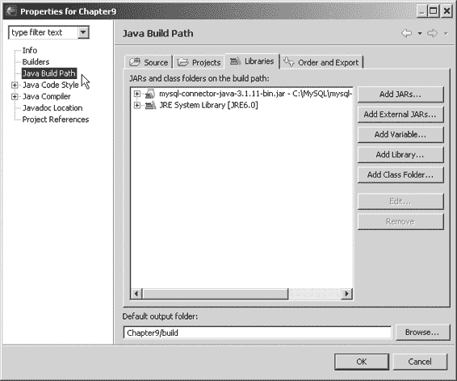

Vohra_706-0C09.fm Page 251 Tuesday, July 25, 2006 5:00 AM

第 9 章 ■ 在关系数据库中存储 XML

**251**

再次强调，对于可以执行的实际示例，您必须等到 JDBC 4.0 最终确定并且常用数据库提供 JDBC 4.0 驱动程序支持。

鉴于上述注意事项，我们将展示如何使用 JDBC 3.0 驱动程序在开源数据库 MySQL3 上开发应用程序。因此，您需要下载并安装 MySQL4 5.0。

您还需要下载 MySQL JDBC 驱动程序。5 或者，如果 JDBC 4.0 驱动程序已经可用，请下载并安装相应的数据库和对应的 JDBC 4.0 驱动程序。

**设置 Eclipse 项目**

我们将展示如何开发一个应用程序（XMLToSQL.java）来在关系数据库中存储和检索 XML 数据。XMLToSQL.java 应用程序中的某些方法已被注释掉，当支持 JDBC 4.0 驱动程序和 XML 数据类型的数据库可用时，可以运行这些方法。

要编译和运行示例应用程序 XMLToSQL.java，您需要一个 Eclipse 项目。您可以从 Apress 网站 (http://www.apress.com) 下载 Chapter9 项目，并通过选择“文件”➤“导入”将其导入到您的 Eclipse 工作区中。

要编译和运行 XMLToSQL.java 应用程序，您需要在项目的 Java 构建路径中包含 JDBC JAR 文件；图 9-1 显示了 MySQL 驱动程序的这些 JAR 文件。如果您为其他数据库修改了 XMLToSQL.java 应用程序，请将该数据库的 JDBC JAR 文件添加到 Java 构建路径中。您还需要将 JRE 系统库设置为 JRE 6.0，如图 9-1 所示。

**图 9-1.** *Chapter9 Java 构建路径*

3\. 在撰写本书时，MySQL 不支持 XML 数据库类型。如果您可以访问支持 XML 数据库类型的关系数据库，则可以使用此类数据库。

4\. 有关 MySQL 数据库的更多信息，请参见 http://www.mysql.com/products/database/mysql/community_edition.html。

5\. 有关 MySQL Connector/J 驱动程序的更多信息，请参见 http://www.mysql.com/products/connector/j/。

[www.it-ebooks.info](http://www.it-ebooks.info/)

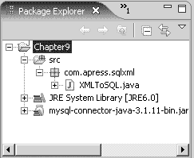

Vohra_706-0C09.fm Page 252 Tuesday, July 25, 2006 5:00 AM

**252**

第 9 章 ■ 在关系数据库中存储 XML

图 9-2 显示了 Chapter9 的目录结构。

**图 9-2.** *Chapter9 目录结构*

**选择数据库**

正如 String Java 类型对应于 VARCHAR 数据库类型一样，SQLXML Java 类型对应于 XML 数据库类型。在 JDBC 4.0 中，java.sql.Connection 接口有一个新的 createSQLXML() 方法来创建 SQLXML 对象。这样创建的 SQLXML 对象最初不包含任何数据。您可以使用其 setString(String) 方法或 createXMLStreamWriter() 方法向 SQLXML 对象添加数据。


你可以使用 `PreparedStatement` 接口的 `setSQLXML(int index, SQLXML sqlXML)` 方法或 `setSQLXML(String columnName, SQLXML sqlXML)` 方法，将 `SQLXML` 对象存储到数据库表中。你也可以使用 `getSQLXML(int index)` 方法或 `getSQLXML(String columnName)` 方法，从 `ResultSet` 或 `CallableStatement` 对象中检索 `SQLXML` 对象。`PreparedStatement` 和 `ResultSet` 中用于 `SQLXML` 数据类型的方法，与用于其他任何数据类型（如 `String`）的方法类似。

要使用 `SQLXML` API 开发应用程序，你需要一个支持 `XML` 数据类型的**关系型数据库**。并非所有数据库都支持 `XML` 数据类型。要确定数据库是否支持 `XML` 数据类型，可以从 `Connection` 对象中获取数据库元数据。例如，要确定 MySQL 数据库是否支持 `XML` 数据类型，需要加载并注册 `com.mysql.jdbc.Driver` JDBC 驱动程序，如清单 9-2 所示。你需要一个连接 URL 来连接到 MySQL 数据库。清单 9-2 展示了 MySQL 数据库的连接 URL。

**清单 9-2.** *加载 JDBC 驱动程序*

`Class.forName("com.mysql.jdbc.Driver");`

`String url=" jdbc:mysql://localhost:3306/test ";` 要从 MySQL 数据库获取元数据信息，首先需要获取与数据库的连接。你可以使用 `DriverManager` 接口中的静态方法 `getConnection()` 来创建与数据库的连接，如清单 9-3 所示。默认情况下，用户 `root` 不需要密码。随后，你可以从这个 `Connection` 对象中获取数据库元数据。

**清单 9-3.** *检索数据库元数据*

`Connection connection = DriverManager.getConnection(url,`

`"root", null);`

`DatabaseMetaData metadata= connection.getMetaData();`

你可以使用 `getTypeInfo()` 方法从元数据中检索数据库支持的数据类型，如清单 9-4 所示。要确定数据库是否支持 `XML` 数据类型，请遍历数据类型结果集，并输出 `TYPE_NAME` 列，如清单 9-4 所示；此示例的完整代码见清单 9-23。

[www.it-ebooks.info](http://www.it-ebooks.info/)

Vohra_706-0C09.fm Page 253 Tuesday, July 25, 2006 5:00 AM

**第 9 章 ■ 在关系型数据库中存储 XML**

**253**

**清单 9-4.** *输出数据类型*

`ResultSet rs=metadata.getTypeInfo();`

`System.out.println("TYPE_NAME:"+rs.getString("TYPE_NAME"));` 如果数据库支持 `XML` 数据类型，则会输出 `XML TYPE_NAME`，如下所示：`TYPE_NAME: XML`

MySQL 数据库目前尚不支持 `XML` 数据类型。清单 9-5 展示了 MySQL 数据库输出的数据类型。对于不同版本的 MySQL 数据库，数据类型可能略有不同。

**清单 9-5.** *MySQL 数据库数据类型*

`TYPE_NAME:BOOL`

`TYPE_NAME:TINYINT`

`TYPE_NAME:BIGINT`

`TYPE_NAME:LONG VARBINARY`

`TYPE_NAME:MEDIUMBLOB`

`TYPE_NAME:LONGBLOB`

`TYPE_NAME:BLOB`

`TYPE_NAME:TINYBLOB`

`TYPE_NAME:VARBINARY`

`TYPE_NAME:BINARY`

`TYPE_NAME:LONG VARCHAR`

`TYPE_NAME:MEDIUMTEXT`

`TYPE_NAME:LONGTEXT`

`TYPE_NAME:TEXT`

`TYPE_NAME:TINYTEXT`

`TYPE_NAME:CHAR`

`TYPE_NAME:NUMERIC`

`TYPE_NAME:DECIMAL`

`TYPE_NAME:INTEGER`

`TYPE_NAME:INT`

`TYPE_NAME:MEDIUMINT`

`TYPE_NAME:SMALLINT`

`TYPE_NAME:FLOAT`

`TYPE_NAME:DOUBLE`

`TYPE_NAME:DOUBLE PRECISION`

`TYPE_NAME:REAL`

`TYPE_NAME:VARCHAR`

`TYPE_NAME:ENUM`

`TYPE_NAME:SET`

`TYPE_NAME:DATE`

`TYPE_NAME:TIME`

`TYPE_NAME:DATETIME`

`TYPE_NAME:TIMESTAMP`

[www.it-ebooks.info](http://www.it-ebooks.info/)

Vohra_706-0C09.fm Page 254 Tuesday, July 25, 2006 5:00 AM

**254**

**第 9 章 ■ 在关系型数据库中存储 XML**

**存储 XML 文档**

在本节中，我们将讨论如何将 XML 文档存储到数据库表中类型为 `XML` 的列中。此过程的关键步骤如下：

**1.** 创建一个 `SQLXML` 对象。

**2.** 使用一个 XML 文档初始化该 `SQLXML` 对象。

**3.** 创建一个包含 `XML` 类型列的数据库表。

**4.** 创建一个 `PreparedStatement`，用于将 `SQLXML` 对象存储到 `XML` 类型的列中。

**5.** 执行该 `PreparedStatement` 以存储 `SQLXML` 对象。


在 XMLToSQL.java 应用程序中，你需要导入 `java.sql` 和 `javax.xml.stream` 包，其中 `javax.xml.stream` 包包含处理 SQLXML 对象所需的 `XMLStreamWriter` 和 `XMLStreamReader` 接口。要创建要存储在 XML 类型列中的 XML 文档，首先需要创建一个 SQLXML 对象。你可以使用 `createSQLXML()` 方法从 Connection 对象创建 SQLXML 对象，如下所示：

`SQLXML sqlXML=connection.createSQLXML();`

使用 `createSQLXML()` 方法创建的 SQLXML 对象不包含任何数据。要向 SQLXML 对象添加数据，你需要初始化此 SQLXML 对象。你可以使用 `XMLStreamWriter` 对象或使用 SQLXML 接口的 `setString()` 方法来初始化 SQLXML 对象。要使用 `XMLStreamWriter` 对象向 SQLXML 对象添加数据，请先从此 SQLXML 对象创建一个 `StAXResult` 对象，然后使用 `StAXResult` 类的 `getXMLStreamWriter()` 方法获取一个 `XMLStreamWriter` 对象，从而创建该对象，如下所示：`StAXResult staxResult = sqlXML.setResult(StAXResult.class); XMLStreamWriter xmlStreamWriter = staxResult.getXMLStreamWriter();` 你使用 SQLXML 接口的 `setResult(Class<T> resultClass)` 方法来创建 `StAXResult` 对象。当调用 `setResult(Class<T> resultClass)` 方法时，SQLXML 对象将变为不可写。

`XMLStreamWriter` 对象通过添加元素和属性来创建 XML 文档。在 `XMLStreamWriter` 对象中，你使用 `writeStartDocument (String encoding, String version)` 方法启动一个 XML 文档，如下所示：

`xmlStreamWriter.writeStartDocument("UTF-8","1.0");` `writeStartDocument (String encoding, String version)` 方法中指定的编码会设置正在构建的 XML 文档的 XML 声明中的编码。`XMLStreamWriter` 接口还提供了 `writeStartDocument()` 方法来创建不指定编码和版本的 XML 文档，并提供了 `writeStartDocument(String version)` 方法来创建仅包含版本信息但不包含编码的 XML 文档。

你使用 `writeStartElement(String localName)` 方法添加示例 XML 文档的根目录元素，如下所示：`xmlStreamWriter.writeStartElement("catalog");`

你可以使用 `writeStartElement(String prefix, String localName, String namespaceURI)` 方法创建带有命名空间前缀的元素。你可以使用 `writeEmptyElement(String localName)` 方法生成一个空元素。

[www.it-ebooks.info](http://www.it-ebooks.info/)

Vohra_706-0C09.fm 第 255 页 2006 年 7 月 25 日，星期二，上午 5:00

第 9 章 ■ 在关系数据库中存储 XML

**255**

你可以使用 `writeAttribute(String localName, String value)` 方法向 `XMLStreamWriter` 对象添加 `title` 和 `publisher` 属性，如清单 9-6 所示。如果属性具有命名空间前缀，请使用 `writeAttribute(String prefix, String namespaceURI, String localName, String value)` 方法。

**清单 9-6.** *添加 catalog 元素属性* `xmlStreamWriter.writeAttribute("title", "ONJava.com"); xmlStreamWriter.writeAttribute("publisher", "OReilly");` 与 `catalog` 元素类似，你可以添加 `journal` 元素及其 `date` 属性，如清单 9-7 所示。你还可以使用 `writeStartElement(String)` 方法添加 `article` 和 `title` 元素。

**清单 9-7.** *添加 journal、article 和 title 元素* `xmlStreamWriter.writeStartElement("journal");`

`xmlStreamWriter.writeAttribute("date", "September 2005"); xmlStreamWriter.writeStartElement("article");`

`xmlStreamWriter.writeStartElement("title");`

你可以使用 `writeCharacters(String text)` 方法添加 `title` 元素文本，如下所示：

`xmlStreamWriter.writeCharacters("Managing XML data: Tag URIs");` 你也可以使用 `writeCharacters(char[] text, int start, int len)` 方法从 `char[]` 数组添加文本。

你需要为每个起始元素添加一个对应的结束元素标签。你可以使用 `writeEndElement()` 方法来实现，如下所示：

`xmlStreamWriter.writeEndElement();`

`writeEndElement()` 方法不指定元素本地名称，因为本地名称是隐式推导的。类似地，你需要添加其他元素来创建清单 9-1 中显示的示例 XML 文档。最后，你需要使用 `writeEndDocument()` 方法结束文档，如清单 9-8 所示。你还需要关闭 `XMLStreamWriter` 对象。

**清单 9-8.** *添加文档结尾*

`xmlStreamWriter.writeEndDocument();`

`xmlStreamWriter.close();`

如前所述，你也可以使用 SQLXML 接口的 `setString(String)` 方法从 XML 字符串向 SQLXML 对象添加 XML 文档，如清单 9-9 所示。如果在 SQLXML 对象上调用 `setString(String)` 方法，而该对象先前已调用过 `setString(String)` 方法或 `createXMLStreamWriter()` 方法，则会抛出 `SQLException`。

**清单 9-9.** *将 XML 文档设置为字符串* `sqlXML.setString("<catalog title='OnJava.com' publisher='OReilly'>

<journal date='September 2005'>

<article>

<title>What Is a Portlet</title>

<author> Sunil Patil</author>

</article>

[www.it-ebooks.info](http://www.it-ebooks.info/)

Vohra_706-0C09.fm 第 256 页 2006 年 7 月 25 日，星期二，上午 5:00

**256**

第 9 章 ■ 在关系数据库中存储 XML

<article>

<title>What Is Hibernate</title>

<author>James Elliott</author>

</article>

</journal>

</catalog>");

你可以将 SQLXML 对象存储在数据库表的 XML 类型列中。因此，你需要创建一个包含 XML 类型列的数据库表。你可以使用 SQL 命令行工具或 JDBC API 创建包含 XML 类型列的数据库表。要使用 JDBC API 创建数据库表，请从 Connection 对象创建一个 `java.sql.Statement` 对象，如清单 9-10 所示。

使用 Statement 对象，创建一个名为 `Catalog` 的数据库表，其中包含一个类型为 `INT` 的 `CatalogId` 列和一个类型为 `XML` 的 `Catalog` 列，如清单 9-10 所示。

**清单 9-10.** *创建数据库表*

`Statement stmt=connection.createStatement();`

`stmt.executeUpdate("CREATE Table Catalog(CatalogId INT, Catalog XML)");` 要将 SQLXML 对象存储在数据库中，请创建一个 `PreparedStatement` 对象以向数据库表 `Catalog` 添加值。`PreparedStatement` 包含一个 `INSERT` 语句，其中包含要添加到数据库的 `INT` 和 `SQLXML` 值的参数标记，如清单 9-11 所示。

**清单 9-11.** *创建 PreparedStatement*

`PreparedStatement statement=`

`connection.prepareStatement`

`("INSERT INTO CATALOG(catalogId, catalog)`

`VALUES(?,?)");`

你使用 `setInt(int index, int value)` 方法设置 `INT` 值，并使用 `PreparedStatement` 接口的 `setSQLXML(int index, SQLXML value)` 方法设置 `SQLXML` 值，如清单 9-12 所示。如果在调用 `setSQLXML()` 方法之前尚未关闭 `XMLStreamWriter` 对象，则会抛出 `SQLException`。你可以使用 `executeUpdate()` 方法更新数据库。

**清单 9-12.** *设置 SQLXML 值*

`statement.setInt(1, 1);`

`statement.setSQLXML(2, sqlXML);`

`statement.executeUpdate();`

SQLXML 对象在其创建所在的事务持续期间至少有效。JDBC 4.0 规范建议使用 `free()` 方法释放 SQLXML 对象资源，如下所示：

`sqlXML.free();`

JDBC 4.0 还在 `ResultSet` 接口中提供了更新方法来更新 SQLXML 值。更新方法 `updateSQLXML(int columnIndex, SQLXML sqlXML)` 和 `updateSQLXML(String columnName, SQLXML sqlXML)` 会更新 `ResultSet` 对象中的值，然后你可以使用该对象插入新行。例如，要添加新行，请获取一个支持可更新 `ResultSet` 类型的 `Statement` 对象，如清单 9-13 所示。

[www.it-ebooks.info](http://www.it-ebooks.info/)

Vohra_706-0C09.fm 第 257 页 2006 年 7 月 25 日，星期二，上午 5:00


第 9 章 ■ 在关系数据库中存储 XML

**257**

**清单 9-13.** *创建 Statement 对象*

Statement stmt = connection.createStatement(

ResultSet.TYPE_SCROLL_INSENSITIVE,

ResultSet.CONCUR_UPDATABLE);

随后，从 Catalog 数据库表中获取一个 ResultSet，如清单 9-14 所示。要添加新行，请将 ResultSet 游标移动到插入行。你可以使用`updateInt()`方法更新 INT 列的值，并使用`updateSQLXML()`方法更新 SQLXML 列的值。只有在调用`insertRow()`方法后，新行才会被插入，如清单 9-14 所示。

**清单 9-14.** *添加新行*

ResultSet rs = stmt.executeQuery("SELECT * from Catalog"); rs.moveToInsertRow();

rs.updateInt(1, 2);

rs.updateSQLXML(2, xmlObject);

rs.insertRow();

你也可以在可滚动的 ResultSet 中从当前行更新 ResultSet。要执行此操作，请使用`absolute(int)`或`relative(int)`方法移动到 ResultSet 的某一行。`absolute(int)`方法将游标移动到指定行；`relative(int)`方法将游标相对于当前行移动指定的行数。你可以使用 update 方法更新 ResultSet 中的 SQLXML 值，随后使用`updateRow()`方法更新数据库行，如清单 9-15 所示。

**清单 9-15.** *更新一行*

rs.absolute(5);

rs.updateSQLXML("catalog", xmlObject);

rs.updateRow();

如果在调用 update 方法之前未关闭 XMLStreamWriter 对象，则会抛出 SQLException。

**检索 XML 文档**

在本节中，你将从一个类型为 XML 的数据库表列中检索 XML 文档。要从 Catalog 数据库表中获取 ResultSet 对象，请使用 SELECT 查询创建一个 PreparedStatement，如清单 9-16 所示。该 SQL 语句有一个用于 CatalogId 值的参数标记。你可以使用`setInt(int index, int value)`方法设置 CatalogId 值。使用 PreparedStatement 对象，通过`executeQuery()`方法获取结果集，如清单 9-16 所示。

**清单 9-16.** *检索 ResultSet*

PreparedStatement stmt=

connection.prepareStatement

("SELECT * FROM CATALOG WHERE CatalogId=?");

stmt.setInt(1, 1);

ResultSet rs=stmt.executeQuery();

[www.it-ebooks.info](http://www.it-ebooks.info/)

Vohra_706-0C09.fm Page 258 Tuesday, July 25, 2006 5:00 AM

**258**

第 9 章 ■ 在关系数据库中存储 XML

你可以使用`getSQLXML(int index)`方法或`getSQLXML(String columnName)`方法从 ResultSet 中获取 Catalog 列（类型为 XML）的 SQLXML 对象，如清单 9-17 所示。你可以使用 SQLXML 接口的`getString()`方法输出 SQLXML 对象中的 XML 文档。

**清单 9-17.** *检索 SQLXML 对象*

SQLXML sqlXML=rs.getSQLXML("Catalog");

System.out.println(sqlXML.getString());

**导航 XML 文档**

除了将 XML 文档输出为字符串值之外，你还可以使用 XMLStreamReader 对象来导航文档。XMLStreamReader 接口是一个解析事件生成器。你需要使用`getBinaryStream()`方法从 SQLXML 对象创建一个 InputStream 对象。你还需要使用静态方法`newInstance()`创建一个 XMLInputFactory 对象。从 XMLInputFactory 对象，你需要使用 XMLInputFactory 类的`createXMLStreamReader(InputStream)`方法创建一个 XMLStreamReader 对象，如清单 9-18 所示。

**清单 9-18.** *创建 XMLStreamReader 对象* InputStream binaryStream = sqlXML.getBinaryStream();

XMLInputFactory factory = XMLInputFactory.newInstance();

XMLStreamReader xmlStreamReader = factory.createXMLStreamReader(binaryStream); `hasNext()`方法用于确定是否有可用的解析事件。你可以使用`next()`方法获取下一个解析事件，如清单 9-19 所示。

**清单 9-19.** *生成解析事件*

while(xmlStreamReader.hasNext()){


int parseEvent = xmlStreamReader.next();

}

方法 `next()` 返回一个整数值，该值对应一个 `XMLStreamConstants` 常量，表示一个解析事件。表 9-2 列出了 `next()` 方法的返回值。

**表 9-2.** *方法 next() 的返回值*

**事件类型**

**描述**

ATTRIBUTE

指定一个属性

CDATA

指定 CDATA

CHARACTERS

指定文本

COMMENT

指定一个 XML 文档注释

NOTATION_DECLARATION

指定一个符号声明

PROCESSING_INSTRUCTION

指定一个处理指令

START_DOCUMENT

指定文档的开始

START_ELEMENT

指定一个元素的开始

[www.it-ebooks.info](http://www.it-ebooks.info/)

Vohra_706-0C09.fm Page 259 Tuesday, July 25, 2006 5:00 AM

第 9 章 ■ 在关系数据库中存储 XML

**259**

**表 9-2.** *方法 next() 的返回值*

**事件类型**

**描述**

END_ELEMENT

指定一个元素的结束

ENTITY_DECLARATION

指定一个实体声明

ENTITY_REFERENCE

指定一个实体引用

NAMESPACE

指定一个命名空间声明

SPACE

指定可忽略的空白

END_DOCUMENT

指定文档的结束

DTD

指定一个 DTD

如果返回值为 `START_ELEMENT`，则解析事件表示已解析了一个元素。

你可以使用 `getLocalName()`、`getPrefix()` 和 `getNamespaceURI()` 方法获取元素的本地名称、前缀和命名空间，如清单 9-20 所示。

**清单 9-20.** *输出元素值*

if(parseEvent==XMLStreamConstants.START_ELEMENT){

System.out.println("Element Local Name: "+xmlStreamReader.getLocalName()); System.out.println("Element Prefix: "+xmlStreamReader.getPrefix()); System.out.println("Element Namespace:"+xmlStreamReader.getNamespaceURI());

}

你可以使用 `getAttributeCount()` 方法获取元素中的属性数量。你可以遍历属性，并使用 `getAttributeLocalName()` 方法获取属性本地名称，使用 `getAttributeValue()` 方法获取属性值，使用 `getAttributePrefix()` 方法获取属性前缀，使用 `getAttributeNamespace()` 方法获取属性命名空间，如清单 9-21 所示。

**清单 9-21.** *输出属性值*

for(int i=0; i<xmlStreamReader.getAttributeCount();i++){

System.out.println("Attribute Prefix:"+

xmlStreamReader.getAttributePrefix(i));

System.out.println("Attribute Namespace:"+

xmlStreamReader.getAttributeNamespace(i));

System.out.println("Attribute Local Name:"+

xmlStreamReader.getAttributeLocalName(i));

System.out.println("Attribute Value:"+

xmlStreamReader.getAttributeValue(i));

}

如果解析事件类型为 `CHARACTERS`，你可以使用 `getText()` 方法获取解析事件的文本，如清单 9-22 所示。

**清单 9-22.** *输出文本*

if(parseEvent==XMLStreamConstants.CHARACTERS){

System.out.println("CHARACTERS text: "+xmlStreamReader.getText());

}

[www.it-ebooks.info](http://www.it-ebooks.info/)

Vohra_706-0C09.fm Page 260 Tuesday, July 25, 2006 5:00 AM

**260**

第 9 章 ■ 在关系数据库中存储 XML

**完整示例应用程序**

清单 9-23 展示了完整的 `XMLToSQL.java` 应用程序。`XMLToSQL.java` 应用程序包含方法 `createJDBCConnection()`、`storeXMLDocument()` 和 `retrieveXMLDocument()`。在方法 `createJDBCConnection()` 中，你获取一个到数据库的 JDBC 连接，并输出数据库支持的数据类型。如果数据类型中输出了 `XML` 数据类型，则数据库支持 SQL:2003 标准的 XML 数据类型。对 `storeXMLDocument()` 和 `retrieveXMLDocument()` 方法的调用已被注释掉，因为在出版时，没有任何数据库提供 JDBC 4.0 驱动程序。当 JDBC 4.0 驱动程序可用时，你可以取消注释 `storeXMLDocument()` 和 `retrieveXMLDocument()` 方法，并使用它们将 XML 文档存储到数据库以及从数据库中检索 XML 文档。

**清单 9-23.** *XMLToSQL.java*

package com.apress.sqlxml;

import java.sql.*;

import javax.xml.stream.*;


import java.io.InputStream;

import javax.xml.transform.stax.StAXResult;

public class XMLToSQL {

Connection connection;

//方法：创建 JDBC 连接

public void createJDBCConnection() {

try {

//加载 JDBC 驱动

Class.forName("com.mysql.jdbc.Driver");

//指定连接 URL

String url = "jdbc:mysql://localhost:3306/test";

//获取 JDBC 连接

Connection connection =

DriverManager.getConnection(url,

"root", null);

//获取数据库元数据

DatabaseMetaData metadata = connection.getMetaData();

ResultSet rs = metadata.getTypeInfo();

rs.next();

while (rs.next()) {

//输出数据类型

System.out.println("TYPE_NAME:" + rs.getString("TYPE_NAME"));

}

} catch (SQLException e) {

System.out.println(e.getMessage());

} catch (ClassNotFoundException e) {

System.out.println(e.getMessage());

}

}

[www.it-ebooks.info](http://www.it-ebooks.info/)

Vohra_706-0C09.fm 第 261 页 2006 年 7 月 25 日星期二 上午 5:00

第 9 章 ■ 在关系数据库中存储 XML

**261**

//方法：存储 XML 文档

public void storeXMLDocument() {

try {

//创建 SQLXML 对象

SQLXML sqlXML = connection.createSQLXML();

//创建 XMLStreamWriter

StAXResult staxResult =

sqlXML.setResult(StAXResult.class);

XMLStreamWriter xmlStreamWriter =

staxResult.getXMLStreamWriter();

//创建 XML 文档

xmlStreamWriter.writeStartDocument("UTF-8", "1.0"); xmlStreamWriter.writeStartElement("catalog");

xmlStreamWriter.writeAttribute("title", "ONJava.com"); xmlStreamWriter.writeAttribute("publisher", "OReilly"); xmlStreamWriter.writeStartElement("journal");

xmlStreamWriter.writeAttribute("date", "September 2005"); xmlStreamWriter.writeStartElement("article");

xmlStreamWriter.writeStartElement("title");

xmlStreamWriter.writeCharacters("What Is a Portlet"); xmlStreamWriter.writeEndElement();

xmlStreamWriter.writeStartElement("author");

xmlStreamWriter.writeCharacters("Sunil Patil"); xmlStreamWriter.writeEndElement();

xmlStreamWriter.writeEndElement();

xmlStreamWriter.writeStartElement("article");

xmlStreamWriter.writeStartElement("title");

xmlStreamWriter.writeCharacters("What Is Hibernate"); xmlStreamWriter.writeEndElement();

xmlStreamWriter.writeStartElement("author");

xmlStreamWriter.writeCharacters("James Elliott"); xmlStreamWriter.writeEndElement();

xmlStreamWriter.writeEndElement();

xmlStreamWriter.writeEndElement();

xmlStreamWriter.writeEndElement();

xmlStreamWriter.writeEndDocument();

xmlStreamWriter.close();

[www.it-ebooks.info](http://www.it-ebooks.info/)

Vohra_706-0C09.fm 第 262 页 2006 年 7 月 25 日星期二 上午 5:00

**262**

第 9 章 ■ 在关系数据库中存储 XML

//创建数据库表

Statement stmt = connection.createStatement();

stmt.executeUpdate("CREATE Table Catalog(CatalogId int, Catalog XML)");

//创建 PreparedStatement

PreparedStatement statement =

connection.prepareStatement

("INSERT INTO CATALOG(catalogId, catalog)

VALUES(?,?)");

//在 PreparedStatement 中设置值

statement.setInt(1, 1);

statement.setSQLXML(2, sqlXML);

//更新数据库

statement.executeUpdate();

sqlXML.free();

} catch (SQLException e) {

} catch (XMLStreamException e) {

}

}

//检索 XML 文档

public void retrieveXMLDocument() {

try {//创建 PreparedStatement

PreparedStatement stmt =

connection.prepareStatement

("SELECT * FROM CATALOG WHERE catalogId=?");

stmt.setInt(1, 1);

//获取 ResultSet

ResultSet rs = stmt.executeQuery();

//获取 SQLXML 对象

SQLXML sqlXML = rs.getSQLXML("catalog");

System.out.println(sqlXML.getString());

//创建 XMLStreamReader 对象

InputStream binaryStream = sqlXML.getBinaryStream();

XMLInputFactory factory = XMLInputFactory.newInstance();

XMLStreamReader xmlStreamReader =

factory.createXMLStreamReader(binaryStream);

//生成解析事件

while (xmlStreamReader.hasNext()) {

int parseEvent = xmlStreamReader.next();

if (parseEvent == XMLStreamConstants.ATTRIBUTE) {

System.out.println("ATTRIBUTE");

System.out.println("属性本地名称: "

+ xmlStreamReader.getAttributeLocalName(0));

System.out.println("属性命名空间: "

+ xmlStreamReader.getAttributeNamespace(0));


System.out.println("属性前缀: "

+ xmlStreamReader.getAttributePrefix(0));

System.out.println("属性值: "

+ xmlStreamReader.getAttributeValue(0));

[www.it-ebooks.info](http://www.it-ebooks.info/)

Vohra_706-0C09.fm 第 263 页 2006 年 7 月 25 日星期二 上午 5:00

第 9 章 ■ 在关系数据库中存储 XML

**263**

}

if (parseEvent == XMLStreamConstants.CDATA) {

System.out.println("CDATA");

System.out.println("文本: " + xmlStreamReader.getText());

}

if (parseEvent == XMLStreamConstants.CHARACTERS) {

System.out.println("字符");

System.out.println("文本: " + xmlStreamReader.getText());

}

if (parseEvent == XMLStreamConstants.COMMENT) {

System.out.println("注释");

System.out.println("文本: " + xmlStreamReader.getText());

}

if (parseEvent == XMLStreamConstants.NOTATION_DECLARATION) {

System.out.println("符号声明");

}

if (parseEvent == XMLStreamConstants.START_DOCUMENT) {

System.out.println("文档开始");

}

if (parseEvent == XMLStreamConstants.START_ELEMENT) {

System.out.println("元素开始");

System.out.println("本地名称: "

+ xmlStreamReader.getLocalName());

System.out.println("文本: "

+ xmlStreamReader.getElementText());

System.out

.println("前缀: " + xmlStreamReader.getPrefix()); System.out.println("命名空间: "

+ xmlStreamReader.getNamespaceURI());

}

if (parseEvent == XMLStreamConstants.END_ELEMENT) {

System.out.println("元素结束");

System.out.println("本地名称: "

+ xmlStreamReader.getLocalName());

}

if (parseEvent == XMLStreamConstants.ENTITY_DECLARATION) {

System.out.println("实体声明");

}

if (parseEvent == XMLStreamConstants.ENTITY_REFERENCE) {

System.out.println("实体引用");

System.out.println("文本: "

+ xmlStreamReader.getElementText());

}

if (parseEvent == XMLStreamConstants.NAMESPACE) {

System.out.println("命名空间");

System.out.println("前缀: "

+ xmlStreamReader.getNamespacePrefix(0));

System.out.println("命名空间 URI: "

+ xmlStreamReader.getNamespaceURI(0));

}

if (parseEvent == XMLStreamConstants.SPACE) {

System.out.println("空白");

System.out.println("文本: " + xmlStreamReader.getText());

[www.it-ebooks.info](http://www.it-ebooks.info/)

Vohra_706-0C09.fm 第 264 页 2006 年 7 月 25 日星期二 上午 5:00

**264**

第 9 章 ■ 在关系数据库中存储 XML

}

if (parseEvent == XMLStreamConstants.END_DOCUMENT) {

System.out.println("文档结束");

}

if (parseEvent == XMLStreamConstants.DTD) {

System.out.println("DTD");

}

}

sqlXML.free();

} catch (SQLException e) {

}

}

public static void main(String[] argv) {

XMLToSQL sqlXMLApp = new XMLToSQL();

sqlXMLApp.createJDBCConnection();

/*

* sqlXMLApp.storeXMLDocument();

* sqlXMLApp.retrieveXMLDocument();

*/

}

}

**总结**

SQL:2003 标准提供了一种新的数据库数据类型——XML。JDBC 4.0 为数据库数据类型 XML 提供了 Java 数据类型 SQLXML。JDBC 4.0 API 包含在即将发布的 J2SE 6.0 中。要将 XML 文档存储在类型为 XML 的数据库表列中，数据库需要支持 XML 数据库类型。在撰写本书时，DB2 UDB 9.1 和 SQL Server 2005 数据库支持 XML 数据类型。要使用 SQLXML Java 数据类型从 XML 类型列中检索 XML 文档，您需要相关数据库的 JDBC 4.0 驱动程序。在撰写本书时，JDBC 4.0 规范尚未最终确定。

当 JDBC 4.0 驱动程序可用时，您可以使用本章中的示例应用程序。

在本章中，我们解释了创建 SQLXML 对象、初始化 SQLXML 对象以及使用 JDBC 4.0 API 存储 SQLXML 对象的过程。我们还讨论了从 ResultSet 中检索 SQLXML 对象并导航 XML 文档的过程。

[www.it-ebooks.info](http://www.it-ebooks.info/)

Vohra_706-0C10.fm 第 265 页 2006 年 7 月 25 日星期二 上午 5:05

第 4 部分

■ ■ ■

DOM Level 3.0

[www.it-ebooks.info](http://www.it-ebooks.info/)

Vohra_706-0C10.fm 第 266 页 2006 年 7 月 25 日星期二 上午 5:05

[www.it-ebooks.info](http://www.it-ebooks.info/)

Vohra_706-0C10.fm 第 267 页 2006 年 7 月 25 日星期二 上午 5:05


第 1 章

■ ■ ■

使用 DOM Level 3 API 进行加载与保存

**D**OM Level 3 Core 规范建立在 DOM Level 2 和 Level 1 Core 规范之上，定义了用于访问和操作通用文档（以文档树形式表示）内容与结构的平台无关、语言无关的接口。除了通用文档的接口外，DOM Level 3 Core 规范还包含用于操作 XML 文档的特定接口。（第 2 章讨论了 DOM Level 3 Core 规范。）DOM Level 3 Load and Save¹规范提供了一组用于加载和保存（*序列化*与*反序列化*）XML 文档的接口。加载 XML 文档意味着将 XML 文档模型映射到 DOM 文档模型。保存 XML 文档意味着将 DOM 文档模型转换为 XML 文档模型。DOM Load and Save Level 3 是一个平台无关、语言无关的规范。除了其语言和平台无关的特性外，推动该规范的关键特性如下：

• 在加载和保存过程中过滤内容的能力
• 加载和保存文档中选定节点（而非整个文档）的能力
• 将文档序列化为字符串（而非文件）的能力
• 文档加载和保存过程中的事件处理功能

过滤内容或加载/保存选定节点的原因不胜枚举，但一些常见原因如下：

• 在将文档传递给第三方之前，过滤其中的机密信息
• 向文档添加或移除特定于应用程序的注释或处理指令
• 为特定目的调整模板文档

在本章中，我们将讨论 JAXP 1.3（包含在 J2SE 5.0 中）所实现的 DOM 3 Load and Save 规范。除了提供 XML 文档的加载与保存以及加载/保存过程中的内容过滤功能外，DOM 3 Load and Save API 还提供了文档加载或序列化时的事件处理功能。在本章中，我们将涵盖 DOM Level 3 Load and Save API 的所有这些特性。

1. DOM Level 3 Load and Save 规范是 W3C 推荐标准，可在 http://www.w3.org/TR/DOM-Level-3-LS/获取。

**267**

[www.it-ebooks.info](http://www.it-ebooks.info/)

Vohra_706-0C10.fm Page 268 Tuesday, July 25, 2006 5:05 AM

**268**

第 1 章 ■ 使用 DOM Level 3 API 进行加载与保存

**概述**

DOM 3 Load and Save 规范提供了 DOM 文档模型与 XML 文档模型之间双向映射的接口。该映射由一组接口实现，我们将在后续章节中简要讨论这些接口；并在后续章节中更详细地解释这些接口。

DOMImplementationLS 接口扩展了 DOM Level 3 Core 的 DOMImplementation 接口，并提供了用于创建加载和保存 XML 文档所需对象的工厂方法。使用 DOMImplementationLS 对象，您可以创建 LSParser、LSSerializer、LSInput 或 LSOutput 对象。

**介绍加载 API**

以下是加载 API 的关键点：

• LSParser 是将数据解析为 DOM 文档模型的接口。
• LSInput 接口表示数据源。您可以使用字符流、字节流、字符串、系统 ID 或公共 ID 在 LSInput 对象上设置数据源。LSParser 使用 LSInput 对象来确定如何读取数据。您可以在 LSParser 对象上设置多个输入源，LSParser 将使用第一个非空且非空字符串的输入源。

LSParser 对象按以下顺序扫描不同的输入源以选择读取源：

**a.** LSInput.characterStream
**b.** LSInput.byteStream
**c.** LSInput.stringData
**d.** LSInput.systemId
**e.** LSInput.publicId

• LSResourceResolver 接口用于解析外部资源（如外部实体），并从外部资源创建 LSInput 对象。
• LSParserFilter 在解析数据时过滤节点。

**介绍保存 API**

以下是保存 API 的关键点：

• LSSerializer 接口用于将 DOM 文档模型序列化（保存）为 XML 文档模型。
• LSOutput 接口表示序列化 DOM 文档模型的输出。LSSerializer 将使用 LSOutput 对象来确定输出目标。您可以在 LSSerializer 对象上设置多个输出，LSSerializer 将使用第一个非空且非空字符串的输出。LSSerializer 对象按以下顺序扫描不同的输出以确定输出目标：

**a.** LSOutput.characterStream
**b.** LSOutput.byteStream
**c.** LSOutput.systemId

• LSSerializerFilter 接口在保存 DOM 文档模型时过滤节点。

[www.it-ebooks.info](http://www.it-ebooks.info/)

Vohra_706-0C10.fm Page 269 Tuesday, July 25, 2006 5:05 AM

第 1 章 ■ 使用 DOM Level 3 API 进行加载与保存 **269**

**比较 JAXP 的 DocumentBuilder 和 Transformer API**

DOM Level 3 Load and Save 规范受到了早期 JAXP 版本的影响。事实证明，在 DOM Level 3 Load and Save 规范之前，JAXP 已经定义了可用于序列化和反序列化 XML 文档的 API。JAXP 的 DocumentBuilder 类提供了将 XML 文档映射到 DOM 对象的标准方法，而 JAXP 的 Transformer 类提供了将 DOM 文档模型序列化为 XML 文档模型的方法。当然，JAXP 是 Java 特定的 API。DOM Level 3 Load and Save 规范基于 JAXP 的思想，定义了用于加载和保存 XML 文档的平台无关、语言无关的接口，并增加了事件处理和过滤等功能。为了形成完整闭环，JAXP 1.3 现在提供了 DOM Level 3 Load and Save 规范的 Java 绑定。

如果您不需要过滤、事件处理或加载/保存选定节点等功能，可以使用 JAXP 的 DocumentBuilder 和 Transformer API 来加载和保存 XML 文档。DOM 3 Load and Save 规范接口在 JAXP 的 DocumentBuilder 和 Transformer 类提供的功能之外，还提供了以下特性：

• DOM Level 3 Load and Save 支持向解析器注册事件监听器。当使用 DOM 3 解析器完成 XML 文档加载时，生成的加载事件会指示文档加载已完成。
• 您可以在 DOM 3 解析器加载节点或序列化节点时过滤节点。
• 您可以保存 DOM 文档模型中的选定节点，而不是整个文档。
• 您可以将 Document 节点或 Element 节点保存为 java.lang.String 对象，而不是文件。在 Web 服务中交换 XML 文档时，有时需要将 XML 文档作为 String 类型。

在本章中，我们将解释使用 DOM Level 3 规范加载和保存 XML 文档的过程。我们将演示如何使用 DOM Level 3 Load and Save 规范在加载时和序列化时过滤内容。本章使用 JAXP 1.3（包含在 J2SE 5.0 中）提供的 DOM Level 3 Load and Save 实现。

**创建 Eclipse 项目**


DOM Level 3 规范在多个 API 发行版中实现，例如 Xerce2-j 和 JAXP 1.3。在本章中，你将使用 J2SE 5.0 中包含的 JAXP 1.3 API 发行版。之所以使用 JAXP 1.3，是因为 JAXP 1.3 是一个 Java 规范请求（JSR）规范。在设置项目之前，你需要下载 Xerces2 版本 2.7.1，并将 zip 文件解压到安装目录。需要 `Xerces2-j.zip` 文件，因为需要 `xercesImpl.jar` 文件中的一个实现类来设置 `DOMImplementationRegistry` 属性。你还需要下载并安装 J2SE 5.0 版本，该版本包含 DOM Level 3 加载和保存规范的 JAXP 1.3 实现。

要编译和运行代码示例，你需要一个 Eclipse 项目。你可以从 Apress 网站（http://www.apress.com）下载 Chapter10 项目，并将其导入到你的 Eclipse 工作区中。

要编译和运行你的 DOM Level 3 加载和保存代码示例，你需要在项目的 Java 构建路径中包含一个 Xerces2-J JAR 文件；图 10-1 显示了这些 JAR 文件。DOM 3 加载和保存应用程序所需的 JAR 文件是 `xercesImpl.jar`，它包含 Xerces 实现 API。你还需要将 JRE 系统库设置为 JRE 5.0，如图 10-1 所示。

2.  有关 Xerces2-j 的更多信息，请参见 http://xerces.apache.org/xerces2-j/。

[www.it-ebooks.info](http://www.it-ebooks.info/)

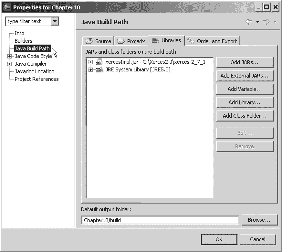

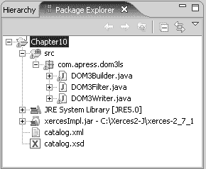

Vohra_706-0C10.fm 第 270 页 2006 年 7 月 25 日，星期二，上午 5:05

**270**

第 10 章 ■ 使用 DOM Level 3 API 加载和保存 **图 10-1.** *Chapter10 项目 Java 构建路径* 图 10-2 显示了 Chapter10 项目的目录结构。

**图 10-2.** *Chapter10 项目目录结构* **加载 XML 文档**

首先，让我们看看如何加载 XML 文档。你使用 `org.w3c.dom.ls` 包中的接口和类来加载、保存和过滤 XML 文档。你使用此包中的 `LSParser` 接口来加载 XML 文档、解析 XML 文档并获取 `Document` 对象。加载 XML 文档的步骤如下：

**1.** 设置系统属性 `DOMImplementationRegistry.PROPERTY`。
**2.** 创建一个 `DOMImplementationRegistry` 对象。

[www.it-ebooks.info](http://www.it-ebooks.info/)

Vohra_706-0C10.fm 第 271 页 2006 年 7 月 25 日，星期二，上午 5:05

第 10 章 ■ 使用 DOM Level 3 API 加载和保存 **271**

**3.** 创建一个 `DOMImplementationLS` 对象。
**4.** 创建一个 `LSParser` 对象。
**5.** 创建一个 `DOMConfiguration` 对象。
**6.** 创建一个错误处理程序类，并设置错误处理程序参数。
**7.** 设置 `validate`、`schema-type`、`validate-if-schema` 和 `schema-location` 参数。
**8.** 解析 XML 文档。

清单 10-1 显示了加载的示例文档 `catalog.xml`。

**清单 10-1.** *catalog.xml*

```xml
<?xml version="1.0" encoding="UTF-8"?>
<catalog title="dev2dev">
    <journal date="May 2005">
        <article section="WebLogic Server">
            <title>Session Management for Clustered Applications</title>
            <author> Jon Purdy</author>
        </article>
    </journal>
    <journal date="April 2005">
        <article section="WebLogic Platform">
            <title>Integrating WebLogic Platform 8.1 with the
                Stellent Web Content Management System</title>
            <author>Munish Gandhi</author>
        </article>
    </journal>
</catalog>
```

你也可以使用 XML Schema 验证由 `LSParser` 对象加载的文档。清单 10-2 显示了用于验证示例 XML 文档的示例 XML Schema `catalog.xsd`。

**清单 10-2.** *catalog.xsd*

```xml
<?xml version="1.0" encoding="utf-8"?>
<xs:schema
>
    <xs:element name="catalog">
        <xs:complexType>
            <xs:sequence>
                <xs:element ref="journal" minOccurs="0"
                    maxOccurs="unbounded"/>
            </xs:sequence>
            <xs:attribute name="title" type="xs:string"/>
        </xs:complexType>
    </xs:element>
    <xs:element name="journal">
        <xs:complexType>
            <xs:sequence>
                <xs:element ref="article" minOccurs="0"
                    maxOccurs="unbounded"/>
            </xs:sequence>
            <xs:attribute name="date" type="xs:string"/>
        </xs:complexType>
    </xs:element>
    <xs:element name="article">
        <xs:complexType>
            <xs:sequence>
                <xs:element name="title" type="xs:string"/>
                <xs:element ref="author" minOccurs="0"
                    maxOccurs="unbounded"/>
            </xs:sequence>
            <xs:attribute name="section" type="xs:string"/>
        </xs:complexType>
    </xs:element>
    <xs:element name="author" type="xs:string"/>
</xs:schema>
```

以下代码是获取 DOM 实现的标准方法，然后你可以使用它来解析 XML 文档。正如你将看到的，大部分代码仅用于初始化注册表和属性，以便提取最终的解析器。要解析 XML 文档，首先需要导入 `org.w3c.dom.ls` 包。接下来，需要设置 `DOMImplementationRegistry.PROPERTY` 系统属性，如下所示：`System.setProperty(DOMImplementationRegistry.PROPERTY, "org.apache.xerces.dom.DOMImplementationSourceImpl");` `DOMImplementationRegistry` 是一个工厂，使应用程序能够获取 `DOMImplementation` 的实例。要获取 `DOMImplementation`，首先使用静态方法 `newInstance()` 创建一个 `DOMImplementationRegistry` 对象。随后，从 `DOMImplementationRegistry` 对象获取一个 `DOMImplementation` 实例，如清单 10-3 所示。

**清单 10-3.** *创建 DOMImplementation*

```java
DOMImplementationRegistry registry = DOMImplementationRegistry.newInstance();
DOMImplementation domImpl = registry.getDOMImplementation("LS 3.0");
```

在功能列表中指定 `LS 3.0` 可确保 `DOMImplementation` 对象实现 DOM 3.0 规范的加载和保存功能。可能包含的其他一些功能包括 XML 1.0 Traversal 和 Events 2.0。你需要将 `DOMImplementation` 对象转换为 `DOMImplementationLS`，它提供了创建 `LSParser` 的方法。`LSParser` 接口用于加载 XML 文档。因此，从 `DOMImplementationLS` 类型的对象创建一个 `LSParser` 实例，如清单 10-4 所示。

**清单 10-4.** *创建 LSParser*

```java
DOMImplementationLS implLS = (DOMImplementationLS) domImpl;
LSParser parser = implLS.createLSParser(DOMImplementationLS.MODE_SYNCHRONOUS,
    "http://www.w3.org/2001/XMLSchema");
```

你可以将解析模式设置为 `MODE_SYNCHRONOUS` 或 `MODE_ASYNCHRONOUS`。如果模式是 `MODE_SYNCHRONOUS`，则 `LSParser` 对象的 `parse()` 和 `parseURI()` 方法返回一个 `org.w3c.dom.Document` 对象。如果模式是 `MODE_ASYNCHRONOUS`，则 `parse()` 和 `parseURI()` 方法返回 `null`。`schemaType`（即 `http://www.w3.org/2001/XMLSchema`）指定用于加载 XML 文档的模式类型。要设置 `LSParser` 对象的配置参数，请从 `LSParser` 获取一个 `DOMConfiguration` 对象，如下所示：

[www.it-ebooks.info](http://www.it-ebooks.info/)

Vohra_706-0C10.fm 第 273 页 2006 年 7 月 25 日，星期二，上午 5:05

第 10 章 ■ 使用 DOM Level 3 API 加载和保存 **273**

```java
DOMConfiguration config = parser.getDomConfig();
```

要设置 `DOMConfiguration` 的错误处理程序参数，你需要创建一个实现 `DOMErrorHandler` 接口的类。清单 10-5 显示了一个 `DOMErrorHandler` 实现类。

**清单 10-5.** *错误处理程序类*

```java
private class DOMErrorHandlerImpl implements DOMErrorHandler {
    public boolean handleError(DOMError error) {
        System.out.println("Error Message:" + error.getMessage());
        if (error.getSeverity() == DOMError.SEVERITY_WARNING)
            return true;
        else
            return false;
    }
}
```

要向 `LSParser` 对象添加错误处理，请创建一个 `DOMErrorHandlerImpl` 类的实例，并设置 `DOMConfiguration` 对象的错误处理程序参数，如清单 10-6 所示。

**清单 10-6.** *设置错误处理*


`DOMErrorHandlerImpl errorHandler=new DOMErrorHandlerImpl(); config.setParameter("error-handler", errorHandler);` 通过设置 `validate`、`schema-type`、`validate-if-schema` 和 `schema-location` 参数，可以将 `LSParser` 对象配置为模式验证解析器，如清单 10-7 所示。

**清单 10-7.** *设置模式验证*

`config.setParameter("validate" , Boolean.TRUE); config.setParameter("schema-type" , "http://www.w3.org/2001/XMLSchema"); config.setParameter("validate-if-schema" , Boolean.TRUE); config.setParameter("schema-location" ,"catalog.xsd");` 最后，使用 `LSParser` 解析 XML 文档，如下所示：`Document document = parser.parseURI("catalog.xml");` 如果 XML 文档模式验证存在任何错误，则通过 `error-handler` 参数指定的错误处理器会记录这些错误。加载 XML 文档后，可以使用 DOM Level 3 Core API 更新该文档。在 DOM Level 3 加载和保存规范之前，XML 文档的加载方式因用于加载和解析 XML 文档的解析器而异。而 DOM Level 3 规范则标准化了加载和保存机制。

DOM 3 加载和保存规范的 JAXP 1.3 实现存在一个限制：`org.w3c.dom.ls` 包没有提供同时实现 `EventTarget` 接口的 `LSParser` 接口的实现类。由于缺少同时实现 `EventTarget` 接口的 `LSParser` 接口实现类，除非创建同时实现 `LSParser` 接口和 `EventTarget` 接口的自定义类，否则无法进行事件处理。由于我们没有使用同时实现 `LSParser` 接口的自定义类，因此在示例应用程序中未包含事件处理。

清单 10-8 展示了加载 XML 文档的应用程序 `DOM3Builder.java`。该应用程序包含一个用于加载 XML 文档的 `loadDocument()` 方法。在 `loadDocument()` 方法中，首先设置 `DOMImplementationRegistry` 的系统属性，然后创建一个 `DOMImplementationRegistry` 对象。从 `DOMImplementationRegistry` 对象创建一个 `DOMImplementation` 对象，并将 `DOMImplementation` 对象转换为 `DOMImplementationLS`。从

[www.it-ebooks.info](http://www.it-ebooks.info/)

Vohra_706-0C10.fm 第 274 页 2006 年 7 月 25 日，星期二，上午 5:05

**274**

第 10 章 ■ 使用 DOM Level 3 API 加载和保存 `DOMImplementationLS` 对象创建一个 `LSParser` 对象。从 `LSParser` 对象获取一个 `DOMConfiguration` 对象，并在 `DOMConfiguration` 对象上设置 `error-handler` 参数。

同时，在 `DOMConfiguration` 对象上设置模式验证参数。示例 XML 文档使用 `parseURI()` 方法进行解析。

**清单 10-8.** *DOM3Builder.java*

`package com.apress.dom3ls;

import org.w3c.dom.*;

import org.w3c.dom.bootstrap.*;

import org.w3c.dom.ls.*;

public class DOM3Builder {

//加载 XML 文档的方法

public void loadDocument() {

try {

//为 DOMImplementationRegistry 设置系统属性

System.setProperty(DOMImplementationRegistry.PROPERTY,

"org.apache.xerces.dom.DOMImplementationSourceImpl");

//创建 DOMImplementationRegistry

DOMImplementationRegistry registry = DOMImplementationRegistry

.newInstance();

//创建 DOMImplementation 对象

DOMImplementation domImpl = registry.getDOMImplementation("LS 3.0");

//将 DOMImplementation 转换为 DOMImplementationLS

DOMImplementationLS implLS = (DOMImplementationLS) domImpl;

//创建 LSParser 对象

LSParser parser = implLS.createLSParser(

DOMImplementationLS.MODE_SYNCHRONOUS,

"http://www.w3.org/2001/XMLSchema");

//获取 DOMConfiguration 对象

DOMConfiguration config = parser.getDomConfig();

//设置错误处理器

DOMErrorHandlerImpl errorHandler = new DOMErrorHandlerImpl(); config.setParameter("error-handler", errorHandler);

//设置模式验证参数

config.setParameter("validate", Boolean.TRUE);

config.setParameter("schema-type",

"http://www.w3.org/2001/XMLSchema");`


config.setParameter("validate-if-schema", Boolean.TRUE); config.setParameter("schema-location", "catalog.xsd");

//解析 XML 文档

Document document = parser.parseURI("catalog.xml"); System.out.println("XML 文档已加载");

[www.it-ebooks.info](http://www.it-ebooks.info/)

Vohra_706-0C10.fm 第 275 页 2006 年 7 月 25 日，星期二，上午 5:05

**第 10 章 ■ 使用 DOM Level 3 API 加载和保存 275**

} catch (DOMException e) {

System.out.println("DOMException " + e.getMessage());

} catch (ClassNotFoundException e) {

System.out.println("ClassNotFoundException " + e.getMessage());

} catch (InstantiationException e) {

System.out.println("InstantiationException " + e.getMessage());

} catch (IllegalAccessException e) {

System.out.println("IllegalAccessException " + e.getMessage());

}

}

public static void main(String[] args) {

DOM3Builder dom3Builder = new DOM3Builder();

dom3Builder.loadDocument();

}

//错误处理类

private class DOMErrorHandlerImpl implements DOMErrorHandler {

public boolean handleError(DOMError error) {

System.out.println("错误信息:" + error.getMessage()); if (error.getSeverity() == DOMError.SEVERITY_WARNING) {

return true;

} else {

return false;

}

}

}

}

按照第 1 章中说明的步骤，在 Eclipse 中运行 DOM3Builder.java 应用程序。

应用程序的输出表明 XML 文档已加载，如清单 10-9 所示。

**清单 10-9.** *DOM3Builder.java 的输出*

XML 文档已加载

**保存 XML 文档**

现在让我们来看一下如何将 DOM 文档模型保存为 XML 文档模型。使用 DOM Level 3 API，您可以将 XML 文档保存为 XML 文件或字符串。DOM Level 3 API 新增了一项功能，即能够仅序列化 DOM 文档模型中的选定节点。您可以使用 LSSerializer 接口将 DOM 文档模型保存为 XML 文档模型。保存 XML 文档的步骤如下：

**1.** 创建一个要保存的 XML 文档。

**2.** 设置系统属性 DOMImplementationRegistry.PROPERTY。

**3.** 创建一个 DOMImplementationRegistry 对象。

**4.** 创建一个 DOMImplementationLS 对象。

**5.** 创建一个 LSSerializer 对象。

**6.** 创建一个 LSOutput 对象。

**7.** 输出 XML 文档。

[www.it-ebooks.info](http://www.it-ebooks.info/)

Vohra_706-0C10.fm 第 276 页 2006 年 7 月 25 日，星期二，上午 5:05

**276**

第 10 章 ■ 使用 DOM Level 3 API 加载和保存 以下代码是获取 DOM 实现的标准方法，然后您可以使用该实现来保存 XML 文档。如本章前面所述，导入 org.w3c.dom.ls 包。

我们将通过创建一个 XML 文档、向 XML 文档添加元素和属性以及序列化 XML 文档来演示 LSSerializer 接口。如本章前面所述，设置系统属性 DOMImplementationRegistry.PROPERTY，如下所示： System.setProperty(DOMImplementationRegistry.PROPERTY,

"org.apache.xerces.dom.DOMImplementationSourceImpl"); 要创建 LSSerializer 对象，您需要创建一个 DOMImplementationRegistry 对象。

您可以使用静态方法 newInstance() 创建一个 DOMImplementationRegistry 对象。随后，从注册表中创建一个 DOMImplementation 对象，并将 DOMImplementation 实例转换为 DOMImplementationLS。从 DOMImplementationLS 对象创建 LSSerializer 对象，如清单 10-10 所示。

**清单 10-10.** *创建 LSSerializer 对象* DOMImplementationRegistry registry =DOMImplementationRegistry.newInstance(); DOMImplementation domImpl =registry.getDOMImplementation("LS 3.0"); DOMImplementationLS implLS = (DOMImplementationLS)domImpl; LSSerializer dom3Writer = implLS.createLSSerializer();

要输出生成的 XML 文档，请创建一个 LSOutput 对象。您需要在 LSOutput 对象上设置一个 OutputStream，XML 文档将输出到该流。此外，您还可以指定输出编码。您可以使用 write(Node, LSOutput) 方法输出 XML 文档，如清单 10-11 所示。


**清单 10-11.** *输出 XML 文档*

LSOutput output=implLS.createLSOutput();

output.setByteStream(System.out);

output.setEncoding("UTF-8");

dom3Writer.write(document,output);

DOM Level 3 规范提供了一项功能，可以输出 DOM 文档模型中的选定节点，而非整个文档。例如，假设你需要保存 journal 元素节点。

要输出 journal 节点，只需将 journal 节点作为参数传递给 write(Node, LSOutput) 方法，如清单 10-12 所示。

**清单 10-12.** *输出 journal 节点*

output.setByteStream(System.out);

dom3Writer.write(journal,output);

借助 DOM Level 3 API，你可以将 DOM 文档模型输出为字符串。只需使用 writeToString(Node) 方法，如下所示：

String nodeString = dom3Writer.writeToString(journal);

清单 10-13 展示了 DOM3Writer.java，这是一个用于输出 XML 文档的 Java 类。

应用程序 DOM3Writer.java 包含一个 saveDocument() 方法。在 saveDocument() 方法中，创建一个要保存的 XML 文档。设置 DOMImplementationRegistry 系统属性，并创建一个 DOMImplementationRegistry 对象。创建一个 DOMImplementation 对象，并将其转换为 DOMImplementationLS。

从 DOMImplementationLS 对象创建一个 LSSerializer 对象。使用 LSOutput 对象，将 XML 文档输出到 System.out。你也可以输出 DOM 文档模型中的选定节点，而非整个文档。你还可以将 DOM 文档模型输出为字符串，而非文件。

[www.it-ebooks.info](http://www.it-ebooks.info/)

Vohra_706-0C10.fm Page 277 Tuesday, July 25, 2006 5:05 AM

第 10 章 ■ 使用 DOM Level 3 API 加载与保存 **277**

**清单 10-13.** *DOM3Writer.java*

package com.apress.dom3ls;

import org.w3c.dom.*;

import org.w3c.dom.bootstrap.DOMImplementationRegistry;

import org.w3c.dom.ls.*;

import javax.xml.parsers.*;

public class DOM3Writer {

//保存 XML 文档的方法

public void saveDocument() {

try { //创建一个 XML 文档

DocumentBuilderFactory factory = DocumentBuilderFactory

.newInstance();

DocumentBuilder builder = factory.newDocumentBuilder();

Document document = builder.newDocument();

Element catalog = document.createElement("catalog"); catalog.setAttribute("publisher", "IBM developerWorks"); document.appendChild(catalog);

Element journal = document.createElement("journal"); journal.setAttribute("edition", "October 2005"); journal.setAttribute("section", "XML"); catalog.appendChild(journal);

Element article = document.createElement("article"); journal.appendChild(article);

Element title = document.createElement("title"); title.appendChild(document.createTextNode("JAXP Validation")); article.appendChild(title);

Element author = document.createElement("author"); author.appendChild(document.createTextNode("Brett McLaughlin")); article.appendChild(author);

//设置 DOMImplementationRegistry 的系统属性

System.setProperty(DOMImplementationRegistry.PROPERTY,

"org.apache.xerces.dom.DOMImplementationSourceImpl");

//创建一个 DOMImplementationRegistry 对象

DOMImplementationRegistry registry = DOMImplementationRegistry

.newInstance();

[www.it-ebooks.info](http://www.it-ebooks.info/)

Vohra_706-0C10.fm Page 278 Tuesday, July 25, 2006 5:05 AM

**278**

第 10 章 ■ 使用 DOM Level 3 API 加载与保存

//创建一个 DOMImplementation 对象

DOMImplementation domImpl = registry.getDOMImplementation("LS 3.0"); DOMImplementationLS implLS = (DOMImplementationLS) domImpl;

//创建一个 LSSerializer 对象

LSSerializer dom3Writer = implLS.createLSSerializer();

//创建一个 LSOutput 对象

LSOutput output = implLS.createLSOutput();

System.out.println("输出 XML 文档");

output.setByteStream(System.out);

output.setEncoding("UTF-8");

//输出 XML 文档

dom3Writer.write(document, output);

System.out.println("\n\n"+"输出 journal 节点"+"\n");

//输出一个节点

dom3Writer.write(journal, output);

//将节点输出为字符串

String nodeString = dom3Writer.writeToString(journal);


} catch (ParserConfigurationException e) {

} catch (ClassNotFoundException e) {

} catch (InstantiationException e) {

} catch (IllegalAccessException e) {

}

}

public static void main(String[] argv) {

DOM3Writer dom3Writer = new DOM3Writer();

dom3Writer.saveDocument();

}

}

你可以按照第 1 章中说明的步骤，在 Eclipse 中运行 DOM3Writer.java 应用程序。清单 10-14 显示了该应用程序的输出。

**清单 10-14.** *DOM3Writer.java 应用程序在 Eclipse 中的输出* 输出 XML 文档

<?xml version="1.0" encoding="UTF-8"?>

<catalog publisher="IBM developerWorks"><journal edition="October 2005" section=

"XML"><article><title>JAXP Validation</title><author>Brett McLaughlin</author></

article></journal></catalog>

输出 journal 节点

<?xml version="1.0" encoding="UTF-8"?>

<journal edition="October 2005" section="XML"><article><title>JAXP Validation</t itle><author>Brett McLaughlin</author></article></journal>

[www.it-ebooks.info](http://www.it-ebooks.info/)

Vohra_706-0C10.fm Page 279 Tuesday, July 25, 2006 5:05 AM

第 10 章 ■ 使用 DOM Level 3 API 加载和保存 **279**

**过滤 XML 文档**

你可以在解析 XML 文档模型时对其进行过滤，也可以在存储 DOM 文档模型时对其进行过滤。在本节中，我们将展示如何过滤 XML 文档模型。我们将展示如何使用输入过滤器过滤输入的 XML 文档模型，并使用输出过滤器保存解析后的 DOM 文档模型。在过滤文档模型时，你可以从文档中移除某些节点。`LSParserFilter` 接口允许过滤输入，而 `LSSerializerFilter` 接口允许过滤输出。在我们的示例中，过滤输入的步骤如下：

**1.** 创建一个输入过滤器，即一个实现 `LSParserFilter` 接口的类。

**2.** 在输入过滤器类中，展示要过滤的元素节点。未展示给过滤器的节点会被添加到 Document 对象中，而无需过滤器选择要添加到 Document 对象的节点。

**3.** 接受所有展示给过滤器的节点。

**4.** 创建一个 `LSParser` 对象。

**5.** 为要过滤的 XML 文档创建一个 `LSInput` 对象。

**6.** 在 `LSParser` 对象上设置输入过滤器。

**7.** 使用 `LSInput` 对象解析 XML 文档。

在我们的示例中，过滤输出的步骤如下：
**1.** 创建一个输出过滤器，即一个实现 `LSSerializerFilter` 接口的类。

**2.** 在输出过滤器类中，展示要过滤的元素节点。未展示给过滤器的节点会被输出，而无需过滤器选择要输出的节点。

**3.** 作为示例，接受所有展示给过滤器的节点，但 `date` 属性设置为 `April 2005` 的 `journal` 节点除外。

**4.** 创建一个 `LSSerializer` 对象。

**5.** 为过滤器输出创建一个 `LSOutput` 对象。

**6.** 在 `LSSerializer` 对象上设置输出过滤器。

**7.** 过滤 Document 对象。

与加载和保存时一样，导入 DOM 3 的 `org.w3c.dom.ls` 包。对于输入过滤，创建一个 `LSParser` 实现和一个 `LSParser` 解析器，如清单 10-15 所示。创建过滤器的过程与加载部分相同：创建一个 `DOMImplementationRegistry` 对象，从注册表对象中获取一个 `DOMImplementation` 对象，将 `DOMImplementation` 转换为 `DOMImplementationLS`，然后从 `DOMImplementationLS` 对象创建一个 `LSParser`。

**清单 10-15.** *创建 LSParser*

System.setProperty(DOMImplementationRegistry.PROPERTY,

"org.apache.xerces.dom.DOMImplementationSourceImpl"); DOMImplementationRegistry registry =DOMImplementationRegistry.newInstance(); DOMImplementation domImpl = registry.getDOMImplementation("LS 3.0"); DOMImplementationLS implLS = (DOMImplementationLS)domImpl; LSParser parser =

implLS.createLSParser(DOMImplementationLS.MODE_SYNCHRONOUS,

"http://www.w3.org/2001/XMLSchema");

[www.it-ebooks.info](http://www.it-ebooks.info/)


Vohra_706-0C10.fm 第 280 页 星期二, 2006 年 7 月 25 日 5:05 AM

**280**

第 10 章 ■ 使用 DOM Level 3 API 加载与保存 在加载部分，我们从 URI 解析了一个 XML 文档。在本节中，我们将展示如何从 `LSInput` 对象解析示例 XML 文档。因此，创建一个 `LSInput` 对象，并为该 `LSInput` 设置一个 `InputStream`，如清单 10-16 所示。

**清单 10-16.** *创建 LSInput 对象*

LSInput input = impl.createLSInput();

InputStream inputStream = new FileInputStream(new File("catalog.xml")); input.setByteStream(inputStream);

你需要创建一个输入过滤器用于输入过滤。在输入过滤器中，你将在解析元素节点时打印它们，而不过滤任何节点。输入过滤器需要实现 `LSParserFilter` 接口。因此，定义一个实现 `LSParserFilter` 接口的过滤器类，并实现该接口的 `acceptNode()`、`startElement()` 和 `getWhatToShow()` 方法。`acceptNode()` 方法返回一个 short 值，指示节点是被接受、拒绝还是跳过。表 10-1 列出了 `acceptNode()` 方法可以返回的值。

**表 10-1.** *acceptNode() 方法的返回值* **返回值**

**描述**

FILTER_ACCEPT

接受该节点

FILTER_INTERRUPT

中断文档过滤

FILTER_REJECT

拒绝该节点

FILTER_SKIP

跳过该节点

如果使用 `FILTER_ACCEPT` 接受一个节点，则该节点会被包含在解析器返回的 `Document` 对象中。如果使用 `FILTER_SKIP` 跳过一个节点，则仅跳过指定的节点；该节点的子节点会被解析并包含在 DOM 文档中。如果使用 `FILTER_REJECT` 拒绝一个节点，则该节点及其子节点都会被拒绝。`startElement()` 方法指定一个 `Element` 节点是被接受、拒绝还是跳过。表 10-1 也列出了 `startElement()` 方法的返回值。只有 `Element` 和该元素的属性会被输入到 `startElement()` 方法中。你可以使用 `startElement()` 方法来修改元素的属性。`acceptNode()` 方法与 `startElement()` 方法的区别如下：

• 与 `acceptNode()` 方法相比，只有 `Element` 节点会被输入到 `startElement()` 方法，而 `acceptNode()` 方法中，除了 `Document`、`DocumentType`、`Notation`、`Entity`、`DocumentFragment` 和 `Attribute` 节点之外的所有节点都可能被输入到该方法。属性节点可能被输入到 `LSSerializerFilter` 接口的 `acceptNode()` 方法。

• 输入到 `startElement()` 的元素节点将包含该元素的所有属性，但不包含任何子节点。输入到 `LSParserFilter` 的 `acceptNode()` 方法的节点包含所有子节点，但不包含任何属性节点。输入到 `LSSerializerFilter` 的 `acceptNode()` 方法的节点包含所有子节点，并且可能包含属性节点。

`getWhatToShow()` 方法指定哪些节点会被输入到 `LSParserFilter.acceptNode()` 方法。表 10-2 显示了 `getWhatToShow()` 方法的返回值。未输入到过滤器 `acceptNode()` 方法的节点会被直接包含在正在构建的 DOM 文档模型中，而不经过过滤。输入到过滤器 `acceptNode()` 方法的节点则会按照该方法中的指定被接受、跳过或拒绝。

[www.it-ebooks.info](http://www.it-ebooks.info/)

Vohra_706-0C10.fm 第 281 页 星期二, 2006 年 7 月 25 日 5:05 AM

第 10 章 ■ 使用 DOM Level 3 API 加载与保存 **281**

**表 10-2.** *getWhatToShow() 方法的返回值* **返回值**

**描述**

NodeFilter.SHOW_ALL

显示所有节点

NodeFilter.SHOW_ELEMENT

显示元素节点

NodeFilter.SHOW_TEXT

显示文本节点

NodeFilter.SHOW_COMMENT

显示注释节点

NodeFilter.SHOW_PROCESSING_INSTRUCTION

显示处理指令节点

NodeFilter.SHOW_CDATA_SECTION

显示 CDATA 段节点

NodeFilter.SHOW_ENTITY_REFERENCE

显示实体引用节点

在示例输入过滤器类 `InputFilter` 中，过滤应用程序向 `acceptNode()` 方法展示元素节点。因此，将 `getWhatToShow()` 方法的返回类型指定为 `NodeFilter.SHOW_ELEMENT`。`acceptNode()` 和 `startElement()` 方法的返回类型是 `LSParser.FILTER_ACCEPT`。清单 10-17 展示了输入过滤器类。

**清单 10-17.** *InputFilter 类*

private class InputFilter implements LSParserFilter {

public short acceptNode(Node node) {

return NodeFilter.FILTER_ACCEPT;

}

public int getWhatToShow() {

return NodeFilter.SHOW_ELEMENT;

}

public short startElement(Element element) {

System.out.println("Element Parsed " + element.getTagName()); return NodeFilter.FILTER_ACCEPT;

}

}

示例输入过滤器仅将 `Element` 节点输入到过滤器的 `acceptNode()` 方法；其他节点则直接包含在 DOM 文档模型中，不经过过滤。过滤器的 `acceptNode()` 方法接受所有输入的节点。`startElement()` 方法在解析元素节点时打印它们，并接受所有被解析的元素节点。要在输入时设置过滤，创建一个 `InputFilter` 类的实例，并在 `LSParser` 上设置该过滤器，如清单 10-18 所示。随后，使用 `LSParser` 接口的 `parse(LSInput)` 方法解析示例 XML 文档。

**清单 10-18.** *过滤输入*

InputFilter inputFilter=new InputFilter();

parser.setFilter(inputFilter);

Document document=parser.parse(input);

接下来，我们将演示输出过滤。对于输出过滤，创建一个输出过滤器。作为示例，我们将使用输出过滤器从 `Document` 中过滤掉一个 `journal` 节点。输出过滤器类需要实现 `LSSerializerFilter` 接口。因此，创建一个输出过滤器类

[www.it-ebooks.info](http://www.it-ebooks.info/)

Vohra_706-0C10.fm 第 282 页 星期二, 2006 年 7 月 25 日 5:05 AM

**282**

第 10 章 ■ 使用 DOM Level 3 API 加载与保存 `OutputFilter`，它实现了 `LSSerializerFilter` 接口。除了返回表 10-2 中列出的值之外，`LSSerializerFilter` 接口的 `getWhatToShow()` 方法还可以返回 `SHOW_ATTRIBUTE`。在示例中，`OutputFilter` 类将 `getWhatToShow()` 方法的返回类型指定为 `NodeFilter.SHOW_ELEMENT`，并将 `acceptNode()` 方法的返回类型指定为 `FILTER_ACCEPT`，用于处理除 `date` 属性为 `April 2005` 的 `journal` 节点之外的其他 `journal` 节点。在示例输出过滤器中，只有元素节点会被输入到过滤器的 `acceptNode()` 方法，并且 `acceptNode()` 方法接受除 `date` 为 `April 2005` 的 `journal` 节点之外的所有节点。清单 10-19 展示了输出过滤器类 `OutputFilter`。

**清单 10-19.** *输出过滤器类*

private class OutputFilter implements LSSerializerFilter {

public short acceptNode(Node node) {

Element element = (Element) node;

if (element.getTagName().equals("journal")) {

if (element.getAttribute("date").equals("April 2005")) {

return NodeFilter.FILTER_REJECT;

}

}

return NodeFilter.FILTER_ACCEPT;

}

public int getWhatToShow() {

return NodeFilter.SHOW_ELEMENT;

}

}

要在 `LSSerializer` 对象上设置过滤，创建一个 `OutputFilter` 的实例，并在 `LSSerializer` 上设置该过滤器，如清单 10-20 所示。

**清单 10-20.** *在 LSSerializer 上设置过滤* LSSerializer domWriter = impl.createLSSerializer();

OutputFilter outputFilter = new OutputFilter();

domWriter.setFilter(outputFilter);

要输出经过过滤的 XML 文档，创建一个 `LSOutput` 对象，并为该 `LSOutput` 对象设置一个 `OutputStream`。然后使用 `write(Node, LSOutput)` 方法输出过滤后的 XML 文档，如清单 10-21 所示。

**清单 10-21.** *输出过滤后的 XML 文档* LSOutput lsOutput = impl.createLSOutput();

lsOutput.setByteStream(System.out);

domWriter.write( document, lsOutput);


清单 10-22 列出了`DOM3Filter.java`，这是一个用于过滤 XML 文档的 Java 类。该过滤应用程序包含一个`filter()`方法，用于从 XML 文档过滤输入并输出到 XML 文档。`DOM3Filter.java`还定义了用于输入过滤和输出过滤的过滤器类`InputFilter`和`OutputFilter`。你可以通过在`LSParser`对象上设置`InputFilter`对象，然后解析 XML 文档来过滤输入。你也可以通过在`LSSerializer`对象上设置`OutputFilter`对象，然后序列化 XML 文档来过滤输出。

[www.it-ebooks.info](http://www.it-ebooks.info/)

Vohra_706-0C10.fm Page 283 Tuesday, July 25, 2006 5:05 AM

第 10 章 ■ 使用 DOM Level 3 API 加载和保存 **283**

**清单 10-22.** *DOM3Filter.java*

package com.apress.dom3ls;

import org.w3c.dom.*;

import org.w3c.dom.bootstrap.DOMImplementationRegistry;

import org.w3c.dom.ls.*;

import org.w3c.dom.traversal.*;

import java.io.*;

public class DOM3Filter {

// 过滤输入文档和输出文档的方法。

public void filter() {

try {

//设置 DOMImplementationRegistry 对象

System.setProperty(DOMImplementationRegistry.PROPERTY,

"org.apache.xerces.dom.DOMImplementationSourceImpl");

//创建一个 DOMImplementationRegistry 对象

DOMImplementationRegistry registry =

DOMImplementationRegistry.newInstance();

//创建一个 DOMImplementation 对象

DOMImplementation domImpl =

registry.getDOMImplementation("XML 3.0");

//创建一个 DOMImplementationLS 对象

DOMImplementationLS impl = (DOMImplementationLS) domImpl;

//创建一个 LSParser 对象

LSParser parser = impl.createLSParser(

DOMImplementationLS.MODE_SYNCHRONOUS, null);

//过滤输入

LSInput input = impl.createLSInput();

InputStream inputStream =

new FileInputStream(new File("catalog.xml"));

input.setByteStream(inputStream);

InputFilter inputFilter = new InputFilter();

parser.setFilter(inputFilter);

Document document = parser.parse(input);

//创建一个 LSSerializer 对象

LSSerializer domWriter = impl.createLSSerializer();

//设置输出过滤器

OutputFilter outputFilter = new OutputFilter();

domWriter.setFilter(outputFilter);

[www.it-ebooks.info](http://www.it-ebooks.info/)

Vohra_706-0C10.fm Page 284 Tuesday, July 25, 2006 5:05 AM

**284**

第 10 章 ■ 使用 DOM Level 3 API 加载和保存 LSOutput lsOutput = impl.createLSOutput();

lsOutput.setByteStream(System.out);

System.out.println("\n"+"过滤后的文档"+"\n");

//过滤输出

domWriter.write(document, lsOutput);

} catch (IOException e) {

System.err.println(e);

} catch (ClassNotFoundException e) {

} catch (InstantiationException e) {

} catch (IllegalAccessException e) {

}

}

public static void main(String[] args) {

DOM3Filter dom3Filter = new DOM3Filter();

dom3Filter.filter();

}

//输入过滤器类

private class InputFilter implements LSParserFilter {

public short acceptNode(Node node) {

return NodeFilter.FILTER_ACCEPT;

}

public int getWhatToShow() {

return NodeFilter.SHOW_ELEMENT;

}

public short startElement(Element element) {

System.out.println("已解析元素 " + element.getTagName()); return NodeFilter.FILTER_ACCEPT;

}

}

//输出过滤器类

private class OutputFilter implements LSSerializerFilter {

public short acceptNode(Node node) {

Element element = (Element) node;

if (element.getTagName().equals("journal")) {

if (element.getAttribute("date").equals("April 2005")) {

return NodeFilter.FILTER_REJECT;

}

}

return NodeFilter.FILTER_ACCEPT;

}

public int getWhatToShow() {

return NodeFilter.SHOW_ELEMENT;

}

}

}

[www.it-ebooks.info](http://www.it-ebooks.info/)

Vohra_706-0C10.fm Page 285 Tuesday, July 25, 2006 5:05 AM

第 10 章 ■ 使用 DOM Level 3 API 加载和保存 **285**

你可以按照第 1 章中说明的步骤在 Eclipse 中运行此过滤应用程序。输入过滤器会在解析元素时列出它们。输出过滤器会从 XML 文档中过滤掉一个`journal`节点。清单 10-23 显示了输出过滤器的输出结果。

**清单 10-23.** *Eclipse 中 DOM3Filter.java 应用程序的输出* Element Parsed journal

Element Parsed article

Element Parsed title

Element Parsed author

Element Parsed journal

Element Parsed article

Element Parsed title

Element Parsed author

过滤后的文档

<?xml version="1.0" encoding="UTF-8"?>

<catalog title="dev2dev">

<journal date="May 2005">

<article section="WebLogic Server">

<title>Session Management for Clustered Applications</title>

<author> Jon Purdy</author>

</article>

</journal>

</catalog>

如输出所示，`date`属性为`"April 2005"`的`journal`节点已从 XML 文档中移除。

**总结**

DOM Level 3 规范提供了一组接口，用于以下方面：

*   加载和保存 XML 文档
*   在 XML 文档加载和保存期间过滤内容
*   保存文档中的选定节点，而非整个文档
*   将完整文档或选定的文档节点序列化为字符串，而非文件

DOM Level 3 加载和保存接口相比 JAXP 的`DocumentBuilder`和`Transformer`类具有一些优势。JAXP 的`DocumentBuilder`和`Transformer`类中未包含的 DOM Level 3 加载和保存特性如下：

*   文档加载和保存期间的事件处理
*   文档加载和保存期间的内容过滤
*   加载和保存选定节点，而非完整文档
*   将`Document`对象保存为字符串，而非文件

[www.it-ebooks.info](http://www.it-ebooks.info/)

Vohra_706-0C10.fm Page 286 Tuesday, July 25, 2006 5:05 AM

**286**

第 10 章 ■ 使用 DOM Level 3 API 加载和保存 在本章中，我们提供了代码示例来说明 DOM Level 3 加载和保存接口，具体包括：加载 XML 文档（含模式验证）、将 XML 文档或选定节点保存到文件或字符串，以及在加载和保存过程中过滤内容。所有代码示例均基于 J2SE 5.0 中包含的 JAXP 1.3 中的 DOM Level 加载和保存实现。

[www.it-ebooks.info](http://www.it-ebooks.info/)

Vohra_706-0C11.fm Page 287 Tuesday, August 8, 2006 6:43 AM

第 5 部分

■ ■ ■

实用工具

[www.it-ebooks.info](http://www.it-ebooks.info/)

Vohra_706-0C11.fm Page 288 Tuesday, August 8, 2006 6:43 AM

[www.it-ebooks.info](http://www.it-ebooks.info/)

Vohra_706-0C11.fm Page 289 Tuesday, August 8, 2006 6:43 AM

第 11 章

■ ■ ■

将 XML 转换为电子表格，

反之亦然

**通**常，将 XML 数据呈现为电子表格是很有用的。一个典型的电子表格（例如，Microsoft Excel 电子表格）由以行和列网格形式表示的单元格组成，其中包含文本数据、数值数据或公式。Excel 电子表格定义了一些标准函数，例如`SUM`和`AVERAGE`，你可以在单元格中指定这些函数。Apache Jakarta POI 项目提供了 HSSF API，用于从 XML 文档创建 Excel 电子表格，或者反向操作，解析 Excel 电子表格并将其转换为 XML。HSSF API 提供了设置 Excel 文档布局、边框设置和字体的功能。在本章中，你将学习如何通过解析 XML 文档并将 XML 文档中的数据添加到电子表格来生成一个示例 Excel 电子表格。随后，你将把 Excel 电子表格转换为 XML 文档。

**概述**


Jakarta POI HSSF API 提供了用于创建 Excel 工作簿并向工作簿中添加电子表格的类。使用 POI API，`HSSFWorkbook` 类代表一个工作簿，您可以在 `HSSFWorkbook` **类中设置电子表格的字体、工作表顺序和单元格样式。您可以使用 `HSSFSheet` 类来表示电子表格。具体来说，您可以使用 `HSSFSheet` 类设置工作表布局，包括列宽、页边距、页眉、页脚和打印设置。您可以使用 `HSSFRow` 类表示电子表格中的一行，并使用 `HSSFRow` 类设置行高。`HSSFCell` 类表示电子表格行中的一个单元格，您可以使用 `HSSFCell` 类设置单元格样式。工作簿中的电子表格、电子表格中的行以及行中的单元格的索引都是从零开始的。在本章中，我们将演示如何将示例 XML 文档转换为 Excel 电子表格，然后将该电子表格转换为 XML 文档。清单 11-1 显示了示例文档 `incomestatements.xml`。**

****清单 11-1.** *`incomestatements.xml`*

<?xml version="1.0" encoding="UTF-8"?>

<incmstmts>

<stmt>

<year>2005</year>

<revenue>11837</revenue>

<costofrevenue>2239</costofrevenue>

<researchdevelopment>1591</researchdevelopment>

<salesmarketing>2689</salesmarketing>

<generaladmin>661</generaladmin>

<totaloperexpenses>7180</totaloperexpenses>

**289**

[www.it-ebooks.info](http://www.it-ebooks.info/)

Vohra_706-0C11.fm Page 290 Tuesday, August 8, 2006 6:43 AM

**290**

第 11 章 ■ 将 XML 转换为电子表格，反之亦然

<operincome>4657</operincome>

<invincome>480</invincome>

<incbeforetaxes>5137</incbeforetaxes>

<taxes>1484</taxes>

<netincome>3653</netincome>

</stmt>

<stmt>

<year>2004</year>

<revenue>10818</revenue>

<costofrevenue>1875</costofrevenue>

<researchdevelopment>1421</researchdevelopment>

<salesmarketing>2122</salesmarketing>

<generaladmin>651</generaladmin>

<totaloperexpenses>6069</totaloperexpenses>

<operincome>4749</operincome>

<invincome>420</invincome>

<incbeforetaxes>5169</incbeforetaxes>

<taxes>1706</taxes>

<netincome>3463</netincome>

</stmt>

<incmstmts>

**创建 Eclipse 项目**

在本章中，我们将演示如何使用 Apache POI HSSF API 创建和解析 Excel 电子表格。在设置项目之前，您需要下载 Apache POI1 2.5.1 并将 zip 文件解压到安装目录。您还需要下载并安装 JDK 5.0。（您也可以使用其他版本的 JDK，例如 1.4 或 6.0。）

要编译和运行代码示例，您需要一个 Eclipse 项目。您可以从 Apress 网站 (http://www.apress.com) 下载 Chapter11 项目，然后通过选择 **文件** ➤ **导入** 将其导入到您的 Eclipse 工作区中。

要编译和运行 Apache POI 代码示例，您需要在项目的 Java 构建路径中包含一些 JAR 文件；图 11-1 显示了这些 JAR 文件。Apache POI 应用程序所需的 JAR 文件是 `poi-2.5.1-final-20040804.jar`，它包含了 Apache POI API。您还需要将 JRE 系统库设置为 JRE 5.0，如图 11-1 所示。

图 11-2 显示了 Chapter11 项目的目录结构。

如果您手头没有 Excel 副本，您可以使用 Excel Viewer2 打开从示例 XML 文档生成的 Excel 电子表格。

1. 有关 Apache POI 的更多信息，请参见 http://jakarta.apache.org/poi/。
2. 有关 Excel Viewer 的更多信息，请参见 http://www.microsoft.com/downloads/details.aspx?FamilyID=c8378bf4-996c-4569-b547-75edbd03aaf0&displaylang=EN。

[www.it-ebooks.info](http://www.it-ebooks.info/)

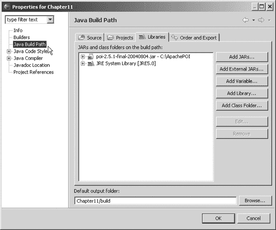

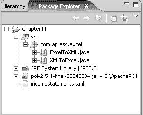

Vohra_706-0C11.fm Page 291 Tuesday, August 8, 2006 6:43 AM

第 11 章 ■ 将 XML 转换为电子表格，反之亦然 **291**

**图 11-1.** *Chapter11 Java 构建路径*

**图 11-2.** *Chapter11 目录结构*

**将 XML 文档转换为**

**Excel 电子表格**

在本节中，我们将演示如何使用 Apache POI HSSF API 将清单 11-1 中的示例 XML 文档转换为 Excel 文档。具体来说，您将解析示例 XML 文档，从文档中检索值，并构建一个 Excel 电子表格。创建电子表格的步骤如下：

[www.it-ebooks.info](http://www.it-ebooks.info/)

Vohra_706-0C11.fm Page 292 Tuesday, August 8, 2006 6:43 AM

**292**

第 11 章 ■ 将 XML 转换为电子表格，反之亦然 **1.** 创建一个 Excel 电子表格工作簿和一个空电子表格。

**2.** 定义单元格样式。

**3.** 设置电子表格列宽。

**4.** 向电子表格添加标题行。

**5.** 解析 XML 文档。

**6.** 向电子表格添加报表列。

**7.** 输出电子表格。

您需要导入 Apache POI HSSF 包 `org.apache.poi.hssf.usermodel`。

您可以使用 `HSSFWorkbook` 的无参构造函数创建 Excel 工作簿，如清单 11-2 所示。您可以通过使用 `HSSFWorkbook` 类的 `createSheet(String sheetName)` 方法创建一个由 `HSSFSheet` 类表示的电子表格。

**清单 11-2.** *创建 Excel 工作簿和电子表格* HSSFWorkbook wb=new HSSFWorkbook();

HSSFSheet spreadSheet=wb.createSheet("spreadSheet"); 您可以使用 `HSSFCell` 类表示电子表格中的单元格。您可以使用 `HSSFCellStyle` 类设置单元格样式。要设置正在生成的示例电子表格中的单元格样式，请使用 `HSSFWorkbook` 类的 `createCellStyle()` 方法创建一个单元格样式对象，如清单 11-3 所示。

示例单元格样式定义了一个单元格边框，并用于表示列或子列总计的单元格。您可以使用 setter 方法 `setBorderTop(short)`、`setBorderLeft(short)`、`setBorderBottom(short)` 和 `setBorderRight(short)` 为 `HSSFCellStyle` 对象设置边框设置。

**清单 11-3.** *设置单元格样式*

HSSFCellStyle cellStyle=wb.createCellStyle();

cellStyle.setBorderRight(HSSFCellStyle.BORDER_MEDIUM);

cellStyle.setBorderTop(HSSFCellStyle.BORDER_MEDIUM);

cellStyle.setBorderLeft(HSSFCellStyle.BORDER_MEDIUM);

cellStyle.setBorderBottom(HSSFCellStyle.BORDER_MEDIUM);

您可以使用一个 short 值来表示边框类型，如清单 11-3 所示。表 11-1 列出了一些常用的边框类型。

**表 11-1.** *边框类型*

**Short 值**

**描述**

BORDER_DASH_DOT

点划线边框

BORDER_DASHED

虚线边框

BORDER_DOUBLE

双线边框

BORDER_MEDIUM

中等粗细边框

BORDER_NONE

无边框

BORDER_THICK

粗边框

BORDER_THIN

细边框

[www.it-ebooks.info](http://www.it-ebooks.info/)

Vohra_706-0C11.fm Page 293 Tuesday, August 8, 2006 6:43 AM

第 11 章 ■ 将 XML 转换为电子表格，反之亦然 **293**

您可以使用 setter 方法 `setBottomBorderColor(short color)`、`setLeftBorderColor(short color)`、`setRightBorderColor(short color)` 和 `setTopBorderColor(short color)` 设置边框颜色。您可以使用 `HSSFColor` 子类来表示电子表格颜色。例如，类 `HSSFColor.BLUE` 代表蓝色。您可以使用字段 `index` 获取与颜色对应的 short 值。以下是设置颜色的示例： short blue= HSSFColor.BLUE.index;

cellStyle.setRightBorderColor(blue);

您可以使用方法 `setFillBackgroundColor(short fg)` 和 `setFillForegroundColor(short bg)` 设置背景色和前景色。您可以使用 `setIndention(short indent)` 方法设置文本缩进。您可以使用 `setWrapText(boolean wrapped)` 方法自动换行单元格文本。例如，您可以将单元格样式缩进设置为 4 并添加文本换行，如下所示：

cellStyle.setIndention((short)4);

cellStyle.setWrapText(true);

此外，您可以使用 `setRotation(short rotation)` 方法为单元格文本添加文本旋转。


您可以使用 –90 到 +90 之间的值以度为单位指定旋转角度。您可以使用 `setAlignment(short)` 方法水平对齐单元格文本。您使用一个 short 值来表示单元格对齐方式。一些常用的单元格对齐类型包括 `ALIGN_CENTER`、`ALIGN_RIGHT`、`ALIGN_LEFT` 和 `ALIGN_FILL`。

您可以使用 `setVerticalAlignment(short align)` 方法设置垂直对齐方式。垂直对齐的 short 值包括 `VERTICAL_TOP`、`VERTICAL_CENTER`、`VERTICAL_BOTTOM` 和 `VERTICAL_JUSTIFY`。

您使用 `HSSFFont` 类定义电子表格的字体。清单 11-4 展示了一个使用字体高度 24 和字体名称 Courier New 创建斜体字体的示例。如清单所示，字体是使用 `HSSFWorkbook` 类的 `createFont()` 方法创建的。

**清单 11-4.** *设置字体*

HSSFFont font = wb.createFont();

font.setFontHeightInPoints((short)24);

font.setFontName("Courier New");

font.setItalic(true);

cellStyle.setFont(font);

从示例 XML 文档创建的电子表格中的一行，其单元格对应于该示例 XML 文档中 `stmt` 标签的每个元素。您可以使用 `HSSFSheet` 的 `setColumnWidth(short column, short width)` 方法在列级别设置电子表格中的列宽。

例如，您可以像这样指定电子表格第一列的列宽：`spreadSheet.setColumnWidth((short)0, (short)(256*25));`

电子表格有一个标题行，用于指定电子表格中各列的标题。

因此，向 `HSSFSheet` 类添加一个标题行。标题行与其他任何行一样，是使用 `createRow(int rowNumber)` 方法创建的，如清单 11-5 所示。

您可以使用 `createCell(short)` 方法向标题行添加列标题，如清单 11-5 所示。您可以使用 `setCellValue(String)` 方法设置单元格值。例如，为“Year 2005”列添加一个列标题。

**清单 11-5.** *添加电子表格标题行* HSSFRow row = spreadSheet.createRow(0);

HSSFCell cell = row.createCell((short) 0);

cell.setCellValue("Year 2005");

[www.it-ebooks.info](http://www.it-ebooks.info/)

Vohra_706-0C11.fm 第 294 页 2006 年 8 月 8 日星期二 上午 6:43

**294**

第 11 章 ■ 将 XML 转换为电子表格，反之亦然 您可以类似地为“Year 2004”列添加列标题。您需要使用 `DocumentBuilder` 解析示例 XML 文档，以导航 XML 文档并从中检索值。（第 2 章讨论了解析 XML 文档的过程。）您需要创建一个 `DocumentBuilderFactory`，并从中创建一个 `DocumentBuilder` 解析器，如清单 11-6 所示。随后，解析示例 XML 文档，并获得一个 Document **对象**。

**清单 11-6.** *解析 XML 文档*

DocumentBuilderFactory factory =DocumentBuilderFactory.newInstance(); DocumentBuilder builder = factory.newDocumentBuilder();

Document document = builder.parse(xmlDocument);

您可以使用 `getElementsByTagName(String)` 方法从 Document 对象中获取一个由 `stmt` 节点组成的节点列表，如清单 11-7 所示。每个 `stmt` 节点代表电子表格中的一列。`stmt` 元素中的子元素代表一列的行值。在电子表格中，添加与 `stmt` 元素子元素对应的 11 行。例如，以下代码展示了如何添加第 1 行：

HSSFRow row1 = spreadSheet.createRow(1);

要构建电子表格，请遍历节点列表，并为节点列表中的每个 `stmt` 节点向电子表格添加一列，如清单 11-7 所示。您使用 `HSSFRow` 对象添加电子表格列。`stmt` 元素的节点列表有两个节点，对应于示例 XML 文档中的两个 `stmt` 元素。使用 `switch` 语句，您将为两列添加行标签和行值。例如，要添加一个标记为“Revenue”的行，请创建一个行标签，并为 `stmt` 元素节点列表中的两个节点创建行单元格，如清单 11-7 所示。一列由对应于 `stmt` 元素中每个元素的单元格组成。您使用 `HSSFRow` 对象的 `createCell(short)` 方法创建一个单元格，如清单 11-7 所示。您使用 `setCellValue(String)` 方法设置单元格值。

**清单 11-7.** *构建电子表格*

NodeList nodeList = document.getElementsByTagName("stmt"); for (int i = 0; i < nodeList.getLength(); i++) {

switch(i){

case 0:

HSSFCell cell = row1.createCell((short) 0);

cell.setCellValue("Revenue ($)");

cell = row1.createCell((short) 1);

cell.setCellValue(((Element)

(nodeList.item(0))).

getElementsByTagName

("revenue").item(0).getFirstChild()

.getNodeValue());

break;

case 1:

[www.it-ebooks.info](http://www.it-ebooks.info/)

Vohra_706-0C11.fm 第 295 页 2006 年 8 月 8 日星期二 上午 6:43

第 11 章 ■ 将 XML 转换为电子表格，反之亦然 **295**

HSSFCell cell = row1.createCell((short) 2);

cell.setCellValue(((Element)

(nodeList.item(1))).

getElementsByTagName("revenue").

item(0).getFirstChild().getNodeValue());

break;

}

}

行中的第一个单元格索引为 0。在前面的部分中，您定义了一个单元格样式。单元格样式是使用 `HSSFCell` 对象的 `setCellStyle()` 方法在单元格级别设置的，如下所示：`cell.setCellStyle(cellStyle);`

类似地，您需要为一列中的其他单元格设置行值。`HSSFSheet` 提供了一些方法来设置电子表格的不同特性。表 11-2 讨论了其中一些方法。

**表 11-2.** *HSSFSheet 方法*

**方法名称**

**描述**

setColumnBreak(short column)

在指定列设置分页符

setDefaultColumnWidth(short width)

设置默认列宽，如果未在列级别指定宽度

setDefaultRowHeight(short height)

设置默认行高，如果未在行级别指定高度

setFitToPage(boolean b)

设置为适合页面

setHorizontallyCenter(boolean value)

设置输出水平居中

setMargin(short margin,double size)

设置样式表边距

setRowBreak(int row)

在指定行设置分页符

setZoom(int numerator, int denominator)

设置样式表的缩放倍率

要将 Excel 工作簿输出到 .xls 文件，请创建一个 `FileOutputStream` 对象，如清单 11-8 所示。您可以使用 `write(HSSFWorkbook)` 方法输出 Excel 工作簿，并使用 `close()` 方法关闭 `FileOutputStream` 对象。

**清单 11-8.** *输出 Excel 工作簿*

FileOutputStream output=new FileOutputStream(new File("IncomeStatements.xls")); wb.write(output);

output.flush();

output.close();

清单 11-9 展示了用于将 XML 文档转换为 Excel 电子表格的 Java 应用程序 XMLToExcel.java。该应用程序包含一个方法 `generateExcel(File)`，用于从 XML 文档生成 Excel 电子表格。在 `generateExcel()` 方法中，创建一个 Excel 工作簿并向工作簿添加一个电子表格。使用 `HSSFCellStyle` 对象添加单元格样式。解析 XML 文档，并遍历 `stmt` 元素节点列表以检索节点

[www.it-ebooks.info](http://www.it-ebooks.info/)

Vohra_706-0C11.fm 第 296 页 2006 年 8 月 8 日星期二 上午 6:43

**296**

第 11 章 ■ 将 XML 转换为电子表格，反之亦然 值。为示例 XML 中的每个 `stmt` 节点添加一个电子表格列。


文档。列标题的值由 `stmt` 元素中的 `year` 元素设置。对应于 `stmt` 元素中的每个子元素，会添加一行电子表格。使用 `switch` 语句为列设置行值。随后，通过 `FileOutputStream` 输出 Excel 工作簿。

**清单 11-9.** *XMLToExcel.java*

package com.apress.excel;

import org.apache.poi.hssf.usermodel.*;

import org.w3c.dom.*;

import java.io.*;

import javax.xml.parsers.DocumentBuilder;

import javax.xml.parsers.DocumentBuilderFactory;

import javax.xml.parsers.ParserConfigurationException;

import org.xml.sax.SAXException;

public class XMLToExcel {

public void generateExcel(File xmlDocument) {

try {// 创建工作簿

HSSFWorkbook wb = new HSSFWorkbook();

HSSFSheet spreadSheet = wb.createSheet("spreadSheet"); spreadSheet.setColumnWidth((short) 0, (short) (256 * 25)); spreadSheet.setColumnWidth((short) 1, (short) (256 * 25));

// 解析 XML 文档

DocumentBuilderFactory factory = DocumentBuilderFactory

.newInstance();

DocumentBuilder builder = factory.newDocumentBuilder();

Document document = builder.parse(xmlDocument);

NodeList nodeList = document.getElementsByTagName("stmt");

// 创建行

HSSFRow row = spreadSheet.createRow(0);

HSSFCell cell = row.createCell((short) 1);

cell.setCellValue("Year 2005");

cell = row.createCell((short) 2);

cell.setCellValue("Year 2004");

HSSFRow row1 = spreadSheet.createRow(1);

HSSFRow row2 = spreadSheet.createRow(2);

HSSFRow row3 = spreadSheet.createRow(3);

HSSFRow row4 = spreadSheet.createRow(4);

HSSFRow row5 = spreadSheet.createRow(5);

HSSFRow row6 = spreadSheet.createRow(6);

HSSFRow row7 = spreadSheet.createRow(7);

HSSFRow row8 = spreadSheet.createRow(8);

HSSFRow row9 = spreadSheet.createRow(9);

HSSFRow row10 = spreadSheet.createRow(10);

HSSFRow row11 = spreadSheet.createRow(11);

for (int i = 0; i < nodeList.getLength(); i++) {

[www.it-ebooks.info](http://www.it-ebooks.info/)

Vohra_706-0C11.fm Page 297 Tuesday, August 8, 2006 6:43 AM

第 11 章 ■ 将 XML 转换为电子表格，反之亦然 **297**

HSSFCellStyle cellStyle = wb.createCellStyle();

cellStyle.setBorderRight(HSSFCellStyle.BORDER_MEDIUM);

cellStyle.setBorderTop(HSSFCellStyle.BORDER_MEDIUM);

cellStyle.setBorderLeft(HSSFCellStyle.BORDER_MEDIUM);

cellStyle.setBorderBottom(HSSFCellStyle.BORDER_MEDIUM);

switch (i) {

// 创建第 1 列（行标签）和第 2 列（Year 2005 stmt） case 0:

cell = row1.createCell((short) 0);

cell.setCellValue("Revenue ($)");

cell = row1.createCell((short) 1);

cell.setCellValue(((Element) (nodeList.item(0)))

.getElementsByTagName("revenue").item(0)

.getFirstChild().getNodeValue());

cell = row2.createCell((short) 0);

cell.setCellValue("Cost of Revenue ($)");

cell = row2.createCell((short) 1);

cell.setCellValue(((Element) (nodeList.item(0)))

.getElementsByTagName("costofrevenue").item(0)

.getFirstChild().getNodeValue());

cell = row3.createCell((short) 0);

cell.setCellValue("Research and Development ($)"); cell = row3.createCell((short) 1);

cell.setCellValue(((Element) (nodeList.item(0)))

.getElementsByTagName("researchdevelopment")

.item(0).getFirstChild().getNodeValue());

cell = row4.createCell((short) 0);

cell.setCellValue("Sales and Marketing ($)");

cell = row4.createCell((short) 1);

cell.setCellValue(((Element) (nodeList.item(0)))

.getElementsByTagName("salesmarketing").item(0)

.getFirstChild().getNodeValue());

cell = row5.createCell((short) 0);

cell.setCellValue("General and Administrative ($)"); cell = row5.createCell((short) 1);

cell.setCellValue(((Element) (nodeList.item(0)))

.getElementsByTagName("generaladmin").item(0)

.getFirstChild().getNodeValue());

cell = row6.createCell((short) 0);

cell.setCellValue("Total Operating Expenses ($)"); cell.setCellStyle(cellStyle);

[www.it-ebooks.info](http://www.it-ebooks.info/)

Vohra_706-0C11.fm Page 298 Tuesday, August 8, 2006 6:43 AM

**298**

第 11 章 ■ 将 XML 转换为电子表格，反之亦然 cell = row6.createCell((short) 1);


cell.setCellValue(((Element) (nodeList.item(0)))

.getElementsByTagName("totaloperexpenses").item(0)

.getFirstChild().getNodeValue());

cell.setCellStyle(cellStyle);

cell = row7.createCell((short) 0);

cell.setCellValue("营业收入（美元）");

cell = row7.createCell((short) 1);

cell.setCellValue(((Element) (nodeList.item(0)))

.getElementsByTagName("operincome").item(0)

.getFirstChild().getNodeValue());

cell = row8.createCell((short) 0);

cell.setCellValue("投资收益（美元）");

cell = row8.createCell((short) 1);

cell.setCellValue(((Element) (nodeList.item(0)))

.getElementsByTagName("invincome").item(0)

.getFirstChild().getNodeValue());

cell = row9.createCell((short) 0);

cell.setCellValue("税前收入（美元）");

cell.setCellStyle(cellStyle);

cell = row9.createCell((short) 1);

cell.setCellValue(((Element) (nodeList.item(0)))

.getElementsByTagName("incbeforetaxes").item(0)

.getFirstChild().getNodeValue());

cell.setCellStyle(cellStyle);

cell = row10.createCell((short) 0);

cell.setCellValue("税费（美元）");

cell = row10.createCell((short) 1);

cell.setCellValue(((Element) (nodeList.item(0)))

.getElementsByTagName("taxes").item(0)

.getFirstChild().getNodeValue());

cell = row11.createCell((short) 0);

cell.setCellValue("净利润（美元）");

cell.setCellStyle(cellStyle);

cell = row11.createCell((short) 1);

cell.setCellValue(((Element) (nodeList.item(0)))

.getElementsByTagName("netincome").item(0)

.getFirstChild().getNodeValue());

cell.setCellStyle(cellStyle);

break;

[www.it-ebooks.info](http://www.it-ebooks.info/)

Vohra_706-0C11.fm 第 299 页 2006 年 8 月 8 日星期二 上午 6:43

第 11 章 ■ 将 XML 转换为电子表格，反之亦然 **299**

// 创建第 3 列（2004 年报表）

case 1:

cell = row1.createCell((short) 2);

cell.setCellValue(((Element) (nodeList.item(1)))

.getElementsByTagName("revenue").item(0)

.getFirstChild().getNodeValue());

cell = row2.createCell((short) 2);

cell.setCellValue(((Element) (nodeList.item(1)))

.getElementsByTagName("costofrevenue").item(0)

.getFirstChild().getNodeValue());

cell = row3.createCell((short) 2);

cell.setCellValue(((Element) (nodeList.item(1)))

.getElementsByTagName("researchdevelopment")

.item(0).getFirstChild().getNodeValue());

cell = row4.createCell((short) 2);

cell.setCellValue(((Element) (nodeList.item(1)))

.getElementsByTagName("salesmarketing").item(0)

.getFirstChild().getNodeValue());

cell = row5.createCell((short) 2);

cell.setCellValue(((Element) (nodeList.item(1)))

.getElementsByTagName("generaladmin").item(0)

.getFirstChild().getNodeValue());

cell = row6.createCell((short) 2);

cell.setCellValue(((Element) (nodeList.item(1)))

.getElementsByTagName("totaloperexpenses").item(0)

.getFirstChild().getNodeValue());

cell.setCellStyle(cellStyle);

cell = row7.createCell((short) 2);

cell.setCellValue(((Element) (nodeList.item(1)))

.getElementsByTagName("operincome").item(0)

.getFirstChild().getNodeValue());

cell = row8.createCell((short) 2);

cell.setCellValue(((Element) (nodeList.item(1)))

.getElementsByTagName("invincome").item(0)

.getFirstChild().getNodeValue());

cell = row9.createCell((short) 2);

cell.setCellValue(((Element) (nodeList.item(1)))

.getElementsByTagName("incbeforetaxes").item(0)

.getFirstChild().getNodeValue());

cell.setCellStyle(cellStyle);

[www.it-ebooks.info](http://www.it-ebooks.info/)

Vohra_706-0C11.fm 第 300 页 2006 年 8 月 8 日星期二 上午 6:43

**300**

第 11 章 ■ 将 XML 转换为电子表格，反之亦然 cell = row10.createCell((short) 2);

cell.setCellValue(((Element) (nodeList.item(1)))

.getElementsByTagName("taxes").item(0)

.getFirstChild().getNodeValue());

cell = row11.createCell((short) 2);

cell.setCellValue(((Element) (nodeList.item(1)))

.getElementsByTagName("netincome").item(0)

.getFirstChild().getNodeValue());

cell.setCellStyle(cellStyle);

break;

default:

break;

}

}

// 输出到 Excel 电子表格

FileOutputStream output = new FileOutputStream(new File(

"IncomeStatements.xls"));

wb.write(output);

output.flush();

output.close();

} catch (IOException e) {


System.out.println("IOException " + e.getMessage());

} catch (ParserConfigurationException e) {

System.out

.println("ParserConfigurationException " + e.getMessage());

} catch (SAXException e) {

System.out.println("SAXException " + e.getMessage());

}

}

public static void main(String[] argv) {

File xmlDocument = new File("incomestatements.xml"); XMLToExcel excel = new XMLToExcel();

excel.generateExcel(xmlDocument);

}

}

你可以按照第 1 章所述，在 Eclipse 中运行 `XMLToExcel.java` 应用程序。这将生成一个 Excel 电子表格。`IncomeStatements.xls`（从示例 XML 文档生成的示例电子表格）会被添加到 Chapter11 项目中，如图 11-3 所示。

图 11-4 展示了使用 Apache POI HSSF API 生成的 Excel 电子表格。

[www.it-ebooks.info](http://www.it-ebooks.info/)

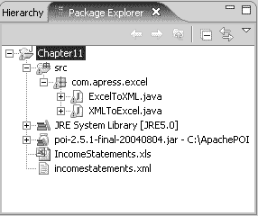

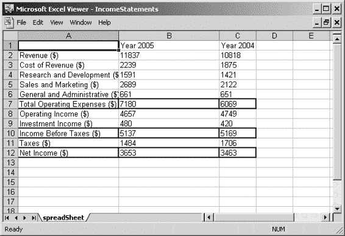

Vohra_706-0C11.fm 第 301 页 2006 年 8 月 8 日星期二 上午 6:43

第 11 章 ■ 将 XML 转换为电子表格，反之亦然 **301**

**图 11-3.** *Chapter11 项目中的 Excel 电子表格 IncomeStatements.xls* **图 11-4.** *IncomeStatements.xls 电子表格*

**将 Excel 电子表格转换为**

**XML 文档**

在上一节中，你学习了如何从 XML 文档生成 Excel 文档。在本节中，你将把 Excel 文档转换为 XML 文档。从电子表格生成 XML 文档的步骤如下：

**1.** 使用 `DocumentBuilder` 创建一个空的 XML 文档。

**2.** 添加顶层的 `stmt` 元素。

**3.** 从 Excel 文件创建一个 `HSSFSheet` 对象。

**4.** 遍历电子表格，并向 XML 文档添加子元素。

**5.** 使用 `Transformer` API 输出 XML 文档。

[www.it-ebooks.info](http://www.it-ebooks.info/)

Vohra_706-0C11.fm 第 302 页 2006 年 8 月 8 日星期二 上午 6:43

**302**

第 11 章 ■ 将 XML 转换为电子表格，反之亦然 你可以使用 Apache POI HSSF API 来解析 Excel 电子表格并从电子表格中检索单元格值。与上一节一样，首先需要导入 Apache POI 包 `org.apache.poi.hssf.usermodel`。

你将生成的 XML 文档（清单 11-1）的根元素是 `incmstmts`，并且你将添加一个与 Excel 电子表格的每一列相对应的 `stmt` 元素。因此，如清单 11-10 所示，使用 `DocumentBuilder` 对象生成一个 XML 文档，并添加文档的根元素。你可以从 `DocumentBuilderFactory` 对象获取 `DocumentBuilder` 对象，如清单 11-10 所示。

**清单 11-10.** *创建 XML 文档*

DocumentBuilderFactory factory =DocumentBuilderFactory.newInstance(); DocumentBuilder builder = factory.newDocumentBuilder();

Document document = builder.newDocument();

Element rootElement=document.createElement("incmstmts"); document.appendChild(rootElement);

你可以使用 `InputStream` 读取要转换为 XML 文档的 XLS 电子表格，如清单 11-11 所示。随后，从 `InputStream` 对象获取一个工作簿，并获取 Excel 工作簿中的电子表格。

**清单 11-11.** *获取电子表格*

InputStream input=new FileInputStream(new File("IncomeStatements.xls") ); HSSFWorkbook workbook=new HSSFWorkbook(input);

HSSFSheet spreadsheet=workbook.getSheetAt(0);

为了构建 XML 文档，为电子表格中的每一列添加一个 `stmt` 元素。你还需要为每个 `stmt` 元素添加一个与列标题对应的元素 `year`，如清单 11-12 所示。

**清单 11-12.** *添加 stmt 元素*

Element stmtElement1 = document.createElement("stmt"); rootElement.appendChild(stmtElement1);

Element year1 = document.createElement("year"); stmtElement1.appendChild(year1);

year1.appendChild(document.createTextNode("2005")); 为了向 `stmt` 元素添加子元素，遍历电子表格的行，并使用 `switch` 语句检索行单元格值；使用这些行单元格值来创建子元素。由于第一行（索引 0）是标题行，因此从第二行开始遍历。例如，要添加一个 `revenue` 元素，使用 `HSSFSheet` 类的 `getRow(int)` 方法检索第二行（索引 1）。你可以使用 `HSSFRow` 方法 `getCell(short)` 检索行单元格，并使用 `getStringCellValue()` 方法获取行单元格值，如清单 11-13 所示。

你可以使用 `HSSFSheet` 类的方法 `getLastRowNum()` 获取电子表格中的行数。

**清单 11-13.** *向 XML 文档添加元素* for (int i = 1; i <= spreadsheet.getLastRowNum(); i++) {

switch (i) {

case 1:

HSSFRow row1 = spreadsheet.getRow(1);

Element revenueElement1 =

document.createElement("revenue");

[www.it-ebooks.info](http://www.it-ebooks.info/)

Vohra_706-0C11.fm 第 303 页 2006 年 8 月 8 日星期二 上午 6:43

第 11 章 ■ 将 XML 转换为电子表格，反之亦然 **303**

stmtElement1.appendChild(revenueElement1);

revenueElement1.appendChild

(document.createTextNode

(row1.getCell((short)1).

getStringCellValue()));

Element revenueElement2 = document.createElement("revenue"); stmtElement2.appendChild(revenueElement2);

revenueElement2.appendChild

(document.createTextNode

(row1.getCell((short) 2).

getStringCellValue()));

break;

}

}

类似地，从电子表格中检索其他单元格值，并在 XML 文档中指定它们。你可以使用 `Transformer` API 生成 XML 文档。你可以从 `TransformerFactory` 对象获取 `Transformer` 对象，如清单 11-14 所示。你可以使用 `transform(DOMSource, StreamResult)` 方法输出 XML 文档，该方法以 `DOMSource` 对象作为输入，以 `StreamResult` 对象作为输出，如清单 11-14 所示。

**清单 11-14.** *输出 XML 文档*

TransformerFactory tFactory = TransformerFactory.newInstance(); Transformer transformer = tFactory.newTransformer();

DOMSource source = new DOMSource(document);

StreamResult result = new StreamResult(new File(System.out)); transformer.transform(source, result);

清单 11-15 展示了用于将 Excel 电子表格转换为 XML 文档的 Java 应用程序 `ExcelToXML.java`。该应用程序包含一个方法 `generateXML(File excelFile)`，用于将电子表格转换为 XML 文档。使用 `DocumentBuilder` 对象创建 XML 文档。解析电子表格，并为电子表格中的每一列添加一个 XML 文档元素 `stmt`。向与列中的行对应的 `stmt` 元素添加元素。使用 `Transformer` API 输出 XML 文档。

**清单 11-15.** *ExcelToXML.java*

package com.apress.excel;

import org.apache.poi.hssf.usermodel.*;

import org.w3c.dom.*;

import java.io.*;

import javax.xml.parsers.*;

import javax.xml.transform.*;

import javax.xml.transform.dom.DOMSource;

import javax.xml.transform.stream.StreamResult;

[www.it-ebooks.info](http://www.it-ebooks.info/)

Vohra_706-0C11.fm 第 304 页 2006 年 8 月 8 日星期二 上午 6:43

**304**

第 11 章 ■ 将 XML 转换为电子表格，反之亦然 public class ExcelToXML {

public void generateXML(File excelFile) {

try { //初始化 XML 文档

DocumentBuilderFactory factory = DocumentBuilderFactory

.newInstance();

DocumentBuilder builder = factory.newDocumentBuilder();

Document document = builder.newDocument();

Element rootElement = document.createElement("incmstmts"); document.appendChild(rootElement);

//创建顶层元素

Element stmtElement1 = document.createElement("stmt"); rootElement.appendChild(stmtElement1);

Element stmtElement2 = document.createElement("stmt"); rootElement.appendChild(stmtElement2);

//添加第一个子元素

Element year1 = document.createElement("year"); stmtElement1.appendChild(year1);


year1.appendChild(document.createTextNode("2005")); Element year2 = document.createElement("year"); stmtElement2.appendChild(year2);

year2.appendChild(document.createTextNode("2004"));

//从 Excel 文件创建 HSSFSpreadsheet 对象

InputStream input = new FileInputStream(excelFile);

HSSFWorkbook workbook = new HSSFWorkbook(input);

HSSFSheet spreadsheet = workbook.getSheetAt(0);

for (int i = 1; i <= spreadsheet.getLastRowNum(); i++) {

switch (i) {

//遍历电子表格行以创建 stmt 元素

//子元素。

case 1:

HSSFRow row1 = spreadsheet.getRow(1);

Element revenueElement1 = document.createElement("revenue"); stmtElement1.appendChild(revenueElement1);

revenueElement1.appendChild

(document.createTextNode

(row1.getCell((short) 1).

getStringCellValue()));

Element revenueElement2 = document.createElement("revenue"); stmtElement2.appendChild(revenueElement2);

revenueElement2.appendChild

(document.createTextNode

(row1.getCell((short) 2).

getStringCellValue()));

[www.it-ebooks.info](http://www.it-ebooks.info/)

Vohra_706-0C11.fm Page 305 Tuesday, August 8, 2006 6:43 AM

第 11 章 ■ 将 XML 转换为电子表格，反之亦然 **305**

break;

case 2:

HSSFRow row2 = spreadsheet.getRow(2);

Element costofrevenue1 = document

.createElement("costofrevenue");

stmtElement1.appendChild(costofrevenue1);

costofrevenue1.appendChild

(document.createTextNode

(row2.getCell((short)1).

getStringCellValue()));

Element costofrevenue2 = document.createElement("costofrevenue"); stmtElement2.appendChild(costofrevenue2);

costofrevenue2.appendChild

(document.createTextNode

(row2.getCell((short) 2).

getStringCellValue()));

break;

case 3:

HSSFRow row3 = spreadsheet.getRow(3);

Element researchdevelopment1 = document.createElement("researchdevelopment"); stmtElement1.appendChild(researchdevelopment1);

researchdevelopment1.appendChild

(document.createTextNode

(row3.getCell((short) 1)

.getStringCellValue()));

Element researchdevelopment2 =

document.createElement("researchdevelopment");

stmtElement2.appendChild(researchdevelopment2);

researchdevelopment2.appendChild

(document.createTextNode

(row3.getCell((short) 2).

getStringCellValue()));

break;

case 4:

HSSFRow row4 = spreadsheet.getRow(4);

Element salesmarketing1 = document

.createElement("salesmarketing");

stmtElement1.appendChild(salesmarketing1);

salesmarketing1.appendChild(document.createTextNode(row4

.getCell((short) 1).getStringCellValue()));

Element salesmarketing2 = document

.createElement("salesmarketing");

stmtElement2.appendChild(salesmarketing2);

[www.it-ebooks.info](http://www.it-ebooks.info/)

Vohra_706-0C11.fm Page 306 Tuesday, August 8, 2006 6:43 AM

**306**

第 11 章 ■ 将 XML 转换为电子表格，反之亦然 salesmarketing2.appendChild(document.createTextNode(row4

.getCell((short) 2).getStringCellValue()));

break;

case 5:

HSSFRow row5 = spreadsheet.getRow(5);

Element generaladmin1 = document

.createElement("generaladmin");

stmtElement1.appendChild(generaladmin1);

generaladmin1.appendChild(document.createTextNode(row5

.getCell((short) 1).getStringCellValue()));

Element generaladmin2 = document

.createElement("generaladmin");

stmtElement2.appendChild(generaladmin2);

generaladmin2.appendChild(document.createTextNode(row5

.getCell((short) 2).getStringCellValue()));

break;

case 6:

HSSFRow row6 = spreadsheet.getRow(6);

Element totaloperexpenses1 = document

.createElement("totaloperexpenses");

stmtElement1.appendChild(totaloperexpenses1);

totaloperexpenses1.appendChild(document.createTextNode(row6

.getCell((short) 1).getStringCellValue()));

Element totaloperexpenses2 = document

.createElement("totaloperexpenses");

stmtElement2.appendChild(totaloperexpenses2);

totaloperexpenses2.appendChild(document.createTextNode(row6

.getCell((short) 2).getStringCellValue()));

break;

case 7:

HSSFRow row7 = spreadsheet.getRow(7);

Element operincome1 = document.createElement("operincome"); stmtElement1.appendChild(operincome1);

operincome1.appendChild(document.createTextNode(row7


.getCell((short) 1).getStringCellValue()));

Element operincome2 = document.createElement("operincome"); stmtElement2.appendChild(operincome2);

operincome2.appendChild

(document.createTextNode

(row7.getCell((short) 2).

getStringCellValue()));

break;

[www.it-ebooks.info](http://www.it-ebooks.info/)

Vohra_706-0C11.fm Page 307 Tuesday, August 8, 2006 6:43 AM

第 11 章 ■ 将 XML 转换为电子表格，反之亦然 **307**

case 8:

HSSFRow row8 = spreadsheet.getRow(8);

Element invincome1 = document.createElement("invincome"); stmtElement1.appendChild(invincome1);

invincome1.appendChild

(document.createTextNode

(row8.getCell((short) 1).

getStringCellValue()));

Element invincome2 = document.createElement("invincome"); stmtElement2.appendChild(invincome2);

invincome2.appendChild

(document.createTextNode

(row8.getCell((short) 2).

getStringCellValue()));

break;

case 9:

HSSFRow row9 = spreadsheet.getRow(9);

Element incbeforetaxes1 = document

.createElement("incbeforetaxes");

stmtElement1.appendChild(incbeforetaxes1);

incbeforetaxes1.appendChild

(document.createTextNode

(row9.getCell((short) 1).

getStringCellValue()));

Element incbeforetaxes2 =

document.createElement("incbeforetaxes");

stmtElement2.appendChild(incbeforetaxes2);

incbeforetaxes2.appendChild

(document.createTextNode

(row9.getCell((short)2).

getStringCellValue()));

break;

case 10:

HSSFRow row10 = spreadsheet.getRow(10);

Element taxes1 = document.createElement("taxes"); stmtElement1.appendChild(taxes1);

taxes1.appendChild(document.createTextNode(row10.getCell(

(short) 1).getStringCellValue()));

Element taxes2 = document.createElement("taxes"); stmtElement2.appendChild(taxes2);

[www.it-ebooks.info](http://www.it-ebooks.info/)

Vohra_706-0C11.fm Page 308 Tuesday, August 8, 2006 6:43 AM

**308**

第 11 章 ■ 将 XML 转换为电子表格，反之亦然 taxes2.appendChild(document.createTextNode(row10.getCell(

(short) 2).getStringCellValue()));

break;

case 11:

HSSFRow row11 = spreadsheet.getRow(11);

Element netincome1 = document.createElement("netincome"); stmtElement1.appendChild(netincome1);

netincome1.appendChild(document.createTextNode(row11

.getCell((short) 1).getStringCellValue()));

Element netincome2 = document.createElement("netincome"); stmtElement2.appendChild(netincome2);

netincome2.appendChild(document.createTextNode(row11

.getCell((short) 2).getStringCellValue()));

break;

default:

break;

}

}

TransformerFactory tFactory = TransformerFactory.newInstance(); Transformer transformer = tFactory.newTransformer();

//Add indentation to output

transformer.setOutputProperty

(OutputKeys.INDENT, "yes");

transformer.setOutputProperty(

"{http://xml.apache.org/xslt}indent-amount", "2"); DOMSource source = new DOMSource(document);

StreamResult result = new StreamResult(System.out);

transformer.transform(source, result);

} catch (IOException e) {

System.out.println("IOException " + e.getMessage());

} catch (ParserConfigurationException e) {

System.out

.println("ParserConfigurationException " + e.getMessage());

} catch (TransformerConfigurationException e) {

System.out.println("TransformerConfigurationException "

+ e.getMessage());

} catch (TransformerException e) {

System.out.println("TransformerException " + e.getMessage());

}

}

[www.it-ebooks.info](http://www.it-ebooks.info/)

Vohra_706-0C11.fm Page 309 Tuesday, August 8, 2006 6:43 AM

第 11 章 ■ 将 XML 转换为电子表格，反之亦然 **309**

public static void main(String[] argv) {

ExcelToXML excel = new ExcelToXML();

File input = new File("IncomeStatements.xls");

excel.generateXML(input);

}

}

你可以按照第 1 章中介绍的过程在 Eclipse 中运行应用程序 ExcelToXML.java。清单 11-16 显示了 ExcelToXML.java 应用程序的输出。

**清单 11-16.** *ExcelToXML.java 的输出*

<?xml version="1.0" encoding="UTF-8"?>

<incmstmts>

<stmt>

<year>2005</year>

<revenue>11837</revenue>

<costofrevenue>2239</costofrevenue>

<researchdevelopment>1591</researchdevelopment>


<salesmarketing>2689</salesmarketing>

<generaladmin>661</generaladmin>

<totaloperexpenses>7180</totaloperexpenses>

<operincome>4657</operincome>

<invincome>480</invincome>

<incbeforetaxes>5137</incbeforetaxes>

<taxes>1484</taxes>

<netincome>3653</netincome>

</stmt>

<stmt>

<year>2004</year>

<revenue>10818</revenue>

<costofrevenue>1875</costofrevenue>

<researchdevelopment>1421</researchdevelopment>

<salesmarketing>2122</salesmarketing>

<generaladmin>651</generaladmin>

<totaloperexpenses>6069</totaloperexpenses>

<operincome>4749</operincome>

<invincome>420</invincome>

<incbeforetaxes>5169</incbeforetaxes>

<taxes>1706</taxes>

<netincome>3463</netincome>

</stmt>

</incmstmts>

**总结**

Apache POI API 提供了一种在 XML 和电子表格之间转换数据的实用机制。

在本章中，您学习了如何将示例 XML 文档转换为 Excel 电子表格，然后再将电子表格转换为 XML 文档。由于 XML 是一种通用格式，因此您可以用它实现的功能几乎没有限制！

[www.it-ebooks.info](http://www.it-ebooks.info/)

Vohra_706-0C11.fm Page 310 Tuesday, August 8, 2006 6:43 AM

[www.it-ebooks.info](http://www.it-ebooks.info/)

Vohra_706-0C12.fm Page 311 Saturday, July 29, 2006 6:20 AM

第 12 章

■ ■ ■

将 XML 转换为 PDF

**在**上一章中，我们讨论了将 XML 文档转换为 Microsoft Excel 电子表格的过程。在本章中，我们将展示如何将 XML 文档转换为 PDF 文档。

开源 Apache 格式化对象处理器 (FOP) 项目提供了一个 API，用于将 XML 文档转换为 PDF 或其他格式，例如打印机控制语言 (PCL)、PostScript (PS)、可缩放矢量图形 (SVG)、XML、打印、抽象窗口工具包 (AWT)、Maker 交换格式 (MIF) 或 TXT。您还可以使用 Apache FOP API 设置布局和字体。Apache FOP 接收 XSL 格式化对象（一个 XSL-FO 对象）作为输入，并生成 PDF（或其他格式）文档作为输出。XSL-FO 在 XSL 1.0 规范中定义。¹ 因此，要将 XML 转换为 PDF，您首先需要将 XML 转换为 XSL-FO，然后再将 XSL-FO 转换为 PDF。

**安装软件**

在设置项目之前，您需要下载 Apache FOP² zip 文件 `fop-0.20.5-bin.zip` 并将该 zip 文件解压到一个目录中。假设 `<FOP>` 是您解压 FOP zip 文件的目录，那么您需要表 12-1 中列出的 JAR 文件来开发 XML 到 PDF 的转换应用程序。

**表 12-1.** *Apache FOP JAR 文件*

**JAR 文件**

**描述**

<FOP>/build/fop.jar

FOP API 类

<FOP>/lib/avalon-framework-cvs-20020806.jar

日志记录器类

<FOP>/lib/batik.jar

图形类

<FOP>/lib/xercesImpl-2.2.1.jar

Xerces API

<FOP>/lib/xml-apis.jar

XML API

<FOP>/lib/xalan-2.4.1.jar

XSLT API

您还需要下载 JDK 5.0。（您也可以使用其他版本的 JDK，例如 1.4 或 6.0。）

1. 请参阅 http://www.w3.org/TR/xsl/。
2. 有关 Apache FOP 的更多信息，请参阅 http://xmlgraphics.apache.org/fop/。

**311**

[www.it-ebooks.info](http://www.it-ebooks.info/)

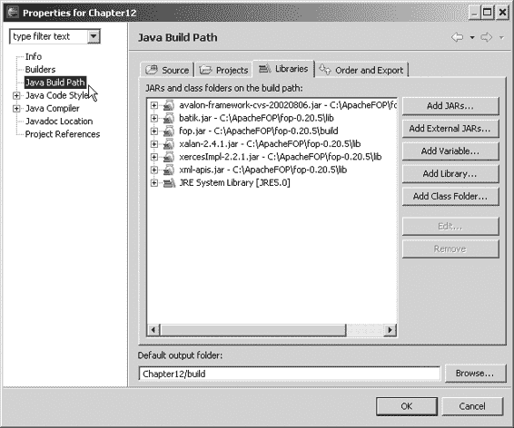

Vohra_706-0C12.fm Page 312 Saturday, July 29, 2006 6:20 AM

**312**

第 12 章 ■ 将 XML 转换为 PDF

**设置 Eclipse 项目**

要编译和运行代码示例，您需要一个 Eclipse 项目。您可以从 Apress 网站 (http://www.apress.com) 下载 Chapter12 项目，并通过选择 **文件** ➤ **导入** 将其导入到您的 Eclipse 工作区中。Chapter12 项目包含一个 `com.apress.pdf` 包以及该包中的 Java 类 `XMLToPDF.java`。`XMLToPDF.java` 应用程序执行 XML 到 PDF 的转换。Chapter12 项目还包含一个示例 XML 文档（清单 12-1 中的 `catalog.xml`）和一个示例 XSLT 样式表（清单 12-2 中的 `catalog.xslt`）。

要编译和运行 XML 到 PDF 的代码示例，您需要在项目的 Java 构建路径中包含一些 Apache FOP JAR 文件；图 12-1 显示了这些 JAR 文件。您还需要将 JRE 系统库设置为 JRE 5.0，如图 12-1 所示。


**图 12-1.** *第 12 章 Java 构建路径*

图 12-2 展示了第 12 章项目的目录结构。

[www.it-ebooks.info](http://www.it-ebooks.info/)

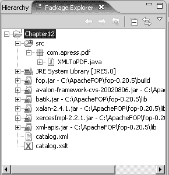

Vohra_706-0C12.fm 第 313 页 2006 年 7 月 29 日 星期六 上午 6:20

第 12 章 ■ 将 XML 转换为 PDF

**313**

**图 12-2.** *第 12 章项目目录结构* **将 XML 文档转换为 XSL-FO**

XSL-FO 格式化对象包含有关要在 PDF 文档中呈现的数据的格式化信息、文档中使用的布局和字体，以及文档中的表格。要将 XML 文档转换为 PDF 文档，首先需要将 XML 文档转换为 XSL-FO 文档。将 XML 文档转换为 XSL-FO 文档的步骤如下： **1.** 创建一个 XSLT 来将 XML 转换为 XSL-FO。

**2.** 设置解析器和转换器系统属性。

**3.** 从 XML 文档创建一个 Document 对象。

**4.** 创建一个 Transformer 对象。

**5.** 将 XML 文档转换为 XSL-FO 文档。

XSL-FO 文档位于 FO 命名空间中。因此，XSL-FO 文档在根元素 `fo:root` 中包含一个命名空间声明：`xmlns:fo=http://www.w3.org/1999/XSL/Format`。

表 12-2 列出了 XSL-FO 文档中一些常用的元素。

**表 12-2.** *XSL-FO 元素*

**元素**

**属性**

**子元素**

**描述**

fo:root

xmlns:fo

fo:layout-master-set, XSL-FO 文档中的根元素

fo:page-sequence

fo:layout-master-set

fo:simple-page-master 由一组页面母版组成

（至少需要一个页面母版）

fo:simple-page-master

margin-right, margin-left,

fo:region-body

指定页面布局

margin-bottom, margin-top,

page-width, page-height,

master-name

[www.it-ebooks.info](http://www.it-ebooks.info/)

Vohra_706-0C12.fm 第 314 页 2006 年 7 月 29 日 星期六 上午 6:20

**314**

第 12 章 ■ 将 XML 转换为 PDF

**表 12-2.** *XSL-FO 元素（续）*

**元素**

**属性**

**子元素**

**描述**

fo:page-sequence

master-reference

fo:title,

指定页面母版的顺序

fo:static-content,

fo:flow

fo:flow

flow-name

fo:block

页面内容

fo:block

space-before, space-after,

fo:table,

页面内容的基础元素；

font-weight, font-size

fo:list-block

包含格式化信息。

fo:list-block

provisional-distance-

fo:list-item

指定一个包含列表的块

between-starts,

provisional-label-separation

fo:list-item

text-indent

fo:list-item-label,

指定一个列表项

fo:list-item-body

fo:table

border-spacing, table-layout

fo:table-column,

指定页面中的表格

fo:table-header,

fo:table-body

fo:table-column

column-number,

表格中的列

column-width

fo:table-header

fo:table-row

表头

fo:table-body

table-layout

fo:table-row

表格行

fo:table-row

font-weight

fo:table-cell

表格中的行

fo:table-cell

column-number

fo:block

包含行单元格文本的行单元格

XSL-FO 对象的 DTD 可从 http://www.renderx.com/Tests/validator/fo2000.dtd.html 获取。在本节中，我们将演示如何使用 XSLT 将示例 XML 文档 catalog.xml 转换为 XSL-FO 文档。清单 12-1 展示了示例 XML 文档 catalog.xml。

**清单 12-1.** *catalog.xml*

<?xml version="1.0" encoding="UTF-8"?>

<catalog>

<journal>

<section>Java 技术</section>

<publisher>IBM developerWorks</publisher>

<level>入门级</level>

<edition>2004 年 11 月</edition>

<title>枚举类型入门</title>

<author>Brett McLaughlin</author>

</journal>

<journal>

<section>Java 技术</section>

[www.it-ebooks.info](http://www.it-ebooks.info/)

Vohra_706-0C12.fm 第 315 页 2006 年 7 月 29 日 星期六 上午 6:20

第 12 章 ■ 将 XML 转换为 PDF

**315**

<publisher>IBM developerWorks</publisher>

<level>中级</level>

<edition>2004 年 9 月</edition>

<title>迁移到 Eclipse</title>

<author>David Gallardo</author>

</journal>

<journal>

<section>Java 技术</section>

<publisher>IBM developerWorks</publisher>

<level>中级</level>

<edition>2004 年 1 月</edition>


<title>使用 J2EE 技术设计面向服务的架构框架</title>

<author>纳文·巴拉尼</author>

</journal>

</catalog>

Apache FOP API 可根据 XSL-FO 文档生成 PDF 文档。该 PDF 文档以表格形式呈现 XML 文档数据。因此，首先需要使用 XSLT 将示例 XML 文档转换为 XSL-FO 文档。一个将 XML 转换为 XSL-FO 的 XSLT 样式表会从 XML 文档中检索数据，并使用 XSL-FO 命名空间中的元素，创建 XML 数据的格式化对象表示。（表 12-2 讨论了 XSL-FO 命名空间元素。）清单 12-2 展示了示例 XSLT 文档 `catalog.xslt`，用于将示例文档转换为 XSL-FO 文档。

**清单 12-2.** *catalog.xslt*

<?xml version="1.0" encoding="UTF-8"?>

<xsl:stylesheet version="1.1"

exclude-result-prefixes="fo">

<xsl:output method="xml" version="1.0" omit-xml-declaration="no" indent="yes"/>

<!-- ========================= -->

<!-- 根元素：catalog -->

<!-- ========================= -->

<xsl:template match="/catalog">

<fo:root >

<!--设置字体和页面 -->

<fo:layout-master-set>

<fo:simple-page-master master-name="simpleA4" page-height="29.7cm"

page-width="75cm" margin-top="2cm" margin-bottom="2cm"

margin-left="5cm" margin-right="5cm">

<fo:region-body/>

</fo:simple-page-master>

</fo:layout-master-set>

<fo:page-sequence master-reference="simpleA4">

<fo:flow flow-name="xsl-region-body">

<fo:block font-size="40pt"

font-weight="bold" text-align="center"

space-after="5mm">

目录

</fo:block>

<fo:block font-size="25pt">

[www.it-ebooks.info](http://www.it-ebooks.info/)

Vohra_706-0C12.fm 第 316 页 2006 年 7 月 29 日，星期六，上午 6:20

**316**

第 12 章 ■ 将 XML 转换为 PDF

<fo:table table-layout="fixed">

<fo:table-column column-width="10cm"/>

<fo:table-column column-width="10cm"/>

<fo:table-column column-width="10cm"/>

<fo:table-column column-width="10cm"/>

<fo:table-column column-width="10cm"/>

<fo:table-column column-width="10cm"/>

<!--设置表头 -->

<fo:table-header>

<fo:table-row font-weight="bold"><fo:table-cell>

<fo:block>

<xsl:text>章节</xsl:text>

</fo:block>

</fo:table-cell>

<fo:table-cell>

<fo:block>

<xsl:text>出版商</xsl:text>

</fo:block>

</fo:table-cell>

<fo:table-cell>

<fo:block>

<xsl:text>级别</xsl:text>

</fo:block>

</fo:table-cell>

<fo:table-cell>

<fo:block>

<xsl:text>版本</xsl:text>

</fo:block>

</fo:table-cell>

<fo:table-cell>

<fo:block>

<xsl:text>标题</xsl:text>

</fo:block>

</fo:table-cell>

<fo:table-cell>

<fo:block>

<xsl:text>作者</xsl:text>

</fo:block>

</fo:table-cell>

</fo:table-row>

</fo:table-header>

<fo:table-body>

<!--调用模板以将 XML 文档中的数据添加到 XSL-FO 表格 -->

<xsl:apply-templates select="journal"/>

</fo:table-body>

</fo:table>

</fo:block>

</fo:flow>

</fo:page-sequence>

<!--XSL-FO 文档根元素结束 -->

</fo:root>

[www.it-ebooks.info](http://www.it-ebooks.info/)

Vohra_706-0C12.fm 第 317 页 2006 年 7 月 29 日，星期六，上午 6:20

第 12 章 ■ 将 XML 转换为 PDF

**317**

</xsl:template>

<!--用于向 XSL-FO 文档添加数据的模板 -->

<xsl:template match="journal">

<fo:table-row>

<fo:table-cell>

<fo:block>

<xsl:value-of select="section"/>

</fo:block>

</fo:table-cell>

<fo:table-cell>

<fo:block>

<xsl:value-of select="publisher"/>

</fo:block>

</fo:table-cell>

<fo:table-cell>

<fo:block>

<xsl:value-of select="level"/>

</fo:block>

</fo:table-cell>

<fo:table-cell>

<fo:block>

<xsl:value-of select="edition"/>

</fo:block>

</fo:table-cell>

<fo:table-cell>

<fo:block>

<xsl:value-of select="title"/>

</fo:block>

</fo:table-cell>

<fo:table-cell>

<fo:block>

<xsl:value-of select="author"/>

</fo:block>

</fo:table-cell>

</fo:table-row>

</xsl:template>

</xsl:stylesheet>

**设置系统属性**

您可以使用第 5 章讨论的 XML 转换 API（Transformation API for XML）执行 XML 到 XSL-FO 的转换。您将使用 `DocumentBuilder` 解析器解析示例 XML 文档，并使用 `Transformer` 对象对其进行转换。因此，您需要设置系统属性 `javax.xml.parsers.DocumentBuilderFactory` 和 `javax.xml.transform.TransformerFactory`，如清单 12-3 所示。您使用 `DocumentBuilderFactory` 创建 `DocumentBuilder` 对象，使用 `TransformerFactory` 创建 `Transformer` 对象。

[www.it-ebooks.info](http://www.it-ebooks.info/)

Vohra_706-0C12.fm 第 318 页 2006 年 7 月 29 日，星期六，上午 6:20

**318**

第 12 章 ■ 将 XML 转换为 PDF

**清单 12-3.** *设置系统属性*

System.setProperty("javax.xml.parsers.DocumentBuilderFactory",

"org.apache.xerces.jaxp.DocumentBuilderFactoryImpl"); System.setProperty

("javax.xml.transform.TransformerFactory",

"org.apache.xalan.processor.TransformerFactoryImpl"); **创建文档**

您可以通过使用 `DocumentBuilder` 对象解析 XML 文档来创建 `Document` 对象。您从 `DocumentBuilderFactory` 对象获取 `DocumentBuilder` 对象。因此，您需要使用静态方法 `newInstance()` 创建一个 `DocumentBuilderFactory` 对象。随后，使用 `DocumentBuilderFactory` 对象的方法 `newDocumentBuilder()` 创建 `DocumentBuilder` 对象，如清单 12-4 所示。您可以使用 `InputStream`、`InputSource` 或 `File` 的重载 `parse()` 方法之一来解析 XML 文档。示例应用程序从 `File` 对象解析 XML 文档，如清单 12-4 所示。`parse(File)` 对象返回一个 `Document` 对象。

**清单 12-4.** *解析 XML 文档*

DocumentBuilderFactory factory = DocumentBuilderFactory.newInstance(); DocumentBuilder builder = factory.newDocumentBuilder();

Document document = builder.parse(new File("catalog.xml")); **创建转换器**

您还需要创建一个 `Transformer` 对象来转换通过 `DocumentBuilder` 对象获得的 `Document` 对象。您可以从 `TransformerFactory` 对象获取 `Transformer` 对象。因此，使用静态方法 `newInstance()` 创建一个 `TransformerFactory` 对象，如清单 12-5 所示。为了在从 `TransformerFactory` 对象获得的 `Transformer` 对象上设置样式表，请从示例样式表创建一个 `StreamSource` 对象。随后，使用方法 `newTransformer(StyleSource)` 创建一个 `Transformer` 对象。

**清单 12-5.** *创建 Transformer 对象*

TransformerFactory tFactory = TransformerFactory.newInstance(); StreamSource stylesource = new StreamSource(new File("catalog.xslt")); Transformer transformer = tFactory.newTransformer(stylesource); **将 XML 文档转换为 XSL-FO**

`Transformer` 类提供了方法 `transform(Source, Result)` 来将 XML 输入转换为输出。您可以将输入指定为 `DOMSource`、`SAXSource` 或 `StreamSource`。您可以将输出指定为 `DOMResult`、`SAXResult` 或 `StreamResult`。在示例应用程序中，输入被指定为 `DOMSource`，输出被指定为 `StreamResult`。因此，从 `Document` 对象创建一个 `DOMSource` 对象，并从 `catalog.fo` 文件创建一个 `StreamResult` 对象，如清单 12-6 所示。随后，使用 `transform(DOMSource, SAXResult)` 对象转换示例 XML 文档，如清单 12-6 所示。

[www.it-ebooks.info](http://www.it-ebooks.info/)

Vohra_706-0C12.fm 第 319 页 2006 年 7 月 29 日，星期六，上午 6:20

第 12 章 ■ 将 XML 转换为 PDF

**319**

**清单 12-6.** *将 XML 文档转换为 XSL-FO*

DOMSource source = new DOMSource(document);

StreamResult result = new StreamResult("catalog.fo"); transformer.transform(source, result);


XSL-FO 文档 `catalog.fo` 以表格形式呈现 XML 文档数据。`layout-master-set` 元素指定了页面布局和页面特性，例如页边距、页面宽度和页面高度。`page-sequence` 元素定义了一个 XSL-FO 页面。`fo:block` 元素指定页面内容。`fo:table` 元素定义了一个表格。清单 12-7 展示了转换生成的 XSL-FO 文档。

**清单 12-7.** *catalog.fo*

<?xml version="1.0" encoding="UTF-8"?>

<fo:root >

<fo:layout-master-set>

<fo:simple-page-master margin-right="5cm"

margin-left="5cm" margin-bottom="2cm"

margin-top="2cm" page-width="75cm"

page-height="29.7cm" master-name="simpleA4">

<fo:region-body/>

</fo:simple-page-master>

</fo:layout-master-set>

<fo:page-sequence master-reference="simpleA4">

<fo:flow flow-name="xsl-region-body">

<fo:block space-after="5mm" text-align="center" font-weight="bold" font-size="40pt"> 目录

</fo:block>

<fo:block font-size="25pt">

<fo:table table-layout="fixed">

<fo:table-column column-width="10cm"/>

<fo:table-column column-width="10cm"/>

<fo:table-column column-width="10cm"/>

<fo:table-column column-width="10cm"/>

<fo:table-column column-width="10cm"/>

<fo:table-column column-width="10cm"/>

<fo:table-header>

<fo:table-row font-weight="bold">

<fo:table-cell>

<fo:block>章节</fo:block>

</fo:table-cell>

<fo:table-cell>

<fo:block>出版商</fo:block>

</fo:table-cell>

<fo:table-cell>

<fo:block>级别</fo:block>

</fo:table-cell>

<fo:table-cell>

<fo:block>版本</fo:block>

</fo:table-cell>

<fo:table-cell>

<fo:block>标题</fo:block>

</fo:table-cell>

<fo:table-cell>

[www.it-ebooks.info](http://www.it-ebooks.info/)

Vohra_706-0C12.fm Page 320 Saturday, July 29, 2006 6:20 AM

**320**

第 12 章 ■ 将 XML 转换为 PDF

<fo:block>作者</fo:block>

</fo:table-cell>

</fo:table-row>

</fo:table-header>

<fo:table-body>

<fo:table-row>

<fo:table-cell>

<fo:block>Java 技术</fo:block>

</fo:table-cell>

<fo:table-cell>

<fo:block>IBM developerWorks</fo:block>

</fo:table-cell>

<fo:table-cell>

<fo:block>入门</fo:block>

</fo:table-cell>

<fo:table-cell>

<fo:block>2004 年 11 月</fo:block>

</fo:table-cell>

<fo:table-cell>

<fo:block>枚举类型入门</fo:block>

</fo:table-cell>

<fo:table-cell>

<fo:block>Brett McLaughlin</fo:block>

</fo:table-cell>

</fo:table-row>

<fo:table-row>

<fo:table-cell>

<fo:block>Java 技术</fo:block>

</fo:table-cell>

<fo:table-cell>

<fo:block>IBM developerWorks</fo:block>

</fo:table-cell>

<fo:table-cell>

<fo:block>中级</fo:block>

</fo:table-cell>

<fo:table-cell>

<fo:block>2004 年 9 月</fo:block>

</fo:table-cell>

<fo:table-cell>

<fo:block>迁移到 Eclipse</fo:block>

</fo:table-cell>

<fo:table-cell>

<fo:block>David Gallardo</fo:block>

</fo:table-cell>

</fo:table-row>

<fo:table-row>

<fo:table-cell>

<fo:block>Java 技术</fo:block>

</fo:table-cell>

<fo:table-cell>

<fo:block>IBM developerWorks</fo:block>

</fo:table-cell>

<fo:table-cell>

<fo:block>中级</fo:block>

[www.it-ebooks.info](http://www.it-ebooks.info/)

Vohra_706-0C12.fm Page 321 Saturday, July 29, 2006 6:20 AM

第 12 章 ■ 将 XML 转换为 PDF

**321**

</fo:table-cell>

<fo:table-cell>

<fo:block>2004 年 1 月</fo:block>

</fo:table-cell>

<fo:table-cell>

<fo:block>使用 J2EE 技术设计面向服务的架构框架</fo:block>

</fo:table-cell>

<fo:table-cell>

<fo:block>Naveen Balani</fo:block>

</fo:table-cell>

</fo:table-row>

</fo:table-body>

</fo:table>

</fo:block>

</fo:flow>

</fo:page-sequence>

</fo:root>

**生成 PDF 文档**

在接下来的章节中，你将使用 Apache FOP API 从 XSL-FO 文档 `catalog.fo` 生成一个 PDF 文档。从 XSL-FO 文档生成 PDF 文档的步骤如下：

**1.** 创建一个 FOP 驱动程序。

**2.** 将 FOP 驱动程序的渲染器设置为 PDF 渲染器。

**3.** 指定 XSL-FO 文档的输入和 PDF 文档的输出。

**4.** 运行 FOP 驱动程序以生成 PDF 文档。

你需要导入 Apache FOP 包 `org.apache.fop.apps` 和 `org.apache.avalon`。


将 `framework.logger` 应用于 XMLToPDF.java 应用程序。

**创建 FOP 驱动**

要将 XSL-FO 文档转换为 PDF 文档，需要创建一个 FOP 驱动对象，如清单 12-8 所示。还需要创建一个日志级别设置为 `LEVEL_INFO` 的控制台日志记录器，并将该日志记录器设置到 FOP 驱动和 `MessageHandler` 上。你也可以将日志级别设置为 `LEVEL_DEBUG`、`LEVEL_DISABLED`、`LEVEL_ERROR`、`LEVEL_FATAL` 或 `LEVEL_WARN`。`ConsoleLogger` 输出到标准输出流。你也可以使用 `BufferedLogger`，它会输出到 `StringBuffer`。`MessageHandler` 类负责生成消息输出。默认情况下，`MessageHandler` 输出到屏幕。你也可以将 `MessageHandler` 类配置为输出到文件。`setScreenLogger(Logger)` 方法用于设置 `MessageHandler` 类的屏幕日志记录器。

**清单 12-8.** *创建 FOP 驱动*

Driver driver=new Driver();

Logger logger=new ConsoleLogger(ConsoleLogger.LEVEL_INFO); driver.setLogger(logger);

org.apache.fop.messaging.MessageHandler.setScreenLogger(logger);

[www.it-ebooks.info](http://www.it-ebooks.info/)

Vohra_706-0C12.fm Page 322 Saturday, July 29, 2006 6:20 AM

**322**

第 12 章 ■ 将 XML 转换为 PDF

你可以使用相应的渲染器将 XSL-FO 文档渲染为各种输出类型。

表 12-3 列出了 FOP 驱动支持的不同渲染类型。

**表 12-3.** *渲染器类型*

**渲染类型**

**描述**

RENDER_PDF

渲染为 PDF 文档

RENDER_AWT

渲染为 GUI 窗口

RENDER_MIF

渲染为 MIF 格式

RENDER_XML

渲染为 XML 文档

RENDER_PCL

渲染为 PCL 文档

RENDER_PS

渲染为 Postscript 文档

RENDER_TXT

渲染为文本文档

RENDER_SVG

渲染为 SVG 格式

**将 XSL-FO 转换为 PDF**

由于你要将 XSL-FO 文档转换为 PDF 文档，因此需要将渲染器类型设置为 `Driver.RENDER_PDF`，如下所示：

driver.setRenderer(Driver.RENDER_PDF);

接下来，你需要为 FOP 驱动指定输入的 XSL-FO 文档。使用 `setInputSource(InputSource)` 方法将 XSL-FO 文档设置为输入。

InputStream input=new FileInputStream(new File("catalog.fo"))); driver.setInputSource(new InputSource(input));

你还需要为 FOP 驱动生成的 PDF 文档设置输出。使用 `setOutputStream(OutputStream)` 方法设置输出，如下所示：

OutputStream output=new FileOutputStream(new File("catalog.pdf"))); driver.setOutputStream(output);

要从 XSL-FO 文档生成 PDF 文档，请使用 `run()` 方法运行 FOP 驱动，如下所示。随后，使用 `close()` 方法关闭 Driver 对象。

driver.run();

output.flush();

output.close();

**查看完整示例**

清单 12-9 展示了用于将 XML 文档转换为 PDF 文档的 Java 应用程序 XMLToPDF.java。该应用程序包含 `generateXSLFO(File xmlFile, File xsltFile)` 和 `generatePDF()` 两个方法。在 `generateXSLFO()` 方法中，`DocumentBuilder` 解析 XML 文档以获取 `Document` 对象，然后 `Transformer` 使用样式表将 `Document` 对象转换为 XSL-FO 文件。在 `generatePDF()` 方法中，FOP 驱动将 XSL-FO 文件转换为 PDF 文档。

[www.it-ebooks.info](http://www.it-ebooks.info/)

Vohra_706-0C12.fm Page 323 Saturday, July 29, 2006 6:20 AM

第 12 章 ■ 将 XML 转换为 PDF

**323**

**清单 12-9.** *XMLToPDF.java*

package com.apress.pdf;

import org.apache.fop.apps.*;

import org.apache.avalon.framework.logger.*;

import java.io.*;

import org.xml.sax.InputSource;

import javax.xml.parsers.*;

import org.xml.sax.*;

import org.w3c.dom.*;

import javax.xml.transform.*;

import javax.xml.transform.dom.*;

import javax.xml.transform.stream.*;

public class XMLToPDF {

public void generateXSLFO(File xmlFile, File xsltFile) {

try {

System.setProperty

("javax.xml.parsers.DocumentBuilderFactory",

"org.apache.xerces.jaxp.DocumentBuilderFactoryImpl"); System.setProperty("javax.xml.transform.TransformerFactory",

"org.apache.xalan.processor.TransformerFactoryImpl");


// 创建一个 DocumentBuilderFactory

DocumentBuilderFactory factory = DocumentBuilderFactory

.newInstance();

// 创建 DocumentBuilder 对象

DocumentBuilder builder = factory.newDocumentBuilder();

// 解析示例 XML 文档

Document document = builder.parse(xmlFile);

// 创建一个 TransformerFactory 对象

TransformerFactory tFactory = TransformerFactory.newInstance();

// 从样式表 File 对象创建一个 Stylesource 对象 StreamSource stylesource = new StreamSource(xsltFile);

// 从 StyleSource 对象创建一个 Transformer 对象 Transformer transformer = tFactory.newTransformer(stylesource);

// 从 XML 文档创建一个 DOMSource 对象

DOMSource source = new DOMSource(document);

// 创建一个 StreamResult 对象以输出转换结果

StreamResult result = new StreamResult("catalog.fo");

// 使用 XSLT 样式表转换 XML 文档

transformer.transform(source, result);

} catch (TransformerConfigurationException e) {

System.out.println(e.getMessage());

[www.it-ebooks.info](http://www.it-ebooks.info/)

Vohra_706-0C12.fm Page 324 Saturday, July 29, 2006 6:20 AM

**324**

第 12 章 ■ 将 XML 转换为 PDF

} catch (TransformerException e) {

System.out.println(e.getMessage());

} catch (SAXException e) {

System.out.println(e.getMessage());

} catch (ParserConfigurationException e) {

System.out.println(e.getMessage());

} catch (IOException e) {

System.out.println(e.getMessage());

}

}

public void generatePDF() {

try { //创建一个 FOP 驱动

Driver driver = new Driver();

//创建并设置驱动上的日志记录器

Logger logger = new ConsoleLogger(ConsoleLogger.LEVEL_INFO); driver.setLogger(logger);

org.apache.fop.messaging.MessageHandler.setScreenLogger(logger);

//设置渲染器类型

driver.setRenderer(Driver.RENDER_PDF);

//设置输入和输出

InputStream input = new FileInputStream(new File("catalog.fo")); driver.setInputSource(new InputSource(input));

OutputStream output = new FileOutputStream(new File("catalog.pdf")); driver.setOutputStream(output);

//运行 FOP 驱动

driver.run();

output.flush();

output.close();

} catch (IOException e) {

} catch (org.apache.fop.apps.FOPException e) {

System.out.println(e.getMessage());

}

}

public static void main(String[] argv) {

XMLToPDF xmlToPDF = new XMLToPDF();

File xmlFile = new File("catalog.xml");

File xsltFile = new File("catalog.xslt");

xmlToPDF.generateXSLFO(xmlFile, xsltFile);

xmlToPDF.generatePDF();

}

}

[www.it-ebooks.info](http://www.it-ebooks.info/)

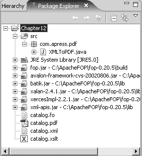

Vohra_706-0C12.fm Page 325 Saturday, July 29, 2006 6:20 AM

第 12 章 ■ 将 XML 转换为 PDF

**325**

你可以按照第 1 章中说明的步骤，在 Eclipse 中运行应用程序 XMLToPDF.java。

清单 12-10 显示了该应用程序生成的输出。如输出所示，org.apache.xerces.parsers.SAXParser 解析了 XSL-FO 对象。

**清单 12-10.** *将 XSL-FO 转换为 PDF 的输出*

[INFO] Using org.apache.xerces.parsers.SAXParser as SAX2 Parser

[INFO] building formatting object tree

[INFO] setting up fonts

[INFO] [1]

[INFO] Parsing of document complete, stopping renderer

PDF 文档 catalog.pdf 被生成并添加到 Chapter12 项目中，如图 12-3 所示。

**图 12-3.** *包含 catalog.pdf 的 Chapter12 项目目录结构* **总结**

在本章中，你学习了如何将示例 XML 文档转换为 PDF 文档。你还可以使用相应的渲染器生成其他输出类型，例如 AWT、MIF、XML、PCL、PS、TXT 和 SVG。要将 XML 文档转换为 PDF 文档，首先将 XML 文档转换为 XSL-FO 文档，然后将 XSL-FO 文档转换为 PDF 文档。你使用 XSLT 样式表和 Transformer API 将 XML 文档转换为 XSL-FO 文档。你可以使用 FOP 驱动将 XSL-FO 文档转换为 PDF 文档。

[www.it-ebooks.info](http://www.it-ebooks.info/)

Vohra_706-0C12.fm Page 326 Saturday, July 29, 2006 6:20 AM

[www.it-ebooks.info](http://www.it-ebooks.info/)


Vohra_706-0C13.fm 第 327 页 2006 年 7 月 29 日星期六 上午 5:45

第 6 部分

■ ■ ■

Web 应用程序

与服务

[www.it-ebooks.info](http://www.it-ebooks.info/)

Vohra_706-0C13.fm 第 328 页 2006 年 7 月 29 日星期六 上午 5:45

[www.it-ebooks.info](http://www.it-ebooks.info/)

Vohra_706-0C13.fm 第 329 页 2006 年 7 月 29 日星期六 上午 5:45

第 13 章

■ ■ ■

使用 Ajax 构建 Web 应用程序

**异**步 JavaScript 和 XML（Ajax）是由 Adaptive Path 公司的 Jesse James Garrett 提出的术语¹，用于描述一种 Web 技术，该技术允许你使用 JavaScript、文档对象模型（DOM）和 XMLHttpRequest 技术创建异步 Web 应用程序。使用这种技术，基于浏览器的用户界面可以与服务器交互，更新网页的选定部分，而无需重新加载整个网页。

这种 Web 技术减少了浏览器与后端之间交换的数据量，从而降低了延迟，并使基于浏览器的用户界面更具交互性；这使得它更像传统的桌面应用程序。

Ajax 有许多有用的应用；一些常见的应用如下：**动态表单数据验证**：当用户填写需要字段中唯一标识符的表单时，可以在不提交整个表单的情况下验证表单字段。

**自动补全**：当用户在表单字段中输入数据时，表单字段会根据从服务器获取的数据自动补全。

**页面数据刷新**：某些网页需要频繁刷新部分内容；例如，天气网站就有此需求。使用 Ajax 技术，网页可以向服务器轮询最新数据，并刷新网页的选定部分，而无需重新加载页面。

JavaScript 和 DOM 脚本是基本的 Web 技术；因此，我们在此不详细讨论。不过，我们将介绍 XMLHttpRequest 对象的工作原理。

■**注意** 如果你想了解更多关于 JavaScript、DOM 脚本和通用 Ajax 技术的内容，请参阅 Christian Heilmann 所著的 *Beginning JavaScript with DOM Scripting and Ajax*（Apress，2006 年）。如需更多关于使用 Java 进行 Ajax 编程的内容，请参阅 Nathaniel T. Schutta 和 Ryan Asleson 所著的 *Pro Ajax with Java Frameworks*（Apress，2006 年）。

1\. 关于 Ajax 的开创性文章可在 http://adaptivepath.com/publications/essays/archives/000385.php 获取。

**329**

[www.it-ebooks.info](http://www.it-ebooks.info/)

Vohra_706-0C13.fm 第 330 页 2006 年 7 月 29 日星期六 上午 5:45

**330**

第 13 章 ■ 使用 Ajax 构建 Web 应用程序

**什么是 XMLHttpRequest？**

XMLHttpRequest 对象提供了基于浏览器的用户界面与基于 Web 服务器的业务服务之间的异步通信。使用 XMLHttpRequest 对象，客户端可以在不重新加载网页的情况下，向 Web 服务器提交和检索 XML 数据。你可以使用 DOM 和 XSLT 在客户端将 XML 数据转换为 HTML。

微软在 Internet Explorer (IE) 5 中作为 ActiveXObject 引入了 XMLHttpRequest²。大多数浏览器都支持 XMLHttpRequest；然而，其实现并不互操作。例如，你可以在 IE 6 中使用以下代码创建 XMLHttpRequest 对象的实例：var req = new ActiveXObject("Microsoft.XMLHTTP"); 在 IE 7 中，XMLHttpRequest 作为 window 对象属性可用。你可以按如下方式在 IE 7 中创建 XMLHttpRequest 对象的实例：

var req = new XMLHttpRequest();

最近，W3C 发布了 XMLHttpRequest 对象的工作草案³，这将标准化其实现。XMLHttpRequest 对象提供了多种用于实现 HTTP 客户端功能的属性，详见表 13-1。

**表 13-1.** *XMLHttpRequest 属性*

**属性**

**描述**

onreadystatechange

设置异步请求的回调方法。

readyState


检索请求的当前状态。0：已创建 XMLHttpRequest 对象。1：已创建对象，并已调用 open() 方法。2：已调用 send() 方法，但尚未收到响应。3：已收到部分数据，这些数据可在 responseText 属性中获取。此时 responseXML 属性返回 null，响应头和状态尚未完全可用。4：已收到响应。

responseText

从服务器检索响应的文本。

responseXML

从服务器检索响应的 XML DOM。

status

检索请求的 HTTP 状态码。有关状态码的定义，请参考 http://www.w3.org/Protocols/rfc2616/rfc2616-sec10.html。

statusText

检索 HTTP 请求的状态文本。

XMLHttpRequest 对象的方法用于打开 HTTP 请求、发送请求以及接收响应。表 13-2 描述了 XMLHttpRequest 的方法。

2\. 它可以是一个应用服务器内的 Web 容器，这也是我们将要使用的。在本章中，我们将互换使用术语 *Web 服务器*和*应用服务器*。

3\. ActiveXObject API 可在 http://msdn2.microsoft.com/en-us/library/6958xykx.aspx 获取。

4\. 你可以在 http://www.w3.org/TR/XMLHttpRequest/ 找到 XMLHttpRequest 对象的 W3C 工作草案。

[www.it-ebooks.info](http://www.it-ebooks.info/)

Vohra_706-0C13.fm Page 331 Saturday, July 29, 2006 5:45 AM

第 13 章 ■ 使用 AJAX 构建 Web 应用程序

**331**

**表 13-2.** *XMLHttpRequest 方法*

**方法**

**描述**

abort()

取消当前 HTTP 请求。

getAllResponseHeaders()

获取所有响应头。readyState 必须为 3 或 4 才能检索响应头。

getResponseHeader(string header)

获取指定的响应头。readyState 必须为 3 或 4 才能检索响应头。

open(string method, string url, boolean

打开一个 HTTP 请求但不发送请求。readyState 属性被设置为 1。

asynch, string username, string password)

responseText、responseXML、status 和 statusText 属性被重置为初始值。HTTP 方法和服务器 URL（可以是相对或绝对路径）是必需参数。布尔参数 asynch 指定 HTTP 请求是否为异步；默认值为 true。参数 username 和 password 是可选的。

send(data)

向服务器发送一个 HTTP 请求，包含数据，数据可以是字符串、无符号字节数组、XML DOM 对象或 null。此方法是同步或异步的，对应于 open() 方法的 asynch 参数值。如果是同步的，该方法在请求完全加载并收到整个响应后才返回。如果是异步的，该方法立即返回。调用 send() 方法后，readyState 属性被设置为 2。请求完成加载后，readyState 属性被设置为 4。

setRequestHeader(string headerName, string

设置 HTTP 请求头。

headerValue)

现在你已经了解了 Ajax 背后的一些理论并看到了它的能力，接下来你将实现一个可运行的示例——动态表单验证。

**安装软件**

Ajax 作为一种 Web 技术而非一项技术，除了支持 XMLHttpRequest 对象的浏览器外，不需要任何额外的软件。如果尚未安装，你需要安装一个 Web 浏览器，例如 IE 7 或 6，或 Netscape 6+。

要开发和部署 Ajax Web 应用程序，你需要一个支持 J2EE 1.4 的应用服务器。因此，请下载并安装 JBoss 4.0.2。你也可以使用任何其他支持 J2EE 1.4 的应用服务器，例如 BEA WebLogic、IBM WebSphere、Oracle Application Server 或 Sun One Application Server。

[www.it-ebooks.info](http://www.it-ebooks.info/)

Vohra_706-0C13.fm Page 332 Saturday, July 29, 2006 5:45 AM

**332**

第 13 章 ■ 使用 AJAX 构建 Web 应用程序


您还需要下载并安装 J2EE 1.4 SDK 和 J2SE 5.0，以便能够编译示例应用程序。

您将要开发的 Ajax 应用程序会通过 JDBC5 驱动程序从数据库中检索数据。

因此，您需要安装一个关系型数据库以及与之兼容的 JDBC 驱动程序。本章我们使用开源关系型数据库 MySQL；如果您选择同样的方式，请下载并安装 MySQL 5.06 数据库以及兼容的 MySQL Connector/J JDBC 驱动程序。当然，您也可以使用任何其他支持 JDBC 的关系型数据库，例如 Oracle、IBM DB2 或 Microsoft SQL Server。

**使用 MySQL 数据库配置 JBoss**

安装 MySQL 数据库后，您需要创建一个 MySQL 数据库用户。要创建用户，请使用以下命令登录 MySQL 数据库：

mysql --user=root mysql

您可以使用 `GRANT` 语句向用户表添加新用户，如下例所示，其中创建了用户名为 `mysql`、密码为 `mysql` 的用户：`GRANT ALL PRIVILEGES ON test TO 'mysql'@'localhost' IDENTIFIED BY 'mysql' ;` 您还需要在 MySQL 数据库中创建一个示例表。要创建示例表，请以 `mysql` 用户身份登录数据库，并运行清单 13-1 中所示的 SQL 脚本。

**清单 13-1.** *SQL 脚本 catalog.sql*

CREATE TABLE Catalog(CatalogId VARCHAR(25),

Journal VARCHAR(25), Publisher Varchar(25),

Edition VARCHAR(25), Title Varchar(45),

Author Varchar(25));

INSERT INTO Catalog VALUES

('catalog1', 'XML Zone', 'IBM developerWorks', 'Jan 2006',

'Managing XML data: Tag URIs', 'Elliotte Harold');

INSERT INTO Catalog VALUES

('catalog2', 'XML Zone', 'IBM developerWorks',

'Jan 2006', 'Practical data binding', 'Brett McLaughlin'); 您还需要使用 MySQL 数据库配置 JBoss 应用服务器。假设

`<jboss-4.0.2>` 是 JBoss 4.0.2 安装目录的根目录，您可以按如下步骤操作：**1.** 要将 JBoss 4.0.2 应用服务器与 MySQL 一起使用，首先需要将 MySQL

驱动程序类复制到 JBoss 服务器类路径中。因此，请将 `mysql-connector-java-3.1.11-bin.jar` 复制到 `<jboss-4.0.2>/server/default/lib` 目录。

**2.** 要使用 MySQL 数据源，请将 `<jboss-4.0.2>/docs/examples/jca/mysql-ds.xml` 复制到

`<jboss-4.0.2>/server/default/deploy` 目录。通过将 `<driver-class>` XML 元素设置为 `com.mysql.jdbc.Driver`，并将 `<connection-url>` XML 元素设置为 `jdbc:mysql://localhost:3306/test` 来修改 `mysql-ds.xml` 配置文件。在 `mysql-ds.xml` 中，将 `user-name` 指定为 `mysql`，将 `password` 指定为 `mysql`。`jndi-name` 默认设置为 `MySqlDS`。清单 13-2 显示了完全配置好的 `mysql-ds.xml` 文件。

5\. 有关 JDBC 技术的信息，请访问 http://java.sun.com/javase/technologies/database.jsp。

6\. MySQL 5.0 可从 http://www.mysql.com 获取。

[www.it-ebooks.info](http://www.it-ebooks.info/)

Vohra_706-0C13.fm Page 333 Saturday, July 29, 2006 5:45 AM

第 13 章 ■ 使用 AJAX 构建 Web 应用程序

**333**

**清单 13-2.** *Mysql-ds.xml*

<?xml version="1.0" encoding="UTF-8"?>

<datasources>

<local-tx-datasource>

<jndi-name>MySqlDS</jndi-name>

<connection-url>jdbc:mysql://localhost:3306/test</connection-url>

<driver-class>com.mysql.jdbc.Driver</driver-class>

<user-name>mysql</user-name>

<password>mysql</password>

</local-tx-datasource>

</datasources>

**3.** 您还需要修改 `<jboss-4.0.2>/server/default/conf/login-config.xml`，将清单 13-3 中所示的 `<application-policy>` XML 元素添加到 `login-config.xml` 中。

**清单 13-3.** *login-config.xml*

<application-policy name = "MySqlDbRealm">

<authentication>

<login-module code =

"org.jboss.resource.security.ConfiguredIdentityLoginModule"

flag = "required">

<module-option name ="principal"></module-option>

<module-option name ="userName">mysql</module-option>

<module-option name ="password">mysql</module-option>

<module-option name ="managedConnectionFactoryName"> jboss.jca:service=LocalTxCM,name=MySqlDS

</module-option>

</login-module>

</authentication>

</application-policy>


按照前文所述修改 `mysql-ds.xml` 和 `login-config.xml` 文件，即可配置 JBoss 4.0.2 服务器以使用 MySQL 数据库实例。

**设置 Eclipse 项目**

在本章中，你将使用 Ajax 技术开发一个 Web 应用程序。为了编译和运行代码示例，你需要一个 Eclipse 项目。你可以从 http://www.apress.com 下载 Chapter13 项目，然后通过选择 **文件** ➤ **导入** 将其导入到你的 Eclipse 工作区中。

在 Eclipse 项目 Chapter13 中，你将使用 Apache Ant 的 `build.xml` 文件来编译和部署一个 Ajax 应用程序。如果你不熟悉 Apache Ant，请参考 Apache Ant 网站 7，或阅读 Matthew Moodie 所著的 *Pro Apache Ant*（Apress 2005）8。

7. 参见 http://ant.apache.org/。
8. 参见 http://www.apress.com/book/bookDisplay.html?bID=10038。

[www.it-ebooks.info](http://www.it-ebooks.info/)

Vohra_706-0C13.fm Page 334 Saturday, July 29, 2006 5:45 AM

**334**

第 13 章 ■ 使用 AJAX 构建 Web 应用程序

示例 `build.xml` 文件包含四个目标：`init`、`compile`、`webapp` 和 `clean`。这些目标的作用如下：

**1.** `init` 目标创建 Ajax 应用程序所需的目录。
**2.** `compile` 目标编译 Ajax 应用程序中的一个 Java Servlet9。
**3.** `webapp` 目标生成一个符合 J2EE 1.4 规范的 Web 应用程序归档（WAR）文件，并将该 WAR 文件部署到 JBoss 应用服务器。
**4.** 可选：`clean` 目标删除项目目录。

清单 13-4 展示了 `build.xml` 文件。

**清单 13-4.** *build.xml*

<project name="ajax" default="webapp" basedir=".">

<property name="build" value="build"/>

<property name="src" value="." />

<property name="jboss.deploy"

value="C:\JBoss\jboss-4.0.2\server\default\deploy"/>

<property name="dist" value="dist"/>

<property name="j2sdkee" value="C:\J2sdkee1.4"/>

<property name="mysql" value="C:\MySQL\mysql-connector-java-3.1.11"/>

<target name="init">

<tstamp/>

<mkdir dir="${build}" />

<mkdir dir="${dist}" />

<mkdir dir="${build}/WEB-INF" />

<mkdir dir="${build}/WEB-INF/classes" />

</target>

<target name="compile" depends="init">

<javac debug="true" classpath=

"${j2sdkee}/lib/j2ee.jar:${mysql}

/lib/mysql-connector-java-3.1.11-bin.jar"

srcdir="${src}/WEB-INF/classes"

destdir="${src}/WEB-INF/classes">

<include name="**/*.java" />

</javac>

<copy todir="${build}/WEB-INF">

<fileset dir="WEB-INF" >

<include name="web.xml" />

</fileset>

</copy>

<copy todir="${build}/WEB-INF/classes">

<fileset dir="${src}/WEB-INF/classes" >

<include name="**/FormServlet.class" />

</fileset>

</copy>

9. 参见 http://java.sun.com/products/servlet/。

[www.it-ebooks.info](http://www.it-ebooks.info/)

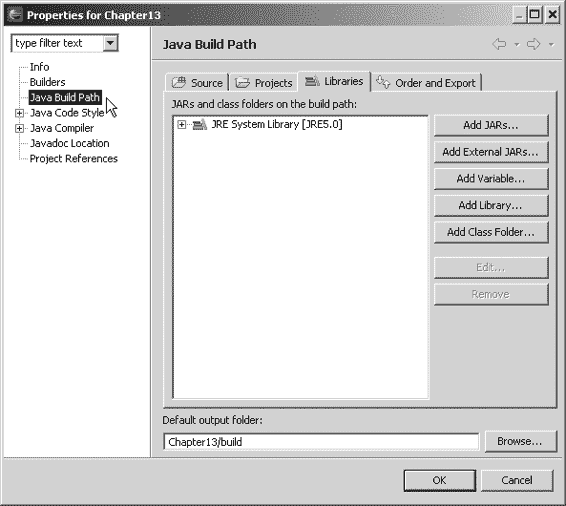

Vohra_706-0C13.fm Page 335 Saturday, July 29, 2006 5:45 AM

第 13 章 ■ 使用 AJAX 构建 Web 应用程序

**335**

<copy todir="${build}">

<fileset dir="${src}" >

<include name="inputForm.jsp" />

</fileset>

</copy>

</target>

<target name="webapp" depends="compile">

<war basedir="${build}" includes="**/*.class,inputForm.jsp"

destfile="${dist}/ajax.war" webxml="WEB-INF/web.xml"/>

<copy file="${dist}/ajax.war" todir="${jboss.deploy}"/>

</target>

<target name="clean">

<delete dir="${dist}"/>

<delete dir="${build}"/>

</target>

</project>

在 Chapter13 Eclipse 项目中，你需要将 JRE 系统库设置为 JRE 5.0，如图 13-1 所示。

**图 13-1.** *Chapter13 项目 Java 构建路径*

[www.it-ebooks.info](http://www.it-ebooks.info/)

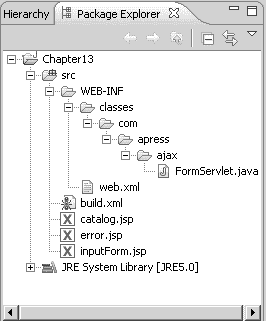

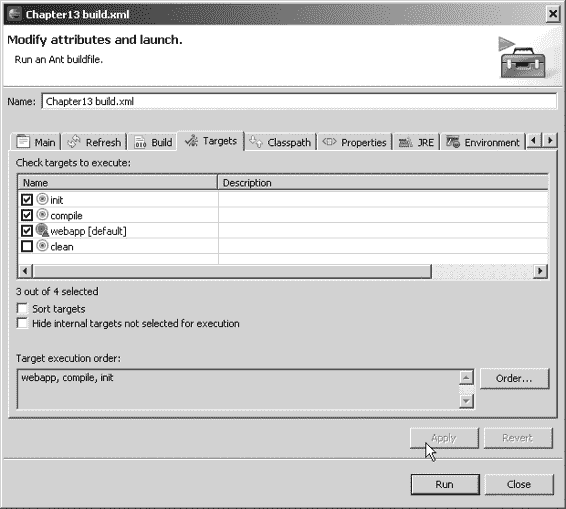

Vohra_706-0C13.fm Page 336 Saturday, July 29, 2006 5:45 AM

**336**

第 13 章 ■ 使用 AJAX 构建 Web 应用程序

图 13-2 展示了 Chapter13 项目的目录结构。

**图 13-2.** *Chapter13 项目目录结构* 你需要在 Ant 的 `build.xml` 文件中选择用于编译和部署 Ajax Web 应用程序的构建目标。右键单击 `build.xml` 文件，选择 **运行方式**，然后选择第二个 **Ant 构建** 项。


在 Chapter13 的 build.xml 对话框中选择“Targets”选项卡。勾选 init、compile 和 webapp 目标对应的复选框，然后点击“Apply”按钮，如图 13-3 所示。

**图 13-3.** *选择 Ant build.xml 目标*

[www.it-ebooks.info](http://www.it-ebooks.info/)

Vohra_706-0C13.fm 第 337 页 2006 年 7 月 29 日，星期六，上午 5:45

第 13 章 ■ 使用 AJAX 构建 Web 应用程序

**337**

接下来，你需要运行 Ant build.xml 文件来编译 Ajax Web 应用程序并将其部署到 JBoss 应用服务器。在 Package Explorer 中右键单击 build.xml，选择“Run As”和第一个 Ant build.xml 文件。Ant build.xml 脚本将运行、编译并部署 Ajax Web 应用程序，如清单 13-5 所示。我们将在下一节讨论 Ajax Web 应用程序的详细信息。

**清单 13-5.** *Ant 构建文件的输出*

Buildfile: C:\Documents and Settings\Deepak Vohra\workspace\Chapter13\src\build.xml

init:

[mkdir] 创建目录: C:\Documents and Settings\Deepak Vohra\workspace\Chapter13\src\build

[mkdir] 创建目录: C:\Documents and Settings\Deepak Vohra\workspace\Chapter13\src\dist

[mkdir] 创建目录: C:\Documents and Settings\Deepak Vohra\workspace\Chapter13\src\build\WEB-INF

[mkdir] 创建目录: C:\Documents and Settings\Deepak Vohra\workspace\Chapter13\src\build\WEB-INF\classes

compile:

[copy] 复制 1 个文件到 C:\Documents and Settings\Deepak Vohra\workspace\Chapter13\src\build\WEB-INF

[copy] 复制 1 个文件到 C:\Documents and Settings\Deepak Vohra\workspace\Chapter13\src\build\WEB-INF\classes

[copy] 复制 1 个文件到 C:\Documents and Settings\Deepak Vohra\workspace\Chapter13\src\build

webapp:

[war] 构建 war 包: C:\Documents and Settings\Deepak Vohra\workspace\Chapter13\src\dist\ajax.war

[copy] 复制 1 个文件到 C:\JBoss\jboss-4.0.2\server\default\deploy init:

compile:

init:

构建成功

**开发 Ajax 应用程序**

现在你已经搭建好了 Eclipse 项目，可以开始构建 Ajax 应用程序的实际功能了。在本节中，你将创建用于验证 HTML 表单中数据输入的功能。

输入表单需要一个唯一的目录 ID 来创建目录条目。因此，你将根据数据库中的数据验证表单中的目录 ID 输入，以检查该目录 ID 是否已在数据库中指定。在 HTML 表单中输入的数据通过 GET 方法发送到一个 Servlet URL。在服务器端，HTTP Servlet 的 `doGet()` 方法被调用。在 `doGet()` 方法中，输入值与数据库中的数据进行比较。HTTP Servlet 返回一个 XML 响应，其中包含关于输入数据有效性的信息。

在客户端应用程序中，处理来自服务器的 XML 响应，如果指令指示数据输入有效，则显示消息“Catalog ID is Valid”。每当输入字段发生修改时，都会向服务器发送一个 `XMLHttpRequest` 请求。如果没有 Ajax，你将不得不将完整的输入表单提交给服务器，然后在收到服务器响应后重新加载浏览器网页。

[www.it-ebooks.info](http://www.it-ebooks.info/)

Vohra_706-0C13.fm 第 338 页 2006 年 7 月 29 日，星期六，上午 5:45

**338**

第 13 章 ■ 使用 AJAX 构建 Web 应用程序

向服务器发送 `XMLHttpRequest` 请求的过程包括以下步骤：**1.** 响应 HTML 事件，从事件处理程序中调用一个 JavaScript 函数。

**2.** 在 JavaScript 函数中创建一个 `XMLHttpRequest` 对象。

**3.** 打开一个 `XMLHttpRequest` 请求，指定 URL 和 HTTP 方法。

**4.** 注册一个回调事件处理程序，该处理程序在请求状态改变时被调用。

**5.** 异步发送 `XMLHttpRequest` 请求。

**6.** 检索 XML 响应，并修改 HTML 页面。

接下来，你将检查示例应用程序中涉及的浏览器端处理。

**浏览器端处理**

为了发起一个 `XMLHttpRequest` 请求，将一个 JavaScript 函数注册为 HTML 表单输入字段 `catalogId`（需要验证）生成的 `onkeyup` 事件的事件处理程序。在示例应用程序中，JavaScript 函数 `validateCatalogId()` 在 `onkeyup` 事件上被调用，如清单 13-6 所示。

**清单 13-6.** *输入表单*

<form name="validationForm" action="validateForm" method="post">

<table>

<tr>

<td>目录 ID:</td>

<td><input type="text"

size="20"

id="catalogId"

name="catalogId"

autocomplete="off"

onkeyup="validateCatalogId()"></td>

<td><div id="validationMessage"></div></td>

</tr>

….

</table>

</form>

在 JavaScript 函数 `validateCatalogId()` 中，你需要创建一个新的 `XMLHttpRequest` 对象。如果浏览器支持将 `XMLHttpRequest` 对象作为 `ActiveXObject` 对象，那么创建 `XMLHttpRequest` 对象的过程与 `XMLHttpRequest` 对象是 `window` 对象属性时不同。IE 7 和 Netscape 支持将 `XMLHttpRequest` 作为 `window` 属性，而 IE 6 支持将 `XMLHTTPRequest` 对象作为 `ActiveXObject` 对象。因此，你需要检查 `XMLHttpRequest` 对象是否是 `window` 对象属性并相应地进行处理，如清单 13-7 所示。

**清单 13-7.** *创建 XMLHttpRequest 对象*

<script type="text/javascript">

function validateCatalogId(){

var xmlHttpRequest=init();

[www.it-ebooks.info](http://www.it-ebooks.info/)

Vohra_706-0C13.fm 第 339 页 2006 年 7 月 29 日，星期六，上午 5:45

第 13 章 ■ 使用 AJAX 构建 Web 应用程序

**339**

function init(){

if (window.XMLHttpRequest) {

return new XMLHttpRequest();

} else if (window.ActiveXObject) {

return new ActiveXObject("Microsoft.XMLHTTP");

}

}

</script>

接下来，你需要构造一个将发送 `XMLHttpRequest` 的 URL。在示例应用程序中，你将调用一个 Servlet `FormServlet`。在 Web 服务器内部，`FormServlet` 映射到 Servlet URL 模式 `/validateForm`，如 web.xml 部署描述符（清单 13-8）中所指定。

**清单 13-8.** *web.xml*

<?xml version="1.0" ?>

<!DOCTYPE web-app PUBLIC '-//Sun Microsystems, Inc.//DTD Web Application 2.3//EN'

'http://java.sun.com/dtd/web-app_2_3.dtd'>

<web-app>

<servlet>

<servlet-name>FormServlet</servlet-name>

<servlet-class>com.apress.ajax.FormServlet</servlet-class>

</servlet>

<servlet-mapping>

<servlet-name>FormServlet</servlet-name>

<url-pattern>/validateForm</url-pattern>

</servlet-mapping>

</web-app>

因此，你将 URL 指定为 `validateForm?catalogId=encodeURIComponent(catalogId.value)`，其中参数 `catalogId` 指定了 HTML 表单中输入的目录 ID 的值，并且你使用 `encodeURIComponent(string)` 方法对目录 ID 值进行编码。指定的 HTTP 方法是 GET，因为表单数据被编码到 URL 中，如清单 13-9 所示。

**清单 13-9.** *打开 HTTP 请求*

var catalogId=document.getElementById("catalogId"); xmlHttpRequest.open("GET",

"validateForm?catalogId="+

encodeURIComponent(catalogId.value), true);

你需要使用 `onreadystatechange` 属性向 `XMLHttpRequest` 对象注册一个回调事件处理程序。在示例应用程序中，回调方法是 JavaScript 函数 `processRequest()`，如下所示：

xmlHttpRequest.onreadystatechange=processRequest;

接下来，你需要使用 `send()` 方法发送 HTTP 请求，如下所示：xmlHttpRequest.send(null);

[www.it-ebooks.info](http://www.it-ebooks.info/)

Vohra_706-0C13.fm 第 340 页 2006 年 7 月 29 日，星期六，上午 5:45

**340**

第 13 章 ■ 使用 AJAX 构建 Web 应用程序


由于 HTTP 方法为 GET，通过 `send()` 方法发送的数据被设置为 null。由于回调事件处理程序是 `processRequest()`，当 `readyState` 属性值发生变化时，会调用 `processRequest()` 函数。在 `processRequest()` 函数中，会获取 `readyState` 属性值。如果请求已完全加载（以 `readyState` 值 4 表示），并且 HTTP 状态为 "OK"，则调用 `processResponse()` JavaScript 函数来处理服务器响应，如清单 13-10 所示。

**清单 13-10.** *onreadystatechange 属性变更事件的事件处理程序* function processRequest(){

if(xmlHttpRequest.readyState==4){

if(xmlHttpRequest.status==200){

processResponse();

}

}

}

接下来，我们将讨论 XMLHttpRequest 请求的服务器端处理。

**Web 服务器端处理**

XMLHttpRequest 对象被发送到相对 URL

`validateForm?catalogId=encodeURIComponent(catalogId.value)`，该 URL 会调用 `FormServlet` 这个 servlet。由于 XMLHttpRequest 方法为 GET，因此会调用 servlet 的 `doGet()` 方法。

在 `doGet()` 方法中，首先获取 `catalogId` 参数的值，如下所示：`String catalogId = request.getParameter("catalogId");` 接着，从数据库中获取数据，以检查数据库中是否已指定了某个目录 ID 值。连接数据库分为两步：**1.** 首先，通过一个类似于根据姓名在电话簿中查找电话号码的查找过程来发现数据库。此查找过程涉及创建一个 JNDI10

`InitialContext` 对象，并调用该对象的 `lookup("java:MySqlDS")` 方法。`lookup()` 方法返回一个 `DataSource` 对象。

**2.** 从 `DataSource` 对象中，创建一个 `Connection` 对象，如清单 13-11 所示。

**清单 13-11.** *创建连接对象*

InitialContext initialContext = new InitialContext();

javax.sql.DataSource ds = (javax.sql.DataSource)

initialContext.lookup("java:MySqlDS");

java.sql.Connection conn = ds.getConnection();

随后，创建一个 `Statement` 对象来运行 SQL 查询。使用输入表单中指定的目录 ID 值，创建一个 SQL 查询以从数据库中检索数据。使用 `executeQuery(String)` 方法运行 SQL 查询，该方法返回一个 `ResultSet` 对象，如清单 13-12 所示。

10\. JNDI API 是 J2EE 1.4 的一部分。

[www.it-ebooks.info](http://www.it-ebooks.info/)

Vohra_706-0C13.fm Page 341 Saturday, July 29, 2006 5:45 AM

第 13 章 ■ 使用 AJAX 构建 Web 应用程序

**341**

**清单 13-12.** *获取 ResultSet 对象*

Statement stmt = conn.createStatement();

String query = "SELECT * from .Catalog WHERE catalogId=" + "'" +

catalogId + "'";

ResultSet rs = stmt.executeQuery(query);

在检查从数据库获取的数据以确定表单输入是否有效之前，需要将 `HttpServletResponse` 的内容类型设置为 `text/xml`，并将缓存控制标头设置为 `no-cache`，如下所示：

response.setContentType("text/xml");

response.setHeader("Cache-Control", "no-cache"); `FormServlet` servlet 以 XML 字符串的形式发送响应。因此，需要构建一个包含有关目录 ID 字段值有效性指令的 XML DOM 对象。

空的 `ResultSet` 对象意味着目录 ID 字段值未在数据库表 `Catalog` 中定义；因此，该目录 ID 字段值是有效的。包含数据的 `ResultSet` 对象意味着目录 ID 值已在数据库中定义；因此，该目录 ID 字段值是无效的。

对于无效的目录 ID，构建一个 XML 字符串，其中包含根元素 `catalog` 下的目录 ID 内容。`catalog` 根元素的第一个子元素是

`<valid>false</valid>` 元素，表示该目录 ID 无效。

对于目录 ID 有效的情况，构建一个仅包含

`<valid>true</valid>` 元素的 XML 字符串。


清单 13-13 展示了 XML 响应。

**清单 13-13.** *返回 XML 响应*

if (rs.next()) {

out.println("<catalog>" + "<valid>false</valid>" + "<journal>" +

rs.getString(2) + "</journal>" + "<publisher>" +

rs.getString(3) + "</publisher>" + "<edition>" +

rs.getString(4) + "</edition>" + "<title>" +

rs.getString(5) + "</title>" + "<author>" +

rs.getString(6) + "</author>" + "</catalog>");

} else {

out.println("<valid>true</valid>");

}

如果目录 ID 字段值有效，则可以使用 HTTP POST 方法将输入表单提交到服务器，服务器端会调用`FormServlet`中的`doPost()`方法。在`doPost()`方法中，你需要创建一个数据库`Connection`，并使用`INSERT`语句添加一条目录条目。

清单 13-14 展示了完整的`FormServlet`。

**清单 13-14.** *FormServlet.java*

package com.apress.ajax;

import java.io.*;

import java.sql.*;

import javax.naming.InitialContext;

import javax.servlet.*;

import javax.servlet.http.*;

[www.it-ebooks.info](http://www.it-ebooks.info/)

Vohra_706-0C13.fm Page 342 Saturday, July 29, 2006 5:45 AM

**342**

第 13 章 ■ 使用 AJAX 构建 Web 应用程序

public class FormServlet extends HttpServlet {

public void doGet(HttpServletRequest request, HttpServletResponse response) throws ServletException, IOException {

try {

// 获取待验证的目录 ID 字段值

String catalogId = request.getParameter("catalogId");

// 获取连接

InitialContext initialContext = new InitialContext();

javax.sql.DataSource ds = (javax.sql.DataSource) initialContext

.lookup("java:MySqlDS");

java.sql.Connection conn = ds.getConnection();

// 获取结果集

Statement stmt = conn.createStatement();

String query = "SELECT * from Catalog WHERE catalogId=" + "'"

+ catalogId + "'";

ResultSet rs = stmt.executeQuery(query);

// 在访问 Writer 之前设置响应头

response.setContentType("text/xml");

response.setHeader("Cache-Control", "no-cache"); PrintWriter out = response.getWriter();

// 然后写入响应

// 如果结果集为空，则将 valid 元素设置为 true

if (rs.next()) {

out.println("<catalog>" + "<valid>false</valid>" + "<journal>"

+ rs.getString(2) + "</journal>" + "<publisher>"

+ rs.getString(3) + "</publisher>" + "<edition>"

+ rs.getString(4) + "</edition>" + "<title>"

+ rs.getString(5) + "</title>" + "<author>"

+ rs.getString(6) + "</author>" + "</catalog>");

} else {

out.println("<valid>true</valid>");

}

// 关闭 ResultSet、Statement 和 Connection 对象

rs.close();

stmt.close();

conn.close();

} catch (javax.naming.NamingException e) {

} catch (SQLException e) {

}

}

public void doPost(HttpServletRequest request, HttpServletResponse response) throws ServletException, IOException {

try {

// 获取连接

InitialContext initialContext = new InitialContext();

javax.sql.DataSource ds = (javax.sql.DataSource) initialContext

.lookup("java:MySqlDS");

java.sql.Connection conn = ds.getConnection();

String catalogId = request.getParameter("catalogId"); String journal = request.getParameter("journal"); String publisher = request.getParameter("publisher"); String edition = request.getParameter("edition");

[www.it-ebooks.info](http://www.it-ebooks.info/)

Vohra_706-0C13.fm Page 343 Saturday, July 29, 2006 5:45 AM

第 13 章 ■ 使用 AJAX 构建 Web 应用程序

**343**

String title = request.getParameter("title");

String author = request.getParameter("author"); Statement stmt = conn.createStatement();

String sql = "INSERT INTO Catalog VALUES(" + "\'" + catalogId

+ "\'" + "," + "\'" + journal + "\'" + "," + "\'"

+ publisher + "\'" + "," + "\'" + edition + "\'" + ","

+ "\'" + title + "\'" + "," + "\'" + author + "\'" + ")"; stmt.execute(sql);

response.sendRedirect("catalog.jsp");

stmt.close();

conn.close();

} catch (javax.naming.NamingException e) {

response.sendRedirect("error.jsp");

} catch (SQLException e) {

response.sendRedirect("error.jsp");

}

}

}

在浏览器端，`processRequest()` JavaScript 函数中，如果 HTTP 请求已完全加载（对应`readyState`属性值为 4 且`status`属性值为 200），则会调用`processResponse()` JavaScript 函数。在`processResponse()`函数中，你需要获取`responseXML`属性的值。`responseXML`属性包含在`FormServlet`的`doGet()`方法中设置的响应 XML 字符串：`var xmlMessage=xmlHttpRequest.responseXML;`

`responseXML`属性包含关于输入表单中指定的目录 ID 值有效性的 XML 格式指令。你需要使用`getElementsByTagName(string)`方法获取`<valid>`元素的值，如下所示：

`var valid=xmlMessage.getElementsByTagName("valid")[0].firstChild.nodeValue;` 如果`<valid>`元素内容设置为`true`，则将 HTML 的`validationMessage` div 设置为"Catalog ID is Valid"，并启用输入表单中的`submitForm`按钮，如清单 13-15 所示。

**清单 13-15.** *设置验证消息*

if(valid=="true"){

var validationMessage=document.getElementById("validationMessage"); validationMessage.innerHTML = "Catalog ID is Valid"; document.getElementById("submitForm").disabled = false;

}

如果`<valid>`元素值设置为`false`，则将目录 ID 字段行中`validationMessage` div 的 HTML 设置为"Catalog ID is not Valid"，并禁用`submitForm`按钮。你还可以设置其他输入字段的值，如清单 13-16 所示。

**清单 13-16.** *为无效目录 ID 设置验证消息*

if(valid=="false"){

var validationMessage=document.getElementById("validationMessage"); validationMessage.innerHTML = "Catalog ID is not Valid"; document.getElementById("submitForm").disabled = true;

}

[www.it-ebooks.info](http://www.it-ebooks.info/)

Vohra_706-0C13.fm Page 344 Saturday, July 29, 2006 5:45 AM

**344**

第 13 章 ■ 使用 AJAX 构建 Web 应用程序

清单 13-17 展示了`inputForm.jsp`页面。

**清单 13-17.** *inputForm.jsp*

<html>

<head>

<script type="text/javascript">

function validateCatalogId(){

var xmlHttpRequest=init();

function init(){

if (window.XMLHttpRequest) {

return new XMLHttpRequest();

} else if (window.ActiveXObject) {

return new ActiveXObject("Microsoft.XMLHTTP");

}

}

var catalogId=document.getElementById("catalogId"); xmlHttpRequest.open("GET", "validateForm?catalogId="+

encodeURIComponent(catalogId.value), true);

xmlHttpRequest.onreadystatechange=processRequest;

xmlHttpRequest.send(null);

function processRequest(){

if(xmlHttpRequest.readyState==4){

if(xmlHttpRequest.status==200){

processResponse();

}

}

}

function processResponse(){

var xmlMessage=xmlHttpRequest.responseXML;

var valid=xmlMessage.getElementsByTagName("valid")[0].firstChild.nodeValue; if(valid=="true"){

[www.it-ebooks.info](http://www.it-ebooks.info/)

Vohra_706-0C13.fm Page 345 Saturday, July 29, 2006 5:45 AM

第 13 章 ■ 使用 AJAX 构建 Web 应用程序

**345**

var validationMessage=document.getElementById("validationMessage"); validationMessage.innerHTML = "Catalog ID is Valid"; document.getElementById("submitForm").disabled = false; var journalElement=document.getElementById("journal"); journalElement.value = "";

var publisherElement=document.getElementById("publisher"); publisherElement.value = "";

var editionElement=document.getElementById("edition"); editionElement.value = "";

var titleElement=document.getElementById("title"); titleElement.value = "";

var authorElement=document.getElementById("author"); authorElement.value = "";

}

if(valid=="false"){


var validationMessage=document.getElementById("validationMessage"); validationMessage.innerHTML = "Catalog ID is not Valid"; document.getElementById("submitForm").disabled = true; var journal=xmlMessage.getElementsByTagName("journal")[0].firstChild.nodeValue; var publisher=xmlMessage.getElementsByTagName("publisher")[0].firstChild.nodeValue; var edition=xmlMessage.getElementsByTagName("edition")[0].firstChild.nodeValue; var title=xmlMessage.getElementsByTagName("title")[0].firstChild.nodeValue; var author=xmlMessage.getElementsByTagName("author")[0].firstChild.nodeValue; var journalElement=document.getElementById("journal"); journalElement.value = journal;

var publisherElement=document.getElementById("publisher"); publisherElement.value = publisher;

var editionElement=document.getElementById("edition"); editionElement.value = edition;

var titleElement=document.getElementById("title"); titleElement.value = title;

var authorElement=document.getElementById("author"); authorElement.value = author;

}

}

}

[www.it-ebooks.info](http://www.it-ebooks.info/)

Vohra_706-0C13.fm Page 346 Saturday, July 29, 2006 5:45 AM

**346**

第 13 章 ■ 使用 AJAX 构建 Web 应用程序

</script>

</head>

<body>

<h1>目录条目表单</h1>

<form name="validationForm" action="validateForm" method="post">

<table>

<tr><td>目录 ID：</td><td><input type="text"

size="20"

id="catalogId"

name="catalogId"

autocomplete="off"

onkeyup="validateCatalogId()"></td>

<td><div id="validationMessage"></div></td>

</tr>

<tr><td>期刊：</td><td><input type="text"

size="20"

id="journal"

name="journal"></td>

</tr>

<tr><td>出版商：</td><td><input type="text"

size="20"

id="publisher"

name="publisher"></td>

</tr>

<tr><td>版本：</td><td><input type="text"

size="20"

id="edition"

name="edition"></td>

</tr>

<tr><td>标题：</td><td><input type="text"

size="20"

id="title"

name="title"></td>

</tr>

<tr><td>作者：</td><td><input type="text"

size="20"

id="author"

name="author"></td>

</tr>

<tr><td><input type="submit"

value="创建目录"

id="submitForm"

name="submitForm"></td>

[www.it-ebooks.info](http://www.it-ebooks.info/)

Vohra_706-0C13.fm Page 347 Saturday, July 29, 2006 5:45 AM

第 13 章 ■ 使用 AJAX 构建 Web 应用程序

**347**

</tr>

</table>

</form>

</body>

</html>

清单 13-18 展示了当更新数据库无错误时，inputForm.jsp 被转发到的页面。

**清单 13-18.** *catalog.jsp*

<html>

<head>

</head>

<body>

<%out.println("数据库已更新");%>

</body>

</html>

清单 13-19 展示了当更新数据库出现错误时，inputForm.jsp 被转发到的页面。

**清单 13-19.** *error.jsp*

<html>

<head>

</head>

<body>

<%out.println("更新数据库时出错");%>

</body>

</html>

你需要将 Ajax Web 应用程序部署到 JBoss 应用服务器，并从浏览器访问该应用程序。

当在 Eclipse 中运行 build.xml 脚本时，一个 ajax.war Web 应用程序会被复制到 JBoss 应用服务器的 deploy 目录。我们在“设置 Eclipse 项目”部分展示了如何在 Eclipse 中运行 build.xml 文件。

现在，你可以使用 <jboss-4.0.2>/bin/run.bat（对于 Unix 和 Linux 系统使用 run.sh）文件启动 JBoss 应用服务器。ajax.war Web 应用程序会被部署到 JBoss 应用服务器中。要测试该 Web 应用程序，你需要在浏览器中访问 http://localhost:8080/ajax/inputForm.jsp。inputForm.jsp 返回的网页如图 13-4 所示。

[www.it-ebooks.info](http://www.it-ebooks.info/)


Vohra_706-0C13.fm Page 348 Saturday, July 29, 2006 5:45 AM

**348**

第 13 章 ■ 使用 AJAX 构建 Web 应用程序

**图 13-4.** *目录条目输入表单*

要验证目录 ID 值，请指定一个目录 ID 字段值。一个 HTTP 请求会被发送到服务器，XML 响应会返回给基于浏览器的用户界面。如果目录 ID 字段值有效，则会显示消息“目录 ID 有效”，如图 13-5 所示。

如果指定的目录 ID 字段值无效，则会显示消息“目录 ID 无效”，并且“创建目录”按钮会被禁用，如图 13-6 所示。同时，目录 ID 的字段值也会显示出来。

[www.it-ebooks.info](http://www.it-ebooks.info/)


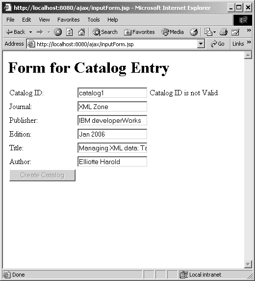

Vohra_706-0C13.fm Page 349 Saturday, July 29, 2006 5:45 AM

第 13 章 ■ 使用 AJAX 构建 Web 应用程序

**349**

**图 13-5.** *指定目录 ID 字段值* **图 13-6.** *验证输入字段目录 ID*

[www.it-ebooks.info](http://www.it-ebooks.info/)

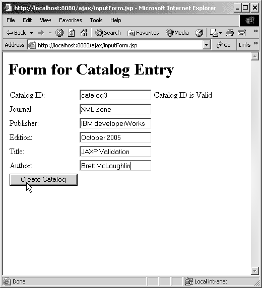

Vohra_706-0C13.fm Page 350 Saturday, July 29, 2006 5:45 AM

**350**

第 13 章 ■ 使用 AJAX 构建 Web 应用程序

要创建目录条目，请输入一个有效的目录 ID，并点击“创建目录”按钮，如图 13-7 所示。

**图 13-7.** *创建目录条目*

这会在数据库中创建一个目录条目。如果你重新输入一个之前用于创建目录条目的目录 ID 值，即使不提交表单，也会动态显示目录 ID 无效的消息，如图 13-8 所示。这当然是因为当你在目录 ID 表单字段中输入时，数据正在与服务器进行异步验证，一旦你输入的数据与现有的目录 ID 匹配，就会显示“目录 ID 无效”的消息。

[www.it-ebooks.info](http://www.it-ebooks.info/)

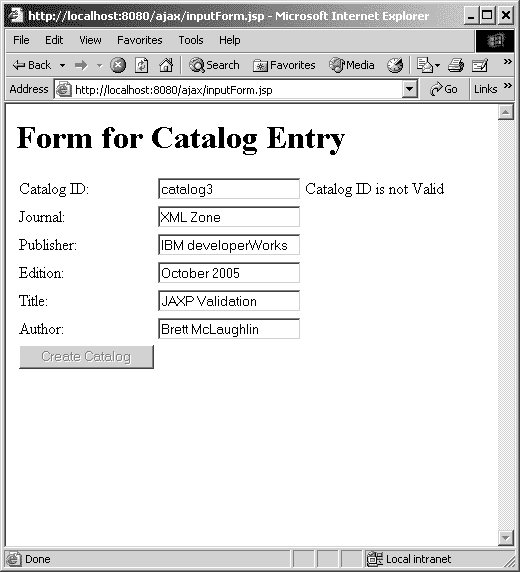

Vohra_706-0C13.fm Page 351 Saturday, July 29, 2006 5:45 AM

第 13 章 ■ 使用 AJAX 构建 Web 应用程序

**351**

**图 13-8.** *验证先前定义的目录条目* **总结**

Ajax 允许你动态刷新网页内容，而无需将网页提交到服务器。你可以通过结合 XML DOM、JavaScript 和 XMLHttpRequest 技术来实现 Ajax Web 技术。W3C 已经引入了 XMLHttpRequest 对象的工作草案，以标准化该技术。Ajax 有多种有用的用途，例如表单验证、自动完成以及定期刷新网页上的数据。在本章中，你实现了其中一种应用：动态表单验证。

[www.it-ebooks.info](http://www.it-ebooks.info/)

Vohra_706-0C13.fm Page 352 Saturday, July 29, 2006 5:45 AM

[www.it-ebooks.info](http://www.it-ebooks.info/)

Vohra_706-0C14.fm Page 353 Saturday, August 12, 2006 5:18 AM

第 14 章

■ ■ ■

构建基于 XML 的 Web 服务

**当**你想从亚马逊购买一本书时 1，你会访问亚马逊的网站，找到你的书并下单。这很简单。现在，想象你是一个需要从亚马逊大量订购书籍的组织，比如一个大型大学图书馆。你当然可以手动进行图书选择。

但是，如果亚马逊提供一个网络服务，计算机程序可以根据你的选择标准自动搜索、选择书籍并将其添加到购物车，那会怎样？事实证明，亚马逊确实提供了这样的服务！

一般来说，这种网络服务被称为 *Web 服务*。

Web 服务存在的根本原因是实现松散耦合应用程序之间的*互操作性*。所谓*松散耦合*，是指交互的应用程序是独立的应用程序，并且应用程序之间的交互通过基于标准的协议进行。


本章整合了全书中的多个概念，并展示了一个真实的 Web 服务示例。呈现真实示例的挑战之一在于，构建它所使用的技术无法被整齐地限定在一本书所涵盖的主题范围内。因此，这个真实的 Web 服务示例至少部分地基于本书范围之外的技术，这并不令人意外。当然，当我们涉及此类技术时，会告知你，并就如何进一步学习它们提供建议。

系好安全带。这将是一段颠簸的旅程！

**Web 服务概述**

我们在本书开头指出，XML 是一种独立于平台的表示结构化文本信息的手段，这使其成为松散耦合软件应用之间交换信息的理想载体。由于 Web 服务本质上是一种基于标准的互操作性方法，因此 Web 服务在许多方面使用 XML 也就顺理成章了。

本章对 Web 服务的讨论基于以下 W3C 建议、备注以及其他互操作性标准：

• 基于 XML 的技术解决了 Web 服务架构的关键技术问题。我们在本书第一部分中介绍的 XML 1.0、XML Schema 和 XPath 1.0，在 Web 服务技术中扮演着基础性角色。

• SOAP 1.12 定义了一个基于 XML 的消息传递框架，用于 Web 服务交互。SOAP 1.23 是该消息传递框架的最新版本。在本章中，我们将主要介绍 SOAP 1.1。不过，我们也会指出 SOAP 1.1 与 SOAP 1.2 之间的差异。

1. Amazon 是一家在线销售图书及其他商品的商家，网址为 http://www.amazon.com。
2. SOAP 1.1 W3C 备注可在 http://www.w3.org/TR/2000/NOTE-SOAP-20000508/ 获取。
3. SOAP 1.2 W3C 建议可在 http://www.w3.org/TR/soap12 获取。

**353**

[www.it-ebooks.info](http://www.it-ebooks.info/)

Vohra_706-0C14.fm Page 354 Saturday, August 12, 2006 5:18 AM

**354**

第 14 章 ■ 构建基于 XML 的 Web 服务

• 带附件的 SOAP 消息 4 定义了如何将 SOAP 1.1 消息承载在 Multipurpose Internet Mail Extensions (MIME) 多部分相关消息中，以便保留正常的 SOAP 1.1 消息处理。我们将在本章中介绍带附件的 SOAP 消息。

• WSDL 1.15 是一种基于 XML 的语言，用于正式描述 Web 服务。在撰写本书时，WSDL 1.1 被广泛使用，而 WSDL 2.0 是候选推荐标准。在本章中，我们将仅介绍 WSDL 1.1。

• 尽管有 WSDL 1.1 和 SOAP 1.1，但使用 Web 服务的应用程序之间的*互操作性*仍然是一个问题。为了缓解这个问题，Web 服务互操作性组织 (WS-I) 定义了基本配置文件 (BP)6 1.1 规范，该规范试图澄清与 Web 服务相关的 W3C 备注和建议。我们将在本章中介绍 WS-I BP 1.1。

• 通用描述、发现和集成 (UDDI) 是 WS-I BP 1.1 认可的 Web 服务注册中心。UDDI 注册中心类似于电话白页或黄页。应用程序可以查询 UDDI 注册中心以了解特定 Web 服务（就像你查询在线白页网站一样），并作为响应，获取正式描述该 Web 服务的 WSDL 1.1 文档的位置（就像你从白页查询中获得电话号码一样）。使用 UDDI 进行 Web 服务注册和发现是一个高级主题，超出了本书的范围。不过，我们将在 Web 服务架构的背景下讨论 UDDI。

本章涵盖的所有与 Web 服务相关的备注和建议，均受基于 XML 的 Web 服务 Java API (JAX-WS) 2.07 规范支持，该规范在 Java 平台企业版 8 (Java EE) 5 中实现。具体来说，JAX-WS 2.0 支持 SOAP 1.1、带附件的 SOAP 消息、WSDL 1.1 和 WS-I BP 1.1。


**理解 Web 服务架构**

在接下来的章节中，我们将讨论 Web 服务的整体架构，首先定义基本的 Web 服务概念，然后介绍各种 Web 服务架构模型。

**基本 Web 服务概念**

首先，我们将了解一些基本的 Web 服务概念，这些概念将帮助你理解后续的讨论。

Web 服务客户端视角

从客户端的角度来看，Web 服务具有以下几个关键方面：

• 一个 Web 服务通过 WSDL 1.1 文档进行正式描述。我们将在“理解 WSDL 1.1”一节中详细讨论 WSDL 1.1 文档的内容，但目前只需了解 WSDL 文档定义了 Web 服务的接口即可。例如，亚马逊 Web 服务的正式描述可在 http://soap.amazon.com/schemas2/AmazonWebServices.wsdl 获取。

4. 带附件的 SOAP 消息 W3C 备忘录可在 http://www.w3.org/TR/SOAP-attachments 获取。
5. WSDL 1.1 W3C 备忘录可在 http://www.w3.org/TR/wsdl 获取。
6. WS-I 基本配置文件 1.1 规范可在 http://www.ws-i.org/Profiles/BasicProfile-1.1.html 获取。
7. 有关 JAX-WS 2.0 的更多信息可在 http://www.jcp.org/en/jsr/detail?id=224 获取。
8. Java EE 可在 http://java.sun.com/javaee/ 获取。

[www.it-ebooks.info](http://www.it-ebooks.info/)

Vohra_706-0C14.fm 第 355 页 2006 年 8 月 12 日星期六 上午 5:18

第 14 章 ■ 构建基于 XML 的 Web 服务

**355**

• Web 服务网络地址定义了 Web 服务在网络上的位置；该位置以 HTTP URL 的形式指定。例如，亚马逊 Web 服务的网络地址是 http://soap.amazon.com/onca/soap2。
• 想要使用该 Web 服务的客户端应用程序可以通过 UDDI 注册表或其他方式（如直接输入）发现 WSDL 1.1 文档的位置。
• 客户端应用程序使用在 HTTP 1.0/1.1 消息中传输的 SOAP 1.1 消息与 Web 服务进行交互。

图 14-1 展示了从客户端视角的 Web 服务交互。

**图 14-1.** *从客户端视角的 Web 服务交互* 代理与服务

从逻辑角度来看，Web 服务端点可以分为两部分：

• 第一部分是*服务端点接口*（SEI）。SEI 是 Web 服务与其客户端之间的契约，类似于 Java 接口。
• 第二部分是*代理*。代理是 SEI 的具体软件实现，类似于实现 Java 接口的 Java 类。

提供者与请求者

Web 服务由提供者实体提供。*提供者实体*可以是个人或组织。提供者实体通过*提供者代理*提供 Web 服务。提供者代理是 Web 服务 SEI 的具体软件实现。例如，如果亚马逊提供 Web 服务，那么亚马逊就是提供者实体。

Web 服务由*请求者实体*使用。请求者实体可以是个人或组织。请求者实体通过*请求者代理*使用 Web 服务。请求者代理是一个软件组件，它使用基于 Web 服务的 WSDL 1.1 文档的描述与 Web 服务进行交互。例如，任何使用亚马逊 Web 服务的实体都是请求者实体。

你可以使用 JAX-WS 2.0 API 来实现提供者代理和请求者代理。

[www.it-ebooks.info](http://www.it-ebooks.info/)

Vohra_706-0C14.fm 第 356 页 2006 年 8 月 12 日星期六 上午 5:18

**356**

第 14 章 ■ 构建基于 XML 的 Web 服务

服务描述

提供者实体通过 WSDL 1.1 文档描述 Web 服务。你将在“理解 WSDL 1.1”一节中了解 WSDL 1.1 文档的详细信息。目前只需理解 WSDL 1.1 文档能够正式描述服务接口，并包含提供者代理的端点 HTTP URI 地址即可。

服务语义


需要特别指出的是，WSDL 1.1 文档并未定义服务语义。服务语义是通过提供方实体与请求方实体之间的口头或书面交流，以隐式或显式的方式定义的。在某些情况下，服务语义可能被定义为提供方实体与请求方实体之间具有法律约束力的合同。

**Web 服务架构模型**

Web 服务架构是一个多层面的架构。为简化问题，最好在独立的架构模型背景下审视该架构的每个层面。因此，我们将分别介绍以下三种 Web 服务架构模型：

• 面向消息模型

• 面向服务模型

• 面向资源模型

**面向消息模型**

Web 服务与其客户端之间的所有交互都基于封装在 SOAP 1.1 消息中的 XML 内容交换，这些消息在 HTTP 1.0/1.1 消息内部传输。面向消息模型关注的是这些基于 XML 的消息的结构、处理和传输。

然而，该模型并不关心 SOAP 1.1 消息中特定于 Web 服务的内容，也不关心基于 Web 的服务的语义。通过面向消息模型的视角，您可以观察到以下关键点：

• 在使用 Web 服务期间，所有代理之间的对话都建立在发送方代理与接收方代理之间单向交换 SOAP 1.1 消息的基础上。当然，某一时刻的接收方在下一时刻可能成为发送方。

• SOAP 1.1 消息包含在一个信封中。每个信封包含一个可选的标头和一个必需的主体。

• SOAP 1.1 消息通过 HTTP 消息传输在发送方和接收方之间传递。

消息的可靠传递是消息传输层关注的问题。

• 接收方必须拥有唯一的 HTTP URI 地址，以便发送方能够唯一标识接收方。

• 您可以在基本的单向交换模式之上定义复杂的 Web 服务消息交换模式。

图 14-2 总结了面向消息模型。

[www.it-ebooks.info](http://www.it-ebooks.info/)

Vohra_706-0C14.fm 第 357 页 2006 年 8 月 12 日，星期六，上午 5:18

第 1 4 章 ■ 构建基于 XML 的 Web 服务

**357**

**图 14-2.** *面向消息模型*

基于图 14-2 中描述的简单单向交换模式，可以构建复杂的消息交换模式。从单向交换模式自然衍生出的最明显的消息交换模式是请求-响应模式。图 14-3 展示了单向模式和请求-响应模式。

**图 14-3.** *消息交换模式*

简单的两节点模式可以扩展到多个节点，其中消息从初始发送方经过多个中间节点到达最终接收方，如图 14-4 所示。

[www.it-ebooks.info](http://www.it-ebooks.info/)

Vohra_706-0C14.fm 第 358 页 2006 年 8 月 12 日，星期六，上午 5:18

**358**

第 1 4 章 ■ 构建基于 XML 的 Web 服务

**图 14-4.** *带有中间代理节点的请求-响应消息传递*

面向消息模型是对物理现实最接近的抽象，因为 Web 服务交互本质上是封装在 SOAP 1.1 消息中的 XML 文档的交换，而这些消息又在 HTTP 消息内部传输。然而，从抽象 Web 服务接口基本要素的角度来看，它可能不是合适的模型。为此，存在面向服务模型，我们接下来将讨论它。

**面向服务模型**

在面向服务模型中，重点是由提供方代理提供并由请求方代理使用的服务。从该模型的角度来看，您关注 Web 服务的以下方面：

• 提供方代理实现 Web 服务 SEI 定义的所有操作。

• 请求方代理使用服务代理来调用 SEI 操作，根据操作的不同，该调用可能不返回任何内容、返回一个响应或返回一个或多个错误。

图 14-5 总结了面向服务模型。

**图 14-5.** *面向服务模型*

这个模型相当容易理解，但从实践角度来看，它没有说明请求方代理如何发现或寻址服务提供方代理。为此，您需要关注面向资源模型，接下来将介绍该模型。

[www.it-ebooks.info](http://www.it-ebooks.info/)

Vohra_706-0C14.fm 第 359 页 2006 年 8 月 12 日，星期六，上午 5:18

第 1 4 章 ■ 构建基于 XML 的 Web 服务

**359**

**面向资源模型**

从该模型的角度来看，Web 服务是一种可以被 Web 服务客户端消费的资源。该模型的基本方面如下：

• Web 服务是一种基于网络的资源，可通过 HTTP URI 进行标识。

• Web 服务资源通过 WSDL 1.1 文档进行描述。

• Web 服务资源可以注册到 UDDI 注册中心。

• Web 服务资源可以通过查询 UDDI 注册中心来发现，如图 14-1 所示。

现在，您已准备好研究 Web 服务消息传递框架、WSDL、客户端-服务交互以及实现完整 Web 服务客户端和服务端协议栈的 JAX-WS 2.0 API 的相关细节。

然而，最好在示例用例场景的背景下进行所有这些工作。因此，在下一节中，我们将解释示例用例场景，这些场景将为我们讨论 SOAP 1.1、带附件的 SOAP 消息、WSDL 1.1 和 JAX-WS 2.0 提供一个实践框架。

**示例用例场景**

假设您想构建一个文档存储网站。自然，用户期望能够将他们的文档上传到该网站，并在以后使用基于浏览器的用户界面检索它们。

然而，您对潜在用户和现有用户进行了调查，发现除了基于浏览器的用户界面外，他们还希望有一个 Web 服务，允许计算机程序与该网站交互。

您对这个问题进行了一些思考，并为该 Web 服务提出了以下四个用例场景：

• 将文档上传到项目

• 从项目下载文档

• 获取用户拥有的所有项目的信息

• 从项目中删除文档

现在，您将详细检查每个用例。

**将文档上传到项目**

第一个用例是将文档上传到您账户下的项目。在此用例场景中，一个 ZIP 文件和一个清单文件被发送到 Web 服务，用于将 ZIP 文件中的文档上传到您账户中的一个项目。

此场景的动机是一个可以配置为执行以下操作的程序：**1.** 自动从您的桌面选择一组文档。

**2.** 将文档压缩成一个 ZIP 文件。

**3.** 向 ZIP 文件添加一个清单。

**4.** 使用 Web 服务将 ZIP 文件文档上传到您账户中的一个项目。

清单文件将包含有关需要放入项目的 ZIP 文件中文档的信息。Web 服务将执行以下操作：

[www.it-ebooks.info](http://www.it-ebooks.info/)

Vohra_706-0C14.fm 第 360 页 2006 年 8 月 12 日，星期六，上午 5:18

**360**

第 1 4 章 ■ 构建基于 XML 的 Web 服务

**1.** 将清单中指定的文档添加到您账户中请求的项目中。

**2.** 如果不存在这样的项目，Web 服务将自动创建一个；项目下的任何文件夹也适用同样的规则。

**3.** 文档上传到项目后，Web 服务将响应一个清单，显示更新后项目的最新内容。

**从项目下载文档**

第二个用例是从项目下载文档。在此用例场景中，会发生以下情况：


**1.** 一份清单文件被发送至网络服务，用于指定要从项目中下载的内容。

**2.** 网络服务应返回一个包含所请求文档的 ZIP 文件。

此场景的动机在于，可以配置一个程序，使其自动向网络服务发送请求清单，要求下载文档，然后解压返回的 ZIP 文件。

**获取所有项目的信息**

第三个用例提供关于用户拥有的所有项目内容的信息。所请求的信息可以限制为仅项目列表、仅所有项目中的文件夹列表，或所有项目中所有文档的信息。

**从项目中删除文档**

第四个用例是能够从项目中删除文档。同样，要删除的内容信息通过清单文件发送；在这种情况下，无需期望响应。

最后，出于安全原因，所有请求都附带你的电子邮件和密码。

现在，你可以开始了解 SOAP 1.1 消息传递框架，该框架将传递与示例用例场景相关的网络服务交互消息。

**理解 SOAP 1.1**

**消息传递框架**

我们将在“使用 JAX-WS 2.0”一节中讨论如何为这些用例场景构建网络服务。目前，假设网络服务的提供者代理已经存在，并且能够使用此网络服务的请求者代理（网络服务客户端）也已存在。当然，所有网络服务交互都是通过 SOAP 1.1 消息传递进行的。那么，这些 SOAP 1.1 消息是什么样的呢？我们稍后将详细讨论 SOAP 1.1 消息传递的细节；现在，我们先提供一个简单的 SOAP 1.1 消息交换示例。

**简单的 SOAP 1.1 消息交换**

在此示例中，你将看到第三个用例（从所有项目获取信息）的完整请求-响应消息交换模式。我们讨论第三个用例，是因为它足够复杂，可以展示一个非平凡的交换，同时又足够简单，不会让你感到不知所措。

[www.it-ebooks.info](http://www.it-ebooks.info/)

Vohra_706-0C14.fm Page 361 Saturday, August 12, 2006 5:18 AM

第 14 章 ■ 构建基于 XML 的网络服务

**361**

请求消息

假设网络服务客户端请求关于用户拥有的所有项目的信息，但将信息细节限制为仅项目名称。清单 14-1 显示了此用例的完整 SOAP 1.1 请求消息。

**清单 14-1.** *第三个用例的 SOAP 1.1 请求消息*

<?xml version="1.0" ?>

<soapenv:Envelope

>

<soapenv:Header>

<ns1:userInfo>

<email>foo@acme.com</email>

<pwd>bar</pwd>

</ns1:userInfo>

</soapenv:Header>

<soapenv:Body>

<ns1:projectsDetail>

<folders>false</folders>

<documents>false</documents>

</ns1:projectsDetail>

</soapenv:Body>

</soapenv:Envelope>

如果从直观角度审视清单 14-1 中的消息，你可能会注意到以下几点：

*   显然，与 `http://schemas.xmlsoap.org/soap/envelope/` 命名空间关联的 `soapenv` 前缀定义了 SOAP 1.1 结构。
*   根元素是 `soapenv:Envelope`，它包含两个子元素：`soapenv:Header` 和 `soapenv:Body`。
*   你可能会注意到，`soapenv:Header` 元素有一个名为 `ns1:userInfo` 的子元素，该子元素在 `http://www.apress.com/xmljava/webservices/schemas` 命名空间中使用 `ns1` 前缀限定。`ns1:userInfo` 的子元素包含与用户相关的电子邮件（`foo@acme.com`）和密码（`bar`）信息。
*   你可能会注意到，`soapenv:Body` 元素有一个名为 `ns1:projectsDetail` 的子元素。`ns1:projectsDetail` 的子元素似乎是布尔开关，指示你不需要项目中的文件夹（`<folders>false</folders>`）或文档（`<documents>false</documents>`）的任何信息，这符合你获取用户拥有的项目名称信息的意图。

操作


此时您可能会疑惑，当提供者代理收到此消息时，它如何知道该消息请求的是哪个操作？因为消息中显然没有说明请求者想要获取用户拥有的所有项目信息。

[www.it-ebooks.info](http://www.it-ebooks.info/)

Vohra_706-0C14.fm Page 362 Saturday, August 12, 2006 5:18 AM

**362**

第 14 章 ■ 构建基于 XML 的 WEB 服务

从直观的角度来看，这个问题的答案是：提供者通过查看 `soapenv:Body` 元素的内容来解读消息所请求的操作，在清单 14-1 中，该元素是一个单独的 `ns1:projectsDetail` 元素。

由于 `soapenv:Body` 元素的内容暗示了特定的操作，因此该内容在此 Web 服务接收的所有类型的消息中必须是唯一的。例如，您不能在示例 Web 服务中再出现另一个用例，该用例接收的消息中 `soapenv:Body` 元素的子元素是单个 `ns1:projectsDetail` 元素。

响应消息

清单 14-2 显示了对清单 14-1 中请求消息的响应。

**清单 14-2.** *第三个用例的 SOAP 1.1 响应消息*

<?xml version="1.0" ?>

<soapenv:Envelope

>

<soapenv:Body>

<ns1:projects>

<project createdOn="2006-06-27T19:00:35.046-04:00"

email="foo@acme.com"

lastUpdated="2006-06-27T19:00:35.187-04:00"

name="testproject.zip" />

</ns1:projects>

</soapenv:Body>

</soapenv:Envelope>

如果您检查响应消息，同样从直观的角度来看，您可能会注意到以下几点：

*   响应消息没有 `soapenv:Header` 元素。这表明 `soapenv:Header` 元素在 SOAP 1.1 消息中必须是可选的，事实也确实如此。
*   响应消息的 `soapenv:Body` 有一个 `ns1:projects` 子元素，它大概是一个包含所有项目的列表。
*   `ns1:projects` 元素有一个单独的 `ns1:project` 子元素，其 `name` 属性值为 `testproject.zip`。它还显示了关于项目创建时间（`createdOn`）和最后更新时间（`lastUpdated`）的附加信息。大概 `foo@acme.com` 拥有这个项目。

在查看了基于请求-响应消息模式的 SOAP 1.1 消息交换示例之后，您就可以准备学习更多关于 SOAP 1.1 消息传递的知识了。

**SOAP 1.1 消息传递 (WS-I BP 1.1)**

在本节中，您将研究 SOAP 1.1 消息传递的细节，但会*通过 WS-I BP 1.1 进行过滤*。我们认为，忽略 WS-I BP 1.1 是没有意义的，因为使用 Web 服务背后的整个理念就是互操作性。

[www.it-ebooks.info](http://www.it-ebooks.info/)

Vohra_706-0C14.fm Page 363 Saturday, August 12, 2006 5:18 AM

第 14 章 ■ 构建基于 XML 的 WEB 服务

**363**

SOAP 1.1 是一个基于 XML 的消息传递框架，用于在基于网络的分布式环境中对等节点之间交换结构化信息。SOAP 被设计为可扩展的。所谓*可扩展*，我们的意思是，可以在基本的 SOAP 消息传递框架之上分层添加更高级别的服务，例如安全或事务，而无需更改 SOAP 消息的底层结构规则。SOAP 不暗示任何特定的语义模型。由于它基于 XML、可扩展且不暗示任何特定的语义模型，因此非常适合用于 Web 服务消息传递。

为了便于讨论，我们将 `soapenv` 前缀与 `http://schemas.xmlsoap.org/soap/envelope/` 命名空间关联起来，当然要记住 `soapenv` 前缀的选择是完全任意的。

基本概念

SOAP 1.1 消息传递框架最重要的概念如下：

*   SOAP 1.1 消息是一种单向消息，从初始发送者到最终接收者，可能经过中间节点。
*   SOAP 1.1 消息包含在一个信封中。
*   信封包含一个可选的头部和一个必需的正文。
*   头部的子元素，也称为*头部块*，可以针对消息路径上的任何节点。
*   应用程序数据作为格式良好的 XML 内容包含在正文元素中。
*   正文内容通常针对最终接收者。

您将更深入地了解 SOAP 1.1 消息的内部结构。

SOAP 1.1 信封

SOAP 1.1 消息是一个 XML 文档，其根元素是 `soapenv:Envelope`。符合 WS-I BP 1.1 的 SOAP 1.1 消息 XML 文档的结构必须遵守以下规则：

*   文档不得包含任何处理指令或文档类型声明。如果您不确定这些是什么，请回顾第 1 章中的 XML 入门。
*   `soapenv:Envelope` 元素不应包含命名空间声明 `xmlns:soapenv="http://schemas.xmlsoap.org/soap/envelope/"`。
*   `soapenv:Envelope` 可以有一个可选的 `soapenv:Header` 子元素。如果存在，`soapenv:Header` 必须是 `soapenv:Envelope` 元素的第一个直接子元素。`soapenv:Header` 的所有直接子元素必须具有命名空间限定。
*   `soapenv:Envelope` 必须有一个必需的 `soapenv:Body` 元素。如果存在 `soapenv:Header` 元素，则它必须跟在 `soapenv:Header` 元素之后；否则，它必须是 `soapenv:Envelope` 元素的第一个直接子元素。`soapenv:Body` 元素的直接子元素必须具有命名空间限定。
*   `soapenv:Body` 必须是 `soapenv:Envelope` 元素的最后一个子元素。
*   `soapenv:Envelope`、`soapenv:Header` 和 `soapenv:Body` 不得包含任何在 `http://schemas.xmlsoap.org/soap/envelope/` 命名空间中限定的属性。

清单 14-1 和 14-2 中显示的 SOAP 1.1 消息是符合 WS-I BP 1.1 的消息示例。

[www.it-ebooks.info](http://www.it-ebooks.info/)

Vohra_706-0C14.fm Page 364 Saturday, August 12, 2006 5:18 AM

**364**

第 14 章 ■ 构建基于 XML 的 WEB 服务

SOAP 1.1 编码风格

头部块和 `soapenv:Body` 内容可以是 Web 服务所需的任何内容，只要头部块和 `soapenv:Body` 内容具有命名空间限定并且当然是格式良好的 XML。

这就引出了一个显而易见的问题：头部块和 `soapenv:Body` 内容应该如何编码？根据 WS-I BP 1.1，答案很简单：头部块和 `soapenv:Body` 内容都不应该被编码。WS-I BP 1.1 禁止使用任何编码风格，包括 SOAP 1.1 编码。

所有头部块和 `soapenv:Body` 内容必须按字面意思序列化，这意味着头部块和 `soapenv:Body` 内容必须符合模式定义。如果您想知道，这种编码风格的缺失是否会以任何方式限制 Web 服务的能力？答案很简单：不会。事实上，SOAP 1.1 编码存在的唯一原因是，在编写 SOAP 1.1 W3C 备忘录时，XML Schema 语言尚未完成。

与编码相关的详细规则如下：

*   `http://schemas.xmlsoap.org/soap/envelope/` 命名空间中的任何元素不得包含 `soapenv:encodingStyle` 属性。
*   `soapenv:Body` 元素的任何直接子元素或孙元素不得包含任何 `soapenv:encodingStyle` 属性。

现在您已经准备好更仔细地研究每个 `soapenv:Envelope` 子元素了。

SOAP 1.1 头部

`soapenv:Header` 元素的主要目的是可扩展性。Web 服务需要不同类型的能力，这些能力覆盖在基本的 Web 服务交互之上。这些能力可以是与安全、事务管理或基于基本 Web 服务的复杂业务流程编排相关的服务。与这些能力相关的信息驻留在 `soapenv:Header` 元素的子元素中；这些直接子元素被称为*头部块*。

在接下来的讨论中，请记住多个中间节点可能会处理一个 SOAP 1.1 消息。


消息在到达最终接收者之前，会经过中间节点，如图 14-4 所示。这些中间节点既充当接收者也充当发送者，根据需要切换自身状态。实际上，这些中间节点与最终接收者协同工作，共同实现安全或事务管理等能力。

这自然引出一个问题：如果与这些基础设施服务相关的信息承载在`soapenv:Header`头部块中，那么中间节点接收者如何知道哪些头部块是发给它的，而不是发给消息路径上的其他节点？这正是接下来要描述的头部属性发挥作用的地方。

**头部属性**

SOAP 1.1 定义了某些只能与头部块关联的属性，用于指示消息接收者应如何处理相关头部块。这些属性如下：  
9. SOAP 1.1 编码规则是 SOAP 1.1 推荐标准的一部分（http://www.w3.org/TR/2000/NOTE-SOAP-20000508/）。  
10. WS-Security 1.1 OASIS 标准是用于支持安全所有方面的可扩展能力示例（http://www.oasis-open.org/committees/tc_home.php?wg_abbrev=wss）。

[www.it-ebooks.info](http://www.it-ebooks.info/)

Vohra_706-0C14.fm Page 365 Saturday, August 12, 2006 5:18 AM

第 14 章 ■ 构建基于 XML 的 Web 服务

**365**

• 头部块上的`soapenv:actor`属性表示接收者在处理该头部块时必须扮演的逻辑功能或角色。如果中间接收节点理解指定的角色，则该头部块供其使用。  
• 头部块上的`soapenv:mustUnderstand`属性表示，假设接收者符合`soapenv:actor`属性指定的角色，那么接收者是否必须处理特定的头部子元素。

**soapenv:actor 属性** `soapenv:actor`属性的值是一个 URI，表示接收者在处理相关头部块时必须承担的逻辑角色。特殊 URI `http://schemas.xmlsoap.org/soap/actor/next/` 表示消息路径上下一节点的逻辑角色。省略此属性意味着该子元素应由最终接收者处理。

考虑以下`soapenv:Header`元素示例：

<soapenv:Header>

<ns1:userInfo

soapenv:actor="http:// www.apress.com/xmljava/webservices/auth">

<email>foo@acme.com</email>

<pwd>bar</pwd>

</ns1:userInfo>

</soapenv:Header>

此示例`soapenv:Header`元素包含一个头部块`ns1:userInfo`，其`soapenv:actor`属性设置为 URI `http://www.apress.com/xmljava/webservices/auth`。这意味着如果接收者符合该 URI 关联的隐含角色，则预期它会处理`ns1:userInfo`头部块。

处理头部块的中间节点必须将该头部块从`soapenv:Header`元素中移除。如果中间节点处理了头部块，但希望该头部块也被消息路径上的另一节点处理，则可以修改并将该头部块重新添加到`soapenv:Header`元素中。只需就地修改头部块，即可实现移除后再添加。

**soapenv:mustUnderstand 属性** 此属性只能取值 0 或 1。省略此属性意味着值为 0。如果头部块上指定此属性且值为 1，则表示如果接收者能承担该头部块`soapenv:actor`属性隐含的角色，则接收者必须处理该头部块。

考虑之前示例的修订版`soapenv:Header`元素：

<soapenv:Header>

<ns1:userInfo

soapenv:mustUnderstand="1"

soapenv:actor="http://www.apress.com/xmljava/webservices/auth">

<email>foo@acme.com</email>

<pwd>bar</pwd>

</ns1:userInfo>

</soapenv:Header>

如果此消息的接收者能承担`http://www.apress.com/xmljava/webservices/`


auth 角色（无论其语义含义如何），都必须处理 `ns1:userInfo` 标头块。我们将在“SOAP 1.1 处理模型”一节中讨论，如果接收方无法履行此义务，将会发生什么情况。

[www.it-ebooks.info](http://www.it-ebooks.info/)

Vohra_706-0C14.fm 第 366 页 2006 年 8 月 12 日，星期六，上午 5:18

**366**

第 14 章 ■ 构建基于 XML 的 WEB 服务

SOAP 1.1 正文

除此之外，`soapenv:Body` 元素的所有直接子元素必须是命名空间限定的且格式良好的 XML 元素，它们可以包含 Web 服务认为合适的任何内容；SOAP 1.1 对此问题未作规定。回顾一下，根据 WS-I BP 1.1，这些子元素中不允许使用任何编码方案，包括 SOAP 1.1 编码。所有 `soapenv:Body` 子元素必须符合模式定义。

SOAP 1.1 错误

`soapenv:Fault` 元素（如果存在）必须是 `soapenv:Body` 元素的直接子元素，并且不能出现多次。它旨在指示与 SOAP 1.1 消息处理相关的错误或状态信息。`soapenv:Fault` 元素只能包含表 14-1 中所示的子元素；这些元素不应进行命名空间限定，因为它们属于 `soapenv:Fault` 元素的局部元素。

**表 14-1.** *SOAP 1.1 错误子元素*

**错误**

**值**

**是否必需？**

**描述**

**子元素**

faultcode

命名空间限定的名称

是

此元素旨在供程序化使用。SOAP 1.1 定义了特殊的错误代码，如表 14-2 所示。

faultstring

文本

是

这是供人类阅读的错误描述，不适用于程序化使用。

faultfactor

URI

对于中间节点是必需的

此元素标识错误的来源。

detail

元素

如果错误是由于处理 `soapenv:Body` 元素引起的，则为必需

它必须包含仅与处理 `soapenv:Body` 元素时发生的错误相关的信息；不得包含与处理 `soapenv:Header` 元素时发生的错误相关的信息。它可以包含零个或多个子元素，这些子元素可以命名空间限定，也可以不命名空间限定。它可以有零个或多个属性。子元素和属性不得位于 `http://schemas.xmlsoap.org/soap/envelope/` 命名空间中。

表 14-2 显示了特殊的 SOAP 1.1 错误代码；所有这些错误代码都位于 `http://schemas.xmlsoap.org/soap/envelope/` 命名空间中。

[www.it-ebooks.info](http://www.it-ebooks.info/)

Vohra_706-0C14.fm 第 367 页 2006 年 8 月 12 日，星期六，上午 5:18

第 14 章 ■ 构建基于 XML 的 WEB 服务

**367**

**表 14-2.** *SOAP 1.1 错误代码*

**名称**

**描述**

VersionMismatch

SOAP 信封具有无效的命名空间，即不是 `http://schemas.xmlsoap.org/soap/envelope/`。

MustUnderstand

`soapenv:mustUnderstand` 值在 `soapenv:Header` 子元素上设置为 1，并且接收方符合与该子元素关联的 `soapenv:actor` 角色，但接收方不知道如何处理该子元素。

Client

消息处理失败，因为客户端发送了错误信息。客户端不得再次发送相同的信息。

Server

消息处理失败，因为服务器由于某种原因无法成功处理该消息。

作为 SOAP 1.1 错误消息的示例，如果您在浏览器中键入 Amazon Web 服务 URL `http://soap.amazon.com/onca/soap2`，您将看到返回的 SOAP 错误消息，如清单 14-3 所示。试试看！

**清单 14-3.** *SOAP 错误消息示例*

```xml
<?xml version="1.0" encoding="UTF-8" ?>

<SOAP-ENV:Envelope

xmlns:SOAP-ENC="http://schemas.xmlsoap.org/soap/encoding/"

SOAP-ENV:encodingStyle="http://schemas.xmlsoap.org/soap/encoding/"

xmlns:SOAP-ENV="http://schemas.xmlsoap.org/soap/envelope/"

>

<SOAP-ENV:Body>

<SOAP-ENV:Fault>

**<faultcode xsi:type="xsd:string">SOAP-ENV:Client</faultcode>**

****<faultstring xsi:type="xsd:string">Bad Request</faultstring>**

****<detail xsi:type="xsd:string">The request contains no SOAP message.</detail>**

****</SOAP-ENV:Fault>**
```


****</SOAP-ENV:Body>**

**</SOAP-ENV:Envelope>

清单 14-3 中返回的故障信息完全合理，因为如果你在浏览器中输入该 Web 服务 URL，实际上只是发送了一条不包含任何 SOAP 1.1 消息的简单 HTTP GET 请求，而该 Web 服务显然期望接收格式正确的 SOAP 1.1 消息。

现在，你可以开始了解 SOAP 1.1 处理模型了。

**SOAP 1.1 处理模型**

SOAP 1.1 仅定义了一种简单的单向消息交换模式，消息从初始发送者出发，可能经过中间节点，最终到达最终接收者。不过，更复杂的消息模式（如请求-响应模式）可以基于这种单向模式构建。消息处理规则如下：

[www.it-ebooks.info](http://www.it-ebooks.info/)

Vohra_706-0C14.fm 第 368 页 2006 年 8 月 12 日星期六 上午 5:18

**368**

第 14 章 ■ 构建基于 XML 的 Web 服务

• 任何中间节点必须处理一个标头块，如果该中间节点能够承担为该标头块指定的`soapenv:actor`角色，并且该标头块的`soapenv:mustUnderstand`属性设置为 1。如果未能处理此类标头块，则必须返回一条包含`soapenv:MustUnderstand`故障码子元素的`soapenv:Fault`消息。

• 任何中间节点在将消息转发到消息路径上的下一个节点之前，必须移除其已处理的标头块。当然，如果中间节点需要将标头块定位到消息路径上的另一个节点，它可以在处理并移除该标头块后重新添加回去。

• 通常预期的约定是，只有最终接收者才应处理`soapenv:Body`元素，尽管 SOAP 1.1 或 WS-I BP 1.1 中并没有明确规定这一点。如果你选择违反此约定，请仔细考虑其影响。

• 只有在预期有响应时，才能返回 SOAP 1.1 故障。如果任何节点返回故障，则该故障必须代替响应传播回初始发送者。

在下一节中，你将了解 SOAP 1.1 和 SOAP 1.2 之间的重要区别。

**SOAP 1.2 与 SOAP 1.1 的区别**

请记住，WS-I BP 1.1 并未明确支持 SOAP 1.2，因此我们目前不推荐使用它。然而，在不久的将来，它将被广泛采用，因此熟悉 SOAP 1.1 和 SOAP 1.2 之间的一般区别非常重要。

SOAP 1.1 和 SOAP 1.2 之间最显著的区别在于，SOAP 1.2 处理模型比 SOAP 1.1 处理模型明确得多。事实上，SOAP 1.2 采用了 WS-I BP 1.1 中规定的许多处理模型要求，以提高互操作性。因此，从提高互操作性的角度来看，SOAP 1.2 几乎等同于 SOAP 1.1 加上 WS-I BP 1.1。

SOAP 1.1 和 SOAP 1.2 之间的其他重要区别如下：

• 最重要的区别当然是 SOAP 1.2 关联了一个新的命名空间：`http://www.w3.org/2003/05/soap-envelope`。这意味着接收到 SOAP 1.2 消息的 SOAP 1.1 节点将生成一个`VersionMismatch` SOAP 故障。SOAP 1.2 节点可以选择将 SOAP 1.1 消息作为 SOAP 1.1 消息处理，或者生成一个`VersionMismatch` SOAP 故障。

• SOAP 1.2 引入了 SOAP*角色*的概念。在某个时间点，一个 SOAP 节点承担一个特定的 SOAP 1.2 角色，该角色由一个 URI 标识。SOAP 1.2 中定义了三个特殊角色：`next`、`none`和`ultimateReceiver`；每个角色都关联一个唯一的 URI。SOAP 1.2 的`role`属性取代了 SOAP 1.1 中用于 Header 子元素的`actor`属性。这一变化的重要性在于，一直以来，与 SOAP 1.1 的`actor`属性相关联的语义通常被理解为角色；SOAP 1.2 通过将属性名称改为`role`，最终澄清了这个问题。

• SOAP 1.2 引入了一个`relay`属性，该属性可以与 Header 子元素关联。这个`relay`属性规定了在中间节点上转发 Header 子元素的规则，如果该 Header 子元素未被中间节点理解，并且该子元素的`mustUnderstand`属性未设置为`true`。

接下来，你将了解 SOAP 1.1 消息如何在 MIME 多部分相关消息中传输。

**带附件的 SOAP 1.1 消息**

现在，你将重新审视用例场景，看看第二个用例（下载项目）的请求-响应消息交换是什么样的。清单 14-4 显示了下载项目的请求消息。

[www.it-ebooks.info](http://www.it-ebooks.info/)

Vohra_706-0C14.fm 第 369 页 2006 年 8 月 12 日星期六 上午 5:18

第 14 章 ■ 构建基于 XML 的 Web 服务

**369**

**清单 14-4.** *下载项目的 SOAP 1.1 请求消息*

```xml
<?xml version="1.0" ?>

<soapenv:Envelope

>

<soapenv:Header>

<ns1:userInfo>

<email>foo@acme.com</email>

<pwd>bar</pwd>

</ns1:userInfo>

</soapenv:Header>

<soapenv:Body>

<ns1:project

createdOn="2006-06-28T20:51:23.937-04:00"

email="foo@acme.com"

lastUpdated="2006-06-28T20:51:23.968-04:00"

name="testproject.zip" >

</ns1:project>

</soapenv:Body>

</soapenv:Envelope>
```

清单 14-5 显示了针对清单 14-4 中请求消息的响应消息。

**清单 14-5.** *下载项目的 SOAP 1.1 响应消息*

```
------=_Part_2_16020374.1151542284234

Content-Type: text/xml; charset=utf-8

<?xml version="1.0" ?>

<soapenv:Envelope

>

<soapenv:Body>

<ns1:manifest

name="testproject.zip"

lastUpdated="2006-06-28T20:51:23.968-04:00"

email="ajay_vohra@yahoo.com"

createdOn="2006-06-28T20:51:23.937-04:00">

<folder

location="popuptest/WEB-INF/"

lastUpdated="2006-06-28T20:51:24.000-04:00"

createdOn="2006-06-28T20:51:23.968-04:00">

<document name="weblogic.xml"

lastUpdated="2006-06-28T20:51:24.000-04:00"

createdOn="2006-06-28T20:51:24.000-04:00">

</document>

<document

[www.it-ebooks.info](http://www.it-ebooks.info/)

Vohra_706-0C14.fm 第 370 页 2006 年 8 月 12 日星期六 上午 5:18

**370**

第 14 章 ■ 构建基于 XML 的 Web 服务

name="web.xml"

lastUpdated="2006-06-28T20:51:23.984-04:00"

createdOn="2006-06-28T20:51:23.984-04:00">

</document>

</folder>

</ns1:manifest>

</soapenv:Body>

</soapenv:Envelope>

------=_Part_2_16020374.1151542284234

Content-Type: application/octet-stream

Content-ID: <zip=38edc2fb-8e13-4a5d-b3cc-7452edd30ad6@jaxws.sun.com> Content-transfer-encoding: binary

------=_Part_2_16020374.1151542284234—
```

如果你检查清单 14-5 中的响应消息，会注意到它是一个 MIME 多部分相关消息。第一部分包含一个 SOAP 1.1 消息文档，第二部分包含与下载的 ZIP 文件关联的二进制内容（我们已从清单 14-5 中删除了二进制内容）。

SOAP 1.1 消息部分和相关部分构成了一个 SOAP 1.1 消息包。在一个 SOAP 1.1 消息包中，核心部分包含 SOAP 1.1 消息，一个或多个相关部分包含附件。在“理解 WSDL 1.1”一节中，你将看到抽象的 WSDL 1.1 消息定义如何绑定到具体的 MIME 多部分相关消息。

**理解 WSDL 1.1**

每当需要构建一个 Web 服务时，第一步是在 WSDL 1.1 文档中正式描述该 Web 服务。虽然可以从 Java 类逆向工程生成 WSDL 1.1 文档，但我们认为，这种逆向工程仅适用于构建简单的 Web 服务，或许用于快速原型设计。逆向工程选项严重限制了描述非平凡、真实世界 Web 服务所需的灵活性。因此，本章不再进一步讨论它。

接下来，我们描述 WSDL 1.1 文档的整体结构。

**WSDL 1.1 文档结构**


WSDL 1.1 文档是一种符合 WSDL 1.1 模式的 XML 文档，该模式位于 http://schemas.xmlsoap.org/wsdl/。WSDL 1.1 模式位置还定义了 WSDL 1.1 命名空间。假设 `wsdl` 前缀代表 WSDL 1.1 命名空间，则 WSDL 1.1 文档的根元素是 `wsdl:definitions`。

`wsdl:definitions` 元素包含以下子元素：

• `wsdl:types` 元素使用 XML Schema 语言定义数据类型。换句话说，`wsdl:types` 元素的 XML 内容就是一个模式定义。

• `wsdl:message` 元素定义 Web 服务交互中使用的抽象消息类型。每个 `wsdl:message` 由一个或多个 `wsdl:part` 元素组成，其中每个 `wsdl:part` 基于在 `wsdl:types` 中定义的模式元素或模式类型。`wsdl:definitions` 元素可以包含一个或多个 `wsdl:message` 元素。

• `wsdl:portType` 元素定义抽象服务接口。每个 `wsdl:portType` 元素可以包含一个或多个 `wsdl:operation` 元素。但是，`wsdl:portType` 中的每个 `wsdl:operation` 元素必须具有唯一的 `name` 属性值。

[www.it-ebooks.info](http://www.it-ebooks.info/)

Vohra_706-0C14.fm Page 371 Saturday, August 12, 2006 5:18 AM

第 14 章 ■ 构建基于 XML 的 Web 服务

**371**

• `wsdl:operation` 元素是服务操作的抽象定义。每个 `wsdl:operation` 包含 `wsdl:input`、`wsdl:output` 和 `wsdl:fault` 元素的组合；这些元素中的每一个都是消息组件，是 `wsdl:operation` 使用的消息交换模式的一部分。

• 每个 `wsdl:input`、`wsdl:output` 和 `wsdl:fault` 元素都基于一个 `wsdl:message` 元素。如果 `wsdl:operation` 使用请求-响应消息交换模式，则必须指定一个 `wsdl:input` 元素和一个 `wsdl:output` 元素，并且可能指定一个或多个 `wsdl:fault` 元素。如果 `wsdl:operation` 使用单向消息交换模式，则必须指定一个单独的 `wsdl:input` 元素。

• 由于 `wsdl:portType` 元素定义了抽象服务接口，因此需要将其映射到消息协议和传输协议。每个 `wsdl:portType` 在 `wsdl:binding` 元素（`wsdl:definitions` 的子元素）中被递归地映射到消息协议和传输协议。

• 每个 `wsdl:portType` 抽象接口通过 `wsdl:port` 元素映射到具体的网络端点地址。`wsdl:port` 元素定义在 `wsdl:service` 元素（`wsdl:definitions` 的子元素）内。

清单 14-6 展示了 WSDL 1.1 文档的基本结构。

**清单 14-6.** *WSDL 1.1 文档的基本结构*

<wsdl:definitions

>

<wsdl:types>

<!-- 模式元素或模式类型 -->

</wsdl:types>

<!-- 一个或多个抽象消息类型 -->

<wsdl:message name="...">

<!-- 一个或多个消息部分 -->

<wsdl:part element="..." name="..." type="...">

<!-- 基于模式元素或模式类型 -->

</wsdl:part>

</wsdl:message>

<!-- 一个或多个抽象端口类型接口 -->

<wsdl:portType name="...">

<!-- 一个或多个抽象操作，但名称必须唯一 -->

<wsdl:operations name="...">

<!-- 请求必须有一个输入 -->

<wsdl:input message="..." name="...">

</wsdl:input>

<!-- 可选响应包含一个输出元素

和零个或多个故障元素 -->

<wsdl:output message="..." name="...">

</wsdl:output>

<wsdl:fault message="..." name="...">

[www.it-ebooks.info](http://www.it-ebooks.info/)

Vohra_706-0C14.fm Page 372 Saturday, August 12, 2006 5:18 AM

**372**

第 14 章 ■ 构建基于 XML 的 Web 服务

</wsdl:fault>

</wsdl:operations>

</wsdl:portType>

<wsdl:binding name="..." type="...">

<!-- 将端口类型映射到消息协议

和传输协议 -->

</wsdl:binding>

<wsdl:service name="..." >

<!-- 一个或多个端口 -->

<wsdl:port binding="..." name="...">

<!-- 将端口类型绑定绑定到网络端点地址 -->

</wsdl:port>

</wsdl:service>

</wsdl:definitions>

在下一节中，你将看到一个 WSDL 1.1 文档的示例。


**WSDL 1.1 文档示例**

我们认为，在构建 Web 服务时，唯一正确的起点就是首先构建一个 WSDL 1.1 文档。为了构建实现所有用例场景的示例 Web 服务，您需要构建一个正式描述该示例 Web 服务的 WSDL 1.1 文档。我们将逐步向您展示如何操作；并在以下章节中详细描述这些步骤：**1.** 声明相关命名空间。

**2.** 在单独的文档中定义模式。

**3.** 将模式导入 WSDL 1.1 文档。

**4.** 定义 Web 服务使用的消息类型。

**5.** 定义 Web 服务接口（端口类型），包括所有操作。

**6.** 定义端口类型到 SOAP 1.1/HTTP 消息传递和传输协议的绑定。

**7.** 定义将 Web 服务绑定绑定到端点地址的端口。

**命名空间声明**

您需要采取的第一步是声明本文档中所需的所有命名空间：

• WSDL 1.1 语言构造在命名空间 http://schemas.xmlsoap.org/wsdl/ 中定义，您将使用 `wsdl` 前缀与此命名空间关联。

• 文档的目标命名空间将是 http://www.apress.com/xmljava/webservices/definitions，这完全是任意的。您将使用 `defs` 前缀与此命名空间关联。

• XML Schema 语言的命名空间是 http://www.w3.org/2001/XMLSchema，您将使用 `xsd` 前缀与此命名空间关联。

[www.it-ebooks.info](http://www.it-ebooks.info/)

Vohra_706-0C14.fm 第 373 页 2006 年 8 月 12 日，星期六，上午 5:18

第 14 章 ■ 构建基于 XML 的 Web 服务

**373**

• MIME 构造的命名空间是 http://schemas.xmlsoap.org/wsdl/mime/，您将使用 `mime` 前缀与此命名空间关联。

• WSDL 1.1 到 SOAP 的绑定在命名空间 http://schemas.xmlsoap.org/wsdl/soap/ 中指定，并使用 `soap` 前缀。

• 您将定义自己的模式类型，并将使用命名空间 http://www.apress.com/xmljava/webservices/schemas 来定义这些模式类型。您将使用 `types` 前缀与此命名空间关联。

包含相关命名空间声明的 WSDL 1.1 文档的根元素 `wsdl:definitions` 如下所示：

```xml
<?xml version='1.0' encoding='UTF-8' ?>

<wsdl:definitions

targetNamespace="http://www.apress.com/xmljava/webservices/definitions"

>

</wsdl:definitions>
```

**模式定义**

在编写任何 WSDL 1.1 文档（即使是最简单的文档）时，您都需要模式数据类型。虽然不是必须的，但最好将这些数据类型定义在单独的模式文件中，并在 WSDL 1.1 文档中导入该模式文件。强烈建议将模式定义与 WSDL 1.1 文档分离，这既有利于维护，也有利于重用。对于示例 Web 服务，请在名为 `types.xsd` 的单独文件中定义如清单 14-7 所示的模式定义。

**清单 14-7.** *types.xsd 中示例 Web 服务的模式类型*

```xml
<?xml version='1.0' encoding='UTF-8' ?>

<xsd:schema

targetNamespace="http://www.apress.com/xmljava/webservices/schemas"

xsi:schemaLocation="http://www.w3.org/2001/XMLSchema http://www.nubean.com/schemas/schema.xsd" >

<xsd:complexType name="documentInfo" >

<xsd:attribute name="name" type="xsd:string" use="required" ></xsd:attribute>

<xsd:attribute name="createdOn"

type="xsd:dateTime" use="optional" >

</xsd:attribute>

<xsd:attribute name="lastUpdated"

type="xsd:dateTime" use="optional" >

</xsd:attribute>

</xsd:complexType>
```

[www.it-ebooks.info](http://www.it-ebooks.info/)

Vohra_706-0C14.fm 第 374 页 2006 年 8 月 12 日，星期六，上午 5:18

**374**

第 14 章 ■ 构建基于 XML 的 Web 服务

```xml
<xsd:complexType name="folderInfo" >

<xsd:sequence>

<xsd:element maxOccurs="unbounded" minOccurs="0" name="document"

type="documentInfo" >

</xsd:element>

</xsd:sequence>

<xsd:attribute name="location"

type="xsd:string" use="required" >

</xsd:attribute>

<xsd:attribute name="createdOn"

type="xsd:dateTime" use="optional" >

</xsd:attribute>

<xsd:attribute name="lastUpdated"
```


type="xsd:dateTime" use="optional" >

</xsd:attribute>

</xsd:complexType>

<xsd:complexType name="projectInfo" >

<xsd:sequence>

<xsd:element maxOccurs="unbounded"

minOccurs="0" name="folder" type="folderInfo" >

</xsd:element>

</xsd:sequence>

<xsd:attribute name="name" type="xsd:string" use="required" ></xsd:attribute>

<xsd:attribute name="createdOn"

type="xsd:dateTime" use="optional" >

</xsd:attribute>

<xsd:attribute name="lastUpdated"

type="xsd:dateTime" use="optional" >

</xsd:attribute>

<xsd:attribute name="email"

type="xsd:string" use="required" >

</xsd:attribute>

</xsd:complexType>

<xsd:element name="manifest" type="projectInfo" ></xsd:element>

<xsd:element name="project" type="projectInfo" ></xsd:element>

<xsd:element name="remove" type="projectInfo" ></xsd:element>

<xsd:element name="projects" >

<xsd:complexType>

<xsd:sequence>

<xsd:element maxOccurs="unbounded" minOccurs="0"

name="project" type="projectInfo" >

</xsd:element>

</xsd:sequence>

</xsd:complexType>

</xsd:element>

[www.it-ebooks.info](http://www.it-ebooks.info/)

Vohra_706-0C14.fm Page 375 Saturday, August 12, 2006 5:18 AM

第 14 章 ■ 构建基于 XML 的 Web 服务

**375**

<xsd:element name="projectsDetail" >

<xsd:complexType>

<xsd:sequence>

<xsd:element name="folders" type="xsd:boolean" ></xsd:element>

<xsd:element name="documents" type="xsd:boolean" ></xsd:element>

</xsd:sequence>

</xsd:complexType>

</xsd:element>

<xsd:element name="userInfo" >

<xsd:complexType>

<xsd:sequence>

<xsd:element name="email" type="xsd:string" ></xsd:element>

<xsd:element name="pwd" type="xsd:string" ></xsd:element>

</xsd:sequence>

</xsd:complexType>

</xsd:element>

<xsd:element name="authDetail" >

<xsd:complexType>

<xsd:sequence>

<xsd:any></xsd:any>

</xsd:sequence>

</xsd:complexType>

</xsd:element>

<xsd:element name="authScope" >

<xsd:complexType>

<xsd:sequence>

<xsd:element name="scope" type="xsd:string" ></xsd:element>

</xsd:sequence>

</xsd:complexType>

</xsd:element>

<xsd:element name="faultDetail" >

<xsd:complexType>

<xsd:sequence>

<xsd:element minOccurs="1" name="major" type="xsd:string" ></xsd:element>

<xsd:element minOccurs="0" name="minor" type="xsd:string" ></xsd:element>

</xsd:sequence>

</xsd:complexType>

</xsd:element>

</xsd:schema>

我们不会详细描述这个模式定义。到目前为止，你应该已经熟悉了模式结构；如果需要复习这部分内容，请参考第 1 章。简而言之，清单 14-7 中的模式定义了用于示例 WSDL 1.1 文档的数据类型；这些数据类型包括以下内容：

• `userInfo` 模式类型包含电子邮件和密码信息。

• `projectInfo` 模式类型包含关于项目的信息。

[www.it-ebooks.info](http://www.it-ebooks.info/)

Vohra_706-0C14.fm Page 376 Saturday, August 12, 2006 5:18 AM

**376**

第 14 章 ■ 构建基于 XML 的 Web 服务

• `project`、`remove` 和 `manifest` 元素都是 `projectInfo` 类型。

• `projects` 模式元素包含关于项目列表的信息。

• `projectsDetail` 模式元素包含在获取所有项目信息时，返回内容中应包含哪些类型元素的信息。

• `folderInfo` 模式类型包含关于文件夹的信息，并且它们嵌套在 `projectInfo` 中。

• `documentInfo` 模式类型包含关于文档的信息，并且它们嵌套在 `folderInfo` 中。

• `authScope` 模式元素定义了认证范围。

• `authDetail` 模式元素定义了可能随 `userInfo` 一起发送的任意认证数据。这是使用 `xsd:any` 实现可扩展性的一个示例。

通过检查清单 14-7 中所示的模式，你应该能够毫无困难地解读这些模式元素或类型中每一个的结构。

**模式导入**

你将在 WSDL 1.1 文档中引用清单 14-7 中所示的 `xsd:complexType` 定义和 `xsd:element` 声明，因此你在 WSDL 1.1 中需要采取的第一步是


文档的作用是导入模式定义，该定义假定在名为 `types.xsd` 的文件中。WSDL 文档中的模式导入如下所示：

<wsdl:types>

<xsd:schema>

<xsd:import

namespace="http://www.apress.com/xmljava/webservices/schemas"

schemaLocation="types.xsd" >

</xsd:import>

</xsd:schema>

</wsdl:types>

**抽象消息定义**

正如您已经看到的，所有 Web 服务交互都涉及消息的交换。因此，在 WSDL 1.1 文档中，您必须定义示例 Web 服务所使用的抽象消息。通过适当的 `wsdl:binding` 定义，稍后您将把这些抽象消息映射到 `soapenv:Body` 内容中。

毫不意外，这些消息基于清单 14-7 所示的模式中定义的模式元素；`wsdl:part` 的 `element` 属性表示 `types` 命名空间中的一个模式元素。例如，用于获取用户所有项目的抽象请求消息 `GetProjects` 如下所示：

<wsdl:message name="GetProjects" >

<wsdl:part element="types:userInfo" name="user" ></wsdl:part>

<wsdl:part element="types:projectsDetail" name="detail" ></wsdl:part>

</wsdl:message>

`GetProjects` 抽象消息包含两个部分：

• 第一部分基于 `types:userInfo` 模式元素。

• 第二部分基于 `types:projectsDetail` 模式元素。

[www.it-ebooks.info](http://www.it-ebooks.info/)

Vohra_706-0C14.fm Page 377 Saturday, August 12, 2006 5:18 AM

第 14 章 ■ 构建基于 XML 的 Web 服务

**377**

每个 `wsdl:message` 元素包含一个或多个 `wsdl:part` 元素。`wsdl:message` 名称和 `wsdl:part` 名称完全是任意的，但应尽量传达一些关于 Web 服务语义的信息。

某些 `wsdl:part` 元素基于清单 14-7 所示的模式中定义的模式元素，例如 `types:manifest`；其他 `wsdl:part` 元素则基于内置模式类型，例如 `xsd:base64Binary`，如下面的 `DownloadZip` 消息所示：

<wsdl:message name="DownloadZip" >

<wsdl:part element="types:manifest" name="manifest" ></wsdl:part>

<wsdl:part name="zip" type="xsd:base64Binary" ></wsdl:part>

</wsdl:message>

`xsd:base64Binary` 数据类型指的是采用 Base 64 编码的二进制数据。

清单 14-8 展示了完整的抽象消息定义集，这些定义描述了 WSDL 1.1 文档中所有用例场景的消息。

**清单 14-8.** *示例 Web 服务的 WSDL 1.1 消息定义*

<wsdl:message name="ProjectFault" >

<wsdl:part element="types:faultDetail" name="faultDetail" ></wsdl:part>

</wsdl:message>

<wsdl:message name="DownloadProject" >

<wsdl:part element="types:userInfo" name="user" ></wsdl:part>

<wsdl:part element="types:project" name="project" ></wsdl:part>

</wsdl:message>

<wsdl:message name="GetProjects" >

<wsdl:part element="types:userInfo" name="user" ></wsdl:part>

<wsdl:part element="types:projectsDetail" name="detail" ></wsdl:part>

</wsdl:message>

<wsdl:message name="AuthUser" >

<wsdl:part element="types:userInfo" name="user" ></wsdl:part>

<wsdl:part element="types:authDetail" name="detail" ></wsdl:part>

</wsdl:message>

<wsdl:message name="Project" >

<wsdl:part element="types:project" name="project" ></wsdl:part>

</wsdl:message>

<wsdl:message name="Projects" >

<wsdl:part element="types:projects" name="projects" ></wsdl:part>

</wsdl:message>

<wsdl:message name="RemoveProject" >

<wsdl:part element="types:userInfo" name="user" ></wsdl:part>

<wsdl:part element="types:remove" name="remove" ></wsdl:part>

</wsdl:message>

<wsdl:message name="UploadZip" >

<wsdl:part element="types:userInfo" name="user" ></wsdl:part>

<wsdl:part element="types:manifest" name="manifest" ></wsdl:part>

<wsdl:part name="zip" type="xsd:base64Binary" ></wsdl:part>

</wsdl:message>

[www.it-ebooks.info](http://www.it-ebooks.info/)

Vohra_706-0C14.fm Page 378 Saturday, August 12, 2006 5:18 AM

**378**

第 14 章 ■ 构建基于 XML 的 Web 服务

<wsdl:message name="DownloadZip" >


<wsdl:part element="types:manifest" name="manifest" ></wsdl:part>

<wsdl:part name="zip" type="xsd:base64Binary" ></wsdl:part>

</wsdl:message>

这些抽象消息被 `wsdl:portType` 中的 `wsdl:operation` 所使用，下一节将对此进行讨论。

**端口类型**

与 Java 接口类似，`wsdl:portType` 元素描述了一个抽象的 Web 服务接口。每个 `wsdl:portType` 元素包含一个或多个 `wsdl:operation` 元素，其中每个 `wsdl:operation` 元素定义了该操作的消息交换模式。

在最常见的请求-响应消息交换模式中，一个 `wsdl:operation` 元素包含一个 `wsdl:input` 元素、一个 `wsdl:output` 元素以及零个或多个 `wsdl:fault` 元素，这些元素通过 `message` 属性与 `wsdl:message` 定义相关联。顾名思义，`wsdl:input` 定义了请求消息，`wsdl:output` 定义了响应消息，而 `wsdl:fault` 则定义了 SOAP 错误消息的详细信息。以下是一个请求-响应 `wsdl:operation` 的示例，即 `download`：

<wsdl:operation name="download" >

<wsdl:input message="defs:DownloadProject" name="project" >

</wsdl:input>

<wsdl:output message="defs:DownloadZip" name="downloadZip" >

</wsdl:output>

<wsdl:fault message="defs:ProjectFault" name="fault" >

</wsdl:fault>

</wsdl:operation>

在上述 `download` 的 `wsdl:operation` 中，`defs:DownloadProject`、`defs:DownloadZip` 和 `defs:ProjectFault` 是用于请求-响应消息交换模式的抽象消息。

对于单向交换模式，只需要一个 `wsdl:input` 元素，如下所示 `remove` 的 `wsdl:operation` 示例：

<wsdl:operation name="remove" >

<wsdl:input message="defs:RemoveProject" name="project" >

</wsdl:input>

</wsdl:operation>

你不能在没有 `wsdl:output` 消息的情况下指定 `wsdl:fault` 消息，因为只有在期望响应时才会生成 SOAP 错误消息。因此，例如，你不能向名为 `remove` 的 `wsdl:operation` 添加 `wsdl:fault`。

示例 Web 服务的 `wsdl:portType` 被命名为 `ProjectPortType`，它为用例场景定义了以下 `wsdl:operation`：

• 向项目上传文档由 `upload` 定义。
• 从项目下载文档由 `download` 定义。
• 获取用户拥有的所有项目信息由 `getProjects` 定义。
• 从项目中移除文档由 `remove` 定义。
• 一个 `authenticate` 操作，对于这些用例并非必需，可用于验证用户身份并将用户信息保存在 HTTP 会话中。

清单 14-9 展示了示例 Web 服务的完整 `wsdl:portType`。

[www.it-ebooks.info](http://www.it-ebooks.info/)

Vohra_706-0C14.fm Page 379 Saturday, August 12, 2006 5:18 AM

第 14 章 ■ 构建基于 XML 的 Web 服务

**379**

**清单 14-9.** *示例 Web 服务的端口类型*

<wsdl:portType name="ProjectPortType" >

<wsdl:operation name="download" >

<wsdl:input message="defs:DownloadProject" name="project" ></wsdl:input>

<wsdl:output message="defs:DownloadZip" name="downloadZip" ></wsdl:output>

<wsdl:fault message="defs:ProjectFault" name="fault" ></wsdl:fault>

</wsdl:operation>

<wsdl:operation name="upload" >

<wsdl:input message="defs:UploadZip" name="uploadZip" ></wsdl:input>

<wsdl:output message="defs:Project" name="project" ></wsdl:output>

<wsdl:fault message="defs:ProjectFault" name="fault" ></wsdl:fault>

</wsdl:operation>

<wsdl:operation name="remove" >

<wsdl:input message="defs:RemoveProject" name="project" ></wsdl:input>

</wsdl:operation>

<wsdl:operation name="getProjects" >

<wsdl:input message="defs:GetProjects" name="getprojects" ></wsdl:input>

<wsdl:output message="defs:Projects" name="projects" ></wsdl:output>

<wsdl:fault message="defs:ProjectFault" name="fault" ></wsdl:fault>

</wsdl:operation>

<wsdl:operation name="authenticate" >

<wsdl:input message="defs:AuthUser" name="authuser" ></wsdl:input>

<wsdl:output message="defs:AuthUser" name="authuser" ></wsdl:output>

<wsdl:fault message="defs:ProjectFault" name="fault" ></wsdl:fault>

</wsdl:operation>

</wsdl:portType>

如前所述，`wsdl:portType` 是一个抽象接口。这个抽象接口必须绑定到消息协议和传输协议，下一节将对此进行讨论。

**端口类型到 SOAP 1.1/HTTP 的绑定**

抽象的 `wsdl:portType` 需要绑定到 SOAP 1.1/HTTP 消息协议。因此，你需要递归地将 `wsdl:portType` 元素绑定到 SOAP 1.1/HTTP。在下面的讨论中，与 WSDL 1.1 到 SOAP 1.1 绑定相关联的 `soap` 前缀，与命名空间 `http://schemas.xmlsoap.org/wsdl/soap/` 相关联。

`defs:ProjectPortType` 的 `wsdl:portType` 的 SOAP 1.1/HTTP 绑定被命名为 `ProjectSoapBinding`。

SOAP 1.1 到 HTTP 的绑定

以下代码片段指定了 SOAP 1.1 消息应绑定到 HTTP（`http://schemas.xmlsoap.org/soap/http`）消息传输：

<soap:binding style="document"

transport="http://schemas.xmlsoap.org/soap/http" >

</soap:binding>

[www.it-ebooks.info](http://www.it-ebooks.info/)

Vohra_706-0C14.fm Page 380 Saturday, August 12, 2006 5:18 AM

**380**

第 14 章 ■ 构建基于 XML 的 Web 服务

此外，它还指定了 SOAP 1.1 消息模式应为 `document` 类型，下一节将对此进行描述。

SOAP 1.1 消息样式

SOAP 1.1 消息样式是一个与消息交换模式（可以是请求-响应或单向）和消息编码（对我们来说始终是字面量）概念完全不同的概念，它规定了 `soapenv:Body` 元素有效负载中 XML 内容的结构规则。存在两种可能的 SOAP 1.1 消息样式：

• 远程过程调用（rpc）样式
• 文档（document）样式

接下来你将了解每种消息样式。

**远程过程调用样式**

顾名思义，此样式体现了与远程过程调用相关的语义。在此样式下，以下内容成立：

• `soapenv:Body` 元素的内容始终有一个子元素，其标签名称对应于正在远程调用的操作名称。
• `soapenv:Body` 元素的孙元素表示与远程操作关联的参数。
• 孙元素的名称和顺序对应于远程操作的参数名称及其顺序。
• `soapenv:Body` 元素的子元素和孙元素必须具有命名空间限定；该命名空间是特定于应用程序的。

此样式完全是多余的，因为文档样式（我们将在下一节中描述）更加通用，更重要的是，它遵循了保持交互应用程序尽可能松散耦合的基本原则。相比之下，rpc 样式类似于进行方法调用，并带有调用应用程序与被调用应用程序之间紧密耦合的所有相关影响。在我们看来，rpc 样式是松散耦合应用程序的对立面，应尽可能避免使用。

**文档样式**

文档样式中 `soapenv:Body` 的结构规则很简单：

• `soapenv:Body` 元素的内容应为格式良好的 XML，并且所有 `soapenv:Body` 子元素应在特定于应用程序的命名空间中进行命名空间限定。
• 如果映射到 `soapenv:Body` 元素的 `wsdl:part` 对应于一个模式元素（即它具有 `element` 属性），则在文档样式的消息中，该模式元素作为 `soapenv:Body` 元素的子元素出现。


• 如果映射到 `soapenv:Body` 元素的 `wsdl:part` 在文档风格消息中对应一个模式类型（即它有一个 `type` 属性），那么 `soapenv:Body` 元素将采用此模式类型，并且 `soapenv:Body` 的子元素将符合此模式类型。这意味着，在 `wsdl:part` 具有 `type` 属性的情况下，其所属的 `wsdl:message` 中只能有一个 `wsdl:part`，因为 `soapenv:Body` 元素只能采用单一模式类型。

[www.it-ebooks.info](http://www.it-ebooks.info/)

Vohra_706-0C14.fm 第 381 页 2006 年 8 月 12 日，星期六，上午 5:18

第 14 章 ■ 构建基于 XML 的 Web 服务

**381**

清单 14-1 是一个文档风格消息的示例。在下一节中，你将看到在 `wsdl:operation` 到 `soap:operation` 的绑定中指定文档风格的示例。

将 wsdl:operation 绑定到 SOAP 1.1

这一步通过将每个 `wsdl:operation` 绑定到 SOAP 1.1 消息传递，使 `wsdl:operation` 具体化。例如，将 `download` 的 `wsdl:operation` 绑定到 SOAP 1.1 包括以下部分：

• 定义一个带有 `soapAction` 和 SOAP 1.1 消息传递风格的 `soap:operation`。`soapAction` 是对消息处理节点的一个提示，根据 WS-I BP 1.1，它有助于提高应用程序之间的互操作性。它作为 HTTP 头部属性进行传输。本质上，它是一种通过仅查看 HTTP 头部就能推断 SOAP 消息某些信息的机制，而无需检查 SOAP 消息本身。

• 将 `wsdl:input` 抽象消息绑定到 `soap:header` 和 `soap:body`。

• 将 `wsdl:output` 绑定到 `mime:multipartRelated` 消息。

• 将 `wsdl:fault` 绑定到 `soap:fault`。

我们将在以下各节中解释上述每个步骤。

**定义 soap:operation**

`download` 的 `wsdl:operation` 的 `soap:operation` 绑定定义如下：

<soap:operation

soapAction="http://www.apress.com/xmljava/webservices/download"

style="document" >

</soap:operation>

请记住，每个 SOAP 1.1 消息都在 HTTP 消息内传输。`soap:operation` 的 `soapAction` 属性中的 URI 将作为 `SOAPAction` HTTP 头部的值包含在内。

**绑定 wsdl:input**

`download` 操作中的 `wsdl:input` 基于 `defs:DownloadProject` 抽象消息，该消息定义了两个 `wsdl:part` 元素，如下所示：

<wsdl:message name="DownloadProject" >

<wsdl:part element="types:userInfo" name="user" ></wsdl:part>

<wsdl:part element="types:project" name="project" ></wsdl:part>

</wsdl:message>

当 `defs:DownloadProject` 绑定到 SOAP 1.1 消息时，你可以选择将 `user` 部分绑定到 `soap:header` 元素，将 `project` 部分绑定到 `soap:body` 元素，如下所示：

<wsdl:input>

<soap:header message="defs:DownloadProject"

part="user" use="literal" >

</soap:header>

<soap:body parts="project" use="literal" ></soap:body>

</wsdl:input>

[www.it-ebooks.info](http://www.it-ebooks.info/)

Vohra_706-0C14.fm 第 382 页 2006 年 8 月 12 日，星期六，上午 5:18

**382**

第 14 章 ■ 构建基于 XML 的 Web 服务

**绑定 wsdl:output**

`download` 操作中的 `wsdl:output` 基于 `defs:DownloadZip` 抽象消息，如下所示：

<wsdl:message name="DownloadZip" >

<wsdl:part element="types:manifest" name="manifest" ></wsdl:part>

<wsdl:part name="zip" type="xsd:base64Binary" ></wsdl:part>

</wsdl:message>

`defs:DownloadZip` 抽象消息包含两个部分。第一部分是 `manifest`，第二部分 `zip` 是一个 Base 64 二进制类型，包含下载的 ZIP 文件。`wsdl:output` 作为 MIME 多部分相关消息绑定到 SOAP 1.1 消息。`manifest` 部分绑定到包含在 `mime:part` 中的 `soap:body`，而 `zip` 部分绑定到包含在 `mime:part` 中的 `mime:content`，如下所示：

<wsdl:output>

<mime:multipartRelated>

<mime:part>

<soap:body parts="manifest" use="literal" ></soap:body>

</mime:part>

<mime:part>

<mime:content part="zip" type="application/zip" >

</mime:content>

</mime:part>

</mime:multipartRelated>

</wsdl:output>

**绑定 wsdl:fault**


wsdl:fault 映射到 soap:fault，如下所示：

<wsdl:fault name="fault" >

<soap:fault name="fault" use="literal" ></soap:fault>

</wsdl:fault>

完整的端口类型绑定

清单 14-10 展示了 ProjectPortType 的完整 SOAP 1.1/HTTP 绑定。

**清单 14-10.** *ProjectPortType 的 SOAP 1.1/HTTP 绑定*

<wsdl:binding name="ProjectSoapBinding" type="defs:ProjectPortType" >

<soap:binding style="document"

transport="http://schemas.xmlsoap.org/soap/http" >

</soap:binding>

<wsdl:operation name="download" >

<soap:operation

soapAction="http://www.apress.com/xmljava/webservices/download"

style="document" >

</soap:operation>

<wsdl:input>

<soap:header message="defs:DownloadProject"

part="user" use="literal" >

</soap:header>

[www.it-ebooks.info](http://www.it-ebooks.info/)

Vohra_706-0C14.fm Page 383 Saturday, August 12, 2006 5:18 AM

第 14 章 ■ 构建基于 XML 的 Web 服务

**383**

<soap:body parts="project" use="literal" ></soap:body>

</wsdl:input>

<wsdl:output>

<mime:multipartRelated>

<mime:part>

<soap:body parts="manifest" use="literal" ></soap:body> </mime:part>

<mime:part>

<mime:content part="zip" type="application/zip" ></mime:content>

</mime:part>

</mime:multipartRelated>

</wsdl:output>

<wsdl:fault name="fault" >

<soap:fault name="fault" use="literal" ></soap:fault> </wsdl:fault>

</wsdl:operation>

<wsdl:operation name="upload" >

<soap:operation

soapAction="http://www.apress.com/xmlJava/webservices/upload"

style="document" >

</soap:operation>

<wsdl:input>

<soap:header message="defs:UploadZip" part="user" use="literal" >

</soap:header>

<mime:multipartRelated>

<mime:part>

<soap:body parts="manifest" use="literal" ></soap:body>

</mime:part>

<mime:part>

<mime:content part="zip" type="application/zip" ></mime:content>

</mime:part>

</mime:multipartRelated>

</wsdl:input>

<wsdl:output>

<soap:body parts="project" use="literal" ></soap:body> </wsdl:output>

<wsdl:fault name="fault" >

<soap:fault name="fault" use="literal" ></soap:fault></wsdl:fault>

</wsdl:operation>

<wsdl:operation name="remove" >

<soap:operation

soapAction="http://www.apress.com/xmlJava/webservices/remove"

style="document" >

</soap:operation>

<wsdl:input>

<soap:header message="defs:RemoveProject"

part="user" use="literal" >

</soap:header>

<soap:body parts="remove" use="literal" >

[www.it-ebooks.info](http://www.it-ebooks.info/)

Vohra_706-0C14.fm Page 384 Saturday, August 12, 2006 5:18 AM

**384**

第 14 章 ■ 构建基于 XML 的 Web 服务

</soap:body>

</wsdl:input>

</wsdl:operation>

<wsdl:operation name="getProjects" >

<soap:operation

soapAction="http://www.apress.com/xmljava/webservices/getprojects"

style="document" >

</soap:operation>

<wsdl:input>

<soap:header message="defs:GetProjects"

part="user" use="literal" >

</soap:header>

<soap:body message="defs:GetProjects"

parts="detail" use="literal" >

</soap:body>

</wsdl:input>

<wsdl:output>

<soap:body parts="projects" use="literal" ></soap:body>

</wsdl:output>

<wsdl:fault name="fault" >

<soap:fault name="fault" use="literal" ></soap:fault> </wsdl:fault>

</wsdl:operation>

<wsdl:operation name="authenticate" >

<soap:operation

soapAction="http://www.apress.com/xmljava/webservices/authenticate"

style="document" >

</soap:operation>

<wsdl:input>

<soap:header message="defs:AuthUser"

part="user" use="literal" ></soap:header>

<soap:body message="defs:AuthUser"

parts="detail" use="literal" >

</soap:body>

</wsdl:input>

<wsdl:output>

<soap:header message="defs:AuthUser"

part="user" use="literal" >

</soap:header>

<soap:body message="defs:AuthUser"

parts="detail" use="literal" >

</soap:body>

</wsdl:output>

<wsdl:fault name="fault" >

<soap:fault name="fault" use="literal" ></soap:fault>

</wsdl:fault>

</wsdl:operation>

</wsdl:binding>

[www.it-ebooks.info](http://www.it-ebooks.info/)

Vohra_706-0C14.fm Page 385 Saturday, August 12, 2006 5:18 AM

第 14 章 ■ 构建基于 XML 的 Web 服务

**385**

**服务端口**


每个 `wsdl:portType` 绑定都必须附加到 `wsdl:service` 内的一个 `wsdl:port` 上。例如，清单 14-10 中显示的 `defs:ProjectSoapBinding` 端口类型绑定被映射到 `ProjectPortTypeImplService` 服务中的 `ProjectPortTypeImplPort` 端口，如下所示：

<wsdl:service name="ProjectPortTypeImplService" >

<wsdl:port binding="defs:ProjectSoapBinding" name="ProjectPortTypeImplPort" >

<soap:address location="REPLACE_WITH_ACTUAL_URL" ></soap:address>

</wsdl:port>

</wsdl:service>

将具体的端口类型绑定映射到端口位置会创建一个网络服务端点，其他应用程序可以通过 HTTP URL 访问该端点。通常，尽管你可以指定一个位置 HTTP URL，但不应这样做，而应保持其与上例所示一致。

通常，此 URL 应在 Web 服务部署期间自动分配，这将在“使用 JAX-WS 2.0”一节中详细讨论。

示例 Web 服务的完整 WSDL 1.1 文档包含在项目中。回顾一下，构建 WSDL 文档涉及定义模式定义、定义消息类型、定义端口类型（Web 服务接口）、定义将端口类型绑定到 SOAP/HTTP 的端口类型绑定，以及最后定义将端口类型绑定绑定到网络地址的端口。

现在你已经有了 WSDL 1.1 文档，就可以使用 JAX-WS 2.0 构建示例 Web 服务了，这将在下一节中进行。

**使用 JAX-WS 2.0**

JAX-WS 2.0 基于 JSR-224.11。Java EE 5 SDK 中包含了 JAX-WS 2.0 规范的参考实现。12 在本节中，我们将使用 Java EE 5 SDK 来演示如何构建和部署示例 Web 服务。使用 Java EE 5 SDK 构建 Web 服务的步骤如下：

**1.** 使用 Java EE 5 SDK 中包含的 `wsimport` 工具自动生成 Java 代码，这些代码定义了与清单 14-10 中 `services.wsdl` 文档中定义的模式类型、消息类型和端口类型相对应的 Java 类型。

**2.** 实现 Web 服务提供者代理，编写实现应用程序逻辑所需的任何 Java 代码。此 Web 服务实现的应用程序逻辑对应于前面“示例用例场景”一节中描述的用例。

**3.** 编译生成的以及手动编写的 Java 类文件，并将它们打包成一个 Java EE 企业应用程序归档文件。

**4.** 将企业应用程序归档文件部署在 Sun One Application Server 9.0 中，该服务器包含在 Java EE 5 SDK 中。这使得 Web 服务可以在特定的 HTTP URL 上使用。

**5.** 编写 Web 服务客户端（请求者代理）与 Web 服务交互并运行客户端，然后观察交互过程。

在接下来的几节中，你将按照前面概述的步骤进行操作。

11\. JSR-224 可在 http://www.jcp.org/en/jsr/detail?id=224 获取。
12\. Java EE 5 SDK 可在 http://java.sun.com/javaee/downloads/index.jsp 获取。

[www.it-ebooks.info](http://www.it-ebooks.info/)

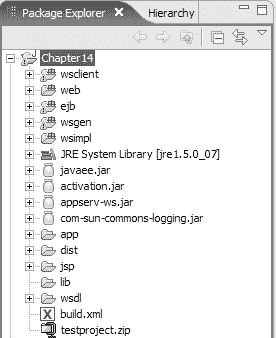

Vohra_706-0C14.fm Page 386 Saturday, August 12, 2006 5:18 AM

**386**

第 14 章 ■ 构建基于 XML 的 Web 服务

**安装软件**

在继续之前，你需要下载并安装 Java EE 5 SDK，其中包含 Sun One Application Server 9.0。该服务器包含基于 Apache Derby 的 Java DB 数据库。13

安装 SDK 后，启动其中包含的 Java DB 数据库和 Sun One Application Server 9.0。在 Windows 上，14 你可以选择 Sun One Application Server 9.0 程序菜单中的“启动 Java DB”来启动数据库，并选择“启动默认服务器”来启动服务器。

启动数据库和服务器后，在浏览器中访问 http://localhost:8080/，验证服务器是否正在运行。当服务器启动时，它会打印出它正在监听的端口，因此如果 http://localhost:8080/ 无法工作，请尝试服务器列出的其他端口，例如 http://localhost:2492/。

服务器运行后，你可以访问 http://localhost:4848/ 来进入 Sun One Application Server 9.0 管理控制台。如果系统要求你登录，请指定你在服务器安装期间配置的用户名和密码。管理控制台提供了用于部署企业应用程序的“企业应用程序”链接和用于部署 Web 服务的“Web 服务”链接。

**设置 Eclipse 项目**

你需要 J2SE 5.0 来构建你的 Eclipse 项目。因此，如果你尚未安装，请安装 J2SE 5.0。

接下来，你需要从 http://www.apress.com/ 下载 Chapter14 项目，并通过选择“文件”➤“导入”将项目导入 Eclipse。重要的是，你的 Eclipse 工作空间的文件系统路径中不能包含空格；否则，在按照本章后续步骤构建示例 Web 服务时，你会遇到问题。图 14-6 显示了 Chapter14 项目的目录结构。

**图 14-6.** *项目目录结构*

13\. Apache Derby 是 Apache DB 项目的一部分 (http://db.apache.org/derby/)。
14\. 对于其他平台，请遵循产品文档。

[www.it-ebooks.info](http://www.it-ebooks.info/)

Vohra_706-0C14.fm Page 387 Saturday, August 12, 2006 5:18 AM

第 14 章 ■ 构建基于 XML 的 Web 服务

**387**

项目文件夹如下：

*   `wsclient` 文件夹包含与 Web 服务客户端对应的 Java 文件，用于与示例 Web 服务交互。
*   `wsdl` 文件夹包含 Web 服务 WSDL 1.1 文档 (`services.wsdl`)、用于自定义 WSDL 1.1 到 Java 映射的 WSDL 1.1 定制文件 (`svcbindings.xml`)、模式文档 (`types.xsd`) 以及用于自定义 JAXB 2.0 对象绑定的 JAXB 2.0 绑定定制文件 (`binding.xjb`)。
*   `web` 文件夹包含与基于 Java Server Faces (JSF) 的网页实现相关的 Java 文件、XML 文档和属性文件。理解此文件夹的内容对于理解 Web 服务并非核心内容，本章包含这些内容仅仅是因为我们想展示如何构建一个完整的可运行示例。JSF 是 Java EE 5 的一部分，是一种用于构建基于 Web 的用户界面的服务器端技术。JSF 超出了本书的范围。但是，如果你有兴趣了解更多关于 JSF 的信息，我们推荐 *Pro JSF and Ajax: Building Rich Internet Components*。15
*   `ejb` 文件夹包含与应用程序逻辑和数据库持久性相关的 Java 代码，基于 Enterprise Java Beans (EJB) 3.0 技术。EJB 3.0 是 Java EE 5 的一部分，是一种用于实现对象关系映射、自动数据库持久性和应用程序逻辑的技术。EJB 3.0 超出了本章的范围。有关 EJB 3.0 的更详细说明，我们推荐 *Pro EJB3: Java Persistence API*。16
*   `wsgen` 文件夹用于存放由 `wsimport` 工具生成的 Java 源文件。当你最初将项目导入 Eclipse 时，此文件夹将为空。生成的 Java 文件对应于 JAXB 2.0 对象绑定文件和 Web 服务接口。
*   `wsimpl` 文件夹包含用于实现 Web 服务接口的 Java 文件。这些实现文件使用 EJB 来实现应用程序逻辑并与数据库交互。
*   `app` 目录在 `config` 文件夹中包含 `application.xml` 部署描述符。在此项目中，我们将展示如何构建一个企业应用程序归档文件，该文件将部署在服务器中。此归档文件将包含示例 Web 服务。当应用程序部署在 Sun One Application Server 9.0 中时，`application.xml` 部署描述符指定了企业应用程序的部署指令。有关此内容的更多详细信息，我们推荐位于 http://java.sun.com/javaee/5/docs/tutorial/doc/ 的 Java EE 5 教程。


• jsp 目录包含 Web 服务应用程序的 JSF 页面。

• Testproject.zip 文件是一个示例 ZIP 文件，Web 服务客户端将使用它通过 Web 服务将文档上传到项目。

图 14-7 显示了 Chapter14 项目的 Java 构建路径。

15\. *《Pro JSF 与 Ajax：构建丰富的互联网组件》*（Apress，2006 年），作者：Jonas Jacobi 和 John Fallows。

16\. *《Pro EJB3：Java 持久化 API》*（Apress，2006 年），作者：Mike Keith 和 Merrick Schincariol。

[www.it-ebooks.info](http://www.it-ebooks.info/)

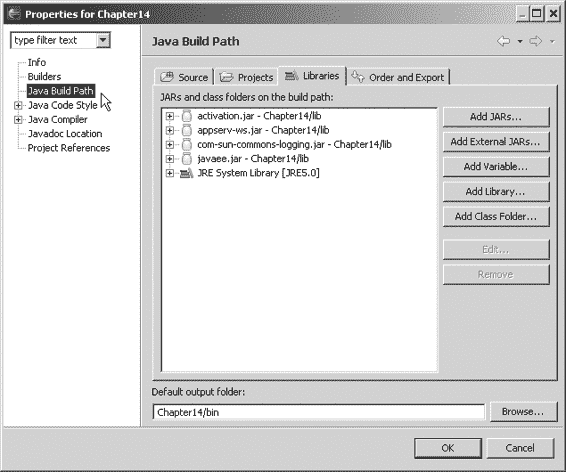

Vohra_706-0C14.fm 第 388 页 2006 年 8 月 12 日，星期六，上午 5:18

**388**

第 14 章 ■ 构建基于 XML 的 Web 服务

**图 14-7.** *Chapter14 项目 Java 构建路径* **设置 wsimport 工具**

wsimport 工具按如下方式处理 WSDL 1.1 文档：

• 它根据 WSDL 1.1 文档的内容生成 SEI、服务和 JAXB 2.0 对象绑定。

• SEI 是一个 Java 接口，对应于 WSDL 1.1 文档中的 wsdl:portType 定义。实现 Web 服务的提供者代理为 SEI 提供具体实现。

• 服务是一个类，Web 服务客户端可用其与 Web 服务进行交互。

• JAXB 2.0 对象绑定对应于 WSDL 1.1 文档中的模式类型。这些对象绑定用于将 Web 服务数据类型编组和解组为封装在 SOAP 1.1 消息中的 XML 内容，或从其中解组出来。

您将使用 wsimport 为 services.wsdl WSDL 1.1 文档生成 SEI、服务和 JAXB 2.0 对象绑定。

要使用 wsimport 工具，您需要首先通过选择“运行”➤“外部工具”➤“外部工具”来为 wsimport 创建一个外部工具配置。要创建外部工具配置，请执行以下步骤：

**1.** 右键单击“外部工具”区域中的“程序”节点，然后选择“新建”。

**2.** 为配置指定一个名称，例如 wsimport。

**3.** 在“位置”字段中指定 wsimport.bat 文件。

[www.it-ebooks.info](http://www.it-ebooks.info/)

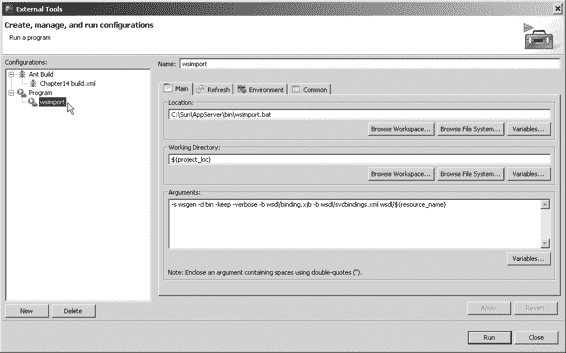

Vohra_706-0C14.fm 第 389 页 2006 年 8 月 12 日，星期六，上午 5:18

第 14 章 ■ 构建基于 XML 的 Web 服务

**389**

**4.** 在“工作目录”字段中，指定 ${project_loc}，在“参数”字段中，您需要指定以下参数：-s wsgen -d bin -keep -verbose -b wsdl/binding.xjb -b wsdl/svcbindings.xml wsdl/${resource_name}。

**5.** 单击“应用”按钮。wsimport 工具的外部工具配置即配置完成，如图 14-8 所示。

**图 14-8.** *wsimport 外部工具配置* 您还需要通过选择“环境”选项卡，然后依次单击“新建”按钮来添加环境变量 JAVA_HOME。要将 wsimport 外部工具配置添加到“收藏夹”菜单，请选择“常用”选项卡，然后在“在收藏夹菜单中显示”中选择“外部工具”框。

**WSDL 1.1 到 Java 的映射**

在您运行 wsimport 工具为 services.wsdl 生成 WSDL 1.1 到 Java 的映射之前，我们将介绍此映射过程的一般概念（我们参考了自定义的概念，稍后将在“自定义 WSDL 1.1 到 Java 的映射”一节中介绍）：

• WSDL 1.1 文档中的每个 wsdl:portType 都映射到一个 Java SEI。

• wsdl:portType 中的每个 wsdl:operation 都映射到 SEI 中的一个 Java 方法。

• 在没有自定义的情况下，映射的 Java 方法的名称与 wsdl:operation 名称属性的名称相同。默认情况下，由于 wsdl:portType 中的 wsdl:operation 名称是唯一的，因此不会存在重载方法。如果您使用自定义，最好坚持使用唯一的方法名称。

• 每个 wsdl:operation 必须有一个输入消息（wsdl:input）。它可能有零个或一个输出消息（wsdl:output），并且如果存在输出消息，则可能有零个或多个错误消息（wsdl:fault）。

[www.it-ebooks.info](http://www.it-ebooks.info/)


Vohra_706-0C14.fm 第 390 页 2006 年 8 月 12 日，星期六，上午 5:18

**390**

第 14 章 ■ 构建基于 XML 的 Web 服务

• 输入和输出消息通过非包装样式或包装样式映射到 Java 方法参数。关于这些样式下映射的详尽规则，我们推荐参考 JAX-WS 2.0 规范。不过，以下关于这些样式的细节对于大多数用途来说应该足够了：

• 在非包装样式中，如果 `wsdl:part` 是输入消息的一部分，则 `wsdl:part` 元素会映射到一个 Java 方法参数。对于输出消息，`wsdl:part` 元素会映射到一个持有者类参数或返回类型。使用非包装样式永远不会出错——问题迎刃而解。

• 包装样式仅当 `wsdl:input` 或 `wsdl:output` 引用的 `wsdl:message` 只有一个 `wsdl:part` 时才适用。依我们看，不必费心去用它。不过，如果你非要用，请阅读下一点。

• 在包装样式中，`wsdl:part` 元素被视为一个包装元素（这也是该样式名称的由来）。如果 `wsdl:part` 是输入消息的一部分，则包装元素的子元素会映射到 Java 方法参数。如果 `wsdl:part` 是输出消息的一部分，并且包装元素有多个子元素，则这些子元素会通过一个持有者类映射到 Java 方法参数；如果只有一个子元素，则直接映射到 Java 方法返回类型。如果 `wsdl:part` 同时是输入和输出消息的一部分，则使用持有者类方法参数。

• 错误消息会映射到一个自定义的 Java 异常类。

在下一节中，我们将讨论如何自定义 WSDL 1.1 到 Java 的映射。

自定义 WSDL 1.1 到 Java 的映射

你可以通过一个外部定制文件来自定义 `services.wsdl` 中 WSDL 1.1 到 Java 的映射。关于所有可能定制的详尽调查，我们推荐参考 JAX-WS 2.0 规范¹⁷。不过，我们将在以下各节中讨论一些更常用的定制。

一个快速观察：各种绑定的作用域是通过寻址 WSDL 1.1 文档节点的 XPath 表达式来确定的。例如，`node="//wsdl:portType[@name='ProjectPortType']"` 这个 XPath 表达式寻址的是 `services.wsdl` 中的 `ProjectPortType wsdl:portType`。

**包名**

你可以像这样自定义 Java 绑定的包名：

<jaxws:package name="com.apress.javaxml.ws" >

</jaxws:package>

**MIME 内容**

还记得吗，我们在 `services.wsdl` 中有一些 `wsdl:parts` 绑定到了 SOAP 1.1 的 `mime:content`，如下面来自清单 14-10 的摘录所示：

<mime:part>

<mime:content part="zip" type="application/zip" >

</mime:content>

</mime:part>

¹⁷. JAX-WS 2.0 规范可从 http://www.jcp.org/en/jsr/detail?id=224 下载。

[www.it-ebooks.info](http://www.it-ebooks.info/)

Vohra_706-0C14.fm 第 391 页 2006 年 8 月 12 日，星期六，上午 5:18

第 14 章 ■ 构建基于 XML 的 Web 服务

**391**

如果你希望将 `mime:content` 绑定到 `type` 属性中元数据所允许的最具体的 Java 类型，那么你可以在定制中指定，如下所示：

<jaxws:enableMIMEContent>true</jaxws:enableMIMEContent>

**方法名**

如果你想自定义与 `wsdl:operation` 对应的 Java 方法名，可以像下面这样为 `download wsdl:operation` 进行操作：

<jaxws:bindings

node="//wsdl:portType[@name='ProjectPortType']/wsdl:operation[@name='download']" >

<jaxws:method name="downloadProject" ></jaxws:method>

</jaxws:bindings>

在上面的例子中，`download wsdl:operation` 的名称被映射到了 `downloadProject` Java 方法名。

**处理程序链**

可以指定一个处理程序链，它在 Web 服务客户端和 SEI 之间对双向传输的消息进行干预。下面的例子为一个日志处理程序指定了处理程序链：

<javaee:handler-chains>

<javaee:handler-chain>

<javaee:handler>

<javaee:handlerclass>


com.apress.javaxml.ws.impl.LoggingHandler

</javaee:handler-class>

</javaee:handler>

</javaee:handler-chain>

</javaee:handler-chains>

当然，`LoggingHandler.java` 是一个自定义类，并包含在本章的 Eclipse 项目中。

**完整的自定义文件**

如清单 14-11 所示的 `svcbindings.xml` 文件，包含了针对 WSDL 1.1 到 Java 绑定的自定义配置：`services.wsdl`。

**清单 14-11.** *WSDL 1.1 到 Java 映射的自定义配置：svcbindings.xml*

<?xml version='1.0' encoding='UTF-8' ?>

<jaxws:bindings wsdlLocation="services.wsdl"

>

<jaxws:package name="com.apress.javaxml.ws" >

</jaxws:package>

<jaxws:enableMIMEContent>true</jaxws:enableMIMEContent>

<jaxws:bindings node="//wsdl:portType[@name='ProjectPortType']" >

<jaxws:enableWrapperStyle>true</jaxws:enableWrapperStyle>

[www.it-ebooks.info](http://www.it-ebooks.info/)

Vohra_706-0C14.fm Page 392 Saturday, August 12, 2006 5:18 AM

**392**

第 14 章 ■ 构建基于 XML 的 Web 服务

<jaxws:bindings node="//wsdl:portType

[@name='ProjectPortType']/wsdl:operation

[@name='download']" >

<jaxws:method name="downloadProject" ></jaxws:method>

</jaxws:bindings>

<jaxws:bindings node="//wsdl:portType

[@name='ProjectPortType']/wsdl:operation

[@name='upload']" >

<jaxws:method name="uploadProject" ></jaxws:method>

</jaxws:bindings>

<jaxws:bindings node="//wsdl:portType

[@name='ProjectPortType']/wsdl:operation

[@name='remove']" >

<jaxws:method name="removeProject" ></jaxws:method>

</jaxws:bindings>

</jaxws:bindings>

<jaxws:bindings node="wsdl:definitions"

>

<javaee:handler-chains>

<javaee:handler-chain>

<javaee:handler>

<javaee:handlerclass>

com.apress.javaxml.ws.impl.LoggingHandler

</javaee:handler-class>

</javaee:handler>

</javaee:handler-chain>

</javaee:handler-chains>

</jaxws:bindings>

</jaxws:bindings>

在下一节中，我们将讨论如何自定义 JAXB 2.0 绑定。

自定义 JAXB 2.0 绑定

清单 14-12 所示的 `binding.xjb` 包含了外部的 JAXB 2.0 自定义配置，这些配置应用于 `types.xsd` 模式。这些自定义配置指定了对象绑定的 Java 包，以及是否生成值类；它们应该相当直观，如果不直观，我们建议回顾第 6 章，其中详细介绍了 JAXB。

**清单 14-12.** *JAXB 2.0 自定义配置：binding.xjb*

<?xml version='1.0' encoding='utf-8' ?>

<jxb:bindings version="2.0"

>

<jxb:bindings node="/xs:schema"

schemaLocation="types.xsd" >

<jxb:globalBindings generateValueClass="true" >

</jxb:globalBindings>

[www.it-ebooks.info](http://www.it-ebooks.info/)

Vohra_706-0C14.fm Page 393 Saturday, August 12, 2006 5:18 AM

第 14 章 ■ 构建基于 XML 的 Web 服务

**393**

<jxb:schemaBindings>

<jxb:package name="com.apress.javaxml.ws" ></jxb:package>

</jxb:schemaBindings>

</jxb:bindings>

</jxb:bindings>

现在，您可以准备运行 `wsimport` 工具了。

运行 wsimport

要运行 `wsimport` 工具，首先选择 `services.wsdl` WSDL 1.1 文档，然后选择 **运行 ➤ 外部工具 ➤ wsimport**。

运行 `wsimport` 工具会将 `services.wsdl` 文档映射到 SEI 和服务 Java 类型，并根据作为参数传递给 `wsimport` 的自定义配置生成 JAXB 2.0 对象绑定。

请记住，传递给 `wsimport` 的参数是 `-s wsgen -d bin -keep -verbose -b wsdl/binding.xjb -b wsdl/svcbindings.xml wsdl/${resource_name}`。在这些参数中，`binding.xjb` 指的是 JAXB 2.0 绑定的外部自定义文件，而 `svcbindings.xml` 指的是 WSDL 1.1 到 Java 映射的外部自定义文件。

对应于 `services.wsdl` 文档的 SEI、服务和 JAXB 2.0 对象绑定的 Java 文件，会生成在 `wsgen` 文件夹下的 `com.apress.javaxml.ws` 包中。

要将生成的文件引入 Eclipse 项目视图，您需要通过选择 **文件 ➤ 刷新** 来刷新 Chapter14 项目文件。清单 14-13 显示了 `wsimport` 工具的输出。

■**注意** 如果此时您看到的是错误而不是所示的输出，请确保 Eclipse 项目位置的绝对文件系统路径中没有空格。

**清单 14-13.** *wsimport 的输出*

com\apress\javaxml\ws\AuthDetail.java

com\apress\javaxml\ws\AuthScope.java

com\apress\javaxml\ws\DocumentInfo.java

com\apress\javaxml\ws\FaultDetail.java

com\apress\javaxml\ws\FolderInfo.java

com\apress\javaxml\ws\ObjectFactory.java

com\apress\javaxml\ws\ProjectInfo.java

com\apress\javaxml\ws\ProjectPortType.java

com\apress\javaxml\ws\ProjectPortTypeImplService.java

com\apress\javaxml\ws\Projects.java

com\apress\javaxml\ws\ProjectsDetail.java

com\apress\javaxml\ws\UserInfo.java

com\apress\javaxml\ws\package-info.java

com\apress\javaxml\ws\AuthDetail.java

com\apress\javaxml\ws\AuthScope.java

com\apress\javaxml\ws\DocumentInfo.java

com\apress\javaxml\ws\FaultDetail.java

com\apress\javaxml\ws\FolderInfo.java

com\apress\javaxml\ws\ObjectFactory.java

com\apress\javaxml\ws\ProjectFault.java

com\apress\javaxml\ws\ProjectInfo.java

com\apress\javaxml\ws\ProjectPortType.java

com\apress\javaxml\ws\ProjectPortTypeImplService.java

com\apress\javaxml\ws\Projects.java

[www.it-ebooks.info](http://www.it-ebooks.info/)

Vohra_706-0C14.fm Page 394 Saturday, August 12, 2006 5:18 AM

**394**

第 14 章 ■ 构建基于 XML 的 Web 服务

com\apress\javaxml\ws\ProjectsDetail.java

com\apress\javaxml\ws\UserInfo.java

com\apress\javaxml\ws\package-info.java

在 `com.apress.javaxml.ws` 包中生成的文件 `ProjectPortType.java` 定义了 SEI；`ProjectPortTypeImplService.java` 实现了服务。`com.apress.javaxml.ws` 包中所有其他生成的文件都对应于 JAXB 2.0 对象绑定。

ProjectPortType SEI

`ProjectPortType.java` 中为 SEI 生成的代码使用了多种不同的 Java 注解标签，这些标签在表 14-3 中进行了解释。

**表 14-3.** *ProjectPortType.java 中使用的注解标签* **标签名称**

**描述**

WebService

当与 Java 接口一起使用时，它定义了一个 SEI。`name` 属性指定 Web 服务的名称，`targetNamespace` 属性定义相应 `wsdl:portType` 的目标命名空间。

HandlerChain

将此 Web 服务与外部定义的处理程序链关联起来，`file` 属性定义处理程序链文件的位置。处理程序链在 SEI 被调用之前被调用。

SOAPBinding

指定 Web 服务如何映射到 SOAP 1.1 消息体。`paramterStyle` 属性指定参数是直接放入消息体（`ParameterStyle.BARE`），还是包装在一个以操作名称命名的元素中（`ParameterStyle.WRAPPED`）。基本上，`BARE` 对应于文档样式，`WRAPPED` 对应于 rpc 样式。

WebMethod

指定一个作为 Web 服务操作公开的方法。`operationName` 属性指定 `wsdl:operation` 的名称。`action` 属性指定相应的 `soapAction`。

WebParam

指定一个映射到 `wsdl:part` 的方法参数。`name` 属性指定此参数的名称。`partName` 指定 `wsdl:part` 的名称。`header` 属性指定该参数是包含在 SOAP 1.1 头部还是主体中。`targetNamespace` 指定与该参数关联的 XML 命名空间。

WebResult

指定一个映射到 `wsdl:part` 的返回值。`name` 属性指定此返回值的名称。`partName` 指定 `wsdl:part` 的名称。`header` 属性指定该参数是包含在 SOAP 1.1 头部还是主体中。`targetNamespace` 指定与该参数关联的 XML 命名空间。

OneWay

指定只有一个输入消息，没有响应。


ProjectPortType SEI 映射包含了 ProjectPortType wsdl:portType 的 Java 映射，遵循“WSDL 1.1 到 Java 映射”一节中描述的规则。例如，download wsdl:operation 被映射为一个 Java 方法，如下所示：

[www.it-ebooks.info](http://www.it-ebooks.info/)

Vohra_706-0C14.fm Page 395 Saturday, August 12, 2006 5:18 AM

第 14 章 ■ 构建基于 XML 的 Web 服务

**395**

@WebMethod(operationName = "download",

action = "http://www.apress.com/xmljava/webservices/download") public void downloadProject(

@WebParam(name = "userInfo",

targetNamespace = "http://www.apress.com/xmljava/webservices/schemas", header = true, partName = "user")

UserInfo user,

@WebParam(name = "project",

targetNamespace = "http://www.apress.com/xmljava/webservices/schemas", partName = "project")

ProjectInfo project,

@WebParam(name = "manifest",

targetNamespace = "http://www.apress.com/xmljava/webservices/schemas", mode = Mode.OUT, partName = "manifest")

Holder<ProjectInfo> manifest,

@WebParam(name = "zip",

targetNamespace = "", mode = Mode.OUT, partName = "zip") Holder<DataHandler> zip)

throws ProjectFault;

在上例中，消息部分到 Java 方法参数的映射使用了非包装风格，因为输入和输出消息各有两个消息部分。输出消息部分 manifest 和 zip 分别映射到持有者类 `Holder<ProjectInfo>` 和 `Holder<DataHandler>`。错误消息部分映射到生成的 `ProjectFault` 异常。

清单 14-14 展示了 `ProjectPortType.java` 中为 ProjectPortType SEI 生成的代码。

**清单 14-14.** *ProjectPortType.java 中的生成代码* package com.apress.javaxml.ws;

import javax.activation.DataHandler;

import javax.jws.HandlerChain;

import javax.jws.Oneway;

import javax.jws.WebMethod;

import javax.jws.WebParam;

import javax.jws.WebParam.Mode;

import javax.jws.WebResult;

import javax.jws.WebService;

import javax.jws.soap.SOAPBinding;

import javax.jws.soap.SOAPBinding.ParameterStyle;

import javax.xml.ws.Holder;

@WebService(name = "ProjectPortType",

targetNamespace = "http://www.apress.com/xmljava/webservices/definitions")

@HandlerChain(file = "ProjectPortType_handler.xml")

@SOAPBinding(parameterStyle = ParameterStyle.BARE)

public interface ProjectPortType {

[www.it-ebooks.info](http://www.it-ebooks.info/)

Vohra_706-0C14.fm Page 396 Saturday, August 12, 2006 5:18 AM

**396**

第 14 章 ■ 构建基于 XML 的 Web 服务

@WebMethod(operationName = "download",

action = "http://www.apress.com/xmljava/webservices/download") public void downloadProject(

@WebParam(name = "userInfo",

targetNamespace = "http://www.apress.com/xmljava/webservices/schemas", header = true, partName = "user")

UserInfo user,

@WebParam(name = "project",

targetNamespace = "http://www.apress.com/xmljava/webservices/schemas", partName = "project")

ProjectInfo project,

@WebParam(name = "manifest",

targetNamespace = "http://www.apress.com/xmljava/webservices/schemas", mode = Mode.OUT, partName = "manifest")

Holder<ProjectInfo> manifest,

@WebParam(name = "zip",

targetNamespace = "", mode = Mode.OUT, partName = "zip") Holder<DataHandler> zip)

throws ProjectFault;

@WebMethod(operationName = "upload",

action = "http://www.apress.com/xmlJava/webservices/upload")

@WebResult(name = "project",

targetNamespace = "http://www.apress.com/xmljava/webservices/schemas", partName = "project")

public ProjectInfo uploadProject(

@WebParam(name = "userInfo",

targetNamespace = "http://www.apress.com/xmljava/webservices/schemas", header = true, partName = "user")

UserInfo user,

@WebParam(name = "manifest",

targetNamespace = "http://www.apress.com/xmljava/webservices/schemas", partName = "manifest")

ProjectInfo manifest,

@WebParam(name = "zip", targetNamespace = "", partName = "zip") DataHandler zip)

throws ProjectFault;

@WebMethod(operationName = "remove",

action = "http://www.apress.com/xmlJava/webservices/remove")

@Oneway

public void removeProject(

@WebParam(name = "userInfo",


targetNamespace = "http://www.apress.com/xmljava/webservices/schemas", header = true, partName = "user")

UserInfo user,

@WebParam(name = "remove",

targetNamespace = "http://www.apress.com/xmljava/webservices/schemas", partName = "remove")

ProjectInfo remove);

[www.it-ebooks.info](http://www.it-ebooks.info/)

Vohra_706-0C14.fm Page 397 Saturday, August 12, 2006 5:18 AM

第 14 章 ■ 构建基于 XML 的 Web 服务

**397**

@WebMethod(action = "http://www.apress.com/xmljava/webservices/getprojects")

@WebResult(name = "projects",

targetNamespace = "http://www.apress.com/xmljava/webservices/schemas", partName = "projects")

public Projects getProjects(

@WebParam(name = "userInfo",

targetNamespace = "http://www.apress.com/xmljava/webservices/schemas", header = true, partName = "user")

UserInfo user,

@WebParam(name = "projectsDetail",

targetNamespace = "http://www.apress.com/xmljava/webservices/schemas", partName = "detail")

ProjectsDetail detail)

throws ProjectFault;

@WebMethod(action = "http://www.apress.com/xmljava/webservices/authenticate") public void authenticate(

@WebParam(name = "userInfo",

targetNamespace = "http://www.apress.com/xmljava/webservices/schemas", header = true, mode = Mode.INOUT, partName = "user") Holder<UserInfo> user,

@WebParam(name = "authDetail",

targetNamespace = "http://www.apress.com/xmljava/webservices/schemas", mode = Mode.INOUT, partName = "detail")

Holder<AuthDetail> detail)

throws ProjectFault;

}

我们将在下一节展示如何实现 `ProjectPortType` SEI。

**实现 ProjectPortType SEI**

`ProjectPortType` SEI 在 `com.apress.javaxml.ws.impl` 包下的 `ProjectPortTypeImpl.java` 文件中实现，该文件位于 `wsimpl` 文件夹中，如清单 14-15 所示。清单 14-16 中的 `javax.ejb.EJB` 注解标签指向一个 EJB 接口。在清单 14-15 所示的代码中，你会注意到在每个 SEI 方法中，都只是调用了相应的 EJB 方法。这是因为应用程序逻辑全部在 EJB 类中实现。

**清单 14-15.** *ProjectPortTypeImpl.java 中的 SEI 实现* package com.apress.javaxml.ws.impl;

import javax.activation.DataHandler;

import javax.ejb.EJB;

import javax.xml.ws.Holder;

import com.apress.javaxml.ws.AuthDetail;

import com.apress.javaxml.ws.FaultDetail;

import com.apress.javaxml.ws.ProjectInfo;

import com.apress.javaxml.ws.Projects;

import com.apress.javaxml.ws.ProjectsDetail;

import com.apress.javaxml.ws.UserInfo;

import com.apress.javaxml.ws.ProjectFault;

import com.apress.javaxml.service.ProjectLocal;

import com.apress.javaxml.service.UserLocal;

[www.it-ebooks.info](http://www.it-ebooks.info/)

Vohra_706-0C14.fm Page 398 Saturday, August 12, 2006 5:18 AM

**398**

第 14 章 ■ 构建基于 XML 的 Web 服务

@javax.jws.WebService(

targetNamespace = "http://www.apress.com/xmljava/webservices/definitions", serviceName = "ProjectPortTypeImplService",

portName = "ProjectPortTypeImplPort",

endpointInterface = "com.apress.javaxml.ws.ProjectPortType", wsdlLocation = "WEB-INF/wsdl/services.wsdl")

public class ProjectPortTypeImpl {

@EJB

private ProjectLocal projectLocal;

@EJB

private UserLocal userLocal;

public void downloadProject(UserInfo user, ProjectInfo project, Holder<ProjectInfo> manifestHolder, Holder<DataHandler> dhHolder) throws ProjectFault {

try {

// 下载 ZIP 文件

manifestHolder.value = project;

DataHandler dh = projectLocal.downloadZipFile(user,

manifestHolder.value);

// 将数据处理器放入数据处理器持有者中

dhHolder.value = dh;

} catch (Exception e) {

FaultDetail detail = new FaultDetail();

detail.setMajor("DOWNLOAD");

detail.setMinor("NONE");

throw new ProjectFault(e.getMessage(), detail);

}

}

public ProjectInfo uploadProject(UserInfo user, ProjectInfo manifest, DataHandler zip) throws ProjectFault {

try {

// 上传 ZIP 文件

projectLocal.uploadZipFile(user, manifest, zip);

} catch (Exception e) {

FaultDetail detail = new FaultDetail();

detail.setMajor("UPLOAD");

detail.setMinor("NONE");

throw new ProjectFault(e.getMessage(), detail);

}


return manifest;

}

public void removeProject(UserInfo user, ProjectInfo remove) {

projectLocal.remove(user, remove);

}

public Projects getProjects(UserInfo user, ProjectsDetail projectsDetail) throws ProjectFault {

[www.it-ebooks.info](http://www.it-ebooks.info/)

Vohra_706-0C14.fm 第 399 页 2006 年 8 月 12 日，星期六，上午 5:18

第 14 章 ■ 构建基于 XML 的 WEB 服务

**399**

Projects projects = null;

try {

// 获取项目

projects = projectLocal.getProjects(user, projectsDetail);

} catch (Exception e) {

FaultDetail detail = new FaultDetail();

detail.setMajor("GETPROJECTS");

detail.setMinor("NONE");

throw new ProjectFault(e.getMessage(), detail);

}

return projects;

}

public void authenticate(Holder<UserInfo> userInfoHolder, Holder<AuthDetail> authDetailHolder) throws ProjectFault {

try {

UserInfo userInfo = userInfoHolder.value;

userLocal.login(userInfo.getEmail(), userInfo.getPwd());

} catch (Exception e) {

FaultDetail detail = new FaultDetail();

detail.setMajor("AUTHENTICATE");

detail.setMinor("NONE");

throw new ProjectFault(e.getMessage(), detail);

}

}

}

ProjectPortTypeImpl 类使用 ProjectLocal 和 UserLocal EJB 来访问应用程序逻辑。清单 14-16 展示了 ProjectLocal EJB，它位于 ejb 文件夹中 com.apress.javaxml.service 包下的 ProjectLocal.java 文件中。

**清单 14-16.** *ProjectLocal.java 中的 ProjectLocal EJB* package com.apress.javaxml.service;

import javax.activation.DataHandler;

import javax.ejb.Local;

import com.apress.javaxml.ws.*;

@Local

public interface ProjectLocal {

public ProjectInfo uploadZipFile(UserInfo user,

ProjectInfo manifest, DataHandler zip);

public DataHandler downloadZipFile(UserInfo user, ProjectInfo manifest); public void remove(UserInfo user, ProjectInfo manifest);

public Projects getProjects(UserInfo user, ProjectsDetail detail);

}

ProjectLocal EJB 接口由 ProjectService 类实现。位于 ejb 文件夹中 com.apress.javaxml.service 包下的 ProjectService 类提供了与用例场景相关的实际应用程序逻辑。ProjectService 类与理解 Web 服务没有直接关系，因此将其包含在本章的 Eclipse 项目中以供参考。

清单 14-17 展示了 UserLocal EJB，它位于 ejb 文件夹中 com.apress.javaxml.service 包下的 UserLocal.java 文件中。

**清单 14-17.** *UserLocal.java 中的 UserLocal EJB* package com.apress.javaxml.service;

import javax.ejb.Local;

@Local

public interface UserLocal {

public void login(String email, String pwd);

public void register(String email, String pwd);

public void changePwd(String email, String cpwd, String npwd); public void unregister(String email, String pwd);

}

UserLocal 接口由 UserService 类实现。位于 ejb 文件夹中 com.apress.javaxml.service 包下的 UserService 类提供了与注册新用户、用户登录、更改现有用户密码以及注销用户等用例相关的实际应用程序逻辑。UserService 类与理解 Web 服务没有直接关系，因此将其包含在本章的 Eclipse 项目中以供参考。

**构建 Web 服务**

以下是构建 Web 服务应用程序并将其部署到 Sun One Application Server 9.0 的步骤：

**1.** 在包资源管理器中选择 Chapter14 项目节点，然后选择“项目” ➤ “构建项目”，以构建 Chapter14 项目。

**2.** 使用 build.xml Ant 文件构建企业应用程序归档文件。要针对 build.xml 文件调用 Ant，请右键单击 build.xml 文件，然后选择“运行方式” ➤ “Ant 构建”。


`build.xml` 文件包含三个目标：`jar`、`war` 和 `ear`。`jar` 目标创建一个符合 EJB 3.0 规范的归档模块：`projectejb.jar`。清单 14-18 展示了 `projectejb.jar` 的内容。这些类对应的源代码包含在项目中。

**清单 14-18.** *projectejb.jar 的内容*

META-INF/MANIFEST.MF

com/apress/javaxml/persistence/Document.class

com/apress/javaxml/persistence/DocumentKey.class

com/apress/javaxml/persistence/Folder.class

com/apress/javaxml/persistence/FolderKey.class

com/apress/javaxml/persistence/Project.class

com/apress/javaxml/persistence/ProjectKey.class

com/apress/javaxml/persistence/User.class

[www.it-ebooks.info](http://www.it-ebooks.info/)

Vohra_706-0C14.fm Page 401 Saturday, August 12, 2006 5:18 AM

第 14 章 ■ 构建基于 XML 的 Web 服务

**401**

com/apress/javaxml/service/ProjectLocal.class

com/apress/javaxml/service/ProjectService.class

com/apress/javaxml/service/UserLocal.class

com/apress/javaxml/service/UserService.class

com/apress/javaxml/ws/DocumentInfo.class

com/apress/javaxml/ws/FolderInfo.class

com/apress/javaxml/ws/ProjectInfo.class

com/apress/javaxml/ws/UserInfo.class

META-INF/persistence.xml

`war` 目标创建一个 Web 应用归档模块：`projectservice.war`。清单 14-19 展示了 `projectservice.war` 的内容。`WEB-INF` 目录下的 JSP 文件和 XML 文档包含在项目中。

**清单 14-19.** *projectservice.war 的内容*

META-INF/MANIFEST.MF

WEB-INF/classes/com/apress/javaxml/beans/UserBean.class

WEB-INF/classes/com/apress/javaxml/i18n/messages.properties WEB-INF/classes/com/apress/javaxml/service/ProjectLocal.class WEB-INF/classes/com/apress/javaxml/service/UserLocal.class WEB-INF/classes/com/apress/javaxml/ws/AuthDetail.class

WEB-INF/classes/com/apress/javaxml/ws/AuthScope.class

WEB-INF/classes/com/apress/javaxml/ws/DocumentInfo.class

WEB-INF/classes/com/apress/javaxml/ws/FaultDetail.class

WEB-INF/classes/com/apress/javaxml/ws/FolderInfo.class

WEB-INF/classes/com/apress/javaxml/ws/ObjectFactory.class WEB-INF/classes/com/apress/javaxml/ws/ProjectFault.class

WEB-INF/classes/com/apress/javaxml/ws/ProjectInfo.class

WEB-INF/classes/com/apress/javaxml/ws/ProjectPortType.class WEB-INF/classes/com/apress/javaxml/ws/ProjectPortTypeImplService_handler.xml WEB-INF/classes/com/apress/javaxml/ws/ProjectPortType_handler.xml WEB-INF/classes/com/apress/javaxml/ws/Projects.class

WEB-INF/classes/com/apress/javaxml/ws/ProjectsDetail.class WEB-INF/classes/com/apress/javaxml/ws/UserInfo.class

WEB-INF/classes/com/apress/javaxml/ws/impl/LoggingHandler.class WEB-INF/classes/com/apress/javaxml/ws/impl/ProjectPortTypeImpl.class WEB-INF/classes/com/apress/javaxml/ws/package-info.class

WEB-INF/classes/types.xsd

WEB-INF/wsdl/services.wsdl

WEB-INF/wsdl/types.xsd

WEB-INF/faces-config.xml

chgpwd.jsp

home.jsp

index.jsp

register.jsp

styles.css

WEB-INF/web.xml

`ear` 目标创建一个企业应用归档：`project.ear`。清单 14-20 展示了 `project.ear` 的内容。`META-INF/application.xml` 文件包含在项目中。

[www.it-ebooks.info](http://www.it-ebooks.info/)

Vohra_706-0C14.fm Page 402 Saturday, August 12, 2006 5:18 AM

**402**

第 14 章 ■ 构建基于 XML 的 Web 服务

**清单 14-20.** *project.ear 的内容*

META-INF/MANIFEST.MF

projectejb.jar

projectservice.war

META-INF/application.xml

`ear` 目标会触发 `war` 目标；`war` 目标会触发 `jar` 目标。所有模块归档都创建在 `dist` 文件夹下。默认目标是 `ear`。清单 14-21 展示了构建 `build.xml` 的输出。

**清单 14-21.** *build.xml 的输出*

Buildfile: C:\workspace\Chapter14\build.xml

jar:

[delete] Deleting: C:\workspace\Chapter14\dist\projectejb.jar

[jar] Building jar: C:\workspace\Chapter14\dist\projectejb.jar war:

[delete] Deleting: C:\workspace\Chapter14\dist\projectservice.war

[war] Building war: C:\workspace\Chapter14\dist\projectservice.war ear:

[delete] Deleting: C:\workspace\Chapter14\dist\project.ear


[ear] 构建 ear: C:\workspace\Chapter14\dist\project.ear 构建成功

**部署 Web 服务**

您需要在 Sun One Application Server 9.0 的管理控制台中部署 project.ear 文件。

您需要启动默认服务器，启动 Java DB 服务器，然后打开 Sun One Application Server 9.0 的管理控制台。要部署 project.ear 应用程序，请在管理控制台中选择“应用程序”➤“企业应用程序”节点。单击“部署”按钮。在“要上传的文件”中，使用“浏览”按钮选择 project.ear 文件，然后单击“下一步”，如图 14-9 所示。

[www.it-ebooks.info](http://www.it-ebooks.info/)

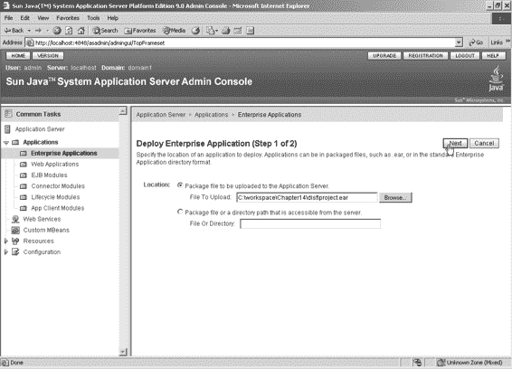

Vohra_706-0C14.fm 第 403 页 2006 年 8 月 12 日，星期六，上午 5:18

第 14 章 ■ 构建基于 XML 的 Web 服务

**403**

**图 14-9.** *部署 project.ear 应用程序* 要对应用程序运行验证器并预编译 JSP，请选中“运行验证器”和“预编译 JSP”复选框。要部署 Web 服务应用程序，请单击“完成”按钮，如图 14-10 所示。

[www.it-ebooks.info](http://www.it-ebooks.info/)


Vohra_706-0C14.fm 第 404 页 2006 年 8 月 12 日，星期六，上午 5:18

**404**

第 14 章 ■ 构建基于 XML 的 Web 服务

**图 14-10.** *配置设置并部署 project.ear 应用程序* project.ear 企业应用程序被部署，并出现在应用程序服务器树中的“企业应用程序”下。

您可以通过选择“Web 服务”➤“ProjectPortTypeImpl”节点并单击“测试”按钮来测试 Web 服务部署，如图 14-11 所示。

[www.it-ebooks.info](http://www.it-ebooks.info/)


Vohra_706-0C14.fm 第 405 页 2006 年 8 月 12 日，星期六，上午 5:18

第 14 章 ■ 构建基于 XML 的 Web 服务

**405**

**图 14-11.** *测试 Web 服务*

出现一个用于测试 Web 服务实现的表单，如图 14-12 所示。此表单对于实际测试 Web 服务并无用处，但它确实能验证部署是否成功。我们不会使用此表单来测试 Web 服务。

[www.it-ebooks.info](http://www.it-ebooks.info/)

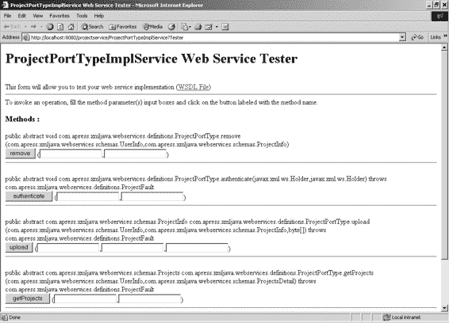


Vohra_706-0C14.fm 第 406 页 2006 年 8 月 12 日，星期六，上午 5:18

**406**

第 14 章 ■ 构建基于 XML 的 Web 服务

**图 14-12.** *测试 Web 服务的输出* **注册新用户**

您需要在 Web 服务中注册一个用户，以便能够作为客户端连接到该 Web 服务。

使用 URL http://localhost:8080/projectservice/index.faces 显示注册用户的表单。单击“注册”链接，指定用户电子邮件和密码，然后单击“注册”按钮，如图 14-13 所示。

**图 14-13.** *注册新用户*

指定的用户电子邮件即被注册。

[www.it-ebooks.info](http://www.it-ebooks.info/)

Vohra_706-0C14.fm 第 407 页 2006 年 8 月 12 日，星期六，上午 5:18

第 14 章 ■ 构建基于 XML 的 Web 服务

**407**

**Web 服务客户端**

Web 服务客户端使用生成的代理服务类 com.apress.javaxml.ws.ProjectPortTypeImpl.java（如清单 14-22 所示）与 Web 服务进行交互。您将使用的此类中的关键方法是 ProjectPortTypeImplService(URL wsdlLocation, QName serviceName) 构造函数，用于创建服务代理实例。您将在服务代理实例上调用 getProjectPortTypeImplPort() 方法，以获取 ProjectPortType 服务接口的实例。

**清单 14-22.** *服务：ProjectPortTypeImpl.java* package com.apress.javaxml.ws;

import java.net.MalformedURLException;

import java.net.URL;

import javax.jws.HandlerChain;

import javax.xml.namespace.QName;

import javax.xml.ws.Service;

import javax.xml.ws.WebEndpoint;

import javax.xml.ws.WebServiceClient;


@WebServiceClient(name = "ProjectPortTypeImplService", targetNamespace = "http://www.apress.com/xmljava/webservices/definitions", wsdlLocation = "wsdl/services.wsdl")

@HandlerChain(file = "ProjectPortTypeImplService_handler.xml") public class ProjectPortTypeImplService

extends Service {

private final static URL PROJECTPORTTYPEIMPLSERVICE_WSDL_LOCATION; static {

URL url = null;

try {

url = new URL

("file:/C:/eclipse-workspaces/xmlbook/Chapter14/wsdl/services.wsdl");

} catch (MalformedURLException e) {

e.printStackTrace();

}

PROJECTPORTTYPEIMPLSERVICE_WSDL_LOCATION = url;

}

public ProjectPortTypeImplService(URL wsdlLocation, QName serviceName) {

super(wsdlLocation, serviceName);

}

public ProjectPortTypeImplService() {

super(PROJECTPORTTYPEIMPLSERVICE_WSDL_LOCATION,

new QName("http://www.apress.com/xmljava/webservices/definitions",

"ProjectPortTypeImplService"));

}

[www.it-ebooks.info](http://www.it-ebooks.info/)

Vohra_706-0C14.fm Page 408 Saturday, August 12, 2006 5:18 AM

**408**

第 14 章 ■ 构建基于 XML 的 WEB 服务

@WebEndpoint(name = "ProjectPortTypeImplPort")

public ProjectPortType getProjectPortTypeImplPort() {

return (ProjectPortType)super.getPort(new

QName("http://www.apress.com/xmljava/webservices/definitions",

"ProjectPortTypeImplPort"),

ProjectPortType.class);

}

}

该示例 Web 服务应用程序包含一个 Web 服务客户端 `ProjectClient`，可用于测试 Web 服务定义的所有用例场景。清单 14-23 展示了 `com.apress.javaxml.ws.client.ProjectClient` 的代码。

**清单 14-23.** *Web 服务客户端：ProjectClient.java* package com.apress.javaxml.ws.client;

import javax.xml.namespace.QName;

import javax.xml.ws.Holder;

import java.io.File;

import java.io.FileOutputStream;

import java.net.*;

import java.util.*;

import java.util.logging.Logger;

import java.util.zip.ZipEntry;

import java.util.zip.ZipFile;

import javax.activation.*;

import com.apress.javaxml.ws.*;

public class ProjectClient {

private static ProjectPortTypeImplService service;

private static final Logger logger = Logger.getLogger(ProjectClient.class

.getName());

private static File zfile;

private static String email, pwd;

private static URL wsdlUrl;

private final static QName PROJECTSERVICE = new QName(

"http://www.apress.com/xmljava/webservices/definitions",

"ProjectPortTypeImplService");

/**

* @param args

* 命令行参数

*/

public static void main(String[] args) {

try {

[www.it-ebooks.info](http://www.it-ebooks.info/)

Vohra_706-0C14.fm Page 409 Saturday, August 12, 2006 5:18 AM

第 14 章 ■ 构建基于 XML 的 WEB 服务

**409**

if (args.length == 4) {

email = args[0];

pwd = args[1];

wsdlUrl = new URL(args[2]);

zfile = new File(args[3]);

} else {

System.out

.println("用法: <email> <password> <wsdl URL> <zipfile>"); System.exit(1);

}

doProjectServiceTests();

} catch (Exception e) {

logger.severe(e.toString());

}

}

private static void log(DocumentInfo dinfo) {

logger.info("文档名称:" + dinfo.getName()); logger.info("文档创建时间:" + dinfo.getCreatedOn()); logger.info("文档最后更新时间:" + dinfo.getLastUpdated());

}

private static void log(FolderInfo finfo) {

logger.info("文件夹位置:" + finfo.getLocation()); logger.info("文件夹创建时间:" + finfo.getCreatedOn()); logger.info("文件夹最后更新时间:" + finfo.getLastUpdated()); List<DocumentInfo> docs = finfo.getDocument();

Iterator<DocumentInfo> it = docs.iterator();

while (it.hasNext()) {

DocumentInfo docInfo = it.next();

log(docInfo);

}

}

private static void log(ProjectInfo pinfo) {

logger.info("项目名称:" + pinfo.getName()); logger.info("项目创建时间:" + pinfo.getCreatedOn()); logger.info("项目最后更新时间:" + pinfo.getLastUpdated()); List<FolderInfo> folders = pinfo.getFolder();

Iterator<FolderInfo> it = folders.iterator();

while (it.hasNext()) {

FolderInfo folderInfo = it.next();

log(folderInfo);

}

}

private static void doProjectServiceTests() {

try {

logger.info("\n 开始项目服务测试\n");


[www.it-ebooks.info](http://www.it-ebooks.info/)

Vohra_706-0C14.fm Page 410 Saturday, August 12, 2006 5:18 AM

**410**

第 14 章 ■ 构建基于 XML 的 Web 服务

logger.info("Create service for:" + wsdlUrl);

service =

new ProjectPortTypeImplService(wsdlUrl,

PROJECTSERVICE);

ProjectPortType port = service.getProjectPortTypeImplPort(); UserInfo userInfo = new UserInfo();

userInfo.setEmail(email);

userInfo.setPwd(pwd);

Holder<UserInfo> userInfoHolder = new Holder<UserInfo>(); userInfoHolder.value = userInfo;

logger.info("Authenticate user:" +

userInfo.getEmail()+":"+userInfo.getPwd());

AuthScope scope = new AuthScope();

scope.setScope("session");

AuthDetail authDetail = new AuthDetail();

authDetail.setAny(scope);

Holder<AuthDetail> authDetailHolder = new Holder<AuthDetail>(); authDetailHolder.value = authDetail;

try {//Web Service Call - Authentication

port.authenticate(userInfoHolder, authDetailHolder);

} catch(Exception e) {

e.printStackTrace();

logger.info("User is not authorized");

System.exit(1);

}

logger.info("User is authorized");

ProjectInfo projectInfo = new ProjectInfo();

projectInfo.setName(zfile.getName());

projectInfo.setEmail(email);

ZipFile zipFile = new ZipFile(zfile);

Enumeration entries = zipFile.entries();

HashMap<String, FolderInfo>

folderMap = new HashMap<String, FolderInfo>();

while (entries.hasMoreElements()) {

ZipEntry zipEntry = (ZipEntry) entries.nextElement();

String entryName = zipEntry.getName();

if (!zipEntry.isDirectory()) {

String location = entryName.substring(0, entryName

.lastIndexOf("/") + 1);

String name = entryName.substring(entryName

.lastIndexOf("/") + 1);

FolderInfo folderInfo = (FolderInfo) folderMap

.get(location);

[www.it-ebooks.info](http://www.it-ebooks.info/)

Vohra_706-0C14.fm Page 411 Saturday, August 12, 2006 5:18 AM

第 14 章 ■ 构建基于 XML 的 Web 服务

**411**

if (folderInfo == null) {

folderInfo = new FolderInfo();

folderMap.put(location, folderInfo);

folderInfo.setLocation(location);

projectInfo.getFolder().add(folderInfo);

}

DocumentInfo docInfo = new DocumentInfo();

docInfo.setName(name);

folderInfo.getDocument().add(docInfo);

}

}

DataHandler dh = new DataHandler(new FileDataSource(zfile)); logger.info("Uploading zip file:" + zfile.getName());

//Web Service Call-Upload

ProjectInfo retProjectInfo = port.uploadProject(userInfo, projectInfo, dh);

logger.info("Begin Upload Project Status");

log(retProjectInfo);

logger.info("End Upload Project Status");

logger.info("Get All Projects:" + userInfo.getEmail()); ProjectsDetail detail = new ProjectsDetail();

detail.setFolders(false);

detail.setDocuments(false);

Projects projects = port.getProjects(userInfo, detail);

List<ProjectInfo> projectList = projects.getProject(); Iterator<ProjectInfo> itp = projectList.iterator(); while (itp.hasNext()) {

projectInfo = itp.next();

logger.info("Downloading Project:" + userInfo.getEmail() + ":"

+ projectInfo.getName());

Holder<ProjectInfo> mf = new Holder<ProjectInfo>(); Holder<DataHandler> zip = new Holder<DataHandler>();

//Web Service Call-Download

port.downloadProject(userInfo, projectInfo, mf, zip);

dh = zip.value;

if (dh != null) {

File temp = File.createTempFile(projectInfo.getName(),

".zip");

FileOutputStream fos = new FileOutputStream(temp);

dh.writeTo(fos);

fos.close();

zipFile = new ZipFile(temp);

entries = zipFile.entries();

[www.it-ebooks.info](http://www.it-ebooks.info/)

Vohra_706-0C14.fm Page 412 Saturday, August 12, 2006 5:18 AM

**412**

第 14 章 ■ 构建基于 XML 的 Web 服务

logger.info(("Begin Zip Entries:"));

while (entries.hasMoreElements()) {

ZipEntry zipEntry = (ZipEntry) entries.nextElement();

String entryName = zipEntry.getName();

logger.info("Zip entry:" + entryName);

}

logger.info(("End Zip Entries"));

temp.delete();

}

ProjectInfo pinfo = new ProjectInfo();

pinfo.setEmail(projectInfo.getEmail());

pinfo.setName(projectInfo.getName());

logger.info("Remove Project:"+

userInfo.getEmail()+":"+pinfo.getName());

port.removeProject(userInfo, pinfo);

}


logger.info("\n 结束 ProjectService 测试\n");

} catch (Exception ex) {

logger.severe(ex.toString());

}

}

}

运行 ProjectClient 客户端

要在 Eclipse 中运行 ProjectClient 客户端，你需要通过选择 Run ➤ Run 来为 ProjectClient 配置一个 Java 应用程序配置。

ProjectClient 需要知道 Web 服务的 WSDL 文档的位置。

你可以从部署在 Sun One Application Server 9.0 中的 Web 服务获取 WSDL 文档的位置，方法是选择 Web Services ➤ ProjectPortTypeImpl 节点，然后点击 services.wsdl 链接，如图 14-14 所示。

在 services.wsdl 文件中，soap:address 元素的 location 属性（后缀为 ?WSDL）指定了 WSDL URL。

在 ProjectClient 应用程序配置的“程序参数”（Program Arguments）字段中，指定用户邮箱、密码、WSDL URL 以及 testproject.zip 文件，如下所示：useremail password <WSDL URL> testproject.zip

[www.it-ebooks.info](http://www.it-ebooks.info/)


Vohra_706-0C14.fm 第 413 页 2006 年 8 月 12 日，星期六，上午 5:18

第 14 章 ■ 构建基于 XML 的 Web 服务

**413**

**图 14-14.** *选择 services.wsdl*

通过选择 Run As ➤ Run 来运行 ProjectClient 应用程序。**清单 14-24 显示了运行 ProjectClient.java 的输出。**

****清单 14-24.** *ProjectClient.java 的输出*

com.apress.javaxml.ws.client.ProjectClient doProjectServ

iceTests

INFO:

开始 ProjectService 测试

com.apress.javaxml.ws.client.ProjectClient doProjectServ

iceTests

INFO: 为以下地址创建服务：http://d207-6-39-2.bchsia.telus.net:8080/projectservice

/ProjectPortTypeImplService?WSDL

com.apress.javaxml.ws.client.ProjectClient doProjectServ

[www.it-ebooks.info](http://www.it-ebooks.info/)

Vohra_706-0C14.fm 第 414 页 2006 年 8 月 12 日，星期六，上午 5:18

**414**

第 14 章 ■ 构建基于 XML 的 Web 服务

iceTests

INFO: 认证用户：dvohra09@yahoo.com:administrator

com.apress.javaxml.ws.impl.LoggingHandler log

INFO: <?xml version="1.0" ?><soapenv:Envelope xmlns:ns1="

http://www.apress.com/xmljava/webservices/schemas" xmlns:ns2="http://www.apress.

com/xmljava/webservices/definitions"><soapenv:Header><ns1:userInfo><email>dvohra

@yahoo.com</email><pwd>administrator</pwd></ns1:userInfo></soapenv:Header><soape nv:Body><ns1:authDetail><ns1:authScope><scope>session</scope></ns1:authScope></n s1:authDetail></soapenv:Body></soapenv:Envelope> com.apress.javaxml.ws.impl.LoggingHandler log

INFO: <?xml version="1.0" ?><soapenv:Envelope xmlns:ns1="

http://www.apress.com/xmljava/webservices/schemas" xmlns:ns2="http://www.apress.

com/xmljava/webservices/definitions"><soapenv:Header><ns1:userInfo><email>dvohra

@yahoo.com</email><pwd>administrator</pwd></ns1:userInfo></soapenv:Header><soape nv:Body><ns1:authDetail><ns1:authScope><scope>session</scope></ns1:authScope></n s1:authDetail></soapenv:Body></soapenv:Envelope> com.apress.javaxml.ws.client.ProjectClient doProjectServ

iceTests

INFO: 用户已授权

com.apress.javaxml.ws.client.ProjectClient doProjectServ

iceTests

INFO: 正在上传 zip 文件：testproject.zip

com.apress.javaxml.ws.impl.LoggingHandler log

INFO: ------=_Part_0_26171428.1151199877220

Content-Type: text/xml; charset=utf-8

<?xml version="1.0" ?><soapenv:Envelope xmlns:ns1="http:/

/www.apress.com/xmljava/webservices/schemas" xmlns:ns2="http://www.apress.com/xm ljava/webservices/definitions"><soapenv:Header><ns1:userInfo><email>dvohra09@yahoo

.com</email><pwd>administrator</pwd></ns1:userInfo></soapenv:Header><soapenv:Bod y><ns1:manifest name="testproject.zip" email="dvohra09@yahoo.com"><folder location

="popuptest/"><document name="error.html"></document><document name="index.jsp">

</document><document name="login.html"></document></folder><folder location="pop uptest/WEB-INF/"><document name="web.xml"></document><document name="weblogic.xm l"></document></folder></ns1:manifest></soapenv:Body></soapenv:Envelope>

------=_Part_0_26171428.1151199877220

Content-Type: application/octet-stream


Content-ID: <zip=7c8243a2-3223-4891-9336-11ab17a7e926@jaxws.sun.com> Content-transfer-encoding: binary

PK____

------=_Part_2_24166053.1151199960199--

com.apress.javaxml.ws.client.ProjectClient doProjectServ

iceTests

INFO: 开始处理 Zip 条目：

com.apress.javaxml.ws.client.ProjectClient doProjectServ

iceTests

INFO: Zip 条目：popuptest/WEB-INF/web.xml

com.apress.javaxml.ws.client.ProjectClient doProjectServ

[www.it-ebooks.info](http://www.it-ebooks.info/)

Vohra_706-0C14.fm 第 415 页 2006 年 8 月 12 日星期六 上午 5:18

第 14 章 ■ 构建基于 XML 的 Web 服务

**415**

iceTests

INFO: Zip 条目：popuptest/WEB-INF/weblogic.xml

com.apress.javaxml.ws.client.ProjectClient doProjectServ

iceTests

INFO: Zip 条目：popuptest/error.html

com.apress.javaxml.ws.client.ProjectClient doProjectServ

iceTests

INFO: Zip 条目：popuptest/index.jsp

com.apress.javaxml.ws.client.ProjectClient doProjectServ

iceTests

INFO: Zip 条目：popuptest/login.html

com.apress.javaxml.ws.client.ProjectClient doProjectServ

iceTests

INFO: Zip 条目结束

com.apress.javaxml.ws.client.ProjectClient doProjectServ

iceTests

INFO: 移除项目：dvohra09@yahoo.com:testproject.zip

com.apress.javaxml.ws.impl.LoggingHandler log

INFO: <?xml version="1.0" ?><soapenv:Envelope xmlns:ns1="

http://www.apress.com/xmljava/webservices/schemas" xmlns:ns2="http://www.apress.

com/xmljava/webservices/definitions"><soapenv:Header><ns1:userInfo><email>dvohra

@yahoo.com</email><pwd>administrator</pwd></ns1:userInfo></soapenv:Header><soape nv:Body><ns1:remove name="testproject.zip" email="dvohra09@yahoo.com"></ns1:remove

></soapenv:Body></soapenv:Envelope>

com.apress.javaxml.ws.client.ProjectClient doProjectServ

iceTests

INFO:

结束 ProjectService 测试

**总结**

本章是一篇总结性章节，借鉴了本书中涵盖的许多概念。

构建基于 XML 的 Web 服务，首先要通过 WSDL 文档正式描述 Web 服务。指定 WSDL 文档时，首先要通过模式定义描述用户定义的数据类型。用户定义的数据类型是定义 Web 服务用例所需的各种消息类型的基本构建块。然后，消息类型用于定义端口类型，端口类型定义了 Web 服务接口。

Web 服务消息类型和端口类型是抽象类型。要使这些类型具体化，需要将这些类型绑定到 SOAP 消息框架和 HTTP 传输协议。

最后，端口类型的具体绑定被绑定到一个 HTTP URL，该 URL 定义了一个 Web 服务端口。在本章中，我们通过一个完整的 Web 服务示例涵盖了所有这些概念。

WSDL 文档包含足够的信息，代码生成工具可以轻松生成与实现 Web 服务提供者代理相关的 Java 代码。此外，代码生成工具可以使用 WSDL 文档生成服务代理，Web 服务请求者代理可以使用该代理与 Web 服务进行交互。在本章中，我们使用 Sun One Application Server 9.0 工具为示例 Web 服务生成相应的 Java 代码，然后在 Sun One Application Server 9.0 中构建和部署该 Web 服务。最后，我们展示了如何构建一个可以与 Web 服务交互的 Web 服务客户端。

[www.it-ebooks.info](http://www.it-ebooks.info/)

Vohra_706-0C14.fm 第 416 页 2006 年 8 月 12 日星期六 上午 5:18

[www.it-ebooks.info](http://www.it-ebooks.info/)

Vohra_706-0INDEX.fm 第 417 页 2006 年 8 月 15 日星期二 上午 4:47

索引

- (连字符) 字符，在元素标签名称中的使用

addNewArticle() 方法，用于添加

6

一个 Article 对象到

&gt; 字符序列，用于转义 >，8

noNamespace.JournalDocument.

&lt; 字符序列，用于转义 <，8

Journal 对象，198

* (星号) 字符，在节点名称测试中的含义

addNewJournal() 方法，用于添加一个 Journal

92

元素并设置属性

. (句点) 字符，作为

publisher，198

self::node() 组合的缩写，91

address.xsd（美国或加拿大地址模式），


..（双点）字符序列，作为

代码，141–142

parent::node() 的缩写

代理，作为具体的软件实现

组合，91

SEI 的，355

/（正斜杠），用于指定绝对

代理与服务，355

位置路径，88

Ajax

// 字符序列，作为

使用其构建 Web 应用，329–351

//descendant-or-self::node() 的缩写

常见实用应用，329

组合，91

Ajax 应用

// 语法结构，含义，88

浏览器端处理，338–340

@XmlRootElement 注解，定义

在其中创建 Connection 对象，340

journal 属性，180

为其创建 XMLHttpRequest 对象，

_（下划线）字符，在元素标签名称中的使用，6

338–339

< 和 > 字符

开发用于验证 HTML 表单中的数据输入，

用于界定元素内的开始标签，6

337–351

使用 &lt; 和 &gt; 字符序列进行转义，8

输入表单代码，338

</ 和 > 字符序列，用于界定元素内的结束标签，6

获取其中 <valid> 元素的值，343

获取其中 responseXML 属性的值，343

■**A**

在其中打开 HTTP 请求，339

abort() 方法，用于取消当前 HTTP 请求，331

获取 catalogId 参数的值，340

抽象消息定义，定义示例 Web 服务所使用的，376–378

在其中返回 XML 响应，341

抽象请求消息，用于获取用户的所有项目，GetProjects，376

为无效的 Catalog ID 设置验证消息，343

acceptNode() 方法，返回值表，280

在其中设置验证消息，343

所有模型组，功能，13–14

连接数据库的两步过程，340

Amazon，网站地址，353

Amazon Web 服务，网站地址，354–355

ancestor:: 轴规范值，90

ancestor-or-self:: 轴规范值，90

ActiveXObject API

由微软在 Internet Explorer (IE) 5 中引入，330

annotation 标签，用于 ProjectPortType.java，394

下载网站地址，330

ad 动作，在 Xindice 中指定添加 XML 文档，227

注解，在 JAXB 2.0 中的使用，164

addNamespace(java.lang.String prefix, java.lang.String uri) 方法，功能，106

Apache Ant

在 build.xml 文件上调用，400

Apache Ant 构建目标，选择以编译和部署 Ajax Web 应用，336

关于其信息的网站地址，333

**417**

[www.it-ebooks.info](http://www.it-ebooks.info/)

Vohra_706-0INDEX.fm 第 418 页 2006 年 8 月 15 日星期二 上午 4:47

**418**

■索 引

Apache Ant build.xml 文件

ArticleType.java 类，为复杂类型 articleType 生成，173

输出，337

Asleson, Ryan 和 Nathaniel T. Schutta，*Pro Ajax with Java Frameworks* (Apress, 2006)，329

运行以编译和部署 Ajax Web 应用，337

目标，334

使用其编译和部署 Ajax 应用，333–335

Apache Derby，网站地址，386

Apache FOP。*另请参阅* Apache 格式化对象处理器 (FOP) API

由 Adaptive Path 的 Jesse James Garrett 创造，329

下载网站地址，311

Apache FOP JAR 文件，开发 XML 转 PDF 应用所需，311

Attr 接口方法，表，43

Apache FOP 包，从 XSL-FO 文档生成 PDF 文档所需，321

attribute 构造，在模式中指定属性声明，14–15

Apache 格式化对象处理器 (FOP) API

属性声明，在模式中指定，14–15

用于将 XML 文档转换为 PDF 或其他格式，311–325

属性组，功能，15

用于将 XML 内容转换为可移植文档格式 (PDF) 的工具，4

属性列表长度，返回方法，44

attribute:: 轴规范值，90

attributeGroup，在模式、complexType 和 attributeGroup 中定义，15

属性，返回计数、本地名称和值的方法，58

Apache POI 2.5.1，下载


authDetail 模式元素，例如 web

安装，290

types.xsd 中的服务，376

Apache POI API，用于转换 XML 的实用程序

author 元素，为 article 元素设置，

转换为 MS Excel 电子表格，4

155，175

Apache POI HSSF API

authScope 模式元素，例如 web

将 XML 文档转换为 Excel

types.xsd 中的服务，376

电子表格，291–301

自动补全，使用 Ajax 实现，329

相关信息的网站地址，290

自动转义，禁用，127

app 目录，在 Chapter14 项目中，387

轴规范值，可能值的列表，90–91

应用服务器

轴说明符

下载并安装一个支持

数据模型上的注解，89

J2EE 1.4 的服务器，331–332

在位置路径构造中的功能，89–91

与 Web 服务器互换使用，330

用于启动位置路径步骤，88

Apress 网站，用于下载本书中

应用程序的 Java 项目，29

■**B**

Arguments 字段，设置传递给

-b <file> xjc 命令选项，用于指定

xindice 命令的参数，224

外部绑定文件，149

Arguments 选项卡，设置 Java 应用程序

背景色和前景色，

参数，28–29

设置方法，293

article 元素

beginElement(String) 方法，使用该方法创建

添加 level 和 date 属性，155

新元素，206

添加到 journal 元素，155，175

Beginning JavaScript with DOM Scripting and

设置 level 和 date 属性，175

Ajax，作者 Christian Heilmann (Apress，

设置 title 和 author 元素，155

2006)，329

设置 title 和 author 元素，198

Berkeley DB XML，相关信息的

Article 对象，添加到

网站地址，216

noNamespace.JournalDocument.

双向绑定，由

Journal 对象，198

JAXB 2.0 支持，164

Article 对象

绑定。*另请参阅* 对象绑定

获取列表，158

使用 XMLBeans，185–211

从列表中检索，158

使用 XMLBeans 进行 XML 到 Java 的绑定，185–211

//article[ancestor::journal[@title='Java

绑定编译器 (xjc)，在 JAXB API 中的功能，

Technology']]，XPath 表达式，88

140–141

ArticleType 对象

绑定声明

创建代码，175

语法，162

从列表中检索，178

类型，160

[www.it-ebooks.info](http://www.it-ebooks.info/)

Vohra_706-0INDEX.fm Page 419 Tuesday, August 15, 2006 4:47 AM

■索 引

**419**

绑定示例，简单回顾，166–169

Catalog.java 类

binding.xjb 文件，用于自定义 JAXB 2.0

完整代码，180–182

绑定，392–393

从带注解的类生成 XML Schema 文档，182–183

布尔数据类型，88

/catalog/journal[@title='Java

边框颜色，用于设置边框颜色的 setter 方法，293

Technology']/article[2]，XPath

边框设置，设置方法，292

表达式，87

边框类型，常用类型表，292

/catalog/journal/article[@level='Advanced']/tit

浏览文件夹对话框，在其中选择项目

le，XPath 表达式，87

目录，30

catalog.jsp，当数据库更新无错误时，

构建路径。*参见* Java 构建路径

page inputForm.jsp 转发到的页面，347

build.xml 文件

catalog.pdf，Chapter12 项目目录

示例，334–335

结构包含，325

在 Ant 上调用，400

CatalogType，编组为 XML 文档，

输出，402

175–177

内置数据类型，XML Schema 语言中

CatalogType 对象，使用

常用类型表，12

ObjectFactory 类的 createCatalogType() 方法

创建，174

■**C**

CatalogType.java

-c 开关

代码，152，172–173

F

用于指定集合上下文为

为复杂类型 catalogType 生成的值类，171

in

catalog，235

catalog.xml

d it f

指定集合上下文为

添加到 db 数据库的文档代码，226

ast

catalog 集合，227，228，233

Chapter2 项目代码，39–40

er

cache-control 标头，在 Ajax 应用程序中

Chapter3 项目代码，69

at

将内容类型设置为 no-cache，341

http:/

CallableStatement 对象，从中检索

Chapter12 项目的示例 XML 文档，314–315

/

SQLXML 对象，252

su

基数，指定构造的基数，14

per

catalog 文档，将 catalog 文档转换为

HTML 文档的代码，112


第 7 章的示例 XML 文档

索引

catalog 元素

project, 187

向其中添加 journal 元素, 175

示例 XPath 表达式 XML

.

用于添加属性的代码, 255

文档, 86

apre

声明, 12

第 10 章项目的文件, 271

Eclipse 中解组(unmarshaling)的输出, 160

ss.c

Catalog Entry 输入表单示例, 348

指定 catalog ID 字段值, 349

用于在关系数据库中存储 XML

o

Catalog 对象, 添加到

示例, 250

m

noNamespace.catalogDocument

使用 XMLBeansUnMarshaller.java 来

对象, 198

解组, 201–202

catalog 模式, 绑定到 Java 类,

XPath 数据模型, 87

149–153, 171–174

catalog.xsd

catalog_inline.xsd, 带有内联绑定

第 7 章项目的示例模式,

声明, 160–161

186–187

catalogAttrGroup, 在 XML 模式中定义,

第 10 章项目的文件, 271–272

15

在 catalog.xsd 上运行 xjc 编译器, 171

CatalogDocument 对象, 创建, 204

catalog.xsd 模式, 第 3 章项目的代码,

CatalogDocument.java

70

关键点, 196

catalog.xsdconfig

org.apache.xmlbeans.XmlObject 接口

用于将绑定模式目标命名空间映射到包名,

扩展自, 196

196–197

catalog.fo, 从 XML 文档转换生成,

用于将绑定模式映射到自定义包名,

319–321

196–197

CatalogID 值

catalog.xslt, 用于将示例 XML 文档转换为

设置, 257

XSL-FO 文档, 315–317

使用 encodeURIComponent(string)方法

catalog.java, 代码, 152

进行编码, 339

CDATA 结构, 将元素内容包含在其中, 7

[www.it-ebooks.info](http://www.it-ebooks.info/)

Vohra_706-0INDEX.fm Page 420 Tuesday, August 15, 2006 4:47 AM

**420**

■索 引

单元格对齐类型, 使用 short 值表示, 293

第 6 章-JAXB2.0 项目

单元格样式

目录结构, 170

设置单元格样式的代码示例, 292

下载网址, 169

使用 HSSFCellStyle 类设置, 292

第 7 章项目

单元格文本, 为文本添加旋转, 293

将 xmltypes.jar 添加到 Java 构建路径, 194

第 6 章 Eclipse 项目, 目录结构, 170

目录结构, 189

第 10 章项目

包含从模式生成的 Java 类的目录结构, 194

catalog.xml 文件, 271

所需的 JAR 文件, 188

用于验证文档的 catalog.xsd XML 模式, 271–272

Java 构建路径, 188

Java 构建路径和目录结构, 270

设置, 187–189

第 11 章项目

下载网址, 188

构建路径和目录结构, 291

第 8 章 JRE, 设置为 J2SE 5.0 JRE, 220

下载和安装, 290–291

第 8 章项目

第 12 章项目

将 JAR 文件添加到 Java 构建路径, 219–220

将 XML 文档转换为 XSL-FO 文档, 315–317

目录结构, 221

示例 XML 文档, 314–315

Java 构建路径, 220

Java 构建路径和目录结构, 312–313

下载网址, 219

设置系统属性, 317–318

第 9 章项目

下载网址, 312

目录结构, 252

第 13 章 build.xml 对话框, 选择 Ant 构建目标, 336

Java 构建路径, 251

第 13 章项目

下载网址, 251

下载和设置, 333–337

char[]数组, 从中添加文本, 255

Java 构建路径和目录结构, 335–336

child::轴规范值, 90

第 14 章项目

/child::catalog/child::journal/child::article[attri

构建, 400–402

bute::date='January-2004']/attribute::l

下载并导入 Eclipse, 386

evel, XPath 表达式, 88

Java 构建路径, 388

choice 模型组, 功能, 13

项目文件夹, 387

类绑定声明, 160

刷新文件, 393

使用模式元素中的 class 元素指定, 163

设置 Eclipse 项目, 386–388

-classpath <arg> xjc 命令选项, 用于指定类路径, 149

第 2 章项目

clean 目标, 用于删除项目目录, 334

目录结构, 41

Client fault 代码, Soap 1.1, 367

Java 运行时环境(JRE), 40

close()方法

第 3 章项目

使用该方法关闭 FileOutputStream 对象, 295

下载代码并导入 Eclipse, 68

用于关闭 Driver 对象, 322

代码示例


验证 catalog.xml 和 catalog.xsd

用于添加 Journal 元素并设置

出现位置，第 70–71 页

属性 publisher，第 198 页

第 4 章项目，下载与设置，

用于向 catalog.xml 文档添加 journal 元素

第 95–96 页

第 233–234 页

第 5 章项目

用于向 catalog 元素添加 journal 元素

catalog.xml 代码，第 120 页

第 154 页

目录结构，第 121 页

添加带有 publisher 属性的 journal 元素

第 6 章项目

第 206 页

目录结构 JAXB 1.0，第 149 页

用于向 journal 元素添加 article 元素

Java 构建路径和源路径

第 155 页，第 175 页

JAXB 1.0，第 148 页

用于添加 Article 对象并设置属性

JAXB 1.0 的下载网址

第 198 页

第 147 页

用于向字符串内置类型添加 email 属性

第 6 章-JAXB2.0 JRE，设置为 J2SE 5.0 JRE

第 15 页

第 169 页

用于向用户表添加新用户，第 332 页

用于添加 simpleContent 限制，第 16 页

[www.it-ebooks.info](http://www.it-ebooks.info/)

Vohra_706-0INDEX.fm 第 421 页 2006 年 8 月 15 日星期二 上午 4:47

■索引

**421**

用于向 noNamespace.catalogDocument 对象添加

实例化 DocumentBuilderFactory 的完整代码序列

Catalog 对象，第 198 页

第 42 页

用于向 XML 文档添加元素，

完整示例模式文档，

第 302–303 页

第 18–19 页

用于向 stmt 元素的子元素添加行，

完整示例 XML 文档，第 10 页

第 294 页

复杂类型 catalogType，第 171 页

添加 stmt 元素以构建 XML 文档，

模板的条件应用，第 119 页

第 302 页

构建符合 catalog.xsd 模式的 XML 文档，

用于构建电子表格，第 294–295 页

第 146 页

用于添加 catalog 元素属性，

project.ear 的内容，第 402 页

第 255 页

projectejb.jar 的内容，第 400–401 页

添加元素 journal、article 和 title，

projectservice.war 的内容，第 401 页

第 255 页

用于将 Java 对象树转换为 XML 文档，

添加文档结尾，第 255 页

第 174 页

用于添加电子表格标题行，第 293 页

用于将 Excel 电子表格转换为 XML 文档，

用于添加 title 元素文本，第 255 页

第 303–309 页

用于使用 XPath 定位节点，第 94 页

用于将 XML 文档转换为 XSL-FO 文档，

Ajax 应用程序输入表单，第 338 页

第 315–317 页

应用带参数值的模板，

用于将 XML 文档转换为 PDF 文档，

第 118 页

第 323–324 页

Arguments 字段，用于设置要使用 scomp 编译器编译的模式，

copy.xslt 用于复制节点，第 133 页

第 191 页

createElement.xslt，第 134 页

WSDL 1.1 文档的基本大纲，

用于创建 CatalogDocument 对象，第 204 页

第 371–372 页

用于从 CollectionManager 对象创建集合，

xindice 命令的基本语法，

第 238 页

第 222 页

用于在数据库中创建 Collection 对象，第 238 页

将 binding def:DownloadProject 绑定到 SOAP 1.1 消息，

在 Ajax 应用程序中创建 Connection 对象，

第 381 页

第 340 页

用于将 SOAP 1.1 消息绑定到 HTTP 消息传输，

创建数据库表，第 256 页

第 379 页

用于创建 DocumentBuilderFactory，第 71 页

build.xml 文件，第 334–335 页

用于创建 Document 对象，第 239 页

用于将 Node 对象转换为 Element，第 45 页

用于创建 DOMImplementation，第 272 页

catalog_inline.xsd 包含内联绑定声明，

用于创建 DOM 解析器，第 72–73 页

第 160–161 页

创建 DOMSource 对象，第 124 页

catalog2.xml，第 130 页

用于创建 FOP 驱动对象，第 321–322 页

CatalogDocument.java 模式元素 catalog，

创建用于编组为 XML 文档的 Java 对象树，

第 195 页

第 174 页

catalog.fo 由 XML 文档转换生成，

用于创建 JournalType 对象，第 175 页

第 319–321 页

用于创建 Marshaller 对象，第 154 页

catalog.java，第 152 页

用于创建 Article 对象，第 155 页

catalog.jsp，第 347 页

用于创建 ArticleType 对象，第 175 页

catalogType.java，第 152 页

用于创建 JAXBContext 类的新实例，

CatalogType.java，第 172–173 页

第 174 页

第 3 章项目的 catalog.xml 示例文档，

用于在 MySQL 数据库中创建示例表，

第 69 页

第 332 页

第 7 章项目的 catalog.xml 示例文档，

用于创建 Excel 工作簿和电子表格，

第 187 页

第 292 页

第 10 章项目的 catalog.xml，第 271 页

用于创建 InputSource 对象，第 98 页


用于创建 InputSource 对象以及

catalog.xml（用于 XSLT 第 5 章 Eclipse

评估 XPath 表达式），101

项目，120

用于创建

catalog.xsd 示例模式（用于

SAXParserFactory）的实例，49

第 7 章项目，186–187

用于创建 Xindice 实例

catalog.xsd（用于示例用例），145

数据库，238

用于创建

catalog.xsd 模式，70

catalog.xsd XML 模式（用于验证

IE 6 中的 XMLHttpRequest 对象），330

文档，271–272

用于创建 LSInput 对象，280

类绑定声明，163

用于创建 LSOutput 对象，276

[www.it-ebooks.info](http://www.it-ebooks.info/)

Vohra_706-0INDEX.fm 第 422 页 2006 年 8 月 15 日星期二 上午 4:47

**422**

■索 引

创建 LSParser，272

用于删除 XML 资源，242

用于创建 LSParser，279

用于直接评估表达式而无需

用于创建 LSSerializer 对象，276

编译，99

用于创建类型为

用于禁用字符的自动转义，

CatalogDocument 的对象，197

127

用于创建 UnMarshaller 对象，157, 177

DOM 解析应用程序

用于创建 XML 游标，207

DOMParser.java，46–47

创建 XML 游标，208

DOM3Filter.java，283–284

用于创建 XML 文档，302

DOM3Writer.java，277–278

用于在 StAX 中创建 XMLEventReader 对象，

下载作为请求-响应

62

wsdl:operation，378

为 Ajax 应用程序创建 XMLHttpRequest 对象，

下载映射到 Java 方法的 wsdl:operation，

338–339

395

创建 XMLStreamReader 对象，57

下载项目 SOAP 1.1 请求

用于创建 XMLStreamReader

消息，369

对象，258

下载项目 SOAP 1.1 响应

用于创建 XPath 对象，97

消息，369–370

创建 PreparedStatement，256

DownloadZip 消息，377

用于创建 SAX 解析器，53

对应于

用于创建 SAXParserFactory 对象，76

simpleType 声明的元素，18

用于创建 SAX 解析器对象，77

空元素，7

用于创建 Statement 对象，257

将元素内容包含在 CDATA

创建 Transformer 对象，122

结构中，7

用于为第 12 章项目创建 Transformer 对象，

错误处理程序类，273

318

用于 JAXP 1.3 的 ErrorHandler 类

从 Templates 对象创建 Transformer 对象，

验证 API，81

122

error.jsp，347

WSDL 1.1 到 Java 映射的自定义：

ErrorListener 实现类，123

svcbindings.xml，391–392

用于评估 XPath 表达式，98

用于自定义日志处理程序的

用于 onreadystatechange 属性更改事件的

处理程序链，391

事件处理程序，340

用于自定义下载 wsdl:operation 的

示例 XML 文档，11–12

Java 方法名称，391

示例 XML 文档：catalog.xml，86

用于自定义 MIME 内容，391

解析为树结构的示例 XML 文档，35

用于自定义 Java 绑定包

示例 XSLT 样式表，113–114

名称，390

CustomSAXHandler 类，51–52

用于包名称的外部绑定声明，142

数据类型绑定声明，163

用于 JABX 2.0 包名称的外部绑定声明，

用于 SAX 解析器的 DefaultHandler 类，77

166

在命名模型组内定义所有模型组，14

具有模型组绑定样式的外部绑定声明，

在基于 XML Schema 的模式中定义元素，12

144, 168

用于定义 XML 声明，6

用于过滤输入，281

用于定义属性组，15

filter.xslt，132

在注释声明中定义注释，8

FormServlet.java，341–343

在 XML Schema 中定义元素的有序列表，13

ProjectPortType.java 中生成的代码，

将 catalogType 定义为复杂类型，13

395–397

用于定义 journal 属性，180

用于生成解析事件，258

用于定义 Validator 类，73

从 CatalogDocument 对象获取 Catalog 对象，

定义两个 wsdl:part 元素，381

200

在 XML Schema 中定义元素的无序列表，14

用于从 Journal 对象获取 Article 对象数组，

201

全局绑定声明，162

关于如何从 File 对象解析 XML 文档，42

htmlTransform.xslt 用于生成 HTML

文件，129


用于删除和修改日志

identityTransform.xslt，第 126–127 页

元素，第 234–235 页

实现 ErrorHandler，第 42 页

[www.it-ebooks.info](http://www.it-ebooks.info/)

Vohra_706-0INDEX.fm 第 423 页 2006 年 8 月 15 日星期二 上午 4:47

■索引

**423**

用于导入 types.xsd 模式

用于获取 Journal 对象列表，以

将定义导入 WSDL 1.1

Catalog 对象，第 158 页

文档，第 376 页

用于获取 XMLStreamWriter

用于导入 XmlCursor API，第 203 页

对象，第 254 页

incomestatements.xml，第 289–290 页

用于获取解析事件，第 57 页

indent.xslt 样式表，用于向

XML 文档添加缩进，第 134 页

用于获取 resultCursor，第 208 页

用于获取 ResultSet 对象，第 341 页

用于初始化并向

用于从 Excel 工作簿获取电子表格，

SQLXML 对象添加数据，第 254 页

第 302 页

用于 InputFilter 类，第 281 页

用于获取带有文本节点的元素的

用于实例化 TransformerFactory

文本值，第 46 页

类，第 122 页

获取 Ajax 应用中 <valid> 元素的值，

用于 XML 文档的内部 DTD，第 9 页

第 343 页

JAXB 2.0 自定义：binding.xjb，

获取 Ajax 应用中 responseXML

第 392–393 页

属性的值，第 343 页

JAXBMarshaller.java，第 155–156 页，第 176–177 页

用于在 Ajax 应用中打开 HTTP 请求，

JAXBUnMarshaller.java，第 159 页

第 339 页

用于 JAXBUnMarshaller.java，第 179–180 页

用于输出过滤器类 OutputFilter，第 282 页

加载 JDBC 驱动程序，第 252 页

在 Xindice 数据库中添加集合的

F

login-config.xml，第 333 页

输出，第 226 页

在

用于使隐式实体显式化，第 10 页

构建 build.xml 的输出，第 402 页

d it f

用于将绑定模式目标命名空间

将 XSL-FO 转换为 PDF 的输出，

映射到包名，第 196–197 页

第 325 页

ast

用于将绑定模式映射到自定义

使用 XMLBeans 编组 XML 文档的

er

包名，第 196–197 页

输出，第 200 页

at

将 defs:ProjectSoapBinding 端口类型

运行 wsimport 工具的输出，第 393–394 页

http:/

绑定到

SAXParserApp 应用程序的输出，

ProjectPortTypeImplPort 端口，第 385 页

第 55–56 页

/

将 wsdl:fault 映射到 soap:fault，第 382 页

DOMParser 应用程序的输出，第 48 页

su

用于将 Catalog 对象编组为 XML

Eclipse IDE 中 XPathEvaluator.java

per

文件，第 155 页

应用程序的输出，第 102–105 页

index

用于将 JAXBElement 编组到输出流，

XML 文档的 XPath 查询输出，第 230 页

第 176 页

XMLBeansUnMarshaller.jave 的输出，

merge.xslt，第 131 页

第 202–203 页

apre

Xindice 数据库中修改后的 XML 文档，

Eclipse 中复制节点的输出，第 133 页

第 235 页

Eclipse 中删除集合目录的输出，

ss.c

添加了 journal 元素的修改后 XML 文档，

第 236 页

第 206 页

Eclipse 中删除 XML 文档的输出，

o

用于将光标移动到第一个 title 元素

第 235 页

m

的开头，第 205 页

Eclipse 中过滤元素的输出，第 133 页

将光标移动到 journal 元素的开头，

Eclipse 中合并 XML 文档的输出，

第 206 页

第 131 页

用于将 XML 光标移动到 catalog 元素

Eclipse 中导航 XML 文档的输出，

的开头，第 207 页

第 205 页

MySQL 数据库数据类型，第 253 页

Eclipse 中查询 XML 文档的输出，

用于 NamespaceContextImpl.java 类，

第 231 页

第 100–101 页

Eclipse 中删除重复项的输出，第 127 页

ObjectFactory.java，第 173–174 页

Eclipse 中运行 XIndiceDB.java

用于获取 CatalogDocument 对象并

应用程序的输出，第 246–247 页

创建游标，第 206 页

Eclipse 中使用 XQuery 选择属性的输出，

从 DriverManager? *s/b DatabaseManager? 获取集合，第 239 页

第 208 页

用于获取 DOMConfiguration

Eclipse 中排序的输出，第 128 页

对象，第 273 页

Eclipse 中 DOM3Writer.java 应用程序

用于获取 List<JournalType>

的输出，第 278 页

对象，第 178 页

Eclipse 中解组 catalog.xml 的输出，

用于获取 ArticleType 对象列表，

第 160 页

第 178 页

[www.it-ebooks.info](http://www.it-ebooks.info/)

Vohra_706-0INDEX.fm 第 424 页 2006 年 8 月 15 日星期二 上午 4:47

**424**

■索引

Eclipse 中更新 XML 文档的输出，

用于检索 ResultSet，第 257 页

第 233 页

用于从列表中检索 Article 对象，第 158 页

Eclipse 中 title 元素的输出

从列表中检索 article 对象，第 178 页


使用 XPath 选择，207

用于检索属性值，44

在 Eclipse 中使用 createElement.xslt 输出，134

检索数据库元数据，252

在 Eclipse 中使用 XPath 节点输出

检索目录的日志对象

选择，132

对象，178

用于将 DOM 文档模型输出到

用于检索 NodeList 中的节点，45

字符串，276

用于检索根元素中的节点，45

用于输出修改后的文档，使用

用于检索根元素属性，44

toString() 方法，206

使用 getPublisher() 方法检索属性 publisher

用于输出 XML 文档，276，303

用于输出 article 元素属性和

用于检索根元素名称，44

子元素，158，179

用于检索 SQLXML 对象，258

用于输出数据类型，253

用于检索 catalogId 参数的值

用于输出 section 和 publisher

使用，340

属性，158

在 Ajax 应用程序中返回 XML 响应，341

用于输出文本，59

输出文本，259

用于输出属性名称和

包含嵌套元素的根元素，7

值，58

带有相关命名空间声明的根 wsdl:definitions 元素，373

输出属性值，259

SAXParserApp.java，53–54

用于输出元素名称，58

模式绑定声明，162

用于输出元素值，259

以其根元素开头的模式文档，12

用于输出 journal 节点，276

用于 types.xsd 中示例 Web 服务的模式类型，373–375

用于输出 resultCursor XML

ProjectPortTypeImpl.java 中的 SEI 实现，397–399

片段，208

选择属性节点，106

用于输出 section 和 publisher

使用 selectSingleNode() 方法选择元素节点，107

属性，178

使用 selectNodes() 方法选择元素节点，107

输出 title 元素值，207

使用 XPath 选择 XML 节点，207

输出当前光标位置元素的值，205

用于在 Ajax 应用程序中发送 HTTP 请求，339

用于覆盖默认参数值，118

service: ProjectPortTypeImpl.java，407–408

用于解析 XML 文档以创建 Document 对象，318

用于设置 SQLXML 值，256

用于解析 XML 文档以获取 Document 对象，294

用于将 Validator 实例设置为错误处理程序，73

用于使用 LSParser 解析 XML 文档，273

用于设置单元格样式，292

使用 XML Beans 解析 XML 文档，200

用于设置单元格样式缩进和添加文本换行，293

用于将 XML 光标的当前位置弹出堆栈，207

设置错误处理，273

ProjectLocal.java 中的 ProjectLocal EJB，399

设置 ErrorListener，124

用于使用 Xindice 命令行工具和 XPath 查询语言进行查询，217

用于设置 LSSerializer 的过滤，282

使用 XPath 查询查询 Xindice 数据库，240

用于设置 LSSerializer 对象的过滤，282

使用 XMLHttpRequest 对象注册回调事件处理程序，339

用于设置解析器属性，77

removeDuplicates.xslt，127

用于在 XML 文档中设置 section 和 publisher 属性，154

第三个用例的响应消息，362

用于设置电子表格单元格的背景和前景颜色，293

检索用于保存 XML 文档的 DOM 实现，276

用于设置电子表格单元格的边框颜色，293

用于使用 XPath 检索属性节点，94

用于设置单元格样式，295

用于检索 NodeSet，99

[www.it-ebooks.info](http://www.it-ebooks.info/)

用于使用 DOM 检索节点，94

Vohra_706-0INDEX.fm Page 425 Tuesday, August 15, 2006 4:47 AM

■索引

**425**

用于设置 HttpServletResponse 的内容类型和

使用值 param1 指定参数，118

缓存控制头，341

用于指定 simpleContent 扩展，15

用于设置电子表格的字体，293

用于将 simpleType 构造指定为值列表，18

用于设置 article 元素的 level 和 date 属性，155

用于指定 chapterNumbers 和 chapterNames 的联合，18

用于设置 XPath 对象的命名空间上下文，101

将 authorType 指定为简单限制


用于将渲染器类型设置为

在内置字符串类型上，17

Driver.RENDER_PDF，322

使用值 var1 指定变量，118

设置 Schema 验证，273

用于将 chapterNames 指定为一个列表

设置章节和发布者

字符串值，18

属性，175

指定默认和非默认的 XML

用于将样式表设置为 sort.xslt，124

命名空间 URI，11

设置第 12 章项目的系统属性，

用于指定无命名空间模式的位置

317–318

，67

用于设置 article 元素的标题和作者属性，

用于指定构造体的基数

155、175、198

，14

用于将 validating 属性设置为 true，49

用于指定电子表格第一列的列宽，

F

设置非有效目录 ID 的验证消息

293

，343

用于指定位置

在

用于在 Ajax 应用程序中设置验证消息

命名空间感知模式，67

，343

用于 StAXParser.java 完整的游标 API

用于为工厂实例设置验证模式

解析应用程序，59–60

，72

外部已解析通用实体的语法，

将 XML 文档设置为字符串，

9

255–256

外部未解析通用实体的语法，

用于为 SAXParserFactory 设置验证特性

9

，77

内部已解析通用实体的语法，

显示 ExcelToXML.java 的输出，309

9

显示示例 Web 服务的完整 wsdl:portType，

公共外部已解析通用实体的语法，

378–379

9

显示运行 JAXBMarshaller.java 的输出，

XML 文档中处理指令的语法，

157

8

显示 SAX 解析错误，57

绑定声明的语法，162

显示完整的 Catalog.java 类，

用于顶级 catalog 元素声明，

180–182

12

显示完全配置的 mysql-ds.xml 文件，

用于将目录文档转换为 HTML 文档，

333

112

显示 inputForm.jsp 页面，344–347

用于将 XML 文档转换为 XSL-FO，

显示 Eclipse 中 StAXParser 应用程序的输出，

319

60–62

将源树转换为结果树，

简单绑定示例，141–142

124

ProjectPortType 的 SOAP 1.1/HTTP 绑定，

解组 XML 文档，178

382–384

用于更新 ResultSet 数据库行，257

第三个用例的 SOAP 1.1 请求消息，

UserLocal.java 中的 UserLocal EJB，

361

400

SOAP 错误消息示例，367

使用 choice 模型组，13

用于定义 download wsdl:operation 的

使用属性声明，15

soap:operation 绑定，381

使用 sequence 模型组，13

sort.xslt，128

在元素中使用属性，7–8

用于在模式、complexType 和

使用 createSQLXML() 方法，254

attributeGroup 中指定 catalogAttrGroup，

使用 generateIsSetMethod，163

15

使用 newInstance(String contextPath)，154

指定 complexContent 扩展，17

使用 nextEvent() 和 getEventType()

指定 complexContent 限制，17

方法，62

在 XML 文档中指定内部 DTD，

使用 setNamespaceAware() 和

9

setValidating() 方法，76

在元素中使用文本内容，7

[www.it-ebooks.info](http://www.it-ebooks.info/)

Vohra_706-0INDEX.fm 第 426 页 2006 年 8 月 15 日星期二 上午 4:47

**426**

■索 引

使用 free() 方法释放 SQLXML

xsl:call-template 元素，117

对象资源，256

xsl:copy-of 元素，119

使用 writeEndElement() 方法，255

创建 table 元素的 xsl:element 元素，

使用 writeStartDocument(String

119

encoding, String version) 方法，254

xsl:for-each 元素，118

使用 writeStartElement(String

xsl:output 元素，116

localName) 方法，254

xsl:stylesheet 元素，116

使用 xsl:value-of 元素，119

xsl:template 元素，116

UsOrCanadaAddress 类代码，166–168

用于所有转换示例的

将 generateValueClass 设置为 false 派生的

XSLTTransformer.java，124–126

UsOrCanadaAddress，168–169

用于删除元素的 XUpdate 配置，

将 model group binding 样式派生的

241

UsOrCanadaAddressType，144

用于修改元素的 XUpdate 配置，

UsOrCanadaAddressType 接口

241

集合上下文，在其上执行查询，


code, 143

217–218

用于使用`CollectionManager`对象验证 XML 文档，创建集合

解析器, 73

来自, 238

Web 服务客户端：ProjectClient.java,

collectionType 属性，在以下内容中的功能

408–412

globalBindings 元素, 162

web.xml, 339

列标题，添加到标题行, 293

WSDL 1.1 消息定义示例

com.apress.jaxb1.example，外部绑定

Web 服务, 377–378

包名的声明, 142

用于创建顶级目录的 xindice 命令

comment()，作为节点测试的功能, 91

名为 catalog 的集合, 226

注释声明示例, 8

用于将 XML 文档添加到集合的 xindice 命令

注释，在 XML 文档中定义, 8

到集合, 227

编译目标，用于在 Ajax 应用程序中编译 Java Servlet

xindice 命令用于删除 XML 文档, 235

复杂内容，功能, 17

xindice 命令用于删除集合

complexContent 元素，用于指定对元素（包括属性）的约束, 17

catalog, 236

complexType 构造，在其中指定

xindice 命令用于查询 XML 文档, 230

simpleContent 构造, 15–16

xindice 命令用于检索 XML 文档, 228

complexType 声明，功能, 13–16

xindice 命令用于更新 XML 文档, 233

条件处理，由 XSLT 规范提供的元素, 119

在 Eclipse 中从添加 XML 文档时 xindice 的输出消息

[config.xsdconfig]*，scomp 命令, 190

Connection 对象，从中创建 SQLXML 对象, 228

控制台记录器，创建并设置级别, 254

XIndiceDB.java, 242–246

带有编码和独立属性的 XML 声明, 6

添加到数据库的 XML 文档, 226

约束方面

数据库, 226

用于限制内置简单类型的内容, 16

描述期刊目录的 XML 源文档, 112

约束方面表格, 16

XML 元素, 6

ContentHandler 事件方法表格

XMLBeansCursor.java, 209–211

SAX 2.0, 36

XMLBeansMarshaller.java, 198–199

复制节点, 133

XMLBeansUnMarshaller.java, 201–202

创建 Java 项目屏幕，在其中指定 Java 项目名称, 20

XML:DB API 包, 237

创建目录按钮，用于创建目录条目, 350

用于 XMLToSQL.java, 260–264

createArticle()方法，用于创建 Article 对象, 155

xpath.xslt, 132

createArticleType()方法，用于创建 ArticleType 对象, 175

XQuery 表达式用于选择 level 属性, 208

xsl:apply-templates 元素在 xsl:template 元素内, 117

创建属性 title 的 xsl:attribute 元素, 119

[www.it-ebooks.info](http://www.it-ebooks.info/)

Vohra_706-0INDEX.fm 第 427 页 2006 年 8 月 15 日星期二 上午 4:47

■索引

**427**

ObjectFactory 类的 createCatalogType()方法，用于创建 CatalogType 对象, 174

dbXML，信息网站地址, 216

dd 动作，用于指定删除 XML 文档, 235

createCell(short)方法

用于将列标题添加到标题行, 293

descendant::轴规范值, 90

用于创建电子表格单元格, 294

descendant-or-self::轴规范值, 91

createCellStyle()方法，用于创建单元格样式对象, 292

//descendant-or-self::node()/的缩写, 91

createCollection 方法，用于从 CollectionManager 对象创建集合, 238

DefaultHandler 辅助类，用于实现 ContentHandler 和 ErrorHandler 接口, 51–52

def:DownloadProject，绑定到 SOAP 1.1 消息, 381

createElement.xslt，代码, 134

defs:DownloadZip 抽象消息，用于绑定 wsdl:output 的内容, 382

createFont()方法，用其设置电子表格的字体, 293

defs:ProjectSoapBinding 端口类型，映射到 ProjectPortTypeImplPort 端口, 385

createJDBCConnection()方法，在 XMLToSQL.java 应用程序中, 260–264

分隔符字符，在元素中的使用, 6–8

createJournalType()方法，用其创建 JournalType 对象, 175

detail 故障子元素，soapenv:Fault 元素, 366

F

createRow(int rowNumber)方法，用于在电子表格中创建行, 293

在

对话框

创建电子表格中的行, 293

外部工具对话框, 150–152

createSheet(String sheetName)方法，属于 HSSFWorkbook 类, 292


目录结构

ast

createSQLXML()方法，用于创建

Chapter10 项目，270

er

SQLXML 对象，254

Chapter12 项目，313

at

createUnmarshaller()方法

Chapter14 项目，386

http:/

用于创建 UnMarshaller 对象，177

dispose()方法，释放游标

使用该方法创建 UnMarshaller 对象，157

资源，205

/

createXMLStreamWriter()方法，用于添加

DOCTYPE 声明

su

数据到 SQLXML 对象，252

DTD 规范的类型，8

per

游标 API。*另请参阅* StAX 游标 API

在 XML 文档中，8–9

index

使用 XMLStreamReader 对象解析

文档元素，代码示例，6–7

XML 文档，57–62

document()函数，获取

.

CustomSAXHandler 类

另一个 XML 文档中 XML 文档的副本，130–131

apre

错误处理方法，51

关键点，51

Document 接口方法，表格，43

ss.c

Document 对象

o

■**D**

为 Chapter12 项目创建，318

m

-d <dir> xjc 命令选项，用于指定

获取要添加的 XML 文档

生成文件的目录，149

到 Xindice 数据库，239

数据刷新，使用 Ajax，329

解析 XML 文档以获取，294

数据库，为 Chapter9 项目选择，

Document 对象模型第 3 级加载与保存。

252–253

*另请参阅* DOM Level 3 API

数据库表，创建用于存储 SQLXML

相关信息的网站地址，4

对象，256

文档顺序，定义，85

数据库工具，用于存储 XML，249

Document 专用节点类型，功能，35

DatabaseImpl 驱动类，用于 Xindice

文档样式，soapenv:Body 结构规则，

数据库，238

380–381

数据库与 XML，213–264

文档类型定义（DTD）。*参见* DTD

数据绑定应用程序，推荐使用 StAX API

（文档类型定义）

38

DocumentBuilder API。*参见* JAXP 的

数据类型绑定声明，使用 javaType 元素指定，

DocumentBuilder API

163

DocumentBuilder 类

数据类型

DOM 解析器的实现，42

XPath 表达式求值结果，88

用于将 XML 文档映射到 DOM 对象，269

XML Schema 语言内置，12

date 属性，为 article 元素设置，155，175

[www.it-ebooks.info](http://www.it-ebooks.info/)

Vohra_706-0INDEX.fm Page 428 Tuesday, August 15, 2006 4:47 AM

**428**

■索引

DocumentBuilder DOM 解析器，从

代码示例，74–75

DocumentBuilderFactory 对象创建，

输出，75

72–73

带有验证错误的输出，75

DocumentBuilder 对象

DOM 解析方法

创建，42

显著特点，35–36

为 Chapter12 项目解析 XML 文档，318

XML 文档，33

实例化步骤，42

DOM3Builder.java

用于解析示例 XML 文档，46–47

用于加载 XML 文档，274–275

DocumentBuilderFactory，配置用于

在 Eclipse 中运行输出，275

模式验证，72

DOM3Filter.java

DocumentBuilderFactory 对象

用于过滤 XML 文档，282–284

完整代码序列以实例化，42

在 Eclipse 中的输出，285

创建，42，71–72

DOM3Writer.java，用于输出 XML 文档，

用于创建 XML 文档，302

277–278

documentInfo 模式类型，用于示例 Web 服务

DOMConfiguration 对象

的 types.xsd，376

获取用于设置 LSParser 对象

doGet()方法

配置参数，272–273

在服务器端调用 HTTP servlet，337

设置错误处理参数，273

使用 catalogId 参数检索值，340

设置验证参数，274–275

DOM 3 Level 规范，提供的接口，285

DOMErrorHandler 接口，代码，273

DOMImplementation，获取，272

DOMErrorHandlerImpl 类，创建实例并

DOMImplementation 对象，转换为

设置错误处理参数，273

DOMImplementationLS，273–275

DOM API

DOMImplementationLS 对象

与 XPath API 比较，94–95

从中创建 LSParser 对象，273–275

完整 DOMValidator.java，74–75

创建用于保存 XML 文档，275–276

示例，46–48

DOMImplementationLS 类型对象，从中

解析 XML 文档的步骤，41

创建 LSParser 实例，272

DOM 文档模型，输出到字符串


使用 writeToString(Node) 方法

DOMImplementationRegistry，函数，第 272 页

方法，第 276 页

DOMImplementationRegistry 对象，用于

DOM 实现，检索和创建 DOMImplementation 的代码

解析 XML 文档，第 272 页

对象，第 273–275 页

DOM Level 3 API

DOMImplementationRegistry 对象，创建

核心规范，第 267 页

用于保存 XML 文档，第 275–276 页

在 JAXP 1.3 中作为 DOM Level 3 加载和

DOMImplementationRegistry.PROPERTY，

保存对应的 API，第 4 页

设置用于保存 XML 文档，

使用其进行加载和保存，第 267–286 页

第 275–276 页

DOM Level 3 加载和保存规范

DOMParser.java，代码，第 46–47 页

相较于 JAXP DocumentBuilder 和

DOMSource 对象，创建，第 124 页

Transformer 类的优势，第 285 页

DOMValidator.java，完整的 DOM API

过滤内容的常见原因，第 267 页

示例，第 74–75 页

其支持的特性，第 269 页

doPost() 方法，创建数据库

用于加载和保存 XML 文档的接口，

连接并添加目录条目，

第 267 页

第 341–343 页

促使该规范诞生的关键特性，

下载 wsdl:operation，映射到 Java

第 267 页

方法，第 395 页

概述，第 268–269 页

DownloadZip 消息，代码，第 377 页

关于该规范信息的网站地址，第 267 页

DriverManager 接口，使用其创建

DOM 节点类型，专门用于 XML 文档的表格，

到 MySQL 数据库的连接，第 252 页

第 34 页

Driver.RENDER_PDF，将渲染器类型设置为，

DOM 解析器，从

第 322 页

DocumentBuilderFactory 对象创建，第 72–73 页

DTD（文档类型定义），在 XML

DOM 解析器 API，用于在解析过程中

文档中，第 8–9 页

执行验证，第 65 页

重复项，从 XML 文档中移除，

DOM 解析器工厂，创建，第 71–72 页

第 127 页

DOM 解析器验证应用程序

[www.it-ebooks.info](http://www.it-ebooks.info/)

Vohra_706-0INDEX.fm Page 429 Tuesday, August 15, 2006 4:47 AM

■索 引

**429**

■**E**

在 XML 文档中过滤，第 132–133 页

Eclipse

使用 XML:DB API 修改，第 241 页

在 Eclipse 中将 xindice 配置为外部工具，

属性在其中的使用，第 7–8 页

第 223–225 页

定界符在其中的使用，第 6–8 页

在 Eclipse 中运行 XMLBeansMarshaller.java

在其中使用转义的数字引用，第 8 页

应用程序，第 200 页

在其中使用文本内容，第 7 页

scomp 外部工具配置包含的内容，

用于添加的 XUpdate 配置字符串，第 241 页

第 190 页

元素和属性，创建，第 133–134 页

在 Eclipse 中的 xindice 命令配置，

email 属性，添加到字符串内置类型，

第 223–225 页

第 15 页

Eclipse IDE

空元素，示例，第 7 页

Chapter4 项目 XPath 项目 Java 构建路径，

enableJavaNamingConvention 属性，

第 95 页

在 globalBindings 元素中的功能，

在 Eclipse IDE 中创建 Java 项目，第 19–22 页

第 162 页

将 Java 项目导入 Eclipse IDE，第 29–31 页

encoding 属性，用于 XML 声明，第 6 页

Eclipse IDE 简介，第 19–31 页

endDocument() 方法，在

Eclipse 项目

CustomSAXHandler 类中，第 51 页

Chapter4 项目包结构，第 96 页

实体，XML 文档中的类型，第 9–10 页

创建并配置用于 JAXB 1.0 的对象绑定，

实体声明，第 9–10 页

第 147–149 页

F

创建并配置用于 JAXB 2.0 的对象绑定，

环境变量

第 169–170 页

添加到 Chapter14 项目，第 389 页

为第 10 章创建，第 269–270 页

在 scomp 的外部工具配置中设置，

为第 11 章创建，第 290–291 页

第 191–192 页

为第 8 章创建，第 219–222 页

ErrorHandler 类

为第 8 章下载，第 219 页

为 SAX 解析器创建自定义的，第 77 页

DOM3Filter.java 应用程序的输出，

用于 JAXP 1.3 验证 API，第 81 页

第 285 页

ErrorHandler 接口，代码清单，用于

设置，第 68–71 页

实现，第 42 页

为 Chapter14 项目设置，第 386–388 页

ErrorHandler 通知方法，表格，SAX 2.0，

为 Chapter12 项目设置，第 312–313 页

第 37 页

为 Chapter13 项目设置，第 333–337 页

error.jsp，当更新数据库出错时，

为 Chapter4 项目设置，第 95–96 页

inputForm.jsp 页面被转发到该页面，

为 Chapter7 项目设置，第 187–189 页

第 347 页

为 Chapter9 项目设置，第 251–252 页

ErrorListener，设置代码，第 124 页

设置用于转换示例 XML 文档，

ErrorListener 实现类，代码，第 120–121 页

设置使用所有三种解析方式


转义数字引用，使用 in

o

方法，39–48

元素，8

m

ejb 文件夹，在 Chapter14 项目中，387

evaluate(InputSource source) 方法，

wsdl:part 的元素属性，用于表示

的功能，98

types 中的 schema 元素

evaluate(Object item, QName returnType)

命名空间，376

方法，功能，98

元素属性和文本，添加到结果树中

evaluate(InputSource source, QName

使用 xsl:element 元素，119

returnType) 方法，功能，98

元素声明，在基于 XML Schema 的 schema 中定义，12

evaluate(Object item) 方法，功能，98

Element 节点类型，作为 Document 特化的

evaluate(String expression, Object item, Name

节点类型，35

returnType) 方法，功能，99

Element 对象，接口方法表，43

evaluate(String expression, InputSource

元素文本内容，包含在 CDATA 结构中，7

source) 方法，功能，99

元素

evaluate(String expression, Object item)

添加到根元素 catalog，206

方法

作为 XML 文档的基本语法结构，6–8

功能，99

使用命名空间前缀创建，254

evaluate(String expression, InputSource

在基于 XML Schema 的 schema 中定义，12

source, QName returnType) 方法，

删除，241

功能，99

evaluate() 方法，XPath 接口方法表，99

示例表，在 MySQL 数据库中创建，332

在基于 XML Schema 的 schema 中定义

[www.it-ebooks.info](http://www.it-ebooks.info/)

Vohra_706-0INDEX.fm 第 430 页 2006 年 8 月 15 日星期二 上午 4:47

**430**

■索 引

示例用例

faultstring 故障子元素，soapenv:Fault

catalog.xsd 目录 schema，145–146

元素，366

用于 JAXB 2.0，169

收藏夹菜单，添加外部工具配置到，389

目标，146

File 对象，如何从该对象解析 XML 文档的代码示例，42

示例用例场景，359–360。*另请参阅*

File->Import 命令，用于将项目导入 Eclipse 工作区，290

用例场景

FileOutputStream 对象，创建以将 Excel 工作簿输出到 .xsl 文件，295

示例 XML 文档

过滤，XML 文档，279–285

用于 JAXB 2.0，169

filter.xslt，用于过滤元素的代码，132

catalog.xml 的列表，39–40

fixedAttributeAsConstantProperty 属性，

Excel 电子表格

在 globalBindings 元素中的功能，162

将 XML 文档转换为，291–301

FO 命名空间，XSL-FO 文档位于，313

转换为 XML 文档，301–309

folderInfo schema 类型，用于 types.xsd 中的示例 Web 服务，376

转换为 XML 文档，289–309

following:: 轴规范值，90

使用 Excel 查看器打开，290

following-sibling:: 轴规范值，90

用于 XML 与 Excel 相互转换的工具，289–309

FOP 驱动程序对象

Excel Viewer，关于其信息的网站地址，290

创建，321–322

Excel 工作簿

支持的渲染器类型，322

从电子表格获取，302

表单数据验证，使用 Ajax 进行，329

输出到 .xls 文件，295

目录条目表单

ExcelToXML.java

在表单中创建目录条目，350

用于将 Excel 电子表格转换为 XML 文档，303–309

在表单中指定目录 ID 字段值，349

在 Eclipse 中运行时输出，309

验证先前在表单中定义的目录条目，351

execQuery(queryExpression) 方法，功能，208

在表单中验证输入字段目录 ID，349

executeQuery(String) 方法，运行以返回 ResultSet 对象，340–341

FormServlet.java，完整代码，341–343

executeQuery() 方法，用于获取结果集，257

free() 方法，用于释放 SQLXML 对象资源，256

可扩展的，定义，363

可扩展标记语言 (XML)。*参见* Java 与 XML；XML 1.0；XML 与 Java

扩展元素，指定带有 complexContent 的扩展，17

■**G**

外部绑定，功能，160

Garrett, Jesse James，异步 JavaScript 和 XML (AJAX) 的提出者，329

外部工具配置

gen_source 文件夹

添加到收藏夹菜单，389

添加到第 7 章 Java 构建路径区域的源路径中，188–189

创建，182

在其中生成 Java 内容类，170

为 xjc 创建，150–153

generateExcel(File) 方法，生成


创建 wsimport 的步骤，第 388–389 页

从 XML 生成 Excel 电子表格

外部工具对话框，创建外部工具

文档，第 295–300 页

xjc 的工具配置，第 150–153 页

generateIsSetMethod，使用该方法的代码，第 163 页

外部工具菜单

generateIsSetMethod 属性，其功能

将 XJC 配置添加到，第 151–152 页

globalBindings 元素，第 162 页

将 XMLBeans 配置添加到，第 192 页

generatePDF() 方法，由 FOP 驱动用于

将 XML 文档转换为 PDF 文档

■**F**

文档，第 323–324 页

-f 开关

getAttributeNamespace() 方法，用于

指定与 xupdate.xml 配置文件对应的变量，第 233 页

获取属性命名空间，第 259 页

getAllResponseHeaders() 方法，

用于指定要添加到集合中的 XML 文件，第 227 页

XMLHttpRequest，第 331 页

getArticle() 方法，用于获取

faultcode 故障子元素，soapenv:Fault

ArticleType 对象列表，第 178 页

元素，第 366 页

getAttribute(String) 方法，功能，第 43 页

faultfactor 故障子元素，soapenv:Fault

getAttributeCount() 方法，用于获取

元素，第 366 页

元素中的属性数量，第 259 页

[www.it-ebooks.info](http://www.it-ebooks.info/)

Vohra_706-0INDEX.fm 第 431 页 2006 年 8 月 15 日，星期二，上午 4:47

■索 引

**431**

getAttributeLocalName() 方法，用于

getJournalArray() 方法，用于检索

获取属性本地名称，第 259 页

catalog 元素中的 journal 元素，

getAttributeLocalName(i) 方法，用于

第 200–201 页

返回属性的本地名称，第 58 页

getLastRowNum() 方法，用于获取

getAttributeNamespace(i) 方法，用于

电子表格中的行数，第 302 页

返回指定属性索引的命名空间，第 58 页

getLocalName() 方法

getAttributeNode(String) 方法，功能，

在 Node 接口中，第 44 页

第 43 页

用于获取本地名称，第 259 页

getAttributePrefix() 方法

用于返回元素的本地名称，第 58 页

用于返回指定属性索引的属性前缀，第 58 页

getName() 方法

用于获取属性前缀，第 259 页

功能，第 43 页

getAttributes() 方法

用于返回属性名称，第 44 页

功能，第 43 页

getNamespaceURI() 方法

在 Node 接口中，第 44 页

用于获取命名空间，第 259 页

用于返回属性的 NamedNodeMap，第 44 页

START_ELEMENT 事件类型返回的命名空间，第 58 页

getAttributesCount() 方法，用于返回

getNodeLength() 方法

元素中的属性数量，第 58 页

用于返回属性列表长度，第 44 页

getAttributeValue(i) 方法，用于返回

用于返回节点列表长度，第 45 页

属性值，第 58 页

getNodeName() 方法，在 Node 接口中，第 44 页

getAttributeValue() 方法，用于获取

getNodeType() 方法

属性值，第 259 页

在 Node 接口中，第 44 页

getBinaryStream() 方法，通过 SQLXML

用于获取节点类型，第 45 页

对象创建 InputStream 对象，第 258 页

getNodeValue() 方法，在 Node 接口中，第 44 页

getCatalog() 方法，从 CatalogDocument

getPrefix() 方法

对象获取 Catalog 对象，第 200 页

用于获取前缀，第 259 页

getChildNodes() 方法

START_ELEMENT 事件类型返回的元素前缀，第 58 页

在 Node 接口中，第 44 页

getProjectPortTypeImplPort() 方法，

用于检索根元素子节点，第 44–45 页

调用以获取 ProjectPortType 服务接口的实例，

getConnection() 方法，用于创建到

第 407–408 页

MySQL 数据库的连接，第 252 页

GetProjects 抽象消息，组成部分，第 376 页

getContent() 方法，使用 XML 资源

getPublisher() 方法

输出 XML 文档，第 239–240 页

访问 publisher 属性，第 178 页

getDoctype() 方法，功能，第 43 页

检索 publisher 属性，第 201 页

getDocumentElement() 方法

使用，第 158 页

功能，第 43 页

getQName() Attributes 接口方法，在

用于检索根元素，第 44 页

CustomSAXHandler 类中，第 51 页

getElementById(String) 方法，功能，第 43 页

getResponseHeader(string header)，

getElementsByTagName(String) 方法

XMLHttpRequest，第 331 页

功能，第 43 页

getSection() 方法

getService() 方法，用于更新元素，第 241 页

访问 section 属性，第 178 页

getSQLXML(int index) 方法，获取

使用，第 158 页


从文档中获取节点列表

用于目录的 SQMXML 对象

带有 294 的对象

使用 ResultSet 中的列，258

用于获取 <valid> 的值

getSQLXML(String columnName) 方法

元素，343

获取目录的 SQMXML 对象

getEncoding() 方法，用于返回

使用 ResultSet 中的列，258

XML 文档中的编码，57

使用 252 检索 SQLXML 对象

getEventType() 方法，用于返回

getSQLXML(int index) 方法，检索

XMLEventReader 对象事件类型，62

使用 252 的 SQLXML 对象

getJournal() 方法

getTagName() 方法

CatalogType 值对象的，178

功能，43

获取 Journal 对象列表，用于

获取根元素名称，44

使用 158 的 Catalog 对象

[www.it-ebooks.info](http://www.it-ebooks.info/)

Vohra_706-0INDEX.fm 第 432 页 2006 年 8 月 15 日星期二 上午 4:47

**432**

■索 引

getText() 方法

HSSFWorkbook 类，用于设置的工作簿

获取解析事件文本，使用

电子表格字体、工作表顺序和单元格

样式，289–290

用于检索 CHARACTERS 事件的文本

HTML，将 XML 文档转换为，

事件，59

128–130

getTextValue() 方法，检索

HTML 转换，在 Eclipse 中输出

title 元素的值，使用 205

来自，130

getTypeInfo() 方法，用于从元数据检索

htmlTransform.xslt，用于生成 HTML

数据库支持的数据类型，

文件，129

252

HTTP 客户端功能，XMLHttpRequest

getValue() 方法

对象属性用于实现，330

在 CustomSAXHandler 类中，51

HTTP POST 方法，在

功能，43

FormServlet servlet 中调用，341–343

用于返回属性值，44

HttpServletResponse，在 Ajax 应用程序中将

getVersion() 方法，用于返回 XML

内容类型设置为 text/xml，341

文档版本，57

getWhatToShow() 方法

■**I**

属于 LSPParserFilter 接口，280

IBM DB2 XML Extender，用于存储 XML 的

返回值表，281

数据库工具，249

getXMLStreamWriter() 方法，获取

标识约束，添加到 JAXB 2.0，164

XMLStreamWriter 对象，使用 254

标识转换，应用于修改

全局绑定声明，160

编码或 DOCTYPE 或添加

功能，162

缩进，126–127

globalBindings 元素

identityTransform.xslt，代码，126–127

在根元素中指定全局声明，使用 162

IE 5。*参见* Internet Explorer (IE) 5

用于覆盖默认 Java 表示，168

IE 6。*参见* Internet Explorer (IE) 6

GRANT 语句，用于向用户表添加新用户，

IE 7。*参见* Internet Explorer (IE) 7

332

导入对话框，用于导入 Java 项目，30

IncomeStatements.xls，使用

■**H**

XMLToExcel.java 应用程序生成的

处理程序链，为日志处理程序自定义，

Excel 电子表格，300–301

391

incomestatements.xml，代码示例，289–290

hasChildNodes() 方法，用于测试元素是否

缩进，指定

有子节点，44–45

xalan-indent-amount 属性以添加

hasNext() 方法

缩进，134

用于确定解析事件是否可用，258

init 目标，用于为 Ajax 应用程序创建目录，

在 StAX 游标 API 中的使用，37

334

在 StAX 迭代器 API 中的使用，38

内联绑定，功能，160

输入，过滤过程，279

输入字段目录 ID，验证，349

InputFilter 类

代码，281

inputForm.jsp 页面

代码，344–347

返回的网页，348

InputSource 对象

创建，98

创建并使用以评估 XPath 表达式，101

用于评估 XPath 表达式，98

InputStream 对象，从工作簿获取

并从工作簿获取电子表格，302

insertAttributeWithValue(String, String)

HSSFCell 类

用于表示电子表格中的单元格，292

用于设置单元格样式，289–290

HSSFFont 类，用于定义电子表格字体，293

HSSFRow 类，用于设置行高，289–290

HSSFSheet 类，表示电子表格


方法，为元素添加新属性，206

使用，289–290

insertRow() 方法，调用以向 ResultSet 添加新行，257

[www.it-ebooks.info](http://www.it-ebooks.info/)

Vohra_706-0INDEX.fm 第 433 页 2006 年 8 月 15 日星期二 上午 4:47

■索 引

**433**

安装

Java API for XML Web Services (JAX-WS 2.0)，在

Apache FOP，311

J2EE 5.0 作为 WSDL 对应的 Java

J2SE 5.0 用于运行 JAXB 1.0 示例，147

API，4

J2SE 6.0 测试版软件，250–251

Java API，以及本书涵盖的 W3C 推荐标准

Java Web Service Developer Pack (JWSDP)，147

3–4

实例，模式文档的，11

Java 应用程序

电气与电子工程师协会 (IEEE)

为新配置创建，27–28

网站地址，88

运行，26–29

内部 DTD，XML 文档的示例，9

Java 绑定包名称，自定义代码，390

Internet Explorer (IE) 5，微软在其中引入的

Java 构建路径

ActiveXObject API，330

将 xmltypes.jar 添加到，194

Internet Explorer (IE) 6，在其中创建

将 xmltypes.jar 添加到 Chapter7 项目，194

XMLHttpRequest 对象实例，330

用于 Chapter10 项目，270

Internet Explorer (IE) 7，在其中创建

用于 Chapter12 项目，312

XMLHttpRequest 对象实例，330

用于 Chapter13 项目，335–336

isXXX() 方法，功能，62

用于 Chapter14 项目，387–388

迭代器 API。*参见* StAX 迭代器 API，62

Chapter6 Eclipse 项目用于 JAXB 2.0，

F

■**J**

169–170

在

J2EE 1.4，支持的应用服务器，331

用于 Chapter7 项目，188

J2EE 1.4 SDK，下载并安装以编译

用于 Chapter8 项目，220

示例应用程序，332

用于 Chapter9 项目，251

J2SE，包和类，40–41

为你的 Java 项目设置，23

J2SE 5.0

以及 JAXB 1.0 的源路径，387–388

下载并安装以运行

Java 类

JAXB 2.0 示例，169

将编目模式绑定到，149–153，171–174

下载并安装以编译

绑定到 XML 模式，180–183

示例应用程序，332

创建，24–26

JAXP 1.3 包含在其中，3

在 xmlbeans 包中生成，197

J2SE 5.0 注解，JAXB 2.0 依赖其支持

Java Community Process

双向映射，164

JAXB API 作为其一部分开发，140

J2SE 5.0 JRE，将 Chapter6-JAXB2.0 JRE 设置为，169

网站地址，140

Java 内容类

J2SE 5.0 软件开发工具包 (SDK)，

由 xjc 生成的模式派生类，171

下载网站地址，40

用于编组和解组

J2SE 5.0 XPath，评估 XPath 表达式的接口，96–97

catalog.xml 文档，149–153

J2SE 6.0，包含的 StAX API 实现，38

Java 数据库连接 (JDBC) 4.0 API，

J2SE 6.0 测试版软件

用于在关系数据库中存储 XML 内容的实用程序，4

安装，250–251

Java EE 5 SDK

网站地址，250

下载并安装，386

Jakarta POI HSSF API，概述，289–290

用于构建 Web 服务的步骤，385

JAR 文件

下载网站地址，385

开发 XML 到 PDF 转换应用程序所需，311

Java Enterprise Edition (EE)

DOM 3 加载和保存应用程序所需，269

Java Enterprise Edition (EE)，3

Java，选定的与 XML 相关的实用程序 API，4

网站地址，354

Java 2 Enterprise Edition (J2EE)，Java XML

Java 方法名，为下载自定义

绑定架构 (JAXB) 包含在其中，3

wsdl:operation，391

Java 与 XML 简介，3–31

Java 对象树

Java API for XML Processing，网站地址，65

转换为 XML 文档，154

Java Platform Standard Edition (J2SE)，Java API

从 XML 文档创建，153–157

作为其一部分，3

创建用于编组为 XML 文档，154，174

[www.it-ebooks.info](http://www.it-ebooks.info/)

Vohra_706-0INDEX.fm 第 434 页 2006 年 8 月 15 日星期二 上午 4:47

**434**

■索 引

Java 项目

JAXB 1.0 绑定，与 JAXB 2.0 绑定相比的紧凑性，166

创建，19–22

JAXB 1.0 示例，下载并安装


设置构建路径，第 23 页

运行所需的软件，第 147 页

Java 表示

JAXB 2.0

使用 `globalBindings` 元素覆盖

相较于 JAXB 1.0 的优势，第 183 页

默认值，第 168 页

与 JAXB 1.0 的架构对比，

XML Schema 绑定到，第 141–144 页，第 165–169 页

第 163–164 页

Java Servlet，获取信息的网站地址

包的外部绑定声明，

第 334 页

名称，第 166 页

Java 设置屏幕，在“库”选项卡下添加所需的

与 JAXB 1.0 的区别，第 163–183 页

项目库，

JAXB 2.0 支持的 Schema 属性，第 164 页

第 21–22 页

自 JAXB 1.0 以来新增的 Schema 支持，第 164 页

Java 类型名称，添加前缀或后缀，

JAXB 2.0 绑定与 JAXB 1.0 绑定的紧凑性对比，

第 196–197 页

第 166 页

Java 值对象，用于复杂类型

JAXB 2.0 绑定注解，常用注解表，

`articleType`，第 175 页

第 165 页

Java Web 服务开发者包 (JWSDP)，

JAXB 2.0 绑定，自定义，第 392–393 页

下载并安装以运行

JAXB 2.0 示例，下载并安装

JAXB 2.0 示例所需的软件，第 169 页

运行所需的软件，第 169 页

Java Web 服务开发者包 1.6 (JWSDP 1.6)，

JAXB API

安装以运行 JAXB 1.0 示例，

作为 Java 社区流程的一部分而开发，

第 147 页

第 140 页

Java XML 绑定架构 (JAXB)，

理解的关键，第 139–140 页

在 Java 2 企业版 (J2EE) 中，第 3 页

可用版本，第 140 页

`JAVA_HOME` 环境变量，为 XINDICE 外部工具

JAXB 绑定编译器。*参见* xjc

配置而设置，

JAXB 绑定，自定义，第 160–162 页

第 224–225 页

JAXB 自定义绑定，定义时的选择，

JavaBeans，XMLBeans 2.0 API 用于绑定到，

第 160 页

第 4 页

JAXB 命名空间声明，指定是否带前缀，

`javax.xml.parsers` 包，其中的 XML

第 162 页

文档解析 API，第 41 页

`JAXBContent` 对象，使用其创建 `Marshaller`

`javax.xml.stream` 包，其中的 StAX API 类，

对象，第 154 页

第 57 页

`JAXBContext` 类，创建其新实例，

`javax.xml.stream.events` 包，其中的 StAX API 类，

第 174 页

第 57 页

`JAXBElement` 对象

`javax.xml.transform` 包，其中的基本类，

创建以将 `CatalogType` 编组为 XML 文档，

第 121 页

第 175–177 页

`javax.xml.validation.Validator` 类，

`JAXBMarshaller.java`

创建，第 80 页

代码，第 176–177 页

`javax.xml.xpath.XpathConstants.BOOLEAN`，

从 Java 对象树编组示例 XML 文档的代码，

功能，第 98 页

第 155–156 页

`javax.xml.xpath.XpathConstants.NODE`，

显示其输出的代码，第 157 页

功能，第 98 页

`JAXBUnMarshaller.java`

`javax.xml.xpath.XpathConstants.NODESET`，

代码，第 159 页

功能，第 98 页

完整程序，第 179–180 页

`javax.xml.xpath.XpathConstants.NUMBER`，

JAXP 1.3，在 J2SE 5.0 中，第 3 页

功能，第 98 页

JAXP 1.3 API，加载 `DocumentBuilderFactory`

`javax.xml.xpath.XpathConstants.STRING`，

实现类时应用的规则，第 72 页

功能，第 98 页

JAXP 1.3 DOM 解析器 API

JAXB 与 XMLBeans 对比，第 186 页

使用其进行 Schema 验证的基本步骤，第 71 页

JAXB 1.0

在解析过程中将其用于 Schema 验证，

架构，第 140–141 页

第 65 页

与 JAXB 2.0 的区别，第 163–183 页

JAXP 1.3 SAX 解析器 API，将其用于 Schema 验证，

JAXB 2.0 相较于其的优势，第 183 页

第 76–80 页

JAXB 1.0 不支持的 XML Schema 属性和组件，

JAXP 1.3 转换 API。*参见* TrAX API

第 141 页

[www.it-ebooks.info](http://www.it-ebooks.info/)

Vohra_706-0INDEX.fm 第 435 页 2006 年 8 月 15 日，星期二，上午 4:47

■索 引

**435**

JAXP 1.3 验证 API

`journal` 元素

选择适当 API 的标准，第 66 页

向其中添加 `article` 元素，第 155 页，第 175 页

用于将验证与解析解耦，

添加并设置 `publisher` 属性，

`ErrorHandler` 类，第 81 页

第 198 页

使用此 API 的步骤，第 80 页

添加到 `catalog` 元素，第 154 页，第 175 页

JAXP 1.3 验证器，完整示例，第 81–83 页

删除和修改，第 234–235 页

JAXP 1.3 XPath API

将光标移动到其开头，第 206 页

用于评估 XPath 表达式，第 96–105 页

`Journal` 接口，通过其 `getArticle()` 方法

示例应用程序，第 102–105 页

获取 `Article` 对象列表，

JAXP `DocumentBuilder` 类。*参见*

第 158 页

`DocumentBuilder` 类

`journal` 节点，输出代码，第 276 页

JAXP 解析器，配置用于 Schema 验证，

`journal` 对象

第 66–68 页

从中获取 `Article` 对象数组，第 201 页

JAXP 可插拔性，用于 `SAXParserFactory`


检索 Catalog 对象，158, 178

实现类，49

JournalType.java 类，为以下内容生成

JAXP 的 DocumentBuilder API，与以下内容比较

复杂类型 journalType，173

JAXP 的 Transformer API，269

JRE 系统库，设置为 JRE 5.0，

JAXP 的 Transformer API，与 JAXP 的以下内容比较

290–291, 335

DocumentBuilder API，269

jsp 目录，在 Chapter14 项目中，387

F

JAX-WS 2.0，信息网站地址

JSR-173。*参见* StAX API

关于，354

JSR-224，网站地址，385

JAX-WS 2.0 API

JWSDP 1.6。*另请参阅* Java Web 服务开发者

用于构建示例 Web 服务，

包 1.6 (JWSDP 1.6)

385–415

网站地址，147

用于实现提供者代理和

请求者代理，355

■**L**

http://

JAX-WS 2.0 规范，网站地址

语言构造。*参见* WSDL 1.1 语言

下载，390

构造

/

JBoss 4.0.2

level 属性

配置 MySQL 数据库，

为 article 元素设置，155, 175

332–333

XQuery 表达式选择，208

下载并安装，331–332

list 构造，用于将 simpleType

JBoss 应用服务器

构造指定为值列表，17–18

配置 MySQL 数据库，

List<JournalType> 对象，代码用于

332–333

获取，178

配置 Xindice 软件，219

Load API，介绍及关键点，268

启动，347

loadDocument() 方法，用于加载 XML

网站地址用于下载，219

文档，273–275

m

JDBC 驱动程序

location path 构造

加载代码，252

步骤组件，88–89

技术信息网站地址，332

相关语法，88–93

login-config.xml，代码，333

JDBC 支持的 relational 数据库，用于

松散耦合，定义，353

构建 Web 应用程序，332

LSInput 接口，功能，268

JDK 5.0

LSInput 对象

第 11 章 Eclipse 项目所需，290

创建，280

开发 XML 到 PDF 转换应用程序所需，311

解析示例 XML 文档

信息网站地址，85

从，279

设置数据源，268

JDOM，信息网站地址

LSInput.byteStream，输入数据源，268

关于，85

LSInput.characterStream，输入数据源，268

JDOM 开源项目，网站地址

LSInput.publicID，输入数据源，268

用于，5

LSInput.stringData，输入数据源，268

JDOM XPath API，功能，105–109

LSInput.systemID，输入数据源，268

JDOM XPath 类方法，表格，106

LSOutput 接口，表示用于序列化 DOM 文档模型的输出

JDOM XPath 示例应用程序，108–109

，268

JDomXPath.java，在 Eclipse IDE 中运行输出

，108–109

[www.it-ebooks.info](http://www.it-ebooks.info/)

Vohra_706-0INDEX.fm 第 436 页 2006 年 8 月 15 日星期二 4:47 AM

**436**

■索 引

LSOutput 对象

编组

创建用于输出 XML 文档，276

catalog.xml 从使用 XMLBeans 生成的 Java 类，197–200

创建用于保存 XML 文档，275–276

XML 文档，153–157, 174–177

设置 OutputStream 以输出过滤后的 XML 文档，282

Marshaller 类，用于将 Java 对象树转换为 XML 文档，154, 174

LSOutput.byteStream，268

maxOccurs 属性，指定构造的基数，14

LSOutput.characterStream，268

合并 XML 文档，130–131

LSOutput.systemID，268

消息交换模式，在

LSParser 实现，从 DOMImplementationLS 对象创建，279

面向消息模型中，357

LSParser 接口，用于加载和解析 XML 文档并获取

MessageHandler 类，配置为输出到文件，321–322

Document 对象，270

面向消息模型

LSParser 对象

示例，357

添加错误处理，273

关键点，356

功能，268

消息交换模式，357

获取 DOMConfiguration 对象并设置错误处理参数

具有中间代理节点的请求-响应消息传递，358

，274–275

Web 服务架构，356–358

输入源选择顺序，268

META-INF/application.xml 文件，包含在

设置过滤，281

project.ear 中，402

MIME 构造命名空间，例如


设置配置参数，

WSDL 1.1 文档，373

272–273

MIME 内容，自定义，390–391

用于解析 XML 文档，273

minOccurs 属性，指定基数

LSParserFilter 接口

与……一起构造，14

其 acceptNode() 方法，280

模型组绑定

用于在解析数据时过滤节点，268

替代绑定样式，143–144

其 getWhatToShow() 方法，280

与其一起使用的外部绑定声明，168

其允许的输入过滤，279

优缺点，144

其 startElement() 方法，280

Moodie, Matthew，*Pro Apache Ant* (Apress，

LSResourceResolver 接口，用于解析

2005) 作者，333

外部资源，268

Mustang，下载其快照版本的网站地址，40

LSSerializer 接口

MustUnderstand 错误码，Soap 1.1，367

用于将 DOM 文档模型序列化为

XML 文档模型，268

MySQL 5.0，下载和安装，251

用于将 DOM 文档模型保存为

MySQL 5.0 数据库，相关信息网站地址，332

XML 文档模型，275

MySQL Connector/J 驱动，相关信息网站地址，251

LSSerializer 对象

MySQL 数据库

创建用于保存 XML 文档，275–276

使用 JBoss 配置，332–333

用于扫描不同输出以确定输出到哪个，268

连接 URL，252

在其上设置过滤，282

输出的数据类型，253

LSSerializerFilter 接口

相关信息网站地址，251

在保存 DOM 文档模型时过滤节点，268

MySQL 数据库用户，安装 MySQL 数据库后创建，332–333

需要实现输出过滤器类，281–282

MySQL 数据源，配置 JBoss 应用服务器使用，332

其允许的输出过滤，279

mysql-ds.xml 文件，显示完全配置的代码，333

■**M**

manifest 元素，用于 types.xsd 中的 Web 服务示例，376

■**N**

-n 开关

manifest 文件，在用例场景中，359–360

用于指定要删除的 XML catalog.xml 文档，235

标记声明语法，相关信息网站地址，65

用于指定集合中的 XML 文件名，227, 228, 233

[www.it-ebooks.info](http://www.it-ebooks.info/)

Vohra_706-0INDEX.fm Page 437 Tuesday, August 15, 2006 4:47 AM

■索 引

**437**

基于名称的节点，带有命名空间前缀，92

节点类型。*另请参阅* DOM 节点类型

命名模型组，在其中定义所有模型组，14

专门用于表示 XML 文档和子节点类型，34

NamedNodeMap，表示一个无序的节点集，41

表格，45

命名空间，返回方法，58

节点类型测试，列表，91

命名空间声明，用于 WSDL 1.1 文档示例，372–373

使用 XPath 获取节点值，131–132

命名空间节点

NodeList 接口，表示一个有序的节点列表，41

添加命名空间以进行导航，106

节点，复制，133

评估，100–101

NodeSet，检索，99

命名空间前缀，使用其创建元素，254

节点集数据类型，88

namespace:: 轴规范值，91

noNamespace 包，使用其中的接口进行

NamespaceContextImpl.java 类，代码，100–101

XML 文档的编组和解组，193–194

原生 XML 数据库。*另请参阅* Xindice 原生 XML 数据库

notation XML Schema 组件，添加到 JAXB 2.0，164

关于为何需要它的关键点，216

数字数据类型，88

其他常用数据库表格，216

-nv xjc 命令选项，描述，149

■**O**

在

对象绑定，137–212

新建 Java 类屏幕，指定类名，24

使用 JAXB，139–183

类修饰符和实现的接口，24–25

概述，139–140

新建 Java 包对话框，指定包名，24

简单示例回顾，166–169

新建项目对话框，在其中创建新的 Java 项目，19–20

ObjectFactory 对象

newCursor() 方法

创建代码，154

用于创建 XML 游标，208

用于创建相关生成的 Java 内容类的实例，154

用于创建 XML 游标，204

ObjectFactory.java，代码，173–174

onreadystatechange 属性

newDocumentBuilder() 静态方法，用于

change 事件的事件处理程序，340

创建 DocumentBuilder 对象，42

由 XMLHttpRequest 对象提供，330


newInstance() 方法

用于注册回调事件处理器

.

创建 DOMImplementationRegistry，272

与 XMLHttpRequest 对象一起使用，339

apre

用于创建 LSSerializer 对象，276

open(string method, string url, boolean asynch,

使用 SAXParserFactory 对象创建，76

ss.c

string username, string password)

实例化 TransformerFactory 类

方法，XMLHttpRequest，331

o

与，122

Oracle XML SQL Utility，用于存储 XML 的数据库工具

m

newInstance() 静态方法，用于创建

249

DocumentBuilderFactory 方法，42

有序元素列表，在 XML Schema 中定义，13

newTransformer(Source xsltSource) 方法，

org.jdom.xpath.XPath 类，功能，

从 TransformerFactory 对象获取 Transformer 对象，122

105–109

next() 方法

org.w3c.dom 包，表示 DOM 结构的类和接口，41

生成解析事件，57

org.xml.sax 包，用于访问 SAXException 和

获取下一个解析事件，258

SAXParseException 类，41

返回值表，258–259

输出，过滤过程，279

在 StAX 游标 API 中的使用，37

输出转义，为回车符禁用，127

nextEvent() 方法

输出过滤，创建输出过滤器，281–282

用于获取 XMLEventReader 对象的下一个事件，62

OutputKeys 类

在 StAX 迭代器 API 中的使用，38

在 javax.xml.transform 包中，121

node()，作为节点测试的功能，91

指定 Transformer 输出属性字符串常量，122–123

Node 接口，专用方法，44

字符串常量指定，123

Node 接口方法表，44

[www.it-ebooks.info](http://www.it-ebooks.info/)

节点名称测试，无命名空间前缀，91–92

Vohra_706-0INDEX.fm 第 438 页 2006 年 8 月 15 日星期二 上午 4:47

Node 对象，转换为 Element 的代码，45

**438**

■索 引

节点测试，在位置路径构造中的功能，89

■**P**

-p <pkg> xjc 命令选项，用于指定目标包，149

*Pro Ajax with Java Frameworks,* 作者 Nathaniel T.

Package Explorer

Schutta 和 Ryan Asleson (Apress, 2006)，329

查看 Java 类，26

*Pro Apache Ant,* 作者 Matthew Moodie (Apress, 2005)，333

查看新创建的 Java 项目，22

Pro XML Development with Java，书籍内容概述，5

参数与变量，118

processing-instruction()，作为节点测试的功能，91

parent:: 轴规范值，90

processResponse() 函数，获取 responseXML 属性值，343

parent::node()，缩写，91

项目元素，例如 types.xsd 中的 Web 服务，376

parse(File) 方法，解析 XML 文档，200

项目布局部分，在“创建 Java 项目”屏幕中，20–21

parse(String uri) 方法，使用解析器验证 XML 文档，73

ProjectClient 应用程序，运行，413

parse(File, DefaultHandler) 方法，使用 SAX 解析器验证，78

ProjectClient 客户端，在 Eclipse 中运行，412–415

已解析实体。*参见* 实体

ProjectClient.java

parseMethod 属性，在数据类型绑定声明中的功能，163

Web 服务客户端代码，408–412

解析器

运行输出，413–415

配置用于验证，73

project.ear 应用程序

设置 SAX 属性，77

部署，402–403

用于验证 XML 文档，73

在应用程序上运行验证器并预编译 JSP，403–404

parseURI() 方法，用于解析 XML 文档 DOM3Builder.java，274–275

projectejb.jar，内容，400–401

解析

projectInfo 模式类型

使用 DOM Level 3 API，41–48

包含项目信息，375

方法概述，34–39

ProjectLocal EJB，由 ProjectPortTypeImpl 类在

设置模式，272

ProjectLocal.java 中使用，399

XML 文档，33–63

ProjectLocal EJB 接口，由 ProjectService 类实现，399–400

解析方法，比较表，39

ProjectPortType

解析 XML 文档，目标，33

SOAP 1.1/HTTP 绑定，382–384

第 14 部分：SQL/XML（XML 相关规范），由 SQL:2003 国际标准添加，249

wsdl:operation 为用例定义

PDF 文档

将 XML 文档转换为，311–325


生成，321–325

场景，378

从 XSL-FO 文档生成的过程

ProjectPortType SEI

文档，321

实现，397–400

端口类型，wsdl:portType 元素的功能，

Java 注解标签表，用于

378–379

ProjectPortType.java，394

端口类型绑定，382–384

ProjectPortTypeImpl.java

便携式文档格式 (PDF)，Apache FOP

代码，407–408

用于转换 XML 内容的 API

SEI 实现，397–399

转换为，4

ProjectPortTypeImplService 服务，映射

preceding:: 轴规范值，90

defs:ProjectSoapBinding 端口类型

preceding-sibling:: 轴规范值，90

绑定到 ProjectPortTypeImplPort

谓词

端口内，385

在位置路径构造中的功能，89

ProjectPortType.java，生成的代码，

理解的关键，92–93

395–397

前缀，返回方法，58

项目模式元素，例如 types.xsd 中的

prefix:* 名称，在节点名称测试中的含义，

web 服务，376

92

projectsDetail 模式元素，例如 types.xsd 中的

PreparedStatement 对象，创建用于在数据库中

web 服务，376

存储 SQLXML 对象，256

ProjectService 类，由 ProjectLocal EJB 接口

printMethod 属性，在数据类型绑定声明中的

实现，399–400

功能，163

projectservice.war，内容，401

私有外部 DTD，XML 文档的示例，9

ProjectSoapBinding，用于名为 defs:ProjectPortType 的

[www.it-ebooks.info](http://www.it-ebooks.info/)

SOAP 1.1/HTTP 绑定，379

Vohra_706-0INDEX.fm 第 439 页 2006 年 8 月 15 日星期二 上午 4:47

■索 引

**439**

属性

Result 类，在 javax.xml.transform

为 SAX 解析器设置，50

包中，121

设置模式验证，66–67

结果集 DTD，用于存储 XML 的数据库工具，249

属性绑定声明，160

结果树，将目录文档转换为 HTML 文档的

功能，163

示例，113

提供者代理，作为 Web 服务 SEI 的具体

resultCursor

软件实现，355

获取代码，208

提供者实体，功能，355

输出 XML 片段的代码，208

提供者和请求者，355

ResultSet 对象

公共外部 DTD，XML 文档的示例，9

在 Ajax 应用程序中获取，341

公开评审草案 (JSR-000221)，提议支持

从 Catalog 列获取 SQLXML 对象，258

SQL:2003 标准，250

检索，257

发布者属性，为 XML 文档中的根元素设置，175

从 ResultSet 中检索 SQLXML 对象，252

拉取解析方法

retrieveXMLDocument() 方法，在

功能，37–38

XMLToSQL.java 应用程序中，260–264

XML 文档，33

返回类型。*参见* XPath 返回类型

推送解析方法

next() 方法的返回值表，258–259

功能，36–37

根元素，包含嵌套元素的示例，7

XML 文档，33

行，添加到 ResultSet，257

run() 方法，使用 XSL-FO 文档生成 PDF 文档，322

■**R**

运行时绑定框架 API，在 JAXB API 中的

rd 操作，在 xindice 中用于指定要检索的 XML

功能，140–141

文档，228

readyState 属性，由 XMLHttpRequest 对象提供，330

■**S**

redefine 声明，添加到 JAXB 2.0 用于重新定义

SAAJ。*参见* SOAP with Attachments API for Java

的 XML Schema 组件，164

(SAAJ) 1.3

注册，Web 服务的新用户，406

保存 API，介绍和关键点，268

关系数据库

saveDocument() 方法，在 DOM3Writer.java

在数据库中存储 XML 的概述，249–250

应用程序中的使用，276–278

在关系数据库中存储 XML 内容，249–264

SAX 1.0 API 与 SAX 2.0 API，48

关系型 XML 数据库与 Xindice 原生 XML 数据库

SAX 2.0 API

的对比，215

由 ContentHandler 接口定义，36

relay 属性，在 SOAP 1.2 中引入，368

使用 SAX 2.0 API 的关键点，48–49

远程过程调用 (rpc) 风格，体现与远程过程

使用 SAX 2.0 API 进行解析，48–57

调用相关的语义，380

作为可用的推送方法，36

remove 元素，例如 types.xsd 中的 web 服务，376

与 SAX 1.0 API 的对比，48

渲染器类型，由 FOP 驱动程序支持


ContentHandler 事件方法表，36

对象，322

ErrorHandler 通知表

请求消息。*参见* SOAP 1.1 请求消息

方法，37

请求方代理，功能，355

SAX API

请求方实体，功能，355

示例，53–57

面向资源模型，基本方面

与 StAX API 的区别，37

，359

SAX API 验证器，完整代码示例，

响应消息。*参见* SOAP 1.1 响应

78–80

消息

SAX 处理器，功能，51–52

responseText 属性，由

SAX 解析器对象

XMLHttpRequest 对象提供，330

创建代码，53

responseXML 属性，由

配置以进行验证，77

XMLHttpRequest 对象提供，330

创建，77

restriction 元素

获取，49

使用其指定 complexContent 限制

SAX 解析器属性，常用属性表

，17

，50

使用其指定 simpleContent 限制

SAX 解析步骤，52

，16

[www.it-ebooks.info](http://www.it-ebooks.info/)

Vohra_706-0INDEX.fm 第 440 页 2006 年 8 月 15 日星期二 上午 4:47

**440**

■索 引

SAXBuilder，使用其创建和解析 catalog.xml

schemaLocation 属性，允许的值对

，106

，67

Saxon，信息网站地址

[schema.xsd]*，scomp 命令，190

，111

Schutta, Nathaniel T. 和 Ryan Asleson，*Pro*

Saxon 8.1.1 XSLT，下载网站地址

*Ajax with Java Frameworks* (Apress,

，187

2006) 著，329

SAXParser 类

scomp 绑定编译器

与 SAXParserFactory 一起使用以进行 SAX

配置以生成 Java 内容类

解析所需，76

，188

用于解析 XML 文档，49

生成的 Java 接口和实现类

SAXParserApp.java

，195–196

代码，53–54

在第 7 章的示例模式上运行

输出，55–56

，192–193

SAXParserFactory

在 Eclipse 中配置为外部工具的步骤

配置以进行验证，76–77

，190–192

特性，49–50

语法，190

SAX 解析所需，76

选项表，190

设置其验证特性，77

scomp 命令，通过其调用 XMLBeans

特性表，50

绑定编译器，186–187

SAXParserFactory 实现类

scomp 编译器选项，表，190

JAXP 的可插拔性，49

section 属性，为 XML 文档中的根元素

JAXP 获取的查找过程，49

设置，175

SAXParserFactory 对象，使用

SEI。*参见* 服务端点接口 (SEI)

newInstance() 静态方法创建，76

selectNodes(java.lang.Object context,

SAXValidator.java，完整代码示例

java.lang.String xPathExpression)

，78–80

方法，功能，106

模式绑定声明，160

selectNodes(java.lang.Object context) 方法，

在根元素中指定，162

功能，106

模式构造，在其中定义元素

selectNodes() 方法，使用其选择元素节点

，12

，107

模式数据类型，为 Web 服务定义到单独文件

selectSingleNode(java.lang.Object context)

中，373–376

方法，功能，106

模式声明，带有根元素的示例模式文档

selectSingleNode(java.lang.Object context,

，12

java.lang.String xPathExpression)

模式定义，用于示例 WSDL 1.1 文档

方法，功能，106

，373–376

selectSingleNode() 方法，使用其选择

模式定义源，指定，67

元素节点，107

模式文档，带有根元素的示例，12

selectWithXQuery() 方法，使用，208

模式示例文档，完整代码清单

self:: 轴规范值，90

，18–19

self:: node()

模式导入，用于示例 WSDL 1.1 文档

缩写，91

，376

轴和节点测试组合，91

模式语言，指定，67

send() 方法，在 Ajax 应用程序中发送 HTTP 请求

模式类型，为示例 WSDL 1.1 文档定义

，339

，373

send(data) 方法，XMLHttpRequest，331

模式验证

序列模型组，功能，13

使用 JAXP 1.3 SAX 解析器 API 的基本步骤

序列化和反序列化，使用 DOM Level 3 Load and Save

，76

规范的 XML 文档，267

配置 JAXP 解析器以进行，66–68

服务器故障代码，Soap 1.1，367

介绍，65–83

服务描述，356

为设置 LSParser 对象，273

服务端点接口 (SEI)，Web 的一部分


设置属性，66–67

服务端点，355

schemaBinding 元素，指定 schema

服务端口，功能，385

根元素中的绑定声明

服务语义，功能，356

包含该元素的，162

面向服务的模型，各个方面，358

SCHEMAGEN 配置，示例，182

services.wsdl，WSDL 1.1 到 Java 的映射，

schemagen 工具，创建外部工具

389–397

配置，182–183

[www.it-ebooks.info](http://www.it-ebooks.info/)

Vohra_706-0INDEX.fm 第 441 页，2006 年 8 月 15 日，星期二 4:47 AM

■索引

**441**

services.wsdl WSDL 1.1 文档，生成

setOutputProperty(String name, String value)

SEI、服务和 JAXB 2.0

方法，用于设置输出

对象的对象绑定，388

Transformer 对象上的属性，122

setAlignment(short) 方法，用于水平

setProperty(String, Object) 方法，使用该方法设置 SAX

对齐电子表格单元格文本，293

解析器属性，50

setBottomBorderColor(short color) 方法，用于

setRequestHeader(string headerName, string

设置电子表格单元格的底部边框颜色，293

headerValue) 方法，

setCellStyle(cellStyle) 方法，用于

XMLHttpRequest，331

设置单元格样式，295

setRightBorderColor(short color) 方法，用于

setCellValue(String) 方法

设置电子表格单元格的右边框颜色，293

用于在电子表格中设置单元格值，293

setRotation(short rotation) 方法，用于设置

使用该方法在电子表格中设置单元格值，294

单元格文本的旋转角度，293

setColumnBreak(short column) 方法，用于

setRowBreak(int row) 方法，用于在指定行

在指定列设置分页符，295

设置分页符，295

setColumnWidth(short column, short width)

setSchema(Schema schema) 方法，用于

方法，用于设置电子表格中的列宽，293

设置解组期间用于验证的 schema，178

setDefaultColumnWidth(short width) 方法，

setScreenLogger(Logger) 方法，用于设置

用于设置默认列宽，295

MessageHandler 类的屏幕记录器，321–322

setDefaultRowHeight(short height) 方法，用于

setSQLXML(int index, SQLXML value) 方法，

设置默认行高，295

使用该方法设置 SQLXML 值，256

setErrorHandler() 方法，使用，81

setSQLXML(int index, SQLXML sqlXML)

setErrorListener(ErrorListener) 方法，用于

方法，使用该方法将 SQLXML 对象存储

向 Transformer 对象注册错误处理器，123–124

到数据库表中，252

setFeature(String, boolean) 方法，用于设置

setSQLXML(String columnName, SQLXML

SAXParserFactory 的特性，49–50

sqlXML) 方法，使用该方法将 SQLXML 对象

setFillBackgroundColor(short bg) 方法，用于

存储到数据库表中，252

设置电子表格单元格的背景颜色，293

setString(String) 方法，用于向 SQLXML 对象

setFillForegroundColor(short fg) 方法，用于

添加数据，252

设置电子表格单元格的前景颜色，293

setter 方法

setFitToPage(boolean b) 方法，用于设置

由 Catalog 接口提供，用于设置

适应页面大小，295

章节和发布者属性，154

setHorizontallyCenter(boolean value) 方法，

用于设置电子表格单元格的边框颜色，293

用于将输出设置为水平居中，295

setTopBorderColor(short color) 方法，用于

setIndentation(short indent) 方法，用于

设置电子表格单元格的顶部边框颜色，293

设置电子表格单元格中的文本缩进，293

setValidating() 方法，功能，76

setInputSource(InputSource) 方法，用于

setValidating(boolean) 方法，用于验证

将 XSL-FO 文档设置为输入，322

正在解组的 XML 文档，157

setInputSource(OutputSource) 方法，用于

setVerticalAlignment(short align) 方法，用于

将 XSL-FO 文档设置为 PDF 文档的

设置电子表格单元格的垂直对齐方式，293

输出，322

setWrapText(boolean wrapped) 方法，用于

setLeftBorderColor(short color) 方法，用于

在电子表格单元格中自动换行文本，293

设置电子表格单元格的左边框颜色，293

setZoom(int numerator, int denominator)

方法，用于设置缩放比例，295


方法，用于设置缩放比例

`setMargin(short margin,double size)` 方法，

样式表的放大倍数，295

用于设置样式表边距，295

用于 XML 的简单 API，网址为

`setNamespaceAware()` 方法，功能，76

相关信息，36

简单内容构造，在 `complexType` 构造中指定，15–16

[www.it-ebooks.info](http://www.it-ebooks.info/)

Vohra_706-0INDEX.fm 第 442 页 2006 年 8 月 15 日星期二 4:47 AM

**442**

■索引

简单类型声明，用于指定

`soap` 前缀

信息和约束条件

与 WSDL 1.1 到 SOAP 1.1 关联

属性和文本元素，17–18

绑定，379–380

`simpleContent` 构造，用于指定

在 WSDL 1.1 到 SOAP 绑定中的使用，373

对字符数据和属性的约束，

SOAP 角色，在 SOAP 1.2 中引入，368

15–16

用于 Java 的 SOAP 附件 API (SAAJ) 1.3，

`simpleContent` 扩展，使用扩展构造指定，15–16

作为 SOAP 1.1 和 1.2 的对应 API，4

`simpleType` 构造，用于指定

`soapenv:actor` 属性，在标头块上的功能，365

对属性和文本元素的信息和约束，

`soapenv:Body` 元素

17–18

功能，366

斜杠 (/) 字符，用于指定绝对位置路径，88

在 `soapenv:Envelope` 中为必需，364

SOAP 1.1

`soapenv:Envelope` 元素，作为 SOAP 1.1 消息的根元素，363

功能，363

`soapenv:Fault` 元素，功能，366–367

与 SOAP 1.2 对比，368

`soapenv:Header` 子元素

SOAP 1.1 和 1.2，相关信息网址，4

属性，364–365

SOAP 1.1 主体元素，功能，366

主要目的，364

SOAP 1.1 编码样式，相关的详细规则，364

对于 `soapenv:Envelope` 为可选，364

SOAP 1.1 信封，定义和功能，363

`soapenv:mustUnderstand` 属性，在标头块上的功能，365

SOAP 1.1 错误代码，特殊错误代码表，366–367

`soap:operation` 绑定，用于定义下载 `wsdl:operation` 的代码，381

SOAP 1.1 错误元素，功能，366–367

软件

SOAP 1.1 错误子元素，表，366

下载并安装以运行 JAXB 1.0 示例，147

SOAP 1.1 标头元素，功能，364–365

下载并安装以运行 JAXB 2.0 示例，169

SOAP 1.1/HTTP 消息传递协议，端口类型绑定到，379–384

`sort.xslt`，用于将样式表设置为该文件的代码，124

SOAP 1.1 带附件的消息，下载项目的请求消息，368–370

`Source` 类，位于 `javax.xml.transform` 包中，121

SOAP 1.1 消息传递 (WS-I BP 1.1)，检查，362–368

源树

SOAP 1.1 消息传递框架

用于示例 XML 文档，112

基本概念，363

转换为结果树，124

WS-I BP 1.1 兼容消息示例，361–362

源 XML Schema，绑定到一组从 Schema 派生的 Java 内容类，140–141

操作，361–362

电子表格。*另请参阅* Excel 电子表格

第三个用例的请求消息，361

用于构造的代码，294–295

简单消息交换，360–362

用于设置不同特性的 HSSFSheet 方法，295

SOAP 1.1 第三个用例的响应消息，362

创建过程，292–301

理解，360–370

SQL 扩展和行集函数，用于存储 XML 的数据库工具，249

SOAP 1.1 消息传递样式，可能存在的样式，380

SQL 脚本 `catalog.sql`，运行以在 MySQL 数据库中创建示例表，249

SOAP 1.1 处理模型，消息处理规则，367–368

SQL:2003 标准

SOAP 1.1 请求消息，下载代码，369

JDBC 4.0 API 规范支持，250

SOAP 1.1 响应消息，下载代码，369–370

概述网址，249

SOAP 1.1 W3C 注释，网址，353

SQLXML 对象

SOAP 1.2 与 SOAP 1.1 对比，368

向其中添加数据，252

SOAP 1.2 W3C 建议，网址，353

用于创建的 `createSQLXML()` 方法，252–253

SOAP 带附件 W3C 注释，网址，354

初始化和添加数据，254

检索，258

存储在数据库表中，252

SQLXML 值，设置，256

[www.it-ebooks.info](http://www.it-ebooks.info/)

Vohra_706-0INDEX.fm 第 443 页 2006 年 8 月 15 日星期二 4:47 AM

■索引

**443**


standalone 属性，用于 XML 声明，6

■**T**

元素内的开始标签使用，6

有效标签名称的规则，6

START_ELEMENT 事件类型，元素前缀

目标命名空间，例如 WSDL 1.1

由 getPrefix() 方法返回，58

文档，372

startDocument() 方法，位于

Testproject.zip 文件，位于第 14 章项目中，387

CustomSAXHandler 类，51

text()，作为节点测试的功能，91

startElement() 方法

文本节点

位于 CustomSAXHandler 类中，51

使用 xsl:text 向结果树添加

LSPParserFilter 接口的，280

元素，119

Statement 对象

获取文本值，46

在 Ajax 应用程序中，340–341

Text 节点类型，在 XML 中的功能

创建，257

文档，35

status 属性，由 XMLHttpRequest 提供

文本旋转，添加到单元格文本，293

对象，330

title 元素

statusText 属性，由

将光标移动到其开头，205

XMLHttpRequest 对象提供，330

为 article 元素设置，155, 175

StAX API (JSR-173)

toChild(String name) 方法，XmlCursor

优于 SAX 的优势，57

接口导航方法，204

提供的事件驱动 API，37–38

toChild(String namespace, String name)

F

与 SAX API 的区别，37

方法，XmlCursor 接口

关键点，57

导航方法，204

使用其进行解析，57–62

toChild(int index) 方法，XmlCursor 接口

相关信息网站地址，188

导航方法，204

a

StAX 游标 API

toCursor(XmlCursor moveTo) 方法，

st

事件类型和允许的方法，38

XmlCursor 接口导航

er

关键点，37–38

方法，205

at

StAX 迭代器 API，关键点，38

toEndDoc() 方法，XmlCursor 接口

StAXParser 应用程序，显示在 Eclipse 中

导航方法，205

http:/

输出的代码，60–62

toEndToken() 方法，XmlCursor 接口

StAXParser.java，完整游标 API 解析

导航方法，205

/

应用程序的代码示例，59–60

toFirstAttribute() 方法，XmlCursor 接口

su

stmt 元素

导航方法，205

per

添加子元素到，302

toFirstChild() 方法，XmlCursor 接口

index

添加以构建 XML 文档，302

导航方法，205

.

storeXMLDocument() 方法，位于

toFirstContentToken() 方法，XmlCursor

apre

XMLToSQL.java 应用程序中，260–264

接口导航方法，204

ss.c

string 数据类型，88

令牌模型

o

样式表，包含 XSL 转换的 XML 文档

以小增量导航 XML 文档，203

m

称为，111

令牌类型表，204

substitutionGroup 属性，元素

toLastAttribute() 方法，XmlCursor 接口

声明使用添加到 JAXB 2.0，164

导航方法，205

Sun Java System Application Server Admin

令牌类型，表，204

Console，在其中选择 services.wsdl，413

toLastChild() 方法，XmlCursor 接口

Sun One Application Server 9.0

导航方法，205

构建和部署 Web 服务

toNextAttribute() 方法，XmlCursor 接口

应用程序到，400–406

导航方法，205

作为 Java EE 5 SDK 的一部分，385–386

toPrevToken() 方法，XmlCursor 接口

验证其正在运行并访问

导航方法，205

管理控制台，386

toStartDoc() 方法，XmlCursor 接口

svcbindings.xml，WSDL 1.1 到 Java 绑定的

导航方法，205

完整自定义文件：

toString() 方法，输出修改后的

services.wsdl，391–392

文档，206

switch 语句，用于设置行的列值，296

transform(DOMSource, StreamResult) 方法，

switch 值，与 xindice 命令一起常用的表，223

用于输出 XML 文档，303

系统属性，为第 12 章项目设置，317–318

transform(Source, Result) 方法，用于将

XML 输入转换为输出，318–319

[www.it-ebooks.info](http://www.it-ebooks.info/)

Vohra_706-0INDEX.fm Page 444 Tuesday, August 15, 2006 4:47 AM

**444**

■I N D E X

用于 XML 的转换 API (TrAX)，位于

UnMarshaller 对象

JAXP 1.3 中，作为 XSLT 1.0 对应的

创建代码，177

API，4

创建用于将 XML 文档解组为

转换 API，使用时的概念步骤，122

Java 对象，157

创建用于将 XML 文档解组为


Transformer API。*另请参阅* JAXP 的

Java 文档，177

Transformer API

无序元素列表，在 XML 中定义

用于生成 XML 文档，303

Schema，13–14

Transformer 类

未解析的实体。*请参阅* 实体

位于 javax.xml.transform 包中，121

updateRow() 方法，用于更新

作为转换源树的主类

ResultSet 数据库行，257

到结果树，122

updateSQLXML(int columnIndex, SQLXML

用于将 DOM 文档模型序列化为

sqlXML) 方法，用于更新值

XML 文档模型，269

在 ResultSet 对象中，256

Transformer 对象

updateSQLXML(String columnName, SQLXML

为 Chapter12 项目创建，318

sqlXML) 方法，用于更新值

向其中注册错误处理器，123–124

在 ResultSet 对象中，256

向其中注册 ErrorListener，123–124

用例场景

设置其输出属性，122

从项目下载文档，360

TransformerFactory 类

示例，359–360

使用静态方法实例化

获取所有项目的信息，360

newInstance()，122

从项目中移除文档，360

位于 javax.xml.transform 包中，121

userInfo schema 类型，包含电子邮件和

用于生成 Transformer 对象，122

密码信息，375

TransformerFactory 实现类，

UserLocal.java，其中的 UserLocal EJB，400

获取的查找过程，122

用户，通过 Web 服务注册新用户，406

TransformerFactory 对象，从中获取

UserService 类，由 UserLocal 接口

Transformer 对象，303

实现，400

使用 XSLT 进行转换，111–135

-use-runtime <pkg> xjc 命令选项，

相同转换，将输入 XML 文档复制到

功能，149

输出文档而不做更改，126–127

UsOrCanadaAddress，派生自

TrAX。*请参阅* XML 转换 API (TrAX)

generateValueClass 设置为 false，

TrAX API，用于转换 XML

168–169

文档，121–124

UsOrCanadaAddress 类代码，JAXB 2.0 代码

TrAX 应用程序，用于演示一些

与 JAXB 1.0 绑定的对比，166–168

XSLT 转换示例，124–134

UsOrCanadaAddressType，接口代码，143

类型前缀，用于定义示例

实用工具，287–323

WSDL 1.1 文档的 schema 类型，373

用于在 XML 和电子表格之间相互转换，289–309

types:projectsDetail schema 元素，

本书讨论的实用 Java API，4

GetProjects 抽象消息基于它，376

实用程序。*请参阅* 实用工具

types:userInfo schema 元素，GetProjects

抽象消息基于它，376

■**V**

validateCatalogId() 函数，在

验证属性，设置为 true 的代码，49

onkeyup 事件上调用，338

Validating 属性，设置，66

验证

■**U**

JAXP 解析器的配置，68

UDDI。*请参阅* 通用描述、发现和集成 (UDDI)

配置解析器，73

union 构造，用于指定简单类型的联合，18

应用程序可能需要与解析解耦的场景，66

通用描述、发现和集成 (UDDI)，WS-I BP 1.1

验证 API，选择适当 JAXP 1.3 的标准，66

认可的 Web 服务注册中心，354

Validator 类，定义代码，73

unmarshal() 方法，功能，178

变量与参数，118

解组

在 XSLT 中指定变量，118

步骤，157

供应商特定工具，表格，249

遵循的步骤，177

VersionMismatch 错误代码，Soap 1.1，367

XML 文档，157–160，200–203

[www.it-ebooks.info](http://www.it-ebooks.info/)

XML 文档，177–180

Vohra_706-0INDEX.fm 第 445 页，2006 年 8 月 15 日星期二，上午 4:47

■索 引

**445**

垂直对齐类型，用于设置垂直对齐的短值，293

用于下载 J2SE 5.0 软件开发工具包 (SDK)，40

visitNode() 方法，功能，46

用于下载本书应用程序的 Java 项目，29

可视化 XML 编辑器，网站地址，39

用于下载 Saxon 8.1.1 XSLT，187

用于下载 StAX API (JSR-173)，57

■**W**

用于下载 Chapter10 项目，269

W3C（万维网联盟），网站地址，3

用于下载 Chapter11 项目，290

W3C 建议与涵盖的 Java API


下载第 12 章项目，312 页

书中，3–4 页

下载第 13 章项目，333 页

XMLHttpRequest 的 W3C 工作草案

下载第 3 章项目，68 页

对象，网站地址，330 页

下载第 5 章项目，120 页

使用 Ajax 构建 Web 应用程序，329–351 页

下载第 6 章项目，147 页

Web 浏览器，安装支持

下载第 7 章项目，188 页

XMLHttpRequest 对象的浏览器，331–332 页

下载第 8 章项目，219 页

Web 文件夹，在第 14 章项目中，387 页

下载第 9 章项目，251 页

Web 服务器，与以下术语互换使用

下载 Eclipse IDE，19 页

应用服务器，330 页

下载 Java EE 5 SDK，385 页

Web 服务应用程序

下载 JAX-WS 2.0

F

构建并部署到 Sun One

规范，390 页

应用服务器 9.0，400–406 页

下载 JBoss 应用

d it f

配置设置并部署

服务器，219 页

project.ear 应用程序，404 页

下载 Mustang 的快照版本

ast

部署，402–406 页

40 页

er

测试部署，404–406 页

下载 Xerces-2j 类，218 页

at

Web 服务客户端，生成的代理服务类

下载 Xerces 类，218 页

http:/

用于与 Web 服务交互，

下载 Xindice 软件，218 页

407–412 页

下载 XMLBeans 二进制

/

Web 服务

版本，187 页

su

架构模型，356–359 页

XSL-FO 对象的 DTD，314 页

per

从客户端视角看 Web 服务的方面，

Eclipse XPath 表达式插件

index

354–355 页

示例，86 页

基本概念，354–356 页

Amazon Web 服务的正式描述，

.

构建基于 XML 的 Web 服务，353–415 页

354 页

apre

从客户端视角的交互，355 页

Apache Ant 的相关信息，333 页

ss.c

测试输出，406 页

Berkeley DB XML 的相关信息

o

概述，353–354 页

数据库，216 页

m

理解架构，354–359 页

dbXML 数据库的相关信息，216 页

将文档上传到项目，359–360 页

Excel Viewer 的相关信息，290 页

Web 服务架构

J2SE 5.0 的相关信息，120 页

面向服务模型的示例，358 页

Java Community Process 的相关信息

面向资源模型，359 页

140 页

理解，354–359 页

JDBC 技术的相关信息，332 页

Web 服务描述语言

JDK 5.0 的相关信息，85 页

(WSDL) 1.1，相关信息网站地址

JDOM 的相关信息，85 页

4 页

SAX 的相关信息，48 页

webapp 目标，功能，334 页

Saxon 的相关信息，111 页

网站地址

Simple API for XML 的相关信息

Amazon，353 页

36 页

Amazon Web 服务，355 页

StAX API (JSR-173) 的相关信息，188 页

描述 XML Schema 1.0，3 页

MySQL Connector/J 驱动程序的相关信息

XMLBeans 的详细信息，185 页

251 页

文档对象模型 Level 3 加载

MySQL 数据库的相关信息

和保存信息，4 页

251 页

下载并导入

Xalan-Java 的相关信息，111 页

第 14 章项目，386 页

Xerces2-j 的相关信息，269 页

下载 Apache FOP，311 页

Xindice 原生 XML 数据库的相关信息

[www.it-ebooks.info](http://www.it-ebooks.info/)

215 页

Vohra_706-0INDEX.fm 第 446 页 2006 年 8 月 15 日星期二 上午 4:47

**446**

■索 引

XML 1.0 标记声明语法的相关信息

write(HSSFWorkbook) 方法，用于输出

65 页

Excel 工作簿，295 页

XML:DB XUpdate 语言的相关信息

write(Node, LSOutput) 方法

216 页

用于输出过滤后的 XML

XML Schema 组件的相关信息

文档，282 页

141 页

用于输出 XML 文档，276 页

XSL 转换 (XSLT) 1.0 的相关信息

writeAttribute(String localName, String value)

4 页

方法，使用该方法将 title 和

电气与电子工程师协会 (IEEE) 的相关信息

publisher 属性添加到

88 页

XMLStreamWrite 对象，255 页

Java API for XML Processing 的相关信息

writeCharacters(String text) 方法，用于添加

65 页

title 元素文本，255 页

Java Enterprise Edition 的相关信息

writeEmptyElement(String localName)

3, 354 页

方法，用于生成一个空元素


关于 JAX-WS 2.0 的信息，第 354 页

元素，第 254 页

关于 JDOM 开源项目，第 5 页

writeEndElement() 方法，用于添加结束标签

关于 JSR-175 注解，第 164 页

元素标签与，第 255 页

关于 JSR-224，第 385 页

writeStartDocument(String encoding, String

关于 MySQL 5.0，第 332 页

version) 方法，用于启动一个 XML

关于 Ajax 的开创性文章，第 329 页

文档，第 254 页

关于 SOAP 1.1 编码规则，第 364 页

writeStartElement(String) 方法，用于添加

关于 SOAP 1.1 W3C 注释，第 353 页

元素 journal、article 和 title

关于 SOAP 1.2 W3C 推荐标准，第 353 页

与，第 255 页

关于带附件的 SOAP 消息

writeStartElement(String localName) 方法，

W3C 注释，第 354 页

用于添加示例 XML 文档的根元素 catalog

关于指定模式定义

，第 254 页

来源，第 67 页

writeStartElement(String prefix, String

关于指定模式定义中使用的

localName, String namespaceURI)

模式语言，第 67 页

method) 方法，用于创建带有命名空间前缀的元素

关于可视化 XML 编辑器，第 39 页

，第 254 页

关于 W3C（万维网联盟），第 3 页

wsclient 文件夹，位于 Chapter14 项目中，第 387 页

关于 XMLHttpRequest 对象的

WSDL。*参见* Web 服务描述语言

W3C 工作草案，第 330 页

(WSDL) 1.1，WSDL 1.1

关于 W3C XQuery 推荐标准，第 203 页

WSDL 1.1

定义 XMLBean 绑定配置文件元素的位置

文档结构，第 370–372 页

，第 196 页

services.wsdl 的 Java 映射，第 389–397 页

关于 WSDL 1.1 模式，第 370 页

到 SOAP 绑定，在其中指定的命名空间，第 373 页

关于 WS-I 基本概要 (BP) 1.1

理解，第 370–385 页

规范，第 354 页

WSDL 1.1 文档

关于 WS-Security 1.1 OASIS 标准，第 364 页

基本大纲，第 371–372 页

关于 Xerces2-j SAX 解析器，第 76 页

构建一个正式描述示例 Web 服务的文档

关于 XML 1.0 构建格式良好的 XML 文档的规则

，第 372–385 页

，第 3 页

定义其中使用的数据类型的代码示例

关于 XML 1.0 W3C 推荐标准，第 5 页

，第 373–375 页

关于 XML 1.1 W3C 推荐标准，第 5 页

示例 Web 服务的定义，第 377–378 页

关于 XML Schema 第 1 部分：结构和

wsimport 工具如何处理，第 388 页

第 2 部分：数据类型，第 11 页

将 types.xsd 模式定义导入

关于 XMLEspresso，第 85 页

到，第 376 页

关于 XPath 规范，第 85 页

WSDL 1.1 语言构造，它们在其中定义的命名空间

关于 XQuery 细节，第 208 页

，第 372 页

关于 XSL 系列推荐标准，第 111 页

WSDL 1.1 到 Java 的映射

关于 XSLT 规范，第 111 页

为 services.wsdl 自定义，第 390–392 页

web.xml，Ajax 应用程序中的代码，第 339 页

此过程的一般概念，第 389–390 页

通配符模式组件，已添加到

WSDL 1.1 W3C 注释，网址，第 354 页

JAXB 2.0，第 164 页

wsdl 文件夹，位于 Chapter14 项目中，第 387 页

工作目录，在“外部工具”对话框中为 xjc 设置

wsdl:binding 定义，用于将抽象

，第 150 页

消息映射到 soapenv:Body 内容

工作目录字段，用于为 xindice 设置工作目录

，第 376 页

，第 223–224 页

wsdl:binding 元素，功能，第 371 页

[www.it-ebooks.info](http://www.it-ebooks.info/)

Vohra_706-0INDEX.fm 第 447 页 2006 年 8 月 15 日星期二 上午 4:47

■索 引

**447**

wsdl:definitions 元素，包含的子元素

xindice

，第 370–371 页

用于检索 XML 参数的配置

wsdl:fault 元素

，第 229 页

绑定，第 382 页

在 Eclipse 中配置为外部工具，

功能，第 371 页

第 223–225 页

wsdl:input 元素

删除和修改元素，第 234–235 页

绑定，第 381 页

实现 XML:DB XUpdate 命令

功能，第 371 页

以更新 XML 文档，第 232–236 页

用于单向交换模式，第 378 页

为其设置工作目录，第 223 页

wsdl:message 元素

xindice 命令

功能，第 370 页

使用访问 Xindice 命令行工具

包含的一个或多个 wsdl:part 元素

，第 222–223 页

，第 377 页

用于向集合添加 XML 文档，第 227 页

wsdl:operation 元素

用于创建名为 catalog 的顶级集合

绑定到 SOAP 1.1 消息传递，第 381–382 页

，第 226 页

在通用请求-响应消息交换模式情况下的内容

用于删除 XML 文档，第 235 页

，第 378 页

示例，第 225–236 页

包含的元素，第 371 页

在 Eclipse 中检索 XML 文档时的输出

在 wsdl:portType 元素中的功能

，第 229–230 页

，第 370–371 页

用于查询 XML 文档，第 230 页

每个元素中包含一个或多个


用于检索发布者属性的

d it f

wsdl:portType 元素，第 378–379 页

catalog 元素，第 230 页

wsdl:output 元素

运行以检索 XML 文件 catalog.xml

ast

绑定，第 382 页

在 Eclipse 中，第 228 页

er

功能，第 371 页

常用开关值表，第 223 页

at

wsdl:port 元素，定义，第 371 页

常用操作值表，第 223 页

http:/

wsdl:portType 元素

Xindice 命令行工具

功能，第 370–371 页

命令语法，第 222–223 页

/

在 WSDL 1.1 文档中的功能，第 378–379 页

创建 Xindice 数据库实例

su

示例 Web 服务的端口类型，第 379 页

使用集合，第 226–227 页

per

wsdl:service 元素，wsdl:port 元素

使用，第 222–237 页

索引

在其中定义，第 371 页

XINDICE 配置

wsdl:types 元素，功能，第 370 页

删除 XML 文档，第 236 页

.

wsgen 文件夹，在 Chapter14 项目中，第 387 页

删除集合目录，第 237 页

apre

WS-I 基本配置文件 (BP) 1.1 规范，

查询 XML 文档，第 232 页

网站地址，第 354 页

更新 XML 文档，第 234 页

ss.c

wsimpl 文件夹，在 Chapter14 项目中，第 387 页

Xindice 数据库

o

wsimport 工具

向其中添加 XML 文档，第 227–228 页，第 239 页

m

为其创建外部工具配置，

在其中创建集合，第 226–227 页

第 388–389 页

使用 XML:DB API 在其中创建集合，

运行，第 393–394 页

第 237–238 页

设置，第 388–389 页

创建其实例，第 238 页

用于生成 SEI、服务和

从中删除 XML 文档，第 242–247 页

JAXB 2.0 对象绑定，第 388 页

从中删除集合目录，第 236–237 页

使用 XPath 查询，第 230–232 页，第 240 页

■**X**

从中检索示例 XML 文档，

Xalan-Java，信息网站地址

第 239–240 页

关于，第 111 页

从中检索 XML 文档，第 228–230 页

Xerces 类，下载网站地址，

使用 Xindice XML:DB API 访问，

第 218 页

第 237–247 页

Xerces2-j，信息网站地址

用于访问的 XML:DB 驱动程序实现类，第 238 页

关于，第 269 页

XINDICE 外部工具

Xerces-2j 类，下载网站地址，

配置，第 223–224 页

第 218 页

添加 XML 文档的配置，

Xerces2-j SAX 解析器

第 227–228 页

支持的特性，第 76–77 页

添加集合的配置，第 227 页

完整特性列表的网站地址，第 77 页

设置环境变量

Xindice JAR 文件表，第 220 页

JAVA_HOME，第 224 页

[www.it-ebooks.info](http://www.it-ebooks.info/)

Vohra_706-0INDEX.fm 第 448 页 2006 年 8 月 15 日星期二 上午 4:47

**448**

■索 引

xindice 消息，从 Eclipse 中添加 XML 文档时的输出

XML 游标

第 228 页

从栈中弹出当前项的代码，第 207 页

Xindice 原生 XML 数据库

移动到 catalog 元素起始位置，

安装软件，第 218–219 页

第 207 页

概述，第 217–218 页

从 CatalogDocument 对象获取，

关于组织结构的要点，

第 207 页

第 218 页

定位，第 204–205 页

本书重点介绍的原因，第 216 页

XML 数据库。*参见* 关系数据库

与关系型 XML 数据库对比，第 215 页

XML 数据类型，用于存储 XML 内容的新类型，

简单查询示例，第 217–218 页

第 249–250 页

在数据库中存储 XML，第 213–247 页

XML 声明

信息网站地址，第 215 页

定义代码示例，第 6 页

Xindice 软件

包含编码和独立属性的示例，

使用 JBoss 应用服务器配置，

第 6 页

第 219 页

在 XML 文档中，第 6 页

安装，第 218–219 页

XML 文档

下载网站地址，第 218 页

添加缩进，第 134 页

XINDICE_HOME 环境变量，

定义所有语法规则的核心概念，

在 Chapter8 项目中定义，第 222 页

第 6 页

xindice_resources 文件夹，添加到 Java 构建路径区域中的源路径，

转换为 XSL-FO 的代码，第 319 页

第 221 页

代码清单，第 11–12 页

XIndiceDB 应用程序，运行前配置，

完整示例的代码清单，第 10 页

第 222 页

将 DOM 文档模型转换为 XML 文档模型，

XIndiceDB.java，用途，第 242–246 页

第 267 页

xjc。*另请参阅* xjc 绑定编译器

将 Excel 电子表格转换为 XML 文档，

添加环境变量，第 151–153 页

第 301–309 页

在 Eclipse 中配置为外部工具，

将 XML 文档转换为 Excel 电子表格，

第 150–153 页

第 291–301 页

模式绑定的自定义，第 160 页

转换为 Excel 电子表格，第 289–309 页

转换为 PDF 文档，第 311–325 页

转换为 XSL-FO 格式化对象，


基于模式生成的内容类

313–321

by, 153

创建 Java 对象表示，

设置工作目录和程序

157–158

参数，150–153

创建用于编组的 Java 对象树

xjc 绑定编译器

到，174

在 JAXB API 中的功能，140–141

从以下内容创建 Java 对象树

在示例模式上运行

（解组），177–180

第 6 章，152–153

使用 DocumentBuilderFactory 创建

xjc 命令选项，表格，149

对象，302

xjc 编译器，在 catalog.xsd 上运行

定义注释，8

示例模式，171

从 Xindice 数据库中删除，242–247

xjc 模式，在清单 6-1 中的工作方式，142–143

DOCTYPE 声明，8–9

XML

实体，9–10

和数据库，213–264

修改后的示例，添加了日志元素

存储在 Xindice 原生 XML 数据库中，

206

215–247

用于 XPath 寻址的简单示例，

XML 1.0

85–86

入门，5–11

过滤，279–285

用于规则的网站地址，3

使用 XmlCursor API 获取和设置值，

XML 1.0 W3C 推荐标准，网站

203

地址，5

为 Chapter10 项目加载，270–275

XML 1.1 W3C 推荐标准，网站

映射到 DOM 文档模型，267

地址，5

编组，153–157，174–177

XML 和 Java 简介，3–31

将 CatalogType 的 Java 对象表示编组

XML 绑定声明，用于覆盖默认的

到，175–177

XML Schema 到 Java 绑定，141

合并，130–131

XML 内容，存储在关系数据库中，

使用 XmlCursor API 修改结构，

249–264

203

命名空间，10–11

导航，258–259

[www.it-ebooks.info](http://www.it-ebooks.info/)

Vohra_706-0INDEX.fm 第 449 页 2006 年 8 月 15 日，星期二，上午 4:47

■索 引

**449**

解析目标，33–63

XML Schema 1.0 定义语言

在 Eclipse 中合并的输出，131

内置数据类型，12

在 Eclipse 中 XPath 查询的输出，

主要类型构造，12

230

入门，11–19

解析以获得 Document 对象，294

XML Schema 绑定，到 Java 表示，

保存过程，275–276

141–144，165–169

从 Excel 电子表格生成的过程，

XML Schema 组件

301–302

JAXB 1.0 不支持，141

为 Chapter10 项目加载的过程，

使用 redefine 声明重新定义，

270–271

添加到 JAXB 2.0，164

处理指令，8

有关信息的网站地址，141

拉解析方法，37–38

XML Schema 文档，从带注解的类

使用 XQuery 查询，203，208–211

Catalog.java 生成，182–183

删除重复项，127

XML Schema 语言，示例 WSDL 1.1 文档的

从 XML 类型的数据库表列中检索，

命名空间，372

257

基于 XML 的 Web 服务，构建，353–415

从 Xindice 数据库中检索，

XMLBean 类

228–230

替代包及其生成方式，196

将 DOM 文档模型保存为，275–278

默认包，在其中生成，196

序列化和反序列化，267

专门的 DOM 节点类型，34

编组示例文档的步骤，

XMLBeans

154，174

绑定，185–211

存储在 XML 类型的数据库表列中，

由 BEA 开发，196

254–257

与 JAXB 对比，186

使用 XmlCursor API 遍历，203–211

使用解析 XML 文档，200

解组，177–180，200–203

学习 XML 到 Java 绑定的原因，185

在 SAXParser 类中使用重载的 parse 方法

详细信息的网站地址，185

进行解析和验证，78

XMLBeans 2.0，下载二进制版本的

验证，81

网站地址，187

验证正在解组的文档，177

XMLBeans 2.0 API，用于 XML 绑定到

使用解析器验证，73

JavaBeans 的工具，4

xindice 删除命令，235

XMLBeans 绑定配置文件，元素定义的

查询的 XINDICE 配置，231

网站地址，196

XML 编辑器

XMLBeans 绑定框架，概述，

网站地址，39

186–187

XMLEspresso 作为，85

XMLBeans 绑定，自定义，196–197

XML 元素，代码示例，6

XMLBeansCursor.java，代码，209–211

XML 命名空间，在 XML 文档中，10–11


XML 路径语言（XPath）。*另请参阅* XPath

XMLBeansMarshaller.java，用于构建

网站地址，相关信息参见第 3 页

示例 XML 文档，第 198–199 页

XML 资源

XMLBeansUnMarshaller.java

使用以下方法删除

输出示例，第 202–203 页

removeResource(XMLResource)

用于解组 catalog.xml，第 201–202 页

方法，第 242 页

XmlCursor API

检索，第 240 页

导入以导航 XML 文档

XML 响应，在 Ajax 中返回

使用 XML 游标，第 203 页

应用程序，第 341 页

可对其执行的操作，第 203 页

XML Schema

导航方法表，第 204–205 页

将 Java 类绑定到，第 180–183 页

使用其遍历 XML 文档，第 203–211 页

在第 7 章中编译，第 189–196 页

XML:DB API

使用 scomp 编译器编译，第 192–193 页

使用其添加元素，第 240–241 页

从带注解的类生成

使用其修改元素，第 241 页

Catalog.java，第 183 页

用于在 Xindice 中创建集合

XML Schema 1.0，描述其的网站地址，第 3 页

数据库，第 237–238 页

使用其删除元素，第 241 页

[www.it-ebooks.info](http://www.it-ebooks.info/)

Vohra_706-0INDEX.fm 第 450 页 2006 年 8 月 15 日星期二 上午 4:47

**450**

■索 引

XML:DB API，用于访问和更新的实用程序

XMLToSQL.java 应用程序

XML 文档，第 4 页

完整示例代码，第 260–264 页

XML:DB XUpdate 语言，其信息的网站地址

设置以在关系数据库中存储和检索 XML 数据，

第 216 页

第 251–252 页

XMLEspresso，其网站地址，第 85 页

XPath。*另请参阅* XML 路径语言（XPath）

XMLEventReader 接口，作为解析 XML 文档的

使用其进行寻址，第 85–110 页

主接口，第 38 页

使用其获取节点值，第 131–132 页

XMLEventReader 对象，在 StAX 中创建其的代码，

使用其查询 Xindice 数据库，第 240 页

第 62 页

使用其选择 XML 节点，第 207 页

xmlFile，定义，第 204 页

用于查询 Xindice 数据库，第 230–232 页

XMLHttpRequest 对象

XPath API

覆盖范围，第 329 页

与 DOM API 的比较，第 94–95 页

在 IE 6 中创建其实例，第 330 页

功能，第 97 页

在 IE 7 中创建其实例，第 330 页

与 DOM API 相比的主要优势，第 94 页

功能，第 330–331 页

XPath 数据模型，用于 catalog.xml，第 87 页

XMLHttpRequest 对象方法

XPath 表达式

功能，第 331 页

应用，第 93–96 页

XMLHttpRequest 请求

评估已编译的，第 97–98 页

发送到服务器的步骤，第 338 页

直接评估，第 99 页

Web 服务器端处理，第 340–351 页

示例，第 86–88 页

xmlns 属性，使用其指定默认的 XML

显式编译，第 97 页

命名空间 URI，第 10–11 页

用于评估的 JAXP 1.3 XPath API 接口，第 96 页

xmlns:prefix 属性，使用其指定非默认的

用于查询 Xindice 数据库，第 240 页

XML 命名空间 URI，第 10–11 页

用于寻址 catalog.xml 中的节点集，

XmlObject 接口，使用其 newCursor()

第 87–88 页

方法创建 XML 游标，第 204 页

理解，第 85–93 页

XMLResource，创建并添加到集合，第 239 页

XPath 接口 evaluate() 方法表，第 99 页

-xmlschema xjc 命令选项，用于

XPath 对象

指定输入模式为 W3C

为其添加命名空间的代码，第 107 页

XML Schema，第 149 页

创建其的代码，第 97 页

XMLSchemaValidator.java，完整代码

为其设置命名空间上下文的代码，

示例，第 82–83 页

第 107 页

XMLStreamReader 事件表，第 58 页

XPath 返回类型

XMLStreamReader 接口

用于 XPath 接口 evaluate() 方法，

作为解析 XML 文档的主接口，

第 98–99 页

第 37 页

用于 XPathExpression 接口 evaluate()

使用游标 API 解析 XML 文档，

方法，第 98 页

第 57–62 页

XPath 规范

XMLStreamReader 对象

作为 XSL 家族的一部分，第 111 页

创建其的代码，第 57 页

其网站地址，第 85 页

使用其导航 XML 文档，第 258–259 页

XPathEvaluator 类，创建，第 102 页

其返回的事件类型表，第 58 页

XPathEvaluator.java 应用程序，在 Eclipse IDE 中

XMLStreamWriter 对象

的输出，第 102–105 页

为其添加属性 title 和 publisher，

XPathExpression（接口），功能，第 97 页

第 255 页

XPathExpression evaluate() 方法表，

创建，第 254 页

第 98 页

XMLToExcel.java，用于将 XML

XPathFactory（类），功能，第 97 页

文档转换为 Excel 电子表格，

XQuery，其信息的网站地址，

第 295–300 页

第 208 页

XML 到 Java 数据类型绑定声明，

XQuery 处理器，其网站地址，

下载，第 208 页

第 208 页


XMLToPDF.java，用于将 XML 文档转换为 PDF 文档

xsd 前缀，与 XML Schema 配合使用

语言命名空间，372

323–324

xsd:complexType 定义，376

XMLToSQL 应用程序，导入处理 SQLXML 对象所需的包

xsd:element 声明，376

xsi:noNamespaceSchemaLocation 属性，254

通过该属性指定无命名空间模式的位置，67

[www.it-ebooks.info](http://www.it-ebooks.info/)

Vohra_706-0INDEX.fm 第 451 页 2006 年 8 月 15 日星期二 上午 4:47

■索引

**451**

xsi:schemaLocation 属性，用于指定命名空间感知模式的位置，67

xsl:stylesheet 元素，作为 XSLT 样式表中的根元素，115–116

XSLT

XSL 1.0 规范，相关信息网站地址，311

概述，112–119

XSL 系列

处理算法，114–115

包含的规范，111

设置 Eclipse 项目，120–121

规范推荐网站地址，111

语法和语义，115–119

XSL 格式化对象（XSL-FO）规范，作为 XSL 系列的一部分，111

XSLT 处理算法，用于使用 XSLT 样式表转换源文档，114–115

XSL 转换（XSLT），111–135。*另请参阅* XSLT 规范

XSLT

作为 XSL 系列的一部分，111

包含 XML 文档的样式表，111

网站地址，111

XSLT 样式表

XSL 转换（XSLT）1.0，相关信息网站地址，4

代码示例及检查，113–114

功能，111

使用 XSLT 样式表转换源文档，114–115

用于演示特定转换示例，120–121

xsl:apply-template 元素，与 xsl:call-template 元素对比，117

xsl:apply-templates 元素，用于从源树中选择节点集，117

xsl:attribute 元素

用于创建属性 title，119

由 XSLT 规范提供用于创建属性，133

XSLT 转换

所有示例的代码，124–126

由 XSLT 规范提供用于演示某些示例的 TrAX 应用程序，124–134

xsl:call-template 元素

功能，117

与 xsl:apply-template 元素对比，117

xsl:choose 元素，由 XSLT 规范提供用于条件处理，119

xsl:copy-of 元素，用于复制选定节点，119

xsl:element 元素

用于创建表格元素，119

由 XSLT 规范提供用于创建元素，133

XSL-FO 文档

转换为 PDF 文档，322

常用元素表，313–314

XSL-FO 元素，常用元素表，313–314

XSL-FO 格式化对象

将 XML 文档转换为 XSL-FO，313

将 XML 文档转换为 XSL-FO 的过程，313

XSL-FO DTD 网站地址，314

xsl:for-each 元素，用于遍历节点集，118

xsl:if 元素，由 XSLT 规范提供用于条件处理，119

xsl:output 元素，作为 xsl:stylesheet 元素的子元素，116

xsl:param 元素

在 XSLT 中指定变量，118

与 xsl:variable 元素对比，118

xsl:sort 元素，用于对一组元素进行排序，128

xsl:template 元素，作为与模式关联的核心 XSLT 元素，模式以 XPath 表达式表示，116–117

xsl:text 元素，用于向结果树添加文本节点，119

xsl:value-of 元素，用于在结果树中添加文本节点，119

xsl:variable 元素

在 XSLT 中指定变量，118

与 xsl:param 元素对比，118

XUpdate 命令

使用 XUpdate 命令修改 XML 文档，240–241

使用 XUpdate 命令更新集合，241

使用 XUpdate 命令修改文档，232–236

xupdate.xml 配置文件

用于向 catalog.xml 文档添加 journal 元素，233–234

用于删除和修改元素，234–235

[www.it-ebooks.info](http://www.it-ebooks.info/)

# 文档大纲

*   使用 Java 技术进行专业 XML 开发
    *   目录
    *   第 1 部分 解析、验证与寻址
        *   第 1 章 XML 与 Java 简介
        *   第 2 章 解析 XML 文档
        *   第 3 章 模式验证入门
        *   第 4 章 使用 XPath 进行寻址
        *   第 5 章 使用 XSLT 进行转换
    *   第 2 部分 对象绑定
        *   第 6 章 使用 JAXB 进行对象绑定
        *   第 7 章 使用 XMLBeans 进行绑定
    *   第 3 部分 XML 与数据库
        *   第 8 章 在原生 XML 数据库中存储 XML：Xindice
        *   第 9 章 在关系数据库中存储 XML
    *   第 4 部分 DOM Level 3.0
        *   第 10 章 使用 DOM Level 3 API 加载与保存
    *   第 5 部分 实用工具
        *   第 11 章 XML 与电子表格相互转换
        *   第 12 章 XML 转换为 PDF
    *   第 6 部分 Web 应用与服务
        *   第 13 章 使用 Ajax 构建 Web 应用
        *   第 14 章 构建基于 XML 的 Web 服务
    *   索引
