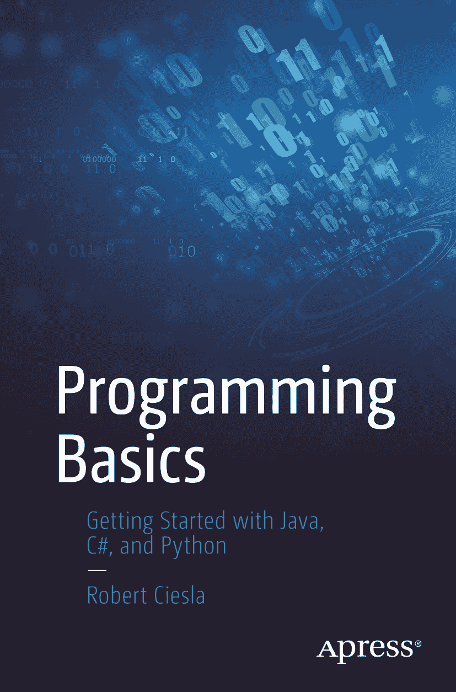

ISBN 978-1-4842-7285-5e-ISBN 978-1-4842-7286-2 [`doi.org/10.1007/978-1-4842-7286-2`](https://doi.org/10.1007/978-1-4842-7286-2) © Robert Ciesla 2021 本作品受版权保护。所有权利均由出版商独家许可，涉及材料的全部或部分内容，具体包括翻译、重印、插图复用、朗诵、广播、微缩胶片或其他任何物理形式的复制，以及信息存储与检索的传输、电子改编、计算机软件，或目前已知或未来开发的任何类似或不同方法。本出版物中使用的一般描述性名称、注册商标、商标、服务标志等，即使未作明确声明，也不意味着这些名称不受相关保护法律和法规的约束，因此可自由使用。出版商、作者和编辑假定本书中的建议和信息在出版之日是真实准确的。出版商、作者或编辑均不对本书所含材料或可能存在的任何错误或遗漏提供明示或暗示的担保。出版商对已出版地图和机构隶属关系中的管辖权主张保持中立。

本 Apress 印记由注册公司 APress Media, LLC（Springer Nature 的一部分）出版。

注册公司地址为：1 New York Plaza, New York, NY 10004, U.S.A.

*献词*

*感谢芬兰非虚构作家协会对本书制作的支持。*

关于作者

