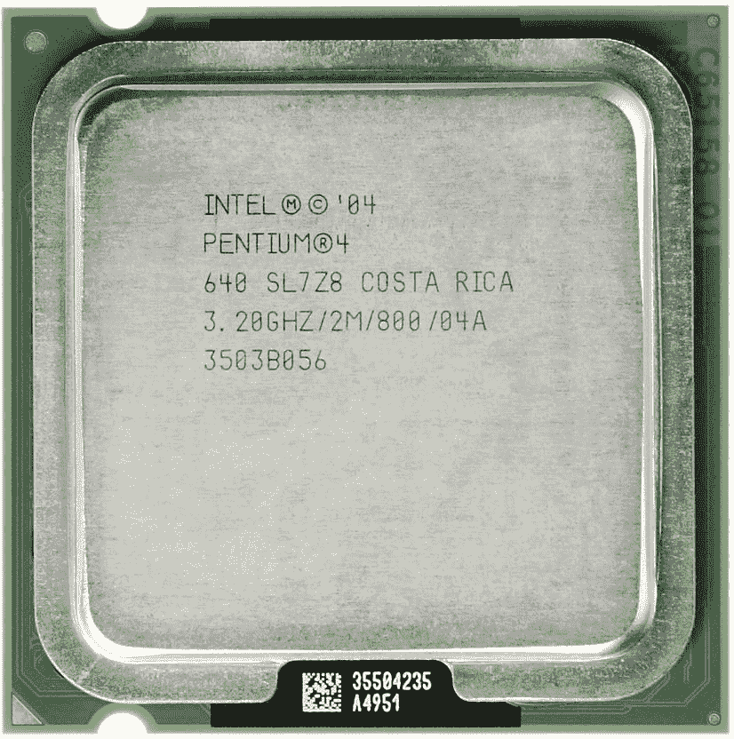
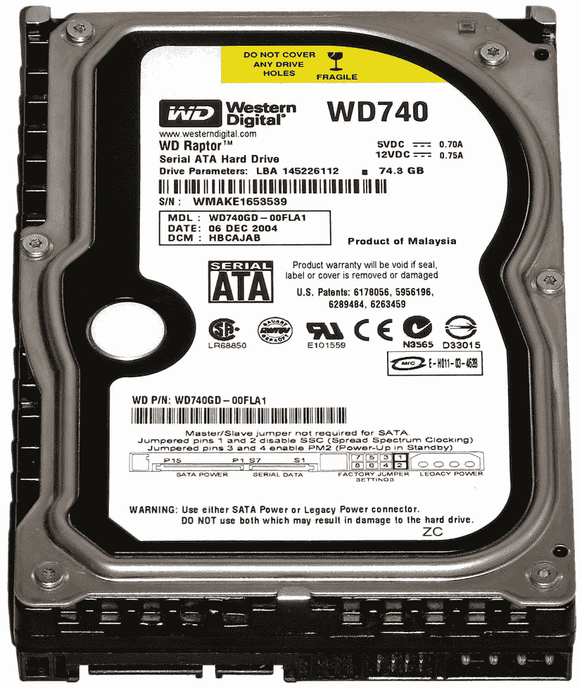
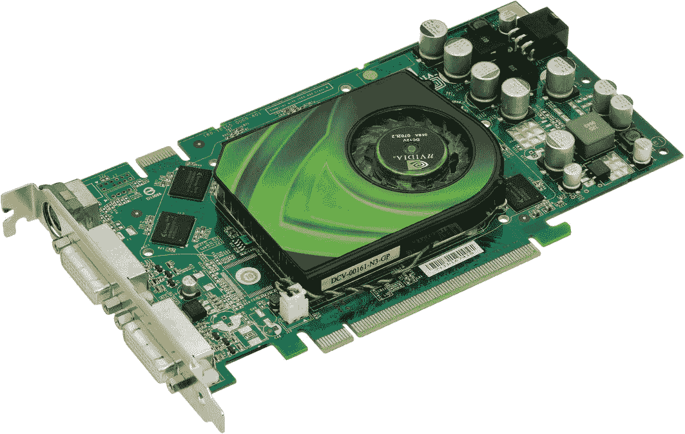
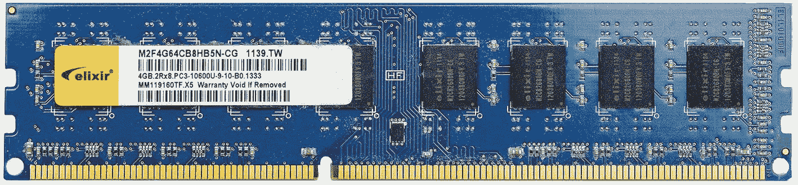
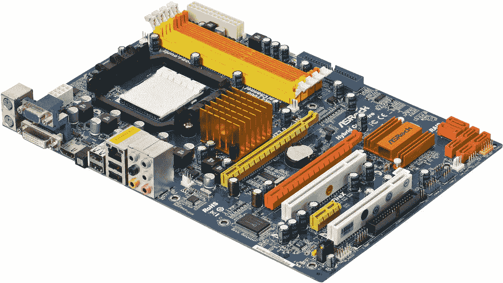
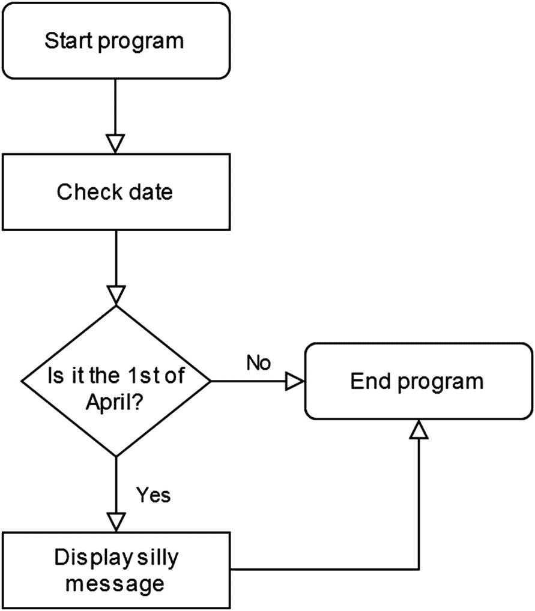

# 1. 湿脚丫：编程最基础

电子游戏、社交网络和你的运动手环有什么共同点？它们都运行在由一群（或多或少）程序员在某个遥远地方编写的软件上。小工具和硬件只是我们技术驱动社会硬币的一个更可见的侧面。在本章中，我们将讨论编程的最基础知识。我们还会粗略了解一下数字系统的可见部分：硬件。

## 编程到底是什么？

基本上，编程就是告诉数字设备（比如你的个人电脑）该做什么的行为。我们按照编程语言定义的规则，输入一系列命令，以便发生有用或有趣的事件。经过正确编程的计算机运行着世界上大部分的通信和在线服务。你可以提到 ATM 机、票务阅读器和智能手机等设备，它们都运行着某人用某种编程语言创建的软件。

## 基本硬件概述

作为一名初出茅庐的程序员，了解你正在使用的这类普遍存在的电子设备将大有裨益。至少对计算机内部最常见的组件有一个基本了解是个好主意。

计算机中的这些硬件组件代表了你的劳动力。作为一名程序员，你掌控着这一切。把编程行为想象成告诉工厂工人该制造什么。你制造应用程序，无论是大型复杂的软件项目，还是某本很棒的编程书中的教程。

就本书而言，任何相对现代的台式机或笔记本电脑都可以。在我们初涉编程领域时，不需要任何昂贵的硬件。

## 1. 中央处理器（CPU）

当然，数字设备不能仅靠软件运行；**中央处理器（CPU）** 是硬件的“大脑”，它执行代码并让事情真正发生（见图 1-1）。即使在一个不那么复杂的电子设备中，所有指令都流向并通过一个（或一组）CPU。这些微芯片体积非常小，自 20 世纪 70 年代以来已日益成为我们生活的一部分。每个数字设备内部都有一个 CPU，甚至可能包括你的健身自行车/挂衣架。

图 1-1

2005 年用于数百万台 PC 的较旧英特尔“奔腾 4”CPU 的俯视图。图片由 Eric Gaba 提供。CC BY-SA 3.0

## 2. 硬盘驱动器（又称硬盘）

这个组件用于几乎永久性地存储数据。在硬盘驱动器内部，你会发现成千上万个文件，无论是图片、文本文件还是数据库。你的操作系统（例如 Windows 或 macOS）也存放在硬盘驱动器内。这些设备有两种类型：*机械硬盘*（见图 1-2）和*固态硬盘（SSD）*。

图 1-2

西部数据机械硬盘的俯视图。图片由“Darkone”提供。根据 CC BY-SA 2.5 许可 ([creativecommons.​org/​licenses/​by-sa/​2.​5/​deed.​en](https://www.creativecommons.org/licenses/by-sa/2.5/deed.en))

机械硬盘更实惠，但由于内部有移动部件，它们比 SSD 更容易因过度振动和极端天气而损坏。此外，固态硬盘通常运行速度快得多。

## 3. 显卡

*显卡*负责显示系统的视觉效果，无论是纯文本还是现代电子游戏中令人眼花缭乱的 3D 图形。这些设备有各种配置和价格，从 30 美元的文字处理爱好者到 1000 美元的游戏怪兽（见图 1-3）。计算机显示器通常直接连接到显卡。

图 1-3

2006 年的 Nvidia 7900GS 显卡

自 21 世纪初以来，显卡业务基本上由*Nvidia*和*AMD*这两家价值数十亿美元的技术巨头双头垄断。然而，英特尔在这一领域也在取得进展。

## 4. 随机存取存储器（RAM）

*随机存取存储器*，通常称为 RAM，用作计算机的临时存储。物理上，它通常以条状附加组件的形式出现（见图 1-4）。运行任何类型的软件时，你的计算机会使用 RAM 来执行它。关闭设备会清空 RAM。相比之下，写入硬盘的数据在计算机关机时不会被擦除。请定期保存你的文档。

图 1-4

一条典型的 RAM 条。图片由 Henry Kellner 提供。CC BY-SA 4.0。来源：[`upload.wikimedia.org/wikipedia/commons/3/32/DDR3_RAM_53051.jpg`](https://www.upload.wikimedia.org/wikipedia/commons/3/32/DDR3_RAM_53051.jpg)

截至 2021 年，对于大多数用途来说，4 GB（即*四吉字节*）的 RAM 是足够的。高级用户，如视频编辑者，拥有 16 GB 或更多的 RAM 将受益。

## 5. 主板

上述所有四种硬件组件（即 CPU、显卡、硬盘和 RAM）在主板上汇聚在一起，形成一个可工作的计算机单元。主板还提供键盘、鼠标和其他控制设备的连接器（见图 1-5）。

图 1-5

一块现代 PC 主板。图片由 Evan-Amos 提供。CC BY-SA 3.0。来源：[`upload.wikimedia.org/wikipedia/commons/0/0c/A790GXH-128M-Motherboard.jpg`](https://www.upload.wikimedia.org/wikipedia/commons/0/0c/A790GXH-128M-Motherboard.jpg)

## 成为合格程序员的三个要求

接下来，我们来讨论所有程序员为了精进技艺都应具备的一些个人优先事项，无论他们起点如何：

1.  **自信**：问问自己，你为什么想学编程？一些完全合理的答案包括“为了职业发展”、“为了保持心智能力”以及“我想成为伟大事业的一部分”。如今，编程有时被外行人视为一项令人生畏的活动。静下心来，排除杂念，进入位操作的世界确实需要一些勇气。请记住，即使你是一个完全的初学者，你也能在这个领域获得能力。自信源于经验。一行一行地，你将获得更多积极的感觉，并逐渐摆脱对编程书籍和在线教程的依赖。

2.  **正确的语言**：并非所有人都能从精通世界语或古典拉丁语中受益。学习一门新语言时，我们倾向于选择有用的，比如西班牙语或法语。同样，选择一门最适合你目标的编程语言至关重要。如果你最终想为移动用户编写食谱应用，那么精通 1957 年的 FORTRAN 语言，其作用也相当有限。因此，本书将介绍我们这个时代最流行的三种编程语言：Java、C#和 Python。

3.  **耐心**：在选择了你想专攻的编程语言之后，你只需要坚持下去。要精通一门新语言，通常需要六个月到一年的实践经验。这实际上是个好消息。编程对治疗失眠和无聊非常有效。它还可能预防痴呆症，因为它能在很大程度上激发大脑的突触活动。

## 新手程序员术语表

现在，我们将深入探讨一些与编程这一神圣爱好相关的基本术语。与各种可用的编程技术和语言相关的术语和概念有成百上千个。然而，我们只会关注最相关的关键词，且不按特定顺序排列。

## 输入/输出

在编程语境中，*输入*指的是我们输入数据供计算机上运行的软件进行处理。这些数据可以是键入的文本、鼠标命令或各种类型的文件。例如，一个文字处理程序（如 Microsoft Office）通常主要通过按键输入字母数字数据。*输出*指的是已被软件处理过的数据。在文字处理器中，这通常指用该程序保存的文档文件。此类输出也可以发送到打印机或其他设备。程序员的输出（二氧化碳等物质除外）通常是一个可运行的应用程序，无论它是一个已完成的教程文件还是一个更大的项目。

## 算法

一个可运行的程序清单基本上构成了一个*算法*，它指的是一组为解决特定问题而创建的步骤。大多数软件都由众多子算法组成。例如，在一个视频游戏中，有用于显示图形、保存和加载游戏状态以及播放音频文件的算法，仅举几例。

## 流程图

编程项目及其算法通常使用*流程图*进行可视化，尤其是在团队环境中。在大多数情况下，这是展示基本程序流程的绝佳方式。

流程图仅由少数几个通用元素组成（见图 1-6）。在最基本的形式中，它们使用四种符号。分别是*起止框*（圆角矩形）、*处理框*（矩形）、*判断框*（菱形）和*流程线*（箭头）。起止框用于表示程序流程的开始和结束。任何操作和一般数据处理都由处理框矩形表示。

图 1-6

一个描述愚人节程序的非常简单的流程图

在大多数情况下，流程图是从上到下、从左到右解读的。*美国国家标准协会（ANSI）* 早在 20 世纪 60 年代就为流程图及其符号制定了标准。这套符号在 20 世纪 70 年代和 80 年代由*国际标准化组织（ISO）* 进行了扩展。就本书而言，我们将沿用最初的符号。

## 源代码

这个术语指的是每个软件项目所包含的、或多或少通过键入方式输入的编程清单的集合。作为一名程序员，你是*源代码*的创造者。简单的程序以单个源代码文件的形式存在，而复杂的软件，如操作系统（例如 Windows），则可能由成千上万个清单组成，共同构成一个单一产品。

## 语法

*语法*是一套规则和原则，用于支配特定语言（包括编程语言）中句子的结构。不同的编程语言对特定操作使用不同的关键字。现在，请看两个编程语言中显示文本字符串的实际代码行：

表 1-1

两种编程语言语法差异的演示

| Java | FORTRAN |
| --- | --- |
| System.out.print(“Hello! I like Cake!”); | 1 print *, “Hello! I like Cake!” |

你可能已经猜到，Java 是本书重点介绍的主要语言之一。表 1-1 中使用的另一种编程语言叫做*FORTRAN*。这种语言主要用于科学计算，由 IBM 早在 20 世纪 50 年代创建。许多工业硬件都运行在 FORTRAN 上。甚至一些极客仍然为了技术时尚而使用它（我们也在很小程度上使用过）。

你可能注意到表 1-1 中的一个例子以数字（1）开头。这在编程术语中被称为*行号*，这种做法在很久以前就已经基本被废弃了。通常来说，当代编程语言不需要行号。

## 例程

在编程语境中，*例程*是一个术语，指执行特定任务并被程序员有意反复调用的代码。例如，一个程序可能包含一个用于播放音效的简单例程。程序员无需在每次需要播放该音效时都编写和重写代码，而是会临时调用同一段代码（即例程）。

根据上下文和所使用的编程语言，例程有时也被称为*子例程*、*函数*、*过程*或*方法*。我们将在本书后面更详细地讨论这些术语。

## 文件格式

*文件格式*是一种编码数据的方法。到 2021 年，你在日常生活中已经遇到过许多文件格式。数码照片、在 OpenOffice 中写的情书，以及那些时髦的 Excel 电子表格，都代表了不同的文件格式。存储在硬盘上的图像文件（例如，*apress_is_great.jpg*）只能与能够按预期方式将其解读为图像的软件一起使用。同样，在照片编辑套件中打开*love-letter.doc*不会给你带来理想的结果，充其量只会显示一堆乱码。大多数操作系统会将不同的可用文件格式与正确的软件关联起来，因此你可以放心地双击文件，并期望它们能正常加载。

## ASCII

*美国信息交换标准代码（ASCII）* 是一种字符编码标准，为计算机及其他数字设备的使用分配了字母、数字和其他字符。本质上，你现在正在阅读的就是 ASCII 码。作为一名程序员，你会相当频繁地遇到这个术语。“ASCII 文件”通常被用作“人类可读文本文件”的简称。该系统可追溯至 1963 年。

在当今的互联网上，最常用的字符编码标准是 UTF-8，它包含了所有 ASCII 字母数字字符以及许多其他符号。

## 样板代码

术语*样板*指的是或多或少自动插入到程序中的编程代码，几乎不需要编辑。例如，当你在 C++ 环境中启动一个新项目时，当前一代的开发工具通常会为你设置好运行程序所需的样板代码。如果没有，你可以相对安全地从你旧的、可运行的项目中复制粘贴样板代码到新项目中，以便开始工作。

## 软件框架

*软件框架* **是一组**通用功能，通常能为程序员节省大量时间。没有理由重新发明轮子，尤其是在软件项目中。一个框架包含各种不同侧重点的软件库，包括文件操作例程、音频播放和 3D 图形例程（在 3D 视频游戏开发和其他高度视觉化的应用中）。

就本书而言，我们不会深入探讨任何复杂的软件框架，但理解这个概念很重要。

## 全栈

*全栈* 是指构成一个完整可运行的 Web 应用程序（例如在线数据库）的软件。一个 Web 应用程序通常分为两个区域：*前端* 和 *后端*。前端是为用户设计的；它包含了使用该应用所需的所有用户界面元素。后端由 Web 服务器、框架和数据库组成。因此，*全栈开发者* 是指既熟悉在线应用程序编码的前端又熟悉后端的人。

## 结语

完成本章后，希望你能够对以下内容有所了解：

*   计算机中的五个基本硬件组件

*   成为程序员的三个主要要求

*   一些基本的编程概念，包括源代码、语法和样板代码

*   流程图指的是什么，以及它们的基本构建块是什么

