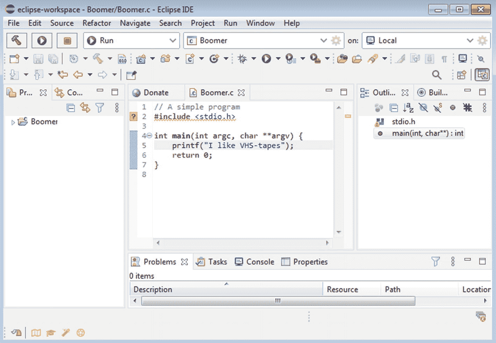
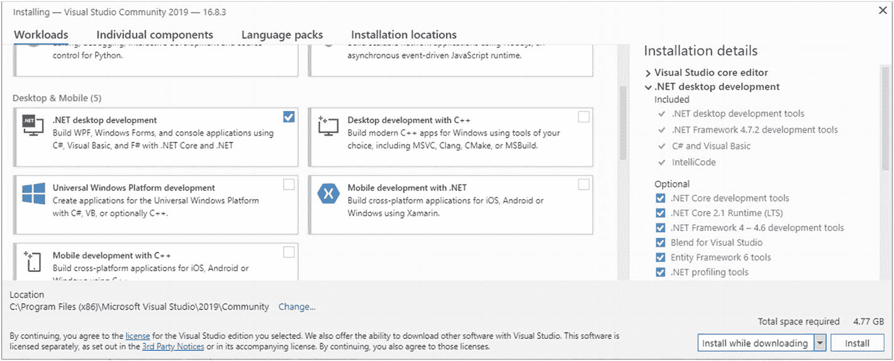

# 3. 搭建你的编程环境

本章旨在向你介绍*集成开发环境*的乐趣。虽然在线编程环境对于你最初的几个程序清单来说还不错，但在你自己的计算机上拥有一些专用的编码软件会让你受益匪浅。幸运的是，有大量免费的 IDE 可供你下载使用。我们将介绍适用于 2021 年最流行的三个操作系统的各种软件。但首先，我们将讨论另一个基本概念：*计算架构*。

## 关于计算架构

一个*时钟周期*代表 CPU 内执行的一个单一操作。在每个时钟周期内，CPU 执行基本的内部操作，这些操作构成了计算机生态系统中任何更大任务的一部分。现在，*时钟速度*指的是 CPU 每秒能够完成的时钟周期数，通常以*千兆赫（GHz）* 为单位表示。例如，一个 2.1 GHz 的 CPU 每秒提供 21 亿个时钟周期。CPU 每秒提供的时钟周期越多，系统处理数字的速度就越快。

现在，术语*计算架构*用于描述 CPU 每个时钟周期可以处理多少数据。当前市场上主要有两种计算架构：32 位和 64 位。后者正迅速成为大多数计算领域的实际标准。为 64 位架构编写的软件能更好地利用系统资源（如 RAM），同时通常比其 32 位版本执行速度更快。

架构的实现涉及硬件和软件两个方面。只有 64 位 CPU 才能运行 64 位操作系统，同时仍能兼容较旧的 32 位软件（和操作系统）。然而，64 位操作系统通常甚至无法安装在配备 32 位 CPU 的计算机上。

自 21 世纪初以来，支持 64 位计算的 CPU 变得越来越流行。除非你使用的是非常古老的 PC，否则至少在硬件方面，你很可能已经为 64 位计算做好了准备。有关这两种架构的概要信息，请参见表 3-1。

大型企业正在逐步完全放弃 32 位技术。事实上，从 *macOS Catalina (10.15)* 开始，苹果公司就完全放弃了对 32 位软件的支持。微软也正在告别 32 位世界。自 2020 年 5 月起，任何预装好的计算机将只搭载 64 位版本的 *Windows 10*。在这三大操作系统中，只有部分 *Linux* 发行版仍在广泛支持 32 位硬件。

表 3-1

32 位与 64 位计算架构对比

|   | 32 位架构 | 64 位架构 |
| --- | --- | --- |
| 特性 | 仅运行 32 位版本的操作系统，可运行大多数旧版 16 位软件 | 可运行 32 位和 64 位操作系统，通常不支持 16 位软件 |
| 每台系统的理论最大 RAM | 4 GB 或 4,294,967,296 字节 | 171 亿 GB 或 18,446,744,073,709,551,616 字节 |
| 系统中典型的 RAM 容量 | 1 到 4 GB 之间 | 8 到 32 GB 之间 |

就本书而言，你不需要运行任何 64 位软件；32 位操作系统完全没问题。但是，为了使你的设备在未来保持适用性，你应该考虑尽快迁移到 64 位操作系统。


## 位衍生单位详解

你可能已经知道，计算中最小的单位是比特（bit）。与其他量一样，仅用原子单位来衡量事物是不切实际的。因此，我们有了字节、兆字节和吉字节等，这里仅举三例（见表 3-2）。

公制单位（即使用十的幂次作为乘数的单位）在个人计算的早期阶段运行良好。然而，使用这些乘数并不完全准确。例如，一个 1 千字节的文件实际上是 1024 字节，而不是公制系统中的 1000（10³）字节。

一个标称容量为 250 GB（即 250,000,000,000 字节）的典型硬盘，其实际大小是 232.8 GB。硬件制造商通常不会提及这些细节。你大概心里有数。

1998 年，*国际电工委员会（IEC）* 创建了一种更精确的度量方案。新系统使用二的幂次乘数。例如，1 千字节变成了大小为 1024 字节的 *kibibyte*（2¹⁰ = 1024）。这些新单位非常必要，因为它们在测量更大的数据池时更加精确。

表 3-2

最常用的公制和基于 IEC 的数据存储单位对比

| 公制单位 | 值（公制） | IEC 单位 | 值（IEC） |
| --- | --- | --- | --- |
| 比特 (b) | 0 或 1（原子/最小单位） |   |   |
| 字节 (B) | 8 比特 |   |   |
| 千字节 (kB) | 1,000 字节 | Kibibyte (KiB) | 1024 字节 |
| 兆字节 (MB) | 1,000,000 字节 | Mebibyte (MiB) | 1,048,576 字节（1024 kibibytes） |
| 吉字节 (GB) | 1,000,000,000 字节（十亿字节） | Gibibyte (GiB) | 1,073,741,824 字节（1024 mebibytes） |
| 太字节 (TB) | 1,000,000,000,000 字节（一万亿字节） | Tebibyte (TiB) | 1,099,511,627,776 字节（1024 gibibytes） |

## 64 位下的多任务处理

64 位计算的主要优势之一，是与较旧的 32 位架构相比，*多任务处理*能力得到了极大提升。多任务处理指的是同时运行多个程序。一个典型的程序员可能会在电脑上同时打开一个大型 IDE、*Photoshop*、*Spotify* 以及 *Firefox* 中的 50 个标签页。安装大量吉字节的 RAM 可以消除通常与运行多个程序场景相关的卡顿和速度下降。升级 RAM 或许是提升个人电脑性能最常用的方法。

## 识别你的操作系统架构

你可能想检查一下你的操作系统是 32 位还是 64 位架构。这既快捷又简单。

*   在 Windows 10 中，转到 *设置* ➤ *系统* ➤ *关于*。你会在该页面上看到必要的详细信息。

*   在 Linux 中，打开一个终端窗口，输入 *arch* 并按回车键，即可显示你的系统架构。输出显示 *x86_64* 表示你拥有 64 位版本的 Linux。对于 32 位版本的此操作系统，则会显示 *i386* 或 *i686*。

*   至于 *macOS*，自 2009 年的 *Snow Leopard (10.6)* 以来，该操作系统的每个版本都是 64 位的（对 32 位软件具有不同程度的向后兼容性）。

## 安装用于 Java 开发的 Eclipse

优秀的开发环境提供搜索功能、语法高亮，并且在某些情况下支持多种编程语言。我们首先为你设置一个专为 Java 开发打造的环境，即由 Eclipse 基金会开发的强大的 *Eclipse IDE*（见图 3-1）。

*Eclipse 项目*最初由 IBM 于 2001 年 11 月创建。随后，*Eclipse 基金会*于 2004 年作为一家独立的非营利性公司成立。它是围绕 Eclipse 创建的一个开放透明的社区。

Eclipse 可用于 *Windows*、*macOS* 和 *Linux*。请访问下面提供的下载页面，然后只需点击反映你所运行操作系统类型的链接即可。不过，有一个注意事项。最新版本的 Eclipse 仅适用于现代操作系统的 64 位版本。如果你仍在运行 32 位操作系统，请查看旧版本 Eclipse 的专用链接。它们也完全能够满足我们的需求。



图 3-1

运行中的 Eclipse

*   **下载并安装** ***Eclipse for Java Developers*** **（64 位版本）**：[`www.eclipse.org/downloads/packages/release/2020-12/r/eclipse-ide-java-developers`](http://www.eclipse.org/downloads/packages/release/2020-12/r/eclipse-ide-java-developers)

*   **下载** ***Eclipse for Java Developers*** **（32 位版本）**：[`www.eclipse.org/downloads/packages/release/helios/sr1/eclipse-ide-java-developers`](http://www.eclipse.org/downloads/packages/release/helios/sr1/eclipse-ide-java-developers)

## 在 Linux 上安装 Eclipse

Linux 软件仓库可能托管着过时版本的 Eclipse。为了在 Linux 上安装最新版本，我们将使用 Canonical Ltd. 提供的 Snapcraft 方法。此方法应适用于所有主要的 Linux 发行版。打开一个终端窗口，并输入以下命令：

1.  **首先，确保你的操作系统上安装了** ***Java 运行时环境 (JRE)***。在终端窗口中输入以下字符串：

1.  **接下来，我们使用 snappy 系统下载 Eclipse：**

```
sudo apt install default-jre
Fedora Linux 用户可能需要输入以下终端命令：
sudo dnf install java-latest-openjdk.x86_64
sudo dnf install java-latest-openjdk-devel.x86_64
```

```
sudo snap install --classic eclipse
```

在安装过程中，系统可能会提示你输入密码。安装成功后，你应该会看到以下消息：*eclipse (版本信息) from Snapcrafters installed.*

## Eclipse 首次启动

启动 Eclipse 后，系统会提示你为 Eclipse 工作区选择一个目录。默认设置适用于大多数用途。让我们创建一个新项目。这可以通过从顶部菜单栏导航到 *文件* ➤ *新建* ➤ *Java 项目* 来完成。接下来，你应该会看到一个等待你输入项目名称的窗口。输入一个名称并点击 *创建*。

将出现一个窗口，询问你是否要创建 *module-info.java*。此文件是 Java 模块化功能使用的 *模块声明*。对于简单的应用程序，选择 *不创建* 也没问题。

你将被带到 Eclipse 中的主项目视图。我们手上还没有一个功能完整的 Java 应用程序。现在，在左侧，你会看到 *项目资源管理器*。左键单击你的项目名称。从顶部菜单中选择 *文件* ➤ *新建* ➤ *类*。为这个新类输入一个名称；它不必与你的项目名称相同。

接下来，务必确保你勾选了 *public static void main(String args)* 旁边的复选框。这为你的项目提供了一个 *Java main 方法*。没有它，你就无法执行你的项目。最后，点击 *完成* 进入你全新的 Java 代码列表。你现在就可以开始在 main 方法下编写代码了。

## 用于 C# 开发的优秀 IDE

现在让我们回顾一些满足你 C# 开发需求的选择。我们从微软的 *Visual Studio* 开始，它是一个流行的多平台 IDE，充满了强大的功能，包括即时错误下划线。该软件可用于 Windows 和 macOS。


## 为 Windows 和 Mac 设置 Visual Studio

让我们从 Windows 和 macOS 的 Visual Studio 安装开始。首先，你需要为完全免费的社区版下载正确的安装程序。这是一个支持多种语言（包括 C#）的强大集成开发环境（IDE）。

*   **下载** ***Visual Studio 社区版***：[`https://visualstudio.microsoft.com/free-developer-offers/`](https://visualstudio.microsoft.com/free-developer-offers/)

启动 Visual Studio 安装程序后，你最终会进入一个关于*工作负载*的界面。这些工作负载基本上指的是 Visual Studio 中提供的各种语言的不同实现场景。你会看到 C# 和其他语言的四类工作负载：*Web 与云、桌面与移动、游戏*以及*其他工具集*（见图 3-2）。为了满足我们的编码需求，请勾选 *.NET 桌面开发*旁边的复选框。这将为我们很好地配置好 C# 环境。

最后，点击窗口右下角的*安装*。你也可以选择在下载的同时进行安装，或者先下载所有必要的文件，然后再开始安装过程。



图 3-2

Microsoft Visual Studio 社区版的安装界面

第一个 *.NET* 是微软于 2002 年创建并在专有许可下发布的软件框架。它为 C#、C++ 和其他流行语言提供了简化的开发流程。该框架在 2016 年以 *.NET Core* 的名义进行了重大革新。这次它作为开源和跨平台框架发布，增加了对 macOS（以及一定程度上对 Linux）的支持。微软后来已弃用了这个新版本的名称，将其恢复为 .NET。

## 在 Visual Studio 中启动新项目

经过可能较长的安装过程后，Visual Studio 会提供登录开发者账户（或注册一个）以获得额外福利的选项。你可以随意跳过此步骤。接下来，你需要为 IDE 选择一种配色方案，然后点击*启动 Visual Studio*。

稍等片刻，你将进入 Visual Studio 主窗口。当你点击*创建新项目*时，会看到各种编程模板，包括专门用于 C# 的模板。对于我们的需求，*控制台应用*是合适的。过一两分钟后，Visual Studio 将创建好你的项目文件，你就可以在主函数下方开始编码了。

## 控制台应用与 GUI 应用

所谓的控制台应用和具有图形用户界面（GUI）的应用之间存在一个普遍的区别。前者使用简陋的基于文本的界面呈现，而后者则为用户提供更多的可视化元素，并且通常提供额外的输入方式（如鼠标或触控板）。控制台应用有时会利用基于文本的*伪图形*来模拟几何形状。

尽管外观朴素，但控制台应用为开发者提供了极高的效率；毕竟，（音视频）可视化所消耗的所有资源都可以用于程序的核心功能。

控制台应用遍布我们的操作系统。它们用于网络相关任务以及可能的大量自动化实例。主要的控制台应用包括 macOS 的*终端*、*Windows 控制台*和*Linux 命令行*。此外，有史以来最受赞誉的角色扮演电子游戏之一 *Nethack* 也是一个名副其实的控制台应用。谁还需要 3D 图形呢？

你可以通过控制台应用领域的工作来学习所有基本的编程机制。虽然我们会涉及基于 GUI 的开发，但本书的重点主要放在基于文本的环境上。

## Linux 上的 C#：介绍 MonoDevelop

截至 2021 年第一季度，Visual Studio 尚不支持 Linux。然而，*MonoDevelop* 提供了你在一个灵活的 IDE 中开始编写 C# 所需的一切。

*   **请遵循 MonoDevelop 网站上的这些说明**：[`www.monodevelop.com/download`](http://www.monodevelop.com/download)

从上述下载页面导航到与你当前使用的 Linux 发行版和版本（例如 Debian）最接近的 Mono 仓库。接下来，你需要在终端窗口中复制粘贴大量命令。根据你的硬件配置，可能需要等待几分钟才能完成安装。之后，MonoDevelop 应该会安全地存放在你的应用程序文件夹中。

点击 MonoDevelop 图标打开它。导航到*文件* ➤ *新建解决方案*。将打开一个新窗口。在*其他*下点击 *.NET*，然后选择*控制台项目*。最后，点击右下角的*下一步*。另一个窗口将打开，提示你输入项目名称。输入任何你认为合适的名称，然后点击*创建*。

接下来，你应该会看到一个用 C# 编写的通用 hello world 应用程序的代码列表。你可以导航到*运行* ➤ *不调试启动*，或者点击 MonoDevelop IDE 左上角的播放图标来执行该代码。

如果在 MonoDevelop 中尝试运行/调试程序后，出现以“找不到指定文件”结尾的错误提示，你可能需要在终端窗口中执行以下额外命令：

`cd /usr/lib`

`sudo mkdir gnome-terminal`

`cd gnome-terminal`

`sudo ln -s /usr/libexec/gnome-terminal-server`

现在，你已经准备好为 Linux 开发一些漂亮的控制台应用程序了。

## 用于 Python 开发的 PyCharm

在 Python 开发方面，有一款软件脱颖而出。*PyCharm* 是一个多平台 IDE，具有智能代码补全等出色功能。该套件有付费版和免费版；我们将使用后者。以下链接将引导你进入适合你操作系统的 PyCharm 版本。

*   **下载** ***PyCharm 社区版***：[`www.jetbrains.com/pycharm/download`](http://www.jetbrains.com/pycharm/download)

PyCharm 在 Windows 和 macOS 上的安装过程都非常简单。对于前者，运行你下载的可执行文件并按照屏幕上的说明操作。对于 macOS，只需双击镜像文件（以 .dmg 结尾），然后将 PyCharm 图标拖入你的应用程序文件夹。

在 Windows 上安装 PyCharm 时，即使你的账户没有密码保护，也可能会弹出密码提示。只需点击取消即可继续安装。

要开始尝试使用 PyCharm，请点击*创建项目*。然后你将有机会为项目命名并选择其他一些选项。项目名称同时也是你所有 PyCharm 项目文件的目录位置。当你确定了一个合适的标题后，点击窗口右下角的*创建*。

为了让入门更简单，PyCharm 会为你提供创建欢迎脚本的选项。最好启用此选项。在创建新项目时，请确保勾选了*创建一个 main.py 欢迎脚本*旁边的复选框。

PyCharm 可能会在你第一次创建新项目时下载一些额外的组件。这些组件的安装可能需要一些时间。当你的新项目文件准备就绪后，你将进入 PyCharm 的主编码视图。现在你可以自由编辑 *main.py* 文件，并尝试使用这个出色的 Python IDE。

首次打开新项目时，*main.py* 文件中会填充一些 Python 代码。你可以删除所有代码，然后输入你自己的代码。

## 为 Linux 安装 PyCharm

在 Linux 上运行 PyCharm 的最佳方法是使用 snap 包。只需打开一个终端窗口，并输入以下命令：

```
sudo snap install pycharm-community --classic
```


## 软件害虫：Bug

你是否曾遭遇过电脑死机和/或文本文档丢失的情况？这很可能是你遇到了一个*软件缺陷*在作祟。软件语境下的 Bug 指由有缺陷的程序代码引起的故障；它们可能源于程序员的拼写错误，或者更常见的是某些深奥的设计错误。你操作系统上的所有那些软件更新，基本上都是为了修复 Bug（有时也会提供新功能）。关于最常见的软件缺陷和问题，请参见表 3-3。

表 3-3

最常见的软件问题/Bug 类别

| 软件缺陷 | 示例 | 软件问题 | 示例 |
| --- | --- | --- | --- |
| 语法错误 | 语言语法使用不当，例如使用了错误的变量比较运算符 | 界面问题 | 缺少用户界面功能，例如缺少导航按钮或其他关键元素 |
| 算术错误 | 除零错误、变量范围溢出 | 安全问题 | 身份验证薄弱、关键系统组件不必要地暴露 |
| 逻辑错误 | 程序流程控制不佳，例如无限循环或受损循环 | 沟通问题 | 缺少用户文档、用户界面元素标签不清、错误提示不直观 |
| 资源错误 | 使用未初始化的变量、未释放不必要的变量空间导致系统内存耗尽 | 团队协作疏忽 | 代码元素/变量标签不合逻辑、注释质量差 |

## 关于调试与测试

*调试*是发现并修复软件中 Bug 的艺术。*调试器*为软件开发人员提供了在 Bug 发生并可能对用户电脑造成严重破坏之前修复它们的工具。这是优秀集成开发环境（IDE）的另一个特性，并且自然应包含在本章介绍的每一个解决方案中。

调试的范围可以从 IDE 编辑器中的简单错误高亮，到详尽的数据收集与分析。一个典型的调试组件允许程序员在开发中的软件运行时对其进行检查，必要时甚至可以逐行检查。用高级编程语言（如 Java 和 Python）编写的代码通常更容易调试。较低级的语言，如过程式 C 语言，则赋予程序员更多控制权；这可能导致更频繁地出现内存损坏等问题。

对于大型软件项目而言，深入的调试是绝对必要的。就我们的需求而言，我们无需深入探讨这个主题。在现阶段，你只需了解这个术语的含义即可。

调试与软件开发中一个有时被忽视的领域——*测试*——密切相关。虽然测试包含了调试，但其内涵远不止于此。测试团队负责报告软件产品在其预期使用场景下是否功能正常。然而，即使是大规模的测试过程，也无法指望能发现软件项目中的每一个缺陷。

软件测试大致可分为*功能性*和*非功能性*两大分支。前者侧重于将软件及其组件的功能与一套规范进行比较。非功能性测试则涉及与性能、可用性和安全性等相关（但不限于此）的问题。本地化，包括为非西方市场进行开发，也是非功能性软件测试的一部分。本地化涉及融入流畅且恰当的翻译语言，并对文化敏感性给予不同程度的关注。

测试过程的细节取决于目标受众的类型。视频游戏开发者，尤其是小团队，有时会在测试上偷工减料（这往往对他们不利）。关键软件，例如银行和金融领域的软件，则预期要经过最严格的测试。大型软件项目需要一个高度组织化的测试团队。出于经济原因，大型软件的测试工作通常外包给海外公司。

## 调试：基本方法

现在，我们将更详细地探讨一些最常见的代码调试方法：

*   **跟踪/打印调试**：这种方法简单来说就是密切关注每一行执行代码的结果，通过将它们逐一打印到屏幕上。可以密切关注变量和其他数据结构在程序执行过程中被修改时的内容。跟踪对于较小的项目（例如本书中的教程）效果很好。

*   **录制与回放调试**：采用这种方法，程序执行的部分过程会被录制下来并回放，以检查其潜在的缺陷。这并非指软件的外部或视觉回放；而是侧重于程序内部的状态级进程。

*   **事后调试**：此方法包括分析程序崩溃后的日志数据。许多类型的软件（包括大多数操作系统）在发生严重故障后都会将日志文件写入磁盘。然后可以检查这些文件，以寻找导致崩溃的 Bug 线索。

*   **远程调试**：调试不一定非要在运行目标程序的设备上进行。通过使用流行的网络连接方法，如 Wi-Fi 或 USB 线缆，可以将不同角色和形态的设备连接起来协同工作。在为 Android 和 iOS 编写和调试软件时，远程调试是最常见的方法，因为开发机器几乎总是一台独立的、全尺寸的计算机。

*   **Bug 聚类**：当发现特别大量的 Bug 时，这是一种有用的方法。程序员首先识别出这些 Bug 中所有共同的特征。然后，根据这些共享的属性将问题分类到特定的组中，其逻辑是，即使一个聚类中的几个 Bug 被解决了，其余的也应该会随之解决。

*   **代码简化**：有时消除 Bug 的最佳策略是（或多或少暂时地）移除 Bug 周围的部分功能代码。显然，这对于那些比较隐蔽/害羞的 Bug 效果最好。当你还不确定是什么地方出了问题（即导致崩溃的原因）时，可以逐一移除那些明显正常工作的部分，从而将 Bug 引诱出来。

## 结语

完成本章学习后，你将理解以下内容：

*   32 位和 64 位计算架构的主要区别，以及如何识别你的操作系统运行的是哪一种
*   最常见的位派生数据单位是如何定义的
*   *集成开发环境（IDE）* 指的是什么，以及如何为你的操作系统获取一个
*   *控制台应用程序*与使用*图形用户界面（GUI）* 的应用程序之间的核心区别
*   最常见的软件 Bug/问题类型
*   调试和软件测试指的是什么

下一章将详细探讨面向对象编程（OOP）的奇妙之处。正如第 2 章所提及的，这是每个初露头角的程序员都应该掌握的非常重要的编程范式。

