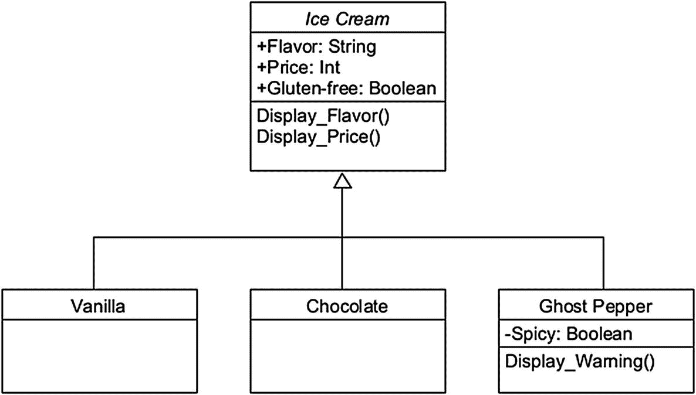
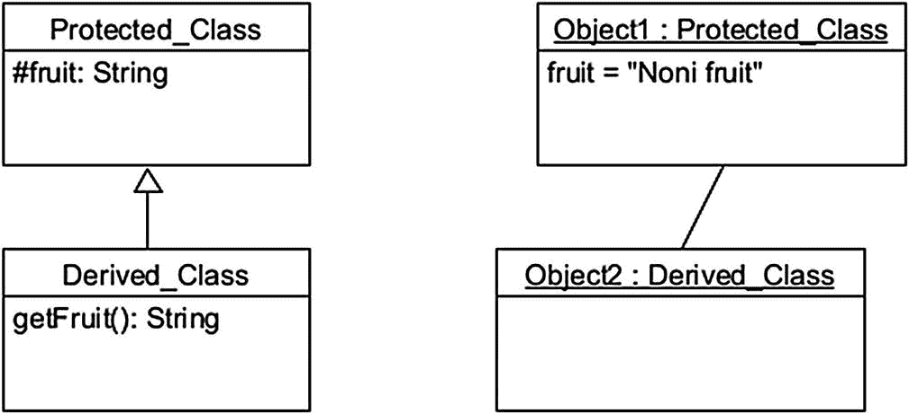

# 4. 面向对象编程（OOP）

本章将详细探讨面向对象编程。这一里程碑式的范式改变了编程世界，并自此在某种程度上成为软件设计中的事实标准方法。接下来，我们将逐一介绍许多对面向对象范式至关重要的概念。在本章中，为了清晰起见，我们将主要使用 Java 语言来介绍与 OOP 相关的概念，当然也不会完全忽略 C# 和 Python。


## 过程式范式与面向对象范式

如第 2 章所述，目前主要有两大编程范式：过程式编程和面向对象编程。20 世纪 70 年代末是计算机科学领域激动人心的时代。在此之前，大多数编程严格遵循过程式语言的范畴，这些语言采用所谓的“自顶向下”设计范式。基本上，采用这种方法时，程序员最后才处理细节问题，大部分精力都集中在程序的主函数上。

面向对象革命是由 C++的发布引发的。该语言于 1985 年发布，迅速被广泛应用于大多数场景。采用“自底向上”的设计方法，C++和其他面向对象语言侧重于首先定义数据，这些数据通常以现实生活中的现象为模型。此外，与过程式语言相比，它们提供了大量额外的功能。这包括*封装*，这是一种通过实现访问说明符来隔离代码各部分的技术。接下来我们将更详细地探讨封装及其他面向对象的特性。

过程式编程语言与面向对象编程语言的主要区别见表 4-1。

表 4-1

两大编程范式的主要区别

|   | 过程式编程 | 面向对象编程 |
| --- | --- | --- |
| 示例语言 | (过程式) C、Pascal、BASIC | C#、C++、Java、Python |
| 基于 | 抽象世界 | 现实场景 |
| 方法 | 自顶向下：将主要问题分解为子过程 | 自底向上：首先创建数据类 |
| 重点 | 函数（即过程） | 数据（即类） |
| 继承 | 不支持 | 支持 |
| 封装（数据安全性） | 低：无访问修饰符 | 高：多级访问修饰符 |
| 方法重载（多个同名方法） | 不支持 | 支持 |

## 类、继承与 UML

让我们重新审视面向对象编程（OOP）中最基本的概念，因为我们在第 2 章中仅触及了其中一部分。我们将继续探讨*类*和*对象*的概念。现在你可能已经知道，在 OOP 中，类是一种用于创建代码对象的蓝图。

尤其是在大型软件项目中，在编写一行代码之前，先动笔规划通常是个好主意。可视化面向对象软件的最佳且最流行的工具之一就是使用*统一建模语言（UML）*。UML 由*Rational Software*公司在 20 世纪 90 年代中期创建，此后已成为软件工程中无处不在的工具。让我们通过一个关于冰淇淋的*类图*来体验一下（见图 4-1）。



图 4-1

一个展示 UML 基础的简单类图

图 4-1 中最顶部的方框（即*Ice Cream*）是一个*抽象类*。基本上，这些类不能用于创建对象。那为什么还要有它们呢？嗯，抽象类可以保存与普通类相同类型的信息。它们也可以有子类。抽象类的目的是为其子类提供一些共享信息，以便子类继承并用于创建对象。在许多情况下，使用抽象类可以简化设计过程。

抽象类下方的三个方框被称为*子类*。它们展示了*继承*，这是 OOP 中的一个关键概念。*Vanilla*、*Chocolate*和*Ghost Pepper*接收了其*超类* Ice Cream 内置的所有变量和方法。请注意这些方框是如何连接的。在 UML 中，不同类型的箭头描述不同的事物。如图 4-1 所示的空心箭头表示简单的继承。在 UML 中，还必须注意箭头的方向。

现在，在 UML 中，通过将类名设为斜体来表示抽象类；普通类通常没有任何特殊样式。接下来，一个类方框会列出其变量及其数据类型。变量前的加号（+）表示它是公有的，而减号（-）表示私有变量。最后，我们列出类中的所有方法，就像我们在图 4-1 中对`Display_Flavor( )`和其他方法所做的那样。

UML 的内容远不止我们目前介绍的元素。在本书后续章节中，我们将更详细地探讨这种出色的建模语言。目前，你只需理解 UML 如何帮助你可视化软件项目就足够了。

## 封装

在 OOP 的语境中，*抽象*和*封装*的概念密切相关。前者指的是对程序的用户/编码者隐藏不相关信息的技术。后者则涉及软件的内部运作；在封装中，用于操作的数据和函数都存储在类内部。然后，每个类都设有控制机制，以决定哪些数据可以被其他类访问。让我们用 Java 来演示一下封装，好吗？（见代码清单 4-1。）

*Get*和*Set*是 Java 乃至整个 OOP 中非常重要的关键字。它们与*return*命令结合使用，用于在类内部检索和定义数据。提醒一下，函数（也称为方法）是一段仅在调用时运行的代码。

```
public class Geezer {
// 私有访问修饰符用于限制其他类的访问
private String name;
// Get 函数用于检索 name 变量
// 其命名规范是“get”小写开头，变量名大写开头
public String getName() {
return name;
}
// Set 函数用于定义数据
public void setName(String newName) {
this.name = newName;
}
}
代码清单 4-1
一个包含 Get 和 Set 函数的 Java 类定义（文件名：Geezer.java）
```

代码清单 4-1 无法在 IDE 或在线开发环境中执行，因为它缺少 Java 的 main 方法。该代码清单仅用于演示目的。我们很快就会进入实际可执行的 Java 代码。

我们通过给类定义命名来开始，该名称也将作为文件名。在我们的示例中，它将是*Geezer*。我们对其做的第一件事是定义一个*String*类型的变量（显然用于存储老家伙的名字）。变量定义前的关键字*private*被称为*访问修饰符*。私有方法和变量只能在其定义的类内部访问（在我们的例子中，只能从 Geezer 内部访问）。

getName 方法使用 return 关键字来检索老家伙的名字。该方法被创建为公有的，并且返回值为 String 类型。这仅仅是因为它预期返回一个 String 变量的值。

接下来，让我们分解一下我们在代码清单 4-1 中定义的 setName 方法。关键字对*public void*指定了一个不返回任何值的方法。它通常与 set 函数配合得很好，因为 set 函数用于定义变量，而不是从中检索值。在 Java 中，关键字*this*仅指代包含该方法的对象。


## 你的（可能是）第一个 Java 对象

类非常适合组织数据，但它们能做的远不止于此。以 `geezer` 类为起点，让我们添加代码，在 Java 中创建一个实际的对象（参见代码清单 4-2）。

```
public class Geezer {
private String name;
public String getName() {
return name;
}
public void setName(String newName) {
this.name = newName;
}
// 我们添加一个 main 方法，以便实际试验我们的类
public static void main(String args[]) {
// 接下来，我们以 geezer 类为蓝图创建一个对象
// 我们将这个对象命名为 "some_geezer"
// 并使用 Java 内置的 new 方法来创建它
Geezer some_geezer = new Geezer();
// 接着，我们调用 setName 方法为我们的 geezer 对象命名
some_geezer.setName("John");
// 最后，我们访问 geezer 对象，以两种不同的方式打印出名字
System.out.println("你好，我的名字是 "+some_geezer.name+" 这个老家伙！");
System.out.println("你能重复一遍吗？"+"是 "+some_geezer.getName());
}
}
代码清单 4-2
Java 中包含 main 方法的类定义（文件名 Geezer.java）
```

在代码清单 4-2 中，我们同时使用了所谓的点运算符（即 *some_geezer.name*）和 `getName` 方法来从对象中读取数据。点运算符也被称为*成员运算符*。

`public static void main(String[ ] args)` 这一行是每个 Java 程序开始处理的地方，用户也能在此看到屏幕上出现内容。`String[ ] args` 这部分基本上意味着程序接受一个文本字符串作为其执行者的输入（例如，用户可能通过输入“myProgram hello”而不是“myProgram”来启动程序，以达到各种不同的效果）。

## Java 字母汤：JDK、JVM 和 JRE

在继续学习面向对象编程之前，让我们先了解一下 Java 开发中三个最关键的软件组件。毫无疑问，在你的编程之旅中，你会相当频繁地遇到这些术语。首先，有 *Java 开发工具包 (JDK)*。这是用 Java 编码所需的核心类与工具的集合。JDK 有多个不同的版本。

接下来，我们有 *Java 运行时环境 (JRE)*。这个组件用于将 JDK 中生成的代码输出与一些额外的必要软件库结合起来，从而使 Java 程序能够实际执行。

最后，我们有 *Java 虚拟机 (JVM)*。在台式电脑上创建的 Java 程序可以在任何安装了 JVM 的设备上运行。因此，这种在专用虚拟机上运行 Java 的方法实现了高度的平台独立性。

你可能还记得第 2 章的内容，Java 是一种*解释型语言*。当执行用 Java 编写的程序时，编译器会生成*字节码*。这是一种中间格式，需要 Java 虚拟机 (JVM) 才能运行；没有 JVM，你就无法启动字节码程序。由于 JVM 可用于大多数现代计算机和设备，这种方法使得 Java 几乎具有普遍的跨平台性。

## C# 中的对象

在 Java 中创建了我们的（可能是）第一个对象之后，现在让我们在 C# 中做同样的事情。参见代码清单 4-3，其功能与代码清单 4-2 完全相同。这将展示 Java 和 C# 在语法上的许多相似之处。

```
using System;
public class Geezer {
private String name;
public String getName() {
return name;
}
public void setName(String newName) {
this.name = newName;
}
public static void Main(string[] args) {
Geezer some_geezer = new Geezer();
some_geezer.setName("John");
// 下面两行是 Java 和 C# 代码清单中差异最大的地方
Console.WriteLine("你好，我的名字是 "+some_geezer.name+" 这个老家伙！");
Console.WriteLine("你能重复一遍吗？"+"是 "+some_geezer.getName());
}
}
代码清单 4-3
C# 中包含 main 方法的类定义（文件名 Geezer.cs）
```

## Java 和面向对象编程中的静态方法与公共方法

现在我们将深入探讨如何编写各种类型的方法。在面向对象编程中，基本上有两种方法：*静态*方法和*公共*方法。我们在代码清单 4-2 和 4-3 中已经实践过后一种方法。

注意

一个方法实际上可以同时使用这两个限定符，就像著名的 Java main 方法 `public static void main( )` 那样。

现在，这两种方法的主要区别在于，静态方法不需要通过对象来调用；你可以在没有类特定实例的情况下调用它们。但是，静态方法不能使用类变量，如代码清单 4-4 所示。

```
public class HappyMethods {
private int x=10, y=10;
// 静态方法不能使用我们的类变量
static void myStaticMethod() {
System.out.println("你好！我是一个静态方法，我不能使用 x 或 y。");
// System.out.println(x + " + " + y + " = " + (x+y));
// 上面这行会返回一个错误
}
// 公共方法可以使用我们的类变量进行一些基本的算术运算
public void myPublicMethod() {
System.out.println(x + " + " + y + " = " + (x+y));
}
// 我们的 main 方法
public static void main(String[] args) {
myStaticMethod(); // 调用静态方法
HappyMethods myObj = new HappyMethods(); // 创建 HappyMethods 的一个对象
myObj.myPublicMethod(); // 调用该对象的公共方法
}
}
代码清单 4-4
Java 中包含 main 方法的类定义（HappyMethods.java）
```


## 构造方法

对象从其类定义中获取所有变量的初始值。然而，每当创建一个对象时，可以调用构造方法来设置这些变量数据的全部或部分内容。

你可以通过定义接受额外属性的方法来创建新的构造方法。这些属性随后会根据需要传递给每个对象，以替换类中定义的原始值。示例请参见代码清单 4-5。

构造方法必须与其所属的类具有相同的名称。在我们的示例程序中，这两个构造方法都根据其源类命名为 *Movie*。

```
public class Movie {
// 类变量及其默认值
private String title="Jack and Jill";
private int release_year = 2011;
// 这是一个默认构造方法。如有需要，Java 会自动创建它们
public Movie() {
}
// 这是一个用于同时设置电影标题和发行年份的构造方法
public Movie(String name, int year) {
release_year = year;
title = name;
}
// 这是一个仅用于设置电影标题的构造方法
public Movie(String name) {
release_year = 2021;
title = name;
}
public static void main(String[] args) {
// 基于类 "Movie" 创建三个对象
Movie myMovie = new Movie("Jack and Jill 2");
Movie myMovie2 = new Movie("The Ridiculous 6", 2015);
Movie myMovie3 = new Movie();
// 显示这三个对象中存储的数据
System.out.println(myMovie.title + " (" + myMovie.release_year+")");
System.out.println(myMovie2.title + " (" + myMovie2.release_year+")");
System.out.println(myMovie3.title + " (" + myMovie3.release_year+")");
}
}
代码清单 4-5
一个演示构造方法使用的 Java 代码清单 (Movie.java)
```

现在，在代码清单 4-5 中，我们创建了三个基于类 *Movie* 的对象。所有这些对象都使用不同的构造方法来实例化。

第一个对象处理的是假设中的（但无疑是精彩的）电影 *Jack and Jill 2*，它是通过接受单个字符串的构造方法创建的。代码清单 4-5 中的第二个对象使用了更通用的构造方法，它同时接受一个字符串和一个整数。示例中的第三个也是最后一个对象是使用最基本的构造方法创建的，它不接受任何属性；它会将类定义中输入的默认值（“Jack and Jill” 和 2011）赋给我们的对象。

## 方法重载

在面向对象编程中，只要参数的数量和数据类型不同，就可以有多个同名方法而不会出现问题（参见代码清单 4-6）。

```
public class OverloadingFun {
// 用于将中间名首字母作为整数返回的方法
static int MakeName(int middle) {
return middle;
}
// 用于将三个字符串组合成全名的方法
static String MakeName(String first, String mid, String last) {
return first + mid + last;
}
public static void main(String[] args) {
// 使用我们的第一个方法定义一个整数
int integer_initial = MakeName(80); // 80 在 ASCII 系统中代表 'P'
// 使用类型转换将此整数转换为单个字符类型
char middle_initial=(char)integer_initial;
// 将新的字符变量转换为字符串
String mid=String.valueOf(middle_initial);
// 使用第二个方法添加所有三个名称以创建全名
String fullname = MakeName("Rick ", mid, " Astley");
System.out.println("Full name: " + fullname);
}
}
代码清单 4-6
一个演示方法重载的 Java 代码清单 (OverloadingFun.java)
```

代码清单 4-6 包含两个名为 *MakeName* 的方法。第一个方法接受整数值，而它的兄弟方法接受三个字符串。为了让后者完成其工作，前述的整数值首先被转换为单个字符变量。这是通过 Java 的*类型转换*功能完成的，结果是将字母 “P” 存储到变量 *integer_initial* 中。然后，使用 Java 的 *valueOf* 函数将此变量转换为字符串。

最后，我们将三个字符串（包括中间名首字母）组合成一位著名英国流行歌手的名字。

## 访问修饰符详解

到目前为止，你已经在我们的代码清单中多次遇到访问修饰符。接下来让我们回顾一下它们；毕竟，它们在面向对象编程中至关重要。此外，它们不仅仅只有 *private* 或 *public*。请分别参见表 4-2 和 4-3，了解 Java 和 C# 中最常见的访问修饰符。你会注意到，尽管两种语言都基本遵循相同的面向对象编程逻辑，但它们的访问修饰符数量不同。此外，在 Java 中，类可以访问包。

表 4-2

Java 中最常见的访问修饰符

| 访问修饰符 | 用于 | 可访问性 |
| --- | --- | --- |
| *public* | 类 | 可被其他类访问 |
| *protected* |   | 可被声明类、派生类以及同一包中的类访问 |
| *final* |   | 类不能被任何其他类继承 |
| *abstract* |   | 类是抽象的；它不能实例化对象 |
| *public* | 变量、方法、构造方法 | 代码可被所有类访问 |
| *private* |   | 代码仅能被声明类访问 |
| *default（即未指定）* |   | 代码仅能在同一包中访问 |
| *final* |   | 变量和方法不能被修改 |

提醒一下，在 Java 中，*包*指的是一组相关的类。我们在程序代码清单中使用 *import* 关键字将特定的类（例如，*import package.name.happyclass*）或完整的包（例如，*import package.name.** ）引入到我们的项目中以获得额外的功能。在后一种导入类型中使用的星号字符 (*) 称为*通配符*。

## 为什么访问修饰符很重要

你可能想知道访问修饰符究竟提供了哪些具体用途；现在正是回顾一些它们能带来明确好处的场景的好时机。其中一个场景涉及团队协作。封装的数据尤其能保护大型项目免受人为错误的影响。有了封装的代码，程序员不一定需要知道方法*如何*工作；重要的是输出。这通常会加快开发速度。

此外，正确使用访问修饰符通常会使程序从程序员的角度来看更具可读性。更新和维护封装的软件项目通常比过程式（即非面向对象编程）类型的项目更直接。

请记住，面向对象编程中的封装包含两层含义。首先，它是一个术语，用于描述将数据与方法通过类配对的方法。其次，它指的是使用访问修饰符在编程级别上限制对数据的直接访问。


## C# 程序集与访问修饰符

在探讨 C# 访问修饰符略有不同的面貌之前，我们先回顾一个重要的相关概念。C# 中的*程序集*指的是项目的输出，例如在 Windows 环境中通常以 *.exe* 为文件扩展名的用户可执行文件（例如 *happyprogram.exe*）。它是该语言中最小的部署单元。程序集通常包含程序使用的其他资源，包括图像数据。它们还承载着项目的元数据，例如版本信息，以及可能列出执行程序所需的其他程序集；较大的项目可能由多个程序集组成。

现在，我们来回顾一下 C# 的六种访问修饰符。目前它们看起来可能非常相似，但当你读完本书时，你将熟悉它们全部，并理解它们各自为何都是必需的（见表 4-3）。

表 4-3

C# 的六种访问修饰符

| 访问修饰符 | 可访问性 |
| --- | --- |
| *Public* | 所有其他类均可访问 |
| *Private* | 仅可在声明的类内部访问 |
| *Protected* | 可在声明的类内部以及从该声明类派生的任何类内部访问 |
| *Internal* | 访问仅限于当前程序集内定义的类 |
| *protected internal* | 访问仅限于当前程序集内定义的类 AND/OR 位于其他程序集中从它们派生的类 |
| *private protected* | 可在声明的类内部以及从该声明类派生的任何类内部访问，但仅限于同一程序集内 |

## 使用 C# 访问类

让我们回到编码。到目前为止，本章大部分内容都使用了 Java。接下来，我们为 C# 创建一个原始的面向对象编程清单，以展示其对访问修饰符的处理方式（见清单 4-7）。

```
using System;
class Protected_Class {
// 定义一个受保护的字符串变量 fruit
protected String fruit;
public Protected_Class()
{ fruit = "Noni fruit"; }
}
// 使用冒号运算符创建一个新的派生类
class Derived_Class : Protected_Class {
// 这个来自 Derived_Class 的方法可以访问 Protected_Class
public String getFruit()
{ return fruit; }
}
class Program {
// 主执行从这里开始
public static void Main(string[] args)
{
// 创建两个对象，每个类一个
Protected_Class Object1 = new Protected_Class();
Derived_Class Object2 = new Derived_Class();
// 使用派生类的方法显示我们的字符串变量
Console.WriteLine("你最喜欢的水果是: {0}", Object2.getFruit());
}
}
清单 4-7
一个演示继承和访问修饰符使用的 C# 清单
```

清单 4-7 首先创建了一个我们称之为 *Protected_Class* 的类，以便清晰明了。这个类包含一个构造函数，用于设置一个受保护的变量 *fruit*。接着创建了第二个类 *Derived_Class*，并使用冒号 (:) 运算符使其继承第一个类的属性。Derived_Class 现在可以访问 Protected_Class 中的数据，甚至是其受保护的变量。这可以通过使用 get 方法来实现，因此我们专门为这个类创建一个方法，并称之为 *getFruit( )*。

接下来，我们进入清单 4-7 的 main 方法。在这里，我们创建了两个对象，分别来自我们之前定义的每个类。注意，C# 中创建对象的语法与 Java 使用的语法完全相同。

我们 main 方法中的最后一行显示一条包含字符串变量内容的消息；这被称为*格式化字符串*。在 C# 中，变量使用花括号显示在文本中（C 系语言通常非常喜欢它们）。元素 *{0}* 指的是我们将在消息旁边显示的第一个（在此例中也是唯一的）变量。如果我们有第二个变量要在字符串中打印出来，我们会使用 *{1}*，以此类推。

## 再次使用 UML

为了让你进一步准备好迎接统一建模语言的奇妙之处，让我们把清单 4-7 转换成 UML，好吗？实际上，这种语言不仅仅是类图；使用 UML，我们还可以可视化对象。在图 4-2 中，我们同时展示了清单 4-7 的类图（左侧）和对象图。



图 4-2

清单 4-7 的 UML 类图（左）和对象图

关于相当直观的图 4-2，有几点你应该注意。首先，类的受保护成员在其前面用井号 (#) 符号表示。在我们的示例中，这指的是字符串变量 *fruit*。此外，UML 中的对象图使用特定的格式。头部包含对象名称、一个两边有空格的冒号运算符 (:)，最后是实例化该对象的类名。另外，头部完全带有下划线。在 UML 中，对象图的变量需要显示其内容；因此，我们在图中看到了美味的“Noni fruit”，因为这是类的构造函数所指定的内容。

UML 类图整体上表示一个系统，而对象图则表示系统在特定时间点的详细状态。可以将前者视为蓝图，将后者视为系统运行时的快照。

## 受保护访问：Java 与 C# 对比

尽管 Java 和 C# 在语法和逻辑方法上非常接近，但仍存在一些微妙的差异，这些差异起初可能会令人困惑。例如，访问修饰符 *protected* 在这两种语言中的处理方式就不同。

在 Java 中，*protected* 等同于 C# 中的 *protected internal*，即它只能由声明类或派生类，或者同一*包*（Java 中）或*程序集*（C# 中）中的类访问。

正如你可能从表 4-3 中记得的那样，C# 中真正的 *protected* 修饰符只能从声明类内部以及从原始类派生的任何类内部访问。


## Python 与面向对象编程

我们并没有忘记 Python，而且，是的，它同样是面向对象的。尽管该语言支持所有主要的面向对象编程技术，但其语法与 Java 和 C# 截然不同。首先，那些可爱的花括号大多不见了。此外，Python 中的构造函数是用关键字 *__init__( )*（每侧各有两个下划线）来定义的。

在 Python 中，空白字符成为了一个非常重要的因素。正如第 2 章所述，缩进是 Python 语法中不可或缺的一部分，用于表示代码清单中的代码块。

现在，让我们用 Python 创建一个简单的类应用。在代码清单 4-8 中，我们创建了一个类和一个构造函数方法，并使用该类实例化了一个对象。

```
class Publisher:
def __init__(self, name):
self.name = name
"Create new object, cool_publisher, from the above class"
cool_publisher = Publisher("Apress")
"Display its name"
print(cool_publisher.name, "is cool!")
代码清单 4-8
一个演示面向对象编程的简单 Python 代码清单
```

审视代码清单 4-8，你会立刻注意到与 Java 和 C# 的不同之处。首先，*Publisher* 类由三个独立的代码块组成，它们通过三个不同级别的缩进分隔。如果不遵循这种格式化逻辑，Python 实际上会抛出错误。值得庆幸的是，大多数 Python 集成开发环境会在适当的位置自动添加空白字符。

在 Python 中，类和构造函数声明以冒号（:）结尾。表达式 *self* 用于引用类为其生成的每个对象所拥有的变量。在 Python 中创建对象相当直接；我们给它们一个名字，并将一个类与我们选择的构造函数关联起来。在代码清单 4-8 中，只有一个构造函数，它接受 publisher 类唯一变量 *name* 的值。

接下来，让我们在 Python 中尝试一些稍微复杂的内容（参见代码清单 4-9）。

```
"Create and initialize a global variable"
potato_count = 0
class Potato:
"Make a constructor"
def __init__(self, *args):
global potato_count # point out potato_count is indeed global
"country defaults to Finland if no value is given"
self.country = "Finland"
"Take the first argument as diameter"
self.diameter = args[0]
"Take the second argument as cultivar"
self.cultivar = args[1]
"Increase global variable value by one"
potato_count += 1
"If over two arguments are given assume the third one is for country"
if len(args) > 2:
self.country = args[2]
"Make a method for displaying object information"
def printInfo(self):
print("My cultivar is", self.cultivar, "and my diameter is", self.diameter, "inches")
#If the country-variable is not empty (!= "") display it"
if self.country != "":
print("I was grown in", self.country)
"Create three objects of class Potato"
potato1 = Potato(3, "Lemin kirjava")
potato2 = Potato(5, "French Fingerling", "France", "This does nothing")
potato1.printInfo()
potato2.printInfo()
print("Total potato-cultivars listed:", potato_count)
代码清单 4-9
一个演示类构造的 Python 代码清单
```

代码清单 4-9 的输出应如下所示：

*My cultivar is Lemin kirjava and my diameter is 3 inches*

*I was grown in Finland*

*My cultivar is French Fingerling and my diameter is 5 inches*

*I was grown in France*

*Total potato-cultivars listed: 2*

我们稍微复杂的 Python 代码清单引入了几个新概念。其中之一是*全局变量*。这些变量指的是可以在 Python 代码清单中的任何位置使用的变量，无论是在方法内部还是外部（任何类的方法）。

接下来在代码清单 4-9 中，我们有 *def __init__(self, *args):* 这一行，它是我们 Potato 类的唯一构造函数。它不接收特定的数据类型，而是接收一个参数列表，如表达式 **args* 所示。

与 Java 和 C# 不同，Python 本身不支持方法重载。如果我们为了重载目的而在一个类中输入任意数量的方法，每个后续方法都会简单地覆盖前一个方法。

要将参数赋值给变量，我们使用 *args[0]* 表示第一个参数，*args[1]* 表示第二个参数。如你所见，Python 从零开始计数参数。

现在，Python 有一个方便的内置函数用于确定列表和其他数据结构的长度，即 *len*。这在我们的代码清单的以下行中得到了应用：*if len(args) > 2:*，这简单地意味着“如果参数的长度超过二”。基本上，我们的程序最多接受三个参数；其余的被直接丢弃。这一点通过对象 *potato2* 得到了演示，当我们给它总共四个参数时；最后一个参数没有效果。

至于我们的全局变量 *potato_count*，每次从 Potato 类实例化一个新对象时，它的值就增加一。这自然相当准确地反映了 Potato 对象的总数。

## Python 中的继承

在结束本章之前，让我们再介绍一个重要的主题。Python 中的继承实现起来相当简单（参见代码清单 4-10）。

```
class Computer:
def __init__(self, *args):
self.type = args[0]
self.cpu = args[1]
"Define a method for displaying type"
def printType(self):
print("I use a", self.type, "as my daily driver.")
"Create a child class, Desktop"
class Desktop(Computer):
def __init__(self, *args):
Computer.__init__(self, *args)
self.color = args[2]
"Create an object using Desktop-class"
computer1 = Desktop("Commodore 64", "MOS 8500", "beige")
computer1.printType()
print("It has a", computer1.cpu, "CPU.")
print("It is a wonderful", computer1.color, "computer.")
代码清单 4-10
一个演示继承的 Python 代码清单。子类定义以粗体显示
```

在代码清单 4-10 中，*class Desktop(Computer):* 这一行表示一个继承类 Desktop 的开始，它继承了其原始类 Computer 的所有变量。在我们的示例中，这意味着字符串 *type* 和 *cpu* 现在成为 Desktop 类的一部分。此外，我们在继承类中声明了一个额外的变量 *color*，使其总共拥有三个变量可供使用。

当然，Python 中的继承不仅适用于变量；方法也会被继承。在代码清单 4-10 中，*printType* 是一个源自 Computer 类的方法。然而，我们可以使用从 Desktop 类实例化的对象来调用它。


## Python 中的属性绑定

在郑重结束本章之前，让我们再深入探讨一下 Python（参见代码清单 4-11）。

```
class ToiletPaper:
    pass
"从类 ToiletPaper 创建两个对象"
type1 = ToiletPaper()
type2 = ToiletPaper()
"向类中添加 cost 和 brand 变量"
type1.cost = 4
type1.brand = "Supersoft"
type2.cost = 2
type2.brand = "Sandpaper"
print("我们销售", type1.brand, "和", type2.brand)
print("它们的价格分别为", type1.cost, "美元和", type2.cost, "美元")
代码清单 4-11
演示临时类修改的 Python 代码清单
```

在代码清单 4-11 中，我们使用关键字 *pass* 创建了一个没有变量或方法的类。在 Python 中，我们甚至可以实例化这些空类，接下来正是这样做的。现在进入稍微有趣的部分：向临时对象修改问好。在 Python 中，通过引用空类实例中不存在的变量，可以为这些实例创建新的数据结构。我们称之为*属性绑定*。

属性绑定同样适用于类（参见代码清单 4-12）。

```
class ToiletPaper:
    pass
"创建对象并向其中添加 cost 和 brand 变量"
type1 = ToiletPaper()
type1.cost = 400
type1.brand = "Sandpaper"
"向类中添加 cost 和 brand"
ToiletPaper.cost = 4
ToiletPaper.brand = "Supersoft"
"从修改后的类 ToiletPaper 创建对象"
type2 = ToiletPaper()
print("我们销售", type1.brand, "，价格为", type1.cost, "美元")
print("我们还销售", type2.brand, "，价格为", type2.cost, "美元")
代码清单 4-12
演示类的属性绑定的 Python 代码清单
```

代码清单 4-12 再次从定义一个空类开始。然而，这次我们将属性绑定到该类，而不仅仅是它的对象。从代码清单的输出可以明显看出，向类中添加任何数据都不会覆盖对象先前已有的绑定。

## 本章小结

完成本章后，希望你已掌握以下内容：

*   面向过程编程与面向对象编程（OOP）范式的主要区别
*   在 OOP 语境下，抽象、继承和封装分别指代什么
*   如何在 Java 和 C# 中定义类并基于它们创建对象
*   OOP 中 public 和 static 方法的区别，以及访问修饰符的基础知识
*   什么是构造函数，如何使用它们以及如何重载方法
*   统一建模语言（UML）的基础知识

至此，本书中相当密集的一章——第 4 章——就结束了。在下一章中，我们将深入探讨一些高级 Java 主题，例如文件操作和多线程。

