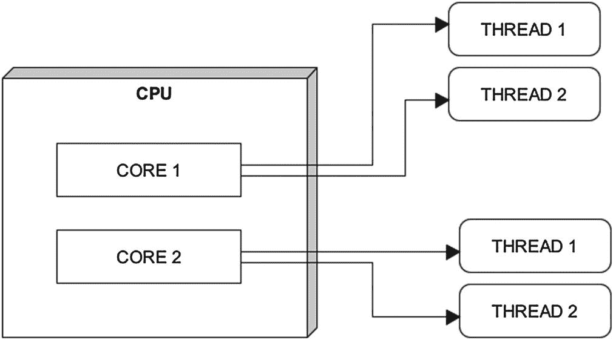
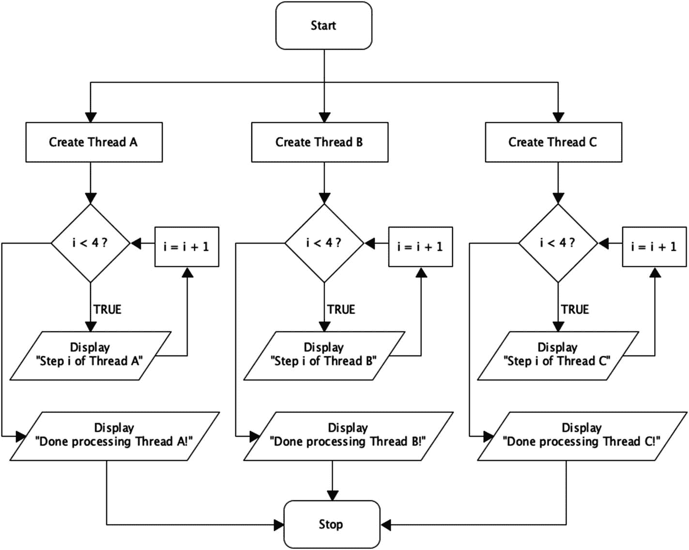

# 5. 文件操作、多线程及其他 Java 奇妙特性

到现在为止，你可能已经相当熟悉这门名为 Java 的强大面向对象语言中至少基本的编程元素了。现在是时候转向更高级的概念了。在本章稍后部分，我们将从 Java 中的多线程和基本错误处理开始。接着，我们最终会讨论到文件操作这个有趣的主题。

## 多线程：核心与线程

Java 支持*多线程*，这基本上是指将一个程序拆分成多个并发运行的部分。这通常会显著加快任何算法的执行时间。多线程有时也被称为*并发*。

多线程的概念与*处理器核心*密切相关，后者指的是硬件层面：中央处理器单元（CPU）。较老一代的 CPU，比如 2005 年之前的，通常只有一个核心。你很难在 2021 年找到一款全新的单核处理器。如今大多数 CPU 至少由两个核心组成。这些核心负责处理你输入计算机的所有数据（参见图 5-1）。



图 5-1

一个展示双核 CPU 内部多线程的简单示意图

一般来说，你的系统拥有的核心越多，其数字处理能力就越强。这取决于你的操作系统以及它是否支持多核计算；实际上，所有现代操作系统都具备这样做的能力。然而，并非所有第三方软件都经过编写以充分利用多核处理。在这种情况下，该软件只会使用系统的一个核心。

现在，并发运行的线程数量通常不等于 CPU 可支配的核心数量。请记住，单个软件应用程序可以为各种任务调用大量线程。这意味着一个单核系统可能同时执行多个线程。多核 CPU 提供的是在多个核心之间分担所有这些线程工作负载的可能性。在拥有六个或更多 CPU 核心的系统上，这可以带来计算速度的巨大提升。

你可能会不时遇到*超线程*这个术语。这指的是英特尔的专有技术，理论上，它可以使处理器物理配备的 CPU 核心数量翻倍。超线程技术于 2002 年引入，它与操作系统协同工作以增加可用核心数量。英特尔声称，与没有超线程技术的相同 CPU 相比，配备超线程技术的 CPU 能提供全面的显著性能提升。然而，在实际场景中，超线程带来的收益在很大程度上取决于具体的应用程序。该技术在视频编辑和 3D 建模等 CPU 密集型场景下确实表现出色。


## 在 Java 中实现多线程

线程可以归类为多种状态，这些状态共同构成了*线程生命周期*。接下来，我们详细了解一下这五个阶段：

1.  **新建**：线程被创建。

2.  **可运行**：顾名思义，处于此阶段的线程正在执行其任务，无论任务是什么。

3.  **等待**：当线程与其他线程协作，并暂时完成其处理，让其他线程接管时，就会进入此阶段。处于此阶段的线程正在等待其他线程的“许可”以恢复其工作负载。

4.  **定时等待**：当线程暂时完成其任务，但未来需要在特定时间点再次执行时，会进入此非活动阶段。

5.  **终止**：当线程完成其所有任务后，它就会消亡。

    你可能听说过计算领域的*多任务处理*。这个概念指的是多个进程（即软件片段）共享同一组资源，例如 CPU。通过多线程，单个程序内的任务被拆分为独立的执行线程。

让我们看一个演示 Java 多线程的实际程序（参见清单 5-1）。

```
// 让 HappyThreadClass 继承 Thread 类的方法
// 使用关键字 "extends"
class HappyThreadClass extends Thread {
public HappyThreadClass(String str)
{
// super 关键字用于访问父类中的数据
// （此处为 "Thread" 类）
super(str);
}
// 使用 run 方法让线程在执行时执行操作
public void run() {
// 每个线程迭代四次，显示每一步
for (int i = 0; i < 4; i++) {
System.out.println("步骤 "+ i + " 属于 " + getName());
}
System.out.println("完成处理 " + getName() + "！");
}
}
public class Thread_Demo {
// 添加 main 方法
public static void main(String[] args){
// 创建并执行三个线程
new HappyThreadClass("线程 A").start();
new HappyThreadClass("线程 B").start();
new HappyThreadClass("线程 C").start();
}
}
清单 5-1
一个演示多线程的 Java 代码清单
```

在清单 5-1 的第二行，你会看到一个关键字 *extends*。在 Java 中，这表示一个类继承另一个类的方法和构造器。在我们的例子中，*HappyThreadClass* 获得了 Thread 类（在 Java SDK 中称为 *Java.lang.Thread*）的功能。稍后在清单中，我们将看到一些源自 Thread 的方法的实际应用，即 *getName( )* 和 *start( )* 方法。前者返回线程的名称，后者则执行一个线程。

尽管清单 5-1 的输出是按顺序呈现的，但其中的三个线程是根据多线程方法的要求并发运行的（参见图 5-2）。

此外，连续多次运行该清单，你可能会发现不同的线程以不同的顺序显示其输出。这对于一个未同步的程序来说是完全正常的。



图 5-2

清单 5-1 中程序流程的简化示意图

CPU 提供的处理能力是一种有限的资源。因此，多个执行线程被分配了*优先级级别*，这有助于你的操作系统对它们的处理进行优先级排序。这主要是一个自动化过程，取决于计算机资源的当前状态。

## 线程同步

尤其是在大型项目中，多个线程绝对需要协同工作。幸运的是，Java 非常重视这种方法。Java 上下文中的*线程同步*指的是控制多个线程对共享资源的访问。为什么要同步呢？嗯，如果没有这种方法，多个线程可能会同时尝试访问同一数据。这对于数据的有序性和稳定性是不利的。

要在 Java 中简单地实现同步，可以使用 *synchronized* 语句。这种方法可以在三个级别上使用：静态方法、实例方法和代码块。以清单 5-1 为例。只需对函数声明稍作修改（即 public *synchronized* void run( )），我们就能从程序中获得更有序的输出。

## 同步块

我们甚至不必同步整个方法；我们可以自由选择在何处使用该技术。同步代码块将一个*监视器锁*绑定到一个对象上。然后，同一对象类型的所有同步块只允许单个线程同时执行它们。

要添加简单的块级同步，你可以在方法内部使用 *synchronize(this) { ... }* 来标记一个块。括号内接受一个对象；在我们的示例中，我们使用了关键字 *this* 来引用它所属的（当前不存在的）方法。

## 关于公平性与饥饿

在 Java 术语中，当一个线程（或一组线程）没有获得足够的 CPU 资源来正确执行时，就会发生*饥饿*，因为这些宝贵的“资源”被其他更贪婪的线程霸占了。对这些宝贵 CPU 资源的均衡分配系统称为*公平性*。Java 中饥饿的主要元凶之一实际上在于基于块的同步。处理饥饿的主要方法是通过适当的线程优先级设置和使用*锁*。

## Java 中的锁

现在，Java 中的每个对象都有一个所谓的*锁属性*。这个机制的存在是为了只允许那些被特别授予权限的线程访问对象数据。当这样的线程完成对对象的操作后，它会执行*锁释放*，使锁恢复到可用状态。使用锁是 Java 中比基于块的方法更复杂的同步形式（参见表 5-1）。

表 5-1

Java 中基于块和基于锁的同步的主要区别

|   | 块同步（例如，*synchronize(this) ...)* | 基于锁的同步 |
| --- | --- | --- |
| **公平性** | 不支持 | 支持 |
| **等待状态** | 不可中断 | 可中断 |
| **释放** | 自动 | 手动 |
| **能否查询锁** | 否 | 能 |


## 一览关键线程方法

现在正是回顾 *Java.lang.Thread* 中一些关键方法的好时机（见表 5-2）。随着本书的深入，这些方法以及其他许多方法将变得越来越熟悉。

表 5-2

Java 的 Thread 类（Java.lang.Thread）中的一些方法

| 方法 | 描述 | 示例 |
| --- | --- | --- |
| getName( ) | 返回线程的名称 | System.out.println(“I am a ” + getName( )); |
| setPriority( ) | 设置线程的优先级。接受 1 到 10 之间的数字 | Orange.setPriority(10);Peach.setPriority(1); |
| getPriority( ) | 返回线程的优先级 | System.out.println(“Priority for ” + getName( ) + “: ”+getPriority( )); |
| getState( ) | 返回线程的状态 | State state = currentThread().getState( );System.out.println(“Thread: ” + currentThread( ).getName( ));System.out.println(“State: ” + state); |
| interrupt( ) | 停止正在运行的线程 | SomeClass.interrupt( ); |
| interrupted( ) | 返回线程是否被中断 | if (ShoeFactory.interrupted( ) ) {System.out.println(“The thread has been interrupted!”);  } |
| currentThread( ) | 返回对当前正在执行的线程的引用 | Thread gimme = Thread.currentThread( );Thread niceThread = new Thread(this, “Nice Thread”);System.out.println(“This is the “ + gimme + “thread”; |
| sleep( ) | 使线程休眠指定的毫秒数 | Thread.sleep(50); // 50 milliseconds of restThread.sleep(1000); // One second nap |
| wait( ) | 使线程进入等待状态，直到另一个线程对其执行 notify 方法 | System.out.println(“Waiting..”);try {wait();} catch(Exception e){ } |
| notify( ) | 唤醒一个处于等待状态的线程 | synchronized(bananaObject) {bananaObject.notify( );System.out.println(“Processing complete!”); } |
| start( ) | 执行线程 | new FruitThreads(“Banana”).start( );myClass CarFactory = new myClass( );CarFactory.start( ); |

## Try-Catch 块

为了在 Java 中处理错误，程序员可以实现 *try-catch 块*。try 块内的代码会被监控是否有错误，一旦发生错误，程序就会切换到 catch 块内的代码。这种方法也被称为*异常处理*。查看清单 5-2 了解其运行机制。

```
public class TryCatchDemo {
public static void main(String[ ] args) {
int happyNumber = 20;
try {
// Divide twenty with zero (uh oh..)
happyNumber /= 0;
System.out.println(happyNumber);
} catch (Exception e) {
// Display our error message
System.out.println("We have an error.");
}
}
}
清单 5-2
Java 中 try-catch 块（即异常处理）的简单演示
```

## Finally：Try-Catch 块的更多乐趣

是的，Java 的 try-catch 块还有更多乐趣。一个名为 *finally* 的可选块，无论前面的 try-catch 中是否出现异常，它都会执行；这对于确保在任一事件发生后执行特定的关键操作非常有用。请参见清单 5-3，了解在 Java 中使用 finally 块的简单示例。

```
public class TryCatchFinally
{
public static void main (String[] args)
{
// Begin a try-catch block
try {
// happyArray is allocated to hold five integers
// (The count starts from zero in Java)
int happyArray[] = new int[4];
// Be naughty and assign the value of 14 into
// a non-existent sixth element in happyArray
happyArray[5] = 14;
}
catch(ArrayIndexOutOfBoundsException e) {
System.out.println("We encountered a medium-sized issue with an array..");
}
// Implement a finally-block which is executed regardless of
// what happened in the try-catch block
finally {
System.out.println("You are reading this in Alan Partridge's voice!");
}
}
}
清单 5-3
一个 Java 代码清单，演示了异常处理中的 finally 块
```

## Throw：你的自定义错误消息

要创建我们自己的异常/错误消息，可以在 Java 中使用 throw 语句（参见清单 5-4）。使用 throw，我们可以获得更详细的错误消息，指出代码中有问题的行。

```
public class FruitChecker {
// Create method for checking type of fruit
static void checkFruit(String fruit) {
// Display our custom error message if fruit does not equal "Lemon"
if (!fruit.equals("Lemon")) {
throw new RuntimeException("Only lemons are accepted.");
}
else {
System.out.println("Lemon detected. Thank you!");
}
}
public static void main(String[] args) {
checkFruit("Lemon");
checkFruit("Orange");
}
}
清单 5-4
一个 Java 代码清单，演示了 throw 语句的使用
```

Java 中的异常基本上是在程序执行过程中出现问题的信号。程序员可以使用多种类型的异常。

在清单 5-4 中，术语 *RuntimeException* 指的是一种通用错误类型；我们选择在未遇到柠檬时抛出它。由于我们对“Lemon”和“Orange”都运行了 checkFruit() 方法，因此我们既得到了一个无异常的消息，也得到了一个带有异常的消息。请参见清单 5-4 的输出：

Lemon detected. Thank you!

Exception in thread “main” java.lang.RuntimeException: Only lemons are accepted.

```
at FruitChecker.checkFruit(FruitChecker.java:8)
at FruitChecker.main(FruitChecker.java:17)
```

接下来，让我们看看 Java 中其他一些常见的异常：

*   **ArrayIndexOutOfBoundsException**：当访问数组中不存在的索引处的项时（即索引超出数组的分配大小），会抛出此异常。

*   **ArithmeticException**：当算术运算失败时抛出。

*   **ClassNotFoundException**：正如你可能猜到的，当试图访问一个找不到的类时抛出此异常。

*   **NumberFormatException**：当方法无法将字符串转换为数字时抛出。

*   **NoSuchFieldException**：当寻址类中缺失的变量时抛出。

*   **RuntimeException**：如清单 5-3 所示，此异常用于程序执行期间的任何一般性错误。

## 已检查异常与未检查异常

Java 中的异常基本上分为两类：*已检查*和*未检查*。前者用于处理程序掌控范围之外的错误，例如文件操作或网络传输问题。未检查异常，有时也称为*运行时异常*，处理编程逻辑内部的问题，例如无效参数和不支持的操作。请参见表 5-3，了解这两种异常之间差异的更详细说明。

表 5-3

Java 中已检查异常与未检查异常的主要区别

|   | 已检查异常 | 未检查/运行时异常 |
| --- | --- | --- |
| **主要影响范围** | 外部，程序之外 | 内部，程序之内 |
| **示例** | 文件访问或网络连接问题，外部数据库问题 | 有缺陷的程序逻辑；类定义、算术运算或变量转换错误 |
| **检测时机** | 程序编译期间 | 程序执行期间 |
| **优先级** | 关键：不可忽略。程序将无法执行 | 严重：不应忽略。程序会运行，但或多或少不稳定 |

我们将在本书后面更详细地介绍 Java 相当特别的异常处理。


## Java 中的基本文件操作

基本上，文件操作指的是对存储在硬盘或固态硬盘等设备上的数据进行读取、写入和删除。要建立一个支持文件操作的 Java 项目，我们应在代码开头添加以下包：*import java.io.File*。实际上，让我们看看一个简单的 Java 文件操作程序是什么样的（参见代码清单 5-5）。

```
import java.io.File;
public class JollyFileClass {
public static void main(String[] args) {
// 使用导入的 File 类创建一个文件对象 happyfile
File happyfile = new File("apress_is_great.txt");
// 开始一个 try-catch 块
try {
// 调用 File 类中的 createNewFile 方法
boolean ok = happyfile.createNewFile();
// ok 是一个布尔变量，意味着它只能为 'true' 或 'false'
if (ok == true) {
System.out.println("文件 " + happyfile.getName() + " 已创建。");
}
else {
System.out.println("该文件已存在。");
}
}
// 如有必要，在 catch 块中显示错误信息
catch(Exception e) {
System.out.println("我们遇到了一个问题..");
}
}
}
代码清单 5-5
一个用于创建空文本文件的 Java 代码清单
```

java.io.File 包提供的功能不仅限于我们在代码清单 5-5 中探讨的方法。请参见表 5-4 了解我们即将探索的所有方法。此外，表 5-5 列出了我们将在本章后面深入探讨的一些与时间相关的格式化标记。Java 的格式化标记用于显示解析为特定字符串模式的时间和日期。目前，你只需了解它们的存在即可；其中许多标记源自 *java.time.format.DateTimeFormatter* 类。

表 5-4

java.io.File 提供的 Java 文件操作的一些常用方法

| createNewFile( ) | 创建一个新文件 | length( ) | 返回文件的大小（以字节为单位） |
| mkdir( ) | 创建一个新目录 | getAbsolutePath( ) | 获取文件的绝对路径，例如 C:\Windows\hello.txt |
| delete( ) | 删除一个文件 | canRead( ) | 测试文件是否可读 |
| exists( ) | 测试文件是否存在 | canWrite( ) | 测试文件是否可写 |

## 在 Java 中创建文本文件

言归正传，接下来我们创建一个文本文件，好吗？请参见代码清单 5-6，继续体验 Java 文件操作的魅力。

```
import java.io.*;
public class Main {
public static void main(String args[]) {
// 定义一个我们打算写入文件的字符串
String data = "Apress rules, OK?";
try {
// 使用 FileWriter 类创建一个 Writer 对象
FileWriter writer1 = new FileWriter("happyfile.txt");
// 向文件写入一条消息
writer1.write(data);
// 关闭 writer
writer1.close();
// 打开已创建的文件
File file1 = new File("happyfile.txt");
// 创建一个新的文件输入流 "fileinput1"
FileInputStream fileinput1 = new FileInputStream(file1);
System.out.println("文件 " + file1.getName() + " 的内容如下：");
int counter=0;
// 使用 while 循环显示 "happyfile.txt" 中的每个文本字符
// 当遇到 "-1" 时跳出 "while" 循环，这表示
// 文件结束
while((counter = fileinput1.read())!=-1)
{
System.out.print((char)counter);
}
// 关闭文件输入流
fileinput1.close();
}
catch (Exception e) {
e.getStackTrace();
}
}
}
代码清单 5-6
一个演示文本文件创建和访问的 Java 程序
```

在第二个代码清单中，你会看到大量新的、可能令人望而生畏的机制。现在，我们将冷静地逐一讲解。首先，代码清单 5-6 中的 *import java.io.*;* 用于提供对 java.io 包中所有类的访问权限。

接下来，我们有 FileWriter 类。正如你可能预料的，这个类提供了写入数据和创建新文件的方法。我们实例化一个 FileWriter 对象，并将其命名为 *happyfile.txt*。

在代码清单 5-6 中，我们为文件 *happyfile.txt* 提供了文件名和*目录路径*。其中字母 C 部分指的是 Windows 根驱动器最常见的选择。你可以在在线编程环境中顺利运行此代码清单。但是，如果你使用在线环境，实际上不太可能将任何内容写入你的硬盘。

继续往下看代码清单，我们调用 FileWriter 类中的 write 方法，并将字符串 *data* 中的消息传递给它。现在，我们的 happyfile.txt 中包含了一条基于文本的消息。接下来，我们执行 close 方法；这样做是为了让后续方法能够访问 happyfile.txt。

现在，我们再次打开文件，这次是为了将其内容打印到屏幕上。我们首先使用 Java 的 File 类实例化一个对象，即 *File file1 = new File(“c:\\happyfile.txt”)*。代码行 *FileInputStream fileinput1 = new FileInputStream(file1)* 使我们能够访问 Java 文件输入流类，从而提供以字节为单位读取文件的能力。在我们的例子中，这意味着逐个字符地读取并显示一个文本文件（即 happyfile.txt）。为此，我们实现了一个 while 循环，该循环使用了 FileInputStream 类中的一个方法（即 *read*）。

我们打印 happyfile.txt 的内容（同样，根据 FileInputStream 文件访问的实现方式，是逐个字符地打印）。值为负一 (-1) 表示文件结束，从而跳出 while 循环。之后，就是清理工作了。我们关闭文件并退出程序。


## Java 文件操作的更多探索

让我们进行更多的文件操作。如何查询文件属性（例如文件大小），并尝试删除一些文件（参见代码清单 5-7）。

```
import java.io.*;
public class Main2 {
public static void main(String args[]) {
// 打开文件以进行访问
File file1 = new File("c:\\happyfile.txt");
// 开始 try-catch 块
try {
// 首先检查文件是否存在
if (file1.exists()) {
// 如果存在，显示存在确认信息
System.out.println("文件 " + file1.getName() + " 存在！");
// 调用 length() 方法并显示文件大小
System.out.println("该文件大小为 " + file1.length() + " 字节");
// 如果文件大小超过 10 字节/字符，则显示通知
if(file1.length()>10) System.out.println("数据量很大！");
// 显示读/写信息
if (file1.canRead()) System.out.println("该文件可读。");
if (file1.canWrite()) System.out.println("该文件可写。");
System.out.println("正在删除 " + file1.getName() + "...");
// 在 file1 上调用 delete() 方法
file1.delete();
// 如果文件不存在，则显示通知
} else System.out.println("找不到文件。不会删除任何内容。");
}
catch (Exception e) {
e.getStackTrace();
}
}
}
代码清单 5-7
一个演示在 Java 中查询和删除文件属性的程序
```

从代码清单 5-7 可以看出，在 Java 中实现基本文件操作相当直接。但我们还应该尝试一些其他操作。不如我们使用第二种类型的文件流，并创建一个全新的目录？（参见代码清单 5-8）。

```
import java.io.*;
class FileStreamTesting {
public static void main(String args[]) {
// 开始 try-catch 块
try {
// 定义一个字符串作为目录名称
String directoryName = "HappyDirectory";
File dir1 = new File(directoryName);
// 在 Windows 根文件夹 C: 中创建新目录
dir1.mkdir();
// 创建一个包含六个字符的数组 Publisher
char Publisher[] = {'A','p','r','e','s','s'};
// 实例化 OutputStream 类的对象 stream1
OutputStream stream1= new FileOutputStream("c://HappyDirectory//publisher.txt");
for(int x = 0; x < Publisher.length ; x++) {
// 将数组中的每个字符写入文件
stream1.write(Publisher[x]);
}
stream1.close();
} catch (IOException e) {
System.out.print("发生错误。");
}
}
}
代码清单 5-8
一个演示在 Java 中使用文件流和目录的代码清单
```

最后两个代码清单使用了 Java 的文件流类。代码清单 5-7 使用了 InputStream 类的一个方法在屏幕上打印文本。在代码清单 5-8 中，我们有一个 Java 的 OutputStream 实例，它将一个包含六个字符的数组（即 *Publisher[ ]* 的内容）写入文件。

在指定目录位置时，这两个代码清单使用了不同的表示法：在代码清单 5-7 中，我们使用反斜杠（即 *c:\\happyfile.txt*）来表示目录路径，而在代码清单 5-8 中，我们使用了正斜杠，如 *c://HappyDirectory*。这两种方法在 Java 中都应该有效。

## Java 日期处理

让我们面对现实：在这个世界上追踪时间相当重要。在 Java 中也没有理由不这样做。幸运的是，有一个很棒的类可以做到这一点，称为 *LocalDate*。此外，*java.time.format.DateTimeFormatter* 类可以根据你（程序员）定义的自定义格式模式来显示日期。（我们在表 5-5 中遇到过这些格式标记）。代码清单 5-9 将向你展示如何实现这一点。

```
import java.time.LocalDate;
import java.time.format.DateTimeFormatter;
public class HappyDateDemo {
public static void main(String args[]) {
// 使用 Java LocalDate 类创建一个对象
LocalDate happyDate = LocalDate.now();
LocalDate fortnite = happyDate.minusDays(14);
LocalDate tomorrow = happyDate.plusDays(14);
System.out.println("今天的日期是 " + happyDate);
System.out.println("两周前是 " + fortnite);
System.out.println("两周后将是.. " + tomorrow);
// 创建并显示三种不同的格式模式
System.out.println("今天的日期（格式 A）："+happyDate.format(DateTimeFormatter.ofPattern("d.M.uuuu")));
System.out.println("今天的日期（格式 B）："+happyDate.format(DateTimeFormatter.ofPattern("MMM d uuuu")));
System.out.println("今天的日期（格式 C）："+happyDate.format(DateTimeFormatter.ofPattern("d.MMM.uu")));
}
}
代码清单 5-9
一个演示在 Java 中检索和格式化日期的程序
```

表 5-5

来自 java.time.format.DateTimeFormatter 的一些时间模式格式标记

| *d/dd* | 月份中的日期 | *W* | 月份中的周数 (0–5) |
| *MM* | 月份 | *K* | 一天中的小时 (1–24) |
| uuuu*/uu* | 年份（完整或最后两位数字） | *K* | 一天中的小时，AM/PM (0–11) |
| *w* | 年份中的周数 (1–53) | *E* | 星期几（例如，Monday） |

## 更多日期处理：闰年与时间旅行

让我们探索更多 Java 的日期选项。我们不仅可以使用天作为单位在时间中前后移动；月和年也可以为我们所用。请参见代码清单 5-10 了解这两者的使用示例。此外，我们还将探索如何在 Java 中发现闰年。

```
import java.time.LocalDate;
import java.time.LocalTime;
public class TimeTravel {
public static void main(String[] args) {
// 将当前日期存储到 rightnow
LocalDate rightnow = LocalDate.now();
System.out.println("这是三十周后的未来：" + rightnow.plusWeeks(30));
System.out.println("这是五十个月前的过去：" + rightnow.minusMonths(50));
System.out.println("这是五十六年前的过去：" + rightnow.minusYears(56));
System.out.println("哇！这是三百七十三年后的未来：" + rightnow.plusYears(373));
// 将一个未来日期存储到 futuredate1
LocalDate futuredate1 = LocalDate.of(2028,1,1);
// 将一个过去日期存储到 pastdate1
LocalDate pastdate1 = LocalDate.of(1728,1,1);
// 检查闰年
System.out.println("\n" + pastdate1.getYear() + " 年是闰年吗？" + pastdate1.isLeapYear());
System.out.println(rightnow.getYear() + " 年是闰年吗？" + rightnow.isLeapYear());
System.out.println(futuredate1.getYear() + " 年是闰年吗？" + futuredate1.isLeapYear());
}
}
代码清单 5-10
一个演示在 Java 中使用 LocalDate 类中某些方法的代码清单
```

## Java 中的日历

在 Java 中，时间旅行有多种方法，特别是在公历（自 1582 年以来组织我们日子的最流行系统）中。我们可以相当容易地获取过去和未来的日期，如代码清单 5-11 所示。

```
import java.util.Calendar;
public class HappyCalendar {
public static void main(String[] args) {
// 使用 Calendar 类创建一个对象
Calendar calendar1 = Calendar.getInstance();
// 显示当前日期
System.out.println("当前日期：" + calendar1.getTime());
// 从日期中减去一周并显示
calendar1.add(Calendar.DATE, -7);
System.out.println("一周前是：" + calendar1.getTime());
// 快进两个月
calendar1.add(Calendar.MONTH, 2);
System.out.println("两个月后的未来：" + calendar1.getTime());
// 进入未来十年
calendar1.add(Calendar.YEAR, 10);
System.out.println("十年后的未来：" + calendar1.getTime());
// 回到过去一个世纪
calendar1.add(Calendar.YEAR, -100);
System.out.println("一个世纪前：" + calendar1.getTime());
}
}
代码清单 5-11
一个演示在 Java 中使用 Calendar 类的代码清单
```


## 自定义日历

基于 Java 的日历功能可不止于时间旅行。让我们真正有趣起来，创建自己的日期格式符号，也就是星期和月份。为此，我们将召唤一些令人兴奋的新方法以及一个新类——*Locale*（参见清单 5-12）。你会注意到该清单导入了 `java.util.Date` 类。这是一个所谓的已弃用类，意味着存在一个更新的版本（此处为 `java.util.LocalDate`）。不过，你在编程冒险中偶尔也会遇到这些更早期的类。

```
import java.text.DateFormatSymbols;
import java.util.Date;
import java.util.Locale;
import java.text.SimpleDateFormat;
public class SassyCalendar {
public static void main(String [] args){
// 从 Locale 类创建一个新对象
Locale locale1 = new Locale("en", "US");
// 为一组新的日期格式符号创建一个对象
DateFormatSymbols sassysymbols = new DateFormatSymbols(locale1);
// 使用 setWeekdays() 方法重命名星期
sassysymbols.setWeekdays(new String[]{
"",
"超级星期日",
"巨无霸星期一",
"温吞星期二",
"美妙星期三",
"乏味星期四",
"欢乐星期五",
"严肃星期六",
});
// 使用 setMonths() 方法重命名月份
sassysymbols.setMonths(new String[]{
"",
"欢乐一月", "绝妙二月",
"神奇三月", "惊艳四月",
"愉悦六月", "欢腾七月",
"和蔼八月", "傻气九月",
"难闻十月", "讨厌十一月",
"愉快十二月",
});
// 选择一个格式化模式
String pattern = "EEEEE', 在 'MMMMM yyyy'!'";
// 将此模式应用于我们的对象 sassysymbols
SimpleDateFormat format1 = new SimpleDateFormat(pattern, sassysymbols);
// 使用 Date 类创建一个新对象
String sassydate = format1.format(new Date());
System.out.println("今天是 " + sassydate);
}
}
清单 5-12
一个 Java 清单，演示了为特定区域创建自定义日期符号
```

在清单 5-12 中，我们针对特定区域（美国）进行了定制，使用表达式“US”和“en”选择英语作为语言。我们将在本章后面更深入地讨论本地化。

现在，方法 *setWeekdays( )* 和 *setMonths( )* 都接受字符串数组，用于覆盖默认的格式符号（例如 Monday、January 等）。这些数组中的第一个元素有意留空，因为它不影响这些方法的工作机制。

至于清单 5-12 中的格式化模式，我们使用 *E* 表示（现已修改的）星期几，*M* 表示月份，*y* 表示年份。我们还在单引号内添加了一些空格和其他标点符号（例如 `'!'`）。

如果我们在 2021 年 6 月 29 日运行清单 5-12，将得到以下输出：

今天是温吞星期二，在欢乐六月 2021！

## Java 中的国际化与本地化

*国际化*指的是设计软件，使其无需重大改造即可进行本地化；*本地化*则是为特定语言和/或地区创建内容的行为。Java 在国际化方面是一门出色的编程语言，提供了相当动态地本地化日期、货币和数字的方法。

术语“internationalization”输入起来可能有点繁琐。因此，软件人员有时更喜欢使用缩写 *i18n*。另一方面，本地化在业内人士中被称为 *L10n*。你可能已经猜到，这些缩写中的数字代表上述两个术语中的字母数量。

正如清单 5-12 中简要提到的，Java Locale 类为本地化项目提供了多种选项。它旨在让程序员有机会呈现本地化的消息或程序的其他部分。Locale 类用于标识对象，但其本身并非对象的容器。

Locale 类包含三个维度：*语言*、*国家*和*变体*。前两个不言自明，而变体则用于描述程序运行的操作系统类型和/或版本等信息。

在 Java 中，一个应用程序实际上可以同时激活多个区域设置。例如，可以组合意大利的日期格式和日本的数字格式。因此，Java 是创建真正多文化应用程序的绝佳选择。让我们看看清单 5-13，了解如何在 Java 中使用本地化。

```
import java.util.Locale;
public class LocalizationDemo {
public static void main(String[] args) {
// 创建一个通用的英语区域设置
Locale locale1 = new Locale("en");
// 创建一个位于英国的英语区域设置
Locale locale2 = new Locale("en", "UK");
// 创建一个位于孟买的芬兰语印度区域设置
Locale locale3 = new Locale("fi", "IN", "Mumbai");
System.out.println("区域设置 1\. " + locale1.getDisplayName());
System.out.println("区域设置 2\. " + locale2.getDisplayName());
System.out.println("区域设置 3\. " + locale3.getDisplayName());
// 通过创建 Locale 类的另一个实例并调用 getDefault() 方法，
// 检索用户当前操作系统的区域设置信息
Locale yourLocale = Locale.getDefault();
System.out.println("操作系统语言: " + yourLocale.getDisplayLanguage());
System.out.println("操作系统国家: " + yourLocale.getDisplayCountry());
}
}
清单 5-13
一个清单，演示了 Java 中区域设置的三个主要维度（即语言、国家和变体）
```

在清单 5-13 中，我们首先创建了三个不同的区域设置对象，并使用 Locale 类中的 *getDisplayName( )* 方法显示它们的一些内容。

我们还召唤了第四个对象，用于检查用户操作系统的区域设置。首先，使用 *getDefault( )* 方法检索这些数据，并将其插入到我们命名为 *yourLocale* 的对象中。然后，执行另外两个方法，即 *getDisplayLanguage( )* 和 *getDisplayCountry( )*，以显示我们感兴趣的信息。

## 结语

完成本章后，希望你已学会以下内容：

*   如何使用 Java 打开、创建和删除文件
*   多线程的含义及其在 Java 中的实现方式
*   如何在 Java 中实现基本同步
*   try-catch 块的操作
*   异常处理的含义及其实现方式
*   已检查异常与未检查异常的区别
*   Java 中日期相关类的一些基本用法
*   基于 Java 的本地化基础知识

第 6 章将带来一些完全不同的内容；我们将探索强大的 Python 语言的更高级功能。

