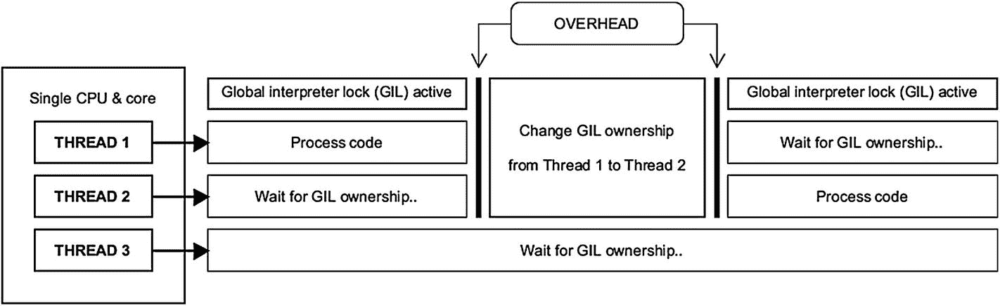
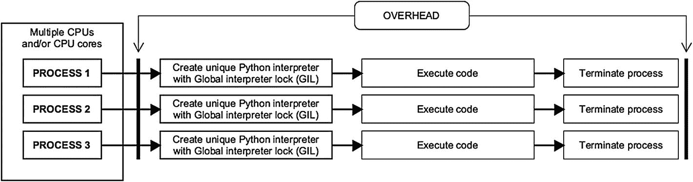

# 6. 现在来点完全不同的：高级 Python

在上一章深入 Java 世界之后，现在是时候对 Python 做同样的事情了。我们将从文件操作开始，然后在本章后面继续讨论多线程和其他更高级的主题。这里的目的是为你提供 Python 中一些更深层机制的坚实基础，以便你日后根据自己的需要进行扩展。


## Python 文件操作

在 Python 中，我们使用名称直观的 *open( )* 函数来打开文件。其语法如下：*文件对象名 = open(文件名, 访问模式, 缓冲)*。后两个属性是可选的。一个简单的 Python open( ) 函数示例如下：

```
happyfile = open("happytext.txt")
```

现在，Python 在其文件操作中使用了所谓的*访问模式*。并非所有文件都需要写入或追加，有时你只需要读取文件。请参阅表 6-1 了解 Python 的文件访问模式列表。

表 6-1

十二种 Python 文件访问模式

| r | 以只读模式打开文件。这是 Python 中的默认访问模式 | w+ | 以读/写模式打开文件；如果文件已存在则覆盖 |
| rb | 以只读二进制模式打开文件 | wb+ | 以读/写二进制模式打开文件；如果文件已存在则覆盖 |
| r+ | 以读/写模式打开文件 | a | 以追加模式打开文件。如果文件不存在，则创建一个 |
| rb+ | 以读/写二进制模式打开文件 | ab | 以追加模式打开二进制文件。如果文件不存在，则创建一个 |
| w | 以只写模式打开文件；如果文件已存在则覆盖 | a+ | 以追加和读取模式打开文件。如果文件不存在，则创建一个 |
| wb | 以只写二进制模式打开文件；如果文件已存在则覆盖 | ab+ | 以追加和读取二进制模式打开文件。如果文件不存在，则创建一个 |

在 Python 文件操作的上下文中，*缓冲*指的是将文件的一部分存储在临时内存区域中，直到文件完全加载的过程。基本上，值为零 (0) 会关闭缓冲，而值为一 (1) 则启用缓冲，例如，*somefile = open(“nobuffer.txt”, “r”, 1)*。如果未指定值，Python 将使用系统的默认设置。通常，保持缓冲开启是一个好主意，因为它可以提升文件操作的速度。

## Python 中的文件属性

Python 中主要有四个文件属性（其中一个主要具有历史意义，即 *softspace*）。如果你的项目哪怕只涉及最少量文件操作，你也很可能会熟悉所有这些属性。请参阅表 6-2 了解 Python 中这些属性的概要。

表 6-2

四个 Python 文件对象属性

| 属性 | 描述 | 示例 |
| --- | --- | --- |
| .name | 返回文件名 | happyfile = open(“happytext.txt”)print(happyfile.name) |
| .mode | 返回文件访问模式 | anotherfile = open(“whackytext.txt”)print(anotherfile.mode) |
| .closed | 如果文件已关闭则返回“true” | apress_file = open(“supertext.txt”)apress_file.close( )if print(apress_file.closed):print(“文件已关闭!”) |
| .softspace | 如果 print 语句要在第一个项目前插入一个空格字符，则返回“false”。历史遗留：自 Python 3.0 起已废弃 | file5 = open(“jollyfile.txt”)print(“Softspace 已设置? ”, file5.softspace) |

## 实际文件访问

在 Python 中，文件需要保持打开状态才能进行操作；设置为关闭状态的文件无法写入或检查其属性。请参阅代码清单 6-1 了解文件访问以及如何在 Python 中读取文件属性的演示。

```
# 导入特殊模块 time，用于 sleep() 方法
import time
file1 = open("apress.txt", "wb") # 创建/打开文件
print("文件名: ", file1.name) # 开始读取文件属性
print("打开模式: ", file1.mode)
print("文件是否已关闭? ", file1.closed)
time.sleep(1) # 休眠/延迟一秒，制造悬念
file1.close() # 关闭文件
print("现在我们关闭了文件..");
time.sleep(1.5) # 休眠/延迟 1.5 秒
print("文件现在关闭了吗? ", file1.closed)
代码清单 6-1
一个演示基本文件操作的 Python 代码清单
```

## Python 中的目录操作

目录或文件夹是任何操作系统文件管理系统的重要组成部分；Python 也提供了处理它们的方法。接下来让我们看看一些目录操作（参见代码清单 6-2）。

```
import os # 导入 os 模块用于目录操作
print("当前目录:", os.getcwd()) # 使用 getcwd() 打印当前目录
print("文件列表:", os.listdir()) # 使用 listdir() 列出目录中的文件
os.chdir('C:\\') # 切换到（最常见的）Windows 根目录
print("新目录位置:", os.getcwd()) # 再次打印当前目录
print("让我们创建一个新目录，命名为 JollyDirectory")
os.mkdir('JollyDirectory') # 使用 mkdir() 创建新目录
print("JollyDirectory 中的文件列表:", os.listdir('JollyDirectory'))
代码清单 6-2
一个演示目录操作的 Python 代码清单
```

至于重命名目录，我们会使用 *os.rename(“Somedirectory”, “Newname”)*。一旦某个目录不再需要，并且首先清空了其中的文件，只需使用 *os.rmdir(“Somedirectory”)* 即可将其删除。

## 文件名模式匹配

在 Python 中，我们有办法定位符合特定命名模式的文件。从代码清单 6-3 可以看出，这些方法实现起来相当简单。

```
import os
import fnmatch
# 显示 Windows 根目录下所有扩展名为 .txt/.rtf 的文件
for filename in os.listdir('C:\\'):
if filename.endswith('.txt') or filename.endswith('.rtf'):
print(filename)
# 显示所有以 'a' 开头且扩展名为 .txt 的文件
for filename in os.listdir('C:\\'):
if fnmatch.fnmatch(filename, 'a*.txt'):
print(filename)
代码清单 6-3
一个演示文件名模式匹配的 Python 代码清单
```

在代码清单 6-3 中，我们介绍了两个用于定位具有特定命名约定的文件的便捷函数，即 *endswith()* 和 *fnmatch()*。后者为你的 Python 项目提供了所谓的基于通配符的搜索（例如，*file*.txt* 或 *????name.txt*）。

## 使用 Glob 进行文件搜索？

术语 *globbing* 指的是在特定目录内（如果未指定目录，则在 Python 的当前工作目录内）执行高度精确的文件搜索。术语 *glob* 是 *global* 的缩写，起源于基于 Unix 的操作系统世界。在代码清单 6-4 中，你将看到这种方法得到了很好的应用。

```
import glob
# 使用 * 模式
print("\n 使用通配符模式 * 进行 glob 搜索 (*.py)")
for name in glob.glob("*.py"):
print(name)
# 使用 ? 模式
print("\n 使用通配符 ? 和 * 进行 glob 搜索 (??????.*)")
for name in glob.glob("??????.*"):
print(name)
# 使用 [0-9] 模式
print("\n 使用通配符范围 [0-9] 进行 glob 搜索")
for name in glob.glob("*[0-9].*"):
print(name)
# 使用 [b-x] 模式
print("\n 使用通配符范围 [b-x] 进行 glob 搜索")
for name in glob.glob("*[b-x].*"):
print(name)
代码清单 6-4
一个演示通过 globbing 进行文件搜索的 Python 代码清单
```


## Python 中的日期

你可能还记得上一章中 Java 提供的相当强大的时间和日历数据显示功能。在时间记录方面，Python 同样功能丰富。这些功能位于 `datetime` 模块中（参见代码清单 6-5）。

```
import datetime
from datetime import timedelta
time1 = datetime.datetime.now() # 创建一个表示当前时间的 datetime 对象
print("当前时间是:", time1) # 显示未格式化的当前时间
# 显示格式化后的日和月（%A 表示星期几，%B 表示月份）
print("换句话说，今天是", time1.strftime("%A in %B"))
# 将 time1.year 变量减去十
print("十年前是", time1.year-10)
# 使用 timedelta 将日期向后移动三十天
futuredate = datetime.timedelta(days=30)
futuredate += time1 # 将当前日期加到 futuredate 上
print("三十天后的日期是", futuredate.strftime("%B"))
代码清单 6-5
一个演示 Python 中部分时间和日历函数的代码清单
```

虽然代码清单 6-5 相当直观，但我们还是应该仔细看看 Python 中可用于满足所有日期相关需求的一些格式化标记（参见表 6-3）。

表 6-3

Python 中一些常见的日期格式化标记

| %A | 完整的星期几（例如，Monday） | %B | 完整的月份名称（例如，March） |
| %a | 缩写的星期几（例如，Mon） | %b | 缩写的月份名称（例如，Mar） |
| %Z | 时区（例如，UTC） | %H | 小时，24 小时制（例如，18） |
| %p | 上午/下午 | %I | 小时，12 小时制 |

## 正则表达式的魅力

*正则表达式*，常简称为 *RegEx*，是一个字符序列，构成了字符串的搜索模式。导入一个名为 `re` 的代码模块，我们就可以在 Python 中执行正则表达式操作。你可以使用正则表达式来定位具有非常特定搜索模式的文件，也可以在众多类型的文本文件中查找特定术语。请参见代码清单 6-6 了解其工作原理的首次演示。

```
import re
text1 = "Apress is the best publisher"
regex1 = re.findall("es", text1) # 创建一个带有搜索模式的 RegEx 对象
print("查找所有 'es' 的实例")
print("我们在", text1, "中找到了", len(regex1), "个匹配项")
代码清单 6-6
一个在 Python 中使用正则表达式的简单示例
```

在代码清单 6-6 中，我们调用了 `findall` 方法来查找字符串变量 `text1` 中“es”的实例。我们还使用了 Python 的 `len()` 方法来统计存储在列表 `regex1` 中的实例数量。现在，是时候看看另一个演示正则表达式魔法的示例了（参见代码清单 6-7）。

正则表达式实际上可以追溯到 1951 年，由美国数学家 *斯蒂芬·科尔·克莱尼（1909–1994）* 提出。如今，正则表达式是许多流行编程语言（包括 Perl、C# 和 Java）中的标配。本书稍后将探讨后两种语言中正则表达式的实现。

```
import re
# 从正则表达式模块 re 中调用 search 方法
match1 = re.search('Apress', 'Apress is the best')
if match1: # 这是 "if match1 == True:" 的简写
    print(match1) # 如果找到匹配，则显示对象内容
happytext = "My name is Jimmy" # 创建一个字符串变量
match2 = re.search('Jimmy', happytext)
if match2:
    print(match2)
# 对字符串 "happytext" 使用 re 模块的 fullmatch 方法
match3 = re.fullmatch('Jimmy', happytext)
if match3:
    print("找到 'Jimmy' 的匹配！") # 此消息不会显示
else:
    print("未找到 'Jimmy' 的匹配")
match3 = re.fullmatch('My name is Jimmy', happytext)
if match3:
    print(match3)
# 使用 match 方法
match4 = re.match('the', 'Apress is the best')
if match4:
    print(match4) # 此消息不会显示
# match() 仅从字符串开头查找模式
else:
    print("未找到 'the' 的匹配")
match5 = re.match('Apress', 'Apress is the best')
if match5:
    print(match5) # 此消息会显示
代码清单 6-7
一个演示 Python 中 search() 和 fullmatch() 正则表达式方法的 Python 代码清单
```

在代码清单 6-7 中，我们使用了 `search()`、`match()` 和 `fullmatch()`。你可能会问它们之间有什么区别。`search` 方法会在整个字符串中查找给定的模式，而 `fullmatch` 仅当字符串完全匹配某个模式时才返回 true。`match` 方法则只从字符串的开头查找模式。


## 元字符

正则表达式最好与*元字符*配合使用。这些基本上是更高级字符串相关搜索的构建块。请参阅表 6-4 了解一些重要元字符的概要，以及代码清单 6-8 对其用法的简单演示。

表 6-4

一些重要的 Python 元字符

| \w | 任意单词。通常指字母数字字符 | \s | 空白字符 |
| \W | 任意非单词字符 | \S | 非空白字符 |
| \d | 任意数字 | . | 任意单个字符 |
| \D | 任意非数字字符 | * | 零个或多个字符 |

```
import re
match1 = re.search('.....', 'Hello there!')
if match1: # 这是 "if match1 == True:" 的简写形式
print(match1) # 显示 "Hello"
match2 = re.search('\d..', 'ABC123')
if match2:
print(match2) # 显示 "123"
match3 = re.search('\D*', 'My name is Reginald123456.')
if match3:
print(match3) # 显示 "My name is Reginald"
match4 = re.search('y *\w*', 'Hello. How are you?')
if match4:
print(match4) # 显示 "you"
match5 = re.search('\S+', 'Hello. Whats up?')
if match5:
print(match5) # 显示 "Hello."
代码清单 6-8
一个 Python 代码清单，演示了正则表达式中元字符的使用
```

在代码清单 6-8 中，对于 *match4*，我们使用了元字符 *\w*，它指的是寻找与任何完整单词的匹配。如果没有这个字符，我们会看到输出为“y”而不是“you”。

让我们进一步了解 Python 中的元字符。请参阅表 6-5 了解另外八个重要的正则表达式标记，以及代码清单 6-9 进行第二次演示。

表 6-5

更多重要的 Python 元字符

| \. | 字面点号（即句点字符） | $ | 匹配行尾 |
| ? | 零个或一个字符 | { n } | 出现 n 次 |
| + | 一个或多个字符 | [a-z] | 字符集 |
| ^ | 匹配行首 | [0-9] | 数字字符集 |

```
import re
string1 = 'Beezow Doo-doo Zopittybop-bop-bop'
patterns = [r'Do*', # D 和零个或多个 o (*)
r'Be+', # B 和一个或多个 e (+)
r'Do?', # D 和零个或一个 o (?)
r'it{2}', # i 和两个 t
r'[BDZ]\w*', # 查找以 B、D 或 Z 开头的完整单词
r'^Be\w*', # 查找以 "Be" 开头的完整单词
r'...$' # 查找字符串中的最后三个字符
]
def discover_patterns(patterns, string1): # 创建我们的方法
for pattern in patterns:
newpattern = re.compile(pattern) # 调用 compile()
print('Looking for {} in'.format(pattern), string1)
print(re.findall(newpattern, string1)) # 调用 findall()
discover_patterns(patterns, string1) # 执行我们的方法
代码清单 6-9
另一个 Python 代码清单，演示了正则表达式中元字符的使用
```

代码清单 6-9 中的列表结构 *patterns* 包含七个搜索项，而 *string1* 存储了我们的源材料。这两个数据结构将被输入到我们接下来创建的方法 *discover_patterns* 中。

在这个新方法内部，我们使用了 Python 的两个正则表达式函数：*compile( )* 和 *findall( )*。使用前者，我们将正则表达式模式转换为模式对象，然后用于模式匹配。这种方法在搜索模式需要重复使用的场景中最为高效，例如数据库访问。

Findall 用于发现字符串中搜索模式的所有出现位置。我们代码清单中的 *r'* 让 Python 知道一个字符串被视为“原始字符串”，这意味着其中的反斜杠将被解释而不具有特殊功能。例如，在原始字符串中，*\n* 不会表示换行符。

## 正则表达式的更多乐趣

接下来让我们探索正则表达式的更多高级特性。代码清单 6-10 展示了两个新方法的使用：*group( )* 和 *sub( )*（为方便起见，以粗体显示）。此外，我们将使用一种新技术，配合我们的老朋友 search( )。

```
import re
string1 = "Today's dessert: banana"
# 调用 search() 并设置四个匹配选项
choice1 = re.search(r"dessert.*(noni-fruit|banana|cake|toilet-paper)", string1)
if choice1:
print("You'll be having this for", choice1.group(), "!")
string2 = "Have a great day"
string2 = re.sub('great', 'wonderful', string2)
print(string2) # 输出: Have a wonderful day
string3 = 'what is going on?'
# 将 a 到 h 之间的所有字母替换为大写 X
string3 = re.sub('([a-h])s*', 'X', string3)
print(string3) # 输出: wXXt is XoinX on?
代码清单 6-10
一个 Python 代码清单，演示了 sub( ) 方法
```

代码清单 6-10 中的 search 方法用于比较和定位现在作为该方法参数列出的字符串。换句话说，*string1* 被搜索总共四种水果。这些水果由逻辑或运算符（用竖线字符 | 表示）分隔。该方法被设置为查找这些字符串/水果中的任何一个，但前提是它们必须出现在字符串“dessert”旁边。如果 string1 和 choice1 中的某个项之间存在这样的匹配，程序就会显示它。

## Python 中的并发与并行

*并行处理*指的是同时执行多个计算或指令。你可能还记得上一章中多线程的概念。与 Java 和 C# 一样，Python 能够处理多个执行线程。然而，存在一些重大差异。Python 的多线程实际上并不会以并行方式运行线程。相反，它伪并发地执行这些线程。这源于 Python 实现的*全局解释器锁 (GIL)*。该机制用于同步线程，并确保整个 Python 项目仅在单个 CPU 上执行；它根本没有利用多核处理器的全部能力。

尽管*并发*和*并行*是相关的术语，但它们并不相同。前者指的是同时运行独立任务的方法，而后者则是指将一个任务拆分为子任务，然后同时执行这些子任务。

## 多进程 vs. 多线程

在 Python 中实现线程的真正并行处理是通过使用多个进程来实现的，每个进程都有自己的解释器和 GIL。这被称为*多进程*。

Python 对并发的处理方式可能有些复杂（与 Java 相比）。在 Python 中，*进程*与*线程*不同。尽管两者都是独立的代码执行序列，但存在几个差异。进程往往比线程使用更多的系统内存。进程的生命周期通常也更难管理；其创建和销毁需要更多资源。请参阅表 6-6 了解线程和进程的比较。

表 6-6

Python 中线程和进程的主要区别（即多进程 vs. 多线程）

|   | 进程 | 线程 |
| --- | --- | --- |
| 使用单个全局解释器锁 (GIL) | 否 | 是 |
| 多个 CPU 核心和/或 CPU | 支持 | 不支持 |
| 代码复杂度 | 较低 | 较高 |
| 内存占用 | 较大 | 较小 |
| 可被中断/终止 | 是 | 否 |
| 最适合用于 | CPU 密集型应用、3D 渲染、科学建模、数据挖掘、加密货币 | 用户界面、网络应用 |

Python 有三个用于同时处理的代码模块：multiprocessing、asyncio 和 threading。对于 CPU 密集型任务，multiprocessing 模块效果最佳。


## 在 Python 中实现多线程

Python 中的多线程与本章前面讨论的全局解释器锁（GIL）机制密切相关。这种方法利用了*互斥*原则（见图 6-1）。由于 Python 多线程中的调度由操作系统完成，因此不可避免地会产生一些开销（即延迟）；而多进程通常不会受到这个问题的影响。



图 6-1

Python 中使用三个线程实现多线程的部分可视化

是时候动手实践了。让我们来看看如何在 Python 中实现多线程（见代码清单 6-11）。

```
import threading
def happy_multiply(num, num2):
print("Multiply", num, "with", num2, "=", (num * num2))
def happy_divide(num, num2):
print("Divide", num, "with", num2, "=", (num / num2))
if __name__ == "__main__":
# 创建两个线程
thread1 = threading.Thread(target=happy_multiply, args=(10,2))
thread2 = threading.Thread(target=happy_divide, args=(10,2))
# 启动线程..
thread1.start()
thread1.join() # ..并确保线程 1 完全执行完毕
thread2.start() # 之后再启动线程 2
thread2.join()
print("All done!")
代码清单 6-11
一个演示 threading 模块基本用法的 Python 代码清单
```

我们在代码清单 6-11 中创建了两个函数，即 *happy_multiply* 和 *happy_divide*。它们各自接受两个参数。前者将 *num* 与 *num2* 相乘，后者则将 *num* 除以 *num2*。结果会直接打印在屏幕上。

现在，代码清单 6-11 中有一个函数需要你特别关注；Python 的 *join( )* 方法用于确保一个线程在继续执行后续代码之前，已完全完成其处理。如果你删除了 *thread1.join( )* 这一行，代码清单 6-4 的输出将会变得混乱不堪。

在并发处理的上下文中，*竞态条件*指的是两个或多个进程同时修改某个资源（例如文件）的场景。最终结果取决于哪个进程先到达。这被认为是一种不期望出现的情况。

## 在 Python 中实现多进程



图 6-2

Python 中使用三个进程实现多进程的部分可视化

尽管多进程方法通常能生成 CPU 效率极高的代码，但仍可能出现轻微的开销问题。如果 Python 中的多进程项目存在这些问题，它们通常发生在进程的初始化或终止阶段（见图 6-2）。

现在，来看一个 Python 多进程模块的简单演示，见代码清单 6-12。

```
import time
import multiprocessing
def counter(): # 定义一个函数，counter()
name = multiprocessing.current_process().name
print (name, "appears!")
for i in range(3):
time.sleep(1) # 延迟一秒以增强效果
print (name, i+1,"/ 3")
if __name__ == '__main__': # 将此代码清单定义为 "main"，即要执行的主程序
counter1 = multiprocessing.Process(name='Counter A', target=counter)
counter2 = multiprocessing.Process(name='Counter B', target=counter)
counter3 = multiprocessing.Process(target=counter) # 未指定名称..
counter1.start()
counter2.start()
counter3.start() # 这个无名称的计数器仅输出 "Process-3"
代码清单 6-12
一个演示 multiprocessing 模块基本用法的 Python 代码清单
```

从代码清单 6-12 可以看出，Python 中的每个进程都有一个名称变量。如果没有定义名称，则会自动分配一个通用标签，如 *Process-[进程编号]*。

## 迭代器、生成器和协程

Python 中有三种重要的数据处理机制，有时容易混淆：*可迭代对象、生成器*和*协程*。**列表**（例如 *happyList[0,1,2]*）是简单的可迭代对象。它们可以按需反复读取，不会出现问题。列表中的所有值都会保留，直到被特别标记为删除。**生成器**是只能访问一次的迭代器，因为它们不会将内容存储在内存中。生成器的创建方式类似于 Python 中的普通函数，不同之处在于它们使用关键字 *yield* 代替了 *return*。

生成器在读取大型文件属性（例如行数）时非常有用。用于此目的的生成器会生成那些不是最新的、因此不需要的数据，从而避免内存错误，并使 Python 程序运行更高效。

**协程**是一种独特的函数类型，它可以将控制权交还给调用函数，而不会在此过程中结束自身的上下文；协程会在后台平稳地保持其空闲状态。换句话说，它们用于协作式多任务处理。

## Asyncio：异类？

Asyncio 是 *asynchronous input/output*（异步输入/输出）的缩写，是 Python 中一个用于编写并发运行代码的模块。尽管与线程和多进程有相似之处，但它实际上代表了一种不同的方法，称为*协作式多任务处理*。asyncio 模块通过在一个单线程中运行单个进程，提供了一种伪并发。

那么，在 Python 中使用异步代码意味着什么呢？嗯，用这种方法编写的代码可以安全地暂停，以便项目中的其他代码片段执行其任务。一个异步进程会提供其空闲时间让其他进程运行；这正是通过 asyncio 模块实现某种并发的方式。


## 异步事件循环

异步 Python 项目的核心组件是*事件循环*；我们通过它来运行子进程。任务在事件循环中调度，并由一个线程管理。基本上，事件循环的作用是协调任务，确保我们在使用 asyncio 模块时一切顺利运行。让我们通过代码清单 6-13 来看看如何实际实现 asyncio 模块。

```
import asyncio
async def prime_number_checker(x): # 定义一个以 x 为输入的函数
# 休眠一秒钟，可能让其他函数在我们休眠时执行它们的任务
await asyncio.sleep(1.0)
message1 = "%d 不是质数.." % x # 设置默认消息
if x > 1:
for i in range(2, x):
# 对变量 x 应用取模运算符 (%)。
# 如果得到的余数不等于零，则更新 "message1"
if (x % i) != 0:
message1 = "%d 是一个质数！" % x
break # 跳出循环
return message1
async def print_result(y): # 定义一个以 y 为输入的函数
result = await prime_number_checker(y) # 等待另一个函数完成
print(result) # 打印来自函数 prime_number_checker() 的结果
happyloop = asyncio.get_event_loop()
# 检查 2、11 和 15 是否为质数
happyloop.run_until_complete(print_result(2))
happyloop.run_until_complete(print_result(11))
happyloop.run_until_complete(print_result(15))
happyloop.close()
代码清单 6-13
一个 Python 代码清单，演示了异步链式协程以及事件循环的使用
```

在代码清单 6-13 中，我们正在寻找质数（即只有两个因数的数字：自身和 1）。我们定义了两个异步函数/协程，*prime_number_checker(x)* 和 *print_result(y)*，它们都带有关键字 *async def*，因为这是使用 asyncio 模块的方式。

现在，我们定义的第一个函数以行 *await asyncio.sleep(1.0)* 开始。与 Python 中常规的 sleep 方法相比，这种异步变体不会冻结程序；相反，它会给其他任务一个指定的时间在后台完成。

第二个协程中的行 *result = await prime_number_checker(y)* 是为了确保第一个函数已完成执行。*Await* 确实是一个在异步方法中有点不言自明且至关重要的关键字。

为了让我们的异步代码清单完全运行起来，我们需要使用事件循环。我们通过创建一个新的循环对象 *happyloop* 并调用一个名为 *asyncio.get_event_loop()* 的函数来实现这一点。尽管有几种用于事件循环管理的函数变体，但为了清晰起见，我们在此示例中只介绍上述方法。

接下来，在代码清单 6-13 中，函数 *run_until_complete* 实际上会执行我们的 *print_result(y)* 函数，直到其各自的任务完全完成。最后，我们通过调用 close 方法来结束事件循环。

## Python 中的并发：回顾

Python 提供的所有处理方法可能会让人感到困惑。因此，让我们通过回顾其中涉及的一些核心概念来结束本章（见表 6-7）。

表 6-7

Python 中并发编程的主要方法

| **多进程** | 同时运行多个进程；为每个进程创建一个带有全局解释器锁（GIL）的独立 Python 解释器 | 可以利用系统中的多个 CPU 和/或 CPU 核心 |
| **多线程** | 由操作系统优先执行的任务调度。受单个 GIL 限制 | 也称为*抢占式多任务处理*。在单个 CPU/核心上运行 |
| **异步处理** | 由任务决定调度。受单个 GIL 限制 | 也称为*协作式多任务处理*。在单个 CPU/核心上运行。在 Python 3.0 版本中引入 |

## Python Lambda 函数

将 *lambda 函数* 视为一次性函数。Lambda 函数是无名的，并且本质上通常规模较小。它们的语法简单如下：

*   *lambda (参数) : (表达式)*

这是一个简单的 lambda 函数：*sum1 = lambda x, y : x + y*。有关稍微复杂一点的示例，请参见代码清单 6-14。

```
def happymultiply(b):
return lambda a : a * b
result1 = happymultiply(5)
result2 = happymultiply(10)
result3 = happymultiply(50)
print("结果 1:", result1(6))
print("结果 2:", result2(6))
print("结果 3:", result3(6))
代码清单 6-14
一个演示 Python 中 lambda 函数的代码清单
```

现在，Python 中有三种方法与 lambda 函数配合得非常好：*map( )*、*filter( )* 和 *reduce( )*。Filter( ) 接受一个列表并创建一个由所有返回 true 的元素组成的新列表。Map( ) 也根据它处理的可迭代对象创建一个新列表；可以把它看作一个无循环的迭代器函数。最后，我们有 reduce( )，它将一个函数应用于一个列表（或其他可迭代对象）并返回一个单一值，有时也让我们完全免于使用循环（见代码清单 6-15）。

```
from functools import reduce # 导入 reduce() 所需的代码模块
# 创建一个包含七个值的列表
middle_aged = [6, 120, 65, 40, 55, 57, 45]
# 显示操作前的列表
print("研究中所有人的年龄:", middle_aged)
# 筛选出年龄在 40 到 59 岁之间的列表
middle_aged = list(filter(lambda age: age>=40 and age<60, middle_aged))
print("中年人:", middle_aged)
# 调用 map() 并将列表 "middle_aged" 中的值加倍
elderly = list(map(lambda x: x * 2, middle_aged))
print("他们将活到:", elderly)
# 调用 reduce() 将 "middle_aged" 中的所有元素相加
total_years = reduce(lambda x, y: x + y, middle_aged)
print("他们迄今为止的总存活时间:", total_years, "年")
代码清单 6-15
一个将 lambda 函数应用于 Python 中已筛选列表的代码清单
```

## Python 中的 Zip 操作

以著名的衣物闭合机制拉链命名，Python 中的 *zip* 指的是一种将两个或多个可迭代对象的元素组合起来的方法。例如，Zip 操作是在 Python 中创建字典数据结构的一个很好的工具。不，这种 zip 与流行的归档文件格式 ZIP 无关，我们将在本章后面介绍后者。

现在，Python 中的 zip 函数接受两个可迭代对象（例如列表）并返回一组元组（见代码清单 6-16）。

```
# 定义两个列表
letters1 = ['z', 'a', 'r', 'd', 'o', 'z']
numbers1 = [1, 2, 3, 4, 5, 6]
# 使用 "letters1" 和 "numbers1" 创建 zip 对象 zip1
zip1 = zip(letters1, numbers1)
for i in zip1: # 显示 zip 内容
print(i)
# 定义新列表 "letters2"
letters2 = ['Z', 'A', 'R', 'D', 'O', 'Z']
# 使用 "letters1"、"numbers1" 和 "letters2" 创建第二个 zip 对象 zip2
zip2 = zip(letters2, numbers1, letters1)
for i in zip2: # 显示第二个 zip 内容
print(i)
代码清单 6-16
一个演示 Python 中 zip 函数的代码清单
```


## 关于压缩的更多内容

在许多场景下，基本的压缩功能无法满足需求。其中一个场景涉及元组不完整的压缩。幸运的是，我们有一个名为 *zip_longest* 的方法。该方法位于代码模块 *itertools* 中，它会用你选择的占位数据填充所有缺失的元素，毫不含糊。演示请参见代码清单 6-17。

```
from itertools import zip_longest
letterlist = ['a', 'b', 'c']
numberlist = [1, 2, 3, 4]
maximum = range(5) # 定义压缩长度并将其存入"maximum"
# 调用 zip_longest()
zipped1 = zip_longest(numberlist, letterlist, maximum, fillvalue='blank')
# 显示压缩内容
for i in zipped1:
print(i)
代码清单 6-17
一个演示 zip_longest 方法的 Python 代码清单
```

你可能会好奇，Python 中的压缩器能否解压。答案是肯定的（参见代码清单 6-18）。

```
letters = ['A', 'B', 'C', 'D']
numbers = [1, 2, 3, 4]
zipped1 = zip(letters, numbers) # 压缩数据
zipped_data = list(zipped1)
print("这是压缩后的数据：", zipped_data)
a, b = zip(*zipped_data) # 使用星号运算符解压数据
print("接下来是解压后的数据！")
print('字母：', a)
print('数字：', b)
代码清单 6-18
一个演示解压的 Python 代码清单。
```

## 处理另一种 ZIP

正如本章前面提到的，*zip* 这个词在计算领域至少有两种常见含义。我们探讨了 Python 中的压缩（和解压），涵盖了第一种含义。现在是时候在任意 Python IDE 中处理另一种 ZIP——即流行的归档文件格式了。

现在，使用 ZIP 软件压缩的目录（及其子目录）最终会变成一个单一文件，其大小通常远小于未压缩的内容。这显然是基于网络的文件传输的绝佳解决方案。当然，市面上有多种文件压缩解决方案，但截至 2021 年，ZIP 仍然是一种极其普遍的归档文件格式，适用于所有主流操作系统。

ZIP 由 *Phil Katz* 和 *Gary Conway* 于 1989 年创建。ZIP 压缩技术后来被用作 *Java 归档 (JAR)* 文件格式的基础——以及其他许多格式的基础。

Python 同样喜欢 ZIP 文件。我们实际上可以在 Python IDE 中操作它们。有一个专门用于此目的的代码模块，名为 *zipfile*。请参见代码清单 6-19，了解如何在 Python 中创建 ZIP 文件并显示其内容。

```
import os
from os.path import basename
from zipfile import ZipFile # 引入 ZipFile 模块
lookfor = "thread" # 为要搜索的字符串创建一个变量
# 定义一个新函数 make_a_zip
def make_a_zip(dirName, zipFileName, filter):
# 创建一个新的 ZipFile 对象，属性 w 表示（覆）写
with ZipFile(zipFileName, 'w') as zip_object1:
# 开始遍历指定目录中的文件
for folderName, subfolders, filenames in os.walk(dirName):
for file in filenames:
if filter(file):
# 创建完整的文件路径
filePath = os.path.join(folderName, file)
# 使用 write() 方法将文件添加到压缩包
zip_object1.write(filePath, basename(filePath))
# 调用 make_a_zip() 并指定当前目录作为工作目录
# 同时只查找文件名中包含字符串 "thread" 的文件
make_a_zip('..', 'happy.zip', lambda name: lookfor in name)
print("所有名称中包含 > 的文件现在都在 happy.zip 中！")
# 创建一个 ZipFile 对象并将 happy.zip 加载到其中（使用属性 r 表示读取）
with ZipFile('happy.zip', 'r') as zip_object2:
# 调用 namelist() 并将内容存入 "file_in_zip" 变量
files_in_zip = zip_object2.namelist()
# 遍历 files_in_zip 并打印每个元素
print("\n 这些文件存储在 happy.zip 中：")
for i in files_in_zip:
print(i)
代码清单 6-19
一个演示在 Python 内部使用 ZIP 文件归档的代码清单
```

在代码清单 6-19 中，你将看到 Python 对 ZIP 支持的两个主要机制：创建新的文件归档（即 *happy.zip*）以及检索其中存储的文件名。该示例还向你展示了在收集文件到归档时如何使用基于通配符的功能。在此例中，我们只查找文件名中某处包含字符串“thread”的文件。

与 *ZipFile* 配合使用的 *with* 语句主要是为了让我们的代码清单更清晰。一方面，它们使我们无需使用关闭方法（例如 *happyfile.close( )*），这些方法通常在文件操作完成后需要调用。

代码清单 6-19 将在你当前的 Python 目录中执行，因此你的结果可能会有所不同。

我们将在本书后面部分继续探讨 Python 语言的复杂性。

## 结语

完成本章学习后，希望你已掌握以下内容：

*   如何使用 Python 打开、创建和删除文件

*   Python 中的基本目录管理

*   正则表达式（RegEx）指的是什么

*   如何以及何时调用 match( )、search( ) 和 fullmatch( ) 进行正则表达式操作

*   如何在 Python 中实现多线程和多进程，以及它们的主要区别是什么

*   全局解释器锁（GIL）指的是什么

*   使用 *asyncio* 在 Python 中进行异步编程的基础知识

*   lambda 函数有什么用处

*   Python 中压缩和处理 ZIP 文件归档的基础知识

第 7 章将探讨稳健且流行的 C# 语言更高级的方面。

