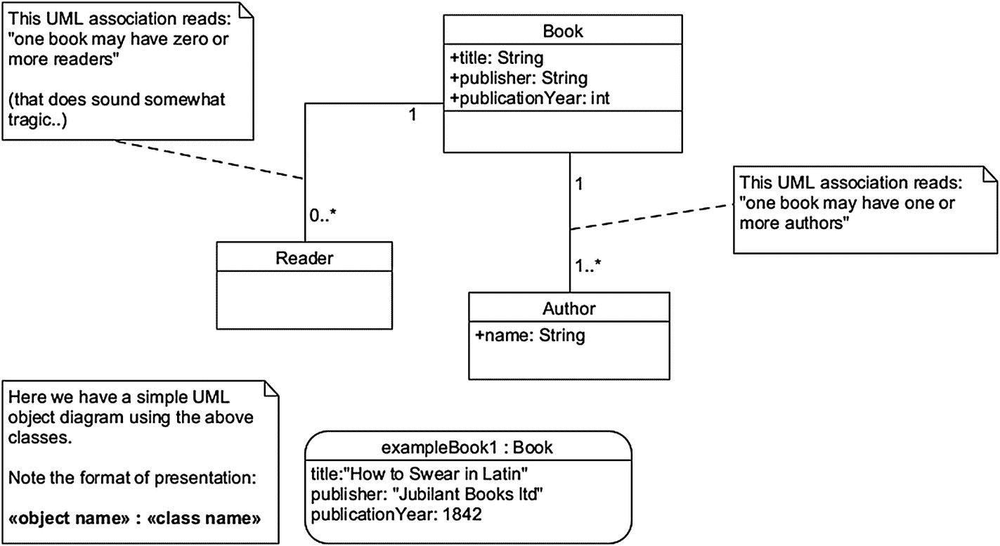
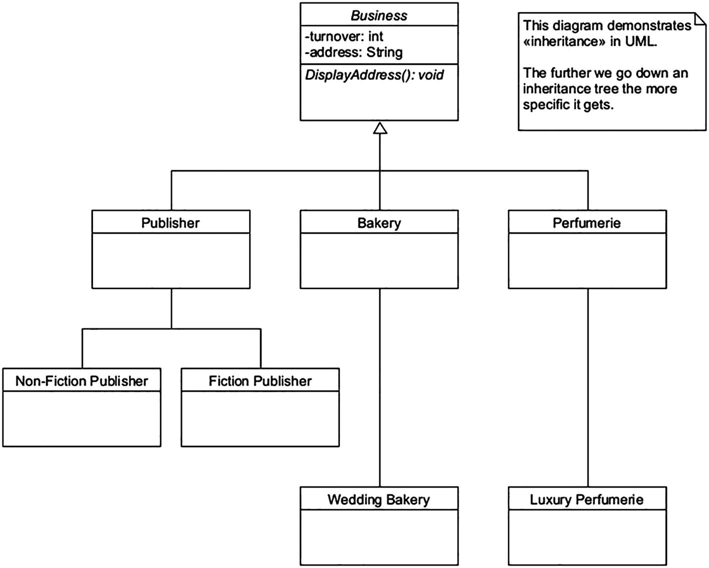
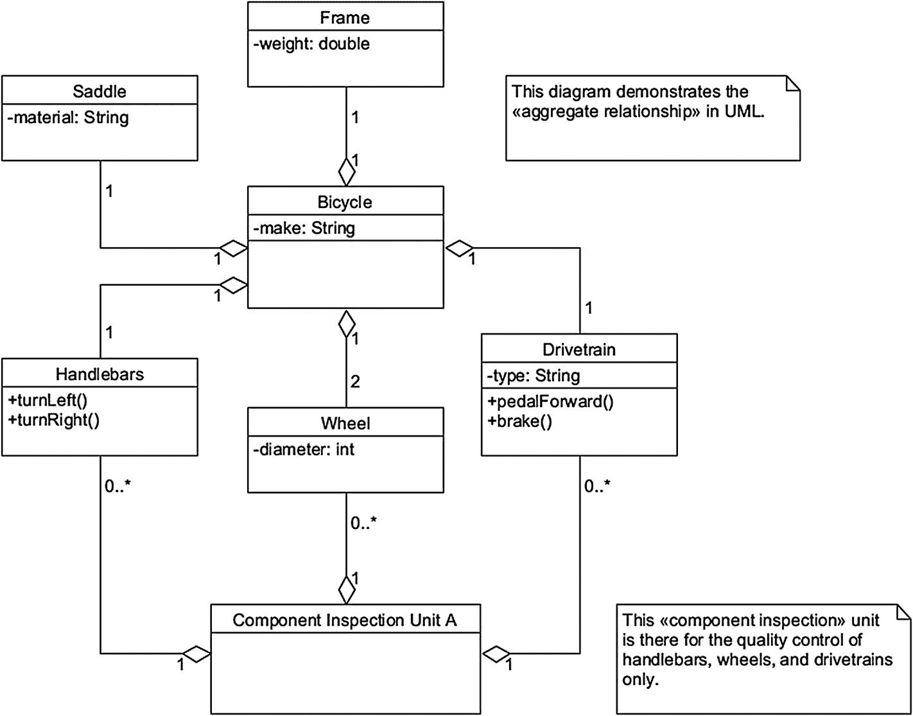
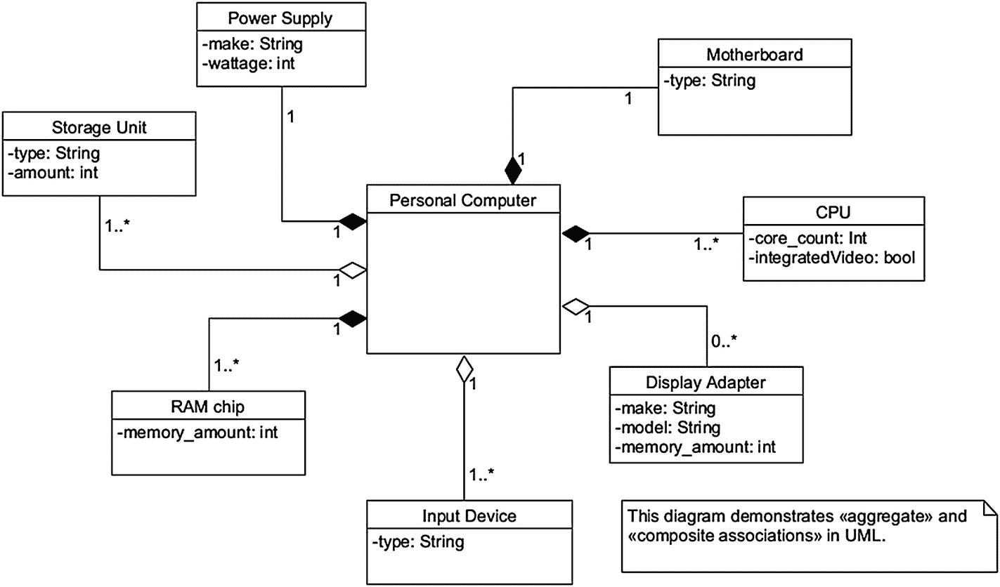
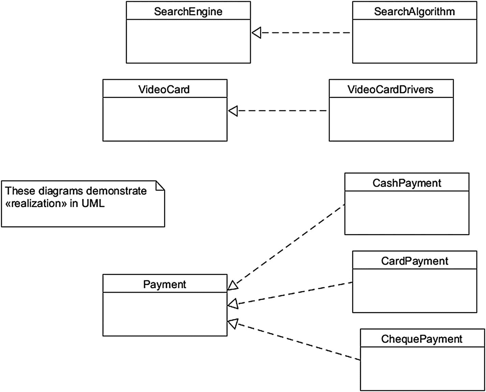
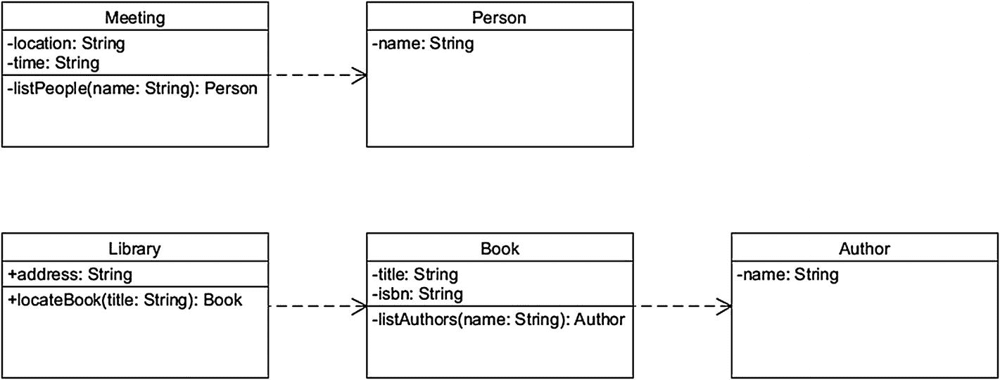
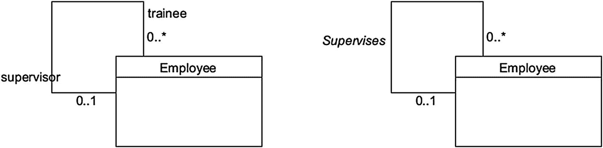
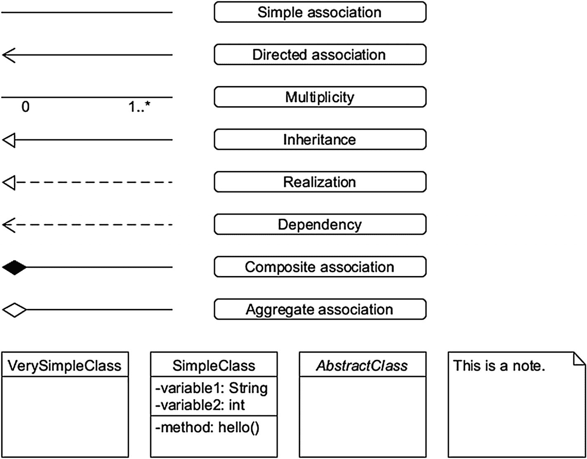
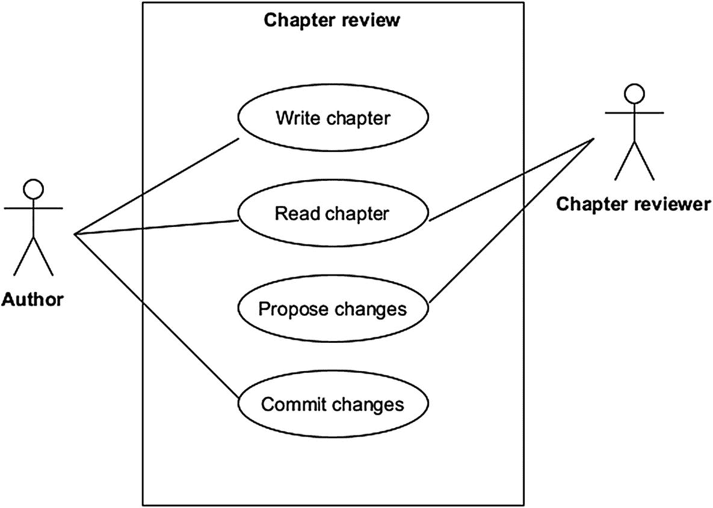
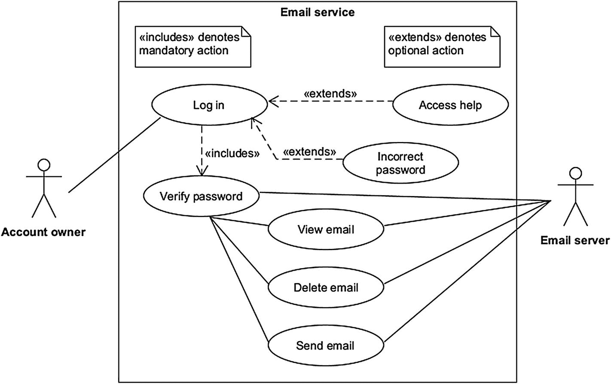

# 9. UML 类图

本章将深入探讨统一建模语言的奇妙之处。UML 在软件设计中是一种相当普遍的工具——而且理应如此。本书此前仅触及了 UML 的皮毛，现在我们将更深入地探索 UML 在类建模方面所提供的更多可能性。

## 可视化面向对象范式

我们在第 4 章介绍了面向对象范式。本书中的大部分代码示例本质上都属于这种范式，包含类、对象和方法。可以将 UML 视为软件开发编码前阶段的一个宝贵工具。你可以用它来规划所有与 OOP 相关的机制，包括类以及类与其他类之间的关系。

统一建模语言有两个标准，即 UML 1.x（最初于 1996 年发布）和 UML 2.x（于 2005 年首次发布）。这两个标准都包含多种类型的图表，几乎适用于任何建模目的。

## UML 图表的分类

本书不涉及 UML 图表类型的完整范围。然而，了解 UML 有哪些种类是很有用的。广义上讲，它通常分为两大类，然后这两大类又细分为许多子类。许多大型项目可能需要用到以下（非详尽）列表中的大部分图表；这些图表之间是互斥的。

*   **行为图**：与结构图不同，行为图侧重于描绘系统在运行时的状态。
    1.  **用例图**：UML 中的参与者是指与系统交互的一方。用例图描述了（人类）参与者与特定系统之间的交互。用例关注系统提供的特定功能。例如，一个人从 ATM 取款是用例图的一个潜在场景。

    2.  **序列图**：这些图表侧重于对象发送消息的时间顺序。因此，当需要精确建模对象之间的交互时，我们使用 UML 序列图。

    3.  **状态图**：UML 中的状态指的是对象所持有的不同种类的信息，而不是其行为。状态图用于对系统状态的变化进行建模。

    4.  **活动图**：当我们需要可视化系统内的控制流时，就会使用这种类型的图表。基本上，活动图提供了系统在执行时如何工作的概念。

*   **结构图**：这类图表用于对系统在静态时的性质进行建模。
    1.  **类图**：这可能是 UML 中最常用的图表。本章我们将主要关注类图。你可能已经猜到，它们处理的是作为面向对象编程 (OOP) 范式基础的类方面。

    2.  **对象图**：显然与类图相关，对象图描述了类的实例。这类图表通常用于构建系统原型时。

    3.  **组件图**：这些图表侧重于系统内软件组件的类型以及它们之间的连接。这些组件通常被称为物理资产，尽管从技术上讲，它们往往纯粹存在于数字层面。

    4.  **部署图**：用于可视化系统的完整布局，同时展示系统的物理部分和软件部分。部署图也可以称为系统组件拓扑图。

## 回到 UML：类图

如前所述，UML 几乎可以用于对任何事物进行建模，而*类图*则帮助我们可视化面向对象的软件项目。让我们从一些简单的内容开始（见图 9-1）。



图 9-1

一个简单的 UML 类/对象图

图 9-1 展示了 UML 中的类，包括它们的变量、方法以及类间关系；它还包含一个单一的 UML 对象图。

图 9-1 中的主类名为 Book。它有三个变量（即 title、publisher 和 publication year）。如你所见，我们还需要在类中指定变量的类型（例如 String）。UML 中属性或方法前的加号 (+) 表示公共访问修饰符。带有减号 (-) 的类成员表示私有访问修饰符。

你可以像我们在图 9-1 中那样，直接在 UML 图中添加有用的注释；这些注释应采用右上角折角的矩形形式。

现在，简单的线条标记了 UML 中类与其他实体之间的关联。图 9-1 中这些线条旁边的数字和星号展示了 UML 中的*多重性*。这个概念用于指示一个类可以提供或允许与之交互的实例（即对象）数量。

继续看图 9-1 的对象部分，我们有一个主类的单一实例，名为 *exampleBook1*。在 UML 中，对象可以表示为带有尖角或圆角的方框；我们选择了后者以增加多样性。

## UML 中的树状继承

继承可以在 UML 中以简洁的方式表示。为此，我们可以使用*树状*方法（见图 9-2）。



图 9-2

使用树状方法演示 UML 中继承的图表

图 9-2 中的图表展示了三个层次的特化。首先，你有一个通用的 Business 类。接着是三个特化类，即 Publisher、Bakery 和 Perfumerie。最后，我们拥有最特化的层次：两种不同类型的 Publisher 类，以及一个 Wedding Bakery 类和一个 Luxury Perfumerie 类。

在 OOP 术语中，基类也称为*父类*。子类通常被称为*子类*。

图 9-2 中的 Business 类被定义为*抽象*类；在 UML 中，斜体的类名表示这一点。这些类用于提供特定的方法供子类继承。抽象类不能直接实例化。相反，你需要使用其非抽象（即具体）子类之一来创建对象。


## Java 中的图 9-2

如果用 Java 语言实现，图 9-2 会是什么样子？请查看代码清单 9-1 了解一种可能的解决方案。

在代码清单 9-1 中，*Business* 是基类。所有其他类都定义在其文件 Business.java 中，以避免产生多个源文件（例如 *Publisher.java*、*Bakery.java* 等）。

```
// Define abstract base class
abstract class Business {
// Define class attributes/variables
public double turnover = 20000;
public String address = "none";
// Define method for displaying address attribute/variable
void DisplayAddress() {
System.out.println(address);
}
// Create main method
public static void main(String[] args)
{
// Uncommenting the next line will throw an error
// Business business1 = new Business();
// Create new Bakery object, happybakery, and display its address
Bakery happybakery = new Bakery();
System.out.println("A new bakery is opened at " + happybakery.address);
// Create new FictionPublisher object, jolly_books, and display its turnover
FictionPublisher jolly_books = new FictionPublisher();
System.out.println("Fiction publisher Jolly Books had an unfortunate turnover of £" + jolly_books.turnover + " in 2020");
// Create new NonFictionPublisher object, silly_books, set and display its turnover
NonFictionPublisher silly_books = new NonFictionPublisher();
System.out.println(("Non-fiction publisher Silly Books had a great turnover of £" + (silly_books.turnover + " in 2020")));
// Create new LuxuryPerfumerie object, exquisite_odors, set and display its address
LuxuryPerfumerie exquisite_odors = new LuxuryPerfumerie();
exquisite_odors.address = "10 Wacky Avenue";
System.out.print("A wonderful luxury perfumerie is located at ");
exquisite_odors.DisplayAddress(); // Summon method inherited from Business class
}
}
// Define the rest of the classes
class Bakery extends Business { String address = "2 Happy Street"; }
class WeddingBakery extends Bakery { }
class Perfumerie extends Business { }
class LuxuryPerfumerie extends Perfumerie { }
class Publisher extends Business { }
class FictionPublisher extends Publisher { double turnover = 4.55; }
class NonFictionPublisher extends Publisher { /* turnover is inherited from Business class */ }
Listing 9-1
A Java implementation of Figure 9-2 demonstrating inheritance (filename Business.java)
```

## C# 中的图 9-2

接下来，让我们观察一下图 9-2 在 C# 中的实现。正如你可能从本书前几章中记得的那样，Java 和 C# 是相当相似的语言。

```
using System;
abstract class Business {
//  Define class attributes/variables
public double turnover = 20000;
public string address = "none";
// Define method for displaying address attribute/variable
void DisplayAddress() {
Console.WriteLine(address);
}
// Create main method
public static void Main() {
// Uncommenting the next line will throw an error
// Business business1 = new Business();
//  Create new Bakery, happybakery, and display its address
Bakery happybakery = new Bakery();
Console.WriteLine("A new bakery is opened at " + happybakery.address);
//  Create new FictionPublisher, jolly_books, and display its turnover
FictionPublisher jolly_books = new FictionPublisher();
Console.WriteLine("Jolly Books had an unfortunate turnover of £"
+ jolly_books.turnover + " in 2020");
// Create NonFictionPublisher, silly_books, set and display its turnover
NonFictionPublisher silly_books = new NonFictionPublisher();
Console.WriteLine("Silly Books had a great turnover of £"
+ silly_books.turnover + " in 2020");
// Create new LuxuryPerfumerie, exquisite_odors, set and display its address
LuxuryPerfumerie exquisite_odors = new LuxuryPerfumerie();
exquisite_odors.address = "10 Wacky Avenue";
Console.Write("A wonderful luxury perfumerie is located at " );
exquisite_odors.DisplayAddress(); // Summon method inherited from Business class
}
}
//  Create the rest of the classes
class Bakery : Business { new public string address = "2 Happy Street"; }
class WeddingBakery : Bakery { }
class Perfumerie : Business { }
class LuxuryPerfumerie : Perfumerie { }
class Publisher : Business { }
class FictionPublisher : Publisher { new public double turnover=4.55; }
class NonFictionPublisher : Publisher { /* turnover is inherited from Business class */ }
Listing 9-2
A C# implementation of Figure 9-2 demonstrating inheritance
```

代码清单 9-1 和 9-2 几乎完全相同。例如，在 Java 和 C# 中，类的实现方式非常相似。当然，也存在一些差异（见表 9-1）。

表 9-1

代码清单 9-1 和 9-2 的主要区别

| 元素 | 代码清单 9-1 (Java) | 代码清单 9-2 (C#) |
| --- | --- | --- |
| 类继承 | *class Publisher extends Business { }* | *class Publisher : Business { }* |
| 主方法 | *public static void main(String[ ] args)* | *public static void Main( )* |
| 控制台输出 | *System.out.println( … )* | *Console.WriteLine( … )* |
| 成员声明 | *double turnover = 4.55;* | *new public double turnover = 4.55;* |

## Python 中的图 9-2

接下来看一些略有不同的内容。让我们看看图 9-2 在 Python 中可能是什么样子（见代码清单 9-3）。要在 Python 中使用抽象类，我们需要导入一个名为 *ABC* 的代码模块。然后，我们让基类 Business 继承自该模块。`@abstractmethod` 这一行是一个所谓的 Python 装饰器。你可能已经猜到，它的作用是告诉我们某个方法应被视为抽象方法。

```
# import code module for working with abstract classes, ABC
from abc import ABC, abstractmethod
# define classes, starting with an abstract Business class
class Business(ABC):
def __init__(self): # set class attribute default values
self.address = "none"
self.turnover = 20000
@abstractmethod # define abstract method
def Display_Address(self):
pass
class Publisher(Business):
def Display_Address(self):
pass
class Bakery(Business):
def Display_Address(self):
pass
def __init__(self):
self.address = "2 Happy Street"
class Perfumerie(Business):
def Display_Address(self):
pass
class FictionPublisher(Publisher):
def __init__(self):
self.turnover = 4.55
class NonFictionPublisher(Publisher):
pass
class WeddingBakery(Bakery):
pass
class LuxuryPerfumerie(Perfumerie):
def __init__(self):
self.address = "10 Wacky Avenue"
def Display_Address(self): # override abstract method
print(self.address)
happybakery = Bakery() # Create new Bakery object
print("A new bakery is opened at", happybakery.address)
jolly_books = FictionPublisher() # Create new FictionPublisher object
print("Jolly Books had an unfortunate turnover of £", jolly_books.turnover, "in 2020")
silly_books = NonFictionPublisher() # Create new NonFictionPublisher object
print("Silly Books had a great turnover of £", silly_books.turnover, "in 2020")
exquisite_odors = LuxuryPerfumerie() # Create new LuxuryPerfumerie object
print("A wonderful luxury perfumerie is located at ", end = '')
exquisite_odors.Display_Address() # summon Display_Address-method
Listing 9-3
A Python implementation of Figure 9-2
```


## UML 自行车



图 9-3

展示 UML 中聚合关系的示意图

接下来，让我们探讨如何在 UML 中为一个基本的脚踏驱动车辆建模。图 9-3 引入了一个新元素。这就是*聚合关联*，用空心菱形符号表示。

聚合关联意味着一个类可以在没有其他类的情况下存在。要拥有一辆功能齐全的自行车，我们需要所有组件。然而，即使我们移除某些组件，其他组件仍然存在。

## Python 中的自行车

坚持使用 Python，让我们创建图 9-3 的一种可能的程序化解释（见代码清单 9-4）。

```
class Frame:
# 类构造函数
def __init__(self):
print('车架就绪。')
weight = 10.5 # 定义一个类变量
class Saddle:
# 类构造函数
def __init__(self):
print('车座已安装。')
material = "rubber" # 定义一个类变量
class Drivetrain:
# 类构造函数
def __init__(self):
print('传动系统已安装。')
type = "one-speed" # 定义一个类变量
# 定义类方法
def pedalForward(self):
print("向前踩踏！")
def brake(self):
print("刹车！")
class Wheels:
diameter = 0
# 类构造函数
def __init__(self, diameter):
print('车轮已安装。')
self.diameter = diameter
class Handlebars:
# 类构造函数
def __init__(self):
print("车把已安装。")
# 定义类方法
def turnLeft(self):
print("向左转..")
def turnRight(self):
print("向右转..")
class Bicycle:
# 定义一个类变量
make = "Helkama"
# 设置类构造函数和组合关系
def __init__(self):
self.my_Frame = Frame()
self.my_Saddle = Saddle()
self.my_Drivetrain = Drivetrain()
self.my_Wheels = Wheels(571) # 传入一个新的直径值
self.my_Handlebars = Handlebars()
def main(): # 创建主方法
# 创建 Bicycle 对象 "your_bike"
your_bike = Bicycle()
print("你的 " + your_bike.make + " 牌自行车的车轮直径为 " + str(your_bike.my_Wheels.diameter) + " 毫米。车架重 " + str(your_bike.my_Frame.weight)+" 磅。")
print("这辆自行车有一个 " + your_bike.my_Drivetrain.type + " 传动系统，车座由最优质的 " + your_bike.my_Saddle.material+" 制成。\n")
# 调用类方法
your_bike.my_Drivetrain.pedalForward()
your_bike.my_Handlebars.turnLeft()
your_bike.my_Drivetrain.pedalForward()
your_bike.my_Handlebars.turnRight()
your_bike.my_Drivetrain.brake()
if __name__ == "__main__":
main() # 执行主方法
代码清单 9-4
图 9-3（即自行车的 UML 图）的 Python 实现。为简洁起见，此处未实现组件检查单元 A
```

问题：你本人会如何用 Java 和/或 C# 解释图 9-3？

## UML 中的个人电脑

现在让我们对同时包含组合和聚合关联的事物进行建模。这是为了让您思考需要在 UML 中区分这两种关联类型的场景。

图 9-4 代表一台典型的个人电脑。它旨在描绘一个功能系统所需的所有主要组件。然而，其中只有部分组件使用了组合关联（即实心菱形符号）来描绘。这是因为，理论上，一台个人电脑即使没有它们也能启动并运行。它可能不是最有用的系统，但至少可以开机并显示错误信息。



图 9-4

展示 UML 中组合关系的示意图

图 9-4 中使用组合关联描绘的基本计算机组件：

*   电源、主板、CPU 和 RAM 芯片

使用聚合关联描绘的次要组件：

*   存储单元（例如硬盘）、输入设备（例如鼠标和/或键盘）以及显示适配器/显卡（集成显卡芯片可能随 CPU 提供）

有关聚合关联和组合关联之间差异的总结，请参见表 9-2。

表 9-2

UML 中聚合关联和组合关联的主要区别

|   | 聚合 | 组合 |
| --- | --- | --- |
| 关联强度 | 弱 | 强 |
| 关系 | “拥有” | “部分-整体” |
| 依赖性 | 子类可以独立于超类存在 | 子类需要超类才能存在 |
| 示例 | 即使*学生*班级毕业，*大学*依然存在<br>关闭一个*部门*不会终结整个*公司* | 没有*房子*，*房间*毫无意义<br>*人类*生存需要功能正常的*心脏* |

## UML 中的实现和依赖

实现指的是两组元素之间的关系，其中一组代表*规范*，另一组代表其*实现*。实现的实际运作方式取决于上下文，并且在 UML 中没有严格定义（见图 9-5）。



图 9-5

UML 中三个简单实现关系的示例

在图 9-5 的示意图中，您将看到三个 UML 实现关系的简单示例。在第一个示例中，搜索算法为在线搜索引擎提供了功能。类似地，显卡需要显卡驱动程序软件才能实际显示任何图像。最后，三种可用的支付方式（现金、银行卡或支票）使得支付事件成为可能。

接下来，我们来看*依赖*（见图 9-6）。这种类型的图表示依赖元素和独立元素之间的连接。依赖关系用虚线和简单箭头表示，本质上是单向的。



图 9-6

UML 依赖关系的两个示例

## 自反关联

*自反关联*用于表示属于同一类的实例。当一个类可以拆分为多个职责时，我们可以使用这种类型的关联。

在图 9-7 中，我们有一个名为 *Employee* 的类，它与自身存在关联，如现在熟悉的简单线条所示。*Employee* 类既用于代表受人尊敬的主管，也用于代表地位低下的实习生；您会注意到 UML 的多重性信息也被插入到该图中。



图 9-7

UML 中自反关联的示例

现在，图 9-7 以两种不同的方式描绘了相同的场景。左侧的图展示了一种*基于角色*的方法，因为我们确实展示了两种不同的角色（即主管和实习生）。右侧的图使用了*命名关联*。

## UML 类图：基本元素

此时，回顾一下我们到目前为止遇到的 UML 元素会是个好主意（见图 9-8）。



图 9-8

展示 UML 类图中使用的大部分基本元素的示意图


## UML 用例图

尽管本书不涉及所有 UML 图类型，但还有一种你应该熟悉。这就是*用例图*，它以最简单的方式展示用户与系统的交互。这些通常是包含少量技术细节的高层图。

现在我们将介绍几个新的 UML 元素，分别是*参与者*、*系统*和*用例*。此外，用例图使用熟悉的简单线条来表示关系。请参见图 9-9 中的简单用例图。



图 9-9

一个描述书籍编写过程中章节审阅的 UML 用例图

你会在图 9-9 中看到两个参与者，由可爱的小人图标表示。通常最好保持参与者的类别属性，例如将作者命名为*作者*而不是*约翰*或*梅洛迪·伍利索克斯*。在 UML 中，发起交互的参与者称为*主要参与者*。*次要参与者*则用于响应主要参与者的操作。

*系统*的第二个元素在 UML 中用一个简单的矩形表示；在图 9-9 中，它被称为*章节审阅*。在系统内部，我们有内部的*用例*，用椭圆形表示。这些代表了完成特定用例所需的不同阶段。最后，我们有熟悉的普通线条来表示参与者和用例之间的不同关联。

现在，图 9-9 中的图表描述了以下事件序列：

*   **作者**，主要参与者，撰写章节。
*   完成的章节由**作者**和**章节审阅者**（次要参与者）共同阅读。这由两个参与者之间的共享关联表示。
*   章节审阅者提出对章节的修改建议。
*   最后，作者将修改提交到章节中，结束该场景。

## 更多关于用例的内容

现在来看一个稍微复杂的用例，以介绍两个新元素：*扩展*和*包含*关系（见图 9-10）。与 UML 类图一样，我们也可以将这些有用的注释元素融入 UML 用例图中。



图 9-10

一个描述电子邮件服务基本功能的 UML 用例图

图 9-10 描述了一个简单的电子邮件用例场景。我们有*账户所有者*（即人类用户）作为主要参与者，*电子邮件服务器*作为次要参与者。图 9-10 包含以下事件序列：

*   **账户所有者**使用密码登录。如果输入错误代码，则会触发一个名为*密码错误*的可选用例；此结果用箭头和关键字 *<<extends>>* 表示。
*   账户所有者可能还想阅读一些帮助文件。这也是一个可选场景，因此使用关键字 <<extends>> 表示。
*   *登录*用例的成功结果会自动导致另一个名为*验证密码*的用例，如关键字 *<<includes>>* 所示。次要参与者*电子邮件服务器*参与密码验证过程，因此在图 9-9 中，该参与者与验证密码用例之间存在一条关联线。
*   *验证密码*用例又引出三个用例：*查看电子邮件*、*删除电子邮件*和*发送电子邮件*。自然，次要参与者*电子邮件服务器*也参与所有这些操作，尽管只是被动角色；账户所有者根据自己的意愿发起这三个操作。

    在描述用例中的关系时，请注意箭头的方向。

## UML 工具

除了纸笔之外，如果你想在电脑上尝试绘制 UML，有很多优秀的免费选择。现在我们来回顾一些最好的工具示例。

## UMLet 团队开发的 UMLet 和 UMLetino

*UMLet* 是一款免费且出色的开源工具，凭借其直观的拖放用户界面，你可以快速绘制出漂亮的类图。关联线可以很好地吸附到类边缘并保持在那里，使组织图表变得轻而易举。

UMLet 为类图、用例图、时序图等提供了现成的视觉元素选择。该程序可以导出为多种常见的图像文件格式，包括 PNG、GIF 和 SVG。对于需要一款简洁干净的 UML 设计工具的人来说，UMLet 是绝对必备的。本书中的所有图表均使用 UMLet 创建。

UMLet 的一个有趣特性是其半自动图表创建功能。通过导航到 *文件* ➤ *从文件或目录生成类元素*，你可以设置 UML 图表的初始阶段。不幸的是，使用此功能时，UMLet 在创建关联方面存在一些问题。

UMLetino 是同一软件的基于浏览器的版本。它具备其离线版本的大部分功能。此外，UMLetino 集成了 Dropbox，用于导入和导出图表文件。不过，该软件仅支持输出 PNG 图像文件。

*   从 [`www.umlet.com`](http://www.umlet.com) 下载适用于任何支持 Java 的操作系统的 **UMLet**
*   在任何支持 Java 的浏览器中运行 **UMLetino**，网址为 [`www.umletino.com/umletino.html`](http://www.umletino.com/umletino.html)

## Diagrams.net 团队开发的 Diagrams.net

*Diagrams.net* 由一支专注的团队积极维护，是一款多功能开源工具，提供浏览器版和桌面版。桌面版无需用户注册。Diagrams.net 既适用于基本的 UML 工作，也适用于高级用户，具有图层和“插件”等附加功能。

该软件原名“draw.io”，在导出 UML 图表时提供强大的文件格式支持，包括 Adobe PDF。不仅如此，通过选择 *文件* ➤ *导出为* ➤ *高级*，你还可以设置 DPI（每英寸点数）和边框宽度等属性。

*   从 [`https://github.com/jgraph/drawio-desktop/releases`](https://github.com/jgraph/drawio-desktop/releases) 下载 **Diagrams.net** 桌面应用
*   在浏览器中运行 **Diagrams.net**，网址为 [`https://app.diagrams.net`](https://app.diagrams.net)

## Paul Hensgen 和 Umbrello UML Modeler 作者开发的 Umbrello

*Umbrello* 自 2001 年开始开发，是适用于任何类型 UML 工作的优秀工具。该软件具有直观的用户界面，并且可以选择从 UML 生成代码。Umbrello 可以将你的图表导出为（通常可用的）Java、C#、Python 和许多其他编程语言；只需导航到 *代码* ➤ *代码生成向导*，设置选项，然后点击 *下一步*。该软件还提供出色的格式化功能，包括在正在处理的图表中使用你操作系统中的所有字体。

不要被花哨的默认配色方案所迷惑——Umbrello 是一款对多种图表工作都非常有用的应用程序。

*   从 [`https://umbrello.kde.org`](https://umbrello.kde.org) 下载 **Umbrello** 桌面应用

## 结语

完成本章后，你将掌握以下知识：

*   UML 类图和用例图的基本元素
*   如何将简单的 UML 图转换为 Java、C# 和 Python


## 后记

至此，我们已抵达本书的终点。那些曾经让你望而生畏的编程术语，如今已不再那么令人紧张。现在，变量、类和对象对你而言至少已是较为熟悉的概念。你已学会用 Java、C# 和 Python 编写简单的基于文本的应用程序。或许你甚至能在聚会上随口解释 Python 对缩进的严格要求。但你的程序员之旅远未结束。掌握了三种语言的编程基础模块后，你现在可以开始在该领域积累更多经验。一个充满问题解决的世界正等待着你。

编程有时会令人沮丧。但让一段恼人且无法运行的代码最终成功工作，会带来一种独特的满足感。无论你最终是否在专业环境中编写代码，编程在某个时刻都可能成为一种建设性的“瘾”。它也可以成为治疗失眠和/或无聊的绝佳良方。

要完成有意义的编程项目——无论是电子游戏还是雇主定义的原子化编程任务——都需要投入大量的意图和时间。但当你作为程序员成长时，没有一行代码是浪费的。即使是错误信息，也能教会你最宝贵的东西。

*艾达·洛夫莱斯*，*拜伦勋爵*与*拜伦夫人*的爱情结晶，被认为是世界上最早的程序员之一。她曾与当时多位杰出科学家共事，包括*查尔斯·巴贝奇*和*迈克尔·法拉第*，并最终编写出了被认为是世界上第一个计算机程序的作品。让我们用艾达的话来作结：

> *我能将宇宙四面八方的光线汇聚到一个巨大的焦点上。我的道路如此清晰而明确，想到它如此笔直，便令人愉悦。*
> 
> ——艾达·洛夫莱斯（1815–1852）

索引 A 抽象 访问修饰符 美国信息交换标准代码 (ASCII) 架构实现 异步编程模型 (APM) Asyncio 模块 B 位衍生单位 C, D 中央处理器 (CPU) 计算架构 控制台应用程序 *对比* 图形用户界面 (GUI) 构造方法 协作式多任务处理 C# (Sharp) 编程语言 访问修饰符 异步处理 二进制位 BinaryWriter/BinaryReader 类 日历类 类 编码结构 比较运算符 编译过程 CultureInfo 类 花括号/变量作用域/代码块 日期/日历 声明 FileInfo 类 文件操作 for 循环 垃圾回收 集成开发环境 解释型语言 join 方法 关键差异 MonoDevelop 多线程 命名空间 原生堆 *对比* 托管堆 对象 受保护访问 sleep *对比* yield 方法 静态/公共方法 System.Globalization 命名空间 TAP 设计模式 TextWriter/TextReader 类 线程锁定/访问 ThreadPool UML 实现 通用聊天模拟器 变量 while 循环 E Eclipse 项目 封装 基于事件的异步模式 (EAP) F 文件操作 属性查询/删除 日历显示 日期 空文本文件 国际化/本地化 Java 闰年/时间 文本文件创建/访问 G 垃圾回收 (GC) 全局解释器锁 (GIL) 图形用户界面 (GUI) *对比* 控制台应用程序 H 高级/低级语言 I 继承 集成开发环境 (IDE) 64 位计算 位衍生单位 错误聚类 C# 代码简化 计算架构 控制台应用程序 *对比* GUI 调试 Eclipse 项目 IEC 数据存储单位 Java 开发方法 MonoDevelop 多任务处理 操作系统 事后分析 PyCharm 远程调试 软件错误 测试过程 跟踪/打印 Visual Studio 安装工作负载 国际电工委员会 (IEC) 国际化 迭代 J, K Java 属性查询/删除 二进制位 基于块/锁的同步 日历 已检查/未检查 类/OOP 编码 比较运算符 编译过程 花括号/变量作用域/代码块 自定义日期符号创建 日期检索/格式化 声明 环境 开发 文件操作 for 循环 国际化/本地化 解释型语言 闰年/时间 多线程 对象 编程代码 受保护访问 静态/公共方法 文本文件创建与访问 throw 语句 时间模式格式化 try-catch 块 UML 实现 通用聊天模拟器 变量 while 循环 Java 开发工具包 (JDK) Java 运行时环境 (JRE) Java 虚拟机 (JVM) join 方法 L Linux Eclipse 项目 MonoDevelop PyCharm 本地化 M 机械硬盘 元字符 公制单位 多进程 *对比* 多线程 多线程 已检查与未检查 checkFruit() 方法 并发 C# Sharp 错误消息 异常处理 公平性 超线程 实现 锁定 属性 处理器核心 运行时异常 简化图 饥饿 同步 线程生命周期 throw 语句 try-catch 块 N 原生堆 *对比* 托管堆 Neutralmoods/badmoods/chatmoods O 面向对象编程 (OOP) 抽象类 访问修饰符 C# 访问修饰符 类/继承/UML 封装 geezer 类 getName 方法 JDK/JRE/JVM 对象 重载方法 过程式范式 受保护访问 Python setName 方法 静态/公共方法 统一建模语言 重载方法 P, Q 并行处理 过程式/面向对象编程语言 编程算法 ASCII 样板代码 中央处理器 定义 文件格式 流程图 全栈 小工具/硬件 硬盘 硬件组件 输入/输出 主板 随机存取存储器 需求 例程 软件项目 源代码 语法 显卡 PyCharm Python 访问模式 异步事件循环 asyncio 模块 属性绑定 属性 二进制位 类/OOP 比较运算符 编译过程 并发编程 数据类型 datetime 模块 目录/文件夹操作 文件操作 for 循环 globbing group()/sub() 方法 隐式/显式继承 解释型语言 可迭代对象/生成器/协程 lambda 函数 循环 操作值 元字符 多进程 *对比* 多线程 面向对象编程 并行处理 模式匹配 程序化解释 PyCharm RegEx 函数 正则表达式 搜索 sleep() 方法 线程模块 类型转换函数 UCS 参见通用聊天模拟器 UML 实现 解压 变量 可视化 zip 函数/软件 Python 包索引 (PyPI) R 随机存取存储器 (RAM) S Sleep *对比* yield 方法 T 基于任务的异步模式 (TAP) 线程 C# Sharp 多线程 参见多线程 方法 同步 基于树的方法 U 统一建模语言 (UML) 聚合关联 行为图 书籍编写过程 类别 C# 实现 类/对象图 组合关联 计算机组件 Diagrams.net 电子邮件服务 事件 继承 Java 实现 面向对象范式 个人计算机 程序化解释 Python 实现 实现/依赖 自反关联 结构图 工具 基于树的方法 Umbrello UMLet/UMLetino 用例 通用聊天模拟器 (UCS) 大写 代码模块 C# Sharp 基于控制台的测验程序 文件操作/线程 线程处理 过程 不屈不挠的主循环 Java 美味芬兰食谱 秒表程序 neutralmoods/badmoods/chatmoods 分数记录 统一建模语言 (UML) V 显卡 Visual Studio 开发者账户/优势 安装过程 MonoDevelop Windows/macOS 工作负载 W, X Windows/macOS 硬盘 操作系统 PyCharm 安装过程 Visual Studio Y, Z yield 方法
