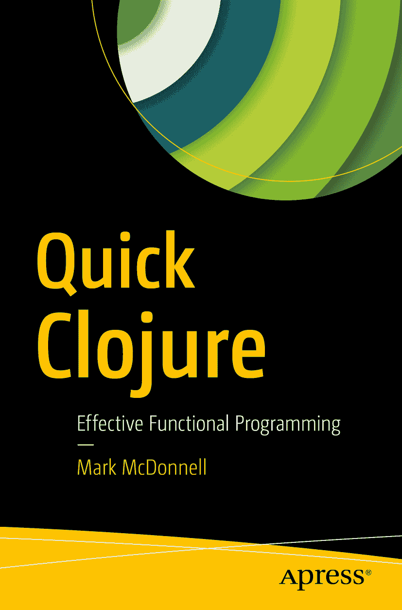

马克·麦克唐纳《快速精通 Clojure：高效函数式编程》

本书作者引用的任何源代码或其他补充材料，读者均可通过本书产品页面（位于[`www.apress.com/9781484229514`](http://www.apress.com/9781484229514)）在 GitHub 上获取。如需更详细信息，请访问[`http://www.apress.com/source-code`](http://www.apress.com/source-code)。ISBN 978-1-4842-2951-4 电子版 ISBN 978-1-4842-2952-1 [`doi.org/10.1007/978-1-4842-2952-1`](https://doi.org/10.1007/978-1-4842-2952-1) 美国国会图书馆控制编号：2017952537 © 马克·麦克唐纳 2017 本作品受版权保护。出版商保留所有权利，无论涉及全部或部分材料，特别是翻译、重印、重用插图、朗诵、广播、以缩微胶卷或任何其他物理方式复制、传输或信息存储与检索、电子改编、计算机软件，或目前已知或未来开发的任何类似或不同方法的权利。本书中可能出现商标名称、标识和图像。我们并非在每次出现商标名称、标识或图像时都使用商标符号，而是仅以编辑方式使用这些名称、标识和图像，以维护商标所有者的利益，无意侵犯商标权。本出版物中使用商品名称、商标、服务标志及类似术语（即使未明确标识）不应被视为对其是否受专有权利保护的看法。尽管本书中的建议和信息在出版时被认为是真实准确的，但作者、编辑和出版商均不对可能出现的任何错误或遗漏承担法律责任。出版商对本书所含内容不作任何明示或暗示的保证。本书采用无酸纸印刷，由 Springer Science+Business Media New York 在全球图书贸易中发行，地址：233 Spring Street, 6th Floor, New York, NY 10013。电话：1-800-SPRINGER，传真：(201) 348-4505，电子邮件：orders-ny@springer-sbm.com，或访问 www.springeronline.com。Apress Media, LLC 是一家加利福尼亚有限责任公司，其唯一成员（所有者）是 Springer Science + Business Media Finance Inc (SSBM Finance Inc)。SSBM Finance Inc 是一家特拉华州公司。谨以此书献给我的妻子凯瑟琳以及我的父母。他们对我成功的能力有着无限的信任，没有他们，我必定会失败。引言

这是一本关于 Clojure 编程语言的书。很可能你已经对该语言有了一定了解，并渴望更深入地接触它。也许你学习 Clojure 是为了乐趣，或者是因为你开始了一份需要更多使用它的新工作。无论如何，我相信你会学到一些关于这门语言的有用知识，并在未来许多年里享受用其编程的乐趣。

我们将从相对缓慢的节奏开始，随着章节的推进逐渐加快速度。各章节之间没有贯穿始终的主线。一旦你理解了基本语法，就可以安全地进入任何章节。

你可能会发现有些章节比其他章节更短；这仅仅是因为我希望尽可能做到简洁。我们可以尝试涵盖 Clojure 语言中每一个可能的功能（这需要涉及大量内容），但说实话——这会让本书成为你永远读不完的那种书。它会搁在书架上，或者变成门挡，因为篇幅太大而无法切实通读。

我希望这本书尽可能简短，为你提供所需的信息，然后让你在需要了解本书未涵盖的内容时，能够自由地超越自身理解进行探索。

我祝愿你在 Clojure 之旅中一切顺利。我相信你已经迫不及待想要开始了。那么，让我们开始吧……

致谢

随着年龄增长，你通常会发现在大多数事情上，“少即是多”这句格言是合适的方式。基于此，我要感谢本书的审阅者，他们帮助打磨了一些粗糙之处，使整体内容更加连贯。

我还要感谢我妻子（凯瑟琳）的耐心，她早就认识到，比出版一本署有你名字的书更好的事情只有一件……那就是出版两本署有你名字的书。

目录 第 1 章：什么是 Clojure？​ 1 为何值得关注？​ 2 名称由来？​ 3 入门指南 3 文档 6 总结 7 第 2 章：数据结构与语法 9 列表 10 向量 13 映射 18 关键字 20 键、值与替换 21 集合 23 变量与符号 24 函数赋值 25 临时变量 26 动态变量 27 总结 28 第 3 章：函数式编程 29 不可变性 29 引用透明性 30 一等函数 30 补集函数 32 应用函数 32 映射函数 33 归约函数 34 过滤函数 35 组合函数 35 偏函数应用 38 递归迭代 40 可组合性 42 总结 43 第 4 章：序列 45 列表推导 46 序列抽象 47 惰性序列 49 lazy-seq 50 总结 53 第 5 章：函数 55 匿名函数简写 55 前置与后置条件 56 clojure.​core 58 映射构造 58 管道操作 59 丢弃值 61 代码注释 62 无限循环 63 唯一性 64 谓词函数 64 集合提取 66 字符串格式化 67 频率统计 68 值压缩 68 值插入 70 数据分区 70 简单并行化 72 重复操作 73 基本输入/输出 73 clojure.​string 74 空白字符检查 74 开头与结尾 75 修剪空白字符 76 总结 77 第 6 章：解构 79 总结 83 第 7 章：模式匹配 85 core.​match 85 示例：FizzBuzz 86 反向引用 87 字面量匹配 88 数据结构匹配 89 安全防护 90 多态 92 总结 94 第 8 章：并发 95 可重试 96 协调 96 异步 96 线程安全 97 延迟 97 承诺 98 未来 99 原子 100 锁 103 死锁 104 活锁 104 代理 105 无等待/等待 106 使用等待 107 使用等待-直到 107 代理错误 108 事务 110 dosync/​ref/​alter 110 ref-set 110 STM 重启策略 111 嵌套事务 113 ensure 113 commute 115 通道 116 Go 块 118 线程函数 119 区分 120 交替 120 缓冲通道 121 滑动/丢弃缓冲通道 121 超时通道 122 总结 123 第 9 章：命名空间 125 什么是命名空间？​ 126 加载命名空间文件 127 内部绑定 128 根绑定 129 动态变量 130 绕道而行… 130 foo.​core 131 foo.​bar 131 foo.​baz 132 :​require 132 :​as 133 :​refer 133 :​all 134 :​use 135 还有其他吗？​ 136 总结 136 第 10 章：宏 137 一路展开到底 139 编写你自己的宏 140 引号 ' 140 语法引号 ` 141 取消引号 ~ 141 拼接取消引号 ~@ 142 生成符号 gensym/​# 143 宏剖析 143 总结 145 第 11 章：面向对象 147 Java 互操作 147 defprotocol 148 deftype 148 defrecord 150 Reify 152 总结 152 第 12 章：Leiningen 155 十秒示例 155 帮助！ 157 Compojure 157 Compojure 树形结构 158 测试 160 模板 162 template 163 default 164 app 165 plugin 166 项目文件 167 compojure vs.​ compojure-app 169 真实世界库示例 169 消费者 170 本地测试 171 加载依赖 171 审查库 172 准备部署 173 总结 174 第 13 章：命令行应用程序 175 运行 cli 应用程序 178 通过 Leiningen 运行 178 通过 Jar 包运行 179 通过二进制文件运行 180 标志位回顾 182 总结 183 附录 A：约定 185 函数 186 宏 186 附录 B：使用 Vim 编写 Clojure187 彩虹括号 188 面向普通用户的 Sexp 映射 188 表单操作 189 元素操作 189 括号操作 189 插入操作 190 Fireplace190 所需步骤 190 推荐工作流程？191 连接到 REPL191 Fireplace 命令 192 Fireplace 键绑定 193 索引 195 内容概览 关于作者 xv   关于技术审校者 xvii   致谢 xix   引言 xxi   第 1 章：什么是 Clojure？​ 1   第 2 章：数据结构与语法 9   第 3 章：函数式编程 29   第 4 章：序列 45   第 5 章：函数 55   第 6 章：解构 79   第 7 章：模式匹配 85   第 8 章：并发 95   第 9 章：命名空间 125   第 10 章：宏 137   第 11 章：面向对象 147   第 12 章：Leiningen 155   第 13 章：命令行应用程序 175   附录 A：约定 185   附录 B：使用 Vim 编写 Clojure187   索引 195   关于作者与关于技术审校者 关于作者 关于技术审校者

