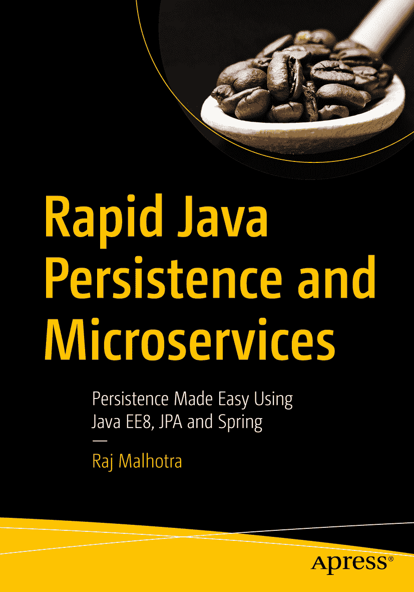

ISBN 978-1-4842-4475-3 e-ISBN 978-1-4842-4476-0 [`doi.org/10.1007/978-1-4842-4476-0`](https://doi.org/10.1007/978-1-4842-4476-0) © Raj Malhotra 2019 本作品受版权保护。出版商保留所有权利，无论是整体还是部分材料，具体包括翻译、重印、重用插图、朗诵、广播、以缩微胶卷或任何其他物理方式复制，以及传输或信息存储与检索、电子改编、计算机软件，或通过目前已知或未来开发的类似或不同方法。本书中可能出现商标名称、标识和图像。我们仅在编辑风格中使用这些名称、标识和图像，以维护商标所有者的利益，并无意侵犯商标权，而非在每次出现商标名称、标识或图像时都使用商标符号。本出版物中使用的商品名称、商标、服务标志及类似术语，即使未明确标识，也不应被视为对其是否受专有权利保护的表达意见。尽管本书中的建议和信息在出版时被认为是真实准确的，但作者、编辑和出版商均不对可能存在的任何错误或遗漏承担法律责任。出版商对本书所含内容不作任何明示或暗示的保证。本书通过 Springer Science+Business Media New York 在全球图书贸易中发行，地址：233 Spring Street, 6th Floor, New York, NY 10013。电话：1-800-SPRINGER，传真：(201) 348-4505，电子邮件：orders-ny@springer-sbm.com，或访问 www.springeronline.com。Apress Media, LLC 是加利福尼亚州的有限责任公司，其唯一成员（所有者）是 Springer Science + Business Media Finance Inc (SSBM Finance Inc)。SSBM Finance Inc 是特拉华州的一家公司。

*献给我敬爱的古鲁吉*

致谢

我要感谢 Packt 的整个团队，感谢他们为实现我的梦想所提供的所有支持。特别感谢审稿人 Manuel 和 Chris，他们帮助了我，并将我的写作塑造成专业水准。感谢 Steve 给我这个机会，以及 Mark 在整个过程中耐心地支持我。

我要感谢我的妻子 Divya，她给予我灵感、信念和不断的鼓励，让我能够追求写作的热情。我还要感谢我的父亲 Lt. Shri R. S. Malhotra 和母亲 Kailash Malhotra，他们给予我无条件的支持，使我能够将所有业余时间投入到写作中。最后，衷心感谢我的古鲁吉，他启发我将从这个世界学到的一切，再次分享给世界。

### 关于作者

### 关于技术审稿人

