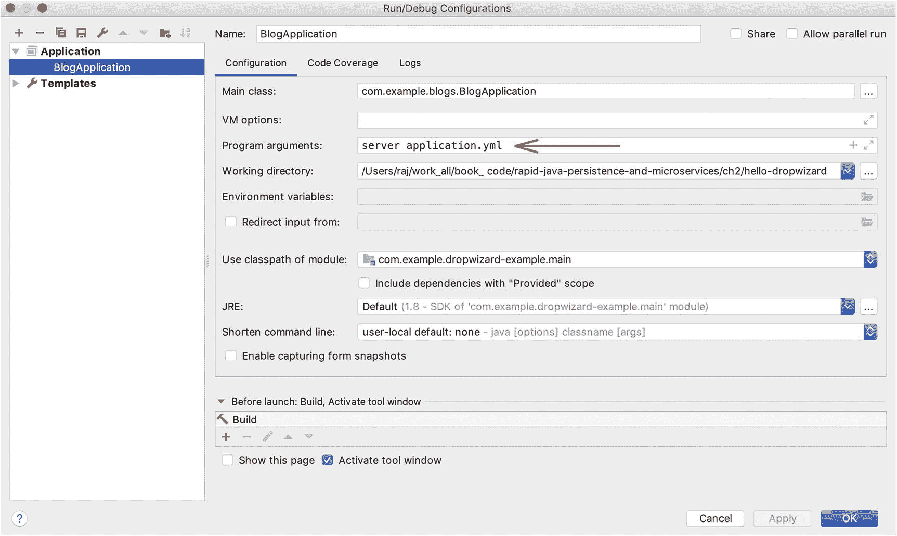

# 2. 使用 Java 开发微服务

当今大多数开发都是通过*微服务架构*进行的。在微服务架构方法中，应用程序通过一组小型模块化服务进行开发。这些服务中的每一个都作为独立进程运行，并通过不同的模式与其他服务通信。这并非新发明，我们之前已经以不同的名称见过它，例如 SOA 和 MOM。当许多网络巨头——包括 Amazon、Netflix、Twitter 和 PayPal——成功采用微服务架构后，它开始流行起来。

这种架构风格快速演进的原因有很多：

*   遗留系统很难重建。它们必须被分解为领域或功能区域，并且新的可插拔系统必须慢慢取代遗留系统。

*   当需要开发多个功能时，会出现代码版本控制和部署问题。

*   使用较小的独立服务来演进系统比使用单个巨型应用程序更容易。

*   使用微服务进行实验和采用多样化的技术栈更容易。不同服务的代码可以用不同的语言编写。

*   新兴技术让我们重新思考构建软件系统的方式。

*   微服务架构支持更轻松的持续交付，并且由于遵循单一职责原则，易于理解。

*   服务与业务领域或功能对齐。

*   测试单个大型应用程序很困难。当有多个系统组件时，您可以更专注于首先测试关键组件。

*   为了更快地推向市场，我们需要并行地快速开发功能。这有助于让进展更加可见。

## 创建微服务的不同方式

当我们谈论微服务时，我们通常谈论的是专注于特定功能的 RESTful 端点。然而，开发人员有许多不同的方式来创建微服务。在 Java 世界中，有几种创建微服务的方法，如下所示：

*   作为与系统中特定功能相关的服务，基于独立的 RESTful 端点的应用程序。

*   无头服务开发，例如 AWS Lambda，也称为函数即服务（FaaS）。

*   消息或事件驱动的服务，例如部署在不同机器上并通过事件总线通信的集群化 Vert.x 顶点（Java 中的响应式框架）。

*   OSGi 模块是否也应被视为微服务？OSGi 包有时也被称为在单个 JVM 内运行的服务，并受其类加载器边界内的单一约束。


## Java 中的各类微服务库

从单体架构迁移到微服务架构时，会涉及众多概念、问题和技术选项，这可能会让技术路线图的规划变得困难。因此，在设计微服务架构的新应用时，人们有时会过度思考，并过度开发解决方案。

例如，领导者有时希望团队仅通过参考大型成功公司的文章或创新，就能应用微服务架构的所有原则。在 Java 世界中，一个非常常见的例子是在少量服务中实现 Netflix OSS 工具。架构师们常常疑惑，对于一个只有几个服务的系统，是否真的需要所有这些工具。在 Netflix 内部，这些框架处理着海量负载、复杂的系统需求以及数百个微服务。如果你的系统只有 8-10 个服务，那么在初始开发阶段选择库时应该稍微谨慎一些。

Java 生态系统中的 Spring 框架对微服务库提供了最广泛的支持。表 2-1 列出了一些库及其用例和概念需求，这些在处理微服务时需要特别关注。

**表 2-1**

**有用的库及示例用例**

| 库 | 用例 | 工具示例 |
| --- | --- | --- |
| 配置管理 | 分布式且安全的配置管理 | Spring Cloud Config, Consul, Vault |
| 服务注册与发现 | 基于注册的服务名称定位服务节点 | Spring Cloud - Netflix Eureka, Consul |
| 动态路由与负载均衡器 | 通过实时节点仪表板对客户端请求进行负载均衡 | Netflix Eureka 和 Netflix Ribbon |
| 分布式追踪 | 如果请求流经多个服务，则进行端到端请求追踪 | Spring Sleuth - Zipkin, ELK, Dapper |
| 系统、JVM 和 API 监控 | 性能下降、风险及崩溃分析 | Spring Boot Admin, Datadog, New Relic |
| 安全 | 密码和摘要认证、OAUTH 和 JWT、SAML、单点登录 (SSO)、魔法链接、验证码、CORS、OWASP（注入、XSS、CSRF 等）、社交登录集成、基于 SSL 的认证 | Apache Shiro（通用库）、Spring Security（用于 Spring）、pac4j（用于 Spark 框架）、Dropwizard 拥有自己的认证和授权类 |
| 日志 | 分布式服务的集中式日志管理 | Spring Sleuth, ELK (ElasticSearch, Logstash, Kibana), Splunk |
| 断路器 | 通过备用端点避免服务间调用持续失败 | Netflix Hystrix, Resilience4j, Sentinel |
| API 网关 | 作为入口点，处理安全、URL 命名等问题 | Zuul, Nginx, 云服务商提供的 API 网关 |
| 文档 | 服务版本、字段级描述和依赖关系 | Swagger, RAML, GraphQL |

在构建微服务方案时，还有几个问题需要思考：

*   如果你的服务数量少且用例简单（基本上是简单的业务逻辑和大部分 CRUD 操作），请考虑是否需要 Netflix OSS 中的工具，例如 Eureka、Ribbon、Feign、Zuul 和 Hystrix。

*   你如何定义服务边界？如果服务边界划分得太细、数量太多，能否根据功能将其中一些服务合理地合并？

*   你处于开发的哪个阶段？是需要更专注于产品工程、基础设施管理，还是应用扩展？这些阶段各不相同，需要特别关注。

*   你是否准备好迎接新技术？WebSockets、RSocket 和 GraphQL 是最新的例子。

## 使用不同 Java 框架的微服务

新一代的 Java 框架使您能够轻松地将完整的 Web 应用打包成一个可自运行的 JAR 文件，其中包含您选择的嵌入式容器。这是从重量级 J2EE 容器向轻量级小型版本的一次革命性转变。我们将从简单的框架开始，逐步深入到 Spring Boot 示例，来探讨几个框架。Spring 框架已经存在了十多年，几乎已成为开发 Java 应用的事实标准框架。

目前我看到有三种主要框架在使用：

*   Spark ( [`http://sparkjava.com/`](http://sparkjava.com/) )
*   Dropwizard ( [`https://www.dropwizard.io/1.3.8/docs/`](https://www.dropwizard.io/1.3.8/docs/) )
*   Spring Boot ( [`http://spring.io/`](http://spring.io/) )

我们将在以下各节中逐一讨论这些框架。你需要 Java 8 或更高版本以及 Gradle 5 来运行所有示例。我特意将示例基于 Java 8——尽量减少函数式编程的使用以及 Lambdas 和 Streams API 等较新的语言结构——以保持代码的可读性清晰易懂。为了清晰起见，我还在文本中展示了所有 `import` 语句。

### Spark 框架

对于新手，我建议从 Spark 框架开始。这是构建和使用 RESTful 服务最快的方式。根据网站上的介绍：

> *“Spark 框架是一个简单且富有表现力的 Java/Kotlin Web 框架 DSL，专为快速开发而构建。Spark 的意图是为那些希望以尽可能富有表现力且最少样板代码的方式开发 Web 应用的 Kotlin/Java 开发者提供一种替代方案。凭借清晰的理念，Spark 的设计不仅是为了提高你的生产力，更是为了让你在 Spark 简洁、声明式和富有表现力的语法影响下，编写出更好的代码。”*

你只需要创建一个基于 Maven 或 Gradle 的项目，并在 `build.gradle` 中添加一个 Gradle 依赖项 `com.sparkjava:spark-core:2.8.0`（参见代码清单 2-1）。除此之外，只需简单的五行代码，你就可以运行并通过 `http://localhost:4567/hello` 访问该 URL。

可以使用如下简单命令从命令行创建一个 Gradle 应用：

```
plugins {
id 'java'
}
java {
group = 'com.example'
version = '1.0'
sourceCompatibility = JavaVersion.VERSION_11
targetCompatibility = JavaVersion.VERSION_11
}
repositories {
mavenCentral()
}
dependencies {
compile "com.sparkjava:spark-core:2.8.0"
}
代码清单 2-1
Build.gradle
```

```
gradle init --type java-application
```

下一步，运行代码清单 2-2 中所示的类，你的第一个微服务就启动并运行了。

```
import static spark.Spark.*;
public class HelloWorld {
public static void main(String[] args) {
get("/hello", (req, res) -> "Hello World");
}
}
代码清单 2-2
启动代码
```

你可以非常轻松地快速实现所有其他 HTTP 方法，如下所示：

```
get("/", (request, response) -> {
return “Hello World”;
});
post("/", (request, response) -> {
// businessService.createResource(request.getInput(“input”));
});
put("/", (request, response) -> {
// businessService.updateResource(request.getInput(“input”));
});
delete("/", (request, response) -> {
// businessService.deleteResource(request.getInput(“input”));
});
```

虽然这看起来很简洁，但除此之外，你可能需要额外的库来支持其他复杂的应用需求。Spark 是一个出色且简洁的 Java 框架，但除了创建一个良好的 RESTful 层之外，还需要做更多的工作。它也可以与 Spring 框架集成，但这在另一个框架之上又增加了额外的负担。

对于数据访问，该框架推荐使用 `sql2o` 库。也可以使用 Yank 和 JDBI。你可以开始创建简单的应用——无论是基于 REST 的还是支持 MVC 的——几乎支持所有模板引擎，如 Thymeleaf 和 Handlebars。


### Dropwizard

Dropwizard 是一组微框架和库的打包集合。它捆绑了 Web 应用程序所需的所有最流行且标准支持的框架。只需引入 Dropwizard 这一个依赖，就能获得对 Jetty、Jersey、Jackson、Guava、Liquibase、YAML 等的支持。

让我们通过一个 Hello World 应用来实际了解这个框架。我们首先需要创建一个基于 Gradle 的项目，该项目可以通过任何 IDE 或命令行运行。

### 注意

你可能需要安装 Java 8（最低版本）和 Gradle 5 才能运行本书中的所有示例。所有可运行的代码都可以从 GitHub 仓库下载。

创建 Gradle 文件后，我们需要创建四个基础类来启动一个应用：

*   配置类
*   模型类
*   资源类
*   应用类

此外，我们还需要一个 Maven 或 Gradle 脚本，以及一个用于实际配置值的 YML 文件。

#### Gradle 项目

首先，使用以下命令从命令行创建一个新的 Gradle 项目（也可以选择使用 IDE）：

```
gradle init --type java-application
```

这将创建所有必要的源文件夹，以及默认的 `build.gradle` 文件，然后该文件可以被清单 2-3 中所示的代码覆盖。

```
plugins {
id 'java'
id "com.github.johnrengelman.shadow" version "5.0.0"
}
group 'com.example'
version '1.0'
java {
sourceCompatibility = JavaVersion.VERSION_1_8
targetCompatibility = JavaVersion.VERSION_1_8
}
// 可选地，也可以使用 sourceCompatibility = JavaVersion.VERSION_11
repositories {
mavenCentral()
}
jar {
manifest {
attributes 'Main-Class': 'com.example.blogs.BlogApplication'
}
}
dependencies {
compile group: 'io.dropwizard', name: 'dropwizard-core', version: '1.3.7'
compile('org.projectlombok:lombok:1.18.6')
testCompile group: 'junit', name: 'junit', version: '4.12'
annotationProcessor 'org.projectlombok:lombok:1.18.6'
}
清单 2-3
Build.gradle
```

#### 配置类

添加一个配置处理类，作为在运行应用时从提供的 YAML 文件绑定值并仔细初始化的对象（参见清单 2-4）。

```
package com.example.blogs.config;
import com.fasterxml.jackson.annotation.JsonProperty;
import io.dropwizard.Configuration;
import org.hibernate.validator.constraints.NotEmpty;
public class BlogAppConfig extends Configuration {
@NotEmpty
@JsonProperty
private String blogName;
public String getBlogName() {
return blogName;
}
public void setBlogName(String blogName) {
this.blogName = blogName;
}
}
清单 2-4
配置类
```

#### 模型类

模型类持有用于向 Web 层提供请求和响应的属性（参见清单 2-5）。

```
package com.example.blogs.model;
import lombok.Data;
import org.hibernate.validator.constraints.Length;
@Data
public class Post implements Serializable {
private Long id;
@Length(min = 5, max = 300)
private String content;
public Post(Long id, String content)   {
this.id = id;
this.content = content;
}
}
清单 2-5
配置类
```

#### 资源类

资源类（参见清单 2-6）充当 RESTful 端点的实现。

```
package com.example.blogs.api;
import com.codahale.metrics.annotation.Timed;
import com.example.blogs.model.Post;
import javax.ws.rs.GET;
import javax.ws.rs.Path;
import javax.ws.rs.Produces;
import javax.ws.rs.QueryParam;
import javax.ws.rs.core.MediaType;
import java.util.Optional;
@Path("/post")
@Produces(MediaType.APPLICATION_JSON)
public class PostResource {
private String blogName;
public PostResource(String blogName)   {
this.blogName = blogName;
}
@GET
@Timed
public Post getRandomPost(@QueryParam("name") Optional name) {
return new Post(1l, name.orElse("This is a random post name") + " from " +
blogName );
}
}
清单 2-6
资源类
```

#### 应用类

该类充当应用的入口点，并初始化所有用户定义的组件（参见清单 2-7）。

```
package com.example.blogs;
import com.example.blogs.api.PostResource;
import com.example.blogs.config.BlogAppConfig;
import io.dropwizard.Application;
import io.dropwizard.setup.Bootstrap;
import io.dropwizard.setup.Environment;
import lombok.extern.slf4j.Slf4j;
@Slf4j
public class BlogApplication extends Application {
@Override
public String getName() {
return "BlogApplication";
}
@Override
public void initialize(Bootstrap bootstrap) {
log.info("Application initialized");
}
@Override
public void run(BlogAppConfig configuration, Environment environment) throws
Exception {
log.info("Application started");
final PostResource resource = new PostResource(configuration.getBlogName());
environment.jersey().register(resource);
}
public static void main(String[] args) throws Exception {
new BlogApplication().run(args);
}
}
清单 2-7
应用类
```

#### YAML 文件：Application.yml

该文件保存所有用户定义的属性以及可以在代码外部更改的值。

```
blogName: Sample Blog
```

至此，Hello World 应用的代码库部分就完成了。让我们看一个示例并运行它。

#### 运行应用

在 IDE 中，传入应用参数 `server application.yml`，并将 `application.yml` 放在项目的根目录下。图 2-1 展示了 IntelliJ IDEA 中的一个示例。



图 2-1

IntelliJ IDEA 中的配置设置

现在，只需从 IDE 中运行 `BlogApplication` 类。为了从命令行运行它，你需要向 Gradle 添加一个插件来创建一个 fat JAR。我们使用 Shadow（[`https://github.com/johnrengelman/shadow`](https://github.com/johnrengelman/shadow)）插件，如前文 `build.gradle` 文件所示。

创建 shadow JAR 的命令是：

```
gradle shadowJar
```

从命令行运行应用：

```
java -jar ./build/libs/dropwizard-example-1.0-all.jar server application.yml
```

应用启动后，你可以在浏览器中访问此 URL：`http://localhost:8080/post?name=Raj`。

或者，你可以像下面这样在终端中使用 CURL 工具：

```
curl -X GET http://localhost:8080/post?name=Raj
```

以下是 CURL 的输出：

```
{"id":1,"content":"Raj from Hello World!"}
```

这个框架最大的优点之一是，它强制你在启动时仔细声明并分配所有依赖。几乎所有在微服务中执行必要操作的库，都与 Dropwizard 中的最新稳定版本捆绑在一起。与 Spark 框架相比，它具有更多功能，因为这里捆绑了更多用于不同目的的库。这个框架为你做了很多事情，但你可能感觉灵活性有所欠缺。你无法集成 Java 中一些最流行的选择，甚至包括 JPA。使用 JDBI 或 sql2o，持久化框架看起来更简洁，但对于大型项目，它们可能会涉及较长的开发周期。


### Spring Boot

*Spring 框架*是 Java 在企业级开发中取得成功的重要原因之一。该框架广泛支持 Java Web 开发中几乎所有流行的库和框架。借助 Spring Boot，我们可以在几分钟内快速创建可独立运行的微服务。过去，我们不得不在应用程序中花费大量开发时间，仅用于编写连接 Spring 基础设施组件的样板代码。而现在，大多数通用配置都已为我们预先设置好。

以下是 Spring Boot 的几个亮点：

*   它同样包含一个精选的库列表，就像 Dropwizard 一样，但这些库大多是预先配置好的。

*   它可以轻松快速地启动和运行。

*   覆盖配置、库和框架非常灵活。

*   拥有非常强大的社区，可以为可能出现的各种问题提供解决方案。

让我们来看一个示例 Hello World 应用程序以及我们用例的基础类。这个类将作为我们示例 Web 应用程序的起点。如果你想更改或覆盖任何内容，可以选择使用属性文件、YAML 文件或基于 Java 的配置。

要使用 Spring Boot 启动一个新应用程序，我们将实现一个名为`CommandLineRunner`的接口。这将使我们能够在 Web 容器启动后立即开始运行一些示例用例。换句话说，这个类帮助我们引导应用程序。

让我们定义我们的`Application`类。这个微小的单一类既作为 Spring Boot 应用程序的起点，也作为 RESTful 端点（参见清单 2-8）。

```
package com.example.hello;
import lombok.extern.slf4j.Slf4j;
import org.springframework.boot.CommandLineRunner;
import org.springframework.boot.SpringApplication;
import org.springframework.boot.autoconfigure.SpringBootApplication;
import org.springframework.web.bind.annotation.GetMapping;
import org.springframework.web.bind.annotation.RestController;
@SpringBootApplication
@RestController
@Slf4j
public class HelloApplication implements CommandLineRunner {
public static void main(String[] args) {
SpringApplication.run(HelloApplication.class, args);
}
@Override
public void run(String... args) throws Exception {
log.info("App started");
}
@GetMapping("/hello")
public String hello() {
return "Hello World";
}
}
清单 2-8
Application 类
```

以下是`application.properties`文件：

```
server.servlet.context-path=/library
```

我们还需要向`{rootSrcPath}/main/resources/application.properties`文件添加一个属性，如上所示。通过这个属性，我们设置了应用程序的上下文路径。有许多这样的属性可以进行自定义。我们不会讨论所有属性，我建议你从 Spring 文档中阅读基础知识。

Spring 框架社区提供了一个额外的便利设施，这样初始项目设置就不必手动完成了。[`http://www.start.spring.io`](http://www.start.spring.io)网站为你提供了快速、可立即启动的初始设置，并列出了所有 Spring 依赖项。

只需下载一个快速应用程序，并在屏幕上提供`groupId`和`artifactId`。在任何 IDE 中设置并运行主类，然后访问 URL `http://localhost:8080/library/hello`。

或者，CURL 命令是：

```
curl -X GET http://localhost:8080/library/hello
```

这是输出结果：

```
Hello World
```

`CommandLineRunner`接口并非必须实现；应用程序可以直接在`main`方法中运行，如`SpringApplication.run(Application.class, args)`。如果你希望在嵌入式容器启动后运行或触发更多代码，则使用此接口。在 Spring Boot 中，大多数事情都是按约定配置的。

Spring Boot 默认从类路径下的`application.properties`或`application.yml`加载配置。

`@Sl4j`注解来自开源项目 Lombok。此注解会在编译后的类中生成一个基于 Sl4j 的最终静态日志字段。

关于本书为何使用 Spring 框架，请考虑以下两点特别说明：

*   凭借庞大的社区和多年的辛勤工作，Spring 框架非常一致地支持着数百个库和框架。这相当具有挑战性。

*   社区在升级速度和适应任何流行技术方面的速度都非常出色。

具体来说，如果你想要最可控、最优化的开发设置，Dropwizard 应该是你的首选；否则，Spring 是首选。

## 总结

我们刚刚了解了三个流行的入门框架。从现在开始，我们将看到大多数示例都使用 Spring 框架，因为它为任何企业系统的各种需求提供了最全面的解决方案。我们可以使用 Spring Boot 从一个更大的宏观服务或单体应用中创建微服务。

