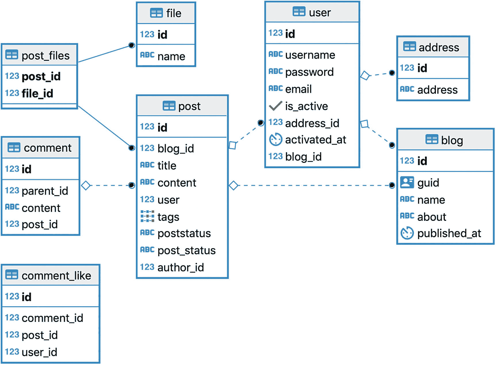
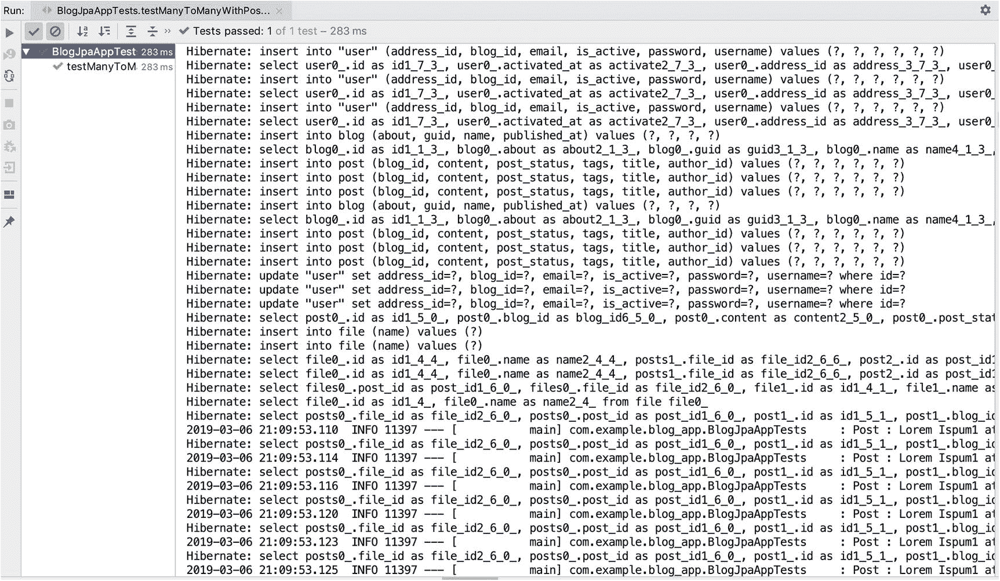

# 3. 使用 Spring 进行基本持久化

本章旨在解释如何以最佳性能选择实现简单便捷的 Java 持久化。我们将回顾各种选项，并展示重要用例的示例。在我看来，持久化是任何应用程序中最重要的层。

从 ORM 框架开始，在过去十年中，我们看到人们对 ORM 既有喜爱也有厌恶，但它们仍然被社区大量使用。ORM 在 Java 生态系统中为数据库交互提供了许多选择。让我们从讨论第一个流行的选择——Spring Data JPA 开始，并快速回顾一下 Hibernate。

Spring Data JPA 是一个非常有用的基于 DSL（领域特定语言）的模块，它最大限度地减少了与数据库交互的样板代码。在 JPA/Hibernate 之上使用 Spring Data，为与关系型和 NoSQL 数据库交互提供了一致的 API。在使用 Spring Data JPA 开发应用程序时，我们需要遵循三个重要步骤：

1.  定义领域模型或实体。在开始一个新项目时，你需要决定是先定义实体，还是稍后从数据库生成实体。我认为使用 JPA 进行设计的最佳方式是先拥有数据库的 SQL 定义，然后逐表创建模型类。即使这涉及两个步骤，也可能比从数据库表生成 Java 模型更有用。SQL 脚本最初不需要定义所有约束。基于应用程序的首次运行，JPA 会自动在数据库中更新关系（外键）。

2.  定义仓库并进行任何必要的自定义。当你了解访问模式时可以进行自定义；否则，这通常是在增量需求的基础上进行的。

3.  使用这些模型和仓库，同时优化查询和/或在需要时转换为原生查询。根据性能要求，也可以使用原生查询。

到本章结束时，你应该对以下 Spring Data JPA 概念有很好的理解：

*   基本实体定义，包括：
    *   `@OneToOne`

    *   `@OneToMany`

    *   `@ManoToOne`

    *   `@ManyToMany` 和懒加载

    *   `Cascade.ALL` 的使用及何时避免使用

    *   Lombok 的 `@ToString` 和 `@EqualsAndHashCode` 的使用

    *   Jackson 的 `@JsonIgnore` 的使用

*   使用 JPA 的 PostgreSQL，特别是当：
    *   使用枚举时

    *   使用 UUID 时

    *   获取、存储和查询数组时

*   基本用法：
    *   带分页的 JPA 查询示例

    *   通用基础仓库的用法和优势


## Spring Data JPA 简介

Spring Data 是一个伞形项目，它通过一个非常精简且一致的 API 简化了 Java 持久化操作，该 API 运行在 JDBC、JPA 和其他 NoSQL 产品 API 之上。Spring Data JPA 是 Spring Data 的一个子集，它极大地减少了执行 CRUD 操作所需的工作量。对于一个简单的应用程序来说，现在主要的工作集中在定义模型上，因为无需再编写冗长的样板 DAO 代码。让我们回顾一下使用 ORM 时遇到的问题，以及 Spring Data JPA 如何提供帮助：

*   在 Spring Data JPA 出现之前，我们必须通过编写大量通用的样板代码来实现 DAO 层，以处理常见的 `select` 和 `update` 操作。而现在，仅仅使用其 DSL，接口方法定义就足够了。

*   不再需要 EntityManager API，尽管你仍然可以随时自动注入它。

*   为 RDBMS 和 NoSQL 提供了一致的 API。

*   由于需要编写的代码更少，可读性和易用性得以提高。同样的因素也使其更可靠，且不易出错。

*   随着社区的持续改进，Spring Data 现在提供了纯 JDBC 和基于映射器的解决方案。

*   保持核心 API 不变，允许与 MyBatis、QueryDSL、JOOQ 以及其他 JDBC 库集成，并提供自定义支持。作为一名架构师，我始终发现使用 ORM 与 JDBC 解决方案进行开发时存在概念上的差异：
    *   ORM 基于“每表一对象”模式，因此需要大量思考如何以该形式进行查询，并在规范化的数据库中满足请求。

*   JDBC 解决方案为你提供了创建 SQL 查询的简单性和灵活性，你可以通过连接任意随机表来创建查询，并简单地将结果映射回任何 POJO 类。只有当数据库使用扁平表进行反规范化时，“每查询一对象”的方法才有效。

Spring Data API 顶层有三个接口：

*   `CrudRepository`

*   `PagingAndSortingRepository`，它扩展了 `CrudRepository`

*   `JpaRepository`，它扩展了 `PagingAndSortingRepository`

这三个接口都仅适用于 JPA 实体。`CrudRepository` 主要提供基本的 CRUD 功能。`PagingAndSortingRepository` 提供了进行分页和排序记录的方法。`JpaRepository` 提供了与 JPA 相关的方法，例如刷新持久化上下文和批量删除记录。清单 3-1 展示了 `CrudRepository` 的源代码。

```
package org.springframework.data.repository;
import java.util.Optional;
@NoRepositoryBean
public interface CrudRepository extends Repository {
S save(S entity);
Iterable saveAll(Iterable entities);
Optional findById(ID id);
boolean existsById(ID id);
Iterable findAll();
Iterable findAllById(Iterable ids);
long count();
void deleteById(ID id);
void delete(T entity);
void deleteAll(Iterable entities);
void deleteAll();
}
@NoRepositoryBean
public interface PagingAndSortingRepository extends
CrudRepository {
Iterable findAll(Sort sort);
Page findAll(Pageable pageable);
}
@NoRepositoryBean
public interface JpaRepository extends PagingAndSortingRepository, QueryByExampleExecutor {
List findAll();
List findAll(Sort var1);
List findAllById(Iterable var1);
List saveAll(Iterable var1);
void flush();
S saveAndFlush(S var1);
void deleteInBatch(Iterable var1);
void deleteAllInBatch();
T getOne(ID var1);
List findAll(Example var1);
List findAll(Example var1, Sort var2);
}
清单 3-1
Repository 定义
```

Spring Data JPA 的美妙之处在于，它只需定义 Repository 方法名称，就能从表中派生查询。此功能来自 Spring Data Query DSL。考虑以下 `UserRepository` 接口示例：

```
@Repository
public interface UserRepository extends CrudRepository {
void deleteByUsername(String username);
Optional findByUsername(String username);
@Query("select u from User u")
Stream streamAll();
}
```

所有 `findBy{fieldName}`, `deleteBy*` 方法都将由框架本身实现。Java 8 的 `Optional` 和 `Stream` 也受支持。

## Spring Data JPA 示例

人们常说 ORM/JPA 和 Hibernate 对新手来说很难。为了了解最常见情况下的具体操作，我们将在本章中创建一个博客应用程序，并使用 PostgreSQL 作为数据库。近年来，由于其社区带来的众多创新和升级，PostgreSQL 已成为默认选择。

### @OnetoMany 和 @ManyToone 注解

我们将从创建一个示例应用程序开始，该应用程序涵盖了前面列表中的前两点。此应用程序的代码结构如下：

```
.
├── build.gradle
└── src
├── main
│   ├── java
│   │   └── com
│   │       └── example
│   │           └── blog_app
│   │               ├── BlogJpaApp.java
│   │               ├── constants
│   │               │   ├── PgArrayType.java
│   │               │   └── PgEnumType.java
│   │               ├── helper
│   │               │   └── DataGenerator.java
│   │               ├── model
│   │               │   └── jpa
│   │               │       ├── Address.java
│   │               │       ├── Blog.java
│   │               │       ├── Comment.java
│   │               │       ├── CommentLike.java
│   │               │       ├── File.java
│   │               │       ├── Post.java
│   │               │       ├── PostFileJoinTable.java
│   │               │       ├── PostStatus.java
│   │               │       └── User.java
│   │               ├── repository
│   │               │   ├── BlogRepository.java
│   │               │   ├── CommentRepository.java
│   │               │   ├── FileRepository.java
│   │               │   ├── PostRepository.java
│   │               │   ├── UserRepository.java
│   │               │   └── base
│   │               │       ├── BaseRepository.java
│   │               │       └── BaseRepositoryImpl.java
│   │               ├── service
│   │               │   └── UserCRUDService.java
│   │               └── web
│   │                   └── IndexController.java
│   ├── resources
│   │   ├── application.yml
│   │   └── schema.sql
│   └── scripts
└── test
├── java
│   └── com
│       └── example
│           └── blog_app
│               ├── BlogJpaAppTests.java
│               └── BlogTestBase.java
└── resources
└── application-test.yml
```

#### 创建博客应用

首先，访问 [`start.spring.io`](https://start.spring.io) 或创建一个名为 `blog-app-jpa-ch3` 的新 Gradle 应用，并将 `groupId` 设置为 `com.example`，`artifactId` 设置为 `blog-app`。

如果你切换到 `start.spring.io` 的完整版本，几乎所有的 Spring 库和框架都会显示出来。选择 Web、Lombok、JPA、JDBC 和 PostgreSQL，然后生成项目。


#### 应用程序设置

在开始编写代码之前，请按照以下步骤设置项目：

1.  在 `build.gra`**dle** 中配置依赖项。

2.  创建并执行用于建表的 SQL 语句。

3.  在 PostgreSQL 中创建数据库，并将其访问详情映射到 `application.yml` 中。

这些步骤详见清单 3-2 至 3-4。

```
server:
port: 8080
servlet:
contextPath: /blog
spring:
application:
name: blog-service
jpa:
show-sql: false
hibernate:
ddl-auto: update
jdbc.lob.non_contextual_creation: true
generate-ddl: true
datasource:
username: postgres
password: postgres
url: jdbc:postgresql://localhost:5432/blogs
driverClassName: org.postgresql.Driver
logging:
file: logs/blogging-service.log
level:
org.hibernate.SQL: ERROR
org.springframework.data: DEBUG
清单 3-4
{project-root}/resources/application.yml
```

```
CREATE EXTENSION IF NOT EXISTS "uuid-ossp"; -- 需要启用 UUID 扩展
drop table if exists blog cascade;
drop table if exists post cascade;
drop table if exists comment cascade;
drop table if exists comment_like cascade;
drop table if exists file cascade;
drop table if exists post_files cascade;
drop table if exists "user" cascade; -- 由于 user 是 PostgreSQL 的关键字，此处使用双引号
-- DROP 语句结束
Create table if not exists blog (
id serial primary key not null,
guid uuid default uuid_generate_v4(),
name varchar(150),
about text,
published_at timestamp
);
create table if not exists post  (
id serial primary key not null,
blog_id int,
title varchar(150),
content text,
"user" int
);
create table if not exists comment  (
id serial primary key not null,
parent_id int,
content text,
post_id int
);
create table if not exists "user"  (
id serial primary key not null,
username varchar(150),
password varchar(150),
email varchar(150),
is_active boolean,
activated_at timestamp DEFAULT (current_timestamp AT TIME ZONE 'UTC')
);
create table comment_like (id  bigserial not null, comment_id int8, post_id int8, user_id int8, primary key (id));
create table file (id bigserial not null, name varchar(255), primary key (id));
create table post_files (post_id int8 not null, file_id int8 not null, primary key (file_id, post_id));
清单 3-3
位于 {project-root}/resources/schema.sql 的数据库模式
```

```
plugins {
id 'org.springframework.boot' version '2.1.3.RELEASE'
id 'java'
}
apply plugin: 'io.spring.dependency-management'
bootJar {
baseName = 'blog-app'
version =  '1.0'
}
repositories {
mavenCentral()
}
dependencies {
compile('org.springframework.boot:spring-boot-starter-web')
compile('org.springframework.boot:spring-boot-starter-jdbc')
compile('org.springframework.boot:spring-boot-starter-data-jpa')
compile("org.springframework.boot:spring-boot-starter-data-mongodb")
compile('org.postgresql:postgresql:42.2.5')
testCompile('junit:junit:4.12')
testCompile('org.springframework.boot:spring-boot-starter-test')
compile("org.projectlombok:lombok:1.18.6")
annotationProcessor("org.projectlombok:lombok:1.18.6")
}
清单 3-2
Build.gradle
```

在上述代码中，我包含了大多数常用属性，以便快速启动并运行 PostgreSQL。请注意，我们尚未在 SQL 文件中定义关系，因为它们将在下一步中根据 JPA 实体模型自动生成。我们仅在文件中添加了 `ddl-auto: update` 属性。图 3-1 展示了实体关系（ER）图。



图 3-1

博客应用的 ER 图

#### PostgreSQL 中的枚举数据类型及 JPA 映射

通常需要将字面常量以字符串形式存储在数据库中，并将其映射到 Java 的枚举类型。在接下来的示例中，我们将使用 Java `enum` 类型，因此本节先花点时间了解其正确用法。

如果我们通过 `POST` 实体定义等方式，将 Java 枚举以序数形式映射并存储到 PostgreSQL 数据库中，处理起来会很简单。如果我们希望通过 JPA 按原样存储枚举值（字符串字面量），则需要额外步骤，本节将对此进行说明。例如，如果 Java 代码中有以下枚举：

```
public enum PostStatus implements Serializable {
ACTIVE(1), NOT_ACTIVE(2);
}
```

我们可以在数据库中存储数字（1, 2）并保持映射关系，或者存储字符串（`ACTIVE`, `NOT_ACTIVE`）。PostgreSQL 数据库提供了 `ENUM` 数据类型，因此理想情况下，我们应该在数据库中创建一个枚举类型，以映射到 Java 对象字段。我们需要将枚举添加到 `schema.sql` 中（参见清单 3-5）。

```
drop type if exists post_status_enum;
Create type post_status_enum as ENUM ('ACTIVE', 'NOT_ACTIVE');
create table if not exists post  (
id serial primary key not null,
blog_id int,
title varchar(150),
content text,
"user" int,
postStatus post_status_enum default 'ACTIVE'
);
清单 3-5
向模式脚本中添加枚举
```

为了将它们映射到 Java 枚举，我们需要定义一个新的用户类型。用户类型是 Hibernate 中用于定义自定义数据类型的功能。清单 3-6 展示了此示例的实现方式。定义完成后，可以在枚举字段上使用 `@Type` 注解（参见清单 3-8），将其映射到代码和数据库字段。


```
package com.example.blog_app.constants;
import org.hibernate.HibernateException;
import org.hibernate.engine.spi.SharedSessionContractImplementor;
import org.hibernate.usertype.EnhancedUserType;
import org.hibernate.usertype.ParameterizedType;
import org.postgresql.util.PGobject;
import java.io.Serializable;
import java.sql.PreparedStatement;
import java.sql.ResultSet;
import java.sql.SQLException;
import java.sql.Types;
import java.util.Properties;
public class PgEnumType implements EnhancedUserType, ParameterizedType {
private Class enumClass;
public void setParameterValues(Properties parameters) {
String enumClassName = parameters.getProperty("enumClassName");
try {
enumClass = (Class) Class.forName(enumClassName);
} catch (ClassNotFoundException cnfe) {
throw new HibernateException("Enum class not found", cnfe);
}
}
public Object assemble(Serializable cached, Object owner)
throws HibernateException {
return cached;
}
public Object deepCopy(Object value) throws HibernateException {
return value;
}
public Serializable disassemble(Object value) throws HibernateException {
return (Enum) value;
}
public boolean equals(Object x, Object y) throws HibernateException {
return x == y;
}
public int hashCode(Object x) throws HibernateException {
return x.hashCode();
}
@Override
public Object nullSafeGet(ResultSet rs, String[] names,
SharedSessionContractImplementor session, Object owner) throws HibernateException,
SQLException {
Object object = rs.getObject(names[0]);
if (rs.wasNull()) {
return null;
}
if (object instanceof PGobject) {
PGobject pg = (PGobject) object;
return Enum.valueOf(enumClass, pg.getValue());
}
if (object instanceof String) {
return Enum.valueOf(enumClass, String.valueOf(object));
}
return null;
}
@Override
public void nullSafeSet(PreparedStatement st, Object value, int index,
SharedSessionContractImplementor session) throws HibernateException, SQLException {
if (value == null) {
st.setNull(index, Types.VARCHAR);
} else {
st.setObject(index, ((Enum) value), Types.OTHER);
}
}
public boolean isMutable() {
return false;
}
public Object replace(Object original, Object target, Object owner)
throws HibernateException {
return original;
}
public Class returnedClass() {
return enumClass;
}
public int[] sqlTypes() {
return new int[]{Types.VARCHAR};
}
public Object fromXMLString(String xmlValue) {
return Enum.valueOf(enumClass, xmlValue);
}
public String objectToSQLString(Object value) {
return '\" + ((Enum) value).name() + '\";
}
public String toXMLString(Object value) {
return ((Enum) value).name();
}
}
清单 3-6
将自定义类型定义为 Hibernate 用户类型以映射枚举
```

请注意以下三个方法：

*   `setParameterValues`：我们读取一个名为 `enumClassName` 的属性，并通过反射加载其目标类。

*   `nullSafeGet`：在 PostgreSQL API 中，自定义数据类型可以作为 `PGobject` 检索，并且可以通过此对象映射枚举值。

*   `nullSafeSet`：此方法重置 `PreparedStatement` 中的枚举值。

我们将在下一节中使用此代码并展示结果。

#### 数据模型与仓库

我们需要定义 Java 实体或领域对象，以根据图 3-1 所示的 ER 图来映射数据库中的表。在本节中，我们将了解通过 JPA 创建领域层所涉及的内容。我们将从使用 `@OneToMany` 注解定义 `BLOG` 对象（见清单 3-7）以及使用 `@ManyToOne` 注解定义 `POST` 对象（见清单 3-8）开始示例。

```
package com.example.blog_app.model.jpa;
import com.fasterxml.jackson.annotation.JsonIgnore;
import lombok.*;
import javax.persistence.*;
import java.time.LocalDateTime;
import java.util.Set;
import java.util.UUID;
@Data               // 生成 getter、setter、equals、toString 和 hashCode 方法
@Builder            // 为类中的字段生成构建器
@NoArgsConstructor  // 生成无参构造函数
@AllArgsConstructor  // 生成全参构造函数
@ToString(exclude = {"posts"}) // 生成 toString 方法，跳过名为 posts 的字段
// 生成 equals 和 hashCode 方法，跳过名为 posts 的字段
@EqualsAndHashCode(exclude = {"posts"}) @Entity
public class Blog  implements Serializable {
@Id
@GeneratedValue(strategy = GenerationType.IDENTITY)
private Long id;
/*
出于安全原因，'guid' 对于隐藏所有外部通信中的自增 'id' 非常有用。
在进行分页、过滤等操作时，'id' 的索引和查询速度会更快。
*/
@org.hibernate.annotations.Type(type = "pg-uuid")
UUID guid;
private String name;
private String about;
private LocalDateTime publishedAt;
@JsonIgnore
@OneToMany(fetch = FetchType.LAZY, cascade = CascadeType.ALL,
orphanRemoval = true, mappedBy = "blog")
private Set posts;
}
清单 3-7
BLOG 对象定义
```

关于上述博客代码的关键观察点：

*   为了在 PostgreSQL 数据库中使用 UUID，我们需要通过 SQL 语句在模式中启用它，如 `schema.sql` 文件所述（即 `CREATE EXTENSION IF NOT EXISTS uuid-ossp`）。

*   由于我们是单独运行 SQL 脚本，因此 `schema.sql` 无需在 Spring 启动时运行。因此，我们将 `ddl-auto` 设置为 `update`。这只会运行 `alter` 命令，而不会创建表，除非将 `ddl-auto` 设置为 `create` 或 `create-drop`。

*   通过在 `class` 上使用 Lombok 注解，我们减少了 getter、setter、equals、`hashCode` 和 `toString` 方法的样板代码，使其非常易读。

*   注解 `@org.hibernate.annotations.Type(type = "pg-uuid")` 是必需的，用于支持将 PostgreSQL 中的 UUID 映射到 Java UUID 类。

*   我们现在可以轻松支持 `LocalDateTime`，将其映射到数据库中数据类型的 timestamp。

*   注解 `@JsonIgnore`、`@ToString(exclude = {"posts"})` 和 `@EqualsAndHashCode(exclude = {"posts"})` 有助于在序列化、生成的 `toString`、equals 和 `hashCode` 对象比较方法中忽略延迟加载的关联对象。

*   作为良好实践，最好不要将任何对象的自增 ID 和主键发送回客户端。因此，可以使用 GUID（全局唯一标识符）。但是，性能可能会变慢，因为索引大的随机字符会变慢。为了克服这一点，我们同时使用两种 ID。

类似地，我们还将定义 `POST`（见清单 3-8）和 `USER` 对象（见清单 3-9）。


```
package com.example.blog_app.model.jpa;
import lombok.*;
import javax.persistence.*;
import java.util.Set;
@Data
@Builder
@NoArgsConstructor
@AllArgsConstructor
@ToString(exclude = {"posts"})
@EqualsAndHashCode(exclude = {"posts"})
@Entity(name = "`user`")
public class User  implements Serializable {
public User(String username, String password, String email)   {
this.username = username;
this.password = password;
this.email = email;
}
@Id
@GeneratedValue(strategy = GenerationType.IDENTITY)
private Long id;
private String username;
private String password;
private String email;
private Boolean isActive;
@OneToMany(fetch = FetchType.LAZY, cascade = CascadeType
.ALL, mappedBy = "user", orphanRemoval = true)
private Set posts;
}
代码清单 3-9
用户对象定义
```

```
package com.example.blog_app.model.jpa;
import com.fasterxml.jackson.annotation.JsonIgnore;
import lombok.*;
import javax.persistence.*;
import java.util.Set;
@Data
@Builder
@NoArgsConstructor
@AllArgsConstructor
@ToString(exclude = {"blog", "user"})
@EqualsAndHashCode(exclude = {"blog", "user"})
@Entity
public class Post  implements Serializable {
@Id
@GeneratedValue(strategy = GenerationType.IDENTITY)
private Long id;
private String title;
private String content;
@Column(name = "post_status")
@Type(type = "com.example.blog_app.constants.PgEnumType",
parameters = {@org.hibernate.annotations.Parameter(name = "enumClassName", value = "com.example.blog_app.model.jpa.PostStatus")})
// @Enumerated(EnumType.ORDINAL) // 否则使用此方式将其存储为整数
PostStatus postStatus;
@ManyToOne(fetch = FetchType.LAZY, cascade = CascadeType. REFRESH)
@JoinColumn(name = "blog_id")
private Blog blog;
@JsonIgnore
@ManyToOne(fetch = FetchType.LAZY, cascade = CascadeType.REFRESH)
@JoinColumn(name = "author_id")
private User user;
}
package com.example.blog_app.model.jpa;
import java.io.Serializable;
public enum PostStatus implements Serializable {
ACTIVE(1), NOT_ACTIVE(2);
int status;
PostStatus(int status)  {
this.status = status;
}
}
代码清单 3-8
文章对象和 PostEnum 定义
```

借助 Spring Data，只需定义接口即可定义 DAO 层（参见代码清单 3-10）。

```
package com.example.blog_app.repository;
import com.example.blog_app.model.jpa.Blog;
import com.example.blog_app.model.jpa.Post;
import org.springframework.data.jpa.repository.JpaRepository;
public interface PostRepository extends JpaRepository {}
package com.example.blog_app.repository;
import com.example.blog_app.model.jpa.User;
import com.example.blog_app.repository.base.CustomRepository;
public interface UserRepository extends CustomRepository {
void deleteByUsername(String username);
}
package com.example.blog_app.repository;
import com.example.blog_app.model.jpa.Blog;
import org.springframework.data.jpa.repository.JpaRepository;
public interface BlogRepository extends JpaRepository {
}
代码清单 3-10
仓库接口定义
```

注意事项：

*   字段的数据类型应定义为对象而非基本类型，因为基本类型在处理空值时可能引发问题。

*   `user` 实体在其定义中被引号包围，例如 ``@Table(name = "`user`")``。这是必要的，因为 `user` 是 PostgreSQL 中的关键字。在 `schema.sql` 文件中也使用了相同的字符。

*   我们在 `Blog` 和 `User` 对象中定义了 `@OneToMany` 注解。定义此关系时需要遵循一些约定。这里以 `User -> Post` 对象为例：

*   根据 Hibernate 文档的最佳实践，始终优先将关联定义为 `Lazy`。

*   根据 Hibernate 文档的最佳实践，定义双向关联，因为这样在两侧进行导航都更容易。然而，它们定义起来稍显复杂且难以保持同步。例如，在添加新的 `POST` 时，两个实体（`POST` 和 `Blog`）都需要刷新以保持内存中对象的同步。

*   父对象（`User`）有一个属性设置为 `mappedBy=user`，该属性映射了子对象（此处为 `POST`）中的 `user` 字段。仅当关系是双向时才需要此设置。

*   `CascadeType.ALL` 会在父实体被删除或更新时，触发所有级联事件到内存中的子对象。例如，当用户被删除时，所有相关的 `POST` 行将成为孤儿。`orphanRemoval=true` 会进一步从数据库中删除这些相关行。

*   在另一端，子对象或 `POST` 实体必须使用 `Cascade.REFRESH` 进行注解，以便在任何子对象被删除或更新时，仅刷新父对象。

*   我们通过 Lombok 的 `@ToString` 和 `@EqualsAndHashCode` 忽略了延迟加载的字段。这将忽略 `toString()`、`equals()` 和 `hashCode()` 方法生成代码中的关系字段。

*   `@JsonIgnore` 用于相关字段之上，以在序列化和反序列化过程中忽略它们。

```
USER
@OneToMany(fetch = FetchType.LAZY, cascade = CascadeType.ALL,
mappedBy = "user", orphanRemoval = true)
private Set posts;
POST
@JsonIgnore
@ManyToOne(fetch = FetchType.LAZY, cascade = CascadeType.REFRESH)
@JoinColumn(name = "author_id")
private User user;
```


### 使用 CascadeType.ALL 及应避免的情况

`CascadeType.ALL` 的含义是，持久化上下文会将所有 `EntityManager` 操作（`PERSIST`、`REMOVE`、`REFRESH`、`MERGE` 和 `DETACH`）传播（级联）到相关实体。

详细的 `Cascade` 类型描述如下：

*   `PERSIST`：如果父实体被持久化到持久化上下文中，相关实体也会被持久化。
*   `MERGE`：如果父实体被合并到持久化上下文中，相关实体也会被合并。
*   `REFRESH`：如果父实体在当前持久化上下文中被刷新，相关实体也会被刷新。
*   `DETACH`：如果父实体从持久化上下文中被分离，相关实体也会被分离。
*   `REMOVE`：如果父实体从当前持久化上下文中被移除，相关实体也会被移除。
*   `ALL`：所有上述描述都应用于相关实体。

级联是最敏感的设置，因为在更新和删除的情况下，也可能发生意外行为。以 `CascadeType.REMOVE` 为例，有时你可能希望即使父实体被删除，子表的行仍然存在，特别是当子表与其他表存在其他关系时。

让我们看一个反面示例，通过修改上一节中的实体关联代码（见清单 3-11），来解释使用 `CascadeType.All` 的影响。

```
public class Blog  implements Serializable {
@OneToMany(fetch = FetchType.LAZY, cascade = CascadeType.ALL,
orphanRemoval = true, mappedBy = "blog")
private Set posts;
}
public class Post  implements Serializable {
@ManyToOne(fetch = FetchType.LAZY, cascade = CascadeType.ALL)
@JoinColumn(name = "blog_id")
private Blog blog;
@ManyToOne(fetch = FetchType.LAZY, cascade = CascadeType.ALL)
@JoinColumn(name = "author_id")
private User user;
}
public class User  implements Serializable {
@OneToMany(fetch = FetchType.LAZY, cascade = {CascadeType.ALL},
mappedBy = "user", orphanRemoval = true)
private Set posts;
}
清单 3-11
反映数据库中非法删除的实体变更
```

注意：

*   我们在代码中为所有关联都标记了 `cascade=CascadeType.ALL`。
*   对 `POST` 实体对象的任何删除操作都会触发对相关 `Blog` 对象的删除，进而触发对所有相关 `POST` 和 `USER` 对象的删除。最终，删除所有内容将变得一团糟。
*   删除 `POST` 实体还会触发删除所有相关用户，即使这些用户与其他帖子有关联。

为了从正反两方面测试代码，我们必须定义两个辅助类——`DataGenerator`（见清单 3-12）和 `TestCase`（见清单 3-13）。该类会生成示例博客，以及用户及其帖子。

```
package com.example.blog_app.helper;
import com.example.blog_app.model.jpa.Blog;
import com.example.blog_app.model.jpa.Post;
import com.example.blog_app.model.jpa.PostStatus;
import com.example.blog_app.model.jpa.User;
import com.example.blog_app.repository.BlogRepository;
import com.example.blog_app.repository.PostRepository;
import com.example.blog_app.repository.UserRepository;
import lombok.extern.slf4j.Slf4j;
import org.springframework.beans.factory.annotation.Autowired;
import org.springframework.stereotype.Service;
import org.springframework.transaction.annotation.Transactional;
import java.time.LocalDateTime;
import java.util.ArrayList;
import java.util.Arrays;
import java.util.List;
import java.util.UUID;
@Service
@Slf4j
public class DataGenerator {
private AtomicBoolean initialized = new AtomicBoolean(false);
List blogNames = Arrays.asList("PartyBlog", "ScienceBlog");
@Autowired
BlogRepository blogRepository;
@Autowired
UserRepository userRepository;
@Autowired
PostRepository postRepository;
@Transactional
public void generateSampleData()    {
this.initialized.compareAndSet(false, true);
log.info("data being generated");
List blogs = new ArrayList();
User user1 = new User( "Akira", "password", "none@none.com");
User user2 = new User( "Lisa", "password", "none@none.com");
User user3 = new User( "James", "password", "none@none.com");
userRepository.save(user1);
userRepository.refresh(user1);
userRepository.save(user2);
userRepository.refresh(user2);
userRepository.save(user3);
userRepository.refresh(user3);
blogNames.forEach(name->{
Blog blog = Blog.builder()
.name(name)
.guid(UUID.randomUUID())
.about("Sample blog")
.publishedAt(LocalDateTime.now()).build();
blogRepository.save(blog);
blogRepository.refresh(blog); //populate generated id
blogs.add(blog);
Post post1 = Post.builder()
.title("Lorem Ispum1")
.content("Sample content1")
.user(user1)
.blog(blog)
.postStatus(PostStatus.ACTIVE)
.build();
Post post2 = Post.builder()
.title("Lorem Ispum2")
.content("Sample content2")
.user(user2)
.blog(blog)
.postStatus(PostStatus.ACTIVE)
.build();
Post post3 = Post.builder()
.title("Lorem Ispum3")
.content("Sample content3")
.user(user3)
.blog(blog)
.postStatus(PostStatus.ACTIVE)
.build();
postRepository.save(post1);
postRepository.save(post2);
postRepository.save(post3);
});
log.info("data generated");
}
}
package com.example.blog_app.repository;
import com.example.blog_app.model.jpa.Blog;
import com.example.blog_app.repository.base.BaseRepository;
public interface BlogRepository extends BaseRepository {
}
public interface UserRepository extends BaseRepository {
}
清单 3-12
示例 DataGenerator 类及缺失部分
```


### 注意

`BaseRepository` 暂时可以忽略，将在第 3.2.7 节中解释。目前，可以将其假定为 `JpaRepository`。

上述代码在博客表中创建了两条记录——`PartyBlog` 和 `ScienceBlog`——以及三个用户，每个用户创建了三篇文章。现在，让我们定义一个 `TestCase` 类，它将帮助我们测试这些实体定义的功能（参见清单 3-13）。为简单起见，`TestCase` 类（`BlogJpaAppTests`）继承了一个基础测试用例类（`BlogTestBase`），该类包含了所有必要的自动装配组件，以保持实际测试类的整洁。

```
package com.example.blog_app;
import com.example.blog_app.helper.DataGenerator;
import com.example.blog_app.repository.BlogRepository;
import com.example.blog_app.repository.FileRepository;
import com.example.blog_app.repository.PostRepository;
import com.example.blog_app.repository.UserRepository;
import com.example.blog_app.service.UserCRUDService;
import org.springframework.beans.factory.annotation.Autowired;
import org.springframework.boot.test.web.client.TestRestTemplate;
import org.springframework.stereotype.Component;
@Component
public class BlogTestBase {
@Autowired
DataGenerator dataGenerator;
@Autowired
UserRepository userRepository;
@Autowired
UserCRUDService userCRUDService;
@Autowired
PostRepository postRepository;
@Autowired
BlogRepository blogRepository;
@Autowired
FileRepository fileRepository;
@Autowired
protected TestRestTemplate restTemplate;
}
package com.example.blog_app;
import com.example.blog_app.helper.DataGenerator;
import com.example.blog_app.repository.PostRepository;
import com.example.blog_app.repository.UserRepository;
import com.example.blog_app.service.UserCRUDService;
import lombok.extern.slf4j.Slf4j;
import org.junit.Assert;
import org.junit.Test;
import org.junit.runner.RunWith;
import org.springframework.beans.factory.annotation.Autowired;
import org.springframework.boot.test.context.SpringBootTest;
import org.springframework.boot.test.web.client.TestRestTemplate;
import org.springframework.test.annotation.Commit;
import org.springframework.test.context.ActiveProfiles;
import org.springframework.test.context.junit4.SpringRunner;
import org.springframework.transaction.annotation.Transactional;
import javax.annotation.PostConstruct;
import static org.assertj.core.api.Assertions.assertThat;
@RunWith(SpringRunner.class)
@SpringBootTest(webEnvironment = SpringBootTest.WebEnvironment.RANDOM_PORT)
@ActiveProfiles("test")
@Slf4j
public class BlogJpaAppTests extends BlogTestBase {
// 使用 BlogTestBase 只是为了抽象所有声明，保持测试用例整洁
private boolean generateData = true; // 更新以生成示例数据
@PostConstruct
public void init()  {
log.info("检查是否已初始化");
if(dataGenerator.getInitialized().get() == false && generateData)
dataGenerator.generateSampleData();
}
@Test
@Transactional()
@Commit
public void testOneToManyDeletion() {
log.info("已删除用户：{}", "Akira");
userCRUDService.deleteUser("Akira");
log.info("打印所有用户");
userRepository.findAll().stream().forEach(u->
log.info("用户：{}, {}", u.getId(), u.getUsername())
);
long count = userRepository.findAll().stream().filter(u ->
"Akira".equals(u.getUsername())).count();
Assert.assertEquals(0l, count); // 现在应为 0
}
}
清单 3-13
测试用例基类和 BlogJpaAppTests 类
```

根据此代码中的实体映射，该测试用例将删除数据库中的所有数据，如前所述。让我们看看对 `Blog`、`Post` 和 `User` 实体中关系字段的修正（参见清单 3-14）。

```
public class Blog {
@OneToMany(fetch = FetchType.LAZY, cascade = CascadeType.ALL,
orphanRemoval = true, mappedBy = "blog")
private Set posts;
@JsonIgnore
@OneToMany(fetch = FetchType.LAZY, cascade = CascadeType.ALL, orphanRemoval = true)
@JoinColumn(name = "blogId")
private Set users;
}
public class Post {
// 注意，cascade 已被移除，因此不会进行级联操作
// 使用此代码，级联仅会从父级发生到子级
// 这里也可以使用 CascadeType.REFRESH
@ManyToOne(fetch = FetchType.LAZY)
@JoinColumn(name = "blog_id")
private Blog blog;
@ManyToOne(fetch = FetchType.LAZY) // 与上述相同的更改
@JoinColumn(name = "author_id")
private User user;
}
public class User {
@OneToMany(fetch = FetchType.LAZY, cascade = {CascadeType.PERSIST,
CascadeType.MERGE, CascadeType.REMOVE}, mappedBy = "user", orphanRemoval = true)
private Set posts;
}
清单 3-14
实体类中针对正确级联操作的修正
```

前面的代码块分别指定了所有级联操作。或者，它们也可以一起使用：

```
public class User {
@OneToMany(fetch = FetchType.LAZY, cascade = {CascadeType.ALL, mappedBy = "user", orphanRemoval = true)
private Set posts;
}
```

删除问题并不常见，因为在企业应用中，数据不应被硬删除，因此不会发生 `delete` 操作。

### 一个 @ManyToMany 示例

我们需要修改 `POST` 实体并引入一个名为 `File` 的新实体（参见清单 3-15）。这样，一个 `POST` 可以有多个文件（附件），并且一个文件可以链接到多个 `POST`。例如，一旦文件上传到系统，用户应该能够将其附加到任何 `POST`。

```
package com.example.blog_app.model.jpa;
import com.fasterxml.jackson.annotation.JsonIgnore;
import lombok.*;
import javax.persistence.*;
import java.util.Set;
@Data
@Builder
@NoArgsConstructor
@AllArgsConstructor
@ToString(exclude = {"posts"})
@EqualsAndHashCode(exclude = {"posts"})
@Entity
public class File {
@Id
@GeneratedValue(strategy = GenerationType.IDENTITY)
private Long id;
private String name;
@JsonIgnore
@ManyToMany(cascade = {CascadeType.MERGE,CascadeType.REFRESH}, fetch = FetchType.LAZY)
@JoinTable(
name = "post_files",joinColumns = {
@JoinColumn(name = "file_id", referencedColumnName = "id")},
inverseJoinColumns={
@JoinColumn(name = "post_id", referencedColumnName = "id")})
private Set posts;
}
package com.example.blog_app.model.jpa;
import com.fasterxml.jackson.annotation.JsonIgnore;
import lombok.*;
import org.hibernate.annotations.Type;
import javax.persistence.*;
import java.io.Serializable;
import java.util.Set;
@Data
@Builder
@NoArgsConstructor
@AllArgsConstructor
@ToString(exclude = {"blog", "user", "files"})
@EqualsAndHashCode(exclude = {"blog", "user", "files"})
@Entity
public class Post implements Serializable {
@Id
@GeneratedValue(strategy = GenerationType.IDENTITY)
private Long id;
private String title;
private String content;
@Column(name = "post_status")
@Type(type = "com.example.blog_app.constants.PgEnumType",
parameters = {@org.hibernate.annotations.Parameter(name = "enumClassName", value = "com.example.blog_app.model.jpa.PostStatus")})
PostStatus postStatus;
@ManyToOne(fetch = FetchType.LAZY)
@JoinColumn(name = "blog_id")
private Blog blog;
@JsonIgnore
@ManyToOne(fetch = FetchType.LAZY)
@JoinColumn(name = "author_id")
private User user;
@JsonIgnore
@ManyToMany(cascade = {CascadeType.MERGE,CascadeType.REFRESH}, fetch = FetchType.LAZY)
@JoinTable(
name = "post_files",joinColumns = {
@JoinColumn(name = "post_id", referencedColumnName = "id")},
inverseJoinColumns={
@JoinColumn(name = "file_id", referencedColumnName = "id")})
private Set files;
}
清单 3-15
文件实体定义和 POST 实体更改
```

为了验证此代码是否正常工作，让我们在现有测试用例中添加一个方法，如清单 3-16 所示。此方法将创建两个新的 `File` 对象，将它们添加到一个新的 `POST` 对象中，然后保存该 `POST` 对象。通过关联映射，`File` 对象将与 `POST` 对象一起自动保存。


```
public class BlogJpaAppTests extends BlogTestBase {
/*
默认情况下，Spring 框架在运行测试用例时会回滚对数据库所做的更新。保留 @Transactional 注解以启用 Spring 事务支持，并特别使用 @Commit 注解，以便在测试运行后将数据持久化到数据库中，这样我们之后也可以从数据库验证结果。建议读者尝试这两种变体。
*/
@Test
@Transactional
@Commit
public void testManyToManyWithPostAndFiles() {
Post post = postRepository.findById(1l).get();
File file = new File();
file.setName("main_image");
fileRepository.save(file);
File file1 = new File();
file1.setName("second_image");
fileRepository.save(file1);
fileRepository.refresh(file);
fileRepository.refresh(file1);
Set files = post.getFiles();
if(files == null)
files = new HashSet();
files.add(file);
files.add(file1);
post.setFiles(files);
postRepository.save(post);
List allFiles = fileRepository.findAll();
allFiles.forEach(f->{
Set posts = f.getPosts();
posts.forEach(p->{
log.info("Post : {} attached with file : {}", p.getTitle(), f.getName());
});
});
post.getFiles().forEach(f->{
log.info("File: {} attached to Post: {}", f.getName(), post.getTitle());
});
}
清单 3-16
测试用例更新
```

### 运行应用程序

为了查看 Hibernate 在后台运行的查询，我们需要在运行应用程序之前，在 `application.yml` 文件中启用一个属性，如下所示：

```
spring:
jpa:
show-sql: true
```

完成此更改后，当测试用例运行时，查询也会被记录到控制台，如图 3-2 所示。



图 3-2

测试用例运行的控制台输出

```
> gradle clean build
> gradle test
>
com.example.blog_app.BlogJpaAppTests     : File: main_image attached to Post: Lorem Ispum1
com.example.blog_app.BlogJpaAppTests     : File: second_image attached to Post: Lorem Ispum1
```

回顾一下，我们创建了两个新的 `File` 对象并保存了它们。然后我们将这些持久化对象添加到 `POST` 实体对象中并保存。之后，我们获取了所有 `File` 对象并列出其父级 `POST`。同样地，我们从 `POST` 实体对象中列出了子级 `File` 对象。

注意：

*   我们刚刚通过一个名为 `post_files` 的第三表看到了一个 `@ManyToMany` 关联示例，但相关字段是直接相互嵌入的。这就是我们之前提到的优势——双向导航变得更加容易。

*   根据 Hibernate 文档，`@ManyToMany` 注解很少是一个好的选择，因为它将双方都视为单向关联。

*   一个更好的替代方案是在两个实体中都使用 `@OneToMany` 关联到链接表。在我们的示例中，`POST` 和 `File` 实体应该有一个指向 `PostFile` 实体的 `@OneToMany` 关联。

*   还有一种方法是通过可嵌入键或复合键来定义 `@ManyToMany`。我们跳过这种方法，因为它也是一种罕见且复杂的方法。

### @OneToOne 注解

`@OneToOne` 关联非常容易理解和实现。拥有方实体通过引用列来引用关联实体。另一方实体通过 `mappedBy` 属性来引用拥有方实体。这就是双向关联的情况。让我们看一个使用 `User` 和 `Address` 对象的示例（见清单 3-17）。

```
package com.example.blog_app.model.jpa;
import lombok.*;
import javax.persistence.*;
import java.io.Serializable;
import java.time.LocalDateTime;
import java.util.Set;
@Data
@Builder
@NoArgsConstructor
@AllArgsConstructor
@ToString(exclude = {"posts"})
@EqualsAndHashCode(exclude = {"posts"})
@Entity
@Table(name = "`user`")
public class User implements Serializable {
@Id
@GeneratedValue(strategy = GenerationType.IDENTITY)
private Long id;
private Integer addressId;
@OneToOne(cascade = CascadeType.ALL, fetch = FetchType.LAZY)
@JoinColumn(name = "addressId", insertable = false, updatable = false)
private Address address;
}
package com.example.blog_app.model.jpa;
import javax.persistence.*;
@Entity
public class Address {
@Id
@GeneratedValue(strategy = GenerationType.IDENTITY)
private Long id;
private String address;
@OneToOne(mappedBy = "address")
private User user;
}
清单 3-17
OneToOne 关联示例
```

注意：

*   如果你在定义 `@JoinColumn` 的同一个表中定义引用列，则需要使用 `name` 属性，而不是 `referencedColumnName`。

*   这意味着 `User` 表拥有并负责该关系。

*   如果你在实体类中创建了一个与引用列同名的字段，则需要在 `@JoinColumn` 中将该字段标记为不可插入和不可更新。

*   使用 `mappedBy` 属性的另一方实体表示这些实体不负责该关系，并在关联实体的映射字段中查找引用的配置。


### 在 PostgreSQL 中处理数组类型

PostgreSQL 允许将表列定义为可变长度的多维数组。可以创建任何内置或用户自定义基础类型、枚举类型、复合类型、范围类型或域类型的数组。使用 Spring Data JPA，可以通过 Hibernate 的 `UserType` 来实现这一点，就像我们启用 Java 枚举一样。让我们看一个示例，仅包含最简代码片段（参见清单 3-18）。

```
public class PgArrayType implements UserType {
@Override
public Object nullSafeGet(ResultSet resultSet, String[] names,
SharedSessionContractImplementor sharedSessionContractImplementor, Object o) throws
HibernateException, SQLException {
if (resultSet.wasNull()) {
return null;
}
if (resultSet.getArray(names[0]) == null) {
return new String[0];
}
Array array = resultSet.getArray(names[0]);
@SuppressWarnings("unchecked")
T javaArray = (T) array.getArray();
return javaArray;
}
@Override
public void nullSafeSet(PreparedStatement preparedStatement, Object value,
int index, SharedSessionContractImplementor sharedSessionContractImplementor) throws
HibernateException, SQLException {
Connection connection = preparedStatement.getConnection();
if (value == null) {
preparedStatement.setNull(index, SQL_TYPES[0]);
} else {
@SuppressWarnings("unchecked")
T castObject = (T) value;
Array array = connection.createArrayOf(JDBCType.VARCHAR.getName(), (Object[]) castObject);
preparedStatement.setArray(index, array);
}
}
}
清单 3-18
PgArrayType 定义
```

我跳过了其他几个方法，因为它们与 `PgEnumType` 非常相似，例如 `assemble()` 和 `disassemble()`。完整的可运行源代码可以从 GitHub 仓库下载。

我们还需要在 `POST` 表中添加一个数组类型列，并在实体字段顶部添加 `@Type` 注解（参见清单 3-19）。

```
create table if not exists post  (
id serial primary key not null,
blog_id int,
title varchar(150),
content text,
"user" int,
tags varchar[],
postStatus post_status_enum default 'ACTIVE'
);
public class Post implements Serializable {
@Id
@GeneratedValue(strategy = GenerationType.IDENTITY)
private Long id;
@Type(type = "com.example.blog_app.constants.PgArrayType")
private String[] tags;
}
清单 3-19
数组类型的模式与实体变更
```

这些代码数组可以无缝地存储到 PostgreSQL 表中并从中检索。要查询这些数组，需要使用原生 SQL，因为这是数据库特定的功能，JPA 尚不支持。PostgreSQL 提供了各种特定的数组函数来在 SQL 中查询它们。让我们扩展 `BlogApp` 测试用例（参见清单 3-20）来测试这一点。

```
public class BlogJpaAppTests extends BlogTestBase {
@Test
@Transactional
@Commit
public void testForArrayTypes() {
Post post = Post.builder()
.title("Sample Title for arrays")
.content("Sample content for arrays")
.postStatus(PostStatus.ACTIVE)
.tags(new String[] {"sample", "text"})
.build();
postRepository.save(post);
}
}
清单 3-20
测试用例与查询数组的示例 SQL
```

用于查询此数组的示例 SQL 如下：

```
select * from post where tags @> '{text}'::varchar[];
```

输出如下：

```
Name         |Value                    |
-----------  |-------------------------|
id           |43                       |
blog_id      |                         |
title        |Sample Title for arrays  |
content      |Sample content for arrays|
user         |                         |
tags         |{sample,text}            |
poststatus   |ACTIVE                   |
post_status  |ACTIVE                   |
author_id    |                         |
```

### 使用 Spring Data JPA 进行 JPQL 查询与分页

使用 Spring Data JPA，几乎不需要额外的工作即可运行 JPQL（Java 持久化查询语言）查询，并将结果映射回列表、实体对象或可选返回类型。为了在仓库方法上运行自定义查询，Spring 提供了 `@Query` 注解（参见清单 3-21）。任何有效的 JPQL 都可以作为该注解的值传入。

```
@Query("Select p.id, p.title from Post p")
Optional> findPostWithIdAndTitle();
清单 3-21
JPQL 查询示例
```

为了提供分页支持，提供了 `PageRequest` 类，它是 `Pageable` 接口的实现。此 `PageRequest` 对象接受页码和页面大小，并指定排序方向和排序字段。

`PagingAndSortingRepository` 接口中的 `findAll()` 方法接受此对象，并返回 `Page` 类返回类型，该类型可以进一步通过 `getContent()` 方法返回 `List` 类型。

```
postRepository.findAll(PageRequest.of(page: 1,size: 10)).getContent();
```

`Pageable` 接口可以注入到任何自定义仓库方法中，并可以直接返回 `List` 返回类型。例如，参见清单 3-22。

```
@Query("Select p.id, p.title from Post p")
List findPostWithIdAndTitle(PageRequest pageRequest);
清单 3-22
Pageable 示例
```

`PageRequest` 类包含一个 `Sort` 类，该类进一步包含 `Direction` 和 `Order` 静态内部类。接下来，`Page` 类中提供了上一页/下一页的导航功能。


### 使用通用基础仓库

许多大型应用需要一个基础仓库实现来创建通用方法，例如保存后刷新。因此，我们会填充主键 ID，有时也会填充数据库中其他自动生成的列。理想情况下，JPA 默认会执行此操作，但在事务中，实体数据会在事务结束或提交时才会被回填，因为`flush()`方法正是在此时内部触发的。

有人可能会主张使用`saveAndFlush()`方法代替`save()`。在事务中过早调用`saveAndFlush()`并手动结束方法可能并非正确选择，因为这会破坏 Hibernate 的内部优化。开发者也可以在保存后调用`find()`或`load()`方法，但通常需要在单个方法和单个事务中保存并读取多个实体。

例如，我们在第 3.2.5 节的`DataGenerator`类中使用了此技术。我们在`DataGenerator`中展示了其用法，但现在让我们看看如何编写这个基础仓库实现（参见代码清单 3-23）。

```
package com.example.blog_app.repository.base;
import org.springframework.data.jpa.repository.JpaRepository;
import org.springframework.data.repository.NoRepositoryBean;
import java.io.Serializable;
@NoRepositoryBean
public interface BaseRepository extends JpaRepository {
void refresh(T t);
}
package com.example.blog_app.repository.base;
import org.springframework.data.jpa.repository.support.JpaEntityInformation;
import org.springframework.data.jpa.repository.support.SimpleJpaRepository;
import javax.persistence.EntityManager;
import org.springframework.transaction.annotation.Transactional;
import java.io.Serializable;
public class BaseRepositoryImpl extends SimpleJpaRepository implements BaseRepository {
private final EntityManager entityManager;
public BaseRepositoryImpl(JpaEntityInformation entityInformation, EntityManager entityManager) {
super(entityInformation, entityManager);
this.entityManager = entityManager;
}
@Override
@Transactional
public void refresh(T t) {
entityManager.refresh(t);
}
}
package com.example.blog_app.repository;
import com.example.blog_app.model.jpa.Blog;
import com.example.blog_app.repository.base.BaseRepository;
public interface BlogRepository extends BaseRepository {
}
代码清单 3-23
基础仓库定义
```

注意：

*   Spring Data 内部使用 `SimpleJpaRepository` 类作为通用实现，来管理开发者定义的自定义仓库的动态仓库定义。

*   我们有一个用 `@NoBeanRepository` 注解的 `BaseRepository` 接口，这是 Spring 定义所有仓库超类的约定。

*   我们将 `BaseRepositoryImpl` 类定义为 `BaseRepository` 的实现，它继承了 `SimpleJpaRepository` 类。我们还在该类中添加了一个 `refresh()` 方法。

*   `EntityManager` 实例已对该对象可用。

*   所有继承此新 `BaseRepository` 接口的仓库都将能访问所有非私有的通用方法。

*   如果我们从仓库中移除它，`DataGenerator` 类将无法工作。这是因为我们在一个事务中插入了多个实体，并在 `DataGenerator.generateSampleData` 方法末尾事务提交之前，在方法内部使用了这些实体。

## 总结

我们学习了在 JPA 中处理不同类型关联的各种选项。同时，本章中的示例展示了 Jackson 和 Lombok 注解的正确用法。我们还探讨了枚举、UUID 的使用，以及通过 JPA 在 PostgreSQL 中使用数组数据类型。最后，我们简要介绍了分页 API。在下一章中，我们将了解 Spring Data JPA 在性能、懒加载问题等重要用例中的高级用法。

