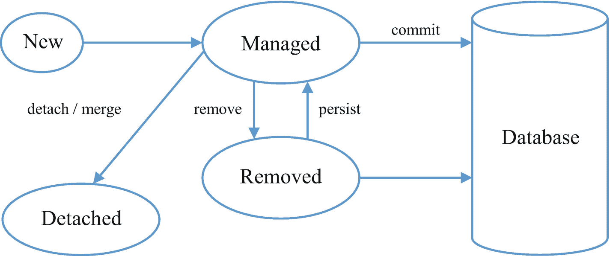

# 4. JPA 常见用例

到目前为止，我们已经了解了 JPA 与 Spring Data 的基本设置。在本章中，我们将介绍 Spring Data JPA 的典型行业用例和解决方案：

*   多数据源交互

*   解决 N+1 问题

*   使用构造函数将原生查询结果映射到 DTO

*   将原生查询结果映射到投影

*   Spring Converter 服务在原生查询中的作用

*   实体生命周期、ACID 属性、CAP 定理和隔离级别等概念

在本章中，我们将创建一个名为 `eshop` 的新应用。本章的所有小节将逐步更新代码。应用的代码结构如下所示：

```
.
├── build.gradle
├── gradle
│   └── wrapper
│       ├── gradle-wrapper.jar
│       └── gradle-wrapper.properties
├── gradlew
├── gradlew.bat
└── src
└── main
├── java
│   └── com
│       └── example
│           └── eshop
│               ├── Application.java
│               ├── config
│               │   ├── DbConfigPrimary.java
│               │   └── DbConfigSecondary.java
│               ├── converter
│               │   └── CustomerAddressConverter.java
│               ├── model
│               │   ├── dto
│               │   │   └── CustomerDto.java
│               │   ├── history
│               │   │   └── PurchaseHistory.java
│               │   ├── orders
│               │   │   ├── Customer.java
│               │   │   ├── Order.java
│               │   │   └── Product.java
│               │   ├── projection
│               │   │   └── CustomerProjection.java
│               │   └── type
│               │       └── CustomerAddress.java
│               ├── repository
│               │   ├── history
│               │   │   └── PurchaseHistoryRepository.java
│               │   └── orders
│               │       ├── CustomerRepository.java
│               │       ├── OrderRepository.java
│               │       └── ProductRepository.java
│               └── service
│                   └── impl
│                       ├── CustomerService.java
│                       └── ProductService.java
└── resources
├── application.properties
└── application.yml
22 directories, 24 files
```

## 多数据源交互

Spring Data JPA 中的这一关键特性将 Java 和 Spring 与其他语言框架区分开来，因为这并非基本需求，而是企业应用中罕见但极具潜力的功能。有时，应用程序必须同时与不同的数据库进行通信。让我们以创建一个电商在线书店为例。我们将为同一个微服务在 MySQL 中创建和存储客户、产品及订单数据，并在 PostgreSQL 中存储购买历史记录。

在功能上，我们将模拟一个流程：首先保存新的客户和产品对象。然后，我们将购买该产品，并使用 MySQL 作为数据存储。对于同一笔购买，我们将把购买历史记录存储在 PostgreSQL 数据库中，用于分析。从技术上讲，这将涉及：

*   为连接创建独立的数据源属性。

*   创建两个数据源和 `entityManager` 工厂 Bean。

*   为了清晰起见，在不同的包中创建数据或领域模型以及仓库。实体类和仓库不要求放在不同的包中，但保持一致性更好。

现在，让我们为我们的用例构建示例应用。


### 应用设置

从 [`http://www.spring.io`](http://www.spring.io) 创建一个名为 `eshop-ch4` 的新应用，并在 `build.gradle` 文件中包含以下依赖项：

```
dependencies {
compile ([
"org.springframework.boot:spring-boot-starter-web",
"org.springframework.boot:spring-boot-starter-jdbc",
"org.springframework.boot:spring-boot-starter-data-jpa"
])
compile ([
"mysql:mysql-connector-java:8.0.15",
"org.postgresql:postgresql:42.2.5",
"org.projectlombok:lombok:1.18.6"
])
testCompile("junit:junit")
annotationProcessor 'org.projectlombok:lombok:1.18.6'
}
```

### 数据源配置

所有与数据源相关的属性都定义在 `application.yml` 或 `application.properties` 中，但针对我们的用例，我们还需要在 Java 配置中定义数据源 Java Bean。对于单个数据源，Java Bean 配置步骤并非必需，配置文件中的属性就已足够。以下代码定义了两个不同的数据库配置，分别由数据源 Bean（`LocalEntityManagerFactory`）和事务管理器组成。清单 4-1 定义了主数据源的配置，清单 4-2 则涉及辅助数据源。

```
package com.example.eshop.config;
import lombok.extern.slf4j.Slf4j;
import org.springframework.beans.factory.annotation.Qualifier;
import org.springframework.boot.autoconfigure.EnableAutoConfiguration;
import org.springframework.boot.context.properties.ConfigurationProperties;
import org.springframework.boot.jdbc.DataSourceBuilder;
import org.springframework.boot.orm.jpa.EntityManagerFactoryBuilder;
import org.springframework.context.annotation.Bean;
import org.springframework.context.annotation.Configuration;
import org.springframework.context.annotation.Primary;
import org.springframework.data.jpa.repository.config.EnableJpaRepositories;
import org.springframework.jdbc.core.JdbcTemplate;
import org.springframework.orm.jpa.JpaTransactionManager;
import org.springframework.orm.jpa.LocalContainerEntityManagerFactoryBean;
import org.springframework.transaction.PlatformTransactionManager;
import javax.persistence.EntityManagerFactory;
import javax.sql.DataSource;
import java.util.HashMap;
import java.util.Map;
@Configuration
@EnableAutoConfiguration
@EnableJpaRepositories(
entityManagerFactoryRef = "entityManagerFactory",
transactionManagerRef = "transactionManager",
basePackages = { "com.example.eshop.repository.orders" })
@Slf4j
public class DbConfigPrimary {
@Bean(name = "dataSource")
@Primary
@ConfigurationProperties(prefix = "spring.datasource.orders")
public DataSource dataSourcePrimary() {
return DataSourceBuilder.create().build();
}
@Primary
@Bean(name = "entityManagerFactory")
public LocalContainerEntityManagerFactoryBean entityManagerFactory(
EntityManagerFactoryBuilder builder, @Qualifier("dataSource") DataSource dataSource)
{
return builder
.dataSource(dataSource)
.packages("com.example.eshop.model.orders")
.persistenceUnit("orders")
.properties(jpaProperties())
.build();
}
@Primary
@Bean(name = "transactionManager")
public PlatformTransactionManager transactionManager(
@Qualifier("entityManagerFactory") EntityManagerFactory
entityManagerFactory
) {
return new JpaTransactionManager(entityManagerFactory);
}
private Map jpaProperties() {
Map props = new HashMap();
props.put("hibernte.ejb.naming_strategy", "org.hibernate.cfg.ImprovedNamingStrategy");
props.put("hibernate.dialect", "org.hibernate.dialect.MySQL5InnoDBDialect");
props.put("hibernate.hbm2ddl.auto", "create-drop");
return props;
}
}
清单 4-1
主数据库配置
```

清单 4-2 中的辅助配置与上一个类似，只是常量和属性查找发生了变化。

```
package com.example.eshop.config;
import lombok.extern.slf4j.Slf4j;
import org.springframework.beans.factory.annotation.Qualifier;
import org.springframework.boot.context.properties.ConfigurationProperties;
import org.springframework.boot.jdbc.DataSourceBuilder;
import org.springframework.boot.orm.jpa.EntityManagerFactoryBuilder;
import org.springframework.context.annotation.Bean;
import org.springframework.context.annotation.Configuration;
import org.springframework.data.jpa.repository.config.EnableJpaRepositories;
import org.springframework.orm.jpa.JpaTransactionManager;
import org.springframework.orm.jpa.LocalContainerEntityManagerFactoryBean;
import org.springframework.transaction.PlatformTransactionManager;
import javax.persistence.EntityManagerFactory;
import javax.sql.DataSource;
import java.util.HashMap;
import java.util.Map;
@Configuration
@EnableJpaRepositories(
entityManagerFactoryRef = "entityManagerFactoryHistory",
transactionManagerRef = "transactionManagerHistory",
basePackages = { "com.example.eshop.repository.history" })
@Slf4j
public class DbConfigSecondary {
@Bean(name = "dataSourceHistory")
@ConfigurationProperties(prefix = "spring.datasource.history")
public DataSource dataSourceSecondary() {
return DataSourceBuilder.create().build();
}
@Bean(name = "entityManagerFactoryHistory")
public LocalContainerEntityManagerFactoryBean entityManagerFactory(
EntityManagerFactoryBuilder builder, @Qualifier("dataSourceHistory") DataSource dataSource)
{
log.info("Secondary EM initialized");
return builder
.dataSource(dataSource)
.packages("com.example.eshop.model.history")
.persistenceUnit("history")
.properties(jpaProperties())
.build();
}
@Bean(name = "transactionManagerHistory")
public PlatformTransactionManager transactionManager(
@Qualifier("entityManagerFactoryHistory") EntityManagerFactory entityManagerFactory
) {
return new JpaTransactionManager(entityManagerFactory);
}
private Map jpaProperties() {
Map props = new HashMap();
props.put("hibernte.ejb.naming_strategy", "org.hibernate.cfg.ImprovedNamingStrategy");
props.put("hibernate.dialect", "org.hibernate.dialect.PostgreSQLDialect");
props.put("hibernate.hbm2ddl.auto", "create-drop");
return props;
}
}
清单 4-2
辅助数据库配置
```

注意：

*   我们在此代码中为持久化单元定义了两个不同的名称。例如，清单 4-1 中的 `builder.persistenceUnit("orders")` 行和清单 4-2 中的 `builder.persistenceUnit("history")` 行。

*   定义 `transactionManager` 除了 `@Qualifier` 的使用外，其含义不言自明，`@Qualifier` 在 Spring 中用于区分两个同名或同类型的 Bean。

*   我们还使用了 `@Primary` 注解，将 Bean 声明为同一 Spring 上下文中的默认数据源。

*   我们通过代码中的包，在三个层级上区分这些类：
    1.  在最上层，我们通过 `@EnableJpaRepositories` 注解中的 `basePackages` 属性来区分仓库位置，如下所示：
        *   （来自清单 4-1。）

```
            @EnableJpaRepositories(
            entityManagerFactoryRef = "entityManagerFactory",
            transactionManagerRef = "transactionManager",
            basePackages = { "com.example.eshop.repository.orders" })
            ```

*   （来自清单 4-2。）

```
            @EnableJpaRepositories(
            entityManagerFactoryRef = "entityManagerFactoryHistory",
            transactionManagerRef = "transactionManagerHistory",
            basePackages = { "com.example.eshop.repository.history" })
            ```

2.  `DatasourceBuilder` 将在主配置和辅助配置中查找前缀为 `spring.datasource.orders` 和 `spring.datasource.history` 的属性。

3.  `EntityManagerFactoryBuilder` 将使用不同的包来构建 Bean，如 `builder.packages("com.example.eshop.model.orders")` 行所示。


### 数据模型与仓库

如前所述，我们将为模型和仓库定义两个独立的包，以保持代码整洁。清单 4-3 展示了主数据源和辅助数据源的模型类。

```
package com.example.eshop.model.orders;
import java.io.Serializable;
import java.time.LocalDateTime;
import java.util.List;
import java.util.Set;
import javax.persistence.*;
import com.fasterxml.jackson.annotation.JsonIgnore;
import lombok.*;
@Data
@Entity
@ToString(exclude = {"orders"})
@EqualsAndHashCode(exclude = {"orders"})
public class Customer implements Serializable {
@Id
@GeneratedValue(strategy=GenerationType.IDENTITY)
private Long customerId;
private String name, email, password;
private LocalDateTime dateAdded;
@JsonIgnore
@OneToMany(fetch = FetchType.LAZY)
@JoinColumn(name = "customerId")
Set orders;
}
@Data
@Entity
public class Product implements Serializable {
@Id
@GeneratedValue(strategy=GenerationType.IDENTITY)
private Long productId;
private String name;
private Integer price, quantity;
}
@Data
@Entity
@Table(name="CustomerOrder")
public class Order implements Serializable {
@Id
@GeneratedValue(strategy=GenerationType.IDENTITY)
private Long orderId;
private Long productId, customerId;
private int quantity, price;
}
package com.example.eshop.model.history;
@Data
@Entity
@Table(name="PurchaseHistory")
public class PurchaseHistory implements Serializable {
@Id
@GeneratedValue(strategy=GenerationType.IDENTITY)
private Long id;
private Long customerId, productId;
private Date createdDate;
}
清单 4-3
领域模型定义
```

清单 4-4 展示了主数据源和辅助数据源的仓库。

```
package com.example.eshop.repository.orders;
import com.example.eshop.model.orders.Customer;
import org.springframework.data.jpa.repository.JpaRepository;
import org.springframework.data.jpa.repository.Query;
import java.util.List;
import java.util.Optional;
public interface CustomerRepository extends JpaRepository{ }
public interface OrderRepository extends JpaRepository{ }
public interface ProductRepository extends JpaRepository { }
package com.example.eshop.repository.history;
public interface PurchaseHistoryRepository extends JpaRepository{ }
清单 4-4
仓库定义
```

数据模型定义相当直观。在我们的用例中不需要任何自定义方法，因此在清单 4-3 和 4-4 中，我们给出了空的仓库定义。

### 服务定义

为了支持我们的用例，我们需要定义两个服务类来处理业务逻辑，如清单 4-5 所示。

```
package com.example.eshop.service.impl;
import com.example.eshop.model.history.PurchaseHistory;
import com.example.eshop.model.orders.Product;
import com.example.eshop.repository.history.PurchaseHistoryRepository;
import com.example.eshop.repository.orders.ProductRepository;
import lombok.extern.slf4j.Slf4j;
import org.springframework.beans.factory.annotation.Autowired;
import org.springframework.stereotype.Service;
import org.springframework.transaction.annotation.Transactional;
import com.example.eshop.model.orders.Order;
import com.example.eshop.repository.orders.OrderRepository;
import java.util.Date;
import java.util.List;
@Service
@Slf4j
public class ProductService {
@Autowired
OrderRepository orderRepository;
@Autowired
ProductRepository productRepository;
@Autowired
PurchaseHistoryRepository purchaseHistoryRepository;
@Transactional
public Boolean purchase(Long productId, Long customerId, int quantity, int price) {
Boolean success = Boolean.TRUE;
Order order = new Order();
order.setCustomerId(customerId);
order.setProductId(productId);
order.setPrice(price);
order.setQuantity(quantity);
orderRepository.save(order);
return success;
}
@Transactional
public void saveHistory(Long customerId, Long productId)   {
PurchaseHistory ph = new PurchaseHistory();
ph.setCustomerId(customerId);
ph.setProductId(productId);
ph.setCreatedDate(new Date());
purchaseHistoryRepository.save(ph);
}
public void registerNewProducts() {
Product product = new Product();
product.setName("Superb Java");
product.setPrice(400);
product.setQuantity(3);
productRepository.save(product);
}
public List findAll() {
return productRepository.findAll();
}
}
package com.example.eshop.service.impl;
import com.example.eshop.model.orders.Customer;
import com.example.eshop.repository.orders.CustomerRepository;
import lombok.extern.slf4j.Slf4j;
import org.springframework.beans.factory.annotation.Autowired;
import org.springframework.stereotype.Service;
import org.springframework.transaction.annotation.Isolation;
import org.springframework.transaction.annotation.Propagation;
import org.springframework.transaction.annotation.Transactional;
import java.time.LocalDateTime;
import java.util.List;
@Service
@Slf4j
public class CustomerService {
@Autowired
CustomerRepository customerRepository;
@Transactional(propagation=Propagation.REQUIRED, isolation=Isolation.DEFAULT)
public void registerNewCustomers() {
Customer customer = new Customer();
customer.setName("Raj Malhotra");
customer.setEmail("raj.malhotra@example.com");
customer.setPassword("password");
customer.setDateAdded(LocalDateTime.now());
customerRepository.saveAndFlush(customer);
log.info("所有已注册的客户: " + customerRepository.findAll());
}
public List findAll()    {
return customerRepository.findAll();
}
}
清单 4-5
服务定义
```

只需调用这些服务类的方法，即可在同一个微服务内将事务详情保存到 MySQL，并将其历史记录保存到 PostgreSQL。最后，我们需要定义配置属性。我们将在 `application.properties` 文件中定义 JPA 相关的属性，其余属性定义在 `application.yml` 中，以保持更高的可读性。

注意：

*   `CustomerService` 包含注册新示例客户和获取所有客户的方法。

*   `ProductService` 包含注册新产品、为客户执行购买操作以及保存此事务历史记录的方法。

### 应用配置

在清单 4-6 中，我们启用了应用启动时数据库的自动创建功能。应用停止后，所有表都应被删除。

```
application.properties
spring.datasource.orders.jdbcUrl=jdbc:mysql://localhost:3306/db1
spring.datasource.orders.username=root
spring.datasource.orders.password=mysql
spring.datasource.orders.driver-class-name: com.mysql.jdbc.Driver
spring.datasource.orders.dialect=org.hibernate.dialect.MySQL5InnoDBDialect
spring.datasource.history.jdbcUrl=jdbc:postgresql://localhost:5432/db2
spring.datasource.history.username=postgres
spring.datasource.history.password=postgres
spring.datasource.history.dialect=org.hibernate.dialect.PostgreSQLDialect
spring.jpa.hibernate.ddl-auto=create-drop
spring.jpa.properties.hibernate.jdbc.lob.non_contextual_creation: true
application.yml
server:
context-path: /eshop
port: 8080
spring:
jpa:
hibernate.ddl-auto: create-drop
show-sql: true
generate-ddl: true
清单 4-6
配置文件
```

除了 `spring.jpa.properties.hibernate.jdbc.lob.non_contextual_creation` 之外，我们在上一章中已经见过这些属性中的大部分。该属性用于抑制由 PostgreSQL JDBC 驱动程序启动的警告消息。隐式地，`java.sql.Connection` 在 JDBC 驱动程序类中被加载，并且不涵盖 JDBC4 LOB 创建方法。


### 应用类

为了验证这段代码，我们创建了 `Application` 类，并按顺序执行代码中的服务方法（参见清单 4-7）。

```
package com.example.eshop;
import com.example.eshop.model.orders.Customer;
import com.example.eshop.repository.history.PurchaseHistoryRepository;
import com.example.eshop.repository.orders.CustomerRepository;
import com.example.eshop.repository.orders.OrderRepository;
import com.example.eshop.service.impl.CustomerService;
import com.example.eshop.service.impl.ProductService;
import lombok.extern.slf4j.Slf4j;
import org.springframework.beans.factory.annotation.Autowired;
import org.springframework.boot.CommandLineRunner;
import org.springframework.boot.SpringApplication;
import org.springframework.boot.autoconfigure.SpringBootApplication;
import java.util.List;
@SpringBootApplication
@Slf4j
public class Application implements CommandLineRunner {
@Autowired
ProductService productService;
@Autowired
CustomerService customerService;
@Autowired
OrderRepository orderRepository;
@Autowired
CustomerRepository customerRepository;
@Autowired
PurchaseHistoryRepository purchaseHistoryRepository;
public static void main(String[] args) throws Exception {
SpringApplication.run(Application.class, args);
}
@Override
public void run(String... strings) throws Exception {
customerService.registerNewCustomers();
productService.registerNewProducts();
productService.purchase(1l, 1l, 2, 400);
productService.saveHistory(1l, 1l);
log.info("Customers {}", customerService.findAll());
log.info("Products {}", productService.findAll());
log.info("Orders {}", orderRepository.findAll());
log.info("PurchaseHistory {}", purchaseHistoryRepository.findAll());
}
}
清单 4-7
应用类
```

### 运行应用

使用以下命令从命令行运行 Gradle 应用：

```
> gradle bootRun
>
com.example.eshop.Application : Customers [Customer(customerId=1, name=Raj Malhotra, email=raj.malhotra@example.com, password=password, dateAdded=2019-02-13T13:53:26)]
com.example.eshop.Application : Products [Product(productId=1, name=Superb Java, price=400, quantity=3)]
com.example.eshop.Application : Orders [Order(orderId=1, productId=1, customerId=1, quantity=2, price=400)]
com.example.eshop.Application : PurchaseHistory [PurchaseHistory(id=1, customerId=1, productId=1, createdDate=2019-02-13 13:53:26.447)]
```

日志语句显示新客户（Raj Malhotra）和产品（Superb Java）已成功注册。下一条语句显示在 MySQL 中成功创建了订单。最后一条语句显示了在 PostgreSQL 数据库中维护的订单历史记录。

让我们查看数据库表：

```
MYSQL:
> mysql -u root -pmysql -h localhost
mysql> create database db1;
mysql> use db1;
mysql> Select * from product;
+-----------+-------------+-------+----------+
| productId | name        | price | quantity |
+-----------+-------------+-------+----------+
|         1 | Superb Java |   400 |        3 |
+-----------+-------------+-------+----------+
PostgreSQL:
> psql "dbname=postgres host=localhost user=postgres password=postgres port=5432"
> postgres=# create database db2;
> postgres=# \c db2;
> db2=# Select * from purchasehistory;
id |       createddate       | customerid | productid
----+-------------------------+------------+-----------
1 | 2019-03-31 20:58:53.433 |          1 |         1
```

在以下章节中，我们仅介绍输出中的应用日志。

## 解决 N+1 问题

关于 ORM，我们经常听到的一个常见问题是 N+1 问题。这是一个误解，认为 N+1 问题只发生在 ORM 中。实际上，这是一个通用的数据访问问题，在从 RDBMS 获取数据时可能发生。考虑上一节的示例，如果我们想获取用户列表及其撰写的帖子，默认情况下 Hibernate 会触发一个查询来获取所有用户，然后触发 N 个查询来获取每个返回用户对象的 `POST`。这种情况称为 N+1 问题。如果你通过 JDBC 以包含子对象列表的父对象列表形式获取数据，同样的问题也会存在。有三种方法可以通过 JPA 查询具有关联的实体来克服此问题：

*   在 JPQL 中使用 `left fetch join` 子句进行查询
*   先获取用户对象，然后单独获取这些用户的 `POST` 对象
*   使用原生查询将结果作为单个组合结果映射到 DTO

### 在 JPQL 中使用左连接抓取子句进行查询

此方法将在生成的查询中添加左外连接，从而产生连接表的笛卡尔积。ORM 将进一步将结果映射回父实体和子实体列表。要查看实际效果，我们需要更改上一节中的 `CustomerRepository` 代码。在清单 4-8 中，我们添加了一个带有 JPQL 查询的新自定义方法，并从 `Application` 类中执行它作为示例。

```
public interface CustomerRepository extends JpaRepository{
/* N+1 示例 */
@Query("Select c from Customer c left join fetch c.orders")
List findCustomersWithOrderDetails();
}
@SpringBootApplication
@Slf4j
public class Application implements CommandLineRunner {
@Autowired
ProductService productService;
@Autowired
CustomerService customerService;
@Autowired
OrderRepository orderRepository;
@Autowired
CustomerRepository customerRepository;
@Autowired
PurchaseHistoryRepository purchaseHistoryRepository;
@Override
public void run(String... strings) throws Exception {
customerService.registerNewCustomers();
productService.registerNewProducts();
productService.purchase(1l, 1l, 2, 400);
productService.saveHistory(1l, 1l);
log.info("Customers {}", customerService.findAll());
log.info("Products {}", productService.findAll());
log.info("Orders {}", orderRepository.findAll());
log.info("PurchaseHistory {}",
purchaseHistoryRepository.findAll());
nPlusOneExample();
}
public void nPlusOneExample()   {
List customerList =
customerRepository.findCustomersWithOrderDetails();
log.info("Customers List with Order Details: {}", customerList);
}
}
清单 4-8
CustomerRepository 和 Application 的更改
```

#### 再次运行 Eshop 应用

当我们运行前面的代码时，它将生成一个单一的 Hibernate 查询，而不是多个查询，并在控制台中打印该查询：

```
> gradle bootRun
>
com.example.eshop.Application : Starting Application on Rajs-MacBook-Pro.local with PID 38997 (started by raj in /Users/raj/work_all/book_ code/rapid-java-persistence-and-microservices/ch4/eshop-ch4)
Hibernate: select distinct customer0_.customerId as customer1_0_0_, orders1_.orderId as orderId1_1_1_, customer0_.dateAdded as dateAdde2_0_0_, customer0_.email as email3_0_0_, customer0_.name as name4_0_0_, customer0_.password as password5_0_0_, orders1_.customerId as customer2_1_1_, orders1_.price as price3_1_1_, orders1_.productId as productI4_1_1_, orders1_.quantity as quantity5_1_1_, orders1_.customerId as customer2_1_0__, orders1_.orderId as orderId1_1_0__ from Customer customer0_ left outer join CustomerOrder orders1_ on customer0_.customerId=orders1_.customerId
com.example.eshop.Application : Customer Order Details:  [Customer(customerId=1, name=Raj Malhotra, email=raj.malhotra@example.com, password=password, dateAdded=2019-03-31T15:16:40, customerAddress=null, orders=[Order(orderId=1, productId=1, customerId=1, quantity=2, price=400)])]
```

前面的查询将生成一个扁平的结果集，其中包含来自连接表的所有字段的组合。Hibernate 将过滤掉重复的行/列，并将左侧映射到相应的对象。


### 先获取用户对象，再分别为这些用户获取帖子对象

作为一种简单的替代方案，我们可以先获取用户对象列表，然后在第二次查询中获取相关的 `POST` 对象列表。这种方法存在两个问题：

*   第二次查询必须使用 `IN` 子句来执行，这被认为不是一种好的实践。数据库中的 `IN` 子句通常会被重写为 `OR` 子句，这可能导致数据库在每次参数变化时重新解析和重建执行计划。如果目标列已建立索引且参数数量较少，你仍然可以获得不错的性能。

*   客户端代码将不得不遍历两个独立的列表。

### 使用原生查询将结果作为单个组合结果映射到 DTO

使用这种技术，可以执行带有外连接的自定义查询，并将结果映射到单个对象列表。这意味着不存在嵌套的父子对象结构，并且列表中的某些字段可能具有相同的值。

## 使用构造器映射进行 JPA 查询

在 JPA 2.2 中，有多种解决方案可以将 JPA 查询的结果映射回任何实体对象或实体对象列表。其中最简单的方法是使用任何自定义 POJO 提供的构造器。让我们看看清单 4-9 中的示例。

```
package com.example.eshop.model.dto;
import lombok.Data;
@Data
@AllArgsConstructor
public class CustomerDto {
private Integer id;
private String name;
}
public interface CustomerRepository extends JpaRepository{
// 使用构造器映射的查询示例
@Query(value = "Select new com.example.eshop.model.dto.CustomerDto(c.id, c.name) from Customer c")
List findCustomers();
}
@SpringBootApplication
@Slf4j
public class Application implements CommandLineRunner {
@Override
public void run(String... strings) throws Exception {
constructorMappingExample();
}
public void constructorMappingExample() {
List customersList = customerRepository.findCustomers();
log.info("使用构造器映射查询结果的客户列表: {}", customersList);
}
}
清单 4-9
DTO 和 CustomerRepository
```

注意：

*   我们在代码库中添加了一个新类 `CustomerDto`。该类没有实体注解，并且仅通过特定属性精确映射到前端应用的需求。该类还应具有一个构造器，该构造器包含需要通过查询结果映射填充的所有字段。

*   我们还在 `CustomerRepository` 中添加了一个新方法，并通过 `@Query` 注解在其上添加了自定义查询。

*   在 JPQL 查询中，我们通过其 `com.example.eshop.model.dto.CustomerDto(c.id, c.name)` 构造器直接创建了一个新的 Java 对象。

### 为构造器映射用例再次运行 Eshop 应用

运行应用：

```
> gradle clean build
> gradle bootRun
>
com.example.eshop.Application : 使用构造器映射查询结果的客户列表: [CustomerDto(id=1, name=Raj Malhotra)]
```

## 使用映射到投影进行 JPA 查询

Spring Data 也可以返回任何实体的投影或映射接口作为 JPQL 的结果。在 Spring Data 中，投影很容易实现。最简单的方法是声明一个接口，该接口公开要读取的属性的访问器方法。这些接口也可以嵌套。让我们通过清单 4-10 中的示例来了解这一点。

```
package com.example.eshop.model.projection;
import org.springframework.beans.factory.annotation.Value;
public interface CustomerProjection {
String getName();
String getEmail();
@Value("#{target.name + '_' + target.email}")
String getCustomerNameWithEmail();
}
package com.example.eshop.repository.orders;
import com.example.eshop.model.dto.CustomerDto;
import com.example.eshop.model.orders.Customer;
import com.example.eshop.model.projection.CustomerProjection;
import org.springframework.data.jpa.repository.JpaRepository;
import org.springframework.data.jpa.repository.Query;
import java.util.Collection;
import java.util.List;
public interface CustomerRepository extends JpaRepository{
/* N+1 示例 */
@Query("Select c from Customer c left join fetch c.orders")
List findCustomersWithOrderDetails();
// 使用构造器映射的查询示例
@Query(value = "Select new com.example.eshop.model.dto.CustomerDto(c.id, c.name) from  Customer c")
List findCustomers();
// 投影示例
@Query("Select c from Customer c")
List findAllCustomers();
CustomerProjection findOneByName(String name);
}
清单 4-10
投影示例
```

注意：

*   我们在此代码中定义了 `Projection` 接口，其属性名称与返回的原始实体对象（客户）列表中的属性名称匹配。

*   通过此接口定义，Spring 会动态创建投影接口的代理，执行映射，并将这些代理作为输出返回。

*   Spring 允许在这些访问器方法之上提供 SpEL（Spring 表达式语言）表达式来操作结果。例如，我们在 `getCustomerNameWithEmail()` 方法之上使用 SpEL 连接了姓名和电子邮件。此表达式中的 `target` 字段由 Spring 映射到返回的对象。

*   投影仅基于返回的对象工作。因此，任何基于 Spring Data DSL 的方法也将起作用。这通过清单 4-10 中的 `findOneByName(String name)` 示例方法进行了展示。

我们还需要更改 `Application` 类，如清单 4-11 所示，以测试清单 4-10 中的代码。

```
@SpringBootApplication
@Slf4j
public class Application implements CommandLineRunner {
@Autowired
CustomerRepository customerRepository;
public static void main(String[] args) throws Exception {
SpringApplication.run(Application.class, args);
}
@Override
public void run(String... strings) throws Exception {
projectionsExample();
List customers = customerRepository.findWithOrders();
log.info("带订单的客户");
customers.forEach(customer -> {
log.info("客户姓名: {}", customer.getCustomerNameWithEmail());
//log.info("订单: {}", customer.getOrderProjection().getPrice());
});
log.info("再次查询客户: {}",
customerRepository.findOneProjectedByName("Raj Malhotra").getCustomerNameWithEmail());
}
public void projectionsExample() {
List customers =
customerRepository.findAllCustomers();
log.info("使用投影的客户列表");
customers.forEach(customer -> {
log.info("客户姓名: {}",
customer.getCustomerNameWithEmail());
});
log.info("查找单个客户: {}",
customerRepository.findOneByName("Raj Malhotra").getCustomerNameWithEmail());
}
}
清单 4-11
Application 类
```


### 为投影用例再次运行 Eshop 应用程序

运行应用程序：

```
> gradle clean build
> gradle bootRun
>
INFO 40196 --- [           main] com.example.eshop.Application            : No active profile set, falling back to default profiles: default
Hibernate: drop table if exists Customer
Hibernate: drop table if exists CustomerOrder
Hibernate: drop table if exists Product
Hibernate: create table Customer (customerId bigint not null auto_increment, customerAddress varchar(255), dateAdded datetime, email varchar(255), name varchar(255), password varchar(255), primary key (customerId)) engine=InnoDB
Hibernate: create table CustomerOrder (orderId bigint not null auto_increment, customerId bigint, price integer not null, productId bigint, quantity integer not null, primary key (orderId)) engine=InnoDB
Hibernate: create table Product (productId bigint not null auto_increment, name varchar(255), price integer, quantity integer, primary key (productId)) engine=InnoDB
INFO 40196 --- [           main] c.e.eshop.config.DbConfigSecondary: Secondary EM initialized
INFO 40196 --- [           main] com.example.eshop.Application : Customers List with Constructors mapped query results: [CustomerDto(id=1, name=Raj Malhotra)]
INFO 40196 --- [           main] com.example.eshop.Application: Customers List with Projections
INFO 40196 --- [           main] com.example.eshop.Application: Projections Example, Customer Name With Email: Raj malhotra_raj.malhotra@example.com
INFO 40196 --- [           main] com.example.eshop.Application: Projections Example, Find Single Customer : Raj Malhotra_raj.malhotra@example.com
```

通过此输出，我们可以看到 Spring 已将返回的 `Customer` 对象的 `name` 和 `email` 组合起来，然后以字符串形式返回输出——`Raj` Malhotra_raj.malhotra@example.com。

## Spring 转换器服务

Spring 框架提供了一个有趣的服务，可以帮助你将自定义类视为实体字段。该服务将管理其从数据库特定数据类型到基于 Java 的类型的来回转换。请参考清单 4-12 中的示例，了解如何在 `User` 类中使用它。

```
package com.example.eshop.model.type;
import lombok.Data;
import java.io.Serializable;
@Data
public class CustomerAddress implements Serializable {
private String streetAddress;
private String city;
private String country;
}
Listing 4-12
CustomerAddress 类型
```

清单 4-12 定义了一个新类，它应被视为我们实体模型的一个复合对象数据类型。JDBC 驱动程序可以处理原生数据类型，但自定义类不能作为数据类型映射到对象字段。通过使用 Spring 转换器服务，我们可以定义 Spring 框架如何将对象字段转换/序列化为单个数据元素。此外，我们还可以定义它们应如何分解并映射到字段对象。例如，我们将 `CustomerAddress` 对象字段转换为逗号分隔的字符串，然后再转换回来（参见清单 4-13）。

```
package com.example.eshop.converter;
import com.example.eshop.model.type.CustomerAddress;
import javax.persistence.AttributeConverter;
public class CustomerAddressConverter implements
AttributeConverter {
@Override
public String convertToDatabaseColumn(CustomerAddress customerAddress) {
if(customerAddress == null)
return "";
return  customerAddress.getStreetAddress() + ", " +
customerAddress.getCity() + ", " +
customerAddress.getCountry();
}
@Override
public CustomerAddress convertToEntityAttribute(String value) {
CustomerAddress customerAddress = null;
if(value != null && value.contains(",")) {
String[] tokens = value.split(",");
customerAddress = new CustomerAddress();
customerAddress.setStreetAddress(tokens[0]);
customerAddress.setCity(tokens[1]);
customerAddress.setCountry(tokens[2]);
}
return customerAddress;
}
}
Listing 4-13
类型转换器
```

`convertToDatabaseColumn` 方法将对象转换为字符串，而 `convertToEntityAttribute` 方法则执行相反的操作。让我们看看如何在清单 4-14 中使用这个类。

```
package com.example.eshop.model.orders;
import java.io.Serializable;
import java.time.LocalDateTime;
import java.util.List;
import java.util.Set;
import javax.persistence.*;
import com.example.eshop.converter.CustomerAddressConverter;
import com.example.eshop.model.type.CustomerAddress;
import com.fasterxml.jackson.annotation.JsonIgnore;
import lombok.*;
@Data
@Entity
@ToString(exclude = {"orders"})
@EqualsAndHashCode(exclude = {"orders"})
public class Customer implements Serializable {
@Id
@GeneratedValue(strategy=GenerationType.IDENTITY)
private Long customerId;
private String name, email, password;
private LocalDateTime dateAdded;
@Column
@Convert(converter = CustomerAddressConverter.class)
CustomerAddress customerAddress;
@JsonIgnore
@OneToMany(fetch = FetchType.LAZY)
@JoinColumn(name = "customerId")
Set orders;
}
Listing 4-14
客户实体变更
```

请注意，在这段代码中，我们添加了一个新字段，并用 `@Convert` 注解标记了它。

```
@Column
@Convert(converter = CustomerAddressConverter.class)
CustomerAddress customerAddress;
```

在保存和获取客户实体时，Spring Data JPA 将隐式地执行这种来回转换。

## 重要的 JPA 概念

在结束对 Spring Data JPA 常见用例和解决方案的回顾之前，让我们快速总结一些有助于加深对 JPA 内部机制理解的概念。

### JPA 托管实体及其生命周期

托管实体对象是实体类（可持久化的用户定义类）的内存实例，可以表示数据库中的物理对象。我们不会深入探讨 JPA 标准规范的细节，但让我们回顾一下托管对象的生命周期，如图 4-1 所示，然后继续我们的示例。



图 4-1

JPA 实体对象生命周期

当实体对象最初创建时，其状态为 `New`。当实体对象被持久化到数据库时，它变为 `Managed` 状态。当 `Managed` 对象被修改时，其更改会被所属的 `EntityManager`（由 Spring 管理）检测到。更改会在 `commit` 事务时传播到数据库。当对象被检索并标记为删除时，它会被标记为 `REMOVED` 状态。任何预先加载到内存中的关联对象也会被标记为删除。最后一个状态称为 `DETACHED`，当 `EntityManager` 关闭时进入该状态。

JPA 规范中还提供了回调方法，允许用户在对象进入相应状态之前执行操作。这些方法使用以下注解进行标注：

*   `@PrePersist/@PostPersist`

*   `@PreRemove/@PostRemove`

*   `@PreUpdate/@PostUpdate`

*   `@PostLoad`

用例：

*   这些方法的一个典型用例是记录或标记时间戳以进行审计。

*   另一个用例可能是在更新任何对象时触发任何其他功能。

### 隔离级别、锁定和性能

隔离级别对于决定事务策略、锁定行为以及在高并发或高读写率的事务型应用程序中给定的数据库性能至关重要。

让我们快速回顾一下事务中与数据读取相关的行为。


#### 数据读取现象

*   **脏读：** 允许读取未提交或脏数据。当一个事务 T1 正在修改记录，而另一个事务 T2 在第一个事务提交或回滚之前读取了该记录时，就会发生脏读。存在一种可能性：事务 T1 读取了一些数据，但这些数据可能因为事务 T2 已回滚而不再存在。数据完整性受损，外键约束被违反，唯一约束被忽略。

*   **不可重复读：** 简单来说，这意味着在一个事务过程中读取的数据，如果再次读取，并不总是可重复的。如果你在时间 T1 读取了一行，并试图在时间 T2 重新读取同一行，该行可能在同一事务中被其他事务更改了。相同的行可能已经消失或被更新。

*   **幻读：** 这意味着如果你在时间 T1 执行一个查询，并在时间 T2 重新执行它，数据库中可能已添加了额外的行，这可能会影响你的结果。这与不可重复读不同，在幻读中，你已经读取的数据并未被更改。相反，可能有更多的数据满足你的查询条件。

#### 隔离级别

数据隔离级别有助于在更新数据库中的数据时，确保数据库性能与维护 ACID 属性之间取得适当的平衡。隔离级别越高，性能越低。基于这些行为，SQL 标准定义了四种隔离级别：

`READ_UNCOMITTED`

*   读取变体：脏读、不可重复读、幻读
*   性能：即使在高度并发环境下也最高
*   锁定：无
*   支持者：MYSQL (InnoDB), MSSQL

`READ_COMMITTED`

*   读取变体：不可重复读、幻读
*   性能：即使在高度并发环境下也良好
*   锁定：仅为 SELECT 或相关行获取共享锁
*   支持者：MYSQL (Innodb), MSSQL (默认), ORACLE (默认), POSTGRESQL (默认)

`REPEATABLE READ`

*   读取变体：幻读
*   性能：在高度并发环境下较慢
*   锁定：对选定的行获取共享锁；如果事务重试，新的更改（任何插入的新行）将可见
*   支持者：MYSQL (Innodb - 默认), MSSQL, POSTGRESQL

`SERIALIZABLE`

*   读取变体：幻读
*   性能：在高度并发环境下最慢
*   锁定：为整个表获取共享锁；即使事务重试，新的更改（任何插入的新行）也不可见
*   支持者：MYSQL (Innodb), MSSQL, ORACLE, POSTGRESQL

还有两个非 ANSI/SQL ISO 标准的隔离级别：

*   `READ-ONLY`：由 Oracle 只读事务支持；我们只能看到事务开始时已提交的更改。不允许使用 `INSERT`、`UPDATE` 和 `DELETE` 语句。
*   `SNAPSHOT`：类似于 Serializable，但内部通过每个事务的数据行版本控制（乐观并发模型）实现，并且不发生锁定。如果发现新版本，事务将回滚。

使用 JPA，我们可以通过 `@Transactional` 注解（`@Transactional( isolation=Isolation.DEFAULT)`）指定隔离级别，这有助于根据需要调整并发控制。

表 4-1 显示了在 Spring 的 `@Transactional` 注解中可以指定的可能值，以供快速参考。

表 4-1

数据读取行为表格对比

| 隔离级别 | 脏读 | 不可重复读 | 幻读 |
| --- | --- | --- | --- |
| `Read_Uncommitted` | 可能 | 可能 | 可能 |
| `Read_Committed` | 不可能 | 可能 | 可能 |
| `Repeatable_Read` | 不可能 | 不可能 | 可能 |
| `Serializable` | 不可能 | 不可能 | 不可能 |

### 有趣的 JPA 属性

通过以下属性，我们可以自定义 Hibernate 和 Spring 的日志记录行为。

*   这不是 JPA 的一部分；我们只是展示它来简化日志记录。
*   `logging.pattern.console=[%thread] %-5level %msg%n`
*   使用此属性，Hibernate 将开始为所有执行的 SQL 查询生成统计信息。
*   `spring.jpa.properties.hibernate.generate_statistics=true`
*   使用此属性，Hibernate 将在所有生成的 SQL 语句中添加注释，以提示生成的 SQL 试图做什么。
*   `spring.jpa.properties.hibernate.use_sql_comments=true`
*   用于以格式化形式打印 SQL。
*   `spring.jpa.properties.hibernate.format_sql=true`
*   Hibernate 使用此属性将生成的 SQL 查询记录到日志中。
*   `spring.jpa.hibernate.show-sql=true`

### 为 JPA 属性运行 Eshop 应用程序

在对本章代码中的 `application.yml` 或 `application.properties` 文件进行这些更改后，我们将在控制台上看到以下变化：


```
> gradle clean build
> gradle bootRun
>
:: Spring Boot ::        (v2.1.3.RELEASE)
[main] INFO  No active profile set, falling back to default profiles: default
[main] INFO  Bootstrapping Spring Data repositories in DEFAULT mode.
[main] INFO  Finished Spring Data repository scanning in 66ms. Found 3 repository interfaces.
[main] INFO  Bootstrapping Spring Data repositories in DEFAULT mode.
[main] INFO  Finished Spring Data repository scanning in 6ms. Found 1 repository interfaces.
[main] INFO  Tomcat initialized with port(s): 8080 (http)
[main] INFO  Starting Servlet engine: [Apache Tomcat/9.0.14]
[main] INFO  The APR based Apache Tomcat Native library which allows optimal
performance in production environments was not found on the java.library.path:
[/Users/raj/Library/Java/Extensions:/Library/Java/
Extensions:/Network/Library/Java/Extensions:/System/Library/Java/Extensions:/usr/lib/java:.]
[main] INFO  Initializing Spring embedded WebApplicationContext
[main] INFO  Root WebApplicationContext: initialization completed in 1967 ms
[main] INFO  HikariPool-1 - Starting...
[main] INFO  HikariPool-1 - Start completed.
[main] INFO  HHH000204: Processing PersistenceUnitInfo [
name: orders
...]
[main] INFO  HHH000412: Hibernate Core {5.3.7.Final}
[main] INFO  HHH000206: hibernate.properties not found
[main] INFO  HCANN000001: Hibernate Commons Annotations {5.0.4.Final}
[main] INFO  HHH000400: Using dialect: org.hibernate.dialect.MySQL5InnoDBDialect
[main] INFO  HHH000421: Disabling contextual LOB creation as hibernate.jdbc.lob.non_contextual_creation is true
Hibernate:
drop table if exists Customer
Hibernate:
drop table if exists CustomerOrder
Hibernate:
drop table if exists Product
Hibernate:
create table Customer (
customerId bigint not null auto_increment,
customerAddress varchar(255),
dateAdded datetime,
email varchar(255),
name varchar(255),
password varchar(255),
primary key (customerId)
) engine=InnoDB
[main] INFO  HHH000397: Using ASTQueryTranslatorFactory
[main] INFO  Tomcat started on port(s): 8080 (http) with context path "
[main] INFO  Started Application in 5.638 seconds (JVM running for 6.105)
Hibernate:
/* insert com.example.eshop.model.orders.Customer
*/ insert
into
Customer
(customerAddress, dateAdded, email, name, password)
values
(?, ?, ?, ?, ?)
[main] INFO  Session Metrics {
16418 nanoseconds spent acquiring 1 JDBC connections;
0 nanoseconds spent releasing 0 JDBC connections;
140914 nanoseconds spent preparing 1 JDBC statements;
730309 nanoseconds spent executing 1 JDBC statements;
0 nanoseconds spent executing 0 JDBC batches;
0 nanoseconds spent performing 0 L2C puts;
0 nanoseconds spent performing 0 L2C hits;
0 nanoseconds spent performing 0 L2C misses;
92495 nanoseconds spent executing 1 flushes (flushing a total of 1 entities and 0 collections);
0 nanoseconds spent executing 0 partial-flushes (flushing a total of 0 entities and 0 collections)
}
Hibernate:
/* insert com.example.eshop.model.orders.Order
*/ insert
into
CustomerOrder
(customerId, price, productId, quantity)
values
(?, ?, ?, ?)
Hibernate:
/* insert com.example.eshop.model.history.PurchaseHistory
*/ insert
into
PurchaseHistory
(createdDate, customerId, productId)
values
(?, ?, ?)
[main] INFO  Customers [Customer(customerId=1, name=Raj Malhotra,
[main] INFO  Customers with Orders
[main] INFO  Customer Name: Raj Malhotra_raj.malhotra@example.com
Hibernate:
/* select
generatedAlias0
from
Customer as generatedAlias0
where
generatedAlias0.name=:param0 */ select
customer0_.customerId as customer1_0_,
customer0_.customerAddress as customer2_0_,
customer0_.dateAdded as dateAdde3_0_,
customer0_.email as email4_0_,
customer0_.name as name5_0_,
customer0_.password as password6_0_
from
Customer customer0_
where
customer0_.name=?
[main] INFO  Customer again: Raj Malhotra_raj.malhotra@example.com
75% EXECUTING [53s]
> :bootRun
```

我跳过了几行输出以避免重复。从输出中我们可以看到 Hibernate 具有以下功能：

*   打印了格式化后的查询语句。

*   添加了注释来解释查询。

*   打印了执行查询所花费的时间。

这些功能在调试应用程序时非常有用，可用于查找生成的查询并对其进行优化。

## 总结

在本章中，我们了解了 Spring Data JPA 能够提供极大帮助的一些常见问题的解决方案。我跳过了使用 Spring Data JPA 运行原生 SQL 查询的技巧，因为我想展示当今可用的更新解决方案。在下一章中，我们将探索除 JPA 之外用于通用数据访问的一些解决方案。

