 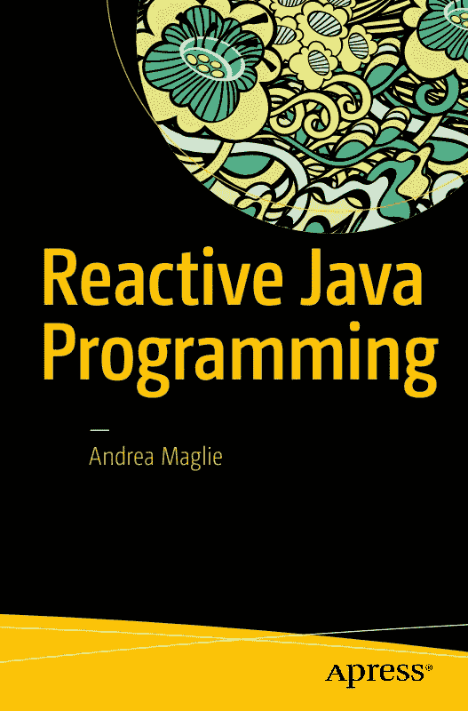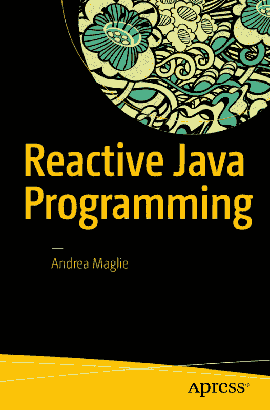

安德烈亚·马利

**响应式 Java 编程**

安德烈亚·马利

意大利，威尼斯

ISBN-13（平装）：978-1-4842-1429-9 ISBN-13（电子版）：978-1-4842-1428-2 DOI 10.1007/978-1-4842-1428-2

美国国会图书馆控制号：2016957883

版权所有 © 2016 安德烈亚·马利

本作品受版权保护。出版商保留所有权利，无论是涉及材料的全部或部分，特别是翻译、重印、重用插图、朗诵、广播、以缩微胶片或任何其他物理方式复制，以及信息存储与检索、电子改编、计算机软件，或现在已知或以后开发的类似或不同方法的权利。本书中可能出现商标名称、徽标和图像。我们仅在编辑风格中使用这些名称、徽标和图像，以利于商标所有者，并无意侵犯商标，而不是在每次出现商标名称、徽标或图像时都使用商标符号。

本出版物中使用的商品名称、商标、服务标志和类似术语，即使未被标识为此类，也不应被视为对其是否受所有权保护的看法。

尽管本书中的建议和信息在出版时被认为是真实和准确的，但作者、编辑或出版商均不对可能出现的任何错误或遗漏承担法律责任。出版商对本书所含材料不作任何明示或暗示的保证。

常务董事：韦尔莫德·斯帕尔

首席编辑：史蒂夫·安格林

技术审阅：曼努埃尔·乔丹·埃莱拉

编辑委员会：史蒂夫·安格林、普拉米拉·巴兰、劳拉·贝伦德森、亚伦·布莱克、路易丝·科里根、乔纳森·根尼克、罗伯特·哈钦森、塞莱斯廷·苏雷什·约翰、尼基尔·卡尔卡尔、詹姆斯·马克姆、苏珊·麦克德莫特、马修·穆迪、娜塔莉·帕奥、格温南·斯皮林

协调编辑：马克·鲍尔斯

文字编辑：玛丽·贝尔

排版：SPi Global

索引编制：SPi Global

插图：SPi Global

本书通过 Springer Science+Business Media New York 向全球图书贸易发行，地址：233 Spring Street, 6th Floor, New York, NY 10013。电话：1-800-SPRINGER，传真：(201) 348-4505，电子邮件：orders-ny@springer-sbm.com，或访问 www.springeronline.com。Apress Media, LLC 是加利福尼亚州的有限责任公司，其唯一成员（所有者）是 Springer Science + Business Media Finance Inc (SSBM Finance Inc)。SSBM Finance Inc 是特拉华州的一家公司。有关翻译信息，请发送电子邮件至 rights@apress.com，或访问 www.apress.com。

Apress 和 friends of ED 的书籍可批量购买用于学术、企业或促销用途。大多数图书也提供电子书版本和许可证。如需更多信息，请参考我们的特殊批量销售–电子书许可网页：www.apress.com/bulk-sales。作者在本文中引用的任何源代码或其他补充材料均可供读者在 www.apress.com 获取。有关如何找到您图书源代码的详细信息，请访问 www.apress.com/source-code/。读者还可以在 SpringerLink 上每个章节的“补充材料”部分访问源代码。

印刷于无酸纸上

献给亚历山德拉


关于作者 .............................................................................. xi

关于技术审阅者 ........................................................ xiii

致谢 ........................................................................... xv

引言 ................................................................................... xvii

■ 第 1 章：ReactiveX 与 RxJava ................................................... 1

■ 第 2 章：Observables 与 Observers ........................................ 11

■ 第 3 章：订阅生命周期 ................................................. 41

■ 第 4 章：Subjects ...................................................................... 61

■ 第 5 章：使用 RxJava 和 Retrofi t 进行网络编程 ......................... 79

■ 第 6 章：RxJava 与 Android .................................................... 95

索引 .............................................................................................. 107


关于作者 .............................................................................. xi

关于技术审阅者 ........................................................ xiii

致谢 ........................................................................... xv

引言 ................................................................................... xvii

■ 第 1 章：ReactiveX 与 RxJava ................................................... 1

引言 ............................................................................................. 1

命令式编程与函数式编程 ................................................ 1

Lambda 表达式 ................................................................................................. 3

命令式还是函数式？ ......................................................................................... 4

响应式编程 ............................................................................ 4

数据流 ...................................................................................... 5

观察者模式 .............................................................................. 5

什么是 ReactiveX？ ................................................................................... 6

什么是 RxJava？ ....................................................................................... 7

■ 第 2 章：Observables 与 Observers ........................................ 11

引言 ........................................................................................... 11

将 RxJava 添加到您的项目 ............................................................... 11

Observable 的定义 ........................................................................ 12

Observer 的定义 ........................................................................... 12

onNext、onCompleted、onError............................................................... 13

热 Observable 与冷 Observable ..................................................................... 15

■ 目录

创建 Observables ............................................................................ 16

Observable.just() ..................................................................................................... 16

Observable.range() ................................................................................................. 17

Observable.interval() ............................................................................................... 17

Observable.timer() .................................................................................................. 18

Observable.create()................................................................................................. 18

Observable.empty() ................................................................................................. 19

Observable.error() ................................................................................................... 19

Observable.never() .................................................................................................. 19

Observable.defer() .................................................................................................. 20

组合与转换 Observables ........................................... 22

map......................................................................................................................... 22


fl atMap ................................................................................................................... 24

concatMap .............................................................................................................. 25

zip ........................................................................................................................... 26

concat ..................................................................................................................... 27

fi lter ........................................................................................................................ 29

distinct .................................................................................................................... 30

fi rst ......................................................................................................................... 30

last .......................................................................................................................... 31

take ......................................................................................................................... 33

startWith ................................................................................................................. 34

scan ........................................................................................................................ 35

其他操作符 .............................................................................................................. 36

■ 目录

■ 第 3 章：订阅生命周期 ................................................. 41

简介 ................................................................................................... 41

错误处理 ........................................................................................... 41

在 onError() 方法中处理错误 ......................................................................... 42

忽略异常并继续发射条目 ......................................................................... 43

重试 ....................................................................................................................... 46

调度器 ................................................................................................ 49

转换器 .............................................................................................................. 53

调度器的高级用法 .......................................................................................... 54

背压 ................................................................................................ 55

在发射期间处理背压：节流 .............................................................................. 55

在发射期间处理背压：缓冲 .............................................................................. 57

在订阅者内部处理背压 .................................................................................... 59

■ 第 4 章：主题 ...................................................................... 61

PublishSubject ...................................................................................... 63

BehaviorSubject .................................................................................... 66

ReplaySubject ....................................................................................... 69

AsyncSubject ......................................................................................... 70

何时应使用主题？ ........................................................................... 72

可连接观察者 ...................................................................................... 76

■ 第 5 章：使用 RxJava 和 Retrofi t 进行网络通信 ......................... 79

Retrofi t 对 RxJava 的内置支持 .................................................... 80

在 Java 项目中设置 Retrofi t .......................................................................... 80


创建改造服务 ..................................................................................... 80

筛选结果 ........................................................................................................... 85

选择合适的调度器 ....................................................................... 87

■ 目录

链式调用多个网络请求 ................................................................... 88

缓存数据 ......................................................................................... 90

■ 第 6 章：RxJava 与 Android .................................................... 95

RxAndroid .............................................................................................. 95

RxBindings ............................................................................................ 97

Activity 与 Fragment 生命周期 ......................................................... 101

索引 .............................................................................................. 107


安德烈亚·马利（Andrea Maglie，1981 年出生于意大利威尼斯）是一名 IT 工程师。

他毕业于帕多瓦大学，是一名高级 Java/Android 开发人员。

自 2014 年起，他一直从事 RxJava 的开发工作，专注于 Android 开发。

目前，他以贡献者身份在 Play 商店发布了三款应用（MiSiedo、Texa CARe、Musement），并以独立开发者身份发布了两款应用（Setlist 和 Loopo）。2013 年至 2015 年间，他运营了意大利科技播客 Sono Digitale。2015 年，他创立了威尼斯谷歌开发者社区（GDG）。

在业余时间，他弹吉他，并在个人技术博客 www.andreamaglie.com 上写作。


曼努埃尔·乔丹·埃莱拉（Manuel Jordan Elera）是一名自学成才的开发者和研究员，他喜欢学习新技术用于自己的实验，并创建新的集成方案。

曼努埃尔曾获得 2010 年 Springy 奖——社区冠军，以及 2013 年 Spring 冠军。曼努埃尔以 dr_pompeii 的网名而闻名。他为 Apress 审阅过多本技术书籍，包括《Pro Spring》第 4 版（2014 年）、《Practical Spring LDAP》（2013 年）、《Pro JPA 2》第二版（2013 年）以及《Pro Spring Security》（2013 年）。

阅读他关于众多 Spring 技术的 13 篇详细教程，并通过他的博客联系他，网址是

并在 Twitter 上关注他，账号为@dr_pompeii。

在有限的空闲时间里，他阅读圣经，并用吉他创作音乐。


我要感谢 Mark Powers、Steve Anglin 以及 Apress 出版社，是他们让我得以出版这本书。

最重要的是，我要感谢我的爱人 Alessandra 以及我的其他家人，尽管这本书占用了大量本应陪伴他们的时间，他们依然给予我支持与鼓励。


欢迎阅读《响应式 Java 编程》。通过本书，你将学会如何以响应式的方式转变你开发 Java（及 Android）应用程序的方式，从使用变量进行同步状态管理，转向处理异步数据流。这意味着你将学习如何将函数式编程的元素应用到 Java 程序中，以及如何编写能够“响应”事件的代码；你还将能够编写出更简洁、更易读、更易维护且更不易出错的代码。为此，你将学习 RxJava 库，这是由 Erik Meijer 最初为.NET 开发的响应式扩展（Rx）库的 Java 实现。

你将从学习什么是响应式函数式编程，以及它为何与命令式编程不同开始。

在第 2 章中，你将了解如何将 RxJava 库包含到你的项目中，并探索该库提供的主要类和方法。

第 3 章和第 4 章涵盖了处理异步数据流的更高级概念，例如错误处理和线程管理。

在第 5 章中，你将把前几章学到的知识应用到一个特定领域：网络通信。

最后，在第 6 章中，你将了解一些为将 RxJava 扩展到 Android 开发而创建的库。


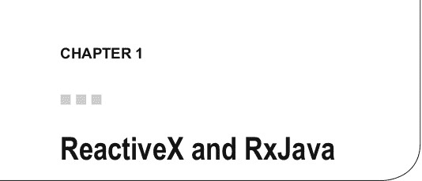

引言

Java 是一种面向对象的编程语言，已经存在多年（于 1995 年正式推出）。如今，凭借其成熟性、稳定性和强大的社区支持，它已成为最受推崇和使用最广泛的语言之一。

Java 始终扎根于其构建之初的理念：它是一种命令式、面向对象的语言。

近年来，新的编程范式变得流行起来，例如函数式编程和响应式编程。许多新语言应运而生。

Java 曾一度落后。然而，Java 8 通过支持 lambda 表达式和流引入了函数式编程，而 RxJava 库则提供了从 Java 5 开始的所有 Java 版本中实现函数式和响应式编程所需的类和方法。

在本章中，我将介绍函数式编程、响应式编程以及观察者模式的概念。然后，我将向你展示 ReactiveX 和 RxJava 是什么，以及 RxJava 如何帮助你编写更易读、更简洁、更易维护且无错误的代码。

在接下来的章节中，你将深入探究 RxJava，通过具体的应用实例来学习常用的类和方法。

我假设你具备 Java 编程的基础知识，但不需要非常深入的技能。

命令式编程与函数式编程

你可能已经知道，Java 是一种命令式编程语言。通常，一个 Java 程序由一系列指令组成。这些指令按照你编写它们的顺序依次执行，执行过程会导致程序状态发生变化。

电子补充材料 本章的在线版本 (doi: 10.1007/978-1-4842-1428-2_1) 包含补充材料，仅供授权用户使用。

© Andrea Maglie 2016 [1]

A. Maglie, Reactive Java Programming , DOI 10.1007/978-1-4842-1428-2_1 第 1 章 ■ REACTIVEX 和 RXJAVA

例如，以下代码创建了一个偶数集合：`List<Integer> input = Arrays.asList(1, 2, 3, 4, 5); List<Integer> output = new ArrayList<>();`

`for (Integer x : input) {`

`if (x % 2 == 0) {`

`output.add(x);`

`}`

`}`

为了产生期望的输出，你需要定义程序构建结果列表所需的每一步，并且每一步都是按顺序定义的。 1. 定义并创建一个输入列表。

2. 定义并创建一个空的输出列表。

3. 取出输入列表中的每一项。

4. 如果该项是偶数，则将其添加到输出列表中。

5. 继续处理下一项，直到到达输入列表的末尾。

命令式编程的一种替代方案是函数式编程。在函数式编程中，程序的结果源于数学函数的求值，而不会改变程序的内部状态。事实上，对于每个函数 f(x)，函数的结果取决于传递给函数的参数。每次调用 f(x) 并传入相同的参数 x 时，你总是得到相同的结果。这类似于一个不依赖于任何对象成员的对象的静态方法。

简单来说，在函数式编程中，构建程序的模块不是对象，而是函数和过程。

因此，使用函数式编程，上面的例子可以用以下伪代码重写：

`var output = input.where( x -> x % 2 == 0);`

在这里，你没有一系列步骤，只有一个函数（`x % 2 == 0`）作为参数传递给另一个函数（`where()`），该函数应用于一个对象（`input`）。箭头（`->`）符号表示“将函数 f(x)（表达式右侧）应用于变量 x（表达式左侧）”。

函数式语言的特点如下：

• **高阶函数**：高阶函数是将其他函数作为参数的函数。

• **不可变数据**：数据默认是不可变的；函数式语言通常操作原始值的副本以保留它们，而不是修改现有值（在 Java 中，原始类型已经是不可变的，但对象不是，因此其实现必须不允许在创建后更改对象的状态）。

第 1 章 ■ REACTIVEX 和 RXJAVA

• **并发性**：支持并发，并且由于默认的不可变性，实现起来更安全。

• **引用透明性**：这个术语定义了计算可以在任何时候执行，并且总是产生相同的结果（类似于 Java 中的静态方法）。

• **惰性求值**：值可以仅在需要时才计算（惰性地），因为函数可以在任何时候求值，并且总是给出相同的结果（这些函数不依赖于程序的内部状态）。

有些编程语言被定义为纯函数式编程语言，例如 Haskell、Hope 和 Mercury。Java 不是这些语言之一，但我们也可以在 Java 中获得函数式编程的优势。

随着 Java 8 的发布，一些函数式编程的构造被添加进来，例如 lambda 函数和流。但是，借助 RxJava 库，我们可以在 Java 1.7 和 Java 1.6 中使用函数式编程的概念。

Lambda 表达式

Lambda 表达式是匿名函数；lambda 运算符使用指向右侧的箭头符号（`->`）表示。输入位于运算符的左侧，函数体位于右侧。

在 Java 中，lambda 表达式可用于替换实现只有一个方法的接口的匿名内部类。例如，考虑以下 Button 对象：

`class Button {`

`...`

`setOnClickListener(OnButtonClickListener listener) { ... }`

`}`

`interface OnButtonClickListener {`

`void onButtonClicked();`

`}`

要为 Button 附加一个点击监听器，你可以使用匿名函数：`Button button = ...`

`button.setOnClickListener(`

`new OnButtonClickListener() {`

`void onButtonClicked() {`

`// 按钮点击时执行某些操作`

`}`

`}`

`)`

第 1 章 ■ REACTIVEX 和 RXJAVA

使用 lambda 表达式，上面的代码变成：`Button button = ...`

`button.setOnClickListener( () -> // 按钮点击时执行某些操作 )` 在 lambda 运算符的右侧，你包含了按钮被点击时要执行的所有代码；这段代码没有输入，如 lambda 运算符左侧的两个括号所示。

如果方法 `onButtonClicked` 接受一些参数，上面的例子变成：

`interface OnButtonClickListener {`

`void onButtonClicked(Object param);`

`}`

`Button button = ...`

`button.setOnClickListener( param ->`

`// 按钮点击时执行某些操作`

`// 在此代码块中可以使用 param`

`)`

Java 对 lambda 表达式的支持是在 Java 8 中引入的，但你可以在早期 Java 版本中使用 retrolambda 库 ( https://github.com/evant/gradle-retrolambda ) 来使用它们。

命令式还是函数式？

那么，为什么你应该选择函数式编程而不是命令式编程呢？

函数式代码通常比相应的命令式代码更简洁、更易于理解。你可以通过编写更少的代码来完成相同的工作，而且每个程序员都知道，更少的代码意味着更少的错误。

在命令式编程中，实现抽象需要你定义接口并将代码拆分为实现这些接口的组件；函数式语言使得创建抽象更容易（想想 lambda 表达式如何避免了创建带有实现的接口的必要性）。

响应式编程

响应式编程在函数式编程的基础上更进一步，增加了数据流（见下一节）和数据变化传播的概念。

在命令式编程中，可以通过以下方式将值赋给变量：`x = y + z`


在此，y 和 z 的和将在函数被调用的同时赋值给变量 x；之后，变量 y 和 z 可以改变，但这些改变不会自动影响 x 的值。

第 1 章 ■ REACTIVEX 与 RXJAVA

在响应式编程中，每当 y 或 z 的值发生变化时，x 的值都应被更新。

因此，如果初始值为 y = 1 和 z = 1，那么你将得到

x = y + z = 2。

如果 y（或 z）改变了它的值，这并不意味着 x 会自动改变，但你必须实现一种机制，以便在 y 和 z 的值发生变化时更新 x 的值。

函数式响应式编程是一种新的编程范式；它由 Erik Meijer（他在微软工作时为 .NET 创建了 Rx 库）推广开来，并且基于两个概念：

• 代码对事件做出“反应”。

• 代码处理随时间变化的值，并将变化传播到使用这些值的每一部分代码。

数据流

理解响应式编程的关键在于将其视为对数据流的操作。

但我所说的“数据流”是什么意思呢？我指的是一系列事件，其中事件可以是用户输入（比如点击按钮）、API 请求的响应（比如 Facebook 信息流）、集合中包含的数据，甚至是一个单独的变量。

在响应式编程中，通常有一个组件充当源，发射一系列项目（或一个数据流），而其他一些组件则观察这个项目流并对每个发射的项目做出反应（它们对项目发射做出“反应”）。观察者模式

观察者模式是一种设计模式，其中包含两种对象：观察者和主题。观察者是一个观察一个或多个主题变化的对象；主题是一个维护其观察者列表并在自身状态改变时自动通知它们的对象。

“四人组”一书（《设计模式：可复用面向对象软件的基础》，作者：Erich Gamma、Richard Helm、Ralph Johnson 和 John Vlissides，ISBN 0-201-63361-2）对观察者模式的定义是：

“在对象之间定义一种一对多的依赖关系，这样当一个对象改变状态时，其所有依赖者都会收到通知并自动更新。”

这种模式是响应式编程的核心。它通过提供实现生产/反应机制的结构，完美契合了响应式编程的概念。

第 1 章 ■ REACTIVEX 与 RXJAVA

Java SDK 通过 `java.util.Observable` 类和 `java.util.Observer` 接口实现了观察者模式。

```java
class Subject extends java.util.Observable {

    public void doWorkAndNotify() {

        Object result = doWork();

        notifyObservers(result);

    }

}

class MyObserver implements Observer {

    @Override

    public void update(Observable obs, Object item) { doSomethingWith(item)

    }

}
```

`Subject` 类继承自 `java.utils.Observable`，负责生成一个对象并在项目生成后立即通知观察者。

`MyObserver` 实现了 `Observer`，负责观察 `Subject` 并消费 `Subject` 生成的每一个项目。

将 `Subject` 和 `MyObserver` 组合在一起：

```java
MyObserver myObserver = new MyObserver();

Subject subject = new Subject();

subject.addObserver(myObserver);

subject.doWorkAndNotify();
```

不幸的是，当你开始编写更复杂的逻辑时，这种实现方式就显得过于简单了。

你永远不会使用这种实现方式；相反，你会使用内置的 RxJava 实现。

什么是 ReactiveX？

来自 http://reactivex.io/ 的定义如下：ReactiveX 是观察者模式、迭代器模式和函数式编程的最佳思想的结合。

它是一个在许多语言中实现函数式响应式编程的库。它使用“可观察对象”来表示异步数据流，并抽象了与线程、并发和同步相关的所有细节。得益于 ReactiveX，编写并发程序变得容易得多，因为

第 1 章 ■ REACTIVEX 与 RXJAVA


• 你无需处理多线程问题。

• 你可以轻松地将一个数据流转换为另一个数据流（其中数据类型可以与源流的数据类型不同）。

• 你可以轻松地组合不同的数据流（例如将两个或多个数据流合并为一个流，或连接多个流）。

什么是 RxJava？

ReactiveX 已作为库在大多数主流编程语言中实现：Java、JavaScript、C#、Scala、Clojure、C++、Ruby、Python、Groovy、JRuby、Kotlin、Swift 等。（完整列表请参见 http://reactivex.io/languages.html。）

RxJava 是一个在 Java 中实现 ReactiveX 概念的库。正如你将在后续章节中看到的，你可以使用 RxJava 重写过滤偶数的命令式代码：

List<Integer> input = Arrays.asList(1, 2, 3, 4, 5); Observable.from(input)

.filter(new Func1() {

@Override

public Boolean call(Integer x) {

return x % 2 == 0;

}

})

或者，使用 lambda 表达式：

Observable.from(input)

.filter(x -> x % 2 == 0);

生成的对象（`rx.Observable` 的实例）将产生一个包含输入序列中偶数的序列：2 和 4。

在 RxJava 中，`rx.Observable` 为四人组的观察者模式增加了两种语义（默认语义是发出已创建的项目，例如上例中包含项目 2 和 4 的列表）：

• 生产者可以通知消费者没有更多数据可用。

• 生产者可以通知消费者发生了错误。

■ 注意 RxJava 库提供了一种编程模型，我们可以像在 Java 8 中操作集合和流一样，处理来自 UI 或异步调用的事件。

第 1 章 ■ REACTIVEX 和 RXJAVA

RxJava 库由 Netflix 创建，作为 Java Future 和回调的更智能替代方案。当只有一层异步执行时，Future 和回调都很容易使用，但当它们嵌套时则难以管理。

以下示例展示了如何在 RxJava 中处理嵌套回调问题。


假设你需要调用一个远程 API 来验证用户身份，然后调用另一个 API 获取用户数据，再调用另一个 API 获取用户的联系人。通常，你需要编写如下嵌套的 API 调用：

User user = null;

serviceEndpoint.login(username, password, new Callback<AccessToken>() { @Override

public void success(User user, Response response) { // 将 accessToken 存储在某处

serviceEndpoint.getUser(new Callback<User>() { @Override

public void success(User userResponse, Response response) { user = userResponse;

serviceEndpoint.getUserContact(user.getId(), new

Callback<Contact>() {

@Override

public Contact success(Contact contact, Response response) {

user.setContact(contact);

}

@Override

public void failure(RetrofitError error) {

// 在此处处理错误...

}

});

}

@Override

public void failure(RetrofitError error) {

// 在此处处理错误...

}

});

第 1 章 ■ REACTIVEX 和 RXJAVA

}

@Override

public void failure(RetrofitError error) {

// 在此处处理错误...

}

});

使用 RxJava，嵌套回调被替换为更高效、可读性更强且更易于维护的组合函数：

serviceEndpoint.login()

.doOnNext(accessToken -> storeCredentials(accessToken))

.flatMap(accessToken -> serviceEndpoint.getUser())

.flatMap(user -> serviceEndpoint.getUserContact(user.getId()))

如你所见，这段代码具备函数式编程的所有特性，并增加了响应式组件（函数作为对事件的响应而执行）。

 

引言

在本章中，你将深入了解 RxJava 库。首先，你将学习如何将 RxJava 包含到你的 Java 项目中。然后，你将学习：

• RxJava 的构建块（`rx.Observable<T>`、`rx.Observer<T>`、`rx.Subscriber<T>`）

• `rx.Observable<T>` 可以发出并由 `rx.Observer<T>` 接收的事件类型

• 可应用于 Observable 的操作符

将 RxJava 添加到你的项目


RxJava 库（https://github.com/ReactiveX/RxJava）只需在项目中添加相应的依赖即可引入（无需其他依赖）。在撰写本文时，最新版本为 1.1.10。

在 Maven 项目中引入方式如下：

<dependency>

<groupId>io.reactivex</groupId>

<artifactId>rxjava</artifactId>

<version>1.1.10</version>

</dependency>

如果你使用的是 Gradle 项目，则配置如下：

compile 'io.reactivex:rxjava: 1.1.10'

RxJava 支持从 Java 6 开始的所有 JDK 版本。如果你使用 Java 8，可以利用 Java 原生对 Lambda 表达式的支持；否则，可以通过添加 retrolambda 作为依赖（https://github.com/evant/gradle-retrolambda）来使用 Lambda 表达式。

© Andrea Maglie 2016 [11]

A. Maglie，《Reactive Java 编程》，DOI 10.1007/978-1-4842-1428-2_2 第 2 章 ■ 可观察对象与观察者

**可观察对象的定义**

可观察对象（Observable）是一个发射事件序列（或流）的对象。它代表一种基于推送的集合，即事件在创建时被推送的集合。

可观察对象发射的序列可以是空的、有限的或无限的。当序列有限时，序列结束后会发射一个完成事件。在发射过程中的任何时刻（但不在序列结束后），都可能发射一个错误事件，从而停止发射并取消完成事件的发射。

当序列为空时，仅发射完成事件，不发射任何数据项。对于无限序列，则永远不会发射完成事件。

正如你稍后将看到的，发射过程可以被转换、过滤，或与其他发射过程组合。

**观察者的定义**

观察者（Observer）是一个订阅可观察对象的对象。它监听并响应可观察对象发射的任何数据项序列。

观察者在等待新发射的数据项时不会被阻塞，因此在并发操作中不会发生阻塞。它只会在新数据项发射时被唤醒。

这是响应式编程的核心原则之一：不是一条一条地执行指令（总是等待上一条指令完成），而是可观察对象提供一种检索和转换数据的机制，观察者则激活这一机制，所有操作都以并发方式进行。

以下伪代码是观察者响应可观察对象数据项的方法示例：

onNext = { it -> doSomething }

这里定义了方法，但并未调用任何内容。要开始响应，你需要订阅可观察对象：

observable.subscribe(onNext)

现在观察者正在监听数据项，并将对每个即将发射的新数据项做出响应。

让我们用 RxJava API 将这个示例重写为 Java 代码：

public void subscribeToObservable(Observable<T> observable) { observable.subscribe(nextItem -> {

// 当 Observable 发射数据项时调用

// 通常你会在此处消费 nextItem });

}

现在可以明确，要连接可观察对象与观察者，必须使用 subscribe 方法。

第 2 章 ■ 可观察对象与观察者

**onNext、onCompleted、onError**

rx.Observer<T> 接口不仅定义了 onNext(T) 方法，还定义了以下方法：

• onCompleted() 在可观察对象因序列正常完成而停止发射数据项时通知观察者。
• onError(Throwable) 在可观察对象引发错误并停止发射数据项时通知观察者，即使序列尚未完成。

public void subscribeToObservable(Observable<T> observable) { observable.subscribe(new Subscriber<>() {

@Override

public void onCompleted() {

// 当 Observable 停止发射数据项时调用

}

@Override

public void onError(Throwable e) {

// 当 Observable 在发射数据项时抛出异常时调用

}

@Override

public void onNext(T nextItem) {

// 当 Observable 发射数据项时调用

// 通常你会在此处消费 nextItem

}

});

}


但等等，为什么你在这里使用 `rx.Subscriber<T>` 的实例？如果你查阅 RxJava 文档，会发现 `Subscriber<T>` 是一个实现了 `rx.Observer<T>` 接口的对象，因此将其用作 Observer 是合法的。你使用 `Subscriber` 而非 Observer 接口的其他实现的原因是，`Subscriber` 还实现了 `Subscription` 接口，这允许你检查订阅者是否已取消订阅（通过 `isUnsubscribed()` 方法）以及取消其订阅（通过 `unsubscribe()` 方法）。

为简单起见，我将省略 `rx.Subscriber<T>`、`Observer<T>` 和 `Observable<T>` 的泛型语法，除非它影响文本和示例的可读性与理解。

从前面的示例中，请注意 Observer 对三种类型的事件做出反应：• **Observable 发射数据项**：这种情况发生零次、一次或多次。如果序列正确完成，`onNext` 方法将被调用的次数与序列中数据项的数量相同。如果在某个时刻发生错误，`onNext` 方法将不再被调用。

第 2 章 ■ OBSERVABLES 和 OBSERVERS

• **数据项发射完成**：只有当序列中的所有数据项都被正确发射时，才会调用 `onCompleted` 方法。它只被调用一次，并且在最后一个数据项被发射之后。如果你处理的是无限序列，它也可能永远不会发生。

• **错误**：错误可能在序列的任何时刻发生，并且序列将立即停止。在这种情况下，将调用 `onError` 方法，并将错误作为 `Throwable` 对象传递。另外两个方法 `onNext` 和 `onCompleted` 将不会被调用。

一个 Observable 不能同时通知 `onCompleted` 和 `onError` 方法，只能通知其中一个。它总是最后一个被调用的方法。

■ 注意 如果你使用最简短的写法

`observable.subscribe(nextItem -> {`

`    // 对 nextItem 执行某些操作`

`});`

当序列完成时你将不会收到通知。更重要的是，如果发生错误，RxJava 会抛出一个异常，因为找不到 `onError` 的实现，并且你的应用将会崩溃！

使用 `Observable.subscribe()` 方法（一种称为订阅的操作），你可以将 Observable 连接到 Observer，但如果你想断开它们的连接呢？这个操作称为取消订阅，如下所示：

`public void subscribeToObservable(Observable<T> observable) {`

`    Subscription subscription =`

`        observable.subscribe(new Subscriber() {`

`            @Override`

`            public void onCompleted() {`

`                // 当 Observable 停止发射数据项时调用`

`            }`

`            @Override`

`            public void onError(Throwable e) {`

`                // 当 Observable 在发射数据项时抛出异常时调用`

`            }`

`            @Override`

`            public void onNext(T nextItem) {`

`                // 当 Observable 发射一个数据项时调用`

第 2 章 ■ OBSERVABLES 和 OBSERVERS

`                // 通常你会在这里消费 nextItem`

`            }`

`        })`

`    // 断开 observable 和 observer 的连接`

`    subscription.unsubscribe()`

`}`

你可以使用以下方法检查订阅是否已被取消订阅（Observer 和 Observable 不再连接）：

`subscription.isUnsubscribed()`

`unsubscribe` 方法可以在数据项发射期间的任何时间调用。调用 `unsubscribe` 后，`onNext` 将不再接收任何数据项，另外两个方法 `onCompleted` 和 `onError` 也不会被通知。取消订阅后，Observable 可以停止或继续发射数据项，但 Observer 将不会收到相关通知。

**热 Observable 和冷 Observable**

到目前为止的示例中，我们假设 Observable 在 Observer 订阅它时才开始发射数据项序列：它们被称为**冷 Observable**。冷 Observable 总是等待至少有一个 Observer 订阅后才开始发射数据项。

另一方面，在连接到 Observer 之前就开始发射数据项的 Observable 被称为**热 Observable**。

对于热 Observable，Observer 可以在发射期间的任何时间订阅并开始接收数据项。对于热 Observable，Observer 可能接收到从开始起的完整数据项序列，也可能接收不到。


■ 注意：还有一种可观察对象称为可连接可观察对象。这种可观察对象在其“connect”方法被调用时开始发射数据项，无论是否有观察者订阅了它。

让我们来看一个更具体但简单的例子。创建一个发射从 1 到 5 所有整数的 Observable 并订阅它：

```java
Observable<Integer> observable =
Observable.from(new Integer[]{1, 2, 3, 4, 5});
observable.subscribe(new Subscriber<Integer>() {
    @Override
    public void onCompleted() {
        System.out.println("序列完成！");
    }

    @Override
    public void onError(Throwable e) {
        System.err.println("异常：" + e.getMessage());
    }

    @Override
    public void onNext(Integer integer) {
        System.out.println("下一个数据项是：" + integer);
    }
});
```

预期的输出是：

```
next item is: 1
next item is: 2
next item is: 3
next item is: 4
next item is: 5
Sequence completed!
```

我们来详细说明一下。这是一个冷可观察对象，因为它只有在观察者订阅时才会开始发射数据项。该可观察对象会生成一个包含五个数据项的序列，每个数据项代表一个整数对象（从 1 到 5），因此观察者的`onNext`方法会被调用五次。在序列结束时，会通知`onCompleted`方法。`onError`方法永远不会被通知，因为这个序列不会产生任何类型的错误或异常。

热可观察对象的一个例子是，每当 UI 按钮被点击时发射一个事件的可观察对象。它不会在观察者订阅时才开始发射事件；即使没有订阅者订阅，它也会发射事件。我将在专门讨论 Subjects 的章节中介绍热可观察对象。

你可能已经注意到，在这个例子中，你使用了`Observable.from()`方法创建了一个可观察对象，这是一个静态工厂方法，可以从数组、可迭代对象或`Future`创建 Observable。

这并不是创建可观察对象的唯一方法。

## 创建可观察对象

创建可观察对象最简单的方法是使用 RxJava 库中实现的工厂方法。你已经看到了如何使用`Observable.from()`方法创建 Observable，现在让我们看看其他可用的方法。

### Observable.just()

`Observable.just()`创建一个 Observable，它会发射作为参数传入的一个或多个对象：

```java
Observable.just("一个数据项")
Observable.just("第一个数据项", "第二个数据项")
Observable.just(1, 2, 3)
```

使用这个操作符，你可以将之前的例子重写为：

```java
Observable<Integer> observable =
Observable.just(1, 2, 3, 4, 5);
observable.subscribe(new Subscriber<Integer>() {
    @Override
    public void onCompleted() {
        System.out.println("序列完成！");
    }

    @Override
    public void onError(Throwable e) {
        System.err.println("异常：" + e.getMessage());
    }

    @Override
    public void onNext(Integer integer) {
        System.out.println("下一个数据项是：" + integer);
    }
});
```

输出结果相同：

```
next item is: 1
next item is: 2
next item is: 3
next item is: 4
next item is: 5
Sequence completed!
```

### Observable.range()

`Observable.range(a, n)`创建一个 Observable，它会发射从`a`开始的`n`个连续整数。

`Observable.just(1, 2, 3, 4, 5)`和`Observable.range(1, 5)`会发射相同的序列。

### Observable.interval()

前面的方法创建的可观察对象会按顺序一个接一个地发射数据项，数据项之间没有延迟。

但是，如果你希望数据项以一定的时间间隔发射呢？`Observable.interval(long, TimeUnit)`正是为此而生：它创建一个 Observable，发射一个从 0 开始的整数序列，每个整数之间间隔指定的时间。第一个参数是时间量，第二个参数定义时间单位。

以下可观察对象每 1 秒发射一个数据项：

```java
Observable.interval(1, TimeUnit.SECONDS)
```

这个序列是一个无限序列，没有自然结束，因此`onCompleted`永远不会被通知。只有当没有更多观察者连接到（订阅）该可观察对象时，序列才会停止。

### Observable.timer()

`Observable.timer(long, TimeUnit)`创建一个 Observable，它在给定的延迟后只发射一个数据项。当与其他可观察对象结合使用时，它可以在另一个可观察对象的序列开始之前引入延迟，这在你后面会看到。

### Observable.create()

`Observable.create()`是让你从头开始创建 Observable 的方法。例如，如果你想创建一个只发射一个字符串“Hello!”的可观察对象，你可以这样写：

```java
Observable.create(
    new Observable.OnSubscribe<String>() {
        @Override
        public void call(Subscriber<? super String> observer) {
            observer.onNext("Hello!");
            observer.onCompleted();
        }
    }
);
```

现在假设你想创建一个可观察对象，它发射一个由网络操作产生的 JSON 字符串。如果响应成功，可观察对象会发射结果并终止。否则，它会引发一个错误。

```java
Observable.create(
    new Observable.OnSubscribe<String>() {
        @Override
        public void call(Subscriber<? super String> observer) {
            Response response = executeNetworkCall();
            if (observer.isUnsubscribed()) {
                // 不发射数据项，
                // 观察者已不再订阅
                return;
            }
            if (response != null && response.isSuccessful()) {
                observer.onNext(convertToJson(response));
                observer.onCompleted();
            } else {
                observer
                    .onError(new Exception("网络调用错误"));
            }
        }
    }
);
```

### Observable.empty()

`Observable.empty()`创建一个 Observable，它发射一个空序列（零个数据项）然后完成。因此只有`onCompleted()`会被通知。

如果你想要发射一个空序列而不是发射 null 数据项或抛出错误，这会很有用，如下所示：

```java
Object data = ...;
public Observable<Object> getData() {
    if (data == null) {
        return Observable.empty();
    } else {
        return Observable.just(data);
    }
}
```

### Observable.error()

`Observable.error(throwable)`创建一个 Observable，它发射一个空序列（零个数据项）然后通知一个错误。因此只有`onError()`会被调用。

```java
Object data = ...;
public Observable<Object> getData() {
    if (data == null) {
        return Observable.error(new Exception("没有数据！"));
    } else {
        return Observable.just(data);
    }
}
```

### Observable.never()

`Observable.never()`创建一个 Observable，它发射一个空序列（零个数据项）并且永远不会完成。观察者的任何方法都不会被调用。

### Observable.defer()

`Observable.defer()`仅在订阅者订阅时才创建 Observable。解释`defer()`作用的最佳方式是通过以下示例。让我们从`Person`类开始，它有两个字段：`name`和`age`。

```java
class Person {
    private String name;
    private int age;

    public void setAge(int age) {
        this.age = age;
    }

    public void setName(String name) {
        this.name = name;
    }

    public int getAge() {
        return age;
    }

    public String getName() {
        return name;
    }
}
```

现在创建一个`Person`实例，两个用于接收年龄和姓名值的 Observable，并设置年龄和姓名的值：

```java
// 创建一个新的 Person 实例
final Person person = new Person();

Observable<String> nameObservable =
    Observable.just(person.getName());
Observable<Integer> ageObservable =
    Observable.just(person.getAge());

// 设置年龄和姓名
person.setName("Bob");
person.setAge(35);

ageObservable.subscribe(new Subscriber<Integer>() {
    @Override
    public void onCompleted() {
    }

    @Override
    public void onError(Throwable e) {
    }

    @Override
    public void onNext(Integer age) {
        System.out.println("年龄是：" + age);
    }
});

nameObservable.subscribe(new Subscriber<String>() {
    @Override
    public void onCompleted() {
    }

    @Override
    public void onError(Throwable e) {
    }

    @Override
    public void onNext(String name) {
        System.out.println("姓名是：" + name);
    }
});
```


当你在 `Person` 实例上调用 `observeName()` 和 `observeAge()` 方法时会发生什么？可观察对象会按什么顺序发射数据？不幸的是，输出结果将是：

age is: 0

name is: null

这并不是你想要的结果。问题在于 `Observable.just()` 在被调用时会立即求值，因此它会使用创建可观察对象时 `name` 和 `age` 所引用的确切值来生成序列。在示例中，当可观察对象被创建时，`age` 为 0，`name` 为 null。

你希望这里的行为稍有不同：你希望在订阅可观察对象时才进行求值，而你可以通过使用 `Observable.defer()` 来实现这一点。`Observable.defer()` 接受一个 `Func0<Observable<T>>` 类型的实例作为参数。`Func0<R>` 是一个接口，它只暴露了一个方法，该方法不接受任何参数并返回一个 `R` 类型的值。此外还有一个 `Func1<T,R>` 接口，它只暴露了一个方法，该方法接受一个 `T` 类型的参数并返回一个 `R` 类型的值。RxJava 为最多九个参数提供了类似的接口（`Func9<T,R>`），以及一个可变参数版本（`FuncN<R>`）。

第 2 章 ■ 可观察对象与观察者

```java
Observable<String> nameObservable =
    Observable.defer(new Func0<Observable<String>>() {
        @Override
        public Observable<String> call() {
            return Observable.just(person.getName());
        }
    });

Observable<Integer> ageObservable =
    Observable.defer(new Func0<Observable<Integer>>() {
        @Override
        public Observable<Integer> call() {
            return Observable.just(person.getAge());
        }
    });
```

通过使用这两个可观察对象，前面示例的输出变为：

age is: 35

name is: Bob

这正是你所期望的结果。

**组合与转换可观察对象**

可观察对象特别擅长被组合和转换。通过使用库中定义的一些操作符，你可以用很少的代码轻松地组合和转换数据序列，从而降低出错的可能性。

在接下来的章节中，我将使用一种称为“弹珠图”的特殊图表来高效地解释操作符的功能。

**map**

`map` 操作符是响应式编程中最常用的操作符之一。它允许你使用指定的函数转换发射序列中的每一个数据项。

在图 2-1 所示的示例中，输入序列是一系列整数（1、2 和 3），并且序列中的每个数据项都乘以了 10。将 `map` 操作符应用于一个可观察对象后，会创建一个新的可观察对象；每当第一个可观察对象发射 `x` 时，这个新的可观察对象就会发射 `x*10`。

第 2 章 ■ 可观察对象与观察者

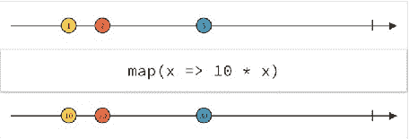

图 2-1\. map 操作符的弹珠图

```java
Observable.just(1, 2, 3)
    .map(new Func1<Integer, Integer>() {
        @Override
        public Integer call(Integer x) {
            return x * 10;
        }
    })
    .subscribe(new Subscriber<Integer>() {
        @Override
        public void onCompleted() {
        }

        @Override
        public void onError(Throwable e) {
        }

        @Override
        public void onNext(Integer integer) {
            System.out.println("next item is: " + integer);
        }
    });
```

此操作的输出为：

next item is: 10

next item is: 20

next item is: 30

让我们尝试理解弹珠图：上方的线条代表原始可观察对象发射的原始数据项序列。下方的线条代表经过操作符转换并由第二个可观察对象发射的数据项（请记住，第二个可观察对象是第一个可观察对象加上操作符的结果）。中间的方框包含了操作符将对每个数据项执行的函数。

第 2 章 ■ 可观察对象与观察者

这两条线必须被视为同步的时间线：弹珠的放置方式反映了随时间发生的事件。

图 2-1 显示，当包含数据项 1 的弹珠被发射时，包含数据项 10 的弹珠也会被发射，因此转换发生在数据项 1 被发射之后、数据项 2 被发射之前。当数据项 2 被发射时，操作符被应用，数据项 20 被发射，以此类推。

**flatMap**


flatMap 运算符（图 2-2）执行两种类型的操作：“映射”操作将发出的项转换为可观察对象，以及“展平”操作将这些可观察对象转换为一个可观察对象。因此，你可以使用 flatMap 将输入的可观察对象转换为任何其他可观察对象（换句话说，将输入流转换为不同的流）。

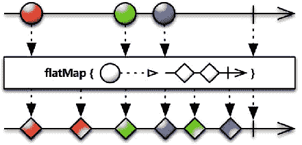

图 2-2\. flatMap 运算符的弹珠图

因此，与 map 运算符一样，flatMap 对每个发出的项应用一个函数，但此函数必须返回一个可观察对象。然后这些项被合并到一个可观察对象中，因此这些可观察对象可能会交错。如果你需要你的可观察对象不交错，则必须使用 concatMap 运算符。

例如，假设你有一个整数列表作为输入，并且你想将其转换为一系列格式为“数字 x”的字符串，其中 x 是输入列表中的下一个整数。你可以按如下方式组合 flatMap 和 map：

```java
List<Integer> input = Arrays.asList(1, 2, 3, 4, 5);
Observable.just(input)
```

第 2 章 ■ 可观察对象与观察者

```java
.flatMap(new Func1<List<Integer>, Observable<Integer>>() {
    @Override
    public Observable<Integer> call(List<Integer> item) {
        return Observable.from(item);
    }
})
.map(new Func1<Integer, String>() {
    @Override
    public String call(Integer t) {
        return "Number " + t;
    }
})
.subscribe(new Subscriber<String>() {
    @Override
    public void onCompleted() {
        System.out.println("sequence completed!");
    }
    @Override
    public void onError(Throwable e) {
    }
    @Override
    public void onNext(String item) {
        System.out.println("next item is: " + item);
    }
});
```

结果是：

```
next item is: Number 1
next item is: Number 2
next item is: Number 3
next item is: Number 4
next item is: Number 5
sequence completed!
```

### concatMap

concatMap 运算符（图 2-3）的行为类似于 flatMap，但它确保可观察对象不会交错，而是串联起来，保持它们的顺序。

第 2 章 ■ 可观察对象与观察者

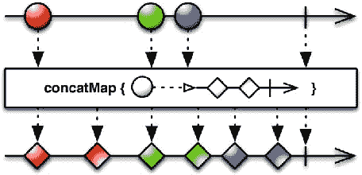

图 2-3\. concatMap 运算符的弹珠图

### zip

zip 运算符（图 2-4）将多个可观察对象作为输入，并通过指定的函数组合每次的发射，然后将该函数的结果作为新序列发出。


   

图 2-4\. zip 运算符的弹珠图

该函数按严格顺序应用。如果有两个序列作为输入，zip 会等待第一个序列发出的第一个项，然后等待第二个序列发出的第一个项，对它们应用该函数，并发出函数的结果。然后它等待第一个序列的第二个项，第二个序列的第二个项，对这两个项应用该函数，并发出函数的结果。依此类推。当最短的序列停止时，它就会停止。

以下是一个示例：

```java
Observable<Integer> rangeMajor = Observable.range(1, 3);
```

第 2 章 ■ 可观察对象与观察者

```java
Observable<Integer> rangeMinor = Observable.range(5, 10);
Observable.zip(rangeMajor, rangeMinor,
    new Func2<Integer, Integer, String>() {
        @Override
        // 此处参数的顺序与 zip 参数的顺序相同
        public String call(Integer major, Integer minor) {
            return major + "." + minor;
        }
    }).subscribe(new Subscriber<String>() {
        @Override
        public void onCompleted() {
            System.out.println("sequence completed!");
        }
        @Override
        public void onError(Throwable e) {
        }
        @Override
        public void onNext(String s) {
            System.out.println("next item is: " + s);
        }
    });
```

在此示例中，zip 运算符将两个序列作为输入，以及一个函数，该函数简单地接受两个整数并构建一个字符串。

此代码的输出是：

```
next item is: 1.5
next item is: 2.6
next item is: 3.7
sequence completed!
```

如你所见，当最短的序列停止时，发出的序列就会停止，在这种情况下，最短的序列是第一个序列 (1, 2, 3)。

### concat


concat 操作符（图 2-5）将两个或多个发射物连接起来，生成一个发射物，其中第一个源发射物中的所有项都出现在第二个源发射物的项之前。此外，concat 操作符会等待每个序列完成后再订阅下一个可观察对象。

    

图 2-5\. concat 操作符的弹珠图

在以下示例中，你连接了两个字符串序列：Observable<String> first =

Observable.just("one", "two");

Observable<String> second =

Observable.just("three", "four", "five");

Observable.concat(first, second)

.subscribe(new Subscriber<String>() {

@Override

public void onCompleted() {

System.out.println("sequence completed!");

}

@Override

public void onError(Throwable e) {

}

@Override

public void onNext(String s) {

System.out.println("next item is: " + s);

}

});

输出结果为：

next item is: one

next item is: two

next item is: three

next item is: four

next item is: five

sequence completed!

第 2 章 ■ 可观察对象与观察者

请注意，你只能连接相同类型对象的序列（即，不能连接一个发射字符串的可观察对象与一个发射整数的可观察对象）。

你还记得热可观察对象和冷可观察对象的定义吗？如果你将一个冷可观察对象（first）与一个热可观察对象（second）连接起来，会发生什么？concat 操作符会先发射第一个可观察对象中的所有项，然后订阅第二个（热可观察对象），并开始发射热可观察对象中的所有项，但会丢失热可观察对象在订阅之前发射的所有项。

filter

filter 操作符使用一个指定的函数，只允许源序列中的部分项被发射。

以下是将图 2-6 中所示的图表翻译为 Java 代码：

 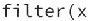 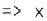 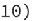   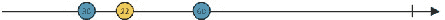

图 2-6\. filter 操作符的弹珠图

Observable.from(new Integer[]{2, 30, 22, 5, 60, 1}) .filter(new Func1<Integer, Boolean>() {

@Override

public Boolean call(Integer x) {

return x > 10;

}

}).subscribe(new Subscriber<Integer>() {

@Override

public void onCompleted() {

System.out.println("sequence completed!");

}

@Override

public void onError(Throwable e) {

}

@Override

public void onNext(Integer item) {

System.out.println("next item is: " + item);

}

});

第 2 章 ■ 可观察对象与观察者

这段代码的输出结果为：

next item is: 30

next item is: 22

next item is: 60

sequence completed!

distinct

distinct 操作符（图 2-7）对源序列应用一个过滤器。如果一个项被发射多次，则只有第一次出现会被发射。

 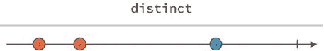

图 2-7\. distinct 操作符的弹珠图

first

first 操作符（图 2-8）只发射序列中的第一个项。如果指定了一个函数，它将用于过滤项，因此只有序列中满足条件的第一个项会被发射。


  

图 2-8\. first 操作符的弹珠图

你可以沿用为 filter 操作符编写的示例，并将 filter 替换为 first 操作符：

Observable.from(new Integer[]{2, 30, 22, 5, 60, 1}) 第 2 章 ■ 可观察对象与观察者

.first(new Func1<Integer, Boolean>() {

@Override

public Boolean call(Integer x) {

return x > 10;

}

}).subscribe(new Subscriber<Integer>() {

@Override

public void onCompleted() {

System.out.println("sequence completed!");

}

@Override

public void onError(Throwable e) {

}

@Override

public void onNext(Integer item) {

System.out.println("next item is: " + item);

}

});

正如你所料，输出结果与 filter 操作符的输出类似，但仅限于一个项：

next item is: 30

sequence completed!


l a s t

如果你能使用 `first` 操作符对序列的开头应用过滤器，那么你也可以使用 `last` 操作符对序列的结尾进行过滤（图 2-9）。

  

图 2-9\. `last` 操作符的弹珠图

Observable.just("first", "second", "third")

.last()

第 2 章 ■ 可观察对象与观察者

.subscribe(new Subscriber<Integer>() {

@Override

public void onCompleted() {

System.out.println("sequence completed!");

}

@Override

public void onError(Throwable error) {

}

@Override

public void onNext(String item) {

System.out.println("next item is: " + item);

}

});

这段代码的输出是

next item is: third

sequence completed!

`last` 操作符可以接受一个谓词作为参数，并且只会从源序列中发射最后一个使该谓词求值为 `true` 的项。 Observable.just("first", "second", "third")

.last(new Func1<String, Boolean>() {

@Override

public Boolean call(String t) {

return t.startsWith("s");

}

})

.subscribe(new Subscriber<String>() {

@Override

public void onCompleted() {

System.out.println("sequence completed!");

}

@Override

public void onError(Throwable error) {

}

@Override

public void onNext(String item) {

System.out.println("next item is: " + item);

}

});

第 2 章 ■ 可观察对象与观察者

这段代码的输出是

next item is: second

sequence completed!

t a k e

`first` 操作符适合过滤序列的开头，但如果你不仅对第一个项感兴趣，而是想要前 n 个项呢？这时 `take` 操作符（图 2-10）就派上用场了。它接受一个整数 n 作为参数，只允许发射前 n 个项。


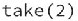 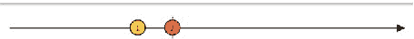

图 2-10\. `take` 操作符的弹珠图

Observable.just("first", "second", "third")

.take(2)

.subscribe(new Subscriber<String>() {

@Override

public void onCompleted() {

System.out.println("sequence completed!");

}

@Override

public void onError(Throwable error) {

}

@Override

public void onNext(String item) {

System.out.println("next item is: " + item);

}

});

这段代码的输出是

next item is: first

next item is: second

sequence completed!

第 2 章 ■ 可观察对象与观察者

该操作符的另一个版本接受一个超时作为输入（`take(long, TimeUnit)`），只发射在此超时之前由源序列发射的项。 ■ 注意 有人可能认为 `first()` 和 `take(1)` 操作符应该具有相同的行为。如果应用于相同的输入序列，它们会发射相同的输出序列，但有一个区别：`take(1)` 要么发射一次，要么什么都不发射；而 `first()` 要么发射一次，要么在源序列为空时崩溃。

startWith

`startWith` 操作符（图 2-11）接受输入序列并向其添加一个给定的项。如果你想强制你的序列以一个默认值或缓存值开头，这会很有用。


 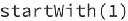  

图 2-11\. `startWith` 操作符的弹珠图

Observable.just("first", "second", "third")

.startWith("zero")

.subscribe(new Subscriber<String>() {

@Override

public void onCompleted() {

System.out.println("sequence completed!");

}

@Override

public void onError(Throwable error) {

}

@Override

public void onNext(String item) {

第 2 章 ■ 可观察对象与观察者

System.out.println("next item is: " + item);

}

});

这段代码的输出是

next item is: zero

next item is: first

next item is: second

next item is: third

sequence completed!

s c a n

`scan` 操作符接受一个序列，并对每对顺序发射的项应用一个函数。

Observable<Integer> sourceObservable = Observable.range(1, 5); Observable<Integer> scanObservable = sourceObservable .scan(new Func2<Integer, Integer, Integer>() {

@Override

public Integer call(Integer i1, Integer i2) {

return i1 + i2;

}

});

scanObservable.subscribe(new Subscriber<Integer>() {

@Override

public void onCompleted() {


System.out.println("sequence completed!");

}

@Override

public void onError(Throwable e) {

}

@Override

public void onNext(Integer item) {

System.out.println("next item is: " + item);

}

});

这段代码模拟了图 2-12 中示意图的行为。

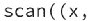 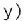 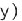 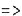   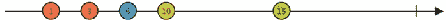

图 2-12\. scan 操作符的大理石图

在 sourceObservable 发出第一个条目后，scanObservable 将发出相同的条目，不做任何转换。当第二个条目从源发出时，scanObservable 会将函数应用于第一个和第二个条目，并发出结果。

代码的输出为：

next item is: 1

next item is: 3

next item is: 6

next item is: 10

next item is: 15

sequence completed!

其他操作符

还有许多其他操作符可用于转换、过滤或组合 Observable。

用于转换 Observable 的操作符

• buffer ：定期将 Observable 中的条目收集成包，并发出这些包，而不是一次发出一个条目。

• groupBy ：将一个 Observable 划分为一组 Observable，每个 Observable 发出原始 Observable 中按键组织的不同条目组。

• window ：定期将 Observable 中的条目细分为 Observable 窗口，并发出这些窗口，而不是一次发出一个条目。

用于过滤 Observable 的操作符

• debounce ：仅当在特定时间跨度内没有发出另一个条目时，才从 Observable 发出一个条目。

第 2 章 ■ OBSERVABLES 和 OBSERVERS

• elementAt ：仅发出 Observable 发出的第 n 个条目。

• ignoreElements ：不发出 Observable 中的任何条目，但镜像其终止通知。

• sample ：在周期性时间间隔内发出 Observable 最近发出的条目。

• skip ：抑制 Observable 发出的前 n 个条目。

• skipLast ：抑制 Observable 发出的最后 n 个条目。

• takeLast ：仅发出 Observable 发出的最后 n 个条目。

用于组合 Observable 的操作符

• And/Then/When ：通过模式和计划中介组合两个或多个 Observable 发出的条目集；这些操作符不属于 RxJava 库，但可以在 RxJavaJoins 库中找到。( https://github.com/ReactiveX/ RxJavaJoins )

• combineLatest ：当两个 Observable 中的任何一个发出条目时，它通过指定函数组合每个 Observable 最新发出的条目，并根据该函数的结果发出条目。

• join ：当一个 Observable 发出的条目在根据另一个 Observable 发出的条目定义的时间窗口内时，组合两个 Observable 发出的条目。

• merge ：通过合并多个 Observable 的发射内容，将它们组合成一个 Observable。

• switchOnNext ：将一个发出 Observable 的 Observable 转换为单个 Observable，该 Observable 发出这些 Observable 中最近发出的条目。


要创建一个奇数序列，你需要生成一个整数序列，然后过滤发出的条目，移除偶数整数。

你从一个有限的整数序列开始，这个序列可以使用 just 或 range 创建。

然后你应用 filter 操作符，传入一个函数，如果发出的整数是奇数，则返回 true。

第 2 章 ■ OBSERVABLES 和 OBSERVERS

Observable.just(1, 2, 3, 4, 5, 6)

.filter(new Func1() {

@Override

public Boolean call(Integer value) {

return value % 2 == 1;

}

})

.subscribe(new Subscriber() {

@Override

public void onCompleted() {

System.out.println("sequence completed!");

}

@Override

public void onError(Throwable e) {

}

@Override

public void onNext(Integer item) {

System.out.println("next item: " + item);

}

 

你想要创建一个方法，该方法接受一个整数 n 并输出斐波那契数列 F(n)。


首先，创建一个发射 n 个整数序列的 Observable：`Observable.range(n)` 是此角色的完美候选。其次，对每个元素应用一个函数，并使用 `map` 运算符来实现。

以下是代码：

```java
public static void rxFibonacci(int n) {

    final int[] tmp = {0, 0};

    Observable.range(1, n)

        .map(new Func1<Integer, Integer>() {

            @Override

            public Integer call(Integer x) {

                if (x < 3) {

                    tmp[0] = 1;

                    tmp[1] = 1;

                    return 1;

                } else {

                    int item = tmp[0] + tmp[1];

                    tmp[0] = tmp[1];

                    tmp[1] = item;

                    return item;

                }

            }

        })

        .subscribe(new Subscriber<Integer>() {

            @Override

            public void onCompleted() {

                System.out.println("序列完成！");

            }

            @Override

            public void onError(Throwable e) {

            }

            @Override

            public void onNext(Integer item) {

                System.out.println("下一个元素：" + item);

            }

        });

}
```

`Observable.range(1,n)` 将发射一个从 1 开始的 n 个整数的序列。然后，对于每个发射的元素，通过 `map` 运算符应用一个函数。该函数使用一个临时数组来存储 F(n-1) 和 F(n-2) 的结果，并使用这些值来计算 F(n)。

例如，调用 `rxFibonacci(10)` 会产生以下输出：
```
下一个元素：1
下一个元素：1
下一个元素：2
下一个元素：3
下一个元素：5
下一个元素：8
下一个元素：13
下一个元素：21
下一个元素：34
下一个元素：55
```

 

## 引言

使用 Observable 不仅仅是订阅和接收元素。在前面的章节中，你已经看到序列也可以以错误事件终止，但你能做些什么来处理错误事件呢？线程方面呢？Observable 能否在不同的线程上操作和通知？

在本章中，你将学习：

- RxJava 提供的用于管理错误事件的工具
- 如何使用调度器在不同线程上操作
- 如何处理背压

## 错误处理

如前所述，Observable 的发射可以以完成事件或错误事件结束，但不能两者兼有。

如果在发射过程中的任何时候发生错误，序列将停止，并调用 `onError()` 方法。

但“错误”具体指什么呢？

- 错误是指在序列发射过程中抛出的任何异常。
- 它可以由源 Observable 抛出，也可以由应用于源 Observable 的任何运算符抛出。
- 抛出的第一个异常会导致序列停止，因此不会抛出其他异常。
- 异常从抛出它的 Observable 传播到订阅者，因此会跳过其他运算符。
- 运算符不必处理异常；这完全留给订阅者处理（与回调机制相反，在回调机制中，你必须在每个回调中处理错误）。

© Andrea Maglie 2016 [41]
A. Maglie，《响应式 Java 编程》，DOI 10.1007/978-1-4842-1428-2_3
第 3 章 ■ 订阅生命周期

Observable 本身不会抛出异常；它仅通过调用 `onError()` 方法来通知订阅者。如果 Observable 在调用 `onError()` 方法时失败（即调用 `onError()` 时抛出异常），则 `onError()` 方法将不再被调用，并且会抛出另一个异常。

有一些异常不会作为错误事件处理，而是直接抛出，导致 JVM 停止：

- `rx.exceptions.OnErrorNotImplementedException`
- `rx.exceptions.OnErrorFailedException`
- `rx.exceptions.OnCompletedFailedException`
- `java.lang.StackOverflowError`
- `java.lang.VirtualMachineError`
- `java.lang.ThreadDeath`
- `java.lang.LinkageError`

通常，在 Java 代码中，你使用 `try/catch` 块来捕获异常。使用 Observable 时，没有 `try/catch` 块，但你可以选择不同的技术来从错误中恢复。

### 在 onError() 方法中处理错误

最常见的场景是在 `onError()` 方法中处理错误。订阅者的 `onError()` 方法负责处理错误状态。

在以下示例中，你生成一个字符串序列，其中每个字符串应表示一个整数，然后你故意在序列中间引入一个无效字符串。


```java
Observable.just("1", "2", "a", "3", "4")

.map(new Func1<String, Integer>() {

@Override

public Integer call(String s) {

return Integer.parseInt(s);

}

}).subscribe(new Subscriber<Integer>() {

@Override

public void onCompleted() {

System.out.println("sequence completed!");

}

@Override

public void onError(Throwable e) {

System.err.println("error! " + e.toString());

}

@Override

public void onNext(Integer item) {

System.out.println("next item is: " + item);

}

});
```

前两个发射的项目（字符串“1”和“2”）被正确解析为整数。当项目“a”被发射时，`map` 运算符内部的函数执行失败，抛出了 `java.lang.NumberFormatException`，并且该异常通过 `onError()` 方法发送给了订阅者。`NumberFormatException` 作为参数传递给了 `onError()` 方法。

输出结果为：

```
next item is: 1
next item is: 2
error! java.lang.NumberFormatException: For input string: “a”
```

**忽略异常并继续发射项目**

延续上一个示例，假设你希望当发射无效字符串时，序列能够正常终止。你可以通过对 Observable 应用 `onErrorResumeNext()` 运算符来实现这一点。

```java
Observable.just("1", "2", "a", "3", "4")

.map(new Func1<String, Integer>() {

@Override

public Integer call(String s) {

return Integer.parseInt(s);

}

})

.onErrorResumeNext(Observable.<Integer>empty())

.subscribe(new Subscriber<Integer>() {

@Override

public void onCompleted() {

System.out.println("sequence completed!");

}

@Override

public void onError(Throwable e) {

System.err.println("error! " + e.toString());

}

@Override

public void onNext(Integer item) {

System.out.println("next item is: " + item);

}

});
```

输出结果为：

```
next item is: 1
next item is: 2
sequence completed!
```

`onErrorResumeNext()` 运算符指示 Observable 在抛出异常时避免通知 `onError` 方法，而是继续发射该运算符参数所指定的序列。在这个例子中，当错误事件发生时，原始序列停止，发射过程继续执行由 `Observable.empty()` 发射的序列，即一个空序列。换句话说，在上述代码中，如果发生错误，序列会停止，并且不会通知任何错误事件。

另外两个类似的运算符是：

- `onErrorReturn()`，它使得 Observable 在发生错误时发射一个指定的项目；发射的项目是作为参数传入的函数的执行结果。
- `onExceptionResumeNext()`，它使得 Observable 在抛出异常（而非其他可抛出对象）时，继续从指定的 Observable 发射项目。

继续上面的示例，假设你希望在错误事件发生时发射整数 -1。为此，你可以使用 `onErrorReturn()`：

```java
Observable.just("1", "2", "a", "3", "4")

.map(new Func1<String, Integer>() {

@Override

public Integer call(String s) {

return Integer.parseInt(s);

}

})

.onErrorReturn(new Func1<Throwable, Integer>() { @Override

public Integer call(Throwable t) {

return -1;

}

})

.subscribe(new Subscriber<Integer>() {

@Override

public void onCompleted() {

System.out.println("sequence completed!");

}

@Override

public void onError(Throwable e) {

System.err.println("error! " + e.toString());

}

@Override

public void onNext(Integer item) {

System.out.println("next item is: " + item);

}

});
```

输出结果为：

```
next item is: 1
next item is: 2
next item is: -1
sequence completed!
```

你也可以使用 `onExceptionResumeNext` 达到相同的效果：

```java
Observable.just("1", "2", "a", "3", "4")

.map(new Func1<String, Integer>() {

@Override

public Integer call(String s) {

return Integer.parseInt(s);

}

})

.onExceptionResumeNext(Observable.just(-1))

.subscribe(new Subscriber<Integer>() {

@Override

public void onCompleted() {

System.out.println("sequence completed!");

}

@Override

public void onError(Throwable e) {

System.err.println("error! " + e.toString());

}

@Override

public void onNext(Integer item) {

System.out.println("next item is: " + item);

}

});
```

输出结果相同：


下一个项目是：1

下一个项目是：2

下一个项目是：-1

序列完成！

第 3 章 ■ 订阅生命周期

重试

RxJava 库还包含两个运算符，可让你通过实现重试机制从错误中恢复。

• `Observable.retry(...)` 运算符不会通知错误，而是重新订阅源 Observable。
• `Observable.retryWhen(...)` 运算符将错误事件传递给另一个 Observable，由该 Observable 负责决定是否重新订阅源 Observable。

让我们将 `retry()` 运算符应用于之前的示例，而不是 `onErrorResumeNext()`：

```java
Observable.just("1", "2", "a", "3", "4")
    .map(new Func1<String, Integer>() {
        @Override
        public Integer call(String s) {
            return Integer.parseInt(s);
        }
    })
    .retry()
    .subscribe(new Subscriber<Integer>() {
        @Override
        public void onCompleted() {
            System.out.println("sequence completed!");
        }
        @Override
        public void onError(Throwable e) {
            System.err.println("error! " + e.toString());
        }
        @Override
        public void onNext(Integer item) {
            System.out.println("next item is: " + item);
        }
    });
```

每当发生错误时，`retry()` 都会重新订阅源，重新开始发射数据并再次遇到错误。你可能已经猜到，这段代码将永远运行下去，输出如下内容：

```
...
next item is: 1
next item is: 2
next item is: 1
next item is: 2
next item is: 1
...
```

第 3 章 ■ 订阅生命周期

你可以使用 `retry(1)` 代替 `retry()`，这样重试机制将只执行一次（传入的参数决定了重试次数）：

```java
Observable.just("1", "2", "a", "3", "4")
    .map(new Func1<String, Integer>() {
        @Override
        public Integer call(String s) {
            return Integer.parseInt(s);
        }
    })
    .retry(1)
    .subscribe(new Subscriber<Integer>() {
        @Override
        public void onCompleted() {
            System.out.println("sequence completed!");
        }
        @Override
        public void onError(Throwable e) {
            System.err.println("error! " + e.toString());
        }
        @Override
        public void onNext(Integer item) {
            System.out.println("next item is: " + item);
        }
    });
```

在这种情况下，发射数据将只重试一次；之后，如果错误条件仍然存在，错误事件将被传播。输出结果为：

```
next item is: 1
next item is: 2
next item is: 1
next item is: 2
error! java.lang.NumberFormatException : For input string: "a"
```

如果你想在 5 秒后重试一次，可以使用 `retryWhen()`：

```java
.retryWhen(new Func1<Observable<? extends Throwable>, Observable<?>>() {
    @Override
    public Observable<?> call(Observable<? extends Throwable> observable) {
        return Observable.timer(5, TimeUnit.SECONDS);
    }
})
```

在指定的超时时间（本例中为 5 秒）之后，序列将被重试。如果在重试期间发生错误，错误事件将不会被通知。相反，会通知完成事件。输出结果为：

第 3 章 ■ 订阅生命周期

```
next item is: 1
next item is: 2
next item is: 1
next item is: 2
sequence completed!
```

在下面更复杂的示例中，你组合了不同的运算符来实现三次重试，每次间隔 5 秒：

```java
.retryWhen(new Func1<Observable<? extends Throwable>, Observable<?>>() {
    @Override
    public Observable<?> call(Observable<? extends Throwable> observable) {
        return observable.zipWith(Observable.range(1, 3),
            new Func2<Throwable, Integer, Integer>() {
                @Override
                public Integer call(Throwable throwable,
                                    Integer retryCount) {
                    System.out.println("retry #" + retryCount);
                    return retryCount;
                }
            }).flatMap(new Func1<Integer, Observable<?>>() {
                @Override
                public Observable<?> call(Integer integer) {
                    return Observable.timer(5, TimeUnit.SECONDS);
                }
            });
    }
})
```

这里的思路是将一个包含三个项目的序列（因为你想要三次重试）与每次重试 5 秒的延迟结合起来。三个项目的序列由 `Observable.range(1,3)` 生成（`Observable.just(1,2,3)` 也可以）。对于延迟，你仍然使用 `Observable.timer(5, TimeUnit.SECONDS)`。对于每个发射的整数，都会启动一个定时器，这个定时器会触发重试机制。此外，你还会打印当前的重试次数。


`Observable.zipWith()` 操作符应用于源 Observable，并接受两个参数：

• 一个 Observable（本例中为 `Observable.range(1, 3)`），即你想要与源 Observable 进行 zip 操作的 Observable（与 `Observable.zip()` 操作符类似）。

• 一个 `Func2<Throwable, Integer, Integer>` 实例。之所以需要 `Func2`，是因为你有两个输入：由 `retryWhen` 操作符发出的 `Throwable` 和由 `Observable.range(1,3)` 发出的 `Integer`。

然后，你使用 `flatMap` 将 `zipWith` 操作符发出的条目转换为 5 秒的延迟。`retryWhen` 使用生成的 Observable 将重试逻辑应用于源 Observable。

第 3 章 ■ 订阅生命周期

如果你将这个重试机制应用于前面的示例，你将得到以下输出：

next item is: 1

next item is: 2

retry #1

next item is: 1

next item is: 2

retry #2

next item is: 1

next item is: 2

retry #3

next item is: 1

next item is: 2

sequence completed!

调度器

默认情况下，Observable 的操作链在调用 `subscribe` 方法的同一线程中执行。你可以使用两个操作符来改变这种行为：

• `Observable.subscribeOn(...)` 允许你指定 Observable 在其上运行的调度器。

• `Observable.observeOn(...)` 允许你指定观察者将在其上接收通知的调度器。

这意味着你可以使用一个线程来执行所有操作链，并使用另一个不同的线程来接收 `onNext()`、`onCompleted()` 和 `onError()` 通知。当你的 Observable 执行 I/O 操作（如网络请求或磁盘读写）时，这通常很有用：

myNetworkObservable()

.subscribeOn(<后台线程>)

.observeOn(<UI 线程>)

.subscribe(...)

这两个操作符可以在操作链中的任何位置调用，但它们的行为不同：

• `subscribeOn()` 会改变 Observable 运行的线程，无论它在链中的哪个位置被应用。

• `observeOn()` 会从它被应用的位置开始，改变 Observable 将要使用的线程。

通常你不需要直接创建或指定一个线程；相反，你可以从 RxJava 库内置的调度器中进行选择：

第 3 章 ■ 订阅生命周期

• `Schedulers.immediate()` 在当前线程中立即开始执行工作。

• `Schedulers.computation()` 可用于计算密集型工作，默认情况下它会分配与处理器数量相同的线程数。它不适用于 I/O 操作。

• `Schedulers.io()` 适用于 I/O 操作。

• `Schedulers.newThread()` 为每个操作创建一个新线程。

• `Schedulers.trampoline()` 维护一个操作队列，每个操作在前一个操作完成后在当前线程上开始执行。

• `Schedulers.from(java.util.concurrent.Executor)` 使用指定的 `Executor` 作为调度器。

你之前已经隐式地使用过调度器：`Observable.timer()` 使用 `Scheduler.computation()` 调度器运行，该调度器会在不同的线程上运行。还有一些其他操作符具有特定的默认调度器：`buffer`、`debounce`、`delay`、`delaySubscription`、`interval`、`repeat`、`replay`、`retry`、`sample`、`skip`、`skipLast`、`take`、`takeLast`、`takeLastBuffer`、`throttleFirst`、`throttleLast`、`throttleWithTimeout`、`timeInterval`、`timeout`、`timer`、`timestamp`、`window`。


回顾一下第 2 章中的斐波那契数列示例。你如何修改它来添加多线程？你只需要一行代码！

final int[] tmp = {0, 0};

Observable.range(1, n)

.map(new Func1<Integer, Integer>() {

@Override

public Integer call(Integer x) {

if (x < 3) {

tmp[0] = 1;

tmp[1] = 1;

return 1;

} else {

int item = tmp[0] + tmp[1];

tmp[0] = tmp[1];

tmp[1] = item;

return item;

}

}

第 3 章 ■ 订阅生命周期

})

.subscribeOn(Schedulers.computation())

.subscribe(new Subscriber<Integer>() {

@Override

public void onCompleted() {

System.out.println("sequence completed!");

}

@Override

public void onError(Throwable e) {

}

@Override

public void onNext(Integer item) {


```markdown

System.out.println("next item: " + item);

}

});

}

你只应用了 `subscribeOn()` 操作符，并将调度器 `Schedulers.computation()` 作为参数传入，你的代码现在就是多线程的了！请记住，`subscribeOn()` 操作符可以应用于链中的任何位置，但最佳位置是在调用 `subscribe()` 方法之前。这能使代码更具可读性；如果你有一个很长的操作符链，你不会希望你的

 

一个需要同时指定 `subscribeOn()` 和 `observeOn()` 操作符的典型用例是，当你开发一个 Android 应用，并且需要在从远程服务器获取数据后更新 UI 时。

Observable<MyResponseObject> networkCall = ...

networkCall.subscribeOn(Schedulers.io())

.observeOn(AndroidSchedulers.mainThread())

.subscribe(new Subscriber<MyResponseObject>() { @Override

public void onCompleted() {

}

@Override

public void onError(Throwable e) {

第 3 章 ■ 订阅生命周期

// 这里我们可以更新 UI 显示错误信息

}

@Override

public void onNext(MyResponseObject item) {

// 这里我们可以通过读取 item 数据来更新 UI

}

});

在这个例子中，你应用了：

• `subscribeOn()` 操作符，因为如果不这样做，UI（Android 中的主线程）将会挂起，直到操作完成（并且操作系统会显示 ANR - 应用无响应错误）。`Schedulers.io()` 调度器是一个很好的选择，因为你正在处理网络操作，这是一种 I/O 操作。

• `observeOn()` 操作符，因为你不能从 UI 线程以外的线程更新 UI；你在这里使用的 `AndroidSchedulers.mainThread()` 是一个特殊的调度器，它不包含在 RxJava 库中，而是在 RxAndroid 库中实现的（RxAndroid 是 RxJava 用于 Android 开发的一种附加库；参见 https://github.com/ReactiveX/RxAndroid），它将返回 UI 线程。如果你不应用 `observeOn()` 操作符，你的应用在尝试更改

 

假设你想在用户更改输入表单的值时立即将一些数据存储到数据库中，而无需等待点击按钮，并且不阻塞 UI 线程。

给定一个可观察对象，每当输入发生变化时，它都会发射一个条目（表单字段的内容），你可以使用调度器在一个单独的线程中执行插入操作。

Observable<String> inputObservable = ...

inputObservable.flatMap(x -> validate(x))

.observeOn(Schedulers.io())

.subscribe(new Subscriber<String>() {

@Override

public void onCompleted() {

第 3 章 ■ 订阅生命周期

}

@Override

public void onError(Throwable e) {

}

@Override

public void onNext(String item) {

db.insert(item);

}

});

这里你应用了 `observeOn()` 操作符，以便 `onNext` 方法会被通知


转换器

如前所述，`subscribeOn()` / `observeOn()` 这对操作符可以被多次使用，这迫使你复制/粘贴应用这两个操作符所需的两行代码。复制/粘贴会导致代码重复，这不是一个好习惯。那么，如何创建一个能自动应用这两个操作符的操作符呢？

你可以使用 `Observable.Transformer<T,R>` 来实现（T 是输入 Observable 的类型，R 是输出 Observable 的类型）。`Transformer` 的实例是使用 `Observable.compose()` 应用于可观察对象的函数，`Observable.compose()` 是一个操作符，它使你能够修改源 Observable，而不仅仅是序列中的条目。

public static <T> Observable.Transformer<T, T> mySchedulers() { return new Observable.Transformer<T, T>() {

@Override

public Observable<T> call(Observable<T> observable) { return observable

.subscribeOn(Schedulers.io())

.observeOn(AndroidSchedulers.mainThread());

}

};

}

当你实现 `Transformer<T,R>` 时，你接收一个 `Observable<T>` 作为输入，并且必须返回一个 `Observable<R>`。在上面的例子中，T 和 R 是同一个对象，因为你的 Transformer 没有修改发射序列中的条目。

现在你可以将之前的例子重写为：

Observable<MyResponseObject> networkCall = ... 第 3 章 ■ 订阅生命周期

networkCall

.compose(mySchedulers())

.subscribe(new Subscriber<MyResponseObject>() { @Override

public void onCompleted() {

}

@Override

public void onError(Throwable e) {

// 这里我们可以更新 UI 显示错误信息

}

@Override

public void onNext(MyResponseObject item) {

// 这里我们可以通过读取 item 数据来更新 UI

}

});

调度器的高级用法

你也可以在不将操作符应用于可观察对象链的情况下使用调度器。例如，如果你想在专用线程中执行某些操作，你可以使用 `rx.Scheduler.Worker` 类，如下所示：

Worker worker = Schedulers.newThread().createWorker(); worker.schedule(new Action0() {

@Override

public void call() {

// 在这里执行你的工作

}

});

`Worker` 类实现了 `Subscription` 接口，因此你可以在其上调用 `unsubscribe()` 和 `isUnsubscribed()` 方法。

`Action0` 是一个只定义了一个方法 `call()` 的接口，该方法不接受参数并返回 void。

`Worker` 还实现了两个方法，用于在特定时间后或定期执行操作：

• `Worker.schedule(Action0 action, long delayTime, TimeUnit unit)` 在指定的延迟后执行一个操作。

• `Worker.schedulePeriodically(Action0 action, long initialDelay, long period, TimeUnit unit)` 定期执行一个操作，可以选择在延迟后开始。

第 3 章 ■ 订阅生命周期

背压

到目前为止，我们只考虑了条目发射速度慢于对每个条目执行操作速度的情况。因此，对于每次发射，订阅者都有足够的时间在下一个条目被发射之前消费掉已发射的条目。

也存在这样的情况：可观察对象发射条目的速度对于订阅者来说太快了，订阅者无法在处理完当前条目之前接收下一个条目。

例如，取两个可观察对象 A 和 B，其中 A 发射条目的速度是 B 的两倍，并对 A 和 B 执行 `Observable.zip` 操作。生成的可观察对象将 A 的第 n 个条目与 B 的第 n 个条目组合起来，但与此同时，B 已经发射了第 n+1 到第 n+m 个条目，因此它应该保持一个不断增长的已发射条目缓冲区。

另一个典型情况是，在 `onNext` 方法内部，UI 使用来自发射条目的数据进行更新，但条目的发射频率高于 UI 的更新频率。

每当我们遇到这种情况时，就会发生背压。我们可以通过以下方式处理背压：

• 通过控制发射，对可观察对象应用特定的操作符
• 在订阅者消费时处理

在发射期间处理背压：节流

你可以使用一些 RxJava 操作符来调整 Observable 发射条目的速率。

sample

使用 `Observable.sample()`，你可以定期对序列进行采样，并发射每个样本中最新的条目。图 3-1 展示了这个过程。

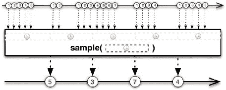

图 3-1\. Observable.sample() 的大理石图

第 3 章 ■ 订阅生命周期

查看图 3-1 中的图表，你可以看到在每个周期结束时，只有最后一个（来自源可观察对象的）发射条目被生成的可观察对象发射，其他条目则被丢弃。

throttleFirst

`Observable.throttleFirst()` 的行为类似于 `sample`，但它发射每个样本中的第一个条目（图 3-2）。

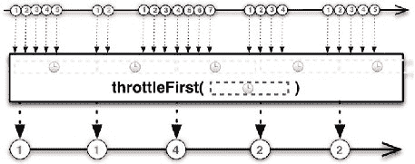

图 3-2\. Observable.throttleFirst() 的大理石图

debounce

`Observable.debounce()` 只发射那些在指定时间间隔内没有后续条目的条目，如图 3-3 所示。

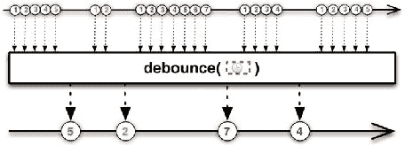

图 3-3\. Observable.debounce() 的大理石图

第 3 章 ■ 订阅生命周期

```


处理发射过程中的背压：缓冲  
控制背压的另一种方法是在通知订阅者之前将项目收集到缓冲区中。订阅者的 `onNext()` 方法将不会接收到单个发射的项目，而是接收到一个包含缓冲区中收集的项目的集合。

要应用此技术，你可以使用 `buffer()` 和 `window()` 操作符。  
**Buffer**

`Observable.buffer()` 允许你按指定的时间间隔定期收集项目。你可以选择基于项目数量或时间间隔来创建缓冲区，  
也可以通过传递一个函数来计算关闭每个缓冲区所需的条件（图 3-4）。你还可以指定一个触发缓冲区开始的 Observable。

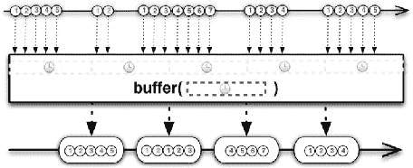

图 3-4\. `Observable.buffer()` 的弹珠图

**Window**

`Observable.window()` 与 `buffer` 类似，但它不是从源 Observable 发射项目集合，而是发射多个 Observable，每个 Observable 发射源 Observable 的一个子集项目，然后以 `onCompleted` 通知终止。

你可以选择基于时间间隔（图 3-5）、项目数量（图 3-6）来创建“窗口”，  
或者通过传递一个函数来计算关闭每个窗口所需的条件。

第 3 章 ■ 订阅生命周期

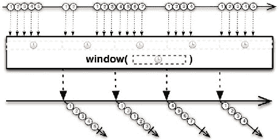

图 3-5\. 基于时间间隔的 `Observable.window()` 弹珠图

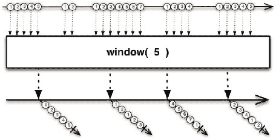

图 3-6\. 基于项目数量的 `Observable.window()` 弹珠图

■ 注意 如果发生错误，两个操作符都会通知 `onError` 方法并停止构建当前缓冲区或窗口。未完成的缓冲区/窗口中的项目将不会转发给订阅者。

第 3 章 ■ 订阅生命周期

**在订阅者内部处理背压**  
在订阅者内部，你可以要求 Observable 减慢发射速度。因此，在上面的 zip 示例中，你可以要求 B 缓慢发射项目，而不是应用节流操作符。

在订阅者的 `onStart()` 方法中，你必须调用 `Subscriber.request(n)` 方法，其中 `n` 是一个整数，表示在下一次调用 `request()` 之前你希望 Observable 发射的最大项目数。然后，在 `onNext()` 方法中消费项目后，你必须再次调用 `request()` 来告诉 Observable 继续发射接下来的 `n` 个项目。

在以下示例中，你设置 `n = 1`，这样你可以在下一个项目发射之前消费每个项目：

```java
myObservable.subscribe(new Subscriber<T>() {

    @Override
    public void onStart() {
        request(1);
    }

    @Override
    public void onCompleted() {
    }

    @Override
    public void onError(Throwable e) {
    }

    @Override
    public void onNext(T item) {
        consume(item);
        request(1);
    }
});
```

这里你在 `onStart()` 和 `onNext()` 中调用了 `request()` 方法，参数均为 1，因为你假设在下一个项目发射之前只能消费一个项目，但这些值是独立的，可以根据用例进行调整。

如果你省略了 `request()` 调用，Observable 会像往常一样发射项目，不会减慢发射速度；调用 `request(0)` 可以达到相同的效果。


在前面的章节中，你学习了 `Observable<T>`、`Observer<T>` 和 `Subscriber<T>`，以及它们在 RxJava 响应式编程中的作用：Observable 对象发射一系列事件，Subscriber 对象作为观察者，对 Observable 发射的每个事件做出反应。

RxJava 库提供了一个同时充当 Observable 和 Observer 的代理：它被称为 `Subject<T,R>`，其中 `T` 是输入值的类型，`R` 是输出值的类型。

一个 Subject 可以：

• 订阅一个或多个 Observable（作为 Subscriber）  
• 通过重新发射来传递它观察到的项目  
• 发射新项目

Subject 不依赖调度器，而是假设所有序列化和语法正确性都由 Subject 的调用者处理。

让我们看看 Subject 如何充当 Observable（`PublishSubject` 将在后面介绍）：


`Subject<String, String> subject = PublishSubject.create(); subject.subscribe(new Subscriber<String>() {`

`@Override`

`public void onCompleted() {`

`System.out.println("sequence completed");`

`}`

`@Override`

`public void onError(Throwable e) {`

`}`

`@Override`

`public void onNext(String item) {`

`System.out.println(item);`

`}`

`});`

© Andrea Maglie 2016 [61]

A. Maglie，《Reactive Java 编程》，DOI 10.1007/978-1-4842-1428-2_4 第 4 章 ■ 主题（Subjects）

`subject.onNext("first item");`

`subject.onNext("second item");`

`subject.onNext("third item");`

`subject.onCompleted();`

正如你所料，运行这段代码会得到以下输出：first item

second item

third item

sequence completed

现在，让我们创建一个既充当 Observable 又充当 Subscriber 的 Subject：`Observable<Long> interval =`

`Observable.interval(1, TimeUnit.SECONDS);`

`Subject<Long, Long> subject = PublishSubject.create(); interval.subscribe(subject);`

`subject.subscribe(new Subscriber<Long>() {`

`@Override`

`public void onCompleted() {`

`System.out.println("first sequence completed");`

`}`

`@Override`

`public void onError(Throwable e) {`

`}`

`@Override`

`public void onNext(Long item) {`

`System.out.println("first sequence, item: " + item);`

`}`

`});`

`subject.subscribe(new Subscriber<Long>() {`

`@Override`

`public void onCompleted() {`

`System.out.println("second sequence completed");`

`}`

第 4 章 ■ 主题（Subjects）

`@Override`

`public void onError(Throwable e) {`

`}`

`@Override`

`public void onNext(Long item) {`

`System.out.println("second sequence, item: " + item);`

`}`

`});`

这里的 Subject 首先订阅了 interval 可观察对象（该对象每秒发射一个递增的长整型值），然后每当它从 interval 可观察对象接收到一个条目时，就会重新发射一个 Long 对象。这段代码的输出是：first sequence, item: 0

second sequence, item: 0

first sequence, item: 1

second sequence, item: 1

first sequence, item: 2

second sequence, item: 2

first sequence, item: 3

second sequence, item: 3

first sequence, item: 4

second sequence, item: 4

first sequence, item: 5

...

在 RxJava 中，`Subject` 类是一个抽象类。在这些示例中，你并没有创建 Subject 的具体实现；而是使用了其中一个内置的实现，该实现由静态工厂方法 `PublishSubject.create()` 返回。

RxJava 提供了四种不同的 Subject 实现。PublishSubject

`PublishSubject<T>`（图 4-1）是一种 Subject，它具有以下特点：

• 从订阅的那一刻起，发射源可观察对象发射的所有条目

• 如果源 Observable 以错误终止，则会通知错误事件，并且不再发射任何其他条目

第 4 章 ■ 主题（Subjects）

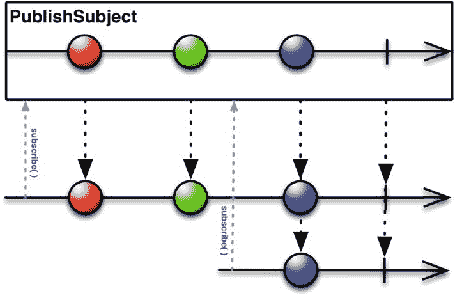

图 4-1. `PublishSubject<T>` 的弹珠图

要创建 `PublishSubject`（图 4-1）的实例，你可以使用静态工厂方法 `PublishSubject.create()`。

现在，创建一个发射整数序列的 `PublishSubject` 实例，然后订阅两个不同的订阅者：

`PublishSubject<Integer> subject = PublishSubject.create(); Observable<Integer> subjectAsObservable =`

`subject.asObservable();`

`// 订阅第一个 Subscriber`

`subjectAsObservable.subscribe(new Subscriber<Integer>() {` `@Override`

`public void onCompleted() {`

`System.out.println("first: sequence completed");`

`}`

`@Override`

`public void onError(Throwable e) {`

`}`

`@Override`

`public void onNext(Integer item) {`

`System.out.println("first: next item is " + item);`

`}`

第 4 章 ■ 主题（Subjects）

`});`

`subject.onNext(1);`

`subject.onNext(2);`

`// 订阅第二个 Subscriber`

`subjectAsObservable.subscribe(new Subscriber<Integer>() {` `@Override`

`public void onCompleted() {`

`System.out.println("second: sequence completed");`

`}`

`@Override`

`public void onError(Throwable e) {`

`}`

`@Override`

`public void onNext(Integer item) {`

`System.out.println("second: next item is " + item);`

`}`

`});`

`subject.onNext(3);`

`subject.onNext(4);`

`subject.onNext(5);`

`subject.onCompleted();`

这段代码的输出是：

first: next item is 1

first: next item is 2

first: next item is 3

second: next item is 3

first: next item is 4

second: next item is 4

first: next item is 5

second: next item is 5

first: sequence completed

second: sequence completed


第一个订阅者在 `PublishSubject` 开始发射数据项之前就进行了订阅，因此它会接收到全部五个数据项，然后完成。第二个订阅者在序列中间进行订阅，因此它只会接收到后续的数据项。

第 4 章 ■ Subjects

Subjects 是热 Observable 还是冷 Observable？这个例子很容易回答这个问题：Subjects 是热 Observable，因为它们可以在没有 Observer 订阅时产生数据项。

另一个有趣的点是 `Subject.asObservable()` 方法的使用。直接订阅 subject 与订阅 subjectAsObservable 会产生相同的输出，但 `Subject.asObservable()` 方法通过将你的 Subject 实例包装在 Observable 实例中来帮助你。这意味着你只能向订阅者暴露 Observable 接口，同时也意味着其他人无法使用该 Subject 实例来发射数据项或通知完成/错误事件。

BehaviorSubject

`BehaviorSubject<T>`（图 4-2）与 `PublishSubject` 类似，不同之处在于订阅者还会接收到在其订阅之前发射的最后一个数据项。

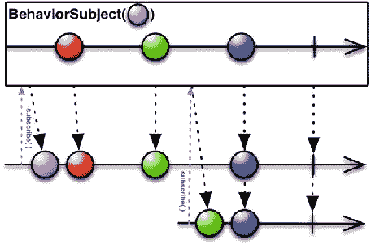

图 4-2\. BehaviorSubject<T> 的弹珠图

让我们沿用之前的例子，将 `PublishSubject` 实例改为 `BehaviorSubject` 实例：

```java
BehaviorSubject<Integer> subject = BehaviorSubject.create();
Observable<Integer> subjectAsObservable =
    subject.asObservable();
```

第 4 章 ■ Subjects

```java
// 订阅第一个订阅者
subjectAsObservable.subscribe(new Subscriber<Integer>() {
    @Override
    public void onCompleted() {
        System.out.println("first: sequence completed");
    }

    @Override
    public void onError(Throwable e) {
    }

    @Override
    public void onNext(Integer item) {
        System.out.println("first: next item is " + item);
    }
});

subject.onNext(1);
subject.onNext(2);

// 订阅第二个订阅者
subjectAsObservable.subscribe(new Subscriber<Integer>() {
    @Override
    public void onCompleted() {
        System.out.println("second: sequence completed");
    }

    @Override
    public void onError(Throwable e) {
    }

    @Override
    public void onNext(Integer item) {
        System.out.println("second: next item is " + item);
    }
});

subject.onNext(3);
subject.onNext(4);
subject.onNext(5);
subject.onCompleted();
```

第 4 章 ■ Subjects

这段代码产生以下输出：

```
first: next item is 1
first: next item is 2
second: next item is 2
first: next item is 3
second: next item is 3
first: next item is 4
second: next item is 4
first: next item is 5
second: next item is 5
first: sequence completed
second: sequence completed
```

这里，第二个订阅者接收到的序列从数据项 2 开始，它是在数据项 2 发射之后才订阅的。

RxJava 还提供了静态工厂方法 `BehaviorSubject.create(T defaultValue)`；只要尚未从源 Observable 接收到任何数据项，此方法返回的实例就会发射提供的默认数据项。

```java
BehaviorSubject<Integer> subject =
    BehaviorSubject.create(-1);
Observable<Integer> subjectAsObservable =
    subject.asObservable();

// 订阅第一个订阅者
subjectAsObservable.subscribe(new Subscriber<Integer>() {
    @Override
    public void onCompleted() {
        System.out.println("first: sequence completed");
    }

    @Override
    public void onError(Throwable e) {
    }

    @Override
    public void onNext(Integer item) {
        System.out.println("first: next item is " + item);
    }
});

subject.onNext(1);
subject.onNext(2);
```

第 4 章 ■ Subjects

```java
// 订阅第二个订阅者
subjectAsObservable.subscribe(new Subscriber<Integer>() {
    @Override
    public void onCompleted() {
        System.out.println("second: sequence completed");
    }

    @Override
    public void onError(Throwable e) {
    }

    @Override
    public void onNext(Integer item) {
        System.out.println("second: next item is " + item);
    }
});

subject.onNext(3);
subject.onNext(4);
subject.onNext(5);
subject.onCompleted();
```

输出结果为：

```
first: next item is -1
first: next item is 1
first: next item is 2
second: next item is 2
first: next item is 3
second: next item is 3
first: next item is 4
second: next item is 4
first: next item is 5
second: next item is 5
first: sequence completed
second: sequence completed
```


如果你希望订阅者能接收到在其订阅之前发出的所有数据项，而不仅仅是最后一个，那么只需使用 `ReplaySubject` 即可。

ReplaySubject

`ReplaySubject<T>`（图 4-3）会通过维护一个已发出数据项的缓冲区，将源 Observable 发出的所有数据项都发送给观察者，无论观察者何时订阅。

第 4 章 ■ 主题

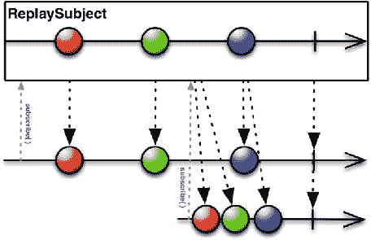

图 4-3. `ReplaySubject<T>` 的大理石图

该缓冲区由 `ArrayList` 支持，默认初始容量为 16，且没有上限。

RxJava 提供了其他静态工厂方法来创建具有不同行为的 `ReplaySubject` 实例：

• `ReplaySubject.create(int capacity)` 创建一个具有指定初始容量的 `ReplaySubject` 实例。
• `ReplaySubject.createWithSize(int size)` 创建一个实例，该实例将维护一个指定大小的缓冲区；当缓冲区满时，较旧的数据项会被丢弃。
• `ReplaySubject.createWithTime(long time, TimeUnit unit, Scheduler scheduler)` 创建一个有时间限制的 `ReplaySubject`。
• `ReplaySubject.createWithTimeAndSize(long time, TimeUnit unit, int size, Scheduler scheduler)` 允许你创建一个既有时间限制又有大小限制的 `ReplaySubject`。

AsyncSubject

`AsyncSubject<T>`（图 4-4）是 Subject 的一种实现，它具有以下特点：
• 仅在源 Observable 完成后，发出其发出的最后一个数据项。

第 4 章 ■ 主题

• 如果源 Observable 没有发出任何数据项，则不发出任何数据项。
• 如果源 Observable 以错误终止，则通知一个错误事件（不发出任何数据项）。

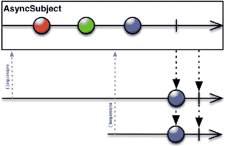

图 4-4. `AsyncSubject<T>` 的大理石图

让我们修改之前的示例，使用 `AsyncSubject` 代替 `PublishSubject`：

```java
AsyncSubject<Integer> subject = AsyncSubject.create();
Observable<Integer> subjectAsObservable =
    subject.asObservable();

// 订阅第一个订阅者
subjectAsObservable.subscribe(new Subscriber<Integer>() {
    @Override
    public void onCompleted() {
        System.out.println("first: sequence completed");
    }

    @Override
    public void onError(Throwable e) {
    }

    @Override
    public void onNext(Integer item) {
        System.out.println("first: next item is " + item);
    }
});

subject.onNext(1);
subject.onNext(2);

// 订阅第二个订阅者
subjectAsObservable.subscribe(new Subscriber<Integer>() {
    @Override
    public void onCompleted() {
        System.out.println("second: sequence completed");
    }

    @Override
    public void onError(Throwable e) {
    }

    @Override
    public void onNext(Integer item) {
        System.out.println("second: next item is " + item);
    }
});

subject.onNext(3);
subject.onNext(4);
subject.onNext(5);
subject.onCompleted();
```

这段代码会产生以下输出：

```
first: next item is 5
first: sequence completed
second: next item is 5
second: sequence completed
```

何时应该使用 Subject？

关于 Subject 的使用一直存在争议。RxJava 之父之一 Erik Meijer 表示：

> 它们是 Rx 世界中的可变变量，在大多数情况下你并不需要它们。通常，使用 `Create` 或其他操作符的解决方案可以让你在不添加额外状态的情况下连接延续。换句话说，尽量减少持有订阅者的对象数量是一种良好实践，你只需要让它们通过即可。[ https://social.msdn.microsoft.com/Forums/en-US/bbf87eea-6a17-4920-96d7-2131e397a234/why-does-emeijer-not-like-subjects ]

作为一般规则，在使用 Subject 之前，请问问自己是否可以通过 `Observable.create()`（或任何其他创建 Observable 的操作符）实现相同的目的。并且，如果你需要使用 Subject，最好通过 `Subject.asObservable()` 方法将其包装在 Observable 内部暴露出来，因为这样做你不会暴露 Subject 的可变组件。


以下示例展示了如何创建 `ArrayList` 的响应式版本。这个 `ArrayList` 的实现暴露了两个额外的方法，用于在添加或移除数据项时获得通知：


class ReactiveArrayList<T> extends ArrayList<T> { private PublishSubject<T> addSubject =

PublishSubject.create();

private PublishSubject<Object> removeSubject = PublishSubject.create();

@Override

public boolean add(T item) {

boolean result = super.add(item);

if (result) {

addSubject.onNext(item);

}

return result;

}

@Override

public void add(int index, T item) {

super.add(index, item);

addSubject.onNext(item);

}

@Override

第 4 章 ■ Subjects

public T remove(int index) {

T removedItem = super.remove(index);

removeSubject.onNext(removedItem);

return removedItem;

}

@Override

public boolean remove(Object object) {

boolean result = super.remove(object);

if (result) {

removeSubject.onNext(object);

}

return result;

}

@Override

public boolean addAll(Collection<? extends T> c) { boolean result = super.addAll(c);

if (result) {

for (T t : c) {

addSubject.onNext(t);

}

}

return result;

}

@Override

public boolean addAll(int index, Collection<? extends T> c) { boolean result = super.addAll(index, c);

if (result) {

for (T t : c) {

addSubject.onNext(t);

}

}

return result;

}

public Observable<T> observeItemsAdded() {

return addSubject.asObservable();

}

public Observable<Object> observeItemsRemoved() { return removeSubject.asObservable();

}

}

这是一个使用示例：

ReactiveArrayList<String> reactiveList =

new ReactiveArrayList<String>();

第 4 章 ■ Subjects

reactiveList.observeItemsAdded()

.subscribe(new Subscriber<String>() {

@Override

public void onCompleted() {

}

@Override

public void onError(Throwable e) {

}

@Override

public void onNext(String item) {

System.out.println("item added: " + item);

}

});

reactiveList.observeItemsRemoved()

.subscribe(new Subscriber<Object>() {

@Override

public void onCompleted() {

}

@Override

public void onError(Throwable e) {

}

@Override

public void onNext(Object item) {

System.out.println("item removed: " + item);

}

});

reactiveList.add("1");

reactiveList.add("2");

reactiveList.remove("1");

reactiveList.addAll(Arrays.asList("4", "5", "6")); reactiveList.remove("5");

这段代码的输出是

item added: 1

item added: 2

item removed: 1

第 4 章 ■ Subjects

item added: 4

item added: 5

item added: 6


■ 注意 Subjects 默认不是线程安全的。它们不会在线程之间执行任何同步操作，因此你不能从多个线程调用 `onNext()` / `onCompleted()` / `onError()` 方法，这可能导致非序列化调用，从而违反 Observable 契约并在生成的 Subject 中造成歧义。要使 Subject 线程安全，可以使用如下代码将其转换为 `SerializedSubject<T,R>`（`Subject<T,R>` 的子类）：

new SerializedSubject(myUnsafeSubject);

可连接 Observable

可连接 Observable 是 Subjects 的另一种替代方案。`ConnectableObservable<T>` 的行为类似于 Observable，但只有在调用其 `connect()` 方法时才开始发射数据项。

ConnectableObservable<String> observable =

Observable.range(0, 5)

.map(new Func1<Integer, String>() {

@Override

public String call(Integer t) {

return String.valueOf(t);

}

}).publish();

observable.subscribe(new Subscriber<String>() {

@Override

public void onCompleted() {

System.out.println("first: sequence completed");

}

@Override

public void onError(Throwable e) {

}

@Override

第 4 章 ■ Subjects

public void onNext(String item) {

System.out.println("first: next item is " + item);

}

});

observable.subscribe(new Subscriber<String>() {

@Override

public void onCompleted() {

System.out.println("second: sequence completed");

}

@Override

public void onError(Throwable e) {

}

@Override

public void onNext(String item) {

System.out.println("second: next item is " + item);

}

});

如果你运行这段代码，输出是……什么都没有！这是因为你缺少了对 `connect()` 方法的调用：

observable.connect();

添加这一行后，observable 开始发射数据项，输出变为

first: next item is 0

second: next item is 0

first: next item is 1

second: next item is 1

first: next item is 2

second: next item is 2

first: next item is 3

second: next item is 3

first: next item is 4

second: next item is 4


first: sequence completed

second: sequence completed

如你所见，可观察对象生成的每个事件都会传播给两个订阅者，并保持订阅顺序（每个事件的第一个订阅者会优先收到通知）。

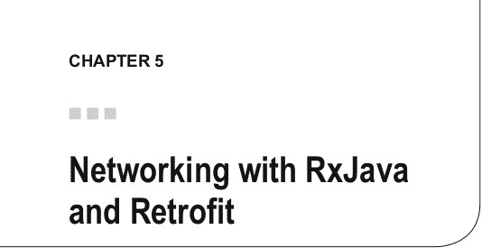

调用 RESTful API 等网络操作是应用 RxJava 的场景示例。实际上：

• 你需要实现一个回调机制来响应网络调用的结果，该结果可能以成功或失败状态终止。

• 有时你需要按顺序串联不同的网络调用。  
• 这些操作通常需要在单独的线程中执行。  
现在很容易将成功或错误状态的响应映射到订阅者的 onNext 和 onError 方法，将操作串联映射到可观察对象的连接（或转换），以及将使用调度器在单独线程执行的概念映射到实际应用中。

Java 为网络操作提供了基本支持（参见 java.net 和 javax.net 包），但还有许多其他库能极大简化网络编程，例如：

• Netty ( http://netty.io/ )  
• Async Http Client ( https://github.com/AsyncHttpClient/async-http-client )  
• OkHttp ( http://square.github.io/okhttp/ )  
• Retrofit ( http://square.github.io/retrofit/ )

本章将介绍 Retrofit，因为它有一个有趣的特性：内置对 RxJava 的支持，让你可以选择是否将网络响应封装在 Observable 对象中。

我假设你了解 RESTful API ( https://en.wikipedia.org/wiki/Representational_state_transfer ) 是什么，并且具备 JSON 基础知识（JSON 解析将使用 Google Gson - https://github.com/google/gson ）。  
© Andrea Maglie 2016 [79]  
A. Maglie，《响应式 Java 编程》，DOI 10.1007/978-1-4842-1428-2_5  
第 5 章 ■ 使用 RxJava 和 Retrofit 进行网络编程

Retrofit 内置的 RxJava 支持  
Retrofit 是一个为 Java（及 Android）提供类型安全 HTTP 客户端的库。Retrofit 的亮点在于：你只需定义一个作为 HTTP API 代理的接口，库就会自动生成该接口的实现。

所有示例均基于 Retrofit 2.1.0 版本。它支持 Java 7 和 8，但不支持 Java 6。

在 Java 项目中设置 Retrofit  
设置过程非常简单。如果你使用 Maven，只需添加以下依赖声明：

<dependency>  
    <groupId>com.squareup.retrofit2</groupId>  
    <artifactId>retrofit</artifactId>  
    <version>2.1.0</version>  
</dependency>

如果你使用 Gradle：

compile 'com.squareup.retrofit2:retrofit:2.1.0'

或者，你也可以从网站下载 jar 包。

创建 Retrofit 服务

让我们考虑 GitHub 提供的 API ( https://developer.github.com/v3/ )。GitHub 提供了许多 API 来访问用户信息、仓库和 Gist，但目前我们只考虑用于获取用户公共仓库列表的 API。

根据 GitHub API 文档，该 API 的 URL 为：  
https://api.github.com/users/{user}/repos  
其中 {user} 是 GitHub 用户名。

映射该 API 的 Retrofit 接口如下所示：

public interface GitHubService {  
    @GET("users/{user}/repos")  
    Observable<List<Repo>> listRepos(@Path("user") String user);  
}

第 5 章 ■ 使用 RxJava 和 Retrofit 进行网络编程

Repo 对象用于将 API 返回的 JSON 映射为 POJO（普通 Java 对象）；以下是一个简单实现，仅映射示例中需要的字段：

public class Repo {  
    @SerializedName("id")  
    private int id;  
    @SerializedName("name")  
    private String name;  
    @SerializedName("url")  
    private String url;  
    @SerializedName("watchers_count")  
    private int watchersCount;  
    @SerializedName("open_issues_count")  
    private int openIssueCount;  

    public int getId() {  
        return id;  
    }  

    public void setId(int id) {  
        this.id = id;  
    }  

    public String getName() {  
        return name;  
    }  

    public void setName(String name) {  
        this.name = name;  
    }  

    public String getUrl() {  
        return url;  
    }


public void setUrl(String url) {

this.url = url;

}

public int getWatchersCount() {

return watchersCount;

}

第 5 章 ■ 使用 RxJava 和 Retrofit 进行网络编程

public void setWatchersCount(int watchersCount) { this.watchersCount = watchersCount;

}

public int getOpenIssueCount() {

return openIssueCount;

}

public void setOpenIssueCount(int openIssueCount) { this.openIssueCount = openIssueCount;

}

}

这里你定义了一个方法，它将一个 GET 请求（参见@GET 注解）映射到 API "users/{user}/repos"（作为参数传递给@GET 注解）。{user}的值是该方法的参数，通过@Path 注解，你告诉 Retrofit，"user"参数必须替换 API URL 中的{user}部分。

该方法将返回一个 Observable，它会执行以下操作：
• 如果请求成功，则发射一个仅包含非空`List<Repo>`类型对象的序列（然后终止）。
• 如果发生错误，则通过错误事件进行通知。

`GitHubService`接口的实现可以按如下方式生成：
Retrofit retrofit = new Retrofit.Builder()
.baseUrl("https://api.github.com/")
.addCallAdapterFactory(RxJavaCallAdapterFactory.create())
.addConverterFactory(GsonConverterFactory.create())
.build();

GitHubService service = retrofit.create(GitHubService.class);
必须通过包含以下依赖项来启用对 RxJava 的支持：

<dependency>
<groupId>com.squareup.retrofit2</groupId>
<artifactId>adapter-rxjava</artifactId>
<version>2.1.0</version>
</dependency>

你还必须使用`addCallAdapterFactory(RxJavaCallAdapterFactory.create())`方法注册该适配器。
你还需要使用 Gson 添加对将响应体从 JSON 转换为`Repo`对象的支持。为此，你需要添加以下依赖项：
<dependency>

第 5 章 ■ 使用 RxJava 和 Retrofit 进行网络编程

<groupId>com.squareup.retrofit2</groupId>
<artifactId>converter-gson</artifactId>
<version>2.1.0</version>
</dependency>

</dependencies>

你还需要注册转换器：

addConverterFactory(GsonConverterFactory.create())
现在你可以使用服务实现并进行订阅：

String user = ...
service.listRepos(user)
.subscribe(new Subscriber<List<Repo>>() {
@Override
public void onCompleted() {
System.out.println("sequence completed");
}
@Override
public void onError(Throwable e) {
e.printStackTrace();
}
@Override
public void onNext(List<Repo> repos) {
for (Repo repo : repos) {
System.out.println("Repo: " + repo.getName());
}
}
});

将所有内容整合在一起，

import retrofit2.Retrofit;
import retrofit2.adapter.rxjava.RxJavaCallAdapterFactory;
import retrofit2.converter.gson.GsonConverterFactory;
import rx.Observable;
import rx.Subscriber;
import rx.functions.Func1;
import rx.schedulers.Schedulers

public static void listRepos(String user) {
retrofit2.Retrofit retrofit =
new retrofit2.Retrofit.Builder()

第 5 章 ■ 使用 RxJava 和 Retrofit 进行网络编程

.baseUrl("https://api.github.com/")
.addCallAdapterFactory(RxJavaCallAdapterFactory.create())
.addConverterFactory(GsonConverterFactory.create())
.build();

GitHubService service = retrofit.create(GitHubService.class);
service.listRepos(user)
.subscribe(new Subscriber<List<Repo>>() {
@Override
public void onCompleted() {
System.out.println("sequence completed");
}
@Override
public void onError(Throwable e) {
e.printStackTrace();
}
@Override
public void onNext(List<Repo> repos) {
for (Repo repo : repos) {
System.out.println("Repo: " + repo.getName());
}
}
});
}

例如，要打印用户“octocat”的 GitHub 仓库列表，你可以调用方法

listRepos("octocat");

结果将是

Repo: git-consortium
Repo: hello-worId
Repo: Hello-World
Repo: linguist
Repo: octocat.github.io
Repo: Spoon-Knife
Repo: test-repo1
sequence completed

第 5 章 ■ 使用 RxJava 和 Retrofit 进行网络编程

过滤结果

现在你已经获得了仓库列表，想要过滤该列表，只显示最多有两个未解决问题（open issues）的仓库。你可以通过应用`filter()`操作符来实现这一点。


`listRepos()` 方法返回的 Observable 会发射一个仅包含单个 `List<Repo>` 类型元素的序列。为了应用 `filter()` 操作符，你需要让 Observable 为每个 `Repo` 对象分别发射一个元素。以下代码展示了如何将 Observable 转换为另一个 Observable，然后应用过滤器：

```java
String user = ...
int maxOpenIssues = ...

service.listRepos(user)
    .flatMap(new Func1<List<Repo>, Observable<Repo>>() {
        @Override
        public Observable<Repo> call(List<Repo> repos) {
            return Observable.from(repos);
        }
    })
    .filter(new Func1<Repo, Boolean>() {
        @Override
        public Boolean call(Repo repo) {
            return repo.getOpenIssueCount() <= maxOpenIssues;
        }
    })
    .subscribe(new Subscriber<Repo>() {
        @Override
        public void onCompleted() {
            System.out.println("sequence completed");
        }

        @Override
        public void onError(Throwable e) {
            e.printStackTrace();
        }

        @Override
        public void onNext(Repo repo) {
            System.out.println("Repo: " + repo.getName());
        }
    });
```

**第 5 章 ■ 使用 RxJava 和 Retrofit 进行网络编程**

完整的方法如下：

```java
public static void listReposWithMaxIssues(String user, final int maxOpenIssues) {
    Retrofit retrofit = new Retrofit.Builder()
            .baseUrl("https://api.github.com/")
            .addCallAdapterFactory(RxJavaCallAdapterFactory.create())
            .addConverterFactory(GsonConverterFactory.create())
            .build();

    GitHubService service = retrofit.create(GitHubService.class);
    service.listRepos(user)
            .flatMap(new Func1<List<Repo>, Observable<Repo>>() {
                @Override
                public Observable<Repo> call(List<Repo> repos) {
                    return Observable.from(repos);
                }
            })
            .filter(new Func1<Repo, Boolean>() {
                @Override
                public Boolean call(Repo repo) {
                    return repo.getOpenIssueCount() <= maxOpenIssues;
                }
            })
            .subscribe(new Subscriber<Repo>() {
                @Override
                public void onCompleted() {
                    System.out.println("sequence completed");
                }

                @Override
                public void onError(Throwable e) {
                    e.printStackTrace();
                }

                @Override
                public void onNext(Repo repo) {
                    System.out.println("Repo: " + repo.getName());
                }
            });
}
```

**第 5 章 ■ 使用 RxJava 和 Retrofit 进行网络编程**

以下是输出结果：

```
Repo: hello-worId
Repo: test-repo1
sequence completed
```

**选择合适的调度器**

在前面的示例中，你没有指定任何调度器，因此代码会使用默认调度器执行。

假设你正在开发一个带有用户界面的应用程序，并且网络操作是通过点击按钮触发的。你不希望用户界面因等待响应而被阻塞，因此需要在单独的线程上执行所有网络相关操作。这可以通过应用 `subscribeOn()` 操作符来实现。网络操作属于 I/O 操作，因此合适的调度器是 `Schedulers.io()`。

但你也需要确保结果在 UI 线程上被通知（如果结果用于更新 UI），因此还需要应用 `observeOn()` 操作符。这里合适的调度器取决于你用来构建 UI 的库或框架。例如，在 JavaFX 中，你可以使用由 RxJavaFX (https://github.com/ReactiveX/RxJavaFX) 提供的 `JavaFxScheduler`；在 Android 中，则使用由 RxAndroid (https://github.com/ReactiveX/RxAndroid) 提供的 `AndroidSchedulers.mainThread()`。

```java
service.listRepos(user)
    .flatMap(new Func1<List<Repo>, Observable<Repo>>() {
        @Override
        public Observable<Repo> call(List<Repo> repos) {
            return Observable.from(repos);
        }
    })
    .filter(new Func1<Repo, Boolean>() {
        @Override
        public Boolean call(Repo repo) {
            return repo.getOpenIssueCount() <= maxOpenIssues;
        }
    })
    .subscribe(new Subscriber<Repo>() {
        @Override
        public void onCompleted() {
            System.out.println("sequence completed");
        }

        @Override
        public void onError(Throwable e) {
            e.printStackTrace();
        }

        @Override
        public void onNext(Repo repo) {
            System.out.println("Repo: " + repo.getName());
        }
    });
```

**第 5 章 ■ 使用 RxJava 和 Retrofit 进行网络编程**

通过在 `subscribe()` 调用之前添加 `subscribeOn(Schedulers.io())`，方法 `listRepos()`、`flatMap()` 和 `filter()` 将在不同的线程上执行。


结果（`onNext`、`onError` 和 `onCompleted`）将在主线程上通知。**链式调用多个网络请求** 链式调用多个网络请求通常意味着要处理嵌套回调，这会使代码难以阅读和维护。此外，你必须在每个回调中处理错误，增加了代码的复杂性。

从你目前所见，很容易理解如何使用 RxJava 将回调链替换为可观察对象的组合。

在这个简单场景中，你需要调用一个远程 API 来验证用户身份，然后调用另一个 API 获取用户数据，再调用另一个 API 获取用户的联系人信息。

以下代码展示了带有回调的嵌套 API 调用：

```java
import retrofit2.Callback;

import retrofit2.Call;

import retrofit2.Response;

User user = null;

myService.login(username, password,

new Callback<AccessToken>() {

@Override

public void success(User user, Response response) { storeCredentials(response.getAccessToken())

myService.getUser(accessToken, new Callback<User>() {

@Override

public void onResponse(Call<User> call,

Response<User> response) {

user = response.getBody();

CHAPTER 5 ■ NETWORKING WITH RXJAVA AND RETROFIT

myService.getUserContact(user.getId(),

new Callback<Contact>() {

@Override

public Contact onResponse(Call<Contact> contact,

Response<Contact> response) {

user.setContact(response.getBody());

}

@Override

public void onFailure(RetrofitError error) {

// 在此处处理错误...

}

});

}

@Override

public void onFailure(RetrofitError error) {

// 在此处处理错误...

}

});

}

@Override

public void failure(RetrofitError error) {

// 在此处处理错误...

}

});
```

而这是你使用 RxJava 转换这段代码的方式：

```java
myService.login()

.doOnNext(accessToken -> storeCredentials(accessToken)) .flatMap(accessToken -> myService.getUser(accessToken)) .flatMap(user -> myService.getUserContact(user.getId())) .subscribe(new Subscriber<Contact>() {

@Override

public void onCompleted() {

}

@Override

public void onError(Throwable e) {

}

@Override

public void onNext(Contact contact) {

}

});

CHAPTER 5 ■ NETWORKING WITH RXJAVA AND RETROFIT
```

其中：

- `myService.login()` 返回一个 `Observable<AccessToken>`。
- `doOnNext()` 方法应用于 `myService.login()` 的结果，以便在每次发出 `AccessToken` 实例时调用 `storeCredentials()`。
- 同一个 `AccessToken` 实例被第一个 `flatMap` 操作符用于调用 `myService.getUser(accessToken)` 方法，从而返回一个 `Observable<User>`。
- 另一个 `flatMap` 操作符被用于使用发出的 `User` 实例来调用 `myService.getUserContact(user.getId())`。

在嵌套回调版本中，有三个不同的地方需要处理错误；而在 RxJava 版本中，你只需在一个地方处理错误，因为每个错误都会被转发给观察者，并在 `onError` 方法中通知。**缓存数据**

在处理网络请求时，缓存是一个重要话题。缓存是一种保存网络响应的本地副本的机制，以便在网络不可用时使用，或避免执行过多后续网络请求。

Retrofit 支持使用 `OkHttpClient` 的缓存机制来缓存网络响应。在某些情况下，这还不够，你需要通过应用自己的自定义逻辑来缓存数据。

同样，RxJava 可以帮助你使用简单且可读的代码构建复杂的缓存机制。以下代码展示了一个类的抽象实现，该类将网络响应缓存到磁盘和内存中。请注意，在此示例中，你利用了 lambda 表达式（由 Java 8 提供）来使代码更简洁。

```java
abstract class CacheManager<T> {

private T mMemoryCache;

public Observable<T> getData() {

return Observable.concat(fromMemory(),

fromDisk(), fromNetwork())

.first(response -> isValid(response))

.onErrorResumeNext(t -> fallbackToDiskCache());

}

protected Observable<T> fromNetwork() {

return doNetworkCall()

.doOnNext(response -> {

CHAPTER 5 ■ NETWORKING WITH RXJAVA AND RETROFIT

cacheInMemory(response);

cacheOnDisk(response);

})

.compose(logSource("network"));

}
```


private Observable<T> fallbackToDiskCache() {

System.out.println("回退到磁盘缓存"); return fromDisk();

}

protected void cacheOnDisk(T response) {

System.out.println("正在将数据保存到磁盘：" + response); persistOnDisk(response);

}

protected Observable<T> fromDisk() {

Observable<T> observable = Observable.create(subscriber -> { T response = readFromDisk();

if (response != null) {

subscriber.onNext(response);

cacheInMemory(response);

}

subscriber.onCompleted();

});

return observable.compose(logSource("disk"));

}

protected void cacheInMemory(T response) {

mMemoryCache = response;

}

protected Observable<T> fromMemory() {

Observable<T> observable = Observable.create(subscriber -> { subscriber.onNext(mMemoryCache);

subscriber.onCompleted();

});

return observable.compose(logSource("memory"));

}

public void deleteAll() {

mMemoryCache = null;

deleteFromDisk();

}

private Observable.Transformer<T, T> logSource(final String source) { 第 5 章 ■ 使用 RXJAVA 和 RETROFIT 进行网络通信

return dataObservable -> dataObservable.doOnNext(data -> { if (data == null) {

System.out.println(source + " 没有任何数据。");

} else if (!isValid(data)) {

System.out.println(source + " 包含过期数据。");

} else {

System.out.println(source + " 包含您正在查找的数据！");

}

});

}

abstract boolean isValid(T data);

abstract Observable<T> doNetworkCall();

abstract void persistOnDisk(T response);

abstract T readFromDisk();

abstract void deleteFromDisk();

}

让我们来分解这段代码：

•   核心思想是使用 `Observable.concat()` 操作符，按以下顺序串联三个操作：从内存获取数据、从磁盘获取数据、从网络获取数据。

•   然后，你应用 `first()` 操作符，并传入一个函数，该函数会过滤掉无效的数据（即非空且未过期的数据）。因此，如果内存返回有效数据，该数据将被转发给订阅者，并且不会从磁盘或网络读取数据。如果内存返回无效数据，则会从磁盘读取数据，并检查其有效性，依此类推。

•   如果发生某些错误（例如，无网络连接或服务器不可达），你会回退到磁盘缓存。这是借助 `onErrorResumeNext()` 操作符完成的，该操作符会在发生错误时，让源 Observable 从给定的 Observable（`fallbackToDiskCache()`）发射数据项。

•   `fromNetwork()` Observable 从网络检索数据，并在通知订阅者的 `onNext()` 方法时，使用 `onNext()` 操作符将数据缓存到磁盘和内存中。请记住，仅当内存和磁盘包含无效数据时，才会调用 `fromNetwork()`。

第 5 章 ■ 使用 RXJAVA 和 RETROFIT 进行网络通信

•   相同的逻辑应用于 `fromDisk()` 方法，在通知订阅者的 `onNext()` 方法之前，先将数据保存到内存中。

•   最后，你使用 `Observable.compose()` 操作符来应用 `logSource()` 操作符，该操作符会打印关于当前数据源的信息。

请注意，你使用了 `Observable.create()` 来创建用于从内存和磁盘获取数据的观察者。

关于从网络获取数据以及从磁盘保存和读取数据的细节，留给了具体的实现。

在这些示例中，你只使用了 Retrofit 库提供的众多功能中的一小部分，因为重点在于 RxJava 的集成部分。使用 Retrofit，你不仅可以管理 GET 请求，还可以管理 POST、DELETE、PUT 和 PATCH 请求。你可以指定头部和查询参数，操作 URL 路径，发送表单编码和多部分数据。请访问 http://square.github.io/retrofit/ 获取完整文档。

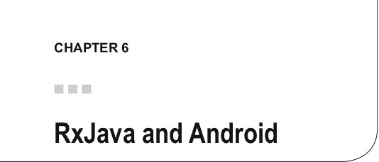

在当今移动驱动的世界中，谈到 Java 也意味着谈到 Android。

RxJava 库可以在 Android 开发中使用，无需任何其他要求。这意味着到目前为止你看到的所有代码示例都可以包含在 Android 项目中；你只需要在 `build.gradle` 文件中添加 RxJava 的依赖即可。


有一些库为在 Android 环境中应用 RxJava 概念提供了额外支持。其基础包括：

• RxAndroid

• RxBindings

• RxLifecycle

RxAndroid

RxAndroid 是你需要的第一个 Android 开源库。实际上，它提供了一个非常有用的 Scheduler 实例，用于在主线程（或给定的 looper）上调度。要安装依赖，你只需将两个依赖声明添加到

你的 build.gradle 文件中：

apply plugin: 'com.android.application'

android {

compileSdkVersion 24

buildToolsVersion "24.0.1"

defaultConfig {

applicationId "com.example"

targetSdkVersion 24

versionCode 1

versionName "1.0"

}

© Andrea Maglie 2016 [95]

A. Maglie, Reactive Java Programming , DOI 10.1007/978-1-4842-1428-2_6 第 6 章 ■ RXJAVA 与 ANDROID

buildTypes {

release {

minifyEnabled true

shrinkResources true

proguardFiles getDefaultProguardFile('proguard-android.txt'),

'proguard-rules.pro'

}

}

}

dependencies {

compile 'com.android.support:appcompat-v7:24.1.1' compile 'io.reactivex:rxjava:1.2.0'

}

RxJava 要求 minSdkVersion 9，但 RxAndroid 要求 minSdkVersion 14。请参考项目网站 ( https://github.com/ReactiveX/RxAndroid ) 以了解

该库的最新版本。

正如你已经看到的，你可以将提供的 `AndroidSchedulers.mainThread()` 作为参数传递给 `observeOn()` 操作符，以便在 UI 线程上通知你的 Subscriber 关于 `onCompleted()` / `onError()` / `onNext()` 事件：

Observable.range(1, 10)

.subscribeOn(Schedulers.newThread())

.observeOn(AndroidSchedulers.mainThread())

.subscribe(new Subscriber<Integer>() {

@Override

public void onCompleted() {

// 在 UI 线程上通知

}

@Override

public void onError(Throwable e) {

// 在 UI 线程上通知

}

@Override

public void onNext(Integer item) {

// 在 UI 线程上通知

}

});

你也可以在另一个线程上订阅；相应的 Scheduler 可以通过 `AndroidSchedulers.from()` 方法实例化： BackgroundThread myThread = new myThread();

myThread.start();

第 6 章 ■ RXJAVA 与 ANDROID

Observable.range(1, 10)

.subscribeOn(AndroidSchedulers.from(myThread.getLooper()) .observeOn(AndroidSchedulers.mainThread())

.subscribe(new Subscriber<Integer>() {

@Override

public void onCompleted() {

// 在 UI 线程上通知

}

@Override

public void onError(Throwable e) {

// 在 UI 线程上通知

}

@Override

public void onNext(Integer item) {

// 在 UI 线程上通知

}

});

如果你想围绕你的 Handler 构建一个 Scheduler，请使用 `HandlerThreadScheduler`。 RxBindings

RxJava 也可以用于以响应式方式与 UI 组件交互，而不是使用监听器。

例如，要在 View 被点击时得到通知，你必须实现一个 `OnClickListener()`：

myView.setOnClickListener(new OnClickListener() { @Override

public void onClick(final View v) {

}

});

或者，如果你想监听 EditText 中文本的变化，你必须使用 `EditText.addTextChangedListener(TextWatcher)` 方法添加一个 TextWatcher： editText.addTextChangedListener(new TextWatcher() { @Override

public void onTextChanged(CharSequence s, int start, int before, int count) {

}

第 6 章 ■ RXJAVA 与 ANDROID

@Override

public void beforeTextChanged(CharSequence s, int start, int count, int after) {

}

@Override

public void afterTextChanged(Editable s) {

}

});

RxBinding ( https://github.com/JakeWharton/RxBinding ) 是一个开源库，它提供了一些方法来避免使用这种回调机制，转而应用响应式逻辑。

要将此库添加到你的 Android 项目，请将依赖项添加到你的应用的 build.gradle 文件中：

apply plugin: 'com.android.application'

android {

compileSdkVersion 24

buildToolsVersion "24.0.1"

defaultConfig {

applicationId "com.example"

targetSdkVersion 24

versionCode 1

versionName "1.0"

}

buildTypes {

release {

minifyEnabled true

shrinkResources true

proguardFiles getDefaultProguardFile('proguard-android.txt'),

'proguard-rules.pro'

}

}

}

dependencies {

compile 'com.android.support:appcompat-v7:24.1.1' compile 'io.reactivex:rxjava:1.2.0'

compile 'io.reactivex:rxandroid:1.2.1'

}


监听点击事件可以通过以下方法实现：

RxView.clicks(myView)

.subscribe(click -> doSomething());

`RxView.clicks()` 返回一个热 Observable（之所以称为“热”，是因为即使没有订阅者，点击事件也会被触发）。

你还可以对这个 Observable 应用操作符。

实现一种机制来避免视图上出现过多连续点击可能会很有用。这可以通过 `throttleFirst` 操作符来实现（关于 `throttleFirst` 的定义，请参见第 3 章）：

RxView.clicks(myView)

.throttleFirst(300, TimeUnit.MILLISECONDS)

 

方法 `RxTextView.afterTextChangeEvents()` 提供了一个 Observable，当 EditText 中的内容发生变化时，它会通知订阅者：

RxTextView.afterTextChangeEvents(editText)

.subscribe(new Subscriber<TextViewAfterTextChangeEvent>() { @Override

public void onCompleted() {

}

@Override

public void onError(Throwable e) {

}

@Override

public void onNext(TextViewAfterTextChangeEvent event) { CharSequence text = event.view().getText();

// 执行某些操作

}


第 6 章 ■ RXJAVA 与 ANDROID

如果你希望每 500 毫秒才接收一次文本变化通知，可以应用 `debounce` 操作符：

RxTextView.afterTextChangeEvents(editText)

.debounce(500, TimeUnit.MILLISECONDS)

.observeOn(AndroidSchedulers.mainThread())

.subscribe(new Subscriber<TextViewAfterTextChangeEvent>() { @Override

public void onNext(TextViewAfterTextChangeEvent event) { CharSequence text = event.view().getText();

// 执行某些操作

}

});

查看 `RxTextView` 的源代码，你会发现 `afterTextChangeEvents` 返回一个为你实现了 `TextWatcher` 的 Observable：

Observable<TextViewAfterTextChangeEvent> afterTextChangeEvents( @NonNull TextView view) {

checkNotNull(view, "view == null");

return Observable

.create(new TextViewAfterTextChangeEventOnSubscribe(view)); }

class TextViewAfterTextChangeEventOnSubscribe

implements Observable.OnSubscribe<TextViewAfterTextChangeEvent> { final TextView view;

TextViewAfterTextChangeEventOnSubscribe(TextView view) { this.view = view;

}

@Override public void call(final Subscriber<? super TextViewAfterTextChangeEvent> subscriber) {

verifyMainThread();

final TextWatcher watcher = new TextWatcher() {

@Override public void beforeTextChanged(CharSequence s, int start, int

count, int after) {

}

@Override public void onTextChanged(CharSequence s, int start, int

before, int count) {

}

@Override public void afterTextChanged(Editable s) {

if (!subscriber.isUnsubscribed()) {

subscriber.onNext(TextViewAfterTextChangeEvent.create(view, s));

第 6 章 ■ RXJAVA 与 ANDROID

}

}

};

view.addTextChangedListener(watcher);

subscriber.add(new MainThreadSubscription() {

@Override protected void onUnsubscribe() {

view.removeTextChangedListener(watcher);

}

});

// 发送初始值。

subscriber.onNext(TextViewAfterTextChangeEvent.create(view, view. getEditableText()));

}

在这段代码中：

• 实现了一个 `TextWatcher` 并将其添加到 `EditText` 中。
• 当 Observable 被取消订阅时，会移除该 `TextWatcher`。
• 每次调用 `TextWatcher.afterTextChanged()` 方法时（如果订阅者仍处于订阅状态），都会调用订阅者的 `onNext` 方法。

Activity 与 Fragment 的生命周期
如果你在 Android 上进行开发，应该熟悉 Activity 生命周期的概念：在设置和显示 Activity 的过程中，操作系统会调用 Activity 上的一系列方法；当用户执行某个操作（如旋转设备）时，会调用其他方法；还有一些方法则是在响应外部事件（如来电暂停应用 Activity）时被调用。

在这些情况下，订阅行为会如何表现？RxJava（以及 RxAndroid）中并没有内置的机制来为你管理这些情况。

让我们来看一些例子。假设你在 Activity 的 `onCreate` 方法中订阅了一个 Observable：

@Override

protected void onCreate(Bundle savedInstanceState) { super.onCreate(savedInstanceState);

setContentView(R.layout.activity_layout)


TextView textView = findViewById(R.id.text_view)  
Observable.timer(2, TimeUnit.MINUTES)  
.subscribeOn(Schedulers.newThread())  
.observeOn(AndroidSchedulers.mainThread())  

第 6 章 ■ RXJAVA 与 ANDROID  

.subscribe(new Subscriber<Long>() {  

@Override  
public void onCompleted() {  
}  

@Override  
public void onError(Throwable e) {  
}  

@Override  
public void onNext(Long item) {  
textView.setText("Timeout!");  
}  

});  
}  

一个定时器 Observable 在 `onCreate` 方法中被订阅；2 分钟后，TextView 将更新为消息“Timeout!”。

如果在 2 分钟过去之前用户旋转了屏幕，会发生什么？当屏幕旋转时，Activity 会被销毁并重建。这会导致你的场景中出现两个问题：

• Observable 会在 Activity 旋转时继续执行，但当它完成时，会尝试更新一个错误的 TextView 实例。  
• Observable 会持有旧 Activity 的引用，导致内存泄漏。

这里的解决方案很简单：你必须根据生命周期取消订阅。例如，我们保留对订阅的引用，并在 Activity 被销毁时取消订阅：

Subscription subscription = null;  

@Override  
protected void onCreate(Bundle savedInstanceState) {  
super.onCreate(savedInstanceState);  
setContentView(R.layout.activity_layout);  

TextView textView = findViewById(R.id.text_view);  
subscription = Observable.timer(2, TimeUnit.MINUTES)  
.subscribeOn(Schedulers.newThread())  
.observeOn(AndroidSchedulers.mainThread())  
.subscribe(new Subscriber<Long>() {  

@Override  
public void onCompleted() {  
}  

第 6 章 ■ RXJAVA 与 ANDROID  

@Override  
public void onError(Throwable e) {  
}  

@Override  
public void onNext(Long item) {  
textView.setText("Timeout!");  
}  

});  
}  

@Override  
protected void onDestroy() {  
super.onDestroy();  
if (subscription != null && !subscription.isUnsubscribed()) {  
subscription.unsubscribe();  
}  
}  

你也可以创建一个 `CompositeSubscription` 对象，并将所有订阅添加到其中。然后你可以一次性取消所有订阅：

CompositeSubscription compositeSubscription = new CompositeSubscription();  

@Override  
protected void onCreate(Bundle savedInstanceState) {  
super.onCreate(savedInstanceState);  
setContentView(R.layout.activity_layout);  

TextView textView = findViewById(R.id.text_view);  
subscription = Observable.timer(2, TimeUnit.MINUTES)  
.subscribeOn(Schedulers.newThread())  
.observeOn(AndroidSchedulers.mainThread())  
.subscribe(new Subscriber<Long>() {  

@Override  
public void onCompleted() {  
}  

第 6 章 ■ RXJAVA 与 ANDROID  

@Override  
public void onError(Throwable e) {  
}  

@Override  
public void onNext(Long item) {  
textView.setText("Timeout!");  
}  

});  
}  

@Override  
protected void onDestroy() {  
super.onDestroy();  
compositeSubscription.unsubscribe();  
}  

请注意，一旦调用了 `CompositeSubscription.unsubscribe()`，该对象将变得不可用，因为它会自动取消订阅之后添加的任何其他订阅。

Trello 开发了一个名为 RxLifecycle（https://github.com/trello/RxLifecycle）的开源库，它简化了在 Activity（或 Fragment）生命周期中管理订阅/取消订阅的过程。

要将其包含到你的项目中，请将依赖项添加到应用的 `build.gradle` 文件中：  
dependencies {  
compile 'com.android.support:appcompat-v7:24.1.1'  
compile 'io.reactivex:rxjava:1.2.0'  
compile 'io.reactivex:rxandroid:1.2.1'  
compile 'com.jakewharton.rxbinding:rxbinding:0.4.0'  
compile 'com.trello:rxlifecycle:0.7.0'  
}  

使用这个库，你可以使用 `compose()` 操作符来指定何时取消订阅 Observable：  

myObservable  
.compose(RxLifecycle.bindUntilEvent(lifecycle, ActivityEvent.DESTROY))  
.subscribe();  

或者你可以让库自动检测何时取消订阅：  

myObservable  
.compose(RxLifecycleAndroid.bindActivity(lifecycle))  
.subscribe();  

在后一种情况下，取消订阅是在与订阅相对的生命周期事件中管理的（例如，如果订阅发生在 Activity 的 `onStart()` 方法中，取消订阅将发生在 `onStop()` 中）。

第 6 章 ■ RXJAVA 与 ANDROID  

使用 RxJava 进行 Android 开发是一个热门话题，许多其他开源库已经被开发出来，涵盖了多个领域。其中一些库包括：

• Android-ReactiveLocation（https://github.com/mcharmas/Android-ReactiveLocation）  
• rx-android-permissions（https://github.com/beworker/rx-android-permissions）  
• RxSensor（https://github.com/wandup/RxSensor）  

  

„ „  
Activity 生命周期，101–105  
JSON，18，79，81–82  
AsyncSubject，70–72  
„ [Lambda 表达式，1，3–4，7，11，90] ^„  
Backpressure，41，55–59  
BehaviorSubject，66–69 [„]  
„ ^(网络，18–19，49，51–52，79–93)  
回调，8–9，41，79，88–90，98 [„]  
冷 Observable，15–16，29，66  
Observable（定义），12  
可连接 Observable，15，76–77  
Observable 类（java.util），6  
„ ^(Observable 组合，22–39  
Observable 操作符  
buffer，36，57)  
Fragment 生命周期，101–105  
debounce，36，56  
Func0R，21  
empty，12，19，44  
Func1T, R，21  
observeOn，49，51–53，87，96–97，  
函数式编程，1–4，6，9  
101–103  
onErrorReturn，44  
„ ^(onExceptionResumeNext，44–45  
retry，46–50)  
Gradle，4，11，80，95，98，104  
retryWhen，46–48  
Gson，79，82  
sample，37，50，55–56  
subscribeOn，49，51–53，87  
„ ^(throttleFirst，50，56，99  
window，36，50，57–58)  
Handler，97  
Observer（定义），5，12  
热 Observable，15–16，29，66，99  
Observer 设计模式，5–6  
onCompleted，13–21，23，25，27–29，31–35，  
„ ^(38–39，42–47，49，51–52，54，57，59，61–62，64–65，67–69，71–72，)  
命令式编程，1–4  
75–77，83–89，96–97，99，102–103  
© Andrea Maglie 2016 [107]  
A. Maglie，《Reactive Java Programming》，DOI 10.1007/978-1-4842-1428-2  
onError，13–17，19，21，23，25，27–29，[„]  
31–35，38–39，41–47，49，51，  
PublishSubject，61–66，71，73  
53–54，58–59，61–65，67–69，  
71–72，75–77，79，83–86，88–90，  
96–97，102–103 [„]  
onNext，12–19，21，23，25，28–29，  
响应式编程，1，4–6，12，22，61  
31–35，38–39，43，45–47，49，  
ReactiveX，1–9，11，37，52，87，96  
51–55，57，59，61–65，67–69，  
ReplaySubject，69–70  
72–77，79，83–86，88–93，  
RESTful API，79  
96–97，99–104  
Retrofit，79–93  
操作符  
RxAndroid，52，87，95–97，101  
from，7，15–16，25，29–30，85–87  
RxBindings，95，97–98  
and/then/when，37  
RxJava，1–9，11–14，16，21，37，41，46，49，  
buffer，36  
52，55，61，63，68，70，72，79–93，  
combineLatest，37  
95–105  
concat，27–29  
RxJavaFX，87  
concatMap，24–26  
RxLifecycle，95，104  
create，18–19  
rx.ObservableT，11  
debounce，36  
rx.ObserverT，11，13  
defer，20–22  
rx.SubscriberT，11，13  
distinct，30  
elementAt，37 [„]  
empty，12，19，44  
Schedulers，41，49–54，61，79，87–88，95–97  
error，19  
from，50  
filter，29–30  
computation，50–51  
first，30–31  
immediate，50  
flatMap，24–25，48  
io，50–53，87–88  
groupBy，36  
newThread，50，54，96，101–103  
ignoreElements，37  
trampoline，50  
interval，37  
SerializedSubject，76  
join，37  
Subject，5，6，16，61–77  
just，16–17，21  
Subscription，13–15，29，41–59，63，66，69，  
last，31–33  
77，83，101–104  
map，22–24  
merge，37 [„]  
never，19  
Transformers，53–54  
range，17，37–39，48，50，76，96–97  
sample，37 [„]  
scan，35–36  
skip，37  
取消订阅，14–15，104  
skipLast，37  
startWith，34–35 [„]  
switchOnNext，37  
take，33–34  
Worker，54  
takeLast，37  
Worker.schedule，54  
timer，18，48，50，101–103  
Worker.schedulePeriodically，54  
window，36  
zip，26–27  
