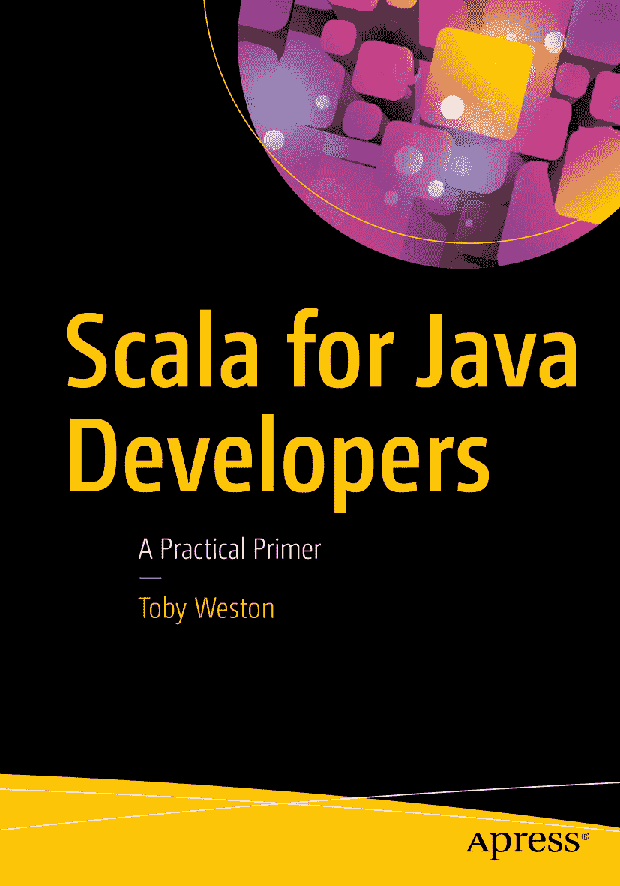

托比·韦斯顿 著 《Java 开发者学 Scala》实用入门指南


本书作者引用的任何源代码或其他补充材料，读者均可通过本书的产品页面在 GitHub 上获取，网址为 [`www.apress.com/9781484231074`](http://www.apress.com/9781484231074) 。如需更详细信息，请访问 [`http://www.apress.com/source-code`](http://www.apress.com/source-code) 。ISBN 978-1-4842-3107-4 电子版 ISBN 978-1-4842-3108-1 [`doi.org/10.1007/978-1-4842-3108-1`](https://doi.org/10.1007/978-1-4842-3108-1) 美国国会图书馆控制号：2017963118 © Toby Weston 2018 本作品受版权保护。出版商保留所有权利，无论涉及材料的全部或部分，特别是翻译、重印、重用插图、朗诵、广播、微缩胶片复制或任何其他物理方式，以及电子改编、计算机软件或现在已知或以后开发的类似或不同方法的传输或信息存储与检索。本书中可能出现商标名称、标识和图像。我们不以每次出现商标名称、标识或图像时都使用商标符号，而是仅以编辑方式使用这些名称、标识和图像，以利于商标所有者，无意侵犯商标权。本出版物中使用商品名称、商标、服务标志和类似术语，即使未明确标识，也不应被视为对其是否受专有权利保护的看法。尽管本书中的建议和信息在出版时被认为是真实准确的，但作者、编辑和出版商均不对可能出现的任何错误或遗漏承担法律责任。出版商对本书所含材料不作任何明示或暗示的保证。本书采用无酸纸印刷。本书通过 Springer Science+Business Media New York 在全球图书贸易中发行，地址：233 Spring Street, 6th Floor, New York, NY 10013。电话：1-800-SPRINGER，传真：(201) 348-4505，电子邮件：orders-ny@springer-sbm.com，或访问 www.springeronline.com。Apress Media, LLC 是一家加利福尼亚有限责任公司，其唯一成员（所有者）是 Springer Science + Business Media Finance Inc (SSBM Finance Inc)。SSBM Finance Inc 是一家特拉华州公司。谨以此书纪念 Félix Javier García López 前言

## 目标读者

本书面向希望过渡到使用 Scala 编程的 Java 开发者。

## 本书结构

本书分为四个部分：Scala 概览、Java 与 Scala 对比、深入探讨 Scala 特有特性与函数式编程惯用法，以及最后关于将 Scala 引入现有 Java 团队的讨论。

在第一部分，我们将对 Scala 进行高层概览。您将了解该语言的结构，以及 Scala 在许多方面与 Java 相似，但在其他方面又截然不同的特点。我们将介绍如何安装 Scala、使用交互式解释器，并讲解一些基本语法示例。

第二部分讨论 Java 与 Scala 之间的关键差异。我们将探讨 Scala 相比 Java 缺少什么，反之亦然，以及概念如何从一种语言转换到另一种语言。

然后在第三部分，我们将讨论 Scala 提供而 Java 中没有的一些语言特性。本部分还会稍微涉及函数式编程惯用法。

最后，我们将讨论如何将 Scala 引入遗留的 Java 项目和团队。这并非总是一个轻松的过渡，因此我们将探讨为何要这样做，以及您可能面临的一些挑战。

## 编译代码片段

在本书后面，我将介绍 Scala REPL：一个用于处理 Scala 的交互式工具，相当于 Java 的 JShell 的 Scala 版本。您会看到以 `scala>` 为前缀的 REPL 会话。

当您看到时，可以逐字输入 `scala>` 后面的代码，按回车键，然后查看结果。示例如下。

```
// 一个 REPL 会话示例
scala> val x = 6 * 9
x: Int = 54
```

如果您没有看到 `scala>` 前缀，请假设该片段可能依赖于之前的代码示例。我尽量按逻辑顺序引入这些示例，在展示完整代码列表与避免冗长枯燥的代码列表之间取得平衡。

如果某些内容难以理解，请始终参考完整源代码。简而言之，您可能会发现在阅读时查阅完整源代码会很有帮助。

在 REPL 中处理较大片段

如果您想将一些较大的代码片段粘贴到 REPL 中，可能会在按回车键时遇到编译器错误。REPL 设计为逐行求值。粘贴较大片段或输入长示例需要您处于粘贴模式。

输入 `:paste` 进入粘贴模式，允许您输入多行代码。按 `Ctrl + D` 退出粘贴模式并编译代码。

```
scala> : paste
// 进入粘贴模式 (按 ctrl-D 结束)
val x = 4
val y = 34
x + y * 2
// 按 Ctrl + D
res1: Int = 72
```

偶尔，您可能会在代码片段中看到省略号（ `...` ）或三个问号（ `???` ）。当您看到时，表示该片段不完整，通常后面会有补充代码来填补空白。它可能无法编译。当我感觉补充代码会显得无趣、分散注意力，或者我正在逐步构建示例时，会使用这种方式。

## 源代码

本书的源代码可在 GitHub 上获取：[`https://github.com/tobyweston/learn-scala-java-devs`](https://github.com/tobyweston/learn-scala-java-devs) 。您可以克隆仓库或直接从网站下载归档文件。

源代码根据 Apache 2.0 开源许可证授权。

## 源代码附录

本书通常包含部分代码片段，以避免大量分散注意力的“脚手架”代码。代码可能引用之前的片段，这一点可能不会立即显现。请尝试将每个示例视为在前文基础上构建来阅读代码。

如果您不喜欢这种风格，我还提供了一个代码列表附录。该附录为更复杂的代码提供了完整列表，方便您在一个地方查看所有代码。这并非为了凑篇幅。真的。

致谢

感谢 James Maggs、Alex Luker、Rhys Keepence 和管学民对早期草稿的反馈，以及 Lee Benfield 构建了出色的 CFR 反编译器并与社区分享。

此外，感谢 Amy Brown 对本书进行了早期文字编辑。


目录 第一部分：Scala 导览 1 第 1 章：Scala 语言 3 作为函数式编程语言 3 过去 4 未来 5 第 2 章：安装 Scala 7 入门 7 Scala 解释器 7 Scala 脚本 8 scalac 9 第 3 章：一些基本语法 11 定义值和变量 11 定义函数 12 运算符重载与中缀表示法 14 集合 15 元组 17 Java 互操作性 18 基本类型 19 第 4 章：Scala 的类层次结构 21 AnyVal 22 Unit 23 AnyRef 24 底部类型 25 第 5 章：ScalaDoc 29 第 6 章：语言特性 33 处理源代码 33 使用方法 34 函数式编程 36 第 7 章：总结 37 第二部分：关键语法差异 39 第 8 章：类与字段 43 创建类 43 派生设置器和获取器 44 重新定义设置器和获取器 48 总结 52 第 9 章：类与对象 53 无构造函数参数的类 53 附加构造函数 55 使用默认值 57 单例对象 58 伴生对象 61 伴生对象的其他用途 63 第 10 章：类与函数 67 匿名函数 67 匿名类 68 一等函数 69 传递函数 70 返回函数 71 存储函数 72 函数类型 74 函数 vs. 方法 74 Lambda vs. 闭包 75 第 11 章：继承 79 子类型继承 79 匿名类 82 接口/特质 84 特质上的方法 87 将匿名类转换为 Lambda 94 特质上的具体字段 95 特质上的抽象字段 96 抽象类 97 多态 98 特质 vs. 抽象类 99 在选项之间做决定 103 第 12 章：控制结构 105 条件语句 105 If 与三元运算符 105 Switch 语句 108 循环结构：do、while 和 for 113 中断控制流（break 和 continue） 116 异常 117 第 13 章：泛型 121 参数化多态 121 类泛型 122 方法泛型 123 栈示例 123 有界类 126 上界（<U extends T>） 127 下界（<U super T>） 128 通配符边界（<? extends T, <? super T>） 134 多重边界 136 型变 137 不变 138 协变 139 逆变 139 型变总结 139 第三部分：从 Java 到 Scala 的进阶 141 第 14 章：模拟函数调用 143 apply 方法 143 update 方法 145 多个 update 方法 146 update 的多个参数 147 总结 148 第 15 章：模拟语言构造 149 花括号（与函数字面量） 149 高阶函数 150 带花括号的高阶函数 152 按名调用 152 柯里化 154 Scala 对柯里化函数的支持 157 总结 158 第 16 章：模式匹配 159 切换 159 模式 160 字面量匹配 161 构造器匹配 162 类型查询 165 解构匹配与 unapply 166 为何要编写自己的提取器？ 168 守卫条件 169 第 17 章：Map 和 FlatMap 171 映射函数 171 它就像 foreach 172 FlatMap 173 不仅限于集合 176 第 18 章：Monad 177 基本定义 177 Option 177 map 函数 178 Option.get 181 Option.getOrElse 182 以 Monad 方式处理 Option 182 Option.flatMap 函数 183 更正式的定义 184 总结 186 第 19 章：For 推导式 187 我们上次讲到哪了 187 使用空值检查 188 将 flatMap 与 Option 结合使用 189 For 推导式的工作原理 191 最后，使用 For 推导式生成运单标签 194 总结 195 第四部分：在 Java 团队中采用 Scala 197 第 20 章：采用 Scala 199 避免不足 199 不要做得太多 199 纯函数式 FTW？ 200 第 21 章：预期什么 201 学习曲线 201 学习连续体 203 目标 204 第 22 章：技巧 205 清晰明了 205 获取指导 206 制定计划 206 第 23 章：转换你的代码库 209 第 24 章：管理你的代码库 211 约定 211 应避免什么 212 其他挑战 213 附录 A：代码清单 215 继承 215 Java 中的子类型继承 215 Java 中的匿名类 217 Scala 中的子类型继承 218 Scala 中的匿名类 219 泛型 219 Java 中的下界 219 Java 中的多重边界 223 Scala 中的下界 224 Scala 中的多重边界 226 模式匹配 227 构造器匹配 227 解构匹配与 Unapply 229 Map 229 映射函数 229 FlatMap 231 附录 B：语法速查表 233 索引 241 关于作者与技术审校者 关于作者 关于技术审校者


