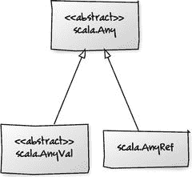
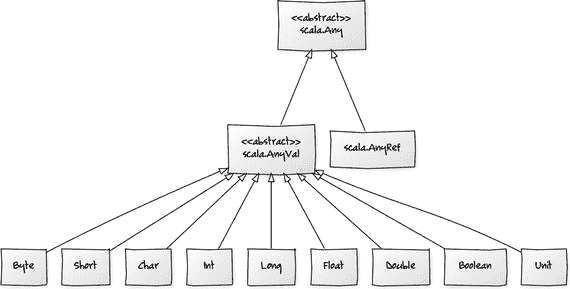
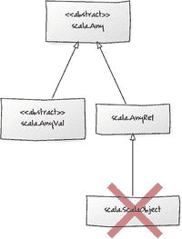
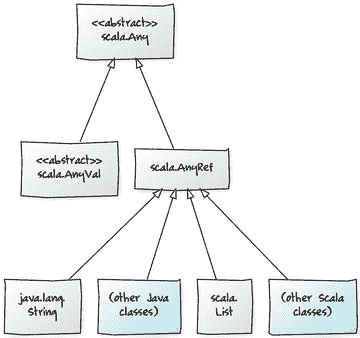
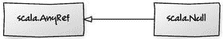
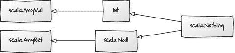
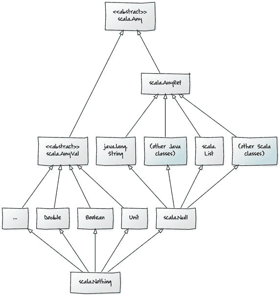

# 4. Scala 的类层次结构

Scala 的类层次结构从 `scala` 包中的 `Any` 类开始。它包含诸如 `==`、`!=`、`equals`、`##`、`hashCode` 和 `toString` 等方法。

```
abstract class Any {
final def ==(that: Any): Boolean
final def !=(that: Any): Boolean
def equals(that: Any): Boolean
def ##: Int
def hashCode: Int
def toString: String
// ...
}
```

Scala 中的每个类都继承自抽象类 `Any`。它有两个直接子类：`AnyVal` 和 `AnyRef`，如图 4-1 所示。



图 4-1

每个类都扩展了 `Any` 类

## AnyVal

`AnyVal` 是所有值类型的超类型，而 `AnyRef` 是所有引用类型的超类型。

诸如 `Byte`、`Int`、`Char` 等基本类型被称为值类型。在 Java 中，值类型对应于原始类型，但在 Scala 中它们是对象。值类型都是预定义的，并且可以通过字面量来引用。它们通常分配在栈上，但在 Scala 中则分配在堆上。

Scala 中所有其他类型都被称为引用类型。引用类型是内存（堆）中的对象，这与 C 类语言中的指针类型不同，后者是内存中的地址，指向有用的东西，并且需要使用特殊语法（例如，C 语言中的 `*age = 64`）来解引用。引用对象实际上是自动解引用的。

Scala 中有九种值类型，如图 4-2 所示。



图 4-2

Scala 的值类型

这些类相当直接；它们大多包装了底层的 Java 类型，并提供了与 Java 的 `equals` 方法一致的 `==` 方法实现。

这意味着，例如，你可以使用 `==` 比较两个数字对象并得到合理的结果，即使它们可能是不同的实例。

因此，Scala 中的 `42 == 42` 相当于在 Java 中创建两个 `Integer` 对象并使用 `equals` 方法进行比较：`new Integer(42).equals(new Integer(42))`。你比较的不是对象引用（像 Java 中使用 `==` 那样），而是自然相等性。请记住，Scala 中的 `42` 是 `Int` 的一个实例，而 `Int` 又委托给 `Integer`。

## Unit

`Unit` 值类型是 Scala 中用于表示无意义结果的一种特殊类型。它类似于 Java 的 `Void` 对象或用作返回类型时的 `void` 关键字。它只有一个值，写成一对空括号，如下所示：

```
scala> val example: Unit = ()
example: Unit = ()
```

一个以 `Void` 对象作为返回类型实现 `Callable` 的 Java 类看起来像这样：

```
// java
public class DoNothing implements Callable {
@Override
public Void call() throws Exception {
return null;
}
}
```

这与返回 `Unit` 的 Scala 类相同：

```
// scala
class DoNothing extends Callable[Unit] {
def call: Unit = ()
}
```

请记住，Scala 方法的最后一行就是返回值，而 `()` 代表 `Unit` 的唯一值。

## AnyRef

`AnyRef` 实际上是 Java 的 `java.lang.Object` 类的别名。两者可以互换。它为所有引用类型提供了 `toString`、`equals` 和 `hashcode` 的默认实现。

曾经有一个名为 `ScalaObject` 的 `AnyRef` 子类，所有 Scala 引用类型都扩展了它（见图 4-3）。然而，它仅用于优化目的，并在 Scala 2.11 中被移除了。（我提到它是因为很多文档仍然引用它。）



图 4-3

Scala `Any`。`ScalaObject` 类已不复存在。

Java 的 `String` 类以及从 Scala 中使用的其他 Java 类都扩展了 `AnyRef`。（记住它是 `java.lang.Object` 的同义词。）任何 Scala 特有的类，比如 Scala 的列表实现 `scala.List`，也扩展了 `AnyRef`。



图 4-4

Scala 的引用类型

对于像这样的引用类型（如图 4-4 所示），`==` 会像之前一样委托给 `equals` 方法。对于像 `String` 这样的预先存在的类，`equals` 已经被重写以提供自然的相等性概念。对于你自己的类，你可以像在 Java 中一样重写 `equals`，但仍然可以在代码中使用 `==`。

例如，你可以在 Scala 中使用 `==` 比较两个字符串，它的行为就像在 Java 中使用 `equals` 方法一样：

```
new String("A") == new String("A")        // 在 scala 中为 true，在 java 中为 false
new String("B").equals(new String("B"))   // 在 scala 和 java 中均为 true
```

然而，如果你想在 Scala 中恢复 Java 的 `==` 语义并执行引用相等性比较，你可以调用 `AnyRef` 中定义的 `eq` 方法：

```
new String("A") eq new String("A")        // 在 scala 中为 false
new String("B") == new String("B")        // 在 java 中为 false
```


## 底部类型

对于许多 Java 开发者来说，一个全新的概念是类层次结构可以拥有共同的底部类型。这些类型是所有类型的子类型。Scala 的 `Null` 和 `Nothing` 类型都是底部类型。

Scala 中的所有引用类型都是 `Null` 的超类型。`Null` 也是一个 `AnyRef` 对象；它是每个引用类型的子类（参见图 4-5）。



图 4-5

`Null` 扩展了 `AnyRef`

值类型和引用类型都是 `Nothing` 的超类型。它位于类层次结构的底部，是所有类型的子类型，如图 4-6 所示。



图 4-6

`Nothing` 扩展了 `Null`

请注意，`Null` 扩展了所有引用类型，而 `Nothing` 扩展了所有类型。值得注意的是，Scala 中的 `null` 是一个对象，并且是 `Null` 类型的唯一实例。因为 `Null` 是一个底部类型，所以 `null` 可以赋值给任何引用类型（`AnyRef`），但不能赋值给 `AnyVal` 的子类型。

以下代码是有效的：

```
val x: String = null
```

……但尝试将 `null` 赋值给 `Double`（它扩展了 `AnyVal`）会导致编译器错误。

```
val x: Double = null         // 编译器错误
```

完整的层次结构如图 4-7 所示。



图 4-7

包含底部类型 `Null` 和 `Nothing` 的完整层次结构

