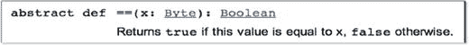
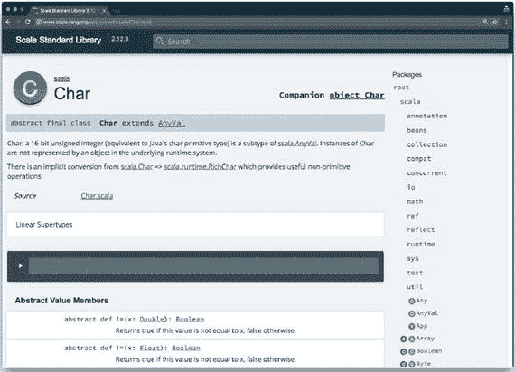
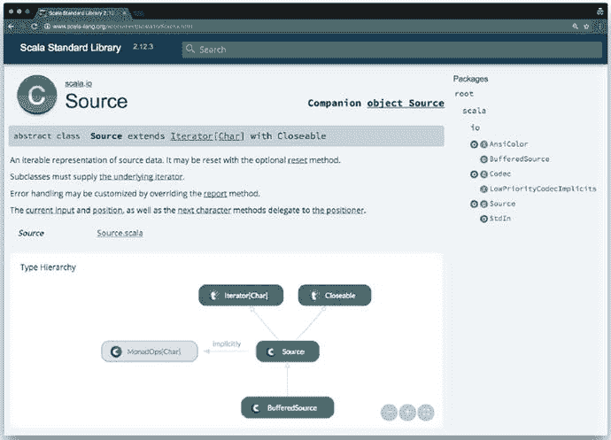

# 5. ScalaDoc

Scala 借鉴了 JavaDoc 的概念，并创造性地将其命名为 ScalaDoc。为 Scala 源码添加 ScalaDoc 的方式与添加 JavaDoc 类似，都是通过在注释中使用标记来实现（参见图 5-1）。例如，源码中的以下片段

```
/** 如果此值等于 x，则返回 `true`，否则返回 `false`。 **/
def ==(x: Byte): Boolean
```

……可以转换为 HTML 中的以下片段：



图 5-1

嵌入的 ScalaDoc 标记在 HTML 中呈现

要查看 Scala 库 API 的文档，请访问 Scala 网站。¹ 你会注意到它与 JavaDoc 大体相似。你可以看到左侧的类；它们不像 JavaDoc 那样按包分组，但你可以点击它们以获取更多信息。



图 5-2

`Char` 的基本 ScalaDoc

ScalaDoc 的一个巧妙之处在于，你还可以过滤内容。例如，你可以只显示从 `Any` 继承的方法。

如果你对某个类的层次结构感兴趣，可以查看它的超类型和子类型。你甚至可能看到一个可导航的类型层次结构图，尽管并非每个类都有此功能。图 5-3 中 `Source` 的类型层次结构图显示它是 `Iterable` 和 `Closable` 的子类型，你可以通过点击该图在层次结构中向上导航。



图 5-3

显示类型层次结构图的 ScalaDoc 脚注 1

[`http://docs.scala-lang.org/api/all.html`](http://docs.scala-lang.org/api/all.html)

