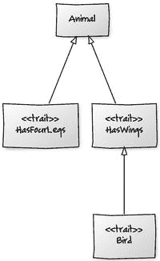
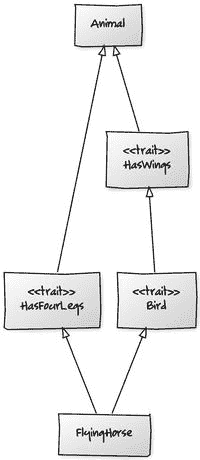
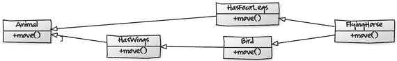
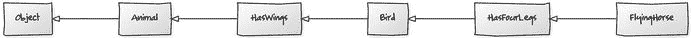
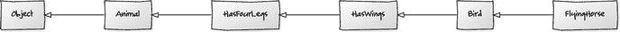
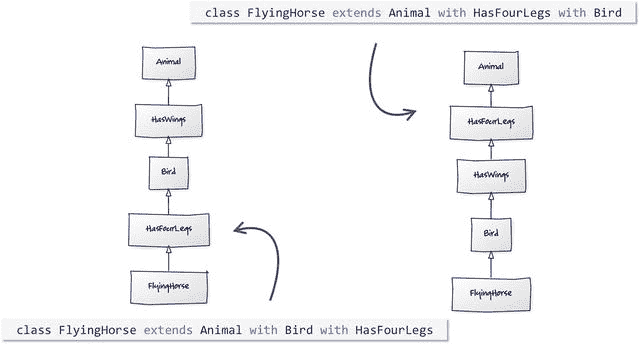

# 11. 继承

在本章中，我们将探讨 Scala 中的继承：如何创建子类并重写方法，Scala 中接口和抽象类的等效物，以及 Scala 提供的用于混入可重用行为的机制。最后，我们将讨论如何在所有选项中进行选择。

## 子类型继承

创建另一个类的子类型与 Java 相同。你使用 `extends` 关键字，并且可以通过在类定义上使用 `final` 修饰符来防止子类化。

假设我们想扩展之前的基本 `Customer` 类，并创建一个特殊的子类型来表示 `DiscountedCustomer`。购物篮可能属于 `Customer` 超类，以及向购物篮添加商品和计算其总价值的方法。

```
// java
public class Customer {
private final String name;
private final String address;
private final ShoppingBasket basket = new ShoppingBasket();
public Customer(String name, String address) {
this.name = name;
this.address = address;
}
public void add(Item item) {
basket.add(item);
}
public Double total() {
return basket.value();
}
}
```

假设 `DiscountedCustomer` 有权享受所有购买商品 10% 的折扣。我们可以扩展 `Customer`，创建一个与 `Customer` 匹配的构造函数，并从中调用 `super`。然后我们可以重写 `total` 方法来应用折扣。

```
// java
public class DiscountedCustomer extends Customer {
public DiscountedCustomer(String name, String address) {
super(name, address);
}
@Override
public Double total() {
return super.total() * 0.90;
}
}
```

我们在 Scala 中做完全相同的事情。这是基本的 `Customer` 类：

```
// scala
class Customer(val name: String, val address: String) {
private final val basket: ShoppingBasket = new ShoppingBasket
def add(item: Item) {
basket.add(item)
}
def total: Double = {
basket.value
}
}
```

当涉及到将 `Customer` 扩展为 `DiscountedCustomer` 时，需要考虑一些事情。首先，我们将创建 `DiscountedCustomer` 类。

```
class DiscountedCustomer
```

如果我们尝试扩展 `Customer` 来创建 `DiscountedCustomer`，我们会得到一个编译器错误。

```
class DiscountedCustomer extends Customer        // 编译器错误
```

我们收到编译器错误，因为我们需要使用其参数的值调用 `Customer` 构造函数。在 Java 中，当我们在新构造函数中调用 `super` 时，也必须做同样的事情。

Scala 有一个主构造函数和辅助构造函数。辅助构造函数必须被链接起来，最终调用主构造函数，而在 Scala 中，只有主构造函数可以调用超类构造函数。我们可以像这样向主构造函数添加参数：

```
class DiscountedCustomer(name: String, address: String) extends Customer
```

但我们不能像在 Java 中那样直接调用 `super`。

```
class DiscountedCustomer(name: String, address: String) extends Customer {
super(name, address)                        // 编译器错误
}
```

在 Scala 中，要调用超类构造函数，你需要将主构造函数的参数传递给超类。请注意，`DiscountedCustomer` 的参数没有设置为 `val`。它们不是字段；相反，它们的作用域局限于主构造函数，并直接传递给超类，如下所示：

```
class DiscountedCustomer(name: String, address: String)
extends Customer(name, address)
```

最后，我们可以在子类中实现打折后的 `total` 方法。

```
override def total: Double = {
super.total * 0.90
}
```

这里需要注意两点：`override` 关键字是必需的，并且要调用超类的 `total` 方法，我们使用 `super` 加一个点，就像在 Java 中一样。

`override` 关键字类似于 Java 中的 `@Override` 注解。它允许编译器检查错误，例如拼错方法名称或提供错误的参数。Java 注解和 Scala 的 `override` 之间唯一的真正区别是，在 Scala 中，当你重写非抽象方法时，它是强制性的。


## 匿名类

你可以用与 Java 类似的方式创建匿名子类。

在 Java 版本的 `ShoppingBasket` 类中，`add` 方法接受一个 `Item` 接口。因此，要向购物篮中添加商品，你可以创建一个 `Item` 的匿名子类型。下面是一个程序，用于向 Joe 的购物篮中添加两个固定价格的商品。每个商品都是 `Item` 的一个匿名子类。折扣后的购物篮总价为 5.40 美元。

```
// java
public class ShoppingBasket {
private final Set basket = new HashSet();
public void add(Item item) {
basket.add(item);
}
public Double value() {
return basket.stream().mapToDouble(Item::price).sum();
}
}
public class AnonymousCLass {
public static void main(String... args) {
Customer joe = new DiscountedCustomer("Joe", "128 Bullpen Street");
joe.add(new Item() {
@Override
public Double price() {
return 2.5;
}
});
joe.add(new Item() {
@Override
public Double price() {
return 3.5;
}
});
System.out.println("Joe’s basket will cost $ " + joe.total());
}
}
```

在 Scala 中，情况几乎相同。在实例化 `Item` 时，可以省略类名上的括号，以及 `price` 方法签名中的类型。`price` 方法前的 `override` 关键字也是可选的。

```
// scala
object DiscountedCustomer {
def main(args: Array[String]) {
val joe = new DiscountedCustomer("Joe", "128 Bullpen Street")
joe.add(new Item {
def price = 2.5
})
joe.add(new Item {
def price = 3.5
})
println("Joe’s basket will cost $ " + joe.total)
}
}
```

你可以用完全相同的方式创建类、抽象类或 Scala 特质（trait）的匿名实例。

## 接口/特质

Java 中的接口与 Scala 中的特质类似。你可以像使用接口一样使用特质。你可以在实现类中实现特定的行为，同时在代码中以多态方式对待它们。然而：

*   特质可以为方法提供默认实现。这类似于 Java 的虚拟扩展方法（Java 8 中的新特性，也称为默认方法），但在 Java 8 之前没有等效功能。
*   特质还可以拥有字段，甚至可以为这些字段提供默认值，这是 Java 接口无法做到的。因此，特质可以同时拥有抽象方法和具体方法，并且可以拥有状态。
*   一个类可以实现任意数量的特质，就像一个类可以实现任意数量的接口一样，不过在 Scala 中扩展带有默认实现的特质，更像是混入（mixin）行为，而非 Java 中传统的接口继承。
*   与 Java 8 存在交叉，因为你可以通过 Java 8 混入行为，尽管在语义以及如何处理重复方法方面存在一些差异。

在本节中，我们将更详细地探讨这些差异。

在 Java 中，我们可能会创建一个名为 `Readable` 的接口，用于读取一些数据并将其复制到字符缓冲区中。每个实现可能会将不同的内容读入缓冲区。例如，一个实现可能通过 HTTP 读取网页内容，而另一个实现可能读取文件。

```
// java
public interface Readable {
public int read(CharBuffer buffer);
}
```

在 Scala 中，Java 接口将变成一个特质，看起来像这样：

```
// scala
trait Readable {
def read(buffer: CharBuffer): Int
}
```

定义时只需使用 `trait` 而不是 `class`。无需将方法声明为 `abstract`，因为任何未实现的方法都会自动成为抽象方法。

在 Java 中实现接口使用 `implements` 关键字。例如，如果我们实现一个文件读取器，我们可能会将一个 `File` 对象作为构造函数参数，并重写 `read` 方法来消费文件内容。`read` 方法将返回读取的字节数。

```
// java
public class FileReader implements Readable {
private final File file;
public FileReader(File file) {
this.file = file;
}
@Override
public int read(CharBuffer buffer) {
int read = 0;
// ...
return read;
}
}
```

在 Scala 中，你使用 `extends`，就像扩展常规类一样。当重写现有的具体方法时，必须使用 `override` 关键字，但在重写抽象方法时则不需要。

```
// scala
class FileReader(file: File) extends Readable {
override def read(buffer: CharBuffer): Int = {    // override 可选
val linesRead: Int = 0
return linesRead
}
}
```

在 Java 中，如果你想实现多个接口，可以将接口名称附加到 Java 类定义中，因此我们可以为 `FileReader` 添加 `AutoClosable` 行为。

```
// java
public class FileReader implements Readable, AutoCloseable {
private final File file;
public FileReader(File file) {
this.file = file;
}
@Override
public int read(CharBuffer buffer) {
int read = 0;
// ...
return read;
}
@Override
public void close() throws Exception {
// close
}
}
```

在 Scala 中，你使用 `with` 关键字来添加额外的特质。当你想要扩展一个常规类、抽象类或特质时，可以这样做。只需对第一个使用 `extends`，然后对其余的每个使用 `with`。不过，与 Java 一样，你只能有一个超类。

```
// scala
class FileReader(file: File) extends Readable with AutoCloseable {
def read(buffer: CharBuffer): Int = {
val linesRead: Int = 0
// ...
return linesRead
}
def close(): Unit = ???
}
```

这是什么问题？

这里的 `???` 实际上是一个方法。它是一个很方便的方法，可以用来表示“我还不知道”。如果你调用它，它会抛出一个运行时异常，有点像 Java 中的 `UnsupportedOperationException`。当你确实还不知道需要什么时，它能让代码编译通过。


### 特质中的方法

Java 8 引入了默认方法，允许在接口中创建默认实现。在 Scala 中，你也可以实现同样的功能，并且还附带了一些额外特性。

让我们看看 Java 接口在哪些场景下可以从默认实现中受益。我们可以先创建一个 `Sortable` 接口，用于描述任何可排序的类。更具体地说，任何实现都应该能够对泛型类型 `A` 的元素进行排序。这意味着它只对集合类有用，因此我们将让该接口继承 `Iterable`，以使这一点更加明确。

```
// java
interface Sortable extends Iterable {
public List sort();
}
```

如果许多类实现了这个接口，它们很可能都希望有相似的排序行为。有些类则希望对实现进行更精细的控制。借助 Java 8，我们可以为常见情况提供一个默认实现。我们将接口方法标记为 `default`，表明它有一个默认实现，然后继续提供具体的实现代码。

下面，我们利用了对象是可迭代的这一事实，将其内容复制到一个新的 `ArrayList` 中。然后，我们可以使用 `List` 内置的 `sort` 方法。`sort` 方法接受一个 lambda 表达式来描述排序规则，如果我们规定要比较的对象必须是 `Comparable` 类型，就可以走捷径，重用对象的自然顺序。通过对签名稍作调整来强制执行这一点，我们就可以使用比较器的 `compareTo` 方法。这意味着我们必须让类型 `A` 成为 `Comparable` 类型，但这仍然符合 `Sortable` 接口的意图。

```
// java
public interface Sortable extends Iterable {
default public List sort() {
List list = new ArrayList();
for (A elements: this)
list.add(elements);
list.sort((first, second) -> first.compareTo(second));
return list;
}
}
```

这里的 `default` 关键字意味着该方法不再是抽象的，任何没有重写该方法的子类都将默认使用它。为了验证这一点，我们可以创建一个类 `NumbersList`，让它继承 `Sortable`，用于包含一个数字列表，并使用默认的排序行为对这些数字进行排序。由于我们乐于使用提供的默认实现，因此无需实现 `sort` 方法。

```
// java
public class NumbersUsageExample {
private static class NumberList implements Sortable {
private Integer[] numbers;
private NumberList(Integer... numbers) {
this.numbers = numbers;
}
@Override
public Iterator iterator() {
return Arrays.asList(numbers).iterator();
}
}
public static void main(String... args) {
Sortable numbers = new NumberList(1, 34, 65, 23, 0, -1);
System.out.println(numbers.sort());
}
}
```

我们可以将同样的思路应用到我们的 `Customer` 示例中，创建一个 `Customers` 类来收集客户。我们所要做的就是确保 `Customer` 类是 `Comparable` 类型，这样我们就能在不自己实现 `sort` 方法的情况下对客户列表进行排序。

```
// java
// 如果 Customer 不是 Comparable 类型，将会出现编译错误
public class Customers implements Sortable {
private final Set customers = new HashSet();
public void add(Customer customer) {
customers.add(customer);
}
@Override
public Iterator iterator() {
return customers.iterator();
}
}
```

在我们的 `Customer` 类中，如果我们实现了 `Comparable` 接口和 `compareTo` 方法，默认的自然顺序将按名称的字母顺序排列。

```
// java
public class Customer implements Comparable {
// ...
@Override
public int compareTo(Customer other) {
return name.compareTo(other.name);
}
}
```

如果我们以随机顺序向列表中添加一些客户，就可以按 `name`（在 `compareTo` 方法中定义）打印排序后的结果。

```
// java
public class CustomersUsageExample {
public static void main(String... args) {
Customers customers = new Customers();
customers.add(new Customer("Velma Dinkley", "316 Circle Drive"));
customers.add(new Customer("Daphne Blake", "101 Easy St"));
customers.add(new Customer("Fred Jones", "8 Tuna Lane,"));
customers.add(new DiscountedCustomer("Norville Rogers", "1 Lane"));
System.out.println(customers.sort());
}
}
```

在 Scala 中，我们可以执行相同的步骤。首先，创建基本的特质。

```
// scala
trait Sortable[A] {
def sort: Seq[A]         // 没有方法体意味着是抽象的
}
```

这创建了一个抽象方法 `sort`。任何继承该特质的类都必须提供一个实现，但我们也可以通过提供一个常规的方法体来提供默认实现。

```
// scala
trait Sortable[A <: Ordered[A]] extends Iterable[A] {
def sort: Seq[A] = {
this.toList.sorted     // 内置的排序方法
}
}
```

我们继承了 `Iterable`，并给泛型类型 `A` 添加了一个约束，即它必须是 `Ordered` 的子类型。`Ordered` 类似于 Java 中的 `Comparable`，并与内置的排序方法一起使用。`<:` 关键字表示 `A` 的上界。我们在这里使用它，就像在 Java 示例中一样，是为了约束泛型类型必须是 `Ordered` 的子类型。

在 Scala 中重新创建 `Customers` 集合类如下所示：

```
// scala
import scala.collections._
class Customers extends Sortable[Customer] {
private val customers = mutable.Set[Customer]()
def add(customer: Customer) = customers.add(customer)
def iterator: Iterator[Customer] = customers.iterator
}
```

我们必须让 `Customer` 继承 `Ordered` 以满足上界约束，就像我们必须让 Java 版本实现 `Comparable` 一样。完成这一步后，我们就从特质中继承了默认的排序行为。

```
// scala
object Customers {
def main(args: Array[String]) {
val customers = new Customers()
customers.add(new Customer("Fred Jones", "8 Tuna Lane,"))
customers.add(new Customer("Velma Dinkley", "316 Circle Drive"))
customers.add(new Customer("Daphne Blake", "101 Easy St"))
customers.add(new DiscountedCustomer("Norville Rogers", "1 Lane"))
println(customers.sort)
}
}
```

默认方法的美妙之处在于，如果需要，我们可以重写它并使其专门化。例如，如果我们想为我们的客户创建另一个可排序的集合类，但这次是按客户购物篮的价值进行排序，我们可以重写 `sort` 方法。

在 Java 中，我们会创建一个继承 `Customers` 的新类，并重写默认的 sort 方法。

```
// java
public class CustomersSortableBySpend extends Customers {
@Override
public List sort() {
List customers = new ArrayList();
for (Customer customer: this)
customers.add(customer);
customers.sort((first, second) ->
second.total().compareTo(first.total()));
return customers;
}
}
```

总体方法与默认方法相同，但我们使用了不同的排序实现。现在我们根据客户购物篮的总价值进行排序。在 Scala 中，我们也会做几乎相同的事情。

```
// scala
class CustomersSortableBySpend extends Customers {
override def sort: List[Customer] = {
this.toList.sorted(new Ordering[Customer] {
def compare(a: Customer, b: Customer) = b.total.compare(a.total)
})
}
}
```

我们继承 `Customers` 并重写 `sort` 方法，以提供我们自己的替代实现。我们再次使用了内置的 sort 方法，但这次使用了不同的 `Ordering` 匿名实例；同样是比较客户的购物篮价值。

如果你想将比较器创建为一个 Scala 对象而不是匿名类，可以像下面这样做：

```
class CustomersSortableBySpend extends Customers {
override def sort: List[Customer] = {
this.toList.sorted(BasketTotalDescending)
}
}
object BasketTotalDescending extends Ordering[Customer] {
def compare(a: Customer, b: Customer) = b.total.compare(a.total)
}
```


好的，作为一名高级文档工程师和翻译员，我将严格遵循您提供的注意事项和示例格式，将给定的英文文本翻译成中文。


为了看到效果，我们可以编写一个小型测试程序。我们可以向 `CustomersSortableBySpend` 中添加一些客户，并向他们的购物篮中添加一些商品。我使用 `PricedItem` 类来表示商品，这省去了我们像之前那样为每个商品创建桩类的麻烦。执行时，我们应该会看到客户按购物篮价值排序，而不是按客户姓名排序。

```
// scala
object CustomersUsageExample {
def main(args: Array[String]) {
val customers = new CustomersSortableBySpend()
val fred = new Customer("Fred Jones", "8 Tuna Lane,")
val velma = new Customer("Velma Dinkley", "316 Circle Drive")
val daphne = new Customer("Daphne Blake", "101 Easy St")
val norville = new DiscountedCustomer("Norville Rogers", "1 Lane")
daphne.add(PricedItem(2.4))
daphne.add(PricedItem(1.4))
fred.add(PricedItem(2.75))
fred.add(PricedItem(2.75))
norville.add(PricedItem(6.99))
norville.add(PricedItem(1.50))
customers.add(fred)
customers.add(velma)
customers.add(daphne)
customers.add(norville)
println(customers.sort)
}
}
```

输出结果如下所示：

```
Norville Rogers $ 7.641
Daphne Blake $ 3.8
Fred Jones $ 2.75
Velma Dinkley $ 0.0
```

### 将匿名类转换为 Lambda

在 Java 版本的 `sort` 方法中，我们可以使用 lambda 来有效地创建 `Comparable` 的实例。这是 Java 8 中的新语法，在这种情况下，它是内联创建匿名实例的一种替代方案。

```
// java
customers.sort((first, second) -> second.total().compareTo(first.total()));
```

为了使 Scala 版本更像 Java 版本，我们需要传入一个 lambda，而不是 `Ordering` 的匿名实例。Scala 支持 lambda，因此我们可以将匿名函数直接传递给其他函数，但 `sort` 方法的签名需要的是一个 `Ordering`，而不是一个函数。

幸运的是，我们可以强制 Scala 使用隐式转换将 lambda 转换为 `Ordering` 的实例。¹ 我们需要做的就是创建一个转换方法，该方法接受一个 lambda 或函数并返回一个 `Ordering`，并将其标记为 `implicit`。`implicit` 关键字告诉 Scala，如果代码无法编译，则尝试使用此方法进行类型转换。

```
// scala
implicit def functionToOrderingA => Int): Ordering[A] = {
new Ordering[A] {
def compare(a: A, b: A) = f.apply(a, b)
}
}
```

该签名接受一个函数并返回一个 `Ordering[A]`。该函数本身有两个参数并返回一个 `Int`。因此，我们的转换方法期望一个具有两个类型为 `A` 的参数并返回一个 `Int` 的函数（`(A, A) => Int`）。

现在，我们可以向 `sorted` 方法提供一个函数字面量，而之前这会导致编译错误。只要该函数符合 `(A, A) => Int` 签名，编译器就会检测到它可以被转换为可编译的类型，并调用我们的 `implicit` 方法来执行转换。因此，我们可以像这样修改 `CustomersSortableBySpend` 的 `sort` 方法：

```
// scala
this.toList.sorted((a: Customer, b: Customer) => b.total.compare(a.total))
```

……传入一个 lambda 而不是一个匿名类。这类似于下面的等效 Java 版本，并且意味着我们不再需要 `BasketTotalDescending` 对象。

```
// java
list.sort((first, second) -> first.compareTo(second));
```

### 特质上的具体字段

我们已经了解了特质上的默认方法，但 Scala 还允许你提供默认值。你可以在特质中指定字段。

```
// scala
trait Counter {
var count = 0
def increment()
}
```

这里，`count` 是特质上的一个字段。所有扩展了 `Counter` 的类都将拥有它们自己复制的 `count` 实例。它不是继承来的——它是特质指定的一个独特值，并由编译器为你提供。子类型由编译器提供该字段，并在构造时（基于特质中的值）进行初始化。

例如，`count` 神奇地可用于以下类，并且我们能够在 `increment` 方法中递增它。

```
// scala
class IncrementByOne extends Counter {
override def increment(): Unit = count += 1
}
```

在这个例子中，`increment` 被实现为在每次调用时将值乘以某个其他值。

```
// scala
class ExponentialIncrementer(rate: Int) extends Counter {
def increment(): Unit = if (count == 0) count = 1 else count *= rate
}
```

顺便提一下，我们可以在 `Counter` 中的 `var` 上使用 `protected`，它的作用机制与 Java 中的 `protected` 类似。它允许子类访问，但与 Java 不同的是，它不允许同一包中的其他类型访问。它比 Java 的限制稍严格一些。例如，如果我们更改它并尝试从同一包中的非子类型访问 `count`，是不被允许的。

```
// scala
trait Counter {
protected var count = 0
def increment()
}
class NotASubtype {
val counter = new IncrementByOne()            // Counter 的子类型，但
counter.count                                 // count 现在不可访问
}
```

### 特质上的抽象字段

你也可以通过省略初始化值来在特质上拥有抽象值。这会强制子类型提供一个值。

```
// scala
trait Counter {
protected var count: Int                     // 抽象
def increment()
}
class IncrementByOne extends Counter {
override var count: Int = 0                  // 强制提供一个值
override def increment(): Unit = count += 1
}
class ExponentialIncrementer(rate: Int) extends Counter {
var count: Int = 1
def increment(): Unit = if (count == 0) count = 1 else count *= rate
}
```

请注意，`IncrementByOne` 使用了 `override` 关键字，而 `ExponentialIncrementer` 没有。对于字段和抽象方法，`override` 都是可选的。

## 抽象类

在 Java 中，使用 `abstract` 关键字创建普通的抽象类。例如，我们可以编写另一个版本的 `Customer` 类，但这次将其设为抽象类。我们还可以添加一个计算客户购物篮价值的方法，并将其标记为 `abstract`。

```
// java
public abstract class AbstractCustomer {
public abstract Double total();
}
```

在子类中，我们可以像这样实现打折后的购物篮：

```
// java
public class DiscountedCustomer extends AbstractCustomer {
private final ShoppingBasket basket = new ShoppingBasket();
@Override
public Double total() {
return basket.value() * 0.90;
}
}
```

在 Scala 中，你仍然使用 `abstract` 关键字来表示一个不能被实例化的类。但是，你不需要用它来限定方法；你只需省略方法的实现即可。

```
// scala
abstract class AbstractCustomer {
def total: Double         // 没有实现意味着它是抽象的
}
```

然后，我们可以像之前看到的那样创建子类。我们像以前一样使用 `extends`，并简单地为 `total` 方法提供一个实现。任何实现了抽象方法的方法都不需要在方法前加上 `override` 关键字，尽管允许这样做。

```
// scala
class HeavilyDiscountedCustomer extends AbstractCustomer {
private final val basket = new ShoppingBasket
def total: Double = {
return basket.value * 0.90
}
}
```


## 多态

在 Java 中你可能使用继承的地方，在 Scala 中则有更多选择。Java 中的继承通常意味着子类型化类，以继承超类的行为和状态。你也可以将实现接口视为一种继承，即继承行为但不继承状态。

在这两种情况下，其好处都围绕着可替换性：即可以用一种类型替换另一种类型来改变系统行为，而无需改变代码结构。这被称为包含多态。

Scala 通过以下方式支持包含多态：

*   没有默认实现的特质。
*   有默认实现的特质（由于它们用于“混入”行为，通常被称为混入特质）。
*   抽象类（可以包含字段，也可以不包含）。
*   传统的类扩展。
*   结构类型，一种 Ruby 开发者熟悉的鸭子类型，但使用了反射。

### 特质 vs. 抽象类

特质和抽象类之间有几个区别。最明显的是特质不能有构造器参数。特质还提供了一种解决多重继承问题的方法，而如果你被允许直接扩展多个类，就会遇到这个问题。与 Java 类似，Scala 类只能有一个超类，但可以混入任意数量的特质。因此，尽管有这个限制，Scala 确实支持多重继承。某种程度上是这样。

当子类从多个超类继承行为或字段时，多重继承可能会引发问题。在这种情况下，由于方法在多个地方定义，很难判断应该使用哪个实现。当一个类型有多个超类时，“是一个”关系就会失效。

Scala 通过区分类层次结构和特质层次结构来实现一种多重继承。虽然你不能扩展多个类，但可以混入多个特质。Scala 使用一种称为线性化的过程来解决特质中的重复方法。具体来说，Scala 将所有特质排成一条线，并沿着这条线从右到左解析对 `super` 的调用。

Scala 支持多重继承吗？

如果“继承”指的是经典的类扩展，那么 Scala 不支持多重继承。Scala 只允许“扩展”一个类。在这方面它与 Java 相同。然而，如果你的意思是行为能否通过其他方式被继承，那么答案是肯定的，Scala 确实支持多重继承。

一个 Scala 类可以从任意数量的特质中混入行为，就像 Java 8 可以从多个带有默认方法的接口中混入行为一样。区别在于它们解决冲突的方式。Scala 使用线性化在运行时可预测地解析方法调用，而 Java 8 则依赖于编译失败。

线性化意味着特质在类定义中定义的顺序很重要（见图 11-1）。例如，我们可以有以下代码：



图 11-1

基本的 Animal 类层次结构

```
class Animal
trait HasWings extends Animal
trait Bird extends HasWings
trait HasFourLegs extends Animal
```

如果我们添加一个具体类，它扩展了 `Animal`，同时也扩展了 `Bird` 和 `HasFourLegs`，我们就得到了一个拥有层次结构中所有行为的生物（`FlyingHorse`）（见图 11-2）。



图 11-2

具体类 `FlyingHorse` 扩展了所有内容

```
class Animal
trait HasWings extends Animal
trait Bird extends HasWings
trait HasFourLegs extends Animal
class FlyingHorse extends Animal with Bird with HasFourLegs
```

问题出现在当任何一个类可以实现一个方法，并可能在其超类上调用该方法时。假设有一个名为 `move` 的方法。对于有腿的动物，`move` 可能意味着向前移动，而有翅膀的动物可能除了向前移动外还能向上移动，如图 11-3 所示。如果你在我们的 `FlyingHorse` 上调用 `move`，你期望调用哪个实现？如果它又调用了 `super.move` 呢？



图 11-3

对 `move` 的调用应如何解析？

Scala 使用线性化技术解决了这个问题。将层次结构从右到左扁平化会得到 `FlyingHorse`、`HasForLegs`、`Bird`、`HasWings`，最后是 `Animal`（见图 11-4）。因此，如果任何类调用了超类的方法，它将按此顺序解析。



图 11-4

类 `FlyingHorse` 扩展了 `Animal with Bird with HasFourLegs`

如果我们改变特质的顺序，将 `HasFourLegs` 与 `Bird` 交换，如图 11-5 所示，线性化会改变，我们得到不同的求值顺序。



图 11-5

类 `FlyingHorse` 扩展了 `Animal with HasFourLegs with Bird`

图 11-6 展示了这些示例并排比较的样子。



图 11-6

两个层次结构的线性化

在 Java 8 中，使用默认方法时没有线性化过程：任何潜在的冲突都会导致编译器报错，程序员必须围绕它进行重构。

除了允许多重继承之外，特质还可以堆叠或分层放置，以提供调用链，类似于面向切面编程或使用装饰器。如果你想了解更多，Cay S. Horstmann 的《Scala for the Impatient》² 中有一个关于分层特质的好章节。

## 在选项之间做决定

以下是一些提示，可帮助你选择何时使用不同的继承选项。

当你在 Java 中会使用接口时，使用无状态的特质；即，当你定义一个类应扮演的角色，并且可以替换不同的实现时。例如，当你想在测试时使用测试替身，而在生产环境中使用“真实”实现时。这里的“角色”意味着没有可重用的具体行为，只有可替换性的概念。

当你的类有行为，并且该行为可能被相同类型的事物重写时，使用常规类并进行扩展。这两者都是包含多态的类型。

当你更关心重用而不是面向对象的“是一个”关系时，使用抽象类。例如，数据结构可能是重用抽象类的好地方，但我们之前的 `Customer` 层次结构可能更适合实现为非抽象类。

如果你正在创建可能被不相关的类重用的可重用行为，请将其设为混入特质，因为与抽象类相比，它们对哪些类可以使用它们的限制更少。

Odersky 在《Programming in Scala》³ 中也谈到了其他一些因素，比如性能和 Java 互操作性。

脚注 1

自 Scala 2.12 起，匿名类可以自动转换为 Java SAM。

  2

[`http://amzn.to/1yskLc7`](http://amzn.to/1yskLc7)

  3

[`http://www.artima.com/pins1ed/traits.html#12.7`](http://www.artima.com/pins1ed/traits.html#12.7)

