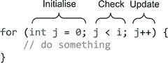
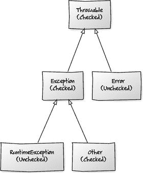

# 12. 控制结构

本章全部关于控制结构，例如 `if` 语句、switch 块、循环和 break。具体来说，我们将研究以下内容：

*   条件语句，如 `if` 语句、三元表达式和 switch。
*   循环结构：`do`、`while` 和 `for`。
*   中断控制流。
*   异常，简要介绍。

## 条件语句


### If 语句与三元运算符

条件语句非常直观。

```
// java
if (age > 55) {
retire();
} else {
carryOnWorking();
}
```

Java 中的 `if` 语句在 Scala 中看起来完全一样。

```
// scala
if (age > 55) {
retire()
} else {
carryOnWorking()
}
```

你经常会看到 Scala 开发者对于简单的 `if` 块省略花括号。例如：

```
if (age > 55)
retire()
else
carryOnWorking()
```

……甚至将其全部写在一行上。

```
if (age > 55) retire() else carryOnWorking()
```

这种风格之所以受欢迎，是因为在 Scala 中，if/else 实际上是一个**表达式**，而不是一个**语句**，而更简洁的语法使其看起来更像一个表达式。区别是什么？嗯，表达式会返回一个值，而语句则执行一个动作。

表达式 vs. 语句

表达式会返回一个值，而语句则执行一个动作。语句本质上通常具有副作用，而表达式则不太可能如此。

例如，让我们为 `Customer` 类添加一个创建方法，该方法将根据客户成为客户的时间长短来创建一个 `DiscountedCustomer` 或一个普通的 `Customer`。

```
// java
public static Customer create(String name, String address,
Integer yearsOfCustom) {
if (yearsOfCustom > 2) {
return new DiscountedCustomer(name, address);
} else {
return new Customer(name, address);
}
}
```

在 Java 中，我们被迫从方法中返回新的 `Customer`。这些条件是语句，是执行的东西，而不是返回值的表达式。我们可以用冗长的方式创建一个变量，设置它然后返回它，但要点是一样的；这里的语句必须引起副作用。

```
public static Customer create(String name, String address,
Integer yearsOfCustom) {
Customer customer = null;
if (yearsOfCustom > 2) {
customer = new DiscountedCustomer(name, address);
} else {
customer = new Customer(name, address);
}
return customer;
}
```

因为在 Scala 中条件语句是表达式，你不需要经历这些麻烦。在等价的 Scala 代码中，我们可以直接创建 `if`，两个分支都会返回一个客户。由于整个表达式是方法中的最后一条语句，它将成为方法的返回值。

```
// scala
object Customer {
def create(name: String, address: String, yearsOfCustom: Int) = {
if (yearsOfCustom > 2)
new DiscountedCustomer(name, address)
else
new Customer(name, address)
}
}
```

用冗长的方式，我们可以将 `if`（记住它是一个表达式而不是语句）的结果赋值给一个 `val`，然后在最后一行返回该值。

```
object Customer {
def create(name: String, address: String, yearsOfCustom: Int) = {
val customer = if (yearsOfCustom > 2)
new DiscountedCustomer(name, address)
else
new Customer(name, address)
customer
}
}
```

另一个简单的例子可能是这样的：

```
val tall = if (height > 190) "tall" else "not tall"     // scala
```

你可能已经注意到，这类似于 Java 中的三元表达式。

```
String tall = height > 190 ? "tall" : "not tall";       // java
```

所以，三元运算符在 Java 中是表达式，但 `if` 语句不是。Scala 没有条件运算符（`?:`），因为常规的 Scala `if` 就是一个表达式；它等同于 Java 的条件运算符。事实上，为 `if` 生成的字节码使用了三元运算符。

你不必像使用三元运算符那样在 Scala 中使用 `if` 并将其赋值给任何东西，但认识到它是一个表达式并且具有值是很重要的。事实上，Scala 中的一切都是表达式。即使是一个简单的代码块（用花括号表示）也会返回一些东西。

### Switch 语句

Scala 中没有像 switch 这样的语句。Scala 使用**模式匹配表达式**来代替。它们看起来像是在进行 switch，但不同之处在于整个结构是一个表达式而不是一个语句。因此，正如我们在 `if` 中看到的，Scala 的类 switch 结构具有一个值。它还使用了称为**模式匹配**的东西，这要强大得多，因为它允许你选择不仅仅是相等性。

在 Java 中，你可能会编写一个 switch 来确定特定月份属于哪个季度。因此，一月、二月和三月在第一季度，四月、五月和六月在第二季度，依此类推。

```
// java
public class Switch {
public static void main(String... args) {
String month = "August";
String quarter;
switch (month) {
case "January":
case "February":
case "March":
quarter = "1st quarter";
break;
case "April":
case "May":
case "June":
quarter = "2nd quarter";
break;
case "July":
case "August":
case "September":
quarter = "3rd quarter";
break;
case "October":
case "November":
case "December":
quarter = "4th quarter";
break;
default:
quarter = "unknown quarter";
break;
}
System.out.println(quarter);
}
}
```

需要 `break` 来阻止语句执行穿透。当 Java 选择一个 case 时，它必须有一个副作用才能有用。在这种情况下，它将一个值赋给一个变量。

在 Scala 中，我们会从类似这样的代码开始：

```
// scala
object BrokenSwitch extends App {
val month = "August"
var quarter = "???"
month match {
case "January"   =>
case "February"  =>
case "March"     => quarter = "1st quarter"
case "April"     =>
case "May"       =>
case "June"      => quarter = "2nd quarter"
case "July"      =>
case "August"    =>
case "September" => quarter = "3rd quarter"
case "October"   =>
case "November"  =>
case "December"  => quarter = "4th quarter"
case _           => quarter = "unknown quarter"
}
println(month + " is " + quarter)
}
```

以上是直接的语法翻译。然而，Scala 不支持 `break` 关键字，所以我们必须省略它。我们使用 `match` 而不是 `switch`，并且我们在说“`month` 是否匹配这些 case 子句中的任何一个？”

我们使用 `=>` 而不是冒号，底部的下划线是通配符，与 Java 中的 `default` 相同。下划线在 Scala 中经常用来表示一个未知值。

所以，尽管这是一个直接的翻译，但当我们运行它时，出了问题。结果没有被设置。

输出显示：

```
August is ???
```

与 Java 不同，如果一个 case 匹配，break 是隐式的——不会穿透到下一个 case。因此，我们必须向空的代码块中添加一些代码。

```
// scala
object Switch extends App {
val month = "August"
var quarter = "???"
month match {
case "January"   => quarter = "1st quarter"
case "February"  => quarter = "1st quarter"
case "March"     => quarter = "1st quarter"
case "April"     => quarter = "2nd quarter"
case "May"       => quarter = "2nd quarter"
case "June"      => quarter = "2nd quarter"
case "July"      => quarter = "3nd quarter"
case "August"    => quarter = "3rd quarter"
case "September" => quarter = "3rd quarter"
case "October"   => quarter = "4th quarter"
case "November"  => quarter = "4th quarter"
case "December"  => quarter = "4th quarter"
case _           => quarter = "unknown quarter"
}
println(month + " is " + quarter)
}
```

这次它起作用了，但我们重复了不少代码。

为了消除一些重复，我们可以将一月、二月和三月合并到一行，用 `or` 分隔它们。这意味着月份可以匹配一月、二月或三月。在所有这三种情况下，`=>` 后面的内容都将被执行。

```
case "January" | "February" | "March" => quarter = "1st quarter"
```

对其余的 case 也这样做，我们会得到以下结果：


```
// scala
object SwitchWithLessDuplication extends App {
val month = "August"
var quarter = "???"
month match {
case "January" | "February" | "March"    => quarter = "1st quarter"
case "April" | "May" | "June"            => quarter = "2nd quarter"
case "July" | "August" | "September"     => quarter = "3rd quarter"
case "October" | "November" | "December" => quarter = "4th quarter"
case _ => quarter = "unknown quarter"
}
println(month + " is " + quarter)
}
```

我们通过在 case 子句内部直接编写表达式，精简了上述代码。当我们将这些 case 子句视为模式，并利用它们为 match 构建越来越富有表现力的条件时，这种写法会变得更加强大。

Java 只能对基本类型、枚举以及（从 Java 7 开始）字符串值进行 switch 操作。得益于模式匹配，Scala 几乎可以对任何内容进行匹配，包括对象。我们将在第三部分进一步探讨模式匹配。

另一点需要注意的是，Scala 版本的 switch 是一个表达式。我们不必处理副作用，可以去掉临时变量，直接返回一个 `String` 来表示月份所属的季度。然后，我们可以将 `quarter` 变量从 `var` 改为 `val`。

```
// scala
object SwitchExpression extends App {
val month = "August"
val quarter = month match {
case "January" | "February" | "March"    => "1st quarter"
case "April" | "May" | "June"            => "2nd quarter"
case "July" | "August" | "September"     => "3rd quarter"
case "October" | "November" | "December" => "4th quarter"
case _ => "unknown quarter"
}
println(month + " is " + quarter)
}
```

我们甚至可以内联实现。只需在 match 表达式周围加上一些括号，如下所示：

```
// scala
object SwitchExpression extends App {
val month = "August"
println(month + " is " + (month match {
case "January" | "February" | "March"    => "1st quarter"
case "April" | "May" | "June"            => "2nd quarter"
case "July" | "August" | "September"     => "3rd quarter"
case "October" | "November" | "December" => "4th quarter"
case _
}))
}
```

## 循环结构：`do`、`while` 和 `for`

Scala 和 Java 在 `do` 和 `while` 循环的语法上相同。例如，以下代码使用 `do` 和 `while` 打印数字 0 到 9：

```
// java
int i = 0;
do {
System.out.println(i);
i++;
} while (i < 10);
```

Scala 版本如下所示（没有 `++` 递增运算符，因此我们使用 `+=` 代替）：

```
// scala
var i: Int = 0
do {
println(i)
i += 1
} while (i < 10)
```

`while` 循环也是如此。

```
// java
int i = 0;
while (i < 10) {
System.out.println(i);
i++;
}
// scala
var i: Int = 0
while (i < 10) {
println(i)
i += 1
}
```

当我们查看 `for` 循环时，情况变得更有趣。Scala 没有像 Java 那样的 `for` 循环；它拥有所谓的“基于生成器的 for 循环”以及相关的“for 推导式”。实际上，它们可以像 Java 的 `for` 循环结构一样使用，因此在大多数情况下，您不必担心技术上的差异。

Java 的 `for` 循环分三个阶段控制迭代，如图 12-1 所示：初始化、检查和更新。



图 12-1

典型的 for 循环迭代阶段

Scala 中没有直接对应的结构。您已经看到了一种替代方案——使用 `while` 循环来初始化变量、检查条件，然后更新变量——但您也可以在 Scala 中使用基于生成器的 `for` 循环。因此，Java 中的以下 `for` 循环：

```
// java
for (int i = 0; i < 10; i++) {
System.out.println(i);
}
```

……在 Scala 中使用基于生成器的 `for` 循环将如下所示：

```
// scala
for (i <- 0 to 9) {
println(i)
}
```

`i` 变量已被创建，并在每次迭代时被赋予一个值。箭头表示其后是一个生成器。生成器是可以向循环提供值的东西。这很像 Java 的增强型 `for` 循环，其中任何 `Iterable` 的对象都可以使用。同样，在 Scala 中，任何可以生成迭代的东西都可以用作生成器。

在这个例子中，`0 to 9` 就是生成器。`0` 是一个 `Int` 字面量，`Int` 类有一个名为 `to` 的方法，它接受一个 `Int` 并返回一个可枚举的数字范围。该示例使用了中缀简写，但我们也可以像这样完整地写出来：

```
for (i <- 0.to(9)) {
println(i)
}
```

这与 Java 中使用数字列表的以下增强型 `for` 循环非常相似：

```
// java
List numbers = Arrays.asList(0, 1, 2, 3, 4, 5, 6, 7, 8, 9);
for (Integer i : numbers) {
System.out.println(i);
}
```

……它本身可以在 Java 中重写为以下形式：

```
numbers.forEach(i -> System.out.println(i));             // java
```

……或使用方法引用。

```
numbers.forEach(System.out::println);                    // java
```

毫不奇怪，Scala 有自己的 `foreach` 方法。

```
(0 to 9).foreach(i => println(i))                        // scala
```

我们再次使用 `to` 方法来创建一个数字序列。这个序列拥有 `foreach` 方法，我们调用它并传入一个 lambda。这个 lambda 函数接受一个 `Int` 并返回 `Unit`。

我们甚至可以使用 Scala 的简写，就像我们使用 Java 的方法引用一样，如下所示：

```
(0 to 10).foreach(println(_))                            // scala
```

For 循环与 For 推导式

基于生成器的 for 循环和 for 推导式有什么区别？

基于生成器的 for 循环会被编译器转换为对集合的 `foreach` 调用。而 for 推导式会被转换为对集合的 `map` 调用。for 推导式在语法中增加了关键字 `yield`。

```
for (i <- 0 to 5) yield i * 2       // 结果为 (0, 2, 4, 6, 8, 10)
```

更多细节请参见第 19 章“For 推导式”。

## 中断控制流（`break` 和 `continue`）

Scala 没有 `break` 或 `continue` 语句，并且通常不鼓励您跳出循环。但是，您可以使用库方法来实现相同的效果。在 Java 中，您可能会编写如下代码来提前跳出循环：

```
// java
for (int i = 0; i < 100; i++) {
System.out.println(i);
if (i == 10)
break;
}
```

在 Scala 中，您需要导入一个名为 `Breaks` 的 Scala 库类。然后，您可以将要跳出的代码包含在一个“breakable”块中，并调用 `break` 方法来跳出。这是通过抛出异常并捕获它来实现的。

```
// scala
import scala.util.control.Breaks._
breakable {                             // breakable 块
for (i <- 0 to 100) {
println(i)
if (i == 10)
break()                           // 跳出循环
}
}
```


## 异常

Scala 中的异常处理方式与 Java 相同。它们在中断控制流和未处理时中止程序方面具有完全相同的机制。

Scala 中的异常与 Java 中的异常一样，都继承自 `java.lang.Throwable`，但 Scala 没有受检异常的概念。从现有 Java 库中抛出的所有受检异常都会被转换为 `RuntimeExceptions`。你抛出的任何异常都不需要处理就能让编译器满意；Scala 中的所有异常都是运行时异常（见图 12-2）。



图 12-2

Java 异常层次结构。Scala 不使用受检异常。

捕获异常使用模式匹配，就像我们之前看到的 match 表达式一样。在 Java 中，你可能会这样做来获取网页内容：

```
// java
try {
URL url = new URL("http://baddotrobot.com");
BufferedReader reader = new BufferedReader(
new InputStreamReader(url.openStream()));
try {
String line;
while ((line = reader.readLine()) != null)
System.out.println(line);
} finally {
reader.close();
}
} catch (MalformedURLException e) {
System.out.println("Bad URL");
} catch (IOException e) {
System.out.println("Problem reading data: " + e.getMessage());
}
```

我们从一个要尝试下载的 URL 开始。这可能会抛出 `MalformedURLException`。由于它是一个受检异常，我们被迫处理它。然后我们创建一个 `Reader` 并从 URL 打开一个流准备读取。这可能会抛出另一个异常，所以我们也被迫处理它。

当我们开始读取时，`readLine` 方法也可能抛出异常，但这由现有的 catch 处理。为了确保在发生异常时正确清理资源，我们在 `finally` 块中关闭 reader。

如果我们想使用 Java 7 的 try-with-resources 结构，就可以避免使用 `finally` 子句。try-with-resources 语法会自动调用 reader 的 `close` 方法。

```
// java
try {
URL url = new URL("http://baddotrobot.com");
try (BufferedReader reader = new BufferedReader(
new InputStreamReader(url.openStream()))) {
String line;
while ((line = reader.readLine()) != null)
System.out.println(line);
}
} catch (MalformedURLException e) {
System.out.println("Bad URL");
} catch (IOException e) {
System.out.println("Problem reading data: " + e.getMessage());
}
```

在 Scala 中，情况看起来几乎一样。

```
// scala
try {
val url = new URL("http://baddotrobot.com")
val reader = new BufferedReader(new InputStreamReader(url.openStream))
try {
var line = reader.readLine
while (line != null) {
line = reader.readLine
println(line)
}
} finally {
reader.close()
}
} catch {
case e: MalformedURLException => println("Bad URL")
case e: IOException => println(e.getMessage)
}
```

我们像之前一样创建 URL。虽然它可能抛出异常，但我们并不强制捕获它。这是一个 Java 受检异常，但 Scala 将其转换为运行时异常。

虽然我们不是必须捕获，但我们确实想要处理这些异常。因此，我们使用熟悉的 `try` 和 `catch` 语句。在 catch 中，使用 match 表达式处理异常。如果我们实际上不需要代码块中的异常，可以通过将变量名替换为下划线来调整模式。这意味着我们只关心类，而不关心变量。

```
case _: MalformedURLException => println("Bad URL")
```

我们只需要把 `finally` 块加回来。`finally` 与 Java 中的完全一样。Scala 中没有与 try-with-resources 等价的结构，尽管你可以编写自己的方法来实现相同的效果。（提示：使用类似 Loan 模式的东西。）

