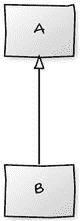
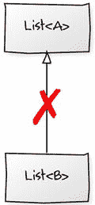

# 13. 泛型

在本章中，我们将学习 Scala 中的泛型，也称为类型参数化或泛型编程。我们将学习以下内容：

*   泛型的语法：定义类型和方法。
*   有界类型，`extends` 和 `super`。
*   Java 和 Scala 中的通配符。
*   协变和逆变。

## 参数化多态

我们简要讨论过子类型多态或包含多态；其思想是子类型可以替代其超类型。这些替代品可以在不改变代码结构的情况下提供不同的行为。多态的类型包括：

*   包含多态（见第 11 章，继承）。
*   特设多态（基本上就是方法重载）。
*   参数化多态。

参数化多态允许我们编写不依赖于特定类型的通用代码，同时仍然保持类型安全。当我们使用适用于多种类型的类时，我们一直在使用它。例如：

```
List customers = new ArrayList();       // java
```

如果你曾经在 Java 中创建过某种对象的列表，那么你对参数化多态应该很熟悉。它通常被称为泛型；通过为泛型类型（如 `List`）提供一个参数化类型，我们可以将其视为一个列表，同时以类型安全的方式引用其内容。即使在 Java 中不指定参数化类型，泛型也在起作用。因此，尽管你可以编写以下代码：

```
List collection = new ArrayList();                  // java
```

……实际上你创建的是一个类型为 `Object` 的泛型 `List`。

```
List collection = new ArrayList();        // java
```

菱形运算符

你可以在 Java 中像这样创建一个 `Object` 列表：

```
List collection = new ArrayList();
```

赋值右侧的菱形运算符（<>）是 Java 7 中的新特性，在 Java 7 之前，你必须在右侧重复泛型类型声明。

### 类泛型

当你创建一个特定类型的列表时，Java 会在接受参数和返回该类型对象的 `List` 方法上提供类型安全。例如，创建一个客户列表，然后尝试添加一个不是客户的对象会导致编译失败。

```
List customers = new ArrayList();
customers.add(new HockeyPuck());                // 编译失败
```

Scala 的基本语法对 Java 开发者来说会很熟悉；我们只需将尖括号替换为方括号。

```
List customers = new ArrayList();   // java
```

对比

```
val customers: List[Customer] = List()          // scala
```

像这样在 Scala 中创建列表也表明它具有与菱形运算符等价的功能。Scala 的类型推断可以推断出 `customers` 的类型是 `Customer`，而无需在右侧重复泛型。

```
val customers: List[Customer] = List[Customer]()
^
// 无需重复类型
```

### 方法泛型

你可以以类似的方式为方法定义泛型参数。要为方法定义一个泛型参数而不为整个类定义泛型类型，在 Java 中你可以这样做，其中泛型类型紧跟在 `public` 关键字之后定义，并用作参数 `a` 的类型。

```
public  void add(A a)                 // java
```

……而在 Scala 中则是这样：

```
def addA                         // scala
```


### 栈示例

作为一个稍加扩展的示例，在 Java 中，我们可以泛化一个 `Stack` 类。我们可以创建一个带有泛型类型 `T` 的接口 `Stack`，并确保 `push` 方法接受一个 `T` 类型参数，而 `pop` 方法返回一个 `T` 类型值。

```
// java
public interface Stack {
void push(T t);
T pop();
}
```

在 Scala 中

```
// scala
trait Stack[T] {
def push(t: T)
def pop: T
}
```

为了演示，我们可以像这样在 Java 中使用列表实现 `Stack`：

```
// java
public class ListStack implements Stack {
private final List elements = new ArrayList();
@Override
public void push(T t) {
elements.add(0, t);
}
@Override
public T pop() {
if (elements.isEmpty())
throw new IndexOutOfBoundsException();
return elements.remove(0);
}
}
```

当我们向编译器提供一个具体类型时，我们就将具体类型“绑定”到了泛型类型上。将 `String` 添加到以下声明（第 3 行）中，就将原本的泛型类型 `T` “绑定”到了 `String`。编译器知道将 `T` 替换为 `String`，我们就可以开始使用字符串作为参数和返回类型。如果我们在示例中尝试向栈中添加一个数字，就会收到编译器错误。

```
1   // java
2   public static void main(String... args) {
3       Stack stack = new ListStack();
4       stack.push("C");
5       stack.push("B");
6       stack.push("A");
7       stack.push(12);                         // 编译失败
8       String element = stack.pop();
9   }
```

在 Scala 中创建 `ListStack` 很简单。它看起来像这样：

```
// scala
class ListStack[T] extends Stack[T] {
private var elements: List[T] = List()
override def push(t: T): Unit = {
elements = t +: elements
}
override def pop: T = {
if (elements.isEmpty) throw new IndexOutOfBoundsException
val head = elements.head
elements = elements.tail
head
}
}
```

我们仍然使用 `List` 来存储元素，但由于 Scala 的 `List` 是不可变的，在 `push` 方法中，我们用一个新的列表实例替换原有实例，该新列表在开头添加了元素。

类似地，当我们执行 `pop` 操作时，必须使用 `tail` 方法将元素替换为除第一个元素之外的所有元素。我们使用 `head` 方法获取并返回第一个元素。在 Scala 和函数式编程中，你会经常遇到 head（第一个元素）和 tail（剩余部分）的概念。

绑定到具体类型的方式完全相同。在下面的示例中，我没有为 `stack` 变量声明类型，因此我们需要通过在第 3 行添加参数化类型来给编译器一个关于它将是哪种 `List` 的提示。

```
1   // scala
2   def main(args: String*) {
3       val stack = new ListStack[String]
4       stack.push("C")
5       stack.push("B")
6       stack.push("A")
7       val element: String = stack.pop
8   }
```

为了演示方法级别的泛型，我们可以添加一个将 `Stack` 转换为数组的方法。这里需要注意的是，泛型完全是针对该方法定义的。`A` 与类定义上的泛型类型无关。

```
// java
public interface Stack {
static  A[] toArray(Stack stack) {
throw new UnsupportedOperationException();
}
}
```

在 Scala 中，你以完全相同的方式定义方法级别的泛型。下面，`A` 纯粹是在该方法的作用域内定义的。

```
// scala
object Stack {
def toArrayA: Array[A] = {
???
}
}
```

## 有界类型

让我们回到泛型类型为 `Customer` 的列表示例。

```
List customers = new ArrayList();         // java
```

列表的内容可以是任何 `Customer` 或 `Customer` 的子类型，因此我们可以向列表中添加一个 `DiscountedCustomer`。

```
List customers = new ArrayList();
customers.add(new Customer("Bob Crispin", "15 Fleetwood Mack Road"));
customers.add(new DiscountedCustomer("Derick Jonar", "23 Woodland Way"));
```

类型擦除会将集合视为仅包含 `Object`。编译器将确保只有正确类型的对象才能进入集合，并在取出时使用强制类型转换。这意味着，从我们的示例中取出的任何内容都只能被视为 `Customer`。

如果你所做的只是在 `DiscountedCustomer` 中重写了 `Customer` 的行为，那么你可以多态地处理这些对象，并且不会看到问题。但是，如果你向 `DiscountedCustomer` 添加了方法，那么在没有未经检查的强制类型转换的情况下，你就无法调用它们。

```
for (Customer customer : customers) { // 有些可能是 DiscountedCustomer
// 对于任何 DiscountedCustomer，total 将是折扣后的总额
System.out.println(customer.getName() + " : " + customer.total());
}
DiscountedCustomer customer = (DiscountedCustomer) customers.get(0);
System.out.println(customer.getDiscountAmount());
```

为了克服这个限制，你可以强制泛型类型绑定到类层次结构中的特定类型。这些被称为有界类型。

### 上界 (<U extends T>)

在 Java 中，你可以使用 `extends` 或 `super` 来限制泛型类型。这些将类型的边界设置为子类型或超类型。你使用 `extends` 来设置上界，使用 `super` 来设置下界。它们可以引用类或接口。

实际上，我们在第 11 章“继承”中编写的 `Sortable` 接口中已经看到了一个设置上界的示例。我们创建了一个接口，泛型地描述了事物可以是可排序的。

```
// java
public interface Sortable> extends Iterable {
default public List sort() {
List list = new ArrayList();
for (A elements: this)
list.add(elements);
list.sort((first, second) -> first.compareTo(second));
return list;
}
// 等等
}
```

这在泛型方面做了几件事。它既定义了一个泛型类型 `A`，该类型必须是 `Comparable` 的子类，又说明了实现类必须能够迭代 `A`。`Comparable` 是 `A` 的上界。

这是一个很好的例子，说明了为什么有界类型很有用；因为我们想要定义一个通用算法，同时又足够约束类型，以便我们可以在该算法中调用已知的方法。在这个例子中，除非该类具有来自 `Comparable` 的 `compareTo` 方法并且也是可迭代的，否则我们无法实现 `sort` 方法。

当我们实现接口时，我们绑定类型参数。

```
public class Customers implements Sortable { ... }     // java
```

正是在这一点上，编译器可以开始将 `A` 视为 `Customer`，并检查 `Customer` 是否实现了 `Comparable`，以及 `Customers` 是否实现了 `Iterable`。

在 Scala 中，它看起来像这样：

```
// scala
trait Sortable[A <: Ordered[A]] extends Iterable[A] {
def sort: Seq[A] = {
this.toList.sorted
}
}
class Customers extends Sortable[Customer] { ... }
```

上界告诉你可以从数据结构中获取什么。在我们的示例中，排序算法需要从中获取一些东西并将其用作 `Comparable`；它强制执行类型安全。在 Java 中使用 `extends` 设置，在 Scala 中使用 `<:` 设置。


### 下界（<U super T>）

设置下界意味着在 Java 中使用 `super` 关键字，示例如下：

```
public class Example { }             // java
```

它表示 `U` 必须是 `T` 的超类型。当我们希望在 API 设计中保持灵活性时，这非常有用；你会在 Java 库代码或像 Hamcrest 这样的库中经常看到它。例如，假设我们有一个表示动物的类层次结构。

```
// java
static class Animal {}
static class Lion extends Animal {}
static class Zebra extends Animal {}
```

我们可能想把狮子们收集到一个围栏里。

```
// java
List enclosure = new ArrayList();
enclosure.add(new Lion());
enclosure.add(new Lion());
```

假设我们想要对狮子进行排序，并且我们已经有一个类似于 `Sortable` 接口的辅助方法，可以对任何实现 `Comparable` 的对象进行排序。

```
// java
public static > void sort(List list) {
Collections.sort(list);
}
```

为了对狮子进行排序，我们只需让它们实现 `Comparable` 接口，然后调用 `sort` 方法。

```
// java
static class Lion extends Animal implements Comparable {
@Override
public int compareTo(Lion other) {
return this.age.compareTo(other.age);
}
}
sort(enclosure);
```

很好，但如果我们扩大围栏并创建一个动物园呢？请注意，`List` 现在的类型是 `Animal` 而不是 `Lion`。

```
// java
List zoo = new ArrayList();
zoo.add(new Lion());
zoo.add(new Lion());
zoo.add(new Zebra());
sort(zoo);                     // 编译错误
```

这段代码无法编译，因为我们无法比较斑马和狮子。我们需要在超类型而不是子类型上进行比较。因此，我们需要将 `Comparable` 的实现从 `Lion` 移到 `Animal`。这样，我们就可以比较斑马和狮子，并大概能让它们彼此远离。

如果我们让 `Lion` 和 `Zebra` 通过 `Animal` 实现 `Comparable`，理论上我们应该能够将它们相互比较以及与自身比较。然而，如果我们将 `Comparable` 的实现上移到超类型（即 `Animal implements Comparable` 并从 `Lion` 中移除），就像这样：

```
// java
static class Animal implements Comparable {
@Override
public int compareTo(Animal o) {
return 0;
}
}
static class Lion extends Animal { }
static class Zebra extends Animal { }
List enclosure = new ArrayList();
enclosure.add(new Lion());
enclosure.add(new Lion());
enclosure.sort();                 // 编译器失败
List zoo = new ArrayList();
zoo.add(new Lion());
zoo.add(new Lion());
zoo.add(new Zebra());
sort(zoo);                        // 现在编译通过
```

……当我们重新编译原始的 `Lion` 围栏时，会得到一个编译器错误。我们无法再对 `Lion` 的 `enclosure` 进行排序。

```
java: method sort in class Zoo cannot be applied to given types;
required: java.util.List
found: java.util.List
reason: inferred type does not conform to equality constraint(s)
inferred: Animal
equality constraints(s): Lion
```

也就是：

```
Inferred type ’Lion’ for type parameter ’A’ is not within its bounds;
should implement ’Lion’
```

这是因为 `sort` 方法（`public static <A extends Comparable<A>> void sort(List<A> list)`）期望一个与自身可比较的类型，而我们却试图将其与类层次结构中更高层的类型进行比较。当 `A` 绑定到一个具体类型（例如 `Lion`）时，`Lion` 也必须能够与 `Lion` 自身进行 `Comparable` 比较。问题在于我们刚刚让它只能与 `Animal` 进行比较。

```
static class Lion extends Animal implements Comparable { }
```

动物园（一个 `List<Animal>`）可以被排序，因为集合的泛型类型是 `Animal`。

我们可以通过在 `sort` 的签名中添加 `? super A` 来修复这个问题。这意味着当 `A` 仍然绑定到一个具体类型（比如 `Lion`）时，我们现在要求它必须能够与 `Lion` 的某个超类型进行比较。由于 `Animal` 是 `Lion` 的超类型，它符合要求，整个代码就又能编译了。

```
public static > void sort(List list) { }
```

这一切的结果是，我们的 API 方法 `sort` 通过使用下界变得更加灵活；没有它，我们将无法对不同种类的动物进行排序。

在 Scala 中，我们可以执行相同的步骤并创建 `Animal` 层次结构。

```
// scala
class Animal extends Comparable[Animal] {
def compareTo(o: Animal): Int = 0
}
class Lion extends Animal
class Zebra extends Animal
```

然后我们可以再次创建我们的 `sort` 方法并重新创建围栏。

```
// scala
def sort[A <: Comparable[A]](list: List[A]) = { }
// scala
def main(args: String*) {
var enclosure = List[Lion]()
enclosure = new Lion +: enclosure
enclosure = new Lion +: enclosure
sort(enclosure)                                 // 编译器失败
var zoo = List[Animal]()
zoo = new Zebra +: zoo
zoo = new Lion +: zoo
zoo = new Lion +: zoo
sort(zoo)                                       // 编译通过
}
```

和之前一样，我们遇到了编译失败。

```
Error:(30, 5) inferred type arguments [Lion] do not conform to method
sort’s type parameter bounds [A <: Comparable[A]] sort(enclosure)
^
```

它正确地强制要求 `A` 必须是相同类型，但我们却将 `A` 同时视为 `Lion` 和 `Animal`。所以，和之前一样，我们需要用下界来约束泛型类型。

你可能会想尝试一个直接的等价写法：使用带 `>: A` 的下划线：

```
def sort[A : A]](a: List[A]) = { } // 编译器失败
```

但不幸的是，这会导致编译失败：

```
failure: illegal cyclic reference involving type A
```

它无法处理对 `A` 的引用；将其视为循环引用。因此，你必须尝试保持与边界的关系，同时消除循环引用。答案是定义一个新的泛型类型 `U`，并编写如下代码：

```
def sortA : A = { }
```

所以，`A` 必须扩展 `Comparable`，其中 `Comparable` 的泛型类型 `U` 本身必须是 `A` 的超类型。这解决了循环问题，但编译器仍然会报错。

```
inferred type arguments [Lion,Lion] do not conform to method sort’s
type parameter bounds [A : A] sort(enclosure)
^
```

它表示围栏的推断类型不符合我们设置的约束条件。它将两个类型都推断为 `Lion`，因为推断引擎没有足够的信息。如果我们指定我们知道为真的类型，就可以给它一个提示。因此，就像 Java 中的类型见证一样，我们可以明确表示我们希望类型是 `Lion` 和 `Animal`。

```
var enclosure = List[Lion]()
enclosure = new Lion +: enclosure
enclosure = new Lion +: enclosure
sortLion, Animal                       // 添加类型提示
```

当你对字节码进行往返转换时，最终版本看起来像这样：

```
// java
public , U> void sort(List a) { }
```

这基本上等同于以下代码：

```
// java
public > void sort(List a) { }
```

这与 Scala 版本基本相同：

```
def sort[A <: Comparable[_]](list: List[A]) { }    // scala
```

所以，它在底层将其视为无界类型。这并不完全准确，因为 Scala 编译器在这里做了所有繁重的工作，并且由于它负责所有类型检查，所以将 `U` 保留为无界。在这个例子中，从字节码往返转换到 Java 并不完全合理，因为这不是一一对应的，但了解幕后发生的事情还是很有趣的。

下界告诉你可以在数据结构中放入什么。在我们的 `Lion` 示例中，使用下界意味着你可以在动物园中放入不仅仅是狮子。你在 Java 中使用 `super`，在 Scala 中使用大于冒号（`>: `）。


### 通配符边界（`<? extends T>`、`<? super T>`）

我们已经见过一些通配符的例子：Java 中的 `?` 和 Scala 中的 `_`。

带有上界的通配符如下所示：

```
// java
void printAnimals(List<? extends Animal> animals) {
    for (Animal animal : animals) {
        System.out.println(animal);
    }
}
// scala
def printAnimals(animals: List[_ <: Animal]) {
    for (animal <- animals) {
        println(animal)
    }
}
```

带有下界的通配符如下所示：

```
// java
static void addNumbers(List<? super Integer> numbers) {
    for (int i = 0; i < 100; i++) {
        numbers.add(i);
    }
}
// scala
def addNumbers(numbers: List[_ >: Int]) {
    for (i <- 0 to 99) {
        // ...
    }
}
```

无界通配符在 Java 中如下所示：

```
List<?> list             // java
```

……在 Scala 中如下所示：

```
List[_]                  // scala
```

无界通配符表示一个未知的泛型类型。例如，打印未知类型列表的元素适用于所有列表。只需添加上界或下界约束来限制选项。

```
// java
void printUnknown(List<?> list) {
    for (Object element : list) {
        System.out.println(element);
    }
}
// scala
def printUnknown(list: List[_]) {
    for (e <- list) {
        val f: Any = e
        println(f)
    }
}
```

尽管实现可以将元素视为 `Object`，因为一切都是对象，但你不能向未知类型的列表中添加任何内容。

```
// java
List<?> list = new ArrayList<Object>();
list.add(new Object()); // 编译器错误
```

唯一的例外是 `null`。

```
list.add(null);
```

在 Scala 中你会得到相同的效果，甚至无法在没有有效类型的情况下创建列表。

```
scala> val list = mutable.MutableList[_]()
<console>:7: error: unbound wildcard type
val list = mutable.MutableList[_]()
^
```

当你确实不关心类型参数，只关心上界或下界的任何约束，或者当你可以将类型视为 `Object` 或 `Any` 的实例时，主要使用通配符。

### 多重边界

在 Java 和 Scala 中，类型也可以有多个边界。

*   Java 仅限于多个上界。
*   Java 不能对类型同时设置下界和上界（因此你不能让一个泛型类型继承一个类，同时又成为另一个类的超类型）。
*   与 Java 不同，Scala 可以设置单个下界和上界。
*   然而，Scala 不能设置多个上界或下界。相反，它可以通过强制你扩展特质来约束边界。

使用多重边界，另一种表达对 `Animal` 排序方法约束的方式是明确声明 `A` 必须扩展 `Animal` 并且可与 `Animal` 比较，在 Java 中使用 `&` 符号。

```
// java
public static <A extends Animal & Comparable<Animal>> void sort(List<A> l)
```

这在 Java 中为泛型类型 `A` 设置了两个上界。你不能在 Scala 中为 `A` 设置两个上界，但你可以通过指定你的边界也必须扩展某些特质来达到相同的效果。

```
// scala
def sort[A <: Animal with Comparable[Animal]](list: List[A]) = { }
```

因为我们更加明确，所以在调用 `sort` 方法时可以移除类型提示。事实上，如果你不这样做，你会得到一个编译器错误。

```
var enclosure = List[Lion]()
enclosure = new Lion +: enclosure
enclosure = new Lion +: enclosure
// sortLion, Animal     // 编译器错误
sort(enclosure)
```

在 Scala 中，你也可以使用 `>:` 和 `<:` 同时设置下界和上界，如下所示：

```
def exampleA >: Lion <: Animal = ()                     // scala
^         ^
lower     upper
```

……其中 `A` 必须是 `Lion` 的超类型且是 `Animal` 的子类型。

## 变型

在不涉及泛型的情况下，一个简单的类 `B` 继承自 `A`（见图 13-1）可以赋值给一个 `A` 的实例；毕竟，它既是 `A` 也是 `B`。显然，子类型化只是单向的；反过来，你会得到一个编译器错误。



图 13-1

`B extends A`

```
// java
A a = new A();
B b = new B();
a = b;
b = a;                    // 编译器错误
```

然而，泛型类本身并不是子类，仅仅因为它们的参数化类型可能是。那么，如果 `B` 是 `A` 的子类，`List<B>` 应该是 `List<A>` 的子类吗？在 Java 中，`B` 的 `List` 不是 `A` 的 `List` 的子类型，即使它们的参数化类型是（见图 13-2）。



图 13-2

在 Java 中 `List<B>` 不能扩展 `List<A>`

```
// java
List<A> a = new ArrayList<A>();
List<B> b = new ArrayList<B>();
a = b;  // 编译器错误
```

这就是变型的用武之地。变型描述了泛型类型（如列表或“容器”类型）的子类型化如何与其参数化类型的子类型化相关联。

变型描述了三种子类型关系。

1.  不变型。
2.  协变型。
3.  逆变型。

### 不变型

Java 对其泛型类型只支持这三种中的一种：Java 中的所有泛型类型都是不变的，这就是为什么我们不能将 `List<B>` 赋值给 `List<A>`。不变泛型类型不保留其参数化类型的子类型关系。

然而，当你对方法和变量使用通配符时，你可以改变参数化类型。

泛型类型之间的不变关系表明，即使它们的内容具有子类型关系，它们之间也没有关系。你不能用一个替换另一个。Java 和 Scala 在这里共享语法，因为在尖括号（Java）或方括号（Scala）中定义任何泛型类型都将其描述为不变型。

```
public class List<T> { }         // java
class List[T] { }                // scala
```

### 协变型

协变泛型类型在其参数化类型是子类型时，保留两个泛型类型之间的子类型关系。因此，当泛型类型被设置为协变时，`List<B>` 是 `List<A>` 的子类型。Java 不支持类型的协变。Scala 通过在定义泛型类时使用 `+` 来支持协变泛型类型。

```
class List[+T] { }
```

### 逆变型

逆变反转了子类型关系。因此，如果 `A` 是逆变的，那么 `List<A>` 也是 `List<B>`；它是一个子类型。参数化类型的关系对其泛型类型来说是反转的。Java 不支持类型的逆变，但在 Scala 中，你只需在泛型类型定义中添加一个 `-`。

```
class List[-T] { }
```

### 变型总结

总之，不变泛型类型是不相关的，无论其参数化类型的关系如何。协变类型保持其参数化类型的子类型关系，而逆变类型则反转它（见表 13-1）。

表 13-1

变型总结

|   | 描述 | Scala 语法 |
| --- | --- | --- |
| 不变型 | `List<A>` 和 `List<B>` 不相关 | `[T]` |
| 协变型 | `List<B>` 是 `List<A>` 的子类 | `[+T]` |
| 逆变型 | `List<A>` 是 `List<B>` 的子类 | `[-T]` |

每种语法的总结见表 13-2。

表 13-2

语法总结

|   | 不变型 | 协变型 | 逆变型 |
| --- | --- | --- | --- |
| Java | `<T>` | `<? extends T>` | `<? super T>` |
| Scala | `[T]` | `[+T]` | `[-T]` |
| Scala（通配符） | `[T]` | `[_ <: T]` | `[_ >: T]` |

Java 的限制

在 Java 中，所有泛型类型都是不变的，这意味着你不能将 `List<Foo>` 赋值给 `List<Object>`。你可以在使用它们的地方通过通配符改变类型，但仅限于方法和变量定义，而不是类。


