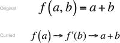

# 15. 模拟语言结构

Scala 允许你以这样一种方式编写代码，使其看起来像是在使用原生语言结构，而实际上你只是在使用常规方法。

本章将涵盖以下内容：

*   Scala 如何允许你在调用方法时使用花括号代替常规圆括号。
*   Scala 如何支持高阶函数：即以函数作为参数并返回函数作为结果的函数。
*   Scala 如何原生支持柯里化。

这些特性听起来并不惊人，但结合起来却能提供令人惊讶的灵活性。我们将看到这些技术如何帮助你编写更灵活、更易读的代码。

本章中的所有代码示例均使用 Scala 编写。

## 花括号（与函数字面量）

Scala 中有一条简单的规则。

*   任何只接受一个参数的方法调用，都可以使用花括号代替圆括号来包围参数。

因此，与其这样写：

```
numerals.foreach(println(_))
```

……不如这样写：

```
numerals.foreach{println(_)}
```

我们只是将方括号换成了花括号。这并不令人印象深刻，但当我们引入一些换行时，情况就开始变得有趣了。

```
numerals.foreach {
println(_)
}
```

现在它看起来像一个内置的控制结构。开发者习惯于将花括号解释为语言语法的分界符。因此，这看起来更像内置的 `for` 循环，尽管它只是一个方法调用。

这样做的主要原因是允许客户端以一种自然且简洁的方式将函数作为参数传递。当你编写可以接受函数作为参数的函数时，你就是在创建高阶函数。这提供了更大的灵活性和复用性。

例如，假设我们想要执行一些工作并更新一个 UI 元素，比如进度条或客户购物车。最好的方法是在一个新线程中执行此操作，这样我们就不会拖慢主 UI 线程并导致用户界面卡顿。

### 高阶函数

如果每次更新 UI 元素的调用都必须在其自己的线程上执行，我们可能会得到一个像这样简陋的实现：

```
object Ui {
def updateUiElements() {
new Thread() {
override def run(): Unit = updateCustomerBasket(basket)
}.start()
new Thread() {
override def run(): Unit = updateOffersFor(customer)
}.start()
}
}
```

`Ui` 对象依次执行一系列更新，每个更新都在一个新线程上。`Ui` 对象既管理线程策略，又管理更新行为。更好的做法是让其他东西负责协调线程，而 `Ui` 对象只负责更新行为。这样，我们可以避免重复，并且如果线程策略发生变化，我们也不必找到所有分散在各处的用法。

解决方案是定义一个函数，该函数可以在一个线程上运行另一个函数。我们可以创建一个名为 `runInThread` 的函数，其中包含样板线程代码。

```
def runInThread() {
new Thread() {
override def run(): Unit = ???
}.start()
}
```

它会创建并启动一个新线程，但不会做任何有意义的事情。我们如何传入一个函数？在 Java 中，你可能会传入一个 `Runnable` 或 `Callable` 的匿名实例，或者一个 lambda 表达式。

在 Scala 中也是如此，但你不是传入一个函数式接口作为参数，而是传入一个表示函数参数的简写签名。你像往常一样定义一个变量（下面的例子中是 `function`），但冒号后面的类型表示一个函数。我们的例子没有参数，并返回一个 `Unit` 类型的值。它相当于 Java 中 lambda 表达式的签名：`() -> Void`。

```
def runInThread(function: () => Unit) {
new Thread() {
override def run(): Unit = ???
}.start()
}
```

然后我们只需在线程体中执行该函数。记住，括号表示执行 `apply` 方法的简写。

```
def runInThread(function: () => Unit) {
new Thread() {
override def run(): Unit = function()       // 即 function.apply()
}.start()
}
```

有了新的 `runInThread` 方法，我们可以像这样重写 UI 代码：

```
def updateUiElements() {
runInThread(() => updateCustomerBasket(basket))
runInThread(() => updateOffersFor(customer))
}
```

我们通过将函数传递给 `runInThread` 消除了重复代码。

### 使用花括号的高阶函数

这并没有真正实现让客户端能够“以一种自然且简洁的方式”将函数作为参数传递的承诺。它看起来很像 Java 的 lambda 语法，但如果我们使用花括号，可以使其看起来更自然，更像语言语法。

如果我们只是将圆括号替换为花括号，情况并没有真正改善。

```
// 真难看！
def updateUiElements() {
runInThread { () =>
updateCustomerBasket(basket)
}
runInThread { () =>
updateOffersFor(customer)
}
}
```

但我们可以使用另一个技巧来去掉空的圆括号和箭头。我们可以使用所谓的按名参数（call-by-name parameter）。


### 按名传参

在 Java 中，你无法对空的 lambda 参数列表（例如 `() -> Void`）做任何处理，但在 Scala 中，你可以从函数签名中省略括号，以表明该参数是按名传参的。调用时，你不再需要调用 `apply` 方法，只需直接引用它即可。

```
def runInThread(function: => Unit) {         // 按名传参
new Thread() {
override def run(): Unit = function      // 不是 function()
}.start()
}
```

按名参数表达式直到实际使用时才会被求值，而不是在定义时。它的行为与长格式函数完全一致，尽管看起来我们像是在将函数传入 `runInThread` 方法时就已经调用了它。

```
def updateUiElements() {
runInThread {
updateCustomerBasket(basket)
}
runInThread {
updateOffersFor(customer)
}
}
```

这让代码看起来自然得多，尤其是当我们在一个运行线程中想做更多操作时。例如，假设我们想在更新客户购物车之前应用一个折扣。花括号和缩进清晰地表明，这些操作与更新发生在同一个线程中。

```
def updateUiElements() {
runInThread {
applyDiscountToBasket(basket)
updateCustomerBasket(basket)
}
runInThread {
updateOffersFor(customer)
}
}
```

你可以将其视为创建无参 lambda 的简写形式。

### 按名传参 ≠ 惰性求值

人们常常认为按名参数与惰性值是一回事，但这在技术上并不准确。没错，它们都是在运行时遇到时才被求值，但与真正的惰性值不同，它们每次被遇到时都会被求值。

真正的惰性值在第一次遇到时被求值并存储，因此第二次请求该值时，它会被直接返回，而不会再次求值。

所以，按名参数并非惰性。

## 柯里化

使用 `apply` 方法和花括号，我们可以创建出表达力强且使用自然的 API。它让我们能够创建符合语言语法预期的控制抽象。

但请记住我们之前关于花括号规则的说明。

*   任何接受恰好一个参数的方法调用，都可以使用花括号来包围参数，而不是圆括号。

我们只能对单参数方法使用花括号。如果我们想为 `runInThread` 方法添加一个参数，同时仍然使用优雅的语法，该怎么办？好消息是，这完全可行；我们可以采用一种称为柯里化的技术。

让我们扩展 `runInThread` 方法，添加一个新参数来指定线程组。

```
def runInThread(group: String, function: => Unit) {
new Thread(new ThreadGroup(group), new Runnable() {
def run(): Unit = function
}).start()
}
```

由于只有单参数列表才能使用花括号，我们不得不让 `Ui` 对象回归到使用圆括号。

```
// 真难看！
def updateUiElements() {
runInThread("basket", {
applyDiscountToBasket(basket)
updateCustomerBasket(basket)
})
runInThread("customer",
updateOffersFor(customer)
)
}
```

如果我们能将这个双参数函数转换为一个单参数函数，就能再次使用花括号了。幸运的是，这正是柯里化的作用。柯里化是将一个具有两个或更多参数的函数转换为一系列函数的过程，每个函数只接受一个参数。

对于一个双参数函数，柯里化会产生一个接受一个参数并返回另一个函数的函数。这个返回的函数也只有一个参数（对应原函数的第二个参数）。有点困惑？让我们通过一个例子来理解。

假设我们有一个函数 f，它接受两个参数 a 和 b，并返回 a + b。

f (a, b) = a + b

要将其转换为两个各带一个参数的函数，首先我们创建一个函数来接受 a 并返回一个新函数（f′）。

f (a) → f  ′

这个新函数本身应该接受一个参数 b。

f (a) → f  ′ (b)

整个函数应该返回结果 a + b。

f (a) → f  ′ (b) → a + b

我们最终得到两个函数（f 和 →f  ′），每个都接受一个参数。

在使用了类似的伪数学符号后，有必要重申我最初的定义，并将原始函数与其柯里化形式进行比较（见图 15-1）。



图 15-1

原始函数及其柯里化形式的推导步骤

*   对于一个双参数函数，柯里化会产生一个接受一个参数并返回另一个函数的函数。这个返回的函数也只有一个参数（对应原函数的第二个参数）。

要计算柯里化形式的函数，我们先计算第一个函数（例如，传入值 1）。

f (1)

这会返回一个捕获了该值的函数，并且由于返回的是一个函数，我们可以直接计算它，为最后一个参数提供值（2）。

f (1)(2)

此时，两个值都在作用域内，任何计算都可以进行，从而得到最终结果。

我在这里使用了一种有点“大猩猩”式的符号¹来阐明我的观点。使用更符合数学规范的符号，我们可以通过创建一个新函数来展示函数的柯里化形式，该函数接受 a 并将 b 映射到 a + b。

f (a) = (b → a + b)

如果你熟悉 lambda 演算²，你就会知道 λab.a + b 是其柯里化形式 λa. (λb.(a + b)) 的简写。

### 闭包

有趣的是，像这样捕获一个值并使其可供第二个函数使用的过程被称为闭包。这就是我们在提及匿名函数或捕获值的 lambda 时，术语“闭包”的来源。

### Scala 对柯里化函数的支持

一个常规的非柯里化函数，用于将两个数相加，可能如下所示：

```
def add(x: Int, y: Int): Int = x + y
```

Scala 原生支持柯里化函数，因此我们无需手动转换；要将其转换为柯里化版本，只需用圆括号将参数分开即可。

```
def add(x: Int)(y: Int): Int = x + y
```

Scala 为我们创建了两个单参数列表。要计算该函数，我们可以这样做：

```
scala> add(1)(2)
res1: Int = 3
```

要分步查看，我们可以只计算前半部分，如下所示：

```
scala> val f = add(1) _
f: Int => Int = 
```

下划线向 REPL 提示了我们想要做什么。结果 `f` 是一个从 `Int` 到 `Int` 的函数。值 `1` 已被捕获，并可供该函数使用。因此，我们现在可以执行返回的函数，并提供第二个值。

```
scala> f(2)
res2: Int = 3
```

那么，这对我们的 `runInThread` 方法意味着什么呢？如果我们创建该函数的柯里化版本，就可以重新使用我们喜爱的花括号了。

我们首先将参数拆分为两个，以创建原函数的柯里化形式。

```
def runInThread(group: String)(function: => Unit) {
new Thread(new ThreadGroup(group), new Runnable() {
def run(): Unit = function
}).start()
}
```

注意，函数内部无需其他更改。在 `runInThread` 内部，一切照旧。然而，我们现在可以将 `Ui` 对象改回使用花括号来包围第二个参数。

```
def updateUiElements() {
runInThread("basket") {
applyDiscountToBasket(basket)
updateCustomerBasket(basket)
}
runInThread("customer",
updateOffersFor(customer)
)
}
```


## 摘要

借助一些内置特性，Scala 允许我们编写出看起来像语言结构的方法。我们可以使用高阶函数来创建控制抽象：这些函数抽象了复杂的行为，减少了重复代码，同时仍为调用它们的代码提供了灵活性。

我们可以在任何使用单参数方法的地方使用花括号。我们可以利用这一点来提供一目了然的视觉提示和模式。借助内置的柯里化支持，我们不仅限于在单参数函数中使用这一特性；通过将多参数函数转换为多个单参数函数，我们可以创建更丰富的 API。

脚注 1

关于所用符号的讨论，请参见 [`http://bit.ly/1Q2bU6s`](http://bit.ly/1Q2bU6s)

  2

关于 Lambda 演算的一些说明，请参见 [`http://bit.ly/1G4OdVo`](http://bit.ly/1G4OdVo)

