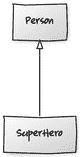

# 16. 模式匹配

除了提供类似 switch 的功能（比 Java 的版本更强大）之外，模式匹配还提供了一组丰富的“模式”用于匹配。在本章中，我们将研究模式的构成，并通过一些示例进行讲解，包括字面量模式、构造器模式和类型查询模式。

模式匹配还提供了解构匹配对象的能力，使你可以访问数据结构的各个部分。我们将探讨解构的机制：提取器，它本质上是实现了特殊方法 `unapply` 的对象。

## 切换

让我们从之前看过的模式匹配表达式开始。

```
val month = "August"
val quarter = month match {
case "January" | "February" | "March"    => "1st quarter"
case "April" | "May" | "June"            => "2nd quarter"
case "July" | "August" | "September"     => "3rd quarter"
case "October" | "November" | "December" => "4th quarter"
case _                                   => "unknown quarter"
}
```

Java 的 `switch` 和 Scala 的 `match` 表达式有几个关键区别。

*   在 Scala 中，case 之间没有穿透行为。Java 使用 `break` 来避免穿透，但 Scala 会在每个 case 之间自动中断。
*   在 Scala 中，模式匹配是一个表达式；它会返回一个值。Java 的 switch 必须依赖副作用才能发挥作用。
*   使用 Scala，我们可以在更多类型上进行切换，不仅仅是基本类型、枚举和字符串。我们可以在对象以及符合我们自己设计的“模式”的事物上进行切换。在示例中，我们使用“或”来构建更丰富的匹配条件。

模式匹配还为我们提供了以下功能：

*   能够守卫匹配条件；通过使用 `if`，我们可以丰富一个 case，使其不仅匹配模式（`case` 之后紧跟的部分），还能匹配某个二元条件。
*   匹配失败的异常；当某个值在运行时没有匹配任何 case 时，Scala 会抛出一个 `MatchError` 异常来通知我们。
*   可选的编译时检查：你可以进行设置，这样如果你忘记编写一个能匹配所有可能组合的 case，就会收到编译器警告。这是通过使用所谓的密封特质来实现的。

## 模式

一个匹配表达式的结构如下所示：

```
value match {
case pattern guard => expression
...
case _             => default
}
```

我们有一个值，然后是 `match` 关键字，接着是一系列匹配 case。这个值本身可以是一个表达式、一个字面量，甚至是一个对象。

每个 case 由一个模式、一个可选的守卫条件，以及在匹配成功时要计算的表达式组成。

你可以在末尾添加一个默认的、捕获所有情况的模式。下划线是我们遇到的第一个实际模式的例子。它是通配符模式，意思是“匹配任何东西”。

一个模式可以是以下形式：

*   通配符匹配 (`_`)。
*   字面量匹配，即相等性比较，用于诸如 `101` 或 `RED` 这样的值。
*   构造器匹配，意味着如果一个值可以使用特定的构造器创建，那么它就会匹配。
*   解构匹配，也称为提取器模式。
*   基于特定类型的匹配，称为类型查询模式。
*   带有备选项的模式（使用 `|` 指定）。

模式还可以包含一个变量名，在匹配成功后，该变量名将可用于右侧的表达式。在语言规范中，这被称为变量标识符。

还有一些其他模式我没有列出；如果你感兴趣，请参阅 Scala 语言规范中的模式匹配部分。¹

## 字面量匹配

字面量匹配是针对任何 Scala 字面量的匹配。以下示例使用了字符串字面量，其语义类似于 Java 的 switch 语句。

```
val language = "French"
value match {
case "french" => println("Salut")
case "French" => println("Bonjour")
case "German" => println("Guten Tag")
case _        => println("Hi")
}
```

该值必须与 case 中的字面量完全匹配。在示例中，结果将是打印“Bonjour”而不是“Salut”，因为匹配值中的 `F` 是大写的。匹配基于相等性 (`==`)。


## 构造器匹配

构造器模式允许你根据对象的构造方式来匹配案例。假设我们有一个如下所示的 `SuperHero` 类：

```
case class
SuperHero(heroName: String, alterEgo: String, powers: List[String])
```

这是一个包含三个构造器参数的常规类，但开头的关键字 `case` 将其指定为样例类。目前，这意味着 Scala 会自动为我们提供一系列有用的方法，例如 `hashCode`、`equals` 和 `toString`。

给定该类及其字段，我们可以创建如下匹配表达式：

```
1   object BasicConstructorPatternExample extends App {
2     val hero =
3       new SuperHero("Batman", "Bruce Wayne", List("Speed", "Agility"))

5     hero match {
6       case SuperHero(_, "Bruce Wayne", _) => println("I'm Batman!")
7       case SuperHero(_, _, _)             => println("???")
8     }
9   }
```

使用构造器模式，它将匹配任何 `alterEgo` 字段值为“Bruce Wayne”的 `hero`，并打印“I'm Batman!”。对于其他所有情况，它将打印问号。

下划线用作构造器参数的占位符；第二个 case（第 7 行）需要三个下划线，因为构造器有三个参数。下划线表示你不关心它们的值是什么。在第 6 行放入值“Bruce Wayne”表示你确实关心，并且构造器的第二个参数必须与之匹配。

使用构造器模式时，值还必须匹配类型。假设 `SuperHero` 是 `Person` 的子类型，如图 16-1 所示。



图 16-1

`SuperHero` 是 `Person` 的子类型

如果 `hero` 变量实际上是 `Person` 的实例而不是 `SuperHero`，则不会有任何匹配。在没有匹配的情况下，你会在运行时看到 `MatchError` 异常。为了避免 `MatchError`，你需要允许非 `SuperHero` 类型也能匹配。为此，你可以使用通配符作为默认情况。

```
object BasicConstructorPatternExample extends App {
val hero = new Person("Joe Ordinary")
hero match {
case SuperHero(_, "Bruce Wayne", _) => println("I'm Batman!")
case SuperHero(_, _, _)             => println("???")
case _                              => println("I'm a civilian")
}
}
```

模式还可以将匹配的值绑定到变量。我们不仅可以匹配字面量（例如“Bruce Wayne”），还可以使用变量作为占位符，并在右侧的表达式中访问匹配的值。例如，我们可以提出以下问题：

*   “一个身份未知的人，如果他是化名为 Bruce Wayne 的超级英雄，他拥有哪些超能力？”

```
1   def superPowersFor(person: Person) = {
2     person match {
3       case SuperHero(_, "Bruce Wayne", powers) => powers
4       case _                                   => List()
5     }
6   }

8   println("Bruce has the following powers " + superPowersFor(person))
```

我们仍然只匹配 `SuperHero` 类型，并对其化名进行字面量匹配，但这次第 3 行最后一个位置的下划线被替换为变量 `powers`。这意味着我们可以在右侧使用该变量。在这个例子中，我们直接返回它来回答问题。

变量绑定是模式匹配的关键优势之一。在实践中，使用像“Bruce Wayne”这样的字面量值意义不大，因为它限制了应用范围。相反，你更可能将其替换为变量或通配符模式。

```
object HeroConstructorPatternExample extends App {
def superPowersFor(person: Person) = {
person match {
case SuperHero(_, _, powers) => powers
case _                       => List()
}
}
}
```

然后，你将使用匹配对象中的值作为输入。要找出 Bruce Wayne 拥有哪些能力，你需要传入一个 Bruce 的 `SuperHero` 实例。

```
val bruce =
new SuperHero("Batman", "Bruce Wayne", List("Speed", "Agility"))
println("Bruce has the following powers: " + superPowersFor(bruce))
```

这个例子有点刻意，因为我们使用匹配表达式来返回我们已经知道的内容。但既然我们已经使 `superPowersFor` 方法更加通用，我们也可以找出任何超级英雄或普通人的能力。

```
val steve =
new SuperHero("Capt America", "Steve Rogers", List("Tactics", "Speed"))
val jayne = new Person("Jayne Doe")
println("Steve has the following powers: " + superPowersFor(steve))
println("Jayne has the following powers: " + superPowersFor(jayne))
```

构造器模式

请注意，构造器模式开箱即用地适用于样例类。从技术上讲，这是因为它们自动实现了一个名为 `unapply` 的特殊方法。我们稍后将看到如何实现你自己的 `unapply` 方法，并为非样例类实现同样的功能。

## 类型查询

使用构造器模式，你可以隐式地匹配类型并访问其字段。如果你不关心字段，可以使用类型查询仅匹配类型。

例如，我们可以创建一个 `nameFor` 方法来获取一个人或超级英雄的名字，并用一个人列表来调用它。我们将得到他们的名字，或者如果他们是超级英雄，则得到他们的化名。

```
1   object HeroTypePatternExample extends App {

3     val batman =
4       new SuperHero("Batman", "Bruce Wayne", List("Speed", "Agility"))
5     val cap =
6       new SuperHero("Capt America", "Steve Rogers", List("Tactics", "Speed"))
7     val jayne = new Person("Jayne Doe")

9     def nameFor(person: Person) = {
10       person match {
11         case hero: SuperHero => hero.alterEgo
12         case person: Person => person.name
13       }
14     }

16     // 超级英雄的化名是什么？
17     println("Batman's Alter ego is " + nameFor(batman))
18     println("Captain America's Alter ego is " + nameFor(cap))
19     println("Jayne's Alter ego is " + nameFor(jayne))
20   }
```

你可以指定一个变量和类型，而不是使用一系列 `instanceOf` 检查后跟强制类型转换。在箭头后面的表达式中，该变量可以作为该类型的实例使用。因此，在第 11 行，`hero` 神奇地成为了 `SuperHero` 的实例，并且无需强制类型转换即可使用 `SuperHero` 特有的方法（例如 `alterEgo`）。

当你在 `try` 和 `catch` 中使用模式匹配来处理异常时，实际上就是在使用类型查询。

```
try {
val url = new URL("http://baddotrobot.com")
val reader = new BufferedReader(new InputStreamReader(url.openStream))
var line = reader.readLine
while (line != null) {
line = reader.readLine
println(line)
}
} catch {
case _: MalformedURLException => println("Bad URL")
case e: IOException => println("Problem reading data : " + e.getMessage)
}
```

`MalformedURLException` 匹配中的下划线表明，如果你对使用该值不感兴趣，可以在类型查询中使用通配符。


## 解构匹配与 `unapply`

通常，`apply` 方法被实现为一种工厂风格的创建方法：它接收参数并返回一个新实例。你可以将特殊的 `unapply` 方法视为其对立面。它接收一个实例并从中提取值，通常是那些用于构造该实例的值。

apply (a, b) → object (a, b)

unapply (object (a, b))) → a, b

由于它们提取值，因此实现了 `unapply` 的对象被称为提取器。

*   给定一个对象，提取器通常会提取出创建该对象时所用的参数。

因此，如果我们想在匹配表达式中使用 `Customer` 类，就需要在其伴生对象中添加一个 `unapply` 方法。让我们开始构建它。

```
class Customer(val name: String, val address: String)
object Customer {
def unapply(???) = ???
}
```

`unapply` 方法总是接收一个你想要解构的对象实例，在我们的例子中就是 `Customer`。

```
object Customer {
def unapply(customer: Customer) = ???
}
```

它应该返回提取出的对象部分，或者返回某些信息以表明无法解构。在 Scala 中，我们不会返回 `null` 来表示这种情况，而是返回一个结果的可选值（Option）。这与 Java 中的 `Optional` 类概念相同。

```
object Customer {
def unapply(customer: Customer): Option[???] = ???
}
```

最后一块拼图是确定可以从对象中可选地提取出什么：即放入 `Option` 参数中的类型。如果你只想提取客户姓名，返回值应为 `Option[String]`，但我们希望同时提取姓名和地址（从而能够在匹配表达式中同时匹配姓名和地址）。

答案是使用元组，这是我们之前见过的数据结构。它是一种在单一类型中返回多个数据片段的方式。

```
object Customer {
def unapply(customer: Customer): Option[(String, String)] = {
Some((customer.name, customer.address))
}
}
```

现在我们可以对客户使用模式匹配了。

```
val customer = new Customer("Bob", "1 Church street")
customer match {
case Customer(name, address) => println(name + " " + address)
}
```

你会注意到，这看起来像我们之前的构造器模式示例。这是因为它们本质上是同一回事；我们之前使用了样例类，它自动为我们添加了 `unapply` 方法。而这次是我们自己创建的。它既是一个提取器，又因为与构造器存在对称性，所以也是一种构造器模式。

更具体地说，模式中要提取的值列表必须与类的主构造器中的参数列表相匹配，才能被称为构造器模式。详情请参阅语言规范²。

### 为什么编写自己的提取器？

既然样例类已经自带了 `unapply` 方法，为什么还要自己实现提取器方法呢？原因可能很简单：你无法或不想使用样例类，或者你不想要样例类的匹配行为；你可能想要自定义的提取行为（例如，从 `unapply` 返回 `Boolean` 来表示匹配成功但无需提取任何值）。

也可能是你无法修改某个类，但希望从中提取部分信息。你可以为任何东西编写提取器。例如，你无法修改 `String` 类，但仍然可能希望从中提取信息，比如电子邮件地址或 URL 的组成部分。

例如，下面例子中的独立对象，当字符串是一个有效的 URL 时，会从中提取协议和主机名。它与 `String` 类没有关系，但仍然允许我们编写匹配表达式，将字符串“解构”为协议和主机名。

```
object UrlExtractor {
def unapply(string: String): Option[(String, String)] = {
try {
val url = new URL(string)
Some((url.getProtocol, url.getHost))
} catch {
case _: MalformedURLException => None
}
}
}
val url = "http://baddotrobot.com" match {
case UrlExtractor(protocol, host) => println(protocol + " " + host)
}
```

这种模式与其所操作的数据类型之间的解耦被称为表示独立性（参见《Scala 编程》第 24.6 节）。³

## 守卫条件

你可以用 `if` 条件来补充我们见过的模式。

```
customer.yearsACustomer = 3
val discount = customer match {
case YearsACustomer(years) if years >= 5 => Discount(0.50)
case YearsACustomer(years) if years >= 2 => Discount(0.20)
case YearsACustomer(years) if years >= 1 => Discount(0.10)
case _ if blackFriday(today)             => Discount(0.10)
case _                                   => Discount(0)
}
```

模式后面的条件称为守卫。你可以根据需要引用变量，因此我们可以说，对于超过五年的客户，享受 50% 的折扣；两年，20%，以此类推。如果不需要变量，那也没问题。例如，我们有一个情况是，如果之前没有适用任何折扣，且今天是黑色星期五，则给予 10% 的折扣。

脚注 1

[`http://www.scala-lang.org/files/archive/spec/2.12/08-pattern-matching.html`](http://www.scala-lang.org/files/archive/spec/2.12/08-pattern-matching.html)

  2

[`http://www.scala-lang.org/files/archive/spec/2.12/08-pattern-matching.html`](http://www.scala-lang.org/files/archive/spec/2.12/08-pattern-matching.html)

  3

[`http://www.artima.com/pins1ed/extractors.html`](http://www.artima.com/pins1ed/extractors.html)

