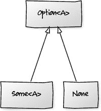
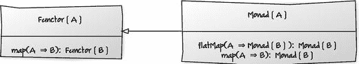

# 18. 单子

单子是人们喜欢谈论但依然难以捉摸和神秘的事物之一。如果你读过任何关于函数式编程的资料，你一定会遇到这个术语。

尽管文献众多，但这个主题往往没有被很好地理解，部分原因是单子源于抽象数学领域的范畴论，部分原因是在编程语言中，Haskell 在文献中占主导地位。Haskell 和范畴论都与主流开发者关系不大，并且两者都带来了可能难以理解的概念和术语。

好消息是，你完全不必担心这些东西。你不需要理解范畴论来进行函数式编程。你也不需要理解 Haskell 就能用 Scala 编程。

## 基本定义

单子的一个通俗定义可能是：

*   拥有 `map` 和 `flatMap` 函数的东西。

这并非完整的定义，但可以作为我们的起点。

我们已经看到，Scala 中的集合都是单子。使用 `map` 转换它们，并使用 `flatMap` 扁平化一对多的转换非常有用。但是 `map` 和 `flatMap` 在不同类型的单子上执行不同的操作。


## Option 类

让我们以 `Option` 类为例。你可以使用 `Option` 来避免空值，但它究竟是如何避免空值的，又与单子（monad）有何关联？答案包含两部分。

1.  通过返回 `Option` 的子类型来表示“无值”（`None`）或值的包装（`Some`），从而避免返回 `null`。由于“无值”和“有值”都属于 `Option` 类型，你可以一致地处理它们。你永远不需要说“if not null”。
2.  一致地处理 `Option` 的实际方法是使用单子方法 `map` 和 `flatMap`。因此，`Option` 就是一个单子。

空对象模式

如果你曾了解过空对象模式，你会发现这是一个类似的概念。空对象模式允许你用某个子类型替换原类型来表示无值。你可以像对待真实值一样在该实例上调用方法，但它本质上什么也不做。它可以替代真实值，但通常没有副作用。

主要区别在于，你可以调用的方法（由实例的超类型定义）通常是业务方法。而单子的常见方法是 `map` 和 `flatMap`，它们是更低层次的函数式编程抽象。

我们知道 `map` 和 `flatMap` 对集合的作用，但它们对 `Option` 又有什么作用呢？

### `map` 函数

`map` 函数仍然用于转换对象，但这是一次可选转换。如果选项有值，它会将映射函数应用于该值。有值和无值的选项分别作为 `Option` 的子类 `Some` 和 `None` 实现（见图 18-1）。



图 18-1

`Option` 类

映射仅在选项是 `Some` 的实例时应用。如果它没有值（即它是 `None` 的实例），它将简单地返回另一个 `None`。

当你想要转换某些内容但又不想担心检查它是否为 null 时，这非常有用。例如，我们可能有一个带有仓库方法 `add` 和 `find` 的 `Customers` 特质。当客户不存在时，在 `find` 的实现中我们应该怎么做？

```
trait Customers extends Iterable[Customer] {
def add(Customer: Customer)
def find(name: String): Customer
}
```

典型的 Java 实现可能会返回 `null` 或抛出某种 `NotFoundException`。例如，以下基于 `Set` 的实现，如果找不到客户，则返回 `null`：

```
import scala.collections._
class CustomerSet extends Customers {
private val customers = mutable.Set[Customer]()
def add(customer: Customer) = customers.add(customer)
def find(name: String): Customer = {
for (customer <- customers) {
if (customer.name == name)
return customer
}
null
}
def iterator: Iterator[Customer] = customers.iterator
}
```

返回 `null` 和抛出异常都有类似的缺点。

两者都不能很好地传达意图。如果你返回 `null`，客户端需要知道这种可能性，以便避免 `NullPointerException`。但向客户端传达这一信息的最佳方式是什么？ScalaDoc？让他们查看源代码？这两种方式客户端都很容易忽略。异常可能更清晰一些，但由于 Scala 异常是非受检的，客户端同样容易忽略。

你还会将非正常路径的处理强加给客户端。假设使用者确实知道要检查 null，你是在要求多个客户端为非正常路径实现防御性策略。你是在强制人们进行 null 检查，并且无法确保一致性，甚至无法确保人们会费心去做。

将 `find` 方法定义为返回 `Option` 可以改善这种情况。在下面的代码中，如果找到匹配项，我们返回 `Some` 客户，否则返回 `None`。这在 API 层面传达了返回类型是可选的这一信息。类型系统强制了一种一致的方式来处理非正常路径。

```
trait Customers extends Iterable[Customer] {
def add(Customer: Customer)
def find(name: String): Option[Customer]
}
```

然后，我们的 `find` 实现可以返回 `Some` 或 `None`。

```
def find(name: String): Option[Customer] = {
for (customer <- customers) {
if (customer.name == name)
return Some(customer)
}
None
}
```

假设我们想找到一个客户并获取其购物篮总价值。使用可能返回 `null` 的方法，客户端必须执行类似以下的操作，因为 Albert 可能不在仓库中。

```
val albert = customers.find("Albert")           // 可能返回 null
val basket = if (albert != null) albert.total else 0D
```

如果我们使用 `Option`，我们可以使用 `map` 从 `Customer` 的选项转换为其购物篮价值的选项。

```
val basketValue: Option[Double] =
customers.find("A").map(customer => customer.total)
```

注意，这里的返回类型是 `Option[Double]`。如果找不到 Albert，`map` 将返回 `None` 来表示没有购物篮价值。请记住，`Option` 上的 `map` 是一个可选转换。

当你想要实际获取值时，需要将其从 `Option` 包装器中取出。`Option` 的 API 只允许你调用 `get`、`getOrElse`，或者使用 `map` 和 `flatMap` 继续以单子方式处理。

### `Option.get`

要获取原始值，你可以使用 `get` 方法，但如果对无值调用它，它会抛出异常。调用它有点代码坏味道，因为它大致相当于忽略了 `NullPointerException` 的可能性。只有当你确定选项是 `Some` 时，才应该调用它。

```
// 可能抛出异常
val basketValue = customers.find("A").map(customer => customer.total).get
```

为了确保值是 `Some`，你可以像下面这样进行模式匹配，但这实际上不过是一种复杂的 null 检查。

```
val basketValue: Double = customers.find("Missing") match {
case Some(customer) => customer.total          // 避免异常
case None => 0D
}
```

### `Option.getOrElse`

调用 `getOrElse` 通常是更好的选择，因为它强制你提供一个默认值。它的效果与模式匹配版本相同，但代码更少。

```
val basketValue =
customers.find("A").map(customer => customer.total).getOrElse(0D)
```


### 对 `Option` 进行单子式处理

如果你想避免使用 `get` 或 `getOrElse`，可以使用 `Option` 上的单子方法。为了演示这一点，我们需要一个稍微复杂一点的例子。假设我们想计算一部分客户的购物车总价值。我们可以创建感兴趣客户姓名的列表，并通过将客户姓名转换（映射）为 `Customer` 对象的集合来找到每个客户。

在下面的例子中，我们创建了一个客户数据库，并在映射之前添加了一些示例数据。

```
val database = new CustomerSet()
val address1 = Some(Address("1a Bridge St", None))
val address2 = Some(Address("2 Short Road", Some("AL1 2PY")))
val address3 = Some(Address("221b Baker St", Some("NW1")))
database.add(Customer("Albert", address1))
database.add(Customer("Beatriz", None))
database.add(Customer("Carol", address2))
database.add(Customer("Sherlock", address3))
val customers = Set("Albert", "Beatriz", "Carol", "Dave", "Erin")
customers.map(database.find(_))
```

然后，我们可以再次将这些客户转换为其购物车总价的集合。

```
customers.map(database.find(_).map(_.total))
```

现在，有趣的部分来了。如果这个转换是针对一个可能为 `null` 的值（而不是 `Option`）进行的，那么我们在继续之前必须进行空值检查。然而，由于它是一个 `Option`，如果客户没有被找到，`map` 就不会进行转换，而是返回另一个“无值”的 `Option`。

最后，当我们想要对所有购物车价值求和并得到总金额时，我们可以使用内置函数 `sum`。

```
customers.map(database.find(_).map(_.total)).sum       // 错误！
```

然而，这并不完全正确。链式调用两个 `map` 函数会得到返回类型 `Set[Option[Double]]`，而我们无法对其求和。我们需要在求和之前将其展平为 `Double` 序列。

```
customers.map(database.find(_).map(_.total)).flatten.sum
^
注意这里的位置，我们立即对 Option 进行映射
```

展平操作会丢弃所有 `None`，因此之后的集合大小将为 3。只有 Albert、Carol 和 Beatriz 的购物车被求和。

### `Option.flatMap` 函数

在前面的例子中，我们通过先映射再展平来模拟了 `flatMap` 的行为，但我们也可以直接在 `Option` 上使用 `flatMap`。

第一步是在姓名上调用 `flatMap` 而不是 `map`。由于 `flatMap` 会先进行映射然后展平，我们立即就能得到一个 `Customer` 的集合。

```
val r: Set[Customer] = customers.flatMap(name => database.find(name))
```

展平部分会丢弃所有 `None`，因此结果保证只包含我们仓库中存在的客户。然后，我们可以在求和之前，简单地将这些客户转换为其购物车总价。

```
customers
.flatMap(name => database.find(name))
.map(customer => customer.total)
.sum
```

丢弃无值的 `Option` 是这里 `flatMap` 的一个关键行为。例如，比较以下对列表的列表进行展平的操作：

```
scala> val x = List(List(1, 2), List(3), List(4, 5))
x: List[List[Int]] = List(List(1), List(2), List(3))
scala> x.flatten
res0: List[Int] = List(1, 2, 3, 4, 5)
```

……与对 `Option` 列表进行展平的操作：

```
scala> val y = List(Some("A"), None, Some("B"))
y: List[Option[String]] = List(Some(A), None, Some(B))
scala> y.flatten
res1: List[String] = List(A, B)
```

## 更正式的定义

作为更正式的定义，一个单子必须：

*   操作于参数化类型，这意味着它是另一种类型的“容器”（这被称为类型构造器）。
*   有一种从其底层类型构造单子的方法（unit 函数）。
*   提供一个 `flatMap` 操作（有时称为 bind）。

`Option` 和 `List` 都满足这些条件，如表 18-1 所示。

表 18-1

Option 和 List 满足的单子条件

|   | Option | List |
| --- | --- | --- |
| 参数化（类型构造器） | `Option[A]` | `List[T]` |
| 构造（unit） | `Option.apply(x)` | `List(x, y, z)` |
|   | `Some(x)` |   |
|   | `None` |   |
| `flatMap`（bind） | `def flatMapB: Option[B]` | `def flatMapB: List[B]` |

不过，这个定义并没有提到 `map`，而我们之前对单子的通俗定义是：

*   拥有 `map` 和 `flatMap` 函数的东西。

我想通过 `map` 来介绍 `flatMap`，因为它总是在展平之前应用一个映射函数。诚然，要成为一个单子，你只需要提供 `flatMap`，但在实践中，单子也提供 `map` 函数。这是因为所有单子同时也是函子；更正式地说，是函子必须提供 `map`。

所以，技术上的答案是：提供 `flatMap`、参数化类型和 unit 函数，就能使某物成为单子。但所有单子都是函子，而 `map` 来自函子（见图 18-2）。



图 18-2

`Functor` 和 `Monad` 的行为

## 总结

在本章中，我解释了当人们谈论单子行为时，他们实际上只是在谈论 `map` 和 `flatMap` 函数。`map` 和 `flatMap` 的语义可能因单子类型而异，但它们共享一个正式（尽管抽象）的定义。

我们看了一些关于 `List` 和 `Option` 上单子函数的具体例子，以及如何将它们与 `Option` 结合使用以避免空值检查。然而，单子的真正威力在于将这些函数“链式”组合，将行为编排成一系列简单的步骤。为了真正理解这一点，我们将在第 19 章中看一些更复杂的例子，并了解 for 推导式在底层是如何工作的。

